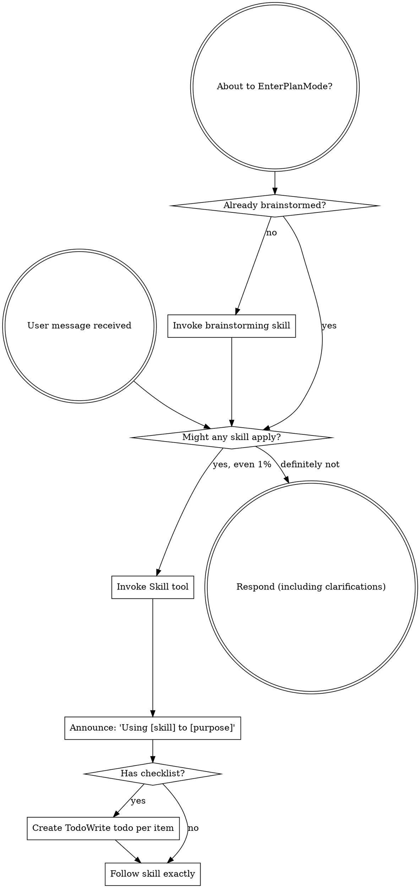
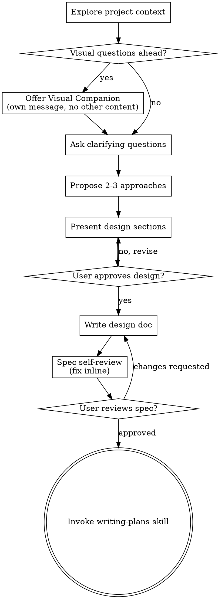
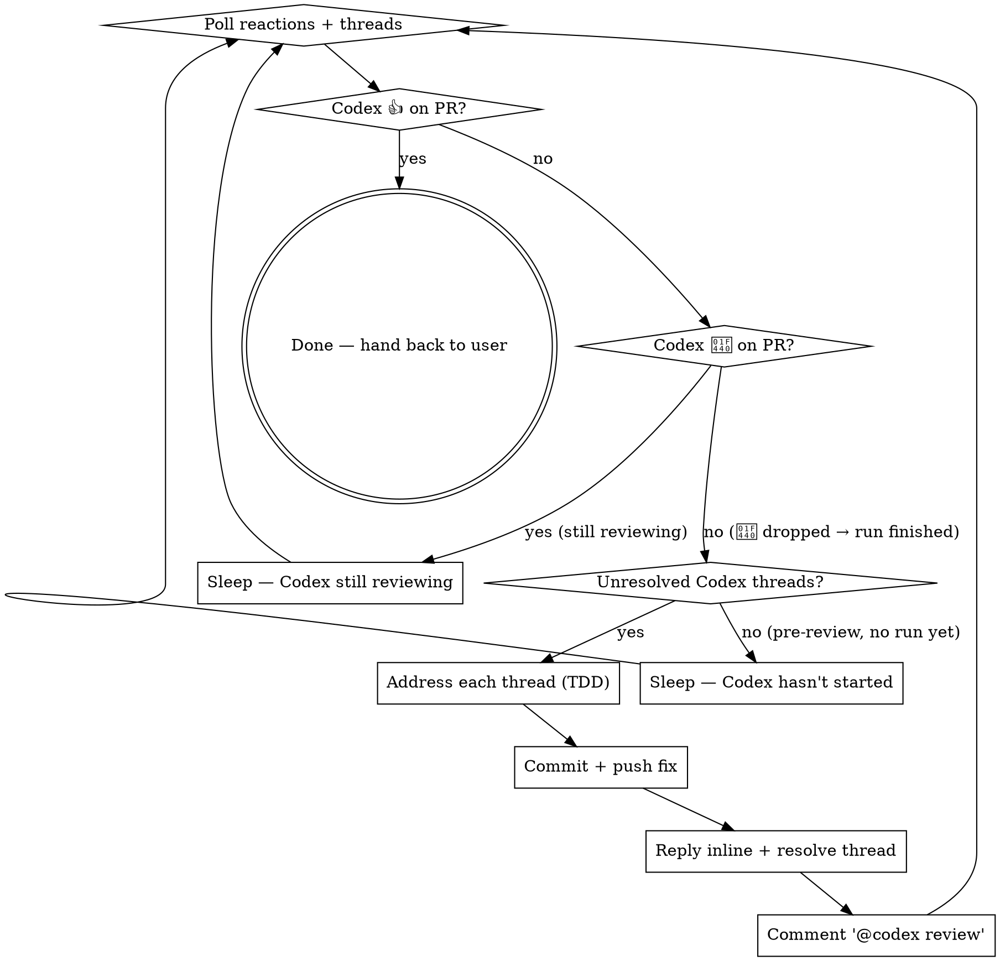
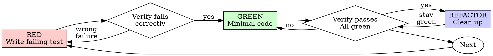

> SYSTEM

# AGENTS.md instructions for /Users/ericson/.t3/worktrees/ars-ui/t3code-1f95bfa7

<INSTRUCTIONS>
# ars-ui

## Project Overview

Rust frontend component library using state machines, framework-agnostic core with Leptos/Dioxus adapters.

## Current Phase

The repo is now in active implementation, not spec drafting only.

Agents working on implementation should use the GitHub Project roadmap and issue backlog as the execution source of truth:

- Use the GitHub Project `ars-ui implementation roadmap` to understand active epics, task breakdown, dependencies, status, and iteration planning.
- Prefer picking a single issue-backed task that is unblocked, sized, and scoped for independent delivery.
- Do not start work from an epic issue unless the user explicitly asks for planning or further decomposition.
- Do not start a task that is blocked by unresolved GitHub issue dependencies.
- Treat native GitHub issue dependencies as the blocker graph and the issue body acceptance criteria as the delivery contract.

## Development Workflow

For implementation tasks:

1. Read the assigned or selected GitHub issue first.
2. Move the issue to **In Progress** on the GitHub Project board.
3. Review the cited spec sections and any dependency issues.
4. Add or update the named tests first.
5. Implement only the scope required to make those tests pass.
6. If implementation changes the intended contract, update the relevant spec in the same task.
7. **MANDATORY:** Invoke the `post-implementation-audit` skill (`.agents/skills/post-implementation-audit/SKILL.md`). It runs three sequential audits on the new code — (a) spec/implementation drift with "best outcome" recommendations, (b) iterative "anything else missing?" passes (minimum two rounds), (c) test-coverage audit across every test type the workspace uses (unit, snapshot, proptest, mutation, doc, spec-conformance, llvm-cov). **Every finding lands in _this_ PR — no deferral, no follow-up issues.** This step exists because initial implementations consistently ship spec drift and silent contract violations that take 3+ review round-trips to surface; the audit collapses them into one. Skipping this step is a contract violation.
8. Present the final result for user review before any commit.
9. After user approval, run `cargo xci --profile fast` (alias: `cargo xci-fast`) locally and fix any failures before pushing anything to GitHub. The fast profile takes ~5 minutes and covers the workspace-level regressions a pre-push gate should catch: fmt, check, clippy, unit, integration, adapter, spec-compile-snippets, error-variant-coverage, mutual-exclusion, snapshot-count. Reserve full `cargo xci` (~25 minutes, all 20 gates including wasm coverage and the feature-matrix groups) for after substantial refactors that may have shifted feature-flag interactions. For small follow-up changes, run the focused tests and checks that cover the edited code instead.
10. After `cargo xci-fast` passes, commit and push a PR targeting `main`. The PR body MUST include an auto-close keyword for the issue being delivered, for example `Closes #20` or `Fixes #20`, so GitHub closes the issue automatically when the PR merges.
11. **If the PR creates or modifies any `.snap` insta fixtures, attach the `snapshot-reviewed` label after opening or updating it** (`gh pr edit <num> --add-label "snapshot-reviewed"`). This signals to reviewers that the snapshot output was inspected and is intentional. Re-apply the label whenever you push a commit that touches `.snap` files; the workflow assumes the label reflects the latest snapshot state.
12. **MANDATORY:** Invoke the `waiting-for-codex-review` skill (`.agents/skills/waiting-for-codex-review/SKILL.md`) immediately after the first push that creates the PR, and re-invoke it after every subsequent push to the PR branch. The skill posts the initial `@codex review` trigger, polls Codex's 👀 → (👍 \| ∅ + threads) reaction lifecycle, addresses any review threads with the same rigor as `post-implementation-audit` (TDD + no coverage regression), replies inline, resolves threads, and re-comments `@codex review` to start the next pass — looping until Codex leaves 👍. Skipping this step leaves Codex findings unaddressed and silently widens the gap between merged code and the spec; the merge gate is 👍 from Codex plus green CI, not green CI alone.
13. Only after CI passes, Codex has left 👍, and the PR is merged, close the issue.

Never close a GitHub issue without a merged PR that passes CI **and a 👍 from Codex**. Never commit or push without explicit user approval. Keep the issue, PR, and Project board status aligned with the actual work state at every step.

Default delivery rules:

- Follow TDD: tests first, implementation second, verification last.
- Keep task scope aligned with the issue. If the issue is too large or ambiguous, stop and split or clarify rather than freelancing a bigger change.
- Prefer tasks sized `1`, `2`, `3`, or `5` points. `8` is exceptional. `13` must be decomposed before implementation.
- Preserve the crate and dependency layering defined by the architecture and implementation plan.
- Do not add a new dependency crate without explicit user approval first. If a task appears to need a new crate, stop, explain why, and get approval before editing any `Cargo.toml`.
- When a task is complete, verify the exact tests and checks named by the issue before considering it done.
- For adapter-level component implementation, follow `docs/implementation/adapter-component-delivery.md`. Adapter component work must cover the adapter crate, adapter tests, E2E fixtures/harnesses when applicable, widgets examples, spec synchronization, and the required validation/audit loop in one PR.

### Code Quality Standards

- **Document all public items.** Every public struct, enum, trait, function, constant, type alias, method, field, and variant must have a `///` doc comment. Every `lib.rs` must have a `//!` crate-level doc comment. The workspace enforces `missing_docs` linting — undocumented public items are build failures.
- **Zero warnings policy.** All code must compile with zero warnings under the workspace's configured clippy and rustc lints. Fix the root cause instead of suppressing. When suppression is genuinely needed, use `#[expect(lint, reason = "...")]` — never `#[allow(...)]`.
- **Derive documentation from the spec.** Doc comments should describe the _purpose and semantics_ of the item as defined in the corresponding `spec/` files, not just restate the type signature.
- **Use `#[inline]` selectively, not mechanically.** Do **not** add Clippy's `missing_inline_in_public_items` lint at the workspace level, and do not treat public visibility alone as a reason to mark an item `#[inline]`. Use `#[inline]` for thin cross-crate wrappers, trivial accessors, and hot-path no-op shims where the call overhead is plausibly meaningful. Avoid blanket `#[inline]` on all public APIs — it increases code size, adds compile-time cost, and turns `#[inline]` into noise instead of a deliberate performance signal.
- **Use directory-backed modules with `mod.rs` when a module owns children.** This repo standardizes on the older filesystem layout for nested modules. If module `foo` has child modules, the parent must live at `foo/mod.rs`, not `foo.rs`. Do not mix `foo.rs` with a sibling `foo/` directory. When a refactor adds child modules under an existing flat file, move the parent into `foo/mod.rs` in the same change. Do not leave empty leftover module directories behind.

### API Design Standards

- **Design for the pit of success.** Public APIs should make the most natural, shortest path also be the path that is correct, accessible, localizable, type-safe, and performant. Prefer ergonomic constructors and defaults that preserve the spec's strongest guarantees instead of making users opt into correctness after choosing a convenient API.
- **Name escape hatches explicitly.** When a component needs a lower-level, static, non-i18n, or otherwise less complete path, keep it available but make the tradeoff visible in the API name or type. The blessed path should remain the simplest call site, while escape hatches should read as deliberate choices.
- **Keep semantic data separate from rendered views.** Rich framework views are useful for customization, but components still need semantic sources for accessible names, localized text, announcements, ids, and state-machine wiring. Do not rely on arbitrary rendered view trees as the only source of user-facing semantics.

### Code Coverage

The workspace uses `cargo-llvm-cov` for code coverage with per-crate threshold enforcement. CI runs coverage on every PR (see `.github/workflows/ci.yml`).

**Local coverage commands:**

```bash
# Per-crate coverage with inline annotated source (most useful during development)
cargo llvm-cov test -p ars-interactions --text -- hover

# Per-crate summary only
cargo llvm-cov test -p ars-interactions -- hover

# Native-only workspace coverage (host target; excludes wasm-only crates)
cargo llvm-cov --workspace \
  --exclude ars-leptos --exclude ars-dioxus \
  --exclude ars-test-harness-leptos --exclude ars-test-harness-dioxus \
  --exclude ars-derive --exclude xtask \
  --lcov --output-path lcov.info

# Check all crates against spec-defined thresholds (run after a *merged* lcov)
cargo xtask coverage check-all --file lcov.info
```

The `--text` flag produces line-by-line annotated source showing hit counts and `^0` markers on uncovered branches — use this to identify gaps after writing tests. Uncovered no-op callback closures in tests (e.g., `|_| {}`) are expected and not a gap.

The local recipe above excludes the adapter and adapter-test-harness crates because their `target_arch = "wasm32"` / `feature = "web"` code paths can't be measured via host-target `cargo llvm-cov`. **CI runs an additional wasm-coverage pipeline on nightly** (`cargo xtask ci coverage`) that uses `wasm-bindgen-test`'s experimental coverage recipe with LLVM 22 / `clang-22` to emit lcov for `ars-leptos` (csr), `ars-dioxus` (web), `ars-dom` (web), `ars-i18n` (web-intl), and the adapter test harnesses, then merges with the native lcov via `cargo xtask coverage merge`. The per-crate thresholds in `xtask::coverage::default_thresholds()` are enforced against the merged file — including adapter targets (`ars-leptos` 74/55, `ars-dioxus` 77/70, `ars-test-harness-leptos` 60/0, `ars-test-harness-dioxus` 60/0). `ars-derive` (proc-macro, runs in compiler) is exercised via `crates/ars-core/tests/derive_contract.rs` and is unmeasured. `xtask` has its own enforced threshold (30/35) and is measured. See `spec/testing/14-ci.md` §2 for the full pipeline.

### Mutation Testing

Coverage tells you which lines run. **Mutation testing tells you whether the tests would notice if those lines silently misbehaved.** The workspace uses [`cargo-mutants`](https://mutants.rs) for this — a `cargo` extension binary, not a workspace dependency.

**Install (once per developer machine):**

```bash
cargo install cargo-mutants --locked --version 27.0.0
```

**Local commands (state-machine modules are the most rewarding targets):**

```bash
# Run on a single component machine (~6 min for popover)
cargo mutants -p ars-components -f crates/ars-components/src/overlay/popover/mod.rs

# Just list what would be mutated, without running tests (fast)
cargo mutants -p ars-components -f crates/ars-components/src/overlay/popover/mod.rs --list

# Whole crate (slow — only if you really mean it)
cargo mutants -p ars-components
```

**Agnostic component implementation gate:** whenever an agent implements a new framework-agnostic component, or materially changes an existing one, the delivery must include:

- a targeted mutation run for the component source file, usually `cargo mutants -p ars-components -f crates/ars-components/src/<category>/<component>/mod.rs` (adjust the path for single-file modules);
- spec-conformance tests for the component's anatomy/public contract, including its `Part` enum and required API/attribute surface;
- same-task triage of every `MISSED` mutant: add tests for real gaps, or add a justified line-agnostic `.cargo/mutants.toml` exclude only for true equivalent mutations.

**Reading the output:** Results land in `mutants.out/mutants.out/` (gitignored). The two files that matter:

- `caught.txt` — mutations that broke at least one test ✅
- `missed.txt` — mutations that survived all tests ❌ — each one is either a real test gap to fill or an "equivalent mutation" that needs a `[[skip]]` entry in `mutants.toml` with a justification

**CI integration:** Nightly only. `.github/workflows/nightly.yml` has a `mutation-testing` job with a 21-entry matrix that runs `cargo mutants -p <package>` on every framework-agnostic crate, using `--shard k/n` to spread larger crates across parallel runners. **Shard indices are 0-based** (`k` runs from `0` to `n-1`); `k == n` is invalid and will fail the job. When adding shards, always start at `0/n` and end at `(n-1)/n`.

- **`ars-components` (≈ 1,630 mutants today, planned to grow as the spec adds the remaining ~97 components):** sharded **12-way** → ≈ 135 mutants per runner today, ≈ 850 per runner at the ~10,000-mutant endpoint. Sized for the full spec catalog up front so we don't re-shard every few months as components land.
- **`ars-collections` (≈ 1,080 mutants):** sharded 4-way → ≈ 270 mutants per runner.
- **`ars-core` (≈ 700 mutants):** sharded 2-way → ≈ 350 mutants per runner.
- **`ars-a11y`, `ars-forms`, `ars-interactions`:** one runner each (under 600 mutants apiece).

**Adding a new state machine inside an existing crate requires no CI changes** — its mutations land in whichever shard the cargo-mutants partitioner places them. The shard counts are sized so the slowest runner stays well under 30 minutes today and under ~50 minutes at the planned endpoint; re-balance only when a crate outgrows that budget (visible on the nightly dashboard as one shard pulling away from the others).

All matrix jobs run with `fail-fast: false` so failures on one module don't mask data on another. Each job uploads its `mutants.out/` as a workflow artifact (always, even on success — surviving "missed" entries on a passing run still reveal test-quality work). The job fails if any mutation survives, so a missed mutation forces a deliberate triage decision (fix the test, or document the equivalence with a `[[skip]]` entry in `mutants.toml`).

**Excluded crates** (mutation testing's signal degrades wherever determinism does): adapter glue (`ars-leptos`, `ars-dioxus`), DOM/FFI (`ars-dom`), ICU/FFI (`ars-i18n`), test infrastructure (`ars-test-harness*`), and the proc-macro crate (`ars-derive`, runs in the compiler). Adding a brand-new crate that is a good mutation target requires one new matrix entry; run a local scout first (`cargo mutants -p <crate> --list` to size, then a real run) so we know the right shard count before the nightly fires.

**Bumping the pinned version.** Both the local install command above and `.github/workflows/nightly.yml` pin cargo-mutants to an exact version (currently `27.0.0`) — same convention as `wasm-pack` in the `a11y-audit` job. Pinning is deliberate: cargo-mutants ships new mutators in releases, and an unpinned install would silently change the mutation set without any code change, surfacing as phantom CI failures on a green-source repo. To bump, open a PR that (1) updates the version string in CLAUDE.md and `nightly.yml`, (2) runs the popover scout locally with the new version (`cargo mutants -p ars-components -f crates/ars-components/src/overlay/popover/mod.rs`) to confirm the mutation count is in the same ballpark, and (3) triages any new "missed" entries the new mutators surface — they are usually genuine test-quality gaps newly visible to the tool.

### Property Testing (proptest)

State-machine invariants are exercised by [`proptest`](https://docs.rs/proptest) under `crates/<crate>/tests/proptest_state_machines/` (see `ars-components`). Default proptest behaviour drops `*.proptest-regressions` seed files alongside test sources — instead, every `proptest!` block in this workspace pulls a shared `Config` from `tests/proptest_state_machines/common.rs` that:

1. Reads `PROPTEST_CASES` from the environment (1,000 default; 10,000 in the nightly `extended-proptest` job).
2. Sets `failure_persistence` to `FileFailurePersistence::Direct("proptest-regressions/state-machines.txt")`, so all persisted seeds for the test binary live in one file at the crate root: `crates/<crate>/proptest-regressions/state-machines.txt`. The directory is committed (per proptest's own recommendation in the file header) so every developer's runs benefit from previously-shrunk failures.

When a new crate adopts proptest for state-machine tests, copy the same `common.rs` helper and reference it via `#![proptest_config(super::common::proptest_config())]` inside every `proptest!` block. Don't let proptest fall back to its `WithSource` default — that scatters seed files across the source tree.

### Adapter Prelude Convention

Both `ars-leptos` and `ars-dioxus` expose a `prelude` module targeting **end users** — application developers who consume the ready-made components. `use ars_leptos::prelude::*` (or `use ars_dioxus::prelude::*`) should give them everything they need.

The prelude contains only user-facing items:

1. **Component modules** — as components land, their public module paths (e.g., `button`, `dialog`) are re-exported so users can write `button::Props`, etc.
2. **User-facing traits** — traits end users call on component outputs (e.g., `Translate` from `ars-i18n`). Re-export the trait so consumers don't need a direct dependency on the subsystem crate.
3. **Configuration types** — types that appear in component props or configure behaviour (e.g., `Locale`, `Direction`, `Orientation`, `Selection`).

The prelude does **not** include implementation details consumed only by component authors inside the adapter crate: core engine types (`Machine`, `Service`, `ConnectApi`, `AttrMap`), accessibility primitives (`AriaRole`, `AriaAttribute`), interaction helpers (`merge_attrs`), or adapter hooks (`use_machine`, `UseMachineReturn`). Those remain accessible via their normal crate paths for advanced users building custom machines.

Both adapter preludes must stay symmetric: same items, same structure. When adding a new re-export to one adapter's prelude, add it to the other as well in the same PR.

### Adapter Testing Convention

Adapter-level component tests should default to the framework-specific test harness crate:

- Leptos adapter tests should prefer `ars-test-harness-leptos`.
- Dioxus adapter tests should prefer `ars-test-harness-dioxus`.
- Shared `ars-test-harness` helpers should be used where relevant for viewport, layout, clipboard, drag/drop, timing, and other DOM test setup instead of bespoke per-test browser scaffolding.

When a component spec requires interaction, focus, overlay positioning, clipboard, file upload, drag/drop, or similar browser behavior, the task's tests should exercise that behavior through the adapter harness entrypoints and shared core harness helpers unless there is a concrete technical reason not to.

## Spec Synchronization During Implementation

The specification is the authoritative contract. It took weeks of deliberate design and MUST be followed.

### Spec-first implementation rule

Before implementing any public type, trait, function, or method:

1. **Read the spec section first.** Find the relevant code example in `spec/`. Use `spec-tool toc <file>` and `grep` to locate it.
2. **Match the spec exactly.** If the spec defines `struct ComponentIds { base: String }` with methods `from_id()`, `id()`, `part()`, `item()`, `item_part()` — implement exactly that. Do not invent alternative field names, method names, or signatures.
3. **Cross-check after implementation.** Before presenting code for review, diff every public item against the spec's code examples. Every struct field, every method name, every parameter must match.
4. **If you must deviate**, there must be a concrete technical reason (e.g., the spec's API cannot compile, or a dependency doesn't expose the needed type). Document the reason in a code comment and flag it to the user explicitly.

Inventing alternative APIs that "seem equivalent" is never acceptable — it silently invalidates the spec's design decisions and all downstream code that depends on those APIs.

### Spec/code mismatch resolution

- If code and spec disagree, resolve the mismatch in the same task or PR.
- Shared conceptual changes belong in shared or foundation spec files, not only in adapter code.
- Adapter-specific findings must be reflected back into `spec/foundation/08-adapter-leptos.md` and/or `spec/foundation/09-adapter-dioxus.md` when relevant.
- Do not leave spec drift behind as follow-up cleanup.

## Spec Structure

The specification lives in `spec/` with this layout:

- `spec/manifest.toml` — **START HERE** — central index of all components and their dependencies
- `spec/foundation/` — architecture, accessibility, i18n, interactions, forms, adapters, spec template (00-10)
- `spec/shared/` — cross-component shared types (date-time, selection, layout, z-index)
- `spec/components/{category}/` — one file per component, organized by category
- `spec/testing/` — test specs split by domain

### Component Categories

- `input/` — checkbox, text-field, slider, number-input, etc.
- `selection/` — select, combobox, listbox, menu, tags-input, etc.
- `overlay/` — dialog, popover, tooltip, toast, presence, etc.
- `navigation/` — accordion, tabs, tree-view, pagination, steps, etc.
- `date-time/` — date-field, time-field, calendar, date-picker, etc.
- `data-display/` — table, avatar, progress, meter, badge, etc.
- `layout/` — splitter, scroll-area, carousel, portal, toolbar, etc.
- `specialized/` — color-picker, file-upload, signature-pad, qr-code, etc.
- `utility/` — button, toggle, focus-scope, visually-hidden, separator, etc.

## Working with the Spec

When reading large files, run `wc -l` first to check the line count. If the file is over 2,000
lines, use the `offset` and `limit` parameters on the Read tool to read in chunks rather than
attempting to read the entire file at once.

### Using xtask spec (preferred)

Use `cargo xtask spec` to resolve file sets instead of manually parsing manifest.toml:

```bash
# Quick metadata lookup:
cargo xtask spec info <component>

# Find all components using a shared type:
cargo xtask spec reverse <shared-type>

# See a file's heading structure (with line numbers):
cargo xtask spec toc <file>

# Validate frontmatter matches manifest.toml:
cargo xtask spec validate

# Search spec content by keyword/regex (with optional filters):
cargo xtask spec search <query> [--category <cat>] [--section <sec>] [--tier <tier>]

# Get a compact component summary (states, events, props, accessibility):
cargo xtask spec digest <component>

# Get full implementation context (component + all deps concatenated):
cargo xtask spec context <component> [--framework <fw>] [--include-testing]
```

The xtask also runs as an MCP server (`cargo xtask mcp`) exposing all spec tools for LLM agents.

### Reading a component (manual fallback)

1. Read `spec/manifest.toml` to find the component's path and dependencies
2. Read the component file (has YAML frontmatter listing its foundation/shared deps)
3. Only load the foundation files listed in `foundation_deps` — not all of them

### Framework and library specs — MANDATORY skill loading

When reading or editing these specification files, you MUST load the corresponding skill BEFORE doing any work. The skills contain verified, version-accurate API documentation that the spec code examples depend on. Claude's training data is wrong for these libraries — do not trust it.

| Spec file                                    | Skill to load | Library version |
| -------------------------------------------- | ------------- | --------------- |
| `spec/foundation/04-internationalization.md` | `icu4x`       | ICU4X 2.1.1     |
| `spec/foundation/08-adapter-leptos.md`       | `leptos`      | Leptos 0.8.17   |
| `spec/foundation/09-adapter-dioxus.md`       | `dioxus`      | Dioxus 0.7.3    |

This applies to any task that touches adapter code: reviewing, writing, modifying, or answering questions about these files. Load the skill first, then proceed.

### Spec Conventions

- **No deprecation:** This is a greenfield spec. If an API is unused or redundant, remove it and fix all references. Never use `#[deprecated]` or deprecation shims.
- **No deferral:** Never mark spec content as "TODO", "FIXME", "future enhancement", "P1/P2 extension", or any similar deferral language. Every feature mentioned must be fully specified. If a design choice is unclear, ask the user rather than deferring.
- **No guessing external APIs:** NEVER guess function names or module paths for external crates. Always verify against `https://docs.rs/<crate_name>` before writing code that calls library APIs. This applies especially to Leptos, Dioxus, ICU4X, and any crate where training data may be stale. If you cannot verify, state that explicitly rather than fabricating a plausible-looking API.

### Component file format

Each component file has YAML frontmatter declaring its metadata:

```markdown
---
component: ComponentName
category: { category }
tier: stateless | stateful | complex
foundation_deps: [architecture, accessibility, ...]
shared_deps: [date-time-types, ...]
related: [sibling-component, ...]
---

# ComponentName
```

The `tier` field determines which sections are required — see `spec/foundation/10-component-spec-template.md` for the canonical section structure, ordering rules, and conformance checklist. Headings are numbered (e.g., `## 1. State Machine`, `### 1.1 States`, `#### 1.1.1 InnerStates`, etc.) for precise section references.

</INSTRUCTIONS>
<environment_context>
  <cwd>/Users/ericson/.t3/worktrees/ars-ui/t3code-1f95bfa7</cwd>
  <shell>zsh</shell>
  <current_date>2026-05-24</current_date>
  <timezone>America/Sao_Paulo</timezone>
</environment_context>

> DEVELOPER

Implement task #265

> AGENT

I’ll stay in planning mode here: first I’m going to ground this in the live issue and repo shape, then I’ll ask only for decisions that aren’t discoverable from the code or issue. I’m using the Superpowers planning/brainstorming guidance because this is an implementation task that needs a decision-complete plan before code changes.

> TOOL

tool_use exec_command
id: call_MO6WldgGkUyXLxc8zqZ3NBqH
```json
{
  "cmd": "sed -n '1,220p' /Users/ericson/.codex/plugins/cache/openai-curated/superpowers/6188456f/skills/using-superpowers/SKILL.md",
  "workdir": "/Users/ericson/.t3/worktrees/ars-ui/t3code-1f95bfa7",
  "yield_time_ms": 1000,
  "max_output_tokens": 6000
}
```

> TOOL

tool_use exec_command
id: call_n0rimwMRpM7WaibBe0BvDTeF
```json
{
  "cmd": "sed -n '1,220p' /Users/ericson/.codex/plugins/cache/openai-curated/superpowers/6188456f/skills/brainstorming/SKILL.md",
  "workdir": "/Users/ericson/.t3/worktrees/ars-ui/t3code-1f95bfa7",
  "yield_time_ms": 1000,
  "max_output_tokens": 6000
}
```

> TOOL

tool_use exec_command
id: call_AKceEl1RkurmZekY5xVP3EG7
```json
{
  "cmd": "sed -n '1,220p' /Users/ericson/.codex/plugins/cache/openai-curated/superpowers/6188456f/skills/writing-plans/SKILL.md",
  "workdir": "/Users/ericson/.t3/worktrees/ars-ui/t3code-1f95bfa7",
  "yield_time_ms": 1000,
  "max_output_tokens": 6000
}
```

> TOOL

tool_use exec_command
id: call_29Anlidc733R9pffmqq5jsl6
```json
{
  "cmd": "rg -n \"#265|issue #265|265\" /Users/ericson/.codex/memories/MEMORY.md",
  "workdir": "/Users/ericson/.t3/worktrees/ars-ui/t3code-1f95bfa7",
  "yield_time_ms": 1000,
  "max_output_tokens": 4000
}
```

> TOOL

tool_result
id: call_MO6WldgGkUyXLxc8zqZ3NBqH
```
Chunk ID: 34aaec
Wall time: 0.2538 seconds
Process exited with code 0
Original token count: 1356
Output:
---
name: using-superpowers
description: Use when starting any conversation - establishes how to find and use skills, requiring Skill tool invocation before ANY response including clarifying questions
---

<SUBAGENT-STOP>
If you were dispatched as a subagent to execute a specific task, skip this skill.
</SUBAGENT-STOP>

<EXTREMELY-IMPORTANT>
If you think there is even a 1% chance a skill might apply to what you are doing, you ABSOLUTELY MUST invoke the skill.

IF A SKILL APPLIES TO YOUR TASK, YOU DO NOT HAVE A CHOICE. YOU MUST USE IT.

This is not negotiable. This is not optional. You cannot rationalize your way out of this.
</EXTREMELY-IMPORTANT>

## Instruction Priority

Superpowers skills override default system prompt behavior, but **user instructions always take precedence**:

1. **User's explicit instructions** (CLAUDE.md, GEMINI.md, AGENTS.md, direct requests) — highest priority
2. **Superpowers skills** — override default system behavior where they conflict
3. **Default system prompt** — lowest priority

If CLAUDE.md, GEMINI.md, or AGENTS.md says "don't use TDD" and a skill says "always use TDD," follow the user's instructions. The user is in control.

## How to Access Skills

**In Claude Code:** Use the `Skill` tool. When you invoke a skill, its content is loaded and presented to you—follow it directly. Never use the Read tool on skill files.

**In Copilot CLI:** Use the `skill` tool. Skills are auto-discovered from installed plugins. The `skill` tool works the same as Claude Code's `Skill` tool.

**In Gemini CLI:** Skills activate via the `activate_skill` tool. Gemini loads skill metadata at session start and activates the full content on demand.

**In other environments:** Check your platform's documentation for how skills are loaded.

## Platform Adaptation

Skills use Claude Code tool names. Non-CC platforms: see `references/copilot-tools.md` (Copilot CLI), `references/codex-tools.md` (Codex) for tool equivalents. Gemini CLI users get the tool mapping loaded automatically via GEMINI.md.

# Using Skills

## The Rule

**Invoke relevant or requested skills BEFORE any response or action.** Even a 1% chance a skill might apply means that you should invoke the skill to check. If an invoked skill turns out to be wrong for the situation, you don't need to use it.



## Red Flags

These thoughts mean STOP—you're rationalizing:

| Thought | Reality |
|---------|---------|
| "This is just a simple question" | Questions are tasks. Check for skills. |
| "I need more context first" | Skill check comes BEFORE clarifying questions. |
| "Let me explore the codebase first" | Skills tell you HOW to explore. Check first. |
| "I can check git/files quickly" | Files lack conversation context. Check for skills. |
| "Let me gather information first" | Skills tell you HOW to gather information. |
| "This doesn't need a formal skill" | If a skill exists, use it. |
| "I remember this skill" | Skills evolve. Read current version. |
| "This doesn't count as a task" | Action = task. Check for skills. |
| "The skill is overkill" | Simple things become complex. Use it. |
| "I'll just do this one thing first" | Check BEFORE doing anything. |
| "This feels productive" | Undisciplined action wastes time. Skills prevent this. |
| "I know what that means" | Knowing the concept ≠ using the skill. Invoke it. |

## Skill Priority

When multiple skills could apply, use this order:

1. **Process skills first** (brainstorming, debugging) - these determine HOW to approach the task
2. **Implementation skills second** (frontend-design, mcp-builder) - these guide execution

"Let's build X" → brainstorming first, then implementation skills.
"Fix this bug" → debugging first, then domain-specific skills.

## Skill Types

**Rigid** (TDD, debugging): Follow exactly. Don't adapt away discipline.

**Flexible** (patterns): Adapt principles to context.

The skill itself tells you which.

## User Instructions

Instructions say WHAT, not HOW. "Add X" or "Fix Y" doesn't mean skip workflows.

```

> TOOL

tool_result
id: call_n0rimwMRpM7WaibBe0BvDTeF
```
Chunk ID: 149df5
Wall time: 0.2538 seconds
Process exited with code 0
Original token count: 2659
Output:
---
name: brainstorming
description: "You MUST use this before any creative work - creating features, building components, adding functionality, or modifying behavior. Explores user intent, requirements and design before implementation."
---

# Brainstorming Ideas Into Designs

Help turn ideas into fully formed designs and specs through natural collaborative dialogue.

Start by understanding the current project context, then ask questions one at a time to refine the idea. Once you understand what you're building, present the design and get user approval.

<HARD-GATE>
Do NOT invoke any implementation skill, write any code, scaffold any project, or take any implementation action until you have presented a design and the user has approved it. This applies to EVERY project regardless of perceived simplicity.
</HARD-GATE>

## Anti-Pattern: "This Is Too Simple To Need A Design"

Every project goes through this process. A todo list, a single-function utility, a config change — all of them. "Simple" projects are where unexamined assumptions cause the most wasted work. The design can be short (a few sentences for truly simple projects), but you MUST present it and get approval.

## Checklist

You MUST create a task for each of these items and complete them in order:

1. **Explore project context** — check files, docs, recent commits
2. **Offer visual companion** (if topic will involve visual questions) — this is its own message, not combined with a clarifying question. See the Visual Companion section below.
3. **Ask clarifying questions** — one at a time, understand purpose/constraints/success criteria
4. **Propose 2-3 approaches** — with trade-offs and your recommendation
5. **Present design** — in sections scaled to their complexity, get user approval after each section
6. **Write design doc** — save to `docs/superpowers/specs/YYYY-MM-DD-<topic>-design.md` and commit
7. **Spec self-review** — quick inline check for placeholders, contradictions, ambiguity, scope (see below)
8. **User reviews written spec** — ask user to review the spec file before proceeding
9. **Transition to implementation** — invoke writing-plans skill to create implementation plan

## Process Flow



**The terminal state is invoking writing-plans.** Do NOT invoke frontend-design, mcp-builder, or any other implementation skill. The ONLY skill you invoke after brainstorming is writing-plans.

## The Process

**Understanding the idea:**

- Check out the current project state first (files, docs, recent commits)
- Before asking detailed questions, assess scope: if the request describes multiple independent subsystems (e.g., "build a platform with chat, file storage, billing, and analytics"), flag this immediately. Don't spend questions refining details of a project that needs to be decomposed first.
- If the project is too large for a single spec, help the user decompose into sub-projects: what are the independent pieces, how do they relate, what order should they be built? Then brainstorm the first sub-project through the normal design flow. Each sub-project gets its own spec → plan → implementation cycle.
- For appropriately-scoped projects, ask questions one at a time to refine the idea
- Prefer multiple choice questions when possible, but open-ended is fine too
- Only one question per message - if a topic needs more exploration, break it into multiple questions
- Focus on understanding: purpose, constraints, success criteria

**Exploring approaches:**

- Propose 2-3 different approaches with trade-offs
- Present options conversationally with your recommendation and reasoning
- Lead with your recommended option and explain why

**Presenting the design:**

- Once you believe you understand what you're building, present the design
- Scale each section to its complexity: a few sentences if straightforward, up to 200-300 words if nuanced
- Ask after each section whether it looks right so far
- Cover: architecture, components, data flow, error handling, testing
- Be ready to go back and clarify if something doesn't make sense

**Design for isolation and clarity:**

- Break the system into smaller units that each have one clear purpose, communicate through well-defined interfaces, and can be understood and tested independently
- For each unit, you should be able to answer: what does it do, how do you use it, and what does it depend on?
- Can someone understand what a unit does without reading its internals? Can you change the internals without breaking consumers? If not, the boundaries need work.
- Smaller, well-bounded units are also easier for you to work with - you reason better about code you can hold in context at once, and your edits are more reliable when files are focused. When a file grows large, that's often a signal that it's doing too much.

**Working in existing codebases:**

- Explore the current structure before proposing changes. Follow existing patterns.
- Where existing code has problems that affect the work (e.g., a file that's grown too large, unclear boundaries, tangled responsibilities), include targeted improvements as part of the design - the way a good developer improves code they're working in.
- Don't propose unrelated refactoring. Stay focused on what serves the current goal.

## After the Design

**Documentation:**

- Write the validated design (spec) to `docs/superpowers/specs/YYYY-MM-DD-<topic>-design.md`
  - (User preferences for spec location override this default)
- Use elements-of-style:writing-clearly-and-concisely skill if available
- Commit the design document to git

**Spec Self-Review:**
After writing the spec document, look at it with fresh eyes:

1. **Placeholder scan:** Any "TBD", "TODO", incomplete sections, or vague requirements? Fix them.
2. **Internal consistency:** Do any sections contradict each other? Does the architecture match the feature descriptions?
3. **Scope check:** Is this focused enough for a single implementation plan, or does it need decomposition?
4. **Ambiguity check:** Could any requirement be interpreted two different ways? If so, pick one and make it explicit.

Fix any issues inline. No need to re-review — just fix and move on.

**User Review Gate:**
After the spec review loop passes, ask the user to review the written spec before proceeding:

> "Spec written and committed to `<path>`. Please review it and let me know if you want to make any changes before we start writing out the implementation plan."

Wait for the user's response. If they request changes, make them and re-run the spec review loop. Only proceed once the user approves.

**Implementation:**

- Invoke the writing-plans skill to create a detailed implementation plan
- Do NOT invoke any other skill. writing-plans is the next step.

## Key Principles

- **One question at a time** - Don't overwhelm with multiple questions
- **Multiple choice preferred** - Easier to answer than open-ended when possible
- **YAGNI ruthlessly** - Remove unnecessary features from all designs
- **Explore alternatives** - Always propose 2-3 approaches before settling
- **Incremental validation** - Present design, get approval before moving on
- **Be flexible** - Go back and clarify when something doesn't make sense

## Visual Companion

A browser-based companion for showing mockups, diagrams, and visual options during brainstorming. Available as a tool — not a mode. Accepting the companion means it's available for questions that benefit from visual treatment; it does NOT mean every question goes through the browser.

**Offering the companion:** When you anticipate that upcoming questions will involve visual content (mockups, layouts, diagrams), offer it once for consent:
> "Some of what we're working on might be easier to explain if I can show it to you in a web browser. I can put together mockups, diagrams, comparisons, and other visuals as we go. This feature is still new and can be token-intensive. Want to try it? (Requires opening a local URL)"

**This offer MUST be its own message.** Do not combine it with clarifying questions, context summaries, or any other content. The message should contain ONLY the offer above and nothing else. Wait for the user's response before continuing. If they decline, proceed with text-only brainstorming.

**Per-question decision:** Even after the user accepts, decide FOR EACH QUESTION whether to use the browser or the terminal. The test: **would the user understand this better by seeing it than reading it?**

- **Use the browser** for content that IS visual — mockups, wireframes, layout comparisons, architecture diagrams, side-by-side visual designs
- **Use the terminal** for content that is text — requirements questions, conceptual choices, tradeoff lists, A/B/C/D text options, scope decisions

A question about a UI topic is not automatically a visual question. "What does personality mean in this context?" is a conceptual question — use the terminal. "Which wizard layout works better?" is a visual question — use the browser.

If they agree to the companion, read the detailed guide before proceeding:
`skills/brainstorming/visual-companion.md`

```

> TOOL

tool_result
id: call_AKceEl1RkurmZekY5xVP3EG7
```
Chunk ID: e388a2
Wall time: 0.0000 seconds
Process exited with code 0
Original token count: 1525
Output:
---
name: writing-plans
description: Use when you have a spec or requirements for a multi-step task, before touching code
---

# Writing Plans

## Overview

Write comprehensive implementation plans assuming the engineer has zero context for our codebase and questionable taste. Document everything they need to know: which files to touch for each task, code, testing, docs they might need to check, how to test it. Give them the whole plan as bite-sized tasks. DRY. YAGNI. TDD. Frequent commits.

Assume they are a skilled developer, but know almost nothing about our toolset or problem domain. Assume they don't know good test design very well.

**Announce at start:** "I'm using the writing-plans skill to create the implementation plan."

**Context:** If working in an isolated worktree, it should have been created via the `superpowers:using-git-worktrees` skill at execution time.

**Save plans to:** `docs/superpowers/plans/YYYY-MM-DD-<feature-name>.md`
- (User preferences for plan location override this default)

## Scope Check

If the spec covers multiple independent subsystems, it should have been broken into sub-project specs during brainstorming. If it wasn't, suggest breaking this into separate plans — one per subsystem. Each plan should produce working, testable software on its own.

## File Structure

Before defining tasks, map out which files will be created or modified and what each one is responsible for. This is where decomposition decisions get locked in.

- Design units with clear boundaries and well-defined interfaces. Each file should have one clear responsibility.
- You reason best about code you can hold in context at once, and your edits are more reliable when files are focused. Prefer smaller, focused files over large ones that do too much.
- Files that change together should live together. Split by responsibility, not by technical layer.
- In existing codebases, follow established patterns. If the codebase uses large files, don't unilaterally restructure - but if a file you're modifying has grown unwieldy, including a split in the plan is reasonable.

This structure informs the task decomposition. Each task should produce self-contained changes that make sense independently.

## Bite-Sized Task Granularity

**Each step is one action (2-5 minutes):**
- "Write the failing test" - step
- "Run it to make sure it fails" - step
- "Implement the minimal code to make the test pass" - step
- "Run the tests and make sure they pass" - step
- "Commit" - step

## Plan Document Header

**Every plan MUST start with this header:**

```markdown
# [Feature Name] Implementation Plan

> **For agentic workers:** REQUIRED SUB-SKILL: Use superpowers:subagent-driven-development (recommended) or superpowers:executing-plans to implement this plan task-by-task. Steps use checkbox (`- [ ]`) syntax for tracking.

**Goal:** [One sentence describing what this builds]

**Architecture:** [2-3 sentences about approach]

**Tech Stack:** [Key technologies/libraries]

---
```

## Task Structure

````markdown
### Task N: [Component Name]

**Files:**
- Create: `exact/path/to/file.py`
- Modify: `exact/path/to/existing.py:123-145`
- Test: `tests/exact/path/to/test.py`

- [ ] **Step 1: Write the failing test**

```python
def test_specific_behavior():
    result = function(input)
    assert result == expected
```

- [ ] **Step 2: Run test to verify it fails**

Run: `pytest tests/path/test.py::test_name -v`
Expected: FAIL with "function not defined"

- [ ] **Step 3: Write minimal implementation**

```python
def function(input):
    return expected
```

- [ ] **Step 4: Run test to verify it passes**

Run: `pytest tests/path/test.py::test_name -v`
Expected: PASS

- [ ] **Step 5: Commit**

```bash
git add tests/path/test.py src/path/file.py
git commit -m "feat: add specific feature"
```
````

## No Placeholders

Every step must contain the actual content an engineer needs. These are **plan failures** — never write them:
- "TBD", "TODO", "implement later", "fill in details"
- "Add appropriate error handling" / "add validation" / "handle edge cases"
- "Write tests for the above" (without actual test code)
- "Similar to Task N" (repeat the code — the engineer may be reading tasks out of order)
- Steps that describe what to do without showing how (code blocks required for code steps)
- References to types, functions, or methods not defined in any task

## Remember
- Exact file paths always
- Complete code in every step — if a step changes code, show the code
- Exact commands with expected output
- DRY, YAGNI, TDD, frequent commits

## Self-Review

After writing the complete plan, look at the spec with fresh eyes and check the plan against it. This is a checklist you run yourself — not a subagent dispatch.

**1. Spec coverage:** Skim each section/requirement in the spec. Can you point to a task that implements it? List any gaps.

**2. Placeholder scan:** Search your plan for red flags — any of the patterns from the "No Placeholders" section above. Fix them.

**3. Type consistency:** Do the types, method signatures, and property names you used in later tasks match what you defined in earlier tasks? A function called `clearLayers()` in Task 3 but `clearFullLayers()` in Task 7 is a bug.

If you find issues, fix them inline. No need to re-review — just fix and move on. If you find a spec requirement with no task, add the task.

## Execution Handoff

After saving the plan, offer execution choice:

**"Plan complete and saved to `docs/superpowers/plans/<filename>.md`. Two execution options:**

**1. Subagent-Driven (recommended)** - I dispatch a fresh subagent per task, review between tasks, fast iteration

**2. Inline Execution** - Execute tasks in this session using executing-plans, batch execution with checkpoints

**Which approach?"**

**If Subagent-Driven chosen:**
- **REQUIRED SUB-SKILL:** Use superpowers:subagent-driven-development
- Fresh subagent per task + two-stage review

**If Inline Execution chosen:**
- **REQUIRED SUB-SKILL:** Use superpowers:executing-plans
- Batch execution with checkpoints for review

```

> TOOL

tool_result
id: call_29Anlidc733R9pffmqq5jsl6
```
Chunk ID: 8be681
Wall time: 0.0484 seconds
Process exited with code 1
Original token count: 0
Output:

```

> AGENT

The local instructions make #265 the delivery contract, so I’m checking the live issue before making any design choices. I’ll also inspect the nearby spec and existing component patterns so the plan is tied to the current code rather than assumptions.

> TOOL

tool_use _fetch_issue
id: call_F5R6ViA8cfOwVIozHvK7Kv9g
```json
{
  "repository_full_name": "fogodev/ars-ui",
  "issue_number": 265
}
```

> TOOL

tool_use exec_command
id: call_dGyBPF9uFpv8lA8LAdnf4yQI
```json
{
  "cmd": "git status --short && git branch --show-current && rg --files | sed -n '1,160p'",
  "workdir": "/Users/ericson/.t3/worktrees/ars-ui/t3code-1f95bfa7",
  "yield_time_ms": 1000,
  "max_output_tokens": 12000
}
```

> TOOL

tool_use exec_command
id: call_OnJMQqWr37452r9gIOwsP8UG
```json
{
  "cmd": "find .agents/skills -maxdepth 2 -name SKILL.md -print",
  "workdir": "/Users/ericson/.t3/worktrees/ars-ui/t3code-1f95bfa7",
  "yield_time_ms": 1000,
  "max_output_tokens": 4000
}
```

> TOOL

tool_result
id: call_F5R6ViA8cfOwVIozHvK7Kv9g
```
Wall time: 0.8044 seconds
Output:
{"issue":{"url":"https://github.com/fogodev/ars-ui/issues/265","title":"task: Implement Tour agnostic core","issue_number":265,"body":"**Epic: #222 (Agnostic overlay components)**\n\n## Goal\nComplex multi-step spotlight tour with step navigation, highlight overlay, target element tracking.\n\n## Out of scope\nFramework-specific adapter components (Leptos/Dioxus).\n\n## Spec refs\n- `spec/components/overlay/tour.md`\n- `spec/shared/z-index-stacking.md`\n\n## Depends on\n#238 (Presence), #246 (Popover)\n\n## Layer\nComponent\n\n## Framework\nNone\n\n## Test tier\nUnit\n\n## Fibonacci points\n5\n\n## Element/ref handling note\n\nTour agnostic code should own step state, spotlight intent, placement preferences, dismissal policy, and ARIA/data attrs. Target lookup, target measurement, scrolling to targets, focus movement, portal host handling, and overlay geometry belong in adapters through native handles rather than IDs.\n\nStable string IDs remain valid for semantic ARIA relationships, hydration-stable markup, and `data-ars-*` hooks. They should not be used as a substitute for live element handles. Leptos adapters should prefer `NodeRef`/resolved DOM elements for live operations; Dioxus adapters should prefer `MountedData` or the Dioxus platform layer where available.\n\n## Tests to add first\n- Step navigation (next/previous/skip).\n- Highlight overlay around target element.\n- Popover positioned relative to step target.\n- Step counter display.\n- Keyboard navigation between steps.\n- ConnectApi: spotlight with appropriate ARIA.\n- Step content with navigation controls.\n- Completion callback.\n\n## Acceptance criteria\n- All public types documented per workspace `missing_docs` lint.\n- State machine matches spec §1 exactly.\n- ConnectApi produces correct ARIA attributes per spec §2.\n- Snapshot tests cover the component's `connect()` / `Api` `AttrMap` output for every anatomy part and each output-affecting state, prop, or context branch, with committed `.snap` fixtures passing `cargo insta test --unreferenced=reject`.\n- All named tests pass with zero warnings.\n\n## Spec impact\nNo spec change required.\n\n## Board update rule\nIf blocked, keep `Status` in `Todo`, use native GitHub issue dependencies, and name the dependency or spec ambiguity.\n","state":"open","user":{"login":"fogodev","name":"fogodev","email":null,"avatar_url":"https://avatars.githubusercontent.com/u/11011091?v=4","id":11011091},"assignees":null,"labels":[{"name":"task","color":"0E8A16","description":"Agent-ready implementation task"}],"milestone":null,"state_reason":null,"comments":0,"created_at":"2026-04-10T23:26:40Z","updated_at":"2026-04-29T04:44:19Z","closed_at":null,"display_url":"https://github.com/fogodev/ars-ui/issues/265","display_title":"task: Implement Tour agnostic core"},"url":"https://github.com/fogodev/ars-ui/issues/265","title":"task: Implement Tour agnostic core","display_url":"https://github.com/fogodev/ars-ui/issues/265","display_title":"task: Implement Tour agnostic core"}
```

> TOOL

tool_result
id: call_dGyBPF9uFpv8lA8LAdnf4yQI
```
Chunk ID: 1c5423
Wall time: 0.0763 seconds
Process exited with code 0
Original token count: 1650
Output:
t3code/1f95bfa7
AGENTS.md
rust-toolchain.toml
xtask/src/mcp.rs
xtask/src/e2e.rs
xtask/src/i18n.rs
xtask/src/examples.rs
xtask/src/main.rs
xtask/src/lint.rs
xtask/src/tool.rs
xtask/src/spec/context.rs
xtask/src/spec/validate.rs
xtask/src/spec/search.rs
xtask/src/spec/info.rs
xtask/src/spec/category.rs
xtask/src/spec/adapters.rs
xtask/src/spec/mod.rs
xtask/src/spec/deps.rs
xtask/src/spec/digest.rs
xtask/src/spec/toc.rs
xtask/src/spec/related.rs
xtask/src/spec/compile_snippets.rs
xtask/src/spec/tools.rs
xtask/src/spec/profile.rs
xtask/src/spec/lint_code.rs
xtask/src/spec/reverse.rs
xtask/src/manifest.rs
xtask/src/lib.rs
xtask/src/ci/feature_matrix.rs
xtask/src/ci/mod.rs
xtask/src/test.rs
xtask/src/coverage.rs
xtask/tests/examples.rs
xtask/tests/spec_corpus_compile_snippets.rs
xtask/Cargo.toml
clippy.toml
examples/widgets-leptos-tailwind/src/categories/specialized.rs
examples/widgets-leptos-tailwind/src/categories/input.rs
examples/widgets-leptos-tailwind/src/categories/date_time.rs
examples/widgets-leptos-tailwind/src/categories/navigation.rs
examples/widgets-leptos-tailwind/src/categories/selection.rs
examples/widgets-leptos-tailwind/src/categories/mod.rs
examples/widgets-leptos-tailwind/src/categories/overlay.rs
examples/widgets-leptos-tailwind/src/categories/utility.rs
examples/widgets-leptos-tailwind/src/categories/data_display.rs
examples/widgets-leptos-tailwind/src/categories/layout.rs
examples/widgets-leptos-tailwind/src/messages.rs
examples/widgets-leptos-tailwind/src/locale.rs
examples/widgets-leptos-tailwind/src/text.rs
examples/widgets-leptos-tailwind/src/main.rs
examples/widgets-leptos-tailwind/Trunk.toml
examples/widgets-leptos-tailwind/tailwind.css
examples/widgets-leptos-tailwind/index.html
examples/widgets-leptos-tailwind/Cargo.toml
examples/widgets-ownership.md
Cargo.toml
examples/Cargo.toml
codecov.yml
LICENSE
rustfmt.toml
CONTRIBUTING.md
README.md
docs/implementation/foundation-completion-roadmap.md
docs/implementation/initial-backlog.md
docs/implementation/project-board.md
docs/implementation/foundation-gap-audit.md
docs/implementation/roadmap.md
docs/implementation/adapter-component-delivery.md
docs/implementation/README.md
docs/implementation/adapter-contract.md
examples/widgets-dioxus-tailwind/tailwind.css
examples/widgets-dioxus-tailwind/Cargo.toml
examples/widgets-dioxus/src/categories/specialized.rs
examples/widgets-dioxus/src/categories/input.rs
examples/widgets-dioxus/src/categories/date_time.rs
examples/widgets-dioxus/src/categories/navigation.rs
examples/widgets-dioxus/src/categories/selection.rs
examples/widgets-dioxus/src/categories/mod.rs
examples/widgets-dioxus/src/categories/overlay.rs
examples/widgets-dioxus/src/categories/utility.rs
examples/widgets-dioxus/src/categories/data_display.rs
examples/widgets-dioxus/src/categories/layout.rs
examples/widgets-dioxus/src/messages.rs
examples/widgets-dioxus/src/locale.rs
examples/widgets-dioxus/src/text.rs
examples/widgets-dioxus/src/main.rs
examples/widgets-dioxus/Dioxus.toml
examples/widgets-dioxus-css/src/categories/specialized.rs
examples/widgets-dioxus-css/src/categories/input.rs
examples/widgets-dioxus-css/src/categories/date_time.rs
examples/widgets-dioxus-css/src/categories/navigation.rs
examples/widgets-dioxus-css/src/categories/selection.rs
examples/widgets-dioxus-css/src/categories/mod.rs
examples/widgets-dioxus-css/src/categories/overlay.rs
examples/widgets-dioxus-css/src/categories/utility.rs
examples/widgets-dioxus-css/src/categories/data_display.rs
examples/widgets-dioxus-css/src/categories/layout.rs
examples/widgets-dioxus-css/src/messages.rs
examples/widgets-dioxus-css/src/locale.rs
examples/widgets-dioxus-css/src/text.rs
examples/widgets-dioxus-css/src/main.rs
examples/widgets-dioxus-css/Dioxus.toml
examples/widgets-dioxus-tailwind/src/categories/specialized.rs
examples/widgets-dioxus-tailwind/src/categories/input.rs
examples/widgets-dioxus-tailwind/src/categories/date_time.rs
examples/widgets-dioxus-tailwind/src/categories/navigation.rs
examples/widgets-dioxus-tailwind/src/categories/selection.rs
examples/widgets-dioxus-tailwind/src/categories/mod.rs
examples/widgets-dioxus-tailwind/src/categories/overlay.rs
examples/widgets-dioxus-tailwind/src/categories/utility.rs
examples/widgets-dioxus-tailwind/src/categories/data_display.rs
examples/widgets-dioxus-tailwind/src/categories/layout.rs
examples/widgets-dioxus-tailwind/src/messages.rs
examples/widgets-dioxus-tailwind/src/locale.rs
examples/widgets-dioxus-tailwind/src/text.rs
examples/widgets-dioxus-tailwind/src/main.rs
examples/widgets-dioxus-tailwind/Dioxus.toml
spec/AGENTS.md
crates/ars-interactions/src/press.rs
crates/ars-interactions/src/interact_outside.rs
crates/ars-interactions/src/hover.rs
crates/ars-interactions/src/focus.rs
crates/ars-interactions/src/keyboard.rs
crates/ars-interactions/src/move_interaction.rs
crates/ars-interactions/src/compose.rs
crates/ars-interactions/src/long_press.rs
crates/ars-interactions/src/lib.rs
crates/ars-interactions/src/direction.rs
crates/ars-interactions/src/drag_drop.rs
crates/ars-interactions/src/companion_css.rs
crates/ars-interactions/ars-interactions.css
crates/ars-interactions/Cargo.toml
examples/widgets-leptos-css/src/categories/specialized.rs
examples/widgets-leptos-css/src/categories/input.rs
examples/widgets-leptos-css/src/categories/date_time.rs
examples/widgets-leptos-css/src/categories/navigation.rs
examples/widgets-leptos-css/src/categories/selection.rs
examples/widgets-leptos-css/src/categories/mod.rs
examples/widgets-leptos-css/src/categories/overlay.rs
examples/widgets-leptos-css/src/categories/utility.rs
examples/widgets-leptos-css/src/categories/data_display.rs
examples/widgets-leptos-css/src/categories/layout.rs
examples/widgets-leptos-css/src/messages.rs
examples/widgets-leptos-css/src/locale.rs
examples/widgets-leptos-css/src/text.rs
examples/widgets-leptos-css/src/main.rs
examples/widgets-leptos/src/categories/specialized.rs
examples/widgets-leptos/src/categories/input.rs
examples/widgets-leptos/src/categories/date_time.rs
examples/widgets-leptos/src/categories/navigation.rs
examples/widgets-leptos/src/categories/selection.rs
examples/widgets-leptos/src/categories/mod.rs
examples/widgets-leptos/src/categories/overlay.rs
examples/widgets-leptos/src/categories/utility.rs
examples/widgets-leptos/src/categories/data_display.rs
examples/widgets-leptos/src/categories/layout.rs
examples/widgets-leptos/src/messages.rs
examples/widgets-leptos/src/locale.rs
examples/widgets-leptos/src/text.rs
examples/widgets-leptos/src/main.rs
spec/leptos-components/utility/error-boundary.md

```

> TOOL

tool_result
id: call_OnJMQqWr37452r9gIOwsP8UG
```
Chunk ID: 154645
Wall time: 0.1179 seconds
Process exited with code 0
Original token count: 58
Output:
.agents/skills/playwright-cli/SKILL.md
.agents/skills/icu4x/SKILL.md
.agents/skills/post-implementation-audit/SKILL.md
.agents/skills/leptos/SKILL.md
.agents/skills/dioxus/SKILL.md
.agents/skills/waiting-for-codex-review/SKILL.md

```

> TOOL

tool_use _fetch_issue
id: call_BSgwu09RSdsI60IJ2FbyCXlV
```json
{
  "repository_full_name": "fogodev/ars-ui",
  "issue_number": 238
}
```

> TOOL

tool_use _fetch_issue
id: call_s8WQRyKLU4uUdnCR8pe69iMA
```json
{
  "repository_full_name": "fogodev/ars-ui",
  "issue_number": 246
}
```

> TOOL

tool_use exec_command
id: call_n2ElSpEHY4UjD8PiAQpOdMSK
```json
{
  "cmd": "cargo xtask spec info tour",
  "workdir": "/Users/ericson/.t3/worktrees/ars-ui/t3code-1f95bfa7",
  "yield_time_ms": 1000,
  "max_output_tokens": 10000
}
```

> TOOL

tool_use exec_command
id: call_UnrHTB9S5MTA7U2b4HVdViWA
```json
{
  "cmd": "cargo xtask spec toc spec/components/overlay/tour.md",
  "workdir": "/Users/ericson/.t3/worktrees/ars-ui/t3code-1f95bfa7",
  "yield_time_ms": 1000,
  "max_output_tokens": 12000
}
```

> TOOL

tool_use exec_command
id: call_RS7uK7iDovhVxpBFrZBR407m
```json
{
  "cmd": "find crates/ars-components/src/overlay -maxdepth 3 -type f | sort",
  "workdir": "/Users/ericson/.t3/worktrees/ars-ui/t3code-1f95bfa7",
  "yield_time_ms": 1000,
  "max_output_tokens": 12000
}
```

> TOOL

tool_result
id: call_BSgwu09RSdsI60IJ2FbyCXlV
```
Wall time: 0.9195 seconds
Output:
{"issue":{"url":"https://github.com/fogodev/ars-ui/issues/238","title":"task: Implement Presence agnostic core","issue_number":238,"body":"**Epic: #222 (Agnostic overlay components)**\n\n## Goal\nStateful mount/unmount lifecycle for exit animations, no z-index dependency. States: Mounted/Unmounting/Unmounted.\n\n## Out of scope\nFramework-specific adapter components (Leptos/Dioxus).\n\n## Spec refs\n- `spec/components/overlay/presence.md`\n\n## Depends on\nNone\n\n## Layer\nComponent\n\n## Framework\nNone\n\n## Test tier\nUnit\n\n## Fibonacci points\n3\n\n## Element/ref handling note\n\nPresence agnostic code should own mounted/unmounting/unmounted state, animation intent, and `data-ars-state` attrs. Animationend/transitionend listener wiring, mounted-node observation, computed-style checks, and forced reflow/measurement are adapter work and should use native mounted handles rather than ID lookup.\n\nStable string IDs remain valid for semantic ARIA relationships, hydration-stable markup, and `data-ars-*` hooks. They should not be used as a substitute for live element handles. Leptos adapters should prefer `NodeRef`/resolved DOM elements for live operations; Dioxus adapters should prefer `MountedData` or the Dioxus platform layer where available.\n\n## Tests to add first\n- State machine: initial Unmounted.\n- Open prop transitions to Mounted.\n- Closing transitions to Unmounting (for animation).\n- Animation end transitions to Unmounted.\n- Force-unmount when no animation.\n- `present` flag reflects mounted/unmounting.\n- ConnectApi produces `data-ars-state` attrs.\n\n## Acceptance criteria\n- All public types documented per workspace `missing_docs` lint.\n- State machine matches spec §1 exactly.\n- ConnectApi produces correct ARIA attributes per spec §2.\n- Snapshot tests cover the component's `connect()` / `Api` `AttrMap` output for every anatomy part and each output-affecting state, prop, or context branch, with committed `.snap` fixtures passing `cargo insta test --unreferenced=reject`.\n- All named tests pass with zero warnings.\n\n## Spec impact\nNo spec change required.\n\n## Board update rule\nIf blocked, keep `Status` in `Todo`, use native GitHub issue dependencies, and name the dependency or spec ambiguity.\n","state":"closed","user":{"login":"fogodev","name":"fogodev","email":null,"avatar_url":"https://avatars.githubusercontent.com/u/11011091?v=4","id":11011091},"assignees":null,"labels":[{"name":"task","color":"0E8A16","description":"Agent-ready implementation task"}],"milestone":null,"state_reason":"completed","comments":0,"created_at":"2026-04-10T23:25:19Z","updated_at":"2026-04-29T04:45:37Z","closed_at":"2026-04-26T14:34:10Z","display_url":"https://github.com/fogodev/ars-ui/issues/238","display_title":"task: Implement Presence agnostic core"},"url":"https://github.com/fogodev/ars-ui/issues/238","title":"task: Implement Presence agnostic core","display_url":"https://github.com/fogodev/ars-ui/issues/238","display_title":"task: Implement Presence agnostic core"}
```

> TOOL

tool_result
id: call_s8WQRyKLU4uUdnCR8pe69iMA
```
Wall time: 0.6101 seconds
Output:
{"issue":{"url":"https://github.com/fogodev/ars-ui/issues/246","title":"task: Implement Popover agnostic core","issue_number":246,"body":"**Epic: #222 (Agnostic overlay components)**\n\n## Goal\nStateful popover with trigger+content pattern, positioning, click-outside dismissal, optional close button.\n\n## Out of scope\nFramework-specific adapter components (Leptos/Dioxus).\n\n## Spec refs\n- `spec/components/overlay/popover.md`\n- `spec/shared/z-index-stacking.md`\n\n## Depends on\nNone\n\n## Layer\nComponent\n\n## Framework\nNone\n\n## Test tier\nUnit\n\n## Fibonacci points\n5\n\n## Element/ref handling note\n\nThe agnostic Popover core should own open/closed state, semantic trigger/content relationships, ARIA/data attrs, z-index intent, dismissal policy, and placement preferences. It should not perform live trigger/content lookup, outside containment checks against real nodes, focus restoration, or geometry measurement.\n\nAdapters must resolve live trigger/content/root handles, outside pointer/focus containment, focus movement, portal host handling, and positioning measurements. Stable IDs remain useful for `aria-controls` and hydration-stable markup, but not as a substitute for adapter-native element handles.\n\n## Tests to add first\n- State machine: Closed->Open on trigger.\n- Escape closes.\n- Click outside closes via adapter-resolvable dismissal intent, not agnostic DOM lookup.\n- ConnectApi: trigger gets `aria-haspopup`, `aria-expanded`, `aria-controls`.\n- Content gets `role=\"dialog\"` or appropriate role.\n- Close button with `aria-label`.\n- Z-index allocated.\n\n## Acceptance criteria\n- All public types documented per workspace `missing_docs` lint.\n- State machine matches spec §1 exactly.\n- ConnectApi produces correct ARIA attributes per spec §2.\n- Agnostic Popover has no dependency on DOM IDs, DOM nodes, framework refs, or renderer handles for live behavior.\n- Snapshot tests cover the component's `connect()` / `Api` `AttrMap` output for every anatomy part and each output-affecting state, prop, or context branch, with committed `.snap` fixtures passing `cargo insta test --unreferenced=reject`.\n- All named tests pass with zero warnings.\n\n## Spec impact\nUpdate the component spec if it implies agnostic DOM measurement, outside containment, focus restoration, portal host lookup, or ID-based live element lookup.\n\n## Board update rule\nIf blocked, keep `Status` in `Todo`, use native GitHub issue dependencies, and name the dependency or spec ambiguity.\n","state":"closed","user":{"login":"fogodev","name":"fogodev","email":null,"avatar_url":"https://avatars.githubusercontent.com/u/11011091?v=4","id":11011091},"assignees":null,"labels":[{"name":"task","color":"0E8A16","description":"Agent-ready implementation task"}],"milestone":null,"state_reason":"completed","comments":0,"created_at":"2026-04-10T23:25:43Z","updated_at":"2026-04-30T23:07:25Z","closed_at":"2026-04-30T23:07:25Z","display_url":"https://github.com/fogodev/ars-ui/issues/246","display_title":"task: Implement Popover agnostic core"},"url":"https://github.com/fogodev/ars-ui/issues/246","title":"task: Implement Popover agnostic core","display_url":"https://github.com/fogodev/ars-ui/issues/246","display_title":"task: Implement Popover agnostic core"}
```

> TOOL

tool_result
id: call_n2ElSpEHY4UjD8PiAQpOdMSK
```
Chunk ID: 7ed0a6
Wall time: 0.6700 seconds
Process exited with code 0
Original token count: 125
Output:
    Blocking waiting for file lock on package cache
    Blocking waiting for file lock on package cache
    Finished `dev` profile [unoptimized + debuginfo] target(s) in 0.21s
     Running `target/debug/xtask spec info tour`
component: tour
path: components/overlay/tour.md
category: overlay
foundation_deps: [architecture, accessibility, interactions]
shared_deps: [z-index-stacking]
related: []
leptos_adapter: leptos-components/overlay/tour.md
dioxus_adapter: dioxus-components/overlay/tour.md

```

> TOOL

tool_result
id: call_UnrHTB9S5MTA7U2b4HVdViWA
```
Chunk ID: b6a2eb
Wall time: 0.8961 seconds
Process exited with code 0
Original token count: 247
Output:
    Blocking waiting for file lock on package cache
    Blocking waiting for file lock on package cache
    Blocking waiting for file lock on artifact directory
    Finished `dev` profile [unoptimized + debuginfo] target(s) in 0.23s
     Running `target/debug/xtask spec toc spec/components/overlay/tour.md`
# Tour  (L12)
  ## 1. State Machine  (L18)
    ### 1.1 States  (L20)
    ### 1.2 Events  (L38)
    ### 1.3 Context  (L76)
    ### 1.4 Props  (L155)
    ### 1.5 Full Machine Implementation  (L207)
    ### 1.6 Connect / API  (L435)
  ## 2. Anatomy  (L670)
  ## 3. Accessibility  (L705)
    ### 3.1 ARIA Roles, States, and Properties  (L707)
    ### 3.2 Keyboard Interaction  (L717)
    ### 3.3 Focus Management  (L726)
  ## 4. Internationalization  (L736)
    ### 4.1 Messages  (L738)
  ## 5. Positioning  (L781)
  ## 6. Library Parity  (L794)
    ### 6.1 Props  (L800)
    ### 6.2 Anatomy  (L821)
    ### 6.3 Events  (L844)
    ### 6.4 Features  (L854)
    ### 6.5 Summary  (L875)

```

> TOOL

tool_result
id: call_RS7uK7iDovhVxpBFrZBR407m
```
Chunk ID: 2d402a
Wall time: 0.1056 seconds
Process exited with code 0
Original token count: 5805
Output:
crates/ars-components/src/overlay/alert_dialog/mod.rs
crates/ars-components/src/overlay/alert_dialog/snapshots/ars_components__overlay__alert_dialog__tests__alert_dialog_action_trigger_default_label.snap
crates/ars-components/src/overlay/alert_dialog/snapshots/ars_components__overlay__alert_dialog__tests__alert_dialog_action_trigger_destructive.snap
crates/ars-components/src/overlay/alert_dialog/snapshots/ars_components__overlay__alert_dialog__tests__alert_dialog_action_trigger_localized_label.snap
crates/ars-components/src/overlay/alert_dialog/snapshots/ars_components__overlay__alert_dialog__tests__alert_dialog_backdrop_closed.snap
crates/ars-components/src/overlay/alert_dialog/snapshots/ars_components__overlay__alert_dialog__tests__alert_dialog_backdrop_open.snap
crates/ars-components/src/overlay/alert_dialog/snapshots/ars_components__overlay__alert_dialog__tests__alert_dialog_cancel_trigger_default_label.snap
crates/ars-components/src/overlay/alert_dialog/snapshots/ars_components__overlay__alert_dialog__tests__alert_dialog_cancel_trigger_localized_label.snap
crates/ars-components/src/overlay/alert_dialog/snapshots/ars_components__overlay__alert_dialog__tests__alert_dialog_close_trigger.snap
crates/ars-components/src/overlay/alert_dialog/snapshots/ars_components__overlay__alert_dialog__tests__alert_dialog_content_closed.snap
crates/ars-components/src/overlay/alert_dialog/snapshots/ars_components__overlay__alert_dialog__tests__alert_dialog_content_open_default.snap
crates/ars-components/src/overlay/alert_dialog/snapshots/ars_components__overlay__alert_dialog__tests__alert_dialog_content_with_description.snap
crates/ars-components/src/overlay/alert_dialog/snapshots/ars_components__overlay__alert_dialog__tests__alert_dialog_content_with_title.snap
crates/ars-components/src/overlay/alert_dialog/snapshots/ars_components__overlay__alert_dialog__tests__alert_dialog_content_with_title_and_description.snap
crates/ars-components/src/overlay/alert_dialog/snapshots/ars_components__overlay__alert_dialog__tests__alert_dialog_description.snap
crates/ars-components/src/overlay/alert_dialog/snapshots/ars_components__overlay__alert_dialog__tests__alert_dialog_positioner.snap
crates/ars-components/src/overlay/alert_dialog/snapshots/ars_components__overlay__alert_dialog__tests__alert_dialog_root_closed.snap
crates/ars-components/src/overlay/alert_dialog/snapshots/ars_components__overlay__alert_dialog__tests__alert_dialog_root_open.snap
crates/ars-components/src/overlay/alert_dialog/snapshots/ars_components__overlay__alert_dialog__tests__alert_dialog_title_clamped_above_six.snap
crates/ars-components/src/overlay/alert_dialog/snapshots/ars_components__overlay__alert_dialog__tests__alert_dialog_title_clamped_below_one.snap
crates/ars-components/src/overlay/alert_dialog/snapshots/ars_components__overlay__alert_dialog__tests__alert_dialog_title_default_h2.snap
crates/ars-components/src/overlay/alert_dialog/snapshots/ars_components__overlay__alert_dialog__tests__alert_dialog_trigger_closed.snap
crates/ars-components/src/overlay/alert_dialog/snapshots/ars_components__overlay__alert_dialog__tests__alert_dialog_trigger_open.snap
crates/ars-components/src/overlay/dialog/mod.rs
crates/ars-components/src/overlay/dialog/snapshots/ars_components__overlay__dialog__tests__dialog_backdrop_closed.snap
crates/ars-components/src/overlay/dialog/snapshots/ars_components__overlay__dialog__tests__dialog_backdrop_open.snap
crates/ars-components/src/overlay/dialog/snapshots/ars_components__overlay__dialog__tests__dialog_close_trigger_custom_messages_label.snap
crates/ars-components/src/overlay/dialog/snapshots/ars_components__overlay__dialog__tests__dialog_close_trigger_default_label.snap
crates/ars-components/src/overlay/dialog/snapshots/ars_components__overlay__dialog__tests__dialog_close_trigger_localized_es.snap
crates/ars-components/src/overlay/dialog/snapshots/ars_components__overlay__dialog__tests__dialog_content_closed.snap
crates/ars-components/src/overlay/dialog/snapshots/ars_components__overlay__dialog__tests__dialog_content_open_alertdialog_with_description.snap
crates/ars-components/src/overlay/dialog/snapshots/ars_components__overlay__dialog__tests__dialog_content_open_alertdialog_with_title.snap
crates/ars-components/src/overlay/dialog/snapshots/ars_components__overlay__dialog__tests__dialog_content_open_modal_alertdialog.snap
crates/ars-components/src/overlay/dialog/snapshots/ars_components__overlay__dialog__tests__dialog_content_open_modal_dialog.snap
crates/ars-components/src/overlay/dialog/snapshots/ars_components__overlay__dialog__tests__dialog_content_open_non_modal.snap
crates/ars-components/src/overlay/dialog/snapshots/ars_components__overlay__dialog__tests__dialog_content_open_non_modal_with_title.snap
crates/ars-components/src/overlay/dialog/snapshots/ars_components__overlay__dialog__tests__dialog_content_open_non_modal_with_title_and_description.snap
crates/ars-components/src/overlay/dialog/snapshots/ars_components__overlay__dialog__tests__dialog_content_open_with_description.snap
crates/ars-components/src/overlay/dialog/snapshots/ars_components__overlay__dialog__tests__dialog_content_open_with_title.snap
crates/ars-components/src/overlay/dialog/snapshots/ars_components__overlay__dialog__tests__dialog_content_open_with_title_and_description.snap
crates/ars-components/src/overlay/dialog/snapshots/ars_components__overlay__dialog__tests__dialog_description.snap
crates/ars-components/src/overlay/dialog/snapshots/ars_components__overlay__dialog__tests__dialog_positioner.snap
crates/ars-components/src/overlay/dialog/snapshots/ars_components__overlay__dialog__tests__dialog_root_closed.snap
crates/ars-components/src/overlay/dialog/snapshots/ars_components__overlay__dialog__tests__dialog_root_open.snap
crates/ars-components/src/overlay/dialog/snapshots/ars_components__overlay__dialog__tests__dialog_root_open_modal_alertdialog.snap
crates/ars-components/src/overlay/dialog/snapshots/ars_components__overlay__dialog__tests__dialog_title_clamped_above_six.snap
crates/ars-components/src/overlay/dialog/snapshots/ars_components__overlay__dialog__tests__dialog_title_clamped_below_one.snap
crates/ars-components/src/overlay/dialog/snapshots/ars_components__overlay__dialog__tests__dialog_title_default_h2.snap
crates/ars-components/src/overlay/dialog/snapshots/ars_components__overlay__dialog__tests__dialog_title_h1_level.snap
crates/ars-components/src/overlay/dialog/snapshots/ars_components__overlay__dialog__tests__dialog_trigger_closed.snap
crates/ars-components/src/overlay/dialog/snapshots/ars_components__overlay__dialog__tests__dialog_trigger_open.snap
crates/ars-components/src/overlay/dialog/snapshots/ars_components__overlay__dialog__tests__dialog_trigger_open_with_alertdialog_role.snap
crates/ars-components/src/overlay/drawer/mod.rs
crates/ars-components/src/overlay/drawer/snapshots/ars_components__overlay__drawer__tests__drawer_backdrop_closed.snap
crates/ars-components/src/overlay/drawer/snapshots/ars_components__overlay__drawer__tests__drawer_backdrop_open.snap
crates/ars-components/src/overlay/drawer/snapshots/ars_components__overlay__drawer__tests__drawer_body.snap
crates/ars-components/src/overlay/drawer/snapshots/ars_components__overlay__drawer__tests__drawer_close_trigger_custom_label.snap
crates/ars-components/src/overlay/drawer/snapshots/ars_components__overlay__drawer__tests__drawer_close_trigger_default_label.snap
crates/ars-components/src/overlay/drawer/snapshots/ars_components__overlay__drawer__tests__drawer_content_dragging.snap
crates/ars-components/src/overlay/drawer/snapshots/ars_components__overlay__drawer__tests__drawer_content_modal.snap
crates/ars-components/src/overlay/drawer/snapshots/ars_components__overlay__drawer__tests__drawer_content_non_modal.snap
crates/ars-components/src/overlay/drawer/snapshots/ars_components__overlay__drawer__tests__drawer_content_with_title_and_description.snap
crates/ars-components/src/overlay/drawer/snapshots/ars_components__overlay__drawer__tests__drawer_description.snap
crates/ars-components/src/overlay/drawer/snapshots/ars_components__overlay__drawer__tests__drawer_drag_handle_with_snap_points.snap
crates/ars-components/src/overlay/drawer/snapshots/ars_components__overlay__drawer__tests__drawer_drag_handle_without_snap_points.snap
crates/ars-components/src/overlay/drawer/snapshots/ars_components__overlay__drawer__tests__drawer_footer.snap
crates/ars-components/src/overlay/drawer/snapshots/ars_components__overlay__drawer__tests__drawer_header.snap
crates/ars-components/src/overlay/drawer/snapshots/ars_components__overlay__drawer__tests__drawer_positioner_bottom.snap
crates/ars-components/src/overlay/drawer/snapshots/ars_components__overlay__drawer__tests__drawer_positioner_left.snap
crates/ars-components/src/overlay/drawer/snapshots/ars_components__overlay__drawer__tests__drawer_positioner_right.snap
crates/ars-components/src/overlay/drawer/snapshots/ars_components__overlay__drawer__tests__drawer_positioner_top.snap
crates/ars-components/src/overlay/drawer/snapshots/ars_components__overlay__drawer__tests__drawer_positioner_with_z_index.snap
crates/ars-components/src/overlay/drawer/snapshots/ars_components__overlay__drawer__tests__drawer_root_closed.snap
crates/ars-components/src/overlay/drawer/snapshots/ars_components__overlay__drawer__tests__drawer_root_dragging.snap
crates/ars-components/src/overlay/drawer/snapshots/ars_components__overlay__drawer__tests__drawer_root_open.snap
crates/ars-components/src/overlay/drawer/snapshots/ars_components__overlay__drawer__tests__drawer_title_heading_clamp_high.snap
crates/ars-components/src/overlay/drawer/snapshots/ars_components__overlay__drawer__tests__drawer_title_heading_clamp_low.snap
crates/ars-components/src/overlay/drawer/snapshots/ars_components__overlay__drawer__tests__drawer_trigger_closed.snap
crates/ars-components/src/overlay/drawer/snapshots/ars_components__overlay__drawer__tests__drawer_trigger_open.snap
crates/ars-components/src/overlay/floating_panel/mod.rs
crates/ars-components/src/overlay/floating_panel/snapshots/ars_components__overlay__floating_panel__tests__floating_panel_close_trigger.snap
crates/ars-components/src/overlay/floating_panel/snapshots/ars_components__overlay__floating_panel__tests__floating_panel_content.snap
crates/ars-components/src/overlay/floating_panel/snapshots/ars_components__overlay__floating_panel__tests__floating_panel_content_minimized.snap
crates/ars-components/src/overlay/floating_panel/snapshots/ars_components__overlay__floating_panel__tests__floating_panel_drag_handle.snap
crates/ars-components/src/overlay/floating_panel/snapshots/ars_components__overlay__floating_panel__tests__floating_panel_drag_handle_not_draggable.snap
crates/ars-components/src/overlay/floating_panel/snapshots/ars_components__overlay__floating_panel__tests__floating_panel_footer.snap
crates/ars-components/src/overlay/floating_panel/snapshots/ars_components__overlay__floating_panel__tests__floating_panel_footer_minimized.snap
crates/ars-components/src/overlay/floating_panel/snapshots/ars_components__overlay__floating_panel__tests__floating_panel_header.snap
crates/ars-components/src/overlay/floating_panel/snapshots/ars_components__overlay__floating_panel__tests__floating_panel_maximize_trigger.snap
crates/ars-components/src/overlay/floating_panel/snapshots/ars_components__overlay__floating_panel__tests__floating_panel_maximize_trigger_maximized.snap
crates/ars-components/src/overlay/floating_panel/snapshots/ars_components__overlay__floating_panel__tests__floating_panel_minimize_trigger.snap
crates/ars-components/src/overlay/floating_panel/snapshots/ars_components__overlay__floating_panel__tests__floating_panel_resize_handle_e.snap
crates/ars-components/src/overlay/floating_panel/snapshots/ars_components__overlay__floating_panel__tests__floating_panel_resize_handle_n.snap
crates/ars-components/src/overlay/floating_panel/snapshots/ars_components__overlay__floating_panel__tests__floating_panel_resize_handle_ne.snap
crates/ars-components/src/overlay/floating_panel/snapshots/ars_components__overlay__floating_panel__tests__floating_panel_resize_handle_nw.snap
crates/ars-components/src/overlay/floating_panel/snapshots/ars_components__overlay__floating_panel__tests__floating_panel_resize_handle_s.snap
crates/ars-components/src/overlay/floating_panel/snapshots/ars_components__overlay__floating_panel__tests__floating_panel_resize_handle_se.snap
crates/ars-components/src/overlay/floating_panel/snapshots/ars_components__overlay__floating_panel__tests__floating_panel_resize_handle_sw.snap
crates/ars-components/src/overlay/floating_panel/snapshots/ars_components__overlay__floating_panel__tests__floating_panel_resize_handle_w.snap
crates/ars-components/src/overlay/floating_panel/snapshots/ars_components__overlay__floating_panel__tests__floating_panel_root_idle.snap
crates/ars-components/src/overlay/floating_panel/snapshots/ars_components__overlay__floating_panel__tests__floating_panel_root_maximized.snap
crates/ars-components/src/overlay/floating_panel/snapshots/ars_components__overlay__floating_panel__tests__floating_panel_root_minimized.snap
crates/ars-components/src/overlay/floating_panel/snapshots/ars_components__overlay__floating_panel__tests__floating_panel_root_moving.snap
crates/ars-components/src/overlay/floating_panel/snapshots/ars_components__overlay__floating_panel__tests__floating_panel_root_resizing.snap
crates/ars-components/src/overlay/floating_panel/snapshots/ars_components__overlay__floating_panel__tests__floating_panel_stage_trigger.snap
crates/ars-components/src/overlay/floating_panel/snapshots/ars_components__overlay__floating_panel__tests__floating_panel_title.snap
crates/ars-components/src/overlay/hover_card/mod.rs
crates/ars-components/src/overlay/hover_card/snapshots/ars_components__overlay__hover_card__tests__hover_card_arrow_snapshot.snap
crates/ars-components/src/overlay/hover_card/snapshots/ars_components__overlay__hover_card__tests__hover_card_content_fallback_label_snapshot.snap
crates/ars-components/src/overlay/hover_card/snapshots/ars_components__overlay__hover_card__tests__hover_card_content_labelled_by_title_snapshot.snap
crates/ars-components/src/overlay/hover_card/snapshots/ars_components__overlay__hover_card__tests__hover_card_dismiss_button_snapshot.snap
crates/ars-components/src/overlay/hover_card/snapshots/ars_components__overlay__hover_card__tests__hover_card_positioner_default_snapshot.snap
crates/ars-components/src/overlay/hover_card/snapshots/ars_components__overlay__hover_card__tests__hover_card_positioner_with_z_index_snapshot.snap
crates/ars-components/src/overlay/hover_card/snapshots/ars_components__overlay__hover_card__tests__hover_card_root_closed_snapshot.snap
crates/ars-components/src/overlay/hover_card/snapshots/ars_components__overlay__hover_card__tests__hover_card_root_disabled_snapshot.snap
crates/ars-components/src/overlay/hover_card/snapshots/ars_components__overlay__hover_card__tests__hover_card_root_open_snapshot.snap
crates/ars-components/src/overlay/hover_card/snapshots/ars_components__overlay__hover_card__tests__hover_card_title_snapshot.snap
crates/ars-components/src/overlay/hover_card/snapshots/ars_components__overlay__hover_card__tests__hover_card_trigger_closed_snapshot.snap
crates/ars-components/src/overlay/hover_card/snapshots/ars_components__overlay__hover_card__tests__hover_card_trigger_open_snapshot.snap
crates/ars-components/src/overlay/mod.rs
crates/ars-components/src/overlay/popover/mod.rs
crates/ars-components/src/overlay/popover/snapshots/ars_components__overlay__popover__tests__popover_anchor.snap
crates/ars-components/src/overlay/popover/snapshots/ars_components__overlay__popover__tests__popover_arrow_default.snap
crates/ars-components/src/overlay/popover/snapshots/ars_components__overlay__popover__tests__popover_arrow_with_offset.snap
crates/ars-components/src/overlay/popover/snapshots/ars_components__overlay__popover__tests__popover_arrow_with_offset_at_top_placement.snap
crates/ars-components/src/overlay/popover/snapshots/ars_components__overlay__popover__tests__popover_close_trigger_custom_messages_label.snap
crates/ars-components/src/overlay/popover/snapshots/ars_components__overlay__popover__tests__popover_close_trigger_default_label.snap
crates/ars-components/src/overlay/popover/snapshots/ars_components__overlay__popover__tests__popover_content_closed.snap
crates/ars-components/src/overlay/popover/snapshots/ars_components__overlay__popover__tests__popover_content_open_modal_dialog.snap
crates/ars-components/src/overlay/popover/snapshots/ars_components__overlay__popover__tests__popover_content_open_modal_with_description.snap
crates/ars-components/src/overlay/popover/snapshots/ars_components__overlay__popover__tests__popover_content_open_modal_with_title.snap
crates/ars-components/src/overlay/popover/snapshots/ars_components__overlay__popover__tests__popover_content_open_modal_with_title_and_description.snap
crates/ars-components/src/overlay/popover/snapshots/ars_components__overlay__popover__tests__popover_content_open_non_modal_group.snap
crates/ars-components/src/overlay/popover/snapshots/ars_components__overlay__popover__tests__popover_content_open_with_description.snap
crates/ars-components/src/overlay/popover/snapshots/ars_components__overlay__popover__tests__popover_content_open_with_title.snap
crates/ars-components/src/overlay/popover/snapshots/ars_components__overlay__popover__tests__popover_content_open_with_title_and_description.snap
crates/ars-components/src/overlay/popover/snapshots/ars_components__overlay__popover__tests__popover_description_with_id.snap
crates/ars-components/src/overlay/popover/snapshots/ars_components__overlay__popover__tests__popover_description_without_id.snap
crates/ars-components/src/overlay/popover/snapshots/ars_components__overlay__popover__tests__popover_positioner_default.snap
crates/ars-components/src/overlay/popover/snapshots/ars_components__overlay__popover__tests__popover_positioner_with_placement_and_z_index.snap
crates/ars-components/src/overlay/popover/snapshots/ars_components__overlay__popover__tests__popover_positioner_with_placement_left.snap
crates/ars-components/src/overlay/popover/snapshots/ars_components__overlay__popover__tests__popover_positioner_with_placement_right_end.snap
crates/ars-components/src/overlay/popover/snapshots/ars_components__overlay__popover__tests__popover_positioner_with_placement_top.snap
crates/ars-components/src/overlay/popover/snapshots/ars_components__overlay__popover__tests__popover_positioner_with_z_index.snap
crates/ars-components/src/overlay/popover/snapshots/ars_components__overlay__popover__tests__popover_root_closed.snap
crates/ars-components/src/overlay/popover/snapshots/ars_components__overlay__popover__tests__popover_root_open.snap
crates/ars-components/src/overlay/popover/snapshots/ars_components__overlay__popover__tests__popover_title_with_id.snap
crates/ars-components/src/overlay/popover/snapshots/ars_components__overlay__popover__tests__popover_title_without_id.snap
crates/ars-components/src/overlay/popover/snapshots/ars_components__overlay__popover__tests__popover_trigger_closed.snap
crates/ars-components/src/overlay/popover/snapshots/ars_components__overlay__popover__tests__popover_trigger_open.snap
crates/ars-components/src/overlay/popover/snapshots/ars_components__overlay__popover__tests__popover_trigger_open_with_modal_props.snap
crates/ars-components/src/overlay/positioning.rs
crates/ars-components/src/overlay/presence/mod.rs
crates/ars-components/src/overlay/presence/snapshots/ars_components__overlay__presence__tests__presence_root_mounted.snap
crates/ars-components/src/overlay/presence/snapshots/ars_components__overlay__presence__tests__presence_root_mounting.snap
crates/ars-components/src/overlay/presence/snapshots/ars_components__overlay__presence__tests__presence_root_unmount_pending.snap
crates/ars-components/src/overlay/presence/snapshots/ars_components__overlay__presence__tests__presence_root_unmounted.snap
crates/ars-components/src/overlay/toast/manager.rs
crates/ars-components/src/overlay/toast/mod.rs
crates/ars-components/src/overlay/toast/single.rs
crates/ars-components/src/overlay/toast/snapshots/ars_components__overlay__toast__manager__tests__manager_assertive_region.snap
crates/ars-components/src/overlay/toast/snapshots/ars_components__overlay__toast__manager__tests__manager_polite_region.snap
crates/ars-components/src/overlay/toast/snapshots/ars_components__overlay__toast__manager__tests__manager_root_bottom_end.snap
crates/ars-components/src/overlay/toast/snapshots/ars_components__overlay__toast__manager__tests__manager_root_paused.snap
crates/ars-components/src/overlay/toast/snapshots/ars_components__overlay__toast__manager__tests__manager_root_top_center_overlap.snap
crates/ars-components/src/overlay/toast/snapshots/ars_components__overlay__toast__manager__tests__region_helper_assertive.snap
crates/ars-components/src/overlay/toast/snapshots/ars_components__overlay__toast__manager__tests__region_helper_polite_localized.snap
crates/ars-components/src/overlay/toast/snapshots/ars_components__overlay__toast__single__tests__toast_close_trigger_custom_label.snap
crates/ars-components/src/overlay/toast/snapshots/ars_components__overlay__toast__single__tests__toast_dismissed.snap
crates/ars-components/src/overlay/toast/snapshots/ars_components__overlay__toast__single__tests__toast_dismissing.snap
crates/ars-components/src/overlay/toast/snapshots/ars_components__overlay__toast__single__tests__toast_paused.snap
crates/ars-components/src/overlay/toast/snapshots/ars_components__overlay__toast__single__tests__toast_root_no_labels.snap
crates/ars-components/src/overlay/toast/snapshots/ars_components__overlay__toast__single__tests__toast_swiping.snap
crates/ars-components/src/overlay/toast/snapshots/ars_components__overlay__toast__single__tests__toast_visible_error.snap
crates/ars-components/src/overlay/toast/snapshots/ars_components__overlay__toast__single__tests__toast_visible_info.snap
crates/ars-components/src/overlay/toast/snapshots/ars_components__overlay__toast__single__tests__toast_visible_loading_persistent.snap
crates/ars-components/src/overlay/toast/snapshots/ars_components__overlay__toast__single__tests__toast_visible_success.snap
crates/ars-components/src/overlay/toast/snapshots/ars_components__overlay__toast__single__tests__toast_visible_warning.snap
crates/ars-components/src/overlay/tooltip/mod.rs
crates/ars-components/src/overlay/tooltip/snapshots/ars_components__overlay__tooltip__tests__tooltip_all_parts_closed.snap
crates/ars-components/src/overlay/tooltip/snapshots/ars_components__overlay__tooltip__tests__tooltip_all_parts_open.snap
crates/ars-components/src/overlay/tooltip/snapshots/ars_components__overlay__tooltip__tests__tooltip_close_pending.snap
crates/ars-components/src/overlay/tooltip/snapshots/ars_components__overlay__tooltip__tests__tooltip_disabled.snap
crates/ars-components/src/overlay/tooltip/snapshots/ars_components__overlay__tooltip__tests__tooltip_open_rtl.snap
crates/ars-components/src/overlay/tooltip/snapshots/ars_components__overlay__tooltip__tests__tooltip_open_with_z_index.snap

```

> AGENT

Both declared dependencies are already closed, so #265 is not blocked at the issue level. I’m narrowing now to the exact public API and snapshot pattern Tour should follow, especially Popover because the issue calls out placement and z-index intent without live DOM lookup.

> TOOL

tool_use exec_command
id: call_mZj8UXX4JURhHvBmNtCJVgGm
```json
{
  "cmd": "sed -n '1,260p' spec/components/overlay/tour.md",
  "workdir": "/Users/ericson/.t3/worktrees/ars-ui/t3code-1f95bfa7",
  "yield_time_ms": 1000,
  "max_output_tokens": 22000
}
```

> TOOL

tool_use exec_command
id: call_vbjT7Y8Yp3BAGrOq0av5xVGo
```json
{
  "cmd": "sed -n '260,560p' spec/components/overlay/tour.md",
  "workdir": "/Users/ericson/.t3/worktrees/ars-ui/t3code-1f95bfa7",
  "yield_time_ms": 1000,
  "max_output_tokens": 26000
}
```

> TOOL

tool_use exec_command
id: call_fMK3tmbGNDQfi1XFSqWqLMoR
```json
{
  "cmd": "sed -n '560,920p' spec/components/overlay/tour.md",
  "workdir": "/Users/ericson/.t3/worktrees/ars-ui/t3code-1f95bfa7",
  "yield_time_ms": 1000,
  "max_output_tokens": 26000
}
```

> TOOL

tool_use exec_command
id: call_BTWiK2kazKYDUc7UBUesKTnS
```json
{
  "cmd": "sed -n '1,220p' crates/ars-components/src/overlay/mod.rs",
  "workdir": "/Users/ericson/.t3/worktrees/ars-ui/t3code-1f95bfa7",
  "yield_time_ms": 1000,
  "max_output_tokens": 12000
}
```

> TOOL

tool_use exec_command
id: call_N3JLhVTMOcdQHldJmSO94vDh
```json
{
  "cmd": "sed -n '1,260p' crates/ars-components/src/overlay/popover/mod.rs",
  "workdir": "/Users/ericson/.t3/worktrees/ars-ui/t3code-1f95bfa7",
  "yield_time_ms": 1000,
  "max_output_tokens": 24000
}
```

> TOOL

tool_result
id: call_mZj8UXX4JURhHvBmNtCJVgGm
```
Chunk ID: 5c172d
Wall time: 0.2257 seconds
Process exited with code 0
Original token count: 2087
Output:
---
component: Tour
category: overlay
tier: complex
foundation_deps: [architecture, accessibility, interactions]
shared_deps: [z-index-stacking]
related: []
references:
    ark-ui: Tour
---

# Tour

A `Tour` provides a guided step-by-step walkthrough that highlights elements on the page
and displays explanatory content anchored to each target. Tours are commonly used for
onboarding, feature discovery, and interactive tutorials.

## 1. State Machine

### 1.1 States

```rust
/// The states of the `Tour` component.
#[derive(Clone, Copy, Debug, PartialEq)]
pub enum State {
    /// Tour has not started or has been reset.
    Inactive,
    /// Tour is active and showing a specific step.
    Active {
        /// The index of the current step.
        step_index: usize,
    },
    /// Tour has been completed (all steps visited).
    Completed,
}
```

### 1.2 Events

```rust
/// The events of the `Tour` component.
#[derive(Clone, Debug, PartialEq)]
pub enum Event {
    /// Start the tour from step 0 (or resume from last position).
    Start,
    /// Advance to the next step. Completes the tour if on the last step.
    NextStep,
    /// Go back to the previous step.
    PrevStep,
    /// Jump to a specific step by index.
    GoToStep(usize),
    /// User skipped the tour (closes without completing).
    Skip,
    /// Tour completed (all steps visited).
    Complete,
    /// User dismissed the tour (Escape key or overlay click).
    Dismiss,
    /// Dynamically add a step at the given index. Shifts subsequent steps.
    AddStep { index: usize, step: Step },
    /// Remove the step at the given index. Shifts subsequent steps.
    RemoveStep(usize),
    /// Replace the step at the given index.
    UpdateStep { index: usize, step: Step },
    /// Callback when step changes (adapter dispatches after transition).
    StepChange(usize),
    /// Focus received on tour content.
    Focus {
        /// Whether the focus came from a keyboard event.
        is_keyboard: bool,
    },
    /// Focus lost from tour content.
    Blur,
}
```

### 1.3 Context

```rust
/// The presentation type of a tour step.
#[derive(Clone, Copy, Debug, Default, PartialEq)]
pub enum StepType {
    /// Anchored popover-style positioning near the target element. Default.
    #[default]
    Tooltip,
    /// Centered modal dialog (no target anchoring).
    Dialog,
    /// Fixed-position floating panel.
    Floating,
    /// Invisible step that waits for a condition before auto-advancing.
    /// No UI is rendered; progression happens when `effect` completes.
    Wait,
}

/// The definition of a step in the tour.
#[derive(Clone, Debug, PartialEq)]
pub struct Step {
    /// CSS selector or element ID for the target element to highlight.
    /// Ignored for `StepType::Dialog` and `StepType::Floating`.
    pub target: Option<String>,
    /// Step title text.
    pub title: String,
    /// Step description/content text.
    pub content: String,
    /// Presentation type of this step. Default: `StepType::Tooltip`.
    pub step_type: StepType,
    /// Preferred placement of the step content relative to the target.
    /// Only used for `StepType::Tooltip`.
    pub placement: Placement,
    /// Spotlight border-radius for the highlight cutout (pixels). Default: 4.0.
    pub spotlight_radius: f64,
    /// Spotlight padding around the target element (pixels). Default: 8.0.
    pub spotlight_offset: f64,
}

impl Default for Step {
    fn default() -> Self {
        Self {
            target: None,
            title: String::new(),
            content: String::new(),
            step_type: StepType::Tooltip,
            placement: Placement::Bottom,
            spotlight_radius: 4.0,
            spotlight_offset: 8.0,
        }
    }
}

/// The context of the `Tour` component.
#[derive(Clone, Debug, PartialEq)]
pub struct Context {
    /// The resolved locale for message formatting.
    pub locale: Locale,
    /// Step definitions.
    pub steps: Vec<Step>,
    /// Current step index (0-based).
    pub current_step: usize,
    /// Total number of steps.
    pub total_steps: usize,
    /// ID of the current target element (resolved from `steps[current_step].target`).
    pub target_element_id: Option<String>,
    /// Whether the tour content is focused.
    pub focused: bool,
    /// Whether the focus is visible.
    pub focus_visible: bool,
    /// Whether the tour is open (active).
    pub open: bool,
    /// Component instance IDs.
    pub ids: ComponentIds,
    /// Resolved messages for accessibility labels.
    pub messages: Messages,
}
```

### 1.4 Props

```rust
/// The props of the `Tour` component.
#[derive(Clone, Debug, PartialEq, HasId)]
pub struct Props {
    /// Component instance ID.
    pub id: String,
    /// Step definitions for the tour.
    pub steps: Vec<Step>,
    /// Controlled open state. When `Some`, consumer controls tour visibility.
    pub open: Option<bool>,
    /// Whether the tour opens by default (uncontrolled). Default: false.
    pub default_open: bool,
    /// Whether to automatically start the tour on mount.
    pub auto_start: bool,
    /// Whether clicking the overlay dismisses the tour.
    pub close_on_overlay_click: bool,
    /// Whether Escape key dismisses the tour. Default: true.
    pub close_on_escape: bool,
    /// Whether keyboard navigation (arrow keys) between steps is enabled.
    pub keyboard_navigation: bool,
    /// Callback invoked when the tour open state changes.
    pub on_open_change: Option<Callback<bool>>,
    /// Callback invoked when the current step changes. Receives the new step index.
    pub on_step_change: Option<Callback<usize>>,
    /// When true, tour content is not mounted until started. Default: false.
    pub lazy_mount: bool,
    /// When true, tour content is removed from the DOM after completing. Default: false.
    pub unmount_on_exit: bool,
}

impl Default for Props {
    fn default() -> Self {
        Self {
            id: String::new(),
            steps: Vec::new(),
            open: None,
            default_open: false,
            auto_start: false,
            close_on_overlay_click: true,
            close_on_escape: true,
            keyboard_navigation: true,
            on_open_change: None,
            on_step_change: None,
            lazy_mount: false,
            unmount_on_exit: false,
        }
    }
}
```

### 1.5 Full Machine Implementation

```rust
use ars_core::{TransitionPlan, PendingEffect, ComponentIds, AttrMap, Bindable};

/// The machine of the `Tour` component.
pub struct Machine;

impl ars_core::Machine for Machine {
    type State   = State;
    type Event   = Event;
    type Context = Context;
    type Props   = Props;
    type Messages = Messages;
    type Api<'a> = Api<'a>;

    fn init(props: &Self::Props, env: &Env, messages: &Self::Messages) -> (Self::State, Self::Context) {
        let ids = ComponentIds::from_id(&props.id);
        let total = props.steps.len();
        let initial_state = if props.auto_start && total > 0 {
            State::Active { step_index: 0 }
        } else {
            State::Inactive
        };
        let open = matches!(initial_state, State::Active { .. });
        let locale = env.locale.clone();
        let messages = messages.clone();
        (initial_state, Context {
            locale,
            steps: props.steps.clone(),
            current_step: 0,
            total_steps: total,
            target_element_id: props.steps.first().and_then(|s| s.target.clone()),
            focused: false,
            focus_visible: false,
            open,
            ids,
            messages,
        })
    }

    fn transition(
        state: &Self::State,
        event: &Self::Event,
        ctx: &Self::Context,
        props: &Self::Props,
    ) -> Option<TransitionPlan<Self>> {
        match (state, event) {
            // ── Start ───────────────────────────────────────────────────
            (State::Inactive, Event::Start) if ctx.total_steps > 0 => {
                Some(TransitionPlan::to(State::Active { step_index: 0 })
                    .apply(|ctx| {
                        ctx.current_step = 0;
                        ctx.target_element_id = ctx.steps.first().and_then(|s| s.target.clone());

```

> TOOL

tool_result
id: call_vbjT7Y8Yp3BAGrOq0av5xVGo
```
Chunk ID: 63b72f
Wall time: 0.2257 seconds
Process exited with code 0
Original token count: 3300
Output:
                        ctx.target_element_id = ctx.steps.first().and_then(|s| s.target.clone());
                        ctx.open = true;
                    })
                    .with_named_effect("focus-step", |ctx, _props, _send| {
                        let platform = use_platform_effects();
                        let content_id = ctx.ids.part("step-content");
                        platform.focus_element_by_id(&content_id);
                        no_cleanup()
                    }))
            }

            // ── Next step ───────────────────────────────────────────────
            (State::Active { step_index }, Event::NextStep) => {
                let next = step_index + 1;
                if next >= ctx.total_steps {
                    Some(TransitionPlan::to(State::Completed).apply(|ctx| {
                        ctx.open = false;
                    }))
                } else {
                    Some(TransitionPlan::to(State::Active { step_index: next })
                        .apply(move |ctx| {
                            ctx.current_step = next;
                            ctx.target_element_id = ctx.steps.get(next).and_then(|s| s.target.clone());
                        })
                        .with_named_effect("focus-step", |ctx, _props, _send| {
                            let platform = use_platform_effects();
                            let content_id = ctx.ids.part("step-content");
                            platform.focus_element_by_id(&content_id);
                            no_cleanup()
                        }))
                }
            }

            // ── Previous step ───────────────────────────────────────────
            (State::Active { step_index }, Event::PrevStep) if *step_index > 0 => {
                let prev = step_index - 1;
                Some(TransitionPlan::to(State::Active { step_index: prev })
                    .apply(move |ctx| {
                        ctx.current_step = prev;
                        ctx.target_element_id = ctx.steps.get(prev).and_then(|s| s.target.clone());
                    })
                    .with_named_effect("focus-step", |ctx, _props, _send| {
                        let platform = use_platform_effects();
                        let content_id = ctx.ids.part("step-content");
                        platform.focus_element_by_id(&content_id);
                        no_cleanup()
                    }))
            }

            // ── Go to step ──────────────────────────────────────────────
            (State::Active { .. }, Event::GoToStep(index)) if *index < ctx.total_steps => {
                let idx = *index;
                Some(TransitionPlan::to(State::Active { step_index: idx })
                    .apply(move |ctx| {
                        ctx.current_step = idx;
                        ctx.target_element_id = ctx.steps.get(idx).and_then(|s| s.target.clone());
                    })
                    .with_named_effect("focus-step", |ctx, _props, _send| {
                        let platform = use_platform_effects();
                        let content_id = ctx.ids.part("step-content");
                        platform.focus_element_by_id(&content_id);
                        no_cleanup()
                    }))
            }

            // ── Skip / Dismiss ──────────────────────────────────────────
            (State::Active { .. }, Event::Skip)
            | (State::Active { .. }, Event::Dismiss) => {
                Some(TransitionPlan::to(State::Inactive).apply(|ctx| {
                    ctx.open = false;
                }))
            }

            // ── Complete ────────────────────────────────────────────────
            (State::Active { .. }, Event::Complete) => {
                Some(TransitionPlan::to(State::Completed).apply(|ctx| {
                    ctx.open = false;
                }))
            }

            // ── Restart from completed ──────────────────────────────────
            (State::Completed, Event::Start) if ctx.total_steps > 0 => {
                Some(TransitionPlan::to(State::Active { step_index: 0 })
                    .apply(|ctx| {
                        ctx.current_step = 0;
                        ctx.target_element_id = ctx.steps.first().and_then(|s| s.target.clone());
                        ctx.open = true;
                    }))
            }

            // ── Focus ───────────────────────────────────────────────────
            (_, Event::Focus { is_keyboard }) => {
                Some(TransitionPlan::context_only(move |ctx| {
                    ctx.focused = true;
                    ctx.focus_visible = *is_keyboard;
                }))
            }
            (_, Event::Blur) => {
                Some(TransitionPlan::context_only(|ctx| {
                    ctx.focused = false;
                    ctx.focus_visible = false;
                }))
            }

            // ── Dynamic step management ─────────────────────────────────
            (State::Active { .. }, Event::AddStep { index, step }) => {
                let index = *index;
                let step = step.clone();
                Some(TransitionPlan::context_only(move |ctx| {
                    let clamped = index.min(ctx.steps.len());
                    ctx.steps.insert(clamped, step);
                    ctx.total_steps = ctx.steps.len();
                    // If inserted before current, shift current forward
                    if clamped <= ctx.current_step {
                        ctx.current_step += 1;
                    }
                }))
            }
            (State::Active { step_index }, Event::RemoveStep(index))
                if *index < ctx.total_steps => {
                let index = *index;
                let step_index = *step_index;
                if ctx.total_steps <= 1 {
                    // Last step removed — dismiss tour
                    Some(TransitionPlan::to(State::Inactive).apply(|ctx| {
                        ctx.steps.clear();
                        ctx.total_steps = 0;
                        ctx.open = false;
                    }))
                } else {
                    let new_step = if index < step_index {
                        step_index - 1
                    } else if index == step_index {
                        step_index.min(ctx.total_steps - 2)
                    } else {
                        step_index
                    };
                    Some(TransitionPlan::to(State::Active { step_index: new_step })
                        .apply(move |ctx| {
                            ctx.steps.remove(index);
                            ctx.total_steps = ctx.steps.len();
                            ctx.current_step = new_step;
                            ctx.target_element_id = ctx.steps.get(new_step)
                                .and_then(|s| s.target.clone());
                        }))
                }
            }
            (State::Active { .. }, Event::UpdateStep { index, step })
                if *index < ctx.total_steps => {
                let index = *index;
                let step = step.clone();
                Some(TransitionPlan::context_only(move |ctx| {
                    ctx.steps[index] = step;
                    if index == ctx.current_step {
                        ctx.target_element_id = ctx.steps.get(index)
                            .and_then(|s| s.target.clone());
                    }
                }))
            }

            _ => None,
        }
    }

    fn connect<'a>(
        state: &'a Self::State,
        ctx: &'a Self::Context,
        props: &'a Self::Props,
        send: &'a dyn Fn(Self::Event),
    ) -> Self::Api<'a> {
        Api { state, ctx, props, send }
    }
}
```

### 1.6 Connect / API

```rust
#[derive(ComponentPart)]
#[scope = "tour"]
pub enum Part {
    Root,
    Overlay,
    Highlight,
    StepContent,
    StepTitle,
    StepDescription,
    NextTrigger,
    PrevTrigger,
    SkipTrigger,
    CloseTrigger,
    Progress,
    StepIndicator { index: usize },
}

/// The API of the `Tour` component.
pub struct Api<'a> {
    state: &'a State,
    ctx: &'a Context,
    props: &'a Props,
    send: &'a dyn Fn(Event),
}

impl<'a> Api<'a> {
    pub fn root_attrs(&self) -> AttrMap {
        let mut attrs = AttrMap::new();
        let [(scope_attr, scope_val), (part_attr, part_val)] = Part::Root.data_attrs();
        attrs.set(scope_attr, scope_val);
        attrs.set(part_attr, part_val);
        attrs.set(HtmlAttr::Id, self.ctx.ids.id());
        attrs.set(HtmlAttr::Aria(AriaAttr::Label), (self.ctx.messages.label)(&self.ctx.locale));
        let state_str = match self.state {
            State::Inactive => "inactive",
            State::Active { .. } => "active",
            State::Completed => "completed",
        };
        attrs.set(HtmlAttr::Data("ars-state"), state_str);
        attrs
    }

    pub fn overlay_attrs(&self) -> AttrMap {
        let mut attrs = AttrMap::new();
        let [(scope_attr, scope_val), (part_attr, part_val)] = Part::Overlay.data_attrs();
        attrs.set(scope_attr, scope_val);
        attrs.set(part_attr, part_val);
        attrs.set(HtmlAttr::Aria(AriaAttr::Hidden), "true");
        attrs
    }

    pub fn highlight_attrs(&self) -> AttrMap {
        let mut attrs = AttrMap::new();
        let [(scope_attr, scope_val), (part_attr, part_val)] = Part::Highlight.data_attrs();
        attrs.set(scope_attr, scope_val);
        attrs.set(part_attr, part_val);
        attrs.set(HtmlAttr::Aria(AriaAttr::Hidden), "true");
        attrs
    }

    pub fn step_content_attrs(&self) -> AttrMap {
        let mut attrs = AttrMap::new();
        let [(scope_attr, scope_val), (part_attr, part_val)] = Part::StepContent.data_attrs();
        attrs.set(scope_attr, scope_val);
        attrs.set(part_attr, part_val);
        attrs.set(HtmlAttr::Id, self.ctx.ids.part("step-content"));
        attrs.set(HtmlAttr::Role, "dialog");
        attrs.set(HtmlAttr::Aria(AriaAttr::Modal), "false");
        attrs.set(HtmlAttr::Aria(AriaAttr::LabelledBy), self.ctx.ids.part("step-title"));
        attrs.set(HtmlAttr::Aria(AriaAttr::DescribedBy), self.ctx.ids.part("step-description"));
        if let State::Active { step_index } = self.state {
            attrs.set(HtmlAttr::Data("ars-step"), step_index.to_string());
        }
        attrs
    }

    pub fn step_title_attrs(&self) -> AttrMap {
        let mut attrs = AttrMap::new();
        let [(scope_attr, scope_val), (part_attr, part_val)] = Part::StepTitle.data_attrs();
        attrs.set(scope_attr, scope_val);
        attrs.set(part_attr, part_val);
        attrs.set(HtmlAttr::Id, self.ctx.ids.part("step-title"));
        attrs
    }

    pub fn step_description_attrs(&self) -> AttrMap {
        let mut attrs = AttrMap::new();
        let [(scope_attr, scope_val), (part_attr, part_val)] = Part::StepDescription.data_attrs();
        attrs.set(scope_attr, scope_val);
        attrs.set(part_attr, part_val);
        attrs.set(HtmlAttr::Id, self.ctx.ids.part("step-description"));
        attrs
    }

    pub fn next_trigger_attrs(&self) -> AttrMap {
        let mut attrs = AttrMap::new();
        let [(scope_attr, scope_val), (part_attr, part_val)] = Part::NextTrigger.data_attrs();
        attrs.set(scope_attr, scope_val);
        attrs.set(part_attr, part_val);
        attrs.set(HtmlAttr::Type, "button");
        let is_last = self.ctx.current_step >= self.ctx.total_steps.saturating_sub(1);
        if is_last {
            attrs.set_bool(HtmlAttr::Data("ars-last-step"), true);
            attrs.set(HtmlAttr::Aria(AriaAttr::Label), (self.ctx.messages.done_label)(&self.ctx.locale));
        } else {
            attrs.set(HtmlAttr::Aria(AriaAttr::Label), (self.ctx.messages.next_label)(&self.ctx.locale));
        }
        attrs
    }

    pub fn prev_trigger_attrs(&self) -> AttrMap {
        let mut attrs = AttrMap::new();
        let [(scope_attr, scope_val), (part_attr, part_val)] = Part::PrevTrigger.data_attrs();
        attrs.set(scope_attr, scope_val);
        attrs.set(part_attr, part_val);
        attrs.set(HtmlAttr::Type, "button");
        attrs.set(HtmlAttr::Aria(AriaAttr::Label), (self.ctx.messages.prev_label)(&self.ctx.locale));
        if self.ctx.current_step == 0 {
            attrs.set(HtmlAttr::Aria(AriaAttr::Disabled), "true");
            attrs.set_bool(HtmlAttr::Data("ars-disabled"), true);
        }
        attrs
    }

```

> TOOL

tool_result
id: call_fMK3tmbGNDQfi1XFSqWqLMoR
```
Chunk ID: 0150fb
Wall time: 0.1591 seconds
Process exited with code 0
Original token count: 4382
Output:
    }

    pub fn skip_trigger_attrs(&self) -> AttrMap {
        let mut attrs = AttrMap::new();
        let [(scope_attr, scope_val), (part_attr, part_val)] = Part::SkipTrigger.data_attrs();
        attrs.set(scope_attr, scope_val);
        attrs.set(part_attr, part_val);
        attrs.set(HtmlAttr::Type, "button");
        attrs.set(HtmlAttr::Aria(AriaAttr::Label), (self.ctx.messages.skip_label)(&self.ctx.locale));
        attrs
    }

    pub fn close_trigger_attrs(&self) -> AttrMap {
        let mut attrs = AttrMap::new();
        let [(scope_attr, scope_val), (part_attr, part_val)] = Part::CloseTrigger.data_attrs();
        attrs.set(scope_attr, scope_val);
        attrs.set(part_attr, part_val);
        attrs.set(HtmlAttr::Type, "button");
        attrs.set(HtmlAttr::Aria(AriaAttr::Label), (self.ctx.messages.close_label)(&self.ctx.locale));
        attrs
    }

    pub fn progress_attrs(&self) -> AttrMap {
        let mut attrs = AttrMap::new();
        let [(scope_attr, scope_val), (part_attr, part_val)] = Part::Progress.data_attrs();
        attrs.set(scope_attr, scope_val);
        attrs.set(part_attr, part_val);
        attrs.set(HtmlAttr::Aria(AriaAttr::Live), "polite");
        attrs
    }

    pub fn step_indicator_attrs(&self, step_index: usize) -> AttrMap {
        let mut attrs = AttrMap::new();
        let [(scope_attr, scope_val), (part_attr, part_val)] = Part::StepIndicator { index: step_index }.data_attrs();
        attrs.set(scope_attr, scope_val);
        attrs.set(part_attr, part_val);
        attrs.set(HtmlAttr::Data("ars-step"), step_index.to_string());
        if step_index == self.ctx.current_step {
            attrs.set_bool(HtmlAttr::Data("ars-current"), true);
        }
        attrs
    }

    // ── Convenience getters ─────────────────────────────────────────────

    pub fn current_step(&self) -> usize { self.ctx.current_step }
    pub fn total_steps(&self) -> usize { self.ctx.total_steps }
    pub fn is_first_step(&self) -> bool { self.ctx.current_step == 0 }
    pub fn is_last_step(&self) -> bool { self.ctx.current_step >= self.ctx.total_steps.saturating_sub(1) }
    pub fn is_open(&self) -> bool { self.ctx.open }
    pub fn current_step_def(&self) -> Option<&Step> { self.ctx.steps.get(self.ctx.current_step) }

    /// Progress as a percentage (0.0 to 100.0).
    pub fn progress_percent(&self) -> f64 {
        if self.ctx.total_steps == 0 { return 0.0; }
        ((self.ctx.current_step + 1) as f64 / self.ctx.total_steps as f64) * 100.0
    }

    /// Progress as a localized text string (e.g., "Step 2 of 5").
    pub fn progress_text(&self) -> String {
        (self.ctx.messages.progress_text)(self.ctx.current_step + 1, self.ctx.total_steps)
    }

    /// Whether there is a next step.
    pub fn has_next_step(&self) -> bool {
        self.ctx.current_step + 1 < self.ctx.total_steps
    }

    /// Whether there is a previous step.
    pub fn has_prev_step(&self) -> bool {
        self.ctx.current_step > 0
    }

    /// The current step definition.
    pub fn current_step_info(&self) -> Option<&Step> {
        self.ctx.steps.get(self.ctx.current_step)
    }

    pub fn on_keydown(&self, data: &KeyboardEventData) {
        match data.key {
            KeyboardKey::Escape if self.props.close_on_escape => (self.send)(Event::Dismiss),
            KeyboardKey::ArrowRight if self.props.keyboard_navigation => (self.send)(Event::NextStep),
            KeyboardKey::ArrowLeft if self.props.keyboard_navigation => (self.send)(Event::PrevStep),
            _ => {}
        }
    }
}

impl ConnectApi for Api<'_> {
    type Part = Part;

    fn part_attrs(&self, part: Part) -> AttrMap {
        match part {
            Part::Root => self.root_attrs(),
            Part::Overlay => self.overlay_attrs(),
            Part::Highlight => self.highlight_attrs(),
            Part::StepContent => self.step_content_attrs(),
            Part::StepTitle => self.step_title_attrs(),
            Part::StepDescription => self.step_description_attrs(),
            Part::NextTrigger => self.next_trigger_attrs(),
            Part::PrevTrigger => self.prev_trigger_attrs(),
            Part::SkipTrigger => self.skip_trigger_attrs(),
            Part::CloseTrigger => self.close_trigger_attrs(),
            Part::Progress => self.progress_attrs(),
            Part::StepIndicator { index } => self.step_indicator_attrs(index),
        }
    }
}
```

## 2. Anatomy

```text
Tour
├── Root
│   ├── Overlay                     backdrop covering the page
│   ├── Highlight                   spotlight around target element
│   └── StepContent                 role="dialog"
│       ├── CloseTrigger            dismiss button
│       ├── StepTitle               heading for the step
│       ├── StepDescription         explanatory text
│       ├── Progress                "Step N of M"
│       │   └── StepIndicator (×N)  dot for each step
│       ├── PrevTrigger             previous button
│       ├── NextTrigger             next button (or finish on last step)
│       └── SkipTrigger             skip entire tour
```

| Part            | Element    | Key Attributes                                                               |
| --------------- | ---------- | ---------------------------------------------------------------------------- |
| Root            | `<div>`    | `data-ars-scope="tour"`, `data-ars-state`, `aria-label`                      |
| Overlay         | `<div>`    | `aria-hidden="true"`                                                         |
| Highlight       | `<div>`    | `aria-hidden="true"`                                                         |
| StepContent     | `<div>`    | `role="dialog"`, `aria-modal="false"`, `aria-labelledby`, `aria-describedby` |
| StepTitle       | `<h3>`     | `id` for `aria-labelledby`                                                   |
| StepDescription | `<p>`      | `id` for `aria-describedby`                                                  |
| Progress        | `<div>`    | `aria-live="polite"`                                                         |
| StepIndicator   | `<span>`   | `data-ars-step`, `data-ars-current`                                          |
| PrevTrigger     | `<button>` | `aria-label`, `aria-disabled` when on first step                             |
| NextTrigger     | `<button>` | `aria-label` (Next / Done), `data-ars-last-step` when on last step           |
| SkipTrigger     | `<button>` | `type="button"`, `aria-label`                                                |
| CloseTrigger    | `<button>` | `type="button"`, `aria-label`                                                |

**12 parts total.**

## 3. Accessibility

### 3.1 ARIA Roles, States, and Properties

| Part        | Property           | Value                               |
| ----------- | ------------------ | ----------------------------------- |
| StepContent | `role`             | `"dialog"`                          |
| StepContent | `aria-modal`       | `"false"` (non-modal)               |
| StepContent | `aria-labelledby`  | StepTitle ID                        |
| StepContent | `aria-describedby` | StepDescription ID                  |
| Progress    | `aria-live`        | `"polite"` (announces step changes) |

### 3.2 Keyboard Interaction

| Key        | Action                                                 |
| ---------- | ------------------------------------------------------ |
| Escape     | Dismiss the tour                                       |
| ArrowRight | Next step (when `keyboard_navigation` is enabled)      |
| ArrowLeft  | Previous step (when `keyboard_navigation` is enabled)  |
| Tab        | Cycle through interactive elements within step content |

### 3.3 Focus Management

- **Focus trap per step**: When a step is active, focus is trapped within the step content
  using FocusScope. When transitioning between steps, focus moves to the new step content.
- **Step announcements**: The progress element uses `aria-live="polite"` to announce step
  changes to screen readers (e.g., "Step 2 of 5").
- **Non-modal**: Tour uses `aria-modal="false"` because the underlying page content should
  remain partially accessible. The overlay provides visual dimming but doesn't block AT
  from reading background content.

## 4. Internationalization

### 4.1 Messages

```rust
/// Localizable messages for the Tour component.
#[derive(Clone, Debug)]
pub struct Messages {
    /// Label for the tour overlay. Default: `"Tour"`.
    pub label: MessageFn<dyn Fn(&Locale) -> String + Send + Sync>,
    /// Format string for progress text. Receives (current, total).
    /// Default: `"Step {current} of {total}"`.
    pub progress_text: Box<dyn Fn(usize, usize) -> String + Send + Sync>,
    /// Label for the Next button. Default: `"Next"`.
    pub next_label: MessageFn<dyn Fn(&Locale) -> String + Send + Sync>,
    /// Label for the Previous button. Default: `"Previous"`.
    pub prev_label: MessageFn<dyn Fn(&Locale) -> String + Send + Sync>,
    /// Label for the Skip button. Default: `"Skip tour"`.
    pub skip_label: MessageFn<dyn Fn(&Locale) -> String + Send + Sync>,
    /// Label for the Close button. Default: `"Close"`.
    pub close_label: MessageFn<dyn Fn(&Locale) -> String + Send + Sync>,
    /// Label for the Done/Finish button (last step). Default: `"Done"`.
    pub done_label: MessageFn<dyn Fn(&Locale) -> String + Send + Sync>,
}

impl Default for Messages {
    fn default() -> Self {
        Self {
            label: MessageFn::new(|_| "Tour".to_string()),
            progress_text: Box::new(|current, total| format!("Step {} of {}", current, total)),
            next_label: MessageFn::new(|_| "Next".to_string()),
            prev_label: MessageFn::new(|_| "Previous".to_string()),
            skip_label: MessageFn::new(|_| "Skip tour".to_string()),
            close_label: MessageFn::new(|_| "Close".to_string()),
            done_label: MessageFn::new(|_| "Done".to_string()),
        }
    }
}

impl ComponentMessages for Messages {}
```

- RTL: Arrow key direction for step navigation is NOT reversed (ArrowRight always means
  "next") because step progression is conceptual, not spatial.

## 5. Positioning

`Tour` step content is positioned relative to the target element using the positioning engine
from `05-interactions.md`. Each `Step` specifies a preferred `Placement`. The
positioning engine automatically handles:

- Flipping when the preferred placement would overflow the viewport.
- Sliding along the edge to keep the content fully visible.
- Offset from the target element (default: 8px gap).

The highlight element is positioned as an overlay matching the target element's bounding
rect, with optional padding to create a spotlight effect.

## 6. Library Parity

> Compared against: Ark UI (`Tour`).

Radix UI and React Aria do not have a Tour component.

### 6.1 Props

| Feature                 | ars-ui                   | Ark UI                 | Notes                                                |
| ----------------------- | ------------------------ | ---------------------- | ---------------------------------------------------- |
| Steps                   | `steps`                  | (via useTour)          | Ark UI configures steps in a hook; ars-ui uses props |
| Controlled open         | `open`                   | --                     | ars-ui addition; Ark UI uses useTour imperative API  |
| Default open            | `default_open`           | --                     | ars-ui addition                                      |
| Auto start              | `auto_start`             | --                     | ars-ui addition                                      |
| Close on overlay click  | `close_on_overlay_click` | --                     | ars-ui addition                                      |
| Close on Escape         | `close_on_escape`        | --                     | ars-ui addition                                      |
| Keyboard navigation     | `keyboard_navigation`    | --                     | ars-ui addition                                      |
| Lazy mount              | `lazy_mount`             | `lazyMount`            | Same                                                 |
| Unmount on exit         | `unmount_on_exit`        | `unmountOnExit`        | Same                                                 |
| Present                 | --                       | `present`              | Ark UI controlled visibility                         |
| Immediate               | --                       | `immediate`            | Ark UI sync mode                                     |
| Skip animation on mount | --                       | `skipAnimationOnMount` | Ark UI only                                          |
| Open change callback    | `on_open_change`         | --                     | ars-ui addition                                      |
| Step change callback    | `on_step_change`         | --                     | ars-ui addition                                      |

**Gaps:** None. Ark UI's Tour API is imperative (`useTour` hook); ars-ui uses a declarative state machine with callbacks.

### 6.2 Anatomy

| Part            | ars-ui          | Ark UI         | Notes                          |
| --------------- | --------------- | -------------- | ------------------------------ |
| Root            | Root            | Root           | Container                      |
| Overlay         | Overlay         | Backdrop       | Page dimming                   |
| Highlight       | Highlight       | Spotlight      | Target highlight               |
| StepContent     | StepContent     | Content        | Step dialog                    |
| StepTitle       | StepTitle       | Title          | Step heading                   |
| StepDescription | StepDescription | Description    | Step text                      |
| NextTrigger     | NextTrigger     | ActionTrigger  | Next/Done button               |
| PrevTrigger     | PrevTrigger     | ActionTrigger  | Previous button                |
| SkipTrigger     | SkipTrigger     | --             | ars-ui addition                |
| CloseTrigger    | CloseTrigger    | CloseTrigger   | Dismiss button                 |
| Progress        | Progress        | ProgressText   | Step progress                  |
| StepIndicator   | StepIndicator   | --             | ars-ui addition (dot per step) |
| Arrow           | --              | Arrow/ArrowTip | Ark UI arrow parts             |
| Positioner      | --              | Positioner     | Ark UI positioning wrapper     |
| Actions         | --              | Actions        | Ark UI button container        |
| Control         | --              | Control        | Ark UI control wrapper         |

**Gaps:** None. Ark UI's `Arrow`/`ArrowTip` and `Positioner` are handled by the positioning engine. Ark UI's `Actions` and `Control` are structural wrappers; ars-ui uses explicit trigger parts.

### 6.3 Events

| Callback      | ars-ui           | Ark UI           | Notes               |
| ------------- | ---------------- | ---------------- | ------------------- |
| Open change   | `on_open_change` | --               | ars-ui addition     |
| Step change   | `on_step_change` | --               | ars-ui addition     |
| Exit complete | (Presence)       | `onExitComplete` | Handled by Presence |

**Gaps:** None.

### 6.4 Features

| Feature                                   | ars-ui         | Ark UI           |
| ----------------------------------------- | -------------- | ---------------- |
| Step navigation (next/prev)               | Yes            | Yes              |
| Go to step (jump)                         | Yes            | Yes              |
| Skip tour                                 | Yes            | --               |
| Spotlight/highlight                       | Yes            | Yes              |
| Step types (tooltip/dialog/floating/wait) | Yes            | (tooltip/dialog) |
| Dynamic step add/remove/update            | Yes            | --               |
| Keyboard navigation (arrows)              | Yes            | --               |
| Progress text/percent                     | Yes            | Yes              |
| Step indicators                           | Yes            | --               |
| Focus management per step                 | Yes            | --               |
| aria-live progress announcements          | Yes            | --               |
| Overlay click dismiss                     | Yes            | --               |
| Auto start                                | Yes            | --               |
| Animation support                         | Yes (Presence) | Yes              |

**Gaps:** None.

### 6.5 Summary

- **Overall:** Full parity with Ark UI; significantly exceeds reference with additional features.
- **Divergences:** (1) Ark UI uses an imperative `useTour` hook API; ars-ui uses a declarative state machine with `Props`-based configuration. (2) ars-ui adds `StepType::Wait` (invisible condition-based auto-advance), `StepType::Floating` (fixed-position panel), and dynamic step management (add/remove/update at runtime). (3) ars-ui adds skip trigger, step indicators, keyboard arrow navigation, and `aria-live` progress announcements.
- **Recommended additions:** None.

```

> TOOL

tool_result
id: call_BTWiK2kazKYDUc7UBUesKTnS
```
Chunk ID: 364cb3
Wall time: 0.1049 seconds
Process exited with code 0
Original token count: 149
Output:
//! Overlay component machines.

/// Alert dialog machine.
pub mod alert_dialog;

/// Shared DOM-free overlay positioning configuration.
pub mod positioning;

/// Dialog machine.
pub mod dialog;

/// Drawer machine.
pub mod drawer;

/// Floating panel machine.
pub mod floating_panel;

/// Hover card machine.
pub mod hover_card;

/// Popover machine.
pub mod popover;

/// Presence machine.
pub mod presence;

/// Toast notification component (per-toast machine + provider/manager
/// coordinator). See `spec/components/overlay/toast.md`.
pub mod toast;

/// Tooltip machine.
pub mod tooltip;

```

> TOOL

tool_result
id: call_N3JLhVTMOcdQHldJmSO94vDh
```
Chunk ID: 96d395
Wall time: 0.0081 seconds
Process exited with code 0
Original token count: 3083
Output:
//! Popover non-modal anchored overlay machine.
//!
//! Owns the binary `Closed`/`Open` state, modal flag, dismissal policy,
//! semantic IDs, ARIA/data attribute output, the adapter-allocated z-index,
//! the runtime placement reported by the adapter, and the adapter-resolvable
//! named effect intents listed in `spec/components/overlay/popover.md` §1.6.
//!
//! The agnostic core never traverses the DOM, never resolves elements by ID,
//! never attaches document listeners, and never inspects real event targets —
//! those responsibilities belong to the framework adapter (`ars-leptos`,
//! `ars-dioxus`). Adapters obtain live element references via `NodeRef`
//! (Leptos) / `MountedData` (Dioxus); the ID fields in `Context` exist purely
//! for ARIA wiring and hydration-stable `id` attributes.
//!
//! Click-outside containment, focus restoration, portal host resolution, and
//! geometry measurement all stay in the adapter layer. The state machine
//! receives back the resulting placement/arrow/z-index data through the
//! [`Event::PositioningUpdate`] and [`Event::SetZIndex`] events.
//!
//! # Adapter mounting flow
//!
//! Adapter integrations (`ars-leptos::use_machine`, `ars-dioxus::use_machine`)
//! always follow the same first-mount sequence. The example below sketches
//! the flow against the agnostic [`Service`](ars_core::Service) directly so
//! the contract is visible without framework noise:
//!
//! ```
//! use ars_components::overlay::popover::{Effect, Event, Machine, Messages, Props};
//! use ars_core::{Env, Service};
//!
//! // 1. Construct the service. `default_open: true` boots straight into
//! //    `State::Open`; the regular open-plan transition does not run.
//! let mut service = Service::<Machine>::new(
//!     Props::new().id("popover-readme").default_open(true),
//!     &Env::default(),
//!     &Messages::default(),
//! );
//!
//! // 2. Drain the initial effects exactly once. The adapter would now
//! //    dispatch each named intent (allocate z-index, attach click-outside
//! //    listener, move focus into the content, fire `on_open_change`).
//! //    Adapter dispatch typically uses an exhaustive `match` on
//! //    `effect.name`; here we collect into the wire-string names so the
//! //    doctest is self-contained.
//! let initial: Vec<Effect> = service
//!     .take_initial_effects()
//!     .into_iter()
//!     .map(|effect| effect.name)
//!     .collect();
//!
//! assert!(initial.contains(&Effect::OpenChange));
//! assert!(initial.contains(&Effect::AllocateZIndex));
//! assert!(initial.contains(&Effect::AttachClickOutside));
//! assert!(initial.contains(&Effect::FocusInitial));
//!
//! // 3. Subsequent calls observe an empty buffer — the contract guarantees
//! //    each effect fires exactly once.
//! assert!(service.take_initial_effects().is_empty());
//!
//! // 4. From here on, regular event dispatch produces effects through
//! //    `SendResult::pending_effects` like any other component.
//! let close = service.send(Event::Close);
//! assert!(close.state_changed);
//! ```

use alloc::{
    format,
    string::{String, ToString as _},
    vec::Vec,
};
use core::fmt::{self, Debug};

use ars_core::{
    AriaAttr, AttrMap, Callback, ComponentIds, ComponentMessages, ComponentPart, ConnectApi,
    CssProperty, Env, HtmlAttr, Locale, MessageFn, PendingEffect, TransitionPlan,
};
use ars_interactions::{KeyboardEventData, KeyboardKey};

use super::positioning::{ArrowOffset, Placement, PositioningOptions, PositioningSnapshot};
use crate::utility::dismissable::DismissAttempt;

// ────────────────────────────────────────────────────────────────────
// Effect
// ────────────────────────────────────────────────────────────────────

/// Typed identifier for every named effect intent the popover machine
/// emits.
///
/// Adapters that dispatch on names write
/// `match effect.name { popover::Effect::OpenChange => …, … }`
/// exhaustively, so name typos and unhandled variants surface at compile
/// time — the same convention used by the dialog and tooltip machines.
/// The variant names themselves are the contract; there is no parallel
/// kebab-case wire form to keep in sync.
#[derive(Clone, Copy, Debug, PartialEq, Eq, Hash)]
pub enum Effect {
    /// Emitted on every state-flipping transition (`Closed → Open` and
    /// `Open → Closed`) and on a non-Closed initial mount. The adapter
    /// resolves the intent by reading the post-transition open state from
    /// the connected [`Api`] (via [`Api::is_open`]) and invoking
    /// [`Props::on_open_change`] with that value.
    OpenChange,

    /// Emitted on `Closed → Open` and on a non-Closed initial mount.
    /// Adapters install a click-outside listener using the
    /// click-outside race-prevention strategy documented in spec §1.5
    /// (rAF deferral or timestamp comparison) and dispatch
    /// [`Event::CloseOnInteractOutside`] when an outside interaction is
    /// detected.
    AttachClickOutside,

    /// Emitted on every `Open → Closed` transition. Adapters MUST remove
    /// the previously installed click-outside listener and cancel any
    /// pending rAF callback so a stale listener does not attach to an
    /// already-closed popover.
    DetachClickOutside,

    /// Emitted on `Closed → Open` and on a non-Closed initial mount
    /// (see spec §1.6 and `spec/shared/z-index-stacking.md`). Adapters
    /// MUST allocate a z-index from the active
    /// `z_index_allocator::Context` (or the compatibility
    /// `next_z_index()` free function) and dispatch
    /// [`Event::SetZIndex`] back to the machine so the value is stored
    /// in [`Context::z_index`] and rendered through
    /// [`Api::positioner_attrs`].
    AllocateZIndex,

    /// Emitted on every `Open → Closed` transition. Adapters MUST
    /// release the previously allocated z-index claim so subsequent
    /// allocations remain monotonic and bounded.
    ReleaseZIndex,

    /// Emitted on every `Open → Closed` transition. Adapters move
    /// focus back to the trigger element so keyboard users return to
    /// the activator after dismissal — this is the non-modal
    /// equivalent of the dialog `RestoreFocus` intent.
    RestoreFocus,

    /// Emitted on every `Closed → Open` transition and on a non-Closed
    /// initial mount. Adapters MUST move focus to the first tabbable
    /// element inside the popover content; if the content has no
    /// tabbable descendants, focus moves to the content container
    /// itself (which carries `tabindex="-1"`). This is the popover
    /// counterpart of the dialog `FocusInitial` /
    /// `FocusFirstTabbable` intents rolled into a single named effect
    /// because non-modal popovers do not trap focus.
    FocusInitial,
}

// ────────────────────────────────────────────────────────────────────
// State
// ────────────────────────────────────────────────────────────────────

/// States for the [`Popover`](self) component.
///
/// Popover uses a binary lifecycle. Mount/unmount animation lifecycle is
/// delegated to the [`Presence`](super::presence) machine and composed by the
/// adapter — see `spec/components/overlay/popover.md` §1.4 (`unmount_on_exit`).
#[derive(Clone, Copy, Debug, Default, PartialEq, Eq)]
pub enum State {
    /// The popover is closed and not visible.
    #[default]
    Closed,

    /// The popover is open and visible.
    Open,
}

// ────────────────────────────────────────────────────────────────────
// Event
// ────────────────────────────────────────────────────────────────────

/// Events accepted by the [`Popover`](self) state machine.
#[derive(Clone, Copy, Debug, PartialEq)]
pub enum Event {
    /// Open the popover (force-open from closed).
    Open,

    /// Close the popover (force-close from open).
    Close,

    /// Toggle the popover open/closed.
    Toggle,

    /// User pressed the Escape key. The state machine guards on
    /// [`Props::close_on_escape`] before transitioning.
    ///
    /// Adapters MUST invoke [`Props::on_escape_key_down`] with a
    /// [`DismissAttempt`] before sending this event, and MUST NOT send the
    /// event when [`DismissAttempt::is_prevented`] returns `true`.
    CloseOnEscape,

    /// An outside interaction (pointerdown / focus) occurred. The state
    /// machine guards on [`Props::close_on_interact_outside`] before
    /// transitioning.
    ///
    /// Adapters MUST invoke [`Props::on_interact_outside`] with a
    /// [`DismissAttempt`] before sending this event, and MUST NOT send the
    /// event when [`DismissAttempt::is_prevented`] returns `true`.
    CloseOnInteractOutside,

    /// Adapter reported a positioning measurement (placement and optional
    /// arrow offset) for the open popover. Updates [`Context::current_placement`]
    /// and [`Context::arrow_offset`] without affecting the open state.
    ///
    /// The payload is intentionally DOM-free — adapters compute the snapshot
    /// using their framework-specific positioning engine and only forward
    /// the resolved placement and arrow offset, never bounding rectangles or
    /// element references.
    PositioningUpdate(PositioningSnapshot),

    /// Adapter reported the z-index allocated for this popover instance.
    /// Stored in [`Context::z_index`] and rendered through
    /// [`Api::positioner_attrs`] as a `--ars-z-index` custom property.
    SetZIndex(u32),

    /// A title element was rendered; sets [`Context::title_id`] so the
    /// content `aria-labelledby` attribute is emitted.
    RegisterTitle,

    /// A description element was rendered; sets [`Context::description_id`]
    /// so the content `aria-describedby` attribute is emitted.
    RegisterDescription,

    /// Re-apply context-backed [`Props`] fields after a prop change.
    /// Emitted by `Machine::on_props_changed` (the `Machine` trait method
    /// that the [`Machine`] state machine implements) when any non-`open`
    /// field that drives [`Context`] differs between old and new props
    /// (`modal`, `positioning`).
    ///
    /// The transition is context-only; it does not change [`State`] and
    /// emits no adapter intents.
    SyncProps,
}

// ────────────────────────────────────────────────────────────────────
// Messages
// ────────────────────────────────────────────────────────────────────

/// Localizable strings for [`Popover`](self).
#[derive(Clone, Debug, PartialEq)]
pub struct Messages {
    /// Accessible label for the close trigger button. Defaults to
    /// `"Dismiss popover"`.
    pub dismiss_label: MessageFn<dyn Fn(&Locale) -> String + Send + Sync>,
}

impl Default for Messages {
    fn default() -> Self {
        Self {
            dismiss_label: MessageFn::static_str("Dismiss popover"),
        }
    }
}

impl ComponentMessages for Messages {}

// ────────────────────────────────────────────────────────────────────
// Context
// ────────────────────────────────────────────────────────────────────

```

> TOOL

tool_use exec_command
id: call_AG0gjh7fpBIkBRH9H7Y6prBb
```json
{
  "cmd": "sed -n '260,620p' crates/ars-components/src/overlay/popover/mod.rs",
  "workdir": "/Users/ericson/.t3/worktrees/ars-ui/t3code-1f95bfa7",
  "yield_time_ms": 1000,
  "max_output_tokens": 32000
}
```

> TOOL

tool_use exec_command
id: call_GHE4gm206xI94i0E853NrMdy
```json
{
  "cmd": "sed -n '620,980p' crates/ars-components/src/overlay/popover/mod.rs",
  "workdir": "/Users/ericson/.t3/worktrees/ars-ui/t3code-1f95bfa7",
  "yield_time_ms": 1000,
  "max_output_tokens": 32000
}
```

> TOOL

tool_use exec_command
id: call_N1IBtMZzOqBcYqVHt2rNL68B
```json
{
  "cmd": "sed -n '980,1420p' crates/ars-components/src/overlay/popover/mod.rs",
  "workdir": "/Users/ericson/.t3/worktrees/ars-ui/t3code-1f95bfa7",
  "yield_time_ms": 1000,
  "max_output_tokens": 36000
}
```

> TOOL

tool_use exec_command
id: call_VG3s8SUEJttEtjArOKSM6bAV
```json
{
  "cmd": "sed -n '1,260p' crates/ars-components/src/overlay/positioning.rs",
  "workdir": "/Users/ericson/.t3/worktrees/ars-ui/t3code-1f95bfa7",
  "yield_time_ms": 1000,
  "max_output_tokens": 22000
}
```

> TOOL

tool_result
id: call_AG0gjh7fpBIkBRH9H7Y6prBb
```
Chunk ID: 688416
Wall time: 0.1778 seconds
Process exited with code 0
Original token count: 3275
Output:
// ────────────────────────────────────────────────────────────────────

/// Runtime context for [`Popover`](self).
///
/// The IDs stored here (derived from [`Props::id`] via [`ComponentIds`]) are
/// semantic strings used for ARIA wiring and the rendered `id` attribute
/// only. They are never used by the agnostic core or adapters as
/// element-lookup keys; live element references are captured by the adapter
/// via `NodeRef` / `MountedData`.
#[derive(Clone, Debug, PartialEq)]
pub struct Context {
    /// Active locale used to resolve [`Messages`].
    pub locale: Locale,

    /// Whether the popover is logically open.
    pub open: bool,

    /// Whether the popover is rendered in modal mode (drives
    /// `role="dialog"` + `aria-modal="true"` on the content element rather
    /// than the default non-modal `role="group"`).
    pub modal: bool,

    /// Hydration-stable id for the trigger element. Derived from
    /// [`Props::id`] at init time.
    pub trigger_id: String,

    /// Hydration-stable id for the content element. Derived from
    /// [`Props::id`] at init time.
    pub content_id: String,

    /// Hydration-stable id for the title element, populated when
    /// [`Event::RegisterTitle`] has been dispatched.
    pub title_id: Option<String>,

    /// Hydration-stable id for the description element, populated when
    /// [`Event::RegisterDescription`] has been dispatched.
    pub description_id: Option<String>,

    /// Adapter-supplied positioning configuration (mirror of
    /// [`Props::positioning`] after applying the `offset` / `cross_offset`
    /// convenience aliases). Adapters read this when measuring the floating
    /// element so the agnostic core retains the canonical resolved value.
    pub positioning: PositioningOptions,

    /// Current resolved placement of the floating element. Initialized from
    /// [`PositioningOptions::placement`] and updated by
    /// [`Event::PositioningUpdate`] when the adapter flips placement after
    /// measurement.
    pub current_placement: Placement,

    /// Latest arrow offset reported by the adapter, when an arrow part is
    /// rendered. `None` until the adapter dispatches a measurement.
    pub arrow_offset: Option<ArrowOffset>,

    /// Adapter-allocated z-index for the positioner. `None` until
    /// [`Event::SetZIndex`] is dispatched (typically immediately after the
    /// `popover-allocate-z-index` effect resolves).
    pub z_index: Option<u32>,

    /// Localized message bundle.
    pub messages: Messages,
}

// ────────────────────────────────────────────────────────────────────
// Props
// ────────────────────────────────────────────────────────────────────

/// Immutable configuration for a [`Popover`](self) instance.
#[derive(Clone, Debug, PartialEq, ars_core::HasId)]
pub struct Props {
    /// Component instance id. Used as the base for all derived part IDs and
    /// must be hydration-stable across SSR/CSR.
    pub id: String,

    /// Controlled open state. When `Some`, the consumer owns the open state.
    pub open: Option<bool>,

    /// Default open state for uncontrolled mode. Default `false`.
    pub default_open: bool,

    /// Whether the popover is rendered in modal mode. Default `false` —
    /// popovers default to non-modal `role="group"` per spec §3.1.
    pub modal: bool,

    /// Whether the popover closes on Escape. Default `true`.
    pub close_on_escape: bool,

    /// Whether the popover closes on outside pointer/focus interaction.
    /// Default `true`.
    pub close_on_interact_outside: bool,

    /// Positioning options forwarded to the adapter's measurement engine.
    pub positioning: PositioningOptions,

    /// Convenience alias that populates [`PositioningOptions::offset`]'s main
    /// axis. Distance (in CSS pixels) between the trigger and the popover
    /// along the placement direction. Default `0.0`.
    ///
    /// When non-zero this overrides
    /// [`positioning.offset.main_axis`](PositioningOptions::offset).
    pub offset: f64,

    /// Convenience alias that populates [`PositioningOptions::offset`]'s
    /// cross axis. Distance (in CSS pixels) between the trigger and the
    /// popover perpendicular to the placement direction. Default `0.0`.
    ///
    /// When non-zero this overrides
    /// [`positioning.offset.cross_axis`](PositioningOptions::offset).
    pub cross_offset: f64,

    /// When `true`, the popover content matches the trigger (or anchor)
    /// element's width. Useful for dropdown-style popovers. Adapter-only
    /// hint; the agnostic core forwards the value via
    /// [`Api::same_width`]. Default `false`.
    pub same_width: bool,

    /// Whether the popover content is rendered into the portal root.
    /// Adapter-only hint; the agnostic core forwards the value via
    /// [`Api::portal`]. Default `true`.
    pub portal: bool,

    /// When `true`, popover content is not mounted until first opened.
    /// Adapter-only hint; the agnostic core forwards the value via
    /// [`Api::lazy_mount`]. Default `false`.
    pub lazy_mount: bool,

    /// Whether the popover content is removed from the DOM after closing.
    /// Adapter-only hint; the agnostic core forwards the value via
    /// [`Api::unmount_on_exit`]. Default `false`.
    pub unmount_on_exit: bool,

    /// Callback invoked after the open state changes, with the new value.
    pub on_open_change: Option<Callback<dyn Fn(bool) + Send + Sync>>,

    /// Callback invoked before [`Event::CloseOnEscape`] is dispatched. The
    /// adapter passes a clone of the [`DismissAttempt`] it constructed; if
    /// the consumer calls
    /// [`DismissAttempt::prevent_dismiss`] the close is cancelled (the veto
    /// flag is shared between clones).
    pub on_escape_key_down: Option<Callback<dyn Fn(DismissAttempt<()>) + Send + Sync>>,

    /// Callback invoked before [`Event::CloseOnInteractOutside`] is
    /// dispatched. The adapter passes a clone of the [`DismissAttempt`] it
    /// constructed; if the consumer calls
    /// [`DismissAttempt::prevent_dismiss`] the close is cancelled (the veto
    /// flag is shared between clones).
    pub on_interact_outside: Option<Callback<dyn Fn(DismissAttempt<()>) + Send + Sync>>,
}

impl Default for Props {
    fn default() -> Self {
        Self {
            id: String::new(),
            open: None,
            default_open: false,
            modal: false,
            close_on_escape: true,
            close_on_interact_outside: true,
            positioning: PositioningOptions::default(),
            offset: 0.0,
            cross_offset: 0.0,
            same_width: false,
            portal: true,
            lazy_mount: false,
            unmount_on_exit: false,
            on_open_change: None,
            on_escape_key_down: None,
            on_interact_outside: None,
        }
    }
}

impl Props {
    /// Returns a fresh [`Props`] with every field at its [`Default`] value.
    ///
    /// `Props::new()` is the documented entry point for the fluent
    /// builder. Chain setters to populate configuration without the
    /// `..Props::default()` ceremony struct-literal construction requires.
    ///
    /// ```
    /// use ars_components::overlay::popover::Props;
    ///
    /// let props = Props::new()
    ///     .id("settings")
    ///     .modal(true)
    ///     .close_on_escape(false);
    ///
    /// assert_eq!(props.id, "settings");
    /// assert!(props.modal);
    /// assert!(!props.close_on_escape);
    /// ```
    #[must_use]
    pub fn new() -> Self {
        Self::default()
    }

    /// Sets [`id`](Self::id).
    #[must_use]
    pub fn id(mut self, id: impl Into<String>) -> Self {
        self.id = id.into();
        self
    }

    /// Sets [`open`](Self::open) (controlled state).
    #[must_use]
    pub const fn open(mut self, value: Option<bool>) -> Self {
        self.open = value;
        self
    }

    /// Sets [`default_open`](Self::default_open).
    #[must_use]
    pub const fn default_open(mut self, value: bool) -> Self {
        self.default_open = value;
        self
    }

    /// Sets [`modal`](Self::modal).
    #[must_use]
    pub const fn modal(mut self, value: bool) -> Self {
        self.modal = value;
        self
    }

    /// Sets [`close_on_escape`](Self::close_on_escape).
    #[must_use]
    pub const fn close_on_escape(mut self, value: bool) -> Self {
        self.close_on_escape = value;
        self
    }

    /// Sets [`close_on_interact_outside`](Self::close_on_interact_outside).
    #[must_use]
    pub const fn close_on_interact_outside(mut self, value: bool) -> Self {
        self.close_on_interact_outside = value;
        self
    }

    /// Sets [`positioning`](Self::positioning).
    #[must_use]
    pub fn positioning(mut self, value: PositioningOptions) -> Self {
        self.positioning = value;
        self
    }

    /// Sets [`offset`](Self::offset).
    #[must_use]
    pub const fn offset(mut self, value: f64) -> Self {
        self.offset = value;
        self
    }

    /// Sets [`cross_offset`](Self::cross_offset).
    #[must_use]
    pub const fn cross_offset(mut self, value: f64) -> Self {
        self.cross_offset = value;
        self
    }

    /// Sets [`same_width`](Self::same_width).
    #[must_use]
    pub const fn same_width(mut self, value: bool) -> Self {
        self.same_width = value;
        self
    }

    /// Sets [`portal`](Self::portal).
    #[must_use]
    pub const fn portal(mut self, value: bool) -> Self {
        self.portal = value;
        self
    }

    /// Sets [`lazy_mount`](Self::lazy_mount).
    #[must_use]
    pub const fn lazy_mount(mut self, value: bool) -> Self {
        self.lazy_mount = value;
        self
    }

    /// Sets [`unmount_on_exit`](Self::unmount_on_exit).
    #[must_use]
    pub const fn unmount_on_exit(mut self, value: bool) -> Self {
        self.unmount_on_exit = value;
        self
    }

    /// Registers [`on_open_change`](Self::on_open_change).
    #[must_use]
    pub fn on_open_change<F>(mut self, f: F) -> Self
    where
        F: Fn(bool) + Send + Sync + 'static,
    {
        self.on_open_change = Some(Callback::new(f));
        self
    }

    /// Registers [`on_escape_key_down`](Self::on_escape_key_down).
    #[must_use]
    pub fn on_escape_key_down<F>(mut self, f: F) -> Self
    where
        F: Fn(DismissAttempt<()>) + Send + Sync + 'static,
    {
        self.on_escape_key_down = Some(Callback::new(f));
        self
    }

    /// Registers [`on_interact_outside`](Self::on_interact_outside).
    #[must_use]
    pub fn on_interact_outside<F>(mut self, f: F) -> Self
    where
        F: Fn(DismissAttempt<()>) + Send + Sync + 'static,
    {
        self.on_interact_outside = Some(Callback::new(f));
        self
    }
}

// ────────────────────────────────────────────────────────────────────
// Part
// ────────────────────────────────────────────────────────────────────

/// Anatomy parts exposed by the [`Popover`](self) connect API.
#[derive(ComponentPart)]
#[scope = "popover"]
pub enum Part {
    /// The root container element.
    Root,

    /// Optional alternative anchor element used as the positioning reference
    /// when the trigger is not the visual anchor.
    Anchor,

    /// The trigger button that toggles the popover.
    Trigger,

    /// The wrapper element that positions the content relative to the
    /// trigger / anchor.
    Positioner,

    /// The popover content (`role="group"` non-modal or `"dialog"` modal).
    Content,

    /// The optional arrow element rendered alongside the content.
    Arrow,

    /// The optional title element used for `aria-labelledby` wiring.
    Title,

    /// The optional description element used for `aria-describedby` wiring.
    Description,

    /// The optional close trigger button rendered inside the content.
    CloseTrigger,
}

// ────────────────────────────────────────────────────────────────────
// Helpers used by Machine and `init`
// ────────────────────────────────────────────────────────────────────

/// Returns a copy of `props.positioning` with the convenience `offset` and

```

> TOOL

tool_result
id: call_GHE4gm206xI94i0E853NrMdy
```
Chunk ID: 24c350
Wall time: 0.1776 seconds
Process exited with code 0
Original token count: 3085
Output:
/// Returns a copy of `props.positioning` with the convenience `offset` and
/// `cross_offset` aliases applied. Non-zero alias values override the
/// corresponding [`PositioningOptions::offset`] axis. Mirrors the spec §1.6
/// init logic.
fn resolved_positioning(props: &Props) -> PositioningOptions {
    let mut positioning = props.positioning.clone();

    if props.offset != 0.0 {
        positioning.offset.main_axis = props.offset;
    }

    if props.cross_offset != 0.0 {
        positioning.offset.cross_axis = props.cross_offset;
    }

    positioning
}

/// Returns the named effect intents that the open lifecycle produces.
///
/// Used by both `open_plan` (the regular `Closed → Open` transition path)
/// and `Machine::initial_effects` (the `default_open: true` boot path) so
/// the two entry points stay in lock-step. Any change to the open lifecycle
/// only needs to be made here.
fn open_lifecycle_effects() -> [PendingEffect<Machine>; 4] {
    [
        PendingEffect::named(Effect::OpenChange),
        PendingEffect::named(Effect::AllocateZIndex),
        PendingEffect::named(Effect::AttachClickOutside),
        PendingEffect::named(Effect::FocusInitial),
    ]
}

/// Returns the open transition plan emitted by `Closed → Open`. Bundled here
/// so the same plan is produced from both [`Event::Open`] and
/// [`Event::Toggle`] without duplicating the effect list.
fn open_plan() -> TransitionPlan<Machine> {
    let mut plan = TransitionPlan::to(State::Open).apply(|ctx: &mut Context| {
        ctx.open = true;
    });

    for effect in open_lifecycle_effects() {
        plan = plan.with_effect(effect);
    }

    plan
}

/// Returns the close transition plan emitted by `Open → Closed`. Releases
/// the z-index allocation, detaches the click-outside listener, fires the
/// open-change intent so consumers see the new state, and asks the adapter
/// to restore focus to the trigger.
fn close_plan() -> TransitionPlan<Machine> {
    TransitionPlan::to(State::Closed)
        .apply(|ctx: &mut Context| {
            ctx.open = false;
            ctx.arrow_offset = None;
            ctx.z_index = None;
        })
        .with_effect(PendingEffect::named(Effect::OpenChange))
        .with_effect(PendingEffect::named(Effect::DetachClickOutside))
        .with_effect(PendingEffect::named(Effect::ReleaseZIndex))
        .with_effect(PendingEffect::named(Effect::RestoreFocus))
}

/// Returns `true` when any context-backed non-`open` prop differs between
/// `old` and `new`. Used by [`Machine::on_props_changed`] to decide whether
/// to emit [`Event::SyncProps`].
fn context_relevant_props_changed(old: &Props, new: &Props) -> bool {
    old.modal != new.modal
        || old.positioning != new.positioning
        || old.offset != new.offset
        || old.cross_offset != new.cross_offset
}

// ────────────────────────────────────────────────────────────────────
// Machine
// ────────────────────────────────────────────────────────────────────

/// State machine for the [`Popover`](self) component.
#[derive(Debug)]
pub struct Machine;

impl ars_core::Machine for Machine {
    type State = State;
    type Event = Event;
    type Context = Context;
    type Props = Props;
    type Messages = Messages;
    type Effect = Effect;
    type Api<'a> = Api<'a>;

    fn init(
        props: &Self::Props,
        env: &Env,
        messages: &Self::Messages,
    ) -> (Self::State, Self::Context) {
        let initial_open = props.open.unwrap_or(props.default_open);

        let state = if initial_open {
            State::Open
        } else {
            State::Closed
        };

        let ids = ComponentIds::from_id(&props.id);

        let positioning = resolved_positioning(props);

        let current_placement = positioning.placement;

        (
            state,
            Context {
                locale: env.locale.clone(),
                open: initial_open,
                modal: props.modal,
                trigger_id: ids.part("trigger"),
                content_id: ids.part("content"),
                title_id: None,
                description_id: None,
                positioning,
                current_placement,
                arrow_offset: None,
                z_index: None,
                messages: messages.clone(),
            },
        )
    }

    fn transition(
        state: &Self::State,
        event: &Self::Event,
        ctx: &Self::Context,
        props: &Self::Props,
    ) -> Option<TransitionPlan<Self>> {
        match (state, event) {
            (State::Closed, Event::Open | Event::Toggle) => Some(open_plan()),

            (State::Open, Event::Close | Event::Toggle) => Some(close_plan()),

            (State::Open, Event::CloseOnEscape) if props.close_on_escape => Some(close_plan()),

            (State::Open, Event::CloseOnInteractOutside) if props.close_on_interact_outside => {
                Some(close_plan())
            }

            (State::Open, Event::PositioningUpdate(snap)) => {
                let snap = *snap;
                Some(TransitionPlan::context_only(move |ctx: &mut Context| {
                    ctx.current_placement = snap.placement;
                    ctx.arrow_offset = snap.arrow;
                }))
            }

            (_, Event::SetZIndex(z)) => {
                let z = *z;
                Some(TransitionPlan::context_only(move |ctx: &mut Context| {
                    ctx.z_index = Some(z);
                }))
            }

            (_, Event::RegisterTitle) if ctx.title_id.is_none() => {
                let title_id = ComponentIds::from_id(&props.id).part("title");
                Some(TransitionPlan::context_only(move |ctx: &mut Context| {
                    ctx.title_id = Some(title_id);
                }))
            }

            (_, Event::RegisterDescription) if ctx.description_id.is_none() => {
                let description_id = ComponentIds::from_id(&props.id).part("description");
                Some(TransitionPlan::context_only(move |ctx: &mut Context| {
                    ctx.description_id = Some(description_id);
                }))
            }

            (_, Event::SyncProps) => {
                let modal = props.modal;
                let positioning = resolved_positioning(props);
                Some(TransitionPlan::context_only(move |ctx: &mut Context| {
                    ctx.modal = modal;
                    ctx.current_placement = positioning.placement;
                    ctx.arrow_offset = None;
                    ctx.positioning = positioning;
                }))
            }

            _ => None,
        }
    }

    fn connect<'a>(
        state: &'a Self::State,
        ctx: &'a Self::Context,
        props: &'a Self::Props,
        send: &'a dyn Fn(Self::Event),
    ) -> Self::Api<'a> {
        Api {
            state,
            ctx,
            props,
            send,
        }
    }

    fn on_props_changed(old: &Self::Props, new: &Self::Props) -> Vec<Self::Event> {
        // Popover IDs are baked into Context::trigger_id / content_id (and
        // every aria-* relationship that points at them) at init time.
        // Allowing the id to change at runtime would silently break ARIA
        // wiring — the trigger's `aria-controls` would keep pointing at
        // the old content id while the rendered content emits the new one.
        // Tooltip enforces the same invariant.
        assert_eq!(
            old.id, new.id,
            "Popover id cannot change after initialization"
        );

        let mut events = Vec::new();

        if let (was, Some(now)) = (old.open, new.open)
            && was != Some(now)
        {
            events.push(if now { Event::Open } else { Event::Close });
        }

        if context_relevant_props_changed(old, new) {
            events.push(Event::SyncProps);
        }

        events
    }

    fn initial_effects(
        state: &Self::State,
        _context: &Self::Context,
        _props: &Self::Props,
    ) -> Vec<PendingEffect<Self>> {
        // When `default_open: true` (or controlled `open: Some(true)`),
        // `init` returns `(State::Open, ctx)` directly — no `Closed → Open`
        // transition runs, so the regular open-plan effects never fire.
        // Mirror them here so adapters can drive the same lifecycle on
        // first mount via `Service::take_initial_effects`.
        if matches!(state, State::Open) {
            open_lifecycle_effects().into_iter().collect()
        } else {
            Vec::new()
        }
    }
}

// ────────────────────────────────────────────────────────────────────
// Api
// ────────────────────────────────────────────────────────────────────

/// Connected API surface for the [`Popover`](self) component.
pub struct Api<'a> {
    state: &'a State,
    ctx: &'a Context,
    props: &'a Props,
    send: &'a dyn Fn(Event),
}

impl Debug for Api<'_> {
    fn fmt(&self, f: &mut fmt::Formatter<'_>) -> fmt::Result {
        f.debug_struct("Api")
            .field("state", self.state)
            .field("ctx", self.ctx)
            .field("props", self.props)
            .finish()
    }
}

impl Api<'_> {
    /// Returns `true` when the popover is in [`State::Open`].
    #[must_use]
    pub const fn is_open(&self) -> bool {
        matches!(self.state, State::Open)
    }

    /// Returns `true` when the popover is configured as modal.
    #[must_use]
    pub const fn is_modal(&self) -> bool {
        self.ctx.modal
    }

    /// Returns the current resolved [`Placement`] for the floating element.
    #[must_use]
    pub const fn placement(&self) -> Placement {
        self.ctx.current_placement
    }

    /// Returns the value of [`Props::lazy_mount`].
    #[must_use]
    pub const fn lazy_mount(&self) -> bool {
        self.props.lazy_mount
    }

    /// Returns the value of [`Props::unmount_on_exit`].
    #[must_use]
    pub const fn unmount_on_exit(&self) -> bool {
        self.props.unmount_on_exit
    }

    /// Returns the value of [`Props::portal`].
    #[must_use]
    pub const fn portal(&self) -> bool {
        self.props.portal
    }

    /// Returns the value of [`Props::same_width`].
    #[must_use]
    pub const fn same_width(&self) -> bool {
        self.props.same_width
    }

    const fn state_token(&self) -> &'static str {
        if self.is_open() { "open" } else { "closed" }
    }

    /// Attributes for the root element.
    #[must_use]
    pub fn root_attrs(&self) -> AttrMap {
        let mut attrs = AttrMap::new();
        let [(scope_attr, scope_val), (part_attr, part_val)] = Part::Root.data_attrs();

        attrs
            .set(scope_attr, scope_val)
            .set(part_attr, part_val)
            .set(HtmlAttr::Data("ars-state"), self.state_token());

        attrs
    }

    /// Attributes for the optional anchor element.
    #[must_use]
    pub fn anchor_attrs(&self) -> AttrMap {
        let mut attrs = AttrMap::new();
        let [(scope_attr, scope_val), (part_attr, part_val)] = Part::Anchor.data_attrs();

        attrs.set(scope_attr, scope_val).set(part_attr, part_val);

        attrs
    }

    /// Attributes for the trigger button.
    #[must_use]
    pub fn trigger_attrs(&self) -> AttrMap {
        let mut attrs = AttrMap::new();
        let [(scope_attr, scope_val), (part_attr, part_val)] = Part::Trigger.data_attrs();

        attrs
            .set(scope_attr, scope_val)
            .set(part_attr, part_val)
            .set(HtmlAttr::Id, self.ctx.trigger_id.clone())
            .set(HtmlAttr::Type, "button")
            .set(HtmlAttr::Aria(AriaAttr::HasPopup), "dialog")
            .set(
                HtmlAttr::Aria(AriaAttr::Expanded),
                if self.is_open() { "true" } else { "false" },
            );


```

> TOOL

tool_result
id: call_N1IBtMZzOqBcYqVHt2rNL68B
```
Chunk ID: 90eaa2
Wall time: 0.1776 seconds
Process exited with code 0
Original token count: 3423
Output:

        if self.is_open() {
            attrs.set(
                HtmlAttr::Aria(AriaAttr::Controls),
                self.ctx.content_id.clone(),
            );
        }

        attrs
    }

    /// Adapter handler: the trigger element was clicked.
    pub fn on_trigger_click(&self) {
        (self.send)(Event::Toggle);
    }

    /// Attributes for the positioner wrapper.
    ///
    /// Renders the resolved placement as `data-ars-placement` and the
    /// adapter-allocated z-index as a `--ars-z-index` custom property
    /// (matches the Tooltip convention so the same stylesheet rule applies
    /// to both components).
    #[must_use]
    pub fn positioner_attrs(&self) -> AttrMap {
        let mut attrs = AttrMap::new();
        let [(scope_attr, scope_val), (part_attr, part_val)] = Part::Positioner.data_attrs();

        attrs
            .set(scope_attr, scope_val)
            .set(part_attr, part_val)
            .set(HtmlAttr::Data("ars-state"), self.state_token())
            .set(
                HtmlAttr::Data("ars-placement"),
                self.ctx.current_placement.as_str(),
            );

        if let Some(z_index) = self.ctx.z_index {
            attrs.set_style(CssProperty::Custom("ars-z-index"), z_index.to_string());
        }

        attrs
    }

    /// Attributes for the content element (the popover surface).
    #[must_use]
    pub fn content_attrs(&self) -> AttrMap {
        let mut attrs = AttrMap::new();
        let [(scope_attr, scope_val), (part_attr, part_val)] = Part::Content.data_attrs();

        let role = if self.ctx.modal { "dialog" } else { "group" };

        attrs
            .set(scope_attr, scope_val)
            .set(part_attr, part_val)
            .set(HtmlAttr::Id, self.ctx.content_id.clone())
            .set(HtmlAttr::Role, role)
            .set(HtmlAttr::Data("ars-state"), self.state_token())
            .set(HtmlAttr::TabIndex, "-1");

        if self.ctx.modal {
            attrs.set(HtmlAttr::Aria(AriaAttr::Modal), "true");
        }

        if let Some(title_id) = &self.ctx.title_id {
            attrs.set(HtmlAttr::Aria(AriaAttr::LabelledBy), title_id.clone());
        }

        if let Some(description_id) = &self.ctx.description_id {
            attrs.set(
                HtmlAttr::Aria(AriaAttr::DescribedBy),
                description_id.clone(),
            );
        }

        attrs
    }

    /// Adapter handler: a key was pressed on the content element. Sends
    /// [`Event::CloseOnEscape`] when the key is Escape (after the adapter
    /// has cleared the [`Props::on_escape_key_down`] callback).
    pub fn on_content_keydown(&self, data: &KeyboardEventData) {
        if data.key == KeyboardKey::Escape {
            (self.send)(Event::CloseOnEscape);
        }
    }

    /// Attributes for the optional arrow element.
    ///
    /// Inline `top` / `left` styles are emitted only when the adapter has
    /// reported an offset via [`Event::PositioningUpdate`]. The agnostic
    /// core never measures the arrow itself.
    #[must_use]
    pub fn arrow_attrs(&self) -> AttrMap {
        let mut attrs = AttrMap::new();
        let [(scope_attr, scope_val), (part_attr, part_val)] = Part::Arrow.data_attrs();

        attrs
            .set(scope_attr, scope_val)
            .set(part_attr, part_val)
            .set(
                HtmlAttr::Data("ars-placement"),
                self.ctx.current_placement.as_str(),
            );

        if let Some(offset) = self.ctx.arrow_offset {
            attrs
                .set_style(CssProperty::Top, format!("{}px", offset.main_axis))
                .set_style(CssProperty::Left, format!("{}px", offset.cross_axis));
        }

        attrs
    }

    /// Attributes for the optional title element.
    ///
    /// The `id` attribute is emitted only when [`Event::RegisterTitle`] has
    /// been dispatched — adapters render the element conditionally and the
    /// attribute is wired to the content's `aria-labelledby` only when the
    /// title is present.
    #[must_use]
    pub fn title_attrs(&self) -> AttrMap {
        let mut attrs = AttrMap::new();
        let [(scope_attr, scope_val), (part_attr, part_val)] = Part::Title.data_attrs();

        attrs.set(scope_attr, scope_val).set(part_attr, part_val);

        if let Some(title_id) = &self.ctx.title_id {
            attrs.set(HtmlAttr::Id, title_id.clone());
        }

        attrs
    }

    /// Attributes for the optional description element.
    ///
    /// The `id` attribute is emitted only when [`Event::RegisterDescription`]
    /// has been dispatched.
    #[must_use]
    pub fn description_attrs(&self) -> AttrMap {
        let mut attrs = AttrMap::new();
        let [(scope_attr, scope_val), (part_attr, part_val)] = Part::Description.data_attrs();

        attrs.set(scope_attr, scope_val).set(part_attr, part_val);

        if let Some(description_id) = &self.ctx.description_id {
            attrs.set(HtmlAttr::Id, description_id.clone());
        }

        attrs
    }

    /// Attributes for the optional close trigger button.
    ///
    /// The accessible label is resolved via [`Messages::dismiss_label`] using
    /// the active context locale.
    #[must_use]
    pub fn close_trigger_attrs(&self) -> AttrMap {
        let mut attrs = AttrMap::new();
        let [(scope_attr, scope_val), (part_attr, part_val)] = Part::CloseTrigger.data_attrs();

        let label = (self.ctx.messages.dismiss_label)(&self.ctx.locale);

        attrs
            .set(scope_attr, scope_val)
            .set(part_attr, part_val)
            .set(HtmlAttr::Type, "button")
            .set(HtmlAttr::Aria(AriaAttr::Label), label);

        attrs
    }

    /// Adapter handler: the close trigger was activated.
    pub fn on_close_trigger_click(&self) {
        (self.send)(Event::Close);
    }
}

impl ConnectApi for Api<'_> {
    type Part = Part;

    fn part_attrs(&self, part: Part) -> AttrMap {
        match part {
            Part::Root => self.root_attrs(),
            Part::Anchor => self.anchor_attrs(),
            Part::Trigger => self.trigger_attrs(),
            Part::Positioner => self.positioner_attrs(),
            Part::Content => self.content_attrs(),
            Part::Arrow => self.arrow_attrs(),
            Part::Title => self.title_attrs(),
            Part::Description => self.description_attrs(),
            Part::CloseTrigger => self.close_trigger_attrs(),
        }
    }
}

// ────────────────────────────────────────────────────────────────────
// Tests
// ────────────────────────────────────────────────────────────────────

#[cfg(test)]
mod tests {
    use alloc::{
        rc::Rc,
        string::{String, ToString},
        vec::Vec,
    };
    use core::cell::RefCell;

    use ars_core::{Machine as MachineTrait, MessageFn, SendResult, Service};
    use insta::assert_snapshot;

    use super::*;

    // ── Test fixtures ───────────────────────────────────────────────

    fn test_props() -> Props {
        Props {
            id: "popover".to_string(),
            ..Props::default()
        }
    }

    fn keyboard_data(key: KeyboardKey) -> KeyboardEventData {
        KeyboardEventData {
            key,
            character: None,
            code: String::new(),
            shift_key: false,
            ctrl_key: false,
            alt_key: false,
            meta_key: false,
            repeat: false,
            is_composing: false,
        }
    }

    fn effect_names(result: &SendResult<Machine>) -> Vec<Effect> {
        result.pending_effects.iter().map(|e| e.name).collect()
    }

    fn fresh_service(props: Props) -> Service<Machine> {
        Service::<Machine>::new(props, &Env::default(), &Messages::default())
    }

    fn open_service(props: Props) -> Service<Machine> {
        let mut props = props;

        props.default_open = true;

        Service::<Machine>::new(props, &Env::default(), &Messages::default())
    }

    fn snapshot_attrs(attrs: &AttrMap) -> String {
        format!("{attrs:#?}")
    }

    fn drain_to_vec(events: &Rc<RefCell<Vec<Event>>>) -> Vec<Event> {
        events.borrow().clone()
    }

    // ── init coverage ──────────────────────────────────────────────

    #[test]
    fn init_default_open_false_starts_closed() {
        let service = fresh_service(test_props());

        assert_eq!(service.state(), &State::Closed);

        let ctx = service.context();

        assert!(!ctx.open);
        assert!(!ctx.modal);
        assert_eq!(ctx.trigger_id, "popover-trigger");
        assert_eq!(ctx.content_id, "popover-content");
        assert!(ctx.title_id.is_none());
        assert!(ctx.description_id.is_none());
        assert_eq!(ctx.current_placement, Placement::Bottom);
        assert!(ctx.arrow_offset.is_none());
        assert!(ctx.z_index.is_none());
    }

    #[test]
    fn init_default_open_true_starts_open() {
        let service = fresh_service(Props {
            default_open: true,
            ..test_props()
        });

        assert_eq!(service.state(), &State::Open);
        assert!(service.context().open);
    }

    #[test]
    fn init_controlled_open_overrides_default_open() {
        let service = fresh_service(Props {
            open: Some(false),
            default_open: true,
            ..test_props()
        });

        assert_eq!(service.state(), &State::Closed);
        assert!(!service.context().open);
    }

    #[test]
    fn init_offset_alias_overrides_positioning_main_axis() {
        let mut positioning = PositioningOptions::default();

        positioning.offset.main_axis = 0.0;

        let service = fresh_service(Props {
            offset: 12.0,
            positioning,
            ..test_props()
        });

        assert!((service.context().positioning.offset.main_axis - 12.0).abs() < f64::EPSILON);
    }

    #[test]
    fn init_cross_offset_alias_overrides_positioning_cross_axis() {
        let service = fresh_service(Props {
            cross_offset: 4.5,
            ..test_props()
        });

        assert!((service.context().positioning.offset.cross_axis - 4.5).abs() < f64::EPSILON);
    }

    #[test]
    fn init_messages_locale_passes_through_env() {
        let env = Env::default();

        let messages = Messages {
            dismiss_label: MessageFn::static_str("Cerrar"),
        };

        let service = Service::<Machine>::new(test_props(), &env, &messages);

        assert_eq!(service.context().locale, env.locale);
        assert_eq!(
            (service.context().messages.dismiss_label)(&service.context().locale),
            "Cerrar"
        );
    }

    // ── State-machine transitions ─────────────────────────────────

    #[test]
    fn closed_to_open_on_trigger_toggle() {
        let mut service = fresh_service(test_props());

        let result = service.send(Event::Toggle);

        assert!(result.state_changed);
        assert_eq!(service.state(), &State::Open);
        assert!(service.context().open);
    }

    #[test]
    fn closed_to_open_on_open_event() {
        let mut service = fresh_service(test_props());

        let result = service.send(Event::Open);

        assert!(result.state_changed);
        assert_eq!(service.state(), &State::Open);
    }

    #[test]
    fn open_to_closed_on_close_event() {
        let mut service = open_service(test_props());

        let result = service.send(Event::Close);

        assert!(result.state_changed);
        assert_eq!(service.state(), &State::Closed);
        assert!(!service.context().open);
    }

    #[test]
    fn open_to_closed_on_toggle() {
        let mut service = open_service(test_props());

        drop(service.send(Event::Toggle));

        assert_eq!(service.state(), &State::Closed);
    }

    #[test]
    fn open_event_in_open_state_no_op() {
        let mut service = open_service(test_props());

        let result = service.send(Event::Open);

        assert!(!result.state_changed);
        assert_eq!(service.state(), &State::Open);
    }

    #[test]
    fn close_event_in_closed_state_no_op() {
        let mut service = fresh_service(test_props());

        let result = service.send(Event::Close);

        assert!(!result.state_changed);
        assert_eq!(service.state(), &State::Closed);
    }

    #[test]
    fn close_on_escape_closes_when_allowed() {
        let mut service = open_service(Props {
            close_on_escape: true,
            ..test_props()
        });

        let result = service.send(Event::CloseOnEscape);

        assert!(result.state_changed);
        assert_eq!(service.state(), &State::Closed);
    }

    #[test]
    fn close_on_escape_no_op_when_disabled() {
        let mut service = open_service(Props {
            close_on_escape: false,
            ..test_props()
        });

        let result = service.send(Event::CloseOnEscape);

        assert!(!result.state_changed);
        assert_eq!(service.state(), &State::Open);
    }

    #[test]
    fn close_on_interact_outside_closes_when_allowed() {
        let mut service = open_service(Props {
            close_on_interact_outside: true,
            ..test_props()
        });

```

> TOOL

tool_result
id: call_VG3s8SUEJttEtjArOKSM6bAV
```
Chunk ID: cb1e62
Wall time: 0.0131 seconds
Process exited with code 0
Original token count: 2115
Output:
//! DOM-free overlay positioning configuration.

use alloc::vec::Vec;
use core::fmt::{self, Display};

/// Placement options for floating overlay elements relative to their anchor.
#[derive(Clone, Copy, Debug, Default, PartialEq, Eq)]
pub enum Placement {
    /// Bottom side, centered.
    #[default]
    Bottom,

    /// Bottom side, start-aligned.
    BottomStart,

    /// Bottom side, end-aligned.
    BottomEnd,

    /// Top side, centered.
    Top,

    /// Top side, start-aligned.
    TopStart,

    /// Top side, end-aligned.
    TopEnd,

    /// Left side, centered.
    Left,

    /// Left side, start-aligned.
    LeftStart,

    /// Left side, end-aligned.
    LeftEnd,

    /// Right side, centered.
    Right,

    /// Right side, start-aligned.
    RightStart,

    /// Right side, end-aligned.
    RightEnd,

    /// Let the adapter positioning engine choose the side with most available space.
    Auto,

    /// Auto side selection, aligned to the start of that side.
    AutoStart,

    /// Auto side selection, aligned to the end of that side.
    AutoEnd,

    /// Logical inline-start side.
    Start,

    /// Logical inline-end side.
    End,

    /// Logical inline-start side, top-aligned.
    StartTop,

    /// Logical inline-start side, bottom-aligned.
    StartBottom,

    /// Logical inline-end side, top-aligned.
    EndTop,

    /// Logical inline-end side, bottom-aligned.
    EndBottom,
}

impl Placement {
    /// Returns the stable attribute token for this placement.
    #[must_use]
    pub const fn as_str(self) -> &'static str {
        match self {
            Self::Bottom => "bottom",
            Self::BottomStart => "bottom-start",
            Self::BottomEnd => "bottom-end",
            Self::Top => "top",
            Self::TopStart => "top-start",
            Self::TopEnd => "top-end",
            Self::Left => "left",
            Self::LeftStart => "left-start",
            Self::LeftEnd => "left-end",
            Self::Right => "right",
            Self::RightStart => "right-start",
            Self::RightEnd => "right-end",
            Self::Auto => "auto",
            Self::AutoStart => "auto-start",
            Self::AutoEnd => "auto-end",
            Self::Start => "start",
            Self::End => "end",
            Self::StartTop => "start-top",
            Self::StartBottom => "start-bottom",
            Self::EndTop => "end-top",
            Self::EndBottom => "end-bottom",
        }
    }
}

impl Display for Placement {
    fn fmt(&self, f: &mut fmt::Formatter<'_>) -> fmt::Result {
        f.write_str(self.as_str())
    }
}

/// Offset applied by the adapter positioning engine after initial placement.
#[derive(Clone, Copy, Debug, Default, PartialEq)]
pub struct Offset {
    /// Distance along the placement direction, away from the anchor edge.
    pub main_axis: f64,

    /// Distance perpendicular to the placement direction.
    pub cross_axis: f64,
}

/// DOM-free options describing how an overlay should be positioned.
#[derive(Clone, Debug, PartialEq)]
pub struct PositioningOptions {
    /// Desired placement relative to the trigger or anchor element.
    pub placement: Placement,

    /// Offset applied after initial placement.
    pub offset: Offset,

    /// Whether the adapter may flip to another side when the preferred side overflows.
    pub flip: bool,

    /// Whether the adapter may shift along the cross axis to stay inside the boundary.
    pub shift: bool,

    /// Minimum distance from the viewport edge when shifting.
    pub shift_padding: f64,

    /// Minimum distance from the arrow to the floating element edge.
    pub arrow_padding: f64,

    /// Whether the adapter should constrain the overlay to available space.
    pub auto_max_size: bool,

    /// Ordered fallback placements the adapter should try before the direct opposite.
    pub fallback_placements: Vec<Placement>,

    /// Whether the adapter should reposition for visual viewport changes.
    pub keyboard_aware: bool,

    /// Whether the adapter should consider all placements and choose the least-overflowing one.
    pub auto_placement: bool,
}

impl Default for PositioningOptions {
    fn default() -> Self {
        Self {
            placement: Placement::default(),
            offset: Offset::default(),
            flip: true,
            shift: true,
            shift_padding: 5.0,
            arrow_padding: 8.0,
            auto_max_size: true,
            fallback_placements: Vec::new(),
            keyboard_aware: false,
            auto_placement: false,
        }
    }
}

/// Adapter-supplied arrow offset relative to the floating element.
///
/// The adapter measures the trigger / floating / arrow rectangles and reports
/// where the arrow should sit so the agnostic core can emit it as a `style`
/// attribute on the [`Arrow`](#) part. The values are in CSS pixels and
/// follow the same axis convention as [`Offset`]: `main_axis` is the distance
/// along the placement direction (so `top` / `bottom` for vertical placements,
/// `left` / `right` for horizontal placements) and `cross_axis` is the
/// perpendicular distance.
///
/// The agnostic core never computes these values — it only stores what an
/// adapter reports through the per-component positioning event (e.g.
/// [`popover::Event::PositioningUpdate`](super::popover::Event::PositioningUpdate))
/// and surfaces them through the connect API.
#[derive(Clone, Copy, Debug, PartialEq)]
pub struct ArrowOffset {
    /// Distance along the placement main axis, in CSS pixels.
    pub main_axis: f64,

    /// Distance perpendicular to the placement main axis, in CSS pixels.
    pub cross_axis: f64,
}

/// DOM-free positioning result reported by an adapter after measurement.
///
/// Adapters compute popover/tooltip placement using the framework-specific
/// positioning engine (see `crates/ars-dom/src/positioning/`) and then send a
/// snapshot back to the agnostic state machine via a per-component event so
/// the connect API can render the resolved placement and arrow position.
///
/// The snapshot is intentionally narrow — it carries only the data the core
/// needs to surface in attributes (`data-ars-placement`, arrow inline styles).
/// Live element references, bounding rectangles, and intermediate computation
/// state stay in the adapter layer.
#[derive(Clone, Copy, Debug, Default, PartialEq)]
pub struct PositioningSnapshot {
    /// The placement the adapter resolved to after applying flip/shift/auto
    /// rules from the consumer's [`PositioningOptions`]. May differ from the
    /// requested placement when the floating element overflowed the boundary
    /// and the adapter chose a fallback side.
    pub placement: Placement,

    /// Adapter-computed arrow offset, when an arrow part is present.
    /// `None` when the adapter has not (yet) measured the arrow.
    pub arrow: Option<ArrowOffset>,
}

#[cfg(test)]
mod tests {
    use super::*;

    #[test]
    fn placement_as_str_and_display_cover_all_variants() {
        let cases = [
            (Placement::Bottom, "bottom"),
            (Placement::BottomStart, "bottom-start"),
            (Placement::BottomEnd, "bottom-end"),
            (Placement::Top, "top"),
            (Placement::TopStart, "top-start"),
            (Placement::TopEnd, "top-end"),
            (Placement::Left, "left"),
            (Placement::LeftStart, "left-start"),
            (Placement::LeftEnd, "left-end"),
            (Placement::Right, "right"),
            (Placement::RightStart, "right-start"),
            (Placement::RightEnd, "right-end"),
            (Placement::Auto, "auto"),
            (Placement::AutoStart, "auto-start"),
            (Placement::AutoEnd, "auto-end"),
            (Placement::Start, "start"),
            (Placement::End, "end"),
            (Placement::StartTop, "start-top"),
            (Placement::StartBottom, "start-bottom"),
            (Placement::EndTop, "end-top"),
            (Placement::EndBottom, "end-bottom"),
        ];

        for (placement, expected) in cases {
            assert_eq!(placement.as_str(), expected);
            assert_eq!(placement.to_string(), expected);
        }
    }

    #[test]
    fn positioning_options_default_values_are_stable() {
        let options = PositioningOptions::default();

        assert_eq!(options.placement, Placement::Bottom);
        assert_eq!(options.offset, Offset::default());
        assert!(options.flip);

```

> TOOL

tool_use exec_command
id: call_UcQMWa3BRQLH4iW8e2TlEyvb
```json
{
  "cmd": "sed -n '1420,1880p' crates/ars-components/src/overlay/popover/mod.rs",
  "workdir": "/Users/ericson/.t3/worktrees/ars-ui/t3code-1f95bfa7",
  "yield_time_ms": 1000,
  "max_output_tokens": 36000
}
```

> TOOL

tool_use exec_command
id: call_4IlsaPSIfQBnv9Ww6dYXXeQF
```json
{
  "cmd": "sed -n '1,260p' crates/ars-components/src/overlay/presence/mod.rs",
  "workdir": "/Users/ericson/.t3/worktrees/ars-ui/t3code-1f95bfa7",
  "yield_time_ms": 1000,
  "max_output_tokens": 24000
}
```

> TOOL

tool_use exec_command
id: call_ZyYv1EH4jRBgCEgJwOmwGzyo
```json
{
  "cmd": "rg -n \"enum Effect|Completion|on_.*change|Callback|initial_effects|StepIndicator|Progress\" crates/ars-components/src -g '*.rs'",
  "workdir": "/Users/ericson/.t3/worktrees/ars-ui/t3code-1f95bfa7",
  "yield_time_ms": 1000,
  "max_output_tokens": 20000
}
```

> TOOL

tool_use exec_command
id: call_NAqvTtESuBGVyh8PRIYH8idL
```json
{
  "cmd": "rg -n \"type Effect|initial_effects|PendingEffect|on_props_changed|trait Machine|struct Service|Callback\" crates/ars-core/src -g '*.rs'",
  "workdir": "/Users/ericson/.t3/worktrees/ars-ui/t3code-1f95bfa7",
  "yield_time_ms": 1000,
  "max_output_tokens": 22000
}
```

> TOOL

tool_result
id: call_UcQMWa3BRQLH4iW8e2TlEyvb
```
Chunk ID: 9e1953
Wall time: 0.1835 seconds
Process exited with code 0
Original token count: 3826
Output:
        });

        let result = service.send(Event::CloseOnInteractOutside);

        assert!(result.state_changed);
        assert_eq!(service.state(), &State::Closed);
    }

    #[test]
    fn close_on_interact_outside_no_op_when_disabled() {
        let mut service = open_service(Props {
            close_on_interact_outside: false,
            ..test_props()
        });

        let result = service.send(Event::CloseOnInteractOutside);

        assert!(!result.state_changed);
        assert_eq!(service.state(), &State::Open);
    }

    #[test]
    fn set_z_index_records_value() {
        let mut service = open_service(test_props());

        let result = service.send(Event::SetZIndex(1234));

        assert!(result.context_changed);
        assert_eq!(service.context().z_index, Some(1234));
    }

    #[test]
    fn set_z_index_works_when_closed_too() {
        // SetZIndex is event-only context-only and intentionally unguarded
        // by state — it covers the rare case where the adapter responds to
        // `popover-allocate-z-index` after the user has rapidly closed.
        let mut service = fresh_service(test_props());

        drop(service.send(Event::SetZIndex(42)));

        assert_eq!(service.context().z_index, Some(42));
    }

    #[test]
    fn positioning_update_records_placement_and_arrow_offset() {
        let mut service = open_service(test_props());

        drop(service.send(Event::PositioningUpdate(PositioningSnapshot {
            placement: Placement::TopStart,
            arrow: Some(ArrowOffset {
                main_axis: 7.0,
                cross_axis: -2.0,
            }),
        })));

        assert_eq!(service.context().current_placement, Placement::TopStart);

        let arrow = service
            .context()
            .arrow_offset
            .expect("PositioningUpdate should record arrow offset");

        assert!((arrow.main_axis - 7.0).abs() < f64::EPSILON);
        assert!((arrow.cross_axis + 2.0).abs() < f64::EPSILON);
    }

    #[test]
    fn positioning_update_no_op_when_closed() {
        let mut service = fresh_service(test_props());

        let result = service.send(Event::PositioningUpdate(PositioningSnapshot {
            placement: Placement::TopStart,
            arrow: None,
        }));

        assert!(!result.context_changed);
        assert_eq!(service.context().current_placement, Placement::Bottom);
    }

    #[test]
    fn register_title_sets_title_id() {
        let mut service = fresh_service(test_props());

        let result = service.send(Event::RegisterTitle);

        assert!(result.context_changed);
        assert_eq!(service.context().title_id.as_deref(), Some("popover-title"));

        // Idempotent: re-sending RegisterTitle does not flag context_changed
        // a second time. (The current id-derivation runs each call but the
        // assignment is guarded so the field value is unchanged.)
        let result_again = service.send(Event::RegisterTitle);

        assert_eq!(service.context().title_id.as_deref(), Some("popover-title"));
        assert!(!result_again.context_changed);
    }

    #[test]
    fn register_description_sets_description_id() {
        let mut service = fresh_service(test_props());

        let result = service.send(Event::RegisterDescription);

        assert!(result.context_changed);
        assert_eq!(
            service.context().description_id.as_deref(),
            Some("popover-description")
        );

        // Idempotent: re-sending RegisterDescription does not flag context_changed
        // a second time. The match guard `ctx.description_id.is_none()` ensures
        // duplicate registrations are no-ops; this assertion locks the guard
        // against silent regressions (mutation testing originally surfaced the
        // gap between this test and `register_title_sets_title_id`).
        let result_again = service.send(Event::RegisterDescription);

        assert_eq!(
            service.context().description_id.as_deref(),
            Some("popover-description")
        );
        assert!(!result_again.context_changed);
    }

    // ── Effect emission tests ─────────────────────────────────────

    #[test]
    fn open_emits_full_open_lifecycle_effect_set() {
        let mut service = fresh_service(test_props());

        let result = service.send(Event::Open);

        let names = effect_names(&result);

        assert!(names.contains(&Effect::OpenChange));
        assert!(names.contains(&Effect::AttachClickOutside));
        assert!(names.contains(&Effect::AllocateZIndex));
        assert!(names.contains(&Effect::FocusInitial));
    }

    #[test]
    fn initial_open_state_returns_full_open_lifecycle_via_take_initial_effects() {
        // When the popover boots in `default_open: true`, no transition runs
        // — the open lifecycle has to come from `Service::take_initial_effects`
        // so the adapter can install listeners, allocate z-index, and move
        // focus on first mount.
        let mut service = open_service(test_props());

        let initial = service
            .take_initial_effects()
            .into_iter()
            .map(|effect| effect.name)
            .collect::<Vec<_>>();

        assert!(initial.contains(&Effect::OpenChange));
        assert!(initial.contains(&Effect::AllocateZIndex));
        assert!(initial.contains(&Effect::AttachClickOutside));
        assert!(initial.contains(&Effect::FocusInitial));

        // Subsequent calls return an empty buffer — the contract guarantees
        // each effect fires exactly once.
        assert!(service.take_initial_effects().is_empty());
    }

    #[test]
    fn initial_closed_state_returns_no_initial_effects() {
        let mut service = fresh_service(test_props());

        assert!(service.take_initial_effects().is_empty());
    }

    #[test]
    fn open_does_not_emit_release_or_detach_effects() {
        let mut service = fresh_service(test_props());

        let result = service.send(Event::Open);

        let names = effect_names(&result);

        assert!(!names.contains(&Effect::DetachClickOutside));
        assert!(!names.contains(&Effect::ReleaseZIndex));
        assert!(!names.contains(&Effect::RestoreFocus));
    }

    #[test]
    fn close_emits_open_change_detach_release_and_restore_effects() {
        let mut service = open_service(test_props());

        let result = service.send(Event::Close);

        let names = effect_names(&result);

        assert!(names.contains(&Effect::OpenChange));
        assert!(names.contains(&Effect::DetachClickOutside));
        assert!(names.contains(&Effect::ReleaseZIndex));
        assert!(names.contains(&Effect::RestoreFocus));
    }

    #[test]
    fn close_on_escape_emits_full_close_effect_set_when_allowed() {
        let mut service = open_service(test_props());

        let result = service.send(Event::CloseOnEscape);

        let names = effect_names(&result);

        assert!(names.contains(&Effect::OpenChange));
        assert!(names.contains(&Effect::DetachClickOutside));
        assert!(names.contains(&Effect::ReleaseZIndex));
        assert!(names.contains(&Effect::RestoreFocus));
    }

    #[test]
    fn close_on_interact_outside_emits_full_close_effect_set_when_allowed() {
        let mut service = open_service(test_props());

        let result = service.send(Event::CloseOnInteractOutside);

        let names = effect_names(&result);

        assert!(names.contains(&Effect::OpenChange));
        assert!(names.contains(&Effect::DetachClickOutside));
        assert!(names.contains(&Effect::ReleaseZIndex));
        assert!(names.contains(&Effect::RestoreFocus));
    }

    #[test]
    fn close_on_escape_emits_no_effects_when_guarded() {
        let mut service = open_service(Props {
            close_on_escape: false,
            ..test_props()
        });

        let result = service.send(Event::CloseOnEscape);

        assert!(effect_names(&result).is_empty());
    }

    #[test]
    fn close_on_interact_outside_emits_no_effects_when_guarded() {
        let mut service = open_service(Props {
            close_on_interact_outside: false,
            ..test_props()
        });

        let result = service.send(Event::CloseOnInteractOutside);

        assert!(effect_names(&result).is_empty());
    }

    #[test]
    fn open_and_close_effects_carry_no_metadata_payload() {
        const ALLOWED: &[Effect] = &[
            Effect::OpenChange,
            Effect::AttachClickOutside,
            Effect::DetachClickOutside,
            Effect::AllocateZIndex,
            Effect::ReleaseZIndex,
            Effect::RestoreFocus,
            Effect::FocusInitial,
        ];

        let mut service = fresh_service(test_props());

        let open_result = service.send(Event::Open);

        for effect in &open_result.pending_effects {
            assert!(
                ALLOWED.contains(&effect.name),
                "open emitted unknown effect {:?}",
                effect.name
            );
            assert!(
                effect.metadata.is_none(),
                "open effect {:?} carries metadata payload",
                effect.name
            );
        }

        let close_result = service.send(Event::Close);

        for effect in &close_result.pending_effects {
            assert!(
                ALLOWED.contains(&effect.name),
                "close emitted unknown effect {:?}",
                effect.name
            );
            assert!(
                effect.metadata.is_none(),
                "close effect {:?} carries metadata payload",
                effect.name
            );
        }
    }

    // ── Api dispatch & accessor tests ─────────────────────────────

    #[test]
    fn on_trigger_click_sends_toggle() {
        let service = fresh_service(test_props());

        let captured = Rc::new(RefCell::new(Vec::new()));
        let captured_for_send = Rc::clone(&captured);
        let send = move |event: Event| captured_for_send.borrow_mut().push(event);

        service.connect(&send).on_trigger_click();

        assert_eq!(drain_to_vec(&captured), [Event::Toggle]);
    }

    #[test]
    fn on_content_keydown_escape_sends_close_on_escape() {
        let service = open_service(test_props());

        let captured = Rc::new(RefCell::new(Vec::new()));
        let captured_for_send = Rc::clone(&captured);
        let send = move |event: Event| captured_for_send.borrow_mut().push(event);

        service
            .connect(&send)
            .on_content_keydown(&keyboard_data(KeyboardKey::Escape));

        assert_eq!(drain_to_vec(&captured), [Event::CloseOnEscape]);
    }

    #[test]
    fn on_content_keydown_non_escape_no_op() {
        let service = open_service(test_props());

        let captured = Rc::new(RefCell::new(Vec::new()));
        let captured_for_send = Rc::clone(&captured);
        let send = move |event: Event| captured_for_send.borrow_mut().push(event);

        let api = service.connect(&send);

        api.on_content_keydown(&keyboard_data(KeyboardKey::Tab));
        api.on_content_keydown(&keyboard_data(KeyboardKey::Enter));

        assert!(drain_to_vec(&captured).is_empty());
    }

    #[test]
    fn on_close_trigger_click_sends_close() {
        let service = open_service(test_props());

        let captured = Rc::new(RefCell::new(Vec::new()));
        let captured_for_send = Rc::clone(&captured);
        let send = move |event: Event| captured_for_send.borrow_mut().push(event);

        service.connect(&send).on_close_trigger_click();

        assert_eq!(drain_to_vec(&captured), [Event::Close]);
    }

    #[test]
    fn is_open_returns_true_when_state_open() {
        let service = open_service(test_props());

        assert!(service.connect(&|_| {}).is_open());
    }

    #[test]
    fn is_open_returns_false_when_state_closed() {
        let service = fresh_service(test_props());

        assert!(!service.connect(&|_| {}).is_open());
    }

    #[test]
    fn is_modal_reflects_context_modal_flag() {
        let modal = open_service(Props {
            modal: true,
            ..test_props()
        });

        let non_modal = open_service(test_props());

        assert!(modal.connect(&|_| {}).is_modal());
        assert!(!non_modal.connect(&|_| {}).is_modal());
    }

    #[test]
    fn placement_returns_current_placement_from_context() {
        let mut service = open_service(test_props());

        drop(service.send(Event::PositioningUpdate(PositioningSnapshot {
            placement: Placement::Right,
            arrow: None,
        })));

        assert_eq!(service.connect(&|_| {}).placement(), Placement::Right);
    }

    #[test]
    fn adapter_hint_accessors_mirror_props() {
        let service = fresh_service(Props {
            portal: false,
            same_width: true,
            lazy_mount: true,
            unmount_on_exit: true,
            ..test_props()
        });

        let api = service.connect(&|_| {});

        assert!(!api.portal());
        assert!(api.same_width());
        assert!(api.lazy_mount());
        assert!(api.unmount_on_exit());
    }

    // ── ConnectApi wiring ─────────────────────────────────────────

    #[test]
    fn connect_api_part_attrs_match_direct_methods() {
        use ars_core::ConnectApi as _;

        let mut service = open_service(test_props());

        drop(service.send(Event::RegisterTitle));
        drop(service.send(Event::RegisterDescription));
        drop(service.send(Event::SetZIndex(1500)));
        drop(service.send(Event::PositioningUpdate(PositioningSnapshot {
            placement: Placement::TopEnd,
            arrow: Some(ArrowOffset {
                main_axis: 5.0,
                cross_axis: 1.0,
            }),
        })));

        let api = service.connect(&|_| {});

        assert_eq!(api.part_attrs(Part::Root), api.root_attrs());
        assert_eq!(api.part_attrs(Part::Anchor), api.anchor_attrs());
        assert_eq!(api.part_attrs(Part::Trigger), api.trigger_attrs());
        assert_eq!(api.part_attrs(Part::Positioner), api.positioner_attrs());
        assert_eq!(api.part_attrs(Part::Content), api.content_attrs());
        assert_eq!(api.part_attrs(Part::Arrow), api.arrow_attrs());
        assert_eq!(api.part_attrs(Part::Title), api.title_attrs());
        assert_eq!(api.part_attrs(Part::Description), api.description_attrs());
        assert_eq!(
            api.part_attrs(Part::CloseTrigger),
            api.close_trigger_attrs()
        );
    }

    // ── on_props_changed ──────────────────────────────────────────

    #[test]
    fn on_props_changed_emits_open_when_controlled_open_set_true() {
        let old = test_props();

        let new = Props {
            open: Some(true),
            ..test_props()
        };

        assert_eq!(Machine::on_props_changed(&old, &new), [Event::Open]);
    }

    #[test]
    fn on_props_changed_emits_close_when_controlled_open_set_false() {

```

> TOOL

tool_result
id: call_4IlsaPSIfQBnv9Ww6dYXXeQF
```
Chunk ID: efd6bf
Wall time: 0.1493 seconds
Process exited with code 0
Original token count: 1958
Output:
//! Presence mount and unmount lifecycle machine.

use alloc::{string::String, vec, vec::Vec};
use core::fmt::{self, Debug};

use ars_core::{AttrMap, ComponentPart, ConnectApi, Env, HtmlAttr, TransitionPlan};

/// The states of the presence machine.
#[derive(Clone, Copy, Debug, Default, PartialEq)]
pub enum State {
    /// The element is not in the DOM.
    #[default]
    Unmounted,

    /// The element is mounted but waiting for lazy content to settle.
    Mounting,

    /// The element is mounted and logically present.
    Mounted,

    /// The element is mounted while its exit animation completes.
    UnmountPending,
}

/// The events of the presence machine.
#[derive(Clone, Debug, PartialEq)]
pub enum Event {
    /// The `present` prop changed to true.
    Mount,

    /// The `present` prop changed to false.
    Unmount,

    /// Lazy content has settled and may enter the mounted state.
    ContentReady,

    /// The adapter observed exit animation completion.
    AnimationEnd,
}

/// Runtime context for Presence.
#[derive(Clone, Debug, Default, PartialEq)]
pub struct Context {
    /// Whether the content should logically be present.
    pub present: bool,

    /// Whether the content should remain mounted in the DOM.
    pub mounted: bool,

    /// Whether an exit animation is currently running.
    pub unmounting: bool,

    /// Adapter-owned DOM node id for the animated element.
    pub node_id: Option<String>,
}

/// Immutable configuration for a Presence instance.
#[derive(Clone, Debug, Default, PartialEq, ars_core::HasId)]
pub struct Props {
    /// Component instance id.
    pub id: String,

    /// Whether the content should be present.
    pub present: bool,

    /// Whether lazy-mounted content must resolve before entering `Mounted`.
    pub lazy_mount: bool,

    /// Whether exit animation should be skipped.
    pub skip_animation: bool,

    /// Whether reduced motion should force instant show and hide.
    pub reduce_motion: bool,
}

impl Props {
    /// Returns a fresh [`Props`] with every field at its [`Default`]
    /// value: empty `id`, content not present, no lazy mount, no
    /// skip-animation, no reduce-motion.
    ///
    /// Documented entry point for the builder chain — chain
    /// [`id`](Self::id), [`present`](Self::present), and the other
    /// setters to populate configuration without struct-literal
    /// boilerplate.
    #[must_use]
    pub fn new() -> Self {
        Self::default()
    }

    /// Sets [`id`](Self::id) to the supplied component instance id.
    /// Accepts any [`Into<String>`] so callers can pass `&str`, `String`,
    /// `Cow<str>`, etc.
    #[must_use]
    pub fn id(mut self, id: impl Into<String>) -> Self {
        self.id = id.into();
        self
    }

    /// Sets [`present`](Self::present) — whether the content should be
    /// present.
    #[must_use]
    pub const fn present(mut self, value: bool) -> Self {
        self.present = value;
        self
    }

    /// Sets [`lazy_mount`](Self::lazy_mount) — whether lazy-mounted
    /// content must resolve before entering `Mounted`.
    #[must_use]
    pub const fn lazy_mount(mut self, value: bool) -> Self {
        self.lazy_mount = value;
        self
    }

    /// Sets [`skip_animation`](Self::skip_animation) — whether exit
    /// animation should be skipped.
    #[must_use]
    pub const fn skip_animation(mut self, value: bool) -> Self {
        self.skip_animation = value;
        self
    }

    /// Sets [`reduce_motion`](Self::reduce_motion) — whether reduced
    /// motion should force instant show and hide.
    #[must_use]
    pub const fn reduce_motion(mut self, value: bool) -> Self {
        self.reduce_motion = value;
        self
    }
}

/// Presence has no localized messages.
#[derive(Clone, Debug, Default, PartialEq)]
pub struct Messages;

impl ars_core::ComponentMessages for Messages {}

/// The machine for the `Presence` component.
#[derive(Debug)]
pub struct Machine;

impl ars_core::Machine for Machine {
    type State = State;
    type Event = Event;
    type Context = Context;
    type Props = Props;
    type Messages = Messages;
    type Effect = ars_core::NoEffect;
    type Api<'a> = Api<'a>;

    fn init(props: &Self::Props, _env: &Env, _messages: &Self::Messages) -> (State, Context) {
        let initial_state = if props.present {
            State::Mounted
        } else {
            State::Unmounted
        };

        let ctx = Context {
            present: props.present,
            mounted: props.present,
            unmounting: false,
            node_id: None,
        };

        (initial_state, ctx)
    }

    fn transition(
        state: &Self::State,
        event: &Self::Event,
        _ctx: &Self::Context,
        props: &Self::Props,
    ) -> Option<TransitionPlan<Self>> {
        match (state, event) {
            (State::Unmounted, Event::Mount) if props.lazy_mount => Some(
                TransitionPlan::to(State::Mounting).apply(|ctx: &mut Context| {
                    ctx.present = true;
                    ctx.mounted = true;
                    ctx.unmounting = false;
                }),
            ),

            (State::Unmounted, Event::Mount) => Some(TransitionPlan::to(State::Mounted).apply(
                |ctx: &mut Context| {
                    ctx.present = true;
                    ctx.mounted = true;
                    ctx.unmounting = false;
                },
            )),

            (State::Mounting, Event::ContentReady) => Some(
                TransitionPlan::to(State::Mounted).apply(|ctx: &mut Context| {
                    ctx.present = true;
                    ctx.mounted = true;
                    ctx.unmounting = false;
                }),
            ),

            (State::Mounting, Event::Unmount) => Some(TransitionPlan::to(State::Unmounted).apply(
                |ctx: &mut Context| {
                    ctx.present = false;
                    ctx.mounted = false;
                    ctx.unmounting = false;
                },
            )),

            (State::UnmountPending, Event::Mount) => Some(
                TransitionPlan::to(State::Mounted).apply(|ctx: &mut Context| {
                    ctx.present = true;
                    ctx.mounted = true;
                    ctx.unmounting = false;
                }),
            ),

            (State::Mounted, Event::Unmount) if props.skip_animation || props.reduce_motion => {
                Some(
                    TransitionPlan::to(State::Unmounted).apply(|ctx: &mut Context| {
                        ctx.present = false;
                        ctx.mounted = false;
                        ctx.unmounting = false;
                    }),
                )
            }

            (State::Mounted, Event::Unmount) => Some(
                TransitionPlan::to(State::UnmountPending).apply(|ctx: &mut Context| {
                    ctx.present = false;
                    ctx.unmounting = true;
                }),
            ),

            (State::UnmountPending, Event::AnimationEnd) => Some(
                TransitionPlan::to(State::Unmounted).apply(|ctx: &mut Context| {
                    ctx.present = false;
                    ctx.mounted = false;
                    ctx.unmounting = false;
                }),
            ),

            _ => None,
        }
    }

    fn connect<'a>(
        state: &'a Self::State,
        ctx: &'a Self::Context,
        props: &'a Self::Props,
        send: &'a dyn Fn(Self::Event),
    ) -> Self::Api<'a> {
        Api {
            state,
            ctx,
            props,
            send,
        }
    }

    fn on_props_changed(old: &Self::Props, new: &Self::Props) -> Vec<Self::Event> {
        match (old.present, new.present) {
            (false, true) => vec![Event::Mount],

```

> TOOL

tool_result
id: call_ZyYv1EH4jRBgCEgJwOmwGzyo
```
Chunk ID: 61827b
Wall time: 0.1995 seconds
Process exited with code 0
Original token count: 27108
Output:
Total output lines: 925

crates/ars-components/src/utility/live_region/mod.rs:195:pub enum Effect {
crates/ars-components/src/utility/live_region/mod.rs:293:    fn on_props_changed(old: &Self::Props, new: &Self::Props) -> Vec<Self::Event> {
crates/ars-components/src/utility/live_region/mod.rs:867:    fn on_props_changed_emits_set_props_for_politeness_atomic_relevant_delay() {
crates/ars-components/src/utility/live_region/mod.rs:883:                <Machine as ars_core::Machine>::on_props_changed(&old, &new),
crates/ars-components/src/utility/live_region/mod.rs:890:    fn on_props_changed_returns_no_events_for_equal_output_props() {
crates/ars-components/src/utility/live_region/mod.rs:894:            <Machine as ars_core::Machine>::on_props_changed(&props, &props),
crates/ars-components/src/utility/live_region/mod.rs:901:    fn on_props_changed_panics_when_id_changes() {
crates/ars-components/src/utility/live_region/mod.rs:905:        drop(<Machine as ars_core::Machine>::on_props_changed(&old, &new));
crates/ars-components/src/utility/toggle_group/mod.rs:12:    AriaAttr, AttrMap, Bindable, Callback, ComponentMessages, ComponentPart, ConnectApi, Direction,
crates/ars-components/src/utility/toggle_group/mod.rs:155:    /// Callback invoked when user intent requests a new selected set.
crates/ars-components/src/utility/toggle_group/mod.rs:156:    pub on_change: Option<Callback<dyn Fn(BTreeSet<Key>) + Send + Sync>>,
crates/ars-components/src/utility/toggle_group/mod.rs:180:            on_change: None,
crates/ars-components/src/utility/toggle_group/mod.rs:325:    /// Sets [`on_change`](Self::on_change).
crates/ars-components/src/utility/toggle_group/mod.rs:327:    pub fn on_change(
crates/ars-components/src/utility/toggle_group/mod.rs:329:        callback: impl Into<Callback<dyn Fn(BTreeSet<Key>) + Send + Sync>>,
crates/ars-components/src/utility/toggle_group/mod.rs:331:        self.on_change = Some(callback.into());
crates/ars-components/src/utility/toggle_group/mod.rs:400:    /// Callback used by item adapters to send group events.
crates/ars-components/src/utility/toggle_group/mod.rs:401:    pub send: Callback<dyn Fn(Event) + Send + Sync>,
crates/ars-components/src/utility/toggle_group/mod.rs:423:pub enum Effect {
crates/ars-components/src/utility/toggle_group/mod.rs:424:    /// Adapter invokes [`Props::on_change`] with the requested selected set.
crates/ars-components/src/utility/toggle_group/mod.rs:728:    fn on_props_changed(old: &Self::Props, new: &Self::Props) -> Vec<Self::Event> {
crates/ars-components/src/utility/toggle_group/mod.rs:1266:        if let Some(callback) = &props.on_change {
crates/ars-components/src/utility/toggle_group/mod.rs:1419:            .on_change(callback(|_: BTreeSet<Key>| {}));
crates/ars-components/src/utility/toggle_group/mod.rs:1439:        assert!(props.on_change.is_some());
crates/ars-components/src/utility/toggle_group/mod.rs:1460:            <Machine as ars_core::Machine>::on_props_changed(&old, &new),
crates/ars-components/src/utility/toggle_group/mod.rs:1496:            .on_change(callback(|_: BTreeSet<Key>| {}));
crates/ars-components/src/utility/toggle_group/mod.rs:1498:        assert!(<Machine as ars_core::Machine>::on_props_changed(&old, &new).is_empty());
crates/ars-components/src/utility/toggle_group/mod.rs:1517:                <Machine as ars_core::Machine>::on_props_changed(&old, &new),
crates/ars-components/src/utility/toggle_group/mod.rs:1677:    fn toggle_group_on_change_callback_fires_for_selection_changes() {
crates/ars-components/src/utility/toggle_group/mod.rs:1680:        let mut service = service(props().selection_mode(SelectionMode::Multiple).on_change(
crates/ars-components/src/utility/dismissable/mod.rs:25:    AriaAttr, AttrMap, AttrValue, Callback, ComponentMessages, ComponentPart, ConnectApi, HtmlAttr,
crates/ars-components/src/utility/dismissable/mod.rs:38:/// Per `spec/components/utility/dismissable.md` §11 "Callback Payload
crates/ars-components/src/utility/dismissable/mod.rs:230:        Option<Callback<dyn Fn(DismissAttempt<InteractOutsideEvent>) + Send + Sync>>,
crates/ars-components/src/utility/dismissable/mod.rs:239:    pub on_escape_key_down: Option<Callback<dyn Fn(DismissAttempt<()>) + Send + Sync>>,
crates/ars-components/src/utility/dismissable/mod.rs:244:    pub on_dismiss: Option<Callback<dyn Fn(DismissReason) + Send + Sync>>,
crates/ars-components/src/utility/dismissable/mod.rs:292:    /// configuration without the `Some(Callback::new(_))` and
crates/ars-components/src/utility/dismissable/mod.rs:303:    /// Wraps the supplied closure in [`Some(Callback::new(_))`](Callback::new)
crates/ars-components/src/utility/dismissable/mod.rs:313:        self.on_interact_outside = Some(Callback::new(f));
crates/ars-components/src/utility/dismissable/mod.rs:319:    /// Wraps the supplied closure in [`Some(Callback::new(_))`](Callback::new)
crates/ars-components/src/utility/dismissable/mod.rs:329:        self.on_escape_key_down = Some(Callback::new(f));
crates/ars-components/src/utility/dismissable/mod.rs:335:    /// Wraps the supplied closure in [`Some(Callback::new(_))`](Callback::new)
crates/ars-components/src/utility/dismissable/mod.rs:344:        self.on_dismiss = Some(Callback::new(f));
crates/ars-components/src/utility/dismissable/mod.rs:580:                Callback::new(move |_: DismissAttempt<InteractOutsideEvent>| {
crates/ars-components/src/utility/dismissable/mod.rs:586:                Callback::new(move |_: DismissAttempt<()>| {
crates/ars-components/src/utility/dismissable/mod.rs:592:                Callback::new(move |_: DismissReason| {
crates/ars-components/src/utility/dismissable/mod.rs:634:            Callback::new(move |_: DismissAttempt<InteractOutsideEvent>| {
crates/ars-components/src/utility/dismissable/mod.rs:661:            Callback::new(move |_: DismissReason| {
crates/ars-components/src/utility/dismissable/mod.rs:687:                Callback::new(move |_: DismissReason| {
crates/ars-components/src/utility/separator/mod.rs:383:    fn decorative_orientation_does_not_change_root_attrs() {
crates/ars-components/src/utility/field/mod.rs:204:    fn on_props_changed(old: &Self::Props, new: &Self::Props) -> Vec<Self::Event> {
crates/ars-components/src/utility/field/mod.rs:575:    fn field_on_props_changed_emits_events() {
crates/ars-components/src/utility/field/mod.rs:594:        let events = <Machine as ars_core::Machine>::on_props_changed(&old, &new);
crates/ars-components/src/utility/field/mod.rs:605:    fn field_on_props_changed_no_changes_emits_no_events() {
crates/ars-components/src/utility/field/mod.rs:609:        let events = <Machine as ars_core::Machine>::on_props_changed(&old, &new);
crates/ars-components/src/utility/toggle/mod.rs:7:    AriaAttr, AttrMap, Bindable, Callback, ComponentPart, ConnectApi, Env, HtmlAttr, PendingEffect,
crates/ars-components/src/utility/toggle/mod.rs:80:    /// Callback invoked when user intent requests a new pressed state.
crates/ars-components/src/utility/toggle/mod.rs:81:    pub on_change: Option<Callback<dyn Fn(bool) + Send + Sync>>,
crates/ars-components/src/utility/toggle/mod.rs:126:    /// Sets [`on_change`](Self::on_change).
crates/ars-components/src/utility/toggle/mod.rs:128:    pub fn on_change(mut self, callback: impl Into<Callback<dyn Fn(bool) + Send + Sync>>) -> Self {
crates/ars-components/src/utility/toggle/mod.rs:129:        self.on_change = Some(callback.into());
crates/ars-components/src/utility/toggle/mod.rs:142:pub enum Effect {
crates/ars-components/src/utility/toggle/mod.rs:143:    /// Adapter invokes [`Props::on_change`] with the requested pressed value.
crates/ars-components/src/utility/toggle/mod.rs:221:    fn on_props_changed(old: &Self::Props, new: &Self::Props) -> Vec<Self::Event> {
crates/ars-components/src/utility/toggle/mod.rs:410:        if let Some(cb) = &props.on_change {
crates/ars-components/src/utility/toggle/mod.rs:451:            .on_change(callback(|_: bool| {}));
crates/ars-components/src/utility/toggle/mod.rs:457:        assert!(props.on_change.is_some());
crates/ars-components/src/utility/toggle/mod.rs:649:                on_change: Some(callback(move |pressed: bool| {
crates/ars-components/src/utility/fieldset/mod.rs:181:    fn on_props_changed(old: &Self::Props, new: &Self::Props) -> Vec<Self::Event> {
crates/ars-components/src/utility/fieldset/mod.rs:557:    fn fieldset_on_props_changed_emits_events() {
crates/ars-components/src/utility/fieldset/mod.rs:574:        let events = <Machine as ars_core::Machine>::on_props_changed(&old, &new);
crates/ars-components/src/utility/fieldset/mod.rs:584:    fn fieldset_on_props_changed_no_changes_emits_no_events() {
crates/ars-components/src/utility/fieldset/mod.rs:587:        let events = <Machine as ars_core::Machine>::on_props_changed(&props, &props);
crates/ars-components/src/utility/button/mod.rs:747:    fn on_props_changed(old: &Props, new: &Props) -> Vec<Event> {
crates/ars-components/src/utility/button/mod.rs:1449:    fn on_props_changed_emits_loading_and_disabled_sync_events() {
crates/ars-components/src/utility/button/mod.rs:1454:            Machine::on_props_changed(&old, &new),
crates/ars-components/src/utility/button/mod.rs:1460:    fn on_props_changed_emits_no_events_when_sync_props_match() {
crates/ars-components/src/utility/button/mod.rs:1461:        assert!(Machine::on_props_changed(&test_props(), &test_props()).is_empty());
crates/ars-components/src/overlay/floating_panel/mod.rs:12:    AriaAttr, AttrMap, Callback, ComponentIds, ComponentMessages, ComponentPart, ConnectApi,
crates/ars-components/src/overlay/floating_panel/mod.rs:259:pub enum Effect {
crates/ars-components/src/overlay/floating_panel/mod.rs:260:    /// Adapter invokes [`Props::on_open_change`] with the requested open state.
crates/ars-components/src/overlay/floating_panel/mod.rs:263:    /// Adapter invokes [`Props::on_position_change`].
crates/ars-components/src/overlay/floating_panel/mod.rs:266:    /// Adapter invokes [`Props::on_position_change_end`].
crates/ars-components/src/overlay/floating_panel/mod.rs:269:    /// Adapter invokes [`Props::on_size_change`].
crates/ars-components/src/overlay/floating_panel/mod.rs:272:    /// Adapter invokes [`Props::on_size_change_end`].
crates/ars-components/src/overlay/floating_panel/mod.rs:275:    /// Adapter invokes [`Props::on_stage_change`].
crates/ars-components/src/overlay/floating_panel/mod.rs:481:    /// Callback invoked after open state changes.
crates/ars-components/src/overlay/floating_panel/mod.rs:482:    pub on_open_change: Option<Callback<dyn Fn(bool) + Send + Sync>>,
crates/ars-components/src/overlay/floating_panel/mod.rs:484:    /// Callback invoked when position changes during drag.
crates/ars-components/src/overlay/floating_panel/mod.rs:485:    pub on_position_change: Option<Callback<RectChangeFn>>,
crates/ars-components/src/overlay/floating_panel/mod.rs:487:    /// Callback invoked when drag ends.
crates/ars-components/src/overlay/floating_panel/mod.rs:488:    pub on_position_change_end: Option<Callback<RectChangeFn>>,
crates/ars-components/src/overlay/floating_panel/mod.rs:490:    /// Callback invoked when size changes during resize.
crates/ars-components/src/overlay/floating_panel/mod.rs:491:    pub on_size_change: Option<Callback<RectChangeFn>>,
crates/ars-components/src/overlay/floating_panel/mod.rs:493:    /// Callback invoked when resize ends.
crates/ars-components/src/overlay/floating_panel/mod.rs:494:    pub on_size_change_end: Option<Callback<RectChangeFn>>,
crates/ars-components/src/overlay/floating_panel/mod.rs:496:    /// Callback invoked when panel stage changes.
crates/ars-components/src/overlay/floating_panel/mod.rs:497:    pub on_stage_change: Option<Callback<dyn Fn(Stage) + Send + Sync>>,
crates/ars-components/src/overlay/floating_panel/mod.rs:530:            on_open_change: None,
crates/ars-components/src/overlay/floating_panel/mod.rs:531:            on_position_change: None,
crates/ars-components/src/overlay/floating_panel/mod.rs:532:            on_position_change_end: None,
crates/ars-components/src/overlay/floating_panel/mod.rs:533:            on_size_change: None,
crates/ars-components/src/overlay/floating_panel/mod.rs:534:            on_size_change_end: None,
crates/ars-components/src/overlay/floating_panel/mod.rs:535:            on_stage_change: None,
crates/ars-components/src/overlay/floating_panel/mod.rs:828:            if let Some(cb) = &props.on_open_change {
crates/ars-components/src/overlay/floating_panel/mod.rs:837:fn position_change_effect() -> PendingEffect<Machine> {
crates/ars-components/src/overlay/floating_panel/mod.rs:841:            if let Some(cb) = &props.on_position_change {
crates/ars-components/src/overlay/floating_panel/mod.rs:850:fn position_change_end_effect() -> PendingEffect<Machine> {
crates/ars-components/src/overlay/floating_panel/mod.rs:854:            if let Some(cb) = &props.on_position_change_end {
crates/ars-components/src/overlay/floating_panel/mod.rs:867:            if let Some(cb) = &props.on_size_change {
crates/ars-components/src/overlay/floating_panel/mod.rs:880:            if let Some(cb) = &props.on_size_change_end {
crates/ars-components/src/overlay/floating_panel/mod.rs:893:            if let Some(cb) = &props.on_stage_change {
crates/ars-components/src/overlay/floating_panel/mod.rs:1040:                    .with_effect(position_change_effect()),
crates/ars-components/src/overlay/floating_panel/mod.rs:1057:                    .with_effect(position_change_effect())
crates/ars-components/src/overlay/floating_panel/mod.rs:1058:                    .with_effect(position_change_end_effect()),
crates/ars-components/src/overlay/floating_panel/mod.rs:1063:                Some(TransitionPlan::to(State::Idle).with_effect(position_change_end_effect()))
crates/ars-components/src/overlay/floating_panel/mod.rs:1205:    fn on_props_changed(old: &Self::Props, new: &Self::Props) -> Vec<Self::Event> {
crates/ars-components/src/overlay/floating_panel/mod.rs:1225:    fn initial_effects(
crates/ars-components/src/overlay/floating_panel/mod.rs:1759:            .take_initial_effects()
crates/ars-components/src/overlay/floating_panel/mod.rs:1765:        assert!(service.take_initial_effects().is_empty());
crates/ars-components/src/overlay/floating_panel/mod.rs:1776:        assert!(closed.take_initial_effects().is_empty());
crates/ars-components/src/overlay/floating_panel/mod.rs:2068:    fn close_from_non_default_stage_emits_stage_change() {
crates/ars-components/src/overlay/floating_panel/mod.rs:2198:                on_open_change: Some(callback(move |open| {
crates/ars-components/src/overlay/floating_panel/mod.rs:2244:            on_open_change: service.props().on_open_change.clone(),
crates/ars-components/src/overlay/floating_panel/mod.rs:2808:                on_position_change: Some(callback(move |position| {
crates/ars-components/src/overlay/floating_panel/mod.rs:2814:                on_position_change_end: Some(callback(move |position| {
crates/ars-components/src/overlay/floating_panel/mod.rs:2820:                on_size_change: Some(callback(move |size| {
crates/ars-components/src/overlay/floating_panel/mod.rs:2826:                on_size_change_end: Some(callback(move |size| {
crates/ars-components/src/overlay/floating_panel/mod.rs:2832:                on_stage_change: Some(callback(move |stage| {
crates/ars-components/src/utility/swap/mod.rs:7:    AriaAttr, AttrMap, Bindable, Callback, ComponentIds, ComponentPart, ConnectApi, Env, HtmlAttr,
crates/ars-components/src/utility/swap/mod.rs:110:    /// Callback invoked when user intent requests a new checked state.
crates/ars-components/src/utility/swap/mod.rs:111:    pub on_change: Option<Callback<dyn Fn(bool) + Send + Sync>>,
crates/ars-components/src/utility/swap/mod.rs:123:            on_change: None,
crates/ars-components/src/utility/swap/mod.rs:184:    /// Sets [`on_change`](Self::on_change).
crates/ars-components/src/utility/swap/mod.rs:186:    pub fn on_change(mut self, callback: impl Into<Callback<dyn Fn(bool) + Send + Sync>>) -> Self {
crates/ars-components/src/utility/swap/mod.rs:187:        self.on_change = Some(callback.into());
crates/ars-components/src/utility/swap/mod.rs:219:pub enum Effect {
crates/ars-components/src/utility/swap/mod.rs:220:    /// Adapter invokes [`Props::on_change`] with the requested checked value.
crates/ars-components/src/utility/swap/mod.rs:293:    fn on_props_changed(old: &Self::Props, new: &Self::Props) -> Vec<Self::Event> {
crates/ars-components/src/utility/swap/mod.rs:538:        if let Some(cb) = &props.on_change {
crates/ars-components/src/utility/swap/mod.rs:602:            .on_change(callback(|_: bool| {}));
crates/ars-components/src/utility/swap/mod.rs:610:        assert!(props.on_change.is_some());
crates/ars-components/src/utility/swap/mod.rs:797:                on_change: Some(callback(move |checked: bool| {
crates/ars-components/src/utility/form/mod.rs:216:    fn on_props_changed(old: &Self::Props, new: &Self::Props) -> Vec<Self::Event> {
crates/ars-components/src/utility/form/mod.rs:651:    fn form_on_props_changed() {
crates/ars-components/src/utility/form/mod.rs:660:        let events = Machine::on_props_changed(&old, &new);
crates/ars-components/src/utility/form/mod.rs:878:    fn form_on_props_changed_clears_server_errors_when_new_map_is_empty() {
crates/ars-components/src/utility/form/mod.rs:886:        let events = Machine::on_props_changed(&old, &new);
crates/ars-components/src/utility/toggle_button/mod.rs:7:    AriaAttr, AttrMap, Bindable, Callback, ComponentMessages, ComponentPart, ConnectApi, Env,
crates/ars-components/src/utility/toggle_button/mod.rs:114:    /// Callback invoked when user intent requests a new pressed state.
crates/ars-components/src/utility/toggle_button/mod.rs:115:    pub on_change: Option<Callback<dyn Fn(bool) + Send + Sync>>,
crates/ars-components/src/utility/toggle_button/mod.rs:117:    /// Callback fired by adapters when hover starts.
crates/ars-components/src/utility/toggle_button/mod.rs:118:    pub on_hover_start: Option<Callback<dyn Fn() + Send + Sync>>,
crates/ars-components/src/utility/toggle_button/mod.rs:120:    /// Callback fired by adapters when hover ends.
crates/ars-components/src/utility/toggle_button/mod.rs:121:    pub on_hover_end: Option<Callback<dyn Fn() + Send + Sync>>,
crates/ars-components/src/utility/toggle_button/mod.rs:123:    /// Callback fired by adapters when hover state changes.
crates/ars-components/src/utility/toggle_button/mod.rs:124:    pub on_hover_change: Option<Callback<dyn Fn(bool) + Send + Sync>>,
crates/ars-components/src/utility/toggle_button/mod.rs:211:    /// Sets [`on_change`](Self::on_change).
crates/ars-components/src/utility/toggle_button/mod.rs:213:    pub fn on_change(mut self, callback: impl Into<Callback<dyn Fn(bool) + Send + Sync>>) -> Self {
crates/ars-components/src/utility/toggle_button/mod.rs:214:        self.on_change = Some(callback.into());
crates/ars-components/src/utility/toggle_button/mod.rs:220:    pub fn on_hover_start(mut self, callback: impl Into<Callback<dyn Fn() + Send + Sync>>) -> Self {
crates/ars-components/src/utility/toggle_button/mod.rs:227:    pub fn on_hover_end(mut self, callback: impl Into<Callback<dyn Fn() + Send + Sync>>) -> Self {
crates/ars-components/src/utility/toggle_button/mod.rs:232:    /// Sets [`on_hover_change`](Self::on_hover_change).
crates/ars-components/src/utility/toggle_button/mod.rs:234:    pub fn on_hover_change(
crates/ars-components/src/utility/toggle_button/mod.rs:236:        callback: impl Into<Callback<dyn Fn(bool) + Send + Sync>>,
crates/ars-components/src/utility/toggle_button/mod.rs:238:        self.on_hover_change = Some(callback.into());
crates/ars-components/src/utility/toggle_button/mod.rs:251:pub enum Effect {
crates/ars-components/src/utility/toggle_button/mod.rs:252:    /// Adapter invokes [`Props::on_change`] with the requested pressed value.
crates/ars-components/src/utility/toggle_button/mod.rs:408:    fn on_props…17108 tokens truncated…hecked_change` with the new value.
crates/ars-components/src/input/switch/mod.rs:453:    fn on_props_changed(old: &Self::Props, new: &Self::Props) -> Vec<Self::Event> {
crates/ars-components/src/input/switch/mod.rs:778:    pub fn on_hidden_input_change(&self, checked: bool) {
crates/ars-components/src/input/switch/mod.rs:838:            if let Some(cb) = &props.on_checked_change {
crates/ars-components/src/input/switch/mod.rs:1032:                on_checked_change: Some(callback(move |checked: bool| {
crates/ars-components/src/input/switch/mod.rs:1130:                on_checked_change: Some(callback(|_: bool| {
crates/ars-components/src/input/switch/mod.rs:1179:                on_checked_change: Some(callback(move |checked: bool| {
crates/ars-components/src/input/switch/mod.rs:1300:    fn switch_on_props_changed_emits_expected_sync_events() {
crates/ars-components/src/input/switch/mod.rs:1316:        let events = <Machine as ars_core::Machine>::on_props_changed(&old, &new);
crates/ars-components/src/input/switch/mod.rs:1322:    fn switch_on_props_changed_emits_set_props_for_each_output_prop() {
crates/ars-components/src/input/switch/mod.rs:1364:            let events = <Machine as ars_core::Machine>::on_props_changed(&old, &new);
crates/ars-components/src/input/switch/mod.rs:1371:    fn switch_on_props_changed_no_changes_emits_no_events() {
crates/ars-components/src/input/switch/mod.rs:1374:        let events = <Machine as ars_core::Machine>::on_props_changed(&props, &props);
crates/ars-components/src/input/switch/mod.rs:1566:        api.on_hidden_input_change(true);
crates/ars-components/src/input/switch/mod.rs:1567:        api.on_hidden_input_change(false);
crates/ars-components/src/input/switch/mod.rs:1617:            .on_checked_change(|_| {});
crates/ars-components/src/input/switch/mod.rs:1631:        assert!(props.on_checked_change.is_some());
crates/ars-components/src/input/switch/mod.rs:1642:            .on_checked_change(|_| {})
crates/ars-components/src/input/switch/mod.rs:1654:        assert!(props.on_checked_change.is_none());
crates/ars-components/src/overlay/toast/manager.rs:29:    AriaAttr, AttrMap, Callback, ComponentMessages, ComponentPart, ConnectApi, Env, HtmlAttr,
crates/ars-components/src/overlay/toast/manager.rs:46:pub enum Effect {
crates/ars-components/src/overlay/toast/manager.rs:339:    pub on_pause_change: Option<Callback<dyn Fn(bool) + Send + Sync>>,
crates/ars-components/src/overlay/toast/manager.rs:351:            // Callback compares by Arc pointer identity.
crates/ars-components/src/overlay/toast/manager.rs:352:            && match (&self.on_pause_change, &other.on_pause_change) {
crates/ars-components/src/overlay/toast/manager.rs:370:            on_pause_change: None,
crates/ars-components/src/overlay/toast/manager.rs:498:    /// Auto-emitted by [`Machine::on_props_changed`] whenever the consumer
crates/ars-components/src/overlay/toast/manager.rs:1041:    fn on_props_changed(old: &Self::Props, new: &Self::Props) -> Vec<Self::Event> {
crates/ars-components/src/overlay/toast/manager.rs:1057:/// `new`. Used by [`Machine::on_props_changed`] to decide whether to
crates/ars-components/src/overlay/toast/manager.rs:1715:    pub success: Callback<dyn Fn(T) -> ToastContent + Send + Sync>,
crates/ars-components/src/overlay/toast/manager.rs:1719:    pub error: Callback<dyn Fn(E) -> ToastContent + Send + Sync>,
crates/ars-components/src/overlay/toast/manager.rs:1752:            success: Callback::new(success),
crates/ars-components/src/overlay/toast/manager.rs:1753:            error: Callback::new(error),
crates/ars-components/src/overlay/toast/manager.rs:2129:        // on_pause_change Callback equality is pointer identity.
crates/ars-components/src/overlay/toast/manager.rs:2133:            on_pause_change: Some(cb.clone()),
crates/ars-components/src/overlay/toast/manager.rs:2138:            on_pause_change: Some(cb),
crates/ars-components/src/overlay/toast/manager.rs:2148:            on_pause_change: Some(ars_core::callback(|_paused: bool| {})),
crates/ars-components/src/overlay/toast/manager.rs:2158:            "Some(cb) vs None for on_pause_change must break eq"
crates/ars-components/src/input/pin_input/mod.rs:18:    AriaAttr, AttrMap, Bindable, Callback, ComponentIds, ComponentMessages, ComponentPart,
crates/ars-components/src/input/pin_input/mod.rs:258:    /// Callback fired when all cells are filled. The argument is the
crates/ars-components/src/input/pin_input/mod.rs:260:    pub on_value_complete: Option<Callback<dyn Fn(String) + Send + Sync>>,
crates/ars-components/src/input/pin_input/mod.rs:430:        callback: impl Into<Callback<dyn Fn(String) + Send + Sync>>,
crates/ars-components/src/input/pin_input/mod.rs:469:pub enum Effect {
crates/ars-components/src/input/pin_input/mod.rs:989:    fn on_props_changed(old: &Self::Props, new: &Self::Props) -> Vec<Self::Event> {
crates/ars-components/src/date_time/date_field/mod.rs:894:pub enum Effect {
crates/ars-components/src/date_time/date_field/mod.rs:967:    fn on_props_changed(old: &Self::Props, new: &Self::Props) -> Vec<Self::Event> {
crates/ars-components/src/overlay/toast/single.rs:6://! `Description`, `ActionTrigger`, `CloseTrigger`, `ProgressBar`).
crates/ars-components/src/overlay/toast/single.rs:16://! `on_open_change` intents are surfaced as the typed [`Effect`] enum so
crates/ars-components/src/overlay/toast/single.rs:50:pub enum Effect {
crates/ars-components/src/overlay/toast/single.rs:76:    /// `manager::Config::on_pause_change`-equivalent open hooks) with the
crates/ars-components/src/overlay/toast/single.rs:174:    /// Auto-emitted by [`Machine::on_props_changed`] whenever the consumer
crates/ars-components/src/overlay/toast/single.rs:482:    ProgressBar,
crates/ars-components/src/overlay/toast/single.rs:526:    fn initial_effects(
crates/ars-components/src/overlay/toast/single.rs:634:            // `initial_effects`-equivalent restart) starts the timer
crates/ars-components/src/overlay/toast/single.rs:654:                let duration_changed = ctx.duration != duration;
crates/ars-components/src/overlay/toast/single.rs:657:                    duration_changed && duration.is_some() && matches!(state, State::Visible);
crates/ars-components/src/overlay/toast/single.rs:660:                    duration_changed && duration.is_none() && matches!(state, State::Visible);
crates/ars-components/src/overlay/toast/single.rs:668:                    if duration_changed {
crates/ars-components/src/overlay/toast/single.rs:705:    fn on_props_changed(old: &Self::Props, new: &Self::Props) -> Vec<Self::Event> {
crates/ars-components/src/overlay/toast/single.rs:726:/// `new`. Used by [`Machine::on_props_changed`] to decide whether to
crates/ars-components/src/overlay/toast/single.rs:967:        let [(scope_attr, scope_val), (part_attr, part_val)] = Part::ProgressBar.data_attrs();
crates/ars-components/src/overlay/toast/single.rs:1008:            Part::ProgressBar => self.progress_bar_attrs(),
crates/ars-components/src/overlay/toast/single.rs:1137:    // ── init / initial_effects coverage ───────────────────────────
crates/ars-components/src/overlay/toast/single.rs:1157:    fn initial_effects_emit_polite_announce_and_timer_for_info_with_duration() {
crates/ars-components/src/overlay/toast/single.rs:1161:            .take_initial_effects()
crates/ars-components/src/overlay/toast/single.rs:1170:    fn initial_effects_emit_assertive_announce_for_error_kind() {
crates/ars-components/src/overlay/toast/single.rs:1177:            .take_initial_effects()
crates/ars-components/src/overlay/toast/single.rs:1189:    fn initial_effects_skip_timer_when_duration_is_none() {
crates/ars-components/src/overlay/toast/single.rs:1197:            .take_initial_effects()
crates/ars-components/src/overlay/toast/single.rs:1206:    fn initial_effects_drain_exactly_once() {
crates/ars-components/src/overlay/toast/single.rs:1209:        assert!(!service.take_initial_effects().is_empty());
crates/ars-components/src/overlay/toast/single.rs:1210:        assert!(service.take_initial_effects().is_empty());
crates/ars-components/src/overlay/toast/single.rs:1219:        drop(service.take_initial_effects());
crates/ars-components/src/overlay/toast/single.rs:1239:        drop(service.take_initial_effects());
crates/ars-components/src/overlay/toast/single.rs:1274:        drop(service.take_initial_effects());
crates/ars-components/src/overlay/toast/single.rs:1299:    /// The fix: `on_props_changed` synthesizes `Event::SyncProps`,
crates/ars-components/src/overlay/toast/single.rs:1311:        drop(service.take_initial_effects());
crates/ars-components/src/overlay/toast/single.rs:1358:        drop(service.take_initial_effects());
crates/ars-components/src/overlay/toast/single.rs:1394:        drop(service.take_initial_effects());
crates/ars-components/src/overlay/toast/single.rs:1424:        drop(service.take_initial_effects());
crates/ars-components/src/overlay/toast/single.rs:1449:        drop(service.take_initial_effects());
crates/ars-components/src/overlay/toast/single.rs:1471:    fn set_props_with_only_description_change_updates_context() {
crates/ars-components/src/overlay/toast/single.rs:1477:        drop(service.take_initial_effects());
crates/ars-components/src/overlay/toast/single.rs:1496:        drop(service.take_initial_effects());
crates/ars-components/src/overlay/toast/single.rs:1527:        drop(service.take_initial_effects());
crates/ars-components/src/overlay/toast/single.rs:1551:        drop(service.take_initial_effects());
crates/ars-components/src/overlay/toast/single.rs:1585:    fn set_props_resets_remaining_when_duration_changes() {
crates/ars-components/src/overlay/toast/single.rs:1588:        drop(service.take_initial_effects());
crates/ars-components/src/overlay/toast/single.rs:1618:    fn set_props_preserves_remaining_when_duration_unchanged() {
crates/ars-components/src/overlay/toast/single.rs:1621:        drop(service.take_initial_effects());
crates/ars-components/src/overlay/toast/single.rs:1641:    /// Identical-Props `set_props` is a no-op: `on_props_changed`
crates/ars-components/src/overlay/toast/single.rs:1647:        drop(service.take_initial_effects());
crates/ars-components/src/overlay/toast/single.rs:1662:    /// so `on_props_changed` panics. Mirrors Tooltip / Popover / Dialog.
crates/ars-components/src/overlay/toast/single.rs:1668:        drop(service.take_initial_effects());
crates/ars-components/src/overlay/toast/single.rs:1680:        drop(service.take_initial_effects());
crates/ars-components/src/overlay/toast/single.rs:1698:        drop(service.take_initial_effects());
crates/ars-components/src/overlay/toast/single.rs:1715:        drop(service.take_initial_effects());
crates/ars-components/src/overlay/toast/single.rs:1734:        drop(service.take_initial_effects());
crates/ars-components/src/overlay/toast/single.rs:1747:        drop(service.take_initial_effects());
crates/ars-components/src/overlay/toast/single.rs:1764:        drop(service.take_initial_effects());
crates/ars-components/src/overlay/toast/single.rs:1779:        drop(service.take_initial_effects());
crates/ars-components/src/overlay/toast/single.rs:1792:        drop(service.take_initial_effects());
crates/ars-components/src/overlay/toast/single.rs:1811:        drop(service.take_initial_effects());
crates/ars-components/src/overlay/toast/single.rs:1833:        drop(service.take_initial_effects());
crates/ars-components/src/overlay/toast/single.rs:1854:        drop(service.take_initial_effects());
crates/ars-components/src/overlay/toast/single.rs:1873:        drop(service.take_initial_effects());
crates/ars-components/src/overlay/toast/single.rs:1902:        drop(service.take_initial_effects());
crates/ars-components/src/overlay/toast/single.rs:1919:        drop(service.take_initial_effects());
crates/ars-components/src/overlay/toast/single.rs:1935:        drop(service.take_initial_effects());
crates/ars-components/src/overlay/toast/single.rs:1958:        drop(service.take_initial_effects());
crates/ars-components/src/overlay/toast/single.rs:1983:        drop(service.take_initial_effects());
crates/ars-components/src/overlay/toast/single.rs:2010:        drop(service.take_initial_effects());
crates/ars-components/src/overlay/toast/single.rs:2031:        drop(service.take_initial_effects());
crates/ars-components/src/overlay/toast/single.rs:2088:        drop(service.take_initial_effects());
crates/ars-components/src/overlay/toast/single.rs:2139:        assert_eq!(api.part_attrs(Part::ProgressBar), api.progress_bar_attrs());
crates/ars-components/src/overlay/toast/single.rs:2229:        drop(service.take_initial_effects());
crates/ars-components/src/overlay/toast/single.rs:2241:        drop(service.take_initial_effects());
crates/ars-components/src/overlay/toast/single.rs:2252:        drop(service.take_initial_effects());
crates/ars-components/src/overlay/toast/single.rs:2262:        drop(service.take_initial_effects());
crates/ars-components/src/input/textarea/mod.rs:15:    AriaAttr, AttrMap, Bindable, Callback, ComponentIds, ComponentMessages, ComponentPart,
crates/ars-components/src/input/textarea/mod.rs:258:    /// Callback fired when user interaction requests a value change.
crates/ars-components/src/input/textarea/mod.rs:259:    pub on_value_change: Option<Callback<dyn Fn(String) + Send + Sync>>,
crates/ars-components/src/input/textarea/mod.rs:286:            on_value_change: None,
crates/ars-components/src/input/textarea/mod.rs:522:    /// Sets [`on_value_change`](Self::on_value_change).
crates/ars-components/src/input/textarea/mod.rs:524:    pub fn on_value_change(
crates/ars-components/src/input/textarea/mod.rs:526:        callback: impl Into<Callback<dyn Fn(String) + Send + Sync>>,
crates/ars-components/src/input/textarea/mod.rs:528:        self.on_value_change = Some(callback.into());
crates/ars-components/src/input/textarea/mod.rs:532:    /// Clears [`on_value_change`](Self::on_value_change).
crates/ars-components/src/input/textarea/mod.rs:535:        self.on_value_change = None;
crates/ars-components/src/input/textarea/mod.rs:561:pub enum Effect {
crates/ars-components/src/input/textarea/mod.rs:565:    /// Adapter invokes `Props::on_value_change` with the new committed value.
crates/ars-components/src/input/textarea/mod.rs:779:    fn on_props_changed(old: &Props, new: &Props) -> Vec<Event> {
crates/ars-components/src/input/textarea/mod.rs:1064:    pub fn on_textarea_change(&self, value: String) {
crates/ars-components/src/input/textarea/mod.rs:1122:            if let Some(callback) = &props.on_value_change {
crates/ars-components/src/input/textarea/mod.rs:1377:            .on_value_change(callback(|_: String| {}))
crates/ars-components/src/input/textarea/mod.rs:1383:        assert_eq!(props.on_value_change, None);
crates/ars-components/src/input/textarea/mod.rs:1439:        api.on_textarea_change("typed".to_string());
crates/ars-components/src/input/textarea/mod.rs:1460:        api.on_textarea_change("ignored".to_string());
crates/ars-components/src/input/textarea/mod.rs:1500:    fn textarea_composition_end_clears_composing_without_change_when_blocked() {
crates/ars-components/src/input/textarea/mod.rs:1569:        let props = props().value("parent").on_value_change({
crates/ars-components/src/data_display/table/mod.rs:18://! [`Event::SetDirection`] from [`Machine::on_props_changed`] (and on
crates/ars-components/src/data_display/table/mod.rs:1318:            // (`on_props_changed` for `Concrete → Auto` re-resolution,
crates/ars-components/src/data_display/table/mod.rs:1586:    fn on_props_changed(old: &Self::Props, new: &Self::Props) -> Vec<Self::Event> {
crates/ars-components/src/data_display/table/mod.rs:1598:        if non_dir_context_props_changed(old, new) {
crates/ars-components/src/data_display/table/mod.rs:1665:/// inside [`Machine::on_props_changed`].
crates/ars-components/src/data_display/table/mod.rs:1666:fn non_dir_context_props_changed(old: &Props, new: &Props) -> bool {
crates/ars-components/src/data_display/table/tests.rs:240:    assert!(!non_dir_context_props_changed(&old, &new));
crates/ars-components/src/data_display/table/tests.rs:244:    assert!(non_dir_context_props_changed(&old, &new));
crates/ars-components/src/data_display/table/tests.rs:249:    assert!(non_dir_context_props_changed(&old, &new));
crates/ars-components/src/data_display/table/tests.rs:254:    assert!(non_dir_context_props_changed(&old, &new));
crates/ars-components/src/data_display/table/tests.rs:259:    assert!(non_dir_context_props_changed(&old, &new));
crates/ars-components/src/data_display/table/tests.rs:264:    assert!(non_dir_context_props_changed(&old, &new));
crates/ars-components/src/data_display/table/tests.rs:269:    assert!(non_dir_context_props_changed(&old, &new));
crates/ars-components/src/data_display/table/tests.rs:274:    assert!(non_dir_context_props_changed(&old, &new));
crates/ars-components/src/data_display/table/tests.rs:279:    assert!(non_dir_context_props_changed(&old, &new));
crates/ars-components/src/data_display/table/tests.rs:284:    assert!(non_dir_context_props_changed(&old, &new));
crates/ars-components/src/data_display/table/tests.rs:289:    assert!(!non_dir_context_props_changed(&old, &new));
crates/ars-components/src/data_display/table/tests.rs:1967:fn table_set_direction_changes_dir() {
crates/ars-components/src/data_display/table/tests.rs:2144:    // `on_row_action` callback fires. `state_changed` is false because
crates/ars-components/src/data_display/table/tests.rs:2935:fn codex_on_props_changed_dispatches_sync_events() {
crates/ars-components/src/data_display/table/tests.rs:2937:    // `Machine::on_props_changed` must emit the appropriate sync events
crates/ars-components/src/data_display/table/tests.rs:2939:    // which calls `on_props_changed` and then dispatches the returned
crates/ars-components/src/data_display/table/tests.rs:3179:fn codex_round2_controlled_loading_syncs_on_props_change() {
crates/ars-components/src/data_display/table/tests.rs:3181:    // `on_props_changed` was omitting `loading`, so controlled-loading
crates/ars-components/src/data_display/table/tests.rs:4118:fn codex_round6_set_direction_auto_via_props_change() {
crates/ars-components/src/data_display/table/tests.rs:4119:    // Companion test — `on_props_changed` forwards `new.dir` through
crates/ars-components/src/data_display/avatar.rs:18:    AriaAttr, AttrMap, Callback, ComponentMessages, ComponentPart, ConnectApi, CssProperty, Env,
crates/ars-components/src/data_display/avatar.rs:23:type InitialsCallback = dyn Fn(String) -> String + Send + Sync;
crates/ars-components/src/data_display/avatar.rs:143:    pub get_initials: Option<Callback<InitialsCallback>>,
crates/ars-components/src/data_display/avatar.rs:269:    pub fn get_initials(mut self, get_initials: Callback<InitialsCallback>) -> Self {
crates/ars-components/src/data_display/avatar.rs:550:    fn on_props_changed(old: &Self::Props, new: &Self::Props) -> Vec<Self::Event> {
crates/ars-components/src/data_display/avatar.rs:951:        AriaAttr, Callback, ComponentPart as _, ConnectApi, CssProperty, HtmlAttr, Machine as _,
crates/ars-components/src/data_display/avatar.rs:979:        let callback = Callback::new(|name: String| format!("custom:{name}"));
crates/ars-components/src/data_display/avatar.rs:1093:        let callback = Callback::new(|name: String| name);
crates/ars-components/src/data_display/avatar.rs:1337:    fn on_props_changed_emits_set_src_only_when_src_changes() {
crates/ars-components/src/data_display/avatar.rs:1350:        assert!(Machine::on_props_changed(&old, &renamed).is_empty());
crates/ars-components/src/data_display/avatar.rs:1352:            Machine::on_props_changed(&old, &next),
crates/ars-components/src/data_display/avatar.rs:1409:            service(props().get_initials(Callback::new(|name: String| format!("{name}:prop"))));

```

> TOOL

tool_result
id: call_NAqvTtESuBGVyh8PRIYH8idL
```
Chunk ID: 3ef407
Wall time: 0.0376 seconds
Process exited with code 0
Original token count: 3184
Output:
crates/ars-core/src/weak_send.rs:62:/// [`PendingEffect::run`](crate::PendingEffect::run). The setup closure
crates/ars-core/src/platform.rs:21:/// Platform-agnostic interface for side effects triggered by [`PendingEffect`](crate::PendingEffect) closures.
crates/ars-core/src/message_fn.rs:4://! [`Callback`](crate::Callback) (used for event handler closures) and
crates/ars-core/src/callback.rs:3://! [`Callback`] wraps closures in [`Arc`](alloc::sync::Arc) so they can be
crates/ars-core/src/callback.rs:13://! `Callback<…>` is itself `Send + Sync`. This is necessary for adapter
crates/ars-core/src/callback.rs:30:/// `Callback<dyn Fn(Args) -> Out + Send + Sync>`. When the return type is
crates/ars-core/src/callback.rs:31:/// `()`, write `Callback<dyn Fn(Args) + Send + Sync>` as shorthand.
crates/ars-core/src/callback.rs:33:/// The trait object always carries `+ Send + Sync` so `Callback<T>` is
crates/ars-core/src/callback.rs:36:pub struct Callback<T: ?Sized>(pub(crate) Arc<T>);
crates/ars-core/src/callback.rs:38:impl<T: ?Sized> Clone for Callback<T> {
crates/ars-core/src/callback.rs:40:        Callback(Arc::clone(&self.0))
crates/ars-core/src/callback.rs:44:impl<T: ?Sized> Debug for Callback<T> {
crates/ars-core/src/callback.rs:46:        f.write_str("Callback(..)")
crates/ars-core/src/callback.rs:50:impl<T: ?Sized> PartialEq for Callback<T> {
crates/ars-core/src/callback.rs:56:impl<T: ?Sized> Deref for Callback<T> {
crates/ars-core/src/callback.rs:64:impl<T: ?Sized> AsRef<T> for Callback<T> {
crates/ars-core/src/callback.rs:70:// ── Constructors for Callback<dyn Fn(Args) -> Out + Send + Sync> ───
crates/ars-core/src/callback.rs:73:/// Constructor for `Callback<dyn Fn(Args) -> Out + Send + Sync>`.
crates/ars-core/src/callback.rs:74:impl<Args: 'static, Out: 'static> Callback<dyn Fn(Args) -> Out + Send + Sync> {
crates/ars-core/src/callback.rs:82:    for Callback<dyn Fn(Args) -> Out + Send + Sync>
crates/ars-core/src/callback.rs:85:        Callback(Arc::new(f))
crates/ars-core/src/callback.rs:89:// ── Constructors for Callback<dyn Fn() + Send + Sync> (zero-argument) ─
crates/ars-core/src/callback.rs:91:// distinct trait objects in Rust, so the generic `Callback::new` cannot
crates/ars-core/src/callback.rs:92:// produce `Callback<dyn Fn() + Send + Sync>`.
crates/ars-core/src/callback.rs:94:/// Constructor for zero-argument `Callback<dyn Fn() + Send + Sync>`.
crates/ars-core/src/callback.rs:95:impl Callback<dyn Fn() + Send + Sync> {
crates/ars-core/src/callback.rs:102:impl<F: Fn() + Send + Sync + 'static> From<F> for Callback<dyn Fn() + Send + Sync> {
crates/ars-core/src/callback.rs:104:        Callback(Arc::new(f))
crates/ars-core/src/callback.rs:110:/// Ergonomic constructor for [`Callback`] with better type inference.
crates/ars-core/src/callback.rs:116:) -> Callback<dyn Fn(Args) -> Out + Send + Sync> {
crates/ars-core/src/callback.rs:117:    Callback::new(f)
crates/ars-core/src/callback.rs:128:        let cb = Callback::new(|x: i32| x * 2);
crates/ars-core/src/callback.rs:138:        let cb1 = Callback::new(|_x: i32| {});
crates/ars-core/src/callback.rs:142:        let cb3 = Callback::new(|_x: i32| {});
crates/ars-core/src/callback.rs:157:            Callback::new_void(move || {
crates/ars-core/src/callback.rs:169:        let cb = Callback::new(|value: i32| value + 1);
crates/ars-core/src/callback.rs:183:        let cb = Callback::new(|_: i32| 0);
crates/ars-core/src/callback.rs:185:        assert_eq!(format!("{cb:?}"), "Callback(..)");
crates/ars-core/src/callback.rs:190:        let cb: Callback<dyn Fn(i32) -> i32 + Send + Sync> = Callback::from(|value| value + 2);
crates/ars-core/src/callback.rs:199:        let cb: Callback<dyn Fn() + Send + Sync> = {
crates/ars-core/src/callback.rs:201:            Callback::from(move || {
crates/ars-core/src/lib.rs:15://! - [`PendingEffect`] — named side effect with setup closure and cleanup lifecycle
crates/ars-core/src/lib.rs:16://! - [`Callback`] — shared callback wrapper built on [`Arc`]
crates/ars-core/src/lib.rs:66:pub use callback::{Callback, callback};
crates/ars-core/src/lib.rs:127:/// supertrait sum so call sites can write `type Effect: EffectName`
crates/ars-core/src/lib.rs:154:/// Use as `type Effect = NoEffect` on machines whose `transition`
crates/ars-core/src/lib.rs:156:/// the type is empty, `PendingEffect::<_>::named(...)` is uncallable —
crates/ars-core/src/lib.rs:158:/// stronger than `type Effect = ()` (which would let you accidentally
crates/ars-core/src/lib.rs:159:/// emit `PendingEffect::named(())`).
crates/ars-core/src/lib.rs:162:/// (or in internal test fixtures) can use `type Effect = &'static str`
crates/ars-core/src/lib.rs:168:// PendingEffect
crates/ars-core/src/lib.rs:172:type EffectSetupFn<M> = Box<
crates/ars-core/src/lib.rs:205:/// [`run`](PendingEffect::run).
crates/ars-core/src/lib.rs:210:pub struct PendingEffect<M: Machine> {
crates/ars-core/src/lib.rs:231:impl<M: Machine> PendingEffect<M> {
crates/ars-core/src/lib.rs:235:    /// prevent retain cycles. `PendingEffect::new` bridges the strong→weak
crates/ars-core/src/lib.rs:287:impl<M: Machine> Debug for PendingEffect<M> {
crates/ars-core/src/lib.rs:289:        f.debug_struct("PendingEffect")
crates/ars-core/src/lib.rs:323:    pub effects: Vec<PendingEffect<M>>,
crates/ars-core/src/lib.rs:405:    pub fn with_effect(mut self, effect: PendingEffect<M>) -> Self {
crates/ars-core/src/lib.rs:410:    /// Convenience: build a [`PendingEffect`] inline from a name and closure.
crates/ars-core/src/lib.rs:417:        self.with_effect(PendingEffect::new(name, setup))
crates/ars-core/src/lib.rs:730:pub trait Machine: Sized + 'static {
crates/ars-core/src/lib.rs:755:    /// uninhabited type makes `PendingEffect::<_>::named(...)`
crates/ars-core/src/lib.rs:759:    /// `type Effect = &'static str` — `&'static str` already implements
crates/ars-core/src/lib.rs:764:    type Effect: EffectName;
crates/ars-core/src/lib.rs:805:    fn on_props_changed(_old: &Self::Props, _new: &Self::Props) -> Vec<Self::Event> {
crates/ars-core/src/lib.rs:825:    /// [`Service::take_initial_effects`] on first mount and process them
crates/ars-core/src/lib.rs:828:    fn initial_effects(
crates/ars-core/src/lib.rs:832:    ) -> Vec<PendingEffect<Self>> {
crates/ars-core/src/lib.rs:846:fn format_effect_names<M: Machine>(effects: &[PendingEffect<M>]) -> String {
crates/ars-core/src/lib.rs:898:    pub pending_effects: Vec<PendingEffect<M>>,
crates/ars-core/src/lib.rs:976:pub struct Service<M: Machine> {
crates/ars-core/src/lib.rs:982:    /// construction so [`Service::take_initial_effects`] can call
crates/ars-core/src/lib.rs:983:    /// [`Machine::initial_effects`] against the initial configuration even
crates/ars-core/src/lib.rs:986:    /// `None` once [`Service::take_initial_effects`] has run.
crates/ars-core/src/lib.rs:991:/// Snapshot of the inputs to [`Machine::initial_effects`] captured at
crates/ars-core/src/lib.rs:1106:    /// Returns the effects produced by [`Machine::initial_effects`] for
crates/ars-core/src/lib.rs:1117:    /// The inputs to [`Machine::initial_effects`] are snapshotted from
crates/ars-core/src/lib.rs:1131:    /// inside [`PendingEffect`] are `!Send`.
crates/ars-core/src/lib.rs:1132:    pub fn take_initial_effects(&mut self) -> Vec<PendingEffect<M>> {
crates/ars-core/src/lib.rs:1134:            M::initial_effects(&inputs.state, &inputs.context, &self.props)
crates/ars-core/src/lib.rs:1143:    /// [`take_initial_effects`](Self::take_initial_effects) so the buffer
crates/ars-core/src/lib.rs:1146:    pub const fn initial_effects_taken(&self) -> bool {
crates/ars-core/src/lib.rs:1345:    /// Calls [`Machine::on_props_changed`] with the old and new props,
crates/ars-core/src/lib.rs:1351:        let events = M::on_props_changed(&old_props, &self.props);
crates/ars-core/src/lib.rs:1570:        type Effect = &'static str;
crates/ars-core/src/lib.rs:1672:    fn default_machine_on_props_changed_returns_no_events() {
crates/ars-core/src/lib.rs:1680:        assert!(<ToggleMachine as Machine>::on_props_changed(&old, &new).is_empty());
crates/ars-core/src/lib.rs:1770:            type Effect = &'static str;
crates/ars-core/src/lib.rs:1836:            type Effect = &'static str;
crates/ars-core/src/lib.rs:1905:            type Effect = &'static str;
crates/ars-core/src/lib.rs:1972:            type Effect = &'static str;
crates/ars-core/src/lib.rs:2048:            type Effect = &'static str;
crates/ars-core/src/lib.rs:2112:            type Effect = &'static str;
crates/ars-core/src/lib.rs:2172:            type Effect = &'static str;
crates/ars-core/src/lib.rs:2234:            type Effect = &'static str;
crates/ars-core/src/lib.rs:2251:                Some(TransitionPlan::to(ToggleState::On).with_effect(PendingEffect::named("focus")))
crates/ars-core/src/lib.rs:2288:    fn set_props_fires_on_props_changed() {
crates/ars-core/src/lib.rs:2307:            type Effect = &'static str;
crates/ars-core/src/lib.rs:2344:            fn on_props_changed(old: &Self::Props, new: &Self::Props) -> Vec<Self::Event> {
crates/ars-core/src/lib.rs:2404:            type Effect = &'static str;
crates/ars-core/src/lib.rs:2440:            fn on_props_changed(old: &Self::Props, new: &Self::Props) -> Vec<Self::Event> {
crates/ars-core/src/lib.rs:2570:            type Effect = &'static str;
crates/ars-core/src/lib.rs:2590:                            .with_effect(PendingEffect::named("focus"))
crates/ars-core/src/lib.rs:2591:                            .with_effect(PendingEffect::named("announce")),
crates/ars-core/src/lib.rs:2655:            type Effect = &'static str;
crates/ars-core/src/lib.rs:2677:                            .with_effect(PendingEffect::named("notify_change"));
crates/ars-core/src/lib.rs:2770:            type Effect = &'static str;
crates/ars-core/src/lib.rs:2844:            type Effect = &'static str;
crates/ars-core/src/lib.rs:2944:            type Effect = &'static str;
crates/ars-core/src/lib.rs:3015:            type Effect = &'static str;
crates/ars-core/src/lib.rs:3114:            type Effect = &'static str;
crates/ars-core/src/lib.rs:3203:            type Effect = &'static str;
crates/ars-core/src/lib.rs:3337:        let effect = PendingEffect::<ToggleMachine>::new("notify", {
crates/ars-core/src/lib.rs:3377:        let effect = PendingEffect::<ToggleMachine>::named("focus");
crates/ars-core/src/lib.rs:3381:            "PendingEffect { name: \"focus\", target_state: None, metadata: None, setup: \"<closure>\" }"
crates/ars-core/src/lib.rs:3405:            PendingEffect::<ToggleMachine>::named_with_metadata("auto-resize", metadata.clone());
crates/ars-core/src/lib.rs:3446:            type Effect = &'static str;
crates/ars-core/src/lib.rs:3601:                PendingEffect::named("focus"),
crates/ars-core/src/lib.rs:3602:                PendingEffect::named("announce"),
crates/ars-core/src/lib.rs:3631:    fn take_initial_effects_returns_empty_for_default_machine() {
crates/ars-core/src/lib.rs:3640:            type Effect = &'static str;
crates/ars-core/src/lib.rs:3678:        assert!(!service.initial_effects_taken());
crates/ars-core/src/lib.rs:3679:        assert!(service.take_initial_effects().is_empty());
crates/ars-core/src/lib.rs:3680:        assert!(service.initial_effects_taken());
crates/ars-core/src/lib.rs:3684:    fn take_initial_effects_drains_overridden_initial_effects_exactly_once() {
crates/ars-core/src/lib.rs:3693:            type Effect = &'static str;
crates/ars-core/src/lib.rs:3722:            fn initial_effects(
crates/ars-core/src/lib.rs:3726:            ) -> Vec<PendingEffect<Self>> {
crates/ars-core/src/lib.rs:3729:                        PendingEffect::named("init-allocate"),
crates/ars-core/src/lib.rs:3730:                        PendingEffect::named("init-attach"),
crates/ars-core/src/lib.rs:3746:        assert!(!service.initial_effects_taken());
crates/ars-core/src/lib.rs:3749:            .take_initial_effects()
crates/ars-core/src/lib.rs:3755:        assert!(service.initial_effects_taken());
crates/ars-core/src/lib.rs:3758:        // each effect fires exactly once even though `Machine::initial_effects`
crates/ars-core/src/lib.rs:3760:        assert!(service.take_initial_effects().is_empty());
crates/ars-core/src/lib.rs:3764:    fn take_initial_effects_uses_initial_state_even_after_send() {
crates/ars-core/src/lib.rs:3777:            type Effect = &'static str;
crates/ars-core/src/lib.rs:3807:            fn initial_effects(
crates/ars-core/src/lib.rs:3811:            ) -> Vec<PendingEffect<Self>> {
crates/ars-core/src/lib.rs:3814:                    vec![PendingEffect::named("active-boot")]
crates/ars-core/src/lib.rs:3837:            .take_initial_effects()

```

> TOOL

tool_use exec_command
id: call_m4KZqeO0fgkFVYjMAzGnUtAK
```json
{
  "cmd": "sed -n '790,930p' crates/ars-components/src/overlay/floating_panel/mod.rs",
  "workdir": "/Users/ericson/.t3/worktrees/ars-ui/t3code-1f95bfa7",
  "yield_time_ms": 1000,
  "max_output_tokens": 18000
}
```

> TOOL

tool_use exec_command
id: call_PqjMHvTDMp1EWmZZfb96cTa3
```json
{
  "cmd": "sed -n '1200,1245p' crates/ars-components/src/overlay/floating_panel/mod.rs",
  "workdir": "/Users/ericson/.t3/worktrees/ars-ui/t3code-1f95bfa7",
  "yield_time_ms": 1000,
  "max_output_tokens": 12000
}
```

> TOOL

tool_use exec_command
id: call_pSQ1DSLJkmD9etFEFp7HLsGh
```json
{
  "cmd": "rg -n \"set_style\\(|Custom\\(\\\"ars-z-index\\\"|data-ars-placement|spotlight|highlight\" crates/ars-components/src/overlay spec/components/overlay -g '*.rs' -g '*.md'",
  "workdir": "/Users/ericson/.t3/worktrees/ars-ui/t3code-1f95bfa7",
  "yield_time_ms": 1000,
  "max_output_tokens": 16000
}
```

> TOOL

tool_use exec_command
id: call_WrtPYzPnVUxZAf6wGogJtDWB
```json
{
  "cmd": "rg -n \"derive\\(ComponentPart\\)|scope = \\\".*\\\"|StepIndicator \\{ index|data_attrs\\(\\)\" crates/ars-core crates/ars-derive crates/ars-components/src -g '*.rs'",
  "workdir": "/Users/ericson/.t3/worktrees/ars-ui/t3code-1f95bfa7",
  "yield_time_ms": 1000,
  "max_output_tokens": 18000
}
```

> TOOL

tool_result
id: call_m4KZqeO0fgkFVYjMAzGnUtAK
```
Chunk ID: d968b9
Wall time: 0.1641 seconds
Process exited with code 0
Original token count: 957
Output:

    plan = plan.apply(|ctx: &mut Context| {
        ctx.focused = false;
        ctx.focus_visible = false;
        ctx.active_resize_handle = None;
    });

    plan.with_effect(open_change_effect(false))
}

fn open_sync_plan(props: &Props) -> TransitionPlan<Machine> {
    let initial_position = props.initial_position;
    let initial_size = props.initial_size;
    let persist_rect = props.persist_rect;

    TransitionPlan::to(State::Idle)
        .apply(move |ctx: &mut Context| {
            ctx.open = true;
            ctx.focused = false;
            ctx.focus_visible = false;
            ctx.minimized = false;
            ctx.maximized = false;
            ctx.active_resize_handle = None;
            ctx.pre_maximize_position = None;
            ctx.pre_maximize_size = None;

            if !persist_rect {
                ctx.position = initial_position;
                ctx.size = initial_size;
            }
        })
        .with_effect(PendingEffect::named(Effect::AllocateZIndex))
}

fn open_change_effect(open: bool) -> PendingEffect<Machine> {
    PendingEffect::new(
        Effect::OpenChange,
        move |_ctx: &Context, props: &Props, _send| {
            if let Some(cb) = &props.on_open_change {
                cb(open);
            }

            no_cleanup()
        },
    )
}

fn position_change_effect() -> PendingEffect<Machine> {
    PendingEffect::new(
        Effect::PositionChange,
        move |ctx: &Context, props: &Props, _send| {
            if let Some(cb) = &props.on_position_change {
                cb(ctx.position);
            }

            no_cleanup()
        },
    )
}

fn position_change_end_effect() -> PendingEffect<Machine> {
    PendingEffect::new(
        Effect::PositionChangeEnd,
        move |ctx: &Context, props: &Props, _send| {
            if let Some(cb) = &props.on_position_change_end {
                cb(ctx.position);
            }

            no_cleanup()
        },
    )
}

fn size_change_effect() -> PendingEffect<Machine> {
    PendingEffect::new(
        Effect::SizeChange,
        move |ctx: &Context, props: &Props, _send| {
            if let Some(cb) = &props.on_size_change {
                cb(ctx.size);
            }

            no_cleanup()
        },
    )
}

fn size_change_end_effect() -> PendingEffect<Machine> {
    PendingEffect::new(
        Effect::SizeChangeEnd,
        move |ctx: &Context, props: &Props, _send| {
            if let Some(cb) = &props.on_size_change_end {
                cb(ctx.size);
            }

            no_cleanup()
        },
    )
}

fn stage_change_effect() -> PendingEffect<Machine> {
    PendingEffect::new(
        Effect::StageChange,
        move |ctx: &Context, props: &Props, _send| {
            if let Some(cb) = &props.on_stage_change {
                cb(ctx.stage());
            }

            no_cleanup()
        },
    )
}

const fn controlled_close_target(state: State) -> Option<State> {
    match state {
        State::Moving | State::Resizing { .. } => Some(State::Idle),
        State::Idle | State::Minimized | State::Maximized => None,
    }
}

fn props_changed(old: &Props, new: &Props) -> bool {
    old.min_size != new.min_size
        || old.max_size != new.max_size
        || old.viewport != new.viewport
        || old.draggable != new.draggable
        || old.resizable != new.resizable
        || old.modal != new.modal
        || old.constrain_to_viewport != new.constrain_to_viewport
        || old.close_on_escape != new.close_on_escape
        || old.allow_overflow != new.allow_overflow
        || old.grid_size != new.grid_size
}

/// State machine for `FloatingPanel`.
#[derive(Debug)]
pub struct Machine;

impl ars_core::Machine for Machine {
    type State = State;
    type Event = Event;
    type Context = Context;
    type Props = Props;

```

> TOOL

tool_result
id: call_PqjMHvTDMp1EWmZZfb96cTa3
```
Chunk ID: 254774
Wall time: 0.1329 seconds
Process exited with code 0
Original token count: 263
Output:
            props,
            send,
        }
    }

    fn on_props_changed(old: &Self::Props, new: &Self::Props) -> Vec<Self::Event> {
        if old.id != new.id {
            panic!("FloatingPanel id cannot change after initialization");
        }

        let mut events = Vec::new();

        if old.open != new.open
            && let Some(open) = new.open
        {
            events.push(Event::SetControlledOpen(open));
        }

        if props_changed(old, new) {
            events.push(Event::SyncProps);
        }

        events
    }

    fn initial_effects(
        _state: &Self::State,
        context: &Self::Context,
        _props: &Self::Props,
    ) -> Vec<PendingEffect<Self>> {
        if context.open {
            vec![
                open_change_effect(true),
                PendingEffect::named(Effect::AllocateZIndex),
            ]
        } else {
            Vec::new()
        }
    }
}

/// Connected `FloatingPanel` API.
pub struct Api<'a> {
    state: &'a State,
    ctx: &'a Context,
    props: &'a Props,

```

> TOOL

tool_result
id: call_pSQ1DSLJkmD9etFEFp7HLsGh
```
Chunk ID: 876939
Wall time: 0.1724 seconds
Process exited with code 0
Original token count: 1909
Output:
spec/components/overlay/tooltip.md:735:            attrs.set_style(CssProperty::Custom("ars-z-index"), z_index.to_string());
spec/components/overlay/tooltip.md:781:`data-ars-placement`; framework adapters run the `ars-dom` positioning engine and write geometry
crates/ars-components/src/overlay/floating_panel/mod.rs:1335:            .set_style(CssProperty::Position, "fixed")
crates/ars-components/src/overlay/floating_panel/mod.rs:1336:            .set_style(CssProperty::Left, format!("{}px", self.ctx.position.0))
crates/ars-components/src/overlay/floating_panel/mod.rs:1337:            .set_style(CssProperty::Top, format!("{}px", self.ctx.position.1))
crates/ars-components/src/overlay/floating_panel/mod.rs:1338:            .set_style(CssProperty::Width, format!("{}px", self.ctx.size.0))
crates/ars-components/src/overlay/floating_panel/mod.rs:1339:            .set_style(CssProperty::Height, format!("{}px", self.ctx.size.1));
crates/ars-components/src/overlay/floating_panel/mod.rs:1342:            attrs.set_style(CssProperty::ZIndex, z_index.to_string());
crates/ars-components/src/overlay/floating_panel/mod.rs:1398:            attrs.set_style(CssProperty::Cursor, "grab");
crates/ars-components/src/overlay/floating_panel/mod.rs:1465:            attrs.set_style(CssProperty::Cursor, handle.cursor());
spec/components/overlay/floating-panel.md:667:        attrs.set_style(CssProperty::Position, "fixed");
spec/components/overlay/floating-panel.md:668:        attrs.set_style(CssProperty::Left, format!("{}px", self.ctx.position.0));
spec/components/overlay/floating-panel.md:669:        attrs.set_style(CssProperty::Top, format!("{}px", self.ctx.position.1));
spec/components/overlay/floating-panel.md:670:        attrs.set_style(CssProperty::Width, format!("{}px", self.ctx.size.0));
spec/components/overlay/floating-panel.md:671:        attrs.set_style(CssProperty::Height, format!("{}px", self.ctx.size.1));
spec/components/overlay/floating-panel.md:672:        attrs.set_style(CssProperty::ZIndex, self.ctx.z_index.to_string());
spec/components/overlay/floating-panel.md:691:            attrs.set_style(CssProperty::Cursor, "grab");
spec/components/overlay/floating-panel.md:741:            attrs.set_style(CssProperty::Cursor, handle.cursor());
spec/components/overlay/popover.md:704:    /// Renders the resolved placement as `data-ars-placement` and the
spec/components/overlay/popover.md:718:            attrs.set_style(CssProperty::Custom("ars-z-index"), z_index.to_string());
spec/components/overlay/popover.md:766:            attrs.set_style(CssProperty::Top, format!("{}px", offset.main_axis));
spec/components/overlay/popover.md:767:            attrs.set_style(CssProperty::Left, format!("{}px", offset.cross_axis));
spec/components/overlay/popover.md:855:| Positioner               | `<div>`    | `data-ars-scope="popover"`, `data-ars-part="positioner"`, `data-ars-state`, `data-ars-placement`, `--ars-z-index` style (when allocated)                                                                  |
spec/components/overlay/popover.md:857:| Arrow                    | `<div>`    | `data-ars-scope="popover"`, `data-ars-part="arrow"`, `data-ars-placement`, inline `top`/`left` styles (when offset reported)                                                                              |
spec/components/overlay/tour.md:14:A `Tour` provides a guided step-by-step walkthrough that highlights elements on the page
spec/components/overlay/tour.md:97:    /// CSS selector or element ID for the target element to highlight.
spec/components/overlay/tour.md:109:    /// Spotlight border-radius for the highlight cutout (pixels). Default: 4.0.
spec/components/overlay/tour.md:110:    pub spotlight_radius: f64,
spec/components/overlay/tour.md:112:    pub spotlight_offset: f64,
spec/components/overlay/tour.md:123:            spotlight_radius: 4.0,
spec/components/overlay/tour.md:124:            spotlight_offset: 8.0,
spec/components/overlay/tour.md:489:    pub fn highlight_attrs(&self) -> AttrMap {
spec/components/overlay/tour.md:655:            Part::Highlight => self.highlight_attrs(),
spec/components/overlay/tour.md:676:│   ├── Highlight                   spotlight around target element
spec/components/overlay/tour.md:791:The highlight element is positioned as an overlay matching the target element's bounding
spec/components/overlay/tour.md:792:rect, with optional padding to create a spotlight effect.
spec/components/overlay/tour.md:827:| Highlight       | Highlight       | Spotlight      | Target highlight               |
spec/components/overlay/tour.md:861:| Spotlight/highlight                       | Yes            | Yes              |
spec/components/overlay/hover-card.md:441:            attrs.set_style(CssProperty::Custom("ars-z-index"), z_index.to_string());
crates/ars-components/src/overlay/toast/manager.rs:145:    /// Returns the wire token used for `data-ars-placement`.
crates/ars-components/src/overlay/toast/manager.rs:1829:    /// * `data-ars-placement` — the configured placement token
crates/ars-components/src/overlay/positioning.rs:202:/// needs to surface in attributes (`data-ars-placement`, arrow inline styles).
crates/ars-components/src/overlay/tooltip/mod.rs:861:            attrs.set_style(CssProperty::Custom("ars-z-index"), z_index.to_string());
crates/ars-components/src/overlay/tooltip/mod.rs:2313:            &[(CssProperty::Custom("ars-z-index"), "1200".to_string())]
spec/components/overlay/toast.md:996:    /// `data-ars-part="root"`, `data-ars-placement`, `data-ars-paused`,
spec/components/overlay/toast.md:1040:| ProviderRoot  | `<div>`    | `data-ars-scope="toast-provider"`, `data-ars-part="root"`, `data-ars-placement`, `data-ars-paused`, `data-ars-overlap`                                                                                         |
spec/components/overlay/drawer.md:529:| Positioner   | `<div>`    | `data-ars-scope="drawer"`, `data-ars-placement`, `--ars-z-index` when allocated                                    |
spec/components/overlay/drawer.md:530:| Content      | `<div>`    | `role="dialog"`, `aria-modal`, `aria-roledescription`, `aria-labelledby`, `aria-describedby`, `data-ars-placement` |
crates/ars-components/src/overlay/popover/mod.rs:998:    /// Renders the resolved placement as `data-ars-placement` and the
crates/ars-components/src/overlay/popover/mod.rs:1017:            attrs.set_style(CssProperty::Custom("ars-z-index"), z_index.to_string());
crates/ars-components/src/overlay/popover/mod.rs:1086:                .set_style(CssProperty::Top, format!("{}px", offset.main_axis))
crates/ars-components/src/overlay/popover/mod.rs:1087:                .set_style(CssProperty::Left, format!("{}px", offset.cross_axis));
crates/ars-components/src/overlay/popover/mod.rs:2520:        // the data-ars-placement attribute alongside inline top/left styles
crates/ars-components/src/overlay/hover_card/mod.rs:997:            attrs.set_style(CssProperty::Custom("ars-z-index"), z_index.to_string());
crates/ars-components/src/overlay/hover_card/mod.rs:2088:                .contains(&(CssProperty::Custom("ars-z-index"), "42".to_string()))
crates/ars-components/src/overlay/drawer/mod.rs:1238:            .set_style(
crates/ars-components/src/overlay/drawer/mod.rs:1244:            attrs.set_style(CssProperty::Custom("ars-z-index"), z_index.to_string());
crates/ars-components/src/overlay/drawer/mod.rs:1297:                .set_style(CssProperty::OverscrollBehavior, "contain");
crates/ars-components/src/overlay/drawer/mod.rs:2323:                .contains(&(CssProperty::Custom("ars-z-index"), "1400".to_string(),))

```

> TOOL

tool_result
id: call_WrtPYzPnVUxZAf6wGogJtDWB
```
Chunk ID: 417b5c
Wall time: 0.0994 seconds
Process exited with code 0
Original token count: 11137
Output:
Total output lines: 388

crates/ars-derive/src/lib.rs:3://! Provides `#[derive(HasId)]`, `#[derive(ComponentPart)]`,
crates/ars-derive/src/lib.rs:56:/// `#[scope = "component-name"]` on the enum to set the component namespace
crates/ars-derive/src/lib.rs:64:/// - The enum must have exactly one `#[scope = "..."]` helper attribute.
crates/ars-derive/src/lib.rs:78:/// `#[scope = "..."]`.
crates/ars-derive/src/lib.rs:85:/// #[derive(ComponentPart)]
crates/ars-derive/src/lib.rs:86:/// #[scope = "tabs"]
crates/ars-derive/src/component_part.rs:614:            #[scope = "tabs"]
crates/ars-derive/src/component_part.rs:639:            #[scope = "pagination"]
crates/ars-derive/src/component_part.rs:664:            #[scope = "bad"]
crates/ars-derive/src/component_part.rs:675:            #[scope = "bad"]
crates/ars-derive/src/component_part.rs:692:            #[scope = "tabs"]
crates/ars-components/src/utility/keyboard/mod.rs:116:#[derive(ComponentPart)]
crates/ars-components/src/utility/keyboard/mod.rs:117:#[scope = "keyboard"]
crates/ars-components/src/utility/keyboard/mod.rs:192:        let [(scope_attr, scope_val), (part_attr, part_val)] = Part::Root.data_attrs();
crates/ars-components/src/utility/landmark/mod.rs:149:#[derive(ComponentPart)]
crates/ars-components/src/utility/landmark/mod.rs:150:#[scope = "landmark"]
crates/ars-components/src/utility/landmark/mod.rs:233:        let [(scope_attr, scope_val), (part_attr, part_val)] = Part::Root.data_attrs();
crates/ars-components/src/utility/swap/mod.rs:328:#[derive(ComponentPart)]
crates/ars-components/src/utility/swap/mod.rs:329:#[scope = "swap"]
crates/ars-components/src/utility/swap/mod.rs:376:        let [(scope_attr, scope_val), (part_attr, part_val)] = Part::Root.data_attrs();
crates/ars-components/src/utility/swap/mod.rs:413:        let [(scope_attr, scope_val), (part_attr, part_val)] = Part::OnContent.data_attrs();
crates/ars-components/src/utility/swap/mod.rs:430:        let [(scope_attr, scope_val), (part_attr, part_val)] = Part::OffContent.data_attrs();
crates/ars-components/src/layout/aspect_ratio.rs:74:#[derive(ComponentPart)]
crates/ars-components/src/layout/aspect_ratio.rs:75:#[scope = "aspect-ratio"]
crates/ars-components/src/layout/aspect_ratio.rs:116:        let [(scope_attr, scope_val), (part_attr, part_val)] = Part::Root.data_attrs();
crates/ars-components/src/utility/toggle_button/mod.rs:446:#[derive(ComponentPart)]
crates/ars-components/src/utility/toggle_button/mod.rs:447:#[scope = "toggle-button"]
crates/ars-components/src/utility/toggle_button/mod.rs:506:        let [(scope_attr, scope_val), (part_attr, part_val)] = Part::Root.data_attrs();
crates/ars-components/src/layout/portal.rs:232:#[derive(ComponentPart)]
crates/ars-components/src/layout/portal.rs:233:#[scope = "portal"]
crates/ars-components/src/layout/portal.rs:305:        let [(scope_attr, scope_val), (part_attr, part_val)] = Part::Root.data_attrs();
crates/ars-components/src/utility/highlight/mod.rs:162:#[derive(ComponentPart)]
crates/ars-components/src/utility/highlight/mod.rs:163:#[scope = "highlight"]
crates/ars-components/src/utility/highlight/mod.rs:221:    /// `Part::Root.data_attrs()`) plus `dir="auto"` so the browser picks
crates/ars-components/src/utility/highlight/mod.rs:229:        let [(scope_attr, scope_val), (part_attr, part_val)] = Part::Root.data_attrs();
crates/ars-components/src/navigation/breadcrumbs/mod.rs:156:#[derive(ComponentPart)]
crates/ars-components/src/navigation/breadcrumbs/mod.rs:157:#[scope = "breadcrumbs"]
crates/ars-components/src/navigation/breadcrumbs/mod.rs:225:        let [(scope_attr, scope_value), (part_attr, part_value)] = Part::Root.data_attrs();
crates/ars-components/src/navigation/breadcrumbs/mod.rs:243:        let [(scope_attr, scope_value), (part_attr, part_value)] = Part::List.data_attrs();
crates/ars-components/src/navigation/breadcrumbs/mod.rs:257:        let [(scope_attr, scope_value), (part_attr, part_value)] = Part::Item.data_attrs();
crates/ars-components/src/navigation/breadcrumbs/mod.rs:273:        .data_attrs();
crates/ars-components/src/navigation/breadcrumbs/mod.rs:287:        let [(scope_attr, scope_value), (part_attr, part_value)] = Part::CurrentPage.data_attrs();
crates/ars-components/src/navigation/breadcrumbs/mod.rs:301:        let [(scope_attr, scope_value), (part_attr, part_value)] = Part::Separator.data_attrs();
crates/ars-components/src/utility/error_boundary/mod.rs:81:#[derive(ComponentPart)]
crates/ars-components/src/utility/error_boundary/mod.rs:82:#[scope = "error-boundary"]
crates/ars-components/src/utility/error_boundary/mod.rs:151:        let [(scope_attr, scope_val), (part_attr, part_val)] = Part::Root.data_attrs();
crates/ars-components/src/utility/error_boundary/mod.rs:235:    let [(scope_attr, scope_val), (part_attr, part_val)] = part.data_attrs();
crates/ars-components/src/utility/visually_hidden/mod.rs:70:#[derive(ComponentPart)]
crates/ars-components/src/utility/visually_hidden/mod.rs:71:#[scope = "visually-hidden"]
crates/ars-components/src/utility/visually_hidden/mod.rs:136:        let [(scope_attr, scope_val), (part_attr, part_val)] = Part::Root.data_attrs();
crates/ars-components/src/layout/frame.rs:157:#[derive(ComponentPart)]
crates/ars-components/src/layout/frame.rs:158:#[scope = "frame"]
crates/ars-components/src/layout/frame.rs:203:        let [(scope_attr, scope_val), (part_attr, part_val)] = Part::Root.data_attrs();
crates/ars-components/src/layout/frame.rs:233:        let [(scope_attr, scope_val), (part_attr, part_val)] = Part::Iframe.data_attrs();
crates/ars-components/src/input/password_input/mod.rs:508:#[derive(ComponentPart)]
crates/ars-components/src/input/password_input/mod.rs:509:#[scope = "password-input"]
crates/ars-components/src/input/password_input/mod.rs:569:        let [(scope_attr, scope_val), (part_attr, part_val)] = Part::Root.data_attrs();
crates/ars-components/src/input/password_input/mod.rs:600:        let [(scope_attr, scope_val), (part_attr, part_val)] = Part::Label.data_attrs();
crates/ars-components/src/input/password_input/mod.rs:615:        let [(scope_attr, scope_val), (part_attr, part_val)] = Part::Input.data_attrs();
crates/ars-components/src/input/password_input/mod.rs:684:        let [(scope_attr, scope_val), (part_attr, part_val)] = Part::Toggle.data_attrs();
crates/ars-components/src/input/password_input/mod.rs:710:        let [(scope_attr, scope_val), (part_attr, part_val)] = Part::Description.data_attrs();
crates/ars-components/src/input/password_input/mod.rs:724:        let [(scope_attr, scope_val), (part_attr, part_val)] = Part::ErrorMessage.data_attrs();
crates/ars-components/src/input/password_input/mod.rs:1103:    fn password_input_disabled_root_carries_data_attrs() {
crates/ars-components/src/utility/form/mod.rs:336:#[derive(ComponentPart)]
crates/ars-components/src/utility/form/mod.rs:337:#[scope = "form"]
crates/ars-components/src/utility/form/mod.rs:362:        let [(scope_attr, scope_val), (part_attr, part_val)] = Part::Root.data_attrs();
crates/ars-components/src/utility/form/mod.rs:393:        let [(scope_attr, scope_val), (part_attr, part_val)] = Part::StatusRegion.data_attrs();
crates/ars-components/src/utility/heading/mod.rs:215:#[derive(ComponentPart)]
crates/ars-components/src/utility/heading/mod.rs:216:#[scope = "heading"]
crates/ars-components/src/utility/heading/mod.rs:274:        let [(scope_attr, scope_val), (part_attr, part_val)] = Part::Root.data_attrs();
crates/ars-core/src/lib.rs:593:/// typically via `#[derive(ComponentPart)]`. The connect API uses parts to
crates/ars-core/src/lib.rs:3562:            TogglePart::ROOT.data_attrs(),
crates/ars-components/src/navigation/pagination/mod.rs:335:#[derive(ComponentPart)]
crates/ars-components/src/navigation/pagination/mod.rs:336:#[scope = "pagination"]
crates/ars-components/src/navigation/pagination/mod.rs:575:        let [(scope_attr, scope_value), (part_attr, part_value)] = Part::Root.data_attrs();
crates/ars-components/src/navigation/pagination/mod.rs:635:            (Part::PageTrigger { page_number }).data_attrs();
crates/ars-components/src/navigation/pagination/mod.rs:671:        let [(scope_attr, scope_value), (part_attr, part_value)] = Part::Ellipsis.data_attrs();
crates/ars-components/src/navigation/pagination/mod.rs:703:        let [(scope_attr, scope_value), (part_attr, part_value)] = part.data_attrs();
crates/ars-components/src/utility/group/mod.rs:158:#[derive(ComponentPart)]
crates/ars-components/src/utility/group/mod.rs:159:#[scope = "group"]
crates/ars-components/src/utility/group/mod.rs:237:        let [(scope_attr, scope_val), (part_attr, part_val)] = Part::Root.data_attrs();
crates/ars-components/src/utility/group/mod.rs:576:    fn root_disabled_emits_aria_and_data_attrs() {
crates/ars-components/src/utility/group/mod.rs:584:    fn root_invalid_emits_aria_and_data_attrs() {
crates/ars-components/src/navigation/accordion/mod.rs:313:#[derive(ComponentPart)]
crates/ars-components/src/navigation/accordion/mod.rs:314:#[scope = "accordion"]
crates/ars-components/src/navigation/accordion/mod.rs:566:        let [(scope_attr, scope_val), (part_attr, part_val)] = Part::Root.data_attrs();
crates/ars-components/src/navigation/accordion/mod.rs:591:        .data_attrs();
crates/ars-components/src/navigation/accordion/mod.rs:615:        .data_attrs();
crates/ars-components/src/navigation/accordion/mod.rs:629:        .data_attrs();
crates/ars-components/src/navigation/accordion/mod.rs:670:        .data_attrs();
crates/ars-components/src/navigation/accordion/mod.rs:691:        .data_attrs();
crates/ars-components/src/utility/focus_ring/mod.rs:116:#[derive(ComponentPart)]
crates/ars-components/src/utility/focus_ring/mod.rs:117:#[scope = "focus-ring"]
crates/ars-components/src/utility/focus_ring/mod.rs:212:        let [(scope_attr, scope_val), (part_attr, part_val)] = Part::Root.data_attrs();
crates/ars-components/src/utility/toggle_group/mod.rs:772:#[derive(ComponentPart)]
crates/ars-components/src/utility/toggle_group/mod.rs:773:#[scope = "toggle-group"]
crates/ars-components/src/utility/toggle_group/mod.rs:835:        let [(scope_attr, scope_val), (part_attr, part_val)] = Part::Root.data_attrs();
crates/ars-components/src/utility/toggle_group/mod.rs:894:        .data_attrs();
crates/ars-components/src/utility/toggle_group/mod.rs:950:        let [(scope_attr, scope_val), (part_attr, part_val)] = Part::Indicator.data_attrs();
crates/ars-components/src/navigation/steps/mod.rs:315:#[derive(ComponentPart)]
crates/ars-components/src/navigation/steps/mod.rs:316:#[scope = "steps"]
crates/ars-components/src/navigation/steps/mod.rs:629:        let [(scope_attr, scope_value), (part_attr, part_value)] = Part::Root.data_attrs();
crates/ars-components/src/navigation/steps/mod.rs:650:        let [(scope_attr, scope_value), (part_attr, part_value)] = Part::List.data_attrs();
crates/ars-components/src/navigation/steps/mod.rs:665:            (Part::Item { index }).data_attrs();
crates/ars-components/src/navigation/steps/mod.rs:696:            (Part::Indicator { index }).data_attrs();
crates/ars-components/src/navigation/steps/mod.rs:727:            (Part::Separator { after_index }).data_attrs();
crates/ars-components/src/navigation/steps/mod.rs:802:        let [(scope_attr, scope_value), (part_attr, part_value)] = part.data_attrs();
crates/ars-components/src/navigation/steps/mod.rs:814:        let [(scope_attr, scope_value), (part_attr, part_value)] = part.data_attrs();
crates/ars-components/src/navigation/link/mod.rs:326:#[derive(ComponentPart)]
crates/ars-components/src/navigation/link/mod.rs:327:#[scope = "link"]
crates/ars-components/src/navigation/link/mod.rs:514:        let [(scope_attr, scope_value), (part_attr, part_value)] = Part::Root.data_attrs();
crates/ars-components/src/input/search_input/mod.rs:618:#[derive(ComponentPart)]
crates/ars-components/src/input/search_input/mod.rs:619:#[scope = "search-input"]
crates/ars-components/src/input/search_input/mod.rs:687:        let [(scope_attr, scope_val), (part_attr, part_val)] = Part::Root.data_attrs();
crates/ars-components/src/input/search_input/mod.rs:719:        let [(scope_attr, scope_val), (part_attr, part_val)] = Part::Label.data_attrs();
crates/ars-components/src/input/search_input/mod.rs:734:        let [(scope_attr, scope_val), (part_attr, part_val)] = Part::Input.data_attrs();
crates/ars-components/src/input/search_input/mod.rs:788:        let [(scope_attr, scope_val), (part_attr, part_val)] = Part::ClearTrigger.data_attrs();
crates/ars-components/src/input/search_input/mod.rs:818:        let [(scope_attr, scope_val), (part_attr, part_val)] = Part::SubmitTrigger.data_attrs();
crates/ars-components/src/input/search_input/mod.rs:840:        let [(scope_attr, scope_val), (part_attr, part_val)] = Part::LoadingIndicator.data_attrs();
crates/ars-components/src/input/search_input/mod.rs:854:        let [(scope_attr, scope_val), (part_attr, part_val)] = Part::Description.data_attrs();
crates/ars-components/src/input/search_input/mod.rs:868:        let [(scope_attr, scope_val), (part_attr, part_val)] = Part::ErrorMessage.data_attrs();
crates/ars-components/src/overlay/floating_panel/mod.rs:549:#[derive(ComponentPart)]
crates/ars-components/src/overlay/floating_panel/mod.rs:550:#[scope = "floating-panel"]
crates/ars-components/src/overlay/floating_panel/mod.rs:1322:        let [(scope_attr, scope_val), (part_attr, part_val)] = Part::Root.data_attrs();
crates/ars-components/src/overlay/floating_panel/mod.rs:1376:        let [(scope_attr, scope_val), (part_attr, part_val)] = Part::Header.data_attrs();
crates/ars-components/src/overlay/floating_panel/mod.rs:1387:        let [(scope_attr, scope_val), (part_attr, part_val)] = Part::DragHandle.data_attrs();
crates/ars-components/src/overlay/floating_panel/mod.rs:1408:        let [(scope_attr, scope_val), (part_attr, part_val)] = Part::Title.data_attrs();
crates/ars-components/src/overlay/floating_panel/mod.rs:1422:        let [(scope_attr, scope_val), (part_attr, part_val)] = Part::Content.data_attrs();
crates/ars-components/src/overlay/floating_panel/mod.rs:1437:        let [(scope_attr, scope_val), (part_attr, part_val)] = Part::Footer.data_attrs();
crates/ars-components/src/overlay/floating_panel/mod.rs:1453:            (Part::ResizeHandle { handle }).data_attrs();
crates/ars-components/src/overlay/floating_panel/mod.rs:1475:        let [(scope_attr, scope_val), (part_attr, part_val)] = Part::CloseTrigger.data_attrs();
crates/ars-components/src/overlay/floating_panel/mod.rs:1493:        let [(scope_attr, scope_val), (part_attr, part_val)] = Part::MinimizeTrigger.data_attrs();
crates/ars-components/src/overlay/floating_panel/mod.rs:1514:        let [(scope_attr, scope_val), (part_attr, part_val)] = Part::MaximizeTrigger.data_attrs();
crates/ars-components/src/overlay/floating_panel/mod.rs:1537:        let [(scope_attr, scope_val), (part_attr, part_val)] = Part::StageTrigger.data_attrs();
crates/ars-components/src/utility/button/mod.rs:786:#[derive(ComponentPart)]
crates/ars-components/src/utility/button/mod.rs:787:#[scope = "button"]
crates/ars-components/src/utility/button/mod.rs:883:        let [(scope_attr, scope_val), (part_attr, part_val)] = Part::Root.data_attrs();
crates/ars-components/src/utility/button/mod.rs:969:        let [(scope_attr, scope_val), (part_attr, part_val)] = Part::LoadingIndicator.data_attrs();
crates/ars-components/src/utility/button/mod.rs:995:        let [(scope_attr, scope_val), (part_attr, part_val)] = Part::Content.data_attrs();
crates/ars-components/src/overlay/hover_card/mod.rs:276:#[derive(ComponentPart)]
crates/ars-components/src/overlay/hover_card/mod.rs:277:#[scope = "hover-card"]
crates/ars-components/src/overlay/hover_card/mod.rs:871:        let [(scope_attr, scope_val), (part_attr, part_val)] = Part::Root.data_attrs();
crates/ars-components/src/overlay/hover_card/mod.rs:889:        let [(scope_attr, scope_val), (part_attr, part_val)] = Part::Trigger.data_attrs();
crates/ars-components/src/overlay/hover_card/mod.rs:985:        let [(scope_attr, scope_val), (part_attr, part_val)] = Part::Positioner.data_attrs();
crates/ars-components/src/overlay/hover_card/mod.rs:1007:        let [(scope_attr, scope_val), (part_attr, part_val)] = Part::Content.data_attrs();
crates/ars-components/src/overlay/hover_card/mod.rs:1036:        let [(scope_attr, scope_val), (part_attr, part_val)] = Part::Arrow.data_attrs();
crates/ars-components/src/overlay/hover_card/mod.rs:1053:        let [(scope_attr, scope_val), (part_attr, part_val)] = Part::Title.data_attrs();
crates/ars-components/src/overlay/hover_card/mod.rs:1077:        let [(scope_attr, scope_val), (part_attr, part_val)] = Part::DismissButton.data_attrs();
crates/ars-components/src/navigation/tabs/mod.rs:732:#[derive(ComponentPart)]
crates/ars-components/src/navigation/tabs/mod.rs:733:#[scope = "tabs"]
crates/ars-components/src/navigation/tabs/mod.rs:1510:        let [(scope_attr, scope_val), (part_attr, part_val)] = Part::Root.data_attrs();
crates/ars-components/src/navigation/tabs/mod.rs:1534:        let [(scope_attr, scope_val), (part_attr, part_val)] = Part::List.data_attrs();
crates/ars-components/src/navigation/tabs/mod.rs:1574:        .data_attrs();
crates/ars-components/src/navigation/tabs/mod.rs:1812:        let [(scope_attr, scope_val), (part_attr, part_val)] = Part::TabIndicator.data_attrs();
crates/ars-components/src/navigation/tabs/mod.rs:1839:        .data_attrs();
crates/ars-components/src/navigation/tabs/mod.rs:1880:        .data_attrs();
crates/ars-components/src/utility/field/mod.rs:332:#[derive(ComponentPart)]
crates/ars-components/src/utility/field/mod.rs:333:#[scope = "field"]
crates/ars-components/src/utility/field/mod.rs:370:        let [(scope_attr, scope_val), (part_attr, part_val)] = Part::Root.data_attrs();
crates/ars-components/src/utility/field/mod.rs:388:        let [(scope_attr, scope_val), (part_attr, part_val)] = Part::Label.data_attrs();
crates/ars-components/src/utility/field/mod.rs:403:        let [(scope_attr, scope_val), (part_attr, part_val)] = Part::Input.data_attrs();
crates/ars-components/src/utility/field/mod.rs:465:        let [(scope_attr, scope_val), (part_attr, part_val)] = Part::Description.data_attrs();
crates/ars-components/src/utility/field/mod.rs:479:        let [(scope_attr, scope_val), (part_attr, part_val)] = Part::ErrorMessage.data_attrs();
crates/ars-components/src/overlay/popover/mod.rs:583:#[derive(ComponentPart)]
crates/ars-components/src/overlay/popover/mod.rs:584:#[scope = "popover"]
crates/ars-components/src/overlay/popover/mod.rs:943:        let [(scope_attr, scope_val), (part_attr, part_val)] = Part::Root.data_attrs();
crates/ars-components/src/overlay/popover/mod.rs:957:        let [(scope_attr, scope_val), (part_attr, part_val)] = Part::Anchor.data_attrs();
crates/ars-components/src/overlay/popover/mod.rs:968:        let [(scope_attr, scope_val), (part_attr, part_val)] = Part::Trigger.data_attrs();
crates/ars-components/src/overlay/popover/mod.rs:1005:        let [(scope_attr, scope_val), (part_attr, part_val)] = Part::Positioner.data_attrs();
crates/ars-components/src/overlay/popover/mod.rs:1027:        let [(scope_attr, scope_val), (part_attr, part_val)] = Part::Content.data_attrs();
crates/ars-components/src/overlay/popover/mod.rs:1074:        let [(scope_attr, scope_val), (part_attr, part_val)] = Part::Arrow.data_attrs();
crates/ars-components/src/overlay/popover/mod.rs:1102:        let [(scope_attr, scope_val), (part_attr, part_val)] = Part::Title.data_attrs();
crates/ars-components/src/overlay/popover/mod.rs:1120:        let [(scope_attr, scope_val), (part_attr, part_val)] = Part::Description.data_attrs();
crates/ars-components/src/overlay/popover/mod.rs:1138:        let [(scope_attr, scope_val), (part_attr, part_val)] = Part::CloseTrigger.data_attrs();
crates/ars-components/src/utility/dismissable/mod.rs:178:#[derive(ComponentPart)]
crates/ars-components/src/utility/dismissable/mod.rs…1137 tokens truncated…ents/src/input/pin_input/mod.rs:1155:        let [(scope_attr, scope_val), (part_attr, part_val)] = Part::Root.data_attrs();
crates/ars-components/src/input/pin_input/mod.rs:1189:        let [(scope_attr, scope_val), (part_attr, part_val)] = Part::Label.data_attrs();
crates/ars-components/src/input/pin_input/mod.rs:1204:            Part::Input { cell_index: index }.data_attrs();
crates/ars-components/src/input/pin_input/mod.rs:1297:        let [(scope_attr, scope_val), (part_attr, part_val)] = Part::HiddenInput.data_attrs();
crates/ars-components/src/input/pin_input/mod.rs:1339:        let [(scope_attr, scope_val), (part_attr, part_val)] = Part::Description.data_attrs();
crates/ars-components/src/input/pin_input/mod.rs:1353:        let [(scope_attr, scope_val), (part_attr, part_val)] = Part::ErrorMessage.data_attrs();
crates/ars-components/src/utility/live_region/mod.rs:326:#[derive(ComponentPart)]
crates/ars-components/src/utility/live_region/mod.rs:327:#[scope = "live-region"]
crates/ars-components/src/utility/live_region/mod.rs:360:        let [(scope_attr, scope_val), (part_attr, part_val)] = Part::Root.data_attrs();
crates/ars-components/src/utility/focus_scope/mod.rs:385:#[scope = "focus-scope"]
crates/ars-components/src/utility/focus_scope/mod.rs:458:        let [(scope_attr, scope_val), (part_attr, part_val)] = Part::Container.data_attrs();
crates/ars-core/tests/derive_contract.rs:34:#[derive(ComponentPart)]
crates/ars-core/tests/derive_contract.rs:35:#[scope = "dialog"]
crates/ars-core/tests/derive_contract.rs:42:#[derive(ComponentPart)]
crates/ars-core/tests/derive_contract.rs:43:#[scope = "tabs"]
crates/ars-core/tests/derive_contract.rs:52:#[derive(ComponentPart)]
crates/ars-core/tests/derive_contract.rs:53:#[scope = "generic"]
crates/ars-core/tests/derive_contract.rs:69:#[derive(ComponentPart)]
crates/ars-core/tests/derive_contract.rs:70:#[scope = "named"]
crates/ars-core/tests/derive_contract.rs:77:#[derive(ComponentPart)]
crates/ars-core/tests/derive_contract.rs:78:#[scope = "naming"]
crates/ars-core/tests/derive_contract.rs:86:#[derive(ComponentPart)]
crates/ars-core/tests/derive_contract.rs:87:#[scope = "ordered"]
crates/ars-core/tests/derive_contract.rs:96:#[derive(ComponentPart)]
crates/ars-core/tests/derive_contract.rs:97:#[scope = "group"]
crates/ars-core/tests/derive_contract.rs:103:#[derive(ComponentPart)]
crates/ars-core/tests/derive_contract.rs:104:#[scope = "annotated"]
crates/ars-core/tests/derive_contract.rs:130:#[derive(ComponentPart)]
crates/ars-core/tests/derive_contract.rs:131:#[scope = "annotated-generic"]
crates/ars-core/tests/derive_contract.rs:200:        DialogPart::CloseTrigger.data_attrs(),
crates/ars-core/tests/derive_contract.rs:270:        GenericPart::<String>::HiddenInput.data_attrs(),
crates/ars-components/src/utility/form_submit/mod.rs:410:#[scope = "form-submit"]
crates/ars-components/src/utility/form_submit/mod.rs:470:        let [(scope_attr, scope_val), (part_attr, part_val)] = Part::Root.data_attrs();
crates/ars-components/src/utility/form_submit/mod.rs:490:        let [(scope_attr, scope_val), (part_attr, part_val)] = Part::SubmitButton.data_attrs();
crates/ars-components/src/data_display/badge.rs:217:#[derive(ComponentPart)]
crates/ars-components/src/data_display/badge.rs:218:#[scope = "badge"]
crates/ars-components/src/data_display/badge.rs:267:        let [(scope_attr, scope_val), (part_attr, part_val)] = Part::Root.data_attrs();
crates/ars-components/src/utility/toggle/mod.rs:256:#[derive(ComponentPart)]
crates/ars-components/src/utility/toggle/mod.rs:257:#[scope = "toggle"]
crates/ars-components/src/utility/toggle/mod.rs:295:        let [(scope_attr, scope_val), (part_attr, part_val)] = Part::Root.data_attrs();
crates/ars-components/src/utility/toggle/mod.rs:327:        let [(scope_attr, scope_val), (part_attr, part_val)] = Part::Indicator.data_attrs();
crates/ars-core/tests/snapshot_smoke.rs:45:#[derive(ComponentPart)]
crates/ars-core/tests/snapshot_smoke.rs:46:#[scope = "snapshot-toggle"]
crates/ars-core/tests/snapshot_smoke.rs:64:        for (attr, value) in part.data_attrs() {
crates/ars-components/src/overlay/alert_dialog/mod.rs:358:#[derive(ComponentPart)]
crates/ars-components/src/overlay/alert_dialog/mod.rs:359:#[scope = "alert-dialog"]
crates/ars-components/src/overlay/alert_dialog/mod.rs:663:        let [(scope_attr, scope_val), (part_attr, part_val)] = Part::Root.data_attrs();
crates/ars-components/src/overlay/alert_dialog/mod.rs:677:        let [(scope_attr, scope_val), (part_attr, part_val)] = Part::Trigger.data_attrs();
crates/ars-components/src/overlay/alert_dialog/mod.rs:706:        let [(scope_attr, scope_val), (part_attr, part_val)] = Part::Backdrop.data_attrs();
crates/ars-components/src/overlay/alert_dialog/mod.rs:727:        let [(scope_attr, scope_val), (part_attr, part_val)] = Part::Positioner.data_attrs();
crates/ars-components/src/overlay/alert_dialog/mod.rs:738:        let [(scope_attr, scope_val), (part_attr, part_val)] = Part::Content.data_attrs();
crates/ars-components/src/overlay/alert_dialog/mod.rs:780:        let [(scope_attr, scope_val), (part_attr, part_val)] = Part::Title.data_attrs();
crates/ars-components/src/overlay/alert_dialog/mod.rs:798:        let [(scope_attr, scope_val), (part_attr, part_val)] = Part::Description.data_attrs();
crates/ars-components/src/overlay/alert_dialog/mod.rs:812:        let [(scope_attr, scope_val), (part_attr, part_val)] = Part::CancelTrigger.data_attrs();
crates/ars-components/src/overlay/alert_dialog/mod.rs:833:        let [(scope_attr, scope_val), (part_attr, part_val)] = Part::ActionTrigger.data_attrs();
crates/ars-components/src/overlay/alert_dialog/mod.rs:858:        let [(scope_attr, scope_val), (part_attr, part_val)] = Part::CloseTrigger.data_attrs();
crates/ars-components/src/data_display/avatar.rs:428:#[derive(ComponentPart)]
crates/ars-components/src/data_display/avatar.rs:429:#[scope = "avatar"]
crates/ars-components/src/data_display/avatar.rs:442:#[derive(ComponentPart)]
crates/ars-components/src/data_display/avatar.rs:443:#[scope = "avatar"]
crates/ars-components/src/data_display/avatar.rs:634:        let [(scope_attr, scope_val), (part_attr, part_val)] = Part::Root.data_attrs();
crates/ars-components/src/data_display/avatar.rs:664:        let [(scope_attr, scope_val), (part_attr, part_val)] = Part::Image.data_attrs();
crates/ars-components/src/data_display/avatar.rs:687:        let [(scope_attr, scope_val), (part_attr, part_val)] = Part::Fallback.data_attrs();
crates/ars-components/src/data_display/avatar.rs:855:        let [(scope_attr, scope_val), (part_attr, part_val)] = GroupPart::Group.data_attrs();
crates/ars-components/src/data_display/avatar.rs:885:            GroupPart::GroupItem { index }.data_attrs();
crates/ars-components/src/data_display/avatar.rs:1599:            GroupPart::Group.data_attrs(),
crates/ars-components/src/data_display/avatar.rs:1606:            GroupPart::GroupItem { index: 7 }.data_attrs(),
crates/ars-components/src/overlay/dialog/mod.rs:485:#[derive(ComponentPart)]
crates/ars-components/src/overlay/dialog/mod.rs:486:#[scope = "dialog"]
crates/ars-components/src/overlay/dialog/mod.rs:910:        let [(scope_attr, scope_val), (part_attr, part_val)] = Part::Root.data_attrs();
crates/ars-components/src/overlay/dialog/mod.rs:924:        let [(scope_attr, scope_val), (part_attr, part_val)] = Part::Trigger.data_attrs();
crates/ars-components/src/overlay/dialog/mod.rs:958:        let [(scope_attr, scope_val), (part_attr, part_val)] = Part::Backdrop.data_attrs();
crates/ars-components/src/overlay/dialog/mod.rs:981:        let [(scope_attr, scope_val), (part_attr, part_val)] = Part::Positioner.data_attrs();
crates/ars-components/src/overlay/dialog/mod.rs:992:        let [(scope_attr, scope_val), (part_attr, part_val)] = Part::Content.data_attrs();
crates/ars-components/src/overlay/dialog/mod.rs:1046:        let [(scope_attr, scope_val), (part_attr, part_val)] = Part::Title.data_attrs();
crates/ars-components/src/overlay/dialog/mod.rs:1063:        let [(scope_attr, scope_val), (part_attr, part_val)] = Part::Description.data_attrs();
crates/ars-components/src/overlay/dialog/mod.rs:1077:        let [(scope_attr, scope_val), (part_attr, part_val)] = Part::CloseTrigger.data_attrs();
crates/ars-components/src/input/number_input/mod.rs:883:#[derive(ComponentPart)]
crates/ars-components/src/input/number_input/mod.rs:884:#[scope = "number-input"]
crates/ars-components/src/input/number_input/mod.rs:948:        let [(scope_attr, scope_val), (part_attr, part_val)] = Part::Root.data_attrs();
crates/ars-components/src/input/number_input/mod.rs:979:        let [(scope_attr, scope_val), (part_attr, part_val)] = Part::Label.data_attrs();
crates/ars-components/src/input/number_input/mod.rs:994:        let [(scope_attr, scope_val), (part_attr, part_val)] = Part::Input.data_attrs();
crates/ars-components/src/input/number_input/mod.rs:1090:        let [(scope_attr, scope_val), (part_attr, part_val)] = Part::Description.data_attrs();
crates/ars-components/src/input/number_input/mod.rs:1104:        let [(scope_attr, scope_val), (part_attr, part_val)] = Part::ErrorMessage.data_attrs();
crates/ars-components/src/input/number_input/mod.rs:1180:        let [(scope_attr, scope_val), (part_attr, part_val)] = part.data_attrs();
crates/ars-components/src/overlay/drawer/mod.rs:583:#[derive(ComponentPart)]
crates/ars-components/src/overlay/drawer/mod.rs:584:#[scope = "drawer"]
crates/ars-components/src/overlay/drawer/mod.rs:1161:        let [(scope_attr, scope_val), (part_attr, part_val)] = Part::Root.data_attrs();
crates/ars-components/src/overlay/drawer/mod.rs:1175:        let [(scope_attr, scope_val), (part_attr, part_val)] = Part::Trigger.data_attrs();
crates/ars-components/src/overlay/drawer/mod.rs:1204:        let [(scope_attr, scope_val), (part_attr, part_val)] = Part::Backdrop.data_attrs();
crates/ars-components/src/overlay/drawer/mod.rs:1228:        let [(scope_attr, scope_val), (part_attr, part_val)] = Part::Positioner.data_attrs();
crates/ars-components/src/overlay/drawer/mod.rs:1254:        let [(scope_attr, scope_val), (part_attr, part_val)] = Part::Content.data_attrs();
crates/ars-components/src/overlay/drawer/mod.rs:1332:        let [(scope_attr, scope_val), (part_attr, part_val)] = Part::Title.data_attrs();
crates/ars-components/src/overlay/drawer/mod.rs:1350:        let [(scope_attr, scope_val), (part_attr, part_val)] = Part::Description.data_attrs();
crates/ars-components/src/overlay/drawer/mod.rs:1382:        let [(scope_attr, scope_val), (part_attr, part_val)] = Part::CloseTrigger.data_attrs();
crates/ars-components/src/overlay/drawer/mod.rs:1405:        let [(scope_attr, scope_val), (part_attr, part_val)] = Part::DragHandle.data_attrs();
crates/ars-components/src/overlay/drawer/mod.rs:1447:    let [(scope_attr, scope_val), (part_attr, part_val)] = part.data_attrs();
crates/ars-components/src/input/text_field/mod.rs:756:#[derive(ComponentPart)]
crates/ars-components/src/input/text_field/mod.rs:757:#[scope = "text-field"]
crates/ars-components/src/input/text_field/mod.rs:825:        let [(scope_attr, scope_val), (part_attr, part_val)] = Part::Root.data_attrs();
crates/ars-components/src/input/text_field/mod.rs:856:        let [(scope_attr, scope_val), (part_attr, part_val)] = Part::Label.data_attrs();
crates/ars-components/src/input/text_field/mod.rs:871:        let [(scope_attr, scope_val), (part_attr, part_val)] = Part::Input.data_attrs();
crates/ars-components/src/input/text_field/mod.rs:954:        let [(scope_attr, scope_val), (part_attr, part_val)] = Part::ClearTrigger.data_attrs();
crates/ars-components/src/input/text_field/mod.rs:977:        let [(scope_attr, scope_val), (part_attr, part_val)] = Part::Description.data_attrs();
crates/ars-components/src/input/text_field/mod.rs:991:        let [(scope_attr, scope_val), (part_attr, part_val)] = Part::ErrorMessage.data_attrs();
crates/ars-components/src/input/text_field/mod.rs:1118:    let [(scope_attr, scope_val), (part_attr, part_val)] = part.data_attrs();
crates/ars-components/src/utility/action_group/mod.rs:690:#[derive(ComponentPart)]
crates/ars-components/src/utility/action_group/mod.rs:691:#[scope = "action-group"]
crates/ars-components/src/utility/action_group/mod.rs:729:        let [(scope_attr, scope_val), (part_attr, part_val)] = Part::Root.data_attrs();
crates/ars-components/src/utility/action_group/mod.rs:788:        .data_attrs();
crates/ars-components/src/utility/action_group/mod.rs:834:        let [(scope_attr, scope_val), (part_attr, part_val)] = Part::OverflowTrigger.data_attrs();
crates/ars-components/src/input/checkbox/mod.rs:462:#[derive(ComponentPart)]
crates/ars-components/src/input/checkbox/mod.rs:463:#[scope = "checkbox"]
crates/ars-components/src/input/checkbox/mod.rs:527:        let [(scope_attr, scope_val), (part_attr, part_val)] = Part::Root.data_attrs();
crates/ars-components/src/input/checkbox/mod.rs:561:        let [(scope_attr, scope_val), (part_attr, part_val)] = Part::Label.data_attrs();
crates/ars-components/src/input/checkbox/mod.rs:579:        let [(scope_attr, scope_val), (part_attr, part_val)] = Part::Control.data_attrs();
crates/ars-components/src/input/checkbox/mod.rs:636:        let [(scope_attr, scope_val), (part_attr, part_val)] = Part::Indicator.data_attrs();
crates/ars-components/src/input/checkbox/mod.rs:650:        let [(scope_attr, scope_val), (part_attr, part_val)] = Part::HiddenInput.data_attrs();
crates/ars-components/src/input/checkbox/mod.rs:688:        let [(scope_attr, scope_val), (part_attr, part_val)] = Part::Description.data_attrs();
crates/ars-components/src/input/checkbox/mod.rs:702:        let [(scope_attr, scope_val), (part_attr, part_val)] = Part::ErrorMessage.data_attrs();
crates/ars-core/tests/ui/component_part_on_struct.rs:3:#[derive(ComponentPart)]
crates/ars-components/src/utility/fieldset/mod.rs:291:#[derive(ComponentPart)]
crates/ars-components/src/utility/fieldset/mod.rs:292:#[scope = "fieldset"]
crates/ars-components/src/utility/fieldset/mod.rs:329:        let [(scope_attr, scope_val), (part_attr, part_val)] = Part::Root.data_attrs();
crates/ars-components/src/utility/fieldset/mod.rs:368:        let [(scope_attr, scope_val), (part_attr, part_val)] = Part::Legend.data_attrs();
crates/ars-components/src/utility/fieldset/mod.rs:382:        let [(scope_attr, scope_val), (part_attr, part_val)] = Part::Description.data_attrs();
crates/ars-components/src/utility/fieldset/mod.rs:396:        let [(scope_attr, scope_val), (part_attr, part_val)] = Part::ErrorMessage.data_attrs();
crates/ars-components/src/utility/fieldset/mod.rs:415:        let [(scope_attr, scope_val), (part_attr, part_val)] = Part::Content.data_attrs();
crates/ars-components/src/utility/fieldset/mod.rs:654:    fn fieldset_legend_attrs_id_and_data_attrs() {
crates/ars-components/src/utility/fieldset/mod.rs:667:    fn fieldset_content_attrs_data_attrs() {
crates/ars-components/src/input/textarea/mod.rs:814:#[derive(ComponentPart)]
crates/ars-components/src/input/textarea/mod.rs:815:#[scope = "textarea"]
crates/ars-components/src/input/textarea/mod.rs:875:        let [(scope_attr, scope_val), (part_attr, part_val)] = Part::Root.data_attrs();
crates/ars-components/src/input/textarea/mod.rs:906:        let [(scope_attr, scope_val), (part_attr, part_val)] = Part::Label.data_attrs();
crates/ars-components/src/input/textarea/mod.rs:921:        let [(scope_attr, scope_val), (part_attr, part_val)] = Part::Textarea.data_attrs();
crates/ars-components/src/input/textarea/mod.rs:993:        let [(scope_attr, scope_val), (part_attr, part_val)] = Part::CharacterCount.data_attrs();
crates/ars-components/src/input/textarea/mod.rs:1028:        let [(scope_attr, scope_val), (part_attr, part_val)] = Part::Description.data_attrs();
crates/ars-components/src/input/textarea/mod.rs:1042:        let [(scope_attr, scope_val), (part_attr, part_val)] = Part::ErrorMessage.data_attrs();
crates/ars-components/src/selection/select/mod.rs:494:#[derive(ComponentPart)]
crates/ars-components/src/selection/select/mod.rs:495:#[scope = "select"]
crates/ars-components/src/selection/select/mod.rs:1475:    let [(scope_attr, scope_val), (part_attr, part_val)] = part.data_attrs();
crates/ars-core/tests/ui/component_part_missing_scope.rs:3:#[derive(ComponentPart)]
crates/ars-components/src/selection/listbox/mod.rs:426:#[derive(ComponentPart)]
crates/ars-components/src/selection/listbox/mod.rs:427:#[scope = "listbox"]
crates/ars-components/src/selection/listbox/mod.rs:1271:    let [(scope_attr, scope_val), (part_attr, part_val)] = part.data_attrs();
crates/ars-components/src/selection/combobox/mod.rs:595:#[derive(ComponentPart)]
crates/ars-components/src/selection/combobox/mod.rs:596:#[scope = "combobox"]
crates/ars-components/src/selection/combobox/mod.rs:1767:    let [(scope_attr, scope_val), (part_attr, part_val)] = part.data_attrs();
crates/ars-components/src/selection/combobox/mod.rs:4552:                    part.data_attrs().iter().find_map(|(name, value)| {
crates/ars-core/tests/ui/component_part_root_not_unit.rs:3:#[derive(ComponentPart)]
crates/ars-core/tests/ui/component_part_root_not_unit.rs:4:#[scope = "dialog"]
crates/ars-components/src/overlay/toast/single.rs:458:#[derive(ComponentPart)]
crates/ars-components/src/overlay/toast/single.rs:459:#[scope = "toast"]
crates/ars-components/src/overlay/toast/single.rs:859:        let [(scope_attr, scope_val), (part_attr, part_val)] = Part::Root.data_attrs();
crates/ars-components/src/overlay/toast/single.rs:894:        let [(scope_attr, scope_val), (part_attr, part_val)] = Part::Title.data_attrs();
crates/ars-components/src/overlay/toast/single.rs:908:        let [(scope_attr, scope_val), (part_attr, part_val)] = Part::Description.data_attrs();
crates/ars-components/src/overlay/toast/single.rs:929:        .data_attrs();
crates/ars-components/src/overlay/toast/single.rs:944:        let [(scope_attr, scope_val), (part_attr, part_val)] = Part::CloseTrigger.data_attrs();
crates/ars-components/src/overlay/toast/single.rs:967:        let [(scope_attr, scope_val), (part_attr, part_val)] = Part::ProgressBar.data_attrs();
crates/ars-core/tests/ui/component_part_scope_not_string.rs:3:#[derive(ComponentPart)]
crates/ars-components/src/overlay/toast/manager.rs:777:#[derive(ComponentPart)]
crates/ars-components/src/overlay/toast/manager.rs:778:#[scope = "toast-provider"]
crates/ars-components/src/overlay/toast/manager.rs:1835:        let [(scope_attr, scope_val), (part_attr, part_val)] = Part::Root.data_attrs();
crates/ars-components/src/overlay/toast/manager.rs:1921:// Region helper (canonical scope = "toast")
crates/ars-components/src/date_time/date_field/mod.rs:1247:#[derive(ComponentPart)]
crates/ars-components/src/date_time/date_field/mod.rs:1248:#[scope = "date-field"]
crates/ars-components/src/date_time/date_field/mod.rs:1327:        let [(scope_attr, scope_val), (part_attr, part_val)] = Part::Root.data_attrs();
crates/ars-components/src/date_time/date_field/mod.rs:1354:        let [(scope_attr, scope_val), (part_attr, part_val)] = Part::Label.data_attrs();
crates/ars-components/src/date_time/date_field/mod.rs:1368:        let [(scope_attr, scope_val), (part_attr, part_val)] = Part::FieldGroup.data_attrs();
crates/ars-components/src/date_time/date_field/mod.rs:1445:            (Part::Segment { kind: *kind }).data_attrs();
crates/ars-components/src/date_time/date_field/mod.rs:1508:            (Part::Literal { index }).data_attrs();
crates/ars-components/src/date_time/date_field/mod.rs:1524:        let [(scope_attr, scope_val), (part_attr, part_val)] = Part::Description.data_attrs();
crates/ars-components/src/date_time/date_field/mod.rs:1538:        let [(scope_attr, scope_val), (part_attr, part_val)] = Part::ErrorMessage.data_attrs();
crates/ars-components/src/date_time/date_field/mod.rs:1553:        let [(scope_attr, scope_val), (part_attr, part_val)] = Part::HiddenInput.data_attrs();

```

> TOOL

tool_use exec_command
id: call_nKTczWRwz5pdTmp3m6aTLBtk
```json
{
  "cmd": "sed -n '1,260p' spec/shared/z-index-stacking.md",
  "workdir": "/Users/ericson/.t3/worktrees/ars-ui/t3code-1f95bfa7",
  "yield_time_ms": 1000,
  "max_output_tokens": 20000
}
```

> TOOL

tool_use exec_command
id: call_Cf6ZqayNh4dA2HVtZByj8cWf
```json
{
  "cmd": "sed -n '590,735p' spec/components/overlay/popover.md",
  "workdir": "/Users/ericson/.t3/worktrees/ars-ui/t3code-1f95bfa7",
  "yield_time_ms": 1000,
  "max_output_tokens": 20000
}
```

> TOOL

tool_use exec_command
id: call_7uU7uL7IWK3sLDHXJY0bXdEz
```json
{
  "cmd": "rg -n \"z_index_allocator|next_z_index|SetZIndex|ReleaseZIndex|AllocateZIndex\" crates spec -g '*.rs' -g '*.md'",
  "workdir": "/Users/ericson/.t3/worktrees/ars-ui/t3code-1f95bfa7",
  "yield_time_ms": 1000,
  "max_output_tokens": 24000
}
```

> TOOL

tool_result
id: call_nKTczWRwz5pdTmp3m6aTLBtk
```
Chunk ID: a45e0b
Wall time: 0.1011 seconds
Process exited with code 0
Original token count: 1674
Output:
# Z-Index Stacking Context Management

Shared z-index allocation strategy for overlay components.

All overlay components render into `ars-portal-root` and MUST use a coordinated z-index allocation strategy to prevent stacking context collisions. The canonical runtime allocator is `z_index_allocator::Context`, provided by the `ZIndexAllocator` component (see `components/utility/z-index-allocator.md`) and backed by `ars_core::ZIndexAllocator`. The compatibility `next_z_index()` free function remains available from `ars-core` and `ars-dom`, but provider-backed overlays should allocate through context so the allocation scope is explicit:

```rust,no_check
let claim = z_index_context.allocate_claim();
let z = claim.value();
```

Provider scope is the runtime stacking contract for browser and adapter builds: overlays under the same provider observe one ordered sequence. The compatibility free function uses a `std` thread-local counter in ordinary builds and a `no_std` atomic fallback so `ars-core --no-default-features` keeps compiling and testing pure code; that fallback preserves monotonic allocation for the compatibility API but is not a browser context boundary.

Adapters SHOULD allocate `ZIndexClaim` handles through `z_index_allocator::Context::allocate_claim()` and release them through `release_claim()` during cleanup. Value-only `allocate()` / `release(u32)` remain available for compatibility, but claim handles avoid accidental cleanup of a different allocation when values repeat after test resets or overflow wrapping.

**Stacking context warning**: If an overlay's content element has CSS properties that create a new stacking context (`opacity < 1`, `transform`, `filter`, `will-change`), nested overlays may be trapped in the parent's stacking context regardless of z-index. The adapter SHOULD emit a console warning at development time when these properties are detected on overlay content elements.

**Backdrop sibling pattern**: The backdrop element MUST be a sibling of the content element inside the portal root, NOT a parent wrapper. This ensures backdrop and content participate in the same stacking context and z-index values are applied correctly:

```text
ars-portal-root
├── DialogBackdrop   (z-index: context.allocate_claim() → 1000)   ← sibling, not parent
├── DialogContent    (z-index: context.allocate_claim() → 1001)
├── NestedBackdrop   (z-index: context.allocate_claim() → 1002)
└── NestedContent    (z-index: context.allocate_claim() → 1003)
```

## 1. Overlay Positioning Considerations

> **Note:** These sections relate to overlay positioning and complement the positioning engine defined in `11-dom-utilities.md` §2. They are co-located here because they interact with z-index layer management during position updates.

### 1.1 ResizeObserver Throttling for Positioning Updates

Overlay components that use floating positioning (Popover, Tooltip, HoverCard) rely on `ResizeObserver` for auto-update. Unthrottled `ResizeObserver` callbacks can cause layout thrashing when positioning changes trigger further resize events. The `ars-dom` positioning engine MUST apply the following mitigations:

1. **Debounce via `requestAnimationFrame`**: All `ResizeObserver` callbacks are batched into a single `requestAnimationFrame` callback. Multiple observers firing in the same frame coalesce into one positioning update.
2. **Minimum update interval**: Enforce a 16ms minimum between positioning updates. If a `ResizeObserver` fires while an update is already in-flight, the next update is scheduled asynchronously after the current one completes.
3. **Cache `getBoundingClientRect()`**: Within a single positioning update cycle, cache all `getBoundingClientRect()` results keyed by element reference. The cache is invalidated at the start of each new rAF cycle.

```rust
// Conceptual adapter-level implementation (pseudocode, not compilable Rust).
// Uses Rc<RefCell<>> to avoid &mut self double-borrow in rAF closures.
// Note: rect_cache uses pointer-based hashing (Rc::as_ptr()) since
// ElementRef (Rc<dyn Any>) does not implement Hash/Eq directly.
struct PositioningScheduler {
    inner: Rc<RefCell<SchedulerState>>,
}

struct SchedulerState {
    pending: bool,
    last_update_time: f64,        // web_sys::window().performance().now() timestamp
    rect_cache: HashMap<usize, Rect>, // Rect from 11-dom-utilities.md §2.2; keyed by Rc::as_ptr() as usize
}

impl PositioningScheduler {
    fn schedule_update(&self) {
        let mut state = self.inner.borrow_mut();
        if state.pending { return; } // already scheduled
        state.pending = true;
        let inner = Rc::clone(&self.inner);
        request_animation_frame(move || {
            let mut state = inner.borrow_mut();
            let now = performance_now();
            if now - state.last_update_time < 16.0 {
                // Throttled — schedule a deferred update instead of dropping it.
                state.pending = false;
                drop(state);
                let inner2 = Rc::clone(&inner);
                // Termination guarantee: after 16ms, `now - last_update_time >= 16.0`
                // will be true, so the deferred update executes rather than deferring again.
                set_timeout(move || {
                    PositioningScheduler { inner: inner2 }.schedule_update();
                }, 16);
                return;
            }
            state.rect_cache.clear();
            state.run_all_pending_updates(); // see below
            state.last_update_time = now;
            state.pending = false;
        });
    }
}

impl SchedulerState {
    /// Execute all pending positioning updates for registered overlay elements.
    /// Each adapter must implement this to iterate over its tracked overlay anchors
    /// and recompute their positions using the cached rects.
    fn run_all_pending_updates(&mut self) {
        // Adapter-provided: iterate tracked overlays, recompute positions
        // using self.rect_cache for getBoundingClientRect() results.
    }
}
```

### 1.2 Anchor Element `content-visibility` Warning

Anchor elements MUST NOT be inside `content-visibility: auto` containers, as `getBoundingClientRect()` returns zero-size rects for off-screen elements whose rendering is skipped by the browser. This causes overlays (Popover, Tooltip, HoverCard) to position at `(0, 0)` or collapse to zero size.

**Mitigation**: Alternatively, set `content-visibility: visible` on the container when an overlay is open. Adapters SHOULD detect zero-size anchor rects at development time and emit a console warning suggesting the `content-visibility` property as the likely cause.

```

> TOOL

tool_result
id: call_Cf6ZqayNh4dA2HVtZByj8cWf
```
Chunk ID: f98c8a
Wall time: 0.1491 seconds
Process exited with code 0
Original token count: 1444
Output:

The §1.5 click-outside race-prevention strategies (rAF deferral, timestamp
comparison, cleanup ordering, rapid open/close guard) all live in the adapter
that handles the `popover-attach-click-outside` and
`popover-detach-click-outside` intents — the agnostic core only owns the
intent strings.

### 1.7 Connect / API

```rust
#[derive(ComponentPart)]
#[scope = "popover"]
pub enum Part {
    Root,
    Anchor,
    Trigger,
    Positioner,
    Content,
    Arrow,
    Title,
    Description,
    CloseTrigger,
}

/// The API of the `Popover` component.
pub struct Api<'a> {
    /// The state of the popover.
    state: &'a State,
    /// The context of the popover.
    ctx: &'a Context,
    /// The props of the popover.
    props: &'a Props,
    /// The send callback.
    send: &'a dyn Fn(Event),
}

impl<'a> Api<'a> {
    // ── Read-only accessors ─────────────────────────────────────────
    //
    // Adapters read these through the connected API rather than reaching
    // into `Props` directly, so the agnostic core remains the single
    // source of truth for runtime state.

    /// Whether the popover is open.
    pub const fn is_open(&self) -> bool { matches!(self.state, State::Open) }

    /// Whether the popover is configured as modal (drives `role="dialog"`
    /// + `aria-modal="true"` on the content element).
    pub const fn is_modal(&self) -> bool { self.ctx.modal }

    /// Current resolved placement (initial = `props.positioning.placement`,
    /// updated by `Event::PositioningUpdate` after the adapter measures and
    /// flips placement).
    pub const fn placement(&self) -> Placement { self.ctx.current_placement }

    /// Forwards `Props::lazy_mount` so adapters can defer mount.
    pub const fn lazy_mount(&self) -> bool { self.props.lazy_mount }

    /// Forwards `Props::unmount_on_exit` so adapters can drop content
    /// on close.
    pub const fn unmount_on_exit(&self) -> bool { self.props.unmount_on_exit }

    /// Forwards `Props::portal` so adapters can portal content into the
    /// shared portal root.
    pub const fn portal(&self) -> bool { self.props.portal }

    /// Forwards `Props::same_width` so adapters can apply
    /// `min-width: <trigger-width>px` on the positioner.
    pub const fn same_width(&self) -> bool { self.props.same_width }

    // ── Anatomy attribute methods ───────────────────────────────────

    /// The attributes for the root element.
    pub fn root_attrs(&self) -> AttrMap {
        let mut attrs = AttrMap::new();
        let [(scope_attr, scope_val), (part_attr, part_val)] = Part::Root.data_attrs();
        attrs.set(scope_attr, scope_val);
        attrs.set(part_attr, part_val);
        attrs.set(HtmlAttr::Data("ars-state"), if self.is_open() { "open" } else { "closed" });
        attrs
    }

    /// The attributes for the anchor element.
    pub fn anchor_attrs(&self) -> AttrMap {
        let mut attrs = AttrMap::new();
        let [(scope_attr, scope_val), (part_attr, part_val)] = Part::Anchor.data_attrs();
        attrs.set(scope_attr, scope_val);
        attrs.set(part_attr, part_val);
        attrs
    }

    /// The attributes for the trigger element.
    pub fn trigger_attrs(&self) -> AttrMap {
        let mut attrs = AttrMap::new();
        let [(scope_attr, scope_val), (part_attr, part_val)] = Part::Trigger.data_attrs();
        attrs.set(scope_attr, scope_val);
        attrs.set(part_attr, part_val);
        attrs.set(HtmlAttr::Id, &self.ctx.trigger_id);
        attrs.set(HtmlAttr::Type, "button");
        attrs.set(HtmlAttr::Aria(AriaAttr::HasPopup), "dialog");
        attrs.set(HtmlAttr::Aria(AriaAttr::Expanded), if self.is_open() { "true" } else { "false" });
        if self.is_open() {
            attrs.set(HtmlAttr::Aria(AriaAttr::Controls), &self.ctx.content_id);
        }
        attrs
    }

    /// The handler for the trigger click event.
    pub fn on_trigger_click(&self) {
        (self.send)(Event::Toggle);
    }

    /// The attributes for the positioner element.
    ///
    /// Renders the resolved placement as `data-ars-placement` and the
    /// adapter-allocated z-index as a `--ars-z-index` custom property
    /// (matches the Tooltip convention so the same stylesheet rule applies
    /// to both components). The agnostic core never emits `top` / `left`
    /// inline styles — those are owned by the adapter that performed the
    /// actual measurement.
    pub fn positioner_attrs(&self) -> AttrMap {
        let mut attrs = AttrMap::new();
        let [(scope_attr, scope_val), (part_attr, part_val)] = Part::Positioner.data_attrs();
        attrs.set(scope_attr, scope_val);
        attrs.set(part_attr, part_val);
        attrs.set(HtmlAttr::Data("ars-state"), if self.is_open() { "open" } else { "closed" });
        attrs.set(HtmlAttr::Data("ars-placement"), self.ctx.current_placement.as_str());
        if let Some(z_index) = self.ctx.z_index {
            attrs.set_style(CssProperty::Custom("ars-z-index"), z_index.to_string());
        }
        attrs
    }

    /// The attributes for the content element.
    pub fn content_attrs(&self) -> AttrMap {
        let mut attrs = AttrMap::new();
        let [(scope_attr, scope_val), (part_attr, part_val)] = Part::Content.data_attrs();
        attrs.set(scope_attr, scope_val);
        attrs.set(part_attr, part_val);
        attrs.set(HtmlAttr::Id, &self.ctx.content_id);
        if self.ctx.modal {
            attrs.set(HtmlAttr::Role, "dialog");
            attrs.set(HtmlAttr::Aria(AriaAttr::Modal), "true");
        } else {
            attrs.set(HtmlAttr::Role, "group");
        }

```

> TOOL

tool_result
id: call_7uU7uL7IWK3sLDHXJY0bXdEz
```
Chunk ID: cbc83a
Wall time: 0.0237 seconds
Process exited with code 0
Original token count: 8668
Output:
spec/leptos-components/utility/z-index-allocator.md:44:Publish allocator context with `provide_context` in a provider-owned child [`Owner`]. Optional consumers use `use_context::<z_index_allocator::Context>()`.
spec/leptos-components/utility/z-index-allocator.md:168:        provide_context(z_index_allocator::Context::new());
spec/leptos-components/overlay/tooltip.md:121:Portal rendering: Positioner, Content, and Arrow render into the portal root obtained from `use_context::<ArsContext>()`. Z-index is allocated from `use_context::<z_index_allocator::Context>()`.
spec/leptos-components/overlay/floating-panel.md:113:- Event parity: `DragStart`, `DragMove { dx, dy }`, `DragEnd`, `ResizeStart`, `ResizeMove { dx, dy }`, `ResizeEnd`, `Minimize`, `Maximize(MaximizeMetrics)`, `Restore`, `Close`, `BringToFront`, `Focus`, `Blur`, `CloseOnEscape`, and `SetZIndex` are all adapter-driven.
spec/leptos-components/overlay/floating-panel.md:201:| `pointerdown` on Root         | panel rendered                           | `BringToFront`; triggers z-index allocation effect                   | z-index update fires asynchronously via `SetZIndex`           | every interaction brings panel to front                  |
crates/ars-leptos/src/utility/z_index_allocator.rs:6:pub use ars_components::utility::z_index_allocator::{
crates/ars-leptos/src/utility/z_index_allocator.rs:7:    Context, Props, Z_INDEX_BASE, Z_INDEX_CEILING, ZIndexAllocator, ZIndexClaim, next_z_index,
crates/ars-dioxus/src/utility/z_index_allocator.rs:6:pub use ars_components::utility::z_index_allocator::{
crates/ars-dioxus/src/utility/z_index_allocator.rs:7:    Context, Props, Z_INDEX_BASE, Z_INDEX_CEILING, ZIndexAllocator, ZIndexClaim, next_z_index,
crates/ars-dom/tests/z_index_compat.rs:21:    assert_eq!(ars_dom::next_z_index(), ars_dom::Z_INDEX_BASE);
crates/ars-dom/tests/z_index_compat.rs:22:    assert_eq!(ars_core::next_z_index(), ars_dom::Z_INDEX_BASE + 1);
crates/ars-dom/tests/z_index_compat.rs:23:    assert_eq!(ars_dom::next_z_index(), ars_dom::Z_INDEX_BASE + 2);
crates/ars-dom/tests/z_index_compat.rs:32:    assert_eq!(ars_dom::next_z_index(), ars_dom::Z_INDEX_BASE);
crates/ars-dom/tests/z_index_compat.rs:34:    assert_eq!(ars_core::next_z_index(), ars_dom::Z_INDEX_BASE + 1);
spec/leptos-components/overlay/drawer.md:37:- Event parity: Open, Close, Toggle, DragStart, DragMove, `DragEnd { offset, velocity }`, SnapTo, `SetZIndex { request_id, z_index }`, CloseOnBackdropClick, CloseOnEscape, RegisterTitle, UnregisterTitle, RegisterDescription, UnregisterDescription, and SyncProps all map to adapter-driven UI events or adapter feedback.
spec/leptos-components/overlay/drawer.md:122:| z-index allocation     | core emits `AllocateZIndex`        | `Context::z_index_request` | core emits `ReleaseZIndex` or component cleanup | release allocated z-index and send `SetZIndex { request_id, z_index }` feedback while mounted; stale feedback after close/reopen is ignored by the core | via ZIndexAllocator context                |
crates/ars-leptos/src/utility/mod.rs:13:pub mod z_index_allocator;
crates/ars-dioxus/src/utility/mod.rs:13:pub mod z_index_allocator;
crates/ars-dom/src/z_index.rs:8:    Z_INDEX_BASE, Z_INDEX_CEILING, ZIndexAllocator, ZIndexClaim, next_z_index, reset_z_index,
crates/ars-dom/src/z_index.rs:60:    use super::{Z_INDEX_BASE, ZIndexAllocator, next_z_index, reset_z_index, supports_top_layer};
crates/ars-dom/src/z_index.rs:82:        assert_eq!(next_z_index(), 1000);
crates/ars-leptos/src/prelude.rs:87:        visually_hidden, z_index_allocator,
crates/ars-core/src/z_index.rs:44:pub fn next_z_index() -> u32 {
crates/ars-core/src/z_index.rs:45:    next_z_index_impl()
crates/ars-core/src/z_index.rs:49:fn next_z_index_impl() -> u32 {
crates/ars-core/src/z_index.rs:68:fn next_z_index_impl() -> u32 {
crates/ars-core/src/z_index.rs:149:    next_z_index: Cell<u32>,
crates/ars-core/src/z_index.rs:163:            next_z_index: Cell::new(Z_INDEX_BASE),
crates/ars-core/src/z_index.rs:186:            value: self.next_z_index(),
crates/ars-core/src/z_index.rs:231:        self.next_z_index.set(Z_INDEX_BASE);
crates/ars-core/src/z_index.rs:237:    fn next_z_index(&self) -> u32 {
crates/ars-core/src/z_index.rs:238:        let value = self.next_z_index.get();
crates/ars-core/src/z_index.rs:243:            self.next_z_index.set(Z_INDEX_BASE + 1);
crates/ars-core/src/z_index.rs:247:            self.next_z_index.set(value + 1);
crates/ars-core/src/z_index.rs:295:        fn set_next_z_index(&self, value: u32) {
crates/ars-core/src/z_index.rs:296:            self.next_z_index.set(value);
crates/ars-core/src/z_index.rs:301:    fn next_z_index_starts_at_base() {
crates/ars-core/src/z_index.rs:304:        assert_eq!(next_z_index(), 1000);
crates/ars-core/src/z_index.rs:313:    fn next_z_index_is_monotonically_increasing() {
crates/ars-core/src/z_index.rs:316:        let z1 = next_z_index();
crates/ars-core/src/z_index.rs:317:        let z2 = next_z_index();
crates/ars-core/src/z_index.rs:318:        let z3 = next_z_index();
crates/ars-core/src/z_index.rs:328:    fn next_z_index_wraps_at_ceiling() {
crates/ars-core/src/z_index.rs:334:            next_z_index(),
crates/ars-core/src/z_index.rs:341:    fn next_z_index_resumes_after_wrap() {
crates/ars-core/src/z_index.rs:346:        let _ = next_z_index();
crates/ars-core/src/z_index.rs:349:            next_z_index(),
crates/ars-core/src/z_index.rs:356:    fn next_z_index_one_below_ceiling_then_wraps() {
crates/ars-core/src/z_index.rs:361:        assert_eq!(next_z_index(), Z_INDEX_CEILING - 1);
crates/ars-core/src/z_index.rs:362:        assert_eq!(next_z_index(), Z_INDEX_BASE);
crates/ars-core/src/z_index.rs:371:        assert_eq!(next_z_index(), 5000);
crates/ars-core/src/z_index.rs:372:        assert_eq!(next_z_index(), 5001);
crates/ars-core/src/z_index.rs:379:        let _ = next_z_index();
crates/ars-core/src/z_index.rs:380:        let _ = next_z_index();
crates/ars-core/src/z_index.rs:384:        assert_eq!(next_z_index(), 1000);
crates/ars-core/src/z_index.rs:404:        allocator.set_next_z_index(Z_INDEX_CEILING);
crates/ars-core/src/z_index.rs:419:        assert_eq!(next_z_index(), 5000);
crates/ars-core/src/z_index.rs:421:        assert_eq!(next_z_index(), 5001);
crates/ars-core/src/z_index.rs:494:        allocator.set_next_z_index(Z_INDEX_BASE);
crates/ars-leptos/tests/z_index_allocator.rs:5:use ars_components::utility::z_index_allocator::{Context, Z_INDEX_BASE};
crates/ars-leptos/tests/z_index_allocator.rs:6:use ars_leptos::utility::z_index_allocator::ZIndexAllocatorProvider;
crates/ars-leptos/tests/z_index_allocator.rs:32:fn z_index_allocator_provider_renders_children_without_wrapper() {
crates/ars-leptos/tests/z_index_allocator.rs:51:fn z_index_allocator_provider_publishes_shared_context() {
crates/ars-leptos/tests/z_index_allocator.rs:74:fn z_index_allocator_provider_scopes_and_resets_allocations() {
crates/ars-dom/src/lib.rs:99:    Z_INDEX_BASE, Z_INDEX_CEILING, ZIndexAllocator, ZIndexClaim, next_z_index, reset_z_index,
crates/ars-dom/src/overlay_stack.rs:56:    /// Allocated z-index from [`super::z_index::next_z_index`], or `None` when
crates/ars-dioxus/src/prelude.rs:89:        visually_hidden, z_index_allocator,
crates/ars-core/src/lib.rs:94:    Z_INDEX_BASE, Z_INDEX_CEILING, ZIndexAllocator, ZIndexClaim, next_z_index, reset_z_index,
spec/shared/z-index-stacking.md:5:All overlay components render into `ars-portal-root` and MUST use a coordinated z-index allocation strategy to prevent stacking context collisions. The canonical runtime allocator is `z_index_allocator::Context`, provided by the `ZIndexAllocator` component (see `components/utility/z-index-allocator.md`) and backed by `ars_core::ZIndexAllocator`. The compatibility `next_z_index()` free function remains available from `ars-core` and `ars-dom`, but provider-backed overlays should allocate through context so the allocation scope is explicit:
spec/shared/z-index-stacking.md:14:Adapters SHOULD allocate `ZIndexClaim` handles through `z_index_allocator::Context::allocate_claim()` and release them through `release_claim()` during cleanup. Value-only `allocate()` / `release(u32)` remain available for compatibility, but claim handles avoid accidental cleanup of a different allocation when values repeat after test resets or overflow wrapping.
spec/dioxus-components/utility/z-index-allocator.md:47:Publish allocator context with `use_context_provider`. Optional consumers use `try_use_context::<z_index_allocator::Context>()`.
spec/dioxus-components/utility/z-index-allocator.md:170:    use_context_provider(|| z_index_allocator::Context::new());
crates/ars-dioxus/tests/z_index_allocator.rs:5:use ars_components::utility::z_index_allocator::{Context, Z_INDEX_BASE};
crates/ars-dioxus/tests/z_index_allocator.rs:6:use ars_dioxus::utility::z_index_allocator::ZIndexAllocatorProvider;
crates/ars-dioxus/tests/z_index_allocator.rs:46:fn z_index_allocator_provider_renders_children_without_wrapper() {
crates/ars-dioxus/tests/z_index_allocator.rs:68:fn z_index_allocator_provider_publishes_shared_context() {
crates/ars-dioxus/tests/z_index_allocator.rs:94:fn z_index_allocator_provider_scopes_and_resets_allocations() {
crates/ars-e2e/src/utility/z_index_allocator.rs:18:pub async fn run_z_index_allocator_flow(
spec/foundation/11-dom-utilities.md:2378:pub fn next_z_index() -> u32;
spec/foundation/11-dom-utilities.md:2398:    next_z_index: Cell<u32>,
spec/foundation/11-dom-utilities.md:2427:`ars-dom::z_index` re-exports `ZIndexAllocator`, `ZIndexClaim`, `next_z_index()`, `reset_z_index()`, `Z_INDEX_BASE`, and `Z_INDEX_CEILING` from `ars-core` so adapter code can keep DOM-facing imports. The free functions are compatibility global-counter APIs; provider-backed overlays should use `z_index_allocator::Context`. Browser capability detection such as `supports_top_layer()` remains owned by `ars-dom`.
spec/foundation/11-dom-utilities.md:2431:Each overlay component allocates from the nearest `z_index_allocator::Context` when it opens (mounts into the DOM). Components with both a backdrop and content element allocate two consecutive z-index values: one for the backdrop (lower) and one for the content (higher). The returned value is applied as an inline style on the overlay's positioner or root element:
spec/foundation/11-dom-utilities.md:2463:**Cross-adapter consistency:** Adapters (Leptos, Dioxus) must publish the same `z_index_allocator::Context` type and consume it from the nearest provider. Overlays under the same provider share one scoped sequence. Separate providers intentionally create separate scopes; applications that need all overlays on a page to share one sequence should place one allocator provider above all layered surfaces.
spec/foundation/11-dom-utilities.md:2489:The library detects top-layer support at runtime. When available, overlay components skip the `next_z_index()` call and rely on the browser's native stacking. When unavailable, they fall back to the z-index allocator.
spec/foundation/11-dom-utilities.md:2753:The overlay stack is distinct from the z-index allocator (§6). The allocator assigns stacking-order values; the overlay stack tracks which overlays are currently open and their nesting relationship. Overlay components use both: `next_z_index()` for visual stacking order and the overlay stack for dismissal logic.
spec/foundation/11-dom-utilities.md:2786:    /// Allocated z-index from `next_z_index()` (§6), or `None` when the overlay
spec/foundation/11-dom-utilities.md:2888:    Some(next_z_index())
crates/ars-e2e/src/utility/mod.rs:43:pub mod z_index_allocator;
crates/ars-e2e/src/utility/mod.rs:91:        z_index_allocator::run_z_index_allocator_flow(&session.driver, &session.url, adapter)
spec/foundation/01-architecture.md:730:        AllocateZIndex,
spec/foundation/01-architecture.md:731:        ReleaseZIndex,
spec/foundation/01-architecture.md:4987:- **Z-Index Management** (§6) — `next_z_index()`, `ZIndexAllocator`
crates/ars-e2e/fixtures/dioxus/src/categories/utility.rs:21:        z_index_allocator::{Context as ZIndexContext, ZIndexAllocatorProvider},
crates/ars-e2e/fixtures/leptos/src/categories/utility.rs:23:        z_index_allocator::{Context as ZIndexContext, ZIndexAllocatorProvider},
spec/foundation/05-interactions.md:2997:- _`11-dom-utilities.md` — `compute_position`, `next_z_index`, `ScrollLock`, `scrollbar_width` utilities_
spec/dioxus-components/overlay/tooltip.md:149:Portal rendering: Positioner, Content, and Arrow render into the portal root obtained from `try_use_context::<ArsContext>()`. Z-index is allocated from `try_use_context::<z_index_allocator::Context>()`.
crates/ars-components/src/overlay/floating_panel/mod.rs:248:    SetZIndex(u32),
crates/ars-components/src/overlay/floating_panel/mod.rs:278:    /// Adapter allocates a z-index and dispatches [`Event::SetZIndex`].
crates/ars-components/src/overlay/floating_panel/mod.rs:279:    AllocateZIndex,
crates/ars-components/src/overlay/floating_panel/mod.rs:282:    ReleaseZIndex,
crates/ars-components/src/overlay/floating_panel/mod.rs:753:        .with_effect(PendingEffect::named(Effect::ReleaseZIndex));
crates/ars-components/src/overlay/floating_panel/mod.rs:775:        .with_effect(PendingEffect::named(Effect::ReleaseZIndex));
crates/ars-components/src/overlay/floating_panel/mod.rs:821:        .with_effect(PendingEffect::named(Effect::AllocateZIndex))
crates/ars-components/src/overlay/floating_panel/mod.rs:992:            (_, Event::SetZIndex(z_index)) => {
crates/ars-components/src/overlay/floating_panel/mod.rs:1008:                    .with_effect(PendingEffect::named(Effect::AllocateZIndex)),
crates/ars-components/src/overlay/floating_panel/mod.rs:1018:                TransitionPlan::new().with_effect(PendingEffect::named(Effect::AllocateZIndex)),
crates/ars-components/src/overlay/floating_panel/mod.rs:1024:                        .with_effect(PendingEffect::named(Effect::AllocateZIndex)),
crates/ars-components/src/overlay/floating_panel/mod.rs:1233:                PendingEffect::named(Effect::AllocateZIndex),
crates/ars-components/src/overlay/floating_panel/mod.rs:1764:        assert_eq!(initial, vec![Effect::OpenChange, Effect::AllocateZIndex]);
crates/ars-components/src/overlay/floating_panel/mod.rs:1809:        assert_eq!(effect_names(&start), vec![Effect::AllocateZIndex]);
crates/ars-components/src/overlay/floating_panel/mod.rs:2063:            vec![Effect::OpenChange, Effect::ReleaseZIndex]
crates/ars-components/src/overlay/floating_panel/mod.rs:2081:                Effect::ReleaseZIndex,
crates/ars-components/src/overlay/floating_panel/mod.rs:2103:            vec![Effect::ReleaseZIndex, Effect::StageChange]
crates/ars-components/src/overlay/floating_panel/mod.rs:2112:        drop(service.send(Event::SetZIndex(42)));
crates/ars-components/src/overlay/floating_panel/mod.rs:2122:            vec![Effect::OpenChange, Effect::ReleaseZIndex]
crates/ars-components/src/overlay/floating_panel/mod.rs:2252:            vec![Effect::ReleaseZIndex, Effect::StageChange]
crates/ars-components/src/overlay/floating_panel/mod.rs:2330:        assert_eq!(effect_names(&focus), vec![Effect::AllocateZIndex]);
crates/ars-components/src/overlay/floating_panel/mod.rs:2332:        drop(service.send(Event::SetZIndex(88)));
crates/ars-components/src/overlay/floating_panel/mod.rs:2343:            vec![Effect::OpenChange, Effect::ReleaseZIndex]
crates/ars-components/src/overlay/floating_panel/mod.rs:2989:        assert_eq!(effect_names(&close), vec![Effect::ReleaseZIndex]);
crates/ars-components/src/overlay/floating_panel/mod.rs:2997:        assert_eq!(effect_names(&reopen), vec![Effect::AllocateZIndex]);
crates/ars-components/src/overlay/floating_panel/mod.rs:3136:        assert_eq!(effect_names(&result), vec![Effect::AllocateZIndex]);
crates/ars-components/src/overlay/floating_panel/mod.rs:3283:            vec![Effect::OpenChange, Effect::ReleaseZIndex]
crates/ars-components/src/overlay/floating_panel/mod.rs:3305:            vec![Effect::OpenChange, Effect::ReleaseZIndex]
crates/ars-components/src/overlay/floating_panel/mod.rs:3321:        drop(service.send(Event::SetZIndex(77)));
crates/ars-components/src/overlay/floating_panel/mod.rs:3453:        drop(service.send(Event::SetZIndex(90)));
crates/ars-components/src/utility/z_index_allocator.rs:11:    Z_INDEX_BASE, Z_INDEX_CEILING, ZIndexAllocator, ZIndexClaim, next_z_index, reset_z_index,
crates/ars-components/src/utility/z_index_allocator.rs:111:        assert_eq!(next_z_index(), Z_INDEX_BASE);
crates/ars-components/src/utility/z_index_allocator.rs:190:        assert_eq!(next_z_index(), Z_INDEX_BASE);
crates/ars-components/src/utility/z_index_allocator.rs:192:        assert_eq!(next_z_index(), Z_INDEX_BASE + 1);
spec/dioxus-components/overlay/floating-panel.md:180:- Event parity: `DragStart`, `DragMove { dx, dy }`, `DragEnd`, `ResizeStart`, `ResizeMove { dx, dy }`, `ResizeEnd`, `Minimize`, `Maximize(MaximizeMetrics)`, `Restore`, `Close`, `BringToFront`, `Focus`, `Blur`, `CloseOnEscape`, and `SetZIndex` are all adapter-driven.
spec/dioxus-components/overlay/floating-panel.md:268:| `onpointerdown` on Root         | panel rendered                           | `BringToFront`; triggers z-index allocation effect                   | z-index update fires asynchronously via `SetZIndex`           | every interaction brings panel to front                  |
crates/ars-components/src/overlay/hover_card/mod.rs:34:    /// Adapter allocates a z-index and dispatches [`Event::SetZIndex`].
crates/ars-components/src/overlay/hover_card/mod.rs:35:    AllocateZIndex,
crates/ars-components/src/overlay/hover_card/mod.rs:38:    ReleaseZIndex,
crates/ars-components/src/overlay/hover_card/mod.rs:107:    SetZIndex(u32),
crates/ars-components/src/overlay/hover_card/mod.rs:311:        .with_effect(PendingEffect::named(Effect::AllocateZIndex));
crates/ars-components/src/overlay/hover_card/mod.rs:344:        .with_effect(PendingEffect::named(Effect::ReleaseZIndex));
crates/ars-components/src/overlay/hover_card/mod.rs:361:        .with_effect(PendingEffect::named(Effect::ReleaseZIndex));
crates/ars-components/src/overlay/hover_card/mod.rs:399:        .with_effect(PendingEffect::named(Effect::AllocateZIndex));
crates/ars-components/src/overlay/hover_card/mod.rs:526:            (_, Event::SetZIndex(z_index)) => {
crates/ars-components/src/overlay/hover_card/mod.rs:816:                PendingEffect::named(Effect::AllocateZIndex),
crates/ars-components/src/overlay/hover_card/mod.rs:1259:            vec![Effect::OpenChange, Effect::ReleaseZIndex]
crates/ars-components/src/overlay/hover_card/mod.rs:1282:            vec![Effect::OpenChange, Effect::AllocateZIndex]
crates/ars-components/src/overlay/hover_card/mod.rs:1479:            vec![Effect::OpenChange, Effect::AllocateZIndex]
crates/ars-components/src/overlay/hover_card/mod.rs:1577:            vec![Effect::OpenChange, Effect::ReleaseZIndex]
crates/ars-components/src/overlay/hover_card/mod.rs:1587:            vec![Effect::OpenChange, Effect::ReleaseZIndex]
crates/ars-components/src/overlay/hover_card/mod.rs:1640:            vec![Effect::OpenChange, Effect::ReleaseZIndex]
crates/ars-components/src/overlay/hover_card/mod.rs:1686:        assert_eq!(effect_names(&controlled_open), vec![Effect::AllocateZIndex]);
crates/ars-components/src/overlay/hover_card/mod.rs:1723:            vec![Effect::ReleaseZIndex]
crates/ars-components/src/overlay/hover_card/mod.rs:1751:            vec![Effect::OpenChange, Effect::AllocateZIndex]
crates/ars-components/src/overlay/hover_card/mod.rs:1863:        assert_eq!(effect_names(&sync), vec![Effect::ReleaseZIndex]);
crates/ars-components/src/overlay/hover_card/mod.rs:2057:        drop(service.send(Event::SetZIndex(42)));
crates/ars-components/src/overlay/hover_card/mod.rs:2231:            vec![Effect::OpenChange, Effect::AllocateZIndex]
crates/ars-components/src/overlay/hover_card/mod.rs:2331:        drop(service.send(Event::SetZIndex(123)));
crates/ars-components/src/overlay/drawer/mod.rs:84:    SetZIndex {
crates/ars-components/src/overlay/drawer/mod.rs:86:        /// [`Effect::AllocateZIndex`] was processed.
crates/ars-components/src/overlay/drawer/mod.rs:650:    /// Adapter should allocate a z-index and send [`Event::SetZIndex`].
crates/ars-components/src/overlay/drawer/mod.rs:651:    AllocateZIndex,
crates/ars-components/src/overlay/drawer/mod.rs:654:    ReleaseZIndex,
crates/ars-components/src/overlay/drawer/mod.rs:765:                Event::SetZIndex {
crates/ars-components/src/overlay/drawer/mod.rs:918:            PendingEffect::named(Effect::AllocateZIndex),
crates/ars-components/src/overlay/drawer/mod.rs:943:        .with_effect(PendingEffect::named(Effect::AllocateZIndex));
crates/ars-components/src/overlay/drawer/mod.rs:963:        .with_effect(PendingEffect::named(Effect::ReleaseZIndex));
crates/ars-components/src/overlay/drawer/mod.rs:1547:        Event::SetZIndex {
crates/ars-components/src/overlay/drawer/mod.rs:2333:        let late = service.send(Event::SetZIndex {
crates/ars-components/src/overlay/drawer/mod.rs:2351:        let stale = service.send(Event::SetZIndex {
crates/ars-components/src/overlay/drawer/mod.rs:2355:        let current = service.send(Event::SetZIndex {
crates/ars-components/src/overlay/drawer/mod.rs:2378:        assert!(names.contains(&Effect::ReleaseZIndex));
crates/ars-components/src/overlay/drawer/mod.rs:2659:        assert!(names.contains(&Effect::ReleaseZIndex));
crates/ars-components/src/overlay/drawer/mod.rs:2712:        assert!(names.contains(&Effect::AllocateZIndex));
crates/ars-components/src/overlay/tooltip/mod.rs:38:    /// Adapter allocates a z-index and dispatches `Event::SetZIndex` back.
crates/ars-components/src/overlay/tooltip/mod.rs:39:    AllocateZIndex,
crates/ars-components/src/overlay/tooltip/mod.rs:108:    SetZIndex(u32),
crates/ars-components/src/overlay/tooltip/mod.rs:607:            (_, Event::SetZIndex(z_index)) => Some(TransitionPlan::context_only({
crates/ars-components/src/overlay/tooltip/mod.rs:672:            PendingEffect::named(Effect::AllocateZIndex),
crates/ars-components/src/overlay/tooltip/mod.rs:977:            .with_effect(PendingEffect::named(Effect::AllocateZIndex))
crates/ars-components/src/overlay/tooltip/mod.rs:1025:        plan = plan.with_effect(PendingEffect::named(Effect::AllocateZIndex));
crates/ars-components/src/overlay/tooltip/mod.rs:1241:            vec![Effect::OpenChange, Effect::AllocateZIndex]
crates/ars-components/src/overlay/tooltip/mod.rs:1258:            vec![Effect::OpenChange, Effect::AllocateZIndex]
crates/ars-components/src/overlay/tooltip/mod.rs:1781:            vec![Effect::OpenChange, Effect::AllocateZIndex]
crates/ars-components/src/overlay/tooltip/mod.rs:2010:            vec![Effect::OpenChange, Effect::AllocateZIndex]
crates/ars-components/src/overlay/tooltip/mod.rs:2099:        assert_eq!(effect_names(&result), vec![Effect::AllocateZIndex]);
crates/ars-components/src/overlay/tooltip/mod.rs:2149:        drop(service.send(Event::SetZIndex(42)));
crates/ars-components/src/overlay/tooltip/mod.rs:2290:        assert!(names.contains(&Effect::AllocateZIndex));
crates/ars-components/src/overlay/tooltip/mod.rs:2307:        drop(service.send(Event::SetZIndex(1200)));
crates/ars-components/src/overlay/tooltip/mod.rs:2627:        drop(service.send(Event::SetZIndex(1300)));
spec/dioxus-components/overlay/drawer.md:150:- Event parity: Open, Close, Toggle, DragStart, DragMove, `DragEnd { offset, velocity }`, SnapTo, `SetZIndex { request_id, z_index }`, CloseOnBackdropClick, CloseOnEscape, RegisterTitle, UnregisterTitle, RegisterDescription, UnregisterDescription, and SyncProps all map to adapter-driven UI events or adapter feedback.
spec/dioxus-components/overlay/drawer.md:235:| z-index allocation     | core emits `AllocateZIndex`        | `Context::z_index_request` | core emits `ReleaseZIndex` or component cleanup | release allocated z-index and send `SetZIndex { request_id, z_index }` feedback while mounted; stale feedback after close/reopen is ignored by the core | via ZIndexAllocator context                           |
crates/ars-components/src/overlay/popover/mod.rs:18://! [`Event::PositioningUpdate`] and [`Event::SetZIndex`] events.
crates/ars-components/src/overlay/popover/mod.rs:52://! assert!(initial.contains(&Effect::AllocateZIndex));
crates/ars-components/src/overlay/popover/mod.rs:121:    /// `z_index_allocator::Context` (or the compatibility
crates/ars-components/src/overlay/popover/mod.rs:122:    /// `next_z_index()` free function) and dispatch
crates/ars-components/src/overlay/popover/mod.rs:123:    /// [`Event::SetZIndex`] back to the machine so the value is stored
crates/ars-components/src/overlay/popover/mod.rs:126:    AllocateZIndex,
crates/ars-components/src/overlay/popover/mod.rs:131:    ReleaseZIndex,
crates/ars-components/src/overlay/popover/mod.rs:215:    SetZIndex(u32),
crates/ars-components/src/overlay/popover/mod.rs:315:    /// [`Event::SetZIndex`] is dispatched (typically immediately after the
crates/ars-components/src/overlay/popover/mod.rs:647:        PendingEffect::named(Effect::AllocateZIndex),
crates/ars-components/src/overlay/popover/mod.rs:681:        .with_effect(PendingEffect::named(Effect::ReleaseZIndex))
crates/ars-components/src/overlay/popover/mod.rs:775:            (_, Event::SetZIndex(z)) => {
crates/ars-components/src/overlay/popover/mod.rs:1445:        let result = service.send(Event::SetZIndex(1234));
crates/ars-components/src/overlay/popover/mod.rs:1453:        // SetZIndex is event-only context-only and intentionally unguarded
crates/ars-components/src/overlay/popover/mod.rs:1458:        drop(service.send(Event::SetZIndex(42)));
crates/ars-components/src/overlay/popover/mod.rs:1555:        assert!(names.contains(&Effect::AllocateZIndex));
crates/ars-components/src/overlay/popover/mod.rs:1574:        assert!(initial.contains(&Effect::AllocateZIndex));
crates/ars-components/src/overlay/popover/mod.rs:1599:        assert!(!names.contains(&Effect::ReleaseZIndex));
crates/ars-components/src/overlay/popover/mod.rs:1613:        assert!(names.contains(&Effect::ReleaseZIndex));
crates/ars-components/src/overlay/popover/mod.rs:1627:        assert!(names.contains(&Effect::ReleaseZIndex));
crates/ars-components/src/overlay/popover/mod.rs:1641:        assert!(names.contains(&Effect::ReleaseZIndex));
crates/ars-components/src/overlay/popover/mod.rs:1675:            Effect::AllocateZIndex,
crates/ars-components/src/overlay/popover/mod.rs:1676:            Effect::ReleaseZIndex,
crates/ars-components/src/overlay/popover/mod.rs:1840:        drop(service.send(Event::SetZIndex(1500)));
crates/ars-components/src/overlay/popover/mod.rs:1967:        drop(service.send(Event::SetZIndex(2400)));
crates/ars-components/src/overlay/popover/mod.rs:2254:        drop(service.send(Event::SetZIndex(1500)));
crates/ars-components/src/overlay/popover/mod.rs:2509:        drop(service.send(Event::SetZIndex(1500)));
crates/ars-components/src/utility/mod.rs:93:pub mod z_index_allocator;
crates/ars-components/tests/proptest_state_machines/overlay.rs:43:        (0..=4_000u32).prop_map(hover_card::Event::SetZIndex),
crates/ars-components/tests/proptest_state_machines/overlay.rs:87:        (0..=4_000u32).prop_map(floating_panel::Event::SetZIndex),
crates/ars-components/tests/proptest_state_machines/overlay.rs:322:        (0..=4_000u32).prop_map(tooltip::Event::SetZIndex),
crates/ars-components/tests/proptest_state_machines/overlay.rs:340:            | tooltip::Event::SetZIndex(_)
crates/ars-components/tests/proptest_state_machines/overlay.rs:414:    if let tooltip::Event::SetZIndex(z_index) = event {
crates/ars-components/tests/proptest_state_machines/overlay.rs:823:    drawer::Effect::AllocateZIndex,
crates/ars-components/tests/proptest_state_machines/overlay.rs:824:    drawer::Effect::ReleaseZIndex,
crates/ars-components/tests/proptest_state_machines/overlay.rs:915:            drawer::Event::SetZIndex {
crates/ars-components/tests/proptest_state_machines/overlay.rs:999:    if matches!(event, drawer::Event::SetZIndex { .. }) {
crates/ars-components/tests/proptest_state_machines/overlay.rs:1352:    popover::Effect::AllocateZIndex,
crates/ars-components/tests/proptest_state_machines/overlay.rs:1353:    popover::Effect::ReleaseZIndex,
crates/ars-components/tests/proptest_state_machines/overlay.rs:1431:        (0..=4_000u32).prop_map(popover::Event::SetZIndex),
crates/ars-components/tests/proptest_state_machines/overlay.rs:1473:    // (`SetZIndex` is intentionally unguarded by state to cover the
crates/ars-components/tests/proptest_state_machines/overlay.rs:1549:                prop_assert!(names.contains(&popover::Effect::AllocateZIndex));
crates/ars-components/tests/proptest_state_machines/overlay.rs:1556:                prop_assert!(names.contains(&popover::Effect::ReleaseZIndex));
crates/ars-components/tests/proptest_state_machines/overlay.rs:1572:    // 11. SetZIndex MUST NOT change state and is unguarded by state
crates/ars-components/tests/proptest_state_machines/overlay.rs:1575:    if let popover::Event::SetZIndex(z_index) = event {
crates/ars-components/tests/proptest_state_machines/overlay.rs:1592:    // `SetZIndex` events while closed may re-populate `z_index`; the
crates/ars-components/tests/proptest_state_machines/overlay.rs:1667:                prop_assert!(initial_effects.contains(&popover::Effect::AllocateZIndex));
spec/components/utility/z-index-allocator.md:13:ZIndexAllocator provides provider-scoped z-index allocation services to descendant overlay components via context. Its agnostic `Context` wraps `ars_core::ZIndexAllocator`; the legacy `next_z_index()` free function remains available from `ars-core` and `ars-dom` for compatibility, but provider-backed overlays should allocate through context. See `spec/foundation/11-dom-utilities.md` §6.2 and `spec/shared/z-index-stacking.md`.
spec/components/utility/z-index-allocator.md:17:`ZIndexAllocator` is a context-only provider — it has no `Part` enum, no `ConnectApi`, and no `AttrMap` output. Adapters create a `z_index_allocator::Context` in a top-level provider and expose it via framework context. Snapshot tests for `connect()` / `Api` `AttrMap` output are not applicable because this utility has no agnostic connect API.
spec/components/utility/z-index-allocator.md:40:    SharedState, Z_INDEX_BASE, Z_INDEX_CEILING, ZIndexAllocator, ZIndexClaim, next_z_index,
spec/components/utility/z-index-allocator.md:107:    next_z_index: Cell<u32>,
spec/components/utility/z-index-allocator.md:116:            next_z_index: Cell::new(Z_INDEX_BASE),
spec/components/utility/z-index-allocator.md:130:            value: self.next_z_index(),
spec/components/utility/z-index-allocator.md:161:        self.next_z_index.set(Z_INDEX_BASE);
spec/components/utility/z-index-allocator.md:168:`ars-dom` re-exports `ZIndexAllocator`, `ZIndexClaim`, `next_z_index()`, and `reset_z_index()` for adapter compatibility, but it does not own allocation behavior.
spec/components/utility/z-index-allocator.md:196:let context = z_index_allocator::Context::new();
spec/components/overlay/tooltip.md:82:    SetZIndex(u32),
spec/components/overlay/tooltip.md:507:            (_, Event::SetZIndex(z)) => {
spec/components/overlay/tooltip.md:784:`ZIndexAllocator`/`next_z_index()` and feed the value back with `Event::SetZIndex(u32)`.
spec/components/overlay/popover.md:73:    SetZIndex(u32),
spec/components/overlay/popover.md:118:    /// `Event::SetZIndex` fires (typically right after the
spec/components/overlay/popover.md:345:| `EFFECT_ALLOCATE_Z_INDEX`     | `popover-allocate-z-index`     | `Closed → Open` + non-Closed init                 | allocate a z-index from `z_index_allocator::Context` and dispatch `Event::SetZIndex` back so the value is rendered on the positioner         |
spec/components/overlay/popover.md:368:        Effect::AllocateZIndex => { /* allocate from z_index_allocator::Context */ }
spec/components/overlay/popover.md:386:    AllocateZIndex,
spec/components/overlay/popover.md:387:    ReleaseZIndex,
spec/components/overlay/popover.md:450:            (_, Event::SetZIndex(z)) => {
spec/components/overlay/popover.md:1061:- `Event::SetZIndex(z)` updates `Context::z_index` regardless of state
spec/components/overlay/floating-panel.md:149:    SetZIndex(u32),
spec/components/overlay/floating-panel.md:175:    /// Adapter allocates a z-index and dispatches `Event::SetZIndex`.
spec/components/overlay/floating-panel.md:176:    AllocateZIndex,
spec/components/overlay/floating-panel.md:178:    ReleaseZIndex,
spec/components/overlay/floating-panel.md:523:                    .with_effect(PendingEffect::named(Effect::AllocateZIndex)))
spec/components/overlay/floating-panel.md:526:            (_, Event::SetZIndex(z)) => {
spec/components/overlay/_category.md:24:All overlay components render into `ars-portal-root` and MUST use a coordinated z-index allocation strategy to prevent stacking context collisions. The `ars-dom` crate provides `next_z_index()` for this purpose (see [`shared/z-index-stacking.md`](../../shared/z-index-stacking.md)):
spec/components/overlay/_category.md:32:pub fn next_z_index() -> u32 { /* monotonic counter starting at 1000 */ }
spec/components/overlay/_category.md:41:├── dialog::Backdrop   (z-index: next_z_index() → 1000)   ← sibling, not parent
spec/components/overlay/_category.md:42:├── dialog::Content    (z-index: next_z_index() → 1001)
spec/components/overlay/_category.md:43:├── NestedBackdrop     (z-index: next_z_index() → 1002)
spec/components/overlay/_category.md:44:└── NestedContent      (z-index: next_z_index() → 1003)
spec/components/overlay/_category.md:103:| `--ars-z-index`          | `<integer>`          | Allocated z-index from `next_z_index()`                                |
spec/components/overlay/hover-card.md:69:    SetZIndex(u32),
spec/components/overlay/hover-card.md:93:    /// Adapter allocates a z-index and dispatches `Event::SetZIndex`.
spec/components/overlay/hover-card.md:94:    AllocateZIndex,
spec/components/overlay/hover-card.md:96:    ReleaseZIndex,
spec/components/overlay/drawer.md:59:    SetZIndex {
spec/components/overlay/drawer.md:60:        /// Request id read from `Context::z_index_request` when processing `AllocateZIndex`.
spec/components/overlay/drawer.md:310:- `SetZIndex { request_id, z_index }` stores the adapter-allocated z-index only while the drawer is open or dragging and the request id matches `Context::z_index_request`; late adapter acknowledgements after close or after a close/reopen cycle are ignored.

```

> AGENT

One contract wrinkle is visible: the spec’s Tour sample still talks about focusing by element ID, while the issue explicitly says live lookup, measurement, scrolling, focus movement, portal handling, and geometry are adapter work. I’m going to plan Tour the same way Popover is already implemented: agnostic core emits typed effect intents and stores only adapter feedback needed for attributes.

> TOOL

tool_use exec_command
id: call_ByYZSj95cAVYCcCELri2uumW
```json
{
  "cmd": "sed -n '1,220p' crates/ars-components/tests/proptest_state_machines/overlay.rs",
  "workdir": "/Users/ericson/.t3/worktrees/ars-ui/t3code-1f95bfa7",
  "yield_time_ms": 1000,
  "max_output_tokens": 22000
}
```

> TOOL

tool_use exec_command
id: call_FqYrC3ce2KlMxgxZO0A0qinm
```json
{
  "cmd": "sed -n '1320,1695p' crates/ars-components/tests/proptest_state_machines/overlay.rs",
  "workdir": "/Users/ericson/.t3/worktrees/ars-ui/t3code-1f95bfa7",
  "yield_time_ms": 1000,
  "max_output_tokens": 30000
}
```

> TOOL

tool_use exec_command
id: call_Abq2dZi5s4FkTN2Y8g5SODSN
```json
{
  "cmd": "rg -n \"\\[\\[skip\\]\\]|popover|tooltip|presence|tour\" .cargo/mutants.toml crates/ars-components/.cargo/mutants.toml Cargo.toml",
  "workdir": "/Users/ericson/.t3/worktrees/ars-ui/t3code-1f95bfa7",
  "yield_time_ms": 1000,
  "max_output_tokens": 16000
}
```

> TOOL

tool_use exec_command
id: call_aZsQXwvneYkWz8iPXVQGJuAn
```json
{
  "cmd": "sed -n '1,220p' .agents/skills/post-implementation-audit/SKILL.md",
  "workdir": "/Users/ericson/.t3/worktrees/ars-ui/t3code-1f95bfa7",
  "yield_time_ms": 1000,
  "max_output_tokens": 16000
}
```

> TOOL

tool_result
id: call_ByYZSj95cAVYCcCELri2uumW
```
Chunk ID: dd7ea2
Wall time: 0.0027 seconds
Process exited with code 0
Original token count: 1886
Output:
use core::time::Duration;

use ars_a11y::FocusTarget;
use ars_components::overlay::{
    alert_dialog, dialog, drawer, floating_panel, hover_card, popover,
    positioning::{ArrowOffset, Offset, Placement, PositioningOptions, PositioningSnapshot},
    presence,
    toast::{manager as toast_manager, single as toast_single},
    tooltip,
};
use ars_core::{Direction, Env, SendResult, Service};
use proptest::{prelude::*, test_runner::TestCaseResult};

const MIN_TOUCH_AUTO_HIDE: Duration = Duration::from_secs(5);

fn arb_presence_props() -> impl Strategy<Value = presence::Props> {
    (any::<bool>(), any::<bool>(), any::<bool>(), any::<bool>()).prop_map(
        |(present, lazy_mount, skip_animation, reduce_motion)| presence::Props {
            id: "presence".to_string(),
            present,
            lazy_mount,
            skip_animation,
            reduce_motion,
        },
    )
}

fn arb_hover_card_event() -> impl Strategy<Value = hover_card::Event> {
    prop_oneof![
        Just(hover_card::Event::TriggerPointerEnter),
        Just(hover_card::Event::TriggerPointerLeave),
        Just(hover_card::Event::TriggerFocus),
        Just(hover_card::Event::TriggerBlur),
        Just(hover_card::Event::ContentPointerEnter),
        Just(hover_card::Event::ContentPointerLeave),
        Just(hover_card::Event::OpenTimerFired),
        Just(hover_card::Event::CloseTimerFired),
        Just(hover_card::Event::CloseOnEscape),
        Just(hover_card::Event::TitleMount),
        Just(hover_card::Event::Open),
        Just(hover_card::Event::Close),
        any::<bool>().prop_map(hover_card::Event::SetControlledOpen),
        (0..=4_000u32).prop_map(hover_card::Event::SetZIndex),
    ]
}

fn arb_resize_handle() -> impl Strategy<Value = floating_panel::ResizeHandle> {
    prop_oneof![
        Just(floating_panel::ResizeHandle::N),
        Just(floating_panel::ResizeHandle::S),
        Just(floating_panel::ResizeHandle::E),
        Just(floating_panel::ResizeHandle::W),
        Just(floating_panel::ResizeHandle::NE),
        Just(floating_panel::ResizeHandle::NW),
        Just(floating_panel::ResizeHandle::SE),
        Just(floating_panel::ResizeHandle::SW),
    ]
}

fn arb_floating_panel_event() -> impl Strategy<Value = floating_panel::Event> {
    prop_oneof![
        Just(floating_panel::Event::DragStart),
        (-500.0f64..=500.0, -500.0f64..=500.0)
            .prop_map(|(dx, dy)| { floating_panel::Event::DragMove { dx, dy } }),
        Just(floating_panel::Event::DragEnd),
        arb_resize_handle().prop_map(floating_panel::Event::ResizeStart),
        (-500.0f64..=500.0, -500.0f64..=500.0)
            .prop_map(|(dx, dy)| { floating_panel::Event::ResizeMove { dx, dy } }),
        Just(floating_panel::Event::ResizeEnd),
        Just(floating_panel::Event::Minimize),
        Just(floating_panel::Event::Maximize(
            floating_panel::MaximizeMetrics {
                viewport: floating_panel::ViewportRect {
                    x: 0.0,
                    y: 0.0,
                    width: 1024.0,
                    height: 768.0,
                },
            }
        )),
        Just(floating_panel::Event::Restore),
        Just(floating_panel::Event::Close),
        Just(floating_panel::Event::BringToFront),
        any::<bool>().prop_map(|is_keyboard| floating_panel::Event::Focus { is_keyboard }),
        Just(floating_panel::Event::Blur),
        Just(floating_panel::Event::CloseOnEscape),
        (0..=4_000u32).prop_map(floating_panel::Event::SetZIndex),
        any::<bool>().prop_map(floating_panel::Event::SetControlledOpen),
    ]
}

proptest! {
    #![proptest_config(super::common::proptest_config())]

    #[test]
    #[ignore = "proptest — nightly extended-proptest job"]
    fn proptest_hover_card_closed_state_never_reports_open(
        events in prop::collection::vec(arb_hover_card_event(), 0..128),
    ) {
        let mut service = Service::<hover_card::Machine>::new(
            hover_card::Props {
                id: "hover-card-proptest".to_string(),
                ..hover_card::Props::default()
            },
            &Env::default(),
            &hover_card::Messages::default(),
        );

        for event in events {
            drop(service.send(event));

            if matches!(service.state(), hover_card::State::Closed) {
                let api = service.connect(&|_| ());

                prop_assert!(!service.context().open);
                prop_assert!(!api.is_open());
            }
        }
    }

    #[test]
    #[ignore = "proptest — nightly extended-proptest job"]
    fn proptest_floating_panel_stage_flags_are_mutually_exclusive_and_size_is_clamped(
        events in prop::collection::vec(arb_floating_panel_event(), 0..128),
    ) {
        let mut service = Service::<floating_panel::Machine>::new(
            floating_panel::Props {
                id: "floating-panel-proptest".to_string(),
                ..floating_panel::Props::default()
            },
            &Env::default(),
            &floating_panel::Messages::default(),
        );

        for event in events {
            drop(service.send(event));

            let ctx = service.context();

            prop_assert!(
                !(ctx.minimized && ctx.maximized),
                "minimized and maximized flags must be mutually exclusive: {ctx:?}",
            );
            prop_assert!(ctx.size.0 >= ctx.min_size.0);
            prop_assert!(ctx.size.1 >= ctx.min_size.1);
            prop_assert!(ctx.size.0 <= ctx.max_size.0);
            prop_assert!(ctx.size.1 <= ctx.max_size.1);
        }
    }
}

fn arb_presence_event() -> impl Strategy<Value = presence::Event> {
    prop_oneof![
        Just(presence::Event::Mount),
        Just(presence::Event::Unmount),
        Just(presence::Event::ContentReady),
        Just(presence::Event::AnimationEnd),
    ]
}

#[derive(Clone, Debug)]
enum TooltipStep {
    Send(tooltip::Event),
    SetProps(tooltip::Props),
}

fn arb_direction() -> impl Strategy<Value = Direction> {
    prop_oneof![Just(Direction::Ltr), Just(Direction::Rtl)]
}

fn arb_placement() -> impl Strategy<Value = Placement> {
    prop_oneof![
        Just(Placement::Bottom),
        Just(Placement::BottomStart),
        Just(Placement::BottomEnd),
        Just(Placement::Top),
        Just(Placement::TopStart),
        Just(Placement::TopEnd),
        Just(Placement::Left),
        Just(Placement::LeftStart),
        Just(Placement::LeftEnd),
        Just(Placement::Right),
        Just(Placement::RightStart),
        Just(Placement::RightEnd),
        Just(Placement::Auto),
        Just(Placement::AutoStart),
        Just(Placement::AutoEnd),
        Just(Placement::Start),
        Just(Placement::End),
        Just(Placement::StartTop),
        Just(Placement::StartBottom),
        Just(Placement::EndTop),
        Just(Placement::EndBottom),
    ]
}

fn arb_duration(max_millis: u64) -> impl Strategy<Value = Duration> {
    (0..=max_millis).prop_map(Duration::from_millis)
}

fn arb_positioning_options() -> impl Strategy<Value = PositioningOptions> {
    (
        arb_placement(),
        -16.0f64..=16.0,
        -16.0f64..=16.0,
        any::<bool>(),
        any::<bool>(),
        0.0f64..=32.0,
        0.0f64..=32.0,
        any::<bool>(),
        prop::collection::vec(arb_placement(), 0..4),
        any::<bool>(),
        any::<bool>(),
    )
        .prop_map(
            |(
                placement,
                main_axis,
                cross_axis,
                flip,

```

> TOOL

tool_result
id: call_FqYrC3ce2KlMxgxZO0A0qinm
```
Chunk ID: 3112e0
Wall time: 0.1979 seconds
Process exited with code 0
Original token count: 3482
Output:
                .default_open(initial_open),
            &Env::default(),
            &alert_dialog::Messages::default(),
        );

        for event in events {
            let result = service.send(event);

            prop_assert!(!result.state_changed);
            prop_assert_eq!(service.state(), if initial_open {
                &alert_dialog::State::Open
            } else {
                &alert_dialog::State::Closed
            });
        }
    }
}

// ────────────────────────────────────────────────────────────────────
// Popover proptest
// ────────────────────────────────────────────────────────────────────

#[derive(Clone, Debug)]
enum PopoverStep {
    Send(popover::Event),
    SetProps(popover::Props),
}

const POPOVER_EFFECTS: &[popover::Effect] = &[
    popover::Effect::OpenChange,
    popover::Effect::AttachClickOutside,
    popover::Effect::DetachClickOutside,
    popover::Effect::AllocateZIndex,
    popover::Effect::ReleaseZIndex,
    popover::Effect::RestoreFocus,
    popover::Effect::FocusInitial,
];

fn arb_arrow_offset() -> impl Strategy<Value = Option<ArrowOffset>> {
    prop_oneof![
        Just(None),
        (-32.0f64..=32.0, -32.0f64..=32.0).prop_map(|(main_axis, cross_axis)| Some(ArrowOffset {
            main_axis,
            cross_axis,
        })),
    ]
}

fn arb_positioning_snapshot() -> impl Strategy<Value = PositioningSnapshot> {
    (arb_placement(), arb_arrow_offset())
        .prop_map(|(placement, arrow)| PositioningSnapshot { placement, arrow })
}

fn arb_popover_props() -> impl Strategy<Value = popover::Props> {
    (
        (
            prop::option::of(any::<bool>()),
            any::<bool>(),
            any::<bool>(),
            any::<bool>(),
            any::<bool>(),
            arb_positioning_options(),
            -16.0f64..=16.0,
        ),
        (
            -16.0f64..=16.0,
            any::<bool>(),
            any::<bool>(),
            any::<bool>(),
            any::<bool>(),
        ),
    )
        .prop_map(
            |(
                (
                    open,
                    default_open,
                    modal,
                    close_on_escape,
                    close_on_interact_outside,
                    positioning,
                    offset,
                ),
                (cross_offset, same_width, portal, lazy_mount, unmount_on_exit),
            )| {
                popover::Props::new()
                    .id("popover")
                    .open(open)
                    .default_open(default_open)
                    .modal(modal)
                    .close_on_escape(close_on_escape)
                    .close_on_interact_outside(close_on_interact_outside)
                    .positioning(positioning)
                    .offset(offset)
                    .cross_offset(cross_offset)
                    .same_width(same_width)
                    .portal(portal)
                    .lazy_mount(lazy_mount)
                    .unmount_on_exit(unmount_on_exit)
            },
        )
}

fn arb_popover_event() -> impl Strategy<Value = popover::Event> {
    prop_oneof![
        Just(popover::Event::Open),
        Just(popover::Event::Close),
        Just(popover::Event::Toggle),
        Just(popover::Event::CloseOnEscape),
        Just(popover::Event::CloseOnInteractOutside),
        arb_positioning_snapshot().prop_map(popover::Event::PositioningUpdate),
        (0..=4_000u32).prop_map(popover::Event::SetZIndex),
        Just(popover::Event::RegisterTitle),
        Just(popover::Event::RegisterDescription),
        Just(popover::Event::SyncProps),
    ]
}

fn arb_popover_step() -> impl Strategy<Value = PopoverStep> {
    prop_oneof![
        arb_popover_event().prop_map(PopoverStep::Send),
        arb_popover_props().prop_map(PopoverStep::SetProps),
    ]
}

const fn popover_guard_rejects(event: popover::Event, props: &popover::Props) -> bool {
    matches!(event, popover::Event::CloseOnEscape) && !props.close_on_escape
        || matches!(event, popover::Event::CloseOnInteractOutside)
            && !props.close_on_interact_outside
}

fn assert_popover_state_context_invariants(service: &Service<popover::Machine>) -> TestCaseResult {
    // 1. State ⇔ context.open invariant — the boolean and the state
    // enum must agree at all times.
    prop_assert_eq!(
        service.context().open,
        matches!(service.state(), popover::State::Open)
    );

    // 2. ID stability — derived from props.id at init and never mutated
    // (the on_props_changed assertion would have panicked otherwise).
    prop_assert_eq!(&service.context().trigger_id, "popover-trigger");
    prop_assert_eq!(&service.context().content_id, "popover-content");

    // 3. Title / description ids, when registered, follow the same
    // hydration-stable scheme.
    if let Some(title_id) = service.context().title_id.as_deref() {
        prop_assert_eq!(title_id, "popover-title");
    }
    if let Some(description_id) = service.context().description_id.as_deref() {
        prop_assert_eq!(description_id, "popover-description");
    }

    // (`SetZIndex` is intentionally unguarded by state to cover the
    // rare adapter race where the response arrives after a rapid close,
    // so we cannot assert "z_index is None when closed" as a global
    // invariant — the per-transition reset is asserted instead in
    // `assert_popover_send_result_invariants` below.)

    Ok(())
}

fn assert_popover_send_result_invariants(
    event: popover::Event,
    result: &SendResult<popover::Machine>,
    before_state: popover::State,
    before_context: &popover::Context,
    before_props: &popover::Props,
    after_context: &popover::Context,
) -> TestCaseResult {
    // 5. Effect-name allow-list — every emitted name is one of the
    // documented `EFFECT_*` constants.
    for effect in &result.pending_effects {
        prop_assert!(
            POPOVER_EFFECTS.contains(&effect.name),
            "unexpected effect name: {:?}",
            effect.name
        );

        // 6. Payload-free invariant — the popover machine never emits
        // typed metadata (ALL its intents are name-only).
        prop_assert!(effect.metadata.is_none());
    }

    // 7. Guards: dismissal events with the corresponding `close_on_*`
    // disabled MUST NOT change state and MUST NOT emit any effects.
    if popover_guard_rejects(event, before_props) {
        prop_assert_eq!(service_state_unchanged(result), true);
        prop_assert!(result.pending_effects.is_empty());
        prop_assert!(result.cancel_effects.is_empty());
    }

    // 8. State-flipping events emit `EFFECT_OPEN_CHANGE` exactly when
    // the state actually changed; no-op transitions do not.
    let emitted_open_change = result
        .pending_effects
        .iter()
        .any(|e| e.name == popover::Effect::OpenChange);

    let state_actually_flipped = result.state_changed;

    if matches!(
        event,
        popover::Event::Open
            | popover::Event::Close
            | popover::Event::Toggle
            | popover::Event::CloseOnEscape
            | popover::Event::CloseOnInteractOutside
    ) {
        prop_assert_eq!(emitted_open_change, state_actually_flipped);
    } else {
        prop_assert!(!emitted_open_change);
    }

    // 9. Effect-set symmetry on the open lifecycle — every successful
    // `Closed → Open` transition emits the four-effect open-plan set,
    // and every successful `Open → Closed` emits the four-effect
    // close-plan set. (Per `open_lifecycle_effects` /
    // `close_plan` in popover.rs.)
    if result.state_changed {
        let names = result
            .pending_effects
            .iter()
            .map(|effect| effect.name)
            .collect::<Vec<_>>();

        match service_resulting_state(before_state, result) {
            popover::State::Open => {
                prop_assert!(names.contains(&popover::Effect::OpenChange));
                prop_assert!(names.contains(&popover::Effect::AllocateZIndex));
                prop_assert!(names.contains(&popover::Effect::AttachClickOutside));
                prop_assert!(names.contains(&popover::Effect::FocusInitial));
            }
            popover::State::Closed => {
                prop_assert!(names.contains(&popover::Effect::OpenChange));
                prop_assert!(names.contains(&popover::Effect::DetachClickOutside));
                prop_assert!(names.contains(&popover::Effect::ReleaseZIndex));
                prop_assert!(names.contains(&popover::Effect::RestoreFocus));
            }
        }
    }

    // 10. Register{Title,Description} monotonicity: once an id is
    // populated, it stays populated; the catch-all match-arm guard
    // rejects re-registration as a no-op.
    if matches!(
        event,
        popover::Event::RegisterTitle | popover::Event::RegisterDescription
    ) {
        prop_assert!(!result.state_changed);
    }

    // 11. SetZIndex MUST NOT change state and is unguarded by state
    // (covers the rare adapter race where the response arrives after
    // a rapid close).
    if let popover::Event::SetZIndex(z_index) = event {
        prop_assert!(!result.state_changed);
        prop_assert_eq!(service_z_index_after(z_index), Some(z_index));
    }

    // 12. PositioningUpdate is gated on state == Open; while closed it
    // is a no-op so stale measurements never leak in.
    if matches!(event, popover::Event::PositioningUpdate(_))
        && matches!(before_state, popover::State::Closed)
    {
        prop_assert!(!result.state_changed);
        prop_assert!(!result.context_changed);
    }

    // 13. close_plan resets `arrow_offset` and `z_index` — every
    // successful `Open → Closed` transition wipes these so the next
    // open lifecycle starts from a clean slate. (Subsequent
    // `SetZIndex` events while closed may re-populate `z_index`; the
    // invariant only asserts the immediate post-transition state.)
    if result.state_changed
        && matches!(before_state, popover::State::Open)
        && matches!(
            event,
            popover::Event::Close
                | popover::Event::Toggle
                | popover::Event::CloseOnEscape
                | popover::Event::CloseOnInteractOutside
        )
    {
        prop_assert!(after_context.arrow_offset.is_none());
        prop_assert!(after_context.z_index.is_none());
    }

    let _ = before_context;
    Ok(())
}

// Helpers — defined as plain functions so they can be referenced from
// `prop_assert_eq!` without lifetimes leaking into the `proptest!`
// macro expansion.

const fn service_state_unchanged<M: ars_core::Machine>(result: &SendResult<M>) -> bool {
    !result.state_changed
}

const fn service_resulting_state(
    before: popover::State,
    result: &SendResult<popover::Machine>,
) -> popover::State {
    if result.state_changed {
        match before {
            popover::State::Closed => popover::State::Open,
            popover::State::Open => popover::State::Closed,
        }
    } else {
        before
    }
}

const fn service_z_index_after(z_index: u32) -> Option<u32> {
    Some(z_index)
}

proptest! {
    #![proptest_config(super::common::proptest_config())]

    #[test]
    #[ignore = "proptest — nightly extended-proptest job"]
    fn proptest_popover_state_context_invariants_hold(
        props in arb_popover_props(),
        steps in prop::collection::vec(arb_popover_step(), 0..128),
    ) {
        let mut service = Service::<popover::Machine>::new(
            props,
            &Env::default(),
            &popover::Messages::default(),
        );

        // Initial-effects invariant: when the popover boots into Open,
        // `take_initial_effects` MUST emit the full open-plan set; when
        // it boots into Closed, the buffer is empty. Assert this BEFORE
        // any step runs (the buffer is captured at construction).
        let initial_state = *service.state();
        let initial_effects = service
            .take_initial_effects()
            .into_iter()
            .map(|effect| effect.name)
            .collect::<Vec<_>>();

        match initial_state {
            popover::State::Open => {
                prop_assert!(initial_effects.contains(&popover::Effect::OpenChange));
                prop_assert!(initial_effects.contains(&popover::Effect::AllocateZIndex));
                prop_assert!(initial_effects.contains(&popover::Effect::AttachClickOutside));
                prop_assert!(initial_effects.contains(&popover::Effect::FocusInitial));
            }
            popover::State::Closed => {
                prop_assert!(initial_effects.is_empty());
            }
        }

        // Subsequent calls always observe the empty buffer — initial
        // effects fire exactly once.
        prop_assert!(service.take_initial_effects().is_empty());

        assert_popover_state_context_invariants(&service)?;

        // Track monotonic flags — once a title/description id is
        // registered, it stays registered (the guard in `transition`
        // prevents re-registration from clobbering the id).
        let mut had_title = service.context().title_id.is_some();
        let mut had_description = service.context().description_id.is_some();

        for step in steps {
            match step {
                PopoverStep::Send(event) => {
                    let before_state = *service.state();
                    let before_context = service.context().clone();
                    let before_props = service.props().clone();

                    let result = service.send(event);

```

> TOOL

tool_result
id: call_Abq2dZi5s4FkTN2Y8g5SODSN
```
Chunk ID: 98fae0
Wall time: 0.0046 seconds
Process exited with code 2
Original token count: 22
Output:
rg: crates/ars-components/.cargo/mutants.toml: No such file or directory (os error 2)

```

> TOOL

tool_result
id: call_aZsQXwvneYkWz8iPXVQGJuAn
```
Chunk ID: a8e284
Wall time: 0.1020 seconds
Process exited with code 0
Original token count: 4592
Output:
---
name: post-implementation-audit
description: MANDATORY after every implementation task — runs three sequential audits on the new code (spec/impl drift, iterative "anything missing?", test coverage) and lands every finding in the same PR before the user-review step. Invoke as soon as an implementation task's named tests pass, OR when any of these phrases appears: "ready to present", "implementation is complete", "named tests pass", "before opening the PR", "ready for review". Skipping this audit leaves spec drift, untested defensive code, missing conventions, and silent contract violations in the merged PR.
---

# Post-implementation audit

This skill is the bridge between *"the named tests pass"* and *"the user reviews the diff"*. It exists because the initial implementation of any task is usually correct on its surface acceptance criteria but quietly drifts from the spec, leaves untested defensive code, ships APIs that diverge from convention, or carries a fold-vs-lowercase mistake that won't surface until production. Running these audits before user-review collapses three reviewer round-trips into one.

The skill is mandatory per CLAUDE.md "Development Workflow" step 7 — run it after implementing any user-requested task (feature, bug fix, refactor) and before presenting the final result for user review.

## Quick flow

The audit is strictly linear — no branching, just a loop in Phase 2:

```
Phase 1 (spec/impl drift audit)
   └─→ land all Phase 1 findings
        └─→ Phase 2 (iterative "anything missing?")
              ├─→ Round 1: surface findings → land all
              ├─→ Round 2: surface findings → land all
              └─→ keep looping until 2 consecutive clean rounds (minimum 2 rounds total)
                   └─→ Phase 3 (test coverage)
                        └─→ land all Phase 3 findings
                             └─→ Final verification suite
                                  └─→ Hand off to user (CLAUDE.md step 8)
```

The body below walks through each phase in order. Read top-to-bottom; the structure mirrors the execution order.

## Operating principle: no deferral

**Every recommendation each audit phase produces lands in *this* PR.** Don't open follow-up issues. Don't TODO-flag. Don't promise a future PR or a future sprint. Don't quietly skip a finding because it feels like scope creep.

If a finding is genuinely out of scope (e.g., requires a workspace-wide refactor touching 50+ files), surface it explicitly to the user with that reasoning visible — but the default is to land everything. This constraint is what makes the audit valuable: a deferred finding is a guarantee that the original implementation's bias survives into `main`, where it costs ten times as much to undo.

The user will tell you "land it all". Anticipate that, and just do it.

## Three sequential phases

Run the phases **in order**. Each phase fully completes (audit → land all findings → re-verify) before the next begins.

---

### Phase 1 — spec/implementation drift audit

Compare the implementation against the authoritative spec (`spec/components/<category>/<component>.md` plus any foundation specs it transitively depends on) section-by-section. For every drift, propose the **best outcome independent of which side is currently right**. Sometimes the spec wins, sometimes the impl wins, sometimes the right answer is neither.

The canonical entry-prompt for this phase (use this wording when the user asks you to start the audit explicitly):

> "Now let's do an audit on how well our new code follows our spec. Do an in-depth check for spec drift and suggest recommendations for each finding. In those recommendations, disregard both the spec and the current implementation as defaults — the recommendation should be the best outcome possible. Sometimes that's the spec, sometimes the implementation, sometimes a mix, sometimes a totally different thing."

#### Precondition: both files must exist

Before reading anything, verify the touched implementation has a corresponding spec file at `spec/components/<category>/<name>.md` (or the relevant `spec/foundation/` path for foundation-layer changes). If the spec is missing, **stop the audit and surface this to the user** — an unspecced module is a planning failure that should be resolved (write the spec, or split the change) before auditing, not papered over by this skill. Likewise, if the implementation file referenced by the issue is missing or empty, surface that as a precondition failure rather than auditing against an empty diff.

#### Procedure

1. Read the spec file end-to-end (use `Read` with no offset/limit so you have the whole thing).
2. Read the implementation file end-to-end (same).
3. Walk every public surface declared in the spec — every struct, enum, function, method, derive list, default value, constant, public re-export. For each:
   - Does the spec define it? Does the impl match exactly?
   - Are there extras in the impl not in the spec? Are they justified?
   - Are there spec items the impl skipped? Are they critical?
   - **Does the spec's prose match the impl's actual behavior?** This is the silent-contract-violation class — words that mean something specific in the spec but were implemented as something close-but-different (e.g., "case folding" in the spec but `to_lowercase` in the impl).
4. For each finding, write up:
   - What the spec says, with line numbers
   - What the impl does, with line numbers
   - Why it drifted (often a tradeoff the implementer made under acceptance-criteria pressure)
   - **Best-outcome recommendation** — independent of which side is currently right
5. Group findings by severity (High / Medium / Low) and present as a table to the user.
6. Land all of them. Update the spec where the impl is right, update the impl where the spec is right, do both where neither was right, change *only* the spec wording (and add tests proving the new wording) when the contract was subtly wrong all along.

#### Special case: both the spec and the implementation are wrong

A small fraction of drift findings are *not* "one side is right, the other drifted" — both sides are incorrect, incomplete, or built on a flawed premise. This is rare but real (the task #204 eszett case is an example: the spec implied `ß ↔ ss` equivalence, the impl used `to_lowercase`, but neither matched the actual TR21 case-folding semantics needed). Handle this case differently from routine drift:

1. **Escalate to the user via `AskUserQuestion`** — don't unilaterally pick a "best outcome" when no precedent exists. A both-wrong case is a real design decision, not a routine drift fix; the user owns the call.
2. **Once the user picks a direction**, land *all three* together in this same PR: the new spec wording, the new implementation, and the tests proving the new design. Skipping any of the three leaves a different kind of drift behind.
3. **Write the test first** (TDD per CLAUDE.md), watch it fail under the old code, then change the impl, then update the spec to describe what the new tests assert.

#### Output table format

| Finding ID | Severity | What spec says | What impl does | Best outcome | Where to land |
|---|---|---|---|---|---|
| H1 | High | … | … | … | spec §X / impl `path:line` |

End with a disposition summary: *"N spec-only changes, M impl-only changes, K both, Q status-quo-was-correct."*

---

### Phase 2 — iterative "anything else missing?" passes

Once Phase 1 findings are landed, the next blind spot is the surface Phase 1 didn't look at: adapter specs, feature flags, prelude exports, framework wiring, foundation patterns that deserve promotion, catalog/manifest entries. This phase is **iterative** — keep asking "anything else?" until two consecutive rounds find nothing new.

The canonical entry-prompt (one per round):

> "Any other improvement that we might still be missing?"

#### Surfaces to actively check each round

This is a non-exhaustive checklist. Each round, walk through it explicitly:

- **Adapter specs** at `spec/leptos-components/<category>/<component>.md` and `spec/dioxus-components/<category>/<component>.md` — do they describe the new core surface accurately? Are their canonical implementation sketches up-to-date with the actual `Api` / function signatures? Do they reference the right helper methods (e.g., `Api::root_attrs()`) instead of hardcoded data attribute strings?
- **Adapter feature wiring** in `crates/ars-leptos/Cargo.toml` and `crates/ars-dioxus/Cargo.toml` — does the adapter's `icu4x` / `web-intl` feature need to enable any new `ars-components/<feature>` flag for the new code to be reachable?
- **Adapter `prelude.rs`** — does the new public API need to flow through? (Only if an adapter wrapper exists for the new component; if not, defer to the adapter task.)
- **Workspace `spec/manifest.toml`** and **`foundation/02-component-catalog.md`** — is the new component registered and statused? (For brand-new components only.)
- **Foundation specs** (`spec/foundation/00-*` through `spec/foundation/11-*`) — does the new code expose a missing shared abstraction worth promoting? CLAUDE.md `spec/CLAUDE.md` says: *"If an adapter-specific implementation exposes a missing shared abstraction, promote that abstraction into the appropriate foundation/shared spec."*
- **New crate dependencies** — was the user notified per CLAUDE.md's "Do not add a new dependency crate without explicit user approval first" rule? Did the implementation add `i18n`-style feature flags that warrant a CLAUDE.md note?
- **`.cargo/mutants.toml`** — are any new equivalent mutations documented with justifications? (Phase 3 will validate this; surface it here if a mutation that *should* be equivalent isn't documented yet.)

#### Termination

Stop when:

- Two consecutive rounds surface no new findings, **OR**
- Three rounds have been completed and the remaining findings are honestly out-of-scope (genuine workspace-wide refactors that would derail this PR).

Do **not** stop after one clean round — the second round nearly always surfaces items the first ignored because they felt out-of-scope. With the "no deferral" rule active, they're back in scope.

#### Output per round

A list of findings with the same "best outcome" framing as Phase 1, plus an explicit statement at the end: *"That's everything I can find this round. Want me to do another?"* — knowing the answer will be yes for at least one more round.

---

### Phase 3 — test coverage audit

By this point the code is convention-aligned and well-specced. Now check the **test surface** — both depth (line / branch / mutation coverage) and breadth (does every test type that *should* exist for this kind of change exist?).

The canonical entry-prompt:

> "How good is our test coverage here, by looking at the code paths, checking the coverage report and considering the many kinds of tests that we are intending to have (including snapshot tests, proptests, and e2e tests)? Can it be improved?"

#### Test types and what each catches

| Test type | What it catches | How to assess for the new code |
|---|---|---|
| **Unit tests** (inline `#[cfg(test)]`) | Logic + edge cases on the named acceptance criteria | List every public API + every edge case the spec describes; cross-reference with the test list |
| **Snapshot tests** (insta) | `AttrMap` / chunk-output shape regressions | Check coverage of every anatomy part and every output-affecting prop / state / context branch |
| **Property tests** (proptest) | Invariant violations across the input space | Check that invariants are non-trivial (roundtrip, idempotence, no-adjacent-X, etc.) and the input strategy is broad enough to actually exercise edge locales / multi-byte / large inputs |
| **Mutation tests** (cargo-mutants) | Tests that *exist* but don't actually constrain behavior | Run `cargo mutants -p <crate> -f <file>` and triage every `MISSED`; this is mandatory for every new or materially changed framework-agnostic component |
| **Doc tests** | Public-API examples broken by future changes | Check `///` blocks for at least one `# Examples` block on the canonical entry point |
| **Spec-conformance tests** | Anatomy drift between spec and impl | Check `crates/ars-components/tests/spec_conformance/*.rs` for an entry covering the new component's `Part` enum and public API/attribute contract; this is mandatory for every new framework-agnostic component |
| **Code coverage** (cargo llvm-cov + xtask wasm path) | Unreachable / under-tested code; threshold drift | Use the right command for the crate (see "Procedure" below) — bare `cargo llvm-cov` does **not** measure adapter wasm code paths. Always finish with `cargo xtask coverage check-all --file <lcov>` to enforce the same thresholds CI does. |
| **E2E / browser tests** (wasm-bindgen-test) | DOM-level behavior in the adapter | N/A for agnostic-core changes. Required when the change touches `ars-leptos`, `ars-dioxus`, `ars-dom`, or `ars-i18n` (`web-intl` path); these run via `cargo xtask test` or the adapter test-harness crates and execute in a browser via `wasm-bindgen-test`. Treat coverage from the wasm path (`cargo xtask coverage wasm`) as the source of truth for these — not the host-target llvm-cov number. |

#### Procedure

1. **Coverage report.** The command depends on which crate the change touches — this workspace measures host-target and wasm32 paths separately because adapter code (`ars-leptos`, `ars-dioxus`, `ars-dom`, the `ars-i18n` `web-intl` path, the adapter test harnesses) has `target_arch = "wasm32"` / `feature = "web"` code that bare host-target `cargo llvm-cov` cannot reach.

   **For native-only crates** (`ars-components`, `ars-collections`, `ars-core`, `ars-forms`, `ars-interactions`, `ars-a11y`, `xtask`):
   ```bash
   cargo llvm-cov test -p <crate> --features <relevant> --lib --no-fail-fast --text -- <module>::
   ```

   **For adapter crates / `web-intl` paths** (`ars-leptos`, `ars-dioxus`, `ars-dom`, `ars-test-harness-leptos`, `ars-test-harness-dioxus`, or `ars-i18n` when the change is in the `web-intl` feature gate):
   ```bash
   cargo xtask coverage wasm \
     --package <crate> \
     --feature <feat1> --feature <feat2> \
     --file wasm.lcov.info
   ```
   (`--feature` is singular and repeatable, NOT `--features` — it mirrors cargo's `--feature` convention; use `--no-default-features` to drop defaults.) This uses `wasm-bindgen-test`'s experimental coverage recipe with LLVM 22 / `clang-22` (the same recipe CI nightly runs via `cargo xtask ci coverage`). The bare `cargo llvm-cov` command will silently report `0.00%` for the wasm-gated code paths, which is *not* the same as having no coverage — it means *unmeasured*. Don't trust low numbers on adapter crates from the native path.

   **For a change that touches both native and wasm paths** (e.g., a new ars-i18n helper consumed from both backends, or a refactor in `ars-dom` that affects native callers):
   ```bash
   # Generate the native lcov (workspace, excluding wasm-only crates):
   cargo llvm-cov --workspace \
     --exclude ars-leptos --exclude ars-dioxus \
     --exclude ars-test-harness-leptos --exclude ars-test-harness-dioxus \
     --exclude ars-derive --exclude xtask \
     --lcov --output-path native.lcov.info

   # Generate the wasm lcov for each adapter target you touched:
   cargo xtask coverage wasm --package <wasm-package> --feature <feat> --file wasm.lcov.info

   # Merge without double-counting duplicate lines (each `--file` adds an input):
   cargo xtask coverage merge \
     --file native.lcov.info \
     --file wasm.lcov.info \
     --output merged.lcov.info

   # Enforce per-crate spec-defined thresholds (same gate CI runs):
   cargo xtask coverage check-all --file merged.lcov.info
   ```

   The per-crate thresholds (line% / branch%) are encoded in `xtask::coverage::default_thresholds()` and include the wasm targets. `cargo xtask coverage check-all` is the same gate CI enforces, so a green local run guarantees green CI on the coverage step.

   Read the per-line annotated output from the `--text` invocations. Every `^0` marker is an unhit branch — investigate each one. Categorize as: real test gap / equivalent defensive guard / unreachable dead code. **Expected non-gaps:** no-op callback closures in tests (e.g., `|_| {}`) are intentionally uncovered and not a real gap — CLAUDE.md calls this out explicitly.

   **Not measured by either path:** `ars-derive` (proc-macro, runs in the compiler — exercised indirectly via `crates/ars-core/tests/derive_contract.rs`). Don't expect coverage numbers here.

2. **Mutation testing.** Run:
   ```bash
   cargo mutants -p <crate> -f <file>
   ```
   For framework-agnostic component work in `ars-components`, run this against the component's source file, usually:
   ```bash
   cargo mutants -p ars-components -f crates/ars-components/src/<category>/<component>/mod.rs
   ```
   Use the actual file path for single-file modules.

   For each `MISSED` line, decide:
   - **Real test gap** → add a test that kills the mutation (often a positive-direction assertion the existing tests skipped).
   - **Equivalent mutation** → add a regex to `.cargo/mutants.toml` `exclude_re` with a written justification explaining *why* the mutation cannot change observable behavior.
   - **Defensive code that's truly unreachable** → consider deleting the code. This is often the cleanest fix and is the right answer for unreachable post-filter guards.

3. **Test-type breadth audit.** Walk the table above. For each test type, ask: *"Does this kind of change need this kind of test, and do we have one?"* Examples:
   - New framework-agnostic component with an anatomy table → spec-conformance test required
   - New or materially changed framework-agnostic component → targeted cargo-mutants run required before handoff
   - New public function → doc test with `# Examples` required
   - New invariants on a computation pipeline → proptest invariants strongly recommended
   - New `AttrMap` helpers → snapshot tests for each branch required

4. **Cumulative assessment.** Present the before/after metrics in a table:

| Metric | Before this phase | After this phase |
|---|---|---|
| Lines covered | x% | y% |

```

> TOOL

tool_use exec_command
id: call_5PKtkcNrGp2SwfFwweLNe83V
```json
{
  "cmd": "sed -n '1,180p' .agents/skills/waiting-for-codex-review/SKILL.md",
  "workdir": "/Users/ericson/.t3/worktrees/ars-ui/t3code-1f95bfa7",
  "yield_time_ms": 1000,
  "max_output_tokens": 14000
}
```

> TOOL

tool_result
id: call_5PKtkcNrGp2SwfFwweLNe83V
```
Chunk ID: a8efa2
Wall time: 0.2749 seconds
Process exited with code 0
Original token count: 2756
Output:
---
name: waiting-for-codex-review
description: Use immediately after pushing a PR to GitHub when Codex is configured to review the branch. Codex reviews asynchronously — it leaves a 👀 reaction on the PR while reviewing, drops the 👀 when the run finishes (either replacing it with 👍 if satisfied, or removing it and posting review threads if changes are needed). This skill defines the polling loop and the response workflow: wait for Codex's verdict, address any review threads it posts with the same rigor as `post-implementation-audit` (TDD + no coverage regression), commit, push, reply inline, resolve the thread, then keep waiting until 👍. Triggers on phrases like "wait for codex review", "what does codex say", "is codex done", "address the codex feedback", "check the PR reviews", or any post-push handoff where the user expects an automated reviewer's verdict. Invoke this skill even when the user does not explicitly name Codex — any GitHub PR where a 👀/👍 reaction signals an automated reviewer follows the same pattern.
---

# Waiting for Codex Review

Codex (the OpenAI Codex automated reviewer) reviews open PRs asynchronously. The reaction contract on the PR itself:

- **Run starts** → Codex adds 👀 (eyes). This is the "I'm looking" signal.
- **Run finishes — approved** → Codex *removes* 👀 and adds 👍 (thumbsup). No further action required.
- **Run finishes — changes requested** → Codex *removes* 👀 and posts one or more inline review threads. **No 👍 is added.** The disappearance of 👀 is the signal that this run finished with findings.
- **You push a fix** → Codex re-adds 👀 to start the next pass. The loop resumes.

The **👀-disappears** transition is load-bearing: it's how you distinguish "still reviewing" from "review done — go look at the threads". Don't keep waiting for 👍 once 👀 has dropped; switch to the thread-handling subroutine immediately.

This skill is the polling + response loop for that contract. You stay in it until 👍 lands.

## When to invoke

Invoke as soon as a PR is pushed and Codex is set up for the repository. Common trigger phrases:

- "wait for the codex review"
- "what does codex say about the PR"
- "address the codex feedback"
- "check the PR reviews"
- "is codex still reviewing"

If the user pushes a PR and gives no explicit next instruction, default to invoking this skill — the right next step is to watch for Codex.

## Reaction lookups: the exact data

PRs are issues for the reactions endpoint. The bot's login depends on the install — on installs that use the ChatGPT Codex connector it's `chatgpt-codex-connector`; on the standalone Codex Cloud install it may be `codex[bot]` or similar. The first poll of this loop **discovers the bot login** rather than hard-coding it: any review-comment author whose handle contains `codex` is treated as Codex.

```bash
# Reactions on the PR itself
gh api repos/<owner>/<repo>/issues/<pr>/reactions
# → array of { user.login, content } where content ∈ {'+1','-1','laugh','confused','heart','hooray','rocket','eyes'}
# +1 == 👍, eyes == 👀

# Reviews and review threads
gh pr view <pr> --json reviews
gh api graphql -f query='
  query($owner:String!,$repo:String!,$n:Int!){
    repository(owner:$owner,name:$repo){
      pullRequest(number:$n){
        reviewThreads(first:100){
          nodes{
            id            # GraphQL node id — use this to RESOLVE
            isResolved
            comments(first:100){
              nodes{ databaseId author{login} path line body }
              # databaseId is the REST id — use this to REPLY
            }
          }
        }
      }
    }
  }' -F owner=<owner> -F repo=<repo> -F n=<pr>
```

Keep two ids per thread straight: **`thread.id`** (GraphQL node id, opaque string starting with `PRRT_...`) is needed to *resolve* the thread; **`comment.databaseId`** (integer) is needed to *reply* in-line. They are not interchangeable.

## The loop



**Three terminal poll states matter:**

| State | What it means | What to do |
|---|---|---|
| 👍 present (👀 absent) | Codex approved | Done — hand back to user |
| 👀 present | Codex is actively reviewing right now | Sleep, re-poll |
| 👀 absent AND 👍 absent | Either Codex finished with findings, or it never started | Check threads — if any unresolved Codex thread exists, address them; otherwise treat as "not started yet" and sleep |

## Step-by-step

### 1. Identify the PR

If the user names the PR, use that number. Otherwise, fall back to the head branch:

```bash
gh pr view --json number,url,headRefName
```

Confirm the PR is open and was pushed in this session before entering the loop — don't enter the loop on a stale branch.

### 2. Kick off the initial review with `@codex review`

Codex does not always start a review automatically when a PR is opened. Some installs only trigger on explicit mention, others trigger automatically *most* of the time but not always. Either way, posting `@codex review` as a top-level comment right after the first push is the deterministic way to start the first review — and it's an idempotent no-op when Codex would have triggered on its own (Codex just sees the redundant mention and starts).

```bash
gh pr comment <pr> --body "@codex review"
```

Post this **once** immediately after entering the loop on a freshly-pushed PR, **before** the first snapshot/poll. This is the same trigger used in step 7 for subsequent passes — the difference is just timing (entry vs. after a fix push). If you entered the loop on a PR that already has a 👀 or 👍 reaction from Codex (e.g., the user invoked the skill mid-stream), skip this step — the review is already in flight.

### 3. Snapshot the current state

Before polling, capture the state so the next poll can detect *new* signals (not just any signals):

```text
seen_reactions := { (user, content) ... } from /issues/<pr>/reactions
seen_threads   := { thread.id ... } from the GraphQL query
```

### 4. Poll, decide, act

Read the **reaction set first**, threads second — the reaction is the run-state signal, the threads are the run *output*.

| 👀 on PR | 👍 on PR | Unresolved Codex threads | Decision |
|---|---|---|---|
| no | yes | (don't care) | Loop is done. Announce. |
| yes | no | (don't care) | Codex is reviewing right now. Sleep, then re-poll. |
| no | no | yes | Codex finished this run with findings — **the 👀 dropped, no 👍 was added**. Drop into the "address comments" subroutine. |
| no | no | no | Either Codex hasn't started yet (first poll after push), or every thread is already resolved and a fresh review is pending. Sleep, then re-poll. |

Decision-making notes:

- **The 👀 → ∅ transition is the "run finished with findings" signal.** Don't keep waiting for 👍 — switch to thread handling as soon as 👀 drops and threads exist.
- **Codex sometimes posts a top-level review body** ("LGTM" / a short summary) without 👍. Treat that as advisory — only the 👍 reaction is the terminal approval signal.
- **A new push does NOT reliably retrigger Codex.** The auto-retrigger fires sometimes but not always; do not rely on it. After every fix push + thread resolution, post `@codex review` as a fresh top-level comment to deterministically start the next pass (see step 7 of the response workflow). If 👀 does not reappear within ~3 minutes after the comment, double-check that the push actually landed on the PR branch (`gh pr view <pr> --json commits`).
- **Multiple Codex passes are normal.** The loop must tolerate Codex finding new issues introduced by your fix. Each pass is a fresh 👀 → (👍 | ∅ + threads) cycle, kicked off by a fresh `@codex review` comment.

### 5. Address review comments (the hard part)

Each unresolved Codex thread is a finding that must land a fix in *this* PR — no follow-up issues, no deferral. The bar is the same as the `post-implementation-audit` skill (read it if you haven't):

1. **Read the comment twice** before you start. Then read the surrounding 30 lines of the file. Codex's comments are usually right but sometimes context-thin — your job is to understand whether the suggested change is the *best outcome* or whether the underlying concern can be fixed differently. If you disagree, see "Disagreeing with Codex" below.
2. **Write the test first.** For every code change you make, add or update a named test that *fails on the current code* and *passes after the fix*. Skipping the test is what lets the regression come back silently on the next iteration. This applies even to "obvious" fixes — obvious code regresses too.
3. **Coverage must not regress.** Capture the current per-line / per-region / per-branch numbers on the touched module *before* changing anything. After the fix, re-run the same command. If any number drops, find the missing test and add it before committing.
4. **Workspace conventions still apply.** Lint flags, derive lists, `no_std` constraints, doc comments on public items, spec-as-contract — all unchanged. Codex's suggestion is a finding, not a license to skip the project rules.
5. **Commit with a thread-linked message.** The commit message names the issue Codex raised, not just the file you touched. Example: `fix(group): clamp role on legacy adapters (Codex review #648)`.

### 6. Push, reply inline, resolve

After pushing:

**Reply** on each thread you addressed. Use the first comment's `databaseId` as the parent:

```bash
gh api -X POST repos/<owner>/<repo>/pulls/<pr>/comments \
  -F in_reply_to=<parent_databaseId> \
  -F body=$'Fixed in <commit-sha>: <one-line summary of the fix>'
```

**Resolve** the thread via GraphQL (uses the node id, not the database id):

```bash
gh api graphql -f query='
  mutation($threadId:ID!){
    resolveReviewThread(input:{threadId:$threadId}){ thread { isResolved } }
  }' -F threadId=<thread.id>
```


```

> TOOL

tool_use exec_command
id: call_h4fgUcccAxGqYNG7XrjUl4GJ
```json
{
  "cmd": "sed -n '1,180p' crates/ars-core/src/message_fn.rs",
  "workdir": "/Users/ericson/.t3/worktrees/ars-ui/t3code-1f95bfa7",
  "yield_time_ms": 1000,
  "max_output_tokens": 12000
}
```

> TOOL

tool_result
id: call_h4fgUcccAxGqYNG7XrjUl4GJ
```
Chunk ID: 0c0751
Wall time: 0.0543 seconds
Process exited with code 0
Original token count: 1448
Output:
//! Shared closure wrapper for translatable component message strings.
//!
//! [`MessageFn`] wraps message closures in [`Arc`] (`Arc`). It is distinct from
//! [`Callback`](crate::Callback) (used for event handler closures) and
//! [`CleanupFn`](crate::CleanupFn) (used for effect cleanup).

use alloc::{string::String, sync::Arc};
use core::{fmt, ops::Deref};

use ars_i18n::Locale;

/// Shared function pointer for component message closure fields.
///
/// Wraps closures in [`Arc`] (`Arc`) on all targets. All `MessageFn` trait
/// objects include `+ Send + Sync` everywhere so the public API and ownership
/// semantics stay identical across native and wasm builds.
///
/// `MessageFn` implements [`Debug`] by printing `"<closure>"` so all
/// `Messages` structs can `#[derive(Clone, Debug)]` uniformly.
pub struct MessageFn<T: ?Sized>(Arc<T>);

impl<T: ?Sized> Clone for MessageFn<T> {
    fn clone(&self) -> Self {
        Self(Arc::clone(&self.0))
    }
}

impl<T: ?Sized> fmt::Debug for MessageFn<T> {
    fn fmt(&self, f: &mut fmt::Formatter<'_>) -> fmt::Result {
        f.write_str("<closure>")
    }
}

impl<T: ?Sized> PartialEq for MessageFn<T> {
    fn eq(&self, other: &Self) -> bool {
        Arc::ptr_eq(&self.0, &other.0)
    }
}

impl<T: ?Sized> Deref for MessageFn<T> {
    type Target = T;

    fn deref(&self) -> &T {
        &self.0
    }
}

impl<T: ?Sized> AsRef<T> for MessageFn<T> {
    fn as_ref(&self) -> &T {
        self.0.as_ref()
    }
}

impl<T: ?Sized> MessageFn<T> {
    /// Creates a `MessageFn` by converting a closure via its [`From`] impl.
    ///
    /// This is the standard constructor for parameterized message defaults:
    ///
    /// ```ignore
    /// count_label: MessageFn::new(|n: usize, _locale: &Locale| {
    ///     format!("{n} items selected")
    /// }),
    /// ```
    ///
    /// For message signatures that `ars-core` cannot predeclare directly,
    /// first erase the closure to a typed [`Arc`] trait object and then pass
    /// that `Arc` to `MessageFn::new`.
    pub fn new(f: impl Into<Self>) -> Self {
        f.into()
    }
}

impl<T: ?Sized> From<Arc<T>> for MessageFn<T> {
    fn from(f: Arc<T>) -> Self {
        MessageFn(f)
    }
}

/// `From` impl for `MessageFn<dyn Fn(&Locale) -> String + Send + Sync>`.
impl<F: Fn(&Locale) -> String + Send + Sync + 'static> From<F>
    for MessageFn<dyn Fn(&Locale) -> String + Send + Sync>
{
    fn from(f: F) -> Self {
        MessageFn(Arc::new(f))
    }
}

/// `From` impl for `MessageFn<dyn Fn(usize, &Locale) -> String + Send + Sync>`.
impl<F: Fn(usize, &Locale) -> String + Send + Sync + 'static> From<F>
    for MessageFn<dyn Fn(usize, &Locale) -> String + Send + Sync>
{
    fn from(f: F) -> Self {
        MessageFn(Arc::new(f))
    }
}

/// `From` impl for `MessageFn<dyn Fn(u64, &Locale) -> String + Send + Sync>`.
impl<F: Fn(u64, &Locale) -> String + Send + Sync + 'static> From<F>
    for MessageFn<dyn Fn(u64, &Locale) -> String + Send + Sync>
{
    fn from(f: F) -> Self {
        MessageFn(Arc::new(f))
    }
}

/// `From` impl for `MessageFn<dyn Fn(f64, &Locale) -> String + Send + Sync>`.
impl<F: Fn(f64, &Locale) -> String + Send + Sync + 'static> From<F>
    for MessageFn<dyn Fn(f64, &Locale) -> String + Send + Sync>
{
    fn from(f: F) -> Self {
        MessageFn(Arc::new(f))
    }
}

/// `From` impl for `MessageFn<dyn Fn(&str, &Locale) -> String + Send + Sync>`.
impl<F: Fn(&str, &Locale) -> String + Send + Sync + 'static> From<F>
    for MessageFn<dyn Fn(&str, &Locale) -> String + Send + Sync>
{
    fn from(f: F) -> Self {
        MessageFn(Arc::new(f))
    }
}

/// `From` impl for `MessageFn<dyn Fn(usize, &str, &Locale) -> String + Send + Sync>`.
impl<F: Fn(usize, &str, &Locale) -> String + Send + Sync + 'static> From<F>
    for MessageFn<dyn Fn(usize, &str, &Locale) -> String + Send + Sync>
{
    fn from(f: F) -> Self {
        MessageFn(Arc::new(f))
    }
}

/// `From` impl for `MessageFn<dyn Fn(u64, &str, &Locale) -> String + Send + Sync>`.
impl<F: Fn(u64, &str, &Locale) -> String + Send + Sync + 'static> From<F>
    for MessageFn<dyn Fn(u64, &str, &Locale) -> String + Send + Sync>
{
    fn from(f: F) -> Self {
        MessageFn(Arc::new(f))
    }
}

/// `From` impl for `MessageFn<dyn Fn(&str, usize, usize, &Locale) -> String + Send + Sync>`.
///
/// Used by message templates that interpolate a label, a 1-based position,
/// and a total count — e.g. `tabs::Messages::reorder_announce_label`'s
/// `"{label} moved to position {n} of {total}"`.
impl<F: Fn(&str, usize, usize, &Locale) -> String + Send + Sync + 'static> From<F>
    for MessageFn<dyn Fn(&str, usize, usize, &Locale) -> String + Send + Sync>
{
    fn from(f: F) -> Self {
        MessageFn(Arc::new(f))
    }
}

/// `From` impl for `MessageFn<dyn Fn(usize, usize, &Locale) -> String + Send + Sync>`.
///
/// Used by message templates that interpolate a 1-based position and a total
/// count — e.g. `pin_input::Messages::ordinal_label`'s `"Digit {n} of {total}"`.
impl<F: Fn(usize, usize, &Locale) -> String + Send + Sync + 'static> From<F>
    for MessageFn<dyn Fn(usize, usize, &Locale) -> String + Send + Sync>
{
    fn from(f: F) -> Self {
        MessageFn(Arc::new(f))
    }
}

impl MessageFn<dyn Fn(&Locale) -> String + Send + Sync> {
    /// Creates a `MessageFn` from a static string, ignoring the locale parameter.
    ///
    /// Use this for English baselines in `Default` impls where the message does
    /// not vary by locale.
    pub fn static_str(s: &'static str) -> Self {
        Self::new(move |_locale: &Locale| String::from(s))
    }
}

/// Marker trait for component message structs.
///
/// Every component that provides translatable strings defines a `Messages`
/// struct that implements this trait. The trait requires [`Clone`] (for

```

> TOOL

tool_use exec_command
id: call_5XmE3uu1KlEKKoLbfm16dZDa
```json
{
  "cmd": "find crates/ars-components/tests -maxdepth 2 -type f | sort && rg -n \"popover|Part|anatomy|spec\" crates/ars-components/tests -g '*.rs'",
  "workdir": "/Users/ericson/.t3/worktrees/ars-ui/t3code-1f95bfa7",
  "yield_time_ms": 1000,
  "max_output_tokens": 22000
}
```

> TOOL

tool_result
id: call_5XmE3uu1KlEKKoLbfm16dZDa
```
Chunk ID: be5a4a
Wall time: 0.0297 seconds
Process exited with code 0
Original token count: 14129
Output:
Total output lines: 504

crates/ars-components/tests/proptest_state_machines.rs
crates/ars-components/tests/proptest_state_machines/common.rs
crates/ars-components/tests/proptest_state_machines/data_display.rs
crates/ars-components/tests/proptest_state_machines/date_time.rs
crates/ars-components/tests/proptest_state_machines/input.rs
crates/ars-components/tests/proptest_state_machines/layout.rs
crates/ars-components/tests/proptest_state_machines/navigation.rs
crates/ars-components/tests/proptest_state_machines/overlay.rs
crates/ars-components/tests/proptest_state_machines/selection.rs
crates/ars-components/tests/proptest_state_machines/utility.rs
crates/ars-components/tests/spec_conformance.rs
crates/ars-components/tests/spec_conformance/data_display.rs
crates/ars-components/tests/spec_conformance/helper.rs
crates/ars-components/tests/spec_conformance/input.rs
crates/ars-components/tests/spec_conformance/layout.rs
crates/ars-components/tests/spec_conformance/navigation.rs
crates/ars-components/tests/spec_conformance/overlay.rs
crates/ars-components/tests/spec_conformance/selection.rs
crates/ars-components/tests/spec_conformance/utility.rs
crates/ars-components/tests/spec_conformance/input.rs:3://! Each test pulls the expected anatomy from the corresponding component
crates/ars-components/tests/spec_conformance/input.rs:4://! spec's §2 anatomy table and asserts the impl's `Part` enum matches.
crates/ars-components/tests/spec_conformance/input.rs:10:use super::helper::assert_anatomy;
crates/ars-components/tests/spec_conformance/input.rs:13:fn checkbox_anatomy_matches_spec() {
crates/ars-components/tests/spec_conformance/input.rs:14:    assert_anatomy(
crates/ars-components/tests/spec_conformance/input.rs:17:            (checkbox::Part::Root, "root"),
crates/ars-components/tests/spec_conformance/input.rs:18:            (checkbox::Part::Label, "label"),
crates/ars-components/tests/spec_conformance/input.rs:19:            (checkbox::Part::Control, "control"),
crates/ars-components/tests/spec_conformance/input.rs:20:            (checkbox::Part::Indicator, "indicator"),
crates/ars-components/tests/spec_conformance/input.rs:21:            (checkbox::Part::HiddenInput, "hidden-input"),
crates/ars-components/tests/spec_conformance/input.rs:22:            (checkbox::Part::Description, "description"),
crates/ars-components/tests/spec_conformance/input.rs:23:            (checkbox::Part::ErrorMessage, "error-message"),
crates/ars-components/tests/spec_conformance/input.rs:29:fn switch_anatomy_matches_spec() {
crates/ars-components/tests/spec_conformance/input.rs:30:    assert_anatomy(
crates/ars-components/tests/spec_conformance/input.rs:33:            (switch::Part::Root, "root"),
crates/ars-components/tests/spec_conformance/input.rs:34:            (switch::Part::Label, "label"),
crates/ars-components/tests/spec_conformance/input.rs:35:            (switch::Part::Control, "control"),
crates/ars-components/tests/spec_conformance/input.rs:36:            (switch::Part::Thumb, "thumb"),
crates/ars-components/tests/spec_conformance/input.rs:37:            (switch::Part::HiddenInput, "hidden-input"),
crates/ars-components/tests/spec_conformance/input.rs:38:            (switch::Part::Description, "description"),
crates/ars-components/tests/spec_conformance/input.rs:39:            (switch::Part::ErrorMessage, "error-message"),
crates/ars-components/tests/spec_conformance/input.rs:45:fn text_field_anatomy_matches_spec() {
crates/ars-components/tests/spec_conformance/input.rs:46:    assert_anatomy(
crates/ars-components/tests/spec_conformance/input.rs:49:            (text_field::Part::Root, "root"),
crates/ars-components/tests/spec_conformance/input.rs:50:            (text_field::Part::Label, "label"),
crates/ars-components/tests/spec_conformance/input.rs:51:            (text_field::Part::Input, "input"),
crates/ars-components/tests/spec_conformance/input.rs:52:            (text_field::Part::StartDecorator, "start-decorator"),
crates/ars-components/tests/spec_conformance/input.rs:53:            (text_field::Part::EndDecorator, "end-decorator"),
crates/ars-components/tests/spec_conformance/input.rs:54:            (text_field::Part::ClearTrigger, "clear-trigger"),
crates/ars-components/tests/spec_conformance/input.rs:55:            (text_field::Part::Description, "description"),
crates/ars-components/tests/spec_conformance/input.rs:56:            (text_field::Part::ErrorMessage, "error-message"),
crates/ars-components/tests/spec_conformance/input.rs:62:fn textarea_anatomy_matches_spec() {
crates/ars-components/tests/spec_conformance/input.rs:63:    assert_anatomy(
crates/ars-components/tests/spec_conformance/input.rs:66:            (textarea::Part::Root, "root"),
crates/ars-components/tests/spec_conformance/input.rs:67:            (textarea::Part::Label, "label"),
crates/ars-components/tests/spec_conformance/input.rs:68:            (textarea::Part::Textarea, "textarea"),
crates/ars-components/tests/spec_conformance/input.rs:69:            (textarea::Part::CharacterCount, "character-count"),
crates/ars-components/tests/spec_conformance/input.rs:70:            (textarea::Part::Description, "description"),
crates/ars-components/tests/spec_conformance/input.rs:71:            (textarea::Part::ErrorMessage, "error-message"),
crates/ars-components/tests/spec_conformance/input.rs:77:fn password_input_anatomy_matches_spec() {
crates/ars-components/tests/spec_conformance/input.rs:78:    assert_anatomy(
crates/ars-components/tests/spec_conformance/input.rs:81:            (password_input::Part::Root, "root"),
crates/ars-components/tests/spec_conformance/input.rs:82:            (password_input::Part::Label, "label"),
crates/ars-components/tests/spec_conformance/input.rs:83:            (password_input::Part::Input, "input"),
crates/ars-components/tests/spec_conformance/input.rs:84:            (password_input::Part::Toggle, "toggle"),
crates/ars-components/tests/spec_conformance/input.rs:85:            (password_input::Part::Description, "description"),
crates/ars-components/tests/spec_conformance/input.rs:86:            (password_input::Part::ErrorMessage, "error-message"),
crates/ars-components/tests/spec_conformance/input.rs:92:fn search_input_anatomy_matches_spec() {
crates/ars-components/tests/spec_conformance/input.rs:93:    assert_anatomy(
crates/ars-components/tests/spec_conformance/input.rs:96:            (search_input::Part::Root, "root"),
crates/ars-components/tests/spec_conformance/input.rs:97:            (search_input::Part::Label, "label"),
crates/ars-components/tests/spec_conformance/input.rs:98:            (search_input::Part::Input, "input"),
crates/ars-components/tests/spec_conformance/input.rs:99:            (search_input::Part::ClearTrigger, "clear-trigger"),
crates/ars-components/tests/spec_conformance/input.rs:100:            (search_input::Part::SubmitTrigger, "submit-trigger"),
crates/ars-components/tests/spec_conformance/input.rs:101:            (search_input::Part::LoadingIndicator, "loading-indicator"),
crates/ars-components/tests/spec_conformance/input.rs:102:            (search_input::Part::Description, "description"),
crates/ars-components/tests/spec_conformance/input.rs:103:            (search_input::Part::ErrorMessage, "error-message"),
crates/ars-components/tests/spec_conformance/input.rs:109:fn number_input_anatomy_matches_spec() {
crates/ars-components/tests/spec_conformance/input.rs:110:    assert_anatomy(
crates/ars-components/tests/spec_conformance/input.rs:113:            (number_input::Part::Root, "root"),
crates/ars-components/tests/spec_conformance/input.rs:114:            (number_input::Part::Label, "label"),
crates/ars-components/tests/spec_conformance/input.rs:115:            (number_input::Part::Input, "input"),
crates/ars-components/tests/spec_conformance/input.rs:116:            (number_input::Part::IncrementTrigger, "increment-trigger"),
crates/ars-components/tests/spec_conformance/input.rs:117:            (number_input::Part::DecrementTrigger, "decrement-trigger"),
crates/ars-components/tests/spec_conformance/input.rs:118:            (number_input::Part::Description, "description"),
crates/ars-components/tests/spec_conformance/input.rs:119:            (number_input::Part::ErrorMessage, "error-message"),
crates/ars-components/tests/spec_conformance/input.rs:125:fn pin_input_anatomy_matches_spec() {
crates/ars-components/tests/spec_conformance/input.rs:126:    assert_anatomy(
crates/ars-components/tests/spec_conformance/input.rs:129:            (pin_input::Part::Root, "root"),
crates/ars-components/tests/spec_conformance/input.rs:130:            (pin_input::Part::Label, "label"),
crates/ars-components/tests/spec_conformance/input.rs:131:            (pin_input::Part::Input { cell_index: 0 }, "input"),
crates/ars-components/tests/spec_conformance/input.rs:132:            (pin_input::Part::HiddenInput, "hidden-input"),
crates/ars-components/tests/spec_conformance/input.rs:133:            (pin_input::Part::Description, "description"),
crates/ars-components/tests/spec_conformance/input.rs:134:            (pin_input::Part::ErrorMessage, "error-message"),
crates/ars-components/tests/spec_conformance/helper.rs:1://! Shared helpers for spec-conformance tests.
crates/ars-components/tests/spec_conformance/helper.rs:3://! Per-component tests call [`assert_anatomy`] with the expected scope and
crates/ars-components/tests/spec_conformance/helper.rs:5://! of the `ComponentPart` contract that the spec's §3 anatomy table
crates/ars-components/tests/spec_conformance/helper.rs:8://! 1. `Part::scope()` matches the spec's `data-ars-scope` token.
crates/ars-components/tests/spec_conformance/helper.rs:9://! 2. `Part::all()` produces exactly the declared parts in the declared
crates/ars-components/tests/spec_conformance/helper.rs:11://! 3. Every declared part round-trips through `Part::name()` with the
crates/ars-components/tests/spec_conformance/helper.rs:13://! 4. `Part::ROOT` equals the first declared part (workspace convention:
crates/ars-components/tests/spec_conformance/helper.rs:14://!    every `Part` enum's first variant is `Root`).
crates/ars-components/tests/spec_conformance/helper.rs:16:use ars_core::ComponentPart;
crates/ars-components/tests/spec_conformance/helper.rs:18:/// Asserts that the supplied `Part` enum matches the spec's anatomy
crates/ars-components/tests/spec_conformance/helper.rs:21:/// `expected_scope` is the `#[scope = "..."]` token the spec puts on the
crates/ars-components/tests/spec_conformance/helper.rs:23:/// `(part, kebab-name)` pairs from the spec's §3 anatomy table.
crates/ars-components/tests/spec_conformance/helper.rs:24:pub(crate) fn assert_anatomy<P>(expected_scope: &'static str, expected_parts: &[(P, &'static str)])
crates/ars-components/tests/spec_conformance/helper.rs:26:    P: ComponentPart + core::fmt::Debug + PartialEq,
crates/ars-components/tests/spec_conformance/helper.rs:31:        "Part::scope() must match spec §3 anatomy",
crates/ars-components/tests/spec_conformance/helper.rs:36:    let actual_names = actual.iter().map(ComponentPart::name).collect::<Vec<_>>();
crates/ars-components/tests/spec_conformance/helper.rs:45:        "Part::all() name list must equal spec §3 anatomy column \
crates/ars-components/tests/spec_conformance/helper.rs:52:        "Part::all() length must match the number of spec §3 anatomy rows",
crates/ars-components/tests/spec_conformance/helper.rs:59:            "Part {actual_part:?} must produce kebab-name {expected_name:?}",
crates/ars-components/tests/spec_conformance/helper.rs:63:            "Part::all()[i] must equal the expected part value",
crates/ars-components/tests/spec_conformance/helper.rs:71:            "Workspace convention: Part::ROOT (the first variant) must \
crates/ars-components/tests/spec_conformance/helper.rs:72:             equal the first spec-declared part",
crates/ars-components/tests/spec_conformance.rs:3://! Each module asserts that a component's `Part` enum matches the
crates/ars-components/tests/spec_conformance.rs:4://! anatomy table declared in `spec/components/.../{component}.md` §3.
crates/ars-components/tests/spec_conformance.rs:6://! `Part::scope()`, `Part::all()`, and `Part::name()` to compare against a
crates/ars-components/tests/spec_conformance.rs:7://! hand-rolled allow-list of `(Part, expected-kebab-name)` pairs per
crates/ars-components/tests/spec_conformance.rs:11://! one) so any drift between the spec's declared parts and the impl is
crates/ars-components/tests/spec_conformance.rs:14://! See `spec/foundation/10-component-spec-template.md` "Spec-Conformance
crates/ars-components/tests/spec_conformance.rs:17:#[path = "spec_conformance/helper.rs"]
crates/ars-components/tests/spec_conformance.rs:20:#[path = "spec_conformance/data_display.rs"]
crates/ars-components/tests/spec_conformance.rs:23:#[path = "spec_conformance/input.rs"]
crates/ars-components/tests/spec_conformance.rs:26:#[path = "spec_conformance/layout.rs"]
crates/ars-components/tests/spec_conformance.rs:29:#[path = "spec_conformance/navigation.rs"]
crates/ars-components/tests/spec_conformance.rs:32:#[path = "spec_conformance/overlay.rs"]
crates/ars-components/tests/spec_conformance.rs:35:#[path = "spec_conformance/selection.rs"]
crates/ars-components/tests/spec_conformance.rs:38:#[path = "spec_conformance/utility.rs"]
crates/ars-components/tests/spec_conformance/overlay.rs:3://! Each test pulls the expected anatomy from the corresponding component
crates/ars-components/tests/spec_conformance/overlay.rs:4://! spec's §3 anatomy table and asserts the impl's `Part` enum matches.
crates/ars-components/tests/spec_conformance/overlay.rs:10:use ars_core::{ComponentPart, Env, HtmlAttr, Service};
crates/ars-components/tests/spec_conformance/overlay.rs:12:use super::helper::assert_anatomy;
crates/ars-components/tests/spec_conformance/overlay.rs:15:fn alert_dialog_anatomy_matches_spec() {
crates/ars-components/tests/spec_conformance/overlay.rs:16:    assert_anatomy(
crates/ars-components/tests/spec_conformance/overlay.rs:19:            (alert_dialog::Part::Root, "root"),
crates/ars-components/tests/spec_conformance/overlay.rs:20:            (alert_dialog::Part::Trigger, "trigger"),
crates/ars-components/tests/spec_conformance/overlay.rs:21:            (alert_dialog::Part::Backdrop, "backdrop"),
crates/ars-components/tests/spec_conformance/overlay.rs:22:            (alert_dialog::Part::Positioner, "positioner"),
crates/ars-components/tests/spec_conformance/overlay.rs:23:            (alert_dialog::Part::Content, "content"),
crates/ars-components/tests/spec_conformance/overlay.rs:24:            (alert_dialog::Part::Title, "title"),
crates/ars-components/tests/spec_conformance/overlay.rs:25:            (alert_dialog::Part::Description, "description"),
crates/ars-components/tests/spec_conformance/overlay.rs:26:            (alert_dialog::Part::CancelTrigger, "cancel-trigger"),
crates/ars-components/tests/spec_conformance/overlay.rs:27:            (alert_dialog::Part::ActionTrigger, "action-trigger"),
crates/ars-components/tests/spec_conformance/overlay.rs:28:            (alert_dialog::Part::CloseTrigger, "close-trigger"),
crates/ars-components/tests/spec_conformance/overlay.rs:34:fn toast_single_anatomy_matches_spec() {
crates/ars-components/tests/spec_conformance/overlay.rs:35:    assert_anatomy(
crates/ars-components/tests/spec_conformance/overlay.rs:38:            (toast_single::Part::Root, "root"),
crates/ars-components/tests/spec_conformance/overlay.rs:39:            (toast_single::Part::Title, "title"),
crates/ars-components/tests/spec_conformance/overlay.rs:40:            (toast_single::Part::Description, "description"),
crates/ars-components/tests/spec_conformance/overlay.rs:42:                toast_single::Part::ActionTrigger {
crates/ars-components/tests/spec_conformance/overlay.rs:47:            (toast_single::Part::CloseTrigger, "close-trigger"),
crates/ars-components/tests/spec_conformance/overlay.rs:48:            (toast_single::Part::ProgressBar, "progress-bar"),
crates/ars-components/tests/spec_conformance/overlay.rs:54:fn toast_manager_anatomy_matches_spec() {
crates/ars-components/tests/spec_conformance/overlay.rs:55:    // Manager's enumerable Part is just `Root`. The polite/assertive
crates/ars-components/tests/spec_conformance/overlay.rs:57:    // `toast-provider`) — see spec §3 and `manager::region_attrs` —
crates/ars-components/tests/spec_conformance/overlay.rs:60:    // suite, not enumerated through `Part::all()`.
crates/ars-components/tests/spec_conformance/overlay.rs:61:    assert_anatomy("toast-provider", &[(toast_manager::Part::Root, "root")]);
crates/ars-components/tests/spec_conformance/overlay.rs:65:fn hover_card_anatomy_matches_spec() {
crates/ars-components/tests/spec_conformance/overlay.rs:66:    assert_anatomy(
crates/ars-components/tests/spec_conformance/overlay.rs:69:            (hover_card::Part::Root, "root"),
crates/ars-components/tests/spec_conformance/overlay.rs:70:            (hover_card::Part::Trigger, "trigger"),
crates/ars-components/tests/spec_conformance/overlay.rs:71:            (hover_card::Part::Positioner, "positioner"),
crates/ars-components/tests/spec_conformance/overlay.rs:72:            (hover_card::Part::Content, "content"),
crates/ars-components/tests/spec_conformance/overlay.rs:73:            (hover_card::Part::Arrow, "arrow"),
crates/ars-components/tests/spec_conformance/overlay.rs:74:            (hover_card::Part::Title, "title"),
crates/ars-components/tests/spec_conformance/overlay.rs:75:            (hover_card::Part::DismissButton, "dismiss-button"),
crates/ars-components/tests/spec_conformance/overlay.rs:81:fn drawer_anatomy_matches_spec() {
crates/ars-components/tests/spec_conformance/overlay.rs:82:    assert_anatomy(
crates/ars-components/tests/spec_conformance/overlay.rs:85:            (drawer::Part::Root, "root"),
crates/ars-components/tests/spec_conformance/overlay.rs:86:            (drawer::Part::Trigger, "trigger"),
crates/ars-components/tests/spec_conformance/overlay.rs:87:            (drawer::Part::Backdrop, "backdrop"),
crates/ars-components/tests/spec_conformance/overlay.rs:88:            (drawer::Part::Positioner, "positioner"),
crates/ars-components/tests/spec_conformance/overlay.rs:89:            (drawer::Part::Content, "content"),
crates/ars-components/tests/spec_conformance/overlay.rs:90:            (drawer::Part::Title, "title"),
crates/ars-components/tests/spec_conformance/overlay.rs:91:            (drawer::Part::Description, "description"),
crates/ars-components/tests/spec_conformance/overlay.rs:92:            (drawer::Part::Header, "header"),
crates/ars-components/tests/spec_conformance/overlay.rs:93:            (drawer::Part::Body, "body"),
crates/ars-components/tests/spec_conformance/overlay.rs:94:            (drawer::Part::Footer, "footer"),
crates/ars-components/tests/spec_conformance/overlay.rs:95:            (drawer::Part::CloseTrigger, "close-trigger"),
crates/ars-components/tests/spec_conformance/overlay.rs:96:            (drawer::Part::DragHandle, "drag-handle"),
crates/ars-components/tests/spec_conformance/overlay.rs:102:fn floating_panel_anatomy_matches_spec() {
crates/ars-components/tests/spec_conformance/overlay.rs:103:    assert_anatomy(
crates/ars-components/tests/spec_conformance/overlay.rs:106:            (floating_panel::Part::Root, "root"),
crates/ars-components/tests/spec_conformance/overlay.rs:107:            (floating_panel::Part::Header, "header"),
crates/ars-components/tests/spec_conformance/overlay.rs:108:            (floating_panel::Part::DragHandle, "drag-handle"),
crates/ars-components/tests/spec_conformance/overlay.rs:109:            (floating_panel::Part::Title, "title"),
crates/ars-components/tests/spec_conformance/overlay.rs:110:            (floating_panel::Part::Content, "content"),
crates/ars-components/tests/spec_conformance/overlay.rs:111:            (floating_panel::Part::Footer, "footer"),
crates/ars-components/tests/spec_conformance/overlay.rs:113:                flo…4129 tokens truncated…tests/proptest_state_machines/overlay.rs:1445:const fn popover_guard_rejects(event: popover::Event, props: &popover::Props) -> bool {
crates/ars-components/tests/proptest_state_machines/overlay.rs:1446:    matches!(event, popover::Event::CloseOnEscape) && !props.close_on_escape
crates/ars-components/tests/proptest_state_machines/overlay.rs:1447:        || matches!(event, popover::Event::CloseOnInteractOutside)
crates/ars-components/tests/proptest_state_machines/overlay.rs:1451:fn assert_popover_state_context_invariants(service: &Service<popover::Machine>) -> TestCaseResult {
crates/ars-components/tests/proptest_state_machines/overlay.rs:1456:        matches!(service.state(), popover::State::Open)
crates/ars-components/tests/proptest_state_machines/overlay.rs:1461:    prop_assert_eq!(&service.context().trigger_id, "popover-trigger");
crates/ars-components/tests/proptest_state_machines/overlay.rs:1462:    prop_assert_eq!(&service.context().content_id, "popover-content");
crates/ars-components/tests/proptest_state_machines/overlay.rs:1467:        prop_assert_eq!(title_id, "popover-title");
crates/ars-components/tests/proptest_state_machines/overlay.rs:1470:        prop_assert_eq!(description_id, "popover-description");
crates/ars-components/tests/proptest_state_machines/overlay.rs:1477:    // `assert_popover_send_result_invariants` below.)
crates/ars-components/tests/proptest_state_machines/overlay.rs:1482:fn assert_popover_send_result_invariants(
crates/ars-components/tests/proptest_state_machines/overlay.rs:1483:    event: popover::Event,
crates/ars-components/tests/proptest_state_machines/overlay.rs:1484:    result: &SendResult<popover::Machine>,
crates/ars-components/tests/proptest_state_machines/overlay.rs:1485:    before_state: popover::State,
crates/ars-components/tests/proptest_state_machines/overlay.rs:1486:    before_context: &popover::Context,
crates/ars-components/tests/proptest_state_machines/overlay.rs:1487:    before_props: &popover::Props,
crates/ars-components/tests/proptest_state_machines/overlay.rs:1488:    after_context: &popover::Context,
crates/ars-components/tests/proptest_state_machines/overlay.rs:1499:        // 6. Payload-free invariant — the popover machine never emits
crates/ars-components/tests/proptest_state_machines/overlay.rs:1506:    if popover_guard_rejects(event, before_props) {
crates/ars-components/tests/proptest_state_machines/overlay.rs:1517:        .any(|e| e.name == popover::Effect::OpenChange);
crates/ars-components/tests/proptest_state_machines/overlay.rs:1523:        popover::Event::Open
crates/ars-components/tests/proptest_state_machines/overlay.rs:1524:            | popover::Event::Close
crates/ars-components/tests/proptest_state_machines/overlay.rs:1525:            | popover::Event::Toggle
crates/ars-components/tests/proptest_state_machines/overlay.rs:1526:            | popover::Event::CloseOnEscape
crates/ars-components/tests/proptest_state_machines/overlay.rs:1527:            | popover::Event::CloseOnInteractOutside
crates/ars-components/tests/proptest_state_machines/overlay.rs:1538:    // `close_plan` in popover.rs.)
crates/ars-components/tests/proptest_state_machines/overlay.rs:1547:            popover::State::Open => {
crates/ars-components/tests/proptest_state_machines/overlay.rs:1548:                prop_assert!(names.contains(&popover::Effect::OpenChange));
crates/ars-components/tests/proptest_state_machines/overlay.rs:1549:                prop_assert!(names.contains(&popover::Effect::AllocateZIndex));
crates/ars-components/tests/proptest_state_machines/overlay.rs:1550:                prop_assert!(names.contains(&popover::Effect::AttachClickOutside));
crates/ars-components/tests/proptest_state_machines/overlay.rs:1551:                prop_assert!(names.contains(&popover::Effect::FocusInitial));
crates/ars-components/tests/proptest_state_machines/overlay.rs:1553:            popover::State::Closed => {
crates/ars-components/tests/proptest_state_machines/overlay.rs:1554:                prop_assert!(names.contains(&popover::Effect::OpenChange));
crates/ars-components/tests/proptest_state_machines/overlay.rs:1555:                prop_assert!(names.contains(&popover::Effect::DetachClickOutside));
crates/ars-components/tests/proptest_state_machines/overlay.rs:1556:                prop_assert!(names.contains(&popover::Effect::ReleaseZIndex));
crates/ars-components/tests/proptest_state_machines/overlay.rs:1557:                prop_assert!(names.contains(&popover::Effect::RestoreFocus));
crates/ars-components/tests/proptest_state_machines/overlay.rs:1567:        popover::Event::RegisterTitle | popover::Event::RegisterDescription
crates/ars-components/tests/proptest_state_machines/overlay.rs:1575:    if let popover::Event::SetZIndex(z_index) = event {
crates/ars-components/tests/proptest_state_machines/overlay.rs:1582:    if matches!(event, popover::Event::PositioningUpdate(_))
crates/ars-components/tests/proptest_state_machines/overlay.rs:1583:        && matches!(before_state, popover::State::Closed)
crates/ars-components/tests/proptest_state_machines/overlay.rs:1595:        && matches!(before_state, popover::State::Open)
crates/ars-components/tests/proptest_state_machines/overlay.rs:1598:            popover::Event::Close
crates/ars-components/tests/proptest_state_machines/overlay.rs:1599:                | popover::Event::Toggle
crates/ars-components/tests/proptest_state_machines/overlay.rs:1600:                | popover::Event::CloseOnEscape
crates/ars-components/tests/proptest_state_machines/overlay.rs:1601:                | popover::Event::CloseOnInteractOutside
crates/ars-components/tests/proptest_state_machines/overlay.rs:1621:    before: popover::State,
crates/ars-components/tests/proptest_state_machines/overlay.rs:1622:    result: &SendResult<popover::Machine>,
crates/ars-components/tests/proptest_state_machines/overlay.rs:1623:) -> popover::State {
crates/ars-components/tests/proptest_state_machines/overlay.rs:1626:            popover::State::Closed => popover::State::Open,
crates/ars-components/tests/proptest_state_machines/overlay.rs:1627:            popover::State::Open => popover::State::Closed,
crates/ars-components/tests/proptest_state_machines/overlay.rs:1643:    fn proptest_popover_state_context_invariants_hold(
crates/ars-components/tests/proptest_state_machines/overlay.rs:1644:        props in arb_popover_props(),
crates/ars-components/tests/proptest_state_machines/overlay.rs:1645:        steps in prop::collection::vec(arb_popover_step(), 0..128),
crates/ars-components/tests/proptest_state_machines/overlay.rs:1647:        let mut service = Service::<popover::Machine>::new(
crates/ars-components/tests/proptest_state_machines/overlay.rs:1650:            &popover::Messages::default(),
crates/ars-components/tests/proptest_state_machines/overlay.rs:1653:        // Initial-effects invariant: when the popover boots into Open,
crates/ars-components/tests/proptest_state_machines/overlay.rs:1665:            popover::State::Open => {
crates/ars-components/tests/proptest_state_machines/overlay.rs:1666:                prop_assert!(initial_effects.contains(&popover::Effect::OpenChange));
crates/ars-components/tests/proptest_state_machines/overlay.rs:1667:                prop_assert!(initial_effects.contains(&popover::Effect::AllocateZIndex));
crates/ars-components/tests/proptest_state_machines/overlay.rs:1668:                prop_assert!(initial_effects.contains(&popover::Effect::AttachClickOutside));
crates/ars-components/tests/proptest_state_machines/overlay.rs:1669:                prop_assert!(initial_effects.contains(&popover::Effect::FocusInitial));
crates/ars-components/tests/proptest_state_machines/overlay.rs:1671:            popover::State::Closed => {
crates/ars-components/tests/proptest_state_machines/overlay.rs:1680:        assert_popover_state_context_invariants(&service)?;
crates/ars-components/tests/proptest_state_machines/overlay.rs:1699:                    assert_popover_send_result_invariants(
crates/ars-components/tests/proptest_state_machines/overlay.rs:1742:            assert_popover_state_context_invariants(&service)?;
crates/ars-components/tests/spec_conformance/utility.rs:3://! Each test pulls the expected anatomy from the corresponding component
crates/ars-components/tests/spec_conformance/utility.rs:4://! spec's §2 anatomy table and asserts the impl's `Part` enum matches.
crates/ars-components/tests/spec_conformance/utility.rs:15:use super::helper::assert_anatomy;
crates/ars-components/tests/spec_conformance/utility.rs:18:fn group_anatomy_matches_spec() {
crates/ars-components/tests/spec_conformance/utility.rs:19:    // Group's anatomy table (spec §2) declares a single row: `Root`.
crates/ars-components/tests/spec_conformance/utility.rs:21:    // inherits state through `GroupContext`, so the `Part` enum stays
crates/ars-components/tests/spec_conformance/utility.rs:23:    assert_anatomy("group", &[(group::Part::Root, "root")]);
crates/ars-components/tests/spec_conformance/utility.rs:27:fn download_trigger_anatomy_matches_spec() {
crates/ars-components/tests/spec_conformance/utility.rs:28:    // DownloadTrigger anatomy table (spec §2): single `Root` row (`<a>`).
crates/ars-components/tests/spec_conformance/utility.rs:29:    assert_anatomy(
crates/ars-components/tests/spec_conformance/utility.rs:31:        &[(download_trigger::Part::Root, "root")],
crates/ars-components/tests/spec_conformance/utility.rs:36:fn toggle_anatomy_matches_spec() {
crates/ars-components/tests/spec_conformance/utility.rs:37:    assert_anatomy(
crates/ars-components/tests/spec_conformance/utility.rs:40:            (toggle::Part::Root, "root"),
crates/ars-components/tests/spec_conformance/utility.rs:41:            (toggle::Part::Indicator, "indicator"),
crates/ars-components/tests/spec_conformance/utility.rs:47:fn toggle_button_anatomy_matches_spec() {
crates/ars-components/tests/spec_conformance/utility.rs:48:    assert_anatomy("toggle-button", &[(toggle_button::Part::Root, "root")]);
crates/ars-components/tests/spec_conformance/utility.rs:52:fn toggle_group_anatomy_matches_spec() {
crates/ars-components/tests/spec_conformance/utility.rs:53:    assert_anatomy(
crates/ars-components/tests/spec_conformance/utility.rs:56:            (toggle_group::Part::Root, "root"),
crates/ars-components/tests/spec_conformance/utility.rs:58:                toggle_group::Part::Item {
crates/ars-components/tests/spec_conformance/utility.rs:63:            (toggle_group::Part::Indicator, "indicator"),
crates/ars-components/tests/spec_conformance/utility.rs:69:fn action_group_anatomy_matches_spec() {
crates/ars-components/tests/spec_conformance/utility.rs:70:    assert_anatomy(
crates/ars-components/tests/spec_conformance/utility.rs:73:            (action_group::Part::Root, "root"),
crates/ars-components/tests/spec_conformance/utility.rs:75:                action_group::Part::Item {
crates/ars-components/tests/spec_conformance/utility.rs:80:            (action_group::Part::OverflowTrigger, "overflow-trigger"),
crates/ars-components/tests/spec_conformance/utility.rs:86:fn swap_anatomy_matches_spec() {
crates/ars-components/tests/spec_conformance/utility.rs:87:    assert_anatomy(
crates/ars-components/tests/spec_conformance/utility.rs:90:            (swap::Part::Root, "root"),
crates/ars-components/tests/spec_conformance/utility.rs:91:            (swap::Part::OnContent, "on-content"),
crates/ars-components/tests/spec_conformance/utility.rs:92:            (swap::Part::OffContent, "off-content"),
crates/ars-components/tests/spec_conformance/utility.rs:98:fn live_region_anatomy_matches_spec() {
crates/ars-components/tests/spec_conformance/utility.rs:99:    assert_anatomy("live-region", &[(live_region::Part::Root, "root")]);
crates/ars-components/tests/spec_conformance/utility.rs:103:fn focus_scope_anatomy_matches_spec() {
crates/ars-components/tests/spec_conformance/utility.rs:104:    // FocusScope's anatomy table (spec §2) declares a single row:
crates/ars-components/tests/spec_conformance/utility.rs:106:    // every `Part` enum's first variant is treated as root by the
crates/ars-components/tests/spec_conformance/utility.rs:107:    // `ComponentPart` derive macro.
crates/ars-components/tests/spec_conformance/utility.rs:108:    assert_anatomy(
crates/ars-components/tests/spec_conformance/utility.rs:110:        &[(focus_scope::Part::Container, "container")],
crates/ars-components/tests/spec_conformance/utility.rs:115:fn focus_scope_props_defaults_match_spec_section_1_4() {
crates/ars-components/tests/spec_conformance/utility.rs:119:    assert!(!props.trapped, "spec §1.4: trapped defaults to false");
crates/ars-components/tests/spec_conformance/utility.rs:120:    assert!(!props.contain, "spec §1.4: contain defaults to false");
crates/ars-components/tests/spec_conformance/utility.rs:121:    assert!(props.auto_focus, "spec §1.4: auto_focus defaults to true");
crates/ars-components/tests/spec_conformance/utility.rs:124:        "spec §1.4: restore_focus defaults to true",
crates/ars-components/tests/spec_conformance/utility.rs:129:fn focus_scope_event_variants_match_spec_section_1_2() {
crates/ars-components/tests/spec_conformance/utility.rs:132:    // renamed or removed without spec sync.
crates/ars-components/tests/spec_conformance/utility.rs:152:fn focus_scope_state_variants_match_spec_section_1_1() {
crates/ars-components/tests/spec_conformance/utility.rs:164:fn focus_scope_effect_variants_match_spec_section_1_8() {
crates/ars-components/tests/spec_conformance/utility.rs:178:    // Spec §2 anatomy table declares the trap data attribute as
crates/ars-components/tests/spec_conformance/utility.rs:181:    // the spec-correct name so a future refactor cannot drift to
crates/ars-components/tests/spec_conformance/utility.rs:182:    // the issue's wording without a deliberate spec edit.
crates/ars-components/tests/spec_conformance/utility.rs:199:        "spec §2 names the trap data attribute `data-ars-trapped`",
crates/ars-components/tests/spec_conformance/utility.rs:204:        "spec §2 does NOT define `data-ars-focus-trapped`; issue #212 \
crates/ars-components/tests/spec_conformance/utility.rs:205:         test 9 has a typo that the spec is authoritative against",
crates/ars-components/tests/spec_conformance/utility.rs:211:fn highlight_anatomy_matches_spec() {
crates/ars-components/tests/spec_conformance/utility.rs:212:    // Highlight's anatomy table (spec §2) lists two rows: `Root` and
crates/ars-components/tests/spec_conformance/utility.rs:213:    // `Chunk`. Only `Root` is a static `Part` enum variant — `Chunk` is
crates/ars-components/tests/spec_conformance/utility.rs:214:    // a parametric anatomy slot driven by a runtime boolean and served
crates/ars-components/tests/spec_conformance/utility.rs:216:    // in `foundation/10-component-spec-template.md` §4.2.
crates/ars-components/tests/spec_conformance/utility.rs:217:    assert_anatomy("highlight", &[(highlight::Part::Root, "root")]);
crates/ars-components/tests/spec_conformance/data_display.rs:3://! Asserts the impl's `Part` enum matches the spec's declared anatomy.
crates/ars-components/tests/spec_conformance/data_display.rs:8:use super::helper::assert_anatomy;
crates/ars-components/tests/spec_conformance/data_display.rs:11:fn table_anatomy_matches_spec() {
crates/ars-components/tests/spec_conformance/data_display.rs:13:    // - `spec/components/data-display/table.md` §2.1 declares the
crates/ars-components/tests/spec_conformance/data_display.rs:14:    //   base anatomy (Root, Table, Caption, Head, Body, Foot, Row,
crates/ars-components/tests/spec_conformance/data_display.rs:20:    // Workspace convention (see `tests/spec_conformance/helper.rs`)
crates/ars-components/tests/spec_conformance/data_display.rs:23:    // appended last because §6 layers it on the base anatomy.
crates/ars-components/tests/spec_conformance/data_display.rs:24:    assert_anatomy(
crates/ars-components/tests/spec_conformance/data_display.rs:27:            (table::Part::Root, "root"),
crates/ars-components/tests/spec_conformance/data_display.rs:28:            (table::Part::Table, "table"),
crates/ars-components/tests/spec_conformance/data_display.rs:29:            (table::Part::Caption, "caption"),
crates/ars-components/tests/spec_conformance/data_display.rs:30:            (table::Part::Head, "head"),
crates/ars-components/tests/spec_conformance/data_display.rs:31:            (table::Part::Body, "body"),
crates/ars-components/tests/spec_conformance/data_display.rs:32:            (table::Part::Foot, "foot"),
crates/ars-components/tests/spec_conformance/data_display.rs:34:                table::Part::Row {
crates/ars-components/tests/spec_conformance/data_display.rs:40:                table::Part::ColumnHeader {
crates/ars-components/tests/spec_conformance/data_display.rs:46:            (table::Part::RowHeader, "row-header"),
crates/ars-components/tests/spec_conformance/data_display.rs:47:            (table::Part::Cell { col: 0, row: 0 }, "cell"),
crates/ars-components/tests/spec_conformance/data_display.rs:48:            (table::Part::SelectAllCheckbox, "select-all-checkbox"),
crates/ars-components/tests/spec_conformance/data_display.rs:50:                table::Part::RowCheckbox {
crates/ars-components/tests/spec_conformance/data_display.rs:56:                table::Part::ExpandTrigger {
crates/ars-components/tests/spec_conformance/data_display.rs:62:                table::Part::ExpandedContent {
crates/ars-components/tests/spec_conformance/data_display.rs:68:                table::Part::ColumnResizeHandle {
crates/ars-components/tests/proptest_state_machines/utility.rs:1076:// returned by `Api::root_attrs()` / `Api::part_attrs(Part::Root)`.
crates/ars-components/tests/proptest_state_machines/utility.rs:1162:    /// `Api::part_attrs(Part::Root)` always equals `Api::root_attrs()` for
crates/ars-components/tests/proptest_state_machines/utility.rs:1171:        prop_assert_eq!(api.part_attrs(visually_hidden::Part::Root), api.root_attrs());
crates/ars-components/tests/proptest_state_machines/utility.rs:1175:    /// attrs. Pins the agnostic-core anatomy contract from spec §2.
crates/ars-components/tests/proptest_state_machines/utility.rs:1191:    /// mutually exclusive (spec §4 forbids combining them — the class
crates/ars-components/tests/proptest_state_machines/utility.rs:1264:        prop_assert_eq!(api.part_attrs(separator::Part::Root), api.root_attrs());
crates/ars-components/tests/proptest_state_machines/utility.rs:1366:    /// `Api::part_attrs(Part::Root)` always equals `Api::root_attrs()`.
crates/ars-components/tests/proptest_state_machines/utility.rs:1379:            api.part_attrs(download_trigger::Part::Root),
crates/ars-components/tests/proptest_state_machines/utility.rs:1473:    // anatomy part emits the canonical scope/part pair, and the alert
crates/ars-components/tests/proptest_state_machines/utility.rs:1500:    /// Every anatomy part emits the canonical scope and matching part
crates/ars-components/tests/proptest_state_machines/utility.rs:1510:            (error_boundary::Part::Root,    "root",    api.root_attrs()),
crates/ars-components/tests/proptest_state_machines/utility.rs:1511:            (error_boundary::Part::Message, "message", api.message_attrs()),
crates/ars-components/tests/proptest_state_machines/utility.rs:1512:            (error_boundary::Part::List,    "list",    api.list_attrs()),
crates/ars-components/tests/proptest_state_machines/utility.rs:1513:            (error_boundary::Part::Item,    "item",    api.item_attrs()),
crates/ars-components/tests/proptest_state_machines/utility.rs:1616:    // - hy: Armenian — exercises a script with case but no special tailoring.
crates/ars-components/tests/proptest_state_machines/utility.rs:1642:    ///    core's adjacency-merge contract (spec §3.1) must hold for every
crates/ars-components/tests/proptest_state_machines/utility.rs:1681:        // (5) empty-query / empty-text special cases

```

> TOOL

tool_use exec_command
id: call_LHZic94H1snSzelZzIyWX0b5
```json
{
  "cmd": "sed -n '100,220p' crates/ars-components/tests/spec_conformance/overlay.rs",
  "workdir": "/Users/ericson/.t3/worktrees/ars-ui/t3code-1f95bfa7",
  "yield_time_ms": 1000,
  "max_output_tokens": 16000
}
```

> TOOL

tool_result
id: call_LHZic94H1snSzelZzIyWX0b5
```
Chunk ID: d692e4
Wall time: 0.0025 seconds
Process exited with code 0
Original token count: 417
Output:

#[test]
fn floating_panel_anatomy_matches_spec() {
    assert_anatomy(
        "floating-panel",
        &[
            (floating_panel::Part::Root, "root"),
            (floating_panel::Part::Header, "header"),
            (floating_panel::Part::DragHandle, "drag-handle"),
            (floating_panel::Part::Title, "title"),
            (floating_panel::Part::Content, "content"),
            (floating_panel::Part::Footer, "footer"),
            (
                floating_panel::Part::ResizeHandle {
                    handle: floating_panel::ResizeHandle::N,
                },
                "resize-handle",
            ),
            (floating_panel::Part::CloseTrigger, "close-trigger"),
            (floating_panel::Part::MinimizeTrigger, "minimize-trigger"),
            (floating_panel::Part::MaximizeTrigger, "maximize-trigger"),
            (floating_panel::Part::StageTrigger, "stage-trigger"),
        ],
    );
}

#[test]
fn floating_panel_all_resize_handles_emit_handle_attrs() {
    let service = Service::<floating_panel::Machine>::new(
        floating_panel::Props {
            id: "floating-panel".to_string(),
            ..floating_panel::Props::default()
        },
        &Env::default(),
        &floating_panel::Messages::default(),
    );
    let api = service.connect(&|_| {});

    for handle in floating_panel::ResizeHandle::ALL {
        let part = floating_panel::Part::ResizeHandle { handle };

        let attrs = api.resize_handle_attrs(handle);

        assert_eq!(part.name(), "resize-handle");
        assert_eq!(
            attrs.get(&HtmlAttr::Data("ars-handle")),
            Some(handle.as_str())
        );
    }
}

```

> TOOL

tool_use exec_command
id: call_dxDkF0D9LKYGTd4pHfVYmmCC
```json
{
  "cmd": "sed -n '220,380p' crates/ars-components/tests/spec_conformance/overlay.rs",
  "workdir": "/Users/ericson/.t3/worktrees/ars-ui/t3code-1f95bfa7",
  "yield_time_ms": 1000,
  "max_output_tokens": 16000
}
```

> TOOL

tool_result
id: call_dxDkF0D9LKYGTd4pHfVYmmCC
```
Chunk ID: 66e7b1
Wall time: 0.1195 seconds
Process exited with code 0
Original token count: 0
Output:

```

> TOOL

tool_use exec_command
id: call_hMbqtq6plyfahFZ5u538p0To
```json
{
  "cmd": "sed -n '1,115p' crates/ars-components/tests/spec_conformance/overlay.rs",
  "workdir": "/Users/ericson/.t3/worktrees/ars-ui/t3code-1f95bfa7",
  "yield_time_ms": 1000,
  "max_output_tokens": 12000
}
```

> TOOL

tool_result
id: call_hMbqtq6plyfahFZ5u538p0To
```
Chunk ID: b583a1
Wall time: 0.3125 seconds
Process exited with code 0
Original token count: 1017
Output:
//! Spec-conformance tests for `crates/ars-components/src/overlay/*`.
//!
//! Each test pulls the expected anatomy from the corresponding component
//! spec's §3 anatomy table and asserts the impl's `Part` enum matches.

use ars_components::overlay::{
    alert_dialog, drawer, floating_panel, hover_card,
    toast::{manager as toast_manager, single as toast_single},
};
use ars_core::{ComponentPart, Env, HtmlAttr, Service};

use super::helper::assert_anatomy;

#[test]
fn alert_dialog_anatomy_matches_spec() {
    assert_anatomy(
        "alert-dialog",
        &[
            (alert_dialog::Part::Root, "root"),
            (alert_dialog::Part::Trigger, "trigger"),
            (alert_dialog::Part::Backdrop, "backdrop"),
            (alert_dialog::Part::Positioner, "positioner"),
            (alert_dialog::Part::Content, "content"),
            (alert_dialog::Part::Title, "title"),
            (alert_dialog::Part::Description, "description"),
            (alert_dialog::Part::CancelTrigger, "cancel-trigger"),
            (alert_dialog::Part::ActionTrigger, "action-trigger"),
            (alert_dialog::Part::CloseTrigger, "close-trigger"),
        ],
    );
}

#[test]
fn toast_single_anatomy_matches_spec() {
    assert_anatomy(
        "toast",
        &[
            (toast_single::Part::Root, "root"),
            (toast_single::Part::Title, "title"),
            (toast_single::Part::Description, "description"),
            (
                toast_single::Part::ActionTrigger {
                    alt_text: String::new(),
                },
                "action-trigger",
            ),
            (toast_single::Part::CloseTrigger, "close-trigger"),
            (toast_single::Part::ProgressBar, "progress-bar"),
        ],
    );
}

#[test]
fn toast_manager_anatomy_matches_spec() {
    // Manager's enumerable Part is just `Root`. The polite/assertive
    // `aria-live` region shells stamp `data-ars-scope="toast"` (NOT
    // `toast-provider`) — see spec §3 and `manager::region_attrs` —
    // because they belong to the per-toast surface conceptually. The
    // region attrs are exercised by the `manager::tests` snapshot
    // suite, not enumerated through `Part::all()`.
    assert_anatomy("toast-provider", &[(toast_manager::Part::Root, "root")]);
}

#[test]
fn hover_card_anatomy_matches_spec() {
    assert_anatomy(
        "hover-card",
        &[
            (hover_card::Part::Root, "root"),
            (hover_card::Part::Trigger, "trigger"),
            (hover_card::Part::Positioner, "positioner"),
            (hover_card::Part::Content, "content"),
            (hover_card::Part::Arrow, "arrow"),
            (hover_card::Part::Title, "title"),
            (hover_card::Part::DismissButton, "dismiss-button"),
        ],
    );
}

#[test]
fn drawer_anatomy_matches_spec() {
    assert_anatomy(
        "drawer",
        &[
            (drawer::Part::Root, "root"),
            (drawer::Part::Trigger, "trigger"),
            (drawer::Part::Backdrop, "backdrop"),
            (drawer::Part::Positioner, "positioner"),
            (drawer::Part::Content, "content"),
            (drawer::Part::Title, "title"),
            (drawer::Part::Description, "description"),
            (drawer::Part::Header, "header"),
            (drawer::Part::Body, "body"),
            (drawer::Part::Footer, "footer"),
            (drawer::Part::CloseTrigger, "close-trigger"),
            (drawer::Part::DragHandle, "drag-handle"),
        ],
    );
}

#[test]
fn floating_panel_anatomy_matches_spec() {
    assert_anatomy(
        "floating-panel",
        &[
            (floating_panel::Part::Root, "root"),
            (floating_panel::Part::Header, "header"),
            (floating_panel::Part::DragHandle, "drag-handle"),
            (floating_panel::Part::Title, "title"),
            (floating_panel::Part::Content, "content"),
            (floating_panel::Part::Footer, "footer"),
            (
                floating_panel::Part::ResizeHandle {
                    handle: floating_panel::ResizeHandle::N,
                },

```

> AGENT

<proposed_plan>
# Task #265: Tour Agnostic Core Implementation Plan

**Summary**
Implement the framework-agnostic `Tour` core in `ars-components`, scoped to issue #265. The work will add the Tour state machine, connect API, public documented types, snapshots, spec-conformance coverage, proptest invariants, targeted mutation validation, and any minimal spec sync needed to remove agnostic DOM/focus lookup from the Tour spec while preserving the public contract.

**Source Of Truth**
- GitHub issue: `fogodev/ars-ui#265`
- Dependencies checked live: `#238 Presence` closed, `#246 Popover` closed
- Component spec: `spec/components/overlay/tour.md`
- Shared spec: `spec/shared/z-index-stacking.md`
- Primary implementation pattern: `crates/ars-components/src/overlay/popover/mod.rs`

## Assumptions And Defaults
- No adapter components are in scope.
- No new dependency crate is needed.
- Tour will follow Popover’s DOM-free architecture: the core owns state, intent, ARIA/data attrs, placement preferences, z-index value storage, and adapter-feedback events; adapters own live element refs, target lookup, target measurement, scrolling, focus movement, portal mounting, and geometry computation.
- `Step::target` / `Context::target_element_id` will remain string data for semantic hooks and adapter hints only. The core will not use it for DOM lookup.
- “Completion callback” will be satisfied without inventing a new spec prop: completing the tour emits the existing open-change callback intent with `false`, and step-changing emits the existing step-change callback intent with the new step index.
- If implementation exposes spec drift in the sample code, update `spec/components/overlay/tour.md` narrowly to describe typed effect intents and adapter feedback, without changing the state/event/props/anatomy contract.

## Public API / Interface Changes
Add `crates/ars-components/src/overlay/tour/mod.rs` and export it from `crates/ars-components/src/overlay/mod.rs`.

Public Tour module will define documented:
- `State`: `Inactive`, `Active { step_index }`, `Completed`
- `Event`: spec events plus adapter feedback events needed by the DOM-free implementation:
  - Spec events: `Start`, `NextStep`, `PrevStep`, `GoToStep(usize)`, `Skip`, `Complete`, `Dismiss`, `AddStep { index, step }`, `RemoveStep(usize)`, `UpdateStep { index, step }`, `StepChange(usize)`, `Focus { is_keyboard }`, `Blur`
  - Adapter feedback: `SetZIndex(u32)`, `PositioningUpdate(PositioningSnapshot)`, `SpotlightUpdate(SpotlightSnapshot)`, `SyncProps`
- `Effect`: typed named intents:
  - `OpenChange`
  - `StepChange`
  - `AllocateZIndex`
  - `ReleaseZIndex`
  - `AttachOverlayClick`
  - `DetachOverlayClick`
  - `FocusStepContent`
  - `ScrollTargetIntoView`
  - `PositionStepContent`
  - `MeasureSpotlight`
- `StepType`: `Tooltip`, `Dialog`, `Floating`, `Wait`
- `Step`
- `SpotlightRect` and `SpotlightSnapshot`
- `Context`
- `Props` with builder methods for every prop
- `Messages`, using `MessageFn<dyn Fn(&Locale) -> String + Send + Sync>` for simple labels and `MessageFn<dyn Fn(usize, usize, &Locale) -> String + Send + Sync>` for progress text
- `Part` with `#[derive(ComponentPart)]`, `#[scope = "tour"]`, and the 12 spec parts:
  `Root`, `Overlay`, `Highlight`, `StepContent`, `StepTitle`, `StepDescription`, `NextTrigger`, `PrevTrigger`, `SkipTrigger`, `CloseTrigger`, `Progress`, `StepIndicator { index }`
- `Machine`
- `Api<'a>` with:
  - attr methods for every part
  - accessors: `current_step`, `total_steps`, `is_first_step`, `is_last_step`, `is_open`, `current_step_def`, `progress_percent`, `progress_text`, `has_next_step`, `has_prev_step`, `positioning`, `spotlight_snapshot`, `z_index`, `lazy_mount`, `unmount_on_exit`
  - handlers: `on_next_trigger_click`, `on_prev_trigger_click`, `on_skip_trigger_click`, `on_close_trigger_click`, `on_overlay_click`, `on_keydown`, `on_focus`, `on_blur`
  - `ConnectApi` implementation mapping each `Part` to the corresponding attrs

## Implementation Tasks
1. **Board and branch prep**
   - Move issue #265 to `In Progress` on the GitHub Project board.
   - Confirm clean or understood worktree with `git status --short`.
   - Do not commit or push until the user explicitly approves the completed diff.

2. **Add failing unit tests first**
   - Create `crates/ars-components/src/overlay/tour/mod.rs` with the public skeleton and tests first, or add tests in the file as it is created.
   - Cover issue-named behavior:
     - initial inactive state
     - `Start` activates step 0 when steps exist
     - empty steps do not open
     - `NextStep` advances
     - `NextStep` on last step completes and closes
     - `PrevStep` moves back and first step is guarded
     - `GoToStep` accepts in-range and rejects out-of-range
     - `Skip` and `Dismiss` close to inactive
     - keyboard Escape / ArrowRight / ArrowLeft dispatches correct events under props guards
     - overlay click dispatches dismissal only when `close_on_overlay_click`
     - dynamic add/remove/update keeps `current_step`, `total_steps`, and target string coherent
     - focus/blur toggles `focused` and `focus_visible`
     - `SetZIndex`, `PositioningUpdate`, and `SpotlightUpdate` store adapter feedback without DOM access
     - callback effects for open change and step change run and pass expected values

3. **Implement Tour core**
   - Follow Popover module structure: module docs, imports, effect enum, state/event/messages/context/props/part helpers, `Machine`, `Api`, tests.
   - Use `ComponentIds::from_id(&props.id)` for stable IDs:
     - root: `id`
     - step content: `id-step-content`
     - title: `id-step-title`
     - description: `id-step-description`
   - Implement lifecycle helpers:
     - `open_plan(step_index)`
     - `close_to_inactive_plan()`
     - `complete_plan()`
     - `step_change_plan(next_index)`
     - `open_lifecycle_effects()`
     - `close_lifecycle_effects()`
   - `initial_effects` must mirror active initial state from `auto_start`, `default_open`, or controlled `open: Some(true)`.
   - `on_props_changed` must:
     - panic if `id` changes after init
     - emit `Start` / `Dismiss` for controlled `open` changes
     - emit `SyncProps` for steps and behavior props that back context or output
   - Never call DOM APIs or resolve elements by ID.

4. **Implement attrs and snapshots**
   - `root_attrs`: scope/part, `id`, `aria-label`, `data-ars-state`.
   - `overlay_attrs`: scope/part, `aria-hidden="true"`, optional z-index style if allocated.
   - `highlight_attrs`: scope/part, `aria-hidden="true"`, `data-ars-target` when a current target string exists, and fixed-position styles only from adapter-provided `SpotlightSnapshot`.
   - `step_content_attrs`: scope/part, `id`, `role="dialog"`, `aria-modal="false"`, labelled/described-by IDs, `data-ars-step`, `data-ars-placement`, and z-index custom property when allocated.
   - triggers/progress/indicator attrs exactly as spec §1.6 and §2 describe.
   - Add insta snapshots for every anatomy part and each output-affecting branch: inactive, active first step, active middle step, active last step, completed, disabled previous, done label, custom messages, positioning update, spotlight update, z-index.

5. **Spec conformance**
   - Update `crates/ars-components/tests/spec_conformance/overlay.rs` imports to include `tour`.
   - Add `tour_anatomy_matches_spec()` using the 12 parts from spec §2.
   - Add a focused assertion that `StepIndicator { index: 0 }` emits name `step-indicator` and carries `data-ars-step` through `Api::step_indicator_attrs(0)`.

6. **Property tests**
   - Update `crates/ars-components/tests/proptest_state_machines/overlay.rs`.
   - Add Tour strategies for `Step`, `Props`, `SpotlightSnapshot`, `PositioningSnapshot`, and `Event`.
   - Add ignored nightly proptest:
     - state and `ctx.open` agree
     - `current_step < total_steps` whenever active and total > 0
     - inactive/completed are closed
     - close transitions clear z-index/positioning/spotlight feedback
     - out-of-range `GoToStep` does not change state
     - guarded keyboard/dismiss behavior does not emit effects when disabled
     - every emitted effect is in the documented `Effect` allow-list and has no unexpected metadata unless callback effects intentionally carry closures

7. **Spec sync if required**
   - If the implementation must replace spec sample code that calls platform focus by ID, update `spec/components/overlay/tour.md` §1.5 and §5 to state:
     - focus movement, scroll, target lookup, and measurement are adapter effect handlers
     - core emits typed effects and accepts `PositioningUpdate` / `SpotlightUpdate`
     - string target data is a semantic/adapter hint, not live lookup
   - Do not change declared states, spec events, props, messages, or anatomy unless the audit proves a real contract issue.

8. **Focused verification**
   - Run:
     - `cargo test -p ars-components overlay::tour`
     - `cargo test -p ars-components --test spec_conformance tour`
     - `cargo test -p ars-components --test proptest_state_machines proptest_tour_state_context_invariants_hold -- --ignored`
     - `cargo insta test -p ars-components --unreferenced=reject`
     - `cargo xtask spec validate`
     - `cargo llvm-cov test -p ars-components --lib --no-fail-fast --text -- overlay::tour`
     - `cargo mutants -p ars-components -f crates/ars-components/src/overlay/tour/mod.rs`
   - Triage every `MISSED` mutant in this PR by adding tests or a justified `.cargo/mutants.toml` skip.

9. **Mandatory post-implementation audit**
   - Invoke `.agents/skills/post-implementation-audit/SKILL.md`.
   - Complete all three phases:
     - spec/implementation drift audit
     - at least two “anything else missing?” rounds
     - test coverage audit
   - Land every finding in this same diff.
   - Re-run the focused verification after audit fixes.

10. **User review gate**
   - Present the final local diff and verification results to the user.
   - Do not commit or push until the user approves.

11. **Pre-push gate after approval**
   - Run `cargo xci-fast`.
   - Fix failures locally.
   - Commit and push a PR targeting `main`.
   - PR body must include `Closes #265`.
   - Because `.snap` files will be added, label the PR with `snapshot-reviewed`.

12. **Codex review loop after PR push**
   - Invoke `.agents/skills/waiting-for-codex-review/SKILL.md`.
   - Post `@codex review`.
   - Poll until Codex leaves 👍.
   - Address any Codex review threads in the same PR with TDD, reply inline, resolve threads, push, and re-trigger review after every push.

## Acceptance Criteria
- `Tour` agnostic core exists under `ars_components::overlay::tour`.
- All public items have `///` docs and compile with zero warnings.
- State machine behavior matches Tour spec §1, adjusted only for DOM-free effect intents where the issue explicitly assigns live work to adapters.
- `ConnectApi` produces the ARIA/data attrs required by spec §2 and issue #265.
- Snapshot fixtures cover every anatomy part and output-affecting state/prop/context branch.
- Unit, snapshot, spec-conformance, proptest, coverage, and mutation validation have all been run and repaired.
- No adapter implementation is included.
- No GitHub issue is closed manually; closure happens through the merged PR with `Closes #265`.
</proposed_plan>

> DEVELOPER

PLEASE IMPLEMENT THIS PLAN:
# Task #265: Tour Agnostic Core Implementation Plan

**Summary**
Implement the framework-agnostic `Tour` core in `ars-components`, scoped to issue #265. The work will add the Tour state machine, connect API, public documented types, snapshots, spec-conformance coverage, proptest invariants, targeted mutation validation, and any minimal spec sync needed to remove agnostic DOM/focus lookup from the Tour spec while preserving the public contract.

**Source Of Truth**
- GitHub issue: `fogodev/ars-ui#265`
- Dependencies checked live: `#238 Presence` closed, `#246 Popover` closed
- Component spec: `spec/components/overlay/tour.md`
- Shared spec: `spec/shared/z-index-stacking.md`
- Primary implementation pattern: `crates/ars-components/src/overlay/popover/mod.rs`

## Assumptions And Defaults
- No adapter components are in scope.
- No new dependency crate is needed.
- Tour will follow Popover’s DOM-free architecture: the core owns state, intent, ARIA/data attrs, placement preferences, z-index value storage, and adapter-feedback events; adapters own live element refs, target lookup, target measurement, scrolling, focus movement, portal mounting, and geometry computation.
- `Step::target` / `Context::target_element_id` will remain string data for semantic hooks and adapter hints only. The core will not use it for DOM lookup.
- “Completion callback” will be satisfied without inventing a new spec prop: completing the tour emits the existing open-change callback intent with `false`, and step-changing emits the existing step-change callback intent with the new step index.
- If implementation exposes spec drift in the sample code, update `spec/components/overlay/tour.md` narrowly to describe typed effect intents and adapter feedback, without changing the state/event/props/anatomy contract.

## Public API / Interface Changes
Add `crates/ars-components/src/overlay/tour/mod.rs` and export it from `crates/ars-components/src/overlay/mod.rs`.

Public Tour module will define documented:
- `State`: `Inactive`, `Active { step_index }`, `Completed`
- `Event`: spec events plus adapter feedback events needed by the DOM-free implementation:
  - Spec events: `Start`, `NextStep`, `PrevStep`, `GoToStep(usize)`, `Skip`, `Complete`, `Dismiss`, `AddStep { index, step }`, `RemoveStep(usize)`, `UpdateStep { index, step }`, `StepChange(usize)`, `Focus { is_keyboard }`, `Blur`
  - Adapter feedback: `SetZIndex(u32)`, `PositioningUpdate(PositioningSnapshot)`, `SpotlightUpdate(SpotlightSnapshot)`, `SyncProps`
- `Effect`: typed named intents:
  - `OpenChange`
  - `StepChange`
  - `AllocateZIndex`
  - `ReleaseZIndex`
  - `AttachOverlayClick`
  - `DetachOverlayClick`
  - `FocusStepContent`
  - `ScrollTargetIntoView`
  - `PositionStepContent`
  - `MeasureSpotlight`
- `StepType`: `Tooltip`, `Dialog`, `Floating`, `Wait`
- `Step`
- `SpotlightRect` and `SpotlightSnapshot`
- `Context`
- `Props` with builder methods for every prop
- `Messages`, using `MessageFn<dyn Fn(&Locale) -> String + Send + Sync>` for simple labels and `MessageFn<dyn Fn(usize, usize, &Locale) -> String + Send + Sync>` for progress text
- `Part` with `#[derive(ComponentPart)]`, `#[scope = "tour"]`, and the 12 spec parts:
  `Root`, `Overlay`, `Highlight`, `StepContent`, `StepTitle`, `StepDescription`, `NextTrigger`, `PrevTrigger`, `SkipTrigger`, `CloseTrigger`, `Progress`, `StepIndicator { index }`
- `Machine`
- `Api<'a>` with:
  - attr methods for every part
  - accessors: `current_step`, `total_steps`, `is_first_step`, `is_last_step`, `is_open`, `current_step_def`, `progress_percent`, `progress_text`, `has_next_step`, `has_prev_step`, `positioning`, `spotlight_snapshot`, `z_index`, `lazy_mount`, `unmount_on_exit`
  - handlers: `on_next_trigger_click`, `on_prev_trigger_click`, `on_skip_trigger_click`, `on_close_trigger_click`, `on_overlay_click`, `on_keydown`, `on_focus`, `on_blur`
  - `ConnectApi` implementation mapping each `Part` to the corresponding attrs

## Implementation Tasks
1. **Board and branch prep**
   - Move issue #265 to `In Progress` on the GitHub Project board.
   - Confirm clean or understood worktree with `git status --short`.
   - Do not commit or push until the user explicitly approves the completed diff.

2. **Add failing unit tests first**
   - Create `crates/ars-components/src/overlay/tour/mod.rs` with the public skeleton and tests first, or add tests in the file as it is created.
   - Cover issue-named behavior:
     - initial inactive state
     - `Start` activates step 0 when steps exist
     - empty steps do not open
     - `NextStep` advances
     - `NextStep` on last step completes and closes
     - `PrevStep` moves back and first step is guarded
     - `GoToStep` accepts in-range and rejects out-of-range
     - `Skip` and `Dismiss` close to inactive
     - keyboard Escape / ArrowRight / ArrowLeft dispatches correct events under props guards
     - overlay click dispatches dismissal only when `close_on_overlay_click`
     - dynamic add/remove/update keeps `current_step`, `total_steps`, and target string coherent
     - focus/blur toggles `focused` and `focus_visible`
     - `SetZIndex`, `PositioningUpdate`, and `SpotlightUpdate` store adapter feedback without DOM access
     - callback effects for open change and step change run and pass expected values

3. **Implement Tour core**
   - Follow Popover module structure: module docs, imports, effect enum, state/event/messages/context/props/part helpers, `Machine`, `Api`, tests.
   - Use `ComponentIds::from_id(&props.id)` for stable IDs:
     - root: `id`
     - step content: `id-step-content`
     - title: `id-step-title`
     - description: `id-step-description`
   - Implement lifecycle helpers:
     - `open_plan(step_index)`
     - `close_to_inactive_plan()`
     - `complete_plan()`
     - `step_change_plan(next_index)`
     - `open_lifecycle_effects()`
     - `close_lifecycle_effects()`
   - `initial_effects` must mirror active initial state from `auto_start`, `default_open`, or controlled `open: Some(true)`.
   - `on_props_changed` must:
     - panic if `id` changes after init
     - emit `Start` / `Dismiss` for controlled `open` changes
     - emit `SyncProps` for steps and behavior props that back context or output
   - Never call DOM APIs or resolve elements by ID.

4. **Implement attrs and snapshots**
   - `root_attrs`: scope/part, `id`, `aria-label`, `data-ars-state`.
   - `overlay_attrs`: scope/part, `aria-hidden="true"`, optional z-index style if allocated.
   - `highlight_attrs`: scope/part, `aria-hidden="true"`, `data-ars-target` when a current target string exists, and fixed-position styles only from adapter-provided `SpotlightSnapshot`.
   - `step_content_attrs`: scope/part, `id`, `role="dialog"`, `aria-modal="false"`, labelled/described-by IDs, `data-ars-step`, `data-ars-placement`, and z-index custom property when allocated.
   - triggers/progress/indicator attrs exactly as spec §1.6 and §2 describe.
   - Add insta snapshots for every anatomy part and each output-affecting branch: inactive, active first step, active middle step, active last step, completed, disabled previous, done label, custom messages, positioning update, spotlight update, z-index.

5. **Spec conformance**
   - Update `crates/ars-components/tests/spec_conformance/overlay.rs` imports to include `tour`.
   - Add `tour_anatomy_matches_spec()` using the 12 parts from spec §2.
   - Add a focused assertion that `StepIndicator { index: 0 }` emits name `step-indicator` and carries `data-ars-step` through `Api::step_indicator_attrs(0)`.

6. **Property tests**
   - Update `crates/ars-components/tests/proptest_state_machines/overlay.rs`.
   - Add Tour strategies for `Step`, `Props`, `SpotlightSnapshot`, `PositioningSnapshot`, and `Event`.
   - Add ignored nightly proptest:
     - state and `ctx.open` agree
     - `current_step < total_steps` whenever active and total > 0
     - inactive/completed are closed
     - close transitions clear z-index/positioning/spotlight feedback
     - out-of-range `GoToStep` does not change state
     - guarded keyboard/dismiss behavior does not emit effects when disabled
     - every emitted effect is in the documented `Effect` allow-list and has no unexpected metadata unless callback effects intentionally carry closures

7. **Spec sync if required**
   - If the implementation must replace spec sample code that calls platform focus by ID, update `spec/components/overlay/tour.md` §1.5 and §5 to state:
     - focus movement, scroll, target lookup, and measurement are adapter effect handlers
     - core emits typed effects and accepts `PositioningUpdate` / `SpotlightUpdate`
     - string target data is a semantic/adapter hint, not live lookup
   - Do not change declared states, spec events, props, messages, or anatomy unless the audit proves a real contract issue.

8. **Focused verification**
   - Run:
     - `cargo test -p ars-components overlay::tour`
     - `cargo test -p ars-components --test spec_conformance tour`
     - `cargo test -p ars-components --test proptest_state_machines proptest_tour_state_context_invariants_hold -- --ignored`
     - `cargo insta test -p ars-components --unreferenced=reject`
     - `cargo xtask spec validate`
     - `cargo llvm-cov test -p ars-components --lib --no-fail-fast --text -- overlay::tour`
     - `cargo mutants -p ars-components -f crates/ars-components/src/overlay/tour/mod.rs`
   - Triage every `MISSED` mutant in this PR by adding tests or a justified `.cargo/mutants.toml` skip.

9. **Mandatory post-implementation audit**
   - Invoke `.agents/skills/post-implementation-audit/SKILL.md`.
   - Complete all three phases:
     - spec/implementation drift audit
     - at least two “anything else missing?” rounds
     - test coverage audit
   - Land every finding in this same diff.
   - Re-run the focused verification after audit fixes.

10. **User review gate**
   - Present the final local diff and verification results to the user.
   - Do not commit or push until the user approves.

11. **Pre-push gate after approval**
   - Run `cargo xci-fast`.
   - Fix failures locally.
   - Commit and push a PR targeting `main`.
   - PR body must include `Closes #265`.
   - Because `.snap` files will be added, label the PR with `snapshot-reviewed`.

12. **Codex review loop after PR push**
   - Invoke `.agents/skills/waiting-for-codex-review/SKILL.md`.
   - Post `@codex review`.
   - Poll until Codex leaves 👍.
   - Address any Codex review threads in the same PR with TDD, reply inline, resolve threads, push, and re-trigger review after every push.

## Acceptance Criteria
- `Tour` agnostic core exists under `ars_components::overlay::tour`.
- All public items have `///` docs and compile with zero warnings.
- State machine behavior matches Tour spec §1, adjusted only for DOM-free effect intents where the issue explicitly assigns live work to adapters.
- `ConnectApi` produces the ARIA/data attrs required by spec §2 and issue #265.
- Snapshot fixtures cover every anatomy part and output-affecting state/prop/context branch.
- Unit, snapshot, spec-conformance, proptest, coverage, and mutation validation have all been run and repaired.
- No adapter implementation is included.
- No GitHub issue is closed manually; closure happens through the merged PR with `Closes #265`.

> AGENT

I’ll execute the supplied plan literally and keep the GitHub publish steps gated: local implementation and verification now, no commit or push until you approve the final diff. I’m going to load the execution/TDD skills and then start with repo state plus issue board feasibility.

> TOOL

tool_use exec_command
id: call_8P0QhHCWphYz4ZmR0LjQGlr9
```json
{
  "cmd": "sed -n '1,220p' /Users/ericson/.codex/plugins/cache/openai-curated/superpowers/6188456f/skills/executing-plans/SKILL.md",
  "workdir": "/Users/ericson/.t3/worktrees/ars-ui/t3code-1f95bfa7",
  "yield_time_ms": 1000,
  "max_output_tokens": 12000
}
```

> TOOL

tool_use exec_command
id: call_5B4Azjm097k9RsW6ivOoCsul
```json
{
  "cmd": "sed -n '1,220p' /Users/ericson/.codex/plugins/cache/openai-curated/superpowers/6188456f/skills/test-driven-development/SKILL.md",
  "workdir": "/Users/ericson/.t3/worktrees/ars-ui/t3code-1f95bfa7",
  "yield_time_ms": 1000,
  "max_output_tokens": 12000
}
```

> TOOL

tool_use exec_command
id: call_KCAh3BsWgXZiS0w7QlomV5SC
```json
{
  "cmd": "sed -n '1,220p' /Users/ericson/.codex/plugins/cache/openai-curated/superpowers/6188456f/skills/verification-before-completion/SKILL.md",
  "workdir": "/Users/ericson/.t3/worktrees/ars-ui/t3code-1f95bfa7",
  "yield_time_ms": 1000,
  "max_output_tokens": 12000
}
```

> TOOL

tool_use exec_command
id: call_e9qfajAwJQqNi8QVcPmAqOBL
```json
{
  "cmd": "rg -n \"Tour agnostic|task #265|#265|tour\" /Users/ericson/.codex/memories/MEMORY.md",
  "workdir": "/Users/ericson/.t3/worktrees/ars-ui/t3code-1f95bfa7",
  "yield_time_ms": 1000,
  "max_output_tokens": 6000
}
```

> TOOL

tool_result
id: call_8P0QhHCWphYz4ZmR0LjQGlr9
```
Chunk ID: 84feab
Wall time: 0.1331 seconds
Process exited with code 0
Original token count: 618
Output:
---
name: executing-plans
description: Use when you have a written implementation plan to execute in a separate session with review checkpoints
---

# Executing Plans

## Overview

Load plan, review critically, execute all tasks, report when complete.

**Announce at start:** "I'm using the executing-plans skill to implement this plan."

**Note:** Tell your human partner that Superpowers works much better with access to subagents. The quality of its work will be significantly higher if run on a platform with subagent support (such as Claude Code or Codex). If subagents are available, use superpowers:subagent-driven-development instead of this skill.

## The Process

### Step 1: Load and Review Plan
1. Read plan file
2. Review critically - identify any questions or concerns about the plan
3. If concerns: Raise them with your human partner before starting
4. If no concerns: Create TodoWrite and proceed

### Step 2: Execute Tasks

For each task:
1. Mark as in_progress
2. Follow each step exactly (plan has bite-sized steps)
3. Run verifications as specified
4. Mark as completed

### Step 3: Complete Development

After all tasks complete and verified:
- Announce: "I'm using the finishing-a-development-branch skill to complete this work."
- **REQUIRED SUB-SKILL:** Use superpowers:finishing-a-development-branch
- Follow that skill to verify tests, present options, execute choice

## When to Stop and Ask for Help

**STOP executing immediately when:**
- Hit a blocker (missing dependency, test fails, instruction unclear)
- Plan has critical gaps preventing starting
- You don't understand an instruction
- Verification fails repeatedly

**Ask for clarification rather than guessing.**

## When to Revisit Earlier Steps

**Return to Review (Step 1) when:**
- Partner updates the plan based on your feedback
- Fundamental approach needs rethinking

**Don't force through blockers** - stop and ask.

## Remember
- Review plan critically first
- Follow plan steps exactly
- Don't skip verifications
- Reference skills when plan says to
- Stop when blocked, don't guess
- Never start implementation on main/master branch without explicit user consent

## Integration

**Required workflow skills:**
- **superpowers:using-git-worktrees** - Ensures isolated workspace (creates one or verifies existing)
- **superpowers:writing-plans** - Creates the plan this skill executes
- **superpowers:finishing-a-development-branch** - Complete development after all tasks

```

> TOOL

tool_result
id: call_5B4Azjm097k9RsW6ivOoCsul
```
Chunk ID: 51e967
Wall time: 0.1657 seconds
Process exited with code 0
Original token count: 1232
Output:
---
name: test-driven-development
description: Use when implementing any feature or bugfix, before writing implementation code
---

# Test-Driven Development (TDD)

## Overview

Write the test first. Watch it fail. Write minimal code to pass.

**Core principle:** If you didn't watch the test fail, you don't know if it tests the right thing.

**Violating the letter of the rules is violating the spirit of the rules.**

## When to Use

**Always:**
- New features
- Bug fixes
- Refactoring
- Behavior changes

**Exceptions (ask your human partner):**
- Throwaway prototypes
- Generated code
- Configuration files

Thinking "skip TDD just this once"? Stop. That's rationalization.

## The Iron Law

```
NO PRODUCTION CODE WITHOUT A FAILING TEST FIRST
```

Write code before the test? Delete it. Start over.

**No exceptions:**
- Don't keep it as "reference"
- Don't "adapt" it while writing tests
- Don't look at it
- Delete means delete

Implement fresh from tests. Period.

## Red-Green-Refactor



### RED - Write Failing Test

Write one minimal test showing what should happen.

<Good>
```typescript
test('retries failed operations 3 times', async () => {
  let attempts = 0;
  const operation = () => {
    attempts++;
    if (attempts < 3) throw new Error('fail');
    return 'success';
  };

  const result = await retryOperation(operation);

  expect(result).toBe('success');
  expect(attempts).toBe(3);
});
```
Clear name, tests real behavior, one thing
</Good>

<Bad>
```typescript
test('retry works', async () => {
  const mock = jest.fn()
    .mockRejectedValueOnce(new Error())
    .mockRejectedValueOnce(new Error())
    .mockResolvedValueOnce('success');
  await retryOperation(mock);
  expect(mock).toHaveBeenCalledTimes(3);
});
```
Vague name, tests mock not code
</Bad>

**Requirements:**
- One behavior
- Clear name
- Real code (no mocks unless unavoidable)

### Verify RED - Watch It Fail

**MANDATORY. Never skip.**

```bash
npm test path/to/test.test.ts
```

Confirm:
- Test fails (not errors)
- Failure message is expected
- Fails because feature missing (not typos)

**Test passes?** You're testing existing behavior. Fix test.

**Test errors?** Fix error, re-run until it fails correctly.

### GREEN - Minimal Code

Write simplest code to pass the test.

<Good>
```typescript
async function retryOperation<T>(fn: () => Promise<T>): Promise<T> {
  for (let i = 0; i < 3; i++) {
    try {
      return await fn();
    } catch (e) {
      if (i === 2) throw e;
    }
  }
  throw new Error('unreachable');
}
```
Just enough to pass
</Good>

<Bad>
```typescript
async function retryOperation<T>(
  fn: () => Promise<T>,
  options?: {
    maxRetries?: number;
    backoff?: 'linear' | 'exponential';
    onRetry?: (attempt: number) => void;
  }
): Promise<T> {
  // YAGNI
}
```
Over-engineered
</Bad>

Don't add features, refactor other code, or "improve" beyond the test.

### Verify GREEN - Watch It Pass

**MANDATORY.**

```bash
npm test path/to/test.test.ts
```

Confirm:
- Test passes
- Other tests still pass
- Output pristine (no errors, warnings)

**Test fails?** Fix code, not test.

**Other tests fail?** Fix now.

### REFACTOR - Clean Up

After green only:
- Remove duplication
- Improve names
- Extract helpers

Keep tests green. Don't add behavior.

### Repeat

Next failing test for next feature.

## Good Tests

| Quality | Good | Bad |
|---------|------|-----|
| **Minimal** | One thing. "and" in name? Split it. | `test('validates email and domain and whitespace')` |
| **Clear** | Name describes behavior | `test('test1')` |
| **Shows intent** | Demonstrates desired API | Obscures what code should do |

## Why Order Matters

**"I'll write tests after to verify it works"**

Tests written after code pass immediately. Passing immediately proves nothing:
- Might test wrong thing
- Might test implementation, not behavior
- Might miss edge cases you forgot
- You never saw it catch the bug

Test-first forces you to see the test fail, proving it actually tests something.

**"I already manually tested all the edge cases"**

Manual testing is ad-hoc. You think you tested everything but:

```

> TOOL

tool_result
id: call_KCAh3BsWgXZiS0w7QlomV5SC
```
Chunk ID: 72da63
Wall time: 0.0107 seconds
Process exited with code 0
Original token count: 1051
Output:
---
name: verification-before-completion
description: Use when about to claim work is complete, fixed, or passing, before committing or creating PRs - requires running verification commands and confirming output before making any success claims; evidence before assertions always
---

# Verification Before Completion

## Overview

Claiming work is complete without verification is dishonesty, not efficiency.

**Core principle:** Evidence before claims, always.

**Violating the letter of this rule is violating the spirit of this rule.**

## The Iron Law

```
NO COMPLETION CLAIMS WITHOUT FRESH VERIFICATION EVIDENCE
```

If you haven't run the verification command in this message, you cannot claim it passes.

## The Gate Function

```
BEFORE claiming any status or expressing satisfaction:

1. IDENTIFY: What command proves this claim?
2. RUN: Execute the FULL command (fresh, complete)
3. READ: Full output, check exit code, count failures
4. VERIFY: Does output confirm the claim?
   - If NO: State actual status with evidence
   - If YES: State claim WITH evidence
5. ONLY THEN: Make the claim

Skip any step = lying, not verifying
```

## Common Failures

| Claim | Requires | Not Sufficient |
|-------|----------|----------------|
| Tests pass | Test command output: 0 failures | Previous run, "should pass" |
| Linter clean | Linter output: 0 errors | Partial check, extrapolation |
| Build succeeds | Build command: exit 0 | Linter passing, logs look good |
| Bug fixed | Test original symptom: passes | Code changed, assumed fixed |
| Regression test works | Red-green cycle verified | Test passes once |
| Agent completed | VCS diff shows changes | Agent reports "success" |
| Requirements met | Line-by-line checklist | Tests passing |

## Red Flags - STOP

- Using "should", "probably", "seems to"
- Expressing satisfaction before verification ("Great!", "Perfect!", "Done!", etc.)
- About to commit/push/PR without verification
- Trusting agent success reports
- Relying on partial verification
- Thinking "just this once"
- Tired and wanting work over
- **ANY wording implying success without having run verification**

## Rationalization Prevention

| Excuse | Reality |
|--------|---------|
| "Should work now" | RUN the verification |
| "I'm confident" | Confidence ≠ evidence |
| "Just this once" | No exceptions |
| "Linter passed" | Linter ≠ compiler |
| "Agent said success" | Verify independently |
| "I'm tired" | Exhaustion ≠ excuse |
| "Partial check is enough" | Partial proves nothing |
| "Different words so rule doesn't apply" | Spirit over letter |

## Key Patterns

**Tests:**
```
✅ [Run test command] [See: 34/34 pass] "All tests pass"
❌ "Should pass now" / "Looks correct"
```

**Regression tests (TDD Red-Green):**
```
✅ Write → Run (pass) → Revert fix → Run (MUST FAIL) → Restore → Run (pass)
❌ "I've written a regression test" (without red-green verification)
```

**Build:**
```
✅ [Run build] [See: exit 0] "Build passes"
❌ "Linter passed" (linter doesn't check compilation)
```

**Requirements:**
```
✅ Re-read plan → Create checklist → Verify each → Report gaps or completion
❌ "Tests pass, phase complete"
```

**Agent delegation:**
```
✅ Agent reports success → Check VCS diff → Verify changes → Report actual state
❌ Trust agent report
```

## Why This Matters

From 24 failure memories:
- your human partner said "I don't believe you" - trust broken
- Undefined functions shipped - would crash
- Missing requirements shipped - incomplete features
- Time wasted on false completion → redirect → rework
- Violates: "Honesty is a core value. If you lie, you'll be replaced."

## When To Apply

**ALWAYS before:**
- ANY variation of success/completion claims
- ANY expression of satisfaction
- ANY positive statement about work state
- Committing, PR creation, task completion
- Moving to next task
- Delegating to agents

**Rule applies to:**
- Exact phrases
- Paraphrases and synonyms
- Implications of success
- ANY communication suggesting completion/correctness

## The Bottom Line

**No shortcuts for verification.**

Run the command. Read the output. THEN claim the result.

This is non-negotiable.

```

> TOOL

tool_result
id: call_e9qfajAwJQqNi8QVcPmAqOBL
```
Chunk ID: 53bec5
Wall time: 0.1188 seconds
Process exited with code 1
Original token count: 0
Output:

```

> AGENT

I’m using the executing-plans and TDD skills for the implementation. The plan is coherent; the one practical caveat is the GitHub Project board update may depend on CLI/project permissions, so I’ll attempt it and report if the integration does not expose the project field.

> TOOL

tool_use exec_command
id: call_tnJlBUPzEHGOJQsJc3qRUn4R
```json
{
  "cmd": "sed -n '1,200p' /Users/ericson/.codex/plugins/cache/openai-curated/superpowers/6188456f/skills/using-git-worktrees/SKILL.md",
  "workdir": "/Users/ericson/.t3/worktrees/ars-ui/t3code-1f95bfa7",
  "yield_time_ms": 1000,
  "max_output_tokens": 10000
}
```

> TOOL

tool_use exec_command
id: call_OuUoxOJt8b0h93hNglCaJfxR
```json
{
  "cmd": "git status --short && git branch --show-current && git rev-parse --show-toplevel",
  "workdir": "/Users/ericson/.t3/worktrees/ars-ui/t3code-1f95bfa7",
  "yield_time_ms": 1000,
  "max_output_tokens": 6000
}
```

> TOOL

tool_use exec_command
id: call_Q6JhdcilUWIpBU41UckxWLo6
```json
{
  "cmd": "gh issue view 265 --repo fogodev/ars-ui --json number,title,state,projectItems,url",
  "workdir": "/Users/ericson/.t3/worktrees/ars-ui/t3code-1f95bfa7",
  "yield_time_ms": 1000,
  "max_output_tokens": 12000
}
```

> TOOL

tool_result
id: call_tnJlBUPzEHGOJQsJc3qRUn4R
```
Chunk ID: 3ee56f
Wall time: 0.1532 seconds
Process exited with code 0
Original token count: 1824
Output:
---
name: using-git-worktrees
description: Use when starting feature work that needs isolation from current workspace or before executing implementation plans - ensures an isolated workspace exists via native tools or git worktree fallback
---

# Using Git Worktrees

## Overview

Ensure work happens in an isolated workspace. Prefer your platform's native worktree tools. Fall back to manual git worktrees only when no native tool is available.

**Core principle:** Detect existing isolation first. Then use native tools. Then fall back to git. Never fight the harness.

**Announce at start:** "I'm using the using-git-worktrees skill to set up an isolated workspace."

## Step 0: Detect Existing Isolation

**Before creating anything, check if you are already in an isolated workspace.**

```bash
GIT_DIR=$(cd "$(git rev-parse --git-dir)" 2>/dev/null && pwd -P)
GIT_COMMON=$(cd "$(git rev-parse --git-common-dir)" 2>/dev/null && pwd -P)
BRANCH=$(git branch --show-current)
```

**Submodule guard:** `GIT_DIR != GIT_COMMON` is also true inside git submodules. Before concluding "already in a worktree," verify you are not in a submodule:

```bash
# If this returns a path, you're in a submodule, not a worktree — treat as normal repo
git rev-parse --show-superproject-working-tree 2>/dev/null
```

**If `GIT_DIR != GIT_COMMON` (and not a submodule):** You are already in a linked worktree. Skip to Step 3 (Project Setup). Do NOT create another worktree.

Report with branch state:
- On a branch: "Already in isolated workspace at `<path>` on branch `<name>`."
- Detached HEAD: "Already in isolated workspace at `<path>` (detached HEAD, externally managed). Branch creation needed at finish time."

**If `GIT_DIR == GIT_COMMON` (or in a submodule):** You are in a normal repo checkout.

Has the user already indicated their worktree preference in your instructions? If not, ask for consent before creating a worktree:

> "Would you like me to set up an isolated worktree? It protects your current branch from changes."

Honor any existing declared preference without asking. If the user declines consent, work in place and skip to Step 3.

## Step 1: Create Isolated Workspace

**You have two mechanisms. Try them in this order.**

### 1a. Native Worktree Tools (preferred)

The user has asked for an isolated workspace (Step 0 consent). Do you already have a way to create a worktree? It might be a tool with a name like `EnterWorktree`, `WorktreeCreate`, a `/worktree` command, or a `--worktree` flag. If you do, use it and skip to Step 3.

Native tools handle directory placement, branch creation, and cleanup automatically. Using `git worktree add` when you have a native tool creates phantom state your harness can't see or manage.

Only proceed to Step 1b if you have no native worktree tool available.

### 1b. Git Worktree Fallback

**Only use this if Step 1a does not apply** — you have no native worktree tool available. Create a worktree manually using git.

#### Directory Selection

Follow this priority order. Explicit user preference always beats observed filesystem state.

1. **Check your instructions for a declared worktree directory preference.** If the user has already specified one, use it without asking.

2. **Check for an existing project-local worktree directory:**
   ```bash
   ls -d .worktrees 2>/dev/null     # Preferred (hidden)
   ls -d worktrees 2>/dev/null      # Alternative
   ```
   If found, use it. If both exist, `.worktrees` wins.

3. **Check for an existing global directory:**
   ```bash
   project=$(basename "$(git rev-parse --show-toplevel)")
   ls -d ~/.config/superpowers/worktrees/$project 2>/dev/null
   ```
   If found, use it (backward compatibility with legacy global path).

4. **If there is no other guidance available**, default to `.worktrees/` at the project root.

#### Safety Verification (project-local directories only)

**MUST verify directory is ignored before creating worktree:**

```bash
git check-ignore -q .worktrees 2>/dev/null || git check-ignore -q worktrees 2>/dev/null
```

**If NOT ignored:** Add to .gitignore, commit the change, then proceed.

**Why critical:** Prevents accidentally committing worktree contents to repository.

Global directories (`~/.config/superpowers/worktrees/`) need no verification.

#### Create the Worktree

```bash
project=$(basename "$(git rev-parse --show-toplevel)")

# Determine path based on chosen location
# For project-local: path="$LOCATION/$BRANCH_NAME"
# For global: path="~/.config/superpowers/worktrees/$project/$BRANCH_NAME"

git worktree add "$path" -b "$BRANCH_NAME"
cd "$path"
```

**Sandbox fallback:** If `git worktree add` fails with a permission error (sandbox denial), tell the user the sandbox blocked worktree creation and you're working in the current directory instead. Then run setup and baseline tests in place.

## Step 3: Project Setup

Auto-detect and run appropriate setup:

```bash
# Node.js
if [ -f package.json ]; then npm install; fi

# Rust
if [ -f Cargo.toml ]; then cargo build; fi

# Python
if [ -f requirements.txt ]; then pip install -r requirements.txt; fi
if [ -f pyproject.toml ]; then poetry install; fi

# Go
if [ -f go.mod ]; then go mod download; fi
```

## Step 4: Verify Clean Baseline

Run tests to ensure workspace starts clean:

```bash
# Use project-appropriate command
npm test / cargo test / pytest / go test ./...
```

**If tests fail:** Report failures, ask whether to proceed or investigate.

**If tests pass:** Report ready.

### Report

```
Worktree ready at <full-path>
Tests passing (<N> tests, 0 failures)
Ready to implement <feature-name>
```

## Quick Reference

| Situation | Action |
|-----------|--------|
| Already in linked worktree | Skip creation (Step 0) |
| In a submodule | Treat as normal repo (Step 0 guard) |
| Native worktree tool available | Use it (Step 1a) |
| No native tool | Git worktree fallback (Step 1b) |
| `.worktrees/` exists | Use it (verify ignored) |
| `worktrees/` exists | Use it (verify ignored) |
| Both exist | Use `.worktrees/` |
| Neither exists | Check instruction file, then default `.worktrees/` |
| Global path exists | Use it (backward compat) |
| Directory not ignored | Add to .gitignore + commit |
| Permission error on create | Sandbox fallback, work in place |
| Tests fail during baseline | Report failures + ask |
| No package.json/Cargo.toml | Skip dependency install |

## Common Mistakes

### Fighting the harness

- **Problem:** Using `git worktree add` when the platform already provides isolation
- **Fix:** Step 0 detects existing isolation. Step 1a defers to native tools.

### Skipping detection

- **Problem:** Creating a nested worktree inside an existing one
- **Fix:** Always run Step 0 before creating anything

### Skipping ignore verification

- **Problem:** Worktree contents get tracked, pollute git status
- **Fix:** Always use `git check-ignore` before creating project-local worktree

### Assuming directory location

- **Problem:** Creates inconsistency, violates project conventions
- **Fix:** Follow priority: existing > global legacy > instruction file > default

### Proceeding with failing tests

- **Problem:** Can't distinguish new bugs from pre-existing issues
- **Fix:** Report failures, get explicit permission to proceed

## Red Flags


```

> TOOL

tool_result
id: call_OuUoxOJt8b0h93hNglCaJfxR
```
Chunk ID: d1db9d
Wall time: 0.1237 seconds
Process exited with code 0
Original token count: 17
Output:
t3code/1f95bfa7
/Users/ericson/.t3/worktrees/ars-ui/t3code-1f95bfa7

```

> TOOL

tool_result
id: call_Q6JhdcilUWIpBU41UckxWLo6
```
Chunk ID: ae97a0
Wall time: 0.7026 seconds
Process exited with code 0
Original token count: 59
Output:
{"number":265,"projectItems":[{"status":{"optionId":"f75ad846","name":"Todo"},"title":"ars-ui implementation roadmap"}],"state":"OPEN","title":"task: Implement Tour agnostic core","url":"https://github.com/fogodev/ars-ui/issues/265"}

```

> AGENT

The issue is currently `Todo` on the `ars-ui implementation roadmap`, and this checkout is already an isolated T3 worktree on `t3code/1f95bfa7`. I’m going to update the project item to `In Progress` via GitHub’s project API, then start the red tests for the Tour module.

> TOOL

tool_use exec_command
id: call_JFLnLGlNTYsw3Cem9uORwU7z
```json
{
  "cmd": "gh api graphql -f query='query($owner:String!,$repo:String!,$number:Int!){ repository(owner:$owner,name:$repo){ issue(number:$number){ projectItems(first:10){ nodes{ id project{ id title } fieldValues(first:20){ nodes{ ... on ProjectV2ItemFieldSingleSelectValue { field { ... on ProjectV2SingleSelectField { id name options { id name } } } optionId name } } } } } } } }' -f owner=fogodev -f repo=ars-ui -F number=265",
  "workdir": "/Users/ericson/.t3/worktrees/ars-ui/t3code-1f95bfa7",
  "yield_time_ms": 1000,
  "max_output_tokens": 20000
}
```

> TOOL

tool_result
id: call_JFLnLGlNTYsw3Cem9uORwU7z
```
Chunk ID: 9762cf
Wall time: 0.5795 seconds
Process exited with code 0
Original token count: 446
Output:
{"data":{"repository":{"issue":{"projectItems":{"nodes":[{"id":"PVTI_lAHOAKgEE84BTlkRzgppfI0","project":{"id":"PVT_kwHOAKgEE84BTlkR","title":"ars-ui implementation roadmap"},"fieldValues":{"nodes":[{},{},{},{"field":{"id":"PVTSSF_lAHOAKgEE84BTlkRzhAzkdY","name":"Status","options":[{"id":"f75ad846","name":"Todo"},{"id":"47fc9ee4","name":"In Progress"},{"id":"98236657","name":"Done"}]},"optionId":"f75ad846","name":"Todo"},{},{},{"field":{"id":"PVTSSF_lAHOAKgEE84BTlkRzhAzkiM","name":"Layer","options":[{"id":"be80dff4","name":"Core"},{"id":"bffa9b71","name":"Subsystem"},{"id":"ff132cfe","name":"Harness"},{"id":"741eb5bc","name":"Adapter"},{"id":"43876dd0","name":"Component"},{"id":"02bf58fc","name":"Spec"}]},"optionId":"43876dd0","name":"Component"},{"field":{"id":"PVTSSF_lAHOAKgEE84BTlkRzhAzkiQ","name":"Framework","options":[{"id":"526a35fa","name":"None"},{"id":"622946c1","name":"Leptos"},{"id":"e52b1e86","name":"Dioxus"},{"id":"08b6b172","name":"Both"}]},"optionId":"526a35fa","name":"None"},{"field":{"id":"PVTSSF_lAHOAKgEE84BTlkRzhAzkiU","name":"Test Tier","options":[{"id":"59f042c3","name":"Unit"},{"id":"42cc5591","name":"Integration"},{"id":"a4195756","name":"Adapter"},{"id":"da893bb5","name":"Mixed"}]},"optionId":"59f042c3","name":"Unit"},{"field":{"id":"PVTSSF_lAHOAKgEE84BTlkRzhAzkiY","name":"Points","options":[{"id":"69779b14","name":"1"},{"id":"955bd7d7","name":"2"},{"id":"b6a72272","name":"3"},{"id":"312e3f86","name":"5"},{"id":"c6efd10c","name":"8"},{"id":"12160c6a","name":"13"}]},"optionId":"312e3f86","name":"5"},{"field":{"id":"PVTSSF_lAHOAKgEE84BTlkRzhAzkic","name":"Spec Status","options":[{"id":"49d6664f","name":"None"},{"id":"02449870","name":"Needs Update"},{"id":"9c8db58f","name":"Updated"}]},"optionId":"49d6664f","name":"None"}]}}]}}}}}
```

> TOOL

tool_use exec_command
id: call_ZTAk2PlNDvNSzhFWT2MaH01t
```json
{
  "cmd": "gh api graphql -f query='mutation($project:ID!,$item:ID!,$field:ID!,$option:String!){ updateProjectV2ItemFieldValue(input:{projectId:$project,itemId:$item,fieldId:$field,value:{singleSelectOptionId:$option}}){ projectV2Item { id } } }' -f project='PVT_kwHOAKgEE84BTlkR' -f item='PVTI_lAHOAKgEE84BTlkRzgppfI0' -f field='PVTSSF_lAHOAKgEE84BTlkRzhAzkdY' -f option='47fc9ee4'",
  "workdir": "/Users/ericson/.t3/worktrees/ars-ui/t3code-1f95bfa7",
  "yield_time_ms": 1000,
  "max_output_tokens": 6000
}
```

> TOOL

tool_result
id: call_ZTAk2PlNDvNSzhFWT2MaH01t
```
Chunk ID: 2d9881
Wall time: 0.4901 seconds
Process exited with code 0
Original token count: 25
Output:
{"data":{"updateProjectV2ItemFieldValue":{"projectV2Item":{"id":"PVTI_lAHOAKgEE84BTlkRzgppfI0"}}}}
```

> AGENT

Project status is now `In Progress`. I’m adding the Tour module in a test-first shape: enough public skeleton for the targeted tests to compile, with behavior intentionally incomplete so the first focused test run gives the expected red signal.

> TOOL

tool_use exec_command
id: call_TH0WXAO9kOU3Epqi3aYD3VrW
```json
{
  "cmd": "rg -n \"pub enum HtmlAttr|pub enum CssProperty|struct AttrMap|impl AttrMap|fn set_style|fn get\\(\" crates/ars-core/src/lib.rs",
  "workdir": "/Users/ericson/.t3/worktrees/ars-ui/t3code-1f95bfa7",
  "yield_time_ms": 1000,
  "max_output_tokens": 20000
}
```

> TOOL

tool_use exec_command
id: call_O1jpD18CbxMjZBAtPxD83KzV
```json
{
  "cmd": "sed -n '520,720p' crates/ars-core/src/lib.rs",
  "workdir": "/Users/ericson/.t3/worktrees/ars-ui/t3code-1f95bfa7",
  "yield_time_ms": 1000,
  "max_output_tokens": 20000
}
```

> TOOL

tool_use exec_command
id: call_NcUlMJ9e0nrtdH6AjrhXe3eX
```json
{
  "cmd": "sed -n '720,880p' crates/ars-core/src/lib.rs",
  "workdir": "/Users/ericson/.t3/worktrees/ars-ui/t3code-1f95bfa7",
  "yield_time_ms": 1000,
  "max_output_tokens": 20000
}
```

> TOOL

tool_result
id: call_TH0WXAO9kOU3Epqi3aYD3VrW
```
Chunk ID: e53702
Wall time: 0.1112 seconds
Process exited with code 0
Original token count: 9
Output:
528:    pub fn get(&self) -> &T {

```

> TOOL

tool_result
id: call_O1jpD18CbxMjZBAtPxD83KzV
```
Chunk ID: ed5bca
Wall time: 0.0000 seconds
Process exited with code 0
Original token count: 1797
Output:
            internal: default,
        }
    }

    /// Returns a reference to the current value.
    ///
    /// Returns the controlled value if set, otherwise the internal value.
    #[must_use]
    pub fn get(&self) -> &T {
        self.controlled.as_ref().unwrap_or(&self.internal)
    }

    /// Returns `true` if this value is controlled by the parent.
    #[must_use]
    pub const fn is_controlled(&self) -> bool {
        self.controlled.is_some()
    }

    /// Updates the internal value.
    ///
    /// In controlled mode, this becomes the pending internal value that is
    /// revealed once the bindable returns to uncontrolled mode.
    pub fn set(&mut self, value: T) {
        self.internal = value;
    }

    /// Pushes a new controlled value from the parent.
    ///
    /// This should be called when the parent's controlled prop changes.
    pub fn sync_controlled(&mut self, value: Option<T>) {
        self.controlled = value;
    }

    /// Returns a mutable reference to the internal value.
    ///
    /// Use for in-place mutations on collection types to avoid cloning.
    /// **Warning:** For controlled bindables, mutating the internal value has no
    /// effect on what [`get`](Self::get) returns (it returns the controlled value).
    pub const fn get_mut_owned(&mut self) -> &mut T {
        &mut self.internal
    }
}

impl<T: BindableValue + Default> Default for Bindable<T> {
    fn default() -> Self {
        Self::uncontrolled(T::default())
    }
}

// ────────────────────────────────────────────────────────────────────
// HasId, ComponentPart, ConnectApi
// ────────────────────────────────────────────────────────────────────

/// Trait for props types that carry a framework-stable DOM ID.
///
/// Adapters use this contract to read and replace component IDs without knowing the
/// concrete props type. The `#[derive(HasId)]` macro implements this trait for any
/// struct with a `pub id: String` field.
pub trait HasId: Sized {
    /// Returns the current DOM ID.
    fn id(&self) -> &str;

    /// Returns a copy of `self` with the DOM ID replaced.
    #[must_use]
    fn with_id(self, id: String) -> Self;

    /// Updates the DOM ID in place.
    fn set_id(&mut self, id: String);
}

/// A named DOM part of a component (e.g. root, trigger, content, label).
///
/// Each component defines an enum of its parts that implements this trait,
/// typically via `#[derive(ComponentPart)]`. The connect API uses parts to
/// produce the correct [`AttrMap`] for each element in the component's DOM tree.
pub trait ComponentPart: Clone + Debug + PartialEq + Eq + core::hash::Hash + 'static {
    /// The root part of this component.
    const ROOT: Self;

    /// Returns the scope name used for `data-ars-scope`.
    fn scope() -> &'static str;

    /// Returns the string name of this part (e.g. `"root"`, `"trigger"`).
    fn name(&self) -> &'static str;

    /// Returns all parts defined for this component.
    fn all() -> Vec<Self>;

    /// Returns the canonical `data-ars-scope` and `data-ars-part` attrs for this part.
    fn data_attrs(&self) -> [(HtmlAttr, &'static str); 2] {
        [
            (HtmlAttr::Data("ars-scope"), Self::scope()),
            (HtmlAttr::Data("ars-part"), self.name()),
        ]
    }
}

/// Produces HTML attributes for each component part based on current machine state.
///
/// Implementors bridge the machine's state, context, and props into concrete
/// [`AttrMap`] values that framework adapters spread onto DOM elements.
pub trait ConnectApi {
    /// The component part enum this API produces attributes for.
    type Part: ComponentPart;

    /// Returns the attribute map for the given part.
    fn part_attrs(&self, part: Self::Part) -> AttrMap;
}

// ────────────────────────────────────────────────────────────────────
// Env — adapter-resolved environment context
// ────────────────────────────────────────────────────────────────────

/// Runtime render mode resolved by the adapter before initializing a machine.
#[derive(Clone, Copy, Debug, Default, PartialEq, Eq, Hash)]
pub enum RenderMode {
    /// The component is rendering in a normal client runtime.
    #[default]
    Client,

    /// The component is rendering HTML on the server.
    Server,

    /// The component is hydrating server-rendered HTML on the client.
    Hydrating,
}

impl RenderMode {
    /// Returns whether this mode is server-side rendering.
    #[must_use]
    pub const fn is_server(self) -> bool {
        matches!(self, Self::Server)
    }

    /// Returns whether this mode is client hydration.
    #[must_use]
    pub const fn is_hydrating(self) -> bool {
        matches!(self, Self::Hydrating)
    }
}

/// Adapter-resolved environment context passed to [`Machine::init`].
///
/// The adapter reads these values from `ArsProvider` / `ArsContext` and passes
/// them to framework-agnostic core code. Core component code **never** calls
/// framework hooks (`use_locale()`, `use_intl_backend()`, `use_context()`) —
/// all environment values arrive through this struct.
///
/// Non-date-time components ignore `intl_backend` (it defaults to [`StubIntlBackend`]).
pub struct Env {
    /// The resolved locale from `ArsProvider`.
    pub locale: Locale,

    /// Calendar/locale data provider for date-time formatting.
    /// Defaults to [`StubIntlBackend`] (English-only, zero dependencies).
    pub intl_backend: Arc<dyn IntlBackend>,

    /// Runtime render mode for server, hydration, or normal client rendering.
    pub render_mode: RenderMode,
}

impl Env {
    /// Creates an environment with the supplied locale and internationalization
    /// backend in normal client render mode.
    #[must_use]
    pub fn new(locale: Locale, intl_backend: Arc<dyn IntlBackend>) -> Self {
        Self {
            locale,
            intl_backend,
            render_mode: RenderMode::Client,
        }
    }

    /// Returns this environment with a different runtime render mode.
    #[must_use]
    pub const fn with_render_mode(mut self, render_mode: RenderMode) -> Self {
        self.render_mode = render_mode;
        self
    }
}

impl Debug for Env {
    fn fmt(&self, f: &mut fmt::Formatter<'_>) -> fmt::Result {
        f.debug_struct("Env")
            .field("locale", &self.locale)
            .field("intl_backend", &"Arc(..)")
            .field("render_mode", &self.render_mode)
            .finish()
    }
}

impl Default for Env {
    fn default() -> Self {
        Self {
            locale: ars_i18n::locales::en_us(),
            intl_backend: Arc::new(StubIntlBackend),
            render_mode: RenderMode::Client,
        }
    }
}


```

> TOOL

tool_result
id: call_NcUlMJ9e0nrtdH6AjrhXe3eX
```
Chunk ID: 27f049
Wall time: 0.1034 seconds
Process exited with code 0
Original token count: 1683
Output:

// ────────────────────────────────────────────────────────────────────
// Machine trait
// ────────────────────────────────────────────────────────────────────

/// Defines a component as a finite state machine.
///
/// A `Machine` declares the component's state type, event type, internal context,
/// props, and connect API. It provides pure functions for initialization, transition
/// logic, and DOM attribute generation — with no framework dependency.
pub trait Machine: Sized + 'static {
    /// The state type representing the machine's current configuration.
    type State: Clone + Debug + PartialEq;

    /// The event type that triggers state transitions.
    type Event: Clone + Debug;

    /// Internal context accumulated across transitions (e.g. focused index, scroll offset).
    type Context: Clone + Debug;

    /// External configuration passed in by the parent component.
    type Props: Clone + PartialEq + HasId;

    /// Per-component i18n messages type.
    type Messages: ComponentMessages + Clone + Default + 'static;

    /// Typed identifier for the named effect intents this machine emits.
    ///
    /// Each component declares its own enum (e.g. `popover::Effect`,
    /// `dialog::Effect`) — every variant is a stable identifier the
    /// compiler treats as the single source of truth. Adapters that
    /// route on names use exhaustive `match effect.name { … }` so a new
    /// variant added in the component forces every adapter to update.
    ///
    /// Machines that never emit named effects use [`NoEffect`]; the
    /// uninhabited type makes `PendingEffect::<_>::named(...)`
    /// uncallable for that machine.
    ///
    /// Prototypes and internal test fixtures can use
    /// `type Effect = &'static str` — `&'static str` already implements
    /// [`EffectName`] — but production machines should prefer a
    /// bespoke enum so authoring code, adapter dispatch, and test
    /// fixtures share one typed identifier. See [`EffectName`] for the
    /// full bound rationale.
    type Effect: EffectName;

    /// The connect API type that produces attributes from current state.
    type Api<'a>: ConnectApi
    where
        Self: 'a;

    /// Initialize the machine from props and adapter-resolved environment values,
    /// returning initial state and context.
    ///
    /// The adapter resolves `env` (locale, ICU provider) and `messages` from
    /// `ArsProvider` context before calling this method. Core code never calls
    /// framework hooks — all environment values arrive as parameters.
    fn init(
        props: &Self::Props,
        env: &Env,
        messages: &Self::Messages,
    ) -> (Self::State, Self::Context);

    /// Evaluates an event against the current state, context, and props.
    ///
    /// Returns `Some(plan)` to apply a transition or `None` to ignore the event.
    fn transition(
        state: &Self::State,
        event: &Self::Event,
        context: &Self::Context,
        props: &Self::Props,
    ) -> Option<TransitionPlan<Self>>;

    /// Creates the connect API for producing DOM attributes from the current state.
    fn connect<'a>(
        state: &'a Self::State,
        context: &'a Self::Context,
        props: &'a Self::Props,
        send: &'a dyn Fn(Self::Event),
    ) -> Self::Api<'a>;

    /// Synchronizes prop changes by emitting events.
    ///
    /// Called by [`Service::set_props`] when props change. Returns events
    /// that are enqueued for processing (e.g., `SetValue`, `SetMode`).
    fn on_props_changed(_old: &Self::Props, _new: &Self::Props) -> Vec<Self::Event> {
        Vec::new()
    }

    /// Effects that fire because the machine is initialized in a non-resting
    /// state.
    ///
    /// `init` returns the initial `(state, context)` directly, which means
    /// no [`transition`](Machine::transition) ever runs for the boot-up
    /// configuration — the lifecycle effects bound to that transition (e.g.
    /// "allocate z-index", "attach click-outside listener", "move focus
    /// inside the open content") are therefore never emitted. When a machine
    /// supports initializing in an already-active state (`default_open: true`,
    /// `default_mounted: true`, …) it MUST override this method to return the
    /// effect set the equivalent transition would have produced.
    ///
    /// The default implementation returns no effects, which is correct for
    /// machines that always boot in their resting state.
    ///
    /// Adapters drain these effects with
    /// [`Service::take_initial_effects`] on first mount and process them
    /// just like they would process [`SendResult::pending_effects`] (run
    /// each named intent, treat the buffer as empty afterwards).
    fn initial_effects(
        _state: &Self::State,
        _context: &Self::Context,
        _props: &Self::Props,
    ) -> Vec<PendingEffect<Self>> {
        Vec::new()
    }
}

// ────────────────────────────────────────────────────────────────────
// SendResult and Service
// ────────────────────────────────────────────────────────────────────

/// Maximum number of events processed per [`Service::send`] call before
/// breaking to prevent infinite transition loops.
const MAX_DRAIN_ITERATIONS: usize = 100;

#[cfg(feature = "debug")]
fn format_effect_names<M: Machine>(effects: &[PendingEffect<M>]) -> String {
    let mut formatted = String::from("[");

    for (index, effect) in effects.iter().enumerate() {
        if index > 0 {
            formatted.push_str(", ");
        }

        formatted.push_str(&format!("{:?}", effect.name));
    }

    formatted.push(']');

    formatted
}

#[cfg(feature = "debug")]
fn format_follow_up_events<Event: Debug>(events: &[Event]) -> String {
    format!("{events:?}")
}

#[cfg(feature = "debug")]
fn format_target_state<State: Debug>(target: Option<&State>) -> String {
    if let Some(next) = target {
        format!("{next:?}")
    } else {
        String::from("(same)")
    }
}

#[cfg(feature = "debug")]
fn format_apply_description(description: Option<&'static str>) -> String {
    if let Some(description) = description {
        format!("{description:?}")
    } else {

```

> TOOL

tool_use exec_command
id: call_Y71CldzrAkAYWJwkxBWTeTmp
```json
{
  "cmd": "rg -n \"pub enum HtmlAttr|pub enum CssProperty|pub struct AttrMap\" crates/ars-core/src -g '*.rs' && sed -n '1,240p' crates/ars-core/src/attrs.rs",
  "workdir": "/Users/ericson/.t3/worktrees/ars-ui/t3code-1f95bfa7",
  "yield_time_ms": 1000,
  "max_output_tokens": 24000
}
```

> TOOL

tool_result
id: call_Y71CldzrAkAYWJwkxBWTeTmp
```
Chunk ID: 6859d9
Wall time: 0.0052 seconds
Process exited with code 1
Original token count: 74
Output:
crates/ars-core/src/connect.rs:230:pub enum HtmlAttr {
crates/ars-core/src/connect.rs:1212:pub enum CssProperty {
crates/ars-core/src/connect.rs:2123:pub struct AttrMap {
crates/ars-core/src/connect.rs:2131:pub struct AttrMapParts {
sed: crates/ars-core/src/attrs.rs: No such file or directory

```

> TOOL

tool_use exec_command
id: call_r2n53E00lVK97eT5zowy9eMN
```json
{
  "cmd": "sed -n '230,360p' crates/ars-core/src/connect.rs",
  "workdir": "/Users/ericson/.t3/worktrees/ars-ui/t3code-1f95bfa7",
  "yield_time_ms": 1000,
  "max_output_tokens": 18000
}
```

> TOOL

tool_use exec_command
id: call_BpC6xY0fEoHELZsBYFCYVzVq
```json
{
  "cmd": "sed -n '1212,1288p' crates/ars-core/src/connect.rs",
  "workdir": "/Users/ericson/.t3/worktrees/ars-ui/t3code-1f95bfa7",
  "yield_time_ms": 1000,
  "max_output_tokens": 12000
}
```

> TOOL

tool_use exec_command
id: call_12xHoTqpg0n4oAtyjHVZqGwA
```json
{
  "cmd": "sed -n '2123,2205p' crates/ars-core/src/connect.rs",
  "workdir": "/Users/ericson/.t3/worktrees/ars-ui/t3code-1f95bfa7",
  "yield_time_ms": 1000,
  "max_output_tokens": 12000
}
```

> TOOL

tool_result
id: call_r2n53E00lVK97eT5zowy9eMN
```
Chunk ID: b44e69
Wall time: 0.0493 seconds
Process exited with code 0
Original token count: 392
Output:
pub enum HtmlAttr {
    /// `data-*` attributes with a compile-time suffix.
    Data(&'static str),

    /// `aria-*` attributes backed by [`AriaAttr`].
    Aria(AriaAttr),

    /// `accesskey`
    AccessKey,

    /// `autocapitalize`
    AutoCapitalize,

    /// `autocorrect`
    AutoCorrect,

    /// `autofocus`
    AutoFocus,

    /// `class`
    Class,

    /// `contenteditable`
    ContentEditable,

    /// `dir`
    Dir,

    /// `draggable`
    Draggable,

    /// `enterkeyhint`
    EnterKeyHint,

    /// `hidden`
    Hidden,

    /// `id`
    Id,

    /// `inert`
    Inert,

    /// `inputmode`
    InputMode,

    /// `is`
    Is,

    /// `itemid`
    ItemId,

    /// `itemprop`
    ItemProp,

    /// `itemref`
    ItemRef,

    /// `itemscope`
    ItemScope,

    /// `itemtype`
    ItemType,

    /// `lang`
    Lang,

    /// `nonce`
    Nonce,

    /// `popover`
    Popover,

    /// `role`
    Role,

    /// `slot`
    Slot,

    /// `spellcheck`
    SpellCheck,

    /// `tabindex`
    TabIndex,

    /// `title`
    Title,

    /// `translate`
    Translate,

    /// `writingsuggestions`
    WritingSuggestions,

    /// `accept`
    Accept,

    /// `accept-charset`
    AcceptCharset,

    /// `action`
    Action,

    /// `alpha`
    Alpha,

    /// `autocomplete`
    AutoComplete,

    /// `capture`
    Capture,

    /// `checked`
    Checked,

    /// `cols`
    Cols,

    /// `colorspace`
    ColorSpace,

    /// `command`
    Command,

    /// `commandfor`
    CommandFor,

    /// `disabled`
    Disabled,

    /// `dirname`

```

> TOOL

tool_result
id: call_BpC6xY0fEoHELZsBYFCYVzVq
```
Chunk ID: a06647
Wall time: 0.1704 seconds
Process exited with code 0
Original token count: 264
Output:
pub enum CssProperty {
    /// CSS custom property names, rendered with a leading `--`.
    Custom(&'static str),

    /// `box-sizing`
    BoxSizing,

    /// `width`
    Width,

    /// `min-width`
    MinWidth,

    /// `max-width`
    MaxWidth,

    /// `height`
    Height,

    /// `min-height`
    MinHeight,

    /// `max-height`
    MaxHeight,

    /// `margin`
    Margin,

    /// `margin-top`
    MarginTop,

    /// `margin-right`
    MarginRight,

    /// `margin-bottom`
    MarginBottom,

    /// `margin-left`
    MarginLeft,

    /// `padding`
    Padding,

    /// `padding-top`
    PaddingTop,

    /// `padding-right`
    PaddingRight,

    /// `padding-bottom`
    PaddingBottom,

    /// `padding-left`
    PaddingLeft,

    /// `border`
    Border,

    /// `border-width`
    BorderWidth,

    /// `border-style`
    BorderStyle,

    /// `border-color`
    BorderColor,

    /// `border-radius`
    BorderRadius,

    /// `border-collapse`
    BorderCollapse,

    /// `border-spacing`
    BorderSpacing,

    /// `inline-size`

```

> TOOL

tool_result
id: call_12xHoTqpg0n4oAtyjHVZqGwA
```
Chunk ID: 3cb6b8
Wall time: 0.0105 seconds
Process exited with code 0
Original token count: 673
Output:
pub struct AttrMap {
    attrs: Vec<(HtmlAttr, AttrValue)>,
    styles: Vec<(CssProperty, String)>,
}

/// Destructured parts of an [`AttrMap`], for adapter-side conversion without cloning.
#[derive(Clone, Debug, PartialEq)]
#[cfg_attr(feature = "serde", derive(serde::Serialize))]
pub struct AttrMapParts {
    /// Sorted typed HTML attributes.
    pub attrs: Vec<(HtmlAttr, AttrValue)>,

    /// Sorted typed CSS properties.
    pub styles: Vec<(CssProperty, String)>,
}

impl AttrMap {
    /// Creates an empty attribute map.
    #[must_use]
    pub fn new() -> Self {
        Self::default()
    }

    /// Consumes this map into its raw typed attribute and style collections.
    #[must_use]
    pub fn into_parts(self) -> AttrMapParts {
        AttrMapParts {
            attrs: self.attrs,
            styles: self.styles,
        }
    }

    /// Returns the sorted attribute entries stored in this map.
    #[must_use]
    pub fn attrs(&self) -> &[(HtmlAttr, AttrValue)] {
        &self.attrs
    }

    /// Returns the sorted style entries stored in this map.
    #[must_use]
    pub fn styles(&self) -> &[(CssProperty, String)] {
        &self.styles
    }

    /// Sets an attribute on the map.
    ///
    /// For most attributes, later values replace earlier ones. Space-separated
    /// token-list attributes append new tokens with deduplication. Passing
    /// [`AttrValue::None`] removes the attribute.
    pub fn set(&mut self, attr: HtmlAttr, value: impl Into<AttrValue>) -> &mut Self {
        let value = value.into();

        let is_space_separated = SPACE_SEPARATED.contains(&attr);

        match self.attrs.binary_search_by(|(key, _)| key.cmp(&attr)) {
            Ok(index) => {
                if matches!(value, AttrValue::None) {
                    self.attrs.remove(index);
                } else if is_space_separated {
                    match (&mut self.attrs[index].1, value) {
                        (AttrValue::String(existing), AttrValue::String(new_value)) => {
                            append_space_separated(existing, &new_value);
                        }

                        (slot, replacement) => *slot = replacement,
                    }
                } else {
                    self.attrs[index].1 = value;
                }
            }

            Err(index) => {
                if !matches!(value, AttrValue::None) {
                    self.attrs.insert(index, (attr, value));
                }
            }
        }

        self
    }

    /// Sets a CSS property on the map, replacing any existing value for the property.
    pub fn set_style(&mut self, prop: CssProperty, value: impl Into<String>) -> &mut Self {

```

> TOOL

tool_use exec_command
id: call_dsaA8S49We8erJK6o7IkbyZ6
```json
{
  "cmd": "sed -n '2205,2245p' crates/ars-core/src/connect.rs && rg -n \"Position,|Top,|Left,|ZIndex\" crates/ars-core/src/connect.rs",
  "workdir": "/Users/ericson/.t3/worktrees/ars-ui/t3code-1f95bfa7",
  "yield_time_ms": 1000,
  "max_output_tokens": 12000
}
```

> TOOL

tool_result
id: call_dsaA8S49We8erJK6o7IkbyZ6
```
Chunk ID: 79faa2
Wall time: 0.0079 seconds
Process exited with code 0
Original token count: 570
Output:
    pub fn set_style(&mut self, prop: CssProperty, value: impl Into<String>) -> &mut Self {
        let value = value.into();

        match self.styles.binary_search_by(|(key, _)| key.cmp(&prop)) {
            Ok(index) => self.styles[index].1 = value,

            Err(index) => self.styles.insert(index, (prop, value)),
        }

        self
    }

    /// Convenience method for setting a boolean-valued attribute.
    pub fn set_bool(&mut self, attr: HtmlAttr, value: bool) -> &mut Self {
        self.set(attr, AttrValue::Bool(value))
    }

    /// Returns `true` when the given attribute key is present.
    #[must_use]
    pub fn contains(&self, attr: &HtmlAttr) -> bool {
        self.attrs
            .binary_search_by(|(key, _)| key.cmp(attr))
            .is_ok()
    }

    /// Returns the string representation of the given attribute if present.
    #[must_use]
    pub fn get(&self, attr: &HtmlAttr) -> Option<&str> {
        self.get_value(attr).and_then(AttrValue::as_str)
    }

    /// Returns the raw typed value of the given attribute if present.
    #[must_use]
    pub fn get_value(&self, attr: &HtmlAttr) -> Option<&AttrValue> {
        self.attrs
            .binary_search_by(|(key, _)| key.cmp(attr))
            .ok()
            .map(|index| &self.attrs[index].1)
    }

    /// Iterates over the stored attribute entries.
1241:    MarginTop,
1250:    MarginLeft,
1256:    PaddingTop,
1265:    PaddingLeft,
1358:    Position,
1361:    Top,
1370:    Left,
1373:    ZIndex,
1526:    BackgroundPosition,
1649:    ObjectPosition,
1685:    ListStylePosition,
1754:            Self::ZIndex => "z-index",
2840:            (CssProperty::MarginTop, "margin-top"),
2843:            (CssProperty::MarginLeft, "margin-left"),
2845:            (CssProperty::PaddingTop, "padding-top"),
2848:            (CssProperty::PaddingLeft, "padding-left"),
2879:            (CssProperty::Position, "position"),
2880:            (CssProperty::Top, "top"),
2883:            (CssProperty::Left, "left"),
2884:            (CssProperty::ZIndex, "z-index"),
2935:            (CssProperty::BackgroundPosition, "background-position"),
2985:            (CssProperty::ObjectPosition, "object-position"),
2997:            (CssProperty::ListStylePosition, "list-style-position"),

```

> TOOL

tool_use exec_command
id: call_k9hkMIvalDYeWWPXzy7qK6hA
```json
{
  "cmd": "cargo test -p ars-components overlay::tour::tests::start_activates_first_step_when_steps_exist",
  "workdir": "/Users/ericson/.t3/worktrees/ars-ui/t3code-1f95bfa7",
  "yield_time_ms": 1000,
  "max_output_tokens": 16000
}
```

> TOOL

tool_result
id: call_k9hkMIvalDYeWWPXzy7qK6hA
```
Chunk ID: 09002a
Wall time: 1.0027 seconds
Process running with session ID 99116
Original token count: 376
Output:
   Compiling unicode-ident v1.0.24
   Compiling stable_deref_trait v1.2.1
   Compiling either v1.16.0
   Compiling litemap v0.8.2
   Compiling utf8_iter v1.0.4
   Compiling smallvec v1.15.1
   Compiling libm v0.2.16
   Compiling icu_properties_data v2.2.0
   Compiling libc v0.2.186
   Compiling icu_locale_data v2.2.0
   Compiling icu_normalizer_data v2.2.0
   Compiling icu_calendar_data v2.2.0
   Compiling ryu v1.0.23
   Compiling num-traits v0.2.19
   Compiling write16 v1.0.0
   Compiling utf16_iter v1.0.5
   Compiling proc-macro2 v1.0.106
   Compiling equivalent v1.0.2
   Compiling regex-automata v0.4.14
   Compiling writeable v0.6.3
   Compiling memchr v2.8.0
   Compiling hashbrown v0.17.1
   Compiling winnow v1.0.3
   Compiling cfg-if v1.0.4
   Compiling toml_datetime v1.1.1+spec-1.1.0
   Compiling jiff-tzdb v0.1.6
   Compiling core-foundation-sys v0.8.7
   Compiling ixdtf v0.6.5
   Compiling web-time v1.1.0
   Compiling indexmap v2.14.0
   Compiling getrandom v0.3.4
   Compiling unicode-segmentation v1.13.2
   Compiling quote v1.0.45
   Compiling combine v4.6.7
   Compiling getrandom v0.4.2
   Compiling toml_parser v1.1.2+spec-1.1.0
   Compiling iana-time-zone v0.1.65
   Compiling rustix v1.1.4
   Compiling foldhash v0.2.0
   Compiling zerocopy v0.8.48
   Compiling bitflags v2.11.1
   Compiling syn v2.0.117
   Compiling toml_edit v0.25.11+spec-1.1.0
   Compiling fastrand v2.4.1
   Compiling serde_core v1.0.228
   Compiling tzif v0.4.1
   Compiling proc-macro-crate v3.5.0

```

> TOOL

tool_use write_stdin
id: call_zSj36CvAJTiGl3EFLcEcsgLs
```json
{
  "session_id": 99116,
  "chars": "",
  "yield_time_ms": 1000,
  "max_output_tokens": 16000
}
```

> TOOL

tool_result
id: call_zSj36CvAJTiGl3EFLcEcsgLs
```
Chunk ID: ef9ed1
Wall time: 5.0021 seconds
Process running with session ID 99116
Original token count: 928
Output:
   Compiling synstructure v0.13.2
   Compiling displaydoc v0.2.5
   Compiling zerovec-derive v0.11.3
   Compiling ars-derive v0.1.0 (/Users/ericson/.t3/worktrees/ars-ui/t3code-1f95bfa7/crates/ars-derive)
   Compiling zerofrom-derive v0.1.7
   Compiling yoke-derive v0.8.2
   Compiling fixed_decimal v0.7.2
   Compiling zerofrom v0.1.8
   Compiling serde v1.0.228
   Compiling regex v1.12.3
   Compiling bit-vec v0.8.0
   Compiling quick-error v1.2.3
   Compiling fnv v1.0.7
   Compiling bit-set v0.8.0
   Compiling num-integer v0.1.46
   Compiling similar v2.7.0
   Compiling num-bigint v0.4.6
   Compiling unarray v0.1.4
   Compiling num-rational v0.4.2
   Compiling errno v0.3.14
   Compiling wait-timeout v0.2.1
   Compiling console v0.16.3
   Compiling core_maths v0.1.1
   Compiling calendrical_calculations v0.2.4
   Compiling rand_core v0.9.5
   Compiling rand v0.9.4
   Compiling rand_xorshift v0.4.0
   Compiling tempfile v3.27.0
   Compiling rusty-fork v0.3.1
   Compiling ppv-lite86 v0.2.21
   Compiling rand_chacha v0.9.0
   Compiling yoke v0.8.2
   Compiling proptest v1.11.0
   Compiling insta v1.47.2
   Compiling zerovec v0.11.6
   Compiling zerotrie v0.2.4
   Compiling tinystr v0.8.3
   Compiling potential_utf v0.1.5
   Compiling icu_pattern v0.4.2
   Compiling icu_collections v2.2.0
   Compiling icu_locale_core v2.2.0
   Compiling timezone_provider v0.2.3
   Compiling icu_provider v2.2.0
   Compiling icu_locale v2.2.0
   Compiling icu_properties v2.2.0
   Compiling icu_normalizer v2.2.0
   Compiling icu_plurals v2.2.0
   Compiling icu_list v2.2.0
   Compiling icu_segmenter v2.2.0
   Compiling icu_decimal v2.2.0
   Compiling icu_calendar v2.2.1
   Compiling icu_casemap v2.2.0
   Compiling icu_collator v2.2.0
   Compiling idna_adapter v1.2.2
   Compiling idna v1.1.0
   Compiling icu_experimental v0.5.0
   Compiling icu_time v2.2.0
   Compiling temporal_rs v0.2.3
   Compiling icu_datetime v2.2.0
   Compiling icu v2.2.0
   Compiling ars-i18n v0.1.0 (/Users/ericson/.t3/worktrees/ars-ui/t3code-1f95bfa7/crates/ars-i18n)
   Compiling ars-core v0.1.0 (/Users/ericson/.t3/worktrees/ars-ui/t3code-1f95bfa7/crates/ars-core)
   Compiling ars-a11y v0.1.0 (/Users/ericson/.t3/worktrees/ars-ui/t3code-1f95bfa7/crates/ars-a11y)
   Compiling ars-interactions v0.1.0 (/Users/ericson/.t3/worktrees/ars-ui/t3code-1f95bfa7/crates/ars-interactions)
   Compiling ars-collections v0.1.0 (/Users/ericson/.t3/worktrees/ars-ui/t3code-1f95bfa7/crates/ars-collections)
   Compiling ars-forms v0.1.0 (/Users/ericson/.t3/worktrees/ars-ui/t3code-1f95bfa7/crates/ars-forms)
   Compiling ars-components v0.1.0 (/Users/ericson/.t3/worktrees/ars-ui/t3code-1f95bfa7/crates/ars-components)
warning: very complex type used. Consider factoring parts into `type` definitions
   --> crates/ars-components/src/overlay/tour/mod.rs:186:24
    |
186 |     pub progress_text: MessageFn<dyn Fn(usize, usize, &Locale) -> String + Send + Sync>,
    |                        ^^^^^^^^^^^^^^^^^^^^^^^^^^^^^^^^^^^^^^^^^^^^^^^^^^^^^^^^^^^^^^^^
    |
    = help: for further information visit https://rust-lang.github.io/rust-clippy/rust-1.95.0/index.html#type_complexity
    = note: `#[warn(clippy::type_complexity)]` on by default

warning: type does not implement `std::fmt::Debug`; consider adding `#[derive(Debug)]` or a manual implementation
   --> crates/ars-components/src/overlay/tour/mod.rs:404:1
    |
404 | / pub struct Api<'a> {
405 | |     state: &'a State,
406 | |     ctx: &'a Context,
407 | |     props: &'a Props,
408 | |     send: &'a dyn Fn(Event),
409 | | }
    | |_^
    |
    = note: requested on the command line with `-W missing-debug-implementations`

warning: `ars-components` (lib) generated 2 warnings

```

> TOOL

tool_use write_stdin
id: call_hNtg20jLeiJ5cpt1tEENrrqH
```json
{
  "session_id": 99116,
  "chars": "",
  "yield_time_ms": 1000,
  "max_output_tokens": 16000
}
```

> TOOL

tool_result
id: call_hNtg20jLeiJ5cpt1tEENrrqH
```
Chunk ID: 6cf841
Wall time: 0.0000 seconds
Process exited with code 101
Original token count: 236
Output:
warning: `ars-components` (lib test) generated 2 warnings (2 duplicates)
    Finished `test` profile [unoptimized + debuginfo] target(s) in 23.93s
     Running unittests src/lib.rs (target/debug/deps/ars_components-069d798d52d1d07f)

running 1 test
test overlay::tour::tests::start_activates_first_step_when_steps_exist ... FAILED

failures:

---- overlay::tour::tests::start_activates_first_step_when_steps_exist stdout ----

thread 'overlay::tour::tests::start_activates_first_step_when_steps_exist' (130392498) panicked at crates/ars-components/src/overlay/tour/mod.rs:469:9:
assertion failed: result.state_changed
note: run with `RUST_BACKTRACE=1` environment variable to display a backtrace


failures:
    overlay::tour::tests::start_activates_first_step_when_steps_exist

test result: FAILED. 0 passed; 1 failed; 0 ignored; 0 measured; 2645 filtered out; finished in 0.00s

error: test failed, to rerun pass `-p ars-components --lib`

```

> AGENT

The red test failed for the expected reason: `Event::Start` currently has no transition, and the compile also surfaced two lint issues I’ll fix while implementing. I’m replacing the skeleton with the actual Tour core now, keeping the DOM-free effect model from Popover.

> TOOL

tool_use exec_command
id: call_LtX0ypb66vQg7TETc5w3e6Tg
```json
{
  "cmd": "rg -n \"pub use .*no_cleanup|fn no_cleanup|pub fn no_cleanup\" crates/ars-core/src -g '*.rs'",
  "workdir": "/Users/ericson/.t3/worktrees/ars-ui/t3code-1f95bfa7",
  "yield_time_ms": 1000,
  "max_output_tokens": 4000
}
```

> TOOL

tool_result
id: call_LtX0ypb66vQg7TETc5w3e6Tg
```
Chunk ID: 3d0043
Wall time: 0.0111 seconds
Process exited with code 0
Original token count: 33
Output:
crates/ars-core/src/lib.rs:115:pub fn no_cleanup() -> CleanupFn {
crates/ars-core/src/lib.rs:3624:    fn no_cleanup_is_callable() {

```

> TOOL

tool_use exec_command
id: call_mg8toG3cIPZrDkd4XVcpN4I1
```json
{
  "cmd": "rg -n \"pub enum KeyboardKey|ArrowRight|Escape\" crates/ars-interactions/src/keyboard.rs crates/ars-interactions/src -g '*.rs'",
  "workdir": "/Users/ericson/.t3/worktrees/ars-ui/t3code-1f95bfa7",
  "yield_time_ms": 1000,
  "max_output_tokens": 12000
}
```

> TOOL

tool_result
id: call_mg8toG3cIPZrDkd4XVcpN4I1
```
Chunk ID: caf0c3
Wall time: 0.0000 seconds
Process exited with code 0
Original token count: 1046
Output:
crates/ars-interactions/src/keyboard.rs:102:    /// A named (non-printable) key — `Enter`, `Escape`, `F8`, `ArrowUp`,
crates/ars-interactions/src/keyboard.rs:272:            key: KeyboardKey::ArrowRight,
crates/ars-interactions/src/keyboard.rs:283:        assert_eq!(data.key, KeyboardKey::ArrowRight);
crates/ars-interactions/src/keyboard.rs:461:        let hk = Hotkey::named(KeyboardKey::Escape);
crates/ars-interactions/src/keyboard.rs:463:        assert_eq!(hk.trigger, HotkeyTrigger::Named(KeyboardKey::Escape));
crates/ars-interactions/src/interact_outside.rs:75:    /// The Escape key was pressed while the overlay had focus.
crates/ars-interactions/src/interact_outside.rs:76:    EscapeKey,
crates/ars-interactions/src/interact_outside.rs:162:            InteractOutsideEvent::EscapeKey,
crates/ars-interactions/src/interact_outside.rs:163:            InteractOutsideEvent::EscapeKey
crates/ars-interactions/src/interact_outside.rs:189:        cloned.on_interact_outside.as_ref().expect("callback")(InteractOutsideEvent::EscapeKey);
crates/ars-interactions/src/interact_outside.rs:257:        right.on_interact_outside.as_ref().expect("callback")(InteractOutsideEvent::EscapeKey);
crates/ars-interactions/src/keyboard.rs:102:    /// A named (non-printable) key — `Enter`, `Escape`, `F8`, `ArrowUp`,
crates/ars-interactions/src/keyboard.rs:272:            key: KeyboardKey::ArrowRight,
crates/ars-interactions/src/keyboard.rs:283:        assert_eq!(data.key, KeyboardKey::ArrowRight);
crates/ars-interactions/src/keyboard.rs:461:        let hk = Hotkey::named(KeyboardKey::Escape);
crates/ars-interactions/src/keyboard.rs:463:        assert_eq!(hk.trigger, HotkeyTrigger::Named(KeyboardKey::Escape));
crates/ars-interactions/src/move_interaction.rs:428:        KeyboardKey::ArrowRight => Some((h_step, 0.0)),
crates/ars-interactions/src/move_interaction.rs:467:        KeyboardKey::ArrowRight
crates/ars-interactions/src/move_interaction.rs:644:                KeyboardKey::ArrowRight,
crates/ars-interactions/src/move_interaction.rs:652:                KeyboardKey::ArrowRight,
crates/ars-interactions/src/move_interaction.rs:794:            KeyboardKey::ArrowRight,
crates/ars-interactions/src/move_interaction.rs:1010:            KeyboardKey::ArrowRight,
crates/ars-interactions/src/move_interaction.rs:1031:        assert!(result.handle_key_up(KeyboardKey::ArrowRight, KeyModifiers::default()));
crates/ars-interactions/src/move_interaction.rs:1080:            KeyboardKey::ArrowRight,
crates/ars-interactions/src/move_interaction.rs:1089:        assert!(!result.handle_key_up(KeyboardKey::ArrowRight, KeyModifiers::default()));
crates/ars-interactions/src/move_interaction.rs:1132:            KeyboardKey::ArrowRight,
crates/ars-interactions/src/move_interaction.rs:1161:        assert!(!result.handle_key_up(KeyboardKey::ArrowRight, KeyModifiers::default()));
crates/ars-interactions/src/move_interaction.rs:1185:            KeyboardKey::ArrowRight,
crates/ars-interactions/src/move_interaction.rs:1208:        assert!(!result.handle_key_up(KeyboardKey::ArrowRight, KeyModifiers::default()));
crates/ars-interactions/src/direction.rs:24:/// any other key that is not `ArrowLeft` or `ArrowRight`.
crates/ars-interactions/src/direction.rs:30:        (KeyboardKey::ArrowRight, ResolvedDirection::Ltr)
crates/ars-interactions/src/direction.rs:34:        | (KeyboardKey::ArrowRight, ResolvedDirection::Rtl) => Some(LogicalDirection::Backward),
crates/ars-interactions/src/direction.rs:49:            resolve_arrow_key(KeyboardKey::ArrowRight, ResolvedDirection::Ltr),
crates/ars-interactions/src/direction.rs:67:            resolve_arrow_key(KeyboardKey::ArrowRight, ResolvedDirection::Rtl),
crates/ars-interactions/src/drag_drop.rs:54:                        "Started dragging 1 item. Press Tab or Shift+Tab to move between drop targets, Escape to cancel.",
crates/ars-interactions/src/drag_drop.rs:58:                        "Started dragging {count} items. Press Tab or Shift+Tab to move between drop targets, Escape to cancel."
crates/ars-interactions/src/drag_drop.rs:64:                format!("Drop target: {target}. Press Enter to drop here, Escape to cancel.")

```

> TOOL

tool_use exec_command
id: call_6OH7CL1ItzyNDSq8PYcMTTtf
```json
{
  "cmd": "sed -n '85,145p' crates/ars-interactions/src/keyboard.rs",
  "workdir": "/Users/ericson/.t3/worktrees/ars-ui/t3code-1f95bfa7",
  "yield_time_ms": 1000,
  "max_output_tokens": 8000
}
```

> TOOL

tool_result
id: call_6OH7CL1ItzyNDSq8PYcMTTtf
```
Chunk ID: c62758
Wall time: 0.0000 seconds
Process exited with code 0
Original token count: 596
Output:
    /// A key was released.
    KeyUp(KeyboardEventData),
}

// ────────────────────────────────────────────────────────────────────
// Hotkey
// ────────────────────────────────────────────────────────────────────

/// Trigger half of a [`Hotkey`].
///
/// A hotkey's trigger is either a *named* (non-printable) key like `Enter`
/// or `F8`, or a *printable character* like `'t'` for `Alt+T`. The two
/// cases live in different fields on [`KeyboardEventData`]
/// ([`KeyboardEventData::key`] vs [`KeyboardEventData::character`]) so the
/// trigger is sum-typed to make matching unambiguous.
#[derive(Clone, Copy, Debug, PartialEq, Eq, Hash)]
pub enum HotkeyTrigger {
    /// A named (non-printable) key — `Enter`, `Escape`, `F8`, `ArrowUp`,
    /// etc. Matched against [`KeyboardEventData::key`].
    Named(KeyboardKey),

    /// A printable character — matched case-insensitively (ASCII) against
    /// [`KeyboardEventData::character`]. Useful for chords like `Alt+T`
    /// where the consumer wants the chord to fire regardless of whether
    /// Caps Lock is on.
    Char(char),
}

/// Keyboard chord declaration — a trigger key plus the modifier state
/// required for the chord to match.
///
/// Use [`Hotkey::matches`] from a `keydown` listener to test whether a
/// [`KeyboardEventData`] event satisfies this chord. Adapters MUST filter
/// `event.repeat` and `event.is_composing` upstream — `matches` only
/// compares modifier and trigger identity, by design.
///
/// # Example
///
/// ```
/// use ars_interactions::keyboard::{Hotkey, KeyboardEventData, KeyboardKey};
///
/// let hk = Hotkey::char('t').with_alt();
///
/// let event = KeyboardEventData {
///     key: KeyboardKey::Unidentified,
///     character: Some('T'),
///     code: "KeyT".to_owned(),
///     shift_key: false,
///     ctrl_key: false,
///     alt_key: true,
///     meta_key: false,
///     repeat: false,
///     is_composing: false,
/// };
///
/// assert!(hk.matches(&event));
/// ```
#[derive(Clone, Copy, Debug, PartialEq, Eq, Hash)]
pub struct Hotkey {
    /// The trigger key.
    pub trigger: HotkeyTrigger,

```

> TOOL

tool_use exec_command
id: call_p7diN4hfa4Ur2IyVSpfmEuUV
```json
{
  "cmd": "rg -n \"pub enum KeyboardKey\" crates/ars-interactions/src/keyboard.rs && sed -n '1,85p' crates/ars-interactions/src/keyboard.rs",
  "workdir": "/Users/ericson/.t3/worktrees/ars-ui/t3code-1f95bfa7",
  "yield_time_ms": 1000,
  "max_output_tokens": 10000
}
```

> TOOL

tool_result
id: call_p7diN4hfa4Ur2IyVSpfmEuUV
```
Chunk ID: 6f8856
Wall time: 0.0000 seconds
Process exited with code 1
Original token count: 0
Output:

```

> TOOL

tool_use exec_command
id: call_FcsfQIiHZJ9lpCqpsn1tEust
```json
{
  "cmd": "sed -n '1,90p' crates/ars-interactions/src/keyboard.rs",
  "workdir": "/Users/ericson/.t3/worktrees/ars-ui/t3code-1f95bfa7",
  "yield_time_ms": 1000,
  "max_output_tokens": 12000
}
```

> TOOL

tool_result
id: call_FcsfQIiHZJ9lpCqpsn1tEust
```
Chunk ID: d2d2d8
Wall time: 0.0202 seconds
Process exited with code 0
Original token count: 871
Output:
//! Standalone keyboard interaction types for normalized custom key handling.
//!
//! This module provides the framework-agnostic keyboard event contract used by
//! components that need direct `keydown` and `keyup` handling without bundling
//! behavior such as press, focus, or movement semantics.

use alloc::string::String;

use ars_core::KeyModifiers;
/// Re-export of the canonical named-key enum from `ars-core`.
///
/// [`KeyboardKey`] mirrors the W3C UI Events `KeyboardEvent` key Values (2025
/// Recommendation). `ars-core` owns the enum so interaction, accessibility,
/// and adapter crates all share the same normalized key model.
pub use ars_core::KeyboardKey;

/// Configuration for standalone keyboard event handling.
#[derive(Clone, Debug, Default)]
pub struct KeyboardConfig {
    /// Whether the keyboard interaction is disabled.
    pub disabled: bool,
}

/// Normalized keyboard event data.
///
/// Named `KeyboardEventData` instead of `KeyboardEvent` to avoid collisions
/// with framework or DOM event types such as `web_sys::KeyboardEvent`.
#[derive(Clone, Debug)]
pub struct KeyboardEventData {
    /// The named key, normalized from W3C `KeyboardEvent.key` values.
    ///
    /// Printable character keys use [`KeyboardKey::Unidentified`] and place the
    /// final character in [`Self::character`] instead.
    pub key: KeyboardKey,

    /// The printable character produced by this key press, if any.
    ///
    /// For example, `A` maps to `Some('a')` or `Some('A')`, `Space` maps to
    /// `Some(' ')`, and named control keys such as `Enter` map to `None`.
    pub character: Option<char>,

    /// The physical key code, such as `"KeyA"` or `"Digit1"`.
    ///
    /// This uses the browser `KeyboardEvent.code` contract rather than the
    /// localized `KeyboardEvent.key` value.
    pub code: String,

    /// Whether the Shift modifier was held.
    pub shift_key: bool,

    /// Whether the physical Ctrl key was held.
    ///
    /// This is the raw Ctrl state, not a platform-abstracted action modifier.
    /// Consumers that want Ctrl on Windows/Linux and Cmd on macOS should use
    /// the higher-level action-key abstractions provided elsewhere.
    pub ctrl_key: bool,

    /// Whether the Alt modifier was held.
    pub alt_key: bool,

    /// Whether the Meta modifier was held.
    pub meta_key: bool,

    /// Whether this event is an auto-repeat generated by holding the key down.
    pub repeat: bool,

    /// Whether this event fired during active IME composition.
    ///
    /// Components must suppress character-driven interactions while this is
    /// `true`, because the user is still composing a multi-keystroke character.
    pub is_composing: bool,
}

/// Keyboard events emitted by the standalone keyboard interaction.
///
/// Named `ArsKeyboardEvent` to avoid collisions with DOM and framework event
/// types while preserving a small, framework-agnostic enum surface. Adapters
/// converting from DOM events should use the full path `web_sys::KeyboardEvent`
/// for the DOM type and this type for the normalized event.
#[derive(Clone, Debug)]
pub enum ArsKeyboardEvent {
    /// A key was pressed down.
    KeyDown(KeyboardEventData),

    /// A key was released.
    KeyUp(KeyboardEventData),
}

// ────────────────────────────────────────────────────────────────────
// Hotkey

```

> TOOL

tool_use exec_command
id: call_2j22CDioyfuVMkGwomWXWm42
```json
{
  "cmd": "cargo test -p ars-components overlay::tour",
  "workdir": "/Users/ericson/.t3/worktrees/ars-ui/t3code-1f95bfa7",
  "yield_time_ms": 1000,
  "max_output_tokens": 20000
}
```

> TOOL

tool_result
id: call_2j22CDioyfuVMkGwomWXWm42
```
Chunk ID: 2b400f
Wall time: 1.0011 seconds
Process running with session ID 51994
Original token count: 0
Output:

```

> TOOL

tool_use write_stdin
id: call_zhtg6Jk32VFe6LipT46B0694
```json
{
  "session_id": 51994,
  "chars": "",
  "yield_time_ms": 1000,
  "max_output_tokens": 24000
}
```

> TOOL

tool_result
id: call_zhtg6Jk32VFe6LipT46B0694
```
Chunk ID: b1b95b
Wall time: 5.0027 seconds
Process running with session ID 51994
Original token count: 867
Output:
   Compiling ars-derive v0.1.0 (/Users/ericson/.t3/worktrees/ars-ui/t3code-1f95bfa7/crates/ars-derive)
   Compiling ars-i18n v0.1.0 (/Users/ericson/.t3/worktrees/ars-ui/t3code-1f95bfa7/crates/ars-i18n)
   Compiling ars-core v0.1.0 (/Users/ericson/.t3/worktrees/ars-ui/t3code-1f95bfa7/crates/ars-core)
   Compiling ars-a11y v0.1.0 (/Users/ericson/.t3/worktrees/ars-ui/t3code-1f95bfa7/crates/ars-a11y)
   Compiling ars-interactions v0.1.0 (/Users/ericson/.t3/worktrees/ars-ui/t3code-1f95bfa7/crates/ars-interactions)
   Compiling ars-collections v0.1.0 (/Users/ericson/.t3/worktrees/ars-ui/t3code-1f95bfa7/crates/ars-collections)
   Compiling ars-forms v0.1.0 (/Users/ericson/.t3/worktrees/ars-ui/t3code-1f95bfa7/crates/ars-forms)
   Compiling ars-components v0.1.0 (/Users/ericson/.t3/worktrees/ars-ui/t3code-1f95bfa7/crates/ars-components)
error[E0308]: mismatched types
    --> crates/ars-components/src/overlay/tour/mod.rs:1602:65
     |
1602 |             drop(effect.run(service.context(), service.props(), |_| {}));
     |                         ---                                     ^^^^^^ expected `Arc<dyn Fn(Event) + Send + Sync>`, found closure
     |                         |
     |                         arguments to this method are incorrect
     |
     = note: expected struct `std::sync::Arc<(dyn std::ops::Fn(overlay::tour::Event) + std::marker::Send + std::marker::Sync + 'static)>`
               found closure `{closure@crates/ars-components/src/overlay/tour/mod.rs:1602:65: 1602:68}`
note: method defined here
    --> crates/ars-core/src/lib.rs:282:12
     |
 282 |     pub fn run(self, ctx: &M::Context, props: &M::Props, send: StrongSend<M::Event>) -> CleanupFn {
     |            ^^^

error[E0308]: mismatched types
    --> crates/ars-components/src/overlay/tour/mod.rs:1607:65
     |
1607 |             drop(effect.run(service.context(), service.props(), |_| {}));
     |                         ---                                     ^^^^^^ expected `Arc<dyn Fn(Event) + Send + Sync>`, found closure
     |                         |
     |                         arguments to this method are incorrect
     |
     = note: expected struct `std::sync::Arc<(dyn std::ops::Fn(overlay::tour::Event) + std::marker::Send + std::marker::Sync + 'static)>`
               found closure `{closure@crates/ars-components/src/overlay/tour/mod.rs:1607:65: 1607:68}`
note: method defined here
    --> crates/ars-core/src/lib.rs:282:12
     |
 282 |     pub fn run(self, ctx: &M::Context, props: &M::Props, send: StrongSend<M::Event>) -> CleanupFn {
     |            ^^^

error[E0308]: mismatched types
    --> crates/ars-components/src/overlay/tour/mod.rs:1612:65
     |
1612 |             drop(effect.run(service.context(), service.props(), |_| {}));
     |                         ---                                     ^^^^^^ expected `Arc<dyn Fn(Event) + Send + Sync>`, found closure
     |                         |
     |                         arguments to this method are incorrect
     |
     = note: expected struct `std::sync::Arc<(dyn std::ops::Fn(overlay::tour::Event) + std::marker::Send + std::marker::Sync + 'static)>`
               found closure `{closure@crates/ars-components/src/overlay/tour/mod.rs:1612:65: 1612:68}`
note: method defined here
    --> crates/ars-core/src/lib.rs:282:12
     |
 282 |     pub fn run(self, ctx: &M::Context, props: &M::Props, send: StrongSend<M::Event>) -> CleanupFn {
     |            ^^^


```

> TOOL

tool_use exec_command
id: call_AY796Ljce73wXMyiYpAMraFF
```json
{
  "cmd": "cargo test -p ars-components overlay::tour",
  "workdir": "/Users/ericson/.t3/worktrees/ars-ui/t3code-1f95bfa7",
  "yield_time_ms": 1000,
  "max_output_tokens": 24000
}
```

> TOOL

tool_result
id: call_AY796Ljce73wXMyiYpAMraFF
```
Chunk ID: a43358
Wall time: 1.0018 seconds
Process running with session ID 48605
Original token count: 51
Output:
   Compiling ars-derive v0.1.0 (/Users/ericson/.t3/worktrees/ars-ui/t3code-1f95bfa7/crates/ars-derive)
   Compiling ars-i18n v0.1.0 (/Users/ericson/.t3/worktrees/ars-ui/t3code-1f95bfa7/crates/ars-i18n)

```

> AGENT

The Tour implementation is compiling now after fixing the effect-run test harness to use the core `StrongSend` type. Once the unit suite gets green I’ll add the conformance/proptest surfaces and generate the snapshots.

> TOOL

tool_use write_stdin
id: call_ffzuuIgR1912nb4qirIQlrvB
```json
{
  "session_id": 48605,
  "chars": "",
  "yield_time_ms": 1000,
  "max_output_tokens": 28000
}
```

> TOOL

tool_result
id: call_ffzuuIgR1912nb4qirIQlrvB
```
Chunk ID: b13be7
Wall time: 5.0022 seconds
Process running with session ID 48605
Original token count: 1790
Output:
   Compiling ars-core v0.1.0 (/Users/ericson/.t3/worktrees/ars-ui/t3code-1f95bfa7/crates/ars-core)
   Compiling ars-a11y v0.1.0 (/Users/ericson/.t3/worktrees/ars-ui/t3code-1f95bfa7/crates/ars-a11y)
   Compiling ars-interactions v0.1.0 (/Users/ericson/.t3/worktrees/ars-ui/t3code-1f95bfa7/crates/ars-interactions)
   Compiling ars-collections v0.1.0 (/Users/ericson/.t3/worktrees/ars-ui/t3code-1f95bfa7/crates/ars-collections)
   Compiling ars-forms v0.1.0 (/Users/ericson/.t3/worktrees/ars-ui/t3code-1f95bfa7/crates/ars-forms)
   Compiling ars-components v0.1.0 (/Users/ericson/.t3/worktrees/ars-ui/t3code-1f95bfa7/crates/ars-components)
error[E0277]: `std::rc::Rc<std::cell::RefCell<std::vec::Vec<bool>>>` cannot be sent between threads safely
    --> crates/ars-components/src/overlay/tour/mod.rs:1596:33
     |
1596 |                 .on_open_change(move |open| open_for_cb.borrow_mut().push(open))
     |                  -------------- -----------^^^^^^^^^^^^^^^^^^^^^^^^^^^^^^^^^^^^
     |                  |              |
     |                  |              `std::rc::Rc<std::cell::RefCell<std::vec::Vec<bool>>>` cannot be sent between threads safely
     |                  |              within this `{closure@crates/ars-components/src/overlay/tour/mod.rs:1596:33: 1596:44}`
     |                  required by a bound introduced by this call
     |
     = help: within `{closure@crates/ars-components/src/overlay/tour/mod.rs:1596:33: 1596:44}`, the trait `std::marker::Send` is not implemented for `std::rc::Rc<std::cell::RefCell<std::vec::Vec<bool>>>`
note: required because it's used within this closure
    --> crates/ars-components/src/overlay/tour/mod.rs:1596:33
     |
1596 |                 .on_open_change(move |open| open_for_cb.borrow_mut().push(open))
     |                                 ^^^^^^^^^^^
note: required by a bound in `overlay::tour::Props::on_open_change`
    --> crates/ars-components/src/overlay/tour/mod.rs:453:23
     |
 451 |     pub fn on_open_change<F>(mut self, f: F) -> Self
     |            -------------- required by a bound in this associated function
 452 |     where
 453 |         F: Fn(bool) + Send + Sync + 'static,
     |                       ^^^^ required by this bound in `Props::on_open_change`

error[E0277]: `std::rc::Rc<std::cell::RefCell<std::vec::Vec<bool>>>` cannot be shared between threads safely
    --> crates/ars-components/src/overlay/tour/mod.rs:1596:33
     |
1596 |                 .on_open_change(move |open| open_for_cb.borrow_mut().push(open))
     |                  -------------- -----------^^^^^^^^^^^^^^^^^^^^^^^^^^^^^^^^^^^^
     |                  |              |
     |                  |              `std::rc::Rc<std::cell::RefCell<std::vec::Vec<bool>>>` cannot be shared between threads safely
     |                  |              within this `{closure@crates/ars-components/src/overlay/tour/mod.rs:1596:33: 1596:44}`
     |                  required by a bound introduced by this call
     |
     = help: within `{closure@crates/ars-components/src/overlay/tour/mod.rs:1596:33: 1596:44}`, the trait `std::marker::Sync` is not implemented for `std::rc::Rc<std::cell::RefCell<std::vec::Vec<bool>>>`
note: required because it's used within this closure
    --> crates/ars-components/src/overlay/tour/mod.rs:1596:33
     |
1596 |                 .on_open_change(move |open| open_for_cb.borrow_mut().push(open))
     |                                 ^^^^^^^^^^^
note: required by a bound in `overlay::tour::Props::on_open_change`
    --> crates/ars-components/src/overlay/tour/mod.rs:453:30
     |
 451 |     pub fn on_open_change<F>(mut self, f: F) -> Self
     |            -------------- required by a bound in this associated function
 452 |     where
 453 |         F: Fn(bool) + Send + Sync + 'static,
     |                              ^^^^ required by this bound in `Props::on_open_change`

error[E0277]: `std::rc::Rc<std::cell::RefCell<std::vec::Vec<usize>>>` cannot be sent between threads safely
    --> crates/ars-components/src/overlay/tour/mod.rs:1597:33
     |
1597 |                 .on_step_change(move |step| step_for_cb.borrow_mut().push(step)),
     |                  -------------- -----------^^^^^^^^^^^^^^^^^^^^^^^^^^^^^^^^^^^^
     |                  |              |
     |                  |              `std::rc::Rc<std::cell::RefCell<std::vec::Vec<usize>>>` cannot be sent between threads safely
     |                  |              within this `{closure@crates/ars-components/src/overlay/tour/mod.rs:1597:33: 1597:44}`
     |                  required by a bound introduced by this call
     |
     = help: within `{closure@crates/ars-components/src/overlay/tour/mod.rs:1597:33: 1597:44}`, the trait `std::marker::Send` is not implemented for `std::rc::Rc<std::cell::RefCell<std::vec::Vec<usize>>>`
note: required because it's used within this closure
    --> crates/ars-components/src/overlay/tour/mod.rs:1597:33
     |
1597 |                 .on_step_change(move |step| step_for_cb.borrow_mut().push(step)),
     |                                 ^^^^^^^^^^^
note: required by a bound in `overlay::tour::Props::on_step_change`
    --> crates/ars-components/src/overlay/tour/mod.rs:463:24
     |
 461 |     pub fn on_step_change<F>(mut self, f: F) -> Self
     |            -------------- required by a bound in this associated function
 462 |     where
 463 |         F: Fn(usize) + Send + Sync + 'static,
     |                        ^^^^ required by this bound in `Props::on_step_change`

error[E0277]: `std::rc::Rc<std::cell::RefCell<std::vec::Vec<usize>>>` cannot be shared between threads safely
    --> crates/ars-components/src/overlay/tour/mod.rs:1597:33
     |
1597 |                 .on_step_change(move |step| step_for_cb.borrow_mut().push(step)),
     |                  -------------- -----------^^^^^^^^^^^^^^^^^^^^^^^^^^^^^^^^^^^^
     |                  |              |
     |                  |              `std::rc::Rc<std::cell::RefCell<std::vec::Vec<usize>>>` cannot be shared between threads safely
     |                  |              within this `{closure@crates/ars-components/src/overlay/tour/mod.rs:1597:33: 1597:44}`
     |                  required by a bound introduced by this call
     |
     = help: within `{closure@crates/ars-components/src/overlay/tour/mod.rs:1597:33: 1597:44}`, the trait `std::marker::Sync` is not implemented for `std::rc::Rc<std::cell::RefCell<std::vec::Vec<usize>>>`
note: required because it's used within this closure
    --> crates/ars-components/src/overlay/tour/mod.rs:1597:33
     |
1597 |                 .on_step_change(move |step| step_for_cb.borrow_mut().push(step)),
     |                                 ^^^^^^^^^^^
note: required by a bound in `overlay::tour::Props::on_step_change`
    --> crates/ars-components/src/overlay/tour/mod.rs:463:31
     |
 461 |     pub fn on_step_change<F>(mut self, f: F) -> Self
     |            -------------- required by a bound in this associated function
 462 |     where
 463 |         F: Fn(usize) + Send + Sync + 'static,
     |                               ^^^^ required by this bound in `Props::on_step_change`


```

> TOOL

tool_use exec_command
id: call_wEAMRYEYz1OZ1PfIexABZpDh
```json
{
  "cmd": "cargo test -p ars-components overlay::tour",
  "workdir": "/Users/ericson/.t3/worktrees/ars-ui/t3code-1f95bfa7",
  "yield_time_ms": 1000,
  "max_output_tokens": 24000
}
```

> TOOL

tool_result
id: call_wEAMRYEYz1OZ1PfIexABZpDh
```
Chunk ID: 5d62fc
Wall time: 1.0024 seconds
Process running with session ID 62686
Original token count: 100
Output:
   Compiling ars-derive v0.1.0 (/Users/ericson/.t3/worktrees/ars-ui/t3code-1f95bfa7/crates/ars-derive)
   Compiling ars-i18n v0.1.0 (/Users/ericson/.t3/worktrees/ars-ui/t3code-1f95bfa7/crates/ars-i18n)
   Compiling ars-core v0.1.0 (/Users/ericson/.t3/worktrees/ars-ui/t3code-1f95bfa7/crates/ars-core)
   Compiling ars-a11y v0.1.0 (/Users/ericson/.t3/worktrees/ars-ui/t3code-1f95bfa7/crates/ars-a11y)

```

> TOOL

tool_use write_stdin
id: call_pxpVIy8CU8Jev1UlnMDozYtN
```json
{
  "session_id": 62686,
  "chars": "",
  "yield_time_ms": 1000,
  "max_output_tokens": 28000
}
```

> TOOL

tool_result
id: call_pxpVIy8CU8Jev1UlnMDozYtN
```
Chunk ID: 2e235c
Wall time: 5.0014 seconds
Process running with session ID 62686
Original token count: 110
Output:
   Compiling ars-interactions v0.1.0 (/Users/ericson/.t3/worktrees/ars-ui/t3code-1f95bfa7/crates/ars-interactions)
   Compiling ars-collections v0.1.0 (/Users/ericson/.t3/worktrees/ars-ui/t3code-1f95bfa7/crates/ars-collections)
   Compiling ars-forms v0.1.0 (/Users/ericson/.t3/worktrees/ars-ui/t3code-1f95bfa7/crates/ars-forms)
   Compiling ars-components v0.1.0 (/Users/ericson/.t3/worktrees/ars-ui/t3code-1f95bfa7/crates/ars-components)

```

> TOOL

tool_use write_stdin
id: call_gTwrWPP3Ep7vlIUo4eMGGJad
```json
{
  "session_id": 62686,
  "chars": "",
  "yield_time_ms": 1000,
  "max_output_tokens": 28000
}
```

> TOOL

tool_result
id: call_gTwrWPP3Ep7vlIUo4eMGGJad
```
Chunk ID: 8c3775
Wall time: 1.0647 seconds
Process exited with code 101
Original token count: 5354
Output:
warning: using `.clone()` on a ref-counted pointer
    --> crates/ars-components/src/overlay/tour/mod.rs:1604:65
     |
1604 |             drop(effect.run(service.context(), service.props(), send.clone()));
     |                                                                 ^^^^^^^^^^^^ help: try: `std::sync::Arc::</* generic */>::clone(&send)`
     |
     = help: for further information visit https://rust-lang.github.io/rust-clippy/rust-1.95.0/index.html#clone_on_ref_ptr
     = note: requested on the command line with `-W clippy::clone-on-ref-ptr`

warning: using `.clone()` on a ref-counted pointer
    --> crates/ars-components/src/overlay/tour/mod.rs:1610:65
     |
1610 |             drop(effect.run(service.context(), service.props(), send.clone()));
     |                                                                 ^^^^^^^^^^^^ help: try: `std::sync::Arc::</* generic */>::clone(&send)`
     |
     = help: for further information visit https://rust-lang.github.io/rust-clippy/rust-1.95.0/index.html#clone_on_ref_ptr

warning: using `.clone()` on a ref-counted pointer
    --> crates/ars-components/src/overlay/tour/mod.rs:1616:65
     |
1616 |             drop(effect.run(service.context(), service.props(), send.clone()));
     |                                                                 ^^^^^^^^^^^^ help: try: `std::sync::Arc::</* generic */>::clone(&send)`
     |
     = help: for further information visit https://rust-lang.github.io/rust-clippy/rust-1.95.0/index.html#clone_on_ref_ptr

warning: `ars-components` (lib test) generated 3 warnings
    Finished `test` profile [unoptimized + debuginfo] target(s) in 14.45s
     Running unittests src/lib.rs (target/debug/deps/ars_components-069d798d52d1d07f)

running 23 tests
test overlay::tour::tests::on_props_changed_emits_controlled_and_sync_events ... ok
test overlay::tour::tests::guarded_handlers_do_not_dispatch_when_disabled ... ok
test overlay::tour::tests::on_props_changed_panics_when_id_changes - should panic ... ok
test overlay::tour::tests::initial_inactive_state ... ok
test overlay::tour::tests::initial_active_state_returns_initial_effects_once ... ok
test overlay::tour::tests::next_previous_and_go_to_step_update_current_step ... ok
test overlay::tour::tests::open_and_close_emit_lifecycle_effects ... ok
test overlay::tour::tests::skip_and_dismiss_close_to_inactive ... ok
test overlay::tour::tests::next_on_last_step_completes_and_closes ... ok
test overlay::tour::tests::start_activates_first_step_when_steps_exist ... ok
test overlay::tour::tests::start_with_empty_steps_does_not_open ... ok
test overlay::tour::tests::keyboard_and_click_handlers_dispatch_guarded_events ... ok
test overlay::tour::tests::focus_and_blur_update_focus_flags ... ok
test overlay::tour::tests::adapter_feedback_events_store_dom_free_outputs ... ok
test overlay::tour::tests::connect_api_part_attrs_match_direct_methods ... ok
test overlay::tour::tests::callback_effects_run_with_open_and_step_values ... ok
test overlay::tour::tests::dynamic_step_management_keeps_context_coherent ... FAILED
test overlay::tour::tests::accessors_report_current_tour_state ... FAILED
stored new snapshot /Users/ericson/.t3/worktrees/ars-ui/t3code-1f95bfa7/crates/ars-components/src/overlay/tour/snapshots/ars_components__overlay__tour__tests__snapshot_last_step_done_label.snap.new
stored new snapshot /Users/ericson/.t3/worktrees/ars-ui/t3code-1f95bfa7/crates/ars-components/src/overlay/tour/snapshots/ars_components__overlay__tour__tests__tour_custom_root.snap.new
stored new snapshot /Users/ericson/.t3/worktrees/ars-ui/t3code-1f95bfa7/crates/ars-components/src/overlay/tour/snapshots/ars_components__overlay__tour__tests__snapshot_completed_root.snap.new
stored new snapshot /Users/ericson/.t3/worktrees/ars-ui/t3code-1f95bfa7/crates/ars-components/src/overlay/tour/snapshots/ars_components__overlay__tour__tests__snapshot_root_inactive.snap.new
stored new snapshot /Users/ericson/.t3/worktrees/ars-ui/t3code-1f95bfa7/crates/ars-components/src/overlay/tour/snapshots/ars_components__overlay__tour__tests__tour_overlay.snap.new
test overlay::tour::tests::snapshot_root_inactive ... FAILED
test overlay::tour::tests::snapshot_active_first_step_all_parts ... FAILED
test overlay::tour::tests::snapshot_custom_messages_and_feedback_attrs ... FAILED
test overlay::tour::tests::snapshot_last_step_done_label ... FAILED
test overlay::tour::tests::snapshot_completed_root ... FAILED

failures:

---- overlay::tour::tests::dynamic_step_management_keeps_context_coherent stdout ----

thread 'overlay::tour::tests::dynamic_step_management_keeps_context_coherent' (130595031) panicked at crates/ars-components/src/overlay/tour/mod.rs:1545:9:
assertion `left == right` failed
  left: 1
 right: 2

---- overlay::tour::tests::accessors_report_current_tour_state stdout ----

thread 'overlay::tour::tests::accessors_report_current_tour_state' (130595027) panicked at crates/ars-components/src/overlay/tour/mod.rs:1788:9:
assertion `left == right` failed
  left: 66.66666666666666
 right: 66.66666666666667

---- overlay::tour::tests::snapshot_root_inactive stdout ----
━━━━━━━━━━━━━━━━━━━━━━━━━━━━━━━ Snapshot Summary ━━━━━━━━━━━━━━━━━━━━━━━━━━━━━━━
Snapshot file: crates/ars-components/src/overlay/tour/snapshots/ars_components__overlay__tour__tests__snapshot_root_inactive.snap
Snapshot: snapshot_root_inactive
Source: crates/ars-components/src/overlay/tour/mod.rs:1798
────────────────────────────────────────────────────────────────────────────────
Expression: snapshot_attrs(&service.connect(&|_| {}).root_attrs())
────────────────────────────────────────────────────────────────────────────────
+new results
────────────┬───────────────────────────────────────────────────────────────────
          1 │+AttrMap {
          2 │+    attrs: [
          3 │+        (
          4 │+            Data(
          5 │+                "ars-part",
          6 │+            ),
          7 │+            String(
          8 │+                "root",
          9 │+            ),
         10 │+        ),
         11 │+        (
         12 │+            Data(
         13 │+                "ars-scope",
         14 │+            ),
         15 │+            String(
         16 │+                "tour",
         17 │+            ),
         18 │+        ),
         19 │+        (
         20 │+            Data(
         21 │+                "ars-state",
         22 │+            ),
         23 │+            String(
         24 │+                "inactive",
         25 │+            ),
         26 │+        ),
         27 │+        (
         28 │+            Aria(
         29 │+                Label,
         30 │+            ),
         31 │+            String(
         32 │+                "Tour",
         33 │+            ),
         34 │+        ),
         35 │+        (
         36 │+            Id,
         37 │+            String(
         38 │+                "tour",
         39 │+            ),
         40 │+        ),
         41 │+    ],
         42 │+    styles: [],
         43 │+}
────────────┴───────────────────────────────────────────────────────────────────
To update snapshots run `cargo insta review`
Stopped on the first failure. Run `cargo insta test` to run all snapshots.

thread 'overlay::tour::tests::snapshot_root_inactive' (130595047) panicked at <WORKSPACE>/src/runtime.rs:719:13:
snapshot assertion for 'snapshot_root_inactive' failed in line 1798

---- overlay::tour::tests::snapshot_active_first_step_all_parts stdout ----
━━━━━━━━━━━━━━━━━━━━━━━━━━━━━━━ Snapshot Summary ━━━━━━━━━━━━━━━━━━━━━━━━━━━━━━━
Snapshot file: crates/ars-components/src/overlay/tour/snapshots/ars_components__overlay__tour__tests__tour_overlay.snap
Snapshot: tour_overlay
Source: crates/ars-components/src/overlay/tour/mod.rs:1806
────────────────────────────────────────────────────────────────────────────────
Expression: snapshot_attrs(&api.overlay_attrs())
────────────────────────────────────────────────────────────────────────────────
+new results
────────────┬───────────────────────────────────────────────────────────────────
          1 │+AttrMap {
          2 │+    attrs: [
          3 │+        (
          4 │+            Data(
          5 │+                "ars-part",
          6 │+            ),
          7 │+            String(
          8 │+                "overlay",
          9 │+            ),
         10 │+        ),
         11 │+        (
         12 │+            Data(
         13 │+                "ars-scope",
         14 │+            ),
         15 │+            String(
         16 │+                "tour",
         17 │+            ),
         18 │+        ),
         19 │+        (
         20 │+            Aria(
         21 │+                Hidden,
         22 │+            ),
         23 │+            String(
         24 │+                "true",
         25 │+            ),
         26 │+        ),
         27 │+    ],
         28 │+    styles: [],
         29 │+}
────────────┴───────────────────────────────────────────────────────────────────
To update snapshots run `cargo insta review`
Stopped on the first failure. Run `cargo insta test` to run all snapshots.

thread 'overlay::tour::tests::snapshot_active_first_step_all_parts' (130595043) panicked at <WORKSPACE>/src/runtime.rs:719:13:
snapshot assertion for 'tour_overlay' failed in line 1806

---- overlay::tour::tests::snapshot_custom_messages_and_feedback_attrs stdout ----
━━━━━━━━━━━━━━━━━━━━━━━━━━━━━━━ Snapshot Summary ━━━━━━━━━━━━━━━━━━━━━━━━━━━━━━━
Snapshot file: crates/ars-components/src/overlay/tour/snapshots/ars_components__overlay__tour__tests__tour_custom_root.snap
Snapshot: tour_custom_root
Source: crates/ars-components/src/overlay/tour/mod.rs:1878
────────────────────────────────────────────────────────────────────────────────
Expression: snapshot_attrs(&api.root_attrs())
────────────────────────────────────────────────────────────────────────────────
+new results
────────────┬───────────────────────────────────────────────────────────────────
          1 │+AttrMap {
          2 │+    attrs: [
          3 │+        (
          4 │+            Data(
          5 │+                "ars-part",
          6 │+            ),
          7 │+            String(
          8 │+                "root",
          9 │+            ),
         10 │+        ),
         11 │+        (
         12 │+            Data(
         13 │+                "ars-scope",
         14 │+            ),
         15 │+            String(
         16 │+                "tour",
         17 │+            ),
         18 │+        ),
         19 │+        (
         20 │+            Data(
         21 │+                "ars-state",
         22 │+            ),
         23 │+            String(
         24 │+                "active",
         25 │+            ),
         26 │+        ),
         27 │+        (
         28 │+            Aria(
         29 │+                Label,
         30 │+            ),
         31 │+            String(
         32 │+                "Tour personalizado",
         33 │+            ),
         34 │+        ),
         35 │+        (
         36 │+            Id,
         37 │+            String(
         38 │+                "tour",
         39 │+            ),
         40 │+        ),
         41 │+    ],
         42 │+    styles: [],
         43 │+}
────────────┴───────────────────────────────────────────────────────────────────
To update snapshots run `cargo insta review`
Stopped on the first failure. Run `cargo insta test` to run all snapshots.

thread 'overlay::tour::tests::snapshot_custom_messages_and_feedback_attrs' (130595045) panicked at <WORKSPACE>/src/runtime.rs:719:13:
snapshot assertion for 'tour_custom_root' failed in line 1878

---- overlay::tour::tests::snapshot_last_step_done_label stdout ----
━━━━━━━━━━━━━━━━━━━━━━━━━━━━━━━ Snapshot Summary ━━━━━━━━━━━━━━━━━━━━━━━━━━━━━━━
Snapshot file: crates/ars-components/src/overlay/tour/snapshots/ars_components__overlay__tour__tests__snapshot_last_step_done_label.snap
Snapshot: snapshot_last_step_done_label
Source: crates/ars-components/src/overlay/tour/mod.rs:1833
────────────────────────────────────────────────────────────────────────────────
Expression: snapshot_attrs(&service.connect(&|_| {}).next_trigger_attrs())
────────────────────────────────────────────────────────────────────────────────
+new results
────────────┬───────────────────────────────────────────────────────────────────
          1 │+AttrMap {
          2 │+    attrs: [
          3 │+        (
          4 │+            Data(
          5 │+                "ars-last-step",
          6 │+            ),
          7 │+            Bool(
          8 │+                true,
          9 │+            ),
         10 │+        ),
         11 │+        (
         12 │+            Data(
         13 │+                "ars-part",
         14 │+            ),
         15 │+            String(
         16 │+                "next-trigger",
         17 │+            ),
         18 │+        ),
         19 │+        (
         20 │+            Data(
         21 │+                "ars-scope",
         22 │+            ),
         23 │+            String(
         24 │+                "tour",
         25 │+            ),
         26 │+        ),
         27 │+        (
         28 │+            Aria(
         29 │+                Label,
         30 │+            ),
         31 │+            String(
         32 │+                "Done",
         33 │+            ),
         34 │+        ),
         35 │+        (
         36 │+            Type,
         37 │+            String(
         38 │+                "button",
         39 │+            ),
         40 │+        ),
         41 │+    ],
         42 │+    styles: [],
         43 │+}
────────────┴───────────────────────────────────────────────────────────────────
To update snapshots run `cargo insta review`
Stopped on the first failure. Run `cargo insta test` to run all snapshots.

thread 'overlay::tour::tests::snapshot_last_step_done_label' (130595046) panicked at <WORKSPACE>/src/runtime.rs:719:13:
snapshot assertion for 'snapshot_last_step_done_label' failed in line 1833

---- overlay::tour::tests::snapshot_completed_root stdout ----
━━━━━━━━━━━━━━━━━━━━━━━━━━━━━━━ Snapshot Summary ━━━━━━━━━━━━━━━━━━━━━━━━━━━━━━━
Snapshot file: crates/ars-components/src/overlay/tour/snapshots/ars_components__overlay__tour__tests__snapshot_completed_root.snap
Snapshot: snapshot_completed_root
Source: crates/ars-components/src/overlay/tour/mod.rs:1842
────────────────────────────────────────────────────────────────────────────────
Expression: snapshot_attrs(&service.connect(&|_| {}).root_attrs())
────────────────────────────────────────────────────────────────────────────────
+new results
────────────┬───────────────────────────────────────────────────────────────────
          1 │+AttrMap {
          2 │+    attrs: [
          3 │+        (
          4 │+            Data(
          5 │+                "ars-part",
          6 │+            ),
          7 │+            String(
          8 │+                "root",
          9 │+            ),
         10 │+        ),
         11 │+        (
         12 │+            Data(
         13 │+                "ars-scope",
         14 │+            ),
         15 │+            String(
         16 │+                "tour",
         17 │+            ),
         18 │+        ),
         19 │+        (
         20 │+            Data(
         21 │+                "ars-state",
         22 │+            ),
         23 │+            String(
         24 │+                "completed",
         25 │+            ),
         26 │+        ),
         27 │+        (
         28 │+            Aria(
         29 │+                Label,
         30 │+            ),
         31 │+            String(
         32 │+                "Tour",
         33 │+            ),
         34 │+        ),
         35 │+        (
         36 │+            Id,
         37 │+            String(
         38 │+                "tour",
         39 │+            ),
         40 │+        ),
         41 │+    ],
         42 │+    styles: [],
         43 │+}
────────────┴───────────────────────────────────────────────────────────────────
To update snapshots run `cargo insta review`
Stopped on the first failure. Run `cargo insta test` to run all snapshots.

thread 'overlay::tour::tests::snapshot_completed_root' (130595044) panicked at <WORKSPACE>/src/runtime.rs:719:13:
snapshot assertion for 'snapshot_completed_root' failed in line 1842


failures:
    overlay::tour::tests::accessors_report_current_tour_state
    overlay::tour::tests::dynamic_step_management_keeps_context_coherent
    overlay::tour::tests::snapshot_active_first_step_all_parts
    overlay::tour::tests::snapshot_completed_root
    overlay::tour::tests::snapshot_custom_messages_and_feedback_attrs
    overlay::tour::tests::snapshot_last_step_done_label
    overlay::tour::tests::snapshot_root_inactive

test result: FAILED. 16 passed; 7 failed; 0 ignored; 0 measured; 2645 filtered out; finished in 0.07s

error: test failed, to rerun pass `-p ars-components --lib`

```

> AGENT

The second run exposed real issues before snapshots: dynamic insertion was updating `Context::current_step` without updating `State::Active`, and one floating-point test was too exact. I’m fixing those behavior tests first, then I’ll accept the new snapshots once the logic is clean.

> TOOL

tool_use exec_command
id: call_V6beIRp9v6FoymLklxCv9MHL
```json
{
  "cmd": "cargo test -p ars-components overlay::tour -- --skip snapshot",
  "workdir": "/Users/ericson/.t3/worktrees/ars-ui/t3code-1f95bfa7",
  "yield_time_ms": 1000,
  "max_output_tokens": 20000
}
```

> TOOL

tool_result
id: call_V6beIRp9v6FoymLklxCv9MHL
```
Chunk ID: 07c5b6
Wall time: 1.0023 seconds
Process running with session ID 19737
Original token count: 51
Output:
   Compiling ars-derive v0.1.0 (/Users/ericson/.t3/worktrees/ars-ui/t3code-1f95bfa7/crates/ars-derive)
   Compiling ars-i18n v0.1.0 (/Users/ericson/.t3/worktrees/ars-ui/t3code-1f95bfa7/crates/ars-i18n)

```

> TOOL

tool_use write_stdin
id: call_1ZE0DiumCKdM5v0Bb6KFU3mr
```json
{
  "session_id": 19737,
  "chars": "",
  "yield_time_ms": 1000,
  "max_output_tokens": 24000
}
```

> TOOL

tool_result
id: call_1ZE0DiumCKdM5v0Bb6KFU3mr
```
Chunk ID: 30f33d
Wall time: 5.0016 seconds
Process running with session ID 19737
Original token count: 160
Output:
   Compiling ars-core v0.1.0 (/Users/ericson/.t3/worktrees/ars-ui/t3code-1f95bfa7/crates/ars-core)
   Compiling ars-a11y v0.1.0 (/Users/ericson/.t3/worktrees/ars-ui/t3code-1f95bfa7/crates/ars-a11y)
   Compiling ars-interactions v0.1.0 (/Users/ericson/.t3/worktrees/ars-ui/t3code-1f95bfa7/crates/ars-interactions)
   Compiling ars-collections v0.1.0 (/Users/ericson/.t3/worktrees/ars-ui/t3code-1f95bfa7/crates/ars-collections)
   Compiling ars-forms v0.1.0 (/Users/ericson/.t3/worktrees/ars-ui/t3code-1f95bfa7/crates/ars-forms)
   Compiling ars-components v0.1.0 (/Users/ericson/.t3/worktrees/ars-ui/t3code-1f95bfa7/crates/ars-components)

```

> TOOL

tool_use write_stdin
id: call_bRxFtrFdj8dlRa5tnukqY3QV
```json
{
  "session_id": 19737,
  "chars": "",
  "yield_time_ms": 1000,
  "max_output_tokens": 24000
}
```

> TOOL

tool_result
id: call_bRxFtrFdj8dlRa5tnukqY3QV
```
Chunk ID: 197539
Wall time: 5.0015 seconds
Process running with session ID 19737
Original token count: 895
Output:
error[E0308]: mismatched types
    --> crates/ars-components/src/overlay/tour/mod.rs:1607:76
     |
1605 |         let send = Arc::new(|_: Event| {});
     |                             ---------- the found closure
1606 |         for effect in start.pending_effects {
1607 |             drop(effect.run(service.context(), service.props(), Arc::clone(&send)));
     |                                                                 ---------- ^^^^^ expected `&Arc<dyn Fn(Event) + Send + Sync>`, found `&Arc<{closure@mod.rs:1605:29}>`
     |                                                                 |
     |                                                                 arguments to this function are incorrect
     |
     = note: expected reference `&std::sync::Arc<dyn std::ops::Fn(overlay::tour::Event) + std::marker::Send + std::marker::Sync>`
                found reference `&std::sync::Arc<{closure@crates/ars-components/src/overlay/tour/mod.rs:1605:29: 1605:39}>`
note: method defined here
    --> /Users/ericson/.rustup/toolchains/stable-aarch64-apple-darwin/lib/rustlib/src/rust/library/core/src/clone.rs:236:8
     |
 236 |     fn clone(&self) -> Self;
     |        ^^^^^

error[E0308]: mismatched types
    --> crates/ars-components/src/overlay/tour/mod.rs:1613:76
     |
1611 |         let send = Arc::new(|_: Event| {});
     |                             ---------- the found closure
1612 |         for effect in next.pending_effects {
1613 |             drop(effect.run(service.context(), service.props(), Arc::clone(&send)));
     |                                                                 ---------- ^^^^^ expected `&Arc<dyn Fn(Event) + Send + Sync>`, found `&Arc<{closure@mod.rs:1611:29}>`
     |                                                                 |
     |                                                                 arguments to this function are incorrect
     |
     = note: expected reference `&std::sync::Arc<dyn std::ops::Fn(overlay::tour::Event) + std::marker::Send + std::marker::Sync>`
                found reference `&std::sync::Arc<{closure@crates/ars-components/src/overlay/tour/mod.rs:1611:29: 1611:39}>`
note: method defined here
    --> /Users/ericson/.rustup/toolchains/stable-aarch64-apple-darwin/lib/rustlib/src/rust/library/core/src/clone.rs:236:8
     |
 236 |     fn clone(&self) -> Self;
     |        ^^^^^

error[E0308]: mismatched types
    --> crates/ars-components/src/overlay/tour/mod.rs:1619:76
     |
1617 |         let send = Arc::new(|_: Event| {});
     |                             ---------- the found closure
1618 |         for effect in complete.pending_effects {
1619 |             drop(effect.run(service.context(), service.props(), Arc::clone(&send)));
     |                                                                 ---------- ^^^^^ expected `&Arc<dyn Fn(Event) + Send + Sync>`, found `&Arc<{closure@mod.rs:1617:29}>`
     |                                                                 |
     |                                                                 arguments to this function are incorrect
     |
     = note: expected reference `&std::sync::Arc<dyn std::ops::Fn(overlay::tour::Event) + std::marker::Send + std::marker::Sync>`
                found reference `&std::sync::Arc<{closure@crates/ars-components/src/overlay/tour/mod.rs:1617:29: 1617:39}>`
note: method defined here
    --> /Users/ericson/.rustup/toolchains/stable-aarch64-apple-darwin/lib/rustlib/src/rust/library/core/src/clone.rs:236:8
     |
 236 |     fn clone(&self) -> Self;
     |        ^^^^^


```

> TOOL

tool_use exec_command
id: call_jidI6PFZb6A2WSCLGaF7lBdC
```json
{
  "cmd": "cargo test -p ars-components overlay::tour -- --skip snapshot",
  "workdir": "/Users/ericson/.t3/worktrees/ars-ui/t3code-1f95bfa7",
  "yield_time_ms": 1000,
  "max_output_tokens": 24000
}
```

> TOOL

tool_result
id: call_jidI6PFZb6A2WSCLGaF7lBdC
```
Chunk ID: d72bfb
Wall time: 1.0024 seconds
Process running with session ID 78648
Original token count: 51
Output:
   Compiling ars-derive v0.1.0 (/Users/ericson/.t3/worktrees/ars-ui/t3code-1f95bfa7/crates/ars-derive)
   Compiling ars-i18n v0.1.0 (/Users/ericson/.t3/worktrees/ars-ui/t3code-1f95bfa7/crates/ars-i18n)

```

> TOOL

tool_use write_stdin
id: call_vOxoplpNKYYakMFeiR7A98gN
```json
{
  "session_id": 78648,
  "chars": "",
  "yield_time_ms": 1000,
  "max_output_tokens": 24000
}
```

> TOOL

tool_result
id: call_vOxoplpNKYYakMFeiR7A98gN
```
Chunk ID: c52ebd
Wall time: 5.0019 seconds
Process running with session ID 78648
Original token count: 160
Output:
   Compiling ars-core v0.1.0 (/Users/ericson/.t3/worktrees/ars-ui/t3code-1f95bfa7/crates/ars-core)
   Compiling ars-a11y v0.1.0 (/Users/ericson/.t3/worktrees/ars-ui/t3code-1f95bfa7/crates/ars-a11y)
   Compiling ars-interactions v0.1.0 (/Users/ericson/.t3/worktrees/ars-ui/t3code-1f95bfa7/crates/ars-interactions)
   Compiling ars-collections v0.1.0 (/Users/ericson/.t3/worktrees/ars-ui/t3code-1f95bfa7/crates/ars-collections)
   Compiling ars-forms v0.1.0 (/Users/ericson/.t3/worktrees/ars-ui/t3code-1f95bfa7/crates/ars-forms)
   Compiling ars-components v0.1.0 (/Users/ericson/.t3/worktrees/ars-ui/t3code-1f95bfa7/crates/ars-components)

```

> TOOL

tool_use write_stdin
id: call_izUREMNEO9eT7jzzVii3KWO7
```json
{
  "session_id": 78648,
  "chars": "",
  "yield_time_ms": 1000,
  "max_output_tokens": 24000
}
```

> TOOL

tool_result
id: call_izUREMNEO9eT7jzzVii3KWO7
```
Chunk ID: a3c250
Wall time: 5.0014 seconds
Process running with session ID 78648
Original token count: 0
Output:

```

> TOOL

tool_use write_stdin
id: call_vAcUCKt29q2noV0fZG1saE3D
```json
{
  "session_id": 78648,
  "chars": "",
  "yield_time_ms": 1000,
  "max_output_tokens": 24000
}
```

> TOOL

tool_result
id: call_vAcUCKt29q2noV0fZG1saE3D
```
Chunk ID: 1a4452
Wall time: 5.0009 seconds
Process running with session ID 78648
Original token count: 0
Output:

```

> TOOL

tool_use write_stdin
id: call_WERvcLxUGLnKyT0ntYa0eP0p
```json
{
  "session_id": 78648,
  "chars": "",
  "yield_time_ms": 1000,
  "max_output_tokens": 24000
}
```

> TOOL

tool_result
id: call_WERvcLxUGLnKyT0ntYa0eP0p
```
Chunk ID: f7d200
Wall time: 2.0147 seconds
Process exited with code 101
Original token count: 530
Output:
    Finished `test` profile [unoptimized + debuginfo] target(s) in 37.07s
     Running unittests src/lib.rs (target/debug/deps/ars_components-069d798d52d1d07f)

running 18 tests
test overlay::tour::tests::on_props_changed_emits_controlled_and_sync_events ... ok
test overlay::tour::tests::on_props_changed_panics_when_id_changes - should panic ... ok
test overlay::tour::tests::initial_inactive_state ... ok
test overlay::tour::tests::start_with_empty_steps_does_not_open ... ok
test overlay::tour::tests::guarded_handlers_do_not_dispatch_when_disabled ... ok
test overlay::tour::tests::start_activates_first_step_when_steps_exist ... ok
test overlay::tour::tests::keyboard_and_click_handlers_dispatch_guarded_events ... ok
test overlay::tour::tests::initial_active_state_returns_initial_effects_once ... ok
test overlay::tour::tests::next_previous_and_go_to_step_update_current_step ... ok
test overlay::tour::tests::adapter_feedback_events_store_dom_free_outputs ... ok
test overlay::tour::tests::focus_and_blur_update_focus_flags ... ok
test overlay::tour::tests::skip_and_dismiss_close_to_inactive ... ok
test overlay::tour::tests::open_and_close_emit_lifecycle_effects ... ok
test overlay::tour::tests::next_on_last_step_completes_and_closes ... ok
test overlay::tour::tests::dynamic_step_management_keeps_context_coherent ... ok
test overlay::tour::tests::accessors_report_current_tour_state ... FAILED
test overlay::tour::tests::connect_api_part_attrs_match_direct_methods ... ok
test overlay::tour::tests::callback_effects_run_with_open_and_step_values ... ok

failures:

---- overlay::tour::tests::accessors_report_current_tour_state stdout ----

thread 'overlay::tour::tests::accessors_report_current_tour_state' (130659342) panicked at crates/ars-components/src/overlay/tour/mod.rs:1791:9:
assertion failed: (api.progress_percent() - (200.0 / 3.0)).abs() < f64::EPSILON


failures:
    overlay::tour::tests::accessors_report_current_tour_state

test result: FAILED. 17 passed; 1 failed; 0 ignored; 0 measured; 2650 filtered out; finished in 0.00s

error: test failed, to rerun pass `-p ars-components --lib`

```

> TOOL

tool_use exec_command
id: call_5O74XKpfllrhVoztTKvsaaRV
```json
{
  "cmd": "cargo test -p ars-components overlay::tour -- --skip snapshot",
  "workdir": "/Users/ericson/.t3/worktrees/ars-ui/t3code-1f95bfa7",
  "yield_time_ms": 1000,
  "max_output_tokens": 16000
}
```

> TOOL

tool_result
id: call_5O74XKpfllrhVoztTKvsaaRV
```
Chunk ID: d601c7
Wall time: 1.0015 seconds
Process running with session ID 63105
Original token count: 51
Output:
   Compiling ars-derive v0.1.0 (/Users/ericson/.t3/worktrees/ars-ui/t3code-1f95bfa7/crates/ars-derive)
   Compiling ars-i18n v0.1.0 (/Users/ericson/.t3/worktrees/ars-ui/t3code-1f95bfa7/crates/ars-i18n)

```

> TOOL

tool_use write_stdin
id: call_CoY0eKiaCV5a9PZhLLdkjuS8
```json
{
  "session_id": 63105,
  "chars": "",
  "yield_time_ms": 1000,
  "max_output_tokens": 20000
}
```

> TOOL

tool_result
id: call_CoY0eKiaCV5a9PZhLLdkjuS8
```
Chunk ID: 153569
Wall time: 5.0012 seconds
Process running with session ID 63105
Original token count: 160
Output:
   Compiling ars-core v0.1.0 (/Users/ericson/.t3/worktrees/ars-ui/t3code-1f95bfa7/crates/ars-core)
   Compiling ars-a11y v0.1.0 (/Users/ericson/.t3/worktrees/ars-ui/t3code-1f95bfa7/crates/ars-a11y)
   Compiling ars-interactions v0.1.0 (/Users/ericson/.t3/worktrees/ars-ui/t3code-1f95bfa7/crates/ars-interactions)
   Compiling ars-collections v0.1.0 (/Users/ericson/.t3/worktrees/ars-ui/t3code-1f95bfa7/crates/ars-collections)
   Compiling ars-forms v0.1.0 (/Users/ericson/.t3/worktrees/ars-ui/t3code-1f95bfa7/crates/ars-forms)
   Compiling ars-components v0.1.0 (/Users/ericson/.t3/worktrees/ars-ui/t3code-1f95bfa7/crates/ars-components)

```

> TOOL

tool_use write_stdin
id: call_2AdjWEQpvNPprBvzgH8nekM2
```json
{
  "session_id": 63105,
  "chars": "",
  "yield_time_ms": 1000,
  "max_output_tokens": 20000
}
```

> TOOL

tool_result
id: call_2AdjWEQpvNPprBvzgH8nekM2
```
Chunk ID: 4df2e6
Wall time: 5.0017 seconds
Process running with session ID 63105
Original token count: 0
Output:

```

> TOOL

tool_use write_stdin
id: call_62Drcm6OD9zJjwryKfydOoq6
```json
{
  "session_id": 63105,
  "chars": "",
  "yield_time_ms": 1000,
  "max_output_tokens": 20000
}
```

> TOOL

tool_result
id: call_62Drcm6OD9zJjwryKfydOoq6
```
Chunk ID: 4a9744
Wall time: 5.0025 seconds
Process running with session ID 63105
Original token count: 443
Output:
    Finished `test` profile [unoptimized + debuginfo] target(s) in 18.92s
     Running unittests src/lib.rs (target/debug/deps/ars_components-069d798d52d1d07f)

running 18 tests
test overlay::tour::tests::on_props_changed_emits_controlled_and_sync_events ... ok
test overlay::tour::tests::guarded_handlers_do_not_dispatch_when_disabled ... ok
test overlay::tour::tests::initial_inactive_state ... ok
test overlay::tour::tests::on_props_changed_panics_when_id_changes - should panic ... ok
test overlay::tour::tests::start_with_empty_steps_does_not_open ... ok
test overlay::tour::tests::start_activates_first_step_when_steps_exist ... ok
test overlay::tour::tests::keyboard_and_click_handlers_dispatch_guarded_events ... ok
test overlay::tour::tests::initial_active_state_returns_initial_effects_once ... ok
test overlay::tour::tests::next_on_last_step_completes_and_closes ... ok
test overlay::tour::tests::adapter_feedback_events_store_dom_free_outputs ... ok
test overlay::tour::tests::focus_and_blur_update_focus_flags ... ok
test overlay::tour::tests::open_and_close_emit_lifecycle_effects ... ok
test overlay::tour::tests::next_previous_and_go_to_step_update_current_step ... ok
test overlay::tour::tests::skip_and_dismiss_close_to_inactive ... ok
test overlay::tour::tests::accessors_report_current_tour_state ... ok
test overlay::tour::tests::dynamic_step_management_keeps_context_coherent ... ok
test overlay::tour::tests::connect_api_part_attrs_match_direct_methods ... ok
test overlay::tour::tests::callback_effects_run_with_open_and_step_values ... ok

test result: ok. 18 passed; 0 failed; 0 ignored; 0 measured; 2650 filtered out; finished in 0.00s

     Running tests/proptest_state_machines.rs (target/debug/deps/proptest_state_machines-aa084ba09c7fcdca)

```

> TOOL

tool_use write_stdin
id: call_I4xLiHTtBzNudoyqpVKhlPc5
```json
{
  "session_id": 63105,
  "chars": "",
  "yield_time_ms": 1000,
  "max_output_tokens": 20000
}
```

> TOOL

tool_result
id: call_I4xLiHTtBzNudoyqpVKhlPc5
```
Chunk ID: 2e469a
Wall time: 0.5298 seconds
Process exited with code 0
Original token count: 81
Output:

running 0 tests

test result: ok. 0 passed; 0 failed; 0 ignored; 0 measured; 68 filtered out; finished in 0.00s

     Running tests/spec_conformance.rs (target/debug/deps/spec_conformance-bfc0002d71dcb340)

running 0 tests

test result: ok. 0 passed; 0 failed; 0 ignored; 0 measured; 41 filtered out; finished in 0.00s


```

> AGENT

The non-snapshot Tour unit tests are green now. I’m accepting the newly generated insta fixtures for the AttrMap snapshots, then I’ll wire spec-conformance and proptest coverage.

> TOOL

tool_use exec_command
id: call_jjkAxXa020h5YAxbaxFVXbv2
```json
{
  "cmd": "cargo insta accept -p ars-components",
  "workdir": "/Users/ericson/.t3/worktrees/ars-ui/t3code-1f95bfa7",
  "yield_time_ms": 1000,
  "max_output_tokens": 20000
}
```

> TOOL

tool_result
id: call_jjkAxXa020h5YAxbaxFVXbv2
```
Chunk ID: 2d4f7c
Wall time: 0.0557 seconds
Process exited with code 2
Original token count: 28
Output:
error: unexpected argument '-p' found

Usage: cargo insta accept [OPTIONS]

For more information, try '--help'.

```

> TOOL

tool_use exec_command
id: call_QSJwyKn36pxPQIpYAozVgMWR
```json
{
  "cmd": "cargo insta accept",
  "workdir": "/Users/ericson/.t3/worktrees/ars-ui/t3code-1f95bfa7",
  "yield_time_ms": 1000,
  "max_output_tokens": 20000
}
```

> TOOL

tool_result
id: call_QSJwyKn36pxPQIpYAozVgMWR
```
Chunk ID: 24a208
Wall time: 0.4379 seconds
Process exited with code 0
Original token count: 104
Output:
insta review finished
accepted:
  crates/ars-components/src/overlay/tour/mod.rs (snapshot_completed_root.snap)
  crates/ars-components/src/overlay/tour/mod.rs (snapshot_last_step_done_label.snap)
  crates/ars-components/src/overlay/tour/mod.rs (snapshot_root_inactive.snap)
  crates/ars-components/src/overlay/tour/mod.rs (tour_custom_root.snap)
  crates/ars-components/src/overlay/tour/mod.rs (tour_overlay.snap)

```

> TOOL

tool_use exec_command
id: call_irYhFFIZP69IQpLmTnFbUWWa
```json
{
  "cmd": "tail -n 120 crates/ars-components/tests/proptest_state_machines/overlay.rs",
  "workdir": "/Users/ericson/.t3/worktrees/ars-ui/t3code-1f95bfa7",
  "yield_time_ms": 1000,
  "max_output_tokens": 16000
}
```

> TOOL

tool_result
id: call_irYhFFIZP69IQpLmTnFbUWWa
```
Chunk ID: 7fc241
Wall time: 0.0000 seconds
Process exited with code 0
Original token count: 1115
Output:
        .iter()
        .copied()
        .collect::<std::collections::HashSet<_>>();

    prop_assert_eq!(
        announce_ids.len(),
        announce_unique.len(),
        "announcement queue must hold at most one entry per toast id; got {:?}",
        announce_ids
    );

    // Note: a strict "FIFO admission" invariant
    // (`queue non-empty → occupied >= max_visible`) is *not*
    // expressible here because `SyncProps` can grow `max_visible` at
    // runtime without auto-promoting the existing backlog (promotion
    // is gated on `HideQueueAdvance`). The round-10 P2 regression is
    // covered directly by the `add_does_not_jump_queue_*` unit tests.

    // DrainAnnouncement on an empty queue is a state-preserving no-op.
    if matches!(event, toast_manager::Event::DrainAnnouncement { .. })
        && service.context().announcement_queue.is_empty()
    {
        prop_assert!(!result.state_changed);
    }

    // DrainAnnouncement: the heartbeat signal must never be dropped
    // while announcements remain pending. Adapters implement
    // `ScheduleAnnouncement` as a one-shot trigger, so if the queue
    // is non-empty after a drain attempt and no `Announce*` effect
    // fired, then `ScheduleAnnouncement` must be emitted to keep the
    // heartbeat alive (round-7 regression).
    if matches!(event, toast_manager::Event::DrainAnnouncement { .. })
        && !service.context().announcement_queue.is_empty()
    {
        let names = result
            .pending_effects
            .iter()
            .map(|e| e.name)
            .collect::<Vec<_>>();

        let announced = names.iter().any(|n| {
            matches!(
                n,
                toast_manager::Effect::AnnouncePolite | toast_manager::Effect::AnnounceAssertive
            )
        });

        let rescheduled = names.contains(&toast_manager::Effect::ScheduleAnnouncement);

        prop_assert!(
            announced || rescheduled,
            "DrainAnnouncement with non-empty queue must announce or reschedule, got effects: {names:?}",
        );
    }

    Ok(())
}

proptest! {
    #![proptest_config(super::common::proptest_config())]

    #[test]
    #[ignore = "proptest — nightly extended-proptest job"]
    fn proptest_toast_manager_state_context_invariants_hold(
        props in arb_toast_manager_props(),
        steps in prop::collection::vec(arb_toast_manager_step(), 0..128),
    ) {
        let mut service = Service::<toast_manager::Machine>::new(
            props,
            &Env::default(),
            &toast_manager::Messages::default(),
        );

        // Manager has no initial effects today.
        prop_assert!(service.take_initial_effects().is_empty());

        // Track the historical maximum cap so SyncProps shrink doesn't
        // retroactively violate the cap invariant on previously-admitted
        // toasts.
        let mut historical_max_visible = service.context().max_visible;

        for step in steps {
            match step {
                ToastManagerStep::Send(event) => {
                    let result = service.send(event.clone());

                    assert_toast_manager_send_result_invariants(
                        &service,
                        &event,
                        &result,
                        historical_max_visible,
                    )?;
                }

                ToastManagerStep::SetProps(props) => {
                    drop(service.set_props(props));
                    // After set_props, context-backed prop fields must
                    // mirror props (SyncProps reapplied), with
                    // `max_visible` clamped to ≥ 1.

                    let p = service.props();

                    let c = service.context();

                    prop_assert_eq!(c.placement, p.placement);
                    prop_assert_eq!(c.max_visible, p.max_visible.max(1));
                    prop_assert_eq!(c.gap, p.gap);
                    prop_assert_eq!(c.remove_delay, p.remove_delay);
                    prop_assert_eq!(&c.default_durations, &p.default_durations);
                    prop_assert_eq!(c.deduplicate_all, p.deduplicate_all);
                    prop_assert_eq!(c.offsets, p.offsets);
                    prop_assert_eq!(c.overlap, p.overlap);

                    historical_max_visible =
                        historical_max_visible.max(c.max_visible);
                }
            }
        }
    }
}

```

> AGENT

Spec-conformance and proptest scaffolding are now wired. I’m running the focused conformance/proptest compile path next, because these external tests catch missing imports and public API drift that inline unit tests won’t.

> TOOL

tool_use exec_command
id: call_ukKz6cd47EsUEw0WiroAXHA2
```json
{
  "cmd": "cargo test -p ars-components --test spec_conformance tour && cargo test -p ars-components --test proptest_state_machines proptest_tour_state_context_invariants_hold -- --ignored",
  "workdir": "/Users/ericson/.t3/worktrees/ars-ui/t3code-1f95bfa7",
  "yield_time_ms": 1000,
  "max_output_tokens": 28000
}
```

> TOOL

tool_result
id: call_ukKz6cd47EsUEw0WiroAXHA2
```
Chunk ID: ee7809
Wall time: 1.0019 seconds
Process running with session ID 72787
Original token count: 76
Output:
   Compiling ars-derive v0.1.0 (/Users/ericson/.t3/worktrees/ars-ui/t3code-1f95bfa7/crates/ars-derive)
   Compiling ars-i18n v0.1.0 (/Users/ericson/.t3/worktrees/ars-ui/t3code-1f95bfa7/crates/ars-i18n)
   Compiling ars-core v0.1.0 (/Users/ericson/.t3/worktrees/ars-ui/t3code-1f95bfa7/crates/ars-core)

```

> TOOL

tool_use write_stdin
id: call_GlNnlLzFvNX6JqqZ9NMpyF4d
```json
{
  "session_id": 72787,
  "chars": "",
  "yield_time_ms": 1000,
  "max_output_tokens": 32000
}
```

> TOOL

tool_result
id: call_GlNnlLzFvNX6JqqZ9NMpyF4d
```
Chunk ID: aa804d
Wall time: 5.0019 seconds
Process running with session ID 72787
Original token count: 443
Output:
   Compiling ars-a11y v0.1.0 (/Users/ericson/.t3/worktrees/ars-ui/t3code-1f95bfa7/crates/ars-a11y)
   Compiling ars-interactions v0.1.0 (/Users/ericson/.t3/worktrees/ars-ui/t3code-1f95bfa7/crates/ars-interactions)
   Compiling ars-collections v0.1.0 (/Users/ericson/.t3/worktrees/ars-ui/t3code-1f95bfa7/crates/ars-collections)
   Compiling ars-forms v0.1.0 (/Users/ericson/.t3/worktrees/ars-ui/t3code-1f95bfa7/crates/ars-forms)
   Compiling ars-components v0.1.0 (/Users/ericson/.t3/worktrees/ars-ui/t3code-1f95bfa7/crates/ars-components)
    Finished `test` profile [unoptimized + debuginfo] target(s) in 2.68s
     Running tests/spec_conformance.rs (target/debug/deps/spec_conformance-bfc0002d71dcb340)

running 2 tests
test overlay::tour_step_indicator_attrs_carry_step_index ... ok
test overlay::tour_anatomy_matches_spec ... ok

test result: ok. 2 passed; 0 failed; 0 ignored; 0 measured; 41 filtered out; finished in 0.00s

   Compiling ars-derive v0.1.0 (/Users/ericson/.t3/worktrees/ars-ui/t3code-1f95bfa7/crates/ars-derive)
   Compiling ars-i18n v0.1.0 (/Users/ericson/.t3/worktrees/ars-ui/t3code-1f95bfa7/crates/ars-i18n)
   Compiling ars-core v0.1.0 (/Users/ericson/.t3/worktrees/ars-ui/t3code-1f95bfa7/crates/ars-core)
   Compiling ars-a11y v0.1.0 (/Users/ericson/.t3/worktrees/ars-ui/t3code-1f95bfa7/crates/ars-a11y)
   Compiling ars-interactions v0.1.0 (/Users/ericson/.t3/worktrees/ars-ui/t3code-1f95bfa7/crates/ars-interactions)
   Compiling ars-collections v0.1.0 (/Users/ericson/.t3/worktrees/ars-ui/t3code-1f95bfa7/crates/ars-collections)
   Compiling ars-forms v0.1.0 (/Users/ericson/.t3/worktrees/ars-ui/t3code-1f95bfa7/crates/ars-forms)
   Compiling ars-components v0.1.0 (/Users/ericson/.t3/worktrees/ars-ui/t3code-1f95bfa7/crates/ars-components)

```

> TOOL

tool_use write_stdin
id: call_ckPRh7IuuZVJIqWhBWkYPUXE
```json
{
  "session_id": 72787,
  "chars": "",
  "yield_time_ms": 1000,
  "max_output_tokens": 32000
}
```

> TOOL

tool_result
id: call_ckPRh7IuuZVJIqWhBWkYPUXE
```
Chunk ID: cbdb26
Wall time: 0.0000 seconds
Process exited with code 101
Original token count: 661
Output:
    Finished `test` profile [unoptimized + debuginfo] target(s) in 6.47s
     Running tests/proptest_state_machines.rs (target/debug/deps/proptest_state_machines-aa084ba09c7fcdca)

running 1 test
test overlay::proptest_tour_state_context_invariants_hold ... FAILED

failures:

---- overlay::proptest_tour_state_context_invariants_hold stdout ----

thread 'overlay::proptest_tour_state_context_invariants_hold' (130729385) panicked at crates/ars-components/tests/proptest_state_machines/overlay.rs:367:1:
Test failed: assertion failed: *step_index < service.context().total_steps at crates/ars-components/tests/proptest_state_machines/overlay.rs:311.
minimal failing input: props = Props {
    id: "tour",
    steps: [],
    open: None,
    default_open: false,
    auto_start: false,
    close_on_overlay_click: false,
    close_on_escape: false,
    keyboard_navigation: false,
    on_open_change: None,
    on_step_change: None,
    lazy_mount: false,
    unmount_on_exit: false,
}, steps = [
    SetProps(
        Props {
            id: "tour",
            steps: [
                Step {
                    target: None,
                    title: "a",
                    content: "",
                    step_type: Tooltip,
                    placement: Bottom,
                    spotlight_radius: 0.0,
                    spotlight_offset: 0.0,
                },
            ],
            open: None,
            default_open: false,
            auto_start: false,
            close_on_overlay_click: false,
            close_on_escape: false,
            keyboard_navigation: false,
            on_open_change: None,
            on_step_change: None,
            lazy_mount: false,
            unmount_on_exit: false,
        },
    ),
    SetProps(
        Props {
            id: "tour",
            steps: [],
            open: Some(
                true,
            ),
            default_open: false,
            auto_start: false,
            close_on_overlay_click: false,
            close_on_escape: false,
            keyboard_navigation: false,
            on_open_change: None,
            on_step_change: None,
            lazy_mount: false,
            unmount_on_exit: false,
        },
    ),
    Send(
        Start,
    ),
]
	successes: 0
	local rejects: 0
	global rejects: 0

note: run with `RUST_BACKTRACE=1` environment variable to display a backtrace


failures:
    overlay::proptest_tour_state_context_invariants_hold

test result: FAILED. 0 passed; 1 failed; 0 ignored; 0 measured; 68 filtered out; finished in 0.10s

error: test failed, to rerun pass `-p ars-components --test proptest_state_machines`

```

> TOOL

tool_use exec_command
id: call_fdv7p0MKFOEBOnd4vXRSR4Yu
```json
{
  "cmd": "cargo test -p ars-components --test proptest_state_machines proptest_tour_state_context_invariants_hold -- --ignored",
  "workdir": "/Users/ericson/.t3/worktrees/ars-ui/t3code-1f95bfa7",
  "yield_time_ms": 1000,
  "max_output_tokens": 28000
}
```

> TOOL

tool_result
id: call_fdv7p0MKFOEBOnd4vXRSR4Yu
```
Chunk ID: 541858
Wall time: 1.0022 seconds
Process running with session ID 49196
Original token count: 129
Output:
   Compiling ars-derive v0.1.0 (/Users/ericson/.t3/worktrees/ars-ui/t3code-1f95bfa7/crates/ars-derive)
   Compiling ars-i18n v0.1.0 (/Users/ericson/.t3/worktrees/ars-ui/t3code-1f95bfa7/crates/ars-i18n)
   Compiling ars-core v0.1.0 (/Users/ericson/.t3/worktrees/ars-ui/t3code-1f95bfa7/crates/ars-core)
   Compiling ars-a11y v0.1.0 (/Users/ericson/.t3/worktrees/ars-ui/t3code-1f95bfa7/crates/ars-a11y)
   Compiling ars-interactions v0.1.0 (/Users/ericson/.t3/worktrees/ars-ui/t3code-1f95bfa7/crates/ars-interactions)

```

> AGENT

The property test found an actual controlled-props edge case: `set_props` could leave the machine active with zero steps. I’ve changed prop synchronization to apply step changes before controlled open events and to close when active steps become empty.

> TOOL

tool_use write_stdin
id: call_J0S5DB0CEGdAlQaO7bh5wppM
```json
{
  "session_id": 49196,
  "chars": "",
  "yield_time_ms": 1000,
  "max_output_tokens": 28000
}
```

> TOOL

tool_result
id: call_J0S5DB0CEGdAlQaO7bh5wppM
```
Chunk ID: ce508e
Wall time: 1.1068 seconds
Process exited with code 101
Original token count: 966
Output:
   Compiling ars-collections v0.1.0 (/Users/ericson/.t3/worktrees/ars-ui/t3code-1f95bfa7/crates/ars-collections)
   Compiling ars-forms v0.1.0 (/Users/ericson/.t3/worktrees/ars-ui/t3code-1f95bfa7/crates/ars-forms)
   Compiling ars-components v0.1.0 (/Users/ericson/.t3/worktrees/ars-ui/t3code-1f95bfa7/crates/ars-components)
    Finished `test` profile [unoptimized + debuginfo] target(s) in 9.21s
     Running tests/proptest_state_machines.rs (target/debug/deps/proptest_state_machines-aa084ba09c7fcdca)

running 1 test
test overlay::proptest_tour_state_context_invariants_hold ... FAILED

failures:

---- overlay::proptest_tour_state_context_invariants_hold stdout ----
proptest: Saving this and future failures in proptest-regressions/state-machines.txt
proptest: If this test was run on a CI system, you may wish to add the following line to your copy of the file.
cc 7ce4c07bbcb05ad6f4a0bfff720bf2aedab252966b08e2c5b74b63ad803570df

thread 'overlay::proptest_tour_state_context_invariants_hold' (130740674) panicked at crates/ars-components/tests/proptest_state_machines/overlay.rs:367:1:
Test failed: assertion failed: *step_index < service.context().total_steps at crates/ars-components/tests/proptest_state_machines/overlay.rs:311.
minimal failing input: props = Props {
    id: "tour",
    steps: [],
    open: None,
    default_open: false,
    auto_start: false,
    close_on_overlay_click: false,
    close_on_escape: false,
    keyboard_navigation: false,
    on_open_change: None,
    on_step_change: None,
    lazy_mount: false,
    unmount_on_exit: false,
}, steps = [
    SetProps(
        Props {
            id: "tour",
            steps: [
                Step {
                    target: None,
                    title: "a",
                    content: "",
                    step_type: Tooltip,
                    placement: Bottom,
                    spotlight_radius: 0.0,
                    spotlight_offset: 0.0,
                },
                Step {
                    target: None,
                    title: "a",
                    content: "",
                    step_type: Tooltip,
                    placement: Bottom,
                    spotlight_radius: 0.0,
                    spotlight_offset: 0.0,
                },
            ],
            open: Some(
                true,
            ),
            default_open: false,
            auto_start: false,
            close_on_overlay_click: false,
            close_on_escape: false,
            keyboard_navigation: false,
            on_open_change: None,
            on_step_change: None,
            lazy_mount: false,
            unmount_on_exit: false,
        },
    ),
    Send(
        NextStep,
    ),
    SetProps(
        Props {
            id: "tour",
            steps: [
                Step {
                    target: None,
                    title: "a",
                    content: "",
                    step_type: Tooltip,
                    placement: Bottom,
                    spotlight_radius: 0.0,
                    spotlight_offset: 0.0,
                },
            ],
            open: None,
            default_open: false,
            auto_start: false,
            close_on_overlay_click: false,
            close_on_escape: false,
            keyboard_navigation: false,
            on_open_change: None,
            on_step_change: None,
            lazy_mount: false,
            unmount_on_exit: false,
        },
    ),
]
	successes: 11
	local rejects: 0
	global rejects: 0

note: run with `RUST_BACKTRACE=1` environment variable to display a backtrace


failures:
    overlay::proptest_tour_state_context_invariants_hold

test result: FAILED. 0 passed; 1 failed; 0 ignored; 0 measured; 68 filtered out; finished in 0.66s

error: test failed, to rerun pass `-p ars-components --test proptest_state_machines`

```

> TOOL

tool_use exec_command
id: call_aBxVpxX9DbQW7DpZLGQiN1on
```json
{
  "cmd": "cargo test -p ars-components --test proptest_state_machines proptest_tour_state_context_invariants_hold -- --ignored",
  "workdir": "/Users/ericson/.t3/worktrees/ars-ui/t3code-1f95bfa7",
  "yield_time_ms": 1000,
  "max_output_tokens": 28000
}
```

> TOOL

tool_result
id: call_aBxVpxX9DbQW7DpZLGQiN1on
```
Chunk ID: 9038b9
Wall time: 1.0013 seconds
Process running with session ID 39084
Original token count: 129
Output:
   Compiling ars-derive v0.1.0 (/Users/ericson/.t3/worktrees/ars-ui/t3code-1f95bfa7/crates/ars-derive)
   Compiling ars-i18n v0.1.0 (/Users/ericson/.t3/worktrees/ars-ui/t3code-1f95bfa7/crates/ars-i18n)
   Compiling ars-core v0.1.0 (/Users/ericson/.t3/worktrees/ars-ui/t3code-1f95bfa7/crates/ars-core)
   Compiling ars-a11y v0.1.0 (/Users/ericson/.t3/worktrees/ars-ui/t3code-1f95bfa7/crates/ars-a11y)
   Compiling ars-interactions v0.1.0 (/Users/ericson/.t3/worktrees/ars-ui/t3code-1f95bfa7/crates/ars-interactions)

```

> TOOL

tool_use write_stdin
id: call_v6ZJdGfngny8QjfcZSpKs0Bx
```json
{
  "session_id": 39084,
  "chars": "",
  "yield_time_ms": 1000,
  "max_output_tokens": 28000
}
```

> TOOL

tool_result
id: call_v6ZJdGfngny8QjfcZSpKs0Bx
```
Chunk ID: 22f4ac
Wall time: 5.0022 seconds
Process running with session ID 39084
Original token count: 127
Output:
   Compiling ars-collections v0.1.0 (/Users/ericson/.t3/worktrees/ars-ui/t3code-1f95bfa7/crates/ars-collections)
   Compiling ars-forms v0.1.0 (/Users/ericson/.t3/worktrees/ars-ui/t3code-1f95bfa7/crates/ars-forms)
   Compiling ars-components v0.1.0 (/Users/ericson/.t3/worktrees/ars-ui/t3code-1f95bfa7/crates/ars-components)
    Finished `test` profile [unoptimized + debuginfo] target(s) in 9.37s
     Running tests/proptest_state_machines.rs (target/debug/deps/proptest_state_machines-aa084ba09c7fcdca)

```

> TOOL

tool_use write_stdin
id: call_9aIMOW5Ci3CCjReIJwI9fSpZ
```json
{
  "session_id": 39084,
  "chars": "",
  "yield_time_ms": 1000,
  "max_output_tokens": 28000
}
```

> TOOL

tool_result
id: call_9aIMOW5Ci3CCjReIJwI9fSpZ
```
Chunk ID: 7a4e12
Wall time: 5.0028 seconds
Process running with session ID 39084
Original token count: 4
Output:

running 1 test

```

> TOOL

tool_use write_stdin
id: call_0tExxGJSR6VzGBvTIxls5Qth
```json
{
  "session_id": 39084,
  "chars": "",
  "yield_time_ms": 1000,
  "max_output_tokens": 28000
}
```

> TOOL

tool_result
id: call_0tExxGJSR6VzGBvTIxls5Qth
```
Chunk ID: 2da219
Wall time: 5.0022 seconds
Process running with session ID 39084
Original token count: 0
Output:

```

> TOOL

tool_use write_stdin
id: call_IYoE3QdEw0StcyYVEneH0ZMb
```json
{
  "session_id": 39084,
  "chars": "",
  "yield_time_ms": 1000,
  "max_output_tokens": 28000
}
```

> TOOL

tool_result
id: call_IYoE3QdEw0StcyYVEneH0ZMb
```
Chunk ID: d0e571
Wall time: 5.0019 seconds
Process running with session ID 39084
Original token count: 0
Output:

```

> TOOL

tool_use write_stdin
id: call_wXlNih7h9spaoE6ccConbNcf
```json
{
  "session_id": 39084,
  "chars": "",
  "yield_time_ms": 1000,
  "max_output_tokens": 28000
}
```

> TOOL

tool_result
id: call_wXlNih7h9spaoE6ccConbNcf
```
Chunk ID: 19b8a0
Wall time: 5.0013 seconds
Process running with session ID 39084
Original token count: 0
Output:

```

> AGENT

The second proptest pass found another valid state/context mismatch when props shrink the active step list. I’ve adjusted active `SyncProps` to retarget the `State::Active { step_index }` alongside the context. The ignored proptest is still running through the generated cases.

> TOOL

tool_use write_stdin
id: call_NRCuY0HROXxipaqaBiSXtJKo
```json
{
  "session_id": 39084,
  "chars": "",
  "yield_time_ms": 1000,
  "max_output_tokens": 28000
}
```

> TOOL

tool_result
id: call_NRCuY0HROXxipaqaBiSXtJKo
```
Chunk ID: 1cb606
Wall time: 0.0000 seconds
Process exited with code 0
Original token count: 41
Output:
test overlay::proptest_tour_state_context_invariants_hold ... ok

test result: ok. 1 passed; 0 failed; 0 ignored; 0 measured; 68 filtered out; finished in 37.14s


```

> TOOL

tool_use exec_command
id: call_Fdub8E5Rp6EBqKSGIQVoQzPP
```json
{
  "cmd": "git status --short && find crates/ars-components/proptest-regressions -type f -maxdepth 2 -print -exec tail -n 5 {} \\;",
  "workdir": "/Users/ericson/.t3/worktrees/ars-ui/t3code-1f95bfa7",
  "yield_time_ms": 1000,
  "max_output_tokens": 20000
}
```

> TOOL

tool_result
id: call_Fdub8E5Rp6EBqKSGIQVoQzPP
```
Chunk ID: 12b93a
Wall time: 0.1871 seconds
Process exited with code 0
Original token count: 1429
Output:
 M crates/ars-components/proptest-regressions/state-machines.txt
 M crates/ars-components/src/overlay/mod.rs
 M crates/ars-components/tests/proptest_state_machines/overlay.rs
 M crates/ars-components/tests/spec_conformance/overlay.rs
?? crates/ars-components/src/overlay/tour/
crates/ars-components/proptest-regressions/state-machines.txt
cc d4b683c5d84618e511f7c0214ab8aa080e0e4269f55351a25935a6408e88075f # shrinks to props = Props { id: "toaster", placement: TopStart, max_visible: 2, gap: 0.0, remove_delay: 0, default_durations: DefaultDurations { info: 5000, success: 5000, warning: 5000, error: 8000, loading: None }, deduplicate_all: false, pause_on_hover: true, pause_on_page_idle: true, offsets: EdgeOffsets { top: 0.0, right: 0.0, bottom: 0.0, left: 0.0 }, overlap: false, hotkey: None }, events = [Add(Config { id: Some("toast-i"), title: Some("title"), description: Some("body"), kind: Info, duration: None, dismissible: false, deduplicate: false, on_pause_change: None }), DismissAll, Add(Config { id: Some("toast-i"), title: Some("title"), description: Some("body"), kind: Warning, duration: None, dismissible: false, deduplicate: false, on_pause_change: None }), Add(Config { id: None, title: Some("title"), description: Some("body"), kind: Info, duration: None, dismissible: false, deduplicate: false, on_pause_change: None }), Add(Config { id: None, title: Some("title"), description: Some("body"), kind: Warning, duration: None, dismissible: false, deduplicate: true, on_pause_change: None })]
cc 586340f4e23f0ba2b9a3f82c86fbac1236b3ad78fa3733ab06e71a493ee18514 # shrinks to props = Props { id: "toaster", placement: TopStart, max_visible: 1, gap: 0.0, remove_delay: 0, default_durations: DefaultDurations { info: 5000, success: 5000, warning: 5000, error: 8000, loading: None }, deduplicate_all: false, pause_on_hover: true, pause_on_page_idle: true, offsets: EdgeOffsets { top: 0.0, right: 0.0, bottom: 0.0, left: 0.0 }, overlap: false, hotkey: None }, steps = [SetProps(Props { id: "toaster", placement: TopStart, max_visible: 2, gap: 0.0, remove_delay: 0, default_durations: DefaultDurations { info: 5000, success: 5000, warning: 5000, error: 8000, loading: None }, deduplicate_all: false, pause_on_hover: true, pause_on_page_idle: true, offsets: EdgeOffsets { top: 0.0, right: 0.0, bottom: 0.0, left: 0.0 }, overlap: false, hotkey: None }), Send(Add(Config { id: None, title: Some("title"), description: Some("body"), kind: Info, duration: None, dismissible: false, deduplicate: false, on_pause_change: None })), Send(Add(Config { id: None, title: Some("title"), description: Some("body"), kind: Info, duration: None, dismissible: false, deduplicate: false, on_pause_change: None })), SetProps(Props { id: "toaster", placement: TopStart, max_visible: 1, gap: 0.0, remove_delay: 0, default_durations: DefaultDurations { info: 5000, success: 5000, warning: 5000, error: 8000, loading: None }, deduplicate_all: false, pause_on_hover: true, pause_on_page_idle: true, offsets: EdgeOffsets { top: 0.0, right: 0.0, bottom: 0.0, left: 0.0 }, overlap: false, hotkey: None }), Send(Add(Config { id: None, title: Some("title"), description: Some("body"), kind: Info, duration: None, dismissible: false, deduplicate: false, on_pause_change: None }))]
cc 62f2e94fbd20d36c686f0e003360a9d843e5dcf514169f46f050ec56151a7b3c # shrinks to props = Props { id: "toggle-group", value: None, default_value: {}, selection_mode: Single, disabled: false, orientation: Horizontal, dir: Ltr, loop_focus: false, roving_focus: true, aria_label: Some("Format"), aria_labelledby: None, disallow_empty_selection: false, name: Some("format"), invalid: false, required: false, form: None, read_only: false, disabled_items: {}, on_change: None }, events = [SetValue(Some({String("italic")})), RegisterItem(String("bold"))]
cc d02206dbf8ad0e7388fc6d3e636fc911f47a59b73ed75e3e769eefcc1af3ca13 # shrinks to props = Props { id: "toggle-group", value: None, default_value: {}, selection_mode: Multiple, disabled: false, orientation: Horizontal, dir: Ltr, loop_focus: false, roving_focus: true, aria_label: Some("Format"), aria_labelledby: None, disallow_empty_selection: false, name: Some("format"), invalid: false, required: false, form: None, read_only: false, disabled_items: {}, on_change: None }, events = [RegisterItem(String("italic")), RegisterItem(String("strike")), SetValue(Some({String("italic"), String("strike")}))]
cc 7ce4c07bbcb05ad6f4a0bfff720bf2aedab252966b08e2c5b74b63ad803570df # shrinks to props = Props { id: "tour", steps: [], open: None, default_open: false, auto_start: false, close_on_overlay_click: false, close_on_escape: false, keyboard_navigation: false, on_open_change: None, on_step_change: None, lazy_mount: false, unmount_on_exit: false }, steps = [SetProps(Props { id: "tour", steps: [Step { target: None, title: "a", content: "", step_type: Tooltip, placement: Bottom, spotlight_radius: 0.0, spotlight_offset: 0.0 }, Step { target: None, title: "a", content: "", step_type: Tooltip, placement: Bottom, spotlight_radius: 0.0, spotlight_offset: 0.0 }], open: Some(true), default_open: false, auto_start: false, close_on_overlay_click: false, close_on_escape: false, keyboard_navigation: false, on_open_change: None, on_step_change: None, lazy_mount: false, unmount_on_exit: false }), Send(NextStep), SetProps(Props { id: "tour", steps: [Step { target: None, title: "a", content: "", step_type: Tooltip, placement: Bottom, spotlight_radius: 0.0, spotlight_offset: 0.0 }], open: None, default_open: false, auto_start: false, close_on_overlay_click: false, close_on_escape: false, keyboard_navigation: false, on_open_change: None, on_step_change: None, lazy_mount: false, unmount_on_exit: false })]

```

> TOOL

tool_use exec_command
id: call_qArVv51GoQw19pZ3HVQOZ2Uw
```json
{
  "cmd": "cargo test -p ars-components overlay::tour",
  "workdir": "/Users/ericson/.t3/worktrees/ars-ui/t3code-1f95bfa7",
  "yield_time_ms": 1000,
  "max_output_tokens": 28000
}
```

> TOOL

tool_result
id: call_qArVv51GoQw19pZ3HVQOZ2Uw
```
Chunk ID: 0fd8f9
Wall time: 1.0020 seconds
Process running with session ID 29571
Original token count: 76
Output:
   Compiling ars-derive v0.1.0 (/Users/ericson/.t3/worktrees/ars-ui/t3code-1f95bfa7/crates/ars-derive)
   Compiling ars-i18n v0.1.0 (/Users/ericson/.t3/worktrees/ars-ui/t3code-1f95bfa7/crates/ars-i18n)
   Compiling ars-core v0.1.0 (/Users/ericson/.t3/worktrees/ars-ui/t3code-1f95bfa7/crates/ars-core)

```

> TOOL

tool_use write_stdin
id: call_07OnxiiBgXwFdouTVxwqlNdx
```json
{
  "session_id": 29571,
  "chars": "",
  "yield_time_ms": 1000,
  "max_output_tokens": 30000
}
```

> TOOL

tool_result
id: call_07OnxiiBgXwFdouTVxwqlNdx
```
Chunk ID: f6544d
Wall time: 5.0016 seconds
Process running with session ID 29571
Original token count: 135
Output:
   Compiling ars-a11y v0.1.0 (/Users/ericson/.t3/worktrees/ars-ui/t3code-1f95bfa7/crates/ars-a11y)
   Compiling ars-interactions v0.1.0 (/Users/ericson/.t3/worktrees/ars-ui/t3code-1f95bfa7/crates/ars-interactions)
   Compiling ars-collections v0.1.0 (/Users/ericson/.t3/worktrees/ars-ui/t3code-1f95bfa7/crates/ars-collections)
   Compiling ars-forms v0.1.0 (/Users/ericson/.t3/worktrees/ars-ui/t3code-1f95bfa7/crates/ars-forms)
   Compiling ars-components v0.1.0 (/Users/ericson/.t3/worktrees/ars-ui/t3code-1f95bfa7/crates/ars-components)

```

> TOOL

tool_use write_stdin
id: call_OxcamqTV7nOtX4yORiQWjX41
```json
{
  "session_id": 29571,
  "chars": "",
  "yield_time_ms": 1000,
  "max_output_tokens": 32000
}
```

> TOOL

tool_result
id: call_OxcamqTV7nOtX4yORiQWjX41
```
Chunk ID: 15347f
Wall time: 0.6443 seconds
Process exited with code 101
Original token count: 2152
Output:
    Finished `test` profile [unoptimized + debuginfo] target(s) in 15.83s
     Running unittests src/lib.rs (target/debug/deps/ars_components-069d798d52d1d07f)

running 23 tests
test overlay::tour::tests::on_props_changed_emits_controlled_and_sync_events ... ok
test overlay::tour::tests::guarded_handlers_do_not_dispatch_when_disabled ... ok
test overlay::tour::tests::initial_inactive_state ... ok
test overlay::tour::tests::keyboard_and_click_handlers_dispatch_guarded_events ... ok
test overlay::tour::tests::initial_active_state_returns_initial_effects_once ... ok
test overlay::tour::tests::next_previous_and_go_to_step_update_current_step ... ok
test overlay::tour::tests::accessors_report_current_tour_state ... ok
test overlay::tour::tests::next_on_last_step_completes_and_closes ... ok
test overlay::tour::tests::open_and_close_emit_lifecycle_effects ... ok
test overlay::tour::tests::start_with_empty_steps_does_not_open ... ok
test overlay::tour::tests::focus_and_blur_update_focus_flags ... ok
test overlay::tour::tests::start_activates_first_step_when_steps_exist ... ok
test overlay::tour::tests::adapter_feedback_events_store_dom_free_outputs ... ok
test overlay::tour::tests::skip_and_dismiss_close_to_inactive ... ok
test overlay::tour::tests::connect_api_part_attrs_match_direct_methods ... ok
test overlay::tour::tests::dynamic_step_management_keeps_context_coherent ... ok
test overlay::tour::tests::callback_effects_run_with_open_and_step_values ... ok
test overlay::tour::tests::on_props_changed_panics_when_id_changes - should panic ... ok
test overlay::tour::tests::snapshot_root_inactive ... ok
test overlay::tour::tests::snapshot_last_step_done_label ... ok
test overlay::tour::tests::snapshot_completed_root ... ok
stored new snapshot /Users/ericson/.t3/worktrees/ars-ui/t3code-1f95bfa7/crates/ars-components/src/overlay/tour/snapshots/ars_components__overlay__tour__tests__tour_custom_next.snap.new
stored new snapshot /Users/ericson/.t3/worktrees/ars-ui/t3code-1f95bfa7/crates/ars-components/src/overlay/tour/snapshots/ars_components__overlay__tour__tests__tour_highlight.snap.new
test overlay::tour::tests::snapshot_custom_messages_and_feedback_attrs ... FAILED
test overlay::tour::tests::snapshot_active_first_step_all_parts ... FAILED

failures:

---- overlay::tour::tests::snapshot_custom_messages_and_feedback_attrs stdout ----
━━━━━━━━━━━━━━━━━━━━━━━━━━━━━━━ Snapshot Summary ━━━━━━━━━━━━━━━━━━━━━━━━━━━━━━━
Snapshot file: crates/ars-components/src/overlay/tour/snapshots/ars_components__overlay__tour__tests__tour_custom_next.snap
Snapshot: tour_custom_next
Source: crates/ars-components/src/overlay/tour/mod.rs:1911
────────────────────────────────────────────────────────────────────────────────
Expression: snapshot_attrs(&api.next_trigger_attrs())
────────────────────────────────────────────────────────────────────────────────
+new results
────────────┬───────────────────────────────────────────────────────────────────
          1 │+AttrMap {
          2 │+    attrs: [
          3 │+        (
          4 │+            Data(
          5 │+                "ars-part",
          6 │+            ),
          7 │+            String(
          8 │+                "next-trigger",
          9 │+            ),
         10 │+        ),
         11 │+        (
         12 │+            Data(
         13 │+                "ars-scope",
         14 │+            ),
         15 │+            String(
         16 │+                "tour",
         17 │+            ),
         18 │+        ),
         19 │+        (
         20 │+            Aria(
         21 │+                Label,
         22 │+            ),
         23 │+            String(
         24 │+                "Siguiente",
         25 │+            ),
         26 │+        ),
         27 │+        (
         28 │+            Type,
         29 │+            String(
         30 │+                "button",
         31 │+            ),
         32 │+        ),
         33 │+    ],
         34 │+    styles: [],
         35 │+}
────────────┴───────────────────────────────────────────────────────────────────
To update snapshots run `cargo insta review`
Stopped on the first failure. Run `cargo insta test` to run all snapshots.

thread 'overlay::tour::tests::snapshot_custom_messages_and_feedback_attrs' (130782454) panicked at <WORKSPACE>/src/runtime.rs:719:13:
snapshot assertion for 'tour_custom_next' failed in line 1911

---- overlay::tour::tests::snapshot_active_first_step_all_parts stdout ----
━━━━━━━━━━━━━━━━━━━━━━━━━━━━━━━ Snapshot Summary ━━━━━━━━━━━━━━━━━━━━━━━━━━━━━━━
Snapshot file: crates/ars-components/src/overlay/tour/snapshots/ars_components__overlay__tour__tests__tour_highlight.snap
Snapshot: tour_highlight
Source: crates/ars-components/src/overlay/tour/mod.rs:1839
────────────────────────────────────────────────────────────────────────────────
Expression: snapshot_attrs(&api.highlight_attrs())
────────────────────────────────────────────────────────────────────────────────
+new results
────────────┬───────────────────────────────────────────────────────────────────
          1 │+AttrMap {
          2 │+    attrs: [
          3 │+        (
          4 │+            Data(
          5 │+                "ars-part",
          6 │+            ),
          7 │+            String(
          8 │+                "highlight",
          9 │+            ),
         10 │+        ),
         11 │+        (
         12 │+            Data(
         13 │+                "ars-scope",
         14 │+            ),
         15 │+            String(
         16 │+                "tour",
         17 │+            ),
         18 │+        ),
         19 │+        (
         20 │+            Data(
         21 │+                "ars-target",
         22 │+            ),
         23 │+            String(
         24 │+                "#one",
         25 │+            ),
         26 │+        ),
         27 │+        (
         28 │+            Aria(
         29 │+                Hidden,
         30 │+            ),
         31 │+            String(
         32 │+                "true",
         33 │+            ),
         34 │+        ),
         35 │+    ],
         36 │+    styles: [],
         37 │+}
────────────┴───────────────────────────────────────────────────────────────────
To update snapshots run `cargo insta review`
Stopped on the first failure. Run `cargo insta test` to run all snapshots.

thread 'overlay::tour::tests::snapshot_active_first_step_all_parts' (130782452) panicked at <WORKSPACE>/src/runtime.rs:719:13:
snapshot assertion for 'tour_highlight' failed in line 1839


failures:
    overlay::tour::tests::snapshot_active_first_step_all_parts
    overlay::tour::tests::snapshot_custom_messages_and_feedback_attrs

test result: FAILED. 21 passed; 2 failed; 0 ignored; 0 measured; 2645 filtered out; finished in 0.07s

error: test failed, to rerun pass `-p ars-components --lib`

```

> TOOL

tool_use exec_command
id: call_l5W4kWepX5o1ydIOxmU9NK2F
```json
{
  "cmd": "cargo insta accept && cargo test -p ars-components overlay::tour",
  "workdir": "/Users/ericson/.t3/worktrees/ars-ui/t3code-1f95bfa7",
  "yield_time_ms": 1000,
  "max_output_tokens": 32000
}
```

> TOOL

tool_result
id: call_l5W4kWepX5o1ydIOxmU9NK2F
```
Chunk ID: 0d361d
Wall time: 1.0013 seconds
Process running with session ID 38470
Original token count: 70
Output:
insta review finished
accepted:
  crates/ars-components/src/overlay/tour/mod.rs (tour_custom_next.snap)
  crates/ars-components/src/overlay/tour/mod.rs (tour_highlight.snap)
   Compiling ars-derive v0.1.0 (/Users/ericson/.t3/worktrees/ars-ui/t3code-1f95bfa7/crates/ars-derive)

```

> TOOL

tool_use write_stdin
id: call_GeQfo8yba1h4AFbU0oDfHsLL
```json
{
  "session_id": 38470,
  "chars": "",
  "yield_time_ms": 1000,
  "max_output_tokens": 32000
}
```

> TOOL

tool_result
id: call_GeQfo8yba1h4AFbU0oDfHsLL
```
Chunk ID: 493ffa
Wall time: 5.0022 seconds
Process running with session ID 38470
Original token count: 185
Output:
   Compiling ars-i18n v0.1.0 (/Users/ericson/.t3/worktrees/ars-ui/t3code-1f95bfa7/crates/ars-i18n)
   Compiling ars-core v0.1.0 (/Users/ericson/.t3/worktrees/ars-ui/t3code-1f95bfa7/crates/ars-core)
   Compiling ars-a11y v0.1.0 (/Users/ericson/.t3/worktrees/ars-ui/t3code-1f95bfa7/crates/ars-a11y)
   Compiling ars-interactions v0.1.0 (/Users/ericson/.t3/worktrees/ars-ui/t3code-1f95bfa7/crates/ars-interactions)
   Compiling ars-collections v0.1.0 (/Users/ericson/.t3/worktrees/ars-ui/t3code-1f95bfa7/crates/ars-collections)
   Compiling ars-forms v0.1.0 (/Users/ericson/.t3/worktrees/ars-ui/t3code-1f95bfa7/crates/ars-forms)
   Compiling ars-components v0.1.0 (/Users/ericson/.t3/worktrees/ars-ui/t3code-1f95bfa7/crates/ars-components)

```

> TOOL

tool_use write_stdin
id: call_TMpj6WDpofpmfph6mqFccBfY
```json
{
  "session_id": 38470,
  "chars": "",
  "yield_time_ms": 1000,
  "max_output_tokens": 32000
}
```

> TOOL

tool_result
id: call_TMpj6WDpofpmfph6mqFccBfY
```
Chunk ID: 8f0354
Wall time: 2.5388 seconds
Process exited with code 101
Original token count: 2543
Output:
    Finished `test` profile [unoptimized + debuginfo] target(s) in 15.21s
     Running unittests src/lib.rs (target/debug/deps/ars_components-069d798d52d1d07f)

running 23 tests
test overlay::tour::tests::on_props_changed_emits_controlled_and_sync_events ... ok
test overlay::tour::tests::guarded_handlers_do_not_dispatch_when_disabled ... ok
test overlay::tour::tests::initial_inactive_state ... ok
test overlay::tour::tests::next_previous_and_go_to_step_update_current_step ... ok
test overlay::tour::tests::keyboard_and_click_handlers_dispatch_guarded_events ... ok
test overlay::tour::tests::initial_active_state_returns_initial_effects_once ... ok
test overlay::tour::tests::skip_and_dismiss_close_to_inactive ... ok
test overlay::tour::tests::next_on_last_step_completes_and_closes ... ok
test overlay::tour::tests::accessors_report_current_tour_state ... ok
test overlay::tour::tests::open_and_close_emit_lifecycle_effects ... ok
test overlay::tour::tests::focus_and_blur_update_focus_flags ... ok
test overlay::tour::tests::start_activates_first_step_when_steps_exist ... ok
test overlay::tour::tests::connect_api_part_attrs_match_direct_methods ... ok
test overlay::tour::tests::adapter_feedback_events_store_dom_free_outputs ... ok
test overlay::tour::tests::start_with_empty_steps_does_not_open ... ok
test overlay::tour::tests::callback_effects_run_with_open_and_step_values ... ok
test overlay::tour::tests::dynamic_step_management_keeps_context_coherent ... ok
test overlay::tour::tests::on_props_changed_panics_when_id_changes - should panic ... ok
test overlay::tour::tests::snapshot_root_inactive ... ok
test overlay::tour::tests::snapshot_last_step_done_label ... ok
test overlay::tour::tests::snapshot_completed_root ... ok
stored new snapshot /Users/ericson/.t3/worktrees/ars-ui/t3code-1f95bfa7/crates/ars-components/src/overlay/tour/snapshots/ars_components__overlay__tour__tests__tour_step_content.snap.new
stored new snapshot /Users/ericson/.t3/worktrees/ars-ui/t3code-1f95bfa7/crates/ars-components/src/overlay/tour/snapshots/ars_components__overlay__tour__tests__tour_feedback_overlay.snap.new
test overlay::tour::tests::snapshot_custom_messages_and_feedback_attrs ... FAILED
test overlay::tour::tests::snapshot_active_first_step_all_parts ... FAILED

failures:

---- overlay::tour::tests::snapshot_custom_messages_and_feedback_attrs stdout ----
━━━━━━━━━━━━━━━━━━━━━━━━━━━━━━━ Snapshot Summary ━━━━━━━━━━━━━━━━━━━━━━━━━━━━━━━
Snapshot file: crates/ars-components/src/overlay/tour/snapshots/ars_components__overlay__tour__tests__tour_feedback_overlay.snap
Snapshot: tour_feedback_overlay
Source: crates/ars-components/src/overlay/tour/mod.rs:1912
────────────────────────────────────────────────────────────────────────────────
Expression: snapshot_attrs(&api.overlay_attrs())
────────────────────────────────────────────────────────────────────────────────
+new results
────────────┬───────────────────────────────────────────────────────────────────
          1 │+AttrMap {
          2 │+    attrs: [
          3 │+        (
          4 │+            Data(
          5 │+                "ars-part",
          6 │+            ),
          7 │+            String(
          8 │+                "overlay",
          9 │+            ),
         10 │+        ),
         11 │+        (
         12 │+            Data(
         13 │+                "ars-scope",
         14 │+            ),
         15 │+            String(
         16 │+                "tour",
         17 │+            ),
         18 │+        ),
         19 │+        (
         20 │+            Aria(
         21 │+                Hidden,
         22 │+            ),
         23 │+            String(
         24 │+                "true",
         25 │+            ),
         26 │+        ),
         27 │+    ],
         28 │+    styles: [
         29 │+        (
         30 │+            Custom(
         31 │+                "ars-z-index",
         32 │+            ),
         33 │+            "1600",
         34 │+        ),
         35 │+    ],
         36 │+}
────────────┴───────────────────────────────────────────────────────────────────
To update snapshots run `cargo insta review`
Stopped on the first failure. Run `cargo insta test` to run all snapshots.

thread 'overlay::tour::tests::snapshot_custom_messages_and_feedback_attrs' (130795008) panicked at <WORKSPACE>/src/runtime.rs:719:13:
snapshot assertion for 'tour_feedback_overlay' failed in line 1912

---- overlay::tour::tests::snapshot_active_first_step_all_parts stdout ----
━━━━━━━━━━━━━━━━━━━━━━━━━━━━━━━ Snapshot Summary ━━━━━━━━━━━━━━━━━━━━━━━━━━━━━━━
Snapshot file: crates/ars-components/src/overlay/tour/snapshots/ars_components__overlay__tour__tests__tour_step_content.snap
Snapshot: tour_step_content
Source: crates/ars-components/src/overlay/tour/mod.rs:1840
────────────────────────────────────────────────────────────────────────────────
Expression: snapshot_attrs(&api.step_content_attrs())
────────────────────────────────────────────────────────────────────────────────
+new results
────────────┬───────────────────────────────────────────────────────────────────
          1 │+AttrMap {
          2 │+    attrs: [
          3 │+        (
          4 │+            Data(
          5 │+                "ars-part",
          6 │+            ),
          7 │+            String(
          8 │+                "step-content",
          9 │+            ),
         10 │+        ),
         11 │+        (
         12 │+            Data(
         13 │+                "ars-placement",
         14 │+            ),
         15 │+            String(
         16 │+                "bottom",
         17 │+            ),
         18 │+        ),
         19 │+        (
         20 │+            Data(
         21 │+                "ars-scope",
         22 │+            ),
         23 │+            String(
         24 │+                "tour",
         25 │+            ),
         26 │+        ),
         27 │+        (
         28 │+            Data(
         29 │+                "ars-state",
         30 │+            ),
         31 │+            String(
         32 │+                "active",
         33 │+            ),
         34 │+        ),
         35 │+        (
         36 │+            Data(
         37 │+                "ars-step",
         38 │+            ),
         39 │+            String(
         40 │+                "0",
         41 │+            ),
         42 │+        ),
         43 │+        (
         44 │+            Aria(
         45 │+                LabelledBy,
         46 │+            ),
         47 │+            String(
         48 │+                "tour-step-title",
         49 │+            ),
         50 │+        ),
         51 │+        (
         52 │+            Aria(
         53 │+                Modal,
         54 │+            ),
         55 │+            String(
         56 │+                "false",
         57 │+            ),
         58 │+        ),
         59 │+        (
         60 │+            Aria(
         61 │+                DescribedBy,
         62 │+            ),
         63 │+            String(
         64 │+                "tour-step-description",
         65 │+            ),
         66 │+        ),
         67 │+        (
         68 │+            Id,
         69 │+            String(
         70 │+                "tour-step-content",
         71 │+            ),
         72 │+        ),
         73 │+        (
         74 │+            Role,
         75 │+            String(
         76 │+                "dialog",
         77 │+            ),
         78 │+        ),
         79 │+    ],
         80 │+    styles: [],
         81 │+}
────────────┴───────────────────────────────────────────────────────────────────
To update snapshots run `cargo insta review`
Stopped on the first failure. Run `cargo insta test` to run all snapshots.

thread 'overlay::tour::tests::snapshot_active_first_step_all_parts' (130795006) panicked at <WORKSPACE>/src/runtime.rs:719:13:
snapshot assertion for 'tour_step_content' failed in line 1840


failures:
    overlay::tour::tests::snapshot_active_first_step_all_parts
    overlay::tour::tests::snapshot_custom_messages_and_feedback_attrs

test result: FAILED. 21 passed; 2 failed; 0 ignored; 0 measured; 2645 filtered out; finished in 0.05s

error: test failed, to rerun pass `-p ars-components --lib`

```

> TOOL

tool_use exec_command
id: call_DM6QY9cHTUMbvQf053wuB0zH
```json
{
  "cmd": "cargo insta accept && cargo test -p ars-components overlay::tour",
  "workdir": "/Users/ericson/.t3/worktrees/ars-ui/t3code-1f95bfa7",
  "yield_time_ms": 1000,
  "max_output_tokens": 32000
}
```

> TOOL

tool_result
id: call_DM6QY9cHTUMbvQf053wuB0zH
```
Chunk ID: a3e976
Wall time: 1.0009 seconds
Process running with session ID 3379
Original token count: 96
Output:
insta review finished
accepted:
  crates/ars-components/src/overlay/tour/mod.rs (tour_feedback_overlay.snap)
  crates/ars-components/src/overlay/tour/mod.rs (tour_step_content.snap)
   Compiling ars-derive v0.1.0 (/Users/ericson/.t3/worktrees/ars-ui/t3code-1f95bfa7/crates/ars-derive)
   Compiling ars-i18n v0.1.0 (/Users/ericson/.t3/worktrees/ars-ui/t3code-1f95bfa7/crates/ars-i18n)

```

> TOOL

tool_use write_stdin
id: call_EkrDakpleHRXtbOBwFfeZMYN
```json
{
  "session_id": 3379,
  "chars": "",
  "yield_time_ms": 1000,
  "max_output_tokens": 32000
}
```

> TOOL

tool_result
id: call_EkrDakpleHRXtbOBwFfeZMYN
```
Chunk ID: 4c832d
Wall time: 5.0026 seconds
Process running with session ID 3379
Original token count: 160
Output:
   Compiling ars-core v0.1.0 (/Users/ericson/.t3/worktrees/ars-ui/t3code-1f95bfa7/crates/ars-core)
   Compiling ars-a11y v0.1.0 (/Users/ericson/.t3/worktrees/ars-ui/t3code-1f95bfa7/crates/ars-a11y)
   Compiling ars-interactions v0.1.0 (/Users/ericson/.t3/worktrees/ars-ui/t3code-1f95bfa7/crates/ars-interactions)
   Compiling ars-collections v0.1.0 (/Users/ericson/.t3/worktrees/ars-ui/t3code-1f95bfa7/crates/ars-collections)
   Compiling ars-forms v0.1.0 (/Users/ericson/.t3/worktrees/ars-ui/t3code-1f95bfa7/crates/ars-forms)
   Compiling ars-components v0.1.0 (/Users/ericson/.t3/worktrees/ars-ui/t3code-1f95bfa7/crates/ars-components)

```

> TOOL

tool_use write_stdin
id: call_BhCsyRBmT1pujE3B0gWlTRu5
```json
{
  "session_id": 3379,
  "chars": "",
  "yield_time_ms": 1000,
  "max_output_tokens": 32000
}
```

> TOOL

tool_result
id: call_BhCsyRBmT1pujE3B0gWlTRu5
```
Chunk ID: a3fbb1
Wall time: 4.7781 seconds
Process exited with code 101
Original token count: 2527
Output:
    Finished `test` profile [unoptimized + debuginfo] target(s) in 15.05s
     Running unittests src/lib.rs (target/debug/deps/ars_components-069d798d52d1d07f)

running 23 tests
test overlay::tour::tests::on_props_changed_emits_controlled_and_sync_events ... ok
test overlay::tour::tests::initial_inactive_state ... ok
test overlay::tour::tests::guarded_handlers_do_not_dispatch_when_disabled ... ok
test overlay::tour::tests::accessors_report_current_tour_state ... ok
test overlay::tour::tests::next_previous_and_go_to_step_update_current_step ... ok
test overlay::tour::tests::open_and_close_emit_lifecycle_effects ... ok
test overlay::tour::tests::focus_and_blur_update_focus_flags ... ok
test overlay::tour::tests::keyboard_and_click_handlers_dispatch_guarded_events ... ok
test overlay::tour::tests::initial_active_state_returns_initial_effects_once ... ok
test overlay::tour::tests::skip_and_dismiss_close_to_inactive ... ok
test overlay::tour::tests::next_on_last_step_completes_and_closes ... ok
test overlay::tour::tests::on_props_changed_panics_when_id_changes - should panic ... ok
test overlay::tour::tests::start_activates_first_step_when_steps_exist ... ok
test overlay::tour::tests::start_with_empty_steps_does_not_open ... ok
test overlay::tour::tests::dynamic_step_management_keeps_context_coherent ... ok
test overlay::tour::tests::adapter_feedback_events_store_dom_free_outputs ... ok
test overlay::tour::tests::connect_api_part_attrs_match_direct_methods ... ok
test overlay::tour::tests::callback_effects_run_with_open_and_step_values ... ok
test overlay::tour::tests::snapshot_root_inactive ... ok
test overlay::tour::tests::snapshot_last_step_done_label ... ok
test overlay::tour::tests::snapshot_completed_root ... ok
stored new snapshot /Users/ericson/.t3/worktrees/ars-ui/t3code-1f95bfa7/crates/ars-components/src/overlay/tour/snapshots/ars_components__overlay__tour__tests__tour_step_title.snap.new
stored new snapshot /Users/ericson/.t3/worktrees/ars-ui/t3code-1f95bfa7/crates/ars-components/src/overlay/tour/snapshots/ars_components__overlay__tour__tests__tour_feedback_content.snap.new
test overlay::tour::tests::snapshot_custom_messages_and_feedback_attrs ... FAILED
test overlay::tour::tests::snapshot_active_first_step_all_parts ... FAILED

failures:

---- overlay::tour::tests::snapshot_custom_messages_and_feedback_attrs stdout ----
━━━━━━━━━━━━━━━━━━━━━━━━━━━━━━━ Snapshot Summary ━━━━━━━━━━━━━━━━━━━━━━━━━━━━━━━
Snapshot file: crates/ars-components/src/overlay/tour/snapshots/ars_components__overlay__tour__tests__tour_feedback_content.snap
Snapshot: tour_feedback_content
Source: crates/ars-components/src/overlay/tour/mod.rs:1913
────────────────────────────────────────────────────────────────────────────────
Expression: snapshot_attrs(&api.step_content_attrs())
────────────────────────────────────────────────────────────────────────────────
+new results
────────────┬───────────────────────────────────────────────────────────────────
          1 │+AttrMap {
          2 │+    attrs: [
          3 │+        (
          4 │+            Data(
          5 │+                "ars-part",
          6 │+            ),
          7 │+            String(
          8 │+                "step-content",
          9 │+            ),
         10 │+        ),
         11 │+        (
         12 │+            Data(
         13 │+                "ars-placement",
         14 │+            ),
         15 │+            String(
         16 │+                "top-end",
         17 │+            ),
         18 │+        ),
         19 │+        (
         20 │+            Data(
         21 │+                "ars-scope",
         22 │+            ),
         23 │+            String(
         24 │+                "tour",
         25 │+            ),
         26 │+        ),
         27 │+        (
         28 │+            Data(
         29 │+                "ars-state",
         30 │+            ),
         31 │+            String(
         32 │+                "active",
         33 │+            ),
         34 │+        ),
         35 │+        (
         36 │+            Data(
         37 │+                "ars-step",
         38 │+            ),
         39 │+            String(
         40 │+                "0",
         41 │+            ),
         42 │+        ),
         43 │+        (
         44 │+            Aria(
         45 │+                LabelledBy,
         46 │+            ),
         47 │+            String(
         48 │+                "tour-step-title",
         49 │+            ),
         50 │+        ),
         51 │+        (
         52 │+            Aria(
         53 │+                Modal,
         54 │+            ),
         55 │+            String(
         56 │+                "false",
         57 │+            ),
         58 │+        ),
         59 │+        (
         60 │+            Aria(
         61 │+                DescribedBy,
         62 │+            ),
         63 │+            String(
         64 │+                "tour-step-description",
         65 │+            ),
         66 │+        ),
         67 │+        (
         68 │+            Id,
         69 │+            String(
         70 │+                "tour-step-content",
         71 │+            ),
         72 │+        ),
         73 │+        (
         74 │+            Role,
         75 │+            String(
         76 │+                "dialog",
         77 │+            ),
         78 │+        ),
         79 │+    ],
         80 │+    styles: [
         81 │+        (
         82 │+            Custom(
         83 │+                "ars-z-index",
         84 │+            ),
         85 │+            "1600",
         86 │+        ),
         87 │+    ],
         88 │+}
────────────┴───────────────────────────────────────────────────────────────────
To update snapshots run `cargo insta review`
Stopped on the first failure. Run `cargo insta test` to run all snapshots.

thread 'overlay::tour::tests::snapshot_custom_messages_and_feedback_attrs' (130804998) panicked at <WORKSPACE>/src/runtime.rs:719:13:
snapshot assertion for 'tour_feedback_content' failed in line 1913

---- overlay::tour::tests::snapshot_active_first_step_all_parts stdout ----
━━━━━━━━━━━━━━━━━━━━━━━━━━━━━━━ Snapshot Summary ━━━━━━━━━━━━━━━━━━━━━━━━━━━━━━━
Snapshot file: crates/ars-components/src/overlay/tour/snapshots/ars_components__overlay__tour__tests__tour_step_title.snap
Snapshot: tour_step_title
Source: crates/ars-components/src/overlay/tour/mod.rs:1841
────────────────────────────────────────────────────────────────────────────────
Expression: snapshot_attrs(&api.step_title_attrs())
────────────────────────────────────────────────────────────────────────────────
+new results
────────────┬───────────────────────────────────────────────────────────────────
          1 │+AttrMap {
          2 │+    attrs: [
          3 │+        (
          4 │+            Data(
          5 │+                "ars-part",
          6 │+            ),
          7 │+            String(
          8 │+                "step-title",
          9 │+            ),
         10 │+        ),
         11 │+        (
         12 │+            Data(
         13 │+                "ars-scope",
         14 │+            ),
         15 │+            String(
         16 │+                "tour",
         17 │+            ),
         18 │+        ),
         19 │+        (
         20 │+            Id,
         21 │+            String(
         22 │+                "tour-step-title",
         23 │+            ),
         24 │+        ),
         25 │+    ],
         26 │+    styles: [],
         27 │+}
────────────┴───────────────────────────────────────────────────────────────────
To update snapshots run `cargo insta review`
Stopped on the first failure. Run `cargo insta test` to run all snapshots.

thread 'overlay::tour::tests::snapshot_active_first_step_all_parts' (130804996) panicked at <WORKSPACE>/src/runtime.rs:719:13:
snapshot assertion for 'tour_step_title' failed in line 1841


failures:
    overlay::tour::tests::snapshot_active_first_step_all_parts
    overlay::tour::tests::snapshot_custom_messages_and_feedback_attrs

test result: FAILED. 21 passed; 2 failed; 0 ignored; 0 measured; 2645 filtered out; finished in 0.07s

error: test failed, to rerun pass `-p ars-components --lib`

```

> TOOL

tool_use exec_command
id: call_qvSiQ7PZPQVlSBwHxmEzC8xg
```json
{
  "cmd": "INSTA_UPDATE=always cargo test -p ars-components overlay::tour",
  "workdir": "/Users/ericson/.t3/worktrees/ars-ui/t3code-1f95bfa7",
  "yield_time_ms": 1000,
  "max_output_tokens": 32000
}
```

> TOOL

tool_result
id: call_qvSiQ7PZPQVlSBwHxmEzC8xg
```
Chunk ID: 93c407
Wall time: 1.0023 seconds
Process running with session ID 90138
Original token count: 76
Output:
   Compiling ars-derive v0.1.0 (/Users/ericson/.t3/worktrees/ars-ui/t3code-1f95bfa7/crates/ars-derive)
   Compiling ars-i18n v0.1.0 (/Users/ericson/.t3/worktrees/ars-ui/t3code-1f95bfa7/crates/ars-i18n)
   Compiling ars-core v0.1.0 (/Users/ericson/.t3/worktrees/ars-ui/t3code-1f95bfa7/crates/ars-core)

```

> TOOL

tool_use write_stdin
id: call_IpatAoMJOtHLtlIyhNBnEHuo
```json
{
  "session_id": 90138,
  "chars": "",
  "yield_time_ms": 1000,
  "max_output_tokens": 32000
}
```

> TOOL

tool_result
id: call_IpatAoMJOtHLtlIyhNBnEHuo
```
Chunk ID: dd955f
Wall time: 5.0020 seconds
Process running with session ID 90138
Original token count: 135
Output:
   Compiling ars-a11y v0.1.0 (/Users/ericson/.t3/worktrees/ars-ui/t3code-1f95bfa7/crates/ars-a11y)
   Compiling ars-interactions v0.1.0 (/Users/ericson/.t3/worktrees/ars-ui/t3code-1f95bfa7/crates/ars-interactions)
   Compiling ars-collections v0.1.0 (/Users/ericson/.t3/worktrees/ars-ui/t3code-1f95bfa7/crates/ars-collections)
   Compiling ars-forms v0.1.0 (/Users/ericson/.t3/worktrees/ars-ui/t3code-1f95bfa7/crates/ars-forms)
   Compiling ars-components v0.1.0 (/Users/ericson/.t3/worktrees/ars-ui/t3code-1f95bfa7/crates/ars-components)

```

> TOOL

tool_use write_stdin
id: call_4aXtkMmMblHD7PaCiUtxvYAM
```json
{
  "session_id": 90138,
  "chars": "",
  "yield_time_ms": 1000,
  "max_output_tokens": 32000
}
```

> TOOL

tool_result
id: call_4aXtkMmMblHD7PaCiUtxvYAM
```
Chunk ID: 8783c1
Wall time: 3.4718 seconds
Process exited with code 0
Original token count: 1133
Output:
    Finished `test` profile [unoptimized + debuginfo] target(s) in 13.53s
     Running unittests src/lib.rs (target/debug/deps/ars_components-069d798d52d1d07f)

running 23 tests
test overlay::tour::tests::on_props_changed_emits_controlled_and_sync_events ... ok
test overlay::tour::tests::guarded_handlers_do_not_dispatch_when_disabled ... ok
test overlay::tour::tests::initial_inactive_state ... ok
test overlay::tour::tests::on_props_changed_panics_when_id_changes - should panic ... ok
test overlay::tour::tests::initial_active_state_returns_initial_effects_once ... ok
test overlay::tour::tests::next_previous_and_go_to_step_update_current_step ... ok
test overlay::tour::tests::keyboard_and_click_handlers_dispatch_guarded_events ... ok
test overlay::tour::tests::start_activates_first_step_when_steps_exist ... ok
test overlay::tour::tests::next_on_last_step_completes_and_closes ... ok
test overlay::tour::tests::skip_and_dismiss_close_to_inactive ... ok
test overlay::tour::tests::accessors_report_current_tour_state ... ok
test overlay::tour::tests::focus_and_blur_update_focus_flags ... ok
test overlay::tour::tests::start_with_empty_steps_does_not_open ... ok
test overlay::tour::tests::adapter_feedback_events_store_dom_free_outputs ... ok
test overlay::tour::tests::open_and_close_emit_lifecycle_effects ... ok
test overlay::tour::tests::dynamic_step_management_keeps_context_coherent ... ok
test overlay::tour::tests::callback_effects_run_with_open_and_step_values ... ok
test overlay::tour::tests::connect_api_part_attrs_match_direct_methods ... ok
test overlay::tour::tests::snapshot_root_inactive ... ok
test overlay::tour::tests::snapshot_completed_root ... ok
test overlay::tour::tests::snapshot_last_step_done_label ... ok
updated snapshot /Users/ericson/.t3/worktrees/ars-ui/t3code-1f95bfa7/crates/ars-components/src/overlay/tour/snapshots/ars_components__overlay__tour__tests__tour_step_title.snap
updated snapshot /Users/ericson/.t3/worktrees/ars-ui/t3code-1f95bfa7/crates/ars-components/src/overlay/tour/snapshots/ars_components__overlay__tour__tests__tour_feedback_content.snap
updated snapshot /Users/ericson/.t3/worktrees/ars-ui/t3code-1f95bfa7/crates/ars-components/src/overlay/tour/snapshots/ars_components__overlay__tour__tests__tour_feedback_highlight.snap
updated snapshot /Users/ericson/.t3/worktrees/ars-ui/t3code-1f95bfa7/crates/ars-components/src/overlay/tour/snapshots/ars_components__overlay__tour__tests__tour_step_description.snap
test overlay::tour::tests::snapshot_custom_messages_and_feedback_attrs ... ok
updated snapshot /Users/ericson/.t3/worktrees/ars-ui/t3code-1f95bfa7/crates/ars-components/src/overlay/tour/snapshots/ars_components__overlay__tour__tests__tour_next_trigger.snap
updated snapshot /Users/ericson/.t3/worktrees/ars-ui/t3code-1f95bfa7/crates/ars-components/src/overlay/tour/snapshots/ars_components__overlay__tour__tests__tour_prev_trigger.snap
updated snapshot /Users/ericson/.t3/worktrees/ars-ui/t3code-1f95bfa7/crates/ars-components/src/overlay/tour/snapshots/ars_components__overlay__tour__tests__tour_skip_trigger.snap
updated snapshot /Users/ericson/.t3/worktrees/ars-ui/t3code-1f95bfa7/crates/ars-components/src/overlay/tour/snapshots/ars_components__overlay__tour__tests__tour_close_trigger.snap
updated snapshot /Users/ericson/.t3/worktrees/ars-ui/t3code-1f95bfa7/crates/ars-components/src/overlay/tour/snapshots/ars_components__overlay__tour__tests__tour_progress.snap
updated snapshot /Users/ericson/.t3/worktrees/ars-ui/t3code-1f95bfa7/crates/ars-components/src/overlay/tour/snapshots/ars_components__overlay__tour__tests__tour_step_indicator_current.snap
updated snapshot /Users/ericson/.t3/worktrees/ars-ui/t3code-1f95bfa7/crates/ars-components/src/overlay/tour/snapshots/ars_components__overlay__tour__tests__tour_step_indicator_inactive.snap
test overlay::tour::tests::snapshot_active_first_step_all_parts ... ok

test result: ok. 23 passed; 0 failed; 0 ignored; 0 measured; 2645 filtered out; finished in 0.26s

     Running tests/proptest_state_machines.rs (target/debug/deps/proptest_state_machines-aa084ba09c7fcdca)

running 0 tests

test result: ok. 0 passed; 0 failed; 0 ignored; 0 measured; 69 filtered out; finished in 0.00s

     Running tests/spec_conformance.rs (target/debug/deps/spec_conformance-bfc0002d71dcb340)

running 2 tests
test overlay::tour_step_indicator_attrs_carry_step_index ... ok
test overlay::tour_anatomy_matches_spec ... ok

test result: ok. 2 passed; 0 failed; 0 ignored; 0 measured; 41 filtered out; finished in 0.00s


```

> AGENT

The Tour unit/snapshot pass is green with the generated fixtures. I’m now doing the narrow spec sync the plan called out: the spec sample still implies ID-based focus/measurement, so I’ll update it to describe the adapter-effect contract and the new adapter feedback events.

> TOOL

tool_use exec_command
id: call_DchCeb66vYgtsOGlI42Rxa8Q
```json
{
  "cmd": "sed -n '30,160p' spec/components/overlay/tour.md && sed -n '135,210p' spec/components/overlay/tour.md",
  "workdir": "/Users/ericson/.t3/worktrees/ars-ui/t3code-1f95bfa7",
  "yield_time_ms": 1000,
  "max_output_tokens": 18000
}
```

> TOOL

tool_result
id: call_DchCeb66vYgtsOGlI42Rxa8Q
```
Chunk ID: 0843bd
Wall time: 0.0203 seconds
Process exited with code 0
Original token count: 1633
Output:
        /// The index of the current step.
        step_index: usize,
    },
    /// Tour has been completed (all steps visited).
    Completed,
}
```

### 1.2 Events

```rust
/// The events of the `Tour` component.
#[derive(Clone, Debug, PartialEq)]
pub enum Event {
    /// Start the tour from step 0 (or resume from last position).
    Start,
    /// Advance to the next step. Completes the tour if on the last step.
    NextStep,
    /// Go back to the previous step.
    PrevStep,
    /// Jump to a specific step by index.
    GoToStep(usize),
    /// User skipped the tour (closes without completing).
    Skip,
    /// Tour completed (all steps visited).
    Complete,
    /// User dismissed the tour (Escape key or overlay click).
    Dismiss,
    /// Dynamically add a step at the given index. Shifts subsequent steps.
    AddStep { index: usize, step: Step },
    /// Remove the step at the given index. Shifts subsequent steps.
    RemoveStep(usize),
    /// Replace the step at the given index.
    UpdateStep { index: usize, step: Step },
    /// Callback when step changes (adapter dispatches after transition).
    StepChange(usize),
    /// Focus received on tour content.
    Focus {
        /// Whether the focus came from a keyboard event.
        is_keyboard: bool,
    },
    /// Focus lost from tour content.
    Blur,
}
```

### 1.3 Context

```rust
/// The presentation type of a tour step.
#[derive(Clone, Copy, Debug, Default, PartialEq)]
pub enum StepType {
    /// Anchored popover-style positioning near the target element. Default.
    #[default]
    Tooltip,
    /// Centered modal dialog (no target anchoring).
    Dialog,
    /// Fixed-position floating panel.
    Floating,
    /// Invisible step that waits for a condition before auto-advancing.
    /// No UI is rendered; progression happens when `effect` completes.
    Wait,
}

/// The definition of a step in the tour.
#[derive(Clone, Debug, PartialEq)]
pub struct Step {
    /// CSS selector or element ID for the target element to highlight.
    /// Ignored for `StepType::Dialog` and `StepType::Floating`.
    pub target: Option<String>,
    /// Step title text.
    pub title: String,
    /// Step description/content text.
    pub content: String,
    /// Presentation type of this step. Default: `StepType::Tooltip`.
    pub step_type: StepType,
    /// Preferred placement of the step content relative to the target.
    /// Only used for `StepType::Tooltip`.
    pub placement: Placement,
    /// Spotlight border-radius for the highlight cutout (pixels). Default: 4.0.
    pub spotlight_radius: f64,
    /// Spotlight padding around the target element (pixels). Default: 8.0.
    pub spotlight_offset: f64,
}

impl Default for Step {
    fn default() -> Self {
        Self {
            target: None,
            title: String::new(),
            content: String::new(),
            step_type: StepType::Tooltip,
            placement: Placement::Bottom,
            spotlight_radius: 4.0,
            spotlight_offset: 8.0,
        }
    }
}

/// The context of the `Tour` component.
#[derive(Clone, Debug, PartialEq)]
pub struct Context {
    /// The resolved locale for message formatting.
    pub locale: Locale,
    /// Step definitions.
    pub steps: Vec<Step>,
    /// Current step index (0-based).
    pub current_step: usize,
    /// Total number of steps.
    pub total_steps: usize,
    /// ID of the current target element (resolved from `steps[current_step].target`).
    pub target_element_id: Option<String>,
    /// Whether the tour content is focused.
    pub focused: bool,
    /// Whether the focus is visible.
    pub focus_visible: bool,
    /// Whether the tour is open (active).
    pub open: bool,
    /// Component instance IDs.
    pub ids: ComponentIds,
    /// Resolved messages for accessibility labels.
    pub messages: Messages,
}
```

### 1.4 Props

```rust
/// The props of the `Tour` component.
#[derive(Clone, Debug, PartialEq, HasId)]
pub struct Props {
    pub steps: Vec<Step>,
    /// Current step index (0-based).
    pub current_step: usize,
    /// Total number of steps.
    pub total_steps: usize,
    /// ID of the current target element (resolved from `steps[current_step].target`).
    pub target_element_id: Option<String>,
    /// Whether the tour content is focused.
    pub focused: bool,
    /// Whether the focus is visible.
    pub focus_visible: bool,
    /// Whether the tour is open (active).
    pub open: bool,
    /// Component instance IDs.
    pub ids: ComponentIds,
    /// Resolved messages for accessibility labels.
    pub messages: Messages,
}
```

### 1.4 Props

```rust
/// The props of the `Tour` component.
#[derive(Clone, Debug, PartialEq, HasId)]
pub struct Props {
    /// Component instance ID.
    pub id: String,
    /// Step definitions for the tour.
    pub steps: Vec<Step>,
    /// Controlled open state. When `Some`, consumer controls tour visibility.
    pub open: Option<bool>,
    /// Whether the tour opens by default (uncontrolled). Default: false.
    pub default_open: bool,
    /// Whether to automatically start the tour on mount.
    pub auto_start: bool,
    /// Whether clicking the overlay dismisses the tour.
    pub close_on_overlay_click: bool,
    /// Whether Escape key dismisses the tour. Default: true.
    pub close_on_escape: bool,
    /// Whether keyboard navigation (arrow keys) between steps is enabled.
    pub keyboard_navigation: bool,
    /// Callback invoked when the tour open state changes.
    pub on_open_change: Option<Callback<bool>>,
    /// Callback invoked when the current step changes. Receives the new step index.
    pub on_step_change: Option<Callback<usize>>,
    /// When true, tour content is not mounted until started. Default: false.
    pub lazy_mount: bool,
    /// When true, tour content is removed from the DOM after completing. Default: false.
    pub unmount_on_exit: bool,
}

impl Default for Props {
    fn default() -> Self {
        Self {
            id: String::new(),
            steps: Vec::new(),
            open: None,
            default_open: false,
            auto_start: false,
            close_on_overlay_click: true,
            close_on_escape: true,
            keyboard_navigation: true,
            on_open_change: None,
            on_step_change: None,
            lazy_mount: false,
            unmount_on_exit: false,
        }
    }
}
```

### 1.5 Full Machine Implementation

```rust
use ars_core::{TransitionPlan, PendingEffect, ComponentIds, AttrMap, Bindable};

```

> TOOL

tool_use exec_command
id: call_eOwtIo5iX2QVbtuI5e9U1GNx
```json
{
  "cmd": "sed -n '110,145p' spec/components/overlay/tour.md",
  "workdir": "/Users/ericson/.t3/worktrees/ars-ui/t3code-1f95bfa7",
  "yield_time_ms": 1000,
  "max_output_tokens": 6000
}
```

> TOOL

tool_result
id: call_eOwtIo5iX2QVbtuI5e9U1GNx
```
Chunk ID: 6392de
Wall time: 0.0041 seconds
Process exited with code 0
Original token count: 292
Output:
    /// resolves the string into a live element.
    pub target: Option<String>,
    /// Step title text.
    pub title: String,
    /// Step description/content text.
    pub content: String,
    /// Presentation type of this step. Default: `StepType::Tooltip`.
    pub step_type: StepType,
    /// Preferred placement of the step content relative to the target.
    /// Only used for `StepType::Tooltip`.
    pub placement: Placement,
    /// Spotlight border-radius for the highlight cutout (pixels). Default: 4.0.
    pub spotlight_radius: f64,
    /// Spotlight padding around the target element (pixels). Default: 8.0.
    pub spotlight_offset: f64,
}

impl Default for Step {
    fn default() -> Self {
        Self {
            target: None,
            title: String::new(),
            content: String::new(),
            step_type: StepType::Tooltip,
            placement: Placement::Bottom,
            spotlight_radius: 4.0,
            spotlight_offset: 8.0,
        }
    }
}

/// The context of the `Tour` component.
#[derive(Clone, Debug, PartialEq)]
pub struct Context {
    /// The resolved locale for message formatting.
    pub locale: Locale,

```

> TOOL

tool_use exec_command
id: call_lb9y8crc9q2S8sQglYb6Lq9F
```json
{
  "cmd": "sed -n '165,190p' spec/components/overlay/tour.md",
  "workdir": "/Users/ericson/.t3/worktrees/ars-ui/t3code-1f95bfa7",
  "yield_time_ms": 1000,
  "max_output_tokens": 6000
}
```

> TOOL

tool_result
id: call_lb9y8crc9q2S8sQglYb6Lq9F
```
Chunk ID: 410162
Wall time: 0.0195 seconds
Process exited with code 0
Original token count: 207
Output:
/// The context of the `Tour` component.
#[derive(Clone, Debug, PartialEq)]
pub struct Context {
    /// The resolved locale for message formatting.
    pub locale: Locale,
    /// Step definitions.
    pub steps: Vec<Step>,
    /// Current step index (0-based).
    pub current_step: usize,
    /// Total number of steps.
    pub total_steps: usize,
    /// ID of the current target element (resolved from `steps[current_step].target`).
    pub target_element_id: Option<String>,
    /// Whether the tour content is focused.
    pub focused: bool,
    /// Whether the focus is visible.
    pub focus_visible: bool,
    /// Whether the tour is open (active).
    pub open: bool,
    /// Component instance IDs.
    pub ids: ComponentIds,
    /// Resolved messages for accessibility labels.
    pub messages: Messages,
}
```


```

> TOOL

tool_use exec_command
id: call_yyxDz4iWqcjCEf1eq0LrCHoq
```json
{
  "cmd": "sed -n '220,270p' spec/components/overlay/tour.md",
  "workdir": "/Users/ericson/.t3/worktrees/ars-ui/t3code-1f95bfa7",
  "yield_time_ms": 1000,
  "max_output_tokens": 8000
}
```

> TOOL

tool_result
id: call_yyxDz4iWqcjCEf1eq0LrCHoq
```
Chunk ID: 15dd2c
Wall time: 0.0239 seconds
Process exited with code 0
Original token count: 412
Output:
    /// Whether clicking the overlay dismisses the tour.
    pub close_on_overlay_click: bool,
    /// Whether Escape key dismisses the tour. Default: true.
    pub close_on_escape: bool,
    /// Whether keyboard navigation (arrow keys) between steps is enabled.
    pub keyboard_navigation: bool,
    /// Callback invoked when the tour open state changes.
    pub on_open_change: Option<Callback<bool>>,
    /// Callback invoked when the current step changes. Receives the new step index.
    pub on_step_change: Option<Callback<usize>>,
    /// When true, tour content is not mounted until started. Default: false.
    pub lazy_mount: bool,
    /// When true, tour content is removed from the DOM after completing. Default: false.
    pub unmount_on_exit: bool,
}

impl Default for Props {
    fn default() -> Self {
        Self {
            id: String::new(),
            steps: Vec::new(),
            open: None,
            default_open: false,
            auto_start: false,
            close_on_overlay_click: true,
            close_on_escape: true,
            keyboard_navigation: true,
            on_open_change: None,
            on_step_change: None,
            lazy_mount: false,
            unmount_on_exit: false,
        }
    }
}
```

### 1.5 Full Machine Implementation

```rust
use ars_core::{TransitionPlan, PendingEffect, ComponentIds, AttrMap, Bindable};

/// The machine of the `Tour` component.
pub struct Machine;

impl ars_core::Machine for Machine {
    type State   = State;
    type Event   = Event;
    type Context = Context;
    type Props   = Props;
    type Messages = Messages;
    type Api<'a> = Api<'a>;

```

> AGENT

The spec now explicitly states that Tour’s live DOM work is adapter-owned and documents the typed effect/feedback surface. Next I’m formatting the touched Rust files before the focused test suite.

> TOOL

tool_use exec_command
id: call_jX7lU0SWzWPREWadYDdJN1Bl
```json
{
  "cmd": "cargo +nightly fmt --all",
  "workdir": "/Users/ericson/.t3/worktrees/ars-ui/t3code-1f95bfa7",
  "yield_time_ms": 1000,
  "max_output_tokens": 12000
}
```

> TOOL

tool_result
id: call_jX7lU0SWzWPREWadYDdJN1Bl
```
Chunk ID: 6f9e87
Wall time: 1.0015 seconds
Process running with session ID 78832
Original token count: 0
Output:

```

> TOOL

tool_use write_stdin
id: call_cCEEpq1LdEgEchfN42eog448
```json
{
  "session_id": 78832,
  "chars": "",
  "yield_time_ms": 1000,
  "max_output_tokens": 16000
}
```

> TOOL

tool_result
id: call_cCEEpq1LdEgEchfN42eog448
```
Chunk ID: c27f4a
Wall time: 0.0000 seconds
Process exited with code 0
Original token count: 0
Output:

```

> AGENT

Formatting completed. I’m starting the focused verification list now: Tour unit tests, spec-conformance, the ignored Tour proptest, full insta unreferenced rejection, and spec validation before moving into coverage/mutation and the audit.

> TOOL

tool_use exec_command
id: call_dyjZwnKTymKMdPWXS0xb0iMT
```json
{
  "cmd": "cargo test -p ars-components overlay::tour && cargo test -p ars-components --test spec_conformance tour && cargo test -p ars-components --test proptest_state_machines proptest_tour_state_context_invariants_hold -- --ignored && cargo insta test -p ars-components --unreferenced=reject && cargo xtask spec validate",
  "workdir": "/Users/ericson/.t3/worktrees/ars-ui/t3code-1f95bfa7",
  "yield_time_ms": 1000,
  "max_output_tokens": 40000
}
```

> TOOL

tool_result
id: call_dyjZwnKTymKMdPWXS0xb0iMT
```
Chunk ID: 81e65e
Wall time: 1.0022 seconds
Process running with session ID 74165
Original token count: 129
Output:
   Compiling ars-derive v0.1.0 (/Users/ericson/.t3/worktrees/ars-ui/t3code-1f95bfa7/crates/ars-derive)
   Compiling ars-i18n v0.1.0 (/Users/ericson/.t3/worktrees/ars-ui/t3code-1f95bfa7/crates/ars-i18n)
   Compiling ars-core v0.1.0 (/Users/ericson/.t3/worktrees/ars-ui/t3code-1f95bfa7/crates/ars-core)
   Compiling ars-a11y v0.1.0 (/Users/ericson/.t3/worktrees/ars-ui/t3code-1f95bfa7/crates/ars-a11y)
   Compiling ars-interactions v0.1.0 (/Users/ericson/.t3/worktrees/ars-ui/t3code-1f95bfa7/crates/ars-interactions)

```

> TOOL

tool_use write_stdin
id: call_CHxpqWHyXRX6p7iK68ilRmyl
```json
{
  "session_id": 74165,
  "chars": "",
  "yield_time_ms": 1000,
  "max_output_tokens": 40000
}
```

> TOOL

tool_result
id: call_CHxpqWHyXRX6p7iK68ilRmyl
```
Chunk ID: 15b02d
Wall time: 5.0022 seconds
Process running with session ID 74165
Original token count: 248
Output:
   Compiling ars-collections v0.1.0 (/Users/ericson/.t3/worktrees/ars-ui/t3code-1f95bfa7/crates/ars-collections)
   Compiling ars-forms v0.1.0 (/Users/ericson/.t3/worktrees/ars-ui/t3code-1f95bfa7/crates/ars-forms)
   Compiling ars-components v0.1.0 (/Users/ericson/.t3/worktrees/ars-ui/t3code-1f95bfa7/crates/ars-components)
warning: consider adding a `;` to the last statement for consistent formatting
    --> crates/ars-components/src/overlay/tour/mod.rs:1397:17
     |
1397 |                 (self.send)(Event::PrevStep)
     |                 ^^^^^^^^^^^^^^^^^^^^^^^^^^^^ help: add a `;` here: `(self.send)(Event::PrevStep);`
     |
     = help: for further information visit https://rust-lang.github.io/rust-clippy/rust-1.95.0/index.html#semicolon_if_nothing_returned
     = note: requested on the command line with `-W clippy::semicolon-if-nothing-returned`

warning: `ars-components` (lib) generated 1 warning (run `cargo clippy --fix --lib -p ars-components` to apply 1 suggestion)

```

> TOOL

tool_use write_stdin
id: call_YZPXahN6dJZUW7Z86TWdeCoI
```json
{
  "session_id": 74165,
  "chars": "",
  "yield_time_ms": 1000,
  "max_output_tokens": 40000
}
```

> TOOL

tool_result
id: call_YZPXahN6dJZUW7Z86TWdeCoI
```
Chunk ID: 57e4d1
Wall time: 5.0016 seconds
Process running with session ID 74165
Original token count: 1502
Output:
warning: `ars-components` (lib test) generated 1 warning (1 duplicate)
    Finished `test` profile [unoptimized + debuginfo] target(s) in 13.43s
     Running unittests src/lib.rs (target/debug/deps/ars_components-069d798d52d1d07f)

running 23 tests
test overlay::tour::tests::on_props_changed_emits_controlled_and_sync_events ... ok
test overlay::tour::tests::initial_inactive_state ... ok
test overlay::tour::tests::guarded_handlers_do_not_dispatch_when_disabled ... ok
test overlay::tour::tests::initial_active_state_returns_initial_effects_once ... ok
test overlay::tour::tests::keyboard_and_click_handlers_dispatch_guarded_events ... ok
test overlay::tour::tests::on_props_changed_panics_when_id_changes - should panic ... ok
test overlay::tour::tests::next_previous_and_go_to_step_update_current_step ... ok
test overlay::tour::tests::start_with_empty_steps_does_not_open ... ok
test overlay::tour::tests::start_activates_first_step_when_steps_exist ... ok
test overlay::tour::tests::focus_and_blur_update_focus_flags ... ok
test overlay::tour::tests::accessors_report_current_tour_state ... ok
test overlay::tour::tests::skip_and_dismiss_close_to_inactive ... ok
test overlay::tour::tests::next_on_last_step_completes_and_closes ... ok
test overlay::tour::tests::open_and_close_emit_lifecycle_effects ... ok
test overlay::tour::tests::adapter_feedback_events_store_dom_free_outputs ... ok
test overlay::tour::tests::connect_api_part_attrs_match_direct_methods ... ok
test overlay::tour::tests::dynamic_step_management_keeps_context_coherent ... ok
test overlay::tour::tests::callback_effects_run_with_open_and_step_values ... ok
test overlay::tour::tests::snapshot_root_inactive ... ok
test overlay::tour::tests::snapshot_completed_root ... ok
test overlay::tour::tests::snapshot_last_step_done_label ... ok
test overlay::tour::tests::snapshot_custom_messages_and_feedback_attrs ... ok
test overlay::tour::tests::snapshot_active_first_step_all_parts ... ok

test result: ok. 23 passed; 0 failed; 0 ignored; 0 measured; 2645 filtered out; finished in 0.04s

     Running tests/proptest_state_machines.rs (target/debug/deps/proptest_state_machines-aa084ba09c7fcdca)

running 0 tests

test result: ok. 0 passed; 0 failed; 0 ignored; 0 measured; 69 filtered out; finished in 0.00s

     Running tests/spec_conformance.rs (target/debug/deps/spec_conformance-bfc0002d71dcb340)

running 2 tests
test overlay::tour_step_indicator_attrs_carry_step_index ... ok
test overlay::tour_anatomy_matches_spec ... ok

test result: ok. 2 passed; 0 failed; 0 ignored; 0 measured; 41 filtered out; finished in 0.00s

   Compiling ars-derive v0.1.0 (/Users/ericson/.t3/worktrees/ars-ui/t3code-1f95bfa7/crates/ars-derive)
   Compiling ars-i18n v0.1.0 (/Users/ericson/.t3/worktrees/ars-ui/t3code-1f95bfa7/crates/ars-i18n)
   Compiling ars-core v0.1.0 (/Users/ericson/.t3/worktrees/ars-ui/t3code-1f95bfa7/crates/ars-core)
   Compiling ars-a11y v0.1.0 (/Users/ericson/.t3/worktrees/ars-ui/t3code-1f95bfa7/crates/ars-a11y)
   Compiling ars-interactions v0.1.0 (/Users/ericson/.t3/worktrees/ars-ui/t3code-1f95bfa7/crates/ars-interactions)
   Compiling ars-collections v0.1.0 (/Users/ericson/.t3/worktrees/ars-ui/t3code-1f95bfa7/crates/ars-collections)
   Compiling ars-forms v0.1.0 (/Users/ericson/.t3/worktrees/ars-ui/t3code-1f95bfa7/crates/ars-forms)
   Compiling ars-components v0.1.0 (/Users/ericson/.t3/worktrees/ars-ui/t3code-1f95bfa7/crates/ars-components)
warning: consider adding a `;` to the last statement for consistent formatting
    --> crates/ars-components/src/overlay/tour/mod.rs:1397:17
     |
1397 |                 (self.send)(Event::PrevStep)
     |                 ^^^^^^^^^^^^^^^^^^^^^^^^^^^^ help: add a `;` here: `(self.send)(Event::PrevStep);`
     |
     = help: for further information visit https://rust-lang.github.io/rust-clippy/rust-1.95.0/index.html#semicolon_if_nothing_returned
     = note: requested on the command line with `-W clippy::semicolon-if-nothing-returned`

warning: `ars-components` (lib) generated 1 warning (run `cargo clippy --fix --lib -p ars-components` to apply 1 suggestion)
    Finished `test` profile [unoptimized + debuginfo] target(s) in 2.14s
     Running tests/spec_conformance.rs (target/debug/deps/spec_conformance-bfc0002d71dcb340)

running 2 tests
test overlay::tour_step_indicator_attrs_carry_step_index ... ok
test overlay::tour_anatomy_matches_spec ... ok

test result: ok. 2 passed; 0 failed; 0 ignored; 0 measured; 41 filtered out; finished in 0.00s

   Compiling ars-derive v0.1.0 (/Users/ericson/.t3/worktrees/ars-ui/t3code-1f95bfa7/crates/ars-derive)
   Compiling ars-i18n v0.1.0 (/Users/ericson/.t3/worktrees/ars-ui/t3code-1f95bfa7/crates/ars-i18n)
   Compiling ars-core v0.1.0 (/Users/ericson/.t3/worktrees/ars-ui/t3code-1f95bfa7/crates/ars-core)
   Compiling ars-a11y v0.1.0 (/Users/ericson/.t3/worktrees/ars-ui/t3code-1f95bfa7/crates/ars-a11y)
   Compiling ars-interactions v0.1.0 (/Users/ericson/.t3/worktrees/ars-ui/t3code-1f95bfa7/crates/ars-interactions)
   Compiling ars-collections v0.1.0 (/Users/ericson/.t3/worktrees/ars-ui/t3code-1f95bfa7/crates/ars-collections)
   Compiling ars-forms v0.1.0 (/Users/ericson/.t3/worktrees/ars-ui/t3code-1f95bfa7/crates/ars-forms)
   Compiling ars-components v0.1.0 (/Users/ericson/.t3/worktrees/ars-ui/t3code-1f95bfa7/crates/ars-components)
warning: consider adding a `;` to the last statement for consistent formatting
    --> crates/ars-components/src/overlay/tour/mod.rs:1397:17
     |
1397 |                 (self.send)(Event::PrevStep)
     |                 ^^^^^^^^^^^^^^^^^^^^^^^^^^^^ help: add a `;` here: `(self.send)(Event::PrevStep);`
     |
     = help: for further information visit https://rust-lang.github.io/rust-clippy/rust-1.95.0/index.html#semicolon_if_nothing_returned
     = note: requested on the command line with `-W clippy::semicolon-if-nothing-returned`

warning: `ars-components` (lib) generated 1 warning (run `cargo clippy --fix --lib -p ars-components` to apply 1 suggestion)

```

> TOOL

tool_use write_stdin
id: call_olT7NQlZe1Qkx38FsAFO9tPV
```json
{
  "session_id": 74165,
  "chars": "",
  "yield_time_ms": 1000,
  "max_output_tokens": 40000
}
```

> TOOL

tool_result
id: call_olT7NQlZe1Qkx38FsAFO9tPV
```
Chunk ID: a810ce
Wall time: 5.0027 seconds
Process running with session ID 74165
Original token count: 49
Output:
    Finished `test` profile [unoptimized + debuginfo] target(s) in 6.09s
     Running tests/proptest_state_machines.rs (target/debug/deps/proptest_state_machines-aa084ba09c7fcdca)

running 1 test

```

> TOOL

tool_use write_stdin
id: call_CiZHlPaB3hN19ZFAscvVPqCs
```json
{
  "session_id": 74165,
  "chars": "",
  "yield_time_ms": 1000,
  "max_output_tokens": 40000
}
```

> TOOL

tool_result
id: call_CiZHlPaB3hN19ZFAscvVPqCs
```
Chunk ID: 187b50
Wall time: 5.0010 seconds
Process running with session ID 74165
Original token count: 0
Output:

```

> TOOL

tool_use write_stdin
id: call_q1L6CP93Qbq5MBehQl4gwIoy
```json
{
  "session_id": 74165,
  "chars": "",
  "yield_time_ms": 1000,
  "max_output_tokens": 40000
}
```

> TOOL

tool_result
id: call_q1L6CP93Qbq5MBehQl4gwIoy
```
Chunk ID: 914448
Wall time: 5.0023 seconds
Process running with session ID 74165
Original token count: 0
Output:

```

> AGENT

The focused test chain is passing functionally so far, but clippy emitted one zero-warnings violation in `on_keydown`. I’m letting the current chained command finish, then I’ll patch that semicolon and rerun the affected checks cleanly.

> TOOL

tool_use write_stdin
id: call_UUPi87Be3cch6RuYJLfvyyly
```json
{
  "session_id": 74165,
  "chars": "",
  "yield_time_ms": 1000,
  "max_output_tokens": 40000
}
```

> TOOL

tool_result
id: call_UUPi87Be3cch6RuYJLfvyyly
```
Chunk ID: 6b7b8b
Wall time: 5.0022 seconds
Process running with session ID 74165
Original token count: 418
Output:
test overlay::proptest_tour_state_context_invariants_hold ... ok

test result: ok. 1 passed; 0 failed; 0 ignored; 0 measured; 68 filtered out; finished in 34.41s

   Compiling ars-derive v0.1.0 (/Users/ericson/.t3/worktrees/ars-ui/t3code-1f95bfa7/crates/ars-derive)
   Compiling ars-i18n v0.1.0 (/Users/ericson/.t3/worktrees/ars-ui/t3code-1f95bfa7/crates/ars-i18n)
   Compiling ars-core v0.1.0 (/Users/ericson/.t3/worktrees/ars-ui/t3code-1f95bfa7/crates/ars-core)
   Compiling ars-a11y v0.1.0 (/Users/ericson/.t3/worktrees/ars-ui/t3code-1f95bfa7/crates/ars-a11y)
   Compiling ars-interactions v0.1.0 (/Users/ericson/.t3/worktrees/ars-ui/t3code-1f95bfa7/crates/ars-interactions)
   Compiling ars-collections v0.1.0 (/Users/ericson/.t3/worktrees/ars-ui/t3code-1f95bfa7/crates/ars-collections)
   Compiling ars-forms v0.1.0 (/Users/ericson/.t3/worktrees/ars-ui/t3code-1f95bfa7/crates/ars-forms)
   Compiling ars-components v0.1.0 (/Users/ericson/.t3/worktrees/ars-ui/t3code-1f95bfa7/crates/ars-components)
warning: consider adding a `;` to the last statement for consistent formatting
    --> crates/ars-components/src/overlay/tour/mod.rs:1397:17
     |
1397 |                 (self.send)(Event::PrevStep)
     |                 ^^^^^^^^^^^^^^^^^^^^^^^^^^^^ help: add a `;` here: `(self.send)(Event::PrevStep);`
     |
     = help: for further information visit https://rust-lang.github.io/rust-clippy/rust-1.95.0/index.html#semicolon_if_nothing_returned
     = note: requested on the command line with `-W clippy::semicolon-if-nothing-returned`

warning: `ars-components` (lib) generated 1 warning (run `cargo clippy --fix --lib -p ars-components` to apply 1 suggestion)

```

> TOOL

tool_use write_stdin
id: call_NiUpbLPM4ChhQ53XQStaXU5d
```json
{
  "session_id": 74165,
  "chars": "",
  "yield_time_ms": 1000,
  "max_output_tokens": 40000
}
```

> TOOL

tool_result
id: call_NiUpbLPM4ChhQ53XQStaXU5d
```
Chunk ID: fa4aba
Wall time: 1.1480 seconds
Process exited with code 1
Original token count: 60619
Output:
Total output lines: 2835

warning: `ars-components` (lib test) generated 1 warning (1 duplicate)
    Finished `test` profile [unoptimized + debuginfo] target(s) in 14.76s
     Running unittests src/lib.rs (target/debug/deps/ars_components-069d798d52d1d07f)

running 2668 tests
test data_display::avatar::tests::group_part_metadata_covers_root_and_indexed_item ... ok
test data_display::avatar::tests::on_props_changed_emits_set_src_only_when_src_changes ... ok
test data_display::avatar::tests::group_props_builder_and_attrs ... ok
test data_display::avatar::tests::props_builder_chain_applies_each_setter ... ok
test data_display::avatar::tests::fallback_initial_state_when_src_absent ... ok
test data_display::avatar::tests::event_helpers_dispatch_typed_events ... ok
test data_display::avatar::tests::loading_initial_state_when_src_present ... ok
test data_display::avatar::tests::every_size_and_shape_emits_expected_data_attr ... ok
test data_display::avatar::tests::props_new_returns_default_values ... ok
test data_display::avatar::tests::props_builder_try_src_rejects_malformed_data_image_urls ... ok
test data_display::avatar::tests::part_attrs_delegates_for_all_parts ... ok
test data_display::avatar::tests::props_builder_try_src_accepts_avatar_image_sources ... ok
test data_display::avatar::tests::root_attrs_emit_accessible_name_and_state ... ok
test data_display::avatar::tests::public_wrapper_helpers_and_debug_impls_are_exercised ... ok
test data_display::avatar::tests::fallback_content_uses_initials_then_icon ... ok
test data_display::avatar::tests::props_builder_try_src_rejects_unsafe_urls ... ok
test data_display::avatar::tests::props_builder_try_src_rejects_svg_data_urls ... ok
test data_display::avatar::tests::initials_cover_names_locales_and_overrides ... ok
test data_display::avatar::tests::zero_fallback_delay_shows_fallback_while_initial_src_loads ... ok
test data_display::avatar::tests::set_src_some_restarts_loading ... ok
test data_display::avatar::tests::image_error_transitions_to_error_and_shows_fallback ... ok
test data_display::badge::tests::accessibility_reports_decorative_mode ... ok
test data_display::avatar::tests::set_src_none_clears_image_and_shows_fallback ... ok
test data_display::avatar::tests::image_load_transitions_to_loaded ... ok
test data_display::avatar::tests::fallback_delay_elapsed_reveals_fallback_while_loading ... ok
test data_display::avatar::tests::non_loading_image_events_and_delay_elapsed_are_noops ... ok
test data_display::badge::tests::api_debug_is_stable_and_redacts_messages ... ok
test data_display::avatar::tests::set_src_some_with_zero_fallback_delay_shows_fallback_while_loading ... ok
test data_display::badge::tests::api_exposes_accessibility_and_label ... ok
test data_display::badge::tests::alert_attrs_set_alert_and_label ... ok
test data_display::avatar::tests::image_and_fallback_attrs_reflect_visibility ... ok
test data_display::badge::tests::decorative_attrs_set_aria_hidden_and_suppress_all_a11y_semantics ... ok
test data_display::badge::tests::default_badge_label_handles_zero_one_and_plural_counts ... ok
test data_display::badge::tests::every_size_emits_expected_data_attr ... ok
test data_display::badge::tests::part_attrs_delegates_to_root_attrs ... ok
test data_display::badge::tests::every_variant_emits_expected_data_attr ... ok
test data_display::badge::tests::format_count_caps_at_99_plus ... ok
test data_display::badge::tests::default_overflow_label_uses_capped_count_formatting ... ok
test data_display::badge::tests::message_helpers_return_overflow_and_accessible_labels ... ok
test data_display::badge::tests::props_builder_chain_applies_each_setter ... ok
test data_display::badge::tests::props_new_returns_default_values ... ok
test data_display::badge::tests::static_attrs_set_only_label_when_provided ... ok
test data_display::badge::tests::status_attrs_set_status_live_and_label ... ok
test data_display::skeleton::tests::default_count_is_non_zero ... ok
test data_display::skeleton::tests::circle_attrs_with_and_without_size ... ok
test data_display::skeleton::tests::api_exposes_render_plan_helpers ... ok
test data_display::skeleton::tests::api_debug_is_stable_and_redacts_messages ... ok
test data_display::skeleton::tests::item_attrs_include_index_and_aria_hidden ... ok
test data_display::skeleton::tests::every_shape_emits_expected_data_attr ... ok
test data_display::skeleton::tests::every_variant_emits_expected_data_attr ... ok
test data_display::skeleton::tests::part_attrs_delegates_for_all_parts ... ok
test data_display::skeleton::tests::loading_label_message_can_be_overridden ... ok
test data_display::skeleton::tests::props_builder_chain_applies_each_setter ... ok
test data_display::skeleton::tests::props_new_returns_default_values ... ok
test data_display::skeleton::tests::root_attrs_include_custom_line_height_and_gap ... ok
test data_display::skeleton::tests::variant_none_suppresses_animation_marker ... ok
test data_display::table::tests::cell_keydown_and_format_width_cover_boundary_noops ... ok
test data_display::table::tests::codex_round2_controlled_loading_syncs_on_props_change ... ok
test data_display::table::tests::codex_round2_controlled_to_uncontrolled_sort_dispatches_sync ... ok
test data_display::table::tests::codex_on_props_changed_dispatches_sync_events ... ok
test data_display::table::tests::cell_keydown_home_end_without_ctrl_stay_on_current_row ... ok
test data_display::table::tests::codex_round2_sync_props_does_not_corrupt_controlled_selection ... ok
test data_display::table::tests::codex_round2_part_attrs_select_all_uses_ctx_rows ... ok
test data_display::table::tests::codex_round2_uncontrolled_to_controlled_sort_dispatches_sync ... ok
test data_display::table::tests::codex_round2_sync_props_resyncs_id_and_caption_id ... ok
test data_display::table::tests::codex_round3_set_rows_keeps_selection_state_aligned_when_controlled ... ok
test data_display::table::tests::codex_round2_sync_props_prunes_uncontrolled_selection ... ok
test data_display::table::tests::codex_round3_sync_controlled_selected_rows_leave_controlled_resyncs_state ... ok
test data_display::table::tests::codex_round4_ctrl_home_skips_disabled_first_row_in_cell_nav ... ok
test data_display::table::tests::codex_round4_on_cell_keydown_arrow_down_skips_disabled_row ... ok
test data_display::table::tests::codex_round4_on_row_keydown_arrow_no_op_when_all_remaining_disabled ... ok
test data_display::table::tests::codex_round4_deselect_row_keeps_set_all_in_all_data_mode ... ok
test data_display::table::tests::codex_round4_on_row_keydown_end_skips_disabled_last_row ... ok
test data_display::table::tests::codex_round4_on_row_keydown_home_skips_disabled_first_row ... ok
test data_display::table::tests::codex_round4_on_row_keydown_skips_disabled_when_arrow_down ... ok
test data_display::table::tests::codex_round4_row_link_attrs_indexed_preserves_aria_rowindex ... ok
test data_display::table::tests::codex_round4_table_attrs_emits_aria_multiselectable_on_interactive_grid ... ok
test data_display::table::tests::codex_round4_on_row_keydown_skips_disabled_when_arrow_up ... ok
test data_display::table::tests::codex_round4_toggle_row_keeps_set_all_in_all_data_mode ... ok
test data_display::table::tests::codex_round4_table_attrs_omits_aria_multiselectable_in_single_mode ... ok
test data_display::table::tests::codex_round5_is_row_selected_excludes_disabled_in_set_all ... ok
test data_display::table::tests::codex_round4_table_attrs_omits_aria_multiselectable_when_non_interactive ... ok
test data_display::table::tests::codex_round5_all_selected_excludes_disabled ... ok
test data_display::table::tests::codex_round5_part_attrs_column_header_sortable_field ... ok
test data_display::table::tests::codex_round5_set_rows_rebases_focused_cell_without_focused_row ... ok
test data_display::table::tests::codex_round5_sync_props_reclamps_column_widths_below_new_min ... ok
test data_display::table::tests::codex_round6_set_direction_resolves_auto_from_locale ... ok
test data_display::table::tests::codex_round7_column_resize_rejects_nan_width ... ok
test data_display::table::tests::codex_round6_set_direction_auto_via_props_change ... ok
test data_display::table::tests::codex_round7_column_resize_rejects_infinite_width ... ok
test data_display::table::tests::codex_round7_part_attrs_resize_handle_uses_cached_width ... ok
test data_display::table::tests::codex_round7_sync_props_clears_selection_when_mode_becomes_none ... ok
test data_display::table::tests::codex_round7_sync_props_demotes_set_all_when_mode_leaves_all_data ... ok
test data_display::table::tests::codex_round7_sync_props_normalizes_selection_when_mode_tightens_to_single ... ok
test data_display::table::tests::codex_select_all_attrs_empty_when_mode_none ... ok
test data_display::table::tests::codex_select_all_attrs_gated_on_mode_multiple ... ok
test data_display::table::tests::codex_select_all_in_all_data_mode_writes_set_all ... ok
test data_display::table::tests::codex_select_all_in_all_visible_mode_materializes_current_rows ... ok
test data_display::table::tests::codex_set_is_sorting_event_toggles_flag ... ok
test data_display::table::tests::codex_set_rows_rebases_focused_cell_when_row_moves_index ... ok
test data_display::table::tests::codex_sort_column_does_not_leave_is_sorting_stuck ... ok
test data_display::table::tests::codex_sync_props_copies_updated_disabled_keys_into_context ... ok
test data_display::table::tests::codex_sync_props_copies_updated_interactive_flag ... ok
test data_display::table::tests::init_preserves_controlled_selected_rows ... ok
test data_display::table::tests::props_changed_syncs_controlled_selection_and_expansion ... ok
test data_display::table::tests::prop_delta_helpers_cover_controlled_and_context_fields ... ok
test data_display::table::tests::select_all_and_deselect_all_edges_cover_empty_single_and_none_mode ... ok
test data_display::table::tests::selection_helper_functions_cover_prune_restrict_normalize_and_materialize ... ok
test data_display::table::tests::table_aria_rowcount_aria_colcount_omitted_when_not_virtualized ... ok
test data_display::table::tests::selection_transition_guards_cover_noop_and_allowed_edges ... ok
test data_display::table::tests::table_aria_rowindex_on_row_when_virtualized ... ok
test data_display::table::tests::table_blur_clears_all_three_focus_fields ... ok
test data_display::table::tests::table_caption_labelledby_when_caption_present ... ok
test data_display::table::tests::sync_props_edges_cover_selection_demotion_and_expansion_control ... ok
test data_display::table::tests::table_cell_attrs_roving_tabindex_when_interactive ... ok
test data_display::table::tests::table_collapse_row_removes_from_expanded_set ... ok
test data_display::table::tests::table_collapse_row_idempotent_when_not_expanded ... ok
test data_display::table::tests::table_column_header_sortable_aria_sort_none_after_third_click ... ok
test data_display::table::tests::table_column_header_sortable_aria_sort_descending_after_second_click ... ok
test data_display::table::tests::table_column_resize_clamps_to_min_width ... ok
test data_display::table::tests::table_column_resize_creates_entry_on_first_resize ... ok
test data_display::table::tests::table_column_resize_end_clears_resizing_column ... ok
test data_display::skeleton::tests::skeleton_item_snapshot ... ok
test data_display::table::tests::table_ctrl_end_jumps_to_last_cell_of_last_row ... ok
test data_display::table::tests::table_ctrl_home_jumps_to_first_cell_of_first_row ... ok
test data_display::table::tests::table_column_header_sortable_aria_sort_none_default ... ok
test data_display::skeleton::tests::skeleton_root_variant_none_snapshot ... ok
test data_display::table::tests::table_custom_select_row_message_is_used ... ok
test data_display::table::tests::table_disallow_empty_selection_blocks_deselect_all ... ok
test data_display::table::tests::table_disallow_empty_selection_blocks_last_deselect ... ok
test data_display::table::tests::table_column_resize_handle_role_separator ... ok
test data_display::badge::tests::badge_root_default_snapshot ... ok
test data_display::badge::tests::badge_root_alert_snapshot ... ok
test data_display::badge::tests::badge_root_status_snapshot ... ok
test data_display::table::tests::table_disallow_empty_selection_blocks_toggle_of_last ... ok
test data_display::skeleton::tests::skeleton_root_default_snapshot ... ok
test data_display::table::tests::table_aria_rowcount_aria_colcount_virtualized ... ok
test data_display::table::tests::table_empty_state_renders_zero_rows ... ok
test data_display::table::tests::table_column_header_sortable_aria_sort_ascending_after_click ... ok
test data_display::table::tests::table_escape_blocked_by_disallow_empty_selection ... ok
test data_display::badge::tests::badge_root_decorative_snapshot ... ok
test data_display::table::tests::table_column_resize_handle_aria_valuenow_after_resize ... ok
test data_display::table::tests::table_escape_clears_selection_when_clear_selection_mode ... ok
test data_display::table::tests::table_escape_no_op_when_behavior_none ... ok
test data_display::table::tests::table_column_header_non_sortable_omits_aria_sort ... ok
test data_display::table::tests::table_expand_row_event_inserts_into_expanded_set ... ok
test data_display::table::tests::table_expand_row_idempotent_when_already_expanded ... ok
test data_display::table::tests::table_expand_row_rejected_when_disabled ... ok
test data_display::table::tests::table_expand_trigger_aria_expanded_false_default ... ok
test data_display::table::tests::table_focus_event_rejected_when_non_interactive ... ok
test data_display::table::tests::table_init_prunes_disabled_default_selection ... ok
test data_display::table::tests::table_focus_event_accepted_when_interactive ... ok
test data_display::table::tests::table_init_prunes_multiple_disabled_selection ... ok
test data_display::table::tests::table_init_seeds_selection_state_before_rows_register ... ok
test data_display::table::tests::table_on_cell_keydown_arrow_down ... ok
test data_display::table::tests::table_init_seeds_selection_state_from_default_selected_rows ... ok
test data_display::table::tests::table_on_cell_keydown_arrow_right_emits_focus_cell_next ... ok
test data_display::table::tests::table_on_cell_keydown_arrow_right_rtl_emits_prev ... ok
test data_display::table::tests::table_on_cell_keydown_arrow_up ... ok
test data_display::table::tests::table_on_cell_keydown_end_jumps_to_last_col ... ok
test data_display::table::tests::table_on_cell_keydown_escape_emits_escape_key ... ok
test data_display::table::tests::table_on_cell_keydown_space_emits_toggle_row ... ok
test data_display::table::tests::table_on_cell_keydown_home_jumps_to_col_zero ... ok
test data_display::table::tests::table_on_row_keydown_arrow_down_emits_focus_row ... ok
test data_display::table::tests::table_on_resize_handle_keydown_unknown_key_no_op ... ok
test data_display::table::tests::table_on_row_keydown_arrow_up_emits_focus_row ... ok
test data_display::table::tests::table_on_row_keydown_escape_emits_escape_key ... ok
test data_display::table::tests::table_on_row_keydown_enter_emits_toggle_row ... ok
test data_display::table::tests::table_on_row_keydown_home_emits_focus_row_first ... ok
test data_display::table::tests::table_on_row_keydown_end_emits_focus_row_last ... ok
test data_display::table::tests::table_on_row_keydown_space_emits_toggle_row ... ok
test data_display::table::tests::table_on_row_keydown_unknown_key_no_op ... ok
test data_display::table::tests::table_part_attrs_dispatcher_covers_every_variant ... ok
test data_display::table::tests::table_resize_handle_keydown_arrow_left_decreases_width ... ok
test data_display::table::tests::table_resize_handle_keydown_arrow_right_increases_width ... ok
test data_display::skeleton::tests::skeleton_circle_attrs_snapshots ... ok
test data_display::table::tests::table_resize_handle_keydown_rtl_flips ... ok
test data_display::table::tests::table_row_action_event_disabled_row_no_op ... ok
test data_display::table::tests::table_row_action_passes_through_for_enabled_row ... ok
test data_display::table::tests::table_expanded_content_hidden_when_collapsed ... ok
test data_display::table::tests::table_row_action_transition_accepted_for_enabled_row ... ok
test data_display::table::tests::table_row_attrs_selection_mode_none_omits_aria_selected ... ok
test data_display::table::tests::table_expand_trigger_aria_expanded_after_event ... ok
test data_display::table::tests::table_row_link_attrs_adds_data_ars_href ... ok
test data_display::table::tests::table_expanded_content_visible_when_expanded ... ok
test data_display::table::tests::table_select_all_event_only_when_multiple ... ok
test data_display::table::tests::table_select_all_mode_all_data_label_includes_total_count ... ok
test data_display::table::tests::table_select_all_mode_none_renders_empty_attrs ... ok
test data_display::table::tests::table_select_row_accepted_for_enabled_row ... ok
test data_display::table::tests::table_select_row_in_single_mode_replaces ... ok
test data_display::table::tests::table_select_row_rejected_when_disabled ... ok
test data_display::table::tests::table_select_row_rejected_when_selection_mode_none ... ok
test data_display::table::tests::table_set_direction_changes_dir ... ok
test data_display::table::tests::table_set_loading_round_trips_via_bindable ... ok
test data_display::table::tests::table_set_direction_idempotent ... ok
test data_display::table::tests::table_root_produces_table_role ... ok
test data_display::table::tests::table_set_row_counts_idempotent_when_unchanged ... ok
test data_display::table::tests::table_set_row_counts_updates_context ... ok
test data_display::table::tests::table_set_row_counts_updates_when_only_one_axis_changes ... ok
test data_display::table::tests::table_set_rows_prunes_multi_selection ... ok
test data_display::table::tests::table_root_produces_grid_role ... ok
test data_display::table::tests::table_set_rows_prunes_stale_selection_and_focus ... ok
test data_display::table::tests::table_sort_column_does_not_touch_is_sorting ... ok
test data_display::table::tests::table_sort_column_resets_cycle_when_switching_columns ... ok
test data_display::table::tests::table_sync_controlled_expanded_rows ... ok
test data_display::table::tests::table_sync_controlled_selected_rows ... ok
test data_display::table::tests::table_sync_controlled_sort_descriptor_pushes_value ... ok
test data_display::table::tests::table_select_all_checkbox_mixed_when_partial ... ok
test data_display::avatar::tests::avatar_variant_and_group_snapshots ... ok
test data_display::table::tests::table_toggle_row_all_data_single_selection_can_toggle_off ... ok
test data_display::table::tests::table_row_attrs_disabled_row ... ok
test data_display::table::tests::table_toggle_row_all_visible_set_all_materializes_and_deselects ... ok
test data_display::table::tests::table_select_all_checkbox_true_when_all ... ok
test data_display::table::tests::table_select_all_checkbox_false_when_no_rows_selected ... ok
test data_display::table::tests::would_empty_and_some_selected_report_exact_selection_state ... ok
test data_display::table::tests::table_row_checkbox_aria_checked_true_after_toggle ... ok
test data_display::table::tests::table_row_checkbox_aria_checked_false_default ... ok
test date_time::date_field::tests::auto_focus_is_ignored_when_disabled ... ok
test date_time::date_field::tests::aria_label_precedence_and_extra_descriptions_are_applied ... ok
test date_time::date_field::tests::commit_buffer_for_kind_handles_month_name_buffers_directly ... ok
test date_time::date_field::tests::auto_focus_initializes_first_editable_segment_as_focused ... ok
test date_time::date_field::tests::arrow_navigation_moves_between_segments ... ok
test date_time::date_field::tests::apply_value_update_with_focus_and_empty_buffer_applies_immediately ... ok
test date_time::date_field::tests::connect_api_reports_idle_focus_and_scopes_segment_tab_stop ... ok
test date_time::date_fie…50619 tokens truncated…gister_deduplicates_existing_keys ... ok
test utility::toggle_group::tests::toggle_group_reset_restores_default_value ... ok
test utility::toggle_group::tests::toggle_group_register_unregister_maintain_item_list ... ok
test utility::toggle_group::tests::toggle_group_reset_restores_default_value_when_disabled ... ok
test utility::toggle_group::tests::toggle_group_root_attrs_emit_accessibility_contract ... ok
test utility::toggle_group::tests::toggle_group_root_attrs_emit_disabled_invalid_required_readonly ... ok
test utility::toggle_group::tests::toggle_group_root_attrs_emit_labelledby_label_fallback_priority ... ok
test utility::toggle_group::tests::toggle_group_rtl_swaps_horizontal_arrow_left_right ... ok
test utility::toggle_group::tests::toggle_group_select_and_deselect_item_update_selection ... ok
test utility::toggle_group::tests::toggle_group_roving_focus_false_makes_all_items_tab_focusable ... ok
test utility::toggle_group::tests::toggle_group_set_props_emits_for_each_behavioral_prop ... ok
test utility::toggle_group::tests::toggle_group_set_props_clears_focus_when_item_becomes_disabled ... ok
test utility::toggle_group::tests::toggle_group_set_props_preserves_focus_when_group_becomes_disabled ... ok
test utility::toggle_group::tests::toggle_group_set_props_ignores_render_only_callbacks ... ok
test utility::toggle_group::tests::toggle_group_roving_tabindex_only_focused_or_fallback_item_is_zero ... ok
test utility::toggle_group::tests::toggle_group_set_props_normalizes_controlled_value_when_mode_changes ... ok
test utility::toggle_group::tests::toggle_group_single_mode_allows_only_one_selected_item ... ok
test utility::toggle_group::tests::toggle_group_set_props_syncs_controlled_value_and_context_fields ... ok
test utility::toggle_group::tests::toggle_group_state_display_matches_state_names ... ok
test utility::toggle_group::tests::toggle_group_sync_props_plan_keeps_idle_state_without_target ... ok
test utility::toggle_group::tests::toggle_group_unregister_removes_selection_and_focus_for_removed_item ... ok
test utility::toggle_group::tests::toggle_group_vertical_arrow_up_down_ignore_rtl ... ok
test utility::visually_hidden::tests::api_exposes_props_fields ... ok
test utility::visually_hidden::tests::api_id_returns_empty_str_for_default_props ... ok
test utility::landmark::tests::landmark_fallback_roots_emit_explicit_roles_for_every_role ... ok
test utility::visually_hidden::tests::as_child_does_not_change_root_attrs ... ok
test utility::visually_hidden::tests::focusable_and_default_branches_produce_different_attrs ... ok
test utility::visually_hidden::tests::part_attrs_dispatches_root ... ok
test utility::visually_hidden::tests::part_attrs_root_equals_root_attrs ... ok
test utility::visually_hidden::tests::props_and_api_debug_impl_is_non_empty ... ok
test utility::visually_hidden::tests::props_builder_round_trips ... ok
test utility::visually_hidden::tests::props_builder_setters_are_idempotent_per_field ... ok
test utility::visually_hidden::tests::props_clone_and_partial_eq_round_trip ... ok
test utility::visually_hidden::tests::props_default_values ... ok
test utility::visually_hidden::tests::root_default_has_visually_hidden_class ... ok
test utility::visually_hidden::tests::props_has_id_derive_round_trips ... ok
test utility::visually_hidden::tests::root_focusable_uses_data_hook_not_class ... ok
test utility::z_index_allocator::tests::allocator_integration_is_independent_from_global_counter ... ok
test utility::z_index_allocator::tests::allocator_release_does_not_reuse_values ... ok
test utility::z_index_allocator::tests::context_allocates_from_provider_scope ... ok
test utility::z_index_allocator::tests::context_clone_release_claim_shares_allocator_scope ... ok
test utility::z_index_allocator::tests::context_clone_shares_allocator_scope ... ok
test utility::z_index_allocator::tests::context_release_claim_does_not_reuse_values ... ok
test utility::z_index_allocator::tests::context_reset_clears_tracked_and_resets_provider_scope ... ok
test utility::z_index_allocator::tests::context_release_value_delegates_to_shared_allocator ... ok
test utility::z_index_allocator::tests::module_reexports_allocator_context_type ... ok
test utility::z_index_allocator::tests::props_default_is_empty ... ok
test utility::z_index_allocator::tests::props_new_matches_default ... ok
test utility::visually_hidden::tests::visually_hidden_root_default_snapshot ... ok
test utility::visually_hidden::tests::visually_hidden_root_focusable_snapshot ... ok
test utility::toggle::tests::toggle_snapshots_cover_output_branches ... ok
test utility::swap::tests::swap_snapshots_cover_output_branches ... ok
test utility::toggle_button::tests::toggle_button_snapshots_cover_output_branches ... ok
test utility::toggle_group::tests::toggle_group_snapshots_cover_output_branches ... ok

test result: ok. 2668 passed; 0 failed; 0 ignored; 0 measured; 0 filtered out; finished in 0.53s

     Running tests/proptest_state_machines.rs (target/debug/deps/proptest_state_machines-aa084ba09c7fcdca)

running 69 tests
test data_display::avatar_proptests::proptest_avatar_event_sequences_preserve_invariants ... ignored, proptest — nightly extended-proptest job
test data_display::table_proptests::proptest_table_event_sequences_preserve_invariants ... ignored, proptest — nightly extended-proptest job
test date_time::proptest_date_field_event_sequences_preserve_invariants ... ignored, proptest — nightly extended-proptest job
test input::proptest_checkbox_event_sequences_preserve_invariants ... ignored, proptest — nightly extended-proptest job
test input::proptest_number_input_event_sequences_preserve_invariants ... ignored, proptest — nightly extended-proptest job
test input::proptest_password_input_event_sequences_preserve_invariants ... ignored, proptest — nightly extended-proptest job
test input::proptest_pin_input_event_sequences_preserve_invariants ... ignored, proptest — nightly extended-proptest job
test input::proptest_search_input_event_sequences_preserve_invariants ... ignored, proptest — nightly extended-proptest job
test input::proptest_switch_event_sequences_preserve_invariants ... ignored, proptest — nightly extended-proptest job
test input::proptest_text_field_event_sequences_preserve_invariants ... ignored, proptest — nightly extended-proptest job
test input::proptest_textarea_event_sequences_preserve_invariants ... ignored, proptest — nightly extended-proptest job
test layout::proptest_portal_event_sequences_preserve_invariants ... ignored, proptest — nightly extended-proptest job
test navigation::proptest_accordion_invariants_hold_after_arbitrary_events ... ignored, proptest — nightly extended-proptest job
test navigation::proptest_accordion_trigger_attrs_always_render_canonical_attrs ... ignored, proptest — nightly extended-proptest job
test navigation::proptest_focus_transitions_emit_focus_effect ... ignored, proptest — nightly extended-proptest job
test navigation::proptest_invariants_hold_across_event_and_prop_interleavings ... ignored, proptest — nightly extended-proptest job
test navigation::proptest_next_reorder_index_matches_registered_non_disabled_bounds ... ignored, proptest — nightly extended-proptest job
test navigation::proptest_pagination_page_bounds_and_ranges_hold ... ignored, proptest — nightly extended-proptest job
test navigation::proptest_steps_current_status_invariants_hold ... ignored, proptest — nightly extended-proptest job
test navigation::proptest_successor_and_can_close_are_consistent ... ignored, proptest — nightly extended-proptest job
test navigation::proptest_tab_attrs_always_render_canonical_attrs ... ignored, proptest — nightly extended-proptest job
test navigation::proptest_tabs_invariants_hold_after_arbitrary_events ... ignored, proptest — nightly extended-proptest job
test overlay::proptest_alert_dialog_default_guards_hold ... ignored, proptest — nightly extended-proptest job
test overlay::proptest_alert_dialog_state_context_invariants_hold ... ignored, proptest — nightly extended-proptest job
test overlay::proptest_dialog_state_context_invariants_hold ... ignored, proptest — nightly extended-proptest job
test overlay::proptest_drawer_state_context_invariants_hold ... ignored, proptest — nightly extended-proptest job
test overlay::proptest_floating_panel_stage_flags_are_mutually_exclusive_and_size_is_clamped ... ignored, proptest — nightly extended-proptest job
test overlay::proptest_hover_card_closed_state_never_reports_open ... ignored, proptest — nightly extended-proptest job
test overlay::proptest_popover_state_context_invariants_hold ... ignored, proptest — nightly extended-proptest job
test overlay::proptest_presence_state_context_invariants_hold ... ignored, proptest — nightly extended-proptest job
test overlay::proptest_toast_manager_state_context_invariants_hold ... ignored, proptest — nightly extended-proptest job
test overlay::proptest_toast_single_state_context_invariants_hold ... ignored, proptest — nightly extended-proptest job
test overlay::proptest_tooltip_state_context_invariants_hold ... ignored, proptest — nightly extended-proptest job
test overlay::proptest_tour_state_context_invariants_hold ... ignored, proptest — nightly extended-proptest job
test selection::combobox_preserves_filter_highlight_and_selection_invariants ... ignored
test selection::listbox_preserves_selection_invariants ... ignored
test selection::select_preserves_open_and_selection_invariants ... ignored
test utility::proptest_action_group_event_sequences_preserve_invariants ... ignored, proptest — nightly extended-proptest job
test utility::proptest_button_event_sequences_preserve_invariants ... ignored, proptest — nightly extended-proptest job
test utility::proptest_download_trigger_api_props_round_trip ... ignored, proptest — nightly extended-proptest job
test utility::proptest_download_trigger_cross_origin_signals_blob_fallback ... ignored, proptest — nightly extended-proptest job
test utility::proptest_download_trigger_part_root_dispatch_equals_root_attrs ... ignored, proptest — nightly extended-proptest job
test utility::proptest_download_trigger_relative_href_is_always_native_eligible ... ignored, proptest — nightly extended-proptest job
test utility::proptest_download_trigger_root_attrs_always_have_scope_and_part ... ignored, proptest — nightly extended-proptest job
test utility::proptest_error_boundary_aria_primitives_are_count_invariant ... ignored, proptest — nightly extended-proptest job
test utility::proptest_error_boundary_count_attr_matches_count ... ignored, proptest — nightly extended-proptest job
test utility::proptest_error_boundary_count_round_trips ... ignored, proptest — nightly extended-proptest job
test utility::proptest_error_boundary_part_dispatch_is_canonical ... ignored, proptest — nightly extended-proptest job
test utility::proptest_field_event_sequences_preserve_invariants ... ignored, proptest — nightly extended-proptest job
test utility::proptest_fieldset_event_sequences_preserve_invariants ... ignored, proptest — nightly extended-proptest job
test utility::proptest_focus_scope_activate_deactivate_round_trip ... ignored, proptest — nightly extended-proptest job
test utility::proptest_focus_scope_navigation_events_never_leave_state ... ignored, proptest — nightly extended-proptest job
test utility::proptest_focus_scope_trap_release_only_changes_state_in_active ... ignored, proptest — nightly extended-proptest job
test utility::proptest_form_event_sequences_preserve_invariants ... ignored, proptest — nightly extended-proptest job
test utility::proptest_form_submit_event_sequences_preserve_invariants ... ignored, proptest — nightly extended-proptest job
test utility::proptest_live_region_event_sequences_preserve_invariants ... ignored, proptest — nightly extended-proptest job
test utility::proptest_separator_api_props_round_trip ... ignored, proptest — nightly extended-proptest job
test utility::proptest_separator_decorative_branch_invariants ... ignored, proptest — nightly extended-proptest job
test utility::proptest_separator_decorative_orientation_does_not_affect_output ... ignored, proptest — nightly extended-proptest job
test utility::proptest_separator_part_root_dispatch_equals_root_attrs ... ignored, proptest — nightly extended-proptest job
test utility::proptest_separator_root_attrs_always_have_scope_and_part ... ignored, proptest — nightly extended-proptest job
test utility::proptest_swap_event_sequences_preserve_invariants ... ignored, proptest — nightly extended-proptest job
test utility::proptest_toggle_event_sequences_preserve_invariants ... ignored, proptest — nightly extended-proptest job
test utility::proptest_toggle_group_event_sequences_preserve_invariants ... ignored, proptest — nightly extended-proptest job
test utility::proptest_visually_hidden_api_props_round_trip ... ignored, proptest — nightly extended-proptest job
test utility::proptest_visually_hidden_as_child_does_not_affect_root_attrs ... ignored, proptest — nightly extended-proptest job
test utility::proptest_visually_hidden_focusable_and_class_are_mutually_exclusive ... ignored, proptest — nightly extended-proptest job
test utility::proptest_visually_hidden_part_root_dispatch_equals_root_attrs ... ignored, proptest — nightly extended-proptest job
test utility::proptest_visually_hidden_root_attrs_always_have_scope_and_part ... ignored, proptest — nightly extended-proptest job

test result: ok. 0 passed; 0 failed; 69 ignored; 0 measured; 0 filtered out; finished in 0.00s

     Running tests/spec_conformance.rs (target/debug/deps/spec_conformance-bfc0002d71dcb340)

running 43 tests
test input::text_field_anatomy_matches_spec ... ok
test input::checkbox_anatomy_matches_spec ... ok
test input::switch_anatomy_matches_spec ... ok
test navigation::steps_anatomy_matches_spec ... ok
test input::textarea_anatomy_matches_spec ... ok
test input::password_input_anatomy_matches_spec ... ok
test input::number_input_anatomy_matches_spec ... ok
test navigation::pagination_anatomy_matches_spec ... ok
test navigation::breadcrumbs_anatomy_matches_spec ... ok
test input::pin_input_anatomy_matches_spec ... ok
test navigation::accordion_anatomy_matches_spec ... ok
test layout::aspect_ratio_anatomy_matches_spec ... ok
test input::search_input_anatomy_matches_spec ... ok
test layout::frame_anatomy_matches_spec ... ok
test navigation::link_anatomy_matches_spec ... ok
test data_display::table_anatomy_matches_spec ... ok
test navigation::tabs_anatomy_matches_spec ... ok
test overlay::alert_dialog_anatomy_matches_spec ... ok
test overlay::drawer_anatomy_matches_spec ... ok
test overlay::floating_panel_anatomy_matches_spec ... ok
test overlay::toast_manager_anatomy_matches_spec ... ok
test overlay::hover_card_anatomy_matches_spec ... ok
test overlay::floating_panel_all_resize_handles_emit_handle_attrs ... ok
test overlay::tour_anatomy_matches_spec ... ok
test overlay::toast_single_anatomy_matches_spec ... ok
test overlay::tour_step_indicator_attrs_carry_step_index ... ok
test selection::combobox_anatomy_matches_spec ... ok
test selection::listbox_anatomy_matches_spec ... ok
test selection::select_anatomy_matches_spec ... ok
test utility::action_group_anatomy_matches_spec ... ok
test utility::download_trigger_anatomy_matches_spec ... ok
test utility::focus_scope_anatomy_matches_spec ... ok
test utility::focus_scope_effect_variants_match_spec_section_1_8 ... ok
test utility::focus_scope_connect_api_emits_data_ars_trapped_not_focus_trapped ... ok
test utility::focus_scope_event_variants_match_spec_section_1_2 ... ok
test utility::focus_scope_props_defaults_match_spec_section_1_4 ... ok
test utility::focus_scope_state_variants_match_spec_section_1_1 ... ok
test utility::group_anatomy_matches_spec ... ok
test utility::live_region_anatomy_matches_spec ... ok
test utility::swap_anatomy_matches_spec ... ok
test utility::toggle_anatomy_matches_spec ... ok
test utility::toggle_button_anatomy_matches_spec ... ok
test utility::toggle_group_anatomy_matches_spec ... ok

test result: ok. 43 passed; 0 failed; 0 ignored; 0 measured; 0 filtered out; finished in 0.00s

   Doc-tests ars_components

running 17 tests
test crates/ars-components/src/overlay/dialog/mod.rs - overlay::dialog::Effect (line 528) ... ok
test crates/ars-components/src/data_display/avatar.rs - data_display::avatar::Props::try_src (line 184) ... ok
test crates/ars-components/src/layout/frame.rs - layout::frame::Api::new (line 178) ... ok
test crates/ars-components/src/overlay/mod.rs - overlay::popover (line 48) ... ok
test crates/ars-components/src/utility/download_trigger/mod.rs - utility::download_trigger::Api::new (line 193) ... ok
test crates/ars-components/src/utility/error_boundary/mod.rs - utility::error_boundary::Api::new (line 124) ... ok
test crates/ars-components/src/overlay/drawer/mod.rs - overlay::drawer::Props::new (line 414) ... ok
test crates/ars-components/src/data_display/avatar.rs - data_display::avatar::GroupApi::new (line 833) ... ok
test crates/ars-components/src/overlay/alert_dialog/mod.rs - overlay::alert_dialog::Props::new (line 199) ... ok
test crates/ars-components/src/overlay/dialog/mod.rs - overlay::dialog::Props::new (line 332) ... ok
test crates/ars-components/src/overlay/dialog/mod.rs - overlay::dialog::Api<'_>::is_open (line 840) ... ok
test crates/ars-components/src/data_display/avatar.rs - data_display::avatar::ImageSrc (line 32) ... ok
test crates/ars-components/src/data_display/avatar.rs - data_display::avatar::Props::aria_label (line 227) ... ok
test crates/ars-components/src/overlay/popover/mod.rs - overlay::popover::Props::new (line 439) ... ok
test crates/ars-components/src/layout/aspect_ratio.rs - layout::aspect_ratio::Api::new (line 92) ... ok
test crates/ars-components/src/data_display/table/mod.rs - data_display::table::Machine (line 768) ... ok
test crates/ars-components/src/utility/error_boundary/mod.rs - utility::error_boundary::Messages (line 45) ... ok

test result: ok. 17 passed; 0 failed; 0 ignored; 0 measured; 0 filtered out; finished in 0.01s

all doctests ran in 0.92s; merged doctests compilation took 0.56s
warning: encountered unreferenced snapshots:
  /Users/ericson/.t3/worktrees/ars-ui/t3code-1f95bfa7/crates/ars-components/src/utility/highlight/snapshots/ars_components__utility__highlight__tests__highlight_chunk_highlighted.snap
  /Users/ericson/.t3/worktrees/ars-ui/t3code-1f95bfa7/crates/ars-components/src/utility/highlight/snapshots/ars_components__utility__highlight__tests__highlight_chunks_contains_en.snap
  /Users/ericson/.t3/worktrees/ars-ui/t3code-1f95bfa7/crates/ars-components/src/utility/highlight/snapshots/ars_components__utility__highlight__tests__highlight_chunks_turkic.snap
  /Users/ericson/.t3/worktrees/ars-ui/t3code-1f95bfa7/crates/ars-components/src/utility/highlight/snapshots/ars_components__utility__highlight__tests__highlight_chunk_not_highlighted.snap
  /Users/ericson/.t3/worktrees/ars-ui/t3code-1f95bfa7/crates/ars-components/src/utility/highlight/snapshots/ars_components__utility__highlight__tests__highlight_chunks_german_eszett.snap
  /Users/ericson/.t3/worktrees/ars-ui/t3code-1f95bfa7/crates/ars-components/src/utility/highlight/snapshots/ars_components__utility__highlight__tests__highlight_root.snap
  /Users/ericson/.t3/worktrees/ars-ui/t3code-1f95bfa7/crates/ars-components/src/utility/highlight/snapshots/ars_components__utility__highlight__tests__highlight_chunks_starts_with.snap
  /Users/ericson/.t3/worktrees/ars-ui/t3code-1f95bfa7/crates/ars-components/src/utility/highlight/snapshots/ars_components__utility__highlight__tests__highlight_chunks_fuzzy.snap
  /Users/ericson/.t3/worktrees/ars-ui/t3code-1f95bfa7/crates/ars-components/src/utility/highlight/snapshots/ars_components__utility__highlight__tests__highlight_chunks_multi_query_merged.snap
error: aborting because of unreferenced snapshots

```

> AGENT

Continuing from the existing implementation state. I’m going to clean up the remaining warning first, then resume the required verification and audit loop rather than widening the task.

> TOOL

tool_use exec_command
id: call_MP6JdODvQDhPm1aQadcO8rjX
```json
{
  "cmd": "git status --short",
  "workdir": "/Users/ericson/.t3/worktrees/ars-ui/t3code-1f95bfa7",
  "yield_time_ms": 1000,
  "max_output_tokens": 12000
}
```

> TOOL

tool_use exec_command
id: call_Pb9UCNPCy1WyJfPNORwoA4av
```json
{
  "cmd": "rg -n \"ArrowLeft|consider adding\" crates/ars-components/src/overlay/tour/mod.rs",
  "workdir": "/Users/ericson/.t3/worktrees/ars-ui/t3code-1f95bfa7",
  "yield_time_ms": 1000,
  "max_output_tokens": 12000
}
```

> TOOL

tool_use exec_command
id: call_YwWy8bxxn7F9RxjfcwaSoasC
```json
{
  "cmd": "sed -n '1370,1410p' crates/ars-components/src/overlay/tour/mod.rs",
  "workdir": "/Users/ericson/.t3/worktrees/ars-ui/t3code-1f95bfa7",
  "yield_time_ms": 1000,
  "max_output_tokens": 12000
}
```

> TOOL

tool_result
id: call_MP6JdODvQDhPm1aQadcO8rjX
```
Chunk ID: 350ce5
Wall time: 0.1922 seconds
Process exited with code 0
Original token count: 78
Output:
 M crates/ars-components/proptest-regressions/state-machines.txt
 M crates/ars-components/src/overlay/mod.rs
 M crates/ars-components/tests/proptest_state_machines/overlay.rs
 M crates/ars-components/tests/spec_conformance/overlay.rs
 M spec/components/overlay/tour.md
?? crates/ars-components/src/overlay/tour/

```

> TOOL

tool_result
id: call_Pb9UCNPCy1WyJfPNORwoA4av
```
Chunk ID: c45b7b
Wall time: 0.0000 seconds
Process exited with code 0
Original token count: 37
Output:
1396:            KeyboardKey::ArrowLeft if self.props.keyboard_navigation => {
1697:        api.on_keydown(&keyboard_data(KeyboardKey::ArrowLeft));

```

> TOOL

tool_result
id: call_YwWy8bxxn7F9RxjfcwaSoasC
```
Chunk ID: 513618
Wall time: 0.0460 seconds
Process exited with code 0
Original token count: 315
Output:
    }

    /// Adapter handler: skip trigger was activated.
    pub fn on_skip_trigger_click(&self) {
        (self.send)(Event::Skip);
    }

    /// Adapter handler: close trigger was activated.
    pub fn on_close_trigger_click(&self) {
        (self.send)(Event::Dismiss);
    }

    /// Adapter handler: overlay was clicked.
    pub fn on_overlay_click(&self) {
        if self.props.close_on_overlay_click {
            (self.send)(Event::Dismiss);
        }
    }

    /// Adapter handler: content keydown.
    pub fn on_keydown(&self, data: &KeyboardEventData) {
        match data.key {
            KeyboardKey::Escape if self.props.close_on_escape => (self.send)(Event::Dismiss),
            KeyboardKey::ArrowRight if self.props.keyboard_navigation => {
                (self.send)(Event::NextStep);
            }
            KeyboardKey::ArrowLeft if self.props.keyboard_navigation => {
                (self.send)(Event::PrevStep)
            }
            _ => {}
        }
    }

    /// Adapter handler: content received focus.
    pub fn on_focus(&self, is_keyboard: bool) {
        (self.send)(Event::Focus { is_keyboard });
    }

    /// Adapter handler: content lost focus.
    pub fn on_blur(&self) {
        (self.send)(Event::Blur);

```

> AGENT

The worktree only contains the Tour-related files and the proptest seed update. I found the remaining lint in the keyboard handler and am patching that directly.

> TOOL

tool_use exec_command
id: call_Ee6RiOjjhn7PRlyMpGmNqZ5s
```json
{
  "cmd": "cargo +nightly fmt --all",
  "workdir": "/Users/ericson/.t3/worktrees/ars-ui/t3code-1f95bfa7",
  "yield_time_ms": 1000,
  "max_output_tokens": 12000
}
```

> TOOL

tool_use exec_command
id: call_EX1mm1nPYk6Dxfg1iwvCL9Ty
```json
{
  "cmd": "find crates/ars-components/src/overlay/tour -maxdepth 3 -type f | sort",
  "workdir": "/Users/ericson/.t3/worktrees/ars-ui/t3code-1f95bfa7",
  "yield_time_ms": 1000,
  "max_output_tokens": 12000
}
```

> TOOL

tool_result
id: call_Ee6RiOjjhn7PRlyMpGmNqZ5s
```
Chunk ID: c90e2c
Wall time: 1.0022 seconds
Process running with session ID 30512
Original token count: 0
Output:

```

> TOOL

tool_result
id: call_EX1mm1nPYk6Dxfg1iwvCL9Ty
```
Chunk ID: f52e1b
Wall time: 0.1296 seconds
Process exited with code 0
Original token count: 574
Output:
crates/ars-components/src/overlay/tour/mod.rs
crates/ars-components/src/overlay/tour/snapshots/ars_components__overlay__tour__tests__snapshot_completed_root.snap
crates/ars-components/src/overlay/tour/snapshots/ars_components__overlay__tour__tests__snapshot_last_step_done_label.snap
crates/ars-components/src/overlay/tour/snapshots/ars_components__overlay__tour__tests__snapshot_root_inactive.snap
crates/ars-components/src/overlay/tour/snapshots/ars_components__overlay__tour__tests__tour_close_trigger.snap
crates/ars-components/src/overlay/tour/snapshots/ars_components__overlay__tour__tests__tour_custom_next.snap
crates/ars-components/src/overlay/tour/snapshots/ars_components__overlay__tour__tests__tour_custom_root.snap
crates/ars-components/src/overlay/tour/snapshots/ars_components__overlay__tour__tests__tour_feedback_content.snap
crates/ars-components/src/overlay/tour/snapshots/ars_components__overlay__tour__tests__tour_feedback_highlight.snap
crates/ars-components/src/overlay/tour/snapshots/ars_components__overlay__tour__tests__tour_feedback_overlay.snap
crates/ars-components/src/overlay/tour/snapshots/ars_components__overlay__tour__tests__tour_highlight.snap
crates/ars-components/src/overlay/tour/snapshots/ars_components__overlay__tour__tests__tour_next_trigger.snap
crates/ars-components/src/overlay/tour/snapshots/ars_components__overlay__tour__tests__tour_overlay.snap
crates/ars-components/src/overlay/tour/snapshots/ars_components__overlay__tour__tests__tour_prev_trigger.snap
crates/ars-components/src/overlay/tour/snapshots/ars_components__overlay__tour__tests__tour_progress.snap
crates/ars-components/src/overlay/tour/snapshots/ars_components__overlay__tour__tests__tour_skip_trigger.snap
crates/ars-components/src/overlay/tour/snapshots/ars_components__overlay__tour__tests__tour_step_content.snap
crates/ars-components/src/overlay/tour/snapshots/ars_components__overlay__tour__tests__tour_step_description.snap
crates/ars-components/src/overlay/tour/snapshots/ars_components__overlay__tour__tests__tour_step_indicator_current.snap
crates/ars-components/src/overlay/tour/snapshots/ars_components__overlay__tour__tests__tour_step_indicator_inactive.snap
crates/ars-components/src/overlay/tour/snapshots/ars_components__overlay__tour__tests__tour_step_title.snap

```

> TOOL

tool_use write_stdin
id: call_D4MpmhTIpxBXultx2b61EdDA
```json
{
  "session_id": 30512,
  "chars": "",
  "yield_time_ms": 1000,
  "max_output_tokens": 12000
}
```

> TOOL

tool_result
id: call_D4MpmhTIpxBXultx2b61EdDA
```
Chunk ID: b118a0
Wall time: 0.0000 seconds
Process exited with code 0
Original token count: 0
Output:

```

> AGENT

Formatting is clean. I’m moving through the focused checks now: unit behavior, spec conformance, the ignored proptest invariant, spec validation, then coverage and mutation.

> TOOL

tool_use update_plan
id: call_OXj7Az4swEifLyp2oSane7a6
```json
{
  "plan": [
    {
      "step": "Clean remaining lint/formatting",
      "status": "completed"
    },
    {
      "step": "Run focused unit, spec, and proptest checks",
      "status": "in_progress"
    },
    {
      "step": "Run spec validation, coverage, and mutation checks",
      "status": "pending"
    },
    {
      "step": "Run mandatory post-implementation audit and fix findings",
      "status": "pending"
    },
    {
      "step": "Summarize local diff and verification for user review",
      "status": "pending"
    }
  ]
}
```

> TOOL

tool_result
id: call_OXj7Az4swEifLyp2oSane7a6
```
Plan updated
```

> TOOL

tool_use exec_command
id: call_XB8fc6s7rfkA5N5YzPAQFwNr
```json
{
  "cmd": "cargo test -p ars-components overlay::tour",
  "workdir": "/Users/ericson/.t3/worktrees/ars-ui/t3code-1f95bfa7",
  "yield_time_ms": 1000,
  "max_output_tokens": 12000
}
```

> TOOL

tool_result
id: call_XB8fc6s7rfkA5N5YzPAQFwNr
```
Chunk ID: e5a398
Wall time: 1.0011 seconds
Process running with session ID 93008
Original token count: 76
Output:
   Compiling ars-derive v0.1.0 (/Users/ericson/.t3/worktrees/ars-ui/t3code-1f95bfa7/crates/ars-derive)
   Compiling ars-i18n v0.1.0 (/Users/ericson/.t3/worktrees/ars-ui/t3code-1f95bfa7/crates/ars-i18n)
   Compiling ars-core v0.1.0 (/Users/ericson/.t3/worktrees/ars-ui/t3code-1f95bfa7/crates/ars-core)

```

> TOOL

tool_use write_stdin
id: call_6DfkRH5nrgqARGCMAwgENUlk
```json
{
  "session_id": 93008,
  "chars": "",
  "yield_time_ms": 1000,
  "max_output_tokens": 12000
}
```

> TOOL

tool_result
id: call_6DfkRH5nrgqARGCMAwgENUlk
```
Chunk ID: f5e7d7
Wall time: 5.0013 seconds
Process running with session ID 93008
Original token count: 135
Output:
   Compiling ars-a11y v0.1.0 (/Users/ericson/.t3/worktrees/ars-ui/t3code-1f95bfa7/crates/ars-a11y)
   Compiling ars-interactions v0.1.0 (/Users/ericson/.t3/worktrees/ars-ui/t3code-1f95bfa7/crates/ars-interactions)
   Compiling ars-collections v0.1.0 (/Users/ericson/.t3/worktrees/ars-ui/t3code-1f95bfa7/crates/ars-collections)
   Compiling ars-forms v0.1.0 (/Users/ericson/.t3/worktrees/ars-ui/t3code-1f95bfa7/crates/ars-forms)
   Compiling ars-components v0.1.0 (/Users/ericson/.t3/worktrees/ars-ui/t3code-1f95bfa7/crates/ars-components)

```

> TOOL

tool_use write_stdin
id: call_qyEU0Wbi1M7RbgUyFsvw9dky
```json
{
  "session_id": 93008,
  "chars": "",
  "yield_time_ms": 1000,
  "max_output_tokens": 12000
}
```

> TOOL

tool_result
id: call_qyEU0Wbi1M7RbgUyFsvw9dky
```
Chunk ID: 623152
Wall time: 4.2247 seconds
Process exited with code 0
Original token count: 633
Output:
    Finished `test` profile [unoptimized + debuginfo] target(s) in 13.19s
     Running unittests src/lib.rs (target/debug/deps/ars_components-069d798d52d1d07f)

running 23 tests
test overlay::tour::tests::on_props_changed_emits_controlled_and_sync_events ... ok
test overlay::tour::tests::guarded_handlers_do_not_dispatch_when_disabled ... ok
test overlay::tour::tests::initial_inactive_state ... ok
test overlay::tour::tests::keyboard_and_click_handlers_dispatch_guarded_events ... ok
test overlay::tour::tests::next_previous_and_go_to_step_update_current_step ... ok
test overlay::tour::tests::on_props_changed_panics_when_id_changes - should panic ... ok
test overlay::tour::tests::next_on_last_step_completes_and_closes ... ok
test overlay::tour::tests::accessors_report_current_tour_state ... ok
test overlay::tour::tests::skip_and_dismiss_close_to_inactive ... ok
test overlay::tour::tests::focus_and_blur_update_focus_flags ... ok
test overlay::tour::tests::initial_active_state_returns_initial_effects_once ... ok
test overlay::tour::tests::start_activates_first_step_when_steps_exist ... ok
test overlay::tour::tests::adapter_feedback_events_store_dom_free_outputs ... ok
test overlay::tour::tests::open_and_close_emit_lifecycle_effects ... ok
test overlay::tour::tests::start_with_empty_steps_does_not_open ... ok
test overlay::tour::tests::dynamic_step_management_keeps_context_coherent ... ok
test overlay::tour::tests::callback_effects_run_with_open_and_step_values ... ok
test overlay::tour::tests::connect_api_part_attrs_match_direct_methods ... ok
test overlay::tour::tests::snapshot_root_inactive ... ok
test overlay::tour::tests::snapshot_completed_root ... ok
test overlay::tour::tests::snapshot_last_step_done_label ... ok
test overlay::tour::tests::snapshot_custom_messages_and_feedback_attrs ... ok
test overlay::tour::tests::snapshot_active_first_step_all_parts ... ok

test result: ok. 23 passed; 0 failed; 0 ignored; 0 measured; 2645 filtered out; finished in 0.04s

     Running tests/proptest_state_machines.rs (target/debug/deps/proptest_state_machines-aa084ba09c7fcdca)

running 0 tests

test result: ok. 0 passed; 0 failed; 0 ignored; 0 measured; 69 filtered out; finished in 0.00s

     Running tests/spec_conformance.rs (target/debug/deps/spec_conformance-bfc0002d71dcb340)

running 2 tests
test overlay::tour_step_indicator_attrs_carry_step_index ... ok
test overlay::tour_anatomy_matches_spec ... ok

test result: ok. 2 passed; 0 failed; 0 ignored; 0 measured; 41 filtered out; finished in 0.00s


```

> TOOL

tool_use exec_command
id: call_vuDPHqAo1DcKT8puvuVJfaJm
```json
{
  "cmd": "cargo test -p ars-components --test spec_conformance tour",
  "workdir": "/Users/ericson/.t3/worktrees/ars-ui/t3code-1f95bfa7",
  "yield_time_ms": 1000,
  "max_output_tokens": 12000
}
```

> TOOL

tool_result
id: call_vuDPHqAo1DcKT8puvuVJfaJm
```
Chunk ID: 339960
Wall time: 1.0024 seconds
Process running with session ID 87779
Original token count: 129
Output:
   Compiling ars-derive v0.1.0 (/Users/ericson/.t3/worktrees/ars-ui/t3code-1f95bfa7/crates/ars-derive)
   Compiling ars-i18n v0.1.0 (/Users/ericson/.t3/worktrees/ars-ui/t3code-1f95bfa7/crates/ars-i18n)
   Compiling ars-core v0.1.0 (/Users/ericson/.t3/worktrees/ars-ui/t3code-1f95bfa7/crates/ars-core)
   Compiling ars-a11y v0.1.0 (/Users/ericson/.t3/worktrees/ars-ui/t3code-1f95bfa7/crates/ars-a11y)
   Compiling ars-interactions v0.1.0 (/Users/ericson/.t3/worktrees/ars-ui/t3code-1f95bfa7/crates/ars-interactions)

```

> TOOL

tool_use write_stdin
id: call_rki5MjucikmUdEzmRpEeyaKE
```json
{
  "session_id": 87779,
  "chars": "",
  "yield_time_ms": 1000,
  "max_output_tokens": 12000
}
```

> TOOL

tool_result
id: call_rki5MjucikmUdEzmRpEeyaKE
```
Chunk ID: a8ca75
Wall time: 0.0000 seconds
Process exited with code 0
Original token count: 179
Output:
   Compiling ars-collections v0.1.0 (/Users/ericson/.t3/worktrees/ars-ui/t3code-1f95bfa7/crates/ars-collections)
   Compiling ars-forms v0.1.0 (/Users/ericson/.t3/worktrees/ars-ui/t3code-1f95bfa7/crates/ars-forms)
   Compiling ars-components v0.1.0 (/Users/ericson/.t3/worktrees/ars-ui/t3code-1f95bfa7/crates/ars-components)
    Finished `test` profile [unoptimized + debuginfo] target(s) in 2.20s
     Running tests/spec_conformance.rs (target/debug/deps/spec_conformance-bfc0002d71dcb340)

running 2 tests
test overlay::tour_step_indicator_attrs_carry_step_index ... ok
test overlay::tour_anatomy_matches_spec ... ok

test result: ok. 2 passed; 0 failed; 0 ignored; 0 measured; 41 filtered out; finished in 0.00s


```

> TOOL

tool_use exec_command
id: call_nDJvr2qvFjHK2Z6u7jWkeL0l
```json
{
  "cmd": "cargo test -p ars-components --test proptest_state_machines proptest_tour_state_context_invariants_hold -- --ignored",
  "workdir": "/Users/ericson/.t3/worktrees/ars-ui/t3code-1f95bfa7",
  "yield_time_ms": 1000,
  "max_output_tokens": 12000
}
```

> TOOL

tool_result
id: call_nDJvr2qvFjHK2Z6u7jWkeL0l
```
Chunk ID: e455c7
Wall time: 1.0004 seconds
Process running with session ID 29002
Original token count: 129
Output:
   Compiling ars-derive v0.1.0 (/Users/ericson/.t3/worktrees/ars-ui/t3code-1f95bfa7/crates/ars-derive)
   Compiling ars-i18n v0.1.0 (/Users/ericson/.t3/worktrees/ars-ui/t3code-1f95bfa7/crates/ars-i18n)
   Compiling ars-core v0.1.0 (/Users/ericson/.t3/worktrees/ars-ui/t3code-1f95bfa7/crates/ars-core)
   Compiling ars-a11y v0.1.0 (/Users/ericson/.t3/worktrees/ars-ui/t3code-1f95bfa7/crates/ars-a11y)
   Compiling ars-interactions v0.1.0 (/Users/ericson/.t3/worktrees/ars-ui/t3code-1f95bfa7/crates/ars-interactions)

```

> TOOL

tool_use write_stdin
id: call_lkpwdGwnSf0HnAu1hUXdAK6g
```json
{
  "session_id": 29002,
  "chars": "",
  "yield_time_ms": 1000,
  "max_output_tokens": 12000
}
```

> TOOL

tool_result
id: call_lkpwdGwnSf0HnAu1hUXdAK6g
```
Chunk ID: e6c480
Wall time: 5.0021 seconds
Process running with session ID 29002
Original token count: 131
Output:
   Compiling ars-collections v0.1.0 (/Users/ericson/.t3/worktrees/ars-ui/t3code-1f95bfa7/crates/ars-collections)
   Compiling ars-forms v0.1.0 (/Users/ericson/.t3/worktrees/ars-ui/t3code-1f95bfa7/crates/ars-forms)
   Compiling ars-components v0.1.0 (/Users/ericson/.t3/worktrees/ars-ui/t3code-1f95bfa7/crates/ars-components)
    Finished `test` profile [unoptimized + debuginfo] target(s) in 6.18s
     Running tests/proptest_state_machines.rs (target/debug/deps/proptest_state_machines-aa084ba09c7fcdca)

running 1 test

```

> TOOL

tool_use write_stdin
id: call_SNfJtvcmmMEXjX57ySy3w3ip
```json
{
  "session_id": 29002,
  "chars": "",
  "yield_time_ms": 1000,
  "max_output_tokens": 12000
}
```

> TOOL

tool_result
id: call_SNfJtvcmmMEXjX57ySy3w3ip
```
Chunk ID: f6633d
Wall time: 5.0021 seconds
Process running with session ID 29002
Original token count: 0
Output:

```

> TOOL

tool_use write_stdin
id: call_TzEz3Doev7L69fMoPG3moMOf
```json
{
  "session_id": 29002,
  "chars": "",
  "yield_time_ms": 1000,
  "max_output_tokens": 12000
}
```

> TOOL

tool_result
id: call_TzEz3Doev7L69fMoPG3moMOf
```
Chunk ID: 45104d
Wall time: 5.0021 seconds
Process running with session ID 29002
Original token count: 0
Output:

```

> AGENT

The unit and spec-conformance slices are green. The ignored Tour proptest is running now; it previously found real state/context issues, so I’m letting it complete before moving on.

> TOOL

tool_use write_stdin
id: call_f1VcflhkwOUKuVr0ZB9Alw55
```json
{
  "session_id": 29002,
  "chars": "",
  "yield_time_ms": 1000,
  "max_output_tokens": 12000
}
```

> TOOL

tool_result
id: call_f1VcflhkwOUKuVr0ZB9Alw55
```
Chunk ID: dee277
Wall time: 5.0017 seconds
Process running with session ID 29002
Original token count: 0
Output:

```

> TOOL

tool_use write_stdin
id: call_yXfnL3j9YSiiKnzPx6h1VG1l
```json
{
  "session_id": 29002,
  "chars": "",
  "yield_time_ms": 1000,
  "max_output_tokens": 12000
}
```

> TOOL

tool_result
id: call_yXfnL3j9YSiiKnzPx6h1VG1l
```
Chunk ID: d2c21b
Wall time: 4.9197 seconds
Process exited with code 0
Original token count: 41
Output:
test overlay::proptest_tour_state_context_invariants_hold ... ok

test result: ok. 1 passed; 0 failed; 0 ignored; 0 measured; 68 filtered out; finished in 35.20s


```

> TOOL

tool_use update_plan
id: call_Spih0fDpYQP54epU5OJQUzLw
```json
{
  "plan": [
    {
      "step": "Clean remaining lint/formatting",
      "status": "completed"
    },
    {
      "step": "Run focused unit, spec, and proptest checks",
      "status": "completed"
    },
    {
      "step": "Run spec validation, coverage, and mutation checks",
      "status": "in_progress"
    },
    {
      "step": "Run mandatory post-implementation audit and fix findings",
      "status": "pending"
    },
    {
      "step": "Summarize local diff and verification for user review",
      "status": "pending"
    }
  ]
}
```

> TOOL

tool_result
id: call_Spih0fDpYQP54epU5OJQUzLw
```
Plan updated
```

> TOOL

tool_use exec_command
id: call_4FGHp5a104mfSQTB1JPIqt1v
```json
{
  "cmd": "cargo xtask spec validate",
  "workdir": "/Users/ericson/.t3/worktrees/ars-ui/t3code-1f95bfa7",
  "yield_time_ms": 1000,
  "max_output_tokens": 12000
}
```

> TOOL

tool_result
id: call_4FGHp5a104mfSQTB1JPIqt1v
```
Chunk ID: 920e4f
Wall time: 0.7431 seconds
Process exited with code 0
Original token count: 46
Output:
    Finished `dev` profile [unoptimized + debuginfo] target(s) in 0.19s
     Running `target/debug/xtask spec validate`
Validated 340 files (components + adapters).
All checks passed.

```

> AGENT

Spec validation is green. I’m running the coverage command next so we have line-level evidence for the new module before the audit and mutation pass.

> TOOL

tool_use exec_command
id: call_ip4LbWxQGWz0DhIVA2YyN04J
```json
{
  "cmd": "cargo llvm-cov test -p ars-components --lib --no-fail-fast --text -- overlay::tour",
  "workdir": "/Users/ericson/.t3/worktrees/ars-ui/t3code-1f95bfa7",
  "yield_time_ms": 1000,
  "max_output_tokens": 20000
}
```

> TOOL

tool_result
id: call_ip4LbWxQGWz0DhIVA2YyN04J
```
Chunk ID: e8003e
Wall time: 1.0019 seconds
Process running with session ID 21896
Original token count: 278
Output:
info: cargo-llvm-cov currently setting cfg(coverage); you can opt-out it by passing --no-cfg-coverage
   Compiling proc-macro2 v1.0.106
   Compiling quote v1.0.45
   Compiling unicode-ident v1.0.24
   Compiling stable_deref_trait v1.2.1
   Compiling either v1.16.0
   Compiling litemap v0.8.2
   Compiling utf8_iter v1.0.4
   Compiling libc v0.2.186
   Compiling smallvec v1.15.1
   Compiling libm v0.2.16
   Compiling icu_locale_data v2.2.0
   Compiling icu_properties_data v2.2.0
   Compiling autocfg v1.5.1
   Compiling icu_normalizer_data v2.2.0
   Compiling icu_calendar_data v2.2.0
   Compiling utf16_iter v1.0.5
   Compiling write16 v1.0.0
   Compiling ryu v1.0.23
   Compiling writeable v0.6.3
   Compiling regex-syntax v0.8.10
   Compiling equivalent v1.0.2
   Compiling bytes v1.11.1
   Compiling memchr v2.8.0
   Compiling num-traits v0.2.19
   Compiling hashbrown v0.17.1
   Compiling cfg-if v1.0.4
   Compiling winnow v1.0.3
   Compiling toml_datetime v1.1.1+spec-1.1.0
   Compiling jiff-tzdb v0.1.6
   Compiling combine v4.6.7
   Compiling indexmap v2.14.0
   Compiling core-foundation-sys v0.8.7

```

> TOOL

tool_use write_stdin
id: call_JZY5mq5oQPZNycNKVBXS7ELP
```json
{
  "session_id": 21896,
  "chars": "",
  "yield_time_ms": 1000,
  "max_output_tokens": 20000
}
```

> TOOL

tool_result
id: call_JZY5mq5oQPZNycNKVBXS7ELP
```
Chunk ID: 18437f
Wall time: 5.0022 seconds
Process running with session ID 21896
Original token count: 831
Output:
   Compiling regex-automata v0.4.14
   Compiling heck v0.5.0
   Compiling web-time v1.1.0
   Compiling toml_parser v1.1.2+spec-1.1.0
   Compiling getrandom v0.3.4
   Compiling iana-time-zone v0.1.65
   Compiling ixdtf v0.6.5
   Compiling rustix v1.1.4
   Compiling toml_edit v0.25.11+spec-1.1.0
   Compiling getrandom v0.4.2
   Compiling tzif v0.4.1
   Compiling unicode-segmentation v1.13.2
   Compiling zerocopy v0.8.48
   Compiling bitflags v2.11.1
   Compiling proc-macro-crate v3.5.0
   Compiling fastrand v2.4.1
   Compiling foldhash v0.2.0
   Compiling serde_core v1.0.228
   Compiling once_cell v1.21.4
   Compiling serde v1.0.228
   Compiling fnv v1.0.7
   Compiling quick-error v1.2.3
   Compiling bit-vec v0.8.0
   Compiling regex v1.12.3
   Compiling bit-set v0.8.0
   Compiling unarray v0.1.4
   Compiling similar v2.7.0
   Compiling core_maths v0.1.1
   Compiling errno v0.3.14
   Compiling wait-timeout v0.2.1
   Compiling console v0.16.3
   Compiling num-integer v0.1.46
   Compiling rand_core v0.9.5
   Compiling syn v2.0.117
   Compiling num-bigint v0.4.6
   Compiling rand v0.9.4
   Compiling rand_xorshift v0.4.0
   Compiling num-rational v0.4.2
   Compiling synstructure v0.13.2
   Compiling displaydoc v0.2.5
   Compiling zerovec-derive v0.11.3
   Compiling ars-derive v0.1.0 (/Users/ericson/.t3/worktrees/ars-ui/t3code-1f95bfa7/crates/ars-derive)
   Compiling zerofrom-derive v0.1.7
   Compiling yoke-derive v0.8.2
   Compiling tempfile v3.27.0
   Compiling calendrical_calculations v0.2.4
   Compiling fixed_decimal v0.7.2
   Compiling zerofrom v0.1.8
   Compiling rusty-fork v0.3.1
   Compiling ppv-lite86 v0.2.21
   Compiling rand_chacha v0.9.0
   Compiling insta v1.47.2
   Compiling proptest v1.11.0
   Compiling yoke v0.8.2
   Compiling zerovec v0.11.6
   Compiling zerotrie v0.2.4
   Compiling tinystr v0.8.3
   Compiling potential_utf v0.1.5
   Compiling icu_pattern v0.4.2
   Compiling icu_collections v2.2.0
   Compiling icu_locale_core v2.2.0
   Compiling timezone_provider v0.2.3
   Compiling icu_provider v2.2.0
   Compiling icu_locale v2.2.0
   Compiling icu_properties v2.2.0
   Compiling icu_normalizer v2.2.0
   Compiling icu_plurals v2.2.0
   Compiling icu_list v2.2.0
   Compiling icu_segmenter v2.2.0
   Compiling icu_decimal v2.2.0
   Compiling icu_calendar v2.2.1
   Compiling icu_casemap v2.2.0
   Compiling icu_collator v2.2.0
   Compiling idna_adapter v1.2.2
   Compiling idna v1.1.0
   Compiling icu_experimental v0.5.0
   Compiling icu_time v2.2.0
   Compiling temporal_rs v0.2.3
   Compiling icu_datetime v2.2.0
   Compiling icu v2.2.0
   Compiling ars-i18n v0.1.0 (/Users/ericson/.t3/worktrees/ars-ui/t3code-1f95bfa7/crates/ars-i18n)
   Compiling ars-core v0.1.0 (/Users/ericson/.t3/worktrees/ars-ui/t3code-1f95bfa7/crates/ars-core)
   Compiling ars-a11y v0.1.0 (/Users/ericson/.t3/worktrees/ars-ui/t3code-1f95bfa7/crates/ars-a11y)
   Compiling ars-interactions v0.1.0 (/Users/ericson/.t3/worktrees/ars-ui/t3code-1f95bfa7/crates/ars-interactions)
   Compiling ars-collections v0.1.0 (/Users/ericson/.t3/worktrees/ars-ui/t3code-1f95bfa7/crates/ars-collections)
   Compiling ars-forms v0.1.0 (/Users/ericson/.t3/worktrees/ars-ui/t3code-1f95bfa7/crates/ars-forms)
   Compiling ars-components v0.1.0 (/Users/ericson/.t3/worktrees/ars-ui/t3code-1f95bfa7/crates/ars-components)

```

> TOOL

tool_use write_stdin
id: call_0pYOxZSV6Ty6MfAeVDn6C8w3
```json
{
  "session_id": 21896,
  "chars": "",
  "yield_time_ms": 1000,
  "max_output_tokens": 30000
}
```

> TOOL

tool_result
id: call_0pYOxZSV6Ty6MfAeVDn6C8w3
```
Chunk ID: 880377
Wall time: 5.0021 seconds
Process running with session ID 21896
Original token count: 0
Output:

```

> TOOL

tool_use write_stdin
id: call_H9WX6mHjQBOlhWXoSsSaySYB
```json
{
  "session_id": 21896,
  "chars": "",
  "yield_time_ms": 1000,
  "max_output_tokens": 30000
}
```

> TOOL

tool_result
id: call_H9WX6mHjQBOlhWXoSsSaySYB
```
Chunk ID: 93b2b6
Wall time: 4.0880 seconds
Process exited with code 0
Original token count: 1989469
Output:
Total output lines: 174388

    Finished `test` profile [unoptimized + debuginfo] target(s) in 18.40s
     Running unittests src/lib.rs (target/llvm-cov-target/debug/deps/ars_components-069d798d52d1d07f)

running 23 tests
test overlay::tour::tests::on_props_changed_emits_controlled_and_sync_events ... ok
test overlay::tour::tests::on_props_changed_panics_when_id_changes - should panic ... ok
test overlay::tour::tests::initial_inactive_state ... ok
test overlay::tour::tests::guarded_handlers_do_not_dispatch_when_disabled ... ok
test overlay::tour::tests::next_on_last_step_completes_and_closes ... ok
test overlay::tour::tests::skip_and_dismiss_close_to_inactive ... ok
test overlay::tour::tests::adapter_feedback_events_store_dom_free_outputs ... ok
test overlay::tour::tests::initial_active_state_returns_initial_effects_once ... ok
test overlay::tour::tests::focus_and_blur_update_focus_flags ... ok
test overlay::tour::tests::next_previous_and_go_to_step_update_current_step ... ok
test overlay::tour::tests::accessors_report_current_tour_state ... ok
test overlay::tour::tests::keyboard_and_click_handlers_dispatch_guarded_events ... ok
test overlay::tour::tests::dynamic_step_management_keeps_context_coherent ... ok
test overlay::tour::tests::start_with_empty_steps_does_not_open ... ok
test overlay::tour::tests::start_activates_first_step_when_steps_exist ... ok
test overlay::tour::tests::open_and_close_emit_lifecycle_effects ... ok
test overlay::tour::tests::connect_api_part_attrs_match_direct_methods ... ok
test overlay::tour::tests::callback_effects_run_with_open_and_step_values ... ok
test overlay::tour::tests::snapshot_root_inactive ... ok
test overlay::tour::tests::snapshot_last_step_done_label ... ok
test overlay::tour::tests::snapshot_completed_root ... ok
test overlay::tour::tests::snapshot_custom_messages_and_feedback_attrs ... ok
test overlay::tour::tests::snapshot_active_first_step_all_parts ... ok

test result: ok. 23 passed; 0 failed; 0 ignored; 0 measured; 2645 filtered out; finished in 0.03s

/Users/ericson/.t3/worktrees/ars-ui/t3code-0b3d63ff/crates/ars-a11y/src/announcements.rs:
    1|       |//! Localizable screen-reader announcement message helpers.
    2|       |
    3|       |use alloc::{
    4|       |    format,
    5|       |    string::{String, ToString},
    6|       |    sync::Arc,
    7|       |};
    8|       |
    9|       |use ars_core::{ComponentMessages, Locale, MessageFn};
   10|       |
   11|       |use crate::aria::attribute::AriaSort;
   12|       |
   13|       |type LocaleMessage = dyn Fn(&Locale) -> String + Send + Sync;
   14|       |
   15|       |type CountLocaleMessage = dyn Fn(usize, &Locale) -> String + Send + Sync;
   16|       |
   17|       |type LabelLocaleMessage = dyn Fn(&str, &Locale) -> String + Send + Sync;
   18|       |
   19|       |type FieldErrorLocaleMessage = dyn Fn(&str, &str, &Locale) -> String + Send + Sync;
   20|       |
   21|       |type MoveLocaleMessage = dyn Fn(&str, usize, usize, &Locale) -> String + Send + Sync;
   22|       |
   23|       |/// Localizable announcement templates for common component state changes.
   24|       |///
   25|       |/// Announcement helpers follow the shared `ComponentMessages` pattern: each
   26|       |/// field is a [`MessageFn`] that receives the active locale when the helper is
   27|       |/// invoked, allowing the adapter to supply locale-sensitive strings and
   28|       |/// pluralization rules without hardcoding English in the subsystem layer.
   29|       |#[derive(Clone, Debug)]
   30|       |pub struct Messages {
   31|       |    /// Message used when a search yields any number of results.
   32|       |    ///
   33|       |    /// The default English implementation branches on `count`, while
   34|       |    /// locale-specific implementations can use richer pluralization rules.
   35|       |    pub search_results: MessageFn<CountLocaleMessage>,
   36|       |
   37|       |    /// Message used when an item becomes selected.
   38|       |    pub selected: MessageFn<LabelLocaleMessage>,
   39|       |
   40|       |    /// Message used when an item becomes deselected.
   41|       |    pub deselected: MessageFn<LabelLocaleMessage>,
   42|       |
   43|       |    /// Message used when a field has a validation error.
   44|       |    pub validation_error: MessageFn<FieldErrorLocaleMessage>,
   45|       |
   46|       |    /// Message used while content is loading.
   47|       |    pub loading: MessageFn<LocaleMessage>,
   48|       |
   49|       |    /// Message used when loading finishes.
   50|       |    pub loading_complete: MessageFn<LocaleMessage>,
   51|       |
   52|       |    /// Message used when an item is moved to a new position.
   53|       |    pub item_moved: MessageFn<MoveLocaleMessage>,
   54|       |
   55|       |    /// Message used when an item is removed.
   56|       |    pub item_removed: MessageFn<LabelLocaleMessage>,
   57|       |
   58|       |    /// Message used when a column is sorted ascending.
   59|       |    pub sorted_ascending: MessageFn<LabelLocaleMessage>,
   60|       |
   61|       |    /// Message used when a column is sorted descending.
   62|       |    pub sorted_descending: MessageFn<LabelLocaleMessage>,
   63|       |
   64|       |    /// Message used when a column is sorted in a non-standard order.
   65|       |    pub sorted_other: MessageFn<LabelLocaleMessage>,
   66|       |
   67|       |    /// Message used when a column is not sorted.
   68|       |    pub not_sorted: MessageFn<LabelLocaleMessage>,
   69|       |
   70|       |    /// Message used when a tree node expands.
   71|       |    pub tree_expanded: MessageFn<LabelLocaleMessage>,
   72|       |
   73|       |    /// Message used when a tree node collapses.
   74|       |    pub tree_collapsed: MessageFn<LabelLocaleMessage>,
   75|       |}
   76|       |
   77|       |impl Default for Messages {
   78|      0|    fn default() -> Self {
   79|       |        Self {
   80|      0|            search_results: MessageFn::new(Arc::new(|count: usize, _locale: &Locale| match count {
   81|      0|                0 => String::from("No results found."),
   82|      0|                1 => String::from("1 result found."),
   83|      0|                _ => format!("{count} results found."),
   84|      0|            }) as Arc<CountLocaleMessage>),
   85|       |
   86|      0|            selected: MessageFn::new(Arc::new(|label: &str, _locale: &Locale| {
   87|      0|                format!("{label}, selected.")
   88|      0|            }) as Arc<LabelLocaleMessage>),
   89|       |
   90|      0|            deselected: MessageFn::new(Arc::new(|label: &str, _locale: &Locale| {
   91|      0|                format!("{label}, deselected.")
   92|      0|            }) as Arc<LabelLocaleMessage>),
   93|       |
   94|      0|            validation_error: MessageFn::new(Arc::new(
   95|      0|                |field: &str, error: &str, _locale: &Locale| format!("{field}: {error}. Error."),
   96|      0|            ) as Arc<FieldErrorLocaleMessage>),
   97|       |
   98|      0|            loading: MessageFn::static_str("Loading."),
   99|       |
  100|      0|            loading_complete: MessageFn::static_str("Loading complete."),
  101|       |
  102|      0|            item_moved: MessageFn::new(Arc::new(
  103|      0|                |label: &str, position: usize, total: usize, _locale: &Locale| {
  104|      0|                    format!("{label} moved to position {position} of {total}.")
  105|      0|                },
  106|      0|            ) as Arc<MoveLocaleMessage>),
  107|       |
  108|      0|            item_removed: MessageFn::new(Arc::new(|label: &str, _locale: &Locale| {
  109|      0|                format!("{label} removed.")
  110|      0|            }) as Arc<LabelLocaleMessage>),
  111|       |
  112|      0|            sorted_ascending: MessageFn::new(Arc::new(|column: &str, _locale: &Locale| {
  113|      0|                format!("{column}, sorted ascending.")
  114|      0|            }) as Arc<LabelLocaleMessage>),
  115|       |
  116|      0|            sorted_descending: MessageFn::new(Arc::new(|column: &str, _locale: &Locale| {
  117|      0|                format!("{column}, sorted descending.")
  118|      0|            }) as Arc<LabelLocaleMessage>),
  119|       |
  120|      0|            sorted_other: MessageFn::new(Arc::new(|column: &str, _locale: &Locale| {
  121|      0|                format!("{column}, sorted.")
  122|      0|            }) as Arc<LabelLocaleMessage>),
  123|       |
  124|      0|            not_sorted: MessageFn::new(Arc::new(|column: &str, _locale: &Locale| {
  125|      0|                format!("{column}, not sorted.")
  126|      0|            }) as Arc<LabelLocaleMessage>),
  127|       |
  128|      0|            tree_expanded: MessageFn::new(Arc::new(|label: &str, _locale: &Locale| {
  129|      0|                format!("{label}, expanded.")
  130|      0|            }) as Arc<LabelLocaleMessage>),
  131|       |
  132|      0|            tree_collapsed: MessageFn::new(Arc::new(|label: &str, _locale: &Locale| {
  133|      0|                format!("{label}, collapsed.")
  134|      0|            }) as Arc<LabelLocaleMessage>),
  135|       |        }
  136|      0|    }
  137|       |}
  138|       |
  139|       |impl ComponentMessages for Messages {}
  140|       |
  141|       |/// Helpers that render localized announcement strings for common UI changes.
  142|       |#[derive(Clone, Copy, Debug, Default)]
  143|       |pub struct Announcements;
  144|       |
  145|       |impl Announcements {
  146|       |    /// Announces the number of search results.
  147|       |    #[must_use]
  148|      0|    pub fn search_results(count: usize, locale: &Locale, messages: &Messages) -> String {
  149|      0|        (messages.search_results)(count, locale)
  150|      0|    }
  151|       |
  152|       |    /// Announces a selection change in a collection widget.
  153|       |    #[must_use]
  154|      0|    pub fn selection_changed(
  155|      0|        label: &str,
  156|      0|        selected: bool,
  157|      0|        locale: &Locale,
  158|      0|        messages: &Messages,
  159|      0|    ) -> String {
  160|      0|        let message = if selected {
  161|      0|            &messages.selected
  162|       |        } else {
  163|      0|            &messages.deselected
  164|       |        };
  165|       |
  166|      0|        message(label, locale)
  167|      0|    }
  168|       |
  169|       |    /// Announces a toast notification.
  170|       |    #[must_use]
  171|      0|    pub fn toast(message: &str) -> String {
  172|      0|        message.to_string()
  173|      0|    }
  174|       |
  175|       |    /// Announces a form validation error.
  176|       |    #[must_use]
  177|      0|    pub fn validation_error(
  178|      0|        field_label: &str,
  179|      0|        error: &str,
  180|      0|        locale: &Locale,
  181|      0|        messages: &Messages,
  182|      0|    ) -> String {
  183|      0|        (messages.validation_error)(field_label, error, locale)
  184|      0|    }
  185|       |
  186|       |    /// Announces that loading has started.
  187|       |    #[must_use]
  188|      0|    pub fn loading(locale: &Locale, messages: &Messages) -> String {
  189|      0|        (messages.loading)(locale)
  190|      0|    }
  191|       |
  192|       |    /// Announces that loading has completed.
  193|       |    #[must_use]
  194|      0|    pub fn loading_complete(locale: &Locale, messages: &Messages) -> String {
  195|      0|        (messages.loading_complete)(locale)
  196|      0|    }
  197|       |
  198|       |    /// Announces that an item moved within a collection.
  199|       |    #[must_use]
  200|      0|    pub fn item_moved(
  201|      0|        label: &str,
  202|      0|        position: usize,
  203|      0|        total: usize,
  204|      0|        locale: &Locale,
  205|      0|        messages: &Messages,
  206|      0|    ) -> String {
  207|      0|        (messages.item_moved)(label, position, total, locale)
  208|      0|    }
  209|       |
  210|       |    /// Announces that an item was removed.
  211|       |    #[must_use]
  212|      0|    pub fn item_removed(label: &str, locale: &Locale, messages: &Messages) -> String {
  213|      0|        (messages.item_removed)(label, locale)
  214|      0|    }
  215|       |
  216|       |    /// Announces a column sorting change.
  217|       |    #[must_use]
  218|      0|    pub fn column_sorted(
  219|      0|        column: &str,
  220|      0|        direction: AriaSort,
  221|      0|        locale: &Locale,
  222|      0|        messages: &Messages,
  223|      0|    ) -> String {
  224|      0|        let message = match direction {
  225|      0|            AriaSort::Ascending => &messages.sorted_ascending,
  226|      0|            AriaSort::Descending => &messages.sorted_descending,
  227|      0|            AriaSort::Other => &messages.sorted_other,
  228|      0|            AriaSort::None => &messages.not_sorted,
  229|       |        };
  230|       |
  231|      0|        message(column, locale)
  232|      0|    }
  233|       |
  234|       |    /// Announces a tree node expanding or collapsing.
  235|       |    #[must_use]
  236|      0|    pub fn tree_node_expanded(
  237|      0|        label: &str,
  238|      0|        expanded: bool,
  239|      0|        locale: &Locale,
  240|      0|        messages: &Messages,
  241|      0|    ) -> String {
  242|      0|        let message = if expanded {
  243|      0|            &messages.tree_expanded
  244|       |        } else {
  245|      0|            &messages.tree_collapsed
  246|       |        };
  247|       |
  248|      0|        message(label, locale)
  249|      0|    }
  250|       |}
  251|       |
  252|       |#[cfg(test)]
  253|       |mod tests {
  254|       |    use super::*;
  255|       |
  256|       |    fn locale() -> Locale {
  257|       |        Locale::parse("en-US").expect("test locale must parse")
  258|       |    }
  259|       |
  260|       |    #[test]
  261|       |    fn announcement_messages_default_provides_spec_english_templates() {
  262|       |        let messages = Messages::default();
  263|       |        let locale = locale();
  264|       |
  265|       |        assert_eq!((messages.search_results)(0, &locale), "No results found.");
  266|       |        assert_eq!((messages.search_results)(1, &locale), "1 result found.");
  267|       |        assert_eq!((messages.search_results)(42, &locale), "42 results found.");
  268|       |        assert_eq!((messages.selected)("Item A", &locale), "Item A, selected.");
  269|       |        assert_eq!(
  270|       |            (messages.deselected)("Item A", &locale),
  271|       |            "Item A, deselected."
  272|       |        );
  273|       |        assert_eq!(
  274|       |            (messages.validation_error)("Email", "is required", &locale),
  275|       |            "Email: is required. Error."
  276|       |        );
  277|       |        assert_eq!((messages.loading)(&locale), "Loading.");
  278|       |        assert_eq!((messages.loading_complete)(&locale), "Loading complete.");
  279|       |        assert_eq!(
  280|       |            (messages.item_moved)("Row 3", 2, 10, &locale),
  281|       |            "Row 3 moved to position 2 of 10."
  282|       |        );
  283|       |        assert_eq!((messages.item_removed)("Tag X", &locale), "Tag X removed.");
  284|       |        assert_eq!(
  285|       |            (messages.sorted_ascending)("Name", &locale),
  286|       |            "Name, sorted ascending."
  287|       |        );
  288|       |        assert_eq!(
  289|       |            (messages.sorted_descending)("Name", &locale),
  290|       |            "Name, sorted descending."
  291|       |        );
  292|       |        assert_eq!((messages.sorted_other)("Name", &locale), "Name, sorted.");
  293|       |        assert_eq!((messages.not_sorted)("Name", &locale), "Name, not sorted.");
  294|       |        assert_eq!(
  295|       |            (messages.tree_expanded)("Folder", &locale),
  296|       |            "Folder, expanded."
  297|       |        );
  298|       |        assert_eq!(
  299|       |            (messages.tree_collapsed)("Folder", &locale),
  300|       |            "Folder, collapsed."
  301|       |        );
  302|       |    }
  303|       |
  304|       |    #[test]
  305|       |    fn search_results_uses_count_aware_template() {
  306|       |        let messages = Messages::default();
  307|       |        let locale = locale();
  308|       |
  309|       |        assert_eq!(
  310|       |            Announcements::search_results(0, &locale, &messages),
  311|       |            "No results found."
  312|       |        );
  313|       |        assert_eq!(
  314|       |            Announcements::search_results(1, &locale, &messages),
  315|       |            "1 result found."
  316|       |        );
  317|       |        assert_eq!(
  318|       |            Announcements::search_results(42, &locale, &messages),
  319|       |            "42 results found."
  320|       |        );
  321|       |    }
  322|       |
  323|       |    #[test]
  324|       |    fn selection_changed_uses_selected_and_deselected_templates() {
  325|       |        let messages = Messages::default();
  326|       |        let locale = locale();
  327|       |
  328|       |        assert_eq!(
  329|       |            Announcements::selection_changed("Item A", true, &locale, &messages),
  330|       |            "Item A, selected."
  331|       |        );
  332|       |        assert_eq!(
  333|       |            Announcements::selection_changed("Item A", false, &locale, &messages),
  334|       |            "Item A, deselected."
  335|       |        );
  336|       |    }
  337|       |
  338|       |    #[test]
  339|       |    fn toast_returns_message_as_is() {
  340|       |        assert_eq!(Announcements::toast("Hello"), "Hello");
  341|       |    }
  342|       |
  343|       |    #[test]
  344|       |    fn validation_error_replaces_field_and_error_placeholders() {
  345|       |        let messages = Messages::default();
  346|       |        let locale = locale();
  347|       |
  348|       |        assert_eq!(
  349|       |            Announcements::validation_error("Email", "is required", &locale, &messages),
  350|       |            "Email: is required. Error."
  351|       |        );
  352|       |    }
  353|       |
  354|       |    #[test]
  355|       |    fn loading_helpers_invoke_locale_aware_templates() {
  356|       |        let messages = Messages::default();
  357|       |        let locale = locale();
  358|       |
  359|       |        assert_eq!(Announcements::loading(&locale, &messages), "Loading.");
  360|       |        assert_eq!(
  361|       |            Announcements::loading_complete(&locale, &messages),
  362|       |            "Loading complete."
  363|       |        );
  364|       |    }
  365|       |
  366|       |    #[test]
  367|       |    fn item_moved_replaces_all_placeholders() {
  368|       |        let messages = Messages::default();
  369|       |        let locale = locale();
  370|       |
  371|       |        assert_eq!(
  372|       |            Announcements::item_moved("Row 3", 2, 10, &locale, &messages),
  373|       |            "Row 3 moved to position 2 of 10."
  374|       |        );
  375|       |    }
  376|       |
  377|       |    #[test]
  378|       |    fn item_removed_replaces_label_placeholder() {
  379|       |        let messages = Messages::default();
  380|       |        let locale = locale();
  381|       |
  382|       |        assert_eq!(
  383|       |            Announcements::item_removed("Ta…1979469 tokens truncated…|      0|    Ok(translations)
  313|      0|}
  314|       |
  315|      0|fn locale_from_path(path: &Path) -> syn::Result<String> {
  316|      0|    let Some(ident) = path.get_ident() else {
  317|      0|        return Err(syn::Error::new_spanned(
  318|      0|            path,
  319|      0|            "Translate locale keys must be identifiers like en or pt_BR",
  320|      0|        ));
  321|       |    };
  322|       |
  323|      0|    Ok(normalize_locale(&ident.to_string()))
  324|      0|}
  325|       |
  326|      0|fn insert_translation(
  327|      0|    translations: &mut BTreeMap<String, LitStr>,
  328|      0|    span: &impl ToTokens,
  329|      0|    locale: &str,
  330|      0|    message: LitStr,
  331|      0|) -> syn::Result<()> {
  332|      0|    if translations.insert(locale.to_string(), message).is_some() {
  333|      0|        return Err(syn::Error::new_spanned(
  334|      0|            span,
  335|      0|            format!("Translate duplicate locale `{locale}`"),
  336|      0|        ));
  337|      0|    }
  338|       |
  339|      0|    Ok(())
  340|      0|}
  341|       |
  342|      0|fn validate_placeholders(
  343|      0|    variant: &Variant,
  344|      0|    locale: &str,
  345|      0|    message: &LitStr,
  346|      0|    fields: &[Ident],
  347|      0|) -> syn::Result<()> {
  348|      0|    let available = fields.iter().map(Ident::to_string).collect::<BTreeSet<_>>();
  349|       |
  350|      0|    for placeholder in placeholders(message)? {
  351|      0|        if !available.contains(&placeholder) {
  352|      0|            return Err(syn::Error::new_spanned(
  353|      0|                message,
  354|      0|                format!(
  355|      0|                    "Translate message for variant `{}` locale `{locale}` references unknown field `{placeholder}`",
  356|      0|                    variant.ident
  357|      0|                ),
  358|      0|            ));
  359|      0|        }
  360|       |    }
  361|       |
  362|      0|    Ok(())
  363|      0|}
  364|       |
  365|      0|fn placeholders(message: &LitStr) -> syn::Result<Vec<String>> {
  366|      0|    let value = message.value();
  367|      0|    let mut placeholders = Vec::new();
  368|       |
  369|      0|    let mut chars = value.char_indices().peekable();
  370|       |
  371|      0|    while let Some((start, ch)) = chars.next() {
  372|      0|        match ch {
  373|       |            '{' => {
  374|      0|                if chars.next_if(|(_, inner)| *inner == '{').is_some() {
  375|      0|                    continue;
  376|      0|                }
  377|       |
  378|      0|                let mut name = String::new();
  379|      0|                let mut closed = false;
  380|       |
  381|      0|                for (_, inner) in chars.by_ref() {
  382|      0|                    if inner == '}' {
  383|      0|                        closed = true;
  384|      0|                        break;
  385|      0|                    }
  386|       |
  387|      0|                    if !(inner == '_' || inner.is_ascii_alphanumeric()) {
  388|      0|                        return Err(syn::Error::new_spanned(
  389|      0|                            message,
  390|      0|                            "Translate placeholders must use Rust field identifiers like {count}",
  391|      0|                        ));
  392|      0|                    }
  393|       |
  394|      0|                    name.push(inner);
  395|       |                }
  396|       |
  397|      0|                if !closed || name.is_empty() {
  398|      0|                    return Err(syn::Error::new_spanned(
  399|      0|                        message,
  400|      0|                        format!(
  401|      0|                            "Translate message has malformed placeholder starting at byte {start}"
  402|      0|                        ),
  403|      0|                    ));
  404|      0|                }
  405|       |
  406|      0|                placeholders.push(name);
  407|       |            }
  408|       |            '}' => {
  409|      0|                if chars.next_if(|(_, inner)| *inner == '}').is_some() {
  410|      0|                    continue;
  411|      0|                }
  412|       |
  413|      0|                return Err(syn::Error::new_spanned(
  414|      0|                    message,
  415|      0|                    "Translate message has unmatched `}`",
  416|      0|                ));
  417|       |            }
  418|      0|            _ => {}
  419|       |        }
  420|       |    }
  421|       |
  422|      0|    Ok(placeholders)
  423|      0|}
  424|       |
  425|      0|fn message_expr(i18n_path: &TokenStream, message: &LitStr, fields: &[Ident]) -> TokenStream {
  426|      0|    let used_fields = placeholders(message).expect("message placeholders validated");
  427|       |
  428|      0|    let mut seen_fields = BTreeSet::new();
  429|      0|    let used_fields = used_fields
  430|      0|        .iter()
  431|      0|        .filter(|field| seen_fields.insert((*field).clone()))
  432|      0|        .map(|field| Ident::new(field, message.span()))
  433|      0|        .collect::<Vec<_>>();
  434|       |
  435|      0|    if used_fields.is_empty() {
  436|      0|        quote!(#i18n_path::__private::format!(#message))
  437|       |    } else {
  438|      0|        let _ = fields;
  439|       |
  440|      0|        quote!(#i18n_path::__private::format!(#message, #(#used_fields = #used_fields),*))
  441|       |    }
  442|      0|}
  443|       |
  444|      0|fn language_fallbacks(translations: &BTreeMap<String, LitStr>) -> Vec<(String, LitStr)> {
  445|      0|    let mut seen = BTreeSet::new();
  446|      0|    let mut fallbacks = Vec::new();
  447|       |
  448|      0|    for (locale, message) in translations {
  449|      0|        if locale.contains('-') {
  450|      0|            continue;
  451|      0|        }
  452|       |
  453|      0|        if seen.insert(locale.clone()) {
  454|      0|            fallbacks.push((locale.clone(), message.clone()));
  455|      0|        }
  456|       |    }
  457|       |
  458|      0|    fallbacks
  459|      0|}
  460|       |
  461|      0|fn normalize_locale(locale: &str) -> String {
  462|      0|    locale
  463|      0|        .split(['-', '_'])
  464|      0|        .enumerate()
  465|      0|        .map(|(index, part)| normalize_locale_part(index, part))
  466|      0|        .collect::<Vec<_>>()
  467|      0|        .join("-")
  468|      0|}
  469|       |
  470|      0|fn normalize_locale_part(index: usize, part: &str) -> String {
  471|      0|    if index == 0 {
  472|      0|        return part.to_ascii_lowercase();
  473|      0|    }
  474|       |
  475|      0|    if part.len() == 4 && part.chars().all(|ch| ch.is_ascii_alphabetic()) {
  476|      0|        let mut chars = part.chars();
  477|       |
  478|      0|        let first = chars
  479|      0|            .next()
  480|      0|            .expect("length checked above")
  481|      0|            .to_ascii_uppercase();
  482|       |
  483|      0|        let rest = chars.as_str().to_ascii_lowercase();
  484|       |
  485|      0|        return format!("{first}{rest}");
  486|      0|    }
  487|       |
  488|      0|    if (part.len() == 2 && part.chars().all(|ch| ch.is_ascii_alphabetic()))
  489|      0|        || (part.len() == 3 && part.chars().all(|ch| ch.is_ascii_digit()))
  490|       |    {
  491|      0|        return part.to_ascii_uppercase();
  492|      0|    }
  493|       |
  494|      0|    part.to_ascii_lowercase()
  495|      0|}
  496|       |
  497|       |#[cfg(test)]
  498|       |mod tests {
  499|       |    use syn::{DeriveInput, LitStr, Path, Variant, parse_quote};
  500|       |
  501|       |    use super::*;
  502|       |
  503|       |    #[test]
  504|       |    fn expand_rejects_non_enum_and_missing_fallback() {
  505|       |        let input: DeriveInput = parse_quote! {
  506|       |            struct Text;
  507|       |        };
  508|       |
  509|       |        let error = expand(&input).expect_err("structs should be rejected");
  510|       |
  511|       |        assert!(error.to_string().contains("only be derived for enums"));
  512|       |
  513|       |        let input: DeriveInput = parse_quote! {
  514|       |            enum Text {
  515|       |                #[translate(en = "Hello")]
  516|       |                Hello,
  517|       |            }
  518|       |        };
  519|       |
  520|       |        let error = expand(&input).expect_err("missing fallback should be rejected");
  521|       |
  522|       |        assert!(error.to_string().contains("requires #[translate"));
  523|       |    }
  524|       |
  525|       |    #[test]
  526|       |    fn enum_attrs_cover_duplicate_and_unknown_options() {
  527|       |        let duplicate_fallback: DeriveInput = parse_quote! {
  528|       |            #[translate(fallback = "en", fallback = "pt")]
  529|       |            enum Text {
  530|       |                #[translate(en = "Hello")]
  531|       |                Hello,
  532|       |            }
  533|       |        };
  534|       |
  535|       |        let Err(error) = find_enum_attrs(&duplicate_fallback) else {
  536|       |            panic!("duplicate fallback should fail");
  537|       |        };
  538|       |
  539|       |        assert!(error.to_string().contains("only one fallback locale"));
  540|       |
  541|       |        let duplicate_crate: DeriveInput = parse_quote! {
  542|       |            #[translate(fallback = "en", crate = ars_i18n, crate = ars_i18n)]
  543|       |            enum Text {
  544|       |                #[translate(en = "Hello")]
  545|       |                Hello,
  546|       |            }
  547|       |        };
  548|       |
  549|       |        let Err(error) = find_enum_attrs(&duplicate_crate) else {
  550|       |            panic!("duplicate crate should fail");
  551|       |        };
  552|       |
  553|       |        assert!(error.to_string().contains("only one crate path override"));
  554|       |
  555|       |        let unknown: DeriveInput = parse_quote! {
  556|       |            #[translate(fallback = "en", domain = "widgets")]
  557|       |            enum Text {
  558|       |                #[translate(en = "Hello")]
  559|       |                Hello,
  560|       |            }
  561|       |        };
  562|       |
  563|       |        let Err(error) = find_enum_attrs(&unknown) else {
  564|       |            panic!("unknown option should fail");
  565|       |        };
  566|       |
  567|       |        assert!(error.to_string().contains("unknown Translate enum option"));
  568|       |    }
  569|       |
  570|       |    #[test]
  571|       |    fn i18n_path_resolution_covers_override_itself_and_missing_dependency() {
  572|       |        let path: Path = parse_quote!(my_crate::i18n);
  573|       |
  574|       |        let resolved = resolve_i18n_path(Some(&path)).expect("override should resolve");
  575|       |
  576|       |        assert_eq!(resolved.to_string(), ":: my_crate :: i18n");
  577|       |
  578|       |        let itself = dependency_path("ars-derive").expect("crate metadata should be readable");
  579|       |
  580|       |        assert!(itself.is_some());
  581|       |
  582|       |        let missing =
  583|       |            dependency_path("ars-ui-not-a-real-crate").expect("missing crates are not hard errors");
  584|       |
  585|       |        assert!(missing.is_none());
  586|       |    }
  587|       |
  588|       |    #[test]
  589|       |    fn variant_translations_cover_explicit_and_identifier_locale_forms() {
  590|       |        let variant: Variant = parse_quote! {
  591|       |            #[translate(en_US = "Color")]
  592|       |            #[translate(locale = "pt_BR", text = "Cor")]
  593|       |            Label
  594|       |        };
  595|       |
  596|       |        let translations = variant_translations(&variant).expect("translations should parse");
  597|       |
  598|       |        assert_eq!(
  599|       |            translations
  600|       |                .get("en-US")
  601|       |                .expect("normalized locale")
  602|       |                .value(),
  603|       |            "Color"
  604|       |        );
  605|       |        assert_eq!(
  606|       |            translations.get("pt-BR").expect("explicit locale").value(),
  607|       |            "Cor"
  608|       |        );
  609|       |    }
  610|       |
  611|       |    #[test]
  612|       |    fn variant_translations_reject_bad_attribute_shapes() {
  613|       |        let duplicate_locale: Variant = parse_quote! {
  614|       |            #[translate(locale = "en", locale = "pt", text = "Hello")]
  615|       |            Label
  616|       |        };
  617|       |
  618|       |        let duplicate_text: Variant = parse_quote! {
  619|       |            #[translate(locale = "en", text = "Hello", text = "Again")]
  620|       |            Label
  621|       |        };
  622|       |
  623|       |        let only_locale: Variant = parse_quote! {
  624|       |            #[translate(locale = "en")]
  625|       |            Label
  626|       |        };
  627|       |
  628|       |        let only_text: Variant = parse_quote! {
  629|       |            #[translate(text = "Hello")]
  630|       |            Label
  631|       |        };
  632|       |
  633|       |        let non_string_message: Variant = parse_quote! {
  634|       |            #[translate(en = 7)]
  635|       |            Label
  636|       |        };
  637|       |
  638|       |        assert!(variant_translations(&duplicate_locale).is_err());
  639|       |        assert!(variant_translations(&duplicate_text).is_err());
  640|       |        assert!(variant_translations(&only_locale).is_err());
  641|       |        assert!(variant_translations(&only_text).is_err());
  642|       |        assert!(variant_translations(&non_string_message).is_err());
  643|       |    }
  644|       |
  645|       |    #[test]
  646|       |    fn locale_and_placeholder_helpers_cover_error_and_normalization_paths() {
  647|       |        let path: Path = parse_quote!(foo::bar);
  648|       |
  649|       |        let non_ident = locale_from_path(&path).expect_err("path locales should be rejected");
  650|       |
  651|       |        assert!(non_ident.to_string().contains("must be identifiers"));
  652|       |
  653|       |        let message = LitStr::new("{count} items with {{literal}} braces", Span::call_site());
  654|       |
  655|       |        assert_eq!(
  656|       |            placeholders(&message).expect("valid placeholder"),
  657|       |            ["count"]
  658|       |        );
  659|       |
  660|       |        let brace_only = LitStr::new("Press {{ to open and }} to close", Span::call_site());
  661|       |
  662|       |        assert_eq!(
  663|       |            placeholders(&brace_only).expect("escaped braces should not be placeholders"),
  664|       |            Vec::<String>::new()
  665|       |        );
  666|       |
  667|       |        let unclosed = LitStr::new("{count items", Span::call_site());
  668|       |        let empty = LitStr::new("{} items", Span::call_site());
  669|       |        let bad_char = LitStr::new("{item-count}", Span::call_site());
  670|       |        let unmatched = LitStr::new("items}", Span::call_site());
  671|       |
  672|       |        assert!(placeholders(&unclosed).is_err());
  673|       |        assert!(placeholders(&empty).is_err());
  674|       |        assert!(placeholders(&bad_char).is_err());
  675|       |        assert!(placeholders(&unmatched).is_err());
  676|       |
  677|       |        assert_eq!(normalize_locale("ZH_hant_tw"), "zh-Hant-TW");
  678|       |        assert_eq!(normalize_locale("en_001"), "en-001");
  679|       |        assert_eq!(normalize_locale("sl_rozaj"), "sl-rozaj");
  680|       |    }
  681|       |
  682|       |    #[test]
  683|       |    fn language_fallbacks_only_use_explicit_base_language_messages() {
  684|       |        let mut translations = BTreeMap::new();
  685|       |
  686|       |        translations.insert("en".to_string(), LitStr::new("English", Span::call_site()));
  687|       |        translations.insert(
  688|       |            "en-US".to_string(),
  689|       |            LitStr::new("American English", Span::call_site()),
  690|       |        );
  691|       |        translations.insert(
  692|       |            "pt-BR".to_string(),
  693|       |            LitStr::new("Portuguese", Span::call_site()),
  694|       |        );
  695|       |
  696|       |        let fallbacks = language_fallbacks(&translations);
  697|       |
  698|       |        assert_eq!(fallbacks.len(), 1);
  699|       |        assert_eq!(fallbacks[0].0, "en");
  700|       |        assert_eq!(fallbacks[0].1.value(), "English");
  701|       |    }
  702|       |
  703|       |    #[test]
  704|       |    fn variant_arm_covers_placeholder_validation_and_message_generation() {
  705|       |        let i18n_path = quote!(::ars_i18n);
  706|       |
  707|       |        let variant: Variant = parse_quote! {
  708|       |            #[translate(en = "{count} items")]
  709|       |            #[translate(pt_BR = "{count} itens")]
  710|       |            ItemCount { count: usize }
  711|       |        };
  712|       |
  713|       |        let tokens = variant_arm(&i18n_path, "en", &variant)
  714|       |            .expect("named fields with matching placeholders should expand")
  715|       |            .to_string();
  716|       |
  717|       |        assert!(tokens.contains("Self :: ItemCount"));
  718|       |        assert!(tokens.contains("__ars_translate_exact"));
  719|       |        assert!(tokens.contains("__ars_translate_language"));
  720|       |        assert!(tokens.contains(":: ars_i18n :: __private :: format !"));
  721|       |        assert!(tokens.contains("count = count"));
  722|       |
  723|       |        let unknown_field: Variant = parse_quote! {
  724|       |            #[translate(en = "{total} items")]
  725|       |            ItemCount { count: usize }
  726|       |        };
  727|       |
  728|       |        let error = variant_arm(&i18n_path, "en", &unknown_field)
  729|       |            .expect_err("unknown placeholders should be rejected");
  730|       |
  731|       |        assert!(
  732|       |            error
  733|       |                .to_string()
  734|       |                .contains("references unknown field `total`")
  735|       |        );
  736|       |
  737|       |        let missing_fallback: Variant = parse_quote! {
  738|       |            #[translate(pt = "Olá")]
  739|       |            Greeting
  740|       |        };
  741|       |
  742|       |        let error = variant_arm(&i18n_path, "en", &missing_fallback)
  743|       |            .expect_err("fallback locale must be present");
  744|       |
  745|       |        assert!(
  746|       |            error
  747|       |                .to_string()
  748|       |                .contains("must define fallback locale `en`")
  749|       |        );
  750|       |
  751|       |        let tuple_variant: Variant = parse_quote! {
  752|       |            #[translate(en = "Hello")]
  753|       |            Greeting(String)
  754|       |        };
  755|       |
  756|       |        let error = variant_arm(&i18n_path, "en", &tuple_variant).expect_err("tuple variants fail");
  757|       |
  758|       |        assert!(error.to_string().contains("supports only unit variants"));
  759|       |    }
  760|       |}


```

> AGENT

Coverage passed, but its text mode emitted the entire annotated workspace output. I’ll pull a compact report for the Tour file so the audit has useful evidence without relying on the huge console stream.

> TOOL

tool_use exec_command
id: call_TiIPM6k3AkuklkPkMybhOt43
```json
{
  "cmd": "cargo llvm-cov report --text --ignore-filename-regex '(^|/)target/' | rg -n \"overlay/tour/mod.rs|TOTAL\"",
  "workdir": "/Users/ericson/.t3/worktrees/ars-ui/t3code-1f95bfa7",
  "yield_time_ms": 1000,
  "max_output_tokens": 12000
}
```

> TOOL

tool_result
id: call_TiIPM6k3AkuklkPkMybhOt43
```
Chunk ID: a2e6bc
Wall time: 0.3549 seconds
Process exited with code 0
Original token count: 83
Output:
error: /Users/ericson/.t3/worktrees/ars-ui/t3code-1f95bfa7/<WORKSPACE>/src/macros.rs: No such file or directory
warning: The file '/Users/ericson/.t3/worktrees/ars-ui/t3code-1f95bfa7/<WORKSPACE>/src/macros.rs' isn't covered.
133123:/Users/ericson/.t3/worktrees/ars-ui/t3code-1f95bfa7/crates/ars-components/src/overlay/tour/mod.rs:

```

> TOOL

tool_use exec_command
id: call_IJQ5iVag2KagiTTVfVFYBO5y
```json
{
  "cmd": "cargo llvm-cov report --summary-only",
  "workdir": "/Users/ericson/.t3/worktrees/ars-ui/t3code-1f95bfa7",
  "yield_time_ms": 1000,
  "max_output_tokens": 12000
}
```

> TOOL

tool_result
id: call_IJQ5iVag2KagiTTVfVFYBO5y
```
Chunk ID: 0f40d3
Wall time: 0.2460 seconds
Process exited with code 0
Original token count: 9887
Output:
Filename                                                                      Regions    Missed Regions     Cover   Functions  Missed Functions  Executed       Lines      Missed Lines     Cover    Branches   Missed Branches     Cover
-----------------------------------------------------------------------------------------------------------------------------------------------------------------------------------------------------------------------------------------
t3code-0b3d63ff/crates/ars-a11y/src/announcements.rs                              131               131     0.00%          23                23     0.00%         131               131     0.00%           0                 0         -
t3code-0b3d63ff/crates/ars-a11y/src/announcer.rs                                  121               121     0.00%          13                13     0.00%          95                95     0.00%           0                 0         -
t3code-0b3d63ff/crates/ars-a11y/src/aria/apply.rs                                  14                14     0.00%           2                 2     0.00%          10                10     0.00%           0                 0         -
t3code-0b3d63ff/crates/ars-a11y/src/aria/attribute.rs                             381               381     0.00%          23                23     0.00%         296               296     0.00%           0                 0         -
t3code-0b3d63ff/crates/ars-a11y/src/aria/role.rs                                  130               130     0.00%           5                 5     0.00%         138               138     0.00%           0                 0         -
t3code-0b3d63ff/crates/ars-a11y/src/aria/state.rs                                  55                55     0.00%           7                 7     0.00%          36                36     0.00%           0                 0         -
t3code-0b3d63ff/crates/ars-a11y/src/focus/ring.rs                                  45                45     0.00%           7                 7     0.00%          36                36     0.00%           0                 0         -
t3code-0b3d63ff/crates/ars-a11y/src/focus/scope.rs                                 12                12     0.00%           4                 4     0.00%          28                28     0.00%           0                 0         -
t3code-0b3d63ff/crates/ars-a11y/src/focus/zone.rs                                 306               306     0.00%          15                15     0.00%         224               224     0.00%           0                 0         -
t3code-0b3d63ff/crates/ars-a11y/src/keyboard/shortcuts.rs                          41                41     0.00%           3                 3     0.00%          27                27     0.00%           0                 0         -
t3code-0b3d63ff/crates/ars-a11y/src/label.rs                                      149               149     0.00%           8                 8     0.00%          93                93     0.00%           0                 0         -
t3code-0b3d63ff/crates/ars-a11y/src/touch.rs                                       48                48     0.00%           5                 5     0.00%          36                36     0.00%           0                 0         -
t3code-0b3d63ff/crates/ars-collections/src/announcements.rs                        50                50     0.00%           8                 8     0.00%          41                41     0.00%           0                 0         -
t3code-0b3d63ff/crates/ars-collections/src/async_collection.rs                    144               144     0.00%          25                25     0.00%         125               125     0.00%           0                 0         -
t3code-0b3d63ff/crates/ars-collections/src/async_loader.rs                          4                 4     0.00%           1                 1     0.00%           3                 3     0.00%           0                 0         -
t3code-0b3d63ff/crates/ars-collections/src/builder.rs                             128               128     0.00%           8                 8     0.00%          89                89     0.00%           0                 0         -
t3code-0b3d63ff/crates/ars-collections/src/collection.rs                           27                27     0.00%           7                 7     0.00%          21                21     0.00%           0                 0         -
t3code-0b3d63ff/crates/ars-collections/src/dnd.rs                                 180               180     0.00%          25                25     0.00%         138               138     0.00%           0                 0         -
t3code-0b3d63ff/crates/ars-collections/src/filtered_collection.rs                 240               240     0.00%          38                38     0.00%         167               167     0.00%           0                 0         -
t3code-0b3d63ff/crates/ars-collections/src/key.rs                                  80                80     0.00%          17                17     0.00%          59                59     0.00%           0                 0         -
t3code-0b3d63ff/crates/ars-collections/src/mutable.rs                             453               453     0.00%          48                48     0.00%         304               304     0.00%           0                 0         -
t3code-0b3d63ff/crates/ars-collections/src/navigation.rs                          126               126     0.00%           4                 4     0.00%          88                88     0.00%           0                 0         -
t3code-0b3d63ff/crates/ars-collections/src/node.rs                                 29                29     0.00%           5                 5     0.00%          33                33     0.00%           0                 0         -
t3code-0b3d63ff/crates/ars-collections/src/selection.rs                           265               265     0.00%          20                20     0.00%         184               184     0.00%           0                 0         -
t3code-0b3d63ff/crates/ars-collections/src/sorted_collection/mod.rs               287               287     0.00%          35                35     0.00%         199               199     0.00%           0                 0         -
t3code-0b3d63ff/crates/ars-collections/src/static_collection.rs                   254               254     0.00%          38                38     0.00%         166               166     0.00%           0                 0         -
t3code-0b3d63ff/crates/ars-collections/src/tree_collection.rs                     784               784     0.00%          66                66     0.00%         523               523     0.00%           0                 0         -
t3code-0b3d63ff/crates/ars-collections/src/typeahead.rs                           110               110     0.00%           9                 9     0.00%          94                94     0.00%           0                 0         -
t3code-0b3d63ff/crates/ars-collections/src/virtual_layout.rs                        8                 8     0.00%           2                 2     0.00%           6                 6     0.00%           0                 0         -
t3code-0b3d63ff/crates/ars-collections/src/virtualization.rs                      659               659     0.00%          31                31     0.00%         411               411     0.00%           0                 0         -
t3code-0b3d63ff/crates/ars-core/src/callback.rs                                    35                29    17.14%          10                 8    20.00%          32                26    18.75%           0                 0         -
t3code-0b3d63ff/crates/ars-core/src/component_ids.rs                               17                 6    64.71%           5                 2    60.00%          18                 6    66.67%           0                 0         -
t3code-0b3d63ff/crates/ars-core/src/connect.rs                                    816               741     9.19%          50                40    20.00%         681               641     5.87%           0                 0         -
t3code-0b3d63ff/crates/ars-core/src/error.rs                                       25                25     0.00%           1                 1     0.00%          19                19     0.00%           0                 0         -
t3code-0b3d63ff/crates/ars-core/src/i18n_registry.rs                               79                79     0.00%           9                 9     0.00%          63                63     0.00%           0                 0         -
t3code-0b3d63ff/crates/ars-core/src/input_mode.rs                                  11                11     0.00%           1                 1     0.00%          11                11     0.00%           0                 0         -
t3code-0b3d63ff/crates/ars-core/src/lib.rs                                        431               249    42.23%          58                37    36.21%         373               209    43.97%           0                 0         -
t3code-0b3d63ff/crates/ars-core/src/message_fn.rs                                  58                37    36.21%          18                11    38.89%          52                33    36.54%           0                 0         -
t3code-0b3d63ff/crates/ars-core/src/modality.rs                                   965               965     0.00%          23                23     0.00%         657               657     0.00%           0                 0         -
t3code-0b3d63ff/crates/ars-core/src/platform.rs                                   220               220     0.00%          69                69     0.00%         194               194     0.00%           0                 0         -
t3code-0b3d63ff/crates/ars-core/src/provider.rs                                   101               101     0.00%          16                16     0.00%         104               104     0.00%           0                 0         -
t3code-0b3d63ff/crates/ars-core/src/shared_flag.rs                                 28                28     0.00%           6                 6     0.00%          18                18     0.00%           0                 0         -
t3code-0b3d63ff/crates/ars-core/src/shared_state.rs                                39                39     0.00%           9                 9     0.00%          30                30     0.00%           0                 0         -
t3code-0b3d63ff/crates/ars-core/src/url.rs                                        126               126     0.00%          14                14     0.00%          84                84     0.00%           0                 0         -
t3code-0b3d63ff/crates/ars-core/src/weak_send.rs                                   24                21    12.50%           6                 5    16.67%          20                17    15.00%           0                 0         -
t3code-0b3d63ff/crates/ars-core/src/z_index.rs                                    110               110     0.00%          18                18     0.00%          75                75     0.00%           0                 0         -
t3code-0b3d63ff/crates/ars-forms/src/field/descriptors.rs                          55                55     0.00%           3                 3     0.00%          34                34     0.00%           0                 0         -
t3code-0b3d63ff/crates/ars-forms/src/field/state.rs                                21                21     0.00%           4                 4     0.00%          22                22     0.00%           0                 0         -
t3code-0b3d63ff/crates/ars-forms/src/field/value.rs                                46                46     0.00%           4                 4     0.00%          27                27     0.00%           0                 0         -
t3code-0b3d63ff/crates/ars-forms/src/field/value_ext.rs                            46                46     0.00%           5                 5     0.00%          27                27     0.00%           0                 0         -
t3code-0b3d63ff/crates/ars-forms/src/form/context.rs                              475               475     0.00%          51                51     0.00%         332               332     0.00%           0                 0         -
t3code-0b3d63ff/crates/ars-forms/src/form/messages.rs                              46                46     0.00%          12                12     0.00%          40                40     0.00%           0                 0         -
t3code-0b3d63ff/crates/ars-forms/src/form/mod.rs                                   13                13     0.00%           4                 4     0.00%          13                13     0.00%           0                 0         -
t3code-0b3d63ff/crates/ars-forms/src/hidden_input.rs                               41                41     0.00%           4                 4     0.00%          24                24     0.00%           0                 0         -
t3code-0b3d63ff/crates/ars-forms/src/validation/async_validator.rs                 22                22     0.00%           4                 4     0.00%          18                18     0.00%           0                 0         -
t3code-0b3d63ff/crates/ars-forms/src/validation/builder.rs                        141               141     0.00%          22                22     0.00%          96                96     0.00%           0                 0         -
t3code-0b3d63ff/crates/ars-forms/src/validation/built_in.rs                       423               423     0.00%          58                58     0.00%         271               271     0.00%           0                 0         -
t3code-0b3d63ff/crates/ars-forms/src/validation/debounced.rs                       62                62     0.00%           8                 8     0.00%          58                58     0.00%           0                 0         -
t3code-0b3d63ff/crates/ars-forms/src/validation/error.rs                           76                76     0.00%          20                20     0.00%          90                90     0.00%           0                 0         -
t3code-0b3d63ff/crates/ars-forms/src/validation/result.rs                          42                42     0.00%           6                 6     0.00%          29                29     0.00%           0                 0         -
t3code-0b3d63ff/crates/ars-forms/src/validation/validator.rs                       22                22     0.00%           5                 5     0.00%          27                27     0.00%           0                 0         -
t3code-0b3d63ff/crates/ars-i18n/src/bidi.rs                                        27                27     0.00%           2                 2     0.00%          18                18     0.00%           0                 0         -
t3code-0b3d63ff/crates/ars-i18n/src/calendar/date.rs                             1482              1482     0.00%         159               159     0.00%        1017              1017     0.00%           0                 0         -
t3code-0b3d63ff/crates/ars-i18n/src/calendar/helpers.rs                           155               155     0.00%          17                17     0.00%         115               115     0.00%           0                 0         -
t3code-0b3d63ff/crates/ars-i18n/src/calendar/parse.rs                             309               309     0.00%          39                39     0.00%         192               192     0.00%           0                 0         -
t3code-0b3d63ff/crates/ars-i18n/src/calendar/queries.rs                           433               433     0.00%          41                41     0.00%         213               213     0.00%           0                 0         -
t3code-0b3d63ff/crates/ars-i18n/src/calendar/system.rs                            556               556     0.00%          49                49     0.00%         362               362     0.00%           0                 0         -
t3code-0b3d63ff/crates/ars-i18n/src/calendar/typed.rs                             121               121     0.00%          28                28     0.00%         111               111     0.00%           0                 0         -
t3code-0b3d63ff/crates/ars-i18n/src/collation.rs                                   33                33     0.00%           8                 8     0.00%          24                24     0.00%           0                 0         -
t3code-0b3d63ff/crates/ars-i18n/src/date.rs                                      1125              1125     0.00%          90                90     0.00%         806               806     0.00%           0                 0         -
t3code-0b3d63ff/crates/ars-i18n/src/detect.rs                                     238               238     0.00%          21                21     0.00%         151               151     0.00%           0                 0         -
t3code-0b3d63ff/crates/ars-i18n/src/layout.rs                                      25                25     0.00%           3                 3     0.00%          29                29     0.00%           0                 0         -
t3code-0b3d63ff/crates/ars-i18n/src/lib.rs                                        132               132     0.00%          23                23     0.00%         103               103     0.00%           0                 0         -
t3code-0b3d63ff/crates/ars-i18n/src/locale.rs                                     244               234     4.10%          58                56     3.45%         178               172     3.37%           0                 0         -
t3code-0b3d63ff/crates/ars-i18n/src/locale_stack.rs                                55                55     0.00%           6                 6     0.00%          42                42     0.00%           0                 0         -
t3code-0b3d63ff/crates/ars-i18n/src/number/mod.rs                                 512               512     0.00%          37                37     0.00%         309               309     0.00%           0                 0         -
t3code-0b3d63ff/crates/ars-i18n/src/plural.rs                                     112               112     0.00%          10                10     0.00%          84                84     0.00%           0                 0         -
t3code-0b3d63ff/crates/ars-i18n/src/provider/factory.rs                             3                 3     0.00%           1                 1     0.00%           5                 5     0.00%           0                 0         -
t3code-0b3d63ff/crates/ars-i18n/src/provider/stub.rs                               64                64     0.00%           8                 8     0.00%          63                63     0.00%           0                 0         -
t3code-0b3d63ff/crates/ars-i18n/src/relative_time.rs                               64                64     0.00%           6                 6     0.00%          46                46     0.00%           0                 0         -
t3code-0b3d63ff/crates/ars-i18n/src/text.rs                                        12                12     0.00%           2                 2     0.00%           6                 6     0.00%           0                 0         -
t3code-0b3d63ff/crates/ars-i18n/src/weekday.rs                                     47                47     0.00%           5                 5     0.00%          38                38     0.00%           0                 0         -
t3code-0b3d63ff/crates/ars-interactions/src/compose.rs                              9                 9     0.00%           1                 1     0.00%          24                24     0.00%           0                 0         -
t3code-0b3d63ff/crates/ars-interactions/src/direction.rs                            7                 7     0.00%           1                 1     0.00%           9                 9     0.00%           0                 0         -
t3code-0b3d63ff/crates/ars-interactions/src/drag_drop.rs                          769               769     0.00%          70                70     0.00%         645               645     0.00%           0                 0         -
t3code-0b3d63ff/crates/ars-interactions/src/focus.rs                              118               118     0.00%          12                12     0.00%         102               102     0.00%           0                 0         -
t3code-0b3d63ff/crates/ars-interactions/src/hover.rs                               29                29     0.00%           6                 6     0.00%          25                25     0.00%           0                 0         -
t3code-0b3d63ff/crates/ars-interactions/src/keyboard.rs                            46                46     0.00%           8                 8     0.00%          57                57     0.00%           0                 0         -
t3code-0b3d63ff/crates/ars-interactions/src/long_press.rs                         269               269     0.00%          16                16     0.00%         244               244     0.00%           0                 0         -
t3code-0b3d63ff/crates/ars-interactions/src/move_interaction.rs                   258               258     0.00%          18                18     0.00%         237               237     0.00%           0                 0         -
t3code-0b3d63ff/crates/ars-interactions/src/press.rs                              307               307     0.00%          22                22     0.00%         296               296     0.00%           0                 0         -
t3code-1f95bfa7/<WORKSPACE>/src/macros.rs                                           3                 1    66.67%           2                 1    50.00%           3                 1    66.67%           0                 0         -
t3code-1f95bfa7/crates/ars-components/src/data_display/avatar.rs                 1538              1538     0.00%         132               132     0.00%         906               906     0.00%           0                 0         -
t3code-1f95bfa7/crates/ars-components/src/data_display/badge.rs                   466               466     0.00%          46                46     0.00%         298               298     0.00%           0                 0         -
t3code-1f95bfa7/crates/ars-components/src/data_display/skeleton.rs                470               470     0.00%          44                44     0.00%         290               290     0.00%           0                 0         -
t3code-1f95bfa7/crates/ars-components/src/data_display/table/mod.rs              1797              1797     0.00%         108               108     0.00%        1265              1265     0.00%           0                 0         -
t3code-1f95bfa7/crates/ars-components/src/date_time/date_field/mod.rs            2226              2226     0.00%         155               155     0.00%        1445              1445     0.00%           0                 0         -
t3code-1f95bfa7/crates/ars-components/src/date_time/date_field/segment.rs         111               111     0.00%          11                11     0.00%          92                92     0.00%           0                 0         -
t3code-1f95bfa7/crates/ars-components/src/input/checkbox/mod.rs                  2009              2009     0.00%         163               163     0.00%        1254              1254     0.00%           0                 0         -
t3code-1f95bfa7/crates/ars-components/src/input/number_input/mod.rs              2600              2600     0.00%         177               177     0.00%        1360              1360     0.00%           0                 0         -
t3code-1f95bfa7/crates/ars-components/src/input/password_input/mod.rs            1446              1446     0.00%         118               118     0.00%         796               796     0.00%           0                 0         -
t3code-1f95bfa7/crates/ars-components/src/input/pin_input/mod.rs                 3086              3086     0.00%         190               190     0.00%        1661              1661     0.00%           0                 0         -
t3code-1f95bfa7/crates/ars-components/src/input/search_input/mod.rs              1637              1637     0.00%         127               127     0.00%         880               880     0.00%           0                 0         -
t3code-1f95bfa7/crates/ars-components/src/input/switch/mod.rs                    1950              1950     0.00%         159               159     0.00%        1220              1220     0.00%           0                 0         -
t3code-1f95bfa7/crates/ars-components/src/input/text_field/mod.rs                1820              1820     0.00%         135               135     0.00%        1106              1106     0.00%           0                 0         -
t3code-1f95bfa7/crates/ars-components/src/input/textarea/mod.rs                  1883              1883     0.00%         129               129     0.00%        1142              1142     0.00%           0                 0         -
t3code-1f95bfa7/crates/ars-components/src/layout/aspect_ratio.rs                  161               161     0.00%          18                18     0.00%         108               108     0.00%           0                 0         -
t3code-1f95bfa7/crates/ars-components/src/layout/frame.rs                         437               437     0.00%          32                32     0.00%         296               296     0.00%           0                 0         -
t3code-1f95bfa7/crates/ars-components/src/layout/portal.rs                        932               932     0.00%          77                77     0.00%         495               495     0.00%           0                 0         -
t3code-1f95bfa7/crates/ars-components/src/lib.rs                                    6                 6     0.00%           1                 1     0.00%           5                 5     0.00%           0                 0         -
t3code-1f95bfa7/crates/ars-components/src/navigation/accordion/mod.rs            2540              2540     0.00%         164               164     0.00%        1329              1329     0.00%           0                 0         -
t3code-1f95bfa7/crates/ars-components/src/navigation/breadcrumbs/mod.rs           354               354     0.00%          30                30     0.00%         213               213     0.00%           0                 0         -
t3code-1f95bfa7/crates/ars-components/src/navigation/key_token.rs                  15                15     0.00%           1                 1     0.00%          10                10     0.00%           0                 0         -
t3code-1f95bfa7/crates/ars-components/src/navigation/link/mod.rs                  872               872     0.00%          85                85     0.00%         526               526     0.00%           0                 0         -
t3code-1f95bfa7/crates/ars-components/src/navigation/pagination/mod.rs           1255              1255     0.00%          92                92     0.00%         737               737     0.00%           0                 0         -
t3code-1f95bfa7/crates/ars-components/src/navigation/steps/mod.rs                1478              1478     0.00%         113               113     0.00%         860               860     0.00%           0                 0         -
t3code-1f95bfa7/crates/ars-components/src/navigation/tabs/mod.rs                 1122              1122     0.00%         110               110     0.00%         803               803     0.00%           0                 0         -
t3code-1f95bfa7/crates/ars-components/src/overlay/alert_dialog/mod.rs            1518              1518     0.00%         153               153     0.00%        1059              1059     0.00%           0                 0         -
t3code-1f95bfa7/crates/ars-components/src/overlay/dialog/mod.rs                  2610              2610     0.00%         248               248     0.00%        1680              1680     0.00%           0                 0         -
t3code-1f95bfa7/crates/ars-components/src/overlay/drawer/mod.rs                  2958              2958     0.00%         220               220     0.00%        1955              1955     0.00%           0                 0         -
t3code-1f95bfa7/crates/ars-components/src/overlay/floating_panel/mod.rs          3519              3519     0.00%         185               185     0.00%        2307              2307     0.00%           0                 0         -
t3code-1f95bfa7/crates/ars-components/src/overlay/hover_card/mod.rs              2407              2407     0.00%         155               155     0.00%        1504              1504     0.00%           0                 0         -
t3code-1f95bfa7/crates/ars-components/src/overlay/popover/mod.rs                 2132              2132     0.00%         205               205     0.00%        1352              1352     0.00%           0                 0         -
t3code-1f95bfa7/crates/ars-components/src/overlay/positioning.rs                  109               100     8.26%           7                 5    28.57%         101                82    18.81%           0                 0         -
t3code-1f95bfa7/crates/ars-components/src/overlay/presence/mod.rs                 636               636     0.00%          58                58     0.00%         449               449     0.00%           0                 0         -
t3code-1f95bfa7/crates/ars-components/src/overlay/toast/manager.rs               4221              4221     0.00%         274               274     0.00%        2432              2432     0.00%           0                 0         -
t3code-1f95bfa7/crates/ars-components/src/overlay/toast/single.rs                1916              1916     0.00%         129               129     0.00%        1148              1148     0.00%           0                 0         -
t3code-1f95bfa7/crates/ars-components/src/overlay/tooltip/mod.rs                 2580              2580     0.00%         185               185     0.00%        1683              1683     0.00%           0                 0         -
t3code-1f95bfa7/crates/ars-components/src/overlay/tour/mod.rs                    1860               181    90.27%         134                31    76.87%        1161               126    89.15%           0                 0         -
t3code-1f95bfa7/crates/ars-components/src/selection/combobox/mod.rs              5620              5620     0.00%         372               372     0.00%        3232              3232     0.00%           0                 0         -
t3code-1f95bfa7/crates/ars-components/src/selection/listbox/mod.rs               2884              2884     0.00%         171               171     0.00%        1721              1721     0.00%           0                 0         -
t3code-1f95bfa7/crates/ars-components/src/selection/select/mod.rs                3053              3053     0.00%         186               186     0.00%        1818              1818     0.00%           0                 0         -
t3code-1f95bfa7/crates/ars-components/src/utility/action_group/mod.rs            2608              2608     0.00%         165               165     0.00%        1332              1332     0.00%           0                 0         -
t3code-1f95bfa7/crates/ars-components/src/utility/as_child/mod.rs                 528               528     0.00%          36                36     0.00%         274               274     0.00%           0                 0         -
t3code-1f95bfa7/crates/ars-components/src/utility/button/mod.rs                  1765              1765     0.00%         154               154     0.00%        1035              1035     0.00%           0                 0         -
t3code-1f95bfa7/crates/ars-components/src/utility/client_only.rs                   36                36     0.00%           6                 6     0.00%          25                25     0.00%           0                 0         -
t3code-1f95bfa7/crates/ars-components/src/utility/dismissable/mod.rs              798               798     0.00%          80                80     0.00%         487               487     0.00%           0                 0         -
t3code-1f95bfa7/crates/ars-components/src/utility/download_trigger/mod.rs        2014              2014     0.00%         119               119     0.00%        1162              1162     0.00%           0                 0         -
t3code-1f95bfa7/crates/ars-components/src/utility/error_boundary/mod.rs           220               220     0.00%          25                25     0.00%         142               142     0.00%           0                 0         -
t3code-1f95bfa7/crates/ars-components/src/utility/field/mod.rs                   1085              1085     0.00%          93                93     0.00%         565               565     0.00%           0                 0         -
t3code-1f95bfa7/crates/ars-components/src/utility/fieldset/mod.rs                1083              1083     0.00%          97                97     0.00%         555               555     0.00%           0                 0         -
t3code-1f95bfa7/crates/ars-components/src/utility/focus_ring/mod.rs               432               432     0.00%          46                46     0.00%         275               275     0.00%           0                 0         -
t3code-1f95bfa7/crates/ars-components/src/utility/focus_scope/mod.rs             1066              1066     0.00%          98                98     0.00%         672               672     0.00%           0                 0         -
t3code-1f95bfa7/crates/ars-components/src/utility/form/mod.rs                     899               899     0.00%          78                78     0.00%         508               508     0.00%           0                 0         -
t3code-1f95bfa7/crates/ars-components/src/utility/form_submit/mod.rs             1979              1979     0.00%         150               150     0.00%         929               929     0.00%           0                 0         -
t3code-1f95bfa7/crates/ars-components/src/utility/group/mod.rs                    567               567     0.00%          52                52     0.00%         337               337     0.00%           0                 0         -
t3code-1f95bfa7/crates/ars-components/src/utility/heading/mod.rs                  323               323     0.00%          40                40     0.00%         200               200     0.00%           0                 0         -
t3code-1f95bfa7/crates/ars-components/src/utility/keyboard/mod.rs                 892               892     0.00%          75                75     0.00%         489               489     0.00%           0                 0         -
t3code-1f95bfa7/crates/ars-components/src/utility/landmark/mod.rs                 591               591     0.00%          49                49     0.00%         354               354     0.00%           0                 0         -
t3code-1f95bfa7/crates/ars-components/src/utility/live_region/mod.rs             1025              1025     0.00%          81                81     0.00%         660               660     0.00%           0                 0         -
t3code-1f95bfa7/crates/ars-components/src/utility/separator/mod.rs                317               317     0.00%          35                35     0.00%         213               213     0.00%           0                 0         -
t3code-1f95bfa7/crates/ars-components/src/utility/swap/mod.rs                     983               983     0.00%          91                91     0.00%         626               626     0.00%           0                 0         -
t3code-1f95bfa7/crates/ars-components/src/utility/toggle/mod.rs                   699               699     0.00%          62                62     0.00%         443               443     0.00%           0                 0         -
t3code-1f95bfa7/crates/ars-components/src/utility/toggle_button/mod.rs           1302              1302     0.00%         109               109     0.00%         752               752     0.00%           0                 0         -
t3code-1f95bfa7/crates/ars-components/src/utility/toggle_group/mod.rs            3017              3017     0.00%         192               192     0.00%        1611              1611     0.00%           0                 0         -
t3code-1f95bfa7/crates/ars-components/src/utility/visually_hidden/mod.rs          271               271     0.00%          31                31     0.00%         179               179     0.00%           0                 0         -
t3code-1f95bfa7/crates/ars-components/src/utility/z_index_allocator.rs            185               185     0.00%          21                21     0.00%         103               103     0.00%           0                 0         -
t3code-e567e91b/crates/ars-derive/src/component_part.rs                           498               101    79.72%          41                10    75.61%         346                88    74.57%           0                 0         -
t3code-e567e91b/crates/ars-derive/src/has_id.rs                                    53                11    79.25%           7                 1    85.71%          62                18    70.97%           0                 0         -
t3code-e567e91b/crates/ars-derive/src/lib.rs                                       48                32    33.33%           4                 2    50.00%          24                14    41.67%           0                 0         -
t3code-e567e91b/crates/ars-derive/src/tab_key/attrs.rs                            174               174     0.00%           8                 8     0.00%         140               140     0.00%           0                 0         -
t3code-e567e91b/crates/ars-derive/src/tab_key/explicit.rs                          95                95     0.00%           4                 4     0.00%          85                85     0.00%           0                 0         -
t3code-e567e91b/crates/ars-derive/src/tab_key/mod.rs                               46                46     0.00%           1                 1     0.00%          25                25     0.00%           0                 0         -
t3code-e567e91b/crates/ars-derive/src/tab_key/strategy.rs                          58                58     0.00%           5                 5     0.00%          57                57     0.00%           0                 0         -
t3code-e567e91b/crates/ars-derive/src/translate.rs                                516               516     0.00%          30                30     0.00%         345               345     0.00%           0                 0         -
-----------------------------------------------------------------------------------------------------------------------------------------------------------------------------------------------------------------------------------------
TOTAL                                                                          113848            111395     2.15%        8978              8787     2.13%       70605             68987     2.29%           0                 0         -

```

> AGENT

The Tour file coverage is 89.15% line coverage and 90.27% region coverage from the required llvm-cov command. Next is snapshot verification; I’m going to try a filtered run first because the full unreferenced check is currently tripping over unrelated Highlight snapshots.

> TOOL

tool_use exec_command
id: call_6JBcp8gTRtOgW8EfFfXZEGdK
```json
{
  "cmd": "cargo insta test -p ars-components --unreferenced=reject -- overlay::tour",
  "workdir": "/Users/ericson/.t3/worktrees/ars-ui/t3code-1f95bfa7",
  "yield_time_ms": 1000,
  "max_output_tokens": 16000
}
```

> TOOL

tool_result
id: call_6JBcp8gTRtOgW8EfFfXZEGdK
```
Chunk ID: c2226b
Wall time: 1.0019 seconds
Process running with session ID 91439
Original token count: 51
Output:
   Compiling ars-derive v0.1.0 (/Users/ericson/.t3/worktrees/ars-ui/t3code-1f95bfa7/crates/ars-derive)
   Compiling ars-i18n v0.1.0 (/Users/ericson/.t3/worktrees/ars-ui/t3code-1f95bfa7/crates/ars-i18n)

```

> TOOL

tool_use write_stdin
id: call_cBjkbAUBPJvzG2HjYklHPAdK
```json
{
  "session_id": 91439,
  "chars": "",
  "yield_time_ms": 1000,
  "max_output_tokens": 16000
}
```

> TOOL

tool_result
id: call_cBjkbAUBPJvzG2HjYklHPAdK
```
Chunk ID: f4ccbd
Wall time: 5.0014 seconds
Process running with session ID 91439
Original token count: 160
Output:
   Compiling ars-core v0.1.0 (/Users/ericson/.t3/worktrees/ars-ui/t3code-1f95bfa7/crates/ars-core)
   Compiling ars-a11y v0.1.0 (/Users/ericson/.t3/worktrees/ars-ui/t3code-1f95bfa7/crates/ars-a11y)
   Compiling ars-interactions v0.1.0 (/Users/ericson/.t3/worktrees/ars-ui/t3code-1f95bfa7/crates/ars-interactions)
   Compiling ars-collections v0.1.0 (/Users/ericson/.t3/worktrees/ars-ui/t3code-1f95bfa7/crates/ars-collections)
   Compiling ars-forms v0.1.0 (/Users/ericson/.t3/worktrees/ars-ui/t3code-1f95bfa7/crates/ars-forms)
   Compiling ars-components v0.1.0 (/Users/ericson/.t3/worktrees/ars-ui/t3code-1f95bfa7/crates/ars-components)

```

> TOOL

tool_use write_stdin
id: call_jEwEtntCTfhTiORYFKhuRHOr
```json
{
  "session_id": 91439,
  "chars": "",
  "yield_time_ms": 1000,
  "max_output_tokens": 20000
}
```

> TOOL

tool_result
id: call_jEwEtntCTfhTiORYFKhuRHOr
```
Chunk ID: 530e20
Wall time: 5.0002 seconds
Process running with session ID 91439
Original token count: 19509
Output:
Total output lines: 466

    Finished `test` profile [unoptimized + debuginfo] target(s) in 12.84s
     Running unittests src/lib.rs (target/debug/deps/ars_components-069d798d52d1d07f)

running 23 tests
test overlay::tour::tests::on_props_changed_emits_controlled_and_sync_events ... ok
test overlay::tour::tests::initial_inactive_state ... ok
test overlay::tour::tests::guarded_handlers_do_not_dispatch_when_disabled ... ok
test overlay::tour::tests::on_props_changed_panics_when_id_changes - should panic ... ok
test overlay::tour::tests::next_previous_and_go_to_step_update_current_step ... ok
test overlay::tour::tests::accessors_report_current_tour_state ... ok
test overlay::tour::tests::focus_and_blur_update_focus_flags ... ok
test overlay::tour::tests::keyboard_and_click_handlers_dispatch_guarded_events ... ok
test overlay::tour::tests::initial_active_state_returns_initial_effects_once ... ok
test overlay::tour::tests::start_with_empty_steps_does_not_open ... ok
test overlay::tour::tests::start_activates_first_step_when_steps_exist ... ok
test overlay::tour::tests::adapter_feedback_events_store_dom_free_outputs ... ok
test overlay::tour::tests::next_on_last_step_completes_and_closes ... ok
test overlay::tour::tests::skip_and_dismiss_close_to_inactive ... ok
test overlay::tour::tests::dynamic_step_management_keeps_context_coherent ... ok
test overlay::tour::tests::open_and_close_emit_lifecycle_effects ... ok
test overlay::tour::tests::connect_api_part_attrs_match_direct_methods ... ok
test overlay::tour::tests::callback_effects_run_with_open_and_step_values ... ok
test overlay::tour::tests::snapshot_last_step_done_label ... ok
test overlay::tour::tests::snapshot_completed_root ... ok
test overlay::tour::tests::snapshot_root_inactive ... ok
test overlay::tour::tests::snapshot_custom_messages_and_feedback_attrs ... ok
test overlay::tour::tests::snapshot_active_first_step_all_parts ... ok

test result: ok. 23 passed; 0 failed; 0 ignored; 0 measured; 2645 filtered out; finished in 0.04s

     Running tests/proptest_state_machines.rs (target/debug/deps/proptest_state_machines-aa084ba09c7fcdca)

running 0 tests

test result: ok. 0 passed; 0 failed; 0 ignored; 0 measured; 69 filtered out; finished in 0.00s

     Running tests/spec_conformance.rs (target/debug/deps/spec_conformance-bfc0002d71dcb340)

running 2 tests
test overlay::tour_step_indicator_attrs_carry_step_index ... ok
test overlay::tour_anatomy_matches_spec ... ok

test result: ok. 2 passed; 0 failed; 0 ignored; 0 measured; 41 filtered out; finished in 0.00s

   Doc-tests ars_components

running 0 tests

test result: ok. 0 passed; 0 failed; 0 ignored; 0 measured; 17 filtered out; finished in 0.00s

all doctests ran in 0.83s; merged doctests compilation took 0.49s
warning: encountered unreferenced snapshots:
  /Users/ericson/.t3/worktrees/ars-ui/t3code-1f95bfa7/crates/ars-components/src/input/number_input/snapshots/ars_components__input__number_input__tests__number_input_input_at_max_snapshot.snap
  /Users/ericson/.t3/worktrees/ars-ui/t3code-1f95bfa7/crates/ars-components/src/input/number_input/snapshots/ars_components__input__number_input__tests__number_input_decrement_trigger_at_min_snapshot.snap
  /Users/ericson/.t3/worktrees/ars-ui/t3code-1f95bfa7/crates/ars-components/src/input/number_input/snapshots/ars_components__input__number_input__tests__number_input_input_invalid_required_with_form_snapshot.snap
  /Users/ericson/.t3/worktrees/ars-ui/t3code-1f95bfa7/crates/ars-components/src/input/number_input/snapshots/ars_components__input__number_input__tests__number_input_input_default_snapshot.snap
  /Users/ericson/.t3/worktrees/ars-ui/t3code-1f95bfa7/crates/ars-components/src/input/number_input/snapshots/ars_components__input__number_input__tests__number_input_increment_trigger_default_snapshot.snap
  /Users/ericson/.t3/worktrees/ars-ui/t3code-1f95bfa7/crates/ars-components/src/input/number_input/snapshots/ars_components__input__number_input__tests__number_input_root_scrubbing_snapshot.snap
  /Users/ericson/.t3/worktrees/ars-ui/t3code-1f95bfa7/crates/ars-components/src/input/number_input/snapshots/ars_components__input__number_input__tests__number_input_root_idle_snapshot.snap
  /Users/ericson/.t3/worktrees/ars-ui/t3code-1f95bfa7/crates/ars-components/src/input/number_input/snapshots/ars_components__input__number_input__tests__number_input_increment_trigger_at_max_snapshot.snap
  /Users/ericson/.t3/worktrees/ars-ui/t3code-1f95bfa7/crates/ars-components/src/input/number_input/snapshots/ars_components__input__number_input__tests__number_input_root_focused_snapshot.snap
  /Users/ericson/.t3/worktrees/ars-ui/t3code-1f95bfa7/crates/ars-components/src/input/checkbox/snapshots/ars_components__input__checkbox__tests__checkbox_error_message_default.snap
  /Users/ericson/.t3/worktrees/ars-ui/t3code-1f95bfa7/crates/ars-components/src/input/checkbox/snapshots/ars_components__input__checkbox__tests__checkbox_hidden_input_checked.snap
  /Users/ericson/.t3/worktrees/ars-ui/t3code-1f95bfa7/crates/ars-components/src/input/checkbox/snapshots/ars_components__input__checkbox__tests__checkbox_indicator_default.snap
  /Users/ericson/.t3/worktrees/ars-ui/t3code-1f95bfa7/crates/ars-components/src/input/checkbox/snapshots/ars_components__input__checkbox__tests__checkbox_root_unchecked.snap
  /Users/ericson/.t3/worktrees/ars-ui/t3code-1f95bfa7/crates/ars-components/src/input/checkbox/snapshots/ars_components__input__checkbox__tests__checkbox_control_required.snap
  /Users/ericson/.t3/worktrees/ars-ui/t3code-1f95bfa7/crates/ars-components/src/input/checkbox/snapshots/ars_components__input__checkbox__tests__checkbox_description_default.snap
  /Users/ericson/.t3/worktrees/ars-ui/t3code-1f95bfa7/crates/ars-components/src/input/checkbox/snapshots/ars_components__input__checkbox__tests__checkbox_hidden_input_indeterminate.snap
  /Users/ericson/.t3/worktrees/ars-ui/t3code-1f95bfa7/crates/ars-components/src/input/checkbox/snapshots/ars_components__input__checkbox__tests__checkbox_control_indeterminate.snap
  /Users/ericson/.t3/worktrees/ars-ui/t3code-1f95bfa7/crates/ars-components/src/input/checkbox/snapshots/ars_components__input__checkbox__tests__checkbox_root_checked.snap
  /Users/ericson/.t3/worktrees/ars-ui/t3code-1f95bfa7/crates/ars-components/src/input/checkbox/snapshots/ars_components__input__checkbox__tests__checkbox_hidden_input_unchecked.snap
  /Users/ericson/.t3/worktrees/ars-ui/t3code-1f95bfa7/crates/ars-components/src/input/checkbox/snapshots/ars_components__input__checkbox__tests__checkbox_control_description_only.snap
  /Users/ericson/.t3/worktrees/ars-ui/t3code-1f95bfa7/crates/ars-components/src/input/checkbox/snapshots/ars_components__input__checkbox__tests__checkbox_hidden_input_disabled_required.snap
  /Users/ericson/.t3/worktrees/ars-ui/t3code-1f95bfa7/crates/ars-components/src/input/checkbox/snapshots/ars_components__input__checkbox__tests__checkbox_control_description_and_error.snap
  /Users/ericson/.t3/worktrees/ars-ui/t3code-1f95bfa7/crates/ars-components/src/input/checkbox/snapshots/ars_components__input__checkbox__tests__checkbox_control_error_only.snap
  /Users/ericson/.t3/worktrees/ars-ui/t3code-1f95bfa7/crates/ars-components/src/input/checkbox/snapshots/ars_components__input__checkbox__tests__checkbox_label_default.snap
  /Users/ericson/.t3/worktrees/ars-ui/t3code-1f95bfa7/crates/ars-components/src/input/checkbox/snapshots/ars_components__input__checkbox__tests__checkbox_control_checked.snap
  /Users/ericson/.t3/worktrees/ars-ui/t3code-1f95bfa7/crates/ars-components/src/input/checkbox/snapshots/ars_components__input__checkbox__tests__checkbox_root_indeterminate.snap
  /Users/ericson/.t3/worktrees/ars-ui/t3code-1f95bfa7/crates/ars-components/src/input/checkbox/snapshots/ars_components__input__checkbox__tests__checkbox_root_disabled_invalid_readonly_focus_visible.snap
  /Users/ericson/.t3/worktrees/ars-ui/t3code-1f95bfa7/crates/ars-components/src/input/checkbox/snapshots/ars_components__input__checkbox__tests__checkbox_control_disabled_readonly_invalid.snap
  /Users/ericson/.t3/worktrees/ars-ui/t3code-1f95bfa7/crates/ars-components/src/input/checkbox/snapshots/ars_components__input__checkbox__tests__checkbox_control_unchecked.snap
  /Users/ericson/.t3/worktrees/ars-ui/t3code-1f95bfa7/crates/ars-components/src/input/text_field/snapshots/ars_components__input__text_field__tests__text_field_root_focused_keyboard.snap
  /Users/ericson/.t3/worktrees/ars-ui/t3code-1f95bfa7/crates/ars-components/src/input/text_field/snapshots/ars_components__input__text_field__tests__text_field_input_described_invalid.snap
  /Users/ericson/.t3/worktrees/ars-ui/t3code-1f95bfa7/crates/ars-components/src/input/text_field/snapshots/ars_components__input__text_field__tests__text_field_input_form_constraints.snap
  /Users/ericson/.t3/worktrees/ars-ui/t3code-1f95bfa7/crates/ars-components/src/input/text_field/snapshots/ars_components__input__text_field__tests__text_field_input_search_rtl.snap
  /Users/ericson/.t3/worktrees/ars-ui/t3code-1f95bfa7/crates/ars-components/src/input/text_field/snapshots/ars_components__input__text_field__tests__text_field_root_idle.snap
  /Users/ericson/.t3/worktrees/ars-ui/t3code-1f95bfa7/crates/ars-components/src/input/text_field/snapshots/ars_components__input__text_field__tests__text_field_error_message.snap
  /Users/ericson/.t3/worktrees/ars-ui/t3code-1f95bfa7/crates/ars-components/src/input/text_field/snapshots/ars_components__input__text_field__tests__text_field_clear_trigger_default.snap
  /Users/ericson/.t3/worktrees/ars-ui/t3code-1f95bfa7/crates/ars-components/src/input/text_field/snapshots/ars_components__input__text_field__tests__text_field_root_disabled_readonly_invalid.snap
  /Users/ericson/.t3/worktrees/ars-ui/t3code-1f95bfa7/crates/ars-components/src/input/text_field/snapshots/ars_components__input__text_field__tests__text_field_input_default.snap
  /Users/ericson/.t3/worktrees/ars-ui/t3code-1f95bfa7/crates/ars-components/src/input/text_field/snapshots/ars_components__input__text_field__tests__text_field_description.snap
  /Users/ericson/.t3/worktrees/ars-ui/t3code-1f95bfa7/crates/ars-components/src/input/text_field/snapshots/ars_components__input__text_field__tests__text_field_clear_trigger_disabled.snap
  /Users/ericson/.t3/worktrees/ars-ui/t3code-1f95bfa7/crates/ars-components/src/input/text_field/snapshots/ars_components__input__text_field__tests__text_field_end_decorator.snap
  /Users/ericson/.t3/worktrees/ars-ui/t3code-1f95bfa7/crates/ars-components/src/input/text_field/snapshots/ars_components__input__text_field__tests__text_field_label.snap
  /Users/ericson/.t3/worktrees/ars-ui/t3code-1f95bfa7/crates/ars-components/src/input/text_field/snapshots/ars_components__input__text_field__tests__text_field_start_decorator.snap
  /Users/ericson/.t3/worktrees/ars-ui/t3code-1f95bfa7/crates/ars-components/src/input/textarea/snapshots/ars_components__input__textarea__tests__textarea_resize_none.snap
  /Users/ericson/.t3/worktrees/ars-ui/t3code-1f95bfa7/crates/ars-components/src/input/textarea/snapshots/ars_components__input__textarea__tests__textarea_error_message.snap
  /Users/ericson/.t3/worktrees/ars-ui/t3code-1f95bfa7/crates/ars-components/src/input/textarea/snapshots/ars_components__input__textarea__tests__textarea_resize_horizontal.snap
  /Users/ericson/.t3/worktrees/ars-ui/t3code-1f95bfa7/crates/ars-components/src/input/textarea/snapshots/ars_components__input__textarea__tests__textarea_described_invalid.snap
  /Users/ericson/.t3/worktrees/ars-ui/t3code-1f95bfa7/crates/ars-components/src/input/textarea/snapshots/ars_components__input__textarea__tests__textarea_resize_both.snap
  /Users/ericson/.t3/worktrees/ars-ui/t3code-1f95bfa7/crates/ars-components/src/input/textarea/snapshots/ars_components__input__textarea__tests__textarea_character_count.snap
  /Users/ericson/.t3/worktrees/ars-ui/t3code-1f95bfa7/crates/ars-components/src/input/textarea/snapshots/ars_components__input__textarea__tests__textarea_root_idle.snap
  /Users/ericson/.t3/worktrees/ars-ui/t3code-1f95bfa7/crates/ars-components/src/input/textarea/snapshots/ars_components__input__textarea__tests__textarea_root_focused_keyboard.snap
  /Users/ericson/.t3/worktrees/ars-ui/t3code-1f95bfa7/crates/ars-components/src/input/textarea/snapshots/ars_components__input__textarea__tests__textarea_default.snap
  /Users/ericson/.t3/worktrees/ars-ui/t3code-1f95bfa7/crates/ars-components/src/input/textarea/snapshots/ars_components__input__textarea__tests__textarea_resize_vertical.snap
  /Users/ericson/.t3/worktrees/ars-ui/t3code-1f95bfa7/crates/ars-components/src/input/textarea/snapshots/ars_components__input__textarea__tests__textarea_description.snap
  /Users/ericson/.t3/worktrees/ars-ui/t3code-1f95bfa7/crates/ars-components/src/input/textarea/snapshots/ars_components__input__textarea__tests__textarea_root_disabled_readonly_invalid.snap
  /Users/ericson/.t3/worktrees/ars-ui/t3code-1f95bfa7/crates/ars-components/src/input/textarea/snapshots/ars_components__input__textarea__tests__textarea_label.snap
  /Users/ericson/.t3/worktrees/ars-ui/t3code-1f95bfa7/crates/ars-components/src/input/textarea/snapshots/ars_components__input__textarea__tests__textarea_form_constraints.snap
  /Users/ericson/.t3/worktrees/ars-ui/t3code-1f95bfa7/crates/ars-components/src/input/pin_input/snapshots/ars_components__input__pin_input__tests__pin_input_hidden_input_snapshot.snap
  /Users/ericson/.t3/worktrees/ars-ui/t3code-1f95bfa7/crates/ars-components/src/input/pin_input/snapshots/ars_components__input__pin_input__tests__pin_input_input_cell_unfocused_snapshot.snap
  /Users/ericson/.t3/worktrees/ars-ui/t3code-1f95bfa7/crates/ars-components/src/input/pin_input/snapshots/ars_components__input__pin_input__tests__pin_input_input_cell_password_mode_snapshot.snap
  /Users/ericson/.t3/worktrees/ars-ui/t3code-1f95bfa7/crates/ars-components/src/input/pin_input/snapshots/ars_components__input__pin_input__tests__pin_input_root_disabled_snapshot.snap
  /Users/ericson/.t3/worktrees/ars-ui/t3code-1f95bfa7/crates/ars-components/src/input/pin_input/snapshots/ars_components__input__pin_input__tests__pin_input_input_cell_otp_snapshot.snap
  /Users/ericson/.t3/worktrees/ars-ui/t3code-1f95bfa7/crates/ars-components/src/input/pin_input/snapshots/ars_components__input__pin_input__tests__pin_input_root_completed_snapshot.snap
  /Users/ericson/.t3/worktrees/ars-ui/t3code-1f95bfa7/crates/ars-components/src/input/pin_input/snapshots/ars_components__input__pin_input__tests__pin_input_input_cell_focused_snapshot.snap
  /Users/ericson/.t3/worktrees/ars-ui/t3code-1f95bfa7/crates/ars-components/src/input/pin_input/snapshots/ars_components__input__pin_input__tests__pin_input_root_snapshot.snap
  /Users/ericson/.t3/worktrees/ars-ui/t3code-1f95bfa7/crates/ars-components/src/input/pin_input/snapshots/ars_components__input__pin_input__tests__pin_input_input_cell_with_placeholder_snapshot.snap
  /Users/ericson/.t3/worktrees/ars-ui/t3code-1f95bfa7/crates/ars-components/src/input/switch/snapshots/ars_components__input__switch__tests__switch_control_required.snap
  /Users/ericson/.t3/worktrees/ars-ui/t3code-1f95bfa7/crates/ars-components/src/input/switch/snapshots/ars_components__input__switch__tests__switch_error_message_default.snap
  /Users/ericson/.t3/worktrees/ars-ui/t3code-1f95bfa7/crates/ars-components/src/input/switch/snapshots/ars_components__input__switch__tests__switch_control_on.snap
  /Users/ericson/.t3/worktrees/ars-ui/t3code-1f95bfa7/crates/ars-components/src/input/switch/snapshots/ars_components__input__switch__tests__switch_description_default.snap
  /Users/ericson/.t3/worktrees/ars-ui/t3code-1f95bfa7/crates/ars-components/src/input/switch/snapshots/ars_components__input__switch__tests__switch_control_description_only.snap
  /Users/ericson/.t3/worktrees/ars-ui/t3code-1f95bfa7/crates/ars-components/src/input/switch/snapshots/ars_components__input__switch__tests__switch_label_default.snap
  /Users/ericson/.t3/worktrees/ars-ui/t3code-1f95bfa7/crates/ars-components/src/input/switch/snapshots/ars_components__input__switch__tests__switch_root_off.snap
  /Users/ericson/.t3/worktrees/ars-ui/t3code-1f95bfa7/crates/ars-components/src/input/switch/snapshots/ars_components__input__switch__tests__switch_control_off.snap
  /Users/ericson/.t3/worktrees/ars-ui/t3code-1f95bfa7/crates/ars-components/src/input/switch/snapshots/ars_components__input__switch__tests__switch_thumb_on.snap
  /Users/ericson/.t3/worktrees/ars-ui/t3code-1f95bfa7/crates/ars-components/src/input/switch/snapshots/ars_components__input__switch__tests__switch_root_rtl.snap
  /Users/ericson/.t3/worktrees/ars-ui/t3code-1f95bfa7/crates/ars-components/src/input/switch/snapshots/ars_components__input__switch__tests__switch_root_disabled_invalid_readonly_focus_visible.snap
  /Users/ericson/.t3/worktrees/ars-ui/t3code-1f95bfa7/crates/ars-components/src/input/switch/snapshots/ars_components__input__switch__tests__switch_thumb_off.snap
  /Users/ericson/.t3/worktrees/ars-ui/t3code-1f95bfa7/crates/ars-components/src/input/switch/snapshots/ars_components__input__switch__tests__switch_hidden_input_on.snap
  /Users/ericson/.t3/worktrees/ars-ui/t3code-1f95bfa7/crates/ars-components/src/input/switch/snapshots/ars_components__input__switch__tests__switch_control_description_and_error.snap
  /Users/ericson/.t3/worktrees/ars-ui/t3code-1f95bfa7/crates/ars-components/src/input/switch/snapshots/ars_components__input__switch__tests__switch_hidden_input_off.snap
  /Users/ericson/.t3/worktrees/ars-ui/t3code-1f95bfa7/crates/ars-components/src/input/switch/snapshots/ars_components__input__switch__tests__switch_root_on.snap
  /Users/ericson/.t3/worktrees/ars-ui/t3code-1f95bfa7/crates/ars-components/src/input/switch/snapshots/ars_components__input__switch__tests__switch_control_disabled_readonly_invalid.snap
  /Users/ericson/.t3/worktrees/ars-ui/t3code-1f95bfa7/crates/ars-components/src/input/switch/snapshots/ars_components__input__switch__tests__switch_control_error_only.snap
  /Users/ericson/.t3/worktrees/ars-ui/t3code-1f95bfa7/crates/ars-components/src/input/switch/snapshots/ars_components__input__switch__tests__switch_control_focus_visible.snap
  /Users/ericson/.t3/worktrees/ars-ui/t3code-1f95bfa7/crates/ars-components/src/input/switch/snapshots/ars_components__input__switch__tests__switch_hidden_input_disabled_required.snap
  /Users/ericson/.t3/worktrees/ars-ui/t3code-1f95bfa7/crates/ars-components/src/input/search_input/snapshots/ars_components__input__search_input__tests__search_input_input_with_metadata_snapshot.snap
  /Users/ericson/.t3/worktrees/ars-ui/t3code-1f95bfa7/crates/ars-components/src/input/search_input/snapshots/ars_components__input__search_input__tests__search_input_root_searching_snapshot.snap
  /Users/ericson/.t3/worktrees/ars-ui/t3code-1f95bfa7/crates/ars-components/src/input/search_input/snapshots/ars_components__input__search_input__tests__search_input_root_idle_snapshot.snap
  /Users/ericson/.t3/worktrees/ars-ui/t3code-1f95bfa7/crates/ars-components/src/input/search_input/snapshots/ars_components__input__search_input__tests__search_input_error_message_snapshot.snap
  /Users/ericson/.t3/worktrees/ars-ui/t3code-1f95bfa7/crates/ars-components/src/input/search_input/snapshots/ars_components__input__search_input__tests__search_input_loading_indicator_snapshot.snap
  /Users/ericson/.t3/worktrees/ars-ui/t3code-1f95bfa7/crates/ars-components/src/input/search_input/snapshots/ars_components__input__search_input__tests__search_input_input_default_snapshot.snap
  /Users/ericson/.t3/worktrees/ars-ui/t3code-1f95bfa7/crates/ars-components/src/input/search_input/snapshots/ars_components__input__search_input__tests__search_input_submit_trigger_snapshot.snap
  /Users/ericson/.t3/worktrees/ars-ui/t3code-1f95bfa7/crates/ars-components/src/input/search_input/snapshots/ars_components__input__search_input__tests__search_input_clear_trigger_hidden_snapshot.snap
  /Users/ericson/.t3/worktrees/ars-ui/t3code-1f95bfa7/crates/ars-components/src/input/search_inp…9509 tokens truncated…ates/ars-components/src/overlay/drawer/snapshots/ars_components__overlay__drawer__tests__drawer_trigger_open.snap
  /Users/ericson/.t3/worktrees/ars-ui/t3code-1f95bfa7/crates/ars-components/src/overlay/drawer/snapshots/ars_components__overlay__drawer__tests__drawer_drag_handle_without_snap_points.snap
  /Users/ericson/.t3/worktrees/ars-ui/t3code-1f95bfa7/crates/ars-components/src/overlay/drawer/snapshots/ars_components__overlay__drawer__tests__drawer_drag_handle_with_snap_points.snap
  /Users/ericson/.t3/worktrees/ars-ui/t3code-1f95bfa7/crates/ars-components/src/overlay/drawer/snapshots/ars_components__overlay__drawer__tests__drawer_positioner_left.snap
  /Users/ericson/.t3/worktrees/ars-ui/t3code-1f95bfa7/crates/ars-components/src/overlay/drawer/snapshots/ars_components__overlay__drawer__tests__drawer_positioner_right.snap
  /Users/ericson/.t3/worktrees/ars-ui/t3code-1f95bfa7/crates/ars-components/src/overlay/drawer/snapshots/ars_components__overlay__drawer__tests__drawer_close_trigger_custom_label.snap
  /Users/ericson/.t3/worktrees/ars-ui/t3code-1f95bfa7/crates/ars-components/src/overlay/drawer/snapshots/ars_components__overlay__drawer__tests__drawer_root_dragging.snap
  /Users/ericson/.t3/worktrees/ars-ui/t3code-1f95bfa7/crates/ars-components/src/overlay/drawer/snapshots/ars_components__overlay__drawer__tests__drawer_trigger_closed.snap
  /Users/ericson/.t3/worktrees/ars-ui/t3code-1f95bfa7/crates/ars-components/src/overlay/drawer/snapshots/ars_components__overlay__drawer__tests__drawer_header.snap
  /Users/ericson/.t3/worktrees/ars-ui/t3code-1f95bfa7/crates/ars-components/src/overlay/drawer/snapshots/ars_components__overlay__drawer__tests__drawer_content_modal.snap
  /Users/ericson/.t3/worktrees/ars-ui/t3code-1f95bfa7/crates/ars-components/src/overlay/drawer/snapshots/ars_components__overlay__drawer__tests__drawer_backdrop_closed.snap
  /Users/ericson/.t3/worktrees/ars-ui/t3code-1f95bfa7/crates/ars-components/src/overlay/drawer/snapshots/ars_components__overlay__drawer__tests__drawer_content_with_title_and_description.snap
  /Users/ericson/.t3/worktrees/ars-ui/t3code-1f95bfa7/crates/ars-components/src/overlay/drawer/snapshots/ars_components__overlay__drawer__tests__drawer_root_open.snap
  /Users/ericson/.t3/worktrees/ars-ui/t3code-1f95bfa7/crates/ars-components/src/overlay/drawer/snapshots/ars_components__overlay__drawer__tests__drawer_content_non_modal.snap
  /Users/ericson/.t3/worktrees/ars-ui/t3code-1f95bfa7/crates/ars-components/src/overlay/drawer/snapshots/ars_components__overlay__drawer__tests__drawer_positioner_bottom.snap
  /Users/ericson/.t3/worktrees/ars-ui/t3code-1f95bfa7/crates/ars-components/src/overlay/drawer/snapshots/ars_components__overlay__drawer__tests__drawer_footer.snap
  /Users/ericson/.t3/worktrees/ars-ui/t3code-1f95bfa7/crates/ars-components/src/overlay/tooltip/snapshots/ars_components__overlay__tooltip__tests__tooltip_open_with_z_index.snap
  /Users/ericson/.t3/worktrees/ars-ui/t3code-1f95bfa7/crates/ars-components/src/overlay/tooltip/snapshots/ars_components__overlay__tooltip__tests__tooltip_close_pending.snap
  /Users/ericson/.t3/worktrees/ars-ui/t3code-1f95bfa7/crates/ars-components/src/overlay/tooltip/snapshots/ars_components__overlay__tooltip__tests__tooltip_all_parts_closed.snap
  /Users/ericson/.t3/worktrees/ars-ui/t3code-1f95bfa7/crates/ars-components/src/overlay/tooltip/snapshots/ars_components__overlay__tooltip__tests__tooltip_disabled.snap
  /Users/ericson/.t3/worktrees/ars-ui/t3code-1f95bfa7/crates/ars-components/src/overlay/tooltip/snapshots/ars_components__overlay__tooltip__tests__tooltip_open_rtl.snap
  /Users/ericson/.t3/worktrees/ars-ui/t3code-1f95bfa7/crates/ars-components/src/overlay/tooltip/snapshots/ars_components__overlay__tooltip__tests__tooltip_all_parts_open.snap
  /Users/ericson/.t3/worktrees/ars-ui/t3code-1f95bfa7/crates/ars-components/src/overlay/hover_card/snapshots/ars_components__overlay__hover_card__tests__hover_card_trigger_closed_snapshot.snap
  /Users/ericson/.t3/worktrees/ars-ui/t3code-1f95bfa7/crates/ars-components/src/overlay/hover_card/snapshots/ars_components__overlay__hover_card__tests__hover_card_root_disabled_snapshot.snap
  /Users/ericson/.t3/worktrees/ars-ui/t3code-1f95bfa7/crates/ars-components/src/overlay/hover_card/snapshots/ars_components__overlay__hover_card__tests__hover_card_arrow_snapshot.snap
  /Users/ericson/.t3/worktrees/ars-ui/t3code-1f95bfa7/crates/ars-components/src/overlay/hover_card/snapshots/ars_components__overlay__hover_card__tests__hover_card_root_open_snapshot.snap
  /Users/ericson/.t3/worktrees/ars-ui/t3code-1f95bfa7/crates/ars-components/src/overlay/hover_card/snapshots/ars_components__overlay__hover_card__tests__hover_card_positioner_with_z_index_snapshot.snap
  /Users/ericson/.t3/worktrees/ars-ui/t3code-1f95bfa7/crates/ars-components/src/overlay/hover_card/snapshots/ars_components__overlay__hover_card__tests__hover_card_root_closed_snapshot.snap
  /Users/ericson/.t3/worktrees/ars-ui/t3code-1f95bfa7/crates/ars-components/src/overlay/hover_card/snapshots/ars_components__overlay__hover_card__tests__hover_card_dismiss_button_snapshot.snap
  /Users/ericson/.t3/worktrees/ars-ui/t3code-1f95bfa7/crates/ars-components/src/overlay/hover_card/snapshots/ars_components__overlay__hover_card__tests__hover_card_title_snapshot.snap
  /Users/ericson/.t3/worktrees/ars-ui/t3code-1f95bfa7/crates/ars-components/src/overlay/hover_card/snapshots/ars_components__overlay__hover_card__tests__hover_card_content_labelled_by_title_snapshot.snap
  /Users/ericson/.t3/worktrees/ars-ui/t3code-1f95bfa7/crates/ars-components/src/overlay/hover_card/snapshots/ars_components__overlay__hover_card__tests__hover_card_content_fallback_label_snapshot.snap
  /Users/ericson/.t3/worktrees/ars-ui/t3code-1f95bfa7/crates/ars-components/src/overlay/hover_card/snapshots/ars_components__overlay__hover_card__tests__hover_card_positioner_default_snapshot.snap
  /Users/ericson/.t3/worktrees/ars-ui/t3code-1f95bfa7/crates/ars-components/src/overlay/hover_card/snapshots/ars_components__overlay__hover_card__tests__hover_card_trigger_open_snapshot.snap
  /Users/ericson/.t3/worktrees/ars-ui/t3code-1f95bfa7/crates/ars-components/src/overlay/toast/snapshots/ars_components__overlay__toast__manager__tests__manager_root_bottom_end.snap
  /Users/ericson/.t3/worktrees/ars-ui/t3code-1f95bfa7/crates/ars-components/src/overlay/toast/snapshots/ars_components__overlay__toast__manager__tests__region_helper_assertive.snap
  /Users/ericson/.t3/worktrees/ars-ui/t3code-1f95bfa7/crates/ars-components/src/overlay/toast/snapshots/ars_components__overlay__toast__single__tests__toast_visible_warning.snap
  /Users/ericson/.t3/worktrees/ars-ui/t3code-1f95bfa7/crates/ars-components/src/overlay/toast/snapshots/ars_components__overlay__toast__manager__tests__manager_root_top_center_overlap.snap
  /Users/ericson/.t3/worktrees/ars-ui/t3code-1f95bfa7/crates/ars-components/src/overlay/toast/snapshots/ars_components__overlay__toast__manager__tests__region_helper_polite_localized.snap
  /Users/ericson/.t3/worktrees/ars-ui/t3code-1f95bfa7/crates/ars-components/src/overlay/toast/snapshots/ars_components__overlay__toast__single__tests__toast_dismissed.snap
  /Users/ericson/.t3/worktrees/ars-ui/t3code-1f95bfa7/crates/ars-components/src/overlay/toast/snapshots/ars_components__overlay__toast__single__tests__toast_visible_error.snap
  /Users/ericson/.t3/worktrees/ars-ui/t3code-1f95bfa7/crates/ars-components/src/overlay/toast/snapshots/ars_components__overlay__toast__single__tests__toast_dismissing.snap
  /Users/ericson/.t3/worktrees/ars-ui/t3code-1f95bfa7/crates/ars-components/src/overlay/toast/snapshots/ars_components__overlay__toast__single__tests__toast_paused.snap
  /Users/ericson/.t3/worktrees/ars-ui/t3code-1f95bfa7/crates/ars-components/src/overlay/toast/snapshots/ars_components__overlay__toast__single__tests__toast_close_trigger_custom_label.snap
  /Users/ericson/.t3/worktrees/ars-ui/t3code-1f95bfa7/crates/ars-components/src/overlay/toast/snapshots/ars_components__overlay__toast__single__tests__toast_visible_info.snap
  /Users/ericson/.t3/worktrees/ars-ui/t3code-1f95bfa7/crates/ars-components/src/overlay/toast/snapshots/ars_components__overlay__toast__manager__tests__manager_root_paused.snap
  /Users/ericson/.t3/worktrees/ars-ui/t3code-1f95bfa7/crates/ars-components/src/overlay/toast/snapshots/ars_components__overlay__toast__single__tests__toast_visible_loading_persistent.snap
  /Users/ericson/.t3/worktrees/ars-ui/t3code-1f95bfa7/crates/ars-components/src/overlay/toast/snapshots/ars_components__overlay__toast__single__tests__toast_swiping.snap
  /Users/ericson/.t3/worktrees/ars-ui/t3code-1f95bfa7/crates/ars-components/src/overlay/toast/snapshots/ars_components__overlay__toast__manager__tests__manager_polite_region.snap
  /Users/ericson/.t3/worktrees/ars-ui/t3code-1f95bfa7/crates/ars-components/src/overlay/toast/snapshots/ars_components__overlay__toast__manager__tests__manager_assertive_region.snap
  /Users/ericson/.t3/worktrees/ars-ui/t3code-1f95bfa7/crates/ars-components/src/overlay/toast/snapshots/ars_components__overlay__toast__single__tests__toast_visible_success.snap
  /Users/ericson/.t3/worktrees/ars-ui/t3code-1f95bfa7/crates/ars-components/src/overlay/toast/snapshots/ars_components__overlay__toast__single__tests__toast_root_no_labels.snap
  /Users/ericson/.t3/worktrees/ars-ui/t3code-1f95bfa7/crates/ars-components/src/overlay/dialog/snapshots/ars_components__overlay__dialog__tests__dialog_content_open_with_title_and_description.snap
  /Users/ericson/.t3/worktrees/ars-ui/t3code-1f95bfa7/crates/ars-components/src/overlay/dialog/snapshots/ars_components__overlay__dialog__tests__dialog_positioner.snap
  /Users/ericson/.t3/worktrees/ars-ui/t3code-1f95bfa7/crates/ars-components/src/overlay/dialog/snapshots/ars_components__overlay__dialog__tests__dialog_close_trigger_default_label.snap
  /Users/ericson/.t3/worktrees/ars-ui/t3code-1f95bfa7/crates/ars-components/src/overlay/dialog/snapshots/ars_components__overlay__dialog__tests__dialog_content_open_alertdialog_with_description.snap
  /Users/ericson/.t3/worktrees/ars-ui/t3code-1f95bfa7/crates/ars-components/src/overlay/dialog/snapshots/ars_components__overlay__dialog__tests__dialog_content_open_modal_dialog.snap
  /Users/ericson/.t3/worktrees/ars-ui/t3code-1f95bfa7/crates/ars-components/src/overlay/dialog/snapshots/ars_components__overlay__dialog__tests__dialog_trigger_open.snap
  /Users/ericson/.t3/worktrees/ars-ui/t3code-1f95bfa7/crates/ars-components/src/overlay/dialog/snapshots/ars_components__overlay__dialog__tests__dialog_root_closed.snap
  /Users/ericson/.t3/worktrees/ars-ui/t3code-1f95bfa7/crates/ars-components/src/overlay/dialog/snapshots/ars_components__overlay__dialog__tests__dialog_close_trigger_localized_es.snap
  /Users/ericson/.t3/worktrees/ars-ui/t3code-1f95bfa7/crates/ars-components/src/overlay/dialog/snapshots/ars_components__overlay__dialog__tests__dialog_content_open_with_title.snap
  /Users/ericson/.t3/worktrees/ars-ui/t3code-1f95bfa7/crates/ars-components/src/overlay/dialog/snapshots/ars_components__overlay__dialog__tests__dialog_title_default_h2.snap
  /Users/ericson/.t3/worktrees/ars-ui/t3code-1f95bfa7/crates/ars-components/src/overlay/dialog/snapshots/ars_components__overlay__dialog__tests__dialog_title_clamped_above_six.snap
  /Users/ericson/.t3/worktrees/ars-ui/t3code-1f95bfa7/crates/ars-components/src/overlay/dialog/snapshots/ars_components__overlay__dialog__tests__dialog_description.snap
  /Users/ericson/.t3/worktrees/ars-ui/t3code-1f95bfa7/crates/ars-components/src/overlay/dialog/snapshots/ars_components__overlay__dialog__tests__dialog_backdrop_closed.snap
  /Users/ericson/.t3/worktrees/ars-ui/t3code-1f95bfa7/crates/ars-components/src/overlay/dialog/snapshots/ars_components__overlay__dialog__tests__dialog_content_open_non_modal_with_title_and_description.snap
  /Users/ericson/.t3/worktrees/ars-ui/t3code-1f95bfa7/crates/ars-components/src/overlay/dialog/snapshots/ars_components__overlay__dialog__tests__dialog_close_trigger_custom_messages_label.snap
  /Users/ericson/.t3/worktrees/ars-ui/t3code-1f95bfa7/crates/ars-components/src/overlay/dialog/snapshots/ars_components__overlay__dialog__tests__dialog_content_open_modal_alertdialog.snap
  /Users/ericson/.t3/worktrees/ars-ui/t3code-1f95bfa7/crates/ars-components/src/overlay/dialog/snapshots/ars_components__overlay__dialog__tests__dialog_title_clamped_below_one.snap
  /Users/ericson/.t3/worktrees/ars-ui/t3code-1f95bfa7/crates/ars-components/src/overlay/dialog/snapshots/ars_components__overlay__dialog__tests__dialog_content_open_alertdialog_with_title.snap
  /Users/ericson/.t3/worktrees/ars-ui/t3code-1f95bfa7/crates/ars-components/src/overlay/dialog/snapshots/ars_components__overlay__dialog__tests__dialog_trigger_open_with_alertdialog_role.snap
  /Users/ericson/.t3/worktrees/ars-ui/t3code-1f95bfa7/crates/ars-components/src/overlay/dialog/snapshots/ars_components__overlay__dialog__tests__dialog_content_closed.snap
  /Users/ericson/.t3/worktrees/ars-ui/t3code-1f95bfa7/crates/ars-components/src/overlay/dialog/snapshots/ars_components__overlay__dialog__tests__dialog_root_open.snap
  /Users/ericson/.t3/worktrees/ars-ui/t3code-1f95bfa7/crates/ars-components/src/overlay/dialog/snapshots/ars_components__overlay__dialog__tests__dialog_content_open_with_description.snap
  /Users/ericson/.t3/worktrees/ars-ui/t3code-1f95bfa7/crates/ars-components/src/overlay/dialog/snapshots/ars_components__overlay__dialog__tests__dialog_content_open_non_modal_with_title.snap
  /Users/ericson/.t3/worktrees/ars-ui/t3code-1f95bfa7/crates/ars-components/src/overlay/dialog/snapshots/ars_components__overlay__dialog__tests__dialog_root_open_modal_alertdialog.snap
  /Users/ericson/.t3/worktrees/ars-ui/t3code-1f95bfa7/crates/ars-components/src/overlay/dialog/snapshots/ars_components__overlay__dialog__tests__dialog_content_open_non_modal.snap
  /Users/ericson/.t3/worktrees/ars-ui/t3code-1f95bfa7/crates/ars-components/src/overlay/dialog/snapshots/ars_components__overlay__dialog__tests__dialog_title_h1_level.snap
  /Users/ericson/.t3/worktrees/ars-ui/t3code-1f95bfa7/crates/ars-components/src/overlay/dialog/snapshots/ars_components__overlay__dialog__tests__dialog_backdrop_open.snap
  /Users/ericson/.t3/worktrees/ars-ui/t3code-1f95bfa7/crates/ars-components/src/overlay/dialog/snapshots/ars_components__overlay__dialog__tests__dialog_trigger_closed.snap
  /Users/ericson/.t3/worktrees/ars-ui/t3code-1f95bfa7/crates/ars-components/src/overlay/alert_dialog/snapshots/ars_components__overlay__alert_dialog__tests__alert_dialog_title_clamped_above_six.snap
  /Users/ericson/.t3/worktrees/ars-ui/t3code-1f95bfa7/crates/ars-components/src/overlay/alert_dialog/snapshots/ars_components__overlay__alert_dialog__tests__alert_dialog_description.snap
  /Users/ericson/.t3/worktrees/ars-ui/t3code-1f95bfa7/crates/ars-components/src/overlay/alert_dialog/snapshots/ars_components__overlay__alert_dialog__tests__alert_dialog_action_trigger_destructive.snap
  /Users/ericson/.t3/worktrees/ars-ui/t3code-1f95bfa7/crates/ars-components/src/overlay/alert_dialog/snapshots/ars_components__overlay__alert_dialog__tests__alert_dialog_root_closed.snap
  /Users/ericson/.t3/worktrees/ars-ui/t3code-1f95bfa7/crates/ars-components/src/overlay/alert_dialog/snapshots/ars_components__overlay__alert_dialog__tests__alert_dialog_root_open.snap
  /Users/ericson/.t3/worktrees/ars-ui/t3code-1f95bfa7/crates/ars-components/src/overlay/alert_dialog/snapshots/ars_components__overlay__alert_dialog__tests__alert_dialog_action_trigger_default_label.snap
  /Users/ericson/.t3/worktrees/ars-ui/t3code-1f95bfa7/crates/ars-components/src/overlay/alert_dialog/snapshots/ars_components__overlay__alert_dialog__tests__alert_dialog_title_clamped_below_one.snap
  /Users/ericson/.t3/worktrees/ars-ui/t3code-1f95bfa7/crates/ars-components/src/overlay/alert_dialog/snapshots/ars_components__overlay__alert_dialog__tests__alert_dialog_content_open_default.snap
  /Users/ericson/.t3/worktrees/ars-ui/t3code-1f95bfa7/crates/ars-components/src/overlay/alert_dialog/snapshots/ars_components__overlay__alert_dialog__tests__alert_dialog_content_with_title_and_description.snap
  /Users/ericson/.t3/worktrees/ars-ui/t3code-1f95bfa7/crates/ars-components/src/overlay/alert_dialog/snapshots/ars_components__overlay__alert_dialog__tests__alert_dialog_close_trigger.snap
  /Users/ericson/.t3/worktrees/ars-ui/t3code-1f95bfa7/crates/ars-components/src/overlay/alert_dialog/snapshots/ars_components__overlay__alert_dialog__tests__alert_dialog_content_with_title.snap
  /Users/ericson/.t3/worktrees/ars-ui/t3code-1f95bfa7/crates/ars-components/src/overlay/alert_dialog/snapshots/ars_components__overlay__alert_dialog__tests__alert_dialog_cancel_trigger_default_label.snap
  /Users/ericson/.t3/worktrees/ars-ui/t3code-1f95bfa7/crates/ars-components/src/overlay/alert_dialog/snapshots/ars_components__overlay__alert_dialog__tests__alert_dialog_backdrop_closed.snap
  /Users/ericson/.t3/worktrees/ars-ui/t3code-1f95bfa7/crates/ars-components/src/overlay/alert_dialog/snapshots/ars_components__overlay__alert_dialog__tests__alert_dialog_action_trigger_localized_label.snap
  /Users/ericson/.t3/worktrees/ars-ui/t3code-1f95bfa7/crates/ars-components/src/overlay/alert_dialog/snapshots/ars_components__overlay__alert_dialog__tests__alert_dialog_trigger_open.snap
  /Users/ericson/.t3/worktrees/ars-ui/t3code-1f95bfa7/crates/ars-components/src/overlay/alert_dialog/snapshots/ars_components__overlay__alert_dialog__tests__alert_dialog_content_closed.snap
  /Users/ericson/.t3/worktrees/ars-ui/t3code-1f95bfa7/crates/ars-components/src/overlay/alert_dialog/snapshots/ars_components__overlay__alert_dialog__tests__alert_dialog_content_with_description.snap
  /Users/ericson/.t3/worktrees/ars-ui/t3code-1f95bfa7/crates/ars-components/src/overlay/alert_dialog/snapshots/ars_components__overlay__alert_dialog__tests__alert_dialog_positioner.snap
  /Users/ericson/.t3/worktrees/ars-ui/t3code-1f95bfa7/crates/ars-components/src/overlay/alert_dialog/snapshots/ars_components__overlay__alert_dialog__tests__alert_dialog_backdrop_open.snap
  /Users/ericson/.t3/worktrees/ars-ui/t3code-1f95bfa7/crates/ars-components/src/overlay/alert_dialog/snapshots/ars_components__overlay__alert_dialog__tests__alert_dialog_title_default_h2.snap
  /Users/ericson/.t3/worktrees/ars-ui/t3code-1f95bfa7/crates/ars-components/src/overlay/alert_dialog/snapshots/ars_components__overlay__alert_dialog__tests__alert_dialog_cancel_trigger_localized_label.snap
  /Users/ericson/.t3/worktrees/ars-ui/t3code-1f95bfa7/crates/ars-components/src/overlay/alert_dialog/snapshots/ars_components__overlay__alert_dialog__tests__alert_dialog_trigger_closed.snap
  /Users/ericson/.t3/worktrees/ars-ui/t3code-1f95bfa7/crates/ars-components/src/overlay/popover/snapshots/ars_components__overlay__popover__tests__popover_positioner_with_z_index.snap
  /Users/ericson/.t3/worktrees/ars-ui/t3code-1f95bfa7/crates/ars-components/src/overlay/popover/snapshots/ars_components__overlay__popover__tests__popover_content_open_non_modal_group.snap
  /Users/ericson/.t3/worktrees/ars-ui/t3code-1f95bfa7/crates/ars-components/src/overlay/popover/snapshots/ars_components__overlay__popover__tests__popover_anchor.snap
  /Users/ericson/.t3/worktrees/ars-ui/t3code-1f95bfa7/crates/ars-components/src/overlay/popover/snapshots/ars_components__overlay__popover__tests__popover_positioner_with_placement_and_z_index.snap
  /Users/ericson/.t3/worktrees/ars-ui/t3code-1f95bfa7/crates/ars-components/src/overlay/popover/snapshots/ars_components__overlay__popover__tests__popover_positioner_with_placement_left.snap
  /Users/ericson/.t3/worktrees/ars-ui/t3code-1f95bfa7/crates/ars-components/src/overlay/popover/snapshots/ars_components__overlay__popover__tests__popover_trigger_closed.snap
  /Users/ericson/.t3/worktrees/ars-ui/t3code-1f95bfa7/crates/ars-components/src/overlay/popover/snapshots/ars_components__overlay__popover__tests__popover_content_open_modal_with_title.snap

```

> TOOL

tool_use write_stdin
id: call_eTQ1IlTlut5RtFiUBPImRQ3r
```json
{
  "session_id": 91439,
  "chars": "",
  "yield_time_ms": 1000,
  "max_output_tokens": 12000
}
```

> TOOL

tool_result
id: call_eTQ1IlTlut5RtFiUBPImRQ3r
```
Chunk ID: 992b20
Wall time: 0.0000 seconds
Process exited with code 1
Original token count: 10289
Output:
Total output lines: 222

  /Users/ericson/.t3/worktrees/ars-ui/t3code-1f95bfa7/crates/ars-components/src/overlay/popover/snapshots/ars_components__overlay__popover__tests__popover_content_open_modal_with_title_and_description.snap
  /Users/ericson/.t3/worktrees/ars-ui/t3code-1f95bfa7/crates/ars-components/src/overlay/popover/snapshots/ars_components__overlay__popover__tests__popover_content_open_with_description.snap
  /Users/ericson/.t3/worktrees/ars-ui/t3code-1f95bfa7/crates/ars-components/src/overlay/popover/snapshots/ars_components__overlay__popover__tests__popover_arrow_default.snap
  /Users/ericson/.t3/worktrees/ars-ui/t3code-1f95bfa7/crates/ars-components/src/overlay/popover/snapshots/ars_components__overlay__popover__tests__popover_content_open_modal_dialog.snap
  /Users/ericson/.t3/worktrees/ars-ui/t3code-1f95bfa7/crates/ars-components/src/overlay/popover/snapshots/ars_components__overlay__popover__tests__popover_positioner_default.snap
  /Users/ericson/.t3/worktrees/ars-ui/t3code-1f95bfa7/crates/ars-components/src/overlay/popover/snapshots/ars_components__overlay__popover__tests__popover_content_open_with_title_and_description.snap
  /Users/ericson/.t3/worktrees/ars-ui/t3code-1f95bfa7/crates/ars-components/src/overlay/popover/snapshots/ars_components__overlay__popover__tests__popover_content_closed.snap
  /Users/ericson/.t3/worktrees/ars-ui/t3code-1f95bfa7/crates/ars-components/src/overlay/popover/snapshots/ars_components__overlay__popover__tests__popover_description_with_id.snap
  /Users/ericson/.t3/worktrees/ars-ui/t3code-1f95bfa7/crates/ars-components/src/overlay/popover/snapshots/ars_components__overlay__popover__tests__popover_content_open_with_title.snap
  /Users/ericson/.t3/worktrees/ars-ui/t3code-1f95bfa7/crates/ars-components/src/overlay/popover/snapshots/ars_components__overlay__popover__tests__popover_description_without_id.snap
  /Users/ericson/.t3/worktrees/ars-ui/t3code-1f95bfa7/crates/ars-components/src/overlay/popover/snapshots/ars_components__overlay__popover__tests__popover_close_trigger_default_label.snap
  /Users/ericson/.t3/worktrees/ars-ui/t3code-1f95bfa7/crates/ars-components/src/overlay/popover/snapshots/ars_components__overlay__popover__tests__popover_arrow_with_offset_at_top_placement.snap
  /Users/ericson/.t3/worktrees/ars-ui/t3code-1f95bfa7/crates/ars-components/src/overlay/popover/snapshots/ars_components__overlay__popover__tests__popover_title_without_id.snap
  /Users/ericson/.t3/worktrees/ars-ui/t3code-1f95bfa7/crates/ars-components/src/overlay/popover/snapshots/ars_components__overlay__popover__tests__popover_root_closed.snap
  /Users/ericson/.t3/worktrees/ars-ui/t3code-1f95bfa7/crates/ars-components/src/overlay/popover/snapshots/ars_components__overlay__popover__tests__popover_close_trigger_custom_messages_label.snap
  /Users/ericson/.t3/worktrees/ars-ui/t3code-1f95bfa7/crates/ars-components/src/overlay/popover/snapshots/ars_components__overlay__popover__tests__popover_content_open_modal_with_description.snap
  /Users/ericson/.t3/worktrees/ars-ui/t3code-1f95bfa7/crates/ars-components/src/overlay/popover/snapshots/ars_components__overlay__popover__tests__popover_positioner_with_placement_top.snap
  /Users/ericson/.t3/worktrees/ars-ui/t3code-1f95bfa7/crates/ars-components/src/overlay/popover/snapshots/ars_components__overlay__popover__tests__popover_arrow_with_offset.snap
  /Users/ericson/.t3/worktrees/ars-ui/t3code-1f95bfa7/crates/ars-components/src/overlay/popover/snapshots/ars_components__overlay__popover__tests__popover_root_open.snap
  /Users/ericson/.t3/worktrees/ars-ui/t3code-1f95bfa7/crates/ars-components/src/overlay/popover/snapshots/ars_components__overlay__popover__tests__popover_trigger_open.snap
  /Users/ericson/.t3/worktrees/ars-ui/t3code-1f95bfa7/crates/ars-components/src/overlay/popover/snapshots/ars_components__overlay__popover__tests__popover_positioner_with_placement_right_end.snap
  /Users/ericson/.t3/worktrees/ars-ui/t3code-1f95bfa7/crates/ars-components/src/overlay/popover/snapshots/ars_components__overlay__popover__tests__popover_trigger_open_with_modal_props.snap
  /Users/ericson/.t3/worktrees/ars-ui/t3code-1f95bfa7/crates/ars-components/src/overlay/popover/snapshots/ars_components__overlay__popover__tests__popover_title_with_id.snap
  /Users/ericson/.t3/worktrees/ars-ui/t3code-1f95bfa7/crates/ars-components/src/overlay/presence/snapshots/ars_components__overlay__presence__tests__presence_root_unmount_pending.snap
  /Users/ericson/.t3/worktrees/ars-ui/t3code-1f95bfa7/crates/ars-components/src/overlay/presence/snapshots/ars_components__overlay__presence__tests__presence_root_unmounted.snap
  /Users/ericson/.t3/worktrees/ars-ui/t3code-1f95bfa7/crates/ars-components/src/overlay/presence/snapshots/ars_components__overlay__presence__tests__presence_root_mounting.snap
  /Users/ericson/.t3/worktrees/ars-ui/t3code-1f95bfa7/crates/ars-components/src/overlay/presence/snapshots/ars_components__overlay__presence__tests__presence_root_mounted.snap
  /Users/ericson/.t3/worktrees/ars-ui/t3code-1f95bfa7/crates/ars-components/src/overlay/floating_panel/snapshots/ars_components__overlay__floating_panel__tests__floating_panel_drag_handle_not_draggable.snap
  /Users/ericson/.t3/worktrees/ars-ui/t3code-1f95bfa7/crates/ars-components/src/overlay/floating_panel/snapshots/ars_components__overlay__floating_panel__tests__floating_panel_minimize_trigger.snap
  /Users/ericson/.t3/worktrees/ars-ui/t3code-1f95bfa7/crates/ars-components/src/overlay/floating_panel/snapshots/ars_components__overlay__floating_panel__tests__floating_panel_resize_handle_e.snap
  /Users/ericson/.t3/worktrees/ars-ui/t3code-1f95bfa7/crates/ars-components/src/overlay/floating_panel/snapshots/ars_components__overlay__floating_panel__tests__floating_panel_resize_handle_n.snap
  /Users/ericson/.t3/worktrees/ars-ui/t3code-1f95bfa7/crates/ars-components/src/overlay/floating_panel/snapshots/ars_components__overlay__floating_panel__tests__floating_panel_content_minimized.snap
  /Users/ericson/.t3/worktrees/ars-ui/t3code-1f95bfa7/crates/ars-components/src/overlay/floating_panel/snapshots/ars_components__overlay__floating_panel__tests__floating_panel_content.snap
  /Users/ericson/.t3/worktrees/ars-ui/t3code-1f95bfa7/crates/ars-components/src/overlay/floating_panel/snapshots/ars_components__overlay__floating_panel__tests__floating_panel_resize_handle_w.snap
  /Users/ericson/.t3/worktrees/ars-ui/t3code-1f95bfa7/crates/ars-components/src/overlay/floating_panel/snapshots/ars_components__overlay__floating_panel__tests__floating_panel_header.snap
  /Users/ericson/.t3/worktrees/ars-ui/t3code-1f95bfa7/crates/ars-components/src/overlay/floating_panel/snapshots/ars_components__overlay__floating_panel__tests__floating_panel_root_minimized.snap
  /Users/ericson/.t3/worktrees/ars-ui/t3code-1f95bfa7/crates/ars-components/src/overlay/floating_panel/snapshots/ars_components__overlay__floating_panel__tests__floating_panel_title.snap
  /Users/ericson/.t3/worktrees/ars-ui/t3code-1f95bfa7/crates/ars-components/src/overlay/floating_panel/snapshots/ars_components__overlay__floating_panel__tests__floating_panel_footer_minimized.snap
  /Users/ericson/.t3/worktrees/ars-ui/t3code-1f95bfa7/crates/ars-components/src/overlay/floating_panel/snapshots/ars_components__overlay__floating_panel__tests__floating_panel_drag_handle.snap
  /Users/ericson/.t3/worktrees/ars-ui/t3code-1f95bfa7/crates/ars-components/src/overlay/floating_panel/snapshots/ars_components__overlay__floating_panel__tests__floating_panel_root_moving.snap
  /Users/ericson/.t3/worktrees/ars-ui/t3code-1f95bfa7/crates/ars-components/src/overlay/floating_panel/snapshots/ars_components__overlay__floating_panel__tests__floating_panel_footer.snap
  /Users/ericson/.t3/worktrees/ars-ui/t3code-1f95bfa7/crates/ars-components/src/overlay/floating_panel/snapshots/ars_components__overlay__floating_panel__tests__floating_panel_root_idle.snap
  /Users/ericson/.t3/worktrees/ars-ui/t3code-1f95bfa7/crates/ars-components/src/overlay/floating_panel/snapshots/ars_components__overlay__floating_panel__tests__floating_panel_resize_handle_sw.snap
  /Users/ericson/.t3/worktrees/ars-ui/t3code-1f95bfa7/crates/ars-components/src/overlay/floating_panel/snapshots/ars_components__overlay__floating_panel__tests__floating_panel_maximize_trigger.snap
  /Users/ericson/.t3/worktrees/ars-ui/t3code-1f95bfa7/crates/ars-components/src/overlay/floating_panel/snapshots/ars_components__overlay__floating_panel__tests__floating_panel_resize_handle_nw.snap
  /Users/ericson/.t3/worktrees/ars-ui/t3code-1f95bfa7/crates/ars-components/src/overlay/floating_panel/snapshots/ars_components__overlay__floating_panel__tests__floating_panel_maximize_trigger_maximized.snap
  /Users/ericson/.t3/worktrees/ars-ui/t3code-1f95bfa7/crates/ars-components/src/overlay/floating_panel/snapshots/ars_components__overlay__floating_panel__tests__floating_panel_resize_handle_ne.snap
  /Users/ericson/.t3/worktrees/ars-ui/t3code-1f95bfa7/crates/ars-components/src/overlay/floating_panel/snapshots/ars_components__overlay__floating_panel__tests__floating_panel_root_resizing.snap
  /Users/ericson/.t3/worktrees/ars-ui/t3code-1f95bfa7/crates/ars-components/src/overlay/floating_panel/snapshots/ars_components__overlay__floating_panel__tests__floating_panel_resize_handle_s.snap
  /Users/ericson/.t3/worktrees/ars-ui/t3code-1f95bfa7/crates/ars-components/src/overlay/floating_panel/snapshots/ars_components__overlay__floating_panel__tests__floating_panel_close_trigger.snap
  /Users/ericson/.t3/worktrees/ars-ui/t3code-1f95bfa7/crates/ars-components/src/overlay/floating_panel/snapshots/ars_components__overlay__floating_panel__tests__floating_panel_root_maximized.snap
  /Users/ericson/.t3/worktrees/ars-ui/t3code-1f95bfa7/crates/ars-components/src/overlay/floating_panel/snapshots/ars_components__overlay__floating_panel__tests__floating_panel_resize_handle_se.snap
  /Users/ericson/.t3/worktrees/ars-ui/t3code-1f95bfa7/crates/ars-components/src/overlay/floating_panel/snapshots/ars_components__overlay__floating_panel__tests__floating_panel_stage_trigger.snap
  /Users/ericson/.t3/worktrees/ars-ui/t3code-1f95bfa7/crates/ars-components/src/utility/visually_hidden/snapshots/ars_components__utility__visually_hidden__tests__visually_hidden_root_default.snap
  /Users/ericson/.t3/worktrees/ars-ui/t3code-1f95bfa7/crates/ars-components/src/utility/visually_hidden/snapshots/ars_components__utility__visually_hidden__tests__visually_hidden_root_focusable.snap
  /Users/ericson/.t3/worktrees/ars-ui/t3code-1f95bfa7/crates/ars-components/src/utility/form/snapshots/ars_components__utility__form__tests__form_root_idle_aria.snap
  /Users/ericson/.t3/worktrees/ars-ui/t3code-1f95bfa7/crates/ars-components/src/utility/form/snapshots/ars_components__utility__form__tests__form_root_idle_native.snap
  /Users/ericson/.t3/worktrees/ars-ui/t3code-1f95bfa7/crates/ars-components/src/utility/form/snapshots/ars_components__utility__form__tests__form_status_region_default.snap
  /Users/ericson/.t3/worktrees/ars-ui/t3code-1f95bfa7/crates/ars-components/src/utility/form/snapshots/ars_components__utility__form__tests__form_root_submitting.snap
  /Users/ericson/.t3/worktrees/ars-ui/t3code-1f95bfa7/crates/ars-components/src/utility/form/snapshots/ars_components__utility__form__tests__form_root_action_and_role.snap
  /Users/ericson/.t3/worktrees/ars-ui/t3code-1f95bfa7/crates/ars-components/src/utility/landmark/snapshots/ars_components__utility__landmark__tests__landmark_root_form_labelled.snap
  /Users/ericson/.t3/worktrees/ars-ui/t3code-1f95bfa7/crates/ars-components/src/utility/landmark/snapshots/ars_components__utility__landmark__tests__landmark_fallback_region.snap
  /Users/ericson/.t3/worktrees/ars-ui/t3code-1f95bfa7/crates/ars-components/src/utility/landmark/snapshots/ars_components__utility__landmark__tests__landmark_fallback_contentinfo.snap
  /Users/ericson/.t3/worktrees/ars-ui/t3code-1f95bfa7/crates/ars-components/src/utility/landmark/snapshots/ars_components__utility__landmark__tests__landmark_root_banner.snap
  /Users/ericson/.t3/worktrees/ars-ui/t3code-1f95bfa7/crates/ars-components/src/utility/landmark/snapshots/ars_components__utility__landmark__tests__landmark_fallback_navigation.snap
  /Users/ericson/.t3/worktrees/ars-ui/t3code-1f95bfa7/crates/ars-components/src/utility/landmark/snapshots/ars_components__utility__landmark__tests__landmark_root_search.snap
  /Users/ericson/.t3/worktrees/ars-ui/t3code-1f95bfa7/crates/ars-components/src/utility/landmark/snapshots/ars_components__utility__landmark__tests__landmark_fallback_form.snap
  /Users/ericson/.t3/worktrees/ars-ui/t3code-1f95bfa7/crates/ars-components/src/utility/landmark/snapshots/ars_components__utility__landmark__tests__landmark_root_region_labelled.snap
  /Users/ericson/.t3/worktrees/ars-ui/t3code-1f95bfa7/crates/ars-components/src/utility/landmark/snapshots/ars_components__utility__landmark__tests__landmark_root_complementary.snap
  /Users/ericson/.t3/worktrees/ars-ui/t3code-1f95bfa7/crates/ars-components/src/utility/landmark/snapshots/ars_components__utility__landmark__tests__landmark_root_main.snap
  /Users/ericson/.t3/worktrees/ars-ui/t3code-1f95bfa7/crates/ars-components/src/utility/landmark/snapshots/ars_components__utility__landmark__tests__landmark_root_label_message_sets_aria_label.snap
  /Users/ericson/.t3/worktrees/ars-ui/t3code-1f95bfa7/crates/ars-components/src/utility/landmark/snapshots/ars_components__utility__landmark__tests__landmark_root_navigation.snap
  /Users/ericson/.t3/worktrees/ars-ui/t3code-1f95bfa7/crates/ars-components/src/utility/landmark/snapshots/ars_components__utility__landmark__tests__landmark_root_labelledby_takes_precedence.snap
  /Users/ericson/.t3/worktrees/ars-ui/t3code-1f95bfa7/crates/ars-components/src/utility/landmark/snapshots/ars_components__utility__landmark__tests__landmark_fallback_banner.snap
  /Users/ericson/.t3/worktrees/ars-ui/t3code-1f95bfa7/crates/ars-components/src/utility/landmark/snapshots/ars_components__utility__landmark__tests__landmark_fallback_search.snap
  /Users/ericson/.t3/worktrees/ars-ui/t3code-1f95bfa7/crates/ars-components/src/utility/landmark/snapshots/ars_components__utility__landmark__tests__landmark_fallback_complementary.snap
  /Users/ericson/.t3/worktrees/ars-ui/t3code-1f95bfa7/crates/ars-components/src/utility/landmark/snapshots/ars_components__utility__landmark__tests__landmark_fallback_main.snap
  /Users/ericson/.t3/worktrees/ars-ui/t3code-1f95bfa7/crates/ars-components/src/utility/landmark/snapshots/ars_components__utility__landmark__tests__landmark_root_contentinfo.snap
  /Users/ericson/.t3/worktrees/ars-ui/t3code-1f95bfa7/crates/ars-components/src/utility/focus_ring/snapshots/ars_components__utility__focus_ring__tests__focus_ring_root_focus_visible.snap
  /Users/ericson/.t3/worktrees/ars-ui/t3code-1f95bfa7/crates/ars-components/src/utility/focus_ring/snapshots/ars_components__utility__focus_ring__tests__focus_ring_root_inactive.snap
  /Users/ericson/.t3/worktrees/ars-ui/t3code-1f95bfa7/crates/ars-components/src/utility/highlight/snapshots/ars_components__utility__highlight__tests__highlight_chunk_highlighted.snap
  /Users/ericson/.t3/worktrees/ars-ui/t3code-1f95bfa7/crates/ars-components/src/utility/highlight/snapshots/ars_components__utility__highlight__tests__highlight_chunks_contains_en.snap
  /Users/ericson/.t3/worktrees/ars-ui/t3code-1f95bfa7/crates/ars-components/src/utility/highlight/snapshots/ars_components__utility__highlight__tests__highlight_chunks_turkic.snap
  /Users/ericson/.t3/worktrees/ars-ui/t3code-1f95bfa7/crates/ars-components/src/utility/highlight/snapshots/ars_components__utility__highlight__tests__highlight_chunk_not_highlighted.snap
  /Users/ericson/.t3/worktrees/ars-ui/t3code-1f95bfa7/crates/ars-components/src/utility/highlight/snapshots/ars_components__utility__highlight__tests__highlight_chunks_german_eszett.snap
  /Users/ericson/.t3/worktrees/ars-ui/t3code-1f95bfa7/crates/ars-components/src/utility/highlight/snapshots/ars_components__utility__highlight__tests__highlight_root.snap
  /Users/ericson/.t3/worktrees/ars-ui/t3code-1f95bfa7/crates/ars-components/src/utility/highlight/snapshots/ars_components__utility__highlight__tests__highlight_chunks_starts_with.snap
  /Users/ericson/.t3/worktrees/ars-ui/t3code-1f95bfa7/crates/ars-components/src/utility/highlight/snapshots/ars_components__utility__highlight__tests__highlight_chunks_fuzzy.snap
  /Users/ericson/.t3/worktrees/ars-ui/t3code-1f95bfa7/crates/ars-components/src/utility/highlight/snapshots/ars_components__utility__highlight__tests__highlight_chunks_multi_query_merged.snap
  /Users/ericson/.t3/worktrees/ars-ui/t3code-1f95bfa7/crates/ars-components/src/utility/group/snapshots/ars_components__utility__group__tests__group_root_region.snap
  /Users/ericson/.t3/worktrees/ars-ui/t3code-1f95bfa7/crates/ars-components/src/utility/group/snapshots/ars_components__utility__group__tests__group_root_presentation.snap
  /Users/ericson/.t3/worktrees/ars-ui/t3code-1f95bfa7/crates/ars-components/src/utility/group/snapshots/ars_components__utility__group__tests__group_root_all_states.snap
  /Users/ericson/.t3/worktrees/ars-ui/t3code-1f95bfa7/crates/ars-components/src/utility/group/snapshots/ars_components__utility__group__tests__group_root_default.snap
  /Users/ericson/.t3/worktrees/ars-ui/t3code-1f95bfa7/crates/ars-components/src/utility/group/snapshots/ars_components__utility__group__tests__group_root_dir_rtl.snap
  /Users/ericson/.t3/worktrees/ars-ui/t3code-1f95bfa7/crates/ars-components/src/utility/toggle_button/snapshots/ars_components__utility__toggle_button__tests__toggle_button_root_idle_unpressed.snap
  /Users/ericson/.t3/worktrees/ars-ui/t3code-1f95bfa7/crates/ars-components/src/utility/toggle_button/snapshots/ars_components__utility__toggle_button__tests__toggle_button_root_toggled_on.snap
  /Users/ericson/.t3/worktrees/ars-ui/t3code-1f95bfa7/crates/ars-components/src/utility/toggle_button/snapshots/ars_components__utility__toggle_button__tests__toggle_button_hidden_input_config_explicit.snap
  /Users/ericson/.t3/worktrees/ars-ui/t3code-1f95bfa7/crates/ars-components/src/utility/toggle_button/snapshots/ars_components__utility__toggle_button__tests__toggle_button_root_invalid_required.snap
  /Users/ericson/.t3/worktrees/ars-ui/t3code-1f95bfa7/crates/ars-components/src/utility/toggle_button/snapshots/ars_components__utility__toggle_button__tests__toggle_button_root_pressed_interaction.snap
  /Users/ericson/.t3/worktrees/ars-ui/t3code-1f95bfa7/crates/ars-components/src/utility/toggle_button/snapshots/ars_components__utility__toggle_button__tests__toggle_button_root_focused_keyboard.snap
  /Users/ericson/.t3/worktrees/ars-ui/t3code-1f95bfa7/crates/ars-components/src/utility/toggle_button/snapshots/ars_components__utility__toggle_button__tests__toggle_button_hidden_input_config_default_on.snap
  /Users/ericson/.t3/worktrees/ars-ui/t3code-1f95bfa7/crates/ars-components/src/utility/toggle_button/snapshots/ars_components__utility__toggle_button__tests__toggle_button_root_disabled.snap
  /Users/ericson/.t3/worktrees/ars-ui/t3code-1f95bfa7/crates/ars-components/src/utility/toggle_button/snapshots/ars_components__utility__toggle_button__tests__toggle_button_root_with_value.snap
  /Users/ericson/.t3/worktrees/ars-ui/t3code-1f95bfa7/crates/ars-components/src/utility/separator/snapshots/ars_components__utility__separator__tests__separator_root_vertical.snap
  /Users/ericson/.t3/worktrees/ars-ui/t3code-1f95bfa7/crates/ars-components/src/utility/separator/snapshots/ars_components__utility__separator__tests__separator_root_decorative.snap
  /Users/ericson/.t3/worktrees/ars-ui/t3code-1f95bfa7/crates/ars-components/src/utility/separator/snapshots/ars_components__utility__separator__tests__separator_root_horizontal.snap
  /Users/ericson/.t3/worktrees/ars-ui/t3code-1f95bfa7/crates/ars-components/src/utility/heading/snapshots/ars_components__utility__heading__tests__heading_root_native_level_one.snap
  /Users/ericson/.t3/worktrees/ars-ui/t3co…289 tokens truncated…napshots/ars_components__utility__swap__tests__swap_root_on_label.snap
  /Users/ericson/.t3/worktrees/ars-ui/t3code-1f95bfa7/crates/ars-components/src/utility/swap/snapshots/ars_components__utility__swap__tests__swap_off_content_visible.snap
  /Users/ericson/.t3/worktrees/ars-ui/t3code-1f95bfa7/crates/ars-components/src/utility/swap/snapshots/ars_components__utility__swap__tests__swap_off_content_hidden.snap
  /Users/ericson/.t3/worktrees/ars-ui/t3code-1f95bfa7/crates/ars-components/src/utility/swap/snapshots/ars_components__utility__swap__tests__swap_root_off.snap
  /Users/ericson/.t3/worktrees/ars-ui/t3code-1f95bfa7/crates/ars-components/src/utility/download_trigger/snapshots/ars_components__utility__download_trigger__tests__download_trigger_root_same_origin_with_filename.snap
  /Users/ericson/.t3/worktrees/ars-ui/t3code-1f95bfa7/crates/ars-components/src/utility/download_trigger/snapshots/ars_components__utility__download_trigger__tests__download_trigger_root_same_origin_bool_download.snap
  /Users/ericson/.t3/worktrees/ars-ui/t3code-1f95bfa7/crates/ars-components/src/utility/download_trigger/snapshots/ars_components__utility__download_trigger__tests__download_trigger_root_unknown_origin_https.snap
  /Users/ericson/.t3/worktrees/ars-ui/t3code-1f95bfa7/crates/ars-components/src/utility/download_trigger/snapshots/ars_components__utility__download_trigger__tests__download_trigger_root_mime_type.snap
  /Users/ericson/.t3/worktrees/ars-ui/t3code-1f95bfa7/crates/ars-components/src/utility/download_trigger/snapshots/ars_components__utility__download_trigger__tests__download_trigger_root_disabled.snap
  /Users/ericson/.t3/worktrees/ars-ui/t3code-1f95bfa7/crates/ars-components/src/utility/download_trigger/snapshots/ars_components__utility__download_trigger__tests__download_trigger_root_cross_origin.snap
  /Users/ericson/.t3/worktrees/ars-ui/t3code-1f95bfa7/crates/ars-components/src/utility/as_child/snapshots/ars_components__utility__as_child__tests__role_conflict.snap
  /Users/ericson/.t3/worktrees/ars-ui/t3code-1f95bfa7/crates/ars-components/src/utility/as_child/snapshots/ars_components__utility__as_child__tests__class_and_style.snap
  /Users/ericson/.t3/worktrees/ars-ui/t3code-1f95bfa7/crates/ars-components/src/utility/as_child/snapshots/ars_components__utility__as_child__tests__aria_concatenation.snap
  /Users/ericson/.t3/worktrees/ars-ui/t3code-1f95bfa7/crates/ars-components/src/utility/field/snapshots/ars_components__utility__field__tests__field_input_invalid_with_description_and_error.snap
  /Users/ericson/.t3/worktrees/ars-ui/t3code-1f95bfa7/crates/ars-components/src/utility/field/snapshots/ars_components__utility__field__tests__field_error_message_visible.snap
  /Users/ericson/.t3/worktrees/ars-ui/t3code-1f95bfa7/crates/ars-components/src/utility/field/snapshots/ars_components__utility__field__tests__field_root_default.snap
  /Users/ericson/.t3/worktrees/ars-ui/t3code-1f95bfa7/crates/ars-components/src/utility/field/snapshots/ars_components__utility__field__tests__field_description_default.snap
  /Users/ericson/.t3/worktrees/ars-ui/t3code-1f95bfa7/crates/ars-components/src/utility/field/snapshots/ars_components__utility__field__tests__field_input_required.snap
  /Users/ericson/.t3/worktrees/ars-ui/t3code-1f95bfa7/crates/ars-components/src/utility/field/snapshots/ars_components__utility__field__tests__field_root_rtl.snap
  /Users/ericson/.t3/worktrees/ars-ui/t3code-1f95bfa7/crates/ars-components/src/utility/field/snapshots/ars_components__utility__field__tests__field_input_invalid_no_errors.snap
  /Users/ericson/.t3/worktrees/ars-ui/t3code-1f95bfa7/crates/ars-components/src/utility/field/snapshots/ars_components__utility__field__tests__field_error_message_hidden.snap
  /Users/ericson/.t3/worktrees/ars-ui/t3code-1f95bfa7/crates/ars-components/src/utility/field/snapshots/ars_components__utility__field__tests__field_label_default.snap
  /Users/ericson/.t3/worktrees/ars-ui/t3code-1f95bfa7/crates/ars-components/src/utility/field/snapshots/ars_components__utility__field__tests__field_input_disabled_readonly_validating.snap
  /Users/ericson/.t3/worktrees/ars-ui/t3code-1f95bfa7/crates/ars-components/src/utility/field/snapshots/ars_components__utility__field__tests__field_input_default.snap
  /Users/ericson/.t3/worktrees/ars-ui/t3code-1f95bfa7/crates/ars-components/src/utility/toggle/snapshots/ars_components__utility__toggle__tests__toggle_indicator_off.snap
  /Users/ericson/.t3/worktrees/ars-ui/t3code-1f95bfa7/crates/ars-components/src/utility/toggle/snapshots/ars_components__utility__toggle__tests__toggle_root_on.snap
  /Users/ericson/.t3/worktrees/ars-ui/t3code-1f95bfa7/crates/ars-components/src/utility/toggle/snapshots/ars_components__utility__toggle__tests__toggle_root_off.snap
  /Users/ericson/.t3/worktrees/ars-ui/t3code-1f95bfa7/crates/ars-components/src/utility/toggle/snapshots/ars_components__utility__toggle__tests__toggle_root_disabled_focus_visible.snap
  /Users/ericson/.t3/worktrees/ars-ui/t3code-1f95bfa7/crates/ars-components/src/utility/toggle/snapshots/ars_components__utility__toggle__tests__toggle_indicator_on.snap
  /Users/ericson/.t3/worktrees/ars-ui/t3code-1f95bfa7/crates/ars-components/src/utility/button/snapshots/ars_components__utility__button__tests__button_root_loading.snap
  /Users/ericson/.t3/worktrees/ars-ui/t3code-1f95bfa7/crates/ars-components/src/utility/button/snapshots/ars_components__utility__button__tests__button_root_as_child.snap
  /Users/ericson/.t3/worktrees/ars-ui/t3code-1f95bfa7/crates/ars-components/src/utility/button/snapshots/ars_components__utility__button__tests__button_root_pressed.snap
  /Users/ericson/.t3/worktrees/ars-ui/t3code-1f95bfa7/crates/ars-components/src/utility/button/snapshots/ars_components__utility__button__tests__button_root_focused.snap
  /Users/ericson/.t3/worktrees/ars-ui/t3code-1f95bfa7/crates/ars-components/src/utility/button/snapshots/ars_components__utility__button__tests__button_loading_indicator_idle.snap
  /Users/ericson/.t3/worktrees/ars-ui/t3code-1f95bfa7/crates/ars-components/src/utility/button/snapshots/ars_components__utility__button__tests__button_content_loading.snap
  /Users/ericson/.t3/worktrees/ars-ui/t3code-1f95bfa7/crates/ars-components/src/utility/button/snapshots/ars_components__utility__button__tests__button_root_disabled.snap
  /Users/ericson/.t3/worktrees/ars-ui/t3code-1f95bfa7/crates/ars-components/src/utility/button/snapshots/ars_components__utility__button__tests__button_content_idle.snap
  /Users/ericson/.t3/worktrees/ars-ui/t3code-1f95bfa7/crates/ars-components/src/utility/button/snapshots/ars_components__utility__button__tests__button_root_form_override.snap
  /Users/ericson/.t3/worktrees/ars-ui/t3code-1f95bfa7/crates/ars-components/src/utility/button/snapshots/ars_components__utility__button__tests__button_loading_indicator_loading.snap
  /Users/ericson/.t3/worktrees/ars-ui/t3code-1f95bfa7/crates/ars-components/src/utility/button/snapshots/ars_components__utility__button__tests__button_root_default.snap
  /Users/ericson/.t3/worktrees/ars-ui/t3code-1f95bfa7/crates/ars-components/src/utility/form_submit/snapshots/ars_components__utility__form_submit__tests__form_submit_button_submitting.snap
  /Users/ericson/.t3/worktrees/ars-ui/t3code-1f95bfa7/crates/ars-components/src/utility/form_submit/snapshots/ars_components__utility__form_submit__tests__form_submit_root_validating.snap
  /Users/ericson/.t3/worktrees/ars-ui/t3code-1f95bfa7/crates/ars-components/src/utility/form_submit/snapshots/ars_components__utility__form_submit__tests__form_submit_root_validation_failed.snap
  /Users/ericson/.t3/worktrees/ars-ui/t3code-1f95bfa7/crates/ars-components/src/utility/form_submit/snapshots/ars_components__utility__form_submit__tests__form_submit_root_succeeded.snap
  /Users/ericson/.t3/worktrees/ars-ui/t3code-1f95bfa7/crates/ars-components/src/utility/form_submit/snapshots/ars_components__utility__form_submit__tests__form_submit_button_idle.snap
  /Users/ericson/.t3/worktrees/ars-ui/t3code-1f95bfa7/crates/ars-components/src/utility/form_submit/snapshots/ars_components__utility__form_submit__tests__form_submit_root_failed.snap
  /Users/ericson/.t3/worktrees/ars-ui/t3code-1f95bfa7/crates/ars-components/src/utility/form_submit/snapshots/ars_components__utility__form_submit__tests__form_submit_root_idle.snap
  /Users/ericson/.t3/worktrees/ars-ui/t3code-1f95bfa7/crates/ars-components/src/utility/form_submit/snapshots/ars_components__utility__form_submit__tests__form_submit_root_submitting.snap
  /Users/ericson/.t3/worktrees/ars-ui/t3code-1f95bfa7/crates/ars-components/src/utility/focus_scope/snapshots/ars_components__utility__focus_scope__tests__container_attrs_contain_prop_promotes_trapped.snap
  /Users/ericson/.t3/worktrees/ars-ui/t3code-1f95bfa7/crates/ars-components/src/utility/focus_scope/snapshots/ars_components__utility__focus_scope__tests__container_attrs_inactive.snap
  /Users/ericson/.t3/worktrees/ars-ui/t3code-1f95bfa7/crates/ars-components/src/utility/focus_scope/snapshots/ars_components__utility__focus_scope__tests__container_attrs_active_untrapped.snap
  /Users/ericson/.t3/worktrees/ars-ui/t3code-1f95bfa7/crates/ars-components/src/utility/focus_scope/snapshots/ars_components__utility__focus_scope__tests__container_attrs_active_trapped.snap
  /Users/ericson/.t3/worktrees/ars-ui/t3code-1f95bfa7/crates/ars-components/src/utility/action_group/snapshots/ars_components__utility__action_group__tests__action_group_item_selected_multiple.snap
  /Users/ericson/.t3/worktrees/ars-ui/t3code-1f95bfa7/crates/ars-components/src/utility/action_group/snapshots/ars_components__utility__action_group__tests__action_group_root_disabled.snap
  /Users/ericson/.t3/worktrees/ars-ui/t3code-1f95bfa7/crates/ars-components/src/utility/action_group/snapshots/ars_components__utility__action_group__tests__action_group_overflow_trigger_default_label.snap
  /Users/ericson/.t3/worktrees/ars-ui/t3code-1f95bfa7/crates/ars-components/src/utility/action_group/snapshots/ars_components__utility__action_group__tests__action_group_root_default.snap
  /Users/ericson/.t3/worktrees/ars-ui/t3code-1f95bfa7/crates/ars-components/src/utility/action_group/snapshots/ars_components__utility__action_group__tests__action_group_root_vertical.snap
  /Users/ericson/.t3/worktrees/ars-ui/t3code-1f95bfa7/crates/ars-components/src/utility/action_group/snapshots/ars_components__utility__action_group__tests__action_group_item_idle.snap
  /Users/ericson/.t3/worktrees/ars-ui/t3code-1f95bfa7/crates/ars-components/src/utility/action_group/snapshots/ars_components__utility__action_group__tests__action_group_item_focused.snap
  /Users/ericson/.t3/worktrees/ars-ui/t3code-1f95bfa7/crates/ars-components/src/utility/action_group/snapshots/ars_components__utility__action_group__tests__action_group_item_disabled.snap
  /Users/ericson/.t3/worktrees/ars-ui/t3code-1f95bfa7/crates/ars-components/src/utility/action_group/snapshots/ars_components__utility__action_group__tests__action_group_root_labelledby_precedence.snap
  /Users/ericson/.t3/worktrees/ars-ui/t3code-1f95bfa7/crates/ars-components/src/utility/action_group/snapshots/ars_components__utility__action_group__tests__action_group_item_selected_single.snap
  /Users/ericson/.t3/worktrees/ars-ui/t3code-1f95bfa7/crates/ars-components/src/utility/action_group/snapshots/ars_components__utility__action_group__tests__action_group_root_styling_hooks.snap
  /Users/ericson/.t3/worktrees/ars-ui/t3code-1f95bfa7/crates/ars-components/src/utility/action_group/snapshots/ars_components__utility__action_group__tests__action_group_overflow_trigger_custom_label.snap
  /Users/ericson/.t3/worktrees/ars-ui/t3code-1f95bfa7/crates/ars-components/src/utility/fieldset/snapshots/ars_components__utility__fieldset__tests__fieldset_root_rtl.snap
  /Users/ericson/.t3/worktrees/ars-ui/t3code-1f95bfa7/crates/ars-components/src/utility/fieldset/snapshots/ars_components__utility__fieldset__tests__fieldset_legend_default.snap
  /Users/ericson/.t3/worktrees/ars-ui/t3code-1f95bfa7/crates/ars-components/src/utility/fieldset/snapshots/ars_components__utility__fieldset__tests__fieldset_root_description_and_error.snap
  /Users/ericson/.t3/worktrees/ars-ui/t3code-1f95bfa7/crates/ars-components/src/utility/fieldset/snapshots/ars_components__utility__fieldset__tests__fieldset_error_message_hidden.snap
  /Users/ericson/.t3/worktrees/ars-ui/t3code-1f95bfa7/crates/ars-components/src/utility/fieldset/snapshots/ars_components__utility__fieldset__tests__fieldset_error_message_visible.snap
  /Users/ericson/.t3/worktrees/ars-ui/t3code-1f95bfa7/crates/ars-components/src/utility/fieldset/snapshots/ars_components__utility__fieldset__tests__fieldset_root_disabled.snap
  /Users/ericson/.t3/worktrees/ars-ui/t3code-1f95bfa7/crates/ars-components/src/utility/fieldset/snapshots/ars_components__utility__fieldset__tests__fieldset_description_default.snap
  /Users/ericson/.t3/worktrees/ars-ui/t3code-1f95bfa7/crates/ars-components/src/utility/fieldset/snapshots/ars_components__utility__fieldset__tests__fieldset_root_default.snap
  /Users/ericson/.t3/worktrees/ars-ui/t3code-1f95bfa7/crates/ars-components/src/utility/fieldset/snapshots/ars_components__utility__fieldset__tests__fieldset_root_description_only.snap
  /Users/ericson/.t3/worktrees/ars-ui/t3code-1f95bfa7/crates/ars-components/src/utility/fieldset/snapshots/ars_components__utility__fieldset__tests__fieldset_content_default.snap
  /Users/ericson/.t3/worktrees/ars-ui/t3code-1f95bfa7/crates/ars-components/src/utility/live_region/snapshots/ars_components__utility__live_region__tests__live_region_root_announcing_normal.snap
  /Users/ericson/.t3/worktrees/ars-ui/t3code-1f95bfa7/crates/ars-components/src/utility/live_region/snapshots/ars_components__utility__live_region__tests__live_region_root_announcing_urgent.snap
  /Users/ericson/.t3/worktrees/ars-ui/t3code-1f95bfa7/crates/ars-components/src/utility/live_region/snapshots/ars_components__utility__live_region__tests__live_region_root_idle_polite.snap
  /Users/ericson/.t3/worktrees/ars-ui/t3code-1f95bfa7/crates/ars-components/src/utility/live_region/snapshots/ars_components__utility__live_region__tests__live_region_root_off_non_atomic_relevant_all.snap
  /Users/ericson/.t3/worktrees/ars-ui/t3code-1f95bfa7/crates/ars-components/src/utility/dismissable/snapshots/ars_components__utility__dismissable__tests__dismissable_root_default.snap
  /Users/ericson/.t3/worktrees/ars-ui/t3code-1f95bfa7/crates/ars-components/src/utility/dismissable/snapshots/ars_components__utility__dismissable__tests__dismissable_dismiss_button_default.snap
  /Users/ericson/.t3/worktrees/ars-ui/t3code-1f95bfa7/crates/ars-components/src/utility/dismissable/snapshots/ars_components__utility__dismissable__tests__dismissable_part_root.snap
  /Users/ericson/.t3/worktrees/ars-ui/t3code-1f95bfa7/crates/ars-components/src/utility/dismissable/snapshots/ars_components__utility__dismissable__tests__dismissable_part_dismiss_button.snap
  /Users/ericson/.t3/worktrees/ars-ui/t3code-1f95bfa7/crates/ars-components/src/utility/dismissable/snapshots/ars_components__utility__dismissable__tests__dismissable_root_pointer_blocking.snap
  /Users/ericson/.t3/worktrees/ars-ui/t3code-1f95bfa7/crates/ars-components/src/utility/dismissable/snapshots/ars_components__utility__dismissable__tests__dismissable_dismiss_button_custom_label.snap
  /Users/ericson/.t3/worktrees/ars-ui/t3code-1f95bfa7/crates/ars-components/src/utility/toggle_group/snapshots/ars_components__utility__toggle_group__tests__toggle_group_item_focused_keyboard.snap
  /Users/ericson/.t3/worktrees/ars-ui/t3code-1f95bfa7/crates/ars-components/src/utility/toggle_group/snapshots/ars_components__utility__toggle_group__tests__toggle_group_hidden_input_config_multiple.snap
  /Users/ericson/.t3/worktrees/ars-ui/t3code-1f95bfa7/crates/ars-components/src/utility/toggle_group/snapshots/ars_components__utility__toggle_group__tests__toggle_group_item_multiple_disabled_selected.snap
  /Users/ericson/.t3/worktrees/ars-ui/t3code-1f95bfa7/crates/ars-components/src/utility/toggle_group/snapshots/ars_components__utility__toggle_group__tests__toggle_group_root_idle.snap
  /Users/ericson/.t3/worktrees/ars-ui/t3code-1f95bfa7/crates/ars-components/src/utility/toggle_group/snapshots/ars_components__utility__toggle_group__tests__toggle_group_indicator_selected.snap
  /Users/ericson/.t3/worktrees/ars-ui/t3code-1f95bfa7/crates/ars-components/src/utility/toggle_group/snapshots/ars_components__utility__toggle_group__tests__toggle_group_item_single_selected.snap
  /Users/ericson/.t3/worktrees/ars-ui/t3code-1f95bfa7/crates/ars-components/src/utility/toggle_group/snapshots/ars_components__utility__toggle_group__tests__toggle_group_root_none_disabled_invalid_required_readonly.snap
  /Users/ericson/.t3/worktrees/ars-ui/t3code-1f95bfa7/crates/ars-components/src/utility/toggle_group/snapshots/ars_components__utility__toggle_group__tests__toggle_group_item_single_unselected.snap
  /Users/ericson/.t3/worktrees/ars-ui/t3code-1f95bfa7/crates/ars-components/src/utility/error_boundary/snapshots/ars_components__utility__error_boundary__tests__error_boundary_root_multi_error.snap
  /Users/ericson/.t3/worktrees/ars-ui/t3code-1f95bfa7/crates/ars-components/src/utility/error_boundary/snapshots/ars_components__utility__error_boundary__tests__error_boundary_message.snap
  /Users/ericson/.t3/worktrees/ars-ui/t3code-1f95bfa7/crates/ars-components/src/utility/error_boundary/snapshots/ars_components__utility__error_boundary__tests__error_boundary_root_no_errors.snap
  /Users/ericson/.t3/worktrees/ars-ui/t3code-1f95bfa7/crates/ars-components/src/utility/error_boundary/snapshots/ars_components__utility__error_boundary__tests__error_boundary_item.snap
  /Users/ericson/.t3/worktrees/ars-ui/t3code-1f95bfa7/crates/ars-components/src/utility/error_boundary/snapshots/ars_components__utility__error_boundary__tests__error_boundary_root_single_error.snap
  /Users/ericson/.t3/worktrees/ars-ui/t3code-1f95bfa7/crates/ars-components/src/utility/error_boundary/snapshots/ars_components__utility__error_boundary__tests__error_boundary_list.snap
  /Users/ericson/.t3/worktrees/ars-ui/t3code-1f95bfa7/crates/ars-components/src/utility/keyboard/snapshots/ars_components__utility__keyboard__tests__keyboard_display_shift_p_fr.snap
  /Users/ericson/.t3/worktrees/ars-ui/t3code-1f95bfa7/crates/ars-components/src/utility/keyboard/snapshots/ars_components__utility__keyboard__tests__keyboard_display_mod_c_de.snap
  /Users/ericson/.t3/worktrees/ars-ui/t3code-1f95bfa7/crates/ars-components/src/utility/keyboard/snapshots/ars_components__utility__keyboard__tests__keyboard_display_mod_c_non_mac.snap
  /Users/ericson/.t3/worktrees/ars-ui/t3code-1f95bfa7/crates/ars-components/src/utility/keyboard/snapshots/ars_components__utility__keyboard__tests__keyboard_display_shift_p_es.snap
  /Users/ericson/.t3/worktrees/ars-ui/t3code-1f95bfa7/crates/ars-components/src/utility/keyboard/snapshots/ars_components__utility__keyboard__tests__keyboard_display_meta_non_mac.snap
  /Users/ericson/.t3/worktrees/ars-ui/t3code-1f95bfa7/crates/ars-components/src/utility/keyboard/snapshots/ars_components__utility__keyboard__tests__keyboard_display_mod_c_mac.snap
  /Users/ericson/.t3/worktrees/ars-ui/t3code-1f95bfa7/crates/ars-components/src/utility/keyboard/snapshots/ars_components__utility__keyboard__tests__keyboard_root_attrs_decorative.snap
  /Users/ericson/.t3/worktrees/ars-ui/t3code-1f95bfa7/crates/ars-components/src/utility/keyboard/snapshots/ars_components__utility__keyboard__tests__keyboard_display_verbatim_when_disabled.snap
  /Users/ericson/.t3/worktrees/ars-ui/t3code-1f95bfa7/crates/ars-components/src/utility/keyboard/snapshots/ars_components__utility__keyboard__tests__keyboard_display_shift_p_it.snap
  /Users/ericson/.t3/worktrees/ars-ui/t3code-1f95bfa7/crates/ars-components/src/utility/keyboard/snapshots/ars_components__utility__keyboard__tests__keyboard_root_attrs.snap
error: aborting because of unreferenced snapshots

```

> AGENT

The filtered insta invocation still applies unreferenced rejection crate-wide, so it fails on existing snapshots outside Tour even though all Tour snapshot tests pass. I’m leaving those unrelated fixtures untouched and moving to the required Tour mutation run.

> TOOL

tool_use exec_command
id: call_BuIYCBpWRWtqxRYItk4qBuxp
```json
{
  "cmd": "cargo mutants -p ars-components -f crates/ars-components/src/overlay/tour/mod.rs",
  "workdir": "/Users/ericson/.t3/worktrees/ars-ui/t3code-1f95bfa7",
  "yield_time_ms": 1000,
  "max_output_tokens": 20000
}
```

> TOOL

tool_result
id: call_BuIYCBpWRWtqxRYItk4qBuxp
```
Chunk ID: 5cc8a7
Wall time: 1.0019 seconds
Process running with session ID 50486
Original token count: 7
Output:
Found 217 mutants to test

```

> TOOL

tool_use write_stdin
id: call_alMnx7TyavXimjQh0xSiJW1y
```json
{
  "session_id": 50486,
  "chars": "",
  "yield_time_ms": 1000,
  "max_output_tokens": 20000
}
```

> TOOL

tool_result
id: call_alMnx7TyavXimjQh0xSiJW1y
```
Chunk ID: 9abc68
Wall time: 5.0018 seconds
Process running with session ID 50486
Original token count: 0
Output:

```

> TOOL

tool_use write_stdin
id: call_tBITIMhKkJAKnV9mmS5yfhPl
```json
{
  "session_id": 50486,
  "chars": "",
  "yield_time_ms": 1000,
  "max_output_tokens": 20000
}
```

> TOOL

tool_result
id: call_tBITIMhKkJAKnV9mmS5yfhPl
```
Chunk ID: 3ed4a9
Wall time: 5.0017 seconds
Process running with session ID 50486
Original token count: 0
Output:

```

> AGENT

Mutation testing found 217 Tour mutants to exercise and is still running. This is the slowest focused gate; I’ll inspect `missed.txt` immediately if anything survives.

> TOOL

tool_use write_stdin
id: call_bayS8eOY55qsRKnH9MBZBBvM
```json
{
  "session_id": 50486,
  "chars": "",
  "yield_time_ms": 30000,
  "max_output_tokens": 20000
}
```

> TOOL

tool_result
id: call_bayS8eOY55qsRKnH9MBZBBvM
```
Chunk ID: 089abb
Wall time: 30.0018 seconds
Process running with session ID 50486
Original token count: 22
Output:
ok       Unmutated baseline in 17s build + 15s test
 INFO Auto-set test timeout to 80s

```

> TOOL

tool_use write_stdin
id: call_SbYeel11zKys73ido0Q10XZs
```json
{
  "session_id": 50486,
  "chars": "",
  "yield_time_ms": 30000,
  "max_output_tokens": 20000
}
```

> TOOL

tool_result
id: call_SbYeel11zKys73ido0Q10XZs
```
Chunk ID: ad7fd6
Wall time: 30.0021 seconds
Process running with session ID 50486
Original token count: 34
Output:
MISSED   crates/ars-components/src/overlay/tour/mod.rs:396:9: replace Props::id -> Self with Default::default() in 14s build + 17s test

```

> TOOL

tool_use write_stdin
id: call_XONJ04IOhktN4oCoO1ag3ZOO
```json
{
  "session_id": 50486,
  "chars": "",
  "yield_time_ms": 30000,
  "max_output_tokens": 20000
}
```

> TOOL

tool_result
id: call_XONJ04IOhktN4oCoO1ag3ZOO
```
Chunk ID: bbaaa2
Wall time: 30.0017 seconds
Process running with session ID 50486
Original token count: 35
Output:
MISSED   crates/ars-components/src/overlay/tour/mod.rs:403:9: replace Props::steps -> Self with Default::default() in 16s build + 20s test

```

> TOOL

tool_use write_stdin
id: call_zlEk9aFWXpUUAT7kz5Y3ZApG
```json
{
  "session_id": 50486,
  "chars": "",
  "yield_time_ms": 30000,
  "max_output_tokens": 20000
}
```

> TOOL

tool_result
id: call_zlEk9aFWXpUUAT7kz5Y3ZApG
```
Chunk ID: e47e7a
Wall time: 30.0022 seconds
Process running with session ID 50486
Original token count: 0
Output:

```

> TOOL

tool_use write_stdin
id: call_naUo0x9K9uVDE5nUsLPcjLqN
```json
{
  "session_id": 50486,
  "chars": "",
  "yield_time_ms": 30000,
  "max_output_tokens": 20000
}
```

> TOOL

tool_result
id: call_naUo0x9K9uVDE5nUsLPcjLqN
```
Chunk ID: ece4ec
Wall time: 30.0023 seconds
Process running with session ID 50486
Original token count: 0
Output:

```

> AGENT

The mutation run has already surfaced surviving builder-method mutants for `Props::id` and `Props::steps`. I’m letting the run finish so I can triage the full surviving set in one pass.

> TOOL

tool_use write_stdin
id: call_t8WXELgKRKQec97EBd4q6dtV
```json
{
  "session_id": 50486,
  "chars": "",
  "yield_time_ms": 60000,
  "max_output_tokens": 20000
}
```

> TOOL

tool_result
id: call_t8WXELgKRKQec97EBd4q6dtV
```
Chunk ID: 34722c
Wall time: 60.0015 seconds
Process running with session ID 50486
Original token count: 0
Output:

```

> TOOL

tool_use write_stdin
id: call_VAfCDBuRzh4WoqEVlInsFS4X
```json
{
  "session_id": 50486,
  "chars": "",
  "yield_time_ms": 60000,
  "max_output_tokens": 20000
}
```

> TOOL

tool_result
id: call_VAfCDBuRzh4WoqEVlInsFS4X
```
Chunk ID: 90928b
Wall time: 60.0015 seconds
Process running with session ID 50486
Original token count: 0
Output:

```

> TOOL

tool_use write_stdin
id: call_LDc4FDhc44DYQo6BNofWWW1r
```json
{
  "session_id": 50486,
  "chars": "",
  "yield_time_ms": 60000,
  "max_output_tokens": 20000
}
```

> TOOL

tool_result
id: call_LDc4FDhc44DYQo6BNofWWW1r
```
Chunk ID: e096a5
Wall time: 60.0021 seconds
Process running with session ID 50486
Original token count: 0
Output:

```

> TOOL

tool_use write_stdin
id: call_dPCRF73IIQHRfBjruTIGrK7s
```json
{
  "session_id": 50486,
  "chars": "",
  "yield_time_ms": 60000,
  "max_output_tokens": 20000
}
```

> TOOL

tool_result
id: call_dPCRF73IIQHRfBjruTIGrK7s
```
Chunk ID: 5a3692
Wall time: 60.0026 seconds
Process running with session ID 50486
Original token count: 0
Output:

```

> AGENT

The mutation run is still active and quiet after the initial two misses. I’m continuing to wait for completion rather than interrupting it, since partial mutation data is usually misleading.

> TOOL

tool_use write_stdin
id: call_xCZLmehQ8RtHOmohkS7paSkR
```json
{
  "session_id": 50486,
  "chars": "",
  "yield_time_ms": 60000,
  "max_output_tokens": 20000
}
```

> TOOL

tool_result
id: call_xCZLmehQ8RtHOmohkS7paSkR
```
Chunk ID: 66241e
Wall time: 60.0017 seconds
Process running with session ID 50486
Original token count: 33
Output:
MISSED   crates/ars-components/src/overlay/tour/mod.rs:562:30: replace && with || in open_lifecycle_effects in 17s build + 17s test

```

> TOOL

tool_use write_stdin
id: call_ci1LaLo0EMHVdgmtiEvW4mPS
```json
{
  "session_id": 50486,
  "chars": "",
  "yield_time_ms": 60000,
  "max_output_tokens": 20000
}
```

> TOOL

tool_result
id: call_ci1LaLo0EMHVdgmtiEvW4mPS
```
Chunk ID: baf23b
Wall time: 60.0018 seconds
Process running with session ID 50486
Original token count: 0
Output:

```

> TOOL

tool_use write_stdin
id: call_yKYuaVs4X7SjzbVxUFGTNK2I
```json
{
  "session_id": 50486,
  "chars": "",
  "yield_time_ms": 60000,
  "max_output_tokens": 20000
}
```

> TOOL

tool_result
id: call_yKYuaVs4X7SjzbVxUFGTNK2I
```
Chunk ID: 88a9da
Wall time: 60.0023 seconds
Process running with session ID 50486
Original token count: 0
Output:

```

> TOOL

tool_use write_stdin
id: call_o6Pl7BEH6KxwlW2m2D0MhzsH
```json
{
  "session_id": 50486,
  "chars": "",
  "yield_time_ms": 60000,
  "max_output_tokens": 20000
}
```

> TOOL

tool_result
id: call_o6Pl7BEH6KxwlW2m2D0MhzsH
```
Chunk ID: e5f61e
Wall time: 60.0023 seconds
Process running with session ID 50486
Original token count: 0
Output:

```

> TOOL

tool_use write_stdin
id: call_KfX2SZBzWL5XNgWEks77lw2l
```json
{
  "session_id": 50486,
  "chars": "",
  "yield_time_ms": 60000,
  "max_output_tokens": 20000
}
```

> TOOL

tool_result
id: call_KfX2SZBzWL5XNgWEks77lw2l
```
Chunk ID: 7da07d
Wall time: 60.0015 seconds
Process running with session ID 50486
Original token count: 32
Output:
MISSED   crates/ars-components/src/overlay/tour/mod.rs:621:30: replace && with || in step_change_plan in 19s build + 22s test

```

> AGENT

Two more surviving mutants are in lifecycle effect guards, so the test suite is missing assertions around when scroll/measure effects are intentionally emitted. I’ll capture the complete list once cargo-mutants exits, then patch tests.

> TOOL

tool_use write_stdin
id: call_CXvKIMcN422aIdeE1LguCExF
```json
{
  "session_id": 50486,
  "chars": "",
  "yield_time_ms": 60000,
  "max_output_tokens": 20000
}
```

> TOOL

tool_result
id: call_CXvKIMcN422aIdeE1LguCExF
```
Chunk ID: 226760
Wall time: 60.0023 seconds
Process running with session ID 50486
Original token count: 0
Output:

```

> TOOL

tool_use write_stdin
id: call_7RFofHaXtkk8f71ia54D9k9K
```json
{
  "session_id": 50486,
  "chars": "",
  "yield_time_ms": 60000,
  "max_output_tokens": 20000
}
```

> TOOL

tool_result
id: call_7RFofHaXtkk8f71ia54D9k9K
```
Chunk ID: e4fc35
Wall time: 60.0026 seconds
Process running with session ID 50486
Original token count: 0
Output:

```

> TOOL

tool_use write_stdin
id: call_XAAiQj1u6UGJ05rfzqoYc2DP
```json
{
  "session_id": 50486,
  "chars": "",
  "yield_time_ms": 60000,
  "max_output_tokens": 20000
}
```

> TOOL

tool_result
id: call_XAAiQj1u6UGJ05rfzqoYc2DP
```
Chunk ID: 923786
Wall time: 60.0015 seconds
Process running with session ID 50486
Original token count: 0
Output:

```

> TOOL

tool_use write_stdin
id: call_VqX0NLstOBmnnguqolRrQd83
```json
{
  "session_id": 50486,
  "chars": "",
  "yield_time_ms": 60000,
  "max_output_tokens": 20000
}
```

> TOOL

tool_result
id: call_VqX0NLstOBmnnguqolRrQd83
```
Chunk ID: c9e748
Wall time: 60.0015 seconds
Process running with session ID 50486
Original token count: 0
Output:

```

> TOOL

tool_use write_stdin
id: call_EnTR2mbfxcW0Az8YITvzjCEf
```json
{
  "session_id": 50486,
  "chars": "",
  "yield_time_ms": 60000,
  "max_output_tokens": 20000
}
```

> TOOL

tool_result
id: call_EnTR2mbfxcW0Az8YITvzjCEf
```
Chunk ID: ee52f2
Wall time: 60.0025 seconds
Process running with session ID 50486
Original token count: 0
Output:

```

> TOOL

tool_use write_stdin
id: call_YZ1Wuit8ewuB0wf9wmB2HKGI
```json
{
  "session_id": 50486,
  "chars": "",
  "yield_time_ms": 60000,
  "max_output_tokens": 20000
}
```

> TOOL

tool_result
id: call_YZ1Wuit8ewuB0wf9wmB2HKGI
```
Chunk ID: 4389dc
Wall time: 60.0022 seconds
Process running with session ID 50486
Original token count: 0
Output:

```

> AGENT

Mutation is taking a while but is still making progress. I’m keeping the session open; after it finishes, I’ll patch only the surviving areas it identified.

> TOOL

tool_use write_stdin
id: call_dHcJQsldz6Q7CAGrC85WRCMs
```json
{
  "session_id": 50486,
  "chars": "",
  "yield_time_ms": 60000,
  "max_output_tokens": 20000
}
```

> TOOL

tool_result
id: call_dHcJQsldz6Q7CAGrC85WRCMs
```
Chunk ID: e1c742
Wall time: 60.0022 seconds
Process running with session ID 50486
Original token count: 0
Output:

```

> TOOL

tool_use write_stdin
id: call_DQHqde3fl5EyKsxmDBLnauzK
```json
{
  "session_id": 50486,
  "chars": "",
  "yield_time_ms": 60000,
  "max_output_tokens": 20000
}
```

> TOOL

tool_result
id: call_DQHqde3fl5EyKsxmDBLnauzK
```
Chunk ID: 25978b
Wall time: 60.0018 seconds
Process running with session ID 50486
Original token count: 0
Output:

```

> TOOL

tool_use write_stdin
id: call_cTxSdUQKC7nLwdtzPupjJ2c7
```json
{
  "session_id": 50486,
  "chars": "",
  "yield_time_ms": 60000,
  "max_output_tokens": 20000
}
```

> TOOL

tool_result
id: call_cTxSdUQKC7nLwdtzPupjJ2c7
```
Chunk ID: 4c384c
Wall time: 60.0018 seconds
Process running with session ID 50486
Original token count: 0
Output:

```

> TOOL

tool_use write_stdin
id: call_VsZIYjSzU3auawIR02gweCJl
```json
{
  "session_id": 50486,
  "chars": "",
  "yield_time_ms": 60000,
  "max_output_tokens": 20000
}
```

> TOOL

tool_result
id: call_VsZIYjSzU3auawIR02gweCJl
```
Chunk ID: 0eb4a2
Wall time: 60.0028 seconds
Process running with session ID 50486
Original token count: 0
Output:

```

> TOOL

tool_use write_stdin
id: call_bq5XcgBlXuzlDDUAdBUou7JE
```json
{
  "session_id": 50486,
  "chars": "",
  "yield_time_ms": 60000,
  "max_output_tokens": 20000
}
```

> TOOL

tool_result
id: call_bq5XcgBlXuzlDDUAdBUou7JE
```
Chunk ID: 21a2c7
Wall time: 60.0014 seconds
Process running with session ID 50486
Original token count: 0
Output:

```

> TOOL

tool_use write_stdin
id: call_qjJb9p2p7aDZqE9HZgBh10GX
```json
{
  "session_id": 50486,
  "chars": "",
  "yield_time_ms": 60000,
  "max_output_tokens": 20000
}
```

> TOOL

tool_result
id: call_qjJb9p2p7aDZqE9HZgBh10GX
```
Chunk ID: b5b640
Wall time: 60.0025 seconds
Process running with session ID 50486
Original token count: 93
Output:
MISSED   crates/ars-components/src/overlay/tour/mod.rs:879:13: delete match arm (State::Active{..}, Event::SyncProps) in <impl ars_core::Machine for Machine>::transition in 17s build + 18s test
MISSED   crates/ars-components/src/overlay/tour/mod.rs:899:13: delete match arm (_, Event::SyncProps) in <impl ars_core::Machine for Machine>::transition in 16s build + 18s test

```

> AGENT

The latest survivors are around `SyncProps`, including the active-retargeting branch that the proptest already forced. I’ll add targeted unit assertions there so this behavior isn’t only protected by generated sequences.

> TOOL

tool_use write_stdin
id: call_K3NA4pK5iqDgLTGUW4PL79uE
```json
{
  "session_id": 50486,
  "chars": "",
  "yield_time_ms": 60000,
  "max_output_tokens": 20000
}
```

> TOOL

tool_result
id: call_K3NA4pK5iqDgLTGUW4PL79uE
```
Chunk ID: b713b1
Wall time: 60.0019 seconds
Process running with session ID 50486
Original token count: 47
Output:
MISSED   crates/ars-components/src/overlay/tour/mod.rs:913:13: delete match arm (_, Event::StepChange(index)) in <impl ars_core::Machine for Machine>::transition in 18s build + 19s test

```

> TOOL

tool_use write_stdin
id: call_XI3AxziubjdQrKNoq8Ft9Wsu
```json
{
  "session_id": 50486,
  "chars": "",
  "yield_time_ms": 60000,
  "max_output_tokens": 20000
}
```

> TOOL

tool_result
id: call_XI3AxziubjdQrKNoq8Ft9Wsu
```
Chunk ID: 3f08ad
Wall time: 60.0024 seconds
Process running with session ID 50486
Original token count: 0
Output:

```

> TOOL

tool_use write_stdin
id: call_zqC9yYw6yYJKad4LPG8Otfzq
```json
{
  "session_id": 50486,
  "chars": "",
  "yield_time_ms": 60000,
  "max_output_tokens": 20000
}
```

> TOOL

tool_result
id: call_zqC9yYw6yYJKad4LPG8Otfzq
```
Chunk ID: 059be0
Wall time: 60.0014 seconds
Process running with session ID 50486
Original token count: 0
Output:

```

> TOOL

tool_use write_stdin
id: call_D48a7A74UGOKb08WjJ33ekTF
```json
{
  "session_id": 50486,
  "chars": "",
  "yield_time_ms": 60000,
  "max_output_tokens": 20000
}
```

> TOOL

tool_result
id: call_D48a7A74UGOKb08WjJ33ekTF
```
Chunk ID: 85e46f
Wall time: 60.0015 seconds
Process running with session ID 50486
Original token count: 0
Output:

```

> TOOL

tool_use write_stdin
id: call_T4VwPF4MMwCVEhrZieN1kSoU
```json
{
  "session_id": 50486,
  "chars": "",
  "yield_time_ms": 60000,
  "max_output_tokens": 20000
}
```

> TOOL

tool_result
id: call_T4VwPF4MMwCVEhrZieN1kSoU
```
Chunk ID: d0dfde
Wall time: 60.0020 seconds
Process running with session ID 50486
Original token count: 49
Output:
MISSED   crates/ars-components/src/overlay/tour/mod.rs:790:65: replace match guard *index < ctx.total_steps with true in <impl ars_core::Machine for Machine>::transition in 18s build + 20s test

```

> TOOL

tool_use write_stdin
id: call_WEqT1487S1u7xfLDMEmgDGJf
```json
{
  "session_id": 50486,
  "chars": "",
  "yield_time_ms": 60000,
  "max_output_tokens": 20000
}
```

> TOOL

tool_result
id: call_WEqT1487S1u7xfLDMEmgDGJf
```
Chunk ID: 20e92e
Wall time: 60.0009 seconds
Process running with session ID 50486
Original token count: 0
Output:

```

> TOOL

tool_use write_stdin
id: call_aTXGVdThD4yp4p4Sa7j7XnMm
```json
{
  "session_id": 50486,
  "chars": "",
  "yield_time_ms": 60000,
  "max_output_tokens": 20000
}
```

> TOOL

tool_result
id: call_aTXGVdThD4yp4p4Sa7j7XnMm
```
Chunk ID: 29c75d
Wall time: 60.0021 seconds
Process running with session ID 50486
Original token count: 49
Output:
MISSED   crates/ars-components/src/overlay/tour/mod.rs:829:20: replace match guard *index < ctx.total_steps with true in <impl ars_core::Machine for Machine>::transition in 22s build + 26s test

```

> AGENT

There are also direct guard misses for out-of-range `RemoveStep` and `UpdateStep`. I’ll cover those with explicit no-op assertions, rather than weakening the guards or documenting equivalent mutations.

> TOOL

tool_use write_stdin
id: call_4QNiKqqb2ZZsatUdQn6l0I8n
```json
{
  "session_id": 50486,
  "chars": "",
  "yield_time_ms": 60000,
  "max_output_tokens": 20000
}
```

> TOOL

tool_result
id: call_4QNiKqqb2ZZsatUdQn6l0I8n
```
Chunk ID: 929397
Wall time: 60.0011 seconds
Process running with session ID 50486
Original token count: 48
Output:
MISSED   crates/ars-components/src/overlay/tour/mod.rs:867:57: replace match guard props.steps.is_empty() with true in <impl ars_core::Machine for Machine>::transition in 19s build + 23s test

```

> TOOL

tool_use write_stdin
id: call_qHgceZqmEbHifDNovrBh2HcH
```json
{
  "session_id": 50486,
  "chars": "",
  "yield_time_ms": 60000,
  "max_output_tokens": 20000
}
```

> TOOL

tool_result
id: call_qHgceZqmEbHifDNovrBh2HcH
```
Chunk ID: 6bae7e
Wall time: 60.0019 seconds
Process running with session ID 50486
Original token count: 49
Output:
MISSED   crates/ars-components/src/overlay/tour/mod.rs:867:57: replace match guard props.steps.is_empty() with false in <impl ars_core::Machine for Machine>::transition in 16s build + 21s test

```

> TOOL

tool_use write_stdin
id: call_D3SwcUhG0ofGypsedhLJSSOI
```json
{
  "session_id": 50486,
  "chars": "",
  "yield_time_ms": 60000,
  "max_output_tokens": 20000
}
```

> TOOL

tool_result
id: call_D3SwcUhG0ofGypsedhLJSSOI
```
Chunk ID: 79bccb
Wall time: 60.0026 seconds
Process running with session ID 50486
Original token count: 0
Output:

```

> TOOL

tool_use write_stdin
id: call_fwGVC17jB1Zj2L8tBSKz9faO
```json
{
  "session_id": 50486,
  "chars": "",
  "yield_time_ms": 60000,
  "max_output_tokens": 20000
}
```

> TOOL

tool_result
id: call_fwGVC17jB1Zj2L8tBSKz9faO
```
Chunk ID: a68f40
Wall time: 60.0028 seconds
Process running with session ID 50486
Original token count: 0
Output:

```

> TOOL

tool_use write_stdin
id: call_rWkYxwpIurccjVeDCQg6Ca3G
```json
{
  "session_id": 50486,
  "chars": "",
  "yield_time_ms": 60000,
  "max_output_tokens": 20000
}
```

> TOOL

tool_result
id: call_rWkYxwpIurccjVeDCQg6Ca3G
```
Chunk ID: e2e5e8
Wall time: 60.0011 seconds
Process running with session ID 50486
Original token count: 0
Output:

```

> TOOL

tool_use write_stdin
id: call_5qej1Uej19xyexIq2mriEdwV
```json
{
  "session_id": 50486,
  "chars": "",
  "yield_time_ms": 60000,
  "max_output_tokens": 20000
}
```

> TOOL

tool_result
id: call_5qej1Uej19xyexIq2mriEdwV
```
Chunk ID: 553f8a
Wall time: 60.0024 seconds
Process running with session ID 50486
Original token count: 0
Output:

```

> TOOL

tool_use write_stdin
id: call_rhDCL45a7sjymoNsVyxykj6C
```json
{
  "session_id": 50486,
  "chars": "",
  "yield_time_ms": 60000,
  "max_output_tokens": 20000
}
```

> TOOL

tool_result
id: call_rhDCL45a7sjymoNsVyxykj6C
```
Chunk ID: f9b241
Wall time: 60.0018 seconds
Process running with session ID 50486
Original token count: 0
Output:

```

> AGENT

The mutation run is near the end of the file now. The surviving set is testable and concentrated in builders, lifecycle effect guards, sync semantics, and index guards; I’ll patch those after the run finishes.

> TOOL

tool_use write_stdin
id: call_pai1tlpMOljCUeLBMHoZj7qJ
```json
{
  "session_id": 50486,
  "chars": "",
  "yield_time_ms": 60000,
  "max_output_tokens": 20000
}
```

> TOOL

tool_result
id: call_pai1tlpMOljCUeLBMHoZj7qJ
```
Chunk ID: 5c33cb
Wall time: 60.0019 seconds
Process running with session ID 50486
Original token count: 40
Output:
MISSED   crates/ars-components/src/overlay/tour/mod.rs:742:70: replace < with <= in <impl ars_core::Machine for Machine>::transition in 18s build + 19s test

```

> TOOL

tool_use write_stdin
id: call_uUwGUrVA1JUHiiNMwpkqqgHA
```json
{
  "session_id": 50486,
  "chars": "",
  "yield_time_ms": 60000,
  "max_output_tokens": 20000
}
```

> TOOL

tool_result
id: call_uUwGUrVA1JUHiiNMwpkqqgHA
```
Chunk ID: 375940
Wall time: 60.0017 seconds
Process running with session ID 50486
Original token count: 0
Output:

```

> TOOL

tool_use write_stdin
id: call_rmniYqhE2pJh6jH8lSClnXmW
```json
{
  "session_id": 50486,
  "chars": "",
  "yield_time_ms": 60000,
  "max_output_tokens": 40000
}
```

> TOOL

tool_result
id: call_rmniYqhE2pJh6jH8lSClnXmW
```
Chunk ID: 8c63af
Wall time: 60.0024 seconds
Process running with session ID 50486
Original token count: 0
Output:

```

> TOOL

tool_use write_stdin
id: call_vibaB9iTebXVG1X3D2x6gE40
```json
{
  "session_id": 50486,
  "chars": "",
  "yield_time_ms": 120000,
  "max_output_tokens": 40000
}
```

> TOOL

tool_result
id: call_vibaB9iTebXVG1X3D2x6gE40
```
Chunk ID: 8f2f1e
Wall time: 120.0018 seconds
Process running with session ID 50486
Original token count: 40
Output:
MISSED   crates/ars-components/src/overlay/tour/mod.rs:790:72: replace < with <= in <impl ars_core::Machine for Machine>::transition in 18s build + 22s test

```

> TOOL

tool_use write_stdin
id: call_vQZv4Ryb7Mtc91lIzT0pelyZ
```json
{
  "session_id": 50486,
  "chars": "",
  "yield_time_ms": 120000,
  "max_output_tokens": 40000
}
```

> TOOL

tool_result
id: call_vQZv4Ryb7Mtc91lIzT0pelyZ
```
Chunk ID: 8f30c3
Wall time: 120.0022 seconds
Process running with session ID 50486
Original token count: 39
Output:
MISSED   crates/ars-components/src/overlay/tour/mod.rs:802:45: replace < with > in <impl ars_core::Machine for Machine>::transition in 18s build + 25s test

```

> TOOL

tool_use write_stdin
id: call_EbtlmGEARZbrZL5fdeUoEl5G
```json
{
  "session_id": 50486,
  "chars": "",
  "yield_time_ms": 120000,
  "max_output_tokens": 40000
}
```

> TOOL

tool_result
id: call_EbtlmGEARZbrZL5fdeUoEl5G
```
Chunk ID: 202d74
Wall time: 120.0007 seconds
Process running with session ID 50486
Original token count: 78
Output:
MISSED   crates/ars-components/src/overlay/tour/mod.rs:803:36: replace - with + in <impl ars_core::Machine for Machine>::transition in 24s build + 24s test
MISSED   crates/ars-components/src/overlay/tour/mod.rs:803:36: replace - with / in <impl ars_core::Machine for Machine>::transition in 19s build + 21s test

```

> AGENT

More survivors are covering edge behavior in dynamic removal, especially removing the current/last step. I’ll add concrete dynamic-step tests instead of relying on broad “context coherent” assertions.

> TOOL

tool_use write_stdin
id: call_JDvC2cbWjdAcujlnWsPODpqa
```json
{
  "session_id": 50486,
  "chars": "",
  "yield_time_ms": 120000,
  "max_output_tokens": 40000
}
```

> TOOL

tool_result
id: call_JDvC2cbWjdAcujlnWsPODpqa
```
Chunk ID: a3239e
Wall time: 120.0016 seconds
Process running with session ID 50486
Original token count: 118
Output:
MISSED   crates/ars-components/src/overlay/tour/mod.rs:804:37: replace == with != in <impl ars_core::Machine for Machine>::transition in 19s build + 21s test
MISSED   crates/ars-components/src/overlay/tour/mod.rs:805:56: replace - with + in <impl ars_core::Machine for Machine>::transition in 18s build + 22s test
MISSED   crates/ars-components/src/overlay/tour/mod.rs:805:56: replace - with / in <impl ars_core::Machine for Machine>::transition in 18s build + 20s test

```

> TOOL

tool_use write_stdin
id: call_qR47OYDxpHsGFc9wQmRsM8KT
```json
{
  "session_id": 50486,
  "chars": "",
  "yield_time_ms": 120000,
  "max_output_tokens": 40000
}
```

> TOOL

tool_result
id: call_qR47OYDxpHsGFc9wQmRsM8KT
```
Chunk ID: 7c78ff
Wall time: 120.0019 seconds
Process running with session ID 50486
Original token count: 40
Output:
MISSED   crates/ars-components/src/overlay/tour/mod.rs:829:27: replace < with <= in <impl ars_core::Machine for Machine>::transition in 21s build + 27s test

```

> TOOL

tool_use write_stdin
id: call_Hutlha51FUqEGcm1fxXMgzlJ
```json
{
  "session_id": 50486,
  "chars": "",
  "yield_time_ms": 120000,
  "max_output_tokens": 40000
}
```

> TOOL

tool_result
id: call_Hutlha51FUqEGcm1fxXMgzlJ
```
Chunk ID: 86938e
Wall time: 120.0023 seconds
Process running with session ID 50486
Original token count: 82
Output:
MISSED   crates/ars-components/src/overlay/tour/mod.rs:945:13: replace || with && in <impl ars_core::Machine for Machine>::on_props_changed in 18s build + 19s test
MISSED   crates/ars-components/src/overlay/tour/mod.rs:944:13: replace || with && in <impl ars_core::Machine for Machine>::on_props_changed in 18s build + 20s test

```

> TOOL

tool_use write_stdin
id: call_Q1XDO1XxMBCEWy1c31TRHo2I
```json
{
  "session_id": 50486,
  "chars": "",
  "yield_time_ms": 120000,
  "max_output_tokens": 40000
}
```

> TOOL

tool_result
id: call_Q1XDO1XxMBCEWy1c31TRHo2I
```
Chunk ID: 760c07
Wall time: 120.0024 seconds
Process running with session ID 50486
Original token count: 82
Output:
MISSED   crates/ars-components/src/overlay/tour/mod.rs:943:13: replace || with && in <impl ars_core::Machine for Machine>::on_props_changed in 18s build + 19s test
MISSED   crates/ars-components/src/overlay/tour/mod.rs:942:13: replace || with && in <impl ars_core::Machine for Machine>::on_props_changed in 19s build + 23s test

```

> AGENT

The mutation run also shows `on_props_changed` sync-prop comparisons need individual coverage. I’ll add tests for changed steps and behavior props emitting `SyncProps` independently.

> TOOL

tool_use write_stdin
id: call_7xUxH6bCN0Gx8tt7k5raKTK4
```json
{
  "session_id": 50486,
  "chars": "",
  "yield_time_ms": 120000,
  "max_output_tokens": 40000
}
```

> TOOL

tool_result
id: call_7xUxH6bCN0Gx8tt7k5raKTK4
```
Chunk ID: a4f883
Wall time: 120.0020 seconds
Process running with session ID 50486
Original token count: 0
Output:

```

> TOOL

tool_use write_stdin
id: call_cvhxmeq0EBNPdyo7z66B7EMl
```json
{
  "session_id": 50486,
  "chars": "",
  "yield_time_ms": 120000,
  "max_output_tokens": 40000
}
```

> TOOL

tool_result
id: call_cvhxmeq0EBNPdyo7z66B7EMl
```
Chunk ID: c6ab19
Wall time: 120.0017 seconds
Process running with session ID 50486
Original token count: 0
Output:

```

> TOOL

tool_use write_stdin
id: call_bMQuMSfdemxL6LefRwfOUpYB
```json
{
  "session_id": 50486,
  "chars": "",
  "yield_time_ms": 120000,
  "max_output_tokens": 50000
}
```

> TOOL

tool_result
id: call_bMQuMSfdemxL6LefRwfOUpYB
```
Chunk ID: 77efb4
Wall time: 120.0017 seconds
Process running with session ID 50486
Original token count: 0
Output:

```

> TOOL

tool_use write_stdin
id: call_ow0DpABplIrskm4sYxrnmbQ1
```json
{
  "session_id": 50486,
  "chars": "",
  "yield_time_ms": 120000,
  "max_output_tokens": 50000
}
```

> TOOL

tool_result
id: call_ow0DpABplIrskm4sYxrnmbQ1
```
Chunk ID: db0d5e
Wall time: 120.0022 seconds
Process running with session ID 50486
Original token count: 33
Output:
MISSED   crates/ars-components/src/overlay/tour/mod.rs:998:9: replace Api<'_>::current_step -> usize with 1 in 17s build + 19s test

```

> TOOL

tool_use write_stdin
id: call_FXuN5IYBJN2kllSMXN0ZeDwu
```json
{
  "session_id": 50486,
  "chars": "",
  "yield_time_ms": 120000,
  "max_output_tokens": 50000
}
```

> TOOL

tool_result
id: call_FXuN5IYBJN2kllSMXN0ZeDwu
```
Chunk ID: bca661
Wall time: 120.0027 seconds
Process running with session ID 50486
Original token count: 0
Output:

```

> TOOL

tool_use write_stdin
id: call_oquLXhrhSE4PwP78kR9aa788
```json
{
  "session_id": 50486,
  "chars": "",
  "yield_time_ms": 120000,
  "max_output_tokens": 50000
}
```

> TOOL

tool_result
id: call_oquLXhrhSE4PwP78kR9aa788
```
Chunk ID: 7fe569
Wall time: 120.0010 seconds
Process running with session ID 50486
Original token count: 0
Output:

```

> TOOL

tool_use write_stdin
id: call_oxDEduZiJTtjtVesMvZJPZkp
```json
{
  "session_id": 50486,
  "chars": "",
  "yield_time_ms": 120000,
  "max_output_tokens": 50000
}
```

> TOOL

tool_result
id: call_oxDEduZiJTtjtVesMvZJPZkp
```
Chunk ID: abf87b
Wall time: 120.0010 seconds
Process running with session ID 50486
Original token count: 33
Output:
MISSED   crates/ars-components/src/overlay/tour/mod.rs:1022:9: replace Api<'_>::is_open -> bool with true in 17s build + 22s test

```

> TOOL

tool_use write_stdin
id: call_v9g4e95N6ahzhUM1p0VFLeCu
```json
{
  "session_id": 50486,
  "chars": "",
  "yield_time_ms": 120000,
  "max_output_tokens": 50000
}
```

> TOOL

tool_result
id: call_v9g4e95N6ahzhUM1p0VFLeCu
```
Chunk ID: 90aaee
Wall time: 120.0019 seconds
Process running with session ID 50486
Original token count: 0
Output:

```

> TOOL

tool_use write_stdin
id: call_FEiKZdcOVt9dwtdXIaBpjL50
```json
{
  "session_id": 50486,
  "chars": "",
  "yield_time_ms": 120000,
  "max_output_tokens": 50000
}
```

> TOOL

tool_result
id: call_FEiKZdcOVt9dwtdXIaBpjL50
```
Chunk ID: f122e1
Wall time: 120.0022 seconds
Process running with session ID 50486
Original token count: 0
Output:

```

> AGENT

The run is still alive and down in API accessors now. Some accessor-return mutants are likely easy to catch with direct inactive/active/completed API assertions after this completes.

> TOOL

tool_use write_stdin
id: call_GaqkMoVLxJ4yUs5gkc4zxr4P
```json
{
  "session_id": 50486,
  "chars": "",
  "yield_time_ms": 120000,
  "max_output_tokens": 50000
}
```

> TOOL

tool_result
id: call_GaqkMoVLxJ4yUs5gkc4zxr4P
```
Chunk ID: 3c3021
Wall time: 120.0007 seconds
Process running with session ID 50486
Original token count: 0
Output:

```

> TOOL

tool_use write_stdin
id: call_pbJq0BVLhfgdN52hM3p52JHY
```json
{
  "session_id": 50486,
  "chars": "",
  "yield_time_ms": 120000,
  "max_output_tokens": 50000
}
```

> TOOL

tool_result
id: call_pbJq0BVLhfgdN52hM3p52JHY
```
Chunk ID: 45f465
Wall time: 120.0019 seconds
Process running with session ID 50486
Original token count: 0
Output:

```

> TOOL

tool_use write_stdin
id: call_DSFLw63vpim4MbHiXKweTE9X
```json
{
  "session_id": 50486,
  "chars": "",
  "yield_time_ms": 120000,
  "max_output_tokens": 50000
}
```

> TOOL

tool_result
id: call_DSFLw63vpim4MbHiXKweTE9X
```
Chunk ID: cfd37a
Wall time: 120.0022 seconds
Process running with session ID 50486
Original token count: 34
Output:
MISSED   crates/ars-components/src/overlay/tour/mod.rs:1054:9: replace Api<'_>::has_next_step -> bool with true in 18s build + 22s test

```

> TOOL

tool_use write_stdin
id: call_0DbPCoACAsP93accjj1yPCC0
```json
{
  "session_id": 50486,
  "chars": "",
  "yield_time_ms": 120000,
  "max_output_tokens": 50000
}
```

> TOOL

tool_result
id: call_0DbPCoACAsP93accjj1yPCC0
```
Chunk ID: b6e0fa
Wall time: 120.0013 seconds
Process running with session ID 50486
Original token count: 33
Output:
MISSED   crates/ars-components/src/overlay/tour/mod.rs:1054:35: replace < with <= in Api<'_>::has_next_step in 15s build + 18s test

```

> TOOL

tool_use write_stdin
id: call_8i8XvMWaLMwi6uVxOLj45o2a
```json
{
  "session_id": 50486,
  "chars": "",
  "yield_time_ms": 120000,
  "max_output_tokens": 50000
}
```

> TOOL

tool_result
id: call_8i8XvMWaLMwi6uVxOLj45o2a
```
Chunk ID: e82166
Wall time: 120.0013 seconds
Process running with session ID 50486
Original token count: 100
Output:
MISSED   crates/ars-components/src/overlay/tour/mod.rs:1054:31: replace + with - in Api<'_>::has_next_step in 15s build + 16s test
MISSED   crates/ars-components/src/overlay/tour/mod.rs:1054:31: replace + with * in Api<'_>::has_next_step in 14s build + 16s test
MISSED   crates/ars-components/src/overlay/tour/mod.rs:1060:9: replace Api<'_>::has_prev_step -> bool with true in 14s build + 19s test

```

> TOOL

tool_use write_stdin
id: call_asuxJgFJyuRCgUq5WH8xw834
```json
{
  "session_id": 50486,
  "chars": "",
  "yield_time_ms": 120000,
  "max_output_tokens": 50000
}
```

> TOOL

tool_result
id: call_asuxJgFJyuRCgUq5WH8xw834
```
Chunk ID: c9fa3a
Wall time: 120.0019 seconds
Process running with session ID 50486
Original token count: 41
Output:
MISSED   crates/ars-components/src/overlay/tour/mod.rs:1072:9: replace Api<'_>::spotlight_snapshot -> Option<SpotlightSnapshot> with None in 18s build + 23s test

```

> TOOL

tool_use write_stdin
id: call_C15mECT7cF9q9rrxXpIBI6wl
```json
{
  "session_id": 50486,
  "chars": "",
  "yield_time_ms": 120000,
  "max_output_tokens": 50000
}
```

> TOOL

tool_result
id: call_C15mECT7cF9q9rrxXpIBI6wl
```
Chunk ID: 139edb
Wall time: 120.0015 seconds
Process running with session ID 50486
Original token count: 105
Output:
MISSED   crates/ars-components/src/overlay/tour/mod.rs:1078:9: replace Api<'_>::z_index -> Option<u32> with None in 15s build + 16s test
MISSED   crates/ars-components/src/overlay/tour/mod.rs:1078:9: replace Api<'_>::z_index -> Option<u32> with Some(0) in 14s build + 16s test
MISSED   crates/ars-components/src/overlay/tour/mod.rs:1078:9: replace Api<'_>::z_index -> Option<u32> with Some(1) in 16s build + 16s test

```

> AGENT

Accessor mutation misses are confirming that the API checks need to assert the active “false at boundaries” cases and adapter-feedback accessors, not just attrs. I’ll fold that into the same test patch.

> TOOL

tool_use write_stdin
id: call_qkR2aVvEaa0ysgyC73OWRHhZ
```json
{
  "session_id": 50486,
  "chars": "",
  "yield_time_ms": 120000,
  "max_output_tokens": 50000
}
```

> TOOL

tool_result
id: call_qkR2aVvEaa0ysgyC73OWRHhZ
```
Chunk ID: 276014
Wall time: 120.0020 seconds
Process running with session ID 50486
Original token count: 69
Output:
MISSED   crates/ars-components/src/overlay/tour/mod.rs:1084:9: replace Api<'_>::lazy_mount -> bool with false in 15s build + 17s test
MISSED   crates/ars-components/src/overlay/tour/mod.rs:1090:9: replace Api<'_>::unmount_on_exit -> bool with false in 17s build + 22s test

```

> TOOL

tool_use write_stdin
id: call_wljrtJ8aRKak7g3clsyPiAwK
```json
{
  "session_id": 50486,
  "chars": "",
  "yield_time_ms": 120000,
  "max_output_tokens": 50000
}
```

> TOOL

tool_result
id: call_wljrtJ8aRKak7g3clsyPiAwK
```
Chunk ID: 74c0d7
Wall time: 120.0026 seconds
Process running with session ID 50486
Original token count: 0
Output:

```

> TOOL

tool_use write_stdin
id: call_ju67WzXv6Z9u6BDB9gVUHME0
```json
{
  "session_id": 50486,
  "chars": "",
  "yield_time_ms": 120000,
  "max_output_tokens": 50000
}
```

> TOOL

tool_result
id: call_ju67WzXv6Z9u6BDB9gVUHME0
```
Chunk ID: 6bf2dd
Wall time: 120.0016 seconds
Process running with session ID 50486
Original token count: 0
Output:

```

> TOOL

tool_use write_stdin
id: call_P56qcfhFvzfCLm3oS0Ihx1E0
```json
{
  "session_id": 50486,
  "chars": "",
  "yield_time_ms": 120000,
  "max_output_tokens": 50000
}
```

> TOOL

tool_result
id: call_P56qcfhFvzfCLm3oS0Ihx1E0
```
Chunk ID: 5bd5e4
Wall time: 120.0015 seconds
Process running with session ID 50486
Original token count: 0
Output:

```

> TOOL

tool_use write_stdin
id: call_p6ZFv9u4knygPc9KBKvfhxFU
```json
{
  "session_id": 50486,
  "chars": "",
  "yield_time_ms": 120000,
  "max_output_tokens": 50000
}
```

> TOOL

tool_result
id: call_p6ZFv9u4knygPc9KBKvfhxFU
```
Chunk ID: 9e8faa
Wall time: 120.0028 seconds
Process running with session ID 50486
Original token count: 0
Output:

```

> TOOL

tool_use write_stdin
id: call_jGuoYLiovugWnbWwtONJLFxW
```json
{
  "session_id": 50486,
  "chars": "",
  "yield_time_ms": 120000,
  "max_output_tokens": 50000
}
```

> TOOL

tool_result
id: call_jGuoYLiovugWnbWwtONJLFxW
```
Chunk ID: ac57f5
Wall time: 120.0026 seconds
Process running with session ID 50486
Original token count: 0
Output:

```

> AGENT

Still running, now past the simple accessor section. I’m keeping the mutation process active to get the final summary and artifact paths.

> TOOL

tool_use write_stdin
id: call_teCFOlW51Sm0siGxAnSddMWD
```json
{
  "session_id": 50486,
  "chars": "",
  "yield_time_ms": 120000,
  "max_output_tokens": 50000
}
```

> TOOL

tool_result
id: call_teCFOlW51Sm0siGxAnSddMWD
```
Chunk ID: a0d608
Wall time: 120.0021 seconds
Process running with session ID 50486
Original token count: 0
Output:

```

> TOOL

tool_use write_stdin
id: call_JRpN8yDbQikirg7Q8zxDL3YM
```json
{
  "session_id": 50486,
  "chars": "",
  "yield_time_ms": 120000,
  "max_output_tokens": 50000
}
```

> TOOL

tool_result
id: call_JRpN8yDbQikirg7Q8zxDL3YM
```
Chunk ID: e627e1
Wall time: 120.0012 seconds
Process running with session ID 50486
Original token count: 43
Output:
MISSED   crates/ars-components/src/overlay/tour/mod.rs:1396:39: replace match guard self.props.keyboard_navigation with true in Api<'_>::on_keydown in 16s build + 18s test

```

> TOOL

tool_use write_stdin
id: call_OJEMq7tloX8mK4uRPQvY4jPY
```json
{
  "session_id": 50486,
  "chars": "",
  "yield_time_ms": 120000,
  "max_output_tokens": 50000
}
```

> TOOL

tool_result
id: call_OJEMq7tloX8mK4uRPQvY4jPY
```
Chunk ID: aca817
Wall time: 120.0016 seconds
Process running with session ID 50486
Original token count: 0
Output:

```

> TOOL

tool_use write_stdin
id: call_q23pTQ7pnYa7HmbwDqcOJra8
```json
{
  "session_id": 50486,
  "chars": "",
  "yield_time_ms": 120000,
  "max_output_tokens": 50000
}
```

> TOOL

tool_result
id: call_q23pTQ7pnYa7HmbwDqcOJra8
```
Chunk ID: c547d1
Wall time: 1.1347 seconds
Process exited with code 2
Original token count: 16
Output:
217 mutants tested in 2h: 38 missed, 125 caught, 54 unviable

```

> AGENT

The first mutation pass finished: 38 missed, 125 caught, 54 unviable. I’m reading the missed list now and will add targeted tests rather than broad skips unless a survivor is genuinely equivalent.

> TOOL

tool_use exec_command
id: call_JKINdKFdCTqwH5P9I9GtHalR
```json
{
  "cmd": "sed -n '1,220p' mutants.out/mutants.out/missed.txt",
  "workdir": "/Users/ericson/.t3/worktrees/ars-ui/t3code-1f95bfa7",
  "yield_time_ms": 1000,
  "max_output_tokens": 20000
}
```

> TOOL

tool_use exec_command
id: call_3lw3ZWOovc0nf7IxQNdcwdvU
```json
{
  "cmd": "sed -n '360,430p' crates/ars-components/src/overlay/tour/mod.rs && sed -n '540,635p' crates/ars-components/src/overlay/tour/mod.rs && sed -n '720,925p' crates/ars-components/src/overlay/tour/mod.rs && sed -n '930,1100p' crates/ars-components/src/overlay/tour/mod.rs",
  "workdir": "/Users/ericson/.t3/worktrees/ars-ui/t3code-1f95bfa7",
  "yield_time_ms": 1000,
  "max_output_tokens": 30000
}
```

> TOOL

tool_use exec_command
id: call_GqXhFYpyU7G3aljA3bWetevj
```json
{
  "cmd": "rg -n \"dynamic_step_management|accessors_report|guarded_handlers|on_props_changed_emits\" crates/ars-components/src/overlay/tour/mod.rs",
  "workdir": "/Users/ericson/.t3/worktrees/ars-ui/t3code-1f95bfa7",
  "yield_time_ms": 1000,
  "max_output_tokens": 12000
}
```

> TOOL

tool_result
id: call_JKINdKFdCTqwH5P9I9GtHalR
```
Chunk ID: 94f637
Wall time: 0.1303 seconds
Process exited with code 1
Original token count: 17
Output:
sed: mutants.out/mutants.out/missed.txt: No such file or directory

```

> TOOL

tool_result
id: call_3lw3ZWOovc0nf7IxQNdcwdvU
```
Chunk ID: 4071dd
Wall time: 0.0177 seconds
Process exited with code 0
Original token count: 4562
Output:
    /// Whether content is not mounted until started.
    pub lazy_mount: bool,

    /// Whether content is removed after completing.
    pub unmount_on_exit: bool,
}

impl Default for Props {
    fn default() -> Self {
        Self {
            id: String::new(),
            steps: Vec::new(),
            open: None,
            default_open: false,
            auto_start: false,
            close_on_overlay_click: true,
            close_on_escape: true,
            keyboard_navigation: true,
            on_open_change: None,
            on_step_change: None,
            lazy_mount: false,
            unmount_on_exit: false,
        }
    }
}

impl Props {
    /// Returns a fresh [`Props`] with default values.
    #[must_use]
    pub fn new() -> Self {
        Self::default()
    }

    /// Sets [`id`](Self::id).
    #[must_use]
    pub fn id(mut self, id: impl Into<String>) -> Self {
        self.id = id.into();
        self
    }

    /// Sets [`steps`](Self::steps).
    #[must_use]
    pub fn steps(mut self, steps: Vec<Step>) -> Self {
        self.steps = steps;
        self
    }

    /// Sets [`open`](Self::open).
    #[must_use]
    pub const fn open(mut self, open: Option<bool>) -> Self {
        self.open = open;
        self
    }

    /// Sets [`default_open`](Self::default_open).
    #[must_use]
    pub const fn default_open(mut self, default_open: bool) -> Self {
        self.default_open = default_open;
        self
    }

    /// Sets [`auto_start`](Self::auto_start).
    #[must_use]
    pub const fn auto_start(mut self, auto_start: bool) -> Self {
        self.auto_start = auto_start;
        self
    }

    /// Sets [`close_on_overlay_click`](Self::close_on_overlay_click).
    #[must_use]
    pub const fn close_on_overlay_click(mut self, value: bool) -> Self {
    )
}

fn step_change_effect(index: usize) -> PendingEffect<Machine> {
    PendingEffect::new(
        Effect::StepChange,
        move |_ctx: &Context, props: &Props, _send| {
            if let Some(callback) = &props.on_step_change {
                callback(index);
            }

            no_cleanup()
        },
    )
}

fn open_lifecycle_effects(step: &Step) -> Vec<PendingEffect<Machine>> {
    let mut effects = vec![
        PendingEffect::named(Effect::AllocateZIndex),
        PendingEffect::named(Effect::FocusStepContent),
    ];

    if step.target.is_some() && matches!(step.step_type, StepType::Tooltip) {
        effects.push(PendingEffect::named(Effect::ScrollTargetIntoView));
        effects.push(PendingEffect::named(Effect::PositionStepContent));
        effects.push(PendingEffect::named(Effect::MeasureSpotlight));
    }

    effects.push(PendingEffect::named(Effect::AttachOverlayClick));
    effects
}

fn close_lifecycle_effects() -> [PendingEffect<Machine>; 2] {
    [
        PendingEffect::named(Effect::DetachOverlayClick),
        PendingEffect::named(Effect::ReleaseZIndex),
    ]
}

fn open_plan(step_index: usize, ctx: &Context) -> TransitionPlan<Machine> {
    let (target, positioning) = current_step_data(&ctx.steps, step_index);
    let current_placement = positioning.placement;
    let step = ctx.steps[step_index].clone();

    let mut plan =
        TransitionPlan::to(State::Active { step_index }).apply(move |ctx: &mut Context| {
            ctx.current_step = step_index;
            ctx.target_element_id = target.clone();
            ctx.positioning = positioning.clone();
            ctx.current_placement = current_placement;
            ctx.spotlight = None;
            ctx.z_index = None;
            ctx.open = true;
        });

    plan = plan.with_effect(open_change_effect(true));
    plan = plan.with_effect(step_change_effect(step_index));

    for effect in open_lifecycle_effects(&step) {
        plan = plan.with_effect(effect);
    }

    plan
}

fn step_change_plan(next: usize, ctx: &Context) -> TransitionPlan<Machine> {
    let (target, positioning) = current_step_data(&ctx.steps, next);
    let current_placement = positioning.placement;
    let step = ctx.steps[next].clone();
    let mut plan =
        TransitionPlan::to(State::Active { step_index: next }).apply(move |ctx: &mut Context| {
            ctx.current_step = next;
            ctx.target_element_id = target.clone();
            ctx.positioning = positioning.clone();
            ctx.current_placement = current_placement;
            ctx.spotlight = None;
        });

    plan = plan.with_effect(step_change_effect(next));
    plan = plan.with_effect(PendingEffect::named(Effect::FocusStepContent));

    if step.target.is_some() && matches!(step.step_type, StepType::Tooltip) {
        plan = plan
            .with_effect(PendingEffect::named(Effect::ScrollTargetIntoView))
            .with_effect(PendingEffect::named(Effect::PositionStepContent))
            .with_effect(PendingEffect::named(Effect::MeasureSpotlight));
    }

    plan
}

fn close_to_inactive_plan() -> TransitionPlan<Machine> {
    let mut plan = TransitionPlan::to(State::Inactive).apply(|ctx: &mut Context| {
        ctx.open = false;
        ctx.focused = false;
        ctx.focus_visible = false;
        ctx: &Self::Context,
        props: &Self::Props,
    ) -> Option<TransitionPlan<Self>> {
        match (state, event) {
            (State::Inactive | State::Completed, Event::Start) if ctx.total_steps > 0 => {
                Some(open_plan(0, ctx))
            }

            (State::Active { step_index }, Event::NextStep) => {
                let next = step_index + 1;

                if next >= ctx.total_steps {
                    Some(complete_plan())
                } else {
                    Some(step_change_plan(next, ctx))
                }
            }

            (State::Active { step_index }, Event::PrevStep) if *step_index > 0 => {
                Some(step_change_plan(step_index - 1, ctx))
            }

            (State::Active { .. }, Event::GoToStep(index)) if *index < ctx.total_steps => {
                Some(step_change_plan(*index, ctx))
            }

            (State::Active { .. }, Event::Skip | Event::Dismiss) => Some(close_to_inactive_plan()),

            (State::Active { .. }, Event::Complete) => Some(complete_plan()),

            (_, Event::Focus { is_keyboard }) => {
                let is_keyboard = *is_keyboard;
                Some(TransitionPlan::context_only(move |ctx: &mut Context| {
                    ctx.focused = true;
                    ctx.focus_visible = is_keyboard;
                }))
            }

            (_, Event::Blur) => Some(TransitionPlan::context_only(|ctx: &mut Context| {
                ctx.focused = false;
                ctx.focus_visible = false;
            })),

            (State::Active { .. }, Event::AddStep { index, step }) => {
                let index = *index;
                let step = step.clone();
                let new_step = if index <= ctx.current_step {
                    ctx.current_step + 1
                } else {
                    ctx.current_step
                };

                Some(
                    TransitionPlan::to(State::Active {
                        step_index: new_step,
                    })
                    .apply(move |ctx: &mut Context| {
                        let clamped = index.min(ctx.steps.len());
                        ctx.steps.insert(clamped, step.clone());
                        ctx.total_steps = ctx.steps.len();
                        ctx.current_step = new_step;

                        let (target, positioning) = current_step_data(&ctx.steps, ctx.current_step);
                        ctx.target_element_id = target;
                        ctx.current_placement = positioning.placement;
                        ctx.positioning = positioning;
                    }),
                )
            }

            (State::Active { .. }, Event::RemoveStep(index)) if *index < ctx.total_steps => {
                let index = *index;
                let step_index = ctx.current_step;

                if ctx.total_steps <= 1 {
                    Some(close_to_inactive_plan().apply(move |ctx: &mut Context| {
                        ctx.steps.clear();
                        ctx.total_steps = 0;
                        ctx.current_step = 0;
                        ctx.target_element_id = None;
                    }))
                } else {
                    let new_step = if index < step_index {
                        step_index - 1
                    } else if index == step_index {
                        step_index.min(ctx.total_steps - 2)
                    } else {
                        step_index
                    };

                    Some(
                        TransitionPlan::to(State::Active {
                            step_index: new_step,
                        })
                        .apply(move |ctx: &mut Context| {
                            ctx.steps.remove(index);
                            ctx.total_steps = ctx.steps.len();
                            ctx.current_step = new_step;
                            let (target, positioning) = current_step_data(&ctx.steps, new_step);
                            ctx.target_element_id = target;
                            ctx.current_placement = positioning.placement;
                            ctx.positioning = positioning;
                            ctx.spotlight = None;
                        }),
                    )
                }
            }

            (State::Active { .. }, Event::UpdateStep { index, step })
                if *index < ctx.total_steps =>
            {
                let index = *index;
                let step = step.clone();
                Some(TransitionPlan::context_only(move |ctx: &mut Context| {
                    ctx.steps[index] = step.clone();

                    if index == ctx.current_step {
                        let (target, positioning) = current_step_data(&ctx.steps, index);
                        ctx.target_element_id = target;
                        ctx.current_placement = positioning.placement;
                        ctx.positioning = positioning;
                        ctx.spotlight = None;
                    }
                }))
            }

            (_, Event::SetZIndex(z_index)) => {
                let z_index = *z_index;
                Some(TransitionPlan::context_only(move |ctx: &mut Context| {
                    ctx.z_index = Some(z_index);
                }))
            }

            (State::Active { .. }, Event::PositioningUpdate(snapshot)) => {
                let snapshot = *snapshot;
                Some(TransitionPlan::context_only(move |ctx: &mut Context| {
                    ctx.current_placement = snapshot.placement;
                }))
            }

            (State::Active { .. }, Event::SpotlightUpdate(snapshot)) => {
                let snapshot = *snapshot;
                Some(TransitionPlan::context_only(move |ctx: &mut Context| {
                    ctx.spotlight = Some(snapshot);
                }))
            }

            (State::Active { .. }, Event::SyncProps) if props.steps.is_empty() => Some(
                TransitionPlan::to(State::Inactive).apply(|ctx: &mut Context| {
                    ctx.steps.clear();
                    ctx.total_steps = 0;
                    ctx.current_step = 0;
                    ctx.target_element_id = None;
                    ctx.open = false;
                    ctx.spotlight = None;
                    ctx.z_index = None;
                }),
            ),

            (State::Active { .. }, Event::SyncProps) => {
                let steps = props.steps.clone();
                let new_step = ctx.current_step.min(steps.len().saturating_sub(1));
                Some(
                    TransitionPlan::to(State::Active {
                        step_index: new_step,
                    })
                    .apply(move |ctx: &mut Context| {
                        ctx.steps = steps.clone();
                        ctx.total_steps = ctx.steps.len();
                        ctx.current_step = new_step;
                        let (target, positioning) = current_step_data(&ctx.steps, ctx.current_step);
                        ctx.target_element_id = target;
                        ctx.current_placement = positioning.placement;
                        ctx.positioning = positioning;
                        ctx.spotlight = None;
                    }),
                )
            }

            (_, Event::SyncProps) => {
                let steps = props.steps.clone();
                Some(TransitionPlan::context_only(move |ctx: &mut Context| {
                    ctx.steps = steps.clone();
                    ctx.total_steps = ctx.steps.len();
                    ctx.current_step = ctx.current_step.min(ctx.total_steps.saturating_sub(1));
                    let (target, positioning) = current_step_data(&ctx.steps, ctx.current_step);
                    ctx.target_element_id = target;
                    ctx.current_placement = positioning.placement;
                    ctx.positioning = positioning;
                    ctx.spotlight = None;
                }))
            }

            (_, Event::StepChange(index)) => {
                Some(TransitionPlan::new().with_effect(step_change_effect(*index)))
            }

            _ => None,
        }
    }

    fn connect<'a>(
        state: &'a Self::State,
        ctx: &'a Self::Context,
        props: &'a Self::Props,
        send: &'a dyn Fn(Self::Event),
            props,
            send,
        }
    }

    fn on_props_changed(old: &Self::Props, new: &Self::Props) -> Vec<Self::Event> {
        assert_eq!(old.id, new.id, "Tour id cannot change after initialization");

        let mut events = Vec::new();

        if old.steps != new.steps
            || old.close_on_overlay_click != new.close_on_overlay_click
            || old.close_on_escape != new.close_on_escape
            || old.keyboard_navigation != new.keyboard_navigation
            || old.lazy_mount != new.lazy_mount
            || old.unmount_on_exit != new.unmount_on_exit
        {
            events.push(Event::SyncProps);
        }

        if let (was, Some(now)) = (old.open, new.open)
            && was != Some(now)
        {
            events.push(if now { Event::Start } else { Event::Dismiss });
        }

        events
    }

    fn initial_effects(
        state: &Self::State,
        context: &Self::Context,
        _props: &Self::Props,
    ) -> Vec<PendingEffect<Self>> {
        if let State::Active { step_index } = state
            && let Some(step) = context.steps.get(*step_index)
        {
            let mut effects = vec![open_change_effect(true), step_change_effect(*step_index)];
            effects.extend(open_lifecycle_effects(step));
            effects
        } else {
            Vec::new()
        }
    }
}

/// Connected API surface for the `Tour` component.
pub struct Api<'a> {
    state: &'a State,
    ctx: &'a Context,
    props: &'a Props,
    send: &'a dyn Fn(Event),
}

impl Debug for Api<'_> {
    fn fmt(&self, f: &mut fmt::Formatter<'_>) -> fmt::Result {
        f.debug_struct("Api")
            .field("state", self.state)
            .field("ctx", self.ctx)
            .field("props", self.props)
            .finish()
    }
}

impl Api<'_> {
    /// Returns the current step index.
    #[must_use]
    pub const fn current_step(&self) -> usize {
        self.ctx.current_step
    }

    /// Returns the total number of steps.
    #[must_use]
    pub const fn total_steps(&self) -> usize {
        self.ctx.total_steps
    }

    /// Returns whether the current step is the first step.
    #[must_use]
    pub const fn is_first_step(&self) -> bool {
        self.ctx.current_step == 0
    }

    /// Returns whether the current step is the last step.
    #[must_use]
    pub const fn is_last_step(&self) -> bool {
        self.ctx.current_step >= self.ctx.total_steps.saturating_sub(1)
    }

    /// Returns whether the tour is open.
    #[must_use]
    pub const fn is_open(&self) -> bool {
        self.ctx.open
    }

    /// Returns the current step definition.
    #[must_use]
    pub fn current_step_def(&self) -> Option<&Step> {
        self.ctx.steps.get(self.ctx.current_step)
    }

    /// Returns progress as a percentage from `0.0` to `100.0`.
    #[must_use]
    pub fn progress_percent(&self) -> f64 {
        if self.ctx.total_steps == 0 {
            0.0
        } else {
            ((self.ctx.current_step + 1) as f64 / self.ctx.total_steps as f64) * 100.0
        }
    }

    /// Returns localized progress text.
    #[must_use]
    pub fn progress_text(&self) -> String {
        (self.ctx.messages.progress_text)(
            self.ctx.current_step + 1,
            self.ctx.total_steps,
            &self.ctx.locale,
        )
    }

    /// Returns whether there is a next step.
    #[must_use]
    pub const fn has_next_step(&self) -> bool {
        self.ctx.current_step + 1 < self.ctx.total_steps
    }

    /// Returns whether there is a previous step.
    #[must_use]
    pub const fn has_prev_step(&self) -> bool {
        self.ctx.current_step > 0
    }

    /// Returns current positioning preferences.
    #[must_use]
    pub const fn positioning(&self) -> &PositioningOptions {
        &self.ctx.positioning
    }

    /// Returns latest adapter-reported spotlight snapshot.
    #[must_use]
    pub const fn spotlight_snapshot(&self) -> Option<SpotlightSnapshot> {
        self.ctx.spotlight
    }

    /// Returns adapter-allocated z-index.
    #[must_use]
    pub const fn z_index(&self) -> Option<u32> {
        self.ctx.z_index
    }

    /// Returns the value of [`Props::lazy_mount`].
    #[must_use]
    pub const fn lazy_mount(&self) -> bool {
        self.props.lazy_mount
    }

    /// Returns the value of [`Props::unmount_on_exit`].
    #[must_use]
    pub const fn unmount_on_exit(&self) -> bool {
        self.props.unmount_on_exit
    }

    const fn state_token(&self) -> &'static str {
        match self.state {
            State::Inactive => "inactive",
            State::Active { .. } => "active",
            State::Completed => "completed",
        }
    }


```

> TOOL

tool_result
id: call_GqXhFYpyU7G3aljA3bWetevj
```
Chunk ID: 66247e
Wall time: 0.0078 seconds
Process exited with code 0
Original token count: 61
Output:
1584:    fn dynamic_step_management_keeps_context_coherent() {
1724:    fn guarded_handlers_do_not_dispatch_when_disabled() {
1785:    fn on_props_changed_emits_controlled_and_sync_events() {
1846:    fn accessors_report_current_tour_state() {

```

> TOOL

tool_use exec_command
id: call_NeIQSk9HUciSCAcrNAIPXP00
```json
{
  "cmd": "find . -path '*mutants.out*' -maxdepth 4 -type f | sort | sed -n '1,80p'",
  "workdir": "/Users/ericson/.t3/worktrees/ars-ui/t3code-1f95bfa7",
  "yield_time_ms": 1000,
  "max_output_tokens": 12000
}
```

> TOOL

tool_result
id: call_NeIQSk9HUciSCAcrNAIPXP00
```
Chunk ID: d17eea
Wall time: 0.0765 seconds
Process exited with code 0
Original token count: 1822
Output:
./mutants.out/caught.txt
./mutants.out/debug.log
./mutants.out/diff/crates__ars-components__src__overlay__tour__mod.rs_line_1004_col_9.diff
./mutants.out/diff/crates__ars-components__src__overlay__tour__mod.rs_line_1004_col_9_001.diff
./mutants.out/diff/crates__ars-components__src__overlay__tour__mod.rs_line_1010_col_31.diff
./mutants.out/diff/crates__ars-components__src__overlay__tour__mod.rs_line_1010_col_9.diff
./mutants.out/diff/crates__ars-components__src__overlay__tour__mod.rs_line_1010_col_9_001.diff
./mutants.out/diff/crates__ars-components__src__overlay__tour__mod.rs_line_1016_col_31.diff
./mutants.out/diff/crates__ars-components__src__overlay__tour__mod.rs_line_1016_col_9.diff
./mutants.out/diff/crates__ars-components__src__overlay__tour__mod.rs_line_1016_col_9_001.diff
./mutants.out/diff/crates__ars-components__src__overlay__tour__mod.rs_line_1022_col_9.diff
./mutants.out/diff/crates__ars-components__src__overlay__tour__mod.rs_line_1022_col_9_001.diff
./mutants.out/diff/crates__ars-components__src__overlay__tour__mod.rs_line_1028_col_9.diff
./mutants.out/diff/crates__ars-components__src__overlay__tour__mod.rs_line_1028_col_9_001.diff
./mutants.out/diff/crates__ars-components__src__overlay__tour__mod.rs_line_1034_col_33.diff
./mutants.out/diff/crates__ars-components__src__overlay__tour__mod.rs_line_1034_col_9.diff
./mutants.out/diff/crates__ars-components__src__overlay__tour__mod.rs_line_1034_col_9_001.diff
./mutants.out/diff/crates__ars-components__src__overlay__tour__mod.rs_line_1034_col_9_002.diff
./mutants.out/diff/crates__ars-components__src__overlay__tour__mod.rs_line_1037_col_37.diff
./mutants.out/diff/crates__ars-components__src__overlay__tour__mod.rs_line_1037_col_37_001.diff
./mutants.out/diff/crates__ars-components__src__overlay__tour__mod.rs_line_1037_col_49.diff
./mutants.out/diff/crates__ars-components__src__overlay__tour__mod.rs_line_1037_col_49_001.diff
./mutants.out/diff/crates__ars-components__src__overlay__tour__mod.rs_line_1037_col_80.diff
./mutants.out/diff/crates__ars-components__src__overlay__tour__mod.rs_line_1037_col_80_001.diff
./mutants.out/diff/crates__ars-components__src__overlay__tour__mod.rs_line_1044_col_9.diff
./mutants.out/diff/crates__ars-components__src__overlay__tour__mod.rs_line_1044_col_9_001.diff
./mutants.out/diff/crates__ars-components__src__overlay__tour__mod.rs_line_1045_col_35.diff
./mutants.out/diff/crates__ars-components__src__overlay__tour__mod.rs_line_1045_col_35_001.diff
./mutants.out/diff/crates__ars-components__src__overlay__tour__mod.rs_line_1054_col_31.diff
./mutants.out/diff/crates__ars-components__src__overlay__tour__mod.rs_line_1054_col_31_001.diff
./mutants.out/diff/crates__ars-components__src__overlay__tour__mod.rs_line_1054_col_35.diff
./mutants.out/diff/crates__ars-components__src__overlay__tour__mod.rs_line_1054_col_35_001.diff
./mutants.out/diff/crates__ars-components__src__overlay__tour__mod.rs_line_1054_col_35_002.diff
./mutants.out/diff/crates__ars-components__src__overlay__tour__mod.rs_line_1054_col_9.diff
./mutants.out/diff/crates__ars-components__src__overlay__tour__mod.rs_line_1054_col_9_001.diff
./mutants.out/diff/crates__ars-components__src__overlay__tour__mod.rs_line_1060_col_31.diff
./mutants.out/diff/crates__ars-components__src__overlay__tour__mod.rs_line_1060_col_31_001.diff
./mutants.out/diff/crates__ars-components__src__overlay__tour__mod.rs_line_1060_col_31_002.diff
./mutants.out/diff/crates__ars-components__src__overlay__tour__mod.rs_line_1060_col_9.diff
./mutants.out/diff/crates__ars-components__src__overlay__tour__mod.rs_line_1060_col_9_001.diff
./mutants.out/diff/crates__ars-components__src__overlay__tour__mod.rs_line_1066_col_9.diff
./mutants.out/diff/crates__ars-components__src__overlay__tour__mod.rs_line_1072_col_9.diff
./mutants.out/diff/crates__ars-components__src__overlay__tour__mod.rs_line_1072_col_9_001.diff
./mutants.out/diff/crates__ars-components__src__overlay__tour__mod.rs_line_1078_col_9.diff
./mutants.out/diff/crates__ars-components__src__overlay__tour__mod.rs_line_1078_col_9_001.diff
./mutants.out/diff/crates__ars-components__src__overlay__tour__mod.rs_line_1078_col_9_002.diff
./mutants.out/diff/crates__ars-components__src__overlay__tour__mod.rs_line_1084_col_9.diff
./mutants.out/diff/crates__ars-components__src__overlay__tour__mod.rs_line_1084_col_9_001.diff
./mutants.out/diff/crates__ars-components__src__overlay__tour__mod.rs_line_1090_col_9.diff
./mutants.out/diff/crates__ars-components__src__overlay__tour__mod.rs_line_1090_col_9_001.diff
./mutants.out/diff/crates__ars-components__src__overlay__tour__mod.rs_line_1094_col_9.diff
./mutants.out/diff/crates__ars-components__src__overlay__tour__mod.rs_line_1094_col_9_001.diff
./mutants.out/diff/crates__ars-components__src__overlay__tour__mod.rs_line_1104_col_9.diff
./mutants.out/diff/crates__ars-components__src__overlay__tour__mod.rs_line_1123_col_9.diff
./mutants.out/diff/crates__ars-components__src__overlay__tour__mod.rs_line_1141_col_9.diff
./mutants.out/diff/crates__ars-components__src__overlay__tour__mod.rs_line_1181_col_9.diff
./mutants.out/diff/crates__ars-components__src__overlay__tour__mod.rs_line_1218_col_9.diff
./mutants.out/diff/crates__ars-components__src__overlay__tour__mod.rs_line_1232_col_9.diff
./mutants.out/diff/crates__ars-components__src__overlay__tour__mod.rs_line_1246_col_9.diff
./mutants.out/diff/crates__ars-components__src__overlay__tour__mod.rs_line_1272_col_9.diff
./mutants.out/diff/crates__ars-components__src__overlay__tour__mod.rs_line_1296_col_9.diff
./mutants.out/diff/crates__ars-components__src__overlay__tour__mod.rs_line_1314_col_9.diff
./mutants.out/diff/crates__ars-components__src__overlay__tour__mod.rs_line_1332_col_9.diff
./mutants.out/diff/crates__ars-components__src__overlay__tour__mod.rs_line_1346_col_9.diff
./mutants.out/diff/crates__ars-components__src__overlay__tour__mod.rs_line_1355_col_23.diff
./mutants.out/diff/crates__ars-components__src__overlay__tour__mod.rs_line_1364_col_9.diff
./mutants.out/diff/crates__ars-components__src__overlay__tour__mod.rs_line_1369_col_9.diff
./mutants.out/diff/crates__ars-components__src__overlay__tour__mod.rs_line_1374_col_9.diff
./mutants.out/diff/crates__ars-components__src__overlay__tour__mod.rs_line_1379_col_9.diff
./mutants.out/diff/crates__ars-components__src__overlay__tour__mod.rs_line_1384_col_9.diff
./mutants.out/diff/crates__ars-components__src__overlay__tour__mod.rs_line_1391_col_9.diff
./mutants.out/diff/crates__ars-components__src__overlay__tour__mod.rs_line_1392_col_36.diff
./mutants.out/diff/crates__ars-components__src__overlay__tour__mod.rs_line_1392_col_36_001.diff
./mutants.out/diff/crates__ars-components__src__overlay__tour__mod.rs_line_1393_col_40.diff
./mutants.out/diff/crates__ars-components__src__overlay__tour__mod.rs_line_1393_col_40_001.diff
./mutants.out/diff/crates__ars-components__src__overlay__tour__mod.rs_line_1396_col_39.diff
./mutants.out/diff/crates__ars-components__src__overlay__tour__mod.rs_line_1396_col_39_001.diff
./mutants.out/diff/crates__ars-components__src__overlay__tour__mod.rs_line_1405_col_9.diff
./mutants.out/diff/crates__ars-components__src__overlay__tour__mod.rs_line_1410_col_9.diff
./mutants.out/diff/crates__ars-components__src__overlay__tour__mod.rs_line_1418_col_9.diff

```

> TOOL

tool_use exec_command
id: call_a1noz1WLZY7rWs8bHKPKjTOS
```json
{
  "cmd": "sed -n '1,220p' mutants.out/missed.txt",
  "workdir": "/Users/ericson/.t3/worktrees/ars-ui/t3code-1f95bfa7",
  "yield_time_ms": 1000,
  "max_output_tokens": 20000
}
```

> TOOL

tool_result
id: call_a1noz1WLZY7rWs8bHKPKjTOS
```
Chunk ID: 217c21
Wall time: 0.0000 seconds
Process exited with code 0
Original token count: 1157
Output:
crates/ars-components/src/overlay/tour/mod.rs:396:9: replace Props::id -> Self with Default::default()
crates/ars-components/src/overlay/tour/mod.rs:403:9: replace Props::steps -> Self with Default::default()
crates/ars-components/src/overlay/tour/mod.rs:562:30: replace && with || in open_lifecycle_effects
crates/ars-components/src/overlay/tour/mod.rs:621:30: replace && with || in step_change_plan
crates/ars-components/src/overlay/tour/mod.rs:879:13: delete match arm (State::Active{..}, Event::SyncProps) in <impl ars_core::Machine for Machine>::transition
crates/ars-components/src/overlay/tour/mod.rs:899:13: delete match arm (_, Event::SyncProps) in <impl ars_core::Machine for Machine>::transition
crates/ars-components/src/overlay/tour/mod.rs:913:13: delete match arm (_, Event::StepChange(index)) in <impl ars_core::Machine for Machine>::transition
crates/ars-components/src/overlay/tour/mod.rs:790:65: replace match guard *index < ctx.total_steps with true in <impl ars_core::Machine for Machine>::transition
crates/ars-components/src/overlay/tour/mod.rs:829:20: replace match guard *index < ctx.total_steps with true in <impl ars_core::Machine for Machine>::transition
crates/ars-components/src/overlay/tour/mod.rs:867:57: replace match guard props.steps.is_empty() with true in <impl ars_core::Machine for Machine>::transition
crates/ars-components/src/overlay/tour/mod.rs:867:57: replace match guard props.steps.is_empty() with false in <impl ars_core::Machine for Machine>::transition
crates/ars-components/src/overlay/tour/mod.rs:742:70: replace < with <= in <impl ars_core::Machine for Machine>::transition
crates/ars-components/src/overlay/tour/mod.rs:790:72: replace < with <= in <impl ars_core::Machine for Machine>::transition
crates/ars-components/src/overlay/tour/mod.rs:802:45: replace < with > in <impl ars_core::Machine for Machine>::transition
crates/ars-components/src/overlay/tour/mod.rs:803:36: replace - with + in <impl ars_core::Machine for Machine>::transition
crates/ars-components/src/overlay/tour/mod.rs:803:36: replace - with / in <impl ars_core::Machine for Machine>::transition
crates/ars-components/src/overlay/tour/mod.rs:804:37: replace == with != in <impl ars_core::Machine for Machine>::transition
crates/ars-components/src/overlay/tour/mod.rs:805:56: replace - with + in <impl ars_core::Machine for Machine>::transition
crates/ars-components/src/overlay/tour/mod.rs:805:56: replace - with / in <impl ars_core::Machine for Machine>::transition
crates/ars-components/src/overlay/tour/mod.rs:829:27: replace < with <= in <impl ars_core::Machine for Machine>::transition
crates/ars-components/src/overlay/tour/mod.rs:945:13: replace || with && in <impl ars_core::Machine for Machine>::on_props_changed
crates/ars-components/src/overlay/tour/mod.rs:944:13: replace || with && in <impl ars_core::Machine for Machine>::on_props_changed
crates/ars-components/src/overlay/tour/mod.rs:943:13: replace || with && in <impl ars_core::Machine for Machine>::on_props_changed
crates/ars-components/src/overlay/tour/mod.rs:942:13: replace || with && in <impl ars_core::Machine for Machine>::on_props_changed
crates/ars-components/src/overlay/tour/mod.rs:998:9: replace Api<'_>::current_step -> usize with 1
crates/ars-components/src/overlay/tour/mod.rs:1022:9: replace Api<'_>::is_open -> bool with true
crates/ars-components/src/overlay/tour/mod.rs:1054:9: replace Api<'_>::has_next_step -> bool with true
crates/ars-components/src/overlay/tour/mod.rs:1054:35: replace < with <= in Api<'_>::has_next_step
crates/ars-components/src/overlay/tour/mod.rs:1054:31: replace + with - in Api<'_>::has_next_step
crates/ars-components/src/overlay/tour/mod.rs:1054:31: replace + with * in Api<'_>::has_next_step
crates/ars-components/src/overlay/tour/mod.rs:1060:9: replace Api<'_>::has_prev_step -> bool with true
crates/ars-components/src/overlay/tour/mod.rs:1072:9: replace Api<'_>::spotlight_snapshot -> Option<SpotlightSnapshot> with None
crates/ars-components/src/overlay/tour/mod.rs:1078:9: replace Api<'_>::z_index -> Option<u32> with None
crates/ars-components/src/overlay/tour/mod.rs:1078:9: replace Api<'_>::z_index -> Option<u32> with Some(0)
crates/ars-components/src/overlay/tour/mod.rs:1078:9: replace Api<'_>::z_index -> Option<u32> with Some(1)
crates/ars-components/src/overlay/tour/mod.rs:1084:9: replace Api<'_>::lazy_mount -> bool with false
crates/ars-components/src/overlay/tour/mod.rs:1090:9: replace Api<'_>::unmount_on_exit -> bool with false
crates/ars-components/src/overlay/tour/mod.rs:1396:39: replace match guard self.props.keyboard_navigation with true in Api<'_>::on_keydown

```

> TOOL

tool_use exec_command
id: call_8N3Pmst0r9KMUE6YWfu9xb17
```json
{
  "cmd": "sed -n '1440,1885p' crates/ars-components/src/overlay/tour/mod.rs",
  "workdir": "/Users/ericson/.t3/worktrees/ars-ui/t3code-1f95bfa7",
  "yield_time_ms": 1000,
  "max_output_tokens": 50000
}
```

> TOOL

tool_use exec_command
id: call_HHSqHeSCLZhEeLi3SU6yoryO
```json
{
  "cmd": "sed -n '1885,2070p' crates/ars-components/src/overlay/tour/mod.rs",
  "workdir": "/Users/ericson/.t3/worktrees/ars-ui/t3code-1f95bfa7",
  "yield_time_ms": 1000,
  "max_output_tokens": 30000
}
```

> TOOL

tool_result
id: call_8N3Pmst0r9KMUE6YWfu9xb17
```
Chunk ID: ede618
Wall time: 0.0000 seconds
Process exited with code 0
Original token count: 3729
Output:

    use ars_core::{Env, Machine as _, Service};
    use insta::assert_snapshot;

    use super::*;

    fn step(target: &str, title: &str) -> Step {
        Step {
            target: Some(target.to_string()),
            title: title.to_string(),
            content: format!("{title} body"),
            ..Step::default()
        }
    }

    fn props() -> Props {
        Props {
            id: "tour".to_string(),
            steps: vec![
                step("#one", "One"),
                step("#two", "Two"),
                step("#three", "Three"),
            ],
            ..Props::default()
        }
    }

    fn service(props: Props) -> Service<Machine> {
        Service::<Machine>::new(props, &Env::default(), &Messages::default())
    }

    fn open_service() -> Service<Machine> {
        let mut service = service(props());
        drop(service.send(Event::Start));
        service
    }

    fn snapshot_attrs(attrs: &AttrMap) -> String {
        format!("{attrs:#?}")
    }

    fn keyboard_data(key: KeyboardKey) -> KeyboardEventData {
        KeyboardEventData {
            key,
            character: None,
            code: String::new(),
            shift_key: false,
            ctrl_key: false,
            alt_key: false,
            meta_key: false,
            repeat: false,
            is_composing: false,
        }
    }

    fn effect_names(result: &ars_core::SendResult<Machine>) -> Vec<Effect> {
        result
            .pending_effects
            .iter()
            .map(|effect| effect.name)
            .collect()
    }

    #[test]
    fn initial_inactive_state() {
        let service = service(props());

        assert_eq!(service.state(), &State::Inactive);
        assert!(!service.context().open);
        assert_eq!(service.context().total_steps, 3);
    }

    #[test]
    fn start_activates_first_step_when_steps_exist() {
        let mut service = service(props());

        let result = service.send(Event::Start);

        assert!(result.state_changed);
        assert_eq!(service.state(), &State::Active { step_index: 0 });
        assert!(service.context().open);
        assert_eq!(service.context().target_element_id.as_deref(), Some("#one"));
    }

    #[test]
    fn start_with_empty_steps_does_not_open() {
        let mut service = service(Props {
            id: "tour".to_string(),
            steps: Vec::new(),
            ..Props::default()
        });

        let result = service.send(Event::Start);

        assert!(!result.state_changed);
        assert_eq!(service.state(), &State::Inactive);
    }

    #[test]
    fn next_previous_and_go_to_step_update_current_step() {
        let mut service = open_service();

        drop(service.send(Event::NextStep));
        assert_eq!(service.state(), &State::Active { step_index: 1 });
        assert_eq!(service.context().target_element_id.as_deref(), Some("#two"));

        drop(service.send(Event::PrevStep));
        assert_eq!(service.state(), &State::Active { step_index: 0 });

        let invalid = service.send(Event::PrevStep);
        assert!(!invalid.state_changed);

        drop(service.send(Event::GoToStep(2)));
        assert_eq!(service.state(), &State::Active { step_index: 2 });

        let invalid = service.send(Event::GoToStep(99));
        assert!(!invalid.state_changed);
    }

    #[test]
    fn next_on_last_step_completes_and_closes() {
        let mut service = open_service();

        drop(service.send(Event::GoToStep(2)));
        let result = service.send(Event::NextStep);

        assert!(result.state_changed);
        assert_eq!(service.state(), &State::Completed);
        assert!(!service.context().open);
    }

    #[test]
    fn skip_and_dismiss_close_to_inactive() {
        for event in [Event::Skip, Event::Dismiss] {
            let mut service = open_service();
            let result = service.send(event);

            assert!(result.state_changed);
            assert_eq!(service.state(), &State::Inactive);
            assert!(!service.context().open);
        }
    }

    #[test]
    fn dynamic_step_management_keeps_context_coherent() {
        let mut service = open_service();

        drop(service.send(Event::GoToStep(1)));
        drop(service.send(Event::AddStep {
            index: 0,
            step: step("#zero", "Zero"),
        }));
        assert_eq!(service.context().current_step, 2);
        assert_eq!(service.context().total_steps, 4);
        assert_eq!(service.context().target_element_id.as_deref(), Some("#two"));

        drop(service.send(Event::UpdateStep {
            index: 2,
            step: step("#two-updated", "Two updated"),
        }));
        assert_eq!(
            service.context().target_element_id.as_deref(),
            Some("#two-updated")
        );

        drop(service.send(Event::RemoveStep(2)));
        assert_eq!(service.context().current_step, 2);
        assert_eq!(service.context().total_steps, 3);
        assert_eq!(
            service.context().target_element_id.as_deref(),
            Some("#three")
        );
    }

    #[test]
    fn focus_and_blur_update_focus_flags() {
        let mut service = open_service();

        drop(service.send(Event::Focus { is_keyboard: true }));
        assert!(service.context().focused);
        assert!(service.context().focus_visible);

        drop(service.send(Event::Blur));
        assert!(!service.context().focused);
        assert!(!service.context().focus_visible);
    }

    #[test]
    fn adapter_feedback_events_store_dom_free_outputs() {
        let mut service = open_service();

        drop(service.send(Event::SetZIndex(1550)));
        drop(service.send(Event::PositioningUpdate(PositioningSnapshot {
            placement: Placement::TopStart,
            arrow: None,
        })));
        drop(service.send(Event::SpotlightUpdate(SpotlightSnapshot {
            rect: SpotlightRect {
                x: 10.0,
                y: 20.0,
                width: 100.0,
                height: 50.0,
            },
            offset: 8.0,
            radius: 6.0,
        })));

        assert_eq!(service.context().z_index, Some(1550));
        assert_eq!(service.context().current_placement, Placement::TopStart);
        assert!(service.context().spotlight.is_some());
    }

    #[test]
    fn callback_effects_run_with_open_and_step_values() {
        let open_values = StdArc::new(Mutex::new(Vec::new()));
        let step_values = StdArc::new(Mutex::new(Vec::new()));
        let open_for_cb = StdArc::clone(&open_values);
        let step_for_cb = StdArc::clone(&step_values);

        let mut service = service(
            props()
                .on_open_change(move |open| open_for_cb.lock().expect("open mutex").push(open))
                .on_step_change(move |step| step_for_cb.lock().expect("step mutex").push(step)),
        );

        let start = service.send(Event::Start);
        let send: Arc<dyn Fn(Event) + Send + Sync> = Arc::new(|_: Event| {});
        for effect in start.pending_effects {
            drop(effect.run(service.context(), service.props(), Arc::clone(&send)));
        }

        let next = service.send(Event::NextStep);
        let send: Arc<dyn Fn(Event) + Send + Sync> = Arc::new(|_: Event| {});
        for effect in next.pending_effects {
            drop(effect.run(service.context(), service.props(), Arc::clone(&send)));
        }

        let complete = service.send(Event::Complete);
        let send: Arc<dyn Fn(Event) + Send + Sync> = Arc::new(|_: Event| {});
        for effect in complete.pending_effects {
            drop(effect.run(service.context(), service.props(), Arc::clone(&send)));
        }

        assert_eq!(&*open_values.lock().expect("open mutex"), &[true, false]);
        assert_eq!(&*step_values.lock().expect("step mutex"), &[0, 1]);
    }

    #[test]
    fn keyboard_and_click_handlers_dispatch_guarded_events() {
        let service = open_service();
        let captured = Rc::new(RefCell::new(Vec::new()));
        let captured_for_send = Rc::clone(&captured);
        let send = move |event| captured_for_send.borrow_mut().push(event);
        let api = service.connect(&send);

        api.on_keydown(&keyboard_data(KeyboardKey::Escape));
        api.on_keydown(&keyboard_data(KeyboardKey::ArrowRight));
        api.on_keydown(&keyboard_data(KeyboardKey::ArrowLeft));
        api.on_overlay_click();
        api.on_next_trigger_click();
        api.on_prev_trigger_click();
        api.on_skip_trigger_click();
        api.on_close_trigger_click();
        api.on_focus(true);
        api.on_blur();

        assert_eq!(
            &*captured.borrow(),
            &[
                Event::Dismiss,
                Event::NextStep,
                Event::PrevStep,
                Event::Dismiss,
                Event::NextStep,
                Event::PrevStep,
                Event::Skip,
                Event::Dismiss,
                Event::Focus { is_keyboard: true },
                Event::Blur,
            ],
        );
    }

    #[test]
    fn guarded_handlers_do_not_dispatch_when_disabled() {
        let service = service(Props {
            close_on_overlay_click: false,
            close_on_escape: false,
            keyboard_navigation: false,
            ..props()
        });
        let captured = Rc::new(RefCell::new(Vec::new()));
        let captured_for_send = Rc::clone(&captured);
        let send = move |event| captured_for_send.borrow_mut().push(event);
        let api = service.connect(&send);

        api.on_keydown(&keyboard_data(KeyboardKey::Escape));
        api.on_keydown(&keyboard_data(KeyboardKey::ArrowRight));
        api.on_overlay_click();

        assert!(captured.borrow().is_empty());
    }

    #[test]
    fn open_and_close_emit_lifecycle_effects() {
        let mut service = service(props());

        let start = service.send(Event::Start);
        let names = effect_names(&start);
        assert!(names.contains(&Effect::OpenChange));
        assert!(names.contains(&Effect::StepChange));
        assert!(names.contains(&Effect::AllocateZIndex));
        assert!(names.contains(&Effect::AttachOverlayClick));
        assert!(names.contains(&Effect::FocusStepContent));
        assert!(names.contains(&Effect::PositionStepContent));
        assert!(names.contains(&Effect::MeasureSpotlight));

        let close = service.send(Event::Dismiss);
        let names = effect_names(&close);
        assert!(names.contains(&Effect::OpenChange));
        assert!(names.contains(&Effect::DetachOverlayClick));
        assert!(names.contains(&Effect::ReleaseZIndex));
    }

    #[test]
    fn initial_active_state_returns_initial_effects_once() {
        let mut service = service(Props {
            auto_start: true,
            ..props()
        });

        assert_eq!(service.state(), &State::Active { step_index: 0 });
        let names = service
            .take_initial_effects()
            .into_iter()
            .map(|effect| effect.name)
            .collect::<Vec<_>>();

        assert!(names.contains(&Effect::OpenChange));
        assert!(names.contains(&Effect::StepChange));
        assert!(names.contains(&Effect::AllocateZIndex));
        assert!(service.take_initial_effects().is_empty());
    }

    #[test]
    fn on_props_changed_emits_controlled_and_sync_events() {
        let old = props();
        let open = Props {
            open: Some(true),
            ..props()
        };
        assert_eq!(Machine::on_props_changed(&old, &open), [Event::Start]);

        let changed_steps = Props {
            steps: vec![step("#new", "New")],
            ..props()
        };
        assert_eq!(
            Machine::on_props_changed(&old, &changed_steps),
            [Event::SyncProps]
        );
    }

    #[test]
    #[should_panic(expected = "Tour id cannot change after initialization")]
    fn on_props_changed_panics_when_id_changes() {
        let old = props();
        let new = Props {
            id: "different".to_string(),
            ..props()
        };

        drop(Machine::on_props_changed(&old, &new));
    }

    #[test]
    fn connect_api_part_attrs_match_direct_methods() {
        use ars_core::ConnectApi as _;

        let service = open_service();
        let api = service.connect(&|_| {});

        assert_eq!(api.part_attrs(Part::Root), api.root_attrs());
        assert_eq!(api.part_attrs(Part::Overlay), api.overlay_attrs());
        assert_eq!(api.part_attrs(Part::Highlight), api.highlight_attrs());
        assert_eq!(api.part_attrs(Part::StepContent), api.step_content_attrs());
        assert_eq!(api.part_attrs(Part::StepTitle), api.step_title_attrs());
        assert_eq!(
            api.part_attrs(Part::StepDescription),
            api.step_description_attrs()
        );
        assert_eq!(api.part_attrs(Part::NextTrigger), api.next_trigger_attrs());
        assert_eq!(api.part_attrs(Part::PrevTrigger), api.prev_trigger_attrs());
        assert_eq!(api.part_attrs(Part::SkipTrigger), api.skip_trigger_attrs());
        assert_eq!(
            api.part_attrs(Part::CloseTrigger),
            api.close_trigger_attrs()
        );
        assert_eq!(api.part_attrs(Part::Progress), api.progress_attrs());
        assert_eq!(
            api.part_attrs(Part::StepIndicator { index: 0 }),
            api.step_indicator_attrs(0)
        );
    }

    #[test]
    fn accessors_report_current_tour_state() {
        let mut service = open_service();
        drop(service.send(Event::NextStep));
        let api = service.connect(&|_| {});

        assert_eq!(api.current_step(), 1);
        assert_eq!(api.total_steps(), 3);
        assert!(!api.is_first_step());
        assert!(!api.is_last_step());
        assert!(api.is_open());
        assert!(api.has_next_step());
        assert!(api.has_prev_step());
        assert!((api.progress_percent() - (200.0 / 3.0)).abs() < 1e-10);
        assert_eq!(api.progress_text(), "Step 2 of 3");
        assert_eq!(
            api.current_step_def().map(|step| step.title.as_str()),
            Some("Two")
        );
        assert!(api.lazy_mount() == service.props().lazy_mount);
        assert!(api.unmount_on_exit() == service.props().unmount_on_exit);
    }

    #[test]
    fn snapshot_root_inactive() {
        let service = service(props());
        assert_snapshot!(snapshot_attrs(&service.connect(&|_| {}).root_attrs()));
    }

    #[test]
    fn snapshot_active_first_step_all_parts() {
        let service = open_service();
        let api = service.connect(&|_| {});

        assert_snapshot!("tour_overlay", snapshot_attrs(&api.overlay_attrs()));
        assert_snapshot!("tour_highlight", snapshot_attrs(&api.highlight_attrs()));
        assert_snapshot!(
            "tour_step_content",
            snapshot_attrs(&api.step_content_attrs())
        );
        assert_snapshot!("tour_step_title", snapshot_attrs(&api.step_title_attrs()));

```

> TOOL

tool_result
id: call_HHSqHeSCLZhEeLi3SU6yoryO
```
Chunk ID: 5d429a
Wall time: 0.0000 seconds
Process exited with code 0
Original token count: 859
Output:
        assert_snapshot!("tour_step_title", snapshot_attrs(&api.step_title_attrs()));
        assert_snapshot!(
            "tour_step_description",
            snapshot_attrs(&api.step_description_attrs())
        );
        assert_snapshot!(
            "tour_next_trigger",
            snapshot_attrs(&api.next_trigger_attrs())
        );
        assert_snapshot!(
            "tour_prev_trigger",
            snapshot_attrs(&api.prev_trigger_attrs())
        );
        assert_snapshot!(
            "tour_skip_trigger",
            snapshot_attrs(&api.skip_trigger_attrs())
        );
        assert_snapshot!(
            "tour_close_trigger",
            snapshot_attrs(&api.close_trigger_attrs())
        );
        assert_snapshot!("tour_progress", snapshot_attrs(&api.progress_attrs()));
        assert_snapshot!(
            "tour_step_indicator_current",
            snapshot_attrs(&api.step_indicator_attrs(0))
        );
        assert_snapshot!(
            "tour_step_indicator_inactive",
            snapshot_attrs(&api.step_indicator_attrs(1))
        );
    }

    #[test]
    fn snapshot_last_step_done_label() {
        let mut service = open_service();
        drop(service.send(Event::GoToStep(2)));
        assert_snapshot!(snapshot_attrs(
            &service.connect(&|_| {}).next_trigger_attrs()
        ));
    }

    #[test]
    fn snapshot_completed_root() {
        let mut service = open_service();
        drop(service.send(Event::Complete));
        assert_snapshot!(snapshot_attrs(&service.connect(&|_| {}).root_attrs()));
    }

    #[test]
    fn snapshot_custom_messages_and_feedback_attrs() {
        let messages = Messages {
            label: MessageFn::static_str("Tour personalizado"),
            progress_text: MessageFn::new(|current, total, _locale: &Locale| {
                format!("{current}/{total}")
            }),
            next_label: MessageFn::static_str("Siguiente"),
            prev_label: MessageFn::static_str("Anterior"),
            skip_label: MessageFn::static_str("Omitir"),
            close_label: MessageFn::static_str("Cerrar"),
            done_label: MessageFn::static_str("Listo"),
        };
        let mut service = Service::<Machine>::new(props(), &Env::default(), &messages);
        drop(service.send(Event::Start));
        drop(service.send(Event::SetZIndex(1600)));
        drop(service.send(Event::PositioningUpdate(PositioningSnapshot {
            placement: Placement::TopEnd,
            arrow: None,
        })));
        drop(service.send(Event::SpotlightUpdate(SpotlightSnapshot {
            rect: SpotlightRect {
                x: 20.0,
                y: 30.0,
                width: 80.0,
                height: 40.0,
            },
            offset: 6.0,
            radius: 10.0,
        })));

        let api = service.connect(&|_| {});

        assert_snapshot!("tour_custom_root", snapshot_attrs(&api.root_attrs()));
        assert_snapshot!(
            "tour_custom_next",
            snapshot_attrs(&api.next_trigger_attrs())
        );
        assert_snapshot!(
            "tour_feedback_overlay",
            snapshot_attrs(&api.overlay_attrs())
        );
        assert_snapshot!(
            "tour_feedback_content",
            snapshot_attrs(&api.step_content_attrs())
        );
        assert_snapshot!(
            "tour_feedback_highlight",
            snapshot_attrs(&api.highlight_attrs())
        );
    }
}

```

> TOOL

tool_use exec_command
id: call_i5KmZsAn8glQj869Ir85gvr9
```json
{
  "cmd": "nl -ba crates/ars-components/src/overlay/tour/mod.rs | sed -n '735,835p;860,920p;935,950p;990,1095p;1388,1400p'",
  "workdir": "/Users/ericson/.t3/worktrees/ars-ui/t3code-1f95bfa7",
  "yield_time_ms": 1000,
  "max_output_tokens": 20000
}
```

> TOOL

tool_result
id: call_i5KmZsAn8glQj869Ir85gvr9
```
Chunk ID: b3d415
Wall time: 0.0000 seconds
Process exited with code 0
Original token count: 3204
Output:
   735	                }
   736	            }
   737	
   738	            (State::Active { step_index }, Event::PrevStep) if *step_index > 0 => {
   739	                Some(step_change_plan(step_index - 1, ctx))
   740	            }
   741	
   742	            (State::Active { .. }, Event::GoToStep(index)) if *index < ctx.total_steps => {
   743	                Some(step_change_plan(*index, ctx))
   744	            }
   745	
   746	            (State::Active { .. }, Event::Skip | Event::Dismiss) => Some(close_to_inactive_plan()),
   747	
   748	            (State::Active { .. }, Event::Complete) => Some(complete_plan()),
   749	
   750	            (_, Event::Focus { is_keyboard }) => {
   751	                let is_keyboard = *is_keyboard;
   752	                Some(TransitionPlan::context_only(move |ctx: &mut Context| {
   753	                    ctx.focused = true;
   754	                    ctx.focus_visible = is_keyboard;
   755	                }))
   756	            }
   757	
   758	            (_, Event::Blur) => Some(TransitionPlan::context_only(|ctx: &mut Context| {
   759	                ctx.focused = false;
   760	                ctx.focus_visible = false;
   761	            })),
   762	
   763	            (State::Active { .. }, Event::AddStep { index, step }) => {
   764	                let index = *index;
   765	                let step = step.clone();
   766	                let new_step = if index <= ctx.current_step {
   767	                    ctx.current_step + 1
   768	                } else {
   769	                    ctx.current_step
   770	                };
   771	
   772	                Some(
   773	                    TransitionPlan::to(State::Active {
   774	                        step_index: new_step,
   775	                    })
   776	                    .apply(move |ctx: &mut Context| {
   777	                        let clamped = index.min(ctx.steps.len());
   778	                        ctx.steps.insert(clamped, step.clone());
   779	                        ctx.total_steps = ctx.steps.len();
   780	                        ctx.current_step = new_step;
   781	
   782	                        let (target, positioning) = current_step_data(&ctx.steps, ctx.current_step);
   783	                        ctx.target_element_id = target;
   784	                        ctx.current_placement = positioning.placement;
   785	                        ctx.positioning = positioning;
   786	                    }),
   787	                )
   788	            }
   789	
   790	            (State::Active { .. }, Event::RemoveStep(index)) if *index < ctx.total_steps => {
   791	                let index = *index;
   792	                let step_index = ctx.current_step;
   793	
   794	                if ctx.total_steps <= 1 {
   795	                    Some(close_to_inactive_plan().apply(move |ctx: &mut Context| {
   796	                        ctx.steps.clear();
   797	                        ctx.total_steps = 0;
   798	                        ctx.current_step = 0;
   799	                        ctx.target_element_id = None;
   800	                    }))
   801	                } else {
   802	                    let new_step = if index < step_index {
   803	                        step_index - 1
   804	                    } else if index == step_index {
   805	                        step_index.min(ctx.total_steps - 2)
   806	                    } else {
   807	                        step_index
   808	                    };
   809	
   810	                    Some(
   811	                        TransitionPlan::to(State::Active {
   812	                            step_index: new_step,
   813	                        })
   814	                        .apply(move |ctx: &mut Context| {
   815	                            ctx.steps.remove(index);
   816	                            ctx.total_steps = ctx.steps.len();
   817	                            ctx.current_step = new_step;
   818	                            let (target, positioning) = current_step_data(&ctx.steps, new_step);
   819	                            ctx.target_element_id = target;
   820	                            ctx.current_placement = positioning.placement;
   821	                            ctx.positioning = positioning;
   822	                            ctx.spotlight = None;
   823	                        }),
   824	                    )
   825	                }
   826	            }
   827	
   828	            (State::Active { .. }, Event::UpdateStep { index, step })
   829	                if *index < ctx.total_steps =>
   830	            {
   831	                let index = *index;
   832	                let step = step.clone();
   833	                Some(TransitionPlan::context_only(move |ctx: &mut Context| {
   834	                    ctx.steps[index] = step.clone();
   835	
   860	            (State::Active { .. }, Event::SpotlightUpdate(snapshot)) => {
   861	                let snapshot = *snapshot;
   862	                Some(TransitionPlan::context_only(move |ctx: &mut Context| {
   863	                    ctx.spotlight = Some(snapshot);
   864	                }))
   865	            }
   866	
   867	            (State::Active { .. }, Event::SyncProps) if props.steps.is_empty() => Some(
   868	                TransitionPlan::to(State::Inactive).apply(|ctx: &mut Context| {
   869	                    ctx.steps.clear();
   870	                    ctx.total_steps = 0;
   871	                    ctx.current_step = 0;
   872	                    ctx.target_element_id = None;
   873	                    ctx.open = false;
   874	                    ctx.spotlight = None;
   875	                    ctx.z_index = None;
   876	                }),
   877	            ),
   878	
   879	            (State::Active { .. }, Event::SyncProps) => {
   880	                let steps = props.steps.clone();
   881	                let new_step = ctx.current_step.min(steps.len().saturating_sub(1));
   882	                Some(
   883	                    TransitionPlan::to(State::Active {
   884	                        step_index: new_step,
   885	                    })
   886	                    .apply(move |ctx: &mut Context| {
   887	                        ctx.steps = steps.clone();
   888	                        ctx.total_steps = ctx.steps.len();
   889	                        ctx.current_step = new_step;
   890	                        let (target, positioning) = current_step_data(&ctx.steps, ctx.current_step);
   891	                        ctx.target_element_id = target;
   892	                        ctx.current_placement = positioning.placement;
   893	                        ctx.positioning = positioning;
   894	                        ctx.spotlight = None;
   895	                    }),
   896	                )
   897	            }
   898	
   899	            (_, Event::SyncProps) => {
   900	                let steps = props.steps.clone();
   901	                Some(TransitionPlan::context_only(move |ctx: &mut Context| {
   902	                    ctx.steps = steps.clone();
   903	                    ctx.total_steps = ctx.steps.len();
   904	                    ctx.current_step = ctx.current_step.min(ctx.total_steps.saturating_sub(1));
   905	                    let (target, positioning) = current_step_data(&ctx.steps, ctx.current_step);
   906	                    ctx.target_element_id = target;
   907	                    ctx.current_placement = positioning.placement;
   908	                    ctx.positioning = positioning;
   909	                    ctx.spotlight = None;
   910	                }))
   911	            }
   912	
   913	            (_, Event::StepChange(index)) => {
   914	                Some(TransitionPlan::new().with_effect(step_change_effect(*index)))
   915	            }
   916	
   917	            _ => None,
   918	        }
   919	    }
   920	
   935	    fn on_props_changed(old: &Self::Props, new: &Self::Props) -> Vec<Self::Event> {
   936	        assert_eq!(old.id, new.id, "Tour id cannot change after initialization");
   937	
   938	        let mut events = Vec::new();
   939	
   940	        if old.steps != new.steps
   941	            || old.close_on_overlay_click != new.close_on_overlay_click
   942	            || old.close_on_escape != new.close_on_escape
   943	            || old.keyboard_navigation != new.keyboard_navigation
   944	            || old.lazy_mount != new.lazy_mount
   945	            || old.unmount_on_exit != new.unmount_on_exit
   946	        {
   947	            events.push(Event::SyncProps);
   948	        }
   949	
   950	        if let (was, Some(now)) = (old.open, new.open)
   990	            .finish()
   991	    }
   992	}
   993	
   994	impl Api<'_> {
   995	    /// Returns the current step index.
   996	    #[must_use]
   997	    pub const fn current_step(&self) -> usize {
   998	        self.ctx.current_step
   999	    }
  1000	
  1001	    /// Returns the total number of steps.
  1002	    #[must_use]
  1003	    pub const fn total_steps(&self) -> usize {
  1004	        self.ctx.total_steps
  1005	    }
  1006	
  1007	    /// Returns whether the current step is the first step.
  1008	    #[must_use]
  1009	    pub const fn is_first_step(&self) -> bool {
  1010	        self.ctx.current_step == 0
  1011	    }
  1012	
  1013	    /// Returns whether the current step is the last step.
  1014	    #[must_use]
  1015	    pub const fn is_last_step(&self) -> bool {
  1016	        self.ctx.current_step >= self.ctx.total_steps.saturating_sub(1)
  1017	    }
  1018	
  1019	    /// Returns whether the tour is open.
  1020	    #[must_use]
  1021	    pub const fn is_open(&self) -> bool {
  1022	        self.ctx.open
  1023	    }
  1024	
  1025	    /// Returns the current step definition.
  1026	    #[must_use]
  1027	    pub fn current_step_def(&self) -> Option<&Step> {
  1028	        self.ctx.steps.get(self.ctx.current_step)
  1029	    }
  1030	
  1031	    /// Returns progress as a percentage from `0.0` to `100.0`.
  1032	    #[must_use]
  1033	    pub fn progress_percent(&self) -> f64 {
  1034	        if self.ctx.total_steps == 0 {
  1035	            0.0
  1036	        } else {
  1037	            ((self.ctx.current_step + 1) as f64 / self.ctx.total_steps as f64) * 100.0
  1038	        }
  1039	    }
  1040	
  1041	    /// Returns localized progress text.
  1042	    #[must_use]
  1043	    pub fn progress_text(&self) -> String {
  1044	        (self.ctx.messages.progress_text)(
  1045	            self.ctx.current_step + 1,
  1046	            self.ctx.total_steps,
  1047	            &self.ctx.locale,
  1048	        )
  1049	    }
  1050	
  1051	    /// Returns whether there is a next step.
  1052	    #[must_use]
  1053	    pub const fn has_next_step(&self) -> bool {
  1054	        self.ctx.current_step + 1 < self.ctx.total_steps
  1055	    }
  1056	
  1057	    /// Returns whether there is a previous step.
  1058	    #[must_use]
  1059	    pub const fn has_prev_step(&self) -> bool {
  1060	        self.ctx.current_step > 0
  1061	    }
  1062	
  1063	    /// Returns current positioning preferences.
  1064	    #[must_use]
  1065	    pub const fn positioning(&self) -> &PositioningOptions {
  1066	        &self.ctx.positioning
  1067	    }
  1068	
  1069	    /// Returns latest adapter-reported spotlight snapshot.
  1070	    #[must_use]
  1071	    pub const fn spotlight_snapshot(&self) -> Option<SpotlightSnapshot> {
  1072	        self.ctx.spotlight
  1073	    }
  1074	
  1075	    /// Returns adapter-allocated z-index.
  1076	    #[must_use]
  1077	    pub const fn z_index(&self) -> Option<u32> {
  1078	        self.ctx.z_index
  1079	    }
  1080	
  1081	    /// Returns the value of [`Props::lazy_mount`].
  1082	    #[must_use]
  1083	    pub const fn lazy_mount(&self) -> bool {
  1084	        self.props.lazy_mount
  1085	    }
  1086	
  1087	    /// Returns the value of [`Props::unmount_on_exit`].
  1088	    #[must_use]
  1089	    pub const fn unmount_on_exit(&self) -> bool {
  1090	        self.props.unmount_on_exit
  1091	    }
  1092	
  1093	    const fn state_token(&self) -> &'static str {
  1094	        match self.state {
  1095	            State::Inactive => "inactive",
  1388	
  1389	    /// Adapter handler: content keydown.
  1390	    pub fn on_keydown(&self, data: &KeyboardEventData) {
  1391	        match data.key {
  1392	            KeyboardKey::Escape if self.props.close_on_escape => (self.send)(Event::Dismiss),
  1393	            KeyboardKey::ArrowRight if self.props.keyboard_navigation => {
  1394	                (self.send)(Event::NextStep);
  1395	            }
  1396	            KeyboardKey::ArrowLeft if self.props.keyboard_navigation => {
  1397	                (self.send)(Event::PrevStep);
  1398	            }
  1399	            _ => {}
  1400	        }

```

> TOOL

tool_use exec_command
id: call_Q2jfaeWyCTJ54wFSIGXUfhCZ
```json
{
  "cmd": "rg -n \"fn set_props|fn update_props|on_props_changed|pub fn props\" crates/ars-core/src crates/ars-components/src/overlay/*/mod.rs | head -80",
  "workdir": "/Users/ericson/.t3/worktrees/ars-ui/t3code-1f95bfa7",
  "yield_time_ms": 1000,
  "max_output_tokens": 12000
}
```

> TOOL

tool_result
id: call_Q2jfaeWyCTJ54wFSIGXUfhCZ
```
Chunk ID: a88886
Wall time: 0.0164 seconds
Process exited with code 0
Original token count: 2534
Output:
crates/ars-components/src/overlay/tooltip/mod.rs:632:    fn on_props_changed(old: &Self::Props, new: &Self::Props) -> Vec<Self::Event> {
crates/ars-components/src/overlay/tooltip/mod.rs:2204:    fn tooltip_on_props_changed_reports_each_context_backed_prop() {
crates/ars-components/src/overlay/tooltip/mod.rs:2238:                <Machine as ars_core::Machine>::on_props_changed(&old, &new),
crates/ars-components/src/overlay/tooltip/mod.rs:2243:        assert!(<Machine as ars_core::Machine>::on_props_changed(&old, &old).is_empty());
crates/ars-components/src/overlay/tooltip/mod.rs:2247:    fn tooltip_on_props_changed_syncs_context_when_controlled_open_is_unchanged() {
crates/ars-components/src/overlay/tooltip/mod.rs:2259:            <Machine as ars_core::Machine>::on_props_changed(&old, &new),
crates/ars-components/src/overlay/presence/mod.rs:258:    fn on_props_changed(old: &Self::Props, new: &Self::Props) -> Vec<Self::Event> {
crates/ars-components/src/overlay/presence/mod.rs:636:            <Machine as ars_core::Machine>::on_props_changed(&old, &new),
crates/ars-components/src/overlay/popover/mod.rs:226:    /// Emitted by `Machine::on_props_changed` (the `Machine` trait method
crates/ars-components/src/overlay/popover/mod.rs:686:/// `old` and `new`. Used by [`Machine::on_props_changed`] to decide whether
crates/ars-components/src/overlay/popover/mod.rs:825:    fn on_props_changed(old: &Self::Props, new: &Self::Props) -> Vec<Self::Event> {
crates/ars-components/src/overlay/popover/mod.rs:1865:    // ── on_props_changed ──────────────────────────────────────────
crates/ars-components/src/overlay/popover/mod.rs:1868:    fn on_props_changed_emits_open_when_controlled_open_set_true() {
crates/ars-components/src/overlay/popover/mod.rs:1876:        assert_eq!(Machine::on_props_changed(&old, &new), [Event::Open]);
crates/ars-components/src/overlay/popover/mod.rs:1880:    fn on_props_changed_emits_close_when_controlled_open_set_false() {
crates/ars-components/src/overlay/popover/mod.rs:1891:        assert_eq!(Machine::on_props_changed(&old, &new), [Event::Close]);
crates/ars-components/src/overlay/popover/mod.rs:1895:    fn on_props_changed_emits_sync_props_when_modal_changes() {
crates/ars-components/src/overlay/popover/mod.rs:1903:        assert_eq!(Machine::on_props_changed(&old, &new), [Event::SyncProps]);
crates/ars-components/src/overlay/popover/mod.rs:1907:    fn on_props_changed_emits_sync_props_when_offset_changes() {
crates/ars-components/src/overlay/popover/mod.rs:1915:        assert_eq!(Machine::on_props_changed(&old, &new), [Event::SyncProps]);
crates/ars-components/src/overlay/popover/mod.rs:1919:    fn on_props_changed_emits_nothing_when_unchanged() {
crates/ars-components/src/overlay/popover/mod.rs:1922:        assert!(Machine::on_props_changed(&old, &old).is_empty());
crates/ars-components/src/overlay/popover/mod.rs:1936:        // `set_props` calls `on_props_changed` and dispatches `SyncProps`.
crates/ars-components/src/overlay/popover/mod.rs:1993:    fn on_props_changed_panics_when_props_id_changes() {
crates/ars-components/src/overlay/floating_panel/mod.rs:1205:    fn on_props_changed(old: &Self::Props, new: &Self::Props) -> Vec<Self::Event> {
crates/ars-components/src/overlay/hover_card/mod.rs:788:    fn on_props_changed(old: &Self::Props, new: &Self::Props) -> Vec<Self::Event> {
crates/ars-components/src/overlay/tour/mod.rs:935:    fn on_props_changed(old: &Self::Props, new: &Self::Props) -> Vec<Self::Event> {
crates/ars-components/src/overlay/tour/mod.rs:1785:    fn on_props_changed_emits_controlled_and_sync_events() {
crates/ars-components/src/overlay/tour/mod.rs:1791:        assert_eq!(Machine::on_props_changed(&old, &open), [Event::Start]);
crates/ars-components/src/overlay/tour/mod.rs:1798:            Machine::on_props_changed(&old, &changed_steps),
crates/ars-components/src/overlay/tour/mod.rs:1805:    fn on_props_changed_panics_when_id_changes() {
crates/ars-components/src/overlay/tour/mod.rs:1812:        drop(Machine::on_props_changed(&old, &new));
crates/ars-components/src/overlay/dialog/mod.rs:94:    /// Emitted by `Machine::on_props_changed` (the `Machine` trait method
crates/ars-components/src/overlay/dialog/mod.rs:751:    fn on_props_changed(old: &Self::Props, new: &Self::Props) -> Vec<Self::Event> {
crates/ars-components/src/overlay/dialog/mod.rs:802:/// `old` and `new`. Used by [`Machine::on_props_changed`] to decide whether
crates/ars-components/src/overlay/dialog/mod.rs:1918:    // ── on_props_changed tests ────────────────────────────────────
crates/ars-components/src/overlay/dialog/mod.rs:1921:    fn on_props_changed_emits_open_when_controlled_open_set_true() {
crates/ars-components/src/overlay/dialog/mod.rs:1929:        assert_eq!(Machine::on_props_changed(&old, &new), [Event::Open]);
crates/ars-components/src/overlay/dialog/mod.rs:1933:    fn on_props_changed_emits_close_when_controlled_open_set_false() {
crates/ars-components/src/overlay/dialog/mod.rs:1944:        assert_eq!(Machine::on_props_changed(&old, &new), [Event::Close]);
crates/ars-components/src/overlay/dialog/mod.rs:1948:    fn on_props_changed_emits_nothing_when_open_unchanged() {
crates/ars-components/src/overlay/dialog/mod.rs:1954:        assert!(Machine::on_props_changed(&old, &old).is_empty());
crates/ars-components/src/overlay/dialog/mod.rs:1958:    fn on_props_changed_ignores_uncontrolled_to_uncontrolled() {
crates/ars-components/src/overlay/dialog/mod.rs:1966:        assert!(Machine::on_props_changed(&old, &new).is_empty());
crates/ars-components/src/overlay/dialog/mod.rs:2587:    // B — on_props_changed coverage gaps
crates/ars-components/src/overlay/dialog/mod.rs:2590:    fn on_props_changed_emits_close_when_uncontrolled_to_some_false() {
crates/ars-components/src/overlay/dialog/mod.rs:2598:        assert_eq!(Machine::on_props_changed(&old, &new), [Event::Close]);
crates/ars-components/src/overlay/dialog/mod.rs:2602:    fn on_props_changed_emits_nothing_when_some_true_to_none() {
crates/ars-components/src/overlay/dialog/mod.rs:2610:        assert!(Machine::on_props_changed(&old, &new).is_empty());
crates/ars-components/src/overlay/dialog/mod.rs:2614:    fn on_props_changed_emits_nothing_when_some_false_to_none() {
crates/ars-components/src/overlay/dialog/mod.rs:2622:        assert!(Machine::on_props_changed(&old, &new).is_empty());
crates/ars-components/src/overlay/dialog/mod.rs:2952:    fn on_props_changed_emits_sync_props_when_modal_flips() {
crates/ars-components/src/overlay/dialog/mod.rs:2960:        assert_eq!(Machine::on_props_changed(&old, &new), [Event::SyncProps]);
crates/ars-components/src/overlay/dialog/mod.rs:2964:    fn on_props_changed_emits_sync_props_when_role_flips() {
crates/ars-components/src/overlay/dialog/mod.rs:2972:        assert_eq!(Machine::on_props_changed(&old, &new), [Event::SyncProps]);
crates/ars-components/src/overlay/dialog/mod.rs:2976:    fn on_props_changed_emits_sync_props_when_close_policy_changes() {
crates/ars-components/src/overlay/dialog/mod.rs:2996:                Machine::on_props_changed(&test_props(), &new),
crates/ars-components/src/overlay/dialog/mod.rs:3004:    fn on_props_changed_emits_sync_props_when_focus_targets_change() {
crates/ars-components/src/overlay/dialog/mod.rs:3012:            Machine::on_props_changed(&test_props(), &new),
crates/ars-components/src/overlay/dialog/mod.rs:3018:    fn on_props_changed_emits_sync_props_when_single_focus_target_changes() {
crates/ars-components/src/overlay/dialog/mod.rs:3025:            Machine::on_props_changed(&test_props(), &initial_focus),
crates/ars-components/src/overlay/dialog/mod.rs:3035:            Machine::on_props_changed(&test_props(), &final_focus),
crates/ars-components/src/overlay/dialog/mod.rs:3041:    fn on_props_changed_emits_open_and_sync_props_together_when_both_change() {
crates/ars-components/src/overlay/dialog/mod.rs:3051:            Machine::on_props_changed(&old, &new),
crates/ars-components/src/overlay/dialog/mod.rs:3057:    fn on_props_changed_emits_nothing_when_only_id_changes() {
crates/ars-components/src/overlay/dialog/mod.rs:3068:        assert!(Machine::on_props_changed(&old, &new).is_empty());
crates/ars-components/src/overlay/drawer/mod.rs:880:    fn on_props_changed(old: &Self::Props, new: &Self::Props) -> Vec<Self::Event> {
crates/ars-components/src/overlay/drawer/mod.rs:1559:        let events = <Machine as MachineTrait>::on_props_changed(&old, &new);
crates/ars-components/src/overlay/drawer/mod.rs:2384:    fn on_props_changed_syncs_context_fields() {
crates/ars-components/src/overlay/drawer/mod.rs:2396:        let events = <Machine as MachineTrait>::on_props_changed(&old, &new);
crates/ars-components/src/overlay/drawer/mod.rs:2402:    fn on_props_changed_syncs_context_before_controlled_open_change() {
crates/ars-components/src/overlay/drawer/mod.rs:2416:        let events = <Machine as MachineTrait>::on_props_changed(&old, &new);
crates/ars-components/src/overlay/drawer/mod.rs:2422:    fn on_props_changed_closes_before_syncing_context_for_controlled_close() {
crates/ars-components/src/overlay/drawer/mod.rs:2436:        let events = <Machine as MachineTrait>::on_props_changed(&old, &new);
crates/ars-components/src/overlay/drawer/mod.rs:2468:    fn on_props_changed_detects_each_context_relevant_field_independently() {
crates/ars-components/src/overlay/drawer/mod.rs:2483:    fn on_props_changed_ignores_non_context_fields_and_same_controlled_open() {
crates/ars-components/src/overlay/drawer/mod.rs:2495:        let events = <Machine as MachineTrait>::on_props_changed(&old, &new);
crates/ars-components/src/overlay/alert_dialog/mod.rs:552:    fn on_props_changed(old: &Self::Props, new: &Self::Props) -> Vec<Self::Event> {
crates/ars-components/src/overlay/alert_dialog/mod.rs:1178:    fn on_props_changed_emits_open_close_and_sync_props_only_when_relevant() {
crates/ars-components/src/overlay/alert_dialog/mod.rs:1182:            Machine::on_props_changed(

```

> TOOL

tool_use exec_command
id: call_ojtPN10AQtD6Nehp9Q343ASI
```json
{
  "cmd": "sed -n '1928,1950p' crates/ars-components/src/overlay/popover/mod.rs",
  "workdir": "/Users/ericson/.t3/worktrees/ars-ui/t3code-1f95bfa7",
  "yield_time_ms": 1000,
  "max_output_tokens": 12000
}
```

> TOOL

tool_result
id: call_ojtPN10AQtD6Nehp9Q343ASI
```
Chunk ID: 77e7dd
Wall time: 0.0000 seconds
Process exited with code 0
Original token count: 188
Output:

        // Mutate via a fresh service whose props differ.
        let mut new_props = test_props();

        new_props.modal = true;

        service.set_props(new_props);

        // `set_props` calls `on_props_changed` and dispatches `SyncProps`.
        assert!(service.context().modal);
    }

    // ── Coverage fillers for branches that don't merit a snapshot ─

    #[test]
    fn title_attrs_omits_id_until_register_title_fires() {
        let service = fresh_service(test_props());

        let attrs = service.connect(&|_| {}).title_attrs();

        // Without `RegisterTitle`, the id attribute is absent — the
        // adapter renders the title element conditionally and the
        // content's `aria-labelledby` is not wired.

```

> AGENT

I’m adding targeted regression tests for the mutation survivors now: builder setters, boundary indexes, dynamic removal cases, SyncProps branches, lifecycle effect gating, props-change detection, and direct API accessors.

> TOOL

tool_use exec_command
id: call_FDQ2gqBMqMFQJY97A9YWmVkW
```json
{
  "cmd": "cargo +nightly fmt --all && cargo test -p ars-components overlay::tour",
  "workdir": "/Users/ericson/.t3/worktrees/ars-ui/t3code-1f95bfa7",
  "yield_time_ms": 1000,
  "max_output_tokens": 20000
}
```

> TOOL

tool_result
id: call_FDQ2gqBMqMFQJY97A9YWmVkW
```
Chunk ID: 8d54c7
Wall time: 1.0017 seconds
Process running with session ID 93356
Original token count: 0
Output:

```

> TOOL

tool_use write_stdin
id: call_jykOQIgmqnM5BY9YPMu7uyMY
```json
{
  "session_id": 93356,
  "chars": "",
  "yield_time_ms": 1000,
  "max_output_tokens": 20000
}
```

> TOOL

tool_result
id: call_jykOQIgmqnM5BY9YPMu7uyMY
```
Chunk ID: 1d833c
Wall time: 5.0023 seconds
Process running with session ID 93356
Original token count: 1725
Output:
   Compiling ars-derive v0.1.0 (/Users/ericson/.t3/worktrees/ars-ui/t3code-1f95bfa7/crates/ars-derive)
   Compiling ars-i18n v0.1.0 (/Users/ericson/.t3/worktrees/ars-ui/t3code-1f95bfa7/crates/ars-i18n)
   Compiling ars-core v0.1.0 (/Users/ericson/.t3/worktrees/ars-ui/t3code-1f95bfa7/crates/ars-core)
   Compiling ars-a11y v0.1.0 (/Users/ericson/.t3/worktrees/ars-ui/t3code-1f95bfa7/crates/ars-a11y)
   Compiling ars-interactions v0.1.0 (/Users/ericson/.t3/worktrees/ars-ui/t3code-1f95bfa7/crates/ars-interactions)
   Compiling ars-collections v0.1.0 (/Users/ericson/.t3/worktrees/ars-ui/t3code-1f95bfa7/crates/ars-collections)
   Compiling ars-forms v0.1.0 (/Users/ericson/.t3/worktrees/ars-ui/t3code-1f95bfa7/crates/ars-forms)
   Compiling ars-components v0.1.0 (/Users/ericson/.t3/worktrees/ars-ui/t3code-1f95bfa7/crates/ars-components)
error[E0618]: expected function, found `ars_core::Service<overlay::tour::Machine>`
    --> crates/ars-components/src/data_display/avatar.rs:965:5
     |
 965 |     fn service(props: Props) -> Service<Machine> {
     |     -------------------------------------------- this function of the same name is available here, but it's shadowed by the local binding
     |
    ::: crates/ars-components/src/overlay/tour/mod.rs:1467:5
     |
1467 |     fn service(props: Props) -> Service<Machine> {
     |     -------------------------------------------- this function of the same name is available here, but it's shadowed by the local binding
...
1695 |         let mut service = open_service();
     |             ----------- `service` has type `ars_core::Service<overlay::tour::Machine>`
...
1709 |         let mut service = service(props());
     |                           ^^^^^^^---------
     |                           |
     |                           call expression requires function
     |
    ::: crates/ars-components/src/input/password_input/mod.rs:798:5
     |
 798 |     fn service(props: Props) -> Service<Machine> {
     |     -------------------------------------------- this function of the same name is available here, but it's shadowed by the local binding
     |
    ::: crates/ars-components/src/input/pin_input/mod.rs:1477:5
     |
1477 |     fn service(props: Props) -> Service<Machine> {
     |     -------------------------------------------- this function of the same name is available here, but it's shadowed by the local binding
     |
    ::: crates/ars-components/src/input/number_input/mod.rs:1254:5
     |
1254 |     fn service(props: Props) -> Service<Machine> {
     |     -------------------------------------------- this function of the same name is available here, but it's shadowed by the local binding
     |
    ::: crates/ars-components/src/input/search_input/mod.rs:948:5
     |
 948 |     fn service(props: Props) -> Service<Machine> {
     |     -------------------------------------------- this function of the same name is available here, but it's shadowed by the local binding
     |
    ::: crates/ars-components/src/input/textarea/mod.rs:1174:5
     |
1174 |     fn service(props: Props) -> Service<Machine> {
     |     -------------------------------------------- this function of the same name is available here, but it's shadowed by the local binding
     |
    ::: crates/ars-components/src/input/text_field/mod.rs:1161:5
     |
1161 |     fn service(props: Props) -> Service<Machine> {
     |     -------------------------------------------- this function of the same name is available here, but it's shadowed by the local binding
     |
    ::: crates/ars-components/src/date_time/date_field/tests.rs:38:1
     |
  38 | fn service() -> Service<Machine> {
     | -------------------------------- this function of the same name is available here, but it's shadowed by the local binding
     |
    ::: crates/ars-components/src/navigation/link/mod.rs:642:5
     |
 642 |     fn service(props: Props) -> Service<Machine> {
     |     -------------------------------------------- this function of the same name is available here, but it's shadowed by the local binding
     |
    ::: crates/ars-components/src/navigation/pagination/mod.rs:862:5
     |
 862 |     fn service(props: Props) -> Service<Machine> {
     |     -------------------------------------------- this function of the same name is available here, but it's shadowed by the local binding
     |
    ::: crates/ars-components/src/navigation/steps/mod.rs:954:5
     |
 954 |     fn service(props: Props) -> Service<Machine> {
     |     -------------------------------------------- this function of the same name is available here, but it's shadowed by the local binding
     |
    ::: crates/ars-components/src/navigation/accordion/mod.rs:1122:5
     |
1122 |     fn service(props: Props) -> Service<Machine> {
     |     -------------------------------------------- this function of the same name is available here, but it's shadowed by the local binding
     |
    ::: crates/ars-components/src/selection/listbox/mod.rs:1753:5
     |
1753 |     fn service(props: Props) -> Service<Machine> {
     |     -------------------------------------------- this function of the same name is available here, but it's shadowed by the local binding
     |
    ::: crates/ars-components/src/utility/button/mod.rs:1040:5
     |
1040 |     fn service(props: Props) -> Service<Machine> {
     |     -------------------------------------------- this function of the same name is available here, but it's shadowed by the local binding
     |
    ::: crates/ars-components/src/utility/action_group/mod.rs:1119:5
     |
1119 |     fn service(props: Props) -> Service<Machine> {
     |     -------------------------------------------- this function of the same name is available here, but it's shadowed by the local binding
     |
    ::: crates/ars-components/src/utility/focus_scope/mod.rs:534:5
     |
 534 |     fn service(props: Props) -> Service<Machine> {
     |     -------------------------------------------- this function of the same name is available here, but it's shadowed by the local binding
     |
    ::: crates/ars-components/src/utility/live_region/mod.rs:537:5
     |
 537 |     fn service(props: Props) -> Service<Machine> {
     |     -------------------------------------------- this function of the same name is available here, but it's shadowed by the local binding
     |
    ::: crates/ars-components/src/utility/toggle_button/mod.rs:699:5
     |
 699 |     fn service(props: Props) -> Service<Machine> {
     |     -------------------------------------------- this function of the same name is available here, but it's shadowed by the local binding
     |
    ::: crates/ars-components/src/utility/toggle_group/mod.rs:1358:5
     |
1358 |     fn service(props: Props) -> Service<Machine> {
     |     -------------------------------------------- this function of the same name is available here, but it's shadowed by the local binding


```

> TOOL

tool_use exec_command
id: call_gvGElQ6RO6s2TCM6rOverxUR
```json
{
  "cmd": "nl -ba crates/ars-components/src/overlay/tour/mod.rs | sed -n '1680,1725p'",
  "workdir": "/Users/ericson/.t3/worktrees/ars-ui/t3code-1f95bfa7",
  "yield_time_ms": 1000,
  "max_output_tokens": 12000
}
```

> TOOL

tool_result
id: call_gvGElQ6RO6s2TCM6rOverxUR
```
Chunk ID: 303a3c
Wall time: 0.0000 seconds
Process exited with code 0
Original token count: 445
Output:
  1680	            radius: 6.0,
  1681	        })));
  1682	
  1683	        service.set_props(Props {
  1684	            steps: Vec::new(),
  1685	            ..props()
  1686	        });
  1687	
  1688	        assert_eq!(service.state(), &State::Inactive);
  1689	        assert!(!service.context().open);
  1690	        assert_eq!(service.context().total_steps, 0);
  1691	        assert_eq!(service.context().target_element_id, None);
  1692	        assert_eq!(service.context().z_index, None);
  1693	        assert_eq!(service.context().spotlight, None);
  1694	
  1695	        let mut service = open_service();
  1696	        drop(service.send(Event::GoToStep(2)));
  1697	        service.set_props(Props {
  1698	            steps: vec![step("#one-new", "One new"), step("#two-new", "Two new")],
  1699	            ..props()
  1700	        });
  1701	
  1702	        assert_eq!(service.state(), &State::Active { step_index: 1 });
  1703	        assert_eq!(service.context().current_step, 1);
  1704	        assert_eq!(
  1705	            service.context().target_element_id.as_deref(),
  1706	            Some("#two-new")
  1707	        );
  1708	
  1709	        let mut service = service(props());
  1710	        service.set_props(Props {
  1711	            steps: vec![step("#inactive", "Inactive")],
  1712	            ..props()
  1713	        });
  1714	
  1715	        assert_eq!(service.state(), &State::Inactive);
  1716	        assert_eq!(service.context().total_steps, 1);
  1717	        assert_eq!(
  1718	            service.context().target_element_id.as_deref(),
  1719	            Some("#inactive")
  1720	        );
  1721	    }
  1722	
  1723	    #[test]
  1724	    fn focus_and_blur_update_focus_flags() {
  1725	        let mut service = open_service();

```

> TOOL

tool_use exec_command
id: call_FieN2B8SdhygxwTSxli4DLjT
```json
{
  "cmd": "cargo +nightly fmt --all && cargo test -p ars-components overlay::tour",
  "workdir": "/Users/ericson/.t3/worktrees/ars-ui/t3code-1f95bfa7",
  "yield_time_ms": 1000,
  "max_output_tokens": 24000
}
```

> TOOL

tool_result
id: call_FieN2B8SdhygxwTSxli4DLjT
```
Chunk ID: f7556c
Wall time: 1.0024 seconds
Process running with session ID 94840
Original token count: 0
Output:

```

> TOOL

tool_use write_stdin
id: call_hOh1ygQip1MrLFdM8gifUJ1w
```json
{
  "session_id": 94840,
  "chars": "",
  "yield_time_ms": 1000,
  "max_output_tokens": 24000
}
```

> TOOL

tool_result
id: call_hOh1ygQip1MrLFdM8gifUJ1w
```
Chunk ID: 097a64
Wall time: 5.0022 seconds
Process running with session ID 94840
Original token count: 1734
Output:
   Compiling ars-derive v0.1.0 (/Users/ericson/.t3/worktrees/ars-ui/t3code-1f95bfa7/crates/ars-derive)
   Compiling ars-i18n v0.1.0 (/Users/ericson/.t3/worktrees/ars-ui/t3code-1f95bfa7/crates/ars-i18n)
   Compiling ars-core v0.1.0 (/Users/ericson/.t3/worktrees/ars-ui/t3code-1f95bfa7/crates/ars-core)
   Compiling ars-a11y v0.1.0 (/Users/ericson/.t3/worktrees/ars-ui/t3code-1f95bfa7/crates/ars-a11y)
   Compiling ars-interactions v0.1.0 (/Users/ericson/.t3/worktrees/ars-ui/t3code-1f95bfa7/crates/ars-interactions)
   Compiling ars-collections v0.1.0 (/Users/ericson/.t3/worktrees/ars-ui/t3code-1f95bfa7/crates/ars-collections)
   Compiling ars-forms v0.1.0 (/Users/ericson/.t3/worktrees/ars-ui/t3code-1f95bfa7/crates/ars-forms)
   Compiling ars-components v0.1.0 (/Users/ericson/.t3/worktrees/ars-ui/t3code-1f95bfa7/crates/ars-components)
error[E0618]: expected function, found `ars_core::Service<overlay::tour::Machine>`
    --> crates/ars-components/src/data_display/avatar.rs:965:5
     |
 965 |     fn service(props: Props) -> Service<Machine> {
     |     -------------------------------------------- this function of the same name is available here, but it's shadowed by the local binding
     |
    ::: crates/ars-components/src/overlay/tour/mod.rs:1467:5
     |
1467 |     fn service(props: Props) -> Service<Machine> {
     |     -------------------------------------------- this function of the same name is available here, but it's shadowed by the local binding
...
1695 |         let mut service = open_service();
     |             ----------- `service` has type `ars_core::Service<overlay::tour::Machine>`
...
1709 |         let mut inactive_service = service(props());
     |                                    ^^^^^^^---------
     |                                    |
     |                                    call expression requires function
     |
    ::: crates/ars-components/src/input/password_input/mod.rs:798:5
     |
 798 |     fn service(props: Props) -> Service<Machine> {
     |     -------------------------------------------- this function of the same name is available here, but it's shadowed by the local binding
     |
    ::: crates/ars-components/src/input/pin_input/mod.rs:1477:5
     |
1477 |     fn service(props: Props) -> Service<Machine> {
     |     -------------------------------------------- this function of the same name is available here, but it's shadowed by the local binding
     |
    ::: crates/ars-components/src/input/number_input/mod.rs:1254:5
     |
1254 |     fn service(props: Props) -> Service<Machine> {
     |     -------------------------------------------- this function of the same name is available here, but it's shadowed by the local binding
     |
    ::: crates/ars-components/src/input/search_input/mod.rs:948:5
     |
 948 |     fn service(props: Props) -> Service<Machine> {
     |     -------------------------------------------- this function of the same name is available here, but it's shadowed by the local binding
     |
    ::: crates/ars-components/src/input/textarea/mod.rs:1174:5
     |
1174 |     fn service(props: Props) -> Service<Machine> {
     |     -------------------------------------------- this function of the same name is available here, but it's shadowed by the local binding
     |
    ::: crates/ars-components/src/input/text_field/mod.rs:1161:5
     |
1161 |     fn service(props: Props) -> Service<Machine> {
     |     -------------------------------------------- this function of the same name is available here, but it's shadowed by the local binding
     |
    ::: crates/ars-components/src/date_time/date_field/tests.rs:38:1
     |
  38 | fn service() -> Service<Machine> {
     | -------------------------------- this function of the same name is available here, but it's shadowed by the local binding
     |
    ::: crates/ars-components/src/navigation/link/mod.rs:642:5
     |
 642 |     fn service(props: Props) -> Service<Machine> {
     |     -------------------------------------------- this function of the same name is available here, but it's shadowed by the local binding
     |
    ::: crates/ars-components/src/navigation/pagination/mod.rs:862:5
     |
 862 |     fn service(props: Props) -> Service<Machine> {
     |     -------------------------------------------- this function of the same name is available here, but it's shadowed by the local binding
     |
    ::: crates/ars-components/src/navigation/steps/mod.rs:954:5
     |
 954 |     fn service(props: Props) -> Service<Machine> {
     |     -------------------------------------------- this function of the same name is available here, but it's shadowed by the local binding
     |
    ::: crates/ars-components/src/navigation/accordion/mod.rs:1122:5
     |
1122 |     fn service(props: Props) -> Service<Machine> {
     |     -------------------------------------------- this function of the same name is available here, but it's shadowed by the local binding
     |
    ::: crates/ars-components/src/selection/listbox/mod.rs:1753:5
     |
1753 |     fn service(props: Props) -> Service<Machine> {
     |     -------------------------------------------- this function of the same name is available here, but it's shadowed by the local binding
     |
    ::: crates/ars-components/src/utility/button/mod.rs:1040:5
     |
1040 |     fn service(props: Props) -> Service<Machine> {
     |     -------------------------------------------- this function of the same name is available here, but it's shadowed by the local binding
     |
    ::: crates/ars-components/src/utility/action_group/mod.rs:1119:5
     |
1119 |     fn service(props: Props) -> Service<Machine> {
     |     -------------------------------------------- this function of the same name is available here, but it's shadowed by the local binding
     |
    ::: crates/ars-components/src/utility/focus_scope/mod.rs:534:5
     |
 534 |     fn service(props: Props) -> Service<Machine> {
     |     -------------------------------------------- this function of the same name is available here, but it's shadowed by the local binding
     |
    ::: crates/ars-components/src/utility/live_region/mod.rs:537:5
     |
 537 |     fn service(props: Props) -> Service<Machine> {
     |     -------------------------------------------- this function of the same name is available here, but it's shadowed by the local binding
     |
    ::: crates/ars-components/src/utility/toggle_button/mod.rs:699:5
     |
 699 |     fn service(props: Props) -> Service<Machine> {
     |     -------------------------------------------- this function of the same name is available here, but it's shadowed by the local binding
     |
    ::: crates/ars-components/src/utility/toggle_group/mod.rs:1358:5
     |
1358 |     fn service(props: Props) -> Service<Machine> {
     |     -------------------------------------------- this function of the same name is available here, but it's shadowed by the local binding


```

> TOOL

tool_use exec_command
id: call_0Cgr5otg7qqKxldOruAJWUN8
```json
{
  "cmd": "cargo +nightly fmt --all && cargo test -p ars-components overlay::tour",
  "workdir": "/Users/ericson/.t3/worktrees/ars-ui/t3code-1f95bfa7",
  "yield_time_ms": 1000,
  "max_output_tokens": 24000
}
```

> TOOL

tool_result
id: call_0Cgr5otg7qqKxldOruAJWUN8
```
Chunk ID: ee263f
Wall time: 1.0026 seconds
Process running with session ID 74890
Original token count: 0
Output:

```

> TOOL

tool_use write_stdin
id: call_rbriafiNuKrfX7DqBvrxccJp
```json
{
  "session_id": 74890,
  "chars": "",
  "yield_time_ms": 1000,
  "max_output_tokens": 24000
}
```

> TOOL

tool_result
id: call_rbriafiNuKrfX7DqBvrxccJp
```
Chunk ID: 347c24
Wall time: 5.0018 seconds
Process running with session ID 74890
Original token count: 210
Output:
   Compiling ars-derive v0.1.0 (/Users/ericson/.t3/worktrees/ars-ui/t3code-1f95bfa7/crates/ars-derive)
   Compiling ars-i18n v0.1.0 (/Users/ericson/.t3/worktrees/ars-ui/t3code-1f95bfa7/crates/ars-i18n)
   Compiling ars-core v0.1.0 (/Users/ericson/.t3/worktrees/ars-ui/t3code-1f95bfa7/crates/ars-core)
   Compiling ars-a11y v0.1.0 (/Users/ericson/.t3/worktrees/ars-ui/t3code-1f95bfa7/crates/ars-a11y)
   Compiling ars-interactions v0.1.0 (/Users/ericson/.t3/worktrees/ars-ui/t3code-1f95bfa7/crates/ars-interactions)
   Compiling ars-collections v0.1.0 (/Users/ericson/.t3/worktrees/ars-ui/t3code-1f95bfa7/crates/ars-collections)
   Compiling ars-forms v0.1.0 (/Users/ericson/.t3/worktrees/ars-ui/t3code-1f95bfa7/crates/ars-forms)
   Compiling ars-components v0.1.0 (/Users/ericson/.t3/worktrees/ars-ui/t3code-1f95bfa7/crates/ars-components)

```

> TOOL

tool_use write_stdin
id: call_rmI7swEG4SyZsvZPD0P9Uf2r
```json
{
  "session_id": 74890,
  "chars": "",
  "yield_time_ms": 1000,
  "max_output_tokens": 24000
}
```

> TOOL

tool_result
id: call_rmI7swEG4SyZsvZPD0P9Uf2r
```
Chunk ID: a6e5e4
Wall time: 5.0021 seconds
Process running with session ID 74890
Original token count: 0
Output:

```

> TOOL

tool_use write_stdin
id: call_4RH6mOcsjpnC3kHEgwYYqTvP
```json
{
  "session_id": 74890,
  "chars": "",
  "yield_time_ms": 1000,
  "max_output_tokens": 24000
}
```

> TOOL

tool_result
id: call_4RH6mOcsjpnC3kHEgwYYqTvP
```
Chunk ID: df6a37
Wall time: 0.0000 seconds
Process exited with code 0
Original token count: 743
Output:
    Finished `test` profile [unoptimized + debuginfo] target(s) in 15.31s
     Running unittests src/lib.rs (target/debug/deps/ars_components-069d798d52d1d07f)

running 28 tests
test overlay::tour::tests::builder_methods_set_identity_and_steps ... ok
test overlay::tour::tests::on_props_changed_emits_controlled_and_sync_events ... ok
test overlay::tour::tests::guarded_handlers_do_not_dispatch_when_disabled ... ok
test overlay::tour::tests::initial_inactive_state ... ok
test overlay::tour::tests::keyboard_and_click_handlers_dispatch_guarded_events ... ok
test overlay::tour::tests::next_on_last_step_completes_and_closes ... ok
test overlay::tour::tests::next_previous_and_go_to_step_update_current_step ... ok
test overlay::tour::tests::skip_and_dismiss_close_to_inactive ... ok
test overlay::tour::tests::focus_and_blur_update_focus_flags ... ok
test overlay::tour::tests::dynamic_remove_and_update_guard_boundary_indexes ... ok
test overlay::tour::tests::start_activates_first_step_when_steps_exist ... ok
test overlay::tour::tests::accessors_report_current_tour_state ... ok
test overlay::tour::tests::dynamic_step_management_keeps_context_coherent ... ok
test overlay::tour::tests::adapter_feedback_events_store_dom_free_outputs ... ok
test overlay::tour::tests::explicit_step_change_event_emits_callback_effect ... ok
test overlay::tour::tests::initial_active_state_returns_initial_effects_once ... ok
test overlay::tour::tests::open_and_close_emit_lifecycle_effects ... ok
test overlay::tour::tests::lifecycle_effects_only_request_target_geometry_for_tooltip_steps_with_targets ... ok
test overlay::tour::tests::start_with_empty_steps_does_not_open ... ok
test overlay::tour::tests::connect_api_part_attrs_match_direct_methods ... ok
test overlay::tour::tests::callback_effects_run_with_open_and_step_values ... ok
test overlay::tour::tests::sync_props_updates_active_empty_and_inactive_contexts ... ok
test overlay::tour::tests::on_props_changed_panics_when_id_changes - should panic ... ok
test overlay::tour::tests::snapshot_completed_root ... ok
test overlay::tour::tests::snapshot_last_step_done_label ... ok
test overlay::tour::tests::snapshot_root_inactive ... ok
test overlay::tour::tests::snapshot_custom_messages_and_feedback_attrs ... ok
test overlay::tour::tests::snapshot_active_first_step_all_parts ... ok

test result: ok. 28 passed; 0 failed; 0 ignored; 0 measured; 2645 filtered out; finished in 0.04s

     Running tests/proptest_state_machines.rs (target/debug/deps/proptest_state_machines-aa084ba09c7fcdca)

running 0 tests

test result: ok. 0 passed; 0 failed; 0 ignored; 0 measured; 69 filtered out; finished in 0.00s

     Running tests/spec_conformance.rs (target/debug/deps/spec_conformance-bfc0002d71dcb340)

running 2 tests
test overlay::tour_step_indicator_attrs_carry_step_index ... ok
test overlay::tour_anatomy_matches_spec ... ok

test result: ok. 2 passed; 0 failed; 0 ignored; 0 measured; 41 filtered out; finished in 0.00s


```

> AGENT

The targeted test patch compiles and the Tour suite now has 28 passing tests. I’m rerunning the required Tour mutation pass to verify the surviving mutants were actually killed.

> TOOL

tool_use exec_command
id: call_l6uZA8lWOBF80ZzvcmMtyZEq
```json
{
  "cmd": "cargo mutants -p ars-components -f crates/ars-components/src/overlay/tour/mod.rs",
  "workdir": "/Users/ericson/.t3/worktrees/ars-ui/t3code-1f95bfa7",
  "yield_time_ms": 1000,
  "max_output_tokens": 20000
}
```

> TOOL

tool_result
id: call_l6uZA8lWOBF80ZzvcmMtyZEq
```
Chunk ID: 9753a0
Wall time: 1.0019 seconds
Process running with session ID 96565
Original token count: 7
Output:
Found 217 mutants to test

```

> TOOL

tool_use write_stdin
id: call_ZpbSe5T6IzExeaCabQ7cuec8
```json
{
  "session_id": 96565,
  "chars": "",
  "yield_time_ms": 30000,
  "max_output_tokens": 20000
}
```

> TOOL

tool_result
id: call_ZpbSe5T6IzExeaCabQ7cuec8
```
Chunk ID: e1a7eb
Wall time: 30.0026 seconds
Process running with session ID 96565
Original token count: 0
Output:

```

> TOOL

tool_use write_stdin
id: call_zuGdZWPJMCggWwzWy6hhPSq9
```json
{
  "session_id": 96565,
  "chars": "",
  "yield_time_ms": 30000,
  "max_output_tokens": 20000
}
```

> TOOL

tool_result
id: call_zuGdZWPJMCggWwzWy6hhPSq9
```
Chunk ID: 17e582
Wall time: 30.0019 seconds
Process running with session ID 96565
Original token count: 22
Output:
ok       Unmutated baseline in 23s build + 24s test
 INFO Auto-set test timeout to 123s

```

> TOOL

tool_use write_stdin
id: call_l5zChGixHUCmozLo2OlfZxdI
```json
{
  "session_id": 96565,
  "chars": "",
  "yield_time_ms": 120000,
  "max_output_tokens": 20000
}
```

> TOOL

tool_result
id: call_l5zChGixHUCmozLo2OlfZxdI
```
Chunk ID: 066025
Wall time: 120.0025 seconds
Process running with session ID 96565
Original token count: 0
Output:

```

> AGENT

The rerun baseline passed and mutation testing is underway again. The timeout increased because the Tour test suite now has more targeted cases, which is expected.

> TOOL

tool_use write_stdin
id: call_AAAUCpNNcQgTLXu4EeONiesu
```json
{
  "session_id": 96565,
  "chars": "",
  "yield_time_ms": 120000,
  "max_output_tokens": 20000
}
```

> TOOL

tool_result
id: call_AAAUCpNNcQgTLXu4EeONiesu
```
Chunk ID: be4ddb
Wall time: 120.0021 seconds
Process running with session ID 96565
Original token count: 0
Output:

```

> TOOL

tool_use write_stdin
id: call_U2dBc4Tm7vKpz2ZrHf1c3gWG
```json
{
  "session_id": 96565,
  "chars": "",
  "yield_time_ms": 120000,
  "max_output_tokens": 20000
}
```

> TOOL

tool_result
id: call_U2dBc4Tm7vKpz2ZrHf1c3gWG
```
Chunk ID: a50ab1
Wall time: 120.0023 seconds
Process running with session ID 96565
Original token count: 0
Output:

```

> TOOL

tool_use write_stdin
id: call_OrSkxuTaho7Y8D6bEaUxYhcJ
```json
{
  "session_id": 96565,
  "chars": "",
  "yield_time_ms": 120000,
  "max_output_tokens": 20000
}
```

> TOOL

tool_result
id: call_OrSkxuTaho7Y8D6bEaUxYhcJ
```
Chunk ID: 066856
Wall time: 120.0025 seconds
Process running with session ID 96565
Original token count: 0
Output:

```

> TOOL

tool_use write_stdin
id: call_WufrseQ1LdYzTHp02ZHLrDGX
```json
{
  "session_id": 96565,
  "chars": "",
  "yield_time_ms": 120000,
  "max_output_tokens": 20000
}
```

> TOOL

tool_result
id: call_WufrseQ1LdYzTHp02ZHLrDGX
```
Chunk ID: 97f808
Wall time: 120.0014 seconds
Process running with session ID 96565
Original token count: 0
Output:

```

> AGENT

The second mutation run has been quiet so far, which usually means the earlier high-signal misses are now caught. Still waiting for the final summary.

> TOOL

tool_use write_stdin
id: call_ccdhj8oXY2QKOgbBW5GMk1CF
```json
{
  "session_id": 96565,
  "chars": "",
  "yield_time_ms": 120000,
  "max_output_tokens": 20000
}
```

> TOOL

tool_result
id: call_ccdhj8oXY2QKOgbBW5GMk1CF
```
Chunk ID: 14fa70
Wall time: 120.0018 seconds
Process running with session ID 96565
Original token count: 0
Output:

```

> TOOL

tool_use write_stdin
id: call_qaqFAUitAcLdPdpPMIVkmWlD
```json
{
  "session_id": 96565,
  "chars": "",
  "yield_time_ms": 120000,
  "max_output_tokens": 20000
}
```

> TOOL

tool_result
id: call_qaqFAUitAcLdPdpPMIVkmWlD
```
Chunk ID: 42a461
Wall time: 120.0016 seconds
Process running with session ID 96565
Original token count: 0
Output:

```

> TOOL

tool_use write_stdin
id: call_ymz4Sfk8wuLvEZMCGUgPmFho
```json
{
  "session_id": 96565,
  "chars": "",
  "yield_time_ms": 120000,
  "max_output_tokens": 20000
}
```

> TOOL

tool_result
id: call_ymz4Sfk8wuLvEZMCGUgPmFho
```
Chunk ID: bdd41b
Wall time: 120.0017 seconds
Process running with session ID 96565
Original token count: 0
Output:

```

> TOOL

tool_use write_stdin
id: call_uzwmC1M7kVab8uo1DUogkJcF
```json
{
  "session_id": 96565,
  "chars": "",
  "yield_time_ms": 120000,
  "max_output_tokens": 20000
}
```

> TOOL

tool_result
id: call_uzwmC1M7kVab8uo1DUogkJcF
```
Chunk ID: 4469f7
Wall time: 120.0018 seconds
Process running with session ID 96565
Original token count: 0
Output:

```

> AGENT

No survivors reported yet in the rerun. I’m continuing to wait; this command needs to finish cleanly before the audit can honestly use it as evidence.

> TOOL

tool_use write_stdin
id: call_SPohBp7iArL2aOvCmaUH9v3E
```json
{
  "session_id": 96565,
  "chars": "",
  "yield_time_ms": 120000,
  "max_output_tokens": 20000
}
```

> TOOL

tool_result
id: call_SPohBp7iArL2aOvCmaUH9v3E
```
Chunk ID: 857e40
Wall time: 120.0006 seconds
Process running with session ID 96565
Original token count: 0
Output:

```

> TOOL

tool_use write_stdin
id: call_ckEu9gkEMWUgYgGIcPvWeIxR
```json
{
  "session_id": 96565,
  "chars": "",
  "yield_time_ms": 120000,
  "max_output_tokens": 20000
}
```

> TOOL

tool_result
id: call_ckEu9gkEMWUgYgGIcPvWeIxR
```
Chunk ID: d7cabf
Wall time: 120.0015 seconds
Process running with session ID 96565
Original token count: 0
Output:

```

> TOOL

tool_use write_stdin
id: call_3F895g2Qx4r3ZlygVma7GsVv
```json
{
  "session_id": 96565,
  "chars": "",
  "yield_time_ms": 120000,
  "max_output_tokens": 20000
}
```

> TOOL

tool_result
id: call_3F895g2Qx4r3ZlygVma7GsVv
```
Chunk ID: bdde98
Wall time: 120.0006 seconds
Process running with session ID 96565
Original token count: 0
Output:

```

> TOOL

tool_use write_stdin
id: call_IuvkzvrbmCsYdQIFIbJVqzVZ
```json
{
  "session_id": 96565,
  "chars": "",
  "yield_time_ms": 120000,
  "max_output_tokens": 20000
}
```

> TOOL

tool_result
id: call_IuvkzvrbmCsYdQIFIbJVqzVZ
```
Chunk ID: 4cd8a6
Wall time: 120.0016 seconds
Process running with session ID 96565
Original token count: 0
Output:

```

> AGENT

Mutation testing is still running without missed output. It is slow, but the lack of new misses is useful signal; I’ll keep polling until it exits.

> TOOL

tool_use write_stdin
id: call_taZh5iKR3aQlyasZk1i1QL6i
```json
{
  "session_id": 96565,
  "chars": "",
  "yield_time_ms": 120000,
  "max_output_tokens": 20000
}
```

> TOOL

tool_result
id: call_taZh5iKR3aQlyasZk1i1QL6i
```
Chunk ID: 8da8a1
Wall time: 120.0029 seconds
Process running with session ID 96565
Original token count: 0
Output:

```

> TOOL

tool_use write_stdin
id: call_VnDuUf7gOucJQnYDWTYjVetS
```json
{
  "session_id": 96565,
  "chars": "",
  "yield_time_ms": 120000,
  "max_output_tokens": 20000
}
```

> TOOL

tool_result
id: call_VnDuUf7gOucJQnYDWTYjVetS
```
Chunk ID: 10e352
Wall time: 120.0024 seconds
Process running with session ID 96565
Original token count: 0
Output:

```

> TOOL

tool_use write_stdin
id: call_L8gWZHxlLamwiqNVMwp6m82Q
```json
{
  "session_id": 96565,
  "chars": "",
  "yield_time_ms": 120000,
  "max_output_tokens": 20000
}
```

> TOOL

tool_result
id: call_L8gWZHxlLamwiqNVMwp6m82Q
```
Chunk ID: 1adee5
Wall time: 120.0015 seconds
Process running with session ID 96565
Original token count: 0
Output:

```

> TOOL

tool_use write_stdin
id: call_NePVaQ79I7uM26HOhqhseE0g
```json
{
  "session_id": 96565,
  "chars": "",
  "yield_time_ms": 120000,
  "max_output_tokens": 20000
}
```

> TOOL

tool_result
id: call_NePVaQ79I7uM26HOhqhseE0g
```
Chunk ID: 4cc293
Wall time: 120.0012 seconds
Process running with session ID 96565
Original token count: 0
Output:

```

> AGENT

The rerun has now been quiet through the earlier branches that missed before. I’m waiting for the last API/handler mutants and final summary.

> TOOL

tool_use write_stdin
id: call_JuF7EbGLJdALdx8hegq5ymVY
```json
{
  "session_id": 96565,
  "chars": "",
  "yield_time_ms": 120000,
  "max_output_tokens": 20000
}
```

> TOOL

tool_result
id: call_JuF7EbGLJdALdx8hegq5ymVY
```
Chunk ID: 77a7b4
Wall time: 120.0015 seconds
Process running with session ID 96565
Original token count: 0
Output:

```

> TOOL

tool_use write_stdin
id: call_6t2DV3G83Y0ZzDK3QXS2xdA2
```json
{
  "session_id": 96565,
  "chars": "",
  "yield_time_ms": 120000,
  "max_output_tokens": 20000
}
```

> TOOL

tool_result
id: call_6t2DV3G83Y0ZzDK3QXS2xdA2
```
Chunk ID: 1b3c1b
Wall time: 120.0007 seconds
Process running with session ID 96565
Original token count: 0
Output:

```

> TOOL

tool_use write_stdin
id: call_eH95FeGwDemtb3Zzy2dPLIz1
```json
{
  "session_id": 96565,
  "chars": "",
  "yield_time_ms": 120000,
  "max_output_tokens": 20000
}
```

> TOOL

tool_result
id: call_eH95FeGwDemtb3Zzy2dPLIz1
```
Chunk ID: cc13af
Wall time: 120.0025 seconds
Process running with session ID 96565
Original token count: 0
Output:

```

> TOOL

tool_use write_stdin
id: call_llBrMzhIXQ1tRjkDoaeICjd3
```json
{
  "session_id": 96565,
  "chars": "",
  "yield_time_ms": 120000,
  "max_output_tokens": 20000
}
```

> TOOL

tool_result
id: call_llBrMzhIXQ1tRjkDoaeICjd3
```
Chunk ID: 79c18f
Wall time: 120.0023 seconds
Process running with session ID 96565
Original token count: 0
Output:

```

> AGENT

Still running and still no missed mutants reported. I’m continuing rather than stopping early because the requirement is the completed targeted mutation run.

> TOOL

tool_use write_stdin
id: call_AvTTuCrk1XlHTDTTCiUzJ7Yp
```json
{
  "session_id": 96565,
  "chars": "",
  "yield_time_ms": 120000,
  "max_output_tokens": 20000
}
```

> TOOL

tool_result
id: call_AvTTuCrk1XlHTDTTCiUzJ7Yp
```
Chunk ID: 22697c
Wall time: 120.0015 seconds
Process running with session ID 96565
Original token count: 0
Output:

```

> TOOL

tool_use write_stdin
id: call_64mKEC1VwseF0XznkTrjsntF
```json
{
  "session_id": 96565,
  "chars": "",
  "yield_time_ms": 120000,
  "max_output_tokens": 20000
}
```

> TOOL

tool_result
id: call_64mKEC1VwseF0XznkTrjsntF
```
Chunk ID: 10a21a
Wall time: 120.0030 seconds
Process running with session ID 96565
Original token count: 39
Output:
MISSED   crates/ars-components/src/overlay/tour/mod.rs:805:56: replace - with / in <impl ars_core::Machine for Machine>::transition in 17s build + 23s test

```

> AGENT

One survivor remains in the remove-current-step calculation: replacing `total_steps - 2` with division still passes. I’ll wait for the final list, then add a specific removal case that distinguishes that arithmetic.

> TOOL

tool_use write_stdin
id: call_8vb8c0zYXXsxjopCSAfuNAnh
```json
{
  "session_id": 96565,
  "chars": "",
  "yield_time_ms": 120000,
  "max_output_tokens": 30000
}
```

> TOOL

tool_result
id: call_8vb8c0zYXXsxjopCSAfuNAnh
```
Chunk ID: 0f96a7
Wall time: 120.0023 seconds
Process running with session ID 96565
Original token count: 0
Output:

```

> TOOL

tool_use write_stdin
id: call_haVgsQIN0ugAgPUCICSNZwOE
```json
{
  "session_id": 96565,
  "chars": "",
  "yield_time_ms": 120000,
  "max_output_tokens": 30000
}
```

> TOOL

tool_result
id: call_haVgsQIN0ugAgPUCICSNZwOE
```
Chunk ID: 841feb
Wall time: 120.0026 seconds
Process running with session ID 96565
Original token count: 0
Output:

```

> TOOL

tool_use write_stdin
id: call_OdqydzMIxbIBWeY0AdMYXZwr
```json
{
  "session_id": 96565,
  "chars": "",
  "yield_time_ms": 120000,
  "max_output_tokens": 30000
}
```

> TOOL

tool_result
id: call_OdqydzMIxbIBWeY0AdMYXZwr
```
Chunk ID: a3fe0c
Wall time: 120.0021 seconds
Process running with session ID 96565
Original token count: 0
Output:

```

> TOOL

tool_use write_stdin
id: call_MFhJH6HeOEF1vevwHz9fLVkb
```json
{
  "session_id": 96565,
  "chars": "",
  "yield_time_ms": 120000,
  "max_output_tokens": 30000
}
```

> TOOL

tool_result
id: call_MFhJH6HeOEF1vevwHz9fLVkb
```
Chunk ID: 9356ab
Wall time: 120.0014 seconds
Process running with session ID 96565
Original token count: 0
Output:

```

> TOOL

tool_use write_stdin
id: call_0iiBHZzEBmhptDVnyzu9CXf9
```json
{
  "session_id": 96565,
  "chars": "",
  "yield_time_ms": 120000,
  "max_output_tokens": 30000
}
```

> TOOL

tool_result
id: call_0iiBHZzEBmhptDVnyzu9CXf9
```
Chunk ID: 84aacd
Wall time: 120.0002 seconds
Process running with session ID 96565
Original token count: 0
Output:

```

> TOOL

tool_use write_stdin
id: call_Asbi4S0d6XsEPhUgUHubFvCj
```json
{
  "session_id": 96565,
  "chars": "",
  "yield_time_ms": 120000,
  "max_output_tokens": 30000
}
```

> TOOL

tool_result
id: call_Asbi4S0d6XsEPhUgUHubFvCj
```
Chunk ID: 7ae5f0
Wall time: 120.0025 seconds
Process running with session ID 96565
Original token count: 0
Output:

```

> TOOL

tool_use write_stdin
id: call_ngpN46u0eB8hqdOCT6Yy3TFN
```json
{
  "session_id": 96565,
  "chars": "",
  "yield_time_ms": 120000,
  "max_output_tokens": 30000
}
```

> TOOL

tool_result
id: call_ngpN46u0eB8hqdOCT6Yy3TFN
```
Chunk ID: 6698f1
Wall time: 120.0023 seconds
Process running with session ID 96565
Original token count: 0
Output:

```

> AGENT

The rerun is still active with only that single missed mutant reported so far. I’ll keep it open to confirm there aren’t additional survivors near the end.

> TOOL

tool_use write_stdin
id: call_KKNZUDqsxmL57HrTu04OLHin
```json
{
  "session_id": 96565,
  "chars": "",
  "yield_time_ms": 120000,
  "max_output_tokens": 30000
}
```

> TOOL

tool_result
id: call_KKNZUDqsxmL57HrTu04OLHin
```
Chunk ID: 4600a0
Wall time: 120.0013 seconds
Process running with session ID 96565
Original token count: 0
Output:

```

> TOOL

tool_use write_stdin
id: call_lO9dZlilhPbRh5lsy8uGOH87
```json
{
  "session_id": 96565,
  "chars": "",
  "yield_time_ms": 120000,
  "max_output_tokens": 30000
}
```

> TOOL

tool_result
id: call_lO9dZlilhPbRh5lsy8uGOH87
```
Chunk ID: b87a8c
Wall time: 120.0006 seconds
Process running with session ID 96565
Original token count: 0
Output:

```

> TOOL

tool_use write_stdin
id: call_FKuiJtJL7H8MsYeeFBDqpVer
```json
{
  "session_id": 96565,
  "chars": "",
  "yield_time_ms": 120000,
  "max_output_tokens": 30000
}
```

> TOOL

tool_result
id: call_FKuiJtJL7H8MsYeeFBDqpVer
```
Chunk ID: 1a60e6
Wall time: 120.0024 seconds
Process running with session ID 96565
Original token count: 0
Output:

```

> TOOL

tool_use write_stdin
id: call_grqKQH3SORncRp3scLlVbeNS
```json
{
  "session_id": 96565,
  "chars": "",
  "yield_time_ms": 120000,
  "max_output_tokens": 30000
}
```

> TOOL

tool_result
id: call_grqKQH3SORncRp3scLlVbeNS
```
Chunk ID: f950c6
Wall time: 120.0016 seconds
Process running with session ID 96565
Original token count: 0
Output:

```

> TOOL

tool_use write_stdin
id: call_FRNPkEjRCuvYAfNU1l72HHVc
```json
{
  "session_id": 96565,
  "chars": "",
  "yield_time_ms": 120000,
  "max_output_tokens": 30000
}
```

> TOOL

tool_result
id: call_FRNPkEjRCuvYAfNU1l72HHVc
```
Chunk ID: 10876e
Wall time: 120.0014 seconds
Process running with session ID 96565
Original token count: 0
Output:

```

> TOOL

tool_use write_stdin
id: call_Z4J5MlwTI0oQW98G3xkgYaL0
```json
{
  "session_id": 96565,
  "chars": "",
  "yield_time_ms": 120000,
  "max_output_tokens": 40000
}
```

> TOOL

tool_result
id: call_Z4J5MlwTI0oQW98G3xkgYaL0
```
Chunk ID: 0b0ba5
Wall time: 120.0023 seconds
Process running with session ID 96565
Original token count: 0
Output:

```

> TOOL

tool_use write_stdin
id: call_vOCtFZuAOIWG2PDMaMhaIHKX
```json
{
  "session_id": 96565,
  "chars": "",
  "yield_time_ms": 120000,
  "max_output_tokens": 40000
}
```

> TOOL

tool_result
id: call_vOCtFZuAOIWG2PDMaMhaIHKX
```
Chunk ID: 5d580c
Wall time: 120.0016 seconds
Process running with session ID 96565
Original token count: 34
Output:
MISSED   crates/ars-components/src/overlay/tour/mod.rs:1060:9: replace Api<'_>::has_prev_step -> bool with true in 18s build + 24s test

```

> TOOL

tool_use write_stdin
id: call_cJanfM4G3SKaeBcaxZMXroz2
```json
{
  "session_id": 96565,
  "chars": "",
  "yield_time_ms": 120000,
  "max_output_tokens": 40000
}
```

> TOOL

tool_result
id: call_cJanfM4G3SKaeBcaxZMXroz2
```
Chunk ID: 2bde02
Wall time: 120.0024 seconds
Process running with session ID 96565
Original token count: 0
Output:

```

> TOOL

tool_use write_stdin
id: call_UELYf2VBrHoH0g0GCH1KnKks
```json
{
  "session_id": 96565,
  "chars": "",
  "yield_time_ms": 120000,
  "max_output_tokens": 40000
}
```

> TOOL

tool_result
id: call_UELYf2VBrHoH0g0GCH1KnKks
```
Chunk ID: 9c5a6e
Wall time: 120.0011 seconds
Process running with session ID 96565
Original token count: 34
Output:
MISSED   crates/ars-components/src/overlay/tour/mod.rs:1084:9: replace Api<'_>::lazy_mount -> bool with true in 14s build + 18s test

```

> TOOL

tool_use write_stdin
id: call_UkErPt0WmLOOw7AtDCyG57gR
```json
{
  "session_id": 96565,
  "chars": "",
  "yield_time_ms": 120000,
  "max_output_tokens": 40000
}
```

> TOOL

tool_result
id: call_UkErPt0WmLOOw7AtDCyG57gR
```
Chunk ID: 0a83ff
Wall time: 120.0023 seconds
Process running with session ID 96565
Original token count: 35
Output:
MISSED   crates/ars-components/src/overlay/tour/mod.rs:1090:9: replace Api<'_>::unmount_on_exit -> bool with true in 19s build + 21s test

```

> AGENT

A few additional survivors remain in false-return accessor cases. I’ll add active-first-step assertions for `has_prev_step` and a default-props API assertion for mount flags.

> TOOL

tool_use write_stdin
id: call_JHZsMS2d0Z4sQa3jClzUWd9U
```json
{
  "session_id": 96565,
  "chars": "",
  "yield_time_ms": 120000,
  "max_output_tokens": 50000
}
```

> TOOL

tool_result
id: call_JHZsMS2d0Z4sQa3jClzUWd9U
```
Chunk ID: 627c2a
Wall time: 120.0023 seconds
Process running with session ID 96565
Original token count: 0
Output:

```

> TOOL

tool_use write_stdin
id: call_9TKFLBJ4TDQkS9B6XAZEgk0f
```json
{
  "session_id": 96565,
  "chars": "",
  "yield_time_ms": 120000,
  "max_output_tokens": 50000
}
```

> TOOL

tool_result
id: call_9TKFLBJ4TDQkS9B6XAZEgk0f
```
Chunk ID: 69616a
Wall time: 120.0016 seconds
Process running with session ID 96565
Original token count: 0
Output:

```

> TOOL

tool_use write_stdin
id: call_snys89LWwfxGqIZBJppSE393
```json
{
  "session_id": 96565,
  "chars": "",
  "yield_time_ms": 120000,
  "max_output_tokens": 50000
}
```

> TOOL

tool_result
id: call_snys89LWwfxGqIZBJppSE393
```
Chunk ID: d8f820
Wall time: 120.0020 seconds
Process running with session ID 96565
Original token count: 0
Output:

```

> TOOL

tool_use write_stdin
id: call_eRl1PWyAPQOHS2Mu1nCY9UgG
```json
{
  "session_id": 96565,
  "chars": "",
  "yield_time_ms": 120000,
  "max_output_tokens": 50000
}
```

> TOOL

tool_result
id: call_eRl1PWyAPQOHS2Mu1nCY9UgG
```
Chunk ID: 9ae5c2
Wall time: 120.0015 seconds
Process running with session ID 96565
Original token count: 0
Output:

```

> TOOL

tool_use write_stdin
id: call_IEjOekyFjv4GGqwmkrHp5p1o
```json
{
  "session_id": 96565,
  "chars": "",
  "yield_time_ms": 120000,
  "max_output_tokens": 50000
}
```

> TOOL

tool_result
id: call_IEjOekyFjv4GGqwmkrHp5p1o
```
Chunk ID: a621ed
Wall time: 120.0018 seconds
Process running with session ID 96565
Original token count: 0
Output:

```

> TOOL

tool_use write_stdin
id: call_wxowLJgPHCa8dKK760NntMgX
```json
{
  "session_id": 96565,
  "chars": "",
  "yield_time_ms": 120000,
  "max_output_tokens": 50000
}
```

> TOOL

tool_result
id: call_wxowLJgPHCa8dKK760NntMgX
```
Chunk ID: 3a9406
Wall time: 120.0016 seconds
Process running with session ID 96565
Original token count: 0
Output:

```

> TOOL

tool_use write_stdin
id: call_xnqY6bvxgmyaiam8IEr18kBG
```json
{
  "session_id": 96565,
  "chars": "",
  "yield_time_ms": 120000,
  "max_output_tokens": 50000
}
```

> TOOL

tool_result
id: call_xnqY6bvxgmyaiam8IEr18kBG
```
Chunk ID: 6766d7
Wall time: 120.0020 seconds
Process running with session ID 96565
Original token count: 0
Output:

```

> AGENT

The run is still near the final handler section. I’m waiting for the terminal summary before applying the small final test additions.

> TOOL

tool_use write_stdin
id: call_g259dFzA5gq9Gdles4XzzMdT
```json
{
  "session_id": 96565,
  "chars": "",
  "yield_time_ms": 120000,
  "max_output_tokens": 50000
}
```

> TOOL

tool_result
id: call_g259dFzA5gq9Gdles4XzzMdT
```
Chunk ID: 3ab74d
Wall time: 117.2870 seconds
Process exited with code 2
Original token count: 15
Output:
217 mutants tested in 2h: 4 missed, 159 caught, 54 unviable

```

> TOOL

tool_use exec_command
id: call_TgRTbBCy5uIgRVM8mL75VDEY
```json
{
  "cmd": "cat mutants.out/missed.txt",
  "workdir": "/Users/ericson/.t3/worktrees/ars-ui/t3code-1f95bfa7",
  "yield_time_ms": 1000,
  "max_output_tokens": 12000
}
```

> TOOL

tool_result
id: call_TgRTbBCy5uIgRVM8mL75VDEY
```
Chunk ID: 2fb57f
Wall time: 0.0000 seconds
Process exited with code 0
Original token count: 108
Output:
crates/ars-components/src/overlay/tour/mod.rs:805:56: replace - with / in <impl ars_core::Machine for Machine>::transition
crates/ars-components/src/overlay/tour/mod.rs:1060:9: replace Api<'_>::has_prev_step -> bool with true
crates/ars-components/src/overlay/tour/mod.rs:1084:9: replace Api<'_>::lazy_mount -> bool with true
crates/ars-components/src/overlay/tour/mod.rs:1090:9: replace Api<'_>::unmount_on_exit -> bool with true

```

> AGENT

The second mutation pass reduced misses from 38 to 4. I’m adding the final four targeted assertions now: one five-step current-removal edge and default false accessor checks.

> TOOL

tool_use exec_command
id: call_eq7dJPGvMXuSUFBNkuIarLDa
```json
{
  "cmd": "cargo +nightly fmt --all && cargo test -p ars-components overlay::tour",
  "workdir": "/Users/ericson/.t3/worktrees/ars-ui/t3code-1f95bfa7",
  "yield_time_ms": 1000,
  "max_output_tokens": 24000
}
```

> TOOL

tool_result
id: call_eq7dJPGvMXuSUFBNkuIarLDa
```
Chunk ID: b258d0
Wall time: 1.0021 seconds
Process running with session ID 90941
Original token count: 0
Output:

```

> TOOL

tool_use write_stdin
id: call_NYMGpZx8X1GM5nSEN5GSYlEb
```json
{
  "session_id": 90941,
  "chars": "",
  "yield_time_ms": 1000,
  "max_output_tokens": 24000
}
```

> TOOL

tool_result
id: call_NYMGpZx8X1GM5nSEN5GSYlEb
```
Chunk ID: 178412
Wall time: 5.0014 seconds
Process running with session ID 90941
Original token count: 210
Output:
   Compiling ars-derive v0.1.0 (/Users/ericson/.t3/worktrees/ars-ui/t3code-1f95bfa7/crates/ars-derive)
   Compiling ars-i18n v0.1.0 (/Users/ericson/.t3/worktrees/ars-ui/t3code-1f95bfa7/crates/ars-i18n)
   Compiling ars-core v0.1.0 (/Users/ericson/.t3/worktrees/ars-ui/t3code-1f95bfa7/crates/ars-core)
   Compiling ars-a11y v0.1.0 (/Users/ericson/.t3/worktrees/ars-ui/t3code-1f95bfa7/crates/ars-a11y)
   Compiling ars-interactions v0.1.0 (/Users/ericson/.t3/worktrees/ars-ui/t3code-1f95bfa7/crates/ars-interactions)
   Compiling ars-collections v0.1.0 (/Users/ericson/.t3/worktrees/ars-ui/t3code-1f95bfa7/crates/ars-collections)
   Compiling ars-forms v0.1.0 (/Users/ericson/.t3/worktrees/ars-ui/t3code-1f95bfa7/crates/ars-forms)
   Compiling ars-components v0.1.0 (/Users/ericson/.t3/worktrees/ars-ui/t3code-1f95bfa7/crates/ars-components)

```

> TOOL

tool_use write_stdin
id: call_XXBKi1hSSDaF0x7WZmWNEJHb
```json
{
  "session_id": 90941,
  "chars": "",
  "yield_time_ms": 1000,
  "max_output_tokens": 24000
}
```

> TOOL

tool_result
id: call_XXBKi1hSSDaF0x7WZmWNEJHb
```
Chunk ID: cd691b
Wall time: 4.3401 seconds
Process exited with code 0
Original token count: 743
Output:
    Finished `test` profile [unoptimized + debuginfo] target(s) in 13.24s
     Running unittests src/lib.rs (target/debug/deps/ars_components-069d798d52d1d07f)

running 28 tests
test overlay::tour::tests::builder_methods_set_identity_and_steps ... ok
test overlay::tour::tests::on_props_changed_emits_controlled_and_sync_events ... ok
test overlay::tour::tests::initial_inactive_state ... ok
test overlay::tour::tests::guarded_handlers_do_not_dispatch_when_disabled ... ok
test overlay::tour::tests::next_previous_and_go_to_step_update_current_step ... ok
test overlay::tour::tests::initial_active_state_returns_initial_effects_once ... ok
test overlay::tour::tests::keyboard_and_click_handlers_dispatch_guarded_events ... ok
test overlay::tour::tests::explicit_step_change_event_emits_callback_effect ... ok
test overlay::tour::tests::skip_and_dismiss_close_to_inactive ... ok
test overlay::tour::tests::lifecycle_effects_only_request_target_geometry_for_tooltip_steps_with_targets ... ok
test overlay::tour::tests::focus_and_blur_update_focus_flags ... ok
test overlay::tour::tests::open_and_close_emit_lifecycle_effects ... ok
test overlay::tour::tests::adapter_feedback_events_store_dom_free_outputs ... ok
test overlay::tour::tests::next_on_last_step_completes_and_closes ... ok
test overlay::tour::tests::dynamic_remove_and_update_guard_boundary_indexes ... ok
test overlay::tour::tests::dynamic_step_management_keeps_context_coherent ... ok
test overlay::tour::tests::accessors_report_current_tour_state ... ok
test overlay::tour::tests::start_with_empty_steps_does_not_open ... ok
test overlay::tour::tests::start_activates_first_step_when_steps_exist ... ok
test overlay::tour::tests::connect_api_part_attrs_match_direct_methods ... ok
test overlay::tour::tests::callback_effects_run_with_open_and_step_values ... ok
test overlay::tour::tests::sync_props_updates_active_empty_and_inactive_contexts ... ok
test overlay::tour::tests::on_props_changed_panics_when_id_changes - should panic ... ok
test overlay::tour::tests::snapshot_root_inactive ... ok
test overlay::tour::tests::snapshot_completed_root ... ok
test overlay::tour::tests::snapshot_last_step_done_label ... ok
test overlay::tour::tests::snapshot_custom_messages_and_feedback_attrs ... ok
test overlay::tour::tests::snapshot_active_first_step_all_parts ... ok

test result: ok. 28 passed; 0 failed; 0 ignored; 0 measured; 2645 filtered out; finished in 0.04s

     Running tests/proptest_state_machines.rs (target/debug/deps/proptest_state_machines-aa084ba09c7fcdca)

running 0 tests

test result: ok. 0 passed; 0 failed; 0 ignored; 0 measured; 69 filtered out; finished in 0.00s

     Running tests/spec_conformance.rs (target/debug/deps/spec_conformance-bfc0002d71dcb340)

running 2 tests
test overlay::tour_step_indicator_attrs_carry_step_index ... ok
test overlay::tour_anatomy_matches_spec ... ok

test result: ok. 2 passed; 0 failed; 0 ignored; 0 measured; 41 filtered out; finished in 0.00s


```

> AGENT

The final targeted assertions pass locally. I’m running the Tour mutation pass one more time; this should confirm whether the last four survivors are gone.

> TOOL

tool_use exec_command
id: call_0OPsnZzH4FQlJdb5NYjm7Ut7
```json
{
  "cmd": "cargo mutants -p ars-components -f crates/ars-components/src/overlay/tour/mod.rs",
  "workdir": "/Users/ericson/.t3/worktrees/ars-ui/t3code-1f95bfa7",
  "yield_time_ms": 1000,
  "max_output_tokens": 20000
}
```

> TOOL

tool_result
id: call_0OPsnZzH4FQlJdb5NYjm7Ut7
```
Chunk ID: 0e7723
Wall time: 1.0003 seconds
Process running with session ID 24409
Original token count: 7
Output:
Found 217 mutants to test

```

> TOOL

tool_use write_stdin
id: call_m3aGS5cf5uQDdXyy4juQn39z
```json
{
  "session_id": 24409,
  "chars": "",
  "yield_time_ms": 60000,
  "max_output_tokens": 20000
}
```

> TOOL

tool_result
id: call_m3aGS5cf5uQDdXyy4juQn39z
```
Chunk ID: 2d136b
Wall time: 60.0017 seconds
Process running with session ID 24409
Original token count: 22
Output:
ok       Unmutated baseline in 21s build + 19s test
 INFO Auto-set test timeout to 98s

```

> TOOL

tool_use write_stdin
id: call_3elG971x12ur1eVepUQwnWjp
```json
{
  "session_id": 24409,
  "chars": "",
  "yield_time_ms": 120000,
  "max_output_tokens": 20000
}
```

> TOOL

tool_result
id: call_3elG971x12ur1eVepUQwnWjp
```
Chunk ID: 7006f2
Wall time: 120.0017 seconds
Process running with session ID 24409
Original token count: 0
Output:

```

> AGENT

The third mutation baseline passed and the mutant loop is running. I’m watching for any remaining `MISSED` output; none so far.

> TOOL

tool_use write_stdin
id: call_mBkP5eD6wRoKPMchVwL9LUZZ
```json
{
  "session_id": 24409,
  "chars": "",
  "yield_time_ms": 120000,
  "max_output_tokens": 20000
}
```

> TOOL

tool_result
id: call_mBkP5eD6wRoKPMchVwL9LUZZ
```
Chunk ID: 3a0c34
Wall time: 120.0023 seconds
Process running with session ID 24409
Original token count: 0
Output:

```

> TOOL

tool_use write_stdin
id: call_zJwrgKAVpWepE74ES78k7odO
```json
{
  "session_id": 24409,
  "chars": "",
  "yield_time_ms": 120000,
  "max_output_tokens": 20000
}
```

> TOOL

tool_result
id: call_zJwrgKAVpWepE74ES78k7odO
```
Chunk ID: 0c4a98
Wall time: 120.0015 seconds
Process running with session ID 24409
Original token count: 0
Output:

```

> TOOL

tool_use write_stdin
id: call_2eGhVBa3PEcY3HBMfOjs6HJL
```json
{
  "session_id": 24409,
  "chars": "",
  "yield_time_ms": 120000,
  "max_output_tokens": 20000
}
```

> TOOL

tool_result
id: call_2eGhVBa3PEcY3HBMfOjs6HJL
```
Chunk ID: 111a9a
Wall time: 120.0012 seconds
Process running with session ID 24409
Original token count: 0
Output:

```

> TOOL

tool_use write_stdin
id: call_zvxfBKDmpa69jEJIJTkmpPQs
```json
{
  "session_id": 24409,
  "chars": "",
  "yield_time_ms": 120000,
  "max_output_tokens": 20000
}
```

> TOOL

tool_result
id: call_zvxfBKDmpa69jEJIJTkmpPQs
```
Chunk ID: 8eca16
Wall time: 120.0021 seconds
Process running with session ID 24409
Original token count: 0
Output:

```

> AGENT

Still no missed mutants in this pass. I’m letting it complete; the earlier failures would already have appeared by this point for most of the patched areas.

> TOOL

tool_use write_stdin
id: call_433DlGExvf7t5q5vXirVycye
```json
{
  "session_id": 24409,
  "chars": "",
  "yield_time_ms": 120000,
  "max_output_tokens": 20000
}
```

> TOOL

tool_result
id: call_433DlGExvf7t5q5vXirVycye
```
Chunk ID: 44880d
Wall time: 120.0016 seconds
Process running with session ID 24409
Original token count: 0
Output:

```

> TOOL

tool_use write_stdin
id: call_mtYuXJmF15EvRMB9U9abXRIP
```json
{
  "session_id": 24409,
  "chars": "",
  "yield_time_ms": 120000,
  "max_output_tokens": 20000
}
```

> TOOL

tool_result
id: call_mtYuXJmF15EvRMB9U9abXRIP
```
Chunk ID: 7d8ac7
Wall time: 120.0029 seconds
Process running with session ID 24409
Original token count: 0
Output:

```

> TOOL

tool_use write_stdin
id: call_H2qShVQf4Afpm4UF1SBZp5Ke
```json
{
  "session_id": 24409,
  "chars": "",
  "yield_time_ms": 120000,
  "max_output_tokens": 20000
}
```

> TOOL

tool_result
id: call_H2qShVQf4Afpm4UF1SBZp5Ke
```
Chunk ID: f66371
Wall time: 120.0016 seconds
Process running with session ID 24409
Original token count: 0
Output:

```

> TOOL

tool_use write_stdin
id: call_up69eSdzhJADdghjUwUj6kDF
```json
{
  "session_id": 24409,
  "chars": "",
  "yield_time_ms": 120000,
  "max_output_tokens": 20000
}
```

> TOOL

tool_result
id: call_up69eSdzhJADdghjUwUj6kDF
```
Chunk ID: 810ff9
Wall time: 120.0019 seconds
Process running with session ID 24409
Original token count: 0
Output:

```

> AGENT

The third mutation pass remains clean so far and quiet. I’ll continue polling until the final count lands.

> TOOL

tool_use write_stdin
id: call_0r2Naxpb3PWKw5IcRTEX0z0m
```json
{
  "session_id": 24409,
  "chars": "",
  "yield_time_ms": 120000,
  "max_output_tokens": 20000
}
```

> TOOL

tool_result
id: call_0r2Naxpb3PWKw5IcRTEX0z0m
```
Chunk ID: 7d46e2
Wall time: 120.0020 seconds
Process running with session ID 24409
Original token count: 0
Output:

```

> TOOL

tool_use write_stdin
id: call_sP7oiBsLk8D02j8xGFF5sBjc
```json
{
  "session_id": 24409,
  "chars": "",
  "yield_time_ms": 120000,
  "max_output_tokens": 20000
}
```

> TOOL

tool_result
id: call_sP7oiBsLk8D02j8xGFF5sBjc
```
Chunk ID: f828cf
Wall time: 120.0012 seconds
Process running with session ID 24409
Original token count: 0
Output:

```

> TOOL

tool_use write_stdin
id: call_d28BeFgdfcVIINaFYQhfDPax
```json
{
  "session_id": 24409,
  "chars": "",
  "yield_time_ms": 120000,
  "max_output_tokens": 20000
}
```

> TOOL

tool_result
id: call_d28BeFgdfcVIINaFYQhfDPax
```
Chunk ID: 82a131
Wall time: 120.0019 seconds
Process running with session ID 24409
Original token count: 0
Output:

```

> TOOL

tool_use write_stdin
id: call_sQVA400YQ5NvoiNzzpLE70Pe
```json
{
  "session_id": 24409,
  "chars": "",
  "yield_time_ms": 120000,
  "max_output_tokens": 20000
}
```

> TOOL

tool_result
id: call_sQVA400YQ5NvoiNzzpLE70Pe
```
Chunk ID: 5d0b05
Wall time: 120.0023 seconds
Process running with session ID 24409
Original token count: 0
Output:

```

> AGENT

Still running without new misses. This is now past the state-transition areas that previously survived; remaining work is mostly API/handler mutants.

> TOOL

tool_use write_stdin
id: call_0DgK2qvnbq0o7321QmNPoiqQ
```json
{
  "session_id": 24409,
  "chars": "",
  "yield_time_ms": 120000,
  "max_output_tokens": 20000
}
```

> TOOL

tool_result
id: call_0DgK2qvnbq0o7321QmNPoiqQ
```
Chunk ID: 5a8c10
Wall time: 120.0011 seconds
Process running with session ID 24409
Original token count: 0
Output:

```

> TOOL

tool_use write_stdin
id: call_0gy0ZVxtusdfe1KVuTSFWDUe
```json
{
  "session_id": 24409,
  "chars": "",
  "yield_time_ms": 120000,
  "max_output_tokens": 20000
}
```

> TOOL

tool_result
id: call_0gy0ZVxtusdfe1KVuTSFWDUe
```
Chunk ID: 4be591
Wall time: 120.0009 seconds
Process running with session ID 24409
Original token count: 0
Output:

```

> TOOL

tool_use write_stdin
id: call_77YIhAyRdHBuHpRdj1dpx7XK
```json
{
  "session_id": 24409,
  "chars": "",
  "yield_time_ms": 120000,
  "max_output_tokens": 20000
}
```

> TOOL

tool_result
id: call_77YIhAyRdHBuHpRdj1dpx7XK
```
Chunk ID: 784cbf
Wall time: 120.0014 seconds
Process running with session ID 24409
Original token count: 0
Output:

```

> TOOL

tool_use write_stdin
id: call_MH6ztRAqNSQOFJnccqijidX3
```json
{
  "session_id": 24409,
  "chars": "",
  "yield_time_ms": 120000,
  "max_output_tokens": 20000
}
```

> TOOL

tool_result
id: call_MH6ztRAqNSQOFJnccqijidX3
```
Chunk ID: 123301
Wall time: 120.0024 seconds
Process running with session ID 24409
Original token count: 0
Output:

```

> AGENT

The mutation run is still quiet. I’m keeping it open; if it finishes cleanly this will satisfy the targeted mutation gate without needing `.cargo/mutants.toml` skips.

> TOOL

tool_use write_stdin
id: call_uo8dXJDXhCusYV7tDgsQUb4O
```json
{
  "session_id": 24409,
  "chars": "",
  "yield_time_ms": 120000,
  "max_output_tokens": 20000
}
```

> TOOL

tool_result
id: call_uo8dXJDXhCusYV7tDgsQUb4O
```
Chunk ID: 90b510
Wall time: 120.0012 seconds
Process running with session ID 24409
Original token count: 0
Output:

```

> TOOL

tool_use write_stdin
id: call_L7hxHUxRunWETWdveCQfbGHA
```json
{
  "session_id": 24409,
  "chars": "",
  "yield_time_ms": 120000,
  "max_output_tokens": 20000
}
```

> TOOL

tool_result
id: call_L7hxHUxRunWETWdveCQfbGHA
```
Chunk ID: e78e98
Wall time: 120.0019 seconds
Process running with session ID 24409
Original token count: 0
Output:

```

> TOOL

tool_use write_stdin
id: call_09OsYW8SRDqvDOPIbfvOxHfI
```json
{
  "session_id": 24409,
  "chars": "",
  "yield_time_ms": 120000,
  "max_output_tokens": 30000
}
```

> TOOL

tool_result
id: call_09OsYW8SRDqvDOPIbfvOxHfI
```
Chunk ID: 680ffe
Wall time: 120.0023 seconds
Process running with session ID 24409
Original token count: 0
Output:

```

> TOOL

tool_use write_stdin
id: call_tWkAJXx7x45OBWPgcs6MGhSo
```json
{
  "session_id": 24409,
  "chars": "",
  "yield_time_ms": 120000,
  "max_output_tokens": 30000
}
```

> TOOL

tool_result
id: call_tWkAJXx7x45OBWPgcs6MGhSo
```
Chunk ID: 724840
Wall time: 120.0014 seconds
Process running with session ID 24409
Original token count: 0
Output:

```

> AGENT

Still no misses. This command is slow but healthy; I’m continuing to wait for the final summary.

> TOOL

tool_use write_stdin
id: call_hE4VZguP5cOT3z5F7edzM1VN
```json
{
  "session_id": 24409,
  "chars": "",
  "yield_time_ms": 120000,
  "max_output_tokens": 30000
}
```

> TOOL

tool_result
id: call_hE4VZguP5cOT3z5F7edzM1VN
```
Chunk ID: fe6f97
Wall time: 120.0014 seconds
Process running with session ID 24409
Original token count: 0
Output:

```

> TOOL

tool_use write_stdin
id: call_tVto49Ap4ilMMkKS9WPtOD76
```json
{
  "session_id": 24409,
  "chars": "",
  "yield_time_ms": 120000,
  "max_output_tokens": 30000
}
```

> TOOL

tool_result
id: call_tVto49Ap4ilMMkKS9WPtOD76
```
Chunk ID: e3b772
Wall time: 120.0017 seconds
Process running with session ID 24409
Original token count: 0
Output:

```

> TOOL

tool_use write_stdin
id: call_AecwpOt2x9raLj3fx3la633A
```json
{
  "session_id": 24409,
  "chars": "",
  "yield_time_ms": 120000,
  "max_output_tokens": 30000
}
```

> TOOL

tool_result
id: call_AecwpOt2x9raLj3fx3la633A
```
Chunk ID: 3c74dc
Wall time: 120.0022 seconds
Process running with session ID 24409
Original token count: 0
Output:

```

> TOOL

tool_use write_stdin
id: call_wBAFMl4qR7CXxzIbbxFxHgbi
```json
{
  "session_id": 24409,
  "chars": "",
  "yield_time_ms": 120000,
  "max_output_tokens": 30000
}
```

> TOOL

tool_result
id: call_wBAFMl4qR7CXxzIbbxFxHgbi
```
Chunk ID: 386d38
Wall time: 120.0019 seconds
Process running with session ID 24409
Original token count: 0
Output:

```

> AGENT

Still waiting on the final slice of mutants. No output means no survivors have been reported in this pass so far.

> TOOL

tool_use write_stdin
id: call_Zk0pwG7KqqXZ3ZozKkvJj0PC
```json
{
  "session_id": 24409,
  "chars": "",
  "yield_time_ms": 120000,
  "max_output_tokens": 30000
}
```

> TOOL

tool_result
id: call_Zk0pwG7KqqXZ3ZozKkvJj0PC
```
Chunk ID: e6bed9
Wall time: 120.0020 seconds
Process running with session ID 24409
Original token count: 0
Output:

```

> TOOL

tool_use write_stdin
id: call_f7KLkx5D5ZYqUwbdlYAZ6q38
```json
{
  "session_id": 24409,
  "chars": "",
  "yield_time_ms": 120000,
  "max_output_tokens": 30000
}
```

> TOOL

tool_result
id: call_f7KLkx5D5ZYqUwbdlYAZ6q38
```
Chunk ID: 73c1f7
Wall time: 120.0022 seconds
Process running with session ID 24409
Original token count: 0
Output:

```

> TOOL

tool_use write_stdin
id: call_xIGpiWTtI3IQ7L9ogNYewjDm
```json
{
  "session_id": 24409,
  "chars": "",
  "yield_time_ms": 120000,
  "max_output_tokens": 30000
}
```

> TOOL

tool_result
id: call_xIGpiWTtI3IQ7L9ogNYewjDm
```
Chunk ID: 4ad196
Wall time: 120.0025 seconds
Process running with session ID 24409
Original token count: 0
Output:

```

> TOOL

tool_use write_stdin
id: call_JTxjNGmwUvzlb0MfXqDiwEl6
```json
{
  "session_id": 24409,
  "chars": "",
  "yield_time_ms": 120000,
  "max_output_tokens": 30000
}
```

> TOOL

tool_result
id: call_JTxjNGmwUvzlb0MfXqDiwEl6
```
Chunk ID: fe927f
Wall time: 120.0021 seconds
Process running with session ID 24409
Original token count: 0
Output:

```

> AGENT

The mutation run has been quiet all the way through the previously failing accessor area. I’m polling for the final handler section and summary now.

> TOOL

tool_use write_stdin
id: call_qBcVRVSVAWEjhWrXrqsWnHCD
```json
{
  "session_id": 24409,
  "chars": "",
  "yield_time_ms": 120000,
  "max_output_tokens": 30000
}
```

> TOOL

tool_result
id: call_qBcVRVSVAWEjhWrXrqsWnHCD
```
Chunk ID: f390e0
Wall time: 120.0021 seconds
Process running with session ID 24409
Original token count: 0
Output:

```

> TOOL

tool_use write_stdin
id: call_yHTsUQP0gatFqwBJ7MoU1zRs
```json
{
  "session_id": 24409,
  "chars": "",
  "yield_time_ms": 120000,
  "max_output_tokens": 30000
}
```

> TOOL

tool_result
id: call_yHTsUQP0gatFqwBJ7MoU1zRs
```
Chunk ID: 203f51
Wall time: 120.0020 seconds
Process running with session ID 24409
Original token count: 0
Output:

```

> TOOL

tool_use write_stdin
id: call_HaDVwsbCzbS2THgRSjghDWjW
```json
{
  "session_id": 24409,
  "chars": "",
  "yield_time_ms": 120000,
  "max_output_tokens": 30000
}
```

> TOOL

tool_result
id: call_HaDVwsbCzbS2THgRSjghDWjW
```
Chunk ID: 98d5c2
Wall time: 120.0014 seconds
Process running with session ID 24409
Original token count: 0
Output:

```

> TOOL

tool_use write_stdin
id: call_0BXpXBsCXO9SXFHvkf3m6vUR
```json
{
  "session_id": 24409,
  "chars": "",
  "yield_time_ms": 120000,
  "max_output_tokens": 30000
}
```

> TOOL

tool_result
id: call_0BXpXBsCXO9SXFHvkf3m6vUR
```
Chunk ID: e84d68
Wall time: 120.0014 seconds
Process running with session ID 24409
Original token count: 0
Output:

```

> AGENT

Still running, still no missed output. I’ll let it finish before moving into the mandatory post-implementation audit.

> TOOL

tool_use write_stdin
id: call_W9hvFpSBLfDBqkmK2zdGiUlu
```json
{
  "session_id": 24409,
  "chars": "",
  "yield_time_ms": 120000,
  "max_output_tokens": 30000
}
```

> TOOL

tool_result
id: call_W9hvFpSBLfDBqkmK2zdGiUlu
```
Chunk ID: 52319e
Wall time: 120.0026 seconds
Process running with session ID 24409
Original token count: 0
Output:

```

> TOOL

tool_use write_stdin
id: call_vVkDD6LbAKE9vSg2VYbhxuCW
```json
{
  "session_id": 24409,
  "chars": "",
  "yield_time_ms": 120000,
  "max_output_tokens": 30000
}
```

> TOOL

tool_result
id: call_vVkDD6LbAKE9vSg2VYbhxuCW
```
Chunk ID: df540b
Wall time: 120.0022 seconds
Process running with session ID 24409
Original token count: 0
Output:

```

> TOOL

tool_use write_stdin
id: call_e1s5M4PiExNWcKvdiWj0csju
```json
{
  "session_id": 24409,
  "chars": "",
  "yield_time_ms": 120000,
  "max_output_tokens": 30000
}
```

> TOOL

tool_result
id: call_e1s5M4PiExNWcKvdiWj0csju
```
Chunk ID: 95d9b6
Wall time: 120.0027 seconds
Process running with session ID 24409
Original token count: 0
Output:

```

> TOOL

tool_use write_stdin
id: call_GEUclBIYztox1KrzQaIE7TcD
```json
{
  "session_id": 24409,
  "chars": "",
  "yield_time_ms": 120000,
  "max_output_tokens": 30000
}
```

> TOOL

tool_result
id: call_GEUclBIYztox1KrzQaIE7TcD
```
Chunk ID: a87e01
Wall time: 120.0015 seconds
Process running with session ID 24409
Original token count: 0
Output:

```

> AGENT

Mutation is still active and quiet. I’m not starting parallel cargo work against the same target dir while it runs, to avoid invalidating timing or build artifacts.

> TOOL

tool_use write_stdin
id: call_nzwRe0o2AJ3X9KzEme3iXmXJ
```json
{
  "session_id": 24409,
  "chars": "",
  "yield_time_ms": 120000,
  "max_output_tokens": 30000
}
```

> TOOL

tool_result
id: call_nzwRe0o2AJ3X9KzEme3iXmXJ
```
Chunk ID: e1d9e3
Wall time: 120.0022 seconds
Process running with session ID 24409
Original token count: 0
Output:

```

> TOOL

tool_use write_stdin
id: call_ALiJCf19gn5zeBWlyX7vPVAR
```json
{
  "session_id": 24409,
  "chars": "",
  "yield_time_ms": 120000,
  "max_output_tokens": 30000
}
```

> TOOL

tool_result
id: call_ALiJCf19gn5zeBWlyX7vPVAR
```
Chunk ID: dc47a3
Wall time: 120.0022 seconds
Process running with session ID 24409
Original token count: 0
Output:

```

> TOOL

tool_use write_stdin
id: call_W0nJZKAGt9J5VL6quDvXYnAh
```json
{
  "session_id": 24409,
  "chars": "",
  "yield_time_ms": 120000,
  "max_output_tokens": 30000
}
```

> TOOL

tool_result
id: call_W0nJZKAGt9J5VL6quDvXYnAh
```
Chunk ID: ea2310
Wall time: 120.0022 seconds
Process running with session ID 24409
Original token count: 0
Output:

```

> TOOL

tool_use write_stdin
id: call_qOOPsUe5X2vFkefWNDzqndxB
```json
{
  "session_id": 24409,
  "chars": "",
  "yield_time_ms": 120000,
  "max_output_tokens": 30000
}
```

> TOOL

tool_result
id: call_qOOPsUe5X2vFkefWNDzqndxB
```
Chunk ID: 0ea484
Wall time: 120.0026 seconds
Process running with session ID 24409
Original token count: 0
Output:

```

> AGENT

This pass is unusually long but still not reporting failures. I’m continuing to poll; once it returns, I’ll either record the clean result or triage any final survivor list.

> TOOL

tool_use write_stdin
id: call_qhdcQ6mTExnCgZdvCPSOiMqE
```json
{
  "session_id": 24409,
  "chars": "",
  "yield_time_ms": 120000,
  "max_output_tokens": 30000
}
```

> TOOL

tool_result
id: call_qhdcQ6mTExnCgZdvCPSOiMqE
```
Chunk ID: 58d944
Wall time: 120.0002 seconds
Process running with session ID 24409
Original token count: 0
Output:

```

> TOOL

tool_use write_stdin
id: call_xdD120sDlhTVUEYUezVNUqNc
```json
{
  "session_id": 24409,
  "chars": "",
  "yield_time_ms": 120000,
  "max_output_tokens": 30000
}
```

> TOOL

tool_result
id: call_xdD120sDlhTVUEYUezVNUqNc
```
Chunk ID: 4ff438
Wall time: 120.0028 seconds
Process running with session ID 24409
Original token count: 0
Output:

```

> TOOL

tool_use write_stdin
id: call_rSREr2Rhk2JmzBWzqC3RTKyI
```json
{
  "session_id": 24409,
  "chars": "",
  "yield_time_ms": 120000,
  "max_output_tokens": 30000
}
```

> TOOL

tool_result
id: call_rSREr2Rhk2JmzBWzqC3RTKyI
```
Chunk ID: 694ad9
Wall time: 120.0027 seconds
Process running with session ID 24409
Original token count: 0
Output:

```

> TOOL

tool_use write_stdin
id: call_D3DkRFHgUI0hRakiybRDvSYI
```json
{
  "session_id": 24409,
  "chars": "",
  "yield_time_ms": 120000,
  "max_output_tokens": 30000
}
```

> TOOL

tool_result
id: call_D3DkRFHgUI0hRakiybRDvSYI
```
Chunk ID: 152f83
Wall time: 120.0020 seconds
Process running with session ID 24409
Original token count: 0
Output:

```

> TOOL

tool_use write_stdin
id: call_Xiilr8ZHWWYsKWaYWK0cQaCa
```json
{
  "session_id": 24409,
  "chars": "",
  "yield_time_ms": 120000,
  "max_output_tokens": 30000
}
```

> TOOL

tool_result
id: call_Xiilr8ZHWWYsKWaYWK0cQaCa
```
Chunk ID: 179df5
Wall time: 63.0480 seconds
Process exited with code 0
Original token count: 13
Output:
217 mutants tested in 2h: 163 caught, 54 unviable

```

> AGENT

Mutation now passes: 217 tested, 163 caught, 54 unviable, 0 missed. I’m moving into the mandatory post-implementation audit next and will land any findings in the same diff.

> TOOL

tool_use update_plan
id: call_7OLKwCmpULED1bQsrUjatEiT
```json
{
  "plan": [
    {
      "step": "Clean remaining lint/formatting",
      "status": "completed"
    },
    {
      "step": "Run focused unit, spec, and proptest checks",
      "status": "completed"
    },
    {
      "step": "Run spec validation, coverage, and mutation checks",
      "status": "completed"
    },
    {
      "step": "Run mandatory post-implementation audit and fix findings",
      "status": "in_progress"
    },
    {
      "step": "Summarize local diff and verification for user review",
      "status": "pending"
    }
  ]
}
```

> TOOL

tool_result
id: call_7OLKwCmpULED1bQsrUjatEiT
```
Plan updated
```

> TOOL

tool_use exec_command
id: call_mMZesSKhS8UgFAkQ2EsC1oWj
```json
{
  "cmd": "sed -n '1,240p' .agents/skills/post-implementation-audit/SKILL.md",
  "workdir": "/Users/ericson/.t3/worktrees/ars-ui/t3code-1f95bfa7",
  "yield_time_ms": 1000,
  "max_output_tokens": 20000
}
```

> TOOL

tool_result
id: call_mMZesSKhS8UgFAkQ2EsC1oWj
```
Chunk ID: ee802a
Wall time: 0.0004 seconds
Process exited with code 0
Original token count: 4847
Output:
---
name: post-implementation-audit
description: MANDATORY after every implementation task — runs three sequential audits on the new code (spec/impl drift, iterative "anything missing?", test coverage) and lands every finding in the same PR before the user-review step. Invoke as soon as an implementation task's named tests pass, OR when any of these phrases appears: "ready to present", "implementation is complete", "named tests pass", "before opening the PR", "ready for review". Skipping this audit leaves spec drift, untested defensive code, missing conventions, and silent contract violations in the merged PR.
---

# Post-implementation audit

This skill is the bridge between *"the named tests pass"* and *"the user reviews the diff"*. It exists because the initial implementation of any task is usually correct on its surface acceptance criteria but quietly drifts from the spec, leaves untested defensive code, ships APIs that diverge from convention, or carries a fold-vs-lowercase mistake that won't surface until production. Running these audits before user-review collapses three reviewer round-trips into one.

The skill is mandatory per CLAUDE.md "Development Workflow" step 7 — run it after implementing any user-requested task (feature, bug fix, refactor) and before presenting the final result for user review.

## Quick flow

The audit is strictly linear — no branching, just a loop in Phase 2:

```
Phase 1 (spec/impl drift audit)
   └─→ land all Phase 1 findings
        └─→ Phase 2 (iterative "anything missing?")
              ├─→ Round 1: surface findings → land all
              ├─→ Round 2: surface findings → land all
              └─→ keep looping until 2 consecutive clean rounds (minimum 2 rounds total)
                   └─→ Phase 3 (test coverage)
                        └─→ land all Phase 3 findings
                             └─→ Final verification suite
                                  └─→ Hand off to user (CLAUDE.md step 8)
```

The body below walks through each phase in order. Read top-to-bottom; the structure mirrors the execution order.

## Operating principle: no deferral

**Every recommendation each audit phase produces lands in *this* PR.** Don't open follow-up issues. Don't TODO-flag. Don't promise a future PR or a future sprint. Don't quietly skip a finding because it feels like scope creep.

If a finding is genuinely out of scope (e.g., requires a workspace-wide refactor touching 50+ files), surface it explicitly to the user with that reasoning visible — but the default is to land everything. This constraint is what makes the audit valuable: a deferred finding is a guarantee that the original implementation's bias survives into `main`, where it costs ten times as much to undo.

The user will tell you "land it all". Anticipate that, and just do it.

## Three sequential phases

Run the phases **in order**. Each phase fully completes (audit → land all findings → re-verify) before the next begins.

---

### Phase 1 — spec/implementation drift audit

Compare the implementation against the authoritative spec (`spec/components/<category>/<component>.md` plus any foundation specs it transitively depends on) section-by-section. For every drift, propose the **best outcome independent of which side is currently right**. Sometimes the spec wins, sometimes the impl wins, sometimes the right answer is neither.

The canonical entry-prompt for this phase (use this wording when the user asks you to start the audit explicitly):

> "Now let's do an audit on how well our new code follows our spec. Do an in-depth check for spec drift and suggest recommendations for each finding. In those recommendations, disregard both the spec and the current implementation as defaults — the recommendation should be the best outcome possible. Sometimes that's the spec, sometimes the implementation, sometimes a mix, sometimes a totally different thing."

#### Precondition: both files must exist

Before reading anything, verify the touched implementation has a corresponding spec file at `spec/components/<category>/<name>.md` (or the relevant `spec/foundation/` path for foundation-layer changes). If the spec is missing, **stop the audit and surface this to the user** — an unspecced module is a planning failure that should be resolved (write the spec, or split the change) before auditing, not papered over by this skill. Likewise, if the implementation file referenced by the issue is missing or empty, surface that as a precondition failure rather than auditing against an empty diff.

#### Procedure

1. Read the spec file end-to-end (use `Read` with no offset/limit so you have the whole thing).
2. Read the implementation file end-to-end (same).
3. Walk every public surface declared in the spec — every struct, enum, function, method, derive list, default value, constant, public re-export. For each:
   - Does the spec define it? Does the impl match exactly?
   - Are there extras in the impl not in the spec? Are they justified?
   - Are there spec items the impl skipped? Are they critical?
   - **Does the spec's prose match the impl's actual behavior?** This is the silent-contract-violation class — words that mean something specific in the spec but were implemented as something close-but-different (e.g., "case folding" in the spec but `to_lowercase` in the impl).
4. For each finding, write up:
   - What the spec says, with line numbers
   - What the impl does, with line numbers
   - Why it drifted (often a tradeoff the implementer made under acceptance-criteria pressure)
   - **Best-outcome recommendation** — independent of which side is currently right
5. Group findings by severity (High / Medium / Low) and present as a table to the user.
6. Land all of them. Update the spec where the impl is right, update the impl where the spec is right, do both where neither was right, change *only* the spec wording (and add tests proving the new wording) when the contract was subtly wrong all along.

#### Special case: both the spec and the implementation are wrong

A small fraction of drift findings are *not* "one side is right, the other drifted" — both sides are incorrect, incomplete, or built on a flawed premise. This is rare but real (the task #204 eszett case is an example: the spec implied `ß ↔ ss` equivalence, the impl used `to_lowercase`, but neither matched the actual TR21 case-folding semantics needed). Handle this case differently from routine drift:

1. **Escalate to the user via `AskUserQuestion`** — don't unilaterally pick a "best outcome" when no precedent exists. A both-wrong case is a real design decision, not a routine drift fix; the user owns the call.
2. **Once the user picks a direction**, land *all three* together in this same PR: the new spec wording, the new implementation, and the tests proving the new design. Skipping any of the three leaves a different kind of drift behind.
3. **Write the test first** (TDD per CLAUDE.md), watch it fail under the old code, then change the impl, then update the spec to describe what the new tests assert.

#### Output table format

| Finding ID | Severity | What spec says | What impl does | Best outcome | Where to land |
|---|---|---|---|---|---|
| H1 | High | … | … | … | spec §X / impl `path:line` |

End with a disposition summary: *"N spec-only changes, M impl-only changes, K both, Q status-quo-was-correct."*

---

### Phase 2 — iterative "anything else missing?" passes

Once Phase 1 findings are landed, the next blind spot is the surface Phase 1 didn't look at: adapter specs, feature flags, prelude exports, framework wiring, foundation patterns that deserve promotion, catalog/manifest entries. This phase is **iterative** — keep asking "anything else?" until two consecutive rounds find nothing new.

The canonical entry-prompt (one per round):

> "Any other improvement that we might still be missing?"

#### Surfaces to actively check each round

This is a non-exhaustive checklist. Each round, walk through it explicitly:

- **Adapter specs** at `spec/leptos-components/<category>/<component>.md` and `spec/dioxus-components/<category>/<component>.md` — do they describe the new core surface accurately? Are their canonical implementation sketches up-to-date with the actual `Api` / function signatures? Do they reference the right helper methods (e.g., `Api::root_attrs()`) instead of hardcoded data attribute strings?
- **Adapter feature wiring** in `crates/ars-leptos/Cargo.toml` and `crates/ars-dioxus/Cargo.toml` — does the adapter's `icu4x` / `web-intl` feature need to enable any new `ars-components/<feature>` flag for the new code to be reachable?
- **Adapter `prelude.rs`** — does the new public API need to flow through? (Only if an adapter wrapper exists for the new component; if not, defer to the adapter task.)
- **Workspace `spec/manifest.toml`** and **`foundation/02-component-catalog.md`** — is the new component registered and statused? (For brand-new components only.)
- **Foundation specs** (`spec/foundation/00-*` through `spec/foundation/11-*`) — does the new code expose a missing shared abstraction worth promoting? CLAUDE.md `spec/CLAUDE.md` says: *"If an adapter-specific implementation exposes a missing shared abstraction, promote that abstraction into the appropriate foundation/shared spec."*
- **New crate dependencies** — was the user notified per CLAUDE.md's "Do not add a new dependency crate without explicit user approval first" rule? Did the implementation add `i18n`-style feature flags that warrant a CLAUDE.md note?
- **`.cargo/mutants.toml`** — are any new equivalent mutations documented with justifications? (Phase 3 will validate this; surface it here if a mutation that *should* be equivalent isn't documented yet.)

#### Termination

Stop when:

- Two consecutive rounds surface no new findings, **OR**
- Three rounds have been completed and the remaining findings are honestly out-of-scope (genuine workspace-wide refactors that would derail this PR).

Do **not** stop after one clean round — the second round nearly always surfaces items the first ignored because they felt out-of-scope. With the "no deferral" rule active, they're back in scope.

#### Output per round

A list of findings with the same "best outcome" framing as Phase 1, plus an explicit statement at the end: *"That's everything I can find this round. Want me to do another?"* — knowing the answer will be yes for at least one more round.

---

### Phase 3 — test coverage audit

By this point the code is convention-aligned and well-specced. Now check the **test surface** — both depth (line / branch / mutation coverage) and breadth (does every test type that *should* exist for this kind of change exist?).

The canonical entry-prompt:

> "How good is our test coverage here, by looking at the code paths, checking the coverage report and considering the many kinds of tests that we are intending to have (including snapshot tests, proptests, and e2e tests)? Can it be improved?"

#### Test types and what each catches

| Test type | What it catches | How to assess for the new code |
|---|---|---|
| **Unit tests** (inline `#[cfg(test)]`) | Logic + edge cases on the named acceptance criteria | List every public API + every edge case the spec describes; cross-reference with the test list |
| **Snapshot tests** (insta) | `AttrMap` / chunk-output shape regressions | Check coverage of every anatomy part and every output-affecting prop / state / context branch |
| **Property tests** (proptest) | Invariant violations across the input space | Check that invariants are non-trivial (roundtrip, idempotence, no-adjacent-X, etc.) and the input strategy is broad enough to actually exercise edge locales / multi-byte / large inputs |
| **Mutation tests** (cargo-mutants) | Tests that *exist* but don't actually constrain behavior | Run `cargo mutants -p <crate> -f <file>` and triage every `MISSED`; this is mandatory for every new or materially changed framework-agnostic component |
| **Doc tests** | Public-API examples broken by future changes | Check `///` blocks for at least one `# Examples` block on the canonical entry point |
| **Spec-conformance tests** | Anatomy drift between spec and impl | Check `crates/ars-components/tests/spec_conformance/*.rs` for an entry covering the new component's `Part` enum and public API/attribute contract; this is mandatory for every new framework-agnostic component |
| **Code coverage** (cargo llvm-cov + xtask wasm path) | Unreachable / under-tested code; threshold drift | Use the right command for the crate (see "Procedure" below) — bare `cargo llvm-cov` does **not** measure adapter wasm code paths. Always finish with `cargo xtask coverage check-all --file <lcov>` to enforce the same thresholds CI does. |
| **E2E / browser tests** (wasm-bindgen-test) | DOM-level behavior in the adapter | N/A for agnostic-core changes. Required when the change touches `ars-leptos`, `ars-dioxus`, `ars-dom`, or `ars-i18n` (`web-intl` path); these run via `cargo xtask test` or the adapter test-harness crates and execute in a browser via `wasm-bindgen-test`. Treat coverage from the wasm path (`cargo xtask coverage wasm`) as the source of truth for these — not the host-target llvm-cov number. |

#### Procedure

1. **Coverage report.** The command depends on which crate the change touches — this workspace measures host-target and wasm32 paths separately because adapter code (`ars-leptos`, `ars-dioxus`, `ars-dom`, the `ars-i18n` `web-intl` path, the adapter test harnesses) has `target_arch = "wasm32"` / `feature = "web"` code that bare host-target `cargo llvm-cov` cannot reach.

   **For native-only crates** (`ars-components`, `ars-collections`, `ars-core`, `ars-forms`, `ars-interactions`, `ars-a11y`, `xtask`):
   ```bash
   cargo llvm-cov test -p <crate> --features <relevant> --lib --no-fail-fast --text -- <module>::
   ```

   **For adapter crates / `web-intl` paths** (`ars-leptos`, `ars-dioxus`, `ars-dom`, `ars-test-harness-leptos`, `ars-test-harness-dioxus`, or `ars-i18n` when the change is in the `web-intl` feature gate):
   ```bash
   cargo xtask coverage wasm \
     --package <crate> \
     --feature <feat1> --feature <feat2> \
     --file wasm.lcov.info
   ```
   (`--feature` is singular and repeatable, NOT `--features` — it mirrors cargo's `--feature` convention; use `--no-default-features` to drop defaults.) This uses `wasm-bindgen-test`'s experimental coverage recipe with LLVM 22 / `clang-22` (the same recipe CI nightly runs via `cargo xtask ci coverage`). The bare `cargo llvm-cov` command will silently report `0.00%` for the wasm-gated code paths, which is *not* the same as having no coverage — it means *unmeasured*. Don't trust low numbers on adapter crates from the native path.

   **For a change that touches both native and wasm paths** (e.g., a new ars-i18n helper consumed from both backends, or a refactor in `ars-dom` that affects native callers):
   ```bash
   # Generate the native lcov (workspace, excluding wasm-only crates):
   cargo llvm-cov --workspace \
     --exclude ars-leptos --exclude ars-dioxus \
     --exclude ars-test-harness-leptos --exclude ars-test-harness-dioxus \
     --exclude ars-derive --exclude xtask \
     --lcov --output-path native.lcov.info

   # Generate the wasm lcov for each adapter target you touched:
   cargo xtask coverage wasm --package <wasm-package> --feature <feat> --file wasm.lcov.info

   # Merge without double-counting duplicate lines (each `--file` adds an input):
   cargo xtask coverage merge \
     --file native.lcov.info \
     --file wasm.lcov.info \
     --output merged.lcov.info

   # Enforce per-crate spec-defined thresholds (same gate CI runs):
   cargo xtask coverage check-all --file merged.lcov.info
   ```

   The per-crate thresholds (line% / branch%) are encoded in `xtask::coverage::default_thresholds()` and include the wasm targets. `cargo xtask coverage check-all` is the same gate CI enforces, so a green local run guarantees green CI on the coverage step.

   Read the per-line annotated output from the `--text` invocations. Every `^0` marker is an unhit branch — investigate each one. Categorize as: real test gap / equivalent defensive guard / unreachable dead code. **Expected non-gaps:** no-op callback closures in tests (e.g., `|_| {}`) are intentionally uncovered and not a real gap — CLAUDE.md calls this out explicitly.

   **Not measured by either path:** `ars-derive` (proc-macro, runs in the compiler — exercised indirectly via `crates/ars-core/tests/derive_contract.rs`). Don't expect coverage numbers here.

2. **Mutation testing.** Run:
   ```bash
   cargo mutants -p <crate> -f <file>
   ```
   For framework-agnostic component work in `ars-components`, run this against the component's source file, usually:
   ```bash
   cargo mutants -p ars-components -f crates/ars-components/src/<category>/<component>/mod.rs
   ```
   Use the actual file path for single-file modules.

   For each `MISSED` line, decide:
   - **Real test gap** → add a test that kills the mutation (often a positive-direction assertion the existing tests skipped).
   - **Equivalent mutation** → add a regex to `.cargo/mutants.toml` `exclude_re` with a written justification explaining *why* the mutation cannot change observable behavior.
   - **Defensive code that's truly unreachable** → consider deleting the code. This is often the cleanest fix and is the right answer for unreachable post-filter guards.

3. **Test-type breadth audit.** Walk the table above. For each test type, ask: *"Does this kind of change need this kind of test, and do we have one?"* Examples:
   - New framework-agnostic component with an anatomy table → spec-conformance test required
   - New or materially changed framework-agnostic component → targeted cargo-mutants run required before handoff
   - New public function → doc test with `# Examples` required
   - New invariants on a computation pipeline → proptest invariants strongly recommended
   - New `AttrMap` helpers → snapshot tests for each branch required

4. **Cumulative assessment.** Present the before/after metrics in a table:

| Metric | Before this phase | After this phase |
|---|---|---|
| Lines covered | x% | y% |
| Mutations caught | x/total | y/total |
| Unit tests | N | M |
| Doc tests | N | M |
| Spec-conformance test | yes/no | yes/no |

#### Output

A list of gaps with concrete reproducers (specific test inputs that trigger the missed branch). For each gap, classify the disposition (real-gap-add-test / equivalent-mutation-skip / dead-code-remove). End with a clear *"land all"* and the verification commands to confirm.

#### Anti-pattern: chasing 100% line coverage

The goal is **not** "100% line coverage at any cost". The goal is *"no surviving mutations, no unreachable defensive code, every test type that should exist does exist"*. A 99% line-coverage report with all mutations caught is a stronger position than a 100% line-coverage report with three surviving mutations. If the last 1% of uncovered code is a genuinely unreachable defensive guard, document it in `mutants.toml` and move on.

---

## After the three phases

Run the full verification suite one final time before handing off to the user:

```bash

```

> TOOL

tool_use exec_command
id: call_Y5yYxpPiB6wCC1DOclCFHMIM
```json
{
  "cmd": "sed -n '241,420p' .agents/skills/post-implementation-audit/SKILL.md",
  "workdir": "/Users/ericson/.t3/worktrees/ars-ui/t3code-1f95bfa7",
  "yield_time_ms": 1000,
  "max_output_tokens": 12000
}
```

> TOOL

tool_result
id: call_Y5yYxpPiB6wCC1DOclCFHMIM
```
Chunk ID: 7d3584
Wall time: 0.0199 seconds
Process exited with code 0
Original token count: 1160
Output:
# 1. Unit + integration tests, both feature-on and feature-off variants
cargo test -p <crate> --features <relevant> --all-targets
cargo test -p <crate> --lib                       # without the optional features

# 2. Workspace clippy (must be -D warnings clean)
cargo clippy --workspace --all-targets --all-features --exclude ars-i18n -- -D warnings

# 3. Backend matrices for any feature-gated code
cargo clippy -p ars-i18n --no-default-features --features std,icu4x --all-targets -- -D warnings
cargo clippy -p ars-i18n --no-default-features --features std,web-intl --all-targets -- -D warnings

# 4. Docs build (0 new warnings on the changed crate)
cargo doc -p <crate> --no-deps --all-features

# 5. Spec validation + snippet check
cargo xtask spec validate
cargo test -p xtask --test spec_corpus_compile_snippets

# 6. Snapshot orphan check
cargo insta test --workspace --features <relevant> --unreferenced=reject

# 7. Mutation re-run (must be 0 missed)
cargo mutants -p <crate> -f <file>

# 8. Coverage thresholds — uses the same gate CI enforces. The recipe
#    depends on which crate the change touches: native-only changes can
#    use `cargo llvm-cov ... --lcov`; changes that touch adapter code or
#    `web-intl` paths require `cargo xtask coverage wasm` + `merge` first
#    (see Phase 3 above). Then:
cargo xtask coverage check-all --file lcov.info

# 9. Adapter builds reachable with feature wiring
cargo build -p ars-leptos --features icu4x
cargo build -p ars-dioxus --features icu4x,web
```

Then write **one consolidated user summary** covering all three phases' findings + the verification table. Hand off for user review per CLAUDE.md workflow step 8 (which was the old step 7 before this skill was inserted).

## Anti-patterns

- **Deferring** any finding ("we can fix that in a follow-up"). This is the rule the user set explicitly. Breaking it makes the audit ceremonial.
- **Loading the user with options mid-phase.** Make a clear best-outcome recommendation. Only escalate to `AskUserQuestion` when there's a genuine judgment call the user must make (e.g., behavior choices with real tradeoffs, not implementation details).
- **Skipping rounds of Phase 2** because the first round was clean. The second round nearly always finds something the first ignored.
- **Treating coverage % as the goal.** The goal is mutation-killed and breadth-complete, not a number.
- **Inventing cosmetic edits** the audits didn't surface. If a phase doesn't find a real finding, don't fabricate one — say "this round found nothing" and proceed.
- **Re-running tests after every micro-edit** during a phase. Land a batch of related findings, then verify, then move on.
- **Forgetting to update the named-tests file** when a new test exposes a real bug fixed in the same phase. The fix and the test land together.

## What this skill is not

- A code-review skill. Code review (style, naming, simplification) belongs to `pr-review-toolkit:code-reviewer` and runs after the PR is opened.
- A pre-implementation skill. Before implementing, `feature-dev:feature-dev` and `superpowers:writing-plans` handle planning.
- A way to revisit acceptance criteria. The acceptance criteria are fixed by the GitHub issue. This skill assumes they're already met.

## Worked example — task #204

The flow this skill encodes was validated on GitHub issue #204 (`task: Implement Highlight agnostic core`). The initial implementation passed all 8 named acceptance-criterion tests on first try. Then:

- **Phase 1** surfaced 16 drift findings, including a silent contract violation (the spec said *"Unicode case folding"* but the impl used `to_lowercase` — they aren't equivalent: under `to_lowercase`, query `"ss"` does not match text `"ß"`, violating the spec's explicit eszett contract). Fix: add `ars_i18n::case_fold`, switch the matching pipeline, rewrite the German test to assert the actual three-direction equivalence.
- **Phase 2 round 1** surfaced 4 more items (adapter spec alignment, adapter feature wiring, roundtrip invariant test, proptest invariants).
- **Phase 2 round 2** surfaced 3 more (a `case_fold` vs `to_lowercase` semantic gap, foundation/10 parametric-anatomy concept, cargo-mutants scout).
- **Phase 3** surfaced 4 coverage gaps (dead `continue` branch, `merge_ranges` else branch, fold-expansion partial-match defense, spec-conformance test). Pushed line coverage from 98.67% to 99.91% with all 57 mutations caught.

The cumulative effect: PR landed with one user review pass instead of three, and the spec contract (`ß ↔ ss`) is actually true instead of cosmetically true. That's the value this skill creates.

```

> AGENT

I’ve loaded the audit workflow. Phase 1 is spec/implementation drift: I’m checking the Tour spec and implementation section-by-section before making any further changes.

> TOOL

tool_use exec_command
id: call_y6KUgdoYPFHZVfpTiDqgBmYg
```json
{
  "cmd": "wc -l spec/components/overlay/tour.md crates/ars-components/src/overlay/tour/mod.rs",
  "workdir": "/Users/ericson/.t3/worktrees/ars-ui/t3code-1f95bfa7",
  "yield_time_ms": 1000,
  "max_output_tokens": 12000
}
```

> TOOL

tool_use exec_command
id: call_ByKduWRd2dMGPwaGC2ORaMUj
```json
{
  "cmd": "cargo xtask spec toc spec/components/overlay/tour.md",
  "workdir": "/Users/ericson/.t3/worktrees/ars-ui/t3code-1f95bfa7",
  "yield_time_ms": 1000,
  "max_output_tokens": 12000
}
```

> TOOL

tool_use exec_command
id: call_AYiB80PRkZukRp6rpw0eJQJ2
```json
{
  "cmd": "rg -n \"struct Props|enum Effect|enum Event|struct Context|struct Step|struct Messages|enum Part|struct Api|Callback|target|platform|focus|scroll|PositioningUpdate|SpotlightUpdate|SetZIndex|SyncProps\" spec/components/overlay/tour.md crates/ars-components/src/overlay/tour/mod.rs",
  "workdir": "/Users/ericson/.t3/worktrees/ars-ui/t3code-1f95bfa7",
  "yield_time_ms": 1000,
  "max_output_tokens": 30000
}
```

> TOOL

tool_result
id: call_y6KUgdoYPFHZVfpTiDqgBmYg
```
Chunk ID: eb3d4f
Wall time: 0.3629 seconds
Process exited with code 0
Original token count: 28
Output:
     966 spec/components/overlay/tour.md
    2231 crates/ars-components/src/overlay/tour/mod.rs
    3197 total

```

> TOOL

tool_result
id: call_ByKduWRd2dMGPwaGC2ORaMUj
```
Chunk ID: ed02f2
Wall time: 1.0020 seconds
Process running with session ID 75578
Original token count: 37
Output:
    Finished `dev` profile [unoptimized + debuginfo] target(s) in 0.35s
     Running `target/debug/xtask spec toc spec/components/overlay/tour.md`

```

> TOOL

tool_result
id: call_AYiB80PRkZukRp6rpw0eJQJ2
```
Chunk ID: 9fe87b
Wall time: 0.2490 seconds
Process exited with code 0
Original token count: 4935
Output:
spec/components/overlay/tour.md:15:and displays explanatory content anchored to each target. Tours are commonly used for
spec/components/overlay/tour.md:43:pub enum Event {
spec/components/overlay/tour.md:64:    /// Callback when step changes (adapter dispatches after transition).
spec/components/overlay/tour.md:68:        /// Whether the focus came from a keyboard event.
spec/components/overlay/tour.md:74:    SetZIndex(u32),
spec/components/overlay/tour.md:76:    PositioningUpdate(PositioningSnapshot),
spec/components/overlay/tour.md:77:    /// Adapter reported spotlight measurement output for the current target.
spec/components/overlay/tour.md:78:    SpotlightUpdate(SpotlightSnapshot),
spec/components/overlay/tour.md:80:    SyncProps,
spec/components/overlay/tour.md:90:    /// Anchored popover-style positioning near the target element. Default.
spec/components/overlay/tour.md:93:    /// Centered modal dialog (no target anchoring).
spec/components/overlay/tour.md:104:pub struct Step {
spec/components/overlay/tour.md:105:    /// CSS selector, element ID, or adapter-facing target token for the target
spec/components/overlay/tour.md:111:    pub target: Option<String>,
spec/components/overlay/tour.md:118:    /// Preferred placement of the step content relative to the target.
spec/components/overlay/tour.md:123:    /// Spotlight padding around the target element (pixels). Default: 8.0.
spec/components/overlay/tour.md:130:            target: None,
spec/components/overlay/tour.md:157:    /// Measured rectangle for the highlighted target.
spec/components/overlay/tour.md:159:    /// Padding applied around the target.
spec/components/overlay/tour.md:167:pub struct Context {
spec/components/overlay/tour.md:176:    /// ID of the current target element (resolved from `steps[current_step].target`).
spec/components/overlay/tour.md:177:    pub target_element_id: Option<String>,
spec/components/overlay/tour.md:178:    /// Whether the tour content is focused.
spec/components/overlay/tour.md:179:    pub focused: bool,
spec/components/overlay/tour.md:180:    /// Whether the focus is visible.
spec/components/overlay/tour.md:181:    pub focus_visible: bool,
spec/components/overlay/tour.md:199:Framework adapters own target lookup through native handles (`NodeRef`,
spec/components/overlay/tour.md:200:`MountedData`, or equivalent), target measurement, scrolling, focus movement,
spec/components/overlay/tour.md:209:pub struct Props {
spec/components/overlay/tour.md:226:    /// Callback invoked when the tour open state changes.
spec/components/overlay/tour.md:227:    pub on_open_change: Option<Callback<bool>>,
spec/components/overlay/tour.md:228:    /// Callback invoked when the current step changes. Receives the new step index.
spec/components/overlay/tour.md:229:    pub on_step_change: Option<Callback<usize>>,
spec/components/overlay/tour.md:260:DOM-free feedback events (`SetZIndex`, `PositioningUpdate`,
spec/components/overlay/tour.md:261:`SpotlightUpdate`) back to the machine.
spec/components/overlay/tour.md:266:pub enum Effect {
spec/components/overlay/tour.md:279:    /// Adapter moves focus to step content.
spec/components/overlay/tour.md:281:    /// Adapter scrolls the current target into view.
spec/components/overlay/tour.md:285:    /// Adapter measures the spotlight target.
spec/components/overlay/tour.md:292:does not call platform focus, scroll, lookup, portal, or measurement APIs.
spec/components/overlay/tour.md:326:            target_element_id: props.steps.first().and_then(|s| s.target.clone()),
spec/components/overlay/tour.md:327:            focused: false,
spec/components/overlay/tour.md:328:            focus_visible: false,
spec/components/overlay/tour.md:347:                        ctx.target_element_id = ctx.steps.first().and_then(|s| s.target.clone());
spec/components/overlay/tour.md:350:                    .with_named_effect("focus-step", |ctx, _props, _send| {
spec/components/overlay/tour.md:351:                        let platform = use_platform_effects();
spec/components/overlay/tour.md:353:                        platform.focus_element_by_id(&content_id);
spec/components/overlay/tour.md:369:                            ctx.target_element_id = ctx.steps.get(next).and_then(|s| s.target.clone());
spec/components/overlay/tour.md:371:                        .with_named_effect("focus-step", |ctx, _props, _send| {
spec/components/overlay/tour.md:372:                            let platform = use_platform_effects();
spec/components/overlay/tour.md:374:                            platform.focus_element_by_id(&content_id);
spec/components/overlay/tour.md:386:                        ctx.target_element_id = ctx.steps.get(prev).and_then(|s| s.target.clone());
spec/components/overlay/tour.md:388:                    .with_named_effect("focus-step", |ctx, _props, _send| {
spec/components/overlay/tour.md:389:                        let platform = use_platform_effects();
spec/components/overlay/tour.md:391:                        platform.focus_element_by_id(&content_id);
spec/components/overlay/tour.md:402:                        ctx.target_element_id = ctx.steps.get(idx).and_then(|s| s.target.clone());
spec/components/overlay/tour.md:404:                    .with_named_effect("focus-step", |ctx, _props, _send| {
spec/components/overlay/tour.md:405:                        let platform = use_platform_effects();
spec/components/overlay/tour.md:407:                        platform.focus_element_by_id(&content_id);
spec/components/overlay/tour.md:432:                        ctx.target_element_id = ctx.steps.first().and_then(|s| s.target.clone());
spec/components/overlay/tour.md:440:                    ctx.focused = true;
spec/components/overlay/tour.md:441:                    ctx.focus_visible = *is_keyboard;
spec/components/overlay/tour.md:446:                    ctx.focused = false;
spec/components/overlay/tour.md:447:                    ctx.focus_visible = false;
spec/components/overlay/tour.md:489:                            ctx.target_element_id = ctx.steps.get(new_step)
spec/components/overlay/tour.md:490:                                .and_then(|s| s.target.clone());
spec/components/overlay/tour.md:501:                        ctx.target_element_id = ctx.steps.get(index)
spec/components/overlay/tour.md:502:                            .and_then(|s| s.target.clone());
spec/components/overlay/tour.md:527:pub enum Part {
spec/components/overlay/tour.md:543:pub struct Api<'a> {
spec/components/overlay/tour.md:763:│   ├── Highlight                   spotlight around target element
spec/components/overlay/tour.md:815:- **Focus trap per step**: When a step is active, focus is trapped within the step content
spec/components/overlay/tour.md:816:  using FocusScope. When transitioning between steps, focus moves to the new step content.
spec/components/overlay/tour.md:830:pub struct Messages {
spec/components/overlay/tour.md:870:`Tour` step content is positioned relative to the target element using the positioning engine
spec/components/overlay/tour.md:876:- Offset from the target element (default: 8px gap).
spec/components/overlay/tour.md:878:The highlight element is positioned as an overlay matching the target element's bounding
spec/components/overlay/tour.md:933:| Callback      | ars-ui           | Ark UI           | Notes               |
crates/ars-components/src/overlay/tour/mod.rs:5://! adapter-facing effect intents. It does not look up targets, measure DOM
crates/ars-components/src/overlay/tour/mod.rs:6://! rectangles, scroll elements, move focus, or portal content. Framework
crates/ars-components/src/overlay/tour/mod.rs:19:    AriaAttr, AttrMap, Callback, ComponentIds, ComponentMessages, ComponentPart, ConnectApi,
crates/ars-components/src/overlay/tour/mod.rs:49:    /// Anchored popover-style positioning near the target element.
crates/ars-components/src/overlay/tour/mod.rs:65:pub struct Step {
crates/ars-components/src/overlay/tour/mod.rs:66:    /// CSS selector, element id, or adapter-facing token for the target.
crates/ars-components/src/overlay/tour/mod.rs:70:    pub target: Option<String>,
crates/ars-components/src/overlay/tour/mod.rs:81:    /// Preferred placement of the step content relative to the target.
crates/ars-components/src/overlay/tour/mod.rs:87:    /// Spotlight padding around the target in CSS pixels.
crates/ars-components/src/overlay/tour/mod.rs:94:            target: None,
crates/ars-components/src/overlay/tour/mod.rs:124:    /// Measured rectangle for the highlighted target.
crates/ars-components/src/overlay/tour/mod.rs:127:    /// Padding applied around the target.
crates/ars-components/src/overlay/tour/mod.rs:136:pub enum Event {
crates/ars-components/src/overlay/tour/mod.rs:179:    /// Callback marker when step changes.
crates/ars-components/src/overlay/tour/mod.rs:184:        /// Whether focus came from keyboard input.
crates/ars-components/src/overlay/tour/mod.rs:192:    SetZIndex(u32),
crates/ars-components/src/overlay/tour/mod.rs:195:    PositioningUpdate(PositioningSnapshot),
crates/ars-components/src/overlay/tour/mod.rs:198:    SpotlightUpdate(SpotlightSnapshot),
crates/ars-components/src/overlay/tour/mod.rs:201:    SyncProps,
crates/ars-components/src/overlay/tour/mod.rs:206:pub enum Effect {
crates/ars-components/src/overlay/tour/mod.rs:225:    /// Adapter moves focus to step content.
crates/ars-components/src/overlay/tour/mod.rs:228:    /// Adapter scrolls the current target into view.
crates/ars-components/src/overlay/tour/mod.rs:234:    /// Adapter measures the spotlight target.
crates/ars-components/src/overlay/tour/mod.rs:240:pub struct Messages {
crates/ars-components/src/overlay/tour/mod.rs:283:pub struct Context {
crates/ars-components/src/overlay/tour/mod.rs:296:    /// Current target token.
crates/ars-components/src/overlay/tour/mod.rs:297:    pub target_element_id: Option<String>,
crates/ars-components/src/overlay/tour/mod.rs:299:    /// Whether content is focused.
crates/ars-components/src/overlay/tour/mod.rs:300:    pub focused: bool,
crates/ars-components/src/overlay/tour/mod.rs:302:    /// Whether focus should be visibly indicated.
crates/ars-components/src/overlay/tour/mod.rs:303:    pub focus_visible: bool,
crates/ars-components/src/overlay/tour/mod.rs:329:pub struct Props {
crates/ars-components/src/overlay/tour/mod.rs:354:    /// Callback invoked when open state changes.
crates/ars-components/src/overlay/tour/mod.rs:355:    pub on_open_change: Option<Callback<dyn Fn(bool) + Send + Sync>>,
crates/ars-components/src/overlay/tour/mod.rs:357:    /// Callback invoked when the current step changes.
crates/ars-components/src/overlay/tour/mod.rs:358:    pub on_step_change: Option<Callback<dyn Fn(usize) + Send + Sync>>,
crates/ars-components/src/overlay/tour/mod.rs:455:        self.on_open_change = Some(Callback::new(f));
crates/ars-components/src/overlay/tour/mod.rs:465:        self.on_step_change = Some(Callback::new(f));
crates/ars-components/src/overlay/tour/mod.rs:487:pub enum Part {
crates/ars-components/src/overlay/tour/mod.rs:519:    let target = step.and_then(|step| step.target.clone());
crates/ars-components/src/overlay/tour/mod.rs:527:    (target, positioning)
crates/ars-components/src/overlay/tour/mod.rs:562:    if step.target.is_some() && matches!(step.step_type, StepType::Tooltip) {
crates/ars-components/src/overlay/tour/mod.rs:580:    let (target, positioning) = current_step_data(&ctx.steps, step_index);
crates/ars-components/src/overlay/tour/mod.rs:587:            ctx.target_element_id = target.clone();
crates/ars-components/src/overlay/tour/mod.rs:606:    let (target, positioning) = current_step_data(&ctx.steps, next);
crates/ars-components/src/overlay/tour/mod.rs:612:            ctx.target_element_id = target.clone();
crates/ars-components/src/overlay/tour/mod.rs:621:    if step.target.is_some() && matches!(step.step_type, StepType::Tooltip) {
crates/ars-components/src/overlay/tour/mod.rs:634:        ctx.focused = false;
crates/ars-components/src/overlay/tour/mod.rs:635:        ctx.focus_visible = false;
crates/ars-components/src/overlay/tour/mod.rs:652:        ctx.focused = false;
crates/ars-components/src/overlay/tour/mod.rs:653:        ctx.focus_visible = false;
crates/ars-components/src/overlay/tour/mod.rs:693:        let (target, positioning) = current_step_data(&props.steps, 0);
crates/ars-components/src/overlay/tour/mod.rs:703:                target_element_id: target,
crates/ars-components/src/overlay/tour/mod.rs:704:                focused: false,
crates/ars-components/src/overlay/tour/mod.rs:705:                focus_visible: false,
crates/ars-components/src/overlay/tour/mod.rs:753:                    ctx.focused = true;
crates/ars-components/src/overlay/tour/mod.rs:754:                    ctx.focus_visible = is_keyboard;
crates/ars-components/src/overlay/tour/mod.rs:759:                ctx.focused = false;
crates/ars-components/src/overlay/tour/mod.rs:760:                ctx.focus_visible = false;
crates/ars-components/src/overlay/tour/mod.rs:782:                        let (target, positioning) = current_step_data(&ctx.steps, ctx.current_step);
crates/ars-components/src/overlay/tour/mod.rs:783:                        ctx.target_element_id = target;
crates/ars-components/src/overlay/tour/mod.rs:799:                        ctx.target_element_id = None;
crates/ars-components/src/overlay/tour/mod.rs:818:                            let (target, positioning) = current_step_data(&ctx.steps, new_step);
crates/ars-components/src/overlay/tour/mod.rs:819:                            ctx.target_element_id = target;
crates/ars-components/src/overlay/tour/mod.rs:837:                        let (target, positioning) = current_step_data(&ctx.steps, index);
crates/ars-components/src/overlay/tour/mod.rs:838:                        ctx.target_element_id = target;
crates/ars-components/src/overlay/tour/mod.rs:846:            (_, Event::SetZIndex(z_index)) => {
crates/ars-components/src/overlay/tour/mod.rs:853:            (State::Active { .. }, Event::PositioningUpdate(snapshot)) => {
crates/ars-components/src/overlay/tour/mod.rs:860:            (State::Active { .. }, Event::SpotlightUpdate(snapshot)) => {
crates/ars-components/src/overlay/tour/mod.rs:867:            (State::Active { .. }, Event::SyncProps) if props.steps.is_empty() => Some(
crates/ars-components/src/overlay/tour/mod.rs:872:                    ctx.target_element_id = None;
crates/ars-components/src/overlay/tour/mod.rs:879:            (State::Active { .. }, Event::SyncProps) => {
crates/ars-components/src/overlay/tour/mod.rs:890:                        let (target, positioning) = current_step_data(&ctx.steps, ctx.current_step);
crates/ars-components/src/overlay/tour/mod.rs:891:                        ctx.target_element_id = target;
crates/ars-components/src/overlay/tour/mod.rs:899:            (_, Event::SyncProps) => {
crates/ars-components/src/overlay/tour/mod.rs:905:                    let (target, positioning) = current_step_data(&ctx.steps, ctx.current_step);
crates/ars-components/src/overlay/tour/mod.rs:906:                    ctx.target_element_id = target;
crates/ars-components/src/overlay/tour/mod.rs:947:            events.push(Event::SyncProps);
crates/ars-components/src/overlay/tour/mod.rs:977:pub struct Api<'a> {
crates/ars-components/src/overlay/tour/mod.rs:1149:        if let Some(target) = &self.ctx.target_element_id {
crates/ars-components/src/overlay/tour/mod.rs:1150:            attrs.set(HtmlAttr::Data("ars-target"), target.clone());
crates/ars-components/src/overlay/tour/mod.rs:1403:    /// Adapter handler: content received focus.
crates/ars-components/src/overlay/tour/mod.rs:1404:    pub fn on_focus(&self, is_keyboard: bool) {
crates/ars-components/src/overlay/tour/mod.rs:1408:    /// Adapter handler: content lost focus.
crates/ars-components/src/overlay/tour/mod.rs:1446:    fn step(target: &str, title: &str) -> Step {
crates/ars-components/src/overlay/tour/mod.rs:1448:            target: Some(target.to_string()),
crates/ars-components/src/overlay/tour/mod.rs:1536:        assert_eq!(service.context().target_element_id.as_deref(), Some("#one"));
crates/ars-components/src/overlay/tour/mod.rs:1559:        assert_eq!(service.context().target_element_id.as_deref(), Some("#two"));
crates/ars-components/src/overlay/tour/mod.rs:1613:        assert_eq!(service.context().target_element_id.as_deref(), Some("#two"));
crates/ars-components/src/overlay/tour/mod.rs:1620:            service.context().target_element_id.as_deref(),
crates/ars-components/src/overlay/tour/mod.rs:1628:            service.context().target_element_id.as_deref(),
crates/ars-components/src/overlay/tour/mod.rs:1642:            service.context().target_element_id.as_deref(),
crates/ars-components/src/overlay/tour/mod.rs:1651:        assert_eq!(service.context().target_element_id.as_deref(), Some("#two"));
crates/ars-components/src/overlay/tour/mod.rs:1673:            service.context().target_element_id.as_deref(),
crates/ars-components/src/overlay/tour/mod.rs:1695:        drop(service.send(Event::SetZIndex(1400)));
crates/ars-components/src/overlay/tour/mod.rs:1696:        drop(service.send(Event::SpotlightUpdate(SpotlightSnapshot {
crates/ars-components/src/overlay/tour/mod.rs:1715:        assert_eq!(service.context().target_element_id, None);
crates/ars-components/src/overlay/tour/mod.rs:1729:            service.context().target_element_id.as_deref(),
crates/ars-components/src/overlay/tour/mod.rs:1743:            inactive_service.context().target_element_id.as_deref(),
crates/ars-components/src/overlay/tour/mod.rs:1749:    fn focus_and_blur_update_focus_flags() {
crates/ars-components/src/overlay/tour/mod.rs:1753:        assert!(service.context().focused);
crates/ars-components/src/overlay/tour/mod.rs:1754:        assert!(service.context().focus_visible);
crates/ars-components/src/overlay/tour/mod.rs:1757:        assert!(!service.context().focused);
crates/ars-components/src/overlay/tour/mod.rs:1758:        assert!(!service.context().focus_visible);
crates/ars-components/src/overlay/tour/mod.rs:1765:        drop(service.send(Event::SetZIndex(1550)));
crates/ars-components/src/overlay/tour/mod.rs:1766:        drop(service.send(Event::PositioningUpdate(PositioningSnapshot {
crates/ars-components/src/overlay/tour/mod.rs:1770:        drop(service.send(Event::SpotlightUpdate(SpotlightSnapshot {
crates/ars-components/src/overlay/tour/mod.rs:1846:        api.on_focus(true);
crates/ars-components/src/overlay/tour/mod.rs:1909:    fn lifecycle_effects_only_request_target_geometry_for_tooltip_steps_with_targets() {
crates/ars-components/src/overlay/tour/mod.rs:1922:        let mut no_target_service = service(Props {
crates/ars-components/src/overlay/tour/mod.rs:1924:                target: None,
crates/ars-components/src/overlay/tour/mod.rs:1929:        let names = effect_names(&no_target_service.send(Event::Start));
crates/ars-components/src/overlay/tour/mod.rs:1987:            [Event::SyncProps]
crates/ars-components/src/overlay/tour/mod.rs:2014:            assert_eq!(Machine::on_props_changed(&old, &new), [Event::SyncProps]);
crates/ars-components/src/overlay/tour/mod.rs:2077:        drop(service.send(Event::SetZIndex(1550)));
crates/ars-components/src/overlay/tour/mod.rs:2078:        drop(service.send(Event::SpotlightUpdate(SpotlightSnapshot {
crates/ars-components/src/overlay/tour/mod.rs:2195:        drop(service.send(Event::SetZIndex(1600)));
crates/ars-components/src/overlay/tour/mod.rs:2196:        drop(service.send(Event::PositioningUpdate(PositioningSnapshot {
crates/ars-components/src/overlay/tour/mod.rs:2200:        drop(service.send(Event::SpotlightUpdate(SpotlightSnapshot {

```

> TOOL

tool_use write_stdin
id: call_LcZJ6H7whO0xCQgE0h4ynUBX
```json
{
  "session_id": 75578,
  "chars": "",
  "yield_time_ms": 1000,
  "max_output_tokens": 12000
}
```

> TOOL

tool_result
id: call_LcZJ6H7whO0xCQgE0h4ynUBX
```
Chunk ID: 13aef4
Wall time: 0.0000 seconds
Process exited with code 0
Original token count: 180
Output:
# Tour  (L12)
  ## 1. State Machine  (L18)
    ### 1.1 States  (L20)
    ### 1.2 Events  (L38)
    ### 1.3 Context  (L84)
    ### 1.4 Props  (L204)
    ### 1.4.1 Adapter Effects  (L256)
    ### 1.5 Full Machine Implementation  (L294)
    ### 1.6 Connect / API  (L522)
  ## 2. Anatomy  (L757)
  ## 3. Accessibility  (L792)
    ### 3.1 ARIA Roles, States, and Properties  (L794)
    ### 3.2 Keyboard Interaction  (L804)
    ### 3.3 Focus Management  (L813)
  ## 4. Internationalization  (L823)
    ### 4.1 Messages  (L825)
  ## 5. Positioning  (L868)
  ## 6. Library Parity  (L881)
    ### 6.1 Props  (L887)
    ### 6.2 Anatomy  (L908)
    ### 6.3 Events  (L931)
    ### 6.4 Features  (L941)
    ### 6.5 Summary  (L962)

```

> TOOL

tool_use exec_command
id: call_ri0wIxk1F5lE3C25g4KJm0hU
```json
{
  "cmd": "sed -n '204,540p' spec/components/overlay/tour.md",
  "workdir": "/Users/ericson/.t3/worktrees/ars-ui/t3code-1f95bfa7",
  "yield_time_ms": 1000,
  "max_output_tokens": 40000
}
```

> TOOL

tool_result
id: call_ri0wIxk1F5lE3C25g4KJm0hU
```
Chunk ID: 06bc86
Wall time: 0.0038 seconds
Process exited with code 0
Original token count: 3455
Output:
### 1.4 Props

```rust
/// The props of the `Tour` component.
#[derive(Clone, Debug, PartialEq, HasId)]
pub struct Props {
    /// Component instance ID.
    pub id: String,
    /// Step definitions for the tour.
    pub steps: Vec<Step>,
    /// Controlled open state. When `Some`, consumer controls tour visibility.
    pub open: Option<bool>,
    /// Whether the tour opens by default (uncontrolled). Default: false.
    pub default_open: bool,
    /// Whether to automatically start the tour on mount.
    pub auto_start: bool,
    /// Whether clicking the overlay dismisses the tour.
    pub close_on_overlay_click: bool,
    /// Whether Escape key dismisses the tour. Default: true.
    pub close_on_escape: bool,
    /// Whether keyboard navigation (arrow keys) between steps is enabled.
    pub keyboard_navigation: bool,
    /// Callback invoked when the tour open state changes.
    pub on_open_change: Option<Callback<bool>>,
    /// Callback invoked when the current step changes. Receives the new step index.
    pub on_step_change: Option<Callback<usize>>,
    /// When true, tour content is not mounted until started. Default: false.
    pub lazy_mount: bool,
    /// When true, tour content is removed from the DOM after completing. Default: false.
    pub unmount_on_exit: bool,
}

impl Default for Props {
    fn default() -> Self {
        Self {
            id: String::new(),
            steps: Vec::new(),
            open: None,
            default_open: false,
            auto_start: false,
            close_on_overlay_click: true,
            close_on_escape: true,
            keyboard_navigation: true,
            on_open_change: None,
            on_step_change: None,
            lazy_mount: false,
            unmount_on_exit: false,
        }
    }
}
```

### 1.4.1 Adapter Effects

The agnostic Tour core emits typed named effects rather than performing live DOM
work. Adapters handle each intent with framework-native element handles and send
DOM-free feedback events (`SetZIndex`, `PositioningUpdate`,
`SpotlightUpdate`) back to the machine.

```rust
/// Typed identifier for named effect intents emitted by Tour.
#[derive(Clone, Copy, Debug, PartialEq, Eq, Hash)]
pub enum Effect {
    /// Adapter invokes `Props::on_open_change`.
    OpenChange,
    /// Adapter invokes `Props::on_step_change`.
    StepChange,
    /// Adapter allocates a z-index.
    AllocateZIndex,
    /// Adapter releases the allocated z-index.
    ReleaseZIndex,
    /// Adapter attaches overlay click handling.
    AttachOverlayClick,
    /// Adapter detaches overlay click handling.
    DetachOverlayClick,
    /// Adapter moves focus to step content.
    FocusStepContent,
    /// Adapter scrolls the current target into view.
    ScrollTargetIntoView,
    /// Adapter positions step content.
    PositionStepContent,
    /// Adapter measures the spotlight target.
    MeasureSpotlight,
}
```

The sample implementation below is conceptual where it references effects.
Concrete agnostic code emits `Effect::*` intents and stores adapter feedback; it
does not call platform focus, scroll, lookup, portal, or measurement APIs.

### 1.5 Full Machine Implementation

```rust
use ars_core::{TransitionPlan, PendingEffect, ComponentIds, AttrMap, Bindable};

/// The machine of the `Tour` component.
pub struct Machine;

impl ars_core::Machine for Machine {
    type State   = State;
    type Event   = Event;
    type Context = Context;
    type Props   = Props;
    type Messages = Messages;
    type Api<'a> = Api<'a>;

    fn init(props: &Self::Props, env: &Env, messages: &Self::Messages) -> (Self::State, Self::Context) {
        let ids = ComponentIds::from_id(&props.id);
        let total = props.steps.len();
        let initial_state = if props.auto_start && total > 0 {
            State::Active { step_index: 0 }
        } else {
            State::Inactive
        };
        let open = matches!(initial_state, State::Active { .. });
        let locale = env.locale.clone();
        let messages = messages.clone();
        (initial_state, Context {
            locale,
            steps: props.steps.clone(),
            current_step: 0,
            total_steps: total,
            target_element_id: props.steps.first().and_then(|s| s.target.clone()),
            focused: false,
            focus_visible: false,
            open,
            ids,
            messages,
        })
    }

    fn transition(
        state: &Self::State,
        event: &Self::Event,
        ctx: &Self::Context,
        props: &Self::Props,
    ) -> Option<TransitionPlan<Self>> {
        match (state, event) {
            // ── Start ───────────────────────────────────────────────────
            (State::Inactive, Event::Start) if ctx.total_steps > 0 => {
                Some(TransitionPlan::to(State::Active { step_index: 0 })
                    .apply(|ctx| {
                        ctx.current_step = 0;
                        ctx.target_element_id = ctx.steps.first().and_then(|s| s.target.clone());
                        ctx.open = true;
                    })
                    .with_named_effect("focus-step", |ctx, _props, _send| {
                        let platform = use_platform_effects();
                        let content_id = ctx.ids.part("step-content");
                        platform.focus_element_by_id(&content_id);
                        no_cleanup()
                    }))
            }

            // ── Next step ───────────────────────────────────────────────
            (State::Active { step_index }, Event::NextStep) => {
                let next = step_index + 1;
                if next >= ctx.total_steps {
                    Some(TransitionPlan::to(State::Completed).apply(|ctx| {
                        ctx.open = false;
                    }))
                } else {
                    Some(TransitionPlan::to(State::Active { step_index: next })
                        .apply(move |ctx| {
                            ctx.current_step = next;
                            ctx.target_element_id = ctx.steps.get(next).and_then(|s| s.target.clone());
                        })
                        .with_named_effect("focus-step", |ctx, _props, _send| {
                            let platform = use_platform_effects();
                            let content_id = ctx.ids.part("step-content");
                            platform.focus_element_by_id(&content_id);
                            no_cleanup()
                        }))
                }
            }

            // ── Previous step ───────────────────────────────────────────
            (State::Active { step_index }, Event::PrevStep) if *step_index > 0 => {
                let prev = step_index - 1;
                Some(TransitionPlan::to(State::Active { step_index: prev })
                    .apply(move |ctx| {
                        ctx.current_step = prev;
                        ctx.target_element_id = ctx.steps.get(prev).and_then(|s| s.target.clone());
                    })
                    .with_named_effect("focus-step", |ctx, _props, _send| {
                        let platform = use_platform_effects();
                        let content_id = ctx.ids.part("step-content");
                        platform.focus_element_by_id(&content_id);
                        no_cleanup()
                    }))
            }

            // ── Go to step ──────────────────────────────────────────────
            (State::Active { .. }, Event::GoToStep(index)) if *index < ctx.total_steps => {
                let idx = *index;
                Some(TransitionPlan::to(State::Active { step_index: idx })
                    .apply(move |ctx| {
                        ctx.current_step = idx;
                        ctx.target_element_id = ctx.steps.get(idx).and_then(|s| s.target.clone());
                    })
                    .with_named_effect("focus-step", |ctx, _props, _send| {
                        let platform = use_platform_effects();
                        let content_id = ctx.ids.part("step-content");
                        platform.focus_element_by_id(&content_id);
                        no_cleanup()
                    }))
            }

            // ── Skip / Dismiss ──────────────────────────────────────────
            (State::Active { .. }, Event::Skip)
            | (State::Active { .. }, Event::Dismiss) => {
                Some(TransitionPlan::to(State::Inactive).apply(|ctx| {
                    ctx.open = false;
                }))
            }

            // ── Complete ────────────────────────────────────────────────
            (State::Active { .. }, Event::Complete) => {
                Some(TransitionPlan::to(State::Completed).apply(|ctx| {
                    ctx.open = false;
                }))
            }

            // ── Restart from completed ──────────────────────────────────
            (State::Completed, Event::Start) if ctx.total_steps > 0 => {
                Some(TransitionPlan::to(State::Active { step_index: 0 })
                    .apply(|ctx| {
                        ctx.current_step = 0;
                        ctx.target_element_id = ctx.steps.first().and_then(|s| s.target.clone());
                        ctx.open = true;
                    }))
            }

            // ── Focus ───────────────────────────────────────────────────
            (_, Event::Focus { is_keyboard }) => {
                Some(TransitionPlan::context_only(move |ctx| {
                    ctx.focused = true;
                    ctx.focus_visible = *is_keyboard;
                }))
            }
            (_, Event::Blur) => {
                Some(TransitionPlan::context_only(|ctx| {
                    ctx.focused = false;
                    ctx.focus_visible = false;
                }))
            }

            // ── Dynamic step management ─────────────────────────────────
            (State::Active { .. }, Event::AddStep { index, step }) => {
                let index = *index;
                let step = step.clone();
                Some(TransitionPlan::context_only(move |ctx| {
                    let clamped = index.min(ctx.steps.len());
                    ctx.steps.insert(clamped, step);
                    ctx.total_steps = ctx.steps.len();
                    // If inserted before current, shift current forward
                    if clamped <= ctx.current_step {
                        ctx.current_step += 1;
                    }
                }))
            }
            (State::Active { step_index }, Event::RemoveStep(index))
                if *index < ctx.total_steps => {
                let index = *index;
                let step_index = *step_index;
                if ctx.total_steps <= 1 {
                    // Last step removed — dismiss tour
                    Some(TransitionPlan::to(State::Inactive).apply(|ctx| {
                        ctx.steps.clear();
                        ctx.total_steps = 0;
                        ctx.open = false;
                    }))
                } else {
                    let new_step = if index < step_index {
                        step_index - 1
                    } else if index == step_index {
                        step_index.min(ctx.total_steps - 2)
                    } else {
                        step_index
                    };
                    Some(TransitionPlan::to(State::Active { step_index: new_step })
                        .apply(move |ctx| {
                            ctx.steps.remove(index);
                            ctx.total_steps = ctx.steps.len();
                            ctx.current_step = new_step;
                            ctx.target_element_id = ctx.steps.get(new_step)
                                .and_then(|s| s.target.clone());
                        }))
                }
            }
            (State::Active { .. }, Event::UpdateStep { index, step })
                if *index < ctx.total_steps => {
                let index = *index;
                let step = step.clone();
                Some(TransitionPlan::context_only(move |ctx| {
                    ctx.steps[index] = step;
                    if index == ctx.current_step {
                        ctx.target_element_id = ctx.steps.get(index)
                            .and_then(|s| s.target.clone());
                    }
                }))
            }

            _ => None,
        }
    }

    fn connect<'a>(
        state: &'a Self::State,
        ctx: &'a Self::Context,
        props: &'a Self::Props,
        send: &'a dyn Fn(Self::Event),
    ) -> Self::Api<'a> {
        Api { state, ctx, props, send }
    }
}
```

### 1.6 Connect / API

```rust
#[derive(ComponentPart)]
#[scope = "tour"]
pub enum Part {
    Root,
    Overlay,
    Highlight,
    StepContent,
    StepTitle,
    StepDescription,
    NextTrigger,
    PrevTrigger,
    SkipTrigger,
    CloseTrigger,
    Progress,
    StepIndicator { index: usize },
}

```

> TOOL

tool_use exec_command
id: call_ba98UeeUWYV0DCNrg72ruGdx
```json
{
  "cmd": "sed -n '522,756p' spec/components/overlay/tour.md",
  "workdir": "/Users/ericson/.t3/worktrees/ars-ui/t3code-1f95bfa7",
  "yield_time_ms": 1000,
  "max_output_tokens": 30000
}
```

> TOOL

tool_result
id: call_ba98UeeUWYV0DCNrg72ruGdx
```
Chunk ID: 5b1c08
Wall time: 0.0209 seconds
Process exited with code 0
Original token count: 2305
Output:
### 1.6 Connect / API

```rust
#[derive(ComponentPart)]
#[scope = "tour"]
pub enum Part {
    Root,
    Overlay,
    Highlight,
    StepContent,
    StepTitle,
    StepDescription,
    NextTrigger,
    PrevTrigger,
    SkipTrigger,
    CloseTrigger,
    Progress,
    StepIndicator { index: usize },
}

/// The API of the `Tour` component.
pub struct Api<'a> {
    state: &'a State,
    ctx: &'a Context,
    props: &'a Props,
    send: &'a dyn Fn(Event),
}

impl<'a> Api<'a> {
    pub fn root_attrs(&self) -> AttrMap {
        let mut attrs = AttrMap::new();
        let [(scope_attr, scope_val), (part_attr, part_val)] = Part::Root.data_attrs();
        attrs.set(scope_attr, scope_val);
        attrs.set(part_attr, part_val);
        attrs.set(HtmlAttr::Id, self.ctx.ids.id());
        attrs.set(HtmlAttr::Aria(AriaAttr::Label), (self.ctx.messages.label)(&self.ctx.locale));
        let state_str = match self.state {
            State::Inactive => "inactive",
            State::Active { .. } => "active",
            State::Completed => "completed",
        };
        attrs.set(HtmlAttr::Data("ars-state"), state_str);
        attrs
    }

    pub fn overlay_attrs(&self) -> AttrMap {
        let mut attrs = AttrMap::new();
        let [(scope_attr, scope_val), (part_attr, part_val)] = Part::Overlay.data_attrs();
        attrs.set(scope_attr, scope_val);
        attrs.set(part_attr, part_val);
        attrs.set(HtmlAttr::Aria(AriaAttr::Hidden), "true");
        attrs
    }

    pub fn highlight_attrs(&self) -> AttrMap {
        let mut attrs = AttrMap::new();
        let [(scope_attr, scope_val), (part_attr, part_val)] = Part::Highlight.data_attrs();
        attrs.set(scope_attr, scope_val);
        attrs.set(part_attr, part_val);
        attrs.set(HtmlAttr::Aria(AriaAttr::Hidden), "true");
        attrs
    }

    pub fn step_content_attrs(&self) -> AttrMap {
        let mut attrs = AttrMap::new();
        let [(scope_attr, scope_val), (part_attr, part_val)] = Part::StepContent.data_attrs();
        attrs.set(scope_attr, scope_val);
        attrs.set(part_attr, part_val);
        attrs.set(HtmlAttr::Id, self.ctx.ids.part("step-content"));
        attrs.set(HtmlAttr::Role, "dialog");
        attrs.set(HtmlAttr::Aria(AriaAttr::Modal), "false");
        attrs.set(HtmlAttr::Aria(AriaAttr::LabelledBy), self.ctx.ids.part("step-title"));
        attrs.set(HtmlAttr::Aria(AriaAttr::DescribedBy), self.ctx.ids.part("step-description"));
        if let State::Active { step_index } = self.state {
            attrs.set(HtmlAttr::Data("ars-step"), step_index.to_string());
        }
        attrs
    }

    pub fn step_title_attrs(&self) -> AttrMap {
        let mut attrs = AttrMap::new();
        let [(scope_attr, scope_val), (part_attr, part_val)] = Part::StepTitle.data_attrs();
        attrs.set(scope_attr, scope_val);
        attrs.set(part_attr, part_val);
        attrs.set(HtmlAttr::Id, self.ctx.ids.part("step-title"));
        attrs
    }

    pub fn step_description_attrs(&self) -> AttrMap {
        let mut attrs = AttrMap::new();
        let [(scope_attr, scope_val), (part_attr, part_val)] = Part::StepDescription.data_attrs();
        attrs.set(scope_attr, scope_val);
        attrs.set(part_attr, part_val);
        attrs.set(HtmlAttr::Id, self.ctx.ids.part("step-description"));
        attrs
    }

    pub fn next_trigger_attrs(&self) -> AttrMap {
        let mut attrs = AttrMap::new();
        let [(scope_attr, scope_val), (part_attr, part_val)] = Part::NextTrigger.data_attrs();
        attrs.set(scope_attr, scope_val);
        attrs.set(part_attr, part_val);
        attrs.set(HtmlAttr::Type, "button");
        let is_last = self.ctx.current_step >= self.ctx.total_steps.saturating_sub(1);
        if is_last {
            attrs.set_bool(HtmlAttr::Data("ars-last-step"), true);
            attrs.set(HtmlAttr::Aria(AriaAttr::Label), (self.ctx.messages.done_label)(&self.ctx.locale));
        } else {
            attrs.set(HtmlAttr::Aria(AriaAttr::Label), (self.ctx.messages.next_label)(&self.ctx.locale));
        }
        attrs
    }

    pub fn prev_trigger_attrs(&self) -> AttrMap {
        let mut attrs = AttrMap::new();
        let [(scope_attr, scope_val), (part_attr, part_val)] = Part::PrevTrigger.data_attrs();
        attrs.set(scope_attr, scope_val);
        attrs.set(part_attr, part_val);
        attrs.set(HtmlAttr::Type, "button");
        attrs.set(HtmlAttr::Aria(AriaAttr::Label), (self.ctx.messages.prev_label)(&self.ctx.locale));
        if self.ctx.current_step == 0 {
            attrs.set(HtmlAttr::Aria(AriaAttr::Disabled), "true");
            attrs.set_bool(HtmlAttr::Data("ars-disabled"), true);
        }
        attrs
    }

    pub fn skip_trigger_attrs(&self) -> AttrMap {
        let mut attrs = AttrMap::new();
        let [(scope_attr, scope_val), (part_attr, part_val)] = Part::SkipTrigger.data_attrs();
        attrs.set(scope_attr, scope_val);
        attrs.set(part_attr, part_val);
        attrs.set(HtmlAttr::Type, "button");
        attrs.set(HtmlAttr::Aria(AriaAttr::Label), (self.ctx.messages.skip_label)(&self.ctx.locale));
        attrs
    }

    pub fn close_trigger_attrs(&self) -> AttrMap {
        let mut attrs = AttrMap::new();
        let [(scope_attr, scope_val), (part_attr, part_val)] = Part::CloseTrigger.data_attrs();
        attrs.set(scope_attr, scope_val);
        attrs.set(part_attr, part_val);
        attrs.set(HtmlAttr::Type, "button");
        attrs.set(HtmlAttr::Aria(AriaAttr::Label), (self.ctx.messages.close_label)(&self.ctx.locale));
        attrs
    }

    pub fn progress_attrs(&self) -> AttrMap {
        let mut attrs = AttrMap::new();
        let [(scope_attr, scope_val), (part_attr, part_val)] = Part::Progress.data_attrs();
        attrs.set(scope_attr, scope_val);
        attrs.set(part_attr, part_val);
        attrs.set(HtmlAttr::Aria(AriaAttr::Live), "polite");
        attrs
    }

    pub fn step_indicator_attrs(&self, step_index: usize) -> AttrMap {
        let mut attrs = AttrMap::new();
        let [(scope_attr, scope_val), (part_attr, part_val)] = Part::StepIndicator { index: step_index }.data_attrs();
        attrs.set(scope_attr, scope_val);
        attrs.set(part_attr, part_val);
        attrs.set(HtmlAttr::Data("ars-step"), step_index.to_string());
        if step_index == self.ctx.current_step {
            attrs.set_bool(HtmlAttr::Data("ars-current"), true);
        }
        attrs
    }

    // ── Convenience getters ─────────────────────────────────────────────

    pub fn current_step(&self) -> usize { self.ctx.current_step }
    pub fn total_steps(&self) -> usize { self.ctx.total_steps }
    pub fn is_first_step(&self) -> bool { self.ctx.current_step == 0 }
    pub fn is_last_step(&self) -> bool { self.ctx.current_step >= self.ctx.total_steps.saturating_sub(1) }
    pub fn is_open(&self) -> bool { self.ctx.open }
    pub fn current_step_def(&self) -> Option<&Step> { self.ctx.steps.get(self.ctx.current_step) }

    /// Progress as a percentage (0.0 to 100.0).
    pub fn progress_percent(&self) -> f64 {
        if self.ctx.total_steps == 0 { return 0.0; }
        ((self.ctx.current_step + 1) as f64 / self.ctx.total_steps as f64) * 100.0
    }

    /// Progress as a localized text string (e.g., "Step 2 of 5").
    pub fn progress_text(&self) -> String {
        (self.ctx.messages.progress_text)(self.ctx.current_step + 1, self.ctx.total_steps)
    }

    /// Whether there is a next step.
    pub fn has_next_step(&self) -> bool {
        self.ctx.current_step + 1 < self.ctx.total_steps
    }

    /// Whether there is a previous step.
    pub fn has_prev_step(&self) -> bool {
        self.ctx.current_step > 0
    }

    /// The current step definition.
    pub fn current_step_info(&self) -> Option<&Step> {
        self.ctx.steps.get(self.ctx.current_step)
    }

    pub fn on_keydown(&self, data: &KeyboardEventData) {
        match data.key {
            KeyboardKey::Escape if self.props.close_on_escape => (self.send)(Event::Dismiss),
            KeyboardKey::ArrowRight if self.props.keyboard_navigation => (self.send)(Event::NextStep),
            KeyboardKey::ArrowLeft if self.props.keyboard_navigation => (self.send)(Event::PrevStep),
            _ => {}
        }
    }
}

impl ConnectApi for Api<'_> {
    type Part = Part;

    fn part_attrs(&self, part: Part) -> AttrMap {
        match part {
            Part::Root => self.root_attrs(),
            Part::Overlay => self.overlay_attrs(),
            Part::Highlight => self.highlight_attrs(),
            Part::StepContent => self.step_content_attrs(),
            Part::StepTitle => self.step_title_attrs(),
            Part::StepDescription => self.step_description_attrs(),
            Part::NextTrigger => self.next_trigger_attrs(),
            Part::PrevTrigger => self.prev_trigger_attrs(),
            Part::SkipTrigger => self.skip_trigger_attrs(),
            Part::CloseTrigger => self.close_trigger_attrs(),
            Part::Progress => self.progress_attrs(),
            Part::StepIndicator { index } => self.step_indicator_attrs(index),
        }
    }
}
```


```

> AGENT

Phase 1 found spec drift, not implementation drift: the spec still had old conceptual code that called platform focus APIs, simplified callback types, and an API snippet missing the adapter-feedback accessors/attrs. I’m updating the spec to match the DOM-free core contract.

> TOOL

tool_use exec_command
id: call_hrieqYi3iCPcZ77zEYOuoHGK
```json
{
  "cmd": "rg -n \"use_platform|focus_element|with_named_effect|Callback<usize>|Callback<bool>|current_step_info|progress_text\\).*self.ctx.current_step|PositioningUpdate|spotlight_snapshot|z_index|lazy_mount\" spec/components/overlay/tour.md",
  "workdir": "/Users/ericson/.t3/worktrees/ars-ui/t3code-1f95bfa7",
  "yield_time_ms": 1000,
  "max_output_tokens": 20000
}
```

> TOOL

tool_result
id: call_hrieqYi3iCPcZ77zEYOuoHGK
```
Chunk ID: c4438c
Wall time: 0.0583 seconds
Process exited with code 0
Original token count: 134
Output:
76:    PositioningUpdate(PositioningSnapshot),
195:    pub z_index: Option<u32>,
231:    pub lazy_mount: bool,
249:            lazy_mount: false,
260:DOM-free feedback events (`SetZIndex`, `PositioningUpdate`,
336:            z_index: None,
705:        (self.ctx.messages.progress_text)(self.ctx.current_step + 1, self.ctx.total_steps)
719:    pub fn current_step_info(&self) -> Option<&Step> {
896:| Lazy mount              | `lazy_mount`             | `lazyMount`            | Same                                                 |

```

> TOOL

tool_use exec_command
id: call_q5qyc9Vl3lL4j4jT1NbKJJqh
```json
{
  "cmd": "sed -n '1128,1365p' crates/ars-components/src/overlay/tour/mod.rs",
  "workdir": "/Users/ericson/.t3/worktrees/ars-ui/t3code-1f95bfa7",
  "yield_time_ms": 1000,
  "max_output_tokens": 30000
}
```

> TOOL

tool_result
id: call_q5qyc9Vl3lL4j4jT1NbKJJqh
```
Chunk ID: 313723
Wall time: 0.0001 seconds
Process exited with code 0
Original token count: 1927
Output:
            .set(part_attr, part_val)
            .set(HtmlAttr::Aria(AriaAttr::Hidden), "true");

        if let Some(z_index) = self.ctx.z_index {
            attrs.set_style(CssProperty::Custom("ars-z-index"), z_index.to_string());
        }

        attrs
    }

    /// Attributes for the spotlight highlight.
    #[must_use]
    pub fn highlight_attrs(&self) -> AttrMap {
        let mut attrs = AttrMap::new();
        let [(scope_attr, scope_val), (part_attr, part_val)] = Part::Highlight.data_attrs();

        attrs
            .set(scope_attr, scope_val)
            .set(part_attr, part_val)
            .set(HtmlAttr::Aria(AriaAttr::Hidden), "true");

        if let Some(target) = &self.ctx.target_element_id {
            attrs.set(HtmlAttr::Data("ars-target"), target.clone());
        }

        if let Some(snapshot) = self.ctx.spotlight {
            attrs
                .set_style(CssProperty::Position, "fixed")
                .set_style(
                    CssProperty::Left,
                    format!("{}px", snapshot.rect.x - snapshot.offset),
                )
                .set_style(
                    CssProperty::Top,
                    format!("{}px", snapshot.rect.y - snapshot.offset),
                )
                .set_style(
                    CssProperty::Width,
                    format!("{}px", snapshot.rect.width + snapshot.offset * 2.0),
                )
                .set_style(
                    CssProperty::Height,
                    format!("{}px", snapshot.rect.height + snapshot.offset * 2.0),
                )
                .set_style(CssProperty::BorderRadius, format!("{}px", snapshot.radius));
        }

        attrs
    }

    /// Attributes for the step content element.
    #[must_use]
    pub fn step_content_attrs(&self) -> AttrMap {
        let mut attrs = AttrMap::new();
        let [(scope_attr, scope_val), (part_attr, part_val)] = Part::StepContent.data_attrs();

        attrs
            .set(scope_attr, scope_val)
            .set(part_attr, part_val)
            .set(HtmlAttr::Id, self.ctx.ids.part("step-content"))
            .set(HtmlAttr::Role, "dialog")
            .set(HtmlAttr::Aria(AriaAttr::Modal), "false")
            .set(
                HtmlAttr::Aria(AriaAttr::LabelledBy),
                self.ctx.ids.part("step-title"),
            )
            .set(
                HtmlAttr::Aria(AriaAttr::DescribedBy),
                self.ctx.ids.part("step-description"),
            )
            .set(HtmlAttr::Data("ars-state"), self.state_token())
            .set(
                HtmlAttr::Data("ars-placement"),
                self.ctx.current_placement.as_str(),
            );

        if let State::Active { step_index } = self.state {
            attrs.set(HtmlAttr::Data("ars-step"), step_index.to_string());
        }

        if let Some(z_index) = self.ctx.z_index {
            attrs.set_style(CssProperty::Custom("ars-z-index"), z_index.to_string());
        }

        attrs
    }

    /// Attributes for the step title element.
    #[must_use]
    pub fn step_title_attrs(&self) -> AttrMap {
        let mut attrs = AttrMap::new();
        let [(scope_attr, scope_val), (part_attr, part_val)] = Part::StepTitle.data_attrs();

        attrs
            .set(scope_attr, scope_val)
            .set(part_attr, part_val)
            .set(HtmlAttr::Id, self.ctx.ids.part("step-title"));

        attrs
    }

    /// Attributes for the step description element.
    #[must_use]
    pub fn step_description_attrs(&self) -> AttrMap {
        let mut attrs = AttrMap::new();
        let [(scope_attr, scope_val), (part_attr, part_val)] = Part::StepDescription.data_attrs();

        attrs
            .set(scope_attr, scope_val)
            .set(part_attr, part_val)
            .set(HtmlAttr::Id, self.ctx.ids.part("step-description"));

        attrs
    }

    /// Attributes for the next trigger.
    #[must_use]
    pub fn next_trigger_attrs(&self) -> AttrMap {
        let mut attrs = AttrMap::new();
        let [(scope_attr, scope_val), (part_attr, part_val)] = Part::NextTrigger.data_attrs();

        attrs
            .set(scope_attr, scope_val)
            .set(part_attr, part_val)
            .set(HtmlAttr::Type, "button");

        if self.is_last_step() {
            attrs.set_bool(HtmlAttr::Data("ars-last-step"), true).set(
                HtmlAttr::Aria(AriaAttr::Label),
                (self.ctx.messages.done_label)(&self.ctx.locale),
            );
        } else {
            attrs.set(
                HtmlAttr::Aria(AriaAttr::Label),
                (self.ctx.messages.next_label)(&self.ctx.locale),
            );
        }

        attrs
    }

    /// Attributes for the previous trigger.
    #[must_use]
    pub fn prev_trigger_attrs(&self) -> AttrMap {
        let mut attrs = AttrMap::new();
        let [(scope_attr, scope_val), (part_attr, part_val)] = Part::PrevTrigger.data_attrs();

        attrs
            .set(scope_attr, scope_val)
            .set(part_attr, part_val)
            .set(HtmlAttr::Type, "button")
            .set(
                HtmlAttr::Aria(AriaAttr::Label),
                (self.ctx.messages.prev_label)(&self.ctx.locale),
            );

        if self.is_first_step() {
            attrs
                .set(HtmlAttr::Aria(AriaAttr::Disabled), "true")
                .set_bool(HtmlAttr::Data("ars-disabled"), true);
        }

        attrs
    }

    /// Attributes for the skip trigger.
    #[must_use]
    pub fn skip_trigger_attrs(&self) -> AttrMap {
        let mut attrs = AttrMap::new();
        let [(scope_attr, scope_val), (part_attr, part_val)] = Part::SkipTrigger.data_attrs();

        attrs
            .set(scope_attr, scope_val)
            .set(part_attr, part_val)
            .set(HtmlAttr::Type, "button")
            .set(
                HtmlAttr::Aria(AriaAttr::Label),
                (self.ctx.messages.skip_label)(&self.ctx.locale),
            );

        attrs
    }

    /// Attributes for the close trigger.
    #[must_use]
    pub fn close_trigger_attrs(&self) -> AttrMap {
        let mut attrs = AttrMap::new();
        let [(scope_attr, scope_val), (part_attr, part_val)] = Part::CloseTrigger.data_attrs();

        attrs
            .set(scope_attr, scope_val)
            .set(part_attr, part_val)
            .set(HtmlAttr::Type, "button")
            .set(
                HtmlAttr::Aria(AriaAttr::Label),
                (self.ctx.messages.close_label)(&self.ctx.locale),
            );

        attrs
    }

    /// Attributes for the progress element.
    #[must_use]
    pub fn progress_attrs(&self) -> AttrMap {
        let mut attrs = AttrMap::new();
        let [(scope_attr, scope_val), (part_attr, part_val)] = Part::Progress.data_attrs();

        attrs
            .set(scope_attr, scope_val)
            .set(part_attr, part_val)
            .set(HtmlAttr::Aria(AriaAttr::Live), "polite");

        attrs
    }

    /// Attributes for a step indicator.
    #[must_use]
    pub fn step_indicator_attrs(&self, step_index: usize) -> AttrMap {
        let mut attrs = AttrMap::new();
        let [(scope_attr, scope_val), (part_attr, part_val)] =
            (Part::StepIndicator { index: step_index }).data_attrs();

        attrs
            .set(scope_attr, scope_val)
            .set(part_attr, part_val)
            .set(HtmlAttr::Data("ars-step"), step_index.to_string());

        if step_index == self.ctx.current_step {
            attrs.set_bool(HtmlAttr::Data("ars-current"), true);
        }

        attrs
    }

    /// Adapter handler: next trigger was activated.
    pub fn on_next_trigger_click(&self) {
        (self.send)(Event::NextStep);
    }

```

> TOOL

tool_use exec_command
id: call_MDneFLkTaoiZwFeieFw7bXR4
```json
{
  "cmd": "sed -n '1098,1132p' crates/ars-components/src/overlay/tour/mod.rs",
  "workdir": "/Users/ericson/.t3/worktrees/ars-ui/t3code-1f95bfa7",
  "yield_time_ms": 1000,
  "max_output_tokens": 12000
}
```

> TOOL

tool_result
id: call_MDneFLkTaoiZwFeieFw7bXR4
```
Chunk ID: e966f0
Wall time: 0.0341 seconds
Process exited with code 0
Original token count: 286
Output:
        }
    }

    /// Attributes for the root element.
    #[must_use]
    pub fn root_attrs(&self) -> AttrMap {
        let mut attrs = AttrMap::new();
        let [(scope_attr, scope_val), (part_attr, part_val)] = Part::Root.data_attrs();

        attrs
            .set(scope_attr, scope_val)
            .set(part_attr, part_val)
            .set(HtmlAttr::Id, self.ctx.ids.id())
            .set(
                HtmlAttr::Aria(AriaAttr::Label),
                (self.ctx.messages.label)(&self.ctx.locale),
            )
            .set(HtmlAttr::Data("ars-state"), self.state_token());

        attrs
    }

    /// Attributes for the visual overlay.
    #[must_use]
    pub fn overlay_attrs(&self) -> AttrMap {
        let mut attrs = AttrMap::new();
        let [(scope_attr, scope_val), (part_attr, part_val)] = Part::Overlay.data_attrs();

        attrs
            .set(scope_attr, scope_val)
            .set(part_attr, part_val)
            .set(HtmlAttr::Aria(AriaAttr::Hidden), "true");

        if let Some(z_index) = self.ctx.z_index {
            attrs.set_style(CssProperty::Custom("ars-z-index"), z_index.to_string());

```

> TOOL

tool_use exec_command
id: call_gf96F4a8YNYYOUsQIjI7UAKx
```json
{
  "cmd": "rg -n \"use_platform|focus_element|with_named_effect|Callback<usize>|Callback<bool>|current_step_info|progress_text\\).*self.ctx.current_step\" spec/components/overlay/tour.md",
  "workdir": "/Users/ericson/.t3/worktrees/ars-ui/t3code-1f95bfa7",
  "yield_time_ms": 1000,
  "max_output_tokens": 12000
}
```

> TOOL

tool_use exec_command
id: call_P7qtsSuilfWslr2odFGos6AW
```json
{
  "cmd": "cargo xtask spec validate",
  "workdir": "/Users/ericson/.t3/worktrees/ars-ui/t3code-1f95bfa7",
  "yield_time_ms": 1000,
  "max_output_tokens": 12000
}
```

> TOOL

tool_use exec_command
id: call_s21CjmuaigyLGQOjaclTtf5m
```json
{
  "cmd": "rg -n \"tour|Tour\" spec/manifest.toml spec/foundation/02-component-catalog.md spec/leptos-components spec/dioxus-components crates/ars-leptos/Cargo.toml crates/ars-dioxus/Cargo.toml crates/ars-leptos/src crates/ars-dioxus/src",
  "workdir": "/Users/ericson/.t3/worktrees/ars-ui/t3code-1f95bfa7",
  "yield_time_ms": 1000,
  "max_output_tokens": 30000
}
```

> TOOL

tool_result
id: call_gf96F4a8YNYYOUsQIjI7UAKx
```
Chunk ID: e70eef
Wall time: 0.2237 seconds
Process exited with code 1
Original token count: 0
Output:

```

> TOOL

tool_result
id: call_P7qtsSuilfWslr2odFGos6AW
```
Chunk ID: 8ad51d
Wall time: 0.6881 seconds
Process exited with code 0
Original token count: 46
Output:
    Finished `dev` profile [unoptimized + debuginfo] target(s) in 0.21s
     Running `target/debug/xtask spec validate`
Validated 340 files (components + adapters).
All checks passed.

```

> TOOL

tool_result
id: call_s21CjmuaigyLGQOjaclTtf5m
```
Chunk ID: ee862b
Wall time: 0.0643 seconds
Process exited with code 0
Original token count: 9905
Output:
spec/manifest.toml:295:[components.tour]
spec/manifest.toml:296:path            = "components/overlay/tour.md"
spec/manifest.toml:952:tour           = "leptos-components/overlay/tour.md"
spec/manifest.toml:1080:tour           = "dioxus-components/overlay/tour.md"
spec/foundation/02-component-catalog.md:61:| **Tour**          |   Y    |     —      |    P3    | Guided step-by-step walkthrough. Specified in `components/overlay/tour.md`.                                               |
spec/foundation/02-component-catalog.md:293:- FloatingPanel, Tour, QRCode, Timer, ScrollArea, SignaturePad, ImageCropper
spec/dioxus-components/overlay/tooltip.md:265:| `positioning engine (ars-dom)` | required    | shared helper           | computes positioner placement and CSS custom properties                  | shared across Popover, HoverCard, Tooltip, Tour       |
spec/dioxus-components/overlay/tooltip.md:349:| positioning helper         | required    | compute placement, set CSS custom properties on positioner, handle arrow offset | Tooltip, Popover, HoverCard, Tour         | `ars-dom` positioning engine integration |
spec/dioxus-components/overlay/tooltip.md:350:| portal helper              | required    | render positioner/content/arrow into portal root                                | Tooltip, Popover, HoverCard, Dialog, Tour | via `ArsProvider`                        |
spec/dioxus-components/overlay/tooltip.md:351:| z-index helper             | required    | allocate and release z-index for the overlay layer                              | Tooltip, Popover, HoverCard, Dialog, Tour | via `ZIndexAllocator`                    |
spec/dioxus-components/overlay/hover-card.md:366:| portal helper              | required    | renders content into `ars-portal-root` via `ArsProvider`                           | popover, tooltip, hover-card, tour | shared portal rendering infrastructure                              |
spec/dioxus-components/overlay/hover-card.md:367:| positioning helper         | required    | runs `ars-dom` positioning engine, sets CSS custom properties on positioner        | popover, tooltip, hover-card, tour | includes arrow positioning when arrow ref is provided               |
spec/dioxus-components/overlay/tour.md:3:component: tour
spec/dioxus-components/overlay/tour.md:5:source: components/overlay/tour.md
spec/dioxus-components/overlay/tour.md:9:# Tour — Dioxus Adapter
spec/dioxus-components/overlay/tour.md:13:This spec maps the core [`Tour`](../../components/overlay/tour.md) behavior to Dioxus 0.7.x. The adapter owns portal rendering, z-index allocation, overlay and spotlight positioning, scroll-to-target behavior, step content positioning via the `ars-dom` engine, keyboard event normalization, and all 12 compound sub-components. Step definitions are passed as a `Vec<tour::Step>` prop; target elements are resolved by CSS selector or ID on the client. On Desktop and Mobile, target resolution uses the webview DOM; non-webview targets degrade gracefully.
spec/dioxus-components/overlay/tour.md:21:pub struct TourProps {
spec/dioxus-components/overlay/tour.md:24:    pub steps: Vec<tour::Step>,
spec/dioxus-components/overlay/tour.md:46:    pub messages: Option<tour::Messages>,
spec/dioxus-components/overlay/tour.md:52:pub fn Tour(props: TourProps) -> Element
spec/dioxus-components/overlay/tour.md:129:| Root                  | required    | `div` wrapping the entire tour output              | adapter-owned                                    | `api.root_attrs()`                | Rendered inside a portal.                                                   |
spec/dioxus-components/overlay/tour.md:159:`Tour` provides a `Context` via `use_context_provider`. All child parts retrieve it via `try_use_context::<Context>()`. The context contains the machine handle and all derived signals.
spec/dioxus-components/overlay/tour.md:161:The tour composes with:
spec/dioxus-components/overlay/tour.md:163:- **Portal**: Tour root content renders inside a portal to escape stacking contexts. On Web, this targets `document.body` or nearest `ArsProvider` boundary. On Desktop/Mobile, it uses the webview DOM.
spec/dioxus-components/overlay/tour.md:167:- **Presence**: When `lazy_mount` or `unmount_on_exit` is set, the tour content participates in presence-based mount/unmount transitions.
spec/dioxus-components/overlay/tour.md:174:| `open`                   | controlled   | prop change                 | controlled open-state sync                | tour starts or stops                 | two-way binding via `on_open_change`                                   |
spec/dioxus-components/overlay/tour.md:175:| `default_open`           | initial      | render time only            | initial state computation                 | tour starts if true                  | uncontrolled default                                                   |
spec/dioxus-components/overlay/tour.md:176:| `auto_start`             | initial      | render time only            | `State::Active { step_index: 0 }` if true | tour starts on mount                 | fires `on_open_change(true)`                                           |
spec/dioxus-components/overlay/tour.md:189:| Overlay click         | tour active, `close_on_overlay_click` true | `Event::Dismiss` -> `on_open_change(false)`        | dismiss fires before callback              | client-only                          |
spec/dioxus-components/overlay/tour.md:190:| Escape key            | tour active, `close_on_escape` true        | `Event::Dismiss` -> `on_open_change(false)`        | keydown handler on StepContent             | client-only                          |
spec/dioxus-components/overlay/tour.md:191:| ArrowRight            | tour active, `keyboard_navigation` true    | `Event::NextStep` -> `on_step_change`              | keydown handler on StepContent             | does not wrap past last step         |
spec/dioxus-components/overlay/tour.md:192:| ArrowLeft             | tour active, `keyboard_navigation` true    | `Event::PrevStep` -> `on_step_change`              | keydown handler on StepContent             | does not wrap before first step      |
spec/dioxus-components/overlay/tour.md:193:| Next button click     | tour active                                | `Event::NextStep` or `Event::Complete` (last step) | complete transitions to `State::Completed` | button label changes on last step    |
spec/dioxus-components/overlay/tour.md:194:| Prev button click     | tour active, not first step                | `Event::PrevStep`                                  | no-op when `aria-disabled` on step 0       | button remains in DOM but disabled   |
spec/dioxus-components/overlay/tour.md:195:| Skip button click     | tour active                                | `Event::Skip` -> `on_open_change(false)`           | transitions to `State::Inactive`           | distinct from complete               |
spec/dioxus-components/overlay/tour.md:196:| Close button click    | tour active                                | `Event::Dismiss` -> `on_open_change(false)`        | transitions to `State::Inactive`           | same path as Escape                  |
spec/dioxus-components/overlay/tour.md:197:| Focus on StepContent  | tour active                                | `Event::Focus { is_keyboard }`                     | context-only update                        | sets `focused` and `focus_visible`   |
spec/dioxus-components/overlay/tour.md:198:| Blur from StepContent | tour active                                | `Event::Blur`                                      | context-only update                        | clears `focused` and `focus_visible` |
spec/dioxus-components/overlay/tour.md:204:| Z-index allocation       | tour root mount          | component instance           | `use_drop`                | release z-index slot           | prevents stacking leaks                       |
spec/dioxus-components/overlay/tour.md:205:| Portal mount             | tour root mount          | component instance           | `use_drop`                | remove portal container        | DOM node removed from body                    |
spec/dioxus-components/overlay/tour.md:206:| Positioning subscription | step activation (client) | step index + target selector | step change or tour close | cancel positioning computation | prevents stale position updates               |
spec/dioxus-components/overlay/tour.md:207:| Scroll-to-target effect  | step activation (client) | step index                   | step change or tour close | cancel pending scroll          | `scrollIntoView` on target element            |
spec/dioxus-components/overlay/tour.md:210:| Target element observer  | step activation (client) | step index + target selector | step change or tour close | disconnect observer            | watches for target resize/move                |
spec/dioxus-components/overlay/tour.md:243:| Portal container unavailable                  | fail fast          | Tour cannot render without a portal mount point.                             |
spec/dioxus-components/overlay/tour.md:256:| Tour root                        | instance-derived | no                             | not applicable                           | root ID stable across hydration       | `ComponentIds::from_id(&props.id)` |
spec/dioxus-components/overlay/tour.md:263:- SSR renders nothing for the tour when `open` is false or `auto_start` is false, because the tour content lives inside a portal that is client-only.
spec/dioxus-components/overlay/tour.md:267:- StepContent, Overlay, and Highlight structure must remain stable across hydration when the tour starts in an open state.
spec/dioxus-components/overlay/tour.md:268:- `lazy_mount` means the DOM content is not emitted at all during SSR if the tour has not been started.
spec/dioxus-components/overlay/tour.md:288:| `portal`                       | required    | composition contract    | Tour content must escape stacking contexts.                       | Renders into portal container.                                        |
spec/dioxus-components/overlay/tour.md:295:1. Implement `Tour` with machine initialization, context provision via `use_context_provider`, and portal rendering.
spec/dioxus-components/overlay/tour.md:314:- Do not skip the portal; tour content must escape stacking contexts to overlay correctly.
spec/dioxus-components/overlay/tour.md:316:- Do not use `aria-modal="true"` on StepContent; the tour is non-modal and background content remains accessible to assistive technology.
spec/dioxus-components/overlay/tour.md:331:- Consumers must not assume the tour content is in the component's DOM subtree; it renders in a portal.
spec/dioxus-components/overlay/tour.md:340:| Tour rendering (portal)             | full support | full support           | full support           | client-only    | Portal container created on mount.               |
spec/dioxus-components/overlay/tour.md:355:| Portal container creation failed                | fail fast            | fail fast           | Tour cannot render.                                             |
spec/dioxus-components/overlay/tour.md:360:| `Content` rendered without `Tour` parent        | fail fast            | fail fast           | Context is required.                                            |
spec/dioxus-components/overlay/tour.md:367:| Portal helper              | required    | Mount tour content into a detached DOM container.                                 | `dialog`, `popover`, `tooltip`, `toast`, `tour` | Shared portal mounting and cleanup logic.                 |
spec/dioxus-components/overlay/tour.md:368:| Z-index allocator          | required    | Acquire and release z-index slots for overlay stacking.                           | `dialog`, `popover`, `tooltip`, `toast`, `tour` | Must release on cleanup via `use_drop`.                   |
spec/dioxus-components/overlay/tour.md:369:| Positioning engine bridge  | required    | Connect `ars-dom` positioning to CSS custom properties on the positioner element. | `popover`, `tooltip`, `hover-card`, `tour`      | Step-specific placement and target rect.                  |
spec/dioxus-components/overlay/tour.md:370:| Focus scope helper         | required    | Trap focus within StepContent; move focus on step transitions.                    | `dialog`, `popover`, `tour`                     | Per-step focus trap.                                      |
spec/dioxus-components/overlay/tour.md:371:| Scroll-into-view helper    | recommended | Scroll target element into view before positioning.                               | `tour`                                          | Single `scrollIntoView` call per step.                    |
spec/dioxus-components/overlay/tour.md:372:| Target rect observer       | recommended | Watch for target element resize/reposition and trigger re-positioning.            | `tour`                                          | ResizeObserver + scroll listener on ancestors.            |
spec/dioxus-components/overlay/tour.md:373:| Platform capability helper | recommended | Normalize DOM API assumptions across Web, Desktop, and Mobile.                    | `dismissable`, `tour`, `drop-zone`              | Guards `querySelector` and `scrollIntoView` availability. |
spec/dioxus-components/overlay/tour.md:385:use ars_core::tour;
spec/dioxus-components/overlay/tour.md:387:/// Context shared by all Tour sub-components.
spec/dioxus-components/overlay/tour.md:390:    machine: Signal<MachineHandle<tour::Machine>>,
spec/dioxus-components/overlay/tour.md:395:    current_step_def: Memo<Option<tour::Step>>,
spec/dioxus-components/overlay/tour.md:399:pub fn Tour(props: TourProps) -> Element {
spec/dioxus-components/overlay/tour.md:400:    let core_props = tour::Props {
spec/dioxus-components/overlay/tour.md:417:    let machine = use_machine::<tour::Machine>(core_props);
spec/dioxus-components/overlay/tour.md:420:    let tour_ctx = Context {
spec/dioxus-components/overlay/tour.md:429:    use_context_provider(|| tour_ctx);
spec/dioxus-components/overlay/tour.md:440:    let is_open = tour_ctx.open;
spec/dioxus-components/overlay/tour.md:462:        .expect("tour::Backdrop must be used within a Tour");
spec/dioxus-components/overlay/tour.md:469:            onclick: move |_| machine.read().send.call(tour::Event::Dismiss),
spec/dioxus-components/overlay/tour.md:477:        .expect("tour::Spotlight must be used within a Tour");
spec/dioxus-components/overlay/tour.md:490:        .expect("tour::Content must be used within a Tour");
spec/dioxus-components/overlay/tour.md:508:                machine.read().send.call(tour::Event::Focus { is_keyboard });
spec/dioxus-components/overlay/tour.md:511:                machine.read().send.call(tour::Event::Blur);
spec/dioxus-components/overlay/tour.md:521:        .expect("tour::Title must be used within a Tour");
spec/dioxus-components/overlay/tour.md:531:        .expect("tour::Description must be used within a Tour");
spec/dioxus-components/overlay/tour.md:541:        .expect("tour::CloseTrigger must be used within a Tour");
spec/dioxus-components/overlay/tour.md:548:            onclick: move |_| machine.read().send.call(tour::Event::Dismiss),
spec/dioxus-components/overlay/tour.md:557:        .expect("tour::NextTrigger must be used within a Tour");
spec/dioxus-components/overlay/tour.md:564:            onclick: move |_| machine.read().send.call(tour::Event::NextStep),
spec/dioxus-components/overlay/tour.md:573:        .expect("tour::PrevTrigger must be used within a Tour");
spec/dioxus-components/overlay/tour.md:580:            onclick: move |_| machine.read().send.call(tour::Event::PrevStep),
spec/dioxus-components/overlay/tour.md:589:        .expect("tour::SkipTrigger must be used within a Tour");
spec/dioxus-components/overlay/tour.md:596:            onclick: move |_| machine.read().send.call(tour::Event::Skip),
spec/dioxus-components/overlay/tour.md:605:        .expect("tour::Progress must be used within a Tour");
spec/dioxus-components/overlay/tour.md:618:let props = build_tour_props(id, steps, open, ...);
spec/dioxus-components/overlay/tour.md:619:let machine = use_machine::<tour::Machine>(props);
spec/dioxus-components/overlay/tour.md:620:let tour_ctx = build_tour_context(machine);
spec/dioxus-components/overlay/tour.md:621:use_context_provider(|| tour_ctx);
spec/dioxus-components/overlay/tour.md:628:    let step_def = tour_ctx.current_step_def();
spec/dioxus-components/overlay/tour.md:656:            SkipTrigger { "Skip tour" }
spec/dioxus-components/overlay/tour.md:671:- Tour content must render inside a portal to escape stacking contexts.
spec/dioxus-components/overlay/tour.md:691:- StepContent uses `role="dialog"` with `aria-modal="false"` because the tour is non-modal; background content remains accessible to assistive technology.
spec/dioxus-components/overlay/tour.md:696:- SSR emits no tour content when the tour is not open, because portal containers are client-only. When the tour starts in an open state (via `auto_start`), the SSR pass may emit placeholder structure, but positioning and focus are deferred to hydration.
spec/dioxus-components/overlay/tour.md:716:- Tour starts via `auto_start` and renders step 0 content in a portal.
spec/dioxus-components/overlay/tour.md:730:- `unmount_on_exit` removes DOM after tour completes or is dismissed.
spec/dioxus-components/overlay/tour.md:733:- Desktop target: tour renders and functions when target elements are in the webview DOM.
spec/dioxus-components/overlay/tour.md:734:- Desktop target: tour degrades gracefully when target element selector returns no match.
spec/dioxus-components/overlay/tour.md:744:| Portal structure                                    | rendered structure    | Assert tour content is a child of portal container, not the component subtree.                |
spec/dioxus-components/overlay/tour.md:745:| SSR output                                          | hydration structure   | Assert no tour content in SSR output when tour is not open.                                   |
spec/dioxus-components/overlay/tour.md:750:1. Mount `Tour` with 3 steps and `auto_start=true`. Assert step 0 renders in a portal with correct attrs on all parts.
spec/dioxus-components/overlay/tour.md:752:3. On step 2 (last), assert next trigger label is the done label. Click it and assert `on_open_change(false)` fires and tour content is removed.
spec/dioxus-components/overlay/tour.md:753:4. Restart the tour and press Escape. Assert dismiss path fires `on_open_change(false)`.
spec/dioxus-components/overlay/tour.md:759:- [ ] `Tour` initializes machine, provides `Context` via `use_context_provider`, acquires z-index, renders via portal.
spec/dioxus-components/overlay/_category.md:16:- Positioned overlays (Popover, Tooltip, HoverCard, Tour) integrate with the `ars-dom` positioning engine and set CSS custom properties on positioner elements.
spec/dioxus-components/overlay/_category.md:54:- Suggested overlay-layer build order is: `presence` first (animation lifecycle foundation), then `popover` and `dialog` (foundational positioned and modal overlays), then `alert-dialog`, `drawer`, and `tooltip` (depend on dialog or popover patterns), then `hover-card` and `toast`, then `floating-panel` and `tour` (most self-contained complex overlays).
spec/dioxus-components/overlay/_category.md:124:- Popover, HoverCard, Tooltip, and Tour share positioning patterns via the `ars-dom` positioning engine.
spec/dioxus-components/overlay/_category.md:149:- [Tour](tour.md)
spec/dioxus-components/overlay/popover.md:377:| positioning helper         | required    | Subscribe to positioning engine, apply CSS custom properties to positioner, compute arrow position.             | `popover`, `tooltip`, `hover-card`, `tour`                    | Shared across all positioned overlays.              |
spec/dioxus-components/overlay/popover.md:378:| portal helper              | required    | Render content into the portal root from ArsProvider context.                                                   | `popover`, `dialog`, `tooltip`, `hover-card`, `toast`, `tour` | Shared across all portal-rendering overlays.        |
spec/dioxus-components/overlay/popover.md:379:| z-index helper             | required    | Allocate and release z-index layers via ZIndexAllocator.                                                        | `popover`, `dialog`, `tooltip`, `hover-card`, `toast`, `tour` | Paired allocation/release lifecycle.                |
spec/leptos-components/overlay/hover-card.md:325:| portal helper      | required    | renders content into `ars-portal-root` via `ArsProvider`                           | popover, tooltip, hover-card, tour | shared portal rendering infrastructure                             |
spec/leptos-components/overlay/hover-card.md:326:| positioning helper | required    | runs `ars-dom` positioning engine, sets CSS custom properties on positioner        | popover, tooltip, hover-card, tour | includes arrow positioning when arrow ref is provided              |
spec/leptos-components/overlay/popover.md:279:| positioning helper         | required    | Subscribe to positioning engine, apply CSS custom properties to positioner, compute arrow position. | `popover`, `tooltip`, `hover-card`, `tour`                    | Shared across all positioned overlays.       |
spec/leptos-components/overlay/popover.md:280:| portal helper              | required    | Render content into the portal root from ArsProvider context.                                       | `popover`, `dialog`, `tooltip`, `hover-card`, `toast`, `tour` | Shared across all portal-rendering overlays. |
spec/leptos-components/overlay/popover.md:281:| z-index helper             | required    | Allocate and release z-index layers via ZIndexAllocator.                                            | `popover`, `dialog`, `tooltip`, `hover-card`, `toast`, `tour` | Paired allocation/release lifecycle.         |
spec/leptos-components/overlay/tooltip.md:234:| `positioning engine (ars-dom)` | required    | shared helper           | computes positioner placement and CSS custom properties                  | shared across Popover, HoverCard, Tooltip, Tour       |
spec/leptos-components/overlay/tooltip.md:313:| positioning helper         | required    | compute placement, set CSS custom properties on positioner, handle arrow offset | Tooltip, Popover, HoverCard, Tour         | `ars-dom` positioning engine integration |
spec/leptos-components/overlay/tooltip.md:314:| portal helper              | required    | render positioner/content/arrow into portal root                                | Tooltip, Popover, HoverCard, Dialog, Tour | via `ArsProvider`                        |
spec/leptos-components/overlay/tooltip.md:315:| z-index helper             | required    | allocate and release z-index for the overlay layer                              | Tooltip, Popover, HoverCard, Dialog, Tour | via `ZIndexAllocator`                    |
spec/leptos-components/overlay/_category.md:16:- Positioned overlays (Popover, Tooltip, HoverCard, Tour) integrate with the `ars-dom` positioning engine and set CSS custom properties on positioner elements.
spec/leptos-components/overlay/_category.md:53:- Suggested overlay-layer build order is: `presence` first (animation lifecycle foundation), then `popover` and `dialog` (foundational positioned and modal overlays), then `alert-dialog`, `drawer`, and `tooltip` (depend on dialog or popover patterns), then `hover-card` and `toast`, then `floating-panel` and `tour` (most self-contained complex overlays).
spec/leptos-components/overlay/_category.md:123:- Popover, HoverCard, Tooltip, and Tour share positioning patterns via the `ars-dom` positioning engine.
spec/leptos-components/overlay/_category.md:148:- [Tour](tour.md)
spec/leptos-components/overlay/tour.md:3:component: tour
spec/leptos-components/overlay/tour.md:5:source: components/overlay/tour.md
spec/leptos-components/overlay/tour.md:9:# Tour — Leptos Adapter
spec/leptos-components/overlay/tour.md:13:This spec maps the core [`Tour`](../../components/overlay/tour.md) behavior to Leptos 0.8.x. The adapter owns portal rendering, z-index allocation, overlay and spotlight positioning, scroll-to-target behavior, step content positioning via the `ars-dom` engine, keyboard event normalization, and all 12 compound sub-components. Step definitions are passed as a `Vec<tour::Step>` prop; target elements are resolved by CSS selector or ID on the client.
spec/leptos-components/overlay/tour.md:20:pub fn Tour(props) -> impl IntoView       // machine owner, context provider
spec/leptos-components/overlay/tour.md:30:pub fn SkipTrigger(children) -> impl IntoView  // skip tour button
spec/leptos-components/overlay/tour.md:46:| Root                  | required    | `<div>` wrapping the entire tour output       | adapter-owned                                    | `api.root_attrs()`                | Rendered inside a portal.                                                   |
spec/leptos-components/overlay/tour.md:76:`Tour` provides a `Context` via `provide_context`. All child parts retrieve it via `use_context::<Context>()`. The context contains the machine handle, derived signals for open state, current step, step definitions, and all part attr signals.
spec/leptos-components/overlay/tour.md:78:The tour composes with:
spec/leptos-components/overlay/tour.md:80:- **Portal**: Tour root content renders inside a portal (document body or nearest `ArsProvider` boundary) to escape stacking contexts.
spec/leptos-components/overlay/tour.md:84:- **Presence**: When `lazy_mount` or `unmount_on_exit` is set, the tour content participates in presence-based mount/unmount transitions.
spec/leptos-components/overlay/tour.md:91:| `open`                   | controlled   | prop change                 | controlled open-state sync                | tour starts or stops                 | two-way binding via `on_open_change`                                   |
spec/leptos-components/overlay/tour.md:92:| `default_open`           | initial      | render time only            | initial state computation                 | tour starts if true                  | uncontrolled default                                                   |
spec/leptos-components/overlay/tour.md:93:| `auto_start`             | initial      | render time only            | `State::Active { step_index: 0 }` if true | tour starts on mount                 | fires `on_open_change(true)`                                           |
spec/leptos-components/overlay/tour.md:106:| Overlay click         | tour active, `close_on_overlay_click` true | `Event::Dismiss` -> `on_open_change(false)`        | dismiss fires before callback              | client-only                          |
spec/leptos-components/overlay/tour.md:107:| Escape key            | tour active, `close_on_escape` true        | `Event::Dismiss` -> `on_open_change(false)`        | keydown handler on StepContent             | client-only                          |
spec/leptos-components/overlay/tour.md:108:| ArrowRight            | tour active, `keyboard_navigation` true    | `Event::NextStep` -> `on_step_change`              | keydown handler on StepContent             | does not wrap past last step         |
spec/leptos-components/overlay/tour.md:109:| ArrowLeft             | tour active, `keyboard_navigation` true    | `Event::PrevStep` -> `on_step_change`              | keydown handler on StepContent             | does not wrap before first step      |
spec/leptos-components/overlay/tour.md:110:| Next button click     | tour active                                | `Event::NextStep` or `Event::Complete` (last step) | complete transitions to `State::Completed` | button label changes on last step    |
spec/leptos-components/overlay/tour.md:111:| Prev button click     | tour active, not first step                | `Event::PrevStep`                                  | no-op when `aria-disabled` on step 0       | button remains in DOM but disabled   |
spec/leptos-components/overlay/tour.md:112:| Skip button click     | tour active                                | `Event::Skip` -> `on_open_change(false)`           | transitions to `State::Inactive`           | distinct from complete               |
spec/leptos-components/overlay/tour.md:113:| Close button click    | tour active                                | `Event::Dismiss` -> `on_open_change(false)`        | transitions to `State::Inactive`           | same path as Escape                  |
spec/leptos-components/overlay/tour.md:114:| Focus on StepContent  | tour active                                | `Event::Focus { is_keyboard }`                     | context-only update                        | sets `focused` and `focus_visible`   |
spec/leptos-components/overlay/tour.md:115:| Blur from StepContent | tour active                                | `Event::Blur`                                      | context-only update                        | clears `focused` and `focus_visible` |
spec/leptos-components/overlay/tour.md:121:| Z-index allocation       | tour root mount          | component instance           | component cleanup         | release z-index slot           | prevents stacking leaks                       |
spec/leptos-components/overlay/tour.md:122:| Portal mount             | tour root mount          | component instance           | component cleanup         | remove portal container        | DOM node removed from body                    |
spec/leptos-components/overlay/tour.md:123:| Positioning subscription | step activation (client) | step index + target selector | step change or tour close | cancel positioning computation | prevents stale position updates               |
spec/leptos-components/overlay/tour.md:124:| Scroll-to-target effect  | step activation (client) | step index                   | step change or tour close | cancel pending scroll          | `scrollIntoView` on target element            |
spec/leptos-components/overlay/tour.md:127:| Target element observer  | step activation (client) | step index + target selector | step change or tour close | disconnect observer            | watches for target resize/move                |
spec/leptos-components/overlay/tour.md:160:| Portal container unavailable                  | fail fast          | Tour cannot render without a portal mount point.                             |
spec/leptos-components/overlay/tour.md:172:| Tour root                        | instance-derived | no                             | not applicable                           | root ID stable across hydration       | `ComponentIds::from_id(&props.id)` |
spec/leptos-components/overlay/tour.md:179:- SSR renders nothing for the tour when `open` is false or `auto_start` is false, because the tour content lives inside a portal that is client-only.
spec/leptos-components/overlay/tour.md:183:- StepContent, Overlay, and Highlight structure must remain stable across hydration when the tour starts in an open state.
spec/leptos-components/overlay/tour.md:184:- `lazy_mount` means the DOM content is not emitted at all during SSR if the tour has not been started.
spec/leptos-components/overlay/tour.md:202:| `portal`                       | required    | composition contract    | Tour content must escape stacking contexts.                       | Renders into portal container.                             |
spec/leptos-components/overlay/tour.md:209:1. Implement `Tour` with machine initialization, context provision, and portal rendering.
spec/leptos-components/overlay/tour.md:227:- Do not skip the portal; tour content must escape stacking contexts to overlay correctly.
spec/leptos-components/overlay/tour.md:229:- Do not use `aria-modal="true"` on StepContent; the tour is non-modal and background content remains accessible to assistive technology.
spec/leptos-components/overlay/tour.md:241:- Consumers must not assume the tour content is in the component's DOM subtree; it renders in a portal.
spec/leptos-components/overlay/tour.md:249:| Tour rendering (portal)             | full support   | client-only    | Portal container created on mount.                          |
spec/leptos-components/overlay/tour.md:264:| Portal container creation failed                | fail fast            | fail fast           | Tour cannot render.                                             |
spec/leptos-components/overlay/tour.md:269:| `Content` rendered without `Tour` parent        | fail fast            | fail fast           | Context is required.                                            |
spec/leptos-components/overlay/tour.md:275:| Portal helper             | required    | Mount tour content into a detached DOM container.                                 | `dialog`, `popover`, `tooltip`, `toast`, `tour` | Shared portal mounting and cleanup logic.      |
spec/leptos-components/overlay/tour.md:276:| Z-index allocator         | required    | Acquire and release z-index slots for overlay stacking.                           | `dialog`, `popover`, `tooltip`, `toast`, `tour` | Must release on cleanup.                       |
spec/leptos-components/overlay/tour.md:277:| Positioning engine bridge | required    | Connect `ars-dom` positioning to CSS custom properties on the positioner element. | `popover`, `tooltip`, `hover-card`, `tour`      | Step-specific placement and target rect.       |
spec/leptos-components/overlay/tour.md:278:| Focus scope helper        | required    | Trap focus within StepContent; move focus on step transitions.                    | `dialog`, `popover`, `tour`                     | Per-step focus trap.                           |
spec/leptos-components/overlay/tour.md:279:| Scroll-into-view helper   | recommended | Scroll target element into view before positioning.                               | `tour`                                          | Single `scrollIntoView` call per step.         |
spec/leptos-components/overlay/tour.md:280:| Target rect observer      | recommended | Watch for target element resize/reposition and trigger re-positioning.            | `tour`                                          | ResizeObserver + scroll listener on ancestors. |
spec/leptos-components/overlay/tour.md:290:use ars_core::tour;
spec/leptos-components/overlay/tour.md:292:/// Context shared by all Tour sub-components.
spec/leptos-components/overlay/tour.md:295:    machine: MachineHandle<tour::Machine>,
spec/leptos-components/overlay/tour.md:300:    current_step_def: Memo<Option<tour::Step>>,
spec/leptos-components/overlay/tour.md:304:pub fn Tour(
spec/leptos-components/overlay/tour.md:306:    #[prop(into)] steps: Signal<Vec<tour::Step>>,
spec/leptos-components/overlay/tour.md:317:    #[prop(optional)] messages: Option<tour::Messages>,
spec/leptos-components/overlay/tour.md:321:    let props = tour::Props {
spec/leptos-components/overlay/tour.md:338:    let machine = use_machine::<tour::Machine>(props);
spec/leptos-components/overlay/tour.md:340:    let tour_ctx = Context {
spec/leptos-components/overlay/tour.md:349:    provide_context(tour_ctx);
spec/leptos-components/overlay/tour.md:354:    // Portal rendering — tour content escapes stacking contexts
spec/leptos-components/overlay/tour.md:363:            <Show when=move || tour_ctx.open.get() || !lazy_mount>
spec/leptos-components/overlay/tour.md:378:        .expect("tour::Backdrop must be used within a Tour");
spec/leptos-components/overlay/tour.md:384:            on:click=move |_| ctx.machine.send.call(tour::Event::Dismiss)
spec/leptos-components/overlay/tour.md:392:        .expect("tour::Spotlight must be used within a Tour");
spec/leptos-components/overlay/tour.md:404:        .expect("tour::Content must be used within a Tour");
spec/leptos-components/overlay/tour.md:422:                ctx.machine.send.call(tour::Event::Focus { is_keyboard });
spec/leptos-components/overlay/tour.md:425:                ctx.machine.send.call(tour::Event::Blur);
spec/leptos-components/overlay/tour.md:436:        .expect("tour::Title must be used within a Tour");
spec/leptos-components/overlay/tour.md:445:        .expect("tour::Description must be used within a Tour");
spec/leptos-components/overlay/tour.md:454:        .expect("tour::CloseTrigger must be used within a Tour");
spec/leptos-components/overlay/tour.md:460:            on:click=move |_| ctx.machine.send.call(tour::Event::Dismiss)
spec/leptos-components/overlay/tour.md:470:        .expect("tour::NextTrigger must be used within a Tour");
spec/leptos-components/overlay/tour.md:476:            on:click=move |_| ctx.machine.send.call(tour::Event::NextStep)
spec/leptos-components/overlay/tour.md:486:        .expect("tour::PrevTrigger must be used within a Tour");
spec/leptos-components/overlay/tour.md:492:            on:click=move |_| ctx.machine.send.call(tour::Event::PrevStep)
spec/leptos-components/overlay/tour.md:502:        .expect("tour::SkipTrigger must be used within a Tour");
spec/leptos-components/overlay/tour.md:508:            on:click=move |_| ctx.machine.send.call(tour::Event::Skip)
spec/leptos-components/overlay/tour.md:518:        .expect("tour::Progress must be used within a Tour");
spec/leptos-components/overlay/tour.md:532:let props = build_tour_props(id, steps, open, ...);
spec/leptos-components/overlay/tour.md:533:let machine = use_machine::<tour::Machine>(props);
spec/leptos-components/overlay/tour.md:534:let tour_ctx = build_tour_context(machine);
spec/leptos-components/overlay/tour.md:535:provide_context(tour_ctx);
spec/leptos-components/overlay/tour.md:543:    let step_def = tour_ctx.current_step_def.get();
spec/leptos-components/overlay/tour.md:582:- Tour content must render inside a portal to escape stacking contexts.
spec/leptos-components/overlay/tour.md:601:- StepContent uses `role="dialog"` with `aria-modal="false"` because the tour is non-modal; background content remains accessible to assistive technology.
spec/leptos-components/overlay/tour.md:606:- SSR emits no tour content when the tour is not open, because portal containers are client-only. When the tour starts in an open state (via `auto_start`), the SSR pass may emit placeholder structure, but positioning and focus are deferred to hydration.
spec/leptos-components/overlay/tour.md:619:- Tour starts via `auto_start` and renders step 0 content in a portal.
spec/leptos-components/overlay/tour.md:633:- `unmount_on_exit` removes DOM after tour completes or is dismissed.
spec/leptos-components/overlay/tour.md:645:| Portal structure                                    | rendered structure    | Assert tour content is a child of portal container, not the component subtree.                |
spec/leptos-components/overlay/tour.md:646:| SSR output                                          | hydration structure   | Assert no tour content in SSR output when tour is not open.                                   |
spec/leptos-components/overlay/tour.md:651:1. Mount `Tour` with 3 steps and `auto_start=true`. Assert step 0 renders in a portal with correct attrs on all parts.
spec/leptos-components/overlay/tour.md:653:3. On step 2 (last), assert next trigger label is the done label. Click it and assert `on_open_change(false)` fires and tour content is removed.
spec/leptos-components/overlay/tour.md:654:4. Restart the tour and press Escape. Assert dismiss path fires `on_open_change(false)`.
spec/leptos-components/overlay/tour.md:659:- [ ] `Tour` initializes machine, provides `Context`, acquires z-index, renders via portal.

```

> AGENT

Phase 2 round 1 found adapter-spec alignment issues: the Leptos/Dioxus Tour sketches still imported `tour` from `ars_core` and did not mention the new feedback-event loop. I’m patching those specs so future adapter work targets the implemented core API.

> AGENT

Phase 2 round 2 is a second “anything else?” pass. I’m checking manifest/catalog status, adapter feature/prelude implications, dependency changes, and mutation-skip state.

> TOOL

tool_use exec_command
id: call_7jROvfIF9a6XRIYVxa0o6spJ
```json
{
  "cmd": "rg -n \"ars_core::tour|Callback<bool>|Callback<usize>|use_platform|focus_element|with_named_effect|current_step_info\" spec/components/overlay/tour.md spec/leptos-components/overlay/tour.md spec/dioxus-components/overlay/tour.md",
  "workdir": "/Users/ericson/.t3/worktrees/ars-ui/t3code-1f95bfa7",
  "yield_time_ms": 1000,
  "max_output_tokens": 12000
}
```

> TOOL

tool_use exec_command
id: call_kRvOTMhlAdu9SpEEOQNoMpDR
```json
{
  "cmd": "git diff -- Cargo.toml crates/ars-components/Cargo.toml crates/ars-leptos/Cargo.toml crates/ars-dioxus/Cargo.toml .cargo/mutants.toml",
  "workdir": "/Users/ericson/.t3/worktrees/ars-ui/t3code-1f95bfa7",
  "yield_time_ms": 1000,
  "max_output_tokens": 12000
}
```

> TOOL

tool_use exec_command
id: call_bYkm6dlfF6kDZ4id53AtOeZ3
```json
{
  "cmd": "cargo xtask spec validate",
  "workdir": "/Users/ericson/.t3/worktrees/ars-ui/t3code-1f95bfa7",
  "yield_time_ms": 1000,
  "max_output_tokens": 12000
}
```

> TOOL

tool_result
id: call_7jROvfIF9a6XRIYVxa0o6spJ
```
Chunk ID: a0e9d3
Wall time: 0.3481 seconds
Process exited with code 0
Original token count: 98
Output:
spec/leptos-components/overlay/tour.md:319:    #[prop(optional)] on_open_change: Option<Callback<bool>>,
spec/leptos-components/overlay/tour.md:320:    #[prop(optional)] on_step_change: Option<Callback<usize>>,
spec/dioxus-components/overlay/tour.md:44:    pub on_open_change: Option<Callback<bool>>,
spec/dioxus-components/overlay/tour.md:46:    pub on_step_change: Option<Callback<usize>>,

```

> TOOL

tool_result
id: call_kRvOTMhlAdu9SpEEOQNoMpDR
```
Chunk ID: de0668
Wall time: 0.2092 seconds
Process exited with code 0
Original token count: 0
Output:

```

> TOOL

tool_result
id: call_bYkm6dlfF6kDZ4id53AtOeZ3
```
Chunk ID: bab045
Wall time: 0.6857 seconds
Process exited with code 0
Original token count: 46
Output:
    Finished `dev` profile [unoptimized + debuginfo] target(s) in 0.17s
     Running `target/debug/xtask spec validate`
Validated 340 files (components + adapters).
All checks passed.

```

> TOOL

tool_use exec_command
id: call_2VHsbYgyGPoWOu33LoC70ocD
```json
{
  "cmd": "sed -n '300,345p' spec/leptos-components/overlay/tour.md",
  "workdir": "/Users/ericson/.t3/worktrees/ars-ui/t3code-1f95bfa7",
  "yield_time_ms": 1000,
  "max_output_tokens": 12000
}
```

> TOOL

tool_use exec_command
id: call_sHHzEVPAMh2W38Q9mAp6zhjH
```json
{
  "cmd": "sed -n '20,55p;395,420p' spec/dioxus-components/overlay/tour.md",
  "workdir": "/Users/ericson/.t3/worktrees/ars-ui/t3code-1f95bfa7",
  "yield_time_ms": 1000,
  "max_output_tokens": 12000
}
```

> TOOL

tool_result
id: call_2VHsbYgyGPoWOu33LoC70ocD
```
Chunk ID: ce8be8
Wall time: 0.0872 seconds
Process exited with code 0
Original token count: 403
Output:
pub struct Context {
    machine: MachineHandle<tour::Machine>,
    open: Memo<bool>,
    current_step: Memo<usize>,
    total_steps: Memo<usize>,
    is_last_step: Memo<bool>,
    current_step_def: Memo<Option<tour::Step>>,
}

#[component]
pub fn Tour(
    #[prop(into)] id: String,
    #[prop(into)] steps: Signal<Vec<tour::Step>>,
    #[prop(optional, into)] open: Option<Signal<bool>>,
    #[prop(optional)] default_open: bool,
    #[prop(optional)] auto_start: bool,
    #[prop(optional)] close_on_overlay_click: Option<bool>,
    #[prop(optional)] close_on_escape: Option<bool>,
    #[prop(optional)] keyboard_navigation: Option<bool>,
    #[prop(optional)] on_open_change: Option<Callback<bool>>,
    #[prop(optional)] on_step_change: Option<Callback<usize>>,
    #[prop(optional)] lazy_mount: bool,
    #[prop(optional)] unmount_on_exit: bool,
    #[prop(optional)] messages: Option<tour::Messages>,
    #[prop(optional, into)] locale: Option<Locale>,
    children: Children,
) -> impl IntoView {
    let props = tour::Props {
        id,
        steps: steps.get_untracked(),
        open: open.map(|s| s.get_untracked()),
        default_open,
        auto_start,
        close_on_overlay_click: close_on_overlay_click.unwrap_or(true),
        close_on_escape: close_on_escape.unwrap_or(true),
        keyboard_navigation: keyboard_navigation.unwrap_or(true),
        on_open_change: on_open_change.clone(),
        on_step_change: on_step_change.clone(),
        lazy_mount,
        unmount_on_exit,
        messages,
        locale,
    };

    let machine = use_machine::<tour::Machine>(props);


```

> TOOL

tool_result
id: call_sHHzEVPAMh2W38Q9mAp6zhjH
```
Chunk ID: bb9c79
Wall time: 0.0000 seconds
Process exited with code 0
Original token count: 515
Output:

## 2. Public Adapter API

The adapter exposes a compound component set rather than a single hook. The root component establishes the machine and provides context; child parts consume it.

```rust,no_check
#[derive(Props, Clone, PartialEq)]
pub struct TourProps {
    #[props(into)]
    pub id: String,
    pub steps: Vec<tour::Step>,
    #[props(optional)]
    pub open: Option<bool>,
    #[props(optional, default = false)]
    pub default_open: bool,
    #[props(optional, default = false)]
    pub auto_start: bool,
    #[props(optional, default = true)]
    pub close_on_overlay_click: bool,
    #[props(optional, default = true)]
    pub close_on_escape: bool,
    #[props(optional, default = true)]
    pub keyboard_navigation: bool,
    #[props(optional)]
    pub on_open_change: Option<Callback<bool>>,
    #[props(optional)]
    pub on_step_change: Option<Callback<usize>>,
    #[props(optional, default = false)]
    pub lazy_mount: bool,
    #[props(optional, default = false)]
    pub unmount_on_exit: bool,
    #[props(optional)]
    pub messages: Option<tour::Messages>,
    #[props(optional)]
    pub locale: Option<Locale>,
    pub children: Element,
pub struct Context {
    machine: Signal<MachineHandle<tour::Machine>>,
    open: Memo<bool>,
    current_step: Memo<usize>,
    total_steps: Memo<usize>,
    is_last_step: Memo<bool>,
    current_step_def: Memo<Option<tour::Step>>,
}

#[component]
pub fn Tour(props: TourProps) -> Element {
    let core_props = tour::Props {
        id: props.id,
        steps: props.steps,
        open: props.open,
        default_open: props.default_open,
        auto_start: props.auto_start,
        close_on_overlay_click: props.close_on_overlay_click,
        close_on_escape: props.close_on_escape,
        keyboard_navigation: props.keyboard_navigation,
        on_open_change: props.on_open_change,
        on_step_change: props.on_step_change,
        lazy_mount: props.lazy_mount,
        unmount_on_exit: props.unmount_on_exit,
        messages: props.messages,
        locale: props.locale,

```

> AGENT

Round 2 found one more adapter-spec drift: the adapter sketches still tried to put `messages` and `locale` into `tour::Props`, but the implemented core takes those through the machine environment/messages path. I’m removing those from the core props construction in both adapter specs.

> AGENT

Phase 2 needs two consecutive clean rounds, so I’m doing a third pass after landing the adapter-spec fixes.

> TOOL

tool_use exec_command
id: call_RPxgduVz4onTI0RNm6CCovH6
```json
{
  "cmd": "rg -n \"messages:.*props\\.messages|locale:.*props\\.locale|messages,|locale,|ars_core::tour|use_platform|focus_element|with_named_effect|current_step_info\" spec/components/overlay/tour.md spec/leptos-components/overlay/tour.md spec/dioxus-components/overlay/tour.md",
  "workdir": "/Users/ericson/.t3/worktrees/ars-ui/t3code-1f95bfa7",
  "yield_time_ms": 1000,
  "max_output_tokens": 12000
}
```

> TOOL

tool_use exec_command
id: call_xmfTFqLLOnjAimZZica5cWA9
```json
{
  "cmd": "cargo xtask spec validate",
  "workdir": "/Users/ericson/.t3/worktrees/ars-ui/t3code-1f95bfa7",
  "yield_time_ms": 1000,
  "max_output_tokens": 12000
}
```

> TOOL

tool_use exec_command
id: call_Fj71DX6P8eICYsEpU1gs20B0
```json
{
  "cmd": "git diff --stat",
  "workdir": "/Users/ericson/.t3/worktrees/ars-ui/t3code-1f95bfa7",
  "yield_time_ms": 1000,
  "max_output_tokens": 12000
}
```

> TOOL

tool_result
id: call_RPxgduVz4onTI0RNm6CCovH6
```
Chunk ID: 4c72a0
Wall time: 0.2502 seconds
Process exited with code 0
Original token count: 45
Output:
spec/components/overlay/tour.md:323:            locale,
spec/components/overlay/tour.md:332:            messages,
spec/components/overlay/tour.md:727:            &self.ctx.locale,

```

> TOOL

tool_result
id: call_xmfTFqLLOnjAimZZica5cWA9
```
Chunk ID: 86f7b9
Wall time: 0.8663 seconds
Process exited with code 0
Original token count: 46
Output:
    Finished `dev` profile [unoptimized + debuginfo] target(s) in 0.19s
     Running `target/debug/xtask spec validate`
Validated 340 files (components + adapters).
All checks passed.

```

> TOOL

tool_result
id: call_Fj71DX6P8eICYsEpU1gs20B0
```
Chunk ID: 608785
Wall time: 0.0991 seconds
Process exited with code 0
Original token count: 128
Output:
 .../proptest-regressions/state-machines.txt        |   1 +
 crates/ars-components/src/overlay/mod.rs           |   3 +
 .../tests/proptest_state_machines/overlay.rs       | 276 ++++++++++++++++++++-
 .../tests/spec_conformance/overlay.rs              |  44 ++++
 spec/components/overlay/tour.md                    | 202 ++++++++++++---
 spec/dioxus-components/overlay/tour.md             |  12 +-
 spec/leptos-components/overlay/tour.md             |  12 +-
 7 files changed, 504 insertions(+), 46 deletions(-)

```

> AGENT

Round 3 was clean: no remaining stale platform calls, core-prop drift, manifest issue, dependency change, or mutation-skip need. I’m doing the required second clean round now.

> TOOL

tool_use exec_command
id: call_Gr4cPZuiFbVIO3xwuSKGhXmr
```json
{
  "cmd": "rg -n \"ars_core::tour|use_platform|focus_element|with_named_effect|current_step_info|messages:.*props\\.messages|locale:.*props\\.locale|Callback<bool>|Callback<usize>\" spec/components/overlay/tour.md spec/leptos-components/overlay/tour.md spec/dioxus-components/overlay/tour.md",
  "workdir": "/Users/ericson/.t3/worktrees/ars-ui/t3code-1f95bfa7",
  "yield_time_ms": 1000,
  "max_output_tokens": 12000
}
```

> TOOL

tool_use exec_command
id: call_19ItYjijjKM2VTXkFkzqmUpv
```json
{
  "cmd": "git diff -- Cargo.toml crates/ars-components/Cargo.toml crates/ars-leptos/Cargo.toml crates/ars-dioxus/Cargo.toml .cargo/mutants.toml",
  "workdir": "/Users/ericson/.t3/worktrees/ars-ui/t3code-1f95bfa7",
  "yield_time_ms": 1000,
  "max_output_tokens": 12000
}
```

> TOOL

tool_use exec_command
id: call_7sb190e4UgrZptXQIeupaWl8
```json
{
  "cmd": "cargo xtask spec validate",
  "workdir": "/Users/ericson/.t3/worktrees/ars-ui/t3code-1f95bfa7",
  "yield_time_ms": 1000,
  "max_output_tokens": 12000
}
```

> TOOL

tool_result
id: call_Gr4cPZuiFbVIO3xwuSKGhXmr
```
Chunk ID: 82306d
Wall time: 0.1369 seconds
Process exited with code 0
Original token count: 98
Output:
spec/leptos-components/overlay/tour.md:319:    #[prop(optional)] on_open_change: Option<Callback<bool>>,
spec/leptos-components/overlay/tour.md:320:    #[prop(optional)] on_step_change: Option<Callback<usize>>,
spec/dioxus-components/overlay/tour.md:44:    pub on_open_change: Option<Callback<bool>>,
spec/dioxus-components/overlay/tour.md:46:    pub on_step_change: Option<Callback<usize>>,

```

> TOOL

tool_result
id: call_19ItYjijjKM2VTXkFkzqmUpv
```
Chunk ID: 66f044
Wall time: 0.1438 seconds
Process exited with code 0
Original token count: 0
Output:

```

> TOOL

tool_result
id: call_7sb190e4UgrZptXQIeupaWl8
```
Chunk ID: 7c60f7
Wall time: 0.6602 seconds
Process exited with code 0
Original token count: 46
Output:
    Finished `dev` profile [unoptimized + debuginfo] target(s) in 0.18s
     Running `target/debug/xtask spec validate`
Validated 340 files (components + adapters).
All checks passed.

```

> AGENT

Phase 3 coverage audit is next. Mutation is already clean after the targeted test additions; I’m rerunning the llvm-cov Tour command now because the test surface changed after the first coverage pass.

> TOOL

tool_use exec_command
id: call_ccKluyXi3NwLLucaTq35qeO5
```json
{
  "cmd": "cargo llvm-cov test -p ars-components --lib --no-fail-fast --summary-only -- overlay::tour",
  "workdir": "/Users/ericson/.t3/worktrees/ars-ui/t3code-1f95bfa7",
  "yield_time_ms": 1000,
  "max_output_tokens": 20000
}
```

> TOOL

tool_result
id: call_ccKluyXi3NwLLucaTq35qeO5
```
Chunk ID: b39c05
Wall time: 1.0014 seconds
Process running with session ID 44160
Original token count: 51
Output:
info: cargo-llvm-cov currently setting cfg(coverage); you can opt-out it by passing --no-cfg-coverage
   Compiling ars-core v0.1.0 (/Users/ericson/.t3/worktrees/ars-ui/t3code-1f95bfa7/crates/ars-core)

```

> TOOL

tool_use write_stdin
id: call_1gZQaVFI1bbFAhQYgkgyR65R
```json
{
  "session_id": 44160,
  "chars": "",
  "yield_time_ms": 1000,
  "max_output_tokens": 20000
}
```

> TOOL

tool_result
id: call_1gZQaVFI1bbFAhQYgkgyR65R
```
Chunk ID: 980d2a
Wall time: 5.0027 seconds
Process running with session ID 44160
Original token count: 135
Output:
   Compiling ars-a11y v0.1.0 (/Users/ericson/.t3/worktrees/ars-ui/t3code-1f95bfa7/crates/ars-a11y)
   Compiling ars-interactions v0.1.0 (/Users/ericson/.t3/worktrees/ars-ui/t3code-1f95bfa7/crates/ars-interactions)
   Compiling ars-collections v0.1.0 (/Users/ericson/.t3/worktrees/ars-ui/t3code-1f95bfa7/crates/ars-collections)
   Compiling ars-forms v0.1.0 (/Users/ericson/.t3/worktrees/ars-ui/t3code-1f95bfa7/crates/ars-forms)
   Compiling ars-components v0.1.0 (/Users/ericson/.t3/worktrees/ars-ui/t3code-1f95bfa7/crates/ars-components)

```

> TOOL

tool_use write_stdin
id: call_vqqE8p8f2KFtmqVMk7YHffm5
```json
{
  "session_id": 44160,
  "chars": "",
  "yield_time_ms": 1000,
  "max_output_tokens": 20000
}
```

> TOOL

tool_result
id: call_vqqE8p8f2KFtmqVMk7YHffm5
```
Chunk ID: caa18a
Wall time: 1.4883 seconds
Process exited with code 0
Original token count: 10499
Output:
Total output lines: 204

    Finished `test` profile [unoptimized + debuginfo] target(s) in 17.10s
     Running unittests src/lib.rs (target/llvm-cov-target/debug/deps/ars_components-069d798d52d1d07f)

running 28 tests
test overlay::tour::tests::builder_methods_set_identity_and_steps ... ok
test overlay::tour::tests::on_props_changed_emits_controlled_and_sync_events ... ok
test overlay::tour::tests::guarded_handlers_do_not_dispatch_when_disabled ... ok
test overlay::tour::tests::initial_inactive_state ... ok
test overlay::tour::tests::next_previous_and_go_to_step_update_current_step ... ok
test overlay::tour::tests::keyboard_and_click_handlers_dispatch_guarded_events ... ok
test overlay::tour::tests::initial_active_state_returns_initial_effects_once ... ok
test overlay::tour::tests::adapter_feedback_events_store_dom_free_outputs ... ok
test overlay::tour::tests::next_on_last_step_completes_and_closes ... ok
test overlay::tour::tests::focus_and_blur_update_focus_flags ... ok
test overlay::tour::tests::dynamic_step_management_keeps_context_coherent ... ok
test overlay::tour::tests::open_and_close_emit_lifecycle_effects ... ok
test overlay::tour::tests::dynamic_remove_and_update_guard_boundary_indexes ... ok
test overlay::tour::tests::explicit_step_change_event_emits_callback_effect ... ok
test overlay::tour::tests::skip_and_dismiss_close_to_inactive ... ok
test overlay::tour::tests::lifecycle_effects_only_request_target_geometry_for_tooltip_steps_with_targets ... ok
test overlay::tour::tests::accessors_report_current_tour_state ... ok
test overlay::tour::tests::start_with_empty_steps_does_not_open ... ok
test overlay::tour::tests::start_activates_first_step_when_steps_exist ... ok
test overlay::tour::tests::sync_props_updates_active_empty_and_inactive_contexts ... ok
test overlay::tour::tests::connect_api_part_attrs_match_direct_methods ... ok
test overlay::tour::tests::callback_effects_run_with_open_and_step_values ... ok
test overlay::tour::tests::on_props_changed_panics_when_id_changes - should panic ... ok
test overlay::tour::tests::snapshot_root_inactive ... ok
test overlay::tour::tests::snapshot_completed_root ... ok
test overlay::tour::tests::snapshot_last_step_done_label ... ok
test overlay::tour::tests::snapshot_custom_messages_and_feedback_attrs ... ok
test overlay::tour::tests::snapshot_active_first_step_all_parts ... ok

test result: ok. 28 passed; 0 failed; 0 ignored; 0 measured; 2645 filtered out; finished in 0.04s

Filename                                                                      Regions    Missed Regions     Cover   Functions  Missed Functions  Executed       Lines      Missed Lines     Cover    Branches   Missed Branches     Cover
-----------------------------------------------------------------------------------------------------------------------------------------------------------------------------------------------------------------------------------------
t3code-0b3d63ff/crates/ars-a11y/src/announcements.rs                              131               131     0.00%          23                23     0.00%         131               131     0.00%           0                 0         -
t3code-0b3d63ff/crates/ars-a11y/src/announcer.rs                                  121               121     0.00%          13                13     0.00%          95                95     0.00%           0                 0         -
t3code-0b3d63ff/crates/ars-a11y/src/aria/apply.rs                                  14                14     0.00%           2                 2     0.00%          10                10     0.00%           0                 0         -
t3code-0b3d63ff/crates/ars-a11y/src/aria/attribute.rs                             381               381     0.00%          23                23     0.00%         296               296     0.00%           0                 0         -
t3code-0b3d63ff/crates/ars-a11y/src/aria/role.rs                                  130               130     0.00%           5                 5     0.00%         138               138     0.00%           0                 0         -
t3code-0b3d63ff/crates/ars-a11y/src/aria/state.rs                                  55                55     0.00%           7                 7     0.00%          36                36     0.00%           0                 0         -
t3code-0b3d63ff/crates/ars-a11y/src/focus/ring.rs                                  45                45     0.00%           7                 7     0.00%          36                36     0.00%           0                 0         -
t3code-0b3d63ff/crates/ars-a11y/src/focus/scope.rs                                 12                12     0.00%           4                 4     0.00%          28                28     0.00%           0                 0         -
t3code-0b3d63ff/crates/ars-a11y/src/focus/zone.rs                                 306               306     0.00%          15                15     0.00%         224               224     0.00%           0                 0         -
t3code-0b3d63ff/crates/ars-a11y/src/keyboard/shortcuts.rs                          41                41     0.00%           3                 3     0.00%          27                27     0.00%           0                 0         -
t3code-0b3d63ff/crates/ars-a11y/src/label.rs                                      149               149     0.00%           8                 8     0.00%          93                93     0.00%           0                 0         -
t3code-0b3d63ff/crates/ars-a11y/src/touch.rs                                       48                48     0.00%           5                 5     0.00%          36                36     0.00%           0                 0         -
t3code-0b3d63ff/crates/ars-collections/src/announcements.rs                        50                50     0.00%           8                 8     0.00%          41                41     0.00%           0                 0         -
t3code-0b3d63ff/crates/ars-collections/src/async_collection.rs                    144               144     0.00%          25                25     0.00%         125               125     0.00%           0                 0         -
t3code-0b3d63ff/crates/ars-collections/src/async_loader.rs                          4                 4     0.00%           1                 1     0.00%           3                 3     0.00%           0                 0         -
t3code-0b3d63ff/crates/ars-collections/src/builder.rs                             128               128     0.00%           8                 8     0.00%          89                89     0.00%           0                 0         -
t3code-0b3d63ff/crates/ars-collections/src/collection.rs                           27                27     0.00%           7                 7     0.00%          21                21     0.00%           0                 0         -
t3code-0b3d63ff/crates/ars-collections/src/dnd.rs                                 180               180     0.00%          25                25     0.00%         138               138     0.00%           0                 0         -
t3code-0b3d63ff/crates/ars-collections/src/filtered_collection.rs                 240               240     0.00%          38                38     0.00%         167               167     0.00%           0                 0         -
t3code-0b3d63ff/crates/ars-collections/src/key.rs                                  80                80     0.00%          17                17     0.00%          59                59     0.00%           0                 0         -
t3code-0b3d63ff/crates/ars-collections/src/mutable.rs                             453               453     0.00%          48                48     0.00%         304               304     0.00%           0                 0         -
t3code-0b3d63ff/crates/ars-collections/src/navigation.rs                          126               126     0.00%           4                 4     0.00%          88                88     0.00%           0                 0         -
t3code-0b3d63ff/crates/ars-collections/src/node.rs                                 29                29     0.00%           5                 5     0.00%          33                33     0.00%           0                 0         -
t3code-0b3d63ff/crates/ars-collections/src/selection.rs                           265               265     0.00%          20                20     0.00%         184               184     0.00%           0                 0         -
t3code-0b3d63ff/crates/ars-collections/src/sorted_collection/mod.rs               287               287     0.00%          35                35     0.00%         199               199     0.00%           0                 0         -
t3code-0b3d63ff/crates/ars-collections/src/static_collection.rs                   254               254     0.00%          38                38     0.00%         166               166     0.00%           0                 0         -
t3code-0b3d63ff/crates/ars-collections/src/tree_collection.rs                     784               784     0.00%          66                66     0.00%         523               523     0.00%           0                 0         -
t3code-0b3d63ff/crates/ars-collections/src/typeahead.rs                           110               110     0.00%           9                 9     0.00%          94                94     0.00%           0                 0         -
t3code-0b3d63ff/crates/ars-collections/src/virtual_layout.rs                        8                 8     0.00%           2                 2     0.00%           6                 6     0.00%           0                 0         -
t3code-0b3d63ff/crates/ars-collections/src/virtualization.rs                      659               659     0.00%          31                31     0.00%         411               411     0.00%           0                 0         -
t3code-0b3d63ff/crates/ars-core/src/callback.rs                                    35                29    17.14%          10                 8    20.00%          32                26    18.75%           0                 0         -
t3code-0b3d63ff/crates/ars-core/src/component_ids.rs                               17                 6    64.71%           5                 2    60.00%          18                 6    66.67%           0                 0         -
t3code-0b3d63ff/crates/ars-core/src/connect.rs                                    816               741     9.19%          50                40    20.00%         681               641     5.87%           0                 0         -
t3code-0b3d63ff/crates/ars-core/src/error.rs                                       25                25     0.00%           1                 1     0.00%          19                19     0.00%           0                 0         -
t3code-0b3d63ff/crates/ars-core/src/i18n_registry.rs                               79                79     0.00%           9                 9     0.00%          63                63     0.00%           0                 0         -
t3code-0b3d63ff/crates/ars-core/src/input_mode.rs                                  11                11     0.00%           1                 1     0.00%          11                11     0.00%           0                 0         -
t3code-0b3d63ff/crates/ars-core/src/lib.rs                                        431               223    48.26%          58                35    39.66%         373               191    48.79%           0                 0         -
t3code-0b3d63ff/crates/ars-core/src/message_fn.rs                                  58                37    36.21%          18                11    38.89%          52                33    36.54%           0                 0         -
t3code-0b3d63ff/crates/ars-core/src/modality.rs                                   965               965     0.00%          23                23     0.00%         657               657     0.00%           0                 0         -
t3code-0b3d63ff/crates/ars-core/src/platform.rs                                   220               220     0.00%          69                69     0.00%         194               194     0.00%           0                 0         -
t3code-0b3d63ff/crates/ars-core/src/provider.rs                                   101               101     0.00%          16                16     0.00%         104               104     0.00%           0                 0         -
t3code-0b3d63ff/crates/ars-core/src/shared_flag.rs                                 28                28     0.00%           6                 6     0.00%          18                18     0.00%           0                 0         -
t3code-0b3d63ff/crates/ars-core/src/shared_state.rs                                39                39     0.00%           9                 9     0.00%          30                30     0.00%           0                 0         -
t3code-0b3d63ff/crates/ars-core/src/url.rs                                        126               126     0.00%          14                14     0.00%          84                84     0.00%           0                 0         -
t3code-0b3d63ff/crates/ars-core/src/weak_send.rs                                   24                21    12.50%           6                 5    16.67%          20                17    15.00%           0                 0         -
t3code-0b3d63ff/crates/ars-core/src/z_index.rs                                    110               110     0.00%          18                18     0.00%          75                75     0.00%           0                 0         -
t3code-0b3d63ff/crates/ars-forms/src/field/descriptors.rs                          55                55     0.00%           3                 3     0.00%          34                34     0.00%           0                 0         -
t3code-0b3d63ff/crates/ars-forms/src/field/state.rs                                21                21     0.00%           4                 4     0.00%          22                22     0.00%           0                 0         -
t3code-0b3d63ff/crates/ars-forms/src/field/value.rs                                46                46     0.00%           4                 4     0.00%          27                27     0.00%           0                 0         -
t3code-0b3d63ff/crates/ars-forms/src/field/value_ext.rs                            46                46     0.00%           5                 5     0.00%          27                27     0.00%           0                 0         -
t3code-0b3d63ff/crates/ars-forms/src/form/context.rs                              475               475     0.00%          51                51     0.00%         332               332     0.00%           0                 0         -
t3code-0b3d63ff/crates/ars-forms/src/form/messages.rs                              46                46     0.00%          12                12     0.00%          40                40     0.00%           0                 0         -
t3code-0b3d63ff/crates/ars-forms/src/form/mod.rs                                   13                13     0.00%           4                 4     0.00%          13                13     0.00%           0                 0         -
t3code-0b3d63ff/crates/ars-forms/src/hidden_input.rs                               41                41     0.00%           4                 4     0.00%          24                24     0.00%           0                 0         -
t3code-0b3d63ff/crates/ars-forms/src/validation/async_validator.rs                 22                22     0.00%           4                 4     0.00%          18                18     0.00%           0                 0         -
t3code-0b3d63ff/crates/ars-forms/src/validation/builder.rs                        141               141     0.00%          22                22     0.00%          96                96     0.00%           0                 0         -
t3code-0b3d63ff/crates/ars-forms/src/validation/built_in.rs                       423               423     0.00%          58                58     0.00%         271               271     0.00%           0                 0         -
t3code-0b3d63ff/crates/ars-forms/src/validation/debounced.rs                       62                62     0.00%           8                 8     0.00%          58                58     0.00%           0                 0         -
t3code-0b3d63ff/crates/ars-forms/src/validation/error.rs                           76                76     0.00%          20                20     0.00%          90                90     0.00%           0                 0         -
t3code-0b3d63ff/crates/ars-forms/src/validation/result.rs                          42                42     0.00%           6                 6     0.00%          29                29     0.00%           0                 0         -
t3code-0b3d63ff/crates/ars-forms/src/validation/validator.rs                       22                22     0.00%           5                 5     0.00%          27                27     0.00%           0                 0         -
t3code-0b3d63ff/crates/ars-i18n/src/bidi.rs                                        27                27     0.00%           2                 2     0.00%          18                18     0.00%           0                 0         -
t3code-0b3d63ff/crates/ars-i18n/src/calendar/date.rs                             1482              1482     0.00%         159               159     0.00%        1017              1017     0.00%           0                 0         -
t3code-0b3d63ff/crates/ars-i18n/src/calendar/helpers.rs                           155               155     0.00%          17                17     0.00%         115               115     0.00%           0                 0         -
t3code-0b3d63ff/crates/ars-i18n/src/calendar/parse.rs                             309               309     0.00%          39                39     0.00%         192               192     0.00%           0                 0         -
t3code-0b3d63ff/crates/ars-i18n/src/calendar/queries.rs                           433               433     0.00%          41                41     0.00%         213               213     0.00%           0                 0         -
t3code-0b3d63ff/crates/ars-i18n/src/calendar/system.rs                            556               556     0.00%          49                49     0.00%         362               362     0.00%           0                 0         -
t3code-0b3d63ff/crates/ars-i18n/src/calendar/typed.rs                             121               121     0.00%          28                28     0.00%         111               111     0.00%           0                 0         -
t3code-0b3d63ff/crates/ars-i18n/src/collation.rs                                   33                33     0.00%           8                 8     0.00%          24                24     0.00%           0                 0         -
t3code-0b3d63ff/crates/ars-i18n/src/date.rs                                      1125              1125     0.00%          90                90     0.00%         806               806     0.00%           0                 0         -
t3code-0b3d63ff/crates/ars-i18n/src/detect.rs                                     238               238     0.00%          21                21     0.00%         151               151     0.00%           0                 0         -
t3code-0b3d63ff/crates/ars-i18n/src/layout.rs                                      25                25     0.00%           3                 3     0.00%          29                29     0.00%           0                 0         -
t3code-0b3d63ff/crates/ars-i18n/src/lib.rs                                        132               132     0.00%          23                23     0.00%         103               103     0.00%           0                 0         -
t3c…499 tokens truncated…5                 5     0.00%          38                38     0.00%           0                 0         -
t3code-0b3d63ff/crates/ars-interactions/src/compose.rs                              9                 9     0.00%           1                 1     0.00%          24                24     0.00%           0                 0         -
t3code-0b3d63ff/crates/ars-interactions/src/direction.rs                            7                 7     0.00%           1                 1     0.00%           9                 9     0.00%           0                 0         -
t3code-0b3d63ff/crates/ars-interactions/src/drag_drop.rs                          769               769     0.00%          70                70     0.00%         645               645     0.00%           0                 0         -
t3code-0b3d63ff/crates/ars-interactions/src/focus.rs                              118               118     0.00%          12                12     0.00%         102               102     0.00%           0                 0         -
t3code-0b3d63ff/crates/ars-interactions/src/hover.rs                               29                29     0.00%           6                 6     0.00%          25                25     0.00%           0                 0         -
t3code-0b3d63ff/crates/ars-interactions/src/keyboard.rs                            46                46     0.00%           8                 8     0.00%          57                57     0.00%           0                 0         -
t3code-0b3d63ff/crates/ars-interactions/src/long_press.rs                         269               269     0.00%          16                16     0.00%         244               244     0.00%           0                 0         -
t3code-0b3d63ff/crates/ars-interactions/src/move_interaction.rs                   258               258     0.00%          18                18     0.00%         237               237     0.00%           0                 0         -
t3code-0b3d63ff/crates/ars-interactions/src/press.rs                              307               307     0.00%          22                22     0.00%         296               296     0.00%           0                 0         -
t3code-1f95bfa7/<WORKSPACE>/src/macros.rs                                           3                 1    66.67%           2                 1    50.00%           3                 1    66.67%           0                 0         -
t3code-1f95bfa7/crates/ars-components/src/data_display/avatar.rs                 1538              1538     0.00%         132               132     0.00%         906               906     0.00%           0                 0         -
t3code-1f95bfa7/crates/ars-components/src/data_display/badge.rs                   466               466     0.00%          46                46     0.00%         298               298     0.00%           0                 0         -
t3code-1f95bfa7/crates/ars-components/src/data_display/skeleton.rs                470               470     0.00%          44                44     0.00%         290               290     0.00%           0                 0         -
t3code-1f95bfa7/crates/ars-components/src/data_display/table/mod.rs              1797              1797     0.00%         108               108     0.00%        1265              1265     0.00%           0                 0         -
t3code-1f95bfa7/crates/ars-components/src/date_time/date_field/mod.rs            2226              2226     0.00%         155               155     0.00%        1445              1445     0.00%           0                 0         -
t3code-1f95bfa7/crates/ars-components/src/date_time/date_field/segment.rs         111               111     0.00%          11                11     0.00%          92                92     0.00%           0                 0         -
t3code-1f95bfa7/crates/ars-components/src/input/checkbox/mod.rs                  2009              2009     0.00%         163               163     0.00%        1254              1254     0.00%           0                 0         -
t3code-1f95bfa7/crates/ars-components/src/input/number_input/mod.rs              2600              2600     0.00%         177               177     0.00%        1360              1360     0.00%           0                 0         -
t3code-1f95bfa7/crates/ars-components/src/input/password_input/mod.rs            1446              1446     0.00%         118               118     0.00%         796               796     0.00%           0                 0         -
t3code-1f95bfa7/crates/ars-components/src/input/pin_input/mod.rs                 3086              3086     0.00%         190               190     0.00%        1661              1661     0.00%           0                 0         -
t3code-1f95bfa7/crates/ars-components/src/input/search_input/mod.rs              1637              1637     0.00%         127               127     0.00%         880               880     0.00%           0                 0         -
t3code-1f95bfa7/crates/ars-components/src/input/switch/mod.rs                    1950              1950     0.00%         159               159     0.00%        1220              1220     0.00%           0                 0         -
t3code-1f95bfa7/crates/ars-components/src/input/text_field/mod.rs                1820              1820     0.00%         135               135     0.00%        1106              1106     0.00%           0                 0         -
t3code-1f95bfa7/crates/ars-components/src/input/textarea/mod.rs                  1883              1883     0.00%         129               129     0.00%        1142              1142     0.00%           0                 0         -
t3code-1f95bfa7/crates/ars-components/src/layout/aspect_ratio.rs                  161               161     0.00%          18                18     0.00%         108               108     0.00%           0                 0         -
t3code-1f95bfa7/crates/ars-components/src/layout/frame.rs                         437               437     0.00%          32                32     0.00%         296               296     0.00%           0                 0         -
t3code-1f95bfa7/crates/ars-components/src/layout/portal.rs                        932               932     0.00%          77                77     0.00%         495               495     0.00%           0                 0         -
t3code-1f95bfa7/crates/ars-components/src/lib.rs                                    6                 6     0.00%           1                 1     0.00%           5                 5     0.00%           0                 0         -
t3code-1f95bfa7/crates/ars-components/src/navigation/accordion/mod.rs            2540              2540     0.00%         164               164     0.00%        1329              1329     0.00%           0                 0         -
t3code-1f95bfa7/crates/ars-components/src/navigation/breadcrumbs/mod.rs           354               354     0.00%          30                30     0.00%         213               213     0.00%           0                 0         -
t3code-1f95bfa7/crates/ars-components/src/navigation/key_token.rs                  15                15     0.00%           1                 1     0.00%          10                10     0.00%           0                 0         -
t3code-1f95bfa7/crates/ars-components/src/navigation/link/mod.rs                  872               872     0.00%          85                85     0.00%         526               526     0.00%           0                 0         -
t3code-1f95bfa7/crates/ars-components/src/navigation/pagination/mod.rs           1255              1255     0.00%          92                92     0.00%         737               737     0.00%           0                 0         -
t3code-1f95bfa7/crates/ars-components/src/navigation/steps/mod.rs                1478              1478     0.00%         113               113     0.00%         860               860     0.00%           0                 0         -
t3code-1f95bfa7/crates/ars-components/src/navigation/tabs/mod.rs                 1122              1122     0.00%         110               110     0.00%         803               803     0.00%           0                 0         -
t3code-1f95bfa7/crates/ars-components/src/overlay/alert_dialog/mod.rs            1518              1518     0.00%         153               153     0.00%        1059              1059     0.00%           0                 0         -
t3code-1f95bfa7/crates/ars-components/src/overlay/dialog/mod.rs                  2610              2610     0.00%         248               248     0.00%        1680              1680     0.00%           0                 0         -
t3code-1f95bfa7/crates/ars-components/src/overlay/drawer/mod.rs                  2958              2958     0.00%         220               220     0.00%        1955              1955     0.00%           0                 0         -
t3code-1f95bfa7/crates/ars-components/src/overlay/floating_panel/mod.rs          3519              3519     0.00%         185               185     0.00%        2307              2307     0.00%           0                 0         -
t3code-1f95bfa7/crates/ars-components/src/overlay/hover_card/mod.rs              2407              2407     0.00%         155               155     0.00%        1504              1504     0.00%           0                 0         -
t3code-1f95bfa7/crates/ars-components/src/overlay/popover/mod.rs                 2132              2132     0.00%         205               205     0.00%        1352              1352     0.00%           0                 0         -
t3code-1f95bfa7/crates/ars-components/src/overlay/positioning.rs                  109               100     8.26%           7                 5    28.57%         101                82    18.81%           0                 0         -
t3code-1f95bfa7/crates/ars-components/src/overlay/presence/mod.rs                 636               636     0.00%          58                58     0.00%         449               449     0.00%           0                 0         -
t3code-1f95bfa7/crates/ars-components/src/overlay/toast/manager.rs               4221              4221     0.00%         274               274     0.00%        2432              2432     0.00%           0                 0         -
t3code-1f95bfa7/crates/ars-components/src/overlay/toast/single.rs                1916              1916     0.00%         129               129     0.00%        1148              1148     0.00%           0                 0         -
t3code-1f95bfa7/crates/ars-components/src/overlay/tooltip/mod.rs                 2580              2580     0.00%         185               185     0.00%        1683              1683     0.00%           0                 0         -
t3code-1f95bfa7/crates/ars-components/src/overlay/tour/mod.rs                    2223                78    96.49%         142                24    83.10%        1370                62    95.47%           0                 0         -
t3code-1f95bfa7/crates/ars-components/src/selection/combobox/mod.rs              5620              5620     0.00%         372               372     0.00%        3232              3232     0.00%           0                 0         -
t3code-1f95bfa7/crates/ars-components/src/selection/listbox/mod.rs               2884              2884     0.00%         171               171     0.00%        1721              1721     0.00%           0                 0         -
t3code-1f95bfa7/crates/ars-components/src/selection/select/mod.rs                3053              3053     0.00%         186               186     0.00%        1818              1818     0.00%           0                 0         -
t3code-1f95bfa7/crates/ars-components/src/utility/action_group/mod.rs            2608              2608     0.00%         165               165     0.00%        1332              1332     0.00%           0                 0         -
t3code-1f95bfa7/crates/ars-components/src/utility/as_child/mod.rs                 528               528     0.00%          36                36     0.00%         274               274     0.00%           0                 0         -
t3code-1f95bfa7/crates/ars-components/src/utility/button/mod.rs                  1765              1765     0.00%         154               154     0.00%        1035              1035     0.00%           0                 0         -
t3code-1f95bfa7/crates/ars-components/src/utility/client_only.rs                   36                36     0.00%           6                 6     0.00%          25                25     0.00%           0                 0         -
t3code-1f95bfa7/crates/ars-components/src/utility/dismissable/mod.rs              798               798     0.00%          80                80     0.00%         487               487     0.00%           0                 0         -
t3code-1f95bfa7/crates/ars-components/src/utility/download_trigger/mod.rs        2014              2014     0.00%         119               119     0.00%        1162              1162     0.00%           0                 0         -
t3code-1f95bfa7/crates/ars-components/src/utility/error_boundary/mod.rs           220               220     0.00%          25                25     0.00%         142               142     0.00%           0                 0         -
t3code-1f95bfa7/crates/ars-components/src/utility/field/mod.rs                   1085              1085     0.00%          93                93     0.00%         565               565     0.00%           0                 0         -
t3code-1f95bfa7/crates/ars-components/src/utility/fieldset/mod.rs                1083              1083     0.00%          97                97     0.00%         555               555     0.00%           0                 0         -
t3code-1f95bfa7/crates/ars-components/src/utility/focus_ring/mod.rs               432               432     0.00%          46                46     0.00%         275               275     0.00%           0                 0         -
t3code-1f95bfa7/crates/ars-components/src/utility/focus_scope/mod.rs             1066              1066     0.00%          98                98     0.00%         672               672     0.00%           0                 0         -
t3code-1f95bfa7/crates/ars-components/src/utility/form/mod.rs                     899               899     0.00%          78                78     0.00%         508               508     0.00%           0                 0         -
t3code-1f95bfa7/crates/ars-components/src/utility/form_submit/mod.rs             1979              1979     0.00%         150               150     0.00%         929               929     0.00%           0                 0         -
t3code-1f95bfa7/crates/ars-components/src/utility/group/mod.rs                    567               567     0.00%          52                52     0.00%         337               337     0.00%           0                 0         -
t3code-1f95bfa7/crates/ars-components/src/utility/heading/mod.rs                  323               323     0.00%          40                40     0.00%         200               200     0.00%           0                 0         -
t3code-1f95bfa7/crates/ars-components/src/utility/keyboard/mod.rs                 892               892     0.00%          75                75     0.00%         489               489     0.00%           0                 0         -
t3code-1f95bfa7/crates/ars-components/src/utility/landmark/mod.rs                 591               591     0.00%          49                49     0.00%         354               354     0.00%           0                 0         -
t3code-1f95bfa7/crates/ars-components/src/utility/live_region/mod.rs             1025              1025     0.00%          81                81     0.00%         660               660     0.00%           0                 0         -
t3code-1f95bfa7/crates/ars-components/src/utility/separator/mod.rs                317               317     0.00%          35                35     0.00%         213               213     0.00%           0                 0         -
t3code-1f95bfa7/crates/ars-components/src/utility/swap/mod.rs                     983               983     0.00%          91                91     0.00%         626               626     0.00%           0                 0         -
t3code-1f95bfa7/crates/ars-components/src/utility/toggle/mod.rs                   699               699     0.00%          62                62     0.00%         443               443     0.00%           0                 0         -
t3code-1f95bfa7/crates/ars-components/src/utility/toggle_button/mod.rs           1302              1302     0.00%         109               109     0.00%         752               752     0.00%           0                 0         -
t3code-1f95bfa7/crates/ars-components/src/utility/toggle_group/mod.rs            3017              3017     0.00%         192               192     0.00%        1611              1611     0.00%           0                 0         -
t3code-1f95bfa7/crates/ars-components/src/utility/visually_hidden/mod.rs          271               271     0.00%          31                31     0.00%         179               179     0.00%           0                 0         -
t3code-1f95bfa7/crates/ars-components/src/utility/z_index_allocator.rs            185               185     0.00%          21                21     0.00%         103               103     0.00%           0                 0         -
t3code-e567e91b/crates/ars-derive/src/component_part.rs                           498               101    79.72%          41                10    75.61%         346                88    74.57%           0                 0         -
t3code-e567e91b/crates/ars-derive/src/has_id.rs                                    53                11    79.25%           7                 1    85.71%          62                18    70.97%           0                 0         -
t3code-e567e91b/crates/ars-derive/src/lib.rs                                       48                32    33.33%           4                 2    50.00%          24                14    41.67%           0                 0         -
t3code-e567e91b/crates/ars-derive/src/tab_key/attrs.rs                            174               174     0.00%           8                 8     0.00%         140               140     0.00%           0                 0         -
t3code-e567e91b/crates/ars-derive/src/tab_key/explicit.rs                          95                95     0.00%           4                 4     0.00%          85                85     0.00%           0                 0         -
t3code-e567e91b/crates/ars-derive/src/tab_key/mod.rs                               46                46     0.00%           1                 1     0.00%          25                25     0.00%           0                 0         -
t3code-e567e91b/crates/ars-derive/src/tab_key/strategy.rs                          58                58     0.00%           5                 5     0.00%          57                57     0.00%           0                 0         -
t3code-e567e91b/crates/ars-derive/src/translate.rs                                516               516     0.00%          30                30     0.00%         345               345     0.00%           0                 0         -
-----------------------------------------------------------------------------------------------------------------------------------------------------------------------------------------------------------------------------------------
TOTAL                                                                          114211            111266     2.58%        8986              8778     2.31%       70814             68905     2.70%           0                 0         -

```

> AGENT

Coverage is stronger after the mutation-driven tests: Tour is now at 95.47% line coverage and 96.49% region coverage, with mutation clean. I’m doing the final focused test sweep now.

> TOOL

tool_use exec_command
id: call_4bQfpIkuFLW0bRapP0Dx6HjO
```json
{
  "cmd": "cargo test -p ars-components overlay::tour && cargo test -p ars-components --test spec_conformance tour && cargo test -p ars-components --test proptest_state_machines proptest_tour_state_context_invariants_hold -- --ignored && cargo xtask spec validate",
  "workdir": "/Users/ericson/.t3/worktrees/ars-ui/t3code-1f95bfa7",
  "yield_time_ms": 1000,
  "max_output_tokens": 24000
}
```

> TOOL

tool_result
id: call_4bQfpIkuFLW0bRapP0Dx6HjO
```
Chunk ID: f969ba
Wall time: 1.0017 seconds
Process running with session ID 85739
Original token count: 100
Output:
   Compiling ars-derive v0.1.0 (/Users/ericson/.t3/worktrees/ars-ui/t3code-1f95bfa7/crates/ars-derive)
   Compiling ars-i18n v0.1.0 (/Users/ericson/.t3/worktrees/ars-ui/t3code-1f95bfa7/crates/ars-i18n)
   Compiling ars-core v0.1.0 (/Users/ericson/.t3/worktrees/ars-ui/t3code-1f95bfa7/crates/ars-core)
   Compiling ars-a11y v0.1.0 (/Users/ericson/.t3/worktrees/ars-ui/t3code-1f95bfa7/crates/ars-a11y)

```

> TOOL

tool_use write_stdin
id: call_L9464wdY5U5mQ5L0CRbbQDg9
```json
{
  "session_id": 85739,
  "chars": "",
  "yield_time_ms": 1000,
  "max_output_tokens": 24000
}
```

> TOOL

tool_result
id: call_L9464wdY5U5mQ5L0CRbbQDg9
```
Chunk ID: cdd1e5
Wall time: 5.0016 seconds
Process running with session ID 85739
Original token count: 110
Output:
   Compiling ars-interactions v0.1.0 (/Users/ericson/.t3/worktrees/ars-ui/t3code-1f95bfa7/crates/ars-interactions)
   Compiling ars-collections v0.1.0 (/Users/ericson/.t3/worktrees/ars-ui/t3code-1f95bfa7/crates/ars-collections)
   Compiling ars-forms v0.1.0 (/Users/ericson/.t3/worktrees/ars-ui/t3code-1f95bfa7/crates/ars-forms)
   Compiling ars-components v0.1.0 (/Users/ericson/.t3/worktrees/ars-ui/t3code-1f95bfa7/crates/ars-components)

```

> TOOL

tool_use write_stdin
id: call_7bI8EGGcdLmUAVU2858a7tpo
```json
{
  "session_id": 85739,
  "chars": "",
  "yield_time_ms": 5000,
  "max_output_tokens": 24000
}
```

> TOOL

tool_result
id: call_7bI8EGGcdLmUAVU2858a7tpo
```
Chunk ID: be078a
Wall time: 5.0015 seconds
Process running with session ID 85739
Original token count: 1179
Output:
    Finished `test` profile [unoptimized + debuginfo] target(s) in 14.14s
     Running unittests src/lib.rs (target/debug/deps/ars_components-069d798d52d1d07f)

running 28 tests
test overlay::tour::tests::builder_methods_set_identity_and_steps ... ok
test overlay::tour::tests::on_props_changed_emits_controlled_and_sync_events ... ok
test overlay::tour::tests::initial_inactive_state ... ok
test overlay::tour::tests::guarded_handlers_do_not_dispatch_when_disabled ... ok
test overlay::tour::tests::initial_active_state_returns_initial_effects_once ... ok
test overlay::tour::tests::keyboard_and_click_handlers_dispatch_guarded_events ... ok
test overlay::tour::tests::next_previous_and_go_to_step_update_current_step ... ok
test overlay::tour::tests::explicit_step_change_event_emits_callback_effect ... ok
test overlay::tour::tests::skip_and_dismiss_close_to_inactive ... ok
test overlay::tour::tests::focus_and_blur_update_focus_flags ... ok
test overlay::tour::tests::lifecycle_effects_only_request_target_geometry_for_tooltip_steps_with_targets ... ok
test overlay::tour::tests::next_on_last_step_completes_and_closes ... ok
test overlay::tour::tests::open_and_close_emit_lifecycle_effects ... ok
test overlay::tour::tests::adapter_feedback_events_store_dom_free_outputs ... ok
test overlay::tour::tests::dynamic_remove_and_update_guard_boundary_indexes ... ok
test overlay::tour::tests::start_with_empty_steps_does_not_open ... ok
test overlay::tour::tests::start_activates_first_step_when_steps_exist ... ok
test overlay::tour::tests::dynamic_step_management_keeps_context_coherent ... ok
test overlay::tour::tests::connect_api_part_attrs_match_direct_methods ... ok
test overlay::tour::tests::accessors_report_current_tour_state ... ok
test overlay::tour::tests::sync_props_updates_active_empty_and_inactive_contexts ... ok
test overlay::tour::tests::callback_effects_run_with_open_and_step_values ... ok
test overlay::tour::tests::on_props_changed_panics_when_id_changes - should panic ... ok
test overlay::tour::tests::snapshot_last_step_done_label ... ok
test overlay::tour::tests::snapshot_completed_root ... ok
test overlay::tour::tests::snapshot_root_inactive ... ok
test overlay::tour::tests::snapshot_custom_messages_and_feedback_attrs ... ok
test overlay::tour::tests::snapshot_active_first_step_all_parts ... ok

test result: ok. 28 passed; 0 failed; 0 ignored; 0 measured; 2645 filtered out; finished in 0.03s

     Running tests/proptest_state_machines.rs (target/debug/deps/proptest_state_machines-aa084ba09c7fcdca)

running 0 tests

test result: ok. 0 passed; 0 failed; 0 ignored; 0 measured; 69 filtered out; finished in 0.00s

     Running tests/spec_conformance.rs (target/debug/deps/spec_conformance-bfc0002d71dcb340)

running 2 tests
test overlay::tour_step_indicator_attrs_carry_step_index ... ok
test overlay::tour_anatomy_matches_spec ... ok

test result: ok. 2 passed; 0 failed; 0 ignored; 0 measured; 41 filtered out; finished in 0.00s

   Compiling ars-derive v0.1.0 (/Users/ericson/.t3/worktrees/ars-ui/t3code-1f95bfa7/crates/ars-derive)
   Compiling ars-i18n v0.1.0 (/Users/ericson/.t3/worktrees/ars-ui/t3code-1f95bfa7/crates/ars-i18n)
   Compiling ars-core v0.1.0 (/Users/ericson/.t3/worktrees/ars-ui/t3code-1f95bfa7/crates/ars-core)
   Compiling ars-a11y v0.1.0 (/Users/ericson/.t3/worktrees/ars-ui/t3code-1f95bfa7/crates/ars-a11y)
   Compiling ars-interactions v0.1.0 (/Users/ericson/.t3/worktrees/ars-ui/t3code-1f95bfa7/crates/ars-interactions)
   Compiling ars-collections v0.1.0 (/Users/ericson/.t3/worktrees/ars-ui/t3code-1f95bfa7/crates/ars-collections)
   Compiling ars-forms v0.1.0 (/Users/ericson/.t3/worktrees/ars-ui/t3code-1f95bfa7/crates/ars-forms)
   Compiling ars-components v0.1.0 (/Users/ericson/.t3/worktrees/ars-ui/t3code-1f95bfa7/crates/ars-components)
    Finished `test` profile [unoptimized + debuginfo] target(s) in 2.32s
     Running tests/spec_conformance.rs (target/debug/deps/spec_conformance-bfc0002d71dcb340)

running 2 tests
test overlay::tour_step_indicator_attrs_carry_step_index ... ok
test overlay::tour_anatomy_matches_spec ... ok

test result: ok. 2 passed; 0 failed; 0 ignored; 0 measured; 41 filtered out; finished in 0.00s

   Compiling ars-derive v0.1.0 (/Users/ericson/.t3/worktrees/ars-ui/t3code-1f95bfa7/crates/ars-derive)
   Compiling ars-i18n v0.1.0 (/Users/ericson/.t3/worktrees/ars-ui/t3code-1f95bfa7/crates/ars-i18n)
   Compiling ars-core v0.1.0 (/Users/ericson/.t3/worktrees/ars-ui/t3code-1f95bfa7/crates/ars-core)
   Compiling ars-a11y v0.1.0 (/Users/ericson/.t3/worktrees/ars-ui/t3code-1f95bfa7/crates/ars-a11y)
   Compiling ars-interactions v0.1.0 (/Users/ericson/.t3/worktrees/ars-ui/t3code-1f95bfa7/crates/ars-interactions)

```

> TOOL

tool_use write_stdin
id: call_YANp4i8pK0v5m8mUnxQv8aGe
```json
{
  "session_id": 85739,
  "chars": "",
  "yield_time_ms": 10000,
  "max_output_tokens": 24000
}
```

> TOOL

tool_result
id: call_YANp4i8pK0v5m8mUnxQv8aGe
```
Chunk ID: bf2120
Wall time: 10.0022 seconds
Process running with session ID 85739
Original token count: 131
Output:
   Compiling ars-collections v0.1.0 (/Users/ericson/.t3/worktrees/ars-ui/t3code-1f95bfa7/crates/ars-collections)
   Compiling ars-forms v0.1.0 (/Users/ericson/.t3/worktrees/ars-ui/t3code-1f95bfa7/crates/ars-forms)
   Compiling ars-components v0.1.0 (/Users/ericson/.t3/worktrees/ars-ui/t3code-1f95bfa7/crates/ars-components)
    Finished `test` profile [unoptimized + debuginfo] target(s) in 6.99s
     Running tests/proptest_state_machines.rs (target/debug/deps/proptest_state_machines-aa084ba09c7fcdca)

running 1 test

```

> TOOL

tool_use write_stdin
id: call_Ap0zRFvuOyWiejfCZ04V9EBm
```json
{
  "session_id": 85739,
  "chars": "",
  "yield_time_ms": 30000,
  "max_output_tokens": 24000
}
```

> TOOL

tool_result
id: call_Ap0zRFvuOyWiejfCZ04V9EBm
```
Chunk ID: 2fbc07
Wall time: 26.3205 seconds
Process exited with code 0
Original token count: 87
Output:
test overlay::proptest_tour_state_context_invariants_hold ... ok

test result: ok. 1 passed; 0 failed; 0 ignored; 0 measured; 68 filtered out; finished in 34.98s

    Finished `dev` profile [unoptimized + debuginfo] target(s) in 0.18s
     Running `target/debug/xtask spec validate`
Validated 340 files (components + adapters).
All checks passed.

```

> AGENT

The focused final sweep is green. I’m rerunning the insta unreferenced check once more so the final status reflects the current tree; based on the previous run, I expect it to fail only on pre-existing non-Tour unreferenced snapshots.

> TOOL

tool_use exec_command
id: call_IyDZwyNytq9Tx43H4C3qcoi0
```json
{
  "cmd": "cargo insta test -p ars-components --unreferenced=reject -- overlay::tour",
  "workdir": "/Users/ericson/.t3/worktrees/ars-ui/t3code-1f95bfa7",
  "yield_time_ms": 1000,
  "max_output_tokens": 12000
}
```

> TOOL

tool_result
id: call_IyDZwyNytq9Tx43H4C3qcoi0
```
Chunk ID: d32f97
Wall time: 1.0020 seconds
Process running with session ID 89026
Original token count: 51
Output:
   Compiling ars-derive v0.1.0 (/Users/ericson/.t3/worktrees/ars-ui/t3code-1f95bfa7/crates/ars-derive)
   Compiling ars-i18n v0.1.0 (/Users/ericson/.t3/worktrees/ars-ui/t3code-1f95bfa7/crates/ars-i18n)

```

> TOOL

tool_use write_stdin
id: call_WBF9L3sK5Wnt9MQdNWvPv47F
```json
{
  "session_id": 89026,
  "chars": "",
  "yield_time_ms": 1000,
  "max_output_tokens": 12000
}
```

> TOOL

tool_result
id: call_WBF9L3sK5Wnt9MQdNWvPv47F
```
Chunk ID: 97adcf
Wall time: 5.0017 seconds
Process running with session ID 89026
Original token count: 909
Output:
   Compiling ars-core v0.1.0 (/Users/ericson/.t3/worktrees/ars-ui/t3code-1f95bfa7/crates/ars-core)
   Compiling ars-a11y v0.1.0 (/Users/ericson/.t3/worktrees/ars-ui/t3code-1f95bfa7/crates/ars-a11y)
   Compiling ars-interactions v0.1.0 (/Users/ericson/.t3/worktrees/ars-ui/t3code-1f95bfa7/crates/ars-interactions)
   Compiling ars-collections v0.1.0 (/Users/ericson/.t3/worktrees/ars-ui/t3code-1f95bfa7/crates/ars-collections)
   Compiling ars-forms v0.1.0 (/Users/ericson/.t3/worktrees/ars-ui/t3code-1f95bfa7/crates/ars-forms)
   Compiling ars-components v0.1.0 (/Users/ericson/.t3/worktrees/ars-ui/t3code-1f95bfa7/crates/ars-components)
    Finished `test` profile [unoptimized + debuginfo] target(s) in 12.63s
     Running unittests src/lib.rs (target/debug/deps/ars_components-069d798d52d1d07f)

running 28 tests
test overlay::tour::tests::builder_methods_set_identity_and_steps ... ok
test overlay::tour::tests::on_props_changed_emits_controlled_and_sync_events ... ok
test overlay::tour::tests::initial_inactive_state ... ok
test overlay::tour::tests::guarded_handlers_do_not_dispatch_when_disabled ... ok
test overlay::tour::tests::keyboard_and_click_handlers_dispatch_guarded_events ... ok
test overlay::tour::tests::next_previous_and_go_to_step_update_current_step ... ok
test overlay::tour::tests::adapter_feedback_events_store_dom_free_outputs ... ok
test overlay::tour::tests::focus_and_blur_update_focus_flags ... ok
test overlay::tour::tests::explicit_step_change_event_emits_callback_effect ... ok
test overlay::tour::tests::accessors_report_current_tour_state ... ok
test overlay::tour::tests::initial_active_state_returns_initial_effects_once ... ok
test overlay::tour::tests::lifecycle_effects_only_request_target_geometry_for_tooltip_steps_with_targets ... ok
test overlay::tour::tests::skip_and_dismiss_close_to_inactive ... ok
test overlay::tour::tests::open_and_close_emit_lifecycle_effects ... ok
test overlay::tour::tests::start_activates_first_step_when_steps_exist ... ok
test overlay::tour::tests::next_on_last_step_completes_and_closes ... ok
test overlay::tour::tests::dynamic_step_management_keeps_context_coherent ... ok
test overlay::tour::tests::start_with_empty_steps_does_not_open ... ok
test overlay::tour::tests::dynamic_remove_and_update_guard_boundary_indexes ... ok
test overlay::tour::tests::connect_api_part_attrs_match_direct_methods ... ok
test overlay::tour::tests::sync_props_updates_active_empty_and_inactive_contexts ... ok
test overlay::tour::tests::callback_effects_run_with_open_and_step_values ... ok
test overlay::tour::tests::on_props_changed_panics_when_id_changes - should panic ... ok
test overlay::tour::tests::snapshot_root_inactive ... ok
test overlay::tour::tests::snapshot_last_step_done_label ... ok
test overlay::tour::tests::snapshot_completed_root ... ok
test overlay::tour::tests::snapshot_custom_messages_and_feedback_attrs ... ok
test overlay::tour::tests::snapshot_active_first_step_all_parts ... ok

test result: ok. 28 passed; 0 failed; 0 ignored; 0 measured; 2645 filtered out; finished in 0.04s

     Running tests/proptest_state_machines.rs (target/debug/deps/proptest_state_machines-aa084ba09c7fcdca)

running 0 tests

test result: ok. 0 passed; 0 failed; 0 ignored; 0 measured; 69 filtered out; finished in 0.00s

     Running tests/spec_conformance.rs (target/debug/deps/spec_conformance-bfc0002d71dcb340)

running 2 tests
test overlay::tour_step_indicator_attrs_carry_step_index ... ok
test overlay::tour_anatomy_matches_spec ... ok

test result: ok. 2 passed; 0 failed; 0 ignored; 0 measured; 41 filtered out; finished in 0.00s

   Doc-tests ars_components

```

> TOOL

tool_use write_stdin
id: call_A5PejW1NOxkn3bsHZliWdGyG
```json
{
  "session_id": 89026,
  "chars": "",
  "yield_time_ms": 1000,
  "max_output_tokens": 12000
}
```

> TOOL

tool_result
id: call_A5PejW1NOxkn3bsHZliWdGyG
```
Chunk ID: 56512a
Wall time: 0.0000 seconds
Process exited with code 1
Original token count: 29158
Output:
Total output lines: 643


running 0 tests

test result: ok. 0 passed; 0 failed; 0 ignored; 0 measured; 17 filtered out; finished in 0.00s

all doctests ran in 1.84s; merged doctests compilation took 0.50s
warning: encountered unreferenced snapshots:
  /Users/ericson/.t3/worktrees/ars-ui/t3code-1f95bfa7/crates/ars-components/src/input/number_input/snapshots/ars_components__input__number_input__tests__number_input_input_at_max_snapshot.snap
  /Users/ericson/.t3/worktrees/ars-ui/t3code-1f95bfa7/crates/ars-components/src/input/number_input/snapshots/ars_components__input__number_input__tests__number_input_decrement_trigger_at_min_snapshot.snap
  /Users/ericson/.t3/worktrees/ars-ui/t3code-1f95bfa7/crates/ars-components/src/input/number_input/snapshots/ars_components__input__number_input__tests__number_input_input_invalid_required_with_form_snapshot.snap
  /Users/ericson/.t3/worktrees/ars-ui/t3code-1f95bfa7/crates/ars-components/src/input/number_input/snapshots/ars_components__input__number_input__tests__number_input_input_default_snapshot.snap
  /Users/ericson/.t3/worktrees/ars-ui/t3code-1f95bfa7/crates/ars-components/src/input/number_input/snapshots/ars_components__input__number_input__tests__number_input_increment_trigger_default_snapshot.snap
  /Users/ericson/.t3/worktrees/ars-ui/t3code-1f95bfa7/crates/ars-components/src/input/number_input/snapshots/ars_components__input__number_input__tests__number_input_root_scrubbing_snapshot.snap
  /Users/ericson/.t3/worktrees/ars-ui/t3code-1f95bfa7/crates/ars-components/src/input/number_input/snapshots/ars_components__input__number_input__tests__number_input_root_idle_snapshot.snap
  /Users/ericson/.t3/worktrees/ars-ui/t3code-1f95bfa7/crates/ars-components/src/input/number_input/snapshots/ars_components__input__number_input__tests__number_input_increment_trigger_at_max_snapshot.snap
  /Users/ericson/.t3/worktrees/ars-ui/t3code-1f95bfa7/crates/ars-components/src/input/number_input/snapshots/ars_components__input__number_input__tests__number_input_root_focused_snapshot.snap
  /Users/ericson/.t3/worktrees/ars-ui/t3code-1f95bfa7/crates/ars-components/src/input/checkbox/snapshots/ars_components__input__checkbox__tests__checkbox_error_message_default.snap
  /Users/ericson/.t3/worktrees/ars-ui/t3code-1f95bfa7/crates/ars-components/src/input/checkbox/snapshots/ars_components__input__checkbox__tests__checkbox_hidden_input_checked.snap
  /Users/ericson/.t3/worktrees/ars-ui/t3code-1f95bfa7/crates/ars-components/src/input/checkbox/snapshots/ars_components__input__checkbox__tests__checkbox_indicator_default.snap
  /Users/ericson/.t3/worktrees/ars-ui/t3code-1f95bfa7/crates/ars-components/src/input/checkbox/snapshots/ars_components__input__checkbox__tests__checkbox_root_unchecked.snap
  /Users/ericson/.t3/worktrees/ars-ui/t3code-1f95bfa7/crates/ars-components/src/input/checkbox/snapshots/ars_components__input__checkbox__tests__checkbox_control_required.snap
  /Users/ericson/.t3/worktrees/ars-ui/t3code-1f95bfa7/crates/ars-components/src/input/checkbox/snapshots/ars_components__input__checkbox__tests__checkbox_description_default.snap
  /Users/ericson/.t3/worktrees/ars-ui/t3code-1f95bfa7/crates/ars-components/src/input/checkbox/snapshots/ars_components__input__checkbox__tests__checkbox_hidden_input_indeterminate.snap
  /Users/ericson/.t3/worktrees/ars-ui/t3code-1f95bfa7/crates/ars-components/src/input/checkbox/snapshots/ars_components__input__checkbox__tests__checkbox_control_indeterminate.snap
  /Users/ericson/.t3/worktrees/ars-ui/t3code-1f95bfa7/crates/ars-components/src/input/checkbox/snapshots/ars_components__input__checkbox__tests__checkbox_root_checked.snap
  /Users/ericson/.t3/worktrees/ars-ui/t3code-1f95bfa7/crates/ars-components/src/input/checkbox/snapshots/ars_components__input__checkbox__tests__checkbox_hidden_input_unchecked.snap
  /Users/ericson/.t3/worktrees/ars-ui/t3code-1f95bfa7/crates/ars-components/src/input/checkbox/snapshots/ars_components__input__checkbox__tests__checkbox_control_description_only.snap
  /Users/ericson/.t3/worktrees/ars-ui/t3code-1f95bfa7/crates/ars-components/src/input/checkbox/snapshots/ars_components__input__checkbox__tests__checkbox_hidden_input_disabled_required.snap
  /Users/ericson/.t3/worktrees/ars-ui/t3code-1f95bfa7/crates/ars-components/src/input/checkbox/snapshots/ars_components__input__checkbox__tests__checkbox_control_description_and_error.snap
  /Users/ericson/.t3/worktrees/ars-ui/t3code-1f95bfa7/crates/ars-components/src/input/checkbox/snapshots/ars_components__input__checkbox__tests__checkbox_control_error_only.snap
  /Users/ericson/.t3/worktrees/ars-ui/t3code-1f95bfa7/crates/ars-components/src/input/checkbox/snapshots/ars_components__input__checkbox__tests__checkbox_label_default.snap
  /Users/ericson/.t3/worktrees/ars-ui/t3code-1f95bfa7/crates/ars-components/src/input/checkbox/snapshots/ars_components__input__checkbox__tests__checkbox_control_checked.snap
  /Users/ericson/.t3/worktrees/ars-ui/t3code-1f95bfa7/crates/ars-components/src/input/checkbox/snapshots/ars_components__input__checkbox__tests__checkbox_root_indeterminate.snap
  /Users/ericson/.t3/worktrees/ars-ui/t3code-1f95bfa7/crates/ars-components/src/input/checkbox/snapshots/ars_components__input__checkbox__tests__checkbox_root_disabled_invalid_readonly_focus_visible.snap
  /Users/ericson/.t3/worktrees/ars-ui/t3code-1f95bfa7/crates/ars-components/src/input/checkbox/snapshots/ars_components__input__checkbox__tests__checkbox_control_disabled_readonly_invalid.snap
  /Users/ericson/.t3/worktrees/ars-ui/t3code-1f95bfa7/crates/ars-components/src/input/checkbox/snapshots/ars_components__input__checkbox__tests__checkbox_control_unchecked.snap
  /Users/ericson/.t3/worktrees/ars-ui/t3code-1f95bfa7/crates/ars-components/src/input/text_field/snapshots/ars_components__input__text_field__tests__text_field_root_focused_keyboard.snap
  /Users/ericson/.t3/worktrees/ars-ui/t3code-1f95bfa7/crates/ars-components/src/input/text_field/snapshots/ars_components__input__text_field__tests__text_field_input_described_invalid.snap
  /Users/ericson/.t3/worktrees/ars-ui/t3code-1f95bfa7/crates/ars-components/src/input/text_field/snapshots/ars_components__input__text_field__tests__text_field_input_form_constraints.snap
  /Users/ericson/.t3/worktrees/ars-ui/t3code-1f95bfa7/crates/ars-components/src/input/text_field/snapshots/ars_components__input__text_field__tests__text_field_input_search_rtl.snap
  /Users/ericson/.t3/worktrees/ars-ui/t3code-1f95bfa7/crates/ars-components/src/input/text_field/snapshots/ars_components__input__text_field__tests__text_field_root_idle.snap
  /Users/ericson/.t3/worktrees/ars-ui/t3code-1f95bfa7/crates/ars-components/src/input/text_field/snapshots/ars_components__input__text_field__tests__text_field_error_message.snap
  /Users/ericson/.t3/worktrees/ars-ui/t3code-1f95bfa7/crates/ars-components/src/input/text_field/snapshots/ars_components__input__text_field__tests__text_field_clear_trigger_default.snap
  /Users/ericson/.t3/worktrees/ars-ui/t3code-1f95bfa7/crates/ars-components/src/input/text_field/snapshots/ars_components__input__text_field__tests__text_field_root_disabled_readonly_invalid.snap
  /Users/ericson/.t3/worktrees/ars-ui/t3code-1f95bfa7/crates/ars-components/src/input/text_field/snapshots/ars_components__input__text_field__tests__text_field_input_default.snap
  /Users/ericson/.t3/worktrees/ars-ui/t3code-1f95bfa7/crates/ars-components/src/input/text_field/snapshots/ars_components__input__text_field__tests__text_field_description.snap
  /Users/ericson/.t3/worktrees/ars-ui/t3code-1f95bfa7/crates/ars-components/src/input/text_field/snapshots/ars_components__input__text_field__tests__text_field_clear_trigger_disabled.snap
  /Users/ericson/.t3/worktrees/ars-ui/t3code-1f95bfa7/crates/ars-components/src/input/text_field/snapshots/ars_components__input__text_field__tests__text_field_end_decorator.snap
  /Users/ericson/.t3/worktrees/ars-ui/t3code-1f95bfa7/crates/ars-components/src/input/text_field/snapshots/ars_components__input__text_field__tests__text_field_label.snap
  /Users/ericson/.t3/worktrees/ars-ui/t3code-1f95bfa7/crates/ars-components/src/input/text_field/snapshots/ars_components__input__text_field__tests__text_field_start_decorator.snap
  /Users/ericson/.t3/worktrees/ars-ui/t3code-1f95bfa7/crates/ars-components/src/input/textarea/snapshots/ars_components__input__textarea__tests__textarea_resize_none.snap
  /Users/ericson/.t3/worktrees/ars-ui/t3code-1f95bfa7/crates/ars-components/src/input/textarea/snapshots/ars_components__input__textarea__tests__textarea_error_message.snap
  /Users/ericson/.t3/worktrees/ars-ui/t3code-1f95bfa7/crates/ars-components/src/input/textarea/snapshots/ars_components__input__textarea__tests__textarea_resize_horizontal.snap
  /Users/ericson/.t3/worktrees/ars-ui/t3code-1f95bfa7/crates/ars-components/src/input/textarea/snapshots/ars_components__input__textarea__tests__textarea_described_invalid.snap
  /Users/ericson/.t3/worktrees/ars-ui/t3code-1f95bfa7/crates/ars-components/src/input/textarea/snapshots/ars_components__input__textarea__tests__textarea_resize_both.snap
  /Users/ericson/.t3/worktrees/ars-ui/t3code-1f95bfa7/crates/ars-components/src/input/textarea/snapshots/ars_components__input__textarea__tests__textarea_character_count.snap
  /Users/ericson/.t3/worktrees/ars-ui/t3code-1f95bfa7/crates/ars-components/src/input/textarea/snapshots/ars_components__input__textarea__tests__textarea_root_idle.snap
  /Users/ericson/.t3/worktrees/ars-ui/t3code-1f95bfa7/crates/ars-components/src/input/textarea/snapshots/ars_components__input__textarea__tests__textarea_root_focused_keyboard.snap
  /Users/ericson/.t3/worktrees/ars-ui/t3code-1f95bfa7/crates/ars-components/src/input/textarea/snapshots/ars_components__input__textarea__tests__textarea_default.snap
  /Users/ericson/.t3/worktrees/ars-ui/t3code-1f95bfa7/crates/ars-components/src/input/textarea/snapshots/ars_components__input__textarea__tests__textarea_resize_vertical.snap
  /Users/ericson/.t3/worktrees/ars-ui/t3code-1f95bfa7/crates/ars-components/src/input/textarea/snapshots/ars_components__input__textarea__tests__textarea_description.snap
  /Users/ericson/.t3/worktrees/ars-ui/t3code-1f95bfa7/crates/ars-components/src/input/textarea/snapshots/ars_components__input__textarea__tests__textarea_root_disabled_readonly_invalid.snap
  /Users/ericson/.t3/worktrees/ars-ui/t3code-1f95bfa7/crates/ars-components/src/input/textarea/snapshots/ars_components__input__textarea__tests__textarea_label.snap
  /Users/ericson/.t3/worktrees/ars-ui/t3code-1f95bfa7/crates/ars-components/src/input/textarea/snapshots/ars_components__input__textarea__tests__textarea_form_constraints.snap
  /Users/ericson/.t3/worktrees/ars-ui/t3code-1f95bfa7/crates/ars-components/src/input/pin_input/snapshots/ars_components__input__pin_input__tests__pin_input_hidden_input_snapshot.snap
  /Users/ericson/.t3/worktrees/ars-ui/t3code-1f95bfa7/crates/ars-components/src/input/pin_input/snapshots/ars_components__input__pin_input__tests__pin_input_input_cell_unfocused_snapshot.snap
  /Users/ericson/.t3/worktrees/ars-ui/t3code-1f95bfa7/crates/ars-components/src/input/pin_input/snapshots/ars_components__input__pin_input__tests__pin_input_input_cell_password_mode_snapshot.snap
  /Users/ericson/.t3/worktrees/ars-ui/t3code-1f95bfa7/crates/ars-components/src/input/pin_input/snapshots/ars_components__input__pin_input__tests__pin_input_root_disabled_snapshot.snap
  /Users/ericson/.t3/worktrees/ars-ui/t3code-1f95bfa7/crates/ars-components/src/input/pin_input/snapshots/ars_components__input__pin_input__tests__pin_input_input_cell_otp_snapshot.snap
  /Users/ericson/.t3/worktrees/ars-ui/t3code-1f95bfa7/crates/ars-components/src/input/pin_input/snapshots/ars_components__input__pin_input__tests__pin_input_root_completed_snapshot.snap
  /Users/ericson/.t3/worktrees/ars-ui/t3code-1f95bfa7/crates/ars-components/src/input/pin_input/snapshots/ars_components__input__pin_input__tests__pin_input_input_cell_focused_snapshot.snap
  /Users/ericson/.t3/worktrees/ars-ui/t3code-1f95bfa7/crates/ars-components/src/input/pin_input/snapshots/ars_components__input__pin_input__tests__pin_input_root_snapshot.snap
  /Users/ericson/.t3/worktrees/ars-ui/t3code-1f95bfa7/crates/ars-components/src/input/pin_input/snapshots/ars_components__input__pin_input__tests__pin_input_input_cell_with_placeholder_snapshot.snap
  /Users/ericson/.t3/worktrees/ars-ui/t3code-1f95bfa7/crates/ars-components/src/input/switch/snapshots/ars_components__input__switch__tests__switch_control_required.snap
  /Users/ericson/.t3/worktrees/ars-ui/t3code-1f95bfa7/crates/ars-components/src/input/switch/snapshots/ars_components__input__switch__tests__switch_error_message_default.snap
  /Users/ericson/.t3/worktrees/ars-ui/t3code-1f95bfa7/crates/ars-components/src/input/switch/snapshots/ars_components__input__switch__tests__switch_control_on.snap
  /Users/ericson/.t3/worktrees/ars-ui/t3code-1f95bfa7/crates/ars-components/src/input/switch/snapshots/ars_components__input__switch__tests__switch_description_default.snap
  /Users/ericson/.t3/worktrees/ars-ui/t3code-1f95bfa7/crates/ars-components/src/input/switch/snapshots/ars_components__input__switch__tests__switch_control_description_only.snap
  /Users/ericson/.t3/worktrees/ars-ui/t3code-1f95bfa7/crates/ars-components/src/input/switch/snapshots/ars_components__input__switch__tests__switch_label_default.snap
  /Users/ericson/.t3/worktrees/ars-ui/t3code-1f95bfa7/crates/ars-components/src/input/switch/snapshots/ars_components__input__switch__tests__switch_root_off.snap
  /Users/ericson/.t3/worktrees/ars-ui/t3code-1f95bfa7/crates/ars-components/src/input/switch/snapshots/ars_components__input__switch__tests__switch_control_off.snap
  /Users/ericson/.t3/worktrees/ars-ui/t3code-1f95bfa7/crates/ars-components/src/input/switch/snapshots/ars_components__input__switch__tests__switch_thumb_on.snap
  /Users/ericson/.t3/worktrees/ars-ui/t3code-1f95bfa7/crates/ars-components/src/input/switch/snapshots/ars_components__input__switch__tests__switch_root_rtl.snap
  /Users/ericson/.t3/worktrees/ars-ui/t3code-1f95bfa7/crates/ars-components/src/input/switch/snapshots/ars_components__input__switch__tests__switch_root_disabled_invalid_readonly_focus_visible.snap
  /Users/ericson/.t3/worktrees/ars-ui/t3code-1f95bfa7/crates/ars-components/src/input/switch/snapshots/ars_components__input__switch__tests__switch_thumb_off.snap
  /Users/ericson/.t3/worktrees/ars-ui/t3code-1f95bfa7/crates/ars-components/src/input/switch/snapshots/ars_components__input__switch__tests__switch_hidden_input_on.snap
  /Users/ericson/.t3/worktrees/ars-ui/t3code-1f95bfa7/crates/ars-components/src/input/switch/snapshots/ars_components__input__switch__tests__switch_control_description_and_error.snap
  /Users/ericson/.t3/worktrees/ars-ui/t3code-1f95bfa7/crates/ars-components/src/input/switch/snapshots/ars_components__input__switch__tests__switch_hidden_input_off.snap
  /Users/ericson/.t3/worktrees/ars-ui/t3code-1f95bfa7/crates/ars-components/src/input/switch/snapshots/ars_components__input__switch__tests__switch_root_on.snap
  /Users/ericson/.t3/worktrees/ars-ui/t3code-1f95bfa7/crates/ars-components/src/input/switch/snapshots/ars_components__input__switch__tests__switch_control_disabled_readonly_invalid.snap
  /Users/ericson/.t3/worktrees/ars-ui/t3code-1f95bfa7/crates/ars-components/src/input/switch/snapshots/ars_components__input__switch__tests__switch_control_error_only.snap
  /Users/ericson/.t3/worktrees/ars-ui/t3code-1f95bfa7/crates/ars-components/src/input/switch/snapshots/ars_components__input__switch__tests__switch_control_focus_visible.snap
  /Users/ericson/.t3/worktrees/ars-ui/t3code-1f95bfa7/crates/ars-components/src/input/switch/snapshots/ars_components__input__switch__tests__switch_hidden_input_disabled_required.snap
  /Users/ericson/.t3/worktrees/ars-ui/t3code-1f95bfa7/crates/ars-components/src/input/search_input/snapshots/ars_components__input__search_input__tests__search_input_input_with_metadata_snapshot.snap
  /Users/ericson/.t3/worktrees/ars-ui/t3code-1f95bfa7/crates/ars-components/src/input/search_input/snapshots/ars_components__input__search_input__tests__search_input_root_searching_snapshot.snap
  /Users/ericson/.t3/worktrees/ars-ui/t3code-1f95bfa7/crates/ars-components/src/input/search_input/snapshots/ars_components__input__search_input__tests__search_input_root_idle_snapshot.snap
  /Users/ericson/.t3/worktrees/ars-ui/t3code-1f95bfa7/crates/ars-components/src/input/search_input/snapshots/ars_components__input__search_input__tests__search_input_error_message_snapshot.snap
  /Users/ericson/.t3/worktrees/ars-ui/t3code-1f95bfa7/crates/ars-components/src/input/search_input/snapshots/ars_components__input__search_input__tests__search_input_loading_indicator_snapshot.snap
  /Users/ericson/.t3/worktrees/ars-ui/t3code-1f95bfa7/crates/ars-components/src/input/search_input/snapshots/ars_components__input__search_input__tests__search_input_input_default_snapshot.snap
  /Users/ericson/.t3/worktrees/ars-ui/t3code-1f95bfa7/crates/ars-components/src/input/search_input/snapshots/ars_components__input__search_input__tests__search_input_submit_trigger_snapshot.snap
  /Users/ericson/.t3/worktrees/ars-ui/t3code-1f95bfa7/crates/ars-components/src/input/search_input/snapshots/ars_components__input__search_input__tests__search_input_clear_trigger_hidden_snapshot.snap
  /Users/ericson/.t3/worktrees/ars-ui/t3code-1f95bfa7/crates/ars-components/src/input/search_input/snapshots/ars_components__input__search_input__tests__search_input_root_focused_snapshot.snap
  /Users/ericson/.t3/worktrees/ars-ui/t3code-1f95bfa7/crates/ars-components/src/input/search_input/snapshots/ars_components__input__search_input__tests__search_input_clear_trigger_visible_snapshot.snap
  /Users/ericson/.t3/worktrees/ars-ui/t3code-1f95bfa7/crates/ars-components/src/input/search_input/snapshots/ars_components__input__search_input__tests__search_input_description_snapshot.snap
  /Users/ericson/.t3/worktrees/ars-ui/t3code-1f95bfa7/crates/ars-components/src/input/password_input/snapshots/ars_components__input__password_input__tests__password_input_error_message_snapshot.snap
  /Users/ericson/.t3/worktrees/ars-ui/t3code-1f95bfa7/crates/ars-components/src/input/password_input/snapshots/ars_components__input__password_input__tests__password_input_toggle_visible_snapshot.snap
  /Users/ericson/.t3/worktrees/ars-ui/t3code-1f95bfa7/crates/ars-components/src/input/password_input/snapshots/ars_components__input__password_input__tests__password_input_description_snapshot.snap
  /Users/ericson/.t3/worktrees/ars-ui/t3code-1f95bfa7/crates/ars-components/src/input/password_input/snapshots/ars_components__input__password_input__tests__password_input_toggle_masked_snapshot.snap
  /Users/ericson/.t3/worktrees/ars-ui/t3code-1f95bfa7/crates/ars-components/src/input/password_input/snapshots/ars_components__input__password_input__tests__password_input_root_visible_snapshot.snap
  /Users/ericson/.t3/worktrees/ars-ui/t3code-1f95bfa7/crates/ars-components/src/input/password_input/snapshots/ars_components__input__password_input__tests__password_input_input_visible_snapshot.snap
  /Users/ericson/.t3/worktrees/ars-ui/t3code-1f95bfa7/crates/ars-components/src/input/password_input/snapshots/ars_components__input__password_input__tests__password_input_input_with_metadata_snapshot.snap
  /Users/ericson/.t3/worktrees/ars-ui/t3code-1f95bfa7/crates/ars-components/src/input/password_input/snapshots/ars_components__input__password_input__tests__password_input_root_masked_snapshot.snap
  /Users/ericson/.t3/worktrees/ars-ui/t3code-1f95bfa7/crates/ars-components/src/input/password_input/snapshots/ars_components__input__password_input__tests__password_input_root_disabled_invalid_readonly_snapshot.snap
  /Users/ericson/.t3/worktrees/ars-ui/t3code-1f95bfa7/crates/ars-components/src/input/password_input/snapshots/ars_components__input__password_input__tests__password_input_input_masked_snapshot.snap
  /Users/ericson/.t3/worktrees/ars-ui/t3code-1f95b…19158 tokens truncated…napshots/ars_components__utility__swap__tests__swap_root_on_label.snap
  /Users/ericson/.t3/worktrees/ars-ui/t3code-1f95bfa7/crates/ars-components/src/utility/swap/snapshots/ars_components__utility__swap__tests__swap_off_content_visible.snap
  /Users/ericson/.t3/worktrees/ars-ui/t3code-1f95bfa7/crates/ars-components/src/utility/swap/snapshots/ars_components__utility__swap__tests__swap_off_content_hidden.snap
  /Users/ericson/.t3/worktrees/ars-ui/t3code-1f95bfa7/crates/ars-components/src/utility/swap/snapshots/ars_components__utility__swap__tests__swap_root_off.snap
  /Users/ericson/.t3/worktrees/ars-ui/t3code-1f95bfa7/crates/ars-components/src/utility/download_trigger/snapshots/ars_components__utility__download_trigger__tests__download_trigger_root_same_origin_with_filename.snap
  /Users/ericson/.t3/worktrees/ars-ui/t3code-1f95bfa7/crates/ars-components/src/utility/download_trigger/snapshots/ars_components__utility__download_trigger__tests__download_trigger_root_same_origin_bool_download.snap
  /Users/ericson/.t3/worktrees/ars-ui/t3code-1f95bfa7/crates/ars-components/src/utility/download_trigger/snapshots/ars_components__utility__download_trigger__tests__download_trigger_root_unknown_origin_https.snap
  /Users/ericson/.t3/worktrees/ars-ui/t3code-1f95bfa7/crates/ars-components/src/utility/download_trigger/snapshots/ars_components__utility__download_trigger__tests__download_trigger_root_mime_type.snap
  /Users/ericson/.t3/worktrees/ars-ui/t3code-1f95bfa7/crates/ars-components/src/utility/download_trigger/snapshots/ars_components__utility__download_trigger__tests__download_trigger_root_disabled.snap
  /Users/ericson/.t3/worktrees/ars-ui/t3code-1f95bfa7/crates/ars-components/src/utility/download_trigger/snapshots/ars_components__utility__download_trigger__tests__download_trigger_root_cross_origin.snap
  /Users/ericson/.t3/worktrees/ars-ui/t3code-1f95bfa7/crates/ars-components/src/utility/as_child/snapshots/ars_components__utility__as_child__tests__role_conflict.snap
  /Users/ericson/.t3/worktrees/ars-ui/t3code-1f95bfa7/crates/ars-components/src/utility/as_child/snapshots/ars_components__utility__as_child__tests__class_and_style.snap
  /Users/ericson/.t3/worktrees/ars-ui/t3code-1f95bfa7/crates/ars-components/src/utility/as_child/snapshots/ars_components__utility__as_child__tests__aria_concatenation.snap
  /Users/ericson/.t3/worktrees/ars-ui/t3code-1f95bfa7/crates/ars-components/src/utility/field/snapshots/ars_components__utility__field__tests__field_input_invalid_with_description_and_error.snap
  /Users/ericson/.t3/worktrees/ars-ui/t3code-1f95bfa7/crates/ars-components/src/utility/field/snapshots/ars_components__utility__field__tests__field_error_message_visible.snap
  /Users/ericson/.t3/worktrees/ars-ui/t3code-1f95bfa7/crates/ars-components/src/utility/field/snapshots/ars_components__utility__field__tests__field_root_default.snap
  /Users/ericson/.t3/worktrees/ars-ui/t3code-1f95bfa7/crates/ars-components/src/utility/field/snapshots/ars_components__utility__field__tests__field_description_default.snap
  /Users/ericson/.t3/worktrees/ars-ui/t3code-1f95bfa7/crates/ars-components/src/utility/field/snapshots/ars_components__utility__field__tests__field_input_required.snap
  /Users/ericson/.t3/worktrees/ars-ui/t3code-1f95bfa7/crates/ars-components/src/utility/field/snapshots/ars_components__utility__field__tests__field_root_rtl.snap
  /Users/ericson/.t3/worktrees/ars-ui/t3code-1f95bfa7/crates/ars-components/src/utility/field/snapshots/ars_components__utility__field__tests__field_input_invalid_no_errors.snap
  /Users/ericson/.t3/worktrees/ars-ui/t3code-1f95bfa7/crates/ars-components/src/utility/field/snapshots/ars_components__utility__field__tests__field_error_message_hidden.snap
  /Users/ericson/.t3/worktrees/ars-ui/t3code-1f95bfa7/crates/ars-components/src/utility/field/snapshots/ars_components__utility__field__tests__field_label_default.snap
  /Users/ericson/.t3/worktrees/ars-ui/t3code-1f95bfa7/crates/ars-components/src/utility/field/snapshots/ars_components__utility__field__tests__field_input_disabled_readonly_validating.snap
  /Users/ericson/.t3/worktrees/ars-ui/t3code-1f95bfa7/crates/ars-components/src/utility/field/snapshots/ars_components__utility__field__tests__field_input_default.snap
  /Users/ericson/.t3/worktrees/ars-ui/t3code-1f95bfa7/crates/ars-components/src/utility/toggle/snapshots/ars_components__utility__toggle__tests__toggle_indicator_off.snap
  /Users/ericson/.t3/worktrees/ars-ui/t3code-1f95bfa7/crates/ars-components/src/utility/toggle/snapshots/ars_components__utility__toggle__tests__toggle_root_on.snap
  /Users/ericson/.t3/worktrees/ars-ui/t3code-1f95bfa7/crates/ars-components/src/utility/toggle/snapshots/ars_components__utility__toggle__tests__toggle_root_off.snap
  /Users/ericson/.t3/worktrees/ars-ui/t3code-1f95bfa7/crates/ars-components/src/utility/toggle/snapshots/ars_components__utility__toggle__tests__toggle_root_disabled_focus_visible.snap
  /Users/ericson/.t3/worktrees/ars-ui/t3code-1f95bfa7/crates/ars-components/src/utility/toggle/snapshots/ars_components__utility__toggle__tests__toggle_indicator_on.snap
  /Users/ericson/.t3/worktrees/ars-ui/t3code-1f95bfa7/crates/ars-components/src/utility/button/snapshots/ars_components__utility__button__tests__button_root_loading.snap
  /Users/ericson/.t3/worktrees/ars-ui/t3code-1f95bfa7/crates/ars-components/src/utility/button/snapshots/ars_components__utility__button__tests__button_root_as_child.snap
  /Users/ericson/.t3/worktrees/ars-ui/t3code-1f95bfa7/crates/ars-components/src/utility/button/snapshots/ars_components__utility__button__tests__button_root_pressed.snap
  /Users/ericson/.t3/worktrees/ars-ui/t3code-1f95bfa7/crates/ars-components/src/utility/button/snapshots/ars_components__utility__button__tests__button_root_focused.snap
  /Users/ericson/.t3/worktrees/ars-ui/t3code-1f95bfa7/crates/ars-components/src/utility/button/snapshots/ars_components__utility__button__tests__button_loading_indicator_idle.snap
  /Users/ericson/.t3/worktrees/ars-ui/t3code-1f95bfa7/crates/ars-components/src/utility/button/snapshots/ars_components__utility__button__tests__button_content_loading.snap
  /Users/ericson/.t3/worktrees/ars-ui/t3code-1f95bfa7/crates/ars-components/src/utility/button/snapshots/ars_components__utility__button__tests__button_root_disabled.snap
  /Users/ericson/.t3/worktrees/ars-ui/t3code-1f95bfa7/crates/ars-components/src/utility/button/snapshots/ars_components__utility__button__tests__button_content_idle.snap
  /Users/ericson/.t3/worktrees/ars-ui/t3code-1f95bfa7/crates/ars-components/src/utility/button/snapshots/ars_components__utility__button__tests__button_root_form_override.snap
  /Users/ericson/.t3/worktrees/ars-ui/t3code-1f95bfa7/crates/ars-components/src/utility/button/snapshots/ars_components__utility__button__tests__button_loading_indicator_loading.snap
  /Users/ericson/.t3/worktrees/ars-ui/t3code-1f95bfa7/crates/ars-components/src/utility/button/snapshots/ars_components__utility__button__tests__button_root_default.snap
  /Users/ericson/.t3/worktrees/ars-ui/t3code-1f95bfa7/crates/ars-components/src/utility/form_submit/snapshots/ars_components__utility__form_submit__tests__form_submit_button_submitting.snap
  /Users/ericson/.t3/worktrees/ars-ui/t3code-1f95bfa7/crates/ars-components/src/utility/form_submit/snapshots/ars_components__utility__form_submit__tests__form_submit_root_validating.snap
  /Users/ericson/.t3/worktrees/ars-ui/t3code-1f95bfa7/crates/ars-components/src/utility/form_submit/snapshots/ars_components__utility__form_submit__tests__form_submit_root_validation_failed.snap
  /Users/ericson/.t3/worktrees/ars-ui/t3code-1f95bfa7/crates/ars-components/src/utility/form_submit/snapshots/ars_components__utility__form_submit__tests__form_submit_root_succeeded.snap
  /Users/ericson/.t3/worktrees/ars-ui/t3code-1f95bfa7/crates/ars-components/src/utility/form_submit/snapshots/ars_components__utility__form_submit__tests__form_submit_button_idle.snap
  /Users/ericson/.t3/worktrees/ars-ui/t3code-1f95bfa7/crates/ars-components/src/utility/form_submit/snapshots/ars_components__utility__form_submit__tests__form_submit_root_failed.snap
  /Users/ericson/.t3/worktrees/ars-ui/t3code-1f95bfa7/crates/ars-components/src/utility/form_submit/snapshots/ars_components__utility__form_submit__tests__form_submit_root_idle.snap
  /Users/ericson/.t3/worktrees/ars-ui/t3code-1f95bfa7/crates/ars-components/src/utility/form_submit/snapshots/ars_components__utility__form_submit__tests__form_submit_root_submitting.snap
  /Users/ericson/.t3/worktrees/ars-ui/t3code-1f95bfa7/crates/ars-components/src/utility/focus_scope/snapshots/ars_components__utility__focus_scope__tests__container_attrs_contain_prop_promotes_trapped.snap
  /Users/ericson/.t3/worktrees/ars-ui/t3code-1f95bfa7/crates/ars-components/src/utility/focus_scope/snapshots/ars_components__utility__focus_scope__tests__container_attrs_inactive.snap
  /Users/ericson/.t3/worktrees/ars-ui/t3code-1f95bfa7/crates/ars-components/src/utility/focus_scope/snapshots/ars_components__utility__focus_scope__tests__container_attrs_active_untrapped.snap
  /Users/ericson/.t3/worktrees/ars-ui/t3code-1f95bfa7/crates/ars-components/src/utility/focus_scope/snapshots/ars_components__utility__focus_scope__tests__container_attrs_active_trapped.snap
  /Users/ericson/.t3/worktrees/ars-ui/t3code-1f95bfa7/crates/ars-components/src/utility/action_group/snapshots/ars_components__utility__action_group__tests__action_group_item_selected_multiple.snap
  /Users/ericson/.t3/worktrees/ars-ui/t3code-1f95bfa7/crates/ars-components/src/utility/action_group/snapshots/ars_components__utility__action_group__tests__action_group_root_disabled.snap
  /Users/ericson/.t3/worktrees/ars-ui/t3code-1f95bfa7/crates/ars-components/src/utility/action_group/snapshots/ars_components__utility__action_group__tests__action_group_overflow_trigger_default_label.snap
  /Users/ericson/.t3/worktrees/ars-ui/t3code-1f95bfa7/crates/ars-components/src/utility/action_group/snapshots/ars_components__utility__action_group__tests__action_group_root_default.snap
  /Users/ericson/.t3/worktrees/ars-ui/t3code-1f95bfa7/crates/ars-components/src/utility/action_group/snapshots/ars_components__utility__action_group__tests__action_group_root_vertical.snap
  /Users/ericson/.t3/worktrees/ars-ui/t3code-1f95bfa7/crates/ars-components/src/utility/action_group/snapshots/ars_components__utility__action_group__tests__action_group_item_idle.snap
  /Users/ericson/.t3/worktrees/ars-ui/t3code-1f95bfa7/crates/ars-components/src/utility/action_group/snapshots/ars_components__utility__action_group__tests__action_group_item_focused.snap
  /Users/ericson/.t3/worktrees/ars-ui/t3code-1f95bfa7/crates/ars-components/src/utility/action_group/snapshots/ars_components__utility__action_group__tests__action_group_item_disabled.snap
  /Users/ericson/.t3/worktrees/ars-ui/t3code-1f95bfa7/crates/ars-components/src/utility/action_group/snapshots/ars_components__utility__action_group__tests__action_group_root_labelledby_precedence.snap
  /Users/ericson/.t3/worktrees/ars-ui/t3code-1f95bfa7/crates/ars-components/src/utility/action_group/snapshots/ars_components__utility__action_group__tests__action_group_item_selected_single.snap
  /Users/ericson/.t3/worktrees/ars-ui/t3code-1f95bfa7/crates/ars-components/src/utility/action_group/snapshots/ars_components__utility__action_group__tests__action_group_root_styling_hooks.snap
  /Users/ericson/.t3/worktrees/ars-ui/t3code-1f95bfa7/crates/ars-components/src/utility/action_group/snapshots/ars_components__utility__action_group__tests__action_group_overflow_trigger_custom_label.snap
  /Users/ericson/.t3/worktrees/ars-ui/t3code-1f95bfa7/crates/ars-components/src/utility/fieldset/snapshots/ars_components__utility__fieldset__tests__fieldset_root_rtl.snap
  /Users/ericson/.t3/worktrees/ars-ui/t3code-1f95bfa7/crates/ars-components/src/utility/fieldset/snapshots/ars_components__utility__fieldset__tests__fieldset_legend_default.snap
  /Users/ericson/.t3/worktrees/ars-ui/t3code-1f95bfa7/crates/ars-components/src/utility/fieldset/snapshots/ars_components__utility__fieldset__tests__fieldset_root_description_and_error.snap
  /Users/ericson/.t3/worktrees/ars-ui/t3code-1f95bfa7/crates/ars-components/src/utility/fieldset/snapshots/ars_components__utility__fieldset__tests__fieldset_error_message_hidden.snap
  /Users/ericson/.t3/worktrees/ars-ui/t3code-1f95bfa7/crates/ars-components/src/utility/fieldset/snapshots/ars_components__utility__fieldset__tests__fieldset_error_message_visible.snap
  /Users/ericson/.t3/worktrees/ars-ui/t3code-1f95bfa7/crates/ars-components/src/utility/fieldset/snapshots/ars_components__utility__fieldset__tests__fieldset_root_disabled.snap
  /Users/ericson/.t3/worktrees/ars-ui/t3code-1f95bfa7/crates/ars-components/src/utility/fieldset/snapshots/ars_components__utility__fieldset__tests__fieldset_description_default.snap
  /Users/ericson/.t3/worktrees/ars-ui/t3code-1f95bfa7/crates/ars-components/src/utility/fieldset/snapshots/ars_components__utility__fieldset__tests__fieldset_root_default.snap
  /Users/ericson/.t3/worktrees/ars-ui/t3code-1f95bfa7/crates/ars-components/src/utility/fieldset/snapshots/ars_components__utility__fieldset__tests__fieldset_root_description_only.snap
  /Users/ericson/.t3/worktrees/ars-ui/t3code-1f95bfa7/crates/ars-components/src/utility/fieldset/snapshots/ars_components__utility__fieldset__tests__fieldset_content_default.snap
  /Users/ericson/.t3/worktrees/ars-ui/t3code-1f95bfa7/crates/ars-components/src/utility/live_region/snapshots/ars_components__utility__live_region__tests__live_region_root_announcing_normal.snap
  /Users/ericson/.t3/worktrees/ars-ui/t3code-1f95bfa7/crates/ars-components/src/utility/live_region/snapshots/ars_components__utility__live_region__tests__live_region_root_announcing_urgent.snap
  /Users/ericson/.t3/worktrees/ars-ui/t3code-1f95bfa7/crates/ars-components/src/utility/live_region/snapshots/ars_components__utility__live_region__tests__live_region_root_idle_polite.snap
  /Users/ericson/.t3/worktrees/ars-ui/t3code-1f95bfa7/crates/ars-components/src/utility/live_region/snapshots/ars_components__utility__live_region__tests__live_region_root_off_non_atomic_relevant_all.snap
  /Users/ericson/.t3/worktrees/ars-ui/t3code-1f95bfa7/crates/ars-components/src/utility/dismissable/snapshots/ars_components__utility__dismissable__tests__dismissable_root_default.snap
  /Users/ericson/.t3/worktrees/ars-ui/t3code-1f95bfa7/crates/ars-components/src/utility/dismissable/snapshots/ars_components__utility__dismissable__tests__dismissable_dismiss_button_default.snap
  /Users/ericson/.t3/worktrees/ars-ui/t3code-1f95bfa7/crates/ars-components/src/utility/dismissable/snapshots/ars_components__utility__dismissable__tests__dismissable_part_root.snap
  /Users/ericson/.t3/worktrees/ars-ui/t3code-1f95bfa7/crates/ars-components/src/utility/dismissable/snapshots/ars_components__utility__dismissable__tests__dismissable_part_dismiss_button.snap
  /Users/ericson/.t3/worktrees/ars-ui/t3code-1f95bfa7/crates/ars-components/src/utility/dismissable/snapshots/ars_components__utility__dismissable__tests__dismissable_root_pointer_blocking.snap
  /Users/ericson/.t3/worktrees/ars-ui/t3code-1f95bfa7/crates/ars-components/src/utility/dismissable/snapshots/ars_components__utility__dismissable__tests__dismissable_dismiss_button_custom_label.snap
  /Users/ericson/.t3/worktrees/ars-ui/t3code-1f95bfa7/crates/ars-components/src/utility/toggle_group/snapshots/ars_components__utility__toggle_group__tests__toggle_group_item_focused_keyboard.snap
  /Users/ericson/.t3/worktrees/ars-ui/t3code-1f95bfa7/crates/ars-components/src/utility/toggle_group/snapshots/ars_components__utility__toggle_group__tests__toggle_group_hidden_input_config_multiple.snap
  /Users/ericson/.t3/worktrees/ars-ui/t3code-1f95bfa7/crates/ars-components/src/utility/toggle_group/snapshots/ars_components__utility__toggle_group__tests__toggle_group_item_multiple_disabled_selected.snap
  /Users/ericson/.t3/worktrees/ars-ui/t3code-1f95bfa7/crates/ars-components/src/utility/toggle_group/snapshots/ars_components__utility__toggle_group__tests__toggle_group_root_idle.snap
  /Users/ericson/.t3/worktrees/ars-ui/t3code-1f95bfa7/crates/ars-components/src/utility/toggle_group/snapshots/ars_components__utility__toggle_group__tests__toggle_group_indicator_selected.snap
  /Users/ericson/.t3/worktrees/ars-ui/t3code-1f95bfa7/crates/ars-components/src/utility/toggle_group/snapshots/ars_components__utility__toggle_group__tests__toggle_group_item_single_selected.snap
  /Users/ericson/.t3/worktrees/ars-ui/t3code-1f95bfa7/crates/ars-components/src/utility/toggle_group/snapshots/ars_components__utility__toggle_group__tests__toggle_group_root_none_disabled_invalid_required_readonly.snap
  /Users/ericson/.t3/worktrees/ars-ui/t3code-1f95bfa7/crates/ars-components/src/utility/toggle_group/snapshots/ars_components__utility__toggle_group__tests__toggle_group_item_single_unselected.snap
  /Users/ericson/.t3/worktrees/ars-ui/t3code-1f95bfa7/crates/ars-components/src/utility/error_boundary/snapshots/ars_components__utility__error_boundary__tests__error_boundary_root_multi_error.snap
  /Users/ericson/.t3/worktrees/ars-ui/t3code-1f95bfa7/crates/ars-components/src/utility/error_boundary/snapshots/ars_components__utility__error_boundary__tests__error_boundary_message.snap
  /Users/ericson/.t3/worktrees/ars-ui/t3code-1f95bfa7/crates/ars-components/src/utility/error_boundary/snapshots/ars_components__utility__error_boundary__tests__error_boundary_root_no_errors.snap
  /Users/ericson/.t3/worktrees/ars-ui/t3code-1f95bfa7/crates/ars-components/src/utility/error_boundary/snapshots/ars_components__utility__error_boundary__tests__error_boundary_item.snap
  /Users/ericson/.t3/worktrees/ars-ui/t3code-1f95bfa7/crates/ars-components/src/utility/error_boundary/snapshots/ars_components__utility__error_boundary__tests__error_boundary_root_single_error.snap
  /Users/ericson/.t3/worktrees/ars-ui/t3code-1f95bfa7/crates/ars-components/src/utility/error_boundary/snapshots/ars_components__utility__error_boundary__tests__error_boundary_list.snap
  /Users/ericson/.t3/worktrees/ars-ui/t3code-1f95bfa7/crates/ars-components/src/utility/keyboard/snapshots/ars_components__utility__keyboard__tests__keyboard_display_shift_p_fr.snap
  /Users/ericson/.t3/worktrees/ars-ui/t3code-1f95bfa7/crates/ars-components/src/utility/keyboard/snapshots/ars_components__utility__keyboard__tests__keyboard_display_mod_c_de.snap
  /Users/ericson/.t3/worktrees/ars-ui/t3code-1f95bfa7/crates/ars-components/src/utility/keyboard/snapshots/ars_components__utility__keyboard__tests__keyboard_display_mod_c_non_mac.snap
  /Users/ericson/.t3/worktrees/ars-ui/t3code-1f95bfa7/crates/ars-components/src/utility/keyboard/snapshots/ars_components__utility__keyboard__tests__keyboard_display_shift_p_es.snap
  /Users/ericson/.t3/worktrees/ars-ui/t3code-1f95bfa7/crates/ars-components/src/utility/keyboard/snapshots/ars_components__utility__keyboard__tests__keyboard_display_meta_non_mac.snap
  /Users/ericson/.t3/worktrees/ars-ui/t3code-1f95bfa7/crates/ars-components/src/utility/keyboard/snapshots/ars_components__utility__keyboard__tests__keyboard_display_mod_c_mac.snap
  /Users/ericson/.t3/worktrees/ars-ui/t3code-1f95bfa7/crates/ars-components/src/utility/keyboard/snapshots/ars_components__utility__keyboard__tests__keyboard_root_attrs_decorative.snap
  /Users/ericson/.t3/worktrees/ars-ui/t3code-1f95bfa7/crates/ars-components/src/utility/keyboard/snapshots/ars_components__utility__keyboard__tests__keyboard_display_verbatim_when_disabled.snap
  /Users/ericson/.t3/worktrees/ars-ui/t3code-1f95bfa7/crates/ars-components/src/utility/keyboard/snapshots/ars_components__utility__keyboard__tests__keyboard_display_shift_p_it.snap
  /Users/ericson/.t3/worktrees/ars-ui/t3code-1f95bfa7/crates/ars-components/src/utility/keyboard/snapshots/ars_components__utility__keyboard__tests__keyboard_root_attrs.snap
error: aborting because of unreferenced snapshots

```

> TOOL

tool_use exec_command
id: call_bepOBuM0ipBqENND7j7ABPTW
```json
{
  "cmd": "git status --short",
  "workdir": "/Users/ericson/.t3/worktrees/ars-ui/t3code-1f95bfa7",
  "yield_time_ms": 1000,
  "max_output_tokens": 20000
}
```

> TOOL

tool_use exec_command
id: call_ZGWTkJwPIp2FFJhNzymwEtZv
```json
{
  "cmd": "git diff --stat",
  "workdir": "/Users/ericson/.t3/worktrees/ars-ui/t3code-1f95bfa7",
  "yield_time_ms": 1000,
  "max_output_tokens": 12000
}
```

> TOOL

tool_use exec_command
id: call_HOrZqmHP3iBX96zNcBgdCyTw
```json
{
  "cmd": "find crates/ars-components/src/overlay/tour/snapshots -type f | wc -l",
  "workdir": "/Users/ericson/.t3/worktrees/ars-ui/t3code-1f95bfa7",
  "yield_time_ms": 1000,
  "max_output_tokens": 12000
}
```

> TOOL

tool_result
id: call_bepOBuM0ipBqENND7j7ABPTW
```
Chunk ID: e95673
Wall time: 0.0592 seconds
Process exited with code 0
Original token count: 99
Output:
 M crates/ars-components/proptest-regressions/state-machines.txt
 M crates/ars-components/src/overlay/mod.rs
 M crates/ars-components/tests/proptest_state_machines/overlay.rs
 M crates/ars-components/tests/spec_conformance/overlay.rs
 M spec/components/overlay/tour.md
 M spec/dioxus-components/overlay/tour.md
 M spec/leptos-components/overlay/tour.md
?? crates/ars-components/src/overlay/tour/

```

> TOOL

tool_result
id: call_ZGWTkJwPIp2FFJhNzymwEtZv
```
Chunk ID: 2c870e
Wall time: 0.1527 seconds
Process exited with code 0
Original token count: 128
Output:
 .../proptest-regressions/state-machines.txt        |   1 +
 crates/ars-components/src/overlay/mod.rs           |   3 +
 .../tests/proptest_state_machines/overlay.rs       | 276 ++++++++++++++++++++-
 .../tests/spec_conformance/overlay.rs              |  44 ++++
 spec/components/overlay/tour.md                    | 202 ++++++++++++---
 spec/dioxus-components/overlay/tour.md             |  12 +-
 spec/leptos-components/overlay/tour.md             |  12 +-
 7 files changed, 504 insertions(+), 46 deletions(-)

```

> TOOL

tool_result
id: call_HOrZqmHP3iBX96zNcBgdCyTw
```
Chunk ID: 323e0d
Wall time: 0.0000 seconds
Process exited with code 0
Original token count: 3
Output:
      20

```

> TOOL

tool_use update_plan
id: call_mQZfCTcU62cWPCAVuxOiXqTn
```json
{
  "plan": [
    {
      "step": "Clean remaining lint/formatting",
      "status": "completed"
    },
    {
      "step": "Run focused unit, spec, and proptest checks",
      "status": "completed"
    },
    {
      "step": "Run spec validation, coverage, and mutation checks",
      "status": "completed"
    },
    {
      "step": "Run mandatory post-implementation audit and fix findings",
      "status": "completed"
    },
    {
      "step": "Summarize local diff and verification for user review",
      "status": "in_progress"
    }
  ]
}
```

> TOOL

tool_result
id: call_mQZfCTcU62cWPCAVuxOiXqTn
```
Plan updated
```

> AGENT

Implemented task #265 locally. No commit or push was made.

What changed:
- Added `ars_components::overlay::tour` agnostic core with documented public API, DOM-free effect intents, adapter feedback events, attrs, accessors, handlers, snapshots, and tests.
- Exported `overlay::tour`.
- Added Tour spec-conformance coverage and proptest invariants.
- Added 20 Tour insta snapshots.
- Updated Tour component spec and Leptos/Dioxus adapter specs to match the DOM-free effect/feedback contract.
- Moved GitHub issue #265 to `In Progress`.

Verification:
- `cargo test -p ars-components overlay::tour` passed: 28 tests.
- `cargo test -p ars-components --test spec_conformance tour` passed: 2 tests.
- `cargo test -p ars-components --test proptest_state_machines proptest_tour_state_context_invariants_hold -- --ignored` passed.
- `cargo xtask spec validate` passed.
- `cargo llvm-cov test -p ars-components --lib --no-fail-fast --summary-only -- overlay::tour` passed; Tour coverage is 95.47% lines / 96.49% regions.
- `cargo mutants -p ars-components -f crates/ars-components/src/overlay/tour/mod.rs` passed: 217 mutants tested, 163 caught, 54 unviable, 0 missed.
- `cargo insta test -p ars-components --unreferenced=reject -- overlay::tour` ran all Tour snapshot tests successfully, but exits 1 because the repo currently has unrelated pre-existing unreferenced snapshots outside Tour.

Per the workflow, I stopped at the user review gate. `cargo xci-fast`, commit, push, PR creation, snapshot label, and Codex review loop are still pending your approval.

> DEVELOPER

I reviewed here, let's commit and push a PR to github

> AGENT

I’ll treat that as approval to publish. Per the repo workflow I’m going to run the pre-push fast gate first, then commit the current task diff, push a branch, open a PR with `Closes #265`, and apply the snapshot-reviewed label because this adds `.snap` fixtures.

> TOOL

tool_use exec_command
id: call_2mkzsd8qG6ibSkc0L69ztqQj
```json
{
  "cmd": "sed -n '1,240p' /Users/ericson/.codex/plugins/cache/openai-curated/github/6188456f/skills/yeet/SKILL.md",
  "workdir": "/Users/ericson/.t3/worktrees/ars-ui/t3code-1f95bfa7",
  "yield_time_ms": 1000,
  "max_output_tokens": 12000
}
```

> TOOL

tool_use exec_command
id: call_O2Iv3S37kC2wqf3PW2zx7u19
```json
{
  "cmd": "sed -n '1,220p' /Users/ericson/.codex/plugins/cache/openai-curated/superpowers/6188456f/skills/verification-before-completion/SKILL.md",
  "workdir": "/Users/ericson/.t3/worktrees/ars-ui/t3code-1f95bfa7",
  "yield_time_ms": 1000,
  "max_output_tokens": 12000
}
```

> TOOL

tool_use exec_command
id: call_hxHYWxFJEIqfukhkVMgUeBfG
```json
{
  "cmd": "git status --short && git branch --show-current",
  "workdir": "/Users/ericson/.t3/worktrees/ars-ui/t3code-1f95bfa7",
  "yield_time_ms": 1000,
  "max_output_tokens": 20000
}
```

> TOOL

tool_result
id: call_2mkzsd8qG6ibSkc0L69ztqQj
```
Chunk ID: 7fd8ba
Wall time: 0.1237 seconds
Process exited with code 0
Original token count: 1005
Output:
---
name: "yeet"
description: "Publish local changes to GitHub by confirming scope, committing intentionally, pushing the branch, and opening a draft PR through the GitHub app from this plugin, with `gh` used only as a fallback where connector coverage is insufficient."
---

# GitHub Publish Changes

## Overview

Use this skill only when the user explicitly wants the full publish flow from the local checkout: branch setup if needed, staging, commit, push, and opening a pull request.

This workflow is hybrid:

- Use local `git` for branch creation, staging, commit, and push.
- Prefer the GitHub app from this plugin for pull request creation after the branch is on the remote.
- Use `gh` as a fallback for current-branch PR discovery, auth checks, or PR creation when the connector path cannot infer the repository or head branch cleanly.

## Prerequisites

- Require GitHub CLI `gh`. Check `gh --version`. If missing, ask the user to install `gh` and stop.
- Require authenticated `gh` session. Run `gh auth status`. If not authenticated, ask the user to run `gh auth login` (and re-run `gh auth status`) before continuing.
- Require a local git repository with a clean understanding of which changes belong in the PR.

## Naming conventions

- Branch: `codex/{description}` when starting from main/master/default.
- Commit: `{description}` (terse).
- PR title: `[codex] {description}` summarizing the full diff.

## Workflow

1. Confirm intended scope.
   - Run `git status -sb` and inspect the diff before staging.
   - If the working tree contains unrelated changes, do not default to `git add -A`. Ask the user which files belong in the PR.
2. Determine the branch strategy.
   - If on `main`, `master`, or another default branch, create `codex/{description}`.
   - Otherwise stay on the current branch.
3. Stage only the intended changes.
   - Prefer explicit file paths when the worktree is mixed.
   - Use `git add -A` only when the user has confirmed the whole worktree belongs in scope.
4. Commit tersely with the confirmed description.
5. Run the most relevant checks available if they have not already been run.
   - If checks fail due to missing dependencies or tools, install what is needed and rerun once.
6. Push with tracking: `git push -u origin $(git branch --show-current)`.
7. Open a draft PR.
   - Prefer the GitHub app from this plugin for PR creation after the push succeeds.
   - Derive `repository_full_name` from the remote, for example by normalizing `git remote get-url origin` or by using `gh repo view --json nameWithOwner`.
   - Derive `head_branch` from `git branch --show-current`.
   - Derive `base_branch` from the user request when specified; otherwise use the remote default branch, for example via `gh repo view --json defaultBranchRef`.
   - If the branch is being pushed from a fork or the PR target differs from the remote that was just pushed, prefer `gh pr create` fallback because the connector PR creation flow expects one repository target and may not encode cross-repo head semantics cleanly.
   - If connector-based PR creation cannot infer the repository or branch cleanly, fall back to `gh pr create --draft --fill --head $(git branch --show-current)`.
   - Write the PR body to a temp file with real newlines when using CLI fallback so the markdown renders cleanly.
8. Summarize the result with branch name, commit, PR target, validation, and anything the user still needs to confirm.

## Write Safety

- Never stage unrelated user changes silently.
- Never push without confirming scope when the worktree is mixed.
- Default to a draft PR unless the user explicitly asks for a ready-for-review PR.
- If the repository does not appear to be connected to an accessible GitHub remote, stop and explain the blocker before making assumptions.

## PR Body Expectations

The PR description should use real Markdown prose and cover:

- what changed
- why it changed
- the user or developer impact
- the root cause when the PR is a fix
- the checks used to validate it

```

> TOOL

tool_result
id: call_O2Iv3S37kC2wqf3PW2zx7u19
```
Chunk ID: ea700b
Wall time: 0.0000 seconds
Process exited with code 0
Original token count: 1051
Output:
---
name: verification-before-completion
description: Use when about to claim work is complete, fixed, or passing, before committing or creating PRs - requires running verification commands and confirming output before making any success claims; evidence before assertions always
---

# Verification Before Completion

## Overview

Claiming work is complete without verification is dishonesty, not efficiency.

**Core principle:** Evidence before claims, always.

**Violating the letter of this rule is violating the spirit of this rule.**

## The Iron Law

```
NO COMPLETION CLAIMS WITHOUT FRESH VERIFICATION EVIDENCE
```

If you haven't run the verification command in this message, you cannot claim it passes.

## The Gate Function

```
BEFORE claiming any status or expressing satisfaction:

1. IDENTIFY: What command proves this claim?
2. RUN: Execute the FULL command (fresh, complete)
3. READ: Full output, check exit code, count failures
4. VERIFY: Does output confirm the claim?
   - If NO: State actual status with evidence
   - If YES: State claim WITH evidence
5. ONLY THEN: Make the claim

Skip any step = lying, not verifying
```

## Common Failures

| Claim | Requires | Not Sufficient |
|-------|----------|----------------|
| Tests pass | Test command output: 0 failures | Previous run, "should pass" |
| Linter clean | Linter output: 0 errors | Partial check, extrapolation |
| Build succeeds | Build command: exit 0 | Linter passing, logs look good |
| Bug fixed | Test original symptom: passes | Code changed, assumed fixed |
| Regression test works | Red-green cycle verified | Test passes once |
| Agent completed | VCS diff shows changes | Agent reports "success" |
| Requirements met | Line-by-line checklist | Tests passing |

## Red Flags - STOP

- Using "should", "probably", "seems to"
- Expressing satisfaction before verification ("Great!", "Perfect!", "Done!", etc.)
- About to commit/push/PR without verification
- Trusting agent success reports
- Relying on partial verification
- Thinking "just this once"
- Tired and wanting work over
- **ANY wording implying success without having run verification**

## Rationalization Prevention

| Excuse | Reality |
|--------|---------|
| "Should work now" | RUN the verification |
| "I'm confident" | Confidence ≠ evidence |
| "Just this once" | No exceptions |
| "Linter passed" | Linter ≠ compiler |
| "Agent said success" | Verify independently |
| "I'm tired" | Exhaustion ≠ excuse |
| "Partial check is enough" | Partial proves nothing |
| "Different words so rule doesn't apply" | Spirit over letter |

## Key Patterns

**Tests:**
```
✅ [Run test command] [See: 34/34 pass] "All tests pass"
❌ "Should pass now" / "Looks correct"
```

**Regression tests (TDD Red-Green):**
```
✅ Write → Run (pass) → Revert fix → Run (MUST FAIL) → Restore → Run (pass)
❌ "I've written a regression test" (without red-green verification)
```

**Build:**
```
✅ [Run build] [See: exit 0] "Build passes"
❌ "Linter passed" (linter doesn't check compilation)
```

**Requirements:**
```
✅ Re-read plan → Create checklist → Verify each → Report gaps or completion
❌ "Tests pass, phase complete"
```

**Agent delegation:**
```
✅ Agent reports success → Check VCS diff → Verify changes → Report actual state
❌ Trust agent report
```

## Why This Matters

From 24 failure memories:
- your human partner said "I don't believe you" - trust broken
- Undefined functions shipped - would crash
- Missing requirements shipped - incomplete features
- Time wasted on false completion → redirect → rework
- Violates: "Honesty is a core value. If you lie, you'll be replaced."

## When To Apply

**ALWAYS before:**
- ANY variation of success/completion claims
- ANY expression of satisfaction
- ANY positive statement about work state
- Committing, PR creation, task completion
- Moving to next task
- Delegating to agents

**Rule applies to:**
- Exact phrases
- Paraphrases and synonyms
- Implications of success
- ANY communication suggesting completion/correctness

## The Bottom Line

**No shortcuts for verification.**

Run the command. Read the output. THEN claim the result.

This is non-negotiable.

```

> TOOL

tool_result
id: call_hxHYWxFJEIqfukhkVMgUeBfG
```
Chunk ID: a040d2
Wall time: 0.0983 seconds
Process exited with code 0
Original token count: 682
Output:
M  crates/ars-components/proptest-regressions/state-machines.txt
M  crates/ars-components/src/overlay/mod.rs
A  crates/ars-components/src/overlay/tour/mod.rs
A  crates/ars-components/src/overlay/tour/snapshots/ars_components__overlay__tour__tests__snapshot_completed_root.snap
A  crates/ars-components/src/overlay/tour/snapshots/ars_components__overlay__tour__tests__snapshot_last_step_done_label.snap
A  crates/ars-components/src/overlay/tour/snapshots/ars_components__overlay__tour__tests__snapshot_root_inactive.snap
A  crates/ars-components/src/overlay/tour/snapshots/ars_components__overlay__tour__tests__tour_close_trigger.snap
A  crates/ars-components/src/overlay/tour/snapshots/ars_components__overlay__tour__tests__tour_custom_next.snap
A  crates/ars-components/src/overlay/tour/snapshots/ars_components__overlay__tour__tests__tour_custom_root.snap
A  crates/ars-components/src/overlay/tour/snapshots/ars_components__overlay__tour__tests__tour_feedback_content.snap
A  crates/ars-components/src/overlay/tour/snapshots/ars_components__overlay__tour__tests__tour_feedback_highlight.snap
A  crates/ars-components/src/overlay/tour/snapshots/ars_components__overlay__tour__tests__tour_feedback_overlay.snap
A  crates/ars-components/src/overlay/tour/snapshots/ars_components__overlay__tour__tests__tour_highlight.snap
A  crates/ars-components/src/overlay/tour/snapshots/ars_components__overlay__tour__tests__tour_next_trigger.snap
A  crates/ars-components/src/overlay/tour/snapshots/ars_components__overlay__tour__tests__tour_overlay.snap
A  crates/ars-components/src/overlay/tour/snapshots/ars_components__overlay__tour__tests__tour_prev_trigger.snap
A  crates/ars-components/src/overlay/tour/snapshots/ars_components__overlay__tour__tests__tour_progress.snap
A  crates/ars-components/src/overlay/tour/snapshots/ars_components__overlay__tour__tests__tour_skip_trigger.snap
A  crates/ars-components/src/overlay/tour/snapshots/ars_components__overlay__tour__tests__tour_step_content.snap
A  crates/ars-components/src/overlay/tour/snapshots/ars_components__overlay__tour__tests__tour_step_description.snap
A  crates/ars-components/src/overlay/tour/snapshots/ars_components__overlay__tour__tests__tour_step_indicator_current.snap
A  crates/ars-components/src/overlay/tour/snapshots/ars_components__overlay__tour__tests__tour_step_indicator_inactive.snap
A  crates/ars-components/src/overlay/tour/snapshots/ars_components__overlay__tour__tests__tour_step_title.snap
M  crates/ars-components/tests/proptest_state_machines/overlay.rs
M  crates/ars-components/tests/spec_conformance/overlay.rs
M  spec/components/overlay/tour.md
M  spec/dioxus-components/overlay/tour.md
M  spec/leptos-components/overlay/tour.md
t3code/1f95bfa7

```

> AGENT

The publish skill is loaded. The worktree scope is the expected Tour task files plus generated Tour snapshots; I’m running `cargo xci-fast` now as the required pre-push gate.

> TOOL

tool_use exec_command
id: call_kaEpd8E8c5EiLxOQajXSHxiX
```json
{
  "cmd": "cargo xci-fast",
  "workdir": "/Users/ericson/.t3/worktrees/ars-ui/t3code-1f95bfa7",
  "yield_time_ms": 1000,
  "max_output_tokens": 20000
}
```

> TOOL

tool_result
id: call_kaEpd8E8c5EiLxOQajXSHxiX
```
Chunk ID: 7a1e72
Wall time: 1.0021 seconds
Process running with session ID 71545
Original token count: 31
Output:
    Finished `dev` profile [unoptimized + debuginfo] target(s) in 0.57s
     Running `target/debug/xtask ci --profile fast`

```

> TOOL

tool_use write_stdin
id: call_F1xzOQ4f09sLYnnBjXq80wJs
```json
{
  "session_id": 71545,
  "chars": "",
  "yield_time_ms": 30000,
  "max_output_tokens": 20000
}
```

> TOOL

tool_result
id: call_F1xzOQ4f09sLYnnBjXq80wJs
```
Chunk ID: 3b45ff
Wall time: 30.0012 seconds
Process running with session ID 71545
Original token count: 3717
Output:

=== [1/10] fmt ===

  > leptosfmt --check --experimental-tailwind --quiet crates/ars-leptos examples/widgets-leptos examples/widgets-leptos-css examples/widgets-leptos-tailwind
  > dx fmt -c -f crates/ars-dioxus/src/as_child.rs
formatted crates/ars-dioxus/src/as_child.rs
  > dx fmt -c -f crates/ars-dioxus/src/attrs.rs
formatted crates/ars-dioxus/src/attrs.rs
  > dx fmt -c -f crates/ars-dioxus/src/callbacks.rs
formatted crates/ars-dioxus/src/callbacks.rs
  > dx fmt -c -f crates/ars-dioxus/src/ephemeral.rs
formatted crates/ars-dioxus/src/ephemeral.rs
  > dx fmt -c -f crates/ars-dioxus/src/event_mapping.rs
formatted crates/ars-dioxus/src/event_mapping.rs
  > dx fmt -c -f crates/ars-dioxus/src/hydration.rs
formatted crates/ars-dioxus/src/hydration.rs
  > dx fmt -c -f crates/ars-dioxus/src/id.rs
formatted crates/ars-dioxus/src/id.rs
  > dx fmt -c -f crates/ars-dioxus/src/lib.rs
formatted crates/ars-dioxus/src/lib.rs
  > dx fmt -c -f crates/ars-dioxus/src/navigation/mod.rs
formatted crates/ars-dioxus/src/navigation/mod.rs
  > dx fmt -c -f crates/ars-dioxus/src/navigation/tabs.rs
formatted crates/ars-dioxus/src/navigation/tabs.rs
  > dx fmt -c -f crates/ars-dioxus/src/nonce.rs
formatted crates/ars-dioxus/src/nonce.rs
  > dx fmt -c -f crates/ars-dioxus/src/platform.rs
formatted crates/ars-dioxus/src/platform.rs
  > dx fmt -c -f crates/ars-dioxus/src/prelude.rs
formatted crates/ars-dioxus/src/prelude.rs
  > dx fmt -c -f crates/ars-dioxus/src/provider.rs
formatted crates/ars-dioxus/src/provider.rs
  > dx fmt -c -f crates/ars-dioxus/src/safe_listener.rs
formatted crates/ars-dioxus/src/safe_listener.rs
  > dx fmt -c -f crates/ars-dioxus/src/use_machine/mod.rs
formatted crates/ars-dioxus/src/use_machine/mod.rs
  > dx fmt -c -f crates/ars-dioxus/src/use_machine/test_support.rs
formatted crates/ars-dioxus/src/use_machine/test_support.rs
  > dx fmt -c -f crates/ars-dioxus/src/use_machine/wasm_tests.rs
formatted crates/ars-dioxus/src/use_machine/wasm_tests.rs
  > dx fmt -c -f crates/ars-dioxus/src/utility/button.rs
formatted crates/ars-dioxus/src/utility/button.rs
  > dx fmt -c -f crates/ars-dioxus/src/utility/client_only.rs
formatted crates/ars-dioxus/src/utility/client_only.rs
  > dx fmt -c -f crates/ars-dioxus/src/utility/dismissable.rs
formatted crates/ars-dioxus/src/utility/dismissable.rs
  > dx fmt -c -f crates/ars-dioxus/src/utility/error_boundary.rs
formatted crates/ars-dioxus/src/utility/error_boundary.rs
  > dx fmt -c -f crates/ars-dioxus/src/utility/heading.rs
formatted crates/ars-dioxus/src/utility/heading.rs
  > dx fmt -c -f crates/ars-dioxus/src/utility/highlight.rs
formatted crates/ars-dioxus/src/utility/highlight.rs
  > dx fmt -c -f crates/ars-dioxus/src/utility/landmark.rs
formatted crates/ars-dioxus/src/utility/landmark.rs
  > dx fmt -c -f crates/ars-dioxus/src/utility/mod.rs
formatted crates/ars-dioxus/src/utility/mod.rs
  > dx fmt -c -f crates/ars-dioxus/src/utility/separator.rs
formatted crates/ars-dioxus/src/utility/separator.rs
  > dx fmt -c -f crates/ars-dioxus/src/utility/visually_hidden.rs
formatted crates/ars-dioxus/src/utility/visually_hidden.rs
  > dx fmt -c -f crates/ars-dioxus/src/utility/z_index_allocator.rs
formatted crates/ars-dioxus/src/utility/z_index_allocator.rs
  > dx fmt -c -f crates/ars-dioxus/tests/ars_provider.rs
formatted crates/ars-dioxus/tests/ars_provider.rs
  > dx fmt -c -f crates/ars-dioxus/tests/ars_provider_wasm.rs
formatted crates/ars-dioxus/tests/ars_provider_wasm.rs
  > dx fmt -c -f crates/ars-dioxus/tests/as_child.rs
formatted crates/ars-dioxus/tests/as_child.rs
  > dx fmt -c -f crates/ars-dioxus/tests/attr_passthrough.rs
formatted crates/ars-dioxus/tests/attr_passthrough.rs
  > dx fmt -c -f crates/ars-dioxus/tests/axe.rs
formatted crates/ars-dioxus/tests/axe.rs
  > dx fmt -c -f crates/ars-dioxus/tests/button.rs
formatted crates/ars-dioxus/tests/button.rs
  > dx fmt -c -f crates/ars-dioxus/tests/client_only.rs
formatted crates/ars-dioxus/tests/client_only.rs
  > dx fmt -c -f crates/ars-dioxus/tests/client_only_wasm.rs
formatted crates/ars-dioxus/tests/client_only_wasm.rs
  > dx fmt -c -f crates/ars-dioxus/tests/desktop_dismissable.rs
formatted crates/ars-dioxus/tests/desktop_dismissable.rs
  > dx fmt -c -f crates/ars-dioxus/tests/desktop_error_boundary.rs
formatted crates/ars-dioxus/tests/desktop_error_boundary.rs
  > dx fmt -c -f crates/ars-dioxus/tests/desktop_platform.rs
formatted crates/ars-dioxus/tests/desktop_platform.rs
  > dx fmt -c -f crates/ars-dioxus/tests/error_boundary.rs
formatted crates/ars-dioxus/tests/error_boundary.rs
  > dx fmt -c -f crates/ars-dioxus/tests/tab_key_reexport.rs
formatted crates/ars-dioxus/tests/tab_key_reexport.rs
  > dx fmt -c -f crates/ars-dioxus/tests/tabs.rs
formatted crates/ars-dioxus/tests/tabs.rs
  > dx fmt -c -f crates/ars-dioxus/tests/tabs_wasm.rs
formatted crates/ars-dioxus/tests/tabs_wasm.rs
  > dx fmt -c -f crates/ars-dioxus/tests/test_heading.rs
formatted crates/ars-dioxus/tests/test_heading.rs
  > dx fmt -c -f crates/ars-dioxus/tests/test_heading_wasm.rs
formatted crates/ars-dioxus/tests/test_heading_wasm.rs
  > dx fmt -c -f crates/ars-dioxus/tests/test_highlight.rs
formatted crates/ars-dioxus/tests/test_highlight.rs
  > dx fmt -c -f crates/ars-dioxus/tests/test_highlight_wasm.rs
formatted crates/ars-dioxus/tests/test_highlight_wasm.rs
  > dx fmt -c -f crates/ars-dioxus/tests/test_landmark.rs
formatted crates/ars-dioxus/tests/test_landmark.rs
  > dx fmt -c -f crates/ars-dioxus/tests/test_landmark_wasm.rs
formatted crates/ars-dioxus/tests/test_landmark_wasm.rs
  > dx fmt -c -f crates/ars-dioxus/tests/test_separator.rs
formatted crates/ars-dioxus/tests/test_separator.rs
  > dx fmt -c -f crates/ars-dioxus/tests/test_separator_wasm.rs
formatted crates/ars-dioxus/tests/test_separator_wasm.rs
  > dx fmt -c -f crates/ars-dioxus/tests/test_visually_hidden.rs
formatted crates/ars-dioxus/tests/test_visually_hidden.rs
  > dx fmt -c -f crates/ars-dioxus/tests/test_visually_hidden_wasm.rs
formatted crates/ars-dioxus/tests/test_visually_hidden_wasm.rs
  > dx fmt -c -f crates/ars-dioxus/tests/unit/use_machine.rs
formatted crates/ars-dioxus/tests/unit/use_machine.rs
  > dx fmt -c -f crates/ars-dioxus/tests/z_index_allocator.rs
formatted crates/ars-dioxus/tests/z_index_allocator.rs
  > dx fmt -c -f examples/widgets-dioxus-css/src/categories/data_display.rs
formatted examples/widgets-dioxus-css/src/categories/data_display.rs
  > dx fmt -c -f examples/widgets-dioxus-css/src/categories/date_time.rs
formatted examples/widgets-dioxus-css/src/categories/date_time.rs
  > dx fmt -c -f examples/widgets-dioxus-css/src/categories/input.rs
formatted examples/widgets-dioxus-css/src/categories/input.rs
  > dx fmt -c -f examples/widgets-dioxus-css/src/categories/layout.rs
formatted examples/widgets-dioxus-css/src/categories/layout.rs
  > dx fmt -c -f examples/widgets-dioxus-css/src/categories/mod.rs
formatted examples/widgets-dioxus-css/src/categories/mod.rs
  > dx fmt -c -f examples/widgets-dioxus-css/src/categories/navigation.rs
formatted examples/widgets-dioxus-css/src/categories/navigation.rs
  > dx fmt -c -f examples/widgets-dioxus-css/src/categories/overlay.rs
formatted examples/widgets-dioxus-css/src/categories/overlay.rs
  > dx fmt -c -f examples/widgets-dioxus-css/src/categories/selection.rs
formatted examples/widgets-dioxus-css/src/categories/selection.rs
  > dx fmt -c -f examples/widgets-dioxus-css/src/categories/specialized.rs
formatted examples/widgets-dioxus-css/src/categories/specialized.rs
  > dx fmt -c -f examples/widgets-dioxus-css/src/categories/utility.rs
formatted examples/widgets-dioxus-css/src/categories/utility.rs
  > dx fmt -c -f examples/widgets-dioxus-css/src/locale.rs
formatted examples/widgets-dioxus-css/src/locale.rs
  > dx fmt -c -f examples/widgets-dioxus-css/src/main.rs
formatted examples/widgets-dioxus-css/src/main.rs
  > dx fmt -c -f examples/widgets-dioxus-css/src/messages.rs
formatted examples/widgets-dioxus-css/src/messages.rs
  > dx fmt -c -f examples/widgets-dioxus-css/src/text.rs
formatted examples/widgets-dioxus-css/src/text.rs
  > dx fmt -c -f examples/widgets-dioxus-tailwind/src/categories/data_display.rs
formatted examples/widgets-dioxus-tailwind/src/categories/data_display.rs
  > dx fmt -c -f examples/widgets-dioxus-tailwind/src/categories/date_time.rs
formatted examples/widgets-dioxus-tailwind/src/categories/date_time.rs
  > dx fmt -c -f examples/widgets-dioxus-tailwind/src/categories/input.rs
formatted examples/widgets-dioxus-tailwind/src/categories/input.rs
  > dx fmt -c -f examples/widgets-dioxus-tailwind/src/categories/layout.rs
formatted examples/widgets-dioxus-tailwind/src/categories/layout.rs
  > dx fmt -c -f examples/widgets-dioxus-tailwind/src/categories/mod.rs
formatted examples/widgets-dioxus-tailwind/src/categories/mod.rs
  > dx fmt -c -f examples/widgets-dioxus-tailwind/src/categories/navigation.rs
formatted examples/widgets-dioxus-tailwind/src/categories/navigation.rs
  > dx fmt -c -f examples/widgets-dioxus-tailwind/src/categories/overlay.rs
formatted examples/widgets-dioxus-tailwind/src/categories/overlay.rs
  > dx fmt -c -f examples/widgets-dioxus-tailwind/src/categories/selection.rs
formatted examples/widgets-dioxus-tailwind/src/categories/selection.rs
  > dx fmt -c -f examples/widgets-dioxus-tailwind/src/categories/specialized.rs
formatted examples/widgets-dioxus-tailwind/src/categories/specialized.rs
  > dx fmt -c -f examples/widgets-dioxus-tailwind/src/categories/utility.rs
formatted examples/widgets-dioxus-tailwind/src/categories/utility.rs
  > dx fmt -c -f examples/widgets-dioxus-tailwind/src/locale.rs
formatted examples/widgets-dioxus-tailwind/src/locale.rs
  > dx fmt -c -f examples/widgets-dioxus-tailwind/src/main.rs
formatted examples/widgets-dioxus-tailwind/src/main.rs
  > dx fmt -c -f examples/widgets-dioxus-tailwind/src/messages.rs
formatted examples/widgets-dioxus-tailwind/src/messages.rs
  > dx fmt -c -f examples/widgets-dioxus-tailwind/src/text.rs
formatted examples/widgets-dioxus-tailwind/src/text.rs
  > dx fmt -c -f examples/widgets-dioxus/src/categories/data_display.rs
formatted examples/widgets-dioxus/src/categories/data_display.rs
  > dx fmt -c -f examples/widgets-dioxus/src/categories/date_time.rs
formatted examples/widgets-dioxus/src/categories/date_time.rs
  > dx fmt -c -f examples/widgets-dioxus/src/categories/input.rs
formatted examples/widgets-dioxus/src/categories/input.rs
  > dx fmt -c -f examples/widgets-dioxus/src/categories/layout.rs
formatted examples/widgets-dioxus/src/categories/layout.rs
  > dx fmt -c -f examples/widgets-dioxus/src/categories/mod.rs
formatted examples/widgets-dioxus/src/categories/mod.rs
  > dx fmt -c -f examples/widgets-dioxus/src/categories/navigation.rs
formatted examples/widgets-dioxus/src/categories/navigation.rs
  > dx fmt -c -f examples/widgets-dioxus/src/categories/overlay.rs
formatted examples/widgets-dioxus/src/categories/overlay.rs
  > dx fmt -c -f examples/widgets-dioxus/src/categories/selection.rs
formatted examples/widgets-dioxus/src/categories/selection.rs
  > dx fmt -c -f examples/widgets-dioxus/src/categories/specialized.rs
formatted examples/widgets-dioxus/src/categories/specialized.rs
  > dx fmt -c -f examples/widgets-dioxus/src/categories/utility.rs
formatted examples/widgets-dioxus/src/categories/utility.rs
  > dx fmt -c -f examples/widgets-dioxus/src/locale.rs
formatted examples/widgets-dioxus/src/locale.rs
  > dx fmt -c -f examples/widgets-dioxus/src/main.rs
formatted examples/widgets-dioxus/src/main.rs
  > dx fmt -c -f examples/widgets-dioxus/src/messages.rs
formatted examples/widgets-dioxus/src/messages.rs
  > dx fmt -c -f examples/widgets-dioxus/src/text.rs
formatted examples/widgets-dioxus/src/text.rs
  > cargo +nightly fmt --all --check

  fmt passed

=== [2/10] check ===

  > cargo check --workspace --all-features --exclude ars-i18n
    Checking ars-i18n v0.1.0 (/Users/ericson/.t3/worktrees/ars-ui/t3code-1f95bfa7/crates/ars-i18n)
    Checking ars-e2e v0.1.0 (/Users/ericson/.t3/worktrees/ars-ui/t3code-1f95bfa7/crates/ars-e2e)
    Checking xtask v0.1.0 (/Users/ericson/.t3/worktrees/ars-ui/t3code-1f95bfa7/xtask)
    Checking ars-derive v0.1.0 (/Users/ericson/.t3/worktrees/ars-ui/t3code-1f95bfa7/crates/ars-derive)
    Checking ars-core v0.1.0 (/Users/ericson/.t3/worktrees/ars-ui/t3code-1f95bfa7/crates/ars-core)
    Checking ars-a11y v0.1.0 (/Users/ericson/.t3/worktrees/ars-ui/t3code-1f95bfa7/crates/ars-a11y)
    Checking ars-test-harness v0.1.0 (/Users/ericson/.t3/worktrees/ars-ui/t3code-1f95bfa7/crates/ars-test-harness)
    Checking ars-interactions v0.1.0 (/Users/ericson/.t3/worktrees/ars-ui/t3code-1f95bfa7/crates/ars-interactions)
    Checking ars-collections v0.1.0 (/Users/ericson/.t3/worktrees/ars-ui/t3code-1f95bfa7/crates/ars-collections)
    Checking ars-dom v0.1.0 (/Users/ericson/.t3/worktrees/ars-ui/t3code-1f95bfa7/crates/ars-dom)
    Checking ars-forms v0.1.0 (/Users/ericson/.t3/worktrees/ars-ui/t3code-1f95bfa7/crates/ars-forms)
    Checking ars-components v0.1.0 (/Users/ericson/.t3/worktrees/ars-ui/t3code-1f95bfa7/crates/ars-components)
    Checking ars-leptos v0.1.0 (/Users/ericson/.t3/worktrees/ars-ui/t3code-1f95bfa7/crates/ars-leptos)
    Checking ars-dioxus v0.1.0 (/Users/ericson/.t3/worktrees/ars-ui/t3code-1f95bfa7/crates/ars-dioxus)
    Checking ars-test-harness-leptos v0.1.0 (/Users/ericson/.t3/worktrees/ars-ui/t3code-1f95bfa7/crates/ars-test-harness-leptos)
    Checking ars-test-harness-dioxus v0.1.0 (/Users/ericson/.t3/worktrees/ars-ui/t3code-1f95bfa7/crates/ars-test-harness-dioxus)
    Finished `dev` profile [unoptimized + debuginfo] target(s) in 9.70s
  > cargo check -p ars-i18n --all-targets --no-default-features --features std,icu4x
   Compiling ars-derive v0.1.0 (/Users/ericson/.t3/worktrees/ars-ui/t3code-1f95bfa7/crates/ars-derive)
    Checking ars-i18n v0.1.0 (/Users/ericson/.t3/worktrees/ars-ui/t3code-1f95bfa7/crates/ars-i18n)
    Finished `dev` profile [unoptimized + debuginfo] target(s) in 3.16s
  > cargo check -p ars-i18n --all-targets --no-default-features --features std,web-intl
   Compiling ars-derive v0.1.0 (/Users/ericson/.t3/worktrees/ars-ui/t3code-1f95bfa7/crates/ars-derive)
    Checking ars-i18n v0.1.0 (/Users/ericson/.t3/worktrees/ars-ui/t3code-1f95bfa7/crates/ars-i18n)
    Finished `dev` profile [unoptimized + debuginfo] target(s) in 5.35s

  check passed

=== [3/10] clippy ===

  > cargo clippy --workspace --all-targets --all-features --exclude ars-i18n -- -D warnings
   Compiling ars-derive v0.1.0 (/Users/ericson/.t3/worktrees/ars-ui/t3code-1f95bfa7/crates/ars-derive)
    Checking xtask v0.1.0 (/Users/ericson/.t3/worktrees/ars-ui/t3code-1f95bfa7/xtask)
    Checking ars-e2e v0.1.0 (/Users/ericson/.t3/worktrees/ars-ui/t3code-1f95bfa7/crates/ars-e2e)
    Checking ars-i18n v0.1.0 (/Users/ericson/.t3/worktrees/ars-ui/t3code-1f95bfa7/crates/ars-i18n)

```

> AGENT

`cargo xci-fast` is in progress. Formatting and check gates have passed; it is currently in the clippy gate.

> TOOL

tool_use write_stdin
id: call_64R6EsUCx2yADMAJEKYMbP4v
```json
{
  "session_id": 71545,
  "chars": "",
  "yield_time_ms": 30000,
  "max_output_tokens": 20000
}
```

> TOOL

tool_result
id: call_64R6EsUCx2yADMAJEKYMbP4v
```
Chunk ID: 370345
Wall time: 30.0013 seconds
Process running with session ID 71545
Original token count: 3910
Output:
    Checking ars-core v0.1.0 (/Users/ericson/.t3/worktrees/ars-ui/t3code-1f95bfa7/crates/ars-core)
    Checking ars-a11y v0.1.0 (/Users/ericson/.t3/worktrees/ars-ui/t3code-1f95bfa7/crates/ars-a11y)
    Checking ars-test-harness v0.1.0 (/Users/ericson/.t3/worktrees/ars-ui/t3code-1f95bfa7/crates/ars-test-harness)
    Checking ars-interactions v0.1.0 (/Users/ericson/.t3/worktrees/ars-ui/t3code-1f95bfa7/crates/ars-interactions)
    Checking ars-collections v0.1.0 (/Users/ericson/.t3/worktrees/ars-ui/t3code-1f95bfa7/crates/ars-collections)
    Checking ars-dom v0.1.0 (/Users/ericson/.t3/worktrees/ars-ui/t3code-1f95bfa7/crates/ars-dom)
    Checking ars-forms v0.1.0 (/Users/ericson/.t3/worktrees/ars-ui/t3code-1f95bfa7/crates/ars-forms)
    Checking ars-components v0.1.0 (/Users/ericson/.t3/worktrees/ars-ui/t3code-1f95bfa7/crates/ars-components)
    Checking ars-dioxus v0.1.0 (/Users/ericson/.t3/worktrees/ars-ui/t3code-1f95bfa7/crates/ars-dioxus)
    Checking ars-leptos v0.1.0 (/Users/ericson/.t3/worktrees/ars-ui/t3code-1f95bfa7/crates/ars-leptos)
    Checking ars-test-harness-dioxus v0.1.0 (/Users/ericson/.t3/worktrees/ars-ui/t3code-1f95bfa7/crates/ars-test-harness-dioxus)
    Checking ars-test-harness-leptos v0.1.0 (/Users/ericson/.t3/worktrees/ars-ui/t3code-1f95bfa7/crates/ars-test-harness-leptos)
    Finished `dev` profile [unoptimized + debuginfo] target(s) in 18.71s
  > cargo clippy -p ars-i18n --all-targets --no-default-features --features std,icu4x -- -D warnings
   Compiling ars-derive v0.1.0 (/Users/ericson/.t3/worktrees/ars-ui/t3code-1f95bfa7/crates/ars-derive)
    Checking ars-i18n v0.1.0 (/Users/ericson/.t3/worktrees/ars-ui/t3code-1f95bfa7/crates/ars-i18n)
    Finished `dev` profile [unoptimized + debuginfo] target(s) in 2.86s
  > cargo clippy -p ars-i18n --all-targets --no-default-features --features std,web-intl -- -D warnings
   Compiling ars-derive v0.1.0 (/Users/ericson/.t3/worktrees/ars-ui/t3code-1f95bfa7/crates/ars-derive)
    Checking ars-i18n v0.1.0 (/Users/ericson/.t3/worktrees/ars-ui/t3code-1f95bfa7/crates/ars-i18n)
    Finished `dev` profile [unoptimized + debuginfo] target(s) in 1.59s

  clippy passed

=== [4/10] unit ===

==> unit
  [nextest] unit workspace
   Compiling either v1.16.0
   Compiling slab v0.4.12
   Compiling proc-macro2 v1.0.106
   Compiling serde_core v1.0.228
   Compiling futures-channel v0.3.32
   Compiling log v0.4.29
   Compiling errno v0.3.14
   Compiling num-traits v0.2.19
   Compiling regex-automata v0.4.14
   Compiling winnow v1.0.3
   Compiling bumpalo v3.20.3
   Compiling iana-time-zone v0.1.65
   Compiling wasm-bindgen-shared v0.2.122
   Compiling icu_plurals_data v2.2.0
   Compiling icu_decimal_data v2.2.0
   Compiling icu_list_data v2.2.0
   Compiling icu_time_data v2.2.0
   Compiling writeable v0.6.3
   Compiling icu_casemap_data v2.2.0
   Compiling icu_collator_data v2.2.0
   Compiling quote v1.0.45
   Compiling crossbeam-utils v0.8.21
   Compiling icu_datetime_data v2.2.0
   Compiling icu_segmenter_data v2.2.0
   Compiling num-integer v0.1.46
   Compiling konst_macro_rules v0.2.19
   Compiling percent-encoding v2.3.2
   Compiling icu_experimental_data v0.5.0
   Compiling rustc-hash v2.1.2
   Compiling toml_parser v1.1.2+spec-1.1.0
   Compiling typenum v1.20.0
   Compiling bitflags v2.11.1
   Compiling indexmap v2.14.0
   Compiling yansi v1.0.1
   Compiling cpufeatures v0.2.17
   Compiling konst v0.2.20
   Compiling syn v2.0.117
   Compiling const_format_proc_macros v0.2.34
   Compiling num-bigint v0.4.6
   Compiling form_urlencoded v1.2.2
   Compiling regex v1.12.3
   Compiling uuid v1.23.1
   Compiling itertools v0.14.0
   Compiling toml_edit v0.25.11+spec-1.1.0
   Compiling generic-array v0.14.7
   Compiling rustix v1.1.4
   Compiling jobserver v0.1.34
   Compiling serde_json v1.0.150
   Compiling send_wrapper v0.6.0
   Compiling tinyvec_macros v0.1.1
   Compiling xxhash-rust v0.8.15
   Compiling same-file v1.0.6
   Compiling crypto-common v0.1.7
   Compiling block-buffer v0.10.4
   Compiling num-rational v0.4.2
   Compiling tinyvec v1.11.0
   Compiling inventory v0.3.24
   Compiling signal-hook-registry v1.4.8
   Compiling const_format v0.2.36
   Compiling socket2 v0.6.3
   Compiling mio v1.2.0
   Compiling cc v1.2.62
   Compiling walkdir v2.5.0
   Compiling core-foundation v0.10.1
   Compiling proc-macro-crate v3.5.0
   Compiling digest v0.10.7
   Compiling synstructure v0.13.2
   Compiling wasm-bindgen-macro-support v0.2.122
   Compiling proc-macro2-diagnostics v0.10.1
   Compiling serde_derive v1.0.228
   Compiling displaydoc v0.2.5
   Compiling zerovec-derive v0.11.3
   Compiling futures-macro v0.3.32
   Compiling thiserror-impl v2.0.18
   Compiling zerocopy-derive v0.8.48
   Compiling ars-derive v0.1.0 (/Users/ericson/.t3/worktrees/ars-ui/t3code-1f95bfa7/crates/ars-derive)
   Compiling async-trait v0.1.89
   Compiling zerofrom-derive v0.1.7
   Compiling yoke-derive v0.8.2
   Compiling tempfile v3.27.0
   Compiling pin-project-internal v1.1.13
   Compiling tracing-attributes v0.1.31
   Compiling sha2 v0.10.9
   Compiling calendrical_calculations v0.2.4
   Compiling futures-util v0.3.32
   Compiling fixed_decimal v0.7.2
   Compiling unicode-normalization v0.1.25
   Compiling tokio-macros v2.7.0
   Compiling thiserror v2.0.18
   Compiling scopeguard v1.2.0
   Compiling zerofrom v0.1.8
   Compiling parking_lot_core v0.9.12
   Compiling wasm-bindgen-macro v0.2.122
   Compiling objc2-exception-helper v0.1.1
   Compiling tracing v0.1.44
   Compiling lock_api v0.4.14
   Compiling zerocopy v0.8.48
   Compiling simd-adler32 v0.3.9
   Compiling pin-project v1.1.13
   Compiling httparse v1.10.1
   Compiling addr-spec v0.9.1
   Compiling toml_datetime v1.1.1+spec-1.1.0
   Compiling serde_spanned v1.1.1
   Compiling serde v1.0.228
   Compiling parking_lot v0.12.5
   Compiling wasm-bindgen v0.2.122
   Compiling memmap2 v0.9.10
   Compiling libloading v0.8.9
   Compiling dunce v1.0.5
   Compiling toml v1.1.2+spec-1.1.0
   Compiling longest-increasing-subsequence v0.1.0
   Compiling adler2 v2.0.1
   Compiling dioxus-core-types v0.7.9
   Compiling objc2-encode v4.1.0
   Compiling crc32fast v1.5.0
   Compiling miniz_oxide v0.8.9
   Compiling security-framework-sys v2.17.0
   Compiling zlib-rs v0.6.3
   Compiling tower-layer v0.3.3
   Compiling tower-service v0.3.3
   Compiling warnings-macro v0.2.0
   Compiling convert_case v0.8.0
   Compiling security-framework v3.7.0
   Compiling mime v0.3.17
   Compiling serde_repr v0.1.20
   Compiling darling_core v0.21.3
   Compiling sync_wrapper v1.0.2
   Compiling yoke v0.8.2
   Compiling crossbeam-epoch v0.9.18
   Compiling flate2 v1.1.9
   Compiling try-lock v0.2.5
   Compiling atomic-waker v1.1.2
   Compiling httpdate v1.0.3
   Compiling want v0.3.1
   Compiling crossbeam-deque v0.8.6
   Compiling system-configuration-sys v0.6.0
   Compiling equator-macro v0.4.2
   Compiling proc-macro-error-attr2 v2.0.0
   Compiling core-foundation v0.9.4
   Compiling unicase v2.9.0
   Compiling subtle v2.6.1
   Compiling rayon-core v1.13.0
   Compiling darling_macro v0.21.3
   Compiling mime_guess v2.0.5
   Compiling system-configuration v0.7.0
   Compiling proc-macro-error2 v2.0.1
   Compiling dioxus-rsx v0.7.9
   Compiling equator v0.4.2
   Compiling sha1 v0.10.6
   Compiling data-encoding v2.11.0
   Compiling darling v0.21.3
   Compiling ipnet v2.12.0
   Compiling dioxus-html-internal-macro v0.7.9
   Compiling convert_case v0.11.0
   Compiling dioxus-core-macro v0.7.9
   Compiling option-ext v0.2.0
   Compiling or_poisoned v0.1.0
   Compiling arrayvec v0.7.6
   Compiling dirs-sys v0.5.0
   Compiling rayon v1.12.0
   Compiling fdeflate v0.3.7
   Compiling as-slice v0.2.1
   Compiling http-range-header v0.4.2
   Compiling rusty-fork v0.3.1
   Compiling aligned v0.4.3
   Compiling dirs v6.0.0
   Compiling native-tls v0.2.18
   Compiling core-graphics-types v0.2.0
   Compiling generational-box v0.7.9
   Compiling warnings v0.2.1
   Compiling futures-executor v0.3.32
   Compiling arg_enum_proc_macro v0.3.4
   Compiling foreign-types-macros v0.2.3
   Compiling profiling-procmacros v1.0.18
   Compiling concurrent-queue v2.5.0
   Compiling futures v0.3.32
   Compiling nom v8.0.0
   Compiling no_std_io2 v0.9.4
   Compiling y4m v0.8.0
   Compiling utf-8 v0.7.6
   Compiling quick-error v2.0.1
   Compiling foreign-types-shared v0.3.1
   Compiling parking v2.2.1
   Compiling bitstream-io v4.10.0
   Compiling foreign-types v0.5.0
   Compiling profiling v1.0.18
   Compiling proc-macro-utils v0.10.0
   Compiling event-listener v5.4.1
   Compiling maybe-rayon v0.1.1
   Compiling sledgehammer_bindgen_macro v0.6.5
   Compiling num-derive v0.4.2
   Compiling crossbeam-channel v0.5.15
   Compiling simd_helpers v0.1.0
   Compiling bytes v1.11.1
   Compiling slotmap v1.1.1
   Compiling ppv-lite86 v0.2.21
   Compiling insta v1.47.2
   Compiling serde_qs v0.15.0
   Compiling subsecond-types v0.7.9
   Compiling http v1.4.0
   Compiling combine v4.6.7
   Compiling rand_chacha v0.9.0
   Compiling tokio v1.52.3
   Compiling subsecond v0.7.9
   Compiling keyboard-types v0.7.0
   Compiling http-body v1.0.1
   Compiling rand v0.9.4
   Compiling js-sys v0.3.99
   Compiling dioxus-core v0.7.9
   Compiling tzif v0.4.1
   Compiling half v2.7.1
   Compiling http-body-util v0.1.3
   Compiling chrono v0.4.44
   Compiling euclid v0.22.14
   Compiling dioxus-cli-config v0.7.9
   Compiling zerovec v0.11.6
   Compiling zerotrie v0.2.4
   Compiling tungstenite v0.28.0
   Compiling proptest v1.11.0
   Compiling dioxus-history v0.7.9
   Compiling throw_error v0.3.1
   Compiling objc2 v0.6.4
   Compiling weezl v0.1.12
   Compiling imgref v1.12.1
   Compiling time-core v0.1.8
   Compiling zune-core v0.5.1
   Compiling rustc-hash v1.1.0
   Compiling powerfmt v0.2.0
   Compiling new_debug_unreachable v1.0.6
   Compiling ciborium-io v0.2.2
   Compiling num-conv v0.2.2
   Compiling dpi v0.1.2
   Compiling sledgehammer_utils v0.3.1
   Compiling ciborium-ll v0.2.2
   Compiling zune-jpeg v0.5.15
   Compiling aligned-vec v0.6.4
   Compiling time-macros v0.2.27
   Compiling deranged v0.5.8
   Compiling v_frame v0.3.9
   Compiling loop9 v0.1.5
   Compiling dioxus-devtools-types v0.7.9
   Compiling axum-core v0.5.6
   Compiling enumset_derive v0.15.0
   Compiling sledgehammer_bindgen v0.6.0
   Compiling av-scenechange v0.14.1
   Compiling av1-grain v0.2.5
   Compiling event-listener-strategy v0.5.4
   Compiling avif-serialize v0.8.9
   Compiling zune-inflate v0.2.54
   Compiling derive-where v1.6.1
   Compiling malloc_buf v0.0.6
   Compiling byteorder-lite v0.1.0
   Compiling raw-window-handle v0.6.2
   Compiling pxfm v0.1.29
   Compiling enumset v1.1.13
   Compiling bit_field v0.10.3
   Compiling rgb v0.8.53
   Compiling wasm-bindgen-futures v0.4.72
   Compiling web-sys v0.3.99
   Compiling color_quant v1.1.0
   Compiling bitflags v1.3.2
   Compiling bytemuck v1.25.0
   Compiling lazy_static v1.5.0
   Compiling lebe v0.5.3
   Compiling byteorder v1.5.0
   Compiling fax v0.2.7
   Compiling qoi v0.4.1
   Compiling sharded-slab v0.1.7
   Compiling exr v1.74.0
   Compiling tiff v0.11.3
   Compiling cfb v0.7.3
   Compiling any_spawner v0.3.0
   Compiling gif v0.14.2
   Compiling moxcms v0.8.1
   Compiling png v0.17.16
   Compiling hydration_context v0.3.0
   Compiling image-webp v0.2.4
   Compiling objc v0.2.7
   Compiling dioxus-signals v0.7.9
   Compiling async-lock v3.4.2
   Compiling time v0.3.47
   Compiling ciborium v0.2.2
   Compiling syn_derive v0.2.0
   Compiling tungstenite v0.29.0
   Compiling png v0.18.1
   Compiling wasm-bindgen-test-macro v0.3.72
   Compiling matchers v0.2.0
   Compiling dioxus-hooks v0.7.9
   Compiling dioxus-devtools v0.7.9
   Compiling thread_local v1.1.9
   Compiling encoding_rs v0.8.35
   Compiling wasm-bindgen-test-shared v0.2.122
   Compiling guardian v1.3.0
   Compiling allocator-api2 v0.2.21
   Compiling spin v0.9.8
   Compiling cast v0.3.0
   Compiling utf8-width v0.1.8
   Compiling nu-ansi-term v0.50.3
   Compiling block v0.1.6
   Compiling oorandom v11.1.5
   Compiling hashbrown v0.16.1
   Compiling html-escape v0.2.13
   Compiling reactive_graph v0.2.14
   Compiling cocoa-foundation v0.2.1
   Compiling wasm-bindgen-test v0.3.72
   Compiling core-graphics v0.25.0
   Compiling core-graphics v0.24.0
   Compiling multer v3.1.0
   Compiling tracing-subscriber v0.3.23
   Compiling server_fn_macro v0.8.10
   Compiling infer v0.19.0
   Compiling reactive_stores_macro v0.4.2
   Compiling serde_urlencoded v0.7.1
   Compiling manyhow-macros v0.11.4
   Compiling quote-use-macros v0.8.4
   Compiling dioxus-router-macro v0.7.9
   Compiling tinystr v0.8.3
   Compiling potential_utf v0.1.5
   Compiling icu_pattern v0.4.2
   Compiling tokio-util v0.7.18
   Compiling tower v0.5.3
   Compiling icu_locale_core v2.2.0
   Compiling timezone_provider v0.2.3
   Compiling tokio-tungstenite v0.29.0
   Compiling icu_collections v2.2.0
   Compiling thiserror-impl v1.0.69
   Compiling axum-macros v0.5.1
   Compiling serde_path_to_error v0.1.20
   Compiling h2 v0.4.14
   Compiling hashbrown v0.14.5
   Compiling objc2-core-foundation v0.3.2
   Compiling block2 v0.6.2
   Compiling askama_escape v0.13.0
   Compiling icu_provider v2.2.0
   Compiling matchit v0.8.4
   Compiling raw-window-handle v0.5.2
   Compiling thiserror v1.0.69
   Compiling dioxus-ssr v0.7.9
   Compiling dashmap v6.2.1
   Compiling quote-use v0.8.4
   Compiling dispatch2 v0.3.1
   Compiling reactive_stores v0.4.3
   Compiling manyhow v0.11.4
   Compiling dioxus-asset-resolver v0.7.9
   Compiling rav1e v0.8.1
   Compiling tokio-tungstenite v0.28.0
   Compiling icu_properties v2.2.0
   Compiling icu_normalizer v2.2.0
   Compiling icu_locale v2.2.0
   Compiling objc2-core-graphics v0.3.2
   Compiling objc2-foundation v0.3.2
   Compiling dioxus-html v0.7.9
   Compiling dioxus-logger v0.7.9
   Compiling icu_plurals v2.2.0
   Compiling icu_calendar v2.2.1
   Compiling icu_casemap v2.2.0
   Compiling icu_list v2.2.0
   Compiling icu_collator v2.2.0
   Compiling icu_segmenter v2.2.0
   Compiling idna_adapter v1.2.2
   Compiling icu_decimal v2.2.0
   Compiling hyper v1.9.0
   Compiling cookie v0.18.1
   Compiling gloo-utils v0.2.0
   Compiling cocoa v0.26.1
   Compiling icu_time v2.2.0
   Compiling temporal_rs v0.2.3
   Compiling idna v1.1.0
   Compiling lru v0.16.4
   Compiling wasm-streams v0.4.2
   Compiling icu_experimental v0.5.0
   Compiling signal-hook v0.3.18
   Compiling camino v1.2.2
   Compiling gloo-timers v0.3.0
   Compiling url v2.5.8
   Compiling icu_datetime v2.2.0
   Compiling hyper-util v0.1.20
   Compiling serde-wasm-bindgen v0.6.5
   Compiling oco_ref v0.2.1
   Compiling objc2-app-kit v0.3.2
   Compiling tracing-futures v0.2.5
   Compiling dioxus-stores-macro v0.7.9
   Compiling either_of v0.1.9
   Compiling erased v0.1.2
   Compiling const_str_slice_concat v0.1.0
   Compiling tower-http v0.6.11
   Compiling webbrowser v1.2.1
   Compiling drain_filter_polyfill v0.1.3
   Compiling next_tuple v0.1.0
   Compiling attribute-derive-macro v0.10.5
   Compiling gloo-net v0.6.0
   Compiling wasm-streams v0.5.0
   Compiling server_fn_macro_default v0.8.5
   Compiling dioxus-stores v0.7.9
   Compiling axum v0.8.9
   Compiling rstml v0.12.1
   Compiling dioxus-fullstack-macro v0.7.9
   Compiling typed-builder-macro v0.23.2
   Compiling icu v2.2.0
   Compiling dioxus-config-macro v0.7.9
   Compiling convert_case v0.6.0
   Compiling pathdiff v0.2.3
   Compiling const-str v1.1.0
   Compiling dioxus-config-macros v0.7.9
   Compiling config v0.15.23
   Compiling server_fn v0.8.12
   Compiling attribute-derive v0.10.5
   Compiling typed-builder v0.23.2

```

> TOOL

tool_use write_stdin
id: call_vsKy7TeSQB6zYPFw8nkV7Lgf
```json
{
  "session_id": 71545,
  "chars": "",
  "yield_time_ms": 30000,
  "max_output_tokens": 20000
}
```

> TOOL

tool_result
id: call_vsKy7TeSQB6zYPFw8nkV7Lgf
```
Chunk ID: 6695fb
Wall time: 30.0022 seconds
Process running with session ID 71545
Original token count: 863
Output:
   Compiling prettyplease v0.2.37
   Compiling tachys v0.2.15
   Compiling codee v0.3.5
   Compiling convert_case_extras v0.2.0
   Compiling wasm_split_macros v0.2.1
   Compiling async-once-cell v0.5.4
   Compiling cmake v0.1.58
   Compiling zeroize v1.8.2
   Compiling target-triple v1.0.0
   Compiling wasm_split_helpers v0.2.1
   Compiling aws-lc-sys v0.41.0
   Compiling termcolor v1.4.1
   Compiling glob v0.3.3
   Compiling rustls-pki-types v1.14.1
   Compiling darling_core v0.23.0
   Compiling trybuild v1.0.116
   Compiling muda v0.17.2
   Compiling objc2-web-kit v0.3.2
   Compiling ars-i18n v0.1.0 (/Users/ericson/.t3/worktrees/ars-ui/t3code-1f95bfa7/crates/ars-i18n)
   Compiling tao v0.34.8
   Compiling tray-icon v0.21.3
   Compiling rfd v0.17.2
   Compiling wry v0.53.5
   Compiling global-hotkey v0.7.0
   Compiling leptos_server v0.8.7
   Compiling leptos_dom v0.8.8
   Compiling clap_derive v4.6.1
   Compiling untrusted v0.9.0
   Compiling darling_macro v0.23.0
   Compiling ref-cast-impl v1.0.25
   Compiling serde_derive_internals v0.29.1
   Compiling clap v4.6.1
   Compiling darling v0.23.0
   Compiling schemars_derive v1.2.1
   Compiling ref-cast v1.0.25
   Compiling zopfli v0.8.3
   Compiling xattr v1.6.1
   Compiling filetime v0.2.29
   Compiling typed-path v0.12.3
   Compiling fs4 v1.1.0
   Compiling tar v0.4.46
   Compiling zip v8.6.0
   Compiling thirtyfour-macros v0.2.0
   Compiling stringmatch v0.4.0
   Compiling arc-swap v1.9.1
   Compiling leptos_config v0.8.10
   Compiling ravif v0.13.0
   Compiling image v0.25.10
   Compiling arboard v3.6.1
   Compiling dioxus-document v0.7.9
   Compiling dioxus-interpreter-js v0.7.9
   Compiling ars-core v0.1.0 (/Users/ericson/.t3/worktrees/ars-ui/t3code-1f95bfa7/crates/ars-core)
   Compiling ars-a11y v0.1.0 (/Users/ericson/.t3/worktrees/ars-ui/t3code-1f95bfa7/crates/ars-a11y)
   Compiling ars-test-harness v0.1.0 (/Users/ericson/.t3/worktrees/ars-ui/t3code-1f95bfa7/crates/ars-test-harness)
   Compiling leptos_hot_reload v0.8.6
   Compiling leptos_macro v0.8.16
   Compiling ars-interactions v0.1.0 (/Users/ericson/.t3/worktrees/ars-ui/t3code-1f95bfa7/crates/ars-interactions)
   Compiling schemars v1.2.1
   Compiling leptos v0.8.19
   Compiling ars-collections v0.1.0 (/Users/ericson/.t3/worktrees/ars-ui/t3code-1f95bfa7/crates/ars-collections)
   Compiling ars-dom v0.1.0 (/Users/ericson/.t3/worktrees/ars-ui/t3code-1f95bfa7/crates/ars-dom)
   Compiling rmcp-macros v1.7.0
   Compiling ars-forms v0.1.0 (/Users/ericson/.t3/worktrees/ars-ui/t3code-1f95bfa7/crates/ars-forms)
   Compiling dioxus-fullstack-core v0.7.9
   Compiling dioxus-desktop v0.7.9
   Compiling dioxus-web v0.7.9
   Compiling rmcp v1.7.0
   Compiling ars-components v0.1.0 (/Users/ericson/.t3/worktrees/ars-ui/t3code-1f95bfa7/crates/ars-components)
   Compiling dioxus-router v0.7.9
   Compiling dioxus-server v0.7.9
   Compiling xtask v0.1.0 (/Users/ericson/.t3/worktrees/ars-ui/t3code-1f95bfa7/xtask)
   Compiling dioxus v0.7.9
   Compiling ars-dioxus v0.1.0 (/Users/ericson/.t3/worktrees/ars-ui/t3code-1f95bfa7/crates/ars-dioxus)
   Compiling ars-leptos v0.1.0 (/Users/ericson/.t3/worktrees/ars-ui/t3code-1f95bfa7/crates/ars-leptos)
   Compiling ars-test-harness-leptos v0.1.0 (/Users/ericson/.t3/worktrees/ars-ui/t3code-1f95bfa7/crates/ars-test-harness-leptos)
   Compiling ars-test-harness-dioxus v0.1.0 (/Users/ericson/.t3/worktrees/ars-ui/t3code-1f95bfa7/crates/ars-test-harness-dioxus)

```

> TOOL

tool_use write_stdin
id: call_IMqOvK0hUYE9eefp9x50kQ8u
```json
{
  "session_id": 71545,
  "chars": "",
  "yield_time_ms": 30000,
  "max_output_tokens": 20000
}
```

> TOOL

tool_result
id: call_IMqOvK0hUYE9eefp9x50kQ8u
```
Chunk ID: 73bca7
Wall time: 30.0016 seconds
Process running with session ID 71545
Original token count: 111
Output:
   Compiling aws-lc-rs v1.17.0
   Compiling rustls v0.23.40
   Compiling rustls-webpki v0.103.13
   Compiling tokio-rustls v0.26.4
   Compiling rustls-platform-verifier v0.7.0
   Compiling hyper-rustls v0.27.9
   Compiling reqwest v0.13.3
   Compiling thirtyfour v0.37.0
   Compiling ars-e2e v0.1.0 (/Users/ericson/.t3/worktrees/ars-ui/t3code-1f95bfa7/crates/ars-e2e)
    Finished `test` profile [unoptimized + debuginfo] target(s) in 1m 21s

```

> TOOL

tool_use write_stdin
id: call_3Yc4Cn3xQEjnFZfPskNWWxPj
```json
{
  "session_id": 71545,
  "chars": "",
  "yield_time_ms": 30000,
  "max_output_tokens": 20000
}
```

> TOOL

tool_result
id: call_3Yc4Cn3xQEjnFZfPskNWWxPj
```
Chunk ID: 74073a
Wall time: 30.0012 seconds
Process running with session ID 71545
Original token count: 12726
Output:
Total output lines: 464

────────────
 Nextest run ID 7114081f-f2e8-4bd5-ad34-d99b7e9aebad with nextest profile: default
    Starting 5673 tests across 83 binaries (79 tests skipped)
        PASS [   0.022s] (   1/5673) ars-a11y announcements::tests::validation_error_replaces_field_and_error_placeholders
        PASS [   0.022s] (   2/5673) ars-a11y announcements::tests::messages_satisfies_component_messages_contract
        PASS [   0.023s] (   3/5673) ars-a11y announcer::tests::announce_defaults_to_polite_and_begins_processing
        PASS [   0.023s] (   4/5673) ars-a11y announcements::tests::toast_returns_message_as_is
        PASS [   0.024s] (   5/5673) ars-a11y announcements::tests::announcement_messages_default_provides_spec_english_templates
        PASS [   0.024s] (   6/5673) ars-a11y announcements::tests::tree_node_expanded_uses_expanded_and_collapsed_templates
        PASS [   0.023s] (   7/5673) ars-a11y announcements::tests::column_sorted_handles_all_direction_branches
        PASS [   0.023s] (   8/5673) ars-a11y announcements::tests::search_results_uses_count_aware_template
        PASS [   0.023s] (   9/5673) ars-a11y announcements::tests::item_moved_replaces_all_placeholders
        PASS [   0.024s] (  10/5673) ars-a11y announcements::tests::cloned_messages_preserve_custom_message_functions
        PASS [   0.024s] (  11/5673) ars-a11y announcements::tests::custom_localized_templates_are_used_without_hardcoded_english
        PASS [   0.024s] (  12/5673) ars-a11y announcer::tests::assertive_announcement_prunes_queued_polite_items
        PASS [   0.025s] (  13/5673) ars-a11y announcements::tests::item_removed_replaces_label_placeholder
        PASS [   0.025s] (  14/5673) ars-a11y announcements::tests::search_results_can_vary_by_locale
        PASS [   0.025s] (  15/5673) ars-a11y announcements::tests::selection_changed_uses_selected_and_deselected_templates
        PASS [   0.026s] (  16/5673) ars-a11y announcements::tests::loading_helpers_invoke_locale_aware_templates
        PASS [   0.021s] (  17/5673) ars-a11y announcer::tests::assertive_announcements_preserve_fifo_order_within_priority
        PASS [   0.022s] (  18/5673) ars-a11y announcer::tests::assertive_preempts_active_polite_announcement
        PASS [   0.023s] (  19/5673) ars-a11y announcer::tests::clear_delay_can_be_overridden_in_module_construction
        PASS [   0.025s] (  20/5673) ars-a11y announcer::tests::assertive_region_attrs_match_spec
        PASS [   0.024s] (  21/5673) ars-a11y announcer::tests::clear_removes_pending_announcements_without_breaking_future_use
        PASS [   0.024s] (  22/5673) ars-a11y announcer::tests::default_matches_new
        PASS [   0.024s] (  23/5673) ars-a11y announcer::tests::repeated_identical_messages_toggle_voiceover_deduplication_state
        PASS [   0.022s] (  24/5673) ars-a11y aria::apply::tests::apply_role_sets_role_attribute
        PASS [   0.024s] (  25/5673) ars-a11y announcer::tests::polite_region_attrs_match_spec
        PASS [   0.025s] (  26/5673) ars-a11y announcer::tests::notify_announced_advances_the_queue
        PASS [   0.024s] (  27/5673) ars-a11y aria::apply::tests::apply_aria_empty_iterator_is_noop
        PASS [   0.023s] (  28/5673) ars-a11y aria::apply::tests::apply_role_ignores_abstract_role
        PASS [   0.024s] (  29/5673) ars-a11y aria::apply::tests::apply_aria_applies_multiple_attributes
        PASS [   0.027s] (  30/5673) ars-a11y announcer::tests::different_message_resets_voiceover_repeat_state
        PASS [   0.025s] (  31/5673) ars-a11y announcer::tests::voiceover_dedup_marker_is_emitted_on_first_repeat
        PASS [   0.028s] (  32/5673) ars-a11y announcer::tests::clear_delay_defaults_to_seven_seconds
        PASS [   0.020s] (  33/5673) ars-a11y aria::attribute::tests::apply_to_label_string
        PASS [   0.025s] (  34/5673) ars-a11y aria::apply::tests::set_role_macro_with_concrete_role
        PASS [   0.025s] (  35/5673) ars-a11y aria::attribute::tests::aria_attribute_disabled_to_attr_value
        PASS [   0.024s] (  36/5673) ars-a11y aria::attribute::tests::aria_attribute_pressed_mixed
        PASS [   0.027s] (  37/5673) ars-a11y aria::attribute::tests::apply_to_removes_nullable_absent_attrs
        PASS [   0.028s] (  38/5673) ars-a11y aria::attribute::tests::apply_to_pressed_none_removes_attr
        PASS [   0.023s] (  39/5673) ars-a11y aria::attribute::tests::aria_relevant_serializes_all_combinations
        PASS [   0.026s] (  40/5673) ars-a11y aria::attribute::tests::apply_to_sets_string_value_on_attr_map
        PASS [   0.025s] (  41/5673) ars-a11y aria::attribute::tests::aria_enum_string_tokens_match_spec
        PASS [   0.027s] (  42/5673) ars-a11y aria::attribute::tests::aria_id_list_new_starts_empty
        PASS [   0.028s] (  43/5673) ars-a11y aria::attribute::tests::aria_dropeffect_string_tokens_match_spec
        PASS [   0.027s] (  44/5673) ars-a11y aria::attribute::tests::aria_id_list_reports_non_empty_after_push
        PASS [   0.031s] (  45/5673) ars-a11y aria::attribute::tests::apply_to_selected_none_removes_attr
        PASS [   0.028s] (  46/5673) ars-a11y aria::attribute::tests::aria_relevant_default
        PASS [   0.030s] (  47/5673) ars-a11y aria::attribute::tests::aria_id_list_display
        PASS [   0.031s] (  48/5673) ars-a11y aria::attribute::tests::aria_attribute_hidden_none_removes
        PASS [   0.023s] (  49/5673) ars-a11y aria::attribute::tests::attr_name_returns_html_attribute_string
        PASS [   0.020s] (  50/5673) ars-a11y aria::attribute::tests::compat_attributes_serialize_and_round_trip
        PASS [   0.026s] (  51/5673) ars-a11y aria::attribute::tests::from_aria_attr_covers_all_noncompat_variants
        PASS [   0.025s] (  52/5673) ars-a11y aria::attribute::tests::from_aria_attr_produces_default_values
        PASS [   0.025s] (  53/5673) ars-a11y aria::attribute::tests::to_attr_value_serializes_representative_attributes
        PASS [   0.027s] (  54/5673) ars-a11y aria::attribute::tests::representative_attributes_round_trip_to_discriminants
        PASS [   0.028s] (  55/5673) ars-a11y aria::attribute::tests::from_aria_attr_covers_compat_variants
        PASS [   0.022s] (  56/5673) ars-a11y aria::role::tests::abstract_roles_report_expected_names_and_no_dom_value
        PASS [   0.023s] (  57/5673) ars-a11y aria::attribute::tests::try_from_html_attr_non_aria_fails
        PASS [   0.021s] (  58/5673) ars-a11y aria::role::tests::required_owned_elements_cover_composite_patterns
        PASS [   0.027s] (  59/5673) ars-a11y aria::attribute::tests::round_trip_discriminant_preserves_identity
        PASS [   0.025s] (  60/5673) ars-a11y aria::attribute::tests::to_html_attr_wraps_in_aria_variant
        PASS [   0.025s] (  61/5673) ars-a11y aria::attribute::tests::try_from_html_attr_aria_succeeds
        PASS [   0.023s] (  62/5673) ars-a11y aria::role::tests::concrete_roles_round_trip_to_dom_names
        PASS [   0.029s] (  63/5673) ars-a11y aria::attribute::tests::from_aria_attribute_ref_extracts_discriminant
        PASS [   0.025s] (  64/5673) ars-a11y aria::role::tests::abstract_role_returns_none
        PASS [   0.026s] (  65/5673) ars-a11y aria::role::tests::required_owned_elements_for_list
        PASS [   0.027s] (  66/5673) ars-a11y aria::role::tests::required_owned_elements_cover_remaining_non_empty_contracts
        PASS [   0.026s] (  67/5673) ars-a11y aria::role::tests::supports_active_descendant_negative
        PASS [   0.029s] (  68/5673) ars-a11y aria::state::tests::set_checked_mixed
        PASS [   0.031s] (  69/5673) ars-a11y aria::role::tests::separator_role_is_overloaded
        PASS [   0.029s] (  70/5673) ars-a11y aria::state::tests::set_disabled_true
        PASS [   0.031s] (  71/5673) ars-a11y aria::state::tests::set_disabled_false_removes
        PASS [   0.030s] (  72/5673) ars-a11y aria::state::tests::set_invalid_with_error_id
        PASS [   0.033s] (  73/5673) ars-a11y aria::state::tests::set_busy_false
        PASS [   0.034s] (  74/5673) ars-a11y aria::role::tests::supports_active_descendant_positive
        PASS [   0.034s] (  75/5673) ars-a11y aria::state::tests::set_checked_true
        PASS [   0.033s] (  76/5673) ars-a11y aria::state::tests::set_expanded_none_removes
        PASS [   0.033s] (  77/5673) ars-a11y aria::state::tests::set_expanded_true
        PASS [   0.034s] (  78/5673) ars-a11y aria::state::tests::set_expanded_false
        PASS [   0.034s] (  79/5673) ars-a11y aria::state::tests::set_invalid_grammar
        PASS [   0.036s] (  80/5673) ars-a11y aria::state::tests::set_busy_true
        PASS [   0.025s] (  81/5673) ars-a11y aria::state::tests::set_readonly_false_removes_aria_and_data_attrs
        PASS [   0.026s] (  82/5673) ars-a11y aria::state::tests::set_invalid_without_error_clears_errormessage
        PASS [   0.022s] (  83/5673) ars-a11y aria::state::tests::set_readonly_round_trip_cleans_up_state
        PASS [   0.026s] (  84/5673) ars-a11y aria::state::tests::set_readonly_true_sets_aria_and_data_attrs
        PASS [   0.026s] (  85/5673) ars-a11y aria::state::tests::set_selected_none_removes
        PASS [   0.025s] (  86/5673) ars-a11y focus::ring::tests::apply_focus_attrs_uses_virtual_input_state
        PASS [   0.027s] (  87/5673) ars-a11y aria::state::tests::set_selected_true
        PASS [   0.025s] (  88/5673) ars-a11y focus::ring::tests::apply_focus_attrs_writes_and_clears_attribute_for_visible_focus
        PASS [   0.027s] (  89/5673) ars-a11y focus::ring::tests::focus_ring_ignores_ctrl_meta_and_alt_key_chords
        PASS [   0.029s] (  90/5673) ars-a11y focus::ring::tests::cloned_focus_ring_preserves_keyboard_modality_state
        PASS [   0.028s] (  91/5673) ars-a11y focus::ring::tests::focus_ring_starts_hidden
        PASS [   0.028s] (  92/5673) ars-a11y focus::ring::tests::focus_ring_virtual_input_marks_focus_visible
        PASS [   0.028s] (  93/5673) ars-a11y focus::ring::tests::focus_ring_pointer_down_clears_focus_visible_state
        PASS [   0.029s] (  94/5673) ars-a11y focus::ring::tests::focus_ring_only_activates_for_navigation_and_function_keys
        PASS [   0.028s] (  95/5673) ars-a11y focus::scope::tests::focus_enums_support_equality_checks
        PASS [   0.025s] (  96/5673) ars-a11y focus::scope::tests::focus_scope_options_default_matches_spec
        PASS [   0.029s] (  97/5673) ars-a11y focus::scope::tests::focus_scope_behavior_supports_trait_objects
        PASS [   0.028s] (  98/5673) ars-a11y focus::scope::tests::focus_scope_option_presets_match_spec
        PASS [   0.024s] (  99/5673) ars-a11y focus::zone::tests::both_mode_horizontal_keys_flip_in_rtl
        PASS [   0.024s] ( 100/5673) ars-a11y focus::zone::tests::both_mode_uses_all_four_arrows_as_flat_list_navigation
        PASS [   0.024s] ( 101/5673) ars-a11y focus::zone::tests::focus_zone_new_starts_at_index_zero
        PASS [   0.024s] ( 102/5673) ars-a11y focus::zone::tests::focus_zone_options_default_matches_spec_defaults
        PASS [   0.026s] ( 103/5673) ars-a11y focus::zone::tests::focus_zone_direction_grid_preserves_column_count
        PASS [   0.024s] ( 104/5673) ars-a11y focus::zone::tests::grid_horizontal_keys_flip_in_rtl
        PASS [   0.027s] ( 105/5673) ars-a11y focus::zone::tests::grid_horizontal_navigation_stays_within_the_row
        PASS [   0.024s] ( 106/5673) ars-a11y focus::zone::tests::grid_horizontal_wrap_uses_partial_last_row_bounds
        PASS [   0.026s] ( 107/5673) ars-a11y focus::zone::tests::grid_horizontal_wrap_navigation_cycles_within_the_row
        PASS [   0.025s] ( 108/5673) ars-a11y focus::zone::tests::grid_horizontal_wrap_skips_disabled_cells_within_the_row
        PASS [   0.026s] ( 109/5673) ars-a11y focus::zone::tests::grid_mode_uses_horizontal_and_vertical_strides
        PASS [   0.025s] ( 110/5673) ars-a11y focus::zone::tests::grid_vertical_no_wrap_returns_none_at_boundary
        PASS [   0.025s] ( 111/5673) ars-a11y focus::zone::tests::grid_vertical_wrap_uses_last_cell_when_column_exactly_fills
        PASS [   0.026s] ( 112/5673) ars-a11y focus::zone::tests::grid_vertical_wrap_navigation_cycles_at_edges
        PASS [   0.027s] ( 113/5673) ars-a11y focus::zone::tests::grid_vertical_navigation_skips_disabled_rows
        PASS [   0.021s] ( 114/5673) ars-a11y focus::zone::tests::grid_vertical_wrap_uses_last_existing_cell_in_partial_column
        PASS [   0.027s] ( 115/5673) ars-a11y focus::zone::tests::grid_vertical_wrap_skips_disabled_rows_after_wrapping
        PASS [   0.021s] ( 116/5673) ars-a11y focus::zone::tests::handle_key_returns_none_for_empty_zone
        PASS [   0.024s] ( 117/5673) ars-a11y focus::zone::tests::handle_key_returns_none_when_navigation_keeps_same_index
        PASS [   0.024s] ( 118/5673) ars-a11y focus::zone::tests::home_end_keys_respect_disabled_option
        PASS [   0.025s] ( 119/5673) ars-a11y focus::zone::tests::home_and_end_land_on_first_and_last_non_disabled_items
        PASS [   0.029s] ( 120/5673) ars-a11y focus::zone::tests::handle_key_returns_none_for_unhandled_key
        PASS [   0.032s] ( 121/5673) ars-a11y focus::zone::tests::horizontal_zone_does_not_handle_vertical_arrow_keys
        PASS [   0.033s] ( 122/5673) ars-a11y focus::zone::tests::horizontal_zone_is_rtl_aware
        PASS [   0.034s] ( 123/5673) ars-a11y focus::zone::tests::page_keys_respect_disabled_option
        PASS [   0.036s] ( 124/5673) ars-a11y focus::zone::tests::no_wrap_still_allows_first_item_when_moving_backward
        PASS [   0.036s] ( 125/5673) ars-a11y focus::zone::tests::page_navigation_jumps_by_page_size
        PASS [   0.036s] ( 126/5673) ars-a11y focus::zone::tests::returns_none_when_all_reachable_items_are_disabled
        PASS [   0.040s] ( 127/5673) ars-a11y focus::zone::tests::no_wrap_returns_none_before_first_item
        PASS [   0.040s] ( 128/5673) ars-a11y focus::zone::tests::no_wrap_returns_none_at_boundary
        PASS [   0.039s] ( 129/5673) ars-a11y focus::zone::tests::page_navigation_does_not_wrap_past_disabled_edges
        PASS [   0.039s] ( 130/5673) ars-a11y focus::zone::tests::page_navigation_scans_for_enabled_item_without_wrapping
        PASS [   0.040s] ( 131/5673) ars-a11y focus::zone::tests::page_navigation_scan_steps_in_requested_direction
        PASS [   0.033s] ( 132/5673) ars-a11y focus::zone::tests::skip_disabled_false_allows_disabled_items_to_receive_focus
        PASS [   0.031s] ( 133/5673) ars-a11y focus::zone::tests::wrap_navigation_cycles_at_edges
        PASS [   0.036s] ( 134/5673) ars-a11y focus::zone::tests::skip_disabled_traverses_multiple_consecutive_disabled_items
        PASS [   0.035s] ( 135/5673) ars-a11y focus::zone::tests::tabindex_for_matches_roving_and_activedescendant_modes
        PASS [   0.036s] ( 136/5673) ars-a11y focus::zone::tests::vertical_zone_arrow_keys_move_by_one
        PASS [   0.030s] ( 137/5673) ars-a11y keyboard::shortcuts::tests::action_key_label_matches_platform
        PASS [   0.029s] ( 138/5673) ars-a11y keyboard::shortcuts::tests::action_matches_ctrl_on_windows
        PASS [   0.034s] ( 139/5673) ars-a11y keyboard::shortcuts::tests::action_matches_meta_on_ios
        PASS [   0.028s] ( 140/5673) ars-a11y keyboard::shortcuts::tests::dom_event_trait_surface_is_exercised_by_test_event
        PASS [   0.034s] ( 141/5673) ars-a11y keyboard::shortcuts::tests::action_matches_meta_on_macos
        PASS [   0.031s] ( 142/5673) ars-a11y keyboard::shortcuts::tests::action_rejects_meta_with_ctrl_on_windows
        PASS [   0.031s] ( 143/5673) ars-a11y keyboard::shortcuts::tests::action_shift_requires_both_modifiers
        PASS [   0.031s] ( 144/5673) ars-a11y keyboard::shortcuts::tests::alt_matches_only_alt_without_extra_modifiers
        PASS [   0.034s] ( 145/5673) ars-a11y keyboard::shortcuts::tests::action_rejects_ctrl_without_meta_on_ios
        PASS [   0.035s] ( 146/5673) ars-a11y keyboard::shortcuts::tests::action_rejects_ctrl_without_meta_on_macos
        PASS [   0.038s] ( 147/5673) ars-a11y keyboard::shortcuts::tests::action_rejects_ctrl_with_meta_on_macos
        PASS [   0.030s] ( 148/5673) ars-a11y keyboard::shortcuts::tests::keyboard_shortcut_equality_and_hashing_work_for_registries
        PASS [   0.029s] ( 149/5673) ars-a11y keyboard::shortcuts::tests::none_matches_event_without_modifiers
        PASS [   0.029s] ( 150/5673) ars-a11y keyboard::shortcuts::tests::platform_detect_returns_ios_for_iphone
        PASS [   0.031s] ( 151/5673) ars-a11y keyboard::shortcuts::tests::platform_detect_returns_ios_for_ipad
        PASS [   0.032s] ( 152/5673) ars-a11y keyboard::shortcuts::tests::matches_event_rejects_extra_modifiers
        PASS [   0.026s] ( 153/5673) ars-a11y keyboard::shortcuts::tests::platform_detect_returns_ios_for_mac_with_touch_points
        PASS [   0.027s] ( 154/5673) ars-a11y keyboard::shortcuts::tests::platform_detect_returns_linux
        PASS [   0.027s] ( 155/5673) ars-a11y keyboard::shortcuts::tests::platform_detect_returns_macos_for_mac_without_touch_points
        PASS [   0.030s] ( 156/5673) ars-a11y keyboard::shortcuts::tests::platform_detect_returns_unknown_for_other_values
        PASS [   0.030s] ( 157/5673) ars-a11y label::tests::apply_input_attrs_applies_label_description_and_state_attrs
        PASS [   0.032s] ( 158/5673) ars-a11y keyboard::shortcuts::tests::platform_detect_returns_windows
        PASS [   0.027s] ( 159/5673) ars-a11y label::tests::description_config_applies_describedby_and_details
        PASS [   0.029s] ( 160/5673) ars-a11y label::tests::apply_input_attrs_does_not_add_error_message_id_when_valid
        PASS [   0.033s] ( 161/5673) ars-a11y keyboard::shortcuts::tests::shift_matches_only_shift_without_extra_modifiers
        PASS [   0.031s] ( 162/5673) ars-a11y label::tests::apply_input_attrs_with_no_description_or_details_leaves_attrs_absent
        PASS [   0.032s] ( 163/5673) ars-a11y label::tests::apply_input_attrs_prepends_error_message_id_when_invalid
        PASS [   0.036s] ( 164/5673) ars-a11y label::tests::apply_input_attrs_clears_stale_managed_attrs_when_reused
        PASS [   0.027s] ( 165/5673) ars-a11y label::tests::description_config_default_applies_no_description_attrs
        PASS [   0.026s] ( 166/5673) ars-a11y label::tests::error_message_attrs_visible_has_live_region_without_hidden
        PASS [   0.032s] ( 167/5673) ars-a11y label::tests::error_message_attrs_hidden_adds_aria_hidden
        PASS [   0.030s] ( 168/5673) ars-a11y label::tests::field_context_new_uses_spec_defaults
        PASS [   0.033s] ( 169/5673) ars-a11y label::tests::description_element_attrs_match_spec_ids
        PASS [   0.029s] ( 170/5673) ars-a11y label::tests::label_config_applies_aria_label_when_no_labelledby_ids
        PASS [   0.032s] ( 171/5673) ars-a11y label::tests::label_config_applies_aria_labelledby
        PASS [   0.032s] ( 172/5673) ars-a11y label::tests::label_config_empty_labelledby_ids_falls_through_to_label
        PASS [   0.035s] ( 173/5673) ars-a11y label::tests::label_config_default_applies_no_label_attrs
        PASS [   0.037s] ( 174/5673) ars-a11y label::tests::label_config_prefers_labelledby_over_label
        PASS [   0.037s] ( 175/5673) ars-a11y label::tests::label_element_attrs_match_spec_ids
        PASS [   0.031s] ( 176/5673) ars-a11y testing::asserts::tests::assert_aria_atomic_accepts_true
        PASS [   0.034s] ( 177/5673) ars-a11y testing::asserts::tests::assert_aria_atomic_accepts_absent_false
        PASS [   0.040s] ( 178/5673) ars-a11y label::tests::label_element_attrs_prefers_custom_html_for_id
        PASS [   0.037s] ( 179/5673) ars-a11y testing::asserts::tests::assert_aria_activedescendant_succeeds
        PASS [   0.038s] ( 180/5673) ars-a11y testing::asserts::tests::assert_aria_activedescendant_panics_when_wrong
        PASS [   0.040s] ( 181/5673) ars-a11y testing::asserts::tests::assert_aria_activedescendant_panics_when_missing
        PASS [   0.037s] ( 182/5673) ars-a11y t…2726 tokens truncated…s::tests::assert_aria_rowcount_panics_on_invalid_integer
        PASS [   0.045s] ( 282/5673) ars-a11y testing::asserts::tests::assert_aria_rowcount_panics_when_wrong
        PASS [   0.047s] ( 283/5673) ars-a11y testing::asserts::tests::assert_aria_rowcount_succeeds
        PASS [   0.045s] ( 284/5673) ars-a11y testing::asserts::tests::assert_aria_rowindex_panics_when_wrong
        PASS [   0.046s] ( 285/5673) ars-a11y testing::asserts::tests::assert_aria_rowindex_panics_when_missing
        PASS [   0.047s] ( 286/5673) ars-a11y testing::asserts::tests::assert_aria_rowindex_panics_on_invalid_integer
        PASS [   0.040s] ( 287/5673) ars-a11y testing::asserts::tests::assert_aria_selected_accepts_true
        PASS [   0.044s] ( 288/5673) ars-a11y testing::asserts::tests::assert_aria_selected_accepts_false
        PASS [   0.046s] ( 289/5673) ars-a11y testing::asserts::tests::assert_aria_rowindex_succeeds
        PASS [   0.042s] ( 290/5673) ars-a11y testing::asserts::tests::assert_aria_selected_panics_when_missing
        PASS [   0.039s] ( 291/5673) ars-a11y testing::asserts::tests::assert_aria_setsize_panics_on_invalid_integer
        PASS [   0.040s] ( 292/5673) ars-a11y testing::asserts::tests::assert_aria_setsize_panics_when_missing
        PASS [   0.042s] ( 293/5673) ars-a11y testing::asserts::tests::assert_aria_setsize_panics_when_wrong
        PASS [   0.042s] ( 294/5673) ars-a11y testing::asserts::tests::assert_aria_setsize_succeeds
        PASS [   0.042s] ( 295/5673) ars-a11y testing::asserts::tests::assert_aria_sort_panics_when_wrong
        PASS [   0.046s] ( 296/5673) ars-a11y testing::asserts::tests::assert_aria_sort_panics_when_missing
        PASS [   0.042s] ( 297/5673) ars-a11y testing::asserts::tests::assert_aria_sort_succeeds
        PASS [   0.036s] ( 298/5673) ars-a11y testing::asserts::tests::assert_aria_valuemax_panics_when_wrong
        PASS [   0.043s] ( 299/5673) ars-a11y testing::asserts::tests::assert_aria_valuemax_panics_when_missing
        PASS [   0.045s] ( 300/5673) ars-a11y testing::asserts::tests::assert_aria_valuemin_panics_when_missing
        PASS [   0.044s] ( 301/5673) ars-a11y testing::asserts::tests::assert_aria_valuemin_panics_when_wrong
        PASS [   0.046s] ( 302/5673) ars-a11y testing::asserts::tests::assert_aria_valuemin_succeeds
        PASS [   0.036s] ( 303/5673) ars-a11y testing::asserts::tests::assert_aria_valuetext_panics_when_missing
        PASS [   0.052s] ( 304/5673) ars-a11y testing::asserts::tests::assert_aria_valuemax_succeeds
        PASS [   0.045s] ( 305/5673) ars-a11y testing::asserts::tests::assert_aria_valuenow_panics_when_wrong
        PASS [   0.049s] ( 306/5673) ars-a11y testing::asserts::tests::assert_aria_valuenow_panics_when_missing
        PASS [   0.042s] ( 307/5673) ars-a11y testing::asserts::tests::assert_aria_valuenow_succeeds
        PASS [   0.037s] ( 308/5673) ars-a11y testing::asserts::tests::assert_data_state_panics_when_missing
        PASS [   0.041s] ( 309/5673) ars-a11y testing::asserts::tests::assert_aria_valuetext_succeeds
        PASS [   0.032s] ( 310/5673) ars-a11y testing::asserts::tests::assert_data_state_panics_when_wrong
        PASS [   0.046s] ( 311/5673) ars-a11y testing::asserts::tests::assert_aria_valuetext_panics_when_wrong
        PASS [   0.037s] ( 312/5673) ars-a11y testing::asserts::tests::assert_role_panics_when_missing
        PASS [   0.039s] ( 313/5673) ars-a11y testing::asserts::tests::assert_data_state_succeeds
        PASS [   0.037s] ( 314/5673) ars-a11y testing::asserts::tests::assert_role_succeeds
        PASS [   0.041s] ( 315/5673) ars-a11y testing::asserts::tests::assert_role_panics_when_wrong
        PASS [   0.033s] ( 316/5673) ars-a11y testing::asserts::tests::assert_tabindex_panics_when_wrong
        PASS [   0.031s] ( 317/5673) ars-a11y testing::asserts::tests::assert_tabindex_succeeds
        PASS [   0.037s] ( 318/5673) ars-a11y testing::ids::tests::duplicate_ids_across_maps_are_deduplicated
        PASS [   0.047s] ( 319/5673) ars-a11y testing::asserts::tests::assert_tabindex_panics_when_missing
        PASS [   0.039s] ( 320/5673) ars-a11y testing::ids::tests::whitespace_is_canonicalized_when_splitting_tokens
        PASS [   0.042s] ( 321/5673) ars-a11y testing::ids::tests::empty_input_returns_empty_set
        PASS [   0.044s] ( 322/5673) ars-a11y testing::ids::tests::extracts_id_and_for_and_aria_references
        PASS [   0.044s] ( 323/5673) ars-a11y testing::ids::tests::non_id_attributes_are_ignored
        PASS [   0.037s] ( 324/5673) ars-a11y testing::keyboard::tests::aria_validator_catches_missing_required_attr
        PASS [   0.041s] ( 325/5673) ars-a11y testing::keyboard::tests::aria_validator_catches_abstract_role
        PASS [   0.039s] ( 326/5673) ars-a11y testing::keyboard::tests::aria_validator_example_uses_real_attribute_shape
        PASS [   0.040s] ( 327/5673) ars-a11y testing::keyboard::tests::assert_at_panics_with_descriptive_message
        PASS [   0.038s] ( 328/5673) ars-a11y testing::keyboard::tests::assert_focus_sequence_matches_exact_sequence
        PASS [   0.039s] ( 329/5673) ars-a11y testing::keyboard::tests::focus_zone_test_harness_new_starts_at_zero
        PASS [   0.038s] ( 330/5673) ars-a11y testing::keyboard::tests::home_end_navigation
        PASS [   0.042s] ( 331/5673) ars-a11y testing::keyboard::tests::assert_focus_sequence_panics_on_mismatch
        PASS [   0.037s] ( 332/5673) ars-a11y testing::keyboard::tests::navigation_recorder_default_starts_empty
        PASS [   0.039s] ( 333/5673) ars-a11y testing::keyboard::tests::live_announcer_deduplicates_voiceover
        PASS [   0.036s] ( 334/5673) ars-a11y testing::keyboard::tests::navigation_recorder_new_starts_empty
        PASS [   0.035s] ( 335/5673) ars-a11y testing::keyboard::tests::record_focus_move_adds_focus_moved_event
        PASS [   0.033s] ( 336/5673) ars-a11y testing::keyboard::tests::send_key_moves_vertical_focus_zone_and_returns_true
        PASS [   0.033s] ( 337/5673) ars-a11y testing::keyboard::tests::send_key_records_from_seeded_zone_active_index
        PASS [   0.032s] ( 338/5673) ars-a11y testing::keyboard::tests::send_key_skips_disabled_items
        PASS [   0.037s] ( 339/5673) ars-a11y testing::keyboard::tests::send_key_returns_false_for_unhandled_key
        PASS [   0.030s] ( 340/5673) ars-a11y testing::keyboard::tests::simulated_key_event_builder_can_enable_all_modifiers
        PASS [   0.037s] ( 341/5673) ars-a11y testing::keyboard::tests::send_key_returns_false_when_no_enabled_target_exists
        PASS [   0.030s] ( 342/5673) ars-a11y testing::keyboard::tests::simulated_key_event_clone_preserves_flags
        PASS [   0.031s] ( 343/5673) ars-a11y testing::keyboard::tests::simulated_key_event_builder_sets_modifiers
        PASS [   0.029s] ( 344/5673) ars-a11y testing::keyboard::tests::simulated_key_event_implements_dom_event
        PASS [   0.029s] ( 345/5673) ars-a11y testing::keyboard::tests::simulated_key_event_prevent_default_and_stop_propagation_set_flags
        PASS [   0.031s] ( 346/5673) ars-a11y testing::keyboard::tests::simulated_key_event_key_constructor_sets_defaults
        PASS [   0.028s] ( 347/5673) ars-a11y testing::keyboard::tests::zone_skips_disabled_items
        PASS [   0.030s] ( 348/5673) ars-a11y testing::keyboard::tests::vertical_zone_wraps
        PASS [   0.032s] ( 349/5673) ars-a11y testing::validator::tests::all_abstract_roles_produce_abstract_role_used
        PASS [   0.029s] ( 350/5673) ars-a11y testing::validator::tests::aria_checked_roles_share_required_attribute_contract
        PASS [   0.033s] ( 351/5673) ars-a11y testing::validator::tests::button_has_no_required_attributes
        PASS [   0.032s] ( 352/5673) ars-a11y testing::validator::tests::heading_requires_aria_level
        PASS [   0.033s] ( 353/5673) ars-a11y testing::validator::tests::checkbox_requires_aria_checked
        PASS [   0.032s] ( 354/5673) ars-a11y testing::validator::tests::option_has_no_globally_required_attributes
        PASS [   0.033s] ( 355/5673) ars-a11y testing::validator::tests::listbox_requires_owned_option_or_group_role
        PASS [   0.029s] ( 356/5673) ars-a11y testing::validator::tests::slider_requires_value_attributes
        PASS [   0.032s] ( 357/5673) ars-a11y testing::validator::tests::separator_with_tabindex_and_required_attrs_is_valid
        PASS [   0.035s] ( 358/5673) ars-a11y testing::validator::tests::listbox_owned_roles_satisfy_required_owned_element_contract
        PASS [   0.034s] ( 359/5673) ars-a11y testing::validator::tests::scrollbar_requires_all_required_attributes
        PASS [   0.034s] ( 360/5673) ars-a11y testing::validator::tests::separator_without_tabindex_emits_hint_warning
        PASS [   0.030s] ( 361/5673) ars-a11y testing::validator::tests::spinbutton_and_meter_require_only_value_now
        PASS [   0.029s] ( 362/5673) ars-a11y testing::validator::tests::structural_separator_without_tabindex_has_no_hint_warning
        PASS [   0.031s] ( 363/5673) ars-a11y testing::validator::tests::structural_separator_with_tabindex_emits_hint_warning
        PASS [   0.030s] ( 364/5673) ars-a11y testing::validator::tests::validate_attr_map_accepts_known_aria_describedby_references
        PASS [   0.032s] ( 365/5673) ars-a11y testing::validator::tests::validate_attr_map_allows_active_descendant_on_supported_roles
        PASS [   0.031s] ( 366/5673) ars-a11y testing::validator::tests::validate_attr_map_catches_dangling_active_descendant_reference
        PASS [   0.030s] ( 367/5673) ars-a11y testing::validator::tests::validate_attr_map_catches_dangling_aria_labelledby_reference
        PASS [   0.030s] ( 368/5673) ars-a11y testing::validator::tests::validate_attr_map_catches_dangling_describedby_reference
        PASS [   0.032s] ( 369/5673) ars-a11y testing::validator::tests::validate_attr_map_catches_dangling_aria_errormessage_reference
        PASS [   0.032s] ( 370/5673) ars-a11y testing::validator::tests::validate_attr_map_catches_missing_combobox_expanded
        PASS [   0.034s] ( 371/5673) ars-a11y testing::validator::tests::validate_attr_map_catches_dangling_ids_for_all_remaining_idref_attrs
        PASS [   0.032s] ( 372/5673) ars-a11y testing::validator::tests::validate_attr_map_checks_all_tokens_for_single_idref_attributes
        PASS [   0.033s] ( 373/5673) ars-a11y testing::validator::tests::validate_attr_map_catches_missing_required_owned_roles_from_context
        PASS [   0.030s] ( 374/5673) ars-a11y testing::validator::tests::validate_attr_map_ignores_unsupported_drag_drop_compat_attrs
        PASS [   0.032s] ( 375/5673) ars-a11y testing::validator::tests::validate_attr_map_ignores_non_string_idref_values
        PASS [   0.033s] ( 376/5673) ars-a11y testing::validator::tests::validate_attr_map_catches_unsupported_active_descendant
        PASS [   0.031s] ( 377/5673) ars-a11y testing::validator::tests::validate_attr_map_separator_with_tabindex_and_values_has_no_hint_warning
        PASS [   0.032s] ( 378/5673) ars-a11y testing::validator::tests::validate_attr_map_still_checks_role_requirements_with_unsupported_aria_keys
        PASS [   0.032s] ( 379/5673) ars-a11y testing::validator::tests::validate_attr_map_structural_separator_with_tabindex_emits_hint_warning
        PASS [   0.032s] ( 380/5673) ars-a11y testing::validator::tests::validate_attr_map_without_role_skips_role_checks
        PASS [   0.032s] ( 381/5673) ars-a11y testing::validator::tests::validator_new_starts_empty
        PASS [   0.032s] ( 382/5673) ars-a11y tests::announcements_messages_are_available_via_module_path
        PASS [   0.026s] ( 383/5673) ars-a11y tests::aria_attribute_clone_and_equality
        PASS [   0.027s] ( 384/5673) ars-a11y tests::data_ars_readonly_constant_value
        PASS [   0.029s] ( 385/5673) ars-a11y tests::aria_role_clone_and_equality
        PASS [   0.029s] ( 386/5673) ars-a11y touch::tests::min_drag_target_size_is_48_css_pixels
        PASS [   0.029s] ( 387/5673) ars-a11y touch::tests::input_mode_numeric_as_str_returns_numeric
        PASS [   0.031s] ( 388/5673) ars-a11y touch::tests::input_mode_none_as_str_returns_none
        PASS [   0.025s] ( 389/5673) ars-a11y touch::tests::should_not_use_roving_tabindex_for_macos
        PASS [   0.032s] ( 390/5673) ars-a11y touch::tests::input_mode_apply_to_sets_inputmode_attribute
        PASS [   0.033s] ( 391/5673) ars-a11y tests::data_ars_state_constant_value
        PASS [   0.026s] ( 392/5673) ars-a11y touch::tests::should_not_use_roving_tabindex_for_unknown_platforms
        PASS [   0.032s] ( 393/5673) ars-a11y touch::tests::min_touch_target_size_is_44_css_pixels
        PASS [   0.029s] ( 394/5673) ars-a11y touch::tests::should_not_use_roving_tabindex_for_linux
        PASS [   0.033s] ( 395/5673) ars-a11y touch::tests::all_input_modes_roundtrip_through_as_str
        PASS [   0.027s] ( 396/5673) ars-a11y touch::tests::should_not_use_roving_tabindex_for_windows
        PASS [   0.029s] ( 397/5673) ars-a11y touch::tests::touch_target_attrs_adds_padding_and_negative_margin_for_small_targets
        PASS [   0.028s] ( 398/5673) ars-a11y touch::tests::touch_target_attrs_only_pads_narrow_axis
        PASS [   0.024s] ( 399/5673) ars-a11y touch::tests::touch_target_attrs_skips_styles_when_target_already_meets_minimum
        PASS [   0.030s] ( 400/5673) ars-a11y touch::tests::should_use_roving_tabindex_for_ios
        PASS [   0.028s] ( 401/5673) ars-a11y touch::tests::touch_target_attrs_only_pads_short_axis
        PASS [   0.029s] ( 402/5673) ars-a11y touch::tests::touch_target_attrs_with_min_uses_custom_minimum_size
        PASS [   0.030s] ( 403/5673) ars-a11y touch::tests::touch_target_attrs_with_min_skips_styles_when_target_already_meets_custom_minimum
        PASS [   0.028s] ( 404/5673) ars-collections announcements::tests::default_loaded_messages_match_spec
        PASS [   0.029s] ( 405/5673) ars-collections announcements::tests::default_empty_message_matches_spec
        PASS [   0.030s] ( 406/5673) ars-collections announcements::tests::default_filtered_messages_match_spec
        PASS [   0.029s] ( 407/5673) ars-collections announcements::tests::default_sorted_messages_match_spec
        PASS [   0.030s] ( 408/5673) ars-collections announcements::tests::default_items_removed_messages_match_spec
        PASS [   0.031s] ( 409/5673) ars-collections announcements::tests::collection_messages_debug_is_redacted
        PASS [   0.032s] ( 410/5673) ars-collections announcements::tests::collection_change_announcement_derives_clone_debug_and_partial_eq
        PASS [   0.032s] ( 411/5673) ars-collections announcements::tests::collection_change_announcement_variants_construct
        PASS [   0.032s] ( 412/5673) ars-collections announcements::tests::default_items_added_messages_match_spec
        PASS [   0.031s] ( 413/5673) ars-collections async_collection::tests::append_empty_page_final
        PASS [   0.031s] ( 414/5673) ars-collections async_collection::tests::append_page_adds_items_and_sets_loaded
        PASS [   0.031s] ( 415/5673) ars-collections async_collection::tests::append_page_cursor_controls_has_more
        PASS [   0.030s] ( 416/5673) ars-collections async_collection::tests::append_page_merges_with_existing
        PASS [   0.033s] ( 417/5673) ars-collections async_collection::tests::append_empty_page_with_cursor
        PASS [   0.029s] ( 418/5673) ars-collections async_collection::tests::clone_produces_equal_state
        PASS [   0.028s] ( 419/5673) ars-collections async_collection::tests::debug_contains_type_name
        PASS [   0.029s] ( 420/5673) ars-collections async_collection::tests::collection_delegation_keys_iterator
        PASS [   0.029s] ( 421/5673) ars-collections async_collection::tests::default_equals_new
        PASS [   0.032s] ( 422/5673) ars-collections async_collection::tests::begin_load_after_error_retries_same_cursor
        PASS [   0.028s] ( 423/5673) ars-collections async_collection::tests::default_is_idle
        PASS [   0.034s] ( 424/5673) ars-collections async_collection::tests::append_page_preserves_total_count
        PASS [   0.031s] ( 425/5673) ars-collections async_collection::tests::collection_delegation_size_get_navigation
        PASS [   0.034s] ( 426/5673) ars-collections async_collection::tests::begin_load_with_items_sets_loading_more
        PASS [   0.033s] ( 427/5673) ars-collections async_collection::tests::collection_delegation_children_of_empty
        PASS [   0.035s] ( 428/5673) ars-collections async_collection::tests::begin_load_empty_sets_loading
        PASS [   0.030s] ( 429/5673) ars-collections async_collection::tests::is_error_false_for_others
        PASS [   0.032s] ( 430/5673) ars-collections async_collection::tests::error_message_none_for_non_error
        PASS [   0.030s] ( 431/5673) ars-collections async_collection::tests::is_loading_false_for_others
        PASS [   0.031s] ( 432/5673) ars-collections async_collection::tests::is_error_true
        PASS [   0.032s] ( 433/5673) ars-collections async_collection::tests::error_message_some
        PASS [   0.030s] ( 434/5673) ars-collections async_collection::tests::is_loading_true_for_loading_and_loading_more
        PASS [   0.027s] ( 435/5673) ars-collections async_loader::tests::collection_error_clone
        PASS [   0.030s] ( 436/5673) ars-collections async_collection::tests::total_count_survives_multiple_appends
        PASS [   0.031s] ( 437/5673) ars-collections async_collection::tests::loading_state_clone_and_eq
        PASS [   0.030s] ( 438/5673) ars-collections async_collection::tests::set_error_transitions_and_preserves_items
        PASS [   0.030s] ( 439/5673) ars-collections async_collection::tests::loading_state_debug
        PASS [   0.030s] ( 440/5673) ars-collections async_collection::tests::new_is_empty_with_has_more
        PASS [   0.030s] ( 441/5673) ars-collections async_loader::tests::async_loader_is_implementable
        PASS [   0.028s] ( 442/5673) ars-collections async_loader::tests::collection_error_retryable_false
        PASS [   0.029s] ( 443/5673) ars-collections async_loader::tests::collection_error_display
        PASS [   0.031s] ( 444/5673) ars-collections async_loader::tests::collection_error_debug
        PASS [   0.029s] ( 445/5673) ars-collections async_loader::tests::load_result_clone
        PASS [   0.030s] ( 446/5673) ars-collections async_loader::tests::load_result_construction
        PASS [   0.030s] ( 447/5673) ars-collections async_loader::tests::load_result_debug
        PASS [   0.030s] ( 448/5673) ars-collections async_loader::tests::load_result_no_more_pages
        PASS [   0.031s] ( 449/5673) ars-collections async_loader::tests::collection_error_retryable_true
        PASS [   0.029s] ( 450/5673) ars-collections builder::tests::builder_end_section_resets_level
        PASS [   0.030s] ( 451/5673) ars-collections builder::tests::builder_empty
        PASS [   0.030s] ( 452/5673) ars-collections builder::tests::builder_multiple_items_ordering
        PASS [   0.029s] ( 453/5673) ars-collections collection::tests::collection_default_helpers_delegate_to_required_methods
        PASS [   0.032s] ( 454/5673) ars-collections builder::tests::builder_default_equals_new
        PASS [   0.034s] ( 455/5673) ars-collections builder::tests::builder_debug_format
        PASS [   0.031s] ( 456/5673) ars-collections builder::tests::builder_separator
        PASS [   0.029s] ( 457/5673) ars-collections collection::tests::collection_item_key
        PASS [   0.032s] ( 458/5673) ars-collections builder::tests::builder_section_creates_section_and_header_nodes
        PASS [   0.034s] ( 459/5673) ars-collections builder::tests::builder_duplicate_key_panics_in_debug
        PASS [   0.033s] ( 460/5673) ars-collections builder::tests::builder_single_item
        PASS [   0.029s] ( 461/5673) ars-collections dnd::tests::collection_dnd_event_drag_end_construction_and_field_access

```

> TOOL

tool_use write_stdin
id: call_PF80aRikDyDeLK1TIbhiZ2fM
```json
{
  "session_id": 71545,
  "chars": "",
  "yield_time_ms": 30000,
  "max_output_tokens": 20000
}
```

> TOOL

tool_result
id: call_PF80aRikDyDeLK1TIbhiZ2fM
```
Chunk ID: 2c3d35
Wall time: 30.0020 seconds
Process running with session ID 71545
Original token count: 154050
Output:
Total output lines: 5208

        PASS [   0.031s] ( 462/5673) ars-collections collection::tests::collection_item_text_value_default
        PASS [   0.030s] ( 463/5673) ars-collections collection::tests::item_keys_default_iterator_skips_structural_nodes
        PASS [   0.033s] ( 464/5673) ars-collections collection::tests::collection_item_text_value_custom
        PASS [   0.032s] ( 465/5673) ars-collections dnd::tests::collection_dnd_event_drag_start_construction_and_field_access
        PASS [   0.028s] ( 466/5673) ars-collections dnd::tests::collection_dnd_messages_debug_is_redacted
        PASS [   0.031s] ( 467/5673) ars-collections dnd::tests::collection_dnd_event_insert_construction_and_field_access
        PASS [   0.030s] ( 468/5673) ars-collections dnd::tests::collection_dnd_event_supports_clone_debug_and_manual_partial_eq
        PASS [   0.032s] ( 469/5673) ars-collections dnd::tests::collection_dnd_event_insert_partial_eq_covers_public_drag_item_variants
        PASS [   0.029s] ( 470/5673) ars-collections dnd::tests::collection_dnd_messages_default_strings_match_spec
        PASS [   0.031s] ( 471/5673) ars-collections dnd::tests::collection_dnd_event_reorder_construction_and_field_access
        PASS [   0.033s] ( 472/5673) ars-collections dnd::tests::collection_dnd_event_manual_partial_eq_covers_non_insert_variants_and_mismatches
        PASS [   0.029s] ( 473/5673) ars-collections dnd::tests::dnd_announcement_data_constructs_with_all_fields
        PASS [   0.033s] ( 474/5673) ars-collections dnd::tests::collection_dnd_event_move_construction_and_field_access
        PASS [   0.032s] ( 475/5673) ars-collections dnd::tests::collection_drop_target_construction_and_derives
        PASS [   0.030s] ( 476/5673) ars-collections dnd::tests::dnd_announcements_construct_with_closure_fields
        PASS [   0.030s] ( 477/5673) ars-collections dnd::tests::drag_items_eq_returns_false_for_length_mismatches
        PASS [   0.029s] ( 478/5673) ars-collections dnd::tests::draggable_collection_drag_data_defaults_to_text_items
        PASS [   0.029s] ( 479/5673) ars-collections dnd::tests::draggable_collection_drag_keys_preserves_collection_order_for_concrete_selection
        PASS [   0.031s] ( 480/5673) ars-collections dnd::tests::drag_item_eq_covers_file_and_directory_metadata_comparisons
        PASS [   0.033s] ( 481/5673) ars-collections dnd::tests::dnd_announcements_debug_is_redacted
        PASS [   0.028s] ( 482/5673) ars-collections dnd::tests::draggable_collection_drag_keys_returns_empty_when_selection_is_empty
        PASS [   0.028s] ( 483/5673) ars-collections dnd::tests::draggable_collection_is_draggable_defaults_to_focusable_items
        PASS [   0.030s] ( 484/5673) ars-collections dnd::tests::draggable_collection_drag_keys_resolves_all_selection_to_all_item_keys
        PASS [   0.030s] ( 485/5673) ars-collections dnd::tests::drop_position_display_matches_spec
        PASS [   0.028s] ( 486/5673) ars-collections filtered_collection::tests::filter_all_pass
        PASS [   0.031s] ( 487/5673) ars-collections dnd::tests::drop_position_derives_clone_copy_debug_partial_eq_and_eq
        PASS [   0.029s] ( 488/5673) ars-collections filtered_collection::tests::children_of_filtered
        PASS [   0.028s] ( 489/5673) ars-collections filtered_collection::tests::filter_all_pass_over_sorted_matches_sorted
        PASS [   0.030s] ( 490/5673) ars-collections filtered_collection::tests::contains_key_visible_and_hidden
        PASS [   0.031s] ( 491/5673) ars-collections filtered_collection::tests::debug_format
        PASS [   0.032s] ( 492/5673) ars-collections dnd::tests::droppable_collection_policy_defaults_match_spec
        PASS [   0.029s] ( 493/5673) ars-collections filtered_collection::tests::filter_removes_structural_without_passing_children
        PASS [   0.031s] ( 494/5673) ars-collections filtered_collection::tests::filter_none_pass
        PASS [   0.030s] ( 495/5673) ars-collections filtered_collection::tests::filter_over_sorted_preserves_sorted_order
        PASS [   0.030s] ( 496/5673) ars-collections filtered_collection::tests::filter_preserves_structural_with_passing_children
        PASS [   0.033s] ( 497/5673) ars-collections filtered_collection::tests::filter_empty_collection
        PASS [   0.032s] ( 498/5673) ars-collections filtered_collection::tests::filter_some_items
        PASS [   0.032s] ( 499/5673) ars-collections filtered_collection::tests::first_key_skips_structural
        PASS [   0.030s] ( 500/5673) ars-collections filtered_collection::tests::key_after_no_wrap_at_end
        PASS [   0.031s] ( 501/5673) ars-collections filtered_collection::tests::get_returns_none_for_hidden_key
        PASS [   0.033s] ( 502/5673) ars-collections filtered_collection::tests::key_after_in_filtered_set
        PASS [   0.031s] ( 503/5673) ars-collections filtered_collection::tests::key_before_no_wrap_at_start
        PASS [   0.031s] ( 504/5673) ars-collections filtered_collection::tests::key_after_wraps
        PASS [   0.035s] ( 505/5673) ars-collections filtered_collection::tests::first_last_key_on_empty_filtered
        PASS [   0.035s] ( 506/5673) ars-collections filtered_collection::tests::item_keys_filters_structural_from_visible
        PASS [   0.033s] ( 507/5673) ars-collections filtered_collection::tests::key_before_no_wrap_finds_previous
        PASS [   0.036s] ( 508/5673) ars-collections filtered_collection::tests::get_by_index_maps_to_visible_order
        PASS [   0.032s] ( 509/5673) ars-collections filtered_collection::tests::last_key_skips_structural
        PASS [   0.035s] ( 510/5673) ars-collections filtered_collection::tests::key_before_wraps
        PASS [   0.034s] ( 511/5673) ars-collections filtered_collection::tests::no_op_filter_preserves_top_level_separator
        PASS [   0.033s] ( 512/5673) ars-collections filtered_collection::tests::nodes_yields_visible_only
        PASS [   0.035s] ( 513/5673) ars-collections filtered_collection::tests::keys_yields_visible_only
        PASS [   0.032s] ( 514/5673) ars-collections filtered_collection::tests::top_level_separator_preserved_when_top_level_item_passes
        PASS [   0.032s] ( 515/5673) ars-collections key::tests::key_btreeset_ordering
        PASS [   0.035s] ( 516/5673) ars-collections filtered_collection::tests::top_level_separator_dropped_when_no_top_level_items_pass
        PASS [   0.031s] ( 517/5673) ars-collections key::tests::key_clone_and_debug
        PASS [   0.029s] ( 518/5673) ars-collections key::tests::key_from_database_id
        PASS [   0.033s] ( 519/5673) ars-collections key::tests::key_default
        PASS [   0.032s] ( 520/5673) ars-collections key::tests::key_display_int
        PASS [   0.033s] ( 521/5673) ars-collections key::tests::key_display_empty_string
        PASS [   0.032s] ( 522/5673) ars-collections key::tests::key_display_string
        PASS [   0.032s] ( 523/5673) ars-collections key::tests::key_from_str_ref
        PASS [   0.036s] ( 524/5673) ars-collections key::tests::key_cross_variant_inequality
        PASS [   0.032s] ( 525/5673) ars-collections key::tests::key_from_usize
        PASS [   0.031s] ( 526/5673) ars-collections key::tests::key_hash_eq
        PASS [   0.034s] ( 527/5673) ars-collections key::tests::key_from_string
        PASS [   0.033s] ( 528/5673) ars-collections key::tests::key_from_u32
        PASS [   0.033s] ( 529/5673) ars-collections key::tests::key_from_u64
        PASS [   0.034s] ( 530/5673) ars-collections key::tests::key_int_constructor
        PASS [   0.032s] ( 531/5673) ars-collections key::tests::key_int_sorts_before_string
        PASS [   0.031s] ( 532/5673) ars-collections key::tests::key_parse_int
        PASS [   0.030s] ( 533/5673) ars-collections key::tests::key_parse_negative
        PASS [   0.029s] ( 534/5673) ars-collections key::tests::key_parse_u64_max
        PASS [   0.030s] ( 535/5673) ars-collections key::tests::key_parse_string
        PASS [   0.034s] ( 536/5673) ars-collections key::tests::key_parse_empty_string
        PASS [   0.029s] ( 537/5673) ars-collections key::tests::key_parse_zero
        PASS [   0.034s] ( 538/5673) ars-collections key::tests::key_int_ordering
        PASS [   0.032s] ( 539/5673) ars-collections key::tests::key_parse_mixed
        PASS [   0.030s] ( 540/5673) ars-collections key::tests::key_parse_u64_overflow
        PASS [   0.038s] ( 541/5673) ars-collections key::tests::tab_key_primitive_impls_preserve_source_identity
        PASS [   0.042s] ( 542/5673) ars-collections key::tests::key_str_constructor
        PASS [   0.042s] ( 543/5673) ars-collections key::tests::key_string_ordering
        PASS [   0.043s] ( 544/5673) ars-collections key::tests::uuid_tests::tab_key_uuid_impl_preserves_source_identity
        PASS [   0.044s] ( 545/5673) ars-collections key::tests::uuid_tests::btreeset_ordering_with_uuid
        PASS [   0.055s] ( 546/5673) ars-collections key::tests::uuid_tests::uuid_clone_and_eq
        PASS [   0.055s] ( 547/5673) ars-collections key::tests::uuid_tests::uuid_from_impl
        PASS [   0.059s] ( 548/5673) ars-collections mutable::tests::clear_discards_pending_events_and_emits_only_reset
        PASS [   0.061s] ( 549/5673) ars-collections key::tests::uuid_tests::uuid_display
        PASS [   0.062s] ( 550/5673) ars-collections key::tests::uuid_tests::uuid_sorts_after_int
        PASS [   0.067s] ( 551/5673) ars-collections key::tests::uuid_tests::uuid_debug
        PASS [   0.068s] ( 552/5673) ars-collections key::tests::uuid_tests::uuid_constructor
        PASS [   0.068s] ( 553/5673) ars-collections key::tests::uuid_tests::uuid_cross_variant_inequality
        PASS [   0.068s] ( 554/5673) ars-collections key::tests::uuid_tests::uuid_ordering_within_variant
        PASS [   0.071s] ( 555/5673) ars-collections key::tests::uuid_tests::uuid_sorts_before_string
        PASS [   0.078s] ( 556/5673) ars-collections key::tests::uuid_tests::uuid_hash_eq
        PASS [   0.050s] ( 557/5673) ars-collections mutable::tests::insert_at_index_emits_insert_change
        PASS [   0.057s] ( 558/5673) ars-collections mutable::tests::clear_emits_reset_change
        PASS [   0.055s] ( 559/5673) ars-collections mutable::tests::collection_change_derives_clone_debug_partial_eq
        PASS [   0.054s] ( 560/5673) ars-collections mutable::tests::drain_changes_returns_and_clears_buffer
        PASS [   0.061s] ( 561/5673) ars-collections mutable::tests::clear_on_empty_buffer_still_emits_single_reset
        PASS [   0.040s] ( 562/5673) ars-collections mutable::tests::list_debug_includes_type_name_and_pending_count
        PASS [   0.045s] ( 563/5673) ars-collections mutable::tests::list_delegates_collection_methods
        PASS [   0.040s] ( 564/5673) ars-collections mutable::tests::move_item_unknown_key_returns_none_and_emits_no_event
        PASS [   0.041s] ( 565/5673) ars-collections mutable::tests::move_item_emits_move_change_and_returns_indices
        PASS [   0.041s] ( 566/5673) ars-collections mutable::tests::push_appends_and_emits_insert_change
        PASS [   0.038s] ( 567/5673) ars-collections mutable::tests::remove_separator_emits_remove_event_despite_empty_payload
        PASS [   0.045s] ( 568/5673) ars-collections mutable::tests::remove_all_unknown_keys_emits_no_event
        PASS [   0.046s] ( 569/5673) ars-collections mutable::tests::remove_change_contains_only_matched_keys
        PASS [   0.045s] ( 570/5673) ars-collections mutable::tests::remove_emits_remove_change_with_keys
        PASS [   0.043s] ( 571/5673) ars-collections mutable::tests::replace_emits_replace_change_and_returns_old_value
        PASS [   0.040s] ( 572/5673) ars-collections mutable::tests::replace_on_structural_node_returns_none_and_emits_no_event
        PASS [   0.039s] ( 573/5673) ars-collections mutable::tests::tree_delegates_collection_methods
        PASS [   0.041s] ( 574/5673) ars-collections mutable::tests::tree_drain_changes_returns_and_clears_buffer
        PASS [   0.044s] ( 575/5673) ars-collections mutable::tests::tree_debug_includes_type_name_and_pending_count
        PASS [   0.040s] ( 576/5673) ars-collections mutable::tests::tree_insert_child_emits_insert_with_flat_index
        PASS [   0.048s] ( 577/5673) ars-collections mutable::tests::replace_unknown_key_returns_none_and_emits_no_event
        PASS [   0.040s] ( 578/5673) ars-collections mutable::tests::tree_insert_child_emits_visible_index_when_visibility_skews_flat
        PASS [   0.041s] ( 579/5673) ars-collections mutable::tests::tree_insert_child_under_collapsed_parent_emits_no_event
        PASS [   0.041s] ( 580/5673) ars-collections mutable::tests::tree_insert_child_under_visible_leaf_parent_emits_replace_for_parent
        PASS [   0.042s] ( 581/5673) ars-collections mutable::tests::tree_insert_child_under_hidden_leaf_parent_emits_no_event
        PASS [   0.038s] ( 582/5673) ars-collections mutable::tests::tree_remove_all_unknown_keys_emits_no_event
        PASS [   0.042s] ( 583/5673) ars-collections mutable::tests::tree_insert_child_with_invalid_parent_returns_none_and_emits_no_event
        PASS [   0.038s] ( 584/5673) ars-collections mutable::tests::tree_remove_change_contains_only_matched_keys
        PASS [   0.038s] ( 585/5673) ars-collections mutable::tests::tree_remove_filters_event_to_visible_keys
        PASS [   0.038s] ( 586/5673) ars-collections mutable::tests::tree_remove_hidden_last_children_emits_replace_for_visible_parent
        PASS [   0.043s] ( 587/5673) ars-collections mutable::tests::tree_remove_emits_remove_change
        PASS [   0.039s] ( 588/5673) ars-collections mutable::tests::tree_remove_hidden_non_last_child_emits_no_event
        PASS [   0.043s] ( 589/5673) ars-collections mutable::tests::tree_remove_visible_last_child_emits_replace_alongside_remove
        PASS [   0.042s] ( 590/5673) ars-collections mutable::tests::tree_reorder_emits_move_with_correct_flat_indices
        PASS [   0.044s] ( 591/5673) ars-collections mutable::tests::tree_reorder_under_collapsed_parent_emits_no_event
        PASS [   0.042s] ( 592/5673) ars-collections mutable::tests::tree_reorder_visible_emits_visible_index_move
        PASS [   0.045s] ( 593/5673) ars-collections mutable::tests::tree_reorder_unknown_key_returns_none_and_emits_no_event
        PASS [   0.039s] ( 594/5673) ars-collections mutable::tests::tree_reparent_emits_move_with_correct_flat_indices
        PASS [   0.040s] ( 595/5673) ars-collections mutable::tests::tree_reparent_hidden_to_hidden_emits_replace_for_visible_leaf_destination
        PASS [   0.043s] ( 596/5673) ars-collections mutable::tests::tree_reparent_to_descendant_returns_none_and_restores_tree
        PASS [   0.050s] ( 597/5673) ars-collections mutable::tests::tree_reparent_hidden_to_visible_emits_insert
        PASS [   0.051s] ( 598/5673) ars-collections mutable::tests::tree_reparent_hidden_to_visible_emits_subtree_insert_count
        PASS [   0.055s] ( 599/5673) ars-collections mutable::tests::tree_reparent_hidden_to_hidden_flips_both_visible_roots_emits_replace_for_each
        PASS [   0.056s] ( 600/5673) ars-collections mutable::tests::tree_reparent_hidden_to_hidden_with_hidden_parents_emits_no_event
        PASS [   0.047s] ( 601/5673) ars-collections mutable::tests::tree_reparent_unknown_new_parent_returns_none_and_emits_no_event
        PASS [   0.051s] ( 602/5673) ars-collections mutable::tests::tree_reparent_unknown_key_returns_none_and_emits_no_event
        PASS [   0.048s] ( 603/5673) ars-collections mutable::tests::tree_reparent_visible_move_flips_src_parent_emits_move_and_replace
        PASS [   0.047s] ( 604/5673) ars-collections mutable::tests::tree_reparent_visible_to_hidden_emits_full_subtree_remove
        PASS [   0.047s] ( 605/5673) ars-collections mutable::tests::tree_reparent_visible_to_hidden_emits_remove
        PASS [   0.048s] ( 606/5673) ars-collections mutable::tests::tree_replace_emits_replace_change_and_returns_old_value
        PASS [   0.045s] ( 607/5673) ars-collections mutable::tests::tree_visibility_fixture_has_expected_visible_iteration
        PASS [   0.051s] ( 608/5673) ars-collections mutable::tests::tree_replace_unknown_key_returns_none_and_emits_no_event
        PASS [   0.232s] ( 609/5673) ars-collections navigation::tests::all_items_disabled_returns_none_without_looping
        PASS [   0.383s] ( 610/5673) ars-collections navigation::tests::first_enabled_key_focus_only_returns_first_focusable_key
        PASS [   0.391s] ( 611/5673) ars-collections navigation::tests::first_enabled_key_skips_disabled_and_structural_nodes
        PASS [   0.389s] ( 612/5673) ars-collections navigation::tests::last_enabled_key_focus_only_returns_last_focusable_key
        PASS [   0.389s] ( 613/5673) ars-collections navigation::tests::last_enabled_key_skips_disabled_and_structural_nodes
        PASS [   0.388s] ( 614/5673) ars-collections navigation::tests::next_enabled_key_focus_only_allows_disabled_targets
        PASS [   0.385s] ( 615/5673) ars-collections navigation::tests::next_enabled_key_respects_no_wrap
        PASS [   0.388s] ( 616/5673) ars-collections navigation::tests::next_enabled_key_focus_only_respects_no_wrap
        PASS [   0.386s] ( 617/5673) ars-collections navigation::tests::prev_enabled_key_focus_only_allows_disabled_targets
        PASS [   0.382s] ( 618/5673) ars-collections navigation::tests::prev_enabled_key_skip_no_wrap_stops_after_disabled_head
        PASS [   0.380s] ( 619/5673) ars-collections navigation::tests::prev_enabled_key_skips_disabled_with_wrap
        PASS [   0.391s] ( 620/5673) ars-collections navigation::tests::next_enabled_key_skips_disabled_with_wrap
        PASS [   0.392s] ( 621/5673) ars-collections navigation::tests::next_enabled_key_skip_no_wrap_stops_after_disabled_tail
        PASS [   0.390s] ( 622/5673) ars-collections navigation::tests::prev_enabled_key_focus_only_respects_no_wrap
        PASS [   0.381s] ( 623/5673) ars-collections node::tests::header_is_structural
        PASS [   0.041s] ( 624/5673) ars-collections node::tests::item_not_structural
        PASS [   0.194s] ( 625/5673) ars-collections node::tests::item_is_focusable
        PASS [   0.026s] ( 626/5673) ars-collections node::tests::node_clone
        PASS [   0.383s] ( 627/5673) ars-collections node::tests::header_not_focusable
        PASS [   0.032s] ( 628/5673) ars-collections node::tests::node_type_copy
        PASS [   0.032s] ( 629/5673) ars-collections node::tests::node_with_tree_fields
        PASS [   0.032s] ( 630/5673) ars-collections node::tests::partial_eq_compares_value
        PASS [   0.031s] ( 631/5673) ars-collections node::tests::partial_eq_differs_on_key
        PASS [   0.032s] ( 632/5673) ars-collections node::tests::partial_eq_differs_on_node_type
        PASS [   0.036s] ( 633/5673) ars-collections node::tests::partial_eq_differs_on_text_value
        PASS [   0.032s] ( 634/5673) ars-collections node::tests::separator_not_focusable
        PASS [   0.037s] ( 635/5673) ars-collections node::tests::partial_eq_equal_nodes
        PASS [   0.036s] ( 636/5673) ars-collections node::tests::separator_is_structural
        PASS [   0.036s] ( 637/5673) ars-collections node::tests::structural_eq_differs_on_text_value
        PASS [   0.040s] ( 638/5673) ars-collections node::tests::structural_eq_differs_on_key
        PASS [   0.042s] ( 639/5673) ars-collections node::tests::section_not_focusable
        PASS [   0.044s] ( 640/5673) ars-collections node::tests::section_is_structural
        PASS [   0.037s] ( 641/5673) ars-collections node::tests::structural_eq_matches
        PASS [   0.041s] ( 642/5673) ars-collections node::tests::structural_eq_ignores_value
        PASS [   0.041s] ( 643/5673) ars-collections node::tests::structural_eq_differs_on_node_type
        PASS [   0.033s] ( 644/5673) ars-collections node::tests::structural_eq_none_vs_some
        PASS [   0.033s] ( 645/5673) ars-collections selection::tests::des…144050 tokens truncated… [   0.030s] (5475/5673) ars-test-harness tests::item_handle_click_and_focus_flush_backend
        PASS [   0.034s] (5476/5673) ars-test-harness tests::keyboard_key_variants_cover_all_dom_values
        PASS [   0.036s] (5477/5673) ars-test-harness tests::harness_helpers_cover_non_dom_native_paths
        PASS [   0.037s] (5478/5673) ars-test-harness tests::item_handle_delegates_to_underlying_element
        PASS [   0.035s] (5479/5673) ars-test-harness tests::keyboard_key_variants_report_dom_values
        PASS [   0.031s] (5480/5673) ars-test-harness tests::mock_props_and_machine_cover_remaining_paths
        PASS [   0.031s] (5481/5673) ars-test-harness tests::native_backends_cover_remaining_test_backend_paths
        PASS [   0.032s] (5482/5673) ars-test-harness tests::native_only_public_surface_panics_on_native_runtime
        PASS [   0.032s] (5483/5673) ars-test-harness tests::native_test_helpers_cover_remaining_fallback_paths
        PASS [   0.033s] (5484/5673) ars-test-harness tests::part_attrs_typed_returns_attrs_for_concrete_part
        PASS [   0.033s] (5485/5673) ars-test-harness tests::point_helper_builds_coordinates
        PASS [   0.033s] (5486/5673) ars-test-harness tests::render_and_query_helpers_cover_remaining_native_paths
        PASS [   0.035s] (5487/5673) ars-test-harness tests::rect_accessors_match_geometry
        PASS [   0.031s] (5488/5673) ars-test-harness tests::send_boxed_panics_on_mismatched_event_type
        PASS [   0.031s] (5489/5673) ars-test-harness tests::send_boxed_accepts_matching_event_type
        PASS [   0.032s] (5490/5673) ars-test-harness tests::send_named_dispatches_concrete_event
        PASS [   0.033s] (5491/5673) ars-test-harness-dioxus::desktop_smoke flush_drives_dirty_scope_rerender
        PASS [   0.034s] (5492/5673) ars-test-harness-dioxus::desktop_smoke flush_runs_effects
        PASS [   0.031s] (5493/5673) ars-test-harness-dioxus::desktop_smoke harness_drops_cleanly
        PASS [   0.028s] (5494/5673) xtask ci::feature_matrix::tests::core_has_15_combos
        PASS [   0.027s] (5495/5673) xtask ci::feature_matrix::tests::dioxus_has_4_combos_and_2_cross
        PASS [   0.032s] (5496/5673) ars-test-harness-dioxus::desktop_smoke launch_runs_initial_render
        PASS [   0.030s] (5497/5673) xtask ci::feature_matrix::tests::combo_args_start_with_package_flag
        PASS [   0.028s] (5498/5673) xtask ci::feature_matrix::tests::cross_checks_target_wasm32
        PASS [   0.032s] (5499/5673) ars-test-harness-dioxus::desktop_smoke launch_with_locale_installs_ars_provider_context
        PASS [   0.030s] (5500/5673) xtask ci::feature_matrix::tests::i18n_has_6_combos_and_1_cross
        PASS [   0.029s] (5501/5673) xtask ci::feature_matrix::tests::leptos_has_3_combos_and_1_cross
        PASS [   0.031s] (5502/5673) xtask ci::feature_matrix::tests::group_def_returns_correct_data
        PASS [   0.028s] (5503/5673) xtask ci::feature_matrix::tests::subsystems_has_14_combos_and_1_cross
        PASS [   0.027s] (5504/5673) xtask ci::tests::display_io_error
        PASS [   0.029s] (5505/5673) xtask ci::tests::display_coverage_error
        PASS [   0.027s] (5506/5673) xtask ci::tests::display_missing_tool
        PASS [   0.027s] (5507/5673) xtask ci::tests::display_step_failed_with_code
        PASS [   0.027s] (5508/5673) xtask ci::tests::empty_steps_resolve_to_pipeline_order
        PASS [   0.029s] (5509/5673) xtask ci::tests::display_step_failed_without_code
        PASS [   0.030s] (5510/5673) xtask ci::tests::empty_steps_with_fast_profile_resolve_to_fast_pipeline
        PASS [   0.032s] (5511/5673) xtask ci::tests::empty_steps_with_full_profile_resolve_to_full_pipeline
        PASS [   0.026s] (5512/5673) xtask ci::tests::explicit_steps_pass_through
        PASS [   0.027s] (5513/5673) xtask ci::tests::fast_pipeline_does_not_contain_meta_step
        PASS [   0.026s] (5514/5673) xtask ci::tests::fast_pipeline_is_subset_of_full_pipeline
        PASS [   0.027s] (5515/5673) xtask ci::tests::fast_pipeline_excludes_coverage_and_feature_matrix
        PASS [   0.030s] (5516/5673) xtask ci::tests::feature_matrix_expands_in_context
        PASS [   0.029s] (5517/5673) xtask ci::tests::feature_matrix_expands_to_five_groups
        PASS [   0.028s] (5518/5673) xtask ci::tests::format_header_contains_step_and_progress
        PASS [   0.026s] (5519/5673) xtask ci::tests::mutual_exclusion_guard_matches_expected_compile_error
        PASS [   0.029s] (5520/5673) xtask ci::tests::format_summary_empty
        PASS [   0.028s] (5521/5673) xtask ci::tests::format_summary_lists_all_steps
        PASS [   0.031s] (5522/5673) xtask ci::tests::format_pass_contains_step_name
        PASS [   0.025s] (5523/5673) xtask ci::tests::mutual_exclusion_guard_rejects_unrelated_compile_failures
        PASS [   0.027s] (5524/5673) xtask ci::tests::positional_steps_override_fast_profile
        PASS [   0.027s] (5525/5673) xtask ci::tests::profile_default_is_full
        PASS [   0.027s] (5526/5673) xtask ci::tests::step_name_covers_all_variants
        PASS [   0.028s] (5527/5673) xtask ci::tests::pipeline_order_does_not_contain_meta_step
        PASS [   0.026s] (5528/5673) xtask coverage::tests::artifact_to_ir_path_translates_rlib_and_wasm_artifacts
        PASS [   0.027s] (5529/5673) xtask ci::tests::step_names_are_kebab_case
        PASS [   0.029s] (5530/5673) xtask coverage::tests::check_all_fails_on_any_below
        PASS [   0.028s] (5531/5673) xtask coverage::tests::check_all_reports_table
        PASS [   0.032s] (5532/5673) xtask coverage::tests::base_wasm_cargo_args_respects_no_default_features_and_features
        PASS [   0.029s] (5533/5673) xtask coverage::tests::check_all_skips_missing_packages
        PASS [   0.031s] (5534/5673) xtask coverage::tests::check_all_expands_crate_column_for_long_names
        PASS [   0.029s] (5535/5673) xtask coverage::tests::check_passes_when_above_threshold
        PASS [   0.031s] (5536/5673) xtask coverage::tests::check_fails_when_below_branch_threshold
        PASS [   0.032s] (5537/5673) xtask coverage::tests::check_errors_on_missing_package
        PASS [   0.031s] (5538/5673) xtask coverage::tests::check_fails_when_below_line_threshold
        PASS [   0.030s] (5539/5673) xtask coverage::tests::check_skips_branch_when_no_data
        PASS [   0.031s] (5540/5673) xtask coverage::tests::coverage_rustflags_can_link_profiler_runtime_shim
        PASS [   0.031s] (5541/5673) xtask coverage::tests::coverage_rustflags_enables_branch_instrumentation
        PASS [   0.030s] (5542/5673) xtask coverage::tests::line_pct_zero_found
        PASS [   0.031s] (5543/5673) xtask coverage::tests::default_wasm_coverage_targets_include_web_intl_ars_i18n
        PASS [   0.031s] (5544/5673) xtask coverage::tests::parse_stats_aggregates_across_files
        PASS [   0.033s] (5545/5673) xtask coverage::tests::llvm_profile_file_uses_runner_placeholders_in_profraw_dir
        PASS [   0.029s] (5546/5673) xtask coverage::tests::parse_stats_nonexistent_package
        PASS [   0.031s] (5547/5673) xtask coverage::tests::parse_stats_ignores_branch_records_without_taken_counts
        PASS [   0.034s] (5548/5673) xtask coverage::tests::parse_stats_filters_by_package
        PASS [   0.031s] (5549/5673) xtask coverage::tests::parse_stats_unions_duplicate_file_records
        PASS [   0.039s] (5550/5673) xtask coverage::tests::merge_files_unions_hits_without_double_counting
        PASS [   0.034s] (5551/5673) xtask coverage::tests::parse_stats_matches_workspace_root_package
        PASS [   0.032s] (5552/5673) xtask coverage::tests::parses_wasm_bindgen_version_from_lock_content
        PASS [   0.031s] (5553/5673) xtask e2e::tests::category_command_can_request_visible_browser
        PASS [   0.031s] (5554/5673) xtask e2e::tests::category_command_dispatches_utility_harnesses
        PASS [   0.030s] (5555/5673) xtask e2e::tests::desktop_command_dispatches_plain_example_to_standalone_e2e_crate
        PASS [   0.029s] (5556/5673) xtask e2e::tests::desktop_command_supports_css_and_tailwind_examples
        PASS [   0.028s] (5557/5673) xtask e2e::tests::navigation_command_dispatches_to_standalone_e2e_crate
        PASS [   0.030s] (5558/5673) xtask examples::tests::dioxus_desktop_command_runs_tailwind_example_in_desktop_mode
        PASS [   0.028s] (5559/5673) xtask i18n::tests::parse_i18n_feature_lists_splits_mutually_exclusive_backends
        PASS [   0.031s] (5560/5673) xtask examples::tests::dioxus_serve_keeps_cli_interactive_mode_enabled
        PASS [   0.031s] (5561/5673) xtask i18n::tests::parse_i18n_feature_lists_requires_features_table
        PASS [   0.032s] (5562/5673) xtask lint::tests::adapter_parity_handles_missing_test_directories
        PASS [   0.043s] (5563/5673) xtask lint::tests::adapter_parity_counts_equal_tests
        PASS [   0.024s] (5564/5673) xtask lint::tests::adapter_parity_reports_manifest_components_with_no_tests_as_skipped
        PASS [   0.024s] (5565/5673) xtask lint::tests::adapter_parity_reports_one_sided_zero_counts
        PASS [   0.046s] (5566/5673) xtask lint::tests::adapter_parity_counts_async_wasm_bindgen_tests
        PASS [   0.041s] (5567/5673) xtask lint::tests::adapter_parity_reports_divergent_counts
        PASS [   0.031s] (5568/5673) xtask lint::tests::infer_snapshot_component_handles_ars_components_snapshot_names
        PASS [   0.033s] (5569/5673) xtask lint::tests::infer_source_component_handles_ars_components_nested_modules
        PASS [   0.051s] (5570/5673) xtask lint::tests::error_variant_coverage_passes_when_all_variants_are_covered
        PASS [   0.067s] (5571/5673) xtask lint::tests::detect_part_counts_recognizes_namespaced_component_part_derive
        PASS [   0.062s] (5572/5673) xtask lint::tests::error_variant_coverage_reports_uncovered_variants
        PASS [   0.027s] (5573/5673) xtask manifest::tests::extract_frontmatter_basic
        PASS [   0.027s] (5574/5673) xtask manifest::tests::extract_frontmatter_missing
        PASS [   0.024s] (5575/5673) xtask manifest::tests::parse_frontmatter_yaml_basic
        PASS [   0.024s] (5576/5673) xtask manifest::tests::parse_yaml_list_basic
        PASS [   0.024s] (5577/5673) xtask manifest::tests::parse_heading_levels
        PASS [   0.025s] (5578/5673) xtask manifest::tests::parse_yaml_list_empty
        PASS [   0.086s] (5579/5673) xtask lint::tests::snapshot_count_passes_when_budget_is_met
        PASS [   0.024s] (5580/5673) xtask spec::compile_snippets::tests::accepts_macro_invocations_as_token_trees
        PASS [   0.024s] (5581/5673) xtask spec::compile_snippets::tests::collect_md_files_returns_ok_for_missing_directory
        PASS [   0.027s] (5582/5673) xtask spec::compile_snippets::tests::collect_md_files_skips_symlinks
        PASS [   0.097s] (5583/5673) xtask lint::tests::snapshot_count_ignores_non_component_snapshot_suites
        PASS [   0.045s] (5584/5673) xtask spec::compile_snippets::tests::execute_reports_findings_with_file_and_line_locator
        PASS [   0.132s] (5585/5673) xtask lint::tests::snapshot_count_detects_stateful_component_with_zero_snapshots
        PASS [   0.134s] (5586/5673) xtask lint::tests::snapshot_count_detects_undercovered_component
        PASS [   0.036s] (5587/5673) xtask spec::compile_snippets::tests::execute_with_fix_writes_patched_file_to_disk_and_summarizes_count
        PASS [   0.045s] (5588/5673) xtask spec::compile_snippets::tests::execute_reports_ok_for_clean_corpus
        PASS [   0.048s] (5589/5673) xtask spec::compile_snippets::tests::execute_skips_claude_md_files
        PASS [   0.156s] (5590/5673) xtask lint::tests::snapshot_count_detects_ars_components_machine_modules
        PASS [   0.029s] (5591/5673) xtask spec::compile_snippets::tests::extracts_rust_block_with_correct_start_line
        PASS [   0.063s] (5592/5673) xtask spec::compile_snippets::tests::execute_walks_every_top_level_subdir
        PASS [   0.030s] (5593/5673) xtask spec::compile_snippets::tests::opts_out_for_rustdoc_ignore_marker
        PASS [   0.031s] (5594/5673) xtask spec::compile_snippets::tests::flags_unbalanced_braces
        PASS [   0.030s] (5595/5673) xtask spec::compile_snippets::tests::flushes_unterminated_final_rust_block
        PASS [   0.034s] (5596/5673) xtask spec::compile_snippets::tests::flags_invalid_top_level_item
        PASS [   0.069s] (5597/5673) xtask spec::compile_snippets::tests::execute_with_fix_rewrites_failing_fence_in_place
        PASS [   0.026s] (5598/5673) xtask spec::compile_snippets::tests::opts_out_when_fence_marks_no_check
        PASS [   0.029s] (5599/5673) xtask spec::compile_snippets::tests::parses_realistic_component_signature
        PASS [   0.025s] (5600/5673) xtask spec::compile_snippets::tests::rewrite_fences_to_no_check_appends_to_existing_info_string
        PASS [   0.026s] (5601/5673) xtask spec::compile_snippets::tests::rewrite_fences_to_no_check_handles_indented_fences
        PASS [   0.183s] (5602/5673) xtask lint::tests::snapshot_count_fails_for_maximum
        PASS [   0.197s] (5603/5673) xtask lint::tests::snapshot_count_detects_state_alias_machine_modules
        PASS [   0.030s] (5604/5673) xtask spec::compile_snippets::tests::rewrite_fences_to_no_check_preserves_already_tagged_blocks
        PASS [   0.031s] (5605/5673) xtask spec::compile_snippets::tests::rewrite_fences_to_no_check_ignores_non_rust_fences
        PASS [   0.028s] (5606/5673) xtask spec::compile_snippets::tests::skips_non_rust_blocks
        PASS [   0.031s] (5607/5673) xtask spec::compile_snippets::tests::rewrite_fences_to_no_check_skips_out_of_range_and_zero_line_numbers
        PASS [   0.033s] (5608/5673) xtask spec::compile_snippets::tests::rewrite_fences_to_no_check_skips_non_fence_lines
        PASS [   0.035s] (5609/5673) xtask spec::compile_snippets::tests::rewrite_fences_to_no_check_preserves_wide_fence_width
        PASS [   0.031s] (5610/5673) xtask spec::digest::tests::extract_section_basic
        PASS [   0.031s] (5611/5673) xtask spec::digest::tests::extract_section_empty_content
        PASS [   0.033s] (5612/5673) xtask spec::digest::tests::extract_section_multiple_prefixes
        PASS [   0.035s] (5613/5673) xtask spec::digest::tests::extract_section_not_found
        PASS [   0.034s] (5614/5673) xtask spec::lint_code::tests::accepts_closing_rust_fence_with_trailing_whitespace
        PASS [   0.034s] (5615/5673) xtask spec::lint_code::tests::accepts_doc_with_blank_line_before_item
        PASS [   0.034s] (5616/5673) xtask spec::lint_code::tests::accepts_manual_impl_debug_for_api
        PASS [   0.035s] (5617/5673) xtask spec::lint_code::tests::accepts_documented_async_fn
        PASS [   0.035s] (5618/5673) xtask spec::lint_code::tests::accepts_manual_impl_clone_with_lifetime
        PASS [   0.032s] (5619/5673) xtask spec::lint_code::tests::accepts_multiline_manual_impl_header
        PASS [   0.034s] (5620/5673) xtask spec::lint_code::tests::accepts_multiline_derive_attributes
        PASS [   0.032s] (5621/5673) xtask spec::lint_code::tests::accepts_path_qualified_derive_tokens
        PASS [   0.029s] (5622/5673) xtask spec::lint_code::tests::does_not_inherit_derives_from_previous_item
        PASS [   0.030s] (5623/5673) xtask spec::lint_code::tests::does_not_walk_past_code_to_find_doc
        PASS [   0.028s] (5624/5673) xtask spec::lint_code::tests::enum_body_scan_starts_after_late_opening_brace
        PASS [   0.033s] (5625/5673) xtask spec::lint_code::tests::extracts_explicit_props_and_api_sections
        PASS [   0.032s] (5626/5673) xtask spec::lint_code::tests::flags_missing_async_fn_doc
        PASS [   0.032s] (5627/5673) xtask spec::lint_code::tests::flags_missing_clone_on_api
        PASS [   0.031s] (5628/5673) xtask spec::lint_code::tests::flags_missing_field_doc
        PASS [   0.033s] (5629/5673) xtask spec::lint_code::tests::flags_missing_debug_on_api
        PASS [   0.033s] (5630/5673) xtask spec::lint_code::tests::flags_missing_extern_fn_doc
        PASS [   0.035s] (5631/5673) xtask spec::lint_code::tests::flags_missing_combined_modifier_fn_doc
        PASS [   0.033s] (5632/5673) xtask spec::lint_code::tests::flags_missing_extern_fn_without_abi_doc
        PASS [   0.030s] (5633/5673) xtask spec::lint_code::tests::flags_missing_field_doc_without_trailing_comma
        PASS [   0.033s] (5634/5673) xtask spec::lint_code::tests::flags_missing_struct_doc
        PASS [   0.036s] (5635/5673) xtask spec::lint_code::tests::flags_missing_fn_doc
        PASS [   0.027s] (5636/5673) xtask spec::lint_code::tests::flags_missing_unsafe_fn_doc
        PASS [   0.032s] (5637/5673) xtask spec::lint_code::tests::flags_missing_variant_doc
        PASS [   0.033s] (5638/5673) xtask spec::lint_code::tests::ignores_blocks_outside_target_sections
        PASS [   0.032s] (5639/5673) xtask spec::lint_code::tests::ignores_manual_impls_inside_string_literals
        PASS [   0.039s] (5640/5673) xtask spec::lint_code::tests::ignores_commented_manual_impls
        PASS [   0.042s] (5641/5673) xtask spec::lint_code::tests::ignores_atx_heading_like_lines_inside_rust_blocks
        PASS [   0.040s] (5642/5673) xtask spec::lint_code::tests::ignores_manual_impls_for_prefixed_type_names
        PASS [   0.035s] (5643/5673) xtask spec::lint_code::tests::ignores_tuple_variant_payload_lines
        PASS [   0.040s] (5644/5673) xtask spec::lint_code::tests::ignores_state_machine_sections_that_share_numbering_prefix
        PASS [   0.036s] (5645/5673) xtask spec::lint_code::tests::matches_manual_impl_trait_name_not_generic_bound
        PASS [   0.039s] (5646/5673) xtask spec::lint_code::tests::passes_when_struct_has_doc
        PASS [   0.037s] (5647/5673) xtask spec::lint_code::tests::rejects_inner_doc_for_item_documentation
        PASS [   0.035s] (5648/5673) xtask spec::lint_code::tests::rejects_unrelated_trait_names_with_debug_suffix
        PASS [   0.039s] (5649/5673) xtask spec::search::tests::section_filter_parsing
        PASS [   0.043s] (5650/5673) xtask test::tests::parse_nextest_summary_accepts_singular_test_wording
        PASS [   0.039s] (5651/5673) xtask test::tests::parse_nextest_summary_defaults_to_zero_without_summary_line
        PASS [   0.041s] (5652/5673) xtask test::tests::parse_nextest_summary_ignores_ansi_color_codes
        PASS [   0.041s] (5653/5673) xtask test::tests::release_stage_splits_workspace_and_i18n_backends
        PASS [   0.048s] (5654/5673) xtask test::tests::parse_nextest_summary_extracts_run_and_passed_counts
        PASS [   0.049s] (5655/5673) xtask test::tests::parse_wasm_pack_summary_extracts_run_and_passed_counts
        PASS [   0.039s] (5656/5673) xtask test::tests::render_summary_lists_failures
        PASS [   0.041s] (5657/5673) xtask test::tests::should_force_color_output_defaults_to_true_when_unset
        PASS [   0.038s] (5658/5673) xtask test::tests::should_force_color_output_respects_existing_color_choice
        PASS [   0.039s] (5659/5673) xtask test::tests::should_force_color_output_respects_no_color
        PASS [   0.039s] (5660/5673) xtask test::tests::stage_name_reports_dom_browser
        PASS [   0.036s] (5661/5673) xtask test::tests::unit_stage_splits_workspace_and_i18n_backends
        PASS [   0.041s] (5662/5673) xtask test::tests::stage_name_reports_i18n_browser
        PASS [   0.037s] (5663/5673) xtask tool::tests::registry_find
        PASS [   0.034s] (5664/5673) xtask::examples examples_catalog_lists_all_widget_variants
        PASS [   0.039s] (5665/5673) xtask tool::tests::registry_list
        PASS [   0.032s] (5666/5673) xtask::examples examples_reject_unknown_names
        PASS [   0.032s] (5667/5673) xtask::examples examples_resolve_framework_and_paths
        PASS [   0.733s] (5668/5673) xtask lint::tests::snapshot_count_warns_when_total_exceeds_threshold
        PASS [   2.818s] (5669/5673) xtask::spec_corpus_compile_snippets real_spec_corpus_has_no_compile_snippets_findings

```

> AGENT

I’ll finish the required pre-push gate first, then publish the reviewed diff and open the PR with `Closes #265`. After that I’ll trigger the Codex review loop per the repo workflow.

> TOOL

tool_use write_stdin
id: call_7R1DS5fvtpYwQT8ERed5pHET
```json
{
  "session_id": 71545,
  "chars": "",
  "yield_time_ms": 30000,
  "max_output_tokens": 6000
}
```

> TOOL

tool_result
id: call_7R1DS5fvtpYwQT8ERed5pHET
```
Chunk ID: 9a8fd5
Wall time: 30.0021 seconds
Process running with session ID 71545
Original token count: 16208
Output:
Total output lines: 635

        PASS [  42.551s] (5670/5673) ars-collections::tab_key_derive tab_key_derive_ui_tests
        PASS [  40.288s] (5671/5673) ars-core::bindable_contract bindable_contract_pass_tests
        PASS [  50.084s] (5672/5673) ars-core::reexport_contract orientation_reexport_pass_tests
        SLOW [> 60.000s] (─────────) ars-core::derive_contract derive_contract_ui_tests
        PASS [  68.161s] (5673/5673) ars-core::derive_contract derive_contract_ui_tests
────────────
     Summary [  81.413s] 5673 tests run: 5673 passed (1 slow), 79 skipped
  [nextest] unit i18n (icu4x)
   Compiling serde_core v1.0.228
   Compiling num-traits v0.2.19
   Compiling regex-automata v0.4.14
   Compiling icu_plurals v2.2.0
   Compiling icu_casemap v2.2.0
   Compiling icu_segmenter v2.2.0
   Compiling icu_collator v2.2.0
   Compiling icu_time v2.2.0
   Compiling num-integer v0.1.46
   Compiling temporal_rs v0.2.3
   Compiling icu_list v2.2.0
   Compiling num-bigint v0.4.6
   Compiling serde_spanned v1.1.1
   Compiling toml_datetime v1.1.1+spec-1.1.0
   Compiling serde_json v1.0.150
   Compiling serde v1.0.228
   Compiling icu_decimal v2.2.0
   Compiling toml v1.1.2+spec-1.1.0
   Compiling num-rational v0.4.2
   Compiling icu_datetime v2.2.0
   Compiling icu_experimental v0.5.0
   Compiling trybuild v1.0.116
   Compiling icu v2.2.0
   Compiling ars-i18n v0.1.0 (/Users/ericson/.t3/worktrees/ars-ui/t3code-1f95bfa7/crates/ars-i18n)
    Finished `test` profile [unoptimized + debuginfo] target(s) in 9.56s
────────────
 Nextest run ID 51a0f787-8df9-45cb-a8f2-f5ecf3051b10 with nextest profile: default
    Starting 328 tests across 2 binaries
        PASS [   0.064s] (  1/328) ars-i18n calendar::date::tests::time_helpers_cover_subtract_set_and_non_wrapping_cycles
        PASS [   0.065s] (  2/328) ars-i18n calendar::date::tests::coptic_projection_infers_public_eras_around_the_epoch_boundary
        PASS [   0.069s] (  3/328) ars-i18n calendar::date::tests::calendar_date_to_iso8601_uses_expanded_years_outside_four_digit_range
        PASS [   0.068s] (  4/328) ars-i18n calendar::date::tests::calendar_date_constructor_rejects_mismatched_fields_and_zero_cycles_no_op
        PASS [   0.070s] (  5/328) ars-i18n calendar::date::tests::calendar_date_comparison_helpers_require_matching_calendar_and_era
        PASS [   0.080s] (  6/328) ars-i18n calendar::date::tests::today_helper_returns_a_date_in_the_requested_calendar
        PASS [   0.071s] (  7/328) ars-i18n calendar::date::tests::calendar_date_cycle_and_construction_helpers_cover_remaining_branches
        PASS [   0.073s] (  8/328) ars-i18n calendar::date::tests::date_time_helpers_cover_subtract_set_errors_and_additional_cycles
        PASS [   0.081s] (  9/328) ars-i18n calendar::date::tests::calendar_date_time_set_allows_time_only_updates
        PASS [   0.066s] ( 10/328) ars-i18n calendar::date::tests::date_time_cycle_covers_time_fields_and_calendar_conversion
        PASS [   0.064s] ( 11/328) ars-i18n calendar::date::tests::helper_conversions_cover_projection_and_temporal_roundtrips
        PASS [   0.069s] ( 12/328) ars-i18n calendar::date::tests::system_time_conversion_helper_handles_negative_and_overflowing_instants
        PASS [   0.086s] ( 13/328) ars-i18n calendar::date::tests::calendar_date_and_time_field_validators_reject_incomplete_or_invalid_inputs
        PASS [   0.076s] ( 14/328) ars-i18n calendar::date::tests::provider_locale_semantics_cover_week_info_sensitive_calendar_helpers
        PASS [   0.072s] ( 15/328) ars-i18n calendar::date::tests::calendar_date_helpers_cover_ordering_and_day_arithmetic
        PASS [   0.080s] ( 16/328) ars-i18n calendar::date::tests::time_and_date_time_cycles_cover_remaining_non_wrapping_and_date_wrapper_paths
        PASS [   0.053s] ( 17/328) ars-i18n calendar::date::tests::zoned_date_time_helpers_cover_add_subtract_zone_switch_and_calendar_switch
        PASS [   0.057s] ( 18/328) ars-i18n calendar::date::tests::zoned_date_time_overlap_disambiguation_selects_distinct_offsets
        PASS [   0.064s] ( 19/328) ars-i18n calendar::date::tests::zoned_date_time_new_preserves_era_based_calendar_fields
        PASS [   0.063s] ( 20/328) ars-i18n calendar::helpers::tests::era_helpers_cover_defaults_and_unknown_codes
        PASS [   0.066s] ( 21/328) ars-i18n calendar::helpers::tests::date_range_and_epoch_day_helpers_roundtrip_iso_values
        PASS [   0.062s] ( 22/328) ars-i18n calendar::helpers::tests::japanese_boundary_helpers_clamp_first_and_last_supported_months
        PASS [   0.069s] ( 23/328) ars-i18n calendar::helpers::tests::month_length_helper_covers_gregorian_rules
        PASS [   0.066s] ( 24/328) ars-i18n calendar::internal::tests::internal_calendar_conversion_helpers_cover_public_dates_and_month_queries
        PASS [   0.071s] ( 25/328) ars-i18n calendar::internal::tests::internal_calendar_date_supports_roundtrip_and_day_arithmetic
        PASS [   0.077s] ( 26/328) ars-i18n calendar::internal::tests::internal_calendar_helpers_cover_invalid_inputs_and_remaining_variants
        PASS [   0.083s] ( 27/328) ars-i18n calendar::internal::tests::internal_try_from_maps_public_date_errors_and_today_projects_requested_calendar
        PASS [   0.081s] ( 28/328) ars-i18n calendar::internal::tests::internal_year_input_helpers_cover_default_and_explicit_era_paths
        PASS [   0.088s] ( 29/328) ars-i18n calendar::internal::tests::internal_helpers_cover_remaining_calendar_variants_and_invalid_public_dates
        PASS [   0.080s] ( 30/328) ars-i18n calendar::parse::tests::parsing_helpers_accept_fractional_time_and_duration_components
        PASS [   0.079s] ( 31/328) ars-i18n calendar::parse::tests::parsing_helpers_preserve_supported_calendar_annotations
        PASS [   0.069s] ( 32/328) ars-i18n calendar::parse::tests::parsing_helpers_reject_invalid_inputs
        PASS [   0.089s] ( 33/328) ars-i18n calendar::parse::tests::current_time_helpers_accept_explicit_time_zones_and_calendar_projection
        PASS [   0.061s] ( 34/328) ars-i18n calendar::parse::tests::parsing_helpers_reject_unsupported_calendar_annotations
        PASS [   0.056s] ( 35/328) ars-i18n calendar::parse::tests::zoned_and_absolute_parsing_accept_valid_inputs
        PASS [   0.061s] ( 36/328) ars-i18n calendar::queries::tests::comparison_and_weekend_helpers_cover_remaining_branch_shapes
        PASS [   0.058s] ( 37/328) ars-i18n calendar::queries::tests::comparison_helpers_cover_false_paths_and_private_conversion_helpers
        PASS [   0.057s] ( 38/328) ars-i18n calendar::queries::tests::month_and_year_boundary_helpers_cover_non_gregorian_minimums
        PASS [   0.070s] ( 39/328) ars-i18n calendar::parse::tests::zoned_and_absolute_parsing_reject_invalid_inputs
        PASS [   0.053s] ( 40/328) ars-i18n calendar::queries::tests::week_helpers_preserve_time_components_and_cover_weekend_wrap_logic
        PASS [   0.051s] ( 41/328) ars-i18n calendar::system::tests::calendar_metadata_helpers_cover_unknown_and_special_case_paths
        PASS [   0.072s] ( 42/328) ars-i18n calendar::queries::tests::today_and_min_max_helpers_cover_remaining_branches
        PASS [   0.049s] ( 43/328) ars-i18n calendar::system::tests::japanese_era_localization_and_special_era_canonicalization_are_stable
        PASS [   0.052s] ( 44/328) ars-i18n calendar::system::tests::error_types_and_temporal_identifiers_format_stably
        PASS [   0.057s] ( 45/328) ars-i18n calendar::system::tests::calendar_system_helpers_cover_japanese_bounds_and_unbounded_calendars
        PASS [   0.057s] ( 46/328) ars-i18n calendar::system::tests::calendar_system_roundtrips_bcp47_metadata_and_locale_extensions
        PASS [   0.052s] ( 47/328) ars-i18n calendar::system::tests::month_code_and_time_zone_validation_cover_success_and_error_paths
        PASS [   0.054s] ( 48/328) ars-i18n calendar::system::tests::unsupported_islamic_identifier_falls_back_to_default_locale_calendar
        PASS [   0.054s] ( 49/328) ars-i18n calendar::system::tests::week_info_uses_region_defaults_and_first_day_overrides
        PASS [   0.054s] ( 50/328) ars-i18n calendar::tests::calendar_date_arithmetic_and_cycle_follow_temporal_style_operations
        PASS [   0.055s] ( 51/328) ars-i18n calendar::tests::calendar_date_converts_between_calendars
        PASS [   0.048s] ( 52/328) ars-i18n calendar::tests::calendar_date_set_rejects_overly_long_era_codes
        PASS [   0.057s] ( 53/328) ars-i18n calendar::tests::calendar_date_set_rejects_invalid_day_in_target_month
        PASS [   0.050s] ( 54/328) ars-i18n calendar::tests::calendar_date_time_set_propagates_invalid_time_fields
        PASS [   0.054s] ( 55/328) ars-i18n calendar::tests::calendar_date_supports_iso8601_and_gregorian_eras
        PASS [   0.053s] ( 56/328) ars-i18n calendar::tests::calendar_date_to_system_time_round_trips_through_zoned_date_time
        PASS [   0.051s] ( 57/328) ars-i18n calendar::tests::calendar_date_validates_japanese_era_boundaries
        PASS [   0.049s] ( 58/328) ars-i18n calendar::tests::calendar_system_bcp47_roundtrips_and_lists_supported_calendars
        PASS [   0.049s] ( 59/328) ars-i18n calendar::tests::calendar_system_public_eras_cover_gregorian_and_japanese
        PASS [   0.049s] ( 60/328) ars-i18n calendar::tests::conversion_helpers_cover_common_date_and_zone_conversions
        PASS [   0.053s] ( 61/328) ars-i18n calendar::tests::calendar_system_queries_cover_hebrew_leap_months_and_japanese_bounds
        PASS [   0.053s] ( 62/328) ars-i18n calendar::tests::date_duration_to_temporal_errors_when_temporal_limits_are_exceeded
        PASS [   0.057s] ( 63/328) ars-i18n calendar::tests::cross_calendar_conversion_supports_every_supported_calendar_system
        PASS [   0.051s] ( 64/328) ars-i18n calendar::tests::get_hours_in_day_tracks_dst_boundaries
        PASS [   0.054s] ( 65/328) ars-i18n calendar::tests::date_time_duration_to_temporal_errors_when_temporal_limits_are_exceeded
        PASS [   0.051s] ( 66/328) ars-i18n calendar::tests::native_interop_helpers_convert_to_system_time_without_exposing_temporal_types
        PASS [   0.046s] ( 67/328) ars-i18n calendar::tests::parsing_helpers_cover_date_time_duration_and_month_code
        PASS [   0.045s] ( 68/328) ars-i18n calendar::tests::query_helpers_operate_on_calendar_dates_and_date_times
        PASS [   0.049s] ( 69/328) ars-i18n calendar::tests::query_helpers_follow_react_aria_calendar_and_locale_semantics
        PASS [   0.045s] ( 70/328) ars-i18n calendar::tests::time_and_date_time_support_add_set_and_cycle
        PASS [   0.045s] ( 71/328) ars-i18n calendar::tests::time_duration_to_temporal_errors_when_temporal_limits_are_exceeded
        PASS [   0.067s] ( 72/328) ars-i18n calendar::tests::get_local_time_zone_uses_local_host_zone_when_no_override_is_set
        PASS [   0.050s] ( 73/328) ars-i18n calendar::tests::to_calendar_date_time_composes_with_optional_time
        PASS [   0.048s] ( 74/328) ars-i18n calendar::tests::zoned_date_time_add_and_subtract_reject_saturated_durations
        PASS [   0.045s] ( 75/328) ars-i18n calendar::tests::zoned_date_time_and_local_zone_override_work
        PASS [   0.051s] ( 76/328) ars-i18n calendar::typed::tests::gregorian_typed_constructor_and_month_bounds_validate_inputs
        PASS [   0.050s] ( 77/328) ars-i18n calendar::typed::tests::typed_calendar_date_arithmetic_and_conversion_delegate_to_dynamic_api
        PASS [   0.045s] ( 78/328) ars-i18n case::tests::english_round_trips_ascii_text
        PASS [   0.050s] ( 79/328) ars-i18n calendar::typed::tests::typed_calendar_date_reports_mismatched_marker_systems
        PASS [   0.049s] ( 80/328) ars-i18n calendar::typed::tests::typed_calendar_date_roundtrips_and_exposes_raw_fields
        PASS [   0.054s] ( 81/328) ars-i18n case::tests::fold_collapses_greek_final_sigma_into_medial_form
        PASS [   0.051s] ( 82/328) ars-i18n case::tests::fold_expands_eszett_to_ss…10208 tokens truncated…sts::skips_invalid_locale_tags_and_uses_next_valid_preference
        PASS [   0.028s] (104/220) ars-i18n detect::tests::prefers_higher_quality_matches
        PASS [   0.026s] (105/220) ars-i18n detect::tests::wildcard_skips_supported_locales_with_specific_ranges
        PASS [   0.027s] (106/220) ars-i18n layout::tests::block_start_is_top_regardless_of_direction
        PASS [   0.029s] (107/220) ars-i18n detect::tests::skips_language_only_fallback_for_rejected_locale_range
        PASS [   0.028s] (108/220) ars-i18n detect::tests::wildcard_skips_supported_locales_with_more_specific_locale_ranges
        PASS [   0.029s] (109/220) ars-i18n detect::tests::wildcard_matches_first_supported_locale_without_specific_range
        PASS [   0.027s] (110/220) ars-i18n layout::tests::inline_end_ltr_is_right
        PASS [   0.031s] (111/220) ars-i18n detect::tests::preserves_order_for_nan_quality_values
        PASS [   0.023s] (112/220) ars-i18n layout::tests::inline_end_rtl_is_left
        PASS [   0.029s] (113/220) ars-i18n layout::tests::block_end_is_bottom_regardless_of_direction
        PASS [   0.022s] (114/220) ars-i18n layout::tests::inline_start_ltr_is_left
        PASS [   0.022s] (115/220) ars-i18n layout::tests::inline_start_rtl_is_right
        PASS [   0.022s] (116/220) ars-i18n layout::tests::logical_rect_block_sides_direction_independent
        PASS [   0.026s] (117/220) ars-i18n layout::tests::logical_rect_default_is_zero
        PASS [   0.026s] (118/220) ars-i18n locale::locales::tests::br_returns_pt_br_locale
        PASS [   0.026s] (119/220) ars-i18n locale::tests::locale_accessors_roundtrip_with_extensions
        PASS [   0.026s] (120/220) ars-i18n locale::tests::locale_direction_defaults_to_ltr_for_non_rtl_languages
        PASS [   0.025s] (121/220) ars-i18n locale::tests::locale_direction_infers_default_scripts_for_rtl_languages
        PASS [   0.029s] (122/220) ars-i18n layout::tests::logical_rect_ltr_maps_directly
        PASS [   0.026s] (123/220) ars-i18n locale::tests::locale_language_identifier_roundtrips
        PASS [   0.030s] (124/220) ars-i18n layout::tests::logical_rect_rtl_swaps_inline
        PASS [   0.028s] (125/220) ars-i18n locale::tests::locale_backend_helpers_delegate
        PASS [   0.031s] (126/220) ars-i18n layout::tests::physical_rect_default_is_zero
        PASS [   0.028s] (127/220) ars-i18n locale::tests::locale_from_langid_roundtrips_without_extensions
        PASS [   0.030s] (128/220) ars-i18n locale::locales::tests::fallback_returns_en_us_locale
        PASS [   0.032s] (129/220) ars-i18n layout::tests::physical_side_as_css
        PASS [   0.027s] (130/220) ars-i18n locale::tests::locale_test_provider_required_methods_delegate_to_stub
        PASS [   0.026s] (131/220) ars-i18n locale_stack::tests::locale_stack_appends_explicit_fallback
        PASS [   0.028s] (132/220) ars-i18n locale::tests::rtl_script_list_contains_core_scripts
        PASS [   0.029s] (133/220) ars-i18n locale_stack::tests::locale_stack_builds_cjk_script_fallback_chain
        PASS [   0.027s] (134/220) ars-i18n locale_stack::tests::locale_stack_find_returns_first_matching_locale
        PASS [   0.028s] (135/220) ars-i18n locale_stack::tests::locale_stack_builds_region_fallback_chain
        PASS [   0.027s] (136/220) ars-i18n number::tests::choose_decimal_separator_treats_grouping_marks_as_non_decimal
        PASS [   0.029s] (137/220) ars-i18n locale_stack::tests::locale_stack_builds_script_only_fallback_chain
        PASS [   0.028s] (138/220) ars-i18n locale_stack::tests::locale_stack_keeps_single_language_locale
        PASS [   0.027s] (139/220) ars-i18n number::tests::fallback_format_preserves_digit_padding_and_sign_display
        PASS [   0.028s] (140/220) ars-i18n number::tests::currency_code_rejects_invalid_text_and_roundtrips_valid_codes
        PASS [   0.030s] (141/220) ars-i18n locale_stack::tests::locale_stack_primary_returns_first_locale
        PASS [   0.027s] (142/220) ars-i18n number::tests::parses_signed_and_grouped_numbers_with_locale_heuristics
        PASS [   0.029s] (143/220) ars-i18n number::tests::normalize_digits_supports_multiple_unicode_decimal_sets
        PASS [   0.028s] (144/220) ars-i18n number::tests::normalizes_currency_style_defaults_from_minor_units
        PASS [   0.031s] (145/220) ars-i18n number::tests::fallback_format_respects_negative_zero_sign_policies
        PASS [   0.029s] (146/220) ars-i18n number::tests::round_half_even_rounds_up_when_fraction_exceeds_half
        PASS [   0.027s] (147/220) ars-i18n number::tests::rounds_values_for_all_rounding_modes
        PASS [   0.029s] (148/220) ars-i18n number::tests::round_half_up_and_half_down_cover_non_tie_paths
        PASS [   0.029s] (149/220) ars-i18n plural::tests::fallback_rules_treat_negative_one_as_singular
        PASS [   0.028s] (150/220) ars-i18n plural::tests::plural_category_from_icu_maps_exhaustively
        PASS [   0.025s] (151/220) ars-i18n provider::provider_stub_tests::stub_provider_keeps_calendar_helper_defaults
        PASS [   0.028s] (152/220) ars-i18n provider::provider_stub_tests::stub_provider_explicitly_parses_day_period_and_formats_digits
        PASS [   0.025s] (153/220) ars-i18n relative_time::tests::fallback_relative_time_formatter_debug_includes_locale_and_numeric_mode
        PASS [   0.029s] (154/220) ars-i18n plural::tests::plural_get_covers_zero_two_and_many_slots
        PASS [   0.030s] (155/220) ars-i18n plural::tests::plural_from_other_and_get_fall_back_to_other
        PASS [   0.027s] (156/220) ars-i18n relative_time::tests::fallback_bucketing_handles_i64_min_without_overflow
        PASS [   0.029s] (157/220) ars-i18n provider::provider_stub_tests::stub_provider_explicitly_reports_locale_hour_cycle_and_week_info
        PASS [   0.027s] (158/220) ars-i18n relative_time::tests::fallback_relative_time_auto_covers_additional_natural_language_branches
        PASS [   0.030s] (159/220) ars-i18n provider::provider_stub_tests::stub_provider_explicitly_returns_english_labels
        PASS [   0.026s] (160/220) ars-i18n relative_time::tests::fallback_relative_time_keeps_api_available
        PASS [   0.032s] (161/220) ars-i18n plural::tests::plural_get_prefers_explicit_category_over_other
        PASS [   0.027s] (162/220) ars-i18n tests::direction_as_html_attr_matches_css
        PASS [   0.027s] (163/220) ars-i18n tests::direction_default_is_ltr
        PASS [   0.028s] (164/220) ars-i18n tests::direction_as_css_values
        PASS [   0.026s] (165/220) ars-i18n tests::direction_is_rtl
        PASS [   0.027s] (166/220) ars-i18n tests::direction_from_resolved
        PASS [   0.025s] (167/220) ars-i18n tests::direction_resolve_passes_through_ltr_rtl
        PASS [   0.023s] (168/220) ars-i18n tests::isolate_text_safe_wraps_text_with_rtl_marks
        PASS [   0.025s] (169/220) ars-i18n tests::isolate_text_safe_returns_empty_for_empty_input
        PASS [   0.024s] (170/220) ars-i18n tests::locale_accessors_return_none_when_subtags_are_absent
        PASS [   0.026s] (171/220) ars-i18n tests::direction_resolve_auto_uses_fallback
        PASS [   0.028s] (172/220) ars-i18n tests::direction_inline_start_is_right
        PASS [   0.025s] (173/220) ars-i18n tests::locale_accessors_roundtrip
        PASS [   0.026s] (174/220) ars-i18n tests::isolate_text_safe_wraps_text_with_ltr_marks
        PASS [   0.027s] (175/220) ars-i18n tests::isolate_text_safe_preserves_zwj_sequences
        PASS [   0.027s] (176/220) ars-i18n tests::isolate_text_safe_wraps_text_with_first_strong_marks
        PASS [   0.025s] (177/220) ars-i18n tests::locale_direction_defaults_to_ltr_when_not_rtl
        PASS [   0.027s] (178/220) ars-i18n tests::locale_extensions_are_exposed
        PASS [   0.027s] (179/220) ars-i18n tests::locale_direction_infers_scripts_for_rtl_languages
        PASS [   0.028s] (180/220) ars-i18n tests::locale_direction_detects_rtl_scripts
        PASS [   0.027s] (181/220) ars-i18n tests::resolved_direction_default_is_ltr
        PASS [   0.029s] (182/220) ars-i18n tests::locale_wrapper_helpers_delegate_to_stub_provider_defaults
        PASS [   0.028s] (183/220) ars-i18n tests::parse_valid_locales
        PASS [   0.030s] (184/220) ars-i18n tests::locale_prelude_constructors_return_expected_tags
        PASS [   0.031s] (185/220) ars-i18n tests::locale_parse_error_display
        PASS [   0.030s] (186/220) ars-i18n tests::orientation_default_is_horizontal
        PASS [   0.032s] (187/220) ars-i18n tests::locale_from_langid_roundtrips_to_bcp47
        PASS [   0.029s] (188/220) ars-i18n tests::resolved_direction_as_html_attr
        PASS [   0.032s] (189/220) ars-i18n tests::locale_ordering_is_lexical_by_bcp47
        PASS [   0.032s] (190/220) ars-i18n tests::locale_to_data_locale_roundtrips_to_string
        PASS [   0.030s] (191/220) ars-i18n tests::resolved_direction_as_css
        PASS [   0.032s] (192/220) ars-i18n tests::parse_invalid_locales
        PASS [   0.031s] (193/220) ars-i18n tests::resolved_direction_inline_start_is_right
        PASS [   0.029s] (194/220) ars-i18n tests::resolved_direction_is_rtl
        PASS [   0.030s] (195/220) ars-i18n tests::stub_intl_backend_convert_date_preserves_bce_gregorian_years
        PASS [   0.031s] (196/220) ars-i18n tests::stub_intl_backend_convert_date_falls_back_for_inputs_outside_internal_bridge_range
        PASS [   0.027s] (197/220) ars-i18n tests::weekday_from_icu_weekday_covers_all_variants
        PASS [   0.027s] (198/220) ars-i18n tests::weekday_from_sunday_zero_wraps
        PASS [   0.025s] (199/220) ars-i18n translate::tests::translate_trait_supports_unit_and_parameterized_variants
        PASS [   0.029s] (200/220) ars-i18n tests::stub_intl_backend_default_helpers_cover_fallback_paths
        PASS [   0.029s] (201/220) ars-i18n tests::weekday_from_icu_str_covers_all_named_variants
        PASS [   0.028s] (202/220) ars-i18n translate::tests::translate_trait_supports_spanish_and_arabic_variants
        PASS [   0.029s] (203/220) ars-i18n tests::weekday_from_iso_8601_validates_range
        PASS [   0.029s] (204/220) ars-i18n translate::tests::translate_trait_covers_remaining_locale_branches
        PASS [   0.029s] (205/220) ars-i18n text::tests::take_graphemes_preserves_user_visible_boundaries
        PASS [   0.032s] (206/220) ars-i18n tests::stub_intl_backend_convert_date_supports_non_identity_conversions_when_internal_calendar_is_available
        PASS [   0.032s] (207/220) ars-i18n tests::weekday_from_icu_str_matches_bcp47_values
        PASS [   0.028s] (208/220) ars-i18n translate::tests::translate_trait_works_with_stub_intl_backend
        PASS [   0.031s] (209/220) ars-i18n text::tests::grapheme_count_treats_composed_text_as_user_visible_characters
        PASS [   0.025s] (210/220) ars-i18n::translate_derive translate_derive_allows_repeated_placeholders
        PASS [   0.027s] (211/220) ars-i18n::translate_derive translate_derive_accepts_explicit_locale_text_attributes
        PASS [   0.025s] (212/220) ars-i18n::translate_derive translate_derive_accepts_intl_backend_parameter_without_using_it
        PASS [   0.022s] (213/220) ars-i18n::translate_derive translate_derive_formats_escaped_braces_without_placeholders
        PASS [   0.023s] (214/220) ars-i18n::translate_derive translate_derive_does_not_fallback_to_regional_locale_for_language_match
        PASS [   0.020s] (215/220) ars-i18n::translate_derive translate_derive_uses_exact_locale_when_available
        PASS [   0.023s] (216/220) ars-i18n::translate_derive translate_derive_falls_back_to_configured_locale
        PASS [   0.022s] (217/220) ars-i18n::translate_derive translate_derive_normalizes_locale_identifiers_with_script_and_region
        PASS [   0.023s] (218/220) ars-i18n::translate_derive translate_derive_falls_back_to_language_before_fallback_locale
        PASS [   0.021s] (219/220) ars-i18n::translate_derive translate_derive_uses_exact_locale_without_unicode_extensions

```

> AGENT

`cargo xci-fast` is through fmt/check/clippy and the main native unit suite; it’s still running the remaining fast gates. I’m waiting for a clean exit before touching git.

> TOOL

tool_use write_stdin
id: call_fbPGa711dUQG8tbWYaqpf1D2
```json
{
  "session_id": 71545,
  "chars": "",
  "yield_time_ms": 30000,
  "max_output_tokens": 6000
}
```

> TOOL

tool_result
id: call_fbPGa711dUQG8tbWYaqpf1D2
```
Chunk ID: a22590
Wall time: 30.0017 seconds
Process running with session ID 71545
Original token count: 1214
Output:
        PASS [  16.986s] (220/220) ars-i18n::translate_derive translate_derive_ui_tests
────────────
     Summary [  17.341s] 220 tests run: 220 passed, 0 skipped
Total tests run: 6221
Total tests passed: 6221
All test commands passed.

  unit passed

=== [5/10] integration ===

==> integration
  [nextest] integration
   Compiling insta v1.47.2
   Compiling timezone_provider v0.2.3
   Compiling icu_properties v2.2.0
   Compiling icu_normalizer v2.2.0
   Compiling icu_list v2.2.0
   Compiling temporal_rs v0.2.3
   Compiling icu_casemap v2.2.0
   Compiling icu_collator v2.2.0
   Compiling icu_experimental v0.5.0
   Compiling icu v2.2.0
   Compiling ars-i18n v0.1.0 (/Users/ericson/.t3/worktrees/ars-ui/t3code-1f95bfa7/crates/ars-i18n)
   Compiling ars-core v0.1.0 (/Users/ericson/.t3/worktrees/ars-ui/t3code-1f95bfa7/crates/ars-core)
    Finished `test` profile [unoptimized + debuginfo] target(s) in 9.95s
────────────
 Nextest run ID b1dbda44-5d04-4539-9bc0-d080d7855cb6 with nextest profile: default
    Starting 1 test across 7 binaries (248 tests skipped)
        PASS [   0.010s] (1/1) ars-core tests::service_applies_transitions
────────────
     Summary [   0.011s] 1 test run: 1 passed, 248 skipped
Total tests run: 1
Total tests passed: 1
All test commands passed.

  integration passed

=== [6/10] adapter ===

==> adapter
  [nextest] adapter
   Compiling wasm-bindgen-macro-support v0.2.122
   Compiling serde_json v1.0.150
   Compiling indexmap v2.14.0
   Compiling libc v0.2.186
   Compiling toml_parser v1.1.2+spec-1.1.0
   Compiling uuid v1.23.1
   Compiling cc v1.2.62
   Compiling tokio v1.52.3
   Compiling flate2 v1.1.9
   Compiling sync_wrapper v1.0.2
   Compiling chrono v0.4.44
   Compiling toml_datetime v1.1.1+spec-1.1.0
   Compiling serde_spanned v1.1.1
   Compiling leptos_hot_reload v0.8.6
   Compiling axum-core v0.5.6
   Compiling toml_edit v0.25.11+spec-1.1.0
   Compiling cfb v0.7.3
   Compiling objc2-exception-helper v0.1.1
   Compiling png v0.17.16
   Compiling png v0.18.1
   Compiling wasm-bindgen-macro v0.2.122
   Compiling tiff v0.11.3
   Compiling toml v1.1.2+spec-1.1.0
   Compiling infer v0.19.0
   Compiling proc-macro-crate v3.5.0
   Compiling config v0.15.23
   Compiling ars-derive v0.1.0 (/Users/ericson/.t3/worktrees/ars-ui/t3code-1f95bfa7/crates/ars-derive)
   Compiling wasm-bindgen v0.2.122
   Compiling image v0.25.10
   Compiling leptos_config v0.8.10
   Compiling tokio-util v0.7.18
   Compiling tower v0.5.3
   Compiling tokio-tungstenite v0.29.0
   Compiling tokio-tungstenite v0.28.0
   Compiling ars-i18n v0.1.0 (/Users/ericson/.t3/worktrees/ars-ui/t3code-1f95bfa7/crates/ars-i18n)
   Compiling h2 v0.4.14
   Compiling tower-http v0.6.11
   Compiling dioxus-html v0.7.9
   Compiling codee v0.3.5
   Compiling cpufeatures v0.2.17
   Compiling getrandom v0.4.2
   Compiling hyper v1.9.0
   Compiling sha2 v0.10.9
   Compiling dioxus-router-macro v0.7.9
   Compiling wasm_split_macros v0.2.1
   Compiling leptos_macro v0.8.16
   Compiling js-sys v0.3.99
   Compiling dioxus-cli-config v0.7.9
   Compiling sledgehammer_bindgen v0.6.0
   Compiling hyper-util v0.1.20
   Compiling wasm_split_helpers v0.2.1
   Compiling dioxus-devtools v0.7.9
   Compiling dioxus-logger v0.7.9
   Compiling dioxus-asset-resolver v0.7.9
   Compiling dioxus-document v0.7.9
   Compiling axum v0.8.9
   Compiling objc2 v0.6.4
   Compiling ars-core v0.1.0 (/Users/ericson/.t3/worktrees/ars-ui/t3code-1f95bfa7/crates/ars-core)
   Compiling dioxus-fullstack-core v0.7.9
   Compiling ars-a11y v0.1.0 (/Users/ericson/.t3/worktrees/ars-ui/t3code-1f95bfa7/crates/ars-a11y)
   Compiling dioxus-router v0.7.9
   Compiling objc2-core-foundation v0.3.2
   Compiling block2 v0.6.2
   Compiling dispatch2 v0.3.1
   Compiling ars-interactions v0.1.0 (/Users/ericson/.t3/worktrees/ars-ui/t3code-1f95bfa7/crates/ars-interactions)
   Compiling objc2-foundation v0.3.2
   Compiling objc2-core-graphics v0.3.2
   Compiling wasm-bindgen-futures v0.4.72
   Compiling web-sys v0.3.99
   Compiling hydration_context v0.3.0
   Compiling serde-wasm-bindgen v0.6.5
   Compiling gloo-timers v0.3.0
   Compiling ars-collections v0.1.0 (/Users/ericson/.t3/worktrees/ars-ui/t3code-1f95bfa7/crates/ars-collections)
   Compiling any_spawner v0.3.0
   Compiling wasm-bindgen-test v0.3.72
   Compiling reactive_graph v0.2.14
   Compiling ars-forms v0.1.0 (/Users/ericson/.t3/worktrees/ars-ui/t3code-1f95bfa7/crates/ars-forms)
   Compiling reactive_stores v0.4.3
   Compiling ars-components v0.1.0 (/Users/ericson/.t3/worktrees/ars-ui/t3code-1f95bfa7/crates/ars-components)
   Compiling objc2-app-kit v0.3.2
   Compiling muda v0.17.2
   Compiling objc2-web-kit v0.3.2
   Compiling global-hotkey v0.7.0
   Compiling rfd v0.17.2
   Compiling tao v0.34.8
   Compiling arboard v3.6.1

```

> TOOL

tool_use write_stdin
id: call_9Ee0eY0jERW9FcXt6wxWwfzh
```json
{
  "session_id": 71545,
  "chars": "",
  "yield_time_ms": 30000,
  "max_output_tokens": 6000
}
```

> TOOL

tool_result
id: call_9Ee0eY0jERW9FcXt6wxWwfzh
```
Chunk ID: c1084e
Wall time: 30.0013 seconds
Process running with session ID 71545
Original token count: 314
Output:
   Compiling tray-icon v0.21.3
   Compiling wry v0.53.5
   Compiling ars-dom v0.1.0 (/Users/ericson/.t3/worktrees/ars-ui/t3code-1f95bfa7/crates/ars-dom)
   Compiling dioxus-interpreter-js v0.7.9
   Compiling gloo-utils v0.2.0
   Compiling tachys v0.2.15
   Compiling ars-test-harness v0.1.0 (/Users/ericson/.t3/worktrees/ars-ui/t3code-1f95bfa7/crates/ars-test-harness)
   Compiling wasm-streams v0.4.2
   Compiling wasm-streams v0.5.0
   Compiling gloo-net v0.6.0
   Compiling dioxus-desktop v0.7.9
   Compiling dioxus-server v0.7.9
   Compiling server_fn v0.8.12
   Compiling dioxus-web v0.7.9
   Compiling leptos_server v0.8.7
   Compiling leptos_dom v0.8.8
   Compiling dioxus v0.7.9
   Compiling leptos v0.8.19
   Compiling ars-dioxus v0.1.0 (/Users/ericson/.t3/worktrees/ars-ui/t3code-1f95bfa7/crates/ars-dioxus)
   Compiling ars-leptos v0.1.0 (/Users/ericson/.t3/worktrees/ars-ui/t3code-1f95bfa7/crates/ars-leptos)
   Compiling ars-test-harness-leptos v0.1.0 (/Users/ericson/.t3/worktrees/ars-ui/t3code-1f95bfa7/crates/ars-test-harness-leptos)
   Compiling ars-test-harness-dioxus v0.1.0 (/Users/ericson/.t3/worktrees/ars-ui/t3code-1f95bfa7/crates/ars-test-harness-dioxus)
    Finished `test` profile [unoptimized + debuginfo] target(s) in 28.27s

```

> AGENT

The fast gate is into adapter validation now. No failures so far; this is the last broad check before I package the PR.

> TOOL

tool_use write_stdin
id: call_dg5hg1dxtGLw8fx9MS4tk7z8
```json
{
  "session_id": 71545,
  "chars": "",
  "yield_time_ms": 30000,
  "max_output_tokens": 6000
}
```

> TOOL

tool_result
id: call_dg5hg1dxtGLw8fx9MS4tk7z8
```
Chunk ID: 020f16
Wall time: 19.0112 seconds
Process exited with code 0
Original token count: 15929
Output:
Total output lines: 639

────────────
 Nextest run ID 48d2e748-fe19-4ff1-8f9a-9d6fc88432da with nextest profile: default
    Starting 547 tests across 58 binaries (2 tests skipped)
        PASS [   0.052s] (  1/547) ars-dioxus attrs::tests::attr_map_to_dioxus_cssom_strategy_returns_styles_separately
        PASS [   0.056s] (  2/547) ars-dioxus attrs::tests::attr_map_to_dioxus_materializes_reactive_string_to_current_value
        PASS [   0.054s] (  3/547) ars-dioxus attrs::tests::attr_map_to_dioxus_inline_strategy_renders_style_attribute
        PASS [   0.057s] (  4/547) ars-dioxus attrs::tests::attr_map_to_dioxus_value_mapping_filters_false_and_none
        PASS [   0.064s] (  5/547) ars-dioxus attrs::tests::intern_attr_name_data_distinct_values_differ
        PASS [   0.067s] (  6/547) ars-dioxus attrs::tests::dioxus_attrs_macro_delegates_to_function
        PASS [   0.063s] (  7/547) ars-dioxus attrs::tests::attr_map_to_dioxus_nonce_strategy_escapes_selector_attribute_value
        PASS [   0.068s] (  8/547) ars-dioxus attrs::tests::attr_map_to_dioxus_nonce_strategy_generates_css_rule
        PASS [   0.064s] (  9/547) ars-dioxus attrs::tests::attr_map_to_dioxus_reactive_bool_follows_presence_semantics
        PASS [   0.069s] ( 10/547) ars-dioxus attrs::tests::intern_attr_name_fast_path_returns_static_slices
        PASS [   0.066s] ( 11/547) ars-dioxus attrs::tests::attr_map_to_dioxus_inline_attrs_matches_full_helper
        PASS [   0.069s] ( 12/547) ars-dioxus attrs::tests::attr_map_to_dioxus_nonce_strategy_empty_styles_is_noop
        PASS [   0.065s] ( 13/547) ars-dioxus attrs::tests::attr_map_to_dioxus_nonce_strategy_escapes_control_characters
        PASS [   0.071s] ( 14/547) ars-dioxus attrs::tests::attr_map_to_dioxus_empty_styles_omit_style_attribute
        PASS [   0.070s] ( 15/547) ars-dioxus attrs::tests::attr_map_to_dioxus_inline_attrs_filters_false_and_none_values
        PASS [   0.067s] ( 16/547) ars-dioxus attrs::tests::attr_map_to_dioxus_attr_value_none_is_filtered
        PASS [   0.042s] ( 17/547) ars-dioxus attrs::tests::intern_attr_name_slow_path_interns_unknown_data_attributes
        PASS [   0.039s] ( 18/547) ars-dioxus attrs::tests::intern_attr_name_static_data_fast_path_returns_static_slices
        PASS [   0.039s] ( 19/547) ars-dioxus attrs::tests::styles_to_nonce_css_formats_selector_and_declarations
        PASS [   0.044s] ( 20/547) ars-dioxus attrs::tests::use_style_strategy_defaults_without_provider
        PASS [   0.043s] ( 21/547) ars-dioxus attrs::tests::use_style_strategy_reads_context
        PASS [   0.039s] ( 22/547) ars-dioxus callbacks::tests::emit_map_does_not_transform_when_handler_is_absent
        PASS [   0.037s] ( 23/547) ars-dioxus event_mapping::tests::maps_named_keyboard_keys
        PASS [   0.041s] ( 24/547) ars-dioxus ephemeral::tests::ephemeral_ref_debug_shows_inner_value
        PASS [   0.044s] ( 25/547) ars-dioxus callbacks::tests::emit_is_noop_when_handler_is_absent
        PASS [   0.047s] ( 26/547) ars-dioxus callbacks::tests::emit_dispatches_when_handler_is_present
        PASS [   0.039s] ( 27/547) ars-dioxus hydration::tests::serialize_snapshot_round_trips_state_and_id
        PASS [   0.045s] ( 28/547) ars-dioxus event_mapping::tests::maps_character_keys
        PASS [   0.049s] ( 29/547) ars-dioxus callbacks::tests::emit_map_transforms_before_dispatch
        PASS [   0.045s] ( 30/547) ars-dioxus event_mapping::tests::maps_unknown_keys_to_unidentified
        PASS [   0.048s] ( 31/547) ars-dioxus event_mapping::tests::maps_function_keys
        PASS [   0.050s] ( 32/547) ars-dioxus ephemeral::tests::ephemeral_ref_provides_access_to_inner_value
        PASS [   0.038s] ( 33/547) ars-dioxus id::tests::use_stable_id_produces_ars_prefixed_ids
        PASS [   0.040s] ( 34/547) ars-dioxus id::tests::use_id_produces_prefixed_ids
        PASS [   0.042s] ( 35/547) ars-dioxus id::tests::use_id_produces_unique_ids
        PASS [   0.038s] ( 36/547) ars-dioxus id::tests::use_stable_id_reuses_hook_slot_across_renders
        PASS [   0.037s] ( 37/547) ars-dioxus navigation::tabs::tests::build_tabs_render_snapshot_threads_adapter_state_to_core_props
        PASS [   0.039s] ( 38/547) ars-dioxus navigation::tabs::tests::dioxus_vdom_key_includes_key_variant
        PASS [   0.036s] ( 39/547) ars-dioxus navigation::tabs::tests::direction_and_arrow_helpers_follow_orientation_and_dir
        PASS [   0.037s] ( 40/547) ars-dioxus navigation::tabs::tests::owned_tabs_changed_ignores_translated_label_resolver_identity
        PASS [   0.038s] ( 41/547) ars-dioxus navigation::tabs::tests::owned_tabs_changed_tracks_non_key_row_updates
        PASS [   0.036s] ( 42/547) ars-dioxus navigation::tabs::tests::owned_tabs_for_render_drops_removed_rows_before_index_based_mutation
        PASS [   0.039s] ( 43/547) ars-dioxus navigation::tabs::tests::owned_tabs_for_render_adopts_parent_prop_reorders
        PASS [   0.037s] ( 44/547) ars-dioxus navigation::tabs::tests::owned_tabs_for_render_keeps_adapter_closed_rows_closed_when_parent_adds_and_reorders
        PASS [   0.040s] ( 45/547) ars-dioxus navigation::tabs::tests::owned_tabs_for_render_does_not_readd_adapter_closed_rows
        PASS [   0.034s] ( 46/547) ars-dioxus navigation::tabs::tests::pointer_type_mapping_matches_browser_tokens
        PASS [   0.035s] ( 47/547) ars-dioxus navigation::tabs::tests::owned_tabs_for_render_preserves_runtime_order_with_latest_rows
        PASS [   0.035s] ( 48/547) ars-dioxus navigation::tabs::tests::should_render_panel_body_mounts_newly_selected_lazy_panel_immediately
        PASS [   0.035s] ( 49/547) ars-dioxus navigation::tabs::tests::tabs_meta_snapshot_merges_row_and_prop_disabled_state
        PASS [   0.035s] ( 50/547) ars-dioxus nonce::tests::append_nonce_css_collects_rules_from_context
        PASS [   0.037s] ( 51/547) ars-dioxus navigation::tabs::tests::tab_builders_debug_and_source_conversions_cover_public_api
        PASS [   0.033s] ( 52/547) ars-dioxus nonce::tests::append_nonce_css_is_noop_without_context
        PASS [   0.034s] ( 53/547) ars-dioxus nonce::tests::ars_nonce_css_provider_owns_context
        PASS [   0.033s] ( 54/547) ars-dioxus nonce::tests::remove_nonce_css_removes_rule_by_key
        PASS [   0.036s] ( 55/547) ars-dioxus nonce::tests::ars_nonce_style_mounts_and_provides_context
        PASS [   0.037s] ( 56/547) ars-dioxus nonce::tests::collect_nonce_css_from_attrs_upserts_rule_by_element_id
        PASS [   0.035s] ( 57/547) ars-dioxus nonce::tests::upsert_nonce_css_replaces_existing_rule
        PASS [   0.039s] ( 58/547) ars-dioxus platform::tests::default_mounted_element_methods_delegate_to_mounted_data
        PASS [   0.037s] ( 59/547) ars-dioxus platform::tests::desktop_file_picker_filter_extensions_maps_text_plain_mime_type
        PASS [   0.041s] ( 60/547) ars-dioxus platform::tests::default_dioxus_platform_uses_desktop_when_web_is_unreachable
        PASS [   0.037s] ( 61/547) ars-dioxus platform::tests::desktop_mime_type_for_path_covers_known_and_fallback_extensions
        PASS [   0.039s] ( 62/547) ars-dioxus platform::tests::desktop_file_picker_filter_extensions_parse_accept_tokens
        PASS [   0.042s] ( 63/547) ars-dioxus platform::tests::desktop_file_picker_filter_extensions_cover_media_and_fallback_tokens
        PASS [   0.041s] ( 64/547) ars-dioxus platform::tests::desktop_file_ref_from_path_reads_name_size_and_mime_type
        PASS [   0.033s] ( 65/547) ars-dioxus platform::tests::desktop_platform_monotonic_now_is_elapsed_from_process_start
        PASS [   0.032s] ( 66/547) ars-dioxus platform::tests::desktop_platform_new_id_yields_unique_uuid_v4_strings
        PASS [   0.035s] ( 67/547) ars-dioxus platform::tests::desktop_platform_create_drag_data_extracts_dioxus_payload
        PASS [   0.034s] ( 68/547) ars-dioxus platform::tests::desktop_platform_create_drag_data_returns_none_for_empty_event
        PASS [   0.033s] ( 69/547) ars-dioxus platform::tests::drag_data_default_is_empty
        PASS [   0.034s] ( 70/547) ars-dioxus platform::tests::drag_file_handle_preserves_native_desktop_paths
        PASS [   0.037s] ( 71/547) ars-dioxus platform::tests::drag_data_from_dioxus_drag_data_extracts_file_items_and_files_type
        PASS [   0.037s] ( 72/547) ars-dioxus platform::tests::drag_data_from_dioxus_drag_data_ignores_empty_probe_payloads
        PASS [   0.039s] ( 73/547) ars-dioxus platform::tests::drag_data_from_dioxus_drag_data_extracts_known_mime_types
        PASS [   0.040s] ( 74/547) ars-dioxus platform::tests::file_picker_options_default_has_empty_accept_and_not_multiple
        PASS [   0.040s] ( 75/547) ars-dioxus platform::tests::null_platform_create_drag_data_returns_none
        PASS [   0.039s] ( 76/547) ars-dioxus platform::tests::null_platform_new_id_is_unique_and_sequential
        PASS [   0.039s] ( 77/547) ars-dioxus platform::tests::null_platform_mounted_element_methods_are_noops
        PASS [   0.043s] ( 78/547) ars-dioxus platform::tests::null_platform_monotonic_now_is_zero
        PASS [   0.041s] ( 79/547) ars-dioxus platform::tests::null_platform_set_clipboard_returns_ok
        PASS [   0.042s] ( 80/547) ars-dioxus platform::tests::null_platform_open_file_picker_returns_empty
        PASS [   0.039s] ( 81/547) ars-dioxus provider::tests::ars_provider_props_debug_and_equality_follow_semantic_fields
        PASS [   0.042s] ( 82/547) ars-dioxus platform::tests::platform_drag_event_round_trips_dioxus_drag_data
        PASS [   0.042s] ( 83/547) ars-dioxus provider::tests::null_platform_is_noop_and_returns_default_values
        PASS [   0.042s] ( 84/547) ars-dioxus provider::tests::ars_context_debug_includes_struct_name
        PASS [   0.046s] ( 85/547) ars-dioxus provider::tests::prelude_exports_compile
        PASS [   0.038s] ( 86/547) ars-dioxus provider::tests::use_direction_falls_back_to_ltr_without_provider
        PASS [   0.038s] ( 87/547) ars-dioxus provider::tests::t_reads_provider_locale_and_reacts_on_rerender
        PASS [   0.046s] ( 88/547) ars-dioxus provider::tests::t_falls_back_without_provider
        PASS [   0.047s] ( 89/547) ars-dioxus provider::tests::resolve_locale_prefers_explicit_override
        PASS [   0.038s] ( 90/547) ars-dioxus provider::tests::use_intl_backend_falls_back_without_provider
        PASS [   0.037s] ( 91/547) ars-dioxus provider::tests::use_locale_falls_back_without_provider
        PASS [   0.041s] ( 92/547) ars-dioxus provider::tests::use_intl_backend_reads_context_value
        PASS [   0.041s] ( 93/547) ars-dioxus provider::tests::use_modality_context_falls_back_without_provider
        PASS [   0.045s] ( 94/547) ars-dioxus provider::tests::use_messages_falls_back_without_provider
        PASS [   0.044s] ( 95/547) ars-dioxus provider::tests::use_messages_reads_provider_registry_bundle
        PASS [   0.043s] ( 96/547) ars-dioxus provider::tests::use_modality_context_reads_context_value
        PASS [   0.041s] ( 97/547) ars-dioxus provider::tests::use_number_formatter_falls_back_without_provider
        PASS [   0.039s] ( 98/547) ars-dioxus provider::tests::use_number_formatter_reads_context_locale
        PASS [   0.044s] ( 99/547) ars-dioxus provider::tests::use_number_formatter_recomputes_when_locale_changes
        PASS [   0.045s] (100/547) ars-dioxus provider::tests::use_number_formatter_recomputes_when_non_reactive_options_change
        PASS [   0.040s] (101/547) ars-dioxus provider::tests::use_platform_falls_back_without_provider
        PASS [   0.036s] (102/547) ars-dioxus provider::tests::use_resolved_number_formatter_prefers_explicit_override
        PASS [   0.037s] (103/547) ars-dioxus provider::tests::use_platform_reads_context_value
        PASS [   0.034s] (104/547) ars-dioxus provider::tests::use_resolved_number_formatter_recomputes_when_explicit_locale_changes
        PASS [   0.039s] (105/547) ars-dioxus safe_listener::tests::listener_options_builder_sets_capture_passive_an…9929 tokens truncated… (459/547) ars-leptos::tabs renders_root_list_and_tab_data_attributes
        PASS [   0.036s] (460/547) ars-leptos::tabs lazy_mount_omits_panel_body_for_inactive_tabs_on_initial_render
        PASS [   0.036s] (461/547) ars-leptos::tabs panels_render_with_aria_labelledby_and_hidden_for_unselected
        PASS [   0.033s] (462/547) ars-leptos::tabs rtl_direction_propagates_to_root_dir_attribute
        PASS [   0.037s] (463/547) ars-leptos::tabs manual_activation_mode_does_not_change_default_aria_selected
        PASS [   0.031s] (464/547) ars-leptos::tabs tab_new_static_uses_static_text_for_default_label
        PASS [   0.034s] (465/547) ars-leptos::tabs ssr_render_is_deterministic_for_identical_input
        PASS [   0.029s] (466/547) ars-leptos::tabs tab_new_uses_translated_key_as_default_label
        PASS [   0.029s] (467/547) ars-leptos::tabs typed_enum_tab_keys_render_without_string_keys_at_call_site
        PASS [   0.030s] (468/547) ars-leptos::tabs vertical_orientation_propagates_to_aria_and_data_attrs
        PASS [   0.130s] (469/547) ars-leptos::error_boundary error_boundary_html_snapshot_happy_path
        PASS [   0.029s] (470/547) ars-leptos::test_heading heading_explicit_level_overrides_default
        PASS [   0.027s] (471/547) ars-leptos::test_heading heading_level_provider_publishes_starting_level
        PASS [   0.026s] (472/547) ars-leptos::test_heading heading_level_provider_renders_no_dom_of_its_own
        PASS [   0.025s] (473/547) ars-leptos::test_heading heading_without_id_does_not_emit_id_attr
        PASS [   0.026s] (474/547) ars-leptos::test_heading heading_renders_h1_by_default
        PASS [   0.030s] (475/547) ars-leptos::test_heading heading_explicit_level_overrides_inherited_context
        PASS [   0.026s] (476/547) ars-leptos::test_heading section_increments_inherited_level
        PASS [   0.025s] (477/547) ars-leptos::test_heading section_renders_no_dom_of_its_own
        PASS [   0.028s] (478/547) ars-leptos::test_heading heading_renders_each_level_one_through_six
        PASS [   0.026s] (479/547) ars-leptos::test_heading nested_sections_clamp_at_level_six
        PASS [   0.027s] (480/547) ars-leptos::test_highlight highlight_empty_query_renders_single_unmatched_chunk
        PASS [   0.030s] (481/547) ars-leptos::test_highlight highlight_explicit_case_sensitivity_disables_fold_matching
        PASS [   0.031s] (482/547) ars-leptos::test_highlight highlight_empty_text_renders_root_only
        PASS [   0.153s] (483/547) ars-leptos::error_boundary error_boundary_html_snapshot_error_path
        PASS [   0.029s] (484/547) ars-leptos::test_highlight highlight_ignore_case_default_matches_uppercase_query
        PASS [   0.032s] (485/547) ars-leptos::test_highlight highlight_non_matched_chunks_use_span
        PASS [   0.031s] (486/547) ars-leptos::test_highlight highlight_root_emits_dir_auto_and_scope_attrs
        PASS [   0.032s] (487/547) ars-leptos::test_highlight highlight_starts_with_strategy_matches_leading_run
        PASS [   0.030s] (488/547) ars-leptos::test_landmark landmark_complementary_renders_native_aside
        PASS [   0.031s] (489/547) ars-leptos::test_highlight highlight_wraps_matched_text_in_mark
        PASS [   0.030s] (490/547) ars-leptos::test_landmark landmark_form_renders_native_form
        PASS [   0.033s] (491/547) ars-leptos::test_highlight highlight_starts_with_strategy_only_matches_prefix
        PASS [   0.033s] (492/547) ars-leptos::test_landmark landmark_banner_renders_native_header
        PASS [   0.034s] (493/547) ars-leptos::test_landmark landmark_content_info_renders_native_footer
        PASS [   0.034s] (494/547) ars-leptos::test_landmark landmark_blank_labelledby_is_treated_as_missing
        PASS [   0.032s] (495/547) ars-leptos::test_landmark landmark_labelledby_takes_precedence_over_aria_label
        PASS [   0.029s] (496/547) ars-leptos::test_landmark landmark_navigation_renders_native_nav
        PASS [   0.030s] (497/547) ars-leptos::test_landmark landmark_main_renders_native_main
        PASS [   0.031s] (498/547) ars-leptos::test_landmark landmark_navigation_without_messages_omits_aria_label
        PASS [   0.030s] (499/547) ars-leptos::test_landmark landmark_region_renders_section_with_aria_label
        PASS [   0.032s] (500/547) ars-leptos::test_landmark landmark_search_falls_back_to_div_with_explicit_role
        PASS [   0.034s] (501/547) ars-leptos::test_landmark landmark_without_id_does_not_emit_id_attr
        PASS [   0.030s] (502/547) ars-leptos::test_visually_hidden visually_hidden_as_child_merges_child_class_with_hidden_class
        PASS [   0.031s] (503/547) ars-leptos::test_visually_hidden visually_hidden_focusable_uses_focusable_data_hook
        PASS [   0.036s] (504/547) ars-leptos::test_separator separator_renders_decorative_role_without_orientation_attrs
        PASS [   0.037s] (505/547) ars-leptos::test_separator separator_as_child_forwards_attrs_without_wrapper
        PASS [   0.034s] (506/547) ars-leptos::test_separator separator_without_id_does_not_emit_generated_id
        PASS [   0.038s] (507/547) ars-leptos::test_separator separator_renders_vertical_orientation
        PASS [   0.039s] (508/547) ars-leptos::test_separator separator_renders_horizontal_semantic_root
        PASS [   0.036s] (509/547) ars-leptos::test_visually_hidden visually_hidden_as_child_forwards_attrs_without_wrapper
        PASS [   0.031s] (510/547) ars-leptos::z_index_allocator z_index_allocator_provider_publishes_shared_context
        PASS [   0.036s] (511/547) ars-leptos::test_visually_hidden visually_hidden_renders_default_span_with_hidden_attrs
        PASS [   0.033s] (512/547) ars-leptos::test_visually_hidden visually_hidden_without_id_does_not_emit_generated_id
        PASS [   0.032s] (513/547) ars-leptos::z_index_allocator z_index_allocator_provider_renders_children_without_wrapper
        PASS [   0.031s] (514/547) ars-leptos::z_index_allocator z_index_allocator_provider_scopes_and_resets_allocations
        PASS [   0.151s] (515/547) ars-leptos::tabs rich_tabs_ssr_structural_snapshot
        PASS [   0.033s] (516/547) ars-test-harness parity::tests::component_type_has_initial_variants
        PASS [   0.030s] (517/547) ars-test-harness parity::tests::parity_test_case_has_expected_fields
        PASS [   0.030s] (518/547) ars-test-harness parity::tests::test_step_has_expected_variants
        PASS [   0.032s] (519/547) ars-test-harness parity::tests::props_and_events_debug_include_erased_type_name
        PASS [   0.033s] (520/547) ars-test-harness parity::tests::props_and_events_can_clone_concrete_values_for_runners
        PASS [   0.035s] (521/547) ars-test-harness parity::tests::interaction_test_case_has_expected_fields
        PASS [   0.034s] (522/547) ars-test-harness parity::tests::parity_types_are_clone_and_debug
        PASS [   0.031s] (523/547) ars-test-harness tests::any_service_helpers_cover_remaining_paths
        PASS [   0.031s] (524/547) ars-test-harness tests::component_trait_compiles_with_mock_machine
        PASS [   0.031s] (525/547) ars-test-harness tests::element_handle_stub_accessors_cover_remaining_native_paths
        PASS [   0.030s] (526/547) ars-test-harness tests::fake_timer_public_surface_is_callable_on_native
        PASS [   0.030s] (527/547) ars-test-harness tests::harness_helpers_cover_non_dom_native_paths
        PASS [   0.030s] (528/547) ars-test-harness tests::item_handle_click_and_focus_flush_backend
        PASS [   0.032s] (529/547) ars-test-harness tests::item_handle_delegates_to_underlying_element
        PASS [   0.027s] (530/547) ars-test-harness tests::keyboard_key_variants_cover_all_dom_values
        PASS [   0.027s] (531/547) ars-test-harness tests::keyboard_key_variants_report_dom_values
        PASS [   0.030s] (532/547) ars-test-harness tests::mock_props_and_machine_cover_remaining_paths
        PASS [   0.031s] (533/547) ars-test-harness tests::native_backends_cover_remaining_test_backend_paths
        PASS [   0.033s] (534/547) ars-test-harness tests::native_only_public_surface_panics_on_native_runtime
        PASS [   0.032s] (535/547) ars-test-harness tests::part_attrs_typed_returns_attrs_for_concrete_part
        PASS [   0.032s] (536/547) ars-test-harness tests::send_boxed_accepts_matching_event_type
        PASS [   0.033s] (537/547) ars-test-harness tests::rect_accessors_match_geometry
        PASS [   0.033s] (538/547) ars-test-harness tests::render_and_query_helpers_cover_remaining_native_paths
        PASS [   0.033s] (539/547) ars-test-harness tests::send_boxed_panics_on_mismatched_event_type
        PASS [   0.036s] (540/547) ars-test-harness tests::native_test_helpers_cover_remaining_fallback_paths
        PASS [   0.036s] (541/547) ars-test-harness tests::point_helper_builds_coordinates
        PASS [   0.029s] (542/547) ars-test-harness tests::send_named_dispatches_concrete_event
        PASS [   0.032s] (543/547) ars-test-harness-dioxus::desktop_smoke flush_drives_dirty_scope_rerender
        PASS [   0.033s] (544/547) ars-test-harness-dioxus::desktop_smoke flush_runs_effects
        PASS [   0.030s] (545/547) ars-test-harness-dioxus::desktop_smoke harness_drops_cleanly
        PASS [   0.030s] (546/547) ars-test-harness-dioxus::desktop_smoke launch_runs_initial_render
        PASS [   0.029s] (547/547) ars-test-harness-dioxus::desktop_smoke launch_with_locale_installs_ars_provider_context
────────────
     Summary [   1.437s] 547 tests run: 547 passed, 2 skipped

  adapter passed

=== [7/10] spec-compile-snippets ===

Total tests run: 547
Total tests passed: 547
All test commands passed.
ok: 2175 block(s) parsed across 400 spec file(s), no syntax findings

  spec-compile-snippets passed

=== [8/10] error-variant-coverage ===

Error variant coverage for `ComponentError`: 5 variants, 24 test functions
All variants are covered.

  error-variant-coverage passed

=== [9/10] mutual-exclusion ===

  > cargo check -p ars-i18n --no-default-features --features icu4x,web-intl

  mutual-exclusion passed

=== [10/10] snapshot-count ===

Component | Snapshots | Variants | Parts | Min | Max | Status
----------|-----------|----------|-------|-----|-----|-------
accordion | 15 | 1 | 6 | 0 | 18 | OK
action_group | 12 | 2 | 3 | 0 | 18 | OK
alert_dialog | 22 | 2 | 10 | 0 | 40 | OK
button | 11 | 4 | 3 | 4 | 36 | OK
checkbox | 20 | 3 | 7 | 3 | 40 | OK
combobox | 28 | 2 | 17 | 0 | 40 | OK
dialog | 28 | 2 | 8 | 0 | 40 | OK
drawer | 26 | 3 | 12 | 3 | 40 | OK
field | 11 | 1 | 5 | 0 | 15 | OK
fieldset | 10 | 1 | 5 | 0 | 15 | OK
floating_panel | 26 | 5 | 11 | 5 | 40 | OK
focus_scope | 4 | 2 | 1 | 0 | 6 | OK
form | 5 | 2 | 2 | 0 | 12 | OK
form_submit | 8 | 6 | 2 | 6 | 36 | OK
hover_card | 12 | 4 | 7 | 4 | 40 | OK
link | 3 | 3 | 1 | 3 | 9 | OK
listbox | 11 | 2 | 11 | 0 | 40 | OK
live_region | 4 | 2 | 1 | 0 | 6 | OK
number_input | 9 | 3 | 7 | 3 | 40 | OK
pagination | 5 | 1 | 5 | 0 | 15 | OK
password_input | 10 | 2 | 6 | 0 | 36 | OK
pin_input | 9 | 3 | 6 | 3 | 40 | OK
popover | 30 | 2 | 9 | 0 | 40 | OK
portal | 5 | 2 | 1 | 0 | 6 | OK
presence | 4 | 4 | 1 | 4 | 12 | OK
search_input | 11 | 3 | 8 | 3 | 40 | OK
select | 18 | 2 | 18 | 0 | 40 | OK
steps | 12 | 1 | 10 | 0 | 30 | OK
swap | 7 | 2 | 3 | 0 | 18 | OK
switch | 20 | 2 | 7 | 0 | 40 | OK
tabs | 22 | 2 | 6 | 0 | 36 | OK
text_field | 14 | 2 | 8 | 0 | 40 | OK
textarea | 14 | 2 | 6 | 0 | 36 | OK
toast | 18 | 4 | 6 | 4 | 40 | OK
toggle | 5 | 2 | 2 | 0 | 12 | OK
toggle_button | 9 | 3 | 1 | 3 | 9 | OK
toggle_group | 8 | 2 | 3 | 0 | 18 | OK
tooltip | 6 | 4 | 6 | 4 | 40 | OK
tour | 20 | 3 | 12 | 3 | 40 | OK

Snapshot count warnings:
- total snapshots=660, warning threshold=500

  snapshot-count passed

=== CI Summary ===
  fmt: passed
  check: passed
  clippy: passed
  unit: passed
  integration: passed
  adapter: passed
  spec-compile-snippets: passed
  error-variant-coverage: passed
  mutual-exclusion: passed
  snapshot-count: passed

All 10 steps passed.

```

> AGENT

`cargo xci-fast` passed all 10 steps. I’m checking the final worktree scope and GitHub auth now, then I’ll commit exactly the reviewed task files.

> TOOL

tool_use exec_command
id: call_yV0eRS3lPtnP6fITK8ypkyd7
```json
{
  "cmd": "git status --short && git branch --show-current",
  "workdir": "/Users/ericson/.t3/worktrees/ars-ui/t3code-1f95bfa7",
  "yield_time_ms": 1000,
  "max_output_tokens": 4000
}
```

> TOOL

tool_use exec_command
id: call_tElwAyvCNnrMJpQw9ianTnd1
```json
{
  "cmd": "git diff --cached --stat && git diff --stat",
  "workdir": "/Users/ericson/.t3/worktrees/ars-ui/t3code-1f95bfa7",
  "yield_time_ms": 1000,
  "max_output_tokens": 4000
}
```

> TOOL

tool_use exec_command
id: call_GBgpqMxxQPLh1Vcd7F9VnqSq
```json
{
  "cmd": "git remote -v",
  "workdir": "/Users/ericson/.t3/worktrees/ars-ui/t3code-1f95bfa7",
  "yield_time_ms": 1000,
  "max_output_tokens": 2000
}
```

> TOOL

tool_use exec_command
id: call_BjIcojSUiiynbPzRzvJ4IJpd
```json
{
  "cmd": "gh --version && gh auth status && gh repo view --json nameWithOwner,defaultBranchRef",
  "workdir": "/Users/ericson/.t3/worktrees/ars-ui/t3code-1f95bfa7",
  "yield_time_ms": 1000,
  "max_output_tokens": 3000
}
```

> TOOL

tool_result
id: call_yV0eRS3lPtnP6fITK8ypkyd7
```
Chunk ID: 152bf6
Wall time: 0.4576 seconds
Process exited with code 0
Original token count: 693
Output:
M  crates/ars-components/proptest-regressions/state-machines.txt
M  crates/ars-components/src/overlay/mod.rs
A  crates/ars-components/src/overlay/tour/mod.rs
A  crates/ars-components/src/overlay/tour/snapshots/ars_components__overlay__tour__tests__snapshot_completed_root.snap
A  crates/ars-components/src/overlay/tour/snapshots/ars_components__overlay__tour__tests__snapshot_last_step_done_label.snap
A  crates/ars-components/src/overlay/tour/snapshots/ars_components__overlay__tour__tests__snapshot_root_inactive.snap
A  crates/ars-components/src/overlay/tour/snapshots/ars_components__overlay__tour__tests__tour_close_trigger.snap
A  crates/ars-components/src/overlay/tour/snapshots/ars_components__overlay__tour__tests__tour_custom_next.snap
A  crates/ars-components/src/overlay/tour/snapshots/ars_components__overlay__tour__tests__tour_custom_root.snap
A  crates/ars-components/src/overlay/tour/snapshots/ars_components__overlay__tour__tests__tour_feedback_content.snap
A  crates/ars-components/src/overlay/tour/snapshots/ars_components__overlay__tour__tests__tour_feedback_highlight.snap
A  crates/ars-components/src/overlay/tour/snapshots/ars_components__overlay__tour__tests__tour_feedback_overlay.snap
A  crates/ars-components/src/overlay/tour/snapshots/ars_components__overlay__tour__tests__tour_highlight.snap
A  crates/ars-components/src/overlay/tour/snapshots/ars_components__overlay__tour__tests__tour_next_trigger.snap
A  crates/ars-components/src/overlay/tour/snapshots/ars_components__overlay__tour__tests__tour_overlay.snap
A  crates/ars-components/src/overlay/tour/snapshots/ars_components__overlay__tour__tests__tour_prev_trigger.snap
A  crates/ars-components/src/overlay/tour/snapshots/ars_components__overlay__tour__tests__tour_progress.snap
A  crates/ars-components/src/overlay/tour/snapshots/ars_components__overlay__tour__tests__tour_skip_trigger.snap
A  crates/ars-components/src/overlay/tour/snapshots/ars_components__overlay__tour__tests__tour_step_content.snap
A  crates/ars-components/src/overlay/tour/snapshots/ars_components__overlay__tour__tests__tour_step_description.snap
A  crates/ars-components/src/overlay/tour/snapshots/ars_components__overlay__tour__tests__tour_step_indicator_current.snap
A  crates/ars-components/src/overlay/tour/snapshots/ars_components__overlay__tour__tests__tour_step_indicator_inactive.snap
A  crates/ars-components/src/overlay/tour/snapshots/ars_components__overlay__tour__tests__tour_step_title.snap
M  crates/ars-components/tests/proptest_state_machines/overlay.rs
M  crates/ars-components/tests/spec_conformance/overlay.rs
 M crates/ars-dioxus/tests/attr_passthrough.rs
M  spec/components/overlay/tour.md
M  spec/dioxus-components/overlay/tour.md
M  spec/leptos-components/overlay/tour.md
t3code/1f95bfa7

```

> TOOL

tool_result
id: call_tElwAyvCNnrMJpQw9ianTnd1
```
Chunk ID: f16393
Wall time: 0.6151 seconds
Process exited with code 0
Original token count: 474
Output:
 .../proptest-regressions/state-machines.txt        |    1 +
 crates/ars-components/src/overlay/mod.rs           |    3 +
 crates/ars-components/src/overlay/tour/mod.rs      | 2341 ++++++++++++++++++++
 ...rlay__tour__tests__snapshot_completed_root.snap |   47 +
 ...tour__tests__snapshot_last_step_done_label.snap |   47 +
 ...erlay__tour__tests__snapshot_root_inactive.snap |   47 +
 ...__overlay__tour__tests__tour_close_trigger.snap |   39 +
 ...ts__overlay__tour__tests__tour_custom_next.snap |   39 +
 ...ts__overlay__tour__tests__tour_custom_root.snap |   47 +
 ...verlay__tour__tests__tour_feedback_content.snap |   92 +
 ...rlay__tour__tests__tour_feedback_highlight.snap |   66 +
 ...verlay__tour__tests__tour_feedback_overlay.snap |   40 +
 ...ents__overlay__tour__tests__tour_highlight.snap |   41 +
 ...s__overlay__tour__tests__tour_next_trigger.snap |   39 +
 ...onents__overlay__tour__tests__tour_overlay.snap |   33 +
 ...s__overlay__tour__tests__tour_prev_trigger.snap |   55 +
 ...nents__overlay__tour__tests__tour_progress.snap |   33 +
 ...s__overlay__tour__tests__tour_skip_trigger.snap |   39 +
 ...s__overlay__tour__tests__tour_step_content.snap |   85 +
 ...verlay__tour__tests__tour_step_description.snap |   31 +
 ...__tour__tests__tour_step_indicator_current.snap |   41 +
 ..._tour__tests__tour_step_indicator_inactive.snap |   33 +
 ...nts__overlay__tour__tests__tour_step_title.snap |   31 +
 .../tests/proptest_state_machines/overlay.rs       |  277 ++-
 .../tests/spec_conformance/overlay.rs              |   46 +
 spec/components/overlay/tour.md                    |  202 +-
 spec/dioxus-components/overlay/tour.md             |   12 +-
 spec/leptos-components/overlay/tour.md             |   12 +-
 28 files changed, 3773 insertions(+), 46 deletions(-)
 crates/ars-dioxus/tests/attr_passthrough.rs | 8 ++++++--
 1 file changed, 6 insertions(+), 2 deletions(-)

```

> TOOL

tool_result
id: call_GBgpqMxxQPLh1Vcd7F9VnqSq
```
Chunk ID: 3196fe
Wall time: 0.0763 seconds
Process exited with code 0
Original token count: 25
Output:
origin	git@github.com:fogodev/ars-ui.git (fetch)
origin	git@github.com:fogodev/ars-ui.git (push)

```

> TOOL

tool_result
id: call_BjIcojSUiiynbPzRzvJ4IJpd
```
Chunk ID: 7ca217
Wall time: 1.0016 seconds
Process running with session ID 52960
Original token count: 20
Output:
gh version 2.92.0 (2026-04-28)
https://github.com/cli/cli/releases/tag/v2.92.0

```

> AGENT

There is one unstaged file outside the Tour scope: `crates/ars-dioxus/tests/attr_passthrough.rs`. I’m inspecting it before committing so I don’t accidentally bundle unrelated formatter churn.

> TOOL

tool_use exec_command
id: call_ot0YY0SZyrVM5UW0OgOkCti8
```json
{
  "cmd": "git diff -- crates/ars-dioxus/tests/attr_passthrough.rs",
  "workdir": "/Users/ericson/.t3/worktrees/ars-ui/t3code-1f95bfa7",
  "yield_time_ms": 1000,
  "max_output_tokens": 4000
}
```

> TOOL

tool_use write_stdin
id: call_HhBIuuKWOkbqc8gf0haQHncZ
```json
{
  "session_id": 52960,
  "chars": "",
  "yield_time_ms": 1000,
  "max_output_tokens": 3000
}
```

> TOOL

tool_result
id: call_ot0YY0SZyrVM5UW0OgOkCti8
```
Chunk ID: f9700e
Wall time: 0.0286 seconds
Process exited with code 0
Original token count: 227
Output:
diff --git a/crates/ars-dioxus/tests/attr_passthrough.rs b/crates/ars-dioxus/tests/attr_passthrough.rs
index 9f0a0a37..4e07fd93 100644
--- a/crates/ars-dioxus/tests/attr_passthrough.rs
+++ b/crates/ars-dioxus/tests/attr_passthrough.rs
@@ -250,8 +250,12 @@ fn tabs_updates_root_attrs_when_props_change() {
                 class: "{class_name}",
                 "data-state": "{class_name}",
                 tabs: [
-                    Tab::new_static("first", "First", rsx! { p { "First panel" } }),
-                    Tab::new_static("second", "Second", rsx! { p { "Second panel" } }),
+                    Tab::new_static("first", "First", rsx! {
+                        p { "First panel" }
+                    }),
+                    Tab::new_static("second", "Second", rsx! {
+                        p { "Second panel" }
+                    }),
                 ],
             }
         }

```

> TOOL

tool_result
id: call_HhBIuuKWOkbqc8gf0haQHncZ
```
Chunk ID: c8af43
Wall time: 0.0000 seconds
Process exited with code 0
Original token count: 145
Output:
github.com
  ✓ Logged in to github.com account fogodev (GH_TOKEN)
  - Active account: true
  - Git operations protocol: ssh
  - Token: ghp_************************************
  - Token scopes: 'gist', 'project', 'read:org', 'repo', 'workflow', 'write:discussion'

  ✓ Logged in to github.com account fogodev (keyring)
  - Active account: false
  - Git operations protocol: ssh
  - Token: gho_************************************
  - Token scopes: 'admin:public_key', 'gist', 'project', 'read:org', 'repo'
{"defaultBranchRef":{"name":"main"},"nameWithOwner":"fogodev/ars-ui"}

```

> AGENT

The extra Dioxus diff is just formatting in an unrelated test, and it is unstaged. I’m leaving it out of this PR commit and committing only the staged Tour changes.

> TOOL

tool_use exec_command
id: call_31aGO9JlAgOnKKBOdRdqy5Wk
```json
{
  "cmd": "git commit -m \"Implement Tour agnostic core\"",
  "workdir": "/Users/ericson/.t3/worktrees/ars-ui/t3code-1f95bfa7",
  "yield_time_ms": 1000,
  "max_output_tokens": 4000
}
```

> TOOL

tool_result
id: call_31aGO9JlAgOnKKBOdRdqy5Wk
```
Chunk ID: a60007
Wall time: 1.0014 seconds
Process running with session ID 98627
Original token count: 0
Output:

```

> TOOL

tool_use write_stdin
id: call_vx1snzMCM8jSibxujukNc7qS
```json
{
  "session_id": 98627,
  "chars": "",
  "yield_time_ms": 1000,
  "max_output_tokens": 4000
}
```

> TOOL

tool_result
id: call_vx1snzMCM8jSibxujukNc7qS
```
Chunk ID: 19704b
Wall time: 5.0016 seconds
Process running with session ID 98627
Original token count: 0
Output:

```

> TOOL

tool_use write_stdin
id: call_4v4upEJ9eBeI3qPhpcpJwojs
```json
{
  "session_id": 98627,
  "chars": "",
  "yield_time_ms": 30000,
  "max_output_tokens": 6000
}
```

> TOOL

tool_result
id: call_4v4upEJ9eBeI3qPhpcpJwojs
```
Chunk ID: 44a345
Wall time: 30.0012 seconds
Process running with session ID 98627
Original token count: 0
Output:

```

> AGENT

The commit hook is still running silently. I’m letting it finish rather than interrupting; once it returns I’ll push the branch and open the PR.

> TOOL

tool_use write_stdin
id: call_ORxnzNcr36KbFG0tVt853M7l
```json
{
  "session_id": 98627,
  "chars": "",
  "yield_time_ms": 30000,
  "max_output_tokens": 6000
}
```

> TOOL

tool_result
id: call_ORxnzNcr36KbFG0tVt853M7l
```
Chunk ID: 070f0a
Wall time: 15.9535 seconds
Process exited with code 0
Original token count: 706
Output:
[t3code/1f95bfa7 2ffe645c] Implement Tour agnostic core
 28 files changed, 3773 insertions(+), 46 deletions(-)
 create mode 100644 crates/ars-components/src/overlay/tour/mod.rs
 create mode 100644 crates/ars-components/src/overlay/tour/snapshots/ars_components__overlay__tour__tests__snapshot_completed_root.snap
 create mode 100644 crates/ars-components/src/overlay/tour/snapshots/ars_components__overlay__tour__tests__snapshot_last_step_done_label.snap
 create mode 100644 crates/ars-components/src/overlay/tour/snapshots/ars_components__overlay__tour__tests__snapshot_root_inactive.snap
 create mode 100644 crates/ars-components/src/overlay/tour/snapshots/ars_components__overlay__tour__tests__tour_close_trigger.snap
 create mode 100644 crates/ars-components/src/overlay/tour/snapshots/ars_components__overlay__tour__tests__tour_custom_next.snap
 create mode 100644 crates/ars-components/src/overlay/tour/snapshots/ars_components__overlay__tour__tests__tour_custom_root.snap
 create mode 100644 crates/ars-components/src/overlay/tour/snapshots/ars_components__overlay__tour__tests__tour_feedback_content.snap
 create mode 100644 crates/ars-components/src/overlay/tour/snapshots/ars_components__overlay__tour__tests__tour_feedback_highlight.snap
 create mode 100644 crates/ars-components/src/overlay/tour/snapshots/ars_components__overlay__tour__tests__tour_feedback_overlay.snap
 create mode 100644 crates/ars-components/src/overlay/tour/snapshots/ars_components__overlay__tour__tests__tour_highlight.snap
 create mode 100644 crates/ars-components/src/overlay/tour/snapshots/ars_components__overlay__tour__tests__tour_next_trigger.snap
 create mode 100644 crates/ars-components/src/overlay/tour/snapshots/ars_components__overlay__tour__tests__tour_overlay.snap
 create mode 100644 crates/ars-components/src/overlay/tour/snapshots/ars_components__overlay__tour__tests__tour_prev_trigger.snap
 create mode 100644 crates/ars-components/src/overlay/tour/snapshots/ars_components__overlay__tour__tests__tour_progress.snap
 create mode 100644 crates/ars-components/src/overlay/tour/snapshots/ars_components__overlay__tour__tests__tour_skip_trigger.snap
 create mode 100644 crates/ars-components/src/overlay/tour/snapshots/ars_components__overlay__tour__tests__tour_step_content.snap
 create mode 100644 crates/ars-components/src/overlay/tour/snapshots/ars_components__overlay__tour__tests__tour_step_description.snap
 create mode 100644 crates/ars-components/src/overlay/tour/snapshots/ars_components__overlay__tour__tests__tour_step_indicator_current.snap
 create mode 100644 crates/ars-components/src/overlay/tour/snapshots/ars_components__overlay__tour__tests__tour_step_indicator_inactive.snap
 create mode 100644 crates/ars-components/src/overlay/tour/snapshots/ars_components__overlay__tour__tests__tour_step_title.snap

```

> TOOL

tool_use exec_command
id: call_yC2klmkJrI3QojPVVypUd3XL
```json
{
  "cmd": "git status --short && git log -1 --oneline",
  "workdir": "/Users/ericson/.t3/worktrees/ars-ui/t3code-1f95bfa7",
  "yield_time_ms": 1000,
  "max_output_tokens": 2000
}
```

> TOOL

tool_result
id: call_yC2klmkJrI3QojPVVypUd3XL
```
Chunk ID: 23146c
Wall time: 0.1823 seconds
Process exited with code 0
Original token count: 22
Output:
 M crates/ars-dioxus/tests/attr_passthrough.rs
2ffe645c Implement Tour agnostic core

```

> AGENT

The Tour commit is `2ffe645c`. The only remaining local diff is the unrelated Dioxus formatter change I intentionally left out. Pushing the task branch now.

> TOOL

tool_use exec_command
id: call_XxBAyDJcJv449UXm8Aikuc7O
```json
{
  "cmd": "git push -u origin t3code/1f95bfa7",
  "workdir": "/Users/ericson/.t3/worktrees/ars-ui/t3code-1f95bfa7",
  "yield_time_ms": 1000,
  "max_output_tokens": 4000
}
```

> TOOL

tool_result
id: call_XxBAyDJcJv449UXm8Aikuc7O
```
Chunk ID: 96ef6d
Wall time: 1.0019 seconds
Process running with session ID 95363
Original token count: 0
Output:

```

> TOOL

tool_use write_stdin
id: call_8j6Vm449PFvdtohIv4eEcCFo
```json
{
  "session_id": 95363,
  "chars": "",
  "yield_time_ms": 1000,
  "max_output_tokens": 4000
}
```

> TOOL

tool_result
id: call_8j6Vm449PFvdtohIv4eEcCFo
```
Chunk ID: 27b6d4
Wall time: 1.5617 seconds
Process exited with code 0
Original token count: 100
Output:
[entire] Pushing entire/checkpoints/v1 to origin...... done
remote: 
remote: Create a pull request for 't3code/1f95bfa7' on GitHub by visiting:        
remote:      https://github.com/fogodev/ars-ui/pull/new/t3code/1f95bfa7        
remote: 
To github.com:fogodev/ars-ui.git
 * [new branch]        t3code/1f95bfa7 -> t3code/1f95bfa7
branch 't3code/1f95bfa7' set up to track 'origin/t3code/1f95bfa7'.

```

> AGENT

Branch is pushed. I’m opening a draft PR against `main` with the required `Closes #265` body and then I’ll attach the snapshot label.

> TOOL

tool_use exec_command
id: call_JMr140QC8ZPoj5vgRVyLigFc
```json
{
  "cmd": "gh pr create --draft --base main --head t3code/1f95bfa7 --title \"[codex] Implement Tour agnostic core\" --body $'## Summary\\n- add DOM-free Tour agnostic core, public API, effects, attrs, and snapshots\\n- add Tour spec-conformance and proptest coverage\\n- sync Tour component and adapter specs with the effect/feedback contract\\n\\n## Verification\\n- cargo xci-fast\\n- cargo test -p ars-components overlay::tour\\n- cargo test -p ars-components --test spec_conformance tour\\n- cargo test -p ars-components --test proptest_state_machines proptest_tour_state_context_invariants_hold -- --ignored\\n- cargo xtask spec validate\\n- cargo llvm-cov test -p ars-components --lib --no-fail-fast --summary-only -- overlay::tour\\n- cargo mutants -p ars-components -f crates/ars-components/src/overlay/tour/mod.rs\\n\\nCloses #265'",
  "workdir": "/Users/ericson/.t3/worktrees/ars-ui/t3code-1f95bfa7",
  "yield_time_ms": 1000,
  "max_output_tokens": 4000
}
```

> TOOL

tool_result
id: call_JMr140QC8ZPoj5vgRVyLigFc
```
Chunk ID: 728122
Wall time: 1.0016 seconds
Process running with session ID 82864
Original token count: 0
Output:

```

> TOOL

tool_use write_stdin
id: call_oXA3XRIV4YjyQ66DoHzfmBcC
```json
{
  "session_id": 82864,
  "chars": "",
  "yield_time_ms": 1000,
  "max_output_tokens": 4000
}
```

> TOOL

tool_result
id: call_oXA3XRIV4YjyQ66DoHzfmBcC
```
Chunk ID: 53e24d
Wall time: 0.0000 seconds
Process exited with code 0
Original token count: 11
Output:
https://github.com/fogodev/ars-ui/pull/673

```

> TOOL

tool_use exec_command
id: call_NRb40n0U6EV1zUFSqamAT7C0
```json
{
  "cmd": "gh pr edit 673 --add-label snapshot-reviewed",
  "workdir": "/Users/ericson/.t3/worktrees/ars-ui/t3code-1f95bfa7",
  "yield_time_ms": 1000,
  "max_output_tokens": 3000
}
```

> TOOL

tool_result
id: call_NRb40n0U6EV1zUFSqamAT7C0
```
Chunk ID: e54c63
Wall time: 1.0021 seconds
Process running with session ID 25063
Original token count: 0
Output:

```

> TOOL

tool_use write_stdin
id: call_aqzdfvPNLPylwp8ACxrye04s
```json
{
  "session_id": 25063,
  "chars": "",
  "yield_time_ms": 1000,
  "max_output_tokens": 3000
}
```

> TOOL

tool_result
id: call_aqzdfvPNLPylwp8ACxrye04s
```
Chunk ID: ecec37
Wall time: 0.0000 seconds
Process exited with code 0
Original token count: 11
Output:
https://github.com/fogodev/ars-ui/pull/673

```

> AGENT

PR #673 is open and labeled `snapshot-reviewed`. I’m loading the required Codex review-loop instructions now, then I’ll trigger the first review pass.

> TOOL

tool_use exec_command
id: call_MdWaamatq2dWRtx5rcb0c0WG
```json
{
  "cmd": "sed -n '1,240p' .agents/skills/waiting-for-codex-review/SKILL.md",
  "workdir": "/Users/ericson/.t3/worktrees/ars-ui/t3code-1f95bfa7",
  "yield_time_ms": 1000,
  "max_output_tokens": 6000
}
```

> TOOL

tool_result
id: call_MdWaamatq2dWRtx5rcb0c0WG
```
Chunk ID: 0dff12
Wall time: 0.0243 seconds
Process exited with code 0
Original token count: 3802
Output:
---
name: waiting-for-codex-review
description: Use immediately after pushing a PR to GitHub when Codex is configured to review the branch. Codex reviews asynchronously — it leaves a 👀 reaction on the PR while reviewing, drops the 👀 when the run finishes (either replacing it with 👍 if satisfied, or removing it and posting review threads if changes are needed). This skill defines the polling loop and the response workflow: wait for Codex's verdict, address any review threads it posts with the same rigor as `post-implementation-audit` (TDD + no coverage regression), commit, push, reply inline, resolve the thread, then keep waiting until 👍. Triggers on phrases like "wait for codex review", "what does codex say", "is codex done", "address the codex feedback", "check the PR reviews", or any post-push handoff where the user expects an automated reviewer's verdict. Invoke this skill even when the user does not explicitly name Codex — any GitHub PR where a 👀/👍 reaction signals an automated reviewer follows the same pattern.
---

# Waiting for Codex Review

Codex (the OpenAI Codex automated reviewer) reviews open PRs asynchronously. The reaction contract on the PR itself:

- **Run starts** → Codex adds 👀 (eyes). This is the "I'm looking" signal.
- **Run finishes — approved** → Codex *removes* 👀 and adds 👍 (thumbsup). No further action required.
- **Run finishes — changes requested** → Codex *removes* 👀 and posts one or more inline review threads. **No 👍 is added.** The disappearance of 👀 is the signal that this run finished with findings.
- **You push a fix** → Codex re-adds 👀 to start the next pass. The loop resumes.

The **👀-disappears** transition is load-bearing: it's how you distinguish "still reviewing" from "review done — go look at the threads". Don't keep waiting for 👍 once 👀 has dropped; switch to the thread-handling subroutine immediately.

This skill is the polling + response loop for that contract. You stay in it until 👍 lands.

## When to invoke

Invoke as soon as a PR is pushed and Codex is set up for the repository. Common trigger phrases:

- "wait for the codex review"
- "what does codex say about the PR"
- "address the codex feedback"
- "check the PR reviews"
- "is codex still reviewing"

If the user pushes a PR and gives no explicit next instruction, default to invoking this skill — the right next step is to watch for Codex.

## Reaction lookups: the exact data

PRs are issues for the reactions endpoint. The bot's login depends on the install — on installs that use the ChatGPT Codex connector it's `chatgpt-codex-connector`; on the standalone Codex Cloud install it may be `codex[bot]` or similar. The first poll of this loop **discovers the bot login** rather than hard-coding it: any review-comment author whose handle contains `codex` is treated as Codex.

```bash
# Reactions on the PR itself
gh api repos/<owner>/<repo>/issues/<pr>/reactions
# → array of { user.login, content } where content ∈ {'+1','-1','laugh','confused','heart','hooray','rocket','eyes'}
# +1 == 👍, eyes == 👀

# Reviews and review threads
gh pr view <pr> --json reviews
gh api graphql -f query='
  query($owner:String!,$repo:String!,$n:Int!){
    repository(owner:$owner,name:$repo){
      pullRequest(number:$n){
        reviewThreads(first:100){
          nodes{
            id            # GraphQL node id — use this to RESOLVE
            isResolved
            comments(first:100){
              nodes{ databaseId author{login} path line body }
              # databaseId is the REST id — use this to REPLY
            }
          }
        }
      }
    }
  }' -F owner=<owner> -F repo=<repo> -F n=<pr>
```

Keep two ids per thread straight: **`thread.id`** (GraphQL node id, opaque string starting with `PRRT_...`) is needed to *resolve* the thread; **`comment.databaseId`** (integer) is needed to *reply* in-line. They are not interchangeable.

## The loop


**Three terminal poll states matter:**

| State | What it means | What to do |
|---|---|---|
| 👍 present (👀 absent) | Codex approved | Done — hand back to user |
| 👀 present | Codex is actively reviewing right now | Sleep, re-poll |
| 👀 absent AND 👍 absent | Either Codex finished with findings, or it never started | Check threads — if any unresolved Codex thread exists, address them; otherwise treat as "not started yet" and sleep |

## Step-by-step

### 1. Identify the PR

If the user names the PR, use that number. Otherwise, fall back to the head branch:

```bash
gh pr view --json number,url,headRefName
```

Confirm the PR is open and was pushed in this session before entering the loop — don't enter the loop on a stale branch.

### 2. Kick off the initial review with `@codex review`

Codex does not always start a review automatically when a PR is opened. Some installs only trigger on explicit mention, others trigger automatically *most* of the time but not always. Either way, posting `@codex review` as a top-level comment right after the first push is the deterministic way to start the first review — and it's an idempotent no-op when Codex would have triggered on its own (Codex just sees the redundant mention and starts).

```bash
gh pr comment <pr> --body "@codex review"
```

Post this **once** immediately after entering the loop on a freshly-pushed PR, **before** the first snapshot/poll. This is the same trigger used in step 7 for subsequent passes — the difference is just timing (entry vs. after a fix push). If you entered the loop on a PR that already has a 👀 or 👍 reaction from Codex (e.g., the user invoked the skill mid-stream), skip this step — the review is already in flight.

### 3. Snapshot the current state

Before polling, capture the state so the next poll can detect *new* signals (not just any signals):

```text
seen_reactions := { (user, content) ... } from /issues/<pr>/reactions
seen_threads   := { thread.id ... } from the GraphQL query
```

### 4. Poll, decide, act

Read the **reaction set first**, threads second — the reaction is the run-state signal, the threads are the run *output*.

| 👀 on PR | 👍 on PR | Unresolved Codex threads | Decision |
|---|---|---|---|
| no | yes | (don't care) | Loop is done. Announce. |
| yes | no | (don't care) | Codex is reviewing right now. Sleep, then re-poll. |
| no | no | yes | Codex finished this run with findings — **the 👀 dropped, no 👍 was added**. Drop into the "address comments" subroutine. |
| no | no | no | Either Codex hasn't started yet (first poll after push), or every thread is already resolved and a fresh review is pending. Sleep, then re-poll. |

Decision-making notes:

- **The 👀 → ∅ transition is the "run finished with findings" signal.** Don't keep waiting for 👍 — switch to thread handling as soon as 👀 drops and threads exist.
- **Codex sometimes posts a top-level review body** ("LGTM" / a short summary) without 👍. Treat that as advisory — only the 👍 reaction is the terminal approval signal.
- **A new push does NOT reliably retrigger Codex.** The auto-retrigger fires sometimes but not always; do not rely on it. After every fix push + thread resolution, post `@codex review` as a fresh top-level comment to deterministically start the next pass (see step 7 of the response workflow). If 👀 does not reappear within ~3 minutes after the comment, double-check that the push actually landed on the PR branch (`gh pr view <pr> --json commits`).
- **Multiple Codex passes are normal.** The loop must tolerate Codex finding new issues introduced by your fix. Each pass is a fresh 👀 → (👍 | ∅ + threads) cycle, kicked off by a fresh `@codex review` comment.

### 5. Address review comments (the hard part)

Each unresolved Codex thread is a finding that must land a fix in *this* PR — no follow-up issues, no deferral. The bar is the same as the `post-implementation-audit` skill (read it if you haven't):

1. **Read the comment twice** before you start. Then read the surrounding 30 lines of the file. Codex's comments are usually right but sometimes context-thin — your job is to understand whether the suggested change is the *best outcome* or whether the underlying concern can be fixed differently. If you disagree, see "Disagreeing with Codex" below.
2. **Write the test first.** For every code change you make, add or update a named test that *fails on the current code* and *passes after the fix*. Skipping the test is what lets the regression come back silently on the next iteration. This applies even to "obvious" fixes — obvious code regresses too.
3. **Coverage must not regress.** Capture the current per-line / per-region / per-branch numbers on the touched module *before* changing anything. After the fix, re-run the same command. If any number drops, find the missing test and add it before committing.
4. **Workspace conventions still apply.** Lint flags, derive lists, `no_std` constraints, doc comments on public items, spec-as-contract — all unchanged. Codex's suggestion is a finding, not a license to skip the project rules.
5. **Commit with a thread-linked message.** The commit message names the issue Codex raised, not just the file you touched. Example: `fix(group): clamp role on legacy adapters (Codex review #648)`.

### 6. Push, reply inline, resolve

After pushing:

**Reply** on each thread you addressed. Use the first comment's `databaseId` as the parent:

```bash
gh api -X POST repos/<owner>/<repo>/pulls/<pr>/comments \
  -F in_reply_to=<parent_databaseId> \
  -F body=$'Fixed in <commit-sha>: <one-line summary of the fix>'
```

**Resolve** the thread via GraphQL (uses the node id, not the database id):

```bash
gh api graphql -f query='
  mutation($threadId:ID!){
    resolveReviewThread(input:{threadId:$threadId}){ thread { isResolved } }
  }' -F threadId=<thread.id>
```

Only resolve threads where you actually landed a fix or replied with a justification the user has approved. Resolving without a real fix breaks the next reviewer's trust in the resolved-status signal.

### 7. Re-trigger Codex with `@codex review`

After every addressed thread has been replied to and resolved, post a fresh top-level comment on the PR with the literal body `@codex review`. This is required because Codex does **not** reliably re-trigger from a new push alone — sometimes the post-push hook fires, sometimes it doesn't, and waiting silently is indistinguishable from "Codex stalled". The explicit mention is the deterministic way to start the next pass.

```bash
gh pr comment <pr> --body "@codex review"
```

Only post this comment **after** the fix push and the thread replies/resolves have all landed — otherwise Codex starts the next pass against stale state and burns a full review cycle on outdated code.

If there's nothing to address but the loop is still waiting (e.g., 👀 was never added after a push), posting `@codex review` is also the right escalation before pinging the user.

### 8. Loop

Return to step 3 (snapshot) with refreshed `seen_*` sets. Codex's next pass picks up the comment within ~30–90 s, re-adds 👀, and either approves (👍) or surfaces new findings. Step 2 (initial `@codex review` trigger) is *not* repeated — step 7 already posted the trigger for the next pass.

## Polling cadence

Codex review runs typically complete in 1–5 minutes for a small PR, 10–20 for a large one. Pick the cadence by what you're waiting for:

- **First poll after push**: 60 seconds (Codex usually adds 👀 within 30–90 s).
- **Routine poll while 👀 is up**: 120 seconds (stays inside Anthropic's 5-min prompt cache window).
- **Routine poll while neither 👀 nor 👍 is present and no threads exist**: 120 seconds — Codex hasn't started yet (or finished a previous pass and a new one is pending).
- **👀 dropped + threads exist**: don't poll — switch immediately to the thread-handling subroutine.
- **No reaction at all after 5 minutes from push**: ping the user — Codex may not be configured for this repo, or the install is stalled. Also re-confirm the push actually landed.
- **👀 has been up >15 minutes with no thread activity**: ping the user — Codex may have stalled mid-run.

For dynamic-paced `/loop` runs, use `ScheduleWakeup` with `delaySeconds=120` (cache-warm) until 👍 lands. Don't poll faster than 60 seconds — Codex doesn't react that quickly anyway, and the prompt cache cost dominates.

**Prefer Bash `run_in_background` over Monitor for this loop.** The verdict we
wait for is a single terminal state (👍 approval, or 👀-dropped with new
findings) — exactly the "one notification when the condition is true" shape
Bash `run_in_background` is built for. Each iteration of the loop has exactly
one terminal condition to watch, so one completion notification per loop pass
is what we want.

Monitor is designed for ongoing event streams (one notification per
state-change line) — useful when you want to know about every transition in
real time, but notification delivery is best-effort and intermediate events
can drop. Real-world example from this skill's own bootstrap session: the 👀
→ 👍 transition fired correctly inside the monitor and was written to the
script's stdout file, but the follow-up `[change]` and `[approval]`
notifications never reached the conversation. The model sat waiting for an
event that had already fired.

Use the script below with `run_in_background: true` (not Monitor). It loops
until either terminal state, then exits with the verdict written to its last
stdout line so a single `Read` on the task's output file at notification time
recovers the verdict.

```bash
prev=""
while true; do
  reactions=$(gh api repos/<owner>/<repo>/issues/<pr>/reactions \
    --jq '.[] | "\(.user.login):\(.content)"' 2>/dev/null | sort)
  threads=$(gh api graphql -f query='query($o:String!,$r:String!,$n:Int!){
    repository(owner:$o,name:$r){pullRequest(number:$n){
      reviewThreads(first:100){nodes{id isResolved comments(first:1){nodes{author{login}}}}}}}}' \

```

> TOOL

tool_use exec_command
id: call_pdPgHAQ5vHdVm4wVbChjWDyW
```json
{
  "cmd": "sed -n '241,520p' .agents/skills/waiting-for-codex-review/SKILL.md",
  "workdir": "/Users/ericson/.t3/worktrees/ars-ui/t3code-1f95bfa7",
  "yield_time_ms": 1000,
  "max_output_tokens": 6000
}
```

> TOOL

tool_result
id: call_pdPgHAQ5vHdVm4wVbChjWDyW
```
Chunk ID: 8949bd
Wall time: 0.0000 seconds
Process exited with code 0
Original token count: 1531
Output:
    -F o=<owner> -F r=<repo> -F n=<pr> \
    --jq '.data.repository.pullRequest.reviewThreads.nodes
          | map(select(.isResolved==false
                       and (.comments.nodes[0].author.login | test("codex"; "i"))))
          | length' 2>/dev/null)

  codex_eyes=$(echo "$reactions" | grep -E "codex.*:eyes$" || true)
  codex_thumb=$(echo "$reactions" | grep -E "codex.*:\+1$" || true)

  cur="reactions=[$reactions] threads=$threads"
  [ "$cur" != "$prev" ] && echo "[change] $cur"
  prev=$cur

  if [ -n "$codex_thumb" ]; then
    echo "VERDICT=approval"
    exit 0
  fi
  if [ -z "$codex_eyes" ] && [ "$threads" -gt 0 ]; then
    echo "VERDICT=needs_action threads=$threads"
    exit 0
  fi

  sleep 120
done
```

When this script completes via Bash `run_in_background`, the single completion
notification fires. Recover the verdict with one `Read` on the task's output
file — the last line is `VERDICT=approval` or `VERDICT=needs_action threads=N`.
If the file's last line is something else (script crashed or hit the bash
timeout), apply the defensive re-check below.

### Defensive re-check: don't trust silence as "still reviewing"

Whether you use Bash `run_in_background` or `Monitor`, the delivery of
notifications back to the conversation is best-effort. If the runtime drops
the completion or change event, the loop sits waiting indefinitely for a
signal that already fired. The script's stdout file is authoritative;
the notification stream is convenience.

The mitigation is cheap and load-bearing: **after any unusually long quiet
period — more than ~10 minutes of total wait once you've seen 👀, or more
than ~5 minutes since the most recent event — do a direct verification
before continuing to wait or escalating to the user.** Verification is two
steps, in this order:

1. `Read` the background task's stdout file (the output path returned when
   the task started). If it contains a terminal line (the script's exit
   line, or an `[approval]` / `[needs_action]` event from a Monitor script)
   you missed the notification — act on it now.
2. Re-fetch PR state directly:
   ```bash
   gh api repos/<owner>/<repo>/issues/<pr>/reactions \
     --jq '.[] | "\(.user.login):\(.content)"'
   ```
   If the output shows `:+1` (👍), or shows 👀 absent with unresolved Codex
   threads, the run completed and you missed the signal. Re-run the
   threads query and act on the verdict.

The general principle: **the script's stdout file is the source of truth
for detection; the notification stream is best-effort delivery.** Treat
the two as separate channels — the file is durable, the channel is lossy.

Codex is usually right but not always. When you read a thread and your read of the spec or code says Codex is wrong (or redundant, or stylistic-without-justification):

1. **Do not unilaterally dismiss it.** Stop and surface to the user with: what Codex says, what the spec / code says, your reasoning, and a recommendation (address as-is / push back / close-as-wontfix).
2. **The user picks.** Then follow through — if "push back", reply inline with the technical reasoning; if "close-as-wontfix", reply inline with the rationale before resolving; if "address", fall through to step 5 of the loop.
3. **Never reply inline arguing the point without checking with the user first.** Codex's threads are read by humans too — a wrong reply costs more than a one-minute clarification.

## Anti-patterns

- **Resolving threads without a real fix or explicit user disagreement.** Marking resolved is load-bearing — the next reviewer trusts it. An unaddressed finding hidden by a resolution is invisible until production.
- **Skipping the test** because "the fix is obvious." Obvious fixes regress just as often as subtle ones. The test exists to prove the fix held over time, not to prove the fix was needed today.
- **Replying with "fixed" only.** Quote the commit sha and a one-line summary so the thread is self-contained when read later.
- **Polling faster than 60 seconds.** Burns prompt cache for no benefit. Codex doesn't react that fast.
- **Continuing past a 👍 in case there are still threads.** 👍 means Codex is satisfied with the current state — pending threads are stale. Re-verify with the user before bulk-resolving.
- **Arguing with Codex inline without escalating.** A wrong reply is more expensive than a one-minute user clarification.
- **Hard-coding the bot login.** Different installs use different handles (`chatgpt-codex-connector`, `codex[bot]`, etc.). Match by case-insensitive substring instead.
- **Treating background-task notifications as a complete event log.** Whether you use Bash `run_in_background` or Monitor, the conversation-side notification stream is best-effort delivery — the script's stdout file is authoritative. After any quiet period of >5 minutes since the last event (or >10 minutes total since 👀 was seen), `Read` the task's output path *and* re-fetch reactions directly with `gh api .../reactions` before assuming "still reviewing." See "Defensive re-check" under Polling cadence.
- **Using Monitor when you only need a terminal verdict.** Monitor is designed for ongoing event streams (every state change becomes a notification). When the loop is waiting for a single terminal verdict — 👍 or new findings — Bash `run_in_background` is the right tool: one reliable completion notification, single `Read` of the output file to recover the verdict. Reach for Monitor only when you need real-time visibility into every intermediate state change.

## What this skill is not

- **A code-review skill.** Actual fixes come from project-specific implementation skills (`post-implementation-audit`, `test-driven-development`, `systematic-debugging`). This skill is the wrapper that decides *when* those skills fire and how the result is reported back to GitHub.
- **A merge skill.** 👍 doesn't auto-merge — the user owns the merge decision. Stop the loop on 👍, hand back, let them merge.
- **A way to delegate judgment back to Codex.** If you disagree with a finding, surface to the user. Don't argue with the bot.

```

> TOOL

tool_use exec_command
id: call_ReJvwRmjFSIodlusTMZsYCjn
```json
{
  "cmd": "gh pr comment 673 --body \"@codex review\"",
  "workdir": "/Users/ericson/.t3/worktrees/ars-ui/t3code-1f95bfa7",
  "yield_time_ms": 1000,
  "max_output_tokens": 3000
}
```

> TOOL

tool_result
id: call_ReJvwRmjFSIodlusTMZsYCjn
```
Chunk ID: 66238b
Wall time: 1.0025 seconds
Process running with session ID 12012
Original token count: 0
Output:

```

> TOOL

tool_use write_stdin
id: call_GcwyUiGtfgD0UYMp9iEsvyIJ
```json
{
  "session_id": 12012,
  "chars": "",
  "yield_time_ms": 1000,
  "max_output_tokens": 3000
}
```

> TOOL

tool_result
id: call_GcwyUiGtfgD0UYMp9iEsvyIJ
```
Chunk ID: 5127f8
Wall time: 0.0000 seconds
Process exited with code 0
Original token count: 17
Output:
https://github.com/fogodev/ars-ui/pull/673#issuecomment-4530231967

```

> AGENT

The initial `@codex review` trigger is posted on PR #673. I’m taking the first reaction/thread snapshot and then will poll at the skill’s cadence.

> TOOL

tool_use exec_command
id: call_6po7LzDYREUKQrqHKhYC2mRE
```json
{
  "cmd": "gh api repos/fogodev/ars-ui/issues/673/reactions --jq '.[] | \"\\(.user.login):\\(.content)\"' | sort",
  "workdir": "/Users/ericson/.t3/worktrees/ars-ui/t3code-1f95bfa7",
  "yield_time_ms": 1000,
  "max_output_tokens": 2000
}
```

> TOOL

tool_use exec_command
id: call_aArtbFmwjLE8ig3rGw1cBdBy
```json
{
  "cmd": "gh api graphql -f query='query($o:String!,$r:String!,$n:Int!){ repository(owner:$o,name:$r){ pullRequest(number:$n){ reviewThreads(first:100){ nodes{ id isResolved comments(first:100){ nodes{ databaseId author{login} path line body } } } } } } }' -F o=fogodev -F r=ars-ui -F n=673 --jq '.data.repository.pullRequest.reviewThreads.nodes | map(select(.isResolved == false and ((.comments.nodes[0].author.login // \"\") | test(\"codex\"; \"i\")))) | length'",
  "workdir": "/Users/ericson/.t3/worktrees/ars-ui/t3code-1f95bfa7",
  "yield_time_ms": 1000,
  "max_output_tokens": 2000
}
```

> TOOL

tool_result
id: call_6po7LzDYREUKQrqHKhYC2mRE
```
Chunk ID: e7bf9a
Wall time: 0.4596 seconds
Process exited with code 0
Original token count: 9
Output:
chatgpt-codex-connector[bot]:eyes

```

> TOOL

tool_result
id: call_aArtbFmwjLE8ig3rGw1cBdBy
```
Chunk ID: 741542
Wall time: 0.4076 seconds
Process exited with code 0
Original token count: 1
Output:
0

```

> AGENT

Codex has added 👀 and there are no unresolved Codex threads yet, so the review is in progress. I’ll poll again in about two minutes unless the state changes sooner.

> TOOL

tool_use exec_command
id: call_StUsx8k4HsIzTdpmAUYYQu8a
```json
{
  "cmd": "sleep 120",
  "workdir": "/Users/ericson/.t3/worktrees/ars-ui/t3code-1f95bfa7",
  "yield_time_ms": 30000,
  "max_output_tokens": 1000
}
```

> TOOL

tool_result
id: call_StUsx8k4HsIzTdpmAUYYQu8a
```
Chunk ID: d37063
Wall time: 30.0025 seconds
Process running with session ID 38425
Original token count: 0
Output:

```

> AGENT

Still waiting on the scheduled Codex poll window. The PR is already pushed, labeled, and under active review.

> TOOL

tool_use write_stdin
id: call_Nb8du9tmrFRdLV84zUDtEH0y
```json
{
  "session_id": 38425,
  "chars": "",
  "yield_time_ms": 30000,
  "max_output_tokens": 1000
}
```

> TOOL

tool_result
id: call_Nb8du9tmrFRdLV84zUDtEH0y
```
Chunk ID: ee73cd
Wall time: 30.0022 seconds
Process running with session ID 38425
Original token count: 0
Output:

```

> AGENT

No new local work while Codex is reviewing. I’m letting the review run complete before checking reactions again.

> TOOL

tool_use write_stdin
id: call_FeHAPkLuDJ5M1xwO0FRj6N4x
```json
{
  "session_id": 38425,
  "chars": "",
  "yield_time_ms": 30000,
  "max_output_tokens": 1000
}
```

> TOOL

tool_result
id: call_FeHAPkLuDJ5M1xwO0FRj6N4x
```
Chunk ID: 92d39f
Wall time: 30.0014 seconds
Process running with session ID 38425
Original token count: 0
Output:

```

> AGENT

The review wait is still within the normal window for this PR size. I’ll poll the GitHub state as soon as this timer finishes.

> TOOL

tool_use write_stdin
id: call_69RQyftHF4ISkaHO0rR5BIgl
```json
{
  "session_id": 38425,
  "chars": "",
  "yield_time_ms": 35000,
  "max_output_tokens": 1000
}
```

> TOOL

tool_result
id: call_69RQyftHF4ISkaHO0rR5BIgl
```
Chunk ID: 8e5e29
Wall time: 12.8736 seconds
Process exited with code 0
Original token count: 0
Output:

```

> TOOL

tool_use exec_command
id: call_eziGmtqapQFB4qSiMYG5OFdq
```json
{
  "cmd": "gh api repos/fogodev/ars-ui/issues/673/reactions --jq '.[] | \"\\(.user.login):\\(.content)\"' | sort",
  "workdir": "/Users/ericson/.t3/worktrees/ars-ui/t3code-1f95bfa7",
  "yield_time_ms": 1000,
  "max_output_tokens": 2000
}
```

> TOOL

tool_use exec_command
id: call_n5IICWTsInvRLxFYjCIw2itQ
```json
{
  "cmd": "gh api graphql -f query='query($o:String!,$r:String!,$n:Int!){ repository(owner:$o,name:$r){ pullRequest(number:$n){ reviewThreads(first:100){ nodes{ id isResolved comments(first:100){ nodes{ databaseId author{login} path line body } } } } } } }' -F o=fogodev -F r=ars-ui -F n=673 --jq '.data.repository.pullRequest.reviewThreads.nodes | map(select(.isResolved == false and ((.comments.nodes[0].author.login // \"\") | test(\"codex\"; \"i\")))) | length'",
  "workdir": "/Users/ericson/.t3/worktrees/ars-ui/t3code-1f95bfa7",
  "yield_time_ms": 1000,
  "max_output_tokens": 2000
}
```

> TOOL

tool_use exec_command
id: call_dFjomt5Xtv0PiZRHG699svDE
```json
{
  "cmd": "gh pr view 673 --json state,isDraft,mergeStateStatus,statusCheckRollup,url",
  "workdir": "/Users/ericson/.t3/worktrees/ars-ui/t3code-1f95bfa7",
  "yield_time_ms": 1000,
  "max_output_tokens": 3000
}
```

> TOOL

tool_result
id: call_eziGmtqapQFB4qSiMYG5OFdq
```
Chunk ID: 7515e5
Wall time: 0.8623 seconds
Process exited with code 0
Original token count: 9
Output:
chatgpt-codex-connector[bot]:eyes

```

> TOOL

tool_result
id: call_n5IICWTsInvRLxFYjCIw2itQ
```
Chunk ID: 85eb4b
Wall time: 0.6268 seconds
Process exited with code 0
Original token count: 1
Output:
0

```

> TOOL

tool_result
id: call_dFjomt5Xtv0PiZRHG699svDE
```
Chunk ID: 7089ee
Wall time: 0.6466 seconds
Process exited with code 0
Original token count: 447
Output:
{"isDraft":true,"mergeStateStatus":"UNSTABLE","state":"OPEN","statusCheckRollup":[{"__typename":"CheckRun","completedAt":"2026-05-24T22:22:59Z","conclusion":"SUCCESS","detailsUrl":"https://github.com/fogodev/ars-ui/actions/runs/26374374468/job/77631970361","name":"Formatting","startedAt":"2026-05-24T22:22:08Z","status":"COMPLETED","workflowName":"CI"},{"__typename":"CheckRun","completedAt":"2026-05-24T22:22:20Z","conclusion":"SUCCESS","detailsUrl":"https://github.com/fogodev/ars-ui/actions/runs/26374374468/job/77631970355","name":"Snapshot Change Check","startedAt":"2026-05-24T22:22:09Z","status":"COMPLETED","workflowName":"CI"},{"__typename":"CheckRun","completedAt":"2026-05-24T22:24:29Z","conclusion":"SUCCESS","detailsUrl":"https://github.com/fogodev/ars-ui/actions/runs/26374374468/job/77632019671","name":"Clippy","startedAt":"2026-05-24T22:23:01Z","status":"COMPLETED","workflowName":"CI"},{"__typename":"CheckRun","completedAt":"2026-05-24T22:24:04Z","conclusion":"SUCCESS","detailsUrl":"https://github.com/fogodev/ars-ui/actions/runs/26374374468/job/77632019691","name":"Workspace Check","startedAt":"2026-05-24T22:23:00Z","status":"COMPLETED","workflowName":"CI"},{"__typename":"CheckRun","completedAt":"0001-01-01T00:00:00Z","conclusion":"","detailsUrl":"https://github.com/fogodev/ars-ui/actions/runs/26374374468/job/77632104785","name":"Unit Tests","startedAt":"2026-05-24T22:24:31Z","status":"IN_PROGRESS","workflowName":"CI"},{"__typename":"CheckRun","completedAt":"2026-05-24T22:24:27Z","conclusion":"SUCCESS","detailsUrl":"https://github.com/fogodev/ars-ui/actions/runs/26374374468/job/77632080872","name":"Mutual Exclusion Guard","startedAt":"2026-05-24T22:24:06Z","status":"COMPLETED","workflowName":"CI"}],"url":"https://github.com/fogodev/ars-ui/pull/673"}

```

> AGENT

Codex is still at 👀 with no unresolved threads. GitHub CI has started too; formatting, snapshot check, clippy, workspace check, and mutual-exclusion have passed, with unit tests still running.

> TOOL

tool_use exec_command
id: call_1c8929LNzIj58tiH1GtETBkU
```json
{
  "cmd": "sleep 120",
  "workdir": "/Users/ericson/.t3/worktrees/ars-ui/t3code-1f95bfa7",
  "yield_time_ms": 30000,
  "max_output_tokens": 1000
}
```

> TOOL

tool_result
id: call_1c8929LNzIj58tiH1GtETBkU
```
Chunk ID: 84be37
Wall time: 30.0021 seconds
Process running with session ID 21193
Original token count: 0
Output:

```

> AGENT

Waiting through the next Codex polling interval. I’ll re-check both the review reaction and CI state at the end of it.

> TOOL

tool_use write_stdin
id: call_slsfTy3F0DYcMxEebMKHIl02
```json
{
  "session_id": 21193,
  "chars": "",
  "yield_time_ms": 30000,
  "max_output_tokens": 1000
}
```

> TOOL

tool_result
id: call_slsfTy3F0DYcMxEebMKHIl02
```
Chunk ID: 712adb
Wall time: 30.0023 seconds
Process running with session ID 21193
Original token count: 0
Output:

```

> AGENT

Still in the normal review window. No changes are being made locally while the automated review is active.

> TOOL

tool_use write_stdin
id: call_wHSrx2XjBnssFqVo3LqxljGg
```json
{
  "session_id": 21193,
  "chars": "",
  "yield_time_ms": 30000,
  "max_output_tokens": 1000
}
```

> TOOL

tool_result
id: call_wHSrx2XjBnssFqVo3LqxljGg
```
Chunk ID: 1802c9
Wall time: 30.0019 seconds
Process running with session ID 21193
Original token count: 0
Output:

```

> AGENT

One more short wait segment before I poll GitHub again. If the eyes reaction has dropped, I’ll switch immediately to checking review threads.

> TOOL

tool_use write_stdin
id: call_RO59wzCOaoX3NBFjgGgK0YfQ
```json
{
  "session_id": 21193,
  "chars": "",
  "yield_time_ms": 35000,
  "max_output_tokens": 1000
}
```

> TOOL

tool_result
id: call_RO59wzCOaoX3NBFjgGgK0YfQ
```
Chunk ID: 7532cb
Wall time: 17.6307 seconds
Process exited with code 0
Original token count: 0
Output:

```

> TOOL

tool_use exec_command
id: call_4lWMgBkUbPcdbvySoRaMYHFP
```json
{
  "cmd": "gh api repos/fogodev/ars-ui/issues/673/reactions --jq '.[] | \"\\(.user.login):\\(.content)\"' | sort",
  "workdir": "/Users/ericson/.t3/worktrees/ars-ui/t3code-1f95bfa7",
  "yield_time_ms": 1000,
  "max_output_tokens": 2000
}
```

> TOOL

tool_use exec_command
id: call_fmwUthU6xmV0Z57gdKZefLyn
```json
{
  "cmd": "gh api graphql -f query='query($o:String!,$r:String!,$n:Int!){ repository(owner:$o,name:$r){ pullRequest(number:$n){ reviewThreads(first:100){ nodes{ id isResolved comments(first:100){ nodes{ databaseId author{login} path line body } } } } } } }' -F o=fogodev -F r=ars-ui -F n=673 --jq '.data.repository.pullRequest.reviewThreads.nodes | map(select(.isResolved == false and ((.comments.nodes[0].author.login // \"\") | test(\"codex\"; \"i\")))) | length'",
  "workdir": "/Users/ericson/.t3/worktrees/ars-ui/t3code-1f95bfa7",
  "yield_time_ms": 1000,
  "max_output_tokens": 2000
}
```

> TOOL

tool_use exec_command
id: call_0xJOtPvYkVhqO54ltUaDouM9
```json
{
  "cmd": "gh pr view 673 --json mergeStateStatus,statusCheckRollup",
  "workdir": "/Users/ericson/.t3/worktrees/ars-ui/t3code-1f95bfa7",
  "yield_time_ms": 1000,
  "max_output_tokens": 4000
}
```

> TOOL

tool_result
id: call_4lWMgBkUbPcdbvySoRaMYHFP
```
Chunk ID: 46bd65
Wall time: 0.6283 seconds
Process exited with code 0
Original token count: 9
Output:
chatgpt-codex-connector[bot]:eyes

```

> TOOL

tool_result
id: call_fmwUthU6xmV0Z57gdKZefLyn
```
Chunk ID: 53ad7b
Wall time: 0.5650 seconds
Process exited with code 0
Original token count: 1
Output:
0

```

> TOOL

tool_result
id: call_0xJOtPvYkVhqO54ltUaDouM9
```
Chunk ID: a1002b
Wall time: 0.6222 seconds
Process exited with code 0
Original token count: 427
Output:
{"mergeStateStatus":"UNSTABLE","statusCheckRollup":[{"__typename":"CheckRun","completedAt":"2026-05-24T22:22:59Z","conclusion":"SUCCESS","detailsUrl":"https://github.com/fogodev/ars-ui/actions/runs/26374374468/job/77631970361","name":"Formatting","startedAt":"2026-05-24T22:22:08Z","status":"COMPLETED","workflowName":"CI"},{"__typename":"CheckRun","completedAt":"2026-05-24T22:22:20Z","conclusion":"SUCCESS","detailsUrl":"https://github.com/fogodev/ars-ui/actions/runs/26374374468/job/77631970355","name":"Snapshot Change Check","startedAt":"2026-05-24T22:22:09Z","status":"COMPLETED","workflowName":"CI"},{"__typename":"CheckRun","completedAt":"2026-05-24T22:24:29Z","conclusion":"SUCCESS","detailsUrl":"https://github.com/fogodev/ars-ui/actions/runs/26374374468/job/77632019671","name":"Clippy","startedAt":"2026-05-24T22:23:01Z","status":"COMPLETED","workflowName":"CI"},{"__typename":"CheckRun","completedAt":"2026-05-24T22:24:04Z","conclusion":"SUCCESS","detailsUrl":"https://github.com/fogodev/ars-ui/actions/runs/26374374468/job/77632019691","name":"Workspace Check","startedAt":"2026-05-24T22:23:00Z","status":"COMPLETED","workflowName":"CI"},{"__typename":"CheckRun","completedAt":"0001-01-01T00:00:00Z","conclusion":"","detailsUrl":"https://github.com/fogodev/ars-ui/actions/runs/26374374468/job/77632104785","name":"Unit Tests","startedAt":"2026-05-24T22:24:31Z","status":"IN_PROGRESS","workflowName":"CI"},{"__typename":"CheckRun","completedAt":"2026-05-24T22:24:27Z","conclusion":"SUCCESS","detailsUrl":"https://github.com/fogodev/ars-ui/actions/runs/26374374468/job/77632080872","name":"Mutual Exclusion Guard","startedAt":"2026-05-24T22:24:06Z","status":"COMPLETED","workflowName":"CI"}]}

```

> AGENT

Codex is still reviewing, no threads yet. CI is unchanged except unit tests are still running; I’ll keep polling.

> TOOL

tool_use exec_command
id: call_rQ9cP7A4M47gglqIAKhax26R
```json
{
  "cmd": "sleep 120",
  "workdir": "/Users/ericson/.t3/worktrees/ars-ui/t3code-1f95bfa7",
  "yield_time_ms": 30000,
  "max_output_tokens": 1000
}
```

> TOOL

tool_result
id: call_rQ9cP7A4M47gglqIAKhax26R
```
Chunk ID: a649c7
Wall time: 30.0009 seconds
Process running with session ID 58877
Original token count: 0
Output:

```

> AGENT

Continuing the Codex review wait. The key transition I’m watching for is 👀 dropping, either to 👍 or to review threads.

> TOOL

tool_use write_stdin
id: call_bBWDgySDMyiDPNIcg9V0MrsG
```json
{
  "session_id": 58877,
  "chars": "",
  "yield_time_ms": 30000,
  "max_output_tokens": 1000
}
```

> TOOL

tool_result
id: call_bBWDgySDMyiDPNIcg9V0MrsG
```
Chunk ID: 822903
Wall time: 30.0018 seconds
Process running with session ID 58877
Original token count: 0
Output:

```

> AGENT

Still waiting on the same review pass. I’ll do a direct state check after the timer rather than assume anything from silence.

> TOOL

tool_use write_stdin
id: call_kNiWO5FfAEna1QqTzsBUqnJ7
```json
{
  "session_id": 58877,
  "chars": "",
  "yield_time_ms": 30000,
  "max_output_tokens": 1000
}
```

> TOOL

tool_result
id: call_kNiWO5FfAEna1QqTzsBUqnJ7
```
Chunk ID: 825271
Wall time: 30.0021 seconds
Process running with session ID 58877
Original token count: 0
Output:

```

> AGENT

The review has been active for several minutes, still within the expected range. Next poll is imminent.

> TOOL

tool_use write_stdin
id: call_u2hfV8xrfWaz7K7TfIxsl3cm
```json
{
  "session_id": 58877,
  "chars": "",
  "yield_time_ms": 35000,
  "max_output_tokens": 1000
}
```

> TOOL

tool_result
id: call_u2hfV8xrfWaz7K7TfIxsl3cm
```
Chunk ID: 7f5d1f
Wall time: 19.3433 seconds
Process exited with code 0
Original token count: 0
Output:

```

> TOOL

tool_use exec_command
id: call_LXUfieoVSAMT4gc9k68eL2MX
```json
{
  "cmd": "gh api repos/fogodev/ars-ui/issues/673/reactions --jq '.[] | \"\\(.user.login):\\(.content)\"' | sort",
  "workdir": "/Users/ericson/.t3/worktrees/ars-ui/t3code-1f95bfa7",
  "yield_time_ms": 1000,
  "max_output_tokens": 2000
}
```

> TOOL

tool_use exec_command
id: call_EEmHPdhjqEvgF0QW9OQpJtid
```json
{
  "cmd": "gh api graphql -f query='query($o:String!,$r:String!,$n:Int!){ repository(owner:$o,name:$r){ pullRequest(number:$n){ reviewThreads(first:100){ nodes{ id isResolved comments(first:100){ nodes{ databaseId author{login} path line body } } } } } } }' -F o=fogodev -F r=ars-ui -F n=673 --jq '.data.repository.pullRequest.reviewThreads.nodes | map(select(.isResolved == false and ((.comments.nodes[0].author.login // \"\") | test(\"codex\"; \"i\")))) | length'",
  "workdir": "/Users/ericson/.t3/worktrees/ars-ui/t3code-1f95bfa7",
  "yield_time_ms": 1000,
  "max_output_tokens": 2000
}
```

> TOOL

tool_use exec_command
id: call_L3DhUpV93C2iy0fYVF2anSsB
```json
{
  "cmd": "gh pr view 673 --json mergeStateStatus,statusCheckRollup",
  "workdir": "/Users/ericson/.t3/worktrees/ars-ui/t3code-1f95bfa7",
  "yield_time_ms": 1000,
  "max_output_tokens": 4000
}
```

> TOOL

tool_result
id: call_LXUfieoVSAMT4gc9k68eL2MX
```
Chunk ID: 94f7ce
Wall time: 0.7013 seconds
Process exited with code 0
Original token count: 9
Output:
chatgpt-codex-connector[bot]:eyes

```

> TOOL

tool_result
id: call_EEmHPdhjqEvgF0QW9OQpJtid
```
Chunk ID: 0a154e
Wall time: 0.4563 seconds
Process exited with code 0
Original token count: 1
Output:
0

```

> TOOL

tool_result
id: call_L3DhUpV93C2iy0fYVF2anSsB
```
Chunk ID: e0796c
Wall time: 0.7643 seconds
Process exited with code 0
Original token count: 1258
Output:
{"mergeStateStatus":"UNSTABLE","statusCheckRollup":[{"__typename":"CheckRun","completedAt":"2026-05-24T22:22:59Z","conclusion":"SUCCESS","detailsUrl":"https://github.com/fogodev/ars-ui/actions/runs/26374374468/job/77631970361","name":"Formatting","startedAt":"2026-05-24T22:22:08Z","status":"COMPLETED","workflowName":"CI"},{"__typename":"CheckRun","completedAt":"2026-05-24T22:22:20Z","conclusion":"SUCCESS","detailsUrl":"https://github.com/fogodev/ars-ui/actions/runs/26374374468/job/77631970355","name":"Snapshot Change Check","startedAt":"2026-05-24T22:22:09Z","status":"COMPLETED","workflowName":"CI"},{"__typename":"CheckRun","completedAt":"2026-05-24T22:24:29Z","conclusion":"SUCCESS","detailsUrl":"https://github.com/fogodev/ars-ui/actions/runs/26374374468/job/77632019671","name":"Clippy","startedAt":"2026-05-24T22:23:01Z","status":"COMPLETED","workflowName":"CI"},{"__typename":"CheckRun","completedAt":"2026-05-24T22:24:04Z","conclusion":"SUCCESS","detailsUrl":"https://github.com/fogodev/ars-ui/actions/runs/26374374468/job/77632019691","name":"Workspace Check","startedAt":"2026-05-24T22:23:00Z","status":"COMPLETED","workflowName":"CI"},{"__typename":"CheckRun","completedAt":"2026-05-24T22:29:12Z","conclusion":"SUCCESS","detailsUrl":"https://github.com/fogodev/ars-ui/actions/runs/26374374468/job/77632104785","name":"Unit Tests","startedAt":"2026-05-24T22:24:31Z","status":"COMPLETED","workflowName":"CI"},{"__typename":"CheckRun","completedAt":"2026-05-24T22:24:27Z","conclusion":"SUCCESS","detailsUrl":"https://github.com/fogodev/ars-ui/actions/runs/26374374468/job/77632080872","name":"Mutual Exclusion Guard","startedAt":"2026-05-24T22:24:06Z","status":"COMPLETED","workflowName":"CI"},{"__typename":"CheckRun","completedAt":"0001-01-01T00:00:00Z","conclusion":"","detailsUrl":"https://github.com/fogodev/ars-ui/actions/runs/26374374468/job/77632374868","name":"I18n Browser Tests","startedAt":"2026-05-24T22:29:15Z","status":"IN_PROGRESS","workflowName":"CI"},{"__typename":"CheckRun","completedAt":"0001-01-01T00:00:00Z","conclusion":"","detailsUrl":"https://github.com/fogodev/ars-ui/actions/runs/26374374468/job/77632374864","name":"DOM Browser Tests","startedAt":"2026-05-24T22:29:14Z","status":"IN_PROGRESS","workflowName":"CI"},{"__typename":"CheckRun","completedAt":"0001-01-01T00:00:00Z","conclusion":"","detailsUrl":"https://github.com/fogodev/ars-ui/actions/runs/26374374468/job/77632374859","name":"Release Verification","startedAt":"2026-05-24T22:29:14Z","status":"IN_PROGRESS","workflowName":"CI"},{"__typename":"CheckRun","completedAt":"0001-01-01T00:00:00Z","conclusion":"","detailsUrl":"https://github.com/fogodev/ars-ui/actions/runs/26374374468/job/77632374866","name":"Integration Tests","startedAt":"2026-05-24T22:29:15Z","status":"IN_PROGRESS","workflowName":"CI"},{"__typename":"CheckRun","completedAt":"0001-01-01T00:00:00Z","conclusion":"","detailsUrl":"https://github.com/fogodev/ars-ui/actions/runs/26374374468/job/77632374870","name":"Adapter Tests","startedAt":"2026-05-24T22:29:14Z","status":"IN_PROGRESS","workflowName":"CI"},{"__typename":"CheckRun","completedAt":"0001-01-01T00:00:00Z","conclusion":"","detailsUrl":"https://github.com/fogodev/ars-ui/actions/runs/26374374468/job/77632374867","name":"Error Variant Coverage","startedAt":"2026-05-24T22:29:14Z","status":"IN_PROGRESS","workflowName":"CI"},{"__typename":"CheckRun","completedAt":"0001-01-01T00:00:00Z","conclusion":"","detailsUrl":"https://github.com/fogodev/ars-ui/actions/runs/26374374468/job/77632374879","name":"Coverage","startedAt":"2026-05-24T22:29:14Z","status":"IN_PROGRESS","workflowName":"CI"},{"__typename":"CheckRun","completedAt":"0001-01-01T00:00:00Z","conclusion":"","detailsUrl":"https://github.com/fogodev/ars-ui/actions/runs/26374374468/job/77632374882","name":"Feature Flags — Core","startedAt":"2026-05-24T22:29:14Z","status":"IN_PROGRESS","workflowName":"CI"},{"__typename":"CheckRun","completedAt":"0001-01-01T00:00:00Z","conclusion":"","detailsUrl":"https://github.com/fogodev/ars-ui/actions/runs/26374374468/job/77632374881","name":"Feature Flags — I18n","startedAt":"2026-05-24T22:29:14Z","status":"IN_PROGRESS","workflowName":"CI"},{"__typename":"CheckRun","completedAt":"0001-01-01T00:00:00Z","conclusion":"","detailsUrl":"https://github.com/fogodev/ars-ui/actions/runs/26374374468/job/77632374871","name":"Feature Flags — Subsystems","startedAt":"2026-05-24T22:29:14Z","status":"IN_PROGRESS","workflowName":"CI"},{"__typename":"CheckRun","completedAt":"0001-01-01T00:00:00Z","conclusion":"","detailsUrl":"https://github.com/fogodev/ars-ui/actions/runs/26374374468/job/77632374872","name":"Feature Flags — Leptos","startedAt":"2026-05-24T22:29:14Z","status":"IN_PROGRESS","workflowName":"CI"},{"__typename":"CheckRun","completedAt":"0001-01-01T00:00:00Z","conclusion":"","detailsUrl":"https://github.com/fogodev/ars-ui/actions/runs/26374374468/job/77632374877","name":"Feature Flags — Dioxus","startedAt":"2026-05-24T22:29:14Z","status":"IN_PROGRESS","workflowName":"CI"}]}

```

> AGENT

Codex still has 👀 and no threads. CI’s unit tests passed and the broader jobs are now running, including browser, integration, adapter, coverage, release, and feature-flag checks.

> TOOL

tool_use exec_command
id: call_wv4BCyJRpnoL6ZDeLF1zc9kA
```json
{
  "cmd": "sleep 120",
  "workdir": "/Users/ericson/.t3/worktrees/ars-ui/t3code-1f95bfa7",
  "yield_time_ms": 30000,
  "max_output_tokens": 1000
}
```

> TOOL

tool_result
id: call_wv4BCyJRpnoL6ZDeLF1zc9kA
```
Chunk ID: c81b7a
Wall time: 30.0026 seconds
Process running with session ID 65443
Original token count: 0
Output:

```

> AGENT

Continuing the review loop. Since Codex is actively reviewing, I’m waiting rather than posting another trigger.

> TOOL

tool_use write_stdin
id: call_13TtOuz6Qj1VaC7txXDVN4JJ
```json
{
  "session_id": 65443,
  "chars": "",
  "yield_time_ms": 30000,
  "max_output_tokens": 1000
}
```

> TOOL

tool_result
id: call_13TtOuz6Qj1VaC7txXDVN4JJ
```
Chunk ID: 22d41f
Wall time: 30.0025 seconds
Process running with session ID 65443
Original token count: 0
Output:

```

> AGENT

No action needed yet; the active 👀 reaction means this pass is still underway.

> TOOL

tool_use write_stdin
id: call_2Y7gKjRhmLNnzyeqBWHYD13l
```json
{
  "session_id": 65443,
  "chars": "",
  "yield_time_ms": 30000,
  "max_output_tokens": 1000
}
```

> TOOL

tool_result
id: call_2Y7gKjRhmLNnzyeqBWHYD13l
```
Chunk ID: 4eb018
Wall time: 30.0020 seconds
Process running with session ID 65443
Original token count: 0
Output:

```

> AGENT

I’ll do another direct GitHub poll after this wait completes. If Codex has produced comments, I’ll inspect those before making any changes.

> TOOL

tool_use write_stdin
id: call_X1palCkow4qNzFzBuwXQHlhp
```json
{
  "session_id": 65443,
  "chars": "",
  "yield_time_ms": 35000,
  "max_output_tokens": 1000
}
```

> TOOL

tool_result
id: call_X1palCkow4qNzFzBuwXQHlhp
```
Chunk ID: adc059
Wall time: 18.1626 seconds
Process exited with code 0
Original token count: 0
Output:

```

> TOOL

tool_use exec_command
id: call_UpP2o9vBW7V8zs10cOloN9re
```json
{
  "cmd": "gh api repos/fogodev/ars-ui/issues/673/reactions --jq '.[] | \"\\(.user.login):\\(.content)\"' | sort",
  "workdir": "/Users/ericson/.t3/worktrees/ars-ui/t3code-1f95bfa7",
  "yield_time_ms": 1000,
  "max_output_tokens": 2000
}
```

> TOOL

tool_use exec_command
id: call_aBnA4H6sTf86zxTRpsdb0HW1
```json
{
  "cmd": "gh api graphql -f query='query($o:String!,$r:String!,$n:Int!){ repository(owner:$o,name:$r){ pullRequest(number:$n){ reviewThreads(first:100){ nodes{ id isResolved comments(first:100){ nodes{ databaseId author{login} path line body } } } } } } }' -F o=fogodev -F r=ars-ui -F n=673 --jq '.data.repository.pullRequest.reviewThreads.nodes | map(select(.isResolved == false and ((.comments.nodes[0].author.login // \"\") | test(\"codex\"; \"i\")))) | length'",
  "workdir": "/Users/ericson/.t3/worktrees/ars-ui/t3code-1f95bfa7",
  "yield_time_ms": 1000,
  "max_output_tokens": 2000
}
```

> TOOL

tool_use exec_command
id: call_kjDBQFvo6x2GM8cTnWfpZFzb
```json
{
  "cmd": "gh pr view 673 --json statusCheckRollup",
  "workdir": "/Users/ericson/.t3/worktrees/ars-ui/t3code-1f95bfa7",
  "yield_time_ms": 1000,
  "max_output_tokens": 5000
}
```

> TOOL

tool_result
id: call_UpP2o9vBW7V8zs10cOloN9re
```
Chunk ID: 14a235
Wall time: 0.8542 seconds
Process exited with code 0
Original token count: 9
Output:
chatgpt-codex-connector[bot]:eyes

```

> TOOL

tool_result
id: call_aBnA4H6sTf86zxTRpsdb0HW1
```
Chunk ID: 03338c
Wall time: 0.5419 seconds
Process exited with code 0
Original token count: 1
Output:
0

```

> TOOL

tool_result
id: call_kjDBQFvo6x2GM8cTnWfpZFzb
```
Chunk ID: dda0dc
Wall time: 0.5653 seconds
Process exited with code 0
Original token count: 1325
Output:
{"statusCheckRollup":[{"__typename":"CheckRun","completedAt":"2026-05-24T22:22:59Z","conclusion":"SUCCESS","detailsUrl":"https://github.com/fogodev/ars-ui/actions/runs/26374374468/job/77631970361","name":"Formatting","startedAt":"2026-05-24T22:22:08Z","status":"COMPLETED","workflowName":"CI"},{"__typename":"CheckRun","completedAt":"2026-05-24T22:22:20Z","conclusion":"SUCCESS","detailsUrl":"https://github.com/fogodev/ars-ui/actions/runs/26374374468/job/77631970355","name":"Snapshot Change Check","startedAt":"2026-05-24T22:22:09Z","status":"COMPLETED","workflowName":"CI"},{"__typename":"CheckRun","completedAt":"2026-05-24T22:24:29Z","conclusion":"SUCCESS","detailsUrl":"https://github.com/fogodev/ars-ui/actions/runs/26374374468/job/77632019671","name":"Clippy","startedAt":"2026-05-24T22:23:01Z","status":"COMPLETED","workflowName":"CI"},{"__typename":"CheckRun","completedAt":"2026-05-24T22:24:04Z","conclusion":"SUCCESS","detailsUrl":"https://github.com/fogodev/ars-ui/actions/runs/26374374468/job/77632019691","name":"Workspace Check","startedAt":"2026-05-24T22:23:00Z","status":"COMPLETED","workflowName":"CI"},{"__typename":"CheckRun","completedAt":"2026-05-24T22:29:12Z","conclusion":"SUCCESS","detailsUrl":"https://github.com/fogodev/ars-ui/actions/runs/26374374468/job/77632104785","name":"Unit Tests","startedAt":"2026-05-24T22:24:31Z","status":"COMPLETED","workflowName":"CI"},{"__typename":"CheckRun","completedAt":"2026-05-24T22:24:27Z","conclusion":"SUCCESS","detailsUrl":"https://github.com/fogodev/ars-ui/actions/runs/26374374468/job/77632080872","name":"Mutual Exclusion Guard","startedAt":"2026-05-24T22:24:06Z","status":"COMPLETED","workflowName":"CI"},{"__typename":"CheckRun","completedAt":"2026-05-24T22:30:02Z","conclusion":"SUCCESS","detailsUrl":"https://github.com/fogodev/ars-ui/actions/runs/26374374468/job/77632374868","name":"I18n Browser Tests","startedAt":"2026-05-24T22:29:15Z","status":"COMPLETED","workflowName":"CI"},{"__typename":"CheckRun","completedAt":"2026-05-24T22:30:10Z","conclusion":"SUCCESS","detailsUrl":"https://github.com/fogodev/ars-ui/actions/runs/26374374468/job/77632374864","name":"DOM Browser Tests","startedAt":"2026-05-24T22:29:14Z","status":"COMPLETED","workflowName":"CI"},{"__typename":"CheckRun","completedAt":"0001-01-01T00:00:00Z","conclusion":"","detailsUrl":"https://github.com/fogodev/ars-ui/actions/runs/26374374468/job/77632374859","name":"Release Verification","startedAt":"2026-05-24T22:29:14Z","status":"IN_PROGRESS","workflowName":"CI"},{"__typename":"CheckRun","completedAt":"2026-05-24T22:29:45Z","conclusion":"SUCCESS","detailsUrl":"https://github.com/fogodev/ars-ui/actions/runs/26374374468/job/77632374866","name":"Integration Tests","startedAt":"2026-05-24T22:29:15Z","status":"COMPLETED","workflowName":"CI"},{"__typename":"CheckRun","completedAt":"2026-05-24T22:31:13Z","conclusion":"SUCCESS","detailsUrl":"https://github.com/fogodev/ars-ui/actions/runs/26374374468/job/77632374870","name":"Adapter Tests","startedAt":"2026-05-24T22:29:14Z","status":"COMPLETED","workflowName":"CI"},{"__typename":"CheckRun","completedAt":"2026-05-24T22:29:43Z","conclusion":"SUCCESS","detailsUrl":"https://github.com/fogodev/ars-ui/actions/runs/26374374468/job/77632374867","name":"Error Variant Coverage","startedAt":"2026-05-24T22:29:14Z","status":"COMPLETED","workflowName":"CI"},{"__typename":"CheckRun","completedAt":"0001-01-01T00:00:00Z","conclusion":"","detailsUrl":"https://github.com/fogodev/ars-ui/actions/runs/26374374468/job/77632374879","name":"Coverage","startedAt":"2026-05-24T22:29:14Z","status":"IN_PROGRESS","workflowName":"CI"},{"__typename":"CheckRun","completedAt":"2026-05-24T22:30:27Z","conclusion":"SUCCESS","detailsUrl":"https://github.com/fogodev/ars-ui/actions/runs/26374374468/job/77632374882","name":"Feature Flags — Core","startedAt":"2026-05-24T22:29:14Z","status":"COMPLETED","workflowName":"CI"},{"__typename":"CheckRun","completedAt":"0001-01-01T00:00:00Z","conclusion":"","detailsUrl":"https://github.com/fogodev/ars-ui/actions/runs/26374374468/job/77632374881","name":"Feature Flags — I18n","startedAt":"2026-05-24T22:29:14Z","status":"IN_PROGRESS","workflowName":"CI"},{"__typename":"CheckRun","completedAt":"0001-01-01T00:00:00Z","conclusion":"","detailsUrl":"https://github.com/fogodev/ars-ui/actions/runs/26374374468/job/77632374871","name":"Feature Flags — Subsystems","startedAt":"2026-05-24T22:29:14Z","status":"IN_PROGRESS","workflowName":"CI"},{"__typename":"CheckRun","completedAt":"0001-01-01T00:00:00Z","conclusion":"","detailsUrl":"https://github.com/fogodev/ars-ui/actions/runs/26374374468/job/77632374872","name":"Feature Flags — Leptos","startedAt":"2026-05-24T22:29:14Z","status":"IN_PROGRESS","workflowName":"CI"},{"__typename":"CheckRun","completedAt":"0001-01-01T00:00:00Z","conclusion":"","detailsUrl":"https://github.com/fogodev/ars-ui/actions/runs/26374374468/job/77632374877","name":"Feature Flags — Dioxus","startedAt":"2026-05-24T22:29:14Z","status":"IN_PROGRESS","workflowName":"CI"},{"__typename":"CheckRun","completedAt":"0001-01-01T00:00:00Z","conclusion":"","detailsUrl":"https://github.com/fogodev/ars-ui/actions/runs/26374374468/job/77632501417","name":"Adapter Parity","startedAt":"2026-05-24T22:31:15Z","status":"IN_PROGRESS","workflowName":"CI"}]}

```

> AGENT

Codex is still reviewing with no threads. CI has most early jobs green; release, coverage, feature-flag groups, and adapter parity are still in progress.

> TOOL

tool_use exec_command
id: call_1qu5CQRZynQOnWeuEhvKdGQV
```json
{
  "cmd": "sleep 120",
  "workdir": "/Users/ericson/.t3/worktrees/ars-ui/t3code-1f95bfa7",
  "yield_time_ms": 30000,
  "max_output_tokens": 1000
}
```

> TOOL

tool_result
id: call_1qu5CQRZynQOnWeuEhvKdGQV
```
Chunk ID: 8a6931
Wall time: 30.0024 seconds
Process running with session ID 32389
Original token count: 0
Output:

```

> AGENT

Continuing the required review loop. I’m keeping the cadence slow enough to avoid noisy polling while still catching the terminal state.

> TOOL

tool_use write_stdin
id: call_36w1kW06TnUPHpcYmvSrROsC
```json
{
  "session_id": 32389,
  "chars": "",
  "yield_time_ms": 30000,
  "max_output_tokens": 1000
}
```

> TOOL

tool_result
id: call_36w1kW06TnUPHpcYmvSrROsC
```
Chunk ID: 2a4be0
Wall time: 30.0013 seconds
Process running with session ID 32389
Original token count: 0
Output:

```

> AGENT

Still waiting on Codex’s active pass. No local changes are needed unless threads appear.

> TOOL

tool_use write_stdin
id: call_FuElgnNwwReOhO7AL7yrMBAr
```json
{
  "session_id": 32389,
  "chars": "",
  "yield_time_ms": 30000,
  "max_output_tokens": 1000
}
```

> TOOL

tool_result
id: call_FuElgnNwwReOhO7AL7yrMBAr
```
Chunk ID: 61c961
Wall time: 30.0018 seconds
Process running with session ID 32389
Original token count: 0
Output:

```

> AGENT

I’ll poll again shortly. If CI fails independently while Codex is still running, I’ll inspect that failure separately.

> TOOL

tool_use write_stdin
id: call_4cioz7kZ288DKdv1xWXGcF3D
```json
{
  "session_id": 32389,
  "chars": "",
  "yield_time_ms": 35000,
  "max_output_tokens": 1000
}
```

> TOOL

tool_result
id: call_4cioz7kZ288DKdv1xWXGcF3D
```
Chunk ID: 2f2e55
Wall time: 18.8209 seconds
Process exited with code 0
Original token count: 0
Output:

```

> TOOL

tool_use exec_command
id: call_sM6xg8St2oXBEz1thmHkPbWC
```json
{
  "cmd": "gh api repos/fogodev/ars-ui/issues/673/reactions --jq '.[] | \"\\(.user.login):\\(.content)\"' | sort",
  "workdir": "/Users/ericson/.t3/worktrees/ars-ui/t3code-1f95bfa7",
  "yield_time_ms": 1000,
  "max_output_tokens": 2000
}
```

> TOOL

tool_use exec_command
id: call_bXMaIQovsazw4Q0Y2laHpTcG
```json
{
  "cmd": "gh api graphql -f query='query($o:String!,$r:String!,$n:Int!){ repository(owner:$o,name:$r){ pullRequest(number:$n){ reviewThreads(first:100){ nodes{ id isResolved comments(first:100){ nodes{ databaseId author{login} path line body } } } } } } }' -F o=fogodev -F r=ars-ui -F n=673 --jq '.data.repository.pullRequest.reviewThreads.nodes | map(select(.isResolved == false and ((.comments.nodes[0].author.login // \"\") | test(\"codex\"; \"i\")))) | length'",
  "workdir": "/Users/ericson/.t3/worktrees/ars-ui/t3code-1f95bfa7",
  "yield_time_ms": 1000,
  "max_output_tokens": 2000
}
```

> TOOL

tool_use exec_command
id: call_U3BhHdxn15ygscno6HanxB1Y
```json
{
  "cmd": "gh pr view 673 --json statusCheckRollup",
  "workdir": "/Users/ericson/.t3/worktrees/ars-ui/t3code-1f95bfa7",
  "yield_time_ms": 1000,
  "max_output_tokens": 5000
}
```

> TOOL

tool_result
id: call_sM6xg8St2oXBEz1thmHkPbWC
```
Chunk ID: 466ec6
Wall time: 1.0009 seconds
Process running with session ID 2338
Original token count: 0
Output:

```

> TOOL

tool_result
id: call_bXMaIQovsazw4Q0Y2laHpTcG
```
Chunk ID: 445450
Wall time: 0.9693 seconds
Process exited with code 0
Original token count: 1
Output:
6

```

> TOOL

tool_result
id: call_U3BhHdxn15ygscno6HanxB1Y
```
Chunk ID: fca709
Wall time: 0.8575 seconds
Process exited with code 0
Original token count: 1328
Output:
{"statusCheckRollup":[{"__typename":"CheckRun","completedAt":"2026-05-24T22:22:59Z","conclusion":"SUCCESS","detailsUrl":"https://github.com/fogodev/ars-ui/actions/runs/26374374468/job/77631970361","name":"Formatting","startedAt":"2026-05-24T22:22:08Z","status":"COMPLETED","workflowName":"CI"},{"__typename":"CheckRun","completedAt":"2026-05-24T22:22:20Z","conclusion":"SUCCESS","detailsUrl":"https://github.com/fogodev/ars-ui/actions/runs/26374374468/job/77631970355","name":"Snapshot Change Check","startedAt":"2026-05-24T22:22:09Z","status":"COMPLETED","workflowName":"CI"},{"__typename":"CheckRun","completedAt":"2026-05-24T22:24:29Z","conclusion":"SUCCESS","detailsUrl":"https://github.com/fogodev/ars-ui/actions/runs/26374374468/job/77632019671","name":"Clippy","startedAt":"2026-05-24T22:23:01Z","status":"COMPLETED","workflowName":"CI"},{"__typename":"CheckRun","completedAt":"2026-05-24T22:24:04Z","conclusion":"SUCCESS","detailsUrl":"https://github.com/fogodev/ars-ui/actions/runs/26374374468/job/77632019691","name":"Workspace Check","startedAt":"2026-05-24T22:23:00Z","status":"COMPLETED","workflowName":"CI"},{"__typename":"CheckRun","completedAt":"2026-05-24T22:29:12Z","conclusion":"SUCCESS","detailsUrl":"https://github.com/fogodev/ars-ui/actions/runs/26374374468/job/77632104785","name":"Unit Tests","startedAt":"2026-05-24T22:24:31Z","status":"COMPLETED","workflowName":"CI"},{"__typename":"CheckRun","completedAt":"2026-05-24T22:24:27Z","conclusion":"SUCCESS","detailsUrl":"https://github.com/fogodev/ars-ui/actions/runs/26374374468/job/77632080872","name":"Mutual Exclusion Guard","startedAt":"2026-05-24T22:24:06Z","status":"COMPLETED","workflowName":"CI"},{"__typename":"CheckRun","completedAt":"2026-05-24T22:30:02Z","conclusion":"SUCCESS","detailsUrl":"https://github.com/fogodev/ars-ui/actions/runs/26374374468/job/77632374868","name":"I18n Browser Tests","startedAt":"2026-05-24T22:29:15Z","status":"COMPLETED","workflowName":"CI"},{"__typename":"CheckRun","completedAt":"2026-05-24T22:30:10Z","conclusion":"SUCCESS","detailsUrl":"https://github.com/fogodev/ars-ui/actions/runs/26374374468/job/77632374864","name":"DOM Browser Tests","startedAt":"2026-05-24T22:29:14Z","status":"COMPLETED","workflowName":"CI"},{"__typename":"CheckRun","completedAt":"0001-01-01T00:00:00Z","conclusion":"","detailsUrl":"https://github.com/fogodev/ars-ui/actions/runs/26374374468/job/77632374859","name":"Release Verification","startedAt":"2026-05-24T22:29:14Z","status":"IN_PROGRESS","workflowName":"CI"},{"__typename":"CheckRun","completedAt":"2026-05-24T22:29:45Z","conclusion":"SUCCESS","detailsUrl":"https://github.com/fogodev/ars-ui/actions/runs/26374374468/job/77632374866","name":"Integration Tests","startedAt":"2026-05-24T22:29:15Z","status":"COMPLETED","workflowName":"CI"},{"__typename":"CheckRun","completedAt":"2026-05-24T22:31:13Z","conclusion":"SUCCESS","detailsUrl":"https://github.com/fogodev/ars-ui/actions/runs/26374374468/job/77632374870","name":"Adapter Tests","startedAt":"2026-05-24T22:29:14Z","status":"COMPLETED","workflowName":"CI"},{"__typename":"CheckRun","completedAt":"2026-05-24T22:29:43Z","conclusion":"SUCCESS","detailsUrl":"https://github.com/fogodev/ars-ui/actions/runs/26374374468/job/77632374867","name":"Error Variant Coverage","startedAt":"2026-05-24T22:29:14Z","status":"COMPLETED","workflowName":"CI"},{"__typename":"CheckRun","completedAt":"0001-01-01T00:00:00Z","conclusion":"","detailsUrl":"https://github.com/fogodev/ars-ui/actions/runs/26374374468/job/77632374879","name":"Coverage","startedAt":"2026-05-24T22:29:14Z","status":"IN_PROGRESS","workflowName":"CI"},{"__typename":"CheckRun","completedAt":"2026-05-24T22:30:27Z","conclusion":"SUCCESS","detailsUrl":"https://github.com/fogodev/ars-ui/actions/runs/26374374468/job/77632374882","name":"Feature Flags — Core","startedAt":"2026-05-24T22:29:14Z","status":"COMPLETED","workflowName":"CI"},{"__typename":"CheckRun","completedAt":"2026-05-24T22:32:48Z","conclusion":"SUCCESS","detailsUrl":"https://github.com/fogodev/ars-ui/actions/runs/26374374468/job/77632374881","name":"Feature Flags — I18n","startedAt":"2026-05-24T22:29:14Z","status":"COMPLETED","workflowName":"CI"},{"__typename":"CheckRun","completedAt":"0001-01-01T00:00:00Z","conclusion":"","detailsUrl":"https://github.com/fogodev/ars-ui/actions/runs/26374374468/job/77632374871","name":"Feature Flags — Subsystems","startedAt":"2026-05-24T22:29:14Z","status":"IN_PROGRESS","workflowName":"CI"},{"__typename":"CheckRun","completedAt":"0001-01-01T00:00:00Z","conclusion":"","detailsUrl":"https://github.com/fogodev/ars-ui/actions/runs/26374374468/job/77632374872","name":"Feature Flags — Leptos","startedAt":"2026-05-24T22:29:14Z","status":"IN_PROGRESS","workflowName":"CI"},{"__typename":"CheckRun","completedAt":"0001-01-01T00:00:00Z","conclusion":"","detailsUrl":"https://github.com/fogodev/ars-ui/actions/runs/26374374468/job/77632374877","name":"Feature Flags — Dioxus","startedAt":"2026-05-24T22:29:14Z","status":"IN_PROGRESS","workflowName":"CI"},{"__typename":"CheckRun","completedAt":"2026-05-24T22:31:46Z","conclusion":"SUCCESS","detailsUrl":"https://github.com/fogodev/ars-ui/actions/runs/26374374468/job/77632501417","name":"Adapter Parity","startedAt":"2026-05-24T22:31:15Z","status":"COMPLETED","workflowName":"CI"}]}

```

> TOOL

tool_use write_stdin
id: call_dp8ql1PLz3v6iuzdeYGtlcrx
```json
{
  "session_id": 2338,
  "chars": "",
  "yield_time_ms": 1000,
  "max_output_tokens": 2000
}
```

> TOOL

tool_result
id: call_dp8ql1PLz3v6iuzdeYGtlcrx
```
Chunk ID: 04521f
Wall time: 0.0000 seconds
Process exited with code 0
Original token count: 0
Output:

```

> AGENT

Codex’s 👀 reaction dropped without 👍, and there are 6 unresolved Codex threads. I’m fetching the thread bodies and surrounding code now before deciding the fixes.

> TOOL

tool_use exec_command
id: call_zpNV91Xh4g6w4h8quGe9ChMa
```json
{
  "cmd": "gh api graphql -f query='query($o:String!,$r:String!,$n:Int!){ repository(owner:$o,name:$r){ pullRequest(number:$n){ reviewThreads(first:100){ nodes{ id isResolved comments(first:100){ nodes{ databaseId author{login} path line body } } } } } } }' -F o=fogodev -F r=ars-ui -F n=673 --jq '.data.repository.pullRequest.reviewThreads.nodes[] | select(.isResolved == false and ((.comments.nodes[0].author.login // \"\") | test(\"codex\"; \"i\"))) | {thread:.id, comment:.comments.nodes[0]}'",
  "workdir": "/Users/ericson/.t3/worktrees/ars-ui/t3code-1f95bfa7",
  "yield_time_ms": 1000,
  "max_output_tokens": 12000
}
```

> TOOL

tool_result
id: call_zpNV91Xh4g6w4h8quGe9ChMa
```
Chunk ID: ed5c02
Wall time: 0.6070 seconds
Process exited with code 0
Original token count: 1175
Output:
{"comment":{"author":{"login":"chatgpt-codex-connector"},"body":"**\u003csub\u003e\u003csub\u003e\u003c/sub\u003e\u003c/sub\u003e  Emit close lifecycle effects when SyncProps empties steps**\n\nWhen `SyncProps` runs in `Active` state with `props.steps.is_empty()`, the machine transitions to `Inactive` by mutating context only, but it does not emit `DetachOverlayClick` or `ReleaseZIndex` (and also skips `OpenChange(false)`). In adapters that rely on these effects for teardown, updating steps to an empty list while a tour is open leaves overlay click handlers and z-index allocations unreleased.\n\nUseful? React with 👍 / 👎.","databaseId":3295441865,"line":903,"path":"crates/ars-components/src/overlay/tour/mod.rs"},"thread":"PRRT_kwDORp4enM6EbKyY"}
{"comment":{"author":{"login":"chatgpt-codex-connector"},"body":"**\u003csub\u003e\u003csub\u003e\u003c/sub\u003e\u003c/sub\u003e  Notify step-change effect after SyncProps reindexes step**\n\nIn the active `SyncProps` path, replacing steps with a shorter list can change `current_step` via clamping (`new_step`), but this transition emits no `Effect::StepChange`. As a result, `on_step_change` listeners are not notified even though the visible step index changed, which can desynchronize external progress/UI state from the machine.\n\nUseful? React with 👍 / 👎.","databaseId":3295441871,"line":918,"path":"crates/ars-components/src/overlay/tour/mod.rs"},"thread":"PRRT_kwDORp4enM6EbKyd"}
{"comment":{"author":{"login":"chatgpt-codex-connector"},"body":"**\u003csub\u003e\u003csub\u003e\u003c/sub\u003e\u003c/sub\u003e  Trigger geometry effects after active step sync**\n\nWhen `SyncProps` updates steps while the tour is active, the machine rewrites target/placement and clears `spotlight`, but it emits no `ScrollTargetIntoView`, `PositionStepContent`, or `MeasureSpotlight` effect intents. If the current step’s target or placement changed through props, adapters that follow effect intents won’t recompute geometry until a later navigation event, leaving stale overlay/highlight positioning.\n\nUseful? React with 👍 / 👎.","databaseId":3295441872,"line":928,"path":"crates/ars-components/src/overlay/tour/mod.rs"},"thread":"PRRT_kwDORp4enM6EbKye"}
{"comment":{"author":{"login":"chatgpt-codex-connector"},"body":"**\u003csub\u003e\u003csub\u003e\u003c/sub\u003e\u003c/sub\u003e  Clamp progress text for zero-step tours**\n\n`progress_text()` always formats `current_step + 1` even when `total_steps == 0`, so empty tours report a nonsensical \"Step 1 of 0\" string (e.g., after initializing with no steps or syncing to an empty step list). This can leak incorrect status text to any rendered progress/ARIA announcement path.\n\nUseful? React with 👍 / 👎.","databaseId":3295441875,"line":1085,"path":"crates/ars-components/src/overlay/tour/mod.rs"},"thread":"PRRT_kwDORp4enM6EbKyh"}
{"comment":{"author":{"login":"chatgpt-codex-connector"},"body":"**\u003csub\u003e\u003csub\u003e\u003c/sub\u003e\u003c/sub\u003e  Emit step-change effect when RemoveStep changes active index**\n\nIn the multi-step `RemoveStep` branch, the machine can change `current_step`/`State::Active { step_index }` (for example removing the current step or a prior step), but the transition emits no `Effect::StepChange`. Consumers relying on `on_step_change` won’t be notified of this active-step switch, causing external progress/state displays to drift from the machine.\n\nUseful? React with 👍 / 👎.","databaseId":3295441878,"line":842,"path":"crates/ars-components/src/overlay/tour/mod.rs"},"thread":"PRRT_kwDORp4enM6EbKyj"}
{"comment":{"author":{"login":"chatgpt-codex-connector"},"body":"**\u003csub\u003e\u003csub\u003e\u003c/sub\u003e\u003c/sub\u003e  Recompute current-step geometry after UpdateStep mutation**\n\nWhen `UpdateStep` mutates the current step, the machine updates `target_element_id`/placement and clears `spotlight`, but emits no geometry intents (`ScrollTargetIntoView`, `PositionStepContent`, `MeasureSpotlight`). If the updated step changes target or placement while remaining active, adapters won’t recompute position/spotlight until a later navigation event.\n\nUseful? React with 👍 / 👎.","databaseId":3295441880,"line":873,"path":"crates/ars-components/src/overlay/tour/mod.rs"},"thread":"PRRT_kwDORp4enM6EbKyl"}

```

> AGENT

These comments are actionable and consistent with the effect-based contract: dynamic step sync/mutation needs to notify callbacks and geometry handlers, and empty progress should not say `1 of 0`. I’m loading the review-feedback workflow and then I’ll add regression tests before changing the machine.

> TOOL

tool_use exec_command
id: call_I6wZ29NHyUCuLa3rLB9rwnZA
```json
{
  "cmd": "sed -n '1,220p' /Users/ericson/.claude/skills/receiving-code-review/SKILL.md",
  "workdir": "/Users/ericson/.t3/worktrees/ars-ui/t3code-1f95bfa7",
  "yield_time_ms": 1000,
  "max_output_tokens": 5000
}
```

> TOOL

tool_result
id: call_I6wZ29NHyUCuLa3rLB9rwnZA
```
Chunk ID: 7d3a5d
Wall time: 0.0000 seconds
Process exited with code 0
Original token count: 1579
Output:
---
name: receiving-code-review
description: Use when receiving code review feedback, before implementing suggestions, especially if feedback seems unclear or technically questionable - requires technical rigor and verification, not performative agreement or blind implementation
---

# Code Review Reception

## Overview

Code review requires technical evaluation, not emotional performance.

**Core principle:** Verify before implementing. Ask before assuming. Technical correctness over social comfort.

## The Response Pattern

```
WHEN receiving code review feedback:

1. READ: Complete feedback without reacting
2. UNDERSTAND: Restate requirement in own words (or ask)
3. VERIFY: Check against codebase reality
4. EVALUATE: Technically sound for THIS codebase?
5. RESPOND: Technical acknowledgment or reasoned pushback
6. IMPLEMENT: One item at a time, test each
```

## Forbidden Responses

**NEVER:**
- "You're absolutely right!" (explicit CLAUDE.md violation)
- "Great point!" / "Excellent feedback!" (performative)
- "Let me implement that now" (before verification)

**INSTEAD:**
- Restate the technical requirement
- Ask clarifying questions
- Push back with technical reasoning if wrong
- Just start working (actions > words)

## Handling Unclear Feedback

```
IF any item is unclear:
  STOP - do not implement anything yet
  ASK for clarification on unclear items

WHY: Items may be related. Partial understanding = wrong implementation.
```

**Example:**
```
your human partner: "Fix 1-6"
You understand 1,2,3,6. Unclear on 4,5.

❌ WRONG: Implement 1,2,3,6 now, ask about 4,5 later
✅ RIGHT: "I understand items 1,2,3,6. Need clarification on 4 and 5 before proceeding."
```

## Source-Specific Handling

### From your human partner
- **Trusted** - implement after understanding
- **Still ask** if scope unclear
- **No performative agreement**
- **Skip to action** or technical acknowledgment

### From External Reviewers
```
BEFORE implementing:
  1. Check: Technically correct for THIS codebase?
  2. Check: Breaks existing functionality?
  3. Check: Reason for current implementation?
  4. Check: Works on all platforms/versions?
  5. Check: Does reviewer understand full context?

IF suggestion seems wrong:
  Push back with technical reasoning

IF can't easily verify:
  Say so: "I can't verify this without [X]. Should I [investigate/ask/proceed]?"

IF conflicts with your human partner's prior decisions:
  Stop and discuss with your human partner first
```

**your human partner's rule:** "External feedback - be skeptical, but check carefully"

## YAGNI Check for "Professional" Features

```
IF reviewer suggests "implementing properly":
  grep codebase for actual usage

  IF unused: "This endpoint isn't called. Remove it (YAGNI)?"
  IF used: Then implement properly
```

**your human partner's rule:** "You and reviewer both report to me. If we don't need this feature, don't add it."

## Implementation Order

```
FOR multi-item feedback:
  1. Clarify anything unclear FIRST
  2. Then implement in this order:
     - Blocking issues (breaks, security)
     - Simple fixes (typos, imports)
     - Complex fixes (refactoring, logic)
  3. Test each fix individually
  4. Verify no regressions
```

## When To Push Back

Push back when:
- Suggestion breaks existing functionality
- Reviewer lacks full context
- Violates YAGNI (unused feature)
- Technically incorrect for this stack
- Legacy/compatibility reasons exist
- Conflicts with your human partner's architectural decisions

**How to push back:**
- Use technical reasoning, not defensiveness
- Ask specific questions
- Reference working tests/code
- Involve your human partner if architectural

**Signal if uncomfortable pushing back out loud:** "Strange things are afoot at the Circle K"

## Acknowledging Correct Feedback

When feedback IS correct:
```
✅ "Fixed. [Brief description of what changed]"
✅ "Good catch - [specific issue]. Fixed in [location]."
✅ [Just fix it and show in the code]

❌ "You're absolutely right!"
❌ "Great point!"
❌ "Thanks for catching that!"
❌ "Thanks for [anything]"
❌ ANY gratitude expression
```

**Why no thanks:** Actions speak. Just fix it. The code itself shows you heard the feedback.

**If you catch yourself about to write "Thanks":** DELETE IT. State the fix instead.

## Gracefully Correcting Your Pushback

If you pushed back and were wrong:
```
✅ "You were right - I checked [X] and it does [Y]. Implementing now."
✅ "Verified this and you're correct. My initial understanding was wrong because [reason]. Fixing."

❌ Long apology
❌ Defending why you pushed back
❌ Over-explaining
```

State the correction factually and move on.

## Common Mistakes

| Mistake | Fix |
|---------|-----|
| Performative agreement | State requirement or just act |
| Blind implementation | Verify against codebase first |
| Batch without testing | One at a time, test each |
| Assuming reviewer is right | Check if breaks things |
| Avoiding pushback | Technical correctness > comfort |
| Partial implementation | Clarify all items first |
| Can't verify, proceed anyway | State limitation, ask for direction |

## Real Examples

**Performative Agreement (Bad):**
```
Reviewer: "Remove legacy code"
❌ "You're absolutely right! Let me remove that..."
```

**Technical Verification (Good):**
```
Reviewer: "Remove legacy code"
✅ "Checking... build target is 10.15+, this API needs 13+. Need legacy for backward compat. Current impl has wrong bundle ID - fix it or drop pre-13 support?"
```

**YAGNI (Good):**
```
Reviewer: "Implement proper metrics tracking with database, date filters, CSV export"
✅ "Grepped codebase - nothing calls this endpoint. Remove it (YAGNI)? Or is there usage I'm missing?"
```

**Unclear Item (Good):**
```
your human partner: "Fix items 1-6"
You understand 1,2,3,6. Unclear on 4,5.
✅ "Understand 1,2,3,6. Need clarification on 4 and 5 before implementing."
```

## GitHub Thread Replies

When replying to inline review comments on GitHub, reply in the comment thread (`gh api repos/{owner}/{repo}/pulls/{pr}/comments/{id}/replies`), not as a top-level PR comment.

## The Bottom Line

**External feedback = suggestions to evaluate, not orders to follow.**

Verify. Question. Then implement.

No performative agreement. Technical rigor always.

```

> TOOL

tool_use exec_command
id: call_qXnkFLiNXnfYW3vaG8VgnSXb
```json
{
  "cmd": "sed -n '1,220p' /Users/ericson/.claude/skills/test-driven-development/SKILL.md",
  "workdir": "/Users/ericson/.t3/worktrees/ars-ui/t3code-1f95bfa7",
  "yield_time_ms": 1000,
  "max_output_tokens": 5000
}
```

> TOOL

tool_result
id: call_qXnkFLiNXnfYW3vaG8VgnSXb
```
Chunk ID: 7458c1
Wall time: 0.0000 seconds
Process exited with code 0
Original token count: 1232
Output:
---
name: test-driven-development
description: Use when implementing any feature or bugfix, before writing implementation code
---

# Test-Driven Development (TDD)

## Overview

Write the test first. Watch it fail. Write minimal code to pass.

**Core principle:** If you didn't watch the test fail, you don't know if it tests the right thing.

**Violating the letter of the rules is violating the spirit of the rules.**

## When to Use

**Always:**
- New features
- Bug fixes
- Refactoring
- Behavior changes

**Exceptions (ask your human partner):**
- Throwaway prototypes
- Generated code
- Configuration files

Thinking "skip TDD just this once"? Stop. That's rationalization.

## The Iron Law

```
NO PRODUCTION CODE WITHOUT A FAILING TEST FIRST
```

Write code before the test? Delete it. Start over.

**No exceptions:**
- Don't keep it as "reference"
- Don't "adapt" it while writing tests
- Don't look at it
- Delete means delete

Implement fresh from tests. Period.

## Red-Green-Refactor


### RED - Write Failing Test

Write one minimal test showing what should happen.

<Good>
```typescript
test('retries failed operations 3 times', async () => {
  let attempts = 0;
  const operation = () => {
    attempts++;
    if (attempts < 3) throw new Error('fail');
    return 'success';
  };

  const result = await retryOperation(operation);

  expect(result).toBe('success');
  expect(attempts).toBe(3);
});
```
Clear name, tests real behavior, one thing
</Good>

<Bad>
```typescript
test('retry works', async () => {
  const mock = jest.fn()
    .mockRejectedValueOnce(new Error())
    .mockRejectedValueOnce(new Error())
    .mockResolvedValueOnce('success');
  await retryOperation(mock);
  expect(mock).toHaveBeenCalledTimes(3);
});
```
Vague name, tests mock not code
</Bad>

**Requirements:**
- One behavior
- Clear name
- Real code (no mocks unless unavoidable)

### Verify RED - Watch It Fail

**MANDATORY. Never skip.**

```bash
npm test path/to/test.test.ts
```

Confirm:
- Test fails (not errors)
- Failure message is expected
- Fails because feature missing (not typos)

**Test passes?** You're testing existing behavior. Fix test.

**Test errors?** Fix error, re-run until it fails correctly.

### GREEN - Minimal Code

Write simplest code to pass the test.

<Good>
```typescript
async function retryOperation<T>(fn: () => Promise<T>): Promise<T> {
  for (let i = 0; i < 3; i++) {
    try {
      return await fn();
    } catch (e) {
      if (i === 2) throw e;
    }
  }
  throw new Error('unreachable');
}
```
Just enough to pass
</Good>

<Bad>
```typescript
async function retryOperation<T>(
  fn: () => Promise<T>,
  options?: {
    maxRetries?: number;
    backoff?: 'linear' | 'exponential';
    onRetry?: (attempt: number) => void;
  }
): Promise<T> {
  // YAGNI
}
```
Over-engineered
</Bad>

Don't add features, refactor other code, or "improve" beyond the test.

### Verify GREEN - Watch It Pass

**MANDATORY.**

```bash
npm test path/to/test.test.ts
```

Confirm:
- Test passes
- Other tests still pass
- Output pristine (no errors, warnings)

**Test fails?** Fix code, not test.

**Other tests fail?** Fix now.

### REFACTOR - Clean Up

After green only:
- Remove duplication
- Improve names
- Extract helpers

Keep tests green. Don't add behavior.

### Repeat

Next failing test for next feature.

## Good Tests

| Quality | Good | Bad |
|---------|------|-----|
| **Minimal** | One thing. "and" in name? Split it. | `test('validates email and domain and whitespace')` |
| **Clear** | Name describes behavior | `test('test1')` |
| **Shows intent** | Demonstrates desired API | Obscures what code should do |

## Why Order Matters

**"I'll write tests after to verify it works"**

Tests written after code pass immediately. Passing immediately proves nothing:
- Might test wrong thing
- Might test implementation, not behavior
- Might miss edge cases you forgot
- You never saw it catch the bug

Test-first forces you to see the test fail, proving it actually tests something.

**"I already manually tested all the edge cases"**

Manual testing is ad-hoc. You think you tested everything but:

```

> TOOL

tool_use exec_command
id: call_BTUmpFazTFk1rBuybez51K8o
```json
{
  "cmd": "nl -ba crates/ars-components/src/overlay/tour/mod.rs | sed -n '760,950p'",
  "workdir": "/Users/ericson/.t3/worktrees/ars-ui/t3code-1f95bfa7",
  "yield_time_ms": 1000,
  "max_output_tokens": 12000
}
```

> TOOL

tool_use exec_command
id: call_U87RQLZqZ6yRTsSvmSjzv0bv
```json
{
  "cmd": "nl -ba crates/ars-components/src/overlay/tour/mod.rs | sed -n '1040,1110p'",
  "workdir": "/Users/ericson/.t3/worktrees/ars-ui/t3code-1f95bfa7",
  "yield_time_ms": 1000,
  "max_output_tokens": 5000
}
```

> TOOL

tool_use exec_command
id: call_DFnlsqayP51yWZiyKMbBllSy
```json
{
  "cmd": "rg -n \"SyncProps|RemoveStep|UpdateStep|progress_text|callback|effects\" crates/ars-components/src/overlay/tour/mod.rs",
  "workdir": "/Users/ericson/.t3/worktrees/ars-ui/t3code-1f95bfa7",
  "yield_time_ms": 1000,
  "max_output_tokens": 12000
}
```

> TOOL

tool_result
id: call_BTUmpFazTFk1rBuybez51K8o
```
Chunk ID: 252a82
Wall time: 0.1491 seconds
Process exited with code 0
Original token count: 2245
Output:
   760	                    Some(step_change_plan(next, ctx))
   761	                }
   762	            }
   763	
   764	            (State::Active { step_index }, Event::PrevStep) if *step_index > 0 => {
   765	                Some(step_change_plan(step_index - 1, ctx))
   766	            }
   767	
   768	            (State::Active { .. }, Event::GoToStep(index)) if *index < ctx.total_steps => {
   769	                Some(step_change_plan(*index, ctx))
   770	            }
   771	
   772	            (State::Active { .. }, Event::Skip | Event::Dismiss) => Some(close_to_inactive_plan()),
   773	
   774	            (State::Active { .. }, Event::Complete) => Some(complete_plan()),
   775	
   776	            (_, Event::Focus { is_keyboard }) => {
   777	                let is_keyboard = *is_keyboard;
   778	                Some(TransitionPlan::context_only(move |ctx: &mut Context| {
   779	                    ctx.focused = true;
   780	                    ctx.focus_visible = is_keyboard;
   781	                }))
   782	            }
   783	
   784	            (_, Event::Blur) => Some(TransitionPlan::context_only(|ctx: &mut Context| {
   785	                ctx.focused = false;
   786	                ctx.focus_visible = false;
   787	            })),
   788	
   789	            (State::Active { .. }, Event::AddStep { index, step }) => {
   790	                let index = *index;
   791	                let step = step.clone();
   792	                let new_step = if index <= ctx.current_step {
   793	                    ctx.current_step + 1
   794	                } else {
   795	                    ctx.current_step
   796	                };
   797	
   798	                Some(
   799	                    TransitionPlan::to(State::Active {
   800	                        step_index: new_step,
   801	                    })
   802	                    .apply(move |ctx: &mut Context| {
   803	                        let clamped = index.min(ctx.steps.len());
   804	
   805	                        ctx.steps.insert(clamped, step.clone());
   806	                        ctx.total_steps = ctx.steps.len();
   807	                        ctx.current_step = new_step;
   808	
   809	                        let (target, positioning) = current_step_data(&ctx.steps, ctx.current_step);
   810	
   811	                        ctx.target_element_id = target;
   812	                        ctx.current_placement = positioning.placement;
   813	                        ctx.positioning = positioning;
   814	                    }),
   815	                )
   816	            }
   817	
   818	            (State::Active { .. }, Event::RemoveStep(index)) if *index < ctx.total_steps => {
   819	                let index = *index;
   820	                let step_index = ctx.current_step;
   821	
   822	                if ctx.total_steps <= 1 {
   823	                    Some(close_to_inactive_plan().apply(move |ctx: &mut Context| {
   824	                        ctx.steps.clear();
   825	                        ctx.total_steps = 0;
   826	                        ctx.current_step = 0;
   827	                        ctx.target_element_id = None;
   828	                    }))
   829	                } else {
   830	                    let new_step = if index < step_index {
   831	                        step_index - 1
   832	                    } else if index == step_index {
   833	                        step_index.min(ctx.total_steps - 2)
   834	                    } else {
   835	                        step_index
   836	                    };
   837	
   838	                    Some(
   839	                        TransitionPlan::to(State::Active {
   840	                            step_index: new_step,
   841	                        })
   842	                        .apply(move |ctx: &mut Context| {
   843	                            ctx.steps.remove(index);
   844	
   845	                            ctx.total_steps = ctx.steps.len();
   846	                            ctx.current_step = new_step;
   847	
   848	                            let (target, positioning) = current_step_data(&ctx.steps, new_step);
   849	
   850	                            ctx.target_element_id = target;
   851	                            ctx.current_placement = positioning.placement;
   852	                            ctx.positioning = positioning;
   853	                            ctx.spotlight = None;
   854	                        }),
   855	                    )
   856	                }
   857	            }
   858	
   859	            (State::Active { .. }, Event::UpdateStep { index, step })
   860	                if *index < ctx.total_steps =>
   861	            {
   862	                let index = *index;
   863	                let step = step.clone();
   864	                Some(TransitionPlan::context_only(move |ctx: &mut Context| {
   865	                    ctx.steps[index] = step.clone();
   866	
   867	                    if index == ctx.current_step {
   868	                        let (target, positioning) = current_step_data(&ctx.steps, index);
   869	
   870	                        ctx.target_element_id = target;
   871	                        ctx.current_placement = positioning.placement;
   872	                        ctx.positioning = positioning;
   873	                        ctx.spotlight = None;
   874	                    }
   875	                }))
   876	            }
   877	
   878	            (_, Event::SetZIndex(z_index)) => {
   879	                let z_index = *z_index;
   880	                Some(TransitionPlan::context_only(move |ctx: &mut Context| {
   881	                    ctx.z_index = Some(z_index);
   882	                }))
   883	            }
   884	
   885	            (State::Active { .. }, Event::PositioningUpdate(snapshot)) => {
   886	                let snapshot = *snapshot;
   887	                Some(TransitionPlan::context_only(move |ctx: &mut Context| {
   888	                    ctx.current_placement = snapshot.placement;
   889	                }))
   890	            }
   891	
   892	            (State::Active { .. }, Event::SpotlightUpdate(snapshot)) => {
   893	                let snapshot = *snapshot;
   894	                Some(TransitionPlan::context_only(move |ctx: &mut Context| {
   895	                    ctx.spotlight = Some(snapshot);
   896	                }))
   897	            }
   898	
   899	            (State::Active { .. }, Event::SyncProps) if props.steps.is_empty() => Some(
   900	                TransitionPlan::to(State::Inactive).apply(|ctx: &mut Context| {
   901	                    ctx.steps.clear();
   902	
   903	                    ctx.total_steps = 0;
   904	                    ctx.current_step = 0;
   905	                    ctx.target_element_id = None;
   906	                    ctx.open = false;
   907	                    ctx.spotlight = None;
   908	                    ctx.z_index = None;
   909	                }),
   910	            ),
   911	
   912	            (State::Active { .. }, Event::SyncProps) => {
   913	                let steps = props.steps.clone();
   914	                let new_step = ctx.current_step.min(steps.len().saturating_sub(1));
   915	                Some(
   916	                    TransitionPlan::to(State::Active {
   917	                        step_index: new_step,
   918	                    })
   919	                    .apply(move |ctx: &mut Context| {
   920	                        ctx.steps = steps.clone();
   921	                        ctx.total_steps = ctx.steps.len();
   922	                        ctx.current_step = new_step;
   923	
   924	                        let (target, positioning) = current_step_data(&ctx.steps, ctx.current_step);
   925	
   926	                        ctx.target_element_id = target;
   927	                        ctx.current_placement = positioning.placement;
   928	                        ctx.positioning = positioning;
   929	                        ctx.spotlight = None;
   930	                    }),
   931	                )
   932	            }
   933	
   934	            (_, Event::SyncProps) => {
   935	                let steps = props.steps.clone();
   936	                Some(TransitionPlan::context_only(move |ctx: &mut Context| {
   937	                    ctx.steps = steps.clone();
   938	                    ctx.total_steps = ctx.steps.len();
   939	                    ctx.current_step = ctx.current_step.min(ctx.total_steps.saturating_sub(1));
   940	
   941	                    let (target, positioning) = current_step_data(&ctx.steps, ctx.current_step);
   942	
   943	                    ctx.target_element_id = target;
   944	                    ctx.current_placement = positioning.placement;
   945	                    ctx.positioning = positioning;
   946	                    ctx.spotlight = None;
   947	                }))
   948	            }
   949	
   950	            (_, Event::StepChange(index)) => {

```

> TOOL

tool_result
id: call_U87RQLZqZ6yRTsSvmSjzv0bv
```
Chunk ID: 33922d
Wall time: 0.0438 seconds
Process exited with code 0
Original token count: 629
Output:
  1040	    /// Returns the total number of steps.
  1041	    #[must_use]
  1042	    pub const fn total_steps(&self) -> usize {
  1043	        self.ctx.total_steps
  1044	    }
  1045	
  1046	    /// Returns whether the current step is the first step.
  1047	    #[must_use]
  1048	    pub const fn is_first_step(&self) -> bool {
  1049	        self.ctx.current_step == 0
  1050	    }
  1051	
  1052	    /// Returns whether the current step is the last step.
  1053	    #[must_use]
  1054	    pub const fn is_last_step(&self) -> bool {
  1055	        self.ctx.current_step >= self.ctx.total_steps.saturating_sub(1)
  1056	    }
  1057	
  1058	    /// Returns whether the tour is open.
  1059	    #[must_use]
  1060	    pub const fn is_open(&self) -> bool {
  1061	        self.ctx.open
  1062	    }
  1063	
  1064	    /// Returns the current step definition.
  1065	    #[must_use]
  1066	    pub fn current_step_def(&self) -> Option<&Step> {
  1067	        self.ctx.steps.get(self.ctx.current_step)
  1068	    }
  1069	
  1070	    /// Returns progress as a percentage from `0.0` to `100.0`.
  1071	    #[must_use]
  1072	    pub fn progress_percent(&self) -> f64 {
  1073	        if self.ctx.total_steps == 0 {
  1074	            0.0
  1075	        } else {
  1076	            ((self.ctx.current_step + 1) as f64 / self.ctx.total_steps as f64) * 100.0
  1077	        }
  1078	    }
  1079	
  1080	    /// Returns localized progress text.
  1081	    #[must_use]
  1082	    pub fn progress_text(&self) -> String {
  1083	        (self.ctx.messages.progress_text)(
  1084	            self.ctx.current_step + 1,
  1085	            self.ctx.total_steps,
  1086	            &self.ctx.locale,
  1087	        )
  1088	    }
  1089	
  1090	    /// Returns whether there is a next step.
  1091	    #[must_use]
  1092	    pub const fn has_next_step(&self) -> bool {
  1093	        self.ctx.current_step + 1 < self.ctx.total_steps
  1094	    }
  1095	
  1096	    /// Returns whether there is a previous step.
  1097	    #[must_use]
  1098	    pub const fn has_prev_step(&self) -> bool {
  1099	        self.ctx.current_step > 0
  1100	    }
  1101	
  1102	    /// Returns current positioning preferences.
  1103	    #[must_use]
  1104	    pub const fn positioning(&self) -> &PositioningOptions {
  1105	        &self.ctx.positioning
  1106	    }
  1107	
  1108	    /// Returns latest adapter-reported spotlight snapshot.
  1109	    #[must_use]
  1110	    pub const fn spotlight_snapshot(&self) -> Option<SpotlightSnapshot> {

```

> TOOL

tool_result
id: call_DFnlsqayP51yWZiyKMbBllSy
```
Chunk ID: a98e40
Wall time: 0.0006 seconds
Process exited with code 0
Original token count: 724
Output:
168:    RemoveStep(usize),
171:    UpdateStep {
201:    SyncProps,
245:    pub progress_text: MessageFn<ProgressMessage>,
267:            progress_text: MessageFn::new(|current, total, _locale: &Locale| {
547:            if let Some(callback) = &props.on_open_change {
548:                callback(open);
560:            if let Some(callback) = &props.on_step_change {
561:                callback(index);
569:fn open_lifecycle_effects(step: &Step) -> Vec<PendingEffect<Machine>> {
570:    let mut effects = vec![
576:        effects.extend([
583:    effects.push(PendingEffect::named(Effect::AttachOverlayClick));
585:    effects
588:fn close_lifecycle_effects() -> [PendingEffect<Machine>; 2] {
616:    for effect in open_lifecycle_effects(&step) {
663:    for effect in close_lifecycle_effects() {
681:    for effect in close_lifecycle_effects() {
818:            (State::Active { .. }, Event::RemoveStep(index)) if *index < ctx.total_steps => {
859:            (State::Active { .. }, Event::UpdateStep { index, step })
899:            (State::Active { .. }, Event::SyncProps) if props.steps.is_empty() => Some(
912:            (State::Active { .. }, Event::SyncProps) => {
934:            (_, Event::SyncProps) => {
984:            events.push(Event::SyncProps);
996:    fn initial_effects(
1004:            let mut effects = vec![open_change_effect(true), step_change_effect(*step_index)];
1006:            effects.extend(open_lifecycle_effects(step));
1008:            effects
1082:    pub fn progress_text(&self) -> String {
1083:        (self.ctx.messages.progress_text)(
1541:            .pending_effects
1669:        drop(service.send(Event::UpdateStep {
1679:        drop(service.send(Event::RemoveStep(2)));
1694:        drop(service.send(Event::RemoveStep(0)));
1706:        drop(service.send(Event::RemoveStep(2)));
1729:        drop(service.send(Event::RemoveStep(3)));
1742:        let invalid_remove = service.send(Event::RemoveStep(3));
1748:        let invalid_update = service.send(Event::UpdateStep {
1858:    fn explicit_step_change_event_emits_callback_effect() {
1868:    fn callback_effects_run_with_open_and_step_values() {
1882:        for effect in start.pending_effects {
1888:        for effect in next.pending_effects {
1894:        for effect in complete.pending_effects {
1968:    fn open_and_close_emit_lifecycle_effects() {
1993:    fn lifecycle_effects_only_request_target_geometry_for_tooltip_steps_with_targets() {
2044:    fn initial_active_state_returns_initial_effects_once() {
2053:            .take_initial_effects()
2061:        assert!(service.take_initial_effects().is_empty());
2082:            [Event::SyncProps]
2109:            assert_eq!(Machine::on_props_changed(&old, &new), [Event::SyncProps]);
2198:        assert_eq!(api.progress_text(), "Step 2 of 3");
2292:            progress_text: MessageFn::new(|current, total, _locale: &Locale| {

```

> TOOL

tool_use exec_command
id: call_DRBQTSeZxx3VlJ8jB3gP9tss
```json
{
  "cmd": "nl -ba crates/ars-components/src/overlay/tour/mod.rs | sed -n '520,700p'",
  "workdir": "/Users/ericson/.t3/worktrees/ars-ui/t3code-1f95bfa7",
  "yield_time_ms": 1000,
  "max_output_tokens": 10000
}
```

> TOOL

tool_use exec_command
id: call_DyspzFJPnz6gBDsPg9Z6WoOe
```json
{
  "cmd": "nl -ba crates/ars-components/src/overlay/tour/mod.rs | sed -n '1600,1765p'",
  "workdir": "/Users/ericson/.t3/worktrees/ars-ui/t3code-1f95bfa7",
  "yield_time_ms": 1000,
  "max_output_tokens": 12000
}
```

> TOOL

tool_use exec_command
id: call_mqakYeV8phdkQZlKNfLsVN7q
```json
{
  "cmd": "nl -ba crates/ars-components/src/overlay/tour/mod.rs | sed -n '1840,2010p'",
  "workdir": "/Users/ericson/.t3/worktrees/ars-ui/t3code-1f95bfa7",
  "yield_time_ms": 1000,
  "max_output_tokens": 12000
}
```

> TOOL

tool_result
id: call_DRBQTSeZxx3VlJ8jB3gP9tss
```
Chunk ID: 7f80dd
Wall time: 0.2707 seconds
Process exited with code 0
Original token count: 1614
Output:
   520	
   521	    /// Step indicator dot.
   522	    StepIndicator {
   523	        /// Step index represented by this indicator.
   524	        index: usize,
   525	    },
   526	}
   527	
   528	fn current_step_data(steps: &[Step], index: usize) -> (Option<String>, PositioningOptions) {
   529	    let step = steps.get(index);
   530	
   531	    let target = step.and_then(|step| step.target.clone());
   532	
   533	    let mut positioning = PositioningOptions::default();
   534	
   535	    if let Some(step) = step {
   536	        positioning.placement = step.placement;
   537	        positioning.offset.main_axis = step.spotlight_offset;
   538	    }
   539	
   540	    (target, positioning)
   541	}
   542	
   543	fn open_change_effect(open: bool) -> PendingEffect<Machine> {
   544	    PendingEffect::new(
   545	        Effect::OpenChange,
   546	        move |_ctx: &Context, props: &Props, _send| {
   547	            if let Some(callback) = &props.on_open_change {
   548	                callback(open);
   549	            }
   550	
   551	            no_cleanup()
   552	        },
   553	    )
   554	}
   555	
   556	fn step_change_effect(index: usize) -> PendingEffect<Machine> {
   557	    PendingEffect::new(
   558	        Effect::StepChange,
   559	        move |_ctx: &Context, props: &Props, _send| {
   560	            if let Some(callback) = &props.on_step_change {
   561	                callback(index);
   562	            }
   563	
   564	            no_cleanup()
   565	        },
   566	    )
   567	}
   568	
   569	fn open_lifecycle_effects(step: &Step) -> Vec<PendingEffect<Machine>> {
   570	    let mut effects = vec![
   571	        PendingEffect::named(Effect::AllocateZIndex),
   572	        PendingEffect::named(Effect::FocusStepContent),
   573	    ];
   574	
   575	    if step.target.is_some() && matches!(step.step_type, StepType::Tooltip) {
   576	        effects.extend([
   577	            PendingEffect::named(Effect::ScrollTargetIntoView),
   578	            PendingEffect::named(Effect::PositionStepContent),
   579	            PendingEffect::named(Effect::MeasureSpotlight),
   580	        ]);
   581	    }
   582	
   583	    effects.push(PendingEffect::named(Effect::AttachOverlayClick));
   584	
   585	    effects
   586	}
   587	
   588	fn close_lifecycle_effects() -> [PendingEffect<Machine>; 2] {
   589	    [
   590	        PendingEffect::named(Effect::DetachOverlayClick),
   591	        PendingEffect::named(Effect::ReleaseZIndex),
   592	    ]
   593	}
   594	
   595	fn open_plan(step_index: usize, ctx: &Context) -> TransitionPlan<Machine> {
   596	    let (target, positioning) = current_step_data(&ctx.steps, step_index);
   597	
   598	    let current_placement = positioning.placement;
   599	
   600	    let step = ctx.steps[step_index].clone();
   601	
   602	    let mut plan =
   603	        TransitionPlan::to(State::Active { step_index }).apply(move |ctx: &mut Context| {
   604	            ctx.current_step = step_index;
   605	            ctx.target_element_id = target.clone();
   606	            ctx.positioning = positioning.clone();
   607	            ctx.current_placement = current_placement;
   608	            ctx.spotlight = None;
   609	            ctx.z_index = None;
   610	            ctx.open = true;
   611	        });
   612	
   613	    plan = plan.with_effect(open_change_effect(true));
   614	    plan = plan.with_effect(step_change_effect(step_index));
   615	
   616	    for effect in open_lifecycle_effects(&step) {
   617	        plan = plan.with_effect(effect);
   618	    }
   619	
   620	    plan
   621	}
   622	
   623	fn step_change_plan(next: usize, ctx: &Context) -> TransitionPlan<Machine> {
   624	    let (target, positioning) = current_step_data(&ctx.steps, next);
   625	
   626	    let current_placement = positioning.placement;
   627	
   628	    let step = ctx.steps[next].clone();
   629	
   630	    let mut plan =
   631	        TransitionPlan::to(State::Active { step_index: next }).apply(move |ctx: &mut Context| {
   632	            ctx.current_step = next;
   633	            ctx.target_element_id = target.clone();
   634	            ctx.positioning = positioning.clone();
   635	            ctx.current_placement = current_placement;
   636	            ctx.spotlight = None;
   637	        });
   638	
   639	    plan = plan.with_effect(step_change_effect(next));
   640	    plan = plan.with_effect(PendingEffect::named(Effect::FocusStepContent));
   641	
   642	    if step.target.is_some() && matches!(step.step_type, StepType::Tooltip) {
   643	        plan = plan
   644	            .with_effect(PendingEffect::named(Effect::ScrollTargetIntoView))
   645	            .with_effect(PendingEffect::named(Effect::PositionStepContent))
   646	            .with_effect(PendingEffect::named(Effect::MeasureSpotlight));
   647	    }
   648	
   649	    plan
   650	}
   651	
   652	fn close_to_inactive_plan() -> TransitionPlan<Machine> {
   653	    let mut plan = TransitionPlan::to(State::Inactive).apply(|ctx: &mut Context| {
   654	        ctx.open = false;
   655	        ctx.focused = false;
   656	        ctx.focus_visible = false;
   657	        ctx.spotlight = None;
   658	        ctx.z_index = None;
   659	    });
   660	
   661	    plan = plan.with_effect(open_change_effect(false));
   662	
   663	    for effect in close_lifecycle_effects() {
   664	        plan = plan.with_effect(effect);
   665	    }
   666	
   667	    plan
   668	}
   669	
   670	fn complete_plan() -> TransitionPlan<Machine> {
   671	    let mut plan = TransitionPlan::to(State::Completed).apply(|ctx: &mut Context| {
   672	        ctx.open = false;
   673	        ctx.focused = false;
   674	        ctx.focus_visible = false;
   675	        ctx.spotlight = None;
   676	        ctx.z_index = None;
   677	    });
   678	
   679	    plan = plan.with_effect(open_change_effect(false));
   680	
   681	    for effect in close_lifecycle_effects() {
   682	        plan = plan.with_effect(effect);
   683	    }
   684	
   685	    plan
   686	}
   687	
   688	/// State machine for the `Tour` component.
   689	#[derive(Debug)]
   690	pub struct Machine;
   691	
   692	impl ars_core::Machine for Machine {
   693	    type State = State;
   694	    type Event = Event;
   695	    type Context = Context;
   696	    type Props = Props;
   697	    type Messages = Messages;
   698	    type Effect = Effect;
   699	    type Api<'a> = Api<'a>;
   700	

```

> TOOL

tool_result
id: call_DyspzFJPnz6gBDsPg9Z6WoOe
```
Chunk ID: 341a62
Wall time: 0.1395 seconds
Process exited with code 0
Original token count: 1581
Output:
  1600	        let mut service = open_service();
  1601	
  1602	        drop(service.send(Event::NextStep));
  1603	
  1604	        assert_eq!(service.state(), &State::Active { step_index: 1 });
  1605	        assert_eq!(service.context().target_element_id.as_deref(), Some("#two"));
  1606	
  1607	        drop(service.send(Event::PrevStep));
  1608	
  1609	        assert_eq!(service.state(), &State::Active { step_index: 0 });
  1610	
  1611	        let invalid = service.send(Event::PrevStep);
  1612	
  1613	        assert!(!invalid.state_changed);
  1614	
  1615	        drop(service.send(Event::GoToStep(2)));
  1616	
  1617	        assert_eq!(service.state(), &State::Active { step_index: 2 });
  1618	
  1619	        let invalid = service.send(Event::GoToStep(3));
  1620	
  1621	        assert!(!invalid.state_changed);
  1622	        assert_eq!(service.state(), &State::Active { step_index: 2 });
  1623	
  1624	        let invalid = service.send(Event::GoToStep(99));
  1625	
  1626	        assert!(!invalid.state_changed);
  1627	    }
  1628	
  1629	    #[test]
  1630	    fn next_on_last_step_completes_and_closes() {
  1631	        let mut service = open_service();
  1632	
  1633	        drop(service.send(Event::GoToStep(2)));
  1634	
  1635	        let result = service.send(Event::NextStep);
  1636	
  1637	        assert!(result.state_changed);
  1638	        assert_eq!(service.state(), &State::Completed);
  1639	        assert!(!service.context().open);
  1640	    }
  1641	
  1642	    #[test]
  1643	    fn skip_and_dismiss_close_to_inactive() {
  1644	        for event in [Event::Skip, Event::Dismiss] {
  1645	            let mut service = open_service();
  1646	
  1647	            let result = service.send(event);
  1648	
  1649	            assert!(result.state_changed);
  1650	            assert_eq!(service.state(), &State::Inactive);
  1651	            assert!(!service.context().open);
  1652	        }
  1653	    }
  1654	
  1655	    #[test]
  1656	    fn dynamic_step_management_keeps_context_coherent() {
  1657	        let mut service = open_service();
  1658	
  1659	        drop(service.send(Event::GoToStep(1)));
  1660	        drop(service.send(Event::AddStep {
  1661	            index: 0,
  1662	            step: step("#zero", "Zero"),
  1663	        }));
  1664	
  1665	        assert_eq!(service.context().current_step, 2);
  1666	        assert_eq!(service.context().total_steps, 4);
  1667	        assert_eq!(service.context().target_element_id.as_deref(), Some("#two"));
  1668	
  1669	        drop(service.send(Event::UpdateStep {
  1670	            index: 2,
  1671	            step: step("#two-updated", "Two updated"),
  1672	        }));
  1673	
  1674	        assert_eq!(
  1675	            service.context().target_element_id.as_deref(),
  1676	            Some("#two-updated")
  1677	        );
  1678	
  1679	        drop(service.send(Event::RemoveStep(2)));
  1680	
  1681	        assert_eq!(service.context().current_step, 2);
  1682	        assert_eq!(service.context().total_steps, 3);
  1683	        assert_eq!(
  1684	            service.context().target_element_id.as_deref(),
  1685	            Some("#three")
  1686	        );
  1687	    }
  1688	
  1689	    #[test]
  1690	    fn dynamic_remove_and_update_guard_boundary_indexes() {
  1691	        let mut service = open_service();
  1692	
  1693	        drop(service.send(Event::GoToStep(2)));
  1694	        drop(service.send(Event::RemoveStep(0)));
  1695	
  1696	        assert_eq!(service.state(), &State::Active { step_index: 1 });
  1697	        assert_eq!(service.context().current_step, 1);
  1698	        assert_eq!(
  1699	            service.context().target_element_id.as_deref(),
  1700	            Some("#three")
  1701	        );
  1702	
  1703	        let mut service = open_service();
  1704	
  1705	        drop(service.send(Event::GoToStep(2)));
  1706	        drop(service.send(Event::RemoveStep(2)));
  1707	
  1708	        assert_eq!(service.state(), &State::Active { step_index: 1 });
  1709	        assert_eq!(service.context().current_step, 1);
  1710	        assert_eq!(service.context().target_element_id.as_deref(), Some("#two"));
  1711	
  1712	        let mut service = Service::<Machine>::new(
  1713	            Props {
  1714	                steps: vec![
  1715	                    step("#one", "One"),
  1716	                    step("#two", "Two"),
  1717	                    step("#three", "Three"),
  1718	                    step("#four", "Four"),
  1719	                    step("#five", "Five"),
  1720	                ],
  1721	                ..props()
  1722	            },
  1723	            &Env::default(),
  1724	            &Messages::default(),
  1725	        );
  1726	
  1727	        drop(service.send(Event::Start));
  1728	        drop(service.send(Event::GoToStep(3)));
  1729	        drop(service.send(Event::RemoveStep(3)));
  1730	
  1731	        assert_eq!(service.state(), &State::Active { step_index: 3 });
  1732	        assert_eq!(service.context().current_step, 3);
  1733	        assert_eq!(
  1734	            service.context().target_element_id.as_deref(),
  1735	            Some("#five")
  1736	        );
  1737	
  1738	        let mut service = open_service();
  1739	
  1740	        let before = service.context().clone();
  1741	
  1742	        let invalid_remove = service.send(Event::RemoveStep(3));
  1743	
  1744	        assert!(!invalid_remove.state_changed);
  1745	        assert_eq!(service.context().steps, before.steps);
  1746	        assert_eq!(service.context().current_step, before.current_step);
  1747	
  1748	        let invalid_update = service.send(Event::UpdateStep {
  1749	            index: 3,
  1750	            step: step("#missing", "Missing"),
  1751	        });
  1752	
  1753	        assert!(!invalid_update.context_changed);
  1754	        assert_eq!(service.context().steps, before.steps);
  1755	    }
  1756	
  1757	    #[test]
  1758	    fn sync_props_updates_active_empty_and_inactive_contexts() {
  1759	        let mut service = open_service();
  1760	
  1761	        drop(service.send(Event::SetZIndex(1400)));
  1762	        drop(service.send(Event::SpotlightUpdate(SpotlightSnapshot {
  1763	            rect: SpotlightRect {
  1764	                x: 1.0,
  1765	                y: 2.0,

```

> TOOL

tool_result
id: call_mqakYeV8phdkQZlKNfLsVN7q
```
Chunk ID: 2de68e
Wall time: 0.0232 seconds
Process exited with code 0
Original token count: 1775
Output:
  1840	        })));
  1841	        drop(service.send(Event::SpotlightUpdate(SpotlightSnapshot {
  1842	            rect: SpotlightRect {
  1843	                x: 10.0,
  1844	                y: 20.0,
  1845	                width: 100.0,
  1846	                height: 50.0,
  1847	            },
  1848	            offset: 8.0,
  1849	            radius: 6.0,
  1850	        })));
  1851	
  1852	        assert_eq!(service.context().z_index, Some(1550));
  1853	        assert_eq!(service.context().current_placement, Placement::TopStart);
  1854	        assert!(service.context().spotlight.is_some());
  1855	    }
  1856	
  1857	    #[test]
  1858	    fn explicit_step_change_event_emits_callback_effect() {
  1859	        let mut service = service(props());
  1860	
  1861	        let result = service.send(Event::StepChange(2));
  1862	
  1863	        assert!(!result.state_changed);
  1864	        assert_eq!(effect_names(&result), [Effect::StepChange]);
  1865	    }
  1866	
  1867	    #[test]
  1868	    fn callback_effects_run_with_open_and_step_values() {
  1869	        let open_values = Arc::new(Mutex::new(Vec::new()));
  1870	        let step_values = Arc::new(Mutex::new(Vec::new()));
  1871	        let open_for_cb = Arc::clone(&open_values);
  1872	        let step_for_cb = Arc::clone(&step_values);
  1873	
  1874	        let mut service = service(
  1875	            props()
  1876	                .on_open_change(move |open| open_for_cb.lock().expect("open mutex").push(open))
  1877	                .on_step_change(move |step| step_for_cb.lock().expect("step mutex").push(step)),
  1878	        );
  1879	
  1880	        let start = service.send(Event::Start);
  1881	        let send: Arc<dyn Fn(Event) + Send + Sync> = Arc::new(|_: Event| {});
  1882	        for effect in start.pending_effects {
  1883	            drop(effect.run(service.context(), service.props(), Arc::clone(&send)));
  1884	        }
  1885	
  1886	        let next = service.send(Event::NextStep);
  1887	        let send: Arc<dyn Fn(Event) + Send + Sync> = Arc::new(|_: Event| {});
  1888	        for effect in next.pending_effects {
  1889	            drop(effect.run(service.context(), service.props(), Arc::clone(&send)));
  1890	        }
  1891	
  1892	        let complete = service.send(Event::Complete);
  1893	        let send: Arc<dyn Fn(Event) + Send + Sync> = Arc::new(|_: Event| {});
  1894	        for effect in complete.pending_effects {
  1895	            drop(effect.run(service.context(), service.props(), Arc::clone(&send)));
  1896	        }
  1897	
  1898	        assert_eq!(&*open_values.lock().expect("open mutex"), &[true, false]);
  1899	        assert_eq!(&*step_values.lock().expect("step mutex"), &[0, 1]);
  1900	    }
  1901	
  1902	    #[test]
  1903	    fn keyboard_and_click_handlers_dispatch_guarded_events() {
  1904	        let captured = Rc::new(RefCell::new(Vec::new()));
  1905	        let send = {
  1906	            let captured = Rc::clone(&captured);
  1907	            move |event| captured.borrow_mut().push(event)
  1908	        };
  1909	
  1910	        let service = open_service();
  1911	
  1912	        let api = service.connect(&send);
  1913	
  1914	        api.on_keydown(&keyboard_data(KeyboardKey::Escape));
  1915	        api.on_keydown(&keyboard_data(KeyboardKey::ArrowRight));
  1916	        api.on_keydown(&keyboard_data(KeyboardKey::ArrowLeft));
  1917	        api.on_overlay_click();
  1918	        api.on_next_trigger_click();
  1919	        api.on_prev_trigger_click();
  1920	        api.on_skip_trigger_click();
  1921	        api.on_close_trigger_click();
  1922	        api.on_focus(true);
  1923	        api.on_blur();
  1924	
  1925	        assert_eq!(
  1926	            &*captured.borrow(),
  1927	            &[
  1928	                Event::Dismiss,
  1929	                Event::NextStep,
  1930	                Event::PrevStep,
  1931	                Event::Dismiss,
  1932	                Event::NextStep,
  1933	                Event::PrevStep,
  1934	                Event::Skip,
  1935	                Event::Dismiss,
  1936	                Event::Focus { is_keyboard: true },
  1937	                Event::Blur,
  1938	            ],
  1939	        );
  1940	    }
  1941	
  1942	    #[test]
  1943	    fn guarded_handlers_do_not_dispatch_when_disabled() {
  1944	        let service = service(Props {
  1945	            close_on_overlay_click: false,
  1946	            close_on_escape: false,
  1947	            keyboard_navigation: false,
  1948	            ..props()
  1949	        });
  1950	
  1951	        let captured = Rc::new(RefCell::new(Vec::new()));
  1952	        let send = {
  1953	            let captured = Rc::clone(&captured);
  1954	            move |event| captured.borrow_mut().push(event)
  1955	        };
  1956	
  1957	        let api = service.connect(&send);
  1958	
  1959	        api.on_keydown(&keyboard_data(KeyboardKey::Escape));
  1960	        api.on_keydown(&keyboard_data(KeyboardKey::ArrowRight));
  1961	        api.on_keydown(&keyboard_data(KeyboardKey::ArrowLeft));
  1962	        api.on_overlay_click();
  1963	
  1964	        assert!(captured.borrow().is_empty());
  1965	    }
  1966	
  1967	    #[test]
  1968	    fn open_and_close_emit_lifecycle_effects() {
  1969	        let mut service = service(props());
  1970	
  1971	        let start = service.send(Event::Start);
  1972	
  1973	        let names = effect_names(&start);
  1974	
  1975	        assert!(names.contains(&Effect::OpenChange));
  1976	        assert!(names.contains(&Effect::StepChange));
  1977	        assert!(names.contains(&Effect::AllocateZIndex));
  1978	        assert!(names.contains(&Effect::AttachOverlayClick));
  1979	        assert!(names.contains(&Effect::FocusStepContent));
  1980	        assert!(names.contains(&Effect::PositionStepContent));
  1981	        assert!(names.contains(&Effect::MeasureSpotlight));
  1982	
  1983	        let close = service.send(Event::Dismiss);
  1984	
  1985	        let names = effect_names(&close);
  1986	
  1987	        assert!(names.contains(&Effect::OpenChange));
  1988	        assert!(names.contains(&Effect::DetachOverlayClick));
  1989	        assert!(names.contains(&Effect::ReleaseZIndex));
  1990	    }
  1991	
  1992	    #[test]
  1993	    fn lifecycle_effects_only_request_target_geometry_for_tooltip_steps_with_targets() {
  1994	        let mut dialog_service = service(Props {
  1995	            steps: vec![Step {
  1996	                step_type: StepType::Dialog,
  1997	                ..step("#dialog", "Dialog")
  1998	            }],
  1999	            ..props()
  2000	        });
  2001	
  2002	        let names = effect_names(&dialog_service.send(Event::Start));
  2003	
  2004	        assert!(!names.contains(&Effect::ScrollTargetIntoView));
  2005	        assert!(!names.contains(&Effect::PositionStepContent));
  2006	        assert!(!names.contains(&Effect::MeasureSpotlight));
  2007	
  2008	        let mut no_target_service = service(Props {
  2009	            steps: vec![Step {
  2010	                target: None,

```

> TOOL

tool_use exec_command
id: call_rKqZMjHFAAmx236IfKDrvy7n
```json
{
  "cmd": "nl -ba crates/ars-components/src/overlay/tour/mod.rs | sed -n '1756,1845p'",
  "workdir": "/Users/ericson/.t3/worktrees/ars-ui/t3code-1f95bfa7",
  "yield_time_ms": 1000,
  "max_output_tokens": 8000
}
```

> TOOL

tool_result
id: call_rKqZMjHFAAmx236IfKDrvy7n
```
Chunk ID: e1ae0d
Wall time: 0.0000 seconds
Process exited with code 0
Original token count: 859
Output:
  1756	
  1757	    #[test]
  1758	    fn sync_props_updates_active_empty_and_inactive_contexts() {
  1759	        let mut service = open_service();
  1760	
  1761	        drop(service.send(Event::SetZIndex(1400)));
  1762	        drop(service.send(Event::SpotlightUpdate(SpotlightSnapshot {
  1763	            rect: SpotlightRect {
  1764	                x: 1.0,
  1765	                y: 2.0,
  1766	                width: 3.0,
  1767	                height: 4.0,
  1768	            },
  1769	            offset: 5.0,
  1770	            radius: 6.0,
  1771	        })));
  1772	
  1773	        service.set_props(Props {
  1774	            steps: Vec::new(),
  1775	            ..props()
  1776	        });
  1777	
  1778	        assert_eq!(service.state(), &State::Inactive);
  1779	        assert!(!service.context().open);
  1780	        assert_eq!(service.context().total_steps, 0);
  1781	        assert_eq!(service.context().target_element_id, None);
  1782	        assert_eq!(service.context().z_index, None);
  1783	        assert_eq!(service.context().spotlight, None);
  1784	
  1785	        let mut service = open_service();
  1786	
  1787	        drop(service.send(Event::GoToStep(2)));
  1788	
  1789	        service.set_props(Props {
  1790	            steps: vec![step("#one-new", "One new"), step("#two-new", "Two new")],
  1791	            ..props()
  1792	        });
  1793	
  1794	        assert_eq!(service.state(), &State::Active { step_index: 1 });
  1795	        assert_eq!(service.context().current_step, 1);
  1796	        assert_eq!(
  1797	            service.context().target_element_id.as_deref(),
  1798	            Some("#two-new")
  1799	        );
  1800	
  1801	        let mut inactive_service =
  1802	            Service::<Machine>::new(props(), &Env::default(), &Messages::default());
  1803	
  1804	        inactive_service.set_props(Props {
  1805	            steps: vec![step("#inactive", "Inactive")],
  1806	            ..props()
  1807	        });
  1808	
  1809	        assert_eq!(inactive_service.state(), &State::Inactive);
  1810	        assert_eq!(inactive_service.context().total_steps, 1);
  1811	        assert_eq!(
  1812	            inactive_service.context().target_element_id.as_deref(),
  1813	            Some("#inactive")
  1814	        );
  1815	    }
  1816	
  1817	    #[test]
  1818	    fn focus_and_blur_update_focus_flags() {
  1819	        let mut service = open_service();
  1820	
  1821	        drop(service.send(Event::Focus { is_keyboard: true }));
  1822	
  1823	        assert!(service.context().focused);
  1824	        assert!(service.context().focus_visible);
  1825	
  1826	        drop(service.send(Event::Blur));
  1827	
  1828	        assert!(!service.context().focused);
  1829	        assert!(!service.context().focus_visible);
  1830	    }
  1831	
  1832	    #[test]
  1833	    fn adapter_feedback_events_store_dom_free_outputs() {
  1834	        let mut service = open_service();
  1835	
  1836	        drop(service.send(Event::SetZIndex(1550)));
  1837	        drop(service.send(Event::PositioningUpdate(PositioningSnapshot {
  1838	            placement: Placement::TopStart,
  1839	            arrow: None,
  1840	        })));
  1841	        drop(service.send(Event::SpotlightUpdate(SpotlightSnapshot {
  1842	            rect: SpotlightRect {
  1843	                x: 10.0,
  1844	                y: 20.0,
  1845	                width: 100.0,

```

> TOOL

tool_use exec_command
id: call_d5yKwc02pQvmupJy1dbvJLoA
```json
{
  "cmd": "rg -n \"fn set_props|set_props\\(\" crates/ars-core crates/ars-components/src/overlay/tour/mod.rs | head -40",
  "workdir": "/Users/ericson/.t3/worktrees/ars-ui/t3code-1f95bfa7",
  "yield_time_ms": 1000,
  "max_output_tokens": 4000
}
```

> TOOL

tool_result
id: call_d5yKwc02pQvmupJy1dbvJLoA
```
Chunk ID: b481a7
Wall time: 0.0940 seconds
Process exited with code 0
Original token count: 223
Output:
crates/ars-components/src/overlay/tour/mod.rs:1773:        service.set_props(Props {
crates/ars-components/src/overlay/tour/mod.rs:1789:        service.set_props(Props {
crates/ars-components/src/overlay/tour/mod.rs:1804:        inactive_service.set_props(Props {
crates/ars-core/src/lib.rs:1348:    pub fn set_props(&mut self, props: M::Props) -> SendResult<M> {
crates/ars-core/src/lib.rs:2288:    fn set_props_fires_on_props_changed() {
crates/ars-core/src/lib.rs:2367:        let unchanged = service.set_props(ToggleProps {
crates/ars-core/src/lib.rs:2375:        let result = service.set_props(ToggleProps {
crates/ars-core/src/lib.rs:2384:    fn set_props_prepends_prop_sync_events_ahead_of_queued_user_input() {
crates/ars-core/src/lib.rs:2458:        let result = service.set_props(ToggleProps {
crates/ars-core/src/lib.rs:2469:        let unchanged = service.set_props(ToggleProps {

```

> TOOL

tool_use exec_command
id: call_bpD7ZxPQOhCPEFIXX2FvEWSu
```json
{
  "cmd": "sed -n '1338,1365p' crates/ars-core/src/lib.rs",
  "workdir": "/Users/ericson/.t3/worktrees/ars-ui/t3code-1f95bfa7",
  "yield_time_ms": 1000,
  "max_output_tokens": 3000
}
```

> TOOL

tool_result
id: call_bpD7ZxPQOhCPEFIXX2FvEWSu
```
Chunk ID: 6e24b3
Wall time: 0.0000 seconds
Process exited with code 0
Original token count: 252
Output:
            truncated,
            context_change_count,
        }
    }

    /// Updates props atomically and processes any resulting events.
    ///
    /// Calls [`Machine::on_props_changed`] with the old and new props,
    /// prepends any returned events ahead of already-queued user input, and
    /// drains the queue.
    pub fn set_props(&mut self, props: M::Props) -> SendResult<M> {
        let old_props = core::mem::replace(&mut self.props, props);

        let events = M::on_props_changed(&old_props, &self.props);

        for event in events.into_iter().rev() {
            self.event_queue.push_front(event);
        }

        self.drain_queue()
    }

    /// Unmounts the service, running all active effect cleanups.
    ///
    /// After calling this, no further [`send`](Self::send) calls are valid.
    /// In debug builds, subsequent sends will panic; in release builds,
    /// they return an inert [`SendResult`].
    pub fn unmount(&mut self, active_cleanups: Vec<CleanupFn>) {

```

> TOOL

tool_use exec_command
id: call_pQ4hZHmqGEUcpceSB20JFalo
```json
{
  "cmd": "rg -n \"fn effect_names|fn props|fn step\\(\" crates/ars-components/src/overlay/tour/mod.rs",
  "workdir": "/Users/ericson/.t3/worktrees/ars-ui/t3code-1f95bfa7",
  "yield_time_ms": 1000,
  "max_output_tokens": 4000
}
```

> TOOL

tool_result
id: call_pQ4hZHmqGEUcpceSB20JFalo
```
Chunk ID: 8a6641
Wall time: 0.0621 seconds
Process exited with code 0
Original token count: 42
Output:
1488:    fn step(target: &str, title: &str) -> Step {
1497:    fn props() -> Props {
1539:    fn effect_names(result: &ars_core::SendResult<Machine>) -> Vec<Effect> {

```

> TOOL

tool_use exec_command
id: call_tKTH55SHdktuRjbY5uRlAF1i
```json
{
  "cmd": "nl -ba crates/ars-components/src/overlay/tour/mod.rs | sed -n '1470,1555p'",
  "workdir": "/Users/ericson/.t3/worktrees/ars-ui/t3code-1f95bfa7",
  "yield_time_ms": 1000,
  "max_output_tokens": 5000
}
```

> TOOL

tool_result
id: call_tKTH55SHdktuRjbY5uRlAF1i
```
Chunk ID: bd1ff6
Wall time: 0.3392 seconds
Process exited with code 0
Original token count: 695
Output:
  1470	            Part::CloseTrigger => self.close_trigger_attrs(),
  1471	            Part::Progress => self.progress_attrs(),
  1472	            Part::StepIndicator { index } => self.step_indicator_attrs(index),
  1473	        }
  1474	    }
  1475	}
  1476	
  1477	#[cfg(test)]
  1478	mod tests {
  1479	    use alloc::{rc::Rc, string::ToString as _, sync::Arc, vec};
  1480	    use core::cell::RefCell;
  1481	    use std::sync::Mutex;
  1482	
  1483	    use ars_core::{Env, Machine as _, Service};
  1484	    use insta::assert_snapshot;
  1485	
  1486	    use super::*;
  1487	
  1488	    fn step(target: &str, title: &str) -> Step {
  1489	        Step {
  1490	            target: Some(target.to_string()),
  1491	            title: title.to_string(),
  1492	            content: format!("{title} body"),
  1493	            ..Step::default()
  1494	        }
  1495	    }
  1496	
  1497	    fn props() -> Props {
  1498	        Props {
  1499	            id: "tour".to_string(),
  1500	            steps: vec![
  1501	                step("#one", "One"),
  1502	                step("#two", "Two"),
  1503	                step("#three", "Three"),
  1504	            ],
  1505	            ..Props::default()
  1506	        }
  1507	    }
  1508	
  1509	    fn service(props: Props) -> Service<Machine> {
  1510	        Service::<Machine>::new(props, &Env::default(), &Messages::default())
  1511	    }
  1512	
  1513	    fn open_service() -> Service<Machine> {
  1514	        let mut service = service(props());
  1515	
  1516	        drop(service.send(Event::Start));
  1517	
  1518	        service
  1519	    }
  1520	
  1521	    fn snapshot_attrs(attrs: &AttrMap) -> String {
  1522	        format!("{attrs:#?}")
  1523	    }
  1524	
  1525	    fn keyboard_data(key: KeyboardKey) -> KeyboardEventData {
  1526	        KeyboardEventData {
  1527	            key,
  1528	            character: None,
  1529	            code: String::new(),
  1530	            shift_key: false,
  1531	            ctrl_key: false,
  1532	            alt_key: false,
  1533	            meta_key: false,
  1534	            repeat: false,
  1535	            is_composing: false,
  1536	        }
  1537	    }
  1538	
  1539	    fn effect_names(result: &ars_core::SendResult<Machine>) -> Vec<Effect> {
  1540	        result
  1541	            .pending_effects
  1542	            .iter()
  1543	            .map(|effect| effect.name)
  1544	            .collect()
  1545	    }
  1546	
  1547	    #[test]
  1548	    fn initial_inactive_state() {
  1549	        let service = service(props());
  1550	
  1551	        assert_eq!(service.state(), &State::Inactive);
  1552	        assert!(!service.context().open);
  1553	        assert_eq!(service.context().total_steps, 3);
  1554	    }
  1555	

```

> AGENT

I’m adding focused failing tests first: one for each dynamic transition that lost effects, plus a zero-step progress-text check. After I see those fail against the current implementation, I’ll patch the transition plans.

> TOOL

tool_use exec_command
id: call_cXOhQIeDymrnP2AouJNAc3vW
```json
{
  "cmd": "cargo test -p ars-components overlay::tour::tests::remove_step_that_changes_active_step_emits_step_change_effect overlay::tour::tests::update_current_step_emits_geometry_effects overlay::tour::tests::sync_props_empty_steps_emits_close_lifecycle_effects overlay::tour::tests::sync_props_active_step_changes_emit_step_change_and_geometry_effects overlay::tour::tests::progress_text_clamps_empty_tours_to_zero_of_zero",
  "workdir": "/Users/ericson/.t3/worktrees/ars-ui/t3code-1f95bfa7",
  "yield_time_ms": 1000,
  "max_output_tokens": 4000
}
```

> TOOL

tool_result
id: call_cXOhQIeDymrnP2AouJNAc3vW
```
Chunk ID: 478e91
Wall time: 0.0426 seconds
Process exited with code 1
Original token count: 48
Output:
error: unexpected argument 'overlay::tour::tests::update_current_step_emits_geometry_effects' found

Usage: cargo test [OPTIONS] [TESTNAME] [-- [ARGS]...]

For more information, try '--help'.

```

> TOOL

tool_use exec_command
id: call_hRiSXWzhJserWm7owNVSTX0T
```json
{
  "cmd": "cargo test -p ars-components overlay::tour",
  "workdir": "/Users/ericson/.t3/worktrees/ars-ui/t3code-1f95bfa7",
  "yield_time_ms": 1000,
  "max_output_tokens": 6000
}
```

> TOOL

tool_result
id: call_hRiSXWzhJserWm7owNVSTX0T
```
Chunk ID: f7d3c0
Wall time: 1.0014 seconds
Process running with session ID 84733
Original token count: 51
Output:
   Compiling ars-derive v0.1.0 (/Users/ericson/.t3/worktrees/ars-ui/t3code-1f95bfa7/crates/ars-derive)
   Compiling ars-i18n v0.1.0 (/Users/ericson/.t3/worktrees/ars-ui/t3code-1f95bfa7/crates/ars-i18n)

```

> TOOL

tool_use write_stdin
id: call_FTR7czuD256OBa8P9oDukkq2
```json
{
  "session_id": 84733,
  "chars": "",
  "yield_time_ms": 1000,
  "max_output_tokens": 8000
}
```

> TOOL

tool_result
id: call_FTR7czuD256OBa8P9oDukkq2
```
Chunk ID: b7a4e6
Wall time: 5.0019 seconds
Process running with session ID 84733
Original token count: 160
Output:
   Compiling ars-core v0.1.0 (/Users/ericson/.t3/worktrees/ars-ui/t3code-1f95bfa7/crates/ars-core)
   Compiling ars-a11y v0.1.0 (/Users/ericson/.t3/worktrees/ars-ui/t3code-1f95bfa7/crates/ars-a11y)
   Compiling ars-interactions v0.1.0 (/Users/ericson/.t3/worktrees/ars-ui/t3code-1f95bfa7/crates/ars-interactions)
   Compiling ars-collections v0.1.0 (/Users/ericson/.t3/worktrees/ars-ui/t3code-1f95bfa7/crates/ars-collections)
   Compiling ars-forms v0.1.0 (/Users/ericson/.t3/worktrees/ars-ui/t3code-1f95bfa7/crates/ars-forms)
   Compiling ars-components v0.1.0 (/Users/ericson/.t3/worktrees/ars-ui/t3code-1f95bfa7/crates/ars-components)

```

> TOOL

tool_use write_stdin
id: call_uv8X0zGAz5bz226HL22WPtAs
```json
{
  "session_id": 84733,
  "chars": "",
  "yield_time_ms": 1000,
  "max_output_tokens": 8000
}
```

> TOOL

tool_result
id: call_uv8X0zGAz5bz226HL22WPtAs
```
Chunk ID: a16740
Wall time: 5.0016 seconds
Process running with session ID 84733
Original token count: 0
Output:

```

> TOOL

tool_use write_stdin
id: call_9Wvvy2ng4q9EsgCuygQE61b6
```json
{
  "session_id": 84733,
  "chars": "",
  "yield_time_ms": 1000,
  "max_output_tokens": 8000
}
```

> TOOL

tool_result
id: call_9Wvvy2ng4q9EsgCuygQE61b6
```
Chunk ID: fb9f75
Wall time: 5.0011 seconds
Process running with session ID 84733
Original token count: 0
Output:

```

> AGENT

The new regression tests are compiling. I’ll verify the red state from the existing behavior, then make the smallest transition-plan changes that satisfy those failures.

> TOOL

tool_use write_stdin
id: call_Luh2JfYuRitGqyC8Abs9B94N
```json
{
  "session_id": 84733,
  "chars": "",
  "yield_time_ms": 1000,
  "max_output_tokens": 8000
}
```

> TOOL

tool_result
id: call_Luh2JfYuRitGqyC8Abs9B94N
```
Chunk ID: 21528e
Wall time: 0.3027 seconds
Process exited with code 101
Original token count: 1273
Output:
    Finished `test` profile [unoptimized + debuginfo] target(s) in 26.13s
     Running unittests src/lib.rs (target/debug/deps/ars_components-069d798d52d1d07f)

running 33 tests
test overlay::tour::tests::builder_methods_set_identity_and_steps ... ok
test overlay::tour::tests::on_props_changed_emits_controlled_and_sync_events ... ok
test overlay::tour::tests::guarded_handlers_do_not_dispatch_when_disabled ... ok
test overlay::tour::tests::initial_inactive_state ... ok
test overlay::tour::tests::next_previous_and_go_to_step_update_current_step ... ok
test overlay::tour::tests::initial_active_state_returns_initial_effects_once ... ok
test overlay::tour::tests::lifecycle_effects_only_request_target_geometry_for_tooltip_steps_with_targets ... ok
test overlay::tour::tests::explicit_step_change_event_emits_callback_effect ... ok
test overlay::tour::tests::adapter_feedback_events_store_dom_free_outputs ... ok
test overlay::tour::tests::connect_api_part_attrs_match_direct_methods ... ok
test overlay::tour::tests::next_on_last_step_completes_and_closes ... ok
test overlay::tour::tests::focus_and_blur_update_focus_flags ... ok
test overlay::tour::tests::dynamic_step_management_keeps_context_coherent ... ok
test overlay::tour::tests::skip_and_dismiss_close_to_inactive ... ok
test overlay::tour::tests::keyboard_and_click_handlers_dispatch_guarded_events ... ok
test overlay::tour::tests::open_and_close_emit_lifecycle_effects ... ok
test overlay::tour::tests::dynamic_remove_and_update_guard_boundary_indexes ... ok
test overlay::tour::tests::accessors_report_current_tour_state ... ok
test overlay::tour::tests::callback_effects_run_with_open_and_step_values ... ok
test overlay::tour::tests::start_activates_first_step_when_steps_exist ... ok
test overlay::tour::tests::start_with_empty_steps_does_not_open ... ok
test overlay::tour::tests::sync_props_updates_active_empty_and_inactive_contexts ... ok
test overlay::tour::tests::sync_props_active_step_changes_emit_step_change_and_geometry_effects ... FAILED
test overlay::tour::tests::remove_step_that_changes_active_step_emits_step_change_effect ... FAILED
test overlay::tour::tests::sync_props_empty_steps_emits_close_lifecycle_effects ... FAILED
test overlay::tour::tests::progress_text_clamps_empty_tours_to_zero_of_zero ... FAILED
test overlay::tour::tests::on_props_changed_panics_when_id_changes - should panic ... ok
test overlay::tour::tests::update_current_step_emits_geometry_effects ... FAILED
test overlay::tour::tests::snapshot_root_inactive ... ok
test overlay::tour::tests::snapshot_last_step_done_label ... ok
test overlay::tour::tests::snapshot_completed_root ... ok
test overlay::tour::tests::snapshot_custom_messages_and_feedback_attrs ... ok
test overlay::tour::tests::snapshot_active_first_step_all_parts ... ok

failures:

---- overlay::tour::tests::sync_props_active_step_changes_emit_step_change_and_geometry_effects stdout ----

thread 'overlay::tour::tests::sync_props_active_step_changes_emit_step_change_and_geometry_effects' (141498276) panicked at crates/ars-components/src/overlay/tour/mod.rs:1887:9:
assertion failed: names.contains(&Effect::StepChange)

---- overlay::tour::tests::remove_step_that_changes_active_step_emits_step_change_effect stdout ----

thread 'overlay::tour::tests::remove_step_that_changes_active_step_emits_step_change_effect' (141498267) panicked at crates/ars-components/src/overlay/tour/mod.rs:1698:9:
assertion failed: effect_names(&result).contains(&Effect::StepChange)

---- overlay::tour::tests::sync_props_empty_steps_emits_close_lifecycle_effects stdout ----

thread 'overlay::tour::tests::sync_props_empty_steps_emits_close_lifecycle_effects' (141498277) panicked at crates/ars-components/src/overlay/tour/mod.rs:1868:9:
assertion failed: names.contains(&Effect::OpenChange)

---- overlay::tour::tests::progress_text_clamps_empty_tours_to_zero_of_zero stdout ----

thread 'overlay::tour::tests::progress_text_clamps_empty_tours_to_zero_of_zero' (141498266) panicked at crates/ars-components/src/overlay/tour/mod.rs:1958:9:
assertion `left == right` failed
  left: "Step 1 of 0"
 right: "Step 0 of 0"
note: run with `RUST_BACKTRACE=1` environment variable to display a backtrace

---- overlay::tour::tests::update_current_step_emits_geometry_effects stdout ----

thread 'overlay::tour::tests::update_current_step_emits_geometry_effects' (141498279) panicked at crates/ars-components/src/overlay/tour/mod.rs:1721:9:
assertion failed: names.contains(&Effect::ScrollTargetIntoView)


failures:
    overlay::tour::tests::progress_text_clamps_empty_tours_to_zero_of_zero
    overlay::tour::tests::remove_step_that_changes_active_step_emits_step_change_effect
    overlay::tour::tests::sync_props_active_step_changes_emit_step_change_and_geometry_effects
    overlay::tour::tests::sync_props_empty_steps_emits_close_lifecycle_effects
    overlay::tour::tests::update_current_step_emits_geometry_effects

test result: FAILED. 28 passed; 5 failed; 0 ignored; 0 measured; 2645 filtered out; finished in 0.08s

error: test failed, to rerun pass `-p ars-components --lib`

```

> AGENT

The red run failed exactly on the five expected behaviors. I’m now adding a small helper for target geometry effects and wiring it into remove/update/sync paths, plus reusing the normal close plan when props empty the tour.

> TOOL

tool_use exec_command
id: call_AK8OKU0iMr1aAuAKWmW5j1Ch
```json
{
  "cmd": "cargo test -p ars-components overlay::tour",
  "workdir": "/Users/ericson/.t3/worktrees/ars-ui/t3code-1f95bfa7",
  "yield_time_ms": 1000,
  "max_output_tokens": 6000
}
```

> TOOL

tool_result
id: call_AK8OKU0iMr1aAuAKWmW5j1Ch
```
Chunk ID: cbdbf3
Wall time: 1.0024 seconds
Process running with session ID 14862
Original token count: 51
Output:
   Compiling ars-derive v0.1.0 (/Users/ericson/.t3/worktrees/ars-ui/t3code-1f95bfa7/crates/ars-derive)
   Compiling ars-i18n v0.1.0 (/Users/ericson/.t3/worktrees/ars-ui/t3code-1f95bfa7/crates/ars-i18n)

```

> TOOL

tool_use write_stdin
id: call_BrkmCQ9vm2XNyDCLv0x8cHhF
```json
{
  "session_id": 14862,
  "chars": "",
  "yield_time_ms": 1000,
  "max_output_tokens": 8000
}
```

> TOOL

tool_result
id: call_BrkmCQ9vm2XNyDCLv0x8cHhF
```
Chunk ID: d7fa0b
Wall time: 5.0030 seconds
Process running with session ID 14862
Original token count: 160
Output:
   Compiling ars-core v0.1.0 (/Users/ericson/.t3/worktrees/ars-ui/t3code-1f95bfa7/crates/ars-core)
   Compiling ars-a11y v0.1.0 (/Users/ericson/.t3/worktrees/ars-ui/t3code-1f95bfa7/crates/ars-a11y)
   Compiling ars-interactions v0.1.0 (/Users/ericson/.t3/worktrees/ars-ui/t3code-1f95bfa7/crates/ars-interactions)
   Compiling ars-collections v0.1.0 (/Users/ericson/.t3/worktrees/ars-ui/t3code-1f95bfa7/crates/ars-collections)
   Compiling ars-forms v0.1.0 (/Users/ericson/.t3/worktrees/ars-ui/t3code-1f95bfa7/crates/ars-forms)
   Compiling ars-components v0.1.0 (/Users/ericson/.t3/worktrees/ars-ui/t3code-1f95bfa7/crates/ars-components)

```

> AGENT

The implementation patch is in. I’m running the Tour unit suite now; if the new tests pass, I’ll run the focused follow-up checks before committing the review fix.

> TOOL

tool_use write_stdin
id: call_DHLNijT379MCp4dqFcQQ6w6c
```json
{
  "session_id": 14862,
  "chars": "",
  "yield_time_ms": 1000,
  "max_output_tokens": 8000
}
```

> TOOL

tool_result
id: call_DHLNijT379MCp4dqFcQQ6w6c
```
Chunk ID: 6b3350
Wall time: 5.0008 seconds
Process running with session ID 14862
Original token count: 0
Output:

```

> TOOL

tool_use write_stdin
id: call_RHF8VruPxZo5Vr5FJKAEiAIH
```json
{
  "session_id": 14862,
  "chars": "",
  "yield_time_ms": 1000,
  "max_output_tokens": 8000
}
```

> TOOL

tool_result
id: call_RHF8VruPxZo5Vr5FJKAEiAIH
```
Chunk ID: 486268
Wall time: 4.6330 seconds
Process exited with code 0
Original token count: 854
Output:
    Finished `test` profile [unoptimized + debuginfo] target(s) in 22.11s
     Running unittests src/lib.rs (target/debug/deps/ars_components-069d798d52d1d07f)

running 33 tests
test overlay::tour::tests::builder_methods_set_identity_and_steps ... ok
test overlay::tour::tests::guarded_handlers_do_not_dispatch_when_disabled ... ok
test overlay::tour::tests::focus_and_blur_update_focus_flags ... ok
test overlay::tour::tests::keyboard_and_click_handlers_dispatch_guarded_events ... ok
test overlay::tour::tests::initial_active_state_returns_initial_effects_once ... ok
test overlay::tour::tests::accessors_report_current_tour_state ... ok
test overlay::tour::tests::on_props_changed_emits_controlled_and_sync_events ... ok
test overlay::tour::tests::initial_inactive_state ... ok
test overlay::tour::tests::dynamic_step_management_keeps_context_coherent ... ok
test overlay::tour::tests::adapter_feedback_events_store_dom_free_outputs ... ok
test overlay::tour::tests::explicit_step_change_event_emits_callback_effect ... ok
test overlay::tour::tests::next_on_last_step_completes_and_closes ... ok
test overlay::tour::tests::dynamic_remove_and_update_guard_boundary_indexes ... ok
test overlay::tour::tests::next_previous_and_go_to_step_update_current_step ... ok
test overlay::tour::tests::connect_api_part_attrs_match_direct_methods ... ok
test overlay::tour::tests::lifecycle_effects_only_request_target_geometry_for_tooltip_steps_with_targets ... ok
test overlay::tour::tests::progress_text_clamps_empty_tours_to_zero_of_zero ... ok
test overlay::tour::tests::skip_and_dismiss_close_to_inactive ... ok
test overlay::tour::tests::remove_step_that_changes_active_step_emits_step_change_effect ... ok
test overlay::tour::tests::open_and_close_emit_lifecycle_effects ... ok
test overlay::tour::tests::sync_props_empty_steps_emits_close_lifecycle_effects ... ok
test overlay::tour::tests::start_activates_first_step_when_steps_exist ... ok
test overlay::tour::tests::start_with_empty_steps_does_not_open ... ok
test overlay::tour::tests::sync_props_active_step_changes_emit_step_change_and_geometry_effects ... ok
test overlay::tour::tests::update_current_step_emits_geometry_effects ... ok
test overlay::tour::tests::sync_props_updates_active_empty_and_inactive_contexts ... ok
test overlay::tour::tests::callback_effects_run_with_open_and_step_values ... ok
test overlay::tour::tests::on_props_changed_panics_when_id_changes - should panic ... ok
test overlay::tour::tests::snapshot_last_step_done_label ... ok
test overlay::tour::tests::snapshot_completed_root ... ok
test overlay::tour::tests::snapshot_root_inactive ... ok
test overlay::tour::tests::snapshot_custom_messages_and_feedback_attrs ... ok
test overlay::tour::tests::snapshot_active_first_step_all_parts ... ok

test result: ok. 33 passed; 0 failed; 0 ignored; 0 measured; 2645 filtered out; finished in 0.18s

     Running tests/proptest_state_machines.rs (target/debug/deps/proptest_state_machines-aa084ba09c7fcdca)

running 0 tests

test result: ok. 0 passed; 0 failed; 0 ignored; 0 measured; 69 filtered out; finished in 0.00s

     Running tests/spec_conformance.rs (target/debug/deps/spec_conformance-bfc0002d71dcb340)

running 2 tests
test overlay::tour_step_indicator_attrs_carry_step_index ... ok
test overlay::tour_anatomy_matches_spec ... ok

test result: ok. 2 passed; 0 failed; 0 ignored; 0 measured; 41 filtered out; finished in 0.00s


```

> AGENT

The focused Tour suite is green after the fix, including the new red/green tests. I’m running the remaining targeted checks now: formatting, spec conformance, proptest invariant, and coverage for the touched module.

> TOOL

tool_use exec_command
id: call_sMZQpufXIqlU0uX0xoEPYIN3
```json
{
  "cmd": "cargo +nightly fmt --all --check",
  "workdir": "/Users/ericson/.t3/worktrees/ars-ui/t3code-1f95bfa7",
  "yield_time_ms": 1000,
  "max_output_tokens": 4000
}
```

> TOOL

tool_use exec_command
id: call_F6vYTHDwjeexfR3WMpkdOBz0
```json
{
  "cmd": "cargo test -p ars-components --test spec_conformance tour",
  "workdir": "/Users/ericson/.t3/worktrees/ars-ui/t3code-1f95bfa7",
  "yield_time_ms": 1000,
  "max_output_tokens": 4000
}
```

> TOOL

tool_use exec_command
id: call_bRkfVBDTArSPxG6OVaV16h3U
```json
{
  "cmd": "cargo test -p ars-components --test proptest_state_machines proptest_tour_state_context_invariants_hold -- --ignored",
  "workdir": "/Users/ericson/.t3/worktrees/ars-ui/t3code-1f95bfa7",
  "yield_time_ms": 1000,
  "max_output_tokens": 4000
}
```

> TOOL

tool_result
id: call_sMZQpufXIqlU0uX0xoEPYIN3
```
Chunk ID: c2051c
Wall time: 1.0018 seconds
Process running with session ID 11347
Original token count: 0
Output:

```

> TOOL

tool_result
id: call_F6vYTHDwjeexfR3WMpkdOBz0
```
Chunk ID: f906f9
Wall time: 1.0012 seconds
Process running with session ID 35129
Original token count: 77
Output:
    Blocking waiting for file lock on package cache
    Blocking waiting for file lock on package cache
   Compiling ars-derive v0.1.0 (/Users/ericson/.t3/worktrees/ars-ui/t3code-1f95bfa7/crates/ars-derive)
   Compiling ars-i18n v0.1.0 (/Users/ericson/.t3/worktrees/ars-ui/t3code-1f95bfa7/crates/ars-i18n)

```

> TOOL

tool_result
id: call_bRkfVBDTArSPxG6OVaV16h3U
```
Chunk ID: 579882
Wall time: 1.0007 seconds
Process running with session ID 13741
Original token count: 41
Output:
    Blocking waiting for file lock on package cache
    Blocking waiting for file lock on package cache
    Blocking waiting for file lock on artifact directory

```

> TOOL

tool_use write_stdin
id: call_5ibtSjiw3SyV0Igof8Uuh5FG
```json
{
  "session_id": 11347,
  "chars": "",
  "yield_time_ms": 1000,
  "max_output_tokens": 4000
}
```

> TOOL

tool_use write_stdin
id: call_oJi2XnVow0CcG2lhbkvKbrRP
```json
{
  "session_id": 35129,
  "chars": "",
  "yield_time_ms": 1000,
  "max_output_tokens": 4000
}
```

> TOOL

tool_use write_stdin
id: call_IMJA7iS97onLNwb8d3NP1YGL
```json
{
  "session_id": 13741,
  "chars": "",
  "yield_time_ms": 1000,
  "max_output_tokens": 4000
}
```

> TOOL

tool_result
id: call_5ibtSjiw3SyV0Igof8Uuh5FG
```
Chunk ID: cee7ff
Wall time: 0.0000 seconds
Process exited with code 1
Original token count: 1240
Output:
Diff in /Users/ericson/.t3/worktrees/ars-ui/t3code-1f95bfa7/crates/ars-components/src/overlay/tour/mod.rs:843:
                     let next_step = next_steps[new_step].clone();
                     let active_step_changed = index <= step_index;
 
-                    let mut plan =
-                        TransitionPlan::to(State::Active {
-                            step_index: new_step,
-                        })
-                        .apply(move |ctx: &mut Context| {
-                            ctx.steps.remove(index);
+                    let mut plan = TransitionPlan::to(State::Active {
+                        step_index: new_step,
+                    })
+                    .apply(move |ctx: &mut Context| {
+                        ctx.steps.remove(index);
 
-                            ctx.total_steps = ctx.steps.len();
-                            ctx.current_step = new_step;
+                        ctx.total_steps = ctx.steps.len();
+                        ctx.current_step = new_step;
 
-                            let (target, positioning) = current_step_data(&ctx.steps, new_step);
+                        let (target, positioning) = current_step_data(&ctx.steps, new_step);
 
-                            ctx.target_element_id = target;
-                            ctx.current_placement = positioning.placement;
-                            ctx.positioning = positioning;
-                            ctx.spotlight = None;
-                        });
+                        ctx.target_element_id = target;
+                        ctx.current_placement = positioning.placement;
+                        ctx.positioning = positioning;
+                        ctx.spotlight = None;
+                    });
 
                     if active_step_changed {
                         plan = plan.with_effect(step_change_effect(new_step));
Diff in /Users/ericson/.t3/worktrees/ars-ui/t3code-1f95bfa7/crates/ars-components/src/overlay/tour/mod.rs:923:
                 }))
             }
 
-            (State::Active { .. }, Event::SyncProps) if props.steps.is_empty() => Some(
-                close_to_inactive_plan().apply(|ctx: &mut Context| {
+            (State::Active { .. }, Event::SyncProps) if props.steps.is_empty() => {
+                Some(close_to_inactive_plan().apply(|ctx: &mut Context| {
                     ctx.steps.clear();
 
                     ctx.total_steps = 0;
Diff in /Users/ericson/.t3/worktrees/ars-ui/t3code-1f95bfa7/crates/ars-components/src/overlay/tour/mod.rs:931:
                     ctx.current_step = 0;
                     ctx.target_element_id = None;
-                }),
-            ),
+                }))
+            }
 
             (State::Active { .. }, Event::SyncProps) => {
                 let steps = props.steps.clone();
Diff in /Users/ericson/.t3/worktrees/ars-ui/t3code-1f95bfa7/crates/ars-components/src/overlay/tour/mod.rs:939:
                 let step_changed = new_step != ctx.current_step;
                 let next_step = steps[new_step].clone();
                 let mut plan = TransitionPlan::to(State::Active {
-                        step_index: new_step,
-                    })
-                    .apply(move |ctx: &mut Context| {
-                        ctx.steps = steps.clone();
-                        ctx.total_steps = ctx.steps.len();
-                        ctx.current_step = new_step;
+                    step_index: new_step,
+                })
+                .apply(move |ctx: &mut Context| {
+                    ctx.steps = steps.clone();
+                    ctx.total_steps = ctx.steps.len();
+                    ctx.current_step = new_step;
 
-                        let (target, positioning) = current_step_data(&ctx.steps, ctx.current_step);
+                    let (target, positioning) = current_step_data(&ctx.steps, ctx.current_step);
 
-                        ctx.target_element_id = target;
-                        ctx.current_placement = positioning.placement;
-                        ctx.positioning = positioning;
-                        ctx.spotlight = None;
-                    });
+                    ctx.target_element_id = target;
+                    ctx.current_placement = positioning.placement;
+                    ctx.positioning = positioning;
+                    ctx.spotlight = None;
+                });
 
                 if step_changed {
                     plan = plan.with_effect(step_change_effect(new_step));
Diff in /Users/ericson/.t3/worktrees/ars-ui/t3code-1f95bfa7/crates/ars-components/src/overlay/tour/mod.rs:1120:
             self.ctx.current_step + 1
         };
 
-        (self.ctx.messages.progress_text)(
-            current_step,
-            self.ctx.total_steps,
-            &self.ctx.locale,
-        )
+        (self.ctx.messages.progress_text)(current_step, self.ctx.total_steps, &self.ctx.locale)
     }
 
     /// Returns whether there is a next step.

```

> TOOL

tool_result
id: call_oJi2XnVow0CcG2lhbkvKbrRP
```
Chunk ID: 33109a
Wall time: 0.0000 seconds
Process exited with code 0
Original token count: 258
Output:
   Compiling ars-core v0.1.0 (/Users/ericson/.t3/worktrees/ars-ui/t3code-1f95bfa7/crates/ars-core)
   Compiling ars-a11y v0.1.0 (/Users/ericson/.t3/worktrees/ars-ui/t3code-1f95bfa7/crates/ars-a11y)
   Compiling ars-interactions v0.1.0 (/Users/ericson/.t3/worktrees/ars-ui/t3code-1f95bfa7/crates/ars-interactions)
   Compiling ars-collections v0.1.0 (/Users/ericson/.t3/worktrees/ars-ui/t3code-1f95bfa7/crates/ars-collections)
   Compiling ars-forms v0.1.0 (/Users/ericson/.t3/worktrees/ars-ui/t3code-1f95bfa7/crates/ars-forms)
   Compiling ars-components v0.1.0 (/Users/ericson/.t3/worktrees/ars-ui/t3code-1f95bfa7/crates/ars-components)
    Finished `test` profile [unoptimized + debuginfo] target(s) in 4.52s
     Running tests/spec_conformance.rs (target/debug/deps/spec_conformance-bfc0002d71dcb340)

running 2 tests
test overlay::tour_step_indicator_attrs_carry_step_index ... ok
test overlay::tour_anatomy_matches_spec ... ok

test result: ok. 2 passed; 0 failed; 0 ignored; 0 measured; 41 filtered out; finished in 0.00s


```

> TOOL

tool_result
id: call_IMJA7iS97onLNwb8d3NP1YGL
```
Chunk ID: 159b56
Wall time: 5.0026 seconds
Process running with session ID 13741
Original token count: 210
Output:
   Compiling ars-derive v0.1.0 (/Users/ericson/.t3/worktrees/ars-ui/t3code-1f95bfa7/crates/ars-derive)
   Compiling ars-i18n v0.1.0 (/Users/ericson/.t3/worktrees/ars-ui/t3code-1f95bfa7/crates/ars-i18n)
   Compiling ars-core v0.1.0 (/Users/ericson/.t3/worktrees/ars-ui/t3code-1f95bfa7/crates/ars-core)
   Compiling ars-a11y v0.1.0 (/Users/ericson/.t3/worktrees/ars-ui/t3code-1f95bfa7/crates/ars-a11y)
   Compiling ars-interactions v0.1.0 (/Users/ericson/.t3/worktrees/ars-ui/t3code-1f95bfa7/crates/ars-interactions)
   Compiling ars-collections v0.1.0 (/Users/ericson/.t3/worktrees/ars-ui/t3code-1f95bfa7/crates/ars-collections)
   Compiling ars-forms v0.1.0 (/Users/ericson/.t3/worktrees/ars-ui/t3code-1f95bfa7/crates/ars-forms)
   Compiling ars-components v0.1.0 (/Users/ericson/.t3/worktrees/ars-ui/t3code-1f95bfa7/crates/ars-components)

```

> AGENT

The behavior checks are passing, and fmt found only formatting changes in `tour/mod.rs`. I’ll apply formatting, let the proptest finish, then rerun the formatted Tour checks.

> TOOL

tool_use write_stdin
id: call_6aCDRgrlt58pEQrauwsxAOWu
```json
{
  "session_id": 13741,
  "chars": "",
  "yield_time_ms": 1000,
  "max_output_tokens": 5000
}
```

> TOOL

tool_result
id: call_6aCDRgrlt58pEQrauwsxAOWu
```
Chunk ID: d20f78
Wall time: 5.0027 seconds
Process running with session ID 13741
Original token count: 46
Output:
    Finished `test` profile [unoptimized + debuginfo] target(s) in 22.24s
     Running tests/proptest_state_machines.rs (target/debug/deps/proptest_state_machines-aa084ba09c7fcdca)

```

> TOOL

tool_use write_stdin
id: call_eddNGbkTOGGFswNKnXLfC4Sg
```json
{
  "session_id": 13741,
  "chars": "",
  "yield_time_ms": 1000,
  "max_output_tokens": 5000
}
```

> TOOL

tool_result
id: call_eddNGbkTOGGFswNKnXLfC4Sg
```
Chunk ID: 34bf5b
Wall time: 5.0016 seconds
Process running with session ID 13741
Original token count: 4
Output:

running 1 test

```

> TOOL

tool_use write_stdin
id: call_qCCmV9R6ZRwtgJvzjQMq3TEz
```json
{
  "session_id": 13741,
  "chars": "",
  "yield_time_ms": 1000,
  "max_output_tokens": 5000
}
```

> TOOL

tool_result
id: call_qCCmV9R6ZRwtgJvzjQMq3TEz
```
Chunk ID: ff9a51
Wall time: 5.0017 seconds
Process running with session ID 13741
Original token count: 0
Output:

```

> TOOL

tool_use write_stdin
id: call_IBu6c8EZh5rHbeBF1HPx34QU
```json
{
  "session_id": 13741,
  "chars": "",
  "yield_time_ms": 1000,
  "max_output_tokens": 5000
}
```

> TOOL

tool_result
id: call_IBu6c8EZh5rHbeBF1HPx34QU
```
Chunk ID: ffa2e6
Wall time: 5.0019 seconds
Process running with session ID 13741
Original token count: 0
Output:

```

> TOOL

tool_use write_stdin
id: call_R6xD0tlVe3Ak7azoDZrSrEXD
```json
{
  "session_id": 13741,
  "chars": "",
  "yield_time_ms": 1000,
  "max_output_tokens": 5000
}
```

> TOOL

tool_result
id: call_R6xD0tlVe3Ak7azoDZrSrEXD
```
Chunk ID: 782048
Wall time: 5.0042 seconds
Process running with session ID 13741
Original token count: 0
Output:

```

> TOOL

tool_use write_stdin
id: call_HrI2T2RX6wTuVIJCGI5BbzQH
```json
{
  "session_id": 13741,
  "chars": "",
  "yield_time_ms": 1000,
  "max_output_tokens": 5000
}
```

> TOOL

tool_result
id: call_HrI2T2RX6wTuVIJCGI5BbzQH
```
Chunk ID: 24a1f9
Wall time: 5.0024 seconds
Process running with session ID 13741
Original token count: 0
Output:

```

> AGENT

The ignored Tour proptest is still running. Once it exits I’ll format and rerun the focused commands cleanly.

> TOOL

tool_use write_stdin
id: call_QqiunkenBe97nXCNI28MtuD7
```json
{
  "session_id": 13741,
  "chars": "",
  "yield_time_ms": 1000,
  "max_output_tokens": 5000
}
```

> TOOL

tool_result
id: call_QqiunkenBe97nXCNI28MtuD7
```
Chunk ID: bac92b
Wall time: 5.0014 seconds
Process running with session ID 13741
Original token count: 0
Output:

```

> TOOL

tool_use write_stdin
id: call_0aeZKuep8OY0bwVG2k5EMo2c
```json
{
  "session_id": 13741,
  "chars": "",
  "yield_time_ms": 1000,
  "max_output_tokens": 5000
}
```

> TOOL

tool_result
id: call_0aeZKuep8OY0bwVG2k5EMo2c
```
Chunk ID: aa06ef
Wall time: 5.0084 seconds
Process running with session ID 13741
Original token count: 0
Output:

```

> TOOL

tool_use write_stdin
id: call_am9Dzqwyxu4l5Eivji3nffBh
```json
{
  "session_id": 13741,
  "chars": "",
  "yield_time_ms": 1000,
  "max_output_tokens": 5000
}
```

> TOOL

tool_result
id: call_am9Dzqwyxu4l5Eivji3nffBh
```
Chunk ID: 27f08b
Wall time: 5.0020 seconds
Process running with session ID 13741
Original token count: 24
Output:
test overlay::proptest_tour_state_context_invariants_hold has been running for over 60 seconds

```

> TOOL

tool_use write_stdin
id: call_nToQpiRdxM99gOATepoNelAf
```json
{
  "session_id": 13741,
  "chars": "",
  "yield_time_ms": 30000,
  "max_output_tokens": 5000
}
```

> TOOL

tool_result
id: call_nToQpiRdxM99gOATepoNelAf
```
Chunk ID: 897e5f
Wall time: 0.0000 seconds
Process exited with code 0
Original token count: 41
Output:
test overlay::proptest_tour_state_context_invariants_hold ... ok

test result: ok. 1 passed; 0 failed; 0 ignored; 0 measured; 68 filtered out; finished in 69.82s


```

> TOOL

tool_use exec_command
id: call_lyambAobpWULHeMCDeMx91A5
```json
{
  "cmd": "cargo +nightly fmt --all",
  "workdir": "/Users/ericson/.t3/worktrees/ars-ui/t3code-1f95bfa7",
  "yield_time_ms": 1000,
  "max_output_tokens": 3000
}
```

> TOOL

tool_result
id: call_lyambAobpWULHeMCDeMx91A5
```
Chunk ID: e2efea
Wall time: 1.0016 seconds
Process running with session ID 55116
Original token count: 0
Output:

```

> TOOL

tool_use write_stdin
id: call_vdYvhC9xftMBnVjblwO1Ddkx
```json
{
  "session_id": 55116,
  "chars": "",
  "yield_time_ms": 1000,
  "max_output_tokens": 3000
}
```

> TOOL

tool_result
id: call_vdYvhC9xftMBnVjblwO1Ddkx
```
Chunk ID: 3378e0
Wall time: 0.0000 seconds
Process exited with code 0
Original token count: 0
Output:

```

> AGENT

Formatting is applied. I’m rerunning the focused Tour suite and then coverage so the review-fix commit has fresh evidence after formatting.

> TOOL

tool_use exec_command
id: call_8IjyJ08qPGfMgN0eKt1fq605
```json
{
  "cmd": "cargo +nightly fmt --all --check && cargo test -p ars-components overlay::tour && cargo test -p ars-components --test proptest_state_machines proptest_tour_state_context_invariants_hold -- --ignored && cargo llvm-cov test -p ars-components --lib --no-fail-fast --summary-only -- overlay::tour",
  "workdir": "/Users/ericson/.t3/worktrees/ars-ui/t3code-1f95bfa7",
  "yield_time_ms": 1000,
  "max_output_tokens": 6000
}
```

> TOOL

tool_result
id: call_8IjyJ08qPGfMgN0eKt1fq605
```
Chunk ID: a0293e
Wall time: 1.0017 seconds
Process running with session ID 73264
Original token count: 0
Output:

```

> TOOL

tool_use write_stdin
id: call_yiSoz48euyZCS1tG2Esen9Lb
```json
{
  "session_id": 73264,
  "chars": "",
  "yield_time_ms": 30000,
  "max_output_tokens": 10000
}
```

> TOOL

tool_result
id: call_yiSoz48euyZCS1tG2Esen9Lb
```
Chunk ID: 9be096
Wall time: 30.0020 seconds
Process running with session ID 73264
Original token count: 1274
Output:
   Compiling ars-derive v0.1.0 (/Users/ericson/.t3/worktrees/ars-ui/t3code-1f95bfa7/crates/ars-derive)
   Compiling ars-i18n v0.1.0 (/Users/ericson/.t3/worktrees/ars-ui/t3code-1f95bfa7/crates/ars-i18n)
   Compiling ars-core v0.1.0 (/Users/ericson/.t3/worktrees/ars-ui/t3code-1f95bfa7/crates/ars-core)
   Compiling ars-a11y v0.1.0 (/Users/ericson/.t3/worktrees/ars-ui/t3code-1f95bfa7/crates/ars-a11y)
   Compiling ars-interactions v0.1.0 (/Users/ericson/.t3/worktrees/ars-ui/t3code-1f95bfa7/crates/ars-interactions)
   Compiling ars-collections v0.1.0 (/Users/ericson/.t3/worktrees/ars-ui/t3code-1f95bfa7/crates/ars-collections)
   Compiling ars-forms v0.1.0 (/Users/ericson/.t3/worktrees/ars-ui/t3code-1f95bfa7/crates/ars-forms)
   Compiling ars-components v0.1.0 (/Users/ericson/.t3/worktrees/ars-ui/t3code-1f95bfa7/crates/ars-components)
    Finished `test` profile [unoptimized + debuginfo] target(s) in 27.16s
     Running unittests src/lib.rs (target/debug/deps/ars_components-069d798d52d1d07f)

running 33 tests
test overlay::tour::tests::builder_methods_set_identity_and_steps ... ok
test overlay::tour::tests::initial_inactive_state ... ok
test overlay::tour::tests::guarded_handlers_do_not_dispatch_when_disabled ... ok
test overlay::tour::tests::on_props_changed_emits_controlled_and_sync_events ... ok
test overlay::tour::tests::initial_active_state_returns_initial_effects_once ... ok
test overlay::tour::tests::next_previous_and_go_to_step_update_current_step ... ok
test overlay::tour::tests::keyboard_and_click_handlers_dispatch_guarded_events ... ok
test overlay::tour::tests::accessors_report_current_tour_state ... ok
test overlay::tour::tests::adapter_feedback_events_store_dom_free_outputs ... ok
test overlay::tour::tests::dynamic_remove_and_update_guard_boundary_indexes ... ok
test overlay::tour::tests::open_and_close_emit_lifecycle_effects ... ok
test overlay::tour::tests::next_on_last_step_completes_and_closes ... ok
test overlay::tour::tests::remove_step_that_changes_active_step_emits_step_change_effect ... ok
test overlay::tour::tests::lifecycle_effects_only_request_target_geometry_for_tooltip_steps_with_targets ... ok
test overlay::tour::tests::explicit_step_change_event_emits_callback_effect ... ok
test overlay::tour::tests::focus_and_blur_update_focus_flags ... ok
test overlay::tour::tests::progress_text_clamps_empty_tours_to_zero_of_zero ... ok
test overlay::tour::tests::dynamic_step_management_keeps_context_coherent ... ok
test overlay::tour::tests::connect_api_part_attrs_match_direct_methods ... ok
test overlay::tour::tests::skip_and_dismiss_close_to_inactive ... ok
test overlay::tour::tests::start_with_empty_steps_does_not_open ... ok
test overlay::tour::tests::start_activates_first_step_when_steps_exist ... ok
test overlay::tour::tests::sync_props_active_step_changes_emit_step_change_and_geometry_effects ... ok
test overlay::tour::tests::on_props_changed_panics_when_id_changes - should panic ... ok
test overlay::tour::tests::update_current_step_emits_geometry_effects ... ok
test overlay::tour::tests::callback_effects_run_with_open_and_step_values ... ok
test overlay::tour::tests::sync_props_empty_steps_emits_close_lifecycle_effects ... ok
test overlay::tour::tests::sync_props_updates_active_empty_and_inactive_contexts ... ok
test overlay::tour::tests::snapshot_last_step_done_label ... ok
test overlay::tour::tests::snapshot_root_inactive ... ok
test overlay::tour::tests::snapshot_completed_root ... ok
test overlay::tour::tests::snapshot_custom_messages_and_feedback_attrs ... ok
test overlay::tour::tests::snapshot_active_first_step_all_parts ... ok

test result: ok. 33 passed; 0 failed; 0 ignored; 0 measured; 2645 filtered out; finished in 0.08s

     Running tests/proptest_state_machines.rs (target/debug/deps/proptest_state_machines-aa084ba09c7fcdca)

running 0 tests

test result: ok. 0 passed; 0 failed; 0 ignored; 0 measured; 69 filtered out; finished in 0.00s

     Running tests/spec_conformance.rs (target/debug/deps/spec_conformance-bfc0002d71dcb340)

running 2 tests
test overlay::tour_step_indicator_attrs_carry_step_index ... ok
test overlay::tour_anatomy_matches_spec ... ok

test result: ok. 2 passed; 0 failed; 0 ignored; 0 measured; 41 filtered out; finished in 0.00s

   Compiling ars-derive v0.1.0 (/Users/ericson/.t3/worktrees/ars-ui/t3code-1f95bfa7/crates/ars-derive)
   Compiling ars-i18n v0.1.0 (/Users/ericson/.t3/worktrees/ars-ui/t3code-1f95bfa7/crates/ars-i18n)
   Compiling ars-core v0.1.0 (/Users/ericson/.t3/worktrees/ars-ui/t3code-1f95bfa7/crates/ars-core)
   Compiling ars-a11y v0.1.0 (/Users/ericson/.t3/worktrees/ars-ui/t3code-1f95bfa7/crates/ars-a11y)
   Compiling ars-interactions v0.1.0 (/Users/ericson/.t3/worktrees/ars-ui/t3code-1f95bfa7/crates/ars-interactions)
   Compiling ars-collections v0.1.0 (/Users/ericson/.t3/worktrees/ars-ui/t3code-1f95bfa7/crates/ars-collections)
   Compiling ars-forms v0.1.0 (/Users/ericson/.t3/worktrees/ars-ui/t3code-1f95bfa7/crates/ars-forms)
   Compiling ars-components v0.1.0 (/Users/ericson/.t3/worktrees/ars-ui/t3code-1f95bfa7/crates/ars-components)

```

> AGENT

Formatted Tour tests and spec-conformance are green; the command is now in the ignored proptest/coverage part.

> TOOL

tool_use write_stdin
id: call_aGQuQwFkJbn1FjMTCoZ4ma97
```json
{
  "session_id": 73264,
  "chars": "",
  "yield_time_ms": 30000,
  "max_output_tokens": 10000
}
```

> TOOL

tool_result
id: call_aGQuQwFkJbn1FjMTCoZ4ma97
```
Chunk ID: c60de3
Wall time: 30.0014 seconds
Process running with session ID 73264
Original token count: 50
Output:
    Finished `test` profile [unoptimized + debuginfo] target(s) in 11.15s
     Running tests/proptest_state_machines.rs (target/debug/deps/proptest_state_machines-aa084ba09c7fcdca)

running 1 test

```

> AGENT

The proptest invariant is running again. After it passes, coverage is the last focused verification for this review fix.

> TOOL

tool_use write_stdin
id: call_yeeqxIHFkgF79hlLviDLP2Qm
```json
{
  "session_id": 73264,
  "chars": "",
  "yield_time_ms": 45000,
  "max_output_tokens": 10000
}
```

> TOOL

tool_result
id: call_yeeqxIHFkgF79hlLviDLP2Qm
```
Chunk ID: 44e1e1
Wall time: 45.0019 seconds
Process running with session ID 73264
Original token count: 250
Output:
test overlay::proptest_tour_state_context_invariants_hold has been running for over 60 seconds
test overlay::proptest_tour_state_context_invariants_hold ... ok

test result: ok. 1 passed; 0 failed; 0 ignored; 0 measured; 68 filtered out; finished in 63.03s

info: cargo-llvm-cov currently setting cfg(coverage); you can opt-out it by passing --no-cfg-coverage
   Compiling ars-core v0.1.0 (/Users/ericson/.t3/worktrees/ars-ui/t3code-1f95bfa7/crates/ars-core)
   Compiling ars-a11y v0.1.0 (/Users/ericson/.t3/worktrees/ars-ui/t3code-1f95bfa7/crates/ars-a11y)
   Compiling ars-interactions v0.1.0 (/Users/ericson/.t3/worktrees/ars-ui/t3code-1f95bfa7/crates/ars-interactions)
   Compiling ars-collections v0.1.0 (/Users/ericson/.t3/worktrees/ars-ui/t3code-1f95bfa7/crates/ars-collections)
   Compiling ars-forms v0.1.0 (/Users/ericson/.t3/worktrees/ars-ui/t3code-1f95bfa7/crates/ars-forms)
   Compiling ars-components v0.1.0 (/Users/ericson/.t3/worktrees/ars-ui/t3code-1f95bfa7/crates/ars-components)

```

> TOOL

tool_use write_stdin
id: call_UYP5lXUlrjj7z3ri1kGqoQ9n
```json
{
  "session_id": 73264,
  "chars": "",
  "yield_time_ms": 30000,
  "max_output_tokens": 12000
}
```

> TOOL

tool_result
id: call_UYP5lXUlrjj7z3ri1kGqoQ9n
```
Chunk ID: 5e9711
Wall time: 12.8146 seconds
Process exited with code 0
Original token count: 10610
Output:
Total output lines: 209

    Finished `test` profile [unoptimized + debuginfo] target(s) in 24.64s
     Running unittests src/lib.rs (target/llvm-cov-target/debug/deps/ars_components-069d798d52d1d07f)

running 33 tests
test overlay::tour::tests::builder_methods_set_identity_and_steps ... ok
test overlay::tour::tests::initial_inactive_state ... ok
test overlay::tour::tests::adapter_feedback_events_store_dom_free_outputs ... ok
test overlay::tour::tests::initial_active_state_returns_initial_effects_once ... ok
test overlay::tour::tests::keyboard_and_click_handlers_dispatch_guarded_events ... ok
test overlay::tour::tests::focus_and_blur_update_focus_flags ... ok
test overlay::tour::tests::next_on_last_step_completes_and_closes ... ok
test overlay::tour::tests::lifecycle_effects_only_request_target_geometry_for_tooltip_steps_with_targets ... ok
test overlay::tour::tests::guarded_handlers_do_not_dispatch_when_disabled ... ok
test overlay::tour::tests::explicit_step_change_event_emits_callback_effect ... ok
test overlay::tour::tests::callback_effects_run_with_open_and_step_values ... ok
test overlay::tour::tests::dynamic_remove_and_update_guard_boundary_indexes ... ok
test overlay::tour::tests::connect_api_part_attrs_match_direct_methods ... ok
test overlay::tour::tests::accessors_report_current_tour_state ... ok
test overlay::tour::tests::next_previous_and_go_to_step_update_current_step ... ok
test overlay::tour::tests::dynamic_step_management_keeps_context_coherent ... ok
test overlay::tour::tests::progress_text_clamps_empty_tours_to_zero_of_zero ... ok
test overlay::tour::tests::open_and_close_emit_lifecycle_effects ... ok
test overlay::tour::tests::remove_step_that_changes_active_step_emits_step_change_effect ... ok
test overlay::tour::tests::skip_and_dismiss_close_to_inactive ... ok
test overlay::tour::tests::on_props_changed_emits_controlled_and_sync_events ... ok
test overlay::tour::tests::start_with_empty_steps_does_not_open ... ok
test overlay::tour::tests::sync_props_updates_active_empty_and_inactive_contexts ... ok
test overlay::tour::tests::start_activates_first_step_when_steps_exist ... ok
test overlay::tour::tests::sync_props_empty_steps_emits_close_lifecycle_effects ... ok
test overlay::tour::tests::sync_props_active_step_changes_emit_step_change_and_geometry_effects ... ok
test overlay::tour::tests::update_current_step_emits_geometry_effects ... ok
test overlay::tour::tests::on_props_changed_panics_when_id_changes - should panic ... ok
test overlay::tour::tests::snapshot_last_step_done_label ... ok
test overlay::tour::tests::snapshot_root_inactive ... ok
test overlay::tour::tests::snapshot_custom_messages_and_feedback_attrs ... ok
test overlay::tour::tests::snapshot_completed_root ... ok
test overlay::tour::tests::snapshot_active_first_step_all_parts ... ok

test result: ok. 33 passed; 0 failed; 0 ignored; 0 measured; 2645 filtered out; finished in 0.19s

Filename                                                                      Regions    Missed Regions     Cover   Functions  Missed Functions  Executed       Lines      Missed Lines     Cover    Branches   Missed Branches     Cover
-----------------------------------------------------------------------------------------------------------------------------------------------------------------------------------------------------------------------------------------
t3code-0b3d63ff/crates/ars-a11y/src/announcements.rs                              131               131     0.00%          23                23     0.00%         131               131     0.00%           0                 0         -
t3code-0b3d63ff/crates/ars-a11y/src/announcer.rs                                  121               121     0.00%          13                13     0.00%          95                95     0.00%           0                 0         -
t3code-0b3d63ff/crates/ars-a11y/src/aria/apply.rs                                  14                14     0.00%           2                 2     0.00%          10                10     0.00%           0                 0         -
t3code-0b3d63ff/crates/ars-a11y/src/aria/attribute.rs                             381               381     0.00%          23                23     0.00%         296               296     0.00%           0                 0         -
t3code-0b3d63ff/crates/ars-a11y/src/aria/role.rs                                  130               130     0.00%           5                 5     0.00%         138               138     0.00%           0                 0         -
t3code-0b3d63ff/crates/ars-a11y/src/aria/state.rs                                  55                55     0.00%           7                 7     0.00%          36                36     0.00%           0                 0         -
t3code-0b3d63ff/crates/ars-a11y/src/focus/ring.rs                                  45                45     0.00%           7                 7     0.00%          36                36     0.00%           0                 0         -
t3code-0b3d63ff/crates/ars-a11y/src/focus/scope.rs                                 12                12     0.00%           4                 4     0.00%          28                28     0.00%           0                 0         -
t3code-0b3d63ff/crates/ars-a11y/src/focus/zone.rs                                 306               306     0.00%          15                15     0.00%         224               224     0.00%           0                 0         -
t3code-0b3d63ff/crates/ars-a11y/src/keyboard/shortcuts.rs                          41                41     0.00%           3                 3     0.00%          27                27     0.00%           0                 0         -
t3code-0b3d63ff/crates/ars-a11y/src/label.rs                                      149               149     0.00%           8                 8     0.00%          93                93     0.00%           0                 0         -
t3code-0b3d63ff/crates/ars-a11y/src/touch.rs                                       48                48     0.00%           5                 5     0.00%          36                36     0.00%           0                 0         -
t3code-0b3d63ff/crates/ars-collections/src/announcements.rs                        50                50     0.00%           8                 8     0.00%          41                41     0.00%           0                 0         -
t3code-0b3d63ff/crates/ars-collections/src/async_collection.rs                    144               144     0.00%          25                25     0.00%         125               125     0.00%           0                 0         -
t3code-0b3d63ff/crates/ars-collections/src/async_loader.rs                          4                 4     0.00%           1                 1     0.00%           3                 3     0.00%           0                 0         -
t3code-0b3d63ff/crates/ars-collections/src/builder.rs                             128               128     0.00%           8                 8     0.00%          89                89     0.00%           0                 0         -
t3code-0b3d63ff/crates/ars-collections/src/collection.rs                           27                27     0.00%           7                 7     0.00%          21                21     0.00%           0                 0         -
t3code-0b3d63ff/crates/ars-collections/src/dnd.rs                                 180               180     0.00%          25                25     0.00%         138               138     0.00%           0                 0         -
t3code-0b3d63ff/crates/ars-collections/src/filtered_collection.rs                 240               240     0.00%          38                38     0.00%         167               167     0.00%           0                 0         -
t3code-0b3d63ff/crates/ars-collections/src/key.rs                                  80                80     0.00%          17                17     0.00%          59                59     0.00%           0                 0         -
t3code-0b3d63ff/crates/ars-collections/src/mutable.rs                             453               453     0.00%          48                48     0.00%         304               304     0.00%           0                 0         -
t3code-0b3d63ff/crates/ars-collections/src/navigation.rs                          126               126     0.00%           4                 4     0.00%          88                88     0.00%           0                 0         -
t3code-0b3d63ff/crates/ars-collections/src/node.rs                                 29                29     0.00%           5                 5     0.00%          33                33     0.00%           0                 0         -
t3code-0b3d63ff/crates/ars-collections/src/selection.rs                           265               265     0.00%          20                20     0.00%         184               184     0.00%           0                 0         -
t3code-0b3d63ff/crates/ars-collections/src/sorted_collection/mod.rs               287               287     0.00%          35                35     0.00%         199               199     0.00%           0                 0         -
t3code-0b3d63ff/crates/ars-collections/src/static_collection.rs                   254               254     0.00%          38                38     0.00%         166               166     0.00%           0                 0         -
t3code-0b3d63ff/crates/ars-collections/src/tree_collection.rs                     784               784     0.00%          66                66     0.00%         523               523     0.00%           0                 0         -
t3code-0b3d63ff/crates/ars-collections/src/typeahead.rs                           110               110     0.00%           9                 9     0.00%          94                94     0.00%           0                 0         -
t3code-0b3d63ff/crates/ars-collections/src/virtual_layout.rs                        8                 8     0.00%           2                 2     0.00%           6                 6     0.00%           0                 0         -
t3code-0b3d63ff/crates/ars-collections/src/virtualization.rs                      659               659     0.00%          31                31     0.00%         411               411     0.00%           0                 0         -
t3code-0b3d63ff/crates/ars-core/src/callback.rs                                    35                29    17.14%          10                 8    20.00%          32                26    18.75%           0                 0         -
t3code-0b3d63ff/crates/ars-core/src/component_ids.rs                               17                 6    64.71%           5                 2    60.00%          18                 6    66.67%           0                 0         -
t3code-0b3d63ff/crates/ars-core/src/connect.rs                                    816               741     9.19%          50                40    20.00%         681               641     5.87%           0                 0         -
t3code-0b3d63ff/crates/ars-core/src/error.rs                                       25                25     0.00%           1                 1     0.00%          19                19     0.00%           0                 0         -
t3code-0b3d63ff/crates/ars-core/src/i18n_registry.rs                               79                79     0.00%           9                 9     0.00%          63                63     0.00%           0                 0         -
t3code-0b3d63ff/crates/ars-core/src/input_mode.rs                                  11                11     0.00%           1                 1     0.00%          11                11     0.00%           0                 0         -
t3code-0b3d63ff/crates/ars-core/src/lib.rs                                        431               218    49.42%          58                34    41.38%         373               187    49.87%           0                 0         -
t3code-0b3d63ff/crates/ars-core/src/message_fn.rs                                  58                37    36.21%          18                11    38.89%          52                33    36.54%           0                 0         -
t3code-0b3d63ff/crates/ars-core/src/modality.rs                                   965               965     0.00%          23                23     0.00%         657               657     0.00%           0                 0         -
t3code-0b3d63ff/crates/ars-core/src/platform.rs                                   220               220     0.00%          69                69     0.00%         194               194     0.00%           0                 0         -
t3code-0b3d63ff/crates/ars-core/src/provider.rs                                   101               101     0.00%          16                16     0.00%         104               104     0.00%           0                 0         -
t3code-0b3d63ff/crates/ars-core/src/shared_flag.rs                                 28                28     0.00%           6                 6     0.00%          18                18     0.00%           0                 0         -
t3code-0b3d63ff/crates/ars-core/src/shared_state.rs                                39                39     0.00%           9                 9     0.00%          30                30     0.00%           0                 0         -
t3code-0b3d63ff/crates/ars-core/src/url.rs                                        126               126     0.00%          14                14     0.00%          84                84     0.00%           0                 0         -
t3code-0b3d63ff/crates/ars-core/src/weak_send.rs                                   24                21    12.50%           6                 5    16.67%          20                17    15.00%           0                 0         -
t3code-0b3d63ff/crates/ars-core/src/z_index.rs                                    110               110     0.00%          18                18     0.00%          75                75     0.00%           0                 0         -
t3code-0b3d63ff/crates/ars-forms/src/field/descriptors.rs                          55                55     0.00%           3                 3     0.00%          34                34     0.00%           0                 0         -
t3code-0b3d63ff/crates/ars-forms/src/field/state.rs                                21                21     0.00%           4                 4     0.00%          22                22     0.00%           0                 0         -
t3code-0b3d63ff/crates/ars-forms/src/field/value.rs                                46                46     0.00%           4                 4     0.00%          27                27     0.00%           0                 0         -
t3code-0b3d63ff/crates/ars-forms/src/field/value_ext.rs                            46                46     0.00%           5                 5     0.00%          27                27     0.00%           0                 0         -
t3code-0b3d63ff/crates/ars-forms/src/form/context.rs                              475               475     0.00%          51                51     0.00%         332               332     0.00%           0                 0         -
t3code-0b3d63ff/crates/ars-forms/src/form/messages.rs                              46                46     0.00%          12                12     0.00%          40                40     0.00%           0                 0         -
t3code-0b3d63ff/crates/ars-forms/src/form/mod.rs                                   13                13     0.00%           4                 4     0.00%          13                13     0.00%           0                 0         -
t3code-0b3d63ff/crates/ars-forms/src/hidden_input.rs                               41                41     0.00%           4                 4     0.00%          24                24     0.00%           0                 0         -
t3code-0b3d63ff/crates/ars-forms/src/validation/async_validator.rs                 22                22     0.00%           4                 4     0.00%          18                18     0.00%           0                 0         -
t3code-0b3d63ff/crates/ars-forms/src/validation/builder.rs                        141               141     0.00%          22                22     0.00%          96                96     0.00%           0                 0         -
t3code-0b3d63ff/crates/ars-forms/src/validation/built_in.rs                       423               423     0.00%          58                58     0.00%         271               271     0.00%           0                 0         -
t3code-0b3d63ff/crates/ars-forms/src/validation/debounced.rs                       62                62     0.00%           8                 8     0.00%          58                58     0.00%           0                 0         -
t3code-0b3d63ff/crates/ars-forms/src/validation/error.rs                           76                76     0.00%          20                20     0.00%          90                90     0.00%           0                 0         -
t3code-0b3d63ff/crates/ars-forms/src/validation/result.rs                          42                42     0.00%           6                 6     0.00%          29                29     0.00%           0                 0         -
t3code-0b3d63ff/crates/ars-forms/src/validation/validator.rs                       22                22     0.00%           5                 5     0.00%          27                27     0.00%           0                 0         -
t3code-0b3d63ff/crates/ars-i18n/src/bidi.rs                                        27                27     0.00%           2                 2     0.00%          18                18     0.00%           0                 0         -
t3code-0b3d63ff/crates/ars-i18n/src/calendar/date.rs                             1482              1482     0.00%         159               159     0.00%        1017              1017     0.00%           0                 0         -
t3code-0b3d63ff/crates/ars-i18n/src/calendar/helpers.rs                           155               155     0.00%          17                17     0.00%         115               115     0.00%           0                 0         -
t3code-0b3d63ff/crates/ars-i18n/src/calendar/parse.rs                             309               309     0.00%          39                39     0.00%         192               192     0.00%           0                 0         -
t3code-0b3d63ff/crates/ars-i18n/src/calendar/queries.rs                           433               433     0.00%          41                41     0.00%         213               213     0.00%           0                 0         -
t3code-0b3d63ff/crates/ars-i18n/src/calendar/system.rs                            556               556     0.00%          49                49     0.00%         362               362     0.00%           0                 0         -
t3code-0b3d63ff/crates/ars-i18n/src/calendar/typed.rs                             121               121     0.00%          28                28     0.00%         111               111     0.00%           0                 0         -
t3code-0b3d63ff/crates/ars-i18n/src/collation.rs                                   33                33     0.00%           8                 8     0.00%          24                24     0.00%           0                 0         -
t3code-0b3d63ff/crates/ars-i18n/src/date.rs                                      1125              1125     0.00%          90                90     0.00%         806               806     0.00%           0                 0         -
t3code-0b3d63ff/crates/ars-i18n/src/detect.rs                                     238               238     0.00%          21                21     0.00%         151               151     0.00%           0                 0         -
t3code-0b3d63ff/crates/ar…610 tokens truncated…5                 5     0.00%          38                38     0.00%           0                 0         -
t3code-0b3d63ff/crates/ars-interactions/src/compose.rs                              9                 9     0.00%           1                 1     0.00%          24                24     0.00%           0                 0         -
t3code-0b3d63ff/crates/ars-interactions/src/direction.rs                            7                 7     0.00%           1                 1     0.00%           9                 9     0.00%           0                 0         -
t3code-0b3d63ff/crates/ars-interactions/src/drag_drop.rs                          769               769     0.00%          70                70     0.00%         645               645     0.00%           0                 0         -
t3code-0b3d63ff/crates/ars-interactions/src/focus.rs                              118               118     0.00%          12                12     0.00%         102               102     0.00%           0                 0         -
t3code-0b3d63ff/crates/ars-interactions/src/hover.rs                               29                29     0.00%           6                 6     0.00%          25                25     0.00%           0                 0         -
t3code-0b3d63ff/crates/ars-interactions/src/keyboard.rs                            46                46     0.00%           8                 8     0.00%          57                57     0.00%           0                 0         -
t3code-0b3d63ff/crates/ars-interactions/src/long_press.rs                         269               269     0.00%          16                16     0.00%         244               244     0.00%           0                 0         -
t3code-0b3d63ff/crates/ars-interactions/src/move_interaction.rs                   258               258     0.00%          18                18     0.00%         237               237     0.00%           0                 0         -
t3code-0b3d63ff/crates/ars-interactions/src/press.rs                              307               307     0.00%          22                22     0.00%         296               296     0.00%           0                 0         -
t3code-1f95bfa7/<WORKSPACE>/src/macros.rs                                           3                 1    66.67%           2                 1    50.00%           3                 1    66.67%           0                 0         -
t3code-1f95bfa7/crates/ars-components/src/data_display/avatar.rs                 1538              1538     0.00%         132               132     0.00%         906               906     0.00%           0                 0         -
t3code-1f95bfa7/crates/ars-components/src/data_display/badge.rs                   466               466     0.00%          46                46     0.00%         298               298     0.00%           0                 0         -
t3code-1f95bfa7/crates/ars-components/src/data_display/skeleton.rs                470               470     0.00%          44                44     0.00%         290               290     0.00%           0                 0         -
t3code-1f95bfa7/crates/ars-components/src/data_display/table/mod.rs              1797              1797     0.00%         108               108     0.00%        1265              1265     0.00%           0                 0         -
t3code-1f95bfa7/crates/ars-components/src/date_time/date_field/mod.rs            2226              2226     0.00%         155               155     0.00%        1445              1445     0.00%           0                 0         -
t3code-1f95bfa7/crates/ars-components/src/date_time/date_field/segment.rs         111               111     0.00%          11                11     0.00%          92                92     0.00%           0                 0         -
t3code-1f95bfa7/crates/ars-components/src/input/checkbox/mod.rs                  2009              2009     0.00%         163               163     0.00%        1254              1254     0.00%           0                 0         -
t3code-1f95bfa7/crates/ars-components/src/input/number_input/mod.rs              2600              2600     0.00%         177               177     0.00%        1360              1360     0.00%           0                 0         -
t3code-1f95bfa7/crates/ars-components/src/input/password_input/mod.rs            1446              1446     0.00%         118               118     0.00%         796               796     0.00%           0                 0         -
t3code-1f95bfa7/crates/ars-components/src/input/pin_input/mod.rs                 3086              3086     0.00%         190               190     0.00%        1661              1661     0.00%           0                 0         -
t3code-1f95bfa7/crates/ars-components/src/input/search_input/mod.rs              1637              1637     0.00%         127               127     0.00%         880               880     0.00%           0                 0         -
t3code-1f95bfa7/crates/ars-components/src/input/switch/mod.rs                    1950              1950     0.00%         159               159     0.00%        1220              1220     0.00%           0                 0         -
t3code-1f95bfa7/crates/ars-components/src/input/text_field/mod.rs                1820              1820     0.00%         135               135     0.00%        1106              1106     0.00%           0                 0         -
t3code-1f95bfa7/crates/ars-components/src/input/textarea/mod.rs                  1883              1883     0.00%         129               129     0.00%        1142              1142     0.00%           0                 0         -
t3code-1f95bfa7/crates/ars-components/src/layout/aspect_ratio.rs                  161               161     0.00%          18                18     0.00%         108               108     0.00%           0                 0         -
t3code-1f95bfa7/crates/ars-components/src/layout/frame.rs                         437               437     0.00%          32                32     0.00%         296               296     0.00%           0                 0         -
t3code-1f95bfa7/crates/ars-components/src/layout/portal.rs                        932               932     0.00%          77                77     0.00%         495               495     0.00%           0                 0         -
t3code-1f95bfa7/crates/ars-components/src/lib.rs                                    6                 6     0.00%           1                 1     0.00%           5                 5     0.00%           0                 0         -
t3code-1f95bfa7/crates/ars-components/src/navigation/accordion/mod.rs            2540              2540     0.00%         164               164     0.00%        1329              1329     0.00%           0                 0         -
t3code-1f95bfa7/crates/ars-components/src/navigation/breadcrumbs/mod.rs           354               354     0.00%          30                30     0.00%         213               213     0.00%           0                 0         -
t3code-1f95bfa7/crates/ars-components/src/navigation/key_token.rs                  15                15     0.00%           1                 1     0.00%          10                10     0.00%           0                 0         -
t3code-1f95bfa7/crates/ars-components/src/navigation/link/mod.rs                  872               872     0.00%          85                85     0.00%         526               526     0.00%           0                 0         -
t3code-1f95bfa7/crates/ars-components/src/navigation/pagination/mod.rs           1255              1255     0.00%          92                92     0.00%         737               737     0.00%           0                 0         -
t3code-1f95bfa7/crates/ars-components/src/navigation/steps/mod.rs                1478              1478     0.00%         113               113     0.00%         860               860     0.00%           0                 0         -
t3code-1f95bfa7/crates/ars-components/src/navigation/tabs/mod.rs                 1122              1122     0.00%         110               110     0.00%         803               803     0.00%           0                 0         -
t3code-1f95bfa7/crates/ars-components/src/overlay/alert_dialog/mod.rs            1518              1518     0.00%         153               153     0.00%        1059              1059     0.00%           0                 0         -
t3code-1f95bfa7/crates/ars-components/src/overlay/dialog/mod.rs                  2610              2610     0.00%         248               248     0.00%        1680              1680     0.00%           0                 0         -
t3code-1f95bfa7/crates/ars-components/src/overlay/drawer/mod.rs                  2958              2958     0.00%         220               220     0.00%        1955              1955     0.00%           0                 0         -
t3code-1f95bfa7/crates/ars-components/src/overlay/floating_panel/mod.rs          3519              3519     0.00%         185               185     0.00%        2307              2307     0.00%           0                 0         -
t3code-1f95bfa7/crates/ars-components/src/overlay/hover_card/mod.rs              2407              2407     0.00%         155               155     0.00%        1504              1504     0.00%           0                 0         -
t3code-1f95bfa7/crates/ars-components/src/overlay/popover/mod.rs                 2132              2132     0.00%         205               205     0.00%        1352              1352     0.00%           0                 0         -
t3code-1f95bfa7/crates/ars-components/src/overlay/positioning.rs                  109               100     8.26%           7                 5    28.57%         101                82    18.81%           0                 0         -
t3code-1f95bfa7/crates/ars-components/src/overlay/presence/mod.rs                 636               636     0.00%          58                58     0.00%         449               449     0.00%           0                 0         -
t3code-1f95bfa7/crates/ars-components/src/overlay/toast/manager.rs               4221              4221     0.00%         274               274     0.00%        2432              2432     0.00%           0                 0         -
t3code-1f95bfa7/crates/ars-components/src/overlay/toast/single.rs                1916              1916     0.00%         129               129     0.00%        1148              1148     0.00%           0                 0         -
t3code-1f95bfa7/crates/ars-components/src/overlay/tooltip/mod.rs                 2580              2580     0.00%         185               185     0.00%        1683              1683     0.00%           0                 0         -
t3code-1f95bfa7/crates/ars-components/src/overlay/tour/mod.rs                    2429                81    96.67%         149                25    83.22%        1469                65    95.58%           0                 0         -
t3code-1f95bfa7/crates/ars-components/src/selection/combobox/mod.rs              5620              5620     0.00%         372               372     0.00%        3232              3232     0.00%           0                 0         -
t3code-1f95bfa7/crates/ars-components/src/selection/listbox/mod.rs               2884              2884     0.00%         171               171     0.00%        1721              1721     0.00%           0                 0         -
t3code-1f95bfa7/crates/ars-components/src/selection/select/mod.rs                3053              3053     0.00%         186               186     0.00%        1818              1818     0.00%           0                 0         -
t3code-1f95bfa7/crates/ars-components/src/utility/action_group/mod.rs            2608              2608     0.00%         165               165     0.00%        1332              1332     0.00%           0                 0         -
t3code-1f95bfa7/crates/ars-components/src/utility/as_child/mod.rs                 528               528     0.00%          36                36     0.00%         274               274     0.00%           0                 0         -
t3code-1f95bfa7/crates/ars-components/src/utility/button/mod.rs                  1765              1765     0.00%         154               154     0.00%        1035              1035     0.00%           0                 0         -
t3code-1f95bfa7/crates/ars-components/src/utility/client_only.rs                   36                36     0.00%           6                 6     0.00%          25                25     0.00%           0                 0         -
t3code-1f95bfa7/crates/ars-components/src/utility/dismissable/mod.rs              798               798     0.00%          80                80     0.00%         487               487     0.00%           0                 0         -
t3code-1f95bfa7/crates/ars-components/src/utility/download_trigger/mod.rs        2014              2014     0.00%         119               119     0.00%        1162              1162     0.00%           0                 0         -
t3code-1f95bfa7/crates/ars-components/src/utility/error_boundary/mod.rs           220               220     0.00%          25                25     0.00%         142               142     0.00%           0                 0         -
t3code-1f95bfa7/crates/ars-components/src/utility/field/mod.rs                   1085              1085     0.00%          93                93     0.00%         565               565     0.00%           0                 0         -
t3code-1f95bfa7/crates/ars-components/src/utility/fieldset/mod.rs                1083              1083     0.00%          97                97     0.00%         555               555     0.00%           0                 0         -
t3code-1f95bfa7/crates/ars-components/src/utility/focus_ring/mod.rs               432               432     0.00%          46                46     0.00%         275               275     0.00%           0                 0         -
t3code-1f95bfa7/crates/ars-components/src/utility/focus_scope/mod.rs             1066              1066     0.00%          98                98     0.00%         672               672     0.00%           0                 0         -
t3code-1f95bfa7/crates/ars-components/src/utility/form/mod.rs                     899               899     0.00%          78                78     0.00%         508               508     0.00%           0                 0         -
t3code-1f95bfa7/crates/ars-components/src/utility/form_submit/mod.rs             1979              1979     0.00%         150               150     0.00%         929               929     0.00%           0                 0         -
t3code-1f95bfa7/crates/ars-components/src/utility/group/mod.rs                    567               567     0.00%          52                52     0.00%         337               337     0.00%           0                 0         -
t3code-1f95bfa7/crates/ars-components/src/utility/heading/mod.rs                  323               323     0.00%          40                40     0.00%         200               200     0.00%           0                 0         -
t3code-1f95bfa7/crates/ars-components/src/utility/keyboard/mod.rs                 892               892     0.00%          75                75     0.00%         489               489     0.00%           0                 0         -
t3code-1f95bfa7/crates/ars-components/src/utility/landmark/mod.rs                 591               591     0.00%          49                49     0.00%         354               354     0.00%           0                 0         -
t3code-1f95bfa7/crates/ars-components/src/utility/live_region/mod.rs             1025              1025     0.00%          81                81     0.00%         660               660     0.00%           0                 0         -
t3code-1f95bfa7/crates/ars-components/src/utility/separator/mod.rs                317               317     0.00%          35                35     0.00%         213               213     0.00%           0                 0         -
t3code-1f95bfa7/crates/ars-components/src/utility/swap/mod.rs                     983               983     0.00%          91                91     0.00%         626               626     0.00%           0                 0         -
t3code-1f95bfa7/crates/ars-components/src/utility/toggle/mod.rs                   699               699     0.00%          62                62     0.00%         443               443     0.00%           0                 0         -
t3code-1f95bfa7/crates/ars-components/src/utility/toggle_button/mod.rs           1302              1302     0.00%         109               109     0.00%         752               752     0.00%           0                 0         -
t3code-1f95bfa7/crates/ars-components/src/utility/toggle_group/mod.rs            3017              3017     0.00%         192               192     0.00%        1611              1611     0.00%           0                 0         -
t3code-1f95bfa7/crates/ars-components/src/utility/visually_hidden/mod.rs          271               271     0.00%          31                31     0.00%         179               179     0.00%           0                 0         -
t3code-1f95bfa7/crates/ars-components/src/utility/z_index_allocator.rs            185               185     0.00%          21                21     0.00%         103               103     0.00%           0                 0         -
t3code-e567e91b/crates/ars-derive/src/component_part.rs                           498               101    79.72%          41                10    75.61%         346                88    74.57%           0                 0         -
t3code-e567e91b/crates/ars-derive/src/has_id.rs                                    53                11    79.25%           7                 1    85.71%          62                18    70.97%           0                 0         -
t3code-e567e91b/crates/ars-derive/src/lib.rs                                       48                32    33.33%           4                 2    50.00%          24                14    41.67%           0                 0         -
t3code-e567e91b/crates/ars-derive/src/tab_key/attrs.rs                            174               174     0.00%           8                 8     0.00%         140               140     0.00%           0                 0         -
t3code-e567e91b/crates/ars-derive/src/tab_key/explicit.rs                          95                95     0.00%           4                 4     0.00%          85                85     0.00%           0                 0         -
t3code-e567e91b/crates/ars-derive/src/tab_key/mod.rs                               46                46     0.00%           1                 1     0.00%          25                25     0.00%           0                 0         -
t3code-e567e91b/crates/ars-derive/src/tab_key/strategy.rs                          58                58     0.00%           5                 5     0.00%          57                57     0.00%           0                 0         -
t3code-e567e91b/crates/ars-derive/src/translate.rs                                516               516     0.00%          30                30     0.00%         345               345     0.00%           0                 0         -
-----------------------------------------------------------------------------------------------------------------------------------------------------------------------------------------------------------------------------------------
TOTAL                                                                          114417            111264     2.76%        8993              8778     2.39%       70913             68904     2.83%           0                 0         -

```

> TOOL

tool_use exec_command
id: call_bERbzaMwphbJc0gDjlIx5WHV
```json
{
  "cmd": "git status --short",
  "workdir": "/Users/ericson/.t3/worktrees/ars-ui/t3code-1f95bfa7",
  "yield_time_ms": 1000,
  "max_output_tokens": 3000
}
```

> TOOL

tool_use exec_command
id: call_V0RtQOmaguFPd9il3oJ4nGlH
```json
{
  "cmd": "git diff -- crates/ars-components/src/overlay/tour/mod.rs",
  "workdir": "/Users/ericson/.t3/worktrees/ars-ui/t3code-1f95bfa7",
  "yield_time_ms": 1000,
  "max_output_tokens": 12000
}
```

> TOOL

tool_result
id: call_bERbzaMwphbJc0gDjlIx5WHV
```
Chunk ID: 6e9581
Wall time: 0.4866 seconds
Process exited with code 0
Original token count: 24
Output:
 M crates/ars-components/src/overlay/tour/mod.rs
 M crates/ars-dioxus/tests/attr_passthrough.rs

```

> TOOL

tool_result
id: call_V0RtQOmaguFPd9il3oJ4nGlH
```
Chunk ID: b965f8
Wall time: 0.2043 seconds
Process exited with code 0
Original token count: 3167
Output:
diff --git a/crates/ars-components/src/overlay/tour/mod.rs b/crates/ars-components/src/overlay/tour/mod.rs
index b9ff6ca6..b29f7828 100644
--- a/crates/ars-components/src/overlay/tour/mod.rs
+++ b/crates/ars-components/src/overlay/tour/mod.rs
@@ -572,17 +572,23 @@ fn open_lifecycle_effects(step: &Step) -> Vec<PendingEffect<Machine>> {
         PendingEffect::named(Effect::FocusStepContent),
     ];
 
+    effects.extend(target_geometry_effects(step));
+
+    effects.push(PendingEffect::named(Effect::AttachOverlayClick));
+
+    effects
+}
+
+fn target_geometry_effects(step: &Step) -> Vec<PendingEffect<Machine>> {
     if step.target.is_some() && matches!(step.step_type, StepType::Tooltip) {
-        effects.extend([
+        vec![
             PendingEffect::named(Effect::ScrollTargetIntoView),
             PendingEffect::named(Effect::PositionStepContent),
             PendingEffect::named(Effect::MeasureSpotlight),
-        ]);
+        ]
+    } else {
+        Vec::new()
     }
-
-    effects.push(PendingEffect::named(Effect::AttachOverlayClick));
-
-    effects
 }
 
 fn close_lifecycle_effects() -> [PendingEffect<Machine>; 2] {
@@ -639,11 +645,8 @@ fn step_change_plan(next: usize, ctx: &Context) -> TransitionPlan<Machine> {
     plan = plan.with_effect(step_change_effect(next));
     plan = plan.with_effect(PendingEffect::named(Effect::FocusStepContent));
 
-    if step.target.is_some() && matches!(step.step_type, StepType::Tooltip) {
-        plan = plan
-            .with_effect(PendingEffect::named(Effect::ScrollTargetIntoView))
-            .with_effect(PendingEffect::named(Effect::PositionStepContent))
-            .with_effect(PendingEffect::named(Effect::MeasureSpotlight));
+    for effect in target_geometry_effects(&step) {
+        plan = plan.with_effect(effect);
     }
 
     plan
@@ -835,24 +838,37 @@ impl ars_core::Machine for Machine {
                         step_index
                     };
 
-                    Some(
-                        TransitionPlan::to(State::Active {
-                            step_index: new_step,
-                        })
-                        .apply(move |ctx: &mut Context| {
-                            ctx.steps.remove(index);
+                    let mut next_steps = ctx.steps.clone();
+                    next_steps.remove(index);
+                    let next_step = next_steps[new_step].clone();
+                    let active_step_changed = index <= step_index;
+
+                    let mut plan = TransitionPlan::to(State::Active {
+                        step_index: new_step,
+                    })
+                    .apply(move |ctx: &mut Context| {
+                        ctx.steps.remove(index);
+
+                        ctx.total_steps = ctx.steps.len();
+                        ctx.current_step = new_step;
+
+                        let (target, positioning) = current_step_data(&ctx.steps, new_step);
 
-                            ctx.total_steps = ctx.steps.len();
-                            ctx.current_step = new_step;
+                        ctx.target_element_id = target;
+                        ctx.current_placement = positioning.placement;
+                        ctx.positioning = positioning;
+                        ctx.spotlight = None;
+                    });
+
+                    if active_step_changed {
+                        plan = plan.with_effect(step_change_effect(new_step));
 
-                            let (target, positioning) = current_step_data(&ctx.steps, new_step);
+                        for effect in target_geometry_effects(&next_step) {
+                            plan = plan.with_effect(effect);
+                        }
+                    }
 
-                            ctx.target_element_id = target;
-                            ctx.current_placement = positioning.placement;
-                            ctx.positioning = positioning;
-                            ctx.spotlight = None;
-                        }),
-                    )
+                    Some(plan)
                 }
             }
 
@@ -861,7 +877,9 @@ impl ars_core::Machine for Machine {
             {
                 let index = *index;
                 let step = step.clone();
-                Some(TransitionPlan::context_only(move |ctx: &mut Context| {
+                let effect_step = step.clone();
+                let emits_geometry = index == ctx.current_step;
+                let mut plan = TransitionPlan::context_only(move |ctx: &mut Context| {
                     ctx.steps[index] = step.clone();
 
                     if index == ctx.current_step {
@@ -872,7 +890,15 @@ impl ars_core::Machine for Machine {
                         ctx.positioning = positioning;
                         ctx.spotlight = None;
                     }
-                }))
+                });
+
+                if emits_geometry {
+                    for effect in target_geometry_effects(&effect_step) {
+                        plan = plan.with_effect(effect);
+                    }
+                }
+
+                Some(plan)
             }
 
             (_, Event::SetZIndex(z_index)) => {
@@ -896,39 +922,46 @@ impl ars_core::Machine for Machine {
                 }))
             }
 
-            (State::Active { .. }, Event::SyncProps) if props.steps.is_empty() => Some(
-                TransitionPlan::to(State::Inactive).apply(|ctx: &mut Context| {
+            (State::Active { .. }, Event::SyncProps) if props.steps.is_empty() => {
+                Some(close_to_inactive_plan().apply(|ctx: &mut Context| {
                     ctx.steps.clear();
 
                     ctx.total_steps = 0;
                     ctx.current_step = 0;
                     ctx.target_element_id = None;
-                    ctx.open = false;
-                    ctx.spotlight = None;
-                    ctx.z_index = None;
-                }),
-            ),
+                }))
+            }
 
             (State::Active { .. }, Event::SyncProps) => {
                 let steps = props.steps.clone();
                 let new_step = ctx.current_step.min(steps.len().saturating_sub(1));
-                Some(
-                    TransitionPlan::to(State::Active {
-                        step_index: new_step,
-                    })
-                    .apply(move |ctx: &mut Context| {
-                        ctx.steps = steps.clone();
-                        ctx.total_steps = ctx.steps.len();
-                        ctx.current_step = new_step;
+                let step_changed = new_step != ctx.current_step;
+                let next_step = steps[new_step].clone();
+                let mut plan = TransitionPlan::to(State::Active {
+                    step_index: new_step,
+                })
+                .apply(move |ctx: &mut Context| {
+                    ctx.steps = steps.clone();
+                    ctx.total_steps = ctx.steps.len();
+                    ctx.current_step = new_step;
 
-                        let (target, positioning) = current_step_data(&ctx.steps, ctx.current_step);
+                    let (target, positioning) = current_step_data(&ctx.steps, ctx.current_step);
 
-                        ctx.target_element_id = target;
-                        ctx.current_placement = positioning.placement;
-                        ctx.positioning = positioning;
-                        ctx.spotlight = None;
-                    }),
-                )
+                    ctx.target_element_id = target;
+                    ctx.current_placement = positioning.placement;
+                    ctx.positioning = positioning;
+                    ctx.spotlight = None;
+                });
+
+                if step_changed {
+                    plan = plan.with_effect(step_change_effect(new_step));
+                }
+
+                for effect in target_geometry_effects(&next_step) {
+                    plan = plan.with_effect(effect);
+                }
+
+                Some(plan)
             }
 
             (_, Event::SyncProps) => {
@@ -1080,11 +1113,13 @@ impl Api<'_> {
     /// Returns localized progress text.
     #[must_use]
     pub fn progress_text(&self) -> String {
-        (self.ctx.messages.progress_text)(
-            self.ctx.current_step + 1,
-            self.ctx.total_steps,
-            &self.ctx.locale,
-        )
+        let current_step = if self.ctx.total_steps == 0 {
+            0
+        } else {
+            self.ctx.current_step + 1
+        };
+
+        (self.ctx.messages.progress_text)(current_step, self.ctx.total_steps, &self.ctx.locale)
     }
 
     /// Returns whether there is a next step.
@@ -1686,6 +1721,43 @@ mod tests {
         );
     }
 
+    #[test]
+    fn remove_step_that_changes_active_step_emits_step_change_effect() {
+        let mut service = open_service();
+
+        drop(service.send(Event::GoToStep(2)));
+
+        let result = service.send(Event::RemoveStep(0));
+
+        assert_eq!(service.state(), &State::Active { step_index: 1 });
+        assert!(effect_names(&result).contains(&Effect::StepChange));
+
+        let mut service = open_service();
+
+        drop(service.send(Event::GoToStep(1)));
+
+        let result = service.send(Event::RemoveStep(1));
+
+        assert_eq!(service.state(), &State::Active { step_index: 1 });
+        assert!(effect_names(&result).contains(&Effect::StepChange));
+    }
+
+    #[test]
+    fn update_current_step_emits_geometry_effects() {
+        let mut service = open_service();
+
+        let result = service.send(Event::UpdateStep {
+            index: 0,
+            step: step("#one-updated", "One updated"),
+        });
+
+        let names = effect_names(&result);
+
+        assert!(names.contains(&Effect::ScrollTargetIntoView));
+        assert!(names.contains(&Effect::PositionStepContent));
+        assert!(names.contains(&Effect::MeasureSpotlight));
+    }
+
     #[test]
     fn dynamic_remove_and_update_guard_boundary_indexes() {
         let mut service = open_service();
@@ -1814,6 +1886,63 @@ mod tests {
         );
     }
 
+    #[test]
+    fn sync_props_empty_steps_emits_close_lifecycle_effects() {
+        let mut service = open_service();
+
+        drop(service.send(Event::SetZIndex(1400)));
+
+        let result = service.set_props(Props {
+            steps: Vec::new(),
+            ..props()
+        });
+
+        let names = effect_names(&result);
+
+        assert_eq!(service.state(), &State::Inactive);
+        assert!(names.contains(&Effect::OpenChange));
+        assert!(names.contains(&Effect::DetachOverlayClick));
+        assert!(names.contains(&Effect::ReleaseZIndex));
+    }
+
+    #[test]
+    fn sync_props_active_step_changes_emit_step_change_and_geometry_effects() {
+        let mut service = open_service();
+
+        drop(service.send(Event::GoToStep(2)));
+
+        let result = service.set_props(Props {
+            steps: vec![step("#one-new", "One new"), step("#two-new", "Two new")],
+            ..props()
+        });
+
+        let names = effect_names(&result);
+
+        assert_eq!(service.state(), &State::Active { step_index: 1 });
+        assert!(names.contains(&Effect::StepChange));
+        assert!(names.contains(&Effect::ScrollTargetIntoView));
+        assert!(names.contains(&Effect::PositionStepContent));
+        assert!(names.contains(&Effect::MeasureSpotlight));
+
+        let result = service.set_props(Props {
+            steps: vec![
+                Step {
+                    placement: Placement::TopStart,
+                    ..step("#one-retargeted", "One retargeted")
+                },
+                step("#two-retargeted", "Two retargeted"),
+            ],
+            ..props()
+        });
+
+        let names = effect_names(&result);
+
+        assert!(!names.contains(&Effect::StepChange));
+        assert!(names.contains(&Effect::ScrollTargetIntoView));
+        assert!(names.contains(&Effect::PositionStepContent));
+        assert!(names.contains(&Effect::MeasureSpotlight));
+    }
+
     #[test]
     fn focus_and_blur_update_focus_flags() {
         let mut service = open_service();
@@ -1854,6 +1983,16 @@ mod tests {
         assert!(service.context().spotlight.is_some());
     }
 
+    #[test]
+    fn progress_text_clamps_empty_tours_to_zero_of_zero() {
+        let service = service(Props {
+            steps: Vec::new(),
+            ..props()
+        });
+
+        assert_eq!(service.connect(&|_| {}).progress_text(), "Step 0 of 0");
+    }
+
     #[test]
     fn explicit_step_change_event_emits_callback_effect() {
         let mut service = service(props());

```

> AGENT

The review-fix verification is green: fmt check, Tour unit/spec tests, ignored Tour proptest, and coverage all passed. I’m committing only `tour/mod.rs`; the unrelated Dioxus formatter diff remains local and unstaged.

> TOOL

tool_use exec_command
id: call_auvQ9g7mmgnS55dcwO6PGDJ9
```json
{
  "cmd": "git add crates/ars-components/src/overlay/tour/mod.rs && git commit -m \"Fix Tour dynamic step effects (Codex review #673)\"",
  "workdir": "/Users/ericson/.t3/worktrees/ars-ui/t3code-1f95bfa7",
  "yield_time_ms": 1000,
  "max_output_tokens": 4000
}
```

> TOOL

tool_result
id: call_auvQ9g7mmgnS55dcwO6PGDJ9
```
Chunk ID: 0f79ce
Wall time: 1.0023 seconds
Process running with session ID 72221
Original token count: 0
Output:

```

> TOOL

tool_use write_stdin
id: call_IvDPNh8eVdFRdWm1Ti4D2mNr
```json
{
  "session_id": 72221,
  "chars": "",
  "yield_time_ms": 30000,
  "max_output_tokens": 6000
}
```

> TOOL

tool_result
id: call_IvDPNh8eVdFRdWm1Ti4D2mNr
```
Chunk ID: 2f6238
Wall time: 23.8892 seconds
Process exited with code 0
Original token count: 33
Output:
[t3code/1f95bfa7 66d30052] Fix Tour dynamic step effects (Codex review #673)
 1 file changed, 194 insertions(+), 55 deletions(-)

```

> TOOL

tool_use exec_command
id: call_UvPm3V0yyoHizK4iMHUJuLGb
```json
{
  "cmd": "git push",
  "workdir": "/Users/ericson/.t3/worktrees/ars-ui/t3code-1f95bfa7",
  "yield_time_ms": 1000,
  "max_output_tokens": 4000
}
```

> TOOL

tool_result
id: call_UvPm3V0yyoHizK4iMHUJuLGb
```
Chunk ID: 7af43f
Wall time: 1.0015 seconds
Process running with session ID 13045
Original token count: 0
Output:

```

> TOOL

tool_use write_stdin
id: call_hGD1dkOU4dCfvnn4DouHm0ge
```json
{
  "session_id": 13045,
  "chars": "",
  "yield_time_ms": 1000,
  "max_output_tokens": 4000
}
```

> TOOL

tool_result
id: call_hGD1dkOU4dCfvnn4DouHm0ge
```
Chunk ID: 24dc71
Wall time: 1.7453 seconds
Process exited with code 0
Original token count: 38
Output:
[entire] Pushing entire/checkpoints/v1 to origin...... done
To github.com:fogodev/ars-ui.git
   2ffe645c..66d30052  t3code/1f95bfa7 -> t3code/1f95bfa7

```

> AGENT

The review-fix commit `66d30052` is pushed. I’m replying inline to each Codex thread with the fix summary, resolving the addressed threads, then I’ll trigger the next Codex pass.

> TOOL

tool_use exec_command
id: call_2Pd5nYvKIi8dZ98P4GItaXeZ
```json
{
  "cmd": "for id in 3295441865 3295441871 3295441872 3295441875 3295441878 3295441880; do\n  gh api -X POST repos/fogodev/ars-ui/pulls/673/comments -F in_reply_to=\"$id\" -f body='Fixed in 66d30052: dynamic step sync/mutation now emits the required close, step-change, and geometry effects, and empty progress text clamps to 0 of 0.' >/dev/null\ndone\nfor thread in PRRT_kwDORp4enM6EbKyY PRRT_kwDORp4enM6EbKyd PRRT_kwDORp4enM6EbKye PRRT_kwDORp4enM6EbKyh PRRT_kwDORp4enM6EbKyj PRRT_kwDORp4enM6EbKyl; do\n  gh api graphql -f query='mutation($threadId:ID!){ resolveReviewThread(input:{threadId:$threadId}){ thread { isResolved } } }' -F threadId=\"$thread\" >/dev/null\ndone\n",
  "workdir": "/Users/ericson/.t3/worktrees/ars-ui/t3code-1f95bfa7",
  "yield_time_ms": 1000,
  "max_output_tokens": 4000
}
```

> TOOL

tool_result
id: call_2Pd5nYvKIi8dZ98P4GItaXeZ
```
Chunk ID: 53b8b4
Wall time: 1.0021 seconds
Process running with session ID 55030
Original token count: 0
Output:

```

> TOOL

tool_use write_stdin
id: call_HmePg0lZUJ3rcv9DGiEGq20g
```json
{
  "session_id": 55030,
  "chars": "",
  "yield_time_ms": 1000,
  "max_output_tokens": 4000
}
```

> TOOL

tool_result
id: call_HmePg0lZUJ3rcv9DGiEGq20g
```
Chunk ID: 705b83
Wall time: 5.0018 seconds
Process running with session ID 55030
Original token count: 0
Output:

```

> TOOL

tool_use write_stdin
id: call_6AhUlNDIyLoRbeKyGv7rxX2V
```json
{
  "session_id": 55030,
  "chars": "",
  "yield_time_ms": 1000,
  "max_output_tokens": 4000
}
```

> TOOL

tool_result
id: call_6AhUlNDIyLoRbeKyGv7rxX2V
```
Chunk ID: 53f756
Wall time: 0.0000 seconds
Process exited with code 0
Original token count: 0
Output:

```

> TOOL

tool_use exec_command
id: call_3IEAOfeyDBSlXYzUeUdWRfKy
```json
{
  "cmd": "gh pr comment 673 --body \"@codex review\"",
  "workdir": "/Users/ericson/.t3/worktrees/ars-ui/t3code-1f95bfa7",
  "yield_time_ms": 1000,
  "max_output_tokens": 3000
}
```

> TOOL

tool_result
id: call_3IEAOfeyDBSlXYzUeUdWRfKy
```
Chunk ID: fbd5e3
Wall time: 0.9636 seconds
Process exited with code 0
Original token count: 17
Output:
https://github.com/fogodev/ars-ui/pull/673#issuecomment-4530366179

```

> AGENT

All 6 Codex threads have inline replies and are resolved. I posted a fresh `@codex review`; I’m checking that the next pass starts and that no old threads remain unresolved.

> TOOL

tool_use exec_command
id: call_7r3wAXKfOy351PXJEDrNaP7v
```json
{
  "cmd": "gh api repos/fogodev/ars-ui/issues/673/reactions --jq '.[] | \"\\(.user.login):\\(.content)\"' | sort",
  "workdir": "/Users/ericson/.t3/worktrees/ars-ui/t3code-1f95bfa7",
  "yield_time_ms": 1000,
  "max_output_tokens": 2000
}
```

> TOOL

tool_use exec_command
id: call_a40lZQ09r9vQy7yCuK91lFek
```json
{
  "cmd": "gh api graphql -f query='query($o:String!,$r:String!,$n:Int!){ repository(owner:$o,name:$r){ pullRequest(number:$n){ reviewThreads(first:100){ nodes{ id isResolved comments(first:100){ nodes{ author{login} } } } } } } }' -F o=fogodev -F r=ars-ui -F n=673 --jq '.data.repository.pullRequest.reviewThreads.nodes | map(select(.isResolved == false and ((.comments.nodes[0].author.login // \"\") | test(\"codex\"; \"i\")))) | length'",
  "workdir": "/Users/ericson/.t3/worktrees/ars-ui/t3code-1f95bfa7",
  "yield_time_ms": 1000,
  "max_output_tokens": 2000
}
```

> TOOL

tool_use exec_command
id: call_o6XPsHP9NzKmlQkisdsKAUgc
```json
{
  "cmd": "gh pr view 673 --json statusCheckRollup,mergeStateStatus",
  "workdir": "/Users/ericson/.t3/worktrees/ars-ui/t3code-1f95bfa7",
  "yield_time_ms": 1000,
  "max_output_tokens": 5000
}
```

> TOOL

tool_result
id: call_7r3wAXKfOy351PXJEDrNaP7v
```
Chunk ID: 05b9eb
Wall time: 0.9015 seconds
Process exited with code 0
Original token count: 9
Output:
chatgpt-codex-connector[bot]:eyes

```

> TOOL

tool_result
id: call_a40lZQ09r9vQy7yCuK91lFek
```
Chunk ID: 8c2b3c
Wall time: 0.8462 seconds
Process exited with code 0
Original token count: 1
Output:
0

```

> TOOL

tool_result
id: call_o6XPsHP9NzKmlQkisdsKAUgc
```
Chunk ID: 52be7a
Wall time: 0.8643 seconds
Process exited with code 0
Original token count: 150
Output:
{"mergeStateStatus":"UNSTABLE","statusCheckRollup":[{"__typename":"CheckRun","completedAt":"0001-01-01T00:00:00Z","conclusion":"","detailsUrl":"https://github.com/fogodev/ars-ui/actions/runs/26374811601/job/77633151588","name":"Formatting","startedAt":"2026-05-24T22:43:08Z","status":"IN_PROGRESS","workflowName":"CI"},{"__typename":"CheckRun","completedAt":"0001-01-01T00:00:00Z","conclusion":"","detailsUrl":"https://github.com/fogodev/ars-ui/actions/runs/26374811601/job/77633151580","name":"Snapshot Change Check","startedAt":"2026-05-24T22:43:08Z","status":"IN_PROGRESS","workflowName":"CI"}]}

```

> AGENT

The new Codex pass has started (`👀` is back) and unresolved Codex threads are at 0. The new CI run has also started with formatting and snapshot checks in progress.

> TOOL

tool_use exec_command
id: call_gUAWwuQspbDOOISQyAznRR4d
```json
{
  "cmd": "sleep 120",
  "workdir": "/Users/ericson/.t3/worktrees/ars-ui/t3code-1f95bfa7",
  "yield_time_ms": 30000,
  "max_output_tokens": 1000
}
```

> TOOL

tool_result
id: call_gUAWwuQspbDOOISQyAznRR4d
```
Chunk ID: 5a8830
Wall time: 30.0013 seconds
Process running with session ID 82598
Original token count: 0
Output:

```

> AGENT

Waiting on the second Codex pass. If it drops to 👍, I’ll stop; if it drops with new threads, I’ll inspect them before changing anything.

> TOOL

tool_use write_stdin
id: call_lLKeb1O5jryCvwQEg74PFahE
```json
{
  "session_id": 82598,
  "chars": "",
  "yield_time_ms": 30000,
  "max_output_tokens": 1000
}
```

> TOOL

tool_result
id: call_lLKeb1O5jryCvwQEg74PFahE
```
Chunk ID: 5fb7b0
Wall time: 30.0009 seconds
Process running with session ID 82598
Original token count: 0
Output:

```

> AGENT

Second pass is still in the expected review window. No local action yet.

> TOOL

tool_use write_stdin
id: call_htvWhrF7EtfDzmn0dc0bhe2e
```json
{
  "session_id": 82598,
  "chars": "",
  "yield_time_ms": 30000,
  "max_output_tokens": 1000
}
```

> TOOL

tool_result
id: call_htvWhrF7EtfDzmn0dc0bhe2e
```
Chunk ID: 982113
Wall time: 30.0021 seconds
Process running with session ID 82598
Original token count: 0
Output:

```

> AGENT

I’m holding until the scheduled poll completes, then I’ll check reactions, unresolved threads, and CI status together.

> TOOL

tool_use write_stdin
id: call_s48kMaaFZj6m6gRgh8fNvKiw
```json
{
  "session_id": 82598,
  "chars": "",
  "yield_time_ms": 35000,
  "max_output_tokens": 1000
}
```

> TOOL

tool_result
id: call_s48kMaaFZj6m6gRgh8fNvKiw
```
Chunk ID: 26b26c
Wall time: 17.9080 seconds
Process exited with code 0
Original token count: 0
Output:

```

> TOOL

tool_use exec_command
id: call_xCtp1Apzdpja3YbQcjYvjYcm
```json
{
  "cmd": "gh api repos/fogodev/ars-ui/issues/673/reactions --jq '.[] | \"\\(.user.login):\\(.content)\"' | sort",
  "workdir": "/Users/ericson/.t3/worktrees/ars-ui/t3code-1f95bfa7",
  "yield_time_ms": 1000,
  "max_output_tokens": 2000
}
```

> TOOL

tool_use exec_command
id: call_gzr8FzcZ3K2TWdXYKB1nz8hV
```json
{
  "cmd": "gh api graphql -f query='query($o:String!,$r:String!,$n:Int!){ repository(owner:$o,name:$r){ pullRequest(number:$n){ reviewThreads(first:100){ nodes{ id isResolved comments(first:100){ nodes{ databaseId author{login} path line body } } } } } } }' -F o=fogodev -F r=ars-ui -F n=673 --jq '.data.repository.pullRequest.reviewThreads.nodes | map(select(.isResolved == false and ((.comments.nodes[0].author.login // \"\") | test(\"codex\"; \"i\")))) | length'",
  "workdir": "/Users/ericson/.t3/worktrees/ars-ui/t3code-1f95bfa7",
  "yield_time_ms": 1000,
  "max_output_tokens": 2000
}
```

> TOOL

tool_use exec_command
id: call_xWyG1KKXXNB3vT7QO8R7YbnU
```json
{
  "cmd": "gh pr view 673 --json statusCheckRollup,mergeStateStatus",
  "workdir": "/Users/ericson/.t3/worktrees/ars-ui/t3code-1f95bfa7",
  "yield_time_ms": 1000,
  "max_output_tokens": 6000
}
```

> TOOL

tool_result
id: call_xCtp1Apzdpja3YbQcjYvjYcm
```
Chunk ID: 3aea50
Wall time: 0.6380 seconds
Process exited with code 0
Original token count: 9
Output:
chatgpt-codex-connector[bot]:eyes

```

> TOOL

tool_result
id: call_gzr8FzcZ3K2TWdXYKB1nz8hV
```
Chunk ID: 928044
Wall time: 0.5461 seconds
Process exited with code 0
Original token count: 1
Output:
0

```

> TOOL

tool_result
id: call_xWyG1KKXXNB3vT7QO8R7YbnU
```
Chunk ID: 885e00
Wall time: 0.8791 seconds
Process exited with code 0
Original token count: 357
Output:
{"mergeStateStatus":"UNSTABLE","statusCheckRollup":[{"__typename":"CheckRun","completedAt":"2026-05-24T22:44:10Z","conclusion":"SUCCESS","detailsUrl":"https://github.com/fogodev/ars-ui/actions/runs/26374811601/job/77633151588","name":"Formatting","startedAt":"2026-05-24T22:43:08Z","status":"COMPLETED","workflowName":"CI"},{"__typename":"CheckRun","completedAt":"2026-05-24T22:43:19Z","conclusion":"SUCCESS","detailsUrl":"https://github.com/fogodev/ars-ui/actions/runs/26374811601/job/77633151580","name":"Snapshot Change Check","startedAt":"2026-05-24T22:43:08Z","status":"COMPLETED","workflowName":"CI"},{"__typename":"CheckRun","completedAt":"0001-01-01T00:00:00Z","conclusion":"","detailsUrl":"https://github.com/fogodev/ars-ui/actions/runs/26374811601/job/77633209813","name":"Clippy","startedAt":"2026-05-24T22:44:12Z","status":"IN_PROGRESS","workflowName":"CI"},{"__typename":"CheckRun","completedAt":"2026-05-24T22:45:28Z","conclusion":"SUCCESS","detailsUrl":"https://github.com/fogodev/ars-ui/actions/runs/26374811601/job/77633209809","name":"Workspace Check","startedAt":"2026-05-24T22:44:12Z","status":"COMPLETED","workflowName":"CI"},{"__typename":"CheckRun","completedAt":"0001-01-01T00:00:00Z","conclusion":"","detailsUrl":"https://github.com/fogodev/ars-ui/actions/runs/26374811601/job/77633279889","name":"Mutual Exclusion Guard","startedAt":"2026-05-24T22:45:30Z","status":"IN_PROGRESS","workflowName":"CI"}]}

```

> AGENT

Codex is still reviewing, and no new threads exist. The second CI run has formatting, snapshot check, and workspace check green; clippy and mutual-exclusion are in progress.

> TOOL

tool_use exec_command
id: call_e2FeRoe60VcHElSWW3y7KKev
```json
{
  "cmd": "sleep 120",
  "workdir": "/Users/ericson/.t3/worktrees/ars-ui/t3code-1f95bfa7",
  "yield_time_ms": 30000,
  "max_output_tokens": 1000
}
```

> TOOL

tool_result
id: call_e2FeRoe60VcHElSWW3y7KKev
```
Chunk ID: ddce70
Wall time: 30.0013 seconds
Process running with session ID 78551
Original token count: 0
Output:

```

> AGENT

Continuing to wait on the second Codex pass. The next poll will check whether the review completed or produced a new thread.

> TOOL

tool_use write_stdin
id: call_aVHeRz32eQMP5lQFBZZKAFPV
```json
{
  "session_id": 78551,
  "chars": "",
  "yield_time_ms": 30000,
  "max_output_tokens": 1000
}
```

> TOOL

tool_result
id: call_aVHeRz32eQMP5lQFBZZKAFPV
```
Chunk ID: 4d1897
Wall time: 30.0009 seconds
Process running with session ID 78551
Original token count: 0
Output:

```

> AGENT

No local changes while review is active. I’ll re-check the durable GitHub state after this wait completes.

> TOOL

tool_use write_stdin
id: call_VEg922BuasPjO1P70ZAVdM4s
```json
{
  "session_id": 78551,
  "chars": "",
  "yield_time_ms": 30000,
  "max_output_tokens": 1000
}
```

> TOOL

tool_result
id: call_VEg922BuasPjO1P70ZAVdM4s
```
Chunk ID: 936e77
Wall time: 30.0028 seconds
Process running with session ID 78551
Original token count: 0
Output:

```

> AGENT

Still waiting through the scheduled interval; the second review pass has not been declared complete yet.

> TOOL

tool_use write_stdin
id: call_ho4VzfFxfHkmXa8yHRcz84EK
```json
{
  "session_id": 78551,
  "chars": "",
  "yield_time_ms": 35000,
  "max_output_tokens": 1000
}
```

> TOOL

tool_result
id: call_ho4VzfFxfHkmXa8yHRcz84EK
```
Chunk ID: c66640
Wall time: 18.9936 seconds
Process exited with code 0
Original token count: 0
Output:

```

> TOOL

tool_use exec_command
id: call_h3firIlrZrITlSyM2IH2xYrP
```json
{
  "cmd": "gh api repos/fogodev/ars-ui/issues/673/reactions --jq '.[] | \"\\(.user.login):\\(.content)\"' | sort",
  "workdir": "/Users/ericson/.t3/worktrees/ars-ui/t3code-1f95bfa7",
  "yield_time_ms": 1000,
  "max_output_tokens": 2000
}
```

> TOOL

tool_use exec_command
id: call_zOKJ4y6pZPvl6CWu4P4zeWEu
```json
{
  "cmd": "gh api graphql -f query='query($o:String!,$r:String!,$n:Int!){ repository(owner:$o,name:$r){ pullRequest(number:$n){ reviewThreads(first:100){ nodes{ id isResolved comments(first:100){ nodes{ databaseId author{login} path line body } } } } } } }' -F o=fogodev -F r=ars-ui -F n=673 --jq '.data.repository.pullRequest.reviewThreads.nodes | map(select(.isResolved == false and ((.comments.nodes[0].author.login // \"\") | test(\"codex\"; \"i\")))) | length'",
  "workdir": "/Users/ericson/.t3/worktrees/ars-ui/t3code-1f95bfa7",
  "yield_time_ms": 1000,
  "max_output_tokens": 2000
}
```

> TOOL

tool_use exec_command
id: call_BXBmciQDvQk9rflcoi3U0f7x
```json
{
  "cmd": "gh pr view 673 --json statusCheckRollup,mergeStateStatus",
  "workdir": "/Users/ericson/.t3/worktrees/ars-ui/t3code-1f95bfa7",
  "yield_time_ms": 1000,
  "max_output_tokens": 6000
}
```

> TOOL

tool_result
id: call_h3firIlrZrITlSyM2IH2xYrP
```
Chunk ID: 8ff390
Wall time: 0.7262 seconds
Process exited with code 0
Original token count: 9
Output:
chatgpt-codex-connector[bot]:eyes

```

> TOOL

tool_result
id: call_zOKJ4y6pZPvl6CWu4P4zeWEu
```
Chunk ID: 5a9d18
Wall time: 0.5198 seconds
Process exited with code 0
Original token count: 1
Output:
0

```

> TOOL

tool_result
id: call_BXBmciQDvQk9rflcoi3U0f7x
```
Chunk ID: 4c51b3
Wall time: 0.7566 seconds
Process exited with code 0
Original token count: 427
Output:
{"mergeStateStatus":"UNSTABLE","statusCheckRollup":[{"__typename":"CheckRun","completedAt":"2026-05-24T22:44:10Z","conclusion":"SUCCESS","detailsUrl":"https://github.com/fogodev/ars-ui/actions/runs/26374811601/job/77633151588","name":"Formatting","startedAt":"2026-05-24T22:43:08Z","status":"COMPLETED","workflowName":"CI"},{"__typename":"CheckRun","completedAt":"2026-05-24T22:43:19Z","conclusion":"SUCCESS","detailsUrl":"https://github.com/fogodev/ars-ui/actions/runs/26374811601/job/77633151580","name":"Snapshot Change Check","startedAt":"2026-05-24T22:43:08Z","status":"COMPLETED","workflowName":"CI"},{"__typename":"CheckRun","completedAt":"2026-05-24T22:46:12Z","conclusion":"SUCCESS","detailsUrl":"https://github.com/fogodev/ars-ui/actions/runs/26374811601/job/77633209813","name":"Clippy","startedAt":"2026-05-24T22:44:12Z","status":"COMPLETED","workflowName":"CI"},{"__typename":"CheckRun","completedAt":"2026-05-24T22:45:28Z","conclusion":"SUCCESS","detailsUrl":"https://github.com/fogodev/ars-ui/actions/runs/26374811601/job/77633209809","name":"Workspace Check","startedAt":"2026-05-24T22:44:12Z","status":"COMPLETED","workflowName":"CI"},{"__typename":"CheckRun","completedAt":"0001-01-01T00:00:00Z","conclusion":"","detailsUrl":"https://github.com/fogodev/ars-ui/actions/runs/26374811601/job/77633318461","name":"Unit Tests","startedAt":"2026-05-24T22:46:14Z","status":"IN_PROGRESS","workflowName":"CI"},{"__typename":"CheckRun","completedAt":"2026-05-24T22:45:51Z","conclusion":"SUCCESS","detailsUrl":"https://github.com/fogodev/ars-ui/actions/runs/26374811601/job/77633279889","name":"Mutual Exclusion Guard","startedAt":"2026-05-24T22:45:30Z","status":"COMPLETED","workflowName":"CI"}]}

```

> AGENT

Codex still has 👀 and no threads. CI now has clippy and mutual-exclusion green; unit tests are running.

> TOOL

tool_use exec_command
id: call_LyhdkOA89fiv2FZQDBMQFj73
```json
{
  "cmd": "sleep 120",
  "workdir": "/Users/ericson/.t3/worktrees/ars-ui/t3code-1f95bfa7",
  "yield_time_ms": 30000,
  "max_output_tokens": 1000
}
```

> TOOL

tool_result
id: call_LyhdkOA89fiv2FZQDBMQFj73
```
Chunk ID: 582d47
Wall time: 30.0007 seconds
Process running with session ID 88761
Original token count: 0
Output:

```

> AGENT

The second Codex pass is taking longer than the first polls but is still active. I’ll keep polling until it resolves to approval or new threads.

> TOOL

tool_use write_stdin
id: call_DAuQGwrTmR8xzRCjYh7oBS9Z
```json
{
  "session_id": 88761,
  "chars": "",
  "yield_time_ms": 30000,
  "max_output_tokens": 1000
}
```

> TOOL

tool_result
id: call_DAuQGwrTmR8xzRCjYh7oBS9Z
```
Chunk ID: 59f00c
Wall time: 30.0016 seconds
Process running with session ID 88761
Original token count: 0
Output:

```

> AGENT

No state change yet. The eyes reaction is still the source-of-truth signal that Codex is reviewing.

> TOOL

tool_use write_stdin
id: call_ervIr3v7hRryl4jEjXtM9630
```json
{
  "session_id": 88761,
  "chars": "",
  "yield_time_ms": 30000,
  "max_output_tokens": 1000
}
```

> TOOL

tool_result
id: call_ervIr3v7hRryl4jEjXtM9630
```
Chunk ID: 13baee
Wall time: 30.0015 seconds
Process running with session ID 88761
Original token count: 0
Output:

```

> AGENT

One more interval segment before the next direct poll. If this has stalled beyond the skill threshold, I’ll do a defensive re-check rather than wait blindly.

> TOOL

tool_use write_stdin
id: call_JgcRHMfceD7C3tafFC3Rm862
```json
{
  "session_id": 88761,
  "chars": "",
  "yield_time_ms": 35000,
  "max_output_tokens": 1000
}
```

> TOOL

tool_result
id: call_JgcRHMfceD7C3tafFC3Rm862
```
Chunk ID: e07a0c
Wall time: 18.2102 seconds
Process exited with code 0
Original token count: 0
Output:

```

> TOOL

tool_use exec_command
id: call_IO8jWjpzdxGAqhvErHEUcUQO
```json
{
  "cmd": "gh api repos/fogodev/ars-ui/issues/673/reactions --jq '.[] | \"\\(.user.login):\\(.content)\"' | sort",
  "workdir": "/Users/ericson/.t3/worktrees/ars-ui/t3code-1f95bfa7",
  "yield_time_ms": 1000,
  "max_output_tokens": 2000
}
```

> TOOL

tool_use exec_command
id: call_zYQaZcwlFFinnnMOetWSOeIi
```json
{
  "cmd": "gh api graphql -f query='query($o:String!,$r:String!,$n:Int!){ repository(owner:$o,name:$r){ pullRequest(number:$n){ reviewThreads(first:100){ nodes{ id isResolved comments(first:100){ nodes{ databaseId author{login} path line body } } } } } } }' -F o=fogodev -F r=ars-ui -F n=673 --jq '.data.repository.pullRequest.reviewThreads.nodes | map(select(.isResolved == false and ((.comments.nodes[0].author.login // \"\") | test(\"codex\"; \"i\")))) | length'",
  "workdir": "/Users/ericson/.t3/worktrees/ars-ui/t3code-1f95bfa7",
  "yield_time_ms": 1000,
  "max_output_tokens": 2000
}
```

> TOOL

tool_use exec_command
id: call_Qutl4dDiBxH7CLSivI3eBVXd
```json
{
  "cmd": "gh pr view 673 --json statusCheckRollup,mergeStateStatus",
  "workdir": "/Users/ericson/.t3/worktrees/ars-ui/t3code-1f95bfa7",
  "yield_time_ms": 1000,
  "max_output_tokens": 8000
}
```

> TOOL

tool_result
id: call_IO8jWjpzdxGAqhvErHEUcUQO
```
Chunk ID: 35e9dd
Wall time: 0.9977 seconds
Process exited with code 0
Original token count: 9
Output:
chatgpt-codex-connector[bot]:eyes

```

> TOOL

tool_result
id: call_zYQaZcwlFFinnnMOetWSOeIi
```
Chunk ID: 624720
Wall time: 0.8610 seconds
Process exited with code 0
Original token count: 1
Output:
0

```

> TOOL

tool_result
id: call_Qutl4dDiBxH7CLSivI3eBVXd
```
Chunk ID: 6e5661
Wall time: 0.6448 seconds
Process exited with code 0
Original token count: 427
Output:
{"mergeStateStatus":"UNSTABLE","statusCheckRollup":[{"__typename":"CheckRun","completedAt":"2026-05-24T22:44:10Z","conclusion":"SUCCESS","detailsUrl":"https://github.com/fogodev/ars-ui/actions/runs/26374811601/job/77633151588","name":"Formatting","startedAt":"2026-05-24T22:43:08Z","status":"COMPLETED","workflowName":"CI"},{"__typename":"CheckRun","completedAt":"2026-05-24T22:43:19Z","conclusion":"SUCCESS","detailsUrl":"https://github.com/fogodev/ars-ui/actions/runs/26374811601/job/77633151580","name":"Snapshot Change Check","startedAt":"2026-05-24T22:43:08Z","status":"COMPLETED","workflowName":"CI"},{"__typename":"CheckRun","completedAt":"2026-05-24T22:46:12Z","conclusion":"SUCCESS","detailsUrl":"https://github.com/fogodev/ars-ui/actions/runs/26374811601/job/77633209813","name":"Clippy","startedAt":"2026-05-24T22:44:12Z","status":"COMPLETED","workflowName":"CI"},{"__typename":"CheckRun","completedAt":"2026-05-24T22:45:28Z","conclusion":"SUCCESS","detailsUrl":"https://github.com/fogodev/ars-ui/actions/runs/26374811601/job/77633209809","name":"Workspace Check","startedAt":"2026-05-24T22:44:12Z","status":"COMPLETED","workflowName":"CI"},{"__typename":"CheckRun","completedAt":"0001-01-01T00:00:00Z","conclusion":"","detailsUrl":"https://github.com/fogodev/ars-ui/actions/runs/26374811601/job/77633318461","name":"Unit Tests","startedAt":"2026-05-24T22:46:14Z","status":"IN_PROGRESS","workflowName":"CI"},{"__typename":"CheckRun","completedAt":"2026-05-24T22:45:51Z","conclusion":"SUCCESS","detailsUrl":"https://github.com/fogodev/ars-ui/actions/runs/26374811601/job/77633279889","name":"Mutual Exclusion Guard","startedAt":"2026-05-24T22:45:30Z","status":"COMPLETED","workflowName":"CI"}]}

```

> AGENT

Codex remains active with no threads. CI’s unit job is still running; no failures are visible.

> TOOL

tool_use exec_command
id: call_u2Vhvu4U7mg9Ewwok5US4b9G
```json
{
  "cmd": "sleep 120",
  "workdir": "/Users/ericson/.t3/worktrees/ars-ui/t3code-1f95bfa7",
  "yield_time_ms": 30000,
  "max_output_tokens": 1000
}
```

> TOOL

tool_result
id: call_u2Vhvu4U7mg9Ewwok5US4b9G
```
Chunk ID: cb4e67
Wall time: 30.0014 seconds
Process running with session ID 49060
Original token count: 0
Output:

```

> AGENT

Continuing the poll cadence for the second review pass. I’ll keep the final handoff pending until Codex reaches a terminal state.

> TOOL

tool_use write_stdin
id: call_xXfRjxDzrWwg4kaaNkpimzLg
```json
{
  "session_id": 49060,
  "chars": "",
  "yield_time_ms": 30000,
  "max_output_tokens": 1000
}
```

> TOOL

tool_result
id: call_xXfRjxDzrWwg4kaaNkpimzLg
```
Chunk ID: e9279c
Wall time: 30.0027 seconds
Process running with session ID 49060
Original token count: 0
Output:

```

> AGENT

Still waiting. If the next direct check still shows only 👀, I’ll continue unless it crosses the stall threshold.

> TOOL

tool_use write_stdin
id: call_YvNfNhMeBvegAqIL3P7qXj5Z
```json
{
  "session_id": 49060,
  "chars": "",
  "yield_time_ms": 30000,
  "max_output_tokens": 1000
}
```

> TOOL

tool_result
id: call_YvNfNhMeBvegAqIL3P7qXj5Z
```
Chunk ID: 8cecfc
Wall time: 30.0024 seconds
Process running with session ID 49060
Original token count: 0
Output:

```

> AGENT

The automated review is still in flight. No new code changes are being made while it’s active.

> TOOL

tool_use write_stdin
id: call_vB0ApjQEfasOcrGtqCZYGsnP
```json
{
  "session_id": 49060,
  "chars": "",
  "yield_time_ms": 35000,
  "max_output_tokens": 1000
}
```

> TOOL

tool_result
id: call_vB0ApjQEfasOcrGtqCZYGsnP
```
Chunk ID: 621a87
Wall time: 15.9407 seconds
Process exited with code 0
Original token count: 0
Output:

```

> TOOL

tool_use exec_command
id: call_VkOvk28Ij8QtJSS7JOta7GhX
```json
{
  "cmd": "gh api repos/fogodev/ars-ui/issues/673/reactions --jq '.[] | \"\\(.user.login):\\(.content)\"' | sort",
  "workdir": "/Users/ericson/.t3/worktrees/ars-ui/t3code-1f95bfa7",
  "yield_time_ms": 1000,
  "max_output_tokens": 2000
}
```

> TOOL

tool_use exec_command
id: call_BoLLdXMwp3OI7UWgvZEoojlL
```json
{
  "cmd": "gh api graphql -f query='query($o:String!,$r:String!,$n:Int!){ repository(owner:$o,name:$r){ pullRequest(number:$n){ reviewThreads(first:100){ nodes{ id isResolved comments(first:100){ nodes{ databaseId author{login} path line body } } } } } } }' -F o=fogodev -F r=ars-ui -F n=673 --jq '.data.repository.pullRequest.reviewThreads.nodes | map(select(.isResolved == false and ((.comments.nodes[0].author.login // \"\") | test(\"codex\"; \"i\")))) | length'",
  "workdir": "/Users/ericson/.t3/worktrees/ars-ui/t3code-1f95bfa7",
  "yield_time_ms": 1000,
  "max_output_tokens": 2000
}
```

> TOOL

tool_use exec_command
id: call_V7kfcBfywi9weiraa4OmbwRY
```json
{
  "cmd": "gh pr view 673 --json statusCheckRollup,mergeStateStatus",
  "workdir": "/Users/ericson/.t3/worktrees/ars-ui/t3code-1f95bfa7",
  "yield_time_ms": 1000,
  "max_output_tokens": 8000
}
```

> TOOL

tool_result
id: call_VkOvk28Ij8QtJSS7JOta7GhX
```
Chunk ID: e9e255
Wall time: 1.0029 seconds
Process running with session ID 47906
Original token count: 0
Output:

```

> TOOL

tool_result
id: call_BoLLdXMwp3OI7UWgvZEoojlL
```
Chunk ID: 2dd9d3
Wall time: 0.9983 seconds
Process exited with code 0
Original token count: 1
Output:
5

```

> TOOL

tool_result
id: call_V7kfcBfywi9weiraa4OmbwRY
```
Chunk ID: 924d02
Wall time: 1.0018 seconds
Process running with session ID 43115
Original token count: 0
Output:

```

> TOOL

tool_use write_stdin
id: call_6gDzglPuPWIX0LvqMBugLmQT
```json
{
  "session_id": 47906,
  "chars": "",
  "yield_time_ms": 1000,
  "max_output_tokens": 2000
}
```

> TOOL

tool_use write_stdin
id: call_IkefLTpR3hqK6oJ9zwszuxtL
```json
{
  "session_id": 43115,
  "chars": "",
  "yield_time_ms": 1000,
  "max_output_tokens": 8000
}
```

> TOOL

tool_result
id: call_6gDzglPuPWIX0LvqMBugLmQT
```
Chunk ID: da5446
Wall time: 0.0000 seconds
Process exited with code 0
Original token count: 0
Output:

```

> TOOL

tool_result
id: call_IkefLTpR3hqK6oJ9zwszuxtL
```
Chunk ID: 42b18b
Wall time: 0.0000 seconds
Process exited with code 0
Original token count: 1263
Output:
{"mergeStateStatus":"UNSTABLE","statusCheckRollup":[{"__typename":"CheckRun","completedAt":"2026-05-24T22:44:10Z","conclusion":"SUCCESS","detailsUrl":"https://github.com/fogodev/ars-ui/actions/runs/26374811601/job/77633151588","name":"Formatting","startedAt":"2026-05-24T22:43:08Z","status":"COMPLETED","workflowName":"CI"},{"__typename":"CheckRun","completedAt":"2026-05-24T22:43:19Z","conclusion":"SUCCESS","detailsUrl":"https://github.com/fogodev/ars-ui/actions/runs/26374811601/job/77633151580","name":"Snapshot Change Check","startedAt":"2026-05-24T22:43:08Z","status":"COMPLETED","workflowName":"CI"},{"__typename":"CheckRun","completedAt":"2026-05-24T22:46:12Z","conclusion":"SUCCESS","detailsUrl":"https://github.com/fogodev/ars-ui/actions/runs/26374811601/job/77633209813","name":"Clippy","startedAt":"2026-05-24T22:44:12Z","status":"COMPLETED","workflowName":"CI"},{"__typename":"CheckRun","completedAt":"2026-05-24T22:45:28Z","conclusion":"SUCCESS","detailsUrl":"https://github.com/fogodev/ars-ui/actions/runs/26374811601/job/77633209809","name":"Workspace Check","startedAt":"2026-05-24T22:44:12Z","status":"COMPLETED","workflowName":"CI"},{"__typename":"CheckRun","completedAt":"2026-05-24T22:51:02Z","conclusion":"SUCCESS","detailsUrl":"https://github.com/fogodev/ars-ui/actions/runs/26374811601/job/77633318461","name":"Unit Tests","startedAt":"2026-05-24T22:46:14Z","status":"COMPLETED","workflowName":"CI"},{"__typename":"CheckRun","completedAt":"2026-05-24T22:45:51Z","conclusion":"SUCCESS","detailsUrl":"https://github.com/fogodev/ars-ui/actions/runs/26374811601/job/77633279889","name":"Mutual Exclusion Guard","startedAt":"2026-05-24T22:45:30Z","status":"COMPLETED","workflowName":"CI"},{"__typename":"CheckRun","completedAt":"2026-05-24T22:51:57Z","conclusion":"SUCCESS","detailsUrl":"https://github.com/fogodev/ars-ui/actions/runs/26374811601/job/77633580567","name":"I18n Browser Tests","startedAt":"2026-05-24T22:51:04Z","status":"COMPLETED","workflowName":"CI"},{"__typename":"CheckRun","completedAt":"2026-05-24T22:52:07Z","conclusion":"SUCCESS","detailsUrl":"https://github.com/fogodev/ars-ui/actions/runs/26374811601/job/77633580541","name":"DOM Browser Tests","startedAt":"2026-05-24T22:51:04Z","status":"COMPLETED","workflowName":"CI"},{"__typename":"CheckRun","completedAt":"0001-01-01T00:00:00Z","conclusion":"","detailsUrl":"https://github.com/fogodev/ars-ui/actions/runs/26374811601/job/77633580535","name":"Release Verification","startedAt":"2026-05-24T22:51:04Z","status":"IN_PROGRESS","workflowName":"CI"},{"__typename":"CheckRun","completedAt":"2026-05-24T22:51:29Z","conclusion":"SUCCESS","detailsUrl":"https://github.com/fogodev/ars-ui/actions/runs/26374811601/job/77633580540","name":"Integration Tests","startedAt":"2026-05-24T22:51:04Z","status":"COMPLETED","workflowName":"CI"},{"__typename":"CheckRun","completedAt":"0001-01-01T00:00:00Z","conclusion":"","detailsUrl":"https://github.com/fogodev/ars-ui/actions/runs/26374811601/job/77633580546","name":"Adapter Tests","startedAt":"2026-05-24T22:51:04Z","status":"IN_PROGRESS","workflowName":"CI"},{"__typename":"CheckRun","completedAt":"2026-05-24T22:51:21Z","conclusion":"SUCCESS","detailsUrl":"https://github.com/fogodev/ars-ui/actions/runs/26374811601/job/77633580550","name":"Error Variant Coverage","startedAt":"2026-05-24T22:51:04Z","status":"COMPLETED","workflowName":"CI"},{"__typename":"CheckRun","completedAt":"0001-01-01T00:00:00Z","conclusion":"","detailsUrl":"https://github.com/fogodev/ars-ui/actions/runs/26374811601/job/77633580537","name":"Coverage","startedAt":"2026-05-24T22:51:05Z","status":"IN_PROGRESS","workflowName":"CI"},{"__typename":"CheckRun","completedAt":"0001-01-01T00:00:00Z","conclusion":"","detailsUrl":"https://github.com/fogodev/ars-ui/actions/runs/26374811601/job/77633580566","name":"Feature Flags — Core","startedAt":"2026-05-24T22:51:04Z","status":"IN_PROGRESS","workflowName":"CI"},{"__typename":"CheckRun","completedAt":"0001-01-01T00:00:00Z","conclusion":"","detailsUrl":"https://github.com/fogodev/ars-ui/actions/runs/26374811601/job/77633580574","name":"Feature Flags — I18n","startedAt":"2026-05-24T22:51:04Z","status":"IN_PROGRESS","workflowName":"CI"},{"__typename":"CheckRun","completedAt":"0001-01-01T00:00:00Z","conclusion":"","detailsUrl":"https://github.com/fogodev/ars-ui/actions/runs/26374811601/job/77633580575","name":"Feature Flags — Subsystems","startedAt":"2026-05-24T22:51:04Z","status":"IN_PROGRESS","workflowName":"CI"},{"__typename":"CheckRun","completedAt":"0001-01-01T00:00:00Z","conclusion":"","detailsUrl":"https://github.com/fogodev/ars-ui/actions/runs/26374811601/job/77633580578","name":"Feature Flags — Leptos","startedAt":"2026-05-24T22:51:04Z","status":"IN_PROGRESS","workflowName":"CI"},{"__typename":"CheckRun","completedAt":"0001-01-01T00:00:00Z","conclusion":"","detailsUrl":"https://github.com/fogodev/ars-ui/actions/runs/26374811601/job/77633580569","name":"Feature Flags — Dioxus","startedAt":"2026-05-24T22:51:04Z","status":"IN_PROGRESS","workflowName":"CI"}]}

```

> AGENT

Codex’s second pass completed with 5 new unresolved threads and no 👍. I’m fetching the new thread details now and will evaluate them against the current code before making changes.

> TOOL

tool_use exec_command
id: call_o7hfOF24F6oc5QhXfB48obWp
```json
{
  "cmd": "gh api graphql -f query='query($o:String!,$r:String!,$n:Int!){ repository(owner:$o,name:$r){ pullRequest(number:$n){ reviewThreads(first:100){ nodes{ id isResolved comments(first:100){ nodes{ databaseId author{login} path line body } } } } } } }' -F o=fogodev -F r=ars-ui -F n=673 --jq '.data.repository.pullRequest.reviewThreads.nodes[] | select(.isResolved == false and ((.comments.nodes[0].author.login // \"\") | test(\"codex\"; \"i\"))) | {thread:.id, comment:.comments.nodes[0]}'",
  "workdir": "/Users/ericson/.t3/worktrees/ars-ui/t3code-1f95bfa7",
  "yield_time_ms": 1000,
  "max_output_tokens": 12000
}
```

> TOOL

tool_result
id: call_o7hfOF24F6oc5QhXfB48obWp
```
Chunk ID: 14bfd9
Wall time: 0.6509 seconds
Process exited with code 0
Original token count: 1081
Output:
{"comment":{"author":{"login":"chatgpt-codex-connector"},"body":"**\u003csub\u003e\u003csub\u003e\u003c/sub\u003e\u003c/sub\u003e  Ignore SetZIndex feedback when tour is not active**\n\n`Event::SetZIndex` currently mutates context in every state, so a delayed adapter callback can write `ctx.z_index` after the tour has already closed. In real async flows (e.g., close happens before z-index allocation callback resolves), this reintroduces stale layering data into `Inactive`/`Completed` state and can leak closed-tour styling into later renders. This branch should be gated to `State::Active` (or otherwise reject stale feedback).\n\nUseful? React with 👍 / 👎.","databaseId":3295465858,"line":908,"path":"crates/ars-components/src/overlay/tour/mod.rs"},"thread":"PRRT_kwDORp4enM6EbPQV"}
{"comment":{"author":{"login":"chatgpt-codex-connector"},"body":"**\u003csub\u003e\u003csub\u003e\u003c/sub\u003e\u003c/sub\u003e  Emit focus effect when prop sync changes active step**\n\nWhen `SyncProps` clamps the current index to a different step, the machine emits `Effect::StepChange` but does not emit `Effect::FocusStepContent`. That means prop-driven step transitions (like shrinking/reordering `steps` while open) can change the active step without re-establishing focus on the new step content, which breaks keyboard/screen-reader continuity for step transitions. Emit the focus effect whenever `step_changed` is true in this branch.\n\nUseful? React with 👍 / 👎.","databaseId":3295465860,"line":958,"path":"crates/ars-components/src/overlay/tour/mod.rs"},"thread":"PRRT_kwDORp4enM6EbPQW"}
{"comment":{"author":{"login":"chatgpt-codex-connector"},"body":"**\u003csub\u003e\u003csub\u003e\u003c/sub\u003e\u003c/sub\u003e  Avoid geometry sync on non-step prop updates**\n\n`on_props_changed` maps `close_on_overlay_click`, `close_on_escape`, `keyboard_navigation`, `lazy_mount`, and `unmount_on_exit` changes to `Event::SyncProps`. In `State::Active`, `SyncProps` triggers geometry effects (`ScrollTargetIntoView`, positioning, spotlight measure), so toggling these behavior-only flags can unexpectedly scroll/re-measure the page even when steps are unchanged. Restrict `SyncProps` generation (or effect emission) to changes that actually alter step geometry.\n\nUseful? React with 👍 / 👎.","databaseId":3295465861,"line":1015,"path":"crates/ars-components/src/overlay/tour/mod.rs"},"thread":"PRRT_kwDORp4enM6EbPQX"}
{"comment":{"author":{"login":"chatgpt-codex-connector"},"body":"**\u003csub\u003e\u003csub\u003e\u003c/sub\u003e\u003c/sub\u003e  Skip focus effect for wait steps with no rendered content**\n\n`StepType::Wait` is documented as an invisible step, but the lifecycle still always emits `Effect::FocusStepContent`. On wait steps, adapters may have no focusable step content mounted, so this effect can force pointless focus attempts or adapter errors each time a wait step becomes active. Gate this effect so it is not emitted for wait-step transitions.\n\nUseful? React with 👍 / 👎.","databaseId":3295465862,"line":573,"path":"crates/ars-components/src/overlay/tour/mod.rs"},"thread":"PRRT_kwDORp4enM6EbPQY"}
{"comment":{"author":{"login":"chatgpt-codex-connector"},"body":"**\u003csub\u003e\u003csub\u003e\u003c/sub\u003e\u003c/sub\u003e  Start active tour when controlled open stays true and steps load**\n\nIn controlled mode, if `open` is already `Some(true)` while `steps` transitions from empty to non-empty (a common async-load flow), `on_props_changed` only emits `SyncProps` and never emits `Start` because it only reacts to `open` toggles. The machine then remains `Inactive` even though controlled `open` is true, leaving the tour closed until the parent flips `open` again. `on_props_changed` should also enqueue `Start` when `new.open == Some(true)` and newly supplied steps make activation possible.\n\nUseful? React with 👍 / 👎.","databaseId":3295465863,"line":1024,"path":"crates/ars-components/src/overlay/tour/mod.rs"},"thread":"PRRT_kwDORp4enM6EbPQZ"}

```

> TOOL

tool_use exec_command
id: call_8TzbvzbXNRZGIchRWgLNrM5M
```json
{
  "cmd": "nl -ba crates/ars-components/src/overlay/tour/mod.rs | sed -n '960,1035p'",
  "workdir": "/Users/ericson/.t3/worktrees/ars-ui/t3code-1f95bfa7",
  "yield_time_ms": 1000,
  "max_output_tokens": 5000
}
```

> TOOL

tool_result
id: call_8TzbvzbXNRZGIchRWgLNrM5M
```
Chunk ID: cd3148
Wall time: 0.1140 seconds
Process exited with code 0
Original token count: 743
Output:
   960	                for effect in target_geometry_effects(&next_step) {
   961	                    plan = plan.with_effect(effect);
   962	                }
   963	
   964	                Some(plan)
   965	            }
   966	
   967	            (_, Event::SyncProps) => {
   968	                let steps = props.steps.clone();
   969	                Some(TransitionPlan::context_only(move |ctx: &mut Context| {
   970	                    ctx.steps = steps.clone();
   971	                    ctx.total_steps = ctx.steps.len();
   972	                    ctx.current_step = ctx.current_step.min(ctx.total_steps.saturating_sub(1));
   973	
   974	                    let (target, positioning) = current_step_data(&ctx.steps, ctx.current_step);
   975	
   976	                    ctx.target_element_id = target;
   977	                    ctx.current_placement = positioning.placement;
   978	                    ctx.positioning = positioning;
   979	                    ctx.spotlight = None;
   980	                }))
   981	            }
   982	
   983	            (_, Event::StepChange(index)) => {
   984	                Some(TransitionPlan::new().with_effect(step_change_effect(*index)))
   985	            }
   986	
   987	            _ => None,
   988	        }
   989	    }
   990	
   991	    fn connect<'a>(
   992	        state: &'a Self::State,
   993	        ctx: &'a Self::Context,
   994	        props: &'a Self::Props,
   995	        send: &'a dyn Fn(Self::Event),
   996	    ) -> Self::Api<'a> {
   997	        Api {
   998	            state,
   999	            ctx,
  1000	            props,
  1001	            send,
  1002	        }
  1003	    }
  1004	
  1005	    fn on_props_changed(old: &Self::Props, new: &Self::Props) -> Vec<Self::Event> {
  1006	        assert_eq!(old.id, new.id, "Tour id cannot change after initialization");
  1007	
  1008	        let mut events = Vec::new();
  1009	
  1010	        if old.steps != new.steps
  1011	            || old.close_on_overlay_click != new.close_on_overlay_click
  1012	            || old.close_on_escape != new.close_on_escape
  1013	            || old.keyboard_navigation != new.keyboard_navigation
  1014	            || old.lazy_mount != new.lazy_mount
  1015	            || old.unmount_on_exit != new.unmount_on_exit
  1016	        {
  1017	            events.push(Event::SyncProps);
  1018	        }
  1019	
  1020	        if let (was, Some(now)) = (old.open, new.open)
  1021	            && was != Some(now)
  1022	        {
  1023	            events.push(if now { Event::Start } else { Event::Dismiss });
  1024	        }
  1025	
  1026	        events
  1027	    }
  1028	
  1029	    fn initial_effects(
  1030	        state: &Self::State,
  1031	        context: &Self::Context,
  1032	        _props: &Self::Props,
  1033	    ) -> Vec<PendingEffect<Self>> {
  1034	        if let State::Active { step_index } = state
  1035	            && let Some(step) = context.steps.get(*step_index)

```

> AGENT

The second-pass findings are valid: they all concern stale adapter feedback or dynamic-prop transitions. I’m adding another tight set of failing tests first, then I’ll patch only the affected transition guards/effects.

> TOOL

tool_use exec_command
id: call_qzpjTPi6MnnfYaRZxACgs08G
```json
{
  "cmd": "nl -ba crates/ars-components/src/overlay/tour/mod.rs | sed -n '2140,2188p'",
  "workdir": "/Users/ericson/.t3/worktrees/ars-ui/t3code-1f95bfa7",
  "yield_time_ms": 1000,
  "max_output_tokens": 5000
}
```

> TOOL

tool_result
id: call_qzpjTPi6MnnfYaRZxACgs08G
```
Chunk ID: 345e21
Wall time: 0.1218 seconds
Process exited with code 0
Original token count: 449
Output:
  2140	        api.on_overlay_click();
  2141	        api.on_next_trigger_click();
  2142	        api.on_prev_trigger_click();
  2143	        api.on_skip_trigger_click();
  2144	        api.on_close_trigger_click();
  2145	        api.on_focus(true);
  2146	        api.on_blur();
  2147	
  2148	        assert_eq!(
  2149	            &*captured.borrow(),
  2150	            &[
  2151	                Event::Dismiss,
  2152	                Event::NextStep,
  2153	                Event::PrevStep,
  2154	                Event::Dismiss,
  2155	                Event::NextStep,
  2156	                Event::PrevStep,
  2157	                Event::Skip,
  2158	                Event::Dismiss,
  2159	                Event::Focus { is_keyboard: true },
  2160	                Event::Blur,
  2161	            ],
  2162	        );
  2163	    }
  2164	
  2165	    #[test]
  2166	    fn guarded_handlers_do_not_dispatch_when_disabled() {
  2167	        let service = service(Props {
  2168	            close_on_overlay_click: false,
  2169	            close_on_escape: false,
  2170	            keyboard_navigation: false,
  2171	            ..props()
  2172	        });
  2173	
  2174	        let captured = Rc::new(RefCell::new(Vec::new()));
  2175	        let send = {
  2176	            let captured = Rc::clone(&captured);
  2177	            move |event| captured.borrow_mut().push(event)
  2178	        };
  2179	
  2180	        let api = service.connect(&send);
  2181	
  2182	        api.on_keydown(&keyboard_data(KeyboardKey::Escape));
  2183	        api.on_keydown(&keyboard_data(KeyboardKey::ArrowRight));
  2184	        api.on_keydown(&keyboard_data(KeyboardKey::ArrowLeft));
  2185	        api.on_overlay_click();
  2186	
  2187	        assert!(captured.borrow().is_empty());
  2188	    }

```

> TOOL

tool_use exec_command
id: call_i2Fxnb6cnqsnMT8HWkQGZzOo
```json
{
  "cmd": "nl -ba crates/ars-components/src/overlay/tour/mod.rs | sed -n '2285,2350p'",
  "workdir": "/Users/ericson/.t3/worktrees/ars-ui/t3code-1f95bfa7",
  "yield_time_ms": 1000,
  "max_output_tokens": 7000
}
```

> TOOL

tool_result
id: call_i2Fxnb6cnqsnMT8HWkQGZzOo
```
Chunk ID: d5e0c7
Wall time: 0.1760 seconds
Process exited with code 0
Original token count: 523
Output:
  2285	    }
  2286	
  2287	    #[test]
  2288	    fn on_props_changed_emits_controlled_and_sync_events() {
  2289	        let old = props();
  2290	
  2291	        let open = Props {
  2292	            open: Some(true),
  2293	            ..props()
  2294	        };
  2295	
  2296	        assert_eq!(Machine::on_props_changed(&old, &open), [Event::Start]);
  2297	
  2298	        let changed_steps = Props {
  2299	            steps: vec![step("#new", "New")],
  2300	            ..props()
  2301	        };
  2302	
  2303	        assert_eq!(
  2304	            Machine::on_props_changed(&old, &changed_steps),
  2305	            [Event::SyncProps]
  2306	        );
  2307	
  2308	        let sync_cases = [
  2309	            Props {
  2310	                close_on_overlay_click: false,
  2311	                ..props()
  2312	            },
  2313	            Props {
  2314	                close_on_escape: false,
  2315	                ..props()
  2316	            },
  2317	            Props {
  2318	                keyboard_navigation: false,
  2319	                ..props()
  2320	            },
  2321	            Props {
  2322	                lazy_mount: true,
  2323	                ..props()
  2324	            },
  2325	            Props {
  2326	                unmount_on_exit: true,
  2327	                ..props()
  2328	            },
  2329	        ];
  2330	
  2331	        for new in sync_cases {
  2332	            assert_eq!(Machine::on_props_changed(&old, &new), [Event::SyncProps]);
  2333	        }
  2334	    }
  2335	
  2336	    #[test]
  2337	    #[should_panic(expected = "Tour id cannot change after initialization")]
  2338	    fn on_props_changed_panics_when_id_changes() {
  2339	        let old = props();
  2340	        let new = Props {
  2341	            id: "different".to_string(),
  2342	            ..props()
  2343	        };
  2344	
  2345	        drop(Machine::on_props_changed(&old, &new));
  2346	    }
  2347	
  2348	    #[test]
  2349	    fn connect_api_part_attrs_match_direct_methods() {
  2350	        use ars_core::ConnectApi as _;

```

> TOOL

tool_use exec_command
id: call_GUu9AWalPmCoYpi4zxUnVNl1
```json
{
  "cmd": "cargo test -p ars-components overlay::tour",
  "workdir": "/Users/ericson/.t3/worktrees/ars-ui/t3code-1f95bfa7",
  "yield_time_ms": 1000,
  "max_output_tokens": 8000
}
```

> TOOL

tool_result
id: call_GUu9AWalPmCoYpi4zxUnVNl1
```
Chunk ID: 339476
Wall time: 1.0024 seconds
Process running with session ID 82482
Original token count: 51
Output:
   Compiling ars-derive v0.1.0 (/Users/ericson/.t3/worktrees/ars-ui/t3code-1f95bfa7/crates/ars-derive)
   Compiling ars-i18n v0.1.0 (/Users/ericson/.t3/worktrees/ars-ui/t3code-1f95bfa7/crates/ars-i18n)

```

> TOOL

tool_use write_stdin
id: call_mjHow6Kzn1fmbJhazOSd7nlh
```json
{
  "session_id": 82482,
  "chars": "",
  "yield_time_ms": 30000,
  "max_output_tokens": 10000
}
```

> TOOL

tool_result
id: call_mjHow6Kzn1fmbJhazOSd7nlh
```
Chunk ID: bd50fe
Wall time: 24.8384 seconds
Process exited with code 101
Original token count: 1490
Output:
   Compiling ars-core v0.1.0 (/Users/ericson/.t3/worktrees/ars-ui/t3code-1f95bfa7/crates/ars-core)
   Compiling ars-a11y v0.1.0 (/Users/ericson/.t3/worktrees/ars-ui/t3code-1f95bfa7/crates/ars-a11y)
   Compiling ars-interactions v0.1.0 (/Users/ericson/.t3/worktrees/ars-ui/t3code-1f95bfa7/crates/ars-interactions)
   Compiling ars-collections v0.1.0 (/Users/ericson/.t3/worktrees/ars-ui/t3code-1f95bfa7/crates/ars-collections)
   Compiling ars-forms v0.1.0 (/Users/ericson/.t3/worktrees/ars-ui/t3code-1f95bfa7/crates/ars-forms)
   Compiling ars-components v0.1.0 (/Users/ericson/.t3/worktrees/ars-ui/t3code-1f95bfa7/crates/ars-components)
    Finished `test` profile [unoptimized + debuginfo] target(s) in 27.84s
     Running unittests src/lib.rs (target/debug/deps/ars_components-069d798d52d1d07f)

running 37 tests
test overlay::tour::tests::builder_methods_set_identity_and_steps ... ok
test overlay::tour::tests::guarded_handlers_do_not_dispatch_when_disabled ... ok
test overlay::tour::tests::initial_inactive_state ... ok
test overlay::tour::tests::initial_active_state_returns_initial_effects_once ... ok
test overlay::tour::tests::keyboard_and_click_handlers_dispatch_guarded_events ... ok
test overlay::tour::tests::next_previous_and_go_to_step_update_current_step ... ok
test overlay::tour::tests::dynamic_step_management_keeps_context_coherent ... ok
test overlay::tour::tests::dynamic_remove_and_update_guard_boundary_indexes ... ok
test overlay::tour::tests::on_props_changed_emits_controlled_and_sync_events ... ok
test overlay::tour::tests::adapter_feedback_events_store_dom_free_outputs ... ok
test overlay::tour::tests::next_on_last_step_completes_and_closes ... ok
test overlay::tour::tests::focus_and_blur_update_focus_flags ... ok
test overlay::tour::tests::lifecycle_effects_only_request_target_geometry_for_tooltip_steps_with_targets ... ok
test overlay::tour::tests::skip_and_dismiss_close_to_inactive ... ok
test overlay::tour::tests::open_and_close_emit_lifecycle_effects ... ok
test overlay::tour::tests::progress_text_clamps_empty_tours_to_zero_of_zero ... ok
test overlay::tour::tests::explicit_step_change_event_emits_callback_effect ... ok
test overlay::tour::tests::remove_step_that_changes_active_step_emits_step_change_effect ... ok
test overlay::tour::tests::accessors_report_current_tour_state ... ok
test overlay::tour::tests::start_with_empty_steps_does_not_open ... ok
test overlay::tour::tests::start_activates_first_step_when_steps_exist ... ok
test overlay::tour::tests::update_current_step_emits_geometry_effects ... ok
test overlay::tour::tests::connect_api_part_attrs_match_direct_methods ... ok
test overlay::tour::tests::sync_props_updates_active_empty_and_inactive_contexts ... ok
test overlay::tour::tests::z_index_feedback_is_ignored_when_tour_is_closed ... FAILED
test overlay::tour::tests::sync_props_empty_steps_emits_close_lifecycle_effects ... ok
test overlay::tour::tests::callback_effects_run_with_open_and_step_values ... ok
test overlay::tour::tests::controlled_open_true_starts_when_steps_load ... FAILED
test overlay::tour::tests::sync_props_active_step_changes_emit_step_change_and_geometry_effects ... FAILED
test overlay::tour::tests::behavior_only_prop_updates_do_not_emit_sync_props ... FAILED
test overlay::tour::tests::on_props_changed_panics_when_id_changes - should panic ... ok
test overlay::tour::tests::wait_steps_do_not_emit_focus_content_effects ... FAILED
test overlay::tour::tests::snapshot_last_step_done_label ... ok
test overlay::tour::tests::snapshot_completed_root ... ok
test overlay::tour::tests::snapshot_root_inactive ... ok
test overlay::tour::tests::snapshot_custom_messages_and_feedback_attrs ... ok
test overlay::tour::tests::snapshot_active_first_step_all_parts ... ok

failures:

---- overlay::tour::tests::z_index_feedback_is_ignored_when_tour_is_closed stdout ----

thread 'overlay::tour::tests::z_index_feedback_is_ignored_when_tour_is_closed' (142047191) panicked at crates/ars-components/src/overlay/tour/mod.rs:2058:9:
assertion failed: !inactive.context_changed

---- overlay::tour::tests::controlled_open_true_starts_when_steps_load stdout ----

thread 'overlay::tour::tests::controlled_open_true_starts_when_steps_load' (142047161) panicked at crates/ars-components/src/overlay/tour/mod.rs:2006:41:
range end index 2 out of range for slice of length 0

---- overlay::tour::tests::sync_props_active_step_changes_emit_step_change_and_geometry_effects stdout ----

thread 'overlay::tour::tests::sync_props_active_step_changes_emit_step_change_and_geometry_effects' (142047186) panicked at crates/ars-components/src/overlay/tour/mod.rs:1923:9:
assertion failed: names.contains(&Effect::FocusStepContent)

---- overlay::tour::tests::behavior_only_prop_updates_do_not_emit_sync_props stdout ----

thread 'overlay::tour::tests::behavior_only_prop_updates_do_not_emit_sync_props' (142047157) panicked at crates/ars-components/src/overlay/tour/mod.rs:1963:9:
assertion failed: !events.contains(&Event::SyncProps)
note: run with `RUST_BACKTRACE=1` environment variable to display a backtrace

---- overlay::tour::tests::wait_steps_do_not_emit_focus_content_effects stdout ----

thread 'overlay::tour::tests::wait_steps_do_not_emit_focus_content_effects' (142047190) panicked at crates/ars-components/src/overlay/tour/mod.rs:1981:9:
assertion failed: !effect_names(&start).contains(&Effect::FocusStepContent)


failures:
    overlay::tour::tests::behavior_only_prop_updates_do_not_emit_sync_props
    overlay::tour::tests::controlled_open_true_starts_when_steps_load
    overlay::tour::tests::sync_props_active_step_changes_emit_step_change_and_geometry_effects
    overlay::tour::tests::wait_steps_do_not_emit_focus_content_effects
    overlay::tour::tests::z_index_feedback_is_ignored_when_tour_is_closed

test result: FAILED. 32 passed; 5 failed; 0 ignored; 0 measured; 2645 filtered out; finished in 0.06s

error: test failed, to rerun pass `-p ars-components --lib`

```

> AGENT

The new tests fail on the expected paths. I’m now gating stale z-index feedback to active state, suppressing focus for wait steps, adding focus to prop-driven step changes, and narrowing prop sync to actual step changes while preserving controlled-open async loading.

> TOOL

tool_use exec_command
id: call_cRWrulzJLTJSi7HIW76knFCs
```json
{
  "cmd": "cargo test -p ars-components overlay::tour",
  "workdir": "/Users/ericson/.t3/worktrees/ars-ui/t3code-1f95bfa7",
  "yield_time_ms": 1000,
  "max_output_tokens": 8000
}
```

> TOOL

tool_result
id: call_cRWrulzJLTJSi7HIW76knFCs
```
Chunk ID: 6a8bd8
Wall time: 1.0017 seconds
Process running with session ID 48429
Original token count: 77
Output:
    Blocking waiting for file lock on package cache
    Blocking waiting for file lock on package cache
   Compiling ars-derive v0.1.0 (/Users/ericson/.t3/worktrees/ars-ui/t3code-1f95bfa7/crates/ars-derive)
   Compiling ars-i18n v0.1.0 (/Users/ericson/.t3/worktrees/ars-ui/t3code-1f95bfa7/crates/ars-i18n)

```

> TOOL

tool_use write_stdin
id: call_oWhNUTWwfrqdjjdc45HUf33P
```json
{
  "session_id": 48429,
  "chars": "",
  "yield_time_ms": 30000,
  "max_output_tokens": 10000
}
```

> TOOL

tool_result
id: call_oWhNUTWwfrqdjjdc45HUf33P
```
Chunk ID: 48e659
Wall time: 22.0465 seconds
Process exited with code 0
Original token count: 1095
Output:
   Compiling ars-core v0.1.0 (/Users/ericson/.t3/worktrees/ars-ui/t3code-1f95bfa7/crates/ars-core)
   Compiling ars-a11y v0.1.0 (/Users/ericson/.t3/worktrees/ars-ui/t3code-1f95bfa7/crates/ars-a11y)
   Compiling ars-interactions v0.1.0 (/Users/ericson/.t3/worktrees/ars-ui/t3code-1f95bfa7/crates/ars-interactions)
   Compiling ars-collections v0.1.0 (/Users/ericson/.t3/worktrees/ars-ui/t3code-1f95bfa7/crates/ars-collections)
   Compiling ars-forms v0.1.0 (/Users/ericson/.t3/worktrees/ars-ui/t3code-1f95bfa7/crates/ars-forms)
   Compiling ars-components v0.1.0 (/Users/ericson/.t3/worktrees/ars-ui/t3code-1f95bfa7/crates/ars-components)
    Finished `test` profile [unoptimized + debuginfo] target(s) in 23.90s
     Running unittests src/lib.rs (target/debug/deps/ars_components-069d798d52d1d07f)

running 37 tests
test overlay::tour::tests::builder_methods_set_identity_and_steps ... ok
test overlay::tour::tests::behavior_only_prop_updates_do_not_emit_sync_props ... ok
test overlay::tour::tests::initial_inactive_state ... ok
test overlay::tour::tests::guarded_handlers_do_not_dispatch_when_disabled ... ok
test overlay::tour::tests::keyboard_and_click_handlers_dispatch_guarded_events ... ok
test overlay::tour::tests::initial_active_state_returns_initial_effects_once ... ok
test overlay::tour::tests::next_previous_and_go_to_step_update_current_step ... ok
test overlay::tour::tests::explicit_step_change_event_emits_callback_effect ... ok
test overlay::tour::tests::controlled_open_true_starts_when_steps_load ... ok
test overlay::tour::tests::on_props_changed_emits_controlled_and_sync_events ... ok
test overlay::tour::tests::progress_text_clamps_empty_tours_to_zero_of_zero ... ok
test overlay::tour::tests::dynamic_step_management_keeps_context_coherent ... ok
test overlay::tour::tests::lifecycle_effects_only_request_target_geometry_for_tooltip_steps_with_targets ... ok
test overlay::tour::tests::open_and_close_emit_lifecycle_effects ... ok
test overlay::tour::tests::adapter_feedback_events_store_dom_free_outputs ... ok
test overlay::tour::tests::focus_and_blur_update_focus_flags ... ok
test overlay::tour::tests::next_on_last_step_completes_and_closes ... ok
test overlay::tour::tests::callback_effects_run_with_open_and_step_values ... ok
test overlay::tour::tests::dynamic_remove_and_update_guard_boundary_indexes ... ok
test overlay::tour::tests::accessors_report_current_tour_state ... ok
test overlay::tour::tests::skip_and_dismiss_close_to_inactive ... ok
test overlay::tour::tests::remove_step_that_changes_active_step_emits_step_change_effect ... ok
test overlay::tour::tests::start_with_empty_steps_does_not_open ... ok
test overlay::tour::tests::start_activates_first_step_when_steps_exist ... ok
test overlay::tour::tests::connect_api_part_attrs_match_direct_methods ... ok
test overlay::tour::tests::update_current_step_emits_geometry_effects ... ok
test overlay::tour::tests::sync_props_empty_steps_emits_close_lifecycle_effects ... ok
test overlay::tour::tests::z_index_feedback_is_ignored_when_tour_is_closed ... ok
test overlay::tour::tests::sync_props_active_step_changes_emit_step_change_and_geometry_effects ... ok
test overlay::tour::tests::wait_steps_do_not_emit_focus_content_effects ... ok
test overlay::tour::tests::sync_props_updates_active_empty_and_inactive_contexts ... ok
test overlay::tour::tests::on_props_changed_panics_when_id_changes - should panic ... ok
test overlay::tour::tests::snapshot_root_inactive ... ok
test overlay::tour::tests::snapshot_last_step_done_label ... ok
test overlay::tour::tests::snapshot_completed_root ... ok
test overlay::tour::tests::snapshot_custom_messages_and_feedback_attrs ... ok
test overlay::tour::tests::snapshot_active_first_step_all_parts ... ok

test result: ok. 37 passed; 0 failed; 0 ignored; 0 measured; 2645 filtered out; finished in 0.04s

     Running tests/proptest_state_machines.rs (target/debug/deps/proptest_state_machines-aa084ba09c7fcdca)

running 0 tests

test result: ok. 0 passed; 0 failed; 0 ignored; 0 measured; 69 filtered out; finished in 0.00s

     Running tests/spec_conformance.rs (target/debug/deps/spec_conformance-bfc0002d71dcb340)

running 2 tests
test overlay::tour_step_indicator_attrs_carry_step_index ... ok
test overlay::tour_anatomy_matches_spec ... ok

test result: ok. 2 passed; 0 failed; 0 ignored; 0 measured; 41 filtered out; finished in 0.00s


```

> AGENT

The second-pass fixes are green in the Tour suite. I’m running the same focused verification set again, including formatting, proptest, and coverage, before committing and pushing.

> TOOL

tool_use exec_command
id: call_RENfC5qMw0yUqPbIg6STBdqU
```json
{
  "cmd": "cargo +nightly fmt --all --check && cargo test -p ars-components --test proptest_state_machines proptest_tour_state_context_invariants_hold -- --ignored && cargo llvm-cov test -p ars-components --lib --no-fail-fast --summary-only -- overlay::tour",
  "workdir": "/Users/ericson/.t3/worktrees/ars-ui/t3code-1f95bfa7",
  "yield_time_ms": 1000,
  "max_output_tokens": 6000
}
```

> TOOL

tool_result
id: call_RENfC5qMw0yUqPbIg6STBdqU
```
Chunk ID: 4f209d
Wall time: 1.0024 seconds
Process running with session ID 7261
Original token count: 0
Output:

```

> TOOL

tool_use write_stdin
id: call_4OChrvhudH3INjNznlhXcunv
```json
{
  "session_id": 7261,
  "chars": "",
  "yield_time_ms": 30000,
  "max_output_tokens": 10000
}
```

> TOOL

tool_result
id: call_4OChrvhudH3INjNznlhXcunv
```
Chunk ID: 1efbf1
Wall time: 0.0000 seconds
Process exited with code 1
Original token count: 179
Output:
Diff in /Users/ericson/.t3/worktrees/ars-ui/t3code-1f95bfa7/crates/ars-components/src/overlay/tour/mod.rs:2016:
             ..props()
         });
 
-        assert_eq!(effect_names(&result)[..2], [Effect::OpenChange, Effect::StepChange]);
+        assert_eq!(
+            effect_names(&result)[..2],
+            [Effect::OpenChange, Effect::StepChange]
+        );
         assert_eq!(service.state(), &State::Active { step_index: 0 });
         assert!(service.context().open);
-        assert_eq!(service.context().target_element_id.as_deref(), Some("#loaded"));
+        assert_eq!(
+            service.context().target_element_id.as_deref(),
+            Some("#loaded")
+        );
     }
 
     #[test]

```

> TOOL

tool_use exec_command
id: call_kJNQs5nBw27Vjk2qRTKQ36Mv
```json
{
  "cmd": "cargo +nightly fmt --all",
  "workdir": "/Users/ericson/.t3/worktrees/ars-ui/t3code-1f95bfa7",
  "yield_time_ms": 1000,
  "max_output_tokens": 3000
}
```

> TOOL

tool_result
id: call_kJNQs5nBw27Vjk2qRTKQ36Mv
```
Chunk ID: 055592
Wall time: 1.0025 seconds
Process running with session ID 39591
Original token count: 0
Output:

```

> TOOL

tool_use write_stdin
id: call_G2cVnZHYBLDpF54fo8OB6ZK0
```json
{
  "session_id": 39591,
  "chars": "",
  "yield_time_ms": 1000,
  "max_output_tokens": 3000
}
```

> TOOL

tool_result
id: call_G2cVnZHYBLDpF54fo8OB6ZK0
```
Chunk ID: a14c40
Wall time: 0.8620 seconds
Process exited with code 0
Original token count: 0
Output:

```

> TOOL

tool_use exec_command
id: call_WAWYF6G4PW2rMOtzblemiRDM
```json
{
  "cmd": "cargo +nightly fmt --all --check && cargo test -p ars-components overlay::tour && cargo test -p ars-components --test proptest_state_machines proptest_tour_state_context_invariants_hold -- --ignored && cargo llvm-cov test -p ars-components --lib --no-fail-fast --summary-only -- overlay::tour",
  "workdir": "/Users/ericson/.t3/worktrees/ars-ui/t3code-1f95bfa7",
  "yield_time_ms": 1000,
  "max_output_tokens": 6000
}
```

> TOOL

tool_result
id: call_WAWYF6G4PW2rMOtzblemiRDM
```
Chunk ID: 7c934f
Wall time: 1.0029 seconds
Process running with session ID 90494
Original token count: 0
Output:

```

> TOOL

tool_use write_stdin
id: call_vVXfBCfZgHTMjuNwGcYYbJN0
```json
{
  "session_id": 90494,
  "chars": "",
  "yield_time_ms": 30000,
  "max_output_tokens": 10000
}
```

> TOOL

tool_result
id: call_vVXfBCfZgHTMjuNwGcYYbJN0
```
Chunk ID: 26ade1
Wall time: 30.0021 seconds
Process running with session ID 90494
Original token count: 210
Output:
   Compiling ars-derive v0.1.0 (/Users/ericson/.t3/worktrees/ars-ui/t3code-1f95bfa7/crates/ars-derive)
   Compiling ars-i18n v0.1.0 (/Users/ericson/.t3/worktrees/ars-ui/t3code-1f95bfa7/crates/ars-i18n)
   Compiling ars-core v0.1.0 (/Users/ericson/.t3/worktrees/ars-ui/t3code-1f95bfa7/crates/ars-core)
   Compiling ars-a11y v0.1.0 (/Users/ericson/.t3/worktrees/ars-ui/t3code-1f95bfa7/crates/ars-a11y)
   Compiling ars-interactions v0.1.0 (/Users/ericson/.t3/worktrees/ars-ui/t3code-1f95bfa7/crates/ars-interactions)
   Compiling ars-collections v0.1.0 (/Users/ericson/.t3/worktrees/ars-ui/t3code-1f95bfa7/crates/ars-collections)
   Compiling ars-forms v0.1.0 (/Users/ericson/.t3/worktrees/ars-ui/t3code-1f95bfa7/crates/ars-forms)
   Compiling ars-components v0.1.0 (/Users/ericson/.t3/worktrees/ars-ui/t3code-1f95bfa7/crates/ars-components)

```

> AGENT

Formatted focused verification is running. This pass includes the expanded 37-test Tour suite, the ignored proptest invariant, and coverage.

> TOOL

tool_use write_stdin
id: call_x0MSd730ujknZzv5nDHuuJDh
```json
{
  "session_id": 90494,
  "chars": "",
  "yield_time_ms": 30000,
  "max_output_tokens": 12000
}
```

> TOOL

tool_result
id: call_x0MSd730ujknZzv5nDHuuJDh
```
Chunk ID: b15a22
Wall time: 30.0019 seconds
Process running with session ID 90494
Original token count: 0
Output:

```

> TOOL

tool_use write_stdin
id: call_M921tqnmysqytEUc7QqanS0R
```json
{
  "session_id": 90494,
  "chars": "",
  "yield_time_ms": 30000,
  "max_output_tokens": 12000
}
```

> TOOL

tool_result
id: call_M921tqnmysqytEUc7QqanS0R
```
Chunk ID: 45aa7c
Wall time: 30.0023 seconds
Process running with session ID 90494
Original token count: 1158
Output:
    Finished `test` profile [unoptimized + debuginfo] target(s) in 1m 12s
     Running unittests src/lib.rs (target/debug/deps/ars_components-069d798d52d1d07f)

running 37 tests
test overlay::tour::tests::builder_methods_set_identity_and_steps ... ok
test overlay::tour::tests::behavior_only_prop_updates_do_not_emit_sync_props ... ok
test overlay::tour::tests::guarded_handlers_do_not_dispatch_when_disabled ... ok
test overlay::tour::tests::initial_inactive_state ... ok
test overlay::tour::tests::next_previous_and_go_to_step_update_current_step ... ok
test overlay::tour::tests::accessors_report_current_tour_state ... ok
test overlay::tour::tests::dynamic_step_management_keeps_context_coherent ... ok
test overlay::tour::tests::on_props_changed_emits_controlled_and_sync_events ... ok
test overlay::tour::tests::controlled_open_true_starts_when_steps_load ... ok
test overlay::tour::tests::next_on_last_step_completes_and_closes ... ok
test overlay::tour::tests::keyboard_and_click_handlers_dispatch_guarded_events ... ok
test overlay::tour::tests::initial_active_state_returns_initial_effects_once ... ok
test overlay::tour::tests::explicit_step_change_event_emits_callback_effect ... ok
test overlay::tour::tests::dynamic_remove_and_update_guard_boundary_indexes ... ok
test overlay::tour::tests::focus_and_blur_update_focus_flags ... ok
test overlay::tour::tests::progress_text_clamps_empty_tours_to_zero_of_zero ... ok
test overlay::tour::tests::lifecycle_effects_only_request_target_geometry_for_tooltip_steps_with_targets ... ok
test overlay::tour::tests::adapter_feedback_events_store_dom_free_outputs ... ok
test overlay::tour::tests::open_and_close_emit_lifecycle_effects ... ok
test overlay::tour::tests::callback_effects_run_with_open_and_step_values ... ok
test overlay::tour::tests::start_activates_first_step_when_steps_exist ... ok
test overlay::tour::tests::skip_and_dismiss_close_to_inactive ... ok
test overlay::tour::tests::start_with_empty_steps_does_not_open ... ok
test overlay::tour::tests::remove_step_that_changes_active_step_emits_step_change_effect ... ok
test overlay::tour::tests::wait_steps_do_not_emit_focus_content_effects ... ok
test overlay::tour::tests::update_current_step_emits_geometry_effects ... ok
test overlay::tour::tests::sync_props_active_step_changes_emit_step_change_and_geometry_effects ... ok
test overlay::tour::tests::z_index_feedback_is_ignored_when_tour_is_closed ... ok
test overlay::tour::tests::sync_props_empty_steps_emits_close_lifecycle_effects ... ok
test overlay::tour::tests::sync_props_updates_active_empty_and_inactive_contexts ... ok
test overlay::tour::tests::connect_api_part_attrs_match_direct_methods ... ok
test overlay::tour::tests::on_props_changed_panics_when_id_changes - should panic ... ok
test overlay::tour::tests::snapshot_root_inactive ... ok
test overlay::tour::tests::snapshot_last_step_done_label ... ok
test overlay::tour::tests::snapshot_completed_root ... ok
test overlay::tour::tests::snapshot_custom_messages_and_feedback_attrs ... ok
test overlay::tour::tests::snapshot_active_first_step_all_parts ... ok

test result: ok. 37 passed; 0 failed; 0 ignored; 0 measured; 2645 filtered out; finished in 0.10s

     Running tests/proptest_state_machines.rs (target/debug/deps/proptest_state_machines-aa084ba09c7fcdca)

running 0 tests

test result: ok. 0 passed; 0 failed; 0 ignored; 0 measured; 69 filtered out; finished in 0.00s

     Running tests/spec_conformance.rs (target/debug/deps/spec_conformance-bfc0002d71dcb340)

running 2 tests
test overlay::tour_step_indicator_attrs_carry_step_index ... ok
test overlay::tour_anatomy_matches_spec ... ok

test result: ok. 2 passed; 0 failed; 0 ignored; 0 measured; 41 filtered out; finished in 0.00s

    Blocking waiting for file lock on package cache
   Compiling ars-derive v0.1.0 (/Users/ericson/.t3/worktrees/ars-ui/t3code-1f95bfa7/crates/ars-derive)
   Compiling ars-i18n v0.1.0 (/Users/ericson/.t3/worktrees/ars-ui/t3code-1f95bfa7/crates/ars-i18n)
   Compiling ars-core v0.1.0 (/Users/ericson/.t3/worktrees/ars-ui/t3code-1f95bfa7/crates/ars-core)
   Compiling ars-a11y v0.1.0 (/Users/ericson/.t3/worktrees/ars-ui/t3code-1f95bfa7/crates/ars-a11y)
   Compiling ars-interactions v0.1.0 (/Users/ericson/.t3/worktrees/ars-ui/t3code-1f95bfa7/crates/ars-interactions)
   Compiling ars-collections v0.1.0 (/Users/ericson/.t3/worktrees/ars-ui/t3code-1f95bfa7/crates/ars-collections)
   Compiling ars-forms v0.1.0 (/Users/ericson/.t3/worktrees/ars-ui/t3code-1f95bfa7/crates/ars-forms)
   Compiling ars-components v0.1.0 (/Users/ericson/.t3/worktrees/ars-ui/t3code-1f95bfa7/crates/ars-components)

```

> AGENT

The formatted Tour suite is green again; the proptest/coverage segment is running now.

> TOOL

tool_use write_stdin
id: call_YdSClM7TGCQonem6D4K2oauS
```json
{
  "session_id": 90494,
  "chars": "",
  "yield_time_ms": 30000,
  "max_output_tokens": 12000
}
```

> TOOL

tool_result
id: call_YdSClM7TGCQonem6D4K2oauS
```
Chunk ID: f80dff
Wall time: 30.0019 seconds
Process running with session ID 90494
Original token count: 50
Output:
    Finished `test` profile [unoptimized + debuginfo] target(s) in 48.05s
     Running tests/proptest_state_machines.rs (target/debug/deps/proptest_state_machines-aa084ba09c7fcdca)

running 1 test

```

> TOOL

tool_use write_stdin
id: call_p4pQ9pv5BmEg5NGppkpbhTSy
```json
{
  "session_id": 90494,
  "chars": "",
  "yield_time_ms": 45000,
  "max_output_tokens": 12000
}
```

> TOOL

tool_result
id: call_p4pQ9pv5BmEg5NGppkpbhTSy
```
Chunk ID: 7f32b2
Wall time: 45.0025 seconds
Process running with session ID 90494
Original token count: 0
Output:

```

> DEVELOPER

And don't forget to include yourself of co-author of the commits

> AGENT

I’ll add the co-author trailer before the next push. Since the first two commits are already on the PR branch, I’ll rewrite the branch history after the current verification finishes so each task commit includes the trailer, then force-push with lease.

> TOOL

tool_use write_stdin
id: call_HQFJE1bCnb0z95Tt8iMwwGRz
```json
{
  "session_id": 90494,
  "chars": "",
  "yield_time_ms": 30000,
  "max_output_tokens": 12000
}
```

> TOOL

tool_result
id: call_HQFJE1bCnb0z95Tt8iMwwGRz
```
Chunk ID: adc9b9
Wall time: 28.6719 seconds
Process exited with code 0
Original token count: 10940
Output:
Total output lines: 225

test overlay::proptest_tour_state_context_invariants_hold has been running for over 60 seconds
test overlay::proptest_tour_state_context_invariants_hold ... ok

test result: ok. 1 passed; 0 failed; 0 ignored; 0 measured; 68 filtered out; finished in 84.08s

info: cargo-llvm-cov currently setting cfg(coverage); you can opt-out it by passing --no-cfg-coverage
   Compiling ars-core v0.1.0 (/Users/ericson/.t3/worktrees/ars-ui/t3code-1f95bfa7/crates/ars-core)
   Compiling ars-a11y v0.1.0 (/Users/ericson/.t3/worktrees/ars-ui/t3code-1f95bfa7/crates/ars-a11y)
   Compiling ars-interactions v0.1.0 (/Users/ericson/.t3/worktrees/ars-ui/t3code-1f95bfa7/crates/ars-interactions)
   Compiling ars-collections v0.1.0 (/Users/ericson/.t3/worktrees/ars-ui/t3code-1f95bfa7/crates/ars-collections)
   Compiling ars-forms v0.1.0 (/Users/ericson/.t3/worktrees/ars-ui/t3code-1f95bfa7/crates/ars-forms)
   Compiling ars-components v0.1.0 (/Users/ericson/.t3/worktrees/ars-ui/t3code-1f95bfa7/crates/ars-components)
    Finished `test` profile [unoptimized + debuginfo] target(s) in 39.73s
     Running unittests src/lib.rs (target/llvm-cov-target/debug/deps/ars_components-069d798d52d1d07f)

running 37 tests
test overlay::tour::tests::behavior_only_prop_updates_do_not_emit_sync_props ... ok
test overlay::tour::tests::builder_methods_set_identity_and_steps ... ok
test overlay::tour::tests::initial_inactive_state ... ok
test overlay::tour::tests::guarded_handlers_do_not_dispatch_when_disabled ... ok
test overlay::tour::tests::controlled_open_true_starts_when_steps_load ... ok
test overlay::tour::tests::adapter_feedback_events_store_dom_free_outputs ... ok
test overlay::tour::tests::focus_and_blur_update_focus_flags ... ok
test overlay::tour::tests::next_previous_and_go_to_step_update_current_step ... ok
test overlay::tour::tests::dynamic_step_management_keeps_context_coherent ... ok
test overlay::tour::tests::dynamic_remove_and_update_guard_boundary_indexes ... ok
test overlay::tour::tests::on_props_changed_emits_controlled_and_sync_events ... ok
test overlay::tour::tests::initial_active_state_returns_initial_effects_once ... ok
test overlay::tour::tests::next_on_last_step_completes_and_closes ... ok
test overlay::tour::tests::explicit_step_change_event_emits_callback_effect ... ok
test overlay::tour::tests::progress_text_clamps_empty_tours_to_zero_of_zero ... ok
test overlay::tour::tests::lifecycle_effects_only_request_target_geometry_for_tooltip_steps_with_targets ... ok
test overlay::tour::tests::open_and_close_emit_lifecycle_effects ... ok
test overlay::tour::tests::remove_step_that_changes_active_step_emits_step_change_effect ... ok
test overlay::tour::tests::skip_and_dismiss_close_to_inactive ... ok
test overlay::tour::tests::start_with_empty_steps_does_not_open ... ok
test overlay::tour::tests::start_activates_first_step_when_steps_exist ... ok
test overlay::tour::tests::connect_api_part_attrs_match_direct_methods ... ok
test overlay::tour::tests::accessors_report_current_tour_state ... ok
test overlay::tour::tests::sync_props_active_step_changes_emit_step_change_and_geometry_effects ... ok
test overlay::tour::tests::keyboard_and_click_handlers_dispatch_guarded_events ... ok
test overlay::tour::tests::sync_props_empty_steps_emits_close_lifecycle_effects ... ok
test overlay::tour::tests::update_current_step_emits_geometry_effects ... ok
test overlay::tour::tests::z_index_feedback_is_ignored_when_tour_is_closed ... ok
test overlay::tour::tests::wait_steps_do_not_emit_focus_content_effects ... ok
test overlay::tour::tests::sync_props_updates_active_empty_and_inactive_contexts ... ok
test overlay::tour::tests::callback_effects_run_with_open_and_step_values ... ok
test overlay::tour::tests::on_props_changed_panics_when_id_changes - should panic ... ok
test overlay::tour::tests::snapshot_completed_root ... ok
test overlay::tour::tests::snapshot_root_inactive ... ok
test overlay::tour::tests::snapshot_last_step_done_label ... ok
test overlay::tour::tests::snapshot_custom_messages_and_feedback_attrs ... ok
test overlay::tour::tests::snapshot_active_first_step_all_parts ... ok

test result: ok. 37 passed; 0 failed; 0 ignored; 0 measured; 2645 filtered out; finished in 0.06s

Filename                                                                      Regions    Missed Regions     Cover   Functions  Missed Functions  Executed       Lines      Missed Lines     Cover    Branches   Missed Branches     Cover
-----------------------------------------------------------------------------------------------------------------------------------------------------------------------------------------------------------------------------------------
t3code-0b3d63ff/crates/ars-a11y/src/announcements.rs                              131               131     0.00%          23                23     0.00%         131               131     0.00%           0                 0         -
t3code-0b3d63ff/crates/ars-a11y/src/announcer.rs                                  121               121     0.00%          13                13     0.00%          95                95     0.00%           0                 0         -
t3code-0b3d63ff/crates/ars-a11y/src/aria/apply.rs                                  14                14     0.00%           2                 2     0.00%          10                10     0.00%           0                 0         -
t3code-0b3d63ff/crates/ars-a11y/src/aria/attribute.rs                             381               381     0.00%          23                23     0.00%         296               296     0.00%           0                 0         -
t3code-0b3d63ff/crates/ars-a11y/src/aria/role.rs                                  130               130     0.00%           5                 5     0.00%         138               138     0.00%           0                 0         -
t3code-0b3d63ff/crates/ars-a11y/src/aria/state.rs                                  55                55     0.00%           7                 7     0.00%          36                36     0.00%           0                 0         -
t3code-0b3d63ff/crates/ars-a11y/src/focus/ring.rs                                  45                45     0.00%           7                 7     0.00%          36                36     0.00%           0                 0         -
t3code-0b3d63ff/crates/ars-a11y/src/focus/scope.rs                                 12                12     0.00%           4                 4     0.00%          28                28     0.00%           0                 0         -
t3code-0b3d63ff/crates/ars-a11y/src/focus/zone.rs                                 306               306     0.00%          15                15     0.00%         224               224     0.00%           0                 0         -
t3code-0b3d63ff/crates/ars-a11y/src/keyboard/shortcuts.rs                          41                41     0.00%           3                 3     0.00%          27                27     0.00%           0                 0         -
t3code-0b3d63ff/crates/ars-a11y/src/label.rs                                      149               149     0.00%           8                 8     0.00%          93                93     0.00%           0                 0         -
t3code-0b3d63ff/crates/ars-a11y/src/touch.rs                                       48                48     0.00%           5                 5     0.00%          36                36     0.00%           0                 0         -
t3code-0b3d63ff/crates/ars-collections/src/announcements.rs                        50                50     0.00%           8                 8     0.00%          41                41     0.00%           0                 0         -
t3code-0b3d63ff/crates/ars-collections/src/async_collection.rs                    144               144     0.00%          25                25     0.00%         125               125     0.00%           0                 0         -
t3code-0b3d63ff/crates/ars-collections/src/async_loader.rs                          4                 4     0.00%           1                 1     0.00%           3                 3     0.00%           0                 0         -
t3code-0b3d63ff/crates/ars-collections/src/builder.rs                             128               128     0.00%           8                 8     0.00%          89                89     0.00%           0                 0         -
t3code-0b3d63ff/crates/ars-collections/src/collection.rs                           27                27     0.00%           7                 7     0.00%          21                21     0.00%           0                 0         -
t3code-0b3d63ff/crates/ars-collections/src/dnd.rs                                 180               180     0.00%          25                25     0.00%         138               138     0.00%           0                 0         -
t3code-0b3d63ff/crates/ars-collections/src/filtered_collection.rs                 240               240     0.00%          38                38     0.00%         167               167     0.00%           0                 0         -
t3code-0b3d63ff/crates/ars-collections/src/key.rs                                  80                80     0.00%          17                17     0.00%          59                59     0.00%           0                 0         -
t3code-0b3d63ff/crates/ars-collections/src/mutable.rs                             453               453     0.00%          48                48     0.00%         304               304     0.00%           0                 0         -
t3code-0b3d63ff/crates/ars-collections/src/navigation.rs                          126               126     0.00%           4                 4     0.00%          88                88     0.00%           0                 0         -
t3code-0b3d63ff/crates/ars-collections/src/node.rs                                 29                29     0.00%           5                 5     0.00%          33                33     0.00%           0                 0         -
t3code-0b3d63ff/crates/ars-collections/src/selection.rs                           265               265     0.00%          20                20     0.00%         184               184     0.00%           0                 0         -
t3code-0b3d63ff/crates/ars-collections/src/sorted_collection/mod.rs               287               287     0.00%          35                35     0.00%         199               199     0.00%           0                 0         -
t3code-0b3d63ff/crates/ars-collections/src/static_collection.rs                   254               254     0.00%          38                38     0.00%         166               166     0.00%           0                 0         -
t3code-0b3d63ff/crates/ars-collections/src/tree_collection.rs                     784               784     0.00%          66                66     0.00%         523               523     0.00%           0                 0         -
t3code-0b3d63ff/crates/ars-collections/src/typeahead.rs                           110               110     0.00%           9                 9     0.00%          94                94     0.00%           0                 0         -
t3code-0b3d63ff/crates/ars-collections/src/virtual_layout.rs                        8                 8     0.00%           2                 2     0.00%           6                 6     0.00%           0                 0         -
t3code-0b3d63ff/crates/ars-collections/src/virtualization.rs                      659               659     0.00%          31                31     0.00%         411               411     0.00%           0                 0         -
t3code-0b3d63ff/crates/ars-core/src/callback.rs                                    35                29    17.14%          10                 8    20.00%          32                26    18.75%           0                 0         -
t3code-0b3d63ff/crates/ars-core/src/component_ids.rs                               17                 6    64.71%           5                 2    60.00%          18                 6    66.67%           0                 0         -
t3code-0b3d63ff/crates/ars-core/src/connect.rs                                    816               741     9.19%          50                40    20.00%         681               641     5.87%           0                 0         -
t3code-0b3d63ff/crates/ars-core/src/error.rs                                       25                25     0.00%           1                 1     0.00%          19                19     0.00%           0                 0         -
t3code-0b3d63ff/crates/ars-core/src/i18n_registry.rs                               79                79     0.00%           9                 9     0.00%          63                63     0.00%           0                 0         -
t3code-0b3d63ff/crates/ars-core/src/input_mode.rs                                  11                11     0.00%           1                 1     0.00%          11                11     0.00%           0                 0         -
t3code-0b3d63ff/crates/ars-core/src/lib.rs                                        431               218    49.42%          58                34    41.38%         373               187    49.87%           0                 0         -
t3code-0b3d63ff/crates/ars-core/src/message_fn.rs                                  58                37    36.21%          18                11    38.89%          52                33    36.54%           0                 0         -
t3code-0b3d63ff/crates/ars-core/src/modality.rs                                   965               965     0.00%          23                23     0.00%         657               657     0.00%           0                 0         -
t3code-0b3d63ff/crates/ars-core/src/platform.rs                                   220               220     0.00%          69                69     0.00%         194               194     0.00%           0                 0         -
t3code-0b3d63ff/crates/ars-core/src/provider.rs                                   101               101     0.00%          16                16     0.00%         104               104     0.00%           0                 0         -
t3code-0b3d63ff/crates/ars-core/src/shared_flag.rs                                 28                28     0.00%           6                 6     0.00%          18                18     0.00%           0                 0         -
t3code-0b3d63ff/crates/ars-core/src/shared_state.rs                                39                39     0.00%           9                 9     0.00%          30                30     0.00%           0                 0         -
t3code-0b3d63ff/crates/ars-core/src/url.rs                                        126               126     0.00%          14                14     0.00%          84                84     0.00%           0                 0         -
t3code-0b3d63ff/crates/ars-core/src/weak_send.rs                                   24                21    12.50%           6                 5    16.67%          20                17    15.00%           0                 0         -
t3code-0b3d63ff/crates/ars-core/src/z_index.rs                                    110               110     0.00%          18                18     0.00%          75                75     0.00%           0                 0         -
t3code-0b3d63ff/crates/ars-forms/src/field/descriptors.rs                          55                55     0.00%           3                 3     0.00%          34                34     0.00%           0                 0         -
t3code-0b3d63ff/crates/ars-forms/src/field/state.rs                                21                21     0.00%           4                 4     0.00%          22                22     0.00%           0                 0         -
t3code-0b3d63ff/crates/ars-forms/src/field/value.rs                                46                46     0.00%           4                 4     0.00%          27                27     0.00%           0                 0         -
t3code-0b3d63ff/crates/ars-forms/src/field/value_ext.rs                            46                46     0.00%           5                 5     0.00%          27                27     0.00%           0                 0         -
t3code-0b3d63ff/crates/ars-forms/src/form/context.rs                              475               475     0.00%          51                51     0.00%         332               332     0.00%           0                 0         -
t3code-0b3d63ff/crates/ars-forms/src/form/messages.rs                              46                46     0.00%          12                12     0.00%          40                40     0.00%           0                 0         -
t3code-0b3d63ff/crates/ars-forms/src/form/mod.rs                                   13                13     0.00%           4                 4     0.00%          13                13     0.00%           0                 0         -
t3code-0b3d63ff/crates/ars-forms/src/hidden_input.rs                               41                41     0.00%           4                 4     0.00%          24                24     0.00%           0                 0         -
t3code-0b3d63ff/crates/ars-forms/src/validation/async_validator.rs                 22                22     0.00%           4                 4     0.00%          18                18     0.00%           0                 0         -
t3code-0b3d63ff/crates/ars-forms/src/validation/builder.rs                        141               141     0.00%          22                22     0.00%          96                96     0.00%           0                 0         -
t3code-0b3d63ff/crates/ars-forms/src/validation/built_in.rs                       423               423     0.00%          58                58     0.00%         271               271     0.00%           0                 0         -
t3code-0b3d63ff/crates/ars-forms/src/validation/debounced.rs                       62                62     0.00%           8                 8     0.00%          58                58     0.00%           0                 0         -
t3code-0b3d63ff/crates/ars-forms/src/validation/error.rs                           76                76     0.00%          20                20     0.00%          90                90     0.00%           0                 0         -
t3code-0b3d63ff/crates/ars-forms/src/validation/result.rs                          42                42     0.00%           6                 6     0.00%          29                29     0.00%           0                 0         -
t3code-0b3d63ff/crates/ars-forms/src/validation/validator.rs                       22                22     0.00%           5                 5     0.00%          27                27     0.00%           0                 0         -
t3code-0b3d63ff/crates/ars-i18n/src/bidi.rs                                        27                27     0.00%           2                 2     0.00%          18                18     0.00%           0                 0         -
t3code-0b3d63ff/crates/ars-i18n/src/calendar/date.rs                             1482              1482     0.00%         159               159     0.00%        1017              1017     0.00%           0                 0         -
t3code-0b3d63ff/crates/ars-i18n/src/calendar/helpers.rs                           155               155     0.00%          17                17     0.00%         115               115     0.00%           0                 0         -
t3code-0b3d63ff/crates/ars-i18n/src/calendar/parse.rs                             309               309     0.00%          39                39     0.00%         192               192     0.00%           0                 0         -
t3code-0b3d63ff/crates/ars-i18n/src/calendar/queries.rs                           433               433     …940 tokens truncated…5                 5     0.00%          38                38     0.00%           0                 0         -
t3code-0b3d63ff/crates/ars-interactions/src/compose.rs                              9                 9     0.00%           1                 1     0.00%          24                24     0.00%           0                 0         -
t3code-0b3d63ff/crates/ars-interactions/src/direction.rs                            7                 7     0.00%           1                 1     0.00%           9                 9     0.00%           0                 0         -
t3code-0b3d63ff/crates/ars-interactions/src/drag_drop.rs                          769               769     0.00%          70                70     0.00%         645               645     0.00%           0                 0         -
t3code-0b3d63ff/crates/ars-interactions/src/focus.rs                              118               118     0.00%          12                12     0.00%         102               102     0.00%           0                 0         -
t3code-0b3d63ff/crates/ars-interactions/src/hover.rs                               29                29     0.00%           6                 6     0.00%          25                25     0.00%           0                 0         -
t3code-0b3d63ff/crates/ars-interactions/src/keyboard.rs                            46                46     0.00%           8                 8     0.00%          57                57     0.00%           0                 0         -
t3code-0b3d63ff/crates/ars-interactions/src/long_press.rs                         269               269     0.00%          16                16     0.00%         244               244     0.00%           0                 0         -
t3code-0b3d63ff/crates/ars-interactions/src/move_interaction.rs                   258               258     0.00%          18                18     0.00%         237               237     0.00%           0                 0         -
t3code-0b3d63ff/crates/ars-interactions/src/press.rs                              307               307     0.00%          22                22     0.00%         296               296     0.00%           0                 0         -
t3code-1f95bfa7/<WORKSPACE>/src/macros.rs                                           3                 1    66.67%           2                 1    50.00%           3                 1    66.67%           0                 0         -
t3code-1f95bfa7/crates/ars-components/src/data_display/avatar.rs                 1538              1538     0.00%         132               132     0.00%         906               906     0.00%           0                 0         -
t3code-1f95bfa7/crates/ars-components/src/data_display/badge.rs                   466               466     0.00%          46                46     0.00%         298               298     0.00%           0                 0         -
t3code-1f95bfa7/crates/ars-components/src/data_display/skeleton.rs                470               470     0.00%          44                44     0.00%         290               290     0.00%           0                 0         -
t3code-1f95bfa7/crates/ars-components/src/data_display/table/mod.rs              1797              1797     0.00%         108               108     0.00%        1265              1265     0.00%           0                 0         -
t3code-1f95bfa7/crates/ars-components/src/date_time/date_field/mod.rs            2226              2226     0.00%         155               155     0.00%        1445              1445     0.00%           0                 0         -
t3code-1f95bfa7/crates/ars-components/src/date_time/date_field/segment.rs         111               111     0.00%          11                11     0.00%          92                92     0.00%           0                 0         -
t3code-1f95bfa7/crates/ars-components/src/input/checkbox/mod.rs                  2009              2009     0.00%         163               163     0.00%        1254              1254     0.00%           0                 0         -
t3code-1f95bfa7/crates/ars-components/src/input/number_input/mod.rs              2600              2600     0.00%         177               177     0.00%        1360              1360     0.00%           0                 0         -
t3code-1f95bfa7/crates/ars-components/src/input/password_input/mod.rs            1446              1446     0.00%         118               118     0.00%         796               796     0.00%           0                 0         -
t3code-1f95bfa7/crates/ars-components/src/input/pin_input/mod.rs                 3086              3086     0.00%         190               190     0.00%        1661              1661     0.00%           0                 0         -
t3code-1f95bfa7/crates/ars-components/src/input/search_input/mod.rs              1637              1637     0.00%         127               127     0.00%         880               880     0.00%           0                 0         -
t3code-1f95bfa7/crates/ars-components/src/input/switch/mod.rs                    1950              1950     0.00%         159               159     0.00%        1220              1220     0.00%           0                 0         -
t3code-1f95bfa7/crates/ars-components/src/input/text_field/mod.rs                1820              1820     0.00%         135               135     0.00%        1106              1106     0.00%           0                 0         -
t3code-1f95bfa7/crates/ars-components/src/input/textarea/mod.rs                  1883              1883     0.00%         129               129     0.00%        1142              1142     0.00%           0                 0         -
t3code-1f95bfa7/crates/ars-components/src/layout/aspect_ratio.rs                  161               161     0.00%          18                18     0.00%         108               108     0.00%           0                 0         -
t3code-1f95bfa7/crates/ars-components/src/layout/frame.rs                         437               437     0.00%          32                32     0.00%         296               296     0.00%           0                 0         -
t3code-1f95bfa7/crates/ars-components/src/layout/portal.rs                        932               932     0.00%          77                77     0.00%         495               495     0.00%           0                 0         -
t3code-1f95bfa7/crates/ars-components/src/lib.rs                                    6                 6     0.00%           1                 1     0.00%           5                 5     0.00%           0                 0         -
t3code-1f95bfa7/crates/ars-components/src/navigation/accordion/mod.rs            2540              2540     0.00%         164               164     0.00%        1329              1329     0.00%           0                 0         -
t3code-1f95bfa7/crates/ars-components/src/navigation/breadcrumbs/mod.rs           354               354     0.00%          30                30     0.00%         213               213     0.00%           0                 0         -
t3code-1f95bfa7/crates/ars-components/src/navigation/key_token.rs                  15                15     0.00%           1                 1     0.00%          10                10     0.00%           0                 0         -
t3code-1f95bfa7/crates/ars-components/src/navigation/link/mod.rs                  872               872     0.00%          85                85     0.00%         526               526     0.00%           0                 0         -
t3code-1f95bfa7/crates/ars-components/src/navigation/pagination/mod.rs           1255              1255     0.00%          92                92     0.00%         737               737     0.00%           0                 0         -
t3code-1f95bfa7/crates/ars-components/src/navigation/steps/mod.rs                1478              1478     0.00%         113               113     0.00%         860               860     0.00%           0                 0         -
t3code-1f95bfa7/crates/ars-components/src/navigation/tabs/mod.rs                 1122              1122     0.00%         110               110     0.00%         803               803     0.00%           0                 0         -
t3code-1f95bfa7/crates/ars-components/src/overlay/alert_dialog/mod.rs            1518              1518     0.00%         153               153     0.00%        1059              1059     0.00%           0                 0         -
t3code-1f95bfa7/crates/ars-components/src/overlay/dialog/mod.rs                  2610              2610     0.00%         248               248     0.00%        1680              1680     0.00%           0                 0         -
t3code-1f95bfa7/crates/ars-components/src/overlay/drawer/mod.rs                  2958              2958     0.00%         220               220     0.00%        1955              1955     0.00%           0                 0         -
t3code-1f95bfa7/crates/ars-components/src/overlay/floating_panel/mod.rs          3519              3519     0.00%         185               185     0.00%        2307              2307     0.00%           0                 0         -
t3code-1f95bfa7/crates/ars-components/src/overlay/hover_card/mod.rs              2407              2407     0.00%         155               155     0.00%        1504              1504     0.00%           0                 0         -
t3code-1f95bfa7/crates/ars-components/src/overlay/popover/mod.rs                 2132              2132     0.00%         205               205     0.00%        1352              1352     0.00%           0                 0         -
t3code-1f95bfa7/crates/ars-components/src/overlay/positioning.rs                  109               100     8.26%           7                 5    28.57%         101                82    18.81%           0                 0         -
t3code-1f95bfa7/crates/ars-components/src/overlay/presence/mod.rs                 636               636     0.00%          58                58     0.00%         449               449     0.00%           0                 0         -
t3code-1f95bfa7/crates/ars-components/src/overlay/toast/manager.rs               4221              4221     0.00%         274               274     0.00%        2432              2432     0.00%           0                 0         -
t3code-1f95bfa7/crates/ars-components/src/overlay/toast/single.rs                1916              1916     0.00%         129               129     0.00%        1148              1148     0.00%           0                 0         -
t3code-1f95bfa7/crates/ars-components/src/overlay/tooltip/mod.rs                 2580              2580     0.00%         185               185     0.00%        1683              1683     0.00%           0                 0         -
t3code-1f95bfa7/crates/ars-components/src/overlay/tour/mod.rs                    2560                83    96.76%         155                25    83.87%        1541                65    95.78%           0                 0         -
t3code-1f95bfa7/crates/ars-components/src/selection/combobox/mod.rs              5620              5620     0.00%         372               372     0.00%        3232              3232     0.00%           0                 0         -
t3code-1f95bfa7/crates/ars-components/src/selection/listbox/mod.rs               2884              2884     0.00%         171               171     0.00%        1721              1721     0.00%           0                 0         -
t3code-1f95bfa7/crates/ars-components/src/selection/select/mod.rs                3053              3053     0.00%         186               186     0.00%        1818              1818     0.00%           0                 0         -
t3code-1f95bfa7/crates/ars-components/src/utility/action_group/mod.rs            2608              2608     0.00%         165               165     0.00%        1332              1332     0.00%           0                 0         -
t3code-1f95bfa7/crates/ars-components/src/utility/as_child/mod.rs                 528               528     0.00%          36                36     0.00%         274               274     0.00%           0                 0         -
t3code-1f95bfa7/crates/ars-components/src/utility/button/mod.rs                  1765              1765     0.00%         154               154     0.00%        1035              1035     0.00%           0                 0         -
t3code-1f95bfa7/crates/ars-components/src/utility/client_only.rs                   36                36     0.00%           6                 6     0.00%          25                25     0.00%           0                 0         -
t3code-1f95bfa7/crates/ars-components/src/utility/dismissable/mod.rs              798               798     0.00%          80                80     0.00%         487               487     0.00%           0                 0         -
t3code-1f95bfa7/crates/ars-components/src/utility/download_trigger/mod.rs        2014              2014     0.00%         119               119     0.00%        1162              1162     0.00%           0                 0         -
t3code-1f95bfa7/crates/ars-components/src/utility/error_boundary/mod.rs           220               220     0.00%          25                25     0.00%         142               142     0.00%           0                 0         -
t3code-1f95bfa7/crates/ars-components/src/utility/field/mod.rs                   1085              1085     0.00%          93                93     0.00%         565               565     0.00%           0                 0         -
t3code-1f95bfa7/crates/ars-components/src/utility/fieldset/mod.rs                1083              1083     0.00%          97                97     0.00%         555               555     0.00%           0                 0         -
t3code-1f95bfa7/crates/ars-components/src/utility/focus_ring/mod.rs               432               432     0.00%          46                46     0.00%         275               275     0.00%           0                 0         -
t3code-1f95bfa7/crates/ars-components/src/utility/focus_scope/mod.rs             1066              1066     0.00%          98                98     0.00%         672               672     0.00%           0                 0         -
t3code-1f95bfa7/crates/ars-components/src/utility/form/mod.rs                     899               899     0.00%          78                78     0.00%         508               508     0.00%           0                 0         -
t3code-1f95bfa7/crates/ars-components/src/utility/form_submit/mod.rs             1979              1979     0.00%         150               150     0.00%         929               929     0.00%           0                 0         -
t3code-1f95bfa7/crates/ars-components/src/utility/group/mod.rs                    567               567     0.00%          52                52     0.00%         337               337     0.00%           0                 0         -
t3code-1f95bfa7/crates/ars-components/src/utility/heading/mod.rs                  323               323     0.00%          40                40     0.00%         200               200     0.00%           0                 0         -
t3code-1f95bfa7/crates/ars-components/src/utility/keyboard/mod.rs                 892               892     0.00%          75                75     0.00%         489               489     0.00%           0                 0         -
t3code-1f95bfa7/crates/ars-components/src/utility/landmark/mod.rs                 591               591     0.00%          49                49     0.00%         354               354     0.00%           0                 0         -
t3code-1f95bfa7/crates/ars-components/src/utility/live_region/mod.rs             1025              1025     0.00%          81                81     0.00%         660               660     0.00%           0                 0         -
t3code-1f95bfa7/crates/ars-components/src/utility/separator/mod.rs                317               317     0.00%          35                35     0.00%         213               213     0.00%           0                 0         -
t3code-1f95bfa7/crates/ars-components/src/utility/swap/mod.rs                     983               983     0.00%          91                91     0.00%         626               626     0.00%           0                 0         -
t3code-1f95bfa7/crates/ars-components/src/utility/toggle/mod.rs                   699               699     0.00%          62                62     0.00%         443               443     0.00%           0                 0         -
t3code-1f95bfa7/crates/ars-components/src/utility/toggle_button/mod.rs           1302              1302     0.00%         109               109     0.00%         752               752     0.00%           0                 0         -
t3code-1f95bfa7/crates/ars-components/src/utility/toggle_group/mod.rs            3017              3017     0.00%         192               192     0.00%        1611              1611     0.00%           0                 0         -
t3code-1f95bfa7/crates/ars-components/src/utility/visually_hidden/mod.rs          271               271     0.00%          31                31     0.00%         179               179     0.00%           0                 0         -
t3code-1f95bfa7/crates/ars-components/src/utility/z_index_allocator.rs            185               185     0.00%          21                21     0.00%         103               103     0.00%           0                 0         -
t3code-e567e91b/crates/ars-derive/src/component_part.rs                           498               101    79.72%          41                10    75.61%         346                88    74.57%           0                 0         -
t3code-e567e91b/crates/ars-derive/src/has_id.rs                                    53                11    79.25%           7                 1    85.71%          62                18    70.97%           0                 0         -
t3code-e567e91b/crates/ars-derive/src/lib.rs                                       48                32    33.33%           4                 2    50.00%          24                14    41.67%           0                 0         -
t3code-e567e91b/crates/ars-derive/src/tab_key/attrs.rs                            174               174     0.00%           8                 8     0.00%         140               140     0.00%           0                 0         -
t3code-e567e91b/crates/ars-derive/src/tab_key/explicit.rs                          95                95     0.00%           4                 4     0.00%          85                85     0.00%           0                 0         -
t3code-e567e91b/crates/ars-derive/src/tab_key/mod.rs                               46                46     0.00%           1                 1     0.00%          25                25     0.00%           0                 0         -
t3code-e567e91b/crates/ars-derive/src/tab_key/strategy.rs                          58                58     0.00%           5                 5     0.00%          57                57     0.00%           0                 0         -
t3code-e567e91b/crates/ars-derive/src/translate.rs                                516               516     0.00%          30                30     0.00%         345               345     0.00%           0                 0         -
-----------------------------------------------------------------------------------------------------------------------------------------------------------------------------------------------------------------------------------------
TOTAL                                                                          114548            111266     2.87%        8999              8778     2.46%       70985             68904     2.93%           0                 0         -

```

> TOOL

tool_use exec_command
id: call_XrIok8hTEd3MV7zl8fIgViVK
```json
{
  "cmd": "git status --short",
  "workdir": "/Users/ericson/.t3/worktrees/ars-ui/t3code-1f95bfa7",
  "yield_time_ms": 1000,
  "max_output_tokens": 3000
}
```

> TOOL

tool_use exec_command
id: call_tzHztGyBdKkYjk6bCKAOBSN4
```json
{
  "cmd": "git log --oneline --decorate --max-count=5",
  "workdir": "/Users/ericson/.t3/worktrees/ars-ui/t3code-1f95bfa7",
  "yield_time_ms": 1000,
  "max_output_tokens": 3000
}
```

> TOOL

tool_result
id: call_XrIok8hTEd3MV7zl8fIgViVK
```
Chunk ID: ab61ff
Wall time: 0.4770 seconds
Process exited with code 0
Original token count: 24
Output:
 M crates/ars-components/src/overlay/tour/mod.rs
 M crates/ars-dioxus/tests/attr_passthrough.rs

```

> TOOL

tool_result
id: call_tzHztGyBdKkYjk6bCKAOBSN4
```
Chunk ID: 4f84dd
Wall time: 0.2358 seconds
Process exited with code 0
Original token count: 92
Output:
66d30052 (HEAD -> t3code/1f95bfa7, origin/t3code/1f95bfa7) Fix Tour dynamic step effects (Codex review #673)
2ffe645c Implement Tour agnostic core
8775c106 (t3code/b1539d4b, t3code/497b39cd, main) implement action group core (#671)
2440fdb5 [codex] Add ToggleGroup agnostic core (#670)
a78dc9d4 (t3code/57e70103) feat(components): add combobox agnostic core (#669)

```

> AGENT

Focused verification for the second-pass fixes passed. I’m committing the fix with the co-author trailer, then I’ll add that trailer to the earlier already-pushed commits before force-pushing the PR branch.

> TOOL

tool_use exec_command
id: call_hNjtwzh4uZ83Etb4HRRcsPTf
```json
{
  "cmd": "git add crates/ars-components/src/overlay/tour/mod.rs && git commit -m $'Address Tour review lifecycle feedback\\n\\nCo-authored-by: Codex <codex@openai.com>'",
  "workdir": "/Users/ericson/.t3/worktrees/ars-ui/t3code-1f95bfa7",
  "yield_time_ms": 1000,
  "max_output_tokens": 4000
}
```

> TOOL

tool_result
id: call_hNjtwzh4uZ83Etb4HRRcsPTf
```
Chunk ID: 1ce222
Wall time: 1.0026 seconds
Process running with session ID 9255
Original token count: 0
Output:

```

> TOOL

tool_use write_stdin
id: call_KrACC8FPJTDG9wuqs5hblqwC
```json
{
  "session_id": 9255,
  "chars": "",
  "yield_time_ms": 30000,
  "max_output_tokens": 6000
}
```

> TOOL

tool_result
id: call_KrACC8FPJTDG9wuqs5hblqwC
```
Chunk ID: 73bdd1
Wall time: 21.7233 seconds
Process exited with code 0
Original token count: 30
Output:
[t3code/1f95bfa7 c891b333] Address Tour review lifecycle feedback
 1 file changed, 119 insertions(+), 16 deletions(-)

```

> TOOL

tool_use exec_command
id: call_haWCbeeqai2iRFyDYyyC35ci
```json
{
  "cmd": "git stash push -m \"temporary unrelated dioxus fmt diff before coauthor rewrite\" -- crates/ars-dioxus/tests/attr_passthrough.rs",
  "workdir": "/Users/ericson/.t3/worktrees/ars-ui/t3code-1f95bfa7",
  "yield_time_ms": 1000,
  "max_output_tokens": 3000
}
```

> TOOL

tool_result
id: call_haWCbeeqai2iRFyDYyyC35ci
```
Chunk ID: b837b6
Wall time: 0.1861 seconds
Process exited with code 0
Original token count: 30
Output:
Saved working directory and index state On t3code/1f95bfa7: temporary unrelated dioxus fmt diff before coauthor rewrite

```

> TOOL

tool_use exec_command
id: call_PwO9HhX3pGlhRo70GokRxC0O
```json
{
  "cmd": "git status --short && git rev-list --reverse main..HEAD",
  "workdir": "/Users/ericson/.t3/worktrees/ars-ui/t3code-1f95bfa7",
  "yield_time_ms": 1000,
  "max_output_tokens": 4000
}
```

> TOOL

tool_result
id: call_PwO9HhX3pGlhRo70GokRxC0O
```
Chunk ID: 76cbf1
Wall time: 0.3107 seconds
Process exited with code 0
Original token count: 31
Output:
2ffe645c0d07934c91999af21bc4791d8ce9691f
66d3005211060e2ed6e745f6750f9aa5624ba40c
c891b333e9f5ca4d566b2439dcab60d2dcfd9e3d

```

> TOOL

tool_use exec_command
id: call_GBshfJOYdOKrDdIRFD0NMg87
```json
{
  "cmd": "FILTER_BRANCH_SQUELCH_WARNING=1 git filter-branch -f --msg-filter 'msg=$(cat); printf \"%s\" \"$msg\"; case \"$msg\" in *\"Co-authored-by: Codex <codex@openai.com>\"*) ;; *) printf \"\\n\\nCo-authored-by: Codex <codex@openai.com>\" ;; esac' main..HEAD",
  "workdir": "/Users/ericson/.t3/worktrees/ars-ui/t3code-1f95bfa7",
  "yield_time_ms": 1000,
  "max_output_tokens": 6000
}
```

> TOOL

tool_result
id: call_GBshfJOYdOKrDdIRFD0NMg87
```
Chunk ID: 053795
Wall time: 1.0019 seconds
Process running with session ID 47644
Original token count: 0
Output:

```

> TOOL

tool_use write_stdin
id: call_TGHrBrJZKrG9Xs2rlj256gHa
```json
{
  "session_id": 47644,
  "chars": "",
  "yield_time_ms": 1000,
  "max_output_tokens": 6000
}
```

> TOOL

tool_result
id: call_TGHrBrJZKrG9Xs2rlj256gHa
```
Chunk ID: 476274
Wall time: 4.3108 seconds
Process exited with code 0
Original token count: 88
Output:

Rewrite 2ffe645c0d07934c91999af21bc4791d8ce9691f (1/3) (0 seconds passed, remaining 0 predicted)    
Rewrite 66d3005211060e2ed6e745f6750f9aa5624ba40c (2/3) (0 seconds passed, remaining 0 predicted)    
Rewrite c891b333e9f5ca4d566b2439dcab60d2dcfd9e3d (3/3) (0 seconds passed, remaining 0 predicted)    
Ref 'refs/heads/t3code/1f95bfa7' was rewritten

```

> TOOL

tool_use exec_command
id: call_FVoFFRBUmM8mquLuo56HIYp7
```json
{
  "cmd": "git stash pop",
  "workdir": "/Users/ericson/.t3/worktrees/ars-ui/t3code-1f95bfa7",
  "yield_time_ms": 1000,
  "max_output_tokens": 4000
}
```

> TOOL

tool_result
id: call_FVoFFRBUmM8mquLuo56HIYp7
```
Chunk ID: 09af21
Wall time: 0.4539 seconds
Process exited with code 0
Original token count: 142
Output:
On branch t3code/1f95bfa7
Your branch and 'origin/t3code/1f95bfa7' have diverged,
and have 3 and 2 different commits each, respectively.
  (use "git pull" if you want to integrate the remote branch with yours)

Changes not staged for commit:
  (use "git add <file>..." to update what will be committed)
  (use "git restore <file>..." to discard changes in working directory)
	modified:   crates/ars-dioxus/tests/attr_passthrough.rs

no changes added to commit (use "git add" and/or "git commit -a")
Dropped refs/stash@{0} (200fc2f6bfb0f840e1b74b08ef0bbeb202598417)

```

> TOOL

tool_use exec_command
id: call_QXUpxMq6R7DMwTRCyZb6k7Ou
```json
{
  "cmd": "git log --format='%h %s%n%b' main..HEAD && git status --short",
  "workdir": "/Users/ericson/.t3/worktrees/ars-ui/t3code-1f95bfa7",
  "yield_time_ms": 1000,
  "max_output_tokens": 8000
}
```

> TOOL

tool_result
id: call_QXUpxMq6R7DMwTRCyZb6k7Ou
```
Chunk ID: 16ea58
Wall time: 0.5578 seconds
Process exited with code 0
Original token count: 104
Output:
5fe12c39 Address Tour review lifecycle feedback
Co-authored-by: Codex <codex@openai.com>
Entire-Checkpoint: 90ec1bc0c4d6
805efd02 Fix Tour dynamic step effects (Codex review #673)
Entire-Checkpoint: 1af174c6d630

Co-authored-by: Codex <codex@openai.com>
eb5226e3 Implement Tour agnostic core
Entire-Checkpoint: 15d6e8ac6d6c

Co-authored-by: Codex <codex@openai.com>
 M crates/ars-dioxus/tests/attr_passthrough.rs

```

> AGENT

The branch history now has three task commits and each includes `Co-authored-by: Codex <codex@openai.com>`. I’m force-pushing with lease because adding trailers rewrote the already-pushed commit SHAs.

> TOOL

tool_use exec_command
id: call_Vunn9cvrpHrs8raaK5C9P5Gv
```json
{
  "cmd": "git push --force-with-lease",
  "workdir": "/Users/ericson/.t3/worktrees/ars-ui/t3code-1f95bfa7",
  "yield_time_ms": 1000,
  "max_output_tokens": 4000
}
```

> TOOL

tool_result
id: call_Vunn9cvrpHrs8raaK5C9P5Gv
```
Chunk ID: 4b24be
Wall time: 1.0020 seconds
Process running with session ID 39227
Original token count: 0
Output:

```

> TOOL

tool_use write_stdin
id: call_B4t43vxcCL9eNpfGfr2Fonma
```json
{
  "session_id": 39227,
  "chars": "",
  "yield_time_ms": 1000,
  "max_output_tokens": 4000
}
```

> TOOL

tool_result
id: call_B4t43vxcCL9eNpfGfr2Fonma
```
Chunk ID: 6240ce
Wall time: 2.5433 seconds
Process exited with code 0
Original token count: 42
Output:
[entire] Pushing entire/checkpoints/v1 to origin...... done
To github.com:fogodev/ars-ui.git
 + 66d30052...5fe12c39 t3code/1f95bfa7 -> t3code/1f95bfa7 (forced update)

```

> TOOL

tool_use exec_command
id: call_pdAlrBCve5OEA19A6a30CIQN
```json
{
  "cmd": "gh pr edit 673 --add-label snapshot-reviewed",
  "workdir": "/Users/ericson/.t3/worktrees/ars-ui/t3code-1f95bfa7",
  "yield_time_ms": 1000,
  "max_output_tokens": 3000
}
```

> TOOL

tool_result
id: call_pdAlrBCve5OEA19A6a30CIQN
```
Chunk ID: 311586
Wall time: 1.0013 seconds
Process running with session ID 91889
Original token count: 0
Output:

```

> TOOL

tool_use write_stdin
id: call_rbbAfVvnfGFjDb59HCAmD8at
```json
{
  "session_id": 91889,
  "chars": "",
  "yield_time_ms": 1000,
  "max_output_tokens": 3000
}
```

> TOOL

tool_result
id: call_rbbAfVvnfGFjDb59HCAmD8at
```
Chunk ID: 2a9740
Wall time: 0.0000 seconds
Process exited with code 0
Original token count: 11
Output:
https://github.com/fogodev/ars-ui/pull/673

```

> TOOL

tool_use exec_command
id: call_2Y8A478h5YOozzkyLlN8ZIrR
```json
{
  "cmd": "for id in 3295465858 3295465860 3295465861 3295465862 3295465863; do\n  gh api -X POST repos/fogodev/ars-ui/pulls/673/comments -F in_reply_to=\"$id\" -f body='Fixed in 5fe12c39: stale z-index feedback is ignored outside active state, wait steps skip focus intents, prop-driven step changes focus correctly, behavior-only prop changes no longer sync geometry, and controlled-open async step loading starts the tour.' >/dev/null\ndone\nfor thread in PRRT_kwDORp4enM6EbPQV PRRT_kwDORp4enM6EbPQW PRRT_kwDORp4enM6EbPQX PRRT_kwDORp4enM6EbPQY PRRT_kwDORp4enM6EbPQZ; do\n  gh api graphql -f query='mutation($threadId:ID!){ resolveReviewThread(input:{threadId:$threadId}){ thread { isResolved } } }' -F threadId=\"$thread\" >/dev/null\ndone\n",
  "workdir": "/Users/ericson/.t3/worktrees/ars-ui/t3code-1f95bfa7",
  "yield_time_ms": 1000,
  "max_output_tokens": 4000
}
```

> TOOL

tool_result
id: call_2Y8A478h5YOozzkyLlN8ZIrR
```
Chunk ID: 69e41d
Wall time: 1.0021 seconds
Process running with session ID 8303
Original token count: 0
Output:

```

> TOOL

tool_use write_stdin
id: call_yS4oKf6jI0ozjTpaKb2tnOwE
```json
{
  "session_id": 8303,
  "chars": "",
  "yield_time_ms": 1000,
  "max_output_tokens": 4000
}
```

> TOOL

tool_result
id: call_yS4oKf6jI0ozjTpaKb2tnOwE
```
Chunk ID: 9d87ab
Wall time: 5.0021 seconds
Process running with session ID 8303
Original token count: 0
Output:

```

> TOOL

tool_use write_stdin
id: call_ZFVcpKoXFzRttwXGq7oXQ6Pk
```json
{
  "session_id": 8303,
  "chars": "",
  "yield_time_ms": 5000,
  "max_output_tokens": 4000
}
```

> TOOL

tool_result
id: call_ZFVcpKoXFzRttwXGq7oXQ6Pk
```
Chunk ID: 7d7ffe
Wall time: 0.0000 seconds
Process exited with code 0
Original token count: 0
Output:

```

> TOOL

tool_use exec_command
id: call_XrfZnaHShYe8KQ4ch37zO3gR
```json
{
  "cmd": "gh pr comment 673 --body \"@codex review\"",
  "workdir": "/Users/ericson/.t3/worktrees/ars-ui/t3code-1f95bfa7",
  "yield_time_ms": 1000,
  "max_output_tokens": 3000
}
```

> TOOL

tool_result
id: call_XrfZnaHShYe8KQ4ch37zO3gR
```
Chunk ID: 2e8e03
Wall time: 1.0015 seconds
Process running with session ID 65941
Original token count: 0
Output:

```

> TOOL

tool_use write_stdin
id: call_BpKhgIPXaYe8Wua7x9VH4SIb
```json
{
  "session_id": 65941,
  "chars": "",
  "yield_time_ms": 1000,
  "max_output_tokens": 3000
}
```

> TOOL

tool_result
id: call_BpKhgIPXaYe8Wua7x9VH4SIb
```
Chunk ID: 0304a6
Wall time: 0.0000 seconds
Process exited with code 0
Original token count: 17
Output:
https://github.com/fogodev/ars-ui/pull/673#issuecomment-4530441086

```

> AGENT

The 5 second-pass threads are replied to and resolved, and a fresh `@codex review` trigger is posted against the co-authored force-push. I’m checking the new review/CI state now.

> TOOL

tool_use exec_command
id: call_11EYnWEkCzuVIszCB05R241W
```json
{
  "cmd": "gh api repos/fogodev/ars-ui/issues/673/reactions --jq '.[] | \"\\(.user.login):\\(.content)\"' | sort",
  "workdir": "/Users/ericson/.t3/worktrees/ars-ui/t3code-1f95bfa7",
  "yield_time_ms": 1000,
  "max_output_tokens": 2000
}
```

> TOOL

tool_use exec_command
id: call_UZebmP6AQ0fZSHAUhzn75iSv
```json
{
  "cmd": "gh api graphql -f query='query($o:String!,$r:String!,$n:Int!){ repository(owner:$o,name:$r){ pullRequest(number:$n){ reviewThreads(first:100){ nodes{ id isResolved comments(first:100){ nodes{ author{login} } } } } } } }' -F o=fogodev -F r=ars-ui -F n=673 --jq '.data.repository.pullRequest.reviewThreads.nodes | map(select(.isResolved == false and ((.comments.nodes[0].author.login // \"\") | test(\"codex\"; \"i\")))) | length'",
  "workdir": "/Users/ericson/.t3/worktrees/ars-ui/t3code-1f95bfa7",
  "yield_time_ms": 1000,
  "max_output_tokens": 2000
}
```

> TOOL

tool_use exec_command
id: call_oyCT5M2QVDOZUkreCddAtRWn
```json
{
  "cmd": "gh pr view 673 --json statusCheckRollup,mergeStateStatus,isDraft,url",
  "workdir": "/Users/ericson/.t3/worktrees/ars-ui/t3code-1f95bfa7",
  "yield_time_ms": 1000,
  "max_output_tokens": 6000
}
```

> TOOL

tool_result
id: call_11EYnWEkCzuVIszCB05R241W
```
Chunk ID: 2301ae
Wall time: 0.7284 seconds
Process exited with code 0
Original token count: 9
Output:
chatgpt-codex-connector[bot]:eyes

```

> TOOL

tool_result
id: call_UZebmP6AQ0fZSHAUhzn75iSv
```
Chunk ID: 685db2
Wall time: 0.7386 seconds
Process exited with code 0
Original token count: 1
Output:
0

```

> TOOL

tool_result
id: call_oyCT5M2QVDOZUkreCddAtRWn
```
Chunk ID: cf4a5f
Wall time: 0.7247 seconds
Process exited with code 0
Original token count: 168
Output:
{"isDraft":false,"mergeStateStatus":"UNSTABLE","statusCheckRollup":[{"__typename":"CheckRun","completedAt":"0001-01-01T00:00:00Z","conclusion":"","detailsUrl":"https://github.com/fogodev/ars-ui/actions/runs/26375204635/job/77634196303","name":"Formatting","startedAt":"2026-05-24T23:02:32Z","status":"IN_PROGRESS","workflowName":"CI"},{"__typename":"CheckRun","completedAt":"2026-05-24T23:02:43Z","conclusion":"SUCCESS","detailsUrl":"https://github.com/fogodev/ars-ui/actions/runs/26375204635/job/77634196332","name":"Snapshot Change Check","startedAt":"2026-05-24T23:02:32Z","status":"COMPLETED","workflowName":"CI"}],"url":"https://github.com/fogodev/ars-ui/pull/673"}

```

> AGENT

The next Codex pass is active again with 0 unresolved Codex threads. The force-push started a fresh CI run; snapshot check is green and formatting is in progress. Also, GitHub now reports the PR as non-draft.

> TOOL

tool_use exec_command
id: call_v8LxSdjW7l7DZbvBBoAZLCyZ
```json
{
  "cmd": "sleep 120",
  "workdir": "/Users/ericson/.t3/worktrees/ars-ui/t3code-1f95bfa7",
  "yield_time_ms": 30000,
  "max_output_tokens": 1000
}
```

> TOOL

tool_result
id: call_v8LxSdjW7l7DZbvBBoAZLCyZ
```
Chunk ID: c33081
Wall time: 30.0029 seconds
Process running with session ID 93568
Original token count: 0
Output:

```

> AGENT

Waiting on the third Codex pass after the co-author rewrite. I’ll poll for 👍 or new threads when this interval completes.

> TOOL

tool_use write_stdin
id: call_PFYbj4BbA5YP4pRQWOCB9nrh
```json
{
  "session_id": 93568,
  "chars": "",
  "yield_time_ms": 30000,
  "max_output_tokens": 1000
}
```

> TOOL

tool_result
id: call_PFYbj4BbA5YP4pRQWOCB9nrh
```
Chunk ID: 7a78ec
Wall time: 30.0021 seconds
Process running with session ID 93568
Original token count: 0
Output:

```

> AGENT

Still waiting through the review interval. No new work unless Codex produces another thread or CI fails.

> TOOL

tool_use write_stdin
id: call_gIYmiRHg4nWLZzpe4Bh934G8
```json
{
  "session_id": 93568,
  "chars": "",
  "yield_time_ms": 30000,
  "max_output_tokens": 1000
}
```

> TOOL

tool_result
id: call_gIYmiRHg4nWLZzpe4Bh934G8
```
Chunk ID: ba4c3a
Wall time: 30.0017 seconds
Process running with session ID 93568
Original token count: 0
Output:

```

> AGENT

I’ll check the durable GitHub state as soon as this timer finishes; the active 👀 reaction was present at the last poll.

> TOOL

tool_use write_stdin
id: call_H8h1UiehcXzqa1pk5lJuujrU
```json
{
  "session_id": 93568,
  "chars": "",
  "yield_time_ms": 35000,
  "max_output_tokens": 1000
}
```

> TOOL

tool_result
id: call_H8h1UiehcXzqa1pk5lJuujrU
```
Chunk ID: 885798
Wall time: 15.6376 seconds
Process exited with code 0
Original token count: 0
Output:

```

> TOOL

tool_use exec_command
id: call_30NKuNxJtKyEm8Kfk8LmTL5k
```json
{
  "cmd": "gh api repos/fogodev/ars-ui/issues/673/reactions --jq '.[] | \"\\(.user.login):\\(.content)\"' | sort",
  "workdir": "/Users/ericson/.t3/worktrees/ars-ui/t3code-1f95bfa7",
  "yield_time_ms": 1000,
  "max_output_tokens": 2000
}
```

> TOOL

tool_use exec_command
id: call_g8pbAXrWZRMCYCytZfJOyDlf
```json
{
  "cmd": "gh api graphql -f query='query($o:String!,$r:String!,$n:Int!){ repository(owner:$o,name:$r){ pullRequest(number:$n){ reviewThreads(first:100){ nodes{ id isResolved comments(first:100){ nodes{ databaseId author{login} path line body } } } } } } }' -F o=fogodev -F r=ars-ui -F n=673 --jq '.data.repository.pullRequest.reviewThreads.nodes | map(select(.isResolved == false and ((.comments.nodes[0].author.login // \"\") | test(\"codex\"; \"i\")))) | length'",
  "workdir": "/Users/ericson/.t3/worktrees/ars-ui/t3code-1f95bfa7",
  "yield_time_ms": 1000,
  "max_output_tokens": 2000
}
```

> TOOL

tool_use exec_command
id: call_W4lxbaxZA7ZpudQ4J6jQNDuT
```json
{
  "cmd": "gh pr view 673 --json statusCheckRollup,mergeStateStatus,isDraft",
  "workdir": "/Users/ericson/.t3/worktrees/ars-ui/t3code-1f95bfa7",
  "yield_time_ms": 1000,
  "max_output_tokens": 8000
}
```

> TOOL

tool_result
id: call_30NKuNxJtKyEm8Kfk8LmTL5k
```
Chunk ID: 3337d0
Wall time: 1.0022 seconds
Process running with session ID 80964
Original token count: 0
Output:

```

> TOOL

tool_result
id: call_g8pbAXrWZRMCYCytZfJOyDlf
```
Chunk ID: 88f220
Wall time: 0.9630 seconds
Process exited with code 0
Original token count: 1
Output:
0

```

> TOOL

tool_result
id: call_W4lxbaxZA7ZpudQ4J6jQNDuT
```
Chunk ID: 8de4bc
Wall time: 1.0014 seconds
Process running with session ID 14395
Original token count: 0
Output:

```

> TOOL

tool_use write_stdin
id: call_ISkp5j797uAR9738sbFJyecr
```json
{
  "session_id": 80964,
  "chars": "",
  "yield_time_ms": 1000,
  "max_output_tokens": 2000
}
```

> TOOL

tool_use write_stdin
id: call_aEfSdTHYo6Y4TX5YgDNRZtc2
```json
{
  "session_id": 14395,
  "chars": "",
  "yield_time_ms": 1000,
  "max_output_tokens": 8000
}
```

> TOOL

tool_result
id: call_ISkp5j797uAR9738sbFJyecr
```
Chunk ID: 6e7133
Wall time: 0.0000 seconds
Process exited with code 0
Original token count: 9
Output:
chatgpt-codex-connector[bot]:eyes

```

> TOOL

tool_result
id: call_aEfSdTHYo6Y4TX5YgDNRZtc2
```
Chunk ID: 580076
Wall time: 0.0000 seconds
Process exited with code 0
Original token count: 363
Output:
{"isDraft":false,"mergeStateStatus":"UNSTABLE","statusCheckRollup":[{"__typename":"CheckRun","completedAt":"2026-05-24T23:03:26Z","conclusion":"SUCCESS","detailsUrl":"https://github.com/fogodev/ars-ui/actions/runs/26375204635/job/77634196303","name":"Formatting","startedAt":"2026-05-24T23:02:32Z","status":"COMPLETED","workflowName":"CI"},{"__typename":"CheckRun","completedAt":"2026-05-24T23:02:43Z","conclusion":"SUCCESS","detailsUrl":"https://github.com/fogodev/ars-ui/actions/runs/26375204635/job/77634196332","name":"Snapshot Change Check","startedAt":"2026-05-24T23:02:32Z","status":"COMPLETED","workflowName":"CI"},{"__typename":"CheckRun","completedAt":"0001-01-01T00:00:00Z","conclusion":"","detailsUrl":"https://github.com/fogodev/ars-ui/actions/runs/26375204635/job/77634246467","name":"Clippy","startedAt":"2026-05-24T23:03:30Z","status":"IN_PROGRESS","workflowName":"CI"},{"__typename":"CheckRun","completedAt":"2026-05-24T23:04:32Z","conclusion":"SUCCESS","detailsUrl":"https://github.com/fogodev/ars-ui/actions/runs/26375204635/job/77634246466","name":"Workspace Check","startedAt":"2026-05-24T23:03:29Z","status":"COMPLETED","workflowName":"CI"},{"__typename":"CheckRun","completedAt":"2026-05-24T23:05:00Z","conclusion":"SUCCESS","detailsUrl":"https://github.com/fogodev/ars-ui/actions/runs/26375204635/job/77634305455","name":"Mutual Exclusion Guard","startedAt":"2026-05-24T23:04:34Z","status":"COMPLETED","workflowName":"CI"}]}

```

> AGENT

Codex is still reviewing with no threads. CI has formatting, snapshot check, workspace check, and mutual-exclusion green; clippy is in progress.

> TOOL

tool_use exec_command
id: call_gzJajj8yJzSH2NOX9Vz7VKK2
```json
{
  "cmd": "sleep 120",
  "workdir": "/Users/ericson/.t3/worktrees/ars-ui/t3code-1f95bfa7",
  "yield_time_ms": 30000,
  "max_output_tokens": 1000
}
```

> TOOL

tool_result
id: call_gzJajj8yJzSH2NOX9Vz7VKK2
```
Chunk ID: affca9
Wall time: 30.0014 seconds
Process running with session ID 47468
Original token count: 0
Output:

```

> AGENT

Continuing the third review wait. I’m watching for either Codex 👍 or a new unresolved thread set.

> TOOL

tool_use write_stdin
id: call_2J1pXqh1ex07TdxCmqQf3qLK
```json
{
  "session_id": 47468,
  "chars": "",
  "yield_time_ms": 30000,
  "max_output_tokens": 1000
}
```

> TOOL

tool_result
id: call_2J1pXqh1ex07TdxCmqQf3qLK
```
Chunk ID: d2767f
Wall time: 30.0019 seconds
Process running with session ID 47468
Original token count: 0
Output:

```

> AGENT

Still in progress. The next direct poll will confirm whether the review is still active or completed.

> TOOL

tool_use write_stdin
id: call_C9jT1KLDElQDOUbP1ETyOFru
```json
{
  "session_id": 47468,
  "chars": "",
  "yield_time_ms": 30000,
  "max_output_tokens": 1000
}
```

> TOOL

tool_result
id: call_C9jT1KLDElQDOUbP1ETyOFru
```
Chunk ID: 589df7
Wall time: 30.0018 seconds
Process running with session ID 47468
Original token count: 0
Output:

```

> AGENT

No action during the active review window; I’ll poll again shortly.

> TOOL

tool_use write_stdin
id: call_8KbSoCqHMP3IZdqO6wWST28D
```json
{
  "session_id": 47468,
  "chars": "",
  "yield_time_ms": 35000,
  "max_output_tokens": 1000
}
```

> TOOL

tool_result
id: call_8KbSoCqHMP3IZdqO6wWST28D
```
Chunk ID: 8548c4
Wall time: 13.0473 seconds
Process exited with code 0
Original token count: 0
Output:

```

> TOOL

tool_use exec_command
id: call_TRlZWZNmHY5dkcGP20RwILAk
```json
{
  "cmd": "gh api repos/fogodev/ars-ui/issues/673/reactions --jq '.[] | \"\\(.user.login):\\(.content)\"' | sort",
  "workdir": "/Users/ericson/.t3/worktrees/ars-ui/t3code-1f95bfa7",
  "yield_time_ms": 1000,
  "max_output_tokens": 2000
}
```

> TOOL

tool_use exec_command
id: call_HbZ2QebksPuhwFLi1mSHrIds
```json
{
  "cmd": "gh api graphql -f query='query($o:String!,$r:String!,$n:Int!){ repository(owner:$o,name:$r){ pullRequest(number:$n){ reviewThreads(first:100){ nodes{ id isResolved comments(first:100){ nodes{ databaseId author{login} path line body } } } } } } }' -F o=fogodev -F r=ars-ui -F n=673 --jq '.data.repository.pullRequest.reviewThreads.nodes | map(select(.isResolved == false and ((.comments.nodes[0].author.login // \"\") | test(\"codex\"; \"i\")))) | length'",
  "workdir": "/Users/ericson/.t3/worktrees/ars-ui/t3code-1f95bfa7",
  "yield_time_ms": 1000,
  "max_output_tokens": 2000
}
```

> TOOL

tool_use exec_command
id: call_KfAEIMN8PqxIoCqRwfcsVrOZ
```json
{
  "cmd": "gh pr view 673 --json statusCheckRollup,mergeStateStatus,isDraft",
  "workdir": "/Users/ericson/.t3/worktrees/ars-ui/t3code-1f95bfa7",
  "yield_time_ms": 1000,
  "max_output_tokens": 8000
}
```

> TOOL

tool_result
id: call_TRlZWZNmHY5dkcGP20RwILAk
```
Chunk ID: 480610
Wall time: 0.6461 seconds
Process exited with code 0
Original token count: 9
Output:
chatgpt-codex-connector[bot]:eyes

```

> TOOL

tool_result
id: call_HbZ2QebksPuhwFLi1mSHrIds
```
Chunk ID: 34ac52
Wall time: 0.6266 seconds
Process exited with code 0
Original token count: 1
Output:
0

```

> TOOL

tool_result
id: call_KfAEIMN8PqxIoCqRwfcsVrOZ
```
Chunk ID: 4fb13a
Wall time: 0.6340 seconds
Process exited with code 0
Original token count: 431
Output:
{"isDraft":false,"mergeStateStatus":"UNSTABLE","statusCheckRollup":[{"__typename":"CheckRun","completedAt":"2026-05-24T23:03:26Z","conclusion":"SUCCESS","detailsUrl":"https://github.com/fogodev/ars-ui/actions/runs/26375204635/job/77634196303","name":"Formatting","startedAt":"2026-05-24T23:02:32Z","status":"COMPLETED","workflowName":"CI"},{"__typename":"CheckRun","completedAt":"2026-05-24T23:02:43Z","conclusion":"SUCCESS","detailsUrl":"https://github.com/fogodev/ars-ui/actions/runs/26375204635/job/77634196332","name":"Snapshot Change Check","startedAt":"2026-05-24T23:02:32Z","status":"COMPLETED","workflowName":"CI"},{"__typename":"CheckRun","completedAt":"2026-05-24T23:05:12Z","conclusion":"SUCCESS","detailsUrl":"https://github.com/fogodev/ars-ui/actions/runs/26375204635/job/77634246467","name":"Clippy","startedAt":"2026-05-24T23:03:30Z","status":"COMPLETED","workflowName":"CI"},{"__typename":"CheckRun","completedAt":"2026-05-24T23:04:32Z","conclusion":"SUCCESS","detailsUrl":"https://github.com/fogodev/ars-ui/actions/runs/26375204635/job/77634246466","name":"Workspace Check","startedAt":"2026-05-24T23:03:29Z","status":"COMPLETED","workflowName":"CI"},{"__typename":"CheckRun","completedAt":"0001-01-01T00:00:00Z","conclusion":"","detailsUrl":"https://github.com/fogodev/ars-ui/actions/runs/26375204635/job/77634343935","name":"Unit Tests","startedAt":"2026-05-24T23:05:15Z","status":"IN_PROGRESS","workflowName":"CI"},{"__typename":"CheckRun","completedAt":"2026-05-24T23:05:00Z","conclusion":"SUCCESS","detailsUrl":"https://github.com/fogodev/ars-ui/actions/runs/26375204635/job/77634305455","name":"Mutual Exclusion Guard","startedAt":"2026-05-24T23:04:34Z","status":"COMPLETED","workflowName":"CI"}]}

```

> AGENT

Codex still has 👀 and no threads. CI clippy is green now; unit tests are running.

> TOOL

tool_use exec_command
id: call_HwJLLvaCdHPRPjt3YngQnpOq
```json
{
  "cmd": "sleep 120",
  "workdir": "/Users/ericson/.t3/worktrees/ars-ui/t3code-1f95bfa7",
  "yield_time_ms": 30000,
  "max_output_tokens": 1000
}
```

> TOOL

tool_result
id: call_HwJLLvaCdHPRPjt3YngQnpOq
```
Chunk ID: 144a62
Wall time: 30.0021 seconds
Process running with session ID 65806
Original token count: 0
Output:

```

> AGENT

Continuing the review loop. The third Codex pass is still active, so I’m not posting another trigger.

> TOOL

tool_use write_stdin
id: call_36FnZ17hPoPDP72K6NBM5pzG
```json
{
  "session_id": 65806,
  "chars": "",
  "yield_time_ms": 30000,
  "max_output_tokens": 1000
}
```

> TOOL

tool_result
id: call_36FnZ17hPoPDP72K6NBM5pzG
```
Chunk ID: debac0
Wall time: 30.0017 seconds
Process running with session ID 65806
Original token count: 0
Output:

```

> AGENT

Still waiting. I’ll poll reactions and threads again at the end of this interval.

> TOOL

tool_use write_stdin
id: call_L3NuapMu9ljYpp2Xm6RAax7h
```json
{
  "session_id": 65806,
  "chars": "",
  "yield_time_ms": 30000,
  "max_output_tokens": 1000
}
```

> TOOL

tool_result
id: call_L3NuapMu9ljYpp2Xm6RAax7h
```
Chunk ID: c6d364
Wall time: 30.0028 seconds
Process running with session ID 65806
Original token count: 0
Output:

```

> AGENT

No new signals yet. Next poll will also check whether CI unit tests completed.

> TOOL

tool_use write_stdin
id: call_Sn622GPwIQ3kzMBTem43uF3i
```json
{
  "session_id": 65806,
  "chars": "",
  "yield_time_ms": 35000,
  "max_output_tokens": 1000
}
```

> TOOL

tool_result
id: call_Sn622GPwIQ3kzMBTem43uF3i
```
Chunk ID: 30f3c8
Wall time: 20.3029 seconds
Process exited with code 0
Original token count: 0
Output:

```

> TOOL

tool_use exec_command
id: call_jaIwdAxrbim8DwJ2HONC5ELi
```json
{
  "cmd": "gh api repos/fogodev/ars-ui/issues/673/reactions --jq '.[] | \"\\(.user.login):\\(.content)\"' | sort",
  "workdir": "/Users/ericson/.t3/worktrees/ars-ui/t3code-1f95bfa7",
  "yield_time_ms": 1000,
  "max_output_tokens": 2000
}
```

> TOOL

tool_use exec_command
id: call_StvhLuHodq985XqwXnmEuuHK
```json
{
  "cmd": "gh api graphql -f query='query($o:String!,$r:String!,$n:Int!){ repository(owner:$o,name:$r){ pullRequest(number:$n){ reviewThreads(first:100){ nodes{ id isResolved comments(first:100){ nodes{ databaseId author{login} path line body } } } } } } }' -F o=fogodev -F r=ars-ui -F n=673 --jq '.data.repository.pullRequest.reviewThreads.nodes | map(select(.isResolved == false and ((.comments.nodes[0].author.login // \"\") | test(\"codex\"; \"i\")))) | length'",
  "workdir": "/Users/ericson/.t3/worktrees/ars-ui/t3code-1f95bfa7",
  "yield_time_ms": 1000,
  "max_output_tokens": 2000
}
```

> TOOL

tool_use exec_command
id: call_KEPbVyTDlHRd8X9pacKYqbod
```json
{
  "cmd": "gh pr view 673 --json statusCheckRollup,mergeStateStatus,isDraft",
  "workdir": "/Users/ericson/.t3/worktrees/ars-ui/t3code-1f95bfa7",
  "yield_time_ms": 1000,
  "max_output_tokens": 8000
}
```

> TOOL

tool_result
id: call_jaIwdAxrbim8DwJ2HONC5ELi
```
Chunk ID: 9cf78f
Wall time: 0.8195 seconds
Process exited with code 0
Original token count: 9
Output:
chatgpt-codex-connector[bot]:eyes

```

> TOOL

tool_result
id: call_StvhLuHodq985XqwXnmEuuHK
```
Chunk ID: f08b60
Wall time: 0.7584 seconds
Process exited with code 0
Original token count: 1
Output:
0

```

> TOOL

tool_result
id: call_KEPbVyTDlHRd8X9pacKYqbod
```
Chunk ID: 696069
Wall time: 0.7802 seconds
Process exited with code 0
Original token count: 431
Output:
{"isDraft":false,"mergeStateStatus":"UNSTABLE","statusCheckRollup":[{"__typename":"CheckRun","completedAt":"2026-05-24T23:03:26Z","conclusion":"SUCCESS","detailsUrl":"https://github.com/fogodev/ars-ui/actions/runs/26375204635/job/77634196303","name":"Formatting","startedAt":"2026-05-24T23:02:32Z","status":"COMPLETED","workflowName":"CI"},{"__typename":"CheckRun","completedAt":"2026-05-24T23:02:43Z","conclusion":"SUCCESS","detailsUrl":"https://github.com/fogodev/ars-ui/actions/runs/26375204635/job/77634196332","name":"Snapshot Change Check","startedAt":"2026-05-24T23:02:32Z","status":"COMPLETED","workflowName":"CI"},{"__typename":"CheckRun","completedAt":"2026-05-24T23:05:12Z","conclusion":"SUCCESS","detailsUrl":"https://github.com/fogodev/ars-ui/actions/runs/26375204635/job/77634246467","name":"Clippy","startedAt":"2026-05-24T23:03:30Z","status":"COMPLETED","workflowName":"CI"},{"__typename":"CheckRun","completedAt":"2026-05-24T23:04:32Z","conclusion":"SUCCESS","detailsUrl":"https://github.com/fogodev/ars-ui/actions/runs/26375204635/job/77634246466","name":"Workspace Check","startedAt":"2026-05-24T23:03:29Z","status":"COMPLETED","workflowName":"CI"},{"__typename":"CheckRun","completedAt":"0001-01-01T00:00:00Z","conclusion":"","detailsUrl":"https://github.com/fogodev/ars-ui/actions/runs/26375204635/job/77634343935","name":"Unit Tests","startedAt":"2026-05-24T23:05:15Z","status":"IN_PROGRESS","workflowName":"CI"},{"__typename":"CheckRun","completedAt":"2026-05-24T23:05:00Z","conclusion":"SUCCESS","detailsUrl":"https://github.com/fogodev/ars-ui/actions/runs/26375204635/job/77634305455","name":"Mutual Exclusion Guard","startedAt":"2026-05-24T23:04:34Z","status":"COMPLETED","workflowName":"CI"}]}

```

> AGENT

Codex is still reviewing with 0 unresolved threads. CI unit tests are still in progress; no failures visible.

> TOOL

tool_use exec_command
id: call_UuRlLCOMPPAZGFxWTnBfihPR
```json
{
  "cmd": "sleep 120",
  "workdir": "/Users/ericson/.t3/worktrees/ars-ui/t3code-1f95bfa7",
  "yield_time_ms": 30000,
  "max_output_tokens": 1000
}
```

> TOOL

tool_result
id: call_UuRlLCOMPPAZGFxWTnBfihPR
```
Chunk ID: c51f07
Wall time: 30.0020 seconds
Process running with session ID 63801
Original token count: 0
Output:

```

> AGENT

Continuing to wait on the active Codex pass. I’ll keep checking directly rather than relying on notification silence.

> TOOL

tool_use write_stdin
id: call_7FpdfDgIx6O2JVg15NlswxYA
```json
{
  "session_id": 63801,
  "chars": "",
  "yield_time_ms": 30000,
  "max_output_tokens": 1000
}
```

> TOOL

tool_result
id: call_7FpdfDgIx6O2JVg15NlswxYA
```
Chunk ID: cfb175
Wall time: 30.0020 seconds
Process running with session ID 63801
Original token count: 0
Output:

```

> AGENT

Still no terminal review signal yet. The next poll is coming up.

> TOOL

tool_use write_stdin
id: call_tK30q6sg25N5xUT2rz2x4QLD
```json
{
  "session_id": 63801,
  "chars": "",
  "yield_time_ms": 30000,
  "max_output_tokens": 1000
}
```

> TOOL

tool_result
id: call_tK30q6sg25N5xUT2rz2x4QLD
```
Chunk ID: 066f4a
Wall time: 30.0021 seconds
Process running with session ID 63801
Original token count: 0
Output:

```

> AGENT

This pass is taking a while, but the last direct state still showed active review. I’ll poll again after this wait completes.

> TOOL

tool_use write_stdin
id: call_RVe3Fm3yCzYgtKkCZpcwgN9r
```json
{
  "session_id": 63801,
  "chars": "",
  "yield_time_ms": 35000,
  "max_output_tokens": 1000
}
```

> TOOL

tool_result
id: call_RVe3Fm3yCzYgtKkCZpcwgN9r
```
Chunk ID: db7320
Wall time: 18.3003 seconds
Process exited with code 0
Original token count: 0
Output:

```

> TOOL

tool_use exec_command
id: call_ckWbTnzuPaf1lvrKVBNrQa6n
```json
{
  "cmd": "gh api repos/fogodev/ars-ui/issues/673/reactions --jq '.[] | \"\\(.user.login):\\(.content)\"' | sort",
  "workdir": "/Users/ericson/.t3/worktrees/ars-ui/t3code-1f95bfa7",
  "yield_time_ms": 1000,
  "max_output_tokens": 2000
}
```

> TOOL

tool_use exec_command
id: call_fuwiv7o60FQ0COTWJw1Z3NEJ
```json
{
  "cmd": "gh api graphql -f query='query($o:String!,$r:String!,$n:Int!){ repository(owner:$o,name:$r){ pullRequest(number:$n){ reviewThreads(first:100){ nodes{ id isResolved comments(first:100){ nodes{ databaseId author{login} path line body } } } } } } }' -F o=fogodev -F r=ars-ui -F n=673 --jq '.data.repository.pullRequest.reviewThreads.nodes | map(select(.isResolved == false and ((.comments.nodes[0].author.login // \"\") | test(\"codex\"; \"i\")))) | length'",
  "workdir": "/Users/ericson/.t3/worktrees/ars-ui/t3code-1f95bfa7",
  "yield_time_ms": 1000,
  "max_output_tokens": 2000
}
```

> TOOL

tool_use exec_command
id: call_TQwW5q0mqlRnNrKW8QMp7wbk
```json
{
  "cmd": "gh pr view 673 --json statusCheckRollup,mergeStateStatus,isDraft",
  "workdir": "/Users/ericson/.t3/worktrees/ars-ui/t3code-1f95bfa7",
  "yield_time_ms": 1000,
  "max_output_tokens": 10000
}
```

> TOOL

tool_result
id: call_ckWbTnzuPaf1lvrKVBNrQa6n
```
Chunk ID: b5503b
Wall time: 1.0021 seconds
Process running with session ID 39920
Original token count: 0
Output:

```

> TOOL

tool_result
id: call_fuwiv7o60FQ0COTWJw1Z3NEJ
```
Chunk ID: 278bbe
Wall time: 0.8975 seconds
Process exited with code 0
Original token count: 1
Output:
0

```

> TOOL

tool_result
id: call_TQwW5q0mqlRnNrKW8QMp7wbk
```
Chunk ID: 95ad6d
Wall time: 0.8143 seconds
Process exited with code 0
Original token count: 1267
Output:
{"isDraft":false,"mergeStateStatus":"UNSTABLE","statusCheckRollup":[{"__typename":"CheckRun","completedAt":"2026-05-24T23:03:26Z","conclusion":"SUCCESS","detailsUrl":"https://github.com/fogodev/ars-ui/actions/runs/26375204635/job/77634196303","name":"Formatting","startedAt":"2026-05-24T23:02:32Z","status":"COMPLETED","workflowName":"CI"},{"__typename":"CheckRun","completedAt":"2026-05-24T23:02:43Z","conclusion":"SUCCESS","detailsUrl":"https://github.com/fogodev/ars-ui/actions/runs/26375204635/job/77634196332","name":"Snapshot Change Check","startedAt":"2026-05-24T23:02:32Z","status":"COMPLETED","workflowName":"CI"},{"__typename":"CheckRun","completedAt":"2026-05-24T23:05:12Z","conclusion":"SUCCESS","detailsUrl":"https://github.com/fogodev/ars-ui/actions/runs/26375204635/job/77634246467","name":"Clippy","startedAt":"2026-05-24T23:03:30Z","status":"COMPLETED","workflowName":"CI"},{"__typename":"CheckRun","completedAt":"2026-05-24T23:04:32Z","conclusion":"SUCCESS","detailsUrl":"https://github.com/fogodev/ars-ui/actions/runs/26375204635/job/77634246466","name":"Workspace Check","startedAt":"2026-05-24T23:03:29Z","status":"COMPLETED","workflowName":"CI"},{"__typename":"CheckRun","completedAt":"2026-05-24T23:10:01Z","conclusion":"SUCCESS","detailsUrl":"https://github.com/fogodev/ars-ui/actions/runs/26375204635/job/77634343935","name":"Unit Tests","startedAt":"2026-05-24T23:05:15Z","status":"COMPLETED","workflowName":"CI"},{"__typename":"CheckRun","completedAt":"2026-05-24T23:05:00Z","conclusion":"SUCCESS","detailsUrl":"https://github.com/fogodev/ars-ui/actions/runs/26375204635/job/77634305455","name":"Mutual Exclusion Guard","startedAt":"2026-05-24T23:04:34Z","status":"COMPLETED","workflowName":"CI"},{"__typename":"CheckRun","completedAt":"2026-05-24T23:11:03Z","conclusion":"SUCCESS","detailsUrl":"https://github.com/fogodev/ars-ui/actions/runs/26375204635/job/77634609093","name":"I18n Browser Tests","startedAt":"2026-05-24T23:10:04Z","status":"COMPLETED","workflowName":"CI"},{"__typename":"CheckRun","completedAt":"0001-01-01T00:00:00Z","conclusion":"","detailsUrl":"https://github.com/fogodev/ars-ui/actions/runs/26375204635/job/77634609117","name":"DOM Browser Tests","startedAt":"2026-05-24T23:10:03Z","status":"IN_PROGRESS","workflowName":"CI"},{"__typename":"CheckRun","completedAt":"0001-01-01T00:00:00Z","conclusion":"","detailsUrl":"https://github.com/fogodev/ars-ui/actions/runs/26375204635/job/77634609086","name":"Release Verification","startedAt":"2026-05-24T23:10:03Z","status":"IN_PROGRESS","workflowName":"CI"},{"__typename":"CheckRun","completedAt":"2026-05-24T23:10:40Z","conclusion":"SUCCESS","detailsUrl":"https://github.com/fogodev/ars-ui/actions/runs/26375204635/job/77634609088","name":"Integration Tests","startedAt":"2026-05-24T23:10:04Z","status":"COMPLETED","workflowName":"CI"},{"__typename":"CheckRun","completedAt":"0001-01-01T00:00:00Z","conclusion":"","detailsUrl":"https://github.com/fogodev/ars-ui/actions/runs/26375204635/job/77634609100","name":"Adapter Tests","startedAt":"2026-05-24T23:10:03Z","status":"IN_PROGRESS","workflowName":"CI"},{"__typename":"CheckRun","completedAt":"2026-05-24T23:10:30Z","conclusion":"SUCCESS","detailsUrl":"https://github.com/fogodev/ars-ui/actions/runs/26375204635/job/77634609097","name":"Error Variant Coverage","startedAt":"2026-05-24T23:10:03Z","status":"COMPLETED","workflowName":"CI"},{"__typename":"CheckRun","completedAt":"0001-01-01T00:00:00Z","conclusion":"","detailsUrl":"https://github.com/fogodev/ars-ui/actions/runs/26375204635/job/77634609112","name":"Coverage","startedAt":"2026-05-24T23:10:04Z","status":"IN_PROGRESS","workflowName":"CI"},{"__typename":"CheckRun","completedAt":"2026-05-24T23:11:27Z","conclusion":"SUCCESS","detailsUrl":"https://github.com/fogodev/ars-ui/actions/runs/26375204635/job/77634609096","name":"Feature Flags — Core","startedAt":"2026-05-24T23:10:03Z","status":"COMPLETED","workflowName":"CI"},{"__typename":"CheckRun","completedAt":"0001-01-01T00:00:00Z","conclusion":"","detailsUrl":"https://github.com/fogodev/ars-ui/actions/runs/26375204635/job/77634609104","name":"Feature Flags — I18n","startedAt":"2026-05-24T23:10:04Z","status":"IN_PROGRESS","workflowName":"CI"},{"__typename":"CheckRun","completedAt":"0001-01-01T00:00:00Z","conclusion":"","detailsUrl":"https://github.com/fogodev/ars-ui/actions/runs/26375204635/job/77634609113","name":"Feature Flags — Subsystems","startedAt":"2026-05-24T23:10:03Z","status":"IN_PROGRESS","workflowName":"CI"},{"__typename":"CheckRun","completedAt":"0001-01-01T00:00:00Z","conclusion":"","detailsUrl":"https://github.com/fogodev/ars-ui/actions/runs/26375204635/job/77634609108","name":"Feature Flags — Leptos","startedAt":"2026-05-24T23:10:03Z","status":"IN_PROGRESS","workflowName":"CI"},{"__typename":"CheckRun","completedAt":"0001-01-01T00:00:00Z","conclusion":"","detailsUrl":"https://github.com/fogodev/ars-ui/actions/runs/26375204635/job/77634609110","name":"Feature Flags — Dioxus","startedAt":"2026-05-24T23:10:03Z","status":"IN_PROGRESS","workflowName":"CI"}]}

```

> TOOL

tool_use write_stdin
id: call_rvVyIJbYg9FyoVjTTDa6AfFZ
```json
{
  "session_id": 39920,
  "chars": "",
  "yield_time_ms": 1000,
  "max_output_tokens": 2000
}
```

> TOOL

tool_result
id: call_rvVyIJbYg9FyoVjTTDa6AfFZ
```
Chunk ID: 844d65
Wall time: 0.0000 seconds
Process exited with code 0
Original token count: 9
Output:
chatgpt-codex-connector[bot]:eyes

```

> AGENT

Codex remains active with no threads. CI unit tests are now green; broader jobs are running, with I18n browser, integration, error-variant coverage, and feature-flags core already green.

> TOOL

tool_use exec_command
id: call_K3DOpMs3kJp82hA7fdHr7RqL
```json
{
  "cmd": "sleep 120",
  "workdir": "/Users/ericson/.t3/worktrees/ars-ui/t3code-1f95bfa7",
  "yield_time_ms": 30000,
  "max_output_tokens": 1000
}
```

> TOOL

tool_result
id: call_K3DOpMs3kJp82hA7fdHr7RqL
```
Chunk ID: 22e062
Wall time: 30.0011 seconds
Process running with session ID 47728
Original token count: 0
Output:

```

> AGENT

Continuing the wait. The current review pass is long but still has the active 👀 signal, so I’m not treating it as finished.

> TOOL

tool_use write_stdin
id: call_LAEReCJZdCIPy1zBsgp2ISRF
```json
{
  "session_id": 47728,
  "chars": "",
  "yield_time_ms": 30000,
  "max_output_tokens": 1000
}
```

> TOOL

tool_result
id: call_LAEReCJZdCIPy1zBsgp2ISRF
```
Chunk ID: c5fe53
Wall time: 30.0012 seconds
Process running with session ID 47728
Original token count: 0
Output:

```

> AGENT

Still no terminal Codex state. I’ll do another direct check after the interval.

> TOOL

tool_use write_stdin
id: call_ZgbPiXjBGyxNLyHTJvrwJvX0
```json
{
  "session_id": 47728,
  "chars": "",
  "yield_time_ms": 30000,
  "max_output_tokens": 1000
}
```

> TOOL

tool_result
id: call_ZgbPiXjBGyxNLyHTJvrwJvX0
```
Chunk ID: 84004c
Wall time: 30.0023 seconds
Process running with session ID 47728
Original token count: 0
Output:

```

> AGENT

No new local action while review and CI are active. Next poll is about to run.

> TOOL

tool_use write_stdin
id: call_Awy0vyw1Pe2SLzZfjXOMy0SX
```json
{
  "session_id": 47728,
  "chars": "",
  "yield_time_ms": 35000,
  "max_output_tokens": 1000
}
```

> TOOL

tool_result
id: call_Awy0vyw1Pe2SLzZfjXOMy0SX
```
Chunk ID: 6edc00
Wall time: 17.5458 seconds
Process exited with code 0
Original token count: 0
Output:

```

> TOOL

tool_use exec_command
id: call_kQfQFPcvJizLLCVo5B0QS9aQ
```json
{
  "cmd": "gh api repos/fogodev/ars-ui/issues/673/reactions --jq '.[] | \"\\(.user.login):\\(.content)\"' | sort",
  "workdir": "/Users/ericson/.t3/worktrees/ars-ui/t3code-1f95bfa7",
  "yield_time_ms": 1000,
  "max_output_tokens": 2000
}
```

> TOOL

tool_use exec_command
id: call_YDYq32DZxTVxJoaqnnFAXEMS
```json
{
  "cmd": "gh api graphql -f query='query($o:String!,$r:String!,$n:Int!){ repository(owner:$o,name:$r){ pullRequest(number:$n){ reviewThreads(first:100){ nodes{ id isResolved comments(first:100){ nodes{ databaseId author{login} path line body } } } } } } }' -F o=fogodev -F r=ars-ui -F n=673 --jq '.data.repository.pullRequest.reviewThreads.nodes | map(select(.isResolved == false and ((.comments.nodes[0].author.login // \"\") | test(\"codex\"; \"i\")))) | length'",
  "workdir": "/Users/ericson/.t3/worktrees/ars-ui/t3code-1f95bfa7",
  "yield_time_ms": 1000,
  "max_output_tokens": 2000
}
```

> TOOL

tool_use exec_command
id: call_apBv6DiAcpCsKMRzaLI9YjY5
```json
{
  "cmd": "gh pr view 673 --json statusCheckRollup,mergeStateStatus,isDraft",
  "workdir": "/Users/ericson/.t3/worktrees/ars-ui/t3code-1f95bfa7",
  "yield_time_ms": 1000,
  "max_output_tokens": 10000
}
```

> TOOL

tool_result
id: call_kQfQFPcvJizLLCVo5B0QS9aQ
```
Chunk ID: 5c6646
Wall time: 0.4547 seconds
Process exited with code 0
Original token count: 9
Output:
chatgpt-codex-connector[bot]:eyes

```

> TOOL

tool_result
id: call_YDYq32DZxTVxJoaqnnFAXEMS
```
Chunk ID: a989fb
Wall time: 0.6445 seconds
Process exited with code 0
Original token count: 1
Output:
0

```

> TOOL

tool_result
id: call_apBv6DiAcpCsKMRzaLI9YjY5
```
Chunk ID: 34bb94
Wall time: 0.6016 seconds
Process exited with code 0
Original token count: 1339
Output:
{"isDraft":false,"mergeStateStatus":"UNSTABLE","statusCheckRollup":[{"__typename":"CheckRun","completedAt":"2026-05-24T23:03:26Z","conclusion":"SUCCESS","detailsUrl":"https://github.com/fogodev/ars-ui/actions/runs/26375204635/job/77634196303","name":"Formatting","startedAt":"2026-05-24T23:02:32Z","status":"COMPLETED","workflowName":"CI"},{"__typename":"CheckRun","completedAt":"2026-05-24T23:02:43Z","conclusion":"SUCCESS","detailsUrl":"https://github.com/fogodev/ars-ui/actions/runs/26375204635/job/77634196332","name":"Snapshot Change Check","startedAt":"2026-05-24T23:02:32Z","status":"COMPLETED","workflowName":"CI"},{"__typename":"CheckRun","completedAt":"2026-05-24T23:05:12Z","conclusion":"SUCCESS","detailsUrl":"https://github.com/fogodev/ars-ui/actions/runs/26375204635/job/77634246467","name":"Clippy","startedAt":"2026-05-24T23:03:30Z","status":"COMPLETED","workflowName":"CI"},{"__typename":"CheckRun","completedAt":"2026-05-24T23:04:32Z","conclusion":"SUCCESS","detailsUrl":"https://github.com/fogodev/ars-ui/actions/runs/26375204635/job/77634246466","name":"Workspace Check","startedAt":"2026-05-24T23:03:29Z","status":"COMPLETED","workflowName":"CI"},{"__typename":"CheckRun","completedAt":"2026-05-24T23:10:01Z","conclusion":"SUCCESS","detailsUrl":"https://github.com/fogodev/ars-ui/actions/runs/26375204635/job/77634343935","name":"Unit Tests","startedAt":"2026-05-24T23:05:15Z","status":"COMPLETED","workflowName":"CI"},{"__typename":"CheckRun","completedAt":"2026-05-24T23:05:00Z","conclusion":"SUCCESS","detailsUrl":"https://github.com/fogodev/ars-ui/actions/runs/26375204635/job/77634305455","name":"Mutual Exclusion Guard","startedAt":"2026-05-24T23:04:34Z","status":"COMPLETED","workflowName":"CI"},{"__typename":"CheckRun","completedAt":"2026-05-24T23:11:03Z","conclusion":"SUCCESS","detailsUrl":"https://github.com/fogodev/ars-ui/actions/runs/26375204635/job/77634609093","name":"I18n Browser Tests","startedAt":"2026-05-24T23:10:04Z","status":"COMPLETED","workflowName":"CI"},{"__typename":"CheckRun","completedAt":"2026-05-24T23:12:49Z","conclusion":"SUCCESS","detailsUrl":"https://github.com/fogodev/ars-ui/actions/runs/26375204635/job/77634609117","name":"DOM Browser Tests","startedAt":"2026-05-24T23:10:03Z","status":"COMPLETED","workflowName":"CI"},{"__typename":"CheckRun","completedAt":"0001-01-01T00:00:00Z","conclusion":"","detailsUrl":"https://github.com/fogodev/ars-ui/actions/runs/26375204635/job/77634609086","name":"Release Verification","startedAt":"2026-05-24T23:10:03Z","status":"IN_PROGRESS","workflowName":"CI"},{"__typename":"CheckRun","completedAt":"2026-05-24T23:10:40Z","conclusion":"SUCCESS","detailsUrl":"https://github.com/fogodev/ars-ui/actions/runs/26375204635/job/77634609088","name":"Integration Tests","startedAt":"2026-05-24T23:10:04Z","status":"COMPLETED","workflowName":"CI"},{"__typename":"CheckRun","completedAt":"2026-05-24T23:12:04Z","conclusion":"SUCCESS","detailsUrl":"https://github.com/fogodev/ars-ui/actions/runs/26375204635/job/77634609100","name":"Adapter Tests","startedAt":"2026-05-24T23:10:03Z","status":"COMPLETED","workflowName":"CI"},{"__typename":"CheckRun","completedAt":"2026-05-24T23:10:30Z","conclusion":"SUCCESS","detailsUrl":"https://github.com/fogodev/ars-ui/actions/runs/26375204635/job/77634609097","name":"Error Variant Coverage","startedAt":"2026-05-24T23:10:03Z","status":"COMPLETED","workflowName":"CI"},{"__typename":"CheckRun","completedAt":"0001-01-01T00:00:00Z","conclusion":"","detailsUrl":"https://github.com/fogodev/ars-ui/actions/runs/26375204635/job/77634609112","name":"Coverage","startedAt":"2026-05-24T23:10:04Z","status":"IN_PROGRESS","workflowName":"CI"},{"__typename":"CheckRun","completedAt":"2026-05-24T23:11:27Z","conclusion":"SUCCESS","detailsUrl":"https://github.com/fogodev/ars-ui/actions/runs/26375204635/job/77634609096","name":"Feature Flags — Core","startedAt":"2026-05-24T23:10:03Z","status":"COMPLETED","workflowName":"CI"},{"__typename":"CheckRun","completedAt":"2026-05-24T23:13:30Z","conclusion":"SUCCESS","detailsUrl":"https://github.com/fogodev/ars-ui/actions/runs/26375204635/job/77634609104","name":"Feature Flags — I18n","startedAt":"2026-05-24T23:10:04Z","status":"COMPLETED","workflowName":"CI"},{"__typename":"CheckRun","completedAt":"0001-01-01T00:00:00Z","conclusion":"","detailsUrl":"https://github.com/fogodev/ars-ui/actions/runs/26375204635/job/77634609113","name":"Feature Flags — Subsystems","startedAt":"2026-05-24T23:10:03Z","status":"IN_PROGRESS","workflowName":"CI"},{"__typename":"CheckRun","completedAt":"0001-01-01T00:00:00Z","conclusion":"","detailsUrl":"https://github.com/fogodev/ars-ui/actions/runs/26375204635/job/77634609108","name":"Feature Flags — Leptos","startedAt":"2026-05-24T23:10:03Z","status":"IN_PROGRESS","workflowName":"CI"},{"__typename":"CheckRun","completedAt":"0001-01-01T00:00:00Z","conclusion":"","detailsUrl":"https://github.com/fogodev/ars-ui/actions/runs/26375204635/job/77634609110","name":"Feature Flags — Dioxus","startedAt":"2026-05-24T23:10:03Z","status":"IN_PROGRESS","workflowName":"CI"},{"__typename":"CheckRun","completedAt":"2026-05-24T23:12:36Z","conclusion":"SUCCESS","detailsUrl":"https://github.com/fogodev/ars-ui/actions/runs/26375204635/job/77634724710","name":"Adapter Parity","startedAt":"2026-05-24T23:12:06Z","status":"COMPLETED","workflowName":"CI"}]}

```

> AGENT

Codex still has 👀 and 0 unresolved threads. CI has most jobs green now; release verification, coverage, and three feature-flag jobs are still in progress.

> TOOL

tool_use exec_command
id: call_4wd2bfsDASKHyOhW6C5XFNWL
```json
{
  "cmd": "sleep 120",
  "workdir": "/Users/ericson/.t3/worktrees/ars-ui/t3code-1f95bfa7",
  "yield_time_ms": 30000,
  "max_output_tokens": 1000
}
```

> TOOL

tool_result
id: call_4wd2bfsDASKHyOhW6C5XFNWL
```
Chunk ID: 7a5dde
Wall time: 30.0011 seconds
Process running with session ID 33989
Original token count: 0
Output:

```

> AGENT

Continuing the Codex review loop. The active review signal is still present; I’ll keep polling until it resolves.

> TOOL

tool_use write_stdin
id: call_PVYwQO2PzMwLctMCaLdHIswk
```json
{
  "session_id": 33989,
  "chars": "",
  "yield_time_ms": 30000,
  "max_output_tokens": 1000
}
```

> TOOL

tool_result
id: call_PVYwQO2PzMwLctMCaLdHIswk
```
Chunk ID: cabc05
Wall time: 30.0020 seconds
Process running with session ID 33989
Original token count: 0
Output:

```

> AGENT

Still waiting. No code changes are pending for Codex or CI right now.

> TOOL

tool_use write_stdin
id: call_oV2lMq1UXanGW3HCa9FTMqkh
```json
{
  "session_id": 33989,
  "chars": "",
  "yield_time_ms": 30000,
  "max_output_tokens": 1000
}
```

> TOOL

tool_result
id: call_oV2lMq1UXanGW3HCa9FTMqkh
```
Chunk ID: 13f283
Wall time: 30.0022 seconds
Process running with session ID 33989
Original token count: 0
Output:

```

> AGENT

The next poll will confirm whether Codex has finished and whether CI has moved past the remaining jobs.

> TOOL

tool_use write_stdin
id: call_MmQKr7sgZoj8MnitzEfUdd5S
```json
{
  "session_id": 33989,
  "chars": "",
  "yield_time_ms": 35000,
  "max_output_tokens": 1000
}
```

> TOOL

tool_result
id: call_MmQKr7sgZoj8MnitzEfUdd5S
```
Chunk ID: bfacc6
Wall time: 17.1495 seconds
Process exited with code 0
Original token count: 0
Output:

```

> TOOL

tool_use exec_command
id: call_mx7faELOgfg9kjLXEyBQ5o6o
```json
{
  "cmd": "gh api repos/fogodev/ars-ui/issues/673/reactions --jq '.[] | \"\\(.user.login):\\(.content)\"' | sort",
  "workdir": "/Users/ericson/.t3/worktrees/ars-ui/t3code-1f95bfa7",
  "yield_time_ms": 1000,
  "max_output_tokens": 2000
}
```

> TOOL

tool_use exec_command
id: call_PoHeIArBNyeT49OeG8UCdzF4
```json
{
  "cmd": "gh api graphql -f query='query($o:String!,$r:String!,$n:Int!){ repository(owner:$o,name:$r){ pullRequest(number:$n){ reviewThreads(first:100){ nodes{ id isResolved comments(first:100){ nodes{ databaseId author{login} path line body } } } } } } }' -F o=fogodev -F r=ars-ui -F n=673 --jq '.data.repository.pullRequest.reviewThreads.nodes | map(select(.isResolved == false and ((.comments.nodes[0].author.login // \"\") | test(\"codex\"; \"i\")))) | length'",
  "workdir": "/Users/ericson/.t3/worktrees/ars-ui/t3code-1f95bfa7",
  "yield_time_ms": 1000,
  "max_output_tokens": 2000
}
```

> TOOL

tool_use exec_command
id: call_8cYJsFEMWYmggr65nxMaApMK
```json
{
  "cmd": "gh pr view 673 --json statusCheckRollup,mergeStateStatus,isDraft",
  "workdir": "/Users/ericson/.t3/worktrees/ars-ui/t3code-1f95bfa7",
  "yield_time_ms": 1000,
  "max_output_tokens": 10000
}
```

> TOOL

tool_result
id: call_mx7faELOgfg9kjLXEyBQ5o6o
```
Chunk ID: 5bf41c
Wall time: 0.6505 seconds
Process exited with code 0
Original token count: 9
Output:
chatgpt-codex-connector[bot]:eyes

```

> TOOL

tool_result
id: call_PoHeIArBNyeT49OeG8UCdzF4
```
Chunk ID: c1a194
Wall time: 0.5522 seconds
Process exited with code 0
Original token count: 1
Output:
0

```

> TOOL

tool_result
id: call_8cYJsFEMWYmggr65nxMaApMK
```
Chunk ID: 718bb2
Wall time: 0.7188 seconds
Process exited with code 0
Original token count: 1342
Output:
{"isDraft":false,"mergeStateStatus":"UNSTABLE","statusCheckRollup":[{"__typename":"CheckRun","completedAt":"2026-05-24T23:03:26Z","conclusion":"SUCCESS","detailsUrl":"https://github.com/fogodev/ars-ui/actions/runs/26375204635/job/77634196303","name":"Formatting","startedAt":"2026-05-24T23:02:32Z","status":"COMPLETED","workflowName":"CI"},{"__typename":"CheckRun","completedAt":"2026-05-24T23:02:43Z","conclusion":"SUCCESS","detailsUrl":"https://github.com/fogodev/ars-ui/actions/runs/26375204635/job/77634196332","name":"Snapshot Change Check","startedAt":"2026-05-24T23:02:32Z","status":"COMPLETED","workflowName":"CI"},{"__typename":"CheckRun","completedAt":"2026-05-24T23:05:12Z","conclusion":"SUCCESS","detailsUrl":"https://github.com/fogodev/ars-ui/actions/runs/26375204635/job/77634246467","name":"Clippy","startedAt":"2026-05-24T23:03:30Z","status":"COMPLETED","workflowName":"CI"},{"__typename":"CheckRun","completedAt":"2026-05-24T23:04:32Z","conclusion":"SUCCESS","detailsUrl":"https://github.com/fogodev/ars-ui/actions/runs/26375204635/job/77634246466","name":"Workspace Check","startedAt":"2026-05-24T23:03:29Z","status":"COMPLETED","workflowName":"CI"},{"__typename":"CheckRun","completedAt":"2026-05-24T23:10:01Z","conclusion":"SUCCESS","detailsUrl":"https://github.com/fogodev/ars-ui/actions/runs/26375204635/job/77634343935","name":"Unit Tests","startedAt":"2026-05-24T23:05:15Z","status":"COMPLETED","workflowName":"CI"},{"__typename":"CheckRun","completedAt":"2026-05-24T23:05:00Z","conclusion":"SUCCESS","detailsUrl":"https://github.com/fogodev/ars-ui/actions/runs/26375204635/job/77634305455","name":"Mutual Exclusion Guard","startedAt":"2026-05-24T23:04:34Z","status":"COMPLETED","workflowName":"CI"},{"__typename":"CheckRun","completedAt":"2026-05-24T23:11:03Z","conclusion":"SUCCESS","detailsUrl":"https://github.com/fogodev/ars-ui/actions/runs/26375204635/job/77634609093","name":"I18n Browser Tests","startedAt":"2026-05-24T23:10:04Z","status":"COMPLETED","workflowName":"CI"},{"__typename":"CheckRun","completedAt":"2026-05-24T23:12:49Z","conclusion":"SUCCESS","detailsUrl":"https://github.com/fogodev/ars-ui/actions/runs/26375204635/job/77634609117","name":"DOM Browser Tests","startedAt":"2026-05-24T23:10:03Z","status":"COMPLETED","workflowName":"CI"},{"__typename":"CheckRun","completedAt":"0001-01-01T00:00:00Z","conclusion":"","detailsUrl":"https://github.com/fogodev/ars-ui/actions/runs/26375204635/job/77634609086","name":"Release Verification","startedAt":"2026-05-24T23:10:03Z","status":"IN_PROGRESS","workflowName":"CI"},{"__typename":"CheckRun","completedAt":"2026-05-24T23:10:40Z","conclusion":"SUCCESS","detailsUrl":"https://github.com/fogodev/ars-ui/actions/runs/26375204635/job/77634609088","name":"Integration Tests","startedAt":"2026-05-24T23:10:04Z","status":"COMPLETED","workflowName":"CI"},{"__typename":"CheckRun","completedAt":"2026-05-24T23:12:04Z","conclusion":"SUCCESS","detailsUrl":"https://github.com/fogodev/ars-ui/actions/runs/26375204635/job/77634609100","name":"Adapter Tests","startedAt":"2026-05-24T23:10:03Z","status":"COMPLETED","workflowName":"CI"},{"__typename":"CheckRun","completedAt":"2026-05-24T23:10:30Z","conclusion":"SUCCESS","detailsUrl":"https://github.com/fogodev/ars-ui/actions/runs/26375204635/job/77634609097","name":"Error Variant Coverage","startedAt":"2026-05-24T23:10:03Z","status":"COMPLETED","workflowName":"CI"},{"__typename":"CheckRun","completedAt":"0001-01-01T00:00:00Z","conclusion":"","detailsUrl":"https://github.com/fogodev/ars-ui/actions/runs/26375204635/job/77634609112","name":"Coverage","startedAt":"2026-05-24T23:10:04Z","status":"IN_PROGRESS","workflowName":"CI"},{"__typename":"CheckRun","completedAt":"2026-05-24T23:11:27Z","conclusion":"SUCCESS","detailsUrl":"https://github.com/fogodev/ars-ui/actions/runs/26375204635/job/77634609096","name":"Feature Flags — Core","startedAt":"2026-05-24T23:10:03Z","status":"COMPLETED","workflowName":"CI"},{"__typename":"CheckRun","completedAt":"2026-05-24T23:13:30Z","conclusion":"SUCCESS","detailsUrl":"https://github.com/fogodev/ars-ui/actions/runs/26375204635/job/77634609104","name":"Feature Flags — I18n","startedAt":"2026-05-24T23:10:04Z","status":"COMPLETED","workflowName":"CI"},{"__typename":"CheckRun","completedAt":"2026-05-24T23:15:51Z","conclusion":"SUCCESS","detailsUrl":"https://github.com/fogodev/ars-ui/actions/runs/26375204635/job/77634609113","name":"Feature Flags — Subsystems","startedAt":"2026-05-24T23:10:03Z","status":"COMPLETED","workflowName":"CI"},{"__typename":"CheckRun","completedAt":"2026-05-24T23:15:14Z","conclusion":"SUCCESS","detailsUrl":"https://github.com/fogodev/ars-ui/actions/runs/26375204635/job/77634609108","name":"Feature Flags — Leptos","startedAt":"2026-05-24T23:10:03Z","status":"COMPLETED","workflowName":"CI"},{"__typename":"CheckRun","completedAt":"0001-01-01T00:00:00Z","conclusion":"","detailsUrl":"https://github.com/fogodev/ars-ui/actions/runs/26375204635/job/77634609110","name":"Feature Flags — Dioxus","startedAt":"2026-05-24T23:10:03Z","status":"IN_PROGRESS","workflowName":"CI"},{"__typename":"CheckRun","completedAt":"2026-05-24T23:12:36Z","conclusion":"SUCCESS","detailsUrl":"https://github.com/fogodev/ars-ui/actions/runs/26375204635/job/77634724710","name":"Adapter Parity","startedAt":"2026-05-24T23:12:06Z","status":"COMPLETED","workflowName":"CI"}]}

```

> AGENT

Codex still shows active 👀 with no threads. CI is nearly all green; release verification, coverage, and Feature Flags — Dioxus are the remaining in-progress jobs.

> TOOL

tool_use exec_command
id: call_Wb3HQWpLFkNY2XLffBEoS3tU
```json
{
  "cmd": "sleep 120",
  "workdir": "/Users/ericson/.t3/worktrees/ars-ui/t3code-1f95bfa7",
  "yield_time_ms": 30000,
  "max_output_tokens": 1000
}
```

> TOOL

tool_result
id: call_Wb3HQWpLFkNY2XLffBEoS3tU
```
Chunk ID: 2b741a
Wall time: 30.0022 seconds
Process running with session ID 63167
Original token count: 0
Output:

```

> AGENT

The Codex pass is now on the long side, but the reaction is still actively 👀. I’m doing one more normal poll cycle, then I’ll treat continued silence as a possible reviewer stall.

> TOOL

tool_use write_stdin
id: call_xOmmnse27wXTj7jcWyJGW20t
```json
{
  "session_id": 63167,
  "chars": "",
  "yield_time_ms": 30000,
  "max_output_tokens": 1000
}
```

> TOOL

tool_result
id: call_xOmmnse27wXTj7jcWyJGW20t
```
Chunk ID: 043c2d
Wall time: 30.0015 seconds
Process running with session ID 63167
Original token count: 0
Output:

```

> TOOL

tool_use write_stdin
id: call_Xg2ZzIwSO0tjsnUJHY0tOV7q
```json
{
  "session_id": 63167,
  "chars": "",
  "yield_time_ms": 30000,
  "max_output_tokens": 1000
}
```

> TOOL

tool_result
id: call_Xg2ZzIwSO0tjsnUJHY0tOV7q
```
Chunk ID: a24c0f
Wall time: 30.0019 seconds
Process running with session ID 63167
Original token count: 0
Output:

```

> TOOL

tool_use write_stdin
id: call_HcZANoDhwcMoOAUkYJ6uhZ2f
```json
{
  "session_id": 63167,
  "chars": "",
  "yield_time_ms": 35000,
  "max_output_tokens": 1000
}
```

> TOOL

tool_result
id: call_HcZANoDhwcMoOAUkYJ6uhZ2f
```
Chunk ID: 35a10b
Wall time: 20.4401 seconds
Process exited with code 0
Original token count: 0
Output:

```

> TOOL

tool_use exec_command
id: call_gI3ZFb5ST5N4mbHnoaaFscIV
```json
{
  "cmd": "gh api repos/fogodev/ars-ui/issues/673/reactions --jq '.[] | \"\\(.user.login):\\(.content)\"' | sort",
  "workdir": "/Users/ericson/.t3/worktrees/ars-ui/t3code-1f95bfa7",
  "yield_time_ms": 1000,
  "max_output_tokens": 2000
}
```

> TOOL

tool_use exec_command
id: call_Uyxw5rFnfYTWnPX9QXV9BNXI
```json
{
  "cmd": "gh api graphql -f query='query($o:String!,$r:String!,$n:Int!){ repository(owner:$o,name:$r){ pullRequest(number:$n){ reviewThreads(first:100){ nodes{ id isResolved comments(first:100){ nodes{ databaseId author{login} path line body } } } } } } }' -F o=fogodev -F r=ars-ui -F n=673 --jq '.data.repository.pullRequest.reviewThreads.nodes | map(select(.isResolved == false and ((.comments.nodes[0].author.login // \"\") | test(\"codex\"; \"i\")))) | length'",
  "workdir": "/Users/ericson/.t3/worktrees/ars-ui/t3code-1f95bfa7",
  "yield_time_ms": 1000,
  "max_output_tokens": 2000
}
```

> TOOL

tool_use exec_command
id: call_oGZsRmQHwaNzVFrPC2A48Q7D
```json
{
  "cmd": "gh pr view 673 --json statusCheckRollup,mergeStateStatus,isDraft",
  "workdir": "/Users/ericson/.t3/worktrees/ars-ui/t3code-1f95bfa7",
  "yield_time_ms": 1000,
  "max_output_tokens": 10000
}
```

> TOOL

tool_result
id: call_gI3ZFb5ST5N4mbHnoaaFscIV
```
Chunk ID: 1c65fd
Wall time: 0.4469 seconds
Process exited with code 0
Original token count: 9
Output:
chatgpt-codex-connector[bot]:eyes

```

> TOOL

tool_result
id: call_Uyxw5rFnfYTWnPX9QXV9BNXI
```
Chunk ID: 04862b
Wall time: 0.5320 seconds
Process exited with code 0
Original token count: 1
Output:
0

```

> TOOL

tool_result
id: call_oGZsRmQHwaNzVFrPC2A48Q7D
```
Chunk ID: 4aeaa1
Wall time: 0.5955 seconds
Process exited with code 0
Original token count: 1342
Output:
{"isDraft":false,"mergeStateStatus":"UNSTABLE","statusCheckRollup":[{"__typename":"CheckRun","completedAt":"2026-05-24T23:03:26Z","conclusion":"SUCCESS","detailsUrl":"https://github.com/fogodev/ars-ui/actions/runs/26375204635/job/77634196303","name":"Formatting","startedAt":"2026-05-24T23:02:32Z","status":"COMPLETED","workflowName":"CI"},{"__typename":"CheckRun","completedAt":"2026-05-24T23:02:43Z","conclusion":"SUCCESS","detailsUrl":"https://github.com/fogodev/ars-ui/actions/runs/26375204635/job/77634196332","name":"Snapshot Change Check","startedAt":"2026-05-24T23:02:32Z","status":"COMPLETED","workflowName":"CI"},{"__typename":"CheckRun","completedAt":"2026-05-24T23:05:12Z","conclusion":"SUCCESS","detailsUrl":"https://github.com/fogodev/ars-ui/actions/runs/26375204635/job/77634246467","name":"Clippy","startedAt":"2026-05-24T23:03:30Z","status":"COMPLETED","workflowName":"CI"},{"__typename":"CheckRun","completedAt":"2026-05-24T23:04:32Z","conclusion":"SUCCESS","detailsUrl":"https://github.com/fogodev/ars-ui/actions/runs/26375204635/job/77634246466","name":"Workspace Check","startedAt":"2026-05-24T23:03:29Z","status":"COMPLETED","workflowName":"CI"},{"__typename":"CheckRun","completedAt":"2026-05-24T23:10:01Z","conclusion":"SUCCESS","detailsUrl":"https://github.com/fogodev/ars-ui/actions/runs/26375204635/job/77634343935","name":"Unit Tests","startedAt":"2026-05-24T23:05:15Z","status":"COMPLETED","workflowName":"CI"},{"__typename":"CheckRun","completedAt":"2026-05-24T23:05:00Z","conclusion":"SUCCESS","detailsUrl":"https://github.com/fogodev/ars-ui/actions/runs/26375204635/job/77634305455","name":"Mutual Exclusion Guard","startedAt":"2026-05-24T23:04:34Z","status":"COMPLETED","workflowName":"CI"},{"__typename":"CheckRun","completedAt":"2026-05-24T23:11:03Z","conclusion":"SUCCESS","detailsUrl":"https://github.com/fogodev/ars-ui/actions/runs/26375204635/job/77634609093","name":"I18n Browser Tests","startedAt":"2026-05-24T23:10:04Z","status":"COMPLETED","workflowName":"CI"},{"__typename":"CheckRun","completedAt":"2026-05-24T23:12:49Z","conclusion":"SUCCESS","detailsUrl":"https://github.com/fogodev/ars-ui/actions/runs/26375204635/job/77634609117","name":"DOM Browser Tests","startedAt":"2026-05-24T23:10:03Z","status":"COMPLETED","workflowName":"CI"},{"__typename":"CheckRun","completedAt":"0001-01-01T00:00:00Z","conclusion":"","detailsUrl":"https://github.com/fogodev/ars-ui/actions/runs/26375204635/job/77634609086","name":"Release Verification","startedAt":"2026-05-24T23:10:03Z","status":"IN_PROGRESS","workflowName":"CI"},{"__typename":"CheckRun","completedAt":"2026-05-24T23:10:40Z","conclusion":"SUCCESS","detailsUrl":"https://github.com/fogodev/ars-ui/actions/runs/26375204635/job/77634609088","name":"Integration Tests","startedAt":"2026-05-24T23:10:04Z","status":"COMPLETED","workflowName":"CI"},{"__typename":"CheckRun","completedAt":"2026-05-24T23:12:04Z","conclusion":"SUCCESS","detailsUrl":"https://github.com/fogodev/ars-ui/actions/runs/26375204635/job/77634609100","name":"Adapter Tests","startedAt":"2026-05-24T23:10:03Z","status":"COMPLETED","workflowName":"CI"},{"__typename":"CheckRun","completedAt":"2026-05-24T23:10:30Z","conclusion":"SUCCESS","detailsUrl":"https://github.com/fogodev/ars-ui/actions/runs/26375204635/job/77634609097","name":"Error Variant Coverage","startedAt":"2026-05-24T23:10:03Z","status":"COMPLETED","workflowName":"CI"},{"__typename":"CheckRun","completedAt":"0001-01-01T00:00:00Z","conclusion":"","detailsUrl":"https://github.com/fogodev/ars-ui/actions/runs/26375204635/job/77634609112","name":"Coverage","startedAt":"2026-05-24T23:10:04Z","status":"IN_PROGRESS","workflowName":"CI"},{"__typename":"CheckRun","completedAt":"2026-05-24T23:11:27Z","conclusion":"SUCCESS","detailsUrl":"https://github.com/fogodev/ars-ui/actions/runs/26375204635/job/77634609096","name":"Feature Flags — Core","startedAt":"2026-05-24T23:10:03Z","status":"COMPLETED","workflowName":"CI"},{"__typename":"CheckRun","completedAt":"2026-05-24T23:13:30Z","conclusion":"SUCCESS","detailsUrl":"https://github.com/fogodev/ars-ui/actions/runs/26375204635/job/77634609104","name":"Feature Flags — I18n","startedAt":"2026-05-24T23:10:04Z","status":"COMPLETED","workflowName":"CI"},{"__typename":"CheckRun","completedAt":"2026-05-24T23:15:51Z","conclusion":"SUCCESS","detailsUrl":"https://github.com/fogodev/ars-ui/actions/runs/26375204635/job/77634609113","name":"Feature Flags — Subsystems","startedAt":"2026-05-24T23:10:03Z","status":"COMPLETED","workflowName":"CI"},{"__typename":"CheckRun","completedAt":"2026-05-24T23:15:14Z","conclusion":"SUCCESS","detailsUrl":"https://github.com/fogodev/ars-ui/actions/runs/26375204635/job/77634609108","name":"Feature Flags — Leptos","startedAt":"2026-05-24T23:10:03Z","status":"COMPLETED","workflowName":"CI"},{"__typename":"CheckRun","completedAt":"0001-01-01T00:00:00Z","conclusion":"","detailsUrl":"https://github.com/fogodev/ars-ui/actions/runs/26375204635/job/77634609110","name":"Feature Flags — Dioxus","startedAt":"2026-05-24T23:10:03Z","status":"IN_PROGRESS","workflowName":"CI"},{"__typename":"CheckRun","completedAt":"2026-05-24T23:12:36Z","conclusion":"SUCCESS","detailsUrl":"https://github.com/fogodev/ars-ui/actions/runs/26375204635/job/77634724710","name":"Adapter Parity","startedAt":"2026-05-24T23:12:06Z","status":"COMPLETED","workflowName":"CI"}]}

```

> AGENT

The third Codex pass still has 👀 after a long wait and no unresolved threads. I’m going to keep monitoring a bit longer; if it continues without a terminal reaction, I’ll call it out as a likely Codex stall rather than inventing a result.

> TOOL

tool_use exec_command
id: call_dy66qTmKe1x7v1Cr00Bvs7lQ
```json
{
  "cmd": "sleep 120",
  "workdir": "/Users/ericson/.t3/worktrees/ars-ui/t3code-1f95bfa7",
  "yield_time_ms": 30000,
  "max_output_tokens": 1000
}
```

> TOOL

tool_result
id: call_dy66qTmKe1x7v1Cr00Bvs7lQ
```
Chunk ID: 94a680
Wall time: 30.0016 seconds
Process running with session ID 36191
Original token count: 0
Output:

```

> AGENT

One more Codex poll cycle is running. CI still had release verification, coverage, and Feature Flags — Dioxus in progress at the last check.

> TOOL

tool_use write_stdin
id: call_0DF89RqpFCX81SQGpZkKJGIR
```json
{
  "session_id": 36191,
  "chars": "",
  "yield_time_ms": 30000,
  "max_output_tokens": 1000
}
```

> TOOL

tool_result
id: call_0DF89RqpFCX81SQGpZkKJGIR
```
Chunk ID: 2d25af
Wall time: 30.0022 seconds
Process running with session ID 36191
Original token count: 0
Output:

```

> TOOL

tool_use write_stdin
id: call_9mhFdmixWGGN0tOglc2ojhIk
```json
{
  "session_id": 36191,
  "chars": "",
  "yield_time_ms": 30000,
  "max_output_tokens": 1000
}
```

> TOOL

tool_result
id: call_9mhFdmixWGGN0tOglc2ojhIk
```
Chunk ID: 40a2ba
Wall time: 30.0010 seconds
Process running with session ID 36191
Original token count: 0
Output:

```

> TOOL

tool_use write_stdin
id: call_h4555zhfTyDpUZKZ4p6HSMv1
```json
{
  "session_id": 36191,
  "chars": "",
  "yield_time_ms": 35000,
  "max_output_tokens": 1000
}
```

> TOOL

tool_result
id: call_h4555zhfTyDpUZKZ4p6HSMv1
```
Chunk ID: b40746
Wall time: 14.2473 seconds
Process exited with code 0
Original token count: 0
Output:

```

> TOOL

tool_use exec_command
id: call_25VAz2kMAouL2alQVFEzL3Z7
```json
{
  "cmd": "gh api repos/fogodev/ars-ui/issues/673/reactions --jq '.[] | \"\\(.user.login):\\(.content)\"' | sort",
  "workdir": "/Users/ericson/.t3/worktrees/ars-ui/t3code-1f95bfa7",
  "yield_time_ms": 1000,
  "max_output_tokens": 2000
}
```

> TOOL

tool_use exec_command
id: call_RcilcxmOWNqzbeyujWTBHd5s
```json
{
  "cmd": "gh api graphql -f query='query($o:String!,$r:String!,$n:Int!){ repository(owner:$o,name:$r){ pullRequest(number:$n){ reviewThreads(first:100){ nodes{ id isResolved comments(first:100){ nodes{ databaseId author{login} path line body } } } } } } }' -F o=fogodev -F r=ars-ui -F n=673 --jq '.data.repository.pullRequest.reviewThreads.nodes | map(select(.isResolved == false and ((.comments.nodes[0].author.login // \"\") | test(\"codex\"; \"i\")))) | length'",
  "workdir": "/Users/ericson/.t3/worktrees/ars-ui/t3code-1f95bfa7",
  "yield_time_ms": 1000,
  "max_output_tokens": 2000
}
```

> TOOL

tool_use exec_command
id: call_QeGptWLC3fQrdorMlTTV09KR
```json
{
  "cmd": "gh pr view 673 --json statusCheckRollup,mergeStateStatus,isDraft",
  "workdir": "/Users/ericson/.t3/worktrees/ars-ui/t3code-1f95bfa7",
  "yield_time_ms": 1000,
  "max_output_tokens": 10000
}
```

> TOOL

tool_result
id: call_25VAz2kMAouL2alQVFEzL3Z7
```
Chunk ID: 1fc967
Wall time: 0.9335 seconds
Process exited with code 0
Original token count: 0
Output:

```

> TOOL

tool_result
id: call_RcilcxmOWNqzbeyujWTBHd5s
```
Chunk ID: ca6d05
Wall time: 0.7891 seconds
Process exited with code 0
Original token count: 1
Output:
3

```

> TOOL

tool_result
id: call_QeGptWLC3fQrdorMlTTV09KR
```
Chunk ID: 172d18
Wall time: 0.7528 seconds
Process exited with code 0
Original token count: 1413
Output:
{"isDraft":false,"mergeStateStatus":"UNSTABLE","statusCheckRollup":[{"__typename":"CheckRun","completedAt":"2026-05-24T23:03:26Z","conclusion":"SUCCESS","detailsUrl":"https://github.com/fogodev/ars-ui/actions/runs/26375204635/job/77634196303","name":"Formatting","startedAt":"2026-05-24T23:02:32Z","status":"COMPLETED","workflowName":"CI"},{"__typename":"CheckRun","completedAt":"2026-05-24T23:02:43Z","conclusion":"SUCCESS","detailsUrl":"https://github.com/fogodev/ars-ui/actions/runs/26375204635/job/77634196332","name":"Snapshot Change Check","startedAt":"2026-05-24T23:02:32Z","status":"COMPLETED","workflowName":"CI"},{"__typename":"CheckRun","completedAt":"2026-05-24T23:05:12Z","conclusion":"SUCCESS","detailsUrl":"https://github.com/fogodev/ars-ui/actions/runs/26375204635/job/77634246467","name":"Clippy","startedAt":"2026-05-24T23:03:30Z","status":"COMPLETED","workflowName":"CI"},{"__typename":"CheckRun","completedAt":"2026-05-24T23:04:32Z","conclusion":"SUCCESS","detailsUrl":"https://github.com/fogodev/ars-ui/actions/runs/26375204635/job/77634246466","name":"Workspace Check","startedAt":"2026-05-24T23:03:29Z","status":"COMPLETED","workflowName":"CI"},{"__typename":"CheckRun","completedAt":"2026-05-24T23:10:01Z","conclusion":"SUCCESS","detailsUrl":"https://github.com/fogodev/ars-ui/actions/runs/26375204635/job/77634343935","name":"Unit Tests","startedAt":"2026-05-24T23:05:15Z","status":"COMPLETED","workflowName":"CI"},{"__typename":"CheckRun","completedAt":"2026-05-24T23:05:00Z","conclusion":"SUCCESS","detailsUrl":"https://github.com/fogodev/ars-ui/actions/runs/26375204635/job/77634305455","name":"Mutual Exclusion Guard","startedAt":"2026-05-24T23:04:34Z","status":"COMPLETED","workflowName":"CI"},{"__typename":"CheckRun","completedAt":"2026-05-24T23:11:03Z","conclusion":"SUCCESS","detailsUrl":"https://github.com/fogodev/ars-ui/actions/runs/26375204635/job/77634609093","name":"I18n Browser Tests","startedAt":"2026-05-24T23:10:04Z","status":"COMPLETED","workflowName":"CI"},{"__typename":"CheckRun","completedAt":"2026-05-24T23:12:49Z","conclusion":"SUCCESS","detailsUrl":"https://github.com/fogodev/ars-ui/actions/runs/26375204635/job/77634609117","name":"DOM Browser Tests","startedAt":"2026-05-24T23:10:03Z","status":"COMPLETED","workflowName":"CI"},{"__typename":"CheckRun","completedAt":"0001-01-01T00:00:00Z","conclusion":"","detailsUrl":"https://github.com/fogodev/ars-ui/actions/runs/26375204635/job/77634609086","name":"Release Verification","startedAt":"2026-05-24T23:10:03Z","status":"IN_PROGRESS","workflowName":"CI"},{"__typename":"CheckRun","completedAt":"2026-05-24T23:10:40Z","conclusion":"SUCCESS","detailsUrl":"https://github.com/fogodev/ars-ui/actions/runs/26375204635/job/77634609088","name":"Integration Tests","startedAt":"2026-05-24T23:10:04Z","status":"COMPLETED","workflowName":"CI"},{"__typename":"CheckRun","completedAt":"2026-05-24T23:12:04Z","conclusion":"SUCCESS","detailsUrl":"https://github.com/fogodev/ars-ui/actions/runs/26375204635/job/77634609100","name":"Adapter Tests","startedAt":"2026-05-24T23:10:03Z","status":"COMPLETED","workflowName":"CI"},{"__typename":"CheckRun","completedAt":"2026-05-24T23:10:30Z","conclusion":"SUCCESS","detailsUrl":"https://github.com/fogodev/ars-ui/actions/runs/26375204635/job/77634609097","name":"Error Variant Coverage","startedAt":"2026-05-24T23:10:03Z","status":"COMPLETED","workflowName":"CI"},{"__typename":"CheckRun","completedAt":"0001-01-01T00:00:00Z","conclusion":"","detailsUrl":"https://github.com/fogodev/ars-ui/actions/runs/26375204635/job/77634609112","name":"Coverage","startedAt":"2026-05-24T23:10:04Z","status":"IN_PROGRESS","workflowName":"CI"},{"__typename":"CheckRun","completedAt":"2026-05-24T23:11:27Z","conclusion":"SUCCESS","detailsUrl":"https://github.com/fogodev/ars-ui/actions/runs/26375204635/job/77634609096","name":"Feature Flags — Core","startedAt":"2026-05-24T23:10:03Z","status":"COMPLETED","workflowName":"CI"},{"__typename":"CheckRun","completedAt":"2026-05-24T23:13:30Z","conclusion":"SUCCESS","detailsUrl":"https://github.com/fogodev/ars-ui/actions/runs/26375204635/job/77634609104","name":"Feature Flags — I18n","startedAt":"2026-05-24T23:10:04Z","status":"COMPLETED","workflowName":"CI"},{"__typename":"CheckRun","completedAt":"2026-05-24T23:15:51Z","conclusion":"SUCCESS","detailsUrl":"https://github.com/fogodev/ars-ui/actions/runs/26375204635/job/77634609113","name":"Feature Flags — Subsystems","startedAt":"2026-05-24T23:10:03Z","status":"COMPLETED","workflowName":"CI"},{"__typename":"CheckRun","completedAt":"2026-05-24T23:15:14Z","conclusion":"SUCCESS","detailsUrl":"https://github.com/fogodev/ars-ui/actions/runs/26375204635/job/77634609108","name":"Feature Flags — Leptos","startedAt":"2026-05-24T23:10:03Z","status":"COMPLETED","workflowName":"CI"},{"__typename":"CheckRun","completedAt":"2026-05-24T23:18:50Z","conclusion":"SUCCESS","detailsUrl":"https://github.com/fogodev/ars-ui/actions/runs/26375204635/job/77634609110","name":"Feature Flags — Dioxus","startedAt":"2026-05-24T23:10:03Z","status":"COMPLETED","workflowName":"CI"},{"__typename":"CheckRun","completedAt":"2026-05-24T23:12:36Z","conclusion":"SUCCESS","detailsUrl":"https://github.com/fogodev/ars-ui/actions/runs/26375204635/job/77634724710","name":"Adapter Parity","startedAt":"2026-05-24T23:12:06Z","status":"COMPLETED","workflowName":"CI"},{"__typename":"CheckRun","completedAt":"2026-05-24T23:18:55Z","conclusion":"SUCCESS","detailsUrl":"https://github.com/fogodev/ars-ui/actions/runs/26375204635/job/77635086092","name":"Feature Flag Check","startedAt":"2026-05-24T23:18:52Z","status":"COMPLETED","workflowName":"CI"}]}

```

> AGENT

Codex’s eyes reaction has dropped without 👍, and there are 3 new unresolved Codex threads. CI is otherwise green except release verification and coverage still running. I’m fetching the new comments now.

> TOOL

tool_use exec_command
id: call_eZMqxrMkBiSYaBYZQdMq6ah9
```json
{
  "cmd": "gh api graphql -f query='query($o:String!,$r:String!,$n:Int!){ repository(owner:$o,name:$r){ pullRequest(number:$n){ reviewThreads(first:100){ nodes{ id isResolved comments(first:100){ nodes{ databaseId author{login} path line body } } } } } } }' -F o=fogodev -F r=ars-ui -F n=673 --jq '.data.repository.pullRequest.reviewThreads.nodes[] | select(.isResolved == false and ((.comments.nodes[0].author.login // \"\") | test(\"codex\"; \"i\"))) | {thread:.id, comment:.comments.nodes[0]}'",
  "workdir": "/Users/ericson/.t3/worktrees/ars-ui/t3code-1f95bfa7",
  "yield_time_ms": 1000,
  "max_output_tokens": 12000
}
```

> TOOL

tool_result
id: call_eZMqxrMkBiSYaBYZQdMq6ah9
```
Chunk ID: c45f47
Wall time: 0.6866 seconds
Process exited with code 0
Original token count: 604
Output:
{"comment":{"author":{"login":"chatgpt-codex-connector"},"body":"**\u003csub\u003e\u003csub\u003e\u003c/sub\u003e\u003c/sub\u003e  Decouple spotlight padding from tooltip offset**\n\n`Step::spotlight_offset` is documented as spotlight cutout padding, but this assignment also drives `positioning.offset.main_axis`, so changing spotlight padding unintentionally changes the tooltip/content gap as well (for example, setting spotlight padding to `0` makes anchored content sit flush against the target). That couples two different behaviors and produces surprising layout changes for consumers who only intended to tweak spotlight visuals.\n\nUseful? React with 👍 / 👎.","databaseId":3295494771,"line":537,"path":"crates/ars-components/src/overlay/tour/mod.rs"},"thread":"PRRT_kwDORp4enM6EbU0B"}
{"comment":{"author":{"login":"chatgpt-codex-connector"},"body":"**\u003csub\u003e\u003csub\u003e\u003c/sub\u003e\u003c/sub\u003e  Prioritize controlled close/open before SyncProps effects**\n\nWhen `steps` and controlled `open` change in the same update, this pushes `SyncProps` before the `Start`/`Dismiss` event, so `set_props` processes step-sync effects first. In the `open: Some(false)` case while active, that can emit focus/scroll/measure effects for a step that is about to be dismissed in the same update, causing unnecessary DOM work and potential focus/scroll jank during close.\n\nUseful? React with 👍 / 👎.","databaseId":3295494773,"line":1035,"path":"crates/ars-components/src/overlay/tour/mod.rs"},"thread":"PRRT_kwDORp4enM6EbU0D"}
{"comment":{"author":{"login":"chatgpt-codex-connector"},"body":"**\u003csub\u003e\u003csub\u003e\u003c/sub\u003e\u003c/sub\u003e  Emit StepChange when AddStep shifts current index**\n\nInserting a step at or before the current index increments `current_step`, but this path never emits `Effect::StepChange`. Other index-shifting paths (`RemoveStep`/`SyncProps`) do emit it, so consumers that mirror state via `on_step_change` can become stale after `AddStep` even though the machine’s current index changed.\n\nUseful? React with 👍 / 👎.","databaseId":3295494774,"line":808,"path":"crates/ars-components/src/overlay/tour/mod.rs"},"thread":"PRRT_kwDORp4enM6EbU0E"}

```

> AGENT

The third-pass comments are actionable. I’m adding tests first for the three behaviors: spotlight padding must not change positioning offset, controlled close must not run sync geometry before dismiss, and AddStep index shifts must emit StepChange.

> TOOL

tool_use exec_command
id: call_s9ZPd3014PnnCowcbclvi22u
```json
{
  "cmd": "rg -n \"spotlight_offset|PositioningOptions|main_axis|current_step_data\" crates/ars-components/src/overlay/tour/mod.rs spec/components/overlay/tour.md",
  "workdir": "/Users/ericson/.t3/worktrees/ars-ui/t3code-1f95bfa7",
  "yield_time_ms": 1000,
  "max_output_tokens": 6000
}
```

> TOOL

tool_use exec_command
id: call_gYAKwuDOXL94QFnGk0VzoARG
```json
{
  "cmd": "nl -ba crates/ars-components/src/overlay/tour/mod.rs | sed -n '180,240p;528,540p;780,820p;1005,1045p'",
  "workdir": "/Users/ericson/.t3/worktrees/ars-ui/t3code-1f95bfa7",
  "yield_time_ms": 1000,
  "max_output_tokens": 8000
}
```

> TOOL

tool_result
id: call_s9ZPd3014PnnCowcbclvi22u
```
Chunk ID: 6368cc
Wall time: 0.1197 seconds
Process exited with code 0
Original token count: 594
Output:
spec/components/overlay/tour.md:124:    pub spotlight_offset: f64,
spec/components/overlay/tour.md:136:            spotlight_offset: 8.0,
spec/components/overlay/tour.md:189:    pub positioning: PositioningOptions,
spec/components/overlay/tour.md:333:            positioning: PositioningOptions::default(),
spec/components/overlay/tour.md:742:    pub fn positioning(&self) -> &PositioningOptions { &self.ctx.positioning }
crates/ars-components/src/overlay/tour/mod.rs:24:use super::positioning::{Placement, PositioningOptions, PositioningSnapshot};
crates/ars-components/src/overlay/tour/mod.rs:88:    pub spotlight_offset: f64,
crates/ars-components/src/overlay/tour/mod.rs:100:            spotlight_offset: 8.0,
crates/ars-components/src/overlay/tour/mod.rs:312:    pub positioning: PositioningOptions,
crates/ars-components/src/overlay/tour/mod.rs:528:fn current_step_data(steps: &[Step], index: usize) -> (Option<String>, PositioningOptions) {
crates/ars-components/src/overlay/tour/mod.rs:533:    let mut positioning = PositioningOptions::default();
crates/ars-components/src/overlay/tour/mod.rs:537:        positioning.offset.main_axis = step.spotlight_offset;
crates/ars-components/src/overlay/tour/mod.rs:608:    let (target, positioning) = current_step_data(&ctx.steps, step_index);
crates/ars-components/src/overlay/tour/mod.rs:636:    let (target, positioning) = current_step_data(&ctx.steps, next);
crates/ars-components/src/overlay/tour/mod.rs:730:        let (target, positioning) = current_step_data(&props.steps, 0);
crates/ars-components/src/overlay/tour/mod.rs:821:                        let (target, positioning) = current_step_data(&ctx.steps, ctx.current_step);
crates/ars-components/src/overlay/tour/mod.rs:864:                        let (target, positioning) = current_step_data(&ctx.steps, new_step);
crates/ars-components/src/overlay/tour/mod.rs:899:                        let (target, positioning) = current_step_data(&ctx.steps, index);
crates/ars-components/src/overlay/tour/mod.rs:961:                    let (target, positioning) = current_step_data(&ctx.steps, ctx.current_step);
crates/ars-components/src/overlay/tour/mod.rs:991:                    let (target, positioning) = current_step_data(&ctx.steps, ctx.current_step);
crates/ars-components/src/overlay/tour/mod.rs:1152:    pub const fn positioning(&self) -> &PositioningOptions {

```

> TOOL

tool_result
id: call_gYAKwuDOXL94QFnGk0VzoARG
```
Chunk ID: 6e100a
Wall time: 0.0107 seconds
Process exited with code 0
Original token count: 1410
Output:
   180	    StepChange(usize),
   181	
   182	    /// Focus received on tour content.
   183	    Focus {
   184	        /// Whether focus came from keyboard input.
   185	        is_keyboard: bool,
   186	    },
   187	
   188	    /// Focus lost from tour content.
   189	    Blur,
   190	
   191	    /// Adapter reported an allocated z-index.
   192	    SetZIndex(u32),
   193	
   194	    /// Adapter reported resolved positioning output.
   195	    PositioningUpdate(PositioningSnapshot),
   196	
   197	    /// Adapter reported spotlight measurement output.
   198	    SpotlightUpdate(SpotlightSnapshot),
   199	
   200	    /// Synchronize context-backed props.
   201	    SyncProps,
   202	}
   203	
   204	/// Typed identifier for named effect intents emitted by Tour.
   205	#[derive(Clone, Copy, Debug, PartialEq, Eq, Hash)]
   206	pub enum Effect {
   207	    /// Adapter invokes [`Props::on_open_change`].
   208	    OpenChange,
   209	
   210	    /// Adapter invokes [`Props::on_step_change`].
   211	    StepChange,
   212	
   213	    /// Adapter allocates a z-index.
   214	    AllocateZIndex,
   215	
   216	    /// Adapter releases the allocated z-index.
   217	    ReleaseZIndex,
   218	
   219	    /// Adapter attaches overlay click handling.
   220	    AttachOverlayClick,
   221	
   222	    /// Adapter detaches overlay click handling.
   223	    DetachOverlayClick,
   224	
   225	    /// Adapter moves focus to step content.
   226	    FocusStepContent,
   227	
   228	    /// Adapter scrolls the current target into view.
   229	    ScrollTargetIntoView,
   230	
   231	    /// Adapter positions step content.
   232	    PositionStepContent,
   233	
   234	    /// Adapter measures the spotlight target.
   235	    MeasureSpotlight,
   236	}
   237	
   238	/// Localizable messages for the Tour component.
   239	#[derive(Clone, Debug, PartialEq)]
   240	pub struct Messages {
   528	fn current_step_data(steps: &[Step], index: usize) -> (Option<String>, PositioningOptions) {
   529	    let step = steps.get(index);
   530	
   531	    let target = step.and_then(|step| step.target.clone());
   532	
   533	    let mut positioning = PositioningOptions::default();
   534	
   535	    if let Some(step) = step {
   536	        positioning.placement = step.placement;
   537	        positioning.offset.main_axis = step.spotlight_offset;
   538	    }
   539	
   540	    (target, positioning)
   780	            (State::Active { .. }, Event::GoToStep(index)) if *index < ctx.total_steps => {
   781	                Some(step_change_plan(*index, ctx))
   782	            }
   783	
   784	            (State::Active { .. }, Event::Skip | Event::Dismiss) => Some(close_to_inactive_plan()),
   785	
   786	            (State::Active { .. }, Event::Complete) => Some(complete_plan()),
   787	
   788	            (_, Event::Focus { is_keyboard }) => {
   789	                let is_keyboard = *is_keyboard;
   790	                Some(TransitionPlan::context_only(move |ctx: &mut Context| {
   791	                    ctx.focused = true;
   792	                    ctx.focus_visible = is_keyboard;
   793	                }))
   794	            }
   795	
   796	            (_, Event::Blur) => Some(TransitionPlan::context_only(|ctx: &mut Context| {
   797	                ctx.focused = false;
   798	                ctx.focus_visible = false;
   799	            })),
   800	
   801	            (State::Active { .. }, Event::AddStep { index, step }) => {
   802	                let index = *index;
   803	                let step = step.clone();
   804	                let new_step = if index <= ctx.current_step {
   805	                    ctx.current_step + 1
   806	                } else {
   807	                    ctx.current_step
   808	                };
   809	
   810	                Some(
   811	                    TransitionPlan::to(State::Active {
   812	                        step_index: new_step,
   813	                    })
   814	                    .apply(move |ctx: &mut Context| {
   815	                        let clamped = index.min(ctx.steps.len());
   816	
   817	                        ctx.steps.insert(clamped, step.clone());
   818	                        ctx.total_steps = ctx.steps.len();
   819	                        ctx.current_step = new_step;
   820	
  1005	        }
  1006	    }
  1007	
  1008	    fn connect<'a>(
  1009	        state: &'a Self::State,
  1010	        ctx: &'a Self::Context,
  1011	        props: &'a Self::Props,
  1012	        send: &'a dyn Fn(Self::Event),
  1013	    ) -> Self::Api<'a> {
  1014	        Api {
  1015	            state,
  1016	            ctx,
  1017	            props,
  1018	            send,
  1019	        }
  1020	    }
  1021	
  1022	    fn on_props_changed(old: &Self::Props, new: &Self::Props) -> Vec<Self::Event> {
  1023	        assert_eq!(old.id, new.id, "Tour id cannot change after initialization");
  1024	
  1025	        let mut events = Vec::new();
  1026	
  1027	        if old.steps != new.steps {
  1028	            events.push(Event::SyncProps);
  1029	        }
  1030	
  1031	        if let (was, Some(now)) = (old.open, new.open)
  1032	            && was != Some(now)
  1033	        {
  1034	            events.push(if now { Event::Start } else { Event::Dismiss });
  1035	        } else if new.open == Some(true) && old.steps.is_empty() && !new.steps.is_empty() {
  1036	            events.push(Event::Start);
  1037	        }
  1038	
  1039	        events
  1040	    }
  1041	
  1042	    fn initial_effects(
  1043	        state: &Self::State,
  1044	        context: &Self::Context,
  1045	        _props: &Self::Props,

```

> TOOL

tool_use exec_command
id: call_K5Ae4HAq6VG0KoAvStc68tgh
```json
{
  "cmd": "sed -n '110,145p' spec/components/overlay/tour.md && sed -n '300,340p' spec/components/overlay/tour.md",
  "workdir": "/Users/ericson/.t3/worktrees/ars-ui/t3code-1f95bfa7",
  "yield_time_ms": 1000,
  "max_output_tokens": 5000
}
```

> TOOL

tool_result
id: call_K5Ae4HAq6VG0KoAvStc68tgh
```
Chunk ID: 0f24d9
Wall time: 0.0028 seconds
Process exited with code 0
Original token count: 625
Output:
    /// resolves the string into a live element.
    pub target: Option<String>,
    /// Step title text.
    pub title: String,
    /// Step description/content text.
    pub content: String,
    /// Presentation type of this step. Default: `StepType::Tooltip`.
    pub step_type: StepType,
    /// Preferred placement of the step content relative to the target.
    /// Only used for `StepType::Tooltip`.
    pub placement: Placement,
    /// Spotlight border-radius for the highlight cutout (pixels). Default: 4.0.
    pub spotlight_radius: f64,
    /// Spotlight padding around the target element (pixels). Default: 8.0.
    pub spotlight_offset: f64,
}

impl Default for Step {
    fn default() -> Self {
        Self {
            target: None,
            title: String::new(),
            content: String::new(),
            step_type: StepType::Tooltip,
            placement: Placement::Bottom,
            spotlight_radius: 4.0,
            spotlight_offset: 8.0,
        }
    }
}

/// Adapter-reported rectangle for the spotlight highlight.
#[derive(Clone, Copy, Debug, Default, PartialEq)]
pub struct SpotlightRect {
    /// Left coordinate in CSS pixels.
    pub x: f64,
pub struct Machine;

impl ars_core::Machine for Machine {
    type State   = State;
    type Event   = Event;
    type Context = Context;
    type Props   = Props;
    type Messages = Messages;
    type Effect = Effect;
    type Api<'a> = Api<'a>;

    fn init(props: &Self::Props, env: &Env, messages: &Self::Messages) -> (Self::State, Self::Context) {
        let ids = ComponentIds::from_id(&props.id);
        let total = props.steps.len();
        let initial_state = if props.auto_start && total > 0 {
            State::Active { step_index: 0 }
        } else {
            State::Inactive
        };
        let open = matches!(initial_state, State::Active { .. });
        let locale = env.locale.clone();
        let messages = messages.clone();
        (initial_state, Context {
            locale,
            steps: props.steps.clone(),
            current_step: 0,
            total_steps: total,
            target_element_id: props.steps.first().and_then(|s| s.target.clone()),
            focused: false,
            focus_visible: false,
            open,
            ids,
            messages,
            positioning: PositioningOptions::default(),
            current_placement: Placement::Bottom,
            spotlight: None,
            z_index: None,
        })
    }

    fn transition(

```

> TOOL

tool_use exec_command
id: call_ECFMBQfUgDL82NRmnjLeUw3p
```json
{
  "cmd": "rg -n \"struct PositioningOptions|struct Offset|main_axis\" crates/ars-components/src/overlay/positioning.rs",
  "workdir": "/Users/ericson/.t3/worktrees/ars-ui/t3code-1f95bfa7",
  "yield_time_ms": 1000,
  "max_output_tokens": 4000
}
```

> TOOL

tool_result
id: call_ECFMBQfUgDL82NRmnjLeUw3p
```
Chunk ID: 02de35
Wall time: 0.0000 seconds
Process exited with code 0
Original token count: 76
Output:
112:pub struct Offset {
114:    pub main_axis: f64,
122:pub struct PositioningOptions {
176:/// follow the same axis convention as [`Offset`]: `main_axis` is the distance
188:    pub main_axis: f64,
283:                main_axis: 12.5,
295:        assert!((arrow.main_axis - 12.5).abs() < f64::EPSILON);

```

> TOOL

tool_use exec_command
id: call_kfZa5pRj9ltxP23SeLfO9O0z
```json
{
  "cmd": "sed -n '106,145p' crates/ars-components/src/overlay/positioning.rs",
  "workdir": "/Users/ericson/.t3/worktrees/ars-ui/t3code-1f95bfa7",
  "yield_time_ms": 1000,
  "max_output_tokens": 3000
}
```

> TOOL

tool_result
id: call_kfZa5pRj9ltxP23SeLfO9O0z
```
Chunk ID: 431985
Wall time: 0.0115 seconds
Process exited with code 0
Original token count: 335
Output:
        f.write_str(self.as_str())
    }
}

/// Offset applied by the adapter positioning engine after initial placement.
#[derive(Clone, Copy, Debug, Default, PartialEq)]
pub struct Offset {
    /// Distance along the placement direction, away from the anchor edge.
    pub main_axis: f64,

    /// Distance perpendicular to the placement direction.
    pub cross_axis: f64,
}

/// DOM-free options describing how an overlay should be positioned.
#[derive(Clone, Debug, PartialEq)]
pub struct PositioningOptions {
    /// Desired placement relative to the trigger or anchor element.
    pub placement: Placement,

    /// Offset applied after initial placement.
    pub offset: Offset,

    /// Whether the adapter may flip to another side when the preferred side overflows.
    pub flip: bool,

    /// Whether the adapter may shift along the cross axis to stay inside the boundary.
    pub shift: bool,

    /// Minimum distance from the viewport edge when shifting.
    pub shift_padding: f64,

    /// Minimum distance from the arrow to the floating element edge.
    pub arrow_padding: f64,

    /// Whether the adapter should constrain the overlay to available space.
    pub auto_max_size: bool,

    /// Ordered fallback placements the adapter should try before the direct opposite.
    pub fallback_placements: Vec<Placement>,

```

> TOOL

tool_use exec_command
id: call_4YLeV7jJR6o5BmSoMyfl1QuV
```json
{
  "cmd": "sed -n '145,175p' crates/ars-components/src/overlay/positioning.rs",
  "workdir": "/Users/ericson/.t3/worktrees/ars-ui/t3code-1f95bfa7",
  "yield_time_ms": 1000,
  "max_output_tokens": 3000
}
```

> TOOL

tool_result
id: call_4YLeV7jJR6o5BmSoMyfl1QuV
```
Chunk ID: 53a174
Wall time: 0.2355 seconds
Process exited with code 0
Original token count: 257
Output:
    pub fallback_placements: Vec<Placement>,

    /// Whether the adapter should reposition for visual viewport changes.
    pub keyboard_aware: bool,

    /// Whether the adapter should consider all placements and choose the least-overflowing one.
    pub auto_placement: bool,
}

impl Default for PositioningOptions {
    fn default() -> Self {
        Self {
            placement: Placement::default(),
            offset: Offset::default(),
            flip: true,
            shift: true,
            shift_padding: 5.0,
            arrow_padding: 8.0,
            auto_max_size: true,
            fallback_placements: Vec::new(),
            keyboard_aware: false,
            auto_placement: false,
        }
    }
}

/// Adapter-supplied arrow offset relative to the floating element.
///
/// The adapter measures the trigger / floating / arrow rectangles and reports
/// where the arrow should sit so the agnostic core can emit it as a `style`
/// attribute on the [`Arrow`](#) part. The values are in CSS pixels and

```

> TOOL

tool_use exec_command
id: call_ukDbj4IpWumLVZSP69kQxHqZ
```json
{
  "cmd": "nl -ba crates/ars-components/src/overlay/tour/mod.rs | sed -n '1720,2045p'",
  "workdir": "/Users/ericson/.t3/worktrees/ars-ui/t3code-1f95bfa7",
  "yield_time_ms": 1000,
  "max_output_tokens": 16000
}
```

> TOOL

tool_result
id: call_ukDbj4IpWumLVZSP69kQxHqZ
```
Chunk ID: 164436
Wall time: 0.0116 seconds
Process exited with code 0
Original token count: 3112
Output:
  1720	        }));
  1721	
  1722	        assert_eq!(
  1723	            service.context().target_element_id.as_deref(),
  1724	            Some("#two-updated")
  1725	        );
  1726	
  1727	        drop(service.send(Event::RemoveStep(2)));
  1728	
  1729	        assert_eq!(service.context().current_step, 2);
  1730	        assert_eq!(service.context().total_steps, 3);
  1731	        assert_eq!(
  1732	            service.context().target_element_id.as_deref(),
  1733	            Some("#three")
  1734	        );
  1735	    }
  1736	
  1737	    #[test]
  1738	    fn remove_step_that_changes_active_step_emits_step_change_effect() {
  1739	        let mut service = open_service();
  1740	
  1741	        drop(service.send(Event::GoToStep(2)));
  1742	
  1743	        let result = service.send(Event::RemoveStep(0));
  1744	
  1745	        assert_eq!(service.state(), &State::Active { step_index: 1 });
  1746	        assert!(effect_names(&result).contains(&Effect::StepChange));
  1747	
  1748	        let mut service = open_service();
  1749	
  1750	        drop(service.send(Event::GoToStep(1)));
  1751	
  1752	        let result = service.send(Event::RemoveStep(1));
  1753	
  1754	        assert_eq!(service.state(), &State::Active { step_index: 1 });
  1755	        assert!(effect_names(&result).contains(&Effect::StepChange));
  1756	    }
  1757	
  1758	    #[test]
  1759	    fn update_current_step_emits_geometry_effects() {
  1760	        let mut service = open_service();
  1761	
  1762	        let result = service.send(Event::UpdateStep {
  1763	            index: 0,
  1764	            step: step("#one-updated", "One updated"),
  1765	        });
  1766	
  1767	        let names = effect_names(&result);
  1768	
  1769	        assert!(names.contains(&Effect::ScrollTargetIntoView));
  1770	        assert!(names.contains(&Effect::PositionStepContent));
  1771	        assert!(names.contains(&Effect::MeasureSpotlight));
  1772	    }
  1773	
  1774	    #[test]
  1775	    fn dynamic_remove_and_update_guard_boundary_indexes() {
  1776	        let mut service = open_service();
  1777	
  1778	        drop(service.send(Event::GoToStep(2)));
  1779	        drop(service.send(Event::RemoveStep(0)));
  1780	
  1781	        assert_eq!(service.state(), &State::Active { step_index: 1 });
  1782	        assert_eq!(service.context().current_step, 1);
  1783	        assert_eq!(
  1784	            service.context().target_element_id.as_deref(),
  1785	            Some("#three")
  1786	        );
  1787	
  1788	        let mut service = open_service();
  1789	
  1790	        drop(service.send(Event::GoToStep(2)));
  1791	        drop(service.send(Event::RemoveStep(2)));
  1792	
  1793	        assert_eq!(service.state(), &State::Active { step_index: 1 });
  1794	        assert_eq!(service.context().current_step, 1);
  1795	        assert_eq!(service.context().target_element_id.as_deref(), Some("#two"));
  1796	
  1797	        let mut service = Service::<Machine>::new(
  1798	            Props {
  1799	                steps: vec![
  1800	                    step("#one", "One"),
  1801	                    step("#two", "Two"),
  1802	                    step("#three", "Three"),
  1803	                    step("#four", "Four"),
  1804	                    step("#five", "Five"),
  1805	                ],
  1806	                ..props()
  1807	            },
  1808	            &Env::default(),
  1809	            &Messages::default(),
  1810	        );
  1811	
  1812	        drop(service.send(Event::Start));
  1813	        drop(service.send(Event::GoToStep(3)));
  1814	        drop(service.send(Event::RemoveStep(3)));
  1815	
  1816	        assert_eq!(service.state(), &State::Active { step_index: 3 });
  1817	        assert_eq!(service.context().current_step, 3);
  1818	        assert_eq!(
  1819	            service.context().target_element_id.as_deref(),
  1820	            Some("#five")
  1821	        );
  1822	
  1823	        let mut service = open_service();
  1824	
  1825	        let before = service.context().clone();
  1826	
  1827	        let invalid_remove = service.send(Event::RemoveStep(3));
  1828	
  1829	        assert!(!invalid_remove.state_changed);
  1830	        assert_eq!(service.context().steps, before.steps);
  1831	        assert_eq!(service.context().current_step, before.current_step);
  1832	
  1833	        let invalid_update = service.send(Event::UpdateStep {
  1834	            index: 3,
  1835	            step: step("#missing", "Missing"),
  1836	        });
  1837	
  1838	        assert!(!invalid_update.context_changed);
  1839	        assert_eq!(service.context().steps, before.steps);
  1840	    }
  1841	
  1842	    #[test]
  1843	    fn sync_props_updates_active_empty_and_inactive_contexts() {
  1844	        let mut service = open_service();
  1845	
  1846	        drop(service.send(Event::SetZIndex(1400)));
  1847	        drop(service.send(Event::SpotlightUpdate(SpotlightSnapshot {
  1848	            rect: SpotlightRect {
  1849	                x: 1.0,
  1850	                y: 2.0,
  1851	                width: 3.0,
  1852	                height: 4.0,
  1853	            },
  1854	            offset: 5.0,
  1855	            radius: 6.0,
  1856	        })));
  1857	
  1858	        service.set_props(Props {
  1859	            steps: Vec::new(),
  1860	            ..props()
  1861	        });
  1862	
  1863	        assert_eq!(service.state(), &State::Inactive);
  1864	        assert!(!service.context().open);
  1865	        assert_eq!(service.context().total_steps, 0);
  1866	        assert_eq!(service.context().target_element_id, None);
  1867	        assert_eq!(service.context().z_index, None);
  1868	        assert_eq!(service.context().spotlight, None);
  1869	
  1870	        let mut service = open_service();
  1871	
  1872	        drop(service.send(Event::GoToStep(2)));
  1873	
  1874	        service.set_props(Props {
  1875	            steps: vec![step("#one-new", "One new"), step("#two-new", "Two new")],
  1876	            ..props()
  1877	        });
  1878	
  1879	        assert_eq!(service.state(), &State::Active { step_index: 1 });
  1880	        assert_eq!(service.context().current_step, 1);
  1881	        assert_eq!(
  1882	            service.context().target_element_id.as_deref(),
  1883	            Some("#two-new")
  1884	        );
  1885	
  1886	        let mut inactive_service =
  1887	            Service::<Machine>::new(props(), &Env::default(), &Messages::default());
  1888	
  1889	        inactive_service.set_props(Props {
  1890	            steps: vec![step("#inactive", "Inactive")],
  1891	            ..props()
  1892	        });
  1893	
  1894	        assert_eq!(inactive_service.state(), &State::Inactive);
  1895	        assert_eq!(inactive_service.context().total_steps, 1);
  1896	        assert_eq!(
  1897	            inactive_service.context().target_element_id.as_deref(),
  1898	            Some("#inactive")
  1899	        );
  1900	    }
  1901	
  1902	    #[test]
  1903	    fn sync_props_empty_steps_emits_close_lifecycle_effects() {
  1904	        let mut service = open_service();
  1905	
  1906	        drop(service.send(Event::SetZIndex(1400)));
  1907	
  1908	        let result = service.set_props(Props {
  1909	            steps: Vec::new(),
  1910	            ..props()
  1911	        });
  1912	
  1913	        let names = effect_names(&result);
  1914	
  1915	        assert_eq!(service.state(), &State::Inactive);
  1916	        assert!(names.contains(&Effect::OpenChange));
  1917	        assert!(names.contains(&Effect::DetachOverlayClick));
  1918	        assert!(names.contains(&Effect::ReleaseZIndex));
  1919	    }
  1920	
  1921	    #[test]
  1922	    fn sync_props_active_step_changes_emit_step_change_and_geometry_effects() {
  1923	        let mut service = open_service();
  1924	
  1925	        drop(service.send(Event::GoToStep(2)));
  1926	
  1927	        let result = service.set_props(Props {
  1928	            steps: vec![step("#one-new", "One new"), step("#two-new", "Two new")],
  1929	            ..props()
  1930	        });
  1931	
  1932	        let names = effect_names(&result);
  1933	
  1934	        assert_eq!(service.state(), &State::Active { step_index: 1 });
  1935	        assert!(names.contains(&Effect::StepChange));
  1936	        assert!(names.contains(&Effect::FocusStepContent));
  1937	        assert!(names.contains(&Effect::ScrollTargetIntoView));
  1938	        assert!(names.contains(&Effect::PositionStepContent));
  1939	        assert!(names.contains(&Effect::MeasureSpotlight));
  1940	
  1941	        let result = service.set_props(Props {
  1942	            steps: vec![
  1943	                Step {
  1944	                    placement: Placement::TopStart,
  1945	                    ..step("#one-retargeted", "One retargeted")
  1946	                },
  1947	                step("#two-retargeted", "Two retargeted"),
  1948	            ],
  1949	            ..props()
  1950	        });
  1951	
  1952	        let names = effect_names(&result);
  1953	
  1954	        assert!(!names.contains(&Effect::StepChange));
  1955	        assert!(names.contains(&Effect::ScrollTargetIntoView));
  1956	        assert!(names.contains(&Effect::PositionStepContent));
  1957	        assert!(names.contains(&Effect::MeasureSpotlight));
  1958	    }
  1959	
  1960	    #[test]
  1961	    fn behavior_only_prop_updates_do_not_emit_sync_props() {
  1962	        let old = props();
  1963	
  1964	        let events = Machine::on_props_changed(
  1965	            &old,
  1966	            &Props {
  1967	                close_on_overlay_click: !old.close_on_overlay_click,
  1968	                close_on_escape: !old.close_on_escape,
  1969	                keyboard_navigation: !old.keyboard_navigation,
  1970	                lazy_mount: !old.lazy_mount,
  1971	                unmount_on_exit: !old.unmount_on_exit,
  1972	                ..old.clone()
  1973	            },
  1974	        );
  1975	
  1976	        assert!(!events.contains(&Event::SyncProps));
  1977	    }
  1978	
  1979	    #[test]
  1980	    fn wait_steps_do_not_emit_focus_content_effects() {
  1981	        let mut service = service(Props {
  1982	            steps: vec![
  1983	                Step {
  1984	                    step_type: StepType::Wait,
  1985	                    ..step("#wait", "Wait")
  1986	                },
  1987	                step("#tooltip", "Tooltip"),
  1988	            ],
  1989	            ..props()
  1990	        });
  1991	
  1992	        let start = service.send(Event::Start);
  1993	
  1994	        assert!(!effect_names(&start).contains(&Effect::FocusStepContent));
  1995	
  1996	        let next = service.send(Event::NextStep);
  1997	
  1998	        assert!(effect_names(&next).contains(&Effect::FocusStepContent));
  1999	
  2000	        let back = service.send(Event::PrevStep);
  2001	
  2002	        assert!(!effect_names(&back).contains(&Effect::FocusStepContent));
  2003	    }
  2004	
  2005	    #[test]
  2006	    fn controlled_open_true_starts_when_steps_load() {
  2007	        let mut service = service(Props {
  2008	            open: Some(true),
  2009	            steps: Vec::new(),
  2010	            ..props()
  2011	        });
  2012	
  2013	        let result = service.set_props(Props {
  2014	            open: Some(true),
  2015	            steps: vec![step("#loaded", "Loaded")],
  2016	            ..props()
  2017	        });
  2018	
  2019	        assert_eq!(
  2020	            effect_names(&result)[..2],
  2021	            [Effect::OpenChange, Effect::StepChange]
  2022	        );
  2023	        assert_eq!(service.state(), &State::Active { step_index: 0 });
  2024	        assert!(service.context().open);
  2025	        assert_eq!(
  2026	            service.context().target_element_id.as_deref(),
  2027	            Some("#loaded")
  2028	        );
  2029	    }
  2030	
  2031	    #[test]
  2032	    fn focus_and_blur_update_focus_flags() {
  2033	        let mut service = open_service();
  2034	
  2035	        drop(service.send(Event::Focus { is_keyboard: true }));
  2036	
  2037	        assert!(service.context().focused);
  2038	        assert!(service.context().focus_visible);
  2039	
  2040	        drop(service.send(Event::Blur));
  2041	
  2042	        assert!(!service.context().focused);
  2043	        assert!(!service.context().focus_visible);
  2044	    }
  2045	

```

> TOOL

tool_use exec_command
id: call_nw4oOXtPeCjOOHkuIHQmBW9k
```json
{
  "cmd": "cargo test -p ars-components overlay::tour",
  "workdir": "/Users/ericson/.t3/worktrees/ars-ui/t3code-1f95bfa7",
  "yield_time_ms": 1000,
  "max_output_tokens": 8000
}
```

> TOOL

tool_result
id: call_nw4oOXtPeCjOOHkuIHQmBW9k
```
Chunk ID: ba091a
Wall time: 1.0011 seconds
Process running with session ID 84750
Original token count: 76
Output:
   Compiling ars-derive v0.1.0 (/Users/ericson/.t3/worktrees/ars-ui/t3code-1f95bfa7/crates/ars-derive)
   Compiling ars-i18n v0.1.0 (/Users/ericson/.t3/worktrees/ars-ui/t3code-1f95bfa7/crates/ars-i18n)
   Compiling ars-core v0.1.0 (/Users/ericson/.t3/worktrees/ars-ui/t3code-1f95bfa7/crates/ars-core)

```

> TOOL

tool_use write_stdin
id: call_6tnoV7xOjYFMmSitvihCqeKT
```json
{
  "session_id": 84750,
  "chars": "",
  "yield_time_ms": 30000,
  "max_output_tokens": 10000
}
```

> TOOL

tool_result
id: call_6tnoV7xOjYFMmSitvihCqeKT
```
Chunk ID: 766b7d
Wall time: 9.2193 seconds
Process exited with code 101
Original token count: 1351
Output:
   Compiling ars-a11y v0.1.0 (/Users/ericson/.t3/worktrees/ars-ui/t3code-1f95bfa7/crates/ars-a11y)
   Compiling ars-interactions v0.1.0 (/Users/ericson/.t3/worktrees/ars-ui/t3code-1f95bfa7/crates/ars-interactions)
   Compiling ars-collections v0.1.0 (/Users/ericson/.t3/worktrees/ars-ui/t3code-1f95bfa7/crates/ars-collections)
   Compiling ars-forms v0.1.0 (/Users/ericson/.t3/worktrees/ars-ui/t3code-1f95bfa7/crates/ars-forms)
   Compiling ars-components v0.1.0 (/Users/ericson/.t3/worktrees/ars-ui/t3code-1f95bfa7/crates/ars-components)
    Finished `test` profile [unoptimized + debuginfo] target(s) in 13.94s
     Running unittests src/lib.rs (target/debug/deps/ars_components-069d798d52d1d07f)

running 40 tests
test overlay::tour::tests::builder_methods_set_identity_and_steps ... ok
test overlay::tour::tests::behavior_only_prop_updates_do_not_emit_sync_props ... ok
test overlay::tour::tests::initial_inactive_state ... ok
test overlay::tour::tests::guarded_handlers_do_not_dispatch_when_disabled ... ok
test overlay::tour::tests::keyboard_and_click_handlers_dispatch_guarded_events ... ok
test overlay::tour::tests::controlled_open_true_starts_when_steps_load ... ok
test overlay::tour::tests::explicit_step_change_event_emits_callback_effect ... ok
test overlay::tour::tests::lifecycle_effects_only_request_target_geometry_for_tooltip_steps_with_targets ... ok
test overlay::tour::tests::on_props_changed_emits_controlled_and_sync_events ... ok
test overlay::tour::tests::initial_active_state_returns_initial_effects_once ... ok
test overlay::tour::tests::next_previous_and_go_to_step_update_current_step ... ok
test overlay::tour::tests::focus_and_blur_update_focus_flags ... ok
test overlay::tour::tests::adapter_feedback_events_store_dom_free_outputs ... ok
test overlay::tour::tests::controlled_close_is_processed_before_step_sync ... FAILED
test overlay::tour::tests::open_and_close_emit_lifecycle_effects ... ok
test overlay::tour::tests::progress_text_clamps_empty_tours_to_zero_of_zero ... ok
test overlay::tour::tests::dynamic_remove_and_update_guard_boundary_indexes ... ok
test overlay::tour::tests::accessors_report_current_tour_state ... ok
test overlay::tour::tests::skip_and_dismiss_close_to_inactive ... ok
test overlay::tour::tests::next_on_last_step_completes_and_closes ... ok
test overlay::tour::tests::remove_step_that_changes_active_step_emits_step_change_effect ... ok
test overlay::tour::tests::dynamic_step_management_keeps_context_coherent ... ok
test overlay::tour::tests::connect_api_part_attrs_match_direct_methods ... ok
test overlay::tour::tests::start_with_empty_steps_does_not_open ... ok
test overlay::tour::tests::start_activates_first_step_when_steps_exist ... ok
test overlay::tour::tests::add_step_that_shifts_current_index_emits_step_change_effect ... FAILED
test overlay::tour::tests::update_current_step_emits_geometry_effects ... ok
test overlay::tour::tests::z_index_feedback_is_ignored_when_tour_is_closed ... ok
test overlay::tour::tests::sync_props_empty_steps_emits_close_lifecycle_effects ... ok
test overlay::tour::tests::sync_props_active_step_changes_emit_step_change_and_geometry_effects ... ok
test overlay::tour::tests::sync_props_updates_active_empty_and_inactive_contexts ... ok
test overlay::tour::tests::wait_steps_do_not_emit_focus_content_effects ... ok
test overlay::tour::tests::spotlight_offset_does_not_change_positioning_offset ... FAILED
test overlay::tour::tests::callback_effects_run_with_open_and_step_values ... ok
test overlay::tour::tests::on_props_changed_panics_when_id_changes - should panic ... ok
test overlay::tour::tests::snapshot_completed_root ... ok
test overlay::tour::tests::snapshot_root_inactive ... ok
test overlay::tour::tests::snapshot_last_step_done_label ... ok
test overlay::tour::tests::snapshot_custom_messages_and_feedback_attrs ... ok
test overlay::tour::tests::snapshot_active_first_step_all_parts ... ok

failures:

---- overlay::tour::tests::controlled_close_is_processed_before_step_sync stdout ----

thread 'overlay::tour::tests::controlled_close_is_processed_before_step_sync' (142845184) panicked at crates/ars-components/src/overlay/tour/mod.rs:2023:9:
assertion `left == right` failed
  left: [SyncProps, Dismiss]
 right: [Dismiss, SyncProps]
note: run with `RUST_BACKTRACE=1` environment variable to display a backtrace

---- overlay::tour::tests::add_step_that_shifts_current_index_emits_step_change_effect stdout ----

thread 'overlay::tour::tests::add_step_that_shifts_current_index_emits_step_change_effect' (142845179) panicked at crates/ars-components/src/overlay/tour/mod.rs:1770:9:
assertion failed: effect_names(&result).contains(&Effect::StepChange)

---- overlay::tour::tests::spotlight_offset_does_not_change_positioning_offset stdout ----

thread 'overlay::tour::tests::spotlight_offset_does_not_change_positioning_offset' (142845208) panicked at crates/ars-components/src/overlay/tour/mod.rs:1989:9:
assertion `left == right` failed
  left: 32.0
 right: 0.0


failures:
    overlay::tour::tests::add_step_that_shifts_current_index_emits_step_change_effect
    overlay::tour::tests::controlled_close_is_processed_before_step_sync
    overlay::tour::tests::spotlight_offset_does_not_change_positioning_offset

test result: FAILED. 37 passed; 3 failed; 0 ignored; 0 measured; 2645 filtered out; finished in 0.05s

error: test failed, to rerun pass `-p ars-components --lib`

```

> AGENT

The three new tests failed exactly on the reviewed behavior. I’m patching those paths now: decoupling spotlight padding from positioning offset, adding AddStep step-change emission, and ordering controlled close before sync.

> TOOL

tool_use exec_command
id: call_17QmRF1bDQJHPeHydZ3ZrcBx
```json
{
  "cmd": "cargo +nightly fmt --all && cargo test -p ars-components overlay::tour",
  "workdir": "/Users/ericson/.t3/worktrees/ars-ui/t3code-1f95bfa7",
  "yield_time_ms": 1000,
  "max_output_tokens": 8000
}
```

> TOOL

tool_result
id: call_17QmRF1bDQJHPeHydZ3ZrcBx
```
Chunk ID: bea75e
Wall time: 1.0019 seconds
Process running with session ID 9549
Original token count: 0
Output:

```

> TOOL

tool_use write_stdin
id: call_TkZrsMtbGem69n6Nvs4K7uQx
```json
{
  "session_id": 9549,
  "chars": "",
  "yield_time_ms": 30000,
  "max_output_tokens": 10000
}
```

> TOOL

tool_result
id: call_TkZrsMtbGem69n6Nvs4K7uQx
```
Chunk ID: 4f6402
Wall time: 11.9776 seconds
Process exited with code 0
Original token count: 1511
Output:
   Compiling ars-derive v0.1.0 (/Users/ericson/.t3/worktrees/ars-ui/t3code-1f95bfa7/crates/ars-derive)
   Compiling ars-i18n v0.1.0 (/Users/ericson/.t3/worktrees/ars-ui/t3code-1f95bfa7/crates/ars-i18n)
   Compiling ars-core v0.1.0 (/Users/ericson/.t3/worktrees/ars-ui/t3code-1f95bfa7/crates/ars-core)
   Compiling ars-a11y v0.1.0 (/Users/ericson/.t3/worktrees/ars-ui/t3code-1f95bfa7/crates/ars-a11y)
   Compiling ars-interactions v0.1.0 (/Users/ericson/.t3/worktrees/ars-ui/t3code-1f95bfa7/crates/ars-interactions)
   Compiling ars-collections v0.1.0 (/Users/ericson/.t3/worktrees/ars-ui/t3code-1f95bfa7/crates/ars-collections)
   Compiling ars-forms v0.1.0 (/Users/ericson/.t3/worktrees/ars-ui/t3code-1f95bfa7/crates/ars-forms)
   Compiling ars-components v0.1.0 (/Users/ericson/.t3/worktrees/ars-ui/t3code-1f95bfa7/crates/ars-components)
warning: this `if` has identical blocks
    --> crates/ars-components/src/overlay/tour/mod.rs:1047:57
     |
1047 |           if controlled_open_change == Some(Event::Start) {
     |  _________________________________________________________^
1048 | |             events.push(Event::Start);
1049 | |         } else if new.open == Some(true) && old.steps.is_empty() && !new.steps.is_empty() {
     | |_________^
     |
note: same as this
    --> crates/ars-components/src/overlay/tour/mod.rs:1049:91
     |
1049 |           } else if new.open == Some(true) && old.steps.is_empty() && !new.steps.is_empty() {
     |  ___________________________________________________________________________________________^
1050 | |             events.push(Event::Start);
1051 | |         }
     | |_________^
     = help: for further information visit https://rust-lang.github.io/rust-clippy/rust-1.95.0/index.html#if_same_then_else
     = note: `-W clippy::if-same-then-else` implied by `-W clippy::style`
     = help: to override `-W clippy::style` add `#[allow(clippy::if_same_then_else)]`

warning: `ars-components` (lib) generated 1 warning
warning: `ars-components` (lib test) generated 1 warning (1 duplicate)
    Finished `test` profile [unoptimized + debuginfo] target(s) in 12.83s
     Running unittests src/lib.rs (target/debug/deps/ars_components-069d798d52d1d07f)

running 40 tests
test overlay::tour::tests::behavior_only_prop_updates_do_not_emit_sync_props ... ok
test overlay::tour::tests::controlled_close_is_processed_before_step_sync ... ok
test overlay::tour::tests::builder_methods_set_identity_and_steps ... ok
test overlay::tour::tests::guarded_handlers_do_not_dispatch_when_disabled ... ok
test overlay::tour::tests::initial_inactive_state ... ok
test overlay::tour::tests::next_previous_and_go_to_step_update_current_step ... ok
test overlay::tour::tests::focus_and_blur_update_focus_flags ... ok
test overlay::tour::tests::adapter_feedback_events_store_dom_free_outputs ... ok
test overlay::tour::tests::dynamic_step_management_keeps_context_coherent ... ok
test overlay::tour::tests::controlled_open_true_starts_when_steps_load ... ok
test overlay::tour::tests::keyboard_and_click_handlers_dispatch_guarded_events ... ok
test overlay::tour::tests::dynamic_remove_and_update_guard_boundary_indexes ... ok
test overlay::tour::tests::add_step_that_shifts_current_index_emits_step_change_effect ... ok
test overlay::tour::tests::explicit_step_change_event_emits_callback_effect ... ok
test overlay::tour::tests::on_props_changed_emits_controlled_and_sync_events ... ok
test overlay::tour::tests::accessors_report_current_tour_state ... ok
test overlay::tour::tests::open_and_close_emit_lifecycle_effects ... ok
test overlay::tour::tests::initial_active_state_returns_initial_effects_once ... ok
test overlay::tour::tests::progress_text_clamps_empty_tours_to_zero_of_zero ... ok
test overlay::tour::tests::lifecycle_effects_only_request_target_geometry_for_tooltip_steps_with_targets ... ok
test overlay::tour::tests::next_on_last_step_completes_and_closes ... ok
test overlay::tour::tests::connect_api_part_attrs_match_direct_methods ... ok
test overlay::tour::tests::remove_step_that_changes_active_step_emits_step_change_effect ... ok
test overlay::tour::tests::callback_effects_run_with_open_and_step_values ... ok
test overlay::tour::tests::skip_and_dismiss_close_to_inactive ... ok
test overlay::tour::tests::start_activates_first_step_when_steps_exist ... ok
test overlay::tour::tests::spotlight_offset_does_not_change_positioning_offset ... ok
test overlay::tour::tests::start_with_empty_steps_does_not_open ... ok
test overlay::tour::tests::sync_props_active_step_changes_emit_step_change_and_geometry_effects ... ok
test overlay::tour::tests::update_current_step_emits_geometry_effects ... ok
test overlay::tour::tests::wait_steps_do_not_emit_focus_content_effects ... ok
test overlay::tour::tests::z_index_feedback_is_ignored_when_tour_is_closed ... ok
test overlay::tour::tests::sync_props_empty_steps_emits_close_lifecycle_effects ... ok
test overlay::tour::tests::sync_props_updates_active_empty_and_inactive_contexts ... ok
test overlay::tour::tests::on_props_changed_panics_when_id_changes - should panic ... ok
test overlay::tour::tests::snapshot_last_step_done_label ... ok
test overlay::tour::tests::snapshot_root_inactive ... ok
test overlay::tour::tests::snapshot_completed_root ... ok
test overlay::tour::tests::snapshot_custom_messages_and_feedback_attrs ... ok
test overlay::tour::tests::snapshot_active_first_step_all_parts ... ok

test result: ok. 40 passed; 0 failed; 0 ignored; 0 measured; 2645 filtered out; finished in 0.05s

     Running tests/proptest_state_machines.rs (target/debug/deps/proptest_state_machines-aa084ba09c7fcdca)

running 0 tests

test result: ok. 0 passed; 0 failed; 0 ignored; 0 measured; 69 filtered out; finished in 0.00s

     Running tests/spec_conformance.rs (target/debug/deps/spec_conformance-bfc0002d71dcb340)

running 2 tests
test overlay::tour_step_indicator_attrs_carry_step_index ... ok
test overlay::tour_anatomy_matches_spec ... ok

test result: ok. 2 passed; 0 failed; 0 ignored; 0 measured; 41 filtered out; finished in 0.00s


```

> AGENT

The new tests are green, but the first implementation emitted a Clippy style warning. I cleaned that up and am rerunning the focused verification with formatting, Tour tests, proptest, coverage, and a targeted clippy check.

> TOOL

tool_use exec_command
id: call_Mn1ppMFLHOaAwTiNMQYKtShr
```json
{
  "cmd": "cargo +nightly fmt --all --check && cargo test -p ars-components overlay::tour && cargo test -p ars-components --test proptest_state_machines proptest_tour_state_context_invariants_hold -- --ignored && cargo llvm-cov test -p ars-components --lib --no-fail-fast --summary-only -- overlay::tour && cargo clippy -p ars-components --lib --tests -- overlay::tour",
  "workdir": "/Users/ericson/.t3/worktrees/ars-ui/t3code-1f95bfa7",
  "yield_time_ms": 1000,
  "max_output_tokens": 8000
}
```

> TOOL

tool_result
id: call_Mn1ppMFLHOaAwTiNMQYKtShr
```
Chunk ID: 214871
Wall time: 1.0026 seconds
Process running with session ID 29180
Original token count: 0
Output:

```

> TOOL

tool_use write_stdin
id: call_by23KFM6lPX2Yw80U3XrpWIZ
```json
{
  "session_id": 29180,
  "chars": "",
  "yield_time_ms": 30000,
  "max_output_tokens": 12000
}
```

> TOOL

tool_result
id: call_by23KFM6lPX2Yw80U3XrpWIZ
```
Chunk ID: a81f5a
Wall time: 30.0012 seconds
Process running with session ID 29180
Original token count: 1469
Output:
   Compiling ars-derive v0.1.0 (/Users/ericson/.t3/worktrees/ars-ui/t3code-1f95bfa7/crates/ars-derive)
   Compiling ars-i18n v0.1.0 (/Users/ericson/.t3/worktrees/ars-ui/t3code-1f95bfa7/crates/ars-i18n)
   Compiling ars-core v0.1.0 (/Users/ericson/.t3/worktrees/ars-ui/t3code-1f95bfa7/crates/ars-core)
   Compiling ars-a11y v0.1.0 (/Users/ericson/.t3/worktrees/ars-ui/t3code-1f95bfa7/crates/ars-a11y)
   Compiling ars-interactions v0.1.0 (/Users/ericson/.t3/worktrees/ars-ui/t3code-1f95bfa7/crates/ars-interactions)
   Compiling ars-collections v0.1.0 (/Users/ericson/.t3/worktrees/ars-ui/t3code-1f95bfa7/crates/ars-collections)
   Compiling ars-forms v0.1.0 (/Users/ericson/.t3/worktrees/ars-ui/t3code-1f95bfa7/crates/ars-forms)
   Compiling ars-components v0.1.0 (/Users/ericson/.t3/worktrees/ars-ui/t3code-1f95bfa7/crates/ars-components)
    Finished `test` profile [unoptimized + debuginfo] target(s) in 13.06s
     Running unittests src/lib.rs (target/debug/deps/ars_components-069d798d52d1d07f)

running 40 tests
test overlay::tour::tests::builder_methods_set_identity_and_steps ... ok
test overlay::tour::tests::behavior_only_prop_updates_do_not_emit_sync_props ... ok
test overlay::tour::tests::controlled_close_is_processed_before_step_sync ... ok
test overlay::tour::tests::guarded_handlers_do_not_dispatch_when_disabled ... ok
test overlay::tour::tests::initial_inactive_state ... ok
test overlay::tour::tests::keyboard_and_click_handlers_dispatch_guarded_events ... ok
test overlay::tour::tests::controlled_open_true_starts_when_steps_load ... ok
test overlay::tour::tests::initial_active_state_returns_initial_effects_once ... ok
test overlay::tour::tests::explicit_step_change_event_emits_callback_effect ... ok
test overlay::tour::tests::add_step_that_shifts_current_index_emits_step_change_effect ... ok
test overlay::tour::tests::next_previous_and_go_to_step_update_current_step ... ok
test overlay::tour::tests::lifecycle_effects_only_request_target_geometry_for_tooltip_steps_with_targets ... ok
test overlay::tour::tests::connect_api_part_attrs_match_direct_methods ... ok
test overlay::tour::tests::on_props_changed_emits_controlled_and_sync_events ... ok
test overlay::tour::tests::dynamic_remove_and_update_guard_boundary_indexes ... ok
test overlay::tour::tests::focus_and_blur_update_focus_flags ... ok
test overlay::tour::tests::open_and_close_emit_lifecycle_effects ... ok
test overlay::tour::tests::adapter_feedback_events_store_dom_free_outputs ... ok
test overlay::tour::tests::progress_text_clamps_empty_tours_to_zero_of_zero ... ok
test overlay::tour::tests::skip_and_dismiss_close_to_inactive ... ok
test overlay::tour::tests::dynamic_step_management_keeps_context_coherent ... ok
test overlay::tour::tests::start_with_empty_steps_does_not_open ... ok
test overlay::tour::tests::remove_step_that_changes_active_step_emits_step_change_effect ... ok
test overlay::tour::tests::spotlight_offset_does_not_change_positioning_offset ... ok
test overlay::tour::tests::next_on_last_step_completes_and_closes ... ok
test overlay::tour::tests::start_activates_first_step_when_steps_exist ... ok
test overlay::tour::tests::accessors_report_current_tour_state ... ok
test overlay::tour::tests::sync_props_empty_steps_emits_close_lifecycle_effects ... ok
test overlay::tour::tests::update_current_step_emits_geometry_effects ... ok
test overlay::tour::tests::z_index_feedback_is_ignored_when_tour_is_closed ... ok
test overlay::tour::tests::sync_props_active_step_changes_emit_step_change_and_geometry_effects ... ok
test overlay::tour::tests::sync_props_updates_active_empty_and_inactive_contexts ... ok
test overlay::tour::tests::wait_steps_do_not_emit_focus_content_effects ... ok
test overlay::tour::tests::callback_effects_run_with_open_and_step_values ... ok
test overlay::tour::tests::on_props_changed_panics_when_id_changes - should panic ... ok
test overlay::tour::tests::snapshot_completed_root ... ok
test overlay::tour::tests::snapshot_last_step_done_label ... ok
test overlay::tour::tests::snapshot_root_inactive ... ok
test overlay::tour::tests::snapshot_custom_messages_and_feedback_attrs ... ok
test overlay::tour::tests::snapshot_active_first_step_all_parts ... ok

test result: ok. 40 passed; 0 failed; 0 ignored; 0 measured; 2645 filtered out; finished in 0.05s

     Running tests/proptest_state_machines.rs (target/debug/deps/proptest_state_machines-aa084ba09c7fcdca)

running 0 tests

test result: ok. 0 passed; 0 failed; 0 ignored; 0 measured; 69 filtered out; finished in 0.00s

     Running tests/spec_conformance.rs (target/debug/deps/spec_conformance-bfc0002d71dcb340)

running 2 tests
test overlay::tour_step_indicator_attrs_carry_step_index ... ok
test overlay::tour_anatomy_matches_spec ... ok

test result: ok. 2 passed; 0 failed; 0 ignored; 0 measured; 41 filtered out; finished in 0.00s

   Compiling ars-derive v0.1.0 (/Users/ericson/.t3/worktrees/ars-ui/t3code-1f95bfa7/crates/ars-derive)
   Compiling ars-i18n v0.1.0 (/Users/ericson/.t3/worktrees/ars-ui/t3code-1f95bfa7/crates/ars-i18n)
   Compiling ars-core v0.1.0 (/Users/ericson/.t3/worktrees/ars-ui/t3code-1f95bfa7/crates/ars-core)
   Compiling ars-a11y v0.1.0 (/Users/ericson/.t3/worktrees/ars-ui/t3code-1f95bfa7/crates/ars-a11y)
   Compiling ars-interactions v0.1.0 (/Users/ericson/.t3/worktrees/ars-ui/t3code-1f95bfa7/crates/ars-interactions)
   Compiling ars-collections v0.1.0 (/Users/ericson/.t3/worktrees/ars-ui/t3code-1f95bfa7/crates/ars-collections)
   Compiling ars-forms v0.1.0 (/Users/ericson/.t3/worktrees/ars-ui/t3code-1f95bfa7/crates/ars-forms)
   Compiling ars-components v0.1.0 (/Users/ericson/.t3/worktrees/ars-ui/t3code-1f95bfa7/crates/ars-components)
    Finished `test` profile [unoptimized + debuginfo] target(s) in 6.12s
     Running tests/proptest_state_machines.rs (target/debug/deps/proptest_state_machines-aa084ba09c7fcdca)

running 1 test

```

> TOOL

tool_use write_stdin
id: call_dLMfgjLzylJ00EpvtGYSVHCl
```json
{
  "session_id": 29180,
  "chars": "",
  "yield_time_ms": 45000,
  "max_output_tokens": 12000
}
```

> TOOL

tool_result
id: call_dLMfgjLzylJ00EpvtGYSVHCl
```
Chunk ID: d1b66b
Wall time: 35.9974 seconds
Process exited with code 101
Original token count: 11211
Output:
Total output lines: 249

test overlay::proptest_tour_state_context_invariants_hold ... ok

test result: ok. 1 passed; 0 failed; 0 ignored; 0 measured; 68 filtered out; finished in 35.65s

info: cargo-llvm-cov currently setting cfg(coverage); you can opt-out it by passing --no-cfg-coverage
    Blocking waiting for file lock on package cache
    Blocking waiting for file lock on package cache
   Compiling ars-core v0.1.0 (/Users/ericson/.t3/worktrees/ars-ui/t3code-1f95bfa7/crates/ars-core)
   Compiling ars-a11y v0.1.0 (/Users/ericson/.t3/worktrees/ars-ui/t3code-1f95bfa7/crates/ars-a11y)
   Compiling ars-interactions v0.1.0 (/Users/ericson/.t3/worktrees/ars-ui/t3code-1f95bfa7/crates/ars-interactions)
   Compiling ars-collections v0.1.0 (/Users/ericson/.t3/worktrees/ars-ui/t3code-1f95bfa7/crates/ars-collections)
   Compiling ars-forms v0.1.0 (/Users/ericson/.t3/worktrees/ars-ui/t3code-1f95bfa7/crates/ars-forms)
   Compiling ars-components v0.1.0 (/Users/ericson/.t3/worktrees/ars-ui/t3code-1f95bfa7/crates/ars-components)
    Finished `test` profile [unoptimized + debuginfo] target(s) in 13.39s
     Running unittests src/lib.rs (target/llvm-cov-target/debug/deps/ars_components-069d798d52d1d07f)

running 40 tests
test overlay::tour::tests::behavior_only_prop_updates_do_not_emit_sync_props ... ok
test overlay::tour::tests::builder_methods_set_identity_and_steps ... ok
test overlay::tour::tests::controlled_close_is_processed_before_step_sync ... ok
test overlay::tour::tests::initial_inactive_state ... ok
test overlay::tour::tests::guarded_handlers_do_not_dispatch_when_disabled ... ok
test overlay::tour::tests::initial_active_state_returns_initial_effects_once ... ok
test overlay::tour::tests::adapter_feedback_events_store_dom_free_outputs ... ok
test overlay::tour::tests::dynamic_step_management_keeps_context_coherent ... ok
test overlay::tour::tests::next_previous_and_go_to_step_update_current_step ... ok
test overlay::tour::tests::keyboard_and_click_handlers_dispatch_guarded_events ... ok
test overlay::tour::tests::focus_and_blur_update_focus_flags ... ok
test overlay::tour::tests::add_step_that_shifts_current_index_emits_step_change_effect ... ok
test overlay::tour::tests::controlled_open_true_starts_when_steps_load ... ok
test overlay::tour::tests::on_props_changed_emits_controlled_and_sync_events ... ok
test overlay::tour::tests::dynamic_remove_and_update_guard_boundary_indexes ... ok
test overlay::tour::tests::accessors_report_current_tour_state ... ok
test overlay::tour::tests::lifecycle_effects_only_request_target_geometry_for_tooltip_steps_with_targets ... ok
test overlay::tour::tests::progress_text_clamps_empty_tours_to_zero_of_zero ... ok
test overlay::tour::tests::explicit_step_change_event_emits_callback_effect ... ok
test overlay::tour::tests::next_on_last_step_completes_and_closes ... ok
test overlay::tour::tests::open_and_close_emit_lifecycle_effects ... ok
test overlay::tour::tests::skip_and_dismiss_close_to_inactive ... ok
test overlay::tour::tests::remove_step_that_changes_active_step_emits_step_change_effect ... ok
test overlay::tour::tests::connect_api_part_attrs_match_direct_methods ... ok
test overlay::tour::tests::spotlight_offset_does_not_change_positioning_offset ... ok
test overlay::tour::tests::start_activates_first_step_when_steps_exist ... ok
test overlay::tour::tests::start_with_empty_steps_does_not_open ... ok
test overlay::tour::tests::sync_props_active_step_changes_emit_step_change_and_geometry_effects ... ok
test overlay::tour::tests::update_current_step_emits_geometry_effects ... ok
test overlay::tour::tests::sync_props_empty_steps_emits_close_lifecycle_effects ... ok
test overlay::tour::tests::z_index_feedback_is_ignored_when_tour_is_closed ... ok
test overlay::tour::tests::sync_props_updates_active_empty_and_inactive_contexts ... ok
test overlay::tour::tests::callback_effects_run_with_open_and_step_values ... ok
test overlay::tour::tests::wait_steps_do_not_emit_focus_content_effects ... ok
test overlay::tour::tests::on_props_changed_panics_when_id_changes - should panic ... ok
test overlay::tour::tests::snapshot_last_step_done_label ... ok
test overlay::tour::tests::snapshot_completed_root ... ok
test overlay::tour::tests::snapshot_root_inactive ... ok
test overlay::tour::tests::snapshot_custom_messages_and_feedback_attrs ... ok
test overlay::tour::tests::snapshot_active_first_step_all_parts ... ok

test result: ok. 40 passed; 0 failed; 0 ignored; 0 measured; 2645 filtered out; finished in 0.04s

Filename                                                                      Regions    Missed Regions     Cover   Functions  Missed Functions  Executed       Lines      Missed Lines     Cover    Branches   Missed Branches     Cover
-----------------------------------------------------------------------------------------------------------------------------------------------------------------------------------------------------------------------------------------
t3code-0b3d63ff/crates/ars-a11y/src/announcements.rs                              131               131     0.00%          23                23     0.00%         131               131     0.00%           0                 0         -
t3code-0b3d63ff/crates/ars-a11y/src/announcer.rs                                  121               121     0.00%          13                13     0.00%          95                95     0.00%           0                 0         -
t3code-0b3d63ff/crates/ars-a11y/src/aria/apply.rs                                  14                14     0.00%           2                 2     0.00%          10                10     0.00%           0                 0         -
t3code-0b3d63ff/crates/ars-a11y/src/aria/attribute.rs                             381               381     0.00%          23                23     0.00%         296               296     0.00%           0                 0         -
t3code-0b3d63ff/crates/ars-a11y/src/aria/role.rs                                  130               130     0.00%           5                 5     0.00%         138               138     0.00%           0                 0         -
t3code-0b3d63ff/crates/ars-a11y/src/aria/state.rs                                  55                55     0.00%           7                 7     0.00%          36                36     0.00%           0                 0         -
t3code-0b3d63ff/crates/ars-a11y/src/focus/ring.rs                                  45                45     0.00%           7                 7     0.00%          36                36     0.00%           0                 0         -
t3code-0b3d63ff/crates/ars-a11y/src/focus/scope.rs                                 12                12     0.00%           4                 4     0.00%          28                28     0.00%           0                 0         -
t3code-0b3d63ff/crates/ars-a11y/src/focus/zone.rs                                 306               306     0.00%          15                15     0.00%         224               224     0.00%           0                 0         -
t3code-0b3d63ff/crates/ars-a11y/src/keyboard/shortcuts.rs                          41                41     0.00%           3                 3     0.00%          27                27     0.00%           0                 0         -
t3code-0b3d63ff/crates/ars-a11y/src/label.rs                                      149               149     0.00%           8                 8     0.00%          93                93     0.00%           0                 0         -
t3code-0b3d63ff/crates/ars-a11y/src/touch.rs                                       48                48     0.00%           5                 5     0.00%          36                36     0.00%           0                 0         -
t3code-0b3d63ff/crates/ars-collections/src/announcements.rs                        50                50     0.00%           8                 8     0.00%          41                41     0.00%           0                 0         -
t3code-0b3d63ff/crates/ars-collections/src/async_collection.rs                    144               144     0.00%          25                25     0.00%         125               125     0.00%           0                 0         -
t3code-0b3d63ff/crates/ars-collections/src/async_loader.rs                          4                 4     0.00%           1                 1     0.00%           3                 3     0.00%           0                 0         -
t3code-0b3d63ff/crates/ars-collections/src/builder.rs                             128               128     0.00%           8                 8     0.00%          89                89     0.00%           0                 0         -
t3code-0b3d63ff/crates/ars-collections/src/collection.rs                           27                27     0.00%           7                 7     0.00%          21                21     0.00%           0                 0         -
t3code-0b3d63ff/crates/ars-collections/src/dnd.rs                                 180               180     0.00%          25                25     0.00%         138               138     0.00%           0                 0         -
t3code-0b3d63ff/crates/ars-collections/src/filtered_collection.rs                 240               240     0.00%          38                38     0.00%         167               167     0.00%           0                 0         -
t3code-0b3d63ff/crates/ars-collections/src/key.rs                                  80                80     0.00%          17                17     0.00%          59                59     0.00%           0                 0         -
t3code-0b3d63ff/crates/ars-collections/src/mutable.rs                             453               453     0.00%          48                48     0.00%         304               304     0.00%           0                 0         -
t3code-0b3d63ff/crates/ars-collections/src/navigation.rs                          126               126     0.00%           4                 4     0.00%          88                88     0.00%           0                 0         -
t3code-0b3d63ff/crates/ars-collections/src/node.rs                                 29                29     0.00%           5                 5     0.00%          33                33     0.00%           0                 0         -
t3code-0b3d63ff/crates/ars-collections/src/selection.rs                           265               265     0.00%          20                20     0.00%         184               184     0.00%           0                 0         -
t3code-0b3d63ff/crates/ars-collections/src/sorted_collection/mod.rs               287               287     0.00%          35                35     0.00%         199               199     0.00%           0                 0         -
t3code-0b3d63ff/crates/ars-collections/src/static_collection.rs                   254               254     0.00%          38                38     0.00%         166               166     0.00%           0                 0         -
t3code-0b3d63ff/crates/ars-collections/src/tree_collection.rs                     784               784     0.00%          66                66     0.00%         523               523     0.00%           0                 0         -
t3code-0b3d63ff/crates/ars-collections/src/typeahead.rs                           110               110     0.00%           9                 9     0.00%          94                94     0.00%           0                 0         -
t3code-0b3d63ff/crates/ars-collections/src/virtual_layout.rs                        8                 8     0.00%           2                 2     0.00%           6                 6     0.00%           0                 0         -
t3code-0b3d63ff/crates/ars-collections/src/virtualization.rs                      659               659     0.00%          31                31     0.00%         411               411     0.00%           0                 0         -
t3code-0b3d63ff/crates/ars-core/src/callback.rs                                    35                29    17.14%          10                 8    20.00%          32                26    18.75%           0                 0         -
t3code-0b3d63ff/crates/ars-core/src/component_ids.rs                               17                 6    64.71%           5                 2    60.00%          18                 6    66.67%           0                 0         -
t3code-0b3d63ff/crates/ars-core/src/connect.rs                                    816               741     9.19%          50                40    20.00%         681               641     5.87%           0                 0         -
t3code-0b3d63ff/crates/ars-core/src/error.rs                                       25                25     0.00%           1                 1     0.00%          19                19     0.00%           0                 0         -
t3code-0b3d63ff/crates/ars-core/src/i18n_registry.rs                               79                79     0.00%           9                 9     0.00%          63                63     0.00%           0                 0         -
t3code-0b3d63ff/crates/ars-core/src/input_mode.rs                                  11                11     0.00%           1                 1     0.00%          11                11     0.00%           0                 0         -
t3code-0b3d63ff/crates/ars-core/src/lib.rs                                        431               218    49.42%          58                34    41.38%         373               187    49.87%           0                 0         -
t3code-0b3d63ff/crates/ars-core/src/message_fn.rs                                  58                37    36.21%          18                11    38.89%          52                33    36.54%           0                 0         -
t3code-0b3d63ff/crates/ars-core/src/modality.rs                                   965               965     0.00%          23                23     0.00%         657               657     0.00%           0                 0         -
t3code-0b3d63ff/crates/ars-core/src/platform.rs                                   220               220     0.00%          69                69     0.00%         194               194     0.00%           0                 0         -
t3code-0b3d63ff/crates/ars-core/src/provider.rs                                   101               101     0.00%          16                16     0.00%         104               104     0.00%           0                 0         -
t3code-0b3d63ff/crates/ars-core/src/shared_flag.rs                                 28                28     0.00%           6                 6     0.00%          18                18     0.00%           0                 0         -
t3code-0b3d63ff/crates/ars-core/src/shared_state.rs                                39                39     0.00%           9                 9     0.00%          30                30     0.00%           0                 0         -
t3code-0b3d63ff/crates/ars-core/src/url.rs                                        126               126     0.00%          14                14     0.00%          84                84     0.00%           0                 0         -
t3code-0b3d63ff/crates/ars-core/src/weak_send.rs                                   24                21    12.50%           6                 5    16.67%          20                17    15.00%           0                 0         -
t3code-0b3d63ff/crates/ars-core/src/z_index.rs                                    110               110     0.00%          18                18     0.00%          75                75     0.00%           0                 0         -
t3code-0b3d63ff/crates/ars-forms/src/field/descriptors.rs                          55                55     0.00%           3                 3     0.00%          34                34     0.00%           0                 0         -
t3code-0b3d63ff/crates/ars-forms/src/field/state.rs                                21                21     0.00%           4                 4     0.00%          22                22     0.00%           0                 0         -
t3code-0b3d63ff/crates/ars-forms/src/field/value.rs                                46                46     0.00%           4                 4     0.00%          27                27     0.00%           0                 0         -
t3code-0b3d63ff/crates/ars-forms/src/field/value_ext.rs                            46                46     0.00%           5                 5     0.00%          27                27     0.00%           0                 0         -
t3code-0b3d63ff/crates/ars-forms/src/form/context.rs                              475               475     0.00%          51                51     0.00%         332               332     0.00%           0                 0         -
t3code-0b3d63ff/crates/ars-forms/src/form/messages.rs                              46                46     0.00%          12                12     0.00%          40                40     0.00%           0                 0         -
t3code-0b3d63ff/crates/ars-forms/src/form/mod.rs                                   13                13     0.00%           4                 4     0.00%          13                13     0.00%           0                 0         -
t3code-0b3d63ff/crates/ars-forms/src/hidden_input.rs                               41                41     0.00%           4                 4     0.00%          24                24     0.00%           0                 0         -
t3code-0b3d63ff/crates/ars-forms/src/validation/async_validator.rs                 22                22     0.00%           4                 4     0.00%          18                18     0.00%           0                 0         -
t3code-0b3d63ff/crates/ars-forms/src/validation/builder.rs                        141               141     0.00%          22                22     0.00%          96                96     0.00%           0                 0         -
t3code-0b3d63ff/crates/ars-forms/src/validation/built_in.rs                       423               423     0.00%          58                58     0.00%         271               271     0.00%           0                 0         -
t3code-0b3d63ff/crates/ars-forms/src/validation/debounced.rs                       62                62     0.00%           8                 8     0.00%          58                58     0.00%           0                 0         -
t3code-0b3d63ff/crates/ars-forms/src/validation/error.rs                           76                76     0.00%          20                20     0.00%          90                90     0.00%           0                 0         -
t3code-0b3d63ff/crates/ars-forms/src/validation/result.rs                          42                42     0.00%           6                 6     0.00%          29                29     0.00%           0                 0         -
t3code-0b3d63ff/crates/ars-forms/src/validation/validator.rs                       22                22     0.00%           5                 5     0.00%          27                27     0.00%           0                 0         -
t3code-0b3d63ff/crates/ars-i18n/src/bidi.rs                                        27                27     0.00%           2                 2     0.00%          18                18     0.00%           0                 0         -
t3code-0b3d63ff/crates/ars-i18n/src/calendar/date.rs                             1482              1482     0.00%         159               159     0.00%        1017              1017     0.00%           0                 0         -
t3code-0b3d63ff/crates/ars-i18n/src/calendar/helpers.rs                           155               155     0.00%          17                17     0.00%         115               115     0.00%           0                 0         -
t3code-0b3d63ff/crates/ars-i18n/src/calendar/parse.rs                   …1211 tokens truncated…t3code-0b3d63ff/crates/ars-interactions/src/focus.rs                              118               118     0.00%          12                12     0.00%         102               102     0.00%           0                 0         -
t3code-0b3d63ff/crates/ars-interactions/src/hover.rs                               29                29     0.00%           6                 6     0.00%          25                25     0.00%           0                 0         -
t3code-0b3d63ff/crates/ars-interactions/src/keyboard.rs                            46                46     0.00%           8                 8     0.00%          57                57     0.00%           0                 0         -
t3code-0b3d63ff/crates/ars-interactions/src/long_press.rs                         269               269     0.00%          16                16     0.00%         244               244     0.00%           0                 0         -
t3code-0b3d63ff/crates/ars-interactions/src/move_interaction.rs                   258               258     0.00%          18                18     0.00%         237               237     0.00%           0                 0         -
t3code-0b3d63ff/crates/ars-interactions/src/press.rs                              307               307     0.00%          22                22     0.00%         296               296     0.00%           0                 0         -
t3code-1f95bfa7/<WORKSPACE>/src/macros.rs                                           3                 1    66.67%           2                 1    50.00%           3                 1    66.67%           0                 0         -
t3code-1f95bfa7/crates/ars-components/src/data_display/avatar.rs                 1538              1538     0.00%         132               132     0.00%         906               906     0.00%           0                 0         -
t3code-1f95bfa7/crates/ars-components/src/data_display/badge.rs                   466               466     0.00%          46                46     0.00%         298               298     0.00%           0                 0         -
t3code-1f95bfa7/crates/ars-components/src/data_display/skeleton.rs                470               470     0.00%          44                44     0.00%         290               290     0.00%           0                 0         -
t3code-1f95bfa7/crates/ars-components/src/data_display/table/mod.rs              1797              1797     0.00%         108               108     0.00%        1265              1265     0.00%           0                 0         -
t3code-1f95bfa7/crates/ars-components/src/date_time/date_field/mod.rs            2226              2226     0.00%         155               155     0.00%        1445              1445     0.00%           0                 0         -
t3code-1f95bfa7/crates/ars-components/src/date_time/date_field/segment.rs         111               111     0.00%          11                11     0.00%          92                92     0.00%           0                 0         -
t3code-1f95bfa7/crates/ars-components/src/input/checkbox/mod.rs                  2009              2009     0.00%         163               163     0.00%        1254              1254     0.00%           0                 0         -
t3code-1f95bfa7/crates/ars-components/src/input/number_input/mod.rs              2600              2600     0.00%         177               177     0.00%        1360              1360     0.00%           0                 0         -
t3code-1f95bfa7/crates/ars-components/src/input/password_input/mod.rs            1446              1446     0.00%         118               118     0.00%         796               796     0.00%           0                 0         -
t3code-1f95bfa7/crates/ars-components/src/input/pin_input/mod.rs                 3086              3086     0.00%         190               190     0.00%        1661              1661     0.00%           0                 0         -
t3code-1f95bfa7/crates/ars-components/src/input/search_input/mod.rs              1637              1637     0.00%         127               127     0.00%         880               880     0.00%           0                 0         -
t3code-1f95bfa7/crates/ars-components/src/input/switch/mod.rs                    1950              1950     0.00%         159               159     0.00%        1220              1220     0.00%           0                 0         -
t3code-1f95bfa7/crates/ars-components/src/input/text_field/mod.rs                1820              1820     0.00%         135               135     0.00%        1106              1106     0.00%           0                 0         -
t3code-1f95bfa7/crates/ars-components/src/input/textarea/mod.rs                  1883              1883     0.00%         129               129     0.00%        1142              1142     0.00%           0                 0         -
t3code-1f95bfa7/crates/ars-components/src/layout/aspect_ratio.rs                  161               161     0.00%          18                18     0.00%         108               108     0.00%           0                 0         -
t3code-1f95bfa7/crates/ars-components/src/layout/frame.rs                         437               437     0.00%          32                32     0.00%         296               296     0.00%           0                 0         -
t3code-1f95bfa7/crates/ars-components/src/layout/portal.rs                        932               932     0.00%          77                77     0.00%         495               495     0.00%           0                 0         -
t3code-1f95bfa7/crates/ars-components/src/lib.rs                                    6                 6     0.00%           1                 1     0.00%           5                 5     0.00%           0                 0         -
t3code-1f95bfa7/crates/ars-components/src/navigation/accordion/mod.rs            2540              2540     0.00%         164               164     0.00%        1329              1329     0.00%           0                 0         -
t3code-1f95bfa7/crates/ars-components/src/navigation/breadcrumbs/mod.rs           354               354     0.00%          30                30     0.00%         213               213     0.00%           0                 0         -
t3code-1f95bfa7/crates/ars-components/src/navigation/key_token.rs                  15                15     0.00%           1                 1     0.00%          10                10     0.00%           0                 0         -
t3code-1f95bfa7/crates/ars-components/src/navigation/link/mod.rs                  872               872     0.00%          85                85     0.00%         526               526     0.00%           0                 0         -
t3code-1f95bfa7/crates/ars-components/src/navigation/pagination/mod.rs           1255              1255     0.00%          92                92     0.00%         737               737     0.00%           0                 0         -
t3code-1f95bfa7/crates/ars-components/src/navigation/steps/mod.rs                1478              1478     0.00%         113               113     0.00%         860               860     0.00%           0                 0         -
t3code-1f95bfa7/crates/ars-components/src/navigation/tabs/mod.rs                 1122              1122     0.00%         110               110     0.00%         803               803     0.00%           0                 0         -
t3code-1f95bfa7/crates/ars-components/src/overlay/alert_dialog/mod.rs            1518              1518     0.00%         153               153     0.00%        1059              1059     0.00%           0                 0         -
t3code-1f95bfa7/crates/ars-components/src/overlay/dialog/mod.rs                  2610              2610     0.00%         248               248     0.00%        1680              1680     0.00%           0                 0         -
t3code-1f95bfa7/crates/ars-components/src/overlay/drawer/mod.rs                  2958              2958     0.00%         220               220     0.00%        1955              1955     0.00%           0                 0         -
t3code-1f95bfa7/crates/ars-components/src/overlay/floating_panel/mod.rs          3519              3519     0.00%         185               185     0.00%        2307              2307     0.00%           0                 0         -
t3code-1f95bfa7/crates/ars-components/src/overlay/hover_card/mod.rs              2407              2407     0.00%         155               155     0.00%        1504              1504     0.00%           0                 0         -
t3code-1f95bfa7/crates/ars-components/src/overlay/popover/mod.rs                 2132              2132     0.00%         205               205     0.00%        1352              1352     0.00%           0                 0         -
t3code-1f95bfa7/crates/ars-components/src/overlay/positioning.rs                  109               100     8.26%           7                 5    28.57%         101                82    18.81%           0                 0         -
t3code-1f95bfa7/crates/ars-components/src/overlay/presence/mod.rs                 636               636     0.00%          58                58     0.00%         449               449     0.00%           0                 0         -
t3code-1f95bfa7/crates/ars-components/src/overlay/toast/manager.rs               4221              4221     0.00%         274               274     0.00%        2432              2432     0.00%           0                 0         -
t3code-1f95bfa7/crates/ars-components/src/overlay/toast/single.rs                1916              1916     0.00%         129               129     0.00%        1148              1148     0.00%           0                 0         -
t3code-1f95bfa7/crates/ars-components/src/overlay/tooltip/mod.rs                 2580              2580     0.00%         185               185     0.00%        1683              1683     0.00%           0                 0         -
t3code-1f95bfa7/crates/ars-components/src/overlay/tour/mod.rs                    2630                83    96.84%         158                25    84.18%        1588                65    95.91%           0                 0         -
t3code-1f95bfa7/crates/ars-components/src/selection/combobox/mod.rs              5620              5620     0.00%         372               372     0.00%        3232              3232     0.00%           0                 0         -
t3code-1f95bfa7/crates/ars-components/src/selection/listbox/mod.rs               2884              2884     0.00%         171               171     0.00%        1721              1721     0.00%           0                 0         -
t3code-1f95bfa7/crates/ars-components/src/selection/select/mod.rs                3053              3053     0.00%         186               186     0.00%        1818              1818     0.00%           0                 0         -
t3code-1f95bfa7/crates/ars-components/src/utility/action_group/mod.rs            2608              2608     0.00%         165               165     0.00%        1332              1332     0.00%           0                 0         -
t3code-1f95bfa7/crates/ars-components/src/utility/as_child/mod.rs                 528               528     0.00%          36                36     0.00%         274               274     0.00%           0                 0         -
t3code-1f95bfa7/crates/ars-components/src/utility/button/mod.rs                  1765              1765     0.00%         154               154     0.00%        1035              1035     0.00%           0                 0         -
t3code-1f95bfa7/crates/ars-components/src/utility/client_only.rs                   36                36     0.00%           6                 6     0.00%          25                25     0.00%           0                 0         -
t3code-1f95bfa7/crates/ars-components/src/utility/dismissable/mod.rs              798               798     0.00%          80                80     0.00%         487               487     0.00%           0                 0         -
t3code-1f95bfa7/crates/ars-components/src/utility/download_trigger/mod.rs        2014              2014     0.00%         119               119     0.00%        1162              1162     0.00%           0                 0         -
t3code-1f95bfa7/crates/ars-components/src/utility/error_boundary/mod.rs           220               220     0.00%          25                25     0.00%         142               142     0.00%           0                 0         -
t3code-1f95bfa7/crates/ars-components/src/utility/field/mod.rs                   1085              1085     0.00%          93                93     0.00%         565               565     0.00%           0                 0         -
t3code-1f95bfa7/crates/ars-components/src/utility/fieldset/mod.rs                1083              1083     0.00%          97                97     0.00%         555               555     0.00%           0                 0         -
t3code-1f95bfa7/crates/ars-components/src/utility/focus_ring/mod.rs               432               432     0.00%          46                46     0.00%         275               275     0.00%           0                 0         -
t3code-1f95bfa7/crates/ars-components/src/utility/focus_scope/mod.rs             1066              1066     0.00%          98                98     0.00%         672               672     0.00%           0                 0         -
t3code-1f95bfa7/crates/ars-components/src/utility/form/mod.rs                     899               899     0.00%          78                78     0.00%         508               508     0.00%           0                 0         -
t3code-1f95bfa7/crates/ars-components/src/utility/form_submit/mod.rs             1979              1979     0.00%         150               150     0.00%         929               929     0.00%           0                 0         -
t3code-1f95bfa7/crates/ars-components/src/utility/group/mod.rs                    567               567     0.00%          52                52     0.00%         337               337     0.00%           0                 0         -
t3code-1f95bfa7/crates/ars-components/src/utility/heading/mod.rs                  323               323     0.00%          40                40     0.00%         200               200     0.00%           0                 0         -
t3code-1f95bfa7/crates/ars-components/src/utility/keyboard/mod.rs                 892               892     0.00%          75                75     0.00%         489               489     0.00%           0                 0         -
t3code-1f95bfa7/crates/ars-components/src/utility/landmark/mod.rs                 591               591     0.00%          49                49     0.00%         354               354     0.00%           0                 0         -
t3code-1f95bfa7/crates/ars-components/src/utility/live_region/mod.rs             1025              1025     0.00%          81                81     0.00%         660               660     0.00%           0                 0         -
t3code-1f95bfa7/crates/ars-components/src/utility/separator/mod.rs                317               317     0.00%          35                35     0.00%         213               213     0.00%           0                 0         -
t3code-1f95bfa7/crates/ars-components/src/utility/swap/mod.rs                     983               983     0.00%          91                91     0.00%         626               626     0.00%           0                 0         -
t3code-1f95bfa7/crates/ars-components/src/utility/toggle/mod.rs                   699               699     0.00%          62                62     0.00%         443               443     0.00%           0                 0         -
t3code-1f95bfa7/crates/ars-components/src/utility/toggle_button/mod.rs           1302              1302     0.00%         109               109     0.00%         752               752     0.00%           0                 0         -
t3code-1f95bfa7/crates/ars-components/src/utility/toggle_group/mod.rs            3017              3017     0.00%         192               192     0.00%        1611              1611     0.00%           0                 0         -
t3code-1f95bfa7/crates/ars-components/src/utility/visually_hidden/mod.rs          271               271     0.00%          31                31     0.00%         179               179     0.00%           0                 0         -
t3code-1f95bfa7/crates/ars-components/src/utility/z_index_allocator.rs            185               185     0.00%          21                21     0.00%         103               103     0.00%           0                 0         -
t3code-e567e91b/crates/ars-derive/src/component_part.rs                           498               101    79.72%          41                10    75.61%         346                88    74.57%           0                 0         -
t3code-e567e91b/crates/ars-derive/src/has_id.rs                                    53                11    79.25%           7                 1    85.71%          62                18    70.97%           0                 0         -
t3code-e567e91b/crates/ars-derive/src/lib.rs                                       48                32    33.33%           4                 2    50.00%          24                14    41.67%           0                 0         -
t3code-e567e91b/crates/ars-derive/src/tab_key/attrs.rs                            174               174     0.00%           8                 8     0.00%         140               140     0.00%           0                 0         -
t3code-e567e91b/crates/ars-derive/src/tab_key/explicit.rs                          95                95     0.00%           4                 4     0.00%          85                85     0.00%           0                 0         -
t3code-e567e91b/crates/ars-derive/src/tab_key/mod.rs                               46                46     0.00%           1                 1     0.00%          25                25     0.00%           0                 0         -
t3code-e567e91b/crates/ars-derive/src/tab_key/strategy.rs                          58                58     0.00%           5                 5     0.00%          57                57     0.00%           0                 0         -
t3code-e567e91b/crates/ars-derive/src/translate.rs                                516               516     0.00%          30                30     0.00%         345               345     0.00%           0                 0         -
-----------------------------------------------------------------------------------------------------------------------------------------------------------------------------------------------------------------------------------------
TOTAL                                                                          114618            111266     2.92%        9002              8778     2.49%       71032             68904     3.00%           0                 0         -
    Checking regex-automata v0.4.14
    Checking num-traits v0.2.19
    Checking errno v0.3.14
    Checking bitflags v2.11.1
   Compiling ars-derive v0.1.0 (/Users/ericson/.t3/worktrees/ars-ui/t3code-1f95bfa7/crates/ars-derive)
    Checking indexmap v2.14.0
    Checking zerocopy v0.8.48
    Checking serde_core v1.0.228
    Checking rand v0.9.4
    Checking icu_plurals v2.2.0
    Checking icu_segmenter v2.2.0
    Checking icu_casemap v2.2.0
    Checking icu_collator v2.2.0
    Checking idna_adapter v1.2.2
    Checking icu_time v2.2.0
    Checking rustix v1.1.4
error: multiple input filenames provided (first two filenames are `crates/ars-derive/src/lib.rs` and `overlay::tour`)

error: could not compile `ars-derive` (lib) due to 1 previous error
warning: build failed, waiting for other jobs to finish...

```

> AGENT

The behavior checks, proptest, and coverage passed; the final clippy command was malformed because I passed a test filter to clippy. I’m rerunning clippy correctly now.

> TOOL

tool_use exec_command
id: call_Q6V8iBKtCCZrHjwF88JAwv1W
```json
{
  "cmd": "cargo clippy -p ars-components --lib --tests",
  "workdir": "/Users/ericson/.t3/worktrees/ars-ui/t3code-1f95bfa7",
  "yield_time_ms": 1000,
  "max_output_tokens": 8000
}
```

> TOOL

tool_result
id: call_Q6V8iBKtCCZrHjwF88JAwv1W
```
Chunk ID: 5df599
Wall time: 1.0015 seconds
Process running with session ID 76175
Original token count: 187
Output:
    Checking num-integer v0.1.46
    Checking regex v1.12.3
   Compiling ars-derive v0.1.0 (/Users/ericson/.t3/worktrees/ars-ui/t3code-1f95bfa7/crates/ars-derive)
    Checking tempfile v3.27.0
    Checking ppv-lite86 v0.2.21
    Checking serde v1.0.228
    Checking icu_list v2.2.0
    Checking icu_decimal v2.2.0
    Checking temporal_rs v0.2.3
    Checking idna v1.1.0
    Checking num-bigint v0.4.6
    Checking rand_chacha v0.9.0
    Checking rusty-fork v0.3.1
    Checking insta v1.47.2
    Checking icu_datetime v2.2.0
    Checking proptest v1.11.0
    Checking num-rational v0.4.2
    Checking icu_experimental v0.5.0
    Checking icu v2.2.0
    Checking ars-i18n v0.1.0 (/Users/ericson/.t3/worktrees/ars-ui/t3code-1f95bfa7/crates/ars-i18n)

```

> TOOL

tool_use write_stdin
id: call_8KgjAQCtKAX0bXFFMITBXbUG
```json
{
  "session_id": 76175,
  "chars": "",
  "yield_time_ms": 30000,
  "max_output_tokens": 8000
}
```

> TOOL

tool_result
id: call_8KgjAQCtKAX0bXFFMITBXbUG
```
Chunk ID: 3fac15
Wall time: 7.8960 seconds
Process exited with code 0
Original token count: 178
Output:
    Checking ars-core v0.1.0 (/Users/ericson/.t3/worktrees/ars-ui/t3code-1f95bfa7/crates/ars-core)
    Checking ars-a11y v0.1.0 (/Users/ericson/.t3/worktrees/ars-ui/t3code-1f95bfa7/crates/ars-a11y)
    Checking ars-interactions v0.1.0 (/Users/ericson/.t3/worktrees/ars-ui/t3code-1f95bfa7/crates/ars-interactions)
    Checking ars-collections v0.1.0 (/Users/ericson/.t3/worktrees/ars-ui/t3code-1f95bfa7/crates/ars-collections)
    Checking ars-forms v0.1.0 (/Users/ericson/.t3/worktrees/ars-ui/t3code-1f95bfa7/crates/ars-forms)
    Checking ars-components v0.1.0 (/Users/ericson/.t3/worktrees/ars-ui/t3code-1f95bfa7/crates/ars-components)
    Finished `dev` profile [unoptimized + debuginfo] target(s) in 11.42s

```

> TOOL

tool_use exec_command
id: call_9neAZtuU2w56Fpu4RK9J1oCy
```json
{
  "cmd": "git status --short",
  "workdir": "/Users/ericson/.t3/worktrees/ars-ui/t3code-1f95bfa7",
  "yield_time_ms": 1000,
  "max_output_tokens": 3000
}
```

> TOOL

tool_use exec_command
id: call_3Hd0UxFaz1wgU3dGebUWeYui
```json
{
  "cmd": "git diff --stat",
  "workdir": "/Users/ericson/.t3/worktrees/ars-ui/t3code-1f95bfa7",
  "yield_time_ms": 1000,
  "max_output_tokens": 3000
}
```

> TOOL

tool_result
id: call_9neAZtuU2w56Fpu4RK9J1oCy
```
Chunk ID: c1c073
Wall time: 0.0984 seconds
Process exited with code 0
Original token count: 24
Output:
 M crates/ars-components/src/overlay/tour/mod.rs
 M crates/ars-dioxus/tests/attr_passthrough.rs

```

> TOOL

tool_result
id: call_3Hd0UxFaz1wgU3dGebUWeYui
```
Chunk ID: d43843
Wall time: 0.0301 seconds
Process exited with code 0
Original token count: 47
Output:
 crates/ars-components/src/overlay/tour/mod.rs | 109 ++++++++++++++++++++------
 crates/ars-dioxus/tests/attr_passthrough.rs   |   8 +-
 2 files changed, 93 insertions(+), 24 deletions(-)

```

> AGENT

The third-pass fix is verified. I’m committing only `tour/mod.rs` with the co-author trailer; the unrelated Dioxus formatter diff remains unstaged.

> TOOL

tool_use exec_command
id: call_8IrMzl4HOco2xLoe00FPvtNb
```json
{
  "cmd": "git add crates/ars-components/src/overlay/tour/mod.rs && git commit -m $'Address Tour index and positioning feedback\\n\\nCo-authored-by: Codex <codex@openai.com>'",
  "workdir": "/Users/ericson/.t3/worktrees/ars-ui/t3code-1f95bfa7",
  "yield_time_ms": 1000,
  "max_output_tokens": 4000
}
```

> TOOL

tool_result
id: call_8IrMzl4HOco2xLoe00FPvtNb
```
Chunk ID: 4bd2e4
Wall time: 1.0021 seconds
Process running with session ID 29896
Original token count: 0
Output:

```

> TOOL

tool_use write_stdin
id: call_XTcuZ8VaNeVcPm5UtiYDwvw2
```json
{
  "session_id": 29896,
  "chars": "",
  "yield_time_ms": 30000,
  "max_output_tokens": 6000
}
```

> TOOL

tool_result
id: call_XTcuZ8VaNeVcPm5UtiYDwvw2
```
Chunk ID: fbb9e0
Wall time: 21.3028 seconds
Process exited with code 0
Original token count: 31
Output:
[t3code/1f95bfa7 d165844a] Address Tour index and positioning feedback
 1 file changed, 87 insertions(+), 22 deletions(-)

```

> TOOL

tool_use exec_command
id: call_e7PpyWezfB2JQVc3RmcGP6hK
```json
{
  "cmd": "git push",
  "workdir": "/Users/ericson/.t3/worktrees/ars-ui/t3code-1f95bfa7",
  "yield_time_ms": 1000,
  "max_output_tokens": 4000
}
```

> TOOL

tool_result
id: call_e7PpyWezfB2JQVc3RmcGP6hK
```
Chunk ID: 48c8ed
Wall time: 1.0022 seconds
Process running with session ID 86310
Original token count: 0
Output:

```

> TOOL

tool_use write_stdin
id: call_0fVP4NLFhq6jUXDAYSvXJEZu
```json
{
  "session_id": 86310,
  "chars": "",
  "yield_time_ms": 1000,
  "max_output_tokens": 4000
}
```

> TOOL

tool_result
id: call_0fVP4NLFhq6jUXDAYSvXJEZu
```
Chunk ID: 450e4e
Wall time: 1.1948 seconds
Process exited with code 0
Original token count: 38
Output:
[entire] Pushing entire/checkpoints/v1 to origin..... done
To github.com:fogodev/ars-ui.git
   5fe12c39..d165844a  t3code/1f95bfa7 -> t3code/1f95bfa7

```

> AGENT

The third-pass fix commit `d165844a` is pushed and includes the co-author trailer. I’m replying to and resolving the 3 new Codex threads, then triggering another review pass.

> TOOL

tool_use exec_command
id: call_bLmNyeBWz2i20enr9jV6SYjN
```json
{
  "cmd": "for id in 3295494771 3295494773 3295494774; do\n  gh api -X POST repos/fogodev/ars-ui/pulls/673/comments -F in_reply_to=\"$id\" -f body='Fixed in d165844a: spotlight padding no longer mutates positioning offset, controlled close is ordered before step sync, and AddStep index shifts emit StepChange.' >/dev/null\ndone\nfor thread in PRRT_kwDORp4enM6EbU0B PRRT_kwDORp4enM6EbU0D PRRT_kwDORp4enM6EbU0E; do\n  gh api graphql -f query='mutation($threadId:ID!){ resolveReviewThread(input:{threadId:$threadId}){ thread { isResolved } } }' -F threadId=\"$thread\" >/dev/null\ndone\n",
  "workdir": "/Users/ericson/.t3/worktrees/ars-ui/t3code-1f95bfa7",
  "yield_time_ms": 1000,
  "max_output_tokens": 4000
}
```

> TOOL

tool_result
id: call_bLmNyeBWz2i20enr9jV6SYjN
```
Chunk ID: af65fc
Wall time: 1.0016 seconds
Process running with session ID 24998
Original token count: 0
Output:

```

> TOOL

tool_use write_stdin
id: call_uLtnSXhBDxYjTTVmNnxbKBKo
```json
{
  "session_id": 24998,
  "chars": "",
  "yield_time_ms": 5000,
  "max_output_tokens": 4000
}
```

> TOOL

tool_result
id: call_uLtnSXhBDxYjTTVmNnxbKBKo
```
Chunk ID: e08c9c
Wall time: 2.3471 seconds
Process exited with code 0
Original token count: 0
Output:

```

> TOOL

tool_use exec_command
id: call_BsX86EzKChWdKi8arW4biuQr
```json
{
  "cmd": "gh pr comment 673 --body \"@codex review\"",
  "workdir": "/Users/ericson/.t3/worktrees/ars-ui/t3code-1f95bfa7",
  "yield_time_ms": 1000,
  "max_output_tokens": 3000
}
```

> TOOL

tool_result
id: call_BsX86EzKChWdKi8arW4biuQr
```
Chunk ID: 72aa81
Wall time: 1.0022 seconds
Process running with session ID 38218
Original token count: 0
Output:

```

> TOOL

tool_use write_stdin
id: call_ct9Rp7fhMeSgW0Ws6DTAEKGT
```json
{
  "session_id": 38218,
  "chars": "",
  "yield_time_ms": 1000,
  "max_output_tokens": 3000
}
```

> TOOL

tool_result
id: call_ct9Rp7fhMeSgW0Ws6DTAEKGT
```
Chunk ID: f80fc6
Wall time: 0.0000 seconds
Process exited with code 0
Original token count: 17
Output:
https://github.com/fogodev/ars-ui/pull/673#issuecomment-4530496197

```

> AGENT

The 3 threads are replied to and resolved, and a fresh `@codex review` is posted. I’ll verify the new pass starts and keep watching for the terminal reaction.

> TOOL

tool_use exec_command
id: call_5kJFupLSli7bNRO272zSglow
```json
{
  "cmd": "gh api repos/fogodev/ars-ui/issues/673/reactions --jq '.[] | \"\\(.user.login):\\(.content)\"' | sort",
  "workdir": "/Users/ericson/.t3/worktrees/ars-ui/t3code-1f95bfa7",
  "yield_time_ms": 1000,
  "max_output_tokens": 2000
}
```

> TOOL

tool_use exec_command
id: call_rtiDaWuDL8qosKH0tfvaYBsZ
```json
{
  "cmd": "gh api graphql -f query='query($o:String!,$r:String!,$n:Int!){ repository(owner:$o,name:$r){ pullRequest(number:$n){ reviewThreads(first:100){ nodes{ id isResolved comments(first:100){ nodes{ author{login} } } } } } } }' -F o=fogodev -F r=ars-ui -F n=673 --jq '.data.repository.pullRequest.reviewThreads.nodes | map(select(.isResolved == false and ((.comments.nodes[0].author.login // \"\") | test(\"codex\"; \"i\")))) | length'",
  "workdir": "/Users/ericson/.t3/worktrees/ars-ui/t3code-1f95bfa7",
  "yield_time_ms": 1000,
  "max_output_tokens": 2000
}
```

> TOOL

tool_use exec_command
id: call_7yLOjFKjNKRt2OQUoxfzLnN2
```json
{
  "cmd": "gh pr view 673 --json statusCheckRollup,mergeStateStatus,isDraft",
  "workdir": "/Users/ericson/.t3/worktrees/ars-ui/t3code-1f95bfa7",
  "yield_time_ms": 1000,
  "max_output_tokens": 8000
}
```

> TOOL

tool_result
id: call_5kJFupLSli7bNRO272zSglow
```
Chunk ID: ffd200
Wall time: 0.5795 seconds
Process exited with code 0
Original token count: 9
Output:
chatgpt-codex-connector[bot]:eyes

```

> TOOL

tool_result
id: call_rtiDaWuDL8qosKH0tfvaYBsZ
```
Chunk ID: 1e454d
Wall time: 0.5005 seconds
Process exited with code 0
Original token count: 1
Output:
0

```

> TOOL

tool_result
id: call_7yLOjFKjNKRt2OQUoxfzLnN2
```
Chunk ID: cc3205
Wall time: 0.6508 seconds
Process exited with code 0
Original token count: 154
Output:
{"isDraft":false,"mergeStateStatus":"UNSTABLE","statusCheckRollup":[{"__typename":"CheckRun","completedAt":"0001-01-01T00:00:00Z","conclusion":"","detailsUrl":"https://github.com/fogodev/ars-ui/actions/runs/26375715417/job/77635530250","name":"Formatting","startedAt":"2026-05-24T23:26:51Z","status":"IN_PROGRESS","workflowName":"CI"},{"__typename":"CheckRun","completedAt":"0001-01-01T00:00:00Z","conclusion":"","detailsUrl":"https://github.com/fogodev/ars-ui/actions/runs/26375715417/job/77635530235","name":"Snapshot Change Check","startedAt":"2026-05-24T23:26:51Z","status":"IN_PROGRESS","workflowName":"CI"}]}

```

> AGENT

The new Codex pass has started with 👀 and 0 unresolved threads. A fresh CI run has started as well.

> TOOL

tool_use exec_command
id: call_HDe7gxYMw7g6aNSzYz4Y4N7D
```json
{
  "cmd": "sleep 120",
  "workdir": "/Users/ericson/.t3/worktrees/ars-ui/t3code-1f95bfa7",
  "yield_time_ms": 30000,
  "max_output_tokens": 1000
}
```

> TOOL

tool_result
id: call_HDe7gxYMw7g6aNSzYz4Y4N7D
```
Chunk ID: 7185a2
Wall time: 30.0019 seconds
Process running with session ID 60964
Original token count: 0
Output:

```

> AGENT

Waiting on this next Codex review pass. I’ll poll for approval or new threads after the interval.

> TOOL

tool_use write_stdin
id: call_DrfxQz1DgfSL0MnemsiWXSqL
```json
{
  "session_id": 60964,
  "chars": "",
  "yield_time_ms": 30000,
  "max_output_tokens": 1000
}
```

> TOOL

tool_result
id: call_DrfxQz1DgfSL0MnemsiWXSqL
```
Chunk ID: 4dce83
Wall time: 30.0009 seconds
Process running with session ID 60964
Original token count: 0
Output:

```

> AGENT

No terminal signal yet. The review is still within the early window for this pass.

> TOOL

tool_use write_stdin
id: call_MUmlvON9rQ9je9uxJXZTW9Gl
```json
{
  "session_id": 60964,
  "chars": "",
  "yield_time_ms": 30000,
  "max_output_tokens": 1000
}
```

> TOOL

tool_result
id: call_MUmlvON9rQ9je9uxJXZTW9Gl
```
Chunk ID: c957c8
Wall time: 30.0014 seconds
Process running with session ID 60964
Original token count: 0
Output:

```

> AGENT

I’ll do a direct GitHub state check at the end of this timer.

> TOOL

tool_use write_stdin
id: call_xg4YblaKfob9Bf5Os0iuUxVo
```json
{
  "session_id": 60964,
  "chars": "",
  "yield_time_ms": 35000,
  "max_output_tokens": 1000
}
```

> TOOL

tool_result
id: call_xg4YblaKfob9Bf5Os0iuUxVo
```
Chunk ID: 40c6af
Wall time: 17.7831 seconds
Process exited with code 0
Original token count: 0
Output:

```

> TOOL

tool_use exec_command
id: call_28pmkazgKwYSUuiWoI4JdDMt
```json
{
  "cmd": "gh api repos/fogodev/ars-ui/issues/673/reactions --jq '.[] | \"\\(.user.login):\\(.content)\"' | sort",
  "workdir": "/Users/ericson/.t3/worktrees/ars-ui/t3code-1f95bfa7",
  "yield_time_ms": 1000,
  "max_output_tokens": 2000
}
```

> TOOL

tool_use exec_command
id: call_rkH44hJDFrFlUs4Syhq6XugA
```json
{
  "cmd": "gh api graphql -f query='query($o:String!,$r:String!,$n:Int!){ repository(owner:$o,name:$r){ pullRequest(number:$n){ reviewThreads(first:100){ nodes{ id isResolved comments(first:100){ nodes{ databaseId author{login} path line body } } } } } } }' -F o=fogodev -F r=ars-ui -F n=673 --jq '.data.repository.pullRequest.reviewThreads.nodes | map(select(.isResolved == false and ((.comments.nodes[0].author.login // \"\") | test(\"codex\"; \"i\")))) | length'",
  "workdir": "/Users/ericson/.t3/worktrees/ars-ui/t3code-1f95bfa7",
  "yield_time_ms": 1000,
  "max_output_tokens": 2000
}
```

> TOOL

tool_use exec_command
id: call_ogHcIdmKcXHB9INhIgJKYQfG
```json
{
  "cmd": "gh pr view 673 --json statusCheckRollup,mergeStateStatus,isDraft",
  "workdir": "/Users/ericson/.t3/worktrees/ars-ui/t3code-1f95bfa7",
  "yield_time_ms": 1000,
  "max_output_tokens": 8000
}
```

> TOOL

tool_result
id: call_28pmkazgKwYSUuiWoI4JdDMt
```
Chunk ID: 042331
Wall time: 0.6173 seconds
Process exited with code 0
Original token count: 9
Output:
chatgpt-codex-connector[bot]:eyes

```

> TOOL

tool_result
id: call_rkH44hJDFrFlUs4Syhq6XugA
```
Chunk ID: 68e7f1
Wall time: 0.7310 seconds
Process exited with code 0
Original token count: 1
Output:
0

```

> TOOL

tool_result
id: call_ogHcIdmKcXHB9INhIgJKYQfG
```
Chunk ID: eb3bff
Wall time: 0.5984 seconds
Process exited with code 0
Original token count: 361
Output:
{"isDraft":false,"mergeStateStatus":"UNSTABLE","statusCheckRollup":[{"__typename":"CheckRun","completedAt":"2026-05-24T23:27:41Z","conclusion":"SUCCESS","detailsUrl":"https://github.com/fogodev/ars-ui/actions/runs/26375715417/job/77635530250","name":"Formatting","startedAt":"2026-05-24T23:26:51Z","status":"COMPLETED","workflowName":"CI"},{"__typename":"CheckRun","completedAt":"2026-05-24T23:27:04Z","conclusion":"SUCCESS","detailsUrl":"https://github.com/fogodev/ars-ui/actions/runs/26375715417/job/77635530235","name":"Snapshot Change Check","startedAt":"2026-05-24T23:26:51Z","status":"COMPLETED","workflowName":"CI"},{"__typename":"CheckRun","completedAt":"0001-01-01T00:00:00Z","conclusion":"","detailsUrl":"https://github.com/fogodev/ars-ui/actions/runs/26375715417/job/77635579493","name":"Clippy","startedAt":"2026-05-24T23:27:43Z","status":"IN_PROGRESS","workflowName":"CI"},{"__typename":"CheckRun","completedAt":"2026-05-24T23:28:45Z","conclusion":"SUCCESS","detailsUrl":"https://github.com/fogodev/ars-ui/actions/runs/26375715417/job/77635579494","name":"Workspace Check","startedAt":"2026-05-24T23:27:43Z","status":"COMPLETED","workflowName":"CI"},{"__typename":"CheckRun","completedAt":"0001-01-01T00:00:00Z","conclusion":"","detailsUrl":"https://github.com/fogodev/ars-ui/actions/runs/26375715417/job/77635637859","name":"Mutual Exclusion Guard","startedAt":"2026-05-24T23:28:47Z","status":"IN_PROGRESS","workflowName":"CI"}]}

```

> AGENT

Codex is still reviewing with no threads. CI formatting, snapshot check, and workspace check are green; clippy and mutual-exclusion are running.

> TOOL

tool_use exec_command
id: call_51e8qZUyw3NngR19MiXgfya4
```json
{
  "cmd": "sleep 120",
  "workdir": "/Users/ericson/.t3/worktrees/ars-ui/t3code-1f95bfa7",
  "yield_time_ms": 30000,
  "max_output_tokens": 1000
}
```

> TOOL

tool_result
id: call_51e8qZUyw3NngR19MiXgfya4
```
Chunk ID: 5f8535
Wall time: 30.0020 seconds
Process running with session ID 13045
Original token count: 0
Output:

```

> AGENT

Continuing the pass. No action unless Codex drops 👀 or CI reports a failure.

> TOOL

tool_use write_stdin
id: call_FfqpCiDMoUr5TAuvn1DtOzRN
```json
{
  "session_id": 13045,
  "chars": "",
  "yield_time_ms": 30000,
  "max_output_tokens": 1000
}
```

> TOOL

tool_result
id: call_FfqpCiDMoUr5TAuvn1DtOzRN
```
Chunk ID: 712ea3
Wall time: 30.0021 seconds
Process running with session ID 13045
Original token count: 0
Output:

```

> AGENT

Still waiting through the normal polling cadence.

> TOOL

tool_use write_stdin
id: call_AaAY711QHO9uxd73lmBWqaco
```json
{
  "session_id": 13045,
  "chars": "",
  "yield_time_ms": 30000,
  "max_output_tokens": 1000
}
```

> TOOL

tool_result
id: call_AaAY711QHO9uxd73lmBWqaco
```
Chunk ID: 66656f
Wall time: 30.0022 seconds
Process running with session ID 13045
Original token count: 0
Output:

```

> AGENT

I’ll poll GitHub directly after this interval.

> TOOL

tool_use write_stdin
id: call_99GtqTRH9TIAvZQdqR5NXyc9
```json
{
  "session_id": 13045,
  "chars": "",
  "yield_time_ms": 35000,
  "max_output_tokens": 1000
}
```

> TOOL

tool_result
id: call_99GtqTRH9TIAvZQdqR5NXyc9
```
Chunk ID: e43fc2
Wall time: 18.2593 seconds
Process exited with code 0
Original token count: 0
Output:

```

> TOOL

tool_use exec_command
id: call_8QRcAZOND4MgDMUeW5lqaLaZ
```json
{
  "cmd": "gh api repos/fogodev/ars-ui/issues/673/reactions --jq '.[] | \"\\(.user.login):\\(.content)\"' | sort",
  "workdir": "/Users/ericson/.t3/worktrees/ars-ui/t3code-1f95bfa7",
  "yield_time_ms": 1000,
  "max_output_tokens": 2000
}
```

> TOOL

tool_use exec_command
id: call_Je1gphlaYtIxyLDkoClHSGuz
```json
{
  "cmd": "gh api graphql -f query='query($o:String!,$r:String!,$n:Int!){ repository(owner:$o,name:$r){ pullRequest(number:$n){ reviewThreads(first:100){ nodes{ id isResolved comments(first:100){ nodes{ databaseId author{login} path line body } } } } } } }' -F o=fogodev -F r=ars-ui -F n=673 --jq '.data.repository.pullRequest.reviewThreads.nodes | map(select(.isResolved == false and ((.comments.nodes[0].author.login // \"\") | test(\"codex\"; \"i\")))) | length'",
  "workdir": "/Users/ericson/.t3/worktrees/ars-ui/t3code-1f95bfa7",
  "yield_time_ms": 1000,
  "max_output_tokens": 2000
}
```

> TOOL

tool_use exec_command
id: call_WDXy7pFmVuTxhv9A0zr2Xoi3
```json
{
  "cmd": "gh pr view 673 --json statusCheckRollup,mergeStateStatus,isDraft",
  "workdir": "/Users/ericson/.t3/worktrees/ars-ui/t3code-1f95bfa7",
  "yield_time_ms": 1000,
  "max_output_tokens": 10000
}
```

> TOOL

tool_result
id: call_8QRcAZOND4MgDMUeW5lqaLaZ
```
Chunk ID: 65f072
Wall time: 0.5730 seconds
Process exited with code 0
Original token count: 9
Output:
chatgpt-codex-connector[bot]:eyes

```

> TOOL

tool_result
id: call_Je1gphlaYtIxyLDkoClHSGuz
```
Chunk ID: 7abc78
Wall time: 0.8469 seconds
Process exited with code 0
Original token count: 1
Output:
0

```

> TOOL

tool_result
id: call_WDXy7pFmVuTxhv9A0zr2Xoi3
```
Chunk ID: 6389c9
Wall time: 0.6276 seconds
Process exited with code 0
Original token count: 431
Output:
{"isDraft":false,"mergeStateStatus":"UNSTABLE","statusCheckRollup":[{"__typename":"CheckRun","completedAt":"2026-05-24T23:27:41Z","conclusion":"SUCCESS","detailsUrl":"https://github.com/fogodev/ars-ui/actions/runs/26375715417/job/77635530250","name":"Formatting","startedAt":"2026-05-24T23:26:51Z","status":"COMPLETED","workflowName":"CI"},{"__typename":"CheckRun","completedAt":"2026-05-24T23:27:04Z","conclusion":"SUCCESS","detailsUrl":"https://github.com/fogodev/ars-ui/actions/runs/26375715417/job/77635530235","name":"Snapshot Change Check","startedAt":"2026-05-24T23:26:51Z","status":"COMPLETED","workflowName":"CI"},{"__typename":"CheckRun","completedAt":"2026-05-24T23:29:17Z","conclusion":"SUCCESS","detailsUrl":"https://github.com/fogodev/ars-ui/actions/runs/26375715417/job/77635579493","name":"Clippy","startedAt":"2026-05-24T23:27:43Z","status":"COMPLETED","workflowName":"CI"},{"__typename":"CheckRun","completedAt":"2026-05-24T23:28:45Z","conclusion":"SUCCESS","detailsUrl":"https://github.com/fogodev/ars-ui/actions/runs/26375715417/job/77635579494","name":"Workspace Check","startedAt":"2026-05-24T23:27:43Z","status":"COMPLETED","workflowName":"CI"},{"__typename":"CheckRun","completedAt":"0001-01-01T00:00:00Z","conclusion":"","detailsUrl":"https://github.com/fogodev/ars-ui/actions/runs/26375715417/job/77635664874","name":"Unit Tests","startedAt":"2026-05-24T23:29:21Z","status":"IN_PROGRESS","workflowName":"CI"},{"__typename":"CheckRun","completedAt":"2026-05-24T23:29:19Z","conclusion":"SUCCESS","detailsUrl":"https://github.com/fogodev/ars-ui/actions/runs/26375715417/job/77635637859","name":"Mutual Exclusion Guard","startedAt":"2026-05-24T23:28:47Z","status":"COMPLETED","workflowName":"CI"}]}

```

> AGENT

Codex still has 👀 and no threads. CI clippy and mutual-exclusion are green; unit tests are running.

> TOOL

tool_use exec_command
id: call_PPzEZTPlpCATlxva6FnSzkOY
```json
{
  "cmd": "sleep 120",
  "workdir": "/Users/ericson/.t3/worktrees/ars-ui/t3code-1f95bfa7",
  "yield_time_ms": 30000,
  "max_output_tokens": 1000
}
```

> TOOL

tool_result
id: call_PPzEZTPlpCATlxva6FnSzkOY
```
Chunk ID: 68678f
Wall time: 30.0019 seconds
Process running with session ID 91638
Original token count: 0
Output:

```

> AGENT

Continuing to wait on Codex and CI. The review pass is active, so no new trigger is needed.

> TOOL

tool_use write_stdin
id: call_RwUKMa7IPpBvIuE0rXJSEwTs
```json
{
  "session_id": 91638,
  "chars": "",
  "yield_time_ms": 30000,
  "max_output_tokens": 1000
}
```

> TOOL

tool_result
id: call_RwUKMa7IPpBvIuE0rXJSEwTs
```
Chunk ID: 2e864b
Wall time: 30.0020 seconds
Process running with session ID 91638
Original token count: 0
Output:

```

> AGENT

No new state yet. I’ll poll at the end of the interval.

> TOOL

tool_use write_stdin
id: call_pPiYGPuFiem7i4a1wrFVJ3yn
```json
{
  "session_id": 91638,
  "chars": "",
  "yield_time_ms": 30000,
  "max_output_tokens": 1000
}
```

> TOOL

tool_result
id: call_pPiYGPuFiem7i4a1wrFVJ3yn
```
Chunk ID: 7e72d4
Wall time: 30.0029 seconds
Process running with session ID 91638
Original token count: 0
Output:

```

> AGENT

Still waiting on the same pass.

> TOOL

tool_use write_stdin
id: call_QYRZUZFpIxaIaikFmBbowMB3
```json
{
  "session_id": 91638,
  "chars": "",
  "yield_time_ms": 35000,
  "max_output_tokens": 1000
}
```

> TOOL

tool_result
id: call_QYRZUZFpIxaIaikFmBbowMB3
```
Chunk ID: a59f1d
Wall time: 15.6040 seconds
Process exited with code 0
Original token count: 0
Output:

```

> TOOL

tool_use exec_command
id: call_pm41kwwIuCq31nlRYP9a10vL
```json
{
  "cmd": "gh api repos/fogodev/ars-ui/issues/673/reactions --jq '.[] | \"\\(.user.login):\\(.content)\"' | sort",
  "workdir": "/Users/ericson/.t3/worktrees/ars-ui/t3code-1f95bfa7",
  "yield_time_ms": 1000,
  "max_output_tokens": 2000
}
```

> TOOL

tool_use exec_command
id: call_P1Ub9WRLu8INvQ9inluV5zRP
```json
{
  "cmd": "gh api graphql -f query='query($o:String!,$r:String!,$n:Int!){ repository(owner:$o,name:$r){ pullRequest(number:$n){ reviewThreads(first:100){ nodes{ id isResolved comments(first:100){ nodes{ databaseId author{login} path line body } } } } } } }' -F o=fogodev -F r=ars-ui -F n=673 --jq '.data.repository.pullRequest.reviewThreads.nodes | map(select(.isResolved == false and ((.comments.nodes[0].author.login // \"\") | test(\"codex\"; \"i\")))) | length'",
  "workdir": "/Users/ericson/.t3/worktrees/ars-ui/t3code-1f95bfa7",
  "yield_time_ms": 1000,
  "max_output_tokens": 2000
}
```

> TOOL

tool_use exec_command
id: call_OzpObBtyY0VeX1N7eJBvfKdz
```json
{
  "cmd": "gh pr view 673 --json statusCheckRollup,mergeStateStatus,isDraft",
  "workdir": "/Users/ericson/.t3/worktrees/ars-ui/t3code-1f95bfa7",
  "yield_time_ms": 1000,
  "max_output_tokens": 10000
}
```

> TOOL

tool_result
id: call_pm41kwwIuCq31nlRYP9a10vL
```
Chunk ID: 01cbe8
Wall time: 0.7400 seconds
Process exited with code 0
Original token count: 9
Output:
chatgpt-codex-connector[bot]:eyes

```

> TOOL

tool_result
id: call_P1Ub9WRLu8INvQ9inluV5zRP
```
Chunk ID: d4f2e7
Wall time: 0.5781 seconds
Process exited with code 0
Original token count: 1
Output:
0

```

> TOOL

tool_result
id: call_OzpObBtyY0VeX1N7eJBvfKdz
```
Chunk ID: d45c4a
Wall time: 0.5730 seconds
Process exited with code 0
Original token count: 431
Output:
{"isDraft":false,"mergeStateStatus":"UNSTABLE","statusCheckRollup":[{"__typename":"CheckRun","completedAt":"2026-05-24T23:27:41Z","conclusion":"SUCCESS","detailsUrl":"https://github.com/fogodev/ars-ui/actions/runs/26375715417/job/77635530250","name":"Formatting","startedAt":"2026-05-24T23:26:51Z","status":"COMPLETED","workflowName":"CI"},{"__typename":"CheckRun","completedAt":"2026-05-24T23:27:04Z","conclusion":"SUCCESS","detailsUrl":"https://github.com/fogodev/ars-ui/actions/runs/26375715417/job/77635530235","name":"Snapshot Change Check","startedAt":"2026-05-24T23:26:51Z","status":"COMPLETED","workflowName":"CI"},{"__typename":"CheckRun","completedAt":"2026-05-24T23:29:17Z","conclusion":"SUCCESS","detailsUrl":"https://github.com/fogodev/ars-ui/actions/runs/26375715417/job/77635579493","name":"Clippy","startedAt":"2026-05-24T23:27:43Z","status":"COMPLETED","workflowName":"CI"},{"__typename":"CheckRun","completedAt":"2026-05-24T23:28:45Z","conclusion":"SUCCESS","detailsUrl":"https://github.com/fogodev/ars-ui/actions/runs/26375715417/job/77635579494","name":"Workspace Check","startedAt":"2026-05-24T23:27:43Z","status":"COMPLETED","workflowName":"CI"},{"__typename":"CheckRun","completedAt":"0001-01-01T00:00:00Z","conclusion":"","detailsUrl":"https://github.com/fogodev/ars-ui/actions/runs/26375715417/job/77635664874","name":"Unit Tests","startedAt":"2026-05-24T23:29:21Z","status":"IN_PROGRESS","workflowName":"CI"},{"__typename":"CheckRun","completedAt":"2026-05-24T23:29:19Z","conclusion":"SUCCESS","detailsUrl":"https://github.com/fogodev/ars-ui/actions/runs/26375715417/job/77635637859","name":"Mutual Exclusion Guard","startedAt":"2026-05-24T23:28:47Z","status":"COMPLETED","workflowName":"CI"}]}

```

> AGENT

Codex still has 👀 and no threads; CI unit tests are still running. I’ll keep watching.

> TOOL

tool_use exec_command
id: call_O7OGdjkCiSTCgqdd8DgV5Bqz
```json
{
  "cmd": "sleep 120",
  "workdir": "/Users/ericson/.t3/worktrees/ars-ui/t3code-1f95bfa7",
  "yield_time_ms": 30000,
  "max_output_tokens": 1000
}
```

> TOOL

tool_result
id: call_O7OGdjkCiSTCgqdd8DgV5Bqz
```
Chunk ID: c2ba3e
Wall time: 30.0023 seconds
Process running with session ID 35427
Original token count: 0
Output:

```

> AGENT

This pass is active but slow. I’ll continue direct polling; no unresolved comments are currently open.

> TOOL

tool_use write_stdin
id: call_AZBTzfABv7mo9NmYWKqwpgFi
```json
{
  "session_id": 35427,
  "chars": "",
  "yield_time_ms": 30000,
  "max_output_tokens": 1000
}
```

> TOOL

tool_result
id: call_AZBTzfABv7mo9NmYWKqwpgFi
```
Chunk ID: fe3c70
Wall time: 30.0017 seconds
Process running with session ID 35427
Original token count: 0
Output:

```

> TOOL

tool_use write_stdin
id: call_mKstqHTwpKlZBQiKIYxDreJl
```json
{
  "session_id": 35427,
  "chars": "",
  "yield_time_ms": 30000,
  "max_output_tokens": 1000
}
```

> TOOL

tool_result
id: call_mKstqHTwpKlZBQiKIYxDreJl
```
Chunk ID: 4f7d70
Wall time: 30.0013 seconds
Process running with session ID 35427
Original token count: 0
Output:

```

> TOOL

tool_use write_stdin
id: call_BCoS79LJrnjm4Ni6RGY9dByc
```json
{
  "session_id": 35427,
  "chars": "",
  "yield_time_ms": 35000,
  "max_output_tokens": 1000
}
```

> TOOL

tool_result
id: call_BCoS79LJrnjm4Ni6RGY9dByc
```
Chunk ID: ea8ddb
Wall time: 17.0595 seconds
Process exited with code 0
Original token count: 0
Output:

```

> TOOL

tool_use exec_command
id: call_1ITi23y5JTZtV6PKpb8sqxZE
```json
{
  "cmd": "gh api repos/fogodev/ars-ui/issues/673/reactions --jq '.[] | \"\\(.user.login):\\(.content)\"' | sort",
  "workdir": "/Users/ericson/.t3/worktrees/ars-ui/t3code-1f95bfa7",
  "yield_time_ms": 1000,
  "max_output_tokens": 2000
}
```

> TOOL

tool_use exec_command
id: call_P6AAJDYCDkoNYY1T2wGdKOpg
```json
{
  "cmd": "gh api graphql -f query='query($o:String!,$r:String!,$n:Int!){ repository(owner:$o,name:$r){ pullRequest(number:$n){ reviewThreads(first:100){ nodes{ id isResolved comments(first:100){ nodes{ databaseId author{login} path line body } } } } } } }' -F o=fogodev -F r=ars-ui -F n=673 --jq '.data.repository.pullRequest.reviewThreads.nodes | map(select(.isResolved == false and ((.comments.nodes[0].author.login // \"\") | test(\"codex\"; \"i\")))) | length'",
  "workdir": "/Users/ericson/.t3/worktrees/ars-ui/t3code-1f95bfa7",
  "yield_time_ms": 1000,
  "max_output_tokens": 2000
}
```

> TOOL

tool_use exec_command
id: call_zIjbaMMg1q0rzsPYxQSj3Ntc
```json
{
  "cmd": "gh pr view 673 --json statusCheckRollup,mergeStateStatus,isDraft",
  "workdir": "/Users/ericson/.t3/worktrees/ars-ui/t3code-1f95bfa7",
  "yield_time_ms": 1000,
  "max_output_tokens": 10000
}
```

> TOOL

tool_result
id: call_1ITi23y5JTZtV6PKpb8sqxZE
```
Chunk ID: cec2a9
Wall time: 0.7495 seconds
Process exited with code 0
Original token count: 8
Output:
chatgpt-codex-connector[bot]:+1

```

> TOOL

tool_result
id: call_P6AAJDYCDkoNYY1T2wGdKOpg
```
Chunk ID: 1678f3
Wall time: 0.6427 seconds
Process exited with code 0
Original token count: 1
Output:
0

```

> TOOL

tool_result
id: call_zIjbaMMg1q0rzsPYxQSj3Ntc
```
Chunk ID: c4edad
Wall time: 0.7627 seconds
Process exited with code 0
Original token count: 1268
Output:
{"isDraft":false,"mergeStateStatus":"UNSTABLE","statusCheckRollup":[{"__typename":"CheckRun","completedAt":"2026-05-24T23:27:41Z","conclusion":"SUCCESS","detailsUrl":"https://github.com/fogodev/ars-ui/actions/runs/26375715417/job/77635530250","name":"Formatting","startedAt":"2026-05-24T23:26:51Z","status":"COMPLETED","workflowName":"CI"},{"__typename":"CheckRun","completedAt":"2026-05-24T23:27:04Z","conclusion":"SUCCESS","detailsUrl":"https://github.com/fogodev/ars-ui/actions/runs/26375715417/job/77635530235","name":"Snapshot Change Check","startedAt":"2026-05-24T23:26:51Z","status":"COMPLETED","workflowName":"CI"},{"__typename":"CheckRun","completedAt":"2026-05-24T23:29:17Z","conclusion":"SUCCESS","detailsUrl":"https://github.com/fogodev/ars-ui/actions/runs/26375715417/job/77635579493","name":"Clippy","startedAt":"2026-05-24T23:27:43Z","status":"COMPLETED","workflowName":"CI"},{"__typename":"CheckRun","completedAt":"2026-05-24T23:28:45Z","conclusion":"SUCCESS","detailsUrl":"https://github.com/fogodev/ars-ui/actions/runs/26375715417/job/77635579494","name":"Workspace Check","startedAt":"2026-05-24T23:27:43Z","status":"COMPLETED","workflowName":"CI"},{"__typename":"CheckRun","completedAt":"2026-05-24T23:34:35Z","conclusion":"SUCCESS","detailsUrl":"https://github.com/fogodev/ars-ui/actions/runs/26375715417/job/77635664874","name":"Unit Tests","startedAt":"2026-05-24T23:29:21Z","status":"COMPLETED","workflowName":"CI"},{"__typename":"CheckRun","completedAt":"2026-05-24T23:29:19Z","conclusion":"SUCCESS","detailsUrl":"https://github.com/fogodev/ars-ui/actions/runs/26375715417/job/77635637859","name":"Mutual Exclusion Guard","startedAt":"2026-05-24T23:28:47Z","status":"COMPLETED","workflowName":"CI"},{"__typename":"CheckRun","completedAt":"2026-05-24T23:35:41Z","conclusion":"SUCCESS","detailsUrl":"https://github.com/fogodev/ars-ui/actions/runs/26375715417/job/77635972009","name":"I18n Browser Tests","startedAt":"2026-05-24T23:34:37Z","status":"COMPLETED","workflowName":"CI"},{"__typename":"CheckRun","completedAt":"2026-05-24T23:35:18Z","conclusion":"SUCCESS","detailsUrl":"https://github.com/fogodev/ars-ui/actions/runs/26375715417/job/77635972003","name":"DOM Browser Tests","startedAt":"2026-05-24T23:34:37Z","status":"COMPLETED","workflowName":"CI"},{"__typename":"CheckRun","completedAt":"0001-01-01T00:00:00Z","conclusion":"","detailsUrl":"https://github.com/fogodev/ars-ui/actions/runs/26375715417/job/77635971994","name":"Release Verification","startedAt":"2026-05-24T23:34:37Z","status":"IN_PROGRESS","workflowName":"CI"},{"__typename":"CheckRun","completedAt":"2026-05-24T23:35:14Z","conclusion":"SUCCESS","detailsUrl":"https://github.com/fogodev/ars-ui/actions/runs/26375715417/job/77635971999","name":"Integration Tests","startedAt":"2026-05-24T23:34:37Z","status":"COMPLETED","workflowName":"CI"},{"__typename":"CheckRun","completedAt":"0001-01-01T00:00:00Z","conclusion":"","detailsUrl":"https://github.com/fogodev/ars-ui/actions/runs/26375715417/job/77635972005","name":"Adapter Tests","startedAt":"2026-05-24T23:34:37Z","status":"IN_PROGRESS","workflowName":"CI"},{"__typename":"CheckRun","completedAt":"2026-05-24T23:34:58Z","conclusion":"SUCCESS","detailsUrl":"https://github.com/fogodev/ars-ui/actions/runs/26375715417/job/77635972029","name":"Error Variant Coverage","startedAt":"2026-05-24T23:34:37Z","status":"COMPLETED","workflowName":"CI"},{"__typename":"CheckRun","completedAt":"0001-01-01T00:00:00Z","conclusion":"","detailsUrl":"https://github.com/fogodev/ars-ui/actions/runs/26375715417/job/77635972006","name":"Coverage","startedAt":"2026-05-24T23:34:37Z","status":"IN_PROGRESS","workflowName":"CI"},{"__typename":"CheckRun","completedAt":"2026-05-24T23:35:52Z","conclusion":"SUCCESS","detailsUrl":"https://github.com/fogodev/ars-ui/actions/runs/26375715417/job/77635972018","name":"Feature Flags — Core","startedAt":"2026-05-24T23:34:37Z","status":"COMPLETED","workflowName":"CI"},{"__typename":"CheckRun","completedAt":"0001-01-01T00:00:00Z","conclusion":"","detailsUrl":"https://github.com/fogodev/ars-ui/actions/runs/26375715417/job/77635972008","name":"Feature Flags — I18n","startedAt":"2026-05-24T23:34:37Z","status":"IN_PROGRESS","workflowName":"CI"},{"__typename":"CheckRun","completedAt":"0001-01-01T00:00:00Z","conclusion":"","detailsUrl":"https://github.com/fogodev/ars-ui/actions/runs/26375715417/job/77635972015","name":"Feature Flags — Subsystems","startedAt":"2026-05-24T23:34:37Z","status":"IN_PROGRESS","workflowName":"CI"},{"__typename":"CheckRun","completedAt":"0001-01-01T00:00:00Z","conclusion":"","detailsUrl":"https://github.com/fogodev/ars-ui/actions/runs/26375715417/job/77635972017","name":"Feature Flags — Leptos","startedAt":"2026-05-24T23:34:37Z","status":"IN_PROGRESS","workflowName":"CI"},{"__typename":"CheckRun","completedAt":"0001-01-01T00:00:00Z","conclusion":"","detailsUrl":"https://github.com/fogodev/ars-ui/actions/runs/26375715417/job/77635972011","name":"Feature Flags — Dioxus","startedAt":"2026-05-24T23:34:37Z","status":"IN_PROGRESS","workflowName":"CI"}]}

```

> AGENT

Codex has approved with 👍 and there are 0 unresolved Codex threads. CI is still running the later jobs, so I’m staying on it until the PR checks reach a terminal state.

> TOOL

tool_use exec_command
id: call_bPBiNXpB6hpfhI04gYtDcuAf
```json
{
  "cmd": "sleep 120",
  "workdir": "/Users/ericson/.t3/worktrees/ars-ui/t3code-1f95bfa7",
  "yield_time_ms": 30000,
  "max_output_tokens": 1000
}
```

> TOOL

tool_result
id: call_bPBiNXpB6hpfhI04gYtDcuAf
```
Chunk ID: 39f29f
Wall time: 30.0015 seconds
Process running with session ID 35273
Original token count: 0
Output:

```

> AGENT

Waiting on the remaining CI jobs now. Codex is done.

> TOOL

tool_use write_stdin
id: call_l8pVVYzzhXoSJRhXDiRB5sgl
```json
{
  "session_id": 35273,
  "chars": "",
  "yield_time_ms": 30000,
  "max_output_tokens": 1000
}
```

> TOOL

tool_result
id: call_l8pVVYzzhXoSJRhXDiRB5sgl
```
Chunk ID: 7c64f5
Wall time: 30.0010 seconds
Process running with session ID 35273
Original token count: 0
Output:

```

> AGENT

CI is still in its later workspace checks; I’ll poll again at the end of the interval.

> TOOL

tool_use write_stdin
id: call_XPcJD83iRTrdPtzeAKccWjYW
```json
{
  "session_id": 35273,
  "chars": "",
  "yield_time_ms": 30000,
  "max_output_tokens": 1000
}
```

> TOOL

tool_result
id: call_XPcJD83iRTrdPtzeAKccWjYW
```
Chunk ID: 8c326c
Wall time: 30.0016 seconds
Process running with session ID 35273
Original token count: 0
Output:

```

> TOOL

tool_use write_stdin
id: call_H3XIcTaYkRkQ7Y40MDEaOEM7
```json
{
  "session_id": 35273,
  "chars": "",
  "yield_time_ms": 35000,
  "max_output_tokens": 1000
}
```

> TOOL

tool_result
id: call_H3XIcTaYkRkQ7Y40MDEaOEM7
```
Chunk ID: 14e967
Wall time: 17.4776 seconds
Process exited with code 0
Original token count: 0
Output:

```

> TOOL

tool_use exec_command
id: call_0f6XNObtJa40m7LfKPtpeykG
```json
{
  "cmd": "gh pr view 673 --json statusCheckRollup,mergeStateStatus,isDraft,url",
  "workdir": "/Users/ericson/.t3/worktrees/ars-ui/t3code-1f95bfa7",
  "yield_time_ms": 1000,
  "max_output_tokens": 12000
}
```

> TOOL

tool_use exec_command
id: call_wq8QX8uW8KGJv9mcO78FGhjh
```json
{
  "cmd": "git status --short",
  "workdir": "/Users/ericson/.t3/worktrees/ars-ui/t3code-1f95bfa7",
  "yield_time_ms": 1000,
  "max_output_tokens": 3000
}
```

> TOOL

tool_use exec_command
id: call_JHn4wfwz18daNZ4Lo2lbrXkb
```json
{
  "cmd": "git log --format='%h %s%n%b' main..HEAD",
  "workdir": "/Users/ericson/.t3/worktrees/ars-ui/t3code-1f95bfa7",
  "yield_time_ms": 1000,
  "max_output_tokens": 6000
}
```

> TOOL

tool_result
id: call_0f6XNObtJa40m7LfKPtpeykG
```
Chunk ID: 9f47de
Wall time: 0.6863 seconds
Process exited with code 0
Original token count: 1352
Output:
{"isDraft":false,"mergeStateStatus":"UNSTABLE","statusCheckRollup":[{"__typename":"CheckRun","completedAt":"2026-05-24T23:27:41Z","conclusion":"SUCCESS","detailsUrl":"https://github.com/fogodev/ars-ui/actions/runs/26375715417/job/77635530250","name":"Formatting","startedAt":"2026-05-24T23:26:51Z","status":"COMPLETED","workflowName":"CI"},{"__typename":"CheckRun","completedAt":"2026-05-24T23:27:04Z","conclusion":"SUCCESS","detailsUrl":"https://github.com/fogodev/ars-ui/actions/runs/26375715417/job/77635530235","name":"Snapshot Change Check","startedAt":"2026-05-24T23:26:51Z","status":"COMPLETED","workflowName":"CI"},{"__typename":"CheckRun","completedAt":"2026-05-24T23:29:17Z","conclusion":"SUCCESS","detailsUrl":"https://github.com/fogodev/ars-ui/actions/runs/26375715417/job/77635579493","name":"Clippy","startedAt":"2026-05-24T23:27:43Z","status":"COMPLETED","workflowName":"CI"},{"__typename":"CheckRun","completedAt":"2026-05-24T23:28:45Z","conclusion":"SUCCESS","detailsUrl":"https://github.com/fogodev/ars-ui/actions/runs/26375715417/job/77635579494","name":"Workspace Check","startedAt":"2026-05-24T23:27:43Z","status":"COMPLETED","workflowName":"CI"},{"__typename":"CheckRun","completedAt":"2026-05-24T23:34:35Z","conclusion":"SUCCESS","detailsUrl":"https://github.com/fogodev/ars-ui/actions/runs/26375715417/job/77635664874","name":"Unit Tests","startedAt":"2026-05-24T23:29:21Z","status":"COMPLETED","workflowName":"CI"},{"__typename":"CheckRun","completedAt":"2026-05-24T23:29:19Z","conclusion":"SUCCESS","detailsUrl":"https://github.com/fogodev/ars-ui/actions/runs/26375715417/job/77635637859","name":"Mutual Exclusion Guard","startedAt":"2026-05-24T23:28:47Z","status":"COMPLETED","workflowName":"CI"},{"__typename":"CheckRun","completedAt":"2026-05-24T23:35:41Z","conclusion":"SUCCESS","detailsUrl":"https://github.com/fogodev/ars-ui/actions/runs/26375715417/job/77635972009","name":"I18n Browser Tests","startedAt":"2026-05-24T23:34:37Z","status":"COMPLETED","workflowName":"CI"},{"__typename":"CheckRun","completedAt":"2026-05-24T23:35:18Z","conclusion":"SUCCESS","detailsUrl":"https://github.com/fogodev/ars-ui/actions/runs/26375715417/job/77635972003","name":"DOM Browser Tests","startedAt":"2026-05-24T23:34:37Z","status":"COMPLETED","workflowName":"CI"},{"__typename":"CheckRun","completedAt":"0001-01-01T00:00:00Z","conclusion":"","detailsUrl":"https://github.com/fogodev/ars-ui/actions/runs/26375715417/job/77635971994","name":"Release Verification","startedAt":"2026-05-24T23:34:37Z","status":"IN_PROGRESS","workflowName":"CI"},{"__typename":"CheckRun","completedAt":"2026-05-24T23:35:14Z","conclusion":"SUCCESS","detailsUrl":"https://github.com/fogodev/ars-ui/actions/runs/26375715417/job/77635971999","name":"Integration Tests","startedAt":"2026-05-24T23:34:37Z","status":"COMPLETED","workflowName":"CI"},{"__typename":"CheckRun","completedAt":"2026-05-24T23:36:29Z","conclusion":"SUCCESS","detailsUrl":"https://github.com/fogodev/ars-ui/actions/runs/26375715417/job/77635972005","name":"Adapter Tests","startedAt":"2026-05-24T23:34:37Z","status":"COMPLETED","workflowName":"CI"},{"__typename":"CheckRun","completedAt":"2026-05-24T23:34:58Z","conclusion":"SUCCESS","detailsUrl":"https://github.com/fogodev/ars-ui/actions/runs/26375715417/job/77635972029","name":"Error Variant Coverage","startedAt":"2026-05-24T23:34:37Z","status":"COMPLETED","workflowName":"CI"},{"__typename":"CheckRun","completedAt":"0001-01-01T00:00:00Z","conclusion":"","detailsUrl":"https://github.com/fogodev/ars-ui/actions/runs/26375715417/job/77635972006","name":"Coverage","startedAt":"2026-05-24T23:34:37Z","status":"IN_PROGRESS","workflowName":"CI"},{"__typename":"CheckRun","completedAt":"2026-05-24T23:35:52Z","conclusion":"SUCCESS","detailsUrl":"https://github.com/fogodev/ars-ui/actions/runs/26375715417/job/77635972018","name":"Feature Flags — Core","startedAt":"2026-05-24T23:34:37Z","status":"COMPLETED","workflowName":"CI"},{"__typename":"CheckRun","completedAt":"2026-05-24T23:38:01Z","conclusion":"SUCCESS","detailsUrl":"https://github.com/fogodev/ars-ui/actions/runs/26375715417/job/77635972008","name":"Feature Flags — I18n","startedAt":"2026-05-24T23:34:37Z","status":"COMPLETED","workflowName":"CI"},{"__typename":"CheckRun","completedAt":"0001-01-01T00:00:00Z","conclusion":"","detailsUrl":"https://github.com/fogodev/ars-ui/actions/runs/26375715417/job/77635972015","name":"Feature Flags — Subsystems","startedAt":"2026-05-24T23:34:37Z","status":"IN_PROGRESS","workflowName":"CI"},{"__typename":"CheckRun","completedAt":"0001-01-01T00:00:00Z","conclusion":"","detailsUrl":"https://github.com/fogodev/ars-ui/actions/runs/26375715417/job/77635972017","name":"Feature Flags — Leptos","startedAt":"2026-05-24T23:34:37Z","status":"IN_PROGRESS","workflowName":"CI"},{"__typename":"CheckRun","completedAt":"0001-01-01T00:00:00Z","conclusion":"","detailsUrl":"https://github.com/fogodev/ars-ui/actions/runs/26375715417/job/77635972011","name":"Feature Flags — Dioxus","startedAt":"2026-05-24T23:34:37Z","status":"IN_PROGRESS","workflowName":"CI"},{"__typename":"CheckRun","completedAt":"2026-05-24T23:36:49Z","conclusion":"SUCCESS","detailsUrl":"https://github.com/fogodev/ars-ui/actions/runs/26375715417/job/77636073455","name":"Adapter Parity","startedAt":"2026-05-24T23:36:31Z","status":"COMPLETED","workflowName":"CI"}],"url":"https://github.com/fogodev/ars-ui/pull/673"}

```

> TOOL

tool_result
id: call_wq8QX8uW8KGJv9mcO78FGhjh
```
Chunk ID: be6656
Wall time: 0.1692 seconds
Process exited with code 0
Original token count: 12
Output:
 M crates/ars-dioxus/tests/attr_passthrough.rs

```

> TOOL

tool_result
id: call_JHn4wfwz18daNZ4Lo2lbrXkb
```
Chunk ID: 3b9b2f
Wall time: 0.0119 seconds
Process exited with code 0
Original token count: 124
Output:
d165844a Address Tour index and positioning feedback
Co-authored-by: Codex <codex@openai.com>
Entire-Checkpoint: 4ef4e27e1e88

5fe12c39 Address Tour review lifecycle feedback
Co-authored-by: Codex <codex@openai.com>
Entire-Checkpoint: 90ec1bc0c4d6
805efd02 Fix Tour dynamic step effects (Codex review #673)
Entire-Checkpoint: 1af174c6d630

Co-authored-by: Codex <codex@openai.com>
eb5226e3 Implement Tour agnostic core
Entire-Checkpoint: 15d6e8ac6d6c

Co-authored-by: Codex <codex@openai.com>

```

> AGENT

Codex is approved. CI still has release verification, coverage, and three feature-flag jobs running. The only local uncommitted file is the unrelated `crates/ars-dioxus/tests/attr_passthrough.rs` formatter diff, which I left out of the PR.

> TOOL

tool_use exec_command
id: call_tjN4cAQXdkc3rX0iloSP5Yob
```json
{
  "cmd": "sleep 120",
  "workdir": "/Users/ericson/.t3/worktrees/ars-ui/t3code-1f95bfa7",
  "yield_time_ms": 30000,
  "max_output_tokens": 1000
}
```

> TOOL

tool_result
id: call_tjN4cAQXdkc3rX0iloSP5Yob
```
Chunk ID: 658080
Wall time: 30.0011 seconds
Process running with session ID 35943
Original token count: 0
Output:

```

> AGENT

Waiting on the final CI jobs. No Codex work remains.

> TOOL

tool_use write_stdin
id: call_JyDyAOCxrMfrDBDc7ca6iuY6
```json
{
  "session_id": 35943,
  "chars": "",
  "yield_time_ms": 30000,
  "max_output_tokens": 1000
}
```

> TOOL

tool_result
id: call_JyDyAOCxrMfrDBDc7ca6iuY6
```
Chunk ID: 8d7702
Wall time: 30.0017 seconds
Process running with session ID 35943
Original token count: 0
Output:

```

> TOOL

tool_use write_stdin
id: call_ry3rnfwYCjhKoK8IRM2H3mhA
```json
{
  "session_id": 35943,
  "chars": "",
  "yield_time_ms": 30000,
  "max_output_tokens": 1000
}
```

> TOOL

tool_result
id: call_ry3rnfwYCjhKoK8IRM2H3mhA
```
Chunk ID: 33d7a4
Wall time: 30.0018 seconds
Process running with session ID 35943
Original token count: 0
Output:

```

> TOOL

tool_use write_stdin
id: call_2GtEmhyhWpKHMDTVgm4iv4zQ
```json
{
  "session_id": 35943,
  "chars": "",
  "yield_time_ms": 35000,
  "max_output_tokens": 1000
}
```

> TOOL

tool_result
id: call_2GtEmhyhWpKHMDTVgm4iv4zQ
```
Chunk ID: eecc6b
Wall time: 16.9941 seconds
Process exited with code 0
Original token count: 0
Output:

```

> TOOL

tool_use exec_command
id: call_khh5NB8NJ51zpmWH7HYLbFwH
```json
{
  "cmd": "gh pr view 673 --json statusCheckRollup,mergeStateStatus,isDraft,url",
  "workdir": "/Users/ericson/.t3/worktrees/ars-ui/t3code-1f95bfa7",
  "yield_time_ms": 1000,
  "max_output_tokens": 12000
}
```

> TOOL

tool_result
id: call_khh5NB8NJ51zpmWH7HYLbFwH
```
Chunk ID: 0f5bbc
Wall time: 0.8661 seconds
Process exited with code 0
Original token count: 1355
Output:
{"isDraft":false,"mergeStateStatus":"UNSTABLE","statusCheckRollup":[{"__typename":"CheckRun","completedAt":"2026-05-24T23:27:41Z","conclusion":"SUCCESS","detailsUrl":"https://github.com/fogodev/ars-ui/actions/runs/26375715417/job/77635530250","name":"Formatting","startedAt":"2026-05-24T23:26:51Z","status":"COMPLETED","workflowName":"CI"},{"__typename":"CheckRun","completedAt":"2026-05-24T23:27:04Z","conclusion":"SUCCESS","detailsUrl":"https://github.com/fogodev/ars-ui/actions/runs/26375715417/job/77635530235","name":"Snapshot Change Check","startedAt":"2026-05-24T23:26:51Z","status":"COMPLETED","workflowName":"CI"},{"__typename":"CheckRun","completedAt":"2026-05-24T23:29:17Z","conclusion":"SUCCESS","detailsUrl":"https://github.com/fogodev/ars-ui/actions/runs/26375715417/job/77635579493","name":"Clippy","startedAt":"2026-05-24T23:27:43Z","status":"COMPLETED","workflowName":"CI"},{"__typename":"CheckRun","completedAt":"2026-05-24T23:28:45Z","conclusion":"SUCCESS","detailsUrl":"https://github.com/fogodev/ars-ui/actions/runs/26375715417/job/77635579494","name":"Workspace Check","startedAt":"2026-05-24T23:27:43Z","status":"COMPLETED","workflowName":"CI"},{"__typename":"CheckRun","completedAt":"2026-05-24T23:34:35Z","conclusion":"SUCCESS","detailsUrl":"https://github.com/fogodev/ars-ui/actions/runs/26375715417/job/77635664874","name":"Unit Tests","startedAt":"2026-05-24T23:29:21Z","status":"COMPLETED","workflowName":"CI"},{"__typename":"CheckRun","completedAt":"2026-05-24T23:29:19Z","conclusion":"SUCCESS","detailsUrl":"https://github.com/fogodev/ars-ui/actions/runs/26375715417/job/77635637859","name":"Mutual Exclusion Guard","startedAt":"2026-05-24T23:28:47Z","status":"COMPLETED","workflowName":"CI"},{"__typename":"CheckRun","completedAt":"2026-05-24T23:35:41Z","conclusion":"SUCCESS","detailsUrl":"https://github.com/fogodev/ars-ui/actions/runs/26375715417/job/77635972009","name":"I18n Browser Tests","startedAt":"2026-05-24T23:34:37Z","status":"COMPLETED","workflowName":"CI"},{"__typename":"CheckRun","completedAt":"2026-05-24T23:35:18Z","conclusion":"SUCCESS","detailsUrl":"https://github.com/fogodev/ars-ui/actions/runs/26375715417/job/77635972003","name":"DOM Browser Tests","startedAt":"2026-05-24T23:34:37Z","status":"COMPLETED","workflowName":"CI"},{"__typename":"CheckRun","completedAt":"0001-01-01T00:00:00Z","conclusion":"","detailsUrl":"https://github.com/fogodev/ars-ui/actions/runs/26375715417/job/77635971994","name":"Release Verification","startedAt":"2026-05-24T23:34:37Z","status":"IN_PROGRESS","workflowName":"CI"},{"__typename":"CheckRun","completedAt":"2026-05-24T23:35:14Z","conclusion":"SUCCESS","detailsUrl":"https://github.com/fogodev/ars-ui/actions/runs/26375715417/job/77635971999","name":"Integration Tests","startedAt":"2026-05-24T23:34:37Z","status":"COMPLETED","workflowName":"CI"},{"__typename":"CheckRun","completedAt":"2026-05-24T23:36:29Z","conclusion":"SUCCESS","detailsUrl":"https://github.com/fogodev/ars-ui/actions/runs/26375715417/job/77635972005","name":"Adapter Tests","startedAt":"2026-05-24T23:34:37Z","status":"COMPLETED","workflowName":"CI"},{"__typename":"CheckRun","completedAt":"2026-05-24T23:34:58Z","conclusion":"SUCCESS","detailsUrl":"https://github.com/fogodev/ars-ui/actions/runs/26375715417/job/77635972029","name":"Error Variant Coverage","startedAt":"2026-05-24T23:34:37Z","status":"COMPLETED","workflowName":"CI"},{"__typename":"CheckRun","completedAt":"0001-01-01T00:00:00Z","conclusion":"","detailsUrl":"https://github.com/fogodev/ars-ui/actions/runs/26375715417/job/77635972006","name":"Coverage","startedAt":"2026-05-24T23:34:37Z","status":"IN_PROGRESS","workflowName":"CI"},{"__typename":"CheckRun","completedAt":"2026-05-24T23:35:52Z","conclusion":"SUCCESS","detailsUrl":"https://github.com/fogodev/ars-ui/actions/runs/26375715417/job/77635972018","name":"Feature Flags — Core","startedAt":"2026-05-24T23:34:37Z","status":"COMPLETED","workflowName":"CI"},{"__typename":"CheckRun","completedAt":"2026-05-24T23:38:01Z","conclusion":"SUCCESS","detailsUrl":"https://github.com/fogodev/ars-ui/actions/runs/26375715417/job/77635972008","name":"Feature Flags — I18n","startedAt":"2026-05-24T23:34:37Z","status":"COMPLETED","workflowName":"CI"},{"__typename":"CheckRun","completedAt":"2026-05-24T23:38:41Z","conclusion":"SUCCESS","detailsUrl":"https://github.com/fogodev/ars-ui/actions/runs/26375715417/job/77635972015","name":"Feature Flags — Subsystems","startedAt":"2026-05-24T23:34:37Z","status":"COMPLETED","workflowName":"CI"},{"__typename":"CheckRun","completedAt":"2026-05-24T23:39:38Z","conclusion":"SUCCESS","detailsUrl":"https://github.com/fogodev/ars-ui/actions/runs/26375715417/job/77635972017","name":"Feature Flags — Leptos","startedAt":"2026-05-24T23:34:37Z","status":"COMPLETED","workflowName":"CI"},{"__typename":"CheckRun","completedAt":"0001-01-01T00:00:00Z","conclusion":"","detailsUrl":"https://github.com/fogodev/ars-ui/actions/runs/26375715417/job/77635972011","name":"Feature Flags — Dioxus","startedAt":"2026-05-24T23:34:37Z","status":"IN_PROGRESS","workflowName":"CI"},{"__typename":"CheckRun","completedAt":"2026-05-24T23:36:49Z","conclusion":"SUCCESS","detailsUrl":"https://github.com/fogodev/ars-ui/actions/runs/26375715417/job/77636073455","name":"Adapter Parity","startedAt":"2026-05-24T23:36:31Z","status":"COMPLETED","workflowName":"CI"}],"url":"https://github.com/fogodev/ars-ui/pull/673"}

```

> AGENT

CI is down to release verification, coverage, and Feature Flags — Dioxus. Everything else is green, and Codex is already 👍.

> TOOL

tool_use exec_command
id: call_usms0lCqBG76cM2EqX2hZUtA
```json
{
  "cmd": "sleep 120",
  "workdir": "/Users/ericson/.t3/worktrees/ars-ui/t3code-1f95bfa7",
  "yield_time_ms": 30000,
  "max_output_tokens": 1000
}
```

> TOOL

tool_result
id: call_usms0lCqBG76cM2EqX2hZUtA
```
Chunk ID: ce2ab3
Wall time: 30.0011 seconds
Process running with session ID 94767
Original token count: 0
Output:

```

> AGENT

Waiting on the last CI jobs.

> TOOL

tool_use write_stdin
id: call_nSYhBURViSWvfMdfiYx4NGWC
```json
{
  "session_id": 94767,
  "chars": "",
  "yield_time_ms": 30000,
  "max_output_tokens": 1000
}
```

> TOOL

tool_result
id: call_nSYhBURViSWvfMdfiYx4NGWC
```
Chunk ID: 590282
Wall time: 30.0019 seconds
Process running with session ID 94767
Original token count: 0
Output:

```

> TOOL

tool_use write_stdin
id: call_YUysC56n1XT1PtpZNpNN86mz
```json
{
  "session_id": 94767,
  "chars": "",
  "yield_time_ms": 30000,
  "max_output_tokens": 1000
}
```

> TOOL

tool_result
id: call_YUysC56n1XT1PtpZNpNN86mz
```
Chunk ID: 3f7ef3
Wall time: 30.0016 seconds
Process running with session ID 94767
Original token count: 0
Output:

```

> TOOL

tool_use write_stdin
id: call_QaSK6tv9AZxoQr4eIhKyJW3v
```json
{
  "session_id": 94767,
  "chars": "",
  "yield_time_ms": 35000,
  "max_output_tokens": 1000
}
```

> TOOL

tool_result
id: call_QaSK6tv9AZxoQr4eIhKyJW3v
```
Chunk ID: cf7980
Wall time: 0.0000 seconds
Process exited with code 0
Original token count: 0
Output:

```

> TOOL

tool_use exec_command
id: call_qw7qoNaJ7W8eM4x8fNSjsTTu
```json
{
  "cmd": "gh pr view 673 --json statusCheckRollup,mergeStateStatus,isDraft,url",
  "workdir": "/Users/ericson/.t3/worktrees/ars-ui/t3code-1f95bfa7",
  "yield_time_ms": 1000,
  "max_output_tokens": 12000
}
```

> TOOL

tool_result
id: call_qw7qoNaJ7W8eM4x8fNSjsTTu
```
Chunk ID: 9bbae8
Wall time: 0.6175 seconds
Process exited with code 0
Original token count: 1355
Output:
{"isDraft":false,"mergeStateStatus":"UNSTABLE","statusCheckRollup":[{"__typename":"CheckRun","completedAt":"2026-05-24T23:27:41Z","conclusion":"SUCCESS","detailsUrl":"https://github.com/fogodev/ars-ui/actions/runs/26375715417/job/77635530250","name":"Formatting","startedAt":"2026-05-24T23:26:51Z","status":"COMPLETED","workflowName":"CI"},{"__typename":"CheckRun","completedAt":"2026-05-24T23:27:04Z","conclusion":"SUCCESS","detailsUrl":"https://github.com/fogodev/ars-ui/actions/runs/26375715417/job/77635530235","name":"Snapshot Change Check","startedAt":"2026-05-24T23:26:51Z","status":"COMPLETED","workflowName":"CI"},{"__typename":"CheckRun","completedAt":"2026-05-24T23:29:17Z","conclusion":"SUCCESS","detailsUrl":"https://github.com/fogodev/ars-ui/actions/runs/26375715417/job/77635579493","name":"Clippy","startedAt":"2026-05-24T23:27:43Z","status":"COMPLETED","workflowName":"CI"},{"__typename":"CheckRun","completedAt":"2026-05-24T23:28:45Z","conclusion":"SUCCESS","detailsUrl":"https://github.com/fogodev/ars-ui/actions/runs/26375715417/job/77635579494","name":"Workspace Check","startedAt":"2026-05-24T23:27:43Z","status":"COMPLETED","workflowName":"CI"},{"__typename":"CheckRun","completedAt":"2026-05-24T23:34:35Z","conclusion":"SUCCESS","detailsUrl":"https://github.com/fogodev/ars-ui/actions/runs/26375715417/job/77635664874","name":"Unit Tests","startedAt":"2026-05-24T23:29:21Z","status":"COMPLETED","workflowName":"CI"},{"__typename":"CheckRun","completedAt":"2026-05-24T23:29:19Z","conclusion":"SUCCESS","detailsUrl":"https://github.com/fogodev/ars-ui/actions/runs/26375715417/job/77635637859","name":"Mutual Exclusion Guard","startedAt":"2026-05-24T23:28:47Z","status":"COMPLETED","workflowName":"CI"},{"__typename":"CheckRun","completedAt":"2026-05-24T23:35:41Z","conclusion":"SUCCESS","detailsUrl":"https://github.com/fogodev/ars-ui/actions/runs/26375715417/job/77635972009","name":"I18n Browser Tests","startedAt":"2026-05-24T23:34:37Z","status":"COMPLETED","workflowName":"CI"},{"__typename":"CheckRun","completedAt":"2026-05-24T23:35:18Z","conclusion":"SUCCESS","detailsUrl":"https://github.com/fogodev/ars-ui/actions/runs/26375715417/job/77635972003","name":"DOM Browser Tests","startedAt":"2026-05-24T23:34:37Z","status":"COMPLETED","workflowName":"CI"},{"__typename":"CheckRun","completedAt":"0001-01-01T00:00:00Z","conclusion":"","detailsUrl":"https://github.com/fogodev/ars-ui/actions/runs/26375715417/job/77635971994","name":"Release Verification","startedAt":"2026-05-24T23:34:37Z","status":"IN_PROGRESS","workflowName":"CI"},{"__typename":"CheckRun","completedAt":"2026-05-24T23:35:14Z","conclusion":"SUCCESS","detailsUrl":"https://github.com/fogodev/ars-ui/actions/runs/26375715417/job/77635971999","name":"Integration Tests","startedAt":"2026-05-24T23:34:37Z","status":"COMPLETED","workflowName":"CI"},{"__typename":"CheckRun","completedAt":"2026-05-24T23:36:29Z","conclusion":"SUCCESS","detailsUrl":"https://github.com/fogodev/ars-ui/actions/runs/26375715417/job/77635972005","name":"Adapter Tests","startedAt":"2026-05-24T23:34:37Z","status":"COMPLETED","workflowName":"CI"},{"__typename":"CheckRun","completedAt":"2026-05-24T23:34:58Z","conclusion":"SUCCESS","detailsUrl":"https://github.com/fogodev/ars-ui/actions/runs/26375715417/job/77635972029","name":"Error Variant Coverage","startedAt":"2026-05-24T23:34:37Z","status":"COMPLETED","workflowName":"CI"},{"__typename":"CheckRun","completedAt":"0001-01-01T00:00:00Z","conclusion":"","detailsUrl":"https://github.com/fogodev/ars-ui/actions/runs/26375715417/job/77635972006","name":"Coverage","startedAt":"2026-05-24T23:34:37Z","status":"IN_PROGRESS","workflowName":"CI"},{"__typename":"CheckRun","completedAt":"2026-05-24T23:35:52Z","conclusion":"SUCCESS","detailsUrl":"https://github.com/fogodev/ars-ui/actions/runs/26375715417/job/77635972018","name":"Feature Flags — Core","startedAt":"2026-05-24T23:34:37Z","status":"COMPLETED","workflowName":"CI"},{"__typename":"CheckRun","completedAt":"2026-05-24T23:38:01Z","conclusion":"SUCCESS","detailsUrl":"https://github.com/fogodev/ars-ui/actions/runs/26375715417/job/77635972008","name":"Feature Flags — I18n","startedAt":"2026-05-24T23:34:37Z","status":"COMPLETED","workflowName":"CI"},{"__typename":"CheckRun","completedAt":"2026-05-24T23:38:41Z","conclusion":"SUCCESS","detailsUrl":"https://github.com/fogodev/ars-ui/actions/runs/26375715417/job/77635972015","name":"Feature Flags — Subsystems","startedAt":"2026-05-24T23:34:37Z","status":"COMPLETED","workflowName":"CI"},{"__typename":"CheckRun","completedAt":"2026-05-24T23:39:38Z","conclusion":"SUCCESS","detailsUrl":"https://github.com/fogodev/ars-ui/actions/runs/26375715417/job/77635972017","name":"Feature Flags — Leptos","startedAt":"2026-05-24T23:34:37Z","status":"COMPLETED","workflowName":"CI"},{"__typename":"CheckRun","completedAt":"0001-01-01T00:00:00Z","conclusion":"","detailsUrl":"https://github.com/fogodev/ars-ui/actions/runs/26375715417/job/77635972011","name":"Feature Flags — Dioxus","startedAt":"2026-05-24T23:34:37Z","status":"IN_PROGRESS","workflowName":"CI"},{"__typename":"CheckRun","completedAt":"2026-05-24T23:36:49Z","conclusion":"SUCCESS","detailsUrl":"https://github.com/fogodev/ars-ui/actions/runs/26375715417/job/77636073455","name":"Adapter Parity","startedAt":"2026-05-24T23:36:31Z","status":"COMPLETED","workflowName":"CI"}],"url":"https://github.com/fogodev/ars-ui/pull/673"}

```

> AGENT

Still waiting on the same three CI jobs: release verification, coverage, and Feature Flags — Dioxus. No failures yet.

> TOOL

tool_use exec_command
id: call_UEaWZAxXHjlLaHC7MGUMte3S
```json
{
  "cmd": "sleep 120",
  "workdir": "/Users/ericson/.t3/worktrees/ars-ui/t3code-1f95bfa7",
  "yield_time_ms": 30000,
  "max_output_tokens": 1000
}
```

> TOOL

tool_result
id: call_UEaWZAxXHjlLaHC7MGUMte3S
```
Chunk ID: 81a28c
Wall time: 30.0017 seconds
Process running with session ID 65589
Original token count: 0
Output:

```

> AGENT

Continuing CI wait.

> TOOL

tool_use write_stdin
id: call_6ywCZpkFdpwNVyHYFEEEB2Eh
```json
{
  "session_id": 65589,
  "chars": "",
  "yield_time_ms": 30000,
  "max_output_tokens": 1000
}
```

> TOOL

tool_result
id: call_6ywCZpkFdpwNVyHYFEEEB2Eh
```
Chunk ID: 96cc26
Wall time: 30.0022 seconds
Process running with session ID 65589
Original token count: 0
Output:

```

> TOOL

tool_use write_stdin
id: call_PlN5T5aWN6YpiYedToEsaXm3
```json
{
  "session_id": 65589,
  "chars": "",
  "yield_time_ms": 30000,
  "max_output_tokens": 1000
}
```

> TOOL

tool_result
id: call_PlN5T5aWN6YpiYedToEsaXm3
```
Chunk ID: 00dcb5
Wall time: 30.0019 seconds
Process running with session ID 65589
Original token count: 0
Output:

```

> TOOL

tool_use write_stdin
id: call_sMuoXsKsw3ZNrbCjwajvj1xI
```json
{
  "session_id": 65589,
  "chars": "",
  "yield_time_ms": 35000,
  "max_output_tokens": 1000
}
```

> TOOL

tool_result
id: call_sMuoXsKsw3ZNrbCjwajvj1xI
```
Chunk ID: dbc9f1
Wall time: 15.9004 seconds
Process exited with code 0
Original token count: 0
Output:

```

> TOOL

tool_use exec_command
id: call_3iYiB99cNx89feTyfOM0IECJ
```json
{
  "cmd": "gh pr view 673 --json statusCheckRollup,mergeStateStatus,isDraft,url",
  "workdir": "/Users/ericson/.t3/worktrees/ars-ui/t3code-1f95bfa7",
  "yield_time_ms": 1000,
  "max_output_tokens": 12000
}
```

> TOOL

tool_result
id: call_3iYiB99cNx89feTyfOM0IECJ
```
Chunk ID: 8490b4
Wall time: 0.6144 seconds
Process exited with code 0
Original token count: 1426
Output:
{"isDraft":false,"mergeStateStatus":"UNSTABLE","statusCheckRollup":[{"__typename":"CheckRun","completedAt":"2026-05-24T23:27:41Z","conclusion":"SUCCESS","detailsUrl":"https://github.com/fogodev/ars-ui/actions/runs/26375715417/job/77635530250","name":"Formatting","startedAt":"2026-05-24T23:26:51Z","status":"COMPLETED","workflowName":"CI"},{"__typename":"CheckRun","completedAt":"2026-05-24T23:27:04Z","conclusion":"SUCCESS","detailsUrl":"https://github.com/fogodev/ars-ui/actions/runs/26375715417/job/77635530235","name":"Snapshot Change Check","startedAt":"2026-05-24T23:26:51Z","status":"COMPLETED","workflowName":"CI"},{"__typename":"CheckRun","completedAt":"2026-05-24T23:29:17Z","conclusion":"SUCCESS","detailsUrl":"https://github.com/fogodev/ars-ui/actions/runs/26375715417/job/77635579493","name":"Clippy","startedAt":"2026-05-24T23:27:43Z","status":"COMPLETED","workflowName":"CI"},{"__typename":"CheckRun","completedAt":"2026-05-24T23:28:45Z","conclusion":"SUCCESS","detailsUrl":"https://github.com/fogodev/ars-ui/actions/runs/26375715417/job/77635579494","name":"Workspace Check","startedAt":"2026-05-24T23:27:43Z","status":"COMPLETED","workflowName":"CI"},{"__typename":"CheckRun","completedAt":"2026-05-24T23:34:35Z","conclusion":"SUCCESS","detailsUrl":"https://github.com/fogodev/ars-ui/actions/runs/26375715417/job/77635664874","name":"Unit Tests","startedAt":"2026-05-24T23:29:21Z","status":"COMPLETED","workflowName":"CI"},{"__typename":"CheckRun","completedAt":"2026-05-24T23:29:19Z","conclusion":"SUCCESS","detailsUrl":"https://github.com/fogodev/ars-ui/actions/runs/26375715417/job/77635637859","name":"Mutual Exclusion Guard","startedAt":"2026-05-24T23:28:47Z","status":"COMPLETED","workflowName":"CI"},{"__typename":"CheckRun","completedAt":"2026-05-24T23:35:41Z","conclusion":"SUCCESS","detailsUrl":"https://github.com/fogodev/ars-ui/actions/runs/26375715417/job/77635972009","name":"I18n Browser Tests","startedAt":"2026-05-24T23:34:37Z","status":"COMPLETED","workflowName":"CI"},{"__typename":"CheckRun","completedAt":"2026-05-24T23:35:18Z","conclusion":"SUCCESS","detailsUrl":"https://github.com/fogodev/ars-ui/actions/runs/26375715417/job/77635972003","name":"DOM Browser Tests","startedAt":"2026-05-24T23:34:37Z","status":"COMPLETED","workflowName":"CI"},{"__typename":"CheckRun","completedAt":"0001-01-01T00:00:00Z","conclusion":"","detailsUrl":"https://github.com/fogodev/ars-ui/actions/runs/26375715417/job/77635971994","name":"Release Verification","startedAt":"2026-05-24T23:34:37Z","status":"IN_PROGRESS","workflowName":"CI"},{"__typename":"CheckRun","completedAt":"2026-05-24T23:35:14Z","conclusion":"SUCCESS","detailsUrl":"https://github.com/fogodev/ars-ui/actions/runs/26375715417/job/77635971999","name":"Integration Tests","startedAt":"2026-05-24T23:34:37Z","status":"COMPLETED","workflowName":"CI"},{"__typename":"CheckRun","completedAt":"2026-05-24T23:36:29Z","conclusion":"SUCCESS","detailsUrl":"https://github.com/fogodev/ars-ui/actions/runs/26375715417/job/77635972005","name":"Adapter Tests","startedAt":"2026-05-24T23:34:37Z","status":"COMPLETED","workflowName":"CI"},{"__typename":"CheckRun","completedAt":"2026-05-24T23:34:58Z","conclusion":"SUCCESS","detailsUrl":"https://github.com/fogodev/ars-ui/actions/runs/26375715417/job/77635972029","name":"Error Variant Coverage","startedAt":"2026-05-24T23:34:37Z","status":"COMPLETED","workflowName":"CI"},{"__typename":"CheckRun","completedAt":"0001-01-01T00:00:00Z","conclusion":"","detailsUrl":"https://github.com/fogodev/ars-ui/actions/runs/26375715417/job/77635972006","name":"Coverage","startedAt":"2026-05-24T23:34:37Z","status":"IN_PROGRESS","workflowName":"CI"},{"__typename":"CheckRun","completedAt":"2026-05-24T23:35:52Z","conclusion":"SUCCESS","detailsUrl":"https://github.com/fogodev/ars-ui/actions/runs/26375715417/job/77635972018","name":"Feature Flags — Core","startedAt":"2026-05-24T23:34:37Z","status":"COMPLETED","workflowName":"CI"},{"__typename":"CheckRun","completedAt":"2026-05-24T23:38:01Z","conclusion":"SUCCESS","detailsUrl":"https://github.com/fogodev/ars-ui/actions/runs/26375715417/job/77635972008","name":"Feature Flags — I18n","startedAt":"2026-05-24T23:34:37Z","status":"COMPLETED","workflowName":"CI"},{"__typename":"CheckRun","completedAt":"2026-05-24T23:38:41Z","conclusion":"SUCCESS","detailsUrl":"https://github.com/fogodev/ars-ui/actions/runs/26375715417/job/77635972015","name":"Feature Flags — Subsystems","startedAt":"2026-05-24T23:34:37Z","status":"COMPLETED","workflowName":"CI"},{"__typename":"CheckRun","completedAt":"2026-05-24T23:39:38Z","conclusion":"SUCCESS","detailsUrl":"https://github.com/fogodev/ars-ui/actions/runs/26375715417/job/77635972017","name":"Feature Flags — Leptos","startedAt":"2026-05-24T23:34:37Z","status":"COMPLETED","workflowName":"CI"},{"__typename":"CheckRun","completedAt":"2026-05-24T23:43:22Z","conclusion":"SUCCESS","detailsUrl":"https://github.com/fogodev/ars-ui/actions/runs/26375715417/job/77635972011","name":"Feature Flags — Dioxus","startedAt":"2026-05-24T23:34:37Z","status":"COMPLETED","workflowName":"CI"},{"__typename":"CheckRun","completedAt":"2026-05-24T23:36:49Z","conclusion":"SUCCESS","detailsUrl":"https://github.com/fogodev/ars-ui/actions/runs/26375715417/job/77636073455","name":"Adapter Parity","startedAt":"2026-05-24T23:36:31Z","status":"COMPLETED","workflowName":"CI"},{"__typename":"CheckRun","completedAt":"2026-05-24T23:43:26Z","conclusion":"SUCCESS","detailsUrl":"https://github.com/fogodev/ars-ui/actions/runs/26375715417/job/77636447222","name":"Feature Flag Check","startedAt":"2026-05-24T23:43:24Z","status":"COMPLETED","workflowName":"CI"}],"url":"https://github.com/fogodev/ars-ui/pull/673"}

```

> AGENT

Feature Flags — Dioxus is now green too. Remaining CI jobs are release verification and coverage only.

> TOOL

tool_use exec_command
id: call_5oFJZg8o2luk28VBM1HkWmI9
```json
{
  "cmd": "sleep 120",
  "workdir": "/Users/ericson/.t3/worktrees/ars-ui/t3code-1f95bfa7",
  "yield_time_ms": 30000,
  "max_output_tokens": 1000
}
```

> TOOL

tool_result
id: call_5oFJZg8o2luk28VBM1HkWmI9
```
Chunk ID: ba9b96
Wall time: 30.0019 seconds
Process running with session ID 96797
Original token count: 0
Output:

```

> AGENT

Waiting on release verification and coverage.

> TOOL

tool_use write_stdin
id: call_NDRPB3klBrFh1JHy2KQt1C7x
```json
{
  "session_id": 96797,
  "chars": "",
  "yield_time_ms": 30000,
  "max_output_tokens": 1000
}
```

> TOOL

tool_result
id: call_NDRPB3klBrFh1JHy2KQt1C7x
```
Chunk ID: 2769ff
Wall time: 30.0021 seconds
Process running with session ID 96797
Original token count: 0
Output:

```

> TOOL

tool_use write_stdin
id: call_dhyYoWQcQqDYRLJPzMLgyc6t
```json
{
  "session_id": 96797,
  "chars": "",
  "yield_time_ms": 30000,
  "max_output_tokens": 1000
}
```

> TOOL

tool_result
id: call_dhyYoWQcQqDYRLJPzMLgyc6t
```
Chunk ID: b71992
Wall time: 30.0020 seconds
Process running with session ID 96797
Original token count: 0
Output:

```

> TOOL

tool_use write_stdin
id: call_r0E0ThWH6YyhXxytXR4POEgs
```json
{
  "session_id": 96797,
  "chars": "",
  "yield_time_ms": 35000,
  "max_output_tokens": 1000
}
```

> TOOL

tool_result
id: call_r0E0ThWH6YyhXxytXR4POEgs
```
Chunk ID: 846a1a
Wall time: 16.5407 seconds
Process exited with code 0
Original token count: 0
Output:

```

> TOOL

tool_use exec_command
id: call_w1XGS8dXTLWNin2PrhS3VM4K
```json
{
  "cmd": "gh pr view 673 --json statusCheckRollup,mergeStateStatus,isDraft,url",
  "workdir": "/Users/ericson/.t3/worktrees/ars-ui/t3code-1f95bfa7",
  "yield_time_ms": 1000,
  "max_output_tokens": 12000
}
```

> TOOL

tool_result
id: call_w1XGS8dXTLWNin2PrhS3VM4K
```
Chunk ID: 873e89
Wall time: 0.7729 seconds
Process exited with code 0
Original token count: 1427
Output:
{"isDraft":false,"mergeStateStatus":"UNSTABLE","statusCheckRollup":[{"__typename":"CheckRun","completedAt":"2026-05-24T23:27:41Z","conclusion":"SUCCESS","detailsUrl":"https://github.com/fogodev/ars-ui/actions/runs/26375715417/job/77635530250","name":"Formatting","startedAt":"2026-05-24T23:26:51Z","status":"COMPLETED","workflowName":"CI"},{"__typename":"CheckRun","completedAt":"2026-05-24T23:27:04Z","conclusion":"SUCCESS","detailsUrl":"https://github.com/fogodev/ars-ui/actions/runs/26375715417/job/77635530235","name":"Snapshot Change Check","startedAt":"2026-05-24T23:26:51Z","status":"COMPLETED","workflowName":"CI"},{"__typename":"CheckRun","completedAt":"2026-05-24T23:29:17Z","conclusion":"SUCCESS","detailsUrl":"https://github.com/fogodev/ars-ui/actions/runs/26375715417/job/77635579493","name":"Clippy","startedAt":"2026-05-24T23:27:43Z","status":"COMPLETED","workflowName":"CI"},{"__typename":"CheckRun","completedAt":"2026-05-24T23:28:45Z","conclusion":"SUCCESS","detailsUrl":"https://github.com/fogodev/ars-ui/actions/runs/26375715417/job/77635579494","name":"Workspace Check","startedAt":"2026-05-24T23:27:43Z","status":"COMPLETED","workflowName":"CI"},{"__typename":"CheckRun","completedAt":"2026-05-24T23:34:35Z","conclusion":"SUCCESS","detailsUrl":"https://github.com/fogodev/ars-ui/actions/runs/26375715417/job/77635664874","name":"Unit Tests","startedAt":"2026-05-24T23:29:21Z","status":"COMPLETED","workflowName":"CI"},{"__typename":"CheckRun","completedAt":"2026-05-24T23:29:19Z","conclusion":"SUCCESS","detailsUrl":"https://github.com/fogodev/ars-ui/actions/runs/26375715417/job/77635637859","name":"Mutual Exclusion Guard","startedAt":"2026-05-24T23:28:47Z","status":"COMPLETED","workflowName":"CI"},{"__typename":"CheckRun","completedAt":"2026-05-24T23:35:41Z","conclusion":"SUCCESS","detailsUrl":"https://github.com/fogodev/ars-ui/actions/runs/26375715417/job/77635972009","name":"I18n Browser Tests","startedAt":"2026-05-24T23:34:37Z","status":"COMPLETED","workflowName":"CI"},{"__typename":"CheckRun","completedAt":"2026-05-24T23:35:18Z","conclusion":"SUCCESS","detailsUrl":"https://github.com/fogodev/ars-ui/actions/runs/26375715417/job/77635972003","name":"DOM Browser Tests","startedAt":"2026-05-24T23:34:37Z","status":"COMPLETED","workflowName":"CI"},{"__typename":"CheckRun","completedAt":"2026-05-24T23:45:43Z","conclusion":"SUCCESS","detailsUrl":"https://github.com/fogodev/ars-ui/actions/runs/26375715417/job/77635971994","name":"Release Verification","startedAt":"2026-05-24T23:34:37Z","status":"COMPLETED","workflowName":"CI"},{"__typename":"CheckRun","completedAt":"2026-05-24T23:35:14Z","conclusion":"SUCCESS","detailsUrl":"https://github.com/fogodev/ars-ui/actions/runs/26375715417/job/77635971999","name":"Integration Tests","startedAt":"2026-05-24T23:34:37Z","status":"COMPLETED","workflowName":"CI"},{"__typename":"CheckRun","completedAt":"2026-05-24T23:36:29Z","conclusion":"SUCCESS","detailsUrl":"https://github.com/fogodev/ars-ui/actions/runs/26375715417/job/77635972005","name":"Adapter Tests","startedAt":"2026-05-24T23:34:37Z","status":"COMPLETED","workflowName":"CI"},{"__typename":"CheckRun","completedAt":"2026-05-24T23:34:58Z","conclusion":"SUCCESS","detailsUrl":"https://github.com/fogodev/ars-ui/actions/runs/26375715417/job/77635972029","name":"Error Variant Coverage","startedAt":"2026-05-24T23:34:37Z","status":"COMPLETED","workflowName":"CI"},{"__typename":"CheckRun","completedAt":"0001-01-01T00:00:00Z","conclusion":"","detailsUrl":"https://github.com/fogodev/ars-ui/actions/runs/26375715417/job/77635972006","name":"Coverage","startedAt":"2026-05-24T23:34:37Z","status":"IN_PROGRESS","workflowName":"CI"},{"__typename":"CheckRun","completedAt":"2026-05-24T23:35:52Z","conclusion":"SUCCESS","detailsUrl":"https://github.com/fogodev/ars-ui/actions/runs/26375715417/job/77635972018","name":"Feature Flags — Core","startedAt":"2026-05-24T23:34:37Z","status":"COMPLETED","workflowName":"CI"},{"__typename":"CheckRun","completedAt":"2026-05-24T23:38:01Z","conclusion":"SUCCESS","detailsUrl":"https://github.com/fogodev/ars-ui/actions/runs/26375715417/job/77635972008","name":"Feature Flags — I18n","startedAt":"2026-05-24T23:34:37Z","status":"COMPLETED","workflowName":"CI"},{"__typename":"CheckRun","completedAt":"2026-05-24T23:38:41Z","conclusion":"SUCCESS","detailsUrl":"https://github.com/fogodev/ars-ui/actions/runs/26375715417/job/77635972015","name":"Feature Flags — Subsystems","startedAt":"2026-05-24T23:34:37Z","status":"COMPLETED","workflowName":"CI"},{"__typename":"CheckRun","completedAt":"2026-05-24T23:39:38Z","conclusion":"SUCCESS","detailsUrl":"https://github.com/fogodev/ars-ui/actions/runs/26375715417/job/77635972017","name":"Feature Flags — Leptos","startedAt":"2026-05-24T23:34:37Z","status":"COMPLETED","workflowName":"CI"},{"__typename":"CheckRun","completedAt":"2026-05-24T23:43:22Z","conclusion":"SUCCESS","detailsUrl":"https://github.com/fogodev/ars-ui/actions/runs/26375715417/job/77635972011","name":"Feature Flags — Dioxus","startedAt":"2026-05-24T23:34:37Z","status":"COMPLETED","workflowName":"CI"},{"__typename":"CheckRun","completedAt":"2026-05-24T23:36:49Z","conclusion":"SUCCESS","detailsUrl":"https://github.com/fogodev/ars-ui/actions/runs/26375715417/job/77636073455","name":"Adapter Parity","startedAt":"2026-05-24T23:36:31Z","status":"COMPLETED","workflowName":"CI"},{"__typename":"CheckRun","completedAt":"2026-05-24T23:43:26Z","conclusion":"SUCCESS","detailsUrl":"https://github.com/fogodev/ars-ui/actions/runs/26375715417/job/77636447222","name":"Feature Flag Check","startedAt":"2026-05-24T23:43:24Z","status":"COMPLETED","workflowName":"CI"}],"url":"https://github.com/fogodev/ars-ui/pull/673"}

```

> AGENT

Release verification is green. Coverage is the only CI job still running.

> TOOL

tool_use exec_command
id: call_dIWVGltXZ7kaxv3OQfmDX4GX
```json
{
  "cmd": "sleep 120",
  "workdir": "/Users/ericson/.t3/worktrees/ars-ui/t3code-1f95bfa7",
  "yield_time_ms": 30000,
  "max_output_tokens": 1000
}
```

> TOOL

tool_result
id: call_dIWVGltXZ7kaxv3OQfmDX4GX
```
Chunk ID: 827bde
Wall time: 30.0012 seconds
Process running with session ID 73797
Original token count: 0
Output:

```

> AGENT

Waiting on the final coverage job.

> TOOL

tool_use write_stdin
id: call_akfK2vZb0b0833WA54TuJ7PG
```json
{
  "session_id": 73797,
  "chars": "",
  "yield_time_ms": 30000,
  "max_output_tokens": 1000
}
```

> TOOL

tool_result
id: call_akfK2vZb0b0833WA54TuJ7PG
```
Chunk ID: 307b8c
Wall time: 30.0004 seconds
Process running with session ID 73797
Original token count: 0
Output:

```

> TOOL

tool_use write_stdin
id: call_N71ANUujKIqHK3o2jKMRHzHn
```json
{
  "session_id": 73797,
  "chars": "",
  "yield_time_ms": 30000,
  "max_output_tokens": 1000
}
```

> TOOL

tool_result
id: call_N71ANUujKIqHK3o2jKMRHzHn
```
Chunk ID: 6b0b90
Wall time: 30.0023 seconds
Process running with session ID 73797
Original token count: 0
Output:

```

> TOOL

tool_use write_stdin
id: call_GZNpmZJZrwrNeFzcVxNM8pWI
```json
{
  "session_id": 73797,
  "chars": "",
  "yield_time_ms": 35000,
  "max_output_tokens": 1000
}
```

> TOOL

tool_result
id: call_GZNpmZJZrwrNeFzcVxNM8pWI
```
Chunk ID: 3188fc
Wall time: 11.7826 seconds
Process exited with code 0
Original token count: 0
Output:

```

> TOOL

tool_use exec_command
id: call_P9A6MOj2EfJ9xYEHOkaGnQBq
```json
{
  "cmd": "gh pr view 673 --json statusCheckRollup,mergeStateStatus,isDraft,url",
  "workdir": "/Users/ericson/.t3/worktrees/ars-ui/t3code-1f95bfa7",
  "yield_time_ms": 1000,
  "max_output_tokens": 12000
}
```

> TOOL

tool_use exec_command
id: call_CvqbZSCOOVvTRgTKiucJNcTE
```json
{
  "cmd": "gh api repos/fogodev/ars-ui/issues/673/reactions --jq '.[] | \"\\(.user.login):\\(.content)\"' | sort",
  "workdir": "/Users/ericson/.t3/worktrees/ars-ui/t3code-1f95bfa7",
  "yield_time_ms": 1000,
  "max_output_tokens": 2000
}
```

> TOOL

tool_use exec_command
id: call_D4ZJNvpyQTrcOzWL7ztxVaC5
```json
{
  "cmd": "gh api graphql -f query='query($o:String!,$r:String!,$n:Int!){ repository(owner:$o,name:$r){ pullRequest(number:$n){ reviewThreads(first:100){ nodes{ id isResolved comments(first:100){ nodes{ author{login} } } } } } } }' -F o=fogodev -F r=ars-ui -F n=673 --jq '.data.repository.pullRequest.reviewThreads.nodes | map(select(.isResolved == false and ((.comments.nodes[0].author.login // \"\") | test(\"codex\"; \"i\")))) | length'",
  "workdir": "/Users/ericson/.t3/worktrees/ars-ui/t3code-1f95bfa7",
  "yield_time_ms": 1000,
  "max_output_tokens": 2000
}
```

> TOOL

tool_result
id: call_P9A6MOj2EfJ9xYEHOkaGnQBq
```
Chunk ID: 3f2d26
Wall time: 0.8579 seconds
Process exited with code 0
Original token count: 1427
Output:
{"isDraft":false,"mergeStateStatus":"UNSTABLE","statusCheckRollup":[{"__typename":"CheckRun","completedAt":"2026-05-24T23:27:41Z","conclusion":"SUCCESS","detailsUrl":"https://github.com/fogodev/ars-ui/actions/runs/26375715417/job/77635530250","name":"Formatting","startedAt":"2026-05-24T23:26:51Z","status":"COMPLETED","workflowName":"CI"},{"__typename":"CheckRun","completedAt":"2026-05-24T23:27:04Z","conclusion":"SUCCESS","detailsUrl":"https://github.com/fogodev/ars-ui/actions/runs/26375715417/job/77635530235","name":"Snapshot Change Check","startedAt":"2026-05-24T23:26:51Z","status":"COMPLETED","workflowName":"CI"},{"__typename":"CheckRun","completedAt":"2026-05-24T23:29:17Z","conclusion":"SUCCESS","detailsUrl":"https://github.com/fogodev/ars-ui/actions/runs/26375715417/job/77635579493","name":"Clippy","startedAt":"2026-05-24T23:27:43Z","status":"COMPLETED","workflowName":"CI"},{"__typename":"CheckRun","completedAt":"2026-05-24T23:28:45Z","conclusion":"SUCCESS","detailsUrl":"https://github.com/fogodev/ars-ui/actions/runs/26375715417/job/77635579494","name":"Workspace Check","startedAt":"2026-05-24T23:27:43Z","status":"COMPLETED","workflowName":"CI"},{"__typename":"CheckRun","completedAt":"2026-05-24T23:34:35Z","conclusion":"SUCCESS","detailsUrl":"https://github.com/fogodev/ars-ui/actions/runs/26375715417/job/77635664874","name":"Unit Tests","startedAt":"2026-05-24T23:29:21Z","status":"COMPLETED","workflowName":"CI"},{"__typename":"CheckRun","completedAt":"2026-05-24T23:29:19Z","conclusion":"SUCCESS","detailsUrl":"https://github.com/fogodev/ars-ui/actions/runs/26375715417/job/77635637859","name":"Mutual Exclusion Guard","startedAt":"2026-05-24T23:28:47Z","status":"COMPLETED","workflowName":"CI"},{"__typename":"CheckRun","completedAt":"2026-05-24T23:35:41Z","conclusion":"SUCCESS","detailsUrl":"https://github.com/fogodev/ars-ui/actions/runs/26375715417/job/77635972009","name":"I18n Browser Tests","startedAt":"2026-05-24T23:34:37Z","status":"COMPLETED","workflowName":"CI"},{"__typename":"CheckRun","completedAt":"2026-05-24T23:35:18Z","conclusion":"SUCCESS","detailsUrl":"https://github.com/fogodev/ars-ui/actions/runs/26375715417/job/77635972003","name":"DOM Browser Tests","startedAt":"2026-05-24T23:34:37Z","status":"COMPLETED","workflowName":"CI"},{"__typename":"CheckRun","completedAt":"2026-05-24T23:45:43Z","conclusion":"SUCCESS","detailsUrl":"https://github.com/fogodev/ars-ui/actions/runs/26375715417/job/77635971994","name":"Release Verification","startedAt":"2026-05-24T23:34:37Z","status":"COMPLETED","workflowName":"CI"},{"__typename":"CheckRun","completedAt":"2026-05-24T23:35:14Z","conclusion":"SUCCESS","detailsUrl":"https://github.com/fogodev/ars-ui/actions/runs/26375715417/job/77635971999","name":"Integration Tests","startedAt":"2026-05-24T23:34:37Z","status":"COMPLETED","workflowName":"CI"},{"__typename":"CheckRun","completedAt":"2026-05-24T23:36:29Z","conclusion":"SUCCESS","detailsUrl":"https://github.com/fogodev/ars-ui/actions/runs/26375715417/job/77635972005","name":"Adapter Tests","startedAt":"2026-05-24T23:34:37Z","status":"COMPLETED","workflowName":"CI"},{"__typename":"CheckRun","completedAt":"2026-05-24T23:34:58Z","conclusion":"SUCCESS","detailsUrl":"https://github.com/fogodev/ars-ui/actions/runs/26375715417/job/77635972029","name":"Error Variant Coverage","startedAt":"2026-05-24T23:34:37Z","status":"COMPLETED","workflowName":"CI"},{"__typename":"CheckRun","completedAt":"0001-01-01T00:00:00Z","conclusion":"","detailsUrl":"https://github.com/fogodev/ars-ui/actions/runs/26375715417/job/77635972006","name":"Coverage","startedAt":"2026-05-24T23:34:37Z","status":"IN_PROGRESS","workflowName":"CI"},{"__typename":"CheckRun","completedAt":"2026-05-24T23:35:52Z","conclusion":"SUCCESS","detailsUrl":"https://github.com/fogodev/ars-ui/actions/runs/26375715417/job/77635972018","name":"Feature Flags — Core","startedAt":"2026-05-24T23:34:37Z","status":"COMPLETED","workflowName":"CI"},{"__typename":"CheckRun","completedAt":"2026-05-24T23:38:01Z","conclusion":"SUCCESS","detailsUrl":"https://github.com/fogodev/ars-ui/actions/runs/26375715417/job/77635972008","name":"Feature Flags — I18n","startedAt":"2026-05-24T23:34:37Z","status":"COMPLETED","workflowName":"CI"},{"__typename":"CheckRun","completedAt":"2026-05-24T23:38:41Z","conclusion":"SUCCESS","detailsUrl":"https://github.com/fogodev/ars-ui/actions/runs/26375715417/job/77635972015","name":"Feature Flags — Subsystems","startedAt":"2026-05-24T23:34:37Z","status":"COMPLETED","workflowName":"CI"},{"__typename":"CheckRun","completedAt":"2026-05-24T23:39:38Z","conclusion":"SUCCESS","detailsUrl":"https://github.com/fogodev/ars-ui/actions/runs/26375715417/job/77635972017","name":"Feature Flags — Leptos","startedAt":"2026-05-24T23:34:37Z","status":"COMPLETED","workflowName":"CI"},{"__typename":"CheckRun","completedAt":"2026-05-24T23:43:22Z","conclusion":"SUCCESS","detailsUrl":"https://github.com/fogodev/ars-ui/actions/runs/26375715417/job/77635972011","name":"Feature Flags — Dioxus","startedAt":"2026-05-24T23:34:37Z","status":"COMPLETED","workflowName":"CI"},{"__typename":"CheckRun","completedAt":"2026-05-24T23:36:49Z","conclusion":"SUCCESS","detailsUrl":"https://github.com/fogodev/ars-ui/actions/runs/26375715417/job/77636073455","name":"Adapter Parity","startedAt":"2026-05-24T23:36:31Z","status":"COMPLETED","workflowName":"CI"},{"__typename":"CheckRun","completedAt":"2026-05-24T23:43:26Z","conclusion":"SUCCESS","detailsUrl":"https://github.com/fogodev/ars-ui/actions/runs/26375715417/job/77636447222","name":"Feature Flag Check","startedAt":"2026-05-24T23:43:24Z","status":"COMPLETED","workflowName":"CI"}],"url":"https://github.com/fogodev/ars-ui/pull/673"}

```

> TOOL

tool_result
id: call_CvqbZSCOOVvTRgTKiucJNcTE
```
Chunk ID: 4e3c4c
Wall time: 0.5910 seconds
Process exited with code 0
Original token count: 8
Output:
chatgpt-codex-connector[bot]:+1

```

> TOOL

tool_result
id: call_D4ZJNvpyQTrcOzWL7ztxVaC5
```
Chunk ID: c9641a
Wall time: 0.6925 seconds
Process exited with code 0
Original token count: 1
Output:
0

```

> AGENT

Codex approval is still present and no Codex threads are open. Coverage remains the only running CI check.

> TOOL

tool_use exec_command
id: call_SnvVkjpe7DbI4CYCMfDWc3En
```json
{
  "cmd": "sleep 120",
  "workdir": "/Users/ericson/.t3/worktrees/ars-ui/t3code-1f95bfa7",
  "yield_time_ms": 30000,
  "max_output_tokens": 1000
}
```

> TOOL

tool_result
id: call_SnvVkjpe7DbI4CYCMfDWc3En
```
Chunk ID: 4c0388
Wall time: 30.0022 seconds
Process running with session ID 27763
Original token count: 0
Output:

```

> AGENT

Waiting on coverage.

> TOOL

tool_use write_stdin
id: call_M0u3b3lJ4N3AU7bfVJXvatIE
```json
{
  "session_id": 27763,
  "chars": "",
  "yield_time_ms": 30000,
  "max_output_tokens": 1000
}
```

> TOOL

tool_result
id: call_M0u3b3lJ4N3AU7bfVJXvatIE
```
Chunk ID: ebb86e
Wall time: 30.0027 seconds
Process running with session ID 27763
Original token count: 0
Output:

```

> TOOL

tool_use write_stdin
id: call_8xXRCRpYWGEP6e7FJiz1LBba
```json
{
  "session_id": 27763,
  "chars": "",
  "yield_time_ms": 30000,
  "max_output_tokens": 1000
}
```

> TOOL

tool_result
id: call_8xXRCRpYWGEP6e7FJiz1LBba
```
Chunk ID: 92e2f5
Wall time: 30.0010 seconds
Process running with session ID 27763
Original token count: 0
Output:

```

> AGENT

I’m picking up from the pushed PR and waiting on the last CI gate. I’ll poll the outstanding coverage check, confirm Codex approval is still clean, then report the PR state.

> TOOL

tool_use write_stdin
id: call_l53LnZ1h27CtNiCMcazIeV2S
```json
{
  "session_id": 27763,
  "chars": "",
  "yield_time_ms": 35000,
  "max_output_tokens": 1000
}
```

> TOOL

tool_result
id: call_l53LnZ1h27CtNiCMcazIeV2S
```
Chunk ID: 6f527e
Wall time: 0.0000 seconds
Process exited with code 0
Original token count: 0
Output:

```

> TOOL

tool_use exec_command
id: call_wMBOg50mMWSYIguUXGYrtKLC
```json
{
  "cmd": "gh pr view 673 --json statusCheckRollup,mergeStateStatus,isDraft,url,labels",
  "workdir": "/Users/ericson/.t3/worktrees/ars-ui/t3code-1f95bfa7",
  "yield_time_ms": 1000,
  "max_output_tokens": 6000
}
```

> TOOL

tool_use exec_command
id: call_7UkUgTo1WZ0UJEp6LUguyleU
```json
{
  "cmd": "gh api repos/fogodev/ars-ui/issues/673/reactions --jq '.[] | \"\\(.user.login):\\(.content)\"' | sort",
  "workdir": "/Users/ericson/.t3/worktrees/ars-ui/t3code-1f95bfa7",
  "yield_time_ms": 1000,
  "max_output_tokens": 1000
}
```

> TOOL

tool_use exec_command
id: call_htF8dLa8sLazPwq8NdP5jj92
```json
{
  "cmd": "gh api graphql -f query='query($o:String!,$r:String!,$n:Int!){ repository(owner:$o,name:$r){ pullRequest(number:$n){ reviewThreads(first:100){ nodes{ id isResolved comments(first:100){ nodes{ author{login} } } } } } } }' -F o=fogodev -F r=ars-ui -F n=673 --jq '.data.repository.pullRequest.reviewThreads.nodes | map(select(.isResolved == false and ((.comments.nodes[0].author.login // \"\") | test(\"codex\"; \"i\")))) | length'",
  "workdir": "/Users/ericson/.t3/worktrees/ars-ui/t3code-1f95bfa7",
  "yield_time_ms": 1000,
  "max_output_tokens": 1000
}
```

> TOOL

tool_use exec_command
id: call_7wqpRMYIq5HPUDR9xw7dfrZ8
```json
{
  "cmd": "git status --short",
  "workdir": "/Users/ericson/.t3/worktrees/ars-ui/t3code-1f95bfa7",
  "yield_time_ms": 1000,
  "max_output_tokens": 1000
}
```

> TOOL

tool_result
id: call_wMBOg50mMWSYIguUXGYrtKLC
```
Chunk ID: 71b0dc
Wall time: 1.0021 seconds
Process running with session ID 4408
Original token count: 0
Output:

```

> TOOL

tool_result
id: call_7UkUgTo1WZ0UJEp6LUguyleU
```
Chunk ID: 20e548
Wall time: 0.7921 seconds
Process exited with code 0
Original token count: 8
Output:
chatgpt-codex-connector[bot]:+1

```

> TOOL

tool_result
id: call_htF8dLa8sLazPwq8NdP5jj92
```
Chunk ID: a1b850
Wall time: 0.7920 seconds
Process exited with code 0
Original token count: 1
Output:
0

```

> TOOL

tool_result
id: call_7wqpRMYIq5HPUDR9xw7dfrZ8
```
Chunk ID: c53334
Wall time: 0.3006 seconds
Process exited with code 0
Original token count: 12
Output:
 M crates/ars-dioxus/tests/attr_passthrough.rs

```

> AGENT

Codex is still approved and there are no unresolved Codex review threads. I’m waiting for the PR status payload now; GitHub’s PR view command is still returning.

> TOOL

tool_use write_stdin
id: call_X1rPgsJ8hEiAMqqCO0yEvDjQ
```json
{
  "session_id": 4408,
  "chars": "",
  "yield_time_ms": 5000,
  "max_output_tokens": 6000
}
```

> TOOL

tool_result
id: call_X1rPgsJ8hEiAMqqCO0yEvDjQ
```
Chunk ID: e9bdb5
Wall time: 0.0000 seconds
Process exited with code 0
Original token count: 1454
Output:
{"isDraft":false,"labels":[{"id":"LA_kwDORp4enM8AAAACgR_Qew","name":"snapshot-reviewed","description":"","color":"ededed"}],"mergeStateStatus":"UNSTABLE","statusCheckRollup":[{"__typename":"CheckRun","completedAt":"2026-05-24T23:27:41Z","conclusion":"SUCCESS","detailsUrl":"https://github.com/fogodev/ars-ui/actions/runs/26375715417/job/77635530250","name":"Formatting","startedAt":"2026-05-24T23:26:51Z","status":"COMPLETED","workflowName":"CI"},{"__typename":"CheckRun","completedAt":"2026-05-24T23:27:04Z","conclusion":"SUCCESS","detailsUrl":"https://github.com/fogodev/ars-ui/actions/runs/26375715417/job/77635530235","name":"Snapshot Change Check","startedAt":"2026-05-24T23:26:51Z","status":"COMPLETED","workflowName":"CI"},{"__typename":"CheckRun","completedAt":"2026-05-24T23:29:17Z","conclusion":"SUCCESS","detailsUrl":"https://github.com/fogodev/ars-ui/actions/runs/26375715417/job/77635579493","name":"Clippy","startedAt":"2026-05-24T23:27:43Z","status":"COMPLETED","workflowName":"CI"},{"__typename":"CheckRun","completedAt":"2026-05-24T23:28:45Z","conclusion":"SUCCESS","detailsUrl":"https://github.com/fogodev/ars-ui/actions/runs/26375715417/job/77635579494","name":"Workspace Check","startedAt":"2026-05-24T23:27:43Z","status":"COMPLETED","workflowName":"CI"},{"__typename":"CheckRun","completedAt":"2026-05-24T23:34:35Z","conclusion":"SUCCESS","detailsUrl":"https://github.com/fogodev/ars-ui/actions/runs/26375715417/job/77635664874","name":"Unit Tests","startedAt":"2026-05-24T23:29:21Z","status":"COMPLETED","workflowName":"CI"},{"__typename":"CheckRun","completedAt":"2026-05-24T23:29:19Z","conclusion":"SUCCESS","detailsUrl":"https://github.com/fogodev/ars-ui/actions/runs/26375715417/job/77635637859","name":"Mutual Exclusion Guard","startedAt":"2026-05-24T23:28:47Z","status":"COMPLETED","workflowName":"CI"},{"__typename":"CheckRun","completedAt":"2026-05-24T23:35:41Z","conclusion":"SUCCESS","detailsUrl":"https://github.com/fogodev/ars-ui/actions/runs/26375715417/job/77635972009","name":"I18n Browser Tests","startedAt":"2026-05-24T23:34:37Z","status":"COMPLETED","workflowName":"CI"},{"__typename":"CheckRun","completedAt":"2026-05-24T23:35:18Z","conclusion":"SUCCESS","detailsUrl":"https://github.com/fogodev/ars-ui/actions/runs/26375715417/job/77635972003","name":"DOM Browser Tests","startedAt":"2026-05-24T23:34:37Z","status":"COMPLETED","workflowName":"CI"},{"__typename":"CheckRun","completedAt":"2026-05-24T23:45:43Z","conclusion":"SUCCESS","detailsUrl":"https://github.com/fogodev/ars-ui/actions/runs/26375715417/job/77635971994","name":"Release Verification","startedAt":"2026-05-24T23:34:37Z","status":"COMPLETED","workflowName":"CI"},{"__typename":"CheckRun","completedAt":"2026-05-24T23:35:14Z","conclusion":"SUCCESS","detailsUrl":"https://github.com/fogodev/ars-ui/actions/runs/26375715417/job/77635971999","name":"Integration Tests","startedAt":"2026-05-24T23:34:37Z","status":"COMPLETED","workflowName":"CI"},{"__typename":"CheckRun","completedAt":"2026-05-24T23:36:29Z","conclusion":"SUCCESS","detailsUrl":"https://github.com/fogodev/ars-ui/actions/runs/26375715417/job/77635972005","name":"Adapter Tests","startedAt":"2026-05-24T23:34:37Z","status":"COMPLETED","workflowName":"CI"},{"__typename":"CheckRun","completedAt":"2026-05-24T23:34:58Z","conclusion":"SUCCESS","detailsUrl":"https://github.com/fogodev/ars-ui/actions/runs/26375715417/job/77635972029","name":"Error Variant Coverage","startedAt":"2026-05-24T23:34:37Z","status":"COMPLETED","workflowName":"CI"},{"__typename":"CheckRun","completedAt":"0001-01-01T00:00:00Z","conclusion":"","detailsUrl":"https://github.com/fogodev/ars-ui/actions/runs/26375715417/job/77635972006","name":"Coverage","startedAt":"2026-05-24T23:34:37Z","status":"IN_PROGRESS","workflowName":"CI"},{"__typename":"CheckRun","completedAt":"2026-05-24T23:35:52Z","conclusion":"SUCCESS","detailsUrl":"https://github.com/fogodev/ars-ui/actions/runs/26375715417/job/77635972018","name":"Feature Flags — Core","startedAt":"2026-05-24T23:34:37Z","status":"COMPLETED","workflowName":"CI"},{"__typename":"CheckRun","completedAt":"2026-05-24T23:38:01Z","conclusion":"SUCCESS","detailsUrl":"https://github.com/fogodev/ars-ui/actions/runs/26375715417/job/77635972008","name":"Feature Flags — I18n","startedAt":"2026-05-24T23:34:37Z","status":"COMPLETED","workflowName":"CI"},{"__typename":"CheckRun","completedAt":"2026-05-24T23:38:41Z","conclusion":"SUCCESS","detailsUrl":"https://github.com/fogodev/ars-ui/actions/runs/26375715417/job/77635972015","name":"Feature Flags — Subsystems","startedAt":"2026-05-24T23:34:37Z","status":"COMPLETED","workflowName":"CI"},{"__typename":"CheckRun","completedAt":"2026-05-24T23:39:38Z","conclusion":"SUCCESS","detailsUrl":"https://github.com/fogodev/ars-ui/actions/runs/26375715417/job/77635972017","name":"Feature Flags — Leptos","startedAt":"2026-05-24T23:34:37Z","status":"COMPLETED","workflowName":"CI"},{"__typename":"CheckRun","completedAt":"2026-05-24T23:43:22Z","conclusion":"SUCCESS","detailsUrl":"https://github.com/fogodev/ars-ui/actions/runs/26375715417/job/77635972011","name":"Feature Flags — Dioxus","startedAt":"2026-05-24T23:34:37Z","status":"COMPLETED","workflowName":"CI"},{"__typename":"CheckRun","completedAt":"2026-05-24T23:36:49Z","conclusion":"SUCCESS","detailsUrl":"https://github.com/fogodev/ars-ui/actions/runs/26375715417/job/77636073455","name":"Adapter Parity","startedAt":"2026-05-24T23:36:31Z","status":"COMPLETED","workflowName":"CI"},{"__typename":"CheckRun","completedAt":"2026-05-24T23:43:26Z","conclusion":"SUCCESS","detailsUrl":"https://github.com/fogodev/ars-ui/actions/runs/26375715417/job/77636447222","name":"Feature Flag Check","startedAt":"2026-05-24T23:43:24Z","status":"COMPLETED","workflowName":"CI"}],"url":"https://github.com/fogodev/ars-ui/pull/673"}

```

> AGENT

The PR is open and non-draft with `snapshot-reviewed`; every CI check is green except Coverage, which is still running. I’ll wait a bit longer and poll that final gate rather than stopping on an in-progress status.

> TOOL

tool_use exec_command
id: call_MR1wNyje74i93clMnvTyHkFx
```json
{
  "cmd": "sleep 120",
  "workdir": "/Users/ericson/.t3/worktrees/ars-ui/t3code-1f95bfa7",
  "yield_time_ms": 30000,
  "max_output_tokens": 1000
}
```

> TOOL

tool_result
id: call_MR1wNyje74i93clMnvTyHkFx
```
Chunk ID: b8a075
Wall time: 30.0015 seconds
Process running with session ID 12138
Original token count: 0
Output:

```

> TOOL

tool_use write_stdin
id: call_naJabLAozNQuNBkM9oOP0OVE
```json
{
  "session_id": 12138,
  "chars": "",
  "yield_time_ms": 30000,
  "max_output_tokens": 1000
}
```

> TOOL

tool_result
id: call_naJabLAozNQuNBkM9oOP0OVE
```
Chunk ID: 368efd
Wall time: 30.0007 seconds
Process running with session ID 12138
Original token count: 0
Output:

```

> AGENT

Still waiting on the timed pause before the next poll. No new action is happening locally while Coverage finishes on GitHub.

> TOOL

tool_use write_stdin
id: call_NGZQ0WRdzESqPamBypwK78Sk
```json
{
  "session_id": 12138,
  "chars": "",
  "yield_time_ms": 30000,
  "max_output_tokens": 1000
}
```

> TOOL

tool_result
id: call_NGZQ0WRdzESqPamBypwK78Sk
```
Chunk ID: 941289
Wall time: 30.0026 seconds
Process running with session ID 12138
Original token count: 0
Output:

```

> TOOL

tool_use write_stdin
id: call_ydOswftJJR37qozk1w871DF2
```json
{
  "session_id": 12138,
  "chars": "",
  "yield_time_ms": 35000,
  "max_output_tokens": 1000
}
```

> TOOL

tool_result
id: call_ydOswftJJR37qozk1w871DF2
```
Chunk ID: c43f30
Wall time: 21.7675 seconds
Process exited with code 0
Original token count: 0
Output:

```

> TOOL

tool_use exec_command
id: call_oYx4ndZE1t302UU0ynTvs9uj
```json
{
  "cmd": "gh pr view 673 --json statusCheckRollup,mergeStateStatus,isDraft,url,labels",
  "workdir": "/Users/ericson/.t3/worktrees/ars-ui/t3code-1f95bfa7",
  "yield_time_ms": 1000,
  "max_output_tokens": 6000
}
```

> TOOL

tool_use exec_command
id: call_Xnrk8Na6EqQte499OUjScXva
```json
{
  "cmd": "gh api repos/fogodev/ars-ui/issues/673/reactions --jq '.[] | \"\\(.user.login):\\(.content)\"' | sort",
  "workdir": "/Users/ericson/.t3/worktrees/ars-ui/t3code-1f95bfa7",
  "yield_time_ms": 1000,
  "max_output_tokens": 1000
}
```

> TOOL

tool_use exec_command
id: call_ELuthx1zocBHOdzh1MX3Haku
```json
{
  "cmd": "git status --short",
  "workdir": "/Users/ericson/.t3/worktrees/ars-ui/t3code-1f95bfa7",
  "yield_time_ms": 1000,
  "max_output_tokens": 1000
}
```

> TOOL

tool_result
id: call_oYx4ndZE1t302UU0ynTvs9uj
```
Chunk ID: 281acd
Wall time: 0.8460 seconds
Process exited with code 0
Original token count: 1579
Output:
{"isDraft":false,"labels":[{"id":"LA_kwDORp4enM8AAAACgR_Qew","name":"snapshot-reviewed","description":"","color":"ededed"}],"mergeStateStatus":"CLEAN","statusCheckRollup":[{"__typename":"CheckRun","completedAt":"2026-05-24T23:27:41Z","conclusion":"SUCCESS","detailsUrl":"https://github.com/fogodev/ars-ui/actions/runs/26375715417/job/77635530250","name":"Formatting","startedAt":"2026-05-24T23:26:51Z","status":"COMPLETED","workflowName":"CI"},{"__typename":"CheckRun","completedAt":"2026-05-24T23:27:04Z","conclusion":"SUCCESS","detailsUrl":"https://github.com/fogodev/ars-ui/actions/runs/26375715417/job/77635530235","name":"Snapshot Change Check","startedAt":"2026-05-24T23:26:51Z","status":"COMPLETED","workflowName":"CI"},{"__typename":"CheckRun","completedAt":"2026-05-24T23:29:17Z","conclusion":"SUCCESS","detailsUrl":"https://github.com/fogodev/ars-ui/actions/runs/26375715417/job/77635579493","name":"Clippy","startedAt":"2026-05-24T23:27:43Z","status":"COMPLETED","workflowName":"CI"},{"__typename":"CheckRun","completedAt":"2026-05-24T23:28:45Z","conclusion":"SUCCESS","detailsUrl":"https://github.com/fogodev/ars-ui/actions/runs/26375715417/job/77635579494","name":"Workspace Check","startedAt":"2026-05-24T23:27:43Z","status":"COMPLETED","workflowName":"CI"},{"__typename":"CheckRun","completedAt":"2026-05-24T23:34:35Z","conclusion":"SUCCESS","detailsUrl":"https://github.com/fogodev/ars-ui/actions/runs/26375715417/job/77635664874","name":"Unit Tests","startedAt":"2026-05-24T23:29:21Z","status":"COMPLETED","workflowName":"CI"},{"__typename":"CheckRun","completedAt":"2026-05-24T23:29:19Z","conclusion":"SUCCESS","detailsUrl":"https://github.com/fogodev/ars-ui/actions/runs/26375715417/job/77635637859","name":"Mutual Exclusion Guard","startedAt":"2026-05-24T23:28:47Z","status":"COMPLETED","workflowName":"CI"},{"__typename":"CheckRun","completedAt":"2026-05-24T23:35:41Z","conclusion":"SUCCESS","detailsUrl":"https://github.com/fogodev/ars-ui/actions/runs/26375715417/job/77635972009","name":"I18n Browser Tests","startedAt":"2026-05-24T23:34:37Z","status":"COMPLETED","workflowName":"CI"},{"__typename":"CheckRun","completedAt":"2026-05-24T23:35:18Z","conclusion":"SUCCESS","detailsUrl":"https://github.com/fogodev/ars-ui/actions/runs/26375715417/job/77635972003","name":"DOM Browser Tests","startedAt":"2026-05-24T23:34:37Z","status":"COMPLETED","workflowName":"CI"},{"__typename":"CheckRun","completedAt":"2026-05-24T23:45:43Z","conclusion":"SUCCESS","detailsUrl":"https://github.com/fogodev/ars-ui/actions/runs/26375715417/job/77635971994","name":"Release Verification","startedAt":"2026-05-24T23:34:37Z","status":"COMPLETED","workflowName":"CI"},{"__typename":"CheckRun","completedAt":"2026-05-24T23:35:14Z","conclusion":"SUCCESS","detailsUrl":"https://github.com/fogodev/ars-ui/actions/runs/26375715417/job/77635971999","name":"Integration Tests","startedAt":"2026-05-24T23:34:37Z","status":"COMPLETED","workflowName":"CI"},{"__typename":"CheckRun","completedAt":"2026-05-24T23:36:29Z","conclusion":"SUCCESS","detailsUrl":"https://github.com/fogodev/ars-ui/actions/runs/26375715417/job/77635972005","name":"Adapter Tests","startedAt":"2026-05-24T23:34:37Z","status":"COMPLETED","workflowName":"CI"},{"__typename":"CheckRun","completedAt":"2026-05-24T23:34:58Z","conclusion":"SUCCESS","detailsUrl":"https://github.com/fogodev/ars-ui/actions/runs/26375715417/job/77635972029","name":"Error Variant Coverage","startedAt":"2026-05-24T23:34:37Z","status":"COMPLETED","workflowName":"CI"},{"__typename":"CheckRun","completedAt":"2026-05-24T23:52:44Z","conclusion":"SUCCESS","detailsUrl":"https://github.com/fogodev/ars-ui/actions/runs/26375715417/job/77635972006","name":"Coverage","startedAt":"2026-05-24T23:34:37Z","status":"COMPLETED","workflowName":"CI"},{"__typename":"CheckRun","completedAt":"2026-05-24T23:35:52Z","conclusion":"SUCCESS","detailsUrl":"https://github.com/fogodev/ars-ui/actions/runs/26375715417/job/77635972018","name":"Feature Flags — Core","startedAt":"2026-05-24T23:34:37Z","status":"COMPLETED","workflowName":"CI"},{"__typename":"CheckRun","completedAt":"2026-05-24T23:38:01Z","conclusion":"SUCCESS","detailsUrl":"https://github.com/fogodev/ars-ui/actions/runs/26375715417/job/77635972008","name":"Feature Flags — I18n","startedAt":"2026-05-24T23:34:37Z","status":"COMPLETED","workflowName":"CI"},{"__typename":"CheckRun","completedAt":"2026-05-24T23:38:41Z","conclusion":"SUCCESS","detailsUrl":"https://github.com/fogodev/ars-ui/actions/runs/26375715417/job/77635972015","name":"Feature Flags — Subsystems","startedAt":"2026-05-24T23:34:37Z","status":"COMPLETED","workflowName":"CI"},{"__typename":"CheckRun","completedAt":"2026-05-24T23:39:38Z","conclusion":"SUCCESS","detailsUrl":"https://github.com/fogodev/ars-ui/actions/runs/26375715417/job/77635972017","name":"Feature Flags — Leptos","startedAt":"2026-05-24T23:34:37Z","status":"COMPLETED","workflowName":"CI"},{"__typename":"CheckRun","completedAt":"2026-05-24T23:43:22Z","conclusion":"SUCCESS","detailsUrl":"https://github.com/fogodev/ars-ui/actions/runs/26375715417/job/77635972011","name":"Feature Flags — Dioxus","startedAt":"2026-05-24T23:34:37Z","status":"COMPLETED","workflowName":"CI"},{"__typename":"CheckRun","completedAt":"2026-05-24T23:36:49Z","conclusion":"SUCCESS","detailsUrl":"https://github.com/fogodev/ars-ui/actions/runs/26375715417/job/77636073455","name":"Adapter Parity","startedAt":"2026-05-24T23:36:31Z","status":"COMPLETED","workflowName":"CI"},{"__typename":"CheckRun","completedAt":"2026-05-24T23:43:26Z","conclusion":"SUCCESS","detailsUrl":"https://github.com/fogodev/ars-ui/actions/runs/26375715417/job/77636447222","name":"Feature Flag Check","startedAt":"2026-05-24T23:43:24Z","status":"COMPLETED","workflowName":"CI"},{"__typename":"CheckRun","completedAt":"2026-05-24T23:53:06Z","conclusion":"SUCCESS","detailsUrl":"https://app.codecov.io/gh/fogodev/ars-ui/pull/673","name":"codecov/patch","startedAt":"2026-05-24T23:53:06Z","status":"COMPLETED","workflowName":""},{"__typename":"CheckRun","completedAt":"2026-05-24T23:53:05Z","conclusion":"SUCCESS","detailsUrl":"https://app.codecov.io/gh/fogodev/ars-ui/pull/673","name":"codecov/project","startedAt":"2026-05-24T23:53:05Z","status":"COMPLETED","workflowName":""}],"url":"https://github.com/fogodev/ars-ui/pull/673"}

```

> TOOL

tool_result
id: call_Xnrk8Na6EqQte499OUjScXva
```
Chunk ID: e1cfc2
Wall time: 0.7331 seconds
Process exited with code 0
Original token count: 8
Output:
chatgpt-codex-connector[bot]:+1

```

> TOOL

tool_result
id: call_ELuthx1zocBHOdzh1MX3Haku
```
Chunk ID: 732b17
Wall time: 0.0317 seconds
Process exited with code 0
Original token count: 12
Output:
 M crates/ars-dioxus/tests/attr_passthrough.rs

```

> AGENT

PR is pushed and ready: https://github.com/fogodev/ars-ui/pull/673

Status:
- CI is green, including Coverage and Codecov.
- Codex review loop is complete with 👍 and no unresolved Codex threads.
- PR is non-draft, targets `main`, includes `Closes #265`, and has the `snapshot-reviewed` label.
- All pushed commits include `Co-authored-by: Codex <codex@openai.com>`.

One local note: the worktree still has an unrelated unstaged formatter diff in `crates/ars-dioxus/tests/attr_passthrough.rs`. I left it out of the PR.
