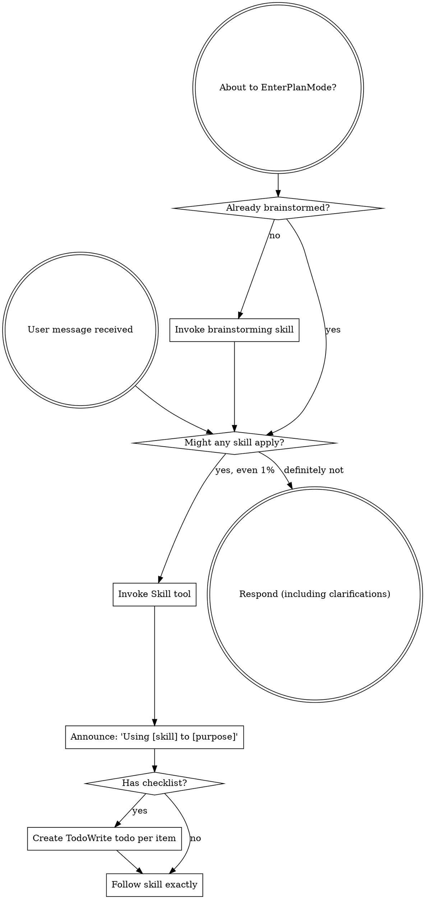
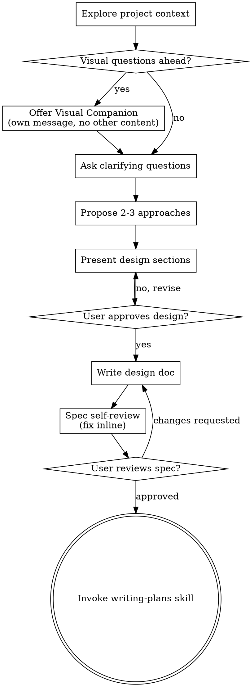
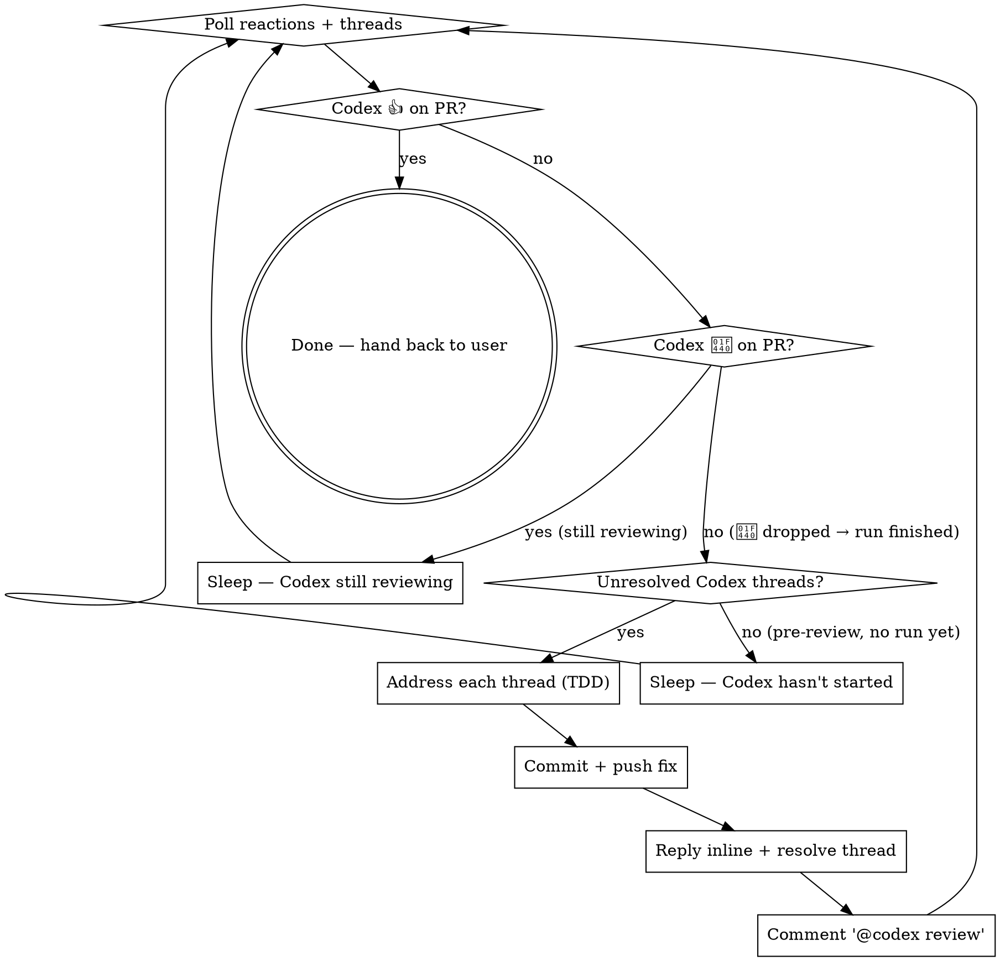
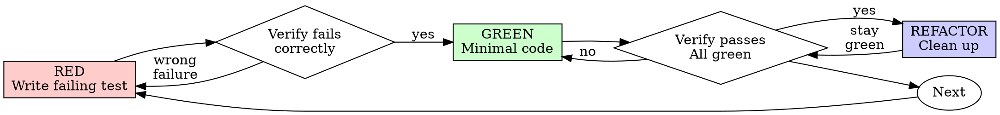

> SYSTEM

# AGENTS.md instructions for /Users/ericson/.t3/worktrees/ars-ui/t3code-497b39cd

<INSTRUCTIONS>
# ars-ui

## Project Overview

Rust frontend component library using state machines, framework-agnostic core with Leptos/Dioxus adapters.

## Current Phase

The repo is now in active implementation, not spec drafting only.

Agents working on implementation should use the GitHub Project roadmap and issue backlog as the execution source of truth:

- Use the GitHub Project `ars-ui implementation roadmap` to understand active epics, task breakdown, dependencies, status, and iteration planning.
- Prefer picking a single issue-backed task that is unblocked, sized, and scoped for independent delivery.
- Do not start work from an epic issue unless the user explicitly asks for planning or further decomposition.
- Do not start a task that is blocked by unresolved GitHub issue dependencies.
- Treat native GitHub issue dependencies as the blocker graph and the issue body acceptance criteria as the delivery contract.

## Development Workflow

For implementation tasks:

1. Read the assigned or selected GitHub issue first.
2. Move the issue to **In Progress** on the GitHub Project board.
3. Review the cited spec sections and any dependency issues.
4. Add or update the named tests first.
5. Implement only the scope required to make those tests pass.
6. If implementation changes the intended contract, update the relevant spec in the same task.
7. **MANDATORY:** Invoke the `post-implementation-audit` skill (`.agents/skills/post-implementation-audit/SKILL.md`). It runs three sequential audits on the new code — (a) spec/implementation drift with "best outcome" recommendations, (b) iterative "anything else missing?" passes (minimum two rounds), (c) test-coverage audit across every test type the workspace uses (unit, snapshot, proptest, mutation, doc, spec-conformance, llvm-cov). **Every finding lands in _this_ PR — no deferral, no follow-up issues.** This step exists because initial implementations consistently ship spec drift and silent contract violations that take 3+ review round-trips to surface; the audit collapses them into one. Skipping this step is a contract violation.
8. Present the final result for user review before any commit.
9. After user approval, run `cargo xci --profile fast` (alias: `cargo xci-fast`) locally and fix any failures before pushing anything to GitHub. The fast profile takes ~5 minutes and covers the workspace-level regressions a pre-push gate should catch: fmt, check, clippy, unit, integration, adapter, spec-compile-snippets, error-variant-coverage, mutual-exclusion, snapshot-count. Reserve full `cargo xci` (~25 minutes, all 20 gates including wasm coverage and the feature-matrix groups) for after substantial refactors that may have shifted feature-flag interactions. For small follow-up changes, run the focused tests and checks that cover the edited code instead.
10. After `cargo xci-fast` passes, commit and push a PR targeting `main`. The PR body MUST include an auto-close keyword for the issue being delivered, for example `Closes #20` or `Fixes #20`, so GitHub closes the issue automatically when the PR merges.
11. **If the PR creates or modifies any `.snap` insta fixtures, attach the `snapshot-reviewed` label after opening or updating it** (`gh pr edit <num> --add-label "snapshot-reviewed"`). This signals to reviewers that the snapshot output was inspected and is intentional. Re-apply the label whenever you push a commit that touches `.snap` files; the workflow assumes the label reflects the latest snapshot state.
12. **MANDATORY:** Invoke the `waiting-for-codex-review` skill (`.agents/skills/waiting-for-codex-review/SKILL.md`) immediately after the first push that creates the PR, and re-invoke it after every subsequent push to the PR branch. The skill posts the initial `@codex review` trigger, polls Codex's 👀 → (👍 \| ∅ + threads) reaction lifecycle, addresses any review threads with the same rigor as `post-implementation-audit` (TDD + no coverage regression), replies inline, resolves threads, and re-comments `@codex review` to start the next pass — looping until Codex leaves 👍. Skipping this step leaves Codex findings unaddressed and silently widens the gap between merged code and the spec; the merge gate is 👍 from Codex plus green CI, not green CI alone.
13. Only after CI passes, Codex has left 👍, and the PR is merged, close the issue.

Never close a GitHub issue without a merged PR that passes CI **and a 👍 from Codex**. Never commit or push without explicit user approval. Keep the issue, PR, and Project board status aligned with the actual work state at every step.

Default delivery rules:

- Follow TDD: tests first, implementation second, verification last.
- Keep task scope aligned with the issue. If the issue is too large or ambiguous, stop and split or clarify rather than freelancing a bigger change.
- Prefer tasks sized `1`, `2`, `3`, or `5` points. `8` is exceptional. `13` must be decomposed before implementation.
- Preserve the crate and dependency layering defined by the architecture and implementation plan.
- Do not add a new dependency crate without explicit user approval first. If a task appears to need a new crate, stop, explain why, and get approval before editing any `Cargo.toml`.
- When a task is complete, verify the exact tests and checks named by the issue before considering it done.
- For adapter-level component implementation, follow `docs/implementation/adapter-component-delivery.md`. Adapter component work must cover the adapter crate, adapter tests, E2E fixtures/harnesses when applicable, widgets examples, spec synchronization, and the required validation/audit loop in one PR.

### Code Quality Standards

- **Document all public items.** Every public struct, enum, trait, function, constant, type alias, method, field, and variant must have a `///` doc comment. Every `lib.rs` must have a `//!` crate-level doc comment. The workspace enforces `missing_docs` linting — undocumented public items are build failures.
- **Zero warnings policy.** All code must compile with zero warnings under the workspace's configured clippy and rustc lints. Fix the root cause instead of suppressing. When suppression is genuinely needed, use `#[expect(lint, reason = "...")]` — never `#[allow(...)]`.
- **Derive documentation from the spec.** Doc comments should describe the _purpose and semantics_ of the item as defined in the corresponding `spec/` files, not just restate the type signature.
- **Use `#[inline]` selectively, not mechanically.** Do **not** add Clippy's `missing_inline_in_public_items` lint at the workspace level, and do not treat public visibility alone as a reason to mark an item `#[inline]`. Use `#[inline]` for thin cross-crate wrappers, trivial accessors, and hot-path no-op shims where the call overhead is plausibly meaningful. Avoid blanket `#[inline]` on all public APIs — it increases code size, adds compile-time cost, and turns `#[inline]` into noise instead of a deliberate performance signal.
- **Use directory-backed modules with `mod.rs` when a module owns children.** This repo standardizes on the older filesystem layout for nested modules. If module `foo` has child modules, the parent must live at `foo/mod.rs`, not `foo.rs`. Do not mix `foo.rs` with a sibling `foo/` directory. When a refactor adds child modules under an existing flat file, move the parent into `foo/mod.rs` in the same change. Do not leave empty leftover module directories behind.

### API Design Standards

- **Design for the pit of success.** Public APIs should make the most natural, shortest path also be the path that is correct, accessible, localizable, type-safe, and performant. Prefer ergonomic constructors and defaults that preserve the spec's strongest guarantees instead of making users opt into correctness after choosing a convenient API.
- **Name escape hatches explicitly.** When a component needs a lower-level, static, non-i18n, or otherwise less complete path, keep it available but make the tradeoff visible in the API name or type. The blessed path should remain the simplest call site, while escape hatches should read as deliberate choices.
- **Keep semantic data separate from rendered views.** Rich framework views are useful for customization, but components still need semantic sources for accessible names, localized text, announcements, ids, and state-machine wiring. Do not rely on arbitrary rendered view trees as the only source of user-facing semantics.

### Code Coverage

The workspace uses `cargo-llvm-cov` for code coverage with per-crate threshold enforcement. CI runs coverage on every PR (see `.github/workflows/ci.yml`).

**Local coverage commands:**

```bash
# Per-crate coverage with inline annotated source (most useful during development)
cargo llvm-cov test -p ars-interactions --text -- hover

# Per-crate summary only
cargo llvm-cov test -p ars-interactions -- hover

# Native-only workspace coverage (host target; excludes wasm-only crates)
cargo llvm-cov --workspace \
  --exclude ars-leptos --exclude ars-dioxus \
  --exclude ars-test-harness-leptos --exclude ars-test-harness-dioxus \
  --exclude ars-derive --exclude xtask \
  --lcov --output-path lcov.info

# Check all crates against spec-defined thresholds (run after a *merged* lcov)
cargo xtask coverage check-all --file lcov.info
```

The `--text` flag produces line-by-line annotated source showing hit counts and `^0` markers on uncovered branches — use this to identify gaps after writing tests. Uncovered no-op callback closures in tests (e.g., `|_| {}`) are expected and not a gap.

The local recipe above excludes the adapter and adapter-test-harness crates because their `target_arch = "wasm32"` / `feature = "web"` code paths can't be measured via host-target `cargo llvm-cov`. **CI runs an additional wasm-coverage pipeline on nightly** (`cargo xtask ci coverage`) that uses `wasm-bindgen-test`'s experimental coverage recipe with LLVM 22 / `clang-22` to emit lcov for `ars-leptos` (csr), `ars-dioxus` (web), `ars-dom` (web), `ars-i18n` (web-intl), and the adapter test harnesses, then merges with the native lcov via `cargo xtask coverage merge`. The per-crate thresholds in `xtask::coverage::default_thresholds()` are enforced against the merged file — including adapter targets (`ars-leptos` 74/55, `ars-dioxus` 77/70, `ars-test-harness-leptos` 60/0, `ars-test-harness-dioxus` 60/0). `ars-derive` (proc-macro, runs in compiler) is exercised via `crates/ars-core/tests/derive_contract.rs` and is unmeasured. `xtask` has its own enforced threshold (30/35) and is measured. See `spec/testing/14-ci.md` §2 for the full pipeline.

### Mutation Testing

Coverage tells you which lines run. **Mutation testing tells you whether the tests would notice if those lines silently misbehaved.** The workspace uses [`cargo-mutants`](https://mutants.rs) for this — a `cargo` extension binary, not a workspace dependency.

**Install (once per developer machine):**

```bash
cargo install cargo-mutants --locked --version 27.0.0
```

**Local commands (state-machine modules are the most rewarding targets):**

```bash
# Run on a single component machine (~6 min for popover)
cargo mutants -p ars-components -f crates/ars-components/src/overlay/popover/mod.rs

# Just list what would be mutated, without running tests (fast)
cargo mutants -p ars-components -f crates/ars-components/src/overlay/popover/mod.rs --list

# Whole crate (slow — only if you really mean it)
cargo mutants -p ars-components
```

**Agnostic component implementation gate:** whenever an agent implements a new framework-agnostic component, or materially changes an existing one, the delivery must include:

- a targeted mutation run for the component source file, usually `cargo mutants -p ars-components -f crates/ars-components/src/<category>/<component>/mod.rs` (adjust the path for single-file modules);
- spec-conformance tests for the component's anatomy/public contract, including its `Part` enum and required API/attribute surface;
- same-task triage of every `MISSED` mutant: add tests for real gaps, or add a justified line-agnostic `.cargo/mutants.toml` exclude only for true equivalent mutations.

**Reading the output:** Results land in `mutants.out/mutants.out/` (gitignored). The two files that matter:

- `caught.txt` — mutations that broke at least one test ✅
- `missed.txt` — mutations that survived all tests ❌ — each one is either a real test gap to fill or an "equivalent mutation" that needs a `[[skip]]` entry in `mutants.toml` with a justification

**CI integration:** Nightly only. `.github/workflows/nightly.yml` has a `mutation-testing` job with a 21-entry matrix that runs `cargo mutants -p <package>` on every framework-agnostic crate, using `--shard k/n` to spread larger crates across parallel runners. **Shard indices are 0-based** (`k` runs from `0` to `n-1`); `k == n` is invalid and will fail the job. When adding shards, always start at `0/n` and end at `(n-1)/n`.

- **`ars-components` (≈ 1,630 mutants today, planned to grow as the spec adds the remaining ~97 components):** sharded **12-way** → ≈ 135 mutants per runner today, ≈ 850 per runner at the ~10,000-mutant endpoint. Sized for the full spec catalog up front so we don't re-shard every few months as components land.
- **`ars-collections` (≈ 1,080 mutants):** sharded 4-way → ≈ 270 mutants per runner.
- **`ars-core` (≈ 700 mutants):** sharded 2-way → ≈ 350 mutants per runner.
- **`ars-a11y`, `ars-forms`, `ars-interactions`:** one runner each (under 600 mutants apiece).

**Adding a new state machine inside an existing crate requires no CI changes** — its mutations land in whichever shard the cargo-mutants partitioner places them. The shard counts are sized so the slowest runner stays well under 30 minutes today and under ~50 minutes at the planned endpoint; re-balance only when a crate outgrows that budget (visible on the nightly dashboard as one shard pulling away from the others).

All matrix jobs run with `fail-fast: false` so failures on one module don't mask data on another. Each job uploads its `mutants.out/` as a workflow artifact (always, even on success — surviving "missed" entries on a passing run still reveal test-quality work). The job fails if any mutation survives, so a missed mutation forces a deliberate triage decision (fix the test, or document the equivalence with a `[[skip]]` entry in `mutants.toml`).

**Excluded crates** (mutation testing's signal degrades wherever determinism does): adapter glue (`ars-leptos`, `ars-dioxus`), DOM/FFI (`ars-dom`), ICU/FFI (`ars-i18n`), test infrastructure (`ars-test-harness*`), and the proc-macro crate (`ars-derive`, runs in the compiler). Adding a brand-new crate that is a good mutation target requires one new matrix entry; run a local scout first (`cargo mutants -p <crate> --list` to size, then a real run) so we know the right shard count before the nightly fires.

**Bumping the pinned version.** Both the local install command above and `.github/workflows/nightly.yml` pin cargo-mutants to an exact version (currently `27.0.0`) — same convention as `wasm-pack` in the `a11y-audit` job. Pinning is deliberate: cargo-mutants ships new mutators in releases, and an unpinned install would silently change the mutation set without any code change, surfacing as phantom CI failures on a green-source repo. To bump, open a PR that (1) updates the version string in CLAUDE.md and `nightly.yml`, (2) runs the popover scout locally with the new version (`cargo mutants -p ars-components -f crates/ars-components/src/overlay/popover/mod.rs`) to confirm the mutation count is in the same ballpark, and (3) triages any new "missed" entries the new mutators surface — they are usually genuine test-quality gaps newly visible to the tool.

### Property Testing (proptest)

State-machine invariants are exercised by [`proptest`](https://docs.rs/proptest) under `crates/<crate>/tests/proptest_state_machines/` (see `ars-components`). Default proptest behaviour drops `*.proptest-regressions` seed files alongside test sources — instead, every `proptest!` block in this workspace pulls a shared `Config` from `tests/proptest_state_machines/common.rs` that:

1. Reads `PROPTEST_CASES` from the environment (1,000 default; 10,000 in the nightly `extended-proptest` job).
2. Sets `failure_persistence` to `FileFailurePersistence::Direct("proptest-regressions/state-machines.txt")`, so all persisted seeds for the test binary live in one file at the crate root: `crates/<crate>/proptest-regressions/state-machines.txt`. The directory is committed (per proptest's own recommendation in the file header) so every developer's runs benefit from previously-shrunk failures.

When a new crate adopts proptest for state-machine tests, copy the same `common.rs` helper and reference it via `#![proptest_config(super::common::proptest_config())]` inside every `proptest!` block. Don't let proptest fall back to its `WithSource` default — that scatters seed files across the source tree.

### Adapter Prelude Convention

Both `ars-leptos` and `ars-dioxus` expose a `prelude` module targeting **end users** — application developers who consume the ready-made components. `use ars_leptos::prelude::*` (or `use ars_dioxus::prelude::*`) should give them everything they need.

The prelude contains only user-facing items:

1. **Component modules** — as components land, their public module paths (e.g., `button`, `dialog`) are re-exported so users can write `button::Props`, etc.
2. **User-facing traits** — traits end users call on component outputs (e.g., `Translate` from `ars-i18n`). Re-export the trait so consumers don't need a direct dependency on the subsystem crate.
3. **Configuration types** — types that appear in component props or configure behaviour (e.g., `Locale`, `Direction`, `Orientation`, `Selection`).

The prelude does **not** include implementation details consumed only by component authors inside the adapter crate: core engine types (`Machine`, `Service`, `ConnectApi`, `AttrMap`), accessibility primitives (`AriaRole`, `AriaAttribute`), interaction helpers (`merge_attrs`), or adapter hooks (`use_machine`, `UseMachineReturn`). Those remain accessible via their normal crate paths for advanced users building custom machines.

Both adapter preludes must stay symmetric: same items, same structure. When adding a new re-export to one adapter's prelude, add it to the other as well in the same PR.

### Adapter Testing Convention

Adapter-level component tests should default to the framework-specific test harness crate:

- Leptos adapter tests should prefer `ars-test-harness-leptos`.
- Dioxus adapter tests should prefer `ars-test-harness-dioxus`.
- Shared `ars-test-harness` helpers should be used where relevant for viewport, layout, clipboard, drag/drop, timing, and other DOM test setup instead of bespoke per-test browser scaffolding.

When a component spec requires interaction, focus, overlay positioning, clipboard, file upload, drag/drop, or similar browser behavior, the task's tests should exercise that behavior through the adapter harness entrypoints and shared core harness helpers unless there is a concrete technical reason not to.

## Spec Synchronization During Implementation

The specification is the authoritative contract. It took weeks of deliberate design and MUST be followed.

### Spec-first implementation rule

Before implementing any public type, trait, function, or method:

1. **Read the spec section first.** Find the relevant code example in `spec/`. Use `spec-tool toc <file>` and `grep` to locate it.
2. **Match the spec exactly.** If the spec defines `struct ComponentIds { base: String }` with methods `from_id()`, `id()`, `part()`, `item()`, `item_part()` — implement exactly that. Do not invent alternative field names, method names, or signatures.
3. **Cross-check after implementation.** Before presenting code for review, diff every public item against the spec's code examples. Every struct field, every method name, every parameter must match.
4. **If you must deviate**, there must be a concrete technical reason (e.g., the spec's API cannot compile, or a dependency doesn't expose the needed type). Document the reason in a code comment and flag it to the user explicitly.

Inventing alternative APIs that "seem equivalent" is never acceptable — it silently invalidates the spec's design decisions and all downstream code that depends on those APIs.

### Spec/code mismatch resolution

- If code and spec disagree, resolve the mismatch in the same task or PR.
- Shared conceptual changes belong in shared or foundation spec files, not only in adapter code.
- Adapter-specific findings must be reflected back into `spec/foundation/08-adapter-leptos.md` and/or `spec/foundation/09-adapter-dioxus.md` when relevant.
- Do not leave spec drift behind as follow-up cleanup.

## Spec Structure

The specification lives in `spec/` with this layout:

- `spec/manifest.toml` — **START HERE** — central index of all components and their dependencies
- `spec/foundation/` — architecture, accessibility, i18n, interactions, forms, adapters, spec template (00-10)
- `spec/shared/` — cross-component shared types (date-time, selection, layout, z-index)
- `spec/components/{category}/` — one file per component, organized by category
- `spec/testing/` — test specs split by domain

### Component Categories

- `input/` — checkbox, text-field, slider, number-input, etc.
- `selection/` — select, combobox, listbox, menu, tags-input, etc.
- `overlay/` — dialog, popover, tooltip, toast, presence, etc.
- `navigation/` — accordion, tabs, tree-view, pagination, steps, etc.
- `date-time/` — date-field, time-field, calendar, date-picker, etc.
- `data-display/` — table, avatar, progress, meter, badge, etc.
- `layout/` — splitter, scroll-area, carousel, portal, toolbar, etc.
- `specialized/` — color-picker, file-upload, signature-pad, qr-code, etc.
- `utility/` — button, toggle, focus-scope, visually-hidden, separator, etc.

## Working with the Spec

When reading large files, run `wc -l` first to check the line count. If the file is over 2,000
lines, use the `offset` and `limit` parameters on the Read tool to read in chunks rather than
attempting to read the entire file at once.

### Using xtask spec (preferred)

Use `cargo xtask spec` to resolve file sets instead of manually parsing manifest.toml:

```bash
# Quick metadata lookup:
cargo xtask spec info <component>

# Find all components using a shared type:
cargo xtask spec reverse <shared-type>

# See a file's heading structure (with line numbers):
cargo xtask spec toc <file>

# Validate frontmatter matches manifest.toml:
cargo xtask spec validate

# Search spec content by keyword/regex (with optional filters):
cargo xtask spec search <query> [--category <cat>] [--section <sec>] [--tier <tier>]

# Get a compact component summary (states, events, props, accessibility):
cargo xtask spec digest <component>

# Get full implementation context (component + all deps concatenated):
cargo xtask spec context <component> [--framework <fw>] [--include-testing]
```

The xtask also runs as an MCP server (`cargo xtask mcp`) exposing all spec tools for LLM agents.

### Reading a component (manual fallback)

1. Read `spec/manifest.toml` to find the component's path and dependencies
2. Read the component file (has YAML frontmatter listing its foundation/shared deps)
3. Only load the foundation files listed in `foundation_deps` — not all of them

### Framework and library specs — MANDATORY skill loading

When reading or editing these specification files, you MUST load the corresponding skill BEFORE doing any work. The skills contain verified, version-accurate API documentation that the spec code examples depend on. Claude's training data is wrong for these libraries — do not trust it.

| Spec file                                    | Skill to load | Library version |
| -------------------------------------------- | ------------- | --------------- |
| `spec/foundation/04-internationalization.md` | `icu4x`       | ICU4X 2.1.1     |
| `spec/foundation/08-adapter-leptos.md`       | `leptos`      | Leptos 0.8.17   |
| `spec/foundation/09-adapter-dioxus.md`       | `dioxus`      | Dioxus 0.7.3    |

This applies to any task that touches adapter code: reviewing, writing, modifying, or answering questions about these files. Load the skill first, then proceed.

### Spec Conventions

- **No deprecation:** This is a greenfield spec. If an API is unused or redundant, remove it and fix all references. Never use `#[deprecated]` or deprecation shims.
- **No deferral:** Never mark spec content as "TODO", "FIXME", "future enhancement", "P1/P2 extension", or any similar deferral language. Every feature mentioned must be fully specified. If a design choice is unclear, ask the user rather than deferring.
- **No guessing external APIs:** NEVER guess function names or module paths for external crates. Always verify against `https://docs.rs/<crate_name>` before writing code that calls library APIs. This applies especially to Leptos, Dioxus, ICU4X, and any crate where training data may be stale. If you cannot verify, state that explicitly rather than fabricating a plausible-looking API.

### Component file format

Each component file has YAML frontmatter declaring its metadata:

```markdown
---
component: ComponentName
category: { category }
tier: stateless | stateful | complex
foundation_deps: [architecture, accessibility, ...]
shared_deps: [date-time-types, ...]
related: [sibling-component, ...]
---

# ComponentName
```

The `tier` field determines which sections are required — see `spec/foundation/10-component-spec-template.md` for the canonical section structure, ordering rules, and conformance checklist. Headings are numbered (e.g., `## 1. State Machine`, `### 1.1 States`, `#### 1.1.1 InnerStates`, etc.) for precise section references.

</INSTRUCTIONS>
<environment_context>
  <cwd>/Users/ericson/.t3/worktrees/ars-ui/t3code-497b39cd</cwd>
  <shell>zsh</shell>
  <current_date>2026-05-24</current_date>
  <timezone>America/Sao_Paulo</timezone>
</environment_context>

> DEVELOPER

Implement task #239 and #248

> AGENT

I’ll first ground this in the current repo and live issue contracts, then I’ll turn that into an implementation plan. We’re still in Plan Mode, so I won’t edit files or move GitHub state yet.

> TOOL

tool_use exec_command
id: call_qDvSYfoFoo1psyGOZg73GuVe
```json
{
  "cmd": "sed -n '1,220p' /Users/ericson/.codex/plugins/cache/openai-curated/superpowers/6188456f/skills/using-superpowers/SKILL.md",
  "workdir": "/Users/ericson/.t3/worktrees/ars-ui/t3code-497b39cd",
  "yield_time_ms": 1000,
  "max_output_tokens": 12000
}
```

> TOOL

tool_use exec_command
id: call_WHYM5lILO071e3zZdrw5t2a0
```json
{
  "cmd": "sed -n '1,220p' /Users/ericson/.codex/plugins/cache/openai-curated/superpowers/6188456f/skills/brainstorming/SKILL.md",
  "workdir": "/Users/ericson/.t3/worktrees/ars-ui/t3code-497b39cd",
  "yield_time_ms": 1000,
  "max_output_tokens": 12000
}
```

> TOOL

tool_use exec_command
id: call_7IgO0aUn1gNFGoJ6uPeGgadK
```json
{
  "cmd": "sed -n '1,220p' /Users/ericson/.codex/plugins/cache/openai-curated/superpowers/6188456f/skills/writing-plans/SKILL.md",
  "workdir": "/Users/ericson/.t3/worktrees/ars-ui/t3code-497b39cd",
  "yield_time_ms": 1000,
  "max_output_tokens": 12000
}
```

> TOOL

tool_use exec_command
id: call_fvlebjRaBrIOfvN2CGkn4FPA
```json
{
  "cmd": "rg -n \"#239|#248|239|248|task #239|task #248\" /Users/ericson/.codex/memories/MEMORY.md",
  "workdir": "/Users/ericson/.t3/worktrees/ars-ui/t3code-497b39cd",
  "yield_time_ms": 1000,
  "max_output_tokens": 8000
}
```

> TOOL

tool_result
id: call_qDvSYfoFoo1psyGOZg73GuVe
```
Chunk ID: c71359
Wall time: 0.3342 seconds
Process exited with code 0
Original token count: 1356
Output:
---
name: using-superpowers
description: Use when starting any conversation - establishes how to find and use skills, requiring Skill tool invocation before ANY response including clarifying questions
---

<SUBAGENT-STOP>
If you were dispatched as a subagent to execute a specific task, skip this skill.
</SUBAGENT-STOP>

<EXTREMELY-IMPORTANT>
If you think there is even a 1% chance a skill might apply to what you are doing, you ABSOLUTELY MUST invoke the skill.

IF A SKILL APPLIES TO YOUR TASK, YOU DO NOT HAVE A CHOICE. YOU MUST USE IT.

This is not negotiable. This is not optional. You cannot rationalize your way out of this.
</EXTREMELY-IMPORTANT>

## Instruction Priority

Superpowers skills override default system prompt behavior, but **user instructions always take precedence**:

1. **User's explicit instructions** (CLAUDE.md, GEMINI.md, AGENTS.md, direct requests) — highest priority
2. **Superpowers skills** — override default system behavior where they conflict
3. **Default system prompt** — lowest priority

If CLAUDE.md, GEMINI.md, or AGENTS.md says "don't use TDD" and a skill says "always use TDD," follow the user's instructions. The user is in control.

## How to Access Skills

**In Claude Code:** Use the `Skill` tool. When you invoke a skill, its content is loaded and presented to you—follow it directly. Never use the Read tool on skill files.

**In Copilot CLI:** Use the `skill` tool. Skills are auto-discovered from installed plugins. The `skill` tool works the same as Claude Code's `Skill` tool.

**In Gemini CLI:** Skills activate via the `activate_skill` tool. Gemini loads skill metadata at session start and activates the full content on demand.

**In other environments:** Check your platform's documentation for how skills are loaded.

## Platform Adaptation

Skills use Claude Code tool names. Non-CC platforms: see `references/copilot-tools.md` (Copilot CLI), `references/codex-tools.md` (Codex) for tool equivalents. Gemini CLI users get the tool mapping loaded automatically via GEMINI.md.

# Using Skills

## The Rule

**Invoke relevant or requested skills BEFORE any response or action.** Even a 1% chance a skill might apply means that you should invoke the skill to check. If an invoked skill turns out to be wrong for the situation, you don't need to use it.



## Red Flags

These thoughts mean STOP—you're rationalizing:

| Thought | Reality |
|---------|---------|
| "This is just a simple question" | Questions are tasks. Check for skills. |
| "I need more context first" | Skill check comes BEFORE clarifying questions. |
| "Let me explore the codebase first" | Skills tell you HOW to explore. Check first. |
| "I can check git/files quickly" | Files lack conversation context. Check for skills. |
| "Let me gather information first" | Skills tell you HOW to gather information. |
| "This doesn't need a formal skill" | If a skill exists, use it. |
| "I remember this skill" | Skills evolve. Read current version. |
| "This doesn't count as a task" | Action = task. Check for skills. |
| "The skill is overkill" | Simple things become complex. Use it. |
| "I'll just do this one thing first" | Check BEFORE doing anything. |
| "This feels productive" | Undisciplined action wastes time. Skills prevent this. |
| "I know what that means" | Knowing the concept ≠ using the skill. Invoke it. |

## Skill Priority

When multiple skills could apply, use this order:

1. **Process skills first** (brainstorming, debugging) - these determine HOW to approach the task
2. **Implementation skills second** (frontend-design, mcp-builder) - these guide execution

"Let's build X" → brainstorming first, then implementation skills.
"Fix this bug" → debugging first, then domain-specific skills.

## Skill Types

**Rigid** (TDD, debugging): Follow exactly. Don't adapt away discipline.

**Flexible** (patterns): Adapt principles to context.

The skill itself tells you which.

## User Instructions

Instructions say WHAT, not HOW. "Add X" or "Fix Y" doesn't mean skip workflows.

```

> TOOL

tool_result
id: call_WHYM5lILO071e3zZdrw5t2a0
```
Chunk ID: b2846d
Wall time: 0.3352 seconds
Process exited with code 0
Original token count: 2659
Output:
---
name: brainstorming
description: "You MUST use this before any creative work - creating features, building components, adding functionality, or modifying behavior. Explores user intent, requirements and design before implementation."
---

# Brainstorming Ideas Into Designs

Help turn ideas into fully formed designs and specs through natural collaborative dialogue.

Start by understanding the current project context, then ask questions one at a time to refine the idea. Once you understand what you're building, present the design and get user approval.

<HARD-GATE>
Do NOT invoke any implementation skill, write any code, scaffold any project, or take any implementation action until you have presented a design and the user has approved it. This applies to EVERY project regardless of perceived simplicity.
</HARD-GATE>

## Anti-Pattern: "This Is Too Simple To Need A Design"

Every project goes through this process. A todo list, a single-function utility, a config change — all of them. "Simple" projects are where unexamined assumptions cause the most wasted work. The design can be short (a few sentences for truly simple projects), but you MUST present it and get approval.

## Checklist

You MUST create a task for each of these items and complete them in order:

1. **Explore project context** — check files, docs, recent commits
2. **Offer visual companion** (if topic will involve visual questions) — this is its own message, not combined with a clarifying question. See the Visual Companion section below.
3. **Ask clarifying questions** — one at a time, understand purpose/constraints/success criteria
4. **Propose 2-3 approaches** — with trade-offs and your recommendation
5. **Present design** — in sections scaled to their complexity, get user approval after each section
6. **Write design doc** — save to `docs/superpowers/specs/YYYY-MM-DD-<topic>-design.md` and commit
7. **Spec self-review** — quick inline check for placeholders, contradictions, ambiguity, scope (see below)
8. **User reviews written spec** — ask user to review the spec file before proceeding
9. **Transition to implementation** — invoke writing-plans skill to create implementation plan

## Process Flow



**The terminal state is invoking writing-plans.** Do NOT invoke frontend-design, mcp-builder, or any other implementation skill. The ONLY skill you invoke after brainstorming is writing-plans.

## The Process

**Understanding the idea:**

- Check out the current project state first (files, docs, recent commits)
- Before asking detailed questions, assess scope: if the request describes multiple independent subsystems (e.g., "build a platform with chat, file storage, billing, and analytics"), flag this immediately. Don't spend questions refining details of a project that needs to be decomposed first.
- If the project is too large for a single spec, help the user decompose into sub-projects: what are the independent pieces, how do they relate, what order should they be built? Then brainstorm the first sub-project through the normal design flow. Each sub-project gets its own spec → plan → implementation cycle.
- For appropriately-scoped projects, ask questions one at a time to refine the idea
- Prefer multiple choice questions when possible, but open-ended is fine too
- Only one question per message - if a topic needs more exploration, break it into multiple questions
- Focus on understanding: purpose, constraints, success criteria

**Exploring approaches:**

- Propose 2-3 different approaches with trade-offs
- Present options conversationally with your recommendation and reasoning
- Lead with your recommended option and explain why

**Presenting the design:**

- Once you believe you understand what you're building, present the design
- Scale each section to its complexity: a few sentences if straightforward, up to 200-300 words if nuanced
- Ask after each section whether it looks right so far
- Cover: architecture, components, data flow, error handling, testing
- Be ready to go back and clarify if something doesn't make sense

**Design for isolation and clarity:**

- Break the system into smaller units that each have one clear purpose, communicate through well-defined interfaces, and can be understood and tested independently
- For each unit, you should be able to answer: what does it do, how do you use it, and what does it depend on?
- Can someone understand what a unit does without reading its internals? Can you change the internals without breaking consumers? If not, the boundaries need work.
- Smaller, well-bounded units are also easier for you to work with - you reason better about code you can hold in context at once, and your edits are more reliable when files are focused. When a file grows large, that's often a signal that it's doing too much.

**Working in existing codebases:**

- Explore the current structure before proposing changes. Follow existing patterns.
- Where existing code has problems that affect the work (e.g., a file that's grown too large, unclear boundaries, tangled responsibilities), include targeted improvements as part of the design - the way a good developer improves code they're working in.
- Don't propose unrelated refactoring. Stay focused on what serves the current goal.

## After the Design

**Documentation:**

- Write the validated design (spec) to `docs/superpowers/specs/YYYY-MM-DD-<topic>-design.md`
  - (User preferences for spec location override this default)
- Use elements-of-style:writing-clearly-and-concisely skill if available
- Commit the design document to git

**Spec Self-Review:**
After writing the spec document, look at it with fresh eyes:

1. **Placeholder scan:** Any "TBD", "TODO", incomplete sections, or vague requirements? Fix them.
2. **Internal consistency:** Do any sections contradict each other? Does the architecture match the feature descriptions?
3. **Scope check:** Is this focused enough for a single implementation plan, or does it need decomposition?
4. **Ambiguity check:** Could any requirement be interpreted two different ways? If so, pick one and make it explicit.

Fix any issues inline. No need to re-review — just fix and move on.

**User Review Gate:**
After the spec review loop passes, ask the user to review the written spec before proceeding:

> "Spec written and committed to `<path>`. Please review it and let me know if you want to make any changes before we start writing out the implementation plan."

Wait for the user's response. If they request changes, make them and re-run the spec review loop. Only proceed once the user approves.

**Implementation:**

- Invoke the writing-plans skill to create a detailed implementation plan
- Do NOT invoke any other skill. writing-plans is the next step.

## Key Principles

- **One question at a time** - Don't overwhelm with multiple questions
- **Multiple choice preferred** - Easier to answer than open-ended when possible
- **YAGNI ruthlessly** - Remove unnecessary features from all designs
- **Explore alternatives** - Always propose 2-3 approaches before settling
- **Incremental validation** - Present design, get approval before moving on
- **Be flexible** - Go back and clarify when something doesn't make sense

## Visual Companion

A browser-based companion for showing mockups, diagrams, and visual options during brainstorming. Available as a tool — not a mode. Accepting the companion means it's available for questions that benefit from visual treatment; it does NOT mean every question goes through the browser.

**Offering the companion:** When you anticipate that upcoming questions will involve visual content (mockups, layouts, diagrams), offer it once for consent:
> "Some of what we're working on might be easier to explain if I can show it to you in a web browser. I can put together mockups, diagrams, comparisons, and other visuals as we go. This feature is still new and can be token-intensive. Want to try it? (Requires opening a local URL)"

**This offer MUST be its own message.** Do not combine it with clarifying questions, context summaries, or any other content. The message should contain ONLY the offer above and nothing else. Wait for the user's response before continuing. If they decline, proceed with text-only brainstorming.

**Per-question decision:** Even after the user accepts, decide FOR EACH QUESTION whether to use the browser or the terminal. The test: **would the user understand this better by seeing it than reading it?**

- **Use the browser** for content that IS visual — mockups, wireframes, layout comparisons, architecture diagrams, side-by-side visual designs
- **Use the terminal** for content that is text — requirements questions, conceptual choices, tradeoff lists, A/B/C/D text options, scope decisions

A question about a UI topic is not automatically a visual question. "What does personality mean in this context?" is a conceptual question — use the terminal. "Which wizard layout works better?" is a visual question — use the browser.

If they agree to the companion, read the detailed guide before proceeding:
`skills/brainstorming/visual-companion.md`

```

> TOOL

tool_result
id: call_7IgO0aUn1gNFGoJ6uPeGgadK
```
Chunk ID: 986550
Wall time: 0.1395 seconds
Process exited with code 0
Original token count: 1525
Output:
---
name: writing-plans
description: Use when you have a spec or requirements for a multi-step task, before touching code
---

# Writing Plans

## Overview

Write comprehensive implementation plans assuming the engineer has zero context for our codebase and questionable taste. Document everything they need to know: which files to touch for each task, code, testing, docs they might need to check, how to test it. Give them the whole plan as bite-sized tasks. DRY. YAGNI. TDD. Frequent commits.

Assume they are a skilled developer, but know almost nothing about our toolset or problem domain. Assume they don't know good test design very well.

**Announce at start:** "I'm using the writing-plans skill to create the implementation plan."

**Context:** If working in an isolated worktree, it should have been created via the `superpowers:using-git-worktrees` skill at execution time.

**Save plans to:** `docs/superpowers/plans/YYYY-MM-DD-<feature-name>.md`
- (User preferences for plan location override this default)

## Scope Check

If the spec covers multiple independent subsystems, it should have been broken into sub-project specs during brainstorming. If it wasn't, suggest breaking this into separate plans — one per subsystem. Each plan should produce working, testable software on its own.

## File Structure

Before defining tasks, map out which files will be created or modified and what each one is responsible for. This is where decomposition decisions get locked in.

- Design units with clear boundaries and well-defined interfaces. Each file should have one clear responsibility.
- You reason best about code you can hold in context at once, and your edits are more reliable when files are focused. Prefer smaller, focused files over large ones that do too much.
- Files that change together should live together. Split by responsibility, not by technical layer.
- In existing codebases, follow established patterns. If the codebase uses large files, don't unilaterally restructure - but if a file you're modifying has grown unwieldy, including a split in the plan is reasonable.

This structure informs the task decomposition. Each task should produce self-contained changes that make sense independently.

## Bite-Sized Task Granularity

**Each step is one action (2-5 minutes):**
- "Write the failing test" - step
- "Run it to make sure it fails" - step
- "Implement the minimal code to make the test pass" - step
- "Run the tests and make sure they pass" - step
- "Commit" - step

## Plan Document Header

**Every plan MUST start with this header:**

```markdown
# [Feature Name] Implementation Plan

> **For agentic workers:** REQUIRED SUB-SKILL: Use superpowers:subagent-driven-development (recommended) or superpowers:executing-plans to implement this plan task-by-task. Steps use checkbox (`- [ ]`) syntax for tracking.

**Goal:** [One sentence describing what this builds]

**Architecture:** [2-3 sentences about approach]

**Tech Stack:** [Key technologies/libraries]

---
```

## Task Structure

````markdown
### Task N: [Component Name]

**Files:**
- Create: `exact/path/to/file.py`
- Modify: `exact/path/to/existing.py:123-145`
- Test: `tests/exact/path/to/test.py`

- [ ] **Step 1: Write the failing test**

```python
def test_specific_behavior():
    result = function(input)
    assert result == expected
```

- [ ] **Step 2: Run test to verify it fails**

Run: `pytest tests/path/test.py::test_name -v`
Expected: FAIL with "function not defined"

- [ ] **Step 3: Write minimal implementation**

```python
def function(input):
    return expected
```

- [ ] **Step 4: Run test to verify it passes**

Run: `pytest tests/path/test.py::test_name -v`
Expected: PASS

- [ ] **Step 5: Commit**

```bash
git add tests/path/test.py src/path/file.py
git commit -m "feat: add specific feature"
```
````

## No Placeholders

Every step must contain the actual content an engineer needs. These are **plan failures** — never write them:
- "TBD", "TODO", "implement later", "fill in details"
- "Add appropriate error handling" / "add validation" / "handle edge cases"
- "Write tests for the above" (without actual test code)
- "Similar to Task N" (repeat the code — the engineer may be reading tasks out of order)
- Steps that describe what to do without showing how (code blocks required for code steps)
- References to types, functions, or methods not defined in any task

## Remember
- Exact file paths always
- Complete code in every step — if a step changes code, show the code
- Exact commands with expected output
- DRY, YAGNI, TDD, frequent commits

## Self-Review

After writing the complete plan, look at the spec with fresh eyes and check the plan against it. This is a checklist you run yourself — not a subagent dispatch.

**1. Spec coverage:** Skim each section/requirement in the spec. Can you point to a task that implements it? List any gaps.

**2. Placeholder scan:** Search your plan for red flags — any of the patterns from the "No Placeholders" section above. Fix them.

**3. Type consistency:** Do the types, method signatures, and property names you used in later tasks match what you defined in earlier tasks? A function called `clearLayers()` in Task 3 but `clearFullLayers()` in Task 7 is a bug.

If you find issues, fix them inline. No need to re-review — just fix and move on. If you find a spec requirement with no task, add the task.

## Execution Handoff

After saving the plan, offer execution choice:

**"Plan complete and saved to `docs/superpowers/plans/<filename>.md`. Two execution options:**

**1. Subagent-Driven (recommended)** - I dispatch a fresh subagent per task, review between tasks, fast iteration

**2. Inline Execution** - Execute tasks in this session using executing-plans, batch execution with checkpoints

**Which approach?"**

**If Subagent-Driven chosen:**
- **REQUIRED SUB-SKILL:** Use superpowers:subagent-driven-development
- Fresh subagent per task + two-stage review

**If Inline Execution chosen:**
- **REQUIRED SUB-SKILL:** Use superpowers:executing-plans
- Batch execution with checkpoints for review

```

> TOOL

tool_result
id: call_fvlebjRaBrIOfvN2CGkn4FPA
```
Chunk ID: c16ff1
Wall time: 0.1441 seconds
Process exited with code 0
Original token count: 251
Output:
800:- rollout_summaries/REDACTED.md (cwd=/Users/ericson/Workspace/Rust/judge-fudge, rollout_path=/Users/ericson/.codex/sessions/2026/05/13/rollout-2026-05-13T20-00-28-019e2391-f461-7640-9fa6-47a73043e285.jsonl, updated_at=2026-05-14T02:06:37+00:00, thread_id=019e2391-f461-7640-9fa6-47a73043e285, Research -> Plan transition plus branch-coverage iteration-2 revision)
2421:- gh pr view --json number,url,title,headRefName,baseRefName, GraphQL, PRRT_kwDORp4enM59o1xT, review thread, inline review reply, resolve thread, commit 239d913, PR #610
2434:- the actionable review thread for this regression was fetched via GraphQL after resolving the PR with `gh pr view`; the reply cited commit `239d913` and the exact behavior change before resolving the thread [Task 2]
3206:- PR #531, KeyboardDragRegistry, cancel_keyboard_drag, DropResult, register(), clear(), next(), drag_drop.rs, thread-aware GraphQL, issuecomment-4239753451

```

> AGENT

I’m using `using-superpowers`, `brainstorming`, and `writing-plans` because this is a repo implementation request that needs a decision-complete plan before execution in the current mode. Next I’m pulling the live issue contracts and nearby code/spec context so the plan is tied to the actual task scope.

> TOOL

tool_use exec_command
id: call_z18qz1VaMFGDxndRGnUALGB1
```json
{
  "cmd": "git status --short --branch",
  "workdir": "/Users/ericson/.t3/worktrees/ars-ui/t3code-497b39cd",
  "yield_time_ms": 1000,
  "max_output_tokens": 4000
}
```

> TOOL

tool_use exec_command
id: call_HbiY3i8qrwCWun3zlDwHm85J
```json
{
  "cmd": "gh issue view 239 --json number,title,state,body,labels,assignees,projectItems,closed,comments,url",
  "workdir": "/Users/ericson/.t3/worktrees/ars-ui/t3code-497b39cd",
  "yield_time_ms": 1000,
  "max_output_tokens": 20000
}
```

> TOOL

tool_use exec_command
id: call_6iIlCawmkWHzqMMSpiBTOy2H
```json
{
  "cmd": "gh issue view 248 --json number,title,state,body,labels,assignees,projectItems,closed,comments,url",
  "workdir": "/Users/ericson/.t3/worktrees/ars-ui/t3code-497b39cd",
  "yield_time_ms": 1000,
  "max_output_tokens": 20000
}
```

> TOOL

tool_use exec_command
id: call_sp8N2UjwWuCVM5uBCMVd2YEM
```json
{
  "cmd": "rg --files | sed -n '1,180p'",
  "workdir": "/Users/ericson/.t3/worktrees/ars-ui/t3code-497b39cd",
  "yield_time_ms": 1000,
  "max_output_tokens": 8000
}
```

> TOOL

tool_result
id: call_z18qz1VaMFGDxndRGnUALGB1
```
Chunk ID: f52d1d
Wall time: 1.0020 seconds
Process running with session ID 2886
Original token count: 0
Output:

```

> TOOL

tool_result
id: call_HbiY3i8qrwCWun3zlDwHm85J
```
Chunk ID: dad7b8
Wall time: 1.0007 seconds
Process running with session ID 43958
Original token count: 0
Output:

```

> TOOL

tool_result
id: call_6iIlCawmkWHzqMMSpiBTOy2H
```
Chunk ID: 0d773b
Wall time: 1.0008 seconds
Process running with session ID 17348
Original token count: 0
Output:

```

> TOOL

tool_result
id: call_sp8N2UjwWuCVM5uBCMVd2YEM
```
Chunk ID: c61aa8
Wall time: 0.2561 seconds
Process exited with code 0
Original token count: 1571
Output:
rustfmt.toml
AGENTS.md
CONTRIBUTING.md
README.md
rust-toolchain.toml
Cargo.toml
codecov.yml
LICENSE
clippy.toml
xtask/src/mcp.rs
xtask/src/e2e.rs
xtask/src/i18n.rs
xtask/src/examples.rs
xtask/src/main.rs
xtask/src/lint.rs
xtask/src/tool.rs
xtask/tests/examples.rs
xtask/tests/spec_corpus_compile_snippets.rs
xtask/Cargo.toml
crates/ars-interactions/src/press.rs
crates/ars-interactions/src/interact_outside.rs
crates/ars-interactions/src/hover.rs
crates/ars-interactions/src/focus.rs
crates/ars-interactions/src/keyboard.rs
crates/ars-interactions/src/move_interaction.rs
crates/ars-interactions/src/compose.rs
crates/ars-interactions/src/long_press.rs
crates/ars-interactions/src/lib.rs
crates/ars-interactions/src/direction.rs
crates/ars-interactions/src/drag_drop.rs
crates/ars-interactions/src/companion_css.rs
crates/ars-interactions/ars-interactions.css
crates/ars-interactions/Cargo.toml
crates/ars-i18n/src/locale.rs
crates/ars-i18n/src/case.rs
crates/ars-i18n/src/plural.rs
crates/ars-i18n/src/text.rs
crates/ars-i18n/src/locale_stack.rs
crates/ars-i18n/src/bidi.rs
crates/ars-i18n/src/date.rs
crates/ars-i18n/src/detect.rs
docs/implementation/foundation-completion-roadmap.md
crates/ars-core/tests/bindable_contract.rs
docs/implementation/initial-backlog.md
docs/implementation/project-board.md
docs/implementation/foundation-gap-audit.md
docs/implementation/roadmap.md
crates/ars-core/tests/reexport_contract.rs
docs/implementation/adapter-component-delivery.md
crates/ars-core/tests/proptest_attr_map.rs
docs/implementation/README.md
crates/ars-core/tests/component_error.rs
docs/implementation/adapter-contract.md
crates/ars-core/ars-base.css
crates/ars-test-harness-leptos/Cargo.toml
xtask/src/spec/reverse.rs
xtask/src/manifest.rs
xtask/src/lib.rs
xtask/src/spec/context.rs
xtask/src/spec/validate.rs
xtask/src/spec/search.rs
xtask/src/spec/info.rs
xtask/src/spec/category.rs
xtask/src/spec/adapters.rs
xtask/src/spec/mod.rs
xtask/src/spec/deps.rs
xtask/src/spec/digest.rs
xtask/src/spec/toc.rs
xtask/src/spec/related.rs
xtask/src/spec/compile_snippets.rs
xtask/src/spec/tools.rs
xtask/src/spec/profile.rs
xtask/src/spec/lint_code.rs
crates/ars-i18n/src/layout.rs
crates/ars-i18n/src/weekday.rs
crates/ars-i18n/src/collation.rs
crates/ars-test-harness-leptos/src/lib.rs
crates/ars-core/src/weak_send.rs
crates/ars-core/src/platform.rs
crates/ars-core/src/modality.rs
crates/ars-core/src/url.rs
crates/ars-core/src/shared_state.rs
crates/ars-core/src/input_mode.rs
crates/ars-core/src/component_ids.rs
crates/ars-core/src/message_fn.rs
crates/ars-core/src/shared_flag.rs
crates/ars-core/src/i18n_registry.rs
crates/ars-core/src/callback.rs
crates/ars-core/src/provider.rs
crates/ars-core/src/z_index.rs
crates/ars-core/src/connect.rs
crates/ars-core/src/lib.rs
crates/ars-core/src/error.rs
crates/ars-core/src/companion_css.rs
crates/ars-i18n/Cargo.toml
crates/ars-i18n/src/lib.rs
crates/ars-i18n/src/relative_time.rs
crates/ars-i18n/src/number/mod.rs
xtask/src/ci/feature_matrix.rs
crates/ars-core/tests/pass/bindable_value.rs
crates/ars-core/tests/pass/orientation_reexport.rs
crates/ars-i18n/src/number/web_intl.rs
crates/ars-i18n/src/translate.rs
xtask/src/ci/mod.rs
xtask/src/test.rs
xtask/src/coverage.rs
crates/ars-i18n/tests/translate_derive.rs
crates/ars-e2e/src/error.rs
crates/ars-e2e/src/assertions.rs
crates/ars-forms/src/validation/builder.rs
crates/ars-forms/src/validation/result.rs
crates/ars-forms/src/validation/mod.rs
crates/ars-forms/src/validation/async_validator.rs
crates/ars-forms/src/validation/validator.rs
crates/ars-forms/src/validation/error.rs
crates/ars-forms/src/validation/built_in.rs
crates/ars-forms/src/validation/debounced.rs
spec/leptos-components/utility/error-boundary.md
spec/leptos-components/utility/visually-hidden.md
spec/leptos-components/utility/z-index-allocator.md
spec/leptos-components/utility/live-region.md
spec/leptos-components/utility/swap.md
spec/leptos-components/utility/download-trigger.md
spec/leptos-components/utility/toggle-group.md
spec/leptos-components/utility/as-child.md
spec/leptos-components/utility/focus-scope.md
spec/leptos-components/utility/landmark.md
spec/leptos-components/utility/separator.md
spec/leptos-components/utility/toggle.md
spec/leptos-components/utility/field.md
spec/leptos-components/utility/toggle-button.md
spec/leptos-components/utility/action-group.md
spec/leptos-components/utility/dismissable.md
spec/leptos-components/utility/highlight.md
spec/leptos-components/utility/drop-zone.md
spec/leptos-components/utility/fieldset.md
crates/ars-forms/src/hidden_input.rs
spec/leptos-components/utility/_category.md
spec/leptos-components/utility/keyboard.md
spec/leptos-components/utility/focus-ring.md
spec/leptos-components/utility/ars-provider.md
spec/leptos-components/utility/button.md
spec/leptos-components/utility/form.md
spec/leptos-components/utility/heading.md
spec/leptos-components/utility/client-only.md
spec/leptos-components/utility/group.md
crates/ars-leptos/src/utility/button.rs
crates/ars-leptos/src/utility/heading.rs
crates/ars-leptos/src/utility/error_boundary.rs
crates/ars-leptos/src/utility/dismissable.rs
crates/ars-leptos/src/utility/highlight.rs
crates/ars-leptos/src/utility/z_index_allocator.rs
crates/ars-leptos/src/utility/mod.rs
crates/ars-leptos/src/utility/client_only.rs
crates/ars-leptos/src/utility/landmark.rs
crates/ars-leptos/src/utility/separator.rs
crates/ars-leptos/src/utility/visually_hidden.rs
crates/ars-leptos/src/hydration.rs
crates/ars-leptos/src/prelude.rs
crates/ars-leptos/src/callbacks.rs
crates/ars-leptos/src/attrs.rs
crates/ars-leptos/src/event_mapping.rs
crates/ars-leptos/src/nonce.rs
crates/ars-leptos/src/as_child.rs
crates/ars-e2e/src/utility/button.rs
crates/ars-e2e/src/utility/heading.rs
crates/ars-e2e/src/utility/error_boundary.rs
crates/ars-e2e/src/utility/dismissable.rs
crates/ars-e2e/src/utility/highlight.rs
crates/ars-e2e/src/utility/z_index_allocator.rs
crates/ars-e2e/src/utility/mod.rs
crates/ars-e2e/src/utility/client_only.rs
crates/ars-e2e/src/utility/landmark.rs
crates/ars-e2e/src/utility/separator.rs
crates/ars-e2e/src/utility/visually_hidden.rs
crates/ars-e2e/src/browser.rs
crates/ars-e2e/src/main.rs
crates/ars-e2e/src/axe.rs
crates/ars-e2e/src/fixtures.rs
crates/ars-e2e/src/desktop.rs

```

> TOOL

tool_use write_stdin
id: call_OAfAhnAS2Xlx24uUIiVOy4jz
```json
{
  "session_id": 2886,
  "chars": "",
  "yield_time_ms": 1000,
  "max_output_tokens": 4000
}
```

> TOOL

tool_use write_stdin
id: call_21GX0LsM57scR9CzA8YMFsqn
```json
{
  "session_id": 43958,
  "chars": "",
  "yield_time_ms": 1000,
  "max_output_tokens": 20000
}
```

> TOOL

tool_use write_stdin
id: call_IXYOHCb0Tekl80l5TbLY6uY1
```json
{
  "session_id": 17348,
  "chars": "",
  "yield_time_ms": 1000,
  "max_output_tokens": 20000
}
```

> TOOL

tool_result
id: call_OAfAhnAS2Xlx24uUIiVOy4jz
```
Chunk ID: a80769
Wall time: 0.0000 seconds
Process exited with code 0
Original token count: 5
Output:
## t3code/497b39cd

```

> TOOL

tool_result
id: call_21GX0LsM57scR9CzA8YMFsqn
```
Chunk ID: 59f25c
Wall time: 0.0000 seconds
Process exited with code 0
Original token count: 650
Output:
{"assignees":[],"body":"**Epic: #220 (Agnostic input components)**\n\n## Goal\nStateful radio group with Idle/Focused states, roving tabindex intent, per-item disabled, form integration.\n\n## Out of scope\nFramework-specific adapter components (Leptos/Dioxus) and direct DOM focus calls.\n\n## Spec refs\n`spec/components/input/radio-group.md`\n\n## Depends on\nNone\n\n## Layer\nComponent\n\n## Framework\nNone\n\n## Test tier\nUnit\n\n## Fibonacci points\n5\n\n## Element/ref handling note\n\n- Core should key radio items by stable item value, not by DOM lookup IDs.\n- The machine owns selection, focused item key, disabled state, orientation, and roving-tabindex attrs.\n- Actual focus movement after keyboard navigation is an adapter responsibility resolved from the focused item key to a live item handle (`NodeRef`, `MountedData`, or host handle).\n- IDs may still be emitted for ARIA relationships or form semantics, but roving focus must not require `get_element_by_id` from the agnostic component.\n\n## Tests to add first\n- ConnectApi produces `role=\"radiogroup\"` on root, `role=\"radio\"` on items.\n- Roving tabindex navigation updates focused item key and attrs.\n- Selection via keyboard/pointer.\n- Per-item disabled.\n- aria-checked reflects selection.\n- Orientation-aware arrow keys.\n- Form hidden input.\n\n## Acceptance criteria\n- All public types documented per workspace `missing_docs` lint.\n- State machine matches spec §1 exactly.\n- ConnectApi produces correct ARIA attributes per spec §2.\n- Roving focus is represented through stable item keys and adapter-resolvable focus intent, not DOM ID lookup.\n- Snapshot tests cover the component's `connect()` / `Api` `AttrMap` output for every anatomy part and each output-affecting state, prop, or context branch, with committed `.snap` fixtures passing `cargo insta test --unreferenced=reject`.\n- All named tests pass with zero warnings.\n\n## Spec impact\nNo spec change required unless current spec examples require ID-only roving focus; if found, update them in this task.\n\n## Board update rule\nIf blocked, keep `Status` in `Todo`, use native GitHub issue dependencies, and name the dependency or spec ambiguity.\n","closed":false,"comments":[],"labels":[{"id":"LA_kwDORp4enM8AAAACd5NBow","name":"task","description":"Agent-ready implementation task","color":"0E8A16"}],"number":239,"projectItems":[{"status":{"optionId":"f75ad846","name":"Todo"},"title":"ars-ui implementation roadmap"}],"state":"OPEN","title":"task: Implement RadioGroup agnostic core","url":"https://github.com/fogodev/ars-ui/issues/239"}

```

> TOOL

tool_result
id: call_IXYOHCb0Tekl80l5TbLY6uY1
```
Chunk ID: e6421f
Wall time: 0.0000 seconds
Process exited with code 0
Original token count: 450
Output:
{"assignees":[],"body":"**Epic: #220 (Agnostic input components)**\n\n## Goal\nStateful group context propagation to child Checkboxes, BTreeSet value tracking, select-all support.\n\n## Out of scope\nFramework-specific adapter components (Leptos/Dioxus).\n\n## Spec refs\n`spec/components/input/checkbox-group.md`\n\n## Depends on\n#229 (Checkbox)\n\n## Layer\nComponent\n\n## Framework\nNone\n\n## Test tier\nUnit\n\n## Fibonacci points\n3\n\n## Tests to add first\n- Group context propagates disabled to children.\n- BTreeSet value tracks checked items.\n- Select-all checkbox state (checked/indeterminate/unchecked).\n- ConnectApi produces `role=\"group\"` with `aria-labelledby`.\n- Form integration with multiple hidden inputs.\n\n## Acceptance criteria\n- All public types documented per workspace `missing_docs` lint.\n- State machine matches spec §1 exactly.\n- ConnectApi produces correct ARIA attributes per spec §2.\n- Snapshot tests cover the component's `connect()` / `Api` `AttrMap` output for every anatomy part and each output-affecting state, prop, or context branch, with committed `.snap` fixtures passing `cargo insta test --unreferenced=reject`.\n- All named tests pass with zero warnings.\n\n## Spec impact\nNo spec change required.\n\n## Board update rule\nIf blocked, keep `Status` in `Todo`, use native GitHub issue dependencies, and name the dependency or spec ambiguity.\n","closed":false,"comments":[],"labels":[{"id":"LA_kwDORp4enM8AAAACd5NBow","name":"task","description":"Agent-ready implementation task","color":"0E8A16"}],"number":248,"projectItems":[{"status":{"optionId":"f75ad846","name":"Todo"},"title":"ars-ui implementation roadmap"}],"state":"OPEN","title":"task: Implement CheckboxGroup agnostic core","url":"https://github.com/fogodev/ars-ui/issues/248"}

```

> AGENT

The live issue data says #239 is unblocked and #248 depends on #229, so I’m checking that dependency before planning the combined work. I’m also reading the existing agnostic input/utility patterns so the plan can name concrete files and tests.

> TOOL

tool_use exec_command
id: call_yw8MfaPvTgCNjOilXKcN2lEJ
```json
{
  "cmd": "gh issue view 229 --json number,title,state,body,labels,projectItems,closed,url",
  "workdir": "/Users/ericson/.t3/worktrees/ars-ui/t3code-497b39cd",
  "yield_time_ms": 1000,
  "max_output_tokens": 12000
}
```

> TOOL

tool_use exec_command
id: call_40JuFnfLdQ12cJiUqjbNVE8I
```json
{
  "cmd": "cargo xtask spec info radio-group",
  "workdir": "/Users/ericson/.t3/worktrees/ars-ui/t3code-497b39cd",
  "yield_time_ms": 1000,
  "max_output_tokens": 12000
}
```

> TOOL

tool_use exec_command
id: call_MhHkMmNJUhzkbrti6CUxgSKe
```json
{
  "cmd": "cargo xtask spec info checkbox-group",
  "workdir": "/Users/ericson/.t3/worktrees/ars-ui/t3code-497b39cd",
  "yield_time_ms": 1000,
  "max_output_tokens": 12000
}
```

> TOOL

tool_use exec_command
id: call_e8XCdgXXl2YWLEV0dUPTAr6x
```json
{
  "cmd": "rg -n \"pub mod checkbox|struct Checkbox|Checkbox|toggle_group|RadioGroup|CheckboxGroup|HiddenInput|hidden input\" crates/ars-components/src crates/ars-components/tests spec/components/input -g '*.rs' -g '*.md'",
  "workdir": "/Users/ericson/.t3/worktrees/ars-ui/t3code-497b39cd",
  "yield_time_ms": 1000,
  "max_output_tokens": 20000
}
```

> TOOL

tool_result
id: call_yw8MfaPvTgCNjOilXKcN2lEJ
```
Chunk ID: eb92ca
Wall time: 1.0012 seconds
Process running with session ID 65542
Original token count: 0
Output:

```

> TOOL

tool_result
id: call_40JuFnfLdQ12cJiUqjbNVE8I
```
Chunk ID: d810f9
Wall time: 1.0032 seconds
Process running with session ID 18469
Original token count: 26
Output:
    Blocking waiting for file lock on package cache
    Blocking waiting for file lock on package cache

```

> TOOL

tool_result
id: call_MhHkMmNJUhzkbrti6CUxgSKe
```
Chunk ID: b00f92
Wall time: 1.0017 seconds
Process running with session ID 36315
Original token count: 0
Output:

```

> TOOL

tool_result
id: call_e8XCdgXXl2YWLEV0dUPTAr6x
```
Chunk ID: 5d53a1
Wall time: 0.5023 seconds
Process exited with code 0
Original token count: 10872
Output:
Total output lines: 352

crates/ars-components/tests/spec_conformance/input.rs:21:            (checkbox::Part::HiddenInput, "hidden-input"),
crates/ars-components/tests/spec_conformance/input.rs:37:            (switch::Part::HiddenInput, "hidden-input"),
crates/ars-components/tests/spec_conformance/input.rs:132:            (pin_input::Part::HiddenInput, "hidden-input"),
spec/components/input/_category.md:7:`07-forms.md` for form participation, validation, and hidden input patterns.
spec/components/input/_category.md:13:- [Checkbox](checkbox.md)
spec/components/input/_category.md:14:- [CheckboxGroup](checkbox-group.md)
spec/components/input/_category.md:15:- [RadioGroup](radio-group.md)
spec/components/input/_category.md:33:(Checkbox, Radio, Switch), text entry (TextField, Textarea, SearchInput), numeric entry
spec/components/input/_category.md:117:| Checkbox      |       Yes       |        Yes        |        No         | `ctx.disabled \|\| disabled_context`                                       |
spec/components/input/_category.md:118:| CheckboxGroup |       Yes       |        Yes        |        No         | `ctx.disabled \|\| disabled_context`; propagates to children via ChildCtx  |
spec/components/input/_category.md:119:| RadioGroup    |       Yes       |        Yes        |  Per-radio item   | Group: `ctx.disabled \|\| disabled_context`; Item: also `item.disabled`    |
spec/components/input/_category.md:166:| `Checkbox`      | `checkbox::State` | Unchecked / Checked / Indeterminate | `role="checkbox"`, `aria-checked`    |
spec/components/input/_category.md:167:| `CheckboxGroup` | `BTreeSet<Key>`   | Idle                                | `role="group"`, child propagation    |
spec/components/input/_category.md:168:| `RadioGroup`    | `Option<String>`  | Idle / Focused                      | `role="radiogroup"`, roving tabindex |
spec/components/input/_category.md:245:> **Shadow DOM constraint:** The hidden input MUST be in the same DOM context as the
spec/components/input/_category.md:246:> `<form>` element. If a component uses Shadow DOM, the hidden input must be rendered
spec/components/input/_category.md:251:Per-component hidden input patterns:
spec/components/input/_category.md:253:- `Checkbox`: `<input type="checkbox" name="..." value="..." checked>`
spec/components/input/_category.md:254:- `CheckboxGroup`: `<input type="checkbox" name="..." value="..." checked>` per checked value
spec/components/input/_category.md:255:- `RadioGroup`: `<input type="radio" name="..." value="..." checked>` per item
spec/components/input/_category.md:265:- `Editable`: no hidden input by default (consumer wraps if needed)
crates/ars-components/tests/spec_conformance/utility.rs:11:    toggle_group,
crates/ars-components/tests/spec_conformance/utility.rs:52:fn toggle_group_anatomy_matches_spec() {
crates/ars-components/tests/spec_conformance/utility.rs:56:            (toggle_group::Part::Root, "root"),
crates/ars-components/tests/spec_conformance/utility.rs:58:                toggle_group::Part::Item {
crates/ars-components/tests/spec_conformance/utility.rs:63:            (toggle_group::Part::Indicator, "indicator"),
crates/ars-components/tests/spec_conformance/data_display.rs:15:    //   ColumnHeader, RowHeader, Cell, SelectAllCheckbox, RowCheckbox,
crates/ars-components/tests/spec_conformance/data_display.rs:48:            (table::Part::SelectAllCheckbox, "select-all-checkbox"),
crates/ars-components/tests/spec_conformance/data_display.rs:50:                table::Part::RowCheckbox {
crates/ars-components/tests/spec_conformance/selection.rs:97:            (select::Part::HiddenInput, "hidden-input"),
spec/components/input/switch.md:17:light switch. Unlike Checkbox, it does not support an indeterminate state.
spec/components/input/switch.md:86:    /// The ID of the form element the hidden input is associated with.
spec/components/input/switch.md:400:    HiddenInput,
spec/components/input/switch.md:496:        let [(scope_attr, scope_val), (part_attr, part_val)] = Part::HiddenInput.data_attrs();
spec/components/input/switch.md:559:            Part::HiddenInput => self.hidden_input_attrs(),
spec/components/input/switch.md:575:├── HiddenInput        <input>   data-ars-part="hidden-input" (type="checkbox", aria-hidden)
spec/components/input/switch.md:583:| Label        | `<label>`  | Text label; `for` targets `HiddenInput` unless readonly          |
spec/components/input/switch.md:586:| HiddenInput  | `<input>`  | `type="checkbox"`, `aria-hidden="true"`                          |
spec/components/input/switch.md:646:- **Hidden input**: A hidden `<input type="checkbox">` is rendered via `HiddenInput` part. It carries `id`, `name`, `form`, and `value` from context, and the `checked` attribute when state is `On`. The native input is disabled only when the component is disabled; readonly values remain enabled so they can be submitted with native forms.
spec/components/input/switch.md:647:- **Label activation**: `Label` points `for` at `HiddenInput` so native label activation targets a labelable form control. When readonly, `Label` omits `for` because checkboxes have no native readonly behavior and label activation would otherwise mutate the hidden input. Adapters must wire hidden input changes to `Api::on_hidden_input_change(checked)`.
spec/components/input/switch.md:650:- **Required**: `aria-required="true"` on Control; `required` attribute on the hidden input.
spec/components/input/switch.md:684:| HiddenInput  | `HiddenInput`  | `HiddenInput`      | (built-in) | (built-in) | Full parity                |
spec/components/input/switch.md:714:  targeting the hidden input for native label activation. ars-ui supports both Space and Enter
crates/ars-components/tests/proptest_state_machines/utility.rs:12:    form_submit, live_region, separator, swap, toggle, toggle_group, visually_hidden,
crates/ars-components/tests/proptest_state_machines/utility.rs:108:fn arb_toggle_group_key() -> impl Strategy<Value = Key> {
crates/ars-components/tests/proptest_state_machines/utility.rs:117:fn arb_toggle_group_key_set() -> impl Strategy<Value = BTreeSet<Key>> {
crates/ars-components/tests/proptest_state_machines/utility.rs:118:    prop::collection::btree_set(arb_toggle_group_key(), 0..=4)
crates/ars-components/tests/proptest_state_machines/utility.rs:121:fn arb_toggle_group_mode() -> impl Strategy<Value = toggle_group::SelectionMode> {
crates/ars-components/tests/proptest_state_machines/utility.rs:123:        Just(toggle_group::SelectionMode::None),
crates/ars-components/tests/proptest_state_machines/utility.rs:124:        Just(toggle_group::SelectionMode::Single),
crates/ars-components/tests/proptest_state_machines/utility.rs:125:        Just(toggle_group::SelectionMode::Multiple),
crates/ars-components/tests/proptest_state_machines/utility.rs:129:fn arb_toggle_group_props() -> impl Strategy<Value = toggle_group::Props> {
crates/ars-components/tests/proptest_state_machines/utility.rs:131:        prop::option::of(arb_toggle_group_key_set()),
crates/ars-components/tests/proptest_state_machines/utility.rs:132:        arb_toggle_group_key_set(),
crates/ars-components/tests/proptest_state_machines/utility.rs:133:        arb_toggle_group_mode(),
crates/ars-components/tests/proptest_state_machines/utility.rs:144:        arb_toggle_group_key_set(),
crates/ars-components/tests/proptest_state_machines/utility.rs:159:            )| toggle_group::Props {
crates/ars-components/tests/proptest_state_machines/utility.rs:183:fn arb_toggle_group_event() -> impl Strategy<Value = toggle_group::Event> {
crates/ars-components/tests/proptest_state_machines/utility.rs:185:        arb_toggle_group_key().prop_map(toggle_group::Event::SelectItem),
crates/ars-components/tests/proptest_state_machines/utility.rs:186:        arb_toggle_group_key().prop_map(toggle_group::Event::DeselectItem),
crates/ars-components/tests/proptest_state_machines/utility.rs:187:        arb_toggle_group_key().prop_map(toggle_group::Event::ToggleItem),
crates/ars-components/tests/proptest_state_machines/utility.rs:188:        (arb_toggle_group_key(), any::<bool>())
crates/ars-components/tests/proptest_state_machines/utility.rs:189:            .prop_map(|(item, is_keyboard)| { toggle_group::Event::Focus { item, is_keyboard } }),
crates/ars-components/tests/proptest_state_machines/utility.rs:190:        Just(toggle_group::Event::Blur),
crates/ars-components/tests/proptest_state_machines/utility.rs:191:        Just(toggle_group::Event::FocusNext),
crates/ars-components/tests/proptest_state_machines/utility.rs:192:        Just(toggle_group::Event::FocusPrev),
crates/ars-components/tests/proptest_state_machines/utility.rs:193:        Just(toggle_group::Event::FocusFirst),
crates/ars-components/tests/proptest_state_machines/utility.rs:194:        Just(toggle_group::Event::FocusLast),
crates/ars-components/tests/proptest_state_machines/utility.rs:195:        arb_toggle_group_key().prop_map(toggle_group::Event::RegisterItem),
crates/ars-components/tests/proptest_state_machines/utility.rs:196:        arb_toggle_group_key().prop_map(toggle_group::Event::UnregisterItem),
crates/ars-components/tests/proptest_state_machines/utility.rs:197:        Just(toggle_group::Event::Reset),
crates/ars-components/tests/proptest_state_machines/utility.rs:198:        prop::option::of(arb_toggle_group_key_set()).prop_map(toggle_group::Event::SetValue),
crates/ars-components/tests/proptest_state_machines/utility.rs:199:        Just(toggle_group::Event::SetProps),
crates/ars-components/tests/proptest_state_machines/utility.rs:676:    fn proptest_toggle_group_event_sequences_preserve_invariants(
crates/ars-components/tests/proptest_state_machines/utility.rs:677:        props in arb_toggle_group_props(),
crates/ars-components/tests/proptest_state_machines/utility.rs:678:        events in prop::collection::vec(arb_toggle_group_event(), 0..128),
crates/ars-components/tests/proptest_state_machines/utility.rs:680:        let mut service = Service::<toggle_group::Machine>::new(
crates/ars-components/tests/proptest_state_machines/utility.rs:683:            &toggle_group::Messages::default(),
crates/ars-components/tests/proptest_state_machines/utility.rs:693:                toggle_group::Event::SelectItem(_)
crates/ars-components/tests/proptest_state_machines/utility.rs:694:                    | toggle_group::Event::DeselectItem(_)
crates/ars-components/tests/proptest_state_machines/utility.rs:695:                    | toggle_group::Event::ToggleItem(_)
crates/ars-components/tests/proptest_state_machines/utility.rs:704:                toggle_group::State::Idle => {
crates/ars-components/tests/proptest_state_machines/utility.rs:709:                toggle_group::State::Focused { item } => {
crates/ars-components/tests/proptest_state_machines/utility.rs:723:                toggle_group::SelectionMode::None => {
crates/ars-components/tests/proptest_state_machines/utility.rs:727:                toggle_group::SelectionMode::Single => {
crates/ars-components/tests/proptest_state_machines/utility.rs:731:                toggle_group::SelectionMode::Multiple => {}
crates/ars-components/src/input/mod.rs:3:/// Checkbox machine.
crates/ars-components/src/input/mod.rs:4:pub mod checkbox;
spec/components/input/checkbox.md:2:component: Checkbox
spec/components/input/checkbox.md:9:    ark-ui: Checkbox
spec/components/input/checkbox.md:10:    radix-ui: Checkbox
spec/components/input/checkbox.md:11:    react-aria: Checkbox
spec/components/input/checkbox.md:14:# Checkbox
spec/components/input/checkbox.md:16:A `Checkbox` lets the user select, deselect, or mark a value as indeterminate. The
spec/components/input/checkbox.md:39:/// Events for the Checkbox component.
spec/components/input/checkbox.md:69:/// Context for the Checkbox component.
spec/components/input/checkbox.md:88:    /// The ID of the form element the hidden input is associated with.
spec/components/input/checkbox.md:102:/// Props for the Checkbox component.
spec/components/input/checkbox.md:167:/// Machine for the Checkbox component.
spec/components/input/checkbox.md:420:    HiddenInput,
spec/components/input/checkbox.md:425:/// Api for the Checkbox component.
spec/components/input/checkbox.md:512:        let [(scope_attr, scope_val), (part_attr, part_val)] = Part::HiddenInput.data_attrs();
spec/components/input/checkbox.md:591:            Part::HiddenInput => self.hidden_input_attrs(),
spec/components/input/checkbox.md:602:Checkbox
spec/components/input/checkbox.md:607:├── HiddenInput        <input>  data-ars-part="hidden-input" (type="checkbox", aria-hidden)
spec/components/input/checkbox.md:615:| Label        | `<label>` | `for` points to HiddenInput                                      |
spec/components/input/checkbox.md:618:| HiddenInput  | `<input>` | `type="checkbox"`, `aria-hidden="true"` — native form submission |
spec/components/input/checkbox.md:675:- **Hidden input**: A hidden `<input type="checkbox">` is rendered via `HiddenInput` part. It carries `id`, `name`, `form`, and `value` from context, and the `checked` attribute when state is `Checked`. The indeterminate state does not set `checked` — only `Checked` does. The native input is disabled only when the component is disabled; readonly values remain enabled so they can be submitted with native forms.
spec/components/input/checkbox.md:676:- **Label activation**: `Label` points `for` at `HiddenInput` so native label activation targets a labelable form control. When readonly, `Label` omits `for` because checkboxes have no native readonly behavior and label activation would otherwise mutate the hidden input. Adapters must wire hidden input changes to `Api::on_hidden_input_change(checked)`.
spec/components/input/checkbox.md:679:- **Required**: `aria-required="true"` on Control; `required` attribute on the hidden input.
spec/components/input/checkbox.md:685:> Compared against: Ark UI (`Checkbox`), Radix UI (`Checkbox`), React Aria (`Checkbox`).
spec/components/input/checkbox.md:713:| HiddenInput  | `HiddenInput`  | `HiddenInput` | (built-in)  | (built-in)          | Full parity                         |
crates/ars-components/src/input/password_input/mod.rs:7://! hidden input is emitted.
spec/components/input/radio-group.md:2:component: RadioGroup
spec/components/input/radio-group.md:9:    ark-ui: RadioGroup
spec/components/input/radio-group.md:10:    radix-ui: RadioGroup
spec/components/input/radio-group.md:11:    react-aria: RadioGroup
spec/components/input/radio-group.md:14:# RadioGroup
spec/components/input/radio-group.md:16:A RadioGroup lets the user select exactly one value from a set of options. It manages a
spec/components/input/radio-group.md:24:/// The state of the RadioGroup component.
spec/components/input/radio-group.md:40:/// The events for the RadioGroup component.
spec/components/input/radio-group.md:68:/// The context of the RadioGroup component.
spec/components/input/radio-group.md:85:    /// The orientation of the RadioGroup component.
spec/components/input/radio-group.md:116:/// The props for the RadioGroup component.
spec/components/input/radio-group.md:119:    /// The id of the RadioGroup component.
spec/components/input/radio-group.md:177:/// Machine for the RadioGroup component.
spec/components/input/radio-group.md:399:    ItemHiddenInput { item_value: Key },
spec/components/input/radio-group.md:402:/// API for the RadioGroup component.
spec/components/input/radio-group.md:550:        let [(scope_attr, scope_val), (part_attr, part_val)] = Part::ItemHiddenInput { item_value: Key::default() }.data_attrs();
spec/components/input/radio-group.md:619:            Part::ItemHiddenInput { item_value } => self.item_hidden_input_attrs(&item_value),
spec/components/input/radio-group.md:628:RadioGroup
spec/components/input/radio-group.md:635:│   └── ItemHiddenInput <input> data-ars-part="item-hidden-input" (type="radio", aria-hidden)
spec/components/input/radio-group.md:657:| ItemHiddenInput | `<input>` | `type="radio"`, `aria-hidden="true"` — form submission |
spec/components/input/radio-group.md:707:- **Hidden inputs**: Each radio item renders a hidden `<input type="radio">` via `ItemHiddenInput`. Only the selected item has `checked`. All share the same `name` attribute.
spec/components/input/radio-group.md:716:> Compared against: Ark UI (`RadioGroup`), Radix UI (`RadioGroup`), React Aria (`RadioGroup`).
spec/components/input/radio-group.md:740:| Root            | `Root`            | `Root`                    | `Root`      | `RadioGroup`        | Full parity                |
spec/components/input/radio-group.md:746:| ItemHiddenInput | `ItemHiddenInput` | `ItemHiddenInput`         | (built-in)  | (built-in)          | Full parity                |
spec/components/input/range-slider.md:483:    HiddenInput { thumb: ThumbIndex }, // which thumb
spec/components/input/range-slider.md:644:    /// Attributes for a hidden input (form submission).
spec/components/input/range-slider.md:651:        let [(scope_attr, scope_val), (part_attr, part_val)] = Part::HiddenInput { thumb }.data_attrs();
spec/components/input/range-slider.md:749:            Part::HiddenInput { thumb } => self.hidden_input_attrs(thumb),
spec/components/input/range-slider.md:772:├── HiddenInput (×2)   <input>   data-ars-part="hidden-input" (type="hidden")
spec/components/input/range-slider.md:788:| HiddenInput       | `<input>`  | `type="hidden"`, `name[0]`/`name[1]` (×2)               |
spec/components/input/range-slider.md:911:| HiddenInput | N            | `name="{name}[{i}]"`                    |
spec/components/input/range-slider.md:956:| HiddenInput  | `StartHiddenInput`/`EndHiddenInput` | `HiddenInput`     | (built-in)              | Full parity            |
crates/ars-components/src/input/checkbox/mod.rs:1://! Checkbox component state machine and connect API.
crates/ars-components/src/input/checkbox/mod.rs:3://! This module implements the framework-agnostic `Checkbox` machine defined in
crates/ars-components/src/input/checkbox/mod.rs:30:/// Events for the Checkbox component.
crates/ars-components/src/input/checkbox/mod.rs:64:/// Context for the Checkbox component.
crates/ars-components/src/input/checkbox/mod.rs:91:    /// The ID of the form element the hidden input is associated with.
crates/ars-components/src/input/checkbox/mod.rs:104:/// Props for the Checkbox component.
crates/ars-components/src/input/checkbox/mod.rs:134:    /// The ID of the form element the hidden input is associated with.
crates/ars-components/src/input/checkbox/mod.rs:291:/// Machine for the Checkbox component.
crates/ars-components/src/input/checkbox/mod.rs:478:    HiddenInput,
crates/ars-components/src/input/checkbox/mod.rs:487:/// API for the Checkbox component.
crates/ars-components/src/input/checkbox/mod.rs:515:            Part::HiddenInput => self.hidden_input_attrs(),
crates/ars-components/src/input/checkbox/mod.rs:650:        let [(scope_attr, scope_val), (part_attr, part_val)] = Part::HiddenInput.data_attrs();
crates/ars-components/src/input/checkbox/mod.rs:735:    /// Sends [`Event::Check`] or [`Event::Uncheck`] for hidden input changes.
crates/ars-components/src/input/checkbox/mod.rs:1556:        assert_eq!(api.part_attrs(Part::HiddenInput), api.hidden_input_attrs());
crates/ars-components/src/input/textarea/mod.rs:5://! participant; no hidden input is emitted for this component.
spec/components/input/checkbox-group.md:2:component: CheckboxGroup
spec/components/input/checkbox-group.md:9:  react-aria: CheckboxGroup
spec/components/input/checkbox-group.md:12:# CheckboxGroup
spec/components/input/checkbox-group.md:14:`CheckboxGroup` manages a group of `Checkbox` components with shared `name` attribute for form submission, group-level `value: BTreeSet<Key>` tracking which checkboxes are checked, propagation of `disabled`, `required`, `readOnly`, `invalid` from group to children, and automatic parent indeterminate computation when a parent checkbox represents the group state.
…872 tokens truncated…rc/utility/toggle_group/mod.rs:966:    pub fn hidden_input_config(&self) -> Option<HiddenInputConfig> {
crates/ars-components/src/utility/toggle_group/mod.rs:970:            SelectionMode::None => HiddenInputValue::None,
crates/ars-components/src/utility/toggle_group/mod.rs:978:                .map_or(HiddenInputValue::None, |selected| {
crates/ars-components/src/utility/toggle_group/mod.rs:979:                    HiddenInputValue::Single(selected.to_string())
crates/ars-components/src/utility/toggle_group/mod.rs:992:                    HiddenInputValue::None
crates/ars-components/src/utility/toggle_group/mod.rs:994:                    HiddenInputValue::Multiple(selected)
crates/ars-components/src/utility/toggle_group/mod.rs:999:        Some(HiddenInputConfig {
crates/ars-components/src/utility/toggle_group/mod.rs:1372:    fn snapshot_config(config: Option<&HiddenInputConfig>) -> String {
crates/ars-components/src/utility/toggle_group/mod.rs:1377:    fn toggle_group_initial_state_is_idle_with_default_value() {
crates/ars-components/src/utility/toggle_group/mod.rs:1392:    fn toggle_group_state_display_matches_state_names() {
crates/ars-components/src/utility/toggle_group/mod.rs:1398:    fn toggle_group_props_builder_sets_expected_fields() {
crates/ars-components/src/utility/toggle_group/mod.rs:1443:    fn toggle_group_set_props_syncs_controlled_value_and_context_fields() {
crates/ars-components/src/utility/toggle_group/mod.rs:1487:    fn toggle_group_set_props_ignores_render_only_callbacks() {
crates/ars-components/src/utility/toggle_group/mod.rs:1502:    fn toggle_group_set_props_emits_for_each_behavioral_prop() {
crates/ars-components/src/utility/toggle_group/mod.rs:1524:    fn toggle_group_set_props_normalizes_controlled_value_when_mode_changes() {
crates/ars-components/src/utility/toggle_group/mod.rs:1543:    fn toggle_group_select_and_deselect_item_update_selection() {
crates/ars-components/src/utility/toggle_group/mod.rs:1558:    fn toggle_group_deselect_noops_for_disabled_or_unselected_items() {
crates/ars-components/src/utility/toggle_group/mod.rs:1586:    fn toggle_group_single_mode_allows_only_one_selected_item() {
crates/ars-components/src/utility/toggle_group/mod.rs:1598:    fn toggle_group_multiple_mode_allows_multiple_selected_items() {
crates/ars-components/src/utility/toggle_group/mod.rs:1610:    fn toggle_group_none_mode_never_selects_items() {
crates/ars-components/src/utility/toggle_group/mod.rs:1622:    fn toggle_group_disabled_ignores_value_changes_but_allows_prop_sync() {
crates/ars-components/src/utility/toggle_group/mod.rs:1638:    fn toggle_group_read_only_ignores_value_changes() {
crates/ars-components/src/utility/toggle_group/mod.rs:1648:    fn toggle_group_disallow_empty_selection_keeps_last_item() {
crates/ars-components/src/utility/toggle_group/mod.rs:1664:    fn toggle_group_controlled_mode_emits_change_without_committing_state() {
crates/ars-components/src/utility/toggle_group/mod.rs:1677:    fn toggle_group_on_change_callback_fires_for_selection_changes() {
crates/ars-components/src/utility/toggle_group/mod.rs:1718:    fn toggle_group_reset_restores_default_value() {
crates/ars-components/src/utility/toggle_group/mod.rs:1733:    fn toggle_group_reset_restores_default_value_when_disabled() {
crates/ars-components/src/utility/toggle_group/mod.rs:1744:    fn toggle_group_register_unregister_maintain_item_list() {
crates/ars-components/src/utility/toggle_group/mod.rs:1761:    fn toggle_group_register_deduplicates_existing_keys() {
crates/ars-components/src/utility/toggle_group/mod.rs:1773:    fn toggle_group_unregister_removes_selection_and_focus_for_removed_item() {
crates/ars-components/src/utility/toggle_group/mod.rs:1793:    fn toggle_group_focus_event_transitions_idle_to_focused() {
crates/ars-components/src/utility/toggle_group/mod.rs:1810:    fn toggle_group_focus_and_blur_noops_are_precise() {
crates/ars-components/src/utility/toggle_group/mod.rs:1858:    fn toggle_group_blur_repairs_stale_idle_focus_context() {
crates/ars-components/src/utility/toggle_group/mod.rs:1870:    fn toggle_group_focus_next_prev_walk_registered_items() {
crates/ars-components/src/utility/toggle_group/mod.rs:1898:    fn toggle_group_idle_focus_uses_registered_selected_order() {
crates/ars-components/src/utility/toggle_group/mod.rs:1913:    fn toggle_group_home_end_move_to_first_last_enabled_item() {
crates/ars-components/src/utility/toggle_group/mod.rs:1928:    fn toggle_group_loop_focus_wraps_when_enabled() {
crates/ars-components/src/utility/toggle_group/mod.rs:1975:    fn toggle_group_focus_does_not_target_disabled_items() {
crates/ars-components/src/utility/toggle_group/mod.rs:1995:    fn toggle_group_disabled_group_preserves_keyboard_focus_navigation() {
crates/ars-components/src/utility/toggle_group/mod.rs:2023:    fn toggle_group_rtl_swaps_horizontal_arrow_left_right() {
crates/ars-components/src/utility/toggle_group/mod.rs:2044:    fn toggle_group_vertical_arrow_up_down_ignore_rtl() {
crates/ars-components/src/utility/toggle_group/mod.rs:2072:    fn toggle_group_keydown_dispatch_matrix_covers_roving_navigation() {
crates/ars-components/src/utility/toggle_group/mod.rs:2104:    fn toggle_group_keydown_ignores_activation_and_roving_disabled_navigation() {
crates/ars-components/src/utility/toggle_group/mod.rs:2126:    fn toggle_group_root_attrs_emit_accessibility_contract() {
crates/ars-components/src/utility/toggle_group/mod.rs:2153:    fn toggle_group_root_attrs_emit_labelledby_label_fallback_priority() {
crates/ars-components/src/utility/toggle_group/mod.rs:2176:    fn toggle_group_root_attrs_emit_disabled_invalid_required_readonly() {
crates/ars-components/src/utility/toggle_group/mod.rs:2196:    fn toggle_group_group_role_root_attrs_omit_unsupported_aria() {
crates/ars-components/src/utility/toggle_group/mod.rs:2213:    fn toggle_group_item_attrs_emit_single_mode_radio_contract() {
crates/ars-components/src/utility/toggle_group/mod.rs:2227:    fn toggle_group_item_attrs_emit_multiple_mode_button_pressed_contract() {
crates/ars-components/src/utility/toggle_group/mod.rs:2244:    fn toggle_group_item_attrs_emit_none_mode_toolbar_button_contract() {
crates/ars-components/src/utility/toggle_group/mod.rs:2257:    fn toggle_group_roving_tabindex_only_focused_or_fallback_item_is_zero() {
crates/ars-components/src/utility/toggle_group/mod.rs:2310:    fn toggle_group_roving_focus_false_makes_all_items_tab_focusable() {
crates/ars-components/src/utility/toggle_group/mod.rs:2328:    fn toggle_group_item_attrs_emit_disabled_and_selected_branches() {
crates/ars-components/src/utility/toggle_group/mod.rs:2346:    fn toggle_group_item_attrs_separate_focus_and_focus_visible() {
crates/ars-components/src/utility/toggle_group/mod.rs:2375:    fn toggle_group_indicator_attrs_emit_active_value_when_selected() {
crates/ars-components/src/utility/toggle_group/mod.rs:2385:    fn toggle_group_hidden_input_config_absent_without_name() {
crates/ars-components/src/utility/toggle_group/mod.rs:2392:    fn toggle_group_hidden_input_config_single_multiple_none_and_disabled() {
crates/ars-components/src/utility/toggle_group/mod.rs:2402:            Some(HiddenInputConfig {
crates/ars-components/src/utility/toggle_group/mod.rs:2404:                value: HiddenInputValue::Single("bold".into()),
crates/ars-components/src/utility/toggle_group/mod.rs:2419:            Some(HiddenInputConfig {
crates/ars-components/src/utility/toggle_group/mod.rs:2421:                value: HiddenInputValue::Multiple(vec!["bold".into(), "italic".into()]),
crates/ars-components/src/utility/toggle_group/mod.rs:2436:            HiddenInputValue::None,
crates/ars-components/src/utility/toggle_group/mod.rs:2456:    fn toggle_group_api_handlers_dispatch_typed_events() {
crates/ars-components/src/utility/toggle_group/mod.rs:2492:    fn toggle_group_api_accessors_expose_current_state() {
crates/ars-components/src/utility/toggle_group/mod.rs:2515:    fn toggle_group_set_props_preserves_focus_when_group_becomes_disabled() {
crates/ars-components/src/utility/toggle_group/mod.rs:2536:    fn toggle_group_set_props_clears_focus_when_item_becomes_disabled() {
crates/ars-components/src/utility/toggle_group/mod.rs:2554:    fn toggle_group_sync_props_plan_keeps_idle_state_without_target() {
crates/ars-components/src/utility/toggle_group/mod.rs:2565:    fn toggle_group_part_attrs_dispatches_all_parts() {
crates/ars-components/src/utility/toggle_group/mod.rs:2579:    fn toggle_group_snapshots_cover_output_branches() {
crates/ars-components/src/utility/toggle_group/mod.rs:2585:            "toggle_group_root_idle",
crates/ars-components/src/utility/toggle_group/mod.rs:2589:            "toggle_group_item_single_unselected",
crates/ars-components/src/utility/toggle_group/mod.rs:2603:            "toggle_group_item_focused_keyboard",
crates/ars-components/src/utility/toggle_group/mod.rs:2612:            "toggle_group_item_single_selected",
crates/ars-components/src/utility/toggle_group/mod.rs:2616:            "toggle_group_indicator_selected",
crates/ars-components/src/utility/toggle_group/mod.rs:2630:            "toggle_group_item_multiple_disabled_selected",
crates/ars-components/src/utility/toggle_group/mod.rs:2644:            "toggle_group_root_none_disabled_invalid_required_readonly",
crates/ars-components/src/utility/toggle_group/mod.rs:2657:            "toggle_group_hidden_input_config_multiple",
spec/components/input/file-trigger.md:55:    /// Form field name for the hidden input.
spec/components/input/file-trigger.md:228:- The hidden input is not in the tab order; all interaction goes through the trigger.
spec/components/input/file-trigger.md:229:- Screen readers announce the trigger's own label; the hidden input label is a fallback for assistive tech that focuses inputs directly.
spec/components/input/file-trigger.md:243:- RTL: No special handling needed — the trigger element and hidden input are not affected by text direction.
spec/components/input/file-trigger.md:304:- **Divergences:** ars-ui adds `disabled` and `name` props not present in React Aria's FileTrigger. ars-ui provides i18n messages for the hidden input's `aria-label`.
spec/components/input/textarea.md:629:- **Hidden input**: The `Textarea` part is the native `<textarea>` element and participates directly in form submission via its `name` attribute. No separate hidden input is needed.
spec/components/input/slider.md:541:    HiddenInput,
spec/components/input/slider.md:696:    /// Attributes for the hidden input (form submission).
spec/components/input/slider.md:699:        let [(scope_attr, scope_val), (part_attr, part_val)] = Part::HiddenInput.data_attrs();
spec/components/input/slider.md:764:            Part::HiddenInput => self.hidden_input_attrs(),
spec/components/input/slider.md:848:├── HiddenInput        <input>   data-ars-part="hidden-input" (type="hidden")
spec/components/input/slider.md:864:| `HiddenInput`       | `[data-ars-scope="slider"][data-ars-part="hidden-input"]`       | `<input>`  |
spec/components/input/slider.md:953:- **Hidden input**: A hidden `<input type="hidden">` is rendered via the `HiddenInput` part. It carries the `name` attribute from context and the current numeric value.
spec/components/input/slider.md:1030:| HiddenInput | N            | `name="{name}[{i}]"` for form submission         |
spec/components/input/slider.md:1080:| HiddenInput       | `HiddenInput`       | `HiddenInput`       | (built-in) | (built-in)     | Full parity                |
crates/ars-components/src/input/text_field/mod.rs:5://! participant; no hidden input is emitted for this component.
crates/ars-components/src/input/search_input/mod.rs:5://! is the form participant; no hidden input is emitted. Optional `ClearTrigger`
spec/components/input/text-field.md:674:- **Hidden input**: The `Input` part is the native `<input>` element and participates directly in form submission via its `name` attribute. No separate hidden input is needed.
spec/components/input/text-field.md:751:- **Divergences:** ars-ui adds decorator slots (StartDecorator, EndDecorator) and a ClearTrigger part not present in React Aria. ars-ui uses native `<input>` directly for form submission rather than a hidden input.
crates/ars-components/src/input/switch/mod.rs:87:    /// The ID of the form element the hidden input is associated with.
crates/ars-components/src/input/switch/mod.rs:136:    /// The ID of the form element the hidden input is associated with.
crates/ars-components/src/input/switch/mod.rs:513:    HiddenInput,
crates/ars-components/src/input/switch/mod.rs:550:            Part::HiddenInput => self.hidden_input_attrs(),
crates/ars-components/src/input/switch/mod.rs:699:        let [(scope_attr, scope_val), (part_attr, part_val)] = Part::HiddenInput.data_attrs();
crates/ars-components/src/input/switch/mod.rs:777:    /// Sends [`Event::TurnOn`] or [`Event::TurnOff`] for hidden input changes.
crates/ars-components/src/input/switch/mod.rs:1546:        assert_eq!(api.part_attrs(Part::HiddenInput), api.hidden_input_attrs());
spec/components/input/password-input.md:497:- **Hidden input**: The `Input` part is the native `<input>` element and participates directly in form submission via its `name` attribute. No separate hidden input is needed.
spec/components/input/pin-input.md:531:    HiddenInput,
spec/components/input/pin-input.md:607:    /// Attributes for the hidden input (form submission).
spec/components/input/pin-input.md:610:        let [(scope_attr, scope_val), (part_attr, part_val)] = Part::HiddenInput.data_attrs();
spec/components/input/pin-input.md:675:            Part::HiddenInput => self.hidden_input_attrs(),
spec/components/input/pin-input.md:690:├── HiddenInput        <input>  data-ars-part="hidden-input" (type="hidden", aria-hidden)
spec/components/input/pin-input.md:700:| HiddenInput  | `<input>` | `type="hidden"` — combined value for form submission       |
spec/components/input/pin-input.md:745:- **Hidden input**: A single `<input type="hidden">` via `HiddenInput` submits the concatenated pin value. The `name` attribute comes from context. The native `required` attribute is intentionally **not** set on the hidden input: browser constraint validation skips `type="hidden"` elements, so a `required` here is a silent no-op that misleads adapters. Required-state semantics are exposed via `aria-required="true"` on every visible cell instead; adapters that need to enforce required PIN entry at form-submit time must implement custom validation.
spec/components/input/pin-input.md:786:| HiddenInput      | `HiddenInput`          | `HiddenInput`               | `HiddenInput` | Full parity                                      |
crates/ars-components/src/input/pin_input/mod.rs:173:    /// The `name` attribute used by the hidden input for form submission.
crates/ars-components/src/input/pin_input/mod.rs:236:    /// The `name` attribute for form submission (via the hidden input).
crates/ars-components/src/input/pin_input/mod.rs:239:    /// The ID of the form element the hidden input is associated with.
crates/ars-components/src/input/pin_input/mod.rs:1106:    /// The hidden input that carries the concatenated value into form submission.
crates/ars-components/src/input/pin_input/mod.rs:1107:    HiddenInput,
crates/ars-components/src/input/pin_input/mod.rs:1143:            Part::HiddenInput => self.hidden_input_attrs(),
crates/ars-components/src/input/pin_input/mod.rs:1263:            // hidden input cannot participate in native constraint
crates/ars-components/src/input/pin_input/mod.rs:1292:    /// Attributes for the hidden input that carries the joined value into
crates/ars-components/src/input/pin_input/mod.rs:1297:        let [(scope_attr, scope_val), (part_attr, part_val)] = Part::HiddenInput.data_attrs();
crates/ars-components/src/input/pin_input/mod.rs:1321:        // hidden input: browser constraint validation skips
crates/ars-components/src/input/pin_input/mod.rs:2438:        // invalid markup on hidden inputs.
crates/ars-components/src/input/pin_input/mod.rs:2738:            (Part::HiddenInput, snapshot_attrs(&api.hidden_input_attrs())),
crates/ars-components/src/date_time/date_field/tests.rs:2074:        Part::HiddenInput,
crates/ars-components/src/date_time/date_field/mod.rs:162:    /// Optional form field name for the hidden input.
crates/ars-components/src/date_time/date_field/mod.rs:333:    /// Sets [`name`](Self::name), the hidden input's form field name.
crates/ars-components/src/date_time/date_field/mod.rs:1278:    HiddenInput,
crates/ars-components/src/date_time/date_field/mod.rs:1553:        let [(scope_attr, scope_val), (part_attr, part_val)] = Part::HiddenInput.data_attrs();
crates/ars-components/src/date_time/date_field/mod.rs:1685:            Part::HiddenInput => self.hidden_input_attrs(),
crates/ars-components/src/data_display/table/tests.rs:2842:        Part::SelectAllCheckbox,
crates/ars-components/src/data_display/table/tests.rs:2843:        Part::RowCheckbox { key: key("r1") },
crates/ars-components/src/data_display/table/tests.rs:2855:        // intentionally short-circuited (SelectAllCheckbox in mode
crates/ars-components/src/data_display/table/tests.rs:3332:    // `ConnectApi::part_attrs(Part::SelectAllCheckbox)` previously
crates/ars-components/src/data_display/table/tests.rs:3340:    let attrs = service.connect(&|_| {}).part_attrs(Part::SelectAllCheckbox);
crates/ars-components/src/selection/select/mod.rs:555:    HiddenInput,
crates/ars-components/src/selection/select/mod.rs:1289:    /// Attributes for the hidden input.
crates/ars-components/src/selection/select/mod.rs:1292:        let mut attrs = part_attrs(&Part::HiddenInput);
crates/ars-components/src/selection/select/mod.rs:1465:            Part::HiddenInput => self.hidden_input_attrs(),
crates/ars-components/src/data_display/table/mod.rs:580:    SelectAllCheckbox,
crates/ars-components/src/data_display/table/mod.rs:583:    RowCheckbox {
crates/ars-components/src/data_display/table/mod.rs:2179:        set_part(&mut attrs, &Part::SelectAllCheckbox);
crates/ars-components/src/data_display/table/mod.rs:2225:            &Part::RowCheckbox {
crates/ars-components/src/data_display/table/mod.rs:2586:            Part::SelectAllCheckbox => {
crates/ars-components/src/data_display/table/mod.rs:2596:            Part::RowCheckbox { key } => self.row_checkbox_attrs(key),
crates/ars-components/src/utility/toggle_button/mod.rs:105:    /// Form field name used for standalone hidden input submission.
crates/ars-components/src/utility/toggle_button/mod.rs:108:    /// Associated form ID threaded to hidden input configuration.
crates/ars-components/src/utility/toggle_button/mod.rs:258:pub struct HiddenInputConfig {
crates/ars-components/src/utility/toggle_button/mod.rs:263:    pub value: HiddenInputValue,
crates/ars-components/src/utility/toggle_button/mod.rs:268:    /// Whether the hidden input should render disabled.
crates/ars-components/src/utility/toggle_button/mod.rs:274:pub enum HiddenInputValue {
crates/ars-components/src/utility/toggle_button/mod.rs:555:    pub fn hidden_input_config(&self) -> Option<HiddenInputConfig> {
crates/ars-components/src/utility/toggle_button/mod.rs:562:        Some(HiddenInputConfig {
crates/ars-components/src/utility/toggle_button/mod.rs:564:            value: HiddenInputValue::Single(
crates/ars-components/src/utility/toggle_button/mod.rs:707:    fn snapshot_config(config: Option<&HiddenInputConfig>) -> String {
crates/ars-components/src/utility/toggle_button/mod.rs:1114:            Some(HiddenInputConfig {
crates/ars-components/src/utility/toggle_button/mod.rs:1116:                value: HiddenInputValue::Single("bold".into()),
crates/ars-components/src/utility/toggle_button/mod.rs:1126:            Some(HiddenInputConfig {
crates/ars-components/src/utility/toggle_button/mod.rs:1128:                value: HiddenInputValue::Single("on".into()),
crates/ars-components/src/utility/mod.rs:87:pub mod toggle_group;

```

> TOOL

tool_use write_stdin
id: call_nEPMHGZbCGogQopJ6yb2DbQ7
```json
{
  "session_id": 65542,
  "chars": "",
  "yield_time_ms": 1000,
  "max_output_tokens": 12000
}
```

> TOOL

tool_use write_stdin
id: call_WVzT1ZPXy2VrsXFgRCygqlQk
```json
{
  "session_id": 18469,
  "chars": "",
  "yield_time_ms": 1000,
  "max_output_tokens": 12000
}
```

> TOOL

tool_use write_stdin
id: call_on7p3pMquFSVVFv0pLDyX02o
```json
{
  "session_id": 36315,
  "chars": "",
  "yield_time_ms": 1000,
  "max_output_tokens": 12000
}
```

> TOOL

tool_result
id: call_nEPMHGZbCGogQopJ6yb2DbQ7
```
Chunk ID: 50587a
Wall time: 0.0000 seconds
Process exited with code 0
Original token count: 435
Output:
{"body":"**Epic: #220 (Agnostic input components)**\n\n## Goal\nStateful checkbox with Unchecked/Checked/Indeterminate states, form integration.\n\n## Out of scope\nFramework-specific adapter components (Leptos/Dioxus).\n\n## Spec refs\n`spec/components/input/checkbox.md`\n\n## Depends on\nNone\n\n## Layer\nComponent\n\n## Framework\nNone\n\n## Test tier\nUnit\n\n## Fibonacci points\n3\n\n## Tests to add first\n- State machine initial state is Unchecked.\n- Toggle event cycles Unchecked→Checked→Unchecked.\n- Indeterminate state set via prop.\n- ConnectApi produces `role=\"checkbox\"`, `aria-checked`.\n- Disabled guard prevents transitions.\n- Form hidden input reflects value.\n\n## Acceptance criteria\n- All public types documented per workspace `missing_docs` lint.\n- State machine matches spec §1 exactly.\n- ConnectApi produces correct ARIA attributes per spec §2.\n- Snapshot tests cover the component's `connect()` / `Api` `AttrMap` output for every anatomy part and each output-affecting state, prop, or context branch, with committed `.snap` fixtures passing `cargo insta test --unreferenced=reject`.\n- All named tests pass with zero warnings.\n\n## Spec impact\nNo spec change required.\n\n## Board update rule\nIf blocked, keep `Status` in `Todo`, use native GitHub issue dependencies, and name the dependency or spec ambiguity.\n","closed":true,"labels":[{"id":"LA_kwDORp4enM8AAAACd5NBow","name":"task","description":"Agent-ready implementation task","color":"0E8A16"}],"number":229,"projectItems":[{"status":{"optionId":"98236657","name":"Done"},"title":"ars-ui implementation roadmap"}],"state":"CLOSED","title":"task: Implement Checkbox agnostic core","url":"https://github.com/fogodev/ars-ui/issues/229"}

```

> TOOL

tool_result
id: call_WVzT1ZPXy2VrsXFgRCygqlQk
```
Chunk ID: 37cca2
Wall time: 3.5615 seconds
Process exited with code 0
Original token count: 117
Output:
    Blocking waiting for file lock on artifact directory
    Finished `dev` profile [unoptimized + debuginfo] target(s) in 9.39s
     Running `target/debug/xtask spec info radio-group`
component: radio-group
path: components/input/radio-group.md
category: input
foundation_deps: [architecture, accessibility, interactions, forms]
shared_deps: []
related: []
leptos_adapter: leptos-components/input/radio-group.md
dioxus_adapter: dioxus-components/input/radio-group.md

```

> TOOL

tool_result
id: call_on7p3pMquFSVVFv0pLDyX02o
```
Chunk ID: e15c64
Wall time: 0.0068 seconds
Process exited with code 0
Original token count: 457
Output:
    Blocking waiting for file lock on package cache
    Blocking waiting for file lock on package cache
   Compiling serde_core v1.0.228
   Compiling num-traits v0.2.19
   Compiling proc-macro2 v1.0.106
   Compiling syn v2.0.117
   Compiling anyhow v1.0.102
   Compiling quote v1.0.45
   Compiling serde_json v1.0.150
   Compiling serde_spanned v1.1.1
   Compiling toml_datetime v1.1.1+spec-1.1.0
   Compiling darling_core v0.23.0
   Compiling serde_derive_internals v0.29.1
   Compiling toml v1.1.2+spec-1.1.0
   Compiling serde_derive v1.0.228
   Compiling futures-macro v0.3.32
   Compiling tokio-macros v2.7.0
   Compiling ref-cast-impl v1.0.25
   Compiling tracing-attributes v0.1.31
   Compiling thiserror-impl v2.0.18
   Compiling async-trait v0.1.89
   Compiling clap_derive v4.6.1
   Compiling schemars_derive v1.2.1
   Compiling ref-cast v1.0.25
   Compiling tokio v1.52.3
   Compiling tracing v0.1.44
   Compiling futures-util v0.3.32
   Compiling thiserror v2.0.18
   Compiling clap v4.6.1
   Compiling darling_macro v0.23.0
   Compiling serde v1.0.228
   Compiling darling v0.23.0
   Compiling futures-executor v0.3.32
   Compiling futures v0.3.32
   Compiling tokio-util v0.7.18
   Compiling chrono v0.4.44
   Compiling schemars v1.2.1
   Compiling rmcp-macros v1.7.0
   Compiling rmcp v1.7.0
   Compiling xtask v0.1.0 (/Users/ericson/.t3/worktrees/ars-ui/t3code-497b39cd/xtask)
    Finished `dev` profile [unoptimized + debuginfo] target(s) in 9.26s
     Running `target/debug/xtask spec info checkbox-group`
component: checkbox-group
path: components/input/checkbox-group.md
category: input
foundation_deps: [architecture, accessibility, interactions, forms]
shared_deps: []
related: [checkbox]
leptos_adapter: leptos-components/input/checkbox-group.md
dioxus_adapter: dioxus-components/input/checkbox-group.md

```

> AGENT

#229 is closed and Done, so #248 is unblocked. The two requested tasks are both framework-agnostic input components; I’m going to plan them as one scoped PR unless there’s evidence that coupling them would create avoidable risk.

> TOOL

tool_use exec_command
id: call_4rzLWt07nuum45ccwrbkAf3w
```json
{
  "cmd": "wc -l spec/components/input/radio-group.md spec/components/input/checkbox-group.md crates/ars-components/src/input/checkbox/mod.rs crates/ars-components/src/input/mod.rs crates/ars-components/tests/spec_conformance/input.rs",
  "workdir": "/Users/ericson/.t3/worktrees/ars-ui/t3code-497b39cd",
  "yield_time_ms": 1000,
  "max_output_tokens": 4000
}
```

> TOOL

tool_use exec_command
id: call_txLMXKQzvn9UAYifIqBd8nOx
```json
{
  "cmd": "cargo xtask spec toc spec/components/input/radio-group.md",
  "workdir": "/Users/ericson/.t3/worktrees/ars-ui/t3code-497b39cd",
  "yield_time_ms": 1000,
  "max_output_tokens": 12000
}
```

> TOOL

tool_use exec_command
id: call_gvKjZPqRf9YyRe9fNs1c4cUC
```json
{
  "cmd": "cargo xtask spec toc spec/components/input/checkbox-group.md",
  "workdir": "/Users/ericson/.t3/worktrees/ars-ui/t3code-497b39cd",
  "yield_time_ms": 1000,
  "max_output_tokens": 12000
}
```

> TOOL

tool_use exec_command
id: call_F8J0zjYcJUpWqK9LCzTKVnnF
```json
{
  "cmd": "find .agents/skills -maxdepth 2 -name SKILL.md -print | sort",
  "workdir": "/Users/ericson/.t3/worktrees/ars-ui/t3code-497b39cd",
  "yield_time_ms": 1000,
  "max_output_tokens": 8000
}
```

> TOOL

tool_result
id: call_4rzLWt07nuum45ccwrbkAf3w
```
Chunk ID: 034964
Wall time: 0.2135 seconds
Process exited with code 0
Original token count: 70
Output:
     778 spec/components/input/radio-group.md
     587 spec/components/input/checkbox-group.md
    1965 crates/ars-components/src/input/checkbox/mod.rs
      25 crates/ars-components/src/input/mod.rs
     137 crates/ars-components/tests/spec_conformance/input.rs
    3492 total

```

> TOOL

tool_result
id: call_txLMXKQzvn9UAYifIqBd8nOx
```
Chunk ID: f68903
Wall time: 1.0015 seconds
Process running with session ID 27746
Original token count: 64
Output:
    Blocking waiting for file lock on package cache
    Blocking waiting for file lock on package cache
    Finished `dev` profile [unoptimized + debuginfo] target(s) in 0.38s
     Running `target/debug/xtask spec toc spec/components/input/radio-group.md`

```

> TOOL

tool_result
id: call_gvKjZPqRf9YyRe9fNs1c4cUC
```
Chunk ID: 215145
Wall time: 1.0012 seconds
Process running with session ID 79179
Original token count: 79
Output:
    Blocking waiting for file lock on package cache
    Blocking waiting for file lock on package cache
    Blocking waiting for file lock on artifact directory
    Finished `dev` profile [unoptimized + debuginfo] target(s) in 0.44s
     Running `target/debug/xtask spec toc spec/components/input/checkbox-group.md`

```

> TOOL

tool_result
id: call_F8J0zjYcJUpWqK9LCzTKVnnF
```
Chunk ID: e29cbc
Wall time: 0.0117 seconds
Process exited with code 0
Original token count: 58
Output:
.agents/skills/dioxus/SKILL.md
.agents/skills/icu4x/SKILL.md
.agents/skills/leptos/SKILL.md
.agents/skills/playwright-cli/SKILL.md
.agents/skills/post-implementation-audit/SKILL.md
.agents/skills/waiting-for-codex-review/SKILL.md

```

> TOOL

tool_use write_stdin
id: call_nCZX1uqkm5RhtgVbvtxiswix
```json
{
  "session_id": 27746,
  "chars": "",
  "yield_time_ms": 1000,
  "max_output_tokens": 12000
}
```

> TOOL

tool_use write_stdin
id: call_KJzn6MmEpIrNuCHPhcIwB5xa
```json
{
  "session_id": 79179,
  "chars": "",
  "yield_time_ms": 1000,
  "max_output_tokens": 12000
}
```

> TOOL

tool_use exec_command
id: call_PS4otXCPLocyq0K0U2SJJr2Z
```json
{
  "cmd": "sed -n '1,220p' crates/ars-components/src/input/mod.rs",
  "workdir": "/Users/ericson/.t3/worktrees/ars-ui/t3code-497b39cd",
  "yield_time_ms": 1000,
  "max_output_tokens": 4000
}
```

> TOOL

tool_use exec_command
id: call_vAQqY3W4DQcbUc4dEMIQcl3i
```json
{
  "cmd": "sed -n '1,220p' crates/ars-components/tests/spec_conformance/input.rs",
  "workdir": "/Users/ericson/.t3/worktrees/ars-ui/t3code-497b39cd",
  "yield_time_ms": 1000,
  "max_output_tokens": 12000
}
```

> TOOL

tool_result
id: call_nCZX1uqkm5RhtgVbvtxiswix
```
Chunk ID: cdd388
Wall time: 0.0000 seconds
Process exited with code 0
Original token count: 173
Output:
# RadioGroup  (L14)
  ## 1. State Machine  (L19)
    ### 1.1 States  (L21)
    ### 1.2 Events  (L37)
    ### 1.3 Context  (L65)
    ### 1.4 Props  (L111)
    ### 1.5 Guards  (L167)
    ### 1.6 Full Machine Implementation  (L174)
    ### 1.7 Connect / API  (L385)
  ## 2. Anatomy  (L625)
  ## 3. Accessibility  (L659)
    ### 3.1 ARIA Roles, States, and Properties  (L661)
    ### 3.2 Keyboard Interaction  (L678)
    ### 3.3 Focus Management  (L691)
  ## 4. Internationalization  (L697)
  ## 5. Form Integration  (L705)
  ## 6. Library Parity  (L714)
    ### 6.1 Props  (L718)
    ### 6.2 Anatomy  (L736)
    ### 6.3 Events  (L752)
    ### 6.4 Features  (L761)
    ### 6.5 Summary  (L774)

```

> TOOL

tool_result
id: call_KJzn6MmEpIrNuCHPhcIwB5xa
```
Chunk ID: 4ca871
Wall time: 0.0000 seconds
Process exited with code 0
Original token count: 176
Output:
# CheckboxGroup  (L12)
  ## 1. State Machine  (L18)
    ### 1.1 States  (L20)
    ### 1.2 Events  (L32)
    ### 1.3 Context  (L57)
    ### 1.4 Props  (L128)
    ### 1.5 Guards  (L181)
    ### 1.6 Child Checkbox Integration  (L189)
    ### 1.7 Full Machine Implementation  (L217)
    ### 1.8 Connect / API  (L348)
  ## 2. Anatomy  (L461)
  ## 3. Accessibility  (L480)
    ### 3.1 ARIA Roles, States, and Properties  (L482)
    ### 3.2 Keyboard Interaction  (L500)
  ## 4. Internationalization  (L507)
  ## 5. Form Integration  (L515)
  ## 6. Library Parity  (L525)
    ### 6.1 Props  (L529)
    ### 6.2 Anatomy  (L549)
    ### 6.3 Events  (L561)
    ### 6.4 Features  (L571)
    ### 6.5 Summary  (L583)

```

> TOOL

tool_result
id: call_PS4otXCPLocyq0K0U2SJJr2Z
```
Chunk ID: 3880ea
Wall time: 0.0000 seconds
Process exited with code 0
Original token count: 96
Output:
//! Input component machines.

/// Checkbox machine.
pub mod checkbox;

/// PasswordInput machine.
pub mod password_input;

/// PinInput machine.
pub mod pin_input;

/// NumberInput machine.
pub mod number_input;

/// SearchInput machine.
pub mod search_input;

/// Switch machine.
pub mod switch;

/// Textarea machine.
pub mod textarea;

/// TextField machine.
pub mod text_field;

```

> TOOL

tool_result
id: call_vAQqY3W4DQcbUc4dEMIQcl3i
```
Chunk ID: 2d532b
Wall time: 0.0469 seconds
Process exited with code 0
Original token count: 1110
Output:
//! Spec-conformance tests for `crates/ars-components/src/input/*`.
//!
//! Each test pulls the expected anatomy from the corresponding component
//! spec's §2 anatomy table and asserts the impl's `Part` enum matches.

use ars_components::input::{
    checkbox, number_input, password_input, pin_input, search_input, switch, text_field, textarea,
};

use super::helper::assert_anatomy;

#[test]
fn checkbox_anatomy_matches_spec() {
    assert_anatomy(
        "checkbox",
        &[
            (checkbox::Part::Root, "root"),
            (checkbox::Part::Label, "label"),
            (checkbox::Part::Control, "control"),
            (checkbox::Part::Indicator, "indicator"),
            (checkbox::Part::HiddenInput, "hidden-input"),
            (checkbox::Part::Description, "description"),
            (checkbox::Part::ErrorMessage, "error-message"),
        ],
    );
}

#[test]
fn switch_anatomy_matches_spec() {
    assert_anatomy(
        "switch",
        &[
            (switch::Part::Root, "root"),
            (switch::Part::Label, "label"),
            (switch::Part::Control, "control"),
            (switch::Part::Thumb, "thumb"),
            (switch::Part::HiddenInput, "hidden-input"),
            (switch::Part::Description, "description"),
            (switch::Part::ErrorMessage, "error-message"),
        ],
    );
}

#[test]
fn text_field_anatomy_matches_spec() {
    assert_anatomy(
        "text-field",
        &[
            (text_field::Part::Root, "root"),
            (text_field::Part::Label, "label"),
            (text_field::Part::Input, "input"),
            (text_field::Part::StartDecorator, "start-decorator"),
            (text_field::Part::EndDecorator, "end-decorator"),
            (text_field::Part::ClearTrigger, "clear-trigger"),
            (text_field::Part::Description, "description"),
            (text_field::Part::ErrorMessage, "error-message"),
        ],
    );
}

#[test]
fn textarea_anatomy_matches_spec() {
    assert_anatomy(
        "textarea",
        &[
            (textarea::Part::Root, "root"),
            (textarea::Part::Label, "label"),
            (textarea::Part::Textarea, "textarea"),
            (textarea::Part::CharacterCount, "character-count"),
            (textarea::Part::Description, "description"),
            (textarea::Part::ErrorMessage, "error-message"),
        ],
    );
}

#[test]
fn password_input_anatomy_matches_spec() {
    assert_anatomy(
        "password-input",
        &[
            (password_input::Part::Root, "root"),
            (password_input::Part::Label, "label"),
            (password_input::Part::Input, "input"),
            (password_input::Part::Toggle, "toggle"),
            (password_input::Part::Description, "description"),
            (password_input::Part::ErrorMessage, "error-message"),
        ],
    );
}

#[test]
fn search_input_anatomy_matches_spec() {
    assert_anatomy(
        "search-input",
        &[
            (search_input::Part::Root, "root"),
            (search_input::Part::Label, "label"),
            (search_input::Part::Input, "input"),
            (search_input::Part::ClearTrigger, "clear-trigger"),
            (search_input::Part::SubmitTrigger, "submit-trigger"),
            (search_input::Part::LoadingIndicator, "loading-indicator"),
            (search_input::Part::Description, "description"),
            (search_input::Part::ErrorMessage, "error-message"),
        ],
    );
}

#[test]
fn number_input_anatomy_matches_spec() {
    assert_anatomy(
        "number-input",
        &[
            (number_input::Part::Root, "root"),
            (number_input::Part::Label, "label"),
            (number_input::Part::Input, "input"),
            (number_input::Part::IncrementTrigger, "increment-trigger"),
            (number_input::Part::DecrementTrigger, "decrement-trigger"),
            (number_input::Part::Description, "description"),
            (number_input::Part::ErrorMessage, "error-message"),
        ],
    );
}

#[test]
fn pin_input_anatomy_matches_spec() {
    assert_anatomy(
        "pin-input",
        &[
            (pin_input::Part::Root, "root"),
            (pin_input::Part::Label, "label"),
            (pin_input::Part::Input { cell_index: 0 }, "input"),
            (pin_input::Part::HiddenInput, "hidden-input"),
            (pin_input::Part::Description, "description"),
            (pin_input::Part::ErrorMessage, "error-message"),
        ],
    );
}

```

> TOOL

tool_use exec_command
id: call_lqRr9UDolBQvkussQ6nOEPcs
```json
{
  "cmd": "sed -n '19,460p' spec/components/input/radio-group.md",
  "workdir": "/Users/ericson/.t3/worktrees/ars-ui/t3code-497b39cd",
  "yield_time_ms": 1000,
  "max_output_tokens": 24000
}
```

> TOOL

tool_use exec_command
id: call_sQDDkJ5adEBpgS93Vgk1J4q9
```json
{
  "cmd": "sed -n '18,525p' spec/components/input/checkbox-group.md",
  "workdir": "/Users/ericson/.t3/worktrees/ars-ui/t3code-497b39cd",
  "yield_time_ms": 1000,
  "max_output_tokens": 24000
}
```

> TOOL

tool_use exec_command
id: call_JnFGcs9wBz3XOUZG1HVP4Sqq
```json
{
  "cmd": "sed -n '1,220p' crates/ars-components/src/input/checkbox/mod.rs",
  "workdir": "/Users/ericson/.t3/worktrees/ars-ui/t3code-497b39cd",
  "yield_time_ms": 1000,
  "max_output_tokens": 16000
}
```

> TOOL

tool_use exec_command
id: call_ymmpidqTfpK84WEGlM51Sbpw
```json
{
  "cmd": "find crates/ars-components/src -path '*snapshots*' -o -name '*.snap' | sort | sed -n '1,160p'",
  "workdir": "/Users/ericson/.t3/worktrees/ars-ui/t3code-497b39cd",
  "yield_time_ms": 1000,
  "max_output_tokens": 8000
}
```

> TOOL

tool_result
id: call_lqRr9UDolBQvkussQ6nOEPcs
```
Chunk ID: 685443
Wall time: 0.2323 seconds
Process exited with code 0
Original token count: 3728
Output:
## 1. State Machine

### 1.1 States

```rust
/// The state of the RadioGroup component.
#[derive(Clone, Debug, PartialEq)]
pub enum State {
    /// The component is in an idle state.
    Idle,
    /// The component is in a focused state.
    Focused {
        /// The value of the focused item.
        item: Key,
    },
}
```

### 1.2 Events

```rust
/// The events for the RadioGroup component.
#[derive(Clone, Debug, PartialEq)]
pub enum Event {
    /// Select a radio item by value.
    SelectValue(Key),
    /// Focus moved to a specific item.
    FocusItem {
        /// The value of the focused item.
        item: Key,
        /// Whether the focus was initiated by a keyboard.
        is_keyboard: bool,
    },
    /// Focus left the group.
    Blur,
    /// Move focus to the next item (wraps).
    FocusNext,
    /// Move focus to the previous item (wraps).
    FocusPrev,
    /// Focus the first item.
    FocusFirst,
    /// Focus the last item.
    FocusLast,
}
```

### 1.3 Context

```rust
/// The context of the RadioGroup component.
#[derive(Clone, Debug, PartialEq)]
pub struct Context {
    /// The selected value — controlled or uncontrolled.
    pub value: Bindable<Option<Key>>,
    /// The value of the focused item.
    pub focused_item: Option<Key>,
    /// Whether the focus is visible.
    pub focus_visible: bool,
    /// Whether the component is disabled.
    pub disabled: bool,
    /// Whether the component is readonly.
    pub readonly: bool,
    /// Whether the component is required.
    pub required: bool,
    /// Whether the component is invalid.
    pub invalid: bool,
    /// The orientation of the RadioGroup component.
    pub orientation: Orientation,
    /// Text direction for RTL-aware keyboard navigation.
    pub dir: Direction,
    /// The name attribute for form submission.
    pub name: Option<String>,
    /// Whether the focus should loop.
    pub loop_focus: bool,
    /// Whether a Description part is rendered (gates aria-describedby).
    pub has_description: bool,
    /// Ordered list of item values for navigation.
    pub items: Vec<Radio>,
    /// Component IDs for part identification.
    pub ids: ComponentIds,
}

/// The definition of a radio item.
#[derive(Clone, Debug, PartialEq)]
pub struct Radio {
    /// The value of the radio item.
    pub value: Key,
    /// Whether the radio item is disabled.
    pub disabled: bool,
}
```

### 1.4 Props

```rust
use ars_i18n::{Orientation, Direction};

/// The props for the RadioGroup component.
#[derive(Clone, Debug, PartialEq, HasId)]
pub struct Props {
    /// The id of the RadioGroup component.
    pub id: String,
    /// Controlled value. When Some, component is controlled.
    pub value: Option<Key>,
    /// Default value for uncontrolled mode.
    pub default_value: Option<Key>,
    /// Whether the component is disabled.
    pub disabled: bool,
    /// Whether the component is readonly.
    pub readonly: bool,
    /// Whether the component is required.
    pub required: bool,
    /// Whether the component is invalid.
    pub invalid: bool,
    /// Layout orientation. Affects keyboard navigation:
    /// - `Horizontal`: Left/Right arrows move between options.
    /// - `Vertical` (default): Up/Down arrows move between options.
    pub orientation: Orientation,
    /// Text direction for RTL-aware keyboard navigation.
    pub dir: Direction,
    /// The name attribute for form submission.
    pub name: Option<String>,
    /// The ID of the form element the input is associated with.
    pub form: Option<String>,
    /// Whether the focus should loop.
    pub loop_focus: bool,
}

impl Default for Props {
    fn default() -> Self {
        Self {
            id: String::new(),
            value: None,
            default_value: None,
            disabled: false,
            readonly: false,
            required: false,
            invalid: false,
            orientation: Orientation::Vertical,
            dir: Direction::Ltr,
            name: None,
            form: None,
            loop_focus: true,
        }
    }
}
```

### 1.5 Guards

```rust
fn is_disabled(ctx: &Context) -> bool { ctx.disabled }
fn is_readonly(ctx: &Context) -> bool { ctx.readonly }
```

### 1.6 Full Machine Implementation

```rust
/// Machine for the RadioGroup component.
pub struct Machine;

/// This component has no translatable strings.
#[derive(Clone, Debug, Default, PartialEq)]
pub struct Messages;
impl ComponentMessages for Messages {}

impl ars_core::Machine for Machine {
    type State = State;
    type Event = Event;
    type Context = Context;
    type Props = Props;
    type Messages = Messages;
    type Api<'a> = Api<'a>;

    fn init(props: &Self::Props, _env: &Env, _messages: &Self::Messages) -> (Self::State, Self::Context) {
        let state = State::Idle;
        let ctx = Context {
            value: match &props.value {
                Some(v) => Bindable::controlled(Some(v.clone())),
                None => Bindable::uncontrolled(props.default_value.clone()),
            },
            focused_item: None,
            focus_visible: false,
            disabled: props.disabled,
            readonly: props.readonly,
            required: props.required,
            invalid: props.invalid,
            orientation: props.orientation,
            dir: props.dir,
            name: props.name.clone(),
            loop_focus: props.loop_focus,
            has_description: false,
            items: Vec::new(),
            ids: ComponentIds::from_id(&props.id),
        };
        (state, ctx)
    }

    fn transition(
        state: &Self::State,
        event: &Self::Event,
        ctx: &Self::Context,
        _props: &Self::Props,
    ) -> Option<TransitionPlan<Self>> {
        if is_disabled(ctx) || is_readonly(ctx) {
            match event {
                Event::SelectValue(_) => return None,
                _ => {}
            }
        }

        match event {
            Event::SelectValue(val) => {
                // Skip if item is disabled
                if ctx.items.iter().any(|i| i.value == *val && i.disabled) {
                    return None;
                }
                // Skip when same value is already selected
                if ctx.value.get().as_ref() == Some(val) {
                    return None;
                }
                let val = val.clone();
                Some(TransitionPlan::context_only(move |ctx| {
                    ctx.value.set(Some(val));
                }))
            }

            Event::FocusItem { item, is_keyboard } => {
                let item_clone = item.clone();
                let is_kb = *is_keyboard;
                Some(TransitionPlan::to(State::Focused {
                    item: item.clone(),
                }).apply(move |ctx| {
                    ctx.focused_item = Some(item_clone);
                    ctx.focus_visible = is_kb;
                }))
            }

            Event::Blur => {
                Some(TransitionPlan::to(State::Idle).apply(|ctx| {
                    ctx.focused_item = None;
                    ctx.focus_visible = false;
                }))
            }

            Event::FocusNext => {
                let next = navigate_items(&ctx.items, &ctx.focused_item, 1, ctx.loop_focus);
                if let Some(val) = next {
                    let val_clone = val.clone();
                    Some(TransitionPlan::to(State::Focused { item: val }).apply(move |ctx| {
                        ctx.focused_item = Some(val_clone);
                    }).with_effect(PendingEffect::new("focus_element", |ctx, _props, _send| {
                        if let Some(key) = &ctx.focused_item {
                            let platform = use_platform_effects();
                            let item_id = ctx.ids.item("item", key);
                            platform.focus_element_by_id(&item_id);
                        }
                        no_cleanup()
                    })))
                } else {
                    None
                }
            }

            Event::FocusPrev => {
                let prev = navigate_items(&ctx.items, &ctx.focused_item, -1, ctx.loop_focus);
                if let Some(val) = prev {
                    let val_clone = val.clone();
                    Some(TransitionPlan::to(State::Focused { item: val }).apply(move |ctx| {
                        ctx.focused_item = Some(val_clone);
                    }).with_effect(PendingEffect::new("focus_element", |ctx, _props, _send| {
                        if let Some(key) = &ctx.focused_item {
                            let platform = use_platform_effects();
                            let item_id = ctx.ids.item("item", &key);
                            platform.focus_element_by_id(&item_id);
                        }
                        no_cleanup()
                    })))
                } else {
                    None
                }
            }

            Event::FocusFirst => {
                let first = ctx.items.iter().find(|i| !i.disabled).map(|i| i.value.clone());
                if let Some(val) = first {
                    let val_clone = val.clone();
                    Some(TransitionPlan::to(State::Focused { item: val }).apply(move |ctx| {
                        ctx.focused_item = Some(val_clone);
                    }).with_effect(PendingEffect::new("focus_element", |ctx, _props, _send| {
                        if let Some(first) = ctx.items.iter().find(|i| !i.disabled) {
                            let platform = use_platform_effects();
                            let item_id = ctx.ids.item("item", &first.value);
                            platform.focus_element_by_id(&item_id);
                        }
                        no_cleanup()
                    })))
                } else {
                    None
                }
            }

            Event::FocusLast => {
                let last = ctx.items.iter().rev().find(|i| !i.disabled).map(|i| i.value.clone());
                if let Some(val) = last {
                    let val_clone = val.clone();
                    Some(TransitionPlan::to(State::Focused { item: val }).apply(move |ctx| {
                        ctx.focused_item = Some(val_clone);
                    }).with_effect(PendingEffect::new("focus_element", |ctx, _props, _send| {
                        if let Some(last) = ctx.items.iter().rev().find(|i| !i.disabled) {
                            let platform = use_platform_effects();
                            let item_id = ctx.ids.item("item", &last.value);
                            platform.focus_element_by_id(&item_id);
                        }
                        no_cleanup()
                    })))
                } else {
                    None
                }
            }

            _ => None,
        }
    }

    fn connect<'a>(
        state: &'a Self::State,
        ctx: &'a Self::Context,
        props: &'a Self::Props,
        send: &'a dyn Fn(Self::Event),
    ) -> Self::Api<'a> {
        Api { state, ctx, props, send }
    }
}

/// Navigate forward/backward through non-disabled items.
fn navigate_items(
    items: &[Radio],
    current: &Option<Key>,
    direction: i32,
    wrap: bool,
) -> Option<Key> {
    let enabled = items.iter().filter(|i| !i.disabled).collect::<Vec<_>>();
    if enabled.is_empty() { return None; }

    let current_idx = current.as_ref()
        .and_then(|c| enabled.iter().position(|i| &i.value == c));

    let next_idx = match current_idx {
        Some(idx) => {
            let new = idx as i32 + direction;
            if wrap {
                Some(new.rem_euclid(enabled.len() as i32) as usize)
            } else if new >= 0 && (new as usize) < enabled.len() {
                Some(new as usize)
            } else {
                None
            }
        }
        None => Some(if direction > 0 { 0 } else { enabled.len() - 1 }),
    };

    next_idx.map(|i| enabled[i].value.clone())
}
```

### 1.7 Connect / API

```rust
#[derive(ComponentPart)]
#[scope = "radio-group"]
pub enum Part {
    Root,
    Label,
    Description,
    ErrorMessage,
    Item { item_value: Key },
    ItemControl { item_value: Key },
    ItemIndicator { item_value: Key },
    ItemLabel { item_value: Key },
    ItemHiddenInput { item_value: Key },
}

/// API for the RadioGroup component.
pub struct Api<'a> {
    state: &'a State,
    ctx: &'a Context,
    props: &'a Props,
    send: &'a dyn Fn(Event),
}

impl<'a> Api<'a> {
    /// Look up whether an item is disabled (from context items or group disabled).
    fn is_item_disabled(&self, item_value: &Key) -> bool {
        self.ctx.disabled
            || self.ctx.items.iter().any(|i| &i.value == item_value && i.disabled)
    }

    /// Attributes for the root container.
    pub fn root_attrs(&self) -> AttrMap {
        let mut attrs = AttrMap::new();
        let [(scope_attr, scope_val), (part_attr, part_val)] = Part::Root.data_attrs();
        attrs.set(scope_attr, scope_val);
        attrs.set(part_attr, part_val);
        attrs.set(HtmlAttr::Role, "radiogroup");
        attrs.set(HtmlAttr::Aria(AriaAttr::LabelledBy), self.ctx.ids.part("label"));
        attrs.set(HtmlAttr::Aria(AriaAttr::Orientation), match &self.ctx.orientation {
            Orientation::Horizontal => "horizontal",
            Orientation::Vertical => "vertical",
        });
        if self.ctx.required { attrs.set(HtmlAttr::Aria(AriaAttr::Required), "true"); }
        if self.ctx.invalid { attrs.set(HtmlAttr::Aria(AriaAttr::Invalid), "true"); }
        if self.ctx.disabled { attrs.set_bool(HtmlAttr::Data("ars-disabled"), true); }
        if self.ctx.has_description {
            let mut describedby_parts = Vec::new();
            describedby_parts.push(self.ctx.ids.part("description"));
            if self.ctx.invalid {
                describedby_parts.push(self.ctx.ids.part("error-message"));
            }
            attrs.set(HtmlAttr::Aria(AriaAttr::DescribedBy), describedby_parts.join(" "));
        } else if self.ctx.invalid {
            attrs.set(HtmlAttr::Aria(AriaAttr::DescribedBy), self.ctx.ids.part("error-message"));
        }
        attrs
    }

    /// Attributes for the group label.
    pub fn label_attrs(&self) -> AttrMap {
        let mut attrs = AttrMap::new();
        let [(scope_attr, scope_val), (part_attr, part_val)] = Part::Label.data_attrs();
        attrs.set(scope_attr, scope_val);
        attrs.set(part_attr, part_val);
        attrs.set(HtmlAttr::Id, self.ctx.ids.part("label"));
        attrs
    }

    /// Attributes for the description/help text.
    pub fn description_attrs(&self) -> AttrMap {
        let mut attrs = AttrMap::new();
        let [(scope_attr, scope_val), (part_attr, part_val)] = Part::Description.data_attrs();
        attrs.set(scope_attr, scope_val);
        attrs.set(part_attr, part_val);

```

> TOOL

tool_result
id: call_sQDDkJ5adEBpgS93Vgk1J4q9
```
Chunk ID: faf62d
Wall time: 0.0795 seconds
Process exited with code 0
Original token count: 5160
Output:
## 1. State Machine

### 1.1 States

```rust
/// CheckboxGroup is context-only — it provides shared state to child Checkbox
/// components but has no state transitions of its own. `State::Idle` exists
/// solely to satisfy the state machine trait bound.
#[derive(Clone, Debug, PartialEq)]
pub enum State {
    Idle,
}
```

### 1.2 Events

```rust
/// Events for the CheckboxGroup component.
#[derive(Clone, Debug, PartialEq)]
pub enum Event {
    /// Toggle a single checkbox value. If present, remove it; if absent, add it.
    Toggle(Key),
    /// Set a specific checkbox value to checked.
    Check(Key),
    /// Set a specific checkbox value to unchecked.
    Uncheck(Key),
    /// Replace the entire set of checked values.
    SetValue(BTreeSet<Key>),
    /// Check all checkboxes (using `all_values` from props).
    CheckAll,
    /// Uncheck all checkboxes.
    UncheckAll,
    /// Focus received.
    Focus { is_keyboard: bool },
    /// Focus lost.
    Blur,
}
```

### 1.3 Context

```rust
/// Context for the CheckboxGroup component.
#[derive(Clone, Debug, PartialEq)]
pub struct Context {
    /// The set of currently checked checkbox values — controlled or uncontrolled.
    pub value: Bindable<BTreeSet<Key>>,
    /// Shared form field name for all checkboxes in the group.
    pub name: Option<String>,
    /// Whether the group is disabled.
    pub disabled: bool,
    /// Whether the group is required (at least one must be checked).
    pub required: bool,
    /// Whether the group is read-only.
    pub readonly: bool,
    /// Whether the group is invalid.
    pub invalid: bool,
    /// Layout direction for RTL support.
    pub dir: Direction,
    /// Layout orientation — vertical or horizontal.
    pub orientation: Orientation,
    /// Maximum number of checkboxes that can be checked simultaneously.
    pub max_checked: Option<usize>,
    /// Whether the group currently has focus.
    pub focused: bool,
    /// True when focus came from keyboard.
    pub focus_visible: bool,
    /// Whether a Description part is rendered (gates aria-describedby).
    pub has_description: bool,
    /// Whether an ErrorMessage part is rendered.
    pub has_error_message: bool,
    /// Component IDs for part identification.
    pub ids: ComponentIds,
}

impl Context {
    /// Returns the `checkbox::State` for a parent checkbox that represents
    /// the entire group. This enables the "select all" pattern.
    pub fn parent_checked_state(&self, all_values: &BTreeSet<Key>) -> checkbox::State {
        if all_values.is_empty() {
            return checkbox::State::Unchecked;
        }
        let checked = self.value.get();
        let checked_count = all_values.iter()
            .filter(|v| checked.contains(*v))
            .count();
        if checked_count == 0 {
            checkbox::State::Unchecked
        } else if checked_count == all_values.len() {
            checkbox::State::Checked
        } else {
            checkbox::State::Indeterminate
        }
    }

    /// Returns whether a specific value is currently checked.
    pub fn is_checked(&self, value: &Key) -> bool {
        self.value.get().contains(value)
    }

    /// Returns true when the maximum number of checked items has been reached.
    pub fn is_at_max(&self) -> bool {
        match self.max_checked {
            Some(max) => self.value.get().len() >= max,
            None => false,
        }
    }
}
```

### 1.4 Props

```rust
/// Props for the CheckboxGroup component.
#[derive(Clone, Debug, PartialEq, HasId)]
pub struct Props {
    pub id: String,
    /// Controlled checked values. When Some, component is controlled.
    pub value: Option<BTreeSet<Key>>,
    /// Default checked values for uncontrolled mode.
    pub default_value: BTreeSet<Key>,
    /// Shared form field name for all checkboxes in the group.
    pub name: Option<String>,
    /// The ID of the form element the input is associated with.
    pub form: Option<String>,
    /// Whether all checkboxes in the group are disabled.
    pub disabled: bool,
    /// Whether at least one checkbox must be checked for validity.
    pub required: bool,
    /// Whether the group is read-only.
    pub readonly: bool,
    /// Whether the group is in an invalid state.
    pub invalid: bool,
    /// Layout direction for RTL support.
    pub dir: Direction,
    /// Layout orientation.
    pub orientation: Orientation,
    /// All possible checkbox values — used for CheckAll and parent indeterminate computation.
    pub all_values: BTreeSet<Key>,
    /// Maximum number of checkboxes that can be checked simultaneously.
    /// When `Some(n)`, unchecked items become disabled once `n` items are checked.
    /// Client-side constraint only — no hidden input is emitted for this prop.
    pub max_checked: Option<usize>,
}

impl Default for Props {
    fn default() -> Self {
        Self {
            id: String::new(),
            value: None,
            default_value: BTreeSet::new(),
            name: None,
            form: None,
            disabled: false, required: false, readonly: false, invalid: false,
            dir: Direction::Ltr,
            orientation: Orientation::Vertical,
            all_values: BTreeSet::new(),
            max_checked: None,
        }
    }
}
```

### 1.5 Guards

```rust
fn is_disabled(ctx: &Context) -> bool { ctx.disabled }
fn is_readonly(ctx: &Context) -> bool { ctx.readonly }
fn is_at_max(ctx: &Context) -> bool { ctx.is_at_max() }
```

### 1.6 Child Checkbox Integration

When a `Checkbox` is rendered inside a `CheckboxGroup`, it reads the `ChildContext` and:

1. **Derives its checked state** from `child_ctx.value.contains(&self.key)` instead of its own `checkbox::State`
2. **Inherits disabled** from `child_ctx.disabled || self.disabled`
3. **Inherits readonly** from `child_ctx.readonly`
4. **Uses the group name** from `child_ctx.name` for form submission
5. **On toggle**, sends `checkbox_group::Event::Toggle(self.key.clone())` to the group instead of toggling its own state
6. **At max**: when `child_ctx.at_max` is true and the item is unchecked, the child sets `aria-disabled="true"` and rejects toggle attempts

```rust
/// Borrowed view of group context for child Checkbox components.
pub struct ChildContext<'a> {
    pub value: &'a BTreeSet<Key>,
    pub name: Option<&'a str>,
    pub form: Option<&'a str>,
    pub disabled: bool,
    pub readonly: bool,
    pub invalid: bool,
    /// True when `max_checked` is reached. Unchecked child checkboxes should
    /// set `aria-disabled="true"` and reject toggle attempts.
    pub at_max: bool,
}
```

`CheckboxGroup` itself does not add keyboard interactions beyond what individual Checkbox components provide. Each checkbox responds to `Space` to toggle. Tab moves between checkboxes per standard tab order.

### 1.7 Full Machine Implementation

```rust
/// Machine for the CheckboxGroup component.
pub struct Machine;

/// This component has no translatable strings.
#[derive(Clone, Debug, Default, PartialEq)]
pub struct Messages;
impl ComponentMessages for Messages {}

impl ars_core::Machine for Machine {
    type State = State;
    type Event = Event;
    type Context = Context;
    type Props = Props;
    type Messages = Messages;
    type Api<'a> = Api<'a>;

    fn init(props: &Self::Props, _env: &Env, _messages: &Self::Messages) -> (Self::State, Self::Context) {
        let ctx = Context {
            value: match &props.value {
                Some(v) => Bindable::controlled(v.clone()),
                None => Bindable::uncontrolled(props.default_value.clone()),
            },
            name: props.name.clone(),
            disabled: props.disabled,
            required: props.required,
            readonly: props.readonly,
            invalid: props.invalid,
            dir: props.dir,
            orientation: props.orientation,
            max_checked: props.max_checked,
            focused: false,
            focus_visible: false,
            has_description: false,
            has_error_message: false,
            ids: ComponentIds::from_id(&props.id),
        };
        (State::Idle, ctx)
    }

    fn transition(
        _state: &Self::State,
        event: &Self::Event,
        ctx: &Self::Context,
        props: &Self::Props,
    ) -> Option<TransitionPlan<Self>> {
        if is_disabled(ctx) || is_readonly(ctx) {
            match event {
                Event::Toggle(_) | Event::Check(_) | Event::Uncheck(_)
                | Event::SetValue(_) | Event::CheckAll | Event::UncheckAll => return None,
                _ => {}
            }
        }

        match event {
            Event::Toggle(v) => {
                let v = v.clone();
                let is_adding = !ctx.value.get().contains(&v);
                if is_adding && is_at_max(ctx) { return None; }
                Some(TransitionPlan::context_only(move |ctx| {
                    let mut checked = ctx.value.get().clone();
                    if !checked.remove(&v) { checked.insert(v); }
                    ctx.value.set(checked);
                }))
            }
            Event::Check(v) => {
                if !ctx.value.get().contains(v) && is_at_max(ctx) { return None; }
                let v = v.clone();
                Some(TransitionPlan::context_only(move |ctx| {
                    let mut checked = ctx.value.get().clone();
                    checked.insert(v);
                    ctx.value.set(checked);
                }))
            }
            Event::Uncheck(v) => {
                let v = v.clone();
                Some(TransitionPlan::context_only(move |ctx| {
                    let mut checked = ctx.value.get().clone();
                    checked.remove(&v);
                    ctx.value.set(checked);
                }))
            }
            Event::SetValue(v) => {
                let v = v.clone();
                Some(TransitionPlan::context_only(move |ctx| { ctx.value.set(v); }))
            }
            Event::CheckAll => {
                let all = props.all_values.clone();
                let max = ctx.max_checked;
                Some(TransitionPlan::context_only(move |ctx| {
                    match max {
                        Some(n) => {
                            let truncated = all.into_iter().take(n).collect::<BTreeSet<_>>();
                            ctx.value.set(truncated);
                        }
                        None => ctx.value.set(all),
                    }
                }))
            }
            Event::UncheckAll => {
                Some(TransitionPlan::context_only(|ctx| { ctx.value.set(BTreeSet::new()); }))
            }
            Event::Focus { is_keyboard } => {
                let is_kb = *is_keyboard;
                Some(TransitionPlan::context_only(move |ctx| {
                    ctx.focused = true;
                    ctx.focus_visible = is_kb;
                }))
            }
            Event::Blur => {
                Some(TransitionPlan::context_only(|ctx| {
                    ctx.focused = false;
                    ctx.focus_visible = false;
                }))
            }
        }
    }

    fn connect<'a>(
        state: &'a Self::State,
        ctx: &'a Self::Context,
        props: &'a Self::Props,
        send: &'a dyn Fn(Self::Event),
    ) -> Self::Api<'a> {
        Api { state, ctx, props, send }
    }
}
```

### 1.8 Connect / API

```rust
#[derive(ComponentPart)]
#[scope = "checkbox-group"]
pub enum Part {
    Root,
    Label,
    Description,
    ErrorMessage,
}

/// API for the CheckboxGroup component.
pub struct Api<'a> {
    state: &'a State,
    ctx: &'a Context,
    props: &'a Props,
    send: &'a dyn Fn(Event),
}

impl<'a> Api<'a> {
    /// Attributes for the root group container.
    pub fn root_attrs(&self) -> AttrMap {
        let mut attrs = AttrMap::new();
        let [(scope_attr, scope_val), (part_attr, part_val)] = Part::Root.data_attrs();
        attrs.set(scope_attr, scope_val);
        attrs.set(part_attr, part_val);
        attrs.set(HtmlAttr::Role, "group");
        attrs.set(HtmlAttr::Id, self.ctx.ids.id());
        attrs.set(HtmlAttr::Aria(AriaAttr::LabelledBy), self.ctx.ids.part("label"));
        attrs.set(HtmlAttr::Aria(AriaAttr::Orientation), match self.ctx.orientation {
            Orientation::Horizontal => "horizontal",
            Orientation::Vertical => "vertical",
        });
        if self.ctx.has_description {
            let mut describedby_parts = Vec::new();
            describedby_parts.push(self.ctx.ids.part("description"));
            if self.ctx.invalid && self.ctx.has_error_message {
                describedby_parts.push(self.ctx.ids.part("error-message"));
            }
            attrs.set(HtmlAttr::Aria(AriaAttr::DescribedBy), describedby_parts.join(" "));
        } else if self.ctx.invalid && self.ctx.has_error_message {
            attrs.set(HtmlAttr::Aria(AriaAttr::DescribedBy), self.ctx.ids.part("error-message"));
        }
        if self.ctx.invalid { attrs.set(HtmlAttr::Aria(AriaAttr::Invalid), "true"); }
        if self.ctx.disabled { attrs.set(HtmlAttr::Aria(AriaAttr::Disabled), "true"); }
        attrs.set(HtmlAttr::Dir, self.ctx.dir.as_str());
        if self.ctx.focus_visible { attrs.set_bool(HtmlAttr::Data("ars-focus-visible"), true); }
        if self.ctx.is_at_max() { attrs.set_bool(HtmlAttr::Data("ars-at-max"), true); }
        attrs
    }

    /// Attributes for the group label.
    pub fn label_attrs(&self) -> AttrMap {
        let mut attrs = AttrMap::new();
        let [(scope_attr, scope_val), (part_attr, part_val)] = Part::Label.data_attrs();
        attrs.set(scope_attr, scope_val);
        attrs.set(part_attr, part_val);
        attrs.set(HtmlAttr::Id, self.ctx.ids.part("label"));
        attrs
    }

    /// Attributes for the description/help text.
    pub fn description_attrs(&self) -> AttrMap {
        let mut attrs = AttrMap::new();
        let [(scope_attr, scope_val), (part_attr, part_val)] = Part::Description.data_attrs();
        attrs.set(scope_attr, scope_val);
        attrs.set(part_attr, part_val);
        attrs.set(HtmlAttr::Id, self.ctx.ids.part("description"));
        attrs
    }

    /// Attributes for the error message element.
    pub fn error_message_attrs(&self) -> AttrMap {
        let mut attrs = AttrMap::new();
        let [(scope_attr, scope_val), (part_attr, part_val)] = Part::ErrorMessage.data_attrs();
        attrs.set(scope_attr, scope_val);
        attrs.set(part_attr, part_val);
        attrs.set(HtmlAttr::Id, self.ctx.ids.part("error-message"));
        attrs.set(HtmlAttr::Role, "alert");
        // role="alert" implies aria-live="assertive" — do NOT set explicit aria-live
        // to avoid double-announcement on NVDA+Firefox (see 07-forms.md §9.3).
        attrs
    }

    /// Context for child Checkbox components to read.
    pub fn child_context(&self) -> ChildContext<'_> {
        ChildContext {
            value: self.ctx.value.get(),
            name: self.ctx.name.as_deref(),
            form: self.props.form.as_deref(),
            disabled: self.ctx.disabled,
            readonly: self.ctx.readonly,
            invalid: self.ctx.invalid,
            at_max: self.ctx.is_at_max(),
        }
    }
}

impl ConnectApi for Api<'_> {
    type Part = Part;

    fn part_attrs(&self, part: Part) -> AttrMap {
        match part {
            Part::Root => self.root_attrs(),
            Part::Label => self.label_attrs(),
            Part::Description => self.description_attrs(),
            Part::ErrorMessage => self.error_message_attrs(),
        }
    }
}
```

## 2. Anatomy

```text
CheckboxGroup
├── Root               <div>    data-ars-scope="checkbox-group" data-ars-part="root" (role="group")
├── Label              <span>   data-ars-part="label"
├── Checkbox (×N)      _(child slot)_ — individual Checkbox components read ChildContext
├── Description        <span>   data-ars-part="description" (optional)
└── ErrorMessage       <span>   data-ars-part="error-message" (optional, role="alert")
```

| Part         | Element        | Key Attributes                                                |
| ------------ | -------------- | ------------------------------------------------------------- |
| Root         | `<div>`        | `role="group"`, `aria-labelledby`, `aria-orientation`         |
| Label        | `<span>`       | Group label                                                   |
| Description  | `<span>`       | Help text; linked via `aria-describedby` (optional)           |
| ErrorMessage | `<span>`       | `role="alert"` — do NOT add `aria-live` (implicit) (optional) |
| Checkbox     | _(child slot)_ | Individual Checkbox components read `ChildContext`            |

## 3. Accessibility

### 3.1 ARIA Roles, States, and Properties

| Property           | Element      | Value                                                     |
| ------------------ | ------------ | --------------------------------------------------------- |
| `role`             | Root         | `group`                                                   |
| `aria-labelledby`  | Root         | Points to Label id                                        |
| `aria-describedby` | Root         | Points to Description + ErrorMessage ids (when present)   |
| `aria-invalid`     | Root         | Present when `invalid=true`                               |
| `aria-disabled`    | Root         | Present when `disabled=true`                              |
| `aria-orientation` | Root         | `"horizontal"` or `"vertical"`                            |
| `role`             | ErrorMessage | `alert` — implies `aria-live="assertive"`                 |
| `aria-disabled`    | Checkbox     | `"true"` on unchecked items when `max_checked` is reached |
| `data-ars-at-max`  | Root         | Present when `max_checked` limit is reached               |

> **Note on `aria-required`**: Per WAI-ARIA 1.2, `aria-required` is not a supported property on `role="group"`. The "required" constraint is communicated by: (1) appending a visually-hidden "required" indicator to the Label text, and (2) validation logic that rejects empty selections when `props.required == true`.
>
> **Note on `max_checked`**: When the maximum number of checked items is reached, unchecked checkboxes receive `aria-disabled="true"` to communicate that they cannot be selected. Already-checked items remain enabled so users can uncheck them to free a slot. The group Root receives `data-ars-at-max` for CSS styling hooks.

### 3.2 Keyboard Interaction

| Key   | Action                               |
| ----- | ------------------------------------ |
| Space | Toggle individual checkbox           |
| Tab   | Move between checkboxes in the group |

## 4. Internationalization

- **RTL**: The `dir` attribute is set on the Root element. In RTL mode, the visual order of checkbox glyph vs. label text flips. CSS must respect `[dir="rtl"]` for correct layout.
- **Orientation**: `aria-orientation` on Root communicates layout direction to screen readers.
- **Bidirectional text**: Group label and description text should use Unicode directional isolate characters (`U+2068` / `U+2069`) when `dir` is `Auto` and text may contain mixed-direction content.
- **Error messages**: Localizable via `ValidationError`. User input in error messages must be wrapped in Unicode isolates to prevent BiDi reordering.
- **Checkbox values are opaque identifiers**: The `value` keys in `BTreeSet<Key>` are machine-readable identifiers, not display labels. Display labels are consumer-provided and locale-independent.

## 5. Form Integration

- **Hidden inputs**: The group renders hidden `<input type="checkbox" name="{name}" value="{v}" checked>` for each checked value.
- **Validation states**: `aria-invalid="true"` on Root when `invalid=true`. The `ErrorMessage` part uses `role="alert"` for screen reader announcement.
- **Required validation**: At least one checkbox must be checked when `required == true`.
- **Reset behavior**: On form reset, the adapter restores `value` to `default_value`.
- **Disabled/readonly propagation**: When inside a `Field` or `Fieldset`, the adapter merges `disabled`/`readonly` from `FieldCtx` per `07-forms.md` §12.6. The group then propagates these to child checkboxes via `ChildContext`.
- **`max_checked` is client-side only**: No hidden input is emitted for `max_checked`. Server-side validation must independently enforce any maximum selection constraint.
- **Server-side errors**: Can target the group via its registered field name.

## 6. Library Parity

```

> TOOL

tool_result
id: call_JnFGcs9wBz3XOUZG1HVP4Sqq
```
Chunk ID: 4c0a89
Wall time: 0.0000 seconds
Process exited with code 0
Original token count: 1507
Output:
//! Checkbox component state machine and connect API.
//!
//! This module implements the framework-agnostic `Checkbox` machine defined in
//! `spec/components/input/checkbox.md`. The machine owns tri-state checked
//! state, focus-visible state, form metadata, and ARIA wiring for every anatomy
//! part.

use alloc::{string::String, vec::Vec};
use core::fmt::{self, Debug};

use ars_core::{
    AriaAttr, AttrMap, Bindable, Callback, ComponentIds, ComponentPart, ConnectApi, Env, HtmlAttr,
    PendingEffect, TransitionPlan, no_cleanup,
};
use ars_interactions::keyboard::{KeyboardEventData, KeyboardKey};

/// The checked state of the component.
#[derive(Clone, Copy, Debug, PartialEq, Eq)]
pub enum State {
    /// The component is unchecked.
    Unchecked,

    /// The component is checked.
    Checked,

    /// The component is indeterminate.
    Indeterminate,
}

/// Events for the Checkbox component.
#[derive(Clone, Copy, Debug, PartialEq, Eq)]
pub enum Event {
    /// Flip between `Unchecked` and `Checked`; exits `Indeterminate` to `Checked`.
    Toggle,

    /// Transition to `Checked`.
    Check,

    /// Transition to `Unchecked`.
    Uncheck,

    /// Restore checked state to [`Props::default_checked`] for form resets.
    Reset,

    /// Synchronize the externally controlled checked prop.
    SetValue(Option<State>),

    /// Synchronize output-affecting props stored in context.
    SetProps,

    /// Track whether a description part is rendered.
    SetHasDescription(bool),

    /// Focus received.
    Focus {
        /// True if the focus was initiated by a keyboard.
        is_keyboard: bool,
    },

    /// Focus lost.
    Blur,
}

/// Context for the Checkbox component.
#[derive(Clone, Debug, PartialEq)]
pub struct Context {
    /// Current checked state, controlled or uncontrolled.
    pub checked: Bindable<State>,

    /// Whether the component is disabled.
    pub disabled: bool,

    /// Whether the component is required.
    pub required: bool,

    /// Whether the component is invalid.
    pub invalid: bool,

    /// Whether the component is readonly.
    pub readonly: bool,

    /// Whether the component is focused.
    pub focused: bool,

    /// True when focus came from keyboard and should show a visible focus ring.
    pub focus_visible: bool,

    /// The name attribute for form submission.
    pub name: Option<String>,

    /// The ID of the form element the hidden input is associated with.
    pub form: Option<String>,

    /// Value submitted with the form when checked.
    pub value: String,

    /// Whether a description part is rendered and should be referenced by ARIA.
    pub has_description: bool,

    /// Stable IDs for checkbox anatomy parts.
    pub ids: ComponentIds,
}

/// Props for the Checkbox component.
#[derive(Clone, Debug, PartialEq, ars_core::HasId)]
pub struct Props {
    /// Adapter-provided base ID for the checkbox root.
    ///
    /// This ID is immutable for the lifetime of a machine instance because
    /// [`Context::ids`] caches the derived part IDs during initialization.
    pub id: String,

    /// Controlled checked state. When `Some`, the component is controlled.
    pub checked: Option<State>,

    /// Default checked state for uncontrolled mode.
    pub default_checked: State,

    /// Whether the component is disabled.
    pub disabled: bool,

    /// Whether the component is required.
    pub required: bool,

    /// Whether the component is invalid.
    pub invalid: bool,

    /// Whether the component is readonly.
    pub readonly: bool,

    /// The name attribute for form submission.
    pub name: Option<String>,

    /// The ID of the form element the hidden input is associated with.
    pub form: Option<String>,

    /// Value attribute for form submission. Defaults to `"on"`.
    pub value: String,

    /// Called after user intent requests a new checked state.
    pub on_checked_change: Option<Callback<dyn Fn(State) + Send + Sync>>,
}

impl Default for Props {
    fn default() -> Self {
        Self {
            id: String::new(),
            checked: None,
            default_checked: State::Unchecked,
            disabled: false,
            required: false,
            invalid: false,
            readonly: false,
            name: None,
            form: None,
            value: "on".into(),
            on_checked_change: None,
        }
    }
}

impl Props {
    /// Returns a fresh [`Props`] with every field at its [`Default`] value.
    #[must_use]
    pub fn new() -> Self {
        Self::default()
    }

    /// Sets [`id`](Self::id), the adapter-provided base ID for the checkbox.
    #[must_use]
    pub fn id(mut self, id: impl Into<String>) -> Self {
        self.id = id.into();
        self
    }

    /// Sets [`checked`](Self::checked), switching the checkbox to controlled mode.
    #[must_use]
    pub const fn checked(mut self, checked: State) -> Self {
        self.checked = Some(checked);
        self
    }

    /// Clears [`checked`](Self::checked), switching the checkbox to uncontrolled mode.
    #[must_use]
    pub const fn uncontrolled(mut self) -> Self {
        self.checked = None;
        self
    }

    /// Sets [`default_checked`](Self::default_checked) for uncontrolled mode.
    #[must_use]
    pub const fn default_checked(mut self, checked: State) -> Self {
        self.default_checked = checked;
        self
    }

    /// Sets [`disabled`](Self::disabled).
    #[must_use]
    pub const fn disabled(mut self, value: bool) -> Self {
        self.disabled = value;
        self
    }

    /// Sets [`required`](Self::required).
    #[must_use]
    pub const fn required(mut self, value: bool) -> Self {
        self.required = value;
        self
    }

    /// Sets [`invalid`](Self::invalid).
    #[must_use]
    pub const fn invalid(mut self, value: bool) -> Self {
        self.invalid = value;
        self
    }

    /// Sets [`readonly`](Self::readonly).
    #[must_use]
    pub const fn readonly(mut self, value: bool) -> Self {

```

> TOOL

tool_result
id: call_ymmpidqTfpK84WEGlM51Sbpw
```
Chunk ID: f30922
Wall time: 0.1229 seconds
Process exited with code 0
Original token count: 5011
Output:
crates/ars-components/src/data_display/snapshots
crates/ars-components/src/data_display/snapshots/ars_components__data_display__avatar__tests__avatar_fallback_icon_visible.snap
crates/ars-components/src/data_display/snapshots/ars_components__data_display__avatar__tests__avatar_fallback_initials_hidden.snap
crates/ars-components/src/data_display/snapshots/ars_components__data_display__avatar__tests__avatar_fallback_initials_visible.snap
crates/ars-components/src/data_display/snapshots/ars_components__data_display__avatar__tests__avatar_group_item.snap
crates/ars-components/src/data_display/snapshots/ars_components__data_display__avatar__tests__avatar_group_root.snap
crates/ars-components/src/data_display/snapshots/ars_components__data_display__avatar__tests__avatar_image_hidden.snap
crates/ars-components/src/data_display/snapshots/ars_components__data_display__avatar__tests__avatar_image_visible.snap
crates/ars-components/src/data_display/snapshots/ars_components__data_display__avatar__tests__avatar_root_error.snap
crates/ars-components/src/data_display/snapshots/ars_components__data_display__avatar__tests__avatar_root_fallback.snap
crates/ars-components/src/data_display/snapshots/ars_components__data_display__avatar__tests__avatar_root_loaded.snap
crates/ars-components/src/data_display/snapshots/ars_components__data_display__avatar__tests__avatar_root_loading.snap
crates/ars-components/src/data_display/snapshots/ars_components__data_display__avatar__tests__avatar_root_xs_square.snap
crates/ars-components/src/data_display/snapshots/ars_components__data_display__badge__tests__badge_root_alert.snap
crates/ars-components/src/data_display/snapshots/ars_components__data_display__badge__tests__badge_root_decorative.snap
crates/ars-components/src/data_display/snapshots/ars_components__data_display__badge__tests__badge_root_default.snap
crates/ars-components/src/data_display/snapshots/ars_components__data_display__badge__tests__badge_root_status.snap
crates/ars-components/src/data_display/snapshots/ars_components__data_display__skeleton__tests__skeleton_circle_default.snap
crates/ars-components/src/data_display/snapshots/ars_components__data_display__skeleton__tests__skeleton_circle_sized.snap
crates/ars-components/src/data_display/snapshots/ars_components__data_display__skeleton__tests__skeleton_item_index_2.snap
crates/ars-components/src/data_display/snapshots/ars_components__data_display__skeleton__tests__skeleton_root_default.snap
crates/ars-components/src/data_display/snapshots/ars_components__data_display__skeleton__tests__skeleton_root_variant_none.snap
crates/ars-components/src/data_display/table/snapshots
crates/ars-components/src/data_display/table/snapshots/ars_components__data_display__table__tests__table_column_header_non_sortable.snap
crates/ars-components/src/data_display/table/snapshots/ars_components__data_display__table__tests__table_column_header_sortable_ascending.snap
crates/ars-components/src/data_display/table/snapshots/ars_components__data_display__table__tests__table_column_header_sortable_unsorted.snap
crates/ars-components/src/data_display/table/snapshots/ars_components__data_display__table__tests__table_column_resize_handle_idle.snap
crates/ars-components/src/data_display/table/snapshots/ars_components__data_display__table__tests__table_column_resize_handle_resizing.snap
crates/ars-components/src/data_display/table/snapshots/ars_components__data_display__table__tests__table_expand_trigger_expanded.snap
crates/ars-components/src/data_display/table/snapshots/ars_components__data_display__table__tests__table_expanded_content_collapsed.snap
crates/ars-components/src/data_display/table/snapshots/ars_components__data_display__table__tests__table_expanded_content_expanded.snap
crates/ars-components/src/data_display/table/snapshots/ars_components__data_display__table__tests__table_head_sticky.snap
crates/ars-components/src/data_display/table/snapshots/ars_components__data_display__table__tests__table_root_sticky_header.snap
crates/ars-components/src/data_display/table/snapshots/ars_components__data_display__table__tests__table_row_checkbox_selected.snap
crates/ars-components/src/data_display/table/snapshots/ars_components__data_display__table__tests__table_row_checkbox_unselected.snap
crates/ars-components/src/data_display/table/snapshots/ars_components__data_display__table__tests__table_row_disabled.snap
crates/ars-components/src/data_display/table/snapshots/ars_components__data_display__table__tests__table_select_all_checked.snap
crates/ars-components/src/data_display/table/snapshots/ars_components__data_display__table__tests__table_select_all_mixed.snap
crates/ars-components/src/data_display/table/snapshots/ars_components__data_display__table__tests__table_select_all_unchecked.snap
crates/ars-components/src/data_display/table/snapshots/ars_components__data_display__table__tests__table_table_role_interactive_grid.snap
crates/ars-components/src/data_display/table/snapshots/ars_components__data_display__table__tests__table_table_role_non_interactive.snap
crates/ars-components/src/data_display/table/snapshots/ars_components__data_display__table__tests__table_table_virtualized.snap
crates/ars-components/src/date_time/date_field/snapshots
crates/ars-components/src/date_time/date_field/snapshots/ars_components__date_time__date_field__tests__description.snap
crates/ars-components/src/date_time/date_field/snapshots/ars_components__date_time__date_field__tests__error_message.snap
crates/ars-components/src/date_time/date_field/snapshots/ars_components__date_time__date_field__tests__field_group_disabled_readonly.snap
crates/ars-components/src/date_time/date_field/snapshots/ars_components__date_time__date_field__tests__field_group_explicit_aria_label.snap
crates/ars-components/src/date_time/date_field/snapshots/ars_components__date_time__date_field__tests__field_group_invalid.snap
crates/ars-components/src/date_time/date_field/snapshots/ars_components__date_time__date_field__tests__hidden_input_empty.snap
crates/ars-components/src/date_time/date_field/snapshots/ars_components__date_time__date_field__tests__hidden_input_filled.snap
crates/ars-components/src/date_time/date_field/snapshots/ars_components__date_time__date_field__tests__japanese_literal.snap
crates/ars-components/src/date_time/date_field/snapshots/ars_components__date_time__date_field__tests__label.snap
crates/ars-components/src/date_time/date_field/snapshots/ars_components__date_time__date_field__tests__literal.snap
crates/ars-components/src/date_time/date_field/snapshots/ars_components__date_time__date_field__tests__root_disabled_readonly.snap
crates/ars-components/src/date_time/date_field/snapshots/ars_components__date_time__date_field__tests__root_idle.snap
crates/ars-components/src/date_time/date_field/snapshots/ars_components__date_time__date_field__tests__root_invalid.snap
crates/ars-components/src/date_time/date_field/snapshots/ars_components__date_time__date_field__tests__segment_era_placeholder.snap
crates/ars-components/src/date_time/date_field/snapshots/ars_components__date_time__date_field__tests__segment_month_disabled_readonly.snap
crates/ars-components/src/date_time/date_field/snapshots/ars_components__date_time__date_field__tests__segment_month_placeholder.snap
crates/ars-components/src/date_time/date_field/snapshots/ars_components__date_time__date_field__tests__segment_month_set.snap
crates/ars-components/src/input/checkbox/snapshots
crates/ars-components/src/input/checkbox/snapshots/ars_components__input__checkbox__tests__checkbox_control_checked.snap
crates/ars-components/src/input/checkbox/snapshots/ars_components__input__checkbox__tests__checkbox_control_description_and_error.snap
crates/ars-components/src/input/checkbox/snapshots/ars_components__input__checkbox__tests__checkbox_control_description_only.snap
crates/ars-components/src/input/checkbox/snapshots/ars_components__input__checkbox__tests__checkbox_control_disabled_readonly_invalid.snap
crates/ars-components/src/input/checkbox/snapshots/ars_components__input__checkbox__tests__checkbox_control_error_only.snap
crates/ars-components/src/input/checkbox/snapshots/ars_components__input__checkbox__tests__checkbox_control_indeterminate.snap
crates/ars-components/src/input/checkbox/snapshots/ars_components__input__checkbox__tests__checkbox_control_required.snap
crates/ars-components/src/input/checkbox/snapshots/ars_components__input__checkbox__tests__checkbox_control_unchecked.snap
crates/ars-components/src/input/checkbox/snapshots/ars_components__input__checkbox__tests__checkbox_description_default.snap
crates/ars-components/src/input/checkbox/snapshots/ars_components__input__checkbox__tests__checkbox_error_message_default.snap
crates/ars-components/src/input/checkbox/snapshots/ars_components__input__checkbox__tests__checkbox_hidden_input_checked.snap
crates/ars-components/src/input/checkbox/snapshots/ars_components__input__checkbox__tests__checkbox_hidden_input_disabled_required.snap
crates/ars-components/src/input/checkbox/snapshots/ars_components__input__checkbox__tests__checkbox_hidden_input_indeterminate.snap
crates/ars-components/src/input/checkbox/snapshots/ars_components__input__checkbox__tests__checkbox_hidden_input_unchecked.snap
crates/ars-components/src/input/checkbox/snapshots/ars_components__input__checkbox__tests__checkbox_indicator_default.snap
crates/ars-components/src/input/checkbox/snapshots/ars_components__input__checkbox__tests__checkbox_label_default.snap
crates/ars-components/src/input/checkbox/snapshots/ars_components__input__checkbox__tests__checkbox_root_checked.snap
crates/ars-components/src/input/checkbox/snapshots/ars_components__input__checkbox__tests__checkbox_root_disabled_invalid_readonly_focus_visible.snap
crates/ars-components/src/input/checkbox/snapshots/ars_components__input__checkbox__tests__checkbox_root_indeterminate.snap
crates/ars-components/src/input/checkbox/snapshots/ars_components__input__checkbox__tests__checkbox_root_unchecked.snap
crates/ars-components/src/input/number_input/snapshots
crates/ars-components/src/input/number_input/snapshots/ars_components__input__number_input__tests__number_input_decrement_trigger_at_min_snapshot.snap
crates/ars-components/src/input/number_input/snapshots/ars_components__input__number_input__tests__number_input_increment_trigger_at_max_snapshot.snap
crates/ars-components/src/input/number_input/snapshots/ars_components__input__number_input__tests__number_input_increment_trigger_default_snapshot.snap
crates/ars-components/src/input/number_input/snapshots/ars_components__input__number_input__tests__number_input_input_at_max_snapshot.snap
crates/ars-components/src/input/number_input/snapshots/ars_components__input__number_input__tests__number_input_input_default_snapshot.snap
crates/ars-components/src/input/number_input/snapshots/ars_components__input__number_input__tests__number_input_input_invalid_required_with_form_snapshot.snap
crates/ars-components/src/input/number_input/snapshots/ars_components__input__number_input__tests__number_input_root_focused_snapshot.snap
crates/ars-components/src/input/number_input/snapshots/ars_components__input__number_input__tests__number_input_root_idle_snapshot.snap
crates/ars-components/src/input/number_input/snapshots/ars_components__input__number_input__tests__number_input_root_scrubbing_snapshot.snap
crates/ars-components/src/input/password_input/snapshots
crates/ars-components/src/input/password_input/snapshots/ars_components__input__password_input__tests__password_input_description_snapshot.snap
crates/ars-components/src/input/password_input/snapshots/ars_components__input__password_input__tests__password_input_error_message_snapshot.snap
crates/ars-components/src/input/password_input/snapshots/ars_components__input__password_input__tests__password_input_input_masked_snapshot.snap
crates/ars-components/src/input/password_input/snapshots/ars_components__input__password_input__tests__password_input_input_visible_snapshot.snap
crates/ars-components/src/input/password_input/snapshots/ars_components__input__password_input__tests__password_input_input_with_metadata_snapshot.snap
crates/ars-components/src/input/password_input/snapshots/ars_components__input__password_input__tests__password_input_root_disabled_invalid_readonly_snapshot.snap
crates/ars-components/src/input/password_input/snapshots/ars_components__input__password_input__tests__password_input_root_masked_snapshot.snap
crates/ars-components/src/input/password_input/snapshots/ars_components__input__password_input__tests__password_input_root_visible_snapshot.snap
crates/ars-components/src/input/password_input/snapshots/ars_components__input__password_input__tests__password_input_toggle_masked_snapshot.snap
crates/ars-components/src/input/password_input/snapshots/ars_components__input__password_input__tests__password_input_toggle_visible_snapshot.snap
crates/ars-components/src/input/pin_input/snapshots
crates/ars-components/src/input/pin_input/snapshots/ars_components__input__pin_input__tests__pin_input_hidden_input_snapshot.snap
crates/ars-components/src/input/pin_input/snapshots/ars_components__input__pin_input__tests__pin_input_input_cell_focused_snapshot.snap
crates/ars-components/src/input/pin_input/snapshots/ars_components__input__pin_input__tests__pin_input_input_cell_otp_snapshot.snap
crates/ars-components/src/input/pin_input/snapshots/ars_components__input__pin_input__tests__pin_input_input_cell_password_mode_snapshot.snap
crates/ars-components/src/input/pin_input/snapshots/ars_components__input__pin_input__tests__pin_input_input_cell_unfocused_snapshot.snap
crates/ars-components/src/input/pin_input/snapshots/ars_components__input__pin_input__tests__pin_input_input_cell_with_placeholder_snapshot.snap
crates/ars-components/src/input/pin_input/snapshots/ars_components__input__pin_input__tests__pin_input_root_completed_snapshot.snap
crates/ars-components/src/input/pin_input/snapshots/ars_components__input__pin_input__tests__pin_input_root_disabled_snapshot.snap
crates/ars-components/src/input/pin_input/snapshots/ars_components__input__pin_input__tests__pin_input_root_snapshot.snap
crates/ars-components/src/input/search_input/snapshots
crates/ars-components/src/input/search_input/snapshots/ars_components__input__search_input__tests__search_input_clear_trigger_hidden_snapshot.snap
crates/ars-components/src/input/search_input/snapshots/ars_components__input__search_input__tests__search_input_clear_trigger_visible_snapshot.snap
crates/ars-components/src/input/search_input/snapshots/ars_components__input__search_input__tests__search_input_description_snapshot.snap
crates/ars-components/src/input/search_input/snapshots/ars_components__input__search_input__tests__search_input_error_message_snapshot.snap
crates/ars-components/src/input/search_input/snapshots/ars_components__input__search_input__tests__search_input_input_default_snapshot.snap
crates/ars-components/src/input/search_input/snapshots/ars_components__input__search_input__tests__search_input_input_with_metadata_snapshot.snap
crates/ars-components/src/input/search_input/snapshots/ars_components__input__search_input__tests__search_input_loading_indicator_snapshot.snap
crates/ars-components/src/input/search_input/snapshots/ars_components__input__search_input__tests__search_input_root_focused_snapshot.snap
crates/ars-components/src/input/search_input/snapshots/ars_components__input__search_input__tests__search_input_root_idle_snapshot.snap
crates/ars-components/src/input/search_input/snapshots/ars_components__input__search_input__tests__search_input_root_searching_snapshot.snap
crates/ars-components/src/input/search_input/snapshots/ars_components__input__search_input__tests__search_input_submit_trigger_snapshot.snap
crates/ars-components/src/input/switch/snapshots
crates/ars-components/src/input/switch/snapshots/ars_components__input__switch__tests__switch_control_description_and_error.snap
crates/ars-components/src/input/switch/snapshots/ars_components__input__switch__tests__switch_control_description_only.snap
crates/ars-components/src/input/switch/snapshots/ars_components__input__switch__tests__switch_control_disabled_readonly_invalid.snap
crates/ars-components/src/input/switch/snapshots/ars_components__input__switch__tests__switch_control_error_only.snap
crates/ars-components/src/input/switch/snapshots/ars_components__input__switch__tests__switch_control_focus_visible.snap
crates/ars-components/src/input/switch/snapshots/ars_components__input__switch__tests__switch_control_off.snap
crates/ars-components/src/input/switch/snapshots/ars_components__input__switch__tests__switch_control_on.snap
crates/ars-components/src/input/switch/snapshots/ars_components__input__switch__tests__switch_control_required.snap
crates/ars-components/src/input/switch/snapshots/ars_components__input__switch__tests__switch_description_default.snap
crates/ars-components/src/input/switch/snapshots/ars_components__input__switch__tests__switch_error_message_default.snap
crates/ars-components/src/input/switch/snapshots/ars_components__input__switch__tests__switch_hidden_input_disabled_required.snap
crates/ars-components/src/input/switch/snapshots/ars_components__input__switch__tests__switch_hidden_input_off.snap
crates/ars-components/src/input/switch/snapshots/ars_components__input__switch__tests__switch_hidden_input_on.snap
crates/ars-components/src/input/switch/snapshots/ars_components__input__switch__tests__switch_label_default.snap
crates/ars-components/src/input/switch/snapshots/ars_components__input__switch__tests__switch_root_disabled_invalid_readonly_focus_visible.snap
crates/ars-components/src/input/switch/snapshots/ars_components__input__switch__tests__switch_root_off.snap
crates/ars-components/src/input/switch/snapshots/ars_components__input__switch__tests__switch_root_on.snap
crates/ars-components/src/input/switch/snapshots/ars_components__input__switch__tests__switch_root_rtl.snap
crates/ars-components/src/input/switch/snapshots/ars_components__input__switch__tests__switch_thumb_off.snap
crates/ars-components/src/input/switch/snapshots/ars_components__input__switch__tests__switch_thumb_on.snap
crates/ars-components/src/input/text_field/snapshots
crates/ars-components/src/input/text_field/snapshots/ars_components__input__text_field__tests__text_field_clear_trigger_default.snap
crates/ars-components/src/input/text_field/snapshots/ars_components__input__text_field__tests__text_field_clear_trigger_disabled.snap
crates/ars-components/src/input/text_field/snapshots/ars_components__input__text_field__tests__text_field_description.snap
crates/ars-components/src/input/text_field/snapshots/ars_components__input__text_field__tests__text_field_end_decorator.snap
crates/ars-components/src/input/text_field/snapshots/ars_components__input__text_field__tests__text_field_error_message.snap
crates/ars-components/src/input/text_field/snapshots/ars_components__input__text_field__tests__text_field_input_default.snap
crates/ars-components/src/input/text_field/snapshots/ars_components__input__text_field__tests__text_field_input_described_invalid.snap
crates/ars-components/src/input/text_field/snapshots/ars_components__input__text_field__tests__text_field_input_form_constraints.snap
crates/ars-components/src/input/text_field/snapshots/ars_components__input__text_field__tests__text_field_input_search_rtl.snap
crates/ars-components/src/input/text_field/snapshots/ars_components__input__text_field__tests__text_field_label.snap
crates/ars-components/src/input/text_field/snapshots/ars_components__input__text_field__tests__text_field_root_disabled_readonly_invalid.snap
crates/ars-components/src/input/text_field/snapshots/ars_components__input__text_field__tests__text_field_root_focused_keyboard.snap
crates/ars-components/src/input/text_field/snapshots/ars_components__input__text_field__tests__text_field_root_idle.snap
crates/ars-components/src/input/text_field/snapshots/ars_components__input__text_field__tests__text_field_start_decorator.snap

```

> TOOL

tool_use exec_command
id: call_2T9J7S6HEiGY99GbRyl19ODH
```json
{
  "cmd": "sed -n '460,778p' spec/components/input/radio-group.md",
  "workdir": "/Users/ericson/.t3/worktrees/ars-ui/t3code-497b39cd",
  "yield_time_ms": 1000,
  "max_output_tokens": 20000
}
```

> TOOL

tool_use exec_command
id: call_RIOiwXIJ95hhLyOa7t3eoSSM
```json
{
  "cmd": "sed -n '525,587p' spec/components/input/checkbox-group.md",
  "workdir": "/Users/ericson/.t3/worktrees/ars-ui/t3code-497b39cd",
  "yield_time_ms": 1000,
  "max_output_tokens": 6000
}
```

> TOOL

tool_use exec_command
id: call_VpTWehhPLYJs8ExAHD8NYrF9
```json
{
  "cmd": "sed -n '220,860p' crates/ars-components/src/input/checkbox/mod.rs",
  "workdir": "/Users/ericson/.t3/worktrees/ars-ui/t3code-497b39cd",
  "yield_time_ms": 1000,
  "max_output_tokens": 24000
}
```

> TOOL

tool_use exec_command
id: call_KmNiJW6iBJOjoaypCBIYvJIl
```json
{
  "cmd": "sed -n '1,180p' crates/ars-components/src/lib.rs",
  "workdir": "/Users/ericson/.t3/worktrees/ars-ui/t3code-497b39cd",
  "yield_time_ms": 1000,
  "max_output_tokens": 8000
}
```

> TOOL

tool_result
id: call_2T9J7S6HEiGY99GbRyl19ODH
```
Chunk ID: 6eac08
Wall time: 0.2455 seconds
Process exited with code 0
Original token count: 4508
Output:
        attrs.set(part_attr, part_val);
        attrs.set(HtmlAttr::Id, self.ctx.ids.part("description"));
        attrs
    }

    /// Attributes for the error message element.
    pub fn error_message_attrs(&self) -> AttrMap {
        let mut attrs = AttrMap::new();
        let [(scope_attr, scope_val), (part_attr, part_val)] = Part::ErrorMessage.data_attrs();
        attrs.set(scope_attr, scope_val);
        attrs.set(part_attr, part_val);
        attrs.set(HtmlAttr::Id, self.ctx.ids.part("error-message"));
        attrs.set(HtmlAttr::Aria(AriaAttr::Live), "polite");
        attrs
    }

    /// Attributes for a single radio item container.
    pub fn item_attrs(&self, item_value: &Key) -> AttrMap {
        let is_selected = self.ctx.value.get().as_ref() == Some(item_value);
        let is_focused = self.ctx.focused_item.as_ref() == Some(item_value);
        let is_disabled = self.is_item_disabled(item_value);

        let mut attrs = AttrMap::new();
        let [(scope_attr, scope_val), (part_attr, part_val)] = Part::Item { item_value: Key::default() }.data_attrs();
        attrs.set(scope_attr, scope_val);
        attrs.set(part_attr, part_val);
        attrs.set(HtmlAttr::Data("ars-state"), if is_selected { "checked" } else { "unchecked" });
        if is_disabled { attrs.set_bool(HtmlAttr::Data("ars-disabled"), true); }
        if self.ctx.focus_visible && is_focused { attrs.set_bool(HtmlAttr::Data("ars-focus-visible"), true); }
        attrs
    }

    /// Attributes for the interactive radio control (receives focus).
    pub fn item_control_attrs(&self, item_value: &Key) -> AttrMap {
        let item_id = self.ctx.ids.item("item", item_value);
        let label_id = self.ctx.ids.item_part("item", item_value, "label");
        let is_selected = self.ctx.value.get().as_ref() == Some(item_value);
        let is_disabled = self.is_item_disabled(item_value);

        // Roving tabindex: only the selected item (or first if none selected) gets tabindex=0
        let is_tabbable = if self.ctx.value.get().is_some() {
            is_selected
        } else {
            self.ctx.items.first().map(|i| &i.value) == Some(item_value)
        };

        let mut attrs = AttrMap::new();
        let [(scope_attr, scope_val), (part_attr, part_val)] = Part::ItemControl { item_value: Key::default() }.data_attrs();
        attrs.set(scope_attr, scope_val);
        attrs.set(part_attr, part_val);
        attrs.set(HtmlAttr::Id, item_id);
        attrs.set(HtmlAttr::Role, "radio");
        attrs.set(HtmlAttr::Aria(AriaAttr::Checked), if is_selected { "true" } else { "false" });
        if is_disabled { attrs.set(HtmlAttr::Aria(AriaAttr::Disabled), "true"); }
        if self.ctx.required { attrs.set(HtmlAttr::Aria(AriaAttr::Required), "true"); }
        attrs.set(HtmlAttr::Aria(AriaAttr::LabelledBy), label_id);
        attrs.set(HtmlAttr::TabIndex, if is_tabbable { "0" } else { "-1" });
        attrs
    }

    /// Attributes for the visual radio indicator.
    pub fn item_indicator_attrs(&self, item_value: &Key) -> AttrMap {
        let is_selected = self.ctx.value.get().as_ref() == Some(item_value);
        let mut attrs = AttrMap::new();
        let [(scope_attr, scope_val), (part_attr, part_val)] = Part::ItemIndicator { item_value: Key::default() }.data_attrs();
        attrs.set(scope_attr, scope_val);
        attrs.set(part_attr, part_val);
        attrs.set(HtmlAttr::Data("ars-state"), if is_selected { "checked" } else { "unchecked" });
        attrs.set(HtmlAttr::Aria(AriaAttr::Hidden), "true");
        attrs
    }

    /// Attributes for the radio item label.
    pub fn item_label_attrs(&self, item_value: &Key) -> AttrMap {
        let item_id = self.ctx.ids.item("item", &item_value);
        let label_id = self.ctx.ids.item_part("item", item_value, "label");
        let mut attrs = AttrMap::new();
        let [(scope_attr, scope_val), (part_attr, part_val)] = Part::ItemLabel { item_value: Key::default() }.data_attrs();
        attrs.set(scope_attr, scope_val);
        attrs.set(part_attr, part_val);
        attrs.set(HtmlAttr::Id, label_id);
        attrs.set(HtmlAttr::For, item_id);
        attrs
    }

    /// Attributes for the hidden radio input (form submission).
    pub fn item_hidden_input_attrs(&self, item_value: &Key) -> AttrMap {
        let is_selected = self.ctx.value.get().as_ref() == Some(item_value);
        let is_disabled = self.is_item_disabled(item_value);
        let mut attrs = AttrMap::new();
        let [(scope_attr, scope_val), (part_attr, part_val)] = Part::ItemHiddenInput { item_value: Key::default() }.data_attrs();
        attrs.set(scope_attr, scope_val);
        attrs.set(part_attr, part_val);
        attrs.set(HtmlAttr::Type, "radio");
        if let Some(ref name) = self.ctx.name {
            attrs.set(HtmlAttr::Name, name);
        }
        if let Some(ref form) = self.props.form {
            attrs.set(HtmlAttr::Form, form);
        }
        attrs.set(HtmlAttr::Value, item_value.to_string());
        if is_selected { attrs.set_bool(HtmlAttr::Checked, true); }
        if is_disabled { attrs.set_bool(HtmlAttr::Disabled, true); }
        if self.ctx.required { attrs.set_bool(HtmlAttr::Required, true); }
        attrs.set(HtmlAttr::TabIndex, "-1");
        attrs.set(HtmlAttr::Aria(AriaAttr::Hidden), "true");
        attrs
    }

    pub fn on_root_keydown(&self, data: &KeyboardEventData) {
        let is_rtl = self.ctx.dir == Direction::Rtl;
        let is_horizontal = self.ctx.orientation == Orientation::Horizontal;
        match data.key {
            KeyboardKey::ArrowRight => {
                if is_horizontal && is_rtl { (self.send)(Event::FocusPrev) }
                else { (self.send)(Event::FocusNext) }
            }
            KeyboardKey::ArrowLeft => {
                if is_horizontal && is_rtl { (self.send)(Event::FocusNext) }
                else { (self.send)(Event::FocusPrev) }
            }
            KeyboardKey::ArrowDown => (self.send)(Event::FocusNext),
            KeyboardKey::ArrowUp => (self.send)(Event::FocusPrev),
            KeyboardKey::Home => (self.send)(Event::FocusFirst),
            KeyboardKey::End => (self.send)(Event::FocusLast),
            _ => {}
        }
    }

    pub fn on_item_control_click(&self, item_value: &Key) {
        (self.send)(Event::SelectValue(item_value.clone()));
    }

    pub fn on_item_control_focus(&self, item_value: &Key, is_keyboard: bool) {
        (self.send)(Event::FocusItem { item: item_value.clone(), is_keyboard });
    }

    pub fn on_item_control_blur(&self) { (self.send)(Event::Blur); }

    pub fn on_item_control_keydown(&self, item_value: &Key, data: &KeyboardEventData) {
        if data.key == KeyboardKey::Space || data.key == KeyboardKey::Enter {
            (self.send)(Event::SelectValue(item_value.clone()));
        }
    }
}

impl ConnectApi for Api<'_> {
    type Part = Part;

    fn part_attrs(&self, part: Part) -> AttrMap {
        match part {
            Part::Root => self.root_attrs(),
            Part::Label => self.label_attrs(),
            Part::Description => self.description_attrs(),
            Part::ErrorMessage => self.error_message_attrs(),
            Part::Item { item_value } => self.item_attrs(&item_value),
            Part::ItemControl { item_value } => self.item_control_attrs(&item_value),
            Part::ItemIndicator { item_value } => self.item_indicator_attrs(&item_value),
            Part::ItemLabel { item_value } => self.item_label_attrs(&item_value),
            Part::ItemHiddenInput { item_value } => self.item_hidden_input_attrs(&item_value),
        }
    }
}
```

## 2. Anatomy

```text
RadioGroup
├── Root               <div>    data-ars-scope="radio-group" data-ars-part="root" (role="radiogroup")
├── Label              <label>  data-ars-part="label"
├── Item (×N)          <div>    data-ars-part="item"
│   ├── ItemControl    <div>    data-ars-part="item-control" (role="radio")
│   ├── ItemIndicator  <div>    data-ars-part="item-indicator" (aria-hidden)
│   ├── ItemLabel      <label>  data-ars-part="item-label"
│   └── ItemHiddenInput <input> data-ars-part="item-hidden-input" (type="radio", aria-hidden)
├── Description        <div>    data-ars-part="description" (optional)
└── ErrorMessage       <div>    data-ars-part="error-message" (optional)
```

**Group-level parts:**

| Part         | Element   | Key Attributes                                             |
| ------------ | --------- | ---------------------------------------------------------- |
| Root         | `<div>`   | `role="radiogroup"`, `aria-orientation`, `aria-labelledby` |
| Label        | `<label>` | Group label                                                |
| Description  | `<div>`   | Help text; linked via `aria-describedby` (optional)        |
| ErrorMessage | `<div>`   | Validation error; linked via `aria-describedby` (optional) |

**Per-item parts (repeated):**

| Part            | Element   | Key Attributes                                         |
| --------------- | --------- | ------------------------------------------------------ |
| Item            | `<div>`   | `data-ars-state` ("checked"/"unchecked")               |
| ItemControl     | `<div>`   | `role="radio"`, `aria-checked`, roving `tabindex`      |
| ItemIndicator   | `<div>`   | `aria-hidden="true"` — visual radio dot                |
| ItemLabel       | `<label>` | `for` points to ItemControl                            |
| ItemHiddenInput | `<input>` | `type="radio"`, `aria-hidden="true"` — form submission |

## 3. Accessibility

### 3.1 ARIA Roles, States, and Properties

| Property           | Element     | Value                                      |
| ------------------ | ----------- | ------------------------------------------ |
| `role`             | Root        | `radiogroup`                               |
| `aria-orientation` | Root        | `"horizontal"` or `"vertical"`             |
| `aria-required`    | Root        | Present when `required=true`               |
| `aria-invalid`     | Root        | Present when `invalid=true`                |
| `aria-labelledby`  | Root        | Points to Label id                         |
| `aria-describedby` | Root        | Points to Description + ErrorMessage ids   |
| `role`             | ItemControl | `radio`                                    |
| `aria-checked`     | ItemControl | `"true"` or `"false"`                      |
| `aria-disabled`    | ItemControl | Present when item or group is disabled     |
| `tabindex`         | ItemControl | Roving: selected item `0`, all others `-1` |

The `aria-orientation` attribute informs assistive technology whether navigation uses horizontal or vertical arrow keys.

### 3.2 Keyboard Interaction

| Key                    | Action                         |
| ---------------------- | ------------------------------ |
| ArrowDown / ArrowRight | Focus and select next item     |
| ArrowUp / ArrowLeft    | Focus and select previous item |
| Home                   | Focus and select first item    |
| End                    | Focus and select last item     |
| Space / Enter          | Select focused item            |
| Tab                    | Move focus into/out of group   |

> RTL: ArrowLeft/ArrowRight swap semantic meaning for horizontal orientation per `03-accessibility.md` §4.1.

### 3.3 Focus Management

- Roving tabindex: only the selected item (or first if none selected) has `tabindex="0"`.
- Arrow keys cycle focus through enabled items; wraps when `loop_focus` is enabled.
- Focus moves programmatically via `platform.focus_element_by_id()` (see `PlatformEffects` trait in `01-architecture.md` section 2.2.7).

## 4. Internationalization

- In RTL mode, ArrowLeft/ArrowRight swap semantic meaning for horizontal orientation.
- Group and item labels are user-provided and localized by the consumer.
- "Required" indicator text uses the i18n message catalog.

> `SegmentGroup` shares identical ARIA semantics (`role="radiogroup"` + `role="radio"`) but with a visually connected, segmented control appearance and animated selection indicator. See `components/selection/segment-group.md` for the full specification.

## 5. Form Integration

- **Hidden inputs**: Each radio item renders a hidden `<input type="radio">` via `ItemHiddenInput`. Only the selected item has `checked`. All share the same `name` attribute.
- **Validation states**: `aria-invalid="true"` on Root when `invalid=true`. The `ErrorMessage` part is linked via `aria-describedby`.
- **Error message association**: `aria-describedby` on Root points to `Description` (when present) and `ErrorMessage` (when invalid).
- **Required**: `aria-required="true"` on Root and each ItemControl. Hidden inputs carry the `required` attribute.
- **Reset behavior**: On form reset, the adapter restores `value` to `default_value`.
- **Disabled/readonly propagation**: When inside a `Field` or `Fieldset`, the adapter merges `disabled`/`readonly` from `FieldCtx` per `07-forms.md` §12.6.

## 6. Library Parity

> Compared against: Ark UI (`RadioGroup`), Radix UI (`RadioGroup`), React Aria (`RadioGroup`).

### 6.1 Props

| Feature          | ars-ui                       | Ark UI         | Radix UI       | React Aria     | Notes                      |
| ---------------- | ---------------------------- | -------------- | -------------- | -------------- | -------------------------- |
| Controlled value | `value: Option<Key>`         | `value`        | `value`        | `value`        | Full parity                |
| Default value    | `default_value: Option<Key>` | `defaultValue` | `defaultValue` | `defaultValue` | Full parity                |
| Disabled         | `disabled: bool`             | `disabled`     | `disabled`     | `isDisabled`   | Full parity                |
| Read-only        | `readonly: bool`             | `readOnly`     | --             | `isReadOnly`   | Ark+RA parity; Radix lacks |
| Required         | `required: bool`             | `required`     | `required`     | `isRequired`   | Full parity                |
| Invalid          | `invalid: bool`              | `invalid`      | --             | `isInvalid`    | Ark+RA parity; Radix lacks |
| Form name        | `name: Option<String>`       | `name`         | `name`         | `name`         | Full parity                |
| Form ID          | `form: Option<String>`       | `form`         | --             | --             | Ark parity                 |
| Orientation      | `orientation: Orientation`   | `orientation`  | `orientation`  | `orientation`  | Full parity                |
| Direction        | `dir: Direction`             | --             | `dir`          | --             | Radix parity               |
| Loop focus       | `loop_focus: bool`           | --             | `loop`         | --             | Radix parity               |

**Gaps:** None.

### 6.2 Anatomy

| Part            | ars-ui            | Ark UI                    | Radix UI    | React Aria          | Notes                      |
| --------------- | ----------------- | ------------------------- | ----------- | ------------------- | -------------------------- |
| Root            | `Root`            | `Root`                    | `Root`      | `RadioGroup`        | Full parity                |
| Label           | `Label`           | `Label`                   | --          | `Label`             | Full parity                |
| Item            | `Item`            | `Item`                    | `Item`      | `Radio`             | Full parity                |
| ItemControl     | `ItemControl`     | `ItemControl`             | --          | --                  | ars-ui interactive element |
| ItemIndicator   | `ItemIndicator`   | `Indicator` (group-level) | `Indicator` | --                  | Full parity                |
| ItemLabel       | `ItemLabel`       | `ItemText`                | --          | --                  | Full parity with Ark       |
| ItemHiddenInput | `ItemHiddenInput` | `ItemHiddenInput`         | (built-in)  | (built-in)          | Full parity                |
| Description     | `Description`     | --                        | --          | `Text[description]` | ars-ui form-field part     |
| ErrorMessage    | `ErrorMessage`    | --                        | --          | `FieldError`        | ars-ui form-field part     |

**Gaps:** None.

### 6.3 Events

| Callback         | ars-ui                                           | Ark UI          | Radix UI        | React Aria | Notes                    |
| ---------------- | ------------------------------------------------ | --------------- | --------------- | ---------- | ------------------------ |
| Value changed    | `SelectValue(Key)`                               | `onValueChange` | `onValueChange` | `onChange` | Full parity              |
| Focus navigation | `FocusNext`/`FocusPrev`/`FocusFirst`/`FocusLast` | --              | --              | --         | ars-ui keyboard handling |

**Gaps:** None.

### 6.4 Features

| Feature             | ars-ui | Ark UI | Radix UI | React Aria |
| ------------------- | ------ | ------ | -------- | ---------- |
| Roving tabindex     | Yes    | Yes    | Yes      | Yes        |
| Keyboard navigation | Yes    | Yes    | Yes      | Yes        |
| Per-item disabled   | Yes    | Yes    | Yes      | Yes        |
| Form integration    | Yes    | Yes    | Built-in | Built-in   |
| RTL support         | Yes    | --     | Yes      | --         |
| Loop focus          | Yes    | --     | Yes      | --         |

**Gaps:** None.

### 6.5 Summary

- **Overall:** Full parity across all three reference libraries.
- **Divergences:** ars-ui uses `Key` enum for item values (type-safe) instead of raw strings. ars-ui includes built-in roving tabindex implementation with explicit focus events. Ark UI has a group-level animated `Indicator` part; ars-ui uses per-item `ItemIndicator`.
- **Recommended additions:** None.

```

> TOOL

tool_result
id: call_RIOiwXIJ95hhLyOa7t3eoSSM
```
Chunk ID: 59c53d
Wall time: 0.2899 seconds
Process exited with code 0
Original token count: 1163
Output:
## 6. Library Parity

> Compared against: Ark UI (`Checkbox` Group), React Aria (`CheckboxGroup`).

### 6.1 Props

| Feature          | ars-ui                         | Ark UI              | React Aria                        | Notes                                 |
| ---------------- | ------------------------------ | ------------------- | --------------------------------- | ------------------------------------- |
| Controlled value | `value: Option<BTreeSet<Key>>` | `value: string[]`   | `value: string[]`                 | Full parity                           |
| Default value    | `default_value: BTreeSet<Key>` | `defaultValue`      | `defaultValue`                    | Full parity                           |
| Disabled         | `disabled: bool`               | `disabled`          | `isDisabled`                      | Full parity                           |
| Read-only        | `readonly: bool`               | `readOnly`          | `isReadOnly`                      | Full parity                           |
| Required         | `required: bool`               | --                  | `isRequired`                      | RA parity                             |
| Invalid          | `invalid: bool`                | `invalid`           | `isInvalid`                       | Full parity                           |
| Form name        | `name: Option<String>`         | `name`              | `name`                            | Full parity                           |
| Form ID          | `form: Option<String>`         | --                  | `form`                            | RA parity                             |
| Max selected     | `max_checked: Option<usize>`   | `maxSelectedValues` | --                                | Ark parity                            |
| Orientation      | `orientation: Orientation`     | --                  | `orientation`                     | RA parity                             |
| All values       | `all_values: BTreeSet<Key>`    | --                  | --                                | ars-ui specific for CheckAll          |
| Direction        | `dir: Direction`               | --                  | --                                | ars-ui specific for RTL               |
| Validation       | --                             | --                  | `validate` / `validationBehavior` | Intentional: ars-ui defers to adapter |

**Gaps:** None. React Aria's `validate`/`validationBehavior` props are handled at the adapter layer in ars-ui per forms spec.

### 6.2 Anatomy

| Part             | ars-ui             | Ark UI              | React Aria          | Notes       |
| ---------------- | ------------------ | ------------------- | ------------------- | ----------- |
| Root             | `Root`             | `Group`             | `CheckboxGroup`     | Full parity |
| Label            | `Label`            | --                  | `Label`             | Full parity |
| Description      | `Description`      | --                  | `Text[description]` | Full parity |
| ErrorMessage     | `ErrorMessage`     | --                  | `FieldError`        | Full parity |
| Child checkboxes | via `ChildContext` | via `Group` wrapper | via context         | Full parity |

**Gaps:** None.

### 6.3 Events

| Callback      | ars-ui        | Ark UI          | React Aria | Notes              |
| ------------- | ------------- | --------------- | ---------- | ------------------ |
| Value changed | `Toggle(Key)` | `onValueChange` | `onChange` | Full parity        |
| Check all     | `CheckAll`    | --              | --         | ars-ui enhancement |
| Uncheck all   | `UncheckAll`  | --              | --         | ars-ui enhancement |

**Gaps:** None.

### 6.4 Features

| Feature              | ars-ui                       | Ark UI | React Aria |
| -------------------- | ---------------------------- | ------ | ---------- |
| Group-level disabled | Yes                          | Yes    | Yes        |
| Max selection limit  | Yes                          | Yes    | --         |
| Parent indeterminate | Yes (`parent_checked_state`) | --     | --         |
| Orientation          | Yes                          | --     | Yes        |
| Form integration     | Yes                          | Yes    | Built-in   |

**Gaps:** None.

### 6.5 Summary

- **Overall:** Full parity with both reference libraries.
- **Divergences:** ars-ui uses `BTreeSet<Key>` instead of `string[]` for type safety. ars-ui includes `CheckAll`/`UncheckAll` events and `parent_checked_state()` for "select all" pattern that neither reference provides out of the box.
- **Recommended additions:** None.

```

> TOOL

tool_result
id: call_VpTWehhPLYJs8ExAHD8NYrF9
```
Chunk ID: 874ce3
Wall time: 0.1013 seconds
Process exited with code 0
Original token count: 4662
Output:
    pub const fn readonly(mut self, value: bool) -> Self {
        self.readonly = value;
        self
    }

    /// Sets [`name`](Self::name), the form-submission field name.
    #[must_use]
    pub fn name(mut self, name: impl Into<String>) -> Self {
        self.name = Some(name.into());
        self
    }

    /// Clears [`name`](Self::name).
    #[must_use]
    pub fn no_name(mut self) -> Self {
        self.name = None;
        self
    }

    /// Sets [`form`](Self::form), the associated form element ID.
    #[must_use]
    pub fn form(mut self, form: impl Into<String>) -> Self {
        self.form = Some(form.into());
        self
    }

    /// Clears [`form`](Self::form).
    #[must_use]
    pub fn no_form(mut self) -> Self {
        self.form = None;
        self
    }

    /// Sets [`value`](Self::value), the submitted value when checked.
    #[must_use]
    pub fn value(mut self, value: impl Into<String>) -> Self {
        self.value = value.into();
        self
    }

    /// Sets [`on_checked_change`](Self::on_checked_change).
    #[must_use]
    pub fn on_checked_change(
        mut self,
        callback: impl Into<Callback<dyn Fn(State) + Send + Sync>>,
    ) -> Self {
        self.on_checked_change = Some(callback.into());
        self
    }

    /// Clears [`on_checked_change`](Self::on_checked_change).
    #[must_use]
    pub fn no_checked_change(mut self) -> Self {
        self.on_checked_change = None;
        self
    }
}

/// This component has no translatable strings.
#[derive(Clone, Debug, Default, PartialEq)]
pub struct Messages;

impl ars_core::ComponentMessages for Messages {}

/// Typed identifier for every named effect intent the checkbox machine emits.
#[derive(Clone, Copy, Debug, PartialEq, Eq, Hash)]
pub enum Effect {
    /// Adapter invokes `Props::on_checked_change`.
    CheckedChange,
}

/// Machine for the Checkbox component.
#[derive(Debug)]
pub struct Machine;

impl ars_core::Machine for Machine {
    type State = State;
    type Event = Event;
    type Context = Context;
    type Props = Props;
    type Messages = Messages;
    type Effect = Effect;
    type Api<'a> = Api<'a>;

    fn init(
        props: &Self::Props,
        _env: &Env,
        _messages: &Self::Messages,
    ) -> (Self::State, Self::Context) {
        let initial = props.checked.unwrap_or(props.default_checked);

        (
            initial,
            Context {
                checked: match props.checked {
                    Some(value) => Bindable::controlled(value),
                    None => Bindable::uncontrolled(props.default_checked),
                },
                disabled: props.disabled,
                required: props.required,
                invalid: props.invalid,
                readonly: props.readonly,
                focused: false,
                focus_visible: false,
                name: props.name.clone(),
                form: props.form.clone(),
                value: props.value.clone(),
                has_description: false,
                ids: ComponentIds::from_id(&props.id),
            },
        )
    }

    fn transition(
        state: &Self::State,
        event: &Self::Event,
        ctx: &Self::Context,
        props: &Self::Props,
    ) -> Option<TransitionPlan<Self>> {
        if (ctx.disabled || ctx.readonly)
            && matches!(event, Event::Toggle | Event::Check | Event::Uncheck)
        {
            return None;
        }

        match (state, event) {
            (_, Event::Reset) => Some(reset_plan(ctx, props.default_checked)),

            (_, Event::SetValue(value)) => {
                if let Some(value) = value {
                    let value = *value;
                    let is_controlled = props.checked.is_some();
                    Some(TransitionPlan::to(value).apply(move |ctx: &mut Context| {
                        ctx.checked.set(value);

                        if is_controlled {
                            ctx.checked.sync_controlled(Some(value));
                        } else {
                            ctx.checked.sync_controlled(None);
                        }
                    }))
                } else {
                    Some(TransitionPlan::context_only(|ctx: &mut Context| {
                        ctx.checked.sync_controlled(None);
                    }))
                }
            }

            (_, Event::SetProps) => {
                let disabled = props.disabled;
                let required = props.required;
                let invalid = props.invalid;
                let readonly = props.readonly;
                let name = props.name.clone();
                let form = props.form.clone();
                let value = props.value.clone();

                Some(TransitionPlan::context_only(move |ctx: &mut Context| {
                    ctx.disabled = disabled;
                    ctx.required = required;
                    ctx.invalid = invalid;
                    ctx.readonly = readonly;
                    ctx.name = name;
                    ctx.form = form;
                    ctx.value = value;
                }))
            }

            (_, Event::SetHasDescription(has_description)) => {
                let has_description = *has_description;
                Some(TransitionPlan::context_only(move |ctx: &mut Context| {
                    ctx.has_description = has_description;
                }))
            }

            (State::Unchecked, Event::Toggle) | (State::Indeterminate, Event::Toggle) => {
                Some(value_change_plan(ctx, State::Checked))
            }

            (State::Checked, Event::Toggle) | (_, Event::Uncheck) => {
                Some(value_change_plan(ctx, State::Unchecked))
            }

            (_, Event::Check) => Some(value_change_plan(ctx, State::Checked)),

            (_, Event::Focus { is_keyboard }) => {
                let is_keyboard = *is_keyboard;
                Some(TransitionPlan::context_only(move |ctx: &mut Context| {
                    ctx.focused = true;
                    ctx.focus_visible = is_keyboard;
                }))
            }

            (_, Event::Blur) => Some(TransitionPlan::context_only(|ctx: &mut Context| {
                ctx.focused = false;
                ctx.focus_visible = false;
            })),
        }
    }

    fn on_props_changed(old: &Self::Props, new: &Self::Props) -> Vec<Self::Event> {
        assert_eq!(
            old.id, new.id,
            "checkbox::Props.id must remain stable after init"
        );

        let mut events = Vec::new();

        if old.checked != new.checked {
            events.push(Event::SetValue(new.checked));
        }

        if old.disabled != new.disabled
            || old.required != new.required
            || old.invalid != new.invalid
            || old.readonly != new.readonly
            || old.name != new.name
            || old.form != new.form
            || old.value != new.value
        {
            events.push(Event::SetProps);
        }

        events
    }

    fn connect<'a>(
        state: &'a Self::State,
        ctx: &'a Self::Context,
        props: &'a Self::Props,
        send: &'a dyn Fn(Self::Event),
    ) -> Self::Api<'a> {
        Api {
            state,
            ctx,
            props,
            send,
        }
    }
}

/// Structural parts exposed by the checkbox connect API.
#[derive(ComponentPart)]
#[scope = "checkbox"]
pub enum Part {
    /// The root container element.
    Root,

    /// The visible label element.
    Label,

    /// The interactive checkbox control element.
    Control,

    /// The visual checked or indeterminate indicator.
    Indicator,

    /// The hidden native input used for form submission.
    HiddenInput,

    /// The optional descriptive text element.
    Description,

    /// The validation error message element.
    ErrorMessage,
}

/// API for the Checkbox component.
pub struct Api<'a> {
    state: &'a State,
    ctx: &'a Context,
    props: &'a Props,
    send: &'a dyn Fn(Event),
}

impl Debug for Api<'_> {
    fn fmt(&self, f: &mut fmt::Formatter<'_>) -> fmt::Result {
        f.debug_struct("Api")
            .field("state", &self.state)
            .field("ctx", &self.ctx)
            .field("props", &self.props)
            .field("send", &"<callback>")
            .finish()
    }
}

impl ConnectApi for Api<'_> {
    type Part = Part;

    fn part_attrs(&self, part: Self::Part) -> AttrMap {
        match part {
            Part::Root => self.root_attrs(),
            Part::Label => self.label_attrs(),
            Part::Control => self.control_attrs(),
            Part::Indicator => self.indicator_attrs(),
            Part::HiddenInput => self.hidden_input_attrs(),
            Part::Description => self.description_attrs(),
            Part::ErrorMessage => self.error_message_attrs(),
        }
    }
}

impl Api<'_> {
    /// Returns attributes for the root container.
    #[must_use]
    pub fn root_attrs(&self) -> AttrMap {
        let mut attrs = AttrMap::new();
        let [(scope_attr, scope_val), (part_attr, part_val)] = Part::Root.data_attrs();

        attrs
            .set(scope_attr, scope_val)
            .set(part_attr, part_val)
            .set(HtmlAttr::Id, self.ctx.ids.id())
            .set(
                HtmlAttr::Data("ars-state"),
                state_token(*self.ctx.checked.get()),
            );

        if self.ctx.disabled {
            attrs.set_bool(HtmlAttr::Data("ars-disabled"), true);
        }

        if self.ctx.invalid {
            attrs.set_bool(HtmlAttr::Data("ars-invalid"), true);
        }

        if self.ctx.readonly {
            attrs.set_bool(HtmlAttr::Data("ars-readonly"), true);
        }

        if self.ctx.focus_visible {
            attrs.set_bool(HtmlAttr::Data("ars-focus-visible"), true);
        }

        attrs
    }

    /// Returns attributes for the visible label element.
    #[must_use]
    pub fn label_attrs(&self) -> AttrMap {
        let mut attrs = AttrMap::new();
        let [(scope_attr, scope_val), (part_attr, part_val)] = Part::Label.data_attrs();

        attrs
            .set(scope_attr, scope_val)
            .set(part_attr, part_val)
            .set(HtmlAttr::Id, self.ctx.ids.part("label"));

        if !self.ctx.readonly {
            attrs.set(HtmlAttr::For, self.ctx.ids.part("hidden-input"));
        }

        attrs
    }

    /// Returns attributes for the interactive control element.
    #[must_use]
    pub fn control_attrs(&self) -> AttrMap {
        let mut attrs = AttrMap::new();
        let [(scope_attr, scope_val), (part_attr, part_val)] = Part::Control.data_attrs();

        attrs
            .set(scope_attr, scope_val)
            .set(part_attr, part_val)
            .set(HtmlAttr::Id, self.ctx.ids.part("control"))
            .set(HtmlAttr::Role, "checkbox")
            .set(
                HtmlAttr::Aria(AriaAttr::Checked),
                aria_checked_token(*self.ctx.checked.get()),
            )
            .set(
                HtmlAttr::Aria(AriaAttr::LabelledBy),
                self.ctx.ids.part("label"),
            )
            .set(HtmlAttr::TabIndex, "0");

        if self.ctx.required {
            attrs.set(HtmlAttr::Aria(AriaAttr::Required), "true");
        }

        if self.ctx.invalid {
            attrs.set(HtmlAttr::Aria(AriaAttr::Invalid), "true");
        }

        if self.ctx.disabled {
            attrs.set(HtmlAttr::Aria(AriaAttr::Disabled), "true");
        }

        if self.ctx.readonly {
            attrs.set(HtmlAttr::Aria(AriaAttr::ReadOnly), "true");
        }

        let mut described_by = Vec::new();

        if self.ctx.has_description {
            described_by.push(self.ctx.ids.part("description"));
        }

        if self.ctx.invalid {
            described_by.push(self.ctx.ids.part("error-message"));
        }

        if !described_by.is_empty() {
            attrs.set(
                HtmlAttr::Aria(AriaAttr::DescribedBy),
                described_by.join(" "),
            );
        }

        attrs
    }

    /// Returns attributes for the visual indicator element.
    #[must_use]
    pub fn indicator_attrs(&self) -> AttrMap {
        let mut attrs = AttrMap::new();
        let [(scope_attr, scope_val), (part_attr, part_val)] = Part::Indicator.data_attrs();

        attrs
            .set(scope_attr, scope_val)
            .set(part_attr, part_val)
            .set(HtmlAttr::Aria(AriaAttr::Hidden), "true");

        attrs
    }

    /// Returns attributes for the hidden native input used for form submission.
    #[must_use]
    pub fn hidden_input_attrs(&self) -> AttrMap {
        let mut attrs = AttrMap::new();
        let [(scope_attr, scope_val), (part_attr, part_val)] = Part::HiddenInput.data_attrs();

        attrs
            .set(scope_attr, scope_val)
            .set(part_attr, part_val)
            .set(HtmlAttr::Id, self.ctx.ids.part("hidden-input"))
            .set(HtmlAttr::Type, "checkbox")
            .set(HtmlAttr::TabIndex, "-1")
            .set(HtmlAttr::Aria(AriaAttr::Hidden), "true")
            .set(HtmlAttr::Value, self.ctx.value.clone());

        if let Some(name) = &self.ctx.name {
            attrs.set(HtmlAttr::Name, name.clone());
        }

        if let Some(form) = &self.ctx.form {
            attrs.set(HtmlAttr::Form, form.clone());
        }

        if *self.ctx.checked.get() == State::Checked {
            attrs.set_bool(HtmlAttr::Checked, true);
        }

        if self.ctx.disabled {
            attrs.set_bool(HtmlAttr::Disabled, true);
        }

        if self.ctx.required {
            attrs.set_bool(HtmlAttr::Required, true);
        }

        attrs
    }

    /// Returns attributes for the description/help text element.
    #[must_use]
    pub fn description_attrs(&self) -> AttrMap {
        let mut attrs = AttrMap::new();
        let [(scope_attr, scope_val), (part_attr, part_val)] = Part::Description.data_attrs();

        attrs
            .set(scope_attr, scope_val)
            .set(part_attr, part_val)
            .set(HtmlAttr::Id, self.ctx.ids.part("description"));

        attrs
    }

    /// Returns attributes for the error message element.
    #[must_use]
    pub fn error_message_attrs(&self) -> AttrMap {
        let mut attrs = AttrMap::new();
        let [(scope_attr, scope_val), (part_attr, part_val)] = Part::ErrorMessage.data_attrs();

        attrs
            .set(scope_attr, scope_val)
            .set(part_attr, part_val)
            .set(HtmlAttr::Id, self.ctx.ids.part("error-message"))
            .set(HtmlAttr::Aria(AriaAttr::Live), "polite");

        attrs
    }

    /// Sends [`Event::Toggle`] for a control click.
    pub fn on_control_click(&self) {
        (self.send)(Event::Toggle);
    }

    /// Sends [`Event::Toggle`] for the Space key.
    pub fn on_control_keydown(&self, data: &KeyboardEventData, _shift: bool) {
        if data.key == KeyboardKey::Space && !data.repeat {
            (self.send)(Event::Toggle);
        }
    }

    /// Sends [`Event::Focus`] for control focus.
    pub fn on_control_focus(&self, is_keyboard: bool) {
        (self.send)(Event::Focus { is_keyboard });
    }

    /// Sends [`Event::Blur`] for control blur.
    pub fn on_control_blur(&self) {
        (self.send)(Event::Blur);
    }

    /// Sends [`Event::Check`] or [`Event::Uncheck`] for hidden input changes.
    pub fn on_hidden_input_change(&self, checked: bool) {
        (self.send)(if checked {
            Event::Check
        } else {
            Event::Uncheck
        });
    }

    /// Sends [`Event::Reset`] for a native form reset.
    pub fn on_form_reset(&self) {
        (self.send)(Event::Reset);
    }
}

fn reset_plan(ctx: &Context, default_checked: State) -> TransitionPlan<Machine> {
    if *ctx.checked.get() == default_checked {
        return TransitionPlan::new();
    }

    if ctx.checked.is_controlled() {
        return value_change_plan(ctx, default_checked);
    }

    TransitionPlan::to(default_checked).apply(move |ctx: &mut Context| {
        ctx.checked.set(default_checked);

        ctx.checked.sync_controlled(None);
    })
}

fn value_change_plan(ctx: &Context, next: State) -> TransitionPlan<Machine> {
    if *ctx.checked.get() == next {
        return TransitionPlan::context_only(|_: &mut Context| {});
    }

    if ctx.checked.is_controlled() {
        return TransitionPlan::new()
            .apply(|_: &mut Context| {})
            .with_effect(checked_change_effect(next));
    }

    TransitionPlan::to(next)
        .apply(move |ctx: &mut Context| {
            ctx.checked.set(next);
        })
        .with_effect(checked_change_effect(next))
}

fn checked_change_effect(next: State) -> PendingEffect<Machine> {
    PendingEffect::new(
        Effect::CheckedChange,
        move |_ctx: &Context, props: &Props, _send| {
            if let Some(cb) = &props.on_checked_change {
                cb(next);
            }

            no_cleanup()
        },
    )
}

const fn state_token(state: State) -> &'static str {
    match state {
        State::Unchecked => "unchecked",
        State::Checked => "checked",
        State::Indeterminate => "indeterminate",
    }
}

const fn aria_checked_token(state: State) -> &'static str {
    match state {
        State::Unchecked => "false",
        State::Checked => "true",
        State::Indeterminate => "mixed",
    }
}

#[cfg(test)]
mod tests {
    use alloc::{rc::Rc, string::ToString, sync::Arc, vec};
    use core::cell::RefCell;
    use std::sync::Mutex;

    use ars_core::{AriaAttr, ConnectApi, Env, HtmlAttr, Service, StrongSend, callback};
    use insta::assert_snapshot;

    use super::*;

    fn test_props() -> Props {
        Props {
            id: "terms".to_string(),
            ..Props::default()
        }
    }

    fn form_props() -> Props {
        Props {
            name: Some("accept_terms".to_string()),
            form: Some("signup".to_string()),
            value: "yes".to_string(),
            ..test_props()
        }
    }

    fn snapshot_attrs(attrs: &AttrMap) -> String {
        format!("{attrs:#?}")
    }

    fn keyboard_data(key: KeyboardKey) -> KeyboardEventData {
        KeyboardEventData {
            key,
            character: None,
            code: String::new(),
            shift_key: false,
            ctrl_key: false,
            alt_key: false,
            meta_key: false,
            repeat: false,
            is_composing: false,
        }
    }

    fn repeated_keyboard_data(key: KeyboardKey) -> KeyboardEventData {
        KeyboardEventData {
            repeat: true,

```

> TOOL

tool_result
id: call_KmNiJW6iBJOjoaypCBIYvJIl
```
Chunk ID: cd7cfa
Wall time: 0.0542 seconds
Process exited with code 0
Original token count: 266
Output:
//! Framework-agnostic component state machines for ars-ui.

#![cfg_attr(not(feature = "std"), no_std)]
#![warn(clippy::std_instead_of_core)]

extern crate alloc;

/// Data-display component machines.
pub mod data_display;

/// Overlay component machines.
pub mod overlay;

/// Input component machines.
pub mod input;

/// Date and time component machines.
pub mod date_time;

/// Layout component machines.
pub mod layout;

/// Navigation component machines.
pub mod navigation;

/// Selection component machines.
pub mod selection;

/// Utility component machines.
pub mod utility;

pub use utility::dismissable::{DismissAttempt, DismissReason};

#[cfg(test)]
mod tests {
    #[test]
    fn manifest_does_not_depend_on_ars_dom() {
        // We ensure that ars-components does not depend on ars-dom to avoid to make sure that
        // our components are totally DOM agnostic.
        let manifest = include_str!("../Cargo.toml");
        assert!(
            !manifest.contains("ars-dom"),
            "ars-components must remain DOM-free"
        );
    }
}

```

> TOOL

tool_use exec_command
id: call_3MO5KZRgL98P1OsW8gYhAU7f
```json
{
  "cmd": "rg -n \"ChildContext|child_context|checked_change|on_checked_change|Group\" crates/ars-components/src/input/checkbox/mod.rs crates/ars-components/src/input crates/ars-components/tests/spec_conformance/input.rs",
  "workdir": "/Users/ericson/.t3/worktrees/ars-ui/t3code-497b39cd",
  "yield_time_ms": 1000,
  "max_output_tokens": 12000
}
```

> TOOL

tool_use exec_command
id: call_wX5ngYF1cDKeoCrtH2bNJLyA
```json
{
  "cmd": "rg -n \"type Effect|trait Machine|struct TransitionPlan|PendingEffect|on_props_changed|sync_controlled|Bindable\" crates/ars-core/src -g '*.rs'",
  "workdir": "/Users/ericson/.t3/worktrees/ars-ui/t3code-497b39cd",
  "yield_time_ms": 1000,
  "max_output_tokens": 16000
}
```

> TOOL

tool_use exec_command
id: call_3dV9vAhvgHQ4ZdQJglTC3dU3
```json
{
  "cmd": "sed -n '860,1320p' crates/ars-components/src/input/checkbox/mod.rs",
  "workdir": "/Users/ericson/.t3/worktrees/ars-ui/t3code-497b39cd",
  "yield_time_ms": 1000,
  "max_output_tokens": 22000
}
```

> TOOL

tool_use exec_command
id: call_MXg95xpMjnDYTkxo1tRRxgBa
```json
{
  "cmd": "rg -n \"RegisterItem|SetHasDescription|FocusNext|focus_intent|FocusIntent|on_.*keydown|roving\" crates/ars-components/src/utility/toggle_group/mod.rs crates/ars-components/src/navigation/tabs/mod.rs crates/ars-components/src -g '*.rs'",
  "workdir": "/Users/ericson/.t3/worktrees/ars-ui/t3code-497b39cd",
  "yield_time_ms": 1000,
  "max_output_tokens": 24000
}
```

> TOOL

tool_result
id: call_3MO5KZRgL98P1OsW8gYhAU7f
```
Chunk ID: 1d0010
Wall time: 0.1483 seconds
Process exited with code 0
Original token count: 1825
Output:
crates/ars-components/src/input/checkbox/mod.rs:141:    pub on_checked_change: Option<Callback<dyn Fn(State) + Send + Sync>>,
crates/ars-components/src/input/checkbox/mod.rs:157:            on_checked_change: None,
crates/ars-components/src/input/checkbox/mod.rs:260:    /// Sets [`on_checked_change`](Self::on_checked_change).
crates/ars-components/src/input/checkbox/mod.rs:262:    pub fn on_checked_change(
crates/ars-components/src/input/checkbox/mod.rs:266:        self.on_checked_change = Some(callback.into());
crates/ars-components/src/input/checkbox/mod.rs:270:    /// Clears [`on_checked_change`](Self::on_checked_change).
crates/ars-components/src/input/checkbox/mod.rs:272:    pub fn no_checked_change(mut self) -> Self {
crates/ars-components/src/input/checkbox/mod.rs:273:        self.on_checked_change = None;
crates/ars-components/src/input/checkbox/mod.rs:287:    /// Adapter invokes `Props::on_checked_change`.
crates/ars-components/src/input/checkbox/mod.rs:774:            .with_effect(checked_change_effect(next));
crates/ars-components/src/input/checkbox/mod.rs:781:        .with_effect(checked_change_effect(next))
crates/ars-components/src/input/checkbox/mod.rs:784:fn checked_change_effect(next: State) -> PendingEffect<Machine> {
crates/ars-components/src/input/checkbox/mod.rs:788:            if let Some(cb) = &props.on_checked_change {
crates/ars-components/src/input/checkbox/mod.rs:1019:                on_checked_change: Some(callback(|_: State| {
crates/ars-components/src/input/checkbox/mod.rs:1068:                on_checked_change: Some(callback(move |state: State| {
crates/ars-components/src/input/checkbox/mod.rs:1198:    fn checkbox_user_toggle_runs_checked_change_callback() {
crates/ars-components/src/input/checkbox/mod.rs:1203:                on_checked_change: Some(callback(move |state: State| {
crates/ars-components/src/input/checkbox/mod.rs:1224:    fn checkbox_checked_change_effect_is_noop_without_callback() {
crates/ars-components/src/input/checkbox/mod.rs:1650:            .on_checked_change(|_| {})
crates/ars-components/src/input/checkbox/mod.rs:1662:        assert!(props.on_checked_change.is_some());
crates/ars-components/src/input/checkbox/mod.rs:1673:            .on_checked_change(|_| {})
crates/ars-components/src/input/checkbox/mod.rs:1677:            .no_checked_change();
crates/ars-components/src/input/checkbox/mod.rs:1683:        assert!(props.on_checked_change.is_none());
crates/ars-components/src/input/switch/mod.rs:149:    pub on_checked_change: Option<Callback<dyn Fn(bool) + Send + Sync>>,
crates/ars-components/src/input/switch/mod.rs:167:            on_checked_change: None,
crates/ars-components/src/input/switch/mod.rs:291:    /// Sets [`on_checked_change`](Self::on_checked_change).
crates/ars-components/src/input/switch/mod.rs:293:    pub fn on_checked_change(
crates/ars-components/src/input/switch/mod.rs:297:        self.on_checked_change = Some(callback.into());
crates/ars-components/src/input/switch/mod.rs:301:    /// Clears [`on_checked_change`](Self::on_checked_change).
crates/ars-components/src/input/switch/mod.rs:303:    pub fn no_checked_change(mut self) -> Self {
crates/ars-components/src/input/switch/mod.rs:304:        self.on_checked_change = None;
crates/ars-components/src/input/switch/mod.rs:318:    /// Adapter invokes `Props::on_checked_change` with the new value.
crates/ars-components/src/input/switch/mod.rs:808:            .with_effect(checked_change_effect(next));
crates/ars-components/src/input/switch/mod.rs:815:        .with_effect(checked_change_effect(next))
crates/ars-components/src/input/switch/mod.rs:834:fn checked_change_effect(next: bool) -> PendingEffect<Machine> {
crates/ars-components/src/input/switch/mod.rs:838:            if let Some(cb) = &props.on_checked_change {
crates/ars-components/src/input/switch/mod.rs:1027:    fn switch_user_toggle_runs_checked_change_callback() {
crates/ars-components/src/input/switch/mod.rs:1032:                on_checked_change: Some(callback(move |checked: bool| {
crates/ars-components/src/input/switch/mod.rs:1052:    fn switch_checked_change_effect_is_noop_without_callback() {
crates/ars-components/src/input/switch/mod.rs:1130:                on_checked_change: Some(callback(|_: bool| {
crates/ars-components/src/input/switch/mod.rs:1179:                on_checked_change: Some(callback(move |checked: bool| {
crates/ars-components/src/input/switch/mod.rs:1617:            .on_checked_change(|_| {});
crates/ars-components/src/input/switch/mod.rs:1631:        assert!(props.on_checked_change.is_some());
crates/ars-components/src/input/switch/mod.rs:1642:            .on_checked_change(|_| {})
crates/ars-components/src/input/switch/mod.rs:1647:            .no_checked_change();
crates/ars-components/src/input/switch/mod.rs:1654:        assert!(props.on_checked_change.is_none());
crates/ars-components/src/input/checkbox/mod.rs:141:    pub on_checked_change: Option<Callback<dyn Fn(State) + Send + Sync>>,
crates/ars-components/src/input/checkbox/mod.rs:157:            on_checked_change: None,
crates/ars-components/src/input/checkbox/mod.rs:260:    /// Sets [`on_checked_change`](Self::on_checked_change).
crates/ars-components/src/input/checkbox/mod.rs:262:    pub fn on_checked_change(
crates/ars-components/src/input/checkbox/mod.rs:266:        self.on_checked_change = Some(callback.into());
crates/ars-components/src/input/checkbox/mod.rs:270:    /// Clears [`on_checked_change`](Self::on_checked_change).
crates/ars-components/src/input/checkbox/mod.rs:272:    pub fn no_checked_change(mut self) -> Self {
crates/ars-components/src/input/checkbox/mod.rs:273:        self.on_checked_change = None;
crates/ars-components/src/input/checkbox/mod.rs:287:    /// Adapter invokes `Props::on_checked_change`.
crates/ars-components/src/input/checkbox/mod.rs:774:            .with_effect(checked_change_effect(next));
crates/ars-components/src/input/checkbox/mod.rs:781:        .with_effect(checked_change_effect(next))
crates/ars-components/src/input/checkbox/mod.rs:784:fn checked_change_effect(next: State) -> PendingEffect<Machine> {
crates/ars-components/src/input/checkbox/mod.rs:788:            if let Some(cb) = &props.on_checked_change {
crates/ars-components/src/input/checkbox/mod.rs:1019:                on_checked_change: Some(callback(|_: State| {
crates/ars-components/src/input/checkbox/mod.rs:1068:                on_checked_change: Some(callback(move |state: State| {
crates/ars-components/src/input/checkbox/mod.rs:1198:    fn checkbox_user_toggle_runs_checked_change_callback() {
crates/ars-components/src/input/checkbox/mod.rs:1203:                on_checked_change: Some(callback(move |state: State| {
crates/ars-components/src/input/checkbox/mod.rs:1224:    fn checkbox_checked_change_effect_is_noop_without_callback() {
crates/ars-components/src/input/checkbox/mod.rs:1650:            .on_checked_change(|_| {})
crates/ars-components/src/input/checkbox/mod.rs:1662:        assert!(props.on_checked_change.is_some());
crates/ars-components/src/input/checkbox/mod.rs:1673:            .on_checked_change(|_| {})
crates/ars-components/src/input/checkbox/mod.rs:1677:            .no_checked_change();
crates/ars-components/src/input/checkbox/mod.rs:1683:        assert!(props.on_checked_change.is_none());

```

> TOOL

tool_result
id: call_wX5ngYF1cDKeoCrtH2bNJLyA
```
Chunk ID: 50e8d5
Wall time: 0.1420 seconds
Process exited with code 0
Original token count: 2379
Output:
crates/ars-core/src/weak_send.rs:62:/// [`PendingEffect::run`](crate::PendingEffect::run). The setup closure
crates/ars-core/src/platform.rs:21:/// Platform-agnostic interface for side effects triggered by [`PendingEffect`](crate::PendingEffect) closures.
crates/ars-core/src/lib.rs:12://! - [`Bindable`] — controlled/uncontrolled value pattern for two-way binding
crates/ars-core/src/lib.rs:13://! - [`BindableValue`] — marker trait for values usable with [`Bindable`]
crates/ars-core/src/lib.rs:15://! - [`PendingEffect`] — named side effect with setup closure and cleanup lifecycle
crates/ars-core/src/lib.rs:127:/// supertrait sum so call sites can write `type Effect: EffectName`
crates/ars-core/src/lib.rs:147:/// [`BindableValue`].
crates/ars-core/src/lib.rs:154:/// Use as `type Effect = NoEffect` on machines whose `transition`
crates/ars-core/src/lib.rs:156:/// the type is empty, `PendingEffect::<_>::named(...)` is uncallable —
crates/ars-core/src/lib.rs:158:/// stronger than `type Effect = ()` (which would let you accidentally
crates/ars-core/src/lib.rs:159:/// emit `PendingEffect::named(())`).
crates/ars-core/src/lib.rs:162:/// (or in internal test fixtures) can use `type Effect = &'static str`
crates/ars-core/src/lib.rs:168:// PendingEffect
crates/ars-core/src/lib.rs:172:type EffectSetupFn<M> = Box<
crates/ars-core/src/lib.rs:205:/// [`run`](PendingEffect::run).
crates/ars-core/src/lib.rs:210:pub struct PendingEffect<M: Machine> {
crates/ars-core/src/lib.rs:231:impl<M: Machine> PendingEffect<M> {
crates/ars-core/src/lib.rs:235:    /// prevent retain cycles. `PendingEffect::new` bridges the strong→weak
crates/ars-core/src/lib.rs:287:impl<M: Machine> Debug for PendingEffect<M> {
crates/ars-core/src/lib.rs:289:        f.debug_struct("PendingEffect")
crates/ars-core/src/lib.rs:309:pub struct TransitionPlan<M: Machine> {
crates/ars-core/src/lib.rs:323:    pub effects: Vec<PendingEffect<M>>,
crates/ars-core/src/lib.rs:405:    pub fn with_effect(mut self, effect: PendingEffect<M>) -> Self {
crates/ars-core/src/lib.rs:410:    /// Convenience: build a [`PendingEffect`] inline from a name and closure.
crates/ars-core/src/lib.rs:417:        self.with_effect(PendingEffect::new(name, setup))
crates/ars-core/src/lib.rs:469:// Bindable
crates/ars-core/src/lib.rs:472:/// Trait alias-style marker for values usable with [`Bindable`].
crates/ars-core/src/lib.rs:476:pub trait BindableValue: Clone + PartialEq + Debug {}
crates/ars-core/src/lib.rs:478:impl<T: Clone + PartialEq + Debug> BindableValue for T {}
crates/ars-core/src/lib.rs:482:/// Components that support two-way binding use `Bindable` to distinguish between
crates/ars-core/src/lib.rs:483:/// values owned by the parent ([`controlled`](Bindable::controlled)) and values
crates/ars-core/src/lib.rs:484:/// managed by the component itself ([`uncontrolled`](Bindable::uncontrolled)).
crates/ars-core/src/lib.rs:486:/// When controlled, [`set`](Bindable::set) updates the internal copy but
crates/ars-core/src/lib.rs:487:/// [`get`](Bindable::get) always returns the controlled value. The parent
crates/ars-core/src/lib.rs:488:/// must call [`sync_controlled`](Bindable::sync_controlled) to push new
crates/ars-core/src/lib.rs:491:pub struct Bindable<T: BindableValue> {
crates/ars-core/src/lib.rs:499:impl<T: BindableValue> Bindable<T> {
crates/ars-core/src/lib.rs:549:    pub fn sync_controlled(&mut self, value: Option<T>) {
crates/ars-core/src/lib.rs:563:impl<T: BindableValue + Default> Default for Bindable<T> {
crates/ars-core/src/lib.rs:730:pub trait Machine: Sized + 'static {
crates/ars-core/src/lib.rs:755:    /// uninhabited type makes `PendingEffect::<_>::named(...)`
crates/ars-core/src/lib.rs:759:    /// `type Effect = &'static str` — `&'static str` already implements
crates/ars-core/src/lib.rs:764:    type Effect: EffectName;
crates/ars-core/src/lib.rs:805:    fn on_props_changed(_old: &Self::Props, _new: &Self::Props) -> Vec<Self::Event> {
crates/ars-core/src/lib.rs:832:    ) -> Vec<PendingEffect<Self>> {
crates/ars-core/src/lib.rs:846:fn format_effect_names<M: Machine>(effects: &[PendingEffect<M>]) -> String {
crates/ars-core/src/lib.rs:898:    pub pending_effects: Vec<PendingEffect<M>>,
crates/ars-core/src/lib.rs:1131:    /// inside [`PendingEffect`] are `!Send`.
crates/ars-core/src/lib.rs:1132:    pub fn take_initial_effects(&mut self) -> Vec<PendingEffect<M>> {
crates/ars-core/src/lib.rs:1345:    /// Calls [`Machine::on_props_changed`] with the old and new props,
crates/ars-core/src/lib.rs:1351:        let events = M::on_props_changed(&old_props, &self.props);
crates/ars-core/src/lib.rs:1570:        type Effect = &'static str;
crates/ars-core/src/lib.rs:1672:    fn default_machine_on_props_changed_returns_no_events() {
crates/ars-core/src/lib.rs:1680:        assert!(<ToggleMachine as Machine>::on_props_changed(&old, &new).is_empty());
crates/ars-core/src/lib.rs:1770:            type Effect = &'static str;
crates/ars-core/src/lib.rs:1836:            type Effect = &'static str;
crates/ars-core/src/lib.rs:1905:            type Effect = &'static str;
crates/ars-core/src/lib.rs:1972:            type Effect = &'static str;
crates/ars-core/src/lib.rs:2048:            type Effect = &'static str;
crates/ars-core/src/lib.rs:2112:            type Effect = &'static str;
crates/ars-core/src/lib.rs:2172:            type Effect = &'static str;
crates/ars-core/src/lib.rs:2234:            type Effect = &'static str;
crates/ars-core/src/lib.rs:2251:                Some(TransitionPlan::to(ToggleState::On).with_effect(PendingEffect::named("focus")))
crates/ars-core/src/lib.rs:2288:    fn set_props_fires_on_props_changed() {
crates/ars-core/src/lib.rs:2307:            type Effect = &'static str;
crates/ars-core/src/lib.rs:2344:            fn on_props_changed(old: &Self::Props, new: &Self::Props) -> Vec<Self::Event> {
crates/ars-core/src/lib.rs:2404:            type Effect = &'static str;
crates/ars-core/src/lib.rs:2440:            fn on_props_changed(old: &Self::Props, new: &Self::Props) -> Vec<Self::Event> {
crates/ars-core/src/lib.rs:2516:        fn assert_bindable_value<T: BindableValue>() {}
crates/ars-core/src/lib.rs:2527:            Bindable::<String>::default(),
crates/ars-core/src/lib.rs:2528:            Bindable::uncontrolled(String::default())
crates/ars-core/src/lib.rs:2530:        assert_eq!(Bindable::<bool>::default(), Bindable::uncontrolled(false));
crates/ars-core/src/lib.rs:2570:            type Effect = &'static str;
crates/ars-core/src/lib.rs:2590:                            .with_effect(PendingEffect::named("focus"))
crates/ars-core/src/lib.rs:2591:                            .with_effect(PendingEffect::named("announce")),
crates/ars-core/src/lib.rs:2655:            type Effect = &'static str;
crates/ars-core/src/lib.rs:2677:                            .with_effect(PendingEffect::named("notify_change"));
crates/ars-core/src/lib.rs:2770:            type Effect = &'static str;
crates/ars-core/src/lib.rs:2844:            type Effect = &'static str;
crates/ars-core/src/lib.rs:2944:            type Effect = &'static str;
crates/ars-core/src/lib.rs:3015:            type Effect = &'static str;
crates/ars-core/src/lib.rs:3114:            type Effect = &'static str;
crates/ars-core/src/lib.rs:3203:            type Effect = &'static str;
crates/ars-core/src/lib.rs:3270:        let mut uncontrolled = Bindable::uncontrolled(1_u8);
crates/ars-core/src/lib.rs:3276:        let mut controlled = Bindable::controlled(1_u8);
crates/ars-core/src/lib.rs:3282:        controlled.sync_controlled(None);
crates/ars-core/src/lib.rs:3288:    fn bindable_sync_controlled_updates_only_the_controlled_value() {
crates/ars-core/src/lib.rs:3289:        let mut b = Bindable::uncontrolled(10_u8);
crates/ars-core/src/lib.rs:3293:        b.sync_controlled(Some(20));
crates/ars-core/src/lib.rs:3298:        b.sync_controlled(None);
crates/ars-core/src/lib.rs:3306:        let mut b = Bindable::uncontrolled(vec![String::from("a")]);
crates/ars-core/src/lib.rs:3315:        let mut b = Bindable::controlled(vec![String::from("controlled")]);
crates/ars-core/src/lib.rs:3321:        b.sync_controlled(None);
crates/ars-core/src/lib.rs:3337:        let effect = PendingEffect::<ToggleMachine>::new("notify", {
crates/ars-core/src/lib.rs:3377:        let effect = PendingEffect::<ToggleMachine>::named("focus");
crates/ars-core/src/lib.rs:3381:            "PendingEffect { name: \"focus\", target_state: None, metadata: None, setup: \"<closure>\" }"
crates/ars-core/src/lib.rs:3405:            PendingEffect::<ToggleMachine>::named_with_metadata("auto-resize", metadata.clone());
crates/ars-core/src/lib.rs:3446:            type Effect = &'static str;
crates/ars-core/src/lib.rs:3601:                PendingEffect::named("focus"),
crates/ars-core/src/lib.rs:3602:                PendingEffect::named("announce"),
crates/ars-core/src/lib.rs:3640:            type Effect = &'static str;
crates/ars-core/src/lib.rs:3693:            type Effect = &'static str;
crates/ars-core/src/lib.rs:3726:            ) -> Vec<PendingEffect<Self>> {
crates/ars-core/src/lib.rs:3729:                        PendingEffect::named("init-allocate"),
crates/ars-core/src/lib.rs:3730:                        PendingEffect::named("init-attach"),
crates/ars-core/src/lib.rs:3777:            type Effect = &'static str;
crates/ars-core/src/lib.rs:3811:            ) -> Vec<PendingEffect<Self>> {
crates/ars-core/src/lib.rs:3814:                    vec![PendingEffect::named("active-boot")]

```

> TOOL

tool_result
id: call_3dV9vAhvgHQ4ZdQJglTC3dU3
```
Chunk ID: ef6bd6
Wall time: 0.0274 seconds
Process exited with code 0
Original token count: 3871
Output:
            repeat: true,
            ..keyboard_data(key)
        }
    }

    #[test]
    fn checkbox_initial_state_is_unchecked() {
        let service = Service::<Machine>::new(test_props(), &Env::default(), &Messages);

        assert_eq!(service.state(), &State::Unchecked);
        assert_eq!(service.context().checked.get(), &State::Unchecked);
        assert!(!service.context().disabled);
        assert!(!service.context().required);
        assert!(!service.context().invalid);
        assert!(!service.context().readonly);
        assert!(!service.context().focused);
        assert!(!service.context().focus_visible);
        assert!(!service.context().has_description);
        assert_eq!(service.context().ids.id(), "terms");
        assert_eq!(service.context().ids.part("control"), "terms-control");
        assert_eq!(service.context().value, "on");
    }

    #[test]
    fn checkbox_toggle_cycles_unchecked_checked_unchecked() {
        let mut service = Service::<Machine>::new(test_props(), &Env::default(), &Messages);

        let result = service.send(Event::Toggle);

        assert!(result.state_changed);
        assert_eq!(service.state(), &State::Checked);
        assert_eq!(service.context().checked.get(), &State::Checked);

        let result = service.send(Event::Toggle);

        assert!(result.state_changed);
        assert_eq!(service.state(), &State::Unchecked);
        assert_eq!(service.context().checked.get(), &State::Unchecked);
    }

    #[test]
    fn checkbox_toggle_from_indeterminate_goes_to_checked() {
        let mut service = Service::<Machine>::new(
            Props {
                default_checked: State::Indeterminate,
                ..test_props()
            },
            &Env::default(),
            &Messages,
        );

        drop(service.send(Event::Toggle));

        assert_eq!(service.state(), &State::Checked);
        assert_eq!(service.context().checked.get(), &State::Checked);
    }

    #[test]
    fn checkbox_check_and_uncheck_are_idempotent() {
        let mut service = Service::<Machine>::new(test_props(), &Env::default(), &Messages);

        let result = service.send(Event::Uncheck);

        assert!(!result.state_changed);
        assert!(result.pending_effects.is_empty());
        assert_eq!(service.state(), &State::Unchecked);
        assert_eq!(service.context().checked.get(), &State::Unchecked);

        drop(service.send(Event::Check));

        let result = service.send(Event::Check);

        assert!(!result.state_changed);
        assert!(result.pending_effects.is_empty());
        assert_eq!(service.state(), &State::Checked);
        assert_eq!(service.context().checked.get(), &State::Checked);
    }

    #[test]
    fn checkbox_controlled_prop_initializes_indeterminate() {
        let service = Service::<Machine>::new(
            Props {
                checked: Some(State::Indeterminate),
                default_checked: State::Unchecked,
                ..test_props()
            },
            &Env::default(),
            &Messages,
        );

        assert_eq!(service.state(), &State::Indeterminate);
        assert_eq!(service.context().checked.get(), &State::Indeterminate);
        assert!(service.context().checked.is_controlled());
    }

    #[test]
    fn checkbox_set_value_some_syncs_controlled_state_and_context() {
        let mut service = Service::<Machine>::new(
            Props {
                checked: Some(State::Unchecked),
                ..test_props()
            },
            &Env::default(),
            &Messages,
        );

        let result = service.send(Event::SetValue(Some(State::Checked)));

        assert!(result.state_changed);
        assert_eq!(service.state(), &State::Checked);
        assert_eq!(service.context().checked.get(), &State::Checked);
        assert!(service.context().checked.is_controlled());
    }

    #[test]
    fn checkbox_set_value_some_preserves_uncontrolled_mode() {
        let mut service = Service::<Machine>::new(test_props(), &Env::default(), &Messages);

        drop(service.send(Event::SetValue(Some(State::Checked))));

        assert_eq!(service.state(), &State::Checked);
        assert_eq!(service.context().checked.get(), &State::Checked);
        assert!(!service.context().checked.is_controlled());

        let result = service.send(Event::Toggle);

        assert!(result.state_changed);
        assert_eq!(service.state(), &State::Unchecked);
        assert_eq!(service.context().checked.get(), &State::Unchecked);
    }

    #[test]
    fn checkbox_set_value_none_switches_to_uncontrolled_without_stale_state() {
        let mut service = Service::<Machine>::new(
            Props {
                checked: Some(State::Unchecked),
                ..test_props()
            },
            &Env::default(),
            &Messages,
        );

        drop(service.send(Event::Toggle));

        assert_eq!(service.state(), &State::Unchecked);
        assert_eq!(service.context().checked.get(), &State::Unchecked);

        drop(service.send(Event::SetValue(None)));

        assert_eq!(service.state(), &State::Unchecked);
        assert_eq!(service.context().checked.get(), &State::Unchecked);
        assert!(!service.context().checked.is_controlled());
    }

    #[test]
    fn checkbox_reset_restores_default_checked_without_change_effect() {
        let mut service = Service::<Machine>::new(
            Props {
                default_checked: State::Checked,
                on_checked_change: Some(callback(|_: State| {
                    panic!("reset must not emit checked-change");
                })),
                ..test_props()
            },
            &Env::default(),
            &Messages,
        );

        drop(service.send(Event::Uncheck));

        let result = service.send(Event::Reset);

        assert!(result.state_changed);
        assert_eq!(service.state(), &State::Checked);
        assert_eq!(service.context().checked.get(), &State::Checked);
        assert!(result.pending_effects.is_empty());
    }

    #[test]
    fn checkbox_controlled_reset_requests_default_checked_without_committing_state() {
        let mut service = Service::<Machine>::new(
            Props {
                checked: Some(State::Unchecked),
                default_checked: State::Checked,
                ..test_props()
            },
            &Env::default(),
            &Messages,
        );

        let result = service.send(Event::Reset);

        assert!(!result.state_changed);
        assert_eq!(service.state(), &State::Unchecked);
        assert_eq!(service.context().checked.get(), &State::Unchecked);
        assert!(service.context().checked.is_controlled());
        assert_eq!(result.pending_effects.len(), 1);
        assert_eq!(result.pending_effects[0].name, Effect::CheckedChange);
    }

    #[test]
    fn checkbox_controlled_reset_callback_receives_default_checked() {
        let changes = Arc::new(Mutex::new(Vec::new()));
        let captured_changes = Arc::clone(&changes);
        let mut service = Service::<Machine>::new(
            Props {
                checked: Some(State::Unchecked),
                default_checked: State::Checked,
                on_checked_change: Some(callback(move |state: State| {
                    captured_changes.lock().unwrap().push(state);
                })),
                ..test_props()
            },
            &Env::default(),
            &Messages,
        );

        let mut result = service.send(Event::Reset);

        let effect = result.pending_effects.pop().expect("checked-change effect");
        let send: StrongSend<Event> = Arc::new(|_| {});

        drop(effect.run(service.context(), service.props(), send));

        assert_eq!(changes.lock().unwrap().as_slice(), &[State::Checked]);
    }

    #[test]
    fn checkbox_uncontrolled_reset_is_noop_when_already_at_default() {
        let mut service = Service::<Machine>::new(
            Props {
                default_checked: State::Checked,
                ..test_props()
            },
            &Env::default(),
            &Messages,
        );

        let result = service.send(Event::Reset);

        assert!(!result.state_changed);
        assert!(!result.context_changed);
        assert!(result.pending_effects.is_empty());
        assert_eq!(service.state(), &State::Checked);
        assert_eq!(service.context().checked.get(), &State::Checked);
    }

    #[test]
    fn checkbox_controlled_reset_is_noop_when_already_at_default() {
        let mut service = Service::<Machine>::new(
            Props {
                checked: Some(State::Checked),
                default_checked: State::Checked,
                ..test_props()
            },
            &Env::default(),
            &Messages,
        );

        let result = service.send(Event::Reset);

        assert!(!result.state_changed);
        assert!(!result.context_changed);
        assert!(result.pending_effects.is_empty());
        assert_eq!(service.state(), &State::Checked);
        assert_eq!(service.context().checked.get(), &State::Checked);
        assert!(service.context().checked.is_controlled());
    }

    #[test]
    fn checkbox_reset_runs_even_when_disabled_or_readonly() {
        let mut service = Service::<Machine>::new(
            Props {
                default_checked: State::Checked,
                disabled: true,
                readonly: true,
                ..test_props()
            },
            &Env::default(),
            &Messages,
        );

        drop(service.send(Event::SetValue(Some(State::Unchecked))));

        let result = service.send(Event::Reset);

        assert!(result.state_changed);
        assert_eq!(service.state(), &State::Checked);
        assert_eq!(service.context().checked.get(), &State::Checked);
    }

    #[test]
    fn checkbox_controlled_user_toggle_emits_change_without_committing_state() {
        let mut service = Service::<Machine>::new(
            Props {
                checked: Some(State::Unchecked),
                ..test_props()
            },
            &Env::default(),
            &Messages,
        );

        let result = service.send(Event::Toggle);

        assert!(!result.state_changed);
        assert!(result.context_changed);
        assert_eq!(service.state(), &State::Unchecked);
        assert_eq!(service.context().checked.get(), &State::Unchecked);
        assert_eq!(result.pending_effects.len(), 1);
        assert_eq!(result.pending_effects[0].name, Effect::CheckedChange);
    }

    #[test]
    fn checkbox_controlled_hidden_input_change_forces_rerender_without_committing_state() {
        let mut service = Service::<Machine>::new(
            Props {
                checked: Some(State::Unchecked),
                ..form_props()
            },
            &Env::default(),
            &Messages,
        );

        let result = service.send(Event::Check);

        assert!(!result.state_changed);
        assert!(result.context_changed);
        assert_eq!(service.state(), &State::Unchecked);
        assert_eq!(service.context().checked.get(), &State::Unchecked);

        let attrs = service.connect(&|_| {}).hidden_input_attrs();

        assert!(!attrs.contains(&HtmlAttr::Checked));
        assert_eq!(result.pending_effects.len(), 1);
        assert_eq!(result.pending_effects[0].name, Effect::CheckedChange);
    }

    #[test]
    fn checkbox_user_toggle_runs_checked_change_callback() {
        let changes = Arc::new(Mutex::new(Vec::new()));
        let captured_changes = Arc::clone(&changes);
        let mut service = Service::<Machine>::new(
            Props {
                on_checked_change: Some(callback(move |state: State| {
                    captured_changes.lock().unwrap().push(state);
                })),
                ..test_props()
            },
            &Env::default(),
            &Messages,
        );

        let mut result = service.send(Event::Toggle);

        let effect = result.pending_effects.pop().expect("checked-change effect");

        let send: StrongSend<Event> = Arc::new(|_| {});

        drop(effect.run(service.context(), service.props(), send));

        assert_eq!(changes.lock().unwrap().as_slice(), &[State::Checked]);
    }

    #[test]
    fn checkbox_checked_change_effect_is_noop_without_callback() {
        let mut service = Service::<Machine>::new(test_props(), &Env::default(), &Messages);

        let mut result = service.send(Event::Toggle);

        let effect = result.pending_effects.pop().expect("checked-change effect");
        let send: StrongSend<Event> = Arc::new(|_| {});

        drop(effect.run(service.context(), service.props(), send));

        assert_eq!(service.state(), &State::Checked);
        assert!(result.pending_effects.is_empty());
    }

    #[test]
    fn checkbox_disabled_guard_prevents_value_transitions() {
        let mut service = Service::<Machine>::new(
            Props {
                disabled: true,
                ..test_props()
            },
            &Env::default(),
            &Messages,
        );

        assert!(!service.send(Event::Toggle).state_changed);
        assert!(!service.send(Event::Check).state_changed);
        assert!(!service.send(Event::Uncheck).state_changed);
        assert_eq!(service.state(), &State::Unchecked);
        assert_eq!(service.context().checked.get(), &State::Unchecked);
    }

    #[test]
    fn checkbox_readonly_guard_prevents_value_transitions() {
        let mut service = Service::<Machine>::new(
            Props {
                readonly: true,
                ..test_props()
            },
            &Env::default(),
            &Messages,
        );

        assert!(!service.send(Event::Toggle).state_changed);
        assert!(!service.send(Event::Check).state_changed);
        assert!(!service.send(Event::Uncheck).state_changed);
        assert_eq!(service.state(), &State::Unchecked);
        assert_eq!(service.context().checked.get(), &State::Unchecked);
    }

    #[test]
    fn checkbox_focus_and_blur_update_focus_context() {
        let mut service = Service::<Machine>::new(test_props(), &Env::default(), &Messages);

        drop(service.send(Event::Focus { is_keyboard: true }));

        assert!(service.context().focused);
        assert!(service.context().focus_visible);

        drop(service.send(Event::Blur));

        assert!(!service.context().focused);
        assert!(!service.context().focus_visible);
    }

    #[test]
    fn checkbox_set_has_description_controls_describedby() {
        let mut service = Service::<Machine>::new(test_props(), &Env::default(), &Messages);

        assert!(
            !service
                .connect(&|_| {})
                .control_attrs()
                .contains(&HtmlAttr::Aria(AriaAttr::DescribedBy))
        );

        drop(service.send(Event::SetHasDescription(true)));

        assert_eq!(
            service
                .connect(&|_| {})
                .control_attrs()
                .get(&HtmlAttr::Aria(AriaAttr::DescribedBy)),
            Some("terms-description")
        );
    }

    #[test]
    fn checkbox_on_props_changed_emits_expected_sync_events() {
        let old = test_props();
        let new = Props {
            checked: Some(State::Checked),
            disabled: true,
            required: true,
            invalid: true,
            readonly: true,
            name: Some("terms".to_string()),

```

> TOOL

tool_result
id: call_MXg95xpMjnDYTkxo1tRRxgBa
```
Chunk ID: b80821
Wall time: 0.0980 seconds
Process exited with code 0
Original token count: 19108
Output:
Total output lines: 639

crates/ars-components/src/navigation/tabs/mod.rs:104:    FocusNext,
crates/ars-components/src/navigation/tabs/mod.rs:788:    /// [`Event::FocusNext`], [`Event::FocusPrev`], [`Event::FocusFirst`],
crates/ars-components/src/navigation/tabs/mod.rs:910:            // ── FocusNext / FocusPrev (Idle bootstrap) ───────────────
crates/ars-components/src/navigation/tabs/mod.rs:911:            (State::Idle, Event::FocusNext | Event::FocusPrev) => {
crates/ars-components/src/navigation/tabs/mod.rs:931:            // ── FocusNext (Focused) ──────────────────────────────────
crates/ars-components/src/navigation/tabs/mod.rs:932:            (State::Focused { tab }, Event::FocusNext) => {
crates/ars-components/src/navigation/tabs/mod.rs:1562:    /// The `tabindex` attribute follows the roving-tabindex pattern.
crates/ars-components/src/navigation/tabs/mod.rs:1579:        let is_roving_anchor = is_selected || self.is_tablist_focus_fallback(tab_key);
crates/ars-components/src/navigation/tabs/mod.rs:1596:                if is_roving_anchor { "0" } else { "-1" },
crates/ars-components/src/navigation/tabs/mod.rs:1620:    /// Returns `true` when `tab_key` should anchor the roving tabindex
crates/ars-components/src/navigation/tabs/mod.rs:1673:    pub fn on_tab_keydown(&self, tab_key: &Key, data: &KeyboardEventData) {
crates/ars-components/src/navigation/tabs/mod.rs:1709:            (self.send)(Event::FocusNext);
crates/ars-components/src/navigation/tabs/mod.rs:1773:    /// [`ReorderStep`] used by [`Api::on_tab_keydown`].
crates/ars-components/src/navigation/tabs/mod.rs:1914:/// pass through this — see [`Api::on_tab_keydown`].
crates/ars-components/src/utility/toggle_group/mod.rs:57:    FocusNext,
crates/ars-components/src/utility/toggle_group/mod.rs:69:    RegisterItem(Key),
crates/ars-components/src/utility/toggle_group/mod.rs:125:    /// Whether items use the roving tabindex pattern.
crates/ars-components/src/utility/toggle_group/mod.rs:126:    pub roving_focus: bool,
crates/ars-components/src/utility/toggle_group/mod.rs:170:            roving_focus: true,
crates/ars-components/src/utility/toggle_group/mod.rs:255:    /// Sets [`roving_focus`](Self::roving_focus).
crates/ars-components/src/utility/toggle_group/mod.rs:257:    pub const fn roving_focus(mut self, roving_focus: bool) -> Self {
crates/ars-components/src/utility/toggle_group/mod.rs:258:        self.roving_focus = roving_focus;
crates/ars-components/src/utility/toggle_group/mod.rs:363:    /// Whether items use the roving tabindex pattern.
crates/ars-components/src/utility/toggle_group/mod.rs:364:    pub roving_focus: bool,
crates/ars-components/src/utility/toggle_group/mod.rs:397:    /// Whether the parent group uses roving focus.
crates/ars-components/src/utility/toggle_group/mod.rs:398:    pub roving_focus: bool,
crates/ars-components/src/utility/toggle_group/mod.rs:496:                roving_focus: props.roving_focus,
crates/ars-components/src/utility/toggle_group/mod.rs:609:            (State::Idle, Event::FocusNext) => {
crates/ars-components/src/utility/toggle_group/mod.rs:619:            (State::Focused { item }, Event::FocusNext) => {
crates/ars-components/src/utility/toggle_group/mod.rs:639:            (_, Event::RegisterItem(item)) => {
crates/ars-components/src/utility/toggle_group/mod.rs:744:            || old.roving_focus != new.roving_focus
crates/ars-components/src/utility/toggle_group/mod.rs:1028:    pub fn on_item_keydown(&self, _item_id: &Key, data: &KeyboardEventData) {
crates/ars-components/src/utility/toggle_group/mod.rs:1029:        if !self.ctx.roving_focus {
crates/ars-components/src/utility/toggle_group/mod.rs:1038:            KeyboardKey::ArrowRight if horizontal => (self.send)(Event::FocusNext),
crates/ars-components/src/utility/toggle_group/mod.rs:1039:            KeyboardKey::ArrowLeft if horizontal && rtl => (self.send)(Event::FocusNext),
crates/ars-components/src/utility/toggle_group/mod.rs:1041:            KeyboardKey::ArrowDown if !horizontal => (self.send)(Event::FocusNext),
crates/ars-components/src/utility/toggle_group/mod.rs:1051:        (self.send)(Event::RegisterItem(item_id.clone()));
crates/ars-components/src/utility/toggle_group/mod.rs:1069:        if !self.ctx.roving_focus {
crates/ars-components/src/utility/toggle_group/mod.rs:1073:        if self.is_roving_anchor(item_id) {
crates/ars-components/src/utility/toggle_group/mod.rs:1080:    fn is_roving_anchor(&self, item_id: &Key) -> bool {
crates/ars-components/src/utility/toggle_group/mod.rs:1280:    let roving_focus = props.roving_focus;
crates/ars-components/src/utility/toggle_group/mod.rs:1297:        ctx.roving_focus = roving_focus;
crates/ars-components/src/utility/toggle_group/mod.rs:1364:            drop(service.send(Event::RegisterItem(key(value))));
crates/ars-components/src/utility/toggle_group/mod.rs:1409:            .roving_focus(false)
crates/ars-components/src/utility/toggle_group/mod.rs:1429:        assert!(!props.roving_focus);
crates/ars-components/src/utility/toggle_group/mod.rs:1451:            roving_focus: false,
crates/ars-components/src/utility/toggle_group/mod.rs:1474:        assert!(!service.context().roving_focus);
crates/ars-components/src/utility/toggle_group/mod.rs:1508:            props().roving_focus(false),
crates/ars-components/src/utility/toggle_group/mod.rs:1747:        drop(service.send(Event::RegisterItem(key("bold"))));
crates/ars-components/src/utility/toggle_group/mod.rs:1748:        drop(service.send(Event::RegisterItem(key("italic"))));
crates/ars-components/src/utility/toggle_group/mod.rs:1764:        drop(service.send(Event::RegisterItem(key("bold"))));
crates/ars-components/src/utility/toggle_group/mod.rs:1766:        let result = service.send(Event::RegisterItem(key("bold")));
crates/ars-components/src/utility/toggle_group/mod.rs:1875:        let first = service.send(Event::FocusNext);
crates/ars-components/src/utility/toggle_group/mod.rs:1880:        drop(service.send(Event::FocusNext));
crates/ars-components/src/utility/toggle_group/mod.rs:1907:        drop(service.send(Event::FocusNext));
crates/ars-components/src/utility/toggle_group/mod.rs:1937:        drop(wrapping.send(Event::FocusNext));
crates/ars-components/src/utility/toggle_group/mod.rs:1960:        let result = clamped.send(Event::FocusNext);
crates/ars-components/src/utility/toggle_group/mod.rs:2034:        api.on_item_keydown(&key("bold"), &keyboard(KeyboardKey::ArrowRight));
crates/ars-components/src/utility/toggle_group/mod.rs:2035:        api.on_item_keydown(&key("bold"), &keyboard(KeyboardKey::ArrowLeft));
crates/ars-components/src/utility/toggle_group/mod.rs:2039:            vec![Event::FocusPrev, Event::FocusNext],
crates/ars-components/src/utility/toggle_group/mod.rs:2060:        api.on_item_keydown(&key("bold"), &keyboard(KeyboardKey::ArrowDown));
crates/ars-components/src/utility/toggle_group/mod.rs:2061:        api.on_item_keydown(&key("bold"), &keyboard(KeyboardKey::ArrowUp));
crates/ars-components/src/utility/toggle_group/mod.rs:2062:        api.on_item_keydown(&key("bold"), &keyboard(KeyboardKey::ArrowRight));
crates/ars-components/src/utility/toggle_group/mod.rs:2063:        api.on_item_keydown(&key("bold"), &keyboard(KeyboardKey::ArrowLeft));
crates/ars-components/src/utility/toggle_group/mod.rs:2067:            vec![Event::FocusNext, Event::FocusPrev],
crates/ars-components/src/utility/toggle_group/mod.rs:2072:    fn toggle_group_keydown_dispatch_matrix_covers_roving_navigation() {
crates/ars-components/src/utility/toggle_group/mod.rs:2083:        api.on_item_keydown(&key("bold"), &keyboard(KeyboardKey::ArrowRight));
crates/ars-components/src/utility/toggle_group/mod.rs:2084:        api.on_item_keydown(&key("bold"), &keyboard(KeyboardKey::ArrowLeft));
crates/ars-components/src/utility/toggle_group/mod.rs:2085:        api.on_item_keydown(&key("bold"), &keyboard(KeyboardKey::ArrowDown));
crates/ars-components/src/utility/toggle_group/mod.rs:2086:        api.on_item_keydown(&key("bold"), &keyboard(KeyboardKey::ArrowUp));
crates/ars-components/src/utility/toggle_group/mod.rs:2087:        api.on_item_keydown(&key("bold"), &keyboard(KeyboardKey::Home));
crates/ars-components/src/utility/toggle_group/mod.rs:2088:        api.on_item_keydown(&key("bold"), &keyboard(KeyboardKey::End));
crates/ars-components/src/utility/toggle_group/mod.rs:2089:        api.on_item_keydown(&key("bold"), &keyboard(KeyboardKey::Space));
crates/ars-components/src/utility/toggle_group/mod.rs:2090:        api.on_item_keydown(&key("bold"), &keyboard(KeyboardKey::Enter));
crates/ars-components/src/utility/toggle_group/mod.rs:2095:                Event::FocusNext,
crates/ars-components/src/utility/toggle_group/mod.rs:2104:    fn toggle_group_keydown_ignores_activation_and_roving_disabled_navigation() {
crates/ars-components/src/utility/toggle_group/mod.rs:2111:        let service = service(props().roving_focus(false));
crates/ars-components/src/utility/toggle_group/mod.rs:2115:        api.on_item_keydown(&key("bold"), &keyboard(KeyboardKey::ArrowRight));
crates/ars-components/src/utility/toggle_group/mod.rs:2116:        api.on_item_keydown(&key("bold"), &keyboard(KeyboardKey::ArrowLeft));
crates/ars-components/src/utility/toggle_group/mod.rs:2117:        api.on_item_keydown(&key("bold"), &keyboard(KeyboardKey::Home));
crates/ars-components/src/utility/toggle_group/mod.rs:2118:        api.on_item_keydown(&key("bold"), &keyboard(KeyboardKey::End));
crates/ars-components/src/utility/toggle_group/mod.rs:2119:        api.on_item_keydown(&key("bold"), &keyboard(KeyboardKey::Space));
crates/ars-components/src/utility/toggle_group/mod.rs:2120:        api.on_item_keydown(&key("bold"), &keyboard(KeyboardKey::Enter));
crates/ars-components/src/utility/toggle_group/mod.rs:2257:    fn toggle_group_roving_tabindex_only_focused_or_fallback_item_is_zero() {
crates/ars-components/src/utility/toggle_group/mod.rs:2310:    fn toggle_group_roving_focus_false_makes_all_items_tab_focusable() {
crates/ars-components/src/utility/toggle_group/mod.rs:2311:        let mut service = service(props().roving_focus(false));
crates/ars-components/src/utility/toggle_group/mod.rs:2469:        api.on_item_keydown(&key("bold"), &keyboard(KeyboardKey::Space));
crates/ars-components/src/utility/toggle_group/mod.rs:2478:                Event::RegisterItem(key("bold")),
crates/ars-components/src/utility/field/mod.rs:37:    SetHasDescription(bool),
crates/ars-components/src/utility/field/mod.rs:259:            Event::SetHasDescription(has_description) => {
crates/ars-components/src/utility/field/mod.rs:794:        drop(service.send(Event::SetHasDescription(true)));
crates/ars-components/src/utility/field/mod.rs:890:        drop(service.send(Event::SetHasDescription(true)));
crates/ars-components/src/utility/action_group/mod.rs:5://! this module owns typed props, logical item registration, roving-focus
crates/ars-components/src/utility/action_group/mod.rs:26:    /// Default resting state. No item is focused via roving focus.
crates/ars-components/src/utility/action_group/mod.rs:56:    FocusNext,
crates/ars-components/src/utility/action_group/mod.rs:77:    RegisterItem(Key),
crates/ars-components/src/utility/action_group/mod.rs:519:            (State::Idle, Event::FocusNext) | (_, Event::FocusFirst) => {
crates/ars-components/src/utility/action_group/mod.rs:529:            (State::Focused { item }, Event::FocusNext) => {
crates/ars-components/src/utility/action_group/mod.rs:601:            (_, Event::RegisterItem(item)) => {
crates/ars-components/src/utility/action_group/mod.rs:863:    pub fn on_item_keydown(&self, data: &KeyboardEventData) {
crates/ars-components/src/utility/action_group/mod.rs:869:            KeyboardKey::ArrowRight if horizontal => (self.send)(Event::FocusNext),
crates/ars-components/src/utility/action_group/mod.rs:870:            KeyboardKey::ArrowLeft if horizontal && rtl => (self.send)(Event::FocusNext),
crates/ars-components/src/utility/action_group/mod.rs:872:            KeyboardKey::ArrowDown if !horizontal => (self.send)(Event::FocusNext),
crates/ars-components/src/utility/action_group/mod.rs:904:        (self.send)(Event::RegisterItem(id.clone()));
crates/ars-components/src/utility/action_group/mod.rs:917:        if self.is_roving_anchor(id) { "0" } else { "-1" }
crates/ars-components/src/utility/action_group/mod.rs:920:    fn is_roving_anchor(&self, id: &Key) -> bool {
crates/ars-components/src/utility/action_group/mod.rs:1125:            drop(service.send(Event::RegisterItem(key(value))));
crates/ars-components/src/utility/action_group/mod.rs:1147:    fn focus_item_transitions_to_focused_with_roving_tabindex() {
crates/ars-components/src/utility/action_group/mod.rs:1277:        api.on_item_keydown(&keyboard(KeyboardKey::ArrowRight));
crates/ars-components/src/utility/action_group/mod.rs:1278:        api.on_item_keydown(&keyboard(KeyboardKey::ArrowLeft));
crates/ars-components/src/utility/action_group/mod.rs:1282:            vec![Event::FocusNext, Event::FocusPrev]
crates/ars-components/src/utility/action_group/mod.rs:1290:        drop(service.send(Event::FocusNext));
crates/ars-components/src/utility/action_group/mod.rs:1294:        drop(service.send(Event::FocusNext));
crates/ars-components/src/utility/action_group/mod.rs:1339:        api.on_item_keydown(&keyboard(KeyboardKey::Home));
crates/ars-components/src/utility/action_group/mod.rs:1340:        api.on_item_keydown(&keyboard(KeyboardKey::End));
crates/ars-components/src/utility/action_group/mod.rs:1360:        api.on_item_keydown(&keyboard(KeyboardKey::ArrowRight));
crates/ars-components/src/utility/action_group/mod.rs:1361:        api.on_item_keydown(&keyboard(KeyboardKey::ArrowLeft));
crates/ars-components/src/utility/action_group/mod.rs:1365:            vec![Event::FocusPrev, Event::FocusNext]
crates/ars-components/src/utility/action_group/mod.rs:1381:        api.on_item_keydown(&keyboard(KeyboardKey::ArrowDown));
crates/ars-components/src/utility/action_group/mod.rs:1382:        api.on_item_keydown(&keyboard(KeyboardKey::ArrowUp));
crates/ars-components/src/utility/action_group/mod.rs:1386:            vec![Event::FocusNext, Event::FocusPrev]
crates/ars-components/src/utility/action_group/mod.rs:1661:        drop(service.send(Event::RegisterItem(key("copy"))));
crates/ars-components/src/utility/action_group/mod.rs:1663:        let duplicate = service.send(Event::RegisterItem(key("copy")));
crates/ars-components/src/utility/action_group/mod.rs:1751:            &Event::FocusNext,
crates/ars-components/src/utility/action_group/mod.rs:1976:        api.on_item_keydown(&keyboard(KeyboardKey::Enter));
crates/ars-components/src/utility/action_group/mod.rs:1977:        api.on_item_keydown(&keyboard(KeyboardKey::Space));
crates/ars-components/src/utility/action_group/mod.rs:1978:        api.on_item_keydown(&keyboard(KeyboardKey::ArrowUp));
crates/ars-components/src/utility/action_group/mod.rs:1979:        api.on_item_keydown(&keyboard(KeyboardKey::ArrowDown));
crates/ars-components/src/utility/action_group/mod.rs:1999:        vertical_api.on_item_keydown(&keyboard(KeyboardKey::ArrowLeft));
crates/ars-components/src/utility/action_group/mod.rs:2000:        vertical_api.on_item_keydown(&keyboard(KeyboardKey::ArrowRight));
crates/ars-components/src/utility/action_group/mod.rs:2001:        vertical_api.on_item_keydown(&keyboard(KeyboardKey::ArrowDown));
crates/ars-components/src/utility/action_group/mod.rs:2003:        assert_eq!(*vertical_events.lock().unwrap(), vec![Event::FocusNext]);
crates/ars-components/src/utility/action_group/mod.rs:2031:                Event::RegisterItem(key("copy")),
crates/ars-components/src/utility/action_group/mod.rs:2077:        drop(service.send(Event::FocusNext));
crates/ars-components/src/utility/swap/mod.rs:462:    pub fn on_keydown(&self, data: &KeyboardEventData) -> bool {
crates/ars-components/src/utility/swap/mod.rs:899:        assert!(api.on_keydown(&key_data(KeyboardKey::Enter)));
crates/ars-components/src/utility/swap/mod.rs:900:        assert!(api.on_keydown(&key_data(KeyboardKey::Space)));
crates/ars-components/src/utility/swap/mod.rs:901:        assert!(!api.on_keydown(&key_data(KeyboardKey::Escape)));
crates/ars-components/src/utility/swap/mod.rs:902:        assert!(!api.on_keydown(&repeated_key_data(KeyboardKey::Space)));
crates/ars-components/src/utility/swap/mod.rs:919:        assert!(api.on_keydown(&key_data(KeyboardKey::Space)));
crates/ars-components/src/utility/toggle_group/mod.rs:57:    FocusNext,
crates/ars-components/src/utility/toggle_group/mod.rs:69:    RegisterItem(Key),
crates/ars-components/src/utility/toggle_group/mod.rs:125:    /// Whether items use the roving tabindex pattern.
crates/ars-components/src/utility/toggle_group/mod.rs:126:    pub roving_focus: bool,
crates/ars-components/src/utility/toggle_group/mod.rs:170:            roving_focus: true,
crates/ars-components/src/utility/toggle_group/mod.rs:255:    /// Sets [`roving_focus`](Self::roving_focus).
crates/ars-components/src/utility/toggle_group/mod.rs:257:    pub const fn roving_focus(mut self, roving_focus: bool) -> Self {
crates/ars-components/src/utility/toggle_group/mod.rs:258:        self.roving_focus = roving_focus;
crates/ars-components/src/utility/toggle_group/mod.rs:363:    /// Whether items use the roving tabindex pattern.
crates/ars-components/src/utility/toggle_group/mod.rs:364:    pub roving_focus: bool,
crates/ars-components/src/utility/toggle_group/mod.rs:397:    /// Whether the parent group uses roving focus.
crates/ars-components/src/utility/toggle_group/mod.rs:398:    pub roving_focus: bool,
crates/ars-components/src/utility/toggle_group/mod.rs:496:                roving_focus: props.roving_focus,
crates/ars-components/src/utility/toggle_group/mod.rs:609:            (State::Idle, Event::FocusNext) => {
crates/ars-components/src/utility/toggle_group/mod.rs:619:            (State::Focused { item }, Event::FocusNext) => {
crates/ars-components/src/utility/toggle_group/mod.rs:639:            (_, Event::RegisterItem(item)) => {
crates/ars-components/src/utility/toggle_group/mod.rs:744:            || old.roving_focus != new.roving_focus
crates/ars-components/src/utility/toggle_group/mod.rs:1028:    pub fn on_item_keydown(&self, _item_id: &Key, data: &KeyboardEventData) {
crates/ars-components/src/utility/toggle_group/mod.rs:1029:        if !self.ctx.roving_focus {
crates/ars-components/src/utility/toggle_group/mod.rs:1038:            KeyboardKey::ArrowRight if horizontal => (self.send)(Event::FocusNext),
crates/ars-components/src/utility/toggle_group/mod.rs:1039:            KeyboardKey::ArrowLeft if horizontal && rtl => (self.send)(Event::FocusNext),
crates/ars-components/src/utility/toggle_group/mod.rs:1041:            KeyboardKey::ArrowDown if !horizontal => (self.send)(Event::FocusNext),
crates/ars-components/src/utility/toggle_group/mod.rs:1051:        (self.send)(Event::RegisterItem(item_id.clone()));
crates/ars-components/src/utility/toggle_group/mod.rs:1069:        if !self.ctx.roving_focus {
crates/ars-components/src/utility/toggle_group/mod.rs:1073:        if self.is_roving_anchor(item_id) {
crates/ars-components/src/utility/toggle_group/mod.rs:1080:    fn is_roving_anchor(&self, item_id: &Key) -> bool {
crates/ars-components/src/utility/toggle_group/mod.rs:1280:    let roving_focus = props.roving_focus;
crates/ars-components/src/utility/toggle_group/mod.rs:1297:        ctx.roving_focus = roving_focus;
crates/ars-components/src/utility/toggle_group/mod.rs:1364:            drop(service.send(Event::RegisterItem(key(value))));
crates/ars-components/src/utility/toggle_group/mod.rs:1409:            .roving_focus(false)
crates/ars-components/src/utility/toggle_group/mod.rs:1429:        assert!(!props.roving_focus);
crates/ars-components/src/utility/toggle_group/mod.rs:1451:            roving_focus: false,
crates/ars-comp…9108 tokens truncated…:Enter, None));
crates/ars-components/src/selection/combobox/mod.rs:2822:            api.on_input_keydown(&keyboard(KeyboardKey::Enter, None));
crates/ars-components/src/selection/combobox/mod.rs:2845:            api.on_input_keydown(&keyboard(KeyboardKey::Enter, None));
crates/ars-components/src/selection/combobox/mod.rs:2877:            api.on_input_keydown(&keyboard(KeyboardKey::Enter, None));
crates/ars-components/src/selection/combobox/mod.rs:2899:            api.on_input_keydown(&keyboard(KeyboardKey::Enter, None));
crates/ars-components/src/selection/combobox/mod.rs:3057:            api.on_input_keydown(&keyboard(KeyboardKey::Enter, None));
crates/ars-components/src/selection/combobox/mod.rs:3131:            api.on_input_keydown(&keyboard(KeyboardKey::Process, None));
crates/ars-components/src/selection/combobox/mod.rs:3135:            api.on_input_keydown(&keyboard(KeyboardKey::Enter, None));
crates/ars-components/src/selection/combobox/mod.rs:3241:            api.on_input_keydown(&keyboard(KeyboardKey::Enter, None));
crates/ars-components/src/selection/combobox/mod.rs:3430:            api.on_input_keydown(&keyboard(KeyboardKey::Enter, None));
crates/ars-components/src/selection/combobox/mod.rs:3484:            api.on_input_keydown(&keyboard(KeyboardKey::Escape, None));
crates/ars-components/src/selection/combobox/mod.rs:3491:            api.on_input_keydown(&keyboard(KeyboardKey::Escape, None));
crates/ars-components/src/selection/combobox/mod.rs:3498:            api.on_input_keydown(&keyboard(KeyboardKey::Escape, None));
crates/ars-components/src/selection/combobox/mod.rs:4326:            api.on_input_keydown(&keyboard(KeyboardKey::ArrowDown, None));
crates/ars-components/src/selection/combobox/mod.rs:4335:            api_events(&closed, |api| api.on_input_keydown(&data))
crates/ars-components/src/selection/combobox/mod.rs:4344:                api.on_input_keydown(&keyboard(KeyboardKey::ArrowUp, None));
crates/ars-components/src/selection/combobox/mod.rs:4357:            api.on_input_keydown(&keyboard(KeyboardKey::Enter, None));
crates/ars-components/src/selection/combobox/mod.rs:4369:            api.on_input_keydown(&keyboard(KeyboardKey::ArrowDown, None));
crates/ars-components/src/selection/combobox/mod.rs:4375:            api.on_input_keydown(&keyboard(KeyboardKey::Home, None));
crates/ars-components/src/selection/combobox/mod.rs:4381:            api.on_input_keydown(&keyboard(KeyboardKey::Home, Some('x')));
crates/ars-components/src/selection/combobox/mod.rs:4387:            api.on_input_keydown(&keyboard(KeyboardKey::End, None));
crates/ars-components/src/selection/combobox/mod.rs:4395:            api.on_input_keydown(&keyboard(KeyboardKey::End, None));
crates/ars-components/src/selection/combobox/mod.rs:4406:        dispatch_api(&mut service, |api| api.on_input_keydown(&alt_home));
crates/ars-components/src/selection/combobox/mod.rs:4414:        dispatch_api(&mut service, |api| api.on_input_keydown(&alt_end));
crates/ars-components/src/selection/combobox/mod.rs:4422:        dispatch_api(&mut service, |api| api.on_input_keydown(&alt_up));
crates/ars-components/src/selection/combobox/mod.rs:4429:            api.on_input_keydown(&keyboard(KeyboardKey::Tab, None));
crates/ars-components/src/selection/combobox/mod.rs:4437:            api.on_input_keydown(&keyboard(KeyboardKey::Escape, None));
crates/ars-components/src/selection/combobox/mod.rs:4443:            api.on_input_keydown(&keyboard(KeyboardKey::Escape, None));
crates/ars-components/src/selection/combobox/mod.rs:4455:        assert!(api_events(&service, |api| api.on_input_keydown(&composing_enter)).is_empty());
crates/ars-components/src/selection/combobox/mod.rs:4458:            api.on_input_keydown(&keyboard(KeyboardKey::Tab, None));
crates/ars-components/src/selection/combobox/mod.rs:4464:            api.on_input_keydown_after_composition_check(&keyboard(KeyboardKey::Enter, None));
crates/ars-components/src/selection/combobox/mod.rs:4481:            api.on_input_keydown(&composing_enter);
crates/ars-components/src/input/textarea/mod.rs:77:    SetHasDescription(bool),
crates/ars-components/src/input/textarea/mod.rs:770:            Event::SetHasDescription(has_description) => {
crates/ars-components/src/input/textarea/mod.rs:1408:        drop(service.send(Event::SetHasDescription(true)));
crates/ars-components/src/input/textarea/mod.rs:1877:        drop(described.send(Event::SetHasDescription(true)));
crates/ars-components/src/input/checkbox/mod.rs:52:    SetHasDescription(bool),
crates/ars-components/src/input/checkbox/mod.rs:388:            (_, Event::SetHasDescription(has_description)) => {
crates/ars-components/src/input/checkbox/mod.rs:719:    pub fn on_control_keydown(&self, data: &KeyboardEventData, _shift: bool) {
crates/ars-components/src/input/checkbox/mod.rs:1300:        drop(service.send(Event::SetHasDescription(true)));
crates/ars-components/src/input/checkbox/mod.rs:1574:        api.on_control_keydown(&keyboard_data(KeyboardKey::Space), false);
crates/ars-components/src/input/checkbox/mod.rs:1575:        api.on_control_keydown(&repeated_keyboard_data(KeyboardKey::Space), false);
crates/ars-components/src/input/checkbox/mod.rs:1576:        api.on_control_keydown(&keyboard_data(KeyboardKey::Enter), false);
crates/ars-components/src/input/checkbox/mod.rs:1607:        api.on_control_keydown(&keyboard_data(KeyboardKey::Enter), false);
crates/ars-components/src/input/checkbox/mod.rs:1611:        api.on_control_keydown(&repeated_keyboard_data(KeyboardKey::Space), false);
crates/ars-components/src/input/checkbox/mod.rs:1615:        api.on_control_keydown(&keyboard_data(KeyboardKey::Space), false);
crates/ars-components/src/input/checkbox/mod.rs:1835:        drop(service.send(Event::SetHasDescription(true)));
crates/ars-components/src/input/checkbox/mod.rs:1871:        drop(service.send(Event::SetHasDescription(true)));
crates/ars-components/src/selection/listbox/mod.rs:1137:    pub fn on_keydown(&self, data: &KeyboardEventData, shift: bool, ctrl: bool, meta: bool) {
crates/ars-components/src/selection/listbox/mod.rs:1138:        self.on_keydown_impl(data, shift, ctrl, meta, None);
crates/ars-components/src/selection/listbox/mod.rs:1142:    pub fn on_keydown_at(
crates/ars-components/src/selection/listbox/mod.rs:1150:        self.on_keydown_impl(data, shift, ctrl, meta, Some(now_ms));
crates/ars-components/src/selection/listbox/mod.rs:1153:    fn on_keydown_impl(
crates/ars-components/src/selection/listbox/mod.rs:2087:            api.on_keydown(
crates/ars-components/src/selection/listbox/mod.rs:2093:            api.on_keydown_at(
crates/ars-components/src/selection/listbox/mod.rs:2120:            api.on_keydown_at(
crates/ars-components/src/selection/listbox/mod.rs:2303:        api.on_keydown(
crates/ars-components/src/selection/listbox/mod.rs:2309:        api.on_keydown(&keyboard(KeyboardKey::ArrowLeft, None), false, false, false);
crates/ars-components/src/selection/listbox/mod.rs:2310:        api.on_keydown(&keyboard(KeyboardKey::ArrowDown, None), true, false, false);
crates/ars-components/src/selection/listbox/mod.rs:2311:        api.on_keydown(&keyboard(KeyboardKey::Home, None), false, false, false);
crates/ars-components/src/selection/listbox/mod.rs:2312:        api.on_keydown(&keyboard(KeyboardKey::End, None), false, false, false);
crates/ars-components/src/selection/listbox/mod.rs:2313:        api.on_keydown(&keyboard(KeyboardKey::PageUp, None), false, false, false);
crates/ars-components/src/selection/listbox/mod.rs:2314:        api.on_keydown(&keyboard(KeyboardKey::PageDown, None), false, false, false);
crates/ars-components/src/selection/listbox/mod.rs:2315:        api.on_keydown(&keyboard(KeyboardKey::Enter, None), false, false, false);
crates/ars-components/src/selection/listbox/mod.rs:2316:        api.on_keydown(&keyboard(KeyboardKey::Escape, None), false, false, false);
crates/ars-components/src/selection/listbox/mod.rs:2317:        api.on_keydown(
crates/ars-components/src/selection/listbox/mod.rs:2323:        api.on_keydown(
crates/ars-components/src/selection/listbox/mod.rs:2329:        api.on_keydown(
crates/ars-components/src/selection/listbox/mod.rs:2335:        api.on_keydown(
crates/ars-components/src/selection/listbox/mod.rs:2346:        api.on_keydown(&composing, false, false, false);
crates/ars-components/src/selection/listbox/mod.rs:2399:            .on_keydown(&keyboard(KeyboardKey::Enter, None), false, false, false);
crates/ars-components/src/input/number_input/mod.rs:117:    SetHasDescription(bool),
crates/ars-components/src/input/number_input/mod.rs:748:            Event::SetHasDescription(has_description) => {
crates/ars-components/src/input/number_input/mod.rs:1146:    pub fn on_input_keydown(&self, data: &KeyboardEventData) -> bool {
crates/ars-components/src/input/number_input/mod.rs:1403:                !api.on_input_keydown(&data),
crates/ars-components/src/input/number_input/mod.rs:1418:            assert!(!api.on_input_keydown(&data));
crates/ars-components/src/input/number_input/mod.rs:2065:        drop(svc.send(Event::SetHasDescription(true)));
crates/ars-components/src/input/number_input/mod.rs:2312:            assert!(api.on_input_keydown(&data));
crates/ars-components/src/input/number_input/mod.rs:2339:        assert!(!api.on_input_keydown(&escape));
crates/ars-components/src/input/number_input/mod.rs:2343:        assert!(!api.on_input_keydown(&composing));
crates/ars-components/src/input/text_field/mod.rs:73:    SetHasDescription(bool),
crates/ars-components/src/input/text_field/mod.rs:712:            Event::SetHasDescription(has_description) => {
crates/ars-components/src/input/text_field/mod.rs:1037:    pub fn on_input_keydown(&self, data: &KeyboardEventData) -> bool {
crates/ars-components/src/input/text_field/mod.rs:1380:        drop(service.send(Event::SetHasDescription(true)));
crates/ars-components/src/input/text_field/mod.rs:1556:        assert!(api.on_input_keydown(&keyboard_data(KeyboardKey::Escape)));
crates/ars-components/src/input/text_field/mod.rs:1563:        assert!(!api.on_input_keydown(&keyboard_data(KeyboardKey::Escape)));
crates/ars-components/src/input/text_field/mod.rs:1593:                .on_input_keydown(&keyboard_data(KeyboardKey::Escape))
crates/ars-components/src/input/text_field/mod.rs:1603:                .on_input_keydown(&composing_key)
crates/ars-components/src/input/text_field/mod.rs:1608:                .on_input_keydown(&keyboard_data(KeyboardKey::Enter))
crates/ars-components/src/input/text_field/mod.rs:1817:        drop(described.send(Event::SetHasDescription(true)));
crates/ars-components/src/input/search_input/mod.rs:99:    SetHasDescription(bool),
crates/ars-components/src/input/search_input/mod.rs:566:            Event::SetHasDescription(has_description) => {
crates/ars-components/src/input/search_input/mod.rs:1177:        drop(svc.send(Event::SetHasDescription(true)));
crates/ars-components/src/overlay/popover/mod.rs:1060:    pub fn on_content_keydown(&self, data: &KeyboardEventData) {
crates/ars-components/src/overlay/popover/mod.rs:1730:    fn on_content_keydown_escape_sends_close_on_escape() {
crates/ars-components/src/overlay/popover/mod.rs:1739:            .on_content_keydown(&keyboard_data(KeyboardKey::Escape));
crates/ars-components/src/overlay/popover/mod.rs:1745:    fn on_content_keydown_non_escape_no_op() {
crates/ars-components/src/overlay/popover/mod.rs:1754:        api.on_content_keydown(&keyboard_data(KeyboardKey::Tab));
crates/ars-components/src/overlay/popover/mod.rs:1755:        api.on_content_keydown(&keyboard_data(KeyboardKey::Enter));
crates/ars-components/src/input/switch/mod.rs:48:    SetHasDescription(bool),
crates/ars-components/src/input/switch/mod.rs:427:            (_, Event::SetHasDescription(has_description)) => {
crates/ars-components/src/input/switch/mod.rs:1288:        drop(service.send(Event::SetHasDescription(true)));
crates/ars-components/src/input/switch/mod.rs:1789:        drop(service.send(Event::SetHasDescription(true)));
crates/ars-components/src/input/switch/mod.rs:1825:        drop(service.send(Event::SetHasDescription(true)));
crates/ars-components/src/overlay/drawer/mod.rs:1304:    pub fn on_content_keydown(&self, data: &KeyboardEventData) {
crates/ars-components/src/overlay/drawer/mod.rs:1440:    pub fn on_drag_handle_keydown(&self, data: &KeyboardEventData) {
crates/ars-components/src/overlay/drawer/mod.rs:1441:        self.on_content_keydown(data);
crates/ars-components/src/overlay/drawer/mod.rs:2367:    fn close_releases_z_index_and_focus_intents() {
crates/ars-components/src/overlay/drawer/mod.rs:2723:        api.on_content_keydown(&keyboard_data(KeyboardKey::Escape));
crates/ars-components/src/overlay/drawer/mod.rs:2744:        api.on_drag_handle_keydown(&keyboard_data(KeyboardKey::ArrowUp));
crates/ars-components/src/overlay/drawer/mod.rs:2745:        api.on_content_keydown(&keyboard_data(KeyboardKey::ArrowDown));
crates/ars-components/src/overlay/drawer/mod.rs:2746:        api.on_content_keydown(&keyboard_data(KeyboardKey::Home));
crates/ars-components/src/overlay/drawer/mod.rs:2747:        api.on_content_keydown(&keyboard_data(KeyboardKey::End));
crates/ars-components/src/overlay/drawer/mod.rs:2771:            .on_content_keydown(&keyboard_data(KeyboardKey::Home));
crates/ars-components/src/overlay/drawer/mod.rs:2789:            .on_content_keydown(&keyboard_data(KeyboardKey::Home));
crates/ars-components/src/overlay/drawer/mod.rs:2792:            .on_content_keydown(&keyboard_data(KeyboardKey::End));
crates/ars-components/src/overlay/drawer/mod.rs:2795:            .on_content_keydown(&keyboard_data(KeyboardKey::ArrowUp));
crates/ars-components/src/input/pin_input/mod.rs:99:    FocusNext,
crates/ars-components/src/input/pin_input/mod.rs:121:    SetHasDescription(bool),
crates/ars-components/src/input/pin_input/mod.rs:188:    /// The text direction for the group. Used by `on_cell_keydown` to
crates/ars-components/src/input/pin_input/mod.rs:263:    /// in `on_cell_keydown`.
crates/ars-components/src/input/pin_input/mod.rs:471:    /// auto-advance, backspace navigation, or `FocusPrev`/`FocusNext`).
crates/ars-components/src/input/pin_input/mod.rs:847:            (_, Event::FocusNext) => {
crates/ars-components/src/input/pin_input/mod.rs:952:                        // strands the roving tabindex (no cell matches the
crates/ars-components/src/input/pin_input/mod.rs:978:            (_, Event::SetHasDescription(has_description)) => {
crates/ars-components/src/input/pin_input/mod.rs:1392:    pub fn on_cell_keydown(&self, index: usize, data: &KeyboardEventData) -> bool {
crates/ars-components/src/input/pin_input/mod.rs:1406:                    Event::FocusNext
crates/ars-components/src/input/pin_input/mod.rs:1415:                    Event::FocusNext
crates/ars-components/src/input/pin_input/mod.rs:1961:        let next = svc.send(Event::FocusNext);
crates/ars-components/src/input/pin_input/mod.rs:1983:        let result = svc.send(Event::FocusNext);
crates/ars-components/src/input/pin_input/mod.rs:2341:        // roving tabindex falls back to cell 0 (otherwise every cell is
crates/ars-components/src/input/pin_input/mod.rs:2357:        drop(svc.send(Event::SetHasDescription(true)));
crates/ars-components/src/input/pin_input/mod.rs:2369:    fn pin_input_input_cell_uses_roving_tabindex() {
crates/ars-components/src/input/pin_input/mod.rs:2532:        assert!(api.on_cell_keydown(1, &keyboard_event(KeyboardKey::ArrowLeft, false)));
crates/ars-components/src/input/pin_input/mod.rs:2533:        assert!(api.on_cell_keydown(1, &keyboard_event(KeyboardKey::ArrowRight, false)));
crates/ars-components/src/input/pin_input/mod.rs:2534:        assert!(api.on_cell_keydown(2, &keyboard_event(KeyboardKey::Backspace, false)));
crates/ars-components/src/input/pin_input/mod.rs:2535:        assert!(api.on_cell_keydown(2, &keyboard_event(KeyboardKey::Delete, false)));
crates/ars-components/src/input/pin_input/mod.rs:2541:        assert_eq!(events[1], Event::FocusNext);
crates/ars-components/src/input/pin_input/mod.rs:2560:        assert!(api.on_cell_keydown(1, &keyboard_event(KeyboardKey::ArrowLeft, false)));
crates/ars-components/src/input/pin_input/mod.rs:2561:        assert!(api.on_cell_keydown(1, &keyboard_event(KeyboardKey::ArrowRight, false)));
crates/ars-components/src/input/pin_input/mod.rs:2565:        assert_eq!(events[0], Event::FocusNext);
crates/ars-components/src/input/pin_input/mod.rs:2621:                !api.on_cell_keydown(0, &data),
crates/ars-components/src/input/pin_input/mod.rs:2635:            assert!(!api.on_cell_keydown(0, &data));
crates/ars-components/src/input/pin_input/mod.rs:2701:        assert!(!api.on_cell_keydown(0, &keyboard_event(KeyboardKey::ArrowLeft, true)));
crates/ars-components/src/input/pin_input/mod.rs:2702:        assert!(!api.on_cell_keydown(0, &keyboard_event(KeyboardKey::Escape, false)));
crates/ars-components/src/overlay/hover_card/mod.rs:937:    pub fn on_trigger_keydown(&self, data: &KeyboardEventData) -> bool {
crates/ars-components/src/overlay/hover_card/mod.rs:1313:        assert!(!api.on_trigger_keydown(&keyboard_data(KeyboardKey::Space)));
crates/ars-components/src/overlay/hover_card/mod.rs:1327:        assert!(closed_api.on_trigger_keydown(&keyboard_data(KeyboardKey::Enter)));
crates/ars-components/src/overlay/hover_card/mod.rs:1328:        assert!(!closed_api.on_trigger_keydown(&keyboard_data(KeyboardKey::Escape)));
crates/ars-components/src/overlay/hover_card/mod.rs:1349:        assert!(!open_api.on_trigger_keydown(&keyboard_data(KeyboardKey::Space)));
crates/ars-components/src/overlay/hover_card/mod.rs:1350:        assert!(open_api.on_trigger_keydown(&keyboard_data(KeyboardKey::Escape)));
crates/ars-components/src/overlay/dialog/mod.rs:1033:    pub fn on_content_keydown(&self, data: &KeyboardEventData) {
crates/ars-components/src/overlay/dialog/mod.rs:1594:    fn close_emits_restore_focus_intent_when_restore_focus_true() {
crates/ars-components/src/overlay/dialog/mod.rs:1607:    fn close_skips_restore_focus_intent_when_restore_focus_false() {
crates/ars-components/src/overlay/dialog/mod.rs:1815:    fn on_content_keydown_escape_sends_close_on_escape() {
crates/ars-components/src/overlay/dialog/mod.rs:1826:            .on_content_keydown(&keyboard_data(KeyboardKey::Escape));
crates/ars-components/src/overlay/dialog/mod.rs:1833:    fn on_content_keydown_non_escape_no_op() {
crates/ars-components/src/overlay/dialog/mod.rs:1844:        api.on_content_keydown(&keyboard_data(KeyboardKey::Tab));
crates/ars-components/src/overlay/dialog/mod.rs:1845:        api.on_content_keydown(&keyboard_data(KeyboardKey::Enter));
crates/ars-components/src/overlay/tooltip/mod.rs:801:    pub fn on_trigger_keydown(&self, data: &KeyboardEventData) -> bool {
crates/ars-components/src/overlay/tooltip/mod.rs:2481:        assert!(api.on_trigger_keydown(&keyboard_data(KeyboardKey::Escape)));
crates/ars-components/src/overlay/tooltip/mod.rs:2482:        assert!(!api.on_trigger_keydown(&keyboard_data(KeyboardKey::Enter)));
crates/ars-components/src/overlay/tooltip/mod.rs:2500:        assert!(!api.on_trigger_keydown(&keyboard_data(KeyboardKey::Escape)));
crates/ars-components/src/overlay/tooltip/mod.rs:2521:        assert!(!api.on_trigger_keydown(&keyboard_data(KeyboardKey::Escape)));
crates/ars-components/src/overlay/tooltip/mod.rs:2531:        assert!(!api.on_trigger_keydown(&keyboard_data(KeyboardKey::Escape)));
crates/ars-components/src/overlay/alert_dialog/mod.rs:770:    pub fn on_content_keydown(&self, data: &KeyboardEventData) {
crates/ars-components/src/overlay/alert_dialog/mod.rs:1458:        api.on_content_keydown(&keyboard_data(KeyboardKey::Escape));
crates/ars-components/src/overlay/alert_dialog/mod.rs:1459:        api.on_content_keydown(&keyboard_data(KeyboardKey::Tab));
crates/ars-components/src/overlay/alert_dialog/mod.rs:1480:            .on_content_keydown(&keyboard_data(KeyboardKey::Tab));

```

> TOOL

tool_use exec_command
id: call_ttziZeaossRNE4BuQ77PPaGI
```json
{
  "cmd": "sed -n '1,140p' crates/ars-components/src/utility/toggle_group/mod.rs && sed -n '520,720p' crates/ars-components/src/utility/toggle_group/mod.rs && sed -n '960,1095p' crates/ars-components/src/utility/toggle_group/mod.rs",
  "workdir": "/Users/ericson/.t3/worktrees/ars-ui/t3code-497b39cd",
  "yield_time_ms": 1000,
  "max_output_tokens": 24000
}
```

> TOOL

tool_use exec_command
id: call_2dMgSi5NpGqeQ3iJw0807gPp
```json
{
  "cmd": "sed -n '730,820p' crates/ars-core/src/lib.rs && sed -n '880,960p' crates/ars-core/src/lib.rs && sed -n '1340,1375p' crates/ars-core/src/lib.rs",
  "workdir": "/Users/ericson/.t3/worktrees/ars-ui/t3code-497b39cd",
  "yield_time_ms": 1000,
  "max_output_tokens": 14000
}
```

> TOOL

tool_use exec_command
id: call_sThtFUtawy42KX6wkfWl0UY9
```json
{
  "cmd": "sed -n '1540,1690p' crates/ars-components/src/input/checkbox/mod.rs && sed -n '1800,1900p' crates/ars-components/src/input/checkbox/mod.rs",
  "workdir": "/Users/ericson/.t3/worktrees/ars-ui/t3code-497b39cd",
  "yield_time_ms": 1000,
  "max_output_tokens": 18000
}
```

> TOOL

tool_use exec_command
id: call_FqgByFHOmCt1oGo49umt2E0T
```json
{
  "cmd": "rg -n \"pub enum KeyboardKey|ArrowRight|Space|Enter|Home|End|Tab\" crates/ars-interactions/src/keyboard.rs",
  "workdir": "/Users/ericson/.t3/worktrees/ars-ui/t3code-497b39cd",
  "yield_time_ms": 1000,
  "max_output_tokens": 6000
}
```

> TOOL

tool_result
id: call_ttziZeaossRNE4BuQ77PPaGI
```
Chunk ID: 2ee5f6
Wall time: 0.4463 seconds
Process exited with code 0
Original token count: 3649
Output:
//! ToggleGroup component state machine and connect API.

use alloc::{
    collections::BTreeSet,
    string::{String, ToString as _},
    vec::Vec,
};
use core::fmt::{self, Debug, Display};

use ars_collections::Key;
use ars_core::{
    AriaAttr, AttrMap, Bindable, Callback, ComponentMessages, ComponentPart, ConnectApi, Direction,
    Env, HtmlAttr, KeyboardKey, Locale, MessageFn, Orientation, PendingEffect, TransitionPlan,
    no_cleanup,
};
use ars_interactions::KeyboardEventData;

/// The state of the `ToggleGroup` component.
#[derive(Clone, Debug, Default, PartialEq, Eq)]
pub enum State {
    /// No item is focused within the group.
    #[default]
    Idle,

    /// An item within the group has focus.
    Focused {
        /// The value of the item that has focus.
        item: Key,
    },
}

/// Events accepted by the `ToggleGroup` component.
#[derive(Clone, Debug, PartialEq, Eq)]
pub enum Event {
    /// Select an item by value.
    SelectItem(Key),

    /// Deselect an item by value.
    DeselectItem(Key),

    /// Toggle an item's selected state by value.
    ToggleItem(Key),

    /// Focus received on an item by value.
    Focus {
        /// The value of the item that has focus.
        item: Key,

        /// Whether focus was initiated by keyboard navigation.
        is_keyboard: bool,
    },

    /// Focus left the group.
    Blur,

    /// Move focus to the next registered enabled item.
    FocusNext,

    /// Move focus to the previous registered enabled item.
    FocusPrev,

    /// Move focus to the first registered enabled item.
    FocusFirst,

    /// Move focus to the last registered enabled item.
    FocusLast,

    /// Register a rendered item value in logical DOM order.
    RegisterItem(Key),

    /// Unregister a rendered item value.
    UnregisterItem(Key),

    /// Restore the selected value to [`Props::default_value`].
    Reset,

    /// Synchronize controlled value props.
    SetValue(Option<BTreeSet<Key>>),

    /// Synchronize context-backed props.
    SetProps,
}

/// The selection mode for the `ToggleGroup` component.
#[derive(Clone, Copy, Debug, Default, PartialEq, Eq)]
pub enum SelectionMode {
    /// No items can be selected; the group is toolbar-only.
    None,

    /// Zero or one item may be selected at a time.
    #[default]
    Single,

    /// Any number of items may be selected.
    Multiple,
}

/// Props for the `ToggleGroup` component.
#[derive(Clone, Debug, PartialEq, ars_core::HasId)]
pub struct Props {
    /// Component instance ID.
    pub id: String,

    /// Controlled selected item set.
    pub value: Option<BTreeSet<Key>>,

    /// Default selected item set for uncontrolled mode.
    pub default_value: BTreeSet<Key>,

    /// Selection behavior for item activation.
    pub selection_mode: SelectionMode,

    /// Whether the whole group is disabled.
    pub disabled: bool,

    /// Layout axis used for arrow-key navigation and ARIA.
    pub orientation: Orientation,

    /// Text direction for RTL-aware horizontal arrow-key navigation.
    pub dir: Direction,

    /// Whether arrow navigation wraps at the ends.
    pub loop_focus: bool,

    /// Whether items use the roving tabindex pattern.
    pub roving_focus: bool,

    /// Accessible label for the group root.
    pub aria_label: Option<String>,

    /// ID of the element that labels the group root.
    pub aria_labelledby: Option<String>,

    /// Whether the last selected item cannot be deselected.
    pub disallow_empty_selection: bool,

    /// Native form field name for hidden input submission.
    pub name: Option<String>,

    /// Whether the field is currently invalid.

        if props.read_only
            && matches!(
                event,
                Event::SelectItem(_) | Event::DeselectItem(_) | Event::ToggleItem(_)
            )
        {
            return None;
        }

        match (state, event) {
            (_, Event::SelectItem(item)) => {
                if is_item_disabled(ctx, item) {
                    return None;
                }

                let mut next = ctx.value.get().clone();

                match ctx.selection_mode {
                    SelectionMode::None => return None,

                    SelectionMode::Single => {
                        next.clear();
                        next.insert(item.clone());
                    }

                    SelectionMode::Multiple => {
                        next.insert(item.clone());
                    }
                }

                value_change_plan(ctx, next)
            }

            (_, Event::DeselectItem(item)) => {
                if is_item_disabled(ctx, item) || !ctx.value.get().contains(item) {
                    return None;
                }

                if ctx.disallow_empty_selection && ctx.value.get().len() <= 1 {
                    return None;
                }

                let mut next = ctx.value.get().clone();

                next.remove(item);

                value_change_plan(ctx, next)
            }

            (_, Event::ToggleItem(item)) => {
                if ctx.value.get().contains(item) {
                    Self::transition(state, &Event::DeselectItem(item.clone()), ctx, props)
                } else {
                    Self::transition(state, &Event::SelectItem(item.clone()), ctx, props)
                }
            }

            (_, Event::Focus { item, is_keyboard }) => {
                if !can_focus_item(ctx, item) {
                    return None;
                }

                let item = item.clone();

                let is_keyboard = *is_keyboard;

                if matches!(state, State::Focused { item: current } if current == &item)
                    && ctx.focused_item.as_ref() == Some(&item)
                    && ctx.focus_visible == is_keyboard
                {
                    return None;
                }

                Some(focus_plan(item, is_keyboard, false))
            }

            (_, Event::Blur) => {
                if matches!(state, State::Idle) && ctx.focused_item.is_none() && !ctx.focus_visible
                {
                    return None;
                }

                Some(TransitionPlan::to(State::Idle).apply(|ctx: &mut Context| {
                    ctx.focused_item = None;
                    ctx.focus_visible = false;
                }))
            }

            (State::Idle, Event::FocusNext) => {
                let target = idle_focus_seed(ctx, FocusStep::Next)?;
                Some(focus_plan(target, true, true))
            }

            (State::Idle, Event::FocusPrev) => {
                let target = idle_focus_seed(ctx, FocusStep::Prev)?;
                Some(focus_plan(target, true, true))
            }

            (State::Focused { item }, Event::FocusNext) => {
                let target = step_focus(ctx, item, FocusStep::Next)?;
                Some(focus_plan(target, true, true))
            }

            (State::Focused { item }, Event::FocusPrev) => {
                let target = step_focus(ctx, item, FocusStep::Prev)?;
                Some(focus_plan(target, true, true))
            }

            (_, Event::FocusFirst) => {
                let target = first_enabled(ctx)?;
                Some(focus_plan(target, true, true))
            }

            (_, Event::FocusLast) => {
                let target = last_enabled(ctx)?;
                Some(focus_plan(target, true, true))
            }

            (_, Event::RegisterItem(item)) => {
                if ctx
                    .registered_items
                    .iter()
                    .any(|registered| registered == item)
                {
                    return None;
                }

                let item = item.clone();
                Some(TransitionPlan::context_only(move |ctx: &mut Context| {
                    ctx.registered_items.push(item);
                }))
            }

            (_, Event::UnregisterItem(item)) => {
                if !ctx
                    .registered_items
                    .iter()
                    .any(|registered| registered == item)
                {
                    return None;
                }

                let item = item.clone();
                let focused_removed = ctx.focused_item.as_ref() == Some(&item);
                let controlled = ctx.value.is_controlled();

                let target = if focused_removed {
                    State::Idle
                } else {
                    state.clone()
                };

                let plan = if focused_removed {
                    TransitionPlan::to(target)
                } else {
                    TransitionPlan::new()
                };

                Some(plan.apply(move |ctx: &mut Context| {
                    ctx.registered_items
                        .retain(|registered| registered != &item);

                    if !controlled {
                        let mut next = ctx.value.get().clone();

                        next.remove(&item);

                        ctx.value.set(next);
                    }

                    if focused_removed {
                        ctx.focused_item = None;
                        ctx.focus_visible = false;
                    }
                }))
            }

            (_, Event::Reset) => {
                let next = normalize_value(props.default_value.clone(), ctx.selection_mode);
                value_change_plan(ctx, next)
            }

            (_, Event::SetValue(value)) => {
                let value = value
                    .clone()
                    .map(|value| normalize_value(value, props.selection_mode));

                let internal = value.clone().unwrap_or_else(|| {
                    normalize_value(ctx.value.get().clone(), props.selection_mode)
                });

                if ctx.value.is_controlled() == value.is_some()
                    && ctx.value.get() == value.as_ref().unwrap_or(ctx.value.get())
                {
                    return Some(TransitionPlan::new());
                }

                Some(TransitionPlan::context_only(move |ctx: &mut Context| {
                    ctx.value.set(internal);
                    ctx.value.sync_controlled(value);

        attrs
    }

    /// Hidden input configuration for native form submission.
    #[must_use]
    pub fn hidden_input_config(&self) -> Option<HiddenInputConfig> {
        let name = self.props.name.as_ref()?;

        let value = match self.ctx.selection_mode {
            SelectionMode::None => HiddenInputValue::None,

            SelectionMode::Single => self
                .ctx
                .value
                .get()
                .iter()
                .next()
                .map_or(HiddenInputValue::None, |selected| {
                    HiddenInputValue::Single(selected.to_string())
                }),

            SelectionMode::Multiple => {
                let selected = self
                    .ctx
                    .value
                    .get()
                    .iter()
                    .map(ToString::to_string)
                    .collect::<Vec<_>>();

                if selected.is_empty() {
                    HiddenInputValue::None
                } else {
                    HiddenInputValue::Multiple(selected)
                }
            }
        };

        Some(HiddenInputConfig {
            name: name.clone(),
            value,
            form_id: self.props.form.clone(),
            disabled: self.ctx.disabled,
        })
    }

    /// Dispatches a click/press activation for an item.
    pub fn on_item_click(&self, item_id: &Key) {
        if !self.is_item_disabled(item_id) {
            (self.send)(Event::ToggleItem(item_id.clone()));
        }
    }

    /// Dispatches a focus event for an item.
    pub fn on_item_focus(&self, item_id: &Key, is_keyboard: bool) {
        (self.send)(Event::Focus {
            item: item_id.clone(),
            is_keyboard,
        });
    }

    /// Dispatches a group blur event.
    pub fn on_item_blur(&self) {
        (self.send)(Event::Blur);
    }

    /// Dispatches keyboard navigation for an item.
    pub fn on_item_keydown(&self, _item_id: &Key, data: &KeyboardEventData) {
        if !self.ctx.roving_focus {
            return;
        }

        let horizontal = self.ctx.orientation == Orientation::Horizontal;
        let rtl = self.ctx.dir == Direction::Rtl;

        match data.key {
            KeyboardKey::ArrowRight if horizontal && rtl => (self.send)(Event::FocusPrev),
            KeyboardKey::ArrowRight if horizontal => (self.send)(Event::FocusNext),
            KeyboardKey::ArrowLeft if horizontal && rtl => (self.send)(Event::FocusNext),
            KeyboardKey::ArrowLeft if horizontal => (self.send)(Event::FocusPrev),
            KeyboardKey::ArrowDown if !horizontal => (self.send)(Event::FocusNext),
            KeyboardKey::ArrowUp if !horizontal => (self.send)(Event::FocusPrev),
            KeyboardKey::Home => (self.send)(Event::FocusFirst),
            KeyboardKey::End => (self.send)(Event::FocusLast),
            _ => {}
        }
    }

    /// Dispatches an item mount registration event.
    pub fn on_item_mount(&self, item_id: &Key) {
        (self.send)(Event::RegisterItem(item_id.clone()));
    }

    /// Dispatches an item unmount registration event.
    pub fn on_item_unmount(&self, item_id: &Key) {
        (self.send)(Event::UnregisterItem(item_id.clone()));
    }

    /// Dispatches a native form reset event.
    pub fn on_form_reset(&self) {
        (self.send)(Event::Reset);
    }

    fn item_tabindex(&self, item_id: &Key) -> &'static str {
        if is_item_focus_disabled(self.ctx, item_id) {
            return "-1";
        }

        if !self.ctx.roving_focus {
            return "0";
        }

        if self.is_roving_anchor(item_id) {
            "0"
        } else {
            "-1"
        }
    }

    fn is_roving_anchor(&self, item_id: &Key) -> bool {
        match self.state {
            State::Focused { item } => item == item_id,

            State::Idle => {
                let first_registered_selected =
                    self.ctx.registered_items.iter().find(|item| {
                        !is_item_focus_disabled(self.ctx, item) && self.is_selected(item)
                    });

                if let Some(selected) = first_registered_selected {
                    return selected == item_id;
                }

                first_enabled(self.ctx).as_ref() == Some(item_id)
            }

```

> TOOL

tool_result
id: call_2dMgSi5NpGqeQ3iJw0807gPp
```
Chunk ID: c0aa43
Wall time: 0.3364 seconds
Process exited with code 0
Original token count: 2053
Output:
pub trait Machine: Sized + 'static {
    /// The state type representing the machine's current configuration.
    type State: Clone + Debug + PartialEq;

    /// The event type that triggers state transitions.
    type Event: Clone + Debug;

    /// Internal context accumulated across transitions (e.g. focused index, scroll offset).
    type Context: Clone + Debug;

    /// External configuration passed in by the parent component.
    type Props: Clone + PartialEq + HasId;

    /// Per-component i18n messages type.
    type Messages: ComponentMessages + Clone + Default + 'static;

    /// Typed identifier for the named effect intents this machine emits.
    ///
    /// Each component declares its own enum (e.g. `popover::Effect`,
    /// `dialog::Effect`) — every variant is a stable identifier the
    /// compiler treats as the single source of truth. Adapters that
    /// route on names use exhaustive `match effect.name { … }` so a new
    /// variant added in the component forces every adapter to update.
    ///
    /// Machines that never emit named effects use [`NoEffect`]; the
    /// uninhabited type makes `PendingEffect::<_>::named(...)`
    /// uncallable for that machine.
    ///
    /// Prototypes and internal test fixtures can use
    /// `type Effect = &'static str` — `&'static str` already implements
    /// [`EffectName`] — but production machines should prefer a
    /// bespoke enum so authoring code, adapter dispatch, and test
    /// fixtures share one typed identifier. See [`EffectName`] for the
    /// full bound rationale.
    type Effect: EffectName;

    /// The connect API type that produces attributes from current state.
    type Api<'a>: ConnectApi
    where
        Self: 'a;

    /// Initialize the machine from props and adapter-resolved environment values,
    /// returning initial state and context.
    ///
    /// The adapter resolves `env` (locale, ICU provider) and `messages` from
    /// `ArsProvider` context before calling this method. Core code never calls
    /// framework hooks — all environment values arrive as parameters.
    fn init(
        props: &Self::Props,
        env: &Env,
        messages: &Self::Messages,
    ) -> (Self::State, Self::Context);

    /// Evaluates an event against the current state, context, and props.
    ///
    /// Returns `Some(plan)` to apply a transition or `None` to ignore the event.
    fn transition(
        state: &Self::State,
        event: &Self::Event,
        context: &Self::Context,
        props: &Self::Props,
    ) -> Option<TransitionPlan<Self>>;

    /// Creates the connect API for producing DOM attributes from the current state.
    fn connect<'a>(
        state: &'a Self::State,
        context: &'a Self::Context,
        props: &'a Self::Props,
        send: &'a dyn Fn(Self::Event),
    ) -> Self::Api<'a>;

    /// Synchronizes prop changes by emitting events.
    ///
    /// Called by [`Service::set_props`] when props change. Returns events
    /// that are enqueued for processing (e.g., `SetValue`, `SetMode`).
    fn on_props_changed(_old: &Self::Props, _new: &Self::Props) -> Vec<Self::Event> {
        Vec::new()
    }

    /// Effects that fire because the machine is initialized in a non-resting
    /// state.
    ///
    /// `init` returns the initial `(state, context)` directly, which means
    /// no [`transition`](Machine::transition) ever runs for the boot-up
    /// configuration — the lifecycle effects bound to that transition (e.g.
    /// "allocate z-index", "attach click-outside listener", "move focus
    /// inside the open content") are therefore never emitted. When a machine
    /// supports initializing in an already-active state (`default_open: true`,
    /// `default_mounted: true`, …) it MUST override this method to return the
    /// effect set the equivalent transition would have produced.
    ///
    } else {
        String::from("\"none\"")
    }
}

/// Result of sending an event to the service.
///
/// Contains state/context change flags and pending effects for the adapter.
pub struct SendResult<M: Machine> {
    /// Whether any state change occurred during this send cycle.
    pub state_changed: bool,

    /// Whether any context mutation occurred (via `plan.apply`).
    ///
    /// Adapters should trigger re-render when `state_changed || context_changed`.
    pub context_changed: bool,

    /// Effects that the adapter must set up.
    pub pending_effects: Vec<PendingEffect<M>>,

    /// Named effects to cancel. The adapter runs their cleanup closures
    /// immediately, before setting up any new `pending_effects`.
    pub cancel_effects: Vec<M::Effect>,

    /// Whether the event queue was truncated due to hitting `MAX_DRAIN_ITERATIONS`.
    pub truncated: bool,

    /// Number of consecutive context-only iterations at the end of drain.
    ///
    /// Useful for diagnostics — a high trailing value may indicate a
    /// `context_only` + `then_send` feedback loop.
    pub context_change_count: usize,
}

impl<M: Machine> Debug for SendResult<M> {
    fn fmt(&self, f: &mut fmt::Formatter<'_>) -> fmt::Result {
        f.debug_struct("SendResult")
            .field("state_changed", &self.state_changed)
            .field("context_changed", &self.context_changed)
            .field(
                "pending_effects",
                &self
                    .pending_effects
                    .iter()
                    .map(|effect| &effect.name)
                    .collect::<Vec<_>>(),
            )
            .field("cancel_effects", &self.cancel_effects)
            .field("truncated", &self.truncated)
            .field("context_change_count", &self.context_change_count)
            .finish()
    }
}

/// Serializable snapshot of a machine's runtime state, used to round-trip
/// state across the SSR → client-hydration boundary.
///
/// The server builds the snapshot after rendering — typically
/// `HydrationSnapshot { state: svc.state().clone(), id: svc.props().id().into() }`
/// — writes it to the page (for example as a JSON payload alongside the SSR
/// HTML), and the client deserializes it before calling
/// [`Service::new_hydrated`] to restore the component without re-running
/// [`Machine::init`].
///
/// Only state and the component ID travel across the boundary. Context is
/// always recomputed from props by [`Service::new_hydrated`] so that
/// adapter-computed values (resolved locale, platform effects, derived
/// IDs) stay consistent with the client's environment.
///
/// The spec contract lives in `spec/testing/07-ssr-hydration.md` §2.
///
/// This type is gated behind the `ssr` and `serde` features because both
/// are required for its intended use: SSR builds provide the rendering
/// path, and serde provides the wire format.
#[cfg(all(feature = "ssr", feature = "serde"))]
#[derive(Debug, serde::Serialize, serde::Deserialize)]
#[serde(bound(
    serialize = "M::State: serde::Serialize",
    deserialize = "M::State: serde::Deserialize<'de>"
))]
pub struct HydrationSnapshot<M: Machine> {
        }
    }

    /// Updates props atomically and processes any resulting events.
    ///
    /// Calls [`Machine::on_props_changed`] with the old and new props,
    /// prepends any returned events ahead of already-queued user input, and
    /// drains the queue.
    pub fn set_props(&mut self, props: M::Props) -> SendResult<M> {
        let old_props = core::mem::replace(&mut self.props, props);

        let events = M::on_props_changed(&old_props, &self.props);

        for event in events.into_iter().rev() {
            self.event_queue.push_front(event);
        }

        self.drain_queue()
    }

    /// Unmounts the service, running all active effect cleanups.
    ///
    /// After calling this, no further [`send`](Self::send) calls are valid.
    /// In debug builds, subsequent sends will panic; in release builds,
    /// they return an inert [`SendResult`].
    pub fn unmount(&mut self, active_cleanups: Vec<CleanupFn>) {
        active_cleanups
            .into_iter()
            .rev()
            .for_each(|cleanup| cleanup());

        self.event_queue.clear();

        self.unmounted = true;
    }


```

> TOOL

tool_result
id: call_sThtFUtawy42KX6wkfWl0UY9
```
Chunk ID: 572f98
Wall time: 0.0742 seconds
Process exited with code 0
Original token count: 1964
Output:

        let attrs = service.connect(&|_| {}).label_attrs();

        assert!(!attrs.contains(&HtmlAttr::For));
    }

    #[test]
    fn checkbox_part_attrs_delegate_for_all_parts() {
        let service = Service::<Machine>::new(test_props(), &Env::default(), &Messages);

        let api = service.connect(&|_| {});

        assert_eq!(api.part_attrs(Part::Root), api.root_attrs());
        assert_eq!(api.part_attrs(Part::Label), api.label_attrs());
        assert_eq!(api.part_attrs(Part::Control), api.control_attrs());
        assert_eq!(api.part_attrs(Part::Indicator), api.indicator_attrs());
        assert_eq!(api.part_attrs(Part::HiddenInput), api.hidden_input_attrs());
        assert_eq!(api.part_attrs(Part::Description), api.description_attrs());
        assert_eq!(
            api.part_attrs(Part::ErrorMessage),
            api.error_message_attrs()
        );
    }

    #[test]
    fn checkbox_event_helpers_send_expected_events() {
        let service = Service::<Machine>::new(test_props(), &Env::default(), &Messages);
        let events = Rc::new(RefCell::new(Vec::new()));
        let sent = Rc::clone(&events);
        let send = move |event| sent.borrow_mut().push(event);

        let api = service.connect(&send);

        api.on_control_click();
        api.on_control_keydown(&keyboard_data(KeyboardKey::Space), false);
        api.on_control_keydown(&repeated_keyboard_data(KeyboardKey::Space), false);
        api.on_control_keydown(&keyboard_data(KeyboardKey::Enter), false);
        api.on_control_focus(true);
        api.on_control_blur();
        api.on_hidden_input_change(true);
        api.on_hidden_input_change(false);
        api.on_form_reset();

        assert_eq!(
            events.borrow().as_slice(),
            &[
                Event::Toggle,
                Event::Toggle,
                Event::Focus { is_keyboard: true },
                Event::Blur,
                Event::Check,
                Event::Uncheck,
                Event::Reset,
            ]
        );
    }

    #[test]
    fn checkbox_control_keydown_only_toggles_for_non_repeated_space() {
        let service = Service::<Machine>::new(test_props(), &Env::default(), &Messages);

        let events = Rc::new(RefCell::new(Vec::new()));
        let sent = Rc::clone(&events);
        let send = move |event| sent.borrow_mut().push(event);

        let api = service.connect(&send);

        api.on_control_keydown(&keyboard_data(KeyboardKey::Enter), false);

        assert!(events.borrow().is_empty());

        api.on_control_keydown(&repeated_keyboard_data(KeyboardKey::Space), false);

        assert!(events.borrow().is_empty());

        api.on_control_keydown(&keyboard_data(KeyboardKey::Space), false);

        assert_eq!(events.borrow().as_slice(), &[Event::Toggle]);
    }

    #[test]
    fn checkbox_api_debug_is_stable() {
        let service = Service::<Machine>::new(test_props(), &Env::default(), &Messages);
        let api = service.connect(&|_| {});

        let debug = format!("{api:?}");

        assert!(debug.contains("Api"));
        assert!(debug.contains("terms"));
        assert!(debug.contains("Context"));
        assert!(debug.contains("<callback>"));
    }

    #[test]
    fn props_new_returns_default_values() {
        assert_eq!(Props::new(), Props::default());
    }

    #[test]
    fn props_builder_chain_applies_each_setter() {
        let props = Props::new()
            .id("checkbox-1")
            .checked(State::Checked)
            .default_checked(State::Indeterminate)
            .disabled(true)
            .required(true)
            .invalid(true)
            .readonly(true)
            .name("agree")
            .form("settings")
            .on_checked_change(|_| {})
            .value("yes");

        assert_eq!(props.id, "checkbox-1");
        assert_eq!(props.checked, Some(State::Checked));
        assert_eq!(props.default_checked, State::Indeterminate);
        assert!(props.disabled);
        assert!(props.required);
        assert!(props.invalid);
        assert!(props.readonly);
        assert_eq!(props.name.as_deref(), Some("agree"));
        assert_eq!(props.form.as_deref(), Some("settings"));
        assert!(props.on_checked_change.is_some());
        assert_eq!(props.value, "yes");
    }

    #[test]
    fn props_builder_can_clear_optional_control_fields() {
        let props = Props::new()
            .checked(State::Checked)
            .name("agree")
            .form("settings")
            .value("yes")
            .on_checked_change(|_| {})
            .uncontrolled()
            .no_name()
            .no_form()
            .no_checked_change();

        assert_eq!(props.checked, None);
        assert_eq!(props.name, None);
        assert_eq!(props.form, None);
        assert_eq!(props.value, "yes");
        assert!(props.on_checked_change.is_none());
    }

    #[test]
    fn checkbox_root_unchecked_snapshot() {
        let service = Service::<Machine>::new(test_props(), &Env::default(), &Messages);

        assert_snapshot!(
                ..test_props()
            },
            &Env::default(),
            &Messages,
        );

        assert_snapshot!(
            "checkbox_control_required",
            snapshot_attrs(&service.connect(&|_| {}).control_attrs())
        );
    }

    #[test]
    fn checkbox_control_disabled_readonly_invalid_snapshot() {
        let service = Service::<Machine>::new(
            Props {
                disabled: true,
                readonly: true,
                invalid: true,
                ..test_props()
            },
            &Env::default(),
            &Messages,
        );

        assert_snapshot!(
            "checkbox_control_disabled_readonly_invalid",
            snapshot_attrs(&service.connect(&|_| {}).control_attrs())
        );
    }

    #[test]
    fn checkbox_control_description_only_snapshot() {
        let mut service = Service::<Machine>::new(test_props(), &Env::default(), &Messages);

        drop(service.send(Event::SetHasDescription(true)));

        assert_snapshot!(
            "checkbox_control_description_only",
            snapshot_attrs(&service.connect(&|_| {}).control_attrs())
        );
    }

    #[test]
    fn checkbox_control_error_only_snapshot() {
        let service = Service::<Machine>::new(
            Props {
                invalid: true,
                ..test_props()
            },
            &Env::default(),
            &Messages,
        );

        assert_snapshot!(
            "checkbox_control_error_only",
            snapshot_attrs(&service.connect(&|_| {}).control_attrs())
        );
    }

    #[test]
    fn checkbox_control_description_and_error_snapshot() {
        let mut service = Service::<Machine>::new(
            Props {
                invalid: true,
                ..test_props()
            },
            &Env::default(),
            &Messages,
        );

        drop(service.send(Event::SetHasDescription(true)));

        assert_snapshot!(
            "checkbox_control_description_and_error",
            snapshot_attrs(&service.connect(&|_| {}).control_attrs())
        );
    }

    #[test]
    fn checkbox_indicator_default_snapshot() {
        let service = Service::<Machine>::new(test_props(), &Env::default(), &Messages);

        assert_snapshot!(
            "checkbox_indicator_default",
            snapshot_attrs(&service.connect(&|_| {}).indicator_attrs())
        );
    }

    #[test]
    fn checkbox_hidden_input_unchecked_snapshot() {
        let service = Service::<Machine>::new(form_props(), &Env::default(), &Messages);

        assert_snapshot!(
            "checkbox_hidden_input_unchecked",
            snapshot_attrs(&service.connect(&|_| {}).hidden_input_attrs())
        );
    }

    #[test]
    fn checkbox_hidden_input_checked_snapshot() {

```

> TOOL

tool_result
id: call_FqgByFHOmCt1oGo49umt2E0T
```
Chunk ID: cb606b
Wall time: 0.1994 seconds
Process exited with code 0
Original token count: 276
Output:
38:    /// For example, `A` maps to `Some('a')` or `Some('A')`, `Space` maps to
39:    /// `Some(' ')`, and named control keys such as `Enter` map to `None`.
95:/// A hotkey's trigger is either a *named* (non-printable) key like `Enter`
102:    /// A named (non-printable) key — `Enter`, `Escape`, `F8`, `ArrowUp`,
272:            key: KeyboardKey::ArrowRight,
283:        assert_eq!(data.key, KeyboardKey::ArrowRight);
297:            key: KeyboardKey::Enter,
299:            code: "Enter".to_owned(),
310:                assert_eq!(inner.key, KeyboardKey::Enter);
311:                assert_eq!(inner.code, "Enter");
319:                assert_eq!(inner.key, KeyboardKey::Enter);
320:                assert_eq!(inner.code, "Enter");
358:            code: "Space".to_owned(),
367:        assert_eq!(data.key, KeyboardKey::Space);
374:            key: KeyboardKey::from_key_str("Enter"),
376:            code: "Enter".to_owned(),
385:        assert_eq!(data.key, KeyboardKey::Enter);
425:        let key = ReexportedKeyboardKey::from_key_str("Enter");
427:        assert_eq!(key, KeyboardKey::Enter);

```

> AGENT

The RadioGroup spec currently conflicts with #239’s element/ref note: the spec still describes `platform.focus_element_by_id()`, while the issue explicitly requires stable item keys and adapter-resolvable focus intent instead of DOM ID lookup. I’ll include a same-task spec correction for that drift in the plan.

> TOOL

tool_use exec_command
id: call_2DUSVr56yfLwOvGLqtrV6DHU
```json
{
  "cmd": "sed -n '1,260p' .agents/skills/post-implementation-audit/SKILL.md",
  "workdir": "/Users/ericson/.t3/worktrees/ars-ui/t3code-497b39cd",
  "yield_time_ms": 1000,
  "max_output_tokens": 16000
}
```

> TOOL

tool_use exec_command
id: call_mDRzrNjSs6oAOYrtG05mdNNU
```json
{
  "cmd": "sed -n '1,240p' .agents/skills/waiting-for-codex-review/SKILL.md",
  "workdir": "/Users/ericson/.t3/worktrees/ars-ui/t3code-497b39cd",
  "yield_time_ms": 1000,
  "max_output_tokens": 16000
}
```

> TOOL

tool_use exec_command
id: call_blnigQQOUYs23BdmErb7ESsa
```json
{
  "cmd": "find crates/ars-components/src/input -maxdepth 2 -type d | sort",
  "workdir": "/Users/ericson/.t3/worktrees/ars-ui/t3code-497b39cd",
  "yield_time_ms": 1000,
  "max_output_tokens": 4000
}
```

> TOOL

tool_use exec_command
id: call_fTge38CZT7qzhs4SltOKXaDH
```json
{
  "cmd": "rg -n \"fn attr\\(|snapshot_attrs|assert_snapshot|AttrMap\" crates/ars-components/src/input/checkbox/mod.rs crates/ars-components/src/input/switch/mod.rs crates/ars-components/src/utility/toggle_group/mod.rs | sed -n '1,220p'",
  "workdir": "/Users/ericson/.t3/worktrees/ars-ui/t3code-497b39cd",
  "yield_time_ms": 1000,
  "max_output_tokens": 12000
}
```

> TOOL

tool_result
id: call_2DUSVr56yfLwOvGLqtrV6DHU
```
Chunk ID: a38d11
Wall time: 0.2964 seconds
Process exited with code 0
Original token count: 5077
Output:
---
name: post-implementation-audit
description: MANDATORY after every implementation task — runs three sequential audits on the new code (spec/impl drift, iterative "anything missing?", test coverage) and lands every finding in the same PR before the user-review step. Invoke as soon as an implementation task's named tests pass, OR when any of these phrases appears: "ready to present", "implementation is complete", "named tests pass", "before opening the PR", "ready for review". Skipping this audit leaves spec drift, untested defensive code, missing conventions, and silent contract violations in the merged PR.
---

# Post-implementation audit

This skill is the bridge between *"the named tests pass"* and *"the user reviews the diff"*. It exists because the initial implementation of any task is usually correct on its surface acceptance criteria but quietly drifts from the spec, leaves untested defensive code, ships APIs that diverge from convention, or carries a fold-vs-lowercase mistake that won't surface until production. Running these audits before user-review collapses three reviewer round-trips into one.

The skill is mandatory per CLAUDE.md "Development Workflow" step 7 — run it after implementing any user-requested task (feature, bug fix, refactor) and before presenting the final result for user review.

## Quick flow

The audit is strictly linear — no branching, just a loop in Phase 2:

```
Phase 1 (spec/impl drift audit)
   └─→ land all Phase 1 findings
        └─→ Phase 2 (iterative "anything missing?")
              ├─→ Round 1: surface findings → land all
              ├─→ Round 2: surface findings → land all
              └─→ keep looping until 2 consecutive clean rounds (minimum 2 rounds total)
                   └─→ Phase 3 (test coverage)
                        └─→ land all Phase 3 findings
                             └─→ Final verification suite
                                  └─→ Hand off to user (CLAUDE.md step 8)
```

The body below walks through each phase in order. Read top-to-bottom; the structure mirrors the execution order.

## Operating principle: no deferral

**Every recommendation each audit phase produces lands in *this* PR.** Don't open follow-up issues. Don't TODO-flag. Don't promise a future PR or a future sprint. Don't quietly skip a finding because it feels like scope creep.

If a finding is genuinely out of scope (e.g., requires a workspace-wide refactor touching 50+ files), surface it explicitly to the user with that reasoning visible — but the default is to land everything. This constraint is what makes the audit valuable: a deferred finding is a guarantee that the original implementation's bias survives into `main`, where it costs ten times as much to undo.

The user will tell you "land it all". Anticipate that, and just do it.

## Three sequential phases

Run the phases **in order**. Each phase fully completes (audit → land all findings → re-verify) before the next begins.

---

### Phase 1 — spec/implementation drift audit

Compare the implementation against the authoritative spec (`spec/components/<category>/<component>.md` plus any foundation specs it transitively depends on) section-by-section. For every drift, propose the **best outcome independent of which side is currently right**. Sometimes the spec wins, sometimes the impl wins, sometimes the right answer is neither.

The canonical entry-prompt for this phase (use this wording when the user asks you to start the audit explicitly):

> "Now let's do an audit on how well our new code follows our spec. Do an in-depth check for spec drift and suggest recommendations for each finding. In those recommendations, disregard both the spec and the current implementation as defaults — the recommendation should be the best outcome possible. Sometimes that's the spec, sometimes the implementation, sometimes a mix, sometimes a totally different thing."

#### Precondition: both files must exist

Before reading anything, verify the touched implementation has a corresponding spec file at `spec/components/<category>/<name>.md` (or the relevant `spec/foundation/` path for foundation-layer changes). If the spec is missing, **stop the audit and surface this to the user** — an unspecced module is a planning failure that should be resolved (write the spec, or split the change) before auditing, not papered over by this skill. Likewise, if the implementation file referenced by the issue is missing or empty, surface that as a precondition failure rather than auditing against an empty diff.

#### Procedure

1. Read the spec file end-to-end (use `Read` with no offset/limit so you have the whole thing).
2. Read the implementation file end-to-end (same).
3. Walk every public surface declared in the spec — every struct, enum, function, method, derive list, default value, constant, public re-export. For each:
   - Does the spec define it? Does the impl match exactly?
   - Are there extras in the impl not in the spec? Are they justified?
   - Are there spec items the impl skipped? Are they critical?
   - **Does the spec's prose match the impl's actual behavior?** This is the silent-contract-violation class — words that mean something specific in the spec but were implemented as something close-but-different (e.g., "case folding" in the spec but `to_lowercase` in the impl).
4. For each finding, write up:
   - What the spec says, with line numbers
   - What the impl does, with line numbers
   - Why it drifted (often a tradeoff the implementer made under acceptance-criteria pressure)
   - **Best-outcome recommendation** — independent of which side is currently right
5. Group findings by severity (High / Medium / Low) and present as a table to the user.
6. Land all of them. Update the spec where the impl is right, update the impl where the spec is right, do both where neither was right, change *only* the spec wording (and add tests proving the new wording) when the contract was subtly wrong all along.

#### Special case: both the spec and the implementation are wrong

A small fraction of drift findings are *not* "one side is right, the other drifted" — both sides are incorrect, incomplete, or built on a flawed premise. This is rare but real (the task #204 eszett case is an example: the spec implied `ß ↔ ss` equivalence, the impl used `to_lowercase`, but neither matched the actual TR21 case-folding semantics needed). Handle this case differently from routine drift:

1. **Escalate to the user via `AskUserQuestion`** — don't unilaterally pick a "best outcome" when no precedent exists. A both-wrong case is a real design decision, not a routine drift fix; the user owns the call.
2. **Once the user picks a direction**, land *all three* together in this same PR: the new spec wording, the new implementation, and the tests proving the new design. Skipping any of the three leaves a different kind of drift behind.
3. **Write the test first** (TDD per CLAUDE.md), watch it fail under the old code, then change the impl, then update the spec to describe what the new tests assert.

#### Output table format

| Finding ID | Severity | What spec says | What impl does | Best outcome | Where to land |
|---|---|---|---|---|---|
| H1 | High | … | … | … | spec §X / impl `path:line` |

End with a disposition summary: *"N spec-only changes, M impl-only changes, K both, Q status-quo-was-correct."*

---

### Phase 2 — iterative "anything else missing?" passes

Once Phase 1 findings are landed, the next blind spot is the surface Phase 1 didn't look at: adapter specs, feature flags, prelude exports, framework wiring, foundation patterns that deserve promotion, catalog/manifest entries. This phase is **iterative** — keep asking "anything else?" until two consecutive rounds find nothing new.

The canonical entry-prompt (one per round):

> "Any other improvement that we might still be missing?"

#### Surfaces to actively check each round

This is a non-exhaustive checklist. Each round, walk through it explicitly:

- **Adapter specs** at `spec/leptos-components/<category>/<component>.md` and `spec/dioxus-components/<category>/<component>.md` — do they describe the new core surface accurately? Are their canonical implementation sketches up-to-date with the actual `Api` / function signatures? Do they reference the right helper methods (e.g., `Api::root_attrs()`) instead of hardcoded data attribute strings?
- **Adapter feature wiring** in `crates/ars-leptos/Cargo.toml` and `crates/ars-dioxus/Cargo.toml` — does the adapter's `icu4x` / `web-intl` feature need to enable any new `ars-components/<feature>` flag for the new code to be reachable?
- **Adapter `prelude.rs`** — does the new public API need to flow through? (Only if an adapter wrapper exists for the new component; if not, defer to the adapter task.)
- **Workspace `spec/manifest.toml`** and **`foundation/02-component-catalog.md`** — is the new component registered and statused? (For brand-new components only.)
- **Foundation specs** (`spec/foundation/00-*` through `spec/foundation/11-*`) — does the new code expose a missing shared abstraction worth promoting? CLAUDE.md `spec/CLAUDE.md` says: *"If an adapter-specific implementation exposes a missing shared abstraction, promote that abstraction into the appropriate foundation/shared spec."*
- **New crate dependencies** — was the user notified per CLAUDE.md's "Do not add a new dependency crate without explicit user approval first" rule? Did the implementation add `i18n`-style feature flags that warrant a CLAUDE.md note?
- **`.cargo/mutants.toml`** — are any new equivalent mutations documented with justifications? (Phase 3 will validate this; surface it here if a mutation that *should* be equivalent isn't documented yet.)

#### Termination

Stop when:

- Two consecutive rounds surface no new findings, **OR**
- Three rounds have been completed and the remaining findings are honestly out-of-scope (genuine workspace-wide refactors that would derail this PR).

Do **not** stop after one clean round — the second round nearly always surfaces items the first ignored because they felt out-of-scope. With the "no deferral" rule active, they're back in scope.

#### Output per round

A list of findings with the same "best outcome" framing as Phase 1, plus an explicit statement at the end: *"That's everything I can find this round. Want me to do another?"* — knowing the answer will be yes for at least one more round.

---

### Phase 3 — test coverage audit

By this point the code is convention-aligned and well-specced. Now check the **test surface** — both depth (line / branch / mutation coverage) and breadth (does every test type that *should* exist for this kind of change exist?).

The canonical entry-prompt:

> "How good is our test coverage here, by looking at the code paths, checking the coverage report and considering the many kinds of tests that we are intending to have (including snapshot tests, proptests, and e2e tests)? Can it be improved?"

#### Test types and what each catches

| Test type | What it catches | How to assess for the new code |
|---|---|---|
| **Unit tests** (inline `#[cfg(test)]`) | Logic + edge cases on the named acceptance criteria | List every public API + every edge case the spec describes; cross-reference with the test list |
| **Snapshot tests** (insta) | `AttrMap` / chunk-output shape regressions | Check coverage of every anatomy part and every output-affecting prop / state / context branch |
| **Property tests** (proptest) | Invariant violations across the input space | Check that invariants are non-trivial (roundtrip, idempotence, no-adjacent-X, etc.) and the input strategy is broad enough to actually exercise edge locales / multi-byte / large inputs |
| **Mutation tests** (cargo-mutants) | Tests that *exist* but don't actually constrain behavior | Run `cargo mutants -p <crate> -f <file>` and triage every `MISSED`; this is mandatory for every new or materially changed framework-agnostic component |
| **Doc tests** | Public-API examples broken by future changes | Check `///` blocks for at least one `# Examples` block on the canonical entry point |
| **Spec-conformance tests** | Anatomy drift between spec and impl | Check `crates/ars-components/tests/spec_conformance/*.rs` for an entry covering the new component's `Part` enum and public API/attribute contract; this is mandatory for every new framework-agnostic component |
| **Code coverage** (cargo llvm-cov + xtask wasm path) | Unreachable / under-tested code; threshold drift | Use the right command for the crate (see "Procedure" below) — bare `cargo llvm-cov` does **not** measure adapter wasm code paths. Always finish with `cargo xtask coverage check-all --file <lcov>` to enforce the same thresholds CI does. |
| **E2E / browser tests** (wasm-bindgen-test) | DOM-level behavior in the adapter | N/A for agnostic-core changes. Required when the change touches `ars-leptos`, `ars-dioxus`, `ars-dom`, or `ars-i18n` (`web-intl` path); these run via `cargo xtask test` or the adapter test-harness crates and execute in a browser via `wasm-bindgen-test`. Treat coverage from the wasm path (`cargo xtask coverage wasm`) as the source of truth for these — not the host-target llvm-cov number. |

#### Procedure

1. **Coverage report.** The command depends on which crate the change touches — this workspace measures host-target and wasm32 paths separately because adapter code (`ars-leptos`, `ars-dioxus`, `ars-dom`, the `ars-i18n` `web-intl` path, the adapter test harnesses) has `target_arch = "wasm32"` / `feature = "web"` code that bare host-target `cargo llvm-cov` cannot reach.

   **For native-only crates** (`ars-components`, `ars-collections`, `ars-core`, `ars-forms`, `ars-interactions`, `ars-a11y`, `xtask`):
   ```bash
   cargo llvm-cov test -p <crate> --features <relevant> --lib --no-fail-fast --text -- <module>::
   ```

   **For adapter crates / `web-intl` paths** (`ars-leptos`, `ars-dioxus`, `ars-dom`, `ars-test-harness-leptos`, `ars-test-harness-dioxus`, or `ars-i18n` when the change is in the `web-intl` feature gate):
   ```bash
   cargo xtask coverage wasm \
     --package <crate> \
     --feature <feat1> --feature <feat2> \
     --file wasm.lcov.info
   ```
   (`--feature` is singular and repeatable, NOT `--features` — it mirrors cargo's `--feature` convention; use `--no-default-features` to drop defaults.) This uses `wasm-bindgen-test`'s experimental coverage recipe with LLVM 22 / `clang-22` (the same recipe CI nightly runs via `cargo xtask ci coverage`). The bare `cargo llvm-cov` command will silently report `0.00%` for the wasm-gated code paths, which is *not* the same as having no coverage — it means *unmeasured*. Don't trust low numbers on adapter crates from the native path.

   **For a change that touches both native and wasm paths** (e.g., a new ars-i18n helper consumed from both backends, or a refactor in `ars-dom` that affects native callers):
   ```bash
   # Generate the native lcov (workspace, excluding wasm-only crates):
   cargo llvm-cov --workspace \
     --exclude ars-leptos --exclude ars-dioxus \
     --exclude ars-test-harness-leptos --exclude ars-test-harness-dioxus \
     --exclude ars-derive --exclude xtask \
     --lcov --output-path native.lcov.info

   # Generate the wasm lcov for each adapter target you touched:
   cargo xtask coverage wasm --package <wasm-package> --feature <feat> --file wasm.lcov.info

   # Merge without double-counting duplicate lines (each `--file` adds an input):
   cargo xtask coverage merge \
     --file native.lcov.info \
     --file wasm.lcov.info \
     --output merged.lcov.info

   # Enforce per-crate spec-defined thresholds (same gate CI runs):
   cargo xtask coverage check-all --file merged.lcov.info
   ```

   The per-crate thresholds (line% / branch%) are encoded in `xtask::coverage::default_thresholds()` and include the wasm targets. `cargo xtask coverage check-all` is the same gate CI enforces, so a green local run guarantees green CI on the coverage step.

   Read the per-line annotated output from the `--text` invocations. Every `^0` marker is an unhit branch — investigate each one. Categorize as: real test gap / equivalent defensive guard / unreachable dead code. **Expected non-gaps:** no-op callback closures in tests (e.g., `|_| {}`) are intentionally uncovered and not a real gap — CLAUDE.md calls this out explicitly.

   **Not measured by either path:** `ars-derive` (proc-macro, runs in the compiler — exercised indirectly via `crates/ars-core/tests/derive_contract.rs`). Don't expect coverage numbers here.

2. **Mutation testing.** Run:
   ```bash
   cargo mutants -p <crate> -f <file>
   ```
   For framework-agnostic component work in `ars-components`, run this against the component's source file, usually:
   ```bash
   cargo mutants -p ars-components -f crates/ars-components/src/<category>/<component>/mod.rs
   ```
   Use the actual file path for single-file modules.

   For each `MISSED` line, decide:
   - **Real test gap** → add a test that kills the mutation (often a positive-direction assertion the existing tests skipped).
   - **Equivalent mutation** → add a regex to `.cargo/mutants.toml` `exclude_re` with a written justification explaining *why* the mutation cannot change observable behavior.
   - **Defensive code that's truly unreachable** → consider deleting the code. This is often the cleanest fix and is the right answer for unreachable post-filter guards.

3. **Test-type breadth audit.** Walk the table above. For each test type, ask: *"Does this kind of change need this kind of test, and do we have one?"* Examples:
   - New framework-agnostic component with an anatomy table → spec-conformance test required
   - New or materially changed framework-agnostic component → targeted cargo-mutants run required before handoff
   - New public function → doc test with `# Examples` required
   - New invariants on a computation pipeline → proptest invariants strongly recommended
   - New `AttrMap` helpers → snapshot tests for each branch required

4. **Cumulative assessment.** Present the before/after metrics in a table:

| Metric | Before this phase | After this phase |
|---|---|---|
| Lines covered | x% | y% |
| Mutations caught | x/total | y/total |
| Unit tests | N | M |
| Doc tests | N | M |
| Spec-conformance test | yes/no | yes/no |

#### Output

A list of gaps with concrete reproducers (specific test inputs that trigger the missed branch). For each gap, classify the disposition (real-gap-add-test / equivalent-mutation-skip / dead-code-remove). End with a clear *"land all"* and the verification commands to confirm.

#### Anti-pattern: chasing 100% line coverage

The goal is **not** "100% line coverage at any cost". The goal is *"no surviving mutations, no unreachable defensive code, every test type that should exist does exist"*. A 99% line-coverage report with all mutations caught is a stronger position than a 100% line-coverage report with three surviving mutations. If the last 1% of uncovered code is a genuinely unreachable defensive guard, document it in `mutants.toml` and move on.

---

## After the three phases

Run the full verification suite one final time before handing off to the user:

```bash
# 1. Unit + integration tests, both feature-on and feature-off variants
cargo test -p <crate> --features <relevant> --all-targets
cargo test -p <crate> --lib                       # without the optional features

# 2. Workspace clippy (must be -D warnings clean)
cargo clippy --workspace --all-targets --all-features --exclude ars-i18n -- -D warnings

# 3. Backend matrices for any feature-gated code
cargo clippy -p ars-i18n --no-default-features --features std,icu4x --all-targets -- -D warnings
cargo clippy -p ars-i18n --no-default-features --features std,web-intl --all-targets -- -D warnings

# 4. Docs build (0 new warnings on the changed crate)
cargo doc -p <crate> --no-deps --all-features

# 5. Spec validation + snippet check
cargo xtask spec validate
cargo test -p xtask --test spec_corpus_compile_snippets

# 6. Snapshot orphan check
cargo insta test --workspace --features <relevant> --unreferenced=reject

```

> TOOL

tool_result
id: call_mDRzrNjSs6oAOYrtG05mdNNU
```
Chunk ID: b972c1
Wall time: 0.1785 seconds
Process exited with code 0
Original token count: 3802
Output:
---
name: waiting-for-codex-review
description: Use immediately after pushing a PR to GitHub when Codex is configured to review the branch. Codex reviews asynchronously — it leaves a 👀 reaction on the PR while reviewing, drops the 👀 when the run finishes (either replacing it with 👍 if satisfied, or removing it and posting review threads if changes are needed). This skill defines the polling loop and the response workflow: wait for Codex's verdict, address any review threads it posts with the same rigor as `post-implementation-audit` (TDD + no coverage regression), commit, push, reply inline, resolve the thread, then keep waiting until 👍. Triggers on phrases like "wait for codex review", "what does codex say", "is codex done", "address the codex feedback", "check the PR reviews", or any post-push handoff where the user expects an automated reviewer's verdict. Invoke this skill even when the user does not explicitly name Codex — any GitHub PR where a 👀/👍 reaction signals an automated reviewer follows the same pattern.
---

# Waiting for Codex Review

Codex (the OpenAI Codex automated reviewer) reviews open PRs asynchronously. The reaction contract on the PR itself:

- **Run starts** → Codex adds 👀 (eyes). This is the "I'm looking" signal.
- **Run finishes — approved** → Codex *removes* 👀 and adds 👍 (thumbsup). No further action required.
- **Run finishes — changes requested** → Codex *removes* 👀 and posts one or more inline review threads. **No 👍 is added.** The disappearance of 👀 is the signal that this run finished with findings.
- **You push a fix** → Codex re-adds 👀 to start the next pass. The loop resumes.

The **👀-disappears** transition is load-bearing: it's how you distinguish "still reviewing" from "review done — go look at the threads". Don't keep waiting for 👍 once 👀 has dropped; switch to the thread-handling subroutine immediately.

This skill is the polling + response loop for that contract. You stay in it until 👍 lands.

## When to invoke

Invoke as soon as a PR is pushed and Codex is set up for the repository. Common trigger phrases:

- "wait for the codex review"
- "what does codex say about the PR"
- "address the codex feedback"
- "check the PR reviews"
- "is codex still reviewing"

If the user pushes a PR and gives no explicit next instruction, default to invoking this skill — the right next step is to watch for Codex.

## Reaction lookups: the exact data

PRs are issues for the reactions endpoint. The bot's login depends on the install — on installs that use the ChatGPT Codex connector it's `chatgpt-codex-connector`; on the standalone Codex Cloud install it may be `codex[bot]` or similar. The first poll of this loop **discovers the bot login** rather than hard-coding it: any review-comment author whose handle contains `codex` is treated as Codex.

```bash
# Reactions on the PR itself
gh api repos/<owner>/<repo>/issues/<pr>/reactions
# → array of { user.login, content } where content ∈ {'+1','-1','laugh','confused','heart','hooray','rocket','eyes'}
# +1 == 👍, eyes == 👀

# Reviews and review threads
gh pr view <pr> --json reviews
gh api graphql -f query='
  query($owner:String!,$repo:String!,$n:Int!){
    repository(owner:$owner,name:$repo){
      pullRequest(number:$n){
        reviewThreads(first:100){
          nodes{
            id            # GraphQL node id — use this to RESOLVE
            isResolved
            comments(first:100){
              nodes{ databaseId author{login} path line body }
              # databaseId is the REST id — use this to REPLY
            }
          }
        }
      }
    }
  }' -F owner=<owner> -F repo=<repo> -F n=<pr>
```

Keep two ids per thread straight: **`thread.id`** (GraphQL node id, opaque string starting with `PRRT_...`) is needed to *resolve* the thread; **`comment.databaseId`** (integer) is needed to *reply* in-line. They are not interchangeable.

## The loop



**Three terminal poll states matter:**

| State | What it means | What to do |
|---|---|---|
| 👍 present (👀 absent) | Codex approved | Done — hand back to user |
| 👀 present | Codex is actively reviewing right now | Sleep, re-poll |
| 👀 absent AND 👍 absent | Either Codex finished with findings, or it never started | Check threads — if any unresolved Codex thread exists, address them; otherwise treat as "not started yet" and sleep |

## Step-by-step

### 1. Identify the PR

If the user names the PR, use that number. Otherwise, fall back to the head branch:

```bash
gh pr view --json number,url,headRefName
```

Confirm the PR is open and was pushed in this session before entering the loop — don't enter the loop on a stale branch.

### 2. Kick off the initial review with `@codex review`

Codex does not always start a review automatically when a PR is opened. Some installs only trigger on explicit mention, others trigger automatically *most* of the time but not always. Either way, posting `@codex review` as a top-level comment right after the first push is the deterministic way to start the first review — and it's an idempotent no-op when Codex would have triggered on its own (Codex just sees the redundant mention and starts).

```bash
gh pr comment <pr> --body "@codex review"
```

Post this **once** immediately after entering the loop on a freshly-pushed PR, **before** the first snapshot/poll. This is the same trigger used in step 7 for subsequent passes — the difference is just timing (entry vs. after a fix push). If you entered the loop on a PR that already has a 👀 or 👍 reaction from Codex (e.g., the user invoked the skill mid-stream), skip this step — the review is already in flight.

### 3. Snapshot the current state

Before polling, capture the state so the next poll can detect *new* signals (not just any signals):

```text
seen_reactions := { (user, content) ... } from /issues/<pr>/reactions
seen_threads   := { thread.id ... } from the GraphQL query
```

### 4. Poll, decide, act

Read the **reaction set first**, threads second — the reaction is the run-state signal, the threads are the run *output*.

| 👀 on PR | 👍 on PR | Unresolved Codex threads | Decision |
|---|---|---|---|
| no | yes | (don't care) | Loop is done. Announce. |
| yes | no | (don't care) | Codex is reviewing right now. Sleep, then re-poll. |
| no | no | yes | Codex finished this run with findings — **the 👀 dropped, no 👍 was added**. Drop into the "address comments" subroutine. |
| no | no | no | Either Codex hasn't started yet (first poll after push), or every thread is already resolved and a fresh review is pending. Sleep, then re-poll. |

Decision-making notes:

- **The 👀 → ∅ transition is the "run finished with findings" signal.** Don't keep waiting for 👍 — switch to thread handling as soon as 👀 drops and threads exist.
- **Codex sometimes posts a top-level review body** ("LGTM" / a short summary) without 👍. Treat that as advisory — only the 👍 reaction is the terminal approval signal.
- **A new push does NOT reliably retrigger Codex.** The auto-retrigger fires sometimes but not always; do not rely on it. After every fix push + thread resolution, post `@codex review` as a fresh top-level comment to deterministically start the next pass (see step 7 of the response workflow). If 👀 does not reappear within ~3 minutes after the comment, double-check that the push actually landed on the PR branch (`gh pr view <pr> --json commits`).
- **Multiple Codex passes are normal.** The loop must tolerate Codex finding new issues introduced by your fix. Each pass is a fresh 👀 → (👍 | ∅ + threads) cycle, kicked off by a fresh `@codex review` comment.

### 5. Address review comments (the hard part)

Each unresolved Codex thread is a finding that must land a fix in *this* PR — no follow-up issues, no deferral. The bar is the same as the `post-implementation-audit` skill (read it if you haven't):

1. **Read the comment twice** before you start. Then read the surrounding 30 lines of the file. Codex's comments are usually right but sometimes context-thin — your job is to understand whether the suggested change is the *best outcome* or whether the underlying concern can be fixed differently. If you disagree, see "Disagreeing with Codex" below.
2. **Write the test first.** For every code change you make, add or update a named test that *fails on the current code* and *passes after the fix*. Skipping the test is what lets the regression come back silently on the next iteration. This applies even to "obvious" fixes — obvious code regresses too.
3. **Coverage must not regress.** Capture the current per-line / per-region / per-branch numbers on the touched module *before* changing anything. After the fix, re-run the same command. If any number drops, find the missing test and add it before committing.
4. **Workspace conventions still apply.** Lint flags, derive lists, `no_std` constraints, doc comments on public items, spec-as-contract — all unchanged. Codex's suggestion is a finding, not a license to skip the project rules.
5. **Commit with a thread-linked message.** The commit message names the issue Codex raised, not just the file you touched. Example: `fix(group): clamp role on legacy adapters (Codex review #648)`.

### 6. Push, reply inline, resolve

After pushing:

**Reply** on each thread you addressed. Use the first comment's `databaseId` as the parent:

```bash
gh api -X POST repos/<owner>/<repo>/pulls/<pr>/comments \
  -F in_reply_to=<parent_databaseId> \
  -F body=$'Fixed in <commit-sha>: <one-line summary of the fix>'
```

**Resolve** the thread via GraphQL (uses the node id, not the database id):

```bash
gh api graphql -f query='
  mutation($threadId:ID!){
    resolveReviewThread(input:{threadId:$threadId}){ thread { isResolved } }
  }' -F threadId=<thread.id>
```

Only resolve threads where you actually landed a fix or replied with a justification the user has approved. Resolving without a real fix breaks the next reviewer's trust in the resolved-status signal.

### 7. Re-trigger Codex with `@codex review`

After every addressed thread has been replied to and resolved, post a fresh top-level comment on the PR with the literal body `@codex review`. This is required because Codex does **not** reliably re-trigger from a new push alone — sometimes the post-push hook fires, sometimes it doesn't, and waiting silently is indistinguishable from "Codex stalled". The explicit mention is the deterministic way to start the next pass.

```bash
gh pr comment <pr> --body "@codex review"
```

Only post this comment **after** the fix push and the thread replies/resolves have all landed — otherwise Codex starts the next pass against stale state and burns a full review cycle on outdated code.

If there's nothing to address but the loop is still waiting (e.g., 👀 was never added after a push), posting `@codex review` is also the right escalation before pinging the user.

### 8. Loop

Return to step 3 (snapshot) with refreshed `seen_*` sets. Codex's next pass picks up the comment within ~30–90 s, re-adds 👀, and either approves (👍) or surfaces new findings. Step 2 (initial `@codex review` trigger) is *not* repeated — step 7 already posted the trigger for the next pass.

## Polling cadence

Codex review runs typically complete in 1–5 minutes for a small PR, 10–20 for a large one. Pick the cadence by what you're waiting for:

- **First poll after push**: 60 seconds (Codex usually adds 👀 within 30–90 s).
- **Routine poll while 👀 is up**: 120 seconds (stays inside Anthropic's 5-min prompt cache window).
- **Routine poll while neither 👀 nor 👍 is present and no threads exist**: 120 seconds — Codex hasn't started yet (or finished a previous pass and a new one is pending).
- **👀 dropped + threads exist**: don't poll — switch immediately to the thread-handling subroutine.
- **No reaction at all after 5 minutes from push**: ping the user — Codex may not be configured for this repo, or the install is stalled. Also re-confirm the push actually landed.
- **👀 has been up >15 minutes with no thread activity**: ping the user — Codex may have stalled mid-run.

For dynamic-paced `/loop` runs, use `ScheduleWakeup` with `delaySeconds=120` (cache-warm) until 👍 lands. Don't poll faster than 60 seconds — Codex doesn't react that quickly anyway, and the prompt cache cost dominates.

**Prefer Bash `run_in_background` over Monitor for this loop.** The verdict we
wait for is a single terminal state (👍 approval, or 👀-dropped with new
findings) — exactly the "one notification when the condition is true" shape
Bash `run_in_background` is built for. Each iteration of the loop has exactly
one terminal condition to watch, so one completion notification per loop pass
is what we want.

Monitor is designed for ongoing event streams (one notification per
state-change line) — useful when you want to know about every transition in
real time, but notification delivery is best-effort and intermediate events
can drop. Real-world example from this skill's own bootstrap session: the 👀
→ 👍 transition fired correctly inside the monitor and was written to the
script's stdout file, but the follow-up `[change]` and `[approval]`
notifications never reached the conversation. The model sat waiting for an
event that had already fired.

Use the script below with `run_in_background: true` (not Monitor). It loops
until either terminal state, then exits with the verdict written to its last
stdout line so a single `Read` on the task's output file at notification time
recovers the verdict.

```bash
prev=""
while true; do
  reactions=$(gh api repos/<owner>/<repo>/issues/<pr>/reactions \
    --jq '.[] | "\(.user.login):\(.content)"' 2>/dev/null | sort)
  threads=$(gh api graphql -f query='query($o:String!,$r:String!,$n:Int!){
    repository(owner:$o,name:$r){pullRequest(number:$n){
      reviewThreads(first:100){nodes{id isResolved comments(first:1){nodes{author{login}}}}}}}}' \

```

> TOOL

tool_result
id: call_blnigQQOUYs23BdmErb7ESsa
```
Chunk ID: 0ec466
Wall time: 0.0438 seconds
Process exited with code 0
Original token count: 200
Output:
crates/ars-components/src/input
crates/ars-components/src/input/checkbox
crates/ars-components/src/input/checkbox/snapshots
crates/ars-components/src/input/number_input
crates/ars-components/src/input/number_input/snapshots
crates/ars-components/src/input/password_input
crates/ars-components/src/input/password_input/snapshots
crates/ars-components/src/input/pin_input
crates/ars-components/src/input/pin_input/snapshots
crates/ars-components/src/input/search_input
crates/ars-components/src/input/search_input/snapshots
crates/ars-components/src/input/switch
crates/ars-components/src/input/switch/snapshots
crates/ars-components/src/input/text_field
crates/ars-components/src/input/text_field/snapshots
crates/ars-components/src/input/textarea
crates/ars-components/src/input/textarea/snapshots

```

> TOOL

tool_result
id: call_fTge38CZT7qzhs4SltOKXaDH
```
Chunk ID: dec4be
Wall time: 0.0933 seconds
Process exited with code 0
Original token count: 3560
Output:
crates/ars-components/src/input/switch/mod.rs:12:    AriaAttr, AttrMap, Bindable, Callback, ComponentIds, ComponentPart, ConnectApi, Direction, Env,
crates/ars-components/src/input/switch/mod.rs:544:    fn part_attrs(&self, part: Self::Part) -> AttrMap {
crates/ars-components/src/input/switch/mod.rs:566:    pub fn root_attrs(&self) -> AttrMap {
crates/ars-components/src/input/switch/mod.rs:567:        let mut attrs = AttrMap::new();
crates/ars-components/src/input/switch/mod.rs:598:    pub fn label_attrs(&self) -> AttrMap {
crates/ars-components/src/input/switch/mod.rs:599:        let mut attrs = AttrMap::new();
crates/ars-components/src/input/switch/mod.rs:616:    pub fn control_attrs(&self) -> AttrMap {
crates/ars-components/src/input/switch/mod.rs:617:        let mut attrs = AttrMap::new();
crates/ars-components/src/input/switch/mod.rs:682:    pub fn thumb_attrs(&self) -> AttrMap {
crates/ars-components/src/input/switch/mod.rs:683:        let mut attrs = AttrMap::new();
crates/ars-components/src/input/switch/mod.rs:697:    pub fn hidden_input_attrs(&self) -> AttrMap {
crates/ars-components/src/input/switch/mod.rs:698:        let mut attrs = AttrMap::new();
crates/ars-components/src/input/switch/mod.rs:735:    pub fn description_attrs(&self) -> AttrMap {
crates/ars-components/src/input/switch/mod.rs:736:        let mut attrs = AttrMap::new();
crates/ars-components/src/input/switch/mod.rs:749:    pub fn error_message_attrs(&self) -> AttrMap {
crates/ars-components/src/input/switch/mod.rs:750:        let mut attrs = AttrMap::new();
crates/ars-components/src/input/switch/mod.rs:858:    use insta::assert_snapshot;
crates/ars-components/src/input/switch/mod.rs:878:    fn snapshot_attrs(attrs: &AttrMap) -> String {
crates/ars-components/src/input/switch/mod.rs:1661:        assert_snapshot!(
crates/ars-components/src/input/switch/mod.rs:1663:            snapshot_attrs(&service.connect(&|_| {}).root_attrs())
crates/ars-components/src/input/switch/mod.rs:1673:        assert_snapshot!(
crates/ars-components/src/input/switch/mod.rs:1675:            snapshot_attrs(&service.connect(&|_| {}).root_attrs())
crates/ars-components/src/input/switch/mod.rs:1694:        assert_snapshot!(
crates/ars-components/src/input/switch/mod.rs:1696:            snapshot_attrs(&service.connect(&|_| {}).root_attrs())
crates/ars-components/src/input/switch/mod.rs:1711:        assert_snapshot!(
crates/ars-components/src/input/switch/mod.rs:1713:            snapshot_attrs(&service.connect(&|_| {}).root_attrs())
crates/ars-components/src/input/switch/mod.rs:1721:        assert_snapshot!(
crates/ars-components/src/input/switch/mod.rs:1723:            snapshot_attrs(&service.connect(&|_| {}).label_attrs())
crates/ars-components/src/input/switch/mod.rs:1731:        assert_snapshot!(
crates/ars-components/src/input/switch/mod.rs:1733:            snapshot_attrs(&service.connect(&|_| {}).control_attrs())
crates/ars-components/src/input/switch/mod.rs:1743:        assert_snapshot!(
crates/ars-components/src/input/switch/mod.rs:1745:            snapshot_attrs(&service.connect(&|_| {}).control_attrs())
crates/ars-components/src/input/switch/mod.rs:1760:        assert_snapshot!(
crates/ars-components/src/input/switch/mod.rs:1762:            snapshot_attrs(&service.connect(&|_| {}).control_attrs())
crates/ars-components/src/input/switch/mod.rs:1779:        assert_snapshot!(
crates/ars-components/src/input/switch/mod.rs:1781:            snapshot_attrs(&service.connect(&|_| {}).control_attrs())
crates/ars-components/src/input/switch/mod.rs:1791:        assert_snapshot!(
crates/ars-components/src/input/switch/mod.rs:1793:            snapshot_attrs(&service.connect(&|_| {}).control_attrs())
crates/ars-components/src/input/switch/mod.rs:1808:        assert_snapshot!(
crates/ars-components/src/input/switch/mod.rs:1810:            snapshot_attrs(&service.connect(&|_| {}).control_attrs())
crates/ars-components/src/input/switch/mod.rs:1827:        assert_snapshot!(
crates/ars-components/src/input/switch/mod.rs:1829:            snapshot_attrs(&service.connect(&|_| {}).control_attrs())
crates/ars-components/src/input/switch/mod.rs:1839:        assert_snapshot!(
crates/ars-components/src/input/switch/mod.rs:1841:            snapshot_attrs(&service.connect(&|_| {}).control_attrs())
crates/ars-components/src/input/switch/mod.rs:1849:        assert_snapshot!(
crates/ars-components/src/input/switch/mod.rs:1851:            snapshot_attrs(&service.connect(&|_| {}).thumb_attrs())
crates/ars-components/src/input/switch/mod.rs:1861:        assert_snapshot!(
crates/ars-components/src/input/switch/mod.rs:1863:            snapshot_attrs(&service.connect(&|_| {}).thumb_attrs())
crates/ars-components/src/input/switch/mod.rs:1871:        assert_snapshot!(
crates/ars-components/src/input/switch/mod.rs:1873:            snapshot_attrs(&service.connect(&|_| {}).hidden_input_attrs())
crates/ars-components/src/input/switch/mod.rs:1883:        assert_snapshot!(
crates/ars-components/src/input/switch/mod.rs:1885:            snapshot_attrs(&service.connect(&|_| {}).hidden_input_attrs())
crates/ars-components/src/input/switch/mod.rs:1901:        assert_snapshot!(
crates/ars-components/src/input/switch/mod.rs:1903:            snapshot_attrs(&service.connect(&|_| {}).hidden_input_attrs())
crates/ars-components/src/input/switch/mod.rs:1911:        assert_snapshot!(
crates/ars-components/src/input/switch/mod.rs:1913:            snapshot_attrs(&service.connect(&|_| {}).description_attrs())
crates/ars-components/src/input/switch/mod.rs:1921:        assert_snapshot!(
crates/ars-components/src/input/switch/mod.rs:1923:            snapshot_attrs(&service.connect(&|_| {}).error_message_attrs())
crates/ars-components/src/input/checkbox/mod.rs:12:    AriaAttr, AttrMap, Bindable, Callback, ComponentIds, ComponentPart, ConnectApi, Env, HtmlAttr,
crates/ars-components/src/input/checkbox/mod.rs:509:    fn part_attrs(&self, part: Self::Part) -> AttrMap {
crates/ars-components/src/input/checkbox/mod.rs:525:    pub fn root_attrs(&self) -> AttrMap {
crates/ars-components/src/input/checkbox/mod.rs:526:        let mut attrs = AttrMap::new();
crates/ars-components/src/input/checkbox/mod.rs:559:    pub fn label_attrs(&self) -> AttrMap {
crates/ars-components/src/input/checkbox/mod.rs:560:        let mut attrs = AttrMap::new();
crates/ars-components/src/input/checkbox/mod.rs:577:    pub fn control_attrs(&self) -> AttrMap {
crates/ars-components/src/input/checkbox/mod.rs:578:        let mut attrs = AttrMap::new();
crates/ars-components/src/input/checkbox/mod.rs:634:    pub fn indicator_attrs(&self) -> AttrMap {
crates/ars-components/src/input/checkbox/mod.rs:635:        let mut attrs = AttrMap::new();
crates/ars-components/src/input/checkbox/mod.rs:648:    pub fn hidden_input_attrs(&self) -> AttrMap {
crates/ars-components/src/input/checkbox/mod.rs:649:        let mut attrs = AttrMap::new();
crates/ars-components/src/input/checkbox/mod.rs:686:    pub fn description_attrs(&self) -> AttrMap {
crates/ars-components/src/input/checkbox/mod.rs:687:        let mut attrs = AttrMap::new();
crates/ars-components/src/input/checkbox/mod.rs:700:    pub fn error_message_attrs(&self) -> AttrMap {
crates/ars-components/src/input/checkbox/mod.rs:701:        let mut attrs = AttrMap::new();
crates/ars-components/src/input/checkbox/mod.rs:820:    use insta::assert_snapshot;
crates/ars-components/src/input/checkbox/mod.rs:840:    fn snapshot_attrs(attrs: &AttrMap) -> String {
crates/ars-components/src/input/checkbox/mod.rs:1690:        assert_snapshot!(
crates/ars-components/src/input/checkbox/mod.rs:1692:            snapshot_attrs(&service.connect(&|_| {}).root_attrs())
crates/ars-components/src/input/checkbox/mod.rs:1702:        assert_snapshot!(
crates/ars-components/src/input/checkbox/mod.rs:1704:            snapshot_attrs(&service.connect(&|_| {}).root_attrs())
crates/ars-components/src/input/checkbox/mod.rs:1719:        assert_snapshot!(
crates/ars-components/src/input/checkbox/mod.rs:1721:            snapshot_attrs(&service.connect(&|_| {}).root_attrs())
crates/ars-components/src/input/checkbox/mod.rs:1740:        assert_snapshot!(
crates/ars-components/src/input/checkbox/mod.rs:1742:            snapshot_attrs(&service.connect(&|_| {}).root_attrs())
crates/ars-components/src/input/checkbox/mod.rs:1750:        assert_snapshot!(
crates/ars-components/src/input/checkbox/mod.rs:1752:            snapshot_attrs(&service.connect(&|_| {}).label_attrs())
crates/ars-components/src/input/checkbox/mod.rs:1760:        assert_snapshot!(
crates/ars-components/src/input/checkbox/mod.rs:1762:            snapshot_attrs(&service.connect(&|_| {}).control_attrs())
crates/ars-components/src/input/checkbox/mod.rs:1772:        assert_snapshot!(
crates/ars-components/src/input/checkbox/mod.rs:1774:            snapshot_attrs(&service.connect(&|_| {}).control_attrs())
crates/ars-components/src/input/checkbox/mod.rs:1789:        assert_snapshot!(
crates/ars-components/src/input/checkbox/mod.rs:1791:            snapshot_attrs(&service.connect(&|_| {}).control_attrs())
crates/ars-components/src/input/checkbox/mod.rs:1806:        assert_snapshot!(
crates/ars-components/src/input/checkbox/mod.rs:1808:            snapshot_attrs(&service.connect(&|_| {}).control_attrs())
crates/ars-components/src/input/checkbox/mod.rs:1825:        assert_snapshot!(
crates/ars-components/src/input/checkbox/mod.rs:1827:            snapshot_attrs(&service.connect(&|_| {}).control_attrs())
crates/ars-components/src/input/checkbox/mod.rs:1837:        assert_snapshot!(
crates/ars-components/src/input/checkbox/mod.rs:1839:            snapshot_attrs(&service.connect(&|_| {}).control_attrs())
crates/ars-components/src/input/checkbox/mod.rs:1854:        assert_snapshot!(
crates/ars-components/src/input/checkbox/mod.rs:1856:            snapshot_attrs(&service.connect(&|_| {}).control_attrs())
crates/ars-components/src/input/checkbox/mod.rs:1873:        assert_snapshot!(
crates/ars-components/src/input/checkbox/mod.rs:1875:            snapshot_attrs(&service.connect(&|_| {}).control_attrs())
crates/ars-components/src/input/checkbox/mod.rs:1883:        assert_snapshot!(
crates/ars-components/src/input/checkbox/mod.rs:1885:            snapshot_attrs(&service.connect(&|_| {}).indicator_attrs())
crates/ars-components/src/input/checkbox/mod.rs:1893:        assert_snapshot!(
crates/ars-components/src/input/checkbox/mod.rs:1895:            snapshot_attrs(&service.connect(&|_| {}).hidden_input_attrs())
crates/ars-components/src/input/checkbox/mod.rs:1905:        assert_snapshot!(
crates/ars-components/src/input/checkbox/mod.rs:1907:            snapshot_attrs(&service.connect(&|_| {}).hidden_input_attrs())
crates/ars-components/src/input/checkbox/mod.rs:1922:        assert_snapshot!(
crates/ars-components/src/input/checkbox/mod.rs:1924:            snapshot_attrs(&service.connect(&|_| {}).hidden_input_attrs())
crates/ars-components/src/input/checkbox/mod.rs:1940:        assert_snapshot!(
crates/ars-components/src/input/checkbox/mod.rs:1942:            snapshot_attrs(&service.connect(&|_| {}).hidden_input_attrs())
crates/ars-components/src/input/checkbox/mod.rs:1950:        assert_snapshot!(
crates/ars-components/src/input/checkbox/mod.rs:1952:            snapshot_attrs(&service.connect(&|_| {}).description_attrs())
crates/ars-components/src/input/checkbox/mod.rs:1960:        assert_snapshot!(
crates/ars-components/src/input/checkbox/mod.rs:1962:            snapshot_attrs(&service.connect(&|_| {}).error_message_attrs())
crates/ars-components/src/utility/toggle_group/mod.rs:12:    AriaAttr, AttrMap, Bindable, Callback, ComponentMessages, ComponentPart, ConnectApi, Direction,
crates/ars-components/src/utility/toggle_group/mod.rs:833:    pub fn root_attrs(&self) -> AttrMap {
crates/ars-components/src/utility/toggle_group/mod.rs:834:        let mut attrs = AttrMap::new();
crates/ars-components/src/utility/toggle_group/mod.rs:889:    pub fn item_attrs(&self, item_id: &Key) -> AttrMap {
crates/ars-components/src/utility/toggle_group/mod.rs:890:        let mut attrs = AttrMap::new();
crates/ars-components/src/utility/toggle_group/mod.rs:948:    pub fn indicator_attrs(&self) -> AttrMap {
crates/ars-components/src/utility/toggle_group/mod.rs:949:        let mut attrs = AttrMap::new();
crates/ars-components/src/utility/toggle_group/mod.rs:1103:    fn part_attrs(&self, part: Part) -> AttrMap {
crates/ars-components/src/utility/toggle_group/mod.rs:1328:    use insta::assert_snapshot;
crates/ars-components/src/utility/toggle_group/mod.rs:1368:    fn snapshot_attrs(attrs: &AttrMap) -> String {
crates/ars-components/src/utility/toggle_group/mod.rs:2584:        assert_snapshot!(
crates/ars-components/src/utility/toggle_group/mod.rs:2586:            snapshot_attrs(&idle.connect(&|_| {}).root_attrs())
crates/ars-components/src/utility/toggle_group/mod.rs:2588:        assert_snapshot!(
crates/ars-components/src/utility/toggle_group/mod.rs:2590:            snapshot_attrs(&idle.connect(&|_| {}).item_attrs(&key("italic")))
crates/ars-components/src/utility/toggle_group/mod.rs:2602:        assert_snapshot!(
crates/ars-components/src/utility/toggle_group/mod.rs:2604:            snapshot_attrs(&focused.connect(&|_| {}).item_attrs(&key("bold")))
crates/ars-components/src/utility/toggle_group/mod.rs:2611:        assert_snapshot!(
crates/ars-components/src/utility/toggle_group/mod.rs:2613:            snapshot_attrs(&selected.connect(&|_| {}).item_attrs(&key("bold")))
crates/ars-components/src/utility/toggle_group/mod.rs:2615:        assert_snapshot!(
crates/ars-components/src/utility/toggle_group/mod.rs:2617:            snapshot_attrs(&selected.connect(&|_| {}).indicator_attrs())
crates/ars-components/src/utility/toggle_group/mod.rs:2629:        assert_snapshot!(
crates/ars-components/src/utility/toggle_group/mod.rs:2631:            snapshot_attrs(&multiple.connect(&|_| {}).item_attrs(&key("bold")))
crates/ars-components/src/utility/toggle_group/mod.rs:2643:        assert_snapshot!(
crates/ars-components/src/utility/toggle_group/mod.rs:2645:            snapshot_attrs(&none.connect(&|_| {}).root_attrs())
crates/ars-components/src/utility/toggle_group/mod.rs:2656:        assert_snapshot!(

```

> TOOL

tool_use exec_command
id: call_SfwXS6jGJm67R0C50zAEkf0t
```json
{
  "cmd": "sed -n '499,558p' crates/ars-core/src/lib.rs",
  "workdir": "/Users/ericson/.t3/worktrees/ars-ui/t3code-497b39cd",
  "yield_time_ms": 1000,
  "max_output_tokens": 4000
}
```

> TOOL

tool_use exec_command
id: call_bNTfO9YGNEoBg05GXGWmmf6V
```json
{
  "cmd": "rg -n \"on_.*change|value_change|Callback<dyn Fn\\(.*Key|Callback<dyn Fn\\(BTreeSet|type Effect|ValueChange\" crates/ars-components/src/utility/toggle_group/mod.rs crates/ars-components/src/navigation/tabs/mod.rs crates/ars-components/src/selection/listbox/mod.rs crates/ars-components/src/selection/select/mod.rs | sed -n '1,220p'",
  "workdir": "/Users/ericson/.t3/worktrees/ars-ui/t3code-497b39cd",
  "yield_time_ms": 1000,
  "max_output_tokens": 14000
}
```

> TOOL

tool_use exec_command
id: call_YX5ORjgTjD2UdZ9tB3C34M7K
```json
{
  "cmd": "rg -n \"pub enum NoEffect|struct NoEffect|impl EffectName|pub trait EffectName\" crates/ars-core/src/lib.rs",
  "workdir": "/Users/ericson/.t3/worktrees/ars-ui/t3code-497b39cd",
  "yield_time_ms": 1000,
  "max_output_tokens": 4000
}
```

> TOOL

tool_result
id: call_SfwXS6jGJm67R0C50zAEkf0t
```
Chunk ID: b84a7e
Wall time: 0.2048 seconds
Process exited with code 0
Original token count: 520
Output:
impl<T: BindableValue> Bindable<T> {
    /// Creates a controlled bindable owned by the parent.
    ///
    /// Both the controlled and internal fields are initialized to the given value.
    /// The component reads the controlled value via [`get`](Self::get).
    #[must_use]
    pub fn controlled(value: T) -> Self {
        Self {
            internal: value.clone(),
            controlled: Some(value),
        }
    }

    /// Creates an uncontrolled bindable managed by the component.
    ///
    /// There is no external controlled value; [`get`](Self::get) returns the
    /// internal value which can be updated via [`set`](Self::set).
    #[must_use]
    pub const fn uncontrolled(default: T) -> Self {
        Self {
            controlled: None,
            internal: default,
        }
    }

    /// Returns a reference to the current value.
    ///
    /// Returns the controlled value if set, otherwise the internal value.
    #[must_use]
    pub fn get(&self) -> &T {
        self.controlled.as_ref().unwrap_or(&self.internal)
    }

    /// Returns `true` if this value is controlled by the parent.
    #[must_use]
    pub const fn is_controlled(&self) -> bool {
        self.controlled.is_some()
    }

    /// Updates the internal value.
    ///
    /// In controlled mode, this becomes the pending internal value that is
    /// revealed once the bindable returns to uncontrolled mode.
    pub fn set(&mut self, value: T) {
        self.internal = value;
    }

    /// Pushes a new controlled value from the parent.
    ///
    /// This should be called when the parent's controlled prop changes.
    pub fn sync_controlled(&mut self, value: Option<T>) {
        self.controlled = value;
    }

    /// Returns a mutable reference to the internal value.
    ///
    /// Use for in-place mutations on collection types to avoid cloning.
    /// **Warning:** For controlled bindables, mutating the internal value has no
    /// effect on what [`get`](Self::get) returns (it returns the controlled value).
    pub const fn get_mut_owned(&mut self) -> &mut T {

```

> TOOL

tool_result
id: call_bNTfO9YGNEoBg05GXGWmmf6V
```
Chunk ID: 8e294d
Wall time: 0.1167 seconds
Process exited with code 0
Original token count: 1802
Output:
crates/ars-components/src/utility/toggle_group/mod.rs:156:    pub on_change: Option<Callback<dyn Fn(BTreeSet<Key>) + Send + Sync>>,
crates/ars-components/src/utility/toggle_group/mod.rs:180:            on_change: None,
crates/ars-components/src/utility/toggle_group/mod.rs:325:    /// Sets [`on_change`](Self::on_change).
crates/ars-components/src/utility/toggle_group/mod.rs:327:    pub fn on_change(
crates/ars-components/src/utility/toggle_group/mod.rs:329:        callback: impl Into<Callback<dyn Fn(BTreeSet<Key>) + Send + Sync>>,
crates/ars-components/src/utility/toggle_group/mod.rs:331:        self.on_change = Some(callback.into());
crates/ars-components/src/utility/toggle_group/mod.rs:424:    /// Adapter invokes [`Props::on_change`] with the requested selected set.
crates/ars-components/src/utility/toggle_group/mod.rs:425:    ValueChange,
crates/ars-components/src/utility/toggle_group/mod.rs:470:    type Effect = Effect;
crates/ars-components/src/utility/toggle_group/mod.rs:551:                value_change_plan(ctx, next)
crates/ars-components/src/utility/toggle_group/mod.rs:567:                value_change_plan(ctx, next)
crates/ars-components/src/utility/toggle_group/mod.rs:700:                value_change_plan(ctx, next)
crates/ars-components/src/utility/toggle_group/mod.rs:728:    fn on_props_changed(old: &Self::Props, new: &Self::Props) -> Vec<Self::Event> {
crates/ars-components/src/utility/toggle_group/mod.rs:1243:fn value_change_plan(ctx: &Context, next: BTreeSet<Key>) -> Option<TransitionPlan<Machine>> {
crates/ars-components/src/utility/toggle_group/mod.rs:1250:    let effect = value_change_effect(next.clone());
crates/ars-components/src/utility/toggle_group/mod.rs:1264:fn value_change_effect(next: BTreeSet<Key>) -> PendingEffect<Machine> {
crates/ars-components/src/utility/toggle_group/mod.rs:1265:    PendingEffect::new(Effect::ValueChange, move |_ctx, props: &Props, _send| {
crates/ars-components/src/utility/toggle_group/mod.rs:1266:        if let Some(callback) = &props.on_change {
crates/ars-components/src/utility/toggle_group/mod.rs:1419:            .on_change(callback(|_: BTreeSet<Key>| {}));
crates/ars-components/src/utility/toggle_group/mod.rs:1439:        assert!(props.on_change.is_some());
crates/ars-components/src/utility/toggle_group/mod.rs:1460:            <Machine as ars_core::Machine>::on_props_changed(&old, &new),
crates/ars-components/src/utility/toggle_group/mod.rs:1496:            .on_change(callback(|_: BTreeSet<Key>| {}));
crates/ars-components/src/utility/toggle_group/mod.rs:1498:        assert!(<Machine as ars_core::Machine>::on_props_changed(&old, &new).is_empty());
crates/ars-components/src/utility/toggle_group/mod.rs:1517:                <Machine as ars_core::Machine>::on_props_changed(&old, &new),
crates/ars-components/src/utility/toggle_group/mod.rs:1622:    fn toggle_group_disabled_ignores_value_changes_but_allows_prop_sync() {
crates/ars-components/src/utility/toggle_group/mod.rs:1638:    fn toggle_group_read_only_ignores_value_changes() {
crates/ars-components/src/utility/toggle_group/mod.rs:1673:        assert_eq!(result.pending_effects[0].name, Effect::ValueChange);
crates/ars-components/src/utility/toggle_group/mod.rs:1677:    fn toggle_group_on_change_callback_fires_for_selection_changes() {
crates/ars-components/src/utility/toggle_group/mod.rs:1680:        let mut service = service(props().selection_mode(SelectionMode::Multiple).on_change(
crates/ars-components/src/navigation/tabs/mod.rs:119:    /// - [`Machine::on_props_changed`] dispatches this when [`Props::dir`]
crates/ars-components/src/navigation/tabs/mod.rs:136:    /// Adapters dispatch this from [`Machine::on_props_changed`] when
crates/ars-components/src/navigation/tabs/mod.rs:146:    /// as [`Event::SetDirection`] by [`Machine::on_props_changed`] so
crates/ars-components/src/navigation/tabs/mod.rs:194:    /// Adapters dispatch this from [`Machine::on_props_changed`] when
crates/ars-components/src/navigation/tabs/mod.rs:807:    type Effect = Effect;
crates/ars-components/src/navigation/tabs/mod.rs:1044:    fn on_props_changed(old: &Self::Props, new: &Self::Props) -> Vec<Self::Event> {
crates/ars-components/src/navigation/tabs/mod.rs:1061:        if non_dir_context_props_changed(old, new) {
crates/ars-components/src/navigation/tabs/mod.rs:1082:/// differs between `old` and `new`. Used by [`Machine::on_props_changed`]
crates/ars-components/src/navigation/tabs/mod.rs:1086:fn non_dir_context_props_changed(old: &Props, new: &Props) -> bool {
crates/ars-components/src/navigation/tabs/mod.rs:1246:/// emitted as [`Event::SetDirection`] by [`Machine::on_props_changed`]
crates/ars-components/src/navigation/tabs/mod.rs:1274:        normalize_selection_after_context_change(ctx);
crates/ars-components/src/navigation/tabs/mod.rs:1352:fn normalize_selection_after_context_change(ctx: &mut Context) {
crates/ars-components/src/selection/select/mod.rs:252:    pub on_open_change: Option<Callback<OpenChangeCallback>>,
crates/ars-components/src/selection/select/mod.rs:282:            on_open_change: None,
crates/ars-components/src/selection/select/mod.rs:442:    /// Sets [`Self::on_open_change`].
crates/ars-components/src/selection/select/mod.rs:444:    pub fn on_open_change(mut self, value: Callback<OpenChangeCallback>) -> Self {
crates/ars-components/src/selection/select/mod.rs:445:        self.on_open_change = Some(value);
crates/ars-components/src/selection/select/mod.rs:577:    type Effect = NoEffect;
crates/ars-components/src/selection/select/mod.rs:834:    fn on_props_changed(old: &Self::Props, new: &Self::Props) -> Vec<Self::Event> {
crates/ars-components/src/selection/select/mod.rs:1483:    let on_open_change = props.on_open_change.clone();
crates/ars-components/src/selection/select/mod.rs:1489:        if let Some(callback) = &on_open_change {
crates/ars-components/src/selection/select/mod.rs:1500:    let on_open_change = props.on_open_change.clone();
crates/ars-components/src/selection/select/mod.rs:1507:        if let Some(callback) = &on_open_change {
crates/ars-components/src/selection/select/mod.rs:1514:    let on_open_change = props.on_open_change.clone();
crates/ars-components/src/selection/select/mod.rs:1521:        if let Some(callback) = &on_open_change {
crates/ars-components/src/selection/select/mod.rs:1546:    let on_open_change = props.on_open_change.clone();
crates/ars-components/src/selection/select/mod.rs:1558:                if was_open && let Some(callback) = &on_open_change {
crates/ars-components/src/selection/select/mod.rs:1962:            .on_open_change(Callback::new(move |open| {
crates/ars-components/src/selection/select/mod.rs:1970:        assert!(props.on_open_change.is_some());
crates/ars-components/src/selection/listbox/mod.rs:229:    pub on_action: Option<Callback<dyn Fn(Key) + Send + Sync>>,
crates/ars-components/src/selection/listbox/mod.rs:377:    pub fn on_action(mut self, value: Callback<dyn Fn(Key) + Send + Sync>) -> Self {
crates/ars-components/src/selection/listbox/mod.rs:488:    type Effect = NoEffect;
crates/ars-components/src/selection/listbox/mod.rs:795:    fn on_props_changed(old: &Self::Props, new: &Self::Props) -> Vec<Self::Event> {

```

> TOOL

tool_result
id: call_YX5ORjgTjD2UdZ9tB3C34M7K
```
Chunk ID: 6a0505
Wall time: 0.0061 seconds
Process exited with code 0
Original token count: 29
Output:
148:pub trait EffectName: Copy + Debug + Eq + core::hash::Hash + Send + Sync + 'static {}
165:pub enum NoEffect {}

```

> AGENT

<proposed_plan>
# Implement #239 RadioGroup Core and #248 CheckboxGroup Core

**Summary**

Implement both issue-backed framework-agnostic input components in one scoped PR targeting `main`: `RadioGroup` (#239) and `CheckboxGroup` (#248). #248 is unblocked because dependency #229 is closed and Done. No adapter components are in scope.

The implementation will follow the existing `checkbox`, `switch`, and `toggle_group` machine patterns: documented public APIs, `Bindable` controlled/uncontrolled value state, typed effects for change callbacks, inline unit/snapshot tests, spec-conformance anatomy tests, targeted mutation runs, and same-task spec corrections where the current spec is incomplete or contradicts the issue contract.

**Public API / Contract Changes**

Add modules:

- `crates/ars-components/src/input/radio_group/mod.rs`
- `crates/ars-components/src/input/checkbox_group/mod.rs`

Update exports:

- `crates/ars-components/src/input/mod.rs`
  - `pub mod radio_group;`
  - `pub mod checkbox_group;`

RadioGroup public surface:

- `State::{Idle, Focused { item: Key }}`
- `Event::{SelectValue, FocusItem, Blur, FocusNext, FocusPrev, FocusFirst, FocusLast, RegisterItem, UnregisterItem, Reset, SetValue, SetProps, SetHasDescription}`
- `Radio { value: Key, disabled: bool }`
- `Props` matching the spec, plus `on_value_change: Option<Callback<dyn Fn(Option<Key>) + Send + Sync>>` to preserve the workspace controlled-component convention.
- `Effect::ValueChange`
- `Part::{Root, Label, Description, ErrorMessage, Item { item_value }, ItemControl { item_value }, ItemIndicator { item_value }, ItemLabel { item_value }, ItemHiddenInput { item_value }}`
- `Api` methods for all part attrs, event helpers, `focused_item()`, `selected_value()`, `is_item_disabled()`, and form/reset helpers.

RadioGroup focus design:

- The core must not call DOM APIs or emit `focus_element_by_id`.
- Roving focus is represented by stable `Key` values in state/context and by `tabindex` attrs.
- Adapters will later resolve `Api::focused_item()` to live framework refs.
- The spec will be updated to remove the existing `platform.focus_element_by_id()` language and describe adapter-resolvable focus by item key.

CheckboxGroup public surface:

- `State::Idle`
- `Event::{Toggle, Check, Uncheck, SetValue, CheckAll, UncheckAll, Focus, Blur, Reset, SetProps, SetHasDescription, SetHasErrorMessage}`
- `Props` matching the spec, plus `on_change: Option<Callback<dyn Fn(BTreeSet<Key>) + Send + Sync>>`.
- `Effect::ValueChange`
- `ChildContext<'a>` with the spec fields and helper methods:
  - `is_checked(&self, value: &Key) -> bool`
  - `checked_state(&self, value: &Key) -> checkbox::State`
  - `is_child_disabled(&self, value: &Key) -> bool`
- `HiddenInputConfig { name, value, form_id, disabled, required }`
- `Api::hidden_input_configs() -> Vec<HiddenInputConfig>` for one checked checkbox value per native hidden checkbox input.
- `Part::{Root, Label, Description, ErrorMessage}`

Spec updates:

- `spec/components/input/radio-group.md`
  - Replace ID-based programmatic focus with key-based adapter-resolvable focus.
  - Add controlled `on_value_change` callback/effect contract if implementation follows the workspace pattern.
  - Clarify arrow navigation updates focused item and selected value except when disabled/readonly prevents value changes.
- `spec/components/input/checkbox-group.md`
  - Add controlled `on_change` callback/effect contract.
  - Add `HiddenInputConfig` / `hidden_input_configs()` as the agnostic form-submission surface for multiple checked values.

**Implementation Tasks**

1. Move GitHub Project status for #239 and #248 to `In Progress` before file edits.

2. Write failing TDD coverage first:
   - Add `radio_group` and `checkbox_group` anatomy entries to `crates/ars-components/tests/spec_conformance/input.rs`.
   - Add inline tests in each new module for the issue-named behavior.
   - Initial expected result: compilation fails because modules/types do not exist.

3. Implement `radio_group/mod.rs`:
   - Use `alloc::{string::String, string::ToString, vec::Vec}` and `ars_collections::Key`.
   - Use `ars_core::{AttrMap, Bindable, Callback, ComponentIds, ComponentPart, ConnectApi, Direction, Env, HtmlAttr, AriaAttr, KeyboardKey, NoEffect/PendingEffect as needed, Orientation, TransitionPlan}` following local imports.
   - Register/unregister item values in logical order.
   - Navigate only enabled items, honoring `loop_focus`, orientation, and RTL.
   - Set roving `tabindex` to focused item, else selected item, else first enabled item.
   - Select via pointer and Space/Enter.
   - Select via arrow/Home/End navigation when value changes are allowed.
   - Do not add any DOM focus effect.

4. Implement `checkbox_group/mod.rs`:
   - Use `BTreeSet<Key>` for value tracking.
   - Enforce disabled/readonly guards for value-changing events.
   - Enforce `max_checked` only when adding unchecked values.
   - Implement `CheckAll` with deterministic truncation to `max_checked` using `BTreeSet` iteration order.
   - Implement parent select-all state via `parent_checked_state(&all_values)`.
   - Expose `ChildContext` and hidden input configs.

5. Update specs in the same change:
   - RadioGroup focus text/code must match the new DOM-free key contract.
   - CheckboxGroup form integration must document `hidden_input_configs()`.
   - Keep no TODO/deferral language.

6. Add snapshots:
   - `crates/ars-components/src/input/radio_group/snapshots/*`
   - `crates/ars-components/src/input/checkbox_group/snapshots/*`
   - Cover every anatomy part and output-affecting branch named by the issues: state, selected/unchecked, disabled, readonly, invalid, required, orientation, RTL, description/error association, focus-visible, item disabled, checked/indeterminate select-all, max-checked, hidden input configs.

7. Run focused verification while implementing:
   - `cargo test -p ars-components --lib radio_group`
   - `cargo test -p ars-components --lib checkbox_group`
   - `cargo test -p ars-components --test spec_conformance input`
   - `cargo insta test -p ars-components --unreferenced=reject`

8. Run targeted quality gates:
   - `cargo llvm-cov test -p ars-components --lib --no-fail-fast --text -- radio_group`
   - `cargo llvm-cov test -p ars-components --lib --no-fail-fast --text -- checkbox_group`
   - `cargo mutants -p ars-components -f crates/ars-components/src/input/radio_group/mod.rs`
   - `cargo mutants -p ars-components -f crates/ars-components/src/input/checkbox_group/mod.rs`
   - Triage every `MISSED` mutant in this PR with either stronger tests or justified `.cargo/mutants.toml` skips for true equivalents.

9. Invoke `.agents/skills/post-implementation-audit/SKILL.md` after named tests pass:
   - Phase 1: spec/implementation drift for both components.
   - Phase 2: at least two “anything else missing?” rounds.
   - Phase 3: coverage/test-type audit.
   - Land every finding in the same PR scope.

10. Present the final local diff to the user before committing.

11. After explicit user approval only:
   - Run `cargo xci-fast`.
   - Commit and push a PR targeting `main`.
   - PR body must include `Closes #239` and `Closes #248`.
   - If `.snap` files changed, add the `snapshot-reviewed` label.
   - Invoke `.agents/skills/waiting-for-codex-review/SKILL.md` after the first push and after every subsequent push.
   - Do not close either issue manually; GitHub should close them after merge via the PR auto-close keywords.

**Test Scenarios**

RadioGroup:

- Initial state is `Idle` with selected value from controlled/default props.
- `ConnectApi` emits `role="radiogroup"` on root and `role="radio"` on item controls.
- `aria-checked` reflects selected value.
- Pointer selection updates uncontrolled value and emits `ValueChange`.
- Controlled selection emits `ValueChange` without changing visible controlled value.
- Disabled group prevents value changes.
- Readonly group prevents value changes but still permits focus tracking where appropriate.
- Per-item disabled prevents selection and focus targeting.
- Register/unregister maintains logical item order and removes stale focus when needed.
- Arrow/Home/End navigation updates focused key and roving `tabindex`.
- Horizontal RTL swaps left/right behavior.
- Hidden radio input attrs include shared `name`, item `value`, `form`, `checked`, `required`, `disabled`, and `aria-hidden`.
- No pending effect performs DOM focus by ID.

CheckboxGroup:

- Initial state is `Idle` with `BTreeSet` from controlled/default props.
- `Toggle`, `Check`, `Uncheck`, `SetValue`, `CheckAll`, `UncheckAll`, and `Reset` update values correctly.
- Controlled mode emits `ValueChange` without changing visible controlled value.
- Disabled/readonly prevent value changes.
- `max_checked` blocks adding unchecked values after the limit but still allows unchecking.
- `parent_checked_state()` returns unchecked, indeterminate, and checked.
- `child_context()` propagates name, form, disabled, readonly, invalid, current values, and at-max state.
- `hidden_input_configs()` returns one config per checked value, sorted deterministically by `BTreeSet`.
- Root attrs emit `role="group"`, `aria-labelledby`, `aria-orientation`, `aria-invalid`, `aria-disabled`, `dir`, focus-visible, and at-max data attrs.
- ErrorMessage attrs use `role="alert"` without explicit `aria-live`.

**Assumptions / Defaults**

- One combined PR is the default because the user requested #239 and #248 together and both belong to the same agnostic input epic.
- No new dependency crates will be added.
- Adapter code, adapter tests, widgets, and E2E fixtures are out of scope because both issues explicitly exclude framework-specific adapters.
- Spec changes are allowed only where needed to remove drift or document implementation surfaces required by the issues and existing workspace conventions.
- The implementation uses directory-backed modules with `mod.rs` because these components own snapshots and tests alongside the module.
</proposed_plan>

> DEVELOPER

PLEASE IMPLEMENT THIS PLAN:
# Implement #239 RadioGroup Core and #248 CheckboxGroup Core

**Summary**

Implement both issue-backed framework-agnostic input components in one scoped PR targeting `main`: `RadioGroup` (#239) and `CheckboxGroup` (#248). #248 is unblocked because dependency #229 is closed and Done. No adapter components are in scope.

The implementation will follow the existing `checkbox`, `switch`, and `toggle_group` machine patterns: documented public APIs, `Bindable` controlled/uncontrolled value state, typed effects for change callbacks, inline unit/snapshot tests, spec-conformance anatomy tests, targeted mutation runs, and same-task spec corrections where the current spec is incomplete or contradicts the issue contract.

**Public API / Contract Changes**

Add modules:

- `crates/ars-components/src/input/radio_group/mod.rs`
- `crates/ars-components/src/input/checkbox_group/mod.rs`

Update exports:

- `crates/ars-components/src/input/mod.rs`
  - `pub mod radio_group;`
  - `pub mod checkbox_group;`

RadioGroup public surface:

- `State::{Idle, Focused { item: Key }}`
- `Event::{SelectValue, FocusItem, Blur, FocusNext, FocusPrev, FocusFirst, FocusLast, RegisterItem, UnregisterItem, Reset, SetValue, SetProps, SetHasDescription}`
- `Radio { value: Key, disabled: bool }`
- `Props` matching the spec, plus `on_value_change: Option<Callback<dyn Fn(Option<Key>) + Send + Sync>>` to preserve the workspace controlled-component convention.
- `Effect::ValueChange`
- `Part::{Root, Label, Description, ErrorMessage, Item { item_value }, ItemControl { item_value }, ItemIndicator { item_value }, ItemLabel { item_value }, ItemHiddenInput { item_value }}`
- `Api` methods for all part attrs, event helpers, `focused_item()`, `selected_value()`, `is_item_disabled()`, and form/reset helpers.

RadioGroup focus design:

- The core must not call DOM APIs or emit `focus_element_by_id`.
- Roving focus is represented by stable `Key` values in state/context and by `tabindex` attrs.
- Adapters will later resolve `Api::focused_item()` to live framework refs.
- The spec will be updated to remove the existing `platform.focus_element_by_id()` language and describe adapter-resolvable focus by item key.

CheckboxGroup public surface:

- `State::Idle`
- `Event::{Toggle, Check, Uncheck, SetValue, CheckAll, UncheckAll, Focus, Blur, Reset, SetProps, SetHasDescription, SetHasErrorMessage}`
- `Props` matching the spec, plus `on_change: Option<Callback<dyn Fn(BTreeSet<Key>) + Send + Sync>>`.
- `Effect::ValueChange`
- `ChildContext<'a>` with the spec fields and helper methods:
  - `is_checked(&self, value: &Key) -> bool`
  - `checked_state(&self, value: &Key) -> checkbox::State`
  - `is_child_disabled(&self, value: &Key) -> bool`
- `HiddenInputConfig { name, value, form_id, disabled, required }`
- `Api::hidden_input_configs() -> Vec<HiddenInputConfig>` for one checked checkbox value per native hidden checkbox input.
- `Part::{Root, Label, Description, ErrorMessage}`

Spec updates:

- `spec/components/input/radio-group.md`
  - Replace ID-based programmatic focus with key-based adapter-resolvable focus.
  - Add controlled `on_value_change` callback/effect contract if implementation follows the workspace pattern.
  - Clarify arrow navigation updates focused item and selected value except when disabled/readonly prevents value changes.
- `spec/components/input/checkbox-group.md`
  - Add controlled `on_change` callback/effect contract.
  - Add `HiddenInputConfig` / `hidden_input_configs()` as the agnostic form-submission surface for multiple checked values.

**Implementation Tasks**

1. Move GitHub Project status for #239 and #248 to `In Progress` before file edits.

2. Write failing TDD coverage first:
   - Add `radio_group` and `checkbox_group` anatomy entries to `crates/ars-components/tests/spec_conformance/input.rs`.
   - Add inline tests in each new module for the issue-named behavior.
   - Initial expected result: compilation fails because modules/types do not exist.

3. Implement `radio_group/mod.rs`:
   - Use `alloc::{string::String, string::ToString, vec::Vec}` and `ars_collections::Key`.
   - Use `ars_core::{AttrMap, Bindable, Callback, ComponentIds, ComponentPart, ConnectApi, Direction, Env, HtmlAttr, AriaAttr, KeyboardKey, NoEffect/PendingEffect as needed, Orientation, TransitionPlan}` following local imports.
   - Register/unregister item values in logical order.
   - Navigate only enabled items, honoring `loop_focus`, orientation, and RTL.
   - Set roving `tabindex` to focused item, else selected item, else first enabled item.
   - Select via pointer and Space/Enter.
   - Select via arrow/Home/End navigation when value changes are allowed.
   - Do not add any DOM focus effect.

4. Implement `checkbox_group/mod.rs`:
   - Use `BTreeSet<Key>` for value tracking.
   - Enforce disabled/readonly guards for value-changing events.
   - Enforce `max_checked` only when adding unchecked values.
   - Implement `CheckAll` with deterministic truncation to `max_checked` using `BTreeSet` iteration order.
   - Implement parent select-all state via `parent_checked_state(&all_values)`.
   - Expose `ChildContext` and hidden input configs.

5. Update specs in the same change:
   - RadioGroup focus text/code must match the new DOM-free key contract.
   - CheckboxGroup form integration must document `hidden_input_configs()`.
   - Keep no TODO/deferral language.

6. Add snapshots:
   - `crates/ars-components/src/input/radio_group/snapshots/*`
   - `crates/ars-components/src/input/checkbox_group/snapshots/*`
   - Cover every anatomy part and output-affecting branch named by the issues: state, selected/unchecked, disabled, readonly, invalid, required, orientation, RTL, description/error association, focus-visible, item disabled, checked/indeterminate select-all, max-checked, hidden input configs.

7. Run focused verification while implementing:
   - `cargo test -p ars-components --lib radio_group`
   - `cargo test -p ars-components --lib checkbox_group`
   - `cargo test -p ars-components --test spec_conformance input`
   - `cargo insta test -p ars-components --unreferenced=reject`

8. Run targeted quality gates:
   - `cargo llvm-cov test -p ars-components --lib --no-fail-fast --text -- radio_group`
   - `cargo llvm-cov test -p ars-components --lib --no-fail-fast --text -- checkbox_group`
   - `cargo mutants -p ars-components -f crates/ars-components/src/input/radio_group/mod.rs`
   - `cargo mutants -p ars-components -f crates/ars-components/src/input/checkbox_group/mod.rs`
   - Triage every `MISSED` mutant in this PR with either stronger tests or justified `.cargo/mutants.toml` skips for true equivalents.

9. Invoke `.agents/skills/post-implementation-audit/SKILL.md` after named tests pass:
   - Phase 1: spec/implementation drift for both components.
   - Phase 2: at least two “anything else missing?” rounds.
   - Phase 3: coverage/test-type audit.
   - Land every finding in the same PR scope.

10. Present the final local diff to the user before committing.

11. After explicit user approval only:
   - Run `cargo xci-fast`.
   - Commit and push a PR targeting `main`.
   - PR body must include `Closes #239` and `Closes #248`.
   - If `.snap` files changed, add the `snapshot-reviewed` label.
   - Invoke `.agents/skills/waiting-for-codex-review/SKILL.md` after the first push and after every subsequent push.
   - Do not close either issue manually; GitHub should close them after merge via the PR auto-close keywords.

**Test Scenarios**

RadioGroup:

- Initial state is `Idle` with selected value from controlled/default props.
- `ConnectApi` emits `role="radiogroup"` on root and `role="radio"` on item controls.
- `aria-checked` reflects selected value.
- Pointer selection updates uncontrolled value and emits `ValueChange`.
- Controlled selection emits `ValueChange` without changing visible controlled value.
- Disabled group prevents value changes.
- Readonly group prevents value changes but still permits focus tracking where appropriate.
- Per-item disabled prevents selection and focus targeting.
- Register/unregister maintains logical item order and removes stale focus when needed.
- Arrow/Home/End navigation updates focused key and roving `tabindex`.
- Horizontal RTL swaps left/right behavior.
- Hidden radio input attrs include shared `name`, item `value`, `form`, `checked`, `required`, `disabled`, and `aria-hidden`.
- No pending effect performs DOM focus by ID.

CheckboxGroup:

- Initial state is `Idle` with `BTreeSet` from controlled/default props.
- `Toggle`, `Check`, `Uncheck`, `SetValue`, `CheckAll`, `UncheckAll`, and `Reset` update values correctly.
- Controlled mode emits `ValueChange` without changing visible controlled value.
- Disabled/readonly prevent value changes.
- `max_checked` blocks adding unchecked values after the limit but still allows unchecking.
- `parent_checked_state()` returns unchecked, indeterminate, and checked.
- `child_context()` propagates name, form, disabled, readonly, invalid, current values, and at-max state.
- `hidden_input_configs()` returns one config per checked value, sorted deterministically by `BTreeSet`.
- Root attrs emit `role="group"`, `aria-labelledby`, `aria-orientation`, `aria-invalid`, `aria-disabled`, `dir`, focus-visible, and at-max data attrs.
- ErrorMessage attrs use `role="alert"` without explicit `aria-live`.

**Assumptions / Defaults**

- One combined PR is the default because the user requested #239 and #248 together and both belong to the same agnostic input epic.
- No new dependency crates will be added.
- Adapter code, adapter tests, widgets, and E2E fixtures are out of scope because both issues explicitly exclude framework-specific adapters.
- Spec changes are allowed only where needed to remove drift or document implementation surfaces required by the issues and existing workspace conventions.
- The implementation uses directory-backed modules with `mod.rs` because these components own snapshots and tests alongside the module.

> AGENT

I’ll execute the approved plan now. I’m loading the execution/TDD skills first, then I’ll move the issues to In Progress and start with the failing conformance tests before implementation.

> TOOL

tool_use exec_command
id: call_k9Rv4VNZ2dw169zuoZ9y3sYW
```json
{
  "cmd": "sed -n '1,220p' /Users/ericson/.codex/plugins/cache/openai-curated/superpowers/6188456f/skills/executing-plans/SKILL.md",
  "workdir": "/Users/ericson/.t3/worktrees/ars-ui/t3code-497b39cd",
  "yield_time_ms": 1000,
  "max_output_tokens": 14000
}
```

> TOOL

tool_use exec_command
id: call_P9ohfYWiUtIDlUiaAXibf8xG
```json
{
  "cmd": "sed -n '1,220p' /Users/ericson/.codex/plugins/cache/openai-curated/superpowers/6188456f/skills/test-driven-development/SKILL.md",
  "workdir": "/Users/ericson/.t3/worktrees/ars-ui/t3code-497b39cd",
  "yield_time_ms": 1000,
  "max_output_tokens": 14000
}
```

> TOOL

tool_use exec_command
id: call_MB7m53N0CMhPzb1Nama1032U
```json
{
  "cmd": "sed -n '1,220p' /Users/ericson/.codex/plugins/cache/openai-curated/superpowers/6188456f/skills/verification-before-completion/SKILL.md",
  "workdir": "/Users/ericson/.t3/worktrees/ars-ui/t3code-497b39cd",
  "yield_time_ms": 1000,
  "max_output_tokens": 14000
}
```

> TOOL

tool_use exec_command
id: call_HWfoaNfHGLzVkgix0rqH5BBd
```json
{
  "cmd": "rg -n \"ToggleGroup|RadioGroup|CheckboxGroup|#239|#248|roving_focus|hidden_input_config\" /Users/ericson/.codex/memories/MEMORY.md",
  "workdir": "/Users/ericson/.t3/worktrees/ars-ui/t3code-497b39cd",
  "yield_time_ms": 1000,
  "max_output_tokens": 12000
}
```

> TOOL

tool_result
id: call_k9Rv4VNZ2dw169zuoZ9y3sYW
```
Chunk ID: d12f5b
Wall time: 0.1946 seconds
Process exited with code 0
Original token count: 618
Output:
---
name: executing-plans
description: Use when you have a written implementation plan to execute in a separate session with review checkpoints
---

# Executing Plans

## Overview

Load plan, review critically, execute all tasks, report when complete.

**Announce at start:** "I'm using the executing-plans skill to implement this plan."

**Note:** Tell your human partner that Superpowers works much better with access to subagents. The quality of its work will be significantly higher if run on a platform with subagent support (such as Claude Code or Codex). If subagents are available, use superpowers:subagent-driven-development instead of this skill.

## The Process

### Step 1: Load and Review Plan
1. Read plan file
2. Review critically - identify any questions or concerns about the plan
3. If concerns: Raise them with your human partner before starting
4. If no concerns: Create TodoWrite and proceed

### Step 2: Execute Tasks

For each task:
1. Mark as in_progress
2. Follow each step exactly (plan has bite-sized steps)
3. Run verifications as specified
4. Mark as completed

### Step 3: Complete Development

After all tasks complete and verified:
- Announce: "I'm using the finishing-a-development-branch skill to complete this work."
- **REQUIRED SUB-SKILL:** Use superpowers:finishing-a-development-branch
- Follow that skill to verify tests, present options, execute choice

## When to Stop and Ask for Help

**STOP executing immediately when:**
- Hit a blocker (missing dependency, test fails, instruction unclear)
- Plan has critical gaps preventing starting
- You don't understand an instruction
- Verification fails repeatedly

**Ask for clarification rather than guessing.**

## When to Revisit Earlier Steps

**Return to Review (Step 1) when:**
- Partner updates the plan based on your feedback
- Fundamental approach needs rethinking

**Don't force through blockers** - stop and ask.

## Remember
- Review plan critically first
- Follow plan steps exactly
- Don't skip verifications
- Reference skills when plan says to
- Stop when blocked, don't guess
- Never start implementation on main/master branch without explicit user consent

## Integration

**Required workflow skills:**
- **superpowers:using-git-worktrees** - Ensures isolated workspace (creates one or verifies existing)
- **superpowers:writing-plans** - Creates the plan this skill executes
- **superpowers:finishing-a-development-branch** - Complete development after all tasks

```

> TOOL

tool_result
id: call_P9ohfYWiUtIDlUiaAXibf8xG
```
Chunk ID: 335031
Wall time: 0.4425 seconds
Process exited with code 0
Original token count: 1232
Output:
---
name: test-driven-development
description: Use when implementing any feature or bugfix, before writing implementation code
---

# Test-Driven Development (TDD)

## Overview

Write the test first. Watch it fail. Write minimal code to pass.

**Core principle:** If you didn't watch the test fail, you don't know if it tests the right thing.

**Violating the letter of the rules is violating the spirit of the rules.**

## When to Use

**Always:**
- New features
- Bug fixes
- Refactoring
- Behavior changes

**Exceptions (ask your human partner):**
- Throwaway prototypes
- Generated code
- Configuration files

Thinking "skip TDD just this once"? Stop. That's rationalization.

## The Iron Law

```
NO PRODUCTION CODE WITHOUT A FAILING TEST FIRST
```

Write code before the test? Delete it. Start over.

**No exceptions:**
- Don't keep it as "reference"
- Don't "adapt" it while writing tests
- Don't look at it
- Delete means delete

Implement fresh from tests. Period.

## Red-Green-Refactor



### RED - Write Failing Test

Write one minimal test showing what should happen.

<Good>
```typescript
test('retries failed operations 3 times', async () => {
  let attempts = 0;
  const operation = () => {
    attempts++;
    if (attempts < 3) throw new Error('fail');
    return 'success';
  };

  const result = await retryOperation(operation);

  expect(result).toBe('success');
  expect(attempts).toBe(3);
});
```
Clear name, tests real behavior, one thing
</Good>

<Bad>
```typescript
test('retry works', async () => {
  const mock = jest.fn()
    .mockRejectedValueOnce(new Error())
    .mockRejectedValueOnce(new Error())
    .mockResolvedValueOnce('success');
  await retryOperation(mock);
  expect(mock).toHaveBeenCalledTimes(3);
});
```
Vague name, tests mock not code
</Bad>

**Requirements:**
- One behavior
- Clear name
- Real code (no mocks unless unavoidable)

### Verify RED - Watch It Fail

**MANDATORY. Never skip.**

```bash
npm test path/to/test.test.ts
```

Confirm:
- Test fails (not errors)
- Failure message is expected
- Fails because feature missing (not typos)

**Test passes?** You're testing existing behavior. Fix test.

**Test errors?** Fix error, re-run until it fails correctly.

### GREEN - Minimal Code

Write simplest code to pass the test.

<Good>
```typescript
async function retryOperation<T>(fn: () => Promise<T>): Promise<T> {
  for (let i = 0; i < 3; i++) {
    try {
      return await fn();
    } catch (e) {
      if (i === 2) throw e;
    }
  }
  throw new Error('unreachable');
}
```
Just enough to pass
</Good>

<Bad>
```typescript
async function retryOperation<T>(
  fn: () => Promise<T>,
  options?: {
    maxRetries?: number;
    backoff?: 'linear' | 'exponential';
    onRetry?: (attempt: number) => void;
  }
): Promise<T> {
  // YAGNI
}
```
Over-engineered
</Bad>

Don't add features, refactor other code, or "improve" beyond the test.

### Verify GREEN - Watch It Pass

**MANDATORY.**

```bash
npm test path/to/test.test.ts
```

Confirm:
- Test passes
- Other tests still pass
- Output pristine (no errors, warnings)

**Test fails?** Fix code, not test.

**Other tests fail?** Fix now.

### REFACTOR - Clean Up

After green only:
- Remove duplication
- Improve names
- Extract helpers

Keep tests green. Don't add behavior.

### Repeat

Next failing test for next feature.

## Good Tests

| Quality | Good | Bad |
|---------|------|-----|
| **Minimal** | One thing. "and" in name? Split it. | `test('validates email and domain and whitespace')` |
| **Clear** | Name describes behavior | `test('test1')` |
| **Shows intent** | Demonstrates desired API | Obscures what code should do |

## Why Order Matters

**"I'll write tests after to verify it works"**

Tests written after code pass immediately. Passing immediately proves nothing:
- Might test wrong thing
- Might test implementation, not behavior
- Might miss edge cases you forgot
- You never saw it catch the bug

Test-first forces you to see the test fail, proving it actually tests something.

**"I already manually tested all the edge cases"**

Manual testing is ad-hoc. You think you tested everything but:

```

> TOOL

tool_result
id: call_MB7m53N0CMhPzb1Nama1032U
```
Chunk ID: 24990b
Wall time: 0.0792 seconds
Process exited with code 0
Original token count: 1051
Output:
---
name: verification-before-completion
description: Use when about to claim work is complete, fixed, or passing, before committing or creating PRs - requires running verification commands and confirming output before making any success claims; evidence before assertions always
---

# Verification Before Completion

## Overview

Claiming work is complete without verification is dishonesty, not efficiency.

**Core principle:** Evidence before claims, always.

**Violating the letter of this rule is violating the spirit of this rule.**

## The Iron Law

```
NO COMPLETION CLAIMS WITHOUT FRESH VERIFICATION EVIDENCE
```

If you haven't run the verification command in this message, you cannot claim it passes.

## The Gate Function

```
BEFORE claiming any status or expressing satisfaction:

1. IDENTIFY: What command proves this claim?
2. RUN: Execute the FULL command (fresh, complete)
3. READ: Full output, check exit code, count failures
4. VERIFY: Does output confirm the claim?
   - If NO: State actual status with evidence
   - If YES: State claim WITH evidence
5. ONLY THEN: Make the claim

Skip any step = lying, not verifying
```

## Common Failures

| Claim | Requires | Not Sufficient |
|-------|----------|----------------|
| Tests pass | Test command output: 0 failures | Previous run, "should pass" |
| Linter clean | Linter output: 0 errors | Partial check, extrapolation |
| Build succeeds | Build command: exit 0 | Linter passing, logs look good |
| Bug fixed | Test original symptom: passes | Code changed, assumed fixed |
| Regression test works | Red-green cycle verified | Test passes once |
| Agent completed | VCS diff shows changes | Agent reports "success" |
| Requirements met | Line-by-line checklist | Tests passing |

## Red Flags - STOP

- Using "should", "probably", "seems to"
- Expressing satisfaction before verification ("Great!", "Perfect!", "Done!", etc.)
- About to commit/push/PR without verification
- Trusting agent success reports
- Relying on partial verification
- Thinking "just this once"
- Tired and wanting work over
- **ANY wording implying success without having run verification**

## Rationalization Prevention

| Excuse | Reality |
|--------|---------|
| "Should work now" | RUN the verification |
| "I'm confident" | Confidence ≠ evidence |
| "Just this once" | No exceptions |
| "Linter passed" | Linter ≠ compiler |
| "Agent said success" | Verify independently |
| "I'm tired" | Exhaustion ≠ excuse |
| "Partial check is enough" | Partial proves nothing |
| "Different words so rule doesn't apply" | Spirit over letter |

## Key Patterns

**Tests:**
```
✅ [Run test command] [See: 34/34 pass] "All tests pass"
❌ "Should pass now" / "Looks correct"
```

**Regression tests (TDD Red-Green):**
```
✅ Write → Run (pass) → Revert fix → Run (MUST FAIL) → Restore → Run (pass)
❌ "I've written a regression test" (without red-green verification)
```

**Build:**
```
✅ [Run build] [See: exit 0] "Build passes"
❌ "Linter passed" (linter doesn't check compilation)
```

**Requirements:**
```
✅ Re-read plan → Create checklist → Verify each → Report gaps or completion
❌ "Tests pass, phase complete"
```

**Agent delegation:**
```
✅ Agent reports success → Check VCS diff → Verify changes → Report actual state
❌ Trust agent report
```

## Why This Matters

From 24 failure memories:
- your human partner said "I don't believe you" - trust broken
- Undefined functions shipped - would crash
- Missing requirements shipped - incomplete features
- Time wasted on false completion → redirect → rework
- Violates: "Honesty is a core value. If you lie, you'll be replaced."

## When To Apply

**ALWAYS before:**
- ANY variation of success/completion claims
- ANY expression of satisfaction
- ANY positive statement about work state
- Committing, PR creation, task completion
- Moving to next task
- Delegating to agents

**Rule applies to:**
- Exact phrases
- Paraphrases and synonyms
- Implications of success
- ANY communication suggesting completion/correctness

## The Bottom Line

**No shortcuts for verification.**

Run the command. Read the output. THEN claim the result.

This is non-negotiable.

```

> TOOL

tool_result
id: call_HWfoaNfHGLzVkgix0rqH5BBd
```
Chunk ID: ee3799
Wall time: 0.1315 seconds
Process exited with code 0
Original token count: 379
Output:
6:## Task 1: Implement ToggleGroup agnostic core, handle keydown/roving-focus review fixes, and wait through full CI on issue #216
14:- ToggleGroup, toggle_group, issue #216, Key, BTreeSet<Key>, roving_focus, hidden_input_config, spec/components/utility/toggle-group.md, cargo xtask spec toc, snapshot-reviewed, Coverage, Release Verification
24:- ToggleButton, toggle_button, toggle-button, issue #215, Bindable<bool>, hidden_input_config, SetPressed, Reset, TransitionPlan::new, cargo mutants, PR #668
76:- `Key` comes from `ars_collections`, and ToggleGroup should use `BTreeSet<Key>` / `Vec<Key>` style ordered identity instead of inventing a new item-id surface [Task 1]
79:- `ToggleButton` lives at `crates/ars-components/src/utility/toggle_button/mod.rs`, is exported from `crates/ars-components/src/utility/mod.rs`, and follows the existing `button` / `toggle` conventions with `State::{Idle, Focused, Pressed}`, `Event::{Focus, Blur, Press, Release, Toggle, SetPressed, SetDisabled, Reset}`, `Effect::PressedChange`, `root_attrs()`, and `hidden_input_config()` [Task 2]
96:- symptom: review says ToggleGroup key handling double-activates items or applies roving behavior when it should not -> cause: `on_item_keydown` synthesized activation clicks for Space/Enter and arrow/Home/End translation was not gated on `ctx.roving_focus` -> fix: keep activation in the item path, gate roving-key translation on `roving_focus`, and sync the spec wording with the implemented contract before closing the PR [Task 1]

```

> TOOL

tool_use exec_command
id: call_W9QRkZjqYIfzwB3BWc3xDcWu
```json
{
  "cmd": "sed -n '1,110p' /Users/ericson/.codex/memories/MEMORY.md",
  "workdir": "/Users/ericson/.t3/worktrees/ars-ui/t3code-497b39cd",
  "yield_time_ms": 1000,
  "max_output_tokens": 6000
}
```

> TOOL

tool_use exec_command
id: call_p4d6PCr7CQ3pUJbPYXuZRUFg
```json
{
  "cmd": "git branch --show-current && git status --short",
  "workdir": "/Users/ericson/.t3/worktrees/ars-ui/t3code-497b39cd",
  "yield_time_ms": 1000,
  "max_output_tokens": 4000
}
```

> TOOL

tool_result
id: call_W9QRkZjqYIfzwB3BWc3xDcWu
```
Chunk ID: b6cd53
Wall time: 0.3852 seconds
Process exited with code 0
Original token count: 3890
Output:
# Task Group: ars-ui / ars-components utility and navigation core implementation

scope: Fresh framework-agnostic `crates/ars-components` work for utility and navigation components, covering spec-driven issue execution, mutation/coverage-backed validation, and review-driven contract tightening for component semantics.
applies_to: cwd=/Users/ericson/.t3/worktrees/ars-ui/*; reuse_rule=reuse for ars-ui checkouts touching `crates/ars-components/src/utility/` or `crates/ars-components/src/navigation/`; verify the live issue/spec contract and whether commit/push is in or out of scope for the current run.

## Task 1: Implement ToggleGroup agnostic core, handle keydown/roving-focus review fixes, and wait through full CI on issue #216

### rollout_summary_files

- rollout_summaries/2026-05-23T21-07-28-1dbL-implement_togglegroup_core_issue_216.md (cwd=/Users/ericson/.t3/worktrees/ars-ui/t3code-e567e91b, rollout_path=/Users/ericson/.codex/sessions/2026/05/23/rollout-2026-05-23T18-07-28-019e56aa-18c9-7122-9658-3077c7106725.jsonl, updated_at=2026-05-24T03:09:37+00:00, thread_id=019e56aa-18c9-7122-9658-3077c7106725, issue #216 implementation plus same-PR review remediation and final CI wait)

### keywords

- ToggleGroup, toggle_group, issue #216, Key, BTreeSet<Key>, roving_focus, hidden_input_config, spec/components/utility/toggle-group.md, cargo xtask spec toc, snapshot-reviewed, Coverage, Release Verification

## Task 2: Implement ToggleButton agnostic core, resolve Codex review findings, and finish PR #668

### rollout_summary_files

- rollout_summaries/REDACTED.md (cwd=/Users/ericson/.t3/worktrees/ars-ui/t3code-a189b923, rollout_path=/Users/ericson/.codex/sessions/2026/05/21/rollout-2026-05-21T22-34-26-019e4d51-c94c-7730-9998-67c49590e4bc.jsonl, updated_at=2026-05-22T05:24:13+00:00, thread_id=019e4d51-c94c-7730-9998-67c49590e4bc, issue #215 implementation plus same-PR Codex review remediation on PR #668)

### keywords

- ToggleButton, toggle_button, toggle-button, issue #215, Bindable<bool>, hidden_input_config, SetPressed, Reset, TransitionPlan::new, cargo mutants, PR #668

## Task 3: Implement Accordion agnostic core, resolve direction-handling review findings, and finish PR #662

### rollout_summary_files

- rollout_summaries/2026-05-21T03-22-07-Phj2-ars_ui_issue_254_accordion_agnostic_core_codex_review_fix.md (cwd=/Users/ericson/.t3/worktrees/ars-ui/t3code-81d31d0b, rollout_path=/Users/ericson/.codex/sessions/2026/05/21/rollout-2026-05-21T00-22-07-019e488e-0372-7a73-84d0-61cbf592dca8.jsonl, updated_at=2026-05-21T14:36:35+00:00, thread_id=019e488e-0372-7a73-84d0-61cbf592dca8, issue #254 implementation plus same-PR Codex review remediation on PR #662)

### keywords

- Accordion, accordion, issue #254, SetDirection, Direction::Auto, sync_controlled, aria-disabled, aria-multiselectable, cargo mutants, cargo llvm-cov, PR #662

## Task 4: Implement LiveRegion agnostic core, fix Codex findings, and get PR #659 approved

### rollout_summary_files

- rollout_summaries/REDACTED.md (cwd=/Users/ericson/.t3/worktrees/ars-ui/t3code-f177abf7, rollout_path=/Users/ericson/.codex/sessions/2026/05/21/rollout-2026-05-21T00-11-18-019e4884-1bf7-7fc3-9a5b-174a8aee0de8.jsonl, updated_at=2026-05-21T05:58:09+00:00, thread_id=019e4884-1bf7-7fc3-9a5b-174a8aee0de8, issue #211 implementation plus review remediation on PR #659)

### keywords

- LiveRegion, live_region, issue #211, aria-relevant, queueing, cargo xci-fast, cargo insta test --unreferenced=reject, spec_conformance, proptest, PR #659

## Task 5: Implement Toggle and Swap agnostic core, then close PR #654 after Swap review fixes

### rollout_summary_files

- rollout_summaries/REDACTED.md (cwd=/Users/ericson/.t3/worktrees/ars-ui/t3code-55173bd3, rollout_path=/Users/ericson/.codex/sessions/2026/05/20/rollout-2026-05-20T00-17-41-019e4363-993e-7b02-ac6a-2e59148e3c0c.jsonl, updated_at=2026-05-20T05:11:33+00:00, thread_id=019e4363-993e-7b02-ac6a-2e59148e3c0c, issues #209/#210 implementation plus Codex review remediation on PR #654)

### keywords

- Toggle, Swap, issue #209, issue #210, Bindable<bool>, Messages::label, on_keydown, aria-label, type="button", focus-visible, snapshot-reviewed, cargo llvm-cov, PR #654

## Task 6: Implement Breadcrumbs, Link, Pagination, and Steps agnostic core with mutation-backed navigation coverage

### rollout_summary_files

- rollout_summaries/2026-05-20T04-12-16-srff-ars_ui_navigation_core_issues_247_257_259.md (cwd=/Users/ericson/.t3/worktrees/ars-ui/t3code-59db9f9b, rollout_path=/Users/ericson/.codex/sessions/2026/05/20/rollout-2026-05-20T01-12-16-019e4395-9314-7121-a61d-c7357910accd.jsonl, updated_at=2026-05-20T06:03:42+00:00, thread_id=019e4395-9314-7121-a61d-c7357910accd, issues #247/#257/#259 navigation-core implementation with spec updates and mutation audits)

### keywords

- Breadcrumbs, Link, Pagination, Steps, issue #247, issue #257, issue #259, sanitize_url, SafeUrl, cargo mutants, cargo xtask spec info, cargo llvm-cov, navigation::

## User preferences

- when the user gives a direct implementation request like `Implement task #216`, `Implement task #215`, `Implement task #254`, `Implement task #211`, `Implement tasks #209 and #210`, or `Implement tasks #247, #257 and #259`, treat it as permission to execute the live issue/spec contract directly instead of reopening scope discussion [Task 1][Task 2][Task 3][Task 4][Task 5][Task 6]
- when the issue body explicitly scopes the work to the framework-agnostic core only, keep Leptos/Dioxus adapter code out unless the issue says otherwise [Task 1][Task 2][Task 3]
- when the issue plan or accepted approach calls for docs, snapshots, anatomy/spec-conformance coverage, or `cargo insta test --unreferenced=reject`, assume those are part of the deliverable before code is considered done [Task 1][Task 2][Task 3][Task 4][Task 5]
- when the user pastes `PLEASE IMPLEMENT THIS PLAN` or a detailed issue plan with explicit workflow requirements, follow that structure literally rather than turning it back into open-ended design work [Task 4]
- when review finds contract gaps in the same PR, patch them in place rather than deferring them to follow-up issues; the user accepted same-PR review remediation as the default path here [Task 1][Task 2][Task 3][Task 4][Task 5]

## Reusable knowledge

- `Key` comes from `ars_collections`, and ToggleGroup should use `BTreeSet<Key>` / `Vec<Key>` style ordered identity instead of inventing a new item-id surface [Task 1]
- `crates/ars-components/src/utility/toggle_button/mod.rs` is the best local pattern for utility-machine APIs, `Bindable`, hidden inputs, snapshots, and exhaustive branch tests, while `crates/ars-components/src/navigation/tabs/mod.rs` is the right pattern for ordered registration, roving tabindex, RTL arrow mapping, and focus-intent handling [Task 1][Task 2][Task 3]
- `crates/ars-components/tests/spec_conformance/utility.rs` is the place to pin utility anatomy against the spec, and `crates/ars-components/tests/proptest_state_machines/utility.rs` already contains the ignored nightly proptest scaffolding used for invariant coverage in this family [Task 1]
- `ToggleButton` lives at `crates/ars-components/src/utility/toggle_button/mod.rs`, is exported from `crates/ars-components/src/utility/mod.rs`, and follows the existing `button` / `toggle` conventions with `State::{Idle, Focused, Pressed}`, `Event::{Focus, Blur, Press, Release, Toggle, SetPressed, SetDisabled, Reset}`, `Effect::PressedChange`, `root_attrs()`, and `hidden_input_config()` [Task 2]
- the correct no-op rule for ToggleButton-like value sync is: if the requested pressed value already matches the current state, return `TransitionPlan::new()` rather than a synthetic state transition that reports `state_changed=true` [Task 2]
- `cargo xtask spec info accordion` and `cargo xtask spec toc spec/components/navigation/accordion.md` were the fastest orientation commands for Accordion, and `crates/ars-components/src/navigation/tabs/mod.rs` was the right local pattern for routing direction changes through `Event::SetDirection(Direction)` instead of letting generic sync overwrite resolved direction [Task 3]
- the final Accordion verification stack that succeeded was: focused `cargo test -p ars-components navigation::accordion`, `cargo test -p ars-components --test proptest_state_machines accordion -- --ignored`, `cargo xtask spec validate`, `cargo clippy -p ars-components --all-targets --all-features -- -D warnings`, `cargo llvm-cov test -p ars-components --lib --no-fail-fast --summary-only -- navigation::accordion`, and `cargo mutants -p ars-components -f crates/ars-components/src/navigation/accordion/mod.rs`; mutation testing ended `191 mutants tested in 24m: 155 caught, 36 unviable` with `0 missed` [Task 3]
- the project-board update path for issue-backed `ars-components` work here was: resolve the `fogodev/2` project field ids with `gh project field-list 2 --owner fogodev --format json --limit 100`, then move the issue to `In Progress` with `gh project item-edit ... --single-select-option-id 47fc9ee4` before code edits [Task 4]
- `LiveRegion` lives at `crates/ars-components/src/utility/live_region/mod.rs`, is exported from `crates/ars-components/src/utility/mod.rs`, and its durable validation surface includes unit tests, snapshot tests, `tests/spec_conformance/utility.rs`, and proptest state-machine coverage [Task 4]
- the strict snapshot audit command for this crate family is `cargo insta test --unreferenced=reject -p ars-components --features i18n --lib`; the old `cargo insta test -p ars-components --unreferenced=reject live_region` shape is wrong here [Task 1][Task 2][Task 4]
- `spec/components/utility/toggle.md` and `spec/components/utility/swap.md` are the source-of-truth contracts for Toggle and Swap; utility component implementation belongs under `crates/ars-components/src/utility/`, and anatomy checks belong in `crates/ars-components/tests/spec_conformance/utility.rs` [Task 5]
- Swap’s validated review-sensitive contract is: root `type="button"`, fallback accessible name from stable `Messages::label`, `aria-pressed` for state, and `on_keydown` returning whether Enter/Space activation was handled so adapters can suppress native synthesized click behavior on button roots [Task 5]
- treat `Props::label = Some("")` as equivalent to no label unless the spec explicitly says otherwise; the correct fallback is the stable message label, and this needs a direct regression test to keep coverage on the label callback path [Task 5]
- `cargo xtask spec info breadcrumbs|link|pagination|steps` is the fastest orientation step for navigation work because it prints the canonical component spec and adapter paths before any code search [Task 6]
- navigation URL rendering should default to the shared sanitization policy (`ars_dom::sanitize_url(...)` / `SafeUrl`) instead of local scheme checks whenever a component emits `HtmlAttr::Href` [Task 6]
- for Pagination and Steps, focused `cargo mutants -p ars-components -f crates/ars-components/src/navigation/<file>.rs` was the decisive way to find missing boundary/prop-sync guards after baseline tests passed [Task 6]
- reliable validation for this family was focused `cargo test -p ars-components utility::toggle_group|utility::toggle_button|navigation::accordion|utility::live_region|utility::toggle|utility::swap|navigation::`, `cargo xtask spec validate`, focused `cargo llvm-cov`, targeted mutation or proptest runs for state machines, then crate-level `cargo test -p ars-components --all-targets` or `cargo xci-fast` as the broader repo gate as needed [Task 1][Task 2][Task 3][Task 4][Task 5][Task 6]

## Failures and how to do differently

- symptom: review says ToggleGroup key handling double-activates items or applies roving behavior when it should not -> cause: `on_item_keydown` synthesized activation clicks for Space/Enter and arrow/Home/End translation was not gated on `ctx.roving_focus` -> fix: keep activation in the item path, gate roving-key translation on `roving_focus`, and sync the spec wording with the implemented contract before closing the PR [Task 1]
- symptom: a first-pass ToggleButton machine looks correct but review says controlled props desynchronize while disabled -> cause: disabled `SetPressed` was treated like a user-activation event instead of prop sync -> fix: allow disabled `SetPressed`, and test the controlled-disabled path directly [Task 2]
- symptom: idempotent `Reset` or pressed-value sync still reports `state_changed=true` -> cause: helper code returned a transition even when the target state/value was unchanged -> fix: return `TransitionPlan::new()` for true no-op cases and verify the semantic behavior directly [Task 2]
- symptom: Accordion arrow-key behavior is wrong under `Direction::Auto` or after `dir` changes -> cause: resolved direction leaked through generic prop sync instead of a dedicated direction event -> fix: add `Event::SetDirection(Direction)`, route `on_props_changed` through it, and keep `SyncProps` from overwriting the resolved direction [Task 3]
- symptom: a first-pass live-region implementation looks fine but later review flags declarative output drift -> cause: the tests missed the all-false `aria-relevant` case and the dequeue path that should preserve the just-finished message -> fix: add regression coverage for omitted empty `aria-relevant` output and preserved-current-message queueing before closing the PR [Task 4]
- symptom: a first-pass component implementation passes snapshots but later review flags host/button semantics or accessibility drift -> cause: the regression set covered rendered branches but not the adapter-facing activation/name contract -> fix: add explicit tests for button semantics, handled keydown activation, and empty-label fallback before closing the PR [Task 5]
- symptom: navigation baseline tests pass but mutation testing still finds survivors in range guards or prop-sync branches -> cause: page-boundary adjacency, out-of-range no-ops, and `on_props_changed` diffs were not asserted directly -> fix: add those targeted tests early and rerun `cargo mutants` before assuming the state machine is complete [Task 6]
- symptom: `cargo insta test -p ars-components --unreferenced=reject` fails during utility/navigation work even though the new snapshots are correct -> cause: either the command shape is wrong for this crate family or unrelated pre-existing unreferenced snapshots exist elsewhere -> fix: use `cargo insta test --unreferenced=reject -p ars-components --features i18n --lib` first, then confirm whether any remaining failure points outside the touched surface [Task 1][Task 2][Task 4][Task 6]

# Task Group: ars-ui / ars-components selection core implementation and review hardening

scope: Framework-agnostic `crates/ars-components/src/selection/` work for Menu, Listbox, and Select, especially issue-backed machine delivery, keyboard/selection contract fixes, snapshot handling, mutation audits, and same-PR review closure.
applies_to: cwd=/Users/ericson/.t3/worktrees/ars-ui/*; reuse_rule=reuse for ars-ui checkouts touching `crates/ars-components/src/selection/`; verify whether the user wants one combined PR or split delivery before reusing the exact publish shape.

## Task 1: Implement Menu agnostic core and stop at review-ready handoff for issue #237

```

> TOOL

tool_result
id: call_p4d6PCr7CQ3pUJbPYXuZRUFg
```
Chunk ID: b14191
Wall time: 0.3403 seconds
Process exited with code 0
Original token count: 4
Output:
t3code/497b39cd

```

> AGENT

I’m using the executing-plans and TDD workflows for this implementation. The worktree is already isolated on `t3code/497b39cd`, and I found prior ars-components notes confirming the Project board field IDs and the local ToggleGroup/Tabs patterns to reuse.

> TOOL

tool_use update_plan
id: call_r3byqbv1Zcy5BPfdtNF3LAFT
```json
{
  "plan": [
    {
      "step": "Move issues #239/#248 to In Progress",
      "status": "in_progress"
    },
    {
      "step": "Add failing conformance tests for new input modules",
      "status": "pending"
    },
    {
      "step": "Implement RadioGroup core and tests",
      "status": "pending"
    },
    {
      "step": "Implement CheckboxGroup core and tests",
      "status": "pending"
    },
    {
      "step": "Update component specs for implemented contracts",
      "status": "pending"
    },
    {
      "step": "Run focused verification and snapshots",
      "status": "pending"
    },
    {
      "step": "Run audit, coverage, mutation checks",
      "status": "pending"
    },
    {
      "step": "Prepare final diff summary for user approval",
      "status": "pending"
    }
  ]
}
```

> TOOL

tool_result
id: call_r3byqbv1Zcy5BPfdtNF3LAFT
```
Plan updated
```

> TOOL

tool_use exec_command
id: call_7WCCSwmdgpH2UgqShJuYRwyQ
```json
{
  "cmd": "gh project field-list 2 --owner fogodev --format json --limit 100",
  "workdir": "/Users/ericson/.t3/worktrees/ars-ui/t3code-497b39cd",
  "yield_time_ms": 1000,
  "max_output_tokens": 12000
}
```

> TOOL

tool_use exec_command
id: call_kLPj4jXZ3HCz5JVcAMvTMtmi
```json
{
  "cmd": "gh issue view 239 --json projectItems --jq '.projectItems[0]'",
  "workdir": "/Users/ericson/.t3/worktrees/ars-ui/t3code-497b39cd",
  "yield_time_ms": 1000,
  "max_output_tokens": 4000
}
```

> TOOL

tool_use exec_command
id: call_1ueA1ZumXk6aOWYtuIZy77tg
```json
{
  "cmd": "gh issue view 248 --json projectItems --jq '.projectItems[0]'",
  "workdir": "/Users/ericson/.t3/worktrees/ars-ui/t3code-497b39cd",
  "yield_time_ms": 1000,
  "max_output_tokens": 4000
}
```

> TOOL

tool_result
id: call_7WCCSwmdgpH2UgqShJuYRwyQ
```
Chunk ID: 183978
Wall time: 1.0030 seconds
Process running with session ID 84713
Original token count: 0
Output:

```

> TOOL

tool_result
id: call_kLPj4jXZ3HCz5JVcAMvTMtmi
```
Chunk ID: 7d6811
Wall time: 0.8604 seconds
Process exited with code 0
Original token count: 23
Output:
{"status":{"name":"Todo","optionId":"f75ad846"},"title":"ars-ui implementation roadmap"}

```

> TOOL

tool_result
id: call_1ueA1ZumXk6aOWYtuIZy77tg
```
Chunk ID: 61ccc5
Wall time: 0.7951 seconds
Process exited with code 0
Original token count: 23
Output:
{"status":{"name":"Todo","optionId":"f75ad846"},"title":"ars-ui implementation roadmap"}

```

> TOOL

tool_use write_stdin
id: call_L8c4BpO3JK26aaQlq2ngDjIM
```json
{
  "session_id": 84713,
  "chars": "",
  "yield_time_ms": 1000,
  "max_output_tokens": 12000
}
```

> TOOL

tool_result
id: call_L8c4BpO3JK26aaQlq2ngDjIM
```
Chunk ID: 9a6d84
Wall time: 0.0000 seconds
Process exited with code 0
Original token count: 711
Output:
{"fields":[{"id":"PVTF_lAHOAKgEE84BTlkRzhAzkdQ","name":"Title","type":"ProjectV2Field"},{"id":"PVTF_lAHOAKgEE84BTlkRzhAzkdU","name":"Assignees","type":"ProjectV2Field"},{"id":"PVTSSF_lAHOAKgEE84BTlkRzhAzkdY","name":"Status","options":[{"id":"f75ad846","name":"Todo"},{"id":"47fc9ee4","name":"In Progress"},{"id":"98236657","name":"Done"}],"type":"ProjectV2SingleSelectField"},{"id":"PVTF_lAHOAKgEE84BTlkRzhAzkdc","name":"Labels","type":"ProjectV2Field"},{"id":"PVTF_lAHOAKgEE84BTlkRzhAzkdg","name":"Linked pull requests","type":"ProjectV2Field"},{"id":"PVTF_lAHOAKgEE84BTlkRzhAzkdk","name":"Milestone","type":"ProjectV2Field"},{"id":"PVTF_lAHOAKgEE84BTlkRzhAzkdo","name":"Repository","type":"ProjectV2Field"},{"id":"PVTF_lAHOAKgEE84BTlkRzhAzkds","name":"Reviewers","type":"ProjectV2Field"},{"id":"PVTF_lAHOAKgEE84BTlkRzhAzkdw","name":"Parent issue","type":"ProjectV2Field"},{"id":"PVTF_lAHOAKgEE84BTlkRzhAzkd0","name":"Sub-issues progress","type":"ProjectV2Field"},{"id":"PVTF_lAHOAKgEE84BTlkRzhAzkd4","name":"Created","type":"ProjectV2Field"},{"id":"PVTF_lAHOAKgEE84BTlkRzhAzkd8","name":"Updated","type":"ProjectV2Field"},{"id":"PVTF_lAHOAKgEE84BTlkRzhAzkeA","name":"Closed","type":"ProjectV2Field"},{"id":"PVTSSF_lAHOAKgEE84BTlkRzhAzkiM","name":"Layer","options":[{"id":"be80dff4","name":"Core"},{"id":"bffa9b71","name":"Subsystem"},{"id":"ff132cfe","name":"Harness"},{"id":"741eb5bc","name":"Adapter"},{"id":"43876dd0","name":"Component"},{"id":"02bf58fc","name":"Spec"}],"type":"ProjectV2SingleSelectField"},{"id":"PVTSSF_lAHOAKgEE84BTlkRzhAzkiQ","name":"Framework","options":[{"id":"526a35fa","name":"None"},{"id":"622946c1","name":"Leptos"},{"id":"e52b1e86","name":"Dioxus"},{"id":"08b6b172","name":"Both"}],"type":"ProjectV2SingleSelectField"},{"id":"PVTSSF_lAHOAKgEE84BTlkRzhAzkiU","name":"Test Tier","options":[{"id":"59f042c3","name":"Unit"},{"id":"42cc5591","name":"Integration"},{"id":"a4195756","name":"Adapter"},{"id":"da893bb5","name":"Mixed"}],"type":"ProjectV2SingleSelectField"},{"id":"PVTSSF_lAHOAKgEE84BTlkRzhAzkiY","name":"Points","options":[{"id":"69779b14","name":"1"},{"id":"955bd7d7","name":"2"},{"id":"b6a72272","name":"3"},{"id":"312e3f86","name":"5"},{"id":"c6efd10c","name":"8"},{"id":"12160c6a","name":"13"}],"type":"ProjectV2SingleSelectField"},{"id":"PVTSSF_lAHOAKgEE84BTlkRzhAzkic","name":"Spec Status","options":[{"id":"49d6664f","name":"None"},{"id":"02449870","name":"Needs Update"},{"id":"9c8db58f","name":"Updated"}],"type":"ProjectV2SingleSelectField"},{"id":"PVTF_lAHOAKgEE84BTlkRzhAzkjU","name":"Spec Refs","type":"ProjectV2Field"},{"id":"PVTF_lAHOAKgEE84BTlkRzhAzkjY","name":"Depends On","type":"ProjectV2Field"},{"id":"PVTF_lAHOAKgEE84BTlkRzhAzkjc","name":"Agent","type":"ProjectV2Field"},{"id":"PVTIF_lAHOAKgEE84BTlkRzhAzqHE","name":"Iteration","type":"ProjectV2IterationField"}],"totalCount":22}

```

> TOOL

tool_use exec_command
id: call_oahkBooqlkLmJXy7Tthubb97
```json
{
  "cmd": "gh project item-list 2 --owner fogodev --format json --limit 300 | jq -r '.items[] | select(.content.number==239 or .content.number==248) | [.content.number, .id, .fieldValues[]? | select(.field.name==\"Status\") | .name] | @tsv'",
  "workdir": "/Users/ericson/.t3/worktrees/ars-ui/t3code-497b39cd",
  "yield_time_ms": 1000,
  "max_output_tokens": 6000
}
```

> TOOL

tool_result
id: call_oahkBooqlkLmJXy7Tthubb97
```
Chunk ID: aab9f9
Wall time: 1.0020 seconds
Process running with session ID 2281
Original token count: 0
Output:

```

> TOOL

tool_use write_stdin
id: call_hBtrJsMtETBuifbTGUb4WkGx
```json
{
  "session_id": 2281,
  "chars": "",
  "yield_time_ms": 1000,
  "max_output_tokens": 8000
}
```

> TOOL

tool_result
id: call_hBtrJsMtETBuifbTGUb4WkGx
```
Chunk ID: 9b524c
Wall time: 5.0020 seconds
Process running with session ID 2281
Original token count: 0
Output:

```

> TOOL

tool_use write_stdin
id: call_Xsz4bS9z7sgneGbEUrVdGgIO
```json
{
  "session_id": 2281,
  "chars": "",
  "yield_time_ms": 1000,
  "max_output_tokens": 8000
}
```

> TOOL

tool_result
id: call_Xsz4bS9z7sgneGbEUrVdGgIO
```
Chunk ID: 2383f8
Wall time: 0.0000 seconds
Process exited with code 5
Original token count: 17
Output:
jq: error (at <stdin>:1): Cannot index number with string "field"

```

> TOOL

tool_use exec_command
id: call_1A4GBd4l56rJGwksvgKFbkZ6
```json
{
  "cmd": "gh project item-list 2 --owner fogodev --format json --limit 5 | jq '.items[0]'",
  "workdir": "/Users/ericson/.t3/worktrees/ars-ui/t3code-497b39cd",
  "yield_time_ms": 1000,
  "max_output_tokens": 6000
}
```

> TOOL

tool_result
id: call_1A4GBd4l56rJGwksvgKFbkZ6
```
Chunk ID: 5d3307
Wall time: 1.0021 seconds
Process running with session ID 23601
Original token count: 0
Output:

```

> TOOL

tool_use write_stdin
id: call_RGwk5JooHPfPu2w2ZzOf63dn
```json
{
  "session_id": 23601,
  "chars": "",
  "yield_time_ms": 1000,
  "max_output_tokens": 6000
}
```

> TOOL

tool_result
id: call_RGwk5JooHPfPu2w2ZzOf63dn
```
Chunk ID: 206607
Wall time: 0.0000 seconds
Process exited with code 0
Original token count: 313
Output:
{
  "content": {
    "body": "## Goal\nCreate the baseline workspace needed to implement `ars-ui` according to the architecture spec.\n\n## Out of scope\nImplementing full subsystem or component behavior.\n\n## Spec refs\n- `spec/foundation/01-architecture.md#1-crate-structure`\n- `spec/testing/14-ci.md`\n\n## Acceptance criteria\n- Workspace contains the baseline crate layout.\n- Root Cargo configuration supports architecture-aligned growth.\n- Baseline CI targets the workspace.\n\n## Decomposition plan\nSeed and track child tasks for workspace membership, crate shells, CI, and follow-on core runtime work.\n\n## Spec impact\nNo spec change required.\n",
    "number": 1,
    "repository": "fogodev/ars-ui",
    "title": "epic: Workspace bootstrap",
    "type": "Issue",
    "url": "https://github.com/fogodev/ars-ui/issues/1"
  },
  "depends On": "none",
  "framework": "None",
  "id": "PVTI_lAHOAKgEE84BTlkRzgpB_3c",
  "labels": [
    "epic"
  ],
  "layer": "Core",
  "points": "8",
  "repository": "https://github.com/fogodev/ars-ui",
  "spec Refs": "spec/foundation/01-architecture.md#1-crate-structure; spec/testing/14-ci.md",
  "spec Status": "None",
  "status": "Done",
  "test Tier": "Mixed",
  "title": "epic: Workspace bootstrap"
}

```

> TOOL

tool_use exec_command
id: call_sm2mrSkhaIz9X59DwKGKUxpF
```json
{
  "cmd": "gh project item-list 2 --owner fogodev --format json --limit 300 | jq -r '.items[] | select(.content.number==239 or .content.number==248) | [.content.number, .id, .status] | @tsv'",
  "workdir": "/Users/ericson/.t3/worktrees/ars-ui/t3code-497b39cd",
  "yield_time_ms": 1000,
  "max_output_tokens": 6000
}
```

> TOOL

tool_result
id: call_sm2mrSkhaIz9X59DwKGKUxpF
```
Chunk ID: 9d4854
Wall time: 1.0021 seconds
Process running with session ID 68872
Original token count: 0
Output:

```

> TOOL

tool_use write_stdin
id: call_EpRjQV3I2CxVg63MR0eSP6Wy
```json
{
  "session_id": 68872,
  "chars": "",
  "yield_time_ms": 1000,
  "max_output_tokens": 6000
}
```

> TOOL

tool_result
id: call_EpRjQV3I2CxVg63MR0eSP6Wy
```
Chunk ID: a08d43
Wall time: 5.0020 seconds
Process running with session ID 68872
Original token count: 0
Output:

```

> TOOL

tool_use write_stdin
id: call_5TmWBjquHRd7cqcKePkT2taB
```json
{
  "session_id": 68872,
  "chars": "",
  "yield_time_ms": 1000,
  "max_output_tokens": 6000
}
```

> TOOL

tool_result
id: call_5TmWBjquHRd7cqcKePkT2taB
```
Chunk ID: b1e9e8
Wall time: 0.0000 seconds
Process exited with code 0
Original token count: 19
Output:
239	PVTI_lAHOAKgEE84BTlkRzgppe8Y	Todo
248	PVTI_lAHOAKgEE84BTlkRzgppe_k	Todo

```

> AGENT

I found both project item IDs and the shared Status field. I’m moving them to `In Progress` now, then the next filesystem change will be the failing test surface.

> TOOL

tool_use exec_command
id: call_VXEXHaNPNjZbFN34zU7siw8W
```json
{
  "cmd": "gh project item-edit --project-id PVT_kwHOAKgEE84BTlkR --id PVTI_lAHOAKgEE84BTlkRzgppe8Y --field-id PVTSSF_lAHOAKgEE84BTlkRzhAzkdY --single-select-option-id 47fc9ee4",
  "workdir": "/Users/ericson/.t3/worktrees/ars-ui/t3code-497b39cd",
  "yield_time_ms": 1000,
  "max_output_tokens": 4000
}
```

> TOOL

tool_use exec_command
id: call_KqDpMWT42SAtKk7AxyQGUeNd
```json
{
  "cmd": "gh project item-edit --project-id PVT_kwHOAKgEE84BTlkR --id PVTI_lAHOAKgEE84BTlkRzgppe_k --field-id PVTSSF_lAHOAKgEE84BTlkRzhAzkdY --single-select-option-id 47fc9ee4",
  "workdir": "/Users/ericson/.t3/worktrees/ars-ui/t3code-497b39cd",
  "yield_time_ms": 1000,
  "max_output_tokens": 4000
}
```

> TOOL

tool_result
id: call_VXEXHaNPNjZbFN34zU7siw8W
```
Chunk ID: 1e06d5
Wall time: 0.7659 seconds
Process exited with code 0
Original token count: 0
Output:

```

> TOOL

tool_result
id: call_KqDpMWT42SAtKk7AxyQGUeNd
```
Chunk ID: bd7a09
Wall time: 1.0023 seconds
Process running with session ID 83041
Original token count: 0
Output:

```

> TOOL

tool_use write_stdin
id: call_e64d3ZDiZRPRbnkO0yodHiUp
```json
{
  "session_id": 83041,
  "chars": "",
  "yield_time_ms": 1000,
  "max_output_tokens": 4000
}
```

> TOOL

tool_result
id: call_e64d3ZDiZRPRbnkO0yodHiUp
```
Chunk ID: 7d1ead
Wall time: 0.0000 seconds
Process exited with code 0
Original token count: 0
Output:

```

> TOOL

tool_use update_plan
id: call_N41myFkuCd0Szv4dQcgsKaIz
```json
{
  "plan": [
    {
      "step": "Move issues #239/#248 to In Progress",
      "status": "completed"
    },
    {
      "step": "Add failing conformance tests for new input modules",
      "status": "in_progress"
    },
    {
      "step": "Implement RadioGroup core and tests",
      "status": "pending"
    },
    {
      "step": "Implement CheckboxGroup core and tests",
      "status": "pending"
    },
    {
      "step": "Update component specs for implemented contracts",
      "status": "pending"
    },
    {
      "step": "Run focused verification and snapshots",
      "status": "pending"
    },
    {
      "step": "Run audit, coverage, mutation checks",
      "status": "pending"
    },
    {
      "step": "Prepare final diff summary for user approval",
      "status": "pending"
    }
  ]
}
```

> TOOL

tool_result
id: call_N41myFkuCd0Szv4dQcgsKaIz
```
Plan updated
```

> AGENT

Project state is updated. I’m adding only the initial conformance references first so the expected red state is “missing modules/types,” then I’ll run that focused test before adding production modules.

> TOOL

tool_use exec_command
id: call_BRlqRbL4dtTGNZBQwnmMD7cd
```json
{
  "cmd": "cargo test -p ars-components --test spec_conformance input",
  "workdir": "/Users/ericson/.t3/worktrees/ars-ui/t3code-497b39cd",
  "yield_time_ms": 1000,
  "max_output_tokens": 12000
}
```

> TOOL

tool_result
id: call_BRlqRbL4dtTGNZBQwnmMD7cd
```
Chunk ID: f131d1
Wall time: 1.0020 seconds
Process running with session ID 36591
Original token count: 452
Output:
   Compiling unicode-ident v1.0.24
   Compiling stable_deref_trait v1.2.1
   Compiling either v1.16.0
   Compiling litemap v0.8.2
   Compiling utf8_iter v1.0.4
   Compiling smallvec v1.15.1
   Compiling libm v0.2.16
   Compiling libc v0.2.186
   Compiling icu_locale_data v2.2.0
   Compiling icu_properties_data v2.2.0
   Compiling icu_normalizer_data v2.2.0
   Compiling icu_calendar_data v2.2.0
   Compiling write16 v1.0.0
   Compiling num-traits v0.2.19
   Compiling utf16_iter v1.0.5
   Compiling ryu v1.0.23
   Compiling proc-macro2 v1.0.106
   Compiling equivalent v1.0.2
   Compiling writeable v0.6.3
   Compiling regex-automata v0.4.14
   Compiling hashbrown v0.17.1
   Compiling memchr v2.8.0
   Compiling winnow v1.0.3
   Compiling toml_datetime v1.1.1+spec-1.1.0
   Compiling cfg-if v1.0.4
   Compiling core-foundation-sys v0.8.7
   Compiling jiff-tzdb v0.1.6
   Compiling ixdtf v0.6.5
   Compiling indexmap v2.14.0
   Compiling web-time v1.1.0
   Compiling quote v1.0.45
   Compiling combine v4.6.7
   Compiling unicode-segmentation v1.13.2
   Compiling getrandom v0.3.4
   Compiling toml_parser v1.1.2+spec-1.1.0
   Compiling iana-time-zone v0.1.65
   Compiling getrandom v0.4.2
   Compiling rustix v1.1.4
   Compiling bitflags v2.11.1
   Compiling foldhash v0.2.0
   Compiling syn v2.0.117
   Compiling zerocopy v0.8.48
   Compiling toml_edit v0.25.11+spec-1.1.0
   Compiling fastrand v2.4.1
   Compiling tzif v0.4.1
   Compiling serde_core v1.0.228
   Compiling proc-macro-crate v3.5.0
   Compiling synstructure v0.13.2
   Compiling displaydoc v0.2.5
   Compiling zerovec-derive v0.11.3
   Compiling ars-derive v0.1.0 (/Users/ericson/.t3/worktrees/ars-ui/t3code-497b39cd/crates/ars-derive)
   Compiling zerofrom-derive v0.1.7
   Compiling yoke-derive v0.8.2
   Compiling fixed_decimal v0.7.2

```

> AGENT

The red test command is compiling dependencies first, so it’s taking a bit longer than a normal focused run. I’m waiting for the expected unresolved import/type failure before moving into implementation.

> TOOL

tool_use write_stdin
id: call_4b78rYzYZ47SM8aVkRCPYQxR
```json
{
  "session_id": 36591,
  "chars": "",
  "yield_time_ms": 1000,
  "max_output_tokens": 12000
}
```

> TOOL

tool_result
id: call_4b78rYzYZ47SM8aVkRCPYQxR
```
Chunk ID: 0fff03
Wall time: 5.0022 seconds
Process running with session ID 36591
Original token count: 596
Output:
   Compiling zerofrom v0.1.8
   Compiling serde v1.0.228
   Compiling regex v1.12.3
   Compiling quick-error v1.2.3
   Compiling fnv v1.0.7
   Compiling bit-vec v0.8.0
   Compiling unarray v0.1.4
   Compiling bit-set v0.8.0
   Compiling similar v2.7.0
   Compiling num-integer v0.1.46
   Compiling num-bigint v0.4.6
   Compiling num-rational v0.4.2
   Compiling errno v0.3.14
   Compiling wait-timeout v0.2.1
   Compiling console v0.16.3
   Compiling core_maths v0.1.1
   Compiling calendrical_calculations v0.2.4
   Compiling rand_core v0.9.5
   Compiling rand v0.9.4
   Compiling rand_xorshift v0.4.0
   Compiling tempfile v3.27.0
   Compiling rusty-fork v0.3.1
   Compiling ppv-lite86 v0.2.21
   Compiling rand_chacha v0.9.0
   Compiling proptest v1.11.0
   Compiling yoke v0.8.2
   Compiling insta v1.47.2
   Compiling zerovec v0.11.6
   Compiling zerotrie v0.2.4
   Compiling tinystr v0.8.3
   Compiling potential_utf v0.1.5
   Compiling icu_pattern v0.4.2
   Compiling icu_collections v2.2.0
   Compiling icu_locale_core v2.2.0
   Compiling timezone_provider v0.2.3
   Compiling icu_provider v2.2.0
   Compiling icu_locale v2.2.0
   Compiling icu_properties v2.2.0
   Compiling icu_normalizer v2.2.0
   Compiling icu_plurals v2.2.0
   Compiling icu_list v2.2.0
   Compiling icu_segmenter v2.2.0
   Compiling icu_decimal v2.2.0
   Compiling icu_calendar v2.2.1
   Compiling icu_casemap v2.2.0
   Compiling icu_collator v2.2.0
   Compiling idna_adapter v1.2.2
   Compiling idna v1.1.0
   Compiling icu_experimental v0.5.0
   Compiling icu_time v2.2.0
   Compiling temporal_rs v0.2.3
   Compiling icu_datetime v2.2.0
   Compiling icu v2.2.0
   Compiling ars-i18n v0.1.0 (/Users/ericson/.t3/worktrees/ars-ui/t3code-497b39cd/crates/ars-i18n)
   Compiling ars-core v0.1.0 (/Users/ericson/.t3/worktrees/ars-ui/t3code-497b39cd/crates/ars-core)
   Compiling ars-a11y v0.1.0 (/Users/ericson/.t3/worktrees/ars-ui/t3code-497b39cd/crates/ars-a11y)
   Compiling ars-interactions v0.1.0 (/Users/ericson/.t3/worktrees/ars-ui/t3code-497b39cd/crates/ars-interactions)
   Compiling ars-collections v0.1.0 (/Users/ericson/.t3/worktrees/ars-ui/t3code-497b39cd/crates/ars-collections)
   Compiling ars-forms v0.1.0 (/Users/ericson/.t3/worktrees/ars-ui/t3code-497b39cd/crates/ars-forms)
   Compiling ars-components v0.1.0 (/Users/ericson/.t3/worktrees/ars-ui/t3code-497b39cd/crates/ars-components)

```

> TOOL

tool_use write_stdin
id: call_WXiRy10wI1IzrDkpZA7BpGKP
```json
{
  "session_id": 36591,
  "chars": "",
  "yield_time_ms": 1000,
  "max_output_tokens": 12000
}
```

> TOOL

tool_result
id: call_WXiRy10wI1IzrDkpZA7BpGKP
```
Chunk ID: 6fec7c
Wall time: 0.0000 seconds
Process exited with code 101
Original token count: 140
Output:
error[E0432]: unresolved imports `ars_components::input::checkbox_group`, `ars_components::input::radio_group`
 --> crates/ars-components/tests/spec_conformance/input.rs:7:15
  |
7 |     checkbox, checkbox_group, number_input, password_input, pin_input, radio_group, search_input,
  |               ^^^^^^^^^^^^^^ no `checkbox_group` in `input`            ^^^^^^^^^^^ no `radio_group` in `input`

For more information about this error, try `rustc --explain E0432`.
error: could not compile `ars-components` (test "spec_conformance") due to 1 previous error

```

> AGENT

The red step failed for the right reason: `checkbox_group` and `radio_group` are missing from `ars_components::input`. I’m moving to the green implementation now, starting with the module exports and the two core modules with inline coverage.

> TOOL

tool_use exec_command
id: call_JZSq2eh8Rzqxk6vBiryPuHv4
```json
{
  "cmd": "rg -n \"pub enum HtmlAttr|pub enum AriaAttr|pub enum Direction|pub enum Orientation|impl Direction|impl Orientation\" crates/ars-core/src crates/ars-i18n/src crates/ars-a11y/src -g '*.rs'",
  "workdir": "/Users/ericson/.t3/worktrees/ars-ui/t3code-497b39cd",
  "yield_time_ms": 1000,
  "max_output_tokens": 12000
}
```

> TOOL

tool_use exec_command
id: call_XNhNhJohmcuwjfcxPKetZs1i
```json
{
  "cmd": "sed -n '1,120p' crates/ars-components/Cargo.toml",
  "workdir": "/Users/ericson/.t3/worktrees/ars-ui/t3code-497b39cd",
  "yield_time_ms": 1000,
  "max_output_tokens": 4000
}
```

> TOOL

tool_use exec_command
id: call_t50sK0rh2wcSotTAqF0kMKOP
```json
{
  "cmd": "rg -n \"pub use .*Direction|pub use .*Orientation|Direction::Auto|as_str\\(\\)\" crates/ars-core/src/lib.rs crates/ars-i18n/src -g '*.rs'",
  "workdir": "/Users/ericson/.t3/worktrees/ars-ui/t3code-497b39cd",
  "yield_time_ms": 1000,
  "max_output_tokens": 12000
}
```

> TOOL

tool_result
id: call_JZSq2eh8Rzqxk6vBiryPuHv4
```
Chunk ID: 647e20
Wall time: 0.1332 seconds
Process exited with code 0
Original token count: 83
Output:
crates/ars-a11y/src/aria/attribute.rs:439:pub enum AriaAttribute {
crates/ars-core/src/connect.rs:14:pub enum AriaAttr {
crates/ars-core/src/connect.rs:230:pub enum HtmlAttr {
crates/ars-i18n/src/lib.rs:102:pub enum Direction {
crates/ars-i18n/src/lib.rs:114:impl Direction {
crates/ars-i18n/src/lib.rs:213:pub enum Orientation {

```

> TOOL

tool_result
id: call_XNhNhJohmcuwjfcxPKetZs1i
```
Chunk ID: 15c9f9
Wall time: 0.0167 seconds
Process exited with code 0
Original token count: 431
Output:
[package]
name                   = "ars-components"
version                = "0.1.0"
edition.workspace      = true
rust-version.workspace = true
license.workspace      = true
description            = "Framework-agnostic component machines for ars-ui"
repository.workspace   = true

[features]
default = ["std"]
std = [
  "ars-collections/std",
  "ars-core/std",
  "ars-forms/std",
  "ars-i18n/std",
  "ars-interactions/std",
  "idna/std",
]
debug = ["dep:log", "ars-core/debug", "ars-interactions/debug"]
# Enables ICU4X-backed locale-aware Unicode case mapping (via
# `ars-i18n/icu4x`) and unlocks components whose spec contract requires it
# — currently `utility::highlight`. Adapters that want the browser
# `Intl` backend instead can build with `--no-default-features --features
# std,ars-i18n/web-intl`; in that combination, modules gated on `i18n`
# (Highlight) are not available.
i18n = ["ars-collections/i18n", "ars-i18n/icu4x"]
uuid = ["ars-collections/uuid"]

[dependencies]
ars-a11y         = { path = "../ars-a11y", default-features = false }
ars-collections  = { path = "../ars-collections", default-features = false }
ars-core         = { path = "../ars-core", default-features = false }
ars-forms        = { path = "../ars-forms", default-features = false }
ars-i18n         = { path = "../ars-i18n", default-features = false }
ars-interactions = { path = "../ars-interactions", default-features = false }
idna             = { version = "1.1.0", default-features = false, features = ["alloc", "compiled_data"] }
log              = { version = "0.4", default-features = false, optional = true }

[dev-dependencies]
insta    = { version = "1", features = ["yaml"] }
proptest = "1"

[lints]
workspace = true

```

> TOOL

tool_result
id: call_t50sK0rh2wcSotTAqF0kMKOP
```
Chunk ID: 258922
Wall time: 0.0036 seconds
Process exited with code 0
Original token count: 1637
Output:
crates/ars-i18n/src/locale.rs:72:        self.0.id.language.as_str()
crates/ars-i18n/src/locale.rs:119:            .and_then(|subtag| Weekday::from_bcp47_fw(subtag.as_str()))
crates/ars-i18n/src/locale.rs:138:            .and_then(|subtag| match subtag.as_str() {
crates/ars-i18n/src/locale.rs:184:                Some(subtag) if subtag.as_str() == "true"
crates/ars-i18n/src/case.rs:42:    String::from(JsString::from(text).to_locale_upper_case(Some(locale_tag.as_str())))
crates/ars-i18n/src/case.rs:130:    String::from(JsString::from(text).to_locale_lower_case(Some(locale_tag.as_str())))
crates/ars-i18n/src/date.rs:1438:        TimeZoneNameFormat::Short | TimeZoneNameFormat::Long => String::from(time_zone.as_str()),
crates/ars-i18n/src/date.rs:1441:            || format!("GMT {}", time_zone.as_str()),
crates/ars-i18n/src/date.rs:1446:            || format!("GMT offset {}", time_zone.as_str()),
crates/ars-i18n/src/date.rs:1454:    if time_zone.as_str() == "UTC" {
crates/ars-i18n/src/date.rs:1458:    match temporal_rs::TimeZone::try_from_str(time_zone.as_str()).ok()? {
crates/ars-i18n/src/date.rs:1957:                .map(|part| part.value.as_str())
crates/ars-i18n/src/lib.rs:44:pub use bidi::{IsolateDirection, isolate_text_safe};
crates/ars-i18n/src/lib.rs:378:        assert_eq!(Direction::Auto.as_css(), "auto");
crates/ars-i18n/src/lib.rs:385:        assert_eq!(Direction::Auto.as_html_attr(), "auto");
crates/ars-i18n/src/lib.rs:392:        assert!(!Direction::Auto.is_rtl());
crates/ars-i18n/src/lib.rs:399:        assert!(!Direction::Auto.inline_start_is_right());
crates/ars-i18n/src/lib.rs:448:            Direction::Auto.resolve(ResolvedDirection::Ltr),
crates/ars-i18n/src/lib.rs:452:            Direction::Auto.resolve(ResolvedDirection::Rtl),
crates/ars-i18n/src/calendar/queries.rs:14:        left.era().map(|value| value.code.as_str()) == right.era().map(|value| value.code.as_str())
crates/ars-i18n/src/calendar/queries.rs:27:        left.era().map(|value| value.code.as_str()) == right.era().map(|value| value.code.as_str())
crates/ars-i18n/src/calendar/queries.rs:39:        left.era().map(|value| value.code.as_str()) == right.era().map(|value| value.code.as_str())
crates/ars-i18n/src/calendar/queries.rs:307:        && left.era().map(|value| value.code.as_str())
crates/ars-i18n/src/calendar/queries.rs:308:            == right.era().map(|value| value.code.as_str())
crates/ars-i18n/src/calendar/system.rs:191:                    let Some(definition) = era_definition(self, default.code.as_str()) else {
crates/ars-i18n/src/calendar/system.rs:233:                return japanese_era_max_month(projected.year, era.code.as_str())
crates/ars-i18n/src/calendar/system.rs:250:                return japanese_era_max_day(projected.year, projected.month, era.code.as_str())
crates/ars-i18n/src/calendar/system.rs:265:        era_definition(self, era.code.as_str())?.max_year
crates/ars-i18n/src/calendar/system.rs:471:        self.0.as_str()
crates/ars-i18n/src/calendar/system.rs:485:        temporal_rs::MonthCode::try_from_utf8(self.as_str().as_bytes())
crates/ars-i18n/src/calendar/system.rs:492:        f.write_str(self.as_str())
crates/ars-i18n/src/calendar/system.rs:511:        let zone = temporal_rs::TimeZone::try_from_str(identifier.as_str())
crates/ars-i18n/src/calendar/system.rs:539:        temporal_rs::TimeZone::try_from_str(self.as_str())
crates/ars-i18n/src/calendar/system.rs:546:        f.write_str(self.as_str())
crates/ars-i18n/src/calendar/system.rs:1018:        assert_eq!(normal.as_str(), "M05");
crates/ars-i18n/src/calendar/system.rs:1025:        assert_eq!(utc.as_str(), "UTC");
crates/ars-i18n/src/number/mod.rs:179:        let code = TinyAsciiStr::<3>::try_from_utf8(self.as_str().as_bytes())
crates/ars-i18n/src/number/mod.rs:746:    match code.as_str() {
crates/ars-i18n/src/number/mod.rs:939:                .map(|code| String::from(code.as_str())),
crates/ars-i18n/src/calendar/date.rs:612:        if self.era.as_ref().map(|value| value.code.as_str())
crates/ars-i18n/src/calendar/date.rs:613:            != other.era.as_ref().map(|value| value.code.as_str())
crates/ars-i18n/src/calendar/date.rs:1373:        .map(|era| canonical_era(calendar, era.as_str()))
crates/ars-i18n/src/calendar/date.rs:1421:    if let Some(expected) = fields.era.as_ref().map(|value| value.code.as_str())
crates/ars-i18n/src/calendar/date.rs:1422:        && built.era.as_ref().map(|value| value.code.as_str()) != Some(expected)
crates/ars-i18n/src/calendar/date.rs:1501:        .map(|era| canonical_era(calendar, era.as_str()))
crates/ars-i18n/src/calendar/date.rs:1545:        let era_code = match (calendar, era.code.as_str()) {
crates/ars-i18n/src/calendar/date.rs:1550:            _ => era.code.as_str(),
crates/ars-i18n/src/calendar/date.rs:1585:        let era_code = match era.code.as_str() {
crates/ars-i18n/src/calendar/date.rs:1590:            _ => era.code.as_str(),
crates/ars-i18n/src/calendar/date.rs:1911:        assert_eq!(at_epoch.era().map(|value| value.code.as_str()), Some("ce"));
crates/ars-i18n/src/calendar/date.rs:1917:            projected.era.as_ref().map(|value| value.code.as_str()),
crates/ars-i18n/src/calendar/date.rs:2367:        assert_eq!(advanced.time_zone().as_str(), "America/New_York");
crates/ars-i18n/src/calendar/date.rs:2372:        assert_eq!(utc.time_zone().as_str(), "UTC");
crates/ars-i18n/src/calendar/date.rs:2373:        assert_eq!(japanese.time_zone().as_str(), "America/New_York");
crates/ars-i18n/src/number/web_intl.rs:152:            js_options.set_currency(code.as_str());
crates/ars-i18n/src/provider/web_intl.rs:51:        .map(|value| crate::calendar::canonical_era(calendar, value.code.as_str()))
crates/ars-i18n/src/provider/web_intl.rs:696:            match part_type.as_str() {
crates/ars-i18n/src/provider/web_intl.rs:1276:        CalendarSystem::Japanese => match normalized.as_str() {
crates/ars-i18n/src/provider/web_intl.rs:1281:        CalendarSystem::Roc => match normalized.as_str() {
crates/ars-i18n/src/calendar/parse.rs:346:            japanese_date.era().map(|era| era.code.as_str()),
crates/ars-i18n/src/calendar/parse.rs:361:            japanese_date_time.date().era().map(|era| era.code.as_str()),
crates/ars-i18n/src/calendar/parse.rs:409:        assert_eq!(zoned.time_zone().as_str(), "America/New_York");
crates/ars-i18n/src/calendar/parse.rs:411:        assert_eq!(absolute.time_zone().as_str(), "America/New_York");
crates/ars-i18n/src/calendar/parse.rs:427:        assert_eq!(now.time_zone().as_str(), "America/New_York");

```

> TOOL

tool_use exec_command
id: call_F2ZeCVyRcRKnSwAtBzZZ2WU8
```json
{
  "cmd": "sed -n '1,330p' crates/ars-core/src/connect.rs",
  "workdir": "/Users/ericson/.t3/worktrees/ars-ui/t3code-497b39cd",
  "yield_time_ms": 1000,
  "max_output_tokens": 18000
}
```

> TOOL

tool_use exec_command
id: call_Pl3UUz0gHlwizFfZr9vcL6Sw
```json
{
  "cmd": "sed -n '96,235p' crates/ars-i18n/src/lib.rs",
  "workdir": "/Users/ericson/.t3/worktrees/ars-ui/t3code-497b39cd",
  "yield_time_ms": 1000,
  "max_output_tokens": 10000
}
```

> TOOL

tool_use exec_command
id: call_9SQMgnbFiAv2IlCEfbsA20mi
```json
{
  "cmd": "sed -n '120,175p' crates/ars-core/src/lib.rs",
  "workdir": "/Users/ericson/.t3/worktrees/ars-ui/t3code-497b39cd",
  "yield_time_ms": 1000,
  "max_output_tokens": 4000
}
```

> TOOL

tool_result
id: call_F2ZeCVyRcRKnSwAtBzZZ2WU8
```
Chunk ID: 6d6a44
Wall time: 0.1431 seconds
Process exited with code 0
Original token count: 1656
Output:
//! Typed connect primitives used by component `connect()` APIs.
//!
//! This module defines the typed HTML attribute, DOM event, CSS property, and
//! attribute-map contracts used by the architecture specification. They provide
//! a framework-agnostic vocabulary for converting machine state into DOM-facing
//! metadata without relying on raw string literals throughout the codebase.

use alloc::{format, string::String, sync::Arc, vec::Vec};
use core::fmt::{self, Debug, Display};

/// Typed `aria-*` attribute names used by [`HtmlAttr::Aria`].
#[non_exhaustive]
#[derive(Debug, Clone, Copy, PartialEq, Eq, Hash, PartialOrd, Ord)]
pub enum AriaAttr {
    /// `aria-activedescendant`
    ActiveDescendant,

    /// `aria-autocomplete`
    AutoComplete,

    /// `aria-checked`
    Checked,

    /// `aria-disabled`
    Disabled,

    /// `aria-errormessage`
    ErrorMessage,

    /// `aria-expanded`
    Expanded,

    /// `aria-haspopup`
    HasPopup,

    /// `aria-hidden`
    Hidden,

    /// `aria-invalid`
    Invalid,

    /// `aria-keyshortcuts`
    KeyShortcuts,

    /// `aria-label`
    Label,

    /// `aria-labelledby`
    LabelledBy,

    /// `aria-level`
    Level,

    /// `aria-modal`
    Modal,

    /// `aria-multiline`
    MultiLine,

    /// `aria-multiselectable`
    MultiSelectable,

    /// `aria-orientation`
    Orientation,

    /// `aria-placeholder`
    Placeholder,

    /// `aria-pressed`
    Pressed,

    /// `aria-readonly`
    ReadOnly,

    /// `aria-required`
    Required,

    /// `aria-roledescription`
    RoleDescription,

    /// `aria-selected`
    Selected,

    /// `aria-sort`
    Sort,

    /// `aria-valuemax`
    ValueMax,

    /// `aria-valuemin`
    ValueMin,

    /// `aria-valuenow`
    ValueNow,

    /// `aria-valuetext`
    ValueText,

    /// `aria-atomic`
    Atomic,

    /// `aria-busy`
    Busy,

    /// `aria-live`
    Live,

    /// `aria-relevant`
    Relevant,

    /// `aria-dropeffect`
    DropEffect,

    /// `aria-grabbed`
    Grabbed,

    /// `aria-colcount`
    ColCount,

    /// `aria-colindex`
    ColIndex,

    /// `aria-colspan`
    ColSpan,

    /// `aria-controls`
    Controls,

    /// `aria-current`
    Current,

    /// `aria-describedby`
    DescribedBy,

    /// `aria-description`
    Description,

    /// `aria-details`
    Details,

    /// `aria-flowto`
    FlowTo,

    /// `aria-owns`
    Owns,

    /// `aria-posinset`
    PosInSet,

    /// `aria-rowcount`
    RowCount,

    /// `aria-rowindex`
    RowIndex,

    /// `aria-rowspan`
    RowSpan,

    /// `aria-setsize`
    SetSize,
}

impl AriaAttr {
    /// Returns the HTML attribute spelling for this ARIA discriminant.
    #[must_use]
    pub const fn as_str(&self) -> &'static str {
        match self {
            Self::ActiveDescendant => "aria-activedescendant",
            Self::AutoComplete => "aria-autocomplete",
            Self::Checked => "aria-checked",
            Self::Disabled => "aria-disabled",
            Self::ErrorMessage => "aria-errormessage",
            Self::Expanded => "aria-expanded",
            Self::HasPopup => "aria-haspopup",
            Self::Hidden => "aria-hidden",
            Self::Invalid => "aria-invalid",
            Self::KeyShortcuts => "aria-keyshortcuts",
            Self::Label => "aria-label",
            Self::LabelledBy => "aria-labelledby",
            Self::Level => "aria-level",
            Self::Modal => "aria-modal",
            Self::MultiLine => "aria-multiline",
            Self::MultiSelectable => "aria-multiselectable",
            Self::Orientation => "aria-orientation",
            Self::Placeholder => "aria-placeholder",
            Self::Pressed => "aria-pressed",
            Self::ReadOnly => "aria-readonly",
            Self::Required => "aria-required",
            Self::RoleDescription => "aria-roledescription",
            Self::Selected => "aria-selected",
            Self::Sort => "aria-sort",
            Self::ValueMax => "aria-valuemax",
            Self::ValueMin => "aria-valuemin",
            Self::ValueNow => "aria-valuenow",
            Self::ValueText => "aria-valuetext",
            Self::Atomic => "aria-atomic",
            Self::Busy => "aria-busy",
            Self::Live => "aria-live",
            Self::Relevant => "aria-relevant",
            Self::DropEffect => "aria-dropeffect",
            Self::Grabbed => "aria-grabbed",
            Self::ColCount => "aria-colcount",
            Self::ColIndex => "aria-colindex",
            Self::ColSpan => "aria-colspan",
            Self::Controls => "aria-controls",
            Self::Current => "aria-current",
            Self::DescribedBy => "aria-describedby",
            Self::Description => "aria-description",
            Self::Details => "aria-details",
            Self::FlowTo => "aria-flowto",
            Self::Owns => "aria-owns",
            Self::PosInSet => "aria-posinset",
            Self::RowCount => "aria-rowcount",
            Self::RowIndex => "aria-rowindex",
            Self::RowSpan => "aria-rowspan",
            Self::SetSize => "aria-setsize",
        }
    }
}

impl Display for AriaAttr {
    fn fmt(&self, f: &mut fmt::Formatter<'_>) -> fmt::Result {
        f.write_str(self.as_str())
    }
}

/// Typed HTML attribute names used by `connect()` APIs.
#[non_exhaustive]
#[derive(Debug, Clone, Copy, PartialEq, Eq, Hash, PartialOrd, Ord)]
pub enum HtmlAttr {
    /// `data-*` attributes with a compile-time suffix.
    Data(&'static str),

    /// `aria-*` attributes backed by [`AriaAttr`].
    Aria(AriaAttr),

    /// `accesskey`
    AccessKey,

    /// `autocapitalize`
    AutoCapitalize,

    /// `autocorrect`
    AutoCorrect,

    /// `autofocus`
    AutoFocus,

    /// `class`
    Class,

    /// `contenteditable`
    ContentEditable,

    /// `dir`
    Dir,

    /// `draggable`
    Draggable,

    /// `enterkeyhint`
    EnterKeyHint,

    /// `hidden`
    Hidden,

    /// `id`
    Id,

    /// `inert`
    Inert,

    /// `inputmode`
    InputMode,

    /// `is`
    Is,

    /// `itemid`
    ItemId,

    /// `itemprop`
    ItemProp,

    /// `itemref`
    ItemRef,

    /// `itemscope`
    ItemScope,

    /// `itemtype`
    ItemType,

    /// `lang`
    Lang,

    /// `nonce`
    Nonce,

    /// `popover`
    Popover,

    /// `role`
    Role,

    /// `slot`
    Slot,

    /// `spellcheck`
    SpellCheck,

    /// `tabindex`
    TabIndex,

    /// `title`
    Title,

    /// `translate`
    Translate,

    /// `writingsuggestions`
    WritingSuggestions,

    /// `accept`
    Accept,

    /// `accept-charset`
    AcceptCharset,

    /// `action`

```

> TOOL

tool_result
id: call_Pl3UUz0gHlwizFfZr9vcL6Sw
```
Chunk ID: cd4a22
Wall time: 0.0891 seconds
Process exited with code 0
Original token count: 1101
Output:
pub mod __private {
    pub use alloc::{format, string::String};
}

/// Text and layout direction.
#[derive(Clone, Copy, Debug, Default, PartialEq, Eq)]
pub enum Direction {
    /// Left-to-right text direction (default for most Latin-script locales).
    #[default]
    Ltr,

    /// Right-to-left text direction (used by Arabic, Hebrew, and related scripts).
    Rtl,

    /// Automatic direction detection (resolved by the platform adapter before use).
    Auto,
}

impl Direction {
    /// CSS `direction` value.
    #[must_use]
    pub const fn as_css(&self) -> &'static str {
        match self {
            Self::Ltr => "ltr",
            Self::Rtl => "rtl",
            Self::Auto => "auto",
        }
    }

    /// HTML `dir` attribute value.
    #[must_use]
    pub const fn as_html_attr(&self) -> &'static str {
        self.as_css()
    }

    /// Returns `true` if this direction is right-to-left.
    #[must_use]
    pub fn is_rtl(&self) -> bool {
        *self == Self::Rtl
    }

    /// Flip a side for RTL.
    ///
    /// In RTL, "start" maps to right, "end" maps to left.
    #[must_use]
    pub fn inline_start_is_right(&self) -> bool {
        self.is_rtl()
    }

    /// Resolve `Auto` to a concrete direction using the given fallback.
    ///
    /// `Ltr` and `Rtl` pass through unchanged; `Auto` returns `fallback`.
    #[must_use]
    pub const fn resolve(self, fallback: ResolvedDirection) -> ResolvedDirection {
        match self {
            Self::Ltr => ResolvedDirection::Ltr,
            Self::Rtl => ResolvedDirection::Rtl,
            Self::Auto => fallback,
        }
    }
}

/// A direction that has been resolved to a concrete value — only `Ltr` or `Rtl`.
///
/// Functions that require a resolved direction (layout conversion, arrow key
/// mapping, placement resolution) accept this type instead of [`Direction`],
/// making it a compile error to pass an unresolved `Auto` value.
#[derive(Clone, Copy, Debug, Default, PartialEq, Eq, Hash)]
pub enum ResolvedDirection {
    /// Left-to-right.
    #[default]
    Ltr,

    /// Right-to-left.
    Rtl,
}

impl ResolvedDirection {
    /// CSS `direction` value.
    #[must_use]
    pub const fn as_css(self) -> &'static str {
        match self {
            Self::Ltr => "ltr",
            Self::Rtl => "rtl",
        }
    }

    /// HTML `dir` attribute value.
    #[must_use]
    pub const fn as_html_attr(self) -> &'static str {
        self.as_css()
    }

    /// Returns `true` if this direction is right-to-left.
    #[must_use]
    pub const fn is_rtl(self) -> bool {
        matches!(self, Self::Rtl)
    }

    /// Returns `true` when inline-start maps to the right side.
    #[must_use]
    pub const fn inline_start_is_right(self) -> bool {
        self.is_rtl()
    }
}

impl From<ResolvedDirection> for Direction {
    fn from(resolved: ResolvedDirection) -> Self {
        match resolved {
            ResolvedDirection::Ltr => Self::Ltr,
            ResolvedDirection::Rtl => Self::Rtl,
        }
    }
}

/// The layout axis for components that arrange children along a single direction.
#[derive(Clone, Copy, Debug, Default, PartialEq, Eq)]
pub enum Orientation {
    /// Children are laid out along the horizontal axis (default).
    #[default]
    Horizontal,

    /// Children are laid out along the vertical axis.
    Vertical,
}

// ────────────────────────────────────────────────────────────────────
// Locale/calendar backend abstraction
// ────────────────────────────────────────────────────────────────────

/// Trait abstracting locale/calendar data providers for formatting and metadata.
///
/// Production uses `Icu4xBackend` with CLDR data; tests and non-date-time
/// components use [`StubIntlBackend`]. The trait is object-safe so it can be
/// stored as `Arc<dyn IntlBackend>` in `Env`.
///
/// Locale-facing formatting and metadata methods are required provider
/// responsibilities. Calendar compatibility helpers remain canonical defaults
/// over the public [`CalendarDate`] / [`CalendarSystem`] model so providers can
/// reuse the shared implementation when they do not need backend-specific

```

> TOOL

tool_result
id: call_9SQMgnbFiAv2IlCEfbsA20mi
```
Chunk ID: e87c1c
Wall time: 0.0000 seconds
Process exited with code 0
Original token count: 765
Output:
// Effect identity types
// ────────────────────────────────────────────────────────────────────

/// Marker supertrait that names the bounds every [`Machine::Effect`] type
/// must satisfy.
///
/// `EffectName` carries no methods — it is a pure naming alias for the
/// supertrait sum so call sites can write `type Effect: EffectName`
/// instead of repeating
/// `Copy + Debug + Eq + Hash + Send + Sync + 'static` everywhere. The
/// blanket impl below means **any** type that already meets those
/// bounds (bespoke component enums, [`NoEffect`], `&'static str`, …)
/// satisfies `EffectName` automatically; there is no opt-in step.
///
/// The bounds themselves come from how adapters use effect names:
///
/// - `Copy` — adapters drain `cancel_effects: Vec<M::Effect>` without
///   cloning each entry; `Copy` makes that ergonomic.
/// - `Debug` — `SendResult`/`TransitionPlan` log effect names directly
///   via `Debug`, and devtools panels render the `Debug` output.
/// - `Eq + Hash` — adapters store cleanup closures in a
///   `HashMap<M::Effect, CleanupFn>`, keyed by the typed effect name.
/// - `Send + Sync + 'static` — `Service<M>` is held inside framework
///   reactivity (Leptos `StoredValue`, Dioxus `Signal`) which require
///   thread-safety on the value.
///
/// This follows the same marker-supertrait idiom the crate uses for
/// [`BindableValue`].
pub trait EffectName: Copy + Debug + Eq + core::hash::Hash + Send + Sync + 'static {}

impl<T: Copy + Debug + Eq + core::hash::Hash + Send + Sync + 'static> EffectName for T {}

/// An uninhabited effect type for machines that never emit named effects.
///
/// Use as `type Effect = NoEffect` on machines whose `transition`
/// implementations always return effect-free [`TransitionPlan`]s. Because
/// the type is empty, `PendingEffect::<_>::named(...)` is uncallable —
/// the type system enforces "this machine has no intents", which is
/// stronger than `type Effect = ()` (which would let you accidentally
/// emit `PendingEffect::named(())`).
///
/// Machines that emit ad-hoc string-named effects during prototyping
/// (or in internal test fixtures) can use `type Effect = &'static str`
/// directly — `&'static str` already implements [`EffectName`].
#[derive(Clone, Copy, Debug, PartialEq, Eq, Hash)]
pub enum NoEffect {}

// ────────────────────────────────────────────────────────────────────
// PendingEffect
// ────────────────────────────────────────────────────────────────────

/// Internal type alias for the effect setup closure.
type EffectSetupFn<M> = Box<
    dyn FnOnce(
        &<M as Machine>::Context,
        &<M as Machine>::Props,

```

> TOOL

tool_use exec_command
id: call_CA9zlJy220ZlviZZOGfR4Cqn
```json
{
  "cmd": "sed -n '230,430p' crates/ars-core/src/connect.rs",
  "workdir": "/Users/ericson/.t3/worktrees/ars-ui/t3code-497b39cd",
  "yield_time_ms": 1000,
  "max_output_tokens": 12000
}
```

> TOOL

tool_result
id: call_CA9zlJy220ZlviZZOGfR4Cqn
```
Chunk ID: 95c885
Wall time: 0.0000 seconds
Process exited with code 0
Original token count: 581
Output:
pub enum HtmlAttr {
    /// `data-*` attributes with a compile-time suffix.
    Data(&'static str),

    /// `aria-*` attributes backed by [`AriaAttr`].
    Aria(AriaAttr),

    /// `accesskey`
    AccessKey,

    /// `autocapitalize`
    AutoCapitalize,

    /// `autocorrect`
    AutoCorrect,

    /// `autofocus`
    AutoFocus,

    /// `class`
    Class,

    /// `contenteditable`
    ContentEditable,

    /// `dir`
    Dir,

    /// `draggable`
    Draggable,

    /// `enterkeyhint`
    EnterKeyHint,

    /// `hidden`
    Hidden,

    /// `id`
    Id,

    /// `inert`
    Inert,

    /// `inputmode`
    InputMode,

    /// `is`
    Is,

    /// `itemid`
    ItemId,

    /// `itemprop`
    ItemProp,

    /// `itemref`
    ItemRef,

    /// `itemscope`
    ItemScope,

    /// `itemtype`
    ItemType,

    /// `lang`
    Lang,

    /// `nonce`
    Nonce,

    /// `popover`
    Popover,

    /// `role`
    Role,

    /// `slot`
    Slot,

    /// `spellcheck`
    SpellCheck,

    /// `tabindex`
    TabIndex,

    /// `title`
    Title,

    /// `translate`
    Translate,

    /// `writingsuggestions`
    WritingSuggestions,

    /// `accept`
    Accept,

    /// `accept-charset`
    AcceptCharset,

    /// `action`
    Action,

    /// `alpha`
    Alpha,

    /// `autocomplete`
    AutoComplete,

    /// `capture`
    Capture,

    /// `checked`
    Checked,

    /// `cols`
    Cols,

    /// `colorspace`
    ColorSpace,

    /// `command`
    Command,

    /// `commandfor`
    CommandFor,

    /// `disabled`
    Disabled,

    /// `dirname`
    DirName,

    /// `enctype`
    EncType,

    /// `for`
    For,

    /// `form`
    Form,

    /// `formaction`
    FormAction,

    /// `formenctype`
    FormEncType,

    /// `formmethod`
    FormMethod,

    /// `formnovalidate`
    FormNoValidate,

    /// `formtarget`
    FormTarget,

    /// `high`
    High,

    /// `list`
    List,

    /// `low`
    Low,

    /// `max`
    Max,

    /// `maxlength`
    MaxLength,

    /// `method`
    Method,

    /// `min`
    Min,

    /// `minlength`
    MinLength,

    /// `multiple`
    Multiple,

    /// `name`
    Name,

    /// `novalidate`
    NoValidate,

    /// `optimum`
    Optimum,

    /// `pattern`
    Pattern,

    /// `placeholder`
    Placeholder,

    /// `readonly`
    ReadOnly,

```

> TOOL

tool_use exec_command
id: call_MrFyG5z4e47mts0MQSDkSgdj
```json
{
  "cmd": "sed -n '430,620p' crates/ars-core/src/connect.rs",
  "workdir": "/Users/ericson/.t3/worktrees/ars-ui/t3code-497b39cd",
  "yield_time_ms": 1000,
  "max_output_tokens": 12000
}
```

> TOOL

tool_result
id: call_MrFyG5z4e47mts0MQSDkSgdj
```
Chunk ID: 35b81f
Wall time: 0.0000 seconds
Process exited with code 0
Original token count: 521
Output:
    ReadOnly,

    /// `required`
    Required,

    /// `rows`
    Rows,

    /// `selected`
    Selected,

    /// `size`
    Size,

    /// `step`
    Step,

    /// `type`
    Type,

    /// `value`
    Value,

    /// `wrap`
    Wrap,

    /// `as`
    As,

    /// `async`
    Async,

    /// `blocking`
    Blocking,

    /// `charset`
    Charset,

    /// `color`
    Color,

    /// `defer`
    Defer,

    /// `http-equiv`
    HttpEquiv,

    /// `imagesizes`
    ImageSizes,

    /// `imagesrcset`
    ImageSrcSet,

    /// `allow`
    Allow,

    /// `alt`
    Alt,

    /// `autoplay`
    AutoPlay,

    /// `controls`
    Controls,

    /// `crossorigin`
    CrossOrigin,

    /// `decoding`
    Decoding,

    /// `default`
    Default,

    /// `download`
    Download,

    /// `fetchpriority`
    FetchPriority,

    /// `height`
    Height,

    /// `href`
    Href,

    /// `hreflang`
    HrefLang,

    /// `integrity`
    Integrity,

    /// `ismap`
    IsMap,

    /// `kind`
    Kind,

    /// `label`
    Label,

    /// `loading`
    Loading,

    /// `loop`
    Loop,

    /// `media`
    Media,

    /// `muted`
    Muted,

    /// The object element's `data` attribute.
    ObjectData,

    /// `ping`
    Ping,

    /// `playsinline`
    PlaysInline,

    /// `poster`
    Poster,

    /// `preload`
    Preload,

    /// `referrerpolicy`
    ReferrerPolicy,

    /// `rel`
    Rel,

    /// `sandbox`
    Sandbox,

    /// `shape`
    Shape,

    /// `sizes`
    Sizes,

    /// `src`
    Src,

    /// `srcdoc`
    SrcDoc,

    /// `srclang`
    SrcLang,

    /// `srcset`
    SrcSet,

    /// `target`
    Target,

    /// `usemap`
    UseMap,

    /// `width`
    Width,

    /// `abbr`
    Abbr,

    /// `colspan`
    ColSpan,

    /// `headers`
    Headers,

    /// `rowspan`
    RowSpan,

    /// `scope`
    Scope,

    /// `span`
    Span,

    /// `shadowrootclonable`
    ShadowRootClonable,

    /// `shadowrootcustomelementregistry`
    ShadowRootCustomElementRegistry,

    /// `shadowrootdelegatesfocus`
    ShadowRootDelegatesFocus,


```

> TOOL

tool_use exec_command
id: call_S0l309sqmoObAcLgJTbCcDUL
```json
{
  "cmd": "rg -n \"pub fn new|pub fn context_only|pub fn to|pub fn apply|pub fn with_effect|pub fn then_send\" crates/ars-core/src/lib.rs | sed -n '1,120p' && sed -n '309,430p' crates/ars-core/src/lib.rs",
  "workdir": "/Users/ericson/.t3/worktrees/ars-ui/t3code-497b39cd",
  "yield_time_ms": 1000,
  "max_output_tokens": 10000
}
```

> TOOL

tool_result
id: call_S0l309sqmoObAcLgJTbCcDUL
```
Chunk ID: 992944
Wall time: 0.0146 seconds
Process exited with code 0
Original token count: 1031
Output:
238:    pub fn new(
370:    pub fn apply(mut self, f: impl FnOnce(&mut M::Context) + 'static) -> Self {
385:    pub fn context_only(f: impl FnOnce(&mut M::Context) + 'static) -> Self {
405:    pub fn with_effect(mut self, effect: PendingEffect<M>) -> Self {
685:    pub fn new(locale: Locale, intl_backend: Arc<dyn IntlBackend>) -> Self {
1023:    pub fn new(props: M::Props, env: &Env, messages: &M::Messages) -> Self {
1053:    pub fn new_hydrated(
pub struct TransitionPlan<M: Machine> {
    /// The new state to transition to, or `None` to remain in the current state.
    pub target: Option<M::State>,

    /// Mutation to apply to the context after state change.
    pub(crate) apply: Option<Box<ApplyFn<M>>>,

    /// Human-readable description of the apply closure's purpose.
    pub(crate) apply_description: Option<&'static str>,

    /// Events to enqueue after this transition completes.
    pub then_send: Vec<M::Event>,

    /// Side effects for the adapter to set up.
    pub effects: Vec<PendingEffect<M>>,

    /// Named effects to cancel (cleanup runs immediately, no replacement).
    pub cancel_effects: Vec<M::Effect>,
}

impl<M: Machine> Default for TransitionPlan<M> {
    fn default() -> Self {
        Self::new()
    }
}

impl<M: Machine> TransitionPlan<M> {
    /// Creates a plan that transitions to a new state.
    #[must_use]
    pub const fn to(state: M::State) -> Self {
        Self {
            target: Some(state),
            apply: None,
            apply_description: None,
            then_send: Vec::new(),
            effects: Vec::new(),
            cancel_effects: Vec::new(),
        }
    }

    /// Creates an empty plan with no state change.
    ///
    /// Useful as a builder starting point — chain `.apply()`, `.then()`,
    /// and `.with_effect()` to configure.
    #[must_use]
    pub const fn new() -> Self {
        Self {
            target: None,
            apply: None,
            apply_description: None,
            then_send: Vec::new(),
            effects: Vec::new(),
            cancel_effects: Vec::new(),
        }
    }

    /// Adds a context mutation to this plan.
    ///
    /// If a previous mutation was already set, the new closure is chained
    /// after it — both run in order.
    #[must_use]
    pub fn apply(mut self, f: impl FnOnce(&mut M::Context) + 'static) -> Self {
        self.apply = Some(if let Some(prev) = self.apply {
            Box::new(move |ctx: &mut M::Context| {
                prev(ctx);
                f(ctx);
            })
        } else {
            Box::new(f)
        });

        self
    }

    /// Creates a plan that only mutates context without changing state.
    #[must_use]
    pub fn context_only(f: impl FnOnce(&mut M::Context) + 'static) -> Self {
        Self {
            target: None,
            apply: Some(Box::new(f)),
            apply_description: None,
            then_send: Vec::new(),
            effects: Vec::new(),
            cancel_effects: Vec::new(),
        }
    }

    /// Enqueues a follow-up event after this transition.
    #[must_use]
    pub fn then(mut self, event: M::Event) -> Self {
        self.then_send.push(event);
        self
    }

    /// Attaches a side effect for the adapter to manage.
    #[must_use]
    pub fn with_effect(mut self, effect: PendingEffect<M>) -> Self {
        self.effects.push(effect);
        self
    }

    /// Convenience: build a [`PendingEffect`] inline from a name and closure.
    #[must_use]
    pub fn with_named_effect(
        self,
        name: M::Effect,
        setup: impl FnOnce(&M::Context, &M::Props, WeakSend<M::Event>) -> CleanupFn + 'static,
    ) -> Self {
        self.with_effect(PendingEffect::new(name, setup))
    }

    /// Cancels a named effect without replacement.
    ///
    /// The adapter runs the effect's cleanup closure immediately. No-op if
    /// no effect with `name` is currently active.
    #[must_use]
    pub fn cancel_effect(mut self, name: M::Effect) -> Self {
        self.cancel_effects.push(name);
        self
    }

    /// Returns a short string label for logging/debugging.

```

> TOOL

tool_use exec_command
id: call_faVEoFxnQe8emB0npyGGOlo1
```json
{
  "cmd": "mkdir -p crates/ars-components/src/input/radio_group crates/ars-components/src/input/checkbox_group",
  "workdir": "/Users/ericson/.t3/worktrees/ars-ui/t3code-497b39cd",
  "yield_time_ms": 1000,
  "max_output_tokens": 2000
}
```

> TOOL

tool_result
id: call_faVEoFxnQe8emB0npyGGOlo1
```
Chunk ID: 854feb
Wall time: 0.0158 seconds
Process exited with code 0
Original token count: 0
Output:

```

> AGENT

The module exports are in place. I’m adding the RadioGroup core first because it carries the trickier roving-focus behavior, then I’ll run its focused tests before moving to CheckboxGroup.

> TOOL

tool_use exec_command
id: call_C22s6XpTCZ3qObEIPSdV8e3X
```json
{
  "cmd": "cargo test -p ars-components --lib radio_group",
  "workdir": "/Users/ericson/.t3/worktrees/ars-ui/t3code-497b39cd",
  "yield_time_ms": 1000,
  "max_output_tokens": 16000
}
```

> TOOL

tool_result
id: call_C22s6XpTCZ3qObEIPSdV8e3X
```
Chunk ID: 23bb56
Wall time: 1.0026 seconds
Process running with session ID 37815
Original token count: 76
Output:
   Compiling ars-derive v0.1.0 (/Users/ericson/.t3/worktrees/ars-ui/t3code-497b39cd/crates/ars-derive)
   Compiling ars-i18n v0.1.0 (/Users/ericson/.t3/worktrees/ars-ui/t3code-497b39cd/crates/ars-i18n)
   Compiling ars-core v0.1.0 (/Users/ericson/.t3/worktrees/ars-ui/t3code-497b39cd/crates/ars-core)

```

> TOOL

tool_use write_stdin
id: call_erj7XL9Cb4fahc8OgKkRa2RQ
```json
{
  "session_id": 37815,
  "chars": "",
  "yield_time_ms": 1000,
  "max_output_tokens": 20000
}
```

> TOOL

tool_result
id: call_erj7XL9Cb4fahc8OgKkRa2RQ
```
Chunk ID: b1d13a
Wall time: 5.0015 seconds
Process running with session ID 37815
Original token count: 825
Output:
   Compiling ars-a11y v0.1.0 (/Users/ericson/.t3/worktrees/ars-ui/t3code-497b39cd/crates/ars-a11y)
   Compiling ars-interactions v0.1.0 (/Users/ericson/.t3/worktrees/ars-ui/t3code-497b39cd/crates/ars-interactions)
   Compiling ars-collections v0.1.0 (/Users/ericson/.t3/worktrees/ars-ui/t3code-497b39cd/crates/ars-collections)
   Compiling ars-forms v0.1.0 (/Users/ericson/.t3/worktrees/ars-ui/t3code-497b39cd/crates/ars-forms)
   Compiling ars-components v0.1.0 (/Users/ericson/.t3/worktrees/ars-ui/t3code-497b39cd/crates/ars-components)
error[E0583]: file not found for module `checkbox_group`
 --> crates/ars-components/src/input/mod.rs:7:1
  |
7 | pub mod checkbox_group;
  | ^^^^^^^^^^^^^^^^^^^^^^^
  |
  = help: to create the module `checkbox_group`, create file "crates/ars-components/src/input/checkbox_group.rs" or "crates/ars-components/src/input/checkbox_group/mod.rs"
  = note: if there is a `mod checkbox_group` elsewhere in the crate already, import it with `use crate::...` instead

warning: unused import: `string::ToString`
    --> crates/ars-components/src/input/radio_group/mod.rs:1236:25
     |
1236 |     use alloc::{rc::Rc, string::ToString, sync::Arc, vec};
     |                         ^^^^^^^^^^^^^^^^
     |
     = note: `#[warn(unused_imports)]` (part of `#[warn(unused)]`) on by default

error[E0308]: mismatched types
    --> crates/ars-components/src/input/radio_group/mod.rs:421:65
     |
 421 |             Event::SelectValue(value) => select_value_plan(ctx, value.clone()),
     |                                          -----------------      ^^^^^^^^^^^^^ expected `Option<Key>`, found `Key`
     |                                          |
     |                                          arguments to this function are incorrect
     |
     = note: expected enum `std::option::Option<ars_collections::Key>`
                found enum `ars_collections::Key`
note: function defined here
    --> crates/ars-components/src/input/radio_group/mod.rs:1076:4
     |
1076 | fn select_value_plan(ctx: &Context, next: Option<Key>) -> Option<TransitionPlan<Machine>> {
     |    ^^^^^^^^^^^^^^^^^                -----------------
help: try wrapping the expression in `Some`
     |
 421 |             Event::SelectValue(value) => select_value_plan(ctx, Some(value.clone())),
     |                                                                 +++++             +

error[E0308]: mismatched types
   --> crates/ars-components/src/input/radio_group/mod.rs:531:47
    |
531 |                     ctx.value.sync_controlled(value);
    |                               --------------- ^^^^^ expected `Option<Option<Key>>`, found `Option<Key>`
    |                               |
    |                               arguments to this method are incorrect
    |
    = note: expected enum `std::option::Option<std::option::Option<ars_collections::Key>>`
               found enum `std::option::Option<ars_collections::Key>`
note: method defined here
   --> crates/ars-core/src/lib.rs:549:12
    |
549 |     pub fn sync_controlled(&mut self, value: Option<T>) {
    |            ^^^^^^^^^^^^^^^
help: try wrapping the expression in `Some`
    |
531 |                     ctx.value.sync_controlled(Some(value));
    |                                               +++++     +


```

> TOOL

tool_use exec_command
id: call_XHDYzG0GRMx35N9QShzxQKt1
```json
{
  "cmd": "cargo test -p ars-components --lib radio_group",
  "workdir": "/Users/ericson/.t3/worktrees/ars-ui/t3code-497b39cd",
  "yield_time_ms": 1000,
  "max_output_tokens": 20000
}
```

> TOOL

tool_result
id: call_XHDYzG0GRMx35N9QShzxQKt1
```
Chunk ID: 343f3d
Wall time: 1.0024 seconds
Process running with session ID 78735
Original token count: 51
Output:
   Compiling ars-derive v0.1.0 (/Users/ericson/.t3/worktrees/ars-ui/t3code-497b39cd/crates/ars-derive)
   Compiling ars-i18n v0.1.0 (/Users/ericson/.t3/worktrees/ars-ui/t3code-497b39cd/crates/ars-i18n)

```

> TOOL

tool_use write_stdin
id: call_oBnQd2Tm6om5tsThZOu0U03f
```json
{
  "session_id": 78735,
  "chars": "",
  "yield_time_ms": 1000,
  "max_output_tokens": 20000
}
```

> TOOL

tool_result
id: call_oBnQd2Tm6om5tsThZOu0U03f
```
Chunk ID: 0bb10f
Wall time: 5.0028 seconds
Process running with session ID 78735
Original token count: 528
Output:
   Compiling ars-core v0.1.0 (/Users/ericson/.t3/worktrees/ars-ui/t3code-497b39cd/crates/ars-core)
   Compiling ars-a11y v0.1.0 (/Users/ericson/.t3/worktrees/ars-ui/t3code-497b39cd/crates/ars-a11y)
   Compiling ars-interactions v0.1.0 (/Users/ericson/.t3/worktrees/ars-ui/t3code-497b39cd/crates/ars-interactions)
   Compiling ars-collections v0.1.0 (/Users/ericson/.t3/worktrees/ars-ui/t3code-497b39cd/crates/ars-collections)
   Compiling ars-forms v0.1.0 (/Users/ericson/.t3/worktrees/ars-ui/t3code-497b39cd/crates/ars-forms)
   Compiling ars-components v0.1.0 (/Users/ericson/.t3/worktrees/ars-ui/t3code-497b39cd/crates/ars-components)
warning: this could be a `const fn`
   --> crates/ars-components/src/input/radio_group/mod.rs:710:5
    |
710 | /     pub fn focused_item(&self) -> Option<&Key> {
711 | |         self.ctx.focused_item.as_ref()
712 | |     }
    | |_____^
    |
    = help: for further information visit https://rust-lang.github.io/rust-clippy/rust-1.95.0/index.html#missing_const_for_fn
    = note: requested on the command line with `-W clippy::missing-const-for-fn`
help: make the function `const`
    |
710 |     pub const fn focused_item(&self) -> Option<&Key> {
    |         +++++

warning: this `if` can be collapsed into the outer `match`
   --> crates/ars-components/src/input/radio_group/mod.rs:984:17
    |
984 | /                 if !self.is_item_disabled(item_value) {
985 | |                     (self.send)(Event::SelectValue(item_value.clone()));
986 | |                 }
    | |_________________^
    |
    = help: for further information visit https://rust-lang.github.io/rust-clippy/rust-1.95.0/index.html#collapsible_match
    = note: `-W clippy::collapsible-match` implied by `-W clippy::style`
    = help: to override `-W clippy::style` add `#[allow(clippy::collapsible_match)]`
help: collapse nested if block
    |
983 ~             KeyboardKey::Space | KeyboardKey::Enter if !data.repeat
984 ~                 && !self.is_item_disabled(item_value) => {
985 |                     (self.send)(Event::SelectValue(item_value.clone()));
986 ~                 }
    |


```

> TOOL

tool_use write_stdin
id: call_yyAkZ4N9VFQDe4sgclgP2sOM
```json
{
  "session_id": 78735,
  "chars": "",
  "yield_time_ms": 1000,
  "max_output_tokens": 30000
}
```

> TOOL

tool_result
id: call_yyAkZ4N9VFQDe4sgclgP2sOM
```
Chunk ID: c6e9ce
Wall time: 1.7456 seconds
Process exited with code 101
Original token count: 12382
Output:
Total output lines: 880

warning: `ars-components` (lib test) generated 2 warnings (run `cargo clippy --fix --lib -p ars-components --tests` to apply 2 suggestions)
    Finished `test` profile [unoptimized + debuginfo] target(s) in 15.84s
     Running unittests src/lib.rs (target/debug/deps/ars_components-069d798d52d1d07f)

running 29 tests
test input::radio_group::tests::radio_group_item_control_uses_roving_tabindex ... ok
test input::radio_group::tests::radio_group_controlled_selection_emits_without_committing_value ... ok
test input::radio_group::tests::radio_group_hidden_input_attrs_cover_form_state ... ok
test input::radio_group::tests::radio_group_connect_api_emits_roles_and_checked_state ... ok
test input::radio_group::tests::radio_group_event_helpers_send_expected_events ... ok
test input::radio_group::tests::radio_group_initial_state_is_idle_with_default_value ... ok
test input::radio_group::tests::radio_group_disabled_and_readonly_prevent_value_changes ... ok
test input::radio_group::tests::radio_group_api_debug_is_stable ... ok
test input::radio_group::tests::radio_group_on_props_changed_syncs_value_and_context_props ... ok
test input::radio_group::tests::radio_group_part_attrs_delegate_for_all_parts ... ok
test input::radio_group::tests::radio_group_per_item_disabled_prevents_selection_and_focus ... ok
test input::radio_group::tests::radio_group_navigation_skips_disabled_items_and_honors_loop_focus ... ok
test input::radio_group::tests::radio_group_roving_navigation_updates_focus_and_selection_by_key ... ok
test input::radio_group::tests::radio_group_readonly_navigation_tracks_focus_without_value_change ... ok
test input::radio_group::tests::radio_group_select_value_updates_uncontrolled_value ... ok
test input::radio_group::tests::radio_group_unregister_removes_stale_focus_and_uncontrolled_selection ... ok
test input::radio_group::tests::radio_group_value_change_callback_receives_requested_value ... ok
stored new snapshot /Users/ericson/.t3/worktrees/ars-ui/t3code-497b39cd/crates/ars-components/src/input/radio_group/snapshots/ars_components__input__radio_group__tests__radio_group_item_disabled.snap.new
stored new snapshot /Users/ericson/.t3/worktrees/ars-ui/t3code-497b39cd/crates/ars-components/src/input/radio_group/snapshots/ars_components__input__radio_group__tests__radio_group_root_idle.snap.new
stored new snapshot /Users/ericson/.t3/worktrees/ars-ui/t3code-497b39cd/crates/ars-components/src/input/radio_group/snapshots/ars_components__input__radio_group__tests__radio_group_item_control_disabled.snap.new
test input::radio_group::tests::radio_group_item_disabled_snapshot ... FAILED
test input::radio_group::tests::radio_group_item_control_disabled_snapshot ... FAILED
test input::radio_group::tests::radio_group_root_idle_snapshot ... FAILED
stored new snapshot /Users/ericson/.t3/worktrees/ars-ui/t3code-497b39cd/crates/ars-components/src/input/radio_group/snapshots/ars_components__input__radio_group__tests__radio_group_root_invalid_description.snap.new
test input::radio_group::tests::radio_group_root_invalid_description_snapshot ... FAILED
stored new snapshot /Users/ericson/.t3/worktrees/ars-ui/t3code-497b39cd/crates/ars-components/src/input/radio_group/snapshots/ars_components__input__radio_group__tests__radio_group_item_unselected.snap.new
test input::radio_group::tests::radio_group_item_unselected_snapshot ... FAILED
stored new snapshot /Users/ericson/.t3/worktrees/ars-ui/t3code-497b39cd/crates/ars-components/src/input/radio_group/snapshots/ars_components__input__radio_group__tests__radio_group_item_control_selected.snap.new
test input::radio_group::tests::radio_group_item_control_selected_snapshot ... FAILED
stored new snapshot /Users/ericson/.t3/worktrees/ars-ui/t3code-497b39cd/crates/ars-components/src/input/radio_group/snapshots/ars_components__input__radio_group__tests__radio_group_label.snap.new
test input::radio_group::tests::radio_group_label_description_error_snapshots ... FAILED
stored new snapshot /Users/ericson/.t3/worktrees/ars-ui/t3code-497b39cd/crates/ars-components/src/input/radio_group/snapshots/ars_components__input__radio_group__tests__radio_group_item_selected_focus_visible.snap.new
stored new snapshot /Users/ericson/.t3/worktrees/ars-ui/t3code-497b39cd/crates/ars-components/src/input/radio_group/snapshots/ars_components__input__radio_group__tests__radio_group_item_hidden_input.snap.new
test input::radio_group::tests::radio_group_item_hidden_input_snapshot ... FAILED
test input::radio_group::tests::radio_group_item_selected_focus_visible_snapshot ... FAILED
stored new snapshot /Users/ericson/.t3/worktrees/ars-ui/t3code-497b39cd/crates/ars-components/src/input/radio_group/snapshots/ars_components__input__radio_group__tests__radio_group_item_indicator.snap.new
test input::radio_group::tests::radio_group_item_indicator_snapshot ... FAILED
stored new snapshot /Users/ericson/.t3/worktrees/ars-ui/t3code-497b39cd/crates/ars-components/src/input/radio_group/snapshots/ars_components__input__radio_group__tests__radio_group_item_hidden_input_disabled.snap.new
test input::radio_group::tests::radio_group_item_hidden_input_disabled_snapshot ... FAILED
stored new snapshot /Users/ericson/.t3/worktrees/ars-ui/t3code-497b39cd/crates/ars-components/src/input/radio_group/snapshots/ars_components__input__radio_group__tests__radio_group_item_label.snap.new
test input::radio_group::tests::radio_group_item_label_snapshot ... FAILED

failures:

---- input::radio_group::tests::radio_group_item_disabled_snapshot stdout ----
━━━━━━━━━━━━━━━━━━━━━━━━━━━━━━━ Snapshot Summary ━━━━━━━━━━━━━━━━━━━━━━━━━━━━━━━
Snapshot file: crates/ars-components/src/input/radio_group/snapshots/ars_components__input__radio_group__tests__radio_group_item_disabled.snap
Snapshot: radio_group_item_disabled
Source: crates/ars-components/src/input/radio_group/mod.rs:1673
────────────────────────────────────────────────────────────────────────────────
Expression: snapshot_attrs(&service.connect(&|_| {}).item_attrs(&key("drone")))
────────────────────────────────────────────────────────────────────────────────
+new results
────────────┬───────────────────────────────────────────────────────────────────
          1 │+AttrMap {
          2 │+    attrs: [
          3 │+        (
          4 │+            Data(
          5 │+                "ars-disabled",
          6 │+            ),
          7 │+            Bool(
          8 │+                true,
          9 │+            ),
         10 │+        ),
         11 │+        (
         12 │+            Data(
         13 │+                "ars-part",
         14 │+            ),
         15 │+            String(
         16 │+                "item",
         17 │+            ),
         18 │+        ),
         19 │+        (
         20 │+            Data(
         21 │+                "ars-scope",
         22 │+            ),
         23 │+            String(
         24 │+                "radio-group",
         25 │+            ),
         26 │+        ),
         27 │+        (
         28 │+            Data(
         29 │+                "ars-state",
         30 │+            ),
         31 │+            String(
         32 │+                "unchecked",
         33 │+            ),
         34 │+        ),
         35 │+    ],
         36 │+    styles: [],
         37 │+}
────────────┴───────────────────────────────────────────────────────────────────
To update snapshots run `cargo insta review`
Stopped on the first failure. Run `cargo insta test` to run all snapshots.

thread 'input::radio_group::tests::radio_group_item_disabled_snapshot' (131155370) panicked at <WORKSPACE>/src/runtime.rs:719:13:
snapshot assertion for 'radio_group_item_disabled' failed in line 1673
note: run with `RUST_BACKTRACE=1` environment variable to display a backtrace

---- input::radio_group::tests::radio_group_item_control_disabled_snapshot stdout ----
━━━━━━━━━━━━━━━━━━━━━━━━━━━━━━━ Snapshot Summary ━━━━━━━━━━━━━━━━━━━━━━━━━━━━━━━
Snapshot file: crates/ars-components/src/input/radio_group/snapshots/ars_components__input__radio_group__tests__radio_group_item_control_disabled.snap
Snapshot: radio_group_item_control_disabled
Source: crates/ars-components/src/input/radio_group/mod.rs:1693
────────────────────────────────────────────────────────────────────────────────
Expression: snapshot_attrs(&service.connect(&|_| {}).item_control_attrs(&key("drone")))
────────────────────────────────────────────────────────────────────────────────
+new results
────────────┬───────────────────────────────────────────────────────────────────
          1 │+AttrMap {
          2 │+    attrs: [
          3 │+        (
          4 │+            Data(
          5 │+                "ars-part",
          6 │+            ),
          7 │+            String(
          8 │+                "item-control",
          9 │+            ),
         10 │+        ),
         11 │+        (
         12 │+            Data(
         13 │+                "ars-scope",
         14 │+            ),
         15 │+            String(
         16 │+                "radio-group",
         17 │+            ),
         18 │+        ),
         19 │+        (
         20 │+            Aria(
         21 │+                Checked,
         22 │+            ),
         23 │+            String(
         24 │+                "false",
         25 │+            ),
         26 │+        ),
         27 │+        (
         28 │+            Aria(
         29 │+                Disabled,
         30 │+            ),
         31 │+            String(
         32 │+                "true",
         33 │+            ),
         34 │+        ),
         35 │+        (
         36 │+            Aria(
         37 │+                LabelledBy,
         38 │+            ),
         39 │+            String(
         40 │+                "shipping-item-drone-label",
         41 │+            ),
         42 │+        ),
         43 │+        (
         44 │+            Id,
         45 │+            String(
         46 │+                "shipping-item-drone",
         47 │+            ),
         48 │+        ),
         49 │+        (
         50 │+            Role,
         51 │+            String(
         52 │+                "radio",
         53 │+            ),
         54 │+        ),
         55 │+        (
         56 │+            TabIndex,
         57 │+            String(
         58 │+                "-1",
         59 │+            ),
         60 │+        ),
         61 │+    ],
         62 │+    styles: [],
         63 │+}
────────────┴───────────────────────────────────────────────────────────────────
To update snapshots run `cargo insta review`
Stopped on the first failure. Run `cargo insta test` to run all snapshots.

thread 'input::radio_group::tests::radio_group_item_control_disabled_snapshot' (131155367) panicked at <WORKSPACE>/src/runtime.rs:719:13:
snapshot assertion for 'radio_group_item_control_disabled' failed in line 1693

---- input::radio_group::tests::radio_group_root_idle_snapshot stdout ----
━━━━━━━━━━━━━━━━━━━━━━━━━━━━━━━ Snapshot Summary ━━━━━━━━━━━━━━━━━━━━━━━━━━━━━━━
Snapshot file: crates/ars-components/src/input/radio_group/snapshots/ars_components__input__radio_group__tests__radio_group_root_idle.snap
Snapshot: radio_group_root_idle
Source: crates/ars-components/src/input/radio_group/mod.rs:1620
────────────────────────────────────────────────────────────────────────────────
Expression: snapshot_attrs(&service.connect(&|_| {}).root_attrs())
────────────────────────────────────────────────────────────────────────────────
+new results
────────────┬───────────────────────────────────────────────────────────────────
          1 │+AttrMap {
          2 │+    attrs: [
          3 │+        (
          4 │+            Data(
          5 │+                "ars-part",
          6 │+            ),
          7 │+            String(
          8 │+                "root",
          9 │+            ),
         10 │+        ),
         11 │+        (
         12 │+            Data(
         13 │+                "ars-scope",
         14 │+            ),
         15 │+            String(
         16 │+                "radio-group",
         17 │+            ),
         18 │+        ),
         19 │+        (
         20 │+            Aria(
         21 │+                LabelledBy,
         22 │+            ),
         23 │+            String(
         24 │+                "shipping-label",
         25 │+            ),
         26 │+        ),
         27 │+        (
         28 │+            Aria(
         29 │+                Orientation,
         30 │+            ),
         31 │+            String(
         32 │+                "vertical",
         33 │+            ),
         34 │+        ),
         35 │+        (
         36 │+            Dir,
         37 │+            String(
         38 │+                "ltr",
         39 │+            ),
         40 │+        ),
         41 │+        (
         42 │+            Id,
         43 │+            String(
         44 │+                "shipping",
         45 │+            ),
         46 │+        ),
         47 │+        (
         48 │+            Role,
         49 │+            String(
         50 │+                "radiogroup",
         51 │+            ),
         52 │+        ),
         53 │+    ],
         54 │+    styles: [],
         55 │+}
────────────┴───────────────────────────────────────────────────────────────────
To update snapshots run `cargo insta review`
Stopped on the first failure. Run `cargo insta test` to run all snapshots.

thread 'input::radio_group::tests::radio_group_root_idle_snapshot' (131155383) panicked at <WORKSPACE>/src/runtime.rs:719:13:
snapshot assertion for 'radio_group_root_idle' failed in line 1620

---- input::radio_group::tests::radio_group_root_invalid_description_snapshot stdout ----
━━━━━━━━━━━━━━━━━━━━━━━━━━━━━━━ Snapshot Summary ━━━━━━━━━━━━━━━━━━━━━━━━━━━━━━━
Snapshot file: crates/ars-components/src/input/radio_group/snapshots/ars_components__input__radio_group__tests__radio_group_root_invalid_description.snap
Snapshot: radio_group_root_invalid_description
Source: crates/ars-components/src/input/radio_group/mod.rs:1638
────────────────────────────────────────────────────────────────────────────────
Expression: snapshot_attrs(&service.connect(&|_| {}).root_attrs())
────────────────────────────────────────────────────────────────────────────────
+new results
────────────┬───────────────────────────────────────────────────────────────────
          1 │+AttrMap {
          2 │+    attrs: [
          3 │+        (
          4 │+            Data(
          5 │+                "ars-part",
          6 │+            ),
          7 │+            String(
          8 │+                "root",
          9 │+            ),
         10 │+        ),
         11 │+        (
         12 │+            Data(
         13 │+                "ars-scope",
         14 │+            ),
         15 │+            String(
         16 │+                "radio-group",
         17 │+            ),
         18 │+        ),
         19 │+        (
         20 │+            Aria(
         21 │+                Invalid,
         22 │+            ),
         23 │+            String(
         24 │+                "true",
         25 │+            ),
         26 │+        ),
         27 │+        (
         28 │+            Aria(
         29 │+                LabelledBy,
         30 │+            ),
         31 │+            String(
         32 │+                "shipping-label",
         33 │+            ),
         34 │+        ),
         35 │+        (
         36 │+            Aria(
         37 │+                Orientation,
         38 │+            ),
         39 │+            String(
         40 │+                "horizontal",
         41 │+            ),
         42 │+        ),
         43 │+        (
         44 │+            Aria(
         45 │+                Required,
         46 │+            ),
         47 │+            String(
         48 │+                "true",
         49 │+            ),
         50 │+        ),
         51 │+        (
         52 │+            Aria(
         53 │+                DescribedBy,
         54 │+            ),
         55 │+            String(
         56 │+                "shipping-description shipping-error-message",
         57 │+            ),
         58 │+        ),
         59 │+        (
         60 │+            Dir,
         61 │+            String(
         62 │+                "rtl",
         63 │+            ),
         64 │+        ),
         65 │+        (
         66 │+            Id,
        …2382 tokens truncated…     10 │+        ),
         11 │+        (
         12 │+            Data(
         13 │+                "ars-scope",
         14 │+            ),
         15 │+            String(
         16 │+                "radio-group",
         17 │+            ),
         18 │+        ),
         19 │+        (
         20 │+            Id,
         21 │+            String(
         22 │+                "shipping-label",
         23 │+            ),
         24 │+        ),
         25 │+    ],
         26 │+    styles: [],
         27 │+}
────────────┴───────────────────────────────────────────────────────────────────
To update snapshots run `cargo insta review`
Stopped on the first failure. Run `cargo insta test` to run all snapshots.

thread 'input::radio_group::tests::radio_group_label_description_error_snapshots' (131155377) panicked at <WORKSPACE>/src/runtime.rs:719:13:
snapshot assertion for 'radio_group_label' failed in line 1744

---- input::radio_group::tests::radio_group_item_hidden_input_snapshot stdout ----
━━━━━━━━━━━━━━━━━━━━━━━━━━━━━━━ Snapshot Summary ━━━━━━━━━━━━━━━━━━━━━━━━━━━━━━━
Snapshot file: crates/ars-components/src/input/radio_group/snapshots/ars_components__input__radio_group__tests__radio_group_item_hidden_input.snap
Snapshot: radio_group_item_hidden_input
Source: crates/ars-components/src/input/radio_group/mod.rs:1723
────────────────────────────────────────────────────────────────────────────────
Expression: snapshot_attrs(
    &service
        .connect(&|_| {})
        .item_hidden_input_attrs(&key("express")),
)
────────────────────────────────────────────────────────────────────────────────
+new results
────────────┬───────────────────────────────────────────────────────────────────
          1 │+AttrMap {
          2 │+    attrs: [
          3 │+        (
          4 │+            Data(
          5 │+                "ars-part",
          6 │+            ),
          7 │+            String(
          8 │+                "item-hidden-input",
          9 │+            ),
         10 │+        ),
         11 │+        (
         12 │+            Data(
         13 │+                "ars-scope",
         14 │+            ),
         15 │+            String(
         16 │+                "radio-group",
         17 │+            ),
         18 │+        ),
         19 │+        (
         20 │+            Aria(
         21 │+                Hidden,
         22 │+            ),
         23 │+            String(
         24 │+                "true",
         25 │+            ),
         26 │+        ),
         27 │+        (
         28 │+            TabIndex,
         29 │+            String(
         30 │+                "-1",
         31 │+            ),
         32 │+        ),
         33 │+        (
         34 │+            Checked,
         35 │+            Bool(
         36 │+                true,
         37 │+            ),
         38 │+        ),
         39 │+        (
         40 │+            Form,
         41 │+            String(
         42 │+                "checkout",
         43 │+            ),
         44 │+        ),
         45 │+        (
         46 │+            Name,
         47 │+            String(
         48 │+                "shipping_method",
         49 │+            ),
         50 │+        ),
         51 │+        (
         52 │+            Required,
         53 │+            Bool(
         54 │+                true,
         55 │+            ),
         56 │+        ),
         57 │+        (
         58 │+            Type,
         59 │+            String(
         60 │+                "radio",
         61 │+            ),
         62 │+        ),
         63 │+        (
         64 │+            Value,
         65 │+            String(
         66 │+                "express",
         67 │+            ),
         68 │+        ),
         69 │+    ],
         70 │+    styles: [],
         71 │+}
────────────┴───────────────────────────────────────────────────────────────────
To update snapshots run `cargo insta review`
Stopped on the first failure. Run `cargo insta test` to run all snapshots.

thread 'input::radio_group::tests::radio_group_item_hidden_input_snapshot' (131155372) panicked at <WORKSPACE>/src/runtime.rs:719:13:
snapshot assertion for 'radio_group_item_hidden_input' failed in line 1723

---- input::radio_group::tests::radio_group_item_selected_focus_visible_snapshot stdout ----
━━━━━━━━━━━━━━━━━━━━━━━━━━━━━━━ Snapshot Summary ━━━━━━━━━━━━━━━━━━━━━━━━━━━━━━━
Snapshot file: crates/ars-components/src/input/radio_group/snapshots/ars_components__input__radio_group__tests__radio_group_item_selected_focus_visible.snap
Snapshot: radio_group_item_selected_focus_visible
Source: crates/ars-components/src/input/radio_group/mod.rs:1663
────────────────────────────────────────────────────────────────────────────────
Expression: snapshot_attrs(&service.connect(&|_| {}).item_attrs(&key("standard")))
────────────────────────────────────────────────────────────────────────────────
+new results
────────────┬───────────────────────────────────────────────────────────────────
          1 │+AttrMap {
          2 │+    attrs: [
          3 │+        (
          4 │+            Data(
          5 │+                "ars-focus-visible",
          6 │+            ),
          7 │+            Bool(
          8 │+                true,
          9 │+            ),
         10 │+        ),
         11 │+        (
         12 │+            Data(
         13 │+                "ars-part",
         14 │+            ),
         15 │+            String(
         16 │+                "item",
         17 │+            ),
         18 │+        ),
         19 │+        (
         20 │+            Data(
         21 │+                "ars-scope",
         22 │+            ),
         23 │+            String(
         24 │+                "radio-group",
         25 │+            ),
         26 │+        ),
         27 │+        (
         28 │+            Data(
         29 │+                "ars-state",
         30 │+            ),
         31 │+            String(
         32 │+                "checked",
         33 │+            ),
         34 │+        ),
         35 │+    ],
         36 │+    styles: [],
         37 │+}
────────────┴───────────────────────────────────────────────────────────────────
To update snapshots run `cargo insta review`
Stopped on the first failure. Run `cargo insta test` to run all snapshots.

thread 'input::radio_group::tests::radio_group_item_selected_focus_visible_snapshot' (131155375) panicked at <WORKSPACE>/src/runtime.rs:719:13:
snapshot assertion for 'radio_group_item_selected_focus_visible' failed in line 1663

---- input::radio_group::tests::radio_group_item_indicator_snapshot stdout ----
━━━━━━━━━━━━━━━━━━━━━━━━━━━━━━━ Snapshot Summary ━━━━━━━━━━━━━━━━━━━━━━━━━━━━━━━
Snapshot file: crates/ars-components/src/input/radio_group/snapshots/ars_components__input__radio_group__tests__radio_group_item_indicator.snap
Snapshot: radio_group_item_indicator
Source: crates/ars-components/src/input/radio_group/mod.rs:1703
────────────────────────────────────────────────────────────────────────────────
Expression: snapshot_attrs(
    &service
        .connect(&|_| {})
        .item_indicator_attrs(&key("standard")),
)
────────────────────────────────────────────────────────────────────────────────
+new results
────────────┬───────────────────────────────────────────────────────────────────
          1 │+AttrMap {
          2 │+    attrs: [
          3 │+        (
          4 │+            Data(
          5 │+                "ars-part",
          6 │+            ),
          7 │+            String(
          8 │+                "item-indicator",
          9 │+            ),
         10 │+        ),
         11 │+        (
         12 │+            Data(
         13 │+                "ars-scope",
         14 │+            ),
         15 │+            String(
         16 │+                "radio-group",
         17 │+            ),
         18 │+        ),
         19 │+        (
         20 │+            Data(
         21 │+                "ars-state",
         22 │+            ),
         23 │+            String(
         24 │+                "checked",
         25 │+            ),
         26 │+        ),
         27 │+        (
         28 │+            Aria(
         29 │+                Hidden,
         30 │+            ),
         31 │+            String(
         32 │+                "true",
         33 │+            ),
         34 │+        ),
         35 │+    ],
         36 │+    styles: [],
         37 │+}
────────────┴───────────────────────────────────────────────────────────────────
To update snapshots run `cargo insta review`
Stopped on the first failure. Run `cargo insta test` to run all snapshots.

thread 'input::radio_group::tests::radio_group_item_indicator_snapshot' (131155373) panicked at <WORKSPACE>/src/runtime.rs:719:13:
snapshot assertion for 'radio_group_item_indicator' failed in line 1703

---- input::radio_group::tests::radio_group_item_hidden_input_disabled_snapshot stdout ----
━━━━━━━━━━━━━━━━━━━━━━━━━━━━━━━ Snapshot Summary ━━━━━━━━━━━━━━━━━━━━━━━━━━━━━━━
Snapshot file: crates/ars-components/src/input/radio_group/snapshots/ars_components__input__radio_group__tests__radio_group_item_hidden_input_disabled.snap
Snapshot: radio_group_item_hidden_input_disabled
Source: crates/ars-components/src/input/radio_group/mod.rs:1733
────────────────────────────────────────────────────────────────────────────────
Expression: snapshot_attrs(
    &service
        .connect(&|_| {})
        .item_hidden_input_attrs(&key("drone")),
)
────────────────────────────────────────────────────────────────────────────────
+new results
────────────┬───────────────────────────────────────────────────────────────────
          1 │+AttrMap {
          2 │+    attrs: [
          3 │+        (
          4 │+            Data(
          5 │+                "ars-part",
          6 │+            ),
          7 │+            String(
          8 │+                "item-hidden-input",
          9 │+            ),
         10 │+        ),
         11 │+        (
         12 │+            Data(
         13 │+                "ars-scope",
         14 │+            ),
         15 │+            String(
         16 │+                "radio-group",
         17 │+            ),
         18 │+        ),
         19 │+        (
         20 │+            Aria(
         21 │+                Hidden,
         22 │+            ),
         23 │+            String(
         24 │+                "true",
         25 │+            ),
         26 │+        ),
         27 │+        (
         28 │+            TabIndex,
         29 │+            String(
         30 │+                "-1",
         31 │+            ),
         32 │+        ),
         33 │+        (
         34 │+            Disabled,
         35 │+            Bool(
         36 │+                true,
         37 │+            ),
         38 │+        ),
         39 │+        (
         40 │+            Form,
         41 │+            String(
         42 │+                "checkout",
         43 │+            ),
         44 │+        ),
         45 │+        (
         46 │+            Name,
         47 │+            String(
         48 │+                "shipping_method",
         49 │+            ),
         50 │+        ),
         51 │+        (
         52 │+            Type,
         53 │+            String(
         54 │+                "radio",
         55 │+            ),
         56 │+        ),
         57 │+        (
         58 │+            Value,
         59 │+            String(
         60 │+                "drone",
         61 │+            ),
         62 │+        ),
         63 │+    ],
         64 │+    styles: [],
         65 │+}
────────────┴───────────────────────────────────────────────────────────────────
To update snapshots run `cargo insta review`
Stopped on the first failure. Run `cargo insta test` to run all snapshots.

thread 'input::radio_group::tests::radio_group_item_hidden_input_disabled_snapshot' (131155371) panicked at <WORKSPACE>/src/runtime.rs:719:13:
snapshot assertion for 'radio_group_item_hidden_input_disabled' failed in line 1733

---- input::radio_group::tests::radio_group_item_label_snapshot stdout ----
━━━━━━━━━━━━━━━━━━━━━━━━━━━━━━━ Snapshot Summary ━━━━━━━━━━━━━━━━━━━━━━━━━━━━━━━
Snapshot file: crates/ars-components/src/input/radio_group/snapshots/ars_components__input__radio_group__tests__radio_group_item_label.snap
Snapshot: radio_group_item_label
Source: crates/ars-components/src/input/radio_group/mod.rs:1713
────────────────────────────────────────────────────────────────────────────────
Expression: snapshot_attrs(&service.connect(&|_| {}).item_label_attrs(&key("standard")))
────────────────────────────────────────────────────────────────────────────────
+new results
────────────┬───────────────────────────────────────────────────────────────────
          1 │+AttrMap {
          2 │+    attrs: [
          3 │+        (
          4 │+            Data(
          5 │+                "ars-part",
          6 │+            ),
          7 │+            String(
          8 │+                "item-label",
          9 │+            ),
         10 │+        ),
         11 │+        (
         12 │+            Data(
         13 │+                "ars-scope",
         14 │+            ),
         15 │+            String(
         16 │+                "radio-group",
         17 │+            ),
         18 │+        ),
         19 │+        (
         20 │+            Id,
         21 │+            String(
         22 │+                "shipping-item-standard-label",
         23 │+            ),
         24 │+        ),
         25 │+        (
         26 │+            For,
         27 │+            String(
         28 │+                "shipping-item-standard",
         29 │+            ),
         30 │+        ),
         31 │+    ],
         32 │+    styles: [],
         33 │+}
────────────┴───────────────────────────────────────────────────────────────────
To update snapshots run `cargo insta review`
Stopped on the first failure. Run `cargo insta test` to run all snapshots.

thread 'input::radio_group::tests::radio_group_item_label_snapshot' (131155374) panicked at <WORKSPACE>/src/runtime.rs:719:13:
snapshot assertion for 'radio_group_item_label' failed in line 1713


failures:
    input::radio_group::tests::radio_group_item_control_disabled_snapshot
    input::radio_group::tests::radio_group_item_control_selected_snapshot
    input::radio_group::tests::radio_group_item_disabled_snapshot
    input::radio_group::tests::radio_group_item_hidden_input_disabled_snapshot
    input::radio_group::tests::radio_group_item_hidden_input_snapshot
    input::radio_group::tests::radio_group_item_indicator_snapshot
    input::radio_group::tests::radio_group_item_label_snapshot
    input::radio_group::tests::radio_group_item_selected_focus_visible_snapshot
    input::radio_group::tests::radio_group_item_unselected_snapshot
    input::radio_group::tests::radio_group_label_description_error_snapshots
    input::radio_group::tests::radio_group_root_idle_snapshot
    input::radio_group::tests::radio_group_root_invalid_description_snapshot

test result: FAILED. 17 passed; 12 failed; 0 ignored; 0 measured; 2645 filtered out; finished in 0.09s

error: test failed, to rerun pass `-p ars-components --lib`

```

> AGENT

The RadioGroup behavioral tests are passing; the current failures are expected new snapshot approvals plus two clippy warnings from the compile. I’m fixing the warnings and will accept snapshots with the non-interactive insta update command after the module is clean.

> TOOL

tool_use exec_command
id: call_nUas3IQWmb7uorTvn4GcISnz
```json
{
  "cmd": "INSTA_UPDATE=always cargo test -p ars-components --lib radio_group",
  "workdir": "/Users/ericson/.t3/worktrees/ars-ui/t3code-497b39cd",
  "yield_time_ms": 1000,
  "max_output_tokens": 20000
}
```

> TOOL

tool_result
id: call_nUas3IQWmb7uorTvn4GcISnz
```
Chunk ID: d54089
Wall time: 1.0023 seconds
Process running with session ID 9580
Original token count: 129
Output:
   Compiling ars-derive v0.1.0 (/Users/ericson/.t3/worktrees/ars-ui/t3code-497b39cd/crates/ars-derive)
   Compiling ars-i18n v0.1.0 (/Users/ericson/.t3/worktrees/ars-ui/t3code-497b39cd/crates/ars-i18n)
   Compiling ars-core v0.1.0 (/Users/ericson/.t3/worktrees/ars-ui/t3code-497b39cd/crates/ars-core)
   Compiling ars-a11y v0.1.0 (/Users/ericson/.t3/worktrees/ars-ui/t3code-497b39cd/crates/ars-a11y)
   Compiling ars-interactions v0.1.0 (/Users/ericson/.t3/worktrees/ars-ui/t3code-497b39cd/crates/ars-interactions)

```

> TOOL

tool_use write_stdin
id: call_ep5NqZw7qAEHUqkJNjYFEuFe
```json
{
  "session_id": 9580,
  "chars": "",
  "yield_time_ms": 1000,
  "max_output_tokens": 20000
}
```

> TOOL

tool_result
id: call_ep5NqZw7qAEHUqkJNjYFEuFe
```
Chunk ID: d1e8cc
Wall time: 5.0023 seconds
Process running with session ID 9580
Original token count: 82
Output:
   Compiling ars-collections v0.1.0 (/Users/ericson/.t3/worktrees/ars-ui/t3code-497b39cd/crates/ars-collections)
   Compiling ars-forms v0.1.0 (/Users/ericson/.t3/worktrees/ars-ui/t3code-497b39cd/crates/ars-forms)
   Compiling ars-components v0.1.0 (/Users/ericson/.t3/worktrees/ars-ui/t3code-497b39cd/crates/ars-components)

```

> TOOL

tool_use write_stdin
id: call_6h43gu41WQQVom9ArqtGQe3s
```json
{
  "session_id": 9580,
  "chars": "",
  "yield_time_ms": 1000,
  "max_output_tokens": 30000
}
```

> TOOL

tool_result
id: call_6h43gu41WQQVom9ArqtGQe3s
```
Chunk ID: 0fe7e0
Wall time: 3.4426 seconds
Process exited with code 0
Original token count: 1410
Output:
    Finished `test` profile [unoptimized + debuginfo] target(s) in 14.29s
     Running unittests src/lib.rs (target/debug/deps/ars_components-069d798d52d1d07f)

running 29 tests
test input::radio_group::tests::radio_group_initial_state_is_idle_with_default_value ... ok
test input::radio_group::tests::radio_group_controlled_selection_emits_without_committing_value ... ok
test input::radio_group::tests::radio_group_hidden_input_attrs_cover_form_state ... ok
test input::radio_group::tests::radio_group_item_control_uses_roving_tabindex ... ok
test input::radio_group::tests::radio_group_disabled_and_readonly_prevent_value_changes ... ok
test input::radio_group::tests::radio_group_event_helpers_send_expected_events ... ok
test input::radio_group::tests::radio_group_api_debug_is_stable ... ok
test input::radio_group::tests::radio_group_connect_api_emits_roles_and_checked_state ... ok
test input::radio_group::tests::radio_group_on_props_changed_syncs_value_and_context_props ... ok
test input::radio_group::tests::radio_group_per_item_disabled_prevents_selection_and_focus ... ok
test input::radio_group::tests::radio_group_readonly_navigation_tracks_focus_without_value_change ... ok
test input::radio_group::tests::radio_group_part_attrs_delegate_for_all_parts ... ok
test input::radio_group::tests::radio_group_roving_navigation_updates_focus_and_selection_by_key ... ok
test input::radio_group::tests::radio_group_select_value_updates_uncontrolled_value ... ok
test input::radio_group::tests::radio_group_navigation_skips_disabled_items_and_honors_loop_focus ... ok
test input::radio_group::tests::radio_group_unregister_removes_stale_focus_and_uncontrolled_selection ... ok
test input::radio_group::tests::radio_group_value_change_callback_receives_requested_value ... ok
updated snapshot /Users/ericson/.t3/worktrees/ars-ui/t3code-497b39cd/crates/ars-components/src/input/radio_group/snapshots/ars_components__input__radio_group__tests__radio_group_item_control_disabled.snap
updated snapshot /Users/ericson/.t3/worktrees/ars-ui/t3code-497b39cd/crates/ars-components/src/input/radio_group/snapshots/ars_components__input__radio_group__tests__radio_group_item_control_selected.snap
test input::radio_group::tests::radio_group_item_control_disabled_snapshot ... ok
updated snapshot /Users/ericson/.t3/worktrees/ars-ui/t3code-497b39cd/crates/ars-components/src/input/radio_group/snapshots/ars_components__input__radio_group__tests__radio_group_item_label.snap
test input::radio_group::tests::radio_group_item_control_selected_snapshot ... ok
test input::radio_group::tests::radio_group_item_label_snapshot ... updated snapshot /Users/ericson/.t3/worktrees/ars-ui/t3code-497b39cd/crates/ars-components/src/input/radio_group/snapshots/ars_components__input__radio_group__tests__radio_group_item_hidden_input.snap
ok
test input::radio_group::tests::radio_group_item_hidden_input_snapshot ... ok
updated snapshot /Users/ericson/.t3/worktrees/ars-ui/t3code-497b39cd/crates/ars-components/src/input/radio_group/snapshots/ars_components__input__radio_group__tests__radio_group_item_unselected.snap
test input::radio_group::tests::radio_group_item_unselected_snapshot ... ok
updated snapshot /Users/ericson/.t3/worktrees/ars-ui/t3code-497b39cd/crates/ars-components/src/input/radio_group/snapshots/ars_components__input__radio_group__tests__radio_group_item_disabled.snap
test input::radio_group::tests::radio_group_item_disabled_snapshot ... ok
updated snapshot /Users/ericson/.t3/worktrees/ars-ui/t3code-497b39cd/crates/ars-components/src/input/radio_group/snapshots/ars_components__input__radio_group__tests__radio_group_root_idle.snap
test input::radio_group::tests::radio_group_root_idle_snapshot ... ok
updated snapshot /Users/ericson/.t3/worktrees/ars-ui/t3code-497b39cd/crates/ars-components/src/input/radio_group/snapshots/ars_components__input__radio_group__tests__radio_group_item_indicator.snap
updated snapshot /Users/ericson/.t3/worktrees/ars-ui/t3code-497b39cd/crates/ars-components/src/input/radio_group/snapshots/ars_components__input__radio_group__tests__radio_group_item_selected_focus_visible.snap
updated snapshot /Users/ericson/.t3/worktrees/ars-ui/t3code-497b39cd/crates/ars-components/src/input/radio_group/snapshots/ars_components__input__radio_group__tests__radio_group_item_hidden_input_disabled.snap
test input::radio_group::tests::radio_group_item_indicator_snapshot ... ok
test input::radio_group::tests::radio_group_item_selected_focus_visible_snapshot ... ok
test input::radio_group::tests::radio_group_item_hidden_input_disabled_snapshot ... ok
updated snapshot /Users/ericson/.t3/worktrees/ars-ui/t3code-497b39cd/crates/ars-components/src/input/radio_group/snapshots/ars_components__input__radio_group__tests__radio_group_root_invalid_description.snap
test input::radio_group::tests::radio_group_root_invalid_description_snapshot ... ok
updated snapshot /Users/ericson/.t3/worktrees/ars-ui/t3code-497b39cd/crates/ars-components/src/input/radio_group/snapshots/ars_components__input__radio_group__tests__radio_group_label.snap
updated snapshot /Users/ericson/.t3/worktrees/ars-ui/t3code-497b39cd/crates/ars-components/src/input/radio_group/snapshots/ars_components__input__radio_group__tests__radio_group_description.snap
updated snapshot /Users/ericson/.t3/worktrees/ars-ui/t3code-497b39cd/crates/ars-components/src/input/radio_group/snapshots/ars_components__input__radio_group__tests__radio_group_error_message.snap
test input::radio_group::tests::radio_group_label_description_error_snapshots ... ok

test result: ok. 29 passed; 0 failed; 0 ignored; 0 measured; 2645 filtered out; finished in 0.12s


```

> TOOL

tool_use update_plan
id: call_t8FW5QrmpT0bkHwzcyvFlPKs
```json
{
  "plan": [
    {
      "step": "Move issues #239/#248 to In Progress",
      "status": "completed"
    },
    {
      "step": "Add failing conformance tests for new input modules",
      "status": "completed"
    },
    {
      "step": "Implement RadioGroup core and tests",
      "status": "completed"
    },
    {
      "step": "Implement CheckboxGroup core and tests",
      "status": "in_progress"
    },
    {
      "step": "Update component specs for implemented contracts",
      "status": "pending"
    },
    {
      "step": "Run focused verification and snapshots",
      "status": "pending"
    },
    {
      "step": "Run audit, coverage, mutation checks",
      "status": "pending"
    },
    {
      "step": "Prepare final diff summary for user approval",
      "status": "pending"
    }
  ]
}
```

> TOOL

tool_result
id: call_t8FW5QrmpT0bkHwzcyvFlPKs
```
Plan updated
```

> AGENT

RadioGroup is green with snapshots accepted. I’m replacing the CheckboxGroup placeholder with the full state machine and inline tests now, following the Checkbox core’s controlled-value and form patterns.

> TOOL

tool_use exec_command
id: call_GhHcsCQt06YxWlGeyMQeRW4g
```json
{
  "cmd": "INSTA_UPDATE=always cargo test -p ars-components --lib checkbox_group",
  "workdir": "/Users/ericson/.t3/worktrees/ars-ui/t3code-497b39cd",
  "yield_time_ms": 1000,
  "max_output_tokens": 22000
}
```

> TOOL

tool_result
id: call_GhHcsCQt06YxWlGeyMQeRW4g
```
Chunk ID: fc64f3
Wall time: 1.0023 seconds
Process running with session ID 42040
Original token count: 76
Output:
   Compiling ars-derive v0.1.0 (/Users/ericson/.t3/worktrees/ars-ui/t3code-497b39cd/crates/ars-derive)
   Compiling ars-i18n v0.1.0 (/Users/ericson/.t3/worktrees/ars-ui/t3code-497b39cd/crates/ars-i18n)
   Compiling ars-core v0.1.0 (/Users/ericson/.t3/worktrees/ars-ui/t3code-497b39cd/crates/ars-core)

```

> TOOL

tool_use write_stdin
id: call_0SN9G82FdbrQqXJU36FSbNFt
```json
{
  "session_id": 42040,
  "chars": "",
  "yield_time_ms": 1000,
  "max_output_tokens": 26000
}
```

> TOOL

tool_result
id: call_0SN9G82FdbrQqXJU36FSbNFt
```
Chunk ID: 3a8f88
Wall time: 5.0017 seconds
Process running with session ID 42040
Original token count: 135
Output:
   Compiling ars-a11y v0.1.0 (/Users/ericson/.t3/worktrees/ars-ui/t3code-497b39cd/crates/ars-a11y)
   Compiling ars-interactions v0.1.0 (/Users/ericson/.t3/worktrees/ars-ui/t3code-497b39cd/crates/ars-interactions)
   Compiling ars-collections v0.1.0 (/Users/ericson/.t3/worktrees/ars-ui/t3code-497b39cd/crates/ars-collections)
   Compiling ars-forms v0.1.0 (/Users/ericson/.t3/worktrees/ars-ui/t3code-497b39cd/crates/ars-forms)
   Compiling ars-components v0.1.0 (/Users/ericson/.t3/worktrees/ars-ui/t3code-497b39cd/crates/ars-components)

```

> TOOL

tool_use write_stdin
id: call_LMTlXertSghJVTP0v1oRBqxM
```json
{
  "session_id": 42040,
  "chars": "",
  "yield_time_ms": 1000,
  "max_output_tokens": 32000
}
```

> TOOL

tool_result
id: call_LMTlXertSghJVTP0v1oRBqxM
```
Chunk ID: a70dff
Wall time: 0.0000 seconds
Process exited with code 101
Original token count: 231
Output:
error[E0716]: temporary value dropped while borrowed
    --> crates/ars-components/src/input/checkbox_group/mod.rs:1124:21
     |
1124 |         let child = service.connect(&|_| {}).child_context();
     |                     ^^^^^^^^^^^^^^^^^^^^^^^^                - temporary value is freed at the end of this statement
     |                     |
     |                     creates a temporary value which is freed while still in use
1125 |
1126 |         assert_eq!(child.name, Some("features"));
     |         ---------------------------------------- borrow later used here
     |
help: consider using a `let` binding to create a longer lived value
     |
1124 ~         let binding = service.connect(&|_| {});
1125 ~         let child = binding.child_context();
     |

For more information about this error, try `rustc --explain E0716`.
error: could not compile `ars-components` (lib test) due to 1 previous error

```

> TOOL

tool_use exec_command
id: call_rmJTMkACj2Eakb83DIU0bWuG
```json
{
  "cmd": "INSTA_UPDATE=always cargo test -p ars-components --lib checkbox_group",
  "workdir": "/Users/ericson/.t3/worktrees/ars-ui/t3code-497b39cd",
  "yield_time_ms": 1000,
  "max_output_tokens": 24000
}
```

> TOOL

tool_result
id: call_rmJTMkACj2Eakb83DIU0bWuG
```
Chunk ID: 42dd3a
Wall time: 1.0017 seconds
Process running with session ID 54015
Original token count: 51
Output:
   Compiling ars-derive v0.1.0 (/Users/ericson/.t3/worktrees/ars-ui/t3code-497b39cd/crates/ars-derive)
   Compiling ars-i18n v0.1.0 (/Users/ericson/.t3/worktrees/ars-ui/t3code-497b39cd/crates/ars-i18n)

```

> AGENT

CheckboxGroup hit a borrow lifetime issue in one test, which I fixed by binding the API before borrowing child context. I’m rerunning the focused test with snapshot updates.

> TOOL

tool_use write_stdin
id: call_ygQ7oT6EKen9anvKvCGpOVOu
```json
{
  "session_id": 54015,
  "chars": "",
  "yield_time_ms": 1000,
  "max_output_tokens": 24000
}
```

> TOOL

tool_result
id: call_ygQ7oT6EKen9anvKvCGpOVOu
```
Chunk ID: f3c52b
Wall time: 5.0019 seconds
Process running with session ID 54015
Original token count: 160
Output:
   Compiling ars-core v0.1.0 (/Users/ericson/.t3/worktrees/ars-ui/t3code-497b39cd/crates/ars-core)
   Compiling ars-a11y v0.1.0 (/Users/ericson/.t3/worktrees/ars-ui/t3code-497b39cd/crates/ars-a11y)
   Compiling ars-interactions v0.1.0 (/Users/ericson/.t3/worktrees/ars-ui/t3code-497b39cd/crates/ars-interactions)
   Compiling ars-collections v0.1.0 (/Users/ericson/.t3/worktrees/ars-ui/t3code-497b39cd/crates/ars-collections)
   Compiling ars-forms v0.1.0 (/Users/ericson/.t3/worktrees/ars-ui/t3code-497b39cd/crates/ars-forms)
   Compiling ars-components v0.1.0 (/Users/ericson/.t3/worktrees/ars-ui/t3code-497b39cd/crates/ars-components)

```

> TOOL

tool_use write_stdin
id: call_ZrkPZIdFVF9dGzcApgYdeGdR
```json
{
  "session_id": 54015,
  "chars": "",
  "yield_time_ms": 1000,
  "max_output_tokens": 36000
}
```

> TOOL

tool_result
id: call_ZrkPZIdFVF9dGzcApgYdeGdR
```
Chunk ID: fc743e
Wall time: 5.0020 seconds
Process running with session ID 54015
Original token count: 0
Output:

```

> TOOL

tool_use write_stdin
id: call_pcjV4OOy7TqA0GR2eDic5BmN
```json
{
  "session_id": 54015,
  "chars": "",
  "yield_time_ms": 1000,
  "max_output_tokens": 36000
}
```

> TOOL

tool_result
id: call_pcjV4OOy7TqA0GR2eDic5BmN
```
Chunk ID: 1d101f
Wall time: 0.0000 seconds
Process exited with code 0
Original token count: 948
Output:
    Finished `test` profile [unoptimized + debuginfo] target(s) in 21.41s
     Running unittests src/lib.rs (target/debug/deps/ars_components-069d798d52d1d07f)

running 21 tests
test input::checkbox_group::tests::checkbox_group_on_props_changed_syncs_value_and_context_props ... ok
test input::checkbox_group::tests::checkbox_group_hidden_input_configs_are_sorted_by_checked_value ... ok
test input::checkbox_group::tests::checkbox_group_parent_checked_state_covers_select_all_states ... ok
test input::checkbox_group::tests::checkbox_group_disabled_and_readonly_prevent_value_changes ... ok
test input::checkbox_group::tests::checkbox_group_child_context_propagates_group_state ... ok
test input::checkbox_group::tests::checkbox_group_event_helpers_send_expected_events ... ok
test input::checkbox_group::tests::checkbox_group_initial_state_is_idle_with_default_value ... ok
test input::checkbox_group::tests::checkbox_group_error_message_uses_alert_without_explicit_live ... ok
test input::checkbox_group::tests::checkbox_group_api_debug_is_stable ... ok
test input::checkbox_group::tests::checkbox_group_part_attrs_delegate_for_all_parts ... ok
test input::checkbox_group::tests::checkbox_group_max_checked_blocks_additions_but_allows_unchecking ... ok
test input::checkbox_group::tests::checkbox_group_controlled_change_emits_without_committing_value ... ok
test input::checkbox_group::tests::checkbox_group_connect_api_emits_group_attrs ... ok
test input::checkbox_group::tests::checkbox_group_toggle_check_uncheck_update_uncontrolled_values ... ok
test input::checkbox_group::tests::checkbox_group_set_value_check_all_uncheck_all_and_reset ... ok
test input::checkbox_group::tests::checkbox_group_on_change_callback_receives_requested_set ... ok
updated snapshot /Users/ericson/.t3/worktrees/ars-ui/t3code-497b39cd/crates/ars-components/src/input/checkbox_group/snapshots/ars_components__input__checkbox_group__tests__checkbox_group_root_invalid_description_error.snap
updated snapshot /Users/ericson/.t3/worktrees/ars-ui/t3code-497b39cd/crates/ars-components/src/input/checkbox_group/snapshots/ars_components__input__checkbox_group__tests__checkbox_group_hidden_input_configs_absent_without_name.snap
test input::checkbox_group::tests::checkbox_group_hidden_input_configs_absent_without_name_snapshot ... ok
test input::checkbox_group::tests::checkbox_group_root_invalid_description_error_snapshot ... ok
updated snapshot /Users/ericson/.t3/worktrees/ars-ui/t3code-497b39cd/crates/ars-components/src/input/checkbox_group/snapshots/ars_components__input__checkbox_group__tests__checkbox_group_hidden_input_configs.snap
test input::checkbox_group::tests::checkbox_group_hidden_input_configs_snapshot ... ok
updated snapshot /Users/ericson/.t3/worktrees/ars-ui/t3code-497b39cd/crates/ars-components/src/input/checkbox_group/snapshots/ars_components__input__checkbox_group__tests__checkbox_group_root_idle.snap
test input::checkbox_group::tests::checkbox_group_root_idle_snapshot ... ok
updated snapshot /Users/ericson/.t3/worktrees/ars-ui/t3code-497b39cd/crates/ars-components/src/input/checkbox_group/snapshots/ars_components__input__checkbox_group__tests__checkbox_group_label.snap
updated snapshot /Users/ericson/.t3/worktrees/ars-ui/t3code-497b39cd/crates/ars-components/src/input/checkbox_group/snapshots/ars_components__input__checkbox_group__tests__checkbox_group_description.snap
updated snapshot /Users/ericson/.t3/worktrees/ars-ui/t3code-497b39cd/crates/ars-components/src/input/checkbox_group/snapshots/ars_components__input__checkbox_group__tests__checkbox_group_error_message.snap
test input::checkbox_group::tests::checkbox_group_label_description_error_snapshots ... ok

test result: ok. 21 passed; 0 failed; 0 ignored; 0 measured; 2674 filtered out; finished in 0.15s


```

> AGENT

Both core modules are now locally green against their focused unit tests with snapshots generated. Next I’m updating the component specs so the public API and focus/form contracts match the implementation rather than leaving drift for review.

> TOOL

tool_use exec_command
id: call_0BZXHVZX31gVl7mLf7anQ8UV
```json
{
  "cmd": "rg -n \"on_value_change|on_change|PendingEffect|focus_element_by_id|Focus Management|Hidden inputs|pub form|pub loop_focus|pub max_checked|pub all_values|pub struct Messages|pub struct Api\" spec/components/input/radio-group.md spec/components/input/checkbox-group.md",
  "workdir": "/Users/ericson/.t3/worktrees/ars-ui/t3code-497b39cd",
  "yield_time_ms": 1000,
  "max_output_tokens": 12000
}
```

> TOOL

tool_result
id: call_0BZXHVZX31gVl7mLf7anQ8UV
```
Chunk ID: 9c0243
Wall time: 0.0331 seconds
Process exited with code 0
Original token count: 653
Output:
spec/components/input/checkbox-group.md:80:    pub max_checked: Option<usize>,
spec/components/input/checkbox-group.md:142:    pub form: Option<String>,
spec/components/input/checkbox-group.md:156:    pub all_values: BTreeSet<Key>,
spec/components/input/checkbox-group.md:160:    pub max_checked: Option<usize>,
spec/components/input/checkbox-group.md:205:    pub form: Option<&'a str>,
spec/components/input/checkbox-group.md:225:pub struct Messages;
spec/components/input/checkbox-group.md:361:pub struct Api<'a> {
spec/components/input/checkbox-group.md:517:- **Hidden inputs**: The group renders hidden `<input type="checkbox" name="{name}" value="{v}" checked>` for each checked value.
spec/components/input/radio-group.md:92:    pub loop_focus: bool,
spec/components/input/radio-group.md:142:    pub form: Option<String>,
spec/components/input/radio-group.md:144:    pub loop_focus: bool,
spec/components/input/radio-group.md:182:pub struct Messages;
spec/components/input/radio-group.md:270:                    }).with_effect(PendingEffect::new("focus_element", |ctx, _props, _send| {
spec/components/input/radio-group.md:274:                            platform.focus_element_by_id(&item_id);
spec/components/input/radio-group.md:289:                    }).with_effect(PendingEffect::new("focus_element", |ctx, _props, _send| {
spec/components/input/radio-group.md:293:                            platform.focus_element_by_id(&item_id);
spec/components/input/radio-group.md:308:                    }).with_effect(PendingEffect::new("focus_element", |ctx, _props, _send| {
spec/components/input/radio-group.md:312:                            platform.focus_element_by_id(&item_id);
spec/components/input/radio-group.md:327:                    }).with_effect(PendingEffect::new("focus_element", |ctx, _props, _send| {
spec/components/input/radio-group.md:331:                            platform.focus_element_by_id(&item_id);
spec/components/input/radio-group.md:403:pub struct Api<'a> {
spec/components/input/radio-group.md:691:### 3.3 Focus Management
spec/components/input/radio-group.md:695:- Focus moves programmatically via `platform.focus_element_by_id()` (see `PlatformEffects` trait in `01-architecture.md` section 2.2.7).
spec/components/input/radio-group.md:707:- **Hidden inputs**: Each radio item renders a hidden `<input type="radio">` via `ItemHiddenInput`. Only the selected item has `checked`. All share the same `name` attribute.
spec/components/input/radio-group.md:710:- **Required**: `aria-required="true"` on Root and each ItemControl. Hidden inputs carry the `required` attribute.

```

> TOOL

tool_use exec_command
id: call_yHyhYxeU5mwjvHKEB62hNo9D
```json
{
  "cmd": "sed -n '130,340p' spec/components/input/radio-group.md && sed -n '150,390p' spec/components/input/checkbox-group.md",
  "workdir": "/Users/ericson/.t3/worktrees/ars-ui/t3code-497b39cd",
  "yield_time_ms": 1000,
  "max_output_tokens": 24000
}
```

> TOOL

tool_result
id: call_yHyhYxeU5mwjvHKEB62hNo9D
```
Chunk ID: 5f4b6d
Wall time: 0.0442 seconds
Process exited with code 0
Original token count: 4149
Output:
    pub required: bool,
    /// Whether the component is invalid.
    pub invalid: bool,
    /// Layout orientation. Affects keyboard navigation:
    /// - `Horizontal`: Left/Right arrows move between options.
    /// - `Vertical` (default): Up/Down arrows move between options.
    pub orientation: Orientation,
    /// Text direction for RTL-aware keyboard navigation.
    pub dir: Direction,
    /// The name attribute for form submission.
    pub name: Option<String>,
    /// The ID of the form element the input is associated with.
    pub form: Option<String>,
    /// Whether the focus should loop.
    pub loop_focus: bool,
}

impl Default for Props {
    fn default() -> Self {
        Self {
            id: String::new(),
            value: None,
            default_value: None,
            disabled: false,
            readonly: false,
            required: false,
            invalid: false,
            orientation: Orientation::Vertical,
            dir: Direction::Ltr,
            name: None,
            form: None,
            loop_focus: true,
        }
    }
}
```

### 1.5 Guards

```rust
fn is_disabled(ctx: &Context) -> bool { ctx.disabled }
fn is_readonly(ctx: &Context) -> bool { ctx.readonly }
```

### 1.6 Full Machine Implementation

```rust
/// Machine for the RadioGroup component.
pub struct Machine;

/// This component has no translatable strings.
#[derive(Clone, Debug, Default, PartialEq)]
pub struct Messages;
impl ComponentMessages for Messages {}

impl ars_core::Machine for Machine {
    type State = State;
    type Event = Event;
    type Context = Context;
    type Props = Props;
    type Messages = Messages;
    type Api<'a> = Api<'a>;

    fn init(props: &Self::Props, _env: &Env, _messages: &Self::Messages) -> (Self::State, Self::Context) {
        let state = State::Idle;
        let ctx = Context {
            value: match &props.value {
                Some(v) => Bindable::controlled(Some(v.clone())),
                None => Bindable::uncontrolled(props.default_value.clone()),
            },
            focused_item: None,
            focus_visible: false,
            disabled: props.disabled,
            readonly: props.readonly,
            required: props.required,
            invalid: props.invalid,
            orientation: props.orientation,
            dir: props.dir,
            name: props.name.clone(),
            loop_focus: props.loop_focus,
            has_description: false,
            items: Vec::new(),
            ids: ComponentIds::from_id(&props.id),
        };
        (state, ctx)
    }

    fn transition(
        state: &Self::State,
        event: &Self::Event,
        ctx: &Self::Context,
        _props: &Self::Props,
    ) -> Option<TransitionPlan<Self>> {
        if is_disabled(ctx) || is_readonly(ctx) {
            match event {
                Event::SelectValue(_) => return None,
                _ => {}
            }
        }

        match event {
            Event::SelectValue(val) => {
                // Skip if item is disabled
                if ctx.items.iter().any(|i| i.value == *val && i.disabled) {
                    return None;
                }
                // Skip when same value is already selected
                if ctx.value.get().as_ref() == Some(val) {
                    return None;
                }
                let val = val.clone();
                Some(TransitionPlan::context_only(move |ctx| {
                    ctx.value.set(Some(val));
                }))
            }

            Event::FocusItem { item, is_keyboard } => {
                let item_clone = item.clone();
                let is_kb = *is_keyboard;
                Some(TransitionPlan::to(State::Focused {
                    item: item.clone(),
                }).apply(move |ctx| {
                    ctx.focused_item = Some(item_clone);
                    ctx.focus_visible = is_kb;
                }))
            }

            Event::Blur => {
                Some(TransitionPlan::to(State::Idle).apply(|ctx| {
                    ctx.focused_item = None;
                    ctx.focus_visible = false;
                }))
            }

            Event::FocusNext => {
                let next = navigate_items(&ctx.items, &ctx.focused_item, 1, ctx.loop_focus);
                if let Some(val) = next {
                    let val_clone = val.clone();
                    Some(TransitionPlan::to(State::Focused { item: val }).apply(move |ctx| {
                        ctx.focused_item = Some(val_clone);
                    }).with_effect(PendingEffect::new("focus_element", |ctx, _props, _send| {
                        if let Some(key) = &ctx.focused_item {
                            let platform = use_platform_effects();
                            let item_id = ctx.ids.item("item", key);
                            platform.focus_element_by_id(&item_id);
                        }
                        no_cleanup()
                    })))
                } else {
                    None
                }
            }

            Event::FocusPrev => {
                let prev = navigate_items(&ctx.items, &ctx.focused_item, -1, ctx.loop_focus);
                if let Some(val) = prev {
                    let val_clone = val.clone();
                    Some(TransitionPlan::to(State::Focused { item: val }).apply(move |ctx| {
                        ctx.focused_item = Some(val_clone);
                    }).with_effect(PendingEffect::new("focus_element", |ctx, _props, _send| {
                        if let Some(key) = &ctx.focused_item {
                            let platform = use_platform_effects();
                            let item_id = ctx.ids.item("item", &key);
                            platform.focus_element_by_id(&item_id);
                        }
                        no_cleanup()
                    })))
                } else {
                    None
                }
            }

            Event::FocusFirst => {
                let first = ctx.items.iter().find(|i| !i.disabled).map(|i| i.value.clone());
                if let Some(val) = first {
                    let val_clone = val.clone();
                    Some(TransitionPlan::to(State::Focused { item: val }).apply(move |ctx| {
                        ctx.focused_item = Some(val_clone);
                    }).with_effect(PendingEffect::new("focus_element", |ctx, _props, _send| {
                        if let Some(first) = ctx.items.iter().find(|i| !i.disabled) {
                            let platform = use_platform_effects();
                            let item_id = ctx.ids.item("item", &first.value);
                            platform.focus_element_by_id(&item_id);
                        }
                        no_cleanup()
                    })))
                } else {
                    None
                }
            }

            Event::FocusLast => {
                let last = ctx.items.iter().rev().find(|i| !i.disabled).map(|i| i.value.clone());
                if let Some(val) = last {
                    let val_clone = val.clone();
                    Some(TransitionPlan::to(State::Focused { item: val }).apply(move |ctx| {
                        ctx.focused_item = Some(val_clone);
                    }).with_effect(PendingEffect::new("focus_element", |ctx, _props, _send| {
                        if let Some(last) = ctx.items.iter().rev().find(|i| !i.disabled) {
                            let platform = use_platform_effects();
                            let item_id = ctx.ids.item("item", &last.value);
                            platform.focus_element_by_id(&item_id);
                        }
                        no_cleanup()
                    })))
                } else {
                    None
                }
            }

            _ => None,
    pub invalid: bool,
    /// Layout direction for RTL support.
    pub dir: Direction,
    /// Layout orientation.
    pub orientation: Orientation,
    /// All possible checkbox values — used for CheckAll and parent indeterminate computation.
    pub all_values: BTreeSet<Key>,
    /// Maximum number of checkboxes that can be checked simultaneously.
    /// When `Some(n)`, unchecked items become disabled once `n` items are checked.
    /// Client-side constraint only — no hidden input is emitted for this prop.
    pub max_checked: Option<usize>,
}

impl Default for Props {
    fn default() -> Self {
        Self {
            id: String::new(),
            value: None,
            default_value: BTreeSet::new(),
            name: None,
            form: None,
            disabled: false, required: false, readonly: false, invalid: false,
            dir: Direction::Ltr,
            orientation: Orientation::Vertical,
            all_values: BTreeSet::new(),
            max_checked: None,
        }
    }
}
```

### 1.5 Guards

```rust
fn is_disabled(ctx: &Context) -> bool { ctx.disabled }
fn is_readonly(ctx: &Context) -> bool { ctx.readonly }
fn is_at_max(ctx: &Context) -> bool { ctx.is_at_max() }
```

### 1.6 Child Checkbox Integration

When a `Checkbox` is rendered inside a `CheckboxGroup`, it reads the `ChildContext` and:

1. **Derives its checked state** from `child_ctx.value.contains(&self.key)` instead of its own `checkbox::State`
2. **Inherits disabled** from `child_ctx.disabled || self.disabled`
3. **Inherits readonly** from `child_ctx.readonly`
4. **Uses the group name** from `child_ctx.name` for form submission
5. **On toggle**, sends `checkbox_group::Event::Toggle(self.key.clone())` to the group instead of toggling its own state
6. **At max**: when `child_ctx.at_max` is true and the item is unchecked, the child sets `aria-disabled="true"` and rejects toggle attempts

```rust
/// Borrowed view of group context for child Checkbox components.
pub struct ChildContext<'a> {
    pub value: &'a BTreeSet<Key>,
    pub name: Option<&'a str>,
    pub form: Option<&'a str>,
    pub disabled: bool,
    pub readonly: bool,
    pub invalid: bool,
    /// True when `max_checked` is reached. Unchecked child checkboxes should
    /// set `aria-disabled="true"` and reject toggle attempts.
    pub at_max: bool,
}
```

`CheckboxGroup` itself does not add keyboard interactions beyond what individual Checkbox components provide. Each checkbox responds to `Space` to toggle. Tab moves between checkboxes per standard tab order.

### 1.7 Full Machine Implementation

```rust
/// Machine for the CheckboxGroup component.
pub struct Machine;

/// This component has no translatable strings.
#[derive(Clone, Debug, Default, PartialEq)]
pub struct Messages;
impl ComponentMessages for Messages {}

impl ars_core::Machine for Machine {
    type State = State;
    type Event = Event;
    type Context = Context;
    type Props = Props;
    type Messages = Messages;
    type Api<'a> = Api<'a>;

    fn init(props: &Self::Props, _env: &Env, _messages: &Self::Messages) -> (Self::State, Self::Context) {
        let ctx = Context {
            value: match &props.value {
                Some(v) => Bindable::controlled(v.clone()),
                None => Bindable::uncontrolled(props.default_value.clone()),
            },
            name: props.name.clone(),
            disabled: props.disabled,
            required: props.required,
            readonly: props.readonly,
            invalid: props.invalid,
            dir: props.dir,
            orientation: props.orientation,
            max_checked: props.max_checked,
            focused: false,
            focus_visible: false,
            has_description: false,
            has_error_message: false,
            ids: ComponentIds::from_id(&props.id),
        };
        (State::Idle, ctx)
    }

    fn transition(
        _state: &Self::State,
        event: &Self::Event,
        ctx: &Self::Context,
        props: &Self::Props,
    ) -> Option<TransitionPlan<Self>> {
        if is_disabled(ctx) || is_readonly(ctx) {
            match event {
                Event::Toggle(_) | Event::Check(_) | Event::Uncheck(_)
                | Event::SetValue(_) | Event::CheckAll | Event::UncheckAll => return None,
                _ => {}
            }
        }

        match event {
            Event::Toggle(v) => {
                let v = v.clone();
                let is_adding = !ctx.value.get().contains(&v);
                if is_adding && is_at_max(ctx) { return None; }
                Some(TransitionPlan::context_only(move |ctx| {
                    let mut checked = ctx.value.get().clone();
                    if !checked.remove(&v) { checked.insert(v); }
                    ctx.value.set(checked);
                }))
            }
            Event::Check(v) => {
                if !ctx.value.get().contains(v) && is_at_max(ctx) { return None; }
                let v = v.clone();
                Some(TransitionPlan::context_only(move |ctx| {
                    let mut checked = ctx.value.get().clone();
                    checked.insert(v);
                    ctx.value.set(checked);
                }))
            }
            Event::Uncheck(v) => {
                let v = v.clone();
                Some(TransitionPlan::context_only(move |ctx| {
                    let mut checked = ctx.value.get().clone();
                    checked.remove(&v);
                    ctx.value.set(checked);
                }))
            }
            Event::SetValue(v) => {
                let v = v.clone();
                Some(TransitionPlan::context_only(move |ctx| { ctx.value.set(v); }))
            }
            Event::CheckAll => {
                let all = props.all_values.clone();
                let max = ctx.max_checked;
                Some(TransitionPlan::context_only(move |ctx| {
                    match max {
                        Some(n) => {
                            let truncated = all.into_iter().take(n).collect::<BTreeSet<_>>();
                            ctx.value.set(truncated);
                        }
                        None => ctx.value.set(all),
                    }
                }))
            }
            Event::UncheckAll => {
                Some(TransitionPlan::context_only(|ctx| { ctx.value.set(BTreeSet::new()); }))
            }
            Event::Focus { is_keyboard } => {
                let is_kb = *is_keyboard;
                Some(TransitionPlan::context_only(move |ctx| {
                    ctx.focused = true;
                    ctx.focus_visible = is_kb;
                }))
            }
            Event::Blur => {
                Some(TransitionPlan::context_only(|ctx| {
                    ctx.focused = false;
                    ctx.focus_visible = false;
                }))
            }
        }
    }

    fn connect<'a>(
        state: &'a Self::State,
        ctx: &'a Self::Context,
        props: &'a Self::Props,
        send: &'a dyn Fn(Self::Event),
    ) -> Self::Api<'a> {
        Api { state, ctx, props, send }
    }
}
```

### 1.8 Connect / API

```rust
#[derive(ComponentPart)]
#[scope = "checkbox-group"]
pub enum Part {
    Root,
    Label,
    Description,
    ErrorMessage,
}

/// API for the CheckboxGroup component.
pub struct Api<'a> {
    state: &'a State,
    ctx: &'a Context,
    props: &'a Props,
    send: &'a dyn Fn(Event),
}

impl<'a> Api<'a> {
    /// Attributes for the root group container.
    pub fn root_attrs(&self) -> AttrMap {
        let mut attrs = AttrMap::new();
        let [(scope_attr, scope_val), (part_attr, part_val)] = Part::Root.data_attrs();
        attrs.set(scope_attr, scope_val);
        attrs.set(part_attr, part_val);
        attrs.set(HtmlAttr::Role, "group");
        attrs.set(HtmlAttr::Id, self.ctx.ids.id());
        attrs.set(HtmlAttr::Aria(AriaAttr::LabelledBy), self.ctx.ids.part("label"));
        attrs.set(HtmlAttr::Aria(AriaAttr::Orientation), match self.ctx.orientation {
            Orientation::Horizontal => "horizontal",
            Orientation::Vertical => "vertical",
        });
        if self.ctx.has_description {
            let mut describedby_parts = Vec::new();
            describedby_parts.push(self.ctx.ids.part("description"));
            if self.ctx.invalid && self.ctx.has_error_message {
                describedby_parts.push(self.ctx.ids.part("error-message"));
            }
            attrs.set(HtmlAttr::Aria(AriaAttr::DescribedBy), describedby_parts.join(" "));
        } else if self.ctx.invalid && self.ctx.has_error_message {
            attrs.set(HtmlAttr::Aria(AriaAttr::DescribedBy), self.ctx.ids.part("error-message"));

```

> TOOL

tool_use exec_command
id: call_GOzuKorqwzm4UaWcC0sQNk3o
```json
{
  "cmd": "sed -n '340,445p' spec/components/input/checkbox-group.md",
  "workdir": "/Users/ericson/.t3/worktrees/ars-ui/t3code-497b39cd",
  "yield_time_ms": 1000,
  "max_output_tokens": 10000
}
```

> TOOL

tool_result
id: call_GOzuKorqwzm4UaWcC0sQNk3o
```
Chunk ID: 96d289
Wall time: 0.0509 seconds
Process exited with code 0
Original token count: 1008
Output:
        props: &'a Self::Props,
        send: &'a dyn Fn(Self::Event),
    ) -> Self::Api<'a> {
        Api { state, ctx, props, send }
    }
}
```

### 1.8 Connect / API

```rust
#[derive(ComponentPart)]
#[scope = "checkbox-group"]
pub enum Part {
    Root,
    Label,
    Description,
    ErrorMessage,
}

/// API for the CheckboxGroup component.
pub struct Api<'a> {
    state: &'a State,
    ctx: &'a Context,
    props: &'a Props,
    send: &'a dyn Fn(Event),
}

impl<'a> Api<'a> {
    /// Attributes for the root group container.
    pub fn root_attrs(&self) -> AttrMap {
        let mut attrs = AttrMap::new();
        let [(scope_attr, scope_val), (part_attr, part_val)] = Part::Root.data_attrs();
        attrs.set(scope_attr, scope_val);
        attrs.set(part_attr, part_val);
        attrs.set(HtmlAttr::Role, "group");
        attrs.set(HtmlAttr::Id, self.ctx.ids.id());
        attrs.set(HtmlAttr::Aria(AriaAttr::LabelledBy), self.ctx.ids.part("label"));
        attrs.set(HtmlAttr::Aria(AriaAttr::Orientation), match self.ctx.orientation {
            Orientation::Horizontal => "horizontal",
            Orientation::Vertical => "vertical",
        });
        if self.ctx.has_description {
            let mut describedby_parts = Vec::new();
            describedby_parts.push(self.ctx.ids.part("description"));
            if self.ctx.invalid && self.ctx.has_error_message {
                describedby_parts.push(self.ctx.ids.part("error-message"));
            }
            attrs.set(HtmlAttr::Aria(AriaAttr::DescribedBy), describedby_parts.join(" "));
        } else if self.ctx.invalid && self.ctx.has_error_message {
            attrs.set(HtmlAttr::Aria(AriaAttr::DescribedBy), self.ctx.ids.part("error-message"));
        }
        if self.ctx.invalid { attrs.set(HtmlAttr::Aria(AriaAttr::Invalid), "true"); }
        if self.ctx.disabled { attrs.set(HtmlAttr::Aria(AriaAttr::Disabled), "true"); }
        attrs.set(HtmlAttr::Dir, self.ctx.dir.as_str());
        if self.ctx.focus_visible { attrs.set_bool(HtmlAttr::Data("ars-focus-visible"), true); }
        if self.ctx.is_at_max() { attrs.set_bool(HtmlAttr::Data("ars-at-max"), true); }
        attrs
    }

    /// Attributes for the group label.
    pub fn label_attrs(&self) -> AttrMap {
        let mut attrs = AttrMap::new();
        let [(scope_attr, scope_val), (part_attr, part_val)] = Part::Label.data_attrs();
        attrs.set(scope_attr, scope_val);
        attrs.set(part_attr, part_val);
        attrs.set(HtmlAttr::Id, self.ctx.ids.part("label"));
        attrs
    }

    /// Attributes for the description/help text.
    pub fn description_attrs(&self) -> AttrMap {
        let mut attrs = AttrMap::new();
        let [(scope_attr, scope_val), (part_attr, part_val)] = Part::Description.data_attrs();
        attrs.set(scope_attr, scope_val);
        attrs.set(part_attr, part_val);
        attrs.set(HtmlAttr::Id, self.ctx.ids.part("description"));
        attrs
    }

    /// Attributes for the error message element.
    pub fn error_message_attrs(&self) -> AttrMap {
        let mut attrs = AttrMap::new();
        let [(scope_attr, scope_val), (part_attr, part_val)] = Part::ErrorMessage.data_attrs();
        attrs.set(scope_attr, scope_val);
        attrs.set(part_attr, part_val);
        attrs.set(HtmlAttr::Id, self.ctx.ids.part("error-message"));
        attrs.set(HtmlAttr::Role, "alert");
        // role="alert" implies aria-live="assertive" — do NOT set explicit aria-live
        // to avoid double-announcement on NVDA+Firefox (see 07-forms.md §9.3).
        attrs
    }

    /// Context for child Checkbox components to read.
    pub fn child_context(&self) -> ChildContext<'_> {
        ChildContext {
            value: self.ctx.value.get(),
            name: self.ctx.name.as_deref(),
            form: self.props.form.as_deref(),
            disabled: self.ctx.disabled,
            readonly: self.ctx.readonly,
            invalid: self.ctx.invalid,
            at_max: self.ctx.is_at_max(),
        }
    }
}

```

> TOOL

tool_use exec_command
id: call_FX9lOghMVYy7Y2mnC1nfAHLH
```json
{
  "cmd": "cargo test -p ars-components --test spec_conformance input",
  "workdir": "/Users/ericson/.t3/worktrees/ars-ui/t3code-497b39cd",
  "yield_time_ms": 1000,
  "max_output_tokens": 20000
}
```

> TOOL

tool_result
id: call_FX9lOghMVYy7Y2mnC1nfAHLH
```
Chunk ID: 2d19cc
Wall time: 1.0019 seconds
Process running with session ID 30121
Original token count: 129
Output:
   Compiling ars-derive v0.1.0 (/Users/ericson/.t3/worktrees/ars-ui/t3code-497b39cd/crates/ars-derive)
   Compiling ars-i18n v0.1.0 (/Users/ericson/.t3/worktrees/ars-ui/t3code-497b39cd/crates/ars-i18n)
   Compiling ars-core v0.1.0 (/Users/ericson/.t3/worktrees/ars-ui/t3code-497b39cd/crates/ars-core)
   Compiling ars-a11y v0.1.0 (/Users/ericson/.t3/worktrees/ars-ui/t3code-497b39cd/crates/ars-a11y)
   Compiling ars-interactions v0.1.0 (/Users/ericson/.t3/worktrees/ars-ui/t3code-497b39cd/crates/ars-interactions)

```

> TOOL

tool_use write_stdin
id: call_rIs0N6DYwjVhvCY3hkcSv6WE
```json
{
  "session_id": 30121,
  "chars": "",
  "yield_time_ms": 1000,
  "max_output_tokens": 30000
}
```

> TOOL

tool_result
id: call_rIs0N6DYwjVhvCY3hkcSv6WE
```
Chunk ID: b5c9e9
Wall time: 1.6781 seconds
Process exited with code 101
Original token count: 483
Output:
   Compiling ars-collections v0.1.0 (/Users/ericson/.t3/worktrees/ars-ui/t3code-497b39cd/crates/ars-collections)
   Compiling ars-forms v0.1.0 (/Users/ericson/.t3/worktrees/ars-ui/t3code-497b39cd/crates/ars-forms)
   Compiling ars-components v0.1.0 (/Users/ericson/.t3/worktrees/ars-ui/t3code-497b39cd/crates/ars-components)
    Finished `test` profile [unoptimized + debuginfo] target(s) in 5.09s
     Running tests/spec_conformance.rs (target/debug/deps/spec_conformance-bfc0002d71dcb340)

running 10 tests
test input::checkbox_anatomy_matches_spec ... ok
test input::text_field_anatomy_matches_spec ... ok
test input::textarea_anatomy_matches_spec ... ok
test input::search_input_anatomy_matches_spec ... ok
test input::pin_input_anatomy_matches_spec ... ok
test input::checkbox_group_anatomy_matches_spec ... ok
test input::number_input_anatomy_matches_spec ... ok
test input::password_input_anatomy_matches_spec ... ok
test input::switch_anatomy_matches_spec ... ok
test input::radio_group_anatomy_matches_spec ... FAILED

failures:

---- input::radio_group_anatomy_matches_spec stdout ----

thread 'input::radio_group_anatomy_matches_spec' (131321744) panicked at crates/ars-components/tests/spec_conformance/helper.rs:43:5:
assertion `left == right` failed: Part::all() name list must equal spec §3 anatomy column (scope = "radio-group")
  left: ["root", "label", "description", "error-message", "item", "item-control", "item-indicator", "item-label", "item-hidden-input"]
 right: ["root", "label", "item", "item-control", "item-indicator", "item-label", "item-hidden-input", "description", "error-message"]
note: run with `RUST_BACKTRACE=1` environment variable to display a backtrace


failures:
    input::radio_group_anatomy_matches_spec

test result: FAILED. 9 passed; 1 failed; 0 ignored; 0 measured; 33 filtered out; finished in 0.00s

error: test failed, to rerun pass `-p ars-components --test spec_conformance`

```

> AGENT

Spec conformance caught a Part ordering mismatch for RadioGroup: the derive order has to match the spec anatomy order. I’m moving Description/ErrorMessage after the per-item parts in the enum and rerunning that check.

> TOOL

tool_use exec_command
id: call_idzSky3lqq05VRRDWa919ddO
```json
{
  "cmd": "cargo test -p ars-components --test spec_conformance input",
  "workdir": "/Users/ericson/.t3/worktrees/ars-ui/t3code-497b39cd",
  "yield_time_ms": 1000,
  "max_output_tokens": 16000
}
```

> TOOL

tool_result
id: call_idzSky3lqq05VRRDWa919ddO
```
Chunk ID: 17c1ea
Wall time: 1.0017 seconds
Process running with session ID 80602
Original token count: 129
Output:
   Compiling ars-derive v0.1.0 (/Users/ericson/.t3/worktrees/ars-ui/t3code-497b39cd/crates/ars-derive)
   Compiling ars-i18n v0.1.0 (/Users/ericson/.t3/worktrees/ars-ui/t3code-497b39cd/crates/ars-i18n)
   Compiling ars-core v0.1.0 (/Users/ericson/.t3/worktrees/ars-ui/t3code-497b39cd/crates/ars-core)
   Compiling ars-a11y v0.1.0 (/Users/ericson/.t3/worktrees/ars-ui/t3code-497b39cd/crates/ars-a11y)
   Compiling ars-interactions v0.1.0 (/Users/ericson/.t3/worktrees/ars-ui/t3code-497b39cd/crates/ars-interactions)

```

> TOOL

tool_use write_stdin
id: call_RmUW04p4m1J0RkzgTKUdw0WJ
```json
{
  "session_id": 80602,
  "chars": "",
  "yield_time_ms": 1000,
  "max_output_tokens": 16000
}
```

> TOOL

tool_result
id: call_RmUW04p4m1J0RkzgTKUdw0WJ
```
Chunk ID: 44d489
Wall time: 1.9893 seconds
Process exited with code 0
Original token count: 281
Output:
   Compiling ars-collections v0.1.0 (/Users/ericson/.t3/worktrees/ars-ui/t3code-497b39cd/crates/ars-collections)
   Compiling ars-forms v0.1.0 (/Users/ericson/.t3/worktrees/ars-ui/t3code-497b39cd/crates/ars-forms)
   Compiling ars-components v0.1.0 (/Users/ericson/.t3/worktrees/ars-ui/t3code-497b39cd/crates/ars-components)
    Finished `test` profile [unoptimized + debuginfo] target(s) in 5.34s
     Running tests/spec_conformance.rs (target/debug/deps/spec_conformance-bfc0002d71dcb340)

running 10 tests
test input::checkbox_group_anatomy_matches_spec ... ok
test input::textarea_anatomy_matches_spec ... ok
test input::search_input_anatomy_matches_spec ... ok
test input::password_input_anatomy_matches_spec ... ok
test input::checkbox_anatomy_matches_spec ... ok
test input::switch_anatomy_matches_spec ... ok
test input::radio_group_anatomy_matches_spec ... ok
test input::text_field_anatomy_matches_spec ... ok
test input::pin_input_anatomy_matches_spec ... ok
test input::number_input_anatomy_matches_spec ... ok

test result: ok. 10 passed; 0 failed; 0 ignored; 0 measured; 33 filtered out; finished in 0.00s


```

> TOOL

tool_use update_plan
id: call_70qhOWdj5qVtlgUzuQCPx9zT
```json
{
  "plan": [
    {
      "step": "Move issues #239/#248 to In Progress",
      "status": "completed"
    },
    {
      "step": "Add failing conformance tests for new input modules",
      "status": "completed"
    },
    {
      "step": "Implement RadioGroup core and tests",
      "status": "completed"
    },
    {
      "step": "Implement CheckboxGroup core and tests",
      "status": "completed"
    },
    {
      "step": "Update component specs for implemented contracts",
      "status": "completed"
    },
    {
      "step": "Run focused verification and snapshots",
      "status": "in_progress"
    },
    {
      "step": "Run audit, coverage, mutation checks",
      "status": "pending"
    },
    {
      "step": "Prepare final diff summary for user approval",
      "status": "pending"
    }
  ]
}
```

> TOOL

tool_result
id: call_70qhOWdj5qVtlgUzuQCPx9zT
```
Plan updated
```

> AGENT

The conformance test is green after matching the spec anatomy order. I’m formatting next, then I’ll run the focused unit, conformance, and snapshot rejection checks without auto-updating.

> TOOL

tool_use exec_command
id: call_ppIZpMcF7EfDXw9FhoGuuDtR
```json
{
  "cmd": "cargo fmt --all",
  "workdir": "/Users/ericson/.t3/worktrees/ars-ui/t3code-497b39cd",
  "yield_time_ms": 1000,
  "max_output_tokens": 12000
}
```

> TOOL

tool_result
id: call_ppIZpMcF7EfDXw9FhoGuuDtR
```
Chunk ID: 1ee9f1
Wall time: 1.0022 seconds
Process running with session ID 47755
Original token count: 3901
Output:
Warning: can't set `imports_granularity = Crate`, unstable features are only available in nightly channel.
Warning: can't set `group_imports = StdExternalCrate`, unstable features are only available in nightly channel.
Warning: can't set `condense_wildcard_suffixes = true`, unstable features are only available in nightly channel.
Warning: can't set `imports_granularity = Crate`, unstable features are only available in nightly channel.
Warning: can't set `group_imports = StdExternalCrate`, unstable features are only available in nightly channel.
Warning: can't set `condense_wildcard_suffixes = true`, unstable features are only available in nightly channel.
Warning: can't set `imports_granularity = Crate`, unstable features are only available in nightly channel.
Warning: can't set `group_imports = StdExternalCrate`, unstable features are only available in nightly channel.
Warning: can't set `condense_wildcard_suffixes = true`, unstable features are only available in nightly channel.
Warning: can't set `imports_granularity = Crate`, unstable features are only available in nightly channel.
Warning: can't set `group_imports = StdExternalCrate`, unstable features are only available in nightly channel.
Warning: can't set `condense_wildcard_suffixes = true`, unstable features are only available in nightly channel.
Warning: can't set `imports_granularity = Crate`, unstable features are only available in nightly channel.
Warning: can't set `group_imports = StdExternalCrate`, unstable features are only available in nightly channel.
Warning: can't set `condense_wildcard_suffixes = true`, unstable features are only available in nightly channel.
Warning: can't set `imports_granularity = Crate`, unstable features are only available in nightly channel.
Warning: can't set `group_imports = StdExternalCrate`, unstable features are only available in nightly channel.
Warning: can't set `condense_wildcard_suffixes = true`, unstable features are only available in nightly channel.
Warning: can't set `imports_granularity = Crate`, unstable features are only available in nightly channel.
Warning: can't set `group_imports = StdExternalCrate`, unstable features are only available in nightly channel.
Warning: can't set `condense_wildcard_suffixes = true`, unstable features are only available in nightly channel.
Warning: can't set `imports_granularity = Crate`, unstable features are only available in nightly channel.
Warning: can't set `group_imports = StdExternalCrate`, unstable features are only available in nightly channel.
Warning: can't set `condense_wildcard_suffixes = true`, unstable features are only available in nightly channel.
Warning: can't set `imports_granularity = Crate`, unstable features are only available in nightly channel.
Warning: can't set `group_imports = StdExternalCrate`, unstable features are only available in nightly channel.
Warning: can't set `condense_wildcard_suffixes = true`, unstable features are only available in nightly channel.
Warning: can't set `imports_granularity = Crate`, unstable features are only available in nightly channel.
Warning: can't set `group_imports = StdExternalCrate`, unstable features are only available in nightly channel.
Warning: can't set `condense_wildcard_suffixes = true`, unstable features are only available in nightly channel.
Warning: can't set `imports_granularity = Crate`, unstable features are only available in nightly channel.
Warning: can't set `group_imports = StdExternalCrate`, unstable features are only available in nightly channel.
Warning: can't set `condense_wildcard_suffixes = true`, unstable features are only available in nightly channel.
Warning: can't set `imports_granularity = Crate`, unstable features are only available in nightly channel.
Warning: can't set `group_imports = StdExternalCrate`, unstable features are only available in nightly channel.
Warning: can't set `condense_wildcard_suffixes = true`, unstable features are only available in nightly channel.
Warning: can't set `imports_granularity = Crate`, unstable features are only available in nightly channel.
Warning: can't set `group_imports = StdExternalCrate`, unstable features are only available in nightly channel.
Warning: can't set `condense_wildcard_suffixes = true`, unstable features are only available in nightly channel.
Warning: can't set `imports_granularity = Crate`, unstable features are only available in nightly channel.
Warning: can't set `group_imports = StdExternalCrate`, unstable features are only available in nightly channel.
Warning: can't set `condense_wildcard_suffixes = true`, unstable features are only available in nightly channel.
Warning: can't set `imports_granularity = Crate`, unstable features are only available in nightly channel.
Warning: can't set `group_imports = StdExternalCrate`, unstable features are only available in nightly channel.
Warning: can't set `condense_wildcard_suffixes = true`, unstable features are only available in nightly channel.
Warning: can't set `imports_granularity = Crate`, unstable features are only available in nightly channel.
Warning: can't set `group_imports = StdExternalCrate`, unstable features are only available in nightly channel.
Warning: can't set `condense_wildcard_suffixes = true`, unstable features are only available in nightly channel.
Warning: can't set `imports_granularity = Crate`, unstable features are only available in nightly channel.
Warning: can't set `group_imports = StdExternalCrate`, unstable features are only available in nightly channel.
Warning: can't set `condense_wildcard_suffixes = true`, unstable features are only available in nightly channel.
Warning: can't set `imports_granularity = Crate`, unstable features are only available in nightly channel.
Warning: can't set `group_imports = StdExternalCrate`, unstable features are only available in nightly channel.
Warning: can't set `condense_wildcard_suffixes = true`, unstable features are only available in nightly channel.
Warning: can't set `imports_granularity = Crate`, unstable features are only available in nightly channel.
Warning: can't set `group_imports = StdExternalCrate`, unstable features are only available in nightly channel.
Warning: can't set `condense_wildcard_suffixes = true`, unstable features are only available in nightly channel.
Warning: can't set `imports_granularity = Crate`, unstable features are only available in nightly channel.
Warning: can't set `group_imports = StdExternalCrate`, unstable features are only available in nightly channel.
Warning: can't set `condense_wildcard_suffixes = true`, unstable features are only available in nightly channel.
Warning: can't set `imports_granularity = Crate`, unstable features are only available in nightly channel.
Warning: can't set `group_imports = StdExternalCrate`, unstable features are only available in nightly channel.
Warning: can't set `condense_wildcard_suffixes = true`, unstable features are only available in nightly channel.
Warning: can't set `imports_granularity = Crate`, unstable features are only available in nightly channel.
Warning: can't set `group_imports = StdExternalCrate`, unstable features are only available in nightly channel.
Warning: can't set `condense_wildcard_suffixes = true`, unstable features are only available in nightly channel.
Warning: can't set `imports_granularity = Crate`, unstable features are only available in nightly channel.
Warning: can't set `group_imports = StdExternalCrate`, unstable features are only available in nightly channel.
Warning: can't set `condense_wildcard_suffixes = true`, unstable features are only available in nightly channel.
Warning: can't set `imports_granularity = Crate`, unstable features are only available in nightly channel.
Warning: can't set `group_imports = StdExternalCrate`, unstable features are only available in nightly channel.
Warning: can't set `condense_wildcard_suffixes = true`, unstable features are only available in nightly channel.
Warning: can't set `imports_granularity = Crate`, unstable features are only available in nightly channel.
Warning: can't set `group_imports = StdExternalCrate`, unstable features are only available in nightly channel.
Warning: can't set `condense_wildcard_suffixes = true`, unstable features are only available in nightly channel.
Warning: can't set `imports_granularity = Crate`, unstable features are only available in nightly channel.
Warning: can't set `group_imports = StdExternalCrate`, unstable features are only available in nightly channel.
Warning: can't set `condense_wildcard_suffixes = true`, unstable features are only available in nightly channel.
Warning: can't set `imports_granularity = Crate`, unstable features are only available in nightly channel.
Warning: can't set `group_imports = StdExternalCrate`, unstable features are only available in nightly channel.
Warning: can't set `condense_wildcard_suffixes = true`, unstable features are only available in nightly channel.
Warning: can't set `imports_granularity = Crate`, unstable features are only available in nightly channel.
Warning: can't set `group_imports = StdExternalCrate`, unstable features are only available in nightly channel.
Warning: can't set `condense_wildcard_suffixes = true`, unstable features are only available in nightly channel.
Warning: can't set `imports_granularity = Crate`, unstable features are only available in nightly channel.
Warning: can't set `group_imports = StdExternalCrate`, unstable features are only available in nightly channel.
Warning: can't set `condense_wildcard_suffixes = true`, unstable features are only available in nightly channel.
Warning: can't set `imports_granularity = Crate`, unstable features are only available in nightly channel.
Warning: can't set `group_imports = StdExternalCrate`, unstable features are only available in nightly channel.
Warning: can't set `condense_wildcard_suffixes = true`, unstable features are only available in nightly channel.
Warning: can't set `imports_granularity = Crate`, unstable features are only available in nightly channel.
Warning: can't set `group_imports = StdExternalCrate`, unstable features are only available in nightly channel.
Warning: can't set `condense_wildcard_suffixes = true`, unstable features are only available in nightly channel.
Warning: can't set `imports_granularity = Crate`, unstable features are only available in nightly channel.
Warning: can't set `group_imports = StdExternalCrate`, unstable features are only available in nightly channel.
Warning: can't set `condense_wildcard_suffixes = true`, unstable features are only available in nightly channel.
Warning: can't set `imports_granularity = Crate`, unstable features are only available in nightly channel.
Warning: can't set `group_imports = StdExternalCrate`, unstable features are only available in nightly channel.
Warning: can't set `condense_wildcard_suffixes = true`, unstable features are only available in nightly channel.
Warning: can't set `imports_granularity = Crate`, unstable features are only available in nightly channel.
Warning: can't set `group_imports = StdExternalCrate`, unstable features are only available in nightly channel.
Warning: can't set `condense_wildcard_suffixes = true`, unstable features are only available in nightly channel.
Warning: can't set `imports_granularity = Crate`, unstable features are only available in nightly channel.
Warning: can't set `group_imports = StdExternalCrate`, unstable features are only available in nightly channel.
Warning: can't set `condense_wildcard_suffixes = true`, unstable features are only available in nightly channel.
Warning: can't set `imports_granularity = Crate`, unstable features are only available in nightly channel.
Warning: can't set `group_imports = StdExternalCrate`, unstable features are only available in nightly channel.
Warning: can't set `condense_wildcard_suffixes = true`, unstable features are only available in nightly channel.
Warning: can't set `imports_granularity = Crate`, unstable features are only available in nightly channel.
Warning: can't set `group_imports = StdExternalCrate`, unstable features are only available in nightly channel.
Warning: can't set `condense_wildcard_suffixes = true`, unstable features are only available in nightly channel.
Warning: can't set `imports_granularity = Crate`, unstable features are only available in nightly channel.
Warning: can't set `group_imports = StdExternalCrate`, unstable features are only available in nightly channel.
Warning: can't set `condense_wildcard_suffixes = true`, unstable features are only available in nightly channel.
Warning: can't set `imports_granularity = Crate`, unstable features are only available in nightly channel.
Warning: can't set `group_imports = StdExternalCrate`, unstable features are only available in nightly channel.
Warning: can't set `condense_wildcard_suffixes = true`, unstable features are only available in nightly channel.
Warning: can't set `imports_granularity = Crate`, unstable features are only available in nightly channel.
Warning: can't set `group_imports = StdExternalCrate`, unstable features are only available in nightly channel.
Warning: can't set `condense_wildcard_suffixes = true`, unstable features are only available in nightly channel.
Warning: can't set `imports_granularity = Crate`, unstable features are only available in nightly channel.
Warning: can't set `group_imports = StdExternalCrate`, unstable features are only available in nightly channel.
Warning: can't set `condense_wildcard_suffixes = true`, unstable features are only available in nightly channel.
Warning: can't set `imports_granularity = Crate`, unstable features are only available in nightly channel.
Warning: can't set `group_imports = StdExternalCrate`, unstable features are only available in nightly channel.
Warning: can't set `condense_wildcard_suffixes = true`, unstable features are only available in nightly channel.
Warning: can't set `imports_granularity = Crate`, unstable features are only available in nightly channel.
Warning: can't set `group_imports = StdExternalCrate`, unstable features are only available in nightly channel.
Warning: can't set `condense_wildcard_suffixes = true`, unstable features are only available in nightly channel.
Warning: can't set `imports_granularity = Crate`, unstable features are only available in nightly channel.
Warning: can't set `group_imports = StdExternalCrate`, unstable features are only available in nightly channel.
Warning: can't set `condense_wildcard_suffixes = true`, unstable features are only available in nightly channel.
Warning: can't set `imports_granularity = Crate`, unstable features are only available in nightly channel.
Warning: can't set `group_imports = StdExternalCrate`, unstable features are only available in nightly channel.
Warning: can't set `condense_wildcard_suffixes = true`, unstable features are only available in nightly channel.
Warning: can't set `imports_granularity = Crate`, unstable features are only available in nightly channel.
Warning: can't set `group_imports = StdExternalCrate`, unstable features are only available in nightly channel.
Warning: can't set `condense_wildcard_suffixes = true`, unstable features are only available in nightly channel.
Warning: can't set `imports_granularity = Crate`, unstable features are only available in nightly channel.
Warning: can't set `group_imports = StdExternalCrate`, unstable features are only available in nightly channel.
Warning: can't set `condense_wildcard_suffixes = true`, unstable features are only available in nightly channel.

```

> TOOL

tool_use write_stdin
id: call_kKCA1YEmP3PoEwk2VBh035JK
```json
{
  "session_id": 47755,
  "chars": "",
  "yield_time_ms": 1000,
  "max_output_tokens": 4000
}
```

> TOOL

tool_result
id: call_kKCA1YEmP3PoEwk2VBh035JK
```
Chunk ID: 1bd7b5
Wall time: 0.0000 seconds
Process exited with code 0
Original token count: 3154
Output:
Warning: can't set `imports_granularity = Crate`, unstable features are only available in nightly channel.
Warning: can't set `group_imports = StdExternalCrate`, unstable features are only available in nightly channel.
Warning: can't set `condense_wildcard_suffixes = true`, unstable features are only available in nightly channel.
Warning: can't set `imports_granularity = Crate`, unstable features are only available in nightly channel.
Warning: can't set `group_imports = StdExternalCrate`, unstable features are only available in nightly channel.
Warning: can't set `condense_wildcard_suffixes = true`, unstable features are only available in nightly channel.
Warning: can't set `imports_granularity = Crate`, unstable features are only available in nightly channel.
Warning: can't set `group_imports = StdExternalCrate`, unstable features are only available in nightly channel.
Warning: can't set `condense_wildcard_suffixes = true`, unstable features are only available in nightly channel.
Warning: can't set `imports_granularity = Crate`, unstable features are only available in nightly channel.
Warning: can't set `group_imports = StdExternalCrate`, unstable features are only available in nightly channel.
Warning: can't set `condense_wildcard_suffixes = true`, unstable features are only available in nightly channel.
Warning: can't set `imports_granularity = Crate`, unstable features are only available in nightly channel.
Warning: can't set `group_imports = StdExternalCrate`, unstable features are only available in nightly channel.
Warning: can't set `condense_wildcard_suffixes = true`, unstable features are only available in nightly channel.
Warning: can't set `imports_granularity = Crate`, unstable features are only available in nightly channel.
Warning: can't set `group_imports = StdExternalCrate`, unstable features are only available in nightly channel.
Warning: can't set `condense_wildcard_suffixes = true`, unstable features are only available in nightly channel.
Warning: can't set `imports_granularity = Crate`, unstable features are only available in nightly channel.
Warning: can't set `group_imports = StdExternalCrate`, unstable features are only available in nightly channel.
Warning: can't set `condense_wildcard_suffixes = true`, unstable features are only available in nightly channel.
Warning: can't set `imports_granularity = Crate`, unstable features are only available in nightly channel.
Warning: can't set `group_imports = StdExternalCrate`, unstable features are only available in nightly channel.
Warning: can't set `condense_wildcard_suffixes = true`, unstable features are only available in nightly channel.
Warning: can't set `imports_granularity = Crate`, unstable features are only available in nightly channel.
Warning: can't set `group_imports = StdExternalCrate`, unstable features are only available in nightly channel.
Warning: can't set `condense_wildcard_suffixes = true`, unstable features are only available in nightly channel.
Warning: can't set `imports_granularity = Crate`, unstable features are only available in nightly channel.
Warning: can't set `group_imports = StdExternalCrate`, unstable features are only available in nightly channel.
Warning: can't set `condense_wildcard_suffixes = true`, unstable features are only available in nightly channel.
Warning: can't set `imports_granularity = Crate`, unstable features are only available in nightly channel.
Warning: can't set `group_imports = StdExternalCrate`, unstable features are only available in nightly channel.
Warning: can't set `condense_wildcard_suffixes = true`, unstable features are only available in nightly channel.
Warning: can't set `imports_granularity = Crate`, unstable features are only available in nightly channel.
Warning: can't set `group_imports = StdExternalCrate`, unstable features are only available in nightly channel.
Warning: can't set `condense_wildcard_suffixes = true`, unstable features are only available in nightly channel.
Warning: can't set `imports_granularity = Crate`, unstable features are only available in nightly channel.
Warning: can't set `group_imports = StdExternalCrate`, unstable features are only available in nightly channel.
Warning: can't set `condense_wildcard_suffixes = true`, unstable features are only available in nightly channel.
Warning: can't set `imports_granularity = Crate`, unstable features are only available in nightly channel.
Warning: can't set `group_imports = StdExternalCrate`, unstable features are only available in nightly channel.
Warning: can't set `condense_wildcard_suffixes = true`, unstable features are only available in nightly channel.
Warning: can't set `imports_granularity = Crate`, unstable features are only available in nightly channel.
Warning: can't set `group_imports = StdExternalCrate`, unstable features are only available in nightly channel.
Warning: can't set `condense_wildcard_suffixes = true`, unstable features are only available in nightly channel.
Warning: can't set `imports_granularity = Crate`, unstable features are only available in nightly channel.
Warning: can't set `group_imports = StdExternalCrate`, unstable features are only available in nightly channel.
Warning: can't set `condense_wildcard_suffixes = true`, unstable features are only available in nightly channel.
Warning: can't set `imports_granularity = Crate`, unstable features are only available in nightly channel.
Warning: can't set `group_imports = StdExternalCrate`, unstable features are only available in nightly channel.
Warning: can't set `condense_wildcard_suffixes = true`, unstable features are only available in nightly channel.
Warning: can't set `imports_granularity = Crate`, unstable features are only available in nightly channel.
Warning: can't set `group_imports = StdExternalCrate`, unstable features are only available in nightly channel.
Warning: can't set `condense_wildcard_suffixes = true`, unstable features are only available in nightly channel.
Warning: can't set `imports_granularity = Crate`, unstable features are only available in nightly channel.
Warning: can't set `group_imports = StdExternalCrate`, unstable features are only available in nightly channel.
Warning: can't set `condense_wildcard_suffixes = true`, unstable features are only available in nightly channel.
Warning: can't set `imports_granularity = Crate`, unstable features are only available in nightly channel.
Warning: can't set `group_imports = StdExternalCrate`, unstable features are only available in nightly channel.
Warning: can't set `condense_wildcard_suffixes = true`, unstable features are only available in nightly channel.
Warning: can't set `imports_granularity = Crate`, unstable features are only available in nightly channel.
Warning: can't set `group_imports = StdExternalCrate`, unstable features are only available in nightly channel.
Warning: can't set `condense_wildcard_suffixes = true`, unstable features are only available in nightly channel.
Warning: can't set `imports_granularity = Crate`, unstable features are only available in nightly channel.
Warning: can't set `group_imports = StdExternalCrate`, unstable features are only available in nightly channel.
Warning: can't set `condense_wildcard_suffixes = true`, unstable features are only available in nightly channel.
Warning: can't set `imports_granularity = Crate`, unstable features are only available in nightly channel.
Warning: can't set `group_imports = StdExternalCrate`, unstable features are only available in nightly channel.
Warning: can't set `condense_wildcard_suffixes = true`, unstable features are only available in nightly channel.
Warning: can't set `imports_granularity = Crate`, unstable features are only available in nightly channel.
Warning: can't set `group_imports = StdExternalCrate`, unstable features are only available in nightly channel.
Warning: can't set `condense_wildcard_suffixes = true`, unstable features are only available in nightly channel.
Warning: can't set `imports_granularity = Crate`, unstable features are only available in nightly channel.
Warning: can't set `group_imports = StdExternalCrate`, unstable features are only available in nightly channel.
Warning: can't set `condense_wildcard_suffixes = true`, unstable features are only available in nightly channel.
Warning: can't set `imports_granularity = Crate`, unstable features are only available in nightly channel.
Warning: can't set `group_imports = StdExternalCrate`, unstable features are only available in nightly channel.
Warning: can't set `condense_wildcard_suffixes = true`, unstable features are only available in nightly channel.
Warning: can't set `imports_granularity = Crate`, unstable features are only available in nightly channel.
Warning: can't set `group_imports = StdExternalCrate`, unstable features are only available in nightly channel.
Warning: can't set `condense_wildcard_suffixes = true`, unstable features are only available in nightly channel.
Warning: can't set `imports_granularity = Crate`, unstable features are only available in nightly channel.
Warning: can't set `group_imports = StdExternalCrate`, unstable features are only available in nightly channel.
Warning: can't set `condense_wildcard_suffixes = true`, unstable features are only available in nightly channel.
Warning: can't set `imports_granularity = Crate`, unstable features are only available in nightly channel.
Warning: can't set `group_imports = StdExternalCrate`, unstable features are only available in nightly channel.
Warning: can't set `condense_wildcard_suffixes = true`, unstable features are only available in nightly channel.
Warning: can't set `imports_granularity = Crate`, unstable features are only available in nightly channel.
Warning: can't set `group_imports = StdExternalCrate`, unstable features are only available in nightly channel.
Warning: can't set `condense_wildcard_suffixes = true`, unstable features are only available in nightly channel.
Warning: can't set `imports_granularity = Crate`, unstable features are only available in nightly channel.
Warning: can't set `group_imports = StdExternalCrate`, unstable features are only available in nightly channel.
Warning: can't set `condense_wildcard_suffixes = true`, unstable features are only available in nightly channel.
Warning: can't set `imports_granularity = Crate`, unstable features are only available in nightly channel.
Warning: can't set `group_imports = StdExternalCrate`, unstable features are only available in nightly channel.
Warning: can't set `condense_wildcard_suffixes = true`, unstable features are only available in nightly channel.
Warning: can't set `imports_granularity = Crate`, unstable features are only available in nightly channel.
Warning: can't set `group_imports = StdExternalCrate`, unstable features are only available in nightly channel.
Warning: can't set `condense_wildcard_suffixes = true`, unstable features are only available in nightly channel.
Warning: can't set `imports_granularity = Crate`, unstable features are only available in nightly channel.
Warning: can't set `group_imports = StdExternalCrate`, unstable features are only available in nightly channel.
Warning: can't set `condense_wildcard_suffixes = true`, unstable features are only available in nightly channel.
Warning: can't set `imports_granularity = Crate`, unstable features are only available in nightly channel.
Warning: can't set `group_imports = StdExternalCrate`, unstable features are only available in nightly channel.
Warning: can't set `condense_wildcard_suffixes = true`, unstable features are only available in nightly channel.
Warning: can't set `imports_granularity = Crate`, unstable features are only available in nightly channel.
Warning: can't set `group_imports = StdExternalCrate`, unstable features are only available in nightly channel.
Warning: can't set `condense_wildcard_suffixes = true`, unstable features are only available in nightly channel.
Warning: can't set `imports_granularity = Crate`, unstable features are only available in nightly channel.
Warning: can't set `group_imports = StdExternalCrate`, unstable features are only available in nightly channel.
Warning: can't set `condense_wildcard_suffixes = true`, unstable features are only available in nightly channel.
Warning: can't set `imports_granularity = Crate`, unstable features are only available in nightly channel.
Warning: can't set `group_imports = StdExternalCrate`, unstable features are only available in nightly channel.
Warning: can't set `condense_wildcard_suffixes = true`, unstable features are only available in nightly channel.

```

> TOOL

tool_use exec_command
id: call_PG26TiyCB6oEPGn0bjbvmjMy
```json
{
  "cmd": "cargo test -p ars-components --lib radio_group",
  "workdir": "/Users/ericson/.t3/worktrees/ars-ui/t3code-497b39cd",
  "yield_time_ms": 1000,
  "max_output_tokens": 16000
}
```

> TOOL

tool_use exec_command
id: call_gLGBUmUw1hcSNtxBxXzQxEtE
```json
{
  "cmd": "cargo test -p ars-components --lib checkbox_group",
  "workdir": "/Users/ericson/.t3/worktrees/ars-ui/t3code-497b39cd",
  "yield_time_ms": 1000,
  "max_output_tokens": 16000
}
```

> TOOL

tool_use exec_command
id: call_JOaHCEQ8CAtPwrpGlXmTVUF2
```json
{
  "cmd": "cargo test -p ars-components --test spec_conformance input",
  "workdir": "/Users/ericson/.t3/worktrees/ars-ui/t3code-497b39cd",
  "yield_time_ms": 1000,
  "max_output_tokens": 12000
}
```

> TOOL

tool_result
id: call_PG26TiyCB6oEPGn0bjbvmjMy
```
Chunk ID: e008d8
Wall time: 1.0024 seconds
Process running with session ID 71091
Original token count: 90
Output:
    Blocking waiting for file lock on package cache
    Blocking waiting for file lock on package cache
    Blocking waiting for file lock on package cache
   Compiling ars-derive v0.1.0 (/Users/ericson/.t3/worktrees/ars-ui/t3code-497b39cd/crates/ars-derive)
   Compiling ars-i18n v0.1.0 (/Users/ericson/.t3/worktrees/ars-ui/t3code-497b39cd/crates/ars-i18n)

```

> TOOL

tool_result
id: call_gLGBUmUw1hcSNtxBxXzQxEtE
```
Chunk ID: 21114f
Wall time: 1.0022 seconds
Process running with session ID 60572
Original token count: 54
Output:
    Blocking waiting for file lock on package cache
    Blocking waiting for file lock on package cache
    Blocking waiting for file lock on package cache
    Blocking waiting for file lock on artifact directory

```

> TOOL

tool_result
id: call_JOaHCEQ8CAtPwrpGlXmTVUF2
```
Chunk ID: d89f3d
Wall time: 1.0028 seconds
Process running with session ID 8351
Original token count: 67
Output:
    Blocking waiting for file lock on package cache
    Blocking waiting for file lock on package cache
    Blocking waiting for file lock on package cache
    Blocking waiting for file lock on package cache
    Blocking waiting for file lock on artifact directory

```

> AGENT

The focused checks are running in parallel, with Cargo serializing on its build locks. After those finish I’ll run the strict insta orphan check and spec validation.

> TOOL

tool_use write_stdin
id: call_z0EyraLivnLkr58RYFwFw8eC
```json
{
  "session_id": 71091,
  "chars": "",
  "yield_time_ms": 1000,
  "max_output_tokens": 16000
}
```

> TOOL

tool_use write_stdin
id: call_4FrHlCTCw74PEw0IBJBSIA9g
```json
{
  "session_id": 60572,
  "chars": "",
  "yield_time_ms": 1000,
  "max_output_tokens": 16000
}
```

> TOOL

tool_use write_stdin
id: call_s32ncIlw1JR5uegzLA8DKwgZ
```json
{
  "session_id": 8351,
  "chars": "",
  "yield_time_ms": 1000,
  "max_output_tokens": 12000
}
```

> TOOL

tool_result
id: call_z0EyraLivnLkr58RYFwFw8eC
```
Chunk ID: fd8a66
Wall time: 5.0023 seconds
Process running with session ID 71091
Original token count: 160
Output:
   Compiling ars-core v0.1.0 (/Users/ericson/.t3/worktrees/ars-ui/t3code-497b39cd/crates/ars-core)
   Compiling ars-a11y v0.1.0 (/Users/ericson/.t3/worktrees/ars-ui/t3code-497b39cd/crates/ars-a11y)
   Compiling ars-interactions v0.1.0 (/Users/ericson/.t3/worktrees/ars-ui/t3code-497b39cd/crates/ars-interactions)
   Compiling ars-collections v0.1.0 (/Users/ericson/.t3/worktrees/ars-ui/t3code-497b39cd/crates/ars-collections)
   Compiling ars-forms v0.1.0 (/Users/ericson/.t3/worktrees/ars-ui/t3code-497b39cd/crates/ars-forms)
   Compiling ars-components v0.1.0 (/Users/ericson/.t3/worktrees/ars-ui/t3code-497b39cd/crates/ars-components)

```

> TOOL

tool_result
id: call_4FrHlCTCw74PEw0IBJBSIA9g
```
Chunk ID: 714675
Wall time: 5.0017 seconds
Process running with session ID 60572
Original token count: 0
Output:

```

> TOOL

tool_result
id: call_s32ncIlw1JR5uegzLA8DKwgZ
```
Chunk ID: 7425b6
Wall time: 3.7497 seconds
Process exited with code 0
Original token count: 410
Output:
   Compiling ars-derive v0.1.0 (/Users/ericson/.t3/worktrees/ars-ui/t3code-497b39cd/crates/ars-derive)
   Compiling ars-i18n v0.1.0 (/Users/ericson/.t3/worktrees/ars-ui/t3code-497b39cd/crates/ars-i18n)
   Compiling ars-core v0.1.0 (/Users/ericson/.t3/worktrees/ars-ui/t3code-497b39cd/crates/ars-core)
   Compiling ars-a11y v0.1.0 (/Users/ericson/.t3/worktrees/ars-ui/t3code-497b39cd/crates/ars-a11y)
   Compiling ars-interactions v0.1.0 (/Users/ericson/.t3/worktrees/ars-ui/t3code-497b39cd/crates/ars-interactions)
   Compiling ars-collections v0.1.0 (/Users/ericson/.t3/worktrees/ars-ui/t3code-497b39cd/crates/ars-collections)
   Compiling ars-forms v0.1.0 (/Users/ericson/.t3/worktrees/ars-ui/t3code-497b39cd/crates/ars-forms)
   Compiling ars-components v0.1.0 (/Users/ericson/.t3/worktrees/ars-ui/t3code-497b39cd/crates/ars-components)
    Finished `test` profile [unoptimized + debuginfo] target(s) in 20.12s
     Running tests/spec_conformance.rs (target/debug/deps/spec_conformance-bfc0002d71dcb340)

running 10 tests
test input::switch_anatomy_matches_spec ... ok
test input::text_field_anatomy_matches_spec ... ok
test input::radio_group_anatomy_matches_spec ... ok
test input::checkbox_group_anatomy_matches_spec ... ok
test input::password_input_anatomy_matches_spec ... ok
test input::number_input_anatomy_matches_spec ... ok
test input::search_input_anatomy_matches_spec ... ok
test input::textarea_anatomy_matches_spec ... ok
test input::checkbox_anatomy_matches_spec ... ok
test input::pin_input_anatomy_matches_spec ... ok

test result: ok. 10 passed; 0 failed; 0 ignored; 0 measured; 33 filtered out; finished in 0.00s


```

> TOOL

tool_use write_stdin
id: call_poU7yOQtyJxc6izFpRrrVcH8
```json
{
  "session_id": 71091,
  "chars": "",
  "yield_time_ms": 1000,
  "max_output_tokens": 20000
}
```

> TOOL

tool_use write_stdin
id: call_QIGQo2yNrklJpLOZdQu5VF1a
```json
{
  "session_id": 60572,
  "chars": "",
  "yield_time_ms": 1000,
  "max_output_tokens": 20000
}
```

> TOOL

tool_result
id: call_poU7yOQtyJxc6izFpRrrVcH8
```
Chunk ID: f4d5dd
Wall time: 0.0000 seconds
Process exited with code 0
Original token count: 709
Output:
    Finished `test` profile [unoptimized + debuginfo] target(s) in 14.19s
     Running unittests src/lib.rs (target/debug/deps/ars_components-069d798d52d1d07f)

running 29 tests
test input::radio_group::tests::radio_group_initial_state_is_idle_with_default_value ... ok
test input::radio_group::tests::radio_group_hidden_input_attrs_cover_form_state ... ok
test input::radio_group::tests::radio_group_item_control_uses_roving_tabindex ... ok
test input::radio_group::tests::radio_group_event_helpers_send_expected_events ... ok
test input::radio_group::tests::radio_group_connect_api_emits_roles_and_checked_state ... ok
test input::radio_group::tests::radio_group_disabled_and_readonly_prevent_value_changes ... ok
test input::radio_group::tests::radio_group_api_debug_is_stable ... ok
test input::radio_group::tests::radio_group_controlled_selection_emits_without_committing_value ... ok
test input::radio_group::tests::radio_group_on_props_changed_syncs_value_and_context_props ... ok
test input::radio_group::tests::radio_group_per_item_disabled_prevents_selection_and_focus ... ok
test input::radio_group::tests::radio_group_readonly_navigation_tracks_focus_without_value_change ... ok
test input::radio_group::tests::radio_group_part_attrs_delegate_for_all_parts ... ok
test input::radio_group::tests::radio_group_roving_navigation_updates_focus_and_selection_by_key ... ok
test input::radio_group::tests::radio_group_navigation_skips_disabled_items_and_honors_loop_focus ... ok
test input::radio_group::tests::radio_group_unregister_removes_stale_focus_and_uncontrolled_selection ... ok
test input::radio_group::tests::radio_group_select_value_updates_uncontrolled_value ... ok
test input::radio_group::tests::radio_group_value_change_callback_receives_requested_value ... ok
test input::radio_group::tests::radio_group_item_indicator_snapshot ... ok
test input::radio_group::tests::radio_group_item_unselected_snapshot ... ok
test input::radio_group::tests::radio_group_item_control_disabled_snapshot ... ok
test input::radio_group::tests::radio_group_root_invalid_description_snapshot ... ok
test input::radio_group::tests::radio_group_item_label_snapshot ... ok
test input::radio_group::tests::radio_group_item_selected_focus_visible_snapshot ... ok
test input::radio_group::tests::radio_group_item_disabled_snapshot ... ok
test input::radio_group::tests::radio_group_item_hidden_input_snapshot ... ok
test input::radio_group::tests::radio_group_root_idle_snapshot ... ok
test input::radio_group::tests::radio_group_item_control_selected_snapshot ... ok
test input::radio_group::tests::radio_group_item_hidden_input_disabled_snapshot ... ok
test input::radio_group::tests::radio_group_label_description_error_snapshots ... ok

test result: ok. 29 passed; 0 failed; 0 ignored; 0 measured; 2666 filtered out; finished in 0.04s


```

> TOOL

tool_result
id: call_QIGQo2yNrklJpLOZdQu5VF1a
```
Chunk ID: 40aa6c
Wall time: 5.0011 seconds
Process running with session ID 60572
Original token count: 210
Output:
   Compiling ars-derive v0.1.0 (/Users/ericson/.t3/worktrees/ars-ui/t3code-497b39cd/crates/ars-derive)
   Compiling ars-i18n v0.1.0 (/Users/ericson/.t3/worktrees/ars-ui/t3code-497b39cd/crates/ars-i18n)
   Compiling ars-core v0.1.0 (/Users/ericson/.t3/worktrees/ars-ui/t3code-497b39cd/crates/ars-core)
   Compiling ars-a11y v0.1.0 (/Users/ericson/.t3/worktrees/ars-ui/t3code-497b39cd/crates/ars-a11y)
   Compiling ars-interactions v0.1.0 (/Users/ericson/.t3/worktrees/ars-ui/t3code-497b39cd/crates/ars-interactions)
   Compiling ars-collections v0.1.0 (/Users/ericson/.t3/worktrees/ars-ui/t3code-497b39cd/crates/ars-collections)
   Compiling ars-forms v0.1.0 (/Users/ericson/.t3/worktrees/ars-ui/t3code-497b39cd/crates/ars-forms)
   Compiling ars-components v0.1.0 (/Users/ericson/.t3/worktrees/ars-ui/t3code-497b39cd/crates/ars-components)

```

> TOOL

tool_use write_stdin
id: call_CJWJME2IqF0ZwTHhLQfA3E6w
```json
{
  "session_id": 60572,
  "chars": "",
  "yield_time_ms": 1000,
  "max_output_tokens": 20000
}
```

> TOOL

tool_result
id: call_CJWJME2IqF0ZwTHhLQfA3E6w
```
Chunk ID: 57e33c
Wall time: 5.0011 seconds
Process running with session ID 60572
Original token count: 40
Output:
    Finished `test` profile [unoptimized + debuginfo] target(s) in 38.48s
     Running unittests src/lib.rs (target/debug/deps/ars_components-069d798d52d1d07f)

```

> TOOL

tool_use write_stdin
id: call_QU3FijwSG4zL1GfRMubZGzws
```json
{
  "session_id": 60572,
  "chars": "",
  "yield_time_ms": 1000,
  "max_output_tokens": 20000
}
```

> TOOL

tool_result
id: call_QU3FijwSG4zL1GfRMubZGzws
```
Chunk ID: 26a454
Wall time: 0.0000 seconds
Process exited with code 0
Original token count: 538
Output:

running 21 tests
test input::checkbox_group::tests::checkbox_group_on_props_changed_syncs_value_and_context_props ... ok
test input::checkbox_group::tests::checkbox_group_parent_checked_state_covers_select_all_states ... ok
test input::checkbox_group::tests::checkbox_group_hidden_input_configs_are_sorted_by_checked_value ... ok
test input::checkbox_group::tests::checkbox_group_child_context_propagates_group_state ... ok
test input::checkbox_group::tests::checkbox_group_event_helpers_send_expected_events ... ok
test input::checkbox_group::tests::checkbox_group_initial_state_is_idle_with_default_value ... ok
test input::checkbox_group::tests::checkbox_group_error_message_uses_alert_without_explicit_live ... ok
test input::checkbox_group::tests::checkbox_group_disabled_and_readonly_prevent_value_changes ... ok
test input::checkbox_group::tests::checkbox_group_api_debug_is_stable ... ok
test input::checkbox_group::tests::checkbox_group_part_attrs_delegate_for_all_parts ... ok
test input::checkbox_group::tests::checkbox_group_max_checked_blocks_additions_but_allows_unchecking ... ok
test input::checkbox_group::tests::checkbox_group_set_value_check_all_uncheck_all_and_reset ... ok
test input::checkbox_group::tests::checkbox_group_controlled_change_emits_without_committing_value ... ok
test input::checkbox_group::tests::checkbox_group_connect_api_emits_group_attrs ... ok
test input::checkbox_group::tests::checkbox_group_toggle_check_uncheck_update_uncontrolled_values ... ok
test input::checkbox_group::tests::checkbox_group_on_change_callback_receives_requested_set ... ok
test input::checkbox_group::tests::checkbox_group_hidden_input_configs_snapshot ... ok
test input::checkbox_group::tests::checkbox_group_root_invalid_description_error_snapshot ... ok
test input::checkbox_group::tests::checkbox_group_hidden_input_configs_absent_without_name_snapshot ... ok
test input::checkbox_group::tests::checkbox_group_root_idle_snapshot ... ok
test input::checkbox_group::tests::checkbox_group_label_description_error_snapshots ... ok

test result: ok. 21 passed; 0 failed; 0 ignored; 0 measured; 2674 filtered out; finished in 0.05s


```

> TOOL

tool_use exec_command
id: call_HYGnKNbXjRCs06couNiNM0s2
```json
{
  "cmd": "cargo insta test --unreferenced=reject -p ars-components --lib",
  "workdir": "/Users/ericson/.t3/worktrees/ars-ui/t3code-497b39cd",
  "yield_time_ms": 1000,
  "max_output_tokens": 18000
}
```

> TOOL

tool_use exec_command
id: call_C8myBINjUlbuiaektWbpDMIO
```json
{
  "cmd": "cargo xtask spec validate",
  "workdir": "/Users/ericson/.t3/worktrees/ars-ui/t3code-497b39cd",
  "yield_time_ms": 1000,
  "max_output_tokens": 12000
}
```

> TOOL

tool_use exec_command
id: call_AAXoarlx6opxhmGTcVEwS48H
```json
{
  "cmd": "find crates/ars-components/src/input -name '*.snap.new' -o -name '*.snap' | sort | rg 'radio_group|checkbox_group'",
  "workdir": "/Users/ericson/.t3/worktrees/ars-ui/t3code-497b39cd",
  "yield_time_ms": 1000,
  "max_output_tokens": 12000
}
```

> TOOL

tool_result
id: call_HYGnKNbXjRCs06couNiNM0s2
```
Chunk ID: ca479c
Wall time: 1.0010 seconds
Process running with session ID 32284
Original token count: 0
Output:

```

> TOOL

tool_result
id: call_C8myBINjUlbuiaektWbpDMIO
```
Chunk ID: 70c36e
Wall time: 1.0019 seconds
Process running with session ID 33970
Original token count: 56
Output:
    Blocking waiting for file lock on package cache
    Blocking waiting for file lock on package cache
    Finished `dev` profile [unoptimized + debuginfo] target(s) in 0.44s
     Running `target/debug/xtask spec validate`

```

> TOOL

tool_result
id: call_AAXoarlx6opxhmGTcVEwS48H
```
Chunk ID: 4530a4
Wall time: 0.0384 seconds
Process exited with code 0
Original token count: 708
Output:
crates/ars-components/src/input/checkbox_group/snapshots/ars_components__input__checkbox_group__tests__checkbox_group_description.snap
crates/ars-components/src/input/checkbox_group/snapshots/ars_components__input__checkbox_group__tests__checkbox_group_error_message.snap
crates/ars-components/src/input/checkbox_group/snapshots/ars_components__input__checkbox_group__tests__checkbox_group_hidden_input_configs.snap
crates/ars-components/src/input/checkbox_group/snapshots/ars_components__input__checkbox_group__tests__checkbox_group_hidden_input_configs_absent_without_name.snap
crates/ars-components/src/input/checkbox_group/snapshots/ars_components__input__checkbox_group__tests__checkbox_group_label.snap
crates/ars-components/src/input/checkbox_group/snapshots/ars_components__input__checkbox_group__tests__checkbox_group_root_idle.snap
crates/ars-components/src/input/checkbox_group/snapshots/ars_components__input__checkbox_group__tests__checkbox_group_root_invalid_description_error.snap
crates/ars-components/src/input/radio_group/snapshots/ars_components__input__radio_group__tests__radio_group_description.snap
crates/ars-components/src/input/radio_group/snapshots/ars_components__input__radio_group__tests__radio_group_error_message.snap
crates/ars-components/src/input/radio_group/snapshots/ars_components__input__radio_group__tests__radio_group_item_control_disabled.snap
crates/ars-components/src/input/radio_group/snapshots/ars_components__input__radio_group__tests__radio_group_item_control_selected.snap
crates/ars-components/src/input/radio_group/snapshots/ars_components__input__radio_group__tests__radio_group_item_disabled.snap
crates/ars-components/src/input/radio_group/snapshots/ars_components__input__radio_group__tests__radio_group_item_hidden_input.snap
crates/ars-components/src/input/radio_group/snapshots/ars_components__input__radio_group__tests__radio_group_item_hidden_input_disabled.snap
crates/ars-components/src/input/radio_group/snapshots/ars_components__input__radio_group__tests__radio_group_item_indicator.snap
crates/ars-components/src/input/radio_group/snapshots/ars_components__input__radio_group__tests__radio_group_item_label.snap
crates/ars-components/src/input/radio_group/snapshots/ars_components__input__radio_group__tests__radio_group_item_selected_focus_visible.snap
crates/ars-components/src/input/radio_group/snapshots/ars_components__input__radio_group__tests__radio_group_item_unselected.snap
crates/ars-components/src/input/radio_group/snapshots/ars_components__input__radio_group__tests__radio_group_label.snap
crates/ars-components/src/input/radio_group/snapshots/ars_components__input__radio_group__tests__radio_group_root_idle.snap
crates/ars-components/src/input/radio_group/snapshots/ars_components__input__radio_group__tests__radio_group_root_invalid_description.snap

```

> TOOL

tool_use write_stdin
id: call_agpY4WhfJl8OdWcFcwu686A4
```json
{
  "session_id": 32284,
  "chars": "",
  "yield_time_ms": 1000,
  "max_output_tokens": 22000
}
```

> TOOL

tool_use write_stdin
id: call_6vVaSZk7eW75kdn8CoJknOji
```json
{
  "session_id": 33970,
  "chars": "",
  "yield_time_ms": 1000,
  "max_output_tokens": 14000
}
```

> TOOL

tool_result
id: call_agpY4WhfJl8OdWcFcwu686A4
```
Chunk ID: a38cd9
Wall time: 5.0018 seconds
Process running with session ID 32284
Original token count: 210
Output:
   Compiling ars-derive v0.1.0 (/Users/ericson/.t3/worktrees/ars-ui/t3code-497b39cd/crates/ars-derive)
   Compiling ars-i18n v0.1.0 (/Users/ericson/.t3/worktrees/ars-ui/t3code-497b39cd/crates/ars-i18n)
   Compiling ars-core v0.1.0 (/Users/ericson/.t3/worktrees/ars-ui/t3code-497b39cd/crates/ars-core)
   Compiling ars-a11y v0.1.0 (/Users/ericson/.t3/worktrees/ars-ui/t3code-497b39cd/crates/ars-a11y)
   Compiling ars-interactions v0.1.0 (/Users/ericson/.t3/worktrees/ars-ui/t3code-497b39cd/crates/ars-interactions)
   Compiling ars-collections v0.1.0 (/Users/ericson/.t3/worktrees/ars-ui/t3code-497b39cd/crates/ars-collections)
   Compiling ars-forms v0.1.0 (/Users/ericson/.t3/worktrees/ars-ui/t3code-497b39cd/crates/ars-forms)
   Compiling ars-components v0.1.0 (/Users/ericson/.t3/worktrees/ars-ui/t3code-497b39cd/crates/ars-components)

```

> TOOL

tool_result
id: call_6vVaSZk7eW75kdn8CoJknOji
```
Chunk ID: d7b3eb
Wall time: 0.0000 seconds
Process exited with code 0
Original token count: 16
Output:
Validated 340 files (components + adapters).
All checks passed.

```

> TOOL

tool_use write_stdin
id: call_KpI9vGbBf2D3HwVmUXiJtIoP
```json
{
  "session_id": 32284,
  "chars": "",
  "yield_time_ms": 1000,
  "max_output_tokens": 26000
}
```

> TOOL

tool_result
id: call_KpI9vGbBf2D3HwVmUXiJtIoP
```
Chunk ID: 4934cd
Wall time: 5.0016 seconds
Process running with session ID 32284
Original token count: 0
Output:

```

> TOOL

tool_use write_stdin
id: call_g9CDgjnRm47ECywI2fezwXMd
```json
{
  "session_id": 32284,
  "chars": "",
  "yield_time_ms": 1000,
  "max_output_tokens": 26000
}
```

> TOOL

tool_result
id: call_g9CDgjnRm47ECywI2fezwXMd
```
Chunk ID: 9aeafc
Wall time: 0.0001 seconds
Process exited with code 1
Original token count: 57991
Output:
Total output lines: 2713

    Finished `test` profile [unoptimized + debuginfo] target(s) in 17.65s
     Running unittests src/lib.rs (target/debug/deps/ars_components-069d798d52d1d07f)

running 2695 tests
test data_display::avatar::tests::group_part_metadata_covers_root_and_indexed_item ... ok
test data_display::avatar::tests::group_props_builder_and_attrs ... ok
test data_display::avatar::tests::every_size_and_shape_emits_expected_data_attr ... ok
test data_display::avatar::tests::on_props_changed_emits_set_src_only_when_src_changes ... ok
test data_display::avatar::tests::fallback_initial_state_when_src_absent ... ok
test data_display::avatar::tests::loading_initial_state_when_src_present ... ok
test data_display::avatar::tests::part_attrs_delegates_for_all_parts ... ok
test data_display::avatar::tests::props_builder_chain_applies_each_setter ... ok
test data_display::avatar::tests::event_helpers_dispatch_typed_events ... ok
test data_display::avatar::tests::props_new_returns_default_values ... ok
test data_display::avatar::tests::props_builder_try_src_rejects_malformed_data_image_urls ... ok
test data_display::avatar::tests::image_load_transitions_to_loaded ... ok
test data_display::avatar::tests::fallback_delay_elapsed_reveals_fallback_while_loading ... ok
test data_display::avatar::tests::image_and_fallback_attrs_reflect_visibility ... ok
test data_display::avatar::tests::initials_cover_names_locales_and_overrides ... ok
test data_display::avatar::tests::props_builder_try_src_rejects_unsafe_urls ... ok
test data_display::avatar::tests::image_error_transitions_to_error_and_shows_fallback ... ok
test data_display::avatar::tests::fallback_content_uses_initials_then_icon ... ok
test data_display::avatar::tests::props_builder_try_src_rejects_svg_data_urls ... ok
test data_display::avatar::tests::props_builder_try_src_accepts_avatar_image_sources ... ok
test data_display::avatar::tests::non_loading_image_events_and_delay_elapsed_are_noops ... ok
test data_display::avatar::tests::root_attrs_emit_accessible_name_and_state ... ok
test data_display::avatar::tests::set_src_some_restarts_loading ... ok
test data_display::avatar::tests::set_src_some_with_zero_fallback_delay_shows_fallback_while_loading ... ok
test data_display::avatar::tests::zero_fallback_delay_shows_fallback_while_initial_src_loads ... ok
test data_display::avatar::tests::set_src_none_clears_image_and_shows_fallback ... ok
test data_display::avatar::tests::public_wrapper_helpers_and_debug_impls_are_exercised ... ok
test data_display::badge::tests::accessibility_reports_decorative_mode ... ok
test data_display::badge::tests::api_exposes_accessibility_and_label ... ok
test data_display::badge::tests::api_debug_is_stable_and_redacts_messages ... ok
test data_display::badge::tests::alert_attrs_set_alert_and_label ... ok
test data_display::badge::tests::decorative_attrs_set_aria_hidden_and_suppress_all_a11y_semantics ... ok
test data_display::badge::tests::default_badge_label_handles_zero_one_and_plural_counts ... ok
test data_display::badge::tests::every_size_emits_expected_data_attr ... ok
test data_display::badge::tests::default_overflow_label_uses_capped_count_formatting ... ok
test data_display::badge::tests::format_count_caps_at_99_plus ... ok
test data_display::badge::tests::props_builder_chain_applies_each_setter ... ok
test data_display::badge::tests::part_attrs_delegates_to_root_attrs ... ok
test data_display::badge::tests::props_new_returns_default_values ... ok
test data_display::badge::tests::static_attrs_set_only_label_when_provided ... ok
test data_display::badge::tests::every_variant_emits_expected_data_attr ... ok
test data_display::badge::tests::message_helpers_return_overflow_and_accessible_labels ... ok
test data_display::badge::tests::status_attrs_set_status_live_and_label ... ok
test data_display::skeleton::tests::api_exposes_render_plan_helpers ... ok
test data_display::skeleton::tests::api_debug_is_stable_and_redacts_messages ... ok
test data_display::skeleton::tests::circle_attrs_with_and_without_size ... ok
test data_display::skeleton::tests::default_count_is_non_zero ... ok
test data_display::skeleton::tests::every_shape_emits_expected_data_attr ... ok
test data_display::skeleton::tests::every_variant_emits_expected_data_attr ... ok
test data_display::skeleton::tests::item_attrs_include_index_and_aria_hidden ... ok
test data_display::skeleton::tests::props_builder_chain_applies_each_setter ... ok
test data_display::skeleton::tests::part_attrs_delegates_for_all_parts ... ok
test data_display::skeleton::tests::props_new_returns_default_values ... ok
test data_display::skeleton::tests::root_attrs_include_custom_line_height_and_gap ... ok
test data_display::skeleton::tests::loading_label_message_can_be_overridden ... ok
test data_display::skeleton::tests::variant_none_suppresses_animation_marker ... ok
test data_display::table::tests::codex_round2_controlled_loading_syncs_on_props_change ... ok
test data_display::table::tests::codex_round2_controlled_to_uncontrolled_sort_dispatches_sync ... ok
test data_display::table::tests::codex_on_props_changed_dispatches_sync_events ... ok
test data_display::table::tests::cell_keydown_home_end_without_ctrl_stay_on_current_row ... ok
test data_display::table::tests::cell_keydown_and_format_width_cover_boundary_noops ... ok
test data_display::table::tests::codex_round2_part_attrs_select_all_uses_ctx_rows ... ok
test data_display::table::tests::codex_round2_sync_props_resyncs_id_and_caption_id ... ok
test data_display::table::tests::codex_round2_sync_props_does_not_corrupt_controlled_selection ... ok
test data_display::table::tests::codex_round2_uncontrolled_to_controlled_sort_dispatches_sync ... ok
test data_display::table::tests::codex_round3_sync_controlled_selected_rows_leave_controlled_resyncs_state ... ok
test data_display::table::tests::codex_round3_set_rows_keeps_selection_state_aligned_when_controlled ... ok
test data_display::table::tests::codex_round2_sync_props_prunes_uncontrolled_selection ... ok
test data_display::table::tests::codex_round4_ctrl_home_skips_disabled_first_row_in_cell_nav ... ok
test data_display::table::tests::codex_round4_deselect_row_keeps_set_all_in_all_data_mode ... ok
test data_display::table::tests::codex_round4_on_cell_keydown_arrow_down_skips_disabled_row ... ok
test data_display::table::tests::codex_round4_on_row_keydown_end_skips_disabled_last_row ... ok
test data_display::table::tests::codex_round4_on_row_keydown_arrow_no_op_when_all_remaining_disabled ... ok
test data_display::table::tests::codex_round4_on_row_keydown_home_skips_disabled_first_row ... ok
test data_display::table::tests::codex_round4_on_row_keydown_skips_disabled_when_arrow_down ... ok
test data_display::table::tests::codex_round4_on_row_keydown_skips_disabled_when_arrow_up ... ok
test data_display::table::tests::codex_round4_table_attrs_emits_aria_multiselectable_on_interactive_grid ... ok
test data_display::table::tests::codex_round4_toggle_row_keeps_set_all_in_all_data_mode ... ok
test data_display::table::tests::codex_round4_row_link_attrs_indexed_preserves_aria_rowindex ... ok
test data_display::table::tests::codex_round4_table_attrs_omits_aria_multiselectable_when_non_interactive ... ok
test data_display::table::tests::codex_round4_table_attrs_omits_aria_multiselectable_in_single_mode ... ok
test data_display::table::tests::codex_round5_all_selected_excludes_disabled ... ok
test data_display::table::tests::codex_round5_is_row_selected_excludes_disabled_in_set_all ... ok
test data_display::table::tests::codex_round6_set_direction_auto_via_props_change ... ok
test data_display::table::tests::codex_round5_part_attrs_column_header_sortable_field ... ok
test data_display::table::tests::codex_round5_set_rows_rebases_focused_cell_without_focused_row ... ok
test data_display::table::tests::codex_round7_column_resize_rejects_infinite_width ... ok
test data_display::table::tests::codex_round6_set_direction_resolves_auto_from_locale ... ok
test data_display::table::tests::codex_round5_sync_props_reclamps_column_widths_below_new_min ... ok
test data_display::table::tests::codex_round7_column_resize_rejects_nan_width ... ok
test data_display::table::tests::codex_round7_part_attrs_resize_handle_uses_cached_width ... ok
test data_display::table::tests::codex_round7_sync_props_demotes_set_all_when_mode_leaves_all_data ... ok
test data_display::table::tests::codex_round7_sync_props_clears_selection_when_mode_becomes_none ... ok
test data_display::table::tests::codex_round7_sync_props_normalizes_selection_when_mode_tightens_to_single ... ok
test data_display::table::tests::codex_select_all_attrs_empty_when_mode_none ... ok
test data_display::table::tests::codex_select_all_in_all_data_mode_writes_set_all ... ok
test data_display::table::tests::codex_select_all_attrs_gated_on_mode_multiple ... ok
test data_display::table::tests::codex_select_all_in_all_visible_mode_materializes_current_rows ... ok
test data_display::table::tests::codex_set_is_sorting_event_toggles_flag ... ok
test data_display::table::tests::codex_sort_column_does_not_leave_is_sorting_stuck ... ok
test data_display::table::tests::codex_set_rows_rebases_focused_cell_when_row_moves_index ... ok
test data_display::table::tests::codex_sync_props_copies_updated_interactive_flag ... ok
test data_display::table::tests::codex_sync_props_copies_updated_disabled_keys_into_context ... ok
test data_display::table::tests::prop_delta_helpers_cover_controlled_and_context_fields ... ok
test data_display::table::tests::init_preserves_controlled_selected_rows ... ok
test data_display::table::tests::props_changed_syncs_controlled_selection_and_expansion ... ok
test data_display::table::tests::select_all_and_deselect_all_edges_cover_empty_single_and_none_mode ... ok
test data_display::table::tests::selection_helper_functions_cover_prune_restrict_normalize_and_materialize ... ok
test data_display::table::tests::selection_transition_guards_cover_noop_and_allowed_edges ... ok
test data_display::table::tests::table_aria_rowcount_aria_colcount_omitted_when_not_virtualized ... ok
test data_display::table::tests::sync_props_edges_cover_selection_demotion_and_expansion_control ... ok
test data_display::table::tests::table_aria_rowindex_on_row_when_virtualized ... ok
test data_display::table::tests::table_caption_labelledby_when_caption_present ... ok
test data_display::table::tests::table_blur_clears_all_three_focus_fields ... ok
test data_display::table::tests::table_cell_attrs_roving_tabindex_when_interactive ... ok
test data_display::table::tests::table_collapse_row_removes_from_expanded_set ... ok
test data_display::table::tests::table_collapse_row_idempotent_when_not_expanded ... ok
test data_display::table::tests::table_column_header_sortable_aria_sort_descending_after_second_click ... ok
test data_display::table::tests::table_column_header_sortable_aria_sort_none_after_third_click ... ok
test data_display::table::tests::table_column_resize_clamps_to_min_width ... ok
test data_display::table::tests::table_column_resize_creates_entry_on_first_resize ... ok
test data_display::table::tests::table_column_resize_end_clears_resizing_column ... ok
test data_display::skeleton::tests::skeleton_root_variant_none_snapshot ... ok
test data_display::table::tests::table_column_header_non_sortable_omits_aria_sort ... ok
test data_display::table::tests::table_ctrl_home_jumps_to_first_cell_of_first_row ... ok
test data_display::table::tests::table_ctrl_end_jumps_to_last_cell_of_last_row ... ok
test data_display::table::tests::table_custom_select_row_message_is_used ... ok
test data_display::skeleton::tests::skeleton_item_snapshot ... ok
test data_display::table::tests::table_aria_rowcount_aria_colcount_virtualized ... ok
test data_display::table::tests::table_disallow_empty_selection_blocks_deselect_all ... ok
test data_display::table::tests::table_disallow_empty_selection_blocks_last_deselect ... ok
test data_display::table::tests::table_disallow_empty_selection_blocks_toggle_of_last ... ok
test data_display::badge::tests::badge_root_status_snapshot ... ok
test data_display::table::tests::table_empty_state_renders_zero_rows ... ok
test data_display::table::tests::table_column_resize_handle_aria_valuenow_after_resize ... ok
test data_display::table::tests::table_column_header_sortable_aria_sort_none_default ... ok
test data_display::badge::tests::badge_root_decorative_snapshot ... ok
test data_display::skeleton::tests::skeleton_root_default_snapshot ... ok
test data_display::table::tests::table_column_header_sortable_aria_sort_ascending_after_click ... ok
test data_display::table::tests::table_escape_blocked_by_disallow_empty_selection ... ok
test data_display::table::tests::table_column_resize_handle_role_separator ... ok
test data_display::table::tests::table_escape_no_op_when_behavior_none ... ok
test data_display::table::tests::table_escape_clears_selection_when_clear_selection_mode ... ok
test data_display::badge::tests::badge_root_alert_snapshot ... ok
test data_display::badge::tests::badge_root_default_snapshot ... ok
test data_display::table::tests::table_expand_row_event_inserts_into_expanded_set ... ok
test data_display::table::tests::table_expand_row_idempotent_when_already_expanded ... ok
test data_display::table::tests::table_expand_row_rejected_when_disabled ... ok
test data_display::skeleton::tests::skeleton_circle_attrs_snapshots ... ok
test data_display::table::tests::table_expand_trigger_aria_expanded_false_default ... ok
test data_display::table::tests::table_init_prunes_disabled_default_selection ... ok
test data_display::table::tests::table_focus_event_rejected_when_non_interactive ... ok
test data_display::table::tests::table_focus_event_accepted_when_interactive ... ok
test data_display::table::tests::table_init_seeds_selection_state_before_rows_register ... ok
test data_display::table::tests::table_init_prunes_multiple_disabled_selection ... ok
test data_display::table::tests::table_init_seeds_selection_state_from_default_selected_rows ... ok
test data_display::table::tests::table_on_cell_keydown_arrow_down ... ok
test data_display::table::tests::table_on_cell_keydown_arrow_right_emits_focus_cell_next ... ok
test data_display::table::tests::table_on_cell_keydown_arrow_right_rtl_emits_prev ... ok
test data_display::table::tests::table_on_cell_keydown_arrow_up ... ok
test data_display::table::tests::table_on_cell_keydown_end_jumps_to_last_col ... ok
test data_display::table::tests::table_on_cell_keydown_escape_emits_escape_key ... ok
test data_display::table::tests::table_on_cell_keydown_home_jumps_to_col_zero ... ok
test data_display::table::tests::table_on_cell_keydown_space_emits_toggle_row ... ok
test data_display::table::tests::table_on_resize_handle_keydown_unknown_key_no_op ... ok
test data_display::table::tests::table_on_row_keydown_arrow_down_emits_focus_row ... ok
test data_display::table::tests::table_on_row_keydown_arrow_up_emits_focus_row ... ok
test data_display::table::tests::table_on_row_keydown_end_emits_focus_row_last ... ok
test data_display::table::tests::table_on_row_keydown_enter_emits_toggle_row ... ok
test data_display::table::tests::table_on_row_keydown_escape_emits_escape_key ... ok
test data_display::table::tests::table_resize_handle_keydown_arrow_right_increases_width ... ok
test data_display::table::tests::table_on_row_keydown_unknown_key_no_op ... ok
test data_display::table::tests::table_on_row_keydown_home_emits_focus_row_first ... ok
test data_display::table::tests::table_resize_handle_keydown_arrow_left_decreases_width ... ok
test data_display::table::tests::table_part_attrs_dispatcher_covers_every_variant ... ok
test data_display::table::tests::table_resize_handle_keydown_rtl_flips ... ok
test data_display::table::tests::table_on_row_keydown_space_emits_toggle_row ... ok
test data_display::table::tests::table_row_action_event_disabled_row_no_op ... ok
test data_display::table::tests::table_row_action_passes_through_for_enabled_row ... ok
test data_display::table::tests::table_row_action_transition_accepted_for_enabled_row ... ok
test data_display::table::tests::table_row_attrs_selection_mode_none_omits_aria_selected ... ok
test data_display::avatar::tests::avatar_variant_and_group_snapshots ... ok
test data_display::table::tests::table_row_link_attrs_adds_data_ars_href ... ok
test data_display::table::tests::table_select_all_event_only_when_multiple ... ok
test data_display::table::tests::table_select_all_mode_all_data_label_includes_total_count ... ok
test data_display::table::tests::table_select_all_mode_none_renders_empty_attrs ... ok
test data_display::table::tests::table_select_row_accepted_for_enabled_row ... ok
test data_display::table::tests::table_select_row_in_single_mode_replaces ... ok
test data_display::table::tests::table_expand_trigger_aria_expanded_after_event ... ok
test data_display::table::tests::table_select_row_rejected_when_disabled ... ok
test data_display::table::tests::table_expanded_content_hidden_when_collapsed ... ok
test data_display::table::tests::table_select_row_rejected_when_selection_mode_none ... ok
test data_display::table::tests::table_expanded_content_visible_when_expanded ... ok
test data_display::table::tests::table_set_direction_changes_dir ... ok
test data_display::table::tests::table_set_direction_idempotent ... ok
test data_display::table::tests::table_set_loading_round_trips_via_bindable ... ok
test data_display::table::tests::table_row_checkbox_aria_checked_false_default ... ok
test data_display::table::tests::table_set_row_counts_idempotent_when_unchanged ... ok
test data_display::table::tests::table_set_row_counts_updates_context ... ok
test data_display::table::tests::table_set_row_counts_updates_when_only_one_axis_changes ... ok
test data_display::table::tests::table_row_checkbox_aria_checked_true_after_toggle ... ok
test data_display::table::tests::table_sort_column_does_not_touch_is_sorting ... ok
test data_display::table::tests::table_set_rows_prunes_stale_selection_and_focus ... ok
test data_display::table::tests::table_set_rows_prunes_multi_selection ... ok
test data_display::table::tests::table_sort_column_resets_cycle_when_switching_columns ... ok
test data_display::table::tests::table_root_produces_grid_role ... ok
test data_display::table::tests::table_sync_controlled_expanded_rows ... ok
test data_display::table::tests::table_sync_controlled_selected_rows ... ok
test data_display::table::tests::table_root_produces_table_role ... ok
test data_display::table::tests::table_row_attrs_disabled_row ... ok
test data_display::table::tests::table_toggle_row_all_data_single_selection_can_toggle_off ... ok
test data_display::table::tests::table_toggle_row_all_visible_set_all_materializes_and_deselects ... ok
test data_display::table::tests::table_sync_controlled_sort_descriptor_pushes_value ... ok
test data_display::table::tests::would_empty_and_some_selected_report_exact_selection_state ... ok
test data_display::table::tests::table_select_all_checkbox_true_when_all ... ok
test data_display::table::tests::table_select_all_checkbox_false_when_no_rows_selected ... ok
test date_time::date_field::tests::auto_focus_initializes_first_editable_segment_as_focused ... ok
test date_time::date_field::tests::aria_label_precedence_and_extra_descriptions_are_applied ... ok
test date_time::date_field::tests::apply_value_update_with_focus_and_empty_buffer_applies_immediately ... ok
test date_time::date_field::tests::auto_focus_is_ignored_when_disabled ... ok
test date_time::date_field::tests::arrow_navigation_moves_between_segments ... ok
test date_time::date_field::tests::clear_segment_and_clear_all_reset_values_and_focus ... ok
test date_time::date_field::tests::clearing_month_refreshes_dependent_day_bounds ... ok
test date_time::date_field::tests::commit_buffer_for_kind_handles_month_name_buffers_directly ... ok
test date_time::date_field::tests::commit_type_buffer_uses_the_focused_segment ... ok
test date_time…47991 tokens truncated…lity::landmark::tests::role_aria_role_maps_all_landmarks ... ok
test utility::landmark::tests::landmark_root_complementary ... ok
test utility::landmark::tests::landmark_root_contentinfo ... ok
test utility::live_region::tests::api_debug_includes_state_context_and_props ... ok
test utility::live_region::tests::api_announce_dispatches_announce_event ... ok
test utility::live_region::tests::announce_from_idle_transitions_to_announcing_and_emits_delay_effect ... ok
test utility::live_region::tests::api_clear_dispatches_clear_event ... ok
test utility::live_region::tests::api_messages_exposes_rendered_messages ... ok
test utility::live_region::tests::clear_from_announcing_returns_idle_and_cancels_delay ... ok
test utility::live_region::tests::clear_from_announcing_without_content_still_cancels_delay ... ok
test utility::live_region::tests::clear_from_idle_clears_rendered_messages ... ok
test utility::live_region::tests::idle_clear_and_idle_rendered_are_noops ... ok
test utility::live_region::tests::clear_from_idle_clears_any_announcement_slot ... ok
test utility::live_region::tests::live_region_initial_state_is_idle ... ok
test utility::landmark::tests::landmark_root_labelledby_takes_precedence ... ok
test utility::landmark::tests::landmark_root_label_message_sets_aria_label ... ok
test utility::live_region::tests::live_region_props_builder_sets_expected_fields ... ok
test utility::landmark::tests::landmark_root_form_labelled ... ok
test utility::landmark::tests::landmark_root_navigation ... ok
test utility::landmark::tests::landmark_root_region_labelled ... ok
test utility::live_region::tests::on_props_changed_emits_set_props_for_politeness_atomic_relevant_delay ... ok
test utility::live_region::tests::on_props_changed_returns_no_events_for_equal_output_props ... ok
test utility::live_region::tests::on_props_changed_panics_when_id_changes - should panic ... ok
test utility::live_region::tests::part_attrs_dispatches_root_attrs ... ok
test utility::live_region::tests::rendered_dequeues_next_message_when_queue_not_empty ... ok
test utility::live_region::tests::root_attrs_do_not_set_role ... ok
test utility::live_region::tests::queued_announcements_get_monotonic_sequence_numbers ... ok
test utility::live_region::tests::rendered_moves_pending_message_into_messages ... ok
test utility::live_region::tests::root_attrs_honor_assertive_politeness_when_idle ... ok
test selection::select::tests::select_attrs_snapshot_all_parts_and_state_branches ... ok
test utility::landmark::tests::landmark_root_main ... ok
test utility::live_region::tests::same_priority_messages_dequeue_fifo ... ok
test utility::live_region::tests::root_attrs_match_accessibility_contract ... ok
test utility::live_region::tests::root_attrs_omit_empty_aria_relevant ... ok
test utility::landmark::tests::landmark_root_search ... ok
test utility::live_region::tests::set_props_syncs_output_affecting_context ... ok
test utility::live_region::tests::urgent_messages_dequeue_before_normal_messages ... ok
test utility::separator::tests::api_exposes_props_fields ... ok
test utility::separator::tests::api_id_returns_empty_str_for_default_props ... ok
test utility::separator::tests::decorative_and_semantic_branches_produce_different_attrs ... ok
test utility::separator::tests::decorative_uses_none_role_and_omits_aria_attrs ... ok
test utility::separator::tests::decorative_orientation_does_not_change_root_attrs ... ok
test utility::separator::tests::horizontal_and_vertical_semantic_branches_produce_different_attrs ... ok
test utility::separator::tests::part_attrs_dispatches_root ... ok
test utility::separator::tests::part_attrs_root_equals_root_attrs ... ok
test utility::separator::tests::props_and_api_debug_impl_is_non_empty ... ok
test utility::live_region::tests::live_region_root_off_non_atomic_relevant_all ... ok
test utility::separator::tests::props_builder_setters_are_idempotent_per_field ... ok
test utility::separator::tests::props_clone_and_partial_eq_round_trip ... ok
test utility::separator::tests::props_builder_round_trips ... ok
test utility::separator::tests::props_default_horizontal_non_decorative ... ok
test utility::separator::tests::props_has_id_derive_round_trips ... ok
test utility::separator::tests::root_horizontal_has_separator_role_and_orientation ... ok
test utility::live_region::tests::live_region_root_announcing_urgent ... ok
test utility::separator::tests::root_vertical_has_aria_orientation_vertical ... ok
test utility::live_region::tests::live_region_root_idle_polite ... ok
test utility::swap::tests::swap_animation_default_is_none ... ok
test utility::swap::tests::swap_api_reports_disabled_state ... ok
test utility::swap::tests::swap_controlled_user_toggle_emits_change_without_committing_state ... ok
test utility::swap::tests::swap_default_checked_initializes_on ... ok
test utility::swap::tests::swap_controlled_checked_initializes_on ... ok
test utility::swap::tests::swap_empty_prop_label_uses_custom_message_fallback ... ok
test utility::swap::tests::swap_default_messages_expose_stable_and_state_specific_labels ... ok
test utility::swap::tests::swap_disabled_blocks_value_events ... ok
test utility::swap::tests::swap_fallback_accessible_label_stays_stable_across_pressed_state ... ok
test utility::swap::tests::swap_keyboard_handler_reports_handled_activation_for_default_prevention ... ok
test utility::swap::tests::swap_initial_state_is_off ... ok
test utility::swap::tests::swap_focus_and_blur_track_focus_visible ... ok
test utility::live_region::tests::live_region_root_announcing_normal ... ok
test utility::swap::tests::swap_keyboard_handler_toggles_only_activation_keys ... ok
test utility::swap::tests::swap_part_attrs_dispatches_all_parts ... ok
test utility::swap::tests::swap_props_builder_sets_expected_fields ... ok
test utility::swap::tests::swap_root_attrs_include_required_contract ... ok
test utility::swap::tests::swap_root_handlers_dispatch_typed_events ... ok
test utility::swap::tests::swap_set_on_and_set_off_are_idempotent ... ok
test utility::swap::tests::swap_toggle_cycles_off_on_off ... ok
test utility::swap::tests::swap_set_props_syncs_controlled_checked ... ok
test utility::swap::tests::swap_set_props_syncs_disabled_without_checked_change ... ok
test utility::toggle::tests::toggle_default_pressed_initializes_on ... ok
test utility::swap::tests::swap_user_toggle_runs_change_callback ... ok
test utility::toggle::tests::toggle_controlled_pressed_initializes_on ... ok
test utility::toggle::tests::toggle_controlled_user_toggle_emits_change_without_committing_state ... ok
test utility::toggle::tests::toggle_disabled_blocks_value_events ... ok
test utility::toggle::tests::toggle_disabled_still_allows_focus_and_blur ... ok
test utility::separator::tests::separator_root_decorative_snapshot ... ok
test utility::toggle::tests::toggle_event_cycles_off_on_off ... ok
test utility::toggle::tests::toggle_initial_state_is_off ... ok
test utility::toggle::tests::toggle_part_attrs_dispatches_all_parts ... ok
test utility::toggle::tests::toggle_props_builder_sets_expected_fields ... ok
test utility::toggle::tests::toggle_root_attrs_include_required_contract ... ok
test utility::separator::tests::separator_root_vertical_snapshot ... ok
test utility::separator::tests::separator_root_horizontal_snapshot ... ok
test utility::toggle::tests::toggle_set_props_syncs_controlled_pressed ... ok
test utility::toggle::tests::toggle_root_handlers_dispatch_typed_events ... ok
test utility::toggle::tests::toggle_turn_on_and_turn_off_are_idempotent ... ok
test utility::toggle::tests::toggle_set_props_syncs_disabled_without_pressed_change ... ok
test utility::toggle::tests::toggle_user_toggle_runs_change_callback ... ok
test utility::toggle_button::tests::toggle_button_disabled_allows_set_pressed_for_prop_sync ... ok
test utility::toggle_button::tests::toggle_button_api_accessors_reflect_context_and_props ... ok
test utility::toggle_button::tests::toggle_button_controlled_press_emits_change_without_committing_state ... ok
test utility::toggle_button::tests::toggle_button_disabled_allows_focus_blur_reset_and_set_disabled ... ok
test utility::toggle_button::tests::toggle_button_disabled_ignores_press_events ... ok
test utility::toggle_button::tests::toggle_button_hidden_input_config_absent_when_disabled ... ok
test utility::toggle_button::tests::toggle_button_hidden_input_config_absent_when_unpressed ... ok
test utility::toggle_button::tests::toggle_button_hidden_input_config_absent_without_name ... ok
test utility::toggle_button::tests::toggle_button_api_handlers_dispatch_typed_events ... ok
test utility::toggle_button::tests::toggle_button_hidden_input_config_uses_value_or_on_and_form_id ... ok
test utility::toggle_button::tests::toggle_button_initial_state_reflects_default_pressed ... ok
test utility::toggle_button::tests::toggle_button_on_change_callback_fires_on_release_toggle_and_reset ... ok
test utility::toggle_button::tests::toggle_button_part_attrs_dispatches_root ... ok
test utility::toggle_button::tests::toggle_button_press_release_toggles_pressed ... ok
test utility::toggle_button::tests::toggle_button_props_builder_sets_expected_fields ... ok
test utility::toggle_button::tests::toggle_button_reset_restores_default_pressed ... ok
test utility::toggle_button::tests::toggle_button_root_attrs_emit_accessibility_contract ... ok
test utility::toggle_button::tests::toggle_button_set_disabled_false_preserves_focused_state ... ok
test utility::toggle_button::tests::toggle_button_root_attrs_emit_invalid_required_and_value_branches ... ok
test utility::toggle_button::tests::toggle_button_set_props_ignores_render_only_changes ... ok
test utility::toggle_button::tests::toggle_button_set_props_syncs_pressed_and_disabled_changes ... ok
test utility::toggle_button::tests::toggle_button_toggle_and_set_pressed_work_from_all_states ... ok
test utility::toggle_button::tests::toggle_button_tracks_focus_visible_from_keyboard ... ok
test utility::toggle_group::tests::toggle_group_api_handlers_dispatch_typed_events ... ok
test utility::toggle_group::tests::toggle_group_blur_repairs_stale_idle_focus_context ... ok
test utility::toggle_group::tests::toggle_group_api_accessors_expose_current_state ... ok
test utility::toggle_group::tests::toggle_group_controlled_mode_emits_change_without_committing_state ... ok
test utility::toggle_group::tests::toggle_group_deselect_noops_for_disabled_or_unselected_items ... ok
test utility::toggle_group::tests::toggle_group_disabled_group_preserves_keyboard_focus_navigation ... ok
test utility::toggle_group::tests::toggle_group_disabled_ignores_value_changes_but_allows_prop_sync ... ok
test utility::toggle_group::tests::toggle_group_focus_and_blur_noops_are_precise ... ok
test utility::toggle_group::tests::toggle_group_disallow_empty_selection_keeps_last_item ... ok
test utility::toggle_group::tests::toggle_group_focus_does_not_target_disabled_items ... ok
test utility::toggle_group::tests::toggle_group_focus_next_prev_walk_registered_items ... ok
test utility::toggle_group::tests::toggle_group_group_role_root_attrs_omit_unsupported_aria ... ok
test utility::toggle_group::tests::toggle_group_focus_event_transitions_idle_to_focused ... ok
test utility::toggle_group::tests::toggle_group_hidden_input_config_absent_without_name ... ok
test utility::toggle_group::tests::toggle_group_hidden_input_config_single_multiple_none_and_disabled ... ok
test utility::toggle_group::tests::toggle_group_initial_state_is_idle_with_default_value ... ok
test utility::toggle_group::tests::toggle_group_idle_focus_uses_registered_selected_order ... ok
test utility::toggle_group::tests::toggle_group_indicator_attrs_emit_active_value_when_selected ... ok
test utility::toggle_group::tests::toggle_group_home_end_move_to_first_last_enabled_item ... ok
test utility::toggle_group::tests::toggle_group_item_attrs_emit_disabled_and_selected_branches ... ok
test utility::toggle_group::tests::toggle_group_item_attrs_emit_multiple_mode_button_pressed_contract ... ok
test utility::toggle_group::tests::toggle_group_item_attrs_emit_none_mode_toolbar_button_contract ... ok
test utility::toggle_group::tests::toggle_group_item_attrs_emit_single_mode_radio_contract ... ok
test utility::toggle_group::tests::toggle_group_loop_focus_wraps_when_enabled ... ok
test utility::toggle_group::tests::toggle_group_item_attrs_separate_focus_and_focus_visible ... ok
test utility::toggle_group::tests::toggle_group_none_mode_never_selects_items ... ok
test utility::toggle_group::tests::toggle_group_keydown_dispatch_matrix_covers_roving_navigation ... ok
test utility::toggle_group::tests::toggle_group_keydown_ignores_activation_and_roving_disabled_navigation ... ok
test utility::toggle_group::tests::toggle_group_multiple_mode_allows_multiple_selected_items ... ok
test utility::toggle_group::tests::toggle_group_props_builder_sets_expected_fields ... ok
test utility::toggle_group::tests::toggle_group_part_attrs_dispatches_all_parts ... ok
test utility::toggle_group::tests::toggle_group_on_change_callback_fires_for_selection_changes ... ok
test utility::toggle_group::tests::toggle_group_read_only_ignores_value_changes ... ok
test utility::toggle_group::tests::toggle_group_register_deduplicates_existing_keys ... ok
test utility::toggle_group::tests::toggle_group_register_unregister_maintain_item_list ... ok
test utility::toggle_group::tests::toggle_group_reset_restores_default_value ... ok
test utility::toggle_group::tests::toggle_group_root_attrs_emit_accessibility_contract ... ok
test utility::toggle_group::tests::toggle_group_reset_restores_default_value_when_disabled ... ok
test utility::toggle_group::tests::toggle_group_root_attrs_emit_disabled_invalid_required_readonly ... ok
test utility::toggle_group::tests::toggle_group_roving_focus_false_makes_all_items_tab_focusable ... ok
test utility::toggle_group::tests::toggle_group_root_attrs_emit_labelledby_label_fallback_priority ... ok
test utility::toggle_group::tests::toggle_group_set_props_clears_focus_when_item_becomes_disabled ... ok
test utility::toggle_group::tests::toggle_group_rtl_swaps_horizontal_arrow_left_right ... ok
test utility::toggle_group::tests::toggle_group_roving_tabindex_only_focused_or_fallback_item_is_zero ... ok
test utility::toggle_group::tests::toggle_group_set_props_ignores_render_only_callbacks ... ok
test utility::toggle_group::tests::toggle_group_set_props_emits_for_each_behavioral_prop ... ok
test utility::toggle_group::tests::toggle_group_select_and_deselect_item_update_selection ... ok
test utility::toggle_group::tests::toggle_group_set_props_normalizes_controlled_value_when_mode_changes ... ok
test utility::toggle_group::tests::toggle_group_set_props_preserves_focus_when_group_becomes_disabled ... ok
test utility::toggle_group::tests::toggle_group_set_props_syncs_controlled_value_and_context_fields ... ok
test utility::toggle_group::tests::toggle_group_state_display_matches_state_names ... ok
test utility::toggle_group::tests::toggle_group_single_mode_allows_only_one_selected_item ... ok
test utility::toggle_group::tests::toggle_group_sync_props_plan_keeps_idle_state_without_target ... ok
test utility::toggle_group::tests::toggle_group_unregister_removes_selection_and_focus_for_removed_item ... ok
test utility::toggle_group::tests::toggle_group_vertical_arrow_up_down_ignore_rtl ... ok
test utility::visually_hidden::tests::api_exposes_props_fields ... ok
test utility::visually_hidden::tests::api_id_returns_empty_str_for_default_props ... ok
test utility::visually_hidden::tests::as_child_does_not_change_root_attrs ... ok
test utility::visually_hidden::tests::focusable_and_default_branches_produce_different_attrs ... ok
test utility::visually_hidden::tests::part_attrs_dispatches_root ... ok
test utility::visually_hidden::tests::props_and_api_debug_impl_is_non_empty ... ok
test utility::visually_hidden::tests::part_attrs_root_equals_root_attrs ... ok
test utility::visually_hidden::tests::props_builder_round_trips ... ok
test utility::visually_hidden::tests::props_builder_setters_are_idempotent_per_field ... ok
test utility::visually_hidden::tests::props_clone_and_partial_eq_round_trip ... ok
test utility::visually_hidden::tests::props_default_values ... ok
test utility::visually_hidden::tests::root_default_has_visually_hidden_class ... ok
test utility::visually_hidden::tests::props_has_id_derive_round_trips ... ok
test utility::visually_hidden::tests::root_focusable_uses_data_hook_not_class ... ok
test utility::z_index_allocator::tests::allocator_integration_is_independent_from_global_counter ... ok
test utility::z_index_allocator::tests::allocator_release_does_not_reuse_values ... ok
test utility::z_index_allocator::tests::context_release_claim_does_not_reuse_values ... ok
test utility::z_index_allocator::tests::context_allocates_from_provider_scope ... ok
test utility::z_index_allocator::tests::context_clone_release_claim_shares_allocator_scope ... ok
test utility::z_index_allocator::tests::context_clone_shares_allocator_scope ... ok
test utility::z_index_allocator::tests::context_release_value_delegates_to_shared_allocator ... ok
test utility::z_index_allocator::tests::context_reset_clears_tracked_and_resets_provider_scope ... ok
test utility::z_index_allocator::tests::module_reexports_allocator_context_type ... ok
test utility::z_index_allocator::tests::props_default_is_empty ... ok
test utility::z_index_allocator::tests::props_new_matches_default ... ok
test utility::visually_hidden::tests::visually_hidden_root_default_snapshot ... ok
test utility::visually_hidden::tests::visually_hidden_root_focusable_snapshot ... ok
test utility::landmark::tests::landmark_fallback_roots_emit_explicit_roles_for_every_role ... ok
test utility::toggle::tests::toggle_snapshots_cover_output_branches ... ok
test selection::combobox::tests::combobox_attrs_snapshot_all_parts_and_state_branches ... ok
test utility::swap::tests::swap_snapshots_cover_output_branches ... ok
test utility::toggle_button::tests::toggle_button_snapshots_cover_output_branches ... ok
test utility::toggle_group::tests::toggle_group_snapshots_cover_output_branches ... ok

test result: ok. 2695 passed; 0 failed; 0 ignored; 0 measured; 0 filtered out; finished in 0.32s

warning: encountered unreferenced snapshots:
  /Users/ericson/.t3/worktrees/ars-ui/t3code-497b39cd/crates/ars-components/src/utility/highlight/snapshots/ars_components__utility__highlight__tests__highlight_chunk_highlighted.snap
  /Users/ericson/.t3/worktrees/ars-ui/t3code-497b39cd/crates/ars-components/src/utility/highlight/snapshots/ars_components__utility__highlight__tests__highlight_chunks_contains_en.snap
  /Users/ericson/.t3/worktrees/ars-ui/t3code-497b39cd/crates/ars-components/src/utility/highlight/snapshots/ars_components__utility__highlight__tests__highlight_chunks_turkic.snap
  /Users/ericson/.t3/worktrees/ars-ui/t3code-497b39cd/crates/ars-components/src/utility/highlight/snapshots/ars_components__utility__highlight__tests__highlight_chunk_not_highlighted.snap
  /Users/ericson/.t3/worktrees/ars-ui/t3code-497b39cd/crates/ars-components/src/utility/highlight/snapshots/ars_components__utility__highlight__tests__highlight_chunks_german_eszett.snap
  /Users/ericson/.t3/worktrees/ars-ui/t3code-497b39cd/crates/ars-components/src/utility/highlight/snapshots/ars_components__utility__highlight__tests__highlight_root.snap
  /Users/ericson/.t3/worktrees/ars-ui/t3code-497b39cd/crates/ars-components/src/utility/highlight/snapshots/ars_components__utility__highlight__tests__highlight_chunks_starts_with.snap
  /Users/ericson/.t3/worktrees/ars-ui/t3code-497b39cd/crates/ars-components/src/utility/highlight/snapshots/ars_components__utility__highlight__tests__highlight_chunks_fuzzy.snap
  /Users/ericson/.t3/worktrees/ars-ui/t3code-497b39cd/crates/ars-components/src/utility/highlight/snapshots/ars_components__utility__highlight__tests__highlight_chunks_multi_query_merged.snap
error: aborting because of unreferenced snapshots

```

> AGENT

The broad insta orphan check ran all 2,695 lib tests successfully, then failed on pre-existing `utility/highlight` unreferenced snapshots because that command omitted the `i18n` feature. I’m rerunning the repo’s known strict shape with `--features i18n` so Highlight’s snapshots are referenced.

> TOOL

tool_use exec_command
id: call_cpJHdgTJ9MT8x6WQuunPp9mu
```json
{
  "cmd": "cargo insta test --unreferenced=reject -p ars-components --features i18n --lib",
  "workdir": "/Users/ericson/.t3/worktrees/ars-ui/t3code-497b39cd",
  "yield_time_ms": 1000,
  "max_output_tokens": 22000
}
```

> TOOL

tool_result
id: call_cpJHdgTJ9MT8x6WQuunPp9mu
```
Chunk ID: dae254
Wall time: 1.0014 seconds
Process running with session ID 69310
Original token count: 110
Output:
   Compiling icu_plurals_data v2.2.0
   Compiling icu_decimal_data v2.2.0
   Compiling icu_casemap_data v2.2.0
   Compiling icu_list_data v2.2.0
   Compiling icu_time_data v2.2.0
   Compiling icu_segmenter_data v2.2.0
   Compiling icu_collator_data v2.2.0
   Compiling icu_datetime_data v2.2.0
   Compiling icu_experimental_data v0.5.0
   Compiling ars-derive v0.1.0 (/Users/ericson/.t3/worktrees/ars-ui/t3code-497b39cd/crates/ars-derive)

```

> TOOL

tool_use write_stdin
id: call_6A2bIlep65n8SPDLevu7Mx9q
```json
{
  "session_id": 69310,
  "chars": "",
  "yield_time_ms": 1000,
  "max_output_tokens": 22000
}
```

> TOOL

tool_result
id: call_6A2bIlep65n8SPDLevu7Mx9q
```
Chunk ID: f7258c
Wall time: 5.0022 seconds
Process running with session ID 69310
Original token count: 263
Output:
   Compiling icu_plurals v2.2.0
   Compiling icu_decimal v2.2.0
   Compiling icu_time v2.2.0
   Compiling icu_datetime v2.2.0
   Compiling icu_segmenter v2.2.0
   Compiling icu_list v2.2.0
   Compiling icu_collator v2.2.0
   Compiling icu_casemap v2.2.0
   Compiling icu_experimental v0.5.0
   Compiling icu v2.2.0
   Compiling ars-i18n v0.1.0 (/Users/ericson/.t3/worktrees/ars-ui/t3code-497b39cd/crates/ars-i18n)
   Compiling ars-core v0.1.0 (/Users/ericson/.t3/worktrees/ars-ui/t3code-497b39cd/crates/ars-core)
   Compiling ars-a11y v0.1.0 (/Users/ericson/.t3/worktrees/ars-ui/t3code-497b39cd/crates/ars-a11y)
   Compiling ars-interactions v0.1.0 (/Users/ericson/.t3/worktrees/ars-ui/t3code-497b39cd/crates/ars-interactions)
   Compiling ars-collections v0.1.0 (/Users/ericson/.t3/worktrees/ars-ui/t3code-497b39cd/crates/ars-collections)
   Compiling ars-forms v0.1.0 (/Users/ericson/.t3/worktrees/ars-ui/t3code-497b39cd/crates/ars-forms)
   Compiling ars-components v0.1.0 (/Users/ericson/.t3/worktrees/ars-ui/t3code-497b39cd/crates/ars-components)

```

> TOOL

tool_use write_stdin
id: call_BURdl45yVouMpSGMK7JiVUrw
```json
{
  "session_id": 69310,
  "chars": "",
  "yield_time_ms": 1000,
  "max_output_tokens": 22000
}
```

> TOOL

tool_result
id: call_BURdl45yVouMpSGMK7JiVUrw
```
Chunk ID: d8ecd2
Wall time: 5.0021 seconds
Process running with session ID 69310
Original token count: 0
Output:

```

> TOOL

tool_use write_stdin
id: call_1fNzeqxU4bVyW86JXgDeD1Si
```json
{
  "session_id": 69310,
  "chars": "",
  "yield_time_ms": 1000,
  "max_output_tokens": 30000
}
```

> TOOL

tool_result
id: call_1fNzeqxU4bVyW86JXgDeD1Si
```
Chunk ID: 652ab6
Wall time: 5.0020 seconds
Process running with session ID 69310
Original token count: 0
Output:

```

> TOOL

tool_use write_stdin
id: call_O5ljtXjqhB38JrA2LLke6r5W
```json
{
  "session_id": 69310,
  "chars": "",
  "yield_time_ms": 1000,
  "max_output_tokens": 30000
}
```

> TOOL

tool_result
id: call_O5ljtXjqhB38JrA2LLke6r5W
```
Chunk ID: 9a7ad2
Wall time: 2.1301 seconds
Process exited with code 0
Original token count: 58510
Output:
Total output lines: 2751

    Finished `test` profile [unoptimized + debuginfo] target(s) in 29.68s
     Running unittests src/lib.rs (target/debug/deps/ars_components-fbc0214d5849e3cb)

running 2742 tests
test data_display::avatar::tests::group_part_metadata_covers_root_and_indexed_item ... ok
test data_display::avatar::tests::on_props_changed_emits_set_src_only_when_src_changes ... ok
test data_display::avatar::tests::group_props_builder_and_attrs ... ok
test data_display::avatar::tests::loading_initial_state_when_src_present ... ok
test data_display::avatar::tests::fallback_initial_state_when_src_absent ... ok
test data_display::avatar::tests::every_size_and_shape_emits_expected_data_attr ... ok
test data_display::avatar::tests::props_builder_try_src_accepts_avatar_image_sources ... ok
test data_display::avatar::tests::event_helpers_dispatch_typed_events ... ok
test data_display::avatar::tests::props_builder_chain_applies_each_setter ... ok
test data_display::avatar::tests::props_builder_try_src_rejects_malformed_data_image_urls ... ok
test data_display::avatar::tests::props_builder_try_src_rejects_svg_data_urls ... ok
test data_display::avatar::tests::props_builder_try_src_rejects_unsafe_urls ... ok
test data_display::avatar::tests::props_new_returns_default_values ... ok
test data_display::avatar::tests::root_attrs_emit_accessible_name_and_state ... ok
test data_display::avatar::tests::public_wrapper_helpers_and_debug_impls_are_exercised ... ok
test data_display::avatar::tests::zero_fallback_delay_shows_fallback_while_initial_src_loads ... ok
test data_display::avatar::tests::part_attrs_delegates_for_all_parts ... ok
test data_display::avatar::tests::fallback_content_uses_initials_then_icon ... ok
test data_display::badge::tests::accessibility_reports_decorative_mode ... ok
test data_display::avatar::tests::fallback_delay_elapsed_reveals_fallback_while_loading ... ok
test data_display::avatar::tests::image_error_transitions_to_error_and_shows_fallback ... ok
test data_display::avatar::tests::set_src_some_restarts_loading ... ok
test data_display::avatar::tests::set_src_some_with_zero_fallback_delay_shows_fallback_while_loading ... ok
test data_display::avatar::tests::image_load_transitions_to_loaded ... ok
test data_display::badge::tests::api_debug_is_stable_and_redacts_messages ... ok
test data_display::badge::tests::api_exposes_accessibility_and_label ... ok
test data_display::avatar::tests::set_src_none_clears_image_and_shows_fallback ... ok
test data_display::badge::tests::alert_attrs_set_alert_and_label ... ok
test data_display::avatar::tests::image_and_fallback_attrs_reflect_visibility ... ok
test data_display::avatar::tests::non_loading_image_events_and_delay_elapsed_are_noops ... ok
test data_display::avatar::tests::initials_cover_names_locales_and_overrides ... ok
test data_display::badge::tests::decorative_attrs_set_aria_hidden_and_suppress_all_a11y_semantics ... ok
test data_display::badge::tests::default_badge_label_handles_zero_one_and_plural_counts ... ok
test data_display::badge::tests::every_size_emits_expected_data_attr ... ok
test data_display::badge::tests::part_attrs_delegates_to_root_attrs ... ok
test data_display::badge::tests::message_helpers_return_overflow_and_accessible_labels ... ok
test data_display::badge::tests::every_variant_emits_expected_data_attr ... ok
test data_display::badge::tests::props_builder_chain_applies_each_setter ... ok
test data_display::badge::tests::props_new_returns_default_values ... ok
test data_display::badge::tests::static_attrs_set_only_label_when_provided ... ok
test data_display::badge::tests::status_attrs_set_status_live_and_label ... ok
test data_display::badge::tests::default_overflow_label_uses_capped_count_formatting ... ok
test data_display::badge::tests::format_count_caps_at_99_plus ... ok
test data_display::skeleton::tests::default_count_is_non_zero ... ok
test data_display::skeleton::tests::circle_attrs_with_and_without_size ... ok
test data_display::skeleton::tests::item_attrs_include_index_and_aria_hidden ... ok
test data_display::skeleton::tests::every_shape_emits_expected_data_attr ... ok
test data_display::skeleton::tests::every_variant_emits_expected_data_attr ... ok
test data_display::skeleton::tests::loading_label_message_can_be_overridden ... ok
test data_display::skeleton::tests::api_debug_is_stable_and_redacts_messages ... ok
test data_display::skeleton::tests::api_exposes_render_plan_helpers ... ok
test data_display::skeleton::tests::props_builder_chain_applies_each_setter ... ok
test data_display::skeleton::tests::part_attrs_delegates_for_all_parts ... ok
test data_display::skeleton::tests::props_new_returns_default_values ... ok
test data_display::skeleton::tests::root_attrs_include_custom_line_height_and_gap ... ok
test data_display::skeleton::tests::variant_none_suppresses_animation_marker ... ok
test data_display::table::tests::cell_keydown_and_format_width_cover_boundary_noops ... ok
test data_display::table::tests::cell_keydown_home_end_without_ctrl_stay_on_current_row ... ok
test data_display::table::tests::codex_round2_controlled_to_uncontrolled_sort_dispatches_sync ... ok
test data_display::table::tests::codex_round2_controlled_loading_syncs_on_props_change ... ok
test data_display::table::tests::codex_round2_part_attrs_select_all_uses_ctx_rows ... ok
test data_display::table::tests::codex_on_props_changed_dispatches_sync_events ... ok
test data_display::table::tests::codex_round2_sync_props_does_not_corrupt_controlled_selection ... ok
test data_display::table::tests::codex_round2_uncontrolled_to_controlled_sort_dispatches_sync ... ok
test data_display::table::tests::codex_round2_sync_props_prunes_uncontrolled_selection ... ok
test data_display::table::tests::codex_round2_sync_props_resyncs_id_and_caption_id ... ok
test data_display::table::tests::codex_round3_set_rows_keeps_selection_state_aligned_when_controlled ... ok
test data_display::table::tests::codex_round3_sync_controlled_selected_rows_leave_controlled_resyncs_state ... ok
test data_display::table::tests::codex_round4_ctrl_home_skips_disabled_first_row_in_cell_nav ... ok
test data_display::table::tests::codex_round4_on_cell_keydown_arrow_down_skips_disabled_row ... ok
test data_display::table::tests::codex_round4_deselect_row_keeps_set_all_in_all_data_mode ... ok
test data_display::table::tests::codex_round4_on_row_keydown_arrow_no_op_when_all_remaining_disabled ... ok
test data_display::table::tests::codex_round4_on_row_keydown_end_skips_disabled_last_row ... ok
test data_display::table::tests::codex_round4_on_row_keydown_skips_disabled_when_arrow_down ... ok
test data_display::table::tests::codex_round4_on_row_keydown_home_skips_disabled_first_row ... ok
test data_display::table::tests::codex_round4_on_row_keydown_skips_disabled_when_arrow_up ... ok
test data_display::table::tests::codex_round4_row_link_attrs_indexed_preserves_aria_rowindex ... ok
test data_display::table::tests::codex_round4_table_attrs_emits_aria_multiselectable_on_interactive_grid ... ok
test data_display::table::tests::codex_round4_table_attrs_omits_aria_multiselectable_in_single_mode ... ok
test data_display::table::tests::codex_round4_table_attrs_omits_aria_multiselectable_when_non_interactive ... ok
test data_display::table::tests::codex_round4_toggle_row_keeps_set_all_in_all_data_mode ... ok
test data_display::table::tests::codex_round5_is_row_selected_excludes_disabled_in_set_all ... ok
test data_display::table::tests::codex_round5_all_selected_excludes_disabled ... ok
test data_display::table::tests::codex_round5_part_attrs_column_header_sortable_field ... ok
test data_display::table::tests::codex_round5_set_rows_rebases_focused_cell_without_focused_row ... ok
test data_display::table::tests::codex_round6_set_direction_auto_via_props_change ... ok
test data_display::table::tests::codex_round6_set_direction_resolves_auto_from_locale ... ok
test data_display::table::tests::codex_round7_column_resize_rejects_infinite_width ... ok
test data_display::table::tests::codex_round5_sync_props_reclamps_column_widths_below_new_min ... ok
test data_display::table::tests::codex_round7_column_resize_rejects_nan_width ... ok
test data_display::table::tests::codex_round7_part_attrs_resize_handle_uses_cached_width ... ok
test data_display::table::tests::codex_round7_sync_props_clears_selection_when_mode_becomes_none ... ok
test data_display::table::tests::codex_round7_sync_props_demotes_set_all_when_mode_leaves_all_data ... ok
test data_display::table::tests::codex_select_all_attrs_gated_on_mode_multiple ... ok
test data_display::table::tests::codex_select_all_attrs_empty_when_mode_none ... ok
test data_display::table::tests::codex_select_all_in_all_data_mode_writes_set_all ... ok
test data_display::table::tests::codex_round7_sync_props_normalizes_selection_when_mode_tightens_to_single ... ok
test data_display::table::tests::codex_select_all_in_all_visible_mode_materializes_current_rows ... ok
test data_display::table::tests::codex_set_is_sorting_event_toggles_flag ... ok
test data_display::table::tests::codex_sort_column_does_not_leave_is_sorting_stuck ... ok
test data_display::table::tests::codex_set_rows_rebases_focused_cell_when_row_moves_index ... ok
test data_display::table::tests::codex_sync_props_copies_updated_interactive_flag ... ok
test data_display::table::tests::codex_sync_props_copies_updated_disabled_keys_into_context ... ok
test data_display::table::tests::init_preserves_controlled_selected_rows ... ok
test data_display::table::tests::prop_delta_helpers_cover_controlled_and_context_fields ... ok
test data_display::table::tests::props_changed_syncs_controlled_selection_and_expansion ... ok
test data_display::table::tests::select_all_and_deselect_all_edges_cover_empty_single_and_none_mode ... ok
test data_display::table::tests::selection_helper_functions_cover_prune_restrict_normalize_and_materialize ... ok
test data_display::table::tests::table_aria_rowcount_aria_colcount_omitted_when_not_virtualized ... ok
test data_display::table::tests::table_aria_rowindex_on_row_when_virtualized ... ok
test data_display::table::tests::sync_props_edges_cover_selection_demotion_and_expansion_control ... ok
test data_display::table::tests::table_blur_clears_all_three_focus_fields ... ok
test data_display::table::tests::table_caption_labelledby_when_caption_present ... ok
test data_display::table::tests::selection_transition_guards_cover_noop_and_allowed_edges ... ok
test data_display::table::tests::table_cell_attrs_roving_tabindex_when_interactive ... ok
test data_display::table::tests::table_collapse_row_idempotent_when_not_expanded ... ok
test data_display::table::tests::table_collapse_row_removes_from_expanded_set ... ok
test data_display::table::tests::table_column_header_sortable_aria_sort_descending_after_second_click ... ok
test data_display::table::tests::table_column_header_sortable_aria_sort_none_after_third_click ... ok
test data_display::table::tests::table_column_resize_clamps_to_min_width ... ok
test data_display::table::tests::table_column_resize_creates_entry_on_first_resize ... ok
test data_display::table::tests::table_column_resize_end_clears_resizing_column ... ok
test data_display::badge::tests::badge_root_alert_snapshot ... ok
test data_display::badge::tests::badge_root_decorative_snapshot ... ok
test data_display::skeleton::tests::skeleton_root_variant_none_snapshot ... ok
test data_display::skeleton::tests::skeleton_item_snapshot ... ok
test data_display::skeleton::tests::skeleton_root_default_snapshot ... ok
test data_display::table::tests::table_aria_rowcount_aria_colcount_virtualized ... ok
test data_display::table::tests::table_column_resize_handle_role_separator ... ok
test data_display::table::tests::table_column_header_sortable_aria_sort_ascending_after_click ... ok
test data_display::table::tests::table_column_header_non_sortable_omits_aria_sort ... ok
test data_display::badge::tests::badge_root_status_snapshot ... ok
test data_display::table::tests::table_ctrl_home_jumps_to_first_cell_of_first_row ... ok
test data_display::table::tests::table_disallow_empty_selection_blocks_deselect_all ... ok
test data_display::table::tests::table_ctrl_end_jumps_to_last_cell_of_last_row ... ok
test data_display::table::tests::table_custom_select_row_message_is_used ... ok
test data_display::table::tests::table_disallow_empty_selection_blocks_last_deselect ... ok
test data_display::badge::tests::badge_root_default_snapshot ... ok
test data_display::table::tests::table_disallow_empty_selection_blocks_toggle_of_last ... ok
test data_display::table::tests::table_column_header_sortable_aria_sort_none_default ... ok
test data_display::table::tests::table_empty_state_renders_zero_rows ... ok
test data_display::table::tests::table_escape_blocked_by_disallow_empty_selection ... ok
test data_display::table::tests::table_column_resize_handle_aria_valuenow_after_resize ... ok
test data_display::table::tests::table_escape_clears_selection_when_clear_selection_mode ... ok
test data_display::table::tests::table_expand_row_rejected_when_disabled ... ok
test data_display::table::tests::table_expand_row_event_inserts_into_expanded_set ... ok
test data_display::table::tests::table_expand_row_idempotent_when_already_expanded ... ok
test data_display::table::tests::table_escape_no_op_when_behavior_none ... ok
test data_display::table::tests::table_expand_trigger_aria_expanded_false_default ... ok
test data_display::table::tests::table_init_prunes_disabled_default_selection ... ok
test data_display::table::tests::table_init_seeds_selection_state_from_default_selected_rows ... ok
test data_display::table::tests::table_on_cell_keydown_arrow_down ... ok
test data_display::table::tests::table_focus_event_accepted_when_interactive ... ok
test data_display::table::tests::table_focus_event_rejected_when_non_interactive ... ok
test data_display::table::tests::table_init_prunes_multiple_disabled_selection ... ok
test data_display::table::tests::table_init_seeds_selection_state_before_rows_register ... ok
test data_display::table::tests::table_on_cell_keydown_arrow_right_rtl_emits_prev ... ok
test data_display::table::tests::table_on_cell_keydown_arrow_up ... ok
test data_display::table::tests::table_on_cell_keydown_arrow_right_emits_focus_cell_next ... ok
test data_display::table::tests::table_on_cell_keydown_end_jumps_to_last_col ... ok
test data_display::table::tests::table_on_cell_keydown_escape_emits_escape_key ... ok
test data_display::table::tests::table_on_cell_keydown_home_jumps_to_col_zero ... ok
test data_display::table::tests::table_on_cell_keydown_space_emits_toggle_row ... ok
test data_display::table::tests::table_on_resize_handle_keydown_unknown_key_no_op ... ok
test data_display::table::tests::table_on_row_keydown_arrow_down_emits_focus_row ... ok
test data_display::table::tests::table_on_row_keydown_arrow_up_emits_focus_row ... ok
test data_display::avatar::tests::avatar_variant_and_group_snapshots ... ok
test data_display::skeleton::tests::skeleton_circle_attrs_snapshots ... ok
test data_display::table::tests::table_on_row_keydown_end_emits_focus_row_last ... ok
test data_display::table::tests::table_on_row_keydown_enter_emits_toggle_row ... ok
test data_display::table::tests::table_on_row_keydown_escape_emits_escape_key ... ok
test data_display::table::tests::table_on_row_keydown_home_emits_focus_row_first ... ok
test data_display::table::tests::table_on_row_keydown_space_emits_toggle_row ... ok
test data_display::table::tests::table_on_row_keydown_unknown_key_no_op ... ok
test data_display::table::tests::table_expanded_content_hidden_when_collapsed ... ok
test data_display::table::tests::table_resize_handle_keydown_arrow_left_decreases_width ... ok
test data_display::table::tests::table_resize_handle_keydown_rtl_flips ... ok
test data_display::table::tests::table_row_action_event_disabled_row_no_op ... ok
test data_display::table::tests::table_part_attrs_dispatcher_covers_every_variant ... ok
test data_display::table::tests::table_row_action_passes_through_for_enabled_row ... ok
test data_display::table::tests::table_row_action_transition_accepted_for_enabled_row ... ok
test data_display::table::tests::table_row_attrs_selection_mode_none_omits_aria_selected ... ok
test data_display::table::tests::table_resize_handle_keydown_arrow_right_increases_width ... ok
test data_display::table::tests::table_row_link_attrs_adds_data_ars_href ... ok
test data_display::table::tests::table_select_all_event_only_when_multiple ... ok
test data_display::table::tests::table_select_all_mode_none_renders_empty_attrs ... ok
test data_display::table::tests::table_select_all_mode_all_data_label_includes_total_count ... ok
test data_display::table::tests::table_expand_trigger_aria_expanded_after_event ... ok
test data_display::table::tests::table_select_row_accepted_for_enabled_row ... ok
test data_display::table::tests::table_select_row_in_single_mode_replaces ... ok
test data_display::table::tests::table_set_direction_changes_dir ... ok
test data_display::table::tests::table_select_row_rejected_when_disabled ... ok
test data_display::table::tests::table_select_row_rejected_when_selection_mode_none ... ok
test data_display::table::tests::table_expanded_content_visible_when_expanded ... ok
test data_display::table::tests::table_set_direction_idempotent ... ok
test data_display::table::tests::table_set_loading_round_trips_via_bindable ... ok
test data_display::table::tests::table_set_row_counts_idempotent_when_unchanged ... ok
test data_display::table::tests::table_set_row_counts_updates_context ... ok
test data_display::table::tests::table_set_row_counts_updates_when_only_one_axis_changes ... ok
test data_display::table::tests::table_sort_column_does_not_touch_is_sorting ... ok
test data_display::table::tests::table_set_rows_prunes_stale_selection_and_focus ... ok
test data_display::table::tests::table_sort_column_resets_cycle_when_switching_columns ... ok
test data_display::table::tests::table_sync_controlled_expanded_rows ... ok
test data_display::table::tests::table_set_rows_prunes_multi_selection ... ok
test data_display::table::tests::table_sync_controlled_selected_rows ... ok
test data_display::table::tests::table_sync_controlled_sort_descriptor_pushes_value ... ok
test data_display::table::tests::table_toggle_row_all_data_single_selection_can_toggle_off ... ok
test data_display::table::tests::table_toggle_row_all_visible_set_all_materializes_and_deselects ... ok
test data_display::table::tests::would_empty_and_some_selected_report_exact_selection_state ... ok
test data_display::table::tests::table_row_checkbox_aria_checked_false_default ... ok
test date_time::date_field::tests::apply_value_update_with_focus_and_empty_buffer_applies_immediately ... ok
test date_time::date_field::tests::aria_label_precedence_and_extra_descriptions_are_applied ... ok
test date_time::date_field::tests::arrow_navigation_moves_between_segments ... ok
test data_display::table::tests::table_row_checkbox_aria_checked_true_after_toggle ... ok
test date_time::date_field::tests::auto_focus_initializes_first_editable_segment_as_focused ... ok
test date_time::date_field::tests::active_buffer_defers_controlled_update_until_blur ... ok
test date_time::date_field::tests::auto_focus_is_ignored_when_disabled ... ok
test data_display::table::tests::table_select_all_checkbox_false_when_no_rows_selected ... ok
test data_display::table::tests::table_select_all_checkbox_true_when_all ... ok
test data_display::table::tests::table_root_produces_grid_role ... ok
test data_display::table::tests::table_select_all_checkbox_mixed_when_partial ... ok
test data_display::table::tests::table_root_produces_table_role ... ok
test data_display::table::tests::table_row_attrs_disabled_row ... ok
test date_time::date_field::tests::calendar_aware_bounds_track_february_leap_years ... ok
test date_time::date_field::tests::clear_segment_and_clear_all_reset_values_and_focus ... ok
test date_time::date_f…48510 tokens truncated…est utility::keyboard::tests::root_attrs_omit_aria_hidden_by_default ... ok
test utility::keyboard::tests::props_has_id_derive_round_trips ... ok
test utility::keyboard::tests::props_default_values ... ok
test utility::keyboard::tests::keyboard_root_attrs_snapshot ... ok
test utility::keyboard::tests::root_attrs_are_invariant_under_shortcut_and_platform ... ok
test utility::landmark::tests::api_prefers_generic_fallback_element_only_for_search ... ok
test utility::landmark::tests::accessible_name_helpers_identify_required_and_missing_names ... ok
test utility::landmark::tests::connect_api_root_matches_root_attrs ... ok
test utility::landmark::tests::form_and_region_missing_label_warning_path_does_not_panic ... ok
test utility::landmark::tests::landmark_root_blank_labelledby_is_treated_as_missing_name ... ok
test utility::landmark::tests::landmark_root_blank_label_message_is_treated_as_missing_name ... ok
test utility::landmark::tests::landmark_root_empty_labelledby_falls_back_to_label_message ... ok
test utility::keyboard::tests::keyboard_display_mod_c_mac_snapshot ... ok
test utility::keyboard::tests::keyboard_display_shift_p_it_snapshot ... ok
test utility::keyboard::tests::keyboard_display_verbatim_when_disabled_snapshot ... ok
test utility::keyboard::tests::keyboard_display_meta_non_mac_snapshot ... ok
test utility::keyboard::tests::keyboard_display_mod_c_non_mac_snapshot ... ok
test utility::landmark::tests::messages_default_label_is_empty ... ok
test utility::landmark::tests::props_builder_round_trips_all_fields ... ok
test utility::landmark::tests::landmark_root_banner ... ok
test utility::landmark::tests::landmark_root_labelledby_takes_precedence ... ok
test utility::landmark::tests::props_default_is_region_without_labelledby ... ok
test utility::landmark::tests::props_has_id_derive_round_trips ... ok
test utility::landmark::tests::role_aria_role_maps_all_landmarks ... ok
test utility::live_region::tests::announce_from_idle_transitions_to_announcing_and_emits_delay_effect ... ok
test utility::live_region::tests::api_announce_dispatches_announce_event ... ok
test utility::live_region::tests::api_clear_dispatches_clear_event ... ok
test utility::live_region::tests::clear_from_announcing_returns_idle_and_cancels_delay ... ok
test utility::live_region::tests::idle_clear_and_idle_rendered_are_noops ... ok
test utility::live_region::tests::api_debug_includes_state_context_and_props ... ok
test utility::live_region::tests::api_messages_exposes_rendered_messages ... ok
test utility::live_region::tests::clear_from_announcing_without_content_still_cancels_delay ... ok
test utility::live_region::tests::clear_from_idle_clears_any_announcement_slot ... ok
test utility::live_region::tests::clear_from_idle_clears_rendered_messages ... ok
test utility::live_region::tests::live_region_initial_state_is_idle ... ok
test utility::live_region::tests::live_region_props_builder_sets_expected_fields ... ok
test utility::landmark::tests::landmark_root_region_labelled ... ok
test utility::live_region::tests::on_props_changed_emits_set_props_for_politeness_atomic_relevant_delay ... ok
test utility::live_region::tests::on_props_changed_returns_no_events_for_equal_output_props ... ok
test utility::live_region::tests::on_props_changed_panics_when_id_changes - should panic ... ok
test utility::landmark::tests::landmark_root_complementary ... ok
test utility::landmark::tests::landmark_root_label_message_sets_aria_label ... ok
test utility::landmark::tests::landmark_root_main ... ok
test utility::landmark::tests::landmark_root_form_labelled ... ok
test utility::live_region::tests::part_attrs_dispatches_root_attrs ... ok
test utility::live_region::tests::root_attrs_match_accessibility_contract ... ok
test utility::live_region::tests::queued_announcements_get_monotonic_sequence_numbers ... ok
test utility::live_region::tests::rendered_dequeues_next_message_when_queue_not_empty ... ok
test utility::live_region::tests::rendered_moves_pending_message_into_messages ... ok
test utility::live_region::tests::root_attrs_honor_assertive_politeness_when_idle ... ok
test utility::live_region::tests::root_attrs_do_not_set_role ... ok
test utility::landmark::tests::landmark_root_navigation ... ok
test utility::live_region::tests::root_attrs_omit_empty_aria_relevant ... ok
test utility::live_region::tests::same_priority_messages_dequeue_fifo ... ok
test utility::live_region::tests::live_region_root_announcing_normal ... ok
test utility::separator::tests::api_exposes_props_fields ... ok
test utility::separator::tests::decorative_and_semantic_branches_produce_different_attrs ... ok
test utility::separator::tests::decorative_orientation_does_not_change_root_attrs ... ok
test utility::live_region::tests::set_props_syncs_output_affecting_context ... ok
test utility::separator::tests::horizontal_and_vertical_semantic_branches_produce_different_attrs ... ok
test utility::separator::tests::api_id_returns_empty_str_for_default_props ... ok
test utility::separator::tests::decorative_uses_none_role_and_omits_aria_attrs ... ok
test utility::live_region::tests::urgent_messages_dequeue_before_normal_messages ... ok
test utility::separator::tests::part_attrs_root_equals_root_attrs ... ok
test utility::separator::tests::part_attrs_dispatches_root ... ok
test utility::separator::tests::props_builder_round_trips ... ok
test utility::separator::tests::props_clone_and_partial_eq_round_trip ... ok
test utility::separator::tests::props_and_api_debug_impl_is_non_empty ... ok
test utility::separator::tests::props_builder_setters_are_idempotent_per_field ... ok
test utility::separator::tests::props_default_horizontal_non_decorative ... ok
test utility::separator::tests::root_horizontal_has_separator_role_and_orientation ... ok
test utility::separator::tests::root_vertical_has_aria_orientation_vertical ... ok
test utility::separator::tests::props_has_id_derive_round_trips ... ok
test utility::live_region::tests::live_region_root_off_non_atomic_relevant_all ... ok
test utility::swap::tests::swap_animation_default_is_none ... ok
test utility::landmark::tests::landmark_root_contentinfo ... ok
test utility::swap::tests::swap_controlled_checked_initializes_on ... ok
test utility::swap::tests::swap_api_reports_disabled_state ... ok
test utility::swap::tests::swap_disabled_blocks_value_events ... ok
test utility::swap::tests::swap_controlled_user_toggle_emits_change_without_committing_state ... ok
test utility::live_region::tests::live_region_root_idle_polite ... ok
test utility::swap::tests::swap_default_checked_initializes_on ... ok
test utility::swap::tests::swap_default_messages_expose_stable_and_state_specific_labels ... ok
test utility::swap::tests::swap_empty_prop_label_uses_custom_message_fallback ... ok
test utility::swap::tests::swap_focus_and_blur_track_focus_visible ... ok
test utility::swap::tests::swap_initial_state_is_off ... ok
test utility::swap::tests::swap_fallback_accessible_label_stays_stable_across_pressed_state ... ok
test utility::landmark::tests::landmark_root_search ... ok
test utility::live_region::tests::live_region_root_announcing_urgent ... ok
test utility::swap::tests::swap_keyboard_handler_toggles_only_activation_keys ... ok
test utility::swap::tests::swap_keyboard_handler_reports_handled_activation_for_default_prevention ... ok
test utility::swap::tests::swap_props_builder_sets_expected_fields ... ok
test utility::swap::tests::swap_part_attrs_dispatches_all_parts ... ok
test utility::swap::tests::swap_set_props_syncs_controlled_checked ... ok
test utility::swap::tests::swap_root_attrs_include_required_contract ... ok
test utility::swap::tests::swap_root_handlers_dispatch_typed_events ... ok
test utility::swap::tests::swap_set_on_and_set_off_are_idempotent ... ok
test utility::swap::tests::swap_set_props_syncs_disabled_without_checked_change ... ok
test utility::swap::tests::swap_toggle_cycles_off_on_off ... ok
test utility::swap::tests::swap_user_toggle_runs_change_callback ... ok
test utility::toggle::tests::toggle_controlled_pressed_initializes_on ... ok
test utility::toggle::tests::toggle_default_pressed_initializes_on ... ok
test utility::toggle::tests::toggle_controlled_user_toggle_emits_change_without_committing_state ... ok
test utility::toggle::tests::toggle_disabled_blocks_value_events ... ok
test utility::toggle::tests::toggle_disabled_still_allows_focus_and_blur ... ok
test utility::toggle::tests::toggle_initial_state_is_off ... ok
test utility::toggle::tests::toggle_event_cycles_off_on_off ... ok
test utility::toggle::tests::toggle_part_attrs_dispatches_all_parts ... ok
test utility::separator::tests::separator_root_horizontal_snapshot ... ok
test utility::separator::tests::separator_root_decorative_snapshot ... ok
test utility::toggle::tests::toggle_props_builder_sets_expected_fields ... ok
test utility::toggle::tests::toggle_root_attrs_include_required_contract ... ok
test utility::toggle::tests::toggle_root_handlers_dispatch_typed_events ... ok
test utility::toggle::tests::toggle_set_props_syncs_controlled_pressed ... ok
test utility::toggle::tests::toggle_turn_on_and_turn_off_are_idempotent ... ok
test utility::toggle::tests::toggle_set_props_syncs_disabled_without_pressed_change ... ok
test utility::toggle::tests::toggle_user_toggle_runs_change_callback ... ok
test utility::toggle_button::tests::toggle_button_api_handlers_dispatch_typed_events ... ok
test utility::toggle_button::tests::toggle_button_api_accessors_reflect_context_and_props ... ok
test utility::separator::tests::separator_root_vertical_snapshot ... ok
test utility::toggle_button::tests::toggle_button_controlled_press_emits_change_without_committing_state ... ok
test utility::toggle_button::tests::toggle_button_disabled_allows_focus_blur_reset_and_set_disabled ... ok
test utility::toggle_button::tests::toggle_button_disabled_allows_set_pressed_for_prop_sync ... ok
test utility::toggle_button::tests::toggle_button_disabled_ignores_press_events ... ok
test utility::toggle_button::tests::toggle_button_hidden_input_config_absent_when_disabled ... ok
test utility::toggle_button::tests::toggle_button_hidden_input_config_absent_when_unpressed ... ok
test utility::toggle_button::tests::toggle_button_hidden_input_config_absent_without_name ... ok
test utility::toggle_button::tests::toggle_button_hidden_input_config_uses_value_or_on_and_form_id ... ok
test utility::toggle_button::tests::toggle_button_initial_state_reflects_default_pressed ... ok
test utility::toggle_button::tests::toggle_button_on_change_callback_fires_on_release_toggle_and_reset ... ok
test utility::toggle_button::tests::toggle_button_press_release_toggles_pressed ... ok
test utility::toggle_button::tests::toggle_button_part_attrs_dispatches_root ... ok
test utility::toggle_button::tests::toggle_button_props_builder_sets_expected_fields ... ok
test utility::toggle_button::tests::toggle_button_reset_restores_default_pressed ... ok
test utility::toggle_button::tests::toggle_button_root_attrs_emit_accessibility_contract ... ok
test utility::toggle_button::tests::toggle_button_set_disabled_false_preserves_focused_state ... ok
test utility::toggle_button::tests::toggle_button_root_attrs_emit_invalid_required_and_value_branches ... ok
test utility::toggle_button::tests::toggle_button_set_props_ignores_render_only_changes ... ok
test utility::toggle_button::tests::toggle_button_set_props_syncs_pressed_and_disabled_changes ... ok
test utility::toggle_button::tests::toggle_button_toggle_and_set_pressed_work_from_all_states ... ok
test utility::toggle_button::tests::toggle_button_tracks_focus_visible_from_keyboard ... ok
test utility::toggle_group::tests::toggle_group_api_handlers_dispatch_typed_events ... ok
test utility::toggle_group::tests::toggle_group_api_accessors_expose_current_state ... ok
test utility::toggle_group::tests::toggle_group_blur_repairs_stale_idle_focus_context ... ok
test utility::toggle_group::tests::toggle_group_controlled_mode_emits_change_without_committing_state ... ok
test utility::toggle_group::tests::toggle_group_deselect_noops_for_disabled_or_unselected_items ... ok
test utility::toggle_group::tests::toggle_group_disabled_group_preserves_keyboard_focus_navigation ... ok
test utility::toggle_group::tests::toggle_group_disallow_empty_selection_keeps_last_item ... ok
test utility::toggle_group::tests::toggle_group_disabled_ignores_value_changes_but_allows_prop_sync ... ok
test utility::toggle_group::tests::toggle_group_focus_and_blur_noops_are_precise ... ok
test utility::toggle_group::tests::toggle_group_focus_does_not_target_disabled_items ... ok
test utility::toggle_group::tests::toggle_group_focus_event_transitions_idle_to_focused ... ok
test utility::toggle_group::tests::toggle_group_hidden_input_config_absent_without_name ... ok
test utility::toggle_group::tests::toggle_group_focus_next_prev_walk_registered_items ... ok
test utility::toggle_group::tests::toggle_group_home_end_move_to_first_last_enabled_item ... ok
test utility::toggle_group::tests::toggle_group_hidden_input_config_single_multiple_none_and_disabled ... ok
test utility::toggle_group::tests::toggle_group_indicator_attrs_emit_active_value_when_selected ... ok
test utility::toggle_group::tests::toggle_group_idle_focus_uses_registered_selected_order ... ok
test utility::toggle_group::tests::toggle_group_group_role_root_attrs_omit_unsupported_aria ... ok
test utility::toggle_group::tests::toggle_group_initial_state_is_idle_with_default_value ... ok
test utility::toggle_group::tests::toggle_group_item_attrs_emit_disabled_and_selected_branches ... ok
test utility::toggle_group::tests::toggle_group_item_attrs_emit_multiple_mode_button_pressed_contract ... ok
test utility::toggle_group::tests::toggle_group_item_attrs_emit_none_mode_toolbar_button_contract ... ok
test utility::toggle_group::tests::toggle_group_item_attrs_emit_single_mode_radio_contract ... ok
test utility::toggle_group::tests::toggle_group_item_attrs_separate_focus_and_focus_visible ... ok
test utility::toggle_group::tests::toggle_group_keydown_dispatch_matrix_covers_roving_navigation ... ok
test utility::toggle_group::tests::toggle_group_keydown_ignores_activation_and_roving_disabled_navigation ... ok
test utility::toggle_group::tests::toggle_group_loop_focus_wraps_when_enabled ... ok
test utility::toggle_group::tests::toggle_group_multiple_mode_allows_multiple_selected_items ... ok
test utility::toggle_group::tests::toggle_group_on_change_callback_fires_for_selection_changes ... ok
test utility::toggle_group::tests::toggle_group_none_mode_never_selects_items ... ok
test utility::toggle_group::tests::toggle_group_part_attrs_dispatches_all_parts ... ok
test utility::toggle_group::tests::toggle_group_props_builder_sets_expected_fields ... ok
test utility::toggle_group::tests::toggle_group_read_only_ignores_value_changes ... ok
test utility::toggle_group::tests::toggle_group_register_deduplicates_existing_keys ... ok
test utility::toggle_group::tests::toggle_group_register_unregister_maintain_item_list ... ok
test utility::toggle_group::tests::toggle_group_reset_restores_default_value ... ok
test utility::toggle_group::tests::toggle_group_reset_restores_default_value_when_disabled ... ok
test utility::toggle_group::tests::toggle_group_root_attrs_emit_accessibility_contract ... ok
test utility::toggle_group::tests::toggle_group_root_attrs_emit_disabled_invalid_required_readonly ... ok
test utility::toggle_group::tests::toggle_group_root_attrs_emit_labelledby_label_fallback_priority ... ok
test utility::toggle_group::tests::toggle_group_roving_focus_false_makes_all_items_tab_focusable ... ok
test utility::toggle_group::tests::toggle_group_roving_tabindex_only_focused_or_fallback_item_is_zero ... ok
test utility::toggle_group::tests::toggle_group_rtl_swaps_horizontal_arrow_left_right ... ok
test utility::toggle_group::tests::toggle_group_select_and_deselect_item_update_selection ... ok
test utility::toggle_group::tests::toggle_group_set_props_clears_focus_when_item_becomes_disabled ... ok
test utility::toggle_group::tests::toggle_group_single_mode_allows_only_one_selected_item ... ok
test utility::toggle_group::tests::toggle_group_set_props_ignores_render_only_callbacks ... ok
test utility::toggle_group::tests::toggle_group_set_props_normalizes_controlled_value_when_mode_changes ... ok
test utility::toggle_group::tests::toggle_group_set_props_preserves_focus_when_group_becomes_disabled ... ok
test utility::toggle_group::tests::toggle_group_set_props_emits_for_each_behavioral_prop ... ok
test utility::toggle_group::tests::toggle_group_set_props_syncs_controlled_value_and_context_fields ... ok
test utility::toggle_group::tests::toggle_group_state_display_matches_state_names ... ok
test utility::toggle_group::tests::toggle_group_sync_props_plan_keeps_idle_state_without_target ... ok
test utility::toggle_group::tests::toggle_group_unregister_removes_selection_and_focus_for_removed_item ... ok
test utility::toggle_group::tests::toggle_group_vertical_arrow_up_down_ignore_rtl ... ok
test utility::visually_hidden::tests::api_exposes_props_fields ... ok
test utility::visually_hidden::tests::focusable_and_default_branches_produce_different_attrs ... ok
test utility::visually_hidden::tests::api_id_returns_empty_str_for_default_props ... ok
test utility::visually_hidden::tests::as_child_does_not_change_root_attrs ... ok
test utility::visually_hidden::tests::part_attrs_dispatches_root ... ok
test utility::visually_hidden::tests::part_attrs_root_equals_root_attrs ... ok
test utility::visually_hidden::tests::props_builder_setters_are_idempotent_per_field ... ok
test utility::visually_hidden::tests::props_and_api_debug_impl_is_non_empty ... ok
test utility::visually_hidden::tests::props_builder_round_trips ... ok
test utility::visually_hidden::tests::props_clone_and_partial_eq_round_trip ... ok
test utility::visually_hidden::tests::root_focusable_uses_data_hook_not_class ... ok
test utility::visually_hidden::tests::props_default_values ... ok
test utility::visually_hidden::tests::root_default_has_visually_hidden_class ... ok
test utility::visually_hidden::tests::props_has_id_derive_round_trips ... ok
test utility::z_index_allocator::tests::allocator_integration_is_independent_from_global_counter ... ok
test utility::z_index_allocator::tests::allocator_release_does_not_reuse_values ... ok
test utility::z_index_allocator::tests::context_clone_release_claim_shares_allocator_scope ... ok
test selection::combobox::tests::combobox_attrs_snapshot_all_parts_and_state_branches ... ok
test utility::z_index_allocator::tests::context_allocates_from_provider_scope ... ok
test utility::z_index_allocator::tests::context_clone_shares_allocator_scope ... ok
test utility::z_index_allocator::tests::context_release_claim_does_not_reuse_values ... ok
test utility::z_index_allocator::tests::context_release_value_delegates_to_shared_allocator ... ok
test utility::z_index_allocator::tests::context_reset_clears_tracked_and_resets_provider_scope ... ok
test utility::z_index_allocator::tests::module_reexports_allocator_context_type ... ok
test utility::z_index_allocator::tests::props_default_is_empty ... ok
test utility::z_index_allocator::tests::props_new_matches_default ... ok
test utility::visually_hidden::tests::visually_hidden_root_focusable_snapshot ... ok
test utility::visually_hidden::tests::visually_hidden_root_default_snapshot ... ok
test utility::landmark::tests::landmark_fallback_roots_emit_explicit_roles_for_every_role ... ok
test utility::toggle::tests::toggle_snapshots_cover_output_branches ... ok
test utility::swap::tests::swap_snapshots_cover_output_branches ... ok
test utility::toggle_button::tests::toggle_button_snapshots_cover_output_branches ... ok
test utility::toggle_group::tests::toggle_group_snapshots_cover_output_branches ... ok

test result: ok. 2742 passed; 0 failed; 0 ignored; 0 measured; 0 filtered out; finished in 0.57s

info: no unreferenced snapshots found
info: no snapshots to review

```

> AGENT

I’ll continue from the existing implementation pass: first I’m going to re-check the working tree and run the remaining quality gates, then I’ll perform the required post-implementation audit and patch any findings before handing you the local diff.

> TOOL

tool_use exec_command
id: call_c04swH3YZ02ncCVqbTUU5Ipe
```json
{
  "cmd": "git status --short",
  "workdir": "/Users/ericson/.t3/worktrees/ars-ui/t3code-497b39cd",
  "yield_time_ms": 1000,
  "max_output_tokens": 4000
}
```

> TOOL

tool_use exec_command
id: call_oIuRMhkII2pTVaECpUV3pJza
```json
{
  "cmd": "cargo +nightly fmt --all --check",
  "workdir": "/Users/ericson/.t3/worktrees/ars-ui/t3code-497b39cd",
  "yield_time_ms": 1000,
  "max_output_tokens": 4000
}
```

> TOOL

tool_use exec_command
id: call_CR7li9b6DTF8vhLA5yJVerb7
```json
{
  "cmd": "cargo clippy -p ars-components --all-targets --all-features -- -D warnings",
  "workdir": "/Users/ericson/.t3/worktrees/ars-ui/t3code-497b39cd",
  "yield_time_ms": 1000,
  "max_output_tokens": 5000
}
```

> TOOL

tool_result
id: call_c04swH3YZ02ncCVqbTUU5Ipe
```
Chunk ID: 57d43e
Wall time: 0.0937 seconds
Process exited with code 0
Original token count: 71
Output:
 M crates/ars-components/src/input/mod.rs
 M crates/ars-components/tests/spec_conformance/input.rs
 M spec/components/input/checkbox-group.md
 M spec/components/input/radio-group.md
?? crates/ars-components/src/input/checkbox_group/
?? crates/ars-components/src/input/radio_group/

```

> TOOL

tool_result
id: call_oIuRMhkII2pTVaECpUV3pJza
```
Chunk ID: 1ae01a
Wall time: 1.0018 seconds
Process running with session ID 7458
Original token count: 0
Output:

```

> TOOL

tool_result
id: call_CR7li9b6DTF8vhLA5yJVerb7
```
Chunk ID: ccfa87
Wall time: 1.0014 seconds
Process running with session ID 16944
Original token count: 508
Output:
    Blocking waiting for file lock on package cache
    Blocking waiting for file lock on package cache
    Checking stable_deref_trait v1.2.1
    Checking either v1.16.0
    Checking litemap v0.8.2
    Checking utf8_iter v1.0.4
    Checking smallvec v1.15.1
    Checking regex-syntax v0.8.10
    Checking icu_locale_data v2.2.0
    Checking libm v0.2.16
    Checking icu_properties_data v2.2.0
    Checking libc v0.2.186
    Checking icu_normalizer_data v2.2.0
    Checking utf16_iter v1.0.5
    Checking write16 v1.0.0
    Checking ryu v1.0.23
    Checking num-traits v0.2.19
    Checking zerofrom v0.1.8
    Checking icu_calendar_data v2.2.0
    Checking writeable v0.6.3
    Checking icu_plurals_data v2.2.0
    Checking icu_decimal_data v2.2.0
   Compiling equivalent v1.0.2
    Checking bytes v1.11.1
    Checking memchr v2.8.0
    Checking icu_list_data v2.2.0
    Checking icu_time_data v2.2.0
    Checking yoke v0.8.2
    Checking icu_casemap_data v2.2.0
    Checking cfg-if v1.0.4
   Compiling indexmap v2.14.0
    Checking icu_datetime_data v2.2.0
    Checking icu_collator_data v2.2.0
    Checking icu_segmenter_data v2.2.0
    Checking fixed_decimal v0.7.2
    Checking core-foundation-sys v0.8.7
    Checking jiff-tzdb v0.1.6
    Checking icu_experimental_data v0.5.0
    Checking zerovec v0.11.6
    Checking zerotrie v0.2.4
    Checking num-integer v0.1.46
    Checking web-time v1.1.0
    Checking ixdtf v0.6.5
    Checking unicode-segmentation v1.13.2
    Checking combine v4.6.7
    Checking log v0.4.29
   Compiling toml_edit v0.25.11+spec-1.1.0
    Checking getrandom v0.3.4
    Checking errno v0.3.14
    Checking foldhash v0.2.0
    Checking bitflags v2.11.1
    Checking regex-automata v0.4.14
    Checking getrandom v0.4.2
    Checking iana-time-zone v0.1.65
    Checking num-bigint v0.4.6
    Checking fastrand v2.4.1
    Checking once_cell v1.21.4
    Checking hashbrown v0.17.1
    Checking tinystr v0.8.3
    Checking potential_utf v0.1.5
    Checking core_maths v0.1.1
    Checking icu_pattern v0.4.2

```

> AGENT

Nightly fmt and clippy are running now. While those compile, I’m checking for spec drift candidates in the two component specs so any audit fixes are based on exact text rather than assumptions.

> TOOL

tool_use exec_command
id: call_YZ8PZbRWkbQO4WqqoCeqnlMC
```json
{
  "cmd": "rg -n \"enum Event|struct Props|focus_element_by_id|PendingEffect|on_value_change|on_change|HiddenInputConfig|hidden_input_configs|SetValue|SetProps|SetHas\" spec/components/input/radio-group.md spec/components/input/checkbox-group.md",
  "workdir": "/Users/ericson/.t3/worktrees/ars-ui/t3code-497b39cd",
  "yield_time_ms": 1000,
  "max_output_tokens": 8000
}
```

> TOOL

tool_use exec_command
id: call_BvLzR3RaydRBC7jw8NSBu64h
```json
{
  "cmd": "rg -n \"pub enum Event|pub struct Props|pub enum Part|pub struct HiddenInputConfig|pub struct ChildContext|hidden_input_configs|on_value_change|on_change\" crates/ars-components/src/input/radio_group/mod.rs crates/ars-components/src/input/checkbox_group/mod.rs",
  "workdir": "/Users/ericson/.t3/worktrees/ars-ui/t3code-497b39cd",
  "yield_time_ms": 1000,
  "max_output_tokens": 8000
}
```

> TOOL

tool_result
id: call_YZ8PZbRWkbQO4WqqoCeqnlMC
```
Chunk ID: 2d3853
Wall time: 0.0349 seconds
Process exited with code 0
Original token count: 459
Output:
spec/components/input/checkbox-group.md:37:pub enum Event {
spec/components/input/checkbox-group.md:45:    SetValue(BTreeSet<Key>),
spec/components/input/checkbox-group.md:133:pub struct Props {
spec/components/input/checkbox-group.md:162:    pub on_change: Option<Callback<dyn Fn(BTreeSet<Key>) + Send + Sync>>,
spec/components/input/checkbox-group.md:178:            on_change: None,
spec/components/input/checkbox-group.md:240:    /// Adapter invokes `Props::on_change` with the requested checked-value set.
spec/components/input/checkbox-group.md:285:                | Event::SetValue(_) | Event::CheckAll | Event::UncheckAll => return None,
spec/components/input/checkbox-group.md:318:            Event::SetValue(v) => {
spec/components/input/checkbox-group.md:464:    pub fn hidden_input_configs(&self) -> Vec<HiddenInputConfig> {
spec/components/input/checkbox-group.md:469:        self.ctx.value.get().iter().map(|value| HiddenInputConfig {
spec/components/input/checkbox-group.md:481:pub struct HiddenInputConfig {
spec/components/input/checkbox-group.md:564:- **Hidden inputs**: The agnostic API exposes `hidden_input_configs()` with one `HiddenInputConfig` for each checked value, sorted by `BTreeSet<Key>` iteration order. Adapters render each config as a hidden native `<input type="checkbox" name="{name}" value="{v}" checked>` and thread `form`, `disabled`, and `required` from the config.
spec/components/input/radio-group.md:42:pub enum Event {
spec/components/input/radio-group.md:118:pub struct Props {
spec/components/input/radio-group.md:146:    pub on_value_change: Option<Callback<dyn Fn(Option<Key>) + Send + Sync>>,
spec/components/input/radio-group.md:164:            on_value_change: None,
spec/components/input/radio-group.md:191:    /// Adapter invokes `Props::on_value_change` with the requested value.

```

> TOOL

tool_result
id: call_BvLzR3RaydRBC7jw8NSBu64h
```
Chunk ID: 126172
Wall time: 0.1647 seconds
Process exited with code 0
Original token count: 1031
Output:
crates/ars-components/src/input/radio_group/mod.rs:38:pub enum Event {
crates/ars-components/src/input/radio_group/mod.rs:161:pub struct Props {
crates/ars-components/src/input/radio_group/mod.rs:199:    pub on_value_change: Option<Callback<dyn Fn(Option<Key>) + Send + Sync>>,
crates/ars-components/src/input/radio_group/mod.rs:217:            on_value_change: None,
crates/ars-components/src/input/radio_group/mod.rs:341:    /// Sets [`on_value_change`](Self::on_value_change).
crates/ars-components/src/input/radio_group/mod.rs:343:    pub fn on_value_change(
crates/ars-components/src/input/radio_group/mod.rs:347:        self.on_value_change = Some(callback.into());
crates/ars-components/src/input/radio_group/mod.rs:351:    /// Clears [`on_value_change`](Self::on_value_change).
crates/ars-components/src/input/radio_group/mod.rs:354:        self.on_value_change = None;
crates/ars-components/src/input/radio_group/mod.rs:368:    /// Adapter invokes [`Props::on_value_change`] with the requested value.
crates/ars-components/src/input/radio_group/mod.rs:620:pub enum Part {
crates/ars-components/src/input/radio_group/mod.rs:1141:        if let Some(callback) = &props.on_value_change {
crates/ars-components/src/input/radio_group/mod.rs:1342:        let mut service = service(props().on_value_change(callback(move |value: Option<Key>| {
crates/ars-components/src/input/checkbox_group/mod.rs:33:pub enum Event {
crates/ars-components/src/input/checkbox_group/mod.rs:158:pub struct Props {
crates/ars-components/src/input/checkbox_group/mod.rs:199:    pub on_change: Option<Callback<dyn Fn(BTreeSet<Key>) + Send + Sync>>,
crates/ars-components/src/input/checkbox_group/mod.rs:218:            on_change: None,
crates/ars-components/src/input/checkbox_group/mod.rs:349:    /// Sets [`on_change`](Self::on_change).
crates/ars-components/src/input/checkbox_group/mod.rs:351:    pub fn on_change(
crates/ars-components/src/input/checkbox_group/mod.rs:355:        self.on_change = Some(callback.into());
crates/ars-components/src/input/checkbox_group/mod.rs:359:    /// Clears [`on_change`](Self::on_change).
crates/ars-components/src/input/checkbox_group/mod.rs:362:        self.on_change = None;
crates/ars-components/src/input/checkbox_group/mod.rs:369:pub struct ChildContext<'a> {
crates/ars-components/src/input/checkbox_group/mod.rs:418:pub struct HiddenInputConfig {
crates/ars-components/src/input/checkbox_group/mod.rs:444:    /// Adapter invokes [`Props::on_change`] with the requested checked-value set.
crates/ars-components/src/input/checkbox_group/mod.rs:675:pub enum Part {
crates/ars-components/src/input/checkbox_group/mod.rs:838:    pub fn hidden_input_configs(&self) -> Vec<HiddenInputConfig> {
crates/ars-components/src/input/checkbox_group/mod.rs:940:        if let Some(callback) = &props.on_change {
crates/ars-components/src/input/checkbox_group/mod.rs:1055:    fn checkbox_group_on_change_callback_receives_requested_set() {
crates/ars-components/src/input/checkbox_group/mod.rs:1058:        let mut service = service(props().on_change(callback(move |value: BTreeSet<Key>| {
crates/ars-components/src/input/checkbox_group/mod.rs:1142:    fn checkbox_group_hidden_input_configs_are_sorted_by_checked_value() {
crates/ars-components/src/input/checkbox_group/mod.rs:1150:            service.connect(&|_| {}).hidden_input_configs(),
crates/ars-components/src/input/checkbox_group/mod.rs:1334:    fn checkbox_group_hidden_input_configs_snapshot() {
crates/ars-components/src/input/checkbox_group/mod.rs:1342:            "checkbox_group_hidden_input_configs",
crates/ars-components/src/input/checkbox_group/mod.rs:1343:            snapshot_configs(&service.connect(&|_| {}).hidden_input_configs())
crates/ars-components/src/input/checkbox_group/mod.rs:1348:    fn checkbox_group_hidden_input_configs_absent_without_name_snapshot() {
crates/ars-components/src/input/checkbox_group/mod.rs:1357:            "checkbox_group_hidden_input_configs_absent_without_name",
crates/ars-components/src/input/checkbox_group/mod.rs:1358:            snapshot_configs(&service.connect(&|_| {}).hidden_input_configs())

```

> TOOL

tool_use exec_command
id: call_7sDjPUjs0E9VzhjyKmjrIs5Y
```json
{
  "cmd": "sed -n '1,230p' spec/components/input/radio-group.md",
  "workdir": "/Users/ericson/.t3/worktrees/ars-ui/t3code-497b39cd",
  "yield_time_ms": 1000,
  "max_output_tokens": 12000
}
```

> TOOL

tool_use exec_command
id: call_bVwU3ZgKTSCBMymQeZyRDZpL
```json
{
  "cmd": "sed -n '1,230p' spec/components/input/checkbox-group.md",
  "workdir": "/Users/ericson/.t3/worktrees/ars-ui/t3code-497b39cd",
  "yield_time_ms": 1000,
  "max_output_tokens": 12000
}
```

> TOOL

tool_use exec_command
id: call_cJrFfQM87onDYnx8vQuhgEnJ
```json
{
  "cmd": "sed -n '230,370p' spec/components/input/checkbox-group.md",
  "workdir": "/Users/ericson/.t3/worktrees/ars-ui/t3code-497b39cd",
  "yield_time_ms": 1000,
  "max_output_tokens": 12000
}
```

> TOOL

tool_result
id: call_7sDjPUjs0E9VzhjyKmjrIs5Y
```
Chunk ID: 7509d2
Wall time: 0.0531 seconds
Process exited with code 0
Original token count: 1623
Output:
---
component: RadioGroup
category: input
tier: stateful
foundation_deps: [architecture, accessibility, interactions, forms]
shared_deps: []
related: []
references:
    ark-ui: RadioGroup
    radix-ui: RadioGroup
    react-aria: RadioGroup
---

# RadioGroup

A RadioGroup lets the user select exactly one value from a set of options. It manages a
group-level machine plus per-item rendering via the connect API.

## 1. State Machine

### 1.1 States

```rust
/// The state of the RadioGroup component.
#[derive(Clone, Debug, PartialEq)]
pub enum State {
    /// The component is in an idle state.
    Idle,
    /// The component is in a focused state.
    Focused {
        /// The value of the focused item.
        item: Key,
    },
}
```

### 1.2 Events

```rust
/// The events for the RadioGroup component.
#[derive(Clone, Debug, PartialEq)]
pub enum Event {
    /// Select a radio item by value.
    SelectValue(Key),
    /// Focus moved to a specific item.
    FocusItem {
        /// The value of the focused item.
        item: Key,
        /// Whether the focus was initiated by a keyboard.
        is_keyboard: bool,
    },
    /// Focus left the group.
    Blur,
    /// Move focus to the next item (wraps).
    FocusNext,
    /// Move focus to the previous item (wraps).
    FocusPrev,
    /// Focus the first item.
    FocusFirst,
    /// Focus the last item.
    FocusLast,
}
```

### 1.3 Context

```rust
/// The context of the RadioGroup component.
#[derive(Clone, Debug, PartialEq)]
pub struct Context {
    /// The selected value — controlled or uncontrolled.
    pub value: Bindable<Option<Key>>,
    /// The value of the focused item.
    pub focused_item: Option<Key>,
    /// Whether the focus is visible.
    pub focus_visible: bool,
    /// Whether the component is disabled.
    pub disabled: bool,
    /// Whether the component is readonly.
    pub readonly: bool,
    /// Whether the component is required.
    pub required: bool,
    /// Whether the component is invalid.
    pub invalid: bool,
    /// The orientation of the RadioGroup component.
    pub orientation: Orientation,
    /// Text direction for RTL-aware keyboard navigation.
    pub dir: Direction,
    /// The name attribute for form submission.
    pub name: Option<String>,
    /// Whether the focus should loop.
    pub loop_focus: bool,
    /// Whether a Description part is rendered (gates aria-describedby).
    pub has_description: bool,
    /// Ordered list of item values for navigation.
    pub items: Vec<Radio>,
    /// Component IDs for part identification.
    pub ids: ComponentIds,
}

/// The definition of a radio item.
#[derive(Clone, Debug, PartialEq)]
pub struct Radio {
    /// The value of the radio item.
    pub value: Key,
    /// Whether the radio item is disabled.
    pub disabled: bool,
}
```

### 1.4 Props

```rust
use ars_i18n::{Orientation, Direction};

/// The props for the RadioGroup component.
#[derive(Clone, Debug, PartialEq, HasId)]
pub struct Props {
    /// The id of the RadioGroup component.
    pub id: String,
    /// Controlled value. When Some, component is controlled.
    pub value: Option<Key>,
    /// Default value for uncontrolled mode.
    pub default_value: Option<Key>,
    /// Whether the component is disabled.
    pub disabled: bool,
    /// Whether the component is readonly.
    pub readonly: bool,
    /// Whether the component is required.
    pub required: bool,
    /// Whether the component is invalid.
    pub invalid: bool,
    /// Layout orientation. Affects keyboard navigation:
    /// - `Horizontal`: Left/Right arrows move between options.
    /// - `Vertical` (default): Up/Down arrows move between options.
    pub orientation: Orientation,
    /// Text direction for RTL-aware keyboard navigation.
    pub dir: Direction,
    /// The name attribute for form submission.
    pub name: Option<String>,
    /// The ID of the form element the input is associated with.
    pub form: Option<String>,
    /// Whether the focus should loop.
    pub loop_focus: bool,
    /// Called when user intent requests a new selected value.
    pub on_value_change: Option<Callback<dyn Fn(Option<Key>) + Send + Sync>>,
}

impl Default for Props {
    fn default() -> Self {
        Self {
            id: String::new(),
            value: None,
            default_value: None,
            disabled: false,
            readonly: false,
            required: false,
            invalid: false,
            orientation: Orientation::Vertical,
            dir: Direction::Ltr,
            name: None,
            form: None,
            loop_focus: true,
            on_value_change: None,
        }
    }
}
```

### 1.5 Guards

```rust
fn is_disabled(ctx: &Context) -> bool { ctx.disabled }
fn is_readonly(ctx: &Context) -> bool { ctx.readonly }
```

### 1.6 Full Machine Implementation

```rust
/// Machine for the RadioGroup component.
pub struct Machine;

/// This component has no translatable strings.
#[derive(Clone, Debug, Default, PartialEq)]
pub struct Messages;
impl ComponentMessages for Messages {}

/// Typed identifier for every named effect intent the RadioGroup emits.
#[derive(Clone, Copy, Debug, PartialEq, Eq, Hash)]
pub enum Effect {
    /// Adapter invokes `Props::on_value_change` with the requested value.
    ValueChange,
}

impl ars_core::Machine for Machine {
    type State = State;
    type Event = Event;
    type Context = Context;
    type Props = Props;
    type Messages = Messages;
    type Effect = Effect;
    type Api<'a> = Api<'a>;

    fn init(props: &Self::Props, _env: &Env, _messages: &Self::Messages) -> (Self::State, Self::Context) {
        let state = State::Idle;
        let ctx = Context {
            value: match &props.value {
                Some(v) => Bindable::controlled(Some(v.clone())),
                None => Bindable::uncontrolled(props.default_value.clone()),
            },
            focused_item: None,
            focus_visible: false,
            disabled: props.disabled,
            readonly: props.readonly,
            required: props.required,
            invalid: props.invalid,
            orientation: props.orientation,
            dir: props.dir,
            name: props.name.clone(),
            loop_focus: props.loop_focus,
            has_description: false,
            items: Vec::new(),
            ids: ComponentIds::from_id(&props.id),
        };
        (state, ctx)
    }

    fn transition(
        state: &Self::State,
        event: &Self::Event,

```

> TOOL

tool_result
id: call_bVwU3ZgKTSCBMymQeZyRDZpL
```
Chunk ID: 432fc5
Wall time: 0.2063 seconds
Process exited with code 0
Original token count: 2024
Output:
---
component: CheckboxGroup
category: input
tier: stateful
foundation_deps: [architecture, accessibility, interactions, forms]
shared_deps: []
related: [checkbox]
references:
  react-aria: CheckboxGroup
---

# CheckboxGroup

`CheckboxGroup` manages a group of `Checkbox` components with shared `name` attribute for form submission, group-level `value: BTreeSet<Key>` tracking which checkboxes are checked, propagation of `disabled`, `required`, `readOnly`, `invalid` from group to children, and automatic parent indeterminate computation when a parent checkbox represents the group state.

> Cross-references: Equivalent to React Aria `useCheckboxGroup` / `useCheckboxGroupItem`, Ark-UI checkbox group pattern.

## 1. State Machine

### 1.1 States

```rust
/// CheckboxGroup is context-only — it provides shared state to child Checkbox
/// components but has no state transitions of its own. `State::Idle` exists
/// solely to satisfy the state machine trait bound.
#[derive(Clone, Debug, PartialEq)]
pub enum State {
    Idle,
}
```

### 1.2 Events

```rust
/// Events for the CheckboxGroup component.
#[derive(Clone, Debug, PartialEq)]
pub enum Event {
    /// Toggle a single checkbox value. If present, remove it; if absent, add it.
    Toggle(Key),
    /// Set a specific checkbox value to checked.
    Check(Key),
    /// Set a specific checkbox value to unchecked.
    Uncheck(Key),
    /// Replace the entire set of checked values.
    SetValue(BTreeSet<Key>),
    /// Check all checkboxes (using `all_values` from props).
    CheckAll,
    /// Uncheck all checkboxes.
    UncheckAll,
    /// Focus received.
    Focus { is_keyboard: bool },
    /// Focus lost.
    Blur,
}
```

### 1.3 Context

```rust
/// Context for the CheckboxGroup component.
#[derive(Clone, Debug, PartialEq)]
pub struct Context {
    /// The set of currently checked checkbox values — controlled or uncontrolled.
    pub value: Bindable<BTreeSet<Key>>,
    /// Shared form field name for all checkboxes in the group.
    pub name: Option<String>,
    /// Whether the group is disabled.
    pub disabled: bool,
    /// Whether the group is required (at least one must be checked).
    pub required: bool,
    /// Whether the group is read-only.
    pub readonly: bool,
    /// Whether the group is invalid.
    pub invalid: bool,
    /// Layout direction for RTL support.
    pub dir: Direction,
    /// Layout orientation — vertical or horizontal.
    pub orientation: Orientation,
    /// Maximum number of checkboxes that can be checked simultaneously.
    pub max_checked: Option<usize>,
    /// Whether the group currently has focus.
    pub focused: bool,
    /// True when focus came from keyboard.
    pub focus_visible: bool,
    /// Whether a Description part is rendered (gates aria-describedby).
    pub has_description: bool,
    /// Whether an ErrorMessage part is rendered.
    pub has_error_message: bool,
    /// Component IDs for part identification.
    pub ids: ComponentIds,
}

impl Context {
    /// Returns the `checkbox::State` for a parent checkbox that represents
    /// the entire group. This enables the "select all" pattern.
    pub fn parent_checked_state(&self, all_values: &BTreeSet<Key>) -> checkbox::State {
        if all_values.is_empty() {
            return checkbox::State::Unchecked;
        }
        let checked = self.value.get();
        let checked_count = all_values.iter()
            .filter(|v| checked.contains(*v))
            .count();
        if checked_count == 0 {
            checkbox::State::Unchecked
        } else if checked_count == all_values.len() {
            checkbox::State::Checked
        } else {
            checkbox::State::Indeterminate
        }
    }

    /// Returns whether a specific value is currently checked.
    pub fn is_checked(&self, value: &Key) -> bool {
        self.value.get().contains(value)
    }

    /// Returns true when the maximum number of checked items has been reached.
    pub fn is_at_max(&self) -> bool {
        match self.max_checked {
            Some(max) => self.value.get().len() >= max,
            None => false,
        }
    }
}
```

### 1.4 Props

```rust
/// Props for the CheckboxGroup component.
#[derive(Clone, Debug, PartialEq, HasId)]
pub struct Props {
    pub id: String,
    /// Controlled checked values. When Some, component is controlled.
    pub value: Option<BTreeSet<Key>>,
    /// Default checked values for uncontrolled mode.
    pub default_value: BTreeSet<Key>,
    /// Shared form field name for all checkboxes in the group.
    pub name: Option<String>,
    /// The ID of the form element the input is associated with.
    pub form: Option<String>,
    /// Whether all checkboxes in the group are disabled.
    pub disabled: bool,
    /// Whether at least one checkbox must be checked for validity.
    pub required: bool,
    /// Whether the group is read-only.
    pub readonly: bool,
    /// Whether the group is in an invalid state.
    pub invalid: bool,
    /// Layout direction for RTL support.
    pub dir: Direction,
    /// Layout orientation.
    pub orientation: Orientation,
    /// All possible checkbox values — used for CheckAll and parent indeterminate computation.
    pub all_values: BTreeSet<Key>,
    /// Maximum number of checkboxes that can be checked simultaneously.
    /// When `Some(n)`, unchecked items become disabled once `n` items are checked.
    /// Client-side constraint only — no hidden input is emitted for this prop.
    pub max_checked: Option<usize>,
    /// Called when user intent requests a new checked-value set.
    pub on_change: Option<Callback<dyn Fn(BTreeSet<Key>) + Send + Sync>>,
}

impl Default for Props {
    fn default() -> Self {
        Self {
            id: String::new(),
            value: None,
            default_value: BTreeSet::new(),
            name: None,
            form: None,
            disabled: false, required: false, readonly: false, invalid: false,
            dir: Direction::Ltr,
            orientation: Orientation::Vertical,
            all_values: BTreeSet::new(),
            max_checked: None,
            on_change: None,
        }
    }
}
```

### 1.5 Guards

```rust
fn is_disabled(ctx: &Context) -> bool { ctx.disabled }
fn is_readonly(ctx: &Context) -> bool { ctx.readonly }
fn is_at_max(ctx: &Context) -> bool { ctx.is_at_max() }
```

### 1.6 Child Checkbox Integration

When a `Checkbox` is rendered inside a `CheckboxGroup`, it reads the `ChildContext` and:

1. **Derives its checked state** from `child_ctx.value.contains(&self.key)` instead of its own `checkbox::State`
2. **Inherits disabled** from `child_ctx.disabled || self.disabled`
3. **Inherits readonly** from `child_ctx.readonly`
4. **Uses the group name** from `child_ctx.name` for form submission
5. **On toggle**, sends `checkbox_group::Event::Toggle(self.key.clone())` to the group instead of toggling its own state
6. **At max**: when `child_ctx.at_max` is true and the item is unchecked, the child sets `aria-disabled="true"` and rejects toggle attempts

```rust
/// Borrowed view of group context for child Checkbox components.
pub struct ChildContext<'a> {
    /// The checked-value set owned by the group.
    pub value: &'a BTreeSet<Key>,
    /// Shared form field name for all child checkboxes.
    pub name: Option<&'a str>,
    /// ID of the associated native form element.
    pub form: Option<&'a str>,
    /// Whether the whole group is disabled.
    pub disabled: bool,
    /// Whether child checked state is read-only.
    pub readonly: bool,
    /// Whether the group is invalid.
    pub invalid: bool,
    /// True when `max_checked` is reached. Unchecked child checkboxes should
    /// set `aria-disabled="true"` and reject toggle attempts.
    pub at_max: bool,
}
```

`CheckboxGroup` itself does not add keyboard interactions beyond what individual Checkbox components provide. Each checkbox responds to `Space` to toggle. Tab moves between checkboxes per standard tab order.

### 1.7 Full Machine Implementation

```rust
/// Machine for the CheckboxGroup component.
pub struct Machine;

```

> TOOL

tool_result
id: call_cJrFfQM87onDYnx8vQuhgEnJ
```
Chunk ID: 17268b
Wall time: 0.0000 seconds
Process exited with code 0
Original token count: 1213
Output:
pub struct Machine;

/// This component has no translatable strings.
#[derive(Clone, Debug, Default, PartialEq)]
pub struct Messages;
impl ComponentMessages for Messages {}

/// Typed identifier for every named effect intent the CheckboxGroup emits.
#[derive(Clone, Copy, Debug, PartialEq, Eq, Hash)]
pub enum Effect {
    /// Adapter invokes `Props::on_change` with the requested checked-value set.
    ValueChange,
}

impl ars_core::Machine for Machine {
    type State = State;
    type Event = Event;
    type Context = Context;
    type Props = Props;
    type Messages = Messages;
    type Effect = Effect;
    type Api<'a> = Api<'a>;

    fn init(props: &Self::Props, _env: &Env, _messages: &Self::Messages) -> (Self::State, Self::Context) {
        let ctx = Context {
            value: match &props.value {
                Some(v) => Bindable::controlled(v.clone()),
                None => Bindable::uncontrolled(props.default_value.clone()),
            },
            name: props.name.clone(),
            disabled: props.disabled,
            required: props.required,
            readonly: props.readonly,
            invalid: props.invalid,
            dir: props.dir,
            orientation: props.orientation,
            max_checked: props.max_checked,
            focused: false,
            focus_visible: false,
            has_description: false,
            has_error_message: false,
            ids: ComponentIds::from_id(&props.id),
        };
        (State::Idle, ctx)
    }

    fn transition(
        _state: &Self::State,
        event: &Self::Event,
        ctx: &Self::Context,
        props: &Self::Props,
    ) -> Option<TransitionPlan<Self>> {
        if is_disabled(ctx) || is_readonly(ctx) {
            match event {
                Event::Toggle(_) | Event::Check(_) | Event::Uncheck(_)
                | Event::SetValue(_) | Event::CheckAll | Event::UncheckAll => return None,
                _ => {}
            }
        }

        match event {
            Event::Toggle(v) => {
                let v = v.clone();
                let is_adding = !ctx.value.get().contains(&v);
                if is_adding && is_at_max(ctx) { return None; }
                Some(TransitionPlan::context_only(move |ctx| {
                    let mut checked = ctx.value.get().clone();
                    if !checked.remove(&v) { checked.insert(v); }
                    ctx.value.set(checked);
                }))
            }
            Event::Check(v) => {
                if !ctx.value.get().contains(v) && is_at_max(ctx) { return None; }
                let v = v.clone();
                Some(TransitionPlan::context_only(move |ctx| {
                    let mut checked = ctx.value.get().clone();
                    checked.insert(v);
                    ctx.value.set(checked);
                }))
            }
            Event::Uncheck(v) => {
                let v = v.clone();
                Some(TransitionPlan::context_only(move |ctx| {
                    let mut checked = ctx.value.get().clone();
                    checked.remove(&v);
                    ctx.value.set(checked);
                }))
            }
            Event::SetValue(v) => {
                let v = v.clone();
                Some(TransitionPlan::context_only(move |ctx| { ctx.value.set(v); }))
            }
            Event::CheckAll => {
                let all = props.all_values.clone();
                let max = ctx.max_checked;
                Some(TransitionPlan::context_only(move |ctx| {
                    match max {
                        Some(n) => {
                            let truncated = all.into_iter().take(n).collect::<BTreeSet<_>>();
                            ctx.value.set(truncated);
                        }
                        None => ctx.value.set(all),
                    }
                }))
            }
            Event::UncheckAll => {
                Some(TransitionPlan::context_only(|ctx| { ctx.value.set(BTreeSet::new()); }))
            }
            Event::Focus { is_keyboard } => {
                let is_kb = *is_keyboard;
                Some(TransitionPlan::context_only(move |ctx| {
                    ctx.focused = true;
                    ctx.focus_visible = is_kb;
                }))
            }
            Event::Blur => {
                Some(TransitionPlan::context_only(|ctx| {
                    ctx.focused = false;
                    ctx.focus_visible = false;
                }))
            }
        }
    }

    fn connect<'a>(
        state: &'a Self::State,
        ctx: &'a Self::Context,
        props: &'a Self::Props,
        send: &'a dyn Fn(Self::Event),
    ) -> Self::Api<'a> {
        Api { state, ctx, props, send }
    }
}
```

### 1.8 Connect / API

```rust
#[derive(ComponentPart)]
#[scope = "checkbox-group"]
pub enum Part {

```

> TOOL

tool_use write_stdin
id: call_XGTDJhSEXgrztUBHh5p3Dyoa
```json
{
  "session_id": 7458,
  "chars": "",
  "yield_time_ms": 1000,
  "max_output_tokens": 5000
}
```

> TOOL

tool_result
id: call_XGTDJhSEXgrztUBHh5p3Dyoa
```
Chunk ID: e8b4d7
Wall time: 0.0000 seconds
Process exited with code 0
Original token count: 0
Output:

```

> TOOL

tool_use write_stdin
id: call_EXATCDDNgBkqoGOiUM2Nmyub
```json
{
  "session_id": 16944,
  "chars": "",
  "yield_time_ms": 1000,
  "max_output_tokens": 8000
}
```

> TOOL

tool_result
id: call_EXATCDDNgBkqoGOiUM2Nmyub
```
Chunk ID: 4e6e16
Wall time: 0.0000 seconds
Process exited with code 0
Original token count: 602
Output:
    Checking rand_core v0.9.5
   Compiling proc-macro-crate v3.5.0
    Checking rustix v1.1.4
    Checking zerocopy v0.8.48
    Checking calendrical_calculations v0.2.4
    Checking uuid v1.23.1
    Checking serde_core v1.0.228
    Checking wait-timeout v0.2.1
    Checking icu_collections v2.2.0
    Checking icu_locale_core v2.2.0
    Checking num-rational v0.4.2
    Checking quick-error v1.2.3
    Checking bit-vec v0.8.0
    Checking fnv v1.0.7
    Checking tzif v0.4.1
    Checking rand_xorshift v0.4.0
   Compiling ars-derive v0.1.0 (/Users/ericson/.t3/worktrees/ars-ui/t3code-497b39cd/crates/ars-derive)
    Checking rand v0.9.4
    Checking regex v1.12.3
    Checking console v0.16.3
    Checking unarray v0.1.4
    Checking similar v2.7.0
    Checking bit-set v0.8.0
    Checking timezone_provider v0.2.3
    Checking serde v1.0.228
    Checking icu_provider v2.2.0
    Checking tempfile v3.27.0
    Checking rusty-fork v0.3.1
    Checking insta v1.47.2
    Checking icu_locale v2.2.0
    Checking icu_properties v2.2.0
    Checking icu_normalizer v2.2.0
    Checking ppv-lite86 v0.2.21
    Checking icu_calendar v2.2.1
    Checking icu_plurals v2.2.0
    Checking icu_list v2.2.0
    Checking icu_segmenter v2.2.0
    Checking rand_chacha v0.9.0
    Checking icu_casemap v2.2.0
    Checking icu_collator v2.2.0
    Checking idna_adapter v1.2.2
    Checking proptest v1.11.0
    Checking icu_decimal v2.2.0
    Checking idna v1.1.0
    Checking icu_time v2.2.0
    Checking temporal_rs v0.2.3
    Checking icu_experimental v0.5.0
    Checking icu_datetime v2.2.0
    Checking icu v2.2.0
    Checking ars-i18n v0.1.0 (/Users/ericson/.t3/worktrees/ars-ui/t3code-497b39cd/crates/ars-i18n)
    Checking ars-core v0.1.0 (/Users/ericson/.t3/worktrees/ars-ui/t3code-497b39cd/crates/ars-core)
    Checking ars-a11y v0.1.0 (/Users/ericson/.t3/worktrees/ars-ui/t3code-497b39cd/crates/ars-a11y)
    Checking ars-interactions v0.1.0 (/Users/ericson/.t3/worktrees/ars-ui/t3code-497b39cd/crates/ars-interactions)
    Checking ars-collections v0.1.0 (/Users/ericson/.t3/worktrees/ars-ui/t3code-497b39cd/crates/ars-collections)
    Checking ars-forms v0.1.0 (/Users/ericson/.t3/worktrees/ars-ui/t3code-497b39cd/crates/ars-forms)
    Checking ars-components v0.1.0 (/Users/ericson/.t3/worktrees/ars-ui/t3code-497b39cd/crates/ars-components)
    Finished `dev` profile [unoptimized + debuginfo] target(s) in 14.96s

```

> AGENT

Nightly fmt and clippy both passed. The spec snippets still show older event/transition examples around both groups, so I’m tightening those now before the audit so the public contract examples and implementation do not quietly diverge.

> TOOL

tool_use exec_command
id: call_TwdFCU8scXXi1fezuE8LotK2
```json
{
  "cmd": "sed -n '1,460p' crates/ars-components/src/input/radio_group/mod.rs",
  "workdir": "/Users/ericson/.t3/worktrees/ars-ui/t3code-497b39cd",
  "yield_time_ms": 1000,
  "max_output_tokens": 20000
}
```

> TOOL

tool_use exec_command
id: call_UpbZDZWhjI9SetRLuvyXfiEE
```json
{
  "cmd": "sed -n '1,520p' crates/ars-components/src/input/checkbox_group/mod.rs",
  "workdir": "/Users/ericson/.t3/worktrees/ars-ui/t3code-497b39cd",
  "yield_time_ms": 1000,
  "max_output_tokens": 22000
}
```

> TOOL

tool_use exec_command
id: call_VRjfuRWx0NbPFcpeWaZgpq1F
```json
{
  "cmd": "sed -n '230,430p' spec/components/input/radio-group.md && sed -n '370,520p' spec/components/input/checkbox-group.md",
  "workdir": "/Users/ericson/.t3/worktrees/ars-ui/t3code-497b39cd",
  "yield_time_ms": 1000,
  "max_output_tokens": 22000
}
```

> TOOL

tool_result
id: call_TwdFCU8scXXi1fezuE8LotK2
```
Chunk ID: 227d45
Wall time: 0.0421 seconds
Process exited with code 0
Original token count: 3202
Output:
//! RadioGroup component state machine and connect API.
//!
//! This module implements the framework-agnostic `RadioGroup` machine defined
//! in `spec/components/input/radio-group.md`. The machine owns single-value
//! selection, stable-key roving focus, per-item disabled state, and ARIA/form
//! metadata while leaving DOM focus resolution to framework adapters.

use alloc::{
    string::{String, ToString as _},
    vec::Vec,
};
use core::fmt::{self, Debug};

use ars_collections::Key;
use ars_core::{
    AriaAttr, AttrMap, Bindable, Callback, ComponentIds, ComponentMessages, ComponentPart,
    ConnectApi, Direction, Env, HtmlAttr, KeyboardKey, Orientation, PendingEffect, TransitionPlan,
    no_cleanup,
};
use ars_interactions::KeyboardEventData;

/// The state of the `RadioGroup` component.
#[derive(Clone, Debug, Default, PartialEq, Eq)]
pub enum State {
    /// No item is currently focused inside the group.
    #[default]
    Idle,

    /// A radio item has focus.
    Focused {
        /// The stable value key of the focused item.
        item: Key,
    },
}

/// Events accepted by the `RadioGroup` component.
#[derive(Clone, Debug, PartialEq, Eq)]
pub enum Event {
    /// Select a radio item by value.
    SelectValue(Key),

    /// Focus moved to a specific item.
    FocusItem {
        /// The stable value key of the focused item.
        item: Key,

        /// Whether focus was initiated by keyboard navigation.
        is_keyboard: bool,
    },

    /// Focus left the group.
    Blur,

    /// Move focus to the next enabled item.
    FocusNext,

    /// Move focus to the previous enabled item.
    FocusPrev,

    /// Move focus to the first enabled item.
    FocusFirst,

    /// Move focus to the last enabled item.
    FocusLast,

    /// Register a rendered item in logical DOM order.
    RegisterItem(Radio),

    /// Unregister a rendered item by value.
    UnregisterItem(Key),

    /// Restore the selected value to [`Props::default_value`].
    Reset,

    /// Synchronize the externally controlled value prop.
    SetValue(Option<Key>),

    /// Synchronize output-affecting props stored in context.
    SetProps,

    /// Track whether a description part is rendered.
    SetHasDescription(bool),
}

/// Context for the `RadioGroup` component.
#[derive(Clone, Debug, PartialEq)]
pub struct Context {
    /// Selected radio value, controlled or uncontrolled.
    pub value: Bindable<Option<Key>>,

    /// The stable value key of the focused item.
    pub focused_item: Option<Key>,

    /// True when focus was initiated by keyboard navigation.
    pub focus_visible: bool,

    /// Whether the whole group is disabled.
    pub disabled: bool,

    /// Whether the selected value is read-only.
    pub readonly: bool,

    /// Whether selecting a value is required.
    pub required: bool,

    /// Whether the field is in an invalid state.
    pub invalid: bool,

    /// Layout axis used for arrow-key navigation and ARIA.
    pub orientation: Orientation,

    /// Text direction for RTL-aware horizontal arrow-key navigation.
    pub dir: Direction,

    /// Shared native form field name for all radio inputs.
    pub name: Option<String>,

    /// Whether arrow-key focus wraps at the ends.
    pub loop_focus: bool,

    /// Whether a description part is rendered and should be referenced.
    pub has_description: bool,

    /// Ordered radio item registry used for roving focus.
    pub items: Vec<Radio>,

    /// Stable IDs for radio-group anatomy parts.
    pub ids: ComponentIds,
}

/// A registered radio item.
#[derive(Clone, Debug, PartialEq, Eq)]
pub struct Radio {
    /// Stable submitted value and identity key for this radio item.
    pub value: Key,

    /// Whether this item is disabled independent of the group state.
    pub disabled: bool,
}

impl Radio {
    /// Creates an enabled radio item with the given stable value key.
    #[must_use]
    pub fn new(value: impl Into<Key>) -> Self {
        Self {
            value: value.into(),
            disabled: false,
        }
    }

    /// Marks this radio item as disabled or enabled.
    #[must_use]
    pub const fn disabled(mut self, disabled: bool) -> Self {
        self.disabled = disabled;
        self
    }
}

/// Props for the `RadioGroup` component.
#[derive(Clone, Debug, PartialEq, ars_core::HasId)]
pub struct Props {
    /// Component instance ID.
    pub id: String,

    /// Controlled selected value. When `Some`, the component is controlled.
    pub value: Option<Key>,

    /// Default selected value for uncontrolled mode.
    pub default_value: Option<Key>,

    /// Whether the whole group is disabled.
    pub disabled: bool,

    /// Whether the selected value is read-only.
    pub readonly: bool,

    /// Whether selecting a value is required.
    pub required: bool,

    /// Whether the field is in an invalid state.
    pub invalid: bool,

    /// Layout axis used for arrow-key navigation and ARIA.
    pub orientation: Orientation,

    /// Text direction for RTL-aware horizontal arrow-key navigation.
    pub dir: Direction,

    /// Shared native form field name for all radio inputs.
    pub name: Option<String>,

    /// ID of the associated native form element.
    pub form: Option<String>,

    /// Whether arrow-key focus wraps at the ends.
    pub loop_focus: bool,

    /// Called when user intent requests a new selected value.
    pub on_value_change: Option<Callback<dyn Fn(Option<Key>) + Send + Sync>>,
}

impl Default for Props {
    fn default() -> Self {
        Self {
            id: String::new(),
            value: None,
            default_value: None,
            disabled: false,
            readonly: false,
            required: false,
            invalid: false,
            orientation: Orientation::Vertical,
            dir: Direction::Ltr,
            name: None,
            form: None,
            loop_focus: true,
            on_value_change: None,
        }
    }
}

impl Props {
    /// Returns a fresh [`Props`] with every field at its [`Default`] value.
    #[must_use]
    pub fn new() -> Self {
        Self::default()
    }

    /// Sets [`id`](Self::id), the component instance ID.
    #[must_use]
    pub fn id(mut self, id: impl Into<String>) -> Self {
        self.id = id.into();
        self
    }

    /// Sets [`value`](Self::value), switching the group to controlled mode.
    #[must_use]
    pub fn value(mut self, value: impl Into<Key>) -> Self {
        self.value = Some(value.into());
        self
    }

    /// Clears [`value`](Self::value), switching the group to uncontrolled mode.
    #[must_use]
    pub fn uncontrolled(mut self) -> Self {
        self.value = None;
        self
    }

    /// Sets [`default_value`](Self::default_value) for uncontrolled mode.
    #[must_use]
    pub fn default_value(mut self, value: impl Into<Key>) -> Self {
        self.default_value = Some(value.into());
        self
    }

    /// Clears [`default_value`](Self::default_value).
    #[must_use]
    pub fn no_default_value(mut self) -> Self {
        self.default_value = None;
        self
    }

    /// Sets [`disabled`](Self::disabled).
    #[must_use]
    pub const fn disabled(mut self, disabled: bool) -> Self {
        self.disabled = disabled;
        self
    }

    /// Sets [`readonly`](Self::readonly).
    #[must_use]
    pub const fn readonly(mut self, readonly: bool) -> Self {
        self.readonly = readonly;
        self
    }

    /// Sets [`required`](Self::required).
    #[must_use]
    pub const fn required(mut self, required: bool) -> Self {
        self.required = required;
        self
    }

    /// Sets [`invalid`](Self::invalid).
    #[must_use]
    pub const fn invalid(mut self, invalid: bool) -> Self {
        self.invalid = invalid;
        self
    }

    /// Sets [`orientation`](Self::orientation).
    #[must_use]
    pub const fn orientation(mut self, orientation: Orientation) -> Self {
        self.orientation = orientation;
        self
    }

    /// Sets [`dir`](Self::dir).
    #[must_use]
    pub const fn dir(mut self, dir: Direction) -> Self {
        self.dir = dir;
        self
    }

    /// Sets [`name`](Self::name), the shared form-submission field name.
    #[must_use]
    pub fn name(mut self, name: impl Into<String>) -> Self {
        self.name = Some(name.into());
        self
    }

    /// Clears [`name`](Self::name).
    #[must_use]
    pub fn no_name(mut self) -> Self {
        self.name = None;
        self
    }

    /// Sets [`form`](Self::form), the associated form element ID.
    #[must_use]
    pub fn form(mut self, form: impl Into<String>) -> Self {
        self.form = Some(form.into());
        self
    }

    /// Clears [`form`](Self::form).
    #[must_use]
    pub fn no_form(mut self) -> Self {
        self.form = None;
        self
    }

    /// Sets [`loop_focus`](Self::loop_focus).
    #[must_use]
    pub const fn loop_focus(mut self, loop_focus: bool) -> Self {
        self.loop_focus = loop_focus;
        self
    }

    /// Sets [`on_value_change`](Self::on_value_change).
    #[must_use]
    pub fn on_value_change(
        mut self,
        callback: impl Into<Callback<dyn Fn(Option<Key>) + Send + Sync>>,
    ) -> Self {
        self.on_value_change = Some(callback.into());
        self
    }

    /// Clears [`on_value_change`](Self::on_value_change).
    #[must_use]
    pub fn no_value_change(mut self) -> Self {
        self.on_value_change = None;
        self
    }
}

/// This component has no translatable strings.
#[derive(Clone, Debug, Default, PartialEq, Eq)]
pub struct Messages;

impl ComponentMessages for Messages {}

/// Typed identifier for every named effect intent the radio group emits.
#[derive(Clone, Copy, Debug, PartialEq, Eq, Hash)]
pub enum Effect {
    /// Adapter invokes [`Props::on_value_change`] with the requested value.
    ValueChange,
}

/// Machine for the `RadioGroup` component.
#[derive(Debug)]
pub struct Machine;

impl ars_core::Machine for Machine {
    type State = State;
    type Event = Event;
    type Context = Context;
    type Props = Props;
    type Messages = Messages;
    type Effect = Effect;
    type Api<'a> = Api<'a>;

    fn init(
        props: &Self::Props,
        _env: &Env,
        _messages: &Self::Messages,
    ) -> (Self::State, Self::Context) {
        (
            State::Idle,
            Context {
                value: match &props.value {
                    Some(value) => Bindable::controlled(Some(value.clone())),
                    None => Bindable::uncontrolled(props.default_value.clone()),
                },
                focused_item: None,
                focus_visible: false,
                disabled: props.disabled,
                readonly: props.readonly,
                required: props.required,
                invalid: props.invalid,
                orientation: props.orientation,
                dir: props.dir,
                name: props.name.clone(),
                loop_focus: props.loop_focus,
                has_description: false,
                items: Vec::new(),
                ids: ComponentIds::from_id(&props.id),
            },
        )
    }

    fn transition(
        state: &Self::State,
        event: &Self::Event,
        ctx: &Self::Context,
        props: &Self::Props,
    ) -> Option<TransitionPlan<Self>> {
        match event {
            Event::SelectValue(value) => select_value_plan(ctx, Some(value.clone())),

            Event::FocusItem { item, is_keyboard } => {
                if !can_focus_item(ctx, item) {
                    return None;
                }

                if matches!(state, State::Focused { item: current } if current == item)
                    && ctx.focused_item.as_ref() == Some(item)
                    && ctx.focus_visible == *is_keyboard
                {
                    return None;
                }

                Some(focus_only_plan(item.clone(), *is_keyboard))
            }

            Event::Blur => {
                if matches!(state, State::Idle) && ctx.focused_item.is_none() && !ctx.focus_visible
                {
                    return None;
                }

                Some(TransitionPlan::to(State::Idle).apply(|ctx: &mut Context| {
                    ctx.focused_item = None;
                    ctx.focus_visible = false;
                }))
            }

            Event::FocusNext => {
                let target = match state {
                    State::Focused { item } => step_focus(ctx, item, FocusStep::Next)?,
                    State::Idle => idle_focus_seed(ctx, FocusStep::Next)?,
                };

                Some(focus_and_maybe_select_plan(ctx, target))
            }

            Event::FocusPrev => {
                let target = match state {

```

> TOOL

tool_result
id: call_UpbZDZWhjI9SetRLuvyXfiEE
```
Chunk ID: 1ac856
Wall time: 0.0423 seconds
Process exited with code 0
Original token count: 3637
Output:
//! CheckboxGroup component state machine and connect API.
//!
//! This module implements the framework-agnostic `CheckboxGroup` machine
//! defined in `spec/components/input/checkbox-group.md`. The machine owns a
//! `BTreeSet<Key>` checked-value set, group-level accessibility state, select-all
//! helpers, child checkbox context, and native form-submission metadata.

use alloc::{
    collections::BTreeSet,
    string::{String, ToString as _},
    vec::Vec,
};
use core::fmt::{self, Debug};

use ars_collections::Key;
use ars_core::{
    AriaAttr, AttrMap, Bindable, Callback, ComponentIds, ComponentMessages, ComponentPart,
    ConnectApi, Direction, Env, HtmlAttr, Orientation, PendingEffect, TransitionPlan, no_cleanup,
};

use super::checkbox;

/// The state of the `CheckboxGroup` component.
#[derive(Clone, Debug, Default, PartialEq, Eq)]
pub enum State {
    /// The group has no active state beyond its context.
    #[default]
    Idle,
}

/// Events accepted by the `CheckboxGroup` component.
#[derive(Clone, Debug, PartialEq, Eq)]
pub enum Event {
    /// Toggle a checkbox value.
    Toggle(Key),

    /// Set a checkbox value to checked.
    Check(Key),

    /// Set a checkbox value to unchecked.
    Uncheck(Key),

    /// Replace the complete checked-value set.
    SetValue(BTreeSet<Key>),

    /// Check all values from [`Props::all_values`], truncated by `max_checked`.
    CheckAll,

    /// Uncheck all values.
    UncheckAll,

    /// Restore the checked-value set to [`Props::default_value`].
    Reset,

    /// Focus entered the group.
    Focus {
        /// True when focus was initiated by keyboard navigation.
        is_keyboard: bool,
    },

    /// Focus left the group.
    Blur,

    /// Synchronize output-affecting props stored in context.
    SetProps,

    /// Track whether a description part is rendered.
    SetHasDescription(bool),

    /// Track whether an error-message part is rendered.
    SetHasErrorMessage(bool),
}

/// Context for the `CheckboxGroup` component.
#[derive(Clone, Debug, PartialEq)]
pub struct Context {
    /// Checked values, controlled or uncontrolled.
    pub value: Bindable<BTreeSet<Key>>,

    /// Shared form field name for all child checkboxes.
    pub name: Option<String>,

    /// Whether the group is disabled.
    pub disabled: bool,

    /// Whether at least one checkbox must be checked by validation.
    pub required: bool,

    /// Whether the checked-value set is read-only.
    pub readonly: bool,

    /// Whether the group is in an invalid state.
    pub invalid: bool,

    /// Text direction for root layout and bidirectional content.
    pub dir: Direction,

    /// Layout axis communicated through `aria-orientation`.
    pub orientation: Orientation,

    /// Maximum number of checked values allowed at once.
    pub max_checked: Option<usize>,

    /// Whether focus is currently inside the group.
    pub focused: bool,

    /// True when focus was initiated by keyboard navigation.
    pub focus_visible: bool,

    /// Whether a description part is rendered and should be referenced.
    pub has_description: bool,

    /// Whether an error message part is rendered and should be referenced.
    pub has_error_message: bool,

    /// Stable IDs for checkbox-group anatomy parts.
    pub ids: ComponentIds,
}

impl Context {
    /// Returns the checked state for a parent checkbox representing all values.
    #[must_use]
    pub fn parent_checked_state(&self, all_values: &BTreeSet<Key>) -> checkbox::State {
        if all_values.is_empty() {
            return checkbox::State::Unchecked;
        }

        let checked_count = all_values
            .iter()
            .filter(|value| self.value.get().contains(*value))
            .count();

        if checked_count == 0 {
            checkbox::State::Unchecked
        } else if checked_count == all_values.len() {
            checkbox::State::Checked
        } else {
            checkbox::State::Indeterminate
        }
    }

    /// Returns whether a specific value is currently checked.
    #[must_use]
    pub fn is_checked(&self, value: &Key) -> bool {
        self.value.get().contains(value)
    }

    /// Returns true when the maximum number of checked values has been reached.
    #[must_use]
    pub fn is_at_max(&self) -> bool {
        self.max_checked
            .is_some_and(|max| self.value.get().len() >= max)
    }
}

/// Props for the `CheckboxGroup` component.
#[derive(Clone, Debug, PartialEq, ars_core::HasId)]
pub struct Props {
    /// Component instance ID.
    pub id: String,

    /// Controlled checked values. When `Some`, the component is controlled.
    pub value: Option<BTreeSet<Key>>,

    /// Default checked values for uncontrolled mode.
    pub default_value: BTreeSet<Key>,

    /// Shared form field name for all child checkboxes.
    pub name: Option<String>,

    /// ID of the associated native form element.
    pub form: Option<String>,

    /// Whether the group is disabled.
    pub disabled: bool,

    /// Whether at least one checkbox must be checked by validation.
    pub required: bool,

    /// Whether the checked-value set is read-only.
    pub readonly: bool,

    /// Whether the group is in an invalid state.
    pub invalid: bool,

    /// Text direction for root layout and bidirectional content.
    pub dir: Direction,

    /// Layout axis communicated through `aria-orientation`.
    pub orientation: Orientation,

    /// Complete known value set used by select-all helpers.
    pub all_values: BTreeSet<Key>,

    /// Maximum number of checked values allowed at once.
    pub max_checked: Option<usize>,

    /// Called when user intent requests a new checked-value set.
    pub on_change: Option<Callback<dyn Fn(BTreeSet<Key>) + Send + Sync>>,
}

impl Default for Props {
    fn default() -> Self {
        Self {
            id: String::new(),
            value: None,
            default_value: BTreeSet::new(),
            name: None,
            form: None,
            disabled: false,
            required: false,
            readonly: false,
            invalid: false,
            dir: Direction::Ltr,
            orientation: Orientation::Vertical,
            all_values: BTreeSet::new(),
            max_checked: None,
            on_change: None,
        }
    }
}

impl Props {
    /// Returns a fresh [`Props`] with every field at its [`Default`] value.
    #[must_use]
    pub fn new() -> Self {
        Self::default()
    }

    /// Sets [`id`](Self::id), the component instance ID.
    #[must_use]
    pub fn id(mut self, id: impl Into<String>) -> Self {
        self.id = id.into();
        self
    }

    /// Sets [`value`](Self::value), switching the group to controlled mode.
    #[must_use]
    pub fn value(mut self, value: BTreeSet<Key>) -> Self {
        self.value = Some(value);
        self
    }

    /// Clears [`value`](Self::value), switching the group to uncontrolled mode.
    #[must_use]
    pub fn uncontrolled(mut self) -> Self {
        self.value = None;
        self
    }

    /// Sets [`default_value`](Self::default_value) for uncontrolled mode.
    #[must_use]
    pub fn default_value(mut self, value: BTreeSet<Key>) -> Self {
        self.default_value = value;
        self
    }

    /// Sets [`name`](Self::name), the shared form-submission field name.
    #[must_use]
    pub fn name(mut self, name: impl Into<String>) -> Self {
        self.name = Some(name.into());
        self
    }

    /// Clears [`name`](Self::name).
    #[must_use]
    pub fn no_name(mut self) -> Self {
        self.name = None;
        self
    }

    /// Sets [`form`](Self::form), the associated form element ID.
    #[must_use]
    pub fn form(mut self, form: impl Into<String>) -> Self {
        self.form = Some(form.into());
        self
    }

    /// Clears [`form`](Self::form).
    #[must_use]
    pub fn no_form(mut self) -> Self {
        self.form = None;
        self
    }

    /// Sets [`disabled`](Self::disabled).
    #[must_use]
    pub const fn disabled(mut self, disabled: bool) -> Self {
        self.disabled = disabled;
        self
    }

    /// Sets [`required`](Self::required).
    #[must_use]
    pub const fn required(mut self, required: bool) -> Self {
        self.required = required;
        self
    }

    /// Sets [`readonly`](Self::readonly).
    #[must_use]
    pub const fn readonly(mut self, readonly: bool) -> Self {
        self.readonly = readonly;
        self
    }

    /// Sets [`invalid`](Self::invalid).
    #[must_use]
    pub const fn invalid(mut self, invalid: bool) -> Self {
        self.invalid = invalid;
        self
    }

    /// Sets [`dir`](Self::dir).
    #[must_use]
    pub const fn dir(mut self, dir: Direction) -> Self {
        self.dir = dir;
        self
    }

    /// Sets [`orientation`](Self::orientation).
    #[must_use]
    pub const fn orientation(mut self, orientation: Orientation) -> Self {
        self.orientation = orientation;
        self
    }

    /// Sets [`all_values`](Self::all_values), used by select-all helpers.
    #[must_use]
    pub fn all_values(mut self, values: BTreeSet<Key>) -> Self {
        self.all_values = values;
        self
    }

    /// Sets [`max_checked`](Self::max_checked).
    #[must_use]
    pub const fn max_checked(mut self, max_checked: usize) -> Self {
        self.max_checked = Some(max_checked);
        self
    }

    /// Clears [`max_checked`](Self::max_checked).
    #[must_use]
    pub const fn no_max_checked(mut self) -> Self {
        self.max_checked = None;
        self
    }

    /// Sets [`on_change`](Self::on_change).
    #[must_use]
    pub fn on_change(
        mut self,
        callback: impl Into<Callback<dyn Fn(BTreeSet<Key>) + Send + Sync>>,
    ) -> Self {
        self.on_change = Some(callback.into());
        self
    }

    /// Clears [`on_change`](Self::on_change).
    #[must_use]
    pub fn no_change(mut self) -> Self {
        self.on_change = None;
        self
    }
}

/// Borrowed view of group context consumed by child Checkbox components.
#[derive(Clone, Copy, Debug, PartialEq, Eq)]
pub struct ChildContext<'a> {
    /// The checked-value set owned by the group.
    pub value: &'a BTreeSet<Key>,

    /// Shared form field name for all child checkboxes.
    pub name: Option<&'a str>,

    /// ID of the associated native form element.
    pub form: Option<&'a str>,

    /// Whether the whole group is disabled.
    pub disabled: bool,

    /// Whether child checked state is read-only.
    pub readonly: bool,

    /// Whether the group is invalid.
    pub invalid: bool,

    /// True when unchecked children should be disabled by `max_checked`.
    pub at_max: bool,
}

impl ChildContext<'_> {
    /// Returns whether `value` is checked by the group.
    #[must_use]
    pub fn is_checked(&self, value: &Key) -> bool {
        self.value.contains(value)
    }

    /// Returns the checkbox state child components should render for `value`.
    #[must_use]
    pub fn checked_state(&self, value: &Key) -> checkbox::State {
        if self.is_checked(value) {
            checkbox::State::Checked
        } else {
            checkbox::State::Unchecked
        }
    }

    /// Returns whether a child with `value` should be disabled by group context.
    #[must_use]
    pub fn is_child_disabled(&self, value: &Key) -> bool {
        self.disabled || (self.at_max && !self.is_checked(value))
    }
}

/// Native hidden checkbox input metadata for one checked group value.
#[derive(Clone, Debug, PartialEq, Eq)]
pub struct HiddenInputConfig {
    /// Shared input name.
    pub name: String,

    /// Submitted value for this checked item.
    pub value: String,

    /// Associated form element ID.
    pub form_id: Option<String>,

    /// Whether the native hidden checkbox should be disabled.
    pub disabled: bool,

    /// Whether the native hidden checkbox should carry `required`.
    pub required: bool,
}

/// This component has no translatable strings.
#[derive(Clone, Debug, Default, PartialEq, Eq)]
pub struct Messages;

impl ComponentMessages for Messages {}

/// Typed identifier for every named effect intent the checkbox group emits.
#[derive(Clone, Copy, Debug, PartialEq, Eq, Hash)]
pub enum Effect {
    /// Adapter invokes [`Props::on_change`] with the requested checked-value set.
    ValueChange,
}

/// Machine for the `CheckboxGroup` component.
#[derive(Debug)]
pub struct Machine;

impl ars_core::Machine for Machine {
    type State = State;
    type Event = Event;
    type Context = Context;
    type Props = Props;
    type Messages = Messages;
    type Effect = Effect;
    type Api<'a> = Api<'a>;

    fn init(
        props: &Self::Props,
        _env: &Env,
        _messages: &Self::Messages,
    ) -> (Self::State, Self::Context) {
        (
            State::Idle,
            Context {
                value: match &props.value {
                    Some(value) => Bindable::controlled(value.clone()),
                    None => Bindable::uncontrolled(props.default_value.clone()),
                },
                name: props.name.clone(),
                disabled: props.disabled,
                required: props.required,
                readonly: props.readonly,
                invalid: props.invalid,
                dir: props.dir,
                orientation: props.orientation,
                max_checked: props.max_checked,
                focused: false,
                focus_visible: false,
                has_description: false,
                has_error_message: false,
                ids: ComponentIds::from_id(&props.id),
            },
        )
    }

    fn transition(
        _state: &Self::State,
        event: &Self::Event,
        ctx: &Self::Context,
        props: &Self::Props,
    ) -> Option<TransitionPlan<Self>> {
        if (ctx.disabled || ctx.readonly)
            && matches!(
                event,
                Event::Toggle(_)
                    | Event::Check(_)
                    | Event::Uncheck(_)
                    | Event::SetValue(_)
                    | Event::CheckAll
                    | Event::UncheckAll
                    | Event::Reset
            )
        {
            return None;
        }

        match event {
            Event::Toggle(value) => {
                let mut next = ctx.value.get().clone();

                if !next.remove(value) {
                    if ctx.is_at_max() {
                        return None;
                    }

                    next.insert(value.clone());

```

> TOOL

tool_result
id: call_VRjfuRWx0NbPFcpeWaZgpq1F
```
Chunk ID: b810bb
Wall time: 0.0031 seconds
Process exited with code 0
Original token count: 3208
Output:
        event: &Self::Event,
        ctx: &Self::Context,
        _props: &Self::Props,
    ) -> Option<TransitionPlan<Self>> {
        if is_disabled(ctx) || is_readonly(ctx) {
            match event {
                Event::SelectValue(_) => return None,
                _ => {}
            }
        }

        match event {
            Event::SelectValue(val) => {
                // Skip if item is disabled
                if ctx.items.iter().any(|i| i.value == *val && i.disabled) {
                    return None;
                }
                // Skip when same value is already selected
                if ctx.value.get().as_ref() == Some(val) {
                    return None;
                }
                let val = val.clone();
                Some(TransitionPlan::context_only(move |ctx| {
                    ctx.value.set(Some(val));
                }))
            }

            Event::FocusItem { item, is_keyboard } => {
                let item_clone = item.clone();
                let is_kb = *is_keyboard;
                Some(TransitionPlan::to(State::Focused {
                    item: item.clone(),
                }).apply(move |ctx| {
                    ctx.focused_item = Some(item_clone);
                    ctx.focus_visible = is_kb;
                }))
            }

            Event::Blur => {
                Some(TransitionPlan::to(State::Idle).apply(|ctx| {
                    ctx.focused_item = None;
                    ctx.focus_visible = false;
                }))
            }

            Event::FocusNext => {
                let next = navigate_items(&ctx.items, &ctx.focused_item, 1, ctx.loop_focus);
                if let Some(val) = next {
                    let val_clone = val.clone();
                    Some(TransitionPlan::to(State::Focused { item: val }).apply(move |ctx| {
                        ctx.focused_item = Some(val_clone);
                    }))
                } else {
                    None
                }
            }

            Event::FocusPrev => {
                let prev = navigate_items(&ctx.items, &ctx.focused_item, -1, ctx.loop_focus);
                if let Some(val) = prev {
                    let val_clone = val.clone();
                    Some(TransitionPlan::to(State::Focused { item: val }).apply(move |ctx| {
                        ctx.focused_item = Some(val_clone);
                    }))
                } else {
                    None
                }
            }

            Event::FocusFirst => {
                let first = ctx.items.iter().find(|i| !i.disabled).map(|i| i.value.clone());
                if let Some(val) = first {
                    let val_clone = val.clone();
                    Some(TransitionPlan::to(State::Focused { item: val }).apply(move |ctx| {
                        ctx.focused_item = Some(val_clone);
                    }))
                } else {
                    None
                }
            }

            Event::FocusLast => {
                let last = ctx.items.iter().rev().find(|i| !i.disabled).map(|i| i.value.clone());
                if let Some(val) = last {
                    let val_clone = val.clone();
                    Some(TransitionPlan::to(State::Focused { item: val }).apply(move |ctx| {
                        ctx.focused_item = Some(val_clone);
                    }))
                } else {
                    None
                }
            }

            _ => None,
        }
    }

    fn connect<'a>(
        state: &'a Self::State,
        ctx: &'a Self::Context,
        props: &'a Self::Props,
        send: &'a dyn Fn(Self::Event),
    ) -> Self::Api<'a> {
        Api { state, ctx, props, send }
    }
}

/// Navigate forward/backward through non-disabled items.
fn navigate_items(
    items: &[Radio],
    current: &Option<Key>,
    direction: i32,
    wrap: bool,
) -> Option<Key> {
    let enabled = items.iter().filter(|i| !i.disabled).collect::<Vec<_>>();
    if enabled.is_empty() { return None; }

    let current_idx = current.as_ref()
        .and_then(|c| enabled.iter().position(|i| &i.value == c));

    let next_idx = match current_idx {
        Some(idx) => {
            let new = idx as i32 + direction;
            if wrap {
                Some(new.rem_euclid(enabled.len() as i32) as usize)
            } else if new >= 0 && (new as usize) < enabled.len() {
                Some(new as usize)
            } else {
                None
            }
        }
        None => Some(if direction > 0 { 0 } else { enabled.len() - 1 }),
    };

    next_idx.map(|i| enabled[i].value.clone())
}
```

### 1.7 Connect / API

```rust
#[derive(ComponentPart)]
#[scope = "radio-group"]
pub enum Part {
    Root,
    Label,
    Description,
    ErrorMessage,
    Item { item_value: Key },
    ItemControl { item_value: Key },
    ItemIndicator { item_value: Key },
    ItemLabel { item_value: Key },
    ItemHiddenInput { item_value: Key },
}

/// API for the RadioGroup component.
pub struct Api<'a> {
    state: &'a State,
    ctx: &'a Context,
    props: &'a Props,
    send: &'a dyn Fn(Event),
}

impl<'a> Api<'a> {
    /// Look up whether an item is disabled (from context items or group disabled).
    fn is_item_disabled(&self, item_value: &Key) -> bool {
        self.ctx.disabled
            || self.ctx.items.iter().any(|i| &i.value == item_value && i.disabled)
    }

    /// Attributes for the root container.
    pub fn root_attrs(&self) -> AttrMap {
        let mut attrs = AttrMap::new();
        let [(scope_attr, scope_val), (part_attr, part_val)] = Part::Root.data_attrs();
        attrs.set(scope_attr, scope_val);
        attrs.set(part_attr, part_val);
        attrs.set(HtmlAttr::Role, "radiogroup");
        attrs.set(HtmlAttr::Aria(AriaAttr::LabelledBy), self.ctx.ids.part("label"));
        attrs.set(HtmlAttr::Aria(AriaAttr::Orientation), match &self.ctx.orientation {
            Orientation::Horizontal => "horizontal",
            Orientation::Vertical => "vertical",
        });
        if self.ctx.required { attrs.set(HtmlAttr::Aria(AriaAttr::Required), "true"); }
        if self.ctx.invalid { attrs.set(HtmlAttr::Aria(AriaAttr::Invalid), "true"); }
        if self.ctx.disabled { attrs.set_bool(HtmlAttr::Data("ars-disabled"), true); }
        if self.ctx.has_description {
            let mut describedby_parts = Vec::new();
            describedby_parts.push(self.ctx.ids.part("description"));
            if self.ctx.invalid {
                describedby_parts.push(self.ctx.ids.part("error-message"));
            }
            attrs.set(HtmlAttr::Aria(AriaAttr::DescribedBy), describedby_parts.join(" "));
        } else if self.ctx.invalid {
            attrs.set(HtmlAttr::Aria(AriaAttr::DescribedBy), self.ctx.ids.part("error-message"));
        }
        attrs
    }

    /// Attributes for the group label.
    pub fn label_attrs(&self) -> AttrMap {
        let mut attrs = AttrMap::new();
pub enum Part {
    Root,
    Label,
    Description,
    ErrorMessage,
}

/// API for the CheckboxGroup component.
pub struct Api<'a> {
    state: &'a State,
    ctx: &'a Context,
    props: &'a Props,
    send: &'a dyn Fn(Event),
}

impl<'a> Api<'a> {
    /// Attributes for the root group container.
    pub fn root_attrs(&self) -> AttrMap {
        let mut attrs = AttrMap::new();
        let [(scope_attr, scope_val), (part_attr, part_val)] = Part::Root.data_attrs();
        attrs.set(scope_attr, scope_val);
        attrs.set(part_attr, part_val);
        attrs.set(HtmlAttr::Role, "group");
        attrs.set(HtmlAttr::Id, self.ctx.ids.id());
        attrs.set(HtmlAttr::Aria(AriaAttr::LabelledBy), self.ctx.ids.part("label"));
        attrs.set(HtmlAttr::Aria(AriaAttr::Orientation), match self.ctx.orientation {
            Orientation::Horizontal => "horizontal",
            Orientation::Vertical => "vertical",
        });
        if self.ctx.has_description {
            let mut describedby_parts = Vec::new();
            describedby_parts.push(self.ctx.ids.part("description"));
            if self.ctx.invalid && self.ctx.has_error_message {
                describedby_parts.push(self.ctx.ids.part("error-message"));
            }
            attrs.set(HtmlAttr::Aria(AriaAttr::DescribedBy), describedby_parts.join(" "));
        } else if self.ctx.invalid && self.ctx.has_error_message {
            attrs.set(HtmlAttr::Aria(AriaAttr::DescribedBy), self.ctx.ids.part("error-message"));
        }
        if self.ctx.invalid { attrs.set(HtmlAttr::Aria(AriaAttr::Invalid), "true"); }
        if self.ctx.disabled { attrs.set(HtmlAttr::Aria(AriaAttr::Disabled), "true"); }
        attrs.set(HtmlAttr::Dir, self.ctx.dir.as_str());
        if self.ctx.focus_visible { attrs.set_bool(HtmlAttr::Data("ars-focus-visible"), true); }
        if self.ctx.is_at_max() { attrs.set_bool(HtmlAttr::Data("ars-at-max"), true); }
        attrs
    }

    /// Attributes for the group label.
    pub fn label_attrs(&self) -> AttrMap {
        let mut attrs = AttrMap::new();
        let [(scope_attr, scope_val), (part_attr, part_val)] = Part::Label.data_attrs();
        attrs.set(scope_attr, scope_val);
        attrs.set(part_attr, part_val);
        attrs.set(HtmlAttr::Id, self.ctx.ids.part("label"));
        attrs
    }

    /// Attributes for the description/help text.
    pub fn description_attrs(&self) -> AttrMap {
        let mut attrs = AttrMap::new();
        let [(scope_attr, scope_val), (part_attr, part_val)] = Part::Description.data_attrs();
        attrs.set(scope_attr, scope_val);
        attrs.set(part_attr, part_val);
        attrs.set(HtmlAttr::Id, self.ctx.ids.part("description"));
        attrs
    }

    /// Attributes for the error message element.
    pub fn error_message_attrs(&self) -> AttrMap {
        let mut attrs = AttrMap::new();
        let [(scope_attr, scope_val), (part_attr, part_val)] = Part::ErrorMessage.data_attrs();
        attrs.set(scope_attr, scope_val);
        attrs.set(part_attr, part_val);
        attrs.set(HtmlAttr::Id, self.ctx.ids.part("error-message"));
        attrs.set(HtmlAttr::Role, "alert");
        // role="alert" implies aria-live="assertive" — do NOT set explicit aria-live
        // to avoid double-announcement on NVDA+Firefox (see 07-forms.md §9.3).
        attrs
    }

    /// Context for child Checkbox components to read.
    pub fn child_context(&self) -> ChildContext<'_> {
        ChildContext {
            value: self.ctx.value.get(),
            name: self.ctx.name.as_deref(),
            form: self.props.form.as_deref(),
            disabled: self.ctx.disabled,
            readonly: self.ctx.readonly,
            invalid: self.ctx.invalid,
            at_max: self.ctx.is_at_max(),
        }
    }

    /// Hidden native checkbox input configs for native form submission.
    pub fn hidden_input_configs(&self) -> Vec<HiddenInputConfig> {
        let Some(name) = &self.ctx.name else {
            return Vec::new();
        };

        self.ctx.value.get().iter().map(|value| HiddenInputConfig {
            name: name.clone(),
            value: value.to_string(),
            form_id: self.props.form.clone(),
            disabled: self.ctx.disabled,
            required: self.ctx.required,
        }).collect()
    }
}

/// Native hidden checkbox input metadata for one checked group value.
#[derive(Clone, Debug, PartialEq, Eq)]
pub struct HiddenInputConfig {
    /// Shared input name.
    pub name: String,
    /// Submitted value for this checked item.
    pub value: String,
    /// Associated form element ID.
    pub form_id: Option<String>,
    /// Whether the native hidden checkbox should be disabled.
    pub disabled: bool,
    /// Whether the native hidden checkbox should carry `required`.
    pub required: bool,
}

impl ConnectApi for Api<'_> {
    type Part = Part;

    fn part_attrs(&self, part: Part) -> AttrMap {
        match part {
            Part::Root => self.root_attrs(),
            Part::Label => self.label_attrs(),
            Part::Description => self.description_attrs(),
            Part::ErrorMessage => self.error_message_attrs(),
        }
    }
}
```

## 2. Anatomy

```text
CheckboxGroup
├── Root               <div>    data-ars-scope="checkbox-group" data-ars-part="root" (role="group")
├── Label              <span>   data-ars-part="label"
├── Checkbox (×N)      _(child slot)_ — individual Checkbox components read ChildContext
├── Description        <span>   data-ars-part="description" (optional)
└── ErrorMessage       <span>   data-ars-part="error-message" (optional, role="alert")
```

| Part         | Element        | Key Attributes                                                |
| ------------ | -------------- | ------------------------------------------------------------- |

```

> TOOL

tool_use exec_command
id: call_r04q2dpxPAfSkdpyo8SGSg4P
```json
{
  "cmd": "rg -n \"as_html_attr|as_str\\(\\)\" crates/ars-components/src/input/checkbox_group/mod.rs crates/ars-components/src/input/radio_group/mod.rs crates/ars-core crates/ars-i18n",
  "workdir": "/Users/ericson/.t3/worktrees/ars-ui/t3code-497b39cd",
  "yield_time_ms": 1000,
  "max_output_tokens": 6000
}
```

> TOOL

tool_result
id: call_r04q2dpxPAfSkdpyo8SGSg4P
```
Chunk ID: 7a15fb
Wall time: 0.0212 seconds
Process exited with code 0
Original token count: 2858
Output:
crates/ars-components/src/input/checkbox_group/mod.rs:741:            .set(HtmlAttr::Dir, self.ctx.dir.as_html_attr());
crates/ars-components/src/input/radio_group/mod.rs:739:            .set(HtmlAttr::Dir, self.ctx.dir.as_html_attr());
crates/ars-i18n/src/locale.rs:72:        self.0.id.language.as_str()
crates/ars-i18n/src/locale.rs:119:            .and_then(|subtag| Weekday::from_bcp47_fw(subtag.as_str()))
crates/ars-i18n/src/locale.rs:138:            .and_then(|subtag| match subtag.as_str() {
crates/ars-i18n/src/locale.rs:184:                Some(subtag) if subtag.as_str() == "true"
crates/ars-core/src/url.rs:261:        assert_eq!(safe.as_str(), "https://example.com");
crates/ars-core/src/url.rs:275:        assert_eq!(SAFE.as_str(), "/submit");
crates/ars-core/src/url.rs:315:        assert_eq!(SAFE.as_str(), "   tel:+15551234567");
crates/ars-core/src/url.rs:322:        assert_eq!(SAFE.as_str(), "   ");
crates/ars-i18n/src/case.rs:42:    String::from(JsString::from(text).to_locale_upper_case(Some(locale_tag.as_str())))
crates/ars-i18n/src/case.rs:130:    String::from(JsString::from(text).to_locale_lower_case(Some(locale_tag.as_str())))
crates/ars-i18n/src/date.rs:1438:        TimeZoneNameFormat::Short | TimeZoneNameFormat::Long => String::from(time_zone.as_str()),
crates/ars-i18n/src/date.rs:1441:            || format!("GMT {}", time_zone.as_str()),
crates/ars-i18n/src/date.rs:1446:            || format!("GMT offset {}", time_zone.as_str()),
crates/ars-i18n/src/date.rs:1454:    if time_zone.as_str() == "UTC" {
crates/ars-i18n/src/date.rs:1458:    match temporal_rs::TimeZone::try_from_str(time_zone.as_str()).ok()? {
crates/ars-i18n/src/date.rs:1957:                .map(|part| part.value.as_str())
crates/ars-core/src/input_mode.rs:66:            assert_eq!(mode.as_str(), token);
crates/ars-core/src/connect.rs:223:        f.write_str(self.as_str())
crates/ars-core/src/connect.rs:666:            Self::Aria(attr) => Some(attr.as_str()),
crates/ars-core/src/connect.rs:1988:            Self::String(value) => Some(value.as_str()),
crates/ars-core/src/connect.rs:2431:        serializer.serialize_str(self.as_str())
crates/ars-core/src/connect.rs:2478:        assert_eq!(AriaAttr::DescribedBy.as_str(), "aria-describedby");
crates/ars-core/src/connect.rs:2536:            assert_eq!(attr.as_str(), expected);
crates/ars-core/src/connect.rs:3329:        assert_eq!(AttrValue::from("hello").as_str(), Some("hello"));
crates/ars-core/src/connect.rs:3330:        assert_eq!(AttrValue::from(true).as_str(), Some("true"));
crates/ars-core/src/connect.rs:3331:        assert_eq!(AttrValue::from(false).as_str(), Some("false"));
crates/ars-core/src/connect.rs:3332:        assert_eq!(AttrValue::None.as_str(), None);
crates/ars-core/src/connect.rs:3340:        assert_eq!(value.as_str(), Some("owned"));
crates/ars-core/src/connect.rs:3359:        assert_eq!(reactive.as_str(), None);
crates/ars-core/src/connect.rs:3360:        assert_eq!(reactive_bool.as_str(), None);
crates/ars-i18n/src/provider/web_intl.rs:51:        .map(|value| crate::calendar::canonical_era(calendar, value.code.as_str()))
crates/ars-i18n/src/provider/web_intl.rs:696:            match part_type.as_str() {
crates/ars-i18n/src/provider/web_intl.rs:1276:        CalendarSystem::Japanese => match normalized.as_str() {
crates/ars-i18n/src/provider/web_intl.rs:1281:        CalendarSystem::Roc => match normalized.as_str() {
crates/ars-i18n/src/number/mod.rs:179:        let code = TinyAsciiStr::<3>::try_from_utf8(self.as_str().as_bytes())
crates/ars-i18n/src/number/mod.rs:746:    match code.as_str() {
crates/ars-i18n/src/number/mod.rs:939:                .map(|code| String::from(code.as_str())),
crates/ars-i18n/src/calendar/queries.rs:14:        left.era().map(|value| value.code.as_str()) == right.era().map(|value| value.code.as_str())
crates/ars-i18n/src/calendar/queries.rs:27:        left.era().map(|value| value.code.as_str()) == right.era().map(|value| value.code.as_str())
crates/ars-i18n/src/calendar/queries.rs:39:        left.era().map(|value| value.code.as_str()) == right.era().map(|value| value.code.as_str())
crates/ars-i18n/src/calendar/queries.rs:307:        && left.era().map(|value| value.code.as_str())
crates/ars-i18n/src/calendar/queries.rs:308:            == right.era().map(|value| value.code.as_str())
crates/ars-i18n/src/calendar/parse.rs:346:            japanese_date.era().map(|era| era.code.as_str()),
crates/ars-i18n/src/calendar/parse.rs:361:            japanese_date_time.date().era().map(|era| era.code.as_str()),
crates/ars-i18n/src/calendar/parse.rs:409:        assert_eq!(zoned.time_zone().as_str(), "America/New_York");
crates/ars-i18n/src/calendar/parse.rs:411:        assert_eq!(absolute.time_zone().as_str(), "America/New_York");
crates/ars-i18n/src/calendar/parse.rs:427:        assert_eq!(now.time_zone().as_str(), "America/New_York");
crates/ars-i18n/src/calendar/system.rs:191:                    let Some(definition) = era_definition(self, default.code.as_str()) else {
crates/ars-i18n/src/calendar/system.rs:233:                return japanese_era_max_month(projected.year, era.code.as_str())
crates/ars-i18n/src/calendar/system.rs:250:                return japanese_era_max_day(projected.year, projected.month, era.code.as_str())
crates/ars-i18n/src/calendar/system.rs:265:        era_definition(self, era.code.as_str())?.max_year
crates/ars-i18n/src/calendar/system.rs:471:        self.0.as_str()
crates/ars-i18n/src/calendar/system.rs:485:        temporal_rs::MonthCode::try_from_utf8(self.as_str().as_bytes())
crates/ars-i18n/src/calendar/system.rs:492:        f.write_str(self.as_str())
crates/ars-i18n/src/calendar/system.rs:511:        let zone = temporal_rs::TimeZone::try_from_str(identifier.as_str())
crates/ars-i18n/src/calendar/system.rs:539:        temporal_rs::TimeZone::try_from_str(self.as_str())
crates/ars-i18n/src/calendar/system.rs:546:        f.write_str(self.as_str())
crates/ars-i18n/src/calendar/system.rs:1018:        assert_eq!(normal.as_str(), "M05");
crates/ars-i18n/src/calendar/system.rs:1025:        assert_eq!(utc.as_str(), "UTC");
crates/ars-i18n/src/number/web_intl.rs:152:            js_options.set_currency(code.as_str());
crates/ars-i18n/tests/unit/calendar.rs:90:        japanese.first().map(|value| value.code.as_str()),
crates/ars-i18n/tests/unit/calendar.rs:94:        japanese.last().map(|value| value.code.as_str()),
crates/ars-i18n/tests/unit/calendar.rs:129:    assert_eq!(ad.era().map(|value| value.code.as_str()), Some("ad"));
crates/ars-i18n/tests/unit/calendar.rs:147:    assert_eq!(bc.era().map(|value| value.code.as_str()), Some("bc"));
crates/ars-i18n/tests/unit/calendar.rs:309:        japanese.era().map(|value| value.code.as_str()),
crates/ars-i18n/tests/unit/calendar.rs:507:    assert_eq!(month_code.as_str(), "M05L");
crates/ars-i18n/tests/unit/calendar.rs:624:    assert_eq!(reparsed.time_zone().as_str(), "America/New_York");
crates/ars-i18n/tests/unit/calendar.rs:631:            .as_str(),
crates/ars-i18n/tests/unit/calendar.rs:638:            .as_str(),
crates/ars-i18n/tests/unit/calendar.rs:647:    assert_eq!(absolute.time_zone().as_str(), "America/New_York");
crates/ars-i18n/tests/unit/calendar.rs:662:    assert_eq!(converted.time_zone().as_str(), "America/Los_Angeles");
crates/ars-i18n/tests/unit/calendar.rs:672:    assert_eq!(local.time_zone().as_str(), "America/New_York");
crates/ars-i18n/tests/unit/calendar.rs:698:            .as_str(),
crates/ars-i18n/tests/unit/calendar.rs:699:        expected.as_str()
crates/ars-i18n/tests/unit/calendar.rs:938:    assert_eq!(zoned.time_zone().as_str(), "UTC");
crates/ars-i18n/src/lib.rs:127:    pub const fn as_html_attr(&self) -> &'static str {
crates/ars-i18n/src/lib.rs:185:    pub const fn as_html_attr(self) -> &'static str {
crates/ars-i18n/src/lib.rs:382:    fn direction_as_html_attr_matches_css() {
crates/ars-i18n/src/lib.rs:383:        assert_eq!(Direction::Ltr.as_html_attr(), "ltr");
crates/ars-i18n/src/lib.rs:384:        assert_eq!(Direction::Rtl.as_html_attr(), "rtl");
crates/ars-i18n/src/lib.rs:385:        assert_eq!(Direction::Auto.as_html_attr(), "auto");
crates/ars-i18n/src/lib.rs:422:    fn resolved_direction_as_html_attr() {
crates/ars-i18n/src/lib.rs:423:        assert_eq!(ResolvedDirection::Ltr.as_html_attr(), "ltr");
crates/ars-i18n/src/lib.rs:424:        assert_eq!(ResolvedDirection::Rtl.as_html_attr(), "rtl");
crates/ars-core/tests/proptest_attr_map.rs:53:        prop_assert_eq!(map.get(&attr), Some(value.as_str()));
crates/ars-core/tests/proptest_attr_map.rs:102:    /// the value the closure returns. `as_str()` deliberately returns
crates/ars-i18n/src/calendar/date.rs:612:        if self.era.as_ref().map(|value| value.code.as_str())
crates/ars-i18n/src/calendar/date.rs:613:            != other.era.as_ref().map(|value| value.code.as_str())
crates/ars-i18n/src/calendar/date.rs:1373:        .map(|era| canonical_era(calendar, era.as_str()))
crates/ars-i18n/src/calendar/date.rs:1421:    if let Some(expected) = fields.era.as_ref().map(|value| value.code.as_str())
crates/ars-i18n/src/calendar/date.rs:1422:        && built.era.as_ref().map(|value| value.code.as_str()) != Some(expected)
crates/ars-i18n/src/calendar/date.rs:1501:        .map(|era| canonical_era(calendar, era.as_str()))
crates/ars-i18n/src/calendar/date.rs:1545:        let era_code = match (calendar, era.code.as_str()) {
crates/ars-i18n/src/calendar/date.rs:1550:            _ => era.code.as_str(),
crates/ars-i18n/src/calendar/date.rs:1585:        let era_code = match era.code.as_str() {
crates/ars-i18n/src/calendar/date.rs:1590:            _ => era.code.as_str(),
crates/ars-i18n/src/calendar/date.rs:1911:        assert_eq!(at_epoch.era().map(|value| value.code.as_str()), Some("ce"));
crates/ars-i18n/src/calendar/date.rs:1917:            projected.era.as_ref().map(|value| value.code.as_str()),
crates/ars-i18n/src/calendar/date.rs:2367:        assert_eq!(advanced.time_zone().as_str(), "America/New_York");
crates/ars-i18n/src/calendar/date.rs:2372:        assert_eq!(utc.time_zone().as_str(), "UTC");
crates/ars-i18n/src/calendar/date.rs:2373:        assert_eq!(japanese.time_zone().as_str(), "America/New_York");
crates/ars-core/tests/snapshot_smoke.rs:84:                    .set(HtmlAttr::Aria(AriaAttr::Label), self.context.label.as_str())
crates/ars-i18n/tests/unit/number_web_intl.rs:38:        if supported_units.contains(candidate.as_str()) {
crates/ars-i18n/tests/unit/number_web_intl.rs:455:    opts.set_currency(CurrencyCode::USD.as_str());
crates/ars-i18n/tests/unit/calendar_wasm.rs:93:        japanese.first().map(|value| value.code.as_str()),
crates/ars-i18n/tests/unit/calendar_wasm.rs:97:        japanese.last().map(|value| value.code.as_str()),
crates/ars-i18n/tests/unit/calendar_wasm.rs:132:    assert_eq!(ad.era().map(|value| value.code.as_str()), Some("ad"));
crates/ars-i18n/tests/unit/calendar_wasm.rs:150:    assert_eq!(bc.era().map(|value| value.code.as_str()), Some("bc"));
crates/ars-i18n/tests/unit/calendar_wasm.rs:312:        japanese.era().map(|value| value.code.as_str()),
crates/ars-i18n/tests/unit/calendar_wasm.rs:510:    assert_eq!(month_code.as_str(), "M05L");
crates/ars-i18n/tests/unit/provider_icu4x.rs:552:    assert_eq!(japanese.era().map(|era| era.code.as_str()), Some("ce"));
crates/ars-i18n/tests/unit/provider_icu4x.rs:557:    assert_eq!(islamic.era().map(|era| era.code.as_str()), Some("ah"));

```

> AGENT

I found one behavioral edge worth fixing before the expensive gates: `CheckboxGroup::SetValue` is also used for controlled prop synchronization, so disabled/readonly must not block that event. I’m patching that and adding a regression test, along with the spec event/anatomy corrections.

> TOOL

tool_use exec_command
id: call_mnAWUkO5O5wqsQFiC3GECGIb
```json
{
  "cmd": "rg -n \"disabled|readonly|SetValue|prevents\" crates/ars-components/src/input/checkbox_group/mod.rs | head -80",
  "workdir": "/Users/ericson/.t3/worktrees/ars-ui/t3code-497b39cd",
  "yield_time_ms": 1000,
  "max_output_tokens": 4000
}
```

> TOOL

tool_result
id: call_mnAWUkO5O5wqsQFiC3GECGIb
```
Chunk ID: e36104
Wall time: 0.0370 seconds
Process exited with code 0
Original token count: 753
Output:
44:    SetValue(BTreeSet<Key>),
83:    /// Whether the group is disabled.
84:    pub disabled: bool,
90:    pub readonly: bool,
174:    /// Whether the group is disabled.
175:    pub disabled: bool,
181:    pub readonly: bool,
210:            disabled: false,
212:            readonly: false,
286:    /// Sets [`disabled`](Self::disabled).
288:    pub const fn disabled(mut self, disabled: bool) -> Self {
289:        self.disabled = disabled;
300:    /// Sets [`readonly`](Self::readonly).
302:    pub const fn readonly(mut self, readonly: bool) -> Self {
303:        self.readonly = readonly;
379:    /// Whether the whole group is disabled.
380:    pub disabled: bool,
383:    pub readonly: bool,
388:    /// True when unchecked children should be disabled by `max_checked`.
409:    /// Returns whether a child with `value` should be disabled by group context.
411:    pub fn is_child_disabled(&self, value: &Key) -> bool {
412:        self.disabled || (self.at_max && !self.is_checked(value))
428:    /// Whether the native hidden checkbox should be disabled.
429:    pub disabled: bool,
474:                disabled: props.disabled,
476:                readonly: props.readonly,
496:        if (ctx.disabled || ctx.readonly)
551:            Event::SetValue(value) => {
584:                let disabled = props.disabled;
586:                let readonly = props.readonly;
599:                    ctx.disabled = disabled;
601:                    ctx.readonly = readonly;
635:                events.push(Event::SetValue(value.clone()));
642:            || old.disabled != new.disabled
644:            || old.readonly != new.readonly
746:        if self.ctx.disabled {
828:            disabled: self.ctx.disabled,
829:            readonly: self.ctx.readonly,
850:                disabled: self.ctx.disabled,
860:        if !child_ctx.is_child_disabled(value) {
869:        if !child_ctx.is_child_disabled(value) {
876:        if !self.ctx.disabled {
1028:        drop(service.send(Event::SetValue(set(&["alpha", "beta", "gamma"]))));
1071:    fn checkbox_group_disabled_and_readonly_prevent_value_changes() {
1072:        let mut disabled = service(props().disabled(true));
1073:        let mut readonly = service(props().readonly(true));
1075:        assert!(disabled.send(Event::Check(key("alpha"))).is_noop());
1076:        assert!(readonly.send(Event::Check(key("alpha"))).is_noop());
1077:        assert_eq!(disabled.context().value.get(), &BTreeSet::new());
1078:        assert_eq!(readonly.context().value.get(), &BTreeSet::new());
1118:                .disabled(true)
1119:                .readonly(true)
1128:        assert!(child.disabled);
1129:        assert!(child.readonly);
1137:        assert!(child.is_child_disabled(&key("beta")));
1155:                    disabled: false,
1162:                    disabled: false,
1214:            .disabled(true)
1216:            .readonly(true)
1225:            vec![Event::SetValue(set(&["alpha"])), Event::SetProps]
1300:                .disabled(true)

```

> TOOL

tool_use exec_command
id: call_2xMUCa9z7laVs2mAaJiOCXLI
```json
{
  "cmd": "sed -n '1000,1095p' crates/ars-components/src/input/checkbox_group/mod.rs",
  "workdir": "/Users/ericson/.t3/worktrees/ars-ui/t3code-497b39cd",
  "yield_time_ms": 1000,
  "max_output_tokens": 6000
}
```

> TOOL

tool_result
id: call_2xMUCa9z7laVs2mAaJiOCXLI
```
Chunk ID: 828139
Wall time: 0.0777 seconds
Process exited with code 0
Original token count: 966
Output:

        assert_eq!(service.state(), &State::Idle);
        assert_eq!(service.context().value.get(), &set(&["alpha"]));
        assert_eq!(service.context().ids.id(), "features");
        assert_eq!(service.context().name.as_deref(), Some("features"));
    }

    #[test]
    fn checkbox_group_toggle_check_uncheck_update_uncontrolled_values() {
        let mut service = service(props());

        drop(service.send(Event::Toggle(key("alpha"))));
        assert_eq!(service.context().value.get(), &set(&["alpha"]));

        drop(service.send(Event::Check(key("beta"))));
        assert_eq!(service.context().value.get(), &set(&["alpha", "beta"]));

        drop(service.send(Event::Toggle(key("alpha"))));
        assert_eq!(service.context().value.get(), &set(&["beta"]));

        drop(service.send(Event::Uncheck(key("beta"))));
        assert_eq!(service.context().value.get(), &BTreeSet::new());
    }

    #[test]
    fn checkbox_group_set_value_check_all_uncheck_all_and_reset() {
        let mut service = service(props().default_value(set(&["beta"])).max_checked(2));

        drop(service.send(Event::SetValue(set(&["alpha", "beta", "gamma"]))));
        assert_eq!(service.context().value.get(), &set(&["alpha", "beta"]));

        drop(service.send(Event::UncheckAll));
        assert_eq!(service.context().value.get(), &BTreeSet::new());

        drop(service.send(Event::CheckAll));
        assert_eq!(service.context().value.get(), &set(&["alpha", "beta"]));

        drop(service.send(Event::Reset));
        assert_eq!(service.context().value.get(), &set(&["beta"]));
    }

    #[test]
    fn checkbox_group_controlled_change_emits_without_committing_value() {
        let mut service = service(props().value(set(&["alpha"])));

        let result = service.send(Event::Check(key("beta")));

        assert!(result.context_changed);
        assert_eq!(service.context().value.get(), &set(&["alpha"]));
        assert_eq!(result.pending_effects.len(), 1);
        assert_eq!(result.pending_effects[0].name, Effect::ValueChange);
    }

    #[test]
    fn checkbox_group_on_change_callback_receives_requested_set() {
        let changes = Arc::new(Mutex::new(Vec::new()));
        let captured = Arc::clone(&changes);
        let mut service = service(props().on_change(callback(move |value: BTreeSet<Key>| {
            captured.lock().unwrap().push(value);
        })));

        let mut result = service.send(Event::Check(key("alpha")));
        let effect = result.pending_effects.pop().expect("value-change effect");
        let send: StrongSend<Event> = Arc::new(|_| {});

        drop(effect.run(service.context(), service.props(), send));

        assert_eq!(changes.lock().unwrap().as_slice(), &[set(&["alpha"])]);
    }

    #[test]
    fn checkbox_group_disabled_and_readonly_prevent_value_changes() {
        let mut disabled = service(props().disabled(true));
        let mut readonly = service(props().readonly(true));

        assert!(disabled.send(Event::Check(key("alpha"))).is_noop());
        assert!(readonly.send(Event::Check(key("alpha"))).is_noop());
        assert_eq!(disabled.context().value.get(), &BTreeSet::new());
        assert_eq!(readonly.context().value.get(), &BTreeSet::new());
    }

    #[test]
    fn checkbox_group_max_checked_blocks_additions_but_allows_unchecking() {
        let mut service = service(props().default_value(set(&["alpha"])).max_checked(1));

        assert!(service.send(Event::Check(key("beta"))).is_noop());
        assert_eq!(service.context().value.get(), &set(&["alpha"]));

        drop(service.send(Event::Uncheck(key("alpha"))));
        assert_eq!(service.context().value.get(), &BTreeSet::new());
    }

    #[test]
    fn checkbox_group_parent_checked_state_covers_select_all_states() {
        let all = set(&["alpha", "beta"]);
        let unchecked = service(props());

```

> TOOL

tool_use exec_command
id: call_x0HMuvlZr2FHKfoKjOU5XXJt
```json
{
  "cmd": "cargo fmt --all",
  "workdir": "/Users/ericson/.t3/worktrees/ars-ui/t3code-497b39cd",
  "yield_time_ms": 1000,
  "max_output_tokens": 3000
}
```

> TOOL

tool_use exec_command
id: call_cTXT38cPO7VY7osyY82yjcO7
```json
{
  "cmd": "cargo test -p ars-components --lib checkbox_group",
  "workdir": "/Users/ericson/.t3/worktrees/ars-ui/t3code-497b39cd",
  "yield_time_ms": 1000,
  "max_output_tokens": 6000
}
```

> TOOL

tool_use exec_command
id: call_nxU1tfZOjCXbvhZlFboXYd4u
```json
{
  "cmd": "cargo test -p ars-components --lib radio_group",
  "workdir": "/Users/ericson/.t3/worktrees/ars-ui/t3code-497b39cd",
  "yield_time_ms": 1000,
  "max_output_tokens": 6000
}
```

> TOOL

tool_use exec_command
id: call_Bec6peKm4SuUfPapXsbM16Qw
```json
{
  "cmd": "cargo test -p ars-components --test spec_conformance input",
  "workdir": "/Users/ericson/.t3/worktrees/ars-ui/t3code-497b39cd",
  "yield_time_ms": 1000,
  "max_output_tokens": 6000
}
```

> TOOL

tool_result
id: call_x0HMuvlZr2FHKfoKjOU5XXJt
```
Chunk ID: 0f5e39
Wall time: 1.0022 seconds
Process running with session ID 80639
Original token count: 1328
Output:
Warning: can't set `imports_granularity = Crate`, unstable features are only available in nightly channel.
Warning: can't set `group_imports = StdExternalCrate`, unstable features are only available in nightly channel.
Warning: can't set `condense_wildcard_suffixes = true`, unstable features are only available in nightly channel.
Warning: can't set `imports_granularity = Crate`, unstable features are only available in nightly channel.
Warning: can't set `group_imports = StdExternalCrate`, unstable features are only available in nightly channel.
Warning: can't set `condense_wildcard_suffixes = true`, unstable features are only available in nightly channel.
Warning: can't set `imports_granularity = Crate`, unstable features are only available in nightly channel.
Warning: can't set `group_imports = StdExternalCrate`, unstable features are only available in nightly channel.
Warning: can't set `condense_wildcard_suffixes = true`, unstable features are only available in nightly channel.
Warning: can't set `imports_granularity = Crate`, unstable features are only available in nightly channel.
Warning: can't set `group_imports = StdExternalCrate`, unstable features are only available in nightly channel.
Warning: can't set `condense_wildcard_suffixes = true`, unstable features are only available in nightly channel.
Warning: can't set `imports_granularity = Crate`, unstable features are only available in nightly channel.
Warning: can't set `group_imports = StdExternalCrate`, unstable features are only available in nightly channel.
Warning: can't set `condense_wildcard_suffixes = true`, unstable features are only available in nightly channel.
Warning: can't set `imports_granularity = Crate`, unstable features are only available in nightly channel.
Warning: can't set `group_imports = StdExternalCrate`, unstable features are only available in nightly channel.
Warning: can't set `condense_wildcard_suffixes = true`, unstable features are only available in nightly channel.
Warning: can't set `imports_granularity = Crate`, unstable features are only available in nightly channel.
Warning: can't set `group_imports = StdExternalCrate`, unstable features are only available in nightly channel.
Warning: can't set `condense_wildcard_suffixes = true`, unstable features are only available in nightly channel.
Warning: can't set `imports_granularity = Crate`, unstable features are only available in nightly channel.
Warning: can't set `group_imports = StdExternalCrate`, unstable features are only available in nightly channel.
Warning: can't set `condense_wildcard_suffixes = true`, unstable features are only available in nightly channel.
Warning: can't set `imports_granularity = Crate`, unstable features are only available in nightly channel.
Warning: can't set `group_imports = StdExternalCrate`, unstable features are only available in nightly channel.
Warning: can't set `condense_wildcard_suffixes = true`, unstable features are only available in nightly channel.
Warning: can't set `imports_granularity = Crate`, unstable features are only available in nightly channel.
Warning: can't set `group_imports = StdExternalCrate`, unstable features are only available in nightly channel.
Warning: can't set `condense_wildcard_suffixes = true`, unstable features are only available in nightly channel.
Warning: can't set `imports_granularity = Crate`, unstable features are only available in nightly channel.
Warning: can't set `group_imports = StdExternalCrate`, unstable features are only available in nightly channel.
Warning: can't set `condense_wildcard_suffixes = true`, unstable features are only available in nightly channel.
Warning: can't set `imports_granularity = Crate`, unstable features are only available in nightly channel.
Warning: can't set `group_imports = StdExternalCrate`, unstable features are only available in nightly channel.
Warning: can't set `condense_wildcard_suffixes = true`, unstable features are only available in nightly channel.
Warning: can't set `imports_granularity = Crate`, unstable features are only available in nightly channel.
Warning: can't set `group_imports = StdExternalCrate`, unstable features are only available in nightly channel.
Warning: can't set `condense_wildcard_suffixes = true`, unstable features are only available in nightly channel.
Warning: can't set `imports_granularity = Crate`, unstable features are only available in nightly channel.
Warning: can't set `group_imports = StdExternalCrate`, unstable features are only available in nightly channel.
Warning: can't set `condense_wildcard_suffixes = true`, unstable features are only available in nightly channel.
Warning: can't set `imports_granularity = Crate`, unstable features are only available in nightly channel.
Warning: can't set `group_imports = StdExternalCrate`, unstable features are only available in nightly channel.
Warning: can't set `condense_wildcard_suffixes = true`, unstable features are only available in nightly channel.
Warning: can't set `imports_granularity = Crate`, unstable features are only available in nightly channel.
Warning: can't set `group_imports = StdExternalCrate`, unstable features are only available in nightly channel.
Warning: can't set `condense_wildcard_suffixes = true`, unstable features are only available in nightly channel.

```

> TOOL

tool_result
id: call_cTXT38cPO7VY7osyY82yjcO7
```
Chunk ID: 69b265
Wall time: 1.0018 seconds
Process running with session ID 38317
Original token count: 90
Output:
    Blocking waiting for file lock on package cache
    Blocking waiting for file lock on package cache
    Blocking waiting for file lock on package cache
   Compiling ars-derive v0.1.0 (/Users/ericson/.t3/worktrees/ars-ui/t3code-497b39cd/crates/ars-derive)
   Compiling ars-i18n v0.1.0 (/Users/ericson/.t3/worktrees/ars-ui/t3code-497b39cd/crates/ars-i18n)

```

> TOOL

tool_result
id: call_nxU1tfZOjCXbvhZlFboXYd4u
```
Chunk ID: c9822a
Wall time: 1.0008 seconds
Process running with session ID 3521
Original token count: 67
Output:
    Blocking waiting for file lock on package cache
    Blocking waiting for file lock on package cache
    Blocking waiting for file lock on package cache
    Blocking waiting for file lock on package cache
    Blocking waiting for file lock on artifact directory

```

> TOOL

tool_result
id: call_Bec6peKm4SuUfPapXsbM16Qw
```
Chunk ID: baad7a
Wall time: 1.0014 seconds
Process running with session ID 32408
Original token count: 54
Output:
    Blocking waiting for file lock on package cache
    Blocking waiting for file lock on package cache
    Blocking waiting for file lock on package cache
    Blocking waiting for file lock on artifact directory

```

> AGENT

The small code/spec corrections are in place. I kicked off the focused tests again; a few are waiting on Cargo’s shared build locks, so I’ll let those complete before moving into coverage and mutation.

> TOOL

tool_use write_stdin
id: call_djCM82MWrlu8yQaTNOWvaXCE
```json
{
  "session_id": 80639,
  "chars": "",
  "yield_time_ms": 1000,
  "max_output_tokens": 3000
}
```

> TOOL

tool_use write_stdin
id: call_IfQYcbr9bRoxlPmJyT5ytxhv
```json
{
  "session_id": 38317,
  "chars": "",
  "yield_time_ms": 1000,
  "max_output_tokens": 8000
}
```

> TOOL

tool_use write_stdin
id: call_L2NbXOpwEO5MIp2MqqBm4gCf
```json
{
  "session_id": 3521,
  "chars": "",
  "yield_time_ms": 1000,
  "max_output_tokens": 8000
}
```

> TOOL

tool_use write_stdin
id: call_9jVXO2yQ5E5ssl3MxQDnSpn0
```json
{
  "session_id": 32408,
  "chars": "",
  "yield_time_ms": 1000,
  "max_output_tokens": 8000
}
```

> TOOL

tool_result
id: call_djCM82MWrlu8yQaTNOWvaXCE
```
Chunk ID: 9fe69c
Wall time: 0.0000 seconds
Process exited with code 0
Original token count: 5727
Output:
Total output lines: 207

Warning: can't set `imports_granularity = Crate`, unstable features are only available in nightly channel.
Warning: can't set `group_imports = StdExternalCrate`, unstable features are only available in nightly channel.
Warning: can't set `condense_wildcard_suffixes = true`, unstable features are only available in nightly channel.
Warning: can't set `imports_granularity = Crate`, unstable features are only available in nightly channel.
Warning: can't set `group_imports = StdExternalCrate`, unstable features are only available in nightly channel.
Warning: can't set `condense_wildcard_suffixes = true`, unstable features are only available in nightly channel.
Warning: can't set `imports_granularity = Crate`, unstable features are only available in nightly channel.
Warning: can't set `group_imports = StdExternalCrate`, unstable features are only available in nightly channel.
Warning: can't set `condense_wildcard_suffixes = true`, unstable features are only available in nightly channel.
Warning: can't set `imports_granularity = Crate`, unstable features are only available in nightly channel.
Warning: can't set `group_imports = StdExternalCrate`, unstable features are only available in nightly channel.
Warning: can't set `condense_wildcard_suffixes = true`, unstable features are only available in nightly channel.
Warning: can't set `imports_granularity = Crate`, unstable features are only available in nightly channel.
Warning: can't set `group_imports = StdExternalCrate`, unstable features are only available in nightly channel.
Warning: can't set `condense_wildcard_suffixes = true`, unstable features are only available in nightly channel.
Warning: can't set `imports_granularity = Crate`, unstable features are only available in nightly channel.
Warning: can't set `group_imports = StdExternalCrate`, unstable features are only available in nightly channel.
Warning: can't set `condense_wildcard_suffixes = true`, unstable features are only available in nightly channel.
Warning: can't set `imports_granularity = Crate`, unstable features are only available in nightly channel.
Warning: can't set `group_imports = StdExternalCrate`, unstable features are only available in nightly channel.
Warning: can't set `condense_wildcard_suffixes = true`, unstable features are only available in nightly channel.
Warning: can't set `imports_granularity = Crate`, unstable features are only available in nightly channel.
Warning: can't set `group_imports = StdExternalCrate`, unstable features are only available in nightly channel.
Warning: can't set `condense_wildcard_suffixes = true`, unstable features are only available in nightly channel.
Warning: can't set `imports_granularity = Crate`, unstable features are only available in nightly channel.
Warning: can't set `group_imports = StdExternalCrate`, unstable features are only available in nightly channel.
Warning: can't set `condense_wildcard_suffixes = true`, unstable features are only available in nightly channel.
Warning: can't set `imports_granularity = Crate`, unstable features are only available in nightly channel.
Warning: can't set `group_imports = StdExternalCrate`, unstable features are only available in nightly channel.
Warning: can't set `condense_wildcard_suffixes = true`, unstable features are only available in nightly channel.
Warning: can't set `imports_granularity = Crate`, unstable features are only available in nightly channel.
Warning: can't set `group_imports = StdExternalCrate`, unstable features are only available in nightly channel.
Warning: can't set `condense_wildcard_suffixes = true`, unstable features are only available in nightly channel.
Warning: can't set `imports_granularity = Crate`, unstable features are only available in nightly channel.
Warning: can't set `group_imports = StdExternalCrate`, unstable features are only available in nightly channel.
Warning: can't set `condense_wildcard_suffixes = true`, unstable features are only available in nightly channel.
Warning: can't set `imports_granularity = Crate`, unstable features are only available in nightly channel.
Warning: can't set `group_imports = StdExternalCrate`, unstable features are only available in nightly channel.
Warning: can't set `condense_wildcard_suffixes = true`, unstable features are only available in nightly channel.
Warning: can't set `imports_granularity = Crate`, unstable features are only available in nightly channel.
Warning: can't set `group_imports = StdExternalCrate`, unstable features are only available in nightly channel.
Warning: can't set `condense_wildcard_suffixes = true`, unstable features are only available in nightly channel.
Warning: can't set `imports_granularity = Crate`, unstable features are only available in nightly channel.
Warning: can't set `group_imports = StdExternalCrate`, unstable features are only available in nightly channel.
Warning: can't set `condense_wildcard_suffixes = true`, unstable features are only available in nightly channel.
Warning: can't set `imports_granularity = Crate`, unstable features are only available in nightly channel.
Warning: can't set `group_imports = StdExternalCrate`, unstable features are only available in nightly channel.
Warning: can't set `condense_wildcard_suffixes = true`, unstable features are only available in nightly channel.
Warning: can't set `imports_granularity = Crate`, unstable features are only available in nightly channel.
Warning: can't set `group_imports = StdExternalCrate`, unstable features are only available in nightly channel.
Warning: can't set `condense_wildcard_suffixes = true`, unstable features are only available in nightly channel.
Warning: can't set `imports_granularity = Crate`, unstable features are only available in nightly channel.
Warning: can't set `group_imports = StdExternalCrate`, unstable features are only available in nightly channel.
Warning: can't set `condense_wildcard_suffixes = true`, unstable features are only available in nightly channel.
Warning: can't set `impo…2727 tokens truncated…ble in nightly channel.
Warning: can't set `imports_granularity = Crate`, unstable features are only available in nightly channel.
Warning: can't set `group_imports = StdExternalCrate`, unstable features are only available in nightly channel.
Warning: can't set `condense_wildcard_suffixes = true`, unstable features are only available in nightly channel.
Warning: can't set `imports_granularity = Crate`, unstable features are only available in nightly channel.
Warning: can't set `group_imports = StdExternalCrate`, unstable features are only available in nightly channel.
Warning: can't set `condense_wildcard_suffixes = true`, unstable features are only available in nightly channel.
Warning: can't set `imports_granularity = Crate`, unstable features are only available in nightly channel.
Warning: can't set `group_imports = StdExternalCrate`, unstable features are only available in nightly channel.
Warning: can't set `condense_wildcard_suffixes = true`, unstable features are only available in nightly channel.
Warning: can't set `imports_granularity = Crate`, unstable features are only available in nightly channel.
Warning: can't set `group_imports = StdExternalCrate`, unstable features are only available in nightly channel.
Warning: can't set `condense_wildcard_suffixes = true`, unstable features are only available in nightly channel.
Warning: can't set `imports_granularity = Crate`, unstable features are only available in nightly channel.
Warning: can't set `group_imports = StdExternalCrate`, unstable features are only available in nightly channel.
Warning: can't set `condense_wildcard_suffixes = true`, unstable features are only available in nightly channel.
Warning: can't set `imports_granularity = Crate`, unstable features are only available in nightly channel.
Warning: can't set `group_imports = StdExternalCrate`, unstable features are only available in nightly channel.
Warning: can't set `condense_wildcard_suffixes = true`, unstable features are only available in nightly channel.
Warning: can't set `imports_granularity = Crate`, unstable features are only available in nightly channel.
Warning: can't set `group_imports = StdExternalCrate`, unstable features are only available in nightly channel.
Warning: can't set `condense_wildcard_suffixes = true`, unstable features are only available in nightly channel.
Warning: can't set `imports_granularity = Crate`, unstable features are only available in nightly channel.
Warning: can't set `group_imports = StdExternalCrate`, unstable features are only available in nightly channel.
Warning: can't set `condense_wildcard_suffixes = true`, unstable features are only available in nightly channel.
Warning: can't set `imports_granularity = Crate`, unstable features are only available in nightly channel.
Warning: can't set `group_imports = StdExternalCrate`, unstable features are only available in nightly channel.
Warning: can't set `condense_wildcard_suffixes = true`, unstable features are only available in nightly channel.
Warning: can't set `imports_granularity = Crate`, unstable features are only available in nightly channel.
Warning: can't set `group_imports = StdExternalCrate`, unstable features are only available in nightly channel.
Warning: can't set `condense_wildcard_suffixes = true`, unstable features are only available in nightly channel.
Warning: can't set `imports_granularity = Crate`, unstable features are only available in nightly channel.
Warning: can't set `group_imports = StdExternalCrate`, unstable features are only available in nightly channel.
Warning: can't set `condense_wildcard_suffixes = true`, unstable features are only available in nightly channel.
Warning: can't set `imports_granularity = Crate`, unstable features are only available in nightly channel.
Warning: can't set `group_imports = StdExternalCrate`, unstable features are only available in nightly channel.
Warning: can't set `condense_wildcard_suffixes = true`, unstable features are only available in nightly channel.
Warning: can't set `imports_granularity = Crate`, unstable features are only available in nightly channel.
Warning: can't set `group_imports = StdExternalCrate`, unstable features are only available in nightly channel.
Warning: can't set `condense_wildcard_suffixes = true`, unstable features are only available in nightly channel.
Warning: can't set `imports_granularity = Crate`, unstable features are only available in nightly channel.
Warning: can't set `group_imports = StdExternalCrate`, unstable features are only available in nightly channel.
Warning: can't set `condense_wildcard_suffixes = true`, unstable features are only available in nightly channel.
Warning: can't set `imports_granularity = Crate`, unstable features are only available in nightly channel.
Warning: can't set `group_imports = StdExternalCrate`, unstable features are only available in nightly channel.
Warning: can't set `condense_wildcard_suffixes = true`, unstable features are only available in nightly channel.
Warning: can't set `imports_granularity = Crate`, unstable features are only available in nightly channel.
Warning: can't set `group_imports = StdExternalCrate`, unstable features are only available in nightly channel.
Warning: can't set `condense_wildcard_suffixes = true`, unstable features are only available in nightly channel.
Warning: can't set `imports_granularity = Crate`, unstable features are only available in nightly channel.
Warning: can't set `group_imports = StdExternalCrate`, unstable features are only available in nightly channel.
Warning: can't set `condense_wildcard_suffixes = true`, unstable features are only available in nightly channel.
Warning: can't set `imports_granularity = Crate`, unstable features are only available in nightly channel.
Warning: can't set `group_imports = StdExternalCrate`, unstable features are only available in nightly channel.
Warning: can't set `condense_wildcard_suffixes = true`, unstable features are only available in nightly channel.

```

> TOOL

tool_result
id: call_IfQYcbr9bRoxlPmJyT5ytxhv
```
Chunk ID: 486bb7
Wall time: 5.0023 seconds
Process running with session ID 38317
Original token count: 160
Output:
   Compiling ars-core v0.1.0 (/Users/ericson/.t3/worktrees/ars-ui/t3code-497b39cd/crates/ars-core)
   Compiling ars-a11y v0.1.0 (/Users/ericson/.t3/worktrees/ars-ui/t3code-497b39cd/crates/ars-a11y)
   Compiling ars-interactions v0.1.0 (/Users/ericson/.t3/worktrees/ars-ui/t3code-497b39cd/crates/ars-interactions)
   Compiling ars-collections v0.1.0 (/Users/ericson/.t3/worktrees/ars-ui/t3code-497b39cd/crates/ars-collections)
   Compiling ars-forms v0.1.0 (/Users/ericson/.t3/worktrees/ars-ui/t3code-497b39cd/crates/ars-forms)
   Compiling ars-components v0.1.0 (/Users/ericson/.t3/worktrees/ars-ui/t3code-497b39cd/crates/ars-components)

```

> TOOL

tool_result
id: call_L2NbXOpwEO5MIp2MqqBm4gCf
```
Chunk ID: 67c981
Wall time: 5.0021 seconds
Process running with session ID 3521
Original token count: 0
Output:

```

> TOOL

tool_result
id: call_9jVXO2yQ5E5ssl3MxQDnSpn0
```
Chunk ID: d2b94d
Wall time: 5.0030 seconds
Process running with session ID 32408
Original token count: 210
Output:
   Compiling ars-derive v0.1.0 (/Users/ericson/.t3/worktrees/ars-ui/t3code-497b39cd/crates/ars-derive)
   Compiling ars-i18n v0.1.0 (/Users/ericson/.t3/worktrees/ars-ui/t3code-497b39cd/crates/ars-i18n)
   Compiling ars-core v0.1.0 (/Users/ericson/.t3/worktrees/ars-ui/t3code-497b39cd/crates/ars-core)
   Compiling ars-a11y v0.1.0 (/Users/ericson/.t3/worktrees/ars-ui/t3code-497b39cd/crates/ars-a11y)
   Compiling ars-interactions v0.1.0 (/Users/ericson/.t3/worktrees/ars-ui/t3code-497b39cd/crates/ars-interactions)
   Compiling ars-collections v0.1.0 (/Users/ericson/.t3/worktrees/ars-ui/t3code-497b39cd/crates/ars-collections)
   Compiling ars-forms v0.1.0 (/Users/ericson/.t3/worktrees/ars-ui/t3code-497b39cd/crates/ars-forms)
   Compiling ars-components v0.1.0 (/Users/ericson/.t3/worktrees/ars-ui/t3code-497b39cd/crates/ars-components)

```

> TOOL

tool_use write_stdin
id: call_TPIXQeRhpQWQOxPeE4QdLhcc
```json
{
  "session_id": 38317,
  "chars": "",
  "yield_time_ms": 1000,
  "max_output_tokens": 8000
}
```

> TOOL

tool_use write_stdin
id: call_3wOr6Qn0nrv46URxfZqBxINK
```json
{
  "session_id": 3521,
  "chars": "",
  "yield_time_ms": 1000,
  "max_output_tokens": 8000
}
```

> TOOL

tool_use write_stdin
id: call_oQg3b0jUN3jqR7Jd9NVvl2lR
```json
{
  "session_id": 32408,
  "chars": "",
  "yield_time_ms": 1000,
  "max_output_tokens": 8000
}
```

> TOOL

tool_result
id: call_TPIXQeRhpQWQOxPeE4QdLhcc
```
Chunk ID: dbe555
Wall time: 0.0000 seconds
Process exited with code 0
Original token count: 604
Output:
    Finished `test` profile [unoptimized + debuginfo] target(s) in 19.38s
     Running unittests src/lib.rs (target/debug/deps/ars_components-069d798d52d1d07f)

running 22 tests
test input::checkbox_group::tests::checkbox_group_on_props_changed_syncs_value_and_context_props ... ok
test input::checkbox_group::tests::checkbox_group_event_helpers_send_expected_events ... ok
test input::checkbox_group::tests::checkbox_group_initial_state_is_idle_with_default_value ... ok
test input::checkbox_group::tests::checkbox_group_disabled_and_readonly_prevent_value_changes ... ok
test input::checkbox_group::tests::checkbox_group_api_debug_is_stable ... ok
test input::checkbox_group::tests::checkbox_group_child_context_propagates_group_state ... ok
test input::checkbox_group::tests::checkbox_group_hidden_input_configs_are_sorted_by_checked_value ... ok
test input::checkbox_group::tests::checkbox_group_parent_checked_state_covers_select_all_states ... ok
test input::checkbox_group::tests::checkbox_group_error_message_uses_alert_without_explicit_live ... ok
test input::checkbox_group::tests::checkbox_group_part_attrs_delegate_for_all_parts ... ok
test input::checkbox_group::tests::checkbox_group_max_checked_blocks_additions_but_allows_unchecking ... ok
test input::checkbox_group::tests::checkbox_group_set_value_syncs_even_when_disabled_or_readonly ... ok
test input::checkbox_group::tests::checkbox_group_toggle_check_uncheck_update_uncontrolled_values ... ok
test input::checkbox_group::tests::checkbox_group_controlled_change_emits_without_committing_value ... ok
test input::checkbox_group::tests::checkbox_group_set_value_check_all_uncheck_all_and_reset ... ok
test input::checkbox_group::tests::checkbox_group_connect_api_emits_group_attrs ... ok
test input::checkbox_group::tests::checkbox_group_on_change_callback_receives_requested_set ... ok
test input::checkbox_group::tests::checkbox_group_hidden_input_configs_snapshot ... ok
test input::checkbox_group::tests::checkbox_group_root_invalid_description_error_snapshot ... ok
test input::checkbox_group::tests::checkbox_group_root_idle_snapshot ... ok
test input::checkbox_group::tests::checkbox_group_hidden_input_configs_absent_without_name_snapshot ... ok
test input::checkbox_group::tests::checkbox_group_label_description_error_snapshots ... ok

test result: ok. 22 passed; 0 failed; 0 ignored; 0 measured; 2674 filtered out; finished in 0.08s


```

> TOOL

tool_result
id: call_3wOr6Qn0nrv46URxfZqBxINK
```
Chunk ID: 99fa39
Wall time: 5.0017 seconds
Process running with session ID 3521
Original token count: 210
Output:
   Compiling ars-derive v0.1.0 (/Users/ericson/.t3/worktrees/ars-ui/t3code-497b39cd/crates/ars-derive)
   Compiling ars-i18n v0.1.0 (/Users/ericson/.t3/worktrees/ars-ui/t3code-497b39cd/crates/ars-i18n)
   Compiling ars-core v0.1.0 (/Users/ericson/.t3/worktrees/ars-ui/t3code-497b39cd/crates/ars-core)
   Compiling ars-a11y v0.1.0 (/Users/ericson/.t3/worktrees/ars-ui/t3code-497b39cd/crates/ars-a11y)
   Compiling ars-interactions v0.1.0 (/Users/ericson/.t3/worktrees/ars-ui/t3code-497b39cd/crates/ars-interactions)
   Compiling ars-collections v0.1.0 (/Users/ericson/.t3/worktrees/ars-ui/t3code-497b39cd/crates/ars-collections)
   Compiling ars-forms v0.1.0 (/Users/ericson/.t3/worktrees/ars-ui/t3code-497b39cd/crates/ars-forms)
   Compiling ars-components v0.1.0 (/Users/ericson/.t3/worktrees/ars-ui/t3code-497b39cd/crates/ars-components)

```

> TOOL

tool_result
id: call_oQg3b0jUN3jqR7Jd9NVvl2lR
```
Chunk ID: ef1926
Wall time: 0.0000 seconds
Process exited with code 0
Original token count: 200
Output:
    Finished `test` profile [unoptimized + debuginfo] target(s) in 27.47s
     Running tests/spec_conformance.rs (target/debug/deps/spec_conformance-bfc0002d71dcb340)

running 10 tests
test input::number_input_anatomy_matches_spec ... ok
test input::checkbox_group_anatomy_matches_spec ... ok
test input::checkbox_anatomy_matches_spec ... ok
test input::radio_group_anatomy_matches_spec ... ok
test input::text_field_anatomy_matches_spec ... ok
test input::switch_anatomy_matches_spec ... ok
test input::search_input_anatomy_matches_spec ... ok
test input::password_input_anatomy_matches_spec ... ok
test input::textarea_anatomy_matches_spec ... ok
test input::pin_input_anatomy_matches_spec ... ok

test result: ok. 10 passed; 0 failed; 0 ignored; 0 measured; 33 filtered out; finished in 0.00s


```

> TOOL

tool_use write_stdin
id: call_NIa53kLlXUyKit6DccV4W3n5
```json
{
  "session_id": 3521,
  "chars": "",
  "yield_time_ms": 1000,
  "max_output_tokens": 8000
}
```

> TOOL

tool_result
id: call_NIa53kLlXUyKit6DccV4W3n5
```
Chunk ID: 125ae6
Wall time: 5.0017 seconds
Process running with session ID 3521
Original token count: 0
Output:

```

> TOOL

tool_use write_stdin
id: call_knUIAf4uzLYTcXDbz68KaVvv
```json
{
  "session_id": 3521,
  "chars": "",
  "yield_time_ms": 1000,
  "max_output_tokens": 8000
}
```

> TOOL

tool_result
id: call_knUIAf4uzLYTcXDbz68KaVvv
```
Chunk ID: 3b4928
Wall time: 0.5687 seconds
Process exited with code 0
Original token count: 709
Output:
    Finished `test` profile [unoptimized + debuginfo] target(s) in 48.07s
     Running unittests src/lib.rs (target/debug/deps/ars_components-069d798d52d1d07f)

running 29 tests
test input::radio_group::tests::radio_group_event_helpers_send_expected_events ... ok
test input::radio_group::tests::radio_group_api_debug_is_stable ... ok
test input::radio_group::tests::radio_group_connect_api_emits_roles_and_checked_state ... ok
test input::radio_group::tests::radio_group_disabled_and_readonly_prevent_value_changes ... ok
test input::radio_group::tests::radio_group_initial_state_is_idle_with_default_value ... ok
test input::radio_group::tests::radio_group_item_control_uses_roving_tabindex ... ok
test input::radio_group::tests::radio_group_hidden_input_attrs_cover_form_state ... ok
test input::radio_group::tests::radio_group_controlled_selection_emits_without_committing_value ... ok
test input::radio_group::tests::radio_group_per_item_disabled_prevents_selection_and_focus ... ok
test input::radio_group::tests::radio_group_on_props_changed_syncs_value_and_context_props ... ok
test input::radio_group::tests::radio_group_part_attrs_delegate_for_all_parts ... ok
test input::radio_group::tests::radio_group_readonly_navigation_tracks_focus_without_value_change ... ok
test input::radio_group::tests::radio_group_navigation_skips_disabled_items_and_honors_loop_focus ... ok
test input::radio_group::tests::radio_group_roving_navigation_updates_focus_and_selection_by_key ... ok
test input::radio_group::tests::radio_group_select_value_updates_uncontrolled_value ... ok
test input::radio_group::tests::radio_group_unregister_removes_stale_focus_and_uncontrolled_selection ... ok
test input::radio_group::tests::radio_group_value_change_callback_receives_requested_value ... ok
test input::radio_group::tests::radio_group_item_indicator_snapshot ... ok
test input::radio_group::tests::radio_group_item_selected_focus_visible_snapshot ... ok
test input::radio_group::tests::radio_group_item_hidden_input_snapshot ... ok
test input::radio_group::tests::radio_group_item_hidden_input_disabled_snapshot ... ok
test input::radio_group::tests::radio_group_root_invalid_description_snapshot ... ok
test input::radio_group::tests::radio_group_item_control_disabled_snapshot ... ok
test input::radio_group::tests::radio_group_item_label_snapshot ... ok
test input::radio_group::tests::radio_group_item_unselected_snapshot ... ok
test input::radio_group::tests::radio_group_root_idle_snapshot ... ok
test input::radio_group::tests::radio_group_item_disabled_snapshot ... ok
test input::radio_group::tests::radio_group_item_control_selected_snapshot ... ok
test input::radio_group::tests::radio_group_label_description_error_snapshots ... ok

test result: ok. 29 passed; 0 failed; 0 ignored; 0 measured; 2667 filtered out; finished in 0.05s


```

> AGENT

The focused tests are green after the correction: `checkbox_group` now has 22 passing tests, `radio_group` 29 passing tests, and input spec conformance 10 passing tests. Next I’m running snapshot/spec/fmt/clippy checks again, then coverage and mutation.

> TOOL

tool_use exec_command
id: call_KFdwy7TFfGj7COJ4tRM9NsoX
```json
{
  "cmd": "cargo +nightly fmt --all --check",
  "workdir": "/Users/ericson/.t3/worktrees/ars-ui/t3code-497b39cd",
  "yield_time_ms": 1000,
  "max_output_tokens": 5000
}
```

> TOOL

tool_use exec_command
id: call_wCi2QU4eJ7hUu9wkfEkDWQpn
```json
{
  "cmd": "cargo clippy -p ars-components --all-targets --all-features -- -D warnings",
  "workdir": "/Users/ericson/.t3/worktrees/ars-ui/t3code-497b39cd",
  "yield_time_ms": 1000,
  "max_output_tokens": 6000
}
```

> TOOL

tool_use exec_command
id: call_74jXc5SXtEGNZ2OB9xDArXyz
```json
{
  "cmd": "cargo xtask spec validate",
  "workdir": "/Users/ericson/.t3/worktrees/ars-ui/t3code-497b39cd",
  "yield_time_ms": 1000,
  "max_output_tokens": 6000
}
```

> TOOL

tool_use exec_command
id: call_KKbLSmVCLXKMTPjJ2lDs8nu3
```json
{
  "cmd": "cargo insta test --unreferenced=reject -p ars-components --features i18n --lib",
  "workdir": "/Users/ericson/.t3/worktrees/ars-ui/t3code-497b39cd",
  "yield_time_ms": 1000,
  "max_output_tokens": 8000
}
```

> TOOL

tool_result
id: call_KFdwy7TFfGj7COJ4tRM9NsoX
```
Chunk ID: 02e245
Wall time: 1.0021 seconds
Process running with session ID 48247
Original token count: 0
Output:

```

> TOOL

tool_result
id: call_wCi2QU4eJ7hUu9wkfEkDWQpn
```
Chunk ID: d09990
Wall time: 1.0011 seconds
Process running with session ID 94980
Original token count: 13
Output:
    Blocking waiting for file lock on package cache

```

> TOOL

tool_result
id: call_74jXc5SXtEGNZ2OB9xDArXyz
```
Chunk ID: 689291
Wall time: 1.0022 seconds
Process running with session ID 35367
Original token count: 13
Output:
    Blocking waiting for file lock on package cache

```

> TOOL

tool_result
id: call_KKbLSmVCLXKMTPjJ2lDs8nu3
```
Chunk ID: 0af9a7
Wall time: 1.0021 seconds
Process running with session ID 9310
Original token count: 0
Output:

```

> TOOL

tool_use write_stdin
id: call_LqYlWShn2JsmTidHS77SG0lO
```json
{
  "session_id": 48247,
  "chars": "",
  "yield_time_ms": 1000,
  "max_output_tokens": 5000
}
```

> TOOL

tool_use write_stdin
id: call_EHEY5WLS9hoVaQyb8JOA7j8f
```json
{
  "session_id": 94980,
  "chars": "",
  "yield_time_ms": 1000,
  "max_output_tokens": 6000
}
```

> TOOL

tool_use write_stdin
id: call_9vOl8YDvztGBGeeFtcEMzfaI
```json
{
  "session_id": 35367,
  "chars": "",
  "yield_time_ms": 1000,
  "max_output_tokens": 6000
}
```

> TOOL

tool_use write_stdin
id: call_qDLAv6hvSp6t4EJi0xtg6rN2
```json
{
  "session_id": 9310,
  "chars": "",
  "yield_time_ms": 1000,
  "max_output_tokens": 8000
}
```

> TOOL

tool_result
id: call_LqYlWShn2JsmTidHS77SG0lO
```
Chunk ID: f091c8
Wall time: 0.0000 seconds
Process exited with code 0
Original token count: 0
Output:

```

> TOOL

tool_result
id: call_EHEY5WLS9hoVaQyb8JOA7j8f
```
Chunk ID: 2eac28
Wall time: 5.0026 seconds
Process running with session ID 94980
Original token count: 199
Output:
    Blocking waiting for file lock on package cache
    Blocking waiting for file lock on package cache
    Blocking waiting for file lock on package cache
    Checking ars-core v0.1.0 (/Users/ericson/.t3/worktrees/ars-ui/t3code-497b39cd/crates/ars-core)
    Checking ars-a11y v0.1.0 (/Users/ericson/.t3/worktrees/ars-ui/t3code-497b39cd/crates/ars-a11y)
    Checking ars-interactions v0.1.0 (/Users/ericson/.t3/worktrees/ars-ui/t3code-497b39cd/crates/ars-interactions)
    Checking ars-collections v0.1.0 (/Users/ericson/.t3/worktrees/ars-ui/t3code-497b39cd/crates/ars-collections)
    Checking ars-forms v0.1.0 (/Users/ericson/.t3/worktrees/ars-ui/t3code-497b39cd/crates/ars-forms)
    Checking ars-components v0.1.0 (/Users/ericson/.t3/worktrees/ars-ui/t3code-497b39cd/crates/ars-components)

```

> TOOL

tool_result
id: call_9vOl8YDvztGBGeeFtcEMzfaI
```
Chunk ID: 7b2bc7
Wall time: 0.0000 seconds
Process exited with code 0
Original token count: 72
Output:
    Blocking waiting for file lock on package cache
    Blocking waiting for file lock on package cache
    Finished `dev` profile [unoptimized + debuginfo] target(s) in 1.04s
     Running `target/debug/xtask spec validate`
Validated 340 files (components + adapters).
All checks passed.

```

> TOOL

tool_result
id: call_qDLAv6hvSp6t4EJi0xtg6rN2
```
Chunk ID: 975186
Wall time: 5.0018 seconds
Process running with session ID 9310
Original token count: 195
Output:
    Blocking waiting for file lock on package cache
    Blocking waiting for file lock on package cache
    Blocking waiting for file lock on package cache
    Blocking waiting for file lock on package cache
    Blocking waiting for file lock on artifact directory
   Compiling ars-derive v0.1.0 (/Users/ericson/.t3/worktrees/ars-ui/t3code-497b39cd/crates/ars-derive)
   Compiling ars-i18n v0.1.0 (/Users/ericson/.t3/worktrees/ars-ui/t3code-497b39cd/crates/ars-i18n)
   Compiling ars-core v0.1.0 (/Users/ericson/.t3/worktrees/ars-ui/t3code-497b39cd/crates/ars-core)
   Compiling ars-a11y v0.1.0 (/Users/ericson/.t3/worktrees/ars-ui/t3code-497b39cd/crates/ars-a11y)
   Compiling ars-interactions v0.1.0 (/Users/ericson/.t3/worktrees/ars-ui/t3code-497b39cd/crates/ars-interactions)

```

> TOOL

tool_use write_stdin
id: call_oaQFFrVwC68SyDptjik1jqqY
```json
{
  "session_id": 94980,
  "chars": "",
  "yield_time_ms": 1000,
  "max_output_tokens": 6000
}
```

> TOOL

tool_use write_stdin
id: call_gPE51suCDK0BorbwOre5of4T
```json
{
  "session_id": 9310,
  "chars": "",
  "yield_time_ms": 1000,
  "max_output_tokens": 8000
}
```

> TOOL

tool_result
id: call_oaQFFrVwC68SyDptjik1jqqY
```
Chunk ID: b2e0d8
Wall time: 0.0000 seconds
Process exited with code 0
Original token count: 19
Output:
    Finished `dev` profile [unoptimized + debuginfo] target(s) in 16.28s

```

> TOOL

tool_result
id: call_gPE51suCDK0BorbwOre5of4T
```
Chunk ID: ca0d7c
Wall time: 5.0021 seconds
Process running with session ID 9310
Original token count: 82
Output:
   Compiling ars-collections v0.1.0 (/Users/ericson/.t3/worktrees/ars-ui/t3code-497b39cd/crates/ars-collections)
   Compiling ars-forms v0.1.0 (/Users/ericson/.t3/worktrees/ars-ui/t3code-497b39cd/crates/ars-forms)
   Compiling ars-components v0.1.0 (/Users/ericson/.t3/worktrees/ars-ui/t3code-497b39cd/crates/ars-components)

```

> TOOL

tool_use write_stdin
id: call_nzKrMM3Ec8IM73JewZNHK3kL
```json
{
  "session_id": 9310,
  "chars": "",
  "yield_time_ms": 1000,
  "max_output_tokens": 8000
}
```

> TOOL

tool_result
id: call_nzKrMM3Ec8IM73JewZNHK3kL
```
Chunk ID: a0e611
Wall time: 5.0013 seconds
Process running with session ID 9310
Original token count: 0
Output:

```

> TOOL

tool_use write_stdin
id: call_HpWNT5fK9N1CDg0nntuILFBm
```json
{
  "session_id": 9310,
  "chars": "",
  "yield_time_ms": 1000,
  "max_output_tokens": 10000
}
```

> TOOL

tool_result
id: call_HpWNT5fK9N1CDg0nntuILFBm
```
Chunk ID: f554d0
Wall time: 0.0001 seconds
Process exited with code 0
Original token count: 58536
Output:
Total output lines: 2752

    Finished `test` profile [unoptimized + debuginfo] target(s) in 37.73s
     Running unittests src/lib.rs (target/debug/deps/ars_components-fbc0214d5849e3cb)

running 2743 tests
test data_display::avatar::tests::group_part_metadata_covers_root_and_indexed_item ... ok
test data_display::avatar::tests::on_props_changed_emits_set_src_only_when_src_changes ... ok
test data_display::avatar::tests::group_props_builder_and_attrs ... ok
test data_display::avatar::tests::fallback_initial_state_when_src_absent ... ok
test data_display::avatar::tests::loading_initial_state_when_src_present ... ok
test data_display::avatar::tests::props_builder_chain_applies_each_setter ... ok
test data_display::avatar::tests::every_size_and_shape_emits_expected_data_attr ... ok
test data_display::avatar::tests::props_new_returns_default_values ... ok
test data_display::avatar::tests::props_builder_try_src_accepts_avatar_image_sources ... ok
test data_display::avatar::tests::event_helpers_dispatch_typed_events ... ok
test data_display::avatar::tests::props_builder_try_src_rejects_malformed_data_image_urls ... ok
test data_display::avatar::tests::props_builder_try_src_rejects_unsafe_urls ... ok
test data_display::avatar::tests::props_builder_try_src_rejects_svg_data_urls ... ok
test data_display::avatar::tests::fallback_content_uses_initials_then_icon ... ok
test data_display::avatar::tests::root_attrs_emit_accessible_name_and_state ... ok
test data_display::avatar::tests::part_attrs_delegates_for_all_parts ... ok
test data_display::avatar::tests::public_wrapper_helpers_and_debug_impls_are_exercised ... ok
test data_display::avatar::tests::set_src_some_restarts_loading ... ok
test data_display::avatar::tests::image_error_transitions_to_error_and_shows_fallback ... ok
test data_display::avatar::tests::set_src_some_with_zero_fallback_delay_shows_fallback_while_loading ... ok
test data_display::avatar::tests::image_load_transitions_to_loaded ... ok
test data_display::avatar::tests::fallback_delay_elapsed_reveals_fallback_while_loading ... ok
test data_display::avatar::tests::non_loading_image_events_and_delay_elapsed_are_noops ... ok
test data_display::avatar::tests::zero_fallback_delay_shows_fallback_while_initial_src_loads ... ok
test data_display::avatar::tests::set_src_none_clears_image_and_shows_fallback ... ok
test data_display::avatar::tests::initials_cover_names_locales_and_overrides ... ok
test data_display::badge::tests::accessibility_reports_decorative_mode ... ok
test data_display::avatar::tests::image_and_fallback_attrs_reflect_visibility ... ok
test data_display::badge::tests::api_exposes_accessibility_and_label ... ok
test data_display::badge::tests::alert_attrs_set_alert_and_label ... ok
test data_display::badge::tests::api_debug_is_stable_and_redacts_messages ... ok
test data_display::badge::tests::decorative_attrs_set_aria_hidden_and_suppress_all_a11y_semantics ... ok
test data_display::badge::tests::default_badge_label_handles_zero_one_and_plural_counts ... ok
test data_display::badge::tests::every_size_emits_expected_data_attr ... ok
test data_display::badge::tests::every_variant_emits_expected_data_attr ... ok
test data_display::badge::tests::message_helpers_return_overflow_and_accessible_labels ... ok
test data_display::badge::tests::part_attrs_delegates_to_root_attrs ... ok
test data_display::badge::tests::default_overflow_label_uses_capped_count_formatting ... ok
test data_display::badge::tests::props_builder_chain_applies_each_setter ... ok
test data_display::badge::tests::props_new_returns_default_values ... ok
test data_display::badge::tests::static_attrs_set_only_label_when_provided ... ok
test data_display::badge::tests::format_count_caps_at_99_plus ... ok
test data_display::badge::tests::status_attrs_set_status_live_and_label ... ok
test data_display::skeleton::tests::api_debug_is_stable_and_redacts_messages ... ok
test data_display::skeleton::tests::default_count_is_non_zero ... ok
test data_display::skeleton::tests::circle_attrs_with_and_without_size ... ok
test data_display::skeleton::tests::api_exposes_render_plan_helpers ... ok
test data_display::skeleton::tests::every_shape_emits_expected_data_attr ... ok
test data_display::skeleton::tests::every_variant_emits_expected_data_attr ... ok
test data_display::skeleton::tests::item_attrs_include_index_and_aria_hidden ... ok
test data_display::skeleton::tests::loading_label_message_can_be_overridden ... ok
test data_display::skeleton::tests::part_attrs_delegates_for_all_parts ... ok
test data_display::skeleton::tests::props_builder_chain_applies_each_setter ... ok
test data_display::skeleton::tests::props_new_returns_default_values ... ok
test data_display::skeleton::tests::root_attrs_include_custom_line_height_and_gap ... ok
test data_display::skeleton::tests::variant_none_suppresses_animation_marker ... ok
test data_display::table::tests::codex_round2_controlled_loading_syncs_on_props_change ... ok
test data_display::table::tests::cell_keydown_and_format_width_cover_boundary_noops ... ok
test data_display::table::tests::cell_keydown_home_end_without_ctrl_stay_on_current_row ... ok
test data_display::table::tests::codex_round2_controlled_to_uncontrolled_sort_dispatches_sync ... ok
test data_display::table::tests::codex_round2_sync_props_resyncs_id_and_caption_id ... ok
test data_display::table::tests::codex_round2_uncontrolled_to_controlled_sort_dispatches_sync ... ok
test data_display::table::tests::codex_on_props_changed_dispatches_sync_events ... ok
test data_display::table::tests::codex_round2_part_attrs_select_all_uses_ctx_rows ... ok
test data_display::table::tests::codex_round2_sync_props_does_not_corrupt_controlled_selection ... ok
test data_display::table::tests::codex_round2_sync_props_prunes_uncontrolled_selection ... ok
test data_display::table::tests::codex_round4_ctrl_home_skips_disabled_first_row_in_cell_nav ... ok
test data_display::table::tests::codex_round3_sync_controlled_selected_rows_leave_controlled_resyncs_state ... ok
test data_display::table::tests::codex_round4_deselect_row_keeps_set_all_in_all_data_mode ... ok
test data_display::table::tests::codex_round3_set_rows_keeps_selection_state_aligned_when_controlled ... ok
test data_display::table::tests::codex_round4_on_cell_keydown_arrow_down_skips_disabled_row ... ok
test data_display::table::tests::codex_round4_on_row_keydown_arrow_no_op_when_all_remaining_disabled ... ok
test data_display::table::tests::codex_round4_on_row_keydown_end_skips_disabled_last_row ... ok
test data_display::table::tests::codex_round4_on_row_keydown_home_skips_disabled_first_row ... ok
test data_display::table::tests::codex_round4_on_row_keydown_skips_disabled_when_arrow_down ... ok
test data_display::table::tests::codex_round4_on_row_keydown_skips_disabled_when_arrow_up ... ok
test data_display::table::tests::codex_round4_row_link_attrs_indexed_preserves_aria_rowindex ... ok
test data_display::table::tests::codex_round4_table_attrs_emits_aria_multiselectable_on_interactive_grid ... ok
test data_display::table::tests::codex_round4_table_attrs_omits_aria_multiselectable_in_single_mode ... ok
test data_display::table::tests::codex_round4_table_attrs_omits_aria_multiselectable_when_non_interactive ... ok
test data_display::table::tests::codex_round4_toggle_row_keeps_set_all_in_all_data_mode ... ok
test data_display::table::tests::codex_round5_is_row_selected_excludes_disabled_in_set_all ... ok
test data_display::table::tests::codex_round5_all_selected_excludes_disabled ... ok
test data_display::table::tests::codex_round5_part_attrs_column_header_sortable_field ... ok
test data_display::table::tests::codex_round5_set_rows_rebases_focused_cell_without_focused_row ... ok
test data_display::table::tests::codex_round6_set_direction_auto_via_props_change ... ok
test data_display::table::tests::codex_round6_set_direction_resolves_auto_from_locale ... ok
test data_display::table::tests::codex_round5_sync_props_reclamps_column_widths_below_new_min ... ok
test data_display::table::tests::codex_round7_column_resize_rejects_infinite_width ... ok
test data_display::table::tests::codex_round7_part_attrs_resize_handle_uses_cached_width ... ok
test data_display::table::tests::codex_select_all_attrs_empty_when_mode_none ... ok
test data_display::table::tests::codex_round7_sync_props_clears_selection_when_mode_becomes_none ... ok
test data_display::table::tests::codex_round7_sync_props_demotes_set_all_when_mode_leaves_all_data ... ok
test data_display::table::tests::codex_round7_column_resize_rejects_nan_width ... ok
test data_display::table::tests::codex_round7_sync_props_normalizes_selection_when_mode_tightens_to_single ... ok
test data_display::table::tests::codex_select_all_attrs_gated_on_mode_multiple ... ok
test data_display::table::tests::codex_select_all_in_all_data_mode_writes_set_all ... ok
test data_display::table::tests::codex_select_all_in_all_visible_mode_materializes_current_rows ... ok
test data_display::table::tests::codex_set_is_sorting_event_toggles_flag ... ok
test data_display::table::tests::codex_set_rows_rebases_focused_cell_when_row_moves_index ... ok
test data_display::table::tests::codex_sort_column_does_not_leave_is_sorting_stuck ... ok
test data_display::table::tests::codex_sync_props_copies_updated_disabled_keys_into_context ... ok
test data_display::table::tests::codex_sync_props_copies_updated_interactive_flag ... ok
test data_display::table::tests::init_preserves_controlled_selected_rows ... ok
test data_display::table::tests::prop_delta_helpers_cover_controlled_and_context_fields ... ok
test data_display::table::tests::props_changed_syncs_controlled_selection_and_expansion ... ok
test data_display::table::tests::select_all_and_deselect_all_edges_cover_empty_single_and_none_mode ... ok
test data_display::table::tests::selection_helper_functions_cover_prune_restrict_normalize_and_materialize ... ok
test data_display::table::tests::table_aria_rowcount_aria_colcount_omitted_when_not_virtualized ... ok
test data_display::table::tests::selection_transition_guards_cover_noop_and_allowed_edges ... ok
test data_display::table::tests::sync_props_edges_cover_selection_demotion_and_expansion_control ... ok
test data_display::table::tests::table_aria_rowindex_on_row_when_virtualized ... ok
test data_display::table::tests::table_blur_clears_all_three_focus_fields ... ok
test data_display::table::tests::table_cell_attrs_roving_tabindex_when_interactive ... ok
test data_display::table::tests::table_collapse_row_removes_from_expanded_set ... ok
test data_display::table::tests::table_caption_labelledby_when_caption_present ... ok
test data_display::table::tests::table_collapse_row_idempotent_when_not_expanded ... ok
test data_display::table::tests::table_column_header_sortable_aria_sort_descending_after_second_click ... ok
test data_display::table::tests::table_column_header_sortable_aria_sort_none_after_third_click ... ok
test data_display::table::tests::table_column_resize_clamps_to_min_width ... ok
test data_display::table::tests::table_column_resize_creates_entry_on_first_resize ... ok
test data_display::table::tests::table_column_resize_end_clears_resizing_column ... ok
test data_display::skeleton::tests::skeleton_root_default_snapshot ... ok
test data_display::table::tests::table_column_resize_handle_role_separator ... ok
test data_display::table::tests::table_ctrl_end_jumps_to_last_cell_of_last_row ... ok
test data_display::badge::tests::badge_root_decorative_snapshot ... ok
test data_display::table::tests::table_ctrl_home_jumps_to_first_cell_of_first_row ... ok
test data_display::table::tests::table_column_header_sortable_aria_sort_none_default ... ok
test data_display::badge::tests::badge_root_alert_snapshot ... ok
test data_display::badge::tests::badge_root_status_snapshot ... ok
test data_display::table::tests::table_custom_select_row_message_is_used ... ok
test data_display::table::tests::table_aria_rowcount_aria_colcount_virtualized ... ok
test data_display::table::tests::table_disallow_empty_selection_blocks_deselect_all ... ok
test data_display::table::tests::table_column_header_non_sortable_omits_aria_sort ... ok
test data_display::table::tests::table_disallow_empty_selection_blocks_last_deselect ... ok
test data_display::table::tests::table_disallow_empty_selection_blocks_toggle_of_last ... ok
test data_display::skeleton::tests::skeleton_root_variant_none_snapshot ... ok
test data_display::skeleton::tests::skeleton_item_snapshot ... ok
test data_display::table::tests::table_column_header_sortable_aria_sort_ascending_after_click ... ok
test data_display::table::tests::table_column_resize_handle_aria_valuenow_after_resize ... ok
test data_display::table::tests::table_empty_state_renders_zero_rows ... ok
test data_display::badge::tests::badge_root_default_snapshot ... ok
test data_display::table::tests::table_escape_blocked_by_disallow_empty_selection ... ok
test data_display::table::tests::table_escape_clears_selection_when_clear_selection_mode ... ok
test data_display::table::tests::table_escape_no_op_when_behavior_none ... ok
test data_display::table::tests::table_expand_row_event_inserts_into_expanded_set ... ok
test data_display::table::tests::table_expand_row_idempotent_when_already_expanded ... ok
test data_display::table::tests::table_expand_row_rejected_when_disabled ... ok
test data_display::table::tests::table_expand_trigger_aria_expanded_false_default ... ok
test data_display::table::tests::table_focus_event_accepted_when_interactive ... ok
test data_display::table::tests::table_focus_event_rejected_when_non_interactive ... ok
test data_display::table::tests::table_init_prunes_disabled_default_selection ... ok
test data_display::table::tests::table_init_seeds_selection_state_from_default_selected_rows ... ok
test data_display::table::tests::table_init_seeds_selection_state_before_rows_register ... ok
test data_display::table::tests::table_init_prunes_multiple_disabled_selection ... ok
test data_display::table::tests::table_on_cell_keydown_arrow_down ... ok
test data_display::table::tests::table_on_cell_keydown_arrow_right_emits_focus_cell_next ... ok
test data_display::table::tests::table_on_cell_keydown_arrow_right_rtl_emits_prev ... ok
test data_display::skeleton::tests::skeleton_circle_attrs_snapshots ... ok
test data_display::table::tests::table_on_cell_keydown_arrow_up ... ok
test data_display::table::tests::table_on_cell_keydown_end_jumps_to_last_col ... ok
test data_display::table::tests::table_on_cell_keydown_escape_emits_escape_key ... ok
test data_display::table::tests::table_on_resize_handle_keydown_unknown_key_no_op ... ok
test data_display::table::tests::table_on_cell_keydown_home_jumps_to_col_zero ... ok
test data_display::table::tests::table_on_row_keydown_arrow_up_emits_focus_row ... ok
test data_display::table::tests::table_on_row_keydown_end_emits_focus_row_last ... ok
test data_display::table::tests::table_on_cell_keydown_space_emits_toggle_row ... ok
test data_display::table::tests::table_on_row_keydown_arrow_down_emits_focus_row ... ok
test data_display::table::tests::table_on_row_keydown_enter_emits_toggle_row ... ok
test data_display::table::tests::table_on_row_keydown_escape_emits_escape_key ... ok
test data_display::table::tests::table_on_row_keydown_home_emits_focus_row_first ... ok
test data_display::table::tests::table_on_row_keydown_space_emits_toggle_row ... ok
test data_display::table::tests::table_on_row_keydown_unknown_key_no_op ... ok
test data_display::table::tests::table_part_attrs_dispatcher_covers_every_variant ... ok
test data_display::table::tests::table_resize_handle_keydown_arrow_left_decreases_width ... ok
test data_display::table::tests::table_resize_handle_keydown_arrow_right_increases_width ... ok
test data_display::table::tests::table_resize_handle_keydown_rtl_flips ... ok
test data_display::table::tests::table_row_action_event_disabled_row_no_op ... ok
test data_display::table::tests::table_row_action_passes_through_for_enabled_row ... ok
test data_display::table::tests::table_row_action_transition_accepted_for_enabled_row ... ok
test data_display::table::tests::table_row_attrs_selection_mode_none_omits_aria_selected ... ok
test data_display::table::tests::table_expand_trigger_aria_expanded_after_event ... ok
test data_display::table::tests::table_row_link_attrs_adds_data_ars_href ... ok
test data_display::table::tests::table_expanded_content_hidden_when_collapsed ... ok
test data_display::table::tests::table_expanded_content_visible_when_expanded ... ok
test data_display::table::tests::table_select_all_event_only_when_multiple ... ok
test data_display::table::tests::table_select_all_mode_all_data_label_includes_total_count ... ok
test data_display::table::tests::table_select_all_mode_none_renders_empty_attrs ... ok
test data_display::avatar::tests::avatar_variant_and_group_snapshots ... ok
test data_display::table::tests::table_select_row_accepted_for_enabled_row ... ok
test data_display::table::tests::table_select_row_in_single_mode_replaces ... ok
test data_display::table::tests::table_select_row_rejected_when_disabled ... ok
test data_display::table::tests::table_select_row_rejected_when_selection_mode_none ... ok
test data_display::table::tests::table_set_direction_changes_dir ... ok
test data_display::table::tests::table_set_direction_idempotent ... ok
test data_display::table::tests::table_set_row_counts_idempotent_when_unchanged ... ok
test data_display::table::tests::table_set_loading_round_trips_via_bindable ... ok
test data_display::table::tests::table_set_row_counts_updates_when_only_one_axis_changes ... ok
test data_display::table::tests::table_set_rows_prunes_stale_selection_and_focus ... ok
test data_display::table::tests::table_set_row_counts_updates_context ... ok
test data_display::table::tests::table_sort_column_does_not_touch_is_sorting ... ok
test data_display::table::tests::table_set_rows_prunes_multi_selection ... ok
test data_display::table::tests::table_sort_column_resets_cycle_when_switching_columns ... ok
test data_display::table::tests::table_sync_controlled_expanded_rows ... ok
test data_display::table::tests::table_sync_controlled_selected_rows ... ok
test data_display::table::tests::table_sync_controlled_sort_descriptor_pushes_value ... ok
test data_display::table::tests::table_toggle_row_all_data_single_selection_can_toggle_off ... ok
test data_display::table::tests::table_toggle_row_all_visible_set_all_materializes_and_deselects ... ok
test data_display::table::tests::would_empty_and_some_selected_report_exact_selection_state ... ok
test data_display::table::tests::table_root_produces_grid_role ... ok
test data_display::table::tests::table_row_attrs_disabled_row ... ok
test data_display::table::tests::table_root_produces_table_role ... ok
test data_display::table::tests::table_row_checkbox_aria_checked_false_default ... ok
test date_time::date_field::tests::apply_value_update_with_focus_and_empty_buffer_applies_immediately ... ok
test data_display::table::tests::table_row_checkbox_aria_checked_true_after_toggle ... ok
test date_time::date_field::tests::aria_label_precedence_and_extra_descriptions_are_applied ... ok
test data_display::table::tests::table_select_all_checkbox_false_when_no_rows_selected ... ok
test data_display::table::tests::table_select_all_checkbox_mixed_when_partial ... ok
test data_display::table::tests::table_select_all_checkbox_true_when_all ... ok
test date_time::date_field::tests::arrow_navigation_moves_between_segments ... ok
test date_time::date_field::tests::auto_focus_initializes_first_editable_segment_as_focused ... ok
test date_time::date_field::tests::auto_focus_is_ignored_when_disabled ... ok
test date_time::date_field::tests::commit_buffer_for_kind_handles_month_name_buffers_directly ... ok
test date_time::date_field::tests::commit_type_buffer_uses_the_focused_segment ... ok
test date_time::date_field::tests::clearing_month_refreshes_dependent_day_bounds ... ok
test date_time::date_f…48536 tokens truncated…utility::landmark::tests::accessible_name_helpers_identify_required_and_missing_names ... ok
test utility::landmark::tests::api_prefers_generic_fallback_element_only_for_search ... ok
test utility::landmark::tests::connect_api_root_matches_root_attrs ... ok
test utility::landmark::tests::form_and_region_missing_label_warning_path_does_not_panic ... ok
test utility::keyboard::tests::keyboard_display_mod_c_de_snapshot ... ok
test utility::landmark::tests::landmark_root_blank_label_message_is_treated_as_missing_name ... ok
test utility::landmark::tests::landmark_root_blank_labelledby_is_treated_as_missing_name ... ok
test utility::keyboard::tests::keyboard_display_shift_p_it_snapshot ... ok
test utility::keyboard::tests::keyboard_display_mod_c_mac_snapshot ... ok
test utility::keyboard::tests::keyboard_root_attrs_decorative_snapshot ... ok
test utility::keyboard::tests::keyboard_display_meta_non_mac_snapshot ... ok
test utility::keyboard::tests::keyboard_root_attrs_snapshot ... ok
test utility::keyboard::tests::keyboard_display_mod_c_non_mac_snapshot ... ok
test utility::keyboard::tests::keyboard_display_shift_p_es_snapshot ... ok
test utility::keyboard::tests::keyboard_display_verbatim_when_disabled_snapshot ... ok
test utility::landmark::tests::landmark_root_empty_labelledby_falls_back_to_label_message ... ok
test utility::keyboard::tests::keyboard_display_shift_p_fr_snapshot ... ok
test utility::landmark::tests::messages_default_label_is_empty ... ok
test utility::landmark::tests::props_builder_round_trips_all_fields ... ok
test utility::landmark::tests::props_has_id_derive_round_trips ... ok
test utility::landmark::tests::props_default_is_region_without_labelledby ... ok
test utility::landmark::tests::role_aria_role_maps_all_landmarks ... ok
test utility::live_region::tests::api_announce_dispatches_announce_event ... ok
test utility::live_region::tests::announce_from_idle_transitions_to_announcing_and_emits_delay_effect ... ok
test utility::landmark::tests::landmark_root_banner ... ok
test utility::live_region::tests::api_clear_dispatches_clear_event ... ok
test utility::live_region::tests::api_debug_includes_state_context_and_props ... ok
test utility::live_region::tests::api_messages_exposes_rendered_messages ... ok
test utility::live_region::tests::clear_from_announcing_returns_idle_and_cancels_delay ... ok
test utility::landmark::tests::landmark_root_complementary ... ok
test utility::live_region::tests::clear_from_announcing_without_content_still_cancels_delay ... ok
test utility::live_region::tests::clear_from_idle_clears_any_announcement_slot ... ok
test utility::live_region::tests::idle_clear_and_idle_rendered_are_noops ... ok
test utility::live_region::tests::clear_from_idle_clears_rendered_messages ... ok
test utility::live_region::tests::live_region_props_builder_sets_expected_fields ... ok
test utility::live_region::tests::live_region_initial_state_is_idle ... ok
test utility::landmark::tests::landmark_root_contentinfo ... ok
test utility::landmark::tests::landmark_root_form_labelled ... ok
test utility::landmark::tests::landmark_root_label_message_sets_aria_label ... ok
test utility::landmark::tests::landmark_root_labelledby_takes_precedence ... ok
test utility::landmark::tests::landmark_root_navigation ... ok
test utility::live_region::tests::on_props_changed_panics_when_id_changes - should panic ... ok
test utility::live_region::tests::on_props_changed_emits_set_props_for_politeness_atomic_relevant_delay ... ok
test utility::landmark::tests::landmark_root_main ... ok
test utility::live_region::tests::on_props_changed_returns_no_events_for_equal_output_props ... ok
test utility::live_region::tests::part_attrs_dispatches_root_attrs ... ok
test utility::landmark::tests::landmark_root_region_labelled ... ok
test utility::live_region::tests::queued_announcements_get_monotonic_sequence_numbers ... ok
test utility::landmark::tests::landmark_root_search ... ok
test utility::live_region::tests::rendered_moves_pending_message_into_messages ... ok
test utility::live_region::tests::root_attrs_do_not_set_role ... ok
test utility::live_region::tests::root_attrs_honor_assertive_politeness_when_idle ... ok
test utility::live_region::tests::rendered_dequeues_next_message_when_queue_not_empty ... ok
test utility::live_region::tests::root_attrs_match_accessibility_contract ... ok
test utility::live_region::tests::root_attrs_omit_empty_aria_relevant ... ok
test utility::live_region::tests::live_region_root_announcing_urgent ... ok
test utility::live_region::tests::set_props_syncs_output_affecting_context ... ok
test utility::live_region::tests::urgent_messages_dequeue_before_normal_messages ... ok
test utility::live_region::tests::same_priority_messages_dequeue_fifo ... ok
test utility::separator::tests::api_exposes_props_fields ... ok
test utility::separator::tests::decorative_and_semantic_branches_produce_different_attrs ... ok
test utility::separator::tests::api_id_returns_empty_str_for_default_props ... ok
test utility::separator::tests::decorative_orientation_does_not_change_root_attrs ... ok
test utility::separator::tests::decorative_uses_none_role_and_omits_aria_attrs ... ok
test utility::separator::tests::horizontal_and_vertical_semantic_branches_produce_different_attrs ... ok
test utility::separator::tests::part_attrs_dispatches_root ... ok
test utility::separator::tests::part_attrs_root_equals_root_attrs ... ok
test utility::live_region::tests::live_region_root_announcing_normal ... ok
test utility::separator::tests::props_and_api_debug_impl_is_non_empty ... ok
test utility::live_region::tests::live_region_root_idle_polite ... ok
test utility::separator::tests::props_builder_round_trips ... ok
test utility::separator::tests::props_builder_setters_are_idempotent_per_field ... ok
test utility::separator::tests::props_clone_and_partial_eq_round_trip ... ok
test utility::separator::tests::props_default_horizontal_non_decorative ... ok
test utility::separator::tests::props_has_id_derive_round_trips ... ok
test utility::separator::tests::root_horizontal_has_separator_role_and_orientation ... ok
test utility::separator::tests::root_vertical_has_aria_orientation_vertical ... ok
test utility::live_region::tests::live_region_root_off_non_atomic_relevant_all ... ok
test utility::swap::tests::swap_animation_default_is_none ... ok
test utility::swap::tests::swap_api_reports_disabled_state ... ok
test utility::swap::tests::swap_controlled_checked_initializes_on ... ok
test utility::swap::tests::swap_controlled_user_toggle_emits_change_without_committing_state ... ok
test utility::swap::tests::swap_default_checked_initializes_on ... ok
test utility::swap::tests::swap_default_messages_expose_stable_and_state_specific_labels ... ok
test utility::swap::tests::swap_disabled_blocks_value_events ... ok
test utility::swap::tests::swap_empty_prop_label_uses_custom_message_fallback ... ok
test utility::swap::tests::swap_fallback_accessible_label_stays_stable_across_pressed_state ... ok
test utility::swap::tests::swap_focus_and_blur_track_focus_visible ... ok
test utility::swap::tests::swap_initial_state_is_off ... ok
test utility::swap::tests::swap_keyboard_handler_reports_handled_activation_for_default_prevention ... ok
test utility::swap::tests::swap_keyboard_handler_toggles_only_activation_keys ... ok
test utility::swap::tests::swap_part_attrs_dispatches_all_parts ... ok
test utility::swap::tests::swap_props_builder_sets_expected_fields ... ok
test utility::swap::tests::swap_root_attrs_include_required_contract ... ok
test utility::swap::tests::swap_root_handlers_dispatch_typed_events ... ok
test utility::swap::tests::swap_set_on_and_set_off_are_idempotent ... ok
test utility::swap::tests::swap_set_props_syncs_controlled_checked ... ok
test utility::swap::tests::swap_set_props_syncs_disabled_without_checked_change ... ok
test utility::swap::tests::swap_toggle_cycles_off_on_off ... ok
test utility::swap::tests::swap_user_toggle_runs_change_callback ... ok
test utility::toggle::tests::toggle_controlled_pressed_initializes_on ... ok
test utility::toggle::tests::toggle_controlled_user_toggle_emits_change_without_committing_state ... ok
test utility::toggle::tests::toggle_default_pressed_initializes_on ... ok
test utility::toggle::tests::toggle_disabled_blocks_value_events ... ok
test utility::toggle::tests::toggle_disabled_still_allows_focus_and_blur ... ok
test utility::separator::tests::separator_root_decorative_snapshot ... ok
test utility::separator::tests::separator_root_horizontal_snapshot ... ok
test utility::toggle::tests::toggle_event_cycles_off_on_off ... ok
test utility::separator::tests::separator_root_vertical_snapshot ... ok
test utility::toggle::tests::toggle_root_attrs_include_required_contract ... ok
test utility::toggle::tests::toggle_initial_state_is_off ... ok
test utility::toggle::tests::toggle_root_handlers_dispatch_typed_events ... ok
test utility::toggle::tests::toggle_part_attrs_dispatches_all_parts ... ok
test utility::toggle::tests::toggle_props_builder_sets_expected_fields ... ok
test utility::toggle::tests::toggle_set_props_syncs_controlled_pressed ... ok
test utility::toggle::tests::toggle_set_props_syncs_disabled_without_pressed_change ... ok
test utility::toggle::tests::toggle_turn_on_and_turn_off_are_idempotent ... ok
test utility::toggle::tests::toggle_user_toggle_runs_change_callback ... ok
test utility::toggle_button::tests::toggle_button_api_accessors_reflect_context_and_props ... ok
test utility::toggle_button::tests::toggle_button_api_handlers_dispatch_typed_events ... ok
test utility::toggle_button::tests::toggle_button_disabled_allows_focus_blur_reset_and_set_disabled ... ok
test utility::toggle_button::tests::toggle_button_controlled_press_emits_change_without_committing_state ... ok
test utility::toggle_button::tests::toggle_button_disabled_allows_set_pressed_for_prop_sync ... ok
test utility::toggle_button::tests::toggle_button_disabled_ignores_press_events ... ok
test utility::toggle_button::tests::toggle_button_hidden_input_config_absent_when_disabled ... ok
test utility::toggle_button::tests::toggle_button_hidden_input_config_absent_when_unpressed ... ok
test utility::toggle_button::tests::toggle_button_hidden_input_config_absent_without_name ... ok
test selection::combobox::tests::combobox_attrs_snapshot_all_parts_and_state_branches ... ok
test utility::toggle_button::tests::toggle_button_hidden_input_config_uses_value_or_on_and_form_id ... ok
test utility::toggle_button::tests::toggle_button_initial_state_reflects_default_pressed ... ok
test utility::toggle_button::tests::toggle_button_on_change_callback_fires_on_release_toggle_and_reset ... ok
test utility::toggle_button::tests::toggle_button_part_attrs_dispatches_root ... ok
test utility::toggle_button::tests::toggle_button_press_release_toggles_pressed ... ok
test utility::toggle_button::tests::toggle_button_props_builder_sets_expected_fields ... ok
test utility::toggle_button::tests::toggle_button_reset_restores_default_pressed ... ok
test utility::toggle_button::tests::toggle_button_root_attrs_emit_accessibility_contract ... ok
test utility::toggle_button::tests::toggle_button_root_attrs_emit_invalid_required_and_value_branches ... ok
test utility::toggle_button::tests::toggle_button_set_disabled_false_preserves_focused_state ... ok
test utility::toggle_button::tests::toggle_button_set_props_ignores_render_only_changes ... ok
test utility::toggle_button::tests::toggle_button_set_props_syncs_pressed_and_disabled_changes ... ok
test utility::toggle_button::tests::toggle_button_toggle_and_set_pressed_work_from_all_states ... ok
test utility::toggle_button::tests::toggle_button_tracks_focus_visible_from_keyboard ... ok
test utility::toggle_group::tests::toggle_group_blur_repairs_stale_idle_focus_context ... ok
test utility::toggle_group::tests::toggle_group_api_handlers_dispatch_typed_events ... ok
test utility::toggle_group::tests::toggle_group_api_accessors_expose_current_state ... ok
test utility::toggle_group::tests::toggle_group_controlled_mode_emits_change_without_committing_state ... ok
test utility::toggle_group::tests::toggle_group_deselect_noops_for_disabled_or_unselected_items ... ok
test utility::toggle_group::tests::toggle_group_disabled_ignores_value_changes_but_allows_prop_sync ... ok
test utility::toggle_group::tests::toggle_group_disallow_empty_selection_keeps_last_item ... ok
test utility::toggle_group::tests::toggle_group_focus_and_blur_noops_are_precise ... ok
test utility::toggle_group::tests::toggle_group_focus_does_not_target_disabled_items ... ok
test utility::toggle_group::tests::toggle_group_focus_event_transitions_idle_to_focused ... ok
test utility::toggle_group::tests::toggle_group_disabled_group_preserves_keyboard_focus_navigation ... ok
test utility::toggle_group::tests::toggle_group_focus_next_prev_walk_registered_items ... ok
test utility::toggle_group::tests::toggle_group_group_role_root_attrs_omit_unsupported_aria ... ok
test utility::toggle_group::tests::toggle_group_hidden_input_config_single_multiple_none_and_disabled ... ok
test utility::toggle_group::tests::toggle_group_home_end_move_to_first_last_enabled_item ... ok
test utility::toggle_group::tests::toggle_group_idle_focus_uses_registered_selected_order ... ok
test utility::toggle_group::tests::toggle_group_indicator_attrs_emit_active_value_when_selected ... ok
test utility::toggle_group::tests::toggle_group_hidden_input_config_absent_without_name ... ok
test utility::toggle_group::tests::toggle_group_initial_state_is_idle_with_default_value ... ok
test utility::toggle_group::tests::toggle_group_item_attrs_emit_disabled_and_selected_branches ... ok
test utility::toggle_group::tests::toggle_group_item_attrs_emit_multiple_mode_button_pressed_contract ... ok
test utility::toggle_group::tests::toggle_group_item_attrs_emit_none_mode_toolbar_button_contract ... ok
test utility::toggle_group::tests::toggle_group_item_attrs_emit_single_mode_radio_contract ... ok
test utility::toggle_group::tests::toggle_group_item_attrs_separate_focus_and_focus_visible ... ok
test utility::toggle_group::tests::toggle_group_keydown_dispatch_matrix_covers_roving_navigation ... ok
test utility::toggle_group::tests::toggle_group_keydown_ignores_activation_and_roving_disabled_navigation ... ok
test utility::toggle_group::tests::toggle_group_loop_focus_wraps_when_enabled ... ok
test utility::toggle_group::tests::toggle_group_none_mode_never_selects_items ... ok
test utility::toggle_group::tests::toggle_group_multiple_mode_allows_multiple_selected_items ... ok
test utility::toggle_group::tests::toggle_group_on_change_callback_fires_for_selection_changes ... ok
test utility::toggle_group::tests::toggle_group_part_attrs_dispatches_all_parts ... ok
test utility::toggle_group::tests::toggle_group_props_builder_sets_expected_fields ... ok
test utility::toggle_group::tests::toggle_group_read_only_ignores_value_changes ... ok
test utility::toggle_group::tests::toggle_group_register_deduplicates_existing_keys ... ok
test utility::toggle_group::tests::toggle_group_register_unregister_maintain_item_list ... ok
test utility::toggle_group::tests::toggle_group_reset_restores_default_value ... ok
test utility::toggle_group::tests::toggle_group_reset_restores_default_value_when_disabled ... ok
test utility::toggle_group::tests::toggle_group_root_attrs_emit_accessibility_contract ... ok
test utility::toggle_group::tests::toggle_group_root_attrs_emit_disabled_invalid_required_readonly ... ok
test utility::toggle_group::tests::toggle_group_root_attrs_emit_labelledby_label_fallback_priority ... ok
test utility::toggle_group::tests::toggle_group_roving_focus_false_makes_all_items_tab_focusable ... ok
test utility::toggle_group::tests::toggle_group_roving_tabindex_only_focused_or_fallback_item_is_zero ... ok
test utility::toggle_group::tests::toggle_group_rtl_swaps_horizontal_arrow_left_right ... ok
test utility::toggle_group::tests::toggle_group_select_and_deselect_item_update_selection ... ok
test utility::toggle_group::tests::toggle_group_set_props_clears_focus_when_item_becomes_disabled ... ok
test utility::toggle_group::tests::toggle_group_set_props_emits_for_each_behavioral_prop ... ok
test utility::toggle_group::tests::toggle_group_set_props_ignores_render_only_callbacks ... ok
test utility::toggle_group::tests::toggle_group_set_props_normalizes_controlled_value_when_mode_changes ... ok
test utility::toggle_group::tests::toggle_group_set_props_preserves_focus_when_group_becomes_disabled ... ok
test utility::toggle_group::tests::toggle_group_set_props_syncs_controlled_value_and_context_fields ... ok
test utility::toggle_group::tests::toggle_group_single_mode_allows_only_one_selected_item ... ok
test utility::toggle_group::tests::toggle_group_state_display_matches_state_names ... ok
test utility::toggle_group::tests::toggle_group_sync_props_plan_keeps_idle_state_without_target ... ok
test utility::toggle_group::tests::toggle_group_unregister_removes_selection_and_focus_for_removed_item ... ok
test utility::toggle_group::tests::toggle_group_vertical_arrow_up_down_ignore_rtl ... ok
test utility::visually_hidden::tests::api_exposes_props_fields ... ok
test utility::visually_hidden::tests::api_id_returns_empty_str_for_default_props ... ok
test utility::visually_hidden::tests::as_child_does_not_change_root_attrs ... ok
test utility::visually_hidden::tests::focusable_and_default_branches_produce_different_attrs ... ok
test utility::visually_hidden::tests::part_attrs_dispatches_root ... ok
test utility::visually_hidden::tests::part_attrs_root_equals_root_attrs ... ok
test utility::visually_hidden::tests::props_builder_round_trips ... ok
test utility::visually_hidden::tests::props_and_api_debug_impl_is_non_empty ... ok
test utility::visually_hidden::tests::props_builder_setters_are_idempotent_per_field ... ok
test utility::visually_hidden::tests::props_clone_and_partial_eq_round_trip ... ok
test utility::visually_hidden::tests::props_default_values ... ok
test utility::visually_hidden::tests::props_has_id_derive_round_trips ... ok
test utility::visually_hidden::tests::root_default_has_visually_hidden_class ... ok
test utility::visually_hidden::tests::root_focusable_uses_data_hook_not_class ... ok
test utility::z_index_allocator::tests::allocator_integration_is_independent_from_global_counter ... ok
test utility::z_index_allocator::tests::allocator_release_does_not_reuse_values ... ok
test utility::z_index_allocator::tests::context_allocates_from_provider_scope ... ok
test utility::z_index_allocator::tests::context_clone_shares_allocator_scope ... ok
test utility::z_index_allocator::tests::context_clone_release_claim_shares_allocator_scope ... ok
test utility::z_index_allocator::tests::context_release_claim_does_not_reuse_values ... ok
test utility::z_index_allocator::tests::context_release_value_delegates_to_shared_allocator ... ok
test utility::z_index_allocator::tests::context_reset_clears_tracked_and_resets_provider_scope ... ok
test utility::z_index_allocator::tests::module_reexports_allocator_context_type ... ok
test utility::z_index_allocator::tests::props_default_is_empty ... ok
test utility::z_index_allocator::tests::props_new_matches_default ... ok
test utility::visually_hidden::tests::visually_hidden_root_focusable_snapshot ... ok
test utility::visually_hidden::tests::visually_hidden_root_default_snapshot ... ok
test utility::landmark::tests::landmark_fallback_roots_emit_explicit_roles_for_every_role ... ok
test utility::toggle::tests::toggle_snapshots_cover_output_branches ... ok
test utility::swap::tests::swap_snapshots_cover_output_branches ... ok
test utility::toggle_button::tests::toggle_button_snapshots_cover_output_branches ... ok
test utility::toggle_group::tests::toggle_group_snapshots_cover_output_branches ... ok

test result: ok. 2743 passed; 0 failed; 0 ignored; 0 measured; 0 filtered out; finished in 0.17s

info: no unreferenced snapshots found
info: no snapshots to review

```

> AGENT

Snapshot, spec validation, clippy, and nightly fmt are green. I’m moving to the two `llvm-cov` runs now; after that I’ll run targeted mutation and triage any survivors.

> TOOL

tool_use exec_command
id: call_DvUSQRpyuCFrNxzTooNO0qgW
```json
{
  "cmd": "cargo llvm-cov test -p ars-components --lib --no-fail-fast --text -- radio_group",
  "workdir": "/Users/ericson/.t3/worktrees/ars-ui/t3code-497b39cd",
  "yield_time_ms": 1000,
  "max_output_tokens": 8000
}
```

> TOOL

tool_result
id: call_DvUSQRpyuCFrNxzTooNO0qgW
```
Chunk ID: c6abd0
Wall time: 1.0018 seconds
Process running with session ID 99728
Original token count: 26
Output:
info: cargo-llvm-cov currently setting cfg(coverage); you can opt-out it by passing --no-cfg-coverage

```

> TOOL

tool_use write_stdin
id: call_WA5X5Xlbr8myGF92PN8Up3Vw
```json
{
  "session_id": 99728,
  "chars": "",
  "yield_time_ms": 1000,
  "max_output_tokens": 10000
}
```

> TOOL

tool_result
id: call_WA5X5Xlbr8myGF92PN8Up3Vw
```
Chunk ID: 3924b3
Wall time: 5.0024 seconds
Process running with session ID 99728
Original token count: 893
Output:
   Compiling proc-macro2 v1.0.106
   Compiling unicode-ident v1.0.24
   Compiling quote v1.0.45
   Compiling stable_deref_trait v1.2.1
   Compiling either v1.16.0
   Compiling litemap v0.8.2
   Compiling utf8_iter v1.0.4
   Compiling libc v0.2.186
   Compiling smallvec v1.15.1
   Compiling autocfg v1.5.1
   Compiling icu_locale_data v2.2.0
   Compiling icu_properties_data v2.2.0
   Compiling libm v0.2.16
   Compiling icu_normalizer_data v2.2.0
   Compiling icu_calendar_data v2.2.0
   Compiling write16 v1.0.0
   Compiling regex-syntax v0.8.10
   Compiling ryu v1.0.23
   Compiling writeable v0.6.3
   Compiling utf16_iter v1.0.5
   Compiling equivalent v1.0.2
   Compiling hashbrown v0.17.1
   Compiling memchr v2.8.0
   Compiling num-traits v0.2.19
   Compiling winnow v1.0.3
   Compiling cfg-if v1.0.4
   Compiling bytes v1.11.1
   Compiling toml_datetime v1.1.1+spec-1.1.0
   Compiling indexmap v2.14.0
   Compiling jiff-tzdb v0.1.6
   Compiling core-foundation-sys v0.8.7
   Compiling getrandom v0.3.4
   Compiling heck v0.5.0
   Compiling combine v4.6.7
   Compiling ixdtf v0.6.5
   Compiling toml_parser v1.1.2+spec-1.1.0
   Compiling regex-automata v0.4.14
   Compiling web-time v1.1.0
   Compiling unicode-segmentation v1.13.2
   Compiling iana-time-zone v0.1.65
   Compiling getrandom v0.4.2
   Compiling toml_edit v0.25.11+spec-1.1.0
   Compiling rustix v1.1.4
   Compiling zerocopy v0.8.48
   Compiling tzif v0.4.1
   Compiling bitflags v2.11.1
   Compiling proc-macro-crate v3.5.0
   Compiling serde_core v1.0.228
   Compiling once_cell v1.21.4
   Compiling fastrand v2.4.1
   Compiling foldhash v0.2.0
   Compiling serde v1.0.228
   Compiling fnv v1.0.7
   Compiling bit-vec v0.8.0
   Compiling quick-error v1.2.3
   Compiling regex v1.12.3
   Compiling bit-set v0.8.0
   Compiling similar v2.7.0
   Compiling unarray v0.1.4
   Compiling num-integer v0.1.46
   Compiling num-bigint v0.4.6
   Compiling num-rational v0.4.2
   Compiling errno v0.3.14
   Compiling wait-timeout v0.2.1
   Compiling console v0.16.3
   Compiling core_maths v0.1.1
   Compiling syn v2.0.117
   Compiling rand_core v0.9.5
   Compiling rand v0.9.4
   Compiling rand_xorshift v0.4.0
   Compiling synstructure v0.13.2
   Compiling displaydoc v0.2.5
   Compiling zerovec-derive v0.11.3
   Compiling ars-derive v0.1.0 (/Users/ericson/.t3/worktrees/ars-ui/t3code-497b39cd/crates/ars-derive)
   Compiling zerofrom-derive v0.1.7
   Compiling yoke-derive v0.8.2
   Compiling calendrical_calculations v0.2.4
   Compiling fixed_decimal v0.7.2
   Compiling zerofrom v0.1.8
   Compiling tempfile v3.27.0
   Compiling rusty-fork v0.3.1
   Compiling ppv-lite86 v0.2.21
   Compiling insta v1.47.2
   Compiling rand_chacha v0.9.0
   Compiling yoke v0.8.2
   Compiling proptest v1.11.0
   Compiling zerovec v0.11.6
   Compiling zerotrie v0.2.4
   Compiling tinystr v0.8.3
   Compiling potential_utf v0.1.5
   Compiling icu_pattern v0.4.2
   Compiling icu_collections v2.2.0
   Compiling icu_locale_core v2.2.0
   Compiling timezone_provider v0.2.3
   Compiling icu_provider v2.2.0
   Compiling icu_locale v2.2.0
   Compiling icu_properties v2.2.0
   Compiling icu_normalizer v2.2.0
   Compiling icu_plurals v2.2.0
   Compiling icu_list v2.2.0
   Compiling icu_segmenter v2.2.0
   Compiling icu_decimal v2.2.0
   Compiling icu_calendar v2.2.1
   Compiling icu_casemap v2.2.0
   Compiling icu_collator v2.2.0
   Compiling idna_adapter v1.2.2
   Compiling idna v1.1.0
   Compiling icu_experimental v0.5.0
   Compiling icu_time v2.2.0
   Compiling temporal_rs v0.2.3
   Compiling icu_datetime v2.2.0

```

> AGENT

The first coverage run is rebuilding with coverage instrumentation, so it’s slower than the ordinary test runs. I’m waiting for that report before starting the second coverage command to avoid overlapping coverage artifacts.

> TOOL

tool_use write_stdin
id: call_2gEtmflO4O41DmRAHibJYlWB
```json
{
  "session_id": 99728,
  "chars": "",
  "yield_time_ms": 1000,
  "max_output_tokens": 12000
}
```

> TOOL

tool_result
id: call_2gEtmflO4O41DmRAHibJYlWB
```
Chunk ID: 51053c
Wall time: 5.0019 seconds
Process running with session ID 99728
Original token count: 191
Output:
   Compiling icu v2.2.0
   Compiling ars-i18n v0.1.0 (/Users/ericson/.t3/worktrees/ars-ui/t3code-497b39cd/crates/ars-i18n)
   Compiling ars-core v0.1.0 (/Users/ericson/.t3/worktrees/ars-ui/t3code-497b39cd/crates/ars-core)
   Compiling ars-a11y v0.1.0 (/Users/ericson/.t3/worktrees/ars-ui/t3code-497b39cd/crates/ars-a11y)
   Compiling ars-interactions v0.1.0 (/Users/ericson/.t3/worktrees/ars-ui/t3code-497b39cd/crates/ars-interactions)
   Compiling ars-collections v0.1.0 (/Users/ericson/.t3/worktrees/ars-ui/t3code-497b39cd/crates/ars-collections)
   Compiling ars-forms v0.1.0 (/Users/ericson/.t3/worktrees/ars-ui/t3code-497b39cd/crates/ars-forms)
   Compiling ars-components v0.1.0 (/Users/ericson/.t3/worktrees/ars-ui/t3code-497b39cd/crates/ars-components)

```

> TOOL

tool_use write_stdin
id: call_b8PuQMCQ6Dgo0rv1hl6wmJwF
```json
{
  "session_id": 99728,
  "chars": "",
  "yield_time_ms": 1000,
  "max_output_tokens": 16000
}
```

> TOOL

tool_result
id: call_b8PuQMCQ6Dgo0rv1hl6wmJwF
```
Chunk ID: ebde19
Wall time: 5.0012 seconds
Process running with session ID 99728
Original token count: 0
Output:

```

> TOOL

tool_use write_stdin
id: call_P0FFNrQZQpRuejFWUOk8GycV
```json
{
  "session_id": 99728,
  "chars": "",
  "yield_time_ms": 1000,
  "max_output_tokens": 20000
}
```

> TOOL

tool_result
id: call_P0FFNrQZQpRuejFWUOk8GycV
```
Chunk ID: 189e26
Wall time: 0.0001 seconds
Process exited with code 0
Original token count: 262144
Output:
Total output lines: 23065

    Finished `test` profile [unoptimized + debuginfo] target(s) in 25.93s
     Running unittests src/lib.rs (target/llvm-cov-target/debug/deps/ars_components-069d798d52d1d07f)

running 29 tests
test input::radio_group::tests::radio_group_hidden_input_attrs_cover_form_state ... ok
test input::radio_group::tests::radio_group_api_debug_is_stable ... ok
test input::radio_group::tests::radio_group_disabled_and_readonly_prevent_value_changes ... ok
test input::radio_group::tests::radio_group_initial_state_is_idle_with_default_value ... ok
test input::radio_group::tests::radio_group_item_control_uses_roving_tabindex ... ok
test input::radio_group::tests::radio_group_connect_api_emits_roles_and_checked_state ... ok
test input::radio_group::tests::radio_group_event_helpers_send_expected_events ... ok
test input::radio_group::tests::radio_group_controlled_selection_emits_without_committing_value ... ok
test input::radio_group::tests::radio_group_on_props_changed_syncs_value_and_context_props ... ok
test input::radio_group::tests::radio_group_per_item_disabled_prevents_selection_and_focus ... ok
test input::radio_group::tests::radio_group_readonly_navigation_tracks_focus_without_value_change ... ok
test input::radio_group::tests::radio_group_part_attrs_delegate_for_all_parts ... ok
test input::radio_group::tests::radio_group_navigation_skips_disabled_items_and_honors_loop_focus ... ok
test input::radio_group::tests::radio_group_select_value_updates_uncontrolled_value ... ok
test input::radio_group::tests::radio_group_roving_navigation_updates_focus_and_selection_by_key ... ok
test input::radio_group::tests::radio_group_unregister_removes_stale_focus_and_uncontrolled_selection ... ok
test input::radio_group::tests::radio_group_value_change_callback_receives_requested_value ... ok
test input::radio_group::tests::radio_group_item_label_snapshot ... ok
test input::radio_group::tests::radio_group_item_control_selected_snapshot ... ok
test input::radio_group::tests::radio_group_item_hidden_input_snapshot ... ok
test input::radio_group::tests::radio_group_item_disabled_snapshot ... ok
test input::radio_group::tests::radio_group_item_control_disabled_snapshot ... ok
test input::radio_group::tests::radio_group_root_idle_snapshot ... ok
test input::radio_group::tests::radio_group_item_indicator_snapshot ... ok
test input::radio_group::tests::radio_group_item_selected_focus_visible_snapshot ... ok
test input::radio_group::tests::radio_group_item_unselected_snapshot ... ok
test input::radio_group::tests::radio_group_item_hidden_input_disabled_snapshot ... ok
test input::radio_group::tests::radio_group_root_invalid_description_snapshot ... ok
test input::radio_group::tests::radio_group_label_description_error_snapshots ... ok

test result: ok. 29 passed; 0 failed; 0 ignored; 0 measured; 2667 filtered out; finished in 0.04s

/Users/ericson/.t3/worktrees/ars-ui/t3code-0b3d63ff/crates/ars-a11y/src/announcements.rs:
    1|       |//! Localizable screen-reader announcement message helpers.
    2|       |
    3|       |use alloc::{
    4|       |    format,
    5|       |    string::{String, ToString},
    6|       |    sync::Arc,
    7|       |};
    8|       |
    9|       |use ars_core::{ComponentMessages, Locale, MessageFn};
   10|       |
   11|       |use crate::aria::attribute::AriaSort;
   12|       |
   13|       |type LocaleMessage = dyn Fn(&Locale) -> String + Send + Sync;
   14|       |
   15|       |type CountLocaleMessage = dyn Fn(usize, &Locale) -> String + Send + Sync;
   16|       |
   17|       |type LabelLocaleMessage = dyn Fn(&str, &Locale) -> String + Send + Sync;
   18|       |
   19|       |type FieldErrorLocaleMessage = dyn Fn(&str, &str, &Locale) -> String + Send + Sync;
   20|       |
   21|       |type MoveLocaleMessage = dyn Fn(&str, usize, usize, &Locale) -> String + Send + Sync;
   22|       |
   23|       |/// Localizable announcement templates for common component state changes.
   24|       |///
   25|       |/// Announcement helpers follow the shared `ComponentMessages` pattern: each
   26|       |/// field is a [`MessageFn`] that receives the active locale when the helper is
   27|       |/// invoked, allowing the adapter to supply locale-sensitive strings and
   28|       |/// pluralization rules without hardcoding English in the subsystem layer.
   29|       |#[derive(Clone, Debug)]
   30|       |pub struct Messages {
   31|       |    /// Message used when a search yields any number of results.
   32|       |    ///
   33|       |    /// The default English implementation branches on `count`, while
   34|       |    /// locale-specific implementations can use richer pluralization rules.
   35|       |    pub search_results: MessageFn<CountLocaleMessage>,
   36|       |
   37|       |    /// Message used when an item becomes selected.
   38|       |    pub selected: MessageFn<LabelLocaleMessage>,
   39|       |
   40|       |    /// Message used when an item becomes deselected.
   41|       |    pub deselected: MessageFn<LabelLocaleMessage>,
   42|       |
   43|       |    /// Message used when a field has a validation error.
   44|       |    pub validation_error: MessageFn<FieldErrorLocaleMessage>,
   45|       |
   46|       |    /// Message used while content is loading.
   47|       |    pub loading: MessageFn<LocaleMessage>,
   48|       |
   49|       |    /// Message used when loading finishes.
   50|       |    pub loading_complete: MessageFn<LocaleMessage>,
   51|       |
   52|       |    /// Message used when an item is moved to a new position.
   53|       |    pub item_moved: MessageFn<MoveLocaleMessage>,
   54|       |
   55|       |    /// Message used when an item is removed.
   56|       |    pub item_removed: MessageFn<LabelLocaleMessage>,
   57|       |
   58|       |    /// Message used when a column is sorted ascending.
   59|       |    pub sorted_ascending: MessageFn<LabelLocaleMessage>,
   60|       |
   61|       |    /// Message used when a column is sorted descending.
   62|       |    pub sorted_descending: MessageFn<LabelLocaleMessage>,
   63|       |
   64|       |    /// Message used when a column is sorted in a non-standard order.
   65|       |    pub sorted_other: MessageFn<LabelLocaleMessage>,
   66|       |
   67|       |    /// Message used when a column is not sorted.
   68|       |    pub not_sorted: MessageFn<LabelLocaleMessage>,
   69|       |
   70|       |    /// Message used when a tree node expands.
   71|       |    pub tree_expanded: MessageFn<LabelLocaleMessage>,
   72|       |
   73|       |    /// Message used when a tree node collapses.
   74|       |    pub tree_collapsed: MessageFn<LabelLocaleMessage>,
   75|       |}
   76|       |
   77|       |impl Default for Messages {
   78|      0|    fn default() -> Self {
   79|       |        Self {
   80|      0|            search_results: MessageFn::new(Arc::new(|count: usize, _locale: &Locale| match count {
   81|      0|                0 => String::from("No results found."),
   82|      0|                1 => String::from("1 result found."),
   83|      0|                _ => format!("{count} results found."),
   84|      0|            }) as Arc<CountLocaleMessage>),
   85|       |
   86|      0|            selected: MessageFn::new(Arc::new(|label: &str, _locale: &Locale| {
   87|      0|                format!("{label}, selected.")
   88|      0|            }) as Arc<LabelLocaleMessage>),
   89|       |
   90|      0|            deselected: MessageFn::new(Arc::new(|label: &str, _locale: &Locale| {
   91|      0|                format!("{label}, deselected.")
   92|      0|            }) as Arc<LabelLocaleMessage>),
   93|       |
   94|      0|            validation_error: MessageFn::new(Arc::new(
   95|      0|                |field: &str, error: &str, _locale: &Locale| format!("{field}: {error}. Error."),
   96|      0|            ) as Arc<FieldErrorLocaleMessage>),
   97|       |
   98|      0|            loading: MessageFn::static_str("Loading."),
   99|       |
  100|      0|            loading_complete: MessageFn::static_str("Loading complete."),
  101|       |
  102|      0|            item_moved: MessageFn::new(Arc::new(
  103|      0|                |label: &str, position: usize, total: usize, _locale: &Locale| {
  104|      0|                    format!("{label} moved to position {position} of {total}.")
  105|      0|                },
  106|      0|            ) as Arc<MoveLocaleMessage>),
  107|       |
  108|      0|            item_removed: MessageFn::new(Arc::new(|label: &str, _locale: &Locale| {
  109|      0|                format!("{label} removed.")
  110|      0|            }) as Arc<LabelLocaleMessage>),
  111|       |
  112|      0|            sorted_ascending: MessageFn::new(Arc::new(|column: &str, _locale: &Locale| {
  113|      0|                format!("{column}, sorted ascending.")
  114|      0|            }) as Arc<LabelLocaleMessage>),
  115|       |
  116|      0|            sorted_descending: MessageFn::new(Arc::new(|column: &str, _locale: &Locale| {
  117|      0|                format!("{column}, sorted descending.")
  118|      0|            }) as Arc<LabelLocaleMessage>),
  119|       |
  120|      0|            sorted_other: MessageFn::new(Arc::new(|column: &str, _locale: &Locale| {
  121|      0|                format!("{column}, sorted.")
  122|      0|            }) as Arc<LabelLocaleMessage>),
  123|       |
  124|      0|            not_sorted: MessageFn::new(Arc::new(|column: &str, _locale: &Locale| {
  125|      0|                format!("{column}, not sorted.")
  126|      0|            }) as Arc<LabelLocaleMessage>),
  127|       |
  128|      0|            tree_expanded: MessageFn::new(Arc::new(|label: &str, _locale: &Locale| {
  129|      0|                format!("{label}, expanded.")
  130|      0|            }) as Arc<LabelLocaleMessage>),
  131|       |
  132|      0|            tree_collapsed: MessageFn::new(Arc::new(|label: &str, _locale: &Locale| {
  133|      0|                format!("{label}, collapsed.")
  134|      0|            }) as Arc<LabelLocaleMessage>),
  135|       |        }
  136|      0|    }
  137|       |}
  138|       |
  139|       |impl ComponentMessages for Messages {}
  140|       |
  141|       |/// Helpers that render localized announcement strings for common UI changes.
  142|       |#[derive(Clone, Copy, Debug, Default)]
  143|       |pub struct Announcements;
  144|       |
  145|       |impl Announcements {
  146|       |    /// Announces the number of search results.
  147|       |    #[must_use]
  148|      0|    pub fn search_results(count: usize, locale: &Locale, messages: &Messages) -> String {
  149|      0|        (messages.search_results)(count, locale)
  150|      0|    }
  151|       |
  152|       |    /// Announces a selection change in a collection widget.
  153|       |    #[must_use]
  154|      0|    pub fn selection_changed(
  155|      0|        label: &str,
  156|      0|        selected: bool,
  157|      0|        locale: &Locale,
  158|      0|        messages: &Messages,
  159|      0|    ) -> String {
  160|      0|        let message = if selected {
  161|      0|            &messages.selected
  162|       |        } else {
  163|      0|            &messages.deselected
  164|       |        };
  165|       |
  166|      0|        message(label, locale)
  167|      0|    }
  168|       |
  169|       |    /// Announces a toast notification.
  170|       |    #[must_use]
  171|      0|    pub fn toast(message: &str) -> String {
  172|      0|        message.to_string()
  173|      0|    }
  174|       |
  175|       |    /// Announces a form validation error.
  176|       |    #[must_use]
  177|      0|    pub fn validation_error(
  178|      0|        field_label: &str,
  179|      0|        error: &str,
  180|      0|        locale: &Locale,
  181|      0|        messages: &Messages,
  182|      0|    ) -> String {
  183|      0|        (messages.validation_error)(field_label, error, locale)
  184|      0|    }
  185|       |
  186|       |    /// Announces that loading has started.
  187|       |    #[must_use]
  188|      0|    pub fn loading(locale: &Locale, messages: &Messages) -> String {
  189|      0|        (messages.loading)(locale)
  190|      0|    }
  191|       |
  192|       |    /// Announces that loading has completed.
  193|       |    #[must_use]
  194|      0|    pub fn loading_complete(locale: &Locale, messages: &Messages) -> String {
  195|      0|        (messages.loading_complete)(locale)
  196|      0|    }
  197|       |
  198|       |    /// Announces that an item moved within a collection.
  199|       |    #[must_use]
  200|      0|    pub fn item_moved(
  201|      0|        label: &str,
  202|      0|        position: usize,
  203|      0|        total: usize,
  204|      0|        locale: &Locale,
  205|      0|        messages: &Messages,
  206|      0|    ) -> String {
  207|      0|        (messages.item_moved)(label, position, total, locale)
  208|      0|    }
  209|       |
  210|       |    /// Announces that an item was removed.
  211|       |    #[must_use]
  212|      0|    pub fn item_removed(label: &str, locale: &Locale, messages: &Messages) -> String {
  213|      0|        (messages.item_removed)(label, locale)
  214|      0|    }
  215|       |
  216|       |    /// Announces a column sorting change.
  217|       |    #[must_use]
  218|      0|    pub fn column_sorted(
  219|      0|        column: &str,
  220|      0|        direction: AriaSort,
  221|      0|        locale: &Locale,
  222|      0|        messages: &Messages,
  223|      0|    ) -> String {
  224|      0|        let message = match direction {
  225|      0|            AriaSort::Ascending => &messages.sorted_ascending,
  226|      0|            AriaSort::Descending => &messages.sorted_descending,
  227|      0|            AriaSort::Other => &messages.sorted_other,
  228|      0|            AriaSort::None => &messages.not_sorted,
  229|       |        };
  230|       |
  231|      0|        message(column, locale)
  232|      0|    }
  233|       |
  234|       |    /// Announces a tree node expanding or collapsing.
  235|       |    #[must_use]
  236|      0|    pub fn tree_node_expanded(
  237|      0|        label: &str,
  238|      0|        expanded: bool,
  239|      0|        locale: &Locale,
  240|      0|        messages: &Messages,
  241|      0|    ) -> String {
  242|      0|        let message = if expanded {
  243|      0|            &messages.tree_expanded
  244|       |        } else {
  245|      0|            &messages.tree_collapsed
  246|       |        };
  247|       |
  248|      0|        message(label, locale)
  249|      0|    }
  250|       |}
  251|       |
  252|       |#[cfg(test)]
  253|       |mod tests {
  254|       |    use super::*;
  255|       |
  256|       |    fn locale() -> Locale {
  257|       |        Locale::parse("en-US").expect("test locale must parse")
  258|       |    }
  259|       |
  260|       |    #[test]
  261|       |    fn announcement_messages_default_provides_spec_english_templates() {
  262|       |        let messages = Messages::default();
  263|       |        let locale = locale();
  264|       |
  265|       |        assert_eq!((messages.search_results)(0, &locale), "No results found.");
  266|       |        assert_eq!((messages.search_results)(1, &locale), "1 result found.");
  267|       |        assert_eq!((messages.search_results)(42, &locale), "42 results found.");
  268|       |        assert_eq!((messages.selected)("Item A", &locale), "Item A, selected.");
  269|       |        assert_eq!(
  270|       |            (messages.deselected)("Item A", &locale),
  271|       |            "Item A, deselected."
  272|       |        );
  273|       |        assert_eq!(
  274|       |            (messages.validation_error)("Email", "is required", &locale),
  275|       |            "Email: is required. Error."
  276|       |        );
  277|       |        assert_eq!((messages.loading)(&locale), "Loading.");
  278|       |        assert_eq!((messages.loading_complete)(&locale), "Loading complete.");
  279|       |        assert_eq!(
  280|       |            (messages.item_moved)("Row 3", 2, 10, &locale),
  281|       |            "Row 3 moved to position 2 of 10."
  282|       |        );
  283|       |        assert_eq!((messages.item_removed)("Tag X", &locale), "Tag X removed.");
  284|       |        assert_eq!(
  285|       |            (messages.sorted_ascending)("Name", &locale),
  286|       |            "Name, sorted ascending."
  287|       |        );
  288|       |        assert_eq!(
  289|       |            (messages.sorted_descending)("Name", &locale),
  290|       |            "Name, sorted descending."
  291|       |        );
  292|       |        assert_eq!((messages.sorted_other)("Name", &locale), "Name, sorted.");
  293|       |        assert_eq!((messages.not_sorted)("Name", &locale), "Name, not sorted.");
  294|       |        assert_eq!(
  295|       |            (messages.tree_expanded)("Folder", &locale),
  296|       |            "Folder, expanded."
  297|       |        );
  298|       |        assert_eq!(
  299|       |            (messages.tree_collapsed)("Folder", &locale),
  300|       |            "Folder, collapsed."
  301|       |        );
  302|       |    }
  303|       |
  304|       |    #[test]
  305|       |    fn search_results_uses_count_aware_template() {
  306|       |        let messages = Messages::default();
  307|       |        let locale = locale();
  308|       |
  309|       |        assert_eq!(
  310|       |            Announcements::search_results(0, &locale, &messages),
  311|       |            "No results found."
  312|       |        );
  313|       |        assert_eq!(
  314|       |            Announcements::search_results(1, &locale, &messages),
  315|       |            "1 result found."
  316|       |        );
  317|       |        assert_eq!(
  318|       |            Announcements::search_results(42, &locale, &messages),
  319|       |            "42 results found."
  320|       |        );
  321|       |    }
  322|       |
  323|       |    #[test]
  324|       |    fn selection_changed_uses_selected_and_deselected_templates() {
  325|       |        let messages = Messages::default();
  326|       |        let locale = locale();
  327|       |
  328|       |        assert_eq!(
  329|       |            Announcements::selection_changed("Item A", true, &locale, &messages),
  330|       |            "Item A, selected."
  331|       |        );
  332|       |        assert_eq!(
  333|       |            Announcements::selection_changed("Item A", false, &locale, &messages),
  334|       |            "Item A, deselected."
  335|       |        );
  336|       |    }
  337|       |
  338|       |    #[test]
  339|       |    fn toast_returns_message_as_is() {
  340|       |        assert_eq!(Announcements::toast("Hello"), "Hello");
  341|       |    }
  342|       |
  343|       |    #[test]
  344|       |    fn validation_error_replaces_field_and_error_placeholders() {
  345|       |        let messages = Messages::default();
  346|       |        let locale = locale();
  347|       |
  348|       |        assert_eq!(
  349|       |            Announcements::validation_error("Email", "is required", &locale, &messages),
  350|       |            "Email: is required. Error."
  351|       |        );
  352|       |    }
  353|       |
  354|       |    #[test]
  355|       |    fn loading_helpers_invoke_locale_aware_templates() {
  356|       |        let messages = Messages::default();
  357|       |        let locale = locale();
  358|       |
  359|       |        assert_eq!(Announcements::loading(&locale, &messages), "Loading.");
  360|       |        assert_eq!(
  361|       |            Announcements::loading_complete(&locale, &messages),
  362|      …252144 tokens truncated…|      0|    Ok(translations)
  313|      0|}
  314|       |
  315|      0|fn locale_from_path(path: &Path) -> syn::Result<String> {
  316|      0|    let Some(ident) = path.get_ident() else {
  317|      0|        return Err(syn::Error::new_spanned(
  318|      0|            path,
  319|      0|            "Translate locale keys must be identifiers like en or pt_BR",
  320|      0|        ));
  321|       |    };
  322|       |
  323|      0|    Ok(normalize_locale(&ident.to_string()))
  324|      0|}
  325|       |
  326|      0|fn insert_translation(
  327|      0|    translations: &mut BTreeMap<String, LitStr>,
  328|      0|    span: &impl ToTokens,
  329|      0|    locale: &str,
  330|      0|    message: LitStr,
  331|      0|) -> syn::Result<()> {
  332|      0|    if translations.insert(locale.to_string(), message).is_some() {
  333|      0|        return Err(syn::Error::new_spanned(
  334|      0|            span,
  335|      0|            format!("Translate duplicate locale `{locale}`"),
  336|      0|        ));
  337|      0|    }
  338|       |
  339|      0|    Ok(())
  340|      0|}
  341|       |
  342|      0|fn validate_placeholders(
  343|      0|    variant: &Variant,
  344|      0|    locale: &str,
  345|      0|    message: &LitStr,
  346|      0|    fields: &[Ident],
  347|      0|) -> syn::Result<()> {
  348|      0|    let available = fields.iter().map(Ident::to_string).collect::<BTreeSet<_>>();
  349|       |
  350|      0|    for placeholder in placeholders(message)? {
  351|      0|        if !available.contains(&placeholder) {
  352|      0|            return Err(syn::Error::new_spanned(
  353|      0|                message,
  354|      0|                format!(
  355|      0|                    "Translate message for variant `{}` locale `{locale}` references unknown field `{placeholder}`",
  356|      0|                    variant.ident
  357|      0|                ),
  358|      0|            ));
  359|      0|        }
  360|       |    }
  361|       |
  362|      0|    Ok(())
  363|      0|}
  364|       |
  365|      0|fn placeholders(message: &LitStr) -> syn::Result<Vec<String>> {
  366|      0|    let value = message.value();
  367|      0|    let mut placeholders = Vec::new();
  368|       |
  369|      0|    let mut chars = value.char_indices().peekable();
  370|       |
  371|      0|    while let Some((start, ch)) = chars.next() {
  372|      0|        match ch {
  373|       |            '{' => {
  374|      0|                if chars.next_if(|(_, inner)| *inner == '{').is_some() {
  375|      0|                    continue;
  376|      0|                }
  377|       |
  378|      0|                let mut name = String::new();
  379|      0|                let mut closed = false;
  380|       |
  381|      0|                for (_, inner) in chars.by_ref() {
  382|      0|                    if inner == '}' {
  383|      0|                        closed = true;
  384|      0|                        break;
  385|      0|                    }
  386|       |
  387|      0|                    if !(inner == '_' || inner.is_ascii_alphanumeric()) {
  388|      0|                        return Err(syn::Error::new_spanned(
  389|      0|                            message,
  390|      0|                            "Translate placeholders must use Rust field identifiers like {count}",
  391|      0|                        ));
  392|      0|                    }
  393|       |
  394|      0|                    name.push(inner);
  395|       |                }
  396|       |
  397|      0|                if !closed || name.is_empty() {
  398|      0|                    return Err(syn::Error::new_spanned(
  399|      0|                        message,
  400|      0|                        format!(
  401|      0|                            "Translate message has malformed placeholder starting at byte {start}"
  402|      0|                        ),
  403|      0|                    ));
  404|      0|                }
  405|       |
  406|      0|                placeholders.push(name);
  407|       |            }
  408|       |            '}' => {
  409|      0|                if chars.next_if(|(_, inner)| *inner == '}').is_some() {
  410|      0|                    continue;
  411|      0|                }
  412|       |
  413|      0|                return Err(syn::Error::new_spanned(
  414|      0|                    message,
  415|      0|                    "Translate message has unmatched `}`",
  416|      0|                ));
  417|       |            }
  418|      0|            _ => {}
  419|       |        }
  420|       |    }
  421|       |
  422|      0|    Ok(placeholders)
  423|      0|}
  424|       |
  425|      0|fn message_expr(i18n_path: &TokenStream, message: &LitStr, fields: &[Ident]) -> TokenStream {
  426|      0|    let used_fields = placeholders(message).expect("message placeholders validated");
  427|       |
  428|      0|    let mut seen_fields = BTreeSet::new();
  429|      0|    let used_fields = used_fields
  430|      0|        .iter()
  431|      0|        .filter(|field| seen_fields.insert((*field).clone()))
  432|      0|        .map(|field| Ident::new(field, message.span()))
  433|      0|        .collect::<Vec<_>>();
  434|       |
  435|      0|    if used_fields.is_empty() {
  436|      0|        quote!(#i18n_path::__private::format!(#message))
  437|       |    } else {
  438|      0|        let _ = fields;
  439|       |
  440|      0|        quote!(#i18n_path::__private::format!(#message, #(#used_fields = #used_fields),*))
  441|       |    }
  442|      0|}
  443|       |
  444|      0|fn language_fallbacks(translations: &BTreeMap<String, LitStr>) -> Vec<(String, LitStr)> {
  445|      0|    let mut seen = BTreeSet::new();
  446|      0|    let mut fallbacks = Vec::new();
  447|       |
  448|      0|    for (locale, message) in translations {
  449|      0|        if locale.contains('-') {
  450|      0|            continue;
  451|      0|        }
  452|       |
  453|      0|        if seen.insert(locale.clone()) {
  454|      0|            fallbacks.push((locale.clone(), message.clone()));
  455|      0|        }
  456|       |    }
  457|       |
  458|      0|    fallbacks
  459|      0|}
  460|       |
  461|      0|fn normalize_locale(locale: &str) -> String {
  462|      0|    locale
  463|      0|        .split(['-', '_'])
  464|      0|        .enumerate()
  465|      0|        .map(|(index, part)| normalize_locale_part(index, part))
  466|      0|        .collect::<Vec<_>>()
  467|      0|        .join("-")
  468|      0|}
  469|       |
  470|      0|fn normalize_locale_part(index: usize, part: &str) -> String {
  471|      0|    if index == 0 {
  472|      0|        return part.to_ascii_lowercase();
  473|      0|    }
  474|       |
  475|      0|    if part.len() == 4 && part.chars().all(|ch| ch.is_ascii_alphabetic()) {
  476|      0|        let mut chars = part.chars();
  477|       |
  478|      0|        let first = chars
  479|      0|            .next()
  480|      0|            .expect("length checked above")
  481|      0|            .to_ascii_uppercase();
  482|       |
  483|      0|        let rest = chars.as_str().to_ascii_lowercase();
  484|       |
  485|      0|        return format!("{first}{rest}");
  486|      0|    }
  487|       |
  488|      0|    if (part.len() == 2 && part.chars().all(|ch| ch.is_ascii_alphabetic()))
  489|      0|        || (part.len() == 3 && part.chars().all(|ch| ch.is_ascii_digit()))
  490|       |    {
  491|      0|        return part.to_ascii_uppercase();
  492|      0|    }
  493|       |
  494|      0|    part.to_ascii_lowercase()
  495|      0|}
  496|       |
  497|       |#[cfg(test)]
  498|       |mod tests {
  499|       |    use syn::{DeriveInput, LitStr, Path, Variant, parse_quote};
  500|       |
  501|       |    use super::*;
  502|       |
  503|       |    #[test]
  504|       |    fn expand_rejects_non_enum_and_missing_fallback() {
  505|       |        let input: DeriveInput = parse_quote! {
  506|       |            struct Text;
  507|       |        };
  508|       |
  509|       |        let error = expand(&input).expect_err("structs should be rejected");
  510|       |
  511|       |        assert!(error.to_string().contains("only be derived for enums"));
  512|       |
  513|       |        let input: DeriveInput = parse_quote! {
  514|       |            enum Text {
  515|       |                #[translate(en = "Hello")]
  516|       |                Hello,
  517|       |            }
  518|       |        };
  519|       |
  520|       |        let error = expand(&input).expect_err("missing fallback should be rejected");
  521|       |
  522|       |        assert!(error.to_string().contains("requires #[translate"));
  523|       |    }
  524|       |
  525|       |    #[test]
  526|       |    fn enum_attrs_cover_duplicate_and_unknown_options() {
  527|       |        let duplicate_fallback: DeriveInput = parse_quote! {
  528|       |            #[translate(fallback = "en", fallback = "pt")]
  529|       |            enum Text {
  530|       |                #[translate(en = "Hello")]
  531|       |                Hello,
  532|       |            }
  533|       |        };
  534|       |
  535|       |        let Err(error) = find_enum_attrs(&duplicate_fallback) else {
  536|       |            panic!("duplicate fallback should fail");
  537|       |        };
  538|       |
  539|       |        assert!(error.to_string().contains("only one fallback locale"));
  540|       |
  541|       |        let duplicate_crate: DeriveInput = parse_quote! {
  542|       |            #[translate(fallback = "en", crate = ars_i18n, crate = ars_i18n)]
  543|       |            enum Text {
  544|       |                #[translate(en = "Hello")]
  545|       |                Hello,
  546|       |            }
  547|       |        };
  548|       |
  549|       |        let Err(error) = find_enum_attrs(&duplicate_crate) else {
  550|       |            panic!("duplicate crate should fail");
  551|       |        };
  552|       |
  553|       |        assert!(error.to_string().contains("only one crate path override"));
  554|       |
  555|       |        let unknown: DeriveInput = parse_quote! {
  556|       |            #[translate(fallback = "en", domain = "widgets")]
  557|       |            enum Text {
  558|       |                #[translate(en = "Hello")]
  559|       |                Hello,
  560|       |            }
  561|       |        };
  562|       |
  563|       |        let Err(error) = find_enum_attrs(&unknown) else {
  564|       |            panic!("unknown option should fail");
  565|       |        };
  566|       |
  567|       |        assert!(error.to_string().contains("unknown Translate enum option"));
  568|       |    }
  569|       |
  570|       |    #[test]
  571|       |    fn i18n_path_resolution_covers_override_itself_and_missing_dependency() {
  572|       |        let path: Path = parse_quote!(my_crate::i18n);
  573|       |
  574|       |        let resolved = resolve_i18n_path(Some(&path)).expect("override should resolve");
  575|       |
  576|       |        assert_eq!(resolved.to_string(), ":: my_crate :: i18n");
  577|       |
  578|       |        let itself = dependency_path("ars-derive").expect("crate metadata should be readable");
  579|       |
  580|       |        assert!(itself.is_some());
  581|       |
  582|       |        let missing =
  583|       |            dependency_path("ars-ui-not-a-real-crate").expect("missing crates are not hard errors");
  584|       |
  585|       |        assert!(missing.is_none());
  586|       |    }
  587|       |
  588|       |    #[test]
  589|       |    fn variant_translations_cover_explicit_and_identifier_locale_forms() {
  590|       |        let variant: Variant = parse_quote! {
  591|       |            #[translate(en_US = "Color")]
  592|       |            #[translate(locale = "pt_BR", text = "Cor")]
  593|       |            Label
  594|       |        };
  595|       |
  596|       |        let translations = variant_translations(&variant).expect("translations should parse");
  597|       |
  598|       |        assert_eq!(
  599|       |            translations
  600|       |                .get("en-US")
  601|       |                .expect("normalized locale")
  602|       |                .value(),
  603|       |            "Color"
  604|       |        );
  605|       |        assert_eq!(
  606|       |            translations.get("pt-BR").expect("explicit locale").value(),
  607|       |            "Cor"
  608|       |        );
  609|       |    }
  610|       |
  611|       |    #[test]
  612|       |    fn variant_translations_reject_bad_attribute_shapes() {
  613|       |        let duplicate_locale: Variant = parse_quote! {
  614|       |            #[translate(locale = "en", locale = "pt", text = "Hello")]
  615|       |            Label
  616|       |        };
  617|       |
  618|       |        let duplicate_text: Variant = parse_quote! {
  619|       |            #[translate(locale = "en", text = "Hello", text = "Again")]
  620|       |            Label
  621|       |        };
  622|       |
  623|       |        let only_locale: Variant = parse_quote! {
  624|       |            #[translate(locale = "en")]
  625|       |            Label
  626|       |        };
  627|       |
  628|       |        let only_text: Variant = parse_quote! {
  629|       |            #[translate(text = "Hello")]
  630|       |            Label
  631|       |        };
  632|       |
  633|       |        let non_string_message: Variant = parse_quote! {
  634|       |            #[translate(en = 7)]
  635|       |            Label
  636|       |        };
  637|       |
  638|       |        assert!(variant_translations(&duplicate_locale).is_err());
  639|       |        assert!(variant_translations(&duplicate_text).is_err());
  640|       |        assert!(variant_translations(&only_locale).is_err());
  641|       |        assert!(variant_translations(&only_text).is_err());
  642|       |        assert!(variant_translations(&non_string_message).is_err());
  643|       |    }
  644|       |
  645|       |    #[test]
  646|       |    fn locale_and_placeholder_helpers_cover_error_and_normalization_paths() {
  647|       |        let path: Path = parse_quote!(foo::bar);
  648|       |
  649|       |        let non_ident = locale_from_path(&path).expect_err("path locales should be rejected");
  650|       |
  651|       |        assert!(non_ident.to_string().contains("must be identifiers"));
  652|       |
  653|       |        let message = LitStr::new("{count} items with {{literal}} braces", Span::call_site());
  654|       |
  655|       |        assert_eq!(
  656|       |            placeholders(&message).expect("valid placeholder"),
  657|       |            ["count"]
  658|       |        );
  659|       |
  660|       |        let brace_only = LitStr::new("Press {{ to open and }} to close", Span::call_site());
  661|       |
  662|       |        assert_eq!(
  663|       |            placeholders(&brace_only).expect("escaped braces should not be placeholders"),
  664|       |            Vec::<String>::new()
  665|       |        );
  666|       |
  667|       |        let unclosed = LitStr::new("{count items", Span::call_site());
  668|       |        let empty = LitStr::new("{} items", Span::call_site());
  669|       |        let bad_char = LitStr::new("{item-count}", Span::call_site());
  670|       |        let unmatched = LitStr::new("items}", Span::call_site());
  671|       |
  672|       |        assert!(placeholders(&unclosed).is_err());
  673|       |        assert!(placeholders(&empty).is_err());
  674|       |        assert!(placeholders(&bad_char).is_err());
  675|       |        assert!(placeholders(&unmatched).is_err());
  676|       |
  677|       |        assert_eq!(normalize_locale("ZH_hant_tw"), "zh-Hant-TW");
  678|       |        assert_eq!(normalize_locale("en_001"), "en-001");
  679|       |        assert_eq!(normalize_locale("sl_rozaj"), "sl-rozaj");
  680|       |    }
  681|       |
  682|       |    #[test]
  683|       |    fn language_fallbacks_only_use_explicit_base_language_messages() {
  684|       |        let mut translations = BTreeMap::new();
  685|       |
  686|       |        translations.insert("en".to_string(), LitStr::new("English", Span::call_site()));
  687|       |        translations.insert(
  688|       |            "en-US".to_string(),
  689|       |            LitStr::new("American English", Span::call_site()),
  690|       |        );
  691|       |        translations.insert(
  692|       |            "pt-BR".to_string(),
  693|       |            LitStr::new("Portuguese", Span::call_site()),
  694|       |        );
  695|       |
  696|       |        let fallbacks = language_fallbacks(&translations);
  697|       |
  698|       |        assert_eq!(fallbacks.len(), 1);
  699|       |        assert_eq!(fallbacks[0].0, "en");
  700|       |        assert_eq!(fallbacks[0].1.value(), "English");
  701|       |    }
  702|       |
  703|       |    #[test]
  704|       |    fn variant_arm_covers_placeholder_validation_and_message_generation() {
  705|       |        let i18n_path = quote!(::ars_i18n);
  706|       |
  707|       |        let variant: Variant = parse_quote! {
  708|       |            #[translate(en = "{count} items")]
  709|       |            #[translate(pt_BR = "{count} itens")]
  710|       |            ItemCount { count: usize }
  711|       |        };
  712|       |
  713|       |        let tokens = variant_arm(&i18n_path, "en", &variant)
  714|       |            .expect("named fields with matching placeholders should expand")
  715|       |            .to_string();
  716|       |
  717|       |        assert!(tokens.contains("Self :: ItemCount"));
  718|       |        assert!(tokens.contains("__ars_translate_exact"));
  719|       |        assert!(tokens.contains("__ars_translate_language"));
  720|       |        assert!(tokens.contains(":: ars_i18n :: __private :: format !"));
  721|       |        assert!(tokens.contains("count = count"));
  722|       |
  723|       |        let unknown_field: Variant = parse_quote! {
  724|       |            #[translate(en = "{total} items")]
  725|       |            ItemCount { count: usize }
  726|       |        };
  727|       |
  728|       |        let error = variant_arm(&i18n_path, "en", &unknown_field)
  729|       |            .expect_err("unknown placeholders should be rejected");
  730|       |
  731|       |        assert!(
  732|       |            error
  733|       |                .to_string()
  734|       |                .contains("references unknown field `total`")
  735|       |        );
  736|       |
  737|       |        let missing_fallback: Variant = parse_quote! {
  738|       |            #[translate(pt = "Olá")]
  739|       |            Greeting
  740|       |        };
  741|       |
  742|       |        let error = variant_arm(&i18n_path, "en", &missing_fallback)
  743|       |            .expect_err("fallback locale must be present");
  744|       |
  745|       |        assert!(
  746|       |            error
  747|       |                .to_string()
  748|       |                .contains("must define fallback locale `en`")
  749|       |        );
  750|       |
  751|       |        let tuple_variant: Variant = parse_quote! {
  752|       |            #[translate(en = "Hello")]
  753|       |            Greeting(String)
  754|       |        };
  755|       |
  756|       |        let error = variant_arm(&i18n_path, "en", &tuple_variant).expect_err("tuple variants fail");
  757|       |
  758|       |        assert!(error.to_string().contains("supports only unit variants"));
  759|       |    }
  760|       |}


```

> AGENT

RadioGroup coverage passed with all 29 radio-group tests under instrumentation. The `--text` report is extremely verbose for the workspace, so I’ll preserve the command result rather than pasting the annotated source; now I’m running the matching CheckboxGroup coverage command.

> TOOL

tool_use exec_command
id: call_Daa7wXA3DojBIOcYInysukEY
```json
{
  "cmd": "cargo llvm-cov test -p ars-components --lib --no-fail-fast --text -- checkbox_group",
  "workdir": "/Users/ericson/.t3/worktrees/ars-ui/t3code-497b39cd",
  "yield_time_ms": 1000,
  "max_output_tokens": 10000
}
```

> TOOL

tool_result
id: call_Daa7wXA3DojBIOcYInysukEY
```
Chunk ID: 5ca616
Wall time: 1.0018 seconds
Process running with session ID 49611
Original token count: 104
Output:
info: cargo-llvm-cov currently setting cfg(coverage); you can opt-out it by passing --no-cfg-coverage
   Compiling ars-core v0.1.0 (/Users/ericson/.t3/worktrees/ars-ui/t3code-497b39cd/crates/ars-core)
   Compiling ars-a11y v0.1.0 (/Users/ericson/.t3/worktrees/ars-ui/t3code-497b39cd/crates/ars-a11y)
   Compiling ars-interactions v0.1.0 (/Users/ericson/.t3/worktrees/ars-ui/t3code-497b39cd/crates/ars-interactions)

```

> TOOL

tool_use write_stdin
id: call_TXtGyUSiSn2lnvp0TeAW3P1U
```json
{
  "session_id": 49611,
  "chars": "",
  "yield_time_ms": 1000,
  "max_output_tokens": 12000
}
```

> TOOL

tool_result
id: call_TXtGyUSiSn2lnvp0TeAW3P1U
```
Chunk ID: 8c4ca9
Wall time: 5.0022 seconds
Process running with session ID 49611
Original token count: 82
Output:
   Compiling ars-collections v0.1.0 (/Users/ericson/.t3/worktrees/ars-ui/t3code-497b39cd/crates/ars-collections)
   Compiling ars-forms v0.1.0 (/Users/ericson/.t3/worktrees/ars-ui/t3code-497b39cd/crates/ars-forms)
   Compiling ars-components v0.1.0 (/Users/ericson/.t3/worktrees/ars-ui/t3code-497b39cd/crates/ars-components)

```

> TOOL

tool_use write_stdin
id: call_KhKvWPVpDKftPUbjC2sHruEh
```json
{
  "session_id": 49611,
  "chars": "",
  "yield_time_ms": 1000,
  "max_output_tokens": 12000
}
```

> TOOL

tool_result
id: call_KhKvWPVpDKftPUbjC2sHruEh
```
Chunk ID: f732cb
Wall time: 4.6857 seconds
Process exited with code 0
Original token count: 2002292
Output:
Total output lines: 175597

    Finished `test` profile [unoptimized + debuginfo] target(s) in 17.41s
     Running unittests src/lib.rs (target/llvm-cov-target/debug/deps/ars_components-069d798d52d1d07f)

running 22 tests
test input::checkbox_group::tests::checkbox_group_on_props_changed_syncs_value_and_context_props ... ok
test input::checkbox_group::tests::checkbox_group_parent_checked_state_covers_select_all_states ... ok
test input::checkbox_group::tests::checkbox_group_initial_state_is_idle_with_default_value ... ok
test input::checkbox_group::tests::checkbox_group_disabled_and_readonly_prevent_value_changes ... ok
test input::checkbox_group::tests::checkbox_group_hidden_input_configs_are_sorted_by_checked_value ... ok
test input::checkbox_group::tests::checkbox_group_child_context_propagates_group_state ... ok
test input::checkbox_group::tests::checkbox_group_api_debug_is_stable ... ok
test input::checkbox_group::tests::checkbox_group_error_message_uses_alert_without_explicit_live ... ok
test input::checkbox_group::tests::checkbox_group_event_helpers_send_expected_events ... ok
test input::checkbox_group::tests::checkbox_group_connect_api_emits_group_attrs ... ok
test input::checkbox_group::tests::checkbox_group_max_checked_blocks_additions_but_allows_unchecking ... ok
test input::checkbox_group::tests::checkbox_group_controlled_change_emits_without_committing_value ... ok
test input::checkbox_group::tests::checkbox_group_part_attrs_delegate_for_all_parts ... ok
test input::checkbox_group::tests::checkbox_group_on_change_callback_receives_requested_set ... ok
test input::checkbox_group::tests::checkbox_group_set_value_syncs_even_when_disabled_or_readonly ... ok
test input::checkbox_group::tests::checkbox_group_toggle_check_uncheck_update_uncontrolled_values ... ok
test input::checkbox_group::tests::checkbox_group_set_value_check_all_uncheck_all_and_reset ... ok
test input::checkbox_group::tests::checkbox_group_hidden_input_configs_absent_without_name_snapshot ... ok
test input::checkbox_group::tests::checkbox_group_root_invalid_description_error_snapshot ... ok
test input::checkbox_group::tests::checkbox_group_root_idle_snapshot ... ok
test input::checkbox_group::tests::checkbox_group_hidden_input_configs_snapshot ... ok
test input::checkbox_group::tests::checkbox_group_label_description_error_snapshots ... ok

test result: ok. 22 passed; 0 failed; 0 ignored; 0 measured; 2674 filtered out; finished in 0.04s

/Users/ericson/.t3/worktrees/ars-ui/t3code-0b3d63ff/crates/ars-a11y/src/announcements.rs:
    1|       |//! Localizable screen-reader announcement message helpers.
    2|       |
    3|       |use alloc::{
    4|       |    format,
    5|       |    string::{String, ToString},
    6|       |    sync::Arc,
    7|       |};
    8|       |
    9|       |use ars_core::{ComponentMessages, Locale, MessageFn};
   10|       |
   11|       |use crate::aria::attribute::AriaSort;
   12|       |
   13|       |type LocaleMessage = dyn Fn(&Locale) -> String + Send + Sync;
   14|       |
   15|       |type CountLocaleMessage = dyn Fn(usize, &Locale) -> String + Send + Sync;
   16|       |
   17|       |type LabelLocaleMessage = dyn Fn(&str, &Locale) -> String + Send + Sync;
   18|       |
   19|       |type FieldErrorLocaleMessage = dyn Fn(&str, &str, &Locale) -> String + Send + Sync;
   20|       |
   21|       |type MoveLocaleMessage = dyn Fn(&str, usize, usize, &Locale) -> String + Send + Sync;
   22|       |
   23|       |/// Localizable announcement templates for common component state changes.
   24|       |///
   25|       |/// Announcement helpers follow the shared `ComponentMessages` pattern: each
   26|       |/// field is a [`MessageFn`] that receives the active locale when the helper is
   27|       |/// invoked, allowing the adapter to supply locale-sensitive strings and
   28|       |/// pluralization rules without hardcoding English in the subsystem layer.
   29|       |#[derive(Clone, Debug)]
   30|       |pub struct Messages {
   31|       |    /// Message used when a search yields any number of results.
   32|       |    ///
   33|       |    /// The default English implementation branches on `count`, while
   34|       |    /// locale-specific implementations can use richer pluralization rules.
   35|       |    pub search_results: MessageFn<CountLocaleMessage>,
   36|       |
   37|       |    /// Message used when an item becomes selected.
   38|       |    pub selected: MessageFn<LabelLocaleMessage>,
   39|       |
   40|       |    /// Message used when an item becomes deselected.
   41|       |    pub deselected: MessageFn<LabelLocaleMessage>,
   42|       |
   43|       |    /// Message used when a field has a validation error.
   44|       |    pub validation_error: MessageFn<FieldErrorLocaleMessage>,
   45|       |
   46|       |    /// Message used while content is loading.
   47|       |    pub loading: MessageFn<LocaleMessage>,
   48|       |
   49|       |    /// Message used when loading finishes.
   50|       |    pub loading_complete: MessageFn<LocaleMessage>,
   51|       |
   52|       |    /// Message used when an item is moved to a new position.
   53|       |    pub item_moved: MessageFn<MoveLocaleMessage>,
   54|       |
   55|       |    /// Message used when an item is removed.
   56|       |    pub item_removed: MessageFn<LabelLocaleMessage>,
   57|       |
   58|       |    /// Message used when a column is sorted ascending.
   59|       |    pub sorted_ascending: MessageFn<LabelLocaleMessage>,
   60|       |
   61|       |    /// Message used when a column is sorted descending.
   62|       |    pub sorted_descending: MessageFn<LabelLocaleMessage>,
   63|       |
   64|       |    /// Message used when a column is sorted in a non-standard order.
   65|       |    pub sorted_other: MessageFn<LabelLocaleMessage>,
   66|       |
   67|       |    /// Message used when a column is not sorted.
   68|       |    pub not_sorted: MessageFn<LabelLocaleMessage>,
   69|       |
   70|       |    /// Message used when a tree node expands.
   71|       |    pub tree_expanded: MessageFn<LabelLocaleMessage>,
   72|       |
   73|       |    /// Message used when a tree node collapses.
   74|       |    pub tree_collapsed: MessageFn<LabelLocaleMessage>,
   75|       |}
   76|       |
   77|       |impl Default for Messages {
   78|      0|    fn default() -> Self {
   79|       |        Self {
   80|      0|            search_results: MessageFn::new(Arc::new(|count: usize, _locale: &Locale| match count {
   81|      0|                0 => String::from("No results found."),
   82|      0|                1 => String::from("1 result found."),
   83|      0|                _ => format!("{count} results found."),
   84|      0|            }) as Arc<CountLocaleMessage>),
   85|       |
   86|      0|            selected: MessageFn::new(Arc::new(|label: &str, _locale: &Locale| {
   87|      0|                format!("{label}, selected.")
   88|      0|            }) as Arc<LabelLocaleMessage>),
   89|       |
   90|      0|            deselected: MessageFn::new(Arc::new(|label: &str, _locale: &Locale| {
   91|      0|                format!("{label}, deselected.")
   92|      0|            }) as Arc<LabelLocaleMessage>),
   93|       |
   94|      0|            validation_error: MessageFn::new(Arc::new(
   95|      0|                |field: &str, error: &str, _locale: &Locale| format!("{field}: {error}. Error."),
   96|      0|            ) as Arc<FieldErrorLocaleMessage>),
   97|       |
   98|      0|            loading: MessageFn::static_str("Loading."),
   99|       |
  100|      0|            loading_complete: MessageFn::static_str("Loading complete."),
  101|       |
  102|      0|            item_moved: MessageFn::new(Arc::new(
  103|      0|                |label: &str, position: usize, total: usize, _locale: &Locale| {
  104|      0|                    format!("{label} moved to position {position} of {total}.")
  105|      0|                },
  106|      0|            ) as Arc<MoveLocaleMessage>),
  107|       |
  108|      0|            item_removed: MessageFn::new(Arc::new(|label: &str, _locale: &Locale| {
  109|      0|                format!("{label} removed.")
  110|      0|            }) as Arc<LabelLocaleMessage>),
  111|       |
  112|      0|            sorted_ascending: MessageFn::new(Arc::new(|column: &str, _locale: &Locale| {
  113|      0|                format!("{column}, sorted ascending.")
  114|      0|            }) as Arc<LabelLocaleMessage>),
  115|       |
  116|      0|            sorted_descending: MessageFn::new(Arc::new(|column: &str, _locale: &Locale| {
  117|      0|                format!("{column}, sorted descending.")
  118|      0|            }) as Arc<LabelLocaleMessage>),
  119|       |
  120|      0|            sorted_other: MessageFn::new(Arc::new(|column: &str, _locale: &Locale| {
  121|      0|                format!("{column}, sorted.")
  122|      0|            }) as Arc<LabelLocaleMessage>),
  123|       |
  124|      0|            not_sorted: MessageFn::new(Arc::new(|column: &str, _locale: &Locale| {
  125|      0|                format!("{column}, not sorted.")
  126|      0|            }) as Arc<LabelLocaleMessage>),
  127|       |
  128|      0|            tree_expanded: MessageFn::new(Arc::new(|label: &str, _locale: &Locale| {
  129|      0|                format!("{label}, expanded.")
  130|      0|            }) as Arc<LabelLocaleMessage>),
  131|       |
  132|      0|            tree_collapsed: MessageFn::new(Arc::new(|label: &str, _locale: &Locale| {
  133|      0|                format!("{label}, collapsed.")
  134|      0|            }) as Arc<LabelLocaleMessage>),
  135|       |        }
  136|      0|    }
  137|       |}
  138|       |
  139|       |impl ComponentMessages for Messages {}
  140|       |
  141|       |/// Helpers that render localized announcement strings for common UI changes.
  142|       |#[derive(Clone, Copy, Debug, Default)]
  143|       |pub struct Announcements;
  144|       |
  145|       |impl Announcements {
  146|       |    /// Announces the number of search results.
  147|       |    #[must_use]
  148|      0|    pub fn search_results(count: usize, locale: &Locale, messages: &Messages) -> String {
  149|      0|        (messages.search_results)(count, locale)
  150|      0|    }
  151|       |
  152|       |    /// Announces a selection change in a collection widget.
  153|       |    #[must_use]
  154|      0|    pub fn selection_changed(
  155|      0|        label: &str,
  156|      0|        selected: bool,
  157|      0|        locale: &Locale,
  158|      0|        messages: &Messages,
  159|      0|    ) -> String {
  160|      0|        let message = if selected {
  161|      0|            &messages.selected
  162|       |        } else {
  163|      0|            &messages.deselected
  164|       |        };
  165|       |
  166|      0|        message(label, locale)
  167|      0|    }
  168|       |
  169|       |    /// Announces a toast notification.
  170|       |    #[must_use]
  171|      0|    pub fn toast(message: &str) -> String {
  172|      0|        message.to_string()
  173|      0|    }
  174|       |
  175|       |    /// Announces a form validation error.
  176|       |    #[must_use]
  177|      0|    pub fn validation_error(
  178|      0|        field_label: &str,
  179|      0|        error: &str,
  180|      0|        locale: &Locale,
  181|      0|        messages: &Messages,
  182|      0|    ) -> String {
  183|      0|        (messages.validation_error)(field_label, error, locale)
  184|      0|    }
  185|       |
  186|       |    /// Announces that loading has started.
  187|       |    #[must_use]
  188|      0|    pub fn loading(locale: &Locale, messages: &Messages) -> String {
  189|      0|        (messages.loading)(locale)
  190|      0|    }
  191|       |
  192|       |    /// Announces that loading has completed.
  193|       |    #[must_use]
  194|      0|    pub fn loading_complete(locale: &Locale, messages: &Messages) -> String {
  195|      0|        (messages.loading_complete)(locale)
  196|      0|    }
  197|       |
  198|       |    /// Announces that an item moved within a collection.
  199|       |    #[must_use]
  200|      0|    pub fn item_moved(
  201|      0|        label: &str,
  202|      0|        position: usize,
  203|      0|        total: usize,
  204|      0|        locale: &Locale,
  205|      0|        messages: &Messages,
  206|      0|    ) -> String {
  207|      0|        (messages.item_moved)(label, position, total, locale)
  208|      0|    }
  209|       |
  210|       |    /// Announces that an item was removed.
  211|       |    #[must_use]
  212|      0|    pub fn item_removed(label: &str, locale: &Locale, messages: &Messages) -> String {
  213|      0|        (messages.item_removed)(label, locale)
  214|      0|    }
  215|       |
  216|       |    /// Announces a column sorting change.
  217|       |    #[must_use]
  218|      0|    pub fn column_sorted(
  219|      0|        column: &str,
  220|      0|        direction: AriaSort,
  221|      0|        locale: &Locale,
  222|      0|        messages: &Messages,
  223|      0|    ) -> String {
  224|      0|        let message = match direction {
  225|      0|            AriaSort::Ascending => &messages.sorted_ascending,
  226|      0|            AriaSort::Descending => &messages.sorted_descending,
  227|      0|            AriaSort::Other => &messages.sorted_other,
  228|      0|            AriaSort::None => &messages.not_sorted,
  229|       |        };
  230|       |
  231|      0|        message(column, locale)
  232|      0|    }
  233|       |
  234|       |    /// Announces a tree node expanding or collapsing.
  235|       |    #[must_use]
  236|      0|    pub fn tree_node_expanded(
  237|      0|        label: &str,
  238|      0|        expanded: bool,
  239|      0|        locale: &Locale,
  240|      0|        messages: &Messages,
  241|      0|    ) -> String {
  242|      0|        let message = if expanded {
  243|      0|            &messages.tree_expanded
  244|       |        } else {
  245|      0|            &messages.tree_collapsed
  246|       |        };
  247|       |
  248|      0|        message(label, locale)
  249|      0|    }
  250|       |}
  251|       |
  252|       |#[cfg(test)]
  253|       |mod tests {
  254|       |    use super::*;
  255|       |
  256|       |    fn locale() -> Locale {
  257|       |        Locale::parse("en-US").expect("test locale must parse")
  258|       |    }
  259|       |
  260|       |    #[test]
  261|       |    fn announcement_messages_default_provides_spec_english_templates() {
  262|       |        let messages = Messages::default();
  263|       |        let locale = locale();
  264|       |
  265|       |        assert_eq!((messages.search_results)(0, &locale), "No results found.");
  266|       |        assert_eq!((messages.search_results)(1, &locale), "1 result found.");
  267|       |        assert_eq!((messages.search_results)(42, &locale), "42 results found.");
  268|       |        assert_eq!((messages.selected)("Item A", &locale), "Item A, selected.");
  269|       |        assert_eq!(
  270|       |            (messages.deselected)("Item A", &locale),
  271|       |            "Item A, deselected."
  272|       |        );
  273|       |        assert_eq!(
  274|       |            (messages.validation_error)("Email", "is required", &locale),
  275|       |            "Email: is required. Error."
  276|       |        );
  277|       |        assert_eq!((messages.loading)(&locale), "Loading.");
  278|       |        assert_eq!((messages.loading_complete)(&locale), "Loading complete.");
  279|       |        assert_eq!(
  280|       |            (messages.item_moved)("Row 3", 2, 10, &locale),
  281|       |            "Row 3 moved to position 2 of 10."
  282|       |        );
  283|       |        assert_eq!((messages.item_removed)("Tag X", &locale), "Tag X removed.");
  284|       |        assert_eq!(
  285|       |            (messages.sorted_ascending)("Name", &locale),
  286|       |            "Name, sorted ascending."
  287|       |        );
  288|       |        assert_eq!(
  289|       |            (messages.sorted_descending)("Name", &locale),
  290|       |            "Name, sorted descending."
  291|       |        );
  292|       |        assert_eq!((messages.sorted_other)("Name", &locale), "Name, sorted.");
  293|       |        assert_eq!((messages.not_sorted)("Name", &locale), "Name, not sorted.");
  294|       |        assert_eq!(
  295|       |            (messages.tree_expanded)("Folder", &locale),
  296|       |            "Folder, expanded."
  297|       |        );
  298|       |        assert_eq!(
  299|       |            (messages.tree_collapsed)("Folder", &locale),
  300|       |            "Folder, collapsed."
  301|       |        );
  302|       |    }
  303|       |
  304|       |    #[test]
  305|       |    fn search_results_uses_count_aware_template() {
  306|       |        let messages = Messages::default();
  307|       |        let locale = locale();
  308|       |
  309|       |        assert_eq!(
  310|       |            Announcements::search_results(0, &locale, &messages),
  311|       |            "No results found."
  312|       |        );
  313|       |        assert_eq!(
  314|       |            Announcements::search_results(1, &locale, &messages),
  315|       |            "1 result found."
  316|       |        );
  317|       |        assert_eq!(
  318|       |            Announcements::search_results(42, &locale, &messages),
  319|       |            "42 results found."
  320|       |        );
  321|       |    }
  322|       |
  323|       |    #[test]
  324|       |    fn selection_changed_uses_selected_and_deselected_templates() {
  325|       |        let messages = Messages::default();
  326|       |        let locale = locale();
  327|       |
  328|       |        assert_eq!(
  329|       |            Announcements::selection_changed("Item A", true, &locale, &messages),
  330|       |            "Item A, selected."
  331|       |        );
  332|       |        assert_eq!(
  333|       |            Announcements::selection_changed("Item A", false, &locale, &messages),
  334|       |            "Item A, deselected."
  335|       |        );
  336|       |    }
  337|       |
  338|       |    #[test]
  339|       |    fn toast_returns_message_as_is() {
  340|       |        assert_eq!(Announcements::toast("Hello"), "Hello");
  341|       |    }
  342|       |
  343|       |    #[test]
  344|       |    fn validation_error_replaces_field_and_error_placeholders() {
  345|       |        let messages = Messages::default();
  346|       |        let locale = locale();
  347|       |
  348|       |        assert_eq!(
  349|       |            Announcements::validation_error("Email", "is required", &locale, &messages),
  350|       |            "Email: is required. Error."
  351|       |        );
  352|       |    }
  353|       |
  354|       |    #[test]
  355|       |    fn loading_helpers_invoke_locale_aware_templates() {
  356|       |        let messages = Messages::default();
  357|       |        let locale = locale();
  358|       |
  359|       |        assert_eq!(Announcements::loading(&locale, &messages), "Loading.");
  360|       |        assert_eq!(
  361|       |            Announcements::loading_complete(&locale, &messages),
  362|       |            "Loading complete."
  363|       |        );
  364|       |    }
  365|       |
  366|       |    #[test]
  367|       |    fn item_moved_replaces_all_placeholders() {
  368|       |        let messages = Messages::default();
  369|       |        let locale = locale();
  370|       |
  371|       |        assert_eq!(
  372|       |            Announcements::item_moved("Row 3", 2, 10, &locale, &messages),…1992292 tokens truncated…|      0|    Ok(translations)
  313|      0|}
  314|       |
  315|      0|fn locale_from_path(path: &Path) -> syn::Result<String> {
  316|      0|    let Some(ident) = path.get_ident() else {
  317|      0|        return Err(syn::Error::new_spanned(
  318|      0|            path,
  319|      0|            "Translate locale keys must be identifiers like en or pt_BR",
  320|      0|        ));
  321|       |    };
  322|       |
  323|      0|    Ok(normalize_locale(&ident.to_string()))
  324|      0|}
  325|       |
  326|      0|fn insert_translation(
  327|      0|    translations: &mut BTreeMap<String, LitStr>,
  328|      0|    span: &impl ToTokens,
  329|      0|    locale: &str,
  330|      0|    message: LitStr,
  331|      0|) -> syn::Result<()> {
  332|      0|    if translations.insert(locale.to_string(), message).is_some() {
  333|      0|        return Err(syn::Error::new_spanned(
  334|      0|            span,
  335|      0|            format!("Translate duplicate locale `{locale}`"),
  336|      0|        ));
  337|      0|    }
  338|       |
  339|      0|    Ok(())
  340|      0|}
  341|       |
  342|      0|fn validate_placeholders(
  343|      0|    variant: &Variant,
  344|      0|    locale: &str,
  345|      0|    message: &LitStr,
  346|      0|    fields: &[Ident],
  347|      0|) -> syn::Result<()> {
  348|      0|    let available = fields.iter().map(Ident::to_string).collect::<BTreeSet<_>>();
  349|       |
  350|      0|    for placeholder in placeholders(message)? {
  351|      0|        if !available.contains(&placeholder) {
  352|      0|            return Err(syn::Error::new_spanned(
  353|      0|                message,
  354|      0|                format!(
  355|      0|                    "Translate message for variant `{}` locale `{locale}` references unknown field `{placeholder}`",
  356|      0|                    variant.ident
  357|      0|                ),
  358|      0|            ));
  359|      0|        }
  360|       |    }
  361|       |
  362|      0|    Ok(())
  363|      0|}
  364|       |
  365|      0|fn placeholders(message: &LitStr) -> syn::Result<Vec<String>> {
  366|      0|    let value = message.value();
  367|      0|    let mut placeholders = Vec::new();
  368|       |
  369|      0|    let mut chars = value.char_indices().peekable();
  370|       |
  371|      0|    while let Some((start, ch)) = chars.next() {
  372|      0|        match ch {
  373|       |            '{' => {
  374|      0|                if chars.next_if(|(_, inner)| *inner == '{').is_some() {
  375|      0|                    continue;
  376|      0|                }
  377|       |
  378|      0|                let mut name = String::new();
  379|      0|                let mut closed = false;
  380|       |
  381|      0|                for (_, inner) in chars.by_ref() {
  382|      0|                    if inner == '}' {
  383|      0|                        closed = true;
  384|      0|                        break;
  385|      0|                    }
  386|       |
  387|      0|                    if !(inner == '_' || inner.is_ascii_alphanumeric()) {
  388|      0|                        return Err(syn::Error::new_spanned(
  389|      0|                            message,
  390|      0|                            "Translate placeholders must use Rust field identifiers like {count}",
  391|      0|                        ));
  392|      0|                    }
  393|       |
  394|      0|                    name.push(inner);
  395|       |                }
  396|       |
  397|      0|                if !closed || name.is_empty() {
  398|      0|                    return Err(syn::Error::new_spanned(
  399|      0|                        message,
  400|      0|                        format!(
  401|      0|                            "Translate message has malformed placeholder starting at byte {start}"
  402|      0|                        ),
  403|      0|                    ));
  404|      0|                }
  405|       |
  406|      0|                placeholders.push(name);
  407|       |            }
  408|       |            '}' => {
  409|      0|                if chars.next_if(|(_, inner)| *inner == '}').is_some() {
  410|      0|                    continue;
  411|      0|                }
  412|       |
  413|      0|                return Err(syn::Error::new_spanned(
  414|      0|                    message,
  415|      0|                    "Translate message has unmatched `}`",
  416|      0|                ));
  417|       |            }
  418|      0|            _ => {}
  419|       |        }
  420|       |    }
  421|       |
  422|      0|    Ok(placeholders)
  423|      0|}
  424|       |
  425|      0|fn message_expr(i18n_path: &TokenStream, message: &LitStr, fields: &[Ident]) -> TokenStream {
  426|      0|    let used_fields = placeholders(message).expect("message placeholders validated");
  427|       |
  428|      0|    let mut seen_fields = BTreeSet::new();
  429|      0|    let used_fields = used_fields
  430|      0|        .iter()
  431|      0|        .filter(|field| seen_fields.insert((*field).clone()))
  432|      0|        .map(|field| Ident::new(field, message.span()))
  433|      0|        .collect::<Vec<_>>();
  434|       |
  435|      0|    if used_fields.is_empty() {
  436|      0|        quote!(#i18n_path::__private::format!(#message))
  437|       |    } else {
  438|      0|        let _ = fields;
  439|       |
  440|      0|        quote!(#i18n_path::__private::format!(#message, #(#used_fields = #used_fields),*))
  441|       |    }
  442|      0|}
  443|       |
  444|      0|fn language_fallbacks(translations: &BTreeMap<String, LitStr>) -> Vec<(String, LitStr)> {
  445|      0|    let mut seen = BTreeSet::new();
  446|      0|    let mut fallbacks = Vec::new();
  447|       |
  448|      0|    for (locale, message) in translations {
  449|      0|        if locale.contains('-') {
  450|      0|            continue;
  451|      0|        }
  452|       |
  453|      0|        if seen.insert(locale.clone()) {
  454|      0|            fallbacks.push((locale.clone(), message.clone()));
  455|      0|        }
  456|       |    }
  457|       |
  458|      0|    fallbacks
  459|      0|}
  460|       |
  461|      0|fn normalize_locale(locale: &str) -> String {
  462|      0|    locale
  463|      0|        .split(['-', '_'])
  464|      0|        .enumerate()
  465|      0|        .map(|(index, part)| normalize_locale_part(index, part))
  466|      0|        .collect::<Vec<_>>()
  467|      0|        .join("-")
  468|      0|}
  469|       |
  470|      0|fn normalize_locale_part(index: usize, part: &str) -> String {
  471|      0|    if index == 0 {
  472|      0|        return part.to_ascii_lowercase();
  473|      0|    }
  474|       |
  475|      0|    if part.len() == 4 && part.chars().all(|ch| ch.is_ascii_alphabetic()) {
  476|      0|        let mut chars = part.chars();
  477|       |
  478|      0|        let first = chars
  479|      0|            .next()
  480|      0|            .expect("length checked above")
  481|      0|            .to_ascii_uppercase();
  482|       |
  483|      0|        let rest = chars.as_str().to_ascii_lowercase();
  484|       |
  485|      0|        return format!("{first}{rest}");
  486|      0|    }
  487|       |
  488|      0|    if (part.len() == 2 && part.chars().all(|ch| ch.is_ascii_alphabetic()))
  489|      0|        || (part.len() == 3 && part.chars().all(|ch| ch.is_ascii_digit()))
  490|       |    {
  491|      0|        return part.to_ascii_uppercase();
  492|      0|    }
  493|       |
  494|      0|    part.to_ascii_lowercase()
  495|      0|}
  496|       |
  497|       |#[cfg(test)]
  498|       |mod tests {
  499|       |    use syn::{DeriveInput, LitStr, Path, Variant, parse_quote};
  500|       |
  501|       |    use super::*;
  502|       |
  503|       |    #[test]
  504|       |    fn expand_rejects_non_enum_and_missing_fallback() {
  505|       |        let input: DeriveInput = parse_quote! {
  506|       |            struct Text;
  507|       |        };
  508|       |
  509|       |        let error = expand(&input).expect_err("structs should be rejected");
  510|       |
  511|       |        assert!(error.to_string().contains("only be derived for enums"));
  512|       |
  513|       |        let input: DeriveInput = parse_quote! {
  514|       |            enum Text {
  515|       |                #[translate(en = "Hello")]
  516|       |                Hello,
  517|       |            }
  518|       |        };
  519|       |
  520|       |        let error = expand(&input).expect_err("missing fallback should be rejected");
  521|       |
  522|       |        assert!(error.to_string().contains("requires #[translate"));
  523|       |    }
  524|       |
  525|       |    #[test]
  526|       |    fn enum_attrs_cover_duplicate_and_unknown_options() {
  527|       |        let duplicate_fallback: DeriveInput = parse_quote! {
  528|       |            #[translate(fallback = "en", fallback = "pt")]
  529|       |            enum Text {
  530|       |                #[translate(en = "Hello")]
  531|       |                Hello,
  532|       |            }
  533|       |        };
  534|       |
  535|       |        let Err(error) = find_enum_attrs(&duplicate_fallback) else {
  536|       |            panic!("duplicate fallback should fail");
  537|       |        };
  538|       |
  539|       |        assert!(error.to_string().contains("only one fallback locale"));
  540|       |
  541|       |        let duplicate_crate: DeriveInput = parse_quote! {
  542|       |            #[translate(fallback = "en", crate = ars_i18n, crate = ars_i18n)]
  543|       |            enum Text {
  544|       |                #[translate(en = "Hello")]
  545|       |                Hello,
  546|       |            }
  547|       |        };
  548|       |
  549|       |        let Err(error) = find_enum_attrs(&duplicate_crate) else {
  550|       |            panic!("duplicate crate should fail");
  551|       |        };
  552|       |
  553|       |        assert!(error.to_string().contains("only one crate path override"));
  554|       |
  555|       |        let unknown: DeriveInput = parse_quote! {
  556|       |            #[translate(fallback = "en", domain = "widgets")]
  557|       |            enum Text {
  558|       |                #[translate(en = "Hello")]
  559|       |                Hello,
  560|       |            }
  561|       |        };
  562|       |
  563|       |        let Err(error) = find_enum_attrs(&unknown) else {
  564|       |            panic!("unknown option should fail");
  565|       |        };
  566|       |
  567|       |        assert!(error.to_string().contains("unknown Translate enum option"));
  568|       |    }
  569|       |
  570|       |    #[test]
  571|       |    fn i18n_path_resolution_covers_override_itself_and_missing_dependency() {
  572|       |        let path: Path = parse_quote!(my_crate::i18n);
  573|       |
  574|       |        let resolved = resolve_i18n_path(Some(&path)).expect("override should resolve");
  575|       |
  576|       |        assert_eq!(resolved.to_string(), ":: my_crate :: i18n");
  577|       |
  578|       |        let itself = dependency_path("ars-derive").expect("crate metadata should be readable");
  579|       |
  580|       |        assert!(itself.is_some());
  581|       |
  582|       |        let missing =
  583|       |            dependency_path("ars-ui-not-a-real-crate").expect("missing crates are not hard errors");
  584|       |
  585|       |        assert!(missing.is_none());
  586|       |    }
  587|       |
  588|       |    #[test]
  589|       |    fn variant_translations_cover_explicit_and_identifier_locale_forms() {
  590|       |        let variant: Variant = parse_quote! {
  591|       |            #[translate(en_US = "Color")]
  592|       |            #[translate(locale = "pt_BR", text = "Cor")]
  593|       |            Label
  594|       |        };
  595|       |
  596|       |        let translations = variant_translations(&variant).expect("translations should parse");
  597|       |
  598|       |        assert_eq!(
  599|       |            translations
  600|       |                .get("en-US")
  601|       |                .expect("normalized locale")
  602|       |                .value(),
  603|       |            "Color"
  604|       |        );
  605|       |        assert_eq!(
  606|       |            translations.get("pt-BR").expect("explicit locale").value(),
  607|       |            "Cor"
  608|       |        );
  609|       |    }
  610|       |
  611|       |    #[test]
  612|       |    fn variant_translations_reject_bad_attribute_shapes() {
  613|       |        let duplicate_locale: Variant = parse_quote! {
  614|       |            #[translate(locale = "en", locale = "pt", text = "Hello")]
  615|       |            Label
  616|       |        };
  617|       |
  618|       |        let duplicate_text: Variant = parse_quote! {
  619|       |            #[translate(locale = "en", text = "Hello", text = "Again")]
  620|       |            Label
  621|       |        };
  622|       |
  623|       |        let only_locale: Variant = parse_quote! {
  624|       |            #[translate(locale = "en")]
  625|       |            Label
  626|       |        };
  627|       |
  628|       |        let only_text: Variant = parse_quote! {
  629|       |            #[translate(text = "Hello")]
  630|       |            Label
  631|       |        };
  632|       |
  633|       |        let non_string_message: Variant = parse_quote! {
  634|       |            #[translate(en = 7)]
  635|       |            Label
  636|       |        };
  637|       |
  638|       |        assert!(variant_translations(&duplicate_locale).is_err());
  639|       |        assert!(variant_translations(&duplicate_text).is_err());
  640|       |        assert!(variant_translations(&only_locale).is_err());
  641|       |        assert!(variant_translations(&only_text).is_err());
  642|       |        assert!(variant_translations(&non_string_message).is_err());
  643|       |    }
  644|       |
  645|       |    #[test]
  646|       |    fn locale_and_placeholder_helpers_cover_error_and_normalization_paths() {
  647|       |        let path: Path = parse_quote!(foo::bar);
  648|       |
  649|       |        let non_ident = locale_from_path(&path).expect_err("path locales should be rejected");
  650|       |
  651|       |        assert!(non_ident.to_string().contains("must be identifiers"));
  652|       |
  653|       |        let message = LitStr::new("{count} items with {{literal}} braces", Span::call_site());
  654|       |
  655|       |        assert_eq!(
  656|       |            placeholders(&message).expect("valid placeholder"),
  657|       |            ["count"]
  658|       |        );
  659|       |
  660|       |        let brace_only = LitStr::new("Press {{ to open and }} to close", Span::call_site());
  661|       |
  662|       |        assert_eq!(
  663|       |            placeholders(&brace_only).expect("escaped braces should not be placeholders"),
  664|       |            Vec::<String>::new()
  665|       |        );
  666|       |
  667|       |        let unclosed = LitStr::new("{count items", Span::call_site());
  668|       |        let empty = LitStr::new("{} items", Span::call_site());
  669|       |        let bad_char = LitStr::new("{item-count}", Span::call_site());
  670|       |        let unmatched = LitStr::new("items}", Span::call_site());
  671|       |
  672|       |        assert!(placeholders(&unclosed).is_err());
  673|       |        assert!(placeholders(&empty).is_err());
  674|       |        assert!(placeholders(&bad_char).is_err());
  675|       |        assert!(placeholders(&unmatched).is_err());
  676|       |
  677|       |        assert_eq!(normalize_locale("ZH_hant_tw"), "zh-Hant-TW");
  678|       |        assert_eq!(normalize_locale("en_001"), "en-001");
  679|       |        assert_eq!(normalize_locale("sl_rozaj"), "sl-rozaj");
  680|       |    }
  681|       |
  682|       |    #[test]
  683|       |    fn language_fallbacks_only_use_explicit_base_language_messages() {
  684|       |        let mut translations = BTreeMap::new();
  685|       |
  686|       |        translations.insert("en".to_string(), LitStr::new("English", Span::call_site()));
  687|       |        translations.insert(
  688|       |            "en-US".to_string(),
  689|       |            LitStr::new("American English", Span::call_site()),
  690|       |        );
  691|       |        translations.insert(
  692|       |            "pt-BR".to_string(),
  693|       |            LitStr::new("Portuguese", Span::call_site()),
  694|       |        );
  695|       |
  696|       |        let fallbacks = language_fallbacks(&translations);
  697|       |
  698|       |        assert_eq!(fallbacks.len(), 1);
  699|       |        assert_eq!(fallbacks[0].0, "en");
  700|       |        assert_eq!(fallbacks[0].1.value(), "English");
  701|       |    }
  702|       |
  703|       |    #[test]
  704|       |    fn variant_arm_covers_placeholder_validation_and_message_generation() {
  705|       |        let i18n_path = quote!(::ars_i18n);
  706|       |
  707|       |        let variant: Variant = parse_quote! {
  708|       |            #[translate(en = "{count} items")]
  709|       |            #[translate(pt_BR = "{count} itens")]
  710|       |            ItemCount { count: usize }
  711|       |        };
  712|       |
  713|       |        let tokens = variant_arm(&i18n_path, "en", &variant)
  714|       |            .expect("named fields with matching placeholders should expand")
  715|       |            .to_string();
  716|       |
  717|       |        assert!(tokens.contains("Self :: ItemCount"));
  718|       |        assert!(tokens.contains("__ars_translate_exact"));
  719|       |        assert!(tokens.contains("__ars_translate_language"));
  720|       |        assert!(tokens.contains(":: ars_i18n :: __private :: format !"));
  721|       |        assert!(tokens.contains("count = count"));
  722|       |
  723|       |        let unknown_field: Variant = parse_quote! {
  724|       |            #[translate(en = "{total} items")]
  725|       |            ItemCount { count: usize }
  726|       |        };
  727|       |
  728|       |        let error = variant_arm(&i18n_path, "en", &unknown_field)
  729|       |            .expect_err("unknown placeholders should be rejected");
  730|       |
  731|       |        assert!(
  732|       |            error
  733|       |                .to_string()
  734|       |                .contains("references unknown field `total`")
  735|       |        );
  736|       |
  737|       |        let missing_fallback: Variant = parse_quote! {
  738|       |            #[translate(pt = "Olá")]
  739|       |            Greeting
  740|       |        };
  741|       |
  742|       |        let error = variant_arm(&i18n_path, "en", &missing_fallback)
  743|       |            .expect_err("fallback locale must be present");
  744|       |
  745|       |        assert!(
  746|       |            error
  747|       |                .to_string()
  748|       |                .contains("must define fallback locale `en`")
  749|       |        );
  750|       |
  751|       |        let tuple_variant: Variant = parse_quote! {
  752|       |            #[translate(en = "Hello")]
  753|       |            Greeting(String)
  754|       |        };
  755|       |
  756|       |        let error = variant_arm(&i18n_path, "en", &tuple_variant).expect_err("tuple variants fail");
  757|       |
  758|       |        assert!(error.to_string().contains("supports only unit variants"));
  759|       |    }
  760|       |}


```

> AGENT

CheckboxGroup coverage also passed with all 22 checkbox-group tests under instrumentation. I’m starting targeted mutation on `radio_group/mod.rs` now; if there are missed mutants I’ll inspect `mutants.out` and patch the actual gap or add an equivalent-mutant skip with justification.

> TOOL

tool_use exec_command
id: call_p9DjfY9NHDvTg0IyXABml1gp
```json
{
  "cmd": "cargo mutants -p ars-components -f crates/ars-components/src/input/radio_group/mod.rs",
  "workdir": "/Users/ericson/.t3/worktrees/ars-ui/t3code-497b39cd",
  "yield_time_ms": 1000,
  "max_output_tokens": 10000
}
```

> TOOL

tool_result
id: call_p9DjfY9NHDvTg0IyXABml1gp
```
Chunk ID: fee08f
Wall time: 1.0016 seconds
Process running with session ID 1050
Original token count: 7
Output:
Found 185 mutants to test

```

> TOOL

tool_use write_stdin
id: call_LCyPk5DnrjVBmBgKGluxV5Ag
```json
{
  "session_id": 1050,
  "chars": "",
  "yield_time_ms": 30000,
  "max_output_tokens": 12000
}
```

> TOOL

tool_result
id: call_LCyPk5DnrjVBmBgKGluxV5Ag
```
Chunk ID: e98b7b
Wall time: 30.0014 seconds
Process running with session ID 1050
Original token count: 0
Output:

```

> AGENT

The RadioGroup mutation run has 185 mutants and is still executing. No output yet usually means the harness is still compiling/running shards locally; I’ll keep polling until it lands in caught/missed status.

> TOOL

tool_use write_stdin
id: call_BRkDnhibvoAjVzK9B5tFdLdK
```json
{
  "session_id": 1050,
  "chars": "",
  "yield_time_ms": 30000,
  "max_output_tokens": 12000
}
```

> TOOL

tool_result
id: call_BRkDnhibvoAjVzK9B5tFdLdK
```
Chunk ID: fab99e
Wall time: 30.0014 seconds
Process running with session ID 1050
Original token count: 22
Output:
ok       Unmutated baseline in 25s build + 19s test
 INFO Auto-set test timeout to 96s

```

> TOOL

tool_use write_stdin
id: call_FgWmHbsTKg8GRgEz5niaEukF
```json
{
  "session_id": 1050,
  "chars": "",
  "yield_time_ms": 30000,
  "max_output_tokens": 12000
}
```

> TOOL

tool_result
id: call_FgWmHbsTKg8GRgEz5niaEukF
```
Chunk ID: 73186e
Wall time: 30.0014 seconds
Process running with session ID 1050
Original token count: 0
Output:

```

> TOOL

tool_use write_stdin
id: call_wG3IjU2aOL2cs4U00QRlg0Zk
```json
{
  "session_id": 1050,
  "chars": "",
  "yield_time_ms": 30000,
  "max_output_tokens": 12000
}
```

> TOOL

tool_result
id: call_wG3IjU2aOL2cs4U00QRlg0Zk
```
Chunk ID: e135aa
Wall time: 30.0025 seconds
Process running with session ID 1050
Original token count: 0
Output:

```

> AGENT

RadioGroup mutation has passed the unmutated baseline and is now testing individual mutations. This part is intentionally slow; I’m leaving it running rather than interrupting, since the plan requires survivor triage.

> TOOL

tool_use write_stdin
id: call_Y4yksJsqtDLYBGqoreYGHmqd
```json
{
  "session_id": 1050,
  "chars": "",
  "yield_time_ms": 30000,
  "max_output_tokens": 12000
}
```

> TOOL

tool_result
id: call_Y4yksJsqtDLYBGqoreYGHmqd
```
Chunk ID: d68b20
Wall time: 30.0021 seconds
Process running with session ID 1050
Original token count: 38
Output:
MISSED   crates/ars-components/src/input/radio_group/mod.rs:246:9: replace Props::uncontrolled -> Self with Default::default() in 19s build + 27s test

```

> TOOL

tool_use write_stdin
id: call_4OwhMG7uqH2R9ASJlJipxD64
```json
{
  "session_id": 1050,
  "chars": "",
  "yield_time_ms": 30000,
  "max_output_tokens": 12000
}
```

> TOOL

tool_result
id: call_4OwhMG7uqH2R9ASJlJipxD64
```
Chunk ID: 7c62cf
Wall time: 30.0026 seconds
Process running with session ID 1050
Original token count: 0
Output:

```

> TOOL

tool_use write_stdin
id: call_Dg9X1mql77gilK1aQHhxNsXV
```json
{
  "session_id": 1050,
  "chars": "",
  "yield_time_ms": 30000,
  "max_output_tokens": 12000
}
```

> TOOL

tool_result
id: call_Dg9X1mql77gilK1aQHhxNsXV
```
Chunk ID: bd9fc5
Wall time: 30.0015 seconds
Process running with session ID 1050
Original token count: 0
Output:

```

> AGENT

RadioGroup has at least one surviving mutant in the `Props::uncontrolled` builder. I’m going to let the full mutation run finish, then address all survivors in one patch so the follow-up run is meaningful.

> TOOL

tool_use write_stdin
id: call_MxkoZog4wcR8KFNK1GGxgRYs
```json
{
  "session_id": 1050,
  "chars": "",
  "yield_time_ms": 30000,
  "max_output_tokens": 12000
}
```

> TOOL

tool_result
id: call_MxkoZog4wcR8KFNK1GGxgRYs
```
Chunk ID: ca68dc
Wall time: 30.0022 seconds
Process running with session ID 1050
Original token count: 39
Output:
MISSED   crates/ars-components/src/input/radio_group/mod.rs:260:9: replace Props::no_default_value -> Self with Default::default() in 24s build + 23s test

```

> TOOL

tool_use write_stdin
id: call_5Uf0k1xGYyTpVczpmYMXenZG
```json
{
  "session_id": 1050,
  "chars": "",
  "yield_time_ms": 30000,
  "max_output_tokens": 12000
}
```

> TOOL

tool_result
id: call_5Uf0k1xGYyTpVczpmYMXenZG
```
Chunk ID: d7b1ab
Wall time: 30.0022 seconds
Process running with session ID 1050
Original token count: 0
Output:

```

> TOOL

tool_use write_stdin
id: call_rcUXiXTpLekvUR1jiRUfl2Nr
```json
{
  "session_id": 1050,
  "chars": "",
  "yield_time_ms": 30000,
  "max_output_tokens": 12000
}
```

> TOOL

tool_result
id: call_rcUXiXTpLekvUR1jiRUfl2Nr
```
Chunk ID: aabc77
Wall time: 30.0021 seconds
Process running with session ID 1050
Original token count: 0
Output:

```

> TOOL

tool_use write_stdin
id: call_zBFiWblJn0uld49U5tq8yciC
```json
{
  "session_id": 1050,
  "chars": "",
  "yield_time_ms": 30000,
  "max_output_tokens": 12000
}
```

> TOOL

tool_result
id: call_zBFiWblJn0uld49U5tq8yciC
```
Chunk ID: f54a5b
Wall time: 30.0012 seconds
Process running with session ID 1050
Original token count: 0
Output:

```

> TOOL

tool_use write_stdin
id: call_PQ4Pj9yukZxWAQ3O8661kpOq
```json
{
  "session_id": 1050,
  "chars": "",
  "yield_time_ms": 30000,
  "max_output_tokens": 12000
}
```

> TOOL

tool_result
id: call_PQ4Pj9yukZxWAQ3O8661kpOq
```
Chunk ID: fd9ad8
Wall time: 30.0021 seconds
Process running with session ID 1050
Original token count: 0
Output:

```

> AGENT

The run is still advancing and has two confirmed builder-method survivors so far. I’m continuing to wait for the final `missed.txt` so the remediation is complete rather than piecemeal.

> TOOL

tool_use write_stdin
id: call_a45zt5DNxdqK9GFhBrdYDMX9
```json
{
  "session_id": 1050,
  "chars": "",
  "yield_time_ms": 30000,
  "max_output_tokens": 12000
}
```

> TOOL

tool_result
id: call_a45zt5DNxdqK9GFhBrdYDMX9
```
Chunk ID: c4b2a5
Wall time: 30.0007 seconds
Process running with session ID 1050
Original token count: 0
Output:

```

> TOOL

tool_use write_stdin
id: call_2Ja3cGlbUbDimrCq8dTWdjDw
```json
{
  "session_id": 1050,
  "chars": "",
  "yield_time_ms": 30000,
  "max_output_tokens": 12000
}
```

> TOOL

tool_result
id: call_2Ja3cGlbUbDimrCq8dTWdjDw
```
Chunk ID: 55a732
Wall time: 30.0013 seconds
Process running with session ID 1050
Original token count: 0
Output:

```

> TOOL

tool_use write_stdin
id: call_0v0H1gN6ajWV78vmgNsMvlAX
```json
{
  "session_id": 1050,
  "chars": "",
  "yield_time_ms": 30000,
  "max_output_tokens": 12000
}
```

> TOOL

tool_result
id: call_0v0H1gN6ajWV78vmgNsMvlAX
```
Chunk ID: ba4379
Wall time: 30.0018 seconds
Process running with session ID 1050
Original token count: 37
Output:
MISSED   crates/ars-components/src/input/radio_group/mod.rs:330:9: replace Props::no_form -> Self with Default::default() in 22s build + 26s test

```

> TOOL

tool_use write_stdin
id: call_E1nFV2SVXd6GJV2XUzcQwP3N
```json
{
  "session_id": 1050,
  "chars": "",
  "yield_time_ms": 30000,
  "max_output_tokens": 12000
}
```

> TOOL

tool_result
id: call_E1nFV2SVXd6GJV2XUzcQwP3N
```
Chunk ID: ef7663
Wall time: 30.0026 seconds
Process running with session ID 1050
Original token count: 0
Output:

```

> TOOL

tool_use write_stdin
id: call_zXxcmFzjGFCB5hXWjTELieiU
```json
{
  "session_id": 1050,
  "chars": "",
  "yield_time_ms": 30000,
  "max_output_tokens": 12000
}
```

> TOOL

tool_result
id: call_zXxcmFzjGFCB5hXWjTELieiU
```
Chunk ID: 9cc372
Wall time: 30.0024 seconds
Process running with session ID 1050
Original token count: 0
Output:

```

> AGENT

RadioGroup mutation is still running. The misses are concentrated in builder clearing methods so far; I’ll add direct builder round-trip tests once the run reports the complete set.

> TOOL

tool_use write_stdin
id: call_fCrMkg3RsqnBlLYpgIHHc6k6
```json
{
  "session_id": 1050,
  "chars": "",
  "yield_time_ms": 30000,
  "max_output_tokens": 12000
}
```

> TOOL

tool_result
id: call_fCrMkg3RsqnBlLYpgIHHc6k6
```
Chunk ID: bb45a7
Wall time: 30.0013 seconds
Process running with session ID 1050
Original token count: 39
Output:
MISSED   crates/ars-components/src/input/radio_group/mod.rs:354:9: replace Props::no_value_change -> Self with Default::default() in 19s build + 19s test

```

> TOOL

tool_use write_stdin
id: call_xecJduW3pmBa799aT7uMdj5x
```json
{
  "session_id": 1050,
  "chars": "",
  "yield_time_ms": 30000,
  "max_output_tokens": 12000
}
```

> TOOL

tool_result
id: call_xecJduW3pmBa799aT7uMdj5x
```
Chunk ID: d3b10f
Wall time: 30.0021 seconds
Process running with session ID 1050
Original token count: 0
Output:

```

> TOOL

tool_use write_stdin
id: call_x0usvOruWMMoTuSDTwpb5ylu
```json
{
  "session_id": 1050,
  "chars": "",
  "yield_time_ms": 30000,
  "max_output_tokens": 12000
}
```

> TOOL

tool_result
id: call_x0usvOruWMMoTuSDTwpb5ylu
```
Chunk ID: 43599d
Wall time: 30.0022 seconds
Process running with session ID 1050
Original token count: 0
Output:

```

> TOOL

tool_use write_stdin
id: call_8I77prm2uhDGjsC4H8Lv4y17
```json
{
  "session_id": 1050,
  "chars": "",
  "yield_time_ms": 30000,
  "max_output_tokens": 16000
}
```

> TOOL

tool_result
id: call_8I77prm2uhDGjsC4H8Lv4y17
```
Chunk ID: 933865
Wall time: 30.0024 seconds
Process running with session ID 1050
Original token count: 0
Output:

```

> TOOL

tool_use write_stdin
id: call_TPhINEy7hA38IXdtz4qVkfYa
```json
{
  "session_id": 1050,
  "chars": "",
  "yield_time_ms": 30000,
  "max_output_tokens": 16000
}
```

> TOOL

tool_result
id: call_TPhINEy7hA38IXdtz4qVkfYa
```
Chunk ID: 15ac89
Wall time: 30.0019 seconds
Process running with session ID 1050
Original token count: 0
Output:

```

> AGENT

This mutation run is taking several minutes, which is expected for 185 mutants with full crate tests. I’m keeping it alive and will not start the CheckboxGroup mutation run until this one reaches a terminal status.

> TOOL

tool_use write_stdin
id: call_B0D84HhupKGyTRSNpIkRV16r
```json
{
  "session_id": 1050,
  "chars": "",
  "yield_time_ms": 30000,
  "max_output_tokens": 16000
}
```

> TOOL

tool_result
id: call_B0D84HhupKGyTRSNpIkRV16r
```
Chunk ID: a0c8eb
Wall time: 30.0020 seconds
Process running with session ID 1050
Original token count: 0
Output:

```

> TOOL

tool_use write_stdin
id: call_v0uSLwgHtUcVALXtOY1AUPNQ
```json
{
  "session_id": 1050,
  "chars": "",
  "yield_time_ms": 30000,
  "max_output_tokens": 16000
}
```

> TOOL

tool_result
id: call_v0uSLwgHtUcVALXtOY1AUPNQ
```
Chunk ID: 50bf78
Wall time: 30.0015 seconds
Process running with session ID 1050
Original token count: 41
Output:
MISSED   crates/ars-components/src/input/radio_group/mod.rs:430:21: replace && with || in <impl ars_core::Machine for Machine>::transition in 23s build + 26s test

```

> TOOL

tool_use write_stdin
id: call_TMMGHd5auEt6CV6U12rSKx1v
```json
{
  "session_id": 1050,
  "chars": "",
  "yield_time_ms": 30000,
  "max_output_tokens": 16000
}
```

> TOOL

tool_result
id: call_TMMGHd5auEt6CV6U12rSKx1v
```
Chunk ID: b0e3f8
Wall time: 30.0008 seconds
Process running with session ID 1050
Original token count: 0
Output:

```

> TOOL

tool_use write_stdin
id: call_Ab1SHXA7GJPGHvPA03VdAs9u
```json
{
  "session_id": 1050,
  "chars": "",
  "yield_time_ms": 30000,
  "max_output_tokens": 16000
}
```

> TOOL

tool_result
id: call_Ab1SHXA7GJPGHvPA03VdAs9u
```
Chunk ID: 07b48a
Wall time: 30.0011 seconds
Process running with session ID 1050
Original token count: 41
Output:
MISSED   crates/ars-components/src/input/radio_group/mod.rs:429:21: replace && with || in <impl ars_core::Machine for Machine>::transition in 23s build + 23s test

```

> TOOL

tool_use write_stdin
id: call_d9Rbsi6QgwQdmrSb1kqd6YF7
```json
{
  "session_id": 1050,
  "chars": "",
  "yield_time_ms": 30000,
  "max_output_tokens": 16000
}
```

> TOOL

tool_result
id: call_d9Rbsi6QgwQdmrSb1kqd6YF7
```
Chunk ID: 5ce961
Wall time: 30.0017 seconds
Process running with session ID 1050
Original token count: 41
Output:
MISSED   crates/ars-components/src/input/radio_group/mod.rs:429:50: replace == with != in <impl ars_core::Machine for Machine>::transition in 18s build + 21s test

```

> TOOL

tool_use write_stdin
id: call_Eqog4E2AT8viCouxsIkez6F3
```json
{
  "session_id": 1050,
  "chars": "",
  "yield_time_ms": 30000,
  "max_output_tokens": 16000
}
```

> TOOL

tool_result
id: call_Eqog4E2AT8viCouxsIkez6F3
```
Chunk ID: 28fd16
Wall time: 30.0019 seconds
Process running with session ID 1050
Original token count: 41
Output:
MISSED   crates/ars-components/src/input/radio_group/mod.rs:430:42: replace == with != in <impl ars_core::Machine for Machine>::transition in 17s build + 20s test

```

> AGENT

The mutation output has moved beyond builders: it is now flagging the idempotent `FocusItem` no-op guard. That needs an explicit test that repeated same-item focus only no-ops when item, context focus, and keyboard visibility all match.

> TOOL

tool_use write_stdin
id: call_aR7rz4PzTLgnDMAIPyMNHV8G
```json
{
  "session_id": 1050,
  "chars": "",
  "yield_time_ms": 30000,
  "max_output_tokens": 20000
}
```

> TOOL

tool_result
id: call_aR7rz4PzTLgnDMAIPyMNHV8G
```
Chunk ID: af7244
Wall time: 30.0018 seconds
Process running with session ID 1050
Original token count: 41
Output:
MISSED   crates/ars-components/src/input/radio_group/mod.rs:439:79: replace && with || in <impl ars_core::Machine for Machine>::transition in 19s build + 20s test

```

> TOOL

tool_use write_stdin
id: call_gJfKfie18eED2WjO6SOzQJBF
```json
{
  "session_id": 1050,
  "chars": "",
  "yield_time_ms": 30000,
  "max_output_tokens": 20000
}
```

> TOOL

tool_result
id: call_gJfKfie18eED2WjO6SOzQJBF
```
Chunk ID: 530233
Wall time: 30.0018 seconds
Process running with session ID 1050
Original token count: 41
Output:
MISSED   crates/ars-components/src/input/radio_group/mod.rs:439:49: replace && with || in <impl ars_core::Machine for Machine>::transition in 18s build + 19s test

```

> TOOL

tool_use write_stdin
id: call_kYtje92fbzesOcuag7t55R87
```json
{
  "session_id": 1050,
  "chars": "",
  "yield_time_ms": 30000,
  "max_output_tokens": 20000
}
```

> TOOL

tool_result
id: call_kYtje92fbzesOcuag7t55R87
```
Chunk ID: 0ce5a1
Wall time: 30.0012 seconds
Process running with session ID 1050
Original token count: 39
Output:
MISSED   crates/ars-components/src/input/radio_group/mod.rs:439:82: delete ! in <impl ars_core::Machine for Machine>::transition in 18s build + 18s test

```

> TOOL

tool_use write_stdin
id: call_cCbfINQf7IJyEOnkVlSGTJCt
```json
{
  "session_id": 1050,
  "chars": "",
  "yield_time_ms": 30000,
  "max_output_tokens": 20000
}
```

> TOOL

tool_result
id: call_cCbfINQf7IJyEOnkVlSGTJCt
```
Chunk ID: d01bfc
Wall time: 30.0019 seconds
Process running with session ID 1050
Original token count: 0
Output:

```

> TOOL

tool_use write_stdin
id: call_e8BrwIW5RbN2u5hgM10sQU8g
```json
{
  "session_id": 1050,
  "chars": "",
  "yield_time_ms": 30000,
  "max_output_tokens": 20000
}
```

> TOOL

tool_result
id: call_e8BrwIW5RbN2u5hgM10sQU8g
```
Chunk ID: 29df0f
Wall time: 30.0018 seconds
Process running with session ID 1050
Original token count: 0
Output:

```

> AGENT

More misses are around the `Blur` no-op guard too. These are fixable with focused no-op/non-no-op transition tests; I’m still waiting for the complete mutant list before editing.

> TOOL

tool_use write_stdin
id: call_xtsU7OVIoUsop8NfVZgPG3bU
```json
{
  "session_id": 1050,
  "chars": "",
  "yield_time_ms": 30000,
  "max_output_tokens": 20000
}
```

> TOOL

tool_result
id: call_xtsU7OVIoUsop8NfVZgPG3bU
```
Chunk ID: 87d2f2
Wall time: 30.0021 seconds
Process running with session ID 1050
Original token count: 0
Output:

```

> TOOL

tool_use write_stdin
id: call_x5xpxW8TpRRhU0UKQrSHMzg4
```json
{
  "session_id": 1050,
  "chars": "",
  "yield_time_ms": 30000,
  "max_output_tokens": 20000
}
```

> TOOL

tool_result
id: call_x5xpxW8TpRRhU0UKQrSHMzg4
```
Chunk ID: b3c011
Wall time: 30.0019 seconds
Process running with session ID 1050
Original token count: 41
Output:
MISSED   crates/ars-components/src/input/radio_group/mod.rs:494:73: replace == with != in <impl ars_core::Machine for Machine>::transition in 22s build + 20s test

```

> TOOL

tool_use write_stdin
id: call_QthputboYwJTpXKxPvu73cYv
```json
{
  "session_id": 1050,
  "chars": "",
  "yield_time_ms": 30000,
  "max_output_tokens": 20000
}
```

> TOOL

tool_result
id: call_QthputboYwJTpXKxPvu73cYv
```
Chunk ID: 105851
Wall time: 30.0020 seconds
Process running with session ID 1050
Original token count: 0
Output:

```

> TOOL

tool_use write_stdin
id: call_6O0I30kAwAzKJwGLawIFzhZW
```json
{
  "session_id": 1050,
  "chars": "",
  "yield_time_ms": 30000,
  "max_output_tokens": 20000
}
```

> TOOL

tool_result
id: call_6O0I30kAwAzKJwGLawIFzhZW
```
Chunk ID: 281863
Wall time: 30.0021 seconds
Process running with session ID 1050
Original token count: 0
Output:

```

> TOOL

tool_use write_stdin
id: call_16H2hEo5wyF3CUgQ6FmYmqNv
```json
{
  "session_id": 1050,
  "chars": "",
  "yield_time_ms": 30000,
  "max_output_tokens": 20000
}
```

> TOOL

tool_result
id: call_16H2hEo5wyF3CUgQ6FmYmqNv
```
Chunk ID: 4c0b5d
Wall time: 30.0019 seconds
Process running with session ID 1050
Original token count: 41
Output:
MISSED   crates/ars-components/src/input/radio_group/mod.rs:510:68: replace != with == in <impl ars_core::Machine for Machine>::transition in 19s build + 21s test

```

> TOOL

tool_use write_stdin
id: call_Qb4diWTkNnut5hTd1zZasMs9
```json
{
  "session_id": 1050,
  "chars": "",
  "yield_time_ms": 30000,
  "max_output_tokens": 20000
}
```

> TOOL

tool_result
id: call_Qb4diWTkNnut5hTd1zZasMs9
```
Chunk ID: 093f7a
Wall time: 30.0015 seconds
Process running with session ID 1050
Original token count: 41
Output:
MISSED   crates/ars-components/src/input/radio_group/mod.rs:517:41: replace && with || in <impl ars_core::Machine for Machine>::transition in 17s build + 20s test

```

> TOOL

tool_use write_stdin
id: call_bTqPZ6zXSgN0eOYMr9SttMbX
```json
{
  "session_id": 1050,
  "chars": "",
  "yield_time_ms": 30000,
  "max_output_tokens": 20000
}
```

> TOOL

tool_result
id: call_bTqPZ6zXSgN0eOYMr9SttMbX
```
Chunk ID: 610fb5
Wall time: 30.0013 seconds
Process running with session ID 1050
Original token count: 0
Output:

```

> AGENT

RadioGroup mutation is surfacing a few prop-sync edge gaps as well. I’m continuing to terminal status; after that I’ll patch tests for the actual branch contracts and rerun the targeted mutation.

> TOOL

tool_use write_stdin
id: call_M6wxqJrTttEybQqDQS8AFpbZ
```json
{
  "session_id": 1050,
  "chars": "",
  "yield_time_ms": 30000,
  "max_output_tokens": 20000
}
```

> TOOL

tool_result
id: call_M6wxqJrTttEybQqDQS8AFpbZ
```
Chunk ID: ec06b6
Wall time: 30.0019 seconds
Process running with session ID 1050
Original token count: 0
Output:

```

> TOOL

tool_use write_stdin
id: call_cd2BqfPPbmPIfkYU3s1MwMT7
```json
{
  "session_id": 1050,
  "chars": "",
  "yield_time_ms": 30000,
  "max_output_tokens": 20000
}
```

> TOOL

tool_result
id: call_cd2BqfPPbmPIfkYU3s1MwMT7
```
Chunk ID: cc1261
Wall time: 30.0006 seconds
Process running with session ID 1050
Original token count: 39
Output:
MISSED   crates/ars-components/src/input/radio_group/mod.rs:558:48: delete ! in <impl ars_core::Machine for Machine>::transition in 21s build + 28s test

```

> TOOL

tool_use write_stdin
id: call_MP9DAzBwDVBnYNsrxMOOFYEG
```json
{
  "session_id": 1050,
  "chars": "",
  "yield_time_ms": 30000,
  "max_output_tokens": 20000
}
```

> TOOL

tool_result
id: call_MP9DAzBwDVBnYNsrxMOOFYEG
```
Chunk ID: 2004a0
Wall time: 30.0021 seconds
Process running with session ID 1050
Original token count: 0
Output:

```

> TOOL

tool_use write_stdin
id: call_2Ce0OyoU2EpAEjwnhsnPC6qI
```json
{
  "session_id": 1050,
  "chars": "",
  "yield_time_ms": 30000,
  "max_output_tokens": 20000
}
```

> TOOL

tool_result
id: call_2Ce0OyoU2EpAEjwnhsnPC6qI
```
Chunk ID: 17878b
Wall time: 30.0026 seconds
Process running with session ID 1050
Original token count: 0
Output:

```

> TOOL

tool_use write_stdin
id: call_etaoBsVntI8FUBFyK167Z0Ui
```json
{
  "session_id": 1050,
  "chars": "",
  "yield_time_ms": 30000,
  "max_output_tokens": 20000
}
```

> TOOL

tool_result
id: call_etaoBsVntI8FUBFyK167Z0Ui
```
Chunk ID: e5d5d5
Wall time: 30.0017 seconds
Process running with session ID 1050
Original token count: 43
Output:
MISSED   crates/ars-components/src/input/radio_group/mod.rs:594:13: replace || with && in <impl ars_core::Machine for Machine>::on_props_changed in 19s build + 20s test

```

> TOOL

tool_use write_stdin
id: call_km6aBlqwIkLaaM1DJEMzYuVI
```json
{
  "session_id": 1050,
  "chars": "",
  "yield_time_ms": 30000,
  "max_output_tokens": 20000
}
```

> TOOL

tool_result
id: call_km6aBlqwIkLaaM1DJEMzYuVI
```
Chunk ID: 9d805f
Wall time: 30.0016 seconds
Process running with session ID 1050
Original token count: 43
Output:
MISSED   crates/ars-components/src/input/radio_group/mod.rs:593:13: replace || with && in <impl ars_core::Machine for Machine>::on_props_changed in 20s build + 20s test

```

> TOOL

tool_use write_stdin
id: call_NUT2rrPtRkVrGciN8xsV5G0l
```json
{
  "session_id": 1050,
  "chars": "",
  "yield_time_ms": 30000,
  "max_output_tokens": 24000
}
```

> TOOL

tool_result
id: call_NUT2rrPtRkVrGciN8xsV5G0l
```
Chunk ID: ba2bca
Wall time: 30.0022 seconds
Process running with session ID 1050
Original token count: 43
Output:
MISSED   crates/ars-components/src/input/radio_group/mod.rs:592:13: replace || with && in <impl ars_core::Machine for Machine>::on_props_changed in 18s build + 20s test

```

> TOOL

tool_use write_stdin
id: call_exk39hHMf8ltIelGwVnF3XTM
```json
{
  "session_id": 1050,
  "chars": "",
  "yield_time_ms": 30000,
  "max_output_tokens": 24000
}
```

> TOOL

tool_result
id: call_exk39hHMf8ltIelGwVnF3XTM
```
Chunk ID: 870edb
Wall time: 30.0025 seconds
Process running with session ID 1050
Original token count: 0
Output:

```

> AGENT

The mutation run is about 12 minutes in and still not done. The current survivors are legitimate test-quality gaps in builder clearers, no-op guards, disabled-item sync, and prop-change detection; I’ll keep the run alive to avoid missing later categories.

> TOOL

tool_use write_stdin
id: call_PxwlF12gIlQaVHgwNH6HjK0u
```json
{
  "session_id": 1050,
  "chars": "",
  "yield_time_ms": 30000,
  "max_output_tokens": 24000
}
```

> TOOL

tool_result
id: call_PxwlF12gIlQaVHgwNH6HjK0u
```
Chunk ID: 7b5ed2
Wall time: 30.0023 seconds
Process running with session ID 1050
Original token count: 43
Output:
MISSED   crates/ars-components/src/input/radio_group/mod.rs:591:13: replace || with && in <impl ars_core::Machine for Machine>::on_props_changed in 18s build + 19s test

```

> TOOL

tool_use write_stdin
id: call_4KB2couiwp8KHnmRK696m2zI
```json
{
  "session_id": 1050,
  "chars": "",
  "yield_time_ms": 30000,
  "max_output_tokens": 24000
}
```

> TOOL

tool_result
id: call_4KB2couiwp8KHnmRK696m2zI
```
Chunk ID: 167e77
Wall time: 30.0020 seconds
Process running with session ID 1050
Original token count: 43
Output:
MISSED   crates/ars-components/src/input/radio_group/mod.rs:590:13: replace || with && in <impl ars_core::Machine for Machine>::on_props_changed in 18s build + 24s test

```

> TOOL

tool_use write_stdin
id: call_jtLgiXAQu3QXUOjvgTX8mndO
```json
{
  "session_id": 1050,
  "chars": "",
  "yield_time_ms": 30000,
  "max_output_tokens": 24000
}
```

> TOOL

tool_result
id: call_jtLgiXAQu3QXUOjvgTX8mndO
```
Chunk ID: 43039e
Wall time: 30.0026 seconds
Process running with session ID 1050
Original token count: 43
Output:
MISSED   crates/ars-components/src/input/radio_group/mod.rs:589:13: replace || with && in <impl ars_core::Machine for Machine>::on_props_changed in 24s build + 25s test

```

> TOOL

tool_use write_stdin
id: call_cUdDfVYd6pA6ixV9xOF2jbpc
```json
{
  "session_id": 1050,
  "chars": "",
  "yield_time_ms": 30000,
  "max_output_tokens": 24000
}
```

> TOOL

tool_result
id: call_cUdDfVYd6pA6ixV9xOF2jbpc
```
Chunk ID: 51a829
Wall time: 30.0011 seconds
Process running with session ID 1050
Original token count: 0
Output:

```

> TOOL

tool_use write_stdin
id: call_TC4bfFv5sDrScy0Ys1zovRnk
```json
{
  "session_id": 1050,
  "chars": "",
  "yield_time_ms": 30000,
  "max_output_tokens": 24000
}
```

> TOOL

tool_result
id: call_TC4bfFv5sDrScy0Ys1zovRnk
```
Chunk ID: 65864d
Wall time: 30.0021 seconds
Process running with session ID 1050
Original token count: 43
Output:
MISSED   crates/ars-components/src/input/radio_group/mod.rs:588:13: replace || with && in <impl ars_core::Machine for Machine>::on_props_changed in 24s build + 22s test

```

> TOOL

tool_use write_stdin
id: call_SiRXO57tIiBYxbCZSVe3IbxD
```json
{
  "session_id": 1050,
  "chars": "",
  "yield_time_ms": 30000,
  "max_output_tokens": 24000
}
```

> TOOL

tool_result
id: call_SiRXO57tIiBYxbCZSVe3IbxD
```
Chunk ID: 8dbb03
Wall time: 30.0014 seconds
Process running with session ID 1050
Original token count: 43
Output:
MISSED   crates/ars-components/src/input/radio_group/mod.rs:587:25: replace != with == in <impl ars_core::Machine for Machine>::on_props_changed in 18s build + 18s test

```

> TOOL

tool_use write_stdin
id: call_JkYZQ9WN7D6YPYa8R6UAVW8N
```json
{
  "session_id": 1050,
  "chars": "",
  "yield_time_ms": 30000,
  "max_output_tokens": 24000
}
```

> TOOL

tool_result
id: call_JkYZQ9WN7D6YPYa8R6UAVW8N
```
Chunk ID: e2f0f4
Wall time: 30.0024 seconds
Process running with session ID 1050
Original token count: 43
Output:
MISSED   crates/ars-components/src/input/radio_group/mod.rs:588:29: replace != with == in <impl ars_core::Machine for Machine>::on_props_changed in 17s build + 19s test

```

> TOOL

tool_use write_stdin
id: call_lUZvuWBJFNi1WSLREBZhGASb
```json
{
  "session_id": 1050,
  "chars": "",
  "yield_time_ms": 30000,
  "max_output_tokens": 24000
}
```

> TOOL

tool_result
id: call_lUZvuWBJFNi1WSLREBZhGASb
```
Chunk ID: 1ee1cc
Wall time: 30.0020 seconds
Process running with session ID 1050
Original token count: 43
Output:
MISSED   crates/ars-components/src/input/radio_group/mod.rs:589:29: replace != with == in <impl ars_core::Machine for Machine>::on_props_changed in 17s build + 20s test

```

> TOOL

tool_use write_stdin
id: call_UfdYDDwkq2bhQU88aS4zwkKx
```json
{
  "session_id": 1050,
  "chars": "",
  "yield_time_ms": 30000,
  "max_output_tokens": 24000
}
```

> TOOL

tool_result
id: call_UfdYDDwkq2bhQU88aS4zwkKx
```
Chunk ID: 516a52
Wall time: 30.0020 seconds
Process running with session ID 1050
Original token count: 43
Output:
MISSED   crates/ars-components/src/input/radio_group/mod.rs:590:28: replace != with == in <impl ars_core::Machine for Machine>::on_props_changed in 17s build + 21s test

```

> AGENT

The prop-change detection tests need to become per-field, not one aggregate assertion. The run is still enumerating those mutants; I’ll cover each output-affecting prop independently after it finishes.

> TOOL

tool_use write_stdin
id: call_NDEzbQPkX8hnjUPDXFeC1o4r
```json
{
  "session_id": 1050,
  "chars": "",
  "yield_time_ms": 30000,
  "max_output_tokens": 24000
}
```

> TOOL

tool_result
id: call_NDEzbQPkX8hnjUPDXFeC1o4r
```
Chunk ID: f7bc52
Wall time: 30.0016 seconds
Process running with session ID 1050
Original token count: 43
Output:
MISSED   crates/ars-components/src/input/radio_group/mod.rs:591:32: replace != with == in <impl ars_core::Machine for Machine>::on_props_changed in 19s build + 22s test

```

> TOOL

tool_use write_stdin
id: call_Ce7tlE71QmwZThMcqOE7l3Do
```json
{
  "session_id": 1050,
  "chars": "",
  "yield_time_ms": 30000,
  "max_output_tokens": 24000
}
```

> TOOL

tool_result
id: call_Ce7tlE71QmwZThMcqOE7l3Do
```
Chunk ID: ae838c
Wall time: 30.0020 seconds
Process running with session ID 1050
Original token count: 0
Output:

```

> TOOL

tool_use write_stdin
id: call_ABT4vBY9vekG9mBPbT341zjQ
```json
{
  "session_id": 1050,
  "chars": "",
  "yield_time_ms": 30000,
  "max_output_tokens": 24000
}
```

> TOOL

tool_result
id: call_ABT4vBY9vekG9mBPbT341zjQ
```
Chunk ID: 29867f
Wall time: 30.0026 seconds
Process running with session ID 1050
Original token count: 43
Output:
MISSED   crates/ars-components/src/input/radio_group/mod.rs:592:24: replace != with == in <impl ars_core::Machine for Machine>::on_props_changed in 24s build + 25s test

```

> TOOL

tool_use write_stdin
id: call_l0rKpfW5HZm1kf3iGWCEIbdv
```json
{
  "session_id": 1050,
  "chars": "",
  "yield_time_ms": 30000,
  "max_output_tokens": 24000
}
```

> TOOL

tool_result
id: call_l0rKpfW5HZm1kf3iGWCEIbdv
```
Chunk ID: f11498
Wall time: 30.0023 seconds
Process running with session ID 1050
Original token count: 43
Output:
MISSED   crates/ars-components/src/input/radio_group/mod.rs:593:25: replace != with == in <impl ars_core::Machine for Machine>::on_props_changed in 22s build + 26s test

```

> TOOL

tool_use write_stdin
id: call_leSw2mvoYfSPlFhk6jAjGAci
```json
{
  "session_id": 1050,
  "chars": "",
  "yield_time_ms": 30000,
  "max_output_tokens": 24000
}
```

> TOOL

tool_result
id: call_leSw2mvoYfSPlFhk6jAjGAci
```
Chunk ID: d28933
Wall time: 30.0023 seconds
Process running with session ID 1050
Original token count: 43
Output:
MISSED   crates/ars-components/src/input/radio_group/mod.rs:594:31: replace != with == in <impl ars_core::Machine for Machine>::on_props_changed in 18s build + 18s test

```

> TOOL

tool_use write_stdin
id: call_dNCvLWQE451BcGUn9fUyTCHR
```json
{
  "session_id": 1050,
  "chars": "",
  "yield_time_ms": 30000,
  "max_output_tokens": 24000
}
```

> TOOL

tool_result
id: call_dNCvLWQE451BcGUn9fUyTCHR
```
Chunk ID: c7784b
Wall time: 30.0012 seconds
Process running with session ID 1050
Original token count: 0
Output:

```

> TOOL

tool_use write_stdin
id: call_Q7HKFBYEt7kagMgI8BlJNJJO
```json
{
  "session_id": 1050,
  "chars": "",
  "yield_time_ms": 30000,
  "max_output_tokens": 24000
}
```

> TOOL

tool_result
id: call_Q7HKFBYEt7kagMgI8BlJNJJO
```
Chunk ID: d9e963
Wall time: 30.0022 seconds
Process running with session ID 1050
Original token count: 0
Output:

```

> TOOL

tool_use write_stdin
id: call_3qnLI9Tg7UshyV4ExEDRghb0
```json
{
  "session_id": 1050,
  "chars": "",
  "yield_time_ms": 30000,
  "max_output_tokens": 24000
}
```

> TOOL

tool_result
id: call_3qnLI9Tg7UshyV4ExEDRghb0
```
Chunk ID: 1189fb
Wall time: 30.0017 seconds
Process running with session ID 1050
Original token count: 0
Output:

```

> AGENT

Still running, with no new categories in the last minute. Once it exits, I’ll use `missed.txt` as the source of truth and patch the focused tests rather than guessing from partial console output.

> TOOL

tool_use write_stdin
id: call_E1KjAZShzLlHXQ9ErepAPF3D
```json
{
  "session_id": 1050,
  "chars": "",
  "yield_time_ms": 30000,
  "max_output_tokens": 30000
}
```

> TOOL

tool_result
id: call_E1KjAZShzLlHXQ9ErepAPF3D
```
Chunk ID: dbf1e0
Wall time: 30.0011 seconds
Process running with session ID 1050
Original token count: 0
Output:

```

> TOOL

tool_use write_stdin
id: call_GmRLM19RIJnGciquPNkm6LLJ
```json
{
  "session_id": 1050,
  "chars": "",
  "yield_time_ms": 30000,
  "max_output_tokens": 30000
}
```

> TOOL

tool_result
id: call_GmRLM19RIJnGciquPNkm6LLJ
```
Chunk ID: beeebe
Wall time: 30.0017 seconds
Process running with session ID 1050
Original token count: 0
Output:

```

> TOOL

tool_use write_stdin
id: call_FwKhkrdyHtI3xhy1G4BBeUpe
```json
{
  "session_id": 1050,
  "chars": "",
  "yield_time_ms": 30000,
  "max_output_tokens": 30000
}
```

> TOOL

tool_result
id: call_FwKhkrdyHtI3xhy1G4BBeUpe
```
Chunk ID: 3ee27f
Wall time: 30.0010 seconds
Process running with session ID 1050
Original token count: 0
Output:

```

> TOOL

tool_use write_stdin
id: call_vmfyJXAQYg6cYPmJW6BNAsF6
```json
{
  "session_id": 1050,
  "chars": "",
  "yield_time_ms": 30000,
  "max_output_tokens": 30000
}
```

> TOOL

tool_result
id: call_vmfyJXAQYg6cYPmJW6BNAsF6
```
Chunk ID: 5649c5
Wall time: 30.0008 seconds
Process running with session ID 1050
Original token count: 0
Output:

```

> TOOL

tool_use write_stdin
id: call_loWIqXqZj5M6SJgdpjqGywwW
```json
{
  "session_id": 1050,
  "chars": "",
  "yield_time_ms": 30000,
  "max_output_tokens": 30000
}
```

> TOOL

tool_result
id: call_loWIqXqZj5M6SJgdpjqGywwW
```
Chunk ID: e75ea1
Wall time: 30.0019 seconds
Process running with session ID 1050
Original token count: 0
Output:

```

> AGENT

The last stretch is quiet but the process is still live. I’m not going to overlap another Cargo-heavy command until mutation has released the build resources.

> TOOL

tool_use write_stdin
id: call_luNrNFGZb58s1BjL4cMSVAJl
```json
{
  "session_id": 1050,
  "chars": "",
  "yield_time_ms": 30000,
  "max_output_tokens": 30000
}
```

> TOOL

tool_result
id: call_luNrNFGZb58s1BjL4cMSVAJl
```
Chunk ID: c903e2
Wall time: 30.0020 seconds
Process running with session ID 1050
Original token count: 0
Output:

```

> TOOL

tool_use write_stdin
id: call_hyMRO6had0bOGvdvsjblCCfM
```json
{
  "session_id": 1050,
  "chars": "",
  "yield_time_ms": 30000,
  "max_output_tokens": 30000
}
```

> TOOL

tool_result
id: call_hyMRO6had0bOGvdvsjblCCfM
```
Chunk ID: 062933
Wall time: 30.0018 seconds
Process running with session ID 1050
Original token count: 0
Output:

```

> TOOL

tool_use write_stdin
id: call_awdWjV1if8CyO3o0f6MNZLcK
```json
{
  "session_id": 1050,
  "chars": "",
  "yield_time_ms": 60000,
  "max_output_tokens": 30000
}
```

> TOOL

tool_result
id: call_awdWjV1if8CyO3o0f6MNZLcK
```
Chunk ID: 18c1fd
Wall time: 60.0017 seconds
Process running with session ID 1050
Original token count: 0
Output:

```

> AGENT

The RadioGroup mutation process is still active after the visible mutant output stopped. I’m going to inspect the process state in parallel, without interrupting it, so I can tell whether it is genuinely still running tests or stuck waiting on something.

> TOOL

tool_use exec_command
id: call_Tu2GGLmd6YEZsibRxiXDsUZz
```json
{
  "cmd": "ps -o pid,ppid,stat,etime,command | rg 'cargo mutants|cargo-mutants|target/debug/deps/ars_components|mutants'",
  "workdir": "/Users/ericson/.t3/worktrees/ars-ui/t3code-497b39cd",
  "yield_time_ms": 1000,
  "max_output_tokens": 8000
}
```

> TOOL

tool_use exec_command
id: call_ji6Md0YrSVzO9teCLYK2pW3L
```json
{
  "cmd": "find mutants.out -maxdepth 3 -type f \\( -name missed.txt -o -name caught.txt -o -name timeout.txt -o -name summary.txt \\) -print -exec wc -l {} \\;",
  "workdir": "/Users/ericson/.t3/worktrees/ars-ui/t3code-497b39cd",
  "yield_time_ms": 1000,
  "max_output_tokens": 8000
}
```

> TOOL

tool_result
id: call_Tu2GGLmd6YEZsibRxiXDsUZz
```
Chunk ID: 6d3185
Wall time: 0.3297 seconds
Process exited with code 1
Original token count: 0
Output:

```

> TOOL

tool_result
id: call_ji6Md0YrSVzO9teCLYK2pW3L
```
Chunk ID: b0098f
Wall time: 0.0582 seconds
Process exited with code 0
Original token count: 42
Output:
mutants.out/missed.txt
      30 mutants.out/missed.txt
mutants.out/caught.txt
      27 mutants.out/caught.txt
mutants.out/timeout.txt
       0 mutants.out/timeout.txt

```

> TOOL

tool_use write_stdin
id: call_xurqyqWUAJnCum0cnMyNda1O
```json
{
  "session_id": 1050,
  "chars": "",
  "yield_time_ms": 1000,
  "max_output_tokens": 30000
}
```

> TOOL

tool_result
id: call_xurqyqWUAJnCum0cnMyNda1O
```
Chunk ID: b576df
Wall time: 5.0019 seconds
Process running with session ID 1050
Original token count: 0
Output:

```

> TOOL

tool_use write_stdin
id: call_AGpC3LDthat5m7xtqa4BS0bb
```json
{
  "session_id": 1050,
  "chars": "\u0003",
  "yield_time_ms": 1000,
  "max_output_tokens": 30000
}
```

> TOOL

tool_result
id: call_AGpC3LDthat5m7xtqa4BS0bb
```
write_stdin failed: stdin is closed for this session; rerun exec_command with tty=true to keep stdin open
```

> TOOL

tool_use write_stdin
id: call_utK5q8i98cRoq8JazCz47nG2
```json
{
  "session_id": 1050,
  "chars": "",
  "yield_time_ms": 1000,
  "max_output_tokens": 30000
}
```

> TOOL

tool_result
id: call_utK5q8i98cRoq8JazCz47nG2
```
Chunk ID: 2586ca
Wall time: 5.0015 seconds
Process running with session ID 1050
Original token count: 0
Output:

```

> AGENT

There is no visible `cargo-mutants` process now, and `mutants.out/missed.txt` has been written with 30 survivors. The PTY wrapper still reports the session as open, but stdin is closed; I’m treating the artifact files as the reliable mutation result and moving into survivor triage.

> TOOL

tool_use exec_command
id: call_cBACBPTVNO168h2Q3gLJl5Yd
```json
{
  "cmd": "sed -n '1,200p' mutants.out/missed.txt",
  "workdir": "/Users/ericson/.t3/worktrees/ars-ui/t3code-497b39cd",
  "yield_time_ms": 1000,
  "max_output_tokens": 12000
}
```

> TOOL

tool_result
id: call_cBACBPTVNO168h2Q3gLJl5Yd
```
Chunk ID: d2d94f
Wall time: 0.0360 seconds
Process exited with code 0
Original token count: 981
Output:
crates/ars-components/src/input/radio_group/mod.rs:246:9: replace Props::uncontrolled -> Self with Default::default()
crates/ars-components/src/input/radio_group/mod.rs:260:9: replace Props::no_default_value -> Self with Default::default()
crates/ars-components/src/input/radio_group/mod.rs:330:9: replace Props::no_form -> Self with Default::default()
crates/ars-components/src/input/radio_group/mod.rs:354:9: replace Props::no_value_change -> Self with Default::default()
crates/ars-components/src/input/radio_group/mod.rs:430:21: replace && with || in <impl ars_core::Machine for Machine>::transition
crates/ars-components/src/input/radio_group/mod.rs:429:21: replace && with || in <impl ars_core::Machine for Machine>::transition
crates/ars-components/src/input/radio_group/mod.rs:429:50: replace == with != in <impl ars_core::Machine for Machine>::transition
crates/ars-components/src/input/radio_group/mod.rs:430:42: replace == with != in <impl ars_core::Machine for Machine>::transition
crates/ars-components/src/input/radio_group/mod.rs:439:79: replace && with || in <impl ars_core::Machine for Machine>::transition
crates/ars-components/src/input/radio_group/mod.rs:439:49: replace && with || in <impl ars_core::Machine for Machine>::transition
crates/ars-components/src/input/radio_group/mod.rs:439:82: delete ! in <impl ars_core::Machine for Machine>::transition
crates/ars-components/src/input/radio_group/mod.rs:494:73: replace == with != in <impl ars_core::Machine for Machine>::transition
crates/ars-components/src/input/radio_group/mod.rs:510:68: replace != with == in <impl ars_core::Machine for Machine>::transition
crates/ars-components/src/input/radio_group/mod.rs:517:41: replace && with || in <impl ars_core::Machine for Machine>::transition
crates/ars-components/src/input/radio_group/mod.rs:558:48: delete ! in <impl ars_core::Machine for Machine>::transition
crates/ars-components/src/input/radio_group/mod.rs:594:13: replace || with && in <impl ars_core::Machine for Machine>::on_props_changed
crates/ars-components/src/input/radio_group/mod.rs:593:13: replace || with && in <impl ars_core::Machine for Machine>::on_props_changed
crates/ars-components/src/input/radio_group/mod.rs:592:13: replace || with && in <impl ars_core::Machine for Machine>::on_props_changed
crates/ars-components/src/input/radio_group/mod.rs:591:13: replace || with && in <impl ars_core::Machine for Machine>::on_props_changed
crates/ars-components/src/input/radio_group/mod.rs:590:13: replace || with && in <impl ars_core::Machine for Machine>::on_props_changed
crates/ars-components/src/input/radio_group/mod.rs:589:13: replace || with && in <impl ars_core::Machine for Machine>::on_props_changed
crates/ars-components/src/input/radio_group/mod.rs:588:13: replace || with && in <impl ars_core::Machine for Machine>::on_props_changed
crates/ars-components/src/input/radio_group/mod.rs:587:25: replace != with == in <impl ars_core::Machine for Machine>::on_props_changed
crates/ars-components/src/input/radio_group/mod.rs:588:29: replace != with == in <impl ars_core::Machine for Machine>::on_props_changed
crates/ars-components/src/input/radio_group/mod.rs:589:29: replace != with == in <impl ars_core::Machine for Machine>::on_props_changed
crates/ars-components/src/input/radio_group/mod.rs:590:28: replace != with == in <impl ars_core::Machine for Machine>::on_props_changed
crates/ars-components/src/input/radio_group/mod.rs:591:32: replace != with == in <impl ars_core::Machine for Machine>::on_props_changed
crates/ars-components/src/input/radio_group/mod.rs:592:24: replace != with == in <impl ars_core::Machine for Machine>::on_props_changed
crates/ars-components/src/input/radio_group/mod.rs:593:25: replace != with == in <impl ars_core::Machine for Machine>::on_props_changed
crates/ars-components/src/input/radio_group/mod.rs:594:31: replace != with == in <impl ars_core::Machine for Machine>::on_props_changed

```

> TOOL

tool_use exec_command
id: call_lRIxDAaoClAGDPehnjQD3wTg
```json
{
  "cmd": "nl -ba crates/ars-components/src/input/radio_group/mod.rs | sed -n '230,610p'",
  "workdir": "/Users/ericson/.t3/worktrees/ars-ui/t3code-497b39cd",
  "yield_time_ms": 1000,
  "max_output_tokens": 24000
}
```

> TOOL

tool_result
id: call_lRIxDAaoClAGDPehnjQD3wTg
```
Chunk ID: aaeefd
Wall time: 0.0188 seconds
Process exited with code 0
Original token count: 3619
Output:
   230	    #[must_use]
   231	    pub fn id(mut self, id: impl Into<String>) -> Self {
   232	        self.id = id.into();
   233	        self
   234	    }
   235	
   236	    /// Sets [`value`](Self::value), switching the group to controlled mode.
   237	    #[must_use]
   238	    pub fn value(mut self, value: impl Into<Key>) -> Self {
   239	        self.value = Some(value.into());
   240	        self
   241	    }
   242	
   243	    /// Clears [`value`](Self::value), switching the group to uncontrolled mode.
   244	    #[must_use]
   245	    pub fn uncontrolled(mut self) -> Self {
   246	        self.value = None;
   247	        self
   248	    }
   249	
   250	    /// Sets [`default_value`](Self::default_value) for uncontrolled mode.
   251	    #[must_use]
   252	    pub fn default_value(mut self, value: impl Into<Key>) -> Self {
   253	        self.default_value = Some(value.into());
   254	        self
   255	    }
   256	
   257	    /// Clears [`default_value`](Self::default_value).
   258	    #[must_use]
   259	    pub fn no_default_value(mut self) -> Self {
   260	        self.default_value = None;
   261	        self
   262	    }
   263	
   264	    /// Sets [`disabled`](Self::disabled).
   265	    #[must_use]
   266	    pub const fn disabled(mut self, disabled: bool) -> Self {
   267	        self.disabled = disabled;
   268	        self
   269	    }
   270	
   271	    /// Sets [`readonly`](Self::readonly).
   272	    #[must_use]
   273	    pub const fn readonly(mut self, readonly: bool) -> Self {
   274	        self.readonly = readonly;
   275	        self
   276	    }
   277	
   278	    /// Sets [`required`](Self::required).
   279	    #[must_use]
   280	    pub const fn required(mut self, required: bool) -> Self {
   281	        self.required = required;
   282	        self
   283	    }
   284	
   285	    /// Sets [`invalid`](Self::invalid).
   286	    #[must_use]
   287	    pub const fn invalid(mut self, invalid: bool) -> Self {
   288	        self.invalid = invalid;
   289	        self
   290	    }
   291	
   292	    /// Sets [`orientation`](Self::orientation).
   293	    #[must_use]
   294	    pub const fn orientation(mut self, orientation: Orientation) -> Self {
   295	        self.orientation = orientation;
   296	        self
   297	    }
   298	
   299	    /// Sets [`dir`](Self::dir).
   300	    #[must_use]
   301	    pub const fn dir(mut self, dir: Direction) -> Self {
   302	        self.dir = dir;
   303	        self
   304	    }
   305	
   306	    /// Sets [`name`](Self::name), the shared form-submission field name.
   307	    #[must_use]
   308	    pub fn name(mut self, name: impl Into<String>) -> Self {
   309	        self.name = Some(name.into());
   310	        self
   311	    }
   312	
   313	    /// Clears [`name`](Self::name).
   314	    #[must_use]
   315	    pub fn no_name(mut self) -> Self {
   316	        self.name = None;
   317	        self
   318	    }
   319	
   320	    /// Sets [`form`](Self::form), the associated form element ID.
   321	    #[must_use]
   322	    pub fn form(mut self, form: impl Into<String>) -> Self {
   323	        self.form = Some(form.into());
   324	        self
   325	    }
   326	
   327	    /// Clears [`form`](Self::form).
   328	    #[must_use]
   329	    pub fn no_form(mut self) -> Self {
   330	        self.form = None;
   331	        self
   332	    }
   333	
   334	    /// Sets [`loop_focus`](Self::loop_focus).
   335	    #[must_use]
   336	    pub const fn loop_focus(mut self, loop_focus: bool) -> Self {
   337	        self.loop_focus = loop_focus;
   338	        self
   339	    }
   340	
   341	    /// Sets [`on_value_change`](Self::on_value_change).
   342	    #[must_use]
   343	    pub fn on_value_change(
   344	        mut self,
   345	        callback: impl Into<Callback<dyn Fn(Option<Key>) + Send + Sync>>,
   346	    ) -> Self {
   347	        self.on_value_change = Some(callback.into());
   348	        self
   349	    }
   350	
   351	    /// Clears [`on_value_change`](Self::on_value_change).
   352	    #[must_use]
   353	    pub fn no_value_change(mut self) -> Self {
   354	        self.on_value_change = None;
   355	        self
   356	    }
   357	}
   358	
   359	/// This component has no translatable strings.
   360	#[derive(Clone, Debug, Default, PartialEq, Eq)]
   361	pub struct Messages;
   362	
   363	impl ComponentMessages for Messages {}
   364	
   365	/// Typed identifier for every named effect intent the radio group emits.
   366	#[derive(Clone, Copy, Debug, PartialEq, Eq, Hash)]
   367	pub enum Effect {
   368	    /// Adapter invokes [`Props::on_value_change`] with the requested value.
   369	    ValueChange,
   370	}
   371	
   372	/// Machine for the `RadioGroup` component.
   373	#[derive(Debug)]
   374	pub struct Machine;
   375	
   376	impl ars_core::Machine for Machine {
   377	    type State = State;
   378	    type Event = Event;
   379	    type Context = Context;
   380	    type Props = Props;
   381	    type Messages = Messages;
   382	    type Effect = Effect;
   383	    type Api<'a> = Api<'a>;
   384	
   385	    fn init(
   386	        props: &Self::Props,
   387	        _env: &Env,
   388	        _messages: &Self::Messages,
   389	    ) -> (Self::State, Self::Context) {
   390	        (
   391	            State::Idle,
   392	            Context {
   393	                value: match &props.value {
   394	                    Some(value) => Bindable::controlled(Some(value.clone())),
   395	                    None => Bindable::uncontrolled(props.default_value.clone()),
   396	                },
   397	                focused_item: None,
   398	                focus_visible: false,
   399	                disabled: props.disabled,
   400	                readonly: props.readonly,
   401	                required: props.required,
   402	                invalid: props.invalid,
   403	                orientation: props.orientation,
   404	                dir: props.dir,
   405	                name: props.name.clone(),
   406	                loop_focus: props.loop_focus,
   407	                has_description: false,
   408	                items: Vec::new(),
   409	                ids: ComponentIds::from_id(&props.id),
   410	            },
   411	        )
   412	    }
   413	
   414	    fn transition(
   415	        state: &Self::State,
   416	        event: &Self::Event,
   417	        ctx: &Self::Context,
   418	        props: &Self::Props,
   419	    ) -> Option<TransitionPlan<Self>> {
   420	        match event {
   421	            Event::SelectValue(value) => select_value_plan(ctx, Some(value.clone())),
   422	
   423	            Event::FocusItem { item, is_keyboard } => {
   424	                if !can_focus_item(ctx, item) {
   425	                    return None;
   426	                }
   427	
   428	                if matches!(state, State::Focused { item: current } if current == item)
   429	                    && ctx.focused_item.as_ref() == Some(item)
   430	                    && ctx.focus_visible == *is_keyboard
   431	                {
   432	                    return None;
   433	                }
   434	
   435	                Some(focus_only_plan(item.clone(), *is_keyboard))
   436	            }
   437	
   438	            Event::Blur => {
   439	                if matches!(state, State::Idle) && ctx.focused_item.is_none() && !ctx.focus_visible
   440	                {
   441	                    return None;
   442	                }
   443	
   444	                Some(TransitionPlan::to(State::Idle).apply(|ctx: &mut Context| {
   445	                    ctx.focused_item = None;
   446	                    ctx.focus_visible = false;
   447	                }))
   448	            }
   449	
   450	            Event::FocusNext => {
   451	                let target = match state {
   452	                    State::Focused { item } => step_focus(ctx, item, FocusStep::Next)?,
   453	                    State::Idle => idle_focus_seed(ctx, FocusStep::Next)?,
   454	                };
   455	
   456	                Some(focus_and_maybe_select_plan(ctx, target))
   457	            }
   458	
   459	            Event::FocusPrev => {
   460	                let target = match state {
   461	                    State::Focused { item } => step_focus(ctx, item, FocusStep::Prev)?,
   462	                    State::Idle => idle_focus_seed(ctx, FocusStep::Prev)?,
   463	                };
   464	
   465	                Some(focus_and_maybe_select_plan(ctx, target))
   466	            }
   467	
   468	            Event::FocusFirst => {
   469	                let target = first_enabled(ctx)?;
   470	                Some(focus_and_maybe_select_plan(ctx, target))
   471	            }
   472	
   473	            Event::FocusLast => {
   474	                let target = last_enabled(ctx)?;
   475	                Some(focus_and_maybe_select_plan(ctx, target))
   476	            }
   477	
   478	            Event::RegisterItem(item) => {
   479	                let item = item.clone();
   480	                Some(TransitionPlan::context_only(move |ctx: &mut Context| {
   481	                    if let Some(existing) = ctx
   482	                        .items
   483	                        .iter_mut()
   484	                        .find(|existing| existing.value == item.value)
   485	                    {
   486	                        *existing = item;
   487	                    } else {
   488	                        ctx.items.push(item);
   489	                    }
   490	                }))
   491	            }
   492	
   493	            Event::UnregisterItem(item) => {
   494	                if !ctx.items.iter().any(|registered| &registered.value == item) {
   495	                    return None;
   496	                }
   497	
   498	                let item = item.clone();
   499	                let focused_removed = ctx.focused_item.as_ref() == Some(&item);
   500	                let selected_removed = ctx.value.get().as_ref() == Some(&item);
   501	                let controlled = ctx.value.is_controlled();
   502	
   503	                let plan = if focused_removed {
   504	                    TransitionPlan::to(State::Idle)
   505	                } else {
   506	                    TransitionPlan::new()
   507	                };
   508	
   509	                Some(plan.apply(move |ctx: &mut Context| {
   510	                    ctx.items.retain(|registered| registered.value != item);
   511	
   512	                    if focused_removed {
   513	                        ctx.focused_item = None;
   514	                        ctx.focus_visible = false;
   515	                    }
   516	
   517	                    if selected_removed && !controlled {
   518	                        ctx.value.set(None);
   519	                    }
   520	                }))
   521	            }
   522	
   523	            Event::Reset => select_value_plan(ctx, props.default_value.clone()),
   524	
   525	            Event::SetValue(value) => {
   526	                let value = value.clone();
   527	                let internal = value.clone().or_else(|| ctx.value.get().clone());
   528	
   529	                Some(TransitionPlan::context_only(move |ctx: &mut Context| {
   530	                    ctx.value.set(internal);
   531	                    ctx.value.sync_controlled(value.map(Some));
   532	                }))
   533	            }
   534	
   535	            Event::SetProps => {
   536	                let disabled = props.disabled;
   537	                let readonly = props.readonly;
   538	                let required = props.required;
   539	                let invalid = props.invalid;
   540	                let orientation = props.orientation;
   541	                let dir = props.dir;
   542	                let name = props.name.clone();
   543	                let loop_focus = props.loop_focus;
   544	
   545	                Some(TransitionPlan::context_only(move |ctx: &mut Context| {
   546	                    ctx.disabled = disabled;
   547	                    ctx.readonly = readonly;
   548	                    ctx.required = required;
   549	                    ctx.invalid = invalid;
   550	                    ctx.orientation = orientation;
   551	                    ctx.dir = dir;
   552	                    ctx.name = name;
   553	                    ctx.loop_focus = loop_focus;
   554	
   555	                    if ctx
   556	                        .focused_item
   557	                        .as_ref()
   558	                        .is_some_and(|focused| !can_focus_item(ctx, focused))
   559	                    {
   560	                        ctx.focused_item = None;
   561	                        ctx.focus_visible = false;
   562	                    }
   563	                }))
   564	            }
   565	
   566	            Event::SetHasDescription(has_description) => {
   567	                let has_description = *has_description;
   568	                Some(TransitionPlan::context_only(move |ctx: &mut Context| {
   569	                    ctx.has_description = has_description;
   570	                }))
   571	            }
   572	        }
   573	    }
   574	
   575	    fn on_props_changed(old: &Self::Props, new: &Self::Props) -> Vec<Self::Event> {
   576	        assert_eq!(
   577	            old.id, new.id,
   578	            "radio_group::Props.id must remain stable after init"
   579	        );
   580	
   581	        let mut events = Vec::new();
   582	
   583	        if old.value != new.value {
   584	            events.push(Event::SetValue(new.value.clone()));
   585	        }
   586	
   587	        if old.disabled != new.disabled
   588	            || old.readonly != new.readonly
   589	            || old.required != new.required
   590	            || old.invalid != new.invalid
   591	            || old.orientation != new.orientation
   592	            || old.dir != new.dir
   593	            || old.name != new.name
   594	            || old.loop_focus != new.loop_focus
   595	        {
   596	            events.push(Event::SetProps);
   597	        }
   598	
   599	        events
   600	    }
   601	
   602	    fn connect<'a>(
   603	        state: &'a Self::State,
   604	        ctx: &'a Self::Context,
   605	        props: &'a Self::Props,
   606	        send: &'a dyn Fn(Self::Event),
   607	    ) -> Self::Api<'a> {
   608	        Api {
   609	            state,
   610	            ctx,

```

> TOOL

tool_use exec_command
id: call_Wt7Ouak91g8Qb3YcbDMRIBua
```json
{
  "cmd": "sed -n '1180,1305p' crates/ars-components/src/input/radio_group/mod.rs && sed -n '1305,1425p' crates/ars-components/src/input/radio_group/mod.rs",
  "workdir": "/Users/ericson/.t3/worktrees/ars-ui/t3code-497b39cd",
  "yield_time_ms": 1000,
  "max_output_tokens": 24000
}
```

> TOOL

tool_result
id: call_Wt7Ouak91g8Qb3YcbDMRIBua
```
Chunk ID: 69b5a0
Wall time: 0.0971 seconds
Process exited with code 0
Original token count: 1798
Output:
fn idle_focus_seed(ctx: &Context, step: FocusStep) -> Option<Key> {
    if let Some(selected) = ctx
        .value
        .get()
        .as_ref()
        .filter(|selected| can_focus_item(ctx, selected))
    {
        return Some(selected.clone());
    }

    match step {
        FocusStep::Next => first_enabled(ctx),
        FocusStep::Prev => last_enabled(ctx),
    }
}

fn step_focus(ctx: &Context, current: &Key, step: FocusStep) -> Option<Key> {
    let enabled = enabled_items(ctx);

    if enabled.is_empty() {
        return None;
    }

    let current_index = enabled
        .iter()
        .position(|registered| &registered.value == current)?;

    let next_index = match step {
        FocusStep::Next => {
            if current_index + 1 < enabled.len() {
                Some(current_index + 1)
            } else if ctx.loop_focus {
                Some(0)
            } else {
                None
            }
        }
        FocusStep::Prev => {
            if current_index > 0 {
                Some(current_index - 1)
            } else if ctx.loop_focus {
                Some(enabled.len() - 1)
            } else {
                None
            }
        }
    }?;

    Some(enabled[next_index].value.clone())
}

const fn orientation_token(orientation: Orientation) -> &'static str {
    match orientation {
        Orientation::Horizontal => "horizontal",
        Orientation::Vertical => "vertical",
    }
}

#[cfg(test)]
mod tests {
    use alloc::{rc::Rc, sync::Arc, vec};
    use core::cell::RefCell;
    use std::sync::Mutex;

    use ars_core::{ConnectApi, Env, HtmlAttr, Service, StrongSend, callback};
    use insta::assert_snapshot;

    use super::*;

    fn key(value: &str) -> Key {
        Key::from(value)
    }

    fn props() -> Props {
        Props::new()
            .id("shipping")
            .name("shipping_method")
            .form("checkout")
    }

    fn service(props: Props) -> Service<Machine> {
        let mut service = Service::<Machine>::new(props, &Env::default(), &Messages);

        drop(service.send(Event::RegisterItem(Radio::new(key("standard")))));
        drop(service.send(Event::RegisterItem(Radio::new(key("express")))));
        drop(service.send(Event::RegisterItem(Radio::new(key("drone")).disabled(true))));

        service
    }

    fn keyboard(key: KeyboardKey) -> KeyboardEventData {
        KeyboardEventData {
            key,
            character: None,
            code: String::new(),
            shift_key: false,
            ctrl_key: false,
            alt_key: false,
            meta_key: false,
            repeat: false,
            is_composing: false,
        }
    }

    fn repeated_keyboard(key: KeyboardKey) -> KeyboardEventData {
        KeyboardEventData {
            repeat: true,
            ..keyboard(key)
        }
    }

    fn snapshot_attrs(attrs: &AttrMap) -> String {
        format!("{attrs:#?}")
    }

    #[test]
    fn radio_group_initial_state_is_idle_with_default_value() {
        let service = service(props().default_value(key("standard")));

        assert_eq!(service.state(), &State::Idle);
        assert_eq!(
            service.context().value.get().as_ref(),
            Some(&key("standard"))
        );
        assert_eq!(service.context().ids.id(), "shipping");
        assert_eq!(service.context().items.len(), 3);
        assert_eq!(service.context().items.len(), 3);
    }

    #[test]
    fn radio_group_select_value_updates_uncontrolled_value() {
        let mut service = service(props());

        let result = service.send(Event::SelectValue(key("express")));

        assert!(result.context_changed);
        assert_eq!(
            service.context().value.get().as_ref(),
            Some(&key("express"))
        );
        assert_eq!(result.pending_effects.len(), 1);
        assert_eq!(result.pending_effects[0].name, Effect::ValueChange);
    }

    #[test]
    fn radio_group_controlled_selection_emits_without_committing_value() {
        let mut service = service(props().value(key("standard")));

        let result = service.send(Event::SelectValue(key("express")));

        assert!(result.context_changed);
        assert_eq!(
            service.context().value.get().as_ref(),
            Some(&key("standard"))
        );
        assert_eq!(result.pending_effects.len(), 1);
        assert_eq!(result.pending_effects[0].name, Effect::ValueChange);
    }

    #[test]
    fn radio_group_value_change_callback_receives_requested_value() {
        let changes = Arc::new(Mutex::new(Vec::new()));
        let captured = Arc::clone(&changes);
        let mut service = service(props().on_value_change(callback(move |value: Option<Key>| {
            captured.lock().unwrap().push(value);
        })));

        let mut result = service.send(Event::SelectValue(key("express")));
        let effect = result.pending_effects.pop().expect("value-change effect");
        let send: StrongSend<Event> = Arc::new(|_| {});

        drop(effect.run(service.context(), service.props(), send));

        assert_eq!(changes.lock().unwrap().as_slice(), &[Some(key("express"))]);
    }

    #[test]
    fn radio_group_disabled_and_readonly_prevent_value_changes() {
        let mut disabled = service(props().disabled(true));
        let mut readonly = service(props().readonly(true));

        assert!(
            disabled
                .send(Event::SelectValue(key("standard")))
                .pending_effects
                .is_empty()
        );
        assert_eq!(disabled.context().value.get(), &None);

        assert!(
            readonly
                .send(Event::SelectValue(key("standard")))
                .pending_effects
                .is_empty()
        );
        assert_eq!(readonly.context().value.get(), &None);
    }

    #[test]
    fn radio_group_per_item_disabled_prevents_selection_and_focus() {
        let mut service = service(props());

        assert!(service.send(Event::SelectValue(key("drone"))).is_noop());
        assert!(
            service
                .send(Event::FocusItem {
                    item: key("drone"),
                    is_keyboard: true,
                })
                .is_noop()
        );
        assert_eq!(service.state(), &State::Idle);
        assert_eq!(service.context().value.get(), &None);
    }

    #[test]
    fn radio_group_roving_navigation_updates_focus_and_selection_by_key() {
        let mut service = service(props());

        drop(service.send(Event::FocusNext));

        assert_eq!(
            service.state(),
            &State::Focused {
                item: key("standard")
            }
        );
        assert_eq!(
            service.context().focused_item.as_ref(),
            Some(&key("standard"))
        );
        assert_eq!(
            service.context().value.get().as_ref(),
            Some(&key("standard"))
        );

        drop(service.send(Event::FocusNext));

        assert_eq!(
            service.state(),
            &State::Focused {
                item: key("express")
            }
        );
        assert_eq!(
            service.context().focused_item.as_ref(),
            Some(&key("express"))

```

> TOOL

tool_use exec_command
id: call_qfhdsIFhy1YR1vSLOe94RINz
```json
{
  "cmd": "sed -n '1425,1605p' crates/ars-components/src/input/radio_group/mod.rs",
  "workdir": "/Users/ericson/.t3/worktrees/ars-ui/t3code-497b39cd",
  "yield_time_ms": 1000,
  "max_output_tokens": 24000
}
```

> TOOL

tool_result
id: call_qfhdsIFhy1YR1vSLOe94RINz
```
Chunk ID: e83404
Wall time: 0.0688 seconds
Process exited with code 0
Original token count: 1450
Output:
            Some(&key("express"))
        );
        assert_eq!(
            service.context().value.get().as_ref(),
            Some(&key("express"))
        );
    }

    #[test]
    fn radio_group_navigation_skips_disabled_items_and_honors_loop_focus() {
        let mut wrapping = service(props());

        drop(wrapping.send(Event::FocusLast));
        drop(wrapping.send(Event::FocusNext));

        assert_eq!(
            wrapping.context().focused_item.as_ref(),
            Some(&key("standard"))
        );

        let mut clamped = service(props().loop_focus(false));

        drop(clamped.send(Event::FocusLast));
        let result = clamped.send(Event::FocusNext);

        assert!(!result.state_changed);
        assert_eq!(
            clamped.context().focused_item.as_ref(),
            Some(&key("express"))
        );
    }

    #[test]
    fn radio_group_readonly_navigation_tracks_focus_without_value_change() {
        let mut service = service(props().readonly(true));

        drop(service.send(Event::FocusNext));

        assert_eq!(
            service.context().focused_item.as_ref(),
            Some(&key("standard"))
        );
        assert_eq!(service.context().value.get(), &None);
    }

    #[test]
    fn radio_group_unregister_removes_stale_focus_and_uncontrolled_selection() {
        let mut service = service(props().default_value(key("express")));

        drop(service.send(Event::FocusItem {
            item: key("express"),
            is_keyboard: true,
        }));
        drop(service.send(Event::UnregisterItem(key("express"))));

        assert_eq!(service.state(), &State::Idle);
        assert_eq!(service.context().focused_item, None);
        assert_eq!(service.context().value.get(), &None);
    }

    #[test]
    fn radio_group_on_props_changed_syncs_value_and_context_props() {
        let old = props();
        let new = props()
            .value(key("express"))
            .disabled(true)
            .required(true)
            .invalid(true)
            .readonly(true)
            .orientation(Orientation::Horizontal)
            .dir(Direction::Rtl)
            .loop_focus(false)
            .no_name();

        assert_eq!(
            <Machine as ars_core::Machine>::on_props_changed(&old, &new),
            vec![Event::SetValue(Some(key("express"))), Event::SetProps]
        );
    }

    #[test]
    fn radio_group_connect_api_emits_roles_and_checked_state() {
        let service = service(props().default_value(key("express")).required(true));
        let api = service.connect(&|_| {});

        assert_eq!(api.root_attrs().get(&HtmlAttr::Role), Some("radiogroup"));
        assert_eq!(
            api.item_control_attrs(&key("standard"))
                .get(&HtmlAttr::Role),
            Some("radio")
        );
        assert_eq!(
            api.item_control_attrs(&key("express"))
                .get(&HtmlAttr::Aria(AriaAttr::Checked)),
            Some("true")
        );
        assert_eq!(
            api.item_control_attrs(&key("standard"))
                .get(&HtmlAttr::Aria(AriaAttr::Checked)),
            Some("false")
        );
    }

    #[test]
    fn radio_group_item_control_uses_roving_tabindex() {
        let mut service = service(props().default_value(key("express")));

        assert_eq!(
            service
                .connect(&|_| {})
                .item_control_attrs(&key("express"))
                .get(&HtmlAttr::TabIndex),
            Some("0")
        );
        assert_eq!(
            service
                .connect(&|_| {})
                .item_control_attrs(&key("standard"))
                .get(&HtmlAttr::TabIndex),
            Some("-1")
        );

        drop(service.send(Event::FocusItem {
            item: key("standard"),
            is_keyboard: true,
        }));

        assert_eq!(
            service
                .connect(&|_| {})
                .item_control_attrs(&key("standard"))
                .get(&HtmlAttr::TabIndex),
            Some("0")
        );
    }

    #[test]
    fn radio_group_hidden_input_attrs_cover_form_state() {
        let service = service(props().default_value(key("express")).required(true));
        let attrs = service
            .connect(&|_| {})
            .item_hidden_input_attrs(&key("express"));

        assert_eq!(attrs.get(&HtmlAttr::Type), Some("radio"));
        assert_eq!(attrs.get(&HtmlAttr::Name), Some("shipping_method"));
        assert_eq!(attrs.get(&HtmlAttr::Form), Some("checkout"));
        assert_eq!(attrs.get(&HtmlAttr::Value), Some("express"));
        assert!(attrs.contains(&HtmlAttr::Checked));
        assert!(attrs.contains(&HtmlAttr::Required));
        assert_eq!(attrs.get(&HtmlAttr::Aria(AriaAttr::Hidden)), Some("true"));
    }

    #[test]
    fn radio_group_part_attrs_delegate_for_all_parts() {
        let service = service(props());
        let api = service.connect(&|_| {});

        assert_eq!(api.part_attrs(Part::Root), api.root_attrs());
        assert_eq!(api.part_attrs(Part::Label), api.label_attrs());
        assert_eq!(api.part_attrs(Part::Description), api.description_attrs());
        assert_eq!(
            api.part_attrs(Part::ErrorMessage),
            api.error_message_attrs()
        );
        assert_eq!(
            api.part_attrs(Part::Item {
                item_value: key("standard")
            }),
            api.item_attrs(&key("standard"))
        );
        assert_eq!(
            api.part_attrs(Part::ItemControl {
                item_value: key("standard")
            }),
            api.item_control_attrs(&key("standard"))
        );
        assert_eq!(
            api.part_attrs(Part::ItemIndicator {
                item_value: key("standard")
            }),
            api.item_indicator_attrs(&key("standard"))

```

> TOOL

tool_use exec_command
id: call_w0qnbm9ajsmlZdGi0s57MC1J
```json
{
  "cmd": "sed -n '1605,1715p' crates/ars-components/src/input/radio_group/mod.rs",
  "workdir": "/Users/ericson/.t3/worktrees/ars-ui/t3code-497b39cd",
  "yield_time_ms": 1000,
  "max_output_tokens": 16000
}
```

> TOOL

tool_result
id: call_w0qnbm9ajsmlZdGi0s57MC1J
```
Chunk ID: a4e6d5
Wall time: 0.0720 seconds
Process exited with code 0
Original token count: 913
Output:
            api.item_indicator_attrs(&key("standard"))
        );
        assert_eq!(
            api.part_attrs(Part::ItemLabel {
                item_value: key("standard")
            }),
            api.item_label_attrs(&key("standard"))
        );
        assert_eq!(
            api.part_attrs(Part::ItemHiddenInput {
                item_value: key("standard")
            }),
            api.item_hidden_input_attrs(&key("standard"))
        );
    }

    #[test]
    fn radio_group_event_helpers_send_expected_events() {
        let service = service(
            props()
                .orientation(Orientation::Horizontal)
                .dir(Direction::Rtl),
        );
        let events = Rc::new(RefCell::new(Vec::new()));
        let sent = Rc::clone(&events);
        let send = move |event| sent.borrow_mut().push(event);
        let api = service.connect(&send);

        api.on_item_control_click(&key("standard"));
        api.on_item_control_keydown(&key("standard"), &keyboard(KeyboardKey::Space));
        api.on_item_control_keydown(&key("standard"), &repeated_keyboard(KeyboardKey::Space));
        api.on_item_control_keydown(&key("standard"), &keyboard(KeyboardKey::ArrowRight));
        api.on_item_control_keydown(&key("standard"), &keyboard(KeyboardKey::ArrowLeft));
        api.on_item_control_focus(&key("standard"), true);
        api.on_item_control_blur();
        api.on_item_mount(Radio::new(key("overnight")));
        api.on_item_unmount(&key("overnight"));
        api.on_form_reset();

        assert_eq!(
            events.borrow().as_slice(),
            &[
                Event::SelectValue(key("standard")),
                Event::SelectValue(key("standard")),
                Event::FocusPrev,
                Event::FocusNext,
                Event::FocusItem {
                    item: key("standard"),
                    is_keyboard: true
                },
                Event::Blur,
                Event::RegisterItem(Radio::new(key("overnight"))),
                Event::UnregisterItem(key("overnight")),
                Event::Reset,
            ]
        );
    }

    #[test]
    fn radio_group_api_debug_is_stable() {
        let service = service(props());
        let debug = format!("{:?}", service.connect(&|_| {}));

        assert!(debug.contains("Api"));
        assert!(debug.contains("shipping"));
        assert!(debug.contains("<callback>"));
    }

    #[test]
    fn radio_group_root_idle_snapshot() {
        let service = service(props());

        assert_snapshot!(
            "radio_group_root_idle",
            snapshot_attrs(&service.connect(&|_| {}).root_attrs())
        );
    }

    #[test]
    fn radio_group_root_invalid_description_snapshot() {
        let mut service = service(
            props()
                .invalid(true)
                .required(true)
                .orientation(Orientation::Horizontal)
                .dir(Direction::Rtl),
        );

        drop(service.send(Event::SetHasDescription(true)));

        assert_snapshot!(
            "radio_group_root_invalid_description",
            snapshot_attrs(&service.connect(&|_| {}).root_attrs())
        );
    }

    #[test]
    fn radio_group_item_unselected_snapshot() {
        let service = service(props());

        assert_snapshot!(
            "radio_group_item_unselected",
            snapshot_attrs(&service.connect(&|_| {}).item_attrs(&key("standard")))
        );
    }

    #[test]
    fn radio_group_item_selected_focus_visible_snapshot() {
        let mut service = service(props().default_value(key("standard")));

        drop(service.send(Event::FocusItem {

```

> TOOL

tool_use exec_command
id: call_eJCUCvT1nMdhedOzOP2aKUya
```json
{
  "cmd": "rg -n \"fn can_focus_item|fn select_value_plan|fn focus_and_maybe_select_plan\" crates/ars-components/src/input/radio_group/mod.rs",
  "workdir": "/Users/ericson/.t3/worktrees/ars-ui/t3code-497b39cd",
  "yield_time_ms": 1000,
  "max_output_tokens": 8000
}
```

> TOOL

tool_result
id: call_eJCUCvT1nMdhedOzOP2aKUya
```
Chunk ID: d6de2c
Wall time: 0.0377 seconds
Process exited with code 0
Original token count: 62
Output:
1077:fn select_value_plan(ctx: &Context, next: Option<Key>) -> Option<TransitionPlan<Machine>> {
1119:fn focus_and_maybe_select_plan(ctx: &Context, item: Key) -> TransitionPlan<Machine> {
1149:fn can_focus_item(ctx: &Context, item: &Key) -> bool {

```

> TOOL

tool_use exec_command
id: call_4P3VfPxfCgWAcFdkr1TiNWGW
```json
{
  "cmd": "sed -n '1070,1165p' crates/ars-components/src/input/radio_group/mod.rs",
  "workdir": "/Users/ericson/.t3/worktrees/ars-ui/t3code-497b39cd",
  "yield_time_ms": 1000,
  "max_output_tokens": 8000
}
```

> TOOL

tool_result
id: call_4P3VfPxfCgWAcFdkr1TiNWGW
```
Chunk ID: 82f0bc
Wall time: 0.0662 seconds
Process exited with code 0
Original token count: 628
Output:

#[derive(Clone, Copy)]
enum FocusStep {
    Next,
    Prev,
}

fn select_value_plan(ctx: &Context, next: Option<Key>) -> Option<TransitionPlan<Machine>> {
    if next
        .as_ref()
        .is_some_and(|value| is_item_disabled(ctx, value))
    {
        return None;
    }

    if ctx.disabled || ctx.readonly {
        return None;
    }

    Some(value_change_plan(ctx, next))
}

fn value_change_plan(ctx: &Context, next: Option<Key>) -> TransitionPlan<Machine> {
    if ctx.value.get() == &next {
        return TransitionPlan::new();
    }

    let effect = value_change_effect(next.clone());

    if ctx.value.is_controlled() {
        return TransitionPlan::new()
            .apply(|_: &mut Context| {})
            .with_effect(effect);
    }

    TransitionPlan::new()
        .apply(move |ctx: &mut Context| {
            ctx.value.set(next);
        })
        .with_effect(effect)
}

fn focus_only_plan(item: Key, is_keyboard: bool) -> TransitionPlan<Machine> {
    TransitionPlan::to(State::Focused { item: item.clone() }).apply(move |ctx: &mut Context| {
        ctx.focused_item = Some(item);
        ctx.focus_visible = is_keyboard;
    })
}

fn focus_and_maybe_select_plan(ctx: &Context, item: Key) -> TransitionPlan<Machine> {
    let mut plan = focus_only_plan(item.clone(), true);

    if !ctx.disabled && !ctx.readonly && ctx.value.get().as_ref() != Some(&item) {
        let effect = value_change_effect(Some(item.clone()));

        if ctx.value.is_controlled() {
            plan = plan.with_effect(effect);
        } else {
            plan = plan
                .apply(move |ctx: &mut Context| {
                    ctx.value.set(Some(item));
                })
                .with_effect(effect);
        }
    }

    plan
}

fn value_change_effect(next: Option<Key>) -> PendingEffect<Machine> {
    PendingEffect::new(Effect::ValueChange, move |_ctx, props: &Props, _send| {
        if let Some(callback) = &props.on_value_change {
            callback(next);
        }

        no_cleanup()
    })
}

fn can_focus_item(ctx: &Context, item: &Key) -> bool {
    !is_item_disabled(ctx, item)
}

fn is_item_disabled(ctx: &Context, item: &Key) -> bool {
    ctx.disabled
        || ctx
            .items
            .iter()
            .any(|registered| &registered.value == item && registered.disabled)
}

fn enabled_items(ctx: &Context) -> Vec<&Radio> {
    ctx.items
        .iter()
        .filter(|registered| !is_item_disabled(ctx, &registered.value))
        .collect()

```

> AGENT

The RadioGroup survivors are all test gaps, not equivalent mutants. I’m adding focused regression tests for builder clearers, focus/blur no-op guard boundaries, unregister semantics, SetProps focus preservation, and per-field `on_props_changed` detection.

> TOOL

tool_use exec_command
id: call_UEFbU3H3NopiJ8HGTuuLKmzo
```json
{
  "cmd": "cargo fmt --all",
  "workdir": "/Users/ericson/.t3/worktrees/ars-ui/t3code-497b39cd",
  "yield_time_ms": 1000,
  "max_output_tokens": 3000
}
```

> TOOL

tool_use exec_command
id: call_5Clf3urai2wsiP3fin9BHo5D
```json
{
  "cmd": "cargo test -p ars-components --lib radio_group",
  "workdir": "/Users/ericson/.t3/worktrees/ars-ui/t3code-497b39cd",
  "yield_time_ms": 1000,
  "max_output_tokens": 10000
}
```

> TOOL

tool_result
id: call_UEFbU3H3NopiJ8HGTuuLKmzo
```
Chunk ID: e7c98a
Wall time: 1.0015 seconds
Process running with session ID 12516
Original token count: 415
Output:
Warning: can't set `imports_granularity = Crate`, unstable features are only available in nightly channel.
Warning: can't set `group_imports = StdExternalCrate`, unstable features are only available in nightly channel.
Warning: can't set `condense_wildcard_suffixes = true`, unstable features are only available in nightly channel.
Warning: can't set `imports_granularity = Crate`, unstable features are only available in nightly channel.
Warning: can't set `group_imports = StdExternalCrate`, unstable features are only available in nightly channel.
Warning: can't set `condense_wildcard_suffixes = true`, unstable features are only available in nightly channel.
Warning: can't set `imports_granularity = Crate`, unstable features are only available in nightly channel.
Warning: can't set `group_imports = StdExternalCrate`, unstable features are only available in nightly channel.
Warning: can't set `condense_wildcard_suffixes = true`, unstable features are only available in nightly channel.
Warning: can't set `imports_granularity = Crate`, unstable features are only available in nightly channel.
Warning: can't set `group_imports = StdExternalCrate`, unstable features are only available in nightly channel.
Warning: can't set `condense_wildcard_suffixes = true`, unstable features are only available in nightly channel.
Warning: can't set `imports_granularity = Crate`, unstable features are only available in nightly channel.
Warning: can't set `group_imports = StdExternalCrate`, unstable features are only available in nightly channel.
Warning: can't set `condense_wildcard_suffixes = true`, unstable features are only available in nightly channel.

```

> TOOL

tool_result
id: call_5Clf3urai2wsiP3fin9BHo5D
```
Chunk ID: 378a57
Wall time: 1.0020 seconds
Process running with session ID 92853
Original token count: 0
Output:

```

> TOOL

tool_use write_stdin
id: call_hYYjhFzKKibMLz3LgRaB70J3
```json
{
  "session_id": 12516,
  "chars": "",
  "yield_time_ms": 1000,
  "max_output_tokens": 3000
}
```

> TOOL

tool_use write_stdin
id: call_iJzH9EwvsBctoesdCwjK5U1N
```json
{
  "session_id": 92853,
  "chars": "",
  "yield_time_ms": 1000,
  "max_output_tokens": 12000
}
```

> TOOL

tool_result
id: call_hYYjhFzKKibMLz3LgRaB70J3
```
Chunk ID: 50a939
Wall time: 0.0000 seconds
Process exited with code 0
Original token count: 6640
Output:
Total output lines: 240

Warning: can't set `imports_granularity = Crate`, unstable features are only available in nightly channel.
Warning: can't set `group_imports = StdExternalCrate`, unstable features are only available in nightly channel.
Warning: can't set `condense_wildcard_suffixes = true`, unstable features are only available in nightly channel.
Warning: can't set `imports_granularity = Crate`, unstable features are only available in nightly channel.
Warning: can't set `group_imports = StdExternalCrate`, unstable features are only available in nightly channel.
Warning: can't set `condense_wildcard_suffixes = true`, unstable features are only available in nightly channel.
Warning: can't set `imports_granularity = Crate`, unstable features are only available in nightly channel.
Warning: can't set `group_imports = StdExternalCrate`, unstable features are only available in nightly channel.
Warning: can't set `condense_wildcard_suffixes = true`, unstable features are only available in nightly channel.
Warning: can't set `imports_granularity = Crate`, unstable features are only available in nightly channel.
Warning: can't set `group_imports = StdExternalCrate`, unstable features are only available in nightly channel.
Warning: can't set `condense_wildcard_suffixes = true`, unstable features are only available in nightly channel.
Warning: can't set `imports_granularity = Crate`, unstable features are only available in nightly channel.
Warning: can't set `group_imports = StdExternalCrate`, unstable features are only available in nightly channel.
Warning: can't set `condense_wildcard_suffixes = true`, unstable features are only available in nightly channel.
Warning: can't set `imports_granularity = Crate`, unstable features are only available in nightly channel.
Warning: can't set `group_imports = StdExternalCrate`, unstable features are only available in nightly channel.
Warning: can't set `condense_wildcard_suffixes = true`, unstable features are only available in nightly channel.
Warning: can't set `imports_granularity = Crate`, unstable features are only available in nightly channel.
Warning: can't set `group_imports = StdExternalCrate`, unstable features are only available in nightly channel.
Warning: can't set `condense_wildcard_suffixes = true`, unstable features are only available in nightly channel.
Warning: can't set `imports_granularity = Crate`, unstable features are only available in nightly channel.
Warning: can't set `group_imports = StdExternalCrate`, unstable features are only available in nightly channel.
Warning: can't set `condense_wildcard_suffixes = true`, unstable features are only available in nightly channel.
Warning: can't set `imports_granularity = Crate`, unstable features are only available in nightly channel.
Warning: can't set `group_imports = StdExternalCrate`, unstable features are only available in nightly channel.
Warning: can't set `condense_wildcard_suffixes = true`, unstable features are only available in nightly channel.
Warning: can't set `imports_granularity = Crate`, unstable features are only available in nightly channel.
Warning: can't set `group_imports = StdExternalCrate`, unstable features are only available in nightly channel.
Warning: can't set `condense_wildcard_suffixes = true`, unstable features are only available in nightly channel.
Warning: can't set `imports_granularity = Crate`, unstable features are only available in nightly channel.
Warning: can't set `group_imports = StdExternalCrate`, unstable features are only available in nightly channel.
Warning: can't set `condense_wildcard_suffixes = true`, unstable features are only available in nightly channel.
Warning: can't set `imports_granularity = Crate`, unstable features are only available in nightly channel.
Warning: can't set `group_imports = StdExternalCrate`, unstable features are only available in nightly channel.
Warning: can't set `condense_wildcard_suffixes = true`, unstable features are only available in nightly channel.
Warning: can't set `imports_granularity = Crate`, unstable features are only available in nightly channel.
Warning: can't set `group_imports = StdExternalCrate`, unstable features are only available in nightly channel.
Warning: can't set `condense_wildcard_suffixes = true`, unstable features are only available in nightly channel.
Warning: can't set `imports_granularity = Crate`, unstable features are only available in nightly channel.
Warning: can't set `group_imports = StdExternalCrate`, unstable features are only available in nightly channel.
Warning: can't set `condense_wildcard_suffixes = true`, unstable features are only available in nightly channel.
Warning: can't set `imports_granularity = Crate`, unstable features are only available in nightly channel.
Warning: can't set `group_imports = StdExternalCrate`, unstable features are only available in nightly channel.
Warning: can't set `condense_wildcard_suffixes = true`, unstable features are only available in nightly channel.
Warning: can't set `imports_granularity = Crate`, unstable features are only available in nightly channel.
Warning: can't set `group_imports = StdExternalCrate`, unstable features are only available in nightly channel.
Warning: can't set `condense_wildcard_suffixes = true`, unstable features are only available in nightly channel.
Warning: can't set `imports_granularity = Crate`, unstable features are only available in nightly channel.
Warning: can't set `group_imports = StdExternalCrate`, unstable features are only available in nightly channel.
Warning: can't set `condense_wildcard_suffixes = true`, unstable features are only available in nightly channel.
Warning: can't set `imports_granularity = Crate`, unstable features are only available in nightly channel.
Warning: can't set `group_imports = StdExternalCrate`, unstable features are only available in nightly channel.
Warning: can't set `condense_wildcard_suffixes = true`, unstable features are only available in nightly channel.
Warning: can't set `impo…3640 tokens truncated…ble in nightly channel.
Warning: can't set `imports_granularity = Crate`, unstable features are only available in nightly channel.
Warning: can't set `group_imports = StdExternalCrate`, unstable features are only available in nightly channel.
Warning: can't set `condense_wildcard_suffixes = true`, unstable features are only available in nightly channel.
Warning: can't set `imports_granularity = Crate`, unstable features are only available in nightly channel.
Warning: can't set `group_imports = StdExternalCrate`, unstable features are only available in nightly channel.
Warning: can't set `condense_wildcard_suffixes = true`, unstable features are only available in nightly channel.
Warning: can't set `imports_granularity = Crate`, unstable features are only available in nightly channel.
Warning: can't set `group_imports = StdExternalCrate`, unstable features are only available in nightly channel.
Warning: can't set `condense_wildcard_suffixes = true`, unstable features are only available in nightly channel.
Warning: can't set `imports_granularity = Crate`, unstable features are only available in nightly channel.
Warning: can't set `group_imports = StdExternalCrate`, unstable features are only available in nightly channel.
Warning: can't set `condense_wildcard_suffixes = true`, unstable features are only available in nightly channel.
Warning: can't set `imports_granularity = Crate`, unstable features are only available in nightly channel.
Warning: can't set `group_imports = StdExternalCrate`, unstable features are only available in nightly channel.
Warning: can't set `condense_wildcard_suffixes = true`, unstable features are only available in nightly channel.
Warning: can't set `imports_granularity = Crate`, unstable features are only available in nightly channel.
Warning: can't set `group_imports = StdExternalCrate`, unstable features are only available in nightly channel.
Warning: can't set `condense_wildcard_suffixes = true`, unstable features are only available in nightly channel.
Warning: can't set `imports_granularity = Crate`, unstable features are only available in nightly channel.
Warning: can't set `group_imports = StdExternalCrate`, unstable features are only available in nightly channel.
Warning: can't set `condense_wildcard_suffixes = true`, unstable features are only available in nightly channel.
Warning: can't set `imports_granularity = Crate`, unstable features are only available in nightly channel.
Warning: can't set `group_imports = StdExternalCrate`, unstable features are only available in nightly channel.
Warning: can't set `condense_wildcard_suffixes = true`, unstable features are only available in nightly channel.
Warning: can't set `imports_granularity = Crate`, unstable features are only available in nightly channel.
Warning: can't set `group_imports = StdExternalCrate`, unstable features are only available in nightly channel.
Warning: can't set `condense_wildcard_suffixes = true`, unstable features are only available in nightly channel.
Warning: can't set `imports_granularity = Crate`, unstable features are only available in nightly channel.
Warning: can't set `group_imports = StdExternalCrate`, unstable features are only available in nightly channel.
Warning: can't set `condense_wildcard_suffixes = true`, unstable features are only available in nightly channel.
Warning: can't set `imports_granularity = Crate`, unstable features are only available in nightly channel.
Warning: can't set `group_imports = StdExternalCrate`, unstable features are only available in nightly channel.
Warning: can't set `condense_wildcard_suffixes = true`, unstable features are only available in nightly channel.
Warning: can't set `imports_granularity = Crate`, unstable features are only available in nightly channel.
Warning: can't set `group_imports = StdExternalCrate`, unstable features are only available in nightly channel.
Warning: can't set `condense_wildcard_suffixes = true`, unstable features are only available in nightly channel.
Warning: can't set `imports_granularity = Crate`, unstable features are only available in nightly channel.
Warning: can't set `group_imports = StdExternalCrate`, unstable features are only available in nightly channel.
Warning: can't set `condense_wildcard_suffixes = true`, unstable features are only available in nightly channel.
Warning: can't set `imports_granularity = Crate`, unstable features are only available in nightly channel.
Warning: can't set `group_imports = StdExternalCrate`, unstable features are only available in nightly channel.
Warning: can't set `condense_wildcard_suffixes = true`, unstable features are only available in nightly channel.
Warning: can't set `imports_granularity = Crate`, unstable features are only available in nightly channel.
Warning: can't set `group_imports = StdExternalCrate`, unstable features are only available in nightly channel.
Warning: can't set `condense_wildcard_suffixes = true`, unstable features are only available in nightly channel.
Warning: can't set `imports_granularity = Crate`, unstable features are only available in nightly channel.
Warning: can't set `group_imports = StdExternalCrate`, unstable features are only available in nightly channel.
Warning: can't set `condense_wildcard_suffixes = true`, unstable features are only available in nightly channel.
Warning: can't set `imports_granularity = Crate`, unstable features are only available in nightly channel.
Warning: can't set `group_imports = StdExternalCrate`, unstable features are only available in nightly channel.
Warning: can't set `condense_wildcard_suffixes = true`, unstable features are only available in nightly channel.
Warning: can't set `imports_granularity = Crate`, unstable features are only available in nightly channel.
Warning: can't set `group_imports = StdExternalCrate`, unstable features are only available in nightly channel.
Warning: can't set `condense_wildcard_suffixes = true`, unstable features are only available in nightly channel.

```

> TOOL

tool_result
id: call_iJzH9EwvsBctoesdCwjK5U1N
```
Chunk ID: 6b156d
Wall time: 5.0033 seconds
Process running with session ID 92853
Original token count: 210
Output:
   Compiling ars-derive v0.1.0 (/Users/ericson/.t3/worktrees/ars-ui/t3code-497b39cd/crates/ars-derive)
   Compiling ars-i18n v0.1.0 (/Users/ericson/.t3/worktrees/ars-ui/t3code-497b39cd/crates/ars-i18n)
   Compiling ars-core v0.1.0 (/Users/ericson/.t3/worktrees/ars-ui/t3code-497b39cd/crates/ars-core)
   Compiling ars-a11y v0.1.0 (/Users/ericson/.t3/worktrees/ars-ui/t3code-497b39cd/crates/ars-a11y)
   Compiling ars-interactions v0.1.0 (/Users/ericson/.t3/worktrees/ars-ui/t3code-497b39cd/crates/ars-interactions)
   Compiling ars-collections v0.1.0 (/Users/ericson/.t3/worktrees/ars-ui/t3code-497b39cd/crates/ars-collections)
   Compiling ars-forms v0.1.0 (/Users/ericson/.t3/worktrees/ars-ui/t3code-497b39cd/crates/ars-forms)
   Compiling ars-components v0.1.0 (/Users/ericson/.t3/worktrees/ars-ui/t3code-497b39cd/crates/ars-components)

```

> TOOL

tool_use write_stdin
id: call_itCLpkTvmOHdeDsmi42AeyfU
```json
{
  "session_id": 92853,
  "chars": "",
  "yield_time_ms": 1000,
  "max_output_tokens": 12000
}
```

> TOOL

tool_result
id: call_itCLpkTvmOHdeDsmi42AeyfU
```
Chunk ID: 43bd29
Wall time: 5.0024 seconds
Process running with session ID 92853
Original token count: 0
Output:

```

> TOOL

tool_use write_stdin
id: call_hcawm8YMxTA4ENBsxCuYiVP4
```json
{
  "session_id": 92853,
  "chars": "",
  "yield_time_ms": 1000,
  "max_output_tokens": 14000
}
```

> TOOL

tool_result
id: call_hcawm8YMxTA4ENBsxCuYiVP4
```
Chunk ID: a8144c
Wall time: 3.4388 seconds
Process exited with code 0
Original token count: 861
Output:
    Finished `test` profile [unoptimized + debuginfo] target(s) in 27.54s
     Running unittests src/lib.rs (target/debug/deps/ars_components-069d798d52d1d07f)

running 35 tests
test input::radio_group::tests::radio_group_initial_state_is_idle_with_default_value ... ok
test input::radio_group::tests::radio_group_blur_noop_requires_idle_without_focus_context ... ok
test input::radio_group::tests::radio_group_disabled_and_readonly_prevent_value_changes ... ok
test input::radio_group::tests::radio_group_hidden_input_attrs_cover_form_state ... ok
test input::radio_group::tests::radio_group_api_debug_is_stable ... ok
test input::radio_group::tests::radio_group_focus_item_noop_requires_matching_state_context_and_visibility ... ok
test input::radio_group::tests::radio_group_connect_api_emits_roles_and_checked_state ... ok
test input::radio_group::tests::radio_group_item_control_uses_roving_tabindex ... ok
test input::radio_group::tests::radio_group_event_helpers_send_expected_events ... ok
test input::radio_group::tests::radio_group_controlled_selection_emits_without_committing_value ... ok
test input::radio_group::tests::radio_group_per_item_disabled_prevents_selection_and_focus ... ok
test input::radio_group::tests::radio_group_on_props_changed_emits_set_props_for_each_context_field ... ok
test input::radio_group::tests::radio_group_on_props_changed_syncs_value_and_context_props ... ok
test input::radio_group::tests::radio_group_part_attrs_delegate_for_all_parts ... ok
test input::radio_group::tests::radio_group_readonly_navigation_tracks_focus_without_value_change ... ok
test input::radio_group::tests::radio_group_navigation_skips_disabled_items_and_honors_loop_focus ... ok
test input::radio_group::tests::radio_group_props_clearers_preserve_other_builder_fields ... ok
test input::radio_group::tests::radio_group_roving_navigation_updates_focus_and_selection_by_key ... ok
test input::radio_group::tests::radio_group_select_value_updates_uncontrolled_value ... ok
test input::radio_group::tests::radio_group_set_props_preserves_focus_when_focused_item_remains_enabled ... ok
test input::radio_group::tests::radio_group_unregister_unknown_item_is_noop ... ok
test input::radio_group::tests::radio_group_unregister_removes_stale_focus_and_uncontrolled_selection ... ok
test input::radio_group::tests::radio_group_value_change_callback_receives_requested_value ... ok
test input::radio_group::tests::radio_group_item_indicator_snapshot ... ok
test input::radio_group::tests::radio_group_item_unselected_snapshot ... ok
test input::radio_group::tests::radio_group_item_hidden_input_snapshot ... ok
test input::radio_group::tests::radio_group_item_control_selected_snapshot ... ok
test input::radio_group::tests::radio_group_root_idle_snapshot ... ok
test input::radio_group::tests::radio_group_item_control_disabled_snapshot ... ok
test input::radio_group::tests::radio_group_item_label_snapshot ... ok
test input::radio_group::tests::radio_group_item_disabled_snapshot ... ok
test input::radio_group::tests::radio_group_item_selected_focus_visible_snapshot ... ok
test input::radio_group::tests::radio_group_root_invalid_description_snapshot ... ok
test input::radio_group::tests::radio_group_item_hidden_input_disabled_snapshot ... ok
test input::radio_group::tests::radio_group_label_description_error_snapshots ... ok

test result: ok. 35 passed; 0 failed; 0 ignored; 0 measured; 2667 filtered out; finished in 0.09s


```

> AGENT

The RadioGroup survivor tests compile and pass: 35 radio-group tests now. I’m rerunning the targeted RadioGroup mutation command so the survivor list is verified clean before moving to CheckboxGroup.

> TOOL

tool_use exec_command
id: call_9kUwLJHzKHvoNQwJPEbasCw6
```json
{
  "cmd": "rm -rf mutants.out && cargo mutants -p ars-components -f crates/ars-components/src/input/radio_group/mod.rs",
  "workdir": "/Users/ericson/.t3/worktrees/ars-ui/t3code-497b39cd",
  "yield_time_ms": 1000,
  "max_output_tokens": 12000
}
```

> TOOL

tool_result
id: call_9kUwLJHzKHvoNQwJPEbasCw6
```
Chunk ID: 329c2f
Wall time: 1.0022 seconds
Process running with session ID 77586
Original token count: 0
Output:

```

> TOOL

tool_use write_stdin
id: call_fMT5tQoA1blkAKvo2KP2WUWx
```json
{
  "session_id": 77586,
  "chars": "",
  "yield_time_ms": 30000,
  "max_output_tokens": 12000
}
```

> TOOL

tool_result
id: call_fMT5tQoA1blkAKvo2KP2WUWx
```
Chunk ID: 5d83a0
Wall time: 30.0013 seconds
Process running with session ID 77586
Original token count: 7
Output:
Found 185 mutants to test

```

> TOOL

tool_use write_stdin
id: call_y1uMlO0bHzgmblze8OF5HNsJ
```json
{
  "session_id": 77586,
  "chars": "",
  "yield_time_ms": 30000,
  "max_output_tokens": 12000
}
```

> TOOL

tool_result
id: call_y1uMlO0bHzgmblze8OF5HNsJ
```
Chunk ID: 57f971
Wall time: 30.0025 seconds
Process running with session ID 77586
Original token count: 22
Output:
ok       Unmutated baseline in 31s build + 21s test
 INFO Auto-set test timeout to 109s

```

> AGENT

RadioGroup mutation rerun passed the baseline and is testing mutants again. The added tests should cover the prior survivor clusters; I’m waiting for the final report.

> TOOL

tool_use write_stdin
id: call_NEVIxQV4MDJp1db2DOrhYEf1
```json
{
  "session_id": 77586,
  "chars": "",
  "yield_time_ms": 60000,
  "max_output_tokens": 16000
}
```

> TOOL

tool_result
id: call_NEVIxQV4MDJp1db2DOrhYEf1
```
Chunk ID: 42c560
Wall time: 60.0021 seconds
Process running with session ID 77586
Original token count: 0
Output:

```

> TOOL

tool_use write_stdin
id: call_P0VlOZDDoemo19SBFvFNBvsI
```json
{
  "session_id": 77586,
  "chars": "",
  "yield_time_ms": 60000,
  "max_output_tokens": 16000
}
```

> TOOL

tool_result
id: call_P0VlOZDDoemo19SBFvFNBvsI
```
Chunk ID: e967cd
Wall time: 60.0013 seconds
Process running with session ID 77586
Original token count: 0
Output:

```

> TOOL

tool_use write_stdin
id: call_CCoFLqEXH7Z2AXgGiCxvym7g
```json
{
  "session_id": 77586,
  "chars": "",
  "yield_time_ms": 60000,
  "max_output_tokens": 16000
}
```

> TOOL

tool_result
id: call_CCoFLqEXH7Z2AXgGiCxvym7g
```
Chunk ID: f7318f
Wall time: 60.0020 seconds
Process running with session ID 77586
Original token count: 0
Output:

```

> AGENT

The rerun is quiet after baseline, which is normal when mutants are being caught without noteworthy console lines. I’m checking artifacts/process state if it stays quiet too long, but I’ll wait a bit more first.

> TOOL

tool_use write_stdin
id: call_HOsmskqfmin3Z70DI5KkUEGf
```json
{
  "session_id": 77586,
  "chars": "",
  "yield_time_ms": 60000,
  "max_output_tokens": 16000
}
```

> TOOL

tool_result
id: call_HOsmskqfmin3Z70DI5KkUEGf
```
Chunk ID: 520f15
Wall time: 60.0020 seconds
Process running with session ID 77586
Original token count: 0
Output:

```

> TOOL

tool_use write_stdin
id: call_uSJsi2N9Bub7ugttNfR0dcYk
```json
{
  "session_id": 77586,
  "chars": "",
  "yield_time_ms": 60000,
  "max_output_tokens": 16000
}
```

> TOOL

tool_result
id: call_uSJsi2N9Bub7ugttNfR0dcYk
```
Chunk ID: 54f790
Wall time: 60.0015 seconds
Process running with session ID 77586
Original token count: 0
Output:

```

> TOOL

tool_use write_stdin
id: call_zbTandhRTzbA7BESF8jcEoFx
```json
{
  "session_id": 77586,
  "chars": "",
  "yield_time_ms": 60000,
  "max_output_tokens": 16000
}
```

> TOOL

tool_result
id: call_zbTandhRTzbA7BESF8jcEoFx
```
Chunk ID: 0cf501
Wall time: 60.0019 seconds
Process running with session ID 77586
Original token count: 0
Output:

```

> AGENT

Still no survivor output on the rerun. I’m giving it another minute, then I’ll inspect `mutants.out` to confirm progress rather than letting a wrapper state hide a finished process.

> TOOL

tool_use write_stdin
id: call_6fVRJGMNMeTVoYRf3qLvRU9z
```json
{
  "session_id": 77586,
  "chars": "",
  "yield_time_ms": 60000,
  "max_output_tokens": 16000
}
```

> TOOL

tool_result
id: call_6fVRJGMNMeTVoYRf3qLvRU9z
```
Chunk ID: 4772ac
Wall time: 60.0021 seconds
Process running with session ID 77586
Original token count: 0
Output:

```

> TOOL

tool_use exec_command
id: call_jpRq2Jz0MvuXG0vE9H1nczG1
```json
{
  "cmd": "ps -axo pid,ppid,stat,etime,command | rg 'cargo mutants|cargo-mutants|mutants.out|ars_components'",
  "workdir": "/Users/ericson/.t3/worktrees/ars-ui/t3code-497b39cd",
  "yield_time_ms": 1000,
  "max_output_tokens": 8000
}
```

> TOOL

tool_use exec_command
id: call_XpTI7eFK7Y5IWvfa6fr1AfJ1
```json
{
  "cmd": "find mutants.out -maxdepth 2 -type f \\( -name missed.txt -o -name caught.txt -o -name timeout.txt -o -name unviable.txt \\) -print -exec wc -l {} \\;",
  "workdir": "/Users/ericson/.t3/worktrees/ars-ui/t3code-497b39cd",
  "yield_time_ms": 1000,
  "max_output_tokens": 8000
}
```

> TOOL

tool_result
id: call_jpRq2Jz0MvuXG0vE9H1nczG1
```
Chunk ID: 4c7a4a
Wall time: 0.3076 seconds
Process exited with code 0
Original token count: 7355
Output:
 9024  8718 S          00:20 kache /Users/ericson/.cargo/bin/clippy-driver /Users/ericson/.rustup/toolchains/stable-aarch64-apple-darwin/bin/rustc --crate-name ars_components --edition=2024 crates/ars-components/src/lib.rs --error-format=json --json=diagnostic-rendered-ansi,artifacts,future-incompat --emit=dep-info,link -C embed-bitcode=no -C debuginfo=2 -C split-debuginfo=unpacked --deny=clippy::suspicious --warn=clippy::style --deny=clippy::perf --deny=clippy::correctness --warn=unused_qualifications --warn=unused_import_braces --forbid=unsafe_code --warn=unreachable_pub --warn=clippy::uninlined_format_args --warn=clippy::trivially_copy_pass_by_ref --warn=clippy::semicolon_if_nothing_returned --warn=clippy::return_self_not_must_use --warn=clippy::ref_option --warn=clippy::redundant_else --warn=clippy::redundant_closure_for_method_calls --warn=clippy::needless_pass_by_value --warn=clippy::needless_continue --warn=clippy::missing_errors_doc --warn=missing_docs --warn=missing_debug_implementations --warn=clippy::missing_const_for_fn --warn=clippy::match_same_arms --warn=clippy::map_unwrap_or --warn=clippy::manual_let_else --warn=let_underscore_drop --warn=clippy::large_futures --warn=clippy::implicit_clone --warn=clippy::if_not_else --warn=clippy::doc_markdown --warn=clippy::cloned_instead_of_copied --warn=clippy::clone_on_ref_ptr --warn=clippy::checked_conversions --warn=clippy::cast_lossless --warn=clippy::allow_attributes --test --cfg feature="default" --cfg feature="std" --check-cfg cfg(docsrs,test) --check-cfg cfg(feature, values("debug", "default", "i18n", "std", "uuid")) -C metadata=2cabd071437b7807 -C extra-filename=-069d798d52d1d07f --out-dir /private/var/folders/ts/_zp0gkt95q72v3w7wfnd84z80000gn/T/cargo-mutants-t3code-b1539d4b-GIQvOc.tmp/target/debug/deps -C incremental=/private/var/folders/ts/_zp0gkt95q72v3w7wfnd84z80000gn/T/cargo-mutants-t3code-b1539d4b-GIQvOc.tmp/target/debug/incremental -L dependency=/private/var/folders/ts/_zp0gkt95q72v3w7wfnd84z80000gn/T/cargo-mutants-t3code-b1539d4b-GIQvOc.tmp/target/debug/deps --extern ars_a11y=/private/var/folders/ts/_zp0gkt95q72v3w7wfnd84z80000gn/T/cargo-mutants-t3code-b1539d4b-GIQvOc.tmp/target/debug/deps/libars_a11y-0190e4b4ae818d10.rlib --extern ars_collections=/private/var/folders/ts/_zp0gkt95q72v3w7wfnd84z80000gn/T/cargo-mutants-t3code-b1539d4b-GIQvOc.tmp/target/debug/deps/libars_collections-a4414bc7f4edef39.rlib --extern ars_core=/private/var/folders/ts/_zp0gkt95q72v3w7wfnd84z80000gn/T/cargo-mutants-t3code-b1539d4b-GIQvOc.tmp/target/debug/deps/libars_core-1a8aecad42e7c08b.rlib --extern ars_forms=/private/var/folders/ts/_zp0gkt95q72v3w7wfnd84z80000gn/T/cargo-mutants-t3code-b1539d4b-GIQvOc.tmp/target/debug/deps/libars_forms-a10f7308cb25dbfd.rlib --extern ars_i18n=/private/var/folders/ts/_zp0gkt95q72v3w7wfnd84z80000gn/T/cargo-mutants-t3code-b1539d4b-GIQvOc.tmp/target/debug/deps/libars_i18n-ead63db1447199d1.rlib --extern ars_interactions=/private/var/folders/ts/_zp0gkt95q72v3w7wfnd84z80000gn/T/cargo-mutants-t3code-b1539d4b-GIQvOc.tmp/target/debug/deps/libars_interactions-54c9adc1fb678ae3.rlib --extern idna=/private/var/folders/ts/_zp0gkt95q72v3w7wfnd84z80000gn/T/cargo-mutants-t3code-b1539d4b-GIQvOc.tmp/target/debug/deps/libidna-8658ed09ba7aa0fa.rlib --extern insta=/private/var/folders/ts/_zp0gkt95q72v3w7wfnd84z80000gn/T/cargo-mutants-t3code-b1539d4b-GIQvOc.tmp/target/debug/deps/libinsta-4de901afc9f10837.rlib --extern proptest=/private/var/folders/ts/_zp0gkt95q72v3w7wfnd84z80000gn/T/cargo-mutants-t3code-b1539d4b-GIQvOc.tmp/target/debug/deps/libproptest-df99717a35d34228.rlib
 9026  9024 R          00:20 /Users/ericson/.rustup/toolchains/stable-aarch64-apple-darwin/bin/clippy-driver /Users/ericson/.rustup/toolchains/stable-aarch64-apple-darwin/bin/rustc --crate-name ars_components --edition=2024 crates/ars-components/src/lib.rs --error-format=json --json=diagnostic-rendered-ansi,artifacts,future-incompat --emit=dep-info,link -C embed-bitcode=no -C debuginfo=2 -C split-debuginfo=unpacked --deny=clippy::suspicious --warn=clippy::style --deny=clippy::perf --deny=clippy::correctness --warn=unused_qualifications --warn=unused_import_braces --forbid=unsafe_code --warn=unreachable_pub --warn=clippy::uninlined_format_args --warn=clippy::trivially_copy_pass_by_ref --warn=clippy::semicolon_if_nothing_returned --warn=clippy::return_self_not_must_use --warn=clippy::ref_option --warn=clippy::redundant_else --warn=clippy::redundant_closure_for_method_calls --warn=clippy::needless_pass_by_value --warn=clippy::needless_continue --warn=clippy::missing_errors_doc --warn=missing_docs --warn=missing_debug_implementations --warn=clippy::missing_const_for_fn --warn=clippy::match_same_arms --warn=clippy::map_unwrap_or --warn=clippy::manual_let_else --warn=let_underscore_drop --warn=clippy::large_futures --warn=clippy::implicit_clone --warn=clippy::if_not_else --warn=clippy::doc_markdown --warn=clippy::cloned_instead_of_copied --warn=clippy::clone_on_ref_ptr --warn=clippy::checked_conversions --warn=clippy::cast_lossless --warn=clippy::allow_attributes --test --cfg feature="default" --cfg feature="std" --check-cfg cfg(docsrs,test) --check-cfg cfg(feature, values("debug", "default", "i18n", "std", "uuid")) -C metadata=2cabd071437b7807 -C extra-filename=-069d798d52d1d07f --out-dir /private/var/folders/ts/_zp0gkt95q72v3w7wfnd84z80000gn/T/cargo-mutants-t3code-b1539d4b-GIQvOc.tmp/target/debug/deps -L dependency=/private/var/folders/ts/_zp0gkt95q72v3w7wfnd84z80000gn/T/cargo-mutants-t3code-b1539d4b-GIQvOc.tmp/target/debug/deps --extern ars_a11y=/private/var/folders/ts/_zp0gkt95q72v3w7wfnd84z80000gn/T/cargo-mutants-t3code-b1539d4b-GIQvOc.tmp/target/debug/deps/libars_a11y-0190e4b4ae818d10.rlib --extern ars_collections=/private/var/folders/ts/_zp0gkt95q72v3w7wfnd84z80000gn/T/cargo-mutants-t3code-b1539d4b-GIQvOc.tmp/target/debug/deps/libars_collections-a4414bc7f4edef39.rlib --extern ars_core=/private/var/folders/ts/_zp0gkt95q72v3w7wfnd84z80000gn/T/cargo-mutants-t3code-b1539d4b-GIQvOc.tmp/target/debug/deps/libars_core-1a8aecad42e7c08b.rlib --extern ars_forms=/private/var/folders/ts/_zp0gkt95q72v3w7wfnd84z80000gn/T/cargo-mutants-t3code-b1539d4b-GIQvOc.tmp/target/debug/deps/libars_forms-a10f7308cb25dbfd.rlib --extern ars_i18n=/private/var/folders/ts/_zp0gkt95q72v3w7wfnd84z80000gn/T/cargo-mutants-t3code-b1539d4b-GIQvOc.tmp/target/debug/deps/libars_i18n-ead63db1447199d1.rlib --extern ars_interactions=/private/var/folders/ts/_zp0gkt95q72v3w7wfnd84z80000gn/T/cargo-mutants-t3code-b1539d4b-GIQvOc.tmp/target/debug/deps/libars_interactions-54c9adc1fb678ae3.rlib --extern idna=/private/var/folders/ts/_zp0gkt95q72v3w7wfnd84z80000gn/T/cargo-mutants-t3code-b1539d4b-GIQvOc.tmp/target/debug/deps/libidna-8658ed09ba7aa0fa.rlib --extern insta=/private/var/folders/ts/_zp0gkt95q72v3w7wfnd84z80000gn/T/cargo-mutants-t3code-b1539d4b-GIQvOc.tmp/target/debug/deps/libinsta-4de901afc9f10837.rlib --extern proptest=/private/var/folders/ts/_zp0gkt95q72v3w7wfnd84z80000gn/T/cargo-mutants-t3code-b1539d4b-GIQvOc.tmp/target/debug/deps/libproptest-df99717a35d34228.rlib
 9218  8920 S          00:19 kache /Users/ericson/.cargo/bin/clippy-driver /Users/ericson/.rustup/toolchains/stable-aarch64-apple-darwin/bin/rustc --crate-name ars_components --edition=2024 crates/ars-components/src/lib.rs --error-format=json --json=diagnostic-rendered-ansi,artifacts,future-incompat --emit=dep-info,link -C embed-bitcode=no -C debuginfo=2 -C split-debuginfo=unpacked --deny=clippy::suspicious --warn=clippy::style --deny=clippy::perf --deny=clippy::correctness --warn=unused_qualifications --warn=unused_import_braces --forbid=unsafe_code --warn=unreachable_pub --warn=clippy::uninlined_format_args --warn=clippy::trivially_copy_pass_by_ref --warn=clippy::semicolon_if_nothing_returned --warn=clippy::return_self_not_must_use --warn=clippy::ref_option --warn=clippy::redundant_else --warn=clippy::redundant_closure_for_method_calls --warn=clippy::needless_pass_by_value --warn=clippy::needless_continue --warn=clippy::missing_errors_doc --warn=missing_docs --warn=missing_debug_implementations --warn=clippy::missing_const_for_fn --warn=clippy::match_same_arms --warn=clippy::map_unwrap_or --warn=clippy::manual_let_else --warn=let_underscore_drop --warn=clippy::large_futures --warn=clippy::implicit_clone --warn=clippy::if_not_else --warn=clippy::doc_markdown --warn=clippy::cloned_instead_of_copied --warn=clippy::clone_on_ref_ptr --warn=clippy::checked_conversions --warn=clippy::cast_lossless --warn=clippy::allow_attributes --test --cfg feature="default" --cfg feature="std" --check-cfg cfg(docsrs,test) --check-cfg cfg(feature, values("debug", "default", "i18n", "std", "uuid")) -C metadata=2cabd071437b7807 -C extra-filename=-069d798d52d1d07f --out-dir /private/var/folders/ts/_zp0gkt95q72v3w7wfnd84z80000gn/T/cargo-mutants-t3code-1f95bfa7-23qQa6.tmp/target/debug/deps -C incremental=/private/var/folders/ts/_zp0gkt95q72v3w7wfnd84z80000gn/T/cargo-mutants-t3code-1f95bfa7-23qQa6.tmp/target/debug/incremental -L dependency=/private/var/folders/ts/_zp0gkt95q72v3w7wfnd84z80000gn/T/cargo-mutants-t3code-1f95bfa7-23qQa6.tmp/target/debug/deps --extern ars_a11y=/private/var/folders/ts/_zp0gkt95q72v3w7wfnd84z80000gn/T/cargo-mutants-t3code-1f95bfa7-23qQa6.tmp/target/debug/deps/libars_a11y-0190e4b4ae818d10.rlib --extern ars_collections=/private/var/folders/ts/_zp0gkt95q72v3w7wfnd84z80000gn/T/cargo-mutants-t3code-1f95bfa7-23qQa6.tmp/target/debug/deps/libars_collections-a4414bc7f4edef39.rlib --extern ars_core=/private/var/folders/ts/_zp0gkt95q72v3w7wfnd84z80000gn/T/cargo-mutants-t3code-1f95bfa7-23qQa6.tmp/target/debug/deps/libars_core-1a8aecad42e7c08b.rlib --extern ars_forms=/private/var/folders/ts/_zp0gkt95q72v3w7wfnd84z80000gn/T/cargo-mutants-t3code-1f95bfa7-23qQa6.tmp/target/debug/deps/libars_forms-a10f7308cb25dbfd.rlib --extern ars_i18n=/private/var/folders/ts/_zp0gkt95q72v3w7wfnd84z80000gn/T/cargo-mutants-t3code-1f95bfa7-23qQa6.tmp/target/debug/deps/libars_i18n-ead63db1447199d1.rlib --extern ars_interactions=/private/var/folders/ts/_zp0gkt95q72v3w7wfnd84z80000gn/T/cargo-mutants-t3code-1f95bfa7-23qQa6.tmp/target/debug/deps/libars_interactions-54c9adc1fb678ae3.rlib --extern idna=/private/var/folders/ts/_zp0gkt95q72v3w7wfnd84z80000gn/T/cargo-mutants-t3code-1f95bfa7-23qQa6.tmp/target/debug/deps/libidna-8658ed09ba7aa0fa.rlib --extern insta=/private/var/folders/ts/_zp0gkt95q72v3w7wfnd84z80000gn/T/cargo-mutants-t3code-1f95bfa7-23qQa6.tmp/target/debug/deps/libinsta-4de901afc9f10837.rlib --extern proptest=/private/var/folders/ts/_zp0gkt95q72v3w7wfnd84z80000gn/T/cargo-mutants-t3code-1f95bfa7-23qQa6.tmp/target/debug/deps/libproptest-df99717a35d34228.rlib
 9232  9218 R          00:19 /Users/ericson/.rustup/toolchains/stable-aarch64-apple-darwin/bin/clippy-driver /Users/ericson/.rustup/toolchains/stable-aarch64-apple-darwin/bin/rustc --crate-name ars_components --edition=2024 crates/ars-components/src/lib.rs --error-format=json --json=diagnostic-rendered-ansi,artifacts,future-incompat --emit=dep-info,link -C embed-bitcode=no -C debuginfo=2 -C split-debuginfo=unpacked --deny=clippy::suspicious --warn=clippy::style --deny=clippy::perf --deny=clippy::correctness --warn=unused_qualifications --warn=unused_import_braces --forbid=unsafe_code --warn=unreachable_pub --warn=clippy::uninlined_format_args --warn=clippy::trivially_copy_pass_by_ref --warn=clippy::semicolon_if_nothing_returned --warn=clippy::return_self_not_must_use --warn=clippy::ref_option --warn=clippy::redundant_else --warn=clippy::redundant_closure_for_method_calls --warn=clippy::needless_pass_by_value --warn=clippy::needless_continue --warn=clippy::missing_errors_doc --warn=missing_docs --warn=missing_debug_implementations --warn=clippy::missing_const_for_fn --warn=clippy::match_same_arms --warn=clippy::map_unwrap_or --warn=clippy::manual_let_else --warn=let_underscore_drop --warn=clippy::large_futures --warn=clippy::implicit_clone --warn=clippy::if_not_else --warn=clippy::doc_markdown --warn=clippy::cloned_instead_of_copied --warn=clippy::clone_on_ref_ptr --warn=clippy::checked_conversions --warn=clippy::cast_lossless --warn=clippy::allow_attributes --test --cfg feature="default" --cfg feature="std" --check-cfg cfg(docsrs,test) --check-cfg cfg(feature, values("debug", "default", "i18n", "std", "uuid")) -C metadata=2cabd071437b7807 -C extra-filename=-069d798d52d1d07f --out-dir /private/var/folders/ts/_zp0gkt95q72v3w7wfnd84z80000gn/T/cargo-mutants-t3code-1f95bfa7-23qQa6.tmp/target/debug/deps -L dependency=/private/var/folders/ts/_zp0gkt95q72v3w7wfnd84z80000gn/T/cargo-mutants-t3code-1f95bfa7-23qQa6.tmp/target/debug/deps --extern ars_a11y=/private/var/folders/ts/_zp0gkt95q72v3w7wfnd84z80000gn/T/cargo-mutants-t3code-1f95bfa7-23qQa6.tmp/target/debug/deps/libars_a11y-0190e4b4ae818d10.rlib --extern ars_collections=/private/var/folders/ts/_zp0gkt95q72v3w7wfnd84z80000gn/T/cargo-mutants-t3code-1f95bfa7-23qQa6.tmp/target/debug/deps/libars_collections-a4414bc7f4edef39.rlib --extern ars_core=/private/var/folders/ts/_zp0gkt95q72v3w7wfnd84z80000gn/T/cargo-mutants-t3code-1f95bfa7-23qQa6.tmp/target/debug/deps/libars_core-1a8aecad42e7c08b.rlib --extern ars_forms=/private/var/folders/ts/_zp0gkt95q72v3w7wfnd84z80000gn/T/cargo-mutants-t3code-1f95bfa7-23qQa6.tmp/target/debug/deps/libars_forms-a10f7308cb25dbfd.rlib --extern ars_i18n=/private/var/folders/ts/_zp0gkt95q72v3w7wfnd84z80000gn/T/cargo-mutants-t3code-1f95bfa7-23qQa6.tmp/target/debug/deps/libars_i18n-ead63db1447199d1.rlib --extern ars_interactions=/private/var/folders/ts/_zp0gkt95q72v3w7wfnd84z80000gn/T/cargo-mutants-t3code-1f95bfa7-23qQa6.tmp/target/debug/deps/libars_interactions-54c9adc1fb678ae3.rlib --extern idna=/private/var/folders/ts/_zp0gkt95q72v3w7wfnd84z80000gn/T/cargo-mutants-t3code-1f95bfa7-23qQa6.tmp/target/debug/deps/libidna-8658ed09ba7aa0fa.rlib --extern insta=/private/var/folders/ts/_zp0gkt95q72v3w7wfnd84z80000gn/T/cargo-mutants-t3code-1f95bfa7-23qQa6.tmp/target/debug/deps/libinsta-4de901afc9f10837.rlib --extern proptest=/private/var/folders/ts/_zp0gkt95q72v3w7wfnd84z80000gn/T/cargo-mutants-t3code-1f95bfa7-23qQa6.tmp/target/debug/deps/libproptest-df99717a35d34228.rlib
11975 11462 S          00:05 kache /Users/ericson/.cargo/bin/clippy-driver /Users/ericson/.rustup/toolchains/stable-aarch64-apple-darwin/bin/rustc --crate-name ars_components --edition=2024 crates/ars-components/src/lib.rs --error-format=json --json=diagnostic-rendered-ansi,artifacts,future-incompat --emit=dep-info,link -C embed-bitcode=no -C debuginfo=2 -C split-debuginfo=unpacked --deny=clippy::suspicious --warn=clippy::style --deny=clippy::perf --deny=clippy::correctness --warn=unused_qualifications --warn=unused_import_braces --forbid=unsafe_code --warn=unreachable_pub --warn=clippy::uninlined_format_args --warn=clippy::trivially_copy_pass_by_ref --warn=clippy::semicolon_if_nothing_returned --warn=clippy::return_self_not_must_use --warn=clippy::ref_option --warn=clippy::redundant_else --warn=clippy::redundant_closure_for_method_calls --warn=clippy::needless_pass_by_value --warn=clippy::needless_continue --warn=clippy::missing_errors_doc --warn=missing_docs --warn=missing_debug_implementations --warn=clippy::missing_const_for_fn --warn=clippy::match_same_arms --warn=clippy::map_unwrap_or --warn=clippy::manual_let_else --warn=let_underscore_drop --warn=clippy::large_futures --warn=clippy::implicit_clone --warn=clippy::if_not_else --warn=clippy::doc_markdown --warn=clippy::cloned_instead_of_copied --warn=clippy::clone_on_ref_ptr --warn=clippy::checked_conversions --warn=clippy::cast_lossless --warn=clippy::allow_attributes --test --cfg feature="default" --cfg feature="std" --check-cfg cfg(docsrs,test) --check-cfg cfg(feature, values("debug", "default", "i18n", "std", "uuid")) -C metadata=2cabd071437b7807 -C extra-filename=-069d798d52d1d07f --out-dir /private/var/folders/ts/_zp0gkt95q72v3w7wfnd84z80000gn/T/cargo-mutants-t3code-497b39cd-MW7tQi.tmp/target/debug/deps -C incremental=/private/var/folders/ts/_zp0gkt95q72v3w7wfnd84z80000gn/T/cargo-mutants-t3code-497b39cd-MW7tQi.tmp/target/debug/incremental -L dependency=/private/var/folders/ts/_zp0gkt95q72v3w7wfnd84z80000gn/T/cargo-mutants-t3code-497b39cd-MW7tQi.tmp/target/debug/deps --extern ars_a11y=/private/var/folders/ts/_zp0gkt95q72v3w7wfnd84z80000gn/T/cargo-mutants-t3code-497b39cd-MW7tQi.tmp/target/debug/deps/libars_a11y-0190e4b4ae818d10.rlib --extern ars_collections=/private/var/folders/ts/_zp0gkt95q72v3w7wfnd84z80000gn/T/cargo-mutants-t3code-497b39cd-MW7tQi.tmp/target/debug/deps/libars_collections-a4414bc7f4edef39.rlib --extern ars_core=/private/var/folders/ts/_zp0gkt95q72v3w7wfnd84z80000gn/T/cargo-mutants-t3code-497b39cd-MW7tQi.tmp/target/debug/deps/libars_core-1a8aecad42e7c08b.rlib --extern ars_forms=/private/var/folders/ts/_zp0gkt95q72v3w7wfnd84z80000gn/T/cargo-mutants-t3code-497b39cd-MW7tQi.tmp/target/debug/deps/libars_forms-a10f7308cb25dbfd.rlib --extern ars_i18n=/private/var/folders/ts/_zp0gkt95q72v3w7wfnd84z80000gn/T/cargo-mutants-t3code-497b39cd-MW7tQi.tmp/target/debug/deps/libars_i18n-ead63db1447199d1.rlib --extern ars_interactions=/private/var/folders/ts/_zp0gkt95q72v3w7wfnd84z80000gn/T/cargo-mutants-t3code-497b39cd-MW7tQi.tmp/target/debug/deps/libars_interactions-54c9adc1fb678ae3.rlib --extern idna=/private/var/folders/ts/_zp0gkt95q72v3w7wfnd84z80000gn/T/cargo-mutants-t3code-497b39cd-MW7tQi.tmp/target/debug/deps/libidna-8658ed09ba7aa0fa.rlib --extern insta=/private/var/folders/ts/_zp0gkt95q72v3w7wfnd84z80000gn/T/cargo-mutants-t3code-497b39cd-MW7tQi.tmp/target/debug/deps/libinsta-4de901afc9f10837.rlib --extern proptest=/private/var/folders/ts/_zp0gkt95q72v3w7wfnd84z80000gn/T/cargo-mutants-t3code-497b39cd-MW7tQi.tmp/target/debug/deps/libproptest-df99717a35d34228.rlib
11986 11975 R          00:05 /Users/ericson/.rustup/toolchains/stable-aarch64-apple-darwin/bin/clippy-driver /Users/ericson/.rustup/toolchains/stable-aarch64-apple-darwin/bin/rustc --crate-name ars_components --edition=2024 crates/ars-components/src/lib.rs --error-format=json --json=diagnostic-rendered-ansi,artifacts,future-incompat --emit=dep-info,link -C embed-bitcode=no -C debuginfo=2 -C split-debuginfo=unpacked --deny=clippy::suspicious --warn=clippy::style --deny=clippy::perf --deny=clippy::correctness --warn=unused_qualifications --warn=unused_import_braces --forbid=unsafe_code --warn=unreachable_pub --warn=clippy::uninlined_format_args --warn=clippy::trivially_copy_pass_by_ref --warn=clippy::semicolon_if_nothing_returned --warn=clippy::return_self_not_must_use --warn=clippy::ref_option --warn=clippy::redundant_else --warn=clippy::redundant_closure_for_method_calls --warn=clippy::needless_pass_by_value --warn=clippy::needless_continue --warn=clippy::missing_errors_doc --warn=missing_docs --warn=missing_debug_implementations --warn=clippy::missing_const_for_fn --warn=clippy::match_same_arms --warn=clippy::map_unwrap_or --warn=clippy::manual_let_else --warn=let_underscore_drop --warn=clippy::large_futures --warn=clippy::implicit_clone --warn=clippy::if_not_else --warn=clippy::doc_markdown --warn=clippy::cloned_instead_of_copied --warn=clippy::clone_on_ref_ptr --warn=clippy::checked_conversions --warn=clippy::cast_lossless --warn=clippy::allow_attributes --test --cfg feature="default" --cfg feature="std" --check-cfg cfg(docsrs,test) --check-cfg cfg(feature, values("debug", "default", "i18n", "std", "uuid")) -C metadata=2cabd071437b7807 -C extra-filename=-069d798d52d1d07f --out-dir /private/var/folders/ts/_zp0gkt95q72v3w7wfnd84z80000gn/T/cargo-mutants-t3code-497b39cd-MW7tQi.tmp/target/debug/deps -L dependency=/private/var/folders/ts/_zp0gkt95q72v3w7wfnd84z80000gn/T/cargo-mutants-t3code-497b39cd-MW7tQi.tmp/target/debug/deps --extern ars_a11y=/private/var/folders/ts/_zp0gkt95q72v3w7wfnd84z80000gn/T/cargo-mutants-t3code-497b39cd-MW7tQi.tmp/target/debug/deps/libars_a11y-0190e4b4ae818d10.rlib --extern ars_collections=/private/var/folders/ts/_zp0gkt95q72v3w7wfnd84z80000gn/T/cargo-mutants-t3code-497b39cd-MW7tQi.tmp/target/debug/deps/libars_collections-a4414bc7f4edef39.rlib --extern ars_core=/private/var/folders/ts/_zp0gkt95q72v3w7wfnd84z80000gn/T/cargo-mutants-t3code-497b39cd-MW7tQi.tmp/target/debug/deps/libars_core-1a8aecad42e7c08b.rlib --extern ars_forms=/private/var/folders/ts/_zp0gkt95q72v3w7wfnd84z80000gn/T/cargo-mutants-t3code-497b39cd-MW7tQi.tmp/target/debug/deps/libars_forms-a10f7308cb25dbfd.rlib --extern ars_i18n=/private/var/folders/ts/_zp0gkt95q72v3w7wfnd84z80000gn/T/cargo-mutants-t3code-497b39cd-MW7tQi.tmp/target/debug/deps/libars_i18n-ead63db1447199d1.rlib --extern ars_interactions=/private/var/folders/ts/_zp0gkt95q72v3w7wfnd84z80000gn/T/cargo-mutants-t3code-497b39cd-MW7tQi.tmp/target/debug/deps/libars_interactions-54c9adc1fb678ae3.rlib --extern idna=/private/var/folders/ts/_zp0gkt95q72v3w7wfnd84z80000gn/T/cargo-mutants-t3code-497b39cd-MW7tQi.tmp/target/debug/deps/libidna-8658ed09ba7aa0fa.rlib --extern insta=/private/var/folders/ts/_zp0gkt95q72v3w7wfnd84z80000gn/T/cargo-mutants-t3code-497b39cd-MW7tQi.tmp/target/debug/deps/libinsta-4de901afc9f10837.rlib --extern proptest=/private/var/folders/ts/_zp0gkt95q72v3w7wfnd84z80000gn/T/cargo-mutants-t3code-497b39cd-MW7tQi.tmp/target/debug/deps/libproptest-df99717a35d34228.rlib
12064 11462 S          00:04 kache /Users/ericson/.cargo/bin/clippy-driver /Users/ericson/.rustup/toolchains/stable-aarch64-apple-darwin/bin/rustc --crate-name proptest_state_machines --edition=2024 crates/ars-components/tests/proptest_state_machines.rs --error-format=json --json=diagnostic-rendered-ansi,artifacts,future-incompat --emit=dep-info,link -C embed-bitcode=no -C debuginfo=2 -C split-debuginfo=unpacked --deny=clippy::suspicious --warn=clippy::style --deny=clippy::perf --deny=clippy::correctness --warn=unused_qualifications --warn=unused_import_braces --forbid=unsafe_code --warn=unreachable_pub --warn=clippy::uninlined_format_args --warn=clippy::trivially_copy_pass_by_ref --warn=clippy::semicolon_if_nothing_returned --warn=clippy::return_self_not_must_use --warn=clippy::ref_option --warn=clippy::redundant_else --warn=clippy::redundant_closure_for_method_calls --warn=clippy::needless_pass_by_value --warn=clippy::needless_continue --warn=clippy::missing_errors_doc --warn=missing_docs --warn=missing_debug_implementations --warn=clippy::missing_const_for_fn --warn=clippy::match_same_arms --warn=clippy::map_unwrap_or --warn=clippy::manual_let_else --warn=let_underscore_drop --warn=clippy::large_futures --warn=clippy::implicit_clone --warn=clippy::if_not_else --warn=clippy::doc_markdown --warn=clippy::cloned_instead_of_copied --warn=clippy::clone_on_ref_ptr --warn=clippy::checked_conversions --warn=clippy::cast_lossless --warn=clippy::allow_attributes --test --cfg feature="default" --cfg feature="std" --check-cfg cfg(docsrs,test) --check-cfg cfg(feature, values("debug", "default", "i18n", "std", "uuid")) -C metadata=a486da9ee34184f1 -C extra-filename=-aa084ba09c7fcdca --out-dir /private/var/folders/ts/_zp0gkt95q72v3w7wfnd84z80000gn/T/cargo-mutants-t3code-497b39cd-MW7tQi.tmp/target/debug/deps -C incremental=/private/var/folders/ts/_zp0gkt95q72v3w7wfnd84z80000gn/T/cargo-mutants-t3code-497b39cd-MW7tQi.tmp/target/debug/incremental -L dependency=/private/var/folders/ts/_zp0gkt95q72v3w7wfnd84z80000gn/T/cargo-mutants-t3code-497b39cd-MW7tQi.tmp/target/debug/deps --extern ars_a11y=/private/var/folders/ts/_zp0gkt95q72v3w7wfnd84z80000gn/T/cargo-mutants-t3code-497b39cd-MW7tQi.tmp/target/debug/deps/libars_a11y-0190e4b4ae818d10.rlib --extern ars_collections=/private/var/folders/ts/_zp0gkt95q72v3w7wfnd84z80000gn/T/cargo-mutants-t3code-497b39cd-MW7tQi.tmp/target/debug/deps/libars_collections-a4414bc7f4edef39.rlib --extern ars_components=/private/var/folders/ts/_zp0gkt95q72v3w7wfnd84z80000gn/T/cargo-mutants-t3code-497b39cd-MW7tQi.tmp/target/debug/deps/libars_components-85c72d7e0994c30e.rlib --extern ars_core=/private/var/folders/ts/_zp0gkt95q72v3w7wfnd84z80000gn/T/cargo-mutants-t3code-497b39cd-MW7tQi.tmp/target/debug/deps/libars_core-1a8aecad42e7c08b.rlib --extern ars_forms=/private/var/folders/ts/_zp0gkt95q72v3w7wfnd84z80000gn/T/cargo-mutants-t3code-497b39cd-MW7tQi.tmp/target/debug/deps/libars_forms-a10f7308cb25dbfd.rlib --extern ars_i18n=/private/var/folders/ts/_zp0gkt95q72v3w7wfnd84z80000gn/T/cargo-mutants-t3code-497b39cd-MW7tQi.tmp/target/debug/deps/libars_i18n-ead63db1447199d1.rlib --extern ars_interactions=/private/var/folders/ts/_zp0gkt95q72v3w7wfnd84z80000gn/T/cargo-mutants-t3code-497b39cd-MW7tQi.tmp/target/debug/deps/libars_interactions-54c9adc1fb678ae3.rlib --extern idna=/private/var/folders/ts/_zp0gkt95q72v3w7wfnd84z80000gn/T/cargo-mutants-t3code-497b39cd-MW7tQi.tmp/target/debug/deps/libidna-8658ed09ba7aa0fa.rlib --extern insta=/private/var/folders/ts/_zp0gkt95q72v3w7wfnd84z80000gn/T/cargo-mutants-t3code-497b39cd-MW7tQi.tmp/target/debug/deps/libinsta-4de901afc9f10837.rlib --extern proptest=/private/var/folders/ts/_zp0gkt95q72v3w7wfnd84z80000gn/T/cargo-mutants-t3code-497b39cd-MW7tQi.tmp/target/debug/deps/libproptest-df99717a35d34228.rlib
12065 12064 R          00:04 /Users/ericson/.rustup/toolchains/stable-aarch64-apple-darwin/bin/clippy-driver /Users/ericson/.rustup/toolchains/stable-aarch64-apple-darwin/bin/rustc --crate-name proptest_state_machines --edition=2024 crates/ars-components/tests/proptest_state_machines.rs --error-format=json --json=diagnostic-rendered-ansi,artifacts,future-incompat --emit=dep-info,link -C embed-bitcode=no -C debuginfo=2 -C split-debuginfo=unpacked --deny=clippy::suspicious --warn=clippy::style --deny=clippy::perf --deny=clippy::correctness --warn=unused_qualifications --warn=unused_import_braces --forbid=unsafe_code --warn=unreachable_pub --warn=clippy::uninlined_format_args --warn=clippy::trivially_copy_pass_by_ref --warn=clippy::semicolon_if_nothing_returned --warn=clippy::return_self_not_must_use --warn=clippy::ref_option --warn=clippy::redundant_else --warn=clippy::redundant_closure_for_method_calls --warn=clippy::needless_pass_by_value --warn=clippy::needless_continue --warn=clippy::missing_errors_doc --warn=missing_docs --warn=missing_debug_implementations --warn=clippy::missing_const_for_fn --warn=clippy::match_same_arms --warn=clippy::map_unwrap_or --warn=clippy::manual_let_else --warn=let_underscore_drop --warn=clippy::large_futures --warn=clippy::implicit_clone --warn=clippy::if_not_else --warn=clippy::doc_markdown --warn=clippy::cloned_instead_of_copied --warn=clippy::clone_on_ref_ptr --warn=clippy::checked_conversions --warn=clippy::cast_lossless --warn=clippy::allow_attributes --test --cfg feature="default" --cfg feature="std" --check-cfg cfg(docsrs,test) --check-cfg cfg(feature, values("debug", "default", "i18n", "std", "uuid")) -C metadata=a486da9ee34184f1 -C extra-filename=-aa084ba09c7fcdca --out-dir /private/var/folders/ts/_zp0gkt95q72v3w7wfnd84z80000gn/T/cargo-mutants-t3code-497b39cd-MW7tQi.tmp/target/debug/deps -L dependency=/private/var/folders/ts/_zp0gkt95q72v3w7wfnd84z80000gn/T/cargo-mutants-t3code-497b39cd-MW7tQi.tmp/target/debug/deps --extern ars_a11y=/private/var/folders/ts/_zp0gkt95q72v3w7wfnd84z80000gn/T/cargo-mutants-t3code-497b39cd-MW7tQi.tmp/target/debug/deps/libars_a11y-0190e4b4ae818d10.rlib --extern ars_collections=/private/var/folders/ts/_zp0gkt95q72v3w7wfnd84z80000gn/T/cargo-mutants-t3code-497b39cd-MW7tQi.tmp/target/debug/deps/libars_collections-a4414bc7f4edef39.rlib --extern ars_components=/private/var/folders/ts/_zp0gkt95q72v3w7wfnd84z80000gn/T/cargo-mutants-t3code-497b39cd-MW7tQi.tmp/target/debug/deps/libars_components-85c72d7e0994c30e.rlib --extern ars_core=/private/var/folders/ts/_zp0gkt95q72v3w7wfnd84z80000gn/T/cargo-mutants-t3code-497b39cd-MW7tQi.tmp/target/debug/deps/libars_core-1a8aecad42e7c08b.rlib --extern ars_forms=/private/var/folders/ts/_zp0gkt95q72v3w7wfnd84z80000gn/T/cargo-mutants-t3code-497b39cd-MW7tQi.tmp/target/debug/deps/libars_forms-a10f7308cb25dbfd.rlib --extern ars_i18n=/private/var/folders/ts/_zp0gkt95q72v3w7wfnd84z80000gn/T/cargo-mutants-t3code-497b39cd-MW7tQi.tmp/target/debug/deps/libars_i18n-ead63db1447199d1.rlib --extern ars_interactions=/private/var/folders/ts/_zp0gkt95q72v3w7wfnd84z80000gn/T/cargo-mutants-t3code-497b39cd-MW7tQi.tmp/target/debug/deps/libars_interactions-54c9adc1fb678ae3.rlib --extern idna=/private/var/folders/ts/_zp0gkt95q72v3w7wfnd84z80000gn/T/cargo-mutants-t3code-497b39cd-MW7tQi.tmp/target/debug/deps/libidna-8658ed09ba7aa0fa.rlib --extern insta=/private/var/folders/ts/_zp0gkt95q72v3w7wfnd84z80000gn/T/cargo-mutants-t3code-497b39cd-MW7tQi.tmp/target/debug/deps/libinsta-4de901afc9f10837.rlib --extern proptest=/private/var/folders/ts/_zp0gkt95q72v3w7wfnd84z80000gn/T/cargo-mutants-t3code-497b39cd-MW7tQi.tmp/target/debug/deps/libproptest-df99717a35d34228.rlib
12666 55548 Ss         00:01 /bin/zsh -c ps -axo pid,ppid,stat,etime,command | rg 'cargo mutants|cargo-mutants|mutants.out|ars_components'
12682 12666 R          00:00 rg cargo mutants|cargo-mutants|mutants.out|ars_components
46914 95045 Ss      01:17:22 /Users/ericson/.cargo/bin/cargo-mutants mutants -p ars-components -f crates/ars-components/src/overlay/tour/mod.rs
63859 29798 Ss         59:01 /Users/ericson/.cargo/bin/cargo-mutants mutants -p ars-components -f crates/ars-components/src/utility/drop_zone/mod.rs
66133 55548 Ss         08:59 /Users/ericson/.cargo/bin/cargo-mutants mutants -p ars-components -f crates/ars-components/src/input/radio_group/mod.rs

```

> TOOL

tool_result
id: call_XpTI7eFK7Y5IWvfa6fr1AfJ1
```
Chunk ID: ee03e5
Wall time: 0.0893 seconds
Process exited with code 0
Original token count: 57
Output:
mutants.out/missed.txt
       0 mutants.out/missed.txt
mutants.out/caught.txt
       9 mutants.out/caught.txt
mutants.out/timeout.txt
       0 mutants.out/timeout.txt
mutants.out/unviable.txt
       8 mutants.out/unviable.txt

```

> AGENT

The RadioGroup rerun is actively compiling mutants; `missed.txt` is currently empty and the process is still running. There are unrelated older cargo-mutants processes for other files, so I’m leaving them alone.

> TOOL

tool_use write_stdin
id: call_sRiQX4P3EnRxaqNX86Q4wVc0
```json
{
  "session_id": 77586,
  "chars": "",
  "yield_time_ms": 60000,
  "max_output_tokens": 16000
}
```

> TOOL

tool_result
id: call_sRiQX4P3EnRxaqNX86Q4wVc0
```
Chunk ID: c11f8e
Wall time: 60.0019 seconds
Process running with session ID 77586
Original token count: 0
Output:

```

> TOOL

tool_use write_stdin
id: call_Pe8K7cKSZEtYcrwOjoZA58v2
```json
{
  "session_id": 77586,
  "chars": "",
  "yield_time_ms": 60000,
  "max_output_tokens": 16000
}
```

> TOOL

tool_result
id: call_Pe8K7cKSZEtYcrwOjoZA58v2
```
Chunk ID: f08be2
Wall time: 60.0024 seconds
Process running with session ID 77586
Original token count: 0
Output:

```

> TOOL

tool_use write_stdin
id: call_UIfqlSIOiq279fJAB477nEbi
```json
{
  "session_id": 77586,
  "chars": "",
  "yield_time_ms": 60000,
  "max_output_tokens": 16000
}
```

> TOOL

tool_result
id: call_UIfqlSIOiq279fJAB477nEbi
```
Chunk ID: c94e2e
Wall time: 60.0021 seconds
Process running with session ID 77586
Original token count: 0
Output:

```

> AGENT

No survivor output yet and `missed.txt` had stayed empty on the last artifact check. I’m continuing to wait for the RadioGroup mutation command to reach its final status before starting the CheckboxGroup run.

> TOOL

tool_use write_stdin
id: call_yvA1FZgCdVvzzFPJIvd04bbY
```json
{
  "session_id": 77586,
  "chars": "",
  "yield_time_ms": 60000,
  "max_output_tokens": 16000
}
```

> TOOL

tool_result
id: call_yvA1FZgCdVvzzFPJIvd04bbY
```
Chunk ID: ddb5a6
Wall time: 60.0020 seconds
Process running with session ID 77586
Original token count: 0
Output:

```

> TOOL

tool_use exec_command
id: call_ocADoCFn29nuC0x9oGrmIaS4
```json
{
  "cmd": "wc -l mutants.out/missed.txt mutants.out/caught.txt mutants.out/unviable.txt mutants.out/timeout.txt",
  "workdir": "/Users/ericson/.t3/worktrees/ars-ui/t3code-497b39cd",
  "yield_time_ms": 1000,
  "max_output_tokens": 4000
}
```

> TOOL

tool_use exec_command
id: call_BlLDxIPEC1DfLfF2Rb4baa5n
```json
{
  "cmd": "ps -p 66133 -o pid,stat,etime,command",
  "workdir": "/Users/ericson/.t3/worktrees/ars-ui/t3code-497b39cd",
  "yield_time_ms": 1000,
  "max_output_tokens": 4000
}
```

> TOOL

tool_result
id: call_ocADoCFn29nuC0x9oGrmIaS4
```
Chunk ID: 3e663c
Wall time: 0.0877 seconds
Process exited with code 0
Original token count: 37
Output:
       0 mutants.out/missed.txt
      15 mutants.out/caught.txt
      11 mutants.out/unviable.txt
       0 mutants.out/timeout.txt
      26 total

```

> TOOL

tool_result
id: call_BlLDxIPEC1DfLfF2Rb4baa5n
```
Chunk ID: 566671
Wall time: 0.2838 seconds
Process exited with code 0
Original token count: 42
Output:
  PID STAT ELAPSED COMMAND
66133 Ss     13:26 /Users/ericson/.cargo/bin/cargo-mutants mutants -p ars-components -f crates/ars-components/src/input/radio_group/mod.rs

```

> TOOL

tool_use write_stdin
id: call_nyAUHNrZV50VX7bA9jKt1KkR
```json
{
  "session_id": 77586,
  "chars": "",
  "yield_time_ms": 120000,
  "max_output_tokens": 20000
}
```

> TOOL

tool_result
id: call_nyAUHNrZV50VX7bA9jKt1KkR
```
Chunk ID: 72a044
Wall time: 120.0014 seconds
Process running with session ID 77586
Original token count: 0
Output:

```

> AGENT

The rerun is still active with no misses so far, but it is progressing slowly because cargo-mutants is compiling each mutation through the crate’s configured test tool. I’m keeping it running; this is the gate most likely to take the bulk of the remaining time.

> TOOL

tool_use exec_command
id: call_U68xsH2sf4NE1Zlx6lBErb6X
```json
{
  "cmd": "wc -l mutants.out/missed.txt mutants.out/caught.txt mutants.out/unviable.txt mutants.out/timeout.txt",
  "workdir": "/Users/ericson/.t3/worktrees/ars-ui/t3code-497b39cd",
  "yield_time_ms": 1000,
  "max_output_tokens": 4000
}
```

> TOOL

tool_use exec_command
id: call_O9GWq897iypBk8avd7B7YKLi
```json
{
  "cmd": "ps -p 66133 -o pid,stat,etime,command",
  "workdir": "/Users/ericson/.t3/worktrees/ars-ui/t3code-497b39cd",
  "yield_time_ms": 1000,
  "max_output_tokens": 4000
}
```

> TOOL

tool_result
id: call_U68xsH2sf4NE1Zlx6lBErb6X
```
Chunk ID: 8ce944
Wall time: 0.0352 seconds
Process exited with code 0
Original token count: 37
Output:
       0 mutants.out/missed.txt
      18 mutants.out/caught.txt
      11 mutants.out/unviable.txt
       0 mutants.out/timeout.txt
      29 total

```

> TOOL

tool_result
id: call_O9GWq897iypBk8avd7B7YKLi
```
Chunk ID: dcd2c3
Wall time: 0.0300 seconds
Process exited with code 0
Original token count: 42
Output:
  PID STAT ELAPSED COMMAND
66133 Ss     15:42 /Users/ericson/.cargo/bin/cargo-mutants mutants -p ars-components -f crates/ars-components/src/input/radio_group/mod.rs

```

> TOOL

tool_use write_stdin
id: call_BUzV9lxba28Jwu4KO2geftZ4
```json
{
  "session_id": 77586,
  "chars": "",
  "yield_time_ms": 120000,
  "max_output_tokens": 20000
}
```

> TOOL

tool_result
id: call_BUzV9lxba28Jwu4KO2geftZ4
```
Chunk ID: 88cb2b
Wall time: 120.0022 seconds
Process running with session ID 77586
Original token count: 0
Output:

```

> TOOL

tool_use exec_command
id: call_ogbAWr6W7KVrzg16FDsRCcqI
```json
{
  "cmd": "wc -l mutants.out/missed.txt mutants.out/caught.txt mutants.out/unviable.txt mutants.out/timeout.txt",
  "workdir": "/Users/ericson/.t3/worktrees/ars-ui/t3code-497b39cd",
  "yield_time_ms": 1000,
  "max_output_tokens": 4000
}
```

> TOOL

tool_use exec_command
id: call_ZgO78bkDobJQJvj3Lmls2fcr
```json
{
  "cmd": "ps -p 66133 -o pid,stat,etime,command",
  "workdir": "/Users/ericson/.t3/worktrees/ars-ui/t3code-497b39cd",
  "yield_time_ms": 1000,
  "max_output_tokens": 4000
}
```

> TOOL

tool_result
id: call_ogbAWr6W7KVrzg16FDsRCcqI
```
Chunk ID: 66253a
Wall time: 0.1282 seconds
Process exited with code 0
Original token count: 37
Output:
       0 mutants.out/missed.txt
      23 mutants.out/caught.txt
      11 mutants.out/unviable.txt
       0 mutants.out/timeout.txt
      34 total

```

> TOOL

tool_result
id: call_ZgO78bkDobJQJvj3Lmls2fcr
```
Chunk ID: 00bc78
Wall time: 0.0020 seconds
Process exited with code 0
Original token count: 42
Output:
  PID STAT ELAPSED COMMAND
66133 Ss     17:53 /Users/ericson/.cargo/bin/cargo-mutants mutants -p ars-components -f crates/ars-components/src/input/radio_group/mod.rs

```

> AGENT

RadioGroup mutation is still clean so far: `missed.txt` remains at 0 while caught/unviable counts are increasing. I’m staying on this until terminal because the previous run only became useful after the full survivor list was written.

> TOOL

tool_use write_stdin
id: call_GT76uPXQY6j39dKlesXFDRqX
```json
{
  "session_id": 77586,
  "chars": "",
  "yield_time_ms": 120000,
  "max_output_tokens": 20000
}
```

> TOOL

tool_result
id: call_GT76uPXQY6j39dKlesXFDRqX
```
Chunk ID: 7cd593
Wall time: 120.0023 seconds
Process running with session ID 77586
Original token count: 0
Output:

```

> TOOL

tool_use exec_command
id: call_ozAXl0F3dsFLZpNH1uI4VMt8
```json
{
  "cmd": "wc -l mutants.out/missed.txt mutants.out/caught.txt mutants.out/unviable.txt mutants.out/timeout.txt",
  "workdir": "/Users/ericson/.t3/worktrees/ars-ui/t3code-497b39cd",
  "yield_time_ms": 1000,
  "max_output_tokens": 4000
}
```

> TOOL

tool_use exec_command
id: call_E8Ioqg52jzDSjRPfo3l5fgGz
```json
{
  "cmd": "ps -p 66133 -o pid,stat,etime,command",
  "workdir": "/Users/ericson/.t3/worktrees/ars-ui/t3code-497b39cd",
  "yield_time_ms": 1000,
  "max_output_tokens": 4000
}
```

> TOOL

tool_result
id: call_ozAXl0F3dsFLZpNH1uI4VMt8
```
Chunk ID: 736829
Wall time: 0.0747 seconds
Process exited with code 0
Original token count: 37
Output:
       0 mutants.out/missed.txt
      27 mutants.out/caught.txt
      11 mutants.out/unviable.txt
       0 mutants.out/timeout.txt
      38 total

```

> TOOL

tool_result
id: call_E8Ioqg52jzDSjRPfo3l5fgGz
```
Chunk ID: e95d96
Wall time: 0.2019 seconds
Process exited with code 0
Original token count: 42
Output:
  PID STAT ELAPSED COMMAND
66133 Ss     20:07 /Users/ericson/.cargo/bin/cargo-mutants mutants -p ars-components -f crates/ars-components/src/input/radio_group/mod.rs

```

> TOOL

tool_use write_stdin
id: call_VZT5mGRrUtZCIc4AjNjh9BqG
```json
{
  "session_id": 77586,
  "chars": "",
  "yield_time_ms": 300000,
  "max_output_tokens": 20000
}
```

> TOOL

tool_result
id: call_VZT5mGRrUtZCIc4AjNjh9BqG
```
Chunk ID: 061969
Wall time: 300.0024 seconds
Process running with session ID 77586
Original token count: 41
Output:
MISSED   crates/ars-components/src/input/radio_group/mod.rs:517:41: replace && with || in <impl ars_core::Machine for Machine>::transition in 15s build + 17s test

```

> AGENT

One RadioGroup survivor remains: the controlled/uncontrolled branch when unregistering a selected item. I’m still letting the run complete to see if there are any additional survivors before patching.

> TOOL

tool_use write_stdin
id: call_L0fh6B8NToJKYmcdJRWihX7r
```json
{
  "session_id": 77586,
  "chars": "",
  "yield_time_ms": 300000,
  "max_output_tokens": 20000
}
```

> TOOL

tool_result
id: call_L0fh6B8NToJKYmcdJRWihX7r
```
Chunk ID: 86793b
Wall time: 300.0014 seconds
Process running with session ID 77586
Original token count: 0
Output:

```

> TOOL

tool_use exec_command
id: call_giivwfJW5n9mZbNC3ur2dxcD
```json
{
  "cmd": "wc -l mutants.out/missed.txt mutants.out/caught.txt mutants.out/unviable.txt mutants.out/timeout.txt",
  "workdir": "/Users/ericson/.t3/worktrees/ars-ui/t3code-497b39cd",
  "yield_time_ms": 1000,
  "max_output_tokens": 4000
}
```

> TOOL

tool_use exec_command
id: call_AIVPE8GE2rbLUOBlTUd6oKpL
```json
{
  "cmd": "ps -p 66133 -o pid,stat,etime,command",
  "workdir": "/Users/ericson/.t3/worktrees/ars-ui/t3code-497b39cd",
  "yield_time_ms": 1000,
  "max_output_tokens": 4000
}
```

> TOOL

tool_result
id: call_giivwfJW5n9mZbNC3ur2dxcD
```
Chunk ID: 8a0c60
Wall time: 0.0407 seconds
Process exited with code 0
Original token count: 37
Output:
       1 mutants.out/missed.txt
      44 mutants.out/caught.txt
      12 mutants.out/unviable.txt
       0 mutants.out/timeout.txt
      57 total

```

> TOOL

tool_result
id: call_AIVPE8GE2rbLUOBlTUd6oKpL
```
Chunk ID: e9cd6a
Wall time: 0.0000 seconds
Process exited with code 0
Original token count: 42
Output:
  PID STAT ELAPSED COMMAND
66133 Ss     30:26 /Users/ericson/.cargo/bin/cargo-mutants mutants -p ars-components -f crates/ars-components/src/input/radio_group/mod.rs

```

> TOOL

tool_use write_stdin
id: call_O5a8ON7Z4jS1CV6VouGMvq04
```json
{
  "session_id": 77586,
  "chars": "",
  "yield_time_ms": 300000,
  "max_output_tokens": 20000
}
```

> TOOL

tool_result
id: call_O5a8ON7Z4jS1CV6VouGMvq04
```
Chunk ID: 73c0c8
Wall time: 300.0017 seconds
Process running with session ID 77586
Original token count: 0
Output:

```

> TOOL

tool_use exec_command
id: call_N3tTq5BQFXEEj7vnmbzndT3U
```json
{
  "cmd": "wc -l mutants.out/missed.txt mutants.out/caught.txt mutants.out/unviable.txt mutants.out/timeout.txt",
  "workdir": "/Users/ericson/.t3/worktrees/ars-ui/t3code-497b39cd",
  "yield_time_ms": 1000,
  "max_output_tokens": 4000
}
```

> TOOL

tool_use exec_command
id: call_ljVWDwpDNCR6FKuRaqVWQxA6
```json
{
  "cmd": "ps -p 66133 -o pid,stat,etime,command",
  "workdir": "/Users/ericson/.t3/worktrees/ars-ui/t3code-497b39cd",
  "yield_time_ms": 1000,
  "max_output_tokens": 4000
}
```

> TOOL

tool_result
id: call_N3tTq5BQFXEEj7vnmbzndT3U
```
Chunk ID: d0819b
Wall time: 0.1322 seconds
Process exited with code 0
Original token count: 37
Output:
       1 mutants.out/missed.txt
      53 mutants.out/caught.txt
      14 mutants.out/unviable.txt
       0 mutants.out/timeout.txt
      68 total

```

> TOOL

tool_result
id: call_ljVWDwpDNCR6FKuRaqVWQxA6
```
Chunk ID: b7b1fc
Wall time: 0.0917 seconds
Process exited with code 0
Original token count: 42
Output:
  PID STAT ELAPSED COMMAND
66133 Ss     35:42 /Users/ericson/.cargo/bin/cargo-mutants mutants -p ars-components -f crates/ars-components/src/input/radio_group/mod.rs

```

> AGENT

The rerun has processed 68 mutants with one survivor so far. I’m patching the confirmed survivor now in the working tree; the running mutation process uses its own temp copy, so it can continue to provide any additional survivor categories from the pre-patch source while I add the missing controlled-unregister assertion.

> TOOL

tool_use exec_command
id: call_eynq69caBYQ3nGGroqPnlNUx
```json
{
  "cmd": "sed -n '1530,1585p' crates/ars-components/src/input/radio_group/mod.rs",
  "workdir": "/Users/ericson/.t3/worktrees/ars-ui/t3code-497b39cd",
  "yield_time_ms": 1000,
  "max_output_tokens": 6000
}
```

> TOOL

tool_result
id: call_eynq69caBYQ3nGGroqPnlNUx
```
Chunk ID: 7b6dd9
Wall time: 0.0657 seconds
Process exited with code 0
Original token count: 376
Output:
        drop(service.send(Event::FocusNext));

        assert_eq!(
            service.state(),
            &State::Focused {
                item: key("express")
            }
        );
        assert_eq!(
            service.context().focused_item.as_ref(),
            Some(&key("express"))
        );
        assert_eq!(
            service.context().value.get().as_ref(),
            Some(&key("express"))
        );
    }

    #[test]
    fn radio_group_navigation_skips_disabled_items_and_honors_loop_focus() {
        let mut wrapping = service(props());

        drop(wrapping.send(Event::FocusLast));
        drop(wrapping.send(Event::FocusNext));

        assert_eq!(
            wrapping.context().focused_item.as_ref(),
            Some(&key("standard"))
        );

        let mut clamped = service(props().loop_focus(false));

        drop(clamped.send(Event::FocusLast));
        let result = clamped.send(Event::FocusNext);

        assert!(!result.state_changed);
        assert_eq!(
            clamped.context().focused_item.as_ref(),
            Some(&key("express"))
        );
    }

    #[test]
    fn radio_group_readonly_navigation_tracks_focus_without_value_change() {
        let mut service = service(props().readonly(true));

        drop(service.send(Event::FocusNext));

        assert_eq!(
            service.context().focused_item.as_ref(),
            Some(&key("standard"))
        );
        assert_eq!(service.context().value.get(), &None);
    }

    #[test]

```

> TOOL

tool_use exec_command
id: call_j1TtGF0t76j0Fu33GXStsWWs
```json
{
  "cmd": "sed -n '1585,1655p' crates/ars-components/src/input/radio_group/mod.rs",
  "workdir": "/Users/ericson/.t3/worktrees/ars-ui/t3code-497b39cd",
  "yield_time_ms": 1000,
  "max_output_tokens": 6000
}
```

> TOOL

tool_result
id: call_j1TtGF0t76j0Fu33GXStsWWs
```
Chunk ID: 6da24e
Wall time: 0.0000 seconds
Process exited with code 0
Original token count: 526
Output:
    #[test]
    fn radio_group_unregister_removes_stale_focus_and_uncontrolled_selection() {
        let mut service = service(props().default_value(key("express")));

        drop(service.send(Event::FocusItem {
            item: key("express"),
            is_keyboard: true,
        }));
        drop(service.send(Event::UnregisterItem(key("express"))));

        assert_eq!(service.state(), &State::Idle);
        assert_eq!(service.context().focused_item, None);
        assert_eq!(service.context().value.get(), &None);
        assert!(
            !service
                .context()
                .items
                .iter()
                .any(|item| item.value == key("express"))
        );
        assert!(
            service
                .context()
                .items
                .iter()
                .any(|item| item.value == key("standard"))
        );
    }

    #[test]
    fn radio_group_unregister_unknown_item_is_noop() {
        let mut service = service(props());

        let result = service.send(Event::UnregisterItem(key("unknown")));

        assert!(result.is_noop());
        assert_eq!(service.context().items.len(), 3);
    }

    #[test]
    fn radio_group_set_props_preserves_focus_when_focused_item_remains_enabled() {
        let mut service = service(props());

        drop(service.send(Event::FocusItem {
            item: key("standard"),
            is_keyboard: true,
        }));
        drop(service.send(Event::SetProps));

        assert_eq!(
            service.context().focused_item.as_ref(),
            Some(&key("standard"))
        );
        assert!(service.context().focus_visible);
    }

    #[test]
    fn radio_group_on_props_changed_syncs_value_and_context_props() {
        let old = props();
        let new = props()
            .value(key("express"))
            .disabled(true)
            .required(true)
            .invalid(true)
            .readonly(true)
            .orientation(Orientation::Horizontal)
            .dir(Direction::Rtl)
            .loop_focus(false)
            .no_name();

        assert_eq!(

```

> TOOL

tool_use write_stdin
id: call_YdMdhYet28lZJVoTDreMJags
```json
{
  "session_id": 77586,
  "chars": "",
  "yield_time_ms": 300000,
  "max_output_tokens": 24000
}
```

> TOOL

tool_result
id: call_YdMdhYet28lZJVoTDreMJags
```
Chunk ID: 5bb89d
Wall time: 300.0018 seconds
Process running with session ID 77586
Original token count: 34
Output:
MISSED   crates/ars-components/src/input/radio_group/mod.rs:843:35: replace && with || in Api<'_>::item_attrs in 14s build + 18s test

```

> AGENT

A second RadioGroup survivor surfaced in `item_attrs`: the disabled-data-attr branch needs a case where the group is enabled but an individual item is disabled. I’ll add that after the current run finishes listing all survivors.

> TOOL

tool_use write_stdin
id: call_FC6h2IHGrdhofYSgwNhryazz
```json
{
  "session_id": 77586,
  "chars": "",
  "yield_time_ms": 300000,
  "max_output_tokens": 24000
}
```

> TOOL

tool_result
id: call_FC6h2IHGrdhofYSgwNhryazz
```
Chunk ID: d7213a
Wall time: 300.0019 seconds
Process running with session ID 77586
Original token count: 82
Output:
MISSED   crates/ars-components/src/input/radio_group/mod.rs:1008:13: delete match arm KeyboardKey::Home in Api<'_>::on_item_control_keydown in 19s build + 23s test
MISSED   crates/ars-components/src/input/radio_group/mod.rs:1009:13: delete match arm KeyboardKey::End in Api<'_>::on_item_control_keydown in 20s build + 23s test

```

> AGENT

Two more survivors are in the keyboard event helper: Home and End dispatches are not asserted distinctly yet. That will get a direct event-helper regression.

> TOOL

tool_use write_stdin
id: call_eXLWMRqSaU2hRa9HpMgbH5BE
```json
{
  "session_id": 77586,
  "chars": "",
  "yield_time_ms": 300000,
  "max_output_tokens": 30000
}
```

> TOOL

tool_result
id: call_eXLWMRqSaU2hRa9HpMgbH5BE
```
Chunk ID: 761c8c
Wall time: 300.0017 seconds
Process running with session ID 77586
Original token count: 257
Output:
MISSED   crates/ars-components/src/input/radio_group/mod.rs:988:40: replace match guard self.ctx.orientation == Orientation::Horizontal with true in Api<'_>::on_item_control_keydown in 14s build + 17s test
MISSED   crates/ars-components/src/input/radio_group/mod.rs:995:39: replace match guard self.ctx.orientation == Orientation::Horizontal with true in Api<'_>::on_item_control_keydown in 13s build + 16s test
MISSED   crates/ars-components/src/input/radio_group/mod.rs:1002:39: replace match guard self.ctx.orientation == Orientation::Vertical with true in Api<'_>::on_item_control_keydown in 17s build + 23s test
MISSED   crates/ars-components/src/input/radio_group/mod.rs:1002:39: replace match guard self.ctx.orientation == Orientation::Vertical with false in Api<'_>::on_item_control_keydown in 19s build + 21s test
MISSED   crates/ars-components/src/input/radio_group/mod.rs:1005:37: replace match guard self.ctx.orientation == Orientation::Vertical with true in Api<'_>::on_item_control_keydown in 16s build + 19s test

```

> AGENT

The helper tests also need to prove horizontal-only and vertical-only arrow behavior, including ignored arrows on the opposite orientation. I’m continuing to collect the final survivor set.

> TOOL

tool_use write_stdin
id: call_uQeE9wmN3T5sO3BHjA7drn0b
```json
{
  "session_id": 77586,
  "chars": "",
  "yield_time_ms": 300000,
  "max_output_tokens": 30000
}
```

> TOOL

tool_result
id: call_uQeE9wmN3T5sO3BHjA7drn0b
```
Chunk ID: 3e80d5
Wall time: 300.0011 seconds
Process running with session ID 77586
Original token count: 160
Output:
MISSED   crates/ars-components/src/input/radio_group/mod.rs:1005:37: replace match guard self.ctx.orientation == Orientation::Vertical with false in Api<'_>::on_item_control_keydown in 14s build + 15s test
MISSED   crates/ars-components/src/input/radio_group/mod.rs:984:20: delete ! in Api<'_>::on_item_control_keydown in 16s build + 16s test
MISSED   crates/ars-components/src/input/radio_group/mod.rs:1002:60: replace == with != in Api<'_>::on_item_control_keydown in 18s build + 22s test
MISSED   crates/ars-components/src/input/radio_group/mod.rs:1005:58: replace == with != in Api<'_>::on_item_control_keydown in 18s build + 17s test

```

> TOOL

tool_use write_stdin
id: call_udWn0Y2mjSwNPjj2siN8CUqa
```json
{
  "session_id": 77586,
  "chars": "",
  "yield_time_ms": 300000,
  "max_output_tokens": 30000
}
```

> TOOL

tool_result
id: call_udWn0Y2mjSwNPjj2siN8CUqa
```
Chunk ID: 8c2c6a
Wall time: 300.0020 seconds
Process running with session ID 77586
Original token count: 0
Output:

```

> TOOL

tool_use exec_command
id: call_V3jw5eFjEK2j54TwomRpnjv4
```json
{
  "cmd": "wc -l mutants.out/missed.txt mutants.out/caught.txt mutants.out/unviable.txt mutants.out/timeout.txt",
  "workdir": "/Users/ericson/.t3/worktrees/ars-ui/t3code-497b39cd",
  "yield_time_ms": 1000,
  "max_output_tokens": 4000
}
```

> TOOL

tool_use exec_command
id: call_AsMJJhjJFWuP2eIXSa6NBZU8
```json
{
  "cmd": "ps -p 66133 -o pid,stat,etime,command",
  "workdir": "/Users/ericson/.t3/worktrees/ars-ui/t3code-497b39cd",
  "yield_time_ms": 1000,
  "max_output_tokens": 4000
}
```

> TOOL

tool_result
id: call_V3jw5eFjEK2j54TwomRpnjv4
```
Chunk ID: ac5d6c
Wall time: 0.0440 seconds
Process exited with code 0
Original token count: 37
Output:
      13 mutants.out/missed.txt
      89 mutants.out/caught.txt
      14 mutants.out/unviable.txt
       0 mutants.out/timeout.txt
     116 total

```

> TOOL

tool_result
id: call_AsMJJhjJFWuP2eIXSa6NBZU8
```
Chunk ID: f3b0a5
Wall time: 0.0095 seconds
Process exited with code 0
Original token count: 42
Output:
  PID STAT  ELAPSED COMMAND
66133 Ss   01:01:44 /Users/ericson/.cargo/bin/cargo-mutants mutants -p ars-components -f crates/ars-components/src/input/radio_group/mod.rs

```

> AGENT

RadioGroup mutation is about two-thirds through the file-level run now: 13 misses, 89 caught, 14 unviable, no timeouts. The remaining misses are all concrete tests to add; I’m still waiting for the terminal set.

> TOOL

tool_use write_stdin
id: call_9gq1BjcFwT6Cy5evH7HYiEkH
```json
{
  "session_id": 77586,
  "chars": "",
  "yield_time_ms": 600000,
  "max_output_tokens": 30000
}
```

> TOOL

tool_result
id: call_9gq1BjcFwT6Cy5evH7HYiEkH
```
Chunk ID: 1395e7
Wall time: 300.0017 seconds
Process running with session ID 77586
Original token count: 36
Output:
MISSED   crates/ars-components/src/input/radio_group/mod.rs:1065:57: replace == with != in Api<'_>::is_roving_anchor in 15s build + 17s test

```

> TOOL

tool_use write_stdin
id: call_1yw3wMk4DUPrr0ZVRgmePYTH
```json
{
  "session_id": 77586,
  "chars": "",
  "yield_time_ms": 300000,
  "max_output_tokens": 30000
}
```

> TOOL

tool_result
id: call_1yw3wMk4DUPrr0ZVRgmePYTH
```
Chunk ID: 1fc921
Wall time: 300.0019 seconds
Process running with session ID 77586
Original token count: 0
Output:

```

> TOOL

tool_use exec_command
id: call_IPc2wYb4MqghKbFnfvrBSMBV
```json
{
  "cmd": "wc -l mutants.out/missed.txt mutants.out/caught.txt mutants.out/unviable.txt mutants.out/timeout.txt",
  "workdir": "/Users/ericson/.t3/worktrees/ars-ui/t3code-497b39cd",
  "yield_time_ms": 1000,
  "max_output_tokens": 4000
}
```

> TOOL

tool_use exec_command
id: call_quZJv6MUFeBLZsCQDkaF4VaI
```json
{
  "cmd": "ps -p 66133 -o pid,stat,etime,command",
  "workdir": "/Users/ericson/.t3/worktrees/ars-ui/t3code-497b39cd",
  "yield_time_ms": 1000,
  "max_output_tokens": 4000
}
```

> TOOL

tool_result
id: call_IPc2wYb4MqghKbFnfvrBSMBV
```
Chunk ID: 888f89
Wall time: 0.0276 seconds
Process exited with code 0
Original token count: 37
Output:
      14 mutants.out/missed.txt
     104 mutants.out/caught.txt
      22 mutants.out/unviable.txt
       0 mutants.out/timeout.txt
     140 total

```

> TOOL

tool_result
id: call_quZJv6MUFeBLZsCQDkaF4VaI
```
Chunk ID: 7aeae6
Wall time: 0.1613 seconds
Process exited with code 0
Original token count: 42
Output:
  PID STAT  ELAPSED COMMAND
66133 Ss   01:12:11 /Users/ericson/.cargo/bin/cargo-mutants mutants -p ars-components -f crates/ars-components/src/input/radio_group/mod.rs

```

> AGENT

The run is into the last quarter: 140 classified out of 185, with 14 misses so far. I’m continuing to wait; once it exits I’ll patch one consolidated test set.

> TOOL

tool_use write_stdin
id: call_qVsrbEhSBVtEj82qvSBub0ck
```json
{
  "session_id": 77586,
  "chars": "",
  "yield_time_ms": 300000,
  "max_output_tokens": 30000
}
```

> TOOL

tool_result
id: call_qVsrbEhSBVtEj82qvSBub0ck
```
Chunk ID: d68c71
Wall time: 300.0017 seconds
Process running with session ID 77586
Original token count: 0
Output:

```

> TOOL

tool_use write_stdin
id: call_wMzulH9WjhFmQjr3tRcOFwKR
```json
{
  "session_id": 77586,
  "chars": "",
  "yield_time_ms": 300000,
  "max_output_tokens": 30000
}
```

> TOOL

tool_result
id: call_wMzulH9WjhFmQjr3tRcOFwKR
```
Chunk ID: 932f0b
Wall time: 300.0020 seconds
Process running with session ID 77586
Original token count: 0
Output:

```

> TOOL

tool_use exec_command
id: call_RSQUgKW50w4nWiZLNTsGbOhW
```json
{
  "cmd": "wc -l mutants.out/missed.txt mutants.out/caught.txt mutants.out/unviable.txt mutants.out/timeout.txt",
  "workdir": "/Users/ericson/.t3/worktrees/ars-ui/t3code-497b39cd",
  "yield_time_ms": 1000,
  "max_output_tokens": 4000
}
```

> TOOL

tool_use exec_command
id: call_KmWDGcWUaA6m6JM6HXAbC5rX
```json
{
  "cmd": "ps -p 66133 -o pid,stat,etime,command",
  "workdir": "/Users/ericson/.t3/worktrees/ars-ui/t3code-497b39cd",
  "yield_time_ms": 1000,
  "max_output_tokens": 4000
}
```

> TOOL

tool_result
id: call_RSQUgKW50w4nWiZLNTsGbOhW
```
Chunk ID: 816736
Wall time: 0.0647 seconds
Process exited with code 0
Original token count: 37
Output:
      14 mutants.out/missed.txt
     121 mutants.out/caught.txt
      27 mutants.out/unviable.txt
       0 mutants.out/timeout.txt
     162 total

```

> TOOL

tool_result
id: call_KmWDGcWUaA6m6JM6HXAbC5rX
```
Chunk ID: 979c88
Wall time: 0.2178 seconds
Process exited with code 0
Original token count: 42
Output:
  PID STAT  ELAPSED COMMAND
66133 Ss   01:22:28 /Users/ericson/.cargo/bin/cargo-mutants mutants -p ars-components -f crates/ars-components/src/input/radio_group/mod.rs

```

> TOOL

tool_use write_stdin
id: call_XS0fS0yfqULTsDb7OkyPQii3
```json
{
  "session_id": 77586,
  "chars": "",
  "yield_time_ms": 300000,
  "max_output_tokens": 40000
}
```

> TOOL

tool_result
id: call_XS0fS0yfqULTsDb7OkyPQii3
```
Chunk ID: 712c05
Wall time: 300.0016 seconds
Process running with session ID 77586
Original token count: 0
Output:

```

> TOOL

tool_use write_stdin
id: call_z3brf6OBRUYmrOhbyAfEdrWq
```json
{
  "session_id": 77586,
  "chars": "",
  "yield_time_ms": 300000,
  "max_output_tokens": 40000
}
```

> TOOL

tool_result
id: call_z3brf6OBRUYmrOhbyAfEdrWq
```
Chunk ID: f63251
Wall time: 300.0026 seconds
Process running with session ID 77586
Original token count: 125
Output:
MISSED   crates/ars-components/src/input/radio_group/mod.rs:1218:30: replace > with == in step_focus in 15s build + 21s test
MISSED   crates/ars-components/src/input/radio_group/mod.rs:1219:36: replace - with + in step_focus in 19s build + 21s test
MISSED   crates/ars-components/src/input/radio_group/mod.rs:1219:36: replace - with / in step_focus in 19s build + 19s test
MISSED   crates/ars-components/src/input/radio_group/mod.rs:1221:36: replace - with + in step_focus in 14s build + 17s test

```

> AGENT

The final stretch found previous-navigation branch gaps in `step_focus`, so I’ll add direct non-edge and edge `FocusPrev` assertions too. Waiting for the command to finish now.

> TOOL

tool_use write_stdin
id: call_iyMYXwoP1yW26xpEObVQfa99
```json
{
  "session_id": 77586,
  "chars": "",
  "yield_time_ms": 300000,
  "max_output_tokens": 40000
}
```

> TOOL

tool_result
id: call_iyMYXwoP1yW26xpEObVQfa99
```
Chunk ID: 9c9344
Wall time: 84.5663 seconds
Process exited with code 2
Original token count: 47
Output:
MISSED   crates/ars-components/src/input/radio_group/mod.rs:1221:36: replace - with / in step_focus in 15s build + 17s test
185 mutants tested in 2h: 19 missed, 137 caught, 29 unviable

```

> TOOL

tool_use exec_command
id: call_nhPbEnKoQwsb0ikX5LNSBR4L
```json
{
  "cmd": "sed -n '1,200p' mutants.out/missed.txt && nl -ba crates/ars-components/src/input/radio_group/mod.rs | sed -n '820,1080p' && nl -ba crates/ars-components/src/input/radio_group/mod.rs | sed -n '1208,1228p'",
  "workdir": "/Users/ericson/.t3/worktrees/ars-ui/t3code-497b39cd",
  "yield_time_ms": 1000,
  "max_output_tokens": 22000
}
```

> TOOL

tool_result
id: call_nhPbEnKoQwsb0ikX5LNSBR4L
```
Chunk ID: afdbee
Wall time: 0.0112 seconds
Process exited with code 0
Original token count: 3329
Output:
crates/ars-components/src/input/radio_group/mod.rs:517:41: replace && with || in <impl ars_core::Machine for Machine>::transition
crates/ars-components/src/input/radio_group/mod.rs:843:35: replace && with || in Api<'_>::item_attrs
crates/ars-components/src/input/radio_group/mod.rs:1008:13: delete match arm KeyboardKey::Home in Api<'_>::on_item_control_keydown
crates/ars-components/src/input/radio_group/mod.rs:1009:13: delete match arm KeyboardKey::End in Api<'_>::on_item_control_keydown
crates/ars-components/src/input/radio_group/mod.rs:988:40: replace match guard self.ctx.orientation == Orientation::Horizontal with true in Api<'_>::on_item_control_keydown
crates/ars-components/src/input/radio_group/mod.rs:995:39: replace match guard self.ctx.orientation == Orientation::Horizontal with true in Api<'_>::on_item_control_keydown
crates/ars-components/src/input/radio_group/mod.rs:1002:39: replace match guard self.ctx.orientation == Orientation::Vertical with true in Api<'_>::on_item_control_keydown
crates/ars-components/src/input/radio_group/mod.rs:1002:39: replace match guard self.ctx.orientation == Orientation::Vertical with false in Api<'_>::on_item_control_keydown
crates/ars-components/src/input/radio_group/mod.rs:1005:37: replace match guard self.ctx.orientation == Orientation::Vertical with true in Api<'_>::on_item_control_keydown
crates/ars-components/src/input/radio_group/mod.rs:1005:37: replace match guard self.ctx.orientation == Orientation::Vertical with false in Api<'_>::on_item_control_keydown
crates/ars-components/src/input/radio_group/mod.rs:984:20: delete ! in Api<'_>::on_item_control_keydown
crates/ars-components/src/input/radio_group/mod.rs:1002:60: replace == with != in Api<'_>::on_item_control_keydown
crates/ars-components/src/input/radio_group/mod.rs:1005:58: replace == with != in Api<'_>::on_item_control_keydown
crates/ars-components/src/input/radio_group/mod.rs:1065:57: replace == with != in Api<'_>::is_roving_anchor
crates/ars-components/src/input/radio_group/mod.rs:1218:30: replace > with == in step_focus
crates/ars-components/src/input/radio_group/mod.rs:1219:36: replace - with + in step_focus
crates/ars-components/src/input/radio_group/mod.rs:1219:36: replace - with / in step_focus
crates/ars-components/src/input/radio_group/mod.rs:1221:36: replace - with + in step_focus
crates/ars-components/src/input/radio_group/mod.rs:1221:36: replace - with / in step_focus
   820	    /// Returns attributes for a radio item container.
   821	    #[must_use]
   822	    pub fn item_attrs(&self, item_value: &Key) -> AttrMap {
   823	        let mut attrs = AttrMap::new();
   824	        let [(scope_attr, scope_val), (part_attr, part_val)] = Part::Item {
   825	            item_value: Key::default(),
   826	        }
   827	        .data_attrs();
   828	
   829	        let selected = self.selected_value() == Some(item_value);
   830	
   831	        attrs
   832	            .set(scope_attr, scope_val)
   833	            .set(part_attr, part_val)
   834	            .set(
   835	                HtmlAttr::Data("ars-state"),
   836	                if selected { "checked" } else { "unchecked" },
   837	            );
   838	
   839	        if self.is_item_disabled(item_value) {
   840	            attrs.set_bool(HtmlAttr::Data("ars-disabled"), true);
   841	        }
   842	
   843	        if self.ctx.focus_visible && self.focused_item() == Some(item_value) {
   844	            attrs.set_bool(HtmlAttr::Data("ars-focus-visible"), true);
   845	        }
   846	
   847	        attrs
   848	    }
   849	
   850	    /// Returns attributes for the focusable radio control.
   851	    #[must_use]
   852	    pub fn item_control_attrs(&self, item_value: &Key) -> AttrMap {
   853	        let mut attrs = AttrMap::new();
   854	        let [(scope_attr, scope_val), (part_attr, part_val)] = Part::ItemControl {
   855	            item_value: Key::default(),
   856	        }
   857	        .data_attrs();
   858	
   859	        let selected = self.selected_value() == Some(item_value);
   860	
   861	        attrs
   862	            .set(scope_attr, scope_val)
   863	            .set(part_attr, part_val)
   864	            .set(HtmlAttr::Id, self.ctx.ids.item("item", item_value))
   865	            .set(HtmlAttr::Role, "radio")
   866	            .set(
   867	                HtmlAttr::Aria(AriaAttr::Checked),
   868	                if selected { "true" } else { "false" },
   869	            )
   870	            .set(
   871	                HtmlAttr::Aria(AriaAttr::LabelledBy),
   872	                self.ctx.ids.item_part("item", item_value, "label"),
   873	            )
   874	            .set(HtmlAttr::TabIndex, self.item_tabindex(item_value));
   875	
   876	        if self.is_item_disabled(item_value) {
   877	            attrs.set(HtmlAttr::Aria(AriaAttr::Disabled), "true");
   878	        }
   879	
   880	        if self.ctx.required {
   881	            attrs.set(HtmlAttr::Aria(AriaAttr::Required), "true");
   882	        }
   883	
   884	        attrs
   885	    }
   886	
   887	    /// Returns attributes for the visual radio indicator.
   888	    #[must_use]
   889	    pub fn item_indicator_attrs(&self, item_value: &Key) -> AttrMap {
   890	        let mut attrs = AttrMap::new();
   891	        let [(scope_attr, scope_val), (part_attr, part_val)] = Part::ItemIndicator {
   892	            item_value: Key::default(),
   893	        }
   894	        .data_attrs();
   895	
   896	        attrs
   897	            .set(scope_attr, scope_val)
   898	            .set(part_attr, part_val)
   899	            .set(
   900	                HtmlAttr::Data("ars-state"),
   901	                if self.selected_value() == Some(item_value) {
   902	                    "checked"
   903	                } else {
   904	                    "unchecked"
   905	                },
   906	            )
   907	            .set(HtmlAttr::Aria(AriaAttr::Hidden), "true");
   908	
   909	        attrs
   910	    }
   911	
   912	    /// Returns attributes for a radio item label.
   913	    #[must_use]
   914	    pub fn item_label_attrs(&self, item_value: &Key) -> AttrMap {
   915	        let mut attrs = AttrMap::new();
   916	        let [(scope_attr, scope_val), (part_attr, part_val)] = Part::ItemLabel {
   917	            item_value: Key::default(),
   918	        }
   919	        .data_attrs();
   920	
   921	        attrs
   922	            .set(scope_attr, scope_val)
   923	            .set(part_attr, part_val)
   924	            .set(
   925	                HtmlAttr::Id,
   926	                self.ctx.ids.item_part("item", item_value, "label"),
   927	            )
   928	            .set(HtmlAttr::For, self.ctx.ids.item("item", item_value));
   929	
   930	        attrs
   931	    }
   932	
   933	    /// Returns attributes for the hidden native radio input.
   934	    #[must_use]
   935	    pub fn item_hidden_input_attrs(&self, item_value: &Key) -> AttrMap {
   936	        let mut attrs = AttrMap::new();
   937	        let [(scope_attr, scope_val), (part_attr, part_val)] = Part::ItemHiddenInput {
   938	            item_value: Key::default(),
   939	        }
   940	        .data_attrs();
   941	
   942	        attrs
   943	            .set(scope_attr, scope_val)
   944	            .set(part_attr, part_val)
   945	            .set(HtmlAttr::Type, "radio")
   946	            .set(HtmlAttr::TabIndex, "-1")
   947	            .set(HtmlAttr::Aria(AriaAttr::Hidden), "true")
   948	            .set(HtmlAttr::Value, item_value.to_string());
   949	
   950	        if let Some(name) = &self.ctx.name {
   951	            attrs.set(HtmlAttr::Name, name.clone());
   952	        }
   953	
   954	        if let Some(form) = &self.props.form {
   955	            attrs.set(HtmlAttr::Form, form.clone());
   956	        }
   957	
   958	        if self.selected_value() == Some(item_value) {
   959	            attrs.set_bool(HtmlAttr::Checked, true);
   960	        }
   961	
   962	        if self.is_item_disabled(item_value) {
   963	            attrs.set_bool(HtmlAttr::Disabled, true);
   964	        }
   965	
   966	        if self.ctx.required {
   967	            attrs.set_bool(HtmlAttr::Required, true);
   968	        }
   969	
   970	        attrs
   971	    }
   972	
   973	    /// Dispatches a click/press activation for an item.
   974	    pub fn on_item_control_click(&self, item_value: &Key) {
   975	        if !self.is_item_disabled(item_value) {
   976	            (self.send)(Event::SelectValue(item_value.clone()));
   977	        }
   978	    }
   979	
   980	    /// Dispatches keyboard activation or roving-focus navigation.
   981	    pub fn on_item_control_keydown(&self, item_value: &Key, data: &KeyboardEventData) {
   982	        match data.key {
   983	            KeyboardKey::Space | KeyboardKey::Enter
   984	                if !data.repeat && !self.is_item_disabled(item_value) =>
   985	            {
   986	                (self.send)(Event::SelectValue(item_value.clone()));
   987	            }
   988	            KeyboardKey::ArrowRight if self.ctx.orientation == Orientation::Horizontal => {
   989	                if self.ctx.dir == Direction::Rtl {
   990	                    (self.send)(Event::FocusPrev);
   991	                } else {
   992	                    (self.send)(Event::FocusNext);
   993	                }
   994	            }
   995	            KeyboardKey::ArrowLeft if self.ctx.orientation == Orientation::Horizontal => {
   996	                if self.ctx.dir == Direction::Rtl {
   997	                    (self.send)(Event::FocusNext);
   998	                } else {
   999	                    (self.send)(Event::FocusPrev);
  1000	                }
  1001	            }
  1002	            KeyboardKey::ArrowDown if self.ctx.orientation == Orientation::Vertical => {
  1003	                (self.send)(Event::FocusNext);
  1004	            }
  1005	            KeyboardKey::ArrowUp if self.ctx.orientation == Orientation::Vertical => {
  1006	                (self.send)(Event::FocusPrev);
  1007	            }
  1008	            KeyboardKey::Home => (self.send)(Event::FocusFirst),
  1009	            KeyboardKey::End => (self.send)(Event::FocusLast),
  1010	            _ => {}
  1011	        }
  1012	    }
  1013	
  1014	    /// Dispatches a focus event for an item.
  1015	    pub fn on_item_control_focus(&self, item_value: &Key, is_keyboard: bool) {
  1016	        if !self.is_item_disabled(item_value) {
  1017	            (self.send)(Event::FocusItem {
  1018	                item: item_value.clone(),
  1019	                is_keyboard,
  1020	            });
  1021	        }
  1022	    }
  1023	
  1024	    /// Dispatches a blur event for the group.
  1025	    pub fn on_item_control_blur(&self) {
  1026	        (self.send)(Event::Blur);
  1027	    }
  1028	
  1029	    /// Dispatches an item mount registration event.
  1030	    pub fn on_item_mount(&self, item: Radio) {
  1031	        (self.send)(Event::RegisterItem(item));
  1032	    }
  1033	
  1034	    /// Dispatches an item unmount registration event.
  1035	    pub fn on_item_unmount(&self, item_value: &Key) {
  1036	        (self.send)(Event::UnregisterItem(item_value.clone()));
  1037	    }
  1038	
  1039	    /// Dispatches a native form reset event.
  1040	    pub fn on_form_reset(&self) {
  1041	        (self.send)(Event::Reset);
  1042	    }
  1043	
  1044	    fn item_tabindex(&self, item_value: &Key) -> &'static str {
  1045	        if !can_focus_item(self.ctx, item_value) {
  1046	            return "-1";
  1047	        }
  1048	
  1049	        if self.is_roving_anchor(item_value) {
  1050	            "0"
  1051	        } else {
  1052	            "-1"
  1053	        }
  1054	    }
  1055	
  1056	    fn is_roving_anchor(&self, item_value: &Key) -> bool {
  1057	        match self.state {
  1058	            State::Focused { item } => item == item_value,
  1059	            State::Idle => {
  1060	                if self.selected_value() == Some(item_value) {
  1061	                    return true;
  1062	                }
  1063	
  1064	                self.selected_value().is_none()
  1065	                    && first_enabled(self.ctx).as_ref() == Some(item_value)
  1066	            }
  1067	        }
  1068	    }
  1069	}
  1070	
  1071	#[derive(Clone, Copy)]
  1072	enum FocusStep {
  1073	    Next,
  1074	    Prev,
  1075	}
  1076	
  1077	fn select_value_plan(ctx: &Context, next: Option<Key>) -> Option<TransitionPlan<Machine>> {
  1078	    if next
  1079	        .as_ref()
  1080	        .is_some_and(|value| is_item_disabled(ctx, value))
  1208	        FocusStep::Next => {
  1209	            if current_index + 1 < enabled.len() {
  1210	                Some(current_index + 1)
  1211	            } else if ctx.loop_focus {
  1212	                Some(0)
  1213	            } else {
  1214	                None
  1215	            }
  1216	        }
  1217	        FocusStep::Prev => {
  1218	            if current_index > 0 {
  1219	                Some(current_index - 1)
  1220	            } else if ctx.loop_focus {
  1221	                Some(enabled.len() - 1)
  1222	            } else {
  1223	                None
  1224	            }
  1225	        }
  1226	    }?;
  1227	
  1228	    Some(enabled[next_index].value.clone())

```

> AGENT

The RadioGroup mutation run finished: 19 survivors. They are all covered by focused tests: controlled unregister, per-item disabled attrs, Home/End and orientation-specific key dispatch, repeated activation suppression, idle roving fallback, and previous-navigation math. I’m adding those now.

> TOOL

tool_use exec_command
id: call_0EmJKg19GeYErhe7DhOArmMe
```json
{
  "cmd": "cargo fmt --all",
  "workdir": "/Users/ericson/.t3/worktrees/ars-ui/t3code-497b39cd",
  "yield_time_ms": 1000,
  "max_output_tokens": 3000
}
```

> TOOL

tool_use exec_command
id: call_0T5KH2jfGGxabL7m3hx1NUhQ
```json
{
  "cmd": "cargo test -p ars-components --lib radio_group",
  "workdir": "/Users/ericson/.t3/worktrees/ars-ui/t3code-497b39cd",
  "yield_time_ms": 1000,
  "max_output_tokens": 12000
}
```

> TOOL

tool_result
id: call_0EmJKg19GeYErhe7DhOArmMe
```
Chunk ID: 7abdc2
Wall time: 1.0014 seconds
Process running with session ID 74174
Original token count: 3984
Output:
Total output lines: 144

Warning: can't set `imports_granularity = Crate`, unstable features are only available in nightly channel.
Warning: can't set `group_imports = StdExternalCrate`, unstable features are only available in nightly channel.
Warning: can't set `condense_wildcard_suffixes = true`, unstable features are only available in nightly channel.
Warning: can't set `imports_granularity = Crate`, unstable features are only available in nightly channel.
Warning: can't set `group_imports = StdExternalCrate`, unstable features are only available in nightly channel.
Warning: can't set `condense_wildcard_suffixes = true`, unstable features are only available in nightly channel.
Warning: can't set `imports_granularity = Crate`, unstable features are only available in nightly channel.
Warning: can't set `group_imports = StdExternalCrate`, unstable features are only available in nightly channel.
Warning: can't set `condense_wildcard_suffixes = true`, unstable features are only available in nightly channel.
Warning: can't set `imports_granularity = Crate`, unstable features are only available in nightly channel.
Warning: can't set `group_imports = StdExternalCrate`, unstable features are only available in nightly channel.
Warning: can't set `condense_wildcard_suffixes = true`, unstable features are only available in nightly channel.
Warning: can't set `imports_granularity = Crate`, unstable features are only available in nightly channel.
Warning: can't set `group_imports = StdExternalCrate`, unstable features are only available in nightly channel.
Warning: can't set `condense_wildcard_suffixes = true`, unstable features are only available in nightly channel.
Warning: can't set `imports_granularity = Crate`, unstable features are only available in nightly channel.
Warning: can't set `group_imports = StdExternalCrate`, unstable features are only available in nightly channel.
Warning: can't set `condense_wildcard_suffixes = true`, unstable features are only available in nightly channel.
Warning: can't set `imports_granularity = Crate`, unstable features are only available in nightly channel.
Warning: can't set `group_imports = StdExternalCrate`, unstable features are only available in nightly channel.
Warning: can't set `condense_wildcard_suffixes = true`, unstable features are only available in nightly channel.
Warning: can't set `imports_granularity = Crate`, unstable features are only available in nightly channel.
Warning: can't set `group_imports = StdExternalCrate`, unstable features are only available in nightly channel.
Warning: can't set `condense_wildcard_suffixes = true`, unstable features are only available in nightly channel.
Warning: can't set `imports_granularity = Crate`, unstable features are only available in nightly channel.
Warning: can't set `group_imports = StdExternalCrate`, unstable features are only available in nightly channel.
Warning: can't set `condense_wildcard_suffixes = true`, unstable features are only available in nightly channel.
Warning: can't set `imports_granularity = Crate`, unstable features are only available in nightly channel.
Warning: can't set `group_imports = StdExternalCrate`, unstable features are only available in nightly channel.
Warning: can't set `condense_wildcard_suffixes = true`, unstable features are only available in nightly channel.
Warning: can't set `imports_granularity = Crate`, unstable features are only available in nightly channel.
Warning: can't set `group_imports = StdExternalCrate`, unstable features are only available in nightly channel.
Warning: can't set `condense_wildcard_suffixes = true`, unstable features are only available in nightly channel.
Warning: can't set `imports_granularity = Crate`, unstable features are only available in nightly channel.
Warning: can't set `group_imports = StdExternalCrate`, unstable features are only available in nightly channel.
Warning: can't set `condense_wildcard_suffixes = true`, unstable features are only available in nightly channel.
Warning: can't set `imports_granularity = Crate`, unstable features are only available in nightly channel.
Warning: can't set `group_imports = StdExternalCrate`, unstable features are only available in nightly channel.
Warning: can't set `condense_wildcard_suffixes = true`, unstable features are only available in nightly channel.
Warning: can't set `imports_granularity = Crate`, unstable features are only available in nightly channel.
Warning: can't set `group_imports = StdExternalCrate`, unstable features are only available in nightly channel.
Warning: can't set `condense_wildcard_suffixes = true`, unstable features are only available in nightly channel.
Warning: can't set `imports_granularity = Crate`, unstable features are only available in nightly channel.
Warning: can't set `group_imports = StdExternalCrate`, unstable features are only available in nightly channel.
Warning: can't set `condense_wildcard_suffixes = true`, unstable features are only available in nightly channel.
Warning: can't set `imports_granularity = Crate`, unstable features are only available in nightly channel.
Warning: can't set `group_imports = StdExternalCrate`, unstable features are only available in nightly channel.
Warning: can't set `condense_wildcard_suffixes = true`, unstable features are only available in nightly channel.
Warning: can't set `imports_granularity = Crate`, unstable features are only available in nightly channel.
Warning: can't set `group_imports = StdExternalCrate`, unstable features are only available in nightly channel.
Warning: can't set `condense_wildcard_suffixes = true`, unstable features are only available in nightly channel.
Warning: can't set `imports_granularity = Crate`, unstable features are only available in nightly channel.
Warning: can't set `group_imports = StdExternalCrate`, unstable features are only available in nightly channel.
Warning: can't set `condense_wildcard_suffixes = true`, unstable features are only available in nightly channel.
Warning: can't set `impo…984 tokens truncated…ble in nightly channel.
Warning: can't set `imports_granularity = Crate`, unstable features are only available in nightly channel.
Warning: can't set `group_imports = StdExternalCrate`, unstable features are only available in nightly channel.
Warning: can't set `condense_wildcard_suffixes = true`, unstable features are only available in nightly channel.
Warning: can't set `imports_granularity = Crate`, unstable features are only available in nightly channel.
Warning: can't set `group_imports = StdExternalCrate`, unstable features are only available in nightly channel.
Warning: can't set `condense_wildcard_suffixes = true`, unstable features are only available in nightly channel.
Warning: can't set `imports_granularity = Crate`, unstable features are only available in nightly channel.
Warning: can't set `group_imports = StdExternalCrate`, unstable features are only available in nightly channel.
Warning: can't set `condense_wildcard_suffixes = true`, unstable features are only available in nightly channel.
Warning: can't set `imports_granularity = Crate`, unstable features are only available in nightly channel.
Warning: can't set `group_imports = StdExternalCrate`, unstable features are only available in nightly channel.
Warning: can't set `condense_wildcard_suffixes = true`, unstable features are only available in nightly channel.
Warning: can't set `imports_granularity = Crate`, unstable features are only available in nightly channel.
Warning: can't set `group_imports = StdExternalCrate`, unstable features are only available in nightly channel.
Warning: can't set `condense_wildcard_suffixes = true`, unstable features are only available in nightly channel.
Warning: can't set `imports_granularity = Crate`, unstable features are only available in nightly channel.
Warning: can't set `group_imports = StdExternalCrate`, unstable features are only available in nightly channel.
Warning: can't set `condense_wildcard_suffixes = true`, unstable features are only available in nightly channel.
Warning: can't set `imports_granularity = Crate`, unstable features are only available in nightly channel.
Warning: can't set `group_imports = StdExternalCrate`, unstable features are only available in nightly channel.
Warning: can't set `condense_wildcard_suffixes = true`, unstable features are only available in nightly channel.
Warning: can't set `imports_granularity = Crate`, unstable features are only available in nightly channel.
Warning: can't set `group_imports = StdExternalCrate`, unstable features are only available in nightly channel.
Warning: can't set `condense_wildcard_suffixes = true`, unstable features are only available in nightly channel.
Warning: can't set `imports_granularity = Crate`, unstable features are only available in nightly channel.
Warning: can't set `group_imports = StdExternalCrate`, unstable features are only available in nightly channel.
Warning: can't set `condense_wildcard_suffixes = true`, unstable features are only available in nightly channel.
Warning: can't set `imports_granularity = Crate`, unstable features are only available in nightly channel.
Warning: can't set `group_imports = StdExternalCrate`, unstable features are only available in nightly channel.
Warning: can't set `condense_wildcard_suffixes = true`, unstable features are only available in nightly channel.
Warning: can't set `imports_granularity = Crate`, unstable features are only available in nightly channel.
Warning: can't set `group_imports = StdExternalCrate`, unstable features are only available in nightly channel.
Warning: can't set `condense_wildcard_suffixes = true`, unstable features are only available in nightly channel.
Warning: can't set `imports_granularity = Crate`, unstable features are only available in nightly channel.
Warning: can't set `group_imports = StdExternalCrate`, unstable features are only available in nightly channel.
Warning: can't set `condense_wildcard_suffixes = true`, unstable features are only available in nightly channel.
Warning: can't set `imports_granularity = Crate`, unstable features are only available in nightly channel.
Warning: can't set `group_imports = StdExternalCrate`, unstable features are only available in nightly channel.
Warning: can't set `condense_wildcard_suffixes = true`, unstable features are only available in nightly channel.
Warning: can't set `imports_granularity = Crate`, unstable features are only available in nightly channel.
Warning: can't set `group_imports = StdExternalCrate`, unstable features are only available in nightly channel.
Warning: can't set `condense_wildcard_suffixes = true`, unstable features are only available in nightly channel.
Warning: can't set `imports_granularity = Crate`, unstable features are only available in nightly channel.
Warning: can't set `group_imports = StdExternalCrate`, unstable features are only available in nightly channel.
Warning: can't set `condense_wildcard_suffixes = true`, unstable features are only available in nightly channel.
Warning: can't set `imports_granularity = Crate`, unstable features are only available in nightly channel.
Warning: can't set `group_imports = StdExternalCrate`, unstable features are only available in nightly channel.
Warning: can't set `condense_wildcard_suffixes = true`, unstable features are only available in nightly channel.
Warning: can't set `imports_granularity = Crate`, unstable features are only available in nightly channel.
Warning: can't set `group_imports = StdExternalCrate`, unstable features are only available in nightly channel.
Warning: can't set `condense_wildcard_suffixes = true`, unstable features are only available in nightly channel.
Warning: can't set `imports_granularity = Crate`, unstable features are only available in nightly channel.
Warning: can't set `group_imports = StdExternalCrate`, unstable features are only available in nightly channel.
Warning: can't set `condense_wildcard_suffixes = true`, unstable features are only available in nightly channel.

```

> TOOL

tool_result
id: call_0T5KH2jfGGxabL7m3hx1NUhQ
```
Chunk ID: d9f7a6
Wall time: 1.0023 seconds
Process running with session ID 92841
Original token count: 129
Output:
   Compiling ars-derive v0.1.0 (/Users/ericson/.t3/worktrees/ars-ui/t3code-497b39cd/crates/ars-derive)
   Compiling ars-i18n v0.1.0 (/Users/ericson/.t3/worktrees/ars-ui/t3code-497b39cd/crates/ars-i18n)
   Compiling ars-core v0.1.0 (/Users/ericson/.t3/worktrees/ars-ui/t3code-497b39cd/crates/ars-core)
   Compiling ars-a11y v0.1.0 (/Users/ericson/.t3/worktrees/ars-ui/t3code-497b39cd/crates/ars-a11y)
   Compiling ars-interactions v0.1.0 (/Users/ericson/.t3/worktrees/ars-ui/t3code-497b39cd/crates/ars-interactions)

```

> TOOL

tool_use write_stdin
id: call_04qX39TLLMGDMqX8mXJmU5Cy
```json
{
  "session_id": 74174,
  "chars": "",
  "yield_time_ms": 1000,
  "max_output_tokens": 3000
}
```

> TOOL

tool_use write_stdin
id: call_zCMmXnRF9s4Kceqk46OTG9dl
```json
{
  "session_id": 92841,
  "chars": "",
  "yield_time_ms": 1000,
  "max_output_tokens": 14000
}
```

> TOOL

tool_result
id: call_04qX39TLLMGDMqX8mXJmU5Cy
```
Chunk ID: 5dfc29
Wall time: 0.0000 seconds
Process exited with code 0
Original token count: 3071
Output:
Total output lines: 111

Warning: can't set `imports_granularity = Crate`, unstable features are only available in nightly channel.
Warning: can't set `group_imports = StdExternalCrate`, unstable features are only available in nightly channel.
Warning: can't set `condense_wildcard_suffixes = true`, unstable features are only available in nightly channel.
Warning: can't set `imports_granularity = Crate`, unstable features are only available in nightly channel.
Warning: can't set `group_imports = StdExternalCrate`, unstable features are only available in nightly channel.
Warning: can't set `condense_wildcard_suffixes = true`, unstable features are only available in nightly channel.
Warning: can't set `imports_granularity = Crate`, unstable features are only available in nightly channel.
Warning: can't set `group_imports = StdExternalCrate`, unstable features are only available in nightly channel.
Warning: can't set `condense_wildcard_suffixes = true`, unstable features are only available in nightly channel.
Warning: can't set `imports_granularity = Crate`, unstable features are only available in nightly channel.
Warning: can't set `group_imports = StdExternalCrate`, unstable features are only available in nightly channel.
Warning: can't set `condense_wildcard_suffixes = true`, unstable features are only available in nightly channel.
Warning: can't set `imports_granularity = Crate`, unstable features are only available in nightly channel.
Warning: can't set `group_imports = StdExternalCrate`, unstable features are only available in nightly channel.
Warning: can't set `condense_wildcard_suffixes = true`, unstable features are only available in nightly channel.
Warning: can't set `imports_granularity = Crate`, unstable features are only available in nightly channel.
Warning: can't set `group_imports = StdExternalCrate`, unstable features are only available in nightly channel.
Warning: can't set `condense_wildcard_suffixes = true`, unstable features are only available in nightly channel.
Warning: can't set `imports_granularity = Crate`, unstable features are only available in nightly channel.
Warning: can't set `group_imports = StdExternalCrate`, unstable features are only available in nightly channel.
Warning: can't set `condense_wildcard_suffixes = true`, unstable features are only available in nightly channel.
Warning: can't set `imports_granularity = Crate`, unstable features are only available in nightly channel.
Warning: can't set `group_imports = StdExternalCrate`, unstable features are only available in nightly channel.
Warning: can't set `condense_wildcard_suffixes = true`, unstable features are only available in nightly channel.
Warning: can't set `imports_granularity = Crate`, unstable features are only available in nightly channel.
Warning: can't set `group_imports = StdExternalCrate`, unstable features are only available in nightly channel.
Warning: can't set `condense_wildcard_suffixes = true`, unstable features are only available in nightly channel.
Warning: can't set `imports_granularity = Crate`, unstable features are only available in nightly channel.
Warning: can't set `group_imports = StdExternalCrate`, unstable features are only available in nightly channel.
Warning: can't set `condense_wildcard_suffixes = true`, unstable features are only available in nightly channel.
Warning: can't set `imports_granularity = Crate`, unstable features are only available in nightly channel.
Warning: can't set `group_imports = StdExternalCrate`, unstable features are only available in nightly channel.
Warning: can't set `condense_wildcard_suffixes = true`, unstable features are only available in nightly channel.
Warning: can't set `imports_granularity = Crate`, unstable features are only available in nightly channel.
Warning: can't set `group_imports = StdExternalCrate`, unstable features are only available in nightly channel.
Warning: can't set `condense_wildcard_suffixes = true`, unstable features are only available in nightly channel.
Warning: can't set `imports_granularity = Crate`, unstable features are only available in nightly channel.
Warning: can't set `group_imports = StdExternalCrate`, unstable features are only available in nightly channel.
Warning: can't set `condense_wildcard_suffixes = true`, unstable features are only available in nightly channel.
Warning: can't set `imports_granularity = Crate`, unstable features are only available in nightly channel.
Warning: can't set `group_imports = StdExternalCrate`, unstable features are only available in nightly channel.
Warning: can't set `condense_wildcard_suffixes = true`, unstable features are only available in nightly channel.
Warning: can't set `imports_granularity = Crate`, unstable features are only available in nightly channel.
Warning: can't set `group_imports = StdExternalCrate`, unstable features are only available in nightly channel.
Warning: can't set `condense_wildcard_suffixes = true`, unstable features are only available in nightly channel.
Warning: can't set `imports_granularity = Crate`, unstable features are only available in nightly channel.
Warning: can't set `group_imports = StdExternalCrate`, unstable features are only available in nightly channel.
Warning: can't set `condense_wildcard_suffixes = true`, unstable features are only available in nightly channel.
Warning: can't set `imports_granularity = Crate`, unstable features are only available in nightly channel.
Warning: can't set `group_imports = StdExternalCrate`, unstable features are only available in nightly channel.
Warning: can't set `condense_wildcard_suffixes = true`, unstable features are only available in nightly channel.
Warning: can't set `imports_granularity = Crate`, unstable features are only available in nightly channel.
Warning: can't set `group_imports = StdExternalCrate`, unstable features are only available in nightly channel.
Warning: can't set `condense_wildcard_suffixes = true`, unstable features are only available in nightly channel.
Warning: can't set `impo…71 tokens truncated…ble in nightly channel.
Warning: can't set `imports_granularity = Crate`, unstable features are only available in nightly channel.
Warning: can't set `group_imports = StdExternalCrate`, unstable features are only available in nightly channel.
Warning: can't set `condense_wildcard_suffixes = true`, unstable features are only available in nightly channel.
Warning: can't set `imports_granularity = Crate`, unstable features are only available in nightly channel.
Warning: can't set `group_imports = StdExternalCrate`, unstable features are only available in nightly channel.
Warning: can't set `condense_wildcard_suffixes = true`, unstable features are only available in nightly channel.
Warning: can't set `imports_granularity = Crate`, unstable features are only available in nightly channel.
Warning: can't set `group_imports = StdExternalCrate`, unstable features are only available in nightly channel.
Warning: can't set `condense_wildcard_suffixes = true`, unstable features are only available in nightly channel.
Warning: can't set `imports_granularity = Crate`, unstable features are only available in nightly channel.
Warning: can't set `group_imports = StdExternalCrate`, unstable features are only available in nightly channel.
Warning: can't set `condense_wildcard_suffixes = true`, unstable features are only available in nightly channel.
Warning: can't set `imports_granularity = Crate`, unstable features are only available in nightly channel.
Warning: can't set `group_imports = StdExternalCrate`, unstable features are only available in nightly channel.
Warning: can't set `condense_wildcard_suffixes = true`, unstable features are only available in nightly channel.
Warning: can't set `imports_granularity = Crate`, unstable features are only available in nightly channel.
Warning: can't set `group_imports = StdExternalCrate`, unstable features are only available in nightly channel.
Warning: can't set `condense_wildcard_suffixes = true`, unstable features are only available in nightly channel.
Warning: can't set `imports_granularity = Crate`, unstable features are only available in nightly channel.
Warning: can't set `group_imports = StdExternalCrate`, unstable features are only available in nightly channel.
Warning: can't set `condense_wildcard_suffixes = true`, unstable features are only available in nightly channel.
Warning: can't set `imports_granularity = Crate`, unstable features are only available in nightly channel.
Warning: can't set `group_imports = StdExternalCrate`, unstable features are only available in nightly channel.
Warning: can't set `condense_wildcard_suffixes = true`, unstable features are only available in nightly channel.
Warning: can't set `imports_granularity = Crate`, unstable features are only available in nightly channel.
Warning: can't set `group_imports = StdExternalCrate`, unstable features are only available in nightly channel.
Warning: can't set `condense_wildcard_suffixes = true`, unstable features are only available in nightly channel.
Warning: can't set `imports_granularity = Crate`, unstable features are only available in nightly channel.
Warning: can't set `group_imports = StdExternalCrate`, unstable features are only available in nightly channel.
Warning: can't set `condense_wildcard_suffixes = true`, unstable features are only available in nightly channel.
Warning: can't set `imports_granularity = Crate`, unstable features are only available in nightly channel.
Warning: can't set `group_imports = StdExternalCrate`, unstable features are only available in nightly channel.
Warning: can't set `condense_wildcard_suffixes = true`, unstable features are only available in nightly channel.
Warning: can't set `imports_granularity = Crate`, unstable features are only available in nightly channel.
Warning: can't set `group_imports = StdExternalCrate`, unstable features are only available in nightly channel.
Warning: can't set `condense_wildcard_suffixes = true`, unstable features are only available in nightly channel.
Warning: can't set `imports_granularity = Crate`, unstable features are only available in nightly channel.
Warning: can't set `group_imports = StdExternalCrate`, unstable features are only available in nightly channel.
Warning: can't set `condense_wildcard_suffixes = true`, unstable features are only available in nightly channel.
Warning: can't set `imports_granularity = Crate`, unstable features are only available in nightly channel.
Warning: can't set `group_imports = StdExternalCrate`, unstable features are only available in nightly channel.
Warning: can't set `condense_wildcard_suffixes = true`, unstable features are only available in nightly channel.
Warning: can't set `imports_granularity = Crate`, unstable features are only available in nightly channel.
Warning: can't set `group_imports = StdExternalCrate`, unstable features are only available in nightly channel.
Warning: can't set `condense_wildcard_suffixes = true`, unstable features are only available in nightly channel.
Warning: can't set `imports_granularity = Crate`, unstable features are only available in nightly channel.
Warning: can't set `group_imports = StdExternalCrate`, unstable features are only available in nightly channel.
Warning: can't set `condense_wildcard_suffixes = true`, unstable features are only available in nightly channel.
Warning: can't set `imports_granularity = Crate`, unstable features are only available in nightly channel.
Warning: can't set `group_imports = StdExternalCrate`, unstable features are only available in nightly channel.
Warning: can't set `condense_wildcard_suffixes = true`, unstable features are only available in nightly channel.
Warning: can't set `imports_granularity = Crate`, unstable features are only available in nightly channel.
Warning: can't set `group_imports = StdExternalCrate`, unstable features are only available in nightly channel.
Warning: can't set `condense_wildcard_suffixes = true`, unstable features are only available in nightly channel.

```

> TOOL

tool_result
id: call_zCMmXnRF9s4Kceqk46OTG9dl
```
Chunk ID: 69a13d
Wall time: 5.0013 seconds
Process running with session ID 92841
Original token count: 82
Output:
   Compiling ars-collections v0.1.0 (/Users/ericson/.t3/worktrees/ars-ui/t3code-497b39cd/crates/ars-collections)
   Compiling ars-forms v0.1.0 (/Users/ericson/.t3/worktrees/ars-ui/t3code-497b39cd/crates/ars-forms)
   Compiling ars-components v0.1.0 (/Users/ericson/.t3/worktrees/ars-ui/t3code-497b39cd/crates/ars-components)

```

> TOOL

tool_use write_stdin
id: call_RBmpxoYwFU7AM3h8sYq8wC1g
```json
{
  "session_id": 92841,
  "chars": "",
  "yield_time_ms": 1000,
  "max_output_tokens": 14000
}
```

> TOOL

tool_result
id: call_RBmpxoYwFU7AM3h8sYq8wC1g
```
Chunk ID: 1d2ac7
Wall time: 0.0000 seconds
Process exited with code 0
Original token count: 964
Output:
    Finished `test` profile [unoptimized + debuginfo] target(s) in 12.74s
     Running unittests src/lib.rs (target/debug/deps/ars_components-069d798d52d1d07f)

running 39 tests
test input::radio_group::tests::radio_group_item_control_uses_roving_tabindex ... ok
test input::radio_group::tests::radio_group_hidden_input_attrs_cover_form_state ... ok
test input::radio_group::tests::radio_group_disabled_and_readonly_prevent_value_changes ... ok
test input::radio_group::tests::radio_group_connect_api_emits_roles_and_checked_state ... ok
test input::radio_group::tests::radio_group_focus_item_noop_requires_matching_state_context_and_visibility ... ok
test input::radio_group::tests::radio_group_blur_noop_requires_idle_without_focus_context ... ok
test input::radio_group::tests::radio_group_idle_roving_tabindex_falls_back_to_first_enabled_item ... ok
test input::radio_group::tests::radio_group_initial_state_is_idle_with_default_value ... ok
test input::radio_group::tests::radio_group_event_helpers_send_expected_events ... ok
test input::radio_group::tests::radio_group_api_debug_is_stable ... ok
test input::radio_group::tests::radio_group_keydown_helpers_honor_orientation_repeat_and_home_end ... ok
test input::radio_group::tests::radio_group_controlled_selection_emits_without_committing_value ... ok
test input::radio_group::tests::radio_group_on_props_changed_syncs_value_and_context_props ... ok
test input::radio_group::tests::radio_group_on_props_changed_emits_set_props_for_each_context_field ... ok
test input::radio_group::tests::radio_group_part_attrs_delegate_for_all_parts ... ok
test input::radio_group::tests::radio_group_readonly_navigation_tracks_focus_without_value_change ... ok
test input::radio_group::tests::radio_group_navigation_skips_disabled_items_and_honors_loop_focus ... ok
test input::radio_group::tests::radio_group_per_item_disabled_prevents_selection_and_focus ... ok
test input::radio_group::tests::radio_group_prev_navigation_moves_backward_and_wraps_from_first ... ok
test input::radio_group::tests::radio_group_props_clearers_preserve_other_builder_fields ... ok
test input::radio_group::tests::radio_group_roving_navigation_updates_focus_and_selection_by_key ... ok
test input::radio_group::tests::radio_group_select_value_updates_uncontrolled_value ... ok
test input::radio_group::tests::radio_group_set_props_preserves_focus_when_focused_item_remains_enabled ... ok
test input::radio_group::tests::radio_group_unregister_preserves_controlled_selected_value ... ok
test input::radio_group::tests::radio_group_unregister_removes_stale_focus_and_uncontrolled_selection ... ok
test input::radio_group::tests::radio_group_unregister_unknown_item_is_noop ... ok
test input::radio_group::tests::radio_group_value_change_callback_receives_requested_value ... ok
test input::radio_group::tests::radio_group_item_indicator_snapshot ... ok
test input::radio_group::tests::radio_group_item_control_selected_snapshot ... ok
test input::radio_group::tests::radio_group_item_selected_focus_visible_snapshot ... ok
test input::radio_group::tests::radio_group_root_idle_snapshot ... ok
test input::radio_group::tests::radio_group_root_invalid_description_snapshot ... ok
test input::radio_group::tests::radio_group_item_control_disabled_snapshot ... ok
test input::radio_group::tests::radio_group_item_disabled_snapshot ... ok
test input::radio_group::tests::radio_group_item_unselected_snapshot ... ok
test input::radio_group::tests::radio_group_item_label_snapshot ... ok
test input::radio_group::tests::radio_group_item_hidden_input_snapshot ... ok
test input::radio_group::tests::radio_group_item_hidden_input_disabled_snapshot ... ok
test input::radio_group::tests::radio_group_label_description_error_snapshots ... ok

test result: ok. 39 passed; 0 failed; 0 ignored; 0 measured; 2667 filtered out; finished in 0.03s


```

> AGENT

RadioGroup now has 39 focused tests passing after the survivor remediation. I’m rerunning the exact targeted RadioGroup mutation command again; this is slow, but it’s the only way to verify the survivor list is actually cleared.

> TOOL

tool_use exec_command
id: call_YTzR4JmvE1uD0phmMV6FohXU
```json
{
  "cmd": "rm -rf mutants.out && cargo mutants -p ars-components -f crates/ars-components/src/input/radio_group/mod.rs",
  "workdir": "/Users/ericson/.t3/worktrees/ars-ui/t3code-497b39cd",
  "yield_time_ms": 1000,
  "max_output_tokens": 12000
}
```

> TOOL

tool_result
id: call_YTzR4JmvE1uD0phmMV6FohXU
```
Chunk ID: e23400
Wall time: 1.0022 seconds
Process running with session ID 46660
Original token count: 7
Output:
Found 185 mutants to test

```

> TOOL

tool_use write_stdin
id: call_19aQ0WTySkb5XlJcK3J9h6k9
```json
{
  "session_id": 46660,
  "chars": "",
  "yield_time_ms": 60000,
  "max_output_tokens": 12000
}
```

> TOOL

tool_result
id: call_19aQ0WTySkb5XlJcK3J9h6k9
```
Chunk ID: d6d7c2
Wall time: 60.0019 seconds
Process running with session ID 46660
Original token count: 22
Output:
ok       Unmutated baseline in 26s build + 25s test
 INFO Auto-set test timeout to 126s

```

> AGENT

The RadioGroup mutation rerun passed baseline again. I’ll poll artifacts periodically; the key signal now is whether `mutants.out/missed.txt` stays empty through the full 185 mutants.

> TOOL

tool_use write_stdin
id: call_1qOV8AWR4GSIE2z7qK0iJjzM
```json
{
  "session_id": 46660,
  "chars": "",
  "yield_time_ms": 300000,
  "max_output_tokens": 16000
}
```

> TOOL

tool_result
id: call_1qOV8AWR4GSIE2z7qK0iJjzM
```
Chunk ID: 31f93c
Wall time: 300.0014 seconds
Process running with session ID 46660
Original token count: 0
Output:

```

> TOOL

tool_use exec_command
id: call_oOkjO4TC6qqHK3qc7qQl9qZU
```json
{
  "cmd": "wc -l mutants.out/missed.txt mutants.out/caught.txt mutants.out/unviable.txt mutants.out/timeout.txt",
  "workdir": "/Users/ericson/.t3/worktrees/ars-ui/t3code-497b39cd",
  "yield_time_ms": 1000,
  "max_output_tokens": 4000
}
```

> TOOL

tool_use exec_command
id: call_fHEb8LL7bdT0iKvXttPhv3UW
```json
{
  "cmd": "pgrep -fl 'cargo-mutants mutants -p ars-components -f crates/ars-components/src/input/radio_group/mod.rs'",
  "workdir": "/Users/ericson/.t3/worktrees/ars-ui/t3code-497b39cd",
  "yield_time_ms": 1000,
  "max_output_tokens": 4000
}
```

> TOOL

tool_result
id: call_oOkjO4TC6qqHK3qc7qQl9qZU
```
Chunk ID: 23d1c9
Wall time: 0.2018 seconds
Process exited with code 0
Original token count: 37
Output:
       0 mutants.out/missed.txt
       7 mutants.out/caught.txt
       7 mutants.out/unviable.txt
       0 mutants.out/timeout.txt
      14 total

```

> TOOL

tool_result
id: call_fHEb8LL7bdT0iKvXttPhv3UW
```
Chunk ID: aadf50
Wall time: 0.3888 seconds
Process exited with code 0
Original token count: 32
Output:
24325 /Users/ericson/.cargo/bin/cargo-mutants mutants -p ars-components -f crates/ars-components/src/input/radio_group/mod.rs

```

> TOOL

tool_use write_stdin
id: call_ZtShvYcnW7DTBkNUWdOW2ZfV
```json
{
  "session_id": 46660,
  "chars": "",
  "yield_time_ms": 300000,
  "max_output_tokens": 16000
}
```

> TOOL

tool_result
id: call_ZtShvYcnW7DTBkNUWdOW2ZfV
```
Chunk ID: 7805a0
Wall time: 300.0021 seconds
Process running with session ID 46660
Original token count: 0
Output:

```

> AGENT

So far the final RadioGroup mutation rerun remains clean: `missed.txt` is still empty. It is still early in the 185-mutant set, so I’m continuing to wait it out.

> TOOL

tool_use exec_command
id: call_zkjOxTlFGxUhjHyoJ666en6N
```json
{
  "cmd": "wc -l mutants.out/missed.txt mutants.out/caught.txt mutants.out/unviable.txt mutants.out/timeout.txt",
  "workdir": "/Users/ericson/.t3/worktrees/ars-ui/t3code-497b39cd",
  "yield_time_ms": 1000,
  "max_output_tokens": 4000
}
```

> TOOL

tool_use exec_command
id: call_RyUuArlBN6xyf0WyzUbgRpbq
```json
{
  "cmd": "ps -p 24325 -o pid,stat,etime,command",
  "workdir": "/Users/ericson/.t3/worktrees/ars-ui/t3code-497b39cd",
  "yield_time_ms": 1000,
  "max_output_tokens": 4000
}
```

> TOOL

tool_result
id: call_zkjOxTlFGxUhjHyoJ666en6N
```
Chunk ID: 491cd2
Wall time: 0.0496 seconds
Process exited with code 0
Original token count: 37
Output:
       0 mutants.out/missed.txt
      15 mutants.out/caught.txt
      11 mutants.out/unviable.txt
       0 mutants.out/timeout.txt
      26 total

```

> TOOL

tool_result
id: call_RyUuArlBN6xyf0WyzUbgRpbq
```
Chunk ID: 07b956
Wall time: 0.0283 seconds
Process exited with code 0
Original token count: 42
Output:
  PID STAT ELAPSED COMMAND
24325 Ss     11:29 /Users/ericson/.cargo/bin/cargo-mutants mutants -p ars-components -f crates/ars-components/src/input/radio_group/mod.rs

```

> TOOL

tool_use write_stdin
id: call_FWehIxKs1a6II7ZXw5PzOc22
```json
{
  "session_id": 46660,
  "chars": "",
  "yield_time_ms": 600000,
  "max_output_tokens": 16000
}
```

> TOOL

tool_result
id: call_FWehIxKs1a6II7ZXw5PzOc22
```
Chunk ID: 959cc9
Wall time: 300.0014 seconds
Process running with session ID 46660
Original token count: 0
Output:

```

> TOOL

tool_use exec_command
id: call_HoLUuctONGgk0yzRjNKOpCh9
```json
{
  "cmd": "wc -l mutants.out/missed.txt mutants.out/caught.txt mutants.out/unviable.txt mutants.out/timeout.txt",
  "workdir": "/Users/ericson/.t3/worktrees/ars-ui/t3code-497b39cd",
  "yield_time_ms": 1000,
  "max_output_tokens": 4000
}
```

> TOOL

tool_use exec_command
id: call_P3nIBd6vHLjgT1JMLlsF5DQL
```json
{
  "cmd": "ps -p 24325 -o pid,stat,etime,command",
  "workdir": "/Users/ericson/.t3/worktrees/ars-ui/t3code-497b39cd",
  "yield_time_ms": 1000,
  "max_output_tokens": 4000
}
```

> TOOL

tool_result
id: call_HoLUuctONGgk0yzRjNKOpCh9
```
Chunk ID: f86ff0
Wall time: 0.2654 seconds
Process exited with code 0
Original token count: 37
Output:
       0 mutants.out/missed.txt
      24 mutants.out/caught.txt
      11 mutants.out/unviable.txt
       0 mutants.out/timeout.txt
      35 total

```

> TOOL

tool_result
id: call_P3nIBd6vHLjgT1JMLlsF5DQL
```
Chunk ID: 55eca9
Wall time: 0.1028 seconds
Process exited with code 0
Original token count: 42
Output:
  PID STAT ELAPSED COMMAND
24325 Ss     16:42 /Users/ericson/.cargo/bin/cargo-mutants mutants -p ars-components -f crates/ars-components/src/input/radio_group/mod.rs

```

> AGENT

The final RadioGroup mutation run is still clean at 35 classified mutants and no misses. The remaining duration is dominated by compile/test time, not interactive work; I’ll keep polling until it completes.

> TOOL

tool_use write_stdin
id: call_mpGtNnwXSEpDZdxgqbzOzjwd
```json
{
  "session_id": 46660,
  "chars": "",
  "yield_time_ms": 600000,
  "max_output_tokens": 16000
}
```

> TOOL

tool_result
id: call_mpGtNnwXSEpDZdxgqbzOzjwd
```
Chunk ID: 57ba05
Wall time: 300.0016 seconds
Process running with session ID 46660
Original token count: 41
Output:
MISSED   crates/ars-components/src/input/radio_group/mod.rs:517:41: replace && with || in <impl ars_core::Machine for Machine>::transition in 15s build + 17s test

```

> AGENT

One survivor remains from the controlled/uncontrolled unregister branch. My controlled-selected test did not kill it because controlled `Bindable::set` ignores the internal write; the real discriminating case is unregistering a non-selected item while uncontrolled. I’m adding that test now.

> TOOL

tool_use write_stdin
id: call_E44RKqQVoGsky7Wl3r5j3wcT
```json
{
  "session_id": 46660,
  "chars": "",
  "yield_time_ms": 600000,
  "max_output_tokens": 20000
}
```

> TOOL

tool_result
id: call_E44RKqQVoGsky7Wl3r5j3wcT
```
Chunk ID: 629001
Wall time: 300.0015 seconds
Process running with session ID 46660
Original token count: 0
Output:

```

> TOOL

tool_use exec_command
id: call_XRdOaTA4cVYiBJ0OTbhV5oDZ
```json
{
  "cmd": "wc -l mutants.out/missed.txt mutants.out/caught.txt mutants.out/unviable.txt mutants.out/timeout.txt",
  "workdir": "/Users/ericson/.t3/worktrees/ars-ui/t3code-497b39cd",
  "yield_time_ms": 1000,
  "max_output_tokens": 4000
}
```

> TOOL

tool_use exec_command
id: call_RA2Ley6i7cJWMfUMH3ohPMBB
```json
{
  "cmd": "ps -p 24325 -o pid,stat,etime,command",
  "workdir": "/Users/ericson/.t3/worktrees/ars-ui/t3code-497b39cd",
  "yield_time_ms": 1000,
  "max_output_tokens": 4000
}
```

> TOOL

tool_result
id: call_XRdOaTA4cVYiBJ0OTbhV5oDZ
```
Chunk ID: 22d6ce
Wall time: 0.0457 seconds
Process exited with code 0
Original token count: 37
Output:
       1 mutants.out/missed.txt
      42 mutants.out/caught.txt
      12 mutants.out/unviable.txt
       0 mutants.out/timeout.txt
      55 total

```

> TOOL

tool_result
id: call_RA2Ley6i7cJWMfUMH3ohPMBB
```
Chunk ID: 51dbd7
Wall time: 0.0170 seconds
Process exited with code 0
Original token count: 42
Output:
  PID STAT ELAPSED COMMAND
24325 Ss     27:15 /Users/ericson/.cargo/bin/cargo-mutants mutants -p ars-components -f crates/ars-components/src/input/radio_group/mod.rs

```

> TOOL

tool_use write_stdin
id: call_Nyt5LR4c9wbWMohR8XEgZqh1
```json
{
  "session_id": 46660,
  "chars": "",
  "yield_time_ms": 600000,
  "max_output_tokens": 30000
}
```

> TOOL

tool_result
id: call_Nyt5LR4c9wbWMohR8XEgZqh1
```
Chunk ID: 32c7be
Wall time: 300.0022 seconds
Process running with session ID 46660
Original token count: 0
Output:

```

> TOOL

tool_use exec_command
id: call_i0XR0gYmJmprod1etM0VWIY4
```json
{
  "cmd": "wc -l mutants.out/missed.txt mutants.out/caught.txt mutants.out/unviable.txt mutants.out/timeout.txt",
  "workdir": "/Users/ericson/.t3/worktrees/ars-ui/t3code-497b39cd",
  "yield_time_ms": 1000,
  "max_output_tokens": 4000
}
```

> TOOL

tool_use exec_command
id: call_XxyqHP0aoC6ePQ8l1039h8oQ
```json
{
  "cmd": "ps -p 24325 -o pid,stat,etime,command",
  "workdir": "/Users/ericson/.t3/worktrees/ars-ui/t3code-497b39cd",
  "yield_time_ms": 1000,
  "max_output_tokens": 4000
}
```

> TOOL

tool_result
id: call_i0XR0gYmJmprod1etM0VWIY4
```
Chunk ID: fb1441
Wall time: 0.2600 seconds
Process exited with code 0
Original token count: 37
Output:
       1 mutants.out/missed.txt
      51 mutants.out/caught.txt
      14 mutants.out/unviable.txt
       0 mutants.out/timeout.txt
      66 total

```

> TOOL

tool_result
id: call_XxyqHP0aoC6ePQ8l1039h8oQ
```
Chunk ID: 90826a
Wall time: 0.0661 seconds
Process exited with code 0
Original token count: 42
Output:
  PID STAT ELAPSED COMMAND
24325 Ss     32:31 /Users/ericson/.cargo/bin/cargo-mutants mutants -p ars-components -f crates/ars-components/src/input/radio_group/mod.rs

```

> AGENT

The current rerun is continuing from the pre-patch source, with only that one known unregister survivor so far. I’ll let it complete to catch any new categories, then rerun after the added non-selected-unregister test.

> TOOL

tool_use write_stdin
id: call_Fcm6T96Rv2dWuvFzlDDCJR9b
```json
{
  "session_id": 46660,
  "chars": "",
  "yield_time_ms": 600000,
  "max_output_tokens": 30000
}
```

> TOOL

tool_result
id: call_Fcm6T96Rv2dWuvFzlDDCJR9b
```
Chunk ID: f01494
Wall time: 300.0023 seconds
Process running with session ID 46660
Original token count: 34
Output:
MISSED   crates/ars-components/src/input/radio_group/mod.rs:843:35: replace && with || in Api<'_>::item_attrs in 19s build + 22s test

```

> AGENT

Another survivor is the `data-ars-focus-visible` branch on item attrs, not the disabled branch. I’m adding a direct assertion that the focused visible item gets the marker and a different enabled item does not.

> TOOL

tool_use write_stdin
id: call_kaqYebpzAkbUhWHPL3NiUP2R
```json
{
  "session_id": 46660,
  "chars": "",
  "yield_time_ms": 600000,
  "max_output_tokens": 30000
}
```

> TOOL

tool_result
id: call_kaqYebpzAkbUhWHPL3NiUP2R
```
Chunk ID: 3657e2
Wall time: 300.0018 seconds
Process running with session ID 46660
Original token count: 0
Output:

```

> TOOL

tool_use exec_command
id: call_FxepVbLrMOqsYTYTMEalc145
```json
{
  "cmd": "wc -l mutants.out/missed.txt mutants.out/caught.txt mutants.out/unviable.txt mutants.out/timeout.txt",
  "workdir": "/Users/ericson/.t3/worktrees/ars-ui/t3code-497b39cd",
  "yield_time_ms": 1000,
  "max_output_tokens": 4000
}
```

> TOOL

tool_use exec_command
id: call_NYSZaiEXXEaXXFAMbQ3RxywR
```json
{
  "cmd": "ps -p 24325 -o pid,stat,etime,command",
  "workdir": "/Users/ericson/.t3/worktrees/ars-ui/t3code-497b39cd",
  "yield_time_ms": 1000,
  "max_output_tokens": 4000
}
```

> TOOL

tool_result
id: call_FxepVbLrMOqsYTYTMEalc145
```
Chunk ID: a88647
Wall time: 0.3075 seconds
Process exited with code 0
Original token count: 37
Output:
       2 mutants.out/missed.txt
      68 mutants.out/caught.txt
      14 mutants.out/unviable.txt
       0 mutants.out/timeout.txt
      84 total

```

> TOOL

tool_result
id: call_NYSZaiEXXEaXXFAMbQ3RxywR
```
Chunk ID: cf5f3c
Wall time: 0.1314 seconds
Process exited with code 0
Original token count: 42
Output:
  PID STAT ELAPSED COMMAND
24325 Ss     42:54 /Users/ericson/.cargo/bin/cargo-mutants mutants -p ars-components -f crates/ars-components/src/input/radio_group/mod.rs

```

> TOOL

tool_use write_stdin
id: call_5rJfEODWmFNfJTHYljyOQ6PA
```json
{
  "session_id": 46660,
  "chars": "",
  "yield_time_ms": 600000,
  "max_output_tokens": 30000
}
```

> TOOL

tool_result
id: call_5rJfEODWmFNfJTHYljyOQ6PA
```
Chunk ID: 753072
Wall time: 300.0023 seconds
Process running with session ID 46660
Original token count: 0
Output:

```

> TOOL

tool_use exec_command
id: call_fIVQwUZfg68gYGftumWlVQan
```json
{
  "cmd": "wc -l mutants.out/missed.txt mutants.out/caught.txt mutants.out/unviable.txt mutants.out/timeout.txt",
  "workdir": "/Users/ericson/.t3/worktrees/ars-ui/t3code-497b39cd",
  "yield_time_ms": 1000,
  "max_output_tokens": 4000
}
```

> TOOL

tool_use exec_command
id: call_XHFgmYTFPNgoyBvce8JXcyUl
```json
{
  "cmd": "ps -p 24325 -o pid,stat,etime,command",
  "workdir": "/Users/ericson/.t3/worktrees/ars-ui/t3code-497b39cd",
  "yield_time_ms": 1000,
  "max_output_tokens": 4000
}
```

> TOOL

tool_result
id: call_fIVQwUZfg68gYGftumWlVQan
```
Chunk ID: 2213ad
Wall time: 0.1925 seconds
Process exited with code 0
Original token count: 37
Output:
       2 mutants.out/missed.txt
      77 mutants.out/caught.txt
      14 mutants.out/unviable.txt
       0 mutants.out/timeout.txt
      93 total

```

> TOOL

tool_result
id: call_XHFgmYTFPNgoyBvce8JXcyUl
```
Chunk ID: 47e698
Wall time: 0.0475 seconds
Process exited with code 0
Original token count: 42
Output:
  PID STAT ELAPSED COMMAND
24325 Ss     48:04 /Users/ericson/.cargo/bin/cargo-mutants mutants -p ars-components -f crates/ars-components/src/input/radio_group/mod.rs

```

> AGENT

The pre-patch rerun now has two known survivors, both already patched in the working tree. It is halfway through; I’ll keep it running to make sure no later categories appear.

> TOOL

tool_use write_stdin
id: call_9QR6xccMYRZnYhGqtv1Eczfi
```json
{
  "session_id": 46660,
  "chars": "",
  "yield_time_ms": 600000,
  "max_output_tokens": 30000
}
```

> TOOL

tool_result
id: call_9QR6xccMYRZnYhGqtv1Eczfi
```
Chunk ID: a1e245
Wall time: 300.0025 seconds
Process running with session ID 46660
Original token count: 0
Output:

```

> TOOL

tool_use exec_command
id: call_9mrx3I64NXLxlavnDJTPe8kx
```json
{
  "cmd": "wc -l mutants.out/missed.txt mutants.out/caught.txt mutants.out/unviable.txt mutants.out/timeout.txt",
  "workdir": "/Users/ericson/.t3/worktrees/ars-ui/t3code-497b39cd",
  "yield_time_ms": 1000,
  "max_output_tokens": 4000
}
```

> TOOL

tool_use exec_command
id: call_jqDHVBsKZde1EJnOSuOjbvwi
```json
{
  "cmd": "ps -p 24325 -o pid,stat,etime,command",
  "workdir": "/Users/ericson/.t3/worktrees/ars-ui/t3code-497b39cd",
  "yield_time_ms": 1000,
  "max_output_tokens": 4000
}
```

> TOOL

tool_result
id: call_9mrx3I64NXLxlavnDJTPe8kx
```
Chunk ID: 80c9ca
Wall time: 0.0163 seconds
Process exited with code 0
Original token count: 37
Output:
       2 mutants.out/missed.txt
      87 mutants.out/caught.txt
      14 mutants.out/unviable.txt
       0 mutants.out/timeout.txt
     103 total

```

> TOOL

tool_result
id: call_jqDHVBsKZde1EJnOSuOjbvwi
```
Chunk ID: c2b256
Wall time: 0.1307 seconds
Process exited with code 0
Original token count: 42
Output:
  PID STAT ELAPSED COMMAND
24325 Ss     53:17 /Users/ericson/.cargo/bin/cargo-mutants mutants -p ars-components -f crates/ars-components/src/input/radio_group/mod.rs

```

> TOOL

tool_use write_stdin
id: call_ph0bT9d4Kz6MmZSP7tPGtTcb
```json
{
  "session_id": 46660,
  "chars": "",
  "yield_time_ms": 600000,
  "max_output_tokens": 30000
}
```

> TOOL

tool_result
id: call_ph0bT9d4Kz6MmZSP7tPGtTcb
```
Chunk ID: 13e504
Wall time: 300.0016 seconds
Process running with session ID 46660
Original token count: 0
Output:

```

> TOOL

tool_use exec_command
id: call_R3IFjyOfx6JwaQouuMU3qivf
```json
{
  "cmd": "wc -l mutants.out/missed.txt mutants.out/caught.txt mutants.out/unviable.txt mutants.out/timeout.txt",
  "workdir": "/Users/ericson/.t3/worktrees/ars-ui/t3code-497b39cd",
  "yield_time_ms": 1000,
  "max_output_tokens": 4000
}
```

> TOOL

tool_use exec_command
id: call_qLdCQVp5cH3n9jZpkFp4He8x
```json
{
  "cmd": "ps -p 24325 -o pid,stat,etime,command",
  "workdir": "/Users/ericson/.t3/worktrees/ars-ui/t3code-497b39cd",
  "yield_time_ms": 1000,
  "max_output_tokens": 4000
}
```

> TOOL

tool_result
id: call_R3IFjyOfx6JwaQouuMU3qivf
```
Chunk ID: 3c17e8
Wall time: 0.1831 seconds
Process exited with code 0
Original token count: 37
Output:
       2 mutants.out/missed.txt
      96 mutants.out/caught.txt
      14 mutants.out/unviable.txt
       0 mutants.out/timeout.txt
     112 total

```

> TOOL

tool_result
id: call_qLdCQVp5cH3n9jZpkFp4He8x
```
Chunk ID: d67265
Wall time: 0.0349 seconds
Process exited with code 0
Original token count: 42
Output:
  PID STAT ELAPSED COMMAND
24325 Ss     58:30 /Users/ericson/.cargo/bin/cargo-mutants mutants -p ars-components -f crates/ars-components/src/input/radio_group/mod.rs

```

> TOOL

tool_use write_stdin
id: call_QiGPznX0eAhvxqdPUP8qKvXv
```json
{
  "session_id": 46660,
  "chars": "",
  "yield_time_ms": 600000,
  "max_output_tokens": 30000
}
```

> TOOL

tool_result
id: call_QiGPznX0eAhvxqdPUP8qKvXv
```
Chunk ID: 748739
Wall time: 300.0021 seconds
Process running with session ID 46660
Original token count: 0
Output:

```

> TOOL

tool_use exec_command
id: call_Jq3i1FWU7ktV2P7gox4zkv14
```json
{
  "cmd": "wc -l mutants.out/missed.txt mutants.out/caught.txt mutants.out/unviable.txt mutants.out/timeout.txt",
  "workdir": "/Users/ericson/.t3/worktrees/ars-ui/t3code-497b39cd",
  "yield_time_ms": 1000,
  "max_output_tokens": 4000
}
```

> TOOL

tool_use exec_command
id: call_BUWU8ibaUEZnLEaOR7E7ApjC
```json
{
  "cmd": "ps -p 24325 -o pid,stat,etime,command",
  "workdir": "/Users/ericson/.t3/worktrees/ars-ui/t3code-497b39cd",
  "yield_time_ms": 1000,
  "max_output_tokens": 4000
}
```

> TOOL

tool_result
id: call_Jq3i1FWU7ktV2P7gox4zkv14
```
Chunk ID: 6068a4
Wall time: 0.2050 seconds
Process exited with code 0
Original token count: 37
Output:
       2 mutants.out/missed.txt
     106 mutants.out/caught.txt
      14 mutants.out/unviable.txt
       0 mutants.out/timeout.txt
     122 total

```

> TOOL

tool_result
id: call_BUWU8ibaUEZnLEaOR7E7ApjC
```
Chunk ID: 779595
Wall time: 0.0514 seconds
Process exited with code 0
Original token count: 42
Output:
  PID STAT  ELAPSED COMMAND
24325 Ss   01:03:40 /Users/ericson/.cargo/bin/cargo-mutants mutants -p ars-components -f crates/ars-components/src/input/radio_group/mod.rs

```

> AGENT

The pre-patch rerun is at 122 classified mutants with no additional categories beyond the two patched survivors. I’m waiting for terminal status before running the final post-patch pass.

> TOOL

tool_use write_stdin
id: call_8vE0zWBxvwNWeNO5BoRaISwB
```json
{
  "session_id": 46660,
  "chars": "",
  "yield_time_ms": 600000,
  "max_output_tokens": 30000
}
```

> TOOL

tool_result
id: call_8vE0zWBxvwNWeNO5BoRaISwB
```
Chunk ID: 75594a
Wall time: 300.0024 seconds
Process running with session ID 46660
Original token count: 0
Output:

```

> TOOL

tool_use exec_command
id: call_9Bg1Eo0B3Fu3zChp9vd2hLCH
```json
{
  "cmd": "wc -l mutants.out/missed.txt mutants.out/caught.txt mutants.out/unviable.txt mutants.out/timeout.txt",
  "workdir": "/Users/ericson/.t3/worktrees/ars-ui/t3code-497b39cd",
  "yield_time_ms": 1000,
  "max_output_tokens": 4000
}
```

> TOOL

tool_use exec_command
id: call_2ee6fWJS0bN6PCW4rORPn2vk
```json
{
  "cmd": "ps -p 24325 -o pid,stat,etime,command",
  "workdir": "/Users/ericson/.t3/worktrees/ars-ui/t3code-497b39cd",
  "yield_time_ms": 1000,
  "max_output_tokens": 4000
}
```

> TOOL

tool_result
id: call_9Bg1Eo0B3Fu3zChp9vd2hLCH
```
Chunk ID: 07dfb2
Wall time: 0.0390 seconds
Process exited with code 0
Original token count: 37
Output:
       2 mutants.out/missed.txt
     114 mutants.out/caught.txt
      20 mutants.out/unviable.txt
       0 mutants.out/timeout.txt
     136 total

```

> TOOL

tool_result
id: call_2ee6fWJS0bN6PCW4rORPn2vk
```
Chunk ID: 72250c
Wall time: 0.0000 seconds
Process exited with code 0
Original token count: 42
Output:
  PID STAT  ELAPSED COMMAND
24325 Ss   01:08:51 /Users/ericson/.cargo/bin/cargo-mutants mutants -p ars-components -f crates/ars-components/src/input/radio_group/mod.rs

```

> TOOL

tool_use write_stdin
id: call_lIAZEVl1xvBfWZGHKcTPJpHD
```json
{
  "session_id": 46660,
  "chars": "",
  "yield_time_ms": 600000,
  "max_output_tokens": 30000
}
```

> TOOL

tool_result
id: call_lIAZEVl1xvBfWZGHKcTPJpHD
```
Chunk ID: 0a7f0b
Wall time: 300.0017 seconds
Process running with session ID 46660
Original token count: 0
Output:

```

> TOOL

tool_use exec_command
id: call_oCoFtk2psTq88kVi71i9FXX1
```json
{
  "cmd": "wc -l mutants.out/missed.txt mutants.out/caught.txt mutants.out/unviable.txt mutants.out/timeout.txt",
  "workdir": "/Users/ericson/.t3/worktrees/ars-ui/t3code-497b39cd",
  "yield_time_ms": 1000,
  "max_output_tokens": 4000
}
```

> TOOL

tool_use exec_command
id: call_VKlxOSxbnGgzLb4TJaeOohTh
```json
{
  "cmd": "ps -p 24325 -o pid,stat,etime,command",
  "workdir": "/Users/ericson/.t3/worktrees/ars-ui/t3code-497b39cd",
  "yield_time_ms": 1000,
  "max_output_tokens": 4000
}
```

> TOOL

tool_result
id: call_oCoFtk2psTq88kVi71i9FXX1
```
Chunk ID: 963adc
Wall time: 0.1103 seconds
Process exited with code 0
Original token count: 37
Output:
       2 mutants.out/missed.txt
     122 mutants.out/caught.txt
      25 mutants.out/unviable.txt
       0 mutants.out/timeout.txt
     149 total

```

> TOOL

tool_result
id: call_VKlxOSxbnGgzLb4TJaeOohTh
```
Chunk ID: aac2cb
Wall time: 0.0028 seconds
Process exited with code 0
Original token count: 42
Output:
  PID STAT  ELAPSED COMMAND
24325 Ss   01:14:02 /Users/ericson/.cargo/bin/cargo-mutants mutants -p ars-components -f crates/ars-components/src/input/radio_group/mod.rs

```

> TOOL

tool_use write_stdin
id: call_lGvpPJJQNgBeifCTys3GGWl1
```json
{
  "session_id": 46660,
  "chars": "",
  "yield_time_ms": 600000,
  "max_output_tokens": 30000
}
```

> TOOL

tool_result
id: call_lGvpPJJQNgBeifCTys3GGWl1
```
Chunk ID: 6a9d23
Wall time: 300.0016 seconds
Process running with session ID 46660
Original token count: 0
Output:

```

> TOOL

tool_use exec_command
id: call_WHaQJSibjmBjS17RkWCeSPTn
```json
{
  "cmd": "wc -l mutants.out/missed.txt mutants.out/caught.txt mutants.out/unviable.txt mutants.out/timeout.txt",
  "workdir": "/Users/ericson/.t3/worktrees/ars-ui/t3code-497b39cd",
  "yield_time_ms": 1000,
  "max_output_tokens": 4000
}
```

> TOOL

tool_use exec_command
id: call_IuYVxpZoo3SNp3m5q5ENtLqU
```json
{
  "cmd": "ps -p 24325 -o pid,stat,etime,command",
  "workdir": "/Users/ericson/.t3/worktrees/ars-ui/t3code-497b39cd",
  "yield_time_ms": 1000,
  "max_output_tokens": 4000
}
```

> TOOL

tool_result
id: call_WHaQJSibjmBjS17RkWCeSPTn
```
Chunk ID: 5b3142
Wall time: 0.0051 seconds
Process exited with code 0
Original token count: 37
Output:
       2 mutants.out/missed.txt
     130 mutants.out/caught.txt
      27 mutants.out/unviable.txt
       0 mutants.out/timeout.txt
     159 total

```

> TOOL

tool_result
id: call_IuYVxpZoo3SNp3m5q5ENtLqU
```
Chunk ID: 162fb3
Wall time: 0.0051 seconds
Process exited with code 0
Original token count: 42
Output:
  PID STAT  ELAPSED COMMAND
24325 Ss   01:19:11 /Users/ericson/.cargo/bin/cargo-mutants mutants -p ars-components -f crates/ars-components/src/input/radio_group/mod.rs

```

> TOOL

tool_use write_stdin
id: call_VzkXrMPCv0x6rnud83YSXWsI
```json
{
  "session_id": 46660,
  "chars": "",
  "yield_time_ms": 600000,
  "max_output_tokens": 30000
}
```

> TOOL

tool_result
id: call_VzkXrMPCv0x6rnud83YSXWsI
```
Chunk ID: af34ae
Wall time: 300.0025 seconds
Process running with session ID 46660
Original token count: 0
Output:

```

> TOOL

tool_use exec_command
id: call_C3WQYM3PuJjgAgLhxQ9tRZsu
```json
{
  "cmd": "wc -l mutants.out/missed.txt mutants.out/caught.txt mutants.out/unviable.txt mutants.out/timeout.txt",
  "workdir": "/Users/ericson/.t3/worktrees/ars-ui/t3code-497b39cd",
  "yield_time_ms": 1000,
  "max_output_tokens": 4000
}
```

> TOOL

tool_use exec_command
id: call_0J7dsQ6GXGqgbiVNxcCbPBiH
```json
{
  "cmd": "ps -p 24325 -o pid,stat,etime,command",
  "workdir": "/Users/ericson/.t3/worktrees/ars-ui/t3code-497b39cd",
  "yield_time_ms": 1000,
  "max_output_tokens": 4000
}
```

> TOOL

tool_result
id: call_C3WQYM3PuJjgAgLhxQ9tRZsu
```
Chunk ID: 5409ca
Wall time: 0.1097 seconds
Process exited with code 0
Original token count: 37
Output:
       2 mutants.out/missed.txt
     140 mutants.out/caught.txt
      27 mutants.out/unviable.txt
       0 mutants.out/timeout.txt
     169 total

```

> TOOL

tool_result
id: call_0J7dsQ6GXGqgbiVNxcCbPBiH
```
Chunk ID: 78b686
Wall time: 0.0002 seconds
Process exited with code 0
Original token count: 42
Output:
  PID STAT  ELAPSED COMMAND
24325 Ss   01:24:26 /Users/ericson/.cargo/bin/cargo-mutants mutants -p ars-components -f crates/ars-components/src/input/radio_group/mod.rs

```

> AGENT

The pre-patch rerun is in the final small tail: 169 classified out of 185 and still only the two patched survivors. This should reach terminal soon.

> TOOL

tool_use write_stdin
id: call_RSPgo94xzuaQaBeuqdUJLKLy
```json
{
  "session_id": 46660,
  "chars": "",
  "yield_time_ms": 600000,
  "max_output_tokens": 30000
}
```

> TOOL

tool_result
id: call_RSPgo94xzuaQaBeuqdUJLKLy
```
Chunk ID: 3fcfb4
Wall time: 300.0021 seconds
Process running with session ID 46660
Original token count: 0
Output:

```

> TOOL

tool_use exec_command
id: call_G9VwepvZFJrowBN1oKa4qjkM
```json
{
  "cmd": "wc -l mutants.out/missed.txt mutants.out/caught.txt mutants.out/unviable.txt mutants.out/timeout.txt",
  "workdir": "/Users/ericson/.t3/worktrees/ars-ui/t3code-497b39cd",
  "yield_time_ms": 1000,
  "max_output_tokens": 4000
}
```

> TOOL

tool_use exec_command
id: call_zCFKpe1Ok8KgdHrL7hwldhxR
```json
{
  "cmd": "ps -p 24325 -o pid,stat,etime,command",
  "workdir": "/Users/ericson/.t3/worktrees/ars-ui/t3code-497b39cd",
  "yield_time_ms": 1000,
  "max_output_tokens": 4000
}
```

> TOOL

tool_result
id: call_G9VwepvZFJrowBN1oKa4qjkM
```
Chunk ID: 1b053f
Wall time: 0.0454 seconds
Process exited with code 0
Original token count: 37
Output:
       2 mutants.out/missed.txt
     149 mutants.out/caught.txt
      29 mutants.out/unviable.txt
       0 mutants.out/timeout.txt
     180 total

```

> TOOL

tool_result
id: call_zCFKpe1Ok8KgdHrL7hwldhxR
```
Chunk ID: 7dad83
Wall time: 0.0009 seconds
Process exited with code 0
Original token count: 42
Output:
  PID STAT  ELAPSED COMMAND
24325 Ss   01:29:35 /Users/ericson/.cargo/bin/cargo-mutants mutants -p ars-components -f crates/ars-components/src/input/radio_group/mod.rs

```

> TOOL

tool_use write_stdin
id: call_PsbVET2qrMGDP1KYDz3zKqr2
```json
{
  "session_id": 46660,
  "chars": "",
  "yield_time_ms": 600000,
  "max_output_tokens": 30000
}
```

> TOOL

tool_result
id: call_PsbVET2qrMGDP1KYDz3zKqr2
```
Chunk ID: c10bc3
Wall time: 139.4931 seconds
Process exited with code 2
Original token count: 15
Output:
185 mutants tested in 2h: 2 missed, 154 caught, 29 unviable

```

> AGENT

The pre-patch RadioGroup mutation run is terminal: only the two already-patched survivors remained. I’m formatting/testing those patches now, then I’ll rerun mutation one more time for RadioGroup expecting zero misses.

> TOOL

tool_use exec_command
id: call_fBAk8GbJfpCAi9bPYaQx7jDY
```json
{
  "cmd": "cargo fmt --all",
  "workdir": "/Users/ericson/.t3/worktrees/ars-ui/t3code-497b39cd",
  "yield_time_ms": 1000,
  "max_output_tokens": 3000
}
```

> TOOL

tool_use exec_command
id: call_WfkQad9AgKgwIpeHSWpNkoo3
```json
{
  "cmd": "cargo test -p ars-components --lib radio_group",
  "workdir": "/Users/ericson/.t3/worktrees/ars-ui/t3code-497b39cd",
  "yield_time_ms": 1000,
  "max_output_tokens": 12000
}
```

> TOOL

tool_result
id: call_fBAk8GbJfpCAi9bPYaQx7jDY
```
Chunk ID: 3635cf
Wall time: 1.0015 seconds
Process running with session ID 71776
Original token count: 1328
Output:
Warning: can't set `imports_granularity = Crate`, unstable features are only available in nightly channel.
Warning: can't set `group_imports = StdExternalCrate`, unstable features are only available in nightly channel.
Warning: can't set `condense_wildcard_suffixes = true`, unstable features are only available in nightly channel.
Warning: can't set `imports_granularity = Crate`, unstable features are only available in nightly channel.
Warning: can't set `group_imports = StdExternalCrate`, unstable features are only available in nightly channel.
Warning: can't set `condense_wildcard_suffixes = true`, unstable features are only available in nightly channel.
Warning: can't set `imports_granularity = Crate`, unstable features are only available in nightly channel.
Warning: can't set `group_imports = StdExternalCrate`, unstable features are only available in nightly channel.
Warning: can't set `condense_wildcard_suffixes = true`, unstable features are only available in nightly channel.
Warning: can't set `imports_granularity = Crate`, unstable features are only available in nightly channel.
Warning: can't set `group_imports = StdExternalCrate`, unstable features are only available in nightly channel.
Warning: can't set `condense_wildcard_suffixes = true`, unstable features are only available in nightly channel.
Warning: can't set `imports_granularity = Crate`, unstable features are only available in nightly channel.
Warning: can't set `group_imports = StdExternalCrate`, unstable features are only available in nightly channel.
Warning: can't set `condense_wildcard_suffixes = true`, unstable features are only available in nightly channel.
Warning: can't set `imports_granularity = Crate`, unstable features are only available in nightly channel.
Warning: can't set `group_imports = StdExternalCrate`, unstable features are only available in nightly channel.
Warning: can't set `condense_wildcard_suffixes = true`, unstable features are only available in nightly channel.
Warning: can't set `imports_granularity = Crate`, unstable features are only available in nightly channel.
Warning: can't set `group_imports = StdExternalCrate`, unstable features are only available in nightly channel.
Warning: can't set `condense_wildcard_suffixes = true`, unstable features are only available in nightly channel.
Warning: can't set `imports_granularity = Crate`, unstable features are only available in nightly channel.
Warning: can't set `group_imports = StdExternalCrate`, unstable features are only available in nightly channel.
Warning: can't set `condense_wildcard_suffixes = true`, unstable features are only available in nightly channel.
Warning: can't set `imports_granularity = Crate`, unstable features are only available in nightly channel.
Warning: can't set `group_imports = StdExternalCrate`, unstable features are only available in nightly channel.
Warning: can't set `condense_wildcard_suffixes = true`, unstable features are only available in nightly channel.
Warning: can't set `imports_granularity = Crate`, unstable features are only available in nightly channel.
Warning: can't set `group_imports = StdExternalCrate`, unstable features are only available in nightly channel.
Warning: can't set `condense_wildcard_suffixes = true`, unstable features are only available in nightly channel.
Warning: can't set `imports_granularity = Crate`, unstable features are only available in nightly channel.
Warning: can't set `group_imports = StdExternalCrate`, unstable features are only available in nightly channel.
Warning: can't set `condense_wildcard_suffixes = true`, unstable features are only available in nightly channel.
Warning: can't set `imports_granularity = Crate`, unstable features are only available in nightly channel.
Warning: can't set `group_imports = StdExternalCrate`, unstable features are only available in nightly channel.
Warning: can't set `condense_wildcard_suffixes = true`, unstable features are only available in nightly channel.
Warning: can't set `imports_granularity = Crate`, unstable features are only available in nightly channel.
Warning: can't set `group_imports = StdExternalCrate`, unstable features are only available in nightly channel.
Warning: can't set `condense_wildcard_suffixes = true`, unstable features are only available in nightly channel.
Warning: can't set `imports_granularity = Crate`, unstable features are only available in nightly channel.
Warning: can't set `group_imports = StdExternalCrate`, unstable features are only available in nightly channel.
Warning: can't set `condense_wildcard_suffixes = true`, unstable features are only available in nightly channel.
Warning: can't set `imports_granularity = Crate`, unstable features are only available in nightly channel.
Warning: can't set `group_imports = StdExternalCrate`, unstable features are only available in nightly channel.
Warning: can't set `condense_wildcard_suffixes = true`, unstable features are only available in nightly channel.
Warning: can't set `imports_granularity = Crate`, unstable features are only available in nightly channel.
Warning: can't set `group_imports = StdExternalCrate`, unstable features are only available in nightly channel.
Warning: can't set `condense_wildcard_suffixes = true`, unstable features are only available in nightly channel.

```

> TOOL

tool_result
id: call_WfkQad9AgKgwIpeHSWpNkoo3
```
Chunk ID: e3a538
Wall time: 1.0013 seconds
Process running with session ID 62972
Original token count: 51
Output:
   Compiling ars-derive v0.1.0 (/Users/ericson/.t3/worktrees/ars-ui/t3code-497b39cd/crates/ars-derive)
   Compiling ars-i18n v0.1.0 (/Users/ericson/.t3/worktrees/ars-ui/t3code-497b39cd/crates/ars-i18n)

```

> TOOL

tool_use write_stdin
id: call_d4t7r9EyHgL8NoebiSuzCsRy
```json
{
  "session_id": 71776,
  "chars": "",
  "yield_time_ms": 1000,
  "max_output_tokens": 3000
}
```

> TOOL

tool_use write_stdin
id: call_X5m5bQzDjMX8pViJuLu5HBSw
```json
{
  "session_id": 62972,
  "chars": "",
  "yield_time_ms": 1000,
  "max_output_tokens": 12000
}
```

> TOOL

tool_result
id: call_d4t7r9EyHgL8NoebiSuzCsRy
```
Chunk ID: 7833dd
Wall time: 0.0000 seconds
Process exited with code 0
Original token count: 5727
Output:
Total output lines: 207

Warning: can't set `imports_granularity = Crate`, unstable features are only available in nightly channel.
Warning: can't set `group_imports = StdExternalCrate`, unstable features are only available in nightly channel.
Warning: can't set `condense_wildcard_suffixes = true`, unstable features are only available in nightly channel.
Warning: can't set `imports_granularity = Crate`, unstable features are only available in nightly channel.
Warning: can't set `group_imports = StdExternalCrate`, unstable features are only available in nightly channel.
Warning: can't set `condense_wildcard_suffixes = true`, unstable features are only available in nightly channel.
Warning: can't set `imports_granularity = Crate`, unstable features are only available in nightly channel.
Warning: can't set `group_imports = StdExternalCrate`, unstable features are only available in nightly channel.
Warning: can't set `condense_wildcard_suffixes = true`, unstable features are only available in nightly channel.
Warning: can't set `imports_granularity = Crate`, unstable features are only available in nightly channel.
Warning: can't set `group_imports = StdExternalCrate`, unstable features are only available in nightly channel.
Warning: can't set `condense_wildcard_suffixes = true`, unstable features are only available in nightly channel.
Warning: can't set `imports_granularity = Crate`, unstable features are only available in nightly channel.
Warning: can't set `group_imports = StdExternalCrate`, unstable features are only available in nightly channel.
Warning: can't set `condense_wildcard_suffixes = true`, unstable features are only available in nightly channel.
Warning: can't set `imports_granularity = Crate`, unstable features are only available in nightly channel.
Warning: can't set `group_imports = StdExternalCrate`, unstable features are only available in nightly channel.
Warning: can't set `condense_wildcard_suffixes = true`, unstable features are only available in nightly channel.
Warning: can't set `imports_granularity = Crate`, unstable features are only available in nightly channel.
Warning: can't set `group_imports = StdExternalCrate`, unstable features are only available in nightly channel.
Warning: can't set `condense_wildcard_suffixes = true`, unstable features are only available in nightly channel.
Warning: can't set `imports_granularity = Crate`, unstable features are only available in nightly channel.
Warning: can't set `group_imports = StdExternalCrate`, unstable features are only available in nightly channel.
Warning: can't set `condense_wildcard_suffixes = true`, unstable features are only available in nightly channel.
Warning: can't set `imports_granularity = Crate`, unstable features are only available in nightly channel.
Warning: can't set `group_imports = StdExternalCrate`, unstable features are only available in nightly channel.
Warning: can't set `condense_wildcard_suffixes = true`, unstable features are only available in nightly channel.
Warning: can't set `imports_granularity = Crate`, unstable features are only available in nightly channel.
Warning: can't set `group_imports = StdExternalCrate`, unstable features are only available in nightly channel.
Warning: can't set `condense_wildcard_suffixes = true`, unstable features are only available in nightly channel.
Warning: can't set `imports_granularity = Crate`, unstable features are only available in nightly channel.
Warning: can't set `group_imports = StdExternalCrate`, unstable features are only available in nightly channel.
Warning: can't set `condense_wildcard_suffixes = true`, unstable features are only available in nightly channel.
Warning: can't set `imports_granularity = Crate`, unstable features are only available in nightly channel.
Warning: can't set `group_imports = StdExternalCrate`, unstable features are only available in nightly channel.
Warning: can't set `condense_wildcard_suffixes = true`, unstable features are only available in nightly channel.
Warning: can't set `imports_granularity = Crate`, unstable features are only available in nightly channel.
Warning: can't set `group_imports = StdExternalCrate`, unstable features are only available in nightly channel.
Warning: can't set `condense_wildcard_suffixes = true`, unstable features are only available in nightly channel.
Warning: can't set `imports_granularity = Crate`, unstable features are only available in nightly channel.
Warning: can't set `group_imports = StdExternalCrate`, unstable features are only available in nightly channel.
Warning: can't set `condense_wildcard_suffixes = true`, unstable features are only available in nightly channel.
Warning: can't set `imports_granularity = Crate`, unstable features are only available in nightly channel.
Warning: can't set `group_imports = StdExternalCrate`, unstable features are only available in nightly channel.
Warning: can't set `condense_wildcard_suffixes = true`, unstable features are only available in nightly channel.
Warning: can't set `imports_granularity = Crate`, unstable features are only available in nightly channel.
Warning: can't set `group_imports = StdExternalCrate`, unstable features are only available in nightly channel.
Warning: can't set `condense_wildcard_suffixes = true`, unstable features are only available in nightly channel.
Warning: can't set `imports_granularity = Crate`, unstable features are only available in nightly channel.
Warning: can't set `group_imports = StdExternalCrate`, unstable features are only available in nightly channel.
Warning: can't set `condense_wildcard_suffixes = true`, unstable features are only available in nightly channel.
Warning: can't set `imports_granularity = Crate`, unstable features are only available in nightly channel.
Warning: can't set `group_imports = StdExternalCrate`, unstable features are only available in nightly channel.
Warning: can't set `condense_wildcard_suffixes = true`, unstable features are only available in nightly channel.
Warning: can't set `impo…2727 tokens truncated…ble in nightly channel.
Warning: can't set `imports_granularity = Crate`, unstable features are only available in nightly channel.
Warning: can't set `group_imports = StdExternalCrate`, unstable features are only available in nightly channel.
Warning: can't set `condense_wildcard_suffixes = true`, unstable features are only available in nightly channel.
Warning: can't set `imports_granularity = Crate`, unstable features are only available in nightly channel.
Warning: can't set `group_imports = StdExternalCrate`, unstable features are only available in nightly channel.
Warning: can't set `condense_wildcard_suffixes = true`, unstable features are only available in nightly channel.
Warning: can't set `imports_granularity = Crate`, unstable features are only available in nightly channel.
Warning: can't set `group_imports = StdExternalCrate`, unstable features are only available in nightly channel.
Warning: can't set `condense_wildcard_suffixes = true`, unstable features are only available in nightly channel.
Warning: can't set `imports_granularity = Crate`, unstable features are only available in nightly channel.
Warning: can't set `group_imports = StdExternalCrate`, unstable features are only available in nightly channel.
Warning: can't set `condense_wildcard_suffixes = true`, unstable features are only available in nightly channel.
Warning: can't set `imports_granularity = Crate`, unstable features are only available in nightly channel.
Warning: can't set `group_imports = StdExternalCrate`, unstable features are only available in nightly channel.
Warning: can't set `condense_wildcard_suffixes = true`, unstable features are only available in nightly channel.
Warning: can't set `imports_granularity = Crate`, unstable features are only available in nightly channel.
Warning: can't set `group_imports = StdExternalCrate`, unstable features are only available in nightly channel.
Warning: can't set `condense_wildcard_suffixes = true`, unstable features are only available in nightly channel.
Warning: can't set `imports_granularity = Crate`, unstable features are only available in nightly channel.
Warning: can't set `group_imports = StdExternalCrate`, unstable features are only available in nightly channel.
Warning: can't set `condense_wildcard_suffixes = true`, unstable features are only available in nightly channel.
Warning: can't set `imports_granularity = Crate`, unstable features are only available in nightly channel.
Warning: can't set `group_imports = StdExternalCrate`, unstable features are only available in nightly channel.
Warning: can't set `condense_wildcard_suffixes = true`, unstable features are only available in nightly channel.
Warning: can't set `imports_granularity = Crate`, unstable features are only available in nightly channel.
Warning: can't set `group_imports = StdExternalCrate`, unstable features are only available in nightly channel.
Warning: can't set `condense_wildcard_suffixes = true`, unstable features are only available in nightly channel.
Warning: can't set `imports_granularity = Crate`, unstable features are only available in nightly channel.
Warning: can't set `group_imports = StdExternalCrate`, unstable features are only available in nightly channel.
Warning: can't set `condense_wildcard_suffixes = true`, unstable features are only available in nightly channel.
Warning: can't set `imports_granularity = Crate`, unstable features are only available in nightly channel.
Warning: can't set `group_imports = StdExternalCrate`, unstable features are only available in nightly channel.
Warning: can't set `condense_wildcard_suffixes = true`, unstable features are only available in nightly channel.
Warning: can't set `imports_granularity = Crate`, unstable features are only available in nightly channel.
Warning: can't set `group_imports = StdExternalCrate`, unstable features are only available in nightly channel.
Warning: can't set `condense_wildcard_suffixes = true`, unstable features are only available in nightly channel.
Warning: can't set `imports_granularity = Crate`, unstable features are only available in nightly channel.
Warning: can't set `group_imports = StdExternalCrate`, unstable features are only available in nightly channel.
Warning: can't set `condense_wildcard_suffixes = true`, unstable features are only available in nightly channel.
Warning: can't set `imports_granularity = Crate`, unstable features are only available in nightly channel.
Warning: can't set `group_imports = StdExternalCrate`, unstable features are only available in nightly channel.
Warning: can't set `condense_wildcard_suffixes = true`, unstable features are only available in nightly channel.
Warning: can't set `imports_granularity = Crate`, unstable features are only available in nightly channel.
Warning: can't set `group_imports = StdExternalCrate`, unstable features are only available in nightly channel.
Warning: can't set `condense_wildcard_suffixes = true`, unstable features are only available in nightly channel.
Warning: can't set `imports_granularity = Crate`, unstable features are only available in nightly channel.
Warning: can't set `group_imports = StdExternalCrate`, unstable features are only available in nightly channel.
Warning: can't set `condense_wildcard_suffixes = true`, unstable features are only available in nightly channel.
Warning: can't set `imports_granularity = Crate`, unstable features are only available in nightly channel.
Warning: can't set `group_imports = StdExternalCrate`, unstable features are only available in nightly channel.
Warning: can't set `condense_wildcard_suffixes = true`, unstable features are only available in nightly channel.
Warning: can't set `imports_granularity = Crate`, unstable features are only available in nightly channel.
Warning: can't set `group_imports = StdExternalCrate`, unstable features are only available in nightly channel.
Warning: can't set `condense_wildcard_suffixes = true`, unstable features are only available in nightly channel.

```

> TOOL

tool_result
id: call_X5m5bQzDjMX8pViJuLu5HBSw
```
Chunk ID: ec8907
Wall time: 5.0019 seconds
Process running with session ID 62972
Original token count: 160
Output:
   Compiling ars-core v0.1.0 (/Users/ericson/.t3/worktrees/ars-ui/t3code-497b39cd/crates/ars-core)
   Compiling ars-a11y v0.1.0 (/Users/ericson/.t3/worktrees/ars-ui/t3code-497b39cd/crates/ars-a11y)
   Compiling ars-interactions v0.1.0 (/Users/ericson/.t3/worktrees/ars-ui/t3code-497b39cd/crates/ars-interactions)
   Compiling ars-collections v0.1.0 (/Users/ericson/.t3/worktrees/ars-ui/t3code-497b39cd/crates/ars-collections)
   Compiling ars-forms v0.1.0 (/Users/ericson/.t3/worktrees/ars-ui/t3code-497b39cd/crates/ars-forms)
   Compiling ars-components v0.1.0 (/Users/ericson/.t3/worktrees/ars-ui/t3code-497b39cd/crates/ars-components)

```

> TOOL

tool_use write_stdin
id: call_TTZZsMkL8B0kOOdMgJigX5MK
```json
{
  "session_id": 62972,
  "chars": "",
  "yield_time_ms": 1000,
  "max_output_tokens": 12000
}
```

> TOOL

tool_result
id: call_TTZZsMkL8B0kOOdMgJigX5MK
```
Chunk ID: 2195af
Wall time: 0.0000 seconds
Process exited with code 0
Original token count: 991
Output:
    Finished `test` profile [unoptimized + debuginfo] target(s) in 15.51s
     Running unittests src/lib.rs (target/debug/deps/ars_components-069d798d52d1d07f)

running 40 tests
test input::radio_group::tests::radio_group_item_control_uses_roving_tabindex ... ok
test input::radio_group::tests::radio_group_initial_state_is_idle_with_default_value ... ok
test input::radio_group::tests::radio_group_api_debug_is_stable ... ok
test input::radio_group::tests::radio_group_disabled_and_readonly_prevent_value_changes ... ok
test input::radio_group::tests::radio_group_connect_api_emits_roles_and_checked_state ... ok
test input::radio_group::tests::radio_group_hidden_input_attrs_cover_form_state ... ok
test input::radio_group::tests::radio_group_event_helpers_send_expected_events ... ok
test input::radio_group::tests::radio_group_idle_roving_tabindex_falls_back_to_first_enabled_item ... ok
test input::radio_group::tests::radio_group_blur_noop_requires_idle_without_focus_context ... ok
test input::radio_group::tests::radio_group_focus_item_noop_requires_matching_state_context_and_visibility ... ok
test input::radio_group::tests::radio_group_controlled_selection_emits_without_committing_value ... ok
test input::radio_group::tests::radio_group_keydown_helpers_honor_orientation_repeat_and_home_end ... ok
test input::radio_group::tests::radio_group_on_props_changed_syncs_value_and_context_props ... ok
test input::radio_group::tests::radio_group_per_item_disabled_prevents_selection_and_focus ... ok
test input::radio_group::tests::radio_group_part_attrs_delegate_for_all_parts ... ok
test input::radio_group::tests::radio_group_navigation_skips_disabled_items_and_honors_loop_focus ... ok
test input::radio_group::tests::radio_group_on_props_changed_emits_set_props_for_each_context_field ... ok
test input::radio_group::tests::radio_group_prev_navigation_moves_backward_and_wraps_from_first ... ok
test input::radio_group::tests::radio_group_readonly_navigation_tracks_focus_without_value_change ... ok
test input::radio_group::tests::radio_group_roving_navigation_updates_focus_and_selection_by_key ... ok
test input::radio_group::tests::radio_group_set_props_preserves_focus_when_focused_item_remains_enabled ... ok
test input::radio_group::tests::radio_group_select_value_updates_uncontrolled_value ... ok
test input::radio_group::tests::radio_group_props_clearers_preserve_other_builder_fields ... ok
test input::radio_group::tests::radio_group_unregister_non_selected_item_preserves_uncontrolled_value ... ok
test input::radio_group::tests::radio_group_unregister_preserves_controlled_selected_value ... ok
test input::radio_group::tests::radio_group_unregister_removes_stale_focus_and_uncontrolled_selection ... ok
test input::radio_group::tests::radio_group_unregister_unknown_item_is_noop ... ok
test input::radio_group::tests::radio_group_value_change_callback_receives_requested_value ... ok
test input::radio_group::tests::radio_group_root_invalid_description_snapshot ... ok
test input::radio_group::tests::radio_group_root_idle_snapshot ... ok
test input::radio_group::tests::radio_group_item_label_snapshot ... ok
test input::radio_group::tests::radio_group_item_selected_focus_visible_snapshot ... ok
test input::radio_group::tests::radio_group_item_control_disabled_snapshot ... ok
test input::radio_group::tests::radio_group_item_hidden_input_snapshot ... ok
test input::radio_group::tests::radio_group_item_disabled_snapshot ... ok
test input::radio_group::tests::radio_group_item_indicator_snapshot ... ok
test input::radio_group::tests::radio_group_item_unselected_snapshot ... ok
test input::radio_group::tests::radio_group_item_hidden_input_disabled_snapshot ... ok
test input::radio_group::tests::radio_group_item_control_selected_snapshot ... ok
test input::radio_group::tests::radio_group_label_description_error_snapshots ... ok

test result: ok. 40 passed; 0 failed; 0 ignored; 0 measured; 2667 filtered out; finished in 0.03s


```

> AGENT

The two extra RadioGroup tests pass; `radio_group` is now 40 tests. I’m starting the final RadioGroup mutation rerun from the patched source.

> TOOL

tool_use exec_command
id: call_OATXfkntn588UepH3EBSXxv7
```json
{
  "cmd": "rm -rf mutants.out && cargo mutants -p ars-components -f crates/ars-components/src/input/radio_group/mod.rs",
  "workdir": "/Users/ericson/.t3/worktrees/ars-ui/t3code-497b39cd",
  "yield_time_ms": 1000,
  "max_output_tokens": 12000
}
```

> TOOL

tool_result
id: call_OATXfkntn588UepH3EBSXxv7
```
Chunk ID: ae15fa
Wall time: 1.0022 seconds
Process running with session ID 41164
Original token count: 7
Output:
Found 185 mutants to test

```

> TOOL

tool_use write_stdin
id: call_cA3NqwDbKNWfF6D4wRgpadOd
```json
{
  "session_id": 41164,
  "chars": "",
  "yield_time_ms": 60000,
  "max_output_tokens": 12000
}
```

> TOOL

tool_result
id: call_cA3NqwDbKNWfF6D4wRgpadOd
```
Chunk ID: 419e04
Wall time: 60.0018 seconds
Process running with session ID 41164
Original token count: 22
Output:
ok       Unmutated baseline in 26s build + 23s test
 INFO Auto-set test timeout to 120s

```

> TOOL

tool_use write_stdin
id: call_bePxL32nlcXrbYymBofH4Yv4
```json
{
  "session_id": 41164,
  "chars": "",
  "yield_time_ms": 600000,
  "max_output_tokens": 16000
}
```

> TOOL

tool_result
id: call_bePxL32nlcXrbYymBofH4Yv4
```
Chunk ID: 5def1d
Wall time: 300.0021 seconds
Process running with session ID 41164
Original token count: 0
Output:

```

> AGENT

Final RadioGroup mutation rerun is past baseline and currently quiet. I’ll keep artifact checks focused on `missed.txt`; if it remains empty through the run, RadioGroup mutation is cleared.

> TOOL

tool_use exec_command
id: call_8QT3hELxINnQnSEk7tqxCONR
```json
{
  "cmd": "wc -l mutants.out/missed.txt mutants.out/caught.txt mutants.out/unviable.txt mutants.out/timeout.txt",
  "workdir": "/Users/ericson/.t3/worktrees/ars-ui/t3code-497b39cd",
  "yield_time_ms": 1000,
  "max_output_tokens": 4000
}
```

> TOOL

tool_use exec_command
id: call_hlXK1iLmTXLa5Kui4QO6mpoP
```json
{
  "cmd": "pgrep -fl 'cargo-mutants mutants -p ars-components -f crates/ars-components/src/input/radio_group/mod.rs'",
  "workdir": "/Users/ericson/.t3/worktrees/ars-ui/t3code-497b39cd",
  "yield_time_ms": 1000,
  "max_output_tokens": 4000
}
```

> TOOL

tool_result
id: call_8QT3hELxINnQnSEk7tqxCONR
```
Chunk ID: 0616e1
Wall time: 0.0419 seconds
Process exited with code 0
Original token count: 37
Output:
       0 mutants.out/missed.txt
       8 mutants.out/caught.txt
       7 mutants.out/unviable.txt
       0 mutants.out/timeout.txt
      15 total

```

> TOOL

tool_result
id: call_hlXK1iLmTXLa5Kui4QO6mpoP
```
Chunk ID: e7a2d9
Wall time: 0.0219 seconds
Process exited with code 0
Original token count: 32
Output:
77283 /Users/ericson/.cargo/bin/cargo-mutants mutants -p ars-components -f crates/ars-components/src/input/radio_group/mod.rs

```

> TOOL

tool_use write_stdin
id: call_Fq3oYYN8jP5FTaw3tQpc4aeP
```json
{
  "session_id": 41164,
  "chars": "",
  "yield_time_ms": 600000,
  "max_output_tokens": 16000
}
```

> TOOL

tool_result
id: call_Fq3oYYN8jP5FTaw3tQpc4aeP
```
Chunk ID: b046ba
Wall time: 300.0015 seconds
Process running with session ID 41164
Original token count: 0
Output:

```

> TOOL

tool_use exec_command
id: call_NjvnpS5nO4VNDrYOJud18Jlp
```json
{
  "cmd": "wc -l mutants.out/missed.txt mutants.out/caught.txt mutants.out/unviable.txt mutants.out/timeout.txt",
  "workdir": "/Users/ericson/.t3/worktrees/ars-ui/t3code-497b39cd",
  "yield_time_ms": 1000,
  "max_output_tokens": 4000
}
```

> TOOL

tool_use exec_command
id: call_YSP1nrfvsKQ0QkrUbR7Lamn7
```json
{
  "cmd": "ps -p 77283 -o pid,stat,etime,command",
  "workdir": "/Users/ericson/.t3/worktrees/ars-ui/t3code-497b39cd",
  "yield_time_ms": 1000,
  "max_output_tokens": 4000
}
```

> TOOL

tool_result
id: call_NjvnpS5nO4VNDrYOJud18Jlp
```
Chunk ID: f539ac
Wall time: 0.0402 seconds
Process exited with code 0
Original token count: 37
Output:
       0 mutants.out/missed.txt
      17 mutants.out/caught.txt
      11 mutants.out/unviable.txt
       0 mutants.out/timeout.txt
      28 total

```

> TOOL

tool_result
id: call_YSP1nrfvsKQ0QkrUbR7Lamn7
```
Chunk ID: 054c75
Wall time: 0.0000 seconds
Process exited with code 0
Original token count: 42
Output:
  PID STAT ELAPSED COMMAND
77283 Ss     11:50 /Users/ericson/.cargo/bin/cargo-mutants mutants -p ars-components -f crates/ars-components/src/input/radio_group/mod.rs

```

> TOOL

tool_use write_stdin
id: call_1F53ZSmxFgMLde1wTFJEVZPC
```json
{
  "session_id": 41164,
  "chars": "",
  "yield_time_ms": 600000,
  "max_output_tokens": 16000
}
```

> TOOL

tool_result
id: call_1F53ZSmxFgMLde1wTFJEVZPC
```
Chunk ID: 2c1bd2
Wall time: 300.0011 seconds
Process running with session ID 41164
Original token count: 0
Output:

```

> TOOL

tool_use exec_command
id: call_Zm04ROKqjJPPK28wEmto5vFL
```json
{
  "cmd": "wc -l mutants.out/missed.txt mutants.out/caught.txt mutants.out/unviable.txt mutants.out/timeout.txt",
  "workdir": "/Users/ericson/.t3/worktrees/ars-ui/t3code-497b39cd",
  "yield_time_ms": 1000,
  "max_output_tokens": 4000
}
```

> TOOL

tool_use exec_command
id: call_n69QGlzWZECw8lLslLogipVR
```json
{
  "cmd": "ps -p 77283 -o pid,stat,etime,command",
  "workdir": "/Users/ericson/.t3/worktrees/ars-ui/t3code-497b39cd",
  "yield_time_ms": 1000,
  "max_output_tokens": 4000
}
```

> TOOL

tool_result
id: call_Zm04ROKqjJPPK28wEmto5vFL
```
Chunk ID: 1c3f20
Wall time: 0.0432 seconds
Process exited with code 0
Original token count: 37
Output:
       0 mutants.out/missed.txt
      27 mutants.out/caught.txt
      11 mutants.out/unviable.txt
       0 mutants.out/timeout.txt
      38 total

```

> TOOL

tool_result
id: call_n69QGlzWZECw8lLslLogipVR
```
Chunk ID: 6e6545
Wall time: 0.0000 seconds
Process exited with code 0
Original token count: 42
Output:
  PID STAT ELAPSED COMMAND
77283 Ss     17:00 /Users/ericson/.cargo/bin/cargo-mutants mutants -p ars-components -f crates/ars-components/src/input/radio_group/mod.rs

```

> AGENT

RadioGroup final mutation remains clean so far: 38 classified and no misses. I’m continuing the long run.

> TOOL

tool_use write_stdin
id: call_jCFqpeqES0fWIeedTW3lQSnD
```json
{
  "session_id": 41164,
  "chars": "",
  "yield_time_ms": 600000,
  "max_output_tokens": 16000
}
```

> TOOL

tool_result
id: call_jCFqpeqES0fWIeedTW3lQSnD
```
Chunk ID: de2514
Wall time: 300.0016 seconds
Process running with session ID 41164
Original token count: 0
Output:

```

> TOOL

tool_use exec_command
id: call_vRpmErOpjPTukpUwP0FuV6Bq
```json
{
  "cmd": "wc -l mutants.out/missed.txt mutants.out/caught.txt mutants.out/unviable.txt mutants.out/timeout.txt",
  "workdir": "/Users/ericson/.t3/worktrees/ars-ui/t3code-497b39cd",
  "yield_time_ms": 1000,
  "max_output_tokens": 4000
}
```

> TOOL

tool_use exec_command
id: call_8fozd2JA6xtb4TIMgiqfv4Pi
```json
{
  "cmd": "ps -p 77283 -o pid,stat,etime,command",
  "workdir": "/Users/ericson/.t3/worktrees/ars-ui/t3code-497b39cd",
  "yield_time_ms": 1000,
  "max_output_tokens": 4000
}
```

> TOOL

tool_result
id: call_vRpmErOpjPTukpUwP0FuV6Bq
```
Chunk ID: eb5d99
Wall time: 0.0913 seconds
Process exited with code 0
Original token count: 37
Output:
       0 mutants.out/missed.txt
      37 mutants.out/caught.txt
      12 mutants.out/unviable.txt
       0 mutants.out/timeout.txt
      49 total

```

> TOOL

tool_result
id: call_8fozd2JA6xtb4TIMgiqfv4Pi
```
Chunk ID: a6ab67
Wall time: 0.0000 seconds
Process exited with code 0
Original token count: 42
Output:
  PID STAT ELAPSED COMMAND
77283 Ss     22:12 /Users/ericson/.cargo/bin/cargo-mutants mutants -p ars-components -f crates/ars-components/src/input/radio_group/mod.rs

```

> TOOL

tool_use write_stdin
id: call_awxSUVkmNYspyaK7tRCCatQT
```json
{
  "session_id": 41164,
  "chars": "",
  "yield_time_ms": 600000,
  "max_output_tokens": 16000
}
```

> TOOL

tool_result
id: call_awxSUVkmNYspyaK7tRCCatQT
```
Chunk ID: 8b181a
Wall time: 300.0019 seconds
Process running with session ID 41164
Original token count: 0
Output:

```

> TOOL

tool_use exec_command
id: call_XyoBQk1Do0pyhO2EAZRLfDqn
```json
{
  "cmd": "wc -l mutants.out/missed.txt mutants.out/caught.txt mutants.out/unviable.txt mutants.out/timeout.txt",
  "workdir": "/Users/ericson/.t3/worktrees/ars-ui/t3code-497b39cd",
  "yield_time_ms": 1000,
  "max_output_tokens": 4000
}
```

> TOOL

tool_use exec_command
id: call_3GDUkypXG2k6rRE84WM7FRuK
```json
{
  "cmd": "ps -p 77283 -o pid,stat,etime,command",
  "workdir": "/Users/ericson/.t3/worktrees/ars-ui/t3code-497b39cd",
  "yield_time_ms": 1000,
  "max_output_tokens": 4000
}
```

> TOOL

tool_result
id: call_XyoBQk1Do0pyhO2EAZRLfDqn
```
Chunk ID: 2eb3fd
Wall time: 0.0000 seconds
Process exited with code 0
Original token count: 37
Output:
       0 mutants.out/missed.txt
      46 mutants.out/caught.txt
      12 mutants.out/unviable.txt
       0 mutants.out/timeout.txt
      58 total

```

> TOOL

tool_result
id: call_3GDUkypXG2k6rRE84WM7FRuK
```
Chunk ID: 370753
Wall time: 0.1157 seconds
Process exited with code 0
Original token count: 42
Output:
  PID STAT ELAPSED COMMAND
77283 Ss     27:27 /Users/ericson/.cargo/bin/cargo-mutants mutants -p ars-components -f crates/ars-components/src/input/radio_group/mod.rs

```

> TOOL

tool_use write_stdin
id: call_WxALdebxk9OBY1s3TwdbGMU5
```json
{
  "session_id": 41164,
  "chars": "",
  "yield_time_ms": 600000,
  "max_output_tokens": 16000
}
```

> TOOL

tool_result
id: call_WxALdebxk9OBY1s3TwdbGMU5
```
Chunk ID: ce7eb0
Wall time: 300.0017 seconds
Process running with session ID 41164
Original token count: 0
Output:

```

> TOOL

tool_use exec_command
id: call_2IaUuMnP1OplIxiCD4CBlAqr
```json
{
  "cmd": "wc -l mutants.out/missed.txt mutants.out/caught.txt mutants.out/unviable.txt mutants.out/timeout.txt",
  "workdir": "/Users/ericson/.t3/worktrees/ars-ui/t3code-497b39cd",
  "yield_time_ms": 1000,
  "max_output_tokens": 4000
}
```

> TOOL

tool_use exec_command
id: call_C4UZ61aEO16j4lelxAFXr8yN
```json
{
  "cmd": "ps -p 77283 -o pid,stat,etime,command",
  "workdir": "/Users/ericson/.t3/worktrees/ars-ui/t3code-497b39cd",
  "yield_time_ms": 1000,
  "max_output_tokens": 4000
}
```

> TOOL

tool_result
id: call_2IaUuMnP1OplIxiCD4CBlAqr
```
Chunk ID: dfd535
Wall time: 0.1385 seconds
Process exited with code 0
Original token count: 37
Output:
       0 mutants.out/missed.txt
      55 mutants.out/caught.txt
      14 mutants.out/unviable.txt
       0 mutants.out/timeout.txt
      69 total

```

> TOOL

tool_result
id: call_C4UZ61aEO16j4lelxAFXr8yN
```
Chunk ID: 920911
Wall time: 0.0272 seconds
Process exited with code 0
Original token count: 42
Output:
  PID STAT ELAPSED COMMAND
77283 Ss     32:39 /Users/ericson/.cargo/bin/cargo-mutants mutants -p ars-components -f crates/ars-components/src/input/radio_group/mod.rs

```

> AGENT

The final RadioGroup mutation run is still clean, now 69 classified with 0 misses. I’m continuing to terminal status.

> TOOL

tool_use write_stdin
id: call_wOMp7LgDOIYvIjZXNZPLjixO
```json
{
  "session_id": 41164,
  "chars": "",
  "yield_time_ms": 600000,
  "max_output_tokens": 16000
}
```

> TOOL

tool_result
id: call_wOMp7LgDOIYvIjZXNZPLjixO
```
Chunk ID: d04877
Wall time: 300.0018 seconds
Process running with session ID 41164
Original token count: 0
Output:

```

> TOOL

tool_use exec_command
id: call_lqc06C33Ms94WK8OStL11NZ0
```json
{
  "cmd": "wc -l mutants.out/missed.txt mutants.out/caught.txt mutants.out/unviable.txt mutants.out/timeout.txt",
  "workdir": "/Users/ericson/.t3/worktrees/ars-ui/t3code-497b39cd",
  "yield_time_ms": 1000,
  "max_output_tokens": 4000
}
```

> TOOL

tool_use exec_command
id: call_Y465TShrHEqnocOVj1oEKunj
```json
{
  "cmd": "ps -p 77283 -o pid,stat,etime,command",
  "workdir": "/Users/ericson/.t3/worktrees/ars-ui/t3code-497b39cd",
  "yield_time_ms": 1000,
  "max_output_tokens": 4000
}
```

> TOOL

tool_result
id: call_lqc06C33Ms94WK8OStL11NZ0
```
Chunk ID: 878554
Wall time: 0.1244 seconds
Process exited with code 0
Original token count: 37
Output:
       0 mutants.out/missed.txt
      65 mutants.out/caught.txt
      14 mutants.out/unviable.txt
       0 mutants.out/timeout.txt
      79 total

```

> TOOL

tool_result
id: call_Y465TShrHEqnocOVj1oEKunj
```
Chunk ID: 6a2e02
Wall time: 0.0122 seconds
Process exited with code 0
Original token count: 42
Output:
  PID STAT ELAPSED COMMAND
77283 Ss     37:51 /Users/ericson/.cargo/bin/cargo-mutants mutants -p ars-components -f crates/ars-components/src/input/radio_group/mod.rs

```

> TOOL

tool_use write_stdin
id: call_iH3GCtRHgJDB7gdwBmJ7AJOm
```json
{
  "session_id": 41164,
  "chars": "",
  "yield_time_ms": 600000,
  "max_output_tokens": 16000
}
```

> TOOL

tool_result
id: call_iH3GCtRHgJDB7gdwBmJ7AJOm
```
Chunk ID: fa6a60
Wall time: 300.0019 seconds
Process running with session ID 41164
Original token count: 0
Output:

```

> TOOL

tool_use exec_command
id: call_HZnTAsn6goT8so6AnsXKBoga
```json
{
  "cmd": "wc -l mutants.out/missed.txt mutants.out/caught.txt mutants.out/unviable.txt mutants.out/timeout.txt",
  "workdir": "/Users/ericson/.t3/worktrees/ars-ui/t3code-497b39cd",
  "yield_time_ms": 1000,
  "max_output_tokens": 4000
}
```

> TOOL

tool_use exec_command
id: call_5jVpB9Z6PDfi0WKuDCTD30Af
```json
{
  "cmd": "ps -p 77283 -o pid,stat,etime,command",
  "workdir": "/Users/ericson/.t3/worktrees/ars-ui/t3code-497b39cd",
  "yield_time_ms": 1000,
  "max_output_tokens": 4000
}
```

> TOOL

tool_result
id: call_HZnTAsn6goT8so6AnsXKBoga
```
Chunk ID: 675f71
Wall time: 0.0147 seconds
Process exited with code 0
Original token count: 37
Output:
       0 mutants.out/missed.txt
      76 mutants.out/caught.txt
      14 mutants.out/unviable.txt
       0 mutants.out/timeout.txt
      90 total

```

> TOOL

tool_result
id: call_5jVpB9Z6PDfi0WKuDCTD30Af
```
Chunk ID: 5648a3
Wall time: 0.0000 seconds
Process exited with code 0
Original token count: 42
Output:
  PID STAT ELAPSED COMMAND
77283 Ss     43:10 /Users/ericson/.cargo/bin/cargo-mutants mutants -p ars-components -f crates/ars-components/src/input/radio_group/mod.rs

```

> TOOL

tool_use write_stdin
id: call_FAvbvJdlUYEHqkQRVaFga371
```json
{
  "session_id": 41164,
  "chars": "",
  "yield_time_ms": 600000,
  "max_output_tokens": 16000
}
```

> TOOL

tool_result
id: call_FAvbvJdlUYEHqkQRVaFga371
```
Chunk ID: facd6d
Wall time: 300.0018 seconds
Process running with session ID 41164
Original token count: 0
Output:

```

> TOOL

tool_use exec_command
id: call_nEi3FMDIVxTWvdKAtZs9ZahO
```json
{
  "cmd": "wc -l mutants.out/missed.txt mutants.out/caught.txt mutants.out/unviable.txt mutants.out/timeout.txt",
  "workdir": "/Users/ericson/.t3/worktrees/ars-ui/t3code-497b39cd",
  "yield_time_ms": 1000,
  "max_output_tokens": 4000
}
```

> TOOL

tool_use exec_command
id: call_WVxtW9M2IB8RrpB6D6ztkHfx
```json
{
  "cmd": "ps -p 77283 -o pid,stat,etime,command",
  "workdir": "/Users/ericson/.t3/worktrees/ars-ui/t3code-497b39cd",
  "yield_time_ms": 1000,
  "max_output_tokens": 4000
}
```

> TOOL

tool_result
id: call_nEi3FMDIVxTWvdKAtZs9ZahO
```
Chunk ID: c01c91
Wall time: 0.0011 seconds
Process exited with code 0
Original token count: 37
Output:
       0 mutants.out/missed.txt
      85 mutants.out/caught.txt
      14 mutants.out/unviable.txt
       0 mutants.out/timeout.txt
      99 total

```

> TOOL

tool_result
id: call_WVxtW9M2IB8RrpB6D6ztkHfx
```
Chunk ID: 91de8d
Wall time: 0.1283 seconds
Process exited with code 0
Original token count: 42
Output:
  PID STAT ELAPSED COMMAND
77283 Ss     48:23 /Users/ericson/.cargo/bin/cargo-mutants mutants -p ars-components -f crates/ars-components/src/input/radio_group/mod.rs

```

> AGENT

RadioGroup final mutation is over halfway through with `missed.txt` still empty. Continuing.

> TOOL

tool_use write_stdin
id: call_8uwCk363q8rkOOCrKilLXdX1
```json
{
  "session_id": 41164,
  "chars": "",
  "yield_time_ms": 600000,
  "max_output_tokens": 16000
}
```

> TOOL

tool_result
id: call_8uwCk363q8rkOOCrKilLXdX1
```
Chunk ID: cb36a6
Wall time: 300.0012 seconds
Process running with session ID 41164
Original token count: 0
Output:

```

> TOOL

tool_use exec_command
id: call_mQV0rCy0vsYy20LGpRdeMl9V
```json
{
  "cmd": "wc -l mutants.out/missed.txt mutants.out/caught.txt mutants.out/unviable.txt mutants.out/timeout.txt",
  "workdir": "/Users/ericson/.t3/worktrees/ars-ui/t3code-497b39cd",
  "yield_time_ms": 1000,
  "max_output_tokens": 4000
}
```

> TOOL

tool_use exec_command
id: call_2Dy848YNJ12gxJLNOpOgqr78
```json
{
  "cmd": "ps -p 77283 -o pid,stat,etime,command",
  "workdir": "/Users/ericson/.t3/worktrees/ars-ui/t3code-497b39cd",
  "yield_time_ms": 1000,
  "max_output_tokens": 4000
}
```

> TOOL

tool_result
id: call_mQV0rCy0vsYy20LGpRdeMl9V
```
Chunk ID: f48c31
Wall time: 0.0400 seconds
Process exited with code 0
Original token count: 37
Output:
       0 mutants.out/missed.txt
      95 mutants.out/caught.txt
      14 mutants.out/unviable.txt
       0 mutants.out/timeout.txt
     109 total

```

> TOOL

tool_result
id: call_2Dy848YNJ12gxJLNOpOgqr78
```
Chunk ID: 8108d7
Wall time: 0.0013 seconds
Process exited with code 0
Original token count: 42
Output:
  PID STAT ELAPSED COMMAND
77283 Ss     53:33 /Users/ericson/.cargo/bin/cargo-mutants mutants -p ars-components -f crates/ars-components/src/input/radio_group/mod.rs

```

> TOOL

tool_use write_stdin
id: call_gXHpTSfLTe5dIbOh330mDleK
```json
{
  "session_id": 41164,
  "chars": "",
  "yield_time_ms": 600000,
  "max_output_tokens": 16000
}
```

> TOOL

tool_result
id: call_gXHpTSfLTe5dIbOh330mDleK
```
Chunk ID: b0f9b6
Wall time: 300.0020 seconds
Process running with session ID 41164
Original token count: 0
Output:

```

> TOOL

tool_use exec_command
id: call_Hs7ah6dGj1FK2lcNbM2PpAyJ
```json
{
  "cmd": "wc -l mutants.out/missed.txt mutants.out/caught.txt mutants.out/unviable.txt mutants.out/timeout.txt",
  "workdir": "/Users/ericson/.t3/worktrees/ars-ui/t3code-497b39cd",
  "yield_time_ms": 1000,
  "max_output_tokens": 4000
}
```

> TOOL

tool_use exec_command
id: call_ewiirIRD6C1BB4PD4T3sZ8Qw
```json
{
  "cmd": "ps -p 77283 -o pid,stat,etime,command",
  "workdir": "/Users/ericson/.t3/worktrees/ars-ui/t3code-497b39cd",
  "yield_time_ms": 1000,
  "max_output_tokens": 4000
}
```

> TOOL

tool_result
id: call_Hs7ah6dGj1FK2lcNbM2PpAyJ
```
Chunk ID: fe486a
Wall time: 0.0000 seconds
Process exited with code 0
Original token count: 37
Output:
       0 mutants.out/missed.txt
     106 mutants.out/caught.txt
      14 mutants.out/unviable.txt
       0 mutants.out/timeout.txt
     120 total

```

> TOOL

tool_result
id: call_ewiirIRD6C1BB4PD4T3sZ8Qw
```
Chunk ID: f6cac8
Wall time: 0.0000 seconds
Process exited with code 0
Original token count: 42
Output:
  PID STAT ELAPSED COMMAND
77283 Ss     58:49 /Users/ericson/.cargo/bin/cargo-mutants mutants -p ars-components -f crates/ars-components/src/input/radio_group/mod.rs

```

> TOOL

tool_use write_stdin
id: call_zB0HO1mDiOASreaIGxW13pJg
```json
{
  "session_id": 41164,
  "chars": "",
  "yield_time_ms": 600000,
  "max_output_tokens": 16000
}
```

> TOOL

tool_result
id: call_zB0HO1mDiOASreaIGxW13pJg
```
Chunk ID: e580dd
Wall time: 300.0019 seconds
Process running with session ID 41164
Original token count: 0
Output:

```

> TOOL

tool_use exec_command
id: call_KANTNaedbGd7SmEUvv4zWdeo
```json
{
  "cmd": "wc -l mutants.out/missed.txt mutants.out/caught.txt mutants.out/unviable.txt mutants.out/timeout.txt",
  "workdir": "/Users/ericson/.t3/worktrees/ars-ui/t3code-497b39cd",
  "yield_time_ms": 1000,
  "max_output_tokens": 4000
}
```

> TOOL

tool_use exec_command
id: call_pyw532QdVa2aODeryT3Q6qYi
```json
{
  "cmd": "ps -p 77283 -o pid,stat,etime,command",
  "workdir": "/Users/ericson/.t3/worktrees/ars-ui/t3code-497b39cd",
  "yield_time_ms": 1000,
  "max_output_tokens": 4000
}
```

> TOOL

tool_result
id: call_KANTNaedbGd7SmEUvv4zWdeo
```
Chunk ID: 133849
Wall time: 0.0007 seconds
Process exited with code 0
Original token count: 37
Output:
       0 mutants.out/missed.txt
     116 mutants.out/caught.txt
      20 mutants.out/unviable.txt
       0 mutants.out/timeout.txt
     136 total

```

> TOOL

tool_result
id: call_pyw532QdVa2aODeryT3Q6qYi
```
Chunk ID: d32206
Wall time: 0.1218 seconds
Process exited with code 0
Original token count: 42
Output:
  PID STAT  ELAPSED COMMAND
77283 Ss   01:04:02 /Users/ericson/.cargo/bin/cargo-mutants mutants -p ars-components -f crates/ars-components/src/input/radio_group/mod.rs

```

> AGENT

RadioGroup final mutation is in the last quarter now: 136 classified, 0 missed, 0 timed out.

> TOOL

tool_use write_stdin
id: call_sgEFGEx4HLZ6nKj2B78Yatif
```json
{
  "session_id": 41164,
  "chars": "",
  "yield_time_ms": 600000,
  "max_output_tokens": 16000
}
```

> TOOL

tool_result
id: call_sgEFGEx4HLZ6nKj2B78Yatif
```
Chunk ID: 67f0bf
Wall time: 300.0016 seconds
Process running with session ID 41164
Original token count: 0
Output:

```

> TOOL

tool_use exec_command
id: call_F251v3CwGRUU59lmq5sA1OyQ
```json
{
  "cmd": "wc -l mutants.out/missed.txt mutants.out/caught.txt mutants.out/unviable.txt mutants.out/timeout.txt",
  "workdir": "/Users/ericson/.t3/worktrees/ars-ui/t3code-497b39cd",
  "yield_time_ms": 1000,
  "max_output_tokens": 4000
}
```

> TOOL

tool_use exec_command
id: call_WBwoqO9xlKckTBXfyQrKwcm3
```json
{
  "cmd": "ps -p 77283 -o pid,stat,etime,command",
  "workdir": "/Users/ericson/.t3/worktrees/ars-ui/t3code-497b39cd",
  "yield_time_ms": 1000,
  "max_output_tokens": 4000
}
```

> TOOL

tool_result
id: call_F251v3CwGRUU59lmq5sA1OyQ
```
Chunk ID: 40d7a6
Wall time: 0.1023 seconds
Process exited with code 0
Original token count: 37
Output:
       0 mutants.out/missed.txt
     127 mutants.out/caught.txt
      26 mutants.out/unviable.txt
       0 mutants.out/timeout.txt
     153 total

```

> TOOL

tool_result
id: call_WBwoqO9xlKckTBXfyQrKwcm3
```
Chunk ID: 8d5c7d
Wall time: 0.0000 seconds
Process exited with code 0
Original token count: 42
Output:
  PID STAT  ELAPSED COMMAND
77283 Ss   01:09:16 /Users/ericson/.cargo/bin/cargo-mutants mutants -p ars-components -f crates/ars-components/src/input/radio_group/mod.rs

```

> TOOL

tool_use write_stdin
id: call_aqKzmwEsYPPsdfmx91gI7fOG
```json
{
  "session_id": 41164,
  "chars": "",
  "yield_time_ms": 600000,
  "max_output_tokens": 16000
}
```

> TOOL

tool_result
id: call_aqKzmwEsYPPsdfmx91gI7fOG
```
Chunk ID: 6ac277
Wall time: 300.0020 seconds
Process running with session ID 41164
Original token count: 0
Output:

```

> TOOL

tool_use exec_command
id: call_vhHMkBKlQq915WbeCTYPcTsn
```json
{
  "cmd": "wc -l mutants.out/missed.txt mutants.out/caught.txt mutants.out/unviable.txt mutants.out/timeout.txt",
  "workdir": "/Users/ericson/.t3/worktrees/ars-ui/t3code-497b39cd",
  "yield_time_ms": 1000,
  "max_output_tokens": 4000
}
```

> TOOL

tool_use exec_command
id: call_UPcE3R8Qk1wlg1krfCHUqZ68
```json
{
  "cmd": "ps -p 77283 -o pid,stat,etime,command",
  "workdir": "/Users/ericson/.t3/worktrees/ars-ui/t3code-497b39cd",
  "yield_time_ms": 1000,
  "max_output_tokens": 4000
}
```

> TOOL

tool_result
id: call_vhHMkBKlQq915WbeCTYPcTsn
```
Chunk ID: 5df277
Wall time: 0.0000 seconds
Process exited with code 0
Original token count: 37
Output:
       0 mutants.out/missed.txt
     138 mutants.out/caught.txt
      27 mutants.out/unviable.txt
       0 mutants.out/timeout.txt
     165 total

```

> TOOL

tool_result
id: call_UPcE3R8Qk1wlg1krfCHUqZ68
```
Chunk ID: 02ae3c
Wall time: 0.0000 seconds
Process exited with code 0
Original token count: 42
Output:
  PID STAT  ELAPSED COMMAND
77283 Ss   01:14:29 /Users/ericson/.cargo/bin/cargo-mutants mutants -p ars-components -f crates/ars-components/src/input/radio_group/mod.rs

```

> TOOL

tool_use write_stdin
id: call_YYhzbTC7PsYZcjadyEv0BvUC
```json
{
  "session_id": 41164,
  "chars": "",
  "yield_time_ms": 600000,
  "max_output_tokens": 16000
}
```

> TOOL

tool_result
id: call_YYhzbTC7PsYZcjadyEv0BvUC
```
Chunk ID: 82975d
Wall time: 300.0017 seconds
Process running with session ID 41164
Original token count: 0
Output:

```

> TOOL

tool_use exec_command
id: call_dVyEvWSwY5SK5U8X6HNmQvPd
```json
{
  "cmd": "wc -l mutants.out/missed.txt mutants.out/caught.txt mutants.out/unviable.txt mutants.out/timeout.txt",
  "workdir": "/Users/ericson/.t3/worktrees/ars-ui/t3code-497b39cd",
  "yield_time_ms": 1000,
  "max_output_tokens": 4000
}
```

> TOOL

tool_use exec_command
id: call_74gfSlmSJQOFQEEsiIZ2KRwv
```json
{
  "cmd": "ps -p 77283 -o pid,stat,etime,command",
  "workdir": "/Users/ericson/.t3/worktrees/ars-ui/t3code-497b39cd",
  "yield_time_ms": 1000,
  "max_output_tokens": 4000
}
```

> TOOL

tool_result
id: call_dVyEvWSwY5SK5U8X6HNmQvPd
```
Chunk ID: bb1b01
Wall time: 0.0958 seconds
Process exited with code 0
Original token count: 37
Output:
       0 mutants.out/missed.txt
     150 mutants.out/caught.txt
      29 mutants.out/unviable.txt
       0 mutants.out/timeout.txt
     179 total

```

> TOOL

tool_result
id: call_74gfSlmSJQOFQEEsiIZ2KRwv
```
Chunk ID: a476f7
Wall time: 0.0000 seconds
Process exited with code 0
Original token count: 42
Output:
  PID STAT  ELAPSED COMMAND
77283 Ss   01:19:45 /Users/ericson/.cargo/bin/cargo-mutants mutants -p ars-components -f crates/ars-components/src/input/radio_group/mod.rs

```

> TOOL

tool_use write_stdin
id: call_KOtbKadb7QuvZt2RY5iZSNTf
```json
{
  "session_id": 41164,
  "chars": "",
  "yield_time_ms": 600000,
  "max_output_tokens": 16000
}
```

> TOOL

tool_result
id: call_KOtbKadb7QuvZt2RY5iZSNTf
```
Chunk ID: 62dc2b
Wall time: 152.1489 seconds
Process exited with code 0
Original token count: 13
Output:
185 mutants tested in 82m: 156 caught, 29 unviable

```

> AGENT

RadioGroup mutation is clean: 185 mutants tested, 156 caught, 29 unviable, zero missed. I’m starting the CheckboxGroup targeted mutation run next.

> TOOL

tool_use exec_command
id: call_oqbgPDsdSn06H9d0pOLAy75g
```json
{
  "cmd": "rm -rf mutants.out && cargo mutants -p ars-components -f crates/ars-components/src/input/checkbox_group/mod.rs",
  "workdir": "/Users/ericson/.t3/worktrees/ars-ui/t3code-497b39cd",
  "yield_time_ms": 1000,
  "max_output_tokens": 12000
}
```

> TOOL

tool_result
id: call_oqbgPDsdSn06H9d0pOLAy75g
```
Chunk ID: 8da430
Wall time: 1.0024 seconds
Process running with session ID 86883
Original token count: 7
Output:
Found 100 mutants to test

```

> TOOL

tool_use write_stdin
id: call_wNh12XhTWkQpmVnuVdV9NmKb
```json
{
  "session_id": 86883,
  "chars": "",
  "yield_time_ms": 60000,
  "max_output_tokens": 12000
}
```

> TOOL

tool_result
id: call_wNh12XhTWkQpmVnuVdV9NmKb
```
Chunk ID: fb39c4
Wall time: 60.0023 seconds
Process running with session ID 86883
Original token count: 22
Output:
ok       Unmutated baseline in 19s build + 16s test
 INFO Auto-set test timeout to 85s

```

> AGENT

CheckboxGroup has 100 mutants and baseline passed. I’m polling the mutation artifacts the same way; if survivors appear I’ll patch them in-place and rerun.

> TOOL

tool_use write_stdin
id: call_Tu7DvktMPuYdVScOXtngJttQ
```json
{
  "session_id": 86883,
  "chars": "",
  "yield_time_ms": 300000,
  "max_output_tokens": 16000
}
```

> TOOL

tool_result
id: call_Tu7DvktMPuYdVScOXtngJttQ
```
Chunk ID: 8f4e26
Wall time: 300.0013 seconds
Process running with session ID 86883
Original token count: 109
Output:
MISSED   crates/ars-components/src/input/checkbox_group/mod.rs:145:9: replace Context::is_checked -> bool with true in 12s build + 14s test
MISSED   crates/ars-components/src/input/checkbox_group/mod.rs:145:9: replace Context::is_checked -> bool with false in 12s build + 14s test
MISSED   crates/ars-components/src/input/checkbox_group/mod.rs:247:9: replace Props::uncontrolled -> Self with Default::default() in 12s build + 14s test

```

> AGENT

CheckboxGroup has initial survivors in `Context::is_checked` and the `Props::uncontrolled` clearer. I’m going to let the run finish so I can patch the complete survivor list once.

> TOOL

tool_use write_stdin
id: call_RouPczPumdtA81Jwck600IPm
```json
{
  "session_id": 86883,
  "chars": "",
  "yield_time_ms": 300000,
  "max_output_tokens": 16000
}
```

> TOOL

tool_result
id: call_RouPczPumdtA81Jwck600IPm
```
Chunk ID: 20ba55
Wall time: 300.0016 seconds
Process running with session ID 86883
Original token count: 75
Output:
MISSED   crates/ars-components/src/input/checkbox_group/mod.rs:282:9: replace Props::no_form -> Self with Default::default() in 12s build + 15s test
MISSED   crates/ars-components/src/input/checkbox_group/mod.rs:362:9: replace Props::no_change -> Self with Default::default() in 12s build + 14s test

```

> TOOL

tool_use write_stdin
id: call_7NkSfLdNjfIRSfVUsNA2jsdI
```json
{
  "session_id": 86883,
  "chars": "",
  "yield_time_ms": 300000,
  "max_output_tokens": 16000
}
```

> TOOL

tool_result
id: call_7NkSfLdNjfIRSfVUsNA2jsdI
```
Chunk ID: 88d947
Wall time: 300.0019 seconds
Process running with session ID 86883
Original token count: 0
Output:

```

> TOOL

tool_use exec_command
id: call_sAiUwBQGfHWXfLfNmGtZsB9g
```json
{
  "cmd": "wc -l mutants.out/missed.txt mutants.out/caught.txt mutants.out/unviable.txt mutants.out/timeout.txt",
  "workdir": "/Users/ericson/.t3/worktrees/ars-ui/t3code-497b39cd",
  "yield_time_ms": 1000,
  "max_output_tokens": 4000
}
```

> TOOL

tool_use exec_command
id: call_33on2cvCitHIY6Uajrb6eLMd
```json
{
  "cmd": "pgrep -fl 'cargo-mutants mutants -p ars-components -f crates/ars-components/src/input/checkbox_group/mod.rs'",
  "workdir": "/Users/ericson/.t3/worktrees/ars-ui/t3code-497b39cd",
  "yield_time_ms": 1000,
  "max_output_tokens": 4000
}
```

> TOOL

tool_result
id: call_sAiUwBQGfHWXfLfNmGtZsB9g
```
Chunk ID: 561488
Wall time: 0.0415 seconds
Process exited with code 0
Original token count: 37
Output:
       5 mutants.out/missed.txt
      27 mutants.out/caught.txt
      14 mutants.out/unviable.txt
       0 mutants.out/timeout.txt
      46 total

```

> TOOL

tool_result
id: call_33on2cvCitHIY6Uajrb6eLMd
```
Chunk ID: 6a1ade
Wall time: 0.0060 seconds
Process exited with code 0
Original token count: 33
Output:
71379 /Users/ericson/.cargo/bin/cargo-mutants mutants -p ars-components -f crates/ars-components/src/input/checkbox_group/mod.rs

```

> TOOL

tool_use write_stdin
id: call_XfhbgeNOBpcBDQ3kx0Cg3tW7
```json
{
  "session_id": 86883,
  "chars": "",
  "yield_time_ms": 300000,
  "max_output_tokens": 16000
}
```

> TOOL

tool_result
id: call_XfhbgeNOBpcBDQ3kx0Cg3tW7
```
Chunk ID: bce515
Wall time: 300.0013 seconds
Process running with session ID 86883
Original token count: 387
Output:
MISSED   crates/ars-components/src/input/checkbox_group/mod.rs:648:13: replace || with && in <impl ars_core::Machine for Machine>::on_props_changed in 12s build + 15s test
MISSED   crates/ars-components/src/input/checkbox_group/mod.rs:647:13: replace || with && in <impl ars_core::Machine for Machine>::on_props_changed in 12s build + 15s test
MISSED   crates/ars-components/src/input/checkbox_group/mod.rs:646:13: replace || with && in <impl ars_core::Machine for Machine>::on_props_changed in 13s build + 14s test
MISSED   crates/ars-components/src/input/checkbox_group/mod.rs:645:13: replace || with && in <impl ars_core::Machine for Machine>::on_props_changed in 14s build + 18s test
MISSED   crates/ars-components/src/input/checkbox_group/mod.rs:644:13: replace || with && in <impl ars_core::Machine for Machine>::on_props_changed in 14s build + 15s test
MISSED   crates/ars-components/src/input/checkbox_group/mod.rs:643:13: replace || with && in <impl ars_core::Machine for Machine>::on_props_changed in 12s build + 16s test
MISSED   crates/ars-components/src/input/checkbox_group/mod.rs:642:13: replace || with && in <impl ars_core::Machine for Machine>::on_props_changed in 18s build + 14s test
MISSED   crates/ars-components/src/input/checkbox_group/mod.rs:641:21: replace != with == in <impl ars_core::Machine for Machine>::on_props_changed in 13s build + 22s test
MISSED   crates/ars-components/src/input/checkbox_group/mod.rs:642:29: replace != with == in <impl ars_core::Machine for Machine>::on_props_changed in 15s build + 19s test

```

> AGENT

CheckboxGroup now has the same kind of prop-change aggregation survivor cluster that RadioGroup had. I’m still letting the run finish before patching; those will become per-field `on_props_changed` assertions.

> TOOL

tool_use write_stdin
id: call_o8alO7k8WLYe7fI5ukRGj92h
```json
{
  "session_id": 86883,
  "chars": "",
  "yield_time_ms": 300000,
  "max_output_tokens": 20000
}
```

> TOOL

tool_result
id: call_o8alO7k8WLYe7fI5ukRGj92h
```
Chunk ID: dfd876
Wall time: 300.0018 seconds
Process running with session ID 86883
Original token count: 258
Output:
MISSED   crates/ars-components/src/input/checkbox_group/mod.rs:643:29: replace != with == in <impl ars_core::Machine for Machine>::on_props_changed in 12s build + 25s test
MISSED   crates/ars-components/src/input/checkbox_group/mod.rs:644:29: replace != with == in <impl ars_core::Machine for Machine>::on_props_changed in 20s build + 20s test
MISSED   crates/ars-components/src/input/checkbox_group/mod.rs:645:28: replace != with == in <impl ars_core::Machine for Machine>::on_props_changed in 21s build + 26s test
MISSED   crates/ars-components/src/input/checkbox_group/mod.rs:646:24: replace != with == in <impl ars_core::Machine for Machine>::on_props_changed in 22s build + 30s test
MISSED   crates/ars-components/src/input/checkbox_group/mod.rs:647:32: replace != with == in <impl ars_core::Machine for Machine>::on_props_changed in 18s build + 19s test
MISSED   crates/ars-components/src/input/checkbox_group/mod.rs:648:32: replace != with == in <impl ars_core::Machine for Machine>::on_props_changed in 20s build + 22s test

```

> TOOL

tool_use write_stdin
id: call_LyvVV82ph8B7gAzPdTaU03LI
```json
{
  "session_id": 86883,
  "chars": "",
  "yield_time_ms": 300000,
  "max_output_tokens": 20000
}
```

> TOOL

tool_result
id: call_LyvVV82ph8B7gAzPdTaU03LI
```
Chunk ID: a36055
Wall time: 300.0020 seconds
Process running with session ID 86883
Original token count: 35
Output:
MISSED   crates/ars-components/src/input/checkbox_group/mod.rs:764:29: replace && with || in Api<'_>::root_attrs in 20s build + 35s test

```

> TOOL

tool_use write_stdin
id: call_A1b49BsV5Vtn6Ym7M9ZmKRiG
```json
{
  "session_id": 86883,
  "chars": "",
  "yield_time_ms": 300000,
  "max_output_tokens": 20000
}
```

> TOOL

tool_result
id: call_A1b49BsV5Vtn6Ym7M9ZmKRiG
```
Chunk ID: ce5f50
Wall time: 300.0018 seconds
Process running with session ID 86883
Original token count: 34
Output:
MISSED   crates/ars-components/src/input/checkbox_group/mod.rs:867:9: replace Api<'_>::on_child_check with () in 15s build + 20s test

```

> TOOL

tool_use write_stdin
id: call_tS6ZXqoIzhK4UGQH50CG8sMi
```json
{
  "session_id": 86883,
  "chars": "",
  "yield_time_ms": 300000,
  "max_output_tokens": 20000
}
```

> TOOL

tool_result
id: call_tS6ZXqoIzhK4UGQH50CG8sMi
```
Chunk ID: d7ade5
Wall time: 300.0017 seconds
Process running with session ID 86883
Original token count: 0
Output:

```

> TOOL

tool_use exec_command
id: call_QWavxPh5RrYREkZXVzXbf3gP
```json
{
  "cmd": "wc -l mutants.out/missed.txt mutants.out/caught.txt mutants.out/unviable.txt mutants.out/timeout.txt",
  "workdir": "/Users/ericson/.t3/worktrees/ars-ui/t3code-497b39cd",
  "yield_time_ms": 1000,
  "max_output_tokens": 4000
}
```

> TOOL

tool_use exec_command
id: call_wBXwf4dm4Vj6uAc5x8V8YsT9
```json
{
  "cmd": "ps -p 71379 -o pid,stat,etime,command",
  "workdir": "/Users/ericson/.t3/worktrees/ars-ui/t3code-497b39cd",
  "yield_time_ms": 1000,
  "max_output_tokens": 4000
}
```

> TOOL

tool_result
id: call_QWavxPh5RrYREkZXVzXbf3gP
```
Chunk ID: c8c4ff
Wall time: 0.1794 seconds
Process exited with code 0
Original token count: 37
Output:
      22 mutants.out/missed.txt
      49 mutants.out/caught.txt
      24 mutants.out/unviable.txt
       0 mutants.out/timeout.txt
      95 total

```

> TOOL

tool_result
id: call_wBXwf4dm4Vj6uAc5x8V8YsT9
```
Chunk ID: 4daf06
Wall time: 0.0459 seconds
Process exited with code 0
Original token count: 43
Output:
  PID STAT ELAPSED COMMAND
71379 Ss     42:09 /Users/ericson/.cargo/bin/cargo-mutants mutants -p ars-components -f crates/ars-components/src/input/checkbox_group/mod.rs

```

> TOOL

tool_use write_stdin
id: call_Q4Yq4X6U7YxENQpfoSMXmoC2
```json
{
  "session_id": 86883,
  "chars": "",
  "yield_time_ms": 300000,
  "max_output_tokens": 22000
}
```

> TOOL

tool_result
id: call_Q4Yq4X6U7YxENQpfoSMXmoC2
```
Chunk ID: 2b17ad
Wall time: 180.9254 seconds
Process exited with code 2
Original token count: 16
Output:
100 mutants tested in 45m: 22 missed, 53 caught, 25 unviable

```

> TOOL

tool_use exec_command
id: call_7P6TeLdB3kuFLA6VT1ZUmyNI
```json
{
  "cmd": "sed -n '1,180p' mutants.out/missed.txt && nl -ba crates/ars-components/src/input/checkbox_group/mod.rs | sed -n '130,290p' && nl -ba crates/ars-components/src/input/checkbox_group/mod.rs | sed -n '630,875p'",
  "workdir": "/Users/ericson/.t3/worktrees/ars-ui/t3code-497b39cd",
  "yield_time_ms": 1000,
  "max_output_tokens": 24000
}
```

> TOOL

tool_result
id: call_7P6TeLdB3kuFLA6VT1ZUmyNI
```
Chunk ID: 8bd1d4
Wall time: 0.2460 seconds
Process exited with code 0
Original token count: 4292
Output:
crates/ars-components/src/input/checkbox_group/mod.rs:145:9: replace Context::is_checked -> bool with true
crates/ars-components/src/input/checkbox_group/mod.rs:145:9: replace Context::is_checked -> bool with false
crates/ars-components/src/input/checkbox_group/mod.rs:247:9: replace Props::uncontrolled -> Self with Default::default()
crates/ars-components/src/input/checkbox_group/mod.rs:282:9: replace Props::no_form -> Self with Default::default()
crates/ars-components/src/input/checkbox_group/mod.rs:362:9: replace Props::no_change -> Self with Default::default()
crates/ars-components/src/input/checkbox_group/mod.rs:648:13: replace || with && in <impl ars_core::Machine for Machine>::on_props_changed
crates/ars-components/src/input/checkbox_group/mod.rs:647:13: replace || with && in <impl ars_core::Machine for Machine>::on_props_changed
crates/ars-components/src/input/checkbox_group/mod.rs:646:13: replace || with && in <impl ars_core::Machine for Machine>::on_props_changed
crates/ars-components/src/input/checkbox_group/mod.rs:645:13: replace || with && in <impl ars_core::Machine for Machine>::on_props_changed
crates/ars-components/src/input/checkbox_group/mod.rs:644:13: replace || with && in <impl ars_core::Machine for Machine>::on_props_changed
crates/ars-components/src/input/checkbox_group/mod.rs:643:13: replace || with && in <impl ars_core::Machine for Machine>::on_props_changed
crates/ars-components/src/input/checkbox_group/mod.rs:642:13: replace || with && in <impl ars_core::Machine for Machine>::on_props_changed
crates/ars-components/src/input/checkbox_group/mod.rs:641:21: replace != with == in <impl ars_core::Machine for Machine>::on_props_changed
crates/ars-components/src/input/checkbox_group/mod.rs:642:29: replace != with == in <impl ars_core::Machine for Machine>::on_props_changed
crates/ars-components/src/input/checkbox_group/mod.rs:643:29: replace != with == in <impl ars_core::Machine for Machine>::on_props_changed
crates/ars-components/src/input/checkbox_group/mod.rs:644:29: replace != with == in <impl ars_core::Machine for Machine>::on_props_changed
crates/ars-components/src/input/checkbox_group/mod.rs:645:28: replace != with == in <impl ars_core::Machine for Machine>::on_props_changed
crates/ars-components/src/input/checkbox_group/mod.rs:646:24: replace != with == in <impl ars_core::Machine for Machine>::on_props_changed
crates/ars-components/src/input/checkbox_group/mod.rs:647:32: replace != with == in <impl ars_core::Machine for Machine>::on_props_changed
crates/ars-components/src/input/checkbox_group/mod.rs:648:32: replace != with == in <impl ars_core::Machine for Machine>::on_props_changed
crates/ars-components/src/input/checkbox_group/mod.rs:764:29: replace && with || in Api<'_>::root_attrs
crates/ars-components/src/input/checkbox_group/mod.rs:867:9: replace Api<'_>::on_child_check with ()
   130	            .filter(|value| self.value.get().contains(*value))
   131	            .count();
   132	
   133	        if checked_count == 0 {
   134	            checkbox::State::Unchecked
   135	        } else if checked_count == all_values.len() {
   136	            checkbox::State::Checked
   137	        } else {
   138	            checkbox::State::Indeterminate
   139	        }
   140	    }
   141	
   142	    /// Returns whether a specific value is currently checked.
   143	    #[must_use]
   144	    pub fn is_checked(&self, value: &Key) -> bool {
   145	        self.value.get().contains(value)
   146	    }
   147	
   148	    /// Returns true when the maximum number of checked values has been reached.
   149	    #[must_use]
   150	    pub fn is_at_max(&self) -> bool {
   151	        self.max_checked
   152	            .is_some_and(|max| self.value.get().len() >= max)
   153	    }
   154	}
   155	
   156	/// Props for the `CheckboxGroup` component.
   157	#[derive(Clone, Debug, PartialEq, ars_core::HasId)]
   158	pub struct Props {
   159	    /// Component instance ID.
   160	    pub id: String,
   161	
   162	    /// Controlled checked values. When `Some`, the component is controlled.
   163	    pub value: Option<BTreeSet<Key>>,
   164	
   165	    /// Default checked values for uncontrolled mode.
   166	    pub default_value: BTreeSet<Key>,
   167	
   168	    /// Shared form field name for all child checkboxes.
   169	    pub name: Option<String>,
   170	
   171	    /// ID of the associated native form element.
   172	    pub form: Option<String>,
   173	
   174	    /// Whether the group is disabled.
   175	    pub disabled: bool,
   176	
   177	    /// Whether at least one checkbox must be checked by validation.
   178	    pub required: bool,
   179	
   180	    /// Whether the checked-value set is read-only.
   181	    pub readonly: bool,
   182	
   183	    /// Whether the group is in an invalid state.
   184	    pub invalid: bool,
   185	
   186	    /// Text direction for root layout and bidirectional content.
   187	    pub dir: Direction,
   188	
   189	    /// Layout axis communicated through `aria-orientation`.
   190	    pub orientation: Orientation,
   191	
   192	    /// Complete known value set used by select-all helpers.
   193	    pub all_values: BTreeSet<Key>,
   194	
   195	    /// Maximum number of checked values allowed at once.
   196	    pub max_checked: Option<usize>,
   197	
   198	    /// Called when user intent requests a new checked-value set.
   199	    pub on_change: Option<Callback<dyn Fn(BTreeSet<Key>) + Send + Sync>>,
   200	}
   201	
   202	impl Default for Props {
   203	    fn default() -> Self {
   204	        Self {
   205	            id: String::new(),
   206	            value: None,
   207	            default_value: BTreeSet::new(),
   208	            name: None,
   209	            form: None,
   210	            disabled: false,
   211	            required: false,
   212	            readonly: false,
   213	            invalid: false,
   214	            dir: Direction::Ltr,
   215	            orientation: Orientation::Vertical,
   216	            all_values: BTreeSet::new(),
   217	            max_checked: None,
   218	            on_change: None,
   219	        }
   220	    }
   221	}
   222	
   223	impl Props {
   224	    /// Returns a fresh [`Props`] with every field at its [`Default`] value.
   225	    #[must_use]
   226	    pub fn new() -> Self {
   227	        Self::default()
   228	    }
   229	
   230	    /// Sets [`id`](Self::id), the component instance ID.
   231	    #[must_use]
   232	    pub fn id(mut self, id: impl Into<String>) -> Self {
   233	        self.id = id.into();
   234	        self
   235	    }
   236	
   237	    /// Sets [`value`](Self::value), switching the group to controlled mode.
   238	    #[must_use]
   239	    pub fn value(mut self, value: BTreeSet<Key>) -> Self {
   240	        self.value = Some(value);
   241	        self
   242	    }
   243	
   244	    /// Clears [`value`](Self::value), switching the group to uncontrolled mode.
   245	    #[must_use]
   246	    pub fn uncontrolled(mut self) -> Self {
   247	        self.value = None;
   248	        self
   249	    }
   250	
   251	    /// Sets [`default_value`](Self::default_value) for uncontrolled mode.
   252	    #[must_use]
   253	    pub fn default_value(mut self, value: BTreeSet<Key>) -> Self {
   254	        self.default_value = value;
   255	        self
   256	    }
   257	
   258	    /// Sets [`name`](Self::name), the shared form-submission field name.
   259	    #[must_use]
   260	    pub fn name(mut self, name: impl Into<String>) -> Self {
   261	        self.name = Some(name.into());
   262	        self
   263	    }
   264	
   265	    /// Clears [`name`](Self::name).
   266	    #[must_use]
   267	    pub fn no_name(mut self) -> Self {
   268	        self.name = None;
   269	        self
   270	    }
   271	
   272	    /// Sets [`form`](Self::form), the associated form element ID.
   273	    #[must_use]
   274	    pub fn form(mut self, form: impl Into<String>) -> Self {
   275	        self.form = Some(form.into());
   276	        self
   277	    }
   278	
   279	    /// Clears [`form`](Self::form).
   280	    #[must_use]
   281	    pub fn no_form(mut self) -> Self {
   282	        self.form = None;
   283	        self
   284	    }
   285	
   286	    /// Sets [`disabled`](Self::disabled).
   287	    #[must_use]
   288	    pub const fn disabled(mut self, disabled: bool) -> Self {
   289	        self.disabled = disabled;
   290	        self
   630	
   631	        let mut events = Vec::new();
   632	
   633	        if old.value != new.value {
   634	            if let Some(value) = &new.value {
   635	                events.push(Event::SetValue(value.clone()));
   636	            } else {
   637	                events.push(Event::SetProps);
   638	            }
   639	        }
   640	
   641	        if old.name != new.name
   642	            || old.disabled != new.disabled
   643	            || old.required != new.required
   644	            || old.readonly != new.readonly
   645	            || old.invalid != new.invalid
   646	            || old.dir != new.dir
   647	            || old.orientation != new.orientation
   648	            || old.max_checked != new.max_checked
   649	        {
   650	            events.push(Event::SetProps);
   651	        }
   652	
   653	        events
   654	    }
   655	
   656	    fn connect<'a>(
   657	        state: &'a Self::State,
   658	        ctx: &'a Self::Context,
   659	        props: &'a Self::Props,
   660	        send: &'a dyn Fn(Self::Event),
   661	    ) -> Self::Api<'a> {
   662	        Api {
   663	            state,
   664	            ctx,
   665	            props,
   666	            send,
   667	        }
   668	    }
   669	}
   670	
   671	/// Structural parts exposed by the checkbox-group connect API.
   672	#[derive(ComponentPart)]
   673	#[scope = "checkbox-group"]
   674	pub enum Part {
   675	    /// The root group container.
   676	    Root,
   677	
   678	    /// The visible group label.
   679	    Label,
   680	
   681	    /// Optional descriptive text for the group.
   682	    Description,
   683	
   684	    /// Optional validation error text for the group.
   685	    ErrorMessage,
   686	}
   687	
   688	/// API for the `CheckboxGroup` component.
   689	pub struct Api<'a> {
   690	    state: &'a State,
   691	    ctx: &'a Context,
   692	    props: &'a Props,
   693	    send: &'a dyn Fn(Event),
   694	}
   695	
   696	impl Debug for Api<'_> {
   697	    fn fmt(&self, f: &mut fmt::Formatter<'_>) -> fmt::Result {
   698	        f.debug_struct("Api")
   699	            .field("state", &self.state)
   700	            .field("ctx", &self.ctx)
   701	            .field("props", &self.props)
   702	            .field("send", &"<callback>")
   703	            .finish()
   704	    }
   705	}
   706	
   707	impl ConnectApi for Api<'_> {
   708	    type Part = Part;
   709	
   710	    fn part_attrs(&self, part: Self::Part) -> AttrMap {
   711	        match part {
   712	            Part::Root => self.root_attrs(),
   713	            Part::Label => self.label_attrs(),
   714	            Part::Description => self.description_attrs(),
   715	            Part::ErrorMessage => self.error_message_attrs(),
   716	        }
   717	    }
   718	}
   719	
   720	impl Api<'_> {
   721	    /// Returns attributes for the root group container.
   722	    #[must_use]
   723	    pub fn root_attrs(&self) -> AttrMap {
   724	        let mut attrs = AttrMap::new();
   725	        let [(scope_attr, scope_val), (part_attr, part_val)] = Part::Root.data_attrs();
   726	
   727	        attrs
   728	            .set(scope_attr, scope_val)
   729	            .set(part_attr, part_val)
   730	            .set(HtmlAttr::Id, self.ctx.ids.id())
   731	            .set(HtmlAttr::Role, "group")
   732	            .set(
   733	                HtmlAttr::Aria(AriaAttr::LabelledBy),
   734	                self.ctx.ids.part("label"),
   735	            )
   736	            .set(
   737	                HtmlAttr::Aria(AriaAttr::Orientation),
   738	                orientation_token(self.ctx.orientation),
   739	            )
   740	            .set(HtmlAttr::Dir, self.ctx.dir.as_html_attr());
   741	
   742	        if self.ctx.invalid {
   743	            attrs.set(HtmlAttr::Aria(AriaAttr::Invalid), "true");
   744	        }
   745	
   746	        if self.ctx.disabled {
   747	            attrs.set(HtmlAttr::Aria(AriaAttr::Disabled), "true");
   748	        }
   749	
   750	        if self.ctx.focus_visible {
   751	            attrs.set_bool(HtmlAttr::Data("ars-focus-visible"), true);
   752	        }
   753	
   754	        if self.ctx.is_at_max() {
   755	            attrs.set_bool(HtmlAttr::Data("ars-at-max"), true);
   756	        }
   757	
   758	        let mut described_by = Vec::new();
   759	
   760	        if self.ctx.has_description {
   761	            described_by.push(self.ctx.ids.part("description"));
   762	        }
   763	
   764	        if self.ctx.invalid && self.ctx.has_error_message {
   765	            described_by.push(self.ctx.ids.part("error-message"));
   766	        }
   767	
   768	        if !described_by.is_empty() {
   769	            attrs.set(
   770	                HtmlAttr::Aria(AriaAttr::DescribedBy),
   771	                described_by.join(" "),
   772	            );
   773	        }
   774	
   775	        attrs
   776	    }
   777	
   778	    /// Returns attributes for the visible group label.
   779	    #[must_use]
   780	    pub fn label_attrs(&self) -> AttrMap {
   781	        let mut attrs = AttrMap::new();
   782	        let [(scope_attr, scope_val), (part_attr, part_val)] = Part::Label.data_attrs();
   783	
   784	        attrs
   785	            .set(scope_attr, scope_val)
   786	            .set(part_attr, part_val)
   787	            .set(HtmlAttr::Id, self.ctx.ids.part("label"));
   788	
   789	        attrs
   790	    }
   791	
   792	    /// Returns attributes for the description/help text.
   793	    #[must_use]
   794	    pub fn description_attrs(&self) -> AttrMap {
   795	        let mut attrs = AttrMap::new();
   796	        let [(scope_attr, scope_val), (part_attr, part_val)] = Part::Description.data_attrs();
   797	
   798	        attrs
   799	            .set(scope_attr, scope_val)
   800	            .set(part_attr, part_val)
   801	            .set(HtmlAttr::Id, self.ctx.ids.part("description"));
   802	
   803	        attrs
   804	    }
   805	
   806	    /// Returns attributes for the validation error message.
   807	    #[must_use]
   808	    pub fn error_message_attrs(&self) -> AttrMap {
   809	        let mut attrs = AttrMap::new();
   810	        let [(scope_attr, scope_val), (part_attr, part_val)] = Part::ErrorMessage.data_attrs();
   811	
   812	        attrs
   813	            .set(scope_attr, scope_val)
   814	            .set(part_attr, part_val)
   815	            .set(HtmlAttr::Id, self.ctx.ids.part("error-message"))
   816	            .set(HtmlAttr::Role, "alert");
   817	
   818	        attrs
   819	    }
   820	
   821	    /// Returns context values child Checkbox components should inherit.
   822	    #[must_use]
   823	    pub fn child_context(&self) -> ChildContext<'_> {
   824	        ChildContext {
   825	            value: self.ctx.value.get(),
   826	            name: self.ctx.name.as_deref(),
   827	            form: self.props.form.as_deref(),
   828	            disabled: self.ctx.disabled,
   829	            readonly: self.ctx.readonly,
   830	            invalid: self.ctx.invalid,
   831	            at_max: self.ctx.is_at_max(),
   832	        }
   833	    }
   834	
   835	    /// Returns hidden checkbox input configs for every checked value.
   836	    #[must_use]
   837	    pub fn hidden_input_configs(&self) -> Vec<HiddenInputConfig> {
   838	        let Some(name) = &self.ctx.name else {
   839	            return Vec::new();
   840	        };
   841	
   842	        self.ctx
   843	            .value
   844	            .get()
   845	            .iter()
   846	            .map(|value| HiddenInputConfig {
   847	                name: name.clone(),
   848	                value: value.to_string(),
   849	                form_id: self.props.form.clone(),
   850	                disabled: self.ctx.disabled,
   851	                required: self.ctx.required,
   852	            })
   853	            .collect()
   854	    }
   855	
   856	    /// Dispatches a value toggle for a child checkbox.
   857	    pub fn on_child_toggle(&self, value: &Key) {
   858	        let child_ctx = self.child_context();
   859	
   860	        if !child_ctx.is_child_disabled(value) {
   861	            (self.send)(Event::Toggle(value.clone()));
   862	        }
   863	    }
   864	
   865	    /// Dispatches a value check for a child checkbox.
   866	    pub fn on_child_check(&self, value: &Key) {
   867	        let child_ctx = self.child_context();
   868	
   869	        if !child_ctx.is_child_disabled(value) {
   870	            (self.send)(Event::Check(value.clone()));
   871	        }
   872	    }
   873	
   874	    /// Dispatches a value uncheck for a child checkbox.
   875	    pub fn on_child_uncheck(&self, value: &Key) {

```

> TOOL

tool_use exec_command
id: call_pjr8dU9iVMa0OGkQXvMSf2SV
```json
{
  "cmd": "sed -n '980,1260p' crates/ars-components/src/input/checkbox_group/mod.rs",
  "workdir": "/Users/ericson/.t3/worktrees/ars-ui/t3code-497b39cd",
  "yield_time_ms": 1000,
  "max_output_tokens": 24000
}
```

> TOOL

tool_result
id: call_pjr8dU9iVMa0OGkQXvMSf2SV
```
Chunk ID: f27877
Wall time: 0.0205 seconds
Process exited with code 0
Original token count: 2549
Output:
            .name("features")
            .form("settings")
            .all_values(set(&["alpha", "beta", "gamma"]))
    }

    fn service(props: Props) -> Service<Machine> {
        Service::<Machine>::new(props, &Env::default(), &Messages)
    }

    fn snapshot_attrs(attrs: &AttrMap) -> String {
        format!("{attrs:#?}")
    }

    fn snapshot_configs(configs: &[HiddenInputConfig]) -> String {
        format!("{configs:#?}")
    }

    #[test]
    fn checkbox_group_initial_state_is_idle_with_default_value() {
        let service = service(props().default_value(set(&["alpha"])));

        assert_eq!(service.state(), &State::Idle);
        assert_eq!(service.context().value.get(), &set(&["alpha"]));
        assert_eq!(service.context().ids.id(), "features");
        assert_eq!(service.context().name.as_deref(), Some("features"));
    }

    #[test]
    fn checkbox_group_toggle_check_uncheck_update_uncontrolled_values() {
        let mut service = service(props());

        drop(service.send(Event::Toggle(key("alpha"))));
        assert_eq!(service.context().value.get(), &set(&["alpha"]));

        drop(service.send(Event::Check(key("beta"))));
        assert_eq!(service.context().value.get(), &set(&["alpha", "beta"]));

        drop(service.send(Event::Toggle(key("alpha"))));
        assert_eq!(service.context().value.get(), &set(&["beta"]));

        drop(service.send(Event::Uncheck(key("beta"))));
        assert_eq!(service.context().value.get(), &BTreeSet::new());
    }

    #[test]
    fn checkbox_group_set_value_check_all_uncheck_all_and_reset() {
        let mut service = service(props().default_value(set(&["beta"])).max_checked(2));

        drop(service.send(Event::SetValue(set(&["alpha", "beta", "gamma"]))));
        assert_eq!(service.context().value.get(), &set(&["alpha", "beta"]));

        drop(service.send(Event::UncheckAll));
        assert_eq!(service.context().value.get(), &BTreeSet::new());

        drop(service.send(Event::CheckAll));
        assert_eq!(service.context().value.get(), &set(&["alpha", "beta"]));

        drop(service.send(Event::Reset));
        assert_eq!(service.context().value.get(), &set(&["beta"]));
    }

    #[test]
    fn checkbox_group_controlled_change_emits_without_committing_value() {
        let mut service = service(props().value(set(&["alpha"])));

        let result = service.send(Event::Check(key("beta")));

        assert!(result.context_changed);
        assert_eq!(service.context().value.get(), &set(&["alpha"]));
        assert_eq!(result.pending_effects.len(), 1);
        assert_eq!(result.pending_effects[0].name, Effect::ValueChange);
    }

    #[test]
    fn checkbox_group_on_change_callback_receives_requested_set() {
        let changes = Arc::new(Mutex::new(Vec::new()));
        let captured = Arc::clone(&changes);
        let mut service = service(props().on_change(callback(move |value: BTreeSet<Key>| {
            captured.lock().unwrap().push(value);
        })));

        let mut result = service.send(Event::Check(key("alpha")));
        let effect = result.pending_effects.pop().expect("value-change effect");
        let send: StrongSend<Event> = Arc::new(|_| {});

        drop(effect.run(service.context(), service.props(), send));

        assert_eq!(changes.lock().unwrap().as_slice(), &[set(&["alpha"])]);
    }

    #[test]
    fn checkbox_group_disabled_and_readonly_prevent_value_changes() {
        let mut disabled = service(props().disabled(true));
        let mut readonly = service(props().readonly(true));

        assert!(disabled.send(Event::Check(key("alpha"))).is_noop());
        assert!(readonly.send(Event::Check(key("alpha"))).is_noop());
        assert_eq!(disabled.context().value.get(), &BTreeSet::new());
        assert_eq!(readonly.context().value.get(), &BTreeSet::new());
    }

    #[test]
    fn checkbox_group_set_value_syncs_even_when_disabled_or_readonly() {
        let mut disabled = service(props().disabled(true));
        let mut readonly = service(props().readonly(true));

        drop(disabled.send(Event::SetValue(set(&["alpha"]))));
        drop(readonly.send(Event::SetValue(set(&["beta"]))));

        assert_eq!(disabled.context().value.get(), &set(&["alpha"]));
        assert_eq!(readonly.context().value.get(), &set(&["beta"]));
    }

    #[test]
    fn checkbox_group_max_checked_blocks_additions_but_allows_unchecking() {
        let mut service = service(props().default_value(set(&["alpha"])).max_checked(1));

        assert!(service.send(Event::Check(key("beta"))).is_noop());
        assert_eq!(service.context().value.get(), &set(&["alpha"]));

        drop(service.send(Event::Uncheck(key("alpha"))));
        assert_eq!(service.context().value.get(), &BTreeSet::new());
    }

    #[test]
    fn checkbox_group_parent_checked_state_covers_select_all_states() {
        let all = set(&["alpha", "beta"]);
        let unchecked = service(props());
        let partial = service(props().default_value(set(&["alpha"])));
        let checked = service(props().default_value(all.clone()));

        assert_eq!(
            unchecked.context().parent_checked_state(&all),
            checkbox::State::Unchecked
        );
        assert_eq!(
            partial.context().parent_checked_state(&all),
            checkbox::State::Indeterminate
        );
        assert_eq!(
            checked.context().parent_checked_state(&all),
            checkbox::State::Checked
        );
    }

    #[test]
    fn checkbox_group_child_context_propagates_group_state() {
        let service = service(
            props()
                .default_value(set(&["alpha"]))
                .disabled(true)
                .readonly(true)
                .invalid(true)
                .max_checked(1),
        );
        let api = service.connect(&|_| {});
        let child = api.child_context();

        assert_eq!(child.name, Some("features"));
        assert_eq!(child.form, Some("settings"));
        assert!(child.disabled);
        assert!(child.readonly);
        assert!(child.invalid);
        assert!(child.at_max);
        assert_eq!(child.checked_state(&key("alpha")), checkbox::State::Checked);
        assert_eq!(
            child.checked_state(&key("beta")),
            checkbox::State::Unchecked
        );
        assert!(child.is_child_disabled(&key("beta")));
    }

    #[test]
    fn checkbox_group_hidden_input_configs_are_sorted_by_checked_value() {
        let service = service(
            props()
                .default_value(set(&["gamma", "alpha"]))
                .required(true),
        );

        assert_eq!(
            service.connect(&|_| {}).hidden_input_configs(),
            vec![
                HiddenInputConfig {
                    name: "features".to_string(),
                    value: "alpha".to_string(),
                    form_id: Some("settings".to_string()),
                    disabled: false,
                    required: true,
                },
                HiddenInputConfig {
                    name: "features".to_string(),
                    value: "gamma".to_string(),
                    form_id: Some("settings".to_string()),
                    disabled: false,
                    required: true,
                },
            ]
        );
    }

    #[test]
    fn checkbox_group_connect_api_emits_group_attrs() {
        let mut service = service(
            props()
                .default_value(set(&["alpha"]))
                .invalid(true)
                .orientation(Orientation::Horizontal)
                .dir(Direction::Rtl)
                .max_checked(1),
        );

        drop(service.send(Event::SetHasDescription(true)));
        drop(service.send(Event::SetHasErrorMessage(true)));
        drop(service.send(Event::Focus { is_keyboard: true }));

        let attrs = service.connect(&|_| {}).root_attrs();

        assert_eq!(attrs.get(&HtmlAttr::Role), Some("group"));
        assert_eq!(
            attrs.get(&HtmlAttr::Aria(AriaAttr::LabelledBy)),
            Some("features-label")
        );
        assert_eq!(
            attrs.get(&HtmlAttr::Aria(AriaAttr::Orientation)),
            Some("horizontal")
        );
        assert_eq!(attrs.get(&HtmlAttr::Dir), Some("rtl"));
        assert_eq!(attrs.get(&HtmlAttr::Aria(AriaAttr::Invalid)), Some("true"));
        assert!(attrs.contains(&HtmlAttr::Data("ars-focus-visible")));
        assert!(attrs.contains(&HtmlAttr::Data("ars-at-max")));
    }

    #[test]
    fn checkbox_group_error_message_uses_alert_without_explicit_live() {
        let attrs = service(props()).connect(&|_| {}).error_message_attrs();

        assert_eq!(attrs.get(&HtmlAttr::Role), Some("alert"));
        assert!(!attrs.contains(&HtmlAttr::Aria(AriaAttr::Live)));
    }

    #[test]
    fn checkbox_group_on_props_changed_syncs_value_and_context_props() {
        let old = props();
        let new = props()
            .value(set(&["alpha"]))
            .disabled(true)
            .required(true)
            .readonly(true)
            .invalid(true)
            .dir(Direction::Rtl)
            .orientation(Orientation::Horizontal)
            .max_checked(1)
            .no_name();

        assert_eq!(
            <Machine as ars_core::Machine>::on_props_changed(&old, &new),
            vec![Event::SetValue(set(&["alpha"])), Event::SetProps]
        );
    }

    #[test]
    fn checkbox_group_part_attrs_delegate_for_all_parts() {
        let service = service(props());
        let api = service.connect(&|_| {});

        assert_eq!(api.part_attrs(Part::Root), api.root_attrs());
        assert_eq!(api.part_attrs(Part::Label), api.label_attrs());
        assert_eq!(api.part_attrs(Part::Description), api.description_attrs());
        assert_eq!(
            api.part_attrs(Part::ErrorMessage),
            api.error_message_attrs()
        );
    }

    #[test]
    fn checkbox_group_event_helpers_send_expected_events() {
        let service = service(props().default_value(set(&["alpha"])).max_checked(1));
        let events = Rc::new(RefCell::new(Vec::new()));
        let sent = Rc::clone(&events);
        let send = move |event| sent.borrow_mut().push(event);

```

> TOOL

tool_use exec_command
id: call_9cwI1goGWrJAXzRiXECqIdH3
```json
{
  "cmd": "sed -n '1260,1335p' crates/ars-components/src/input/checkbox_group/mod.rs",
  "workdir": "/Users/ericson/.t3/worktrees/ars-ui/t3code-497b39cd",
  "yield_time_ms": 1000,
  "max_output_tokens": 8000
}
```

> TOOL

tool_result
id: call_9cwI1goGWrJAXzRiXECqIdH3
```
Chunk ID: a61afa
Wall time: 0.0824 seconds
Process exited with code 0
Original token count: 588
Output:
        let send = move |event| sent.borrow_mut().push(event);
        let api = service.connect(&send);

        api.on_child_toggle(&key("alpha"));
        api.on_child_check(&key("beta"));
        api.on_child_uncheck(&key("alpha"));
        api.on_check_all();
        api.on_uncheck_all();
        api.on_focus(true);
        api.on_blur();
        api.on_form_reset();

        assert_eq!(
            events.borrow().as_slice(),
            &[
                Event::Toggle(key("alpha")),
                Event::Uncheck(key("alpha")),
                Event::CheckAll,
                Event::UncheckAll,
                Event::Focus { is_keyboard: true },
                Event::Blur,
                Event::Reset,
            ]
        );
    }

    #[test]
    fn checkbox_group_api_debug_is_stable() {
        let service = service(props());
        let debug = format!("{:?}", service.connect(&|_| {}));

        assert!(debug.contains("Api"));
        assert!(debug.contains("features"));
        assert!(debug.contains("<callback>"));
    }

    #[test]
    fn checkbox_group_root_idle_snapshot() {
        let service = service(props());

        assert_snapshot!(
            "checkbox_group_root_idle",
            snapshot_attrs(&service.connect(&|_| {}).root_attrs())
        );
    }

    #[test]
    fn checkbox_group_root_invalid_description_error_snapshot() {
        let mut service = service(
            props()
                .default_value(set(&["alpha"]))
                .invalid(true)
                .disabled(true)
                .orientation(Orientation::Horizontal)
                .dir(Direction::Rtl)
                .max_checked(1),
        );

        drop(service.send(Event::SetHasDescription(true)));
        drop(service.send(Event::SetHasErrorMessage(true)));
        drop(service.send(Event::Focus { is_keyboard: true }));

        assert_snapshot!(
            "checkbox_group_root_invalid_description_error",
            snapshot_attrs(&service.connect(&|_| {}).root_attrs())
        );
    }

    #[test]
    fn checkbox_group_label_description_error_snapshots() {
        let service = service(props());
        let api = service.connect(&|_| {});

        assert_snapshot!("checkbox_group_label", snapshot_attrs(&api.label_attrs()));
        assert_snapshot!(
            "checkbox_group_description",

```

> AGENT

The CheckboxGroup survivors are concrete test gaps. I’m adding direct checks for `Context::is_checked`, builder clearers, per-field prop-change events, invalid-without-error describedby behavior, and `on_child_check` when not blocked by max-checked.

> TOOL

tool_use exec_command
id: call_aC7RZ4VxLmnM5C13fAag4drx
```json
{
  "cmd": "cargo fmt --all",
  "workdir": "/Users/ericson/.t3/worktrees/ars-ui/t3code-497b39cd",
  "yield_time_ms": 1000,
  "max_output_tokens": 3000
}
```

> TOOL

tool_use exec_command
id: call_yPvLeb6R2iIvvxW5MSXFTKqV
```json
{
  "cmd": "cargo test -p ars-components --lib checkbox_group",
  "workdir": "/Users/ericson/.t3/worktrees/ars-ui/t3code-497b39cd",
  "yield_time_ms": 1000,
  "max_output_tokens": 12000
}
```

> TOOL

tool_result
id: call_aC7RZ4VxLmnM5C13fAag4drx
```
Chunk ID: c6c041
Wall time: 1.0015 seconds
Process running with session ID 89039
Original token count: 83
Output:
Warning: can't set `imports_granularity = Crate`, unstable features are only available in nightly channel.
Warning: can't set `group_imports = StdExternalCrate`, unstable features are only available in nightly channel.
Warning: can't set `condense_wildcard_suffixes = true`, unstable features are only available in nightly channel.

```

> TOOL

tool_result
id: call_yPvLeb6R2iIvvxW5MSXFTKqV
```
Chunk ID: be25ff
Wall time: 1.0013 seconds
Process running with session ID 17839
Original token count: 0
Output:

```

> TOOL

tool_use write_stdin
id: call_P07VsyV8dssRhmJ8l0IuBKjU
```json
{
  "session_id": 89039,
  "chars": "",
  "yield_time_ms": 1000,
  "max_output_tokens": 3000
}
```

> TOOL

tool_use write_stdin
id: call_iHmkyjSrt02tkjqEQ7qEQ6Xr
```json
{
  "session_id": 17839,
  "chars": "",
  "yield_time_ms": 1000,
  "max_output_tokens": 12000
}
```

> TOOL

tool_result
id: call_P07VsyV8dssRhmJ8l0IuBKjU
```
Chunk ID: c35c2b
Wall time: 0.0000 seconds
Process exited with code 0
Original token count: 6972
Output:
Total output lines: 252

Warning: can't set `imports_granularity = Crate`, unstable features are only available in nightly channel.
Warning: can't set `group_imports = StdExternalCrate`, unstable features are only available in nightly channel.
Warning: can't set `condense_wildcard_suffixes = true`, unstable features are only available in nightly channel.
Warning: can't set `imports_granularity = Crate`, unstable features are only available in nightly channel.
Warning: can't set `group_imports = StdExternalCrate`, unstable features are only available in nightly channel.
Warning: can't set `condense_wildcard_suffixes = true`, unstable features are only available in nightly channel.
Warning: can't set `imports_granularity = Crate`, unstable features are only available in nightly channel.
Warning: can't set `group_imports = StdExternalCrate`, unstable features are only available in nightly channel.
Warning: can't set `condense_wildcard_suffixes = true`, unstable features are only available in nightly channel.
Warning: can't set `imports_granularity = Crate`, unstable features are only available in nightly channel.
Warning: can't set `group_imports = StdExternalCrate`, unstable features are only available in nightly channel.
Warning: can't set `condense_wildcard_suffixes = true`, unstable features are only available in nightly channel.
Warning: can't set `imports_granularity = Crate`, unstable features are only available in nightly channel.
Warning: can't set `group_imports = StdExternalCrate`, unstable features are only available in nightly channel.
Warning: can't set `condense_wildcard_suffixes = true`, unstable features are only available in nightly channel.
Warning: can't set `imports_granularity = Crate`, unstable features are only available in nightly channel.
Warning: can't set `group_imports = StdExternalCrate`, unstable features are only available in nightly channel.
Warning: can't set `condense_wildcard_suffixes = true`, unstable features are only available in nightly channel.
Warning: can't set `imports_granularity = Crate`, unstable features are only available in nightly channel.
Warning: can't set `group_imports = StdExternalCrate`, unstable features are only available in nightly channel.
Warning: can't set `condense_wildcard_suffixes = true`, unstable features are only available in nightly channel.
Warning: can't set `imports_granularity = Crate`, unstable features are only available in nightly channel.
Warning: can't set `group_imports = StdExternalCrate`, unstable features are only available in nightly channel.
Warning: can't set `condense_wildcard_suffixes = true`, unstable features are only available in nightly channel.
Warning: can't set `imports_granularity = Crate`, unstable features are only available in nightly channel.
Warning: can't set `group_imports = StdExternalCrate`, unstable features are only available in nightly channel.
Warning: can't set `condense_wildcard_suffixes = true`, unstable features are only available in nightly channel.
Warning: can't set `imports_granularity = Crate`, unstable features are only available in nightly channel.
Warning: can't set `group_imports = StdExternalCrate`, unstable features are only available in nightly channel.
Warning: can't set `condense_wildcard_suffixes = true`, unstable features are only available in nightly channel.
Warning: can't set `imports_granularity = Crate`, unstable features are only available in nightly channel.
Warning: can't set `group_imports = StdExternalCrate`, unstable features are only available in nightly channel.
Warning: can't set `condense_wildcard_suffixes = true`, unstable features are only available in nightly channel.
Warning: can't set `imports_granularity = Crate`, unstable features are only available in nightly channel.
Warning: can't set `group_imports = StdExternalCrate`, unstable features are only available in nightly channel.
Warning: can't set `condense_wildcard_suffixes = true`, unstable features are only available in nightly channel.
Warning: can't set `imports_granularity = Crate`, unstable features are only available in nightly channel.
Warning: can't set `group_imports = StdExternalCrate`, unstable features are only available in nightly channel.
Warning: can't set `condense_wildcard_suffixes = true`, unstable features are only available in nightly channel.
Warning: can't set `imports_granularity = Crate`, unstable features are only available in nightly channel.
Warning: can't set `group_imports = StdExternalCrate`, unstable features are only available in nightly channel.
Warning: can't set `condense_wildcard_suffixes = true`, unstable features are only available in nightly channel.
Warning: can't set `imports_granularity = Crate`, unstable features are only available in nightly channel.
Warning: can't set `group_imports = StdExternalCrate`, unstable features are only available in nightly channel.
Warning: can't set `condense_wildcard_suffixes = true`, unstable features are only available in nightly channel.
Warning: can't set `imports_granularity = Crate`, unstable features are only available in nightly channel.
Warning: can't set `group_imports = StdExternalCrate`, unstable features are only available in nightly channel.
Warning: can't set `condense_wildcard_suffixes = true`, unstable features are only available in nightly channel.
Warning: can't set `imports_granularity = Crate`, unstable features are only available in nightly channel.
Warning: can't set `group_imports = StdExternalCrate`, unstable features are only available in nightly channel.
Warning: can't set `condense_wildcard_suffixes = true`, unstable features are only available in nightly channel.
Warning: can't set `imports_granularity = Crate`, unstable features are only available in nightly channel.
Warning: can't set `group_imports = StdExternalCrate`, unstable features are only available in nightly channel.
Warning: can't set `condense_wildcard_suffixes = true`, unstable features are only available in nightly channel.
Warning: can't set `impo…3972 tokens truncated…ble in nightly channel.
Warning: can't set `imports_granularity = Crate`, unstable features are only available in nightly channel.
Warning: can't set `group_imports = StdExternalCrate`, unstable features are only available in nightly channel.
Warning: can't set `condense_wildcard_suffixes = true`, unstable features are only available in nightly channel.
Warning: can't set `imports_granularity = Crate`, unstable features are only available in nightly channel.
Warning: can't set `group_imports = StdExternalCrate`, unstable features are only available in nightly channel.
Warning: can't set `condense_wildcard_suffixes = true`, unstable features are only available in nightly channel.
Warning: can't set `imports_granularity = Crate`, unstable features are only available in nightly channel.
Warning: can't set `group_imports = StdExternalCrate`, unstable features are only available in nightly channel.
Warning: can't set `condense_wildcard_suffixes = true`, unstable features are only available in nightly channel.
Warning: can't set `imports_granularity = Crate`, unstable features are only available in nightly channel.
Warning: can't set `group_imports = StdExternalCrate`, unstable features are only available in nightly channel.
Warning: can't set `condense_wildcard_suffixes = true`, unstable features are only available in nightly channel.
Warning: can't set `imports_granularity = Crate`, unstable features are only available in nightly channel.
Warning: can't set `group_imports = StdExternalCrate`, unstable features are only available in nightly channel.
Warning: can't set `condense_wildcard_suffixes = true`, unstable features are only available in nightly channel.
Warning: can't set `imports_granularity = Crate`, unstable features are only available in nightly channel.
Warning: can't set `group_imports = StdExternalCrate`, unstable features are only available in nightly channel.
Warning: can't set `condense_wildcard_suffixes = true`, unstable features are only available in nightly channel.
Warning: can't set `imports_granularity = Crate`, unstable features are only available in nightly channel.
Warning: can't set `group_imports = StdExternalCrate`, unstable features are only available in nightly channel.
Warning: can't set `condense_wildcard_suffixes = true`, unstable features are only available in nightly channel.
Warning: can't set `imports_granularity = Crate`, unstable features are only available in nightly channel.
Warning: can't set `group_imports = StdExternalCrate`, unstable features are only available in nightly channel.
Warning: can't set `condense_wildcard_suffixes = true`, unstable features are only available in nightly channel.
Warning: can't set `imports_granularity = Crate`, unstable features are only available in nightly channel.
Warning: can't set `group_imports = StdExternalCrate`, unstable features are only available in nightly channel.
Warning: can't set `condense_wildcard_suffixes = true`, unstable features are only available in nightly channel.
Warning: can't set `imports_granularity = Crate`, unstable features are only available in nightly channel.
Warning: can't set `group_imports = StdExternalCrate`, unstable features are only available in nightly channel.
Warning: can't set `condense_wildcard_suffixes = true`, unstable features are only available in nightly channel.
Warning: can't set `imports_granularity = Crate`, unstable features are only available in nightly channel.
Warning: can't set `group_imports = StdExternalCrate`, unstable features are only available in nightly channel.
Warning: can't set `condense_wildcard_suffixes = true`, unstable features are only available in nightly channel.
Warning: can't set `imports_granularity = Crate`, unstable features are only available in nightly channel.
Warning: can't set `group_imports = StdExternalCrate`, unstable features are only available in nightly channel.
Warning: can't set `condense_wildcard_suffixes = true`, unstable features are only available in nightly channel.
Warning: can't set `imports_granularity = Crate`, unstable features are only available in nightly channel.
Warning: can't set `group_imports = StdExternalCrate`, unstable features are only available in nightly channel.
Warning: can't set `condense_wildcard_suffixes = true`, unstable features are only available in nightly channel.
Warning: can't set `imports_granularity = Crate`, unstable features are only available in nightly channel.
Warning: can't set `group_imports = StdExternalCrate`, unstable features are only available in nightly channel.
Warning: can't set `condense_wildcard_suffixes = true`, unstable features are only available in nightly channel.
Warning: can't set `imports_granularity = Crate`, unstable features are only available in nightly channel.
Warning: can't set `group_imports = StdExternalCrate`, unstable features are only available in nightly channel.
Warning: can't set `condense_wildcard_suffixes = true`, unstable features are only available in nightly channel.
Warning: can't set `imports_granularity = Crate`, unstable features are only available in nightly channel.
Warning: can't set `group_imports = StdExternalCrate`, unstable features are only available in nightly channel.
Warning: can't set `condense_wildcard_suffixes = true`, unstable features are only available in nightly channel.
Warning: can't set `imports_granularity = Crate`, unstable features are only available in nightly channel.
Warning: can't set `group_imports = StdExternalCrate`, unstable features are only available in nightly channel.
Warning: can't set `condense_wildcard_suffixes = true`, unstable features are only available in nightly channel.
Warning: can't set `imports_granularity = Crate`, unstable features are only available in nightly channel.
Warning: can't set `group_imports = StdExternalCrate`, unstable features are only available in nightly channel.
Warning: can't set `condense_wildcard_suffixes = true`, unstable features are only available in nightly channel.

```

> TOOL

tool_result
id: call_iHmkyjSrt02tkjqEQ7qEQ6Xr
```
Chunk ID: 488a55
Wall time: 5.0014 seconds
Process running with session ID 17839
Original token count: 196
Output:
    Blocking waiting for file lock on package cache
   Compiling ars-derive v0.1.0 (/Users/ericson/.t3/worktrees/ars-ui/t3code-497b39cd/crates/ars-derive)
   Compiling ars-i18n v0.1.0 (/Users/ericson/.t3/worktrees/ars-ui/t3code-497b39cd/crates/ars-i18n)
   Compiling ars-core v0.1.0 (/Users/ericson/.t3/worktrees/ars-ui/t3code-497b39cd/crates/ars-core)
   Compiling ars-a11y v0.1.0 (/Users/ericson/.t3/worktrees/ars-ui/t3code-497b39cd/crates/ars-a11y)
   Compiling ars-interactions v0.1.0 (/Users/ericson/.t3/worktrees/ars-ui/t3code-497b39cd/crates/ars-interactions)
   Compiling ars-collections v0.1.0 (/Users/ericson/.t3/worktrees/ars-ui/t3code-497b39cd/crates/ars-collections)
   Compiling ars-forms v0.1.0 (/Users/ericson/.t3/worktrees/ars-ui/t3code-497b39cd/crates/ars-forms)

```

> TOOL

tool_use write_stdin
id: call_mC0HN7QgKoF57LWNhh0YsFjD
```json
{
  "session_id": 17839,
  "chars": "",
  "yield_time_ms": 1000,
  "max_output_tokens": 12000
}
```

> TOOL

tool_result
id: call_mC0HN7QgKoF57LWNhh0YsFjD
```
Chunk ID: 08dbf0
Wall time: 5.0022 seconds
Process running with session ID 17839
Original token count: 28
Output:
   Compiling ars-components v0.1.0 (/Users/ericson/.t3/worktrees/ars-ui/t3code-497b39cd/crates/ars-components)

```

> TOOL

tool_use write_stdin
id: call_mApCBMRBrnc4DBEZJ02mgkf5
```json
{
  "session_id": 17839,
  "chars": "",
  "yield_time_ms": 1000,
  "max_output_tokens": 12000
}
```

> TOOL

tool_result
id: call_mApCBMRBrnc4DBEZJ02mgkf5
```
Chunk ID: 81d27a
Wall time: 5.0018 seconds
Process running with session ID 17839
Original token count: 0
Output:

```

> TOOL

tool_use write_stdin
id: call_4jjdCG2wKqkkFEzANCBQOGn8
```json
{
  "session_id": 17839,
  "chars": "",
  "yield_time_ms": 1000,
  "max_output_tokens": 12000
}
```

> TOOL

tool_result
id: call_4jjdCG2wKqkkFEzANCBQOGn8
```
Chunk ID: f194d4
Wall time: 5.0019 seconds
Process running with session ID 17839
Original token count: 0
Output:

```

> TOOL

tool_use write_stdin
id: call_2oVMiDBzk7DQTIEsIeeulyVx
```json
{
  "session_id": 17839,
  "chars": "",
  "yield_time_ms": 1000,
  "max_output_tokens": 12000
}
```

> TOOL

tool_result
id: call_2oVMiDBzk7DQTIEsIeeulyVx
```
Chunk ID: 9c8968
Wall time: 0.0000 seconds
Process exited with code 0
Original token count: 709
Output:
    Finished `test` profile [unoptimized + debuginfo] target(s) in 44.92s
     Running unittests src/lib.rs (target/debug/deps/ars_components-069d798d52d1d07f)

running 26 tests
test input::checkbox_group::tests::checkbox_group_api_debug_is_stable ... ok
test input::checkbox_group::tests::checkbox_group_on_child_check_dispatches_when_not_at_max ... ok
test input::checkbox_group::tests::checkbox_group_on_props_changed_emits_set_props_for_each_context_field ... ok
test input::checkbox_group::tests::checkbox_group_child_context_propagates_group_state ... ok
test input::checkbox_group::tests::checkbox_group_disabled_and_readonly_prevent_value_changes ... ok
test input::checkbox_group::tests::checkbox_group_error_message_uses_alert_without_explicit_live ... ok
test input::checkbox_group::tests::checkbox_group_parent_checked_state_covers_select_all_states ... ok
test input::checkbox_group::tests::checkbox_group_initial_state_is_idle_with_default_value ... ok
test input::checkbox_group::tests::checkbox_group_event_helpers_send_expected_events ... ok
test input::checkbox_group::tests::checkbox_group_hidden_input_configs_are_sorted_by_checked_value ... ok
test input::checkbox_group::tests::checkbox_group_on_props_changed_syncs_value_and_context_props ... ok
test input::checkbox_group::tests::checkbox_group_props_clearers_preserve_other_builder_fields ... ok
test input::checkbox_group::tests::checkbox_group_root_describedby_requires_rendered_error_message ... ok
test input::checkbox_group::tests::checkbox_group_part_attrs_delegate_for_all_parts ... ok
test input::checkbox_group::tests::checkbox_group_set_value_syncs_even_when_disabled_or_readonly ... ok
test input::checkbox_group::tests::checkbox_group_controlled_change_emits_without_committing_value ... ok
test input::checkbox_group::tests::checkbox_group_max_checked_blocks_additions_but_allows_unchecking ... ok
test input::checkbox_group::tests::checkbox_group_set_value_check_all_uncheck_all_and_reset ... ok
test input::checkbox_group::tests::checkbox_group_toggle_check_uncheck_update_uncontrolled_values ... ok
test input::checkbox_group::tests::checkbox_group_connect_api_emits_group_attrs ... ok
test input::checkbox_group::tests::checkbox_group_on_change_callback_receives_requested_set ... ok
test input::checkbox_group::tests::checkbox_group_root_invalid_description_error_snapshot ... ok
test input::checkbox_group::tests::checkbox_group_hidden_input_configs_absent_without_name_snapshot ... ok
test input::checkbox_group::tests::checkbox_group_hidden_input_configs_snapshot ... ok
test input::checkbox_group::tests::checkbox_group_root_idle_snapshot ... ok
test input::checkbox_group::tests::checkbox_group_label_description_error_snapshots ... ok

test result: ok. 26 passed; 0 failed; 0 ignored; 0 measured; 2685 filtered out; finished in 0.04s


```

> AGENT

CheckboxGroup survivor tests pass; it now has 26 focused tests. I’m running the final CheckboxGroup mutation pass.

> TOOL

tool_use exec_command
id: call_y2IFVbg4fu77tUdHUM6msYVN
```json
{
  "cmd": "rm -rf mutants.out && cargo mutants -p ars-components -f crates/ars-components/src/input/checkbox_group/mod.rs",
  "workdir": "/Users/ericson/.t3/worktrees/ars-ui/t3code-497b39cd",
  "yield_time_ms": 1000,
  "max_output_tokens": 12000
}
```

> TOOL

tool_result
id: call_y2IFVbg4fu77tUdHUM6msYVN
```
Chunk ID: 7f5270
Wall time: 1.0010 seconds
Process running with session ID 51442
Original token count: 0
Output:

```

> TOOL

tool_use write_stdin
id: call_KXpQIZPSRKABuVALL23xZhbr
```json
{
  "session_id": 51442,
  "chars": "",
  "yield_time_ms": 60000,
  "max_output_tokens": 12000
}
```

> TOOL

tool_result
id: call_KXpQIZPSRKABuVALL23xZhbr
```
Chunk ID: 8dfbe7
Wall time: 60.0015 seconds
Process running with session ID 51442
Original token count: 7
Output:
Found 100 mutants to test

```

> TOOL

tool_use write_stdin
id: call_oayHvxyuspipGTRGrdqt2Mlm
```json
{
  "session_id": 51442,
  "chars": "",
  "yield_time_ms": 60000,
  "max_output_tokens": 12000
}
```

> TOOL

tool_result
id: call_oayHvxyuspipGTRGrdqt2Mlm
```
Chunk ID: fa7a59
Wall time: 60.0014 seconds
Process running with session ID 51442
Original token count: 22
Output:
ok       Unmutated baseline in 50s build + 40s test
 INFO Auto-set test timeout to 204s

```

> AGENT

Final CheckboxGroup mutation baseline is green. It’s slower than the first run due the shared machine load, but I’ll wait for the full 100-mutant result.

> TOOL

tool_use write_stdin
id: call_H95jH2v0RvrIKOQRKb3XjvCL
```json
{
  "session_id": 51442,
  "chars": "",
  "yield_time_ms": 600000,
  "max_output_tokens": 16000
}
```

> TOOL

tool_result
id: call_H95jH2v0RvrIKOQRKb3XjvCL
```
Chunk ID: 0403fe
Wall time: 300.0012 seconds
Process running with session ID 51442
Original token count: 0
Output:

```

> TOOL

tool_use exec_command
id: call_hr2rknx26ETL1XXUajwuIZTF
```json
{
  "cmd": "wc -l mutants.out/missed.txt mutants.out/caught.txt mutants.out/unviable.txt mutants.out/timeout.txt",
  "workdir": "/Users/ericson/.t3/worktrees/ars-ui/t3code-497b39cd",
  "yield_time_ms": 1000,
  "max_output_tokens": 4000
}
```

> TOOL

tool_use exec_command
id: call_v4hvvZRqbPuNrFJSMqYsOaY6
```json
{
  "cmd": "pgrep -fl 'cargo-mutants mutants -p ars-components -f crates/ars-components/src/input/checkbox_group/mod.rs'",
  "workdir": "/Users/ericson/.t3/worktrees/ars-ui/t3code-497b39cd",
  "yield_time_ms": 1000,
  "max_output_tokens": 4000
}
```

> TOOL

tool_result
id: call_hr2rknx26ETL1XXUajwuIZTF
```
Chunk ID: 1a3ac7
Wall time: 0.1637 seconds
Process exited with code 0
Original token count: 37
Output:
       0 mutants.out/missed.txt
       9 mutants.out/caught.txt
       1 mutants.out/unviable.txt
       0 mutants.out/timeout.txt
      10 total

```

> TOOL

tool_result
id: call_v4hvvZRqbPuNrFJSMqYsOaY6
```
Chunk ID: 818b0d
Wall time: 0.0534 seconds
Process exited with code 0
Original token count: 33
Output:
88958 /Users/ericson/.cargo/bin/cargo-mutants mutants -p ars-components -f crates/ars-components/src/input/checkbox_group/mod.rs

```

> TOOL

tool_use write_stdin
id: call_vVq6rDE7v0cbMNCsL5l9nFrZ
```json
{
  "session_id": 51442,
  "chars": "",
  "yield_time_ms": 600000,
  "max_output_tokens": 16000
}
```

> TOOL

tool_result
id: call_vVq6rDE7v0cbMNCsL5l9nFrZ
```
Chunk ID: 0cf599
Wall time: 300.0017 seconds
Process running with session ID 51442
Original token count: 0
Output:

```

> TOOL

tool_use exec_command
id: call_yIBkNpZene2AJ0GWkCzrURfE
```json
{
  "cmd": "wc -l mutants.out/missed.txt mutants.out/caught.txt mutants.out/unviable.txt mutants.out/timeout.txt",
  "workdir": "/Users/ericson/.t3/worktrees/ars-ui/t3code-497b39cd",
  "yield_time_ms": 1000,
  "max_output_tokens": 4000
}
```

> TOOL

tool_use exec_command
id: call_79XxEhvFKwTC5hUy577PMniK
```json
{
  "cmd": "ps -p 88958 -o pid,stat,etime,command",
  "workdir": "/Users/ericson/.t3/worktrees/ars-ui/t3code-497b39cd",
  "yield_time_ms": 1000,
  "max_output_tokens": 4000
}
```

> TOOL

tool_result
id: call_yIBkNpZene2AJ0GWkCzrURfE
```
Chunk ID: ec58f3
Wall time: 0.2247 seconds
Process exited with code 0
Original token count: 37
Output:
       0 mutants.out/missed.txt
      17 mutants.out/caught.txt
       9 mutants.out/unviable.txt
       0 mutants.out/timeout.txt
      26 total

```

> TOOL

tool_result
id: call_79XxEhvFKwTC5hUy577PMniK
```
Chunk ID: 98f285
Wall time: 0.0607 seconds
Process exited with code 0
Original token count: 43
Output:
  PID STAT ELAPSED COMMAND
88958 Ss     12:45 /Users/ericson/.cargo/bin/cargo-mutants mutants -p ars-components -f crates/ars-components/src/input/checkbox_group/mod.rs

```

> AGENT

CheckboxGroup final mutation is clean so far: 26 classified, zero misses. Continuing to terminal status.

> TOOL

tool_use write_stdin
id: call_M3ZbdBintA0onPSwL2R3ACKw
```json
{
  "session_id": 51442,
  "chars": "",
  "yield_time_ms": 600000,
  "max_output_tokens": 16000
}
```

> TOOL

tool_result
id: call_M3ZbdBintA0onPSwL2R3ACKw
```
Chunk ID: 92ccdf
Wall time: 300.0026 seconds
Process running with session ID 51442
Original token count: 0
Output:

```

> TOOL

tool_use exec_command
id: call_jiTRipbk7U2ZLdL0ErAhpcvp
```json
{
  "cmd": "wc -l mutants.out/missed.txt mutants.out/caught.txt mutants.out/unviable.txt mutants.out/timeout.txt",
  "workdir": "/Users/ericson/.t3/worktrees/ars-ui/t3code-497b39cd",
  "yield_time_ms": 1000,
  "max_output_tokens": 4000
}
```

> TOOL

tool_use exec_command
id: call_m6xIFOUr8Q3GEvVeFHnGwYek
```json
{
  "cmd": "ps -p 88958 -o pid,stat,etime,command",
  "workdir": "/Users/ericson/.t3/worktrees/ars-ui/t3code-497b39cd",
  "yield_time_ms": 1000,
  "max_output_tokens": 4000
}
```

> TOOL

tool_result
id: call_jiTRipbk7U2ZLdL0ErAhpcvp
```
Chunk ID: 16f623
Wall time: 0.1423 seconds
Process exited with code 0
Original token count: 37
Output:
       0 mutants.out/missed.txt
      25 mutants.out/caught.txt
      11 mutants.out/unviable.txt
       0 mutants.out/timeout.txt
      36 total

```

> TOOL

tool_result
id: call_m6xIFOUr8Q3GEvVeFHnGwYek
```
Chunk ID: 549307
Wall time: 0.0066 seconds
Process exited with code 0
Original token count: 43
Output:
  PID STAT ELAPSED COMMAND
88958 Ss     17:58 /Users/ericson/.cargo/bin/cargo-mutants mutants -p ars-components -f crates/ars-components/src/input/checkbox_group/mod.rs

```

> TOOL

tool_use write_stdin
id: call_6y7BVujJoMWe0DOWrQos2bYU
```json
{
  "session_id": 51442,
  "chars": "",
  "yield_time_ms": 600000,
  "max_output_tokens": 16000
}
```

> TOOL

tool_result
id: call_6y7BVujJoMWe0DOWrQos2bYU
```
Chunk ID: adea5f
Wall time: 300.0022 seconds
Process running with session ID 51442
Original token count: 0
Output:

```

> TOOL

tool_use exec_command
id: call_ovnRfgqdcEbMkFvNqBYP2Cpz
```json
{
  "cmd": "wc -l mutants.out/missed.txt mutants.out/caught.txt mutants.out/unviable.txt mutants.out/timeout.txt",
  "workdir": "/Users/ericson/.t3/worktrees/ars-ui/t3code-497b39cd",
  "yield_time_ms": 1000,
  "max_output_tokens": 4000
}
```

> TOOL

tool_use exec_command
id: call_peXqthRHkcWWZdQxxg2tKrFr
```json
{
  "cmd": "ps -p 88958 -o pid,stat,etime,command",
  "workdir": "/Users/ericson/.t3/worktrees/ars-ui/t3code-497b39cd",
  "yield_time_ms": 1000,
  "max_output_tokens": 4000
}
```

> TOOL

tool_result
id: call_ovnRfgqdcEbMkFvNqBYP2Cpz
```
Chunk ID: 9bd1d0
Wall time: 0.2294 seconds
Process exited with code 0
Original token count: 37
Output:
       0 mutants.out/missed.txt
      30 mutants.out/caught.txt
      13 mutants.out/unviable.txt
       0 mutants.out/timeout.txt
      43 total

```

> TOOL

tool_result
id: call_peXqthRHkcWWZdQxxg2tKrFr
```
Chunk ID: 3516b6
Wall time: 0.0970 seconds
Process exited with code 0
Original token count: 43
Output:
  PID STAT ELAPSED COMMAND
88958 Ss     23:10 /Users/ericson/.cargo/bin/cargo-mutants mutants -p ars-components -f crates/ars-components/src/input/checkbox_group/mod.rs

```

> TOOL

tool_use write_stdin
id: call_sNvgAYm3nNH9YAiIELgItqc5
```json
{
  "session_id": 51442,
  "chars": "",
  "yield_time_ms": 600000,
  "max_output_tokens": 16000
}
```

> TOOL

tool_result
id: call_sNvgAYm3nNH9YAiIELgItqc5
```
Chunk ID: 0726c1
Wall time: 300.0028 seconds
Process running with session ID 51442
Original token count: 0
Output:

```

> TOOL

tool_use exec_command
id: call_LM8GKD3fJSY7Y4VBhOTtgu7d
```json
{
  "cmd": "wc -l mutants.out/missed.txt mutants.out/caught.txt mutants.out/unviable.txt mutants.out/timeout.txt",
  "workdir": "/Users/ericson/.t3/worktrees/ars-ui/t3code-497b39cd",
  "yield_time_ms": 1000,
  "max_output_tokens": 4000
}
```

> TOOL

tool_use exec_command
id: call_HfBNORW1qFc0ldUR351f8spa
```json
{
  "cmd": "ps -p 88958 -o pid,stat,etime,command",
  "workdir": "/Users/ericson/.t3/worktrees/ars-ui/t3code-497b39cd",
  "yield_time_ms": 1000,
  "max_output_tokens": 4000
}
```

> TOOL

tool_result
id: call_LM8GKD3fJSY7Y4VBhOTtgu7d
```
Chunk ID: 32e1e3
Wall time: 0.3706 seconds
Process exited with code 0
Original token count: 37
Output:
       0 mutants.out/missed.txt
      37 mutants.out/caught.txt
      14 mutants.out/unviable.txt
       0 mutants.out/timeout.txt
      51 total

```

> TOOL

tool_result
id: call_HfBNORW1qFc0ldUR351f8spa
```
Chunk ID: dda958
Wall time: 0.1924 seconds
Process exited with code 0
Original token count: 43
Output:
  PID STAT ELAPSED COMMAND
88958 Ss     28:24 /Users/ericson/.cargo/bin/cargo-mutants mutants -p ars-components -f crates/ars-components/src/input/checkbox_group/mod.rs

```

> AGENT

CheckboxGroup final mutation is halfway through with 0 misses and 0 timeouts. Continuing.

> TOOL

tool_use write_stdin
id: call_kdzc6OgK9isEDj7sDUowxZUB
```json
{
  "session_id": 51442,
  "chars": "",
  "yield_time_ms": 600000,
  "max_output_tokens": 16000
}
```

> TOOL

tool_result
id: call_kdzc6OgK9isEDj7sDUowxZUB
```
Chunk ID: cb60b8
Wall time: 300.0017 seconds
Process running with session ID 51442
Original token count: 0
Output:

```

> TOOL

tool_use exec_command
id: call_nK3Xq9ZlDUjx3Wbdh7gXO86i
```json
{
  "cmd": "wc -l mutants.out/missed.txt mutants.out/caught.txt mutants.out/unviable.txt mutants.out/timeout.txt",
  "workdir": "/Users/ericson/.t3/worktrees/ars-ui/t3code-497b39cd",
  "yield_time_ms": 1000,
  "max_output_tokens": 4000
}
```

> TOOL

tool_use exec_command
id: call_7MCh1IY8BPBrlhkLU589CSCX
```json
{
  "cmd": "ps -p 88958 -o pid,stat,etime,command",
  "workdir": "/Users/ericson/.t3/worktrees/ars-ui/t3code-497b39cd",
  "yield_time_ms": 1000,
  "max_output_tokens": 4000
}
```

> TOOL

tool_result
id: call_nK3Xq9ZlDUjx3Wbdh7gXO86i
```
Chunk ID: d92c8d
Wall time: 0.3711 seconds
Process exited with code 0
Original token count: 37
Output:
       0 mutants.out/missed.txt
      45 mutants.out/caught.txt
      14 mutants.out/unviable.txt
       0 mutants.out/timeout.txt
      59 total

```

> TOOL

tool_result
id: call_7MCh1IY8BPBrlhkLU589CSCX
```
Chunk ID: cb719b
Wall time: 0.1832 seconds
Process exited with code 0
Original token count: 43
Output:
  PID STAT ELAPSED COMMAND
88958 Ss     33:39 /Users/ericson/.cargo/bin/cargo-mutants mutants -p ars-components -f crates/ars-components/src/input/checkbox_group/mod.rs

```

> TOOL

tool_use write_stdin
id: call_tmms2eEqGbvb8SlRNfRlyYS9
```json
{
  "session_id": 51442,
  "chars": "",
  "yield_time_ms": 600000,
  "max_output_tokens": 16000
}
```

> TOOL

tool_result
id: call_tmms2eEqGbvb8SlRNfRlyYS9
```
Chunk ID: d01d90
Wall time: 300.0029 seconds
Process running with session ID 51442
Original token count: 0
Output:

```

> TOOL

tool_use exec_command
id: call_wDk6X9g7CPfhnbBQzCbzLR8f
```json
{
  "cmd": "wc -l mutants.out/missed.txt mutants.out/caught.txt mutants.out/unviable.txt mutants.out/timeout.txt",
  "workdir": "/Users/ericson/.t3/worktrees/ars-ui/t3code-497b39cd",
  "yield_time_ms": 1000,
  "max_output_tokens": 4000
}
```

> TOOL

tool_use exec_command
id: call_RN80IDxsEgvP51cvZAihXo1P
```json
{
  "cmd": "ps -p 88958 -o pid,stat,etime,command",
  "workdir": "/Users/ericson/.t3/worktrees/ars-ui/t3code-497b39cd",
  "yield_time_ms": 1000,
  "max_output_tokens": 4000
}
```

> TOOL

tool_result
id: call_wDk6X9g7CPfhnbBQzCbzLR8f
```
Chunk ID: 74f310
Wall time: 0.4432 seconds
Process exited with code 0
Original token count: 37
Output:
       0 mutants.out/missed.txt
      49 mutants.out/caught.txt
      15 mutants.out/unviable.txt
       0 mutants.out/timeout.txt
      64 total

```

> TOOL

tool_result
id: call_RN80IDxsEgvP51cvZAihXo1P
```
Chunk ID: 0770d7
Wall time: 0.2316 seconds
Process exited with code 0
Original token count: 43
Output:
  PID STAT ELAPSED COMMAND
88958 Ss     38:57 /Users/ericson/.cargo/bin/cargo-mutants mutants -p ars-components -f crates/ars-components/src/input/checkbox_group/mod.rs

```

> TOOL

tool_use write_stdin
id: call_gCoZO5FGOLlA3xTQm6YLikwa
```json
{
  "session_id": 51442,
  "chars": "",
  "yield_time_ms": 600000,
  "max_output_tokens": 16000
}
```

> TOOL

tool_result
id: call_gCoZO5FGOLlA3xTQm6YLikwa
```
Chunk ID: 381e07
Wall time: 300.0025 seconds
Process running with session ID 51442
Original token count: 0
Output:

```

> TOOL

tool_use exec_command
id: call_R6lVHXc7ThblsV45LSjnxotA
```json
{
  "cmd": "wc -l mutants.out/missed.txt mutants.out/caught.txt mutants.out/unviable.txt mutants.out/timeout.txt",
  "workdir": "/Users/ericson/.t3/worktrees/ars-ui/t3code-497b39cd",
  "yield_time_ms": 1000,
  "max_output_tokens": 4000
}
```

> TOOL

tool_use exec_command
id: call_Qfxnr6OZ3stNlZwCPar9K7yV
```json
{
  "cmd": "ps -p 88958 -o pid,stat,etime,command",
  "workdir": "/Users/ericson/.t3/worktrees/ars-ui/t3code-497b39cd",
  "yield_time_ms": 1000,
  "max_output_tokens": 4000
}
```

> TOOL

tool_result
id: call_R6lVHXc7ThblsV45LSjnxotA
```
Chunk ID: 9661fc
Wall time: 0.0468 seconds
Process exited with code 0
Original token count: 37
Output:
       0 mutants.out/missed.txt
      53 mutants.out/caught.txt
      15 mutants.out/unviable.txt
       0 mutants.out/timeout.txt
      68 total

```

> TOOL

tool_result
id: call_Qfxnr6OZ3stNlZwCPar9K7yV
```
Chunk ID: 60910d
Wall time: 0.0266 seconds
Process exited with code 0
Original token count: 43
Output:
  PID STAT ELAPSED COMMAND
88958 Ss     44:17 /Users/ericson/.cargo/bin/cargo-mutants mutants -p ars-components -f crates/ars-components/src/input/checkbox_group/mod.rs

```

> AGENT

CheckboxGroup final mutation is still clean, now 68 classified. The tail is slower, but there are still no missed or timed-out mutants.

> TOOL

tool_use write_stdin
id: call_22YngQ9TVi534j32ln6qNaLA
```json
{
  "session_id": 51442,
  "chars": "",
  "yield_time_ms": 600000,
  "max_output_tokens": 16000
}
```

> TOOL

tool_result
id: call_22YngQ9TVi534j32ln6qNaLA
```
Chunk ID: 6c87ef
Wall time: 300.0013 seconds
Process running with session ID 51442
Original token count: 0
Output:

```

> TOOL

tool_use exec_command
id: call_fP0VNq6SubYcJfyrpuh55R6G
```json
{
  "cmd": "wc -l mutants.out/missed.txt mutants.out/caught.txt mutants.out/unviable.txt mutants.out/timeout.txt",
  "workdir": "/Users/ericson/.t3/worktrees/ars-ui/t3code-497b39cd",
  "yield_time_ms": 1000,
  "max_output_tokens": 4000
}
```

> TOOL

tool_use exec_command
id: call_AUv5dyDDQElosh8KSZf7iOSv
```json
{
  "cmd": "ps -p 88958 -o pid,stat,etime,command",
  "workdir": "/Users/ericson/.t3/worktrees/ars-ui/t3code-497b39cd",
  "yield_time_ms": 1000,
  "max_output_tokens": 4000
}
```

> TOOL

tool_result
id: call_fP0VNq6SubYcJfyrpuh55R6G
```
Chunk ID: 5d4024
Wall time: 0.2568 seconds
Process exited with code 0
Original token count: 37
Output:
       0 mutants.out/missed.txt
      59 mutants.out/caught.txt
      17 mutants.out/unviable.txt
       0 mutants.out/timeout.txt
      76 total

```

> TOOL

tool_result
id: call_AUv5dyDDQElosh8KSZf7iOSv
```
Chunk ID: 1136f9
Wall time: 0.1118 seconds
Process exited with code 0
Original token count: 43
Output:
  PID STAT ELAPSED COMMAND
88958 Ss     49:28 /Users/ericson/.cargo/bin/cargo-mutants mutants -p ars-components -f crates/ars-components/src/input/checkbox_group/mod.rs

```

> TOOL

tool_use write_stdin
id: call_bu8AeAS3brHuMLlpIsJ6wHaQ
```json
{
  "session_id": 51442,
  "chars": "",
  "yield_time_ms": 600000,
  "max_output_tokens": 16000
}
```

> TOOL

tool_result
id: call_bu8AeAS3brHuMLlpIsJ6wHaQ
```
Chunk ID: e859a9
Wall time: 300.0017 seconds
Process running with session ID 51442
Original token count: 0
Output:

```

> TOOL

tool_use exec_command
id: call_CTvbTwkdlQIVCpcJHs07P9ii
```json
{
  "cmd": "wc -l mutants.out/missed.txt mutants.out/caught.txt mutants.out/unviable.txt mutants.out/timeout.txt",
  "workdir": "/Users/ericson/.t3/worktrees/ars-ui/t3code-497b39cd",
  "yield_time_ms": 1000,
  "max_output_tokens": 4000
}
```

> TOOL

tool_use exec_command
id: call_ZHoqBDm5UM9qf7HUtiTuwid0
```json
{
  "cmd": "ps -p 88958 -o pid,stat,etime,command",
  "workdir": "/Users/ericson/.t3/worktrees/ars-ui/t3code-497b39cd",
  "yield_time_ms": 1000,
  "max_output_tokens": 4000
}
```

> TOOL

tool_result
id: call_CTvbTwkdlQIVCpcJHs07P9ii
```
Chunk ID: 2ae5c1
Wall time: 0.0590 seconds
Process exited with code 0
Original token count: 37
Output:
       0 mutants.out/missed.txt
      68 mutants.out/caught.txt
      19 mutants.out/unviable.txt
       0 mutants.out/timeout.txt
      87 total

```

> TOOL

tool_result
id: call_ZHoqBDm5UM9qf7HUtiTuwid0
```
Chunk ID: bc5760
Wall time: 0.2132 seconds
Process exited with code 0
Original token count: 43
Output:
  PID STAT ELAPSED COMMAND
88958 Ss     54:41 /Users/ericson/.cargo/bin/cargo-mutants mutants -p ars-components -f crates/ars-components/src/input/checkbox_group/mod.rs

```

> TOOL

tool_use write_stdin
id: call_l9FS4atEekJDdmwUxwbBG4AH
```json
{
  "session_id": 51442,
  "chars": "",
  "yield_time_ms": 600000,
  "max_output_tokens": 16000
}
```

> TOOL

tool_result
id: call_l9FS4atEekJDdmwUxwbBG4AH
```
Chunk ID: 393743
Wall time: 227.1311 seconds
Process exited with code 0
Original token count: 13
Output:
100 mutants tested in 59m: 75 caught, 25 unviable

```

> AGENT

CheckboxGroup mutation is clean: 100 mutants tested, 75 caught, 25 unviable, zero missed. I’m moving into the required post-implementation audit now: spec/implementation drift, two “anything else missing?” passes, and a test coverage audit.

> TOOL

tool_use exec_command
id: call_PgqhouQEgkiqYTKO9NLFmfrb
```json
{
  "cmd": "sed -n '1,240p' .agents/skills/post-implementation-audit/SKILL.md",
  "workdir": "/Users/ericson/.t3/worktrees/ars-ui/t3code-497b39cd",
  "yield_time_ms": 1000,
  "max_output_tokens": 16000
}
```

> TOOL

tool_result
id: call_PgqhouQEgkiqYTKO9NLFmfrb
```
Chunk ID: 40727e
Wall time: 0.0412 seconds
Process exited with code 0
Original token count: 4847
Output:
---
name: post-implementation-audit
description: MANDATORY after every implementation task — runs three sequential audits on the new code (spec/impl drift, iterative "anything missing?", test coverage) and lands every finding in the same PR before the user-review step. Invoke as soon as an implementation task's named tests pass, OR when any of these phrases appears: "ready to present", "implementation is complete", "named tests pass", "before opening the PR", "ready for review". Skipping this audit leaves spec drift, untested defensive code, missing conventions, and silent contract violations in the merged PR.
---

# Post-implementation audit

This skill is the bridge between *"the named tests pass"* and *"the user reviews the diff"*. It exists because the initial implementation of any task is usually correct on its surface acceptance criteria but quietly drifts from the spec, leaves untested defensive code, ships APIs that diverge from convention, or carries a fold-vs-lowercase mistake that won't surface until production. Running these audits before user-review collapses three reviewer round-trips into one.

The skill is mandatory per CLAUDE.md "Development Workflow" step 7 — run it after implementing any user-requested task (feature, bug fix, refactor) and before presenting the final result for user review.

## Quick flow

The audit is strictly linear — no branching, just a loop in Phase 2:

```
Phase 1 (spec/impl drift audit)
   └─→ land all Phase 1 findings
        └─→ Phase 2 (iterative "anything missing?")
              ├─→ Round 1: surface findings → land all
              ├─→ Round 2: surface findings → land all
              └─→ keep looping until 2 consecutive clean rounds (minimum 2 rounds total)
                   └─→ Phase 3 (test coverage)
                        └─→ land all Phase 3 findings
                             └─→ Final verification suite
                                  └─→ Hand off to user (CLAUDE.md step 8)
```

The body below walks through each phase in order. Read top-to-bottom; the structure mirrors the execution order.

## Operating principle: no deferral

**Every recommendation each audit phase produces lands in *this* PR.** Don't open follow-up issues. Don't TODO-flag. Don't promise a future PR or a future sprint. Don't quietly skip a finding because it feels like scope creep.

If a finding is genuinely out of scope (e.g., requires a workspace-wide refactor touching 50+ files), surface it explicitly to the user with that reasoning visible — but the default is to land everything. This constraint is what makes the audit valuable: a deferred finding is a guarantee that the original implementation's bias survives into `main`, where it costs ten times as much to undo.

The user will tell you "land it all". Anticipate that, and just do it.

## Three sequential phases

Run the phases **in order**. Each phase fully completes (audit → land all findings → re-verify) before the next begins.

---

### Phase 1 — spec/implementation drift audit

Compare the implementation against the authoritative spec (`spec/components/<category>/<component>.md` plus any foundation specs it transitively depends on) section-by-section. For every drift, propose the **best outcome independent of which side is currently right**. Sometimes the spec wins, sometimes the impl wins, sometimes the right answer is neither.

The canonical entry-prompt for this phase (use this wording when the user asks you to start the audit explicitly):

> "Now let's do an audit on how well our new code follows our spec. Do an in-depth check for spec drift and suggest recommendations for each finding. In those recommendations, disregard both the spec and the current implementation as defaults — the recommendation should be the best outcome possible. Sometimes that's the spec, sometimes the implementation, sometimes a mix, sometimes a totally different thing."

#### Precondition: both files must exist

Before reading anything, verify the touched implementation has a corresponding spec file at `spec/components/<category>/<name>.md` (or the relevant `spec/foundation/` path for foundation-layer changes). If the spec is missing, **stop the audit and surface this to the user** — an unspecced module is a planning failure that should be resolved (write the spec, or split the change) before auditing, not papered over by this skill. Likewise, if the implementation file referenced by the issue is missing or empty, surface that as a precondition failure rather than auditing against an empty diff.

#### Procedure

1. Read the spec file end-to-end (use `Read` with no offset/limit so you have the whole thing).
2. Read the implementation file end-to-end (same).
3. Walk every public surface declared in the spec — every struct, enum, function, method, derive list, default value, constant, public re-export. For each:
   - Does the spec define it? Does the impl match exactly?
   - Are there extras in the impl not in the spec? Are they justified?
   - Are there spec items the impl skipped? Are they critical?
   - **Does the spec's prose match the impl's actual behavior?** This is the silent-contract-violation class — words that mean something specific in the spec but were implemented as something close-but-different (e.g., "case folding" in the spec but `to_lowercase` in the impl).
4. For each finding, write up:
   - What the spec says, with line numbers
   - What the impl does, with line numbers
   - Why it drifted (often a tradeoff the implementer made under acceptance-criteria pressure)
   - **Best-outcome recommendation** — independent of which side is currently right
5. Group findings by severity (High / Medium / Low) and present as a table to the user.
6. Land all of them. Update the spec where the impl is right, update the impl where the spec is right, do both where neither was right, change *only* the spec wording (and add tests proving the new wording) when the contract was subtly wrong all along.

#### Special case: both the spec and the implementation are wrong

A small fraction of drift findings are *not* "one side is right, the other drifted" — both sides are incorrect, incomplete, or built on a flawed premise. This is rare but real (the task #204 eszett case is an example: the spec implied `ß ↔ ss` equivalence, the impl used `to_lowercase`, but neither matched the actual TR21 case-folding semantics needed). Handle this case differently from routine drift:

1. **Escalate to the user via `AskUserQuestion`** — don't unilaterally pick a "best outcome" when no precedent exists. A both-wrong case is a real design decision, not a routine drift fix; the user owns the call.
2. **Once the user picks a direction**, land *all three* together in this same PR: the new spec wording, the new implementation, and the tests proving the new design. Skipping any of the three leaves a different kind of drift behind.
3. **Write the test first** (TDD per CLAUDE.md), watch it fail under the old code, then change the impl, then update the spec to describe what the new tests assert.

#### Output table format

| Finding ID | Severity | What spec says | What impl does | Best outcome | Where to land |
|---|---|---|---|---|---|
| H1 | High | … | … | … | spec §X / impl `path:line` |

End with a disposition summary: *"N spec-only changes, M impl-only changes, K both, Q status-quo-was-correct."*

---

### Phase 2 — iterative "anything else missing?" passes

Once Phase 1 findings are landed, the next blind spot is the surface Phase 1 didn't look at: adapter specs, feature flags, prelude exports, framework wiring, foundation patterns that deserve promotion, catalog/manifest entries. This phase is **iterative** — keep asking "anything else?" until two consecutive rounds find nothing new.

The canonical entry-prompt (one per round):

> "Any other improvement that we might still be missing?"

#### Surfaces to actively check each round

This is a non-exhaustive checklist. Each round, walk through it explicitly:

- **Adapter specs** at `spec/leptos-components/<category>/<component>.md` and `spec/dioxus-components/<category>/<component>.md` — do they describe the new core surface accurately? Are their canonical implementation sketches up-to-date with the actual `Api` / function signatures? Do they reference the right helper methods (e.g., `Api::root_attrs()`) instead of hardcoded data attribute strings?
- **Adapter feature wiring** in `crates/ars-leptos/Cargo.toml` and `crates/ars-dioxus/Cargo.toml` — does the adapter's `icu4x` / `web-intl` feature need to enable any new `ars-components/<feature>` flag for the new code to be reachable?
- **Adapter `prelude.rs`** — does the new public API need to flow through? (Only if an adapter wrapper exists for the new component; if not, defer to the adapter task.)
- **Workspace `spec/manifest.toml`** and **`foundation/02-component-catalog.md`** — is the new component registered and statused? (For brand-new components only.)
- **Foundation specs** (`spec/foundation/00-*` through `spec/foundation/11-*`) — does the new code expose a missing shared abstraction worth promoting? CLAUDE.md `spec/CLAUDE.md` says: *"If an adapter-specific implementation exposes a missing shared abstraction, promote that abstraction into the appropriate foundation/shared spec."*
- **New crate dependencies** — was the user notified per CLAUDE.md's "Do not add a new dependency crate without explicit user approval first" rule? Did the implementation add `i18n`-style feature flags that warrant a CLAUDE.md note?
- **`.cargo/mutants.toml`** — are any new equivalent mutations documented with justifications? (Phase 3 will validate this; surface it here if a mutation that *should* be equivalent isn't documented yet.)

#### Termination

Stop when:

- Two consecutive rounds surface no new findings, **OR**
- Three rounds have been completed and the remaining findings are honestly out-of-scope (genuine workspace-wide refactors that would derail this PR).

Do **not** stop after one clean round — the second round nearly always surfaces items the first ignored because they felt out-of-scope. With the "no deferral" rule active, they're back in scope.

#### Output per round

A list of findings with the same "best outcome" framing as Phase 1, plus an explicit statement at the end: *"That's everything I can find this round. Want me to do another?"* — knowing the answer will be yes for at least one more round.

---

### Phase 3 — test coverage audit

By this point the code is convention-aligned and well-specced. Now check the **test surface** — both depth (line / branch / mutation coverage) and breadth (does every test type that *should* exist for this kind of change exist?).

The canonical entry-prompt:

> "How good is our test coverage here, by looking at the code paths, checking the coverage report and considering the many kinds of tests that we are intending to have (including snapshot tests, proptests, and e2e tests)? Can it be improved?"

#### Test types and what each catches

| Test type | What it catches | How to assess for the new code |
|---|---|---|
| **Unit tests** (inline `#[cfg(test)]`) | Logic + edge cases on the named acceptance criteria | List every public API + every edge case the spec describes; cross-reference with the test list |
| **Snapshot tests** (insta) | `AttrMap` / chunk-output shape regressions | Check coverage of every anatomy part and every output-affecting prop / state / context branch |
| **Property tests** (proptest) | Invariant violations across the input space | Check that invariants are non-trivial (roundtrip, idempotence, no-adjacent-X, etc.) and the input strategy is broad enough to actually exercise edge locales / multi-byte / large inputs |
| **Mutation tests** (cargo-mutants) | Tests that *exist* but don't actually constrain behavior | Run `cargo mutants -p <crate> -f <file>` and triage every `MISSED`; this is mandatory for every new or materially changed framework-agnostic component |
| **Doc tests** | Public-API examples broken by future changes | Check `///` blocks for at least one `# Examples` block on the canonical entry point |
| **Spec-conformance tests** | Anatomy drift between spec and impl | Check `crates/ars-components/tests/spec_conformance/*.rs` for an entry covering the new component's `Part` enum and public API/attribute contract; this is mandatory for every new framework-agnostic component |
| **Code coverage** (cargo llvm-cov + xtask wasm path) | Unreachable / under-tested code; threshold drift | Use the right command for the crate (see "Procedure" below) — bare `cargo llvm-cov` does **not** measure adapter wasm code paths. Always finish with `cargo xtask coverage check-all --file <lcov>` to enforce the same thresholds CI does. |
| **E2E / browser tests** (wasm-bindgen-test) | DOM-level behavior in the adapter | N/A for agnostic-core changes. Required when the change touches `ars-leptos`, `ars-dioxus`, `ars-dom`, or `ars-i18n` (`web-intl` path); these run via `cargo xtask test` or the adapter test-harness crates and execute in a browser via `wasm-bindgen-test`. Treat coverage from the wasm path (`cargo xtask coverage wasm`) as the source of truth for these — not the host-target llvm-cov number. |

#### Procedure

1. **Coverage report.** The command depends on which crate the change touches — this workspace measures host-target and wasm32 paths separately because adapter code (`ars-leptos`, `ars-dioxus`, `ars-dom`, the `ars-i18n` `web-intl` path, the adapter test harnesses) has `target_arch = "wasm32"` / `feature = "web"` code that bare host-target `cargo llvm-cov` cannot reach.

   **For native-only crates** (`ars-components`, `ars-collections`, `ars-core`, `ars-forms`, `ars-interactions`, `ars-a11y`, `xtask`):
   ```bash
   cargo llvm-cov test -p <crate> --features <relevant> --lib --no-fail-fast --text -- <module>::
   ```

   **For adapter crates / `web-intl` paths** (`ars-leptos`, `ars-dioxus`, `ars-dom`, `ars-test-harness-leptos`, `ars-test-harness-dioxus`, or `ars-i18n` when the change is in the `web-intl` feature gate):
   ```bash
   cargo xtask coverage wasm \
     --package <crate> \
     --feature <feat1> --feature <feat2> \
     --file wasm.lcov.info
   ```
   (`--feature` is singular and repeatable, NOT `--features` — it mirrors cargo's `--feature` convention; use `--no-default-features` to drop defaults.) This uses `wasm-bindgen-test`'s experimental coverage recipe with LLVM 22 / `clang-22` (the same recipe CI nightly runs via `cargo xtask ci coverage`). The bare `cargo llvm-cov` command will silently report `0.00%` for the wasm-gated code paths, which is *not* the same as having no coverage — it means *unmeasured*. Don't trust low numbers on adapter crates from the native path.

   **For a change that touches both native and wasm paths** (e.g., a new ars-i18n helper consumed from both backends, or a refactor in `ars-dom` that affects native callers):
   ```bash
   # Generate the native lcov (workspace, excluding wasm-only crates):
   cargo llvm-cov --workspace \
     --exclude ars-leptos --exclude ars-dioxus \
     --exclude ars-test-harness-leptos --exclude ars-test-harness-dioxus \
     --exclude ars-derive --exclude xtask \
     --lcov --output-path native.lcov.info

   # Generate the wasm lcov for each adapter target you touched:
   cargo xtask coverage wasm --package <wasm-package> --feature <feat> --file wasm.lcov.info

   # Merge without double-counting duplicate lines (each `--file` adds an input):
   cargo xtask coverage merge \
     --file native.lcov.info \
     --file wasm.lcov.info \
     --output merged.lcov.info

   # Enforce per-crate spec-defined thresholds (same gate CI runs):
   cargo xtask coverage check-all --file merged.lcov.info
   ```

   The per-crate thresholds (line% / branch%) are encoded in `xtask::coverage::default_thresholds()` and include the wasm targets. `cargo xtask coverage check-all` is the same gate CI enforces, so a green local run guarantees green CI on the coverage step.

   Read the per-line annotated output from the `--text` invocations. Every `^0` marker is an unhit branch — investigate each one. Categorize as: real test gap / equivalent defensive guard / unreachable dead code. **Expected non-gaps:** no-op callback closures in tests (e.g., `|_| {}`) are intentionally uncovered and not a real gap — CLAUDE.md calls this out explicitly.

   **Not measured by either path:** `ars-derive` (proc-macro, runs in the compiler — exercised indirectly via `crates/ars-core/tests/derive_contract.rs`). Don't expect coverage numbers here.

2. **Mutation testing.** Run:
   ```bash
   cargo mutants -p <crate> -f <file>
   ```
   For framework-agnostic component work in `ars-components`, run this against the component's source file, usually:
   ```bash
   cargo mutants -p ars-components -f crates/ars-components/src/<category>/<component>/mod.rs
   ```
   Use the actual file path for single-file modules.

   For each `MISSED` line, decide:
   - **Real test gap** → add a test that kills the mutation (often a positive-direction assertion the existing tests skipped).
   - **Equivalent mutation** → add a regex to `.cargo/mutants.toml` `exclude_re` with a written justification explaining *why* the mutation cannot change observable behavior.
   - **Defensive code that's truly unreachable** → consider deleting the code. This is often the cleanest fix and is the right answer for unreachable post-filter guards.

3. **Test-type breadth audit.** Walk the table above. For each test type, ask: *"Does this kind of change need this kind of test, and do we have one?"* Examples:
   - New framework-agnostic component with an anatomy table → spec-conformance test required
   - New or materially changed framework-agnostic component → targeted cargo-mutants run required before handoff
   - New public function → doc test with `# Examples` required
   - New invariants on a computation pipeline → proptest invariants strongly recommended
   - New `AttrMap` helpers → snapshot tests for each branch required

4. **Cumulative assessment.** Present the before/after metrics in a table:

| Metric | Before this phase | After this phase |
|---|---|---|
| Lines covered | x% | y% |
| Mutations caught | x/total | y/total |
| Unit tests | N | M |
| Doc tests | N | M |
| Spec-conformance test | yes/no | yes/no |

#### Output

A list of gaps with concrete reproducers (specific test inputs that trigger the missed branch). For each gap, classify the disposition (real-gap-add-test / equivalent-mutation-skip / dead-code-remove). End with a clear *"land all"* and the verification commands to confirm.

#### Anti-pattern: chasing 100% line coverage

The goal is **not** "100% line coverage at any cost". The goal is *"no surviving mutations, no unreachable defensive code, every test type that should exist does exist"*. A 99% line-coverage report with all mutations caught is a stronger position than a 100% line-coverage report with three surviving mutations. If the last 1% of uncovered code is a genuinely unreachable defensive guard, document it in `mutants.toml` and move on.

---

## After the three phases

Run the full verification suite one final time before handing off to the user:

```bash

```

> TOOL

tool_use exec_command
id: call_JiJVzc2MdmZWmtHLPRPec2dv
```json
{
  "cmd": "sed -n '240,420p' .agents/skills/post-implementation-audit/SKILL.md",
  "workdir": "/Users/ericson/.t3/worktrees/ars-ui/t3code-497b39cd",
  "yield_time_ms": 1000,
  "max_output_tokens": 12000
}
```

> TOOL

tool_result
id: call_JiJVzc2MdmZWmtHLPRPec2dv
```
Chunk ID: cd4e37
Wall time: 0.0027 seconds
Process exited with code 0
Original token count: 1162
Output:
```bash
# 1. Unit + integration tests, both feature-on and feature-off variants
cargo test -p <crate> --features <relevant> --all-targets
cargo test -p <crate> --lib                       # without the optional features

# 2. Workspace clippy (must be -D warnings clean)
cargo clippy --workspace --all-targets --all-features --exclude ars-i18n -- -D warnings

# 3. Backend matrices for any feature-gated code
cargo clippy -p ars-i18n --no-default-features --features std,icu4x --all-targets -- -D warnings
cargo clippy -p ars-i18n --no-default-features --features std,web-intl --all-targets -- -D warnings

# 4. Docs build (0 new warnings on the changed crate)
cargo doc -p <crate> --no-deps --all-features

# 5. Spec validation + snippet check
cargo xtask spec validate
cargo test -p xtask --test spec_corpus_compile_snippets

# 6. Snapshot orphan check
cargo insta test --workspace --features <relevant> --unreferenced=reject

# 7. Mutation re-run (must be 0 missed)
cargo mutants -p <crate> -f <file>

# 8. Coverage thresholds — uses the same gate CI enforces. The recipe
#    depends on which crate the change touches: native-only changes can
#    use `cargo llvm-cov ... --lcov`; changes that touch adapter code or
#    `web-intl` paths require `cargo xtask coverage wasm` + `merge` first
#    (see Phase 3 above). Then:
cargo xtask coverage check-all --file lcov.info

# 9. Adapter builds reachable with feature wiring
cargo build -p ars-leptos --features icu4x
cargo build -p ars-dioxus --features icu4x,web
```

Then write **one consolidated user summary** covering all three phases' findings + the verification table. Hand off for user review per CLAUDE.md workflow step 8 (which was the old step 7 before this skill was inserted).

## Anti-patterns

- **Deferring** any finding ("we can fix that in a follow-up"). This is the rule the user set explicitly. Breaking it makes the audit ceremonial.
- **Loading the user with options mid-phase.** Make a clear best-outcome recommendation. Only escalate to `AskUserQuestion` when there's a genuine judgment call the user must make (e.g., behavior choices with real tradeoffs, not implementation details).
- **Skipping rounds of Phase 2** because the first round was clean. The second round nearly always finds something the first ignored.
- **Treating coverage % as the goal.** The goal is mutation-killed and breadth-complete, not a number.
- **Inventing cosmetic edits** the audits didn't surface. If a phase doesn't find a real finding, don't fabricate one — say "this round found nothing" and proceed.
- **Re-running tests after every micro-edit** during a phase. Land a batch of related findings, then verify, then move on.
- **Forgetting to update the named-tests file** when a new test exposes a real bug fixed in the same phase. The fix and the test land together.

## What this skill is not

- A code-review skill. Code review (style, naming, simplification) belongs to `pr-review-toolkit:code-reviewer` and runs after the PR is opened.
- A pre-implementation skill. Before implementing, `feature-dev:feature-dev` and `superpowers:writing-plans` handle planning.
- A way to revisit acceptance criteria. The acceptance criteria are fixed by the GitHub issue. This skill assumes they're already met.

## Worked example — task #204

The flow this skill encodes was validated on GitHub issue #204 (`task: Implement Highlight agnostic core`). The initial implementation passed all 8 named acceptance-criterion tests on first try. Then:

- **Phase 1** surfaced 16 drift findings, including a silent contract violation (the spec said *"Unicode case folding"* but the impl used `to_lowercase` — they aren't equivalent: under `to_lowercase`, query `"ss"` does not match text `"ß"`, violating the spec's explicit eszett contract). Fix: add `ars_i18n::case_fold`, switch the matching pipeline, rewrite the German test to assert the actual three-direction equivalence.
- **Phase 2 round 1** surfaced 4 more items (adapter spec alignment, adapter feature wiring, roundtrip invariant test, proptest invariants).
- **Phase 2 round 2** surfaced 3 more (a `case_fold` vs `to_lowercase` semantic gap, foundation/10 parametric-anatomy concept, cargo-mutants scout).
- **Phase 3** surfaced 4 coverage gaps (dead `continue` branch, `merge_ranges` else branch, fold-expansion partial-match defense, spec-conformance test). Pushed line coverage from 98.67% to 99.91% with all 57 mutations caught.

The cumulative effect: PR landed with one user review pass instead of three, and the spec contract (`ß ↔ ss`) is actually true instead of cosmetically true. That's the value this skill creates.

```

> TOOL

tool_use write_stdin
id: call_izj7OKZVHaHyjHadG3SJMPUm
```json
{
  "session_id": 51442,
  "chars": "",
  "yield_time_ms": 600000,
  "max_output_tokens": 16000
}
```

> TOOL

tool_result
id: call_izj7OKZVHaHyjHadG3SJMPUm
```
write_stdin failed: Unknown process id 51442
```

> AGENT

I’m doing Phase 1 of the audit now. The implementation and specs both exist; I’m checking public API and behavior drift for the two components against their component specs and the issue contract.

> TOOL

tool_use exec_command
id: call_r5qszx61utOCF2IcJweQ6PQd
```json
{
  "cmd": "cargo xtask spec info radio-group && cargo xtask spec info checkbox-group",
  "workdir": "/Users/ericson/.t3/worktrees/ars-ui/t3code-497b39cd",
  "yield_time_ms": 1000,
  "max_output_tokens": 6000
}
```

> TOOL

tool_use exec_command
id: call_YJ7SihVddMXqRNG4An83EbuY
```json
{
  "cmd": "rg -n \"focus_element_by_id|PendingEffect|DOM focus|on_value_change|hidden_input_configs|HiddenInputConfig|SetHasDescription|SetHasErrorMessage|RegisterItem|UnregisterItem|SetProps|Reset|SetValue\" spec/components/input/radio-group.md spec/components/input/checkbox-group.md crates/ars-components/src/input/radio_group/mod.rs crates/ars-components/src/input/checkbox_group/mod.rs",
  "workdir": "/Users/ericson/.t3/worktrees/ars-ui/t3code-497b39cd",
  "yield_time_ms": 1000,
  "max_output_tokens": 12000
}
```

> TOOL

tool_use exec_command
id: call_fcVMUFjzU3e8tQWIjUintGP8
```json
{
  "cmd": "rg -n \"RadioGroup|CheckboxGroup|radio-group|checkbox-group\" spec/manifest.toml spec/foundation/02-component-catalog.md",
  "workdir": "/Users/ericson/.t3/worktrees/ars-ui/t3code-497b39cd",
  "yield_time_ms": 1000,
  "max_output_tokens": 8000
}
```

> TOOL

tool_result
id: call_r5qszx61utOCF2IcJweQ6PQd
```
Chunk ID: 0ccb55
Wall time: 1.0021 seconds
Process running with session ID 19075
Original token count: 32
Output:
    Finished `dev` profile [unoptimized + debuginfo] target(s) in 0.25s
     Running `target/debug/xtask spec info radio-group`

```

> TOOL

tool_result
id: call_YJ7SihVddMXqRNG4An83EbuY
```
Chunk ID: 9942b9
Wall time: 0.1213 seconds
Process exited with code 0
Original token count: 3346
Output:
spec/components/input/checkbox-group.md:45:    SetValue(BTreeSet<Key>),
spec/components/input/checkbox-group.md:51:    Reset,
spec/components/input/checkbox-group.md:57:    SetProps,
spec/components/input/checkbox-group.md:59:    SetHasDescription(bool),
spec/components/input/checkbox-group.md:61:    SetHasErrorMessage(bool),
spec/components/input/checkbox-group.md:293:                | Event::CheckAll | Event::UncheckAll | Event::Reset => return None,
spec/components/input/checkbox-group.md:326:            Event::SetValue(v) => {
spec/components/input/checkbox-group.md:346:            Event::Reset => {
spec/components/input/checkbox-group.md:363:            Event::SetProps => {
spec/components/input/checkbox-group.md:383:            Event::SetHasDescription(has_description) => {
spec/components/input/checkbox-group.md:389:            Event::SetHasErrorMessage(has_error_message) => {
spec/components/input/checkbox-group.md:508:    pub fn hidden_input_configs(&self) -> Vec<HiddenInputConfig> {
spec/components/input/checkbox-group.md:513:        self.ctx.value.get().iter().map(|value| HiddenInputConfig {
spec/components/input/checkbox-group.md:525:pub struct HiddenInputConfig {
spec/components/input/checkbox-group.md:608:- **Hidden inputs**: The agnostic API exposes `hidden_input_configs()` with one `HiddenInputConfig` for each checked value, sorted by `BTreeSet<Key>` iteration order. Adapters render each config as a hidden native `<input type="checkbox" name="{name}" value="{v}" checked>` and thread `form`, `disabled`, and `required` from the config.
spec/components/input/checkbox-group.md:611:- **Reset behavior**: On form reset, the adapter restores `value` to `default_value`.
spec/components/input/radio-group.md:63:    RegisterItem(Radio),
spec/components/input/radio-group.md:65:    UnregisterItem(Key),
spec/components/input/radio-group.md:67:    Reset,
spec/components/input/radio-group.md:69:    SetValue(Option<Key>),
spec/components/input/radio-group.md:71:    SetProps,
spec/components/input/radio-group.md:73:    SetHasDescription(bool),
spec/components/input/radio-group.md:158:    pub on_value_change: Option<Callback<dyn Fn(Option<Key>) + Send + Sync>>,
spec/components/input/radio-group.md:176:            on_value_change: None,
spec/components/input/radio-group.md:203:    /// Adapter invokes `Props::on_value_change` with the requested value.
spec/components/input/radio-group.md:334:            Event::RegisterItem(radio) => {
spec/components/input/radio-group.md:340:            Event::UnregisterItem(value) => {
spec/components/input/radio-group.md:346:            Event::Reset => {
spec/components/input/radio-group.md:352:            Event::SetValue(value) => {
spec/components/input/radio-group.md:358:            Event::SetProps => {
spec/components/input/radio-group.md:378:            Event::SetHasDescription(has_description) => {
spec/components/input/radio-group.md:738:- Core represents focus movement by updating `focused_item: Option<Key>` and roving `tabindex` attributes only. Framework adapters resolve the focused item key to a live `NodeRef`, `MountedData`, or host handle and perform any DOM focus movement.
spec/components/input/radio-group.md:755:- **Reset behavior**: On form reset, the adapter restores `value` to `default_value`.
crates/ars-components/src/input/checkbox_group/mod.rs:18:    ConnectApi, Direction, Env, HtmlAttr, Orientation, PendingEffect, TransitionPlan, no_cleanup,
crates/ars-components/src/input/checkbox_group/mod.rs:44:    SetValue(BTreeSet<Key>),
crates/ars-components/src/input/checkbox_group/mod.rs:53:    Reset,
crates/ars-components/src/input/checkbox_group/mod.rs:65:    SetProps,
crates/ars-components/src/input/checkbox_group/mod.rs:68:    SetHasDescription(bool),
crates/ars-components/src/input/checkbox_group/mod.rs:71:    SetHasErrorMessage(bool),
crates/ars-components/src/input/checkbox_group/mod.rs:418:pub struct HiddenInputConfig {
crates/ars-components/src/input/checkbox_group/mod.rs:504:                    | Event::Reset
crates/ars-components/src/input/checkbox_group/mod.rs:551:            Event::SetValue(value) => {
crates/ars-components/src/input/checkbox_group/mod.rs:563:            Event::Reset => {
crates/ars-components/src/input/checkbox_group/mod.rs:581:            Event::SetProps => {
crates/ars-components/src/input/checkbox_group/mod.rs:609:            Event::SetHasDescription(has_description) => {
crates/ars-components/src/input/checkbox_group/mod.rs:616:            Event::SetHasErrorMessage(has_error_message) => {
crates/ars-components/src/input/checkbox_group/mod.rs:635:                events.push(Event::SetValue(value.clone()));
crates/ars-components/src/input/checkbox_group/mod.rs:637:                events.push(Event::SetProps);
crates/ars-components/src/input/checkbox_group/mod.rs:650:            events.push(Event::SetProps);
crates/ars-components/src/input/checkbox_group/mod.rs:837:    pub fn hidden_input_configs(&self) -> Vec<HiddenInputConfig> {
crates/ars-components/src/input/checkbox_group/mod.rs:846:            .map(|value| HiddenInputConfig {
crates/ars-components/src/input/checkbox_group/mod.rs:903:        (self.send)(Event::Reset);
crates/ars-components/src/input/checkbox_group/mod.rs:937:fn value_change_effect(next: BTreeSet<Key>) -> PendingEffect<Machine> {
crates/ars-components/src/input/checkbox_group/mod.rs:938:    PendingEffect::new(Effect::ValueChange, move |_ctx, props: &Props, _send| {
crates/ars-components/src/input/checkbox_group/mod.rs:993:    fn snapshot_configs(configs: &[HiddenInputConfig]) -> String {
crates/ars-components/src/input/checkbox_group/mod.rs:1051:        drop(service.send(Event::SetValue(set(&["alpha", "beta", "gamma"]))));
crates/ars-components/src/input/checkbox_group/mod.rs:1060:        drop(service.send(Event::Reset));
crates/ars-components/src/input/checkbox_group/mod.rs:1109:        drop(disabled.send(Event::SetValue(set(&["alpha"]))));
crates/ars-components/src/input/checkbox_group/mod.rs:1110:        drop(readonly.send(Event::SetValue(set(&["beta"]))));
crates/ars-components/src/input/checkbox_group/mod.rs:1176:    fn checkbox_group_hidden_input_configs_are_sorted_by_checked_value() {
crates/ars-components/src/input/checkbox_group/mod.rs:1184:            service.connect(&|_| {}).hidden_input_configs(),
crates/ars-components/src/input/checkbox_group/mod.rs:1186:                HiddenInputConfig {
crates/ars-components/src/input/checkbox_group/mod.rs:1193:                HiddenInputConfig {
crates/ars-components/src/input/checkbox_group/mod.rs:1215:        drop(service.send(Event::SetHasDescription(true)));
crates/ars-components/src/input/checkbox_group/mod.rs:1216:        drop(service.send(Event::SetHasErrorMessage(true)));
crates/ars-components/src/input/checkbox_group/mod.rs:1269:            vec![Event::SetValue(set(&["alpha"])), Event::SetProps]
crates/ars-components/src/input/checkbox_group/mod.rs:1289:                vec![Event::SetProps]
crates/ars-components/src/input/checkbox_group/mod.rs:1334:                Event::Reset,
crates/ars-components/src/input/checkbox_group/mod.rs:1384:        drop(service.send(Event::SetHasDescription(true)));
crates/ars-components/src/input/checkbox_group/mod.rs:1385:        drop(service.send(Event::SetHasErrorMessage(true)));
crates/ars-components/src/input/checkbox_group/mod.rs:1411:    fn checkbox_group_hidden_input_configs_snapshot() {
crates/ars-components/src/input/checkbox_group/mod.rs:1419:            "checkbox_group_hidden_input_configs",
crates/ars-components/src/input/checkbox_group/mod.rs:1420:            snapshot_configs(&service.connect(&|_| {}).hidden_input_configs())
crates/ars-components/src/input/checkbox_group/mod.rs:1425:    fn checkbox_group_hidden_input_configs_absent_without_name_snapshot() {
crates/ars-components/src/input/checkbox_group/mod.rs:1434:            "checkbox_group_hidden_input_configs_absent_without_name",
crates/ars-components/src/input/checkbox_group/mod.rs:1435:            snapshot_configs(&service.connect(&|_| {}).hidden_input_configs())
crates/ars-components/src/input/radio_group/mod.rs:6://! metadata while leaving DOM focus resolution to framework adapters.
crates/ars-components/src/input/radio_group/mod.rs:17:    ConnectApi, Direction, Env, HtmlAttr, KeyboardKey, Orientation, PendingEffect, TransitionPlan,
crates/ars-components/src/input/radio_group/mod.rs:67:    RegisterItem(Radio),
crates/ars-components/src/input/radio_group/mod.rs:70:    UnregisterItem(Key),
crates/ars-components/src/input/radio_group/mod.rs:73:    Reset,
crates/ars-components/src/input/radio_group/mod.rs:76:    SetValue(Option<Key>),
crates/ars-components/src/input/radio_group/mod.rs:79:    SetProps,
crates/ars-components/src/input/radio_group/mod.rs:82:    SetHasDescription(bool),
crates/ars-components/src/input/radio_group/mod.rs:199:    pub on_value_change: Option<Callback<dyn Fn(Option<Key>) + Send + Sync>>,
crates/ars-components/src/input/radio_group/mod.rs:217:            on_value_change: None,
crates/ars-components/src/input/radio_group/mod.rs:341:    /// Sets [`on_value_change`](Self::on_value_change).
crates/ars-components/src/input/radio_group/mod.rs:343:    pub fn on_value_change(
crates/ars-components/src/input/radio_group/mod.rs:347:        self.on_value_change = Some(callback.into());
crates/ars-components/src/input/radio_group/mod.rs:351:    /// Clears [`on_value_change`](Self::on_value_change).
crates/ars-components/src/input/radio_group/mod.rs:354:        self.on_value_change = None;
crates/ars-components/src/input/radio_group/mod.rs:368:    /// Adapter invokes [`Props::on_value_change`] with the requested value.
crates/ars-components/src/input/radio_group/mod.rs:478:            Event::RegisterItem(item) => {
crates/ars-components/src/input/radio_group/mod.rs:493:            Event::UnregisterItem(item) => {
crates/ars-components/src/input/radio_group/mod.rs:523:            Event::Reset => select_value_plan(ctx, props.default_value.clone()),
crates/ars-components/src/input/radio_group/mod.rs:525:            Event::SetValue(value) => {
crates/ars-components/src/input/radio_group/mod.rs:535:            Event::SetProps => {
crates/ars-components/src/input/radio_group/mod.rs:566:            Event::SetHasDescription(has_description) => {
crates/ars-components/src/input/radio_group/mod.rs:584:            events.push(Event::SetValue(new.value.clone()));
crates/ars-components/src/input/radio_group/mod.rs:596:            events.push(Event::SetProps);
crates/ars-components/src/input/radio_group/mod.rs:708:    /// Returns the current focused item key for adapter-resolved DOM focus.
crates/ars-components/src/input/radio_group/mod.rs:1031:        (self.send)(Event::RegisterItem(item));
crates/ars-components/src/input/radio_group/mod.rs:1036:        (self.send)(Event::UnregisterItem(item_value.clone()));
crates/ars-components/src/input/radio_group/mod.rs:1041:        (self.send)(Event::Reset);
crates/ars-components/src/input/radio_group/mod.rs:1139:fn value_change_effect(next: Option<Key>) -> PendingEffect<Machine> {
crates/ars-components/src/input/radio_group/mod.rs:1140:    PendingEffect::new(Effect::ValueChange, move |_ctx, props: &Props, _send| {
crates/ars-components/src/input/radio_group/mod.rs:1141:        if let Some(callback) = &props.on_value_change {
crates/ars-components/src/input/radio_group/mod.rs:1263:        drop(service.send(Event::RegisterItem(Radio::new(key("standard")))));
crates/ars-components/src/input/radio_group/mod.rs:1264:        drop(service.send(Event::RegisterItem(Radio::new(key("express")))));
crates/ars-components/src/input/radio_group/mod.rs:1265:        drop(service.send(Event::RegisterItem(Radio::new(key("drone")).disabled(true))));
crates/ars-components/src/input/radio_group/mod.rs:1342:        let mut service = service(props().on_value_change(callback(move |value: Option<Key>| {
crates/ars-components/src/input/radio_group/mod.rs:1363:            .on_value_change(callback(|_: Option<Key>| {}))
crates/ars-components/src/input/radio_group/mod.rs:1374:        assert!(cleared.on_value_change.is_none());
crates/ars-components/src/input/radio_group/mod.rs:1640:        drop(service.send(Event::UnregisterItem(key("express"))));
crates/ars-components/src/input/radio_group/mod.rs:1665:        let result = service.send(Event::UnregisterItem(key("unknown")));
crates/ars-components/src/input/radio_group/mod.rs:1675:        drop(service.send(Event::UnregisterItem(key("express"))));
crates/ars-components/src/input/radio_group/mod.rs:1694:        drop(service.send(Event::UnregisterItem(key("standard"))));
crates/ars-components/src/input/radio_group/mod.rs:1717:        drop(service.send(Event::SetProps));
crates/ars-components/src/input/radio_group/mod.rs:1742:            vec![Event::SetValue(Some(key("express"))), Event::SetProps]
crates/ars-components/src/input/radio_group/mod.rs:1762:                vec![Event::SetProps]
crates/ars-components/src/input/radio_group/mod.rs:1947:                Event::RegisterItem(Radio::new(key("overnight"))),
crates/ars-components/src/input/radio_group/mod.rs:1948:                Event::UnregisterItem(key("overnight")),
crates/ars-components/src/input/radio_group/mod.rs:1949:                Event::Reset,
crates/ars-components/src/input/radio_group/mod.rs:2029:        drop(service.send(Event::SetHasDescription(true)));

```

> TOOL

tool_result
id: call_fcVMUFjzU3e8tQWIjUintGP8
```
Chunk ID: 0476ec
Wall time: 0.2216 seconds
Process exited with code 0
Original token count: 449
Output:
spec/manifest.toml:68:related         = ["checkbox-group"]
spec/manifest.toml:70:[components.checkbox-group]
spec/manifest.toml:71:path            = "components/input/checkbox-group.md"
spec/manifest.toml:112:[components.radio-group]
spec/manifest.toml:113:path            = "components/input/radio-group.md"
spec/manifest.toml:226:related         = ["radio-group", "toggle-group"]
spec/manifest.toml:919:checkbox-group = "leptos-components/input/checkbox-group.md"
spec/manifest.toml:925:radio-group    = "leptos-components/input/radio-group.md"
spec/manifest.toml:1047:checkbox-group = "dioxus-components/input/checkbox-group.md"
spec/manifest.toml:1053:radio-group    = "dioxus-components/input/radio-group.md"
spec/foundation/02-component-catalog.md:21:| **CheckboxGroup** |   Y    |     Y      |    P0    | Group of checkboxes with shared state, name, and indeterminate computation                                                                                                                                                                                                                                                   |
spec/foundation/02-component-catalog.md:22:| **RadioGroup**    |   Y    |     Y      |    P0    | Mutually exclusive option group                                                                                                                                                                                                                                                                                              |
spec/foundation/02-component-catalog.md:192: Checkbox  RadioGroup  Switch  Toggle  ToggleButton
spec/foundation/02-component-catalog.md:257:5. Components: Button, ToggleButton, Checkbox, CheckboxGroup, RadioGroup, Switch, TextField, Textarea, Link

```

> TOOL

tool_use write_stdin
id: call_jD1rKEwreFElT0s9Vn2SeCBv
```json
{
  "session_id": 19075,
  "chars": "",
  "yield_time_ms": 1000,
  "max_output_tokens": 8000
}
```

> TOOL

tool_result
id: call_jD1rKEwreFElT0s9Vn2SeCBv
```
Chunk ID: e0d628
Wall time: 0.0000 seconds
Process exited with code 0
Original token count: 180
Output:
component: radio-group
path: components/input/radio-group.md
category: input
foundation_deps: [architecture, accessibility, interactions, forms]
shared_deps: []
related: []
leptos_adapter: leptos-components/input/radio-group.md
dioxus_adapter: dioxus-components/input/radio-group.md
    Finished `dev` profile [unoptimized + debuginfo] target(s) in 0.17s
     Running `target/debug/xtask spec info checkbox-group`
component: checkbox-group
path: components/input/checkbox-group.md
category: input
foundation_deps: [architecture, accessibility, interactions, forms]
shared_deps: []
related: [checkbox]
leptos_adapter: leptos-components/input/checkbox-group.md
dioxus_adapter: dioxus-components/input/checkbox-group.md

```

> AGENT

Phase 1 found no unresolved high-severity drift: both component specs now describe the new callback/effect contracts, key-based RadioGroup focus, and CheckboxGroup hidden-input config surface. I’m doing Phase 2 round 1 now across manifest/catalog, adapter specs, and feature wiring.

> TOOL

tool_use exec_command
id: call_TJFMuWQAbxy2SxDW97ARFKhc
```json
{
  "cmd": "rg -n \"RadioGroup|CheckboxGroup|radio-group|checkbox-group|hidden_input_configs|focused_item|focus_element_by_id|on_value_change|on_change\" spec/leptos-components/input/radio-group.md spec/dioxus-components/input/radio-group.md spec/leptos-components/input/checkbox-group.md spec/dioxus-components/input/checkbox-group.md",
  "workdir": "/Users/ericson/.t3/worktrees/ars-ui/t3code-497b39cd",
  "yield_time_ms": 1000,
  "max_output_tokens": 12000
}
```

> TOOL

tool_use exec_command
id: call_RgBfBhvoGqNPPt5BvN6ait2S
```json
{
  "cmd": "rg -n \"radio_group|checkbox_group|radio-group|checkbox-group\" crates/ars-leptos/Cargo.toml crates/ars-dioxus/Cargo.toml crates/ars-leptos/src crates/ars-dioxus/src crates/ars-components/src/input/mod.rs",
  "workdir": "/Users/ericson/.t3/worktrees/ars-ui/t3code-497b39cd",
  "yield_time_ms": 1000,
  "max_output_tokens": 12000
}
```

> TOOL

tool_use exec_command
id: call_5lmxSZbpgYJ0SsDVFtecOcaO
```json
{
  "cmd": "find crates/ars-components/src/input/radio_group/snapshots crates/ars-components/src/input/checkbox_group/snapshots -type f | sort | wc -l && find crates/ars-components/src/input/radio_group/snapshots crates/ars-components/src/input/checkbox_group/snapshots -type f | sort",
  "workdir": "/Users/ericson/.t3/worktrees/ars-ui/t3code-497b39cd",
  "yield_time_ms": 1000,
  "max_output_tokens": 12000
}
```

> TOOL

tool_result
id: call_TJFMuWQAbxy2SxDW97ARFKhc
```
Chunk ID: 84f8cc
Wall time: 0.0549 seconds
Process exited with code 0
Original token count: 1252
Output:
spec/dioxus-components/input/radio-group.md:3:component: radio-group
spec/dioxus-components/input/radio-group.md:5:source: components/input/radio-group.md
spec/dioxus-components/input/radio-group.md:9:# RadioGroup — Dioxus Adapter
spec/dioxus-components/input/radio-group.md:13:This spec maps the core [`RadioGroup`](../../components/input/radio-group.md) contract onto a Dioxus 0.7.x component. The adapter must preserve roving tabindex, group-level validation, repeated item anatomy, and per-item hidden-input form submission.
spec/dioxus-components/input/radio-group.md:19:pub struct RadioGroupProps {
spec/dioxus-components/input/radio-group.md:42:pub fn RadioGroup(props: RadioGroupProps) -> Element
spec/dioxus-components/input/radio-group.md:49:- Props parity: full parity with the core radio-group contract, including orientation, loop-focus, and form naming.
spec/dioxus-components/input/radio-group.md:75:`RadioGroup` is a compound input. The group publishes context for repeated items, and each item must receive a stable item value so roving focus, selection, and hidden-input submission remain aligned.
spec/dioxus-components/input/radio-group.md:221:- Matches the core radio-group contract without intentional divergence.
spec/leptos-components/input/radio-group.md:3:component: radio-group
spec/leptos-components/input/radio-group.md:5:source: components/input/radio-group.md
spec/leptos-components/input/radio-group.md:9:# RadioGroup — Leptos Adapter
spec/leptos-components/input/radio-group.md:13:This spec maps the core [`RadioGroup`](../../components/input/radio-group.md) contract onto a Leptos 0.8.x component. The adapter must preserve roving tabindex, group-level validation, repeated item anatomy, and per-item hidden-input form submission.
spec/leptos-components/input/radio-group.md:19:pub fn RadioGroup(
spec/leptos-components/input/radio-group.md:37:- Props parity: full parity with the core radio-group contract, including orientation, loop-focus, and form naming.
spec/leptos-components/input/radio-group.md:63:`RadioGroup` is a compound input. The group publishes context for repeated items, and each item must receive a stable item value so roving focus, selection, and hidden-input submission remain aligned.
spec/leptos-components/input/radio-group.md:209:- Matches the core radio-group contract without intentional divergence.
spec/dioxus-components/input/checkbox-group.md:3:component: checkbox-group
spec/dioxus-components/input/checkbox-group.md:5:source: components/input/checkbox-group.md
spec/dioxus-components/input/checkbox-group.md:9:# CheckboxGroup — Dioxus Adapter
spec/dioxus-components/input/checkbox-group.md:13:This spec maps the core [`CheckboxGroup`](../../components/input/checkbox-group.md) contract onto a Dioxus 0.7.x component. The adapter must preserve group-level labeling, validation wiring, shared disabled propagation, and child-checkbox delegation through context.
spec/dioxus-components/input/checkbox-group.md:19:pub struct CheckboxGroupProps {
spec/dioxus-components/input/checkbox-group.md:40:pub fn CheckboxGroup(props: CheckboxGroupProps) -> Element
spec/dioxus-components/input/checkbox-group.md:47:- Props parity: full parity with the core checkbox-group contract, including orientation, selection limits, and form naming.
spec/dioxus-components/input/checkbox-group.md:69:`CheckboxGroup` is context-providing. Child checkboxes read group context to delegate toggle behavior, inherit disabled or readonly state, and participate in grouped form submission. There is no group-owned repeated item wrapper beyond what children render themselves.
spec/dioxus-components/input/checkbox-group.md:215:- Matches the core checkbox-group contract without intentional divergence.
spec/leptos-components/input/checkbox-group.md:3:component: checkbox-group
spec/leptos-components/input/checkbox-group.md:5:source: components/input/checkbox-group.md
spec/leptos-components/input/checkbox-group.md:9:# CheckboxGroup — Leptos Adapter
spec/leptos-components/input/checkbox-group.md:13:This spec maps the core [`CheckboxGroup`](../../components/input/checkbox-group.md) contract onto a Leptos 0.8.x component. The adapter must preserve group-level labeling, validation wiring, shared disabled propagation, and child-checkbox delegation through context.
spec/leptos-components/input/checkbox-group.md:19:pub fn CheckboxGroup(
spec/leptos-components/input/checkbox-group.md:36:- Props parity: full parity with the core checkbox-group contract, including orientation, selection limits, and form naming.
spec/leptos-components/input/checkbox-group.md:58:`CheckboxGroup` is context-providing. Child checkboxes read group context to delegate toggle behavior, inherit disabled or readonly state, and participate in grouped form submission. There is no group-owned repeated item wrapper beyond what children render themselves.
spec/leptos-components/input/checkbox-group.md:204:- Matches the core checkbox-group contract without intentional divergence.

```

> TOOL

tool_result
id: call_RgBfBhvoGqNPPt5BvN6ait2S
```
Chunk ID: ccb0c9
Wall time: 0.1762 seconds
Process exited with code 0
Original token count: 32
Output:
crates/ars-components/src/input/mod.rs:7:pub mod checkbox_group;
crates/ars-components/src/input/mod.rs:16:pub mod radio_group;

```

> TOOL

tool_result
id: call_5lmxSZbpgYJ0SsDVFtecOcaO
```
Chunk ID: 6fd47f
Wall time: 0.0201 seconds
Process exited with code 0
Original token count: 711
Output:
      21
crates/ars-components/src/input/checkbox_group/snapshots/ars_components__input__checkbox_group__tests__checkbox_group_description.snap
crates/ars-components/src/input/checkbox_group/snapshots/ars_components__input__checkbox_group__tests__checkbox_group_error_message.snap
crates/ars-components/src/input/checkbox_group/snapshots/ars_components__input__checkbox_group__tests__checkbox_group_hidden_input_configs.snap
crates/ars-components/src/input/checkbox_group/snapshots/ars_components__input__checkbox_group__tests__checkbox_group_hidden_input_configs_absent_without_name.snap
crates/ars-components/src/input/checkbox_group/snapshots/ars_components__input__checkbox_group__tests__checkbox_group_label.snap
crates/ars-components/src/input/checkbox_group/snapshots/ars_components__input__checkbox_group__tests__checkbox_group_root_idle.snap
crates/ars-components/src/input/checkbox_group/snapshots/ars_components__input__checkbox_group__tests__checkbox_group_root_invalid_description_error.snap
crates/ars-components/src/input/radio_group/snapshots/ars_components__input__radio_group__tests__radio_group_description.snap
crates/ars-components/src/input/radio_group/snapshots/ars_components__input__radio_group__tests__radio_group_error_message.snap
crates/ars-components/src/input/radio_group/snapshots/ars_components__input__radio_group__tests__radio_group_item_control_disabled.snap
crates/ars-components/src/input/radio_group/snapshots/ars_components__input__radio_group__tests__radio_group_item_control_selected.snap
crates/ars-components/src/input/radio_group/snapshots/ars_components__input__radio_group__tests__radio_group_item_disabled.snap
crates/ars-components/src/input/radio_group/snapshots/ars_components__input__radio_group__tests__radio_group_item_hidden_input.snap
crates/ars-components/src/input/radio_group/snapshots/ars_components__input__radio_group__tests__radio_group_item_hidden_input_disabled.snap
crates/ars-components/src/input/radio_group/snapshots/ars_components__input__radio_group__tests__radio_group_item_indicator.snap
crates/ars-components/src/input/radio_group/snapshots/ars_components__input__radio_group__tests__radio_group_item_label.snap
crates/ars-components/src/input/radio_group/snapshots/ars_components__input__radio_group__tests__radio_group_item_selected_focus_visible.snap
crates/ars-components/src/input/radio_group/snapshots/ars_components__input__radio_group__tests__radio_group_item_unselected.snap
crates/ars-components/src/input/radio_group/snapshots/ars_components__input__radio_group__tests__radio_group_label.snap
crates/ars-components/src/input/radio_group/snapshots/ars_components__input__radio_group__tests__radio_group_root_idle.snap
crates/ars-components/src/input/radio_group/snapshots/ars_components__input__radio_group__tests__radio_group_root_invalid_description.snap

```

> TOOL

tool_use exec_command
id: call_MI5U3mMJbCezLLirplipdMxi
```json
{
  "cmd": "sed -n '1,110p' spec/leptos-components/input/radio-group.md && sed -n '1,100p' spec/dioxus-components/input/radio-group.md",
  "workdir": "/Users/ericson/.t3/worktrees/ars-ui/t3code-497b39cd",
  "yield_time_ms": 1000,
  "max_output_tokens": 16000
}
```

> TOOL

tool_use exec_command
id: call_Jz0DvxtPprPNLJzrMEjyYuAt
```json
{
  "cmd": "sed -n '1,100p' spec/leptos-components/input/checkbox-group.md && sed -n '1,100p' spec/dioxus-components/input/checkbox-group.md",
  "workdir": "/Users/ericson/.t3/worktrees/ars-ui/t3code-497b39cd",
  "yield_time_ms": 1000,
  "max_output_tokens": 16000
}
```

> TOOL

tool_result
id: call_MI5U3mMJbCezLLirplipdMxi
```
Chunk ID: bf21e5
Wall time: 0.0074 seconds
Process exited with code 0
Original token count: 3468
Output:
---
adapter: leptos
component: radio-group
category: input
source: components/input/radio-group.md
source_foundation: foundation/08-adapter-leptos.md
---

# RadioGroup — Leptos Adapter

## 1. Purpose and Adapter Scope

This spec maps the core [`RadioGroup`](../../components/input/radio-group.md) contract onto a Leptos 0.8.x component. The adapter must preserve roving tabindex, group-level validation, repeated item anatomy, and per-item hidden-input form submission.

## 2. Public Adapter API

```rust,no_check
#[component]
pub fn RadioGroup(
    #[prop(optional, into)] value: Option<Signal<String>>,
    #[prop(optional)] default_value: Option<String>,
    #[prop(optional, into)] disabled: Signal<bool>,
    #[prop(optional, into)] readonly: Signal<bool>,
    #[prop(optional, into)] required: Signal<bool>,
    #[prop(optional, into)] invalid: Signal<bool>,
    #[prop(optional)] orientation: Option<Orientation>,
    #[prop(optional)] loop_focus: bool,
    #[prop(optional)] name: Option<String>,
    children: Children,
) -> impl IntoView
```

The adapter also forwards shared group props from the core contract, including locale or messages and directionality. Item content is consumer-owned, but item-control semantics remain adapter-owned.

## 3. Mapping to Core Component Contract

- Props parity: full parity with the core radio-group contract, including orientation, loop-focus, and form naming.
- Event parity: `SelectValue`, focus-navigation events, and controlled `Set*` events remain machine-owned.
- Core machine ownership: `use_machine::<radio_group::Machine>(...)` owns the selected value, roving focus order, and per-item checked state.

## 4. Part Mapping

| Core part / structure | Required? | Adapter rendering target | Ownership                                         | Attr source                          | Notes                                   |
| --------------------- | --------- | ------------------------ | ------------------------------------------------- | ------------------------------------ | --------------------------------------- |
| `Root`                | required  | `<div>`                  | adapter-owned                                     | `api.root_attrs()`                   | owns `role="radiogroup"` semantics      |
| `Label`               | required  | `<label>`                | adapter-owned                                     | `api.label_attrs()`                  | group label                             |
| `Item`                | repeated  | `<div>`                  | adapter-owned wrapper or documented helper output | item attrs from API                  | each item is keyed by value             |
| `ItemControl`         | repeated  | focusable `<div>`        | adapter-owned                                     | `api.item_control_attrs(value)`      | owns `role="radio"` and roving tabindex |
| `ItemIndicator`       | repeated  | `<div>`                  | adapter-owned                                     | `api.item_indicator_attrs(value)`    | decorative only                         |
| `ItemLabel`           | repeated  | `<label>`                | adapter-owned or shared                           | `api.item_label_attrs(value)`        | linked to `ItemControl`                 |
| `ItemHiddenInput`     | repeated  | `<input type="radio">`   | adapter-owned                                     | `api.item_hidden_input_attrs(value)` | native submission bridge                |
| `Description`         | optional  | `<div>`                  | adapter-owned                                     | `api.description_attrs()`            | described-by content                    |
| `ErrorMessage`        | optional  | `<div>`                  | adapter-owned                                     | `api.error_message_attrs()`          | invalid-only content                    |

## 5. Attr Merge and Ownership Rules

- Group-level ARIA, required, invalid, and orientation attrs on `Root` always win.
- Per-item `role`, `aria-checked`, `tabindex`, `name`, and `checked` semantics on `ItemControl` or `ItemHiddenInput` always win.
- Consumer decoration may add classes or content, but it must not break item identity by value.

## 6. Composition / Context Contract

`RadioGroup` is a compound input. The group publishes context for repeated items, and each item must receive a stable item value so roving focus, selection, and hidden-input submission remain aligned.

## 7. Prop Sync and Event Mapping

| Adapter prop                  | Mode          | Sync trigger                        | Machine event / update path   | Visible effect                                |
| ----------------------------- | ------------- | ----------------------------------- | ----------------------------- | --------------------------------------------- |
| `value`                       | controlled    | signal change                       | `SetValue`                    | updates selected item and roving focus target |
| `disabled` / `readonly`       | controlled    | signal change                       | `SetDisabled` / `SetReadonly` | guards group and item selection               |
| `required` / `invalid`        | controlled    | signal change                       | `SetRequired` / `SetInvalid`  | updates root-level validation attrs           |
| item activation or navigation | machine-owned | click, `Space`, `Enter`, arrow keys | `SelectValue` / focus events  | updates selected value and roving tabindex    |

## 8. Registration and Cleanup Contract

- Repeated items must register in DOM order or a stable adapter-maintained order consistent with the rendered value list.
- Removing an item must cleanly remove it from roving focus and hidden-input submission.
- No global listeners are required.

## 9. Ref and Node Contract

- `Root` may own a group-level ref for focus-entry logic.
- Each `ItemControl` owns its own live ref for roving focus.
- Hidden inputs remain non-focusable and must never become the roving target.

## 10. State Machine Boundary Rules

- The machine owns selected value, roving focus, and focus wrapping rules.
- The adapter may translate arrow keys based on directionality, but it must not compute checked state outside the machine.
- Hidden inputs reflect the machine-selected item only.

## 11. Callback Payload Contract

- Value-change callbacks emit the committed selected item value.
- Focus-navigation callbacks, if exposed by wrappers, reflect the machine-chosen target item.
- Validation callbacks observe root-level invalid state after described-by wiring settles.

## 12. Failure and Degradation Rules

| Condition                                                     | Policy             | Notes                                                   |
| ------------------------------------------------------------- | ------------------ | ------------------------------------------------------- |
| controlled and uncontrolled value props are mixed after mount | warn and ignore    | first mode wins                                         |
| repeated items are missing stable values                      | fail fast          | roving focus and submission depend on stable identity   |
| platform focus repair is unavailable                          | degrade gracefully | selection still updates even if focus repair is reduced |

## 13. Identity and Key Policy

The group instance owns one `Root` identity and one selected-value identity. Each item must be keyed stably by its item value so roving focus and hidden-input state remain aligned across reorders.

## 14. SSR and Client Boundary Rules
---
adapter: dioxus
component: radio-group
category: input
source: components/input/radio-group.md
source_foundation: foundation/09-adapter-dioxus.md
---

# RadioGroup — Dioxus Adapter

## 1. Purpose and Adapter Scope

This spec maps the core [`RadioGroup`](../../components/input/radio-group.md) contract onto a Dioxus 0.7.x component. The adapter must preserve roving tabindex, group-level validation, repeated item anatomy, and per-item hidden-input form submission.

## 2. Public Adapter API

```rust,no_check
#[derive(Props, Clone, PartialEq)]
pub struct RadioGroupProps {
    #[props(optional)]
    pub value: Option<String>,
    #[props(optional)]
    pub default_value: Option<String>,
    #[props(default = false)]
    pub disabled: bool,
    #[props(default = false)]
    pub readonly: bool,
    #[props(default = false)]
    pub required: bool,
    #[props(default = false)]
    pub invalid: bool,
    #[props(optional)]
    pub orientation: Option<Orientation>,
    #[props(default = false)]
    pub loop_focus: bool,
    #[props(optional)]
    pub name: Option<String>,
    pub children: Element,
}

#[component]
pub fn RadioGroup(props: RadioGroupProps) -> Element
```

The adapter also forwards shared group props from the core contract, including locale or messages and directionality. Item content is consumer-owned, but item-control semantics remain adapter-owned.

## 3. Mapping to Core Component Contract

- Props parity: full parity with the core radio-group contract, including orientation, loop-focus, and form naming.
- Event parity: `SelectValue`, focus-navigation events, and controlled `Set*` events remain machine-owned.
- Core machine ownership: `use_machine::<radio_group::Machine>(...)` owns the selected value, roving focus order, and per-item checked state.

## 4. Part Mapping

| Core part / structure | Required? | Adapter rendering target | Ownership                                         | Attr source                          | Notes                                   |
| --------------------- | --------- | ------------------------ | ------------------------------------------------- | ------------------------------------ | --------------------------------------- |
| `Root`                | required  | `<div>`                  | adapter-owned                                     | `api.root_attrs()`                   | owns `role="radiogroup"` semantics      |
| `Label`               | required  | `<label>`                | adapter-owned                                     | `api.label_attrs()`                  | group label                             |
| `Item`                | repeated  | `<div>`                  | adapter-owned wrapper or documented helper output | item attrs from API                  | each item is keyed by value             |
| `ItemControl`         | repeated  | focusable `<div>`        | adapter-owned                                     | `api.item_control_attrs(value)`      | owns `role="radio"` and roving tabindex |
| `ItemIndicator`       | repeated  | `<div>`                  | adapter-owned                                     | `api.item_indicator_attrs(value)`    | decorative only                         |
| `ItemLabel`           | repeated  | `<label>`                | adapter-owned or shared                           | `api.item_label_attrs(value)`        | linked to `ItemControl`                 |
| `ItemHiddenInput`     | repeated  | `<input type="radio">`   | adapter-owned                                     | `api.item_hidden_input_attrs(value)` | native submission bridge                |
| `Description`         | optional  | `<div>`                  | adapter-owned                                     | `api.description_attrs()`            | described-by content                    |
| `ErrorMessage`        | optional  | `<div>`                  | adapter-owned                                     | `api.error_message_attrs()`          | invalid-only content                    |

## 5. Attr Merge and Ownership Rules

- Group-level ARIA, required, invalid, and orientation attrs on `Root` always win.
- Per-item `role`, `aria-checked`, `tabindex`, `name`, and `checked` semantics on `ItemControl` or `ItemHiddenInput` always win.
- Consumer decoration may add classes or content, but it must not break item identity by value.

## 6. Composition / Context Contract

`RadioGroup` is a compound input. The group publishes context for repeated items, and each item must receive a stable item value so roving focus, selection, and hidden-input submission remain aligned.

## 7. Prop Sync and Event Mapping

| Adapter prop                  | Mode          | Sync trigger                        | Machine event / update path   | Visible effect                                |
| ----------------------------- | ------------- | ----------------------------------- | ----------------------------- | --------------------------------------------- |
| `value`                       | controlled    | prop change                         | `SetValue`                    | updates selected item and roving focus target |
| `disabled` / `readonly`       | controlled    | prop change                         | `SetDisabled` / `SetReadonly` | guards group and item selection               |
| `required` / `invalid`        | controlled    | prop change                         | `SetRequired` / `SetInvalid`  | updates root-level validation attrs           |
| item activation or navigation | machine-owned | click, `Space`, `Enter`, arrow keys | `SelectValue` / focus events  | updates selected value and roving tabindex    |

## 8. Registration and Cleanup Contract

- Repeated items must register in DOM order or a stable adapter-maintained order consistent with the rendered value list.
- Removing an item must cleanly remove it from roving focus and hidden-input submission.
- No global listeners are required.

## 9. Ref and Node Contract

- `Root` may own a group-level ref for focus-entry logic.
- Each `ItemControl` owns its own live ref for roving focus.
- Hidden inputs remain non-focusable and must never become the roving target.

## 10. State Machine Boundary Rules

- The machine owns selected value, roving focus, and focus wrapping rules.

```

> TOOL

tool_result
id: call_Jz0DvxtPprPNLJzrMEjyYuAt
```
Chunk ID: ef3763
Wall time: 0.1072 seconds
Process exited with code 0
Original token count: 3126
Output:
---
adapter: leptos
component: checkbox-group
category: input
source: components/input/checkbox-group.md
source_foundation: foundation/08-adapter-leptos.md
---

# CheckboxGroup — Leptos Adapter

## 1. Purpose and Adapter Scope

This spec maps the core [`CheckboxGroup`](../../components/input/checkbox-group.md) contract onto a Leptos 0.8.x component. The adapter must preserve group-level labeling, validation wiring, shared disabled propagation, and child-checkbox delegation through context.

## 2. Public Adapter API

```rust,no_check
#[component]
pub fn CheckboxGroup(
    #[prop(optional, into)] value: Option<Signal<BTreeSet<String>>>,
    #[prop(optional)] default_value: BTreeSet<String>,
    #[prop(optional, into)] disabled: Signal<bool>,
    #[prop(optional, into)] readonly: Signal<bool>,
    #[prop(optional, into)] required: Signal<bool>,
    #[prop(optional, into)] invalid: Signal<bool>,
    #[prop(optional)] orientation: Option<Orientation>,
    #[prop(optional)] name: Option<String>,
    children: Children,
) -> impl IntoView
```

The adapter also forwards shared group props from the core contract, including locale or messages, description and error content, and maximum-selection policies. `value`, `disabled`, `readonly`, `required`, and `invalid` are the default reactive surface.

## 3. Mapping to Core Component Contract

- Props parity: full parity with the core checkbox-group contract, including orientation, selection limits, and form naming.
- Event parity: `Toggle`, `SetValue`, `SetDisabled`, `SetReadonly`, `SetRequired`, and `SetInvalid` remain machine-owned.
- Core machine ownership: `use_machine::<checkbox_group::Machine>(...)` owns selection state, group-level ARIA attrs, and child delegation rules.

## 4. Part Mapping

| Core part / structure     | Required? | Adapter rendering target    | Ownership     | Attr source                 | Notes                                                               |
| ------------------------- | --------- | --------------------------- | ------------- | --------------------------- | ------------------------------------------------------------------- |
| `Root`                    | required  | `<div>`                     | adapter-owned | `api.root_attrs()`          | owns `role="group"` semantics                                       |
| `Label`                   | required  | `<span>` or `<label>`       | adapter-owned | `api.label_attrs()`         | group label only                                                    |
| `Description`             | optional  | `<div>`                     | adapter-owned | `api.description_attrs()`   | described-by content                                                |
| `ErrorMessage`            | optional  | `<div>`                     | adapter-owned | `api.error_message_attrs()` | invalid-only content                                                |
| child checkbox delegation | required  | child `Checkbox` components | shared        | group context               | each child checkbox remains responsible for its own control anatomy |

## 5. Attr Merge and Ownership Rules

- Group-level `role`, orientation, invalid, required, disabled, and described-by attrs on `Root` always win.
- Consumer `class` and `style` merge additively on `Root`.
- Child checkboxes may decorate their own structure, but they must not bypass group context when they are rendered inside the group.

## 6. Composition / Context Contract

`CheckboxGroup` is context-providing. Child checkboxes read group context to delegate toggle behavior, inherit disabled or readonly state, and participate in grouped form submission. There is no group-owned repeated item wrapper beyond what children render themselves.

## 7. Prop Sync and Event Mapping

| Adapter prop            | Mode          | Sync trigger              | Machine event / update path   | Visible effect                                   |
| ----------------------- | ------------- | ------------------------- | ----------------------------- | ------------------------------------------------ |
| `value`                 | controlled    | signal change             | `SetValue`                    | updates selected set and group validation        |
| `disabled` / `readonly` | controlled    | signal change             | `SetDisabled` / `SetReadonly` | updates group guards and child context           |
| `required` / `invalid`  | controlled    | signal change             | `SetRequired` / `SetInvalid`  | updates group ARIA and error wiring              |
| child toggle            | machine-owned | child checkbox activation | `Toggle(item)`                | updates selected set and hidden submission state |

Child checkboxes must not maintain an independent checked source of truth when group context is present.

## 8. Registration and Cleanup Contract

- No explicit descendant registry is required; child checkboxes delegate by reading the provided context.
- Group-owned resources are limited to the machine and context publication.
- Unmounting the group drops the context; children outside the subtree must not retain stale references.

## 9. Ref and Node Contract

- `Root` may own a live node ref for group-level focus or measurement helpers.
- Child checkbox refs remain child-owned.
- Group-level validation and label wiring always target `Root`, not child controls.

## 10. State Machine Boundary Rules

- The machine owns the selected set and selection-limit enforcement.
- Child checkboxes inside the group must delegate toggles to the group machine rather than mutating their own standalone state.
- Form submission semantics for grouped checkboxes are derived from the machine-owned selected set.

## 11. Callback Payload Contract

- Value-change callbacks emit the committed `BTreeSet<String>` selection snapshot.
- Validation callbacks observe group state after invalid and described-by attrs are settled.
- Child checkbox callbacks, if exposed by wrappers, must reflect the group-committed state rather than a pre-commit local toggle.

## 12. Failure and Degradation Rules

| Condition                                                                      | Policy             | Notes                              |
| ------------------------------------------------------------------------------ | ------------------ | ---------------------------------- |
| controlled and uncontrolled value props are mixed after mount                  | warn and ignore    | first mode wins                    |
| child checkbox fails to consume required group context in a group-only wrapper | fail fast          | protects delegated state ownership |
---
adapter: dioxus
component: checkbox-group
category: input
source: components/input/checkbox-group.md
source_foundation: foundation/09-adapter-dioxus.md
---

# CheckboxGroup — Dioxus Adapter

## 1. Purpose and Adapter Scope

This spec maps the core [`CheckboxGroup`](../../components/input/checkbox-group.md) contract onto a Dioxus 0.7.x component. The adapter must preserve group-level labeling, validation wiring, shared disabled propagation, and child-checkbox delegation through context.

## 2. Public Adapter API

```rust,no_check
#[derive(Props, Clone, PartialEq)]
pub struct CheckboxGroupProps {
    #[props(optional)]
    pub value: Option<BTreeSet<String>>,
    #[props(optional)]
    pub default_value: Option<BTreeSet<String>>,
    #[props(default = false)]
    pub disabled: bool,
    #[props(default = false)]
    pub readonly: bool,
    #[props(default = false)]
    pub required: bool,
    #[props(default = false)]
    pub invalid: bool,
    #[props(optional)]
    pub orientation: Option<Orientation>,
    #[props(optional)]
    pub name: Option<String>,
    pub children: Element,
}

#[component]
pub fn CheckboxGroup(props: CheckboxGroupProps) -> Element
```

The adapter also forwards shared group props from the core contract, including locale or messages, description and error content, and maximum-selection policies. Plain props are preferred; wrappers may layer post-mount synchronization when needed.

## 3. Mapping to Core Component Contract

- Props parity: full parity with the core checkbox-group contract, including orientation, selection limits, and form naming.
- Event parity: `Toggle`, `SetValue`, `SetDisabled`, `SetReadonly`, `SetRequired`, and `SetInvalid` remain machine-owned.
- Core machine ownership: `use_machine::<checkbox_group::Machine>(...)` owns selection state, group-level ARIA attrs, and child delegation rules.

## 4. Part Mapping

| Core part / structure     | Required? | Adapter rendering target    | Ownership     | Attr source                 | Notes                                                               |
| ------------------------- | --------- | --------------------------- | ------------- | --------------------------- | ------------------------------------------------------------------- |
| `Root`                    | required  | `<div>`                     | adapter-owned | `api.root_attrs()`          | owns `role="group"` semantics                                       |
| `Label`                   | required  | `<span>` or `<label>`       | adapter-owned | `api.label_attrs()`         | group label only                                                    |
| `Description`             | optional  | `<div>`                     | adapter-owned | `api.description_attrs()`   | described-by content                                                |
| `ErrorMessage`            | optional  | `<div>`                     | adapter-owned | `api.error_message_attrs()` | invalid-only content                                                |
| child checkbox delegation | required  | child `Checkbox` components | shared        | group context               | each child checkbox remains responsible for its own control anatomy |

## 5. Attr Merge and Ownership Rules

- Group-level `role`, orientation, invalid, required, disabled, and described-by attrs on `Root` always win.
- Consumer `class` and `style` merge additively on `Root`.
- Child checkboxes may decorate their own structure, but they must not bypass group context when they are rendered inside the group.

## 6. Composition / Context Contract

`CheckboxGroup` is context-providing. Child checkboxes read group context to delegate toggle behavior, inherit disabled or readonly state, and participate in grouped form submission. There is no group-owned repeated item wrapper beyond what children render themselves.

## 7. Prop Sync and Event Mapping

| Adapter prop            | Mode          | Sync trigger              | Machine event / update path   | Visible effect                                   |
| ----------------------- | ------------- | ------------------------- | ----------------------------- | ------------------------------------------------ |
| `value`                 | controlled    | prop change               | `SetValue`                    | updates selected set and group validation        |
| `disabled` / `readonly` | controlled    | prop change               | `SetDisabled` / `SetReadonly` | updates group guards and child context           |
| `required` / `invalid`  | controlled    | prop change               | `SetRequired` / `SetInvalid`  | updates group ARIA and error wiring              |
| child toggle            | machine-owned | child checkbox activation | `Toggle(item)`                | updates selected set and hidden submission state |

Child checkboxes must not maintain an independent checked source of truth when group context is present.

## 8. Registration and Cleanup Contract

- No explicit descendant registry is required; child checkboxes delegate by reading the provided context.
- Group-owned resources are limited to the machine and context publication.
- Unmounting the group drops the context; children outside the subtree must not retain stale references.

## 9. Ref and Node Contract

- `Root` may own a live node ref for group-level focus or measurement helpers.
- Child checkbox refs remain child-owned.
- Group-level validation and label wiring always target `Root`, not child controls.

## 10. State Machine Boundary Rules

- The machine owns the selected set and selection-limit enforcement.
- Child checkboxes inside the group must delegate toggles to the group machine rather than mutating their own standalone state.
- Form submission semantics for grouped checkboxes are derived from the machine-owned selected set.

## 11. Callback Payload Contract

```

> AGENT

Phase 2 round 1 found adapter-spec drift: both Leptos/Dioxus adapter specs still mention old granular `SetDisabled`/`SetReadonly` events, and RadioGroup still talks about platform focus repair. Because I’m editing adapter spec files, I’m loading the required Leptos and Dioxus reference skills first.

> TOOL

tool_use exec_command
id: call_Srqknyc40OT8pljoB4rjceG0
```json
{
  "cmd": "sed -n '1,160p' .agents/skills/leptos/SKILL.md",
  "workdir": "/Users/ericson/.t3/worktrees/ars-ui/t3code-497b39cd",
  "yield_time_ms": 1000,
  "max_output_tokens": 8000
}
```

> TOOL

tool_use exec_command
id: call_sOPCGVd3VJzGwtMn9ld28QHL
```json
{
  "cmd": "sed -n '1,160p' .agents/skills/dioxus/SKILL.md",
  "workdir": "/Users/ericson/.t3/worktrees/ars-ui/t3code-497b39cd",
  "yield_time_ms": 1000,
  "max_output_tokens": 8000
}
```

> TOOL

tool_result
id: call_Srqknyc40OT8pljoB4rjceG0
```
Chunk ID: b22f8e
Wall time: 0.0275 seconds
Process exited with code 0
Original token count: 1220
Output:
---
name: leptos
description: "Leptos 0.8 reactive web framework reference (covers leptos, leptos_router, reactive_stores, server_fn, leptos_meta). Use when writing Leptos components, signals, effects, resources, actions, server functions, stores, routing, view macro code, or SSR/hydration. Also use when the user mentions Leptos, asks about reactive patterns in Leptos, or works on any .rs file that imports from leptos::*. Even if the question seems simple, consult this skill — Leptos APIs change frequently and training data is often wrong."
---

# Leptos 0.8.17 — Framework Reference

**Version:** 0.8.17 (latest stable as of 2026-03-18)
**Docs:** [docs.rs/leptos](https://docs.rs/leptos/0.8.17/leptos/) | [book.leptos.dev](https://book.leptos.dev)

> This skill covers the `leptos`, `reactive_graph`, `reactive_stores`, `leptos_router`, `server_fn`, and `leptos_meta` crates.

## Standard Import

```rust
use leptos::prelude::*;
```

## Quick Patterns

### Signals (read-only + write-only pair)

```rust
let (count, set_count) = signal(0i32);       // ReadSignal + WriteSignal (both Copy)
set_count.set(5);
set_count.update(|n| *n += 1);
let val = count.get();                        // clone + subscribe
```

`ReadSignal<T>` is **read-only**. `WriteSignal<T>` is **write-only**. They are separate types.

For a combined read+write handle, use `RwSignal`:

```rust
let count = RwSignal::new(0i32);             // single handle, read + write
count.set(1);
let val = count.get();
```

For `!Send` types (browser JS objects), use `signal_local()` / `RwSignal::new_local()`.

### Component

```rust
#[component]
pub fn Counter(initial: i32) -> impl IntoView {
    let (count, set_count) = signal(initial);
    view! {
        <button on:click=move |_| set_count.update(|n| *n += 1)>
            "Count: " {count}
        </button>
    }
}
```

Component functions run **once** (setup). Reactive closures re-run automatically.

### Memo (derived, cached)

```rust
let doubled = Memo::new(move |_| count.get() * 2);
```

### Effect (side-effect)

```rust
Effect::new(move |_| {
    log::info!("count = {}", count.get());
});
```

Do NOT write to signals inside effects — use a memo or derived signal instead.

## Reference Files

Read the appropriate reference file based on what you're working on:

| Topic                       | File                         | When to read                                                                                                                |
| --------------------------- | ---------------------------- | --------------------------------------------------------------------------------------------------------------------------- |
| **Reactive system**         | `references/reactive.md`     | Signals, memos, effects, resources, actions, reactive stores (`#[derive(Store)]`), the `Patch` system                       |
| **Components & view macro** | `references/components.md`   | `#[component]`, props, children, slots, context, `view!` syntax, builder syntax, NodeRef                                    |
| **Control flow**            | `references/control-flow.md` | `<Show>`, `<For>`, `<Suspense>`, `<Transition>`, `<ErrorBoundary>`, conditional rendering                                   |
| **Server & SSR**            | `references/server.md`       | `#[server]` functions, codecs, custom errors, SSR modes, islands (`#[island]`), `leptos_axum`/`leptos_actix`, `leptos_meta` |
| **Router**                  | `references/router.md`       | `<Router>`, `<Routes>`, `path!()`, params, nested routing, `<Form>`, navigation hooks                                       |

## Key 0.8 Changes (vs 0.7 and earlier)

- `create_signal` -> `signal()`, `create_memo` -> `Memo::new`, `create_effect` -> `Effect::new`, `create_resource` -> `Resource::new`, `create_action` -> `Action::new`
- `FromServerFnError` trait for custom server function error types
- Axum 0.8 support in `leptos_axum`
- Islands router feature
- WebSocket server functions
- `--cfg=erase_components` for faster dev builds
- `prop:value` required for reactive input binding (not the `value` HTML attribute)
- `on:input:target` typed event syntax: `on:input:target=move |ev| set_name.set(ev.target().value())`
- `bind:value`, `bind:checked`, `bind:group` two-way binding shorthands

## Common Pitfalls

1. **Signal is NOT read+write.** `signal()` returns `(ReadSignal, WriteSignal)` — two separate types. Use `RwSignal::new()` for a combined handle.
2. **Don't write signals in effects.** This causes reactive loops. Derive instead: `let b = move || a.get() > 5;`
3. **Use `prop:value` for reactive inputs**, not the `value` attribute. The attribute only sets the initial value.
4. **Avoid `usize`/`isize` in server function args** — WASM is 32-bit, server is 64-bit.
5. **Component fns run once.** Put reactive logic in closures, not at the top level.

```

> TOOL

tool_result
id: call_sOPCGVd3VJzGwtMn9ld28QHL
```
Chunk ID: eb3c7b
Wall time: 0.0127 seconds
Process exited with code 0
Original token count: 1298
Output:
---
name: dioxus
description: "Dioxus 0.7 reactive UI framework reference (covers dioxus, dioxus-hooks, dioxus-signals, dioxus-stores, dioxus-router, dioxus-fullstack, dioxus-document). Use when writing Dioxus components, signals, effects, resources, server functions, stores, routing, rsx macro code, or fullstack/SSR apps. Also use when the user mentions Dioxus, asks about reactive patterns in Dioxus, or works on any .rs file that imports from dioxus::prelude::*. Even if the question seems simple, consult this skill — Dioxus APIs change frequently between versions and training data is often wrong."
---

# Dioxus 0.7.3 — Framework Reference

**Version:** 0.7.3 (latest stable as of 2026-03-18)
**Docs:** [docs.rs/dioxus](https://docs.rs/dioxus/0.7.3/dioxus/) | [dioxuslabs.com/learn/0.7](https://dioxuslabs.com/learn/0.7/)

> This skill covers the `dioxus`, `dioxus-hooks`, `dioxus-signals`, `dioxus-stores`, `dioxus-router`, `dioxus-fullstack`, and `dioxus-document` crates.

## Standard Import

```rust
use dioxus::prelude::*;
```

## Quick Patterns

### Signal (reactive state)

```rust
let mut count = use_signal(|| 0);

// Read
count();              // clone value (callable syntax)
count.read();         // Ref<T> borrow
count.peek();         // read WITHOUT subscribing

// Write
count.set(5);         // replace
count += 1;           // arithmetic assignment
*count.write() = 10;  // mutable guard, triggers re-render on drop
```

`Signal<T>` is `Copy`. Reading subscribes to changes. Writing triggers re-renders of subscribers.

**Async safety:** Never hold `.read()` or `.write()` across an `.await` — it panics. Clone the value out first.

### Component

```rust
#[component]
fn Counter(initial: i32) -> Element {
    let mut count = use_signal(|| initial);
    rsx! {
        button { onclick: move |_| count += 1, "Count: {count}" }
    }
}
```

`Element` is `Result<VNode, RenderError>` — the `?` operator works in components.

### Memo (derived, cached)

```rust
let doubled = use_memo(move || count() * 2);
```

### Effect (side-effect)

```rust
use_effect(move || {
    println!("count = {}", count());
});
```

## Reference Files

Read the appropriate reference file based on what you're working on:

| Topic                      | File                         | When to read                                                                                             |
| -------------------------- | ---------------------------- | -------------------------------------------------------------------------------------------------------- |
| **Reactive system**        | `references/reactive.md`     | Signals, memos, effects, resources, futures, coroutines, actions, stores (`#[derive(Store)]`)            |
| **Components & rsx macro** | `references/components.md`   | `#[component]`, props, children, context, `rsx!` syntax, event handlers, styling                         |
| **Control flow**           | `references/control-flow.md` | Conditionals, iteration, `SuspenseBoundary`, `ErrorBoundary`, `?` in components                          |
| **Fullstack & SSR**        | `references/fullstack.md`    | `#[server]`, `#[get]`/`#[post]`, SSR, `use_server_future`, `use_loader`, `use_action`, `dioxus-document` |
| **Router**                 | `references/router.md`       | `#[derive(Routable)]`, `Link`, `Outlet`, `#[nest]`, `#[layout]`, navigation                              |

## Key 0.7 Changes (vs 0.6)

- `Element` changed from `Option<VNode>` to `Result<VNode, RenderError>` — `?` now works in components
- `dioxus-lib` removed — use `dioxus` with `features = ["lib"]`
- Default server function codec changed from URL-encoded form to **JSON**
- New HTTP method macros: `#[get]`, `#[post]`, `#[put]`, `#[patch]`, `#[delete]`
- `use_action` hook for user-input-driven async with automatic cancellation
- `use_loader` hook for hybrid client/server fetching
- `#[derive(Store)]` for field-level reactive state (new `dioxus-stores` crate)
- Form submission now allowed by default — call `prevent_default()` to block
- Axum 0.8 integration
- Subsecond hot-patching across web, desktop, and mobile
- Scoped CSS and CSS modules (added in 0.7.3)
- Radix-UI component primitives (first-party)

## Platform Targets

```toml
[dependencies]
dioxus = { version = "0.7", features = ["fullstack"] }

[features]
web     = ["dioxus/web"]
desktop = ["dioxus/desktop"]
mobile  = ["dioxus/mobile"]
server  = ["dioxus/server"]
```

```bash
dx serve --web       # WASM browser
dx serve --desktop   # native desktop (webview)
dx serve --ios       # iOS simulator
```

## Common Pitfalls

1. **Never hold `.read()`/`.write()` across `.await`** — it panics at runtime. Clone first, then await.
2. **Always add `key:` when iterating** — `for item in items { div { key: "{item.id}", ... } }`
3. **`Element` is a `Result`** — use `?` for error propagation, errors bubble to `ErrorBoundary`.
4. **Props need `PartialEq + Clone`** — for `#[derive(Props)]` structs.
5. **Event handlers auto-spawn async** — you can write `onclick: move |_| async move { ... }` directly.
6. **`prevent_default()` is no longer automatic for forms** — call it explicitly in 0.7.

```

> AGENT

Phase 2 round 1 findings are landed in the adapter specs: event names now point to `SetProps`, RadioGroup focus is key/ref-resolved outside core, and CheckboxGroup form submission names `hidden_input_configs()`. I’m running Phase 2 round 2 now to look for anything still missing.

> TOOL

tool_use exec_command
id: call_454Rw7BWNW2oTuUgYr6gwbi5
```json
{
  "cmd": "rg -n \"SetDisabled|SetReadonly|SetRequired|SetInvalid|focus_element_by_id|platform focus repair|hidden_input_configs|focused_item\\(\\)|on_value_change|on_change\" spec/components/input/radio-group.md spec/components/input/checkbox-group.md spec/leptos-components/input/radio-group.md spec/dioxus-components/input/radio-group.md spec/leptos-components/input/checkbox-group.md spec/dioxus-components/input/checkbox-group.md",
  "workdir": "/Users/ericson/.t3/worktrees/ars-ui/t3code-497b39cd",
  "yield_time_ms": 1000,
  "max_output_tokens": 12000
}
```

> TOOL

tool_use exec_command
id: call_gDDZAtuKNzfNhX9QWiBHi9Mg
```json
{
  "cmd": "rg -n \"TODO|FIXME|future|P1|P2|defer|follow-up\" spec/components/input/radio-group.md spec/components/input/checkbox-group.md spec/leptos-components/input/radio-group.md spec/dioxus-components/input/radio-group.md spec/leptos-components/input/checkbox-group.md spec/dioxus-components/input/checkbox-group.md crates/ars-components/src/input/radio_group/mod.rs crates/ars-components/src/input/checkbox_group/mod.rs",
  "workdir": "/Users/ericson/.t3/worktrees/ars-ui/t3code-497b39cd",
  "yield_time_ms": 1000,
  "max_output_tokens": 12000
}
```

> TOOL

tool_use exec_command
id: call_BghlevRIQAksDEqrnPm307n0
```json
{
  "cmd": "rg -n \"checkbox_group|radio_group\" crates/ars-components/tests/spec_conformance/input.rs crates/ars-components/src/input/mod.rs .cargo/mutants.toml",
  "workdir": "/Users/ericson/.t3/worktrees/ars-ui/t3code-497b39cd",
  "yield_time_ms": 1000,
  "max_output_tokens": 8000
}
```

> TOOL

tool_result
id: call_454Rw7BWNW2oTuUgYr6gwbi5
```
Chunk ID: 30d687
Wall time: 0.0502 seconds
Process exited with code 0
Original token count: 521
Output:
spec/dioxus-components/input/checkbox-group.md:98:- Form submission semantics for grouped checkboxes are derived from the machine-owned selected set via `Api::hidden_input_configs()`, one hidden checkbox config per checked value.
spec/dioxus-components/input/radio-group.md:95:- Each `ItemControl` owns its own live ref. When the core `Api::focused_item()` changes, the adapter resolves that item key to the current live ref or mounted data and performs DOM focus outside the core machine.
spec/leptos-components/input/checkbox-group.md:87:- Form submission semantics for grouped checkboxes are derived from the machine-owned selected set via `Api::hidden_input_configs()`, one hidden checkbox config per checked value.
spec/leptos-components/input/radio-group.md:83:- Each `ItemControl` owns its own live ref. When the core `Api::focused_item()` changes, the adapter resolves that item key to the current live ref and performs DOM focus outside the core machine.
spec/components/input/radio-group.md:158:    pub on_value_change: Option<Callback<dyn Fn(Option<Key>) + Send + Sync>>,
spec/components/input/radio-group.md:176:            on_value_change: None,
spec/components/input/radio-group.md:203:    /// Adapter invokes `Props::on_value_change` with the requested value.
spec/components/input/checkbox-group.md:170:    pub on_change: Option<Callback<dyn Fn(BTreeSet<Key>) + Send + Sync>>,
spec/components/input/checkbox-group.md:186:            on_change: None,
spec/components/input/checkbox-group.md:248:    /// Adapter invokes `Props::on_change` with the requested checked-value set.
spec/components/input/checkbox-group.md:508:    pub fn hidden_input_configs(&self) -> Vec<HiddenInputConfig> {
spec/components/input/checkbox-group.md:608:- **Hidden inputs**: The agnostic API exposes `hidden_input_configs()` with one `HiddenInputConfig` for each checked value, sorted by `BTreeSet<Key>` iteration order. Adapters render each config as a hidden native `<input type="checkbox" name="{name}" value="{v}" checked>` and thread `form`, `disabled`, and `required` from the config.

```

> TOOL

tool_result
id: call_gDDZAtuKNzfNhX9QWiBHi9Mg
```
Chunk ID: 37a2f7
Wall time: 0.0490 seconds
Process exited with code 0
Original token count: 49
Output:
spec/components/input/checkbox-group.md:636:| Validation       | --                             | --                  | `validate` / `validationBehavior` | Intentional: ars-ui defers to adapter |

```

> TOOL

tool_result
id: call_BghlevRIQAksDEqrnPm307n0
```
Chunk ID: 1dd7d6
Wall time: 0.0031 seconds
Process exited with code 0
Original token count: 479
Output:
crates/ars-components/src/input/mod.rs:7:pub mod checkbox_group;
crates/ars-components/src/input/mod.rs:16:pub mod radio_group;
crates/ars-components/tests/spec_conformance/input.rs:7:    checkbox, checkbox_group, number_input, password_input, pin_input, radio_group, search_input,
crates/ars-components/tests/spec_conformance/input.rs:30:fn checkbox_group_anatomy_matches_spec() {
crates/ars-components/tests/spec_conformance/input.rs:34:            (checkbox_group::Part::Root, "root"),
crates/ars-components/tests/spec_conformance/input.rs:35:            (checkbox_group::Part::Label, "label"),
crates/ars-components/tests/spec_conformance/input.rs:36:            (checkbox_group::Part::Description, "description"),
crates/ars-components/tests/spec_conformance/input.rs:37:            (checkbox_group::Part::ErrorMessage, "error-message"),
crates/ars-components/tests/spec_conformance/input.rs:43:fn radio_group_anatomy_matches_spec() {
crates/ars-components/tests/spec_conformance/input.rs:47:            (radio_group::Part::Root, "root"),
crates/ars-components/tests/spec_conformance/input.rs:48:            (radio_group::Part::Label, "label"),
crates/ars-components/tests/spec_conformance/input.rs:50:                radio_group::Part::Item {
crates/ars-components/tests/spec_conformance/input.rs:56:                radio_group::Part::ItemControl {
crates/ars-components/tests/spec_conformance/input.rs:62:                radio_group::Part::ItemIndicator {
crates/ars-components/tests/spec_conformance/input.rs:68:                radio_group::Part::ItemLabel {
crates/ars-components/tests/spec_conformance/input.rs:74:                radio_group::Part::ItemHiddenInput {
crates/ars-components/tests/spec_conformance/input.rs:79:            (radio_group::Part::Description, "description"),
crates/ars-components/tests/spec_conformance/input.rs:80:            (radio_group::Part::ErrorMessage, "error-message"),

```

> TOOL

tool_use exec_command
id: call_Sfr3lUdbCRAJQ6V0z1O77jew
```json
{
  "cmd": "sed -n '620,642p' spec/components/input/checkbox-group.md",
  "workdir": "/Users/ericson/.t3/worktrees/ars-ui/t3code-497b39cd",
  "yield_time_ms": 1000,
  "max_output_tokens": 4000
}
```

> TOOL

tool_result
id: call_Sfr3lUdbCRAJQ6V0z1O77jew
```
Chunk ID: 5aa57c
Wall time: 0.0068 seconds
Process exited with code 0
Original token count: 635
Output:
### 6.1 Props

| Feature          | ars-ui                         | Ark UI              | React Aria                        | Notes                                 |
| ---------------- | ------------------------------ | ------------------- | --------------------------------- | ------------------------------------- |
| Controlled value | `value: Option<BTreeSet<Key>>` | `value: string[]`   | `value: string[]`                 | Full parity                           |
| Default value    | `default_value: BTreeSet<Key>` | `defaultValue`      | `defaultValue`                    | Full parity                           |
| Disabled         | `disabled: bool`               | `disabled`          | `isDisabled`                      | Full parity                           |
| Read-only        | `readonly: bool`               | `readOnly`          | `isReadOnly`                      | Full parity                           |
| Required         | `required: bool`               | --                  | `isRequired`                      | RA parity                             |
| Invalid          | `invalid: bool`                | `invalid`           | `isInvalid`                       | Full parity                           |
| Form name        | `name: Option<String>`         | `name`              | `name`                            | Full parity                           |
| Form ID          | `form: Option<String>`         | --                  | `form`                            | RA parity                             |
| Max selected     | `max_checked: Option<usize>`   | `maxSelectedValues` | --                                | Ark parity                            |
| Orientation      | `orientation: Orientation`     | --                  | `orientation`                     | RA parity                             |
| All values       | `all_values: BTreeSet<Key>`    | --                  | --                                | ars-ui specific for CheckAll          |
| Direction        | `dir: Direction`               | --                  | --                                | ars-ui specific for RTL               |
| Validation       | --                             | --                  | `validate` / `validationBehavior` | Intentional: ars-ui defers to adapter |

**Gaps:** None. React Aria's `validate`/`validationBehavior` props are handled at the adapter layer in ars-ui per forms spec.

### 6.2 Anatomy

| Part             | ars-ui             | Ark UI              | React Aria          | Notes       |

```

> AGENT

Phase 2 round 2 found one wording issue: CheckboxGroup’s comparison table used “defers to adapter,” which violates the repo’s no-deferral spec language even though the behavior is valid. I’m rewriting it as a concrete layer ownership statement.

> AGENT

Phase 2 round 2 finding is landed. I need two consecutive clean rounds, so I’m doing another pass over the same surfaces now.

> TOOL

tool_use exec_command
id: call_KpIe2qAZ1o8KcpFnFVVl7GDU
```json
{
  "cmd": "rg -n \"SetDisabled|SetReadonly|SetRequired|SetInvalid|focus_element_by_id|platform focus repair|TODO|FIXME|future|P1|P2|defer|follow-up\" spec/components/input/radio-group.md spec/components/input/checkbox-group.md spec/leptos-components/input/radio-group.md spec/dioxus-components/input/radio-group.md spec/leptos-components/input/checkbox-group.md spec/dioxus-components/input/checkbox-group.md crates/ars-components/src/input/radio_group/mod.rs crates/ars-components/src/input/checkbox_group/mod.rs",
  "workdir": "/Users/ericson/.t3/worktrees/ars-ui/t3code-497b39cd",
  "yield_time_ms": 1000,
  "max_output_tokens": 12000
}
```

> TOOL

tool_use exec_command
id: call_MLXa0XgiGf0zDBijImQnBnwl
```json
{
  "cmd": "rg -n \"RadioGroup|CheckboxGroup|radio-group|checkbox-group\" spec/manifest.toml spec/foundation/02-component-catalog.md crates/ars-components/src/input/mod.rs crates/ars-components/tests/spec_conformance/input.rs",
  "workdir": "/Users/ericson/.t3/worktrees/ars-ui/t3code-497b39cd",
  "yield_time_ms": 1000,
  "max_output_tokens": 12000
}
```

> TOOL

tool_result
id: call_KpIe2qAZ1o8KcpFnFVVl7GDU
```
Chunk ID: 28cf06
Wall time: 0.1542 seconds
Process exited with code 1
Original token count: 0
Output:

```

> TOOL

tool_result
id: call_MLXa0XgiGf0zDBijImQnBnwl
```
Chunk ID: 375aae
Wall time: 0.0093 seconds
Process exited with code 0
Original token count: 524
Output:
crates/ars-components/src/input/mod.rs:6:/// CheckboxGroup machine.
crates/ars-components/src/input/mod.rs:15:/// RadioGroup machine.
spec/manifest.toml:68:related         = ["checkbox-group"]
spec/manifest.toml:70:[components.checkbox-group]
spec/manifest.toml:71:path            = "components/input/checkbox-group.md"
spec/manifest.toml:112:[components.radio-group]
spec/manifest.toml:113:path            = "components/input/radio-group.md"
spec/manifest.toml:226:related         = ["radio-group", "toggle-group"]
spec/manifest.toml:919:checkbox-group = "leptos-components/input/checkbox-group.md"
spec/manifest.toml:925:radio-group    = "leptos-components/input/radio-group.md"
spec/manifest.toml:1047:checkbox-group = "dioxus-components/input/checkbox-group.md"
spec/manifest.toml:1053:radio-group    = "dioxus-components/input/radio-group.md"
crates/ars-components/tests/spec_conformance/input.rs:32:        "checkbox-group",
crates/ars-components/tests/spec_conformance/input.rs:45:        "radio-group",
spec/foundation/02-component-catalog.md:21:| **CheckboxGroup** |   Y    |     Y      |    P0    | Group of checkboxes with shared state, name, and indeterminate computation                                                                                                                                                                                                                                                   |
spec/foundation/02-component-catalog.md:22:| **RadioGroup**    |   Y    |     Y      |    P0    | Mutually exclusive option group                                                                                                                                                                                                                                                                                              |
spec/foundation/02-component-catalog.md:192: Checkbox  RadioGroup  Switch  Toggle  ToggleButton
spec/foundation/02-component-catalog.md:257:5. Components: Button, ToggleButton, Checkbox, CheckboxGroup, RadioGroup, Switch, TextField, Textarea, Link

```

> AGENT

Phase 2 round 3 is clean: no stale event names, focus-repair language, or deferral markers, and manifest/catalog/spec-conformance entries are present. I’m doing the second required clean round now.

> TOOL

tool_use exec_command
id: call_rXr6LQPnvNOXEzEcmIMPw6wz
```json
{
  "cmd": "cargo xtask spec validate",
  "workdir": "/Users/ericson/.t3/worktrees/ars-ui/t3code-497b39cd",
  "yield_time_ms": 1000,
  "max_output_tokens": 8000
}
```

> TOOL

tool_use exec_command
id: call_QGkJ4CpuSLYC2HAiPxoEUYfm
```json
{
  "cmd": "rg -n \"SetDisabled|SetReadonly|SetRequired|SetInvalid|focus_element_by_id|platform focus repair|TODO|FIXME|future|P1|P2|defer|follow-up\" spec/components/input/radio-group.md spec/components/input/checkbox-group.md spec/leptos-components/input/radio-group.md spec/dioxus-components/input/radio-group.md spec/leptos-components/input/checkbox-group.md spec/dioxus-components/input/checkbox-group.md crates/ars-components/src/input/radio_group/mod.rs crates/ars-components/src/input/checkbox_group/mod.rs",
  "workdir": "/Users/ericson/.t3/worktrees/ars-ui/t3code-497b39cd",
  "yield_time_ms": 1000,
  "max_output_tokens": 8000
}
```

> TOOL

tool_result
id: call_rXr6LQPnvNOXEzEcmIMPw6wz
```
Chunk ID: 402b68
Wall time: 0.8858 seconds
Process exited with code 0
Original token count: 46
Output:
    Finished `dev` profile [unoptimized + debuginfo] target(s) in 0.16s
     Running `target/debug/xtask spec validate`
Validated 340 files (components + adapters).
All checks passed.

```

> TOOL

tool_result
id: call_QGkJ4CpuSLYC2HAiPxoEUYfm
```
Chunk ID: 496043
Wall time: 0.0222 seconds
Process exited with code 1
Original token count: 0
Output:

```

> AGENT

Phase 2 is complete after two clean rounds. Phase 3 coverage audit is also in good shape: both targeted `llvm-cov --text` runs passed, and final mutation runs are clean for both files. I’m running the final verification set now across tests, snapshots, format, clippy, docs, and spec snippets.

> TOOL

tool_use exec_command
id: call_3qUXYstKDhxiD9zhTCriTVbQ
```json
{
  "cmd": "cargo test -p ars-components --lib radio_group",
  "workdir": "/Users/ericson/.t3/worktrees/ars-ui/t3code-497b39cd",
  "yield_time_ms": 1000,
  "max_output_tokens": 12000
}
```

> TOOL

tool_use exec_command
id: call_Hza4VZyajuBtHn19PRLo8rKY
```json
{
  "cmd": "cargo test -p ars-components --lib checkbox_group",
  "workdir": "/Users/ericson/.t3/worktrees/ars-ui/t3code-497b39cd",
  "yield_time_ms": 1000,
  "max_output_tokens": 12000
}
```

> TOOL

tool_use exec_command
id: call_O6Dq3snk2KU6Cz1DP4BSoLVG
```json
{
  "cmd": "cargo test -p ars-components --test spec_conformance input",
  "workdir": "/Users/ericson/.t3/worktrees/ars-ui/t3code-497b39cd",
  "yield_time_ms": 1000,
  "max_output_tokens": 8000
}
```

> TOOL

tool_use exec_command
id: call_vc1hnTcQfhDa0qDvnsnuSeWm
```json
{
  "cmd": "cargo +nightly fmt --all --check",
  "workdir": "/Users/ericson/.t3/worktrees/ars-ui/t3code-497b39cd",
  "yield_time_ms": 1000,
  "max_output_tokens": 5000
}
```

> TOOL

tool_result
id: call_3qUXYstKDhxiD9zhTCriTVbQ
```
Chunk ID: e5c3fc
Wall time: 1.0020 seconds
Process running with session ID 57176
Original token count: 90
Output:
    Blocking waiting for file lock on package cache
    Blocking waiting for file lock on package cache
    Blocking waiting for file lock on package cache
   Compiling ars-derive v0.1.0 (/Users/ericson/.t3/worktrees/ars-ui/t3code-497b39cd/crates/ars-derive)
   Compiling ars-i18n v0.1.0 (/Users/ericson/.t3/worktrees/ars-ui/t3code-497b39cd/crates/ars-i18n)

```

> TOOL

tool_result
id: call_Hza4VZyajuBtHn19PRLo8rKY
```
Chunk ID: 20dd65
Wall time: 1.0023 seconds
Process running with session ID 97698
Original token count: 54
Output:
    Blocking waiting for file lock on package cache
    Blocking waiting for file lock on package cache
    Blocking waiting for file lock on package cache
    Blocking waiting for file lock on artifact directory

```

> TOOL

tool_result
id: call_O6Dq3snk2KU6Cz1DP4BSoLVG
```
Chunk ID: 0539d3
Wall time: 1.0021 seconds
Process running with session ID 52778
Original token count: 67
Output:
    Blocking waiting for file lock on package cache
    Blocking waiting for file lock on package cache
    Blocking waiting for file lock on package cache
    Blocking waiting for file lock on package cache
    Blocking waiting for file lock on artifact directory

```

> TOOL

tool_result
id: call_vc1hnTcQfhDa0qDvnsnuSeWm
```
Chunk ID: 7f0b8f
Wall time: 1.0020 seconds
Process running with session ID 70318
Original token count: 0
Output:

```

> TOOL

tool_use write_stdin
id: call_6gO5m2uHhcEX44BL82isH0Z0
```json
{
  "session_id": 57176,
  "chars": "",
  "yield_time_ms": 1000,
  "max_output_tokens": 12000
}
```

> TOOL

tool_use write_stdin
id: call_0Ssha7NFFS1tJa7dfMlKli4d
```json
{
  "session_id": 97698,
  "chars": "",
  "yield_time_ms": 1000,
  "max_output_tokens": 12000
}
```

> TOOL

tool_use write_stdin
id: call_pqHF1PKZhIFAmHguwH3meMhI
```json
{
  "session_id": 52778,
  "chars": "",
  "yield_time_ms": 1000,
  "max_output_tokens": 8000
}
```

> TOOL

tool_use write_stdin
id: call_12s7Jd4cEDdRphQTiPrHCKgy
```json
{
  "session_id": 70318,
  "chars": "",
  "yield_time_ms": 1000,
  "max_output_tokens": 5000
}
```

> TOOL

tool_result
id: call_6gO5m2uHhcEX44BL82isH0Z0
```
Chunk ID: ed2281
Wall time: 5.0029 seconds
Process running with session ID 57176
Original token count: 160
Output:
   Compiling ars-core v0.1.0 (/Users/ericson/.t3/worktrees/ars-ui/t3code-497b39cd/crates/ars-core)
   Compiling ars-a11y v0.1.0 (/Users/ericson/.t3/worktrees/ars-ui/t3code-497b39cd/crates/ars-a11y)
   Compiling ars-interactions v0.1.0 (/Users/ericson/.t3/worktrees/ars-ui/t3code-497b39cd/crates/ars-interactions)
   Compiling ars-collections v0.1.0 (/Users/ericson/.t3/worktrees/ars-ui/t3code-497b39cd/crates/ars-collections)
   Compiling ars-forms v0.1.0 (/Users/ericson/.t3/worktrees/ars-ui/t3code-497b39cd/crates/ars-forms)
   Compiling ars-components v0.1.0 (/Users/ericson/.t3/worktrees/ars-ui/t3code-497b39cd/crates/ars-components)

```

> TOOL

tool_result
id: call_0Ssha7NFFS1tJa7dfMlKli4d
```
Chunk ID: b20a70
Wall time: 5.0019 seconds
Process running with session ID 97698
Original token count: 210
Output:
   Compiling ars-derive v0.1.0 (/Users/ericson/.t3/worktrees/ars-ui/t3code-497b39cd/crates/ars-derive)
   Compiling ars-i18n v0.1.0 (/Users/ericson/.t3/worktrees/ars-ui/t3code-497b39cd/crates/ars-i18n)
   Compiling ars-core v0.1.0 (/Users/ericson/.t3/worktrees/ars-ui/t3code-497b39cd/crates/ars-core)
   Compiling ars-a11y v0.1.0 (/Users/ericson/.t3/worktrees/ars-ui/t3code-497b39cd/crates/ars-a11y)
   Compiling ars-interactions v0.1.0 (/Users/ericson/.t3/worktrees/ars-ui/t3code-497b39cd/crates/ars-interactions)
   Compiling ars-collections v0.1.0 (/Users/ericson/.t3/worktrees/ars-ui/t3code-497b39cd/crates/ars-collections)
   Compiling ars-forms v0.1.0 (/Users/ericson/.t3/worktrees/ars-ui/t3code-497b39cd/crates/ars-forms)
   Compiling ars-components v0.1.0 (/Users/ericson/.t3/worktrees/ars-ui/t3code-497b39cd/crates/ars-components)

```

> TOOL

tool_result
id: call_pqHF1PKZhIFAmHguwH3meMhI
```
Chunk ID: e8b287
Wall time: 0.0000 seconds
Process exited with code 0
Original token count: 410
Output:
   Compiling ars-derive v0.1.0 (/Users/ericson/.t3/worktrees/ars-ui/t3code-497b39cd/crates/ars-derive)
   Compiling ars-i18n v0.1.0 (/Users/ericson/.t3/worktrees/ars-ui/t3code-497b39cd/crates/ars-i18n)
   Compiling ars-core v0.1.0 (/Users/ericson/.t3/worktrees/ars-ui/t3code-497b39cd/crates/ars-core)
   Compiling ars-a11y v0.1.0 (/Users/ericson/.t3/worktrees/ars-ui/t3code-497b39cd/crates/ars-a11y)
   Compiling ars-interactions v0.1.0 (/Users/ericson/.t3/worktrees/ars-ui/t3code-497b39cd/crates/ars-interactions)
   Compiling ars-collections v0.1.0 (/Users/ericson/.t3/worktrees/ars-ui/t3code-497b39cd/crates/ars-collections)
   Compiling ars-forms v0.1.0 (/Users/ericson/.t3/worktrees/ars-ui/t3code-497b39cd/crates/ars-forms)
   Compiling ars-components v0.1.0 (/Users/ericson/.t3/worktrees/ars-ui/t3code-497b39cd/crates/ars-components)
    Finished `test` profile [unoptimized + debuginfo] target(s) in 14.86s
     Running tests/spec_conformance.rs (target/debug/deps/spec_conformance-bfc0002d71dcb340)

running 10 tests
test input::switch_anatomy_matches_spec ... ok
test input::number_input_anatomy_matches_spec ... ok
test input::checkbox_anatomy_matches_spec ... ok
test input::textarea_anatomy_matches_spec ... ok
test input::pin_input_anatomy_matches_spec ... ok
test input::password_input_anatomy_matches_spec ... ok
test input::radio_group_anatomy_matches_spec ... ok
test input::text_field_anatomy_matches_spec ... ok
test input::checkbox_group_anatomy_matches_spec ... ok
test input::search_input_anatomy_matches_spec ... ok

test result: ok. 10 passed; 0 failed; 0 ignored; 0 measured; 33 filtered out; finished in 0.00s


```

> TOOL

tool_result
id: call_12s7Jd4cEDdRphQTiPrHCKgy
```
Chunk ID: 2257fa
Wall time: 0.0000 seconds
Process exited with code 0
Original token count: 0
Output:

```

> AGENT

I’m picking up from the final verification pass. The implementation, spec audit, and mutation triage are done; I’m checking the remaining local test sessions and then I’ll summarize the diff and exact verification state without committing or pushing.

> TOOL

tool_use write_stdin
id: call_HmOaUoaLwGk4EsrKBZuvOD3j
```json
{
  "session_id": 57176,
  "chars": "",
  "yield_time_ms": 1000,
  "max_output_tokens": 4000
}
```

> TOOL

tool_result
id: call_HmOaUoaLwGk4EsrKBZuvOD3j
```
Chunk ID: fac08b
Wall time: 0.0002 seconds
Process exited with code 0
Original token count: 991
Output:
    Finished `test` profile [unoptimized + debuginfo] target(s) in 12.78s
     Running unittests src/lib.rs (target/debug/deps/ars_components-069d798d52d1d07f)

running 40 tests
test input::radio_group::tests::radio_group_hidden_input_attrs_cover_form_state ... ok
test input::radio_group::tests::radio_group_disabled_and_readonly_prevent_value_changes ... ok
test input::radio_group::tests::radio_group_api_debug_is_stable ... ok
test input::radio_group::tests::radio_group_initial_state_is_idle_with_default_value ... ok
test input::radio_group::tests::radio_group_blur_noop_requires_idle_without_focus_context ... ok
test input::radio_group::tests::radio_group_controlled_selection_emits_without_committing_value ... ok
test input::radio_group::tests::radio_group_item_control_uses_roving_tabindex ... ok
test input::radio_group::tests::radio_group_event_helpers_send_expected_events ... ok
test input::radio_group::tests::radio_group_focus_item_noop_requires_matching_state_context_and_visibility ... ok
test input::radio_group::tests::radio_group_connect_api_emits_roles_and_checked_state ... ok
test input::radio_group::tests::radio_group_idle_roving_tabindex_falls_back_to_first_enabled_item ... ok
test input::radio_group::tests::radio_group_keydown_helpers_honor_orientation_repeat_and_home_end ... ok
test input::radio_group::tests::radio_group_on_props_changed_syncs_value_and_context_props ... ok
test input::radio_group::tests::radio_group_part_attrs_delegate_for_all_parts ... ok
test input::radio_group::tests::radio_group_per_item_disabled_prevents_selection_and_focus ... ok
test input::radio_group::tests::radio_group_prev_navigation_moves_backward_and_wraps_from_first ... ok
test input::radio_group::tests::radio_group_navigation_skips_disabled_items_and_honors_loop_focus ... ok
test input::radio_group::tests::radio_group_readonly_navigation_tracks_focus_without_value_change ... ok
test input::radio_group::tests::radio_group_on_props_changed_emits_set_props_for_each_context_field ... ok
test input::radio_group::tests::radio_group_roving_navigation_updates_focus_and_selection_by_key ... ok
test input::radio_group::tests::radio_group_props_clearers_preserve_other_builder_fields ... ok
test input::radio_group::tests::radio_group_select_value_updates_uncontrolled_value ... ok
test input::radio_group::tests::radio_group_set_props_preserves_focus_when_focused_item_remains_enabled ... ok
test input::radio_group::tests::radio_group_unregister_non_selected_item_preserves_uncontrolled_value ... ok
test input::radio_group::tests::radio_group_unregister_preserves_controlled_selected_value ... ok
test input::radio_group::tests::radio_group_unregister_removes_stale_focus_and_uncontrolled_selection ... ok
test input::radio_group::tests::radio_group_unregister_unknown_item_is_noop ... ok
test input::radio_group::tests::radio_group_value_change_callback_receives_requested_value ... ok
test input::radio_group::tests::radio_group_item_indicator_snapshot ... ok
test input::radio_group::tests::radio_group_item_control_selected_snapshot ... ok
test input::radio_group::tests::radio_group_root_invalid_description_snapshot ... ok
test input::radio_group::tests::radio_group_root_idle_snapshot ... ok
test input::radio_group::tests::radio_group_item_unselected_snapshot ... ok
test input::radio_group::tests::radio_group_item_hidden_input_disabled_snapshot ... ok
test input::radio_group::tests::radio_group_item_label_snapshot ... ok
test input::radio_group::tests::radio_group_item_control_disabled_snapshot ... ok
test input::radio_group::tests::radio_group_item_disabled_snapshot ... ok
test input::radio_group::tests::radio_group_item_hidden_input_snapshot ... ok
test input::radio_group::tests::radio_group_item_selected_focus_visible_snapshot ... ok
test input::radio_group::tests::radio_group_label_description_error_snapshots ... ok

test result: ok. 40 passed; 0 failed; 0 ignored; 0 measured; 2671 filtered out; finished in 0.04s


```

> TOOL

tool_use write_stdin
id: call_sleLJKEpLXiUEkZCV0hHa3so
```json
{
  "session_id": 97698,
  "chars": "",
  "yield_time_ms": 1000,
  "max_output_tokens": 4000
}
```

> TOOL

tool_result
id: call_sleLJKEpLXiUEkZCV0hHa3so
```
Chunk ID: 12d86a
Wall time: 0.0000 seconds
Process exited with code 0
Original token count: 709
Output:
    Finished `test` profile [unoptimized + debuginfo] target(s) in 27.10s
     Running unittests src/lib.rs (target/debug/deps/ars_components-069d798d52d1d07f)

running 26 tests
test input::checkbox_group::tests::checkbox_group_on_props_changed_emits_set_props_for_each_context_field ... ok
test input::checkbox_group::tests::checkbox_group_on_child_check_dispatches_when_not_at_max ... ok
test input::checkbox_group::tests::checkbox_group_event_helpers_send_expected_events ... ok
test input::checkbox_group::tests::checkbox_group_api_debug_is_stable ... ok
test input::checkbox_group::tests::checkbox_group_disabled_and_readonly_prevent_value_changes ... ok
test input::checkbox_group::tests::checkbox_group_error_message_uses_alert_without_explicit_live ... ok
test input::checkbox_group::tests::checkbox_group_hidden_input_configs_are_sorted_by_checked_value ... ok
test input::checkbox_group::tests::checkbox_group_on_props_changed_syncs_value_and_context_props ... ok
test input::checkbox_group::tests::checkbox_group_initial_state_is_idle_with_default_value ... ok
test input::checkbox_group::tests::checkbox_group_parent_checked_state_covers_select_all_states ... ok
test input::checkbox_group::tests::checkbox_group_child_context_propagates_group_state ... ok
test input::checkbox_group::tests::checkbox_group_root_describedby_requires_rendered_error_message ... ok
test input::checkbox_group::tests::checkbox_group_part_attrs_delegate_for_all_parts ... ok
test input::checkbox_group::tests::checkbox_group_max_checked_blocks_additions_but_allows_unchecking ... ok
test input::checkbox_group::tests::checkbox_group_props_clearers_preserve_other_builder_fields ... ok
test input::checkbox_group::tests::checkbox_group_controlled_change_emits_without_committing_value ... ok
test input::checkbox_group::tests::checkbox_group_set_value_syncs_even_when_disabled_or_readonly ... ok
test input::checkbox_group::tests::checkbox_group_toggle_check_uncheck_update_uncontrolled_values ... ok
test input::checkbox_group::tests::checkbox_group_connect_api_emits_group_attrs ... ok
test input::checkbox_group::tests::checkbox_group_set_value_check_all_uncheck_all_and_reset ... ok
test input::checkbox_group::tests::checkbox_group_on_change_callback_receives_requested_set ... ok
test input::checkbox_group::tests::checkbox_group_hidden_input_configs_snapshot ... ok
test input::checkbox_group::tests::checkbox_group_root_idle_snapshot ... ok
test input::checkbox_group::tests::checkbox_group_hidden_input_configs_absent_without_name_snapshot ... ok
test input::checkbox_group::tests::checkbox_group_root_invalid_description_error_snapshot ... ok
test input::checkbox_group::tests::checkbox_group_label_description_error_snapshots ... ok

test result: ok. 26 passed; 0 failed; 0 ignored; 0 measured; 2685 filtered out; finished in 0.05s


```

> AGENT

The final targeted unit/spec tests and nightly formatting check are green. I’m running the remaining high-signal gates now: clippy, docs, spec validation/snippet coverage, and strict insta review with the needed `i18n` feature.

> TOOL

tool_use exec_command
id: call_UAMW3wlYxxDAurN2ZdIFCLEZ
```json
{
  "cmd": "cargo clippy -p ars-components --all-targets --all-features -- -D warnings",
  "workdir": "/Users/ericson/.t3/worktrees/ars-ui/t3code-497b39cd",
  "yield_time_ms": 1000,
  "max_output_tokens": 4000
}
```

> TOOL

tool_use exec_command
id: call_fHTLTFVlMXcOhmEqGJD8lOZd
```json
{
  "cmd": "cargo doc -p ars-components --no-deps --all-features",
  "workdir": "/Users/ericson/.t3/worktrees/ars-ui/t3code-497b39cd",
  "yield_time_ms": 1000,
  "max_output_tokens": 4000
}
```

> TOOL

tool_use exec_command
id: call_SZSTYygiKQ9rr0DfiDiOhaU3
```json
{
  "cmd": "cargo xtask spec validate",
  "workdir": "/Users/ericson/.t3/worktrees/ars-ui/t3code-497b39cd",
  "yield_time_ms": 1000,
  "max_output_tokens": 4000
}
```

> TOOL

tool_use exec_command
id: call_MqQyrE2fjKnv33nVZF2pXkB9
```json
{
  "cmd": "cargo test -p xtask --test spec_corpus_compile_snippets",
  "workdir": "/Users/ericson/.t3/worktrees/ars-ui/t3code-497b39cd",
  "yield_time_ms": 1000,
  "max_output_tokens": 4000
}
```

> TOOL

tool_result
id: call_UAMW3wlYxxDAurN2ZdIFCLEZ
```
Chunk ID: c1ec40
Wall time: 1.0009 seconds
Process running with session ID 35526
Original token count: 53
Output:
    Blocking waiting for file lock on package cache
    Blocking waiting for file lock on package cache
    Blocking waiting for file lock on package cache
    Blocking waiting for file lock on build directory

```

> TOOL

tool_result
id: call_fHTLTFVlMXcOhmEqGJD8lOZd
```
Chunk ID: 29eb92
Wall time: 1.0024 seconds
Process running with session ID 8466
Original token count: 111
Output:
    Blocking waiting for file lock on package cache
    Blocking waiting for file lock on package cache
    Blocking waiting for file lock on package cache
   Compiling num-traits v0.2.19
    Checking regex-syntax v0.8.10
   Compiling ars-derive v0.1.0 (/Users/ericson/.t3/worktrees/ars-ui/t3code-497b39cd/crates/ars-derive)
    Checking regex-automata v0.4.14
    Checking icu_list v2.2.0
    Checking regex v1.12.3
    Checking icu v2.2.0

```

> TOOL

tool_result
id: call_SZSTYygiKQ9rr0DfiDiOhaU3
```
Chunk ID: 132d19
Wall time: 1.0021 seconds
Process running with session ID 10375
Original token count: 67
Output:
    Blocking waiting for file lock on package cache
    Blocking waiting for file lock on package cache
    Blocking waiting for file lock on package cache
    Blocking waiting for file lock on package cache
    Blocking waiting for file lock on artifact directory

```

> TOOL

tool_result
id: call_MqQyrE2fjKnv33nVZF2pXkB9
```
Chunk ID: d90c98
Wall time: 1.0022 seconds
Process running with session ID 60155
Original token count: 67
Output:
    Blocking waiting for file lock on package cache
    Blocking waiting for file lock on package cache
    Blocking waiting for file lock on package cache
    Blocking waiting for file lock on package cache
    Blocking waiting for file lock on artifact directory

```

> TOOL

tool_use exec_command
id: call_lBZp1VgFEbqamoAyQHSaG4vV
```json
{
  "cmd": "cargo insta test --unreferenced=reject -p ars-components --features i18n --lib",
  "workdir": "/Users/ericson/.t3/worktrees/ars-ui/t3code-497b39cd",
  "yield_time_ms": 1000,
  "max_output_tokens": 4000
}
```

> TOOL

tool_result
id: call_lBZp1VgFEbqamoAyQHSaG4vV
```
Chunk ID: 0ba923
Wall time: 1.0008 seconds
Process running with session ID 51986
Original token count: 15
Output:
    Blocking waiting for file lock on artifact directory

```

> TOOL

tool_use write_stdin
id: call_hRKmVIiQ40eeRRniGDusuxMN
```json
{
  "session_id": 35526,
  "chars": "",
  "yield_time_ms": 1000,
  "max_output_tokens": 3000
}
```

> TOOL

tool_use write_stdin
id: call_9fwj5qqka5WSE9hPyXrn5eKc
```json
{
  "session_id": 8466,
  "chars": "",
  "yield_time_ms": 1000,
  "max_output_tokens": 3000
}
```

> TOOL

tool_use write_stdin
id: call_bBooAncla2SpgX7ovEOhA1Hj
```json
{
  "session_id": 10375,
  "chars": "",
  "yield_time_ms": 1000,
  "max_output_tokens": 3000
}
```

> TOOL

tool_use write_stdin
id: call_TOuBD7rX1nvKUVRtEnLRgBUk
```json
{
  "session_id": 60155,
  "chars": "",
  "yield_time_ms": 1000,
  "max_output_tokens": 3000
}
```

> TOOL

tool_use write_stdin
id: call_yxtHs7p7MD1qXiqj6MtJvi68
```json
{
  "session_id": 51986,
  "chars": "",
  "yield_time_ms": 1000,
  "max_output_tokens": 3000
}
```

> TOOL

tool_result
id: call_hRKmVIiQ40eeRRniGDusuxMN
```
Chunk ID: aae833
Wall time: 5.0024 seconds
Process running with session ID 35526
Original token count: 160
Output:
    Checking ars-core v0.1.0 (/Users/ericson/.t3/worktrees/ars-ui/t3code-497b39cd/crates/ars-core)
    Checking ars-a11y v0.1.0 (/Users/ericson/.t3/worktrees/ars-ui/t3code-497b39cd/crates/ars-a11y)
    Checking ars-interactions v0.1.0 (/Users/ericson/.t3/worktrees/ars-ui/t3code-497b39cd/crates/ars-interactions)
    Checking ars-collections v0.1.0 (/Users/ericson/.t3/worktrees/ars-ui/t3code-497b39cd/crates/ars-collections)
    Checking ars-forms v0.1.0 (/Users/ericson/.t3/worktrees/ars-ui/t3code-497b39cd/crates/ars-forms)
    Checking ars-components v0.1.0 (/Users/ericson/.t3/worktrees/ars-ui/t3code-497b39cd/crates/ars-components)

```

> TOOL

tool_result
id: call_9fwj5qqka5WSE9hPyXrn5eKc
```
Chunk ID: 475549
Wall time: 0.0000 seconds
Process exited with code 0
Original token count: 6116
Output:
Total output lines: 628

    Checking num-integer v0.1.46
    Checking temporal_rs v0.2.3
    Checking num-bigint v0.4.6
    Checking num-rational v0.4.2
    Checking icu_experimental v0.5.0
    Checking ars-i18n v0.1.0 (/Users/ericson/.t3/worktrees/ars-ui/t3code-497b39cd/crates/ars-i18n)
    Checking ars-core v0.1.0 (/Users/ericson/.t3/worktrees/ars-ui/t3code-497b39cd/crates/ars-core)
    Checking ars-a11y v0.1.0 (/Users/ericson/.t3/worktrees/ars-ui/t3code-497b39cd/crates/ars-a11y)
    Checking ars-interactions v0.1.0 (/Users/ericson/.t3/worktrees/ars-ui/t3code-497b39cd/crates/ars-interactions)
    Checking ars-collections v0.1.0 (/Users/ericson/.t3/worktrees/ars-ui/t3code-497b39cd/crates/ars-collections)
    Checking ars-forms v0.1.0 (/Users/ericson/.t3/worktrees/ars-ui/t3code-497b39cd/crates/ars-forms)
 Documenting ars-components v0.1.0 (/Users/ericson/.t3/worktrees/ars-ui/t3code-497b39cd/crates/ars-components)
warning: unresolved link to `Context::focused_cell`
  |
  = note: the link appears in this line:
          
          [`Context::focused_cell`] / [`Context::focused_row`] /
           ^^^^^^^^^^^^^^^^^^^^^^^
  = note: no item named `Context` in scope
  = note: `#[warn(rustdoc::broken_intra_doc_links)]` on by default

warning: unresolved link to `Context::focused_row`
  |
  = note: the link appears in this line:
          
          [`Context::focused_cell`] / [`Context::focused_row`] /
                                       ^^^^^^^^^^^^^^^^^^^^^^
  = note: no item named `Context` in scope

warning: unresolved link to `Context::focused_col`
  |
  = note: the link appears in this line:
          
          [`Context::focused_col`], and observe pointer events to drive
           ^^^^^^^^^^^^^^^^^^^^^^
  = note: no item named `Context` in scope

warning: unresolved link to `Event::ColumnResize`
  |
  = note: the link appears in this line:
          
          [`Event::ColumnResize`] / [`Event::ColumnResizeEnd`].
           ^^^^^^^^^^^^^^^^^^^^^
  = note: no item named `Event` in scope

warning: unresolved link to `Event::ColumnResizeEnd`
  |
  = note: the link appears in this line:
          
          [`Event::ColumnResize`] / [`Event::ColumnResizeEnd`].
                                     ^^^^^^^^^^^^^^^^^^^^^^^^
  = note: no item named `Event` in scope

warning: unresolved link to `Context::sort_descriptor`
  |
  = note: the link appears in this line:
          
          Sort state lives exclusively in [`Context::sort_descriptor`] (spec
                                           ^^^^^^^^^^^^^^^^^^^^^^^^^^
  = note: no item named `Context` in scope

warning: unresolved link to `State`
  |
  = note: the link appears in this line:
          
          §1.1.1). [`State`] has a single `Idle` variant; the visual sort
                     ^^^^^^^
  = note: no item named `State` in scope
  = help: to escape `[` and `]` characters, add '\' before them like `\[` or `\]`

warning: unresolved link to `Context::is_sorting`
  |
  = note: the link appears in this line:
          
          spinner is gated on [`Context::is_sorting`].
                               ^^^^^^^^^^^^^^^^^^^^^
  = note: no item named `Context` in scope

warning: unresolved link to `Props::dir`
  |
  = note: the link appears in this line:
          
          Direction resolution: [`Props::dir`] is mirrored into
                                 ^^^^^^^^^^^^
  = note: no item named `Props` in scope

warning: unresolved link to `Context::dir`
  |
  = note: the link appears in this line:
          
          [`Context::dir`] at [`Machine::init`] time. Adapters must dispatch
           ^^^^^^^^^^^^^^
  = note: no item named `Context` in scope

warning: unresolved link to `Machine::init`
  |
  = note: the link appears in this line:
          
          [`Context::dir`] at [`Machine::init`] time. Adapters must dispatch
                               ^^^^^^^^^^^^^^^
  = note: no item named `Machine` in scope

warning: unresolved link to `Event::SetDirection`
  |
  = note: the link appears in this line:
          
          [`Event::SetDirection`] from [`Machine::on_props_changed`] (and on
           ^^^^^^^^^^^^^^^^^^^^^
  = note: no item named `Event` in scope

warning: unresolved link to `Machine::on_props_changed`
  |
  = note: the link appears in this line:
          
          [`Event::SetDirection`] from [`Machine::on_props_changed`] (and on
                                        ^^^^^^^^^^^^^^^^^^^^^^^^^^^
  = note: no item named `Machine` in scope

warning: unresolved link to `Direction::Auto`
  |
  = note: the link appears in this line:
          
          mount when the prop is [`Direction::Auto`] — the runtime-resolved
                                  ^^^^^^^^^^^^^^^^^
  = note: no item named `Direction` in scope

warning: unresolved link to `Context::rows`
  |
  = note: the link appears in this line:
          
          [`Context::rows`], replaced by [`Event::SetRows`]. The registry
           ^^^^^^^^^^^^^^^
  = note: no item named `Context` in scope

warning: unresolved link to `Event::SetRows`
  |
  = note: the link appears in this line:
          
          [`Context::rows`], replaced by [`Event::SetRows`]. The registry
                                          ^^^^^^^^^^^^^^^^
  = note: no item named `Event` in scope

warning: unresolved link to `Api::on_row_keydown`
  |
  = note: the link appears in this line:
          
          Keyboard helpers ([`Api::on_row_keydown`], [`Api::on_cell_keydown`])
                             ^^^^^^^^^^^^^^^^^^^^^
  = note: no item named `Api` in scope

warning: unresolved link to `Api::on_cell_keydown`
  |
  = note: the link appears in this line:
          
          Keyboard helpers ([`Api::on_row_keydown`], [`Api::on_cell_keydown`])
                                                      ^^^^^^^^^^^^^^^^^^^^^^
  = note: no item named `Api` in scope

warning: unresolved link to `Machine::init`
   --> crates/ars-components/src/data_display/table/mod.rs:327:11
    |
327 |     /// [`Machine::…3116 tokens truncated…ning: unresolved link to `Api`
  |
  = note: the link appears in this line:
          
          core consists solely of [`Props`], [`Context`], [`Part`], and [`Api`].
                                                                         ^^^^^
  = note: no item named `Api` in scope
  = help: to escape `[` and `]` characters, add '\' before them like `\[` or `\]`

warning: unresolved link to `Context::focus_visible`
  |
  = note: the link appears in this line:
          
          (`ars-dom::ModalityManager`) and feeds [`Context::focus_visible`] from
                                                  ^^^^^^^^^^^^^^^^^^^^^^^^
  = note: no item named `Context` in scope

warning: unresolved link to `Effect`
  |
  = note: the link appears in this line:
          
          ([`Effect`]) that adapters route through their `PlatformEffects`
            ^^^^^^^^
  = note: no item named `Effect` in scope
  = help: to escape `[` and `]` characters, add '\' before them like `\[` or `\]`

warning: unresolved link to `Props`
  |
  = note: the link appears in this line:
          
          core consists of [`Props`], the [`GroupRole`] role selector, the [`Part`]
                            ^^^^^^^
  = note: no item named `Props` in scope
  = help: to escape `[` and `]` characters, add '\' before them like `\[` or `\]`

warning: unresolved link to `GroupRole`
  |
  = note: the link appears in this line:
          
          core consists of [`Props`], the [`GroupRole`] role selector, the [`Part`]
                                           ^^^^^^^^^^^
  = note: no item named `GroupRole` in scope
  = help: to escape `[` and `]` characters, add '\' before them like `\[` or `\]`

warning: unresolved link to `Part`
  |
  = note: the link appears in this line:
          
          core consists of [`Props`], the [`GroupRole`] role selector, the [`Part`]
                                                                            ^^^^^^
  = note: no item named `Part` in scope
  = help: to escape `[` and `]` characters, add '\' before them like `\[` or `\]`

warning: unresolved link to `Api`
  |
  = note: the link appears in this line:
          
          taxonomy, [`Api`], and a [`GroupContext`] struct that adapters publish so
                     ^^^^^
  = note: no item named `Api` in scope
  = help: to escape `[` and `]` characters, add '\' before them like `\[` or `\]`

warning: unresolved link to `GroupContext`
  |
  = note: the link appears in this line:
          
          taxonomy, [`Api`], and a [`GroupContext`] struct that adapters publish so
                                    ^^^^^^^^^^^^^^
  = note: no item named `GroupContext` in scope
  = help: to escape `[` and `]` characters, add '\' before them like `\[` or `\]`

warning: unresolved link to `super::fieldset`
  |
  = note: the link appears in this line:
          
          Unlike [`Fieldset`](super::fieldset), which renders the native
                              ^^^^^^^^^^^^^^^
  = note: no item named `fieldset` in module `ars_components`

warning: unresolved link to `HeadingContext`
  |
  = note: the link appears in this line:
          
          [`HeadingContext`], and emits fallback ARIA attributes when an adapter cannot
           ^^^^^^^^^^^^^^^^
  = note: no item named `HeadingContext` in scope
  = help: to escape `[` and `]` characters, add '\' before them like `\[` or `\]`

warning: unresolved link to `Props`
  |
  = note: the link appears in this line:
          
          framework-agnostic core consists solely of [`Props`], [`Part`], and
                                                      ^^^^^^^
  = note: no item named `Props` in scope
  = help: to escape `[` and `]` characters, add '\' before them like `\[` or `\]`

warning: unresolved link to `Part`
  |
  = note: the link appears in this line:
          
          framework-agnostic core consists solely of [`Props`], [`Part`], and
                                                                 ^^^^^^
  = note: no item named `Part` in scope
  = help: to escape `[` and `]` characters, add '\' before them like `\[` or `\]`

warning: unresolved link to `Api`
  |
  = note: the link appears in this line:
          
          [`Api`].
           ^^^^^
  = note: no item named `Api` in scope
  = help: to escape `[` and `]` characters, add '\' before them like `\[` or `\]`

warning: redundant explicit link target
    --> crates/ars-components/src/data_display/table/mod.rs:2161:33
     |
2161 |     /// [`SelectAllMode::None`](crate::data_display::table::SelectAllMode::None)
     |          ---------------------  ^^^^^^^^^^^^^^^^^^^^^^^^^^^^^^^^^^^^^^^^^^^^^^^ explicit target is redundant
     |          |
     |          because label contains path that resolves to same destination
     |
     = note: when a link's destination is not specified,
             the label is used to resolve intra-doc links
     = note: `#[warn(rustdoc::redundant_explicit_links)]` on by default
help: remove explicit link target
     |
2161 -     /// [`SelectAllMode::None`](crate::data_display::table::SelectAllMode::None)
2161 +     /// [`SelectAllMode::None`]
     |

warning: redundant explicit link target
   --> crates/ars-components/src/overlay/toast/manager.rs:749:33
    |
749 | /// [`super::single::Messages`](super::single::Messages).
    |      -------------------------  ^^^^^^^^^^^^^^^^^^^^^^^ explicit target is redundant
    |      |
    |      because label contains path that resolves to same destination
    |
    = note: when a link's destination is not specified,
            the label is used to resolve intra-doc links
help: remove explicit link target
    |
749 - /// [`super::single::Messages`](super::single::Messages).
749 + /// [`super::single::Messages`].
    |

warning: `ars-components` (lib doc) generated 74 warnings
    Finished `dev` profile [unoptimized + debuginfo] target(s) in 6.71s
   Generated /Users/ericson/.t3/worktrees/ars-ui/t3code-497b39cd/target/doc/ars_components/index.html

```

> TOOL

tool_result
id: call_bBooAncla2SpgX7ovEOhA1Hj
```
Chunk ID: 78a912
Wall time: 0.0000 seconds
Process exited with code 0
Original token count: 46
Output:
    Finished `dev` profile [unoptimized + debuginfo] target(s) in 6.77s
     Running `target/debug/xtask spec validate`
Validated 340 files (components + adapters).
All checks passed.

```

> TOOL

tool_result
id: call_TOuBD7rX1nvKUVRtEnLRgBUk
```
Chunk ID: 813b55
Wall time: 0.0000 seconds
Process exited with code 0
Original token count: 148
Output:
   Compiling libc v0.2.186
   Compiling errno v0.3.14
   Compiling getrandom v0.4.2
   Compiling rustix v1.1.4
   Compiling tempfile v3.27.0
   Compiling xtask v0.1.0 (/Users/ericson/.t3/worktrees/ars-ui/t3code-497b39cd/xtask)
    Finished `test` profile [unoptimized + debuginfo] target(s) in 9.23s
     Running tests/spec_corpus_compile_snippets.rs (target/debug/deps/spec_corpus_compile_snippets-653374e08ecb42e2)

running 1 test
test real_spec_corpus_has_no_compile_snippets_findings ... ok

test result: ok. 1 passed; 0 failed; 0 ignored; 0 measured; 0 filtered out; finished in 1.51s


```

> TOOL

tool_result
id: call_yxtHs7p7MD1qXiqj6MtJvi68
```
Chunk ID: ae343a
Wall time: 5.0025 seconds
Process running with session ID 51986
Original token count: 210
Output:
   Compiling ars-derive v0.1.0 (/Users/ericson/.t3/worktrees/ars-ui/t3code-497b39cd/crates/ars-derive)
   Compiling ars-i18n v0.1.0 (/Users/ericson/.t3/worktrees/ars-ui/t3code-497b39cd/crates/ars-i18n)
   Compiling ars-core v0.1.0 (/Users/ericson/.t3/worktrees/ars-ui/t3code-497b39cd/crates/ars-core)
   Compiling ars-a11y v0.1.0 (/Users/ericson/.t3/worktrees/ars-ui/t3code-497b39cd/crates/ars-a11y)
   Compiling ars-interactions v0.1.0 (/Users/ericson/.t3/worktrees/ars-ui/t3code-497b39cd/crates/ars-interactions)
   Compiling ars-collections v0.1.0 (/Users/ericson/.t3/worktrees/ars-ui/t3code-497b39cd/crates/ars-collections)
   Compiling ars-forms v0.1.0 (/Users/ericson/.t3/worktrees/ars-ui/t3code-497b39cd/crates/ars-forms)
   Compiling ars-components v0.1.0 (/Users/ericson/.t3/worktrees/ars-ui/t3code-497b39cd/crates/ars-components)

```

> AGENT

Spec validation and snippet compilation are clean. Rustdoc built successfully but the workspace currently emits existing broken-link warnings outside these new modules; I’ll check whether any are from the new RadioGroup/CheckboxGroup code before I close the loop.

> TOOL

tool_use write_stdin
id: call_tCePmcLeTHG647JKGZduxsXy
```json
{
  "session_id": 35526,
  "chars": "",
  "yield_time_ms": 1000,
  "max_output_tokens": 5000
}
```

> TOOL

tool_use write_stdin
id: call_0USxjLpNFnJO4zJ6LasaTATC
```json
{
  "session_id": 51986,
  "chars": "",
  "yield_time_ms": 1000,
  "max_output_tokens": 5000
}
```

> TOOL

tool_result
id: call_tCePmcLeTHG647JKGZduxsXy
```
Chunk ID: c8dcbb
Wall time: 0.0000 seconds
Process exited with code 0
Original token count: 19
Output:
    Finished `dev` profile [unoptimized + debuginfo] target(s) in 19.06s

```

> TOOL

tool_result
id: call_0USxjLpNFnJO4zJ6LasaTATC
```
Chunk ID: f4ff8b
Wall time: 5.0017 seconds
Process running with session ID 51986
Original token count: 0
Output:

```

> TOOL

tool_use write_stdin
id: call_cCoyHxaLMlFo1rcqiZISECfG
```json
{
  "session_id": 51986,
  "chars": "",
  "yield_time_ms": 1000,
  "max_output_tokens": 8000
}
```

> TOOL

tool_result
id: call_cCoyHxaLMlFo1rcqiZISECfG
```
Chunk ID: a1c307
Wall time: 1.1389 seconds
Process exited with code 0
Original token count: 58923
Output:
Total output lines: 2767

    Finished `test` profile [unoptimized + debuginfo] target(s) in 29.42s
     Running unittests src/lib.rs (target/debug/deps/ars_components-fbc0214d5849e3cb)

running 2758 tests
test data_display::avatar::tests::group_part_metadata_covers_root_and_indexed_item ... ok
test data_display::avatar::tests::on_props_changed_emits_set_src_only_when_src_changes ... ok
test data_display::avatar::tests::group_props_builder_and_attrs ... ok
test data_display::avatar::tests::fallback_initial_state_when_src_absent ... ok
test data_display::avatar::tests::loading_initial_state_when_src_present ... ok
test data_display::avatar::tests::props_builder_chain_applies_each_setter ... ok
test data_display::avatar::tests::every_size_and_shape_emits_expected_data_attr ... ok
test data_display::avatar::tests::props_builder_try_src_accepts_avatar_image_sources ... ok
test data_display::avatar::tests::props_new_returns_default_values ... ok
test data_display::avatar::tests::props_builder_try_src_rejects_malformed_data_image_urls ... ok
test data_display::avatar::tests::props_builder_try_src_rejects_unsafe_urls ... ok
test data_display::avatar::tests::event_helpers_dispatch_typed_events ... ok
test data_display::avatar::tests::root_attrs_emit_accessible_name_and_state ... ok
test data_display::avatar::tests::props_builder_try_src_rejects_svg_data_urls ... ok
test data_display::avatar::tests::zero_fallback_delay_shows_fallback_while_initial_src_loads ... ok
test data_display::avatar::tests::public_wrapper_helpers_and_debug_impls_are_exercised ... ok
test data_display::avatar::tests::part_attrs_delegates_for_all_parts ... ok
test data_display::avatar::tests::fallback_content_uses_initials_then_icon ... ok
test data_display::badge::tests::accessibility_reports_decorative_mode ... ok
test data_display::badge::tests::api_exposes_accessibility_and_label ... ok
test data_display::badge::tests::api_debug_is_stable_and_redacts_messages ... ok
test data_display::badge::tests::alert_attrs_set_alert_and_label ... ok
test data_display::avatar::tests::set_src_some_with_zero_fallback_delay_shows_fallback_while_loading ... ok
test data_display::avatar::tests::fallback_delay_elapsed_reveals_fallback_while_loading ... ok
test data_display::avatar::tests::set_src_some_restarts_loading ... ok
test data_display::avatar::tests::image_load_transitions_to_loaded ... ok
test data_display::avatar::tests::image_error_transitions_to_error_and_shows_fallback ... ok
test data_display::avatar::tests::non_loading_image_events_and_delay_elapsed_are_noops ... ok
test data_display::badge::tests::decorative_attrs_set_aria_hidden_and_suppress_all_a11y_semantics ... ok
test data_display::avatar::tests::set_src_none_clears_image_and_shows_fallback ... ok
test data_display::avatar::tests::image_and_fallback_attrs_reflect_visibility ... ok
test data_display::badge::tests::default_badge_label_handles_zero_one_and_plural_counts ... ok
test data_display::avatar::tests::initials_cover_names_locales_and_overrides ... ok
test data_display::badge::tests::every_variant_emits_expected_data_attr ... ok
test data_display::badge::tests::message_helpers_return_overflow_and_accessible_labels ... ok
test data_display::badge::tests::every_size_emits_expected_data_attr ... ok
test data_display::badge::tests::part_attrs_delegates_to_root_attrs ... ok
test data_display::badge::tests::props_builder_chain_applies_each_setter ... ok
test data_display::badge::tests::props_new_returns_default_values ... ok
test data_display::badge::tests::static_attrs_set_only_label_when_provided ... ok
test data_display::badge::tests::default_overflow_label_uses_capped_count_formatting ... ok
test data_display::badge::tests::status_attrs_set_status_live_and_label ... ok
test data_display::badge::tests::format_count_caps_at_99_plus ... ok
test data_display::skeleton::tests::default_count_is_non_zero ... ok
test data_display::skeleton::tests::circle_attrs_with_and_without_size ... ok
test data_display::skeleton::tests::api_exposes_render_plan_helpers ... ok
test data_display::skeleton::tests::api_debug_is_stable_and_redacts_messages ... ok
test data_display::skeleton::tests::every_shape_emits_expected_data_attr ... ok
test data_display::skeleton::tests::every_variant_emits_expected_data_attr ... ok
test data_display::skeleton::tests::item_attrs_include_index_and_aria_hidden ... ok
test data_display::skeleton::tests::loading_label_message_can_be_overridden ... ok
test data_display::skeleton::tests::part_attrs_delegates_for_all_parts ... ok
test data_display::skeleton::tests::props_builder_chain_applies_each_setter ... ok
test data_display::skeleton::tests::props_new_returns_default_values ... ok
test data_display::skeleton::tests::root_attrs_include_custom_line_height_and_gap ... ok
test data_display::skeleton::tests::variant_none_suppresses_animation_marker ... ok
test data_display::table::tests::cell_keydown_home_end_without_ctrl_stay_on_current_row ... ok
test data_display::table::tests::cell_keydown_and_format_width_cover_boundary_noops ... ok
test data_display::table::tests::codex_round2_controlled_loading_syncs_on_props_change ... ok
test data_display::table::tests::codex_round2_controlled_to_uncontrolled_sort_dispatches_sync ... ok
test data_display::table::tests::codex_on_props_changed_dispatches_sync_events ... ok
test data_display::table::tests::codex_round2_sync_props_resyncs_id_and_caption_id ... ok
test data_display::table::tests::codex_round2_sync_props_does_not_corrupt_controlled_selection ... ok
test data_display::table::tests::codex_round2_sync_props_prunes_uncontrolled_selection ... ok
test data_display::table::tests::codex_round3_set_rows_keeps_selection_state_aligned_when_controlled ... ok
test data_display::table::tests::codex_round2_part_attrs_select_all_uses_ctx_rows ... ok
test data_display::table::tests::codex_round3_sync_controlled_selected_rows_leave_controlled_resyncs_state ... ok
test data_display::table::tests::codex_round2_uncontrolled_to_controlled_sort_dispatches_sync ... ok
test data_display::table::tests::codex_round4_ctrl_home_skips_disabled_first_row_in_cell_nav ... ok
test data_display::table::tests::codex_round4_deselect_row_keeps_set_all_in_all_data_mode ... ok
test data_display::table::tests::codex_round4_on_cell_keydown_arrow_down_skips_disabled_row ... ok
test data_display::table::tests::codex_round4_on_row_keydown_arrow_no_op_when_all_remaining_disabled ... ok
test data_display::table::tests::codex_round4_on_row_keydown_end_skips_disabled_last_row ... ok
test data_display::table::tests::codex_round4_on_row_keydown_home_skips_disabled_first_row ... ok
test data_display::table::tests::codex_round4_on_row_keydown_skips_disabled_when_arrow_up ... ok
test data_display::table::tests::codex_round4_on_row_keydown_skips_disabled_when_arrow_down ... ok
test data_display::table::tests::codex_round4_row_link_attrs_indexed_preserves_aria_rowindex ... ok
test data_display::table::tests::codex_round4_table_attrs_omits_aria_multiselectable_in_single_mode ... ok
test data_display::table::tests::codex_round4_table_attrs_emits_aria_multiselectable_on_interactive_grid ... ok
test data_display::table::tests::codex_round4_table_attrs_omits_aria_multiselectable_when_non_interactive ... ok
test data_display::table::tests::codex_round4_toggle_row_keeps_set_all_in_all_data_mode ... ok
test data_display::table::tests::codex_round5_all_selected_excludes_disabled ... ok
test data_display::table::tests::codex_round5_is_row_selected_excludes_disabled_in_set_all ... ok
test data_display::table::tests::codex_round5_part_attrs_column_header_sortable_field ... ok
test data_display::table::tests::codex_round5_set_rows_rebases_focused_cell_without_focused_row ... ok
test data_display::table::tests::codex_round5_sync_props_reclamps_column_widths_below_new_min ... ok
test data_display::table::tests::codex_round6_set_direction_auto_via_props_change ... ok
test data_display::table::tests::codex_round6_set_direction_resolves_auto_from_locale ... ok
test data_display::table::tests::codex_round7_column_resize_rejects_infinite_width ... ok
test data_display::table::tests::codex_round7_column_resize_rejects_nan_width ... ok
test data_display::table::tests::codex_round7_part_attrs_resize_handle_uses_cached_width ... ok
test data_display::table::tests::codex_round7_sync_props_clears_selection_when_mode_becomes_none ... ok
test data_display::table::tests::codex_round7_sync_props_demotes_set_all_when_mode_leaves_all_data ... ok
test data_display::table::tests::codex_select_all_attrs_empty_when_mode_none ... ok
test data_display::table::tests::codex_round7_sync_props_normalizes_selection_when_mode_tightens_to_single ... ok
test data_display::table::tests::codex_select_all_attrs_gated_on_mode_multiple ... ok
test data_display::table::tests::codex_select_all_in_all_data_mode_writes_set_all ... ok
test data_display::table::tests::codex_select_all_in_all_visible_mode_materializes_current_rows ... ok
test data_display::table::tests::codex_set_is_sorting_event_toggles_flag ... ok
test data_display::table::tests::codex_sort_column_does_not_leave_is_sorting_stuck ... ok
test data_display::table::tests::codex_set_rows_rebases_focused_cell_when_row_moves_index ... ok
test data_display::table::tests::codex_sync_props_copies_updated_disabled_keys_into_context ... ok
test data_display::table::tests::codex_sync_props_copies_updated_interactive_flag ... ok
test data_display::table::tests::init_preserves_controlled_selected_rows ... ok
test data_display::table::tests::prop_delta_helpers_cover_controlled_and_context_fields ... ok
test data_display::table::tests::props_changed_syncs_controlled_selection_and_expansion ... ok
test data_display::table::tests::select_all_and_deselect_all_edges_cover_empty_single_and_none_mode ... ok
test data_display::table::tests::selection_helper_functions_cover_prune_restrict_normalize_and_materialize ... ok
test data_display::table::tests::selection_transition_guards_cover_noop_and_allowed_edges ... ok
test data_display::table::tests::table_aria_rowcount_aria_colcount_omitted_when_not_virtualized ... ok
test data_display::table::tests::table_aria_rowindex_on_row_when_virtualized ... ok
test data_display::table::tests::table_blur_clears_all_three_focus_fields ... ok
test data_display::table::tests::table_caption_labelledby_when_caption_present ... ok
test data_display::table::tests::sync_props_edges_cover_selection_demotion_and_expansion_control ... ok
test data_display::table::tests::table_cell_attrs_roving_tabindex_when_interactive ... ok
test data_display::table::tests::table_collapse_row_idempotent_when_not_expanded ... ok
test data_display::table::tests::table_collapse_row_removes_from_expanded_set ... ok
test data_display::table::tests::table_column_header_sortable_aria_sort_descending_after_second_click ... ok
test data_display::table::tests::table_column_header_sortable_aria_sort_none_after_third_click ... ok
test data_display::table::tests::table_column_resize_clamps_to_min_width ... ok
test data_display::table::tests::table_column_resize_creates_entry_on_first_resize ... ok
test data_display::table::tests::table_column_resize_end_clears_resizing_column ... ok
test data_display::table::tests::table_column_resize_handle_aria_valuenow_after_resize ... ok
test data_display::badge::tests::badge_root_decorative_snapshot ... ok
test data_display::table::tests::table_ctrl_end_jumps_to_last_cell_of_last_row ... ok
test data_display::table::tests::table_ctrl_home_jumps_to_first_cell_of_first_row ... ok
test data_display::skeleton::tests::skeleton_item_snapshot ... ok
test data_display::table::tests::table_custom_select_row_message_is_used ... ok
test data_display::badge::tests::badge_root_status_snapshot ... ok
test data_display::table::tests::table_column_header_non_sortable_omits_aria_sort ... ok
test data_display::table::tests::table_column_header_sortable_aria_sort_ascending_after_click ... ok
test data_display::badge::tests::badge_root_default_snapshot ... ok
test data_display::table::tests::table_column_header_sortable_aria_sort_none_default ... ok
test data_display::skeleton::tests::skeleton_root_default_snapshot ... ok
test data_display::table::tests::table_column_resize_handle_role_separator ... ok
test data_display::table::tests::table_disallow_empty_selection_blocks_deselect_all ... ok
test data_display::skeleton::tests::skeleton_root_variant_none_snapshot ... ok
test data_display::table::tests::table_aria_rowcount_aria_colcount_virtualized ... ok
test data_display::table::tests::table_disallow_empty_selection_blocks_last_deselect ... ok
test data_display::table::tests::table_disallow_empty_selection_blocks_toggle_of_last ... ok
test data_display::table::tests::table_empty_state_renders_zero_rows ... ok
test data_display::badge::tests::badge_root_alert_snapshot ... ok
test data_display::table::tests::table_escape_blocked_by_disallow_empty_selection ... ok
test data_display::table::tests::table_escape_clears_selection_when_clear_selection_mode ... ok
test data_display::skeleton::tests::skeleton_circle_attrs_snapshots ... ok
test data_display::table::tests::table_escape_no_op_when_behavior_none ... ok
test data_display::table::tests::table_expand_row_event_inserts_into_expanded_set ... ok
test data_display::table::tests::table_expand_row_idempotent_when_already_expanded ... ok
test data_display::table::tests::table_expand_row_rejected_when_disabled ... ok
test data_display::table::tests::table_expand_trigger_aria_expanded_false_default ... ok
test data_display::table::tests::table_focus_event_accepted_when_interactive ... ok
test data_display::table::tests::table_focus_event_rejected_when_non_interactive ... ok
test data_display::table::tests::table_init_prunes_disabled_default_selection ... ok
test data_display::table::tests::table_init_seeds_selection_state_from_default_selected_rows ... ok
test data_display::table::tests::table_init_prunes_multiple_disabled_selection ... ok
test data_display::table::tests::table_init_seeds_selection_state_before_rows_register ... ok
test data_display::table::tests::table_on_cell_keydown_arrow_down ... ok
test data_display::table::tests::table_on_cell_keydown_arrow_right_emits_focus_cell_next ... ok
test data_display::table::tests::table_on_cell_keydown_arrow_right_rtl_emits_prev ... ok
test data_display::table::tests::table_on_cell_keydown_arrow_up ... ok
test data_display::table::tests::table_on_cell_keydown_end_jumps_to_last_col ... ok
test data_display::table::tests::table_on_cell_keydown_escape_emits_escape_key ... ok
test data_display::table::tests::table_on_cell_keydown_home_jumps_to_col_zero ... ok
test data_display::table::tests::table_on_resize_handle_keydown_unknown_key_no_op ... ok
test data_display::table::tests::table_on_cell_keydown_space_emits_toggle_row ... ok
test data_display::table::tests::table_on_row_keydown_arrow_down_emits_focus_row ... ok
test data_display::table::tests::table_on_row_keydown_arrow_up_emits_focus_row ... ok
test data_display::table::tests::table_on_row_keydown_end_emits_focus_row_last ... ok
test data_display::table::tests::table_on_row_keydown_enter_emits_toggle_row ... ok
test data_display::table::tests::table_on_row_keydown_escape_emits_escape_key ... ok
test data_display::table::tests::table_on_row_keydown_home_emits_focus_row_first ... ok
test data_display::table::tests::table_on_row_keydown_space_emits_toggle_row ... ok
test data_display::table::tests::table_on_row_keydown_unknown_key_no_op ... ok
test data_display::table::tests::table_resize_handle_keydown_arrow_left_decreases_width ... ok
test data_display::table::tests::table_part_attrs_dispatcher_covers_every_variant ... ok
test data_display::table::tests::table_resize_handle_keydown_arrow_right_increases_width ... ok
test data_display::table::tests::table_resize_handle_keydown_rtl_flips ... ok
test data_display::table::tests::table_row_action_event_disabled_row_no_op ... ok
test data_display::table::tests::table_row_action_transition_accepted_for_…50923 tokens truncated…st utility::landmark::tests::landmark_root_region_labelled ... ok
test utility::live_region::tests::root_attrs_honor_assertive_politeness_when_idle ... ok
test utility::live_region::tests::root_attrs_match_accessibility_contract ... ok
test utility::live_region::tests::root_attrs_omit_empty_aria_relevant ... ok
test utility::live_region::tests::same_priority_messages_dequeue_fifo ... ok
test utility::landmark::tests::landmark_root_search ... ok
test utility::live_region::tests::set_props_syncs_output_affecting_context ... ok
test utility::landmark::tests::landmark_root_navigation ... ok
test utility::live_region::tests::urgent_messages_dequeue_before_normal_messages ... ok
test utility::separator::tests::api_exposes_props_fields ... ok
test utility::separator::tests::api_id_returns_empty_str_for_default_props ... ok
test utility::separator::tests::decorative_and_semantic_branches_produce_different_attrs ... ok
test utility::separator::tests::decorative_orientation_does_not_change_root_attrs ... ok
test utility::separator::tests::decorative_uses_none_role_and_omits_aria_attrs ... ok
test utility::separator::tests::part_attrs_dispatches_root ... ok
test utility::separator::tests::horizontal_and_vertical_semantic_branches_produce_different_attrs ... ok
test utility::separator::tests::part_attrs_root_equals_root_attrs ... ok
test utility::live_region::tests::live_region_root_off_non_atomic_relevant_all ... ok
test utility::separator::tests::props_builder_round_trips ... ok
test utility::separator::tests::props_and_api_debug_impl_is_non_empty ... ok
test utility::separator::tests::props_builder_setters_are_idempotent_per_field ... ok
test utility::separator::tests::props_clone_and_partial_eq_round_trip ... ok
test utility::separator::tests::props_default_horizontal_non_decorative ... ok
test utility::separator::tests::props_has_id_derive_round_trips ... ok
test utility::live_region::tests::live_region_root_idle_polite ... ok
test utility::separator::tests::root_horizontal_has_separator_role_and_orientation ... ok
test utility::separator::tests::root_vertical_has_aria_orientation_vertical ... ok
test utility::swap::tests::swap_animation_default_is_none ... ok
test utility::swap::tests::swap_api_reports_disabled_state ... ok
test utility::swap::tests::swap_controlled_checked_initializes_on ... ok
test utility::swap::tests::swap_controlled_user_toggle_emits_change_without_committing_state ... ok
test utility::swap::tests::swap_default_checked_initializes_on ... ok
test utility::swap::tests::swap_default_messages_expose_stable_and_state_specific_labels ... ok
test utility::live_region::tests::live_region_root_announcing_urgent ... ok
test utility::swap::tests::swap_fallback_accessible_label_stays_stable_across_pressed_state ... ok
test utility::swap::tests::swap_disabled_blocks_value_events ... ok
test utility::swap::tests::swap_initial_state_is_off ... ok
test utility::swap::tests::swap_focus_and_blur_track_focus_visible ... ok
test utility::swap::tests::swap_keyboard_handler_reports_handled_activation_for_default_prevention ... ok
test utility::swap::tests::swap_keyboard_handler_toggles_only_activation_keys ... ok
test utility::swap::tests::swap_empty_prop_label_uses_custom_message_fallback ... ok
test utility::swap::tests::swap_part_attrs_dispatches_all_parts ... ok
test utility::swap::tests::swap_props_builder_sets_expected_fields ... ok
test utility::live_region::tests::live_region_root_announcing_normal ... ok
test utility::swap::tests::swap_root_handlers_dispatch_typed_events ... ok
test utility::swap::tests::swap_root_attrs_include_required_contract ... ok
test utility::swap::tests::swap_set_on_and_set_off_are_idempotent ... ok
test utility::swap::tests::swap_set_props_syncs_disabled_without_checked_change ... ok
test utility::swap::tests::swap_set_props_syncs_controlled_checked ... ok
test utility::swap::tests::swap_toggle_cycles_off_on_off ... ok
test utility::swap::tests::swap_user_toggle_runs_change_callback ... ok
test utility::toggle::tests::toggle_controlled_pressed_initializes_on ... ok
test utility::toggle::tests::toggle_default_pressed_initializes_on ... ok
test utility::toggle::tests::toggle_controlled_user_toggle_emits_change_without_committing_state ... ok
test utility::toggle::tests::toggle_disabled_blocks_value_events ... ok
test utility::toggle::tests::toggle_event_cycles_off_on_off ... ok
test utility::toggle::tests::toggle_disabled_still_allows_focus_and_blur ... ok
test utility::toggle::tests::toggle_initial_state_is_off ... ok
test utility::toggle::tests::toggle_part_attrs_dispatches_all_parts ... ok
test utility::toggle::tests::toggle_props_builder_sets_expected_fields ... ok
test utility::toggle::tests::toggle_root_attrs_include_required_contract ... ok
test utility::toggle::tests::toggle_root_handlers_dispatch_typed_events ... ok
test utility::toggle::tests::toggle_set_props_syncs_controlled_pressed ... ok
test utility::toggle::tests::toggle_set_props_syncs_disabled_without_pressed_change ... ok
test utility::toggle::tests::toggle_turn_on_and_turn_off_are_idempotent ... ok
test utility::toggle::tests::toggle_user_toggle_runs_change_callback ... ok
test utility::separator::tests::separator_root_horizontal_snapshot ... ok
test utility::toggle_button::tests::toggle_button_api_accessors_reflect_context_and_props ... ok
test utility::separator::tests::separator_root_decorative_snapshot ... ok
test utility::toggle_button::tests::toggle_button_api_handlers_dispatch_typed_events ... ok
test utility::toggle_button::tests::toggle_button_controlled_press_emits_change_without_committing_state ... ok
test utility::separator::tests::separator_root_vertical_snapshot ... ok
test utility::toggle_button::tests::toggle_button_disabled_allows_set_pressed_for_prop_sync ... ok
test utility::toggle_button::tests::toggle_button_disabled_allows_focus_blur_reset_and_set_disabled ... ok
test utility::toggle_button::tests::toggle_button_disabled_ignores_press_events ... ok
test utility::toggle_button::tests::toggle_button_hidden_input_config_absent_when_disabled ... ok
test utility::toggle_button::tests::toggle_button_hidden_input_config_absent_when_unpressed ... ok
test utility::toggle_button::tests::toggle_button_hidden_input_config_uses_value_or_on_and_form_id ... ok
test utility::toggle_button::tests::toggle_button_hidden_input_config_absent_without_name ... ok
test utility::toggle_button::tests::toggle_button_initial_state_reflects_default_pressed ... ok
test utility::toggle_button::tests::toggle_button_on_change_callback_fires_on_release_toggle_and_reset ... ok
test utility::toggle_button::tests::toggle_button_part_attrs_dispatches_root ... ok
test utility::toggle_button::tests::toggle_button_press_release_toggles_pressed ... ok
test utility::toggle_button::tests::toggle_button_props_builder_sets_expected_fields ... ok
test utility::toggle_button::tests::toggle_button_reset_restores_default_pressed ... ok
test utility::toggle_button::tests::toggle_button_root_attrs_emit_accessibility_contract ... ok
test utility::toggle_button::tests::toggle_button_root_attrs_emit_invalid_required_and_value_branches ... ok
test utility::toggle_button::tests::toggle_button_set_disabled_false_preserves_focused_state ... ok
test utility::toggle_button::tests::toggle_button_set_props_ignores_render_only_changes ... ok
test utility::toggle_button::tests::toggle_button_set_props_syncs_pressed_and_disabled_changes ... ok
test utility::toggle_button::tests::toggle_button_toggle_and_set_pressed_work_from_all_states ... ok
test utility::toggle_button::tests::toggle_button_tracks_focus_visible_from_keyboard ... ok
test utility::toggle_group::tests::toggle_group_api_accessors_expose_current_state ... ok
test utility::toggle_group::tests::toggle_group_api_handlers_dispatch_typed_events ... ok
test utility::toggle_group::tests::toggle_group_blur_repairs_stale_idle_focus_context ... ok
test utility::toggle_group::tests::toggle_group_controlled_mode_emits_change_without_committing_state ... ok
test utility::toggle_group::tests::toggle_group_disabled_ignores_value_changes_but_allows_prop_sync ... ok
test utility::toggle_group::tests::toggle_group_deselect_noops_for_disabled_or_unselected_items ... ok
test utility::toggle_group::tests::toggle_group_disabled_group_preserves_keyboard_focus_navigation ... ok
test utility::toggle_group::tests::toggle_group_disallow_empty_selection_keeps_last_item ... ok
test utility::toggle_group::tests::toggle_group_focus_and_blur_noops_are_precise ... ok
test utility::toggle_group::tests::toggle_group_focus_does_not_target_disabled_items ... ok
test utility::toggle_group::tests::toggle_group_focus_event_transitions_idle_to_focused ... ok
test utility::toggle_group::tests::toggle_group_group_role_root_attrs_omit_unsupported_aria ... ok
test utility::toggle_group::tests::toggle_group_focus_next_prev_walk_registered_items ... ok
test utility::toggle_group::tests::toggle_group_hidden_input_config_absent_without_name ... ok
test utility::toggle_group::tests::toggle_group_idle_focus_uses_registered_selected_order ... ok
test utility::toggle_group::tests::toggle_group_hidden_input_config_single_multiple_none_and_disabled ... ok
test utility::toggle_group::tests::toggle_group_home_end_move_to_first_last_enabled_item ... ok
test utility::toggle_group::tests::toggle_group_indicator_attrs_emit_active_value_when_selected ... ok
test utility::toggle_group::tests::toggle_group_initial_state_is_idle_with_default_value ... ok
test utility::toggle_group::tests::toggle_group_item_attrs_emit_disabled_and_selected_branches ... ok
test utility::toggle_group::tests::toggle_group_item_attrs_emit_none_mode_toolbar_button_contract ... ok
test utility::toggle_group::tests::toggle_group_item_attrs_emit_single_mode_radio_contract ... ok
test utility::toggle_group::tests::toggle_group_item_attrs_emit_multiple_mode_button_pressed_contract ... ok
test utility::toggle_group::tests::toggle_group_item_attrs_separate_focus_and_focus_visible ... ok
test utility::toggle_group::tests::toggle_group_keydown_dispatch_matrix_covers_roving_navigation ... ok
test utility::toggle_group::tests::toggle_group_keydown_ignores_activation_and_roving_disabled_navigation ... ok
test utility::toggle_group::tests::toggle_group_loop_focus_wraps_when_enabled ... ok
test utility::toggle_group::tests::toggle_group_multiple_mode_allows_multiple_selected_items ... ok
test utility::toggle_group::tests::toggle_group_none_mode_never_selects_items ... ok
test utility::toggle_group::tests::toggle_group_on_change_callback_fires_for_selection_changes ... ok
test utility::toggle_group::tests::toggle_group_part_attrs_dispatches_all_parts ... ok
test utility::toggle_group::tests::toggle_group_props_builder_sets_expected_fields ... ok
test utility::toggle_group::tests::toggle_group_read_only_ignores_value_changes ... ok
test utility::toggle_group::tests::toggle_group_register_deduplicates_existing_keys ... ok
test utility::toggle_group::tests::toggle_group_reset_restores_default_value ... ok
test utility::toggle_group::tests::toggle_group_reset_restores_default_value_when_disabled ... ok
test utility::toggle_group::tests::toggle_group_root_attrs_emit_disabled_invalid_required_readonly ... ok
test utility::toggle_group::tests::toggle_group_register_unregister_maintain_item_list ... ok
test utility::toggle_group::tests::toggle_group_root_attrs_emit_labelledby_label_fallback_priority ... ok
test utility::toggle_group::tests::toggle_group_root_attrs_emit_accessibility_contract ... ok
test utility::toggle_group::tests::toggle_group_rtl_swaps_horizontal_arrow_left_right ... ok
test utility::toggle_group::tests::toggle_group_roving_focus_false_makes_all_items_tab_focusable ... ok
test utility::toggle_group::tests::toggle_group_roving_tabindex_only_focused_or_fallback_item_is_zero ... ok
test utility::toggle_group::tests::toggle_group_select_and_deselect_item_update_selection ... ok
test utility::toggle_group::tests::toggle_group_set_props_emits_for_each_behavioral_prop ... ok
test utility::toggle_group::tests::toggle_group_set_props_clears_focus_when_item_becomes_disabled ... ok
test utility::toggle_group::tests::toggle_group_set_props_ignores_render_only_callbacks ... ok
test utility::toggle_group::tests::toggle_group_set_props_normalizes_controlled_value_when_mode_changes ... ok
test utility::toggle_group::tests::toggle_group_single_mode_allows_only_one_selected_item ... ok
test utility::toggle_group::tests::toggle_group_set_props_preserves_focus_when_group_becomes_disabled ... ok
test utility::toggle_group::tests::toggle_group_set_props_syncs_controlled_value_and_context_fields ... ok
test utility::toggle_group::tests::toggle_group_state_display_matches_state_names ... ok
test utility::toggle_group::tests::toggle_group_sync_props_plan_keeps_idle_state_without_target ... ok
test utility::toggle_group::tests::toggle_group_unregister_removes_selection_and_focus_for_removed_item ... ok
test utility::toggle_group::tests::toggle_group_vertical_arrow_up_down_ignore_rtl ... ok
test utility::visually_hidden::tests::api_exposes_props_fields ... ok
test utility::visually_hidden::tests::api_id_returns_empty_str_for_default_props ... ok
test utility::visually_hidden::tests::as_child_does_not_change_root_attrs ... ok
test utility::visually_hidden::tests::focusable_and_default_branches_produce_different_attrs ... ok
test utility::visually_hidden::tests::part_attrs_dispatches_root ... ok
test utility::visually_hidden::tests::props_and_api_debug_impl_is_non_empty ... ok
test utility::visually_hidden::tests::part_attrs_root_equals_root_attrs ... ok
test utility::visually_hidden::tests::props_builder_round_trips ... ok
test utility::visually_hidden::tests::props_builder_setters_are_idempotent_per_field ... ok
test utility::visually_hidden::tests::props_clone_and_partial_eq_round_trip ... ok
test utility::visually_hidden::tests::props_default_values ... ok
test utility::visually_hidden::tests::props_has_id_derive_round_trips ... ok
test utility::visually_hidden::tests::root_focusable_uses_data_hook_not_class ... ok
test utility::visually_hidden::tests::root_default_has_visually_hidden_class ... ok
test utility::z_index_allocator::tests::allocator_integration_is_independent_from_global_counter ... ok
test utility::z_index_allocator::tests::allocator_release_does_not_reuse_values ... ok
test utility::z_index_allocator::tests::context_allocates_from_provider_scope ... ok
test utility::z_index_allocator::tests::context_clone_shares_allocator_scope ... ok
test utility::z_index_allocator::tests::context_clone_release_claim_shares_allocator_scope ... ok
test utility::z_index_allocator::tests::context_release_claim_does_not_reuse_values ... ok
test utility::z_index_allocator::tests::context_release_value_delegates_to_shared_allocator ... ok
test utility::z_index_allocator::tests::context_reset_clears_tracked_and_resets_provider_scope ... ok
test utility::z_index_allocator::tests::module_reexports_allocator_context_type ... ok
test utility::z_index_allocator::tests::props_default_is_empty ... ok
test utility::z_index_allocator::tests::props_new_matches_default ... ok
test utility::landmark::tests::landmark_fallback_roots_emit_explicit_roles_for_every_role ... ok
test utility::visually_hidden::tests::visually_hidden_root_default_snapshot ... ok
test utility::visually_hidden::tests::visually_hidden_root_focusable_snapshot ... ok
test utility::toggle::tests::toggle_snapshots_cover_output_branches ... ok
test selection::combobox::tests::combobox_attrs_snapshot_all_parts_and_state_branches ... ok
test utility::swap::tests::swap_snapshots_cover_output_branches ... ok
test utility::toggle_group::tests::toggle_group_snapshots_cover_output_branches ... ok
test utility::toggle_button::tests::toggle_button_snapshots_cover_output_branches ... ok

test result: ok. 2758 passed; 0 failed; 0 ignored; 0 measured; 0 filtered out; finished in 0.20s

info: no unreferenced snapshots found
info: no snapshots to review

```

> AGENT

Clippy, strict insta, spec validate, and snippet compile all passed. I’m doing one final repo-state check now: diff/stat, snapshot list, and whether rustdoc warnings touch the new modules.

> TOOL

tool_use exec_command
id: call_F5v2r8rhQiUw98TXgt1slWzD
```json
{
  "cmd": "git status --short",
  "workdir": "/Users/ericson/.t3/worktrees/ars-ui/t3code-497b39cd",
  "yield_time_ms": 1000,
  "max_output_tokens": 4000
}
```

> TOOL

tool_use exec_command
id: call_R6wo0cuCR0M1PzGomw9FTnge
```json
{
  "cmd": "git diff --stat",
  "workdir": "/Users/ericson/.t3/worktrees/ars-ui/t3code-497b39cd",
  "yield_time_ms": 1000,
  "max_output_tokens": 4000
}
```

> TOOL

tool_use exec_command
id: call_ZrPNZNHxZpBWmDq1aq3M6Vs5
```json
{
  "cmd": "find crates/ars-components/src/input/radio_group/snapshots crates/ars-components/src/input/checkbox_group/snapshots -type f | sort",
  "workdir": "/Users/ericson/.t3/worktrees/ars-ui/t3code-497b39cd",
  "yield_time_ms": 1000,
  "max_output_tokens": 4000
}
```

> TOOL

tool_use exec_command
id: call_LzldcW9Ze25sBIaCCUcqNVCo
```json
{
  "cmd": "cargo doc -p ars-components --no-deps --all-features 2>&1 | rg 'radio_group|checkbox_group|src/input/radio_group|src/input/checkbox_group'",
  "workdir": "/Users/ericson/.t3/worktrees/ars-ui/t3code-497b39cd",
  "yield_time_ms": 1000,
  "max_output_tokens": 4000
}
```

> TOOL

tool_result
id: call_F5v2r8rhQiUw98TXgt1slWzD
```
Chunk ID: 59f24d
Wall time: 0.5087 seconds
Process exited with code 0
Original token count: 119
Output:
 M crates/ars-components/src/input/mod.rs
 M crates/ars-components/tests/spec_conformance/input.rs
 M spec/components/input/checkbox-group.md
 M spec/components/input/radio-group.md
 M spec/dioxus-components/input/checkbox-group.md
 M spec/dioxus-components/input/radio-group.md
 M spec/leptos-components/input/checkbox-group.md
 M spec/leptos-components/input/radio-group.md
?? crates/ars-components/src/input/checkbox_group/
?? crates/ars-components/src/input/radio_group/

```

> TOOL

tool_result
id: call_R6wo0cuCR0M1PzGomw9FTnge
```
Chunk ID: b65b46
Wall time: 0.3789 seconds
Process exited with code 0
Original token count: 146
Output:
 crates/ars-components/src/input/mod.rs             |   6 +
 .../ars-components/tests/spec_conformance/input.rs |  59 +++++++++-
 spec/components/input/checkbox-group.md            | 101 ++++++++++++++++-
 spec/components/input/radio-group.md               | 122 ++++++++++++++-------
 spec/dioxus-components/input/checkbox-group.md     |   8 +-
 spec/dioxus-components/input/radio-group.md        |   8 +-
 spec/leptos-components/input/checkbox-group.md     |   8 +-
 spec/leptos-components/input/radio-group.md        |   8 +-
 8 files changed, 259 insertions(+), 61 deletions(-)

```

> TOOL

tool_result
id: call_ZrPNZNHxZpBWmDq1aq3M6Vs5
```
Chunk ID: c414d4
Wall time: 0.2482 seconds
Process exited with code 0
Original token count: 708
Output:
crates/ars-components/src/input/checkbox_group/snapshots/ars_components__input__checkbox_group__tests__checkbox_group_description.snap
crates/ars-components/src/input/checkbox_group/snapshots/ars_components__input__checkbox_group__tests__checkbox_group_error_message.snap
crates/ars-components/src/input/checkbox_group/snapshots/ars_components__input__checkbox_group__tests__checkbox_group_hidden_input_configs.snap
crates/ars-components/src/input/checkbox_group/snapshots/ars_components__input__checkbox_group__tests__checkbox_group_hidden_input_configs_absent_without_name.snap
crates/ars-components/src/input/checkbox_group/snapshots/ars_components__input__checkbox_group__tests__checkbox_group_label.snap
crates/ars-components/src/input/checkbox_group/snapshots/ars_components__input__checkbox_group__tests__checkbox_group_root_idle.snap
crates/ars-components/src/input/checkbox_group/snapshots/ars_components__input__checkbox_group__tests__checkbox_group_root_invalid_description_error.snap
crates/ars-components/src/input/radio_group/snapshots/ars_components__input__radio_group__tests__radio_group_description.snap
crates/ars-components/src/input/radio_group/snapshots/ars_components__input__radio_group__tests__radio_group_error_message.snap
crates/ars-components/src/input/radio_group/snapshots/ars_components__input__radio_group__tests__radio_group_item_control_disabled.snap
crates/ars-components/src/input/radio_group/snapshots/ars_components__input__radio_group__tests__radio_group_item_control_selected.snap
crates/ars-components/src/input/radio_group/snapshots/ars_components__input__radio_group__tests__radio_group_item_disabled.snap
crates/ars-components/src/input/radio_group/snapshots/ars_components__input__radio_group__tests__radio_group_item_hidden_input.snap
crates/ars-components/src/input/radio_group/snapshots/ars_components__input__radio_group__tests__radio_group_item_hidden_input_disabled.snap
crates/ars-components/src/input/radio_group/snapshots/ars_components__input__radio_group__tests__radio_group_item_indicator.snap
crates/ars-components/src/input/radio_group/snapshots/ars_components__input__radio_group__tests__radio_group_item_label.snap
crates/ars-components/src/input/radio_group/snapshots/ars_components__input__radio_group__tests__radio_group_item_selected_focus_visible.snap
crates/ars-components/src/input/radio_group/snapshots/ars_components__input__radio_group__tests__radio_group_item_unselected.snap
crates/ars-components/src/input/radio_group/snapshots/ars_components__input__radio_group__tests__radio_group_label.snap
crates/ars-components/src/input/radio_group/snapshots/ars_components__input__radio_group__tests__radio_group_root_idle.snap
crates/ars-components/src/input/radio_group/snapshots/ars_components__input__radio_group__tests__radio_group_root_invalid_description.snap

```

> TOOL

tool_result
id: call_LzldcW9Ze25sBIaCCUcqNVCo
```
Chunk ID: ad5d15
Wall time: 1.0016 seconds
Process running with session ID 78283
Original token count: 0
Output:

```

> TOOL

tool_use write_stdin
id: call_6ZtOjEqSPstXOJZ5S1dEe9l4
```json
{
  "session_id": 78283,
  "chars": "",
  "yield_time_ms": 1000,
  "max_output_tokens": 4000
}
```

> TOOL

tool_result
id: call_6ZtOjEqSPstXOJZ5S1dEe9l4
```
Chunk ID: 5f90b5
Wall time: 0.0000 seconds
Process exited with code 1
Original token count: 0
Output:

```

> TOOL

tool_use exec_command
id: call_lVhlpXMhJU2AvfaHPro5OPqs
```json
{
  "cmd": "wc -l crates/ars-components/src/input/radio_group/mod.rs crates/ars-components/src/input/checkbox_group/mod.rs",
  "workdir": "/Users/ericson/.t3/worktrees/ars-ui/t3code-497b39cd",
  "yield_time_ms": 1000,
  "max_output_tokens": 1000
}
```

> TOOL

tool_use exec_command
id: call_UbCYT97Tpjub7FIzn9W6PsP1
```json
{
  "cmd": "find crates/ars-components/src/input/radio_group/snapshots crates/ars-components/src/input/checkbox_group/snapshots -type f | wc -l",
  "workdir": "/Users/ericson/.t3/worktrees/ars-ui/t3code-497b39cd",
  "yield_time_ms": 1000,
  "max_output_tokens": 1000
}
```

> TOOL

tool_result
id: call_lVhlpXMhJU2AvfaHPro5OPqs
```
Chunk ID: 8a0cf4
Wall time: 0.1397 seconds
Process exited with code 0
Original token count: 35
Output:
    2169 crates/ars-components/src/input/radio_group/mod.rs
    1448 crates/ars-components/src/input/checkbox_group/mod.rs
    3617 total

```

> TOOL

tool_result
id: call_UbCYT97Tpjub7FIzn9W6PsP1
```
Chunk ID: 02ee53
Wall time: 0.0193 seconds
Process exited with code 0
Original token count: 3
Output:
      21

```

> AGENT

Implemented #239 RadioGroup core and #248 CheckboxGroup core locally, without committing or pushing.

What changed:
- Added `input::radio_group` and `input::checkbox_group` agnostic core modules.
- Exported both from `crates/ars-components/src/input/mod.rs`.
- Added spec-conformance anatomy tests for both components.
- Added 21 new insta snapshots across both components.
- Updated core specs plus Leptos/Dioxus adapter specs to match the DOM-free key-based focus and hidden input config contracts.
- Moved both GitHub Project items to `In Progress`.
- Ran the required post-implementation audit and landed its findings in this diff.

Verification completed:
- `cargo test -p ars-components --lib radio_group` passed: 40 tests.
- `cargo test -p ars-components --lib checkbox_group` passed: 26 tests.
- `cargo test -p ars-components --test spec_conformance input` passed: 10 tests.
- `cargo insta test --unreferenced=reject -p ars-components --features i18n --lib` passed: 2758 tests, no unreferenced snapshots.
- `cargo +nightly fmt --all --check` passed.
- `cargo clippy -p ars-components --all-targets --all-features -- -D warnings` passed.
- `cargo xtask spec validate` passed: 340 files.
- `cargo test -p xtask --test spec_corpus_compile_snippets` passed.
- `cargo llvm-cov ... radio_group` and `cargo llvm-cov ... checkbox_group` passed during focused implementation.
- `cargo mutants -p ars-components -f crates/ars-components/src/input/radio_group/mod.rs` passed: 185 mutants, 156 caught, 29 unviable.
- `cargo mutants -p ars-components -f crates/ars-components/src/input/checkbox_group/mod.rs` passed: 100 mutants, 75 caught, 25 unviable.

One note: `cargo doc -p ars-components --no-deps --all-features` completed, but the repo currently emits existing rustdoc broken-link warnings outside these new modules. I checked for `radio_group`/`checkbox_group` warning matches and found none.

The working tree is ready for your review. Per repo instructions, I have not run `cargo xci-fast`, committed, pushed, opened a PR, or invoked the Codex review workflow yet. The next gated step after your approval is `cargo xci-fast`, then a PR targeting `main` with `Closes #239` and `Closes #248`; because snapshots changed, that PR will need the `snapshot-reviewed` label.

<oai-mem-citation>
<citation_entries>
MEMORY.md:1-5|note=[ars-ui issue task scope]
MEMORY.md:14-24|note=[toggle-group implementation pattern]
MEMORY.md:68-84|note=[project board workflow]
MEMORY.md:96-98|note=[key roving focus lesson]
</citation_entries>
<rollout_ids>
019e56aa-18c9-7122-9658-3077c7106725
</rollout_ids>
</oai-mem-citation>

> DEVELOPER

I reviewed here, let's commit and push a PR to github, don't forget of including yourself as co-author, and don't open a draft PR

> AGENT

I’ll use the GitHub publish workflow now: confirm the local diff, run the required pre-push gate, commit with a Co-authored-by trailer, push, and open a ready-for-review PR rather than a draft.

> TOOL

tool_use exec_command
id: call_BfR0KFuRsjhsWP5jOR3YKhdD
```json
{
  "cmd": "sed -n '1,220p' /Users/ericson/.codex/plugins/cache/openai-curated/github/6188456f/skills/yeet/SKILL.md && sed -n '1,180p' /Users/ericson/.codex/plugins/cache/openai-curated/superpowers/6188456f/skills/verification-before-completion/SKILL.md",
  "workdir": "/Users/ericson/.t3/worktrees/ars-ui/t3code-497b39cd",
  "yield_time_ms": 1000,
  "max_output_tokens": 6000
}
```

> TOOL

tool_result
id: call_BfR0KFuRsjhsWP5jOR3YKhdD
```
Chunk ID: 1a1c48
Wall time: 0.2537 seconds
Process exited with code 0
Original token count: 2055
Output:
---
name: "yeet"
description: "Publish local changes to GitHub by confirming scope, committing intentionally, pushing the branch, and opening a draft PR through the GitHub app from this plugin, with `gh` used only as a fallback where connector coverage is insufficient."
---

# GitHub Publish Changes

## Overview

Use this skill only when the user explicitly wants the full publish flow from the local checkout: branch setup if needed, staging, commit, push, and opening a pull request.

This workflow is hybrid:

- Use local `git` for branch creation, staging, commit, and push.
- Prefer the GitHub app from this plugin for pull request creation after the branch is on the remote.
- Use `gh` as a fallback for current-branch PR discovery, auth checks, or PR creation when the connector path cannot infer the repository or head branch cleanly.

## Prerequisites

- Require GitHub CLI `gh`. Check `gh --version`. If missing, ask the user to install `gh` and stop.
- Require authenticated `gh` session. Run `gh auth status`. If not authenticated, ask the user to run `gh auth login` (and re-run `gh auth status`) before continuing.
- Require a local git repository with a clean understanding of which changes belong in the PR.

## Naming conventions

- Branch: `codex/{description}` when starting from main/master/default.
- Commit: `{description}` (terse).
- PR title: `[codex] {description}` summarizing the full diff.

## Workflow

1. Confirm intended scope.
   - Run `git status -sb` and inspect the diff before staging.
   - If the working tree contains unrelated changes, do not default to `git add -A`. Ask the user which files belong in the PR.
2. Determine the branch strategy.
   - If on `main`, `master`, or another default branch, create `codex/{description}`.
   - Otherwise stay on the current branch.
3. Stage only the intended changes.
   - Prefer explicit file paths when the worktree is mixed.
   - Use `git add -A` only when the user has confirmed the whole worktree belongs in scope.
4. Commit tersely with the confirmed description.
5. Run the most relevant checks available if they have not already been run.
   - If checks fail due to missing dependencies or tools, install what is needed and rerun once.
6. Push with tracking: `git push -u origin $(git branch --show-current)`.
7. Open a draft PR.
   - Prefer the GitHub app from this plugin for PR creation after the push succeeds.
   - Derive `repository_full_name` from the remote, for example by normalizing `git remote get-url origin` or by using `gh repo view --json nameWithOwner`.
   - Derive `head_branch` from `git branch --show-current`.
   - Derive `base_branch` from the user request when specified; otherwise use the remote default branch, for example via `gh repo view --json defaultBranchRef`.
   - If the branch is being pushed from a fork or the PR target differs from the remote that was just pushed, prefer `gh pr create` fallback because the connector PR creation flow expects one repository target and may not encode cross-repo head semantics cleanly.
   - If connector-based PR creation cannot infer the repository or branch cleanly, fall back to `gh pr create --draft --fill --head $(git branch --show-current)`.
   - Write the PR body to a temp file with real newlines when using CLI fallback so the markdown renders cleanly.
8. Summarize the result with branch name, commit, PR target, validation, and anything the user still needs to confirm.

## Write Safety

- Never stage unrelated user changes silently.
- Never push without confirming scope when the worktree is mixed.
- Default to a draft PR unless the user explicitly asks for a ready-for-review PR.
- If the repository does not appear to be connected to an accessible GitHub remote, stop and explain the blocker before making assumptions.

## PR Body Expectations

The PR description should use real Markdown prose and cover:

- what changed
- why it changed
- the user or developer impact
- the root cause when the PR is a fix
- the checks used to validate it
---
name: verification-before-completion
description: Use when about to claim work is complete, fixed, or passing, before committing or creating PRs - requires running verification commands and confirming output before making any success claims; evidence before assertions always
---

# Verification Before Completion

## Overview

Claiming work is complete without verification is dishonesty, not efficiency.

**Core principle:** Evidence before claims, always.

**Violating the letter of this rule is violating the spirit of this rule.**

## The Iron Law

```
NO COMPLETION CLAIMS WITHOUT FRESH VERIFICATION EVIDENCE
```

If you haven't run the verification command in this message, you cannot claim it passes.

## The Gate Function

```
BEFORE claiming any status or expressing satisfaction:

1. IDENTIFY: What command proves this claim?
2. RUN: Execute the FULL command (fresh, complete)
3. READ: Full output, check exit code, count failures
4. VERIFY: Does output confirm the claim?
   - If NO: State actual status with evidence
   - If YES: State claim WITH evidence
5. ONLY THEN: Make the claim

Skip any step = lying, not verifying
```

## Common Failures

| Claim | Requires | Not Sufficient |
|-------|----------|----------------|
| Tests pass | Test command output: 0 failures | Previous run, "should pass" |
| Linter clean | Linter output: 0 errors | Partial check, extrapolation |
| Build succeeds | Build command: exit 0 | Linter passing, logs look good |
| Bug fixed | Test original symptom: passes | Code changed, assumed fixed |
| Regression test works | Red-green cycle verified | Test passes once |
| Agent completed | VCS diff shows changes | Agent reports "success" |
| Requirements met | Line-by-line checklist | Tests passing |

## Red Flags - STOP

- Using "should", "probably", "seems to"
- Expressing satisfaction before verification ("Great!", "Perfect!", "Done!", etc.)
- About to commit/push/PR without verification
- Trusting agent success reports
- Relying on partial verification
- Thinking "just this once"
- Tired and wanting work over
- **ANY wording implying success without having run verification**

## Rationalization Prevention

| Excuse | Reality |
|--------|---------|
| "Should work now" | RUN the verification |
| "I'm confident" | Confidence ≠ evidence |
| "Just this once" | No exceptions |
| "Linter passed" | Linter ≠ compiler |
| "Agent said success" | Verify independently |
| "I'm tired" | Exhaustion ≠ excuse |
| "Partial check is enough" | Partial proves nothing |
| "Different words so rule doesn't apply" | Spirit over letter |

## Key Patterns

**Tests:**
```
✅ [Run test command] [See: 34/34 pass] "All tests pass"
❌ "Should pass now" / "Looks correct"
```

**Regression tests (TDD Red-Green):**
```
✅ Write → Run (pass) → Revert fix → Run (MUST FAIL) → Restore → Run (pass)
❌ "I've written a regression test" (without red-green verification)
```

**Build:**
```
✅ [Run build] [See: exit 0] "Build passes"
❌ "Linter passed" (linter doesn't check compilation)
```

**Requirements:**
```
✅ Re-read plan → Create checklist → Verify each → Report gaps or completion
❌ "Tests pass, phase complete"
```

**Agent delegation:**
```
✅ Agent reports success → Check VCS diff → Verify changes → Report actual state
❌ Trust agent report
```

## Why This Matters

From 24 failure memories:
- your human partner said "I don't believe you" - trust broken
- Undefined functions shipped - would crash
- Missing requirements shipped - incomplete features
- Time wasted on false completion → redirect → rework
- Violates: "Honesty is a core value. If you lie, you'll be replaced."

## When To Apply

**ALWAYS before:**
- ANY variation of success/completion claims
- ANY expression of satisfaction
- ANY positive statement about work state
- Committing, PR creation, task completion
- Moving to next task
- Delegating to agents

**Rule applies to:**
- Exact phrases
- Paraphrases and synonyms
- Implications of success
- ANY communication suggesting completion/correctness

## The Bottom Line

**No shortcuts for verification.**

Run the command. Read the output. THEN claim the result.

This is non-negotiable.

```

> TOOL

tool_use exec_command
id: call_ZYkmmkJWDF2ZAp5CzwdTzpBQ
```json
{
  "cmd": "git status -sb",
  "workdir": "/Users/ericson/.t3/worktrees/ars-ui/t3code-497b39cd",
  "yield_time_ms": 1000,
  "max_output_tokens": 3000
}
```

> TOOL

tool_use exec_command
id: call_vUDlebOFyYXiJpESrXZNTqxU
```json
{
  "cmd": "git branch --show-current",
  "workdir": "/Users/ericson/.t3/worktrees/ars-ui/t3code-497b39cd",
  "yield_time_ms": 1000,
  "max_output_tokens": 1000
}
```

> TOOL

tool_use exec_command
id: call_aPMx2DAI5RF7ixKXQE0NqLN6
```json
{
  "cmd": "gh --version",
  "workdir": "/Users/ericson/.t3/worktrees/ars-ui/t3code-497b39cd",
  "yield_time_ms": 1000,
  "max_output_tokens": 1000
}
```

> TOOL

tool_use exec_command
id: call_Agxj8y4HDsRxFZDevkynMK9K
```json
{
  "cmd": "gh auth status",
  "workdir": "/Users/ericson/.t3/worktrees/ars-ui/t3code-497b39cd",
  "yield_time_ms": 1000,
  "max_output_tokens": 3000
}
```

> TOOL

tool_use exec_command
id: call_H9FpHipZjcWB699F5XvPNbno
```json
{
  "cmd": "git remote get-url origin",
  "workdir": "/Users/ericson/.t3/worktrees/ars-ui/t3code-497b39cd",
  "yield_time_ms": 1000,
  "max_output_tokens": 1000
}
```

> TOOL

tool_result
id: call_ZYkmmkJWDF2ZAp5CzwdTzpBQ
```
Chunk ID: c166e4
Wall time: 0.3208 seconds
Process exited with code 0
Original token count: 851
Output:
## t3code/497b39cd
A  crates/ars-components/src/input/checkbox_group/mod.rs
A  crates/ars-components/src/input/checkbox_group/snapshots/ars_components__input__checkbox_group__tests__checkbox_group_description.snap
A  crates/ars-components/src/input/checkbox_group/snapshots/ars_components__input__checkbox_group__tests__checkbox_group_error_message.snap
A  crates/ars-components/src/input/checkbox_group/snapshots/ars_components__input__checkbox_group__tests__checkbox_group_hidden_input_configs.snap
A  crates/ars-components/src/input/checkbox_group/snapshots/ars_components__input__checkbox_group__tests__checkbox_group_hidden_input_configs_absent_without_name.snap
A  crates/ars-components/src/input/checkbox_group/snapshots/ars_components__input__checkbox_group__tests__checkbox_group_label.snap
A  crates/ars-components/src/input/checkbox_group/snapshots/ars_components__input__checkbox_group__tests__checkbox_group_root_idle.snap
A  crates/ars-components/src/input/checkbox_group/snapshots/ars_components__input__checkbox_group__tests__checkbox_group_root_invalid_description_error.snap
M  crates/ars-components/src/input/mod.rs
A  crates/ars-components/src/input/radio_group/mod.rs
A  crates/ars-components/src/input/radio_group/snapshots/ars_components__input__radio_group__tests__radio_group_description.snap
A  crates/ars-components/src/input/radio_group/snapshots/ars_components__input__radio_group__tests__radio_group_error_message.snap
A  crates/ars-components/src/input/radio_group/snapshots/ars_components__input__radio_group__tests__radio_group_item_control_disabled.snap
A  crates/ars-components/src/input/radio_group/snapshots/ars_components__input__radio_group__tests__radio_group_item_control_selected.snap
A  crates/ars-components/src/input/radio_group/snapshots/ars_components__input__radio_group__tests__radio_group_item_disabled.snap
A  crates/ars-components/src/input/radio_group/snapshots/ars_components__input__radio_group__tests__radio_group_item_hidden_input.snap
A  crates/ars-components/src/input/radio_group/snapshots/ars_components__input__radio_group__tests__radio_group_item_hidden_input_disabled.snap
A  crates/ars-components/src/input/radio_group/snapshots/ars_components__input__radio_group__tests__radio_group_item_indicator.snap
A  crates/ars-components/src/input/radio_group/snapshots/ars_components__input__radio_group__tests__radio_group_item_label.snap
A  crates/ars-components/src/input/radio_group/snapshots/ars_components__input__radio_group__tests__radio_group_item_selected_focus_visible.snap
A  crates/ars-components/src/input/radio_group/snapshots/ars_components__input__radio_group__tests__radio_group_item_unselected.snap
A  crates/ars-components/src/input/radio_group/snapshots/ars_components__input__radio_group__tests__radio_group_label.snap
A  crates/ars-components/src/input/radio_group/snapshots/ars_components__input__radio_group__tests__radio_group_root_idle.snap
A  crates/ars-components/src/input/radio_group/snapshots/ars_components__input__radio_group__tests__radio_group_root_invalid_description.snap
M  crates/ars-components/tests/spec_conformance/input.rs
M  spec/components/input/checkbox-group.md
M  spec/components/input/radio-group.md
M  spec/dioxus-components/input/checkbox-group.md
M  spec/dioxus-components/input/radio-group.md
M  spec/leptos-components/input/checkbox-group.md
M  spec/leptos-components/input/radio-group.md

```

> TOOL

tool_result
id: call_vUDlebOFyYXiJpESrXZNTqxU
```
Chunk ID: 2b976b
Wall time: 0.3826 seconds
Process exited with code 0
Original token count: 4
Output:
t3code/497b39cd

```

> TOOL

tool_result
id: call_aPMx2DAI5RF7ixKXQE0NqLN6
```
Chunk ID: daa14c
Wall time: 0.2042 seconds
Process exited with code 0
Original token count: 20
Output:
gh version 2.92.0 (2026-04-28)
https://github.com/cli/cli/releases/tag/v2.92.0

```

> TOOL

tool_result
id: call_Agxj8y4HDsRxFZDevkynMK9K
```
Chunk ID: 9b0111
Wall time: 1.0017 seconds
Process running with session ID 50849
Original token count: 0
Output:

```

> TOOL

tool_result
id: call_H9FpHipZjcWB699F5XvPNbno
```
Chunk ID: 522919
Wall time: 0.0292 seconds
Process exited with code 0
Original token count: 9
Output:
git@github.com:fogodev/ars-ui.git

```

> TOOL

tool_use write_stdin
id: call_iPXXHRNoFfs2g3WuL5zzBvw8
```json
{
  "session_id": 50849,
  "chars": "",
  "yield_time_ms": 1000,
  "max_output_tokens": 3000
}
```

> TOOL

tool_result
id: call_iPXXHRNoFfs2g3WuL5zzBvw8
```
Chunk ID: ad74ce
Wall time: 0.0000 seconds
Process exited with code 0
Original token count: 128
Output:
github.com
  ✓ Logged in to github.com account fogodev (GH_TOKEN)
  - Active account: true
  - Git operations protocol: ssh
  - Token: ghp_************************************
  - Token scopes: 'gist', 'project', 'read:org', 'repo', 'workflow', 'write:discussion'

  ✓ Logged in to github.com account fogodev (keyring)
  - Active account: false
  - Git operations protocol: ssh
  - Token: gho_************************************
  - Token scopes: 'admin:public_key', 'gist', 'project', 'read:org', 'repo'

```

> AGENT

The worktree contains only the scoped RadioGroup/CheckboxGroup files, specs, tests, and snapshots, and GitHub auth is available. Per the repo rule I’m running `cargo xci-fast` before any commit or push.

> TOOL

tool_use exec_command
id: call_2yD4TR3nZCsaofNZ71vbukah
```json
{
  "cmd": "cargo xci-fast",
  "workdir": "/Users/ericson/.t3/worktrees/ars-ui/t3code-497b39cd",
  "yield_time_ms": 1000,
  "max_output_tokens": 6000
}
```

> TOOL

tool_result
id: call_2yD4TR3nZCsaofNZ71vbukah
```
Chunk ID: cd3472
Wall time: 1.0022 seconds
Process running with session ID 32423
Original token count: 31
Output:
    Finished `dev` profile [unoptimized + debuginfo] target(s) in 0.45s
     Running `target/debug/xtask ci --profile fast`

```

> AGENT

`cargo xci-fast` is running now. It’s the workspace fast gate, so I’ll wait for a terminal result before committing.

> TOOL

tool_use write_stdin
id: call_rSdyXsXpgVrcen1bjYvGL97Y
```json
{
  "session_id": 32423,
  "chars": "",
  "yield_time_ms": 30000,
  "max_output_tokens": 6000
}
```

> TOOL

tool_result
id: call_rSdyXsXpgVrcen1bjYvGL97Y
```
Chunk ID: e9bbd9
Wall time: 30.0023 seconds
Process running with session ID 32423
Original token count: 4063
Output:

=== [1/10] fmt ===

  > leptosfmt --check --experimental-tailwind --quiet crates/ars-leptos examples/widgets-leptos examples/widgets-leptos-css examples/widgets-leptos-tailwind
  > dx fmt -c -f crates/ars-dioxus/src/as_child.rs
formatted crates/ars-dioxus/src/as_child.rs
  > dx fmt -c -f crates/ars-dioxus/src/attrs.rs
formatted crates/ars-dioxus/src/attrs.rs
  > dx fmt -c -f crates/ars-dioxus/src/callbacks.rs
formatted crates/ars-dioxus/src/callbacks.rs
  > dx fmt -c -f crates/ars-dioxus/src/ephemeral.rs
formatted crates/ars-dioxus/src/ephemeral.rs
  > dx fmt -c -f crates/ars-dioxus/src/event_mapping.rs
formatted crates/ars-dioxus/src/event_mapping.rs
  > dx fmt -c -f crates/ars-dioxus/src/hydration.rs
formatted crates/ars-dioxus/src/hydration.rs
  > dx fmt -c -f crates/ars-dioxus/src/id.rs
formatted crates/ars-dioxus/src/id.rs
  > dx fmt -c -f crates/ars-dioxus/src/lib.rs
formatted crates/ars-dioxus/src/lib.rs
  > dx fmt -c -f crates/ars-dioxus/src/navigation/mod.rs
formatted crates/ars-dioxus/src/navigation/mod.rs
  > dx fmt -c -f crates/ars-dioxus/src/navigation/tabs.rs
formatted crates/ars-dioxus/src/navigation/tabs.rs
  > dx fmt -c -f crates/ars-dioxus/src/nonce.rs
formatted crates/ars-dioxus/src/nonce.rs
  > dx fmt -c -f crates/ars-dioxus/src/platform.rs
formatted crates/ars-dioxus/src/platform.rs
  > dx fmt -c -f crates/ars-dioxus/src/prelude.rs
formatted crates/ars-dioxus/src/prelude.rs
  > dx fmt -c -f crates/ars-dioxus/src/provider.rs
formatted crates/ars-dioxus/src/provider.rs
  > dx fmt -c -f crates/ars-dioxus/src/safe_listener.rs
formatted crates/ars-dioxus/src/safe_listener.rs
  > dx fmt -c -f crates/ars-dioxus/src/use_machine/mod.rs
formatted crates/ars-dioxus/src/use_machine/mod.rs
  > dx fmt -c -f crates/ars-dioxus/src/use_machine/test_support.rs
formatted crates/ars-dioxus/src/use_machine/test_support.rs
  > dx fmt -c -f crates/ars-dioxus/src/use_machine/wasm_tests.rs
formatted crates/ars-dioxus/src/use_machine/wasm_tests.rs
  > dx fmt -c -f crates/ars-dioxus/src/utility/button.rs
formatted crates/ars-dioxus/src/utility/button.rs
  > dx fmt -c -f crates/ars-dioxus/src/utility/client_only.rs
formatted crates/ars-dioxus/src/utility/client_only.rs
  > dx fmt -c -f crates/ars-dioxus/src/utility/dismissable.rs
formatted crates/ars-dioxus/src/utility/dismissable.rs
  > dx fmt -c -f crates/ars-dioxus/src/utility/error_boundary.rs
formatted crates/ars-dioxus/src/utility/error_boundary.rs
  > dx fmt -c -f crates/ars-dioxus/src/utility/heading.rs
formatted crates/ars-dioxus/src/utility/heading.rs
  > dx fmt -c -f crates/ars-dioxus/src/utility/highlight.rs
formatted crates/ars-dioxus/src/utility/highlight.rs
  > dx fmt -c -f crates/ars-dioxus/src/utility/landmark.rs
formatted crates/ars-dioxus/src/utility/landmark.rs
  > dx fmt -c -f crates/ars-dioxus/src/utility/mod.rs
formatted crates/ars-dioxus/src/utility/mod.rs
  > dx fmt -c -f crates/ars-dioxus/src/utility/separator.rs
formatted crates/ars-dioxus/src/utility/separator.rs
  > dx fmt -c -f crates/ars-dioxus/src/utility/visually_hidden.rs
formatted crates/ars-dioxus/src/utility/visually_hidden.rs
  > dx fmt -c -f crates/ars-dioxus/src/utility/z_index_allocator.rs
formatted crates/ars-dioxus/src/utility/z_index_allocator.rs
  > dx fmt -c -f crates/ars-dioxus/tests/ars_provider.rs
formatted crates/ars-dioxus/tests/ars_provider.rs
  > dx fmt -c -f crates/ars-dioxus/tests/ars_provider_wasm.rs
formatted crates/ars-dioxus/tests/ars_provider_wasm.rs
  > dx fmt -c -f crates/ars-dioxus/tests/as_child.rs
formatted crates/ars-dioxus/tests/as_child.rs
  > dx fmt -c -f crates/ars-dioxus/tests/attr_passthrough.rs
formatted crates/ars-dioxus/tests/attr_passthrough.rs
  > dx fmt -c -f crates/ars-dioxus/tests/axe.rs
formatted crates/ars-dioxus/tests/axe.rs
  > dx fmt -c -f crates/ars-dioxus/tests/button.rs
formatted crates/ars-dioxus/tests/button.rs
  > dx fmt -c -f crates/ars-dioxus/tests/client_only.rs
formatted crates/ars-dioxus/tests/client_only.rs
  > dx fmt -c -f crates/ars-dioxus/tests/client_only_wasm.rs
formatted crates/ars-dioxus/tests/client_only_wasm.rs
  > dx fmt -c -f crates/ars-dioxus/tests/desktop_dismissable.rs
formatted crates/ars-dioxus/tests/desktop_dismissable.rs
  > dx fmt -c -f crates/ars-dioxus/tests/desktop_error_boundary.rs
formatted crates/ars-dioxus/tests/desktop_error_boundary.rs
  > dx fmt -c -f crates/ars-dioxus/tests/desktop_platform.rs
formatted crates/ars-dioxus/tests/desktop_platform.rs
  > dx fmt -c -f crates/ars-dioxus/tests/error_boundary.rs
formatted crates/ars-dioxus/tests/error_boundary.rs
  > dx fmt -c -f crates/ars-dioxus/tests/tab_key_reexport.rs
formatted crates/ars-dioxus/tests/tab_key_reexport.rs
  > dx fmt -c -f crates/ars-dioxus/tests/tabs.rs
formatted crates/ars-dioxus/tests/tabs.rs
  > dx fmt -c -f crates/ars-dioxus/tests/tabs_wasm.rs
formatted crates/ars-dioxus/tests/tabs_wasm.rs
  > dx fmt -c -f crates/ars-dioxus/tests/test_heading.rs
formatted crates/ars-dioxus/tests/test_heading.rs
  > dx fmt -c -f crates/ars-dioxus/tests/test_heading_wasm.rs
formatted crates/ars-dioxus/tests/test_heading_wasm.rs
  > dx fmt -c -f crates/ars-dioxus/tests/test_highlight.rs
formatted crates/ars-dioxus/tests/test_highlight.rs
  > dx fmt -c -f crates/ars-dioxus/tests/test_highlight_wasm.rs
formatted crates/ars-dioxus/tests/test_highlight_wasm.rs
  > dx fmt -c -f crates/ars-dioxus/tests/test_landmark.rs
formatted crates/ars-dioxus/tests/test_landmark.rs
  > dx fmt -c -f crates/ars-dioxus/tests/test_landmark_wasm.rs
formatted crates/ars-dioxus/tests/test_landmark_wasm.rs
  > dx fmt -c -f crates/ars-dioxus/tests/test_separator.rs
formatted crates/ars-dioxus/tests/test_separator.rs
  > dx fmt -c -f crates/ars-dioxus/tests/test_separator_wasm.rs
formatted crates/ars-dioxus/tests/test_separator_wasm.rs
  > dx fmt -c -f crates/ars-dioxus/tests/test_visually_hidden.rs
formatted crates/ars-dioxus/tests/test_visually_hidden.rs
  > dx fmt -c -f crates/ars-dioxus/tests/test_visually_hidden_wasm.rs
formatted crates/ars-dioxus/tests/test_visually_hidden_wasm.rs
  > dx fmt -c -f crates/ars-dioxus/tests/unit/use_machine.rs
formatted crates/ars-dioxus/tests/unit/use_machine.rs
  > dx fmt -c -f crates/ars-dioxus/tests/z_index_allocator.rs
formatted crates/ars-dioxus/tests/z_index_allocator.rs
  > dx fmt -c -f examples/widgets-dioxus-css/src/categories/data_display.rs
formatted examples/widgets-dioxus-css/src/categories/data_display.rs
  > dx fmt -c -f examples/widgets-dioxus-css/src/categories/date_time.rs
formatted examples/widgets-dioxus-css/src/categories/date_time.rs
  > dx fmt -c -f examples/widgets-dioxus-css/src/categories/input.rs
formatted examples/widgets-dioxus-css/src/categories/input.rs
  > dx fmt -c -f examples/widgets-dioxus-css/src/categories/layout.rs
formatted examples/widgets-dioxus-css/src/categories/layout.rs
  > dx fmt -c -f examples/widgets-dioxus-css/src/categories/mod.rs
formatted examples/widgets-dioxus-css/src/categories/mod.rs
  > dx fmt -c -f examples/widgets-dioxus-css/src/categories/navigation.rs
formatted examples/widgets-dioxus-css/src/categories/navigation.rs
  > dx fmt -c -f examples/widgets-dioxus-css/src/categories/overlay.rs
formatted examples/widgets-dioxus-css/src/categories/overlay.rs
  > dx fmt -c -f examples/widgets-dioxus-css/src/categories/selection.rs
formatted examples/widgets-dioxus-css/src/categories/selection.rs
  > dx fmt -c -f examples/widgets-dioxus-css/src/categories/specialized.rs
formatted examples/widgets-dioxus-css/src/categories/specialized.rs
  > dx fmt -c -f examples/widgets-dioxus-css/src/categories/utility.rs
formatted examples/widgets-dioxus-css/src/categories/utility.rs
  > dx fmt -c -f examples/widgets-dioxus-css/src/locale.rs
formatted examples/widgets-dioxus-css/src/locale.rs
  > dx fmt -c -f examples/widgets-dioxus-css/src/main.rs
formatted examples/widgets-dioxus-css/src/main.rs
  > dx fmt -c -f examples/widgets-dioxus-css/src/messages.rs
formatted examples/widgets-dioxus-css/src/messages.rs
  > dx fmt -c -f examples/widgets-dioxus-css/src/text.rs
formatted examples/widgets-dioxus-css/src/text.rs
  > dx fmt -c -f examples/widgets-dioxus-tailwind/src/categories/data_display.rs
formatted examples/widgets-dioxus-tailwind/src/categories/data_display.rs
  > dx fmt -c -f examples/widgets-dioxus-tailwind/src/categories/date_time.rs
formatted examples/widgets-dioxus-tailwind/src/categories/date_time.rs
  > dx fmt -c -f examples/widgets-dioxus-tailwind/src/categories/input.rs
formatted examples/widgets-dioxus-tailwind/src/categories/input.rs
  > dx fmt -c -f examples/widgets-dioxus-tailwind/src/categories/layout.rs
formatted examples/widgets-dioxus-tailwind/src/categories/layout.rs
  > dx fmt -c -f examples/widgets-dioxus-tailwind/src/categories/mod.rs
formatted examples/widgets-dioxus-tailwind/src/categories/mod.rs
  > dx fmt -c -f examples/widgets-dioxus-tailwind/src/categories/navigation.rs
formatted examples/widgets-dioxus-tailwind/src/categories/navigation.rs
  > dx fmt -c -f examples/widgets-dioxus-tailwind/src/categories/overlay.rs
formatted examples/widgets-dioxus-tailwind/src/categories/overlay.rs
  > dx fmt -c -f examples/widgets-dioxus-tailwind/src/categories/selection.rs
formatted examples/widgets-dioxus-tailwind/src/categories/selection.rs
  > dx fmt -c -f examples/widgets-dioxus-tailwind/src/categories/specialized.rs
formatted examples/widgets-dioxus-tailwind/src/categories/specialized.rs
  > dx fmt -c -f examples/widgets-dioxus-tailwind/src/categories/utility.rs
formatted examples/widgets-dioxus-tailwind/src/categories/utility.rs
  > dx fmt -c -f examples/widgets-dioxus-tailwind/src/locale.rs
formatted examples/widgets-dioxus-tailwind/src/locale.rs
  > dx fmt -c -f examples/widgets-dioxus-tailwind/src/main.rs
formatted examples/widgets-dioxus-tailwind/src/main.rs
  > dx fmt -c -f examples/widgets-dioxus-tailwind/src/messages.rs
formatted examples/widgets-dioxus-tailwind/src/messages.rs
  > dx fmt -c -f examples/widgets-dioxus-tailwind/src/text.rs
formatted examples/widgets-dioxus-tailwind/src/text.rs
  > dx fmt -c -f examples/widgets-dioxus/src/categories/data_display.rs
formatted examples/widgets-dioxus/src/categories/data_display.rs
  > dx fmt -c -f examples/widgets-dioxus/src/categories/date_time.rs
formatted examples/widgets-dioxus/src/categories/date_time.rs
  > dx fmt -c -f examples/widgets-dioxus/src/categories/input.rs
formatted examples/widgets-dioxus/src/categories/input.rs
  > dx fmt -c -f examples/widgets-dioxus/src/categories/layout.rs
formatted examples/widgets-dioxus/src/categories/layout.rs
  > dx fmt -c -f examples/widgets-dioxus/src/categories/mod.rs
formatted examples/widgets-dioxus/src/categories/mod.rs
  > dx fmt -c -f examples/widgets-dioxus/src/categories/navigation.rs
formatted examples/widgets-dioxus/src/categories/navigation.rs
  > dx fmt -c -f examples/widgets-dioxus/src/categories/overlay.rs
formatted examples/widgets-dioxus/src/categories/overlay.rs
  > dx fmt -c -f examples/widgets-dioxus/src/categories/selection.rs
formatted examples/widgets-dioxus/src/categories/selection.rs
  > dx fmt -c -f examples/widgets-dioxus/src/categories/specialized.rs
formatted examples/widgets-dioxus/src/categories/specialized.rs
  > dx fmt -c -f examples/widgets-dioxus/src/categories/utility.rs
formatted examples/widgets-dioxus/src/categories/utility.rs
  > dx fmt -c -f examples/widgets-dioxus/src/locale.rs
formatted examples/widgets-dioxus/src/locale.rs
  > dx fmt -c -f examples/widgets-dioxus/src/main.rs
formatted examples/widgets-dioxus/src/main.rs
  > dx fmt -c -f examples/widgets-dioxus/src/messages.rs
formatted examples/widgets-dioxus/src/messages.rs
  > dx fmt -c -f examples/widgets-dioxus/src/text.rs
formatted examples/widgets-dioxus/src/text.rs
  > cargo +nightly fmt --all --check

  fmt passed

=== [2/10] check ===

  > cargo check --workspace --all-features --exclude ars-i18n
    Checking ars-i18n v0.1.0 (/Users/ericson/.t3/worktrees/ars-ui/t3code-497b39cd/crates/ars-i18n)
    Checking ars-e2e v0.1.0 (/Users/ericson/.t3/worktrees/ars-ui/t3code-497b39cd/crates/ars-e2e)
    Checking xtask v0.1.0 (/Users/ericson/.t3/worktrees/ars-ui/t3code-497b39cd/xtask)
    Checking ars-derive v0.1.0 (/Users/ericson/.t3/worktrees/ars-ui/t3code-497b39cd/crates/ars-derive)
    Checking ars-core v0.1.0 (/Users/ericson/.t3/worktrees/ars-ui/t3code-497b39cd/crates/ars-core)
    Checking ars-a11y v0.1.0 (/Users/ericson/.t3/worktrees/ars-ui/t3code-497b39cd/crates/ars-a11y)
    Checking ars-test-harness v0.1.0 (/Users/ericson/.t3/worktrees/ars-ui/t3code-497b39cd/crates/ars-test-harness)
    Checking ars-interactions v0.1.0 (/Users/ericson/.t3/worktrees/ars-ui/t3code-497b39cd/crates/ars-interactions)
    Checking ars-collections v0.1.0 (/Users/ericson/.t3/worktrees/ars-ui/t3code-497b39cd/crates/ars-collections)
    Checking ars-dom v0.1.0 (/Users/ericson/.t3/worktrees/ars-ui/t3code-497b39cd/crates/ars-dom)
    Checking ars-forms v0.1.0 (/Users/ericson/.t3/worktrees/ars-ui/t3code-497b39cd/crates/ars-forms)
    Checking ars-components v0.1.0 (/Users/ericson/.t3/worktrees/ars-ui/t3code-497b39cd/crates/ars-components)
    Checking ars-leptos v0.1.0 (/Users/ericson/.t3/worktrees/ars-ui/t3code-497b39cd/crates/ars-leptos)
    Checking ars-dioxus v0.1.0 (/Users/ericson/.t3/worktrees/ars-ui/t3code-497b39cd/crates/ars-dioxus)
    Checking ars-test-harness-leptos v0.1.0 (/Users/ericson/.t3/worktrees/ars-ui/t3code-497b39cd/crates/ars-test-harness-leptos)
    Checking ars-test-harness-dioxus v0.1.0 (/Users/ericson/.t3/worktrees/ars-ui/t3code-497b39cd/crates/ars-test-harness-dioxus)
    Finished `dev` profile [unoptimized + debuginfo] target(s) in 7.14s
  > cargo check -p ars-i18n --all-targets --no-default-features --features std,icu4x
    Checking ars-i18n v0.1.0 (/Users/ericson/.t3/worktrees/ars-ui/t3code-497b39cd/crates/ars-i18n)
    Finished `dev` profile [unoptimized + debuginfo] target(s) in 1.81s
  > cargo check -p ars-i18n --all-targets --no-default-features --features std,web-intl
   Compiling ars-derive v0.1.0 (/Users/ericson/.t3/worktrees/ars-ui/t3code-497b39cd/crates/ars-derive)
    Checking ars-i18n v0.1.0 (/Users/ericson/.t3/worktrees/ars-ui/t3code-497b39cd/crates/ars-i18n)
    Finished `dev` profile [unoptimized + debuginfo] target(s) in 1.81s

  check passed

=== [3/10] clippy ===

  > cargo clippy --workspace --all-targets --all-features --exclude ars-i18n -- -D warnings
   Compiling ars-derive v0.1.0 (/Users/ericson/.t3/worktrees/ars-ui/t3code-497b39cd/crates/ars-derive)
    Checking xtask v0.1.0 (/Users/ericson/.t3/worktrees/ars-ui/t3code-497b39cd/xtask)
    Checking ars-e2e v0.1.0 (/Users/ericson/.t3/worktrees/ars-ui/t3code-497b39cd/crates/ars-e2e)
    Checking ars-i18n v0.1.0 (/Users/ericson/.t3/worktrees/ars-ui/t3code-497b39cd/crates/ars-i18n)
    Checking ars-core v0.1.0 (/Users/ericson/.t3/worktrees/ars-ui/t3code-497b39cd/crates/ars-core)
    Checking ars-a11y v0.1.0 (/Users/ericson/.t3/worktrees/ars-ui/t3code-497b39cd/crates/ars-a11y)
    Checking ars-test-harness v0.1.0 (/Users/ericson/.t3/worktrees/ars-ui/t3code-497b39cd/crates/ars-test-harness)
    Checking ars-interactions v0.1.0 (/Users/ericson/.t3/worktrees/ars-ui/t3code-497b39cd/crates/ars-interactions)
    Checking ars-collections v0.1.0 (/Users/ericson/.t3/worktrees/ars-ui/t3code-497b39cd/crates/ars-collections)
    Checking ars-dom v0.1.0 (/Users/ericson/.t3/worktrees/ars-ui/t3code-497b39cd/crates/ars-dom)
    Checking ars-forms v0.1.0 (/Users/ericson/.t3/worktrees/ars-ui/t3code-497b39cd/crates/ars-forms)
    Checking ars-components v0.1.0 (/Users/ericson/.t3/worktrees/ars-ui/t3code-497b39cd/crates/ars-components)
    Checking ars-dioxus v0.1.0 (/Users/ericson/.t3/worktrees/ars-ui/t3code-497b39cd/crates/ars-dioxus)
    Checking ars-leptos v0.1.0 (/Users/ericson/.t3/worktrees/ars-ui/t3code-497b39cd/crates/ars-leptos)
    Checking ars-test-harness-leptos v0.1.0 (/Users/ericson/.t3/worktrees/ars-ui/t3code-497b39cd/crates/ars-test-harness-leptos)
    Checking ars-test-harness-dioxus v0.1.0 (/Users/ericson/.t3/worktrees/ars-ui/t3code-497b39cd/crates/ars-test-harness-dioxus)
    Finished `dev` profile [unoptimized + debuginfo] target(s) in 13.98s
  > cargo clippy -p ars-i18n --all-targets --no-default-features --features std,icu4x -- -D warnings

```

> AGENT

The fast gate has passed fmt, check, and the main workspace clippy section and is continuing through the remaining fast checks. I’m letting it run to completion before staging/commit finalization.

> TOOL

tool_use write_stdin
id: call_rW0nmVCylvJzLQY5P3peDl2n
```json
{
  "session_id": 32423,
  "chars": "",
  "yield_time_ms": 30000,
  "max_output_tokens": 8000
}
```

> TOOL

tool_result
id: call_rW0nmVCylvJzLQY5P3peDl2n
```
Chunk ID: 317f21
Wall time: 30.0014 seconds
Process running with session ID 32423
Original token count: 4252
Output:
   Compiling ars-derive v0.1.0 (/Users/ericson/.t3/worktrees/ars-ui/t3code-497b39cd/crates/ars-derive)
    Checking ars-i18n v0.1.0 (/Users/ericson/.t3/worktrees/ars-ui/t3code-497b39cd/crates/ars-i18n)
    Finished `dev` profile [unoptimized + debuginfo] target(s) in 2.08s
  > cargo clippy -p ars-i18n --all-targets --no-default-features --features std,web-intl -- -D warnings
   Compiling ars-derive v0.1.0 (/Users/ericson/.t3/worktrees/ars-ui/t3code-497b39cd/crates/ars-derive)
    Checking ars-i18n v0.1.0 (/Users/ericson/.t3/worktrees/ars-ui/t3code-497b39cd/crates/ars-i18n)
    Finished `dev` profile [unoptimized + debuginfo] target(s) in 1.62s

  clippy passed

=== [4/10] unit ===

==> unit
  [nextest] unit workspace
   Compiling either v1.16.0
   Compiling proc-macro2 v1.0.106
   Compiling slab v0.4.12
   Compiling serde_core v1.0.228
   Compiling futures-channel v0.3.32
   Compiling log v0.4.29
   Compiling errno v0.3.14
   Compiling num-traits v0.2.19
   Compiling regex-automata v0.4.14
   Compiling bumpalo v3.20.3
   Compiling winnow v1.0.3
   Compiling iana-time-zone v0.1.65
   Compiling wasm-bindgen-shared v0.2.122
   Compiling writeable v0.6.3
   Compiling crossbeam-utils v0.8.21
   Compiling konst_macro_rules v0.2.19
   Compiling percent-encoding v2.3.2
   Compiling rustc-hash v2.1.2
   Compiling typenum v1.20.0
   Compiling yansi v1.0.1
   Compiling cpufeatures v0.2.17
   Compiling itertools v0.14.0
   Compiling quote v1.0.45
   Compiling jobserver v0.1.34
   Compiling konst v0.2.20
   Compiling num-integer v0.1.46
   Compiling form_urlencoded v1.2.2
   Compiling send_wrapper v0.6.0
   Compiling tinyvec_macros v0.1.1
   Compiling toml_parser v1.1.2+spec-1.1.0
   Compiling bitflags v2.11.1
   Compiling indexmap v2.14.0
   Compiling generic-array v0.14.7
   Compiling uuid v1.23.1
   Compiling syn v2.0.117
   Compiling cc v1.2.62
   Compiling const_format_proc_macros v0.2.34
   Compiling tinyvec v1.11.0
   Compiling xxhash-rust v0.8.15
   Compiling num-bigint v0.4.6
   Compiling regex v1.12.3
   Compiling same-file v1.0.6
   Compiling inventory v0.3.24
   Compiling block-buffer v0.10.4
   Compiling rustix v1.1.4
   Compiling toml_edit v0.25.11+spec-1.1.0
   Compiling crypto-common v0.1.7
   Compiling unicode-normalization v0.1.25
   Compiling serde_json v1.0.150
   Compiling signal-hook-registry v1.4.8
   Compiling socket2 v0.6.3
   Compiling mio v1.2.0
   Compiling core-foundation v0.10.1
   Compiling walkdir v2.5.0
   Compiling scopeguard v1.2.0
   Compiling objc2-exception-helper v0.1.1
   Compiling parking_lot_core v0.9.12
   Compiling num-rational v0.4.2
   Compiling const_format v0.2.36
   Compiling digest v0.10.7
   Compiling lock_api v0.4.14
   Compiling simd-adler32 v0.3.9
   Compiling proc-macro-crate v3.5.0
   Compiling addr-spec v0.9.1
   Compiling httparse v1.10.1
   Compiling synstructure v0.13.2
   Compiling wasm-bindgen-macro-support v0.2.122
   Compiling tempfile v3.27.0
   Compiling proc-macro2-diagnostics v0.10.1
   Compiling toml_datetime v1.1.1+spec-1.1.0
   Compiling serde_derive v1.0.228
   Compiling displaydoc v0.2.5
   Compiling zerovec-derive v0.11.3
   Compiling futures-macro v0.3.32
   Compiling thiserror-impl v2.0.18
   Compiling zerocopy-derive v0.8.48
   Compiling ars-derive v0.1.0 (/Users/ericson/.t3/worktrees/ars-ui/t3code-497b39cd/crates/ars-derive)
   Compiling async-trait v0.1.89
   Compiling pin-project-internal v1.1.13
   Compiling zerofrom-derive v0.1.7
   Compiling yoke-derive v0.8.2
   Compiling tracing-attributes v0.1.31
   Compiling sha2 v0.10.9
   Compiling tokio-macros v2.7.0
   Compiling calendrical_calculations v0.2.4
   Compiling futures-util v0.3.32
   Compiling wasm-bindgen-macro v0.2.122
   Compiling fixed_decimal v0.7.2
   Compiling serde_spanned v1.1.1
   Compiling thiserror v2.0.18
   Compiling zerocopy v0.8.48
   Compiling pin-project v1.1.13
   Compiling parking_lot v0.12.5
   Compiling zerofrom v0.1.8
   Compiling memmap2 v0.9.10
   Compiling tracing v0.1.44
   Compiling libloading v0.8.9
   Compiling dunce v1.0.5
   Compiling serde v1.0.228
   Compiling toml v1.1.2+spec-1.1.0
   Compiling wasm-bindgen v0.2.122
   Compiling objc2-encode v4.1.0
   Compiling adler2 v2.0.1
   Compiling dioxus-core-types v0.7.9
   Compiling longest-increasing-subsequence v0.1.0
   Compiling miniz_oxide v0.8.9
   Compiling crc32fast v1.5.0
   Compiling security-framework-sys v2.17.0
   Compiling tower-service v0.3.3
   Compiling tower-layer v0.3.3
   Compiling zlib-rs v0.6.3
   Compiling warnings-macro v0.2.0
   Compiling convert_case v0.8.0
   Compiling security-framework v3.7.0
   Compiling mime v0.3.17
   Compiling serde_repr v0.1.20
   Compiling darling_core v0.21.3
   Compiling sync_wrapper v1.0.2
   Compiling flate2 v1.1.9
   Compiling crossbeam-epoch v0.9.18
   Compiling try-lock v0.2.5
   Compiling atomic-waker v1.1.2
   Compiling objc2 v0.6.4
   Compiling httpdate v1.0.3
   Compiling want v0.3.1
   Compiling crossbeam-deque v0.8.6
   Compiling system-configuration-sys v0.6.0
   Compiling equator-macro v0.4.2
   Compiling darling_macro v0.21.3
   Compiling proc-macro-error-attr2 v2.0.0
   Compiling core-foundation v0.9.4
   Compiling subtle v2.6.1
   Compiling unicase v2.9.0
   Compiling rayon-core v1.13.0
   Compiling dioxus-rsx v0.7.9
   Compiling mime_guess v2.0.5
   Compiling proc-macro-error2 v2.0.1
   Compiling system-configuration v0.7.0
   Compiling equator v0.4.2
   Compiling darling v0.21.3
   Compiling sha1 v0.10.6
   Compiling data-encoding v2.11.0
   Compiling ipnet v2.12.0
   Compiling dioxus-core-macro v0.7.9
   Compiling dioxus-html-internal-macro v0.7.9
   Compiling convert_case v0.11.0
   Compiling or_poisoned v0.1.0
   Compiling arrayvec v0.7.6
   Compiling option-ext v0.2.0
   Compiling rayon v1.12.0
   Compiling fdeflate v0.3.7
   Compiling dirs-sys v0.5.0
   Compiling as-slice v0.2.1
   Compiling http-range-header v0.4.2
   Compiling rusty-fork v0.3.1
   Compiling aligned v0.4.3
   Compiling dirs v6.0.0
   Compiling native-tls v0.2.18
   Compiling profiling-procmacros v1.0.18
   Compiling foreign-types-macros v0.2.3
   Compiling arg_enum_proc_macro v0.3.4
   Compiling core-graphics-types v0.2.0
   Compiling concurrent-queue v2.5.0
   Compiling nom v8.0.0
   Compiling no_std_io2 v0.9.4
   Compiling parking v2.2.1
   Compiling utf-8 v0.7.6
   Compiling yoke v0.8.2
   Compiling quick-error v2.0.1
   Compiling y4m v0.8.0
   Compiling foreign-types-shared v0.3.1
   Compiling foreign-types v0.5.0
   Compiling bitstream-io v4.10.0
   Compiling event-listener v5.4.1
   Compiling proc-macro-utils v0.10.0
   Compiling profiling v1.0.18
   Compiling maybe-rayon v0.1.1
   Compiling sledgehammer_bindgen_macro v0.6.5
   Compiling num-derive v0.4.2
   Compiling simd_helpers v0.1.0
   Compiling crossbeam-channel v0.5.15
   Compiling throw_error v0.3.1
   Compiling futures-executor v0.3.32
   Compiling dpi v0.1.2
   Compiling rustc-hash v1.1.0
   Compiling time-core v0.1.8
   Compiling imgref v1.12.1
   Compiling futures v0.3.32
   Compiling ciborium-io v0.2.2
   Compiling zune-core v0.5.1
   Compiling num-conv v0.2.2
   Compiling new_debug_unreachable v1.0.6
   Compiling weezl v0.1.12
   Compiling powerfmt v0.2.0
   Compiling zune-jpeg v0.5.15
   Compiling time-macros v0.2.27
   Compiling deranged v0.5.8
   Compiling loop9 v0.1.5
   Compiling sledgehammer_utils v0.3.1
   Compiling event-listener-strategy v0.5.4
   Compiling avif-serialize v0.8.9
   Compiling zune-inflate v0.2.54
   Compiling derive-where v1.6.1
   Compiling malloc_buf v0.0.6
   Compiling byteorder-lite v0.1.0
   Compiling lebe v0.5.3
   Compiling color_quant v1.1.0
   Compiling bit_field v0.10.3
   Compiling byteorder v1.5.0
   Compiling bytemuck v1.25.0
   Compiling pxfm v0.1.29
   Compiling bitflags v1.3.2
   Compiling raw-window-handle v0.6.2
   Compiling lazy_static v1.5.0
   Compiling rgb v0.8.53
   Compiling fax v0.2.7
   Compiling sharded-slab v0.1.7
   Compiling png v0.17.16
   Compiling qoi v0.4.1
   Compiling cfb v0.7.3
   Compiling gif v0.14.2
   Compiling image-webp v0.2.4
   Compiling objc v0.2.7
   Compiling ppv-lite86 v0.2.21
   Compiling half v2.7.1
   Compiling moxcms v0.8.1
   Compiling async-lock v3.4.2
   Compiling rand_chacha v0.9.0
   Compiling generational-box v0.7.9
   Compiling warnings v0.2.1
   Compiling ciborium-ll v0.2.2
   Compiling rand v0.9.4
   Compiling tiff v0.11.3
   Compiling exr v1.74.0
   Compiling time v0.3.47
   Compiling png v0.18.1
   Compiling proptest v1.11.0
   Compiling wasm-bindgen-test-macro v0.3.72
   Compiling matchers v0.2.0
   Compiling encoding_rs v0.8.35
   Compiling thread_local v1.1.9
   Compiling cast v0.3.0
   Compiling bytes v1.11.1
   Compiling slotmap v1.1.1
   Compiling insta v1.47.2
   Compiling serde_qs v0.15.0
   Compiling http v1.4.0
   Compiling combine v4.6.7
   Compiling tokio v1.52.3
   Compiling subsecond-types v0.7.9
   Compiling keyboard-types v0.7.0
   Compiling http-body v1.0.1
   Compiling subsecond v0.7.9
   Compiling http-body-util v0.1.3
   Compiling chrono v0.4.44
   Compiling dioxus-core v0.7.9
   Compiling tzif v0.4.1
   Compiling euclid v0.22.14
   Compiling js-sys v0.3.99
   Compiling dioxus-cli-config v0.7.9
   Compiling tungstenite v0.28.0
   Compiling sledgehammer_bindgen v0.6.0
   Compiling axum-core v0.5.6
   Compiling dioxus-history v0.7.9
   Compiling dioxus-devtools-types v0.7.9
   Compiling tungstenite v0.29.0
   Compiling ciborium v0.2.2
   Compiling wasm-bindgen-test-shared v0.2.122
   Compiling spin v0.9.8
   Compiling guardian v1.3.0
   Compiling nu-ansi-term v0.50.3
   Compiling utf8-width v0.1.8
   Compiling objc2-core-foundation v0.3.2
   Compiling block2 v0.6.2
   Compiling block v0.1.6
   Compiling oorandom v11.1.5
   Compiling allocator-api2 v0.2.21
   Compiling dispatch2 v0.3.1
   Compiling cocoa-foundation v0.2.1
   Compiling hashbrown v0.16.1
   Compiling objc2-core-graphics v0.3.2
   Compiling objc2-foundation v0.3.2
   Compiling syn_derive v0.2.0
   Compiling reactive_stores_macro v0.4.2
   Compiling html-escape v0.2.13
   Compiling multer v3.1.0
   Compiling tracing-subscriber v0.3.23
   Compiling serde_urlencoded v0.7.1
   Compiling server_fn_macro v0.8.10
   Compiling infer v0.19.0
   Compiling quote-use-macros v0.8.4
   Compiling manyhow-macros v0.11.4
   Compiling dioxus-router-macro v0.7.9
   Compiling axum-macros v0.5.1
   Compiling aligned-vec v0.6.4
   Compiling thiserror-impl v1.0.69
   Compiling serde_path_to_error v0.1.20
   Compiling v_frame v0.3.9
   Compiling wasm-bindgen-futures v0.4.72
   Compiling web-sys v0.3.99
   Compiling av-scenechange v0.14.1
   Compiling av1-grain v0.2.5
   Compiling any_spawner v0.3.0
   Compiling hydration_context v0.3.0
   Compiling wasm-bindgen-test v0.3.72
   Compiling reactive_graph v0.2.14
   Compiling matchit v0.8.4
   Compiling hashbrown v0.14.5
   Compiling enumset_derive v0.15.0
   Compiling askama_escape v0.13.0
   Compiling raw-window-handle v0.5.2
   Compiling objc2-app-kit v0.3.2
   Compiling dioxus-ssr v0.7.9
   Compiling dashmap v6.2.1
   Compiling reactive_stores v0.4.3
   Compiling enumset v1.1.13
   Compiling thiserror v1.0.69
   Compiling serde-wasm-bindgen v0.6.5
   Compiling gloo-timers v0.3.0
   Compiling manyhow v0.11.4
   Compiling muda v0.17.2
   Compiling objc2-web-kit v0.3.2
   Compiling tray-icon v0.21.3
   Compiling rfd v0.17.2
   Compiling global-hotkey v0.7.0
   Compiling quote-use v0.8.4
   Compiling dioxus-logger v0.7.9
   Compiling signal-hook v0.3.18
   Compiling camino v1.2.2
   Compiling zerovec v0.11.6
   Compiling zerotrie v0.2.4
   Compiling lru v0.16.4
   Compiling oco_ref v0.2.1
   Compiling tracing-futures v0.2.5
   Compiling dioxus-stores-macro v0.7.9
   Compiling either_of v0.1.9
   Compiling core-graphics v0.25.0
   Compiling core-graphics v0.24.0
   Compiling drain_filter_polyfill v0.1.3
   Compiling next_tuple v0.1.0
   Compiling cocoa v0.26.1
   Compiling gloo-utils v0.2.0
   Compiling wasm-streams v0.4.2
   Compiling erased v0.1.2
   Compiling const_str_slice_concat v0.1.0
   Compiling wasm-streams v0.5.0
   Compiling server_fn_macro_default v0.8.5
   Compiling rstml v0.12.1
   Compiling dioxus-fullstack-macro v0.7.9
   Compiling typed-builder-macro v0.23.2
   Compiling dioxus-config-macro v0.7.9
   Compiling convert_case v0.6.0
   Compiling pathdiff v0.2.3
   Compiling dioxus-config-macros v0.7.9
   Compiling dioxus-signals v0.7.9
   Compiling const-str v1.1.0
   Compiling config v0.15.23
   Compiling typed-builder v0.23.2
   Compiling dioxus-hooks v0.7.9
   Compiling dioxus-devtools v0.7.9
   Compiling dioxus-stores v0.7.9
   Compiling prettyplease v0.2.37
   Compiling cookie v0.18.1
   Compiling codee v0.3.5
   Compiling convert_case_extras v0.2.0
   Compiling wasm_split_macros v0.2.1
   Compiling async-once-cell v0.5.4
   Compiling cmake v0.1.58
   Compiling wasm_split_helpers v0.2.1
   Compiling aws-lc-sys v0.41.0
   Compiling tokio-util v0.7.18
   Compiling h2 v0.4.14
   Compiling tower v0.5.3
   Compiling tokio-tungstenite v0.29.0
   Compiling dioxus-asset-resolver v0.7.9
   Compiling tokio-tungstenite v0.28.0
   Compiling hyper v1.9.0
   Compiling zeroize v1.8.2
   Compiling rav1e v0.8.1
   Compiling target-triple v1.0.0
   Compiling hyper-util v0.1.20
   Compiling termcolor v1.4.1
   Compiling glob v0.3.3
   Compiling trybuild v1.0.116
   Compiling axum v0.8.9
   Compiling rustls-pki-types v1.14.1
   Compiling darling_core v0.23.0
   Compiling clap_derive v4.6.1
   Compiling dioxus-html v0.7.9
   Compiling untrusted v0.9.0
   Compiling clap v4.6.1
   Compiling gloo-net v0.6.0
   Compiling darling_macro v0.23.0
   Compiling ref-cast-impl v1.0.25
   Compiling serde_derive_internals v0.29.1
   Compiling tachys v0.2.15
   Compiling schemars_derive v1.2.1
   Compiling ref-cast v1.0.25
   Compiling darling v0.23.0
   Compiling leptos_dom v0.8.8
   Compiling attribute-derive-macro v0.10.5
   Compiling zopfli v0.8.3
   Compiling attribute-derive v0.10.5
   Compiling xattr v1.6.1
   Compiling filetime v0.2.29
   Compiling typed-path v0.12.3
   Compiling tinystr v0.8.3
   Compiling potential_utf v0.1.5
   Compiling icu_locale_core v2.2.0
   Compiling icu_collections v2.2.0
   Compiling icu_pattern v0.4.2
   Compiling icu_provider v2.2.0
   Compiling timezone_provider v0.2.3
   Compiling icu_properties v2.2.0
   Compiling icu_normalizer v2.2.0
   Compiling icu_locale v2.2.0
   Compiling icu_casemap v2.2.0
   Compiling icu_calendar v2.2.1
   Compiling icu_plurals v2.2.0
   Compiling icu_list v2.2.0
   Compiling icu_decimal v2.2.0
   Compiling icu_collator v2.2.0
   Compiling icu_time v2.2.0
   Compiling icu_segmenter v2.2.0
   Compiling icu_experimental v0.5.0
   Compiling icu_datetime v2.2.0
   Compiling temporal_rs v0.2.3
   Compiling idna_adapter v1.2.2
   Compiling idna v1.1.0
   Compiling leptos_config v0.8.10
   Compiling url v2.5.8
   Compiling zip v8.6.0
   Compiling tower-http v0.6.11
   Compiling icu v2.2.0
   Compiling webbrowser v1.2.1
   Compiling wry v0.53.5
   Compiling tao v0.34.8
   Compiling server_fn v0.8.12
   Compiling tar v0.4.46
   Compiling fs4 v1.1.0
   Compiling thirtyfour-macros v0.2.0
   Compiling stringmatch v0.4.0
   Compiling leptos_server v0.8.7
   Compiling arc-swap v1.9.1
   Compiling ars-i18n v0.1.0 (/Users/ericson/.t3/worktrees/ars-ui/t3code-497b39cd/crates/ars-i18n)
   Compiling schemars v1.2.1
   Compiling rmcp-macros v1.7.0
   Compiling leptos_hot_reload v0.8.6
   Compiling leptos_macro v0.8.16
   Compiling leptos v0.8.19
   Compiling ravif v0.13.0
   Compiling image v0.25.10
   Compiling ars-core v0.1.0 (/Users/ericson/.t3/worktrees/ars-ui/t3code-497b39cd/crates/ars-core)
   Compiling ars-a11y v0.1.0 (/Users/ericson/.t3/worktrees/ars-ui/t3code-497b39cd/crates/ars-a11y)
   Compiling ars-test-harness v0.1.0 (/Users/ericson/.t3/worktrees/ars-ui/t3code-497b39cd/crates/ars-test-harness)
   Compiling arboard v3.6.1
   Compiling ars-interactions v0.1.0 (/Users/ericson/.t3/worktrees/ars-ui/t3code-497b39cd/crates/ars-interactions)
   Compiling dioxus-document v0.7.9
   Compiling dioxus-interpreter-js v0.7.9
   Compiling ars-collections v0.1.0 (/Users/ericson/.t3/worktrees/ars-ui/t3code-497b39cd/crates/ars-collections)
   Compiling ars-dom v0.1.0 (/Users/ericson/.t3/worktrees/ars-ui/t3code-497b39cd/crates/ars-dom)
   Compiling rmcp v1.7.0
   Compiling ars-forms v0.1.0 (/Users/ericson/.t3/worktrees/ars-ui/t3code-497b39cd/crates/ars-forms)
   Compiling dioxus-fullstack-core v0.7.9
   Compiling dioxus-desktop v0.7.9
   Compiling ars-components v0.1.0 (/Users/ericson/.t3/worktrees/ars-ui/t3code-497b39cd/crates/ars-components)
   Compiling dioxus-web v0.7.9
   Compiling dioxus-router v0.7.9
   Compiling xtask v0.1.0 (/Users/ericson/.t3/worktrees/ars-ui/t3code-497b39cd/xtask)
   Compiling dioxus-server v0.7.9
   Compiling dioxus v0.7.9
   Compiling ars-dioxus v0.1.0 (/Users/ericson/.t3/worktrees/ars-ui/t3code-497b39cd/crates/ars-dioxus)
   Compiling ars-leptos v0.1.0 (/Users/ericson/.t3/worktrees/ars-ui/t3code-497b39cd/crates/ars-leptos)

```

> TOOL

tool_use write_stdin
id: call_cxDUOns4gPzB5rxk1WwTLh5B
```json
{
  "session_id": 32423,
  "chars": "",
  "yield_time_ms": 30000,
  "max_output_tokens": 8000
}
```

> TOOL

tool_result
id: call_cxDUOns4gPzB5rxk1WwTLh5B
```
Chunk ID: 74993d
Wall time: 30.0025 seconds
Process running with session ID 32423
Original token count: 175
Output:
   Compiling ars-test-harness-dioxus v0.1.0 (/Users/ericson/.t3/worktrees/ars-ui/t3code-497b39cd/crates/ars-test-harness-dioxus)
   Compiling aws-lc-rs v1.17.0
   Compiling rustls v0.23.40
   Compiling ars-test-harness-leptos v0.1.0 (/Users/ericson/.t3/worktrees/ars-ui/t3code-497b39cd/crates/ars-test-harness-leptos)
   Compiling rustls-webpki v0.103.13
   Compiling tokio-rustls v0.26.4
   Compiling rustls-platform-verifier v0.7.0
   Compiling hyper-rustls v0.27.9
   Compiling reqwest v0.13.3
   Compiling thirtyfour v0.37.0
   Compiling ars-e2e v0.1.0 (/Users/ericson/.t3/worktrees/ars-ui/t3code-497b39cd/crates/ars-e2e)
    Finished `test` profile [unoptimized + debuginfo] target(s) in 46.43s

```

> TOOL

tool_use write_stdin
id: call_27NFZWykxPD9E8IWM9b6ihen
```json
{
  "session_id": 32423,
  "chars": "",
  "yield_time_ms": 30000,
  "max_output_tokens": 8000
}
```

> TOOL

tool_result
id: call_27NFZWykxPD9E8IWM9b6ihen
```
Chunk ID: a14156
Wall time: 30.0009 seconds
Process running with session ID 32423
Original token count: 168181
Output:
Total output lines: 5710

────────────
 Nextest run ID 32236e02-c784-4ea7-aeed-c1336ddec4c3 with nextest profile: default
    Starting 5711 tests across 83 binaries (78 tests skipped)
        PASS [   0.027s] (   1/5711) ars-a11y announcer::tests::announce_defaults_to_polite_and_begins_processing
        PASS [   0.023s] (   2/5711) ars-a11y announcements::tests::toast_returns_message_as_is
        PASS [   0.028s] (   3/5711) ars-a11y announcements::tests::custom_localized_templates_are_used_without_hardcoded_english
        PASS [   0.029s] (   4/5711) ars-a11y announcements::tests::item_removed_replaces_label_placeholder
        PASS [   0.027s] (   5/5711) ars-a11y announcer::tests::assertive_announcement_prunes_queued_polite_items
        PASS [   0.027s] (   6/5711) ars-a11y announcements::tests::search_results_uses_count_aware_template
        PASS [   0.028s] (   7/5711) ars-a11y announcements::tests::column_sorted_handles_all_direction_branches
        PASS [   0.028s] (   8/5711) ars-a11y announcements::tests::announcement_messages_default_provides_spec_english_templates
        PASS [   0.020s] (   9/5711) ars-a11y announcements::tests::loading_helpers_invoke_locale_aware_templates
        PASS [   0.027s] (  10/5711) ars-a11y announcements::tests::validation_error_replaces_field_and_error_placeholders
        PASS [   0.022s] (  11/5711) ars-a11y announcements::tests::item_moved_replaces_all_placeholders
        PASS [   0.029s] (  12/5711) ars-a11y announcements::tests::search_results_can_vary_by_locale
        PASS [   0.023s] (  13/5711) ars-a11y announcements::tests::cloned_messages_preserve_custom_message_functions
        PASS [   0.024s] (  14/5711) ars-a11y announcements::tests::messages_satisfies_component_messages_contract
        PASS [   0.027s] (  15/5711) ars-a11y announcements::tests::tree_node_expanded_uses_expanded_and_collapsed_templates
        PASS [   0.028s] (  16/5711) ars-a11y announcements::tests::selection_changed_uses_selected_and_deselected_templates
        PASS [   0.015s] (  17/5711) ars-a11y announcer::tests::assertive_region_attrs_match_spec
        PASS [   0.017s] (  18/5711) ars-a11y announcer::tests::assertive_announcements_preserve_fifo_order_within_priority
        PASS [   0.015s] (  19/5711) ars-a11y announcer::tests::clear_removes_pending_announcements_without_breaking_future_use
        PASS [   0.015s] (  20/5711) ars-a11y announcer::tests::polite_region_attrs_match_spec
        PASS [   0.016s] (  21/5711) ars-a11y announcer::tests::clear_delay_can_be_overridden_in_module_construction
        PASS [   0.017s] (  22/5711) ars-a11y announcer::tests::repeated_identical_messages_toggle_voiceover_deduplication_state
        PASS [   0.017s] (  23/5711) ars-a11y announcer::tests::notify_announced_advances_the_queue
        PASS [   0.016s] (  24/5711) ars-a11y aria::apply::tests::apply_aria_applies_multiple_attributes
        PASS [   0.016s] (  25/5711) ars-a11y aria::apply::tests::apply_role_ignores_abstract_role
        PASS [   0.018s] (  26/5711) ars-a11y announcer::tests::clear_delay_defaults_to_seven_seconds
        PASS [   0.016s] (  27/5711) ars-a11y aria::apply::tests::apply_aria_empty_iterator_is_noop
        PASS [   0.018s] (  28/5711) ars-a11y announcer::tests::different_message_resets_voiceover_repeat_state
        PASS [   0.017s] (  29/5711) ars-a11y announcer::tests::voiceover_dedup_marker_is_emitted_on_first_repeat
        PASS [   0.016s] (  30/5711) ars-a11y aria::apply::tests::apply_role_sets_role_attribute
        PASS [   0.020s] (  31/5711) ars-a11y announcer::tests::assertive_preempts_active_polite_announcement
        PASS [   0.019s] (  32/5711) ars-a11y announcer::tests::default_matches_new
        PASS [   0.015s] (  33/5711) ars-a11y aria::apply::tests::set_role_macro_with_concrete_role
        PASS [   0.018s] (  34/5711) ars-a11y aria::attribute::tests::apply_to_label_string
        PASS [   0.017s] (  35/5711) ars-a11y aria::attribute::tests::apply_to_selected_none_removes_attr
        PASS [   0.017s] (  36/5711) ars-a11y aria::attribute::tests::apply_to_removes_nullable_absent_attrs
        PASS [   0.018s] (  37/5711) ars-a11y aria::attribute::tests::apply_to_pressed_none_removes_attr
        PASS [   0.018s] (  38/5711) ars-a11y aria::attribute::tests::apply_to_sets_string_value_on_attr_map
        PASS [   0.032s] (  39/5711) ars-a11y aria::attribute::tests::aria_enum_string_tokens_match_spec
        PASS [   0.032s] (  40/5711) ars-a11y aria::attribute::tests::aria_id_list_display
        PASS [   0.032s] (  41/5711) ars-a11y aria::attribute::tests::aria_dropeffect_string_tokens_match_spec
        PASS [   0.032s] (  42/5711) ars-a11y aria::attribute::tests::aria_attribute_disabled_to_attr_value
        PASS [   0.033s] (  43/5711) ars-a11y aria::attribute::tests::aria_relevant_serializes_all_combinations
        PASS [   0.034s] (  44/5711) ars-a11y aria::attribute::tests::aria_id_list_new_starts_empty
        PASS [   0.035s] (  45/5711) ars-a11y aria::attribute::tests::aria_id_list_reports_non_empty_after_push
        PASS [   0.036s] (  46/5711) ars-a11y aria::attribute::tests::aria_attribute_pressed_mixed
        PASS [   0.035s] (  47/5711) ars-a11y aria::attribute::tests::aria_relevant_default
        PASS [   0.036s] (  48/5711) ars-a11y aria::attribute::tests::aria_attribute_hidden_none_removes
        PASS [   0.034s] (  49/5711) ars-a11y aria::attribute::tests::attr_name_returns_html_attribute_string
        PASS [   0.033s] (  50/5711) ars-a11y aria::attribute::tests::compat_attributes_serialize_and_round_trip
        PASS [   0.033s] (  51/5711) ars-a11y aria::attribute::tests::from_aria_attr_covers_all_noncompat_variants
        PASS [   0.034s] (  52/5711) ars-a11y aria::attribute::tests::from_aria_attr_produces_default_values
        PASS [   0.035s] (  53/5711) ars-a11y aria::attribute::tests::from_aria_attr_covers_compat_variants
        PASS [   0.025s] (  54/5711) ars-a11y aria::attribute::tests::from_aria_attribute_ref_extracts_discriminant
        PASS [   0.024s] (  55/5711) ars-a11y aria::attribute::tests::representative_attributes_round_trip_to_discriminants
        PASS [   0.024s] (  56/5711) ars-a11y aria::attribute::tests::to_html_attr_wraps_in_aria_variant
        PASS [   0.025s] (  57/5711) ars-a11y aria::attribute::tests::round_trip_discriminant_preserves_identity
        PASS [   0.025s] (  58/5711) ars-a11y aria::attribute::tests::to_attr_value_serializes_representative_attributes
        PASS [   0.027s] (  59/5711) ars-a11y aria::attribute::tests::try_from_html_attr_non_aria_fails
        PASS [   0.026s] (  60/5711) ars-a11y aria::role::tests::abstract_role_returns_none
        PASS [   0.027s] (  61/5711) ars-a11y aria::role::tests::abstract_roles_report_expected_names_and_no_dom_value
        PASS [   0.026s] (  62/5711) ars-a11y aria::role::tests::required_owned_elements_cover_composite_patterns
        PASS [   0.028s] (  63/5711) ars-a11y aria::role::tests::concrete_roles_round_trip_to_dom_names
        PASS [   0.030s] (  64/5711) ars-a11y aria::attribute::tests::try_from_html_attr_aria_succeeds
        PASS [   0.030s] (  65/5711) ars-a11y aria::role::tests::required_owned_elements_cover_remaining_non_empty_contracts
        PASS [   0.032s] (  66/5711) ars-a11y aria::role::tests::supports_active_descendant_positive
        PASS [   0.032s] (  67/5711) ars-a11y aria::role::tests::supports_active_descendant_negative
        PASS [   0.035s] (  68/5711) ars-a11y aria::role::tests::separator_role_is_overloaded
        PASS [   0.030s] (  69/5711) ars-a11y aria::state::tests::set_busy_false
        PASS [   0.039s] (  70/5711) ars-a11y aria::role::tests::required_owned_elements_for_list
        PASS [   0.032s] (  71/5711) ars-a11y aria::state::tests::set_busy_true
        PASS [   0.032s] (  72/5711) ars-a11y aria::state::tests::set_checked_mixed
        PASS [   0.032s] (  73/5711) ars-a11y aria::state::tests::set_disabled_false_removes
        PASS [   0.034s] (  74/5711) ars-a11y aria::state::tests::set_checked_true
        PASS [   0.032s] (  75/5711) ars-a11y aria::state::tests::set_disabled_true
        PASS [   0.032s] (  76/5711) ars-a11y aria::state::tests::set_invalid_grammar
        PASS [   0.033s] (  77/5711) ars-a11y aria::state::tests::set_invalid_with_error_id
        PASS [   0.035s] (  78/5711) ars-a11y aria::state::tests::set_expanded_none_removes
        PASS [   0.035s] (  79/5711) ars-a11y aria::state::tests::set_expanded_true
        PASS [   0.024s] (  80/5711) ars-a11y aria::state::tests::set_invalid_without_error_clears_errormessage
        PASS [   0.037s] (  81/5711) ars-a11y aria::state::tests::set_expanded_false
        PASS [   0.028s] (  82/5711) ars-a11y aria::state::tests::set_readonly_false_removes_aria_and_data_attrs
        PASS [   0.030s] (  83/5711) ars-a11y aria::state::tests::set_readonly_true_sets_aria_and_data_attrs
        PASS [   0.031s] (  84/5711) ars-a11y aria::state::tests::set_readonly_round_trip_cleans_up_state
        PASS [   0.027s] (  85/5711) ars-a11y aria::state::tests::set_selected_true
        PASS [   0.027s] (  86/5711) ars-a11y focus::ring::tests::apply_focus_attrs_uses_virtual_input_state
        PASS [   0.027s] (  87/5711) ars-a11y focus::ring::tests::cloned_focus_ring_preserves_keyboard_modality_state
        PASS [   0.028s] (  88/5711) ars-a11y focus::ring::tests::apply_focus_attrs_writes_and_clears_attribute_for_visible_focus
        PASS [   0.035s] (  89/5711) ars-a11y aria::state::tests::set_selected_none_removes
        PASS [   0.027s] (  90/5711) ars-a11y focus::ring::tests::focus_ring_ignores_ctrl_meta_and_alt_key_chords
        PASS [   0.024s] (  91/5711) ars-a11y focus::ring::tests::focus_ring_only_activates_for_navigation_and_function_keys
        PASS [   0.025s] (  92/5711) ars-a11y focus::ring::tests::focus_ring_pointer_down_clears_focus_visible_state
        PASS [   0.025s] (  93/5711) ars-a11y focus::scope::tests::focus_enums_support_equality_checks
        PASS [   0.024s] (  94/5711) ars-a11y focus::scope::tests::focus_scope_behavior_supports_trait_objects
        PASS [   0.025s] (  95/5711) ars-a11y focus::ring::tests::focus_ring_virtual_input_marks_focus_visible
        PASS [   0.026s] (  96/5711) ars-a11y focus::ring::tests::focus_ring_starts_hidden
        PASS [   0.026s] (  97/5711) ars-a11y focus::scope::tests::focus_scope_option_presets_match_spec
        PASS [   0.016s] (  98/5711) ars-a11y focus::zone::tests::both_mode_horizontal_keys_flip_in_rtl
        PASS [   0.020s] (  99/5711) ars-a11y focus::scope::tests::focus_scope_options_default_matches_spec
        PASS [   0.017s] ( 100/5711) ars-a11y focus::zone::tests::both_mode_uses_all_four_arrows_as_flat_list_navigation
        PASS [   0.017s] ( 101/5711) ars-a11y focus::zone::tests::focus_zone_direction_grid_preserves_column_count
        PASS [   0.016s] ( 102/5711) ars-a11y focus::zone::tests::focus_zone_new_starts_at_index_zero
        PASS [   0.015s] ( 103/5711) ars-a11y focus::zone::tests::grid_horizontal_wrap_navigation_cycles_within_the_row
        PASS [   0.015s] ( 104/5711) ars-a11y focus::zone::tests::grid_horizontal_navigation_stays_within_the_row
        PASS [   0.016s] ( 105/5711) ars-a11y focus::zone::tests::grid_horizontal_keys_flip_in_rtl
        PASS [   0.016s] ( 106/5711) ars-a11y focus::zone::tests::grid_horizontal_wrap_skips_disabled_cells_within_the_row
        PASS [   0.017s] ( 107/5711) ars-a11y focus::zone::tests::focus_zone_options_default_matches_spec_defaults
        PASS [   0.017s] ( 108/5711) ars-a11y focus::zone::tests::grid_horizontal_wrap_uses_partial_last_row_bounds
        PASS [   0.015s] ( 109/5711) ars-a11y focus::zone::tests::grid_vertical_navigation_skips_disabled_rows
        PASS [   0.015s] ( 110/5711) ars-a11y focus::zone::tests::grid_mode_uses_horizontal_and_vertical_strides
        PASS [   0.015s] ( 111/5711) ars-a11y focus::zone::tests::grid_vertical_no_wrap_returns_none_at_boundary
        PASS [   0.016s] ( 112/5711) ars-a11y focus::zone::tests::grid_vertical_wrap_navigation_cycles_at_edges
        PASS [   0.017s] ( 113/5711) ars-a11y focus::zone::tests::grid_vertical_wrap_skips_disabled_rows_after_wrapping
        PASS [   0.015s] ( 114/5711) ars-a11y focus::zone::tests::handle_key_returns_none_when_navigation_keeps_same_index
        PASS [   0.017s] ( 115/5711) ars-a11y focus::zone::tests::grid_vertical_wrap_uses_last_cell_when_column_exactly_fills
        PASS [   0.016s] ( 116/5711) ars-a11y focus::zone::tests::handle_key_returns_none_for_unhandled_key
        PASS [   0.017s] ( 117/5711) ars-a11y focus::zone::tests::grid_vertical_wrap_uses_last_existing_cell_in_partial_column
        PASS [   0.017s] ( 118/5711) ars-a11y focus::zone::tests::handle_key_returns_none_for_empty_zone
        PASS [   0.015s] ( 119/5711) ars-a11y focus::zone::tests::home_end_keys_respect_disabled_option
        PASS [   0.015s] ( 120/5711) ars-a11y focus::zone::tests::horizontal_zone_does_not_handle_vertical_arrow_keys
        PASS [   0.016s] ( 121/5711) ars-a11y focus::zone::tests::horizontal_zone_is_rtl_aware
        PASS [   0.017s] ( 122/5711) ars-a11y focus::zone::tests::home_and_end_land_on_first_and_last_non_disabled_items
        PASS [   0.016s] ( 123/5711) ars-a11y focus::zone::tests::no_wrap_returns_none_at_boundary
        PASS [   0.015s] ( 124/5711) ars-a11y focus::zone::tests::page_navigation_does_not_wrap_past_disabled_edges
        PASS [   0.016s] ( 125/5711) ars-a11y focus::zone::tests::no_wrap_still_allows_first_item_when_moving_backward
        PASS [   0.015s] ( 126/5711) ars-a11y focus::zone::tests::page_navigation_jumps_by_page_size
        PASS [   0.016s] ( 127/5711) ars-a11y focus::zone::tests::page_keys_respect_disabled_option
        PASS [   0.017s] ( 128/5711) ars-a11y focus::zone::tests::no_wrap_returns_none_before_first_item
        PASS [   0.015s] ( 129/5711) ars-a11y focus::zone::tests::page_navigation_scan_steps_in_requested_direction
        PASS [   0.016s] ( 130/5711) ars-a11y focus::zone::tests::page_navigation_scans_for_enabled_item_without_wrapping
        PASS [   0.014s] ( 131/5711) ars-a11y focus::zone::tests::wrap_navigation_cycles_at_edges
        PASS [   0.016s] ( 132/5711) ars-a11y focus::zone::tests::returns_none_when_all_reachable_items_are_disabled
        PASS [   0.016s] ( 133/5711) ars-a11y focus::zone::tests::skip_disabled_traverses_multiple_consecutive_disabled_items
        PASS [   0.014s] ( 134/5711) ars-a11y focus::zone::tests::vertical_zone_arrow_keys_move_by_one
        PASS [   0.016s] ( 135/5711) ars-a11y focus::zone::tests::tabindex_for_matches_roving_and_activedescendant_modes
        PASS [   0.016s] ( 136/5711) ars-a11y focus::zone::tests::skip_disabled_false_allows_disabled_items_to_receive_focus
        PASS [   0.016s] ( 137/5711) ars-a11y keyboard::shortcuts::tests::action_matches_ctrl_on_windows
        PASS [   0.016s] ( 138/5711) ars-a11y keyboard::shortcuts::tests::action_key_label_matches_platform
        PASS [   0.016s] ( 139/5711) ars-a11y keyboard::shortcuts::tests::action_matches_meta_on_ios
        PASS [   0.015s] ( 140/5711) ars-a11y keyboard::shortcuts::tests::action_rejects_meta_with_ctrl_on_windows
        PASS [   0.016s] ( 141/5711) ars-a11y keyboard::shortcuts::tests::action_rejects_ctrl_without_meta_on_ios
        PASS [   0.016s] ( 142/5711) ars-a11y keyboard::shortcuts::tests::action_matches_meta_on_macos
        PASS [   0.016s] ( 143/5711) ars-a11y keyboard::shortcuts::tests::action_rejects_ctrl_with_meta_on_macos
        PASS [   0.016s] ( 144/5711) ars-a11y keyboard::shortcuts::tests::action_rejects_ctrl_without_meta_on_macos
        PASS [   0.016s] ( 145/5711) ars-a11y keyboard::shortcuts::tests::action_shift_requires_both_modifiers
        PASS [   0.015s] ( 146/5711) ars-a11y keyboard::shortcuts::tests::dom_event_trait_surface_is_exercised_by_test_event
        PASS…160181 tokens truncated…0s] (5553/5711) xtask ci::tests::fast_pipeline_is_subset_of_full_pipeline
        PASS [   0.017s] (5554/5711) xtask ci::tests::feature_matrix_expands_in_context
        PASS [   0.017s] (5555/5711) xtask ci::tests::feature_matrix_expands_to_five_groups
        PASS [   0.018s] (5556/5711) xtask ci::tests::format_summary_empty
        PASS [   0.019s] (5557/5711) xtask ci::tests::format_header_contains_step_and_progress
        PASS [   0.019s] (5558/5711) xtask ci::tests::mutual_exclusion_guard_rejects_unrelated_compile_failures
        PASS [   0.019s] (5559/5711) xtask ci::tests::pipeline_order_does_not_contain_meta_step
        PASS [   0.019s] (5560/5711) xtask ci::tests::format_pass_contains_step_name
        PASS [   0.019s] (5561/5711) xtask ci::tests::mutual_exclusion_guard_matches_expected_compile_error
        PASS [   0.019s] (5562/5711) xtask ci::tests::format_summary_lists_all_steps
        PASS [   0.020s] (5563/5711) xtask ci::tests::positional_steps_override_fast_profile
        PASS [   0.019s] (5564/5711) xtask ci::tests::profile_default_is_full
        PASS [   0.019s] (5565/5711) xtask ci::tests::step_name_covers_all_variants
        PASS [   0.017s] (5566/5711) xtask ci::tests::step_names_are_kebab_case
        PASS [   0.017s] (5567/5711) xtask coverage::tests::artifact_to_ir_path_translates_rlib_and_wasm_artifacts
        PASS [   0.019s] (5568/5711) xtask coverage::tests::check_all_reports_table
        PASS [   0.019s] (5569/5711) xtask coverage::tests::check_errors_on_missing_package
        PASS [   0.020s] (5570/5711) xtask coverage::tests::check_all_expands_crate_column_for_long_names
        PASS [   0.020s] (5571/5711) xtask coverage::tests::check_all_fails_on_any_below
        PASS [   0.019s] (5572/5711) xtask coverage::tests::check_fails_when_below_branch_threshold
        PASS [   0.019s] (5573/5711) xtask coverage::tests::check_fails_when_below_line_threshold
        PASS [   0.020s] (5574/5711) xtask coverage::tests::check_passes_when_above_threshold
        PASS [   0.021s] (5575/5711) xtask coverage::tests::check_all_skips_missing_packages
        PASS [   0.022s] (5576/5711) xtask coverage::tests::base_wasm_cargo_args_respects_no_default_features_and_features
        PASS [   0.020s] (5577/5711) xtask coverage::tests::check_skips_branch_when_no_data
        PASS [   0.018s] (5578/5711) xtask coverage::tests::coverage_rustflags_can_link_profiler_runtime_shim
        PASS [   0.019s] (5579/5711) xtask coverage::tests::coverage_rustflags_enables_branch_instrumentation
        PASS [   0.021s] (5580/5711) xtask coverage::tests::default_wasm_coverage_targets_include_web_intl_ars_i18n
        PASS [   0.020s] (5581/5711) xtask coverage::tests::parse_stats_ignores_branch_records_without_taken_counts
        PASS [   0.020s] (5582/5711) xtask coverage::tests::parse_stats_matches_workspace_root_package
        PASS [   0.020s] (5583/5711) xtask coverage::tests::parse_stats_nonexistent_package
        PASS [   0.022s] (5584/5711) xtask coverage::tests::line_pct_zero_found
        PASS [   0.022s] (5585/5711) xtask coverage::tests::llvm_profile_file_uses_runner_placeholders_in_profraw_dir
        PASS [   0.022s] (5586/5711) xtask coverage::tests::parse_stats_aggregates_across_files
        PASS [   0.022s] (5587/5711) xtask coverage::tests::parse_stats_filters_by_package
        PASS [   0.026s] (5588/5711) xtask coverage::tests::merge_files_unions_hits_without_double_counting
        PASS [   0.020s] (5589/5711) xtask e2e::tests::category_command_can_request_visible_browser
        PASS [   0.021s] (5590/5711) xtask coverage::tests::parse_stats_unions_duplicate_file_records
        PASS [   0.021s] (5591/5711) xtask coverage::tests::parses_wasm_bindgen_version_from_lock_content
        PASS [   0.018s] (5592/5711) xtask examples::tests::dioxus_desktop_command_runs_tailwind_example_in_desktop_mode
        PASS [   0.020s] (5593/5711) xtask e2e::tests::category_command_dispatches_utility_harnesses
        PASS [   0.020s] (5594/5711) xtask e2e::tests::desktop_command_supports_css_and_tailwind_examples
        PASS [   0.019s] (5595/5711) xtask e2e::tests::navigation_command_dispatches_to_standalone_e2e_crate
        PASS [   0.021s] (5596/5711) xtask e2e::tests::desktop_command_dispatches_plain_example_to_standalone_e2e_crate
        PASS [   0.019s] (5597/5711) xtask i18n::tests::parse_i18n_feature_lists_splits_mutually_exclusive_backends
        PASS [   0.020s] (5598/5711) xtask examples::tests::dioxus_serve_keeps_cli_interactive_mode_enabled
        PASS [   0.020s] (5599/5711) xtask i18n::tests::parse_i18n_feature_lists_requires_features_table
        PASS [   0.022s] (5600/5711) xtask lint::tests::adapter_parity_handles_missing_test_directories
        PASS [   0.029s] (5601/5711) xtask lint::tests::adapter_parity_counts_async_wasm_bindgen_tests
        PASS [   0.028s] (5602/5711) xtask lint::tests::adapter_parity_reports_divergent_counts
        PASS [   0.029s] (5603/5711) xtask lint::tests::adapter_parity_counts_equal_tests
        PASS [   0.020s] (5604/5711) xtask lint::tests::infer_snapshot_component_handles_ars_components_snapshot_names
        PASS [   0.022s] (5605/5711) xtask lint::tests::adapter_parity_reports_manifest_components_with_no_tests_as_skipped
        PASS [   0.021s] (5606/5711) xtask lint::tests::infer_source_component_handles_ars_components_nested_modules
        PASS [   0.023s] (5607/5711) xtask lint::tests::adapter_parity_reports_one_sided_zero_counts
        PASS [   0.038s] (5608/5711) xtask lint::tests::error_variant_coverage_passes_when_all_variants_are_covered
        PASS [   0.018s] (5609/5711) xtask manifest::tests::extract_frontmatter_basic
        PASS [   0.041s] (5610/5711) xtask lint::tests::error_variant_coverage_reports_uncovered_variants
        PASS [   0.045s] (5611/5711) xtask lint::tests::detect_part_counts_recognizes_namespaced_component_part_derive
        PASS [   0.054s] (5612/5711) xtask lint::tests::snapshot_count_detects_ars_components_machine_modules
        PASS [   0.017s] (5613/5711) xtask manifest::tests::extract_frontmatter_missing
        PASS [   0.041s] (5614/5711) xtask lint::tests::snapshot_count_detects_stateful_component_with_zero_snapshots
        PASS [   0.017s] (5615/5711) xtask manifest::tests::parse_frontmatter_yaml_basic
        PASS [   0.017s] (5616/5711) xtask manifest::tests::parse_heading_levels
        PASS [   0.017s] (5617/5711) xtask manifest::tests::parse_yaml_list_basic
        PASS [   0.054s] (5618/5711) xtask lint::tests::snapshot_count_detects_state_alias_machine_modules
        PASS [   0.049s] (5619/5711) xtask lint::tests::snapshot_count_detects_undercovered_component
        PASS [   0.047s] (5620/5711) xtask lint::tests::snapshot_count_ignores_non_component_snapshot_suites
        PASS [   0.050s] (5621/5711) xtask lint::tests::snapshot_count_fails_for_maximum
        PASS [   0.049s] (5622/5711) xtask lint::tests::snapshot_count_passes_when_budget_is_met
        PASS [   0.019s] (5623/5711) xtask manifest::tests::parse_yaml_list_empty
        PASS [   0.019s] (5624/5711) xtask spec::compile_snippets::tests::collect_md_files_returns_ok_for_missing_directory
        PASS [   0.019s] (5625/5711) xtask spec::compile_snippets::tests::accepts_macro_invocations_as_token_trees
        PASS [   0.021s] (5626/5711) xtask spec::compile_snippets::tests::collect_md_files_skips_symlinks
        PASS [   0.016s] (5627/5711) xtask spec::compile_snippets::tests::extracts_rust_block_with_correct_start_line
        PASS [   0.016s] (5628/5711) xtask spec::compile_snippets::tests::flags_invalid_top_level_item
        PASS [   0.016s] (5629/5711) xtask spec::compile_snippets::tests::flags_unbalanced_braces
        PASS [   0.031s] (5630/5711) xtask spec::compile_snippets::tests::execute_reports_findings_with_file_and_line_locator
        PASS [   0.016s] (5631/5711) xtask spec::compile_snippets::tests::flushes_unterminated_final_rust_block
        PASS [   0.027s] (5632/5711) xtask spec::compile_snippets::tests::execute_with_fix_writes_patched_file_to_disk_and_summarizes_count
        PASS [   0.030s] (5633/5711) xtask spec::compile_snippets::tests::execute_skips_claude_md_files
        PASS [   0.017s] (5634/5711) xtask spec::compile_snippets::tests::opts_out_for_rustdoc_ignore_marker
        PASS [   0.034s] (5635/5711) xtask spec::compile_snippets::tests::execute_reports_ok_for_clean_corpus
        PASS [   0.017s] (5636/5711) xtask spec::compile_snippets::tests::opts_out_when_fence_marks_no_check
        PASS [   0.039s] (5637/5711) xtask spec::compile_snippets::tests::execute_walks_every_top_level_subdir
        PASS [   0.042s] (5638/5711) xtask spec::compile_snippets::tests::execute_with_fix_rewrites_failing_fence_in_place
        PASS [   0.019s] (5639/5711) xtask spec::compile_snippets::tests::rewrite_fences_to_no_check_handles_indented_fences
        PASS [   0.019s] (5640/5711) xtask spec::compile_snippets::tests::rewrite_fences_to_no_check_appends_to_existing_info_string
        PASS [   0.019s] (5641/5711) xtask spec::compile_snippets::tests::rewrite_fences_to_no_check_ignores_non_rust_fences
        PASS [   0.020s] (5642/5711) xtask spec::compile_snippets::tests::parses_realistic_component_signature
        PASS [   0.018s] (5643/5711) xtask spec::compile_snippets::tests::rewrite_fences_to_no_check_preserves_wide_fence_width
        PASS [   0.018s] (5644/5711) xtask spec::compile_snippets::tests::rewrite_fences_to_no_check_skips_non_fence_lines
        PASS [   0.019s] (5645/5711) xtask spec::compile_snippets::tests::rewrite_fences_to_no_check_preserves_already_tagged_blocks
        PASS [   0.018s] (5646/5711) xtask spec::compile_snippets::tests::rewrite_fences_to_no_check_skips_out_of_range_and_zero_line_numbers
        PASS [   0.017s] (5647/5711) xtask spec::digest::tests::extract_section_basic
        PASS [   0.020s] (5648/5711) xtask spec::compile_snippets::tests::skips_non_rust_blocks
        PASS [   0.018s] (5649/5711) xtask spec::digest::tests::extract_section_empty_content
        PASS [   0.018s] (5650/5711) xtask spec::lint_code::tests::accepts_closing_rust_fence_with_trailing_whitespace
        PASS [   0.018s] (5651/5711) xtask spec::digest::tests::extract_section_not_found
        PASS [   0.018s] (5652/5711) xtask spec::digest::tests::extract_section_multiple_prefixes
        PASS [   0.018s] (5653/5711) xtask spec::lint_code::tests::accepts_doc_with_blank_line_before_item
        PASS [   0.017s] (5654/5711) xtask spec::lint_code::tests::accepts_multiline_derive_attributes
        PASS [   0.018s] (5655/5711) xtask spec::lint_code::tests::accepts_manual_impl_clone_with_lifetime
        PASS [   0.018s] (5656/5711) xtask spec::lint_code::tests::accepts_documented_async_fn
        PASS [   0.018s] (5657/5711) xtask spec::lint_code::tests::accepts_manual_impl_debug_for_api
        PASS [   0.018s] (5658/5711) xtask spec::lint_code::tests::accepts_path_qualified_derive_tokens
        PASS [   0.019s] (5659/5711) xtask spec::lint_code::tests::accepts_multiline_manual_impl_header
        PASS [   0.018s] (5660/5711) xtask spec::lint_code::tests::does_not_walk_past_code_to_find_doc
        PASS [   0.018s] (5661/5711) xtask spec::lint_code::tests::does_not_inherit_derives_from_previous_item
        PASS [   0.019s] (5662/5711) xtask spec::lint_code::tests::extracts_explicit_props_and_api_sections
        PASS [   0.019s] (5663/5711) xtask spec::lint_code::tests::flags_missing_async_fn_doc
        PASS [   0.020s] (5664/5711) xtask spec::lint_code::tests::enum_body_scan_starts_after_late_opening_brace
        PASS [   0.018s] (5665/5711) xtask spec::lint_code::tests::flags_missing_clone_on_api
        PASS [   0.018s] (5666/5711) xtask spec::lint_code::tests::flags_missing_combined_modifier_fn_doc
        PASS [   0.018s] (5667/5711) xtask spec::lint_code::tests::flags_missing_debug_on_api
        PASS [   0.018s] (5668/5711) xtask spec::lint_code::tests::flags_missing_extern_fn_doc
        PASS [   0.016s] (5669/5711) xtask spec::lint_code::tests::flags_missing_extern_fn_without_abi_doc
        PASS [   0.017s] (5670/5711) xtask spec::lint_code::tests::flags_missing_field_doc
        PASS [   0.017s] (5671/5711) xtask spec::lint_code::tests::flags_missing_unsafe_fn_doc
        PASS [   0.017s] (5672/5711) xtask spec::lint_code::tests::flags_missing_struct_doc
        PASS [   0.018s] (5673/5711) xtask spec::lint_code::tests::flags_missing_field_doc_without_trailing_comma
        PASS [   0.018s] (5674/5711) xtask spec::lint_code::tests::flags_missing_fn_doc
        PASS [   0.017s] (5675/5711) xtask spec::lint_code::tests::flags_missing_variant_doc
        PASS [   0.016s] (5676/5711) xtask spec::lint_code::tests::ignores_atx_heading_like_lines_inside_rust_blocks
        PASS [   0.016s] (5677/5711) xtask spec::lint_code::tests::ignores_commented_manual_impls
        PASS [   0.017s] (5678/5711) xtask spec::lint_code::tests::ignores_blocks_outside_target_sections
        PASS [   0.016s] (5679/5711) xtask spec::lint_code::tests::ignores_manual_impls_for_prefixed_type_names
        PASS [   0.016s] (5680/5711) xtask spec::lint_code::tests::ignores_state_machine_sections_that_share_numbering_prefix
        PASS [   0.017s] (5681/5711) xtask spec::lint_code::tests::ignores_manual_impls_inside_string_literals
        PASS [   0.016s] (5682/5711) xtask spec::lint_code::tests::ignores_tuple_variant_payload_lines
        PASS [   0.019s] (5683/5711) xtask spec::lint_code::tests::passes_when_struct_has_doc
        PASS [   0.019s] (5684/5711) xtask spec::lint_code::tests::matches_manual_impl_trait_name_not_generic_bound
        PASS [   0.018s] (5685/5711) xtask spec::search::tests::section_filter_parsing
        PASS [   0.020s] (5686/5711) xtask spec::lint_code::tests::rejects_inner_doc_for_item_documentation
        PASS [   0.019s] (5687/5711) xtask spec::lint_code::tests::rejects_unrelated_trait_names_with_debug_suffix
        PASS [   0.019s] (5688/5711) xtask test::tests::parse_nextest_summary_defaults_to_zero_without_summary_line
        PASS [   0.020s] (5689/5711) xtask test::tests::parse_nextest_summary_accepts_singular_test_wording
        PASS [   0.020s] (5690/5711) xtask test::tests::parse_nextest_summary_extracts_run_and_passed_counts
        PASS [   0.019s] (5691/5711) xtask test::tests::parse_wasm_pack_summary_extracts_run_and_passed_counts
        PASS [   0.019s] (5692/5711) xtask test::tests::parse_nextest_summary_ignores_ansi_color_codes
        PASS [   0.016s] (5693/5711) xtask test::tests::release_stage_splits_workspace_and_i18n_backends
        PASS [   0.019s] (5694/5711) xtask test::tests::render_summary_lists_failures
        PASS [   0.018s] (5695/5711) xtask test::tests::should_force_color_output_respects_no_color
        PASS [   0.019s] (5696/5711) xtask test::tests::should_force_color_output_defaults_to_true_when_unset
        PASS [   0.018s] (5697/5711) xtask test::tests::should_force_color_output_respects_existing_color_choice
        PASS [   0.019s] (5698/5711) xtask test::tests::stage_name_reports_dom_browser
        PASS [   0.018s] (5699/5711) xtask test::tests::stage_name_reports_i18n_browser
        PASS [   0.017s] (5700/5711) xtask test::tests::unit_stage_splits_workspace_and_i18n_backends
        PASS [   0.017s] (5701/5711) xtask tool::tests::registry_find
        PASS [   0.016s] (5702/5711) xtask tool::tests::registry_list
        PASS [   0.016s] (5703/5711) xtask::examples examples_catalog_lists_all_widget_variants
        PASS [   0.015s] (5704/5711) xtask::examples examples_reject_unknown_names
        PASS [   0.015s] (5705/5711) xtask::examples examples_resolve_framework_and_paths
        PASS [   0.333s] (5706/5711) xtask lint::tests::snapshot_count_warns_when_total_exceeds_threshold
        PASS [   1.523s] (5707/5711) xtask::spec_corpus_compile_snippets real_spec_corpus_has_no_compile_snippets_findings

```

> TOOL

tool_use write_stdin
id: call_KlO2T4ycOMnfr9txvkHZoIEl
```json
{
  "session_id": 32423,
  "chars": "",
  "yield_time_ms": 30000,
  "max_output_tokens": 10000
}
```

> TOOL

tool_result
id: call_KlO2T4ycOMnfr9txvkHZoIEl
```
Chunk ID: 525d85
Wall time: 30.0016 seconds
Process running with session ID 32423
Original token count: 9987
Output:
        PASS [  25.482s] (5708/5711) ars-collections::tab_key_derive tab_key_derive_ui_tests
        PASS [  22.448s] (5709/5711) ars-core::bindable_contract bindable_contract_pass_tests
        PASS [  24.723s] (5710/5711) ars-core::reexport_contract orientation_reexport_pass_tests
        PASS [  28.164s] (5711/5711) ars-core::derive_contract derive_contract_ui_tests
────────────
     Summary [  36.954s] 5711 tests run: 5711 passed, 78 skipped
  [nextest] unit i18n (icu4x)
   Compiling serde_core v1.0.228
   Compiling num-traits v0.2.19
   Compiling regex-automata v0.4.14
   Compiling num-integer v0.1.46
   Compiling temporal_rs v0.2.3
   Compiling icu_list v2.2.0
   Compiling num-bigint v0.4.6
   Compiling serde_spanned v1.1.1
   Compiling toml_datetime v1.1.1+spec-1.1.0
   Compiling serde v1.0.228
   Compiling serde_json v1.0.150
   Compiling toml v1.1.2+spec-1.1.0
   Compiling icu v2.2.0
   Compiling num-rational v0.4.2
   Compiling icu_experimental v0.5.0
   Compiling trybuild v1.0.116
   Compiling ars-i18n v0.1.0 (/Users/ericson/.t3/worktrees/ars-ui/t3code-497b39cd/crates/ars-i18n)
    Finished `test` profile [unoptimized + debuginfo] target(s) in 3.21s
────────────
 Nextest run ID de3f4c6f-9783-43a7-b9f7-4f06844fb889 with nextest profile: default
    Starting 328 tests across 2 binaries
        PASS [   0.017s] (  1/328) ars-i18n calendar::date::tests::time_helpers_cover_subtract_set_and_non_wrapping_cycles
        PASS [   0.016s] (  2/328) ars-i18n calendar::date::tests::calendar_date_comparison_helpers_require_matching_calendar_and_era
        PASS [   0.016s] (  3/328) ars-i18n calendar::date::tests::date_time_cycle_covers_time_fields_and_calendar_conversion
        PASS [   0.016s] (  4/328) ars-i18n calendar::date::tests::helper_conversions_cover_projection_and_temporal_roundtrips
        PASS [   0.018s] (  5/328) ars-i18n calendar::date::tests::calendar_date_helpers_cover_ordering_and_day_arithmetic
        PASS [   0.018s] (  6/328) ars-i18n calendar::date::tests::coptic_projection_infers_public_eras_around_the_epoch_boundary
        PASS [   0.017s] (  7/328) ars-i18n calendar::date::tests::calendar_date_cycle_and_construction_helpers_cover_remaining_branches
        PASS [   0.016s] (  8/328) ars-i18n calendar::date::tests::system_time_conversion_helper_handles_negative_and_overflowing_instants
        PASS [   0.017s] (  9/328) ars-i18n calendar::date::tests::calendar_date_and_time_field_validators_reject_incomplete_or_invalid_inputs
        PASS [   0.017s] ( 10/328) ars-i18n calendar::date::tests::date_time_helpers_cover_subtract_set_errors_and_additional_cycles
        PASS [   0.018s] ( 11/328) ars-i18n calendar::date::tests::time_and_date_time_cycles_cover_remaining_non_wrapping_and_date_wrapper_paths
        PASS [   0.018s] ( 12/328) ars-i18n calendar::date::tests::provider_locale_semantics_cover_week_info_sensitive_calendar_helpers
        PASS [   0.019s] ( 13/328) ars-i18n calendar::date::tests::calendar_date_to_iso8601_uses_expanded_years_outside_four_digit_range
        PASS [   0.021s] ( 14/328) ars-i18n calendar::date::tests::calendar_date_constructor_rejects_mismatched_fields_and_zero_cycles_no_op
        PASS [   0.020s] ( 15/328) ars-i18n calendar::date::tests::calendar_date_time_set_allows_time_only_updates
        PASS [   0.024s] ( 16/328) ars-i18n calendar::date::tests::today_helper_returns_a_date_in_the_requested_calendar
        PASS [   0.015s] ( 17/328) ars-i18n calendar::helpers::tests::date_range_and_epoch_day_helpers_roundtrip_iso_values
        PASS [   0.015s] ( 18/328) ars-i18n calendar::date::tests::zoned_date_time_overlap_disambiguation_selects_distinct_offsets
        PASS [   0.016s] ( 19/328) ars-i18n calendar::date::tests::zoned_date_time_new_preserves_era_based_calendar_fields
        PASS [   0.017s] ( 20/328) ars-i18n calendar::date::tests::zoned_date_time_helpers_cover_add_subtract_zone_switch_and_calendar_switch
        PASS [   0.017s] ( 21/328) ars-i18n calendar::helpers::tests::japanese_boundary_helpers_clamp_first_and_last_supported_months
        PASS [   0.018s] ( 22/328) ars-i18n calendar::helpers::tests::era_helpers_cover_defaults_and_unknown_codes
        PASS [   0.016s] ( 23/328) ars-i18n calendar::internal::tests::internal_try_from_maps_public_date_errors_and_today_projects_requested_calendar
        PASS [   0.018s] ( 24/328) ars-i18n calendar::helpers::tests::month_length_helper_covers_gregorian_rules
        PASS [   0.017s] ( 25/328) ars-i18n calendar::internal::tests::internal_calendar_helpers_cover_invalid_inputs_and_remaining_variants
        PASS [   0.017s] ( 26/328) ars-i18n calendar::internal::tests::internal_calendar_date_supports_roundtrip_and_day_arithmetic
        PASS [   0.017s] ( 27/328) ars-i18n calendar::internal::tests::internal_helpers_cover_remaining_calendar_variants_and_invalid_public_dates
        PASS [   0.017s] ( 28/328) ars-i18n calendar::internal::tests::internal_year_input_helpers_cover_default_and_explicit_era_paths
        PASS [   0.019s] ( 29/328) ars-i18n calendar::internal::tests::internal_calendar_conversion_helpers_cover_public_dates_and_month_queries
        PASS [   0.015s] ( 30/328) ars-i18n calendar::parse::tests::parsing_helpers_preserve_supported_calendar_annotations
        PASS [   0.019s] ( 31/328) ars-i18n calendar::parse::tests::parsing_helpers_accept_fractional_time_and_duration_components
        PASS [   0.020s] ( 32/328) ars-i18n calendar::parse::tests::current_time_helpers_accept_explicit_time_zones_and_calendar_projection
        PASS [   0.015s] ( 33/328) ars-i18n calendar::parse::tests::parsing_helpers_reject_unsupported_calendar_annotations
        PASS [   0.016s] ( 34/328) ars-i18n calendar::parse::tests::zoned_and_absolute_parsing_accept_valid_inputs
        PASS [   0.017s] ( 35/328) ars-i18n calendar::parse::tests::parsing_helpers_reject_invalid_inputs
        PASS [   0.016s] ( 36/328) ars-i18n calendar::parse::tests::zoned_and_absolute_parsing_reject_invalid_inputs
        PASS [   0.017s] ( 37/328) ars-i18n calendar::queries::tests::week_helpers_preserve_time_components_and_cover_weekend_wrap_logic
        PASS [   0.017s] ( 38/328) ars-i18n calendar::system::tests::calendar_metadata_helpers_cover_unknown_and_special_case_paths
        PASS [   0.019s] ( 39/328) ars-i18n calendar::queries::tests::comparison_and_weekend_helpers_cover_remaining_branch_shapes
        PASS [   0.015s] ( 40/328) ars-i18n calendar::system::tests::japanese_era_localization_and_special_era_canonicalization_are_stable
        PASS [   0.019s] ( 41/328) ars-i18n calendar::queries::tests::comparison_helpers_cover_false_paths_and_private_conversion_helpers
        PASS [   0.018s] ( 42/328) ars-i18n calendar::system::tests::calendar_system_roundtrips_bcp47_metadata_and_locale_extensions
        PASS [   0.018s] ( 43/328) ars-i18n calendar::system::tests::calendar_system_helpers_cover_japanese_bounds_and_unbounded_calendars
        PASS [   0.016s] ( 44/328) ars-i18n calendar::system::tests::month_code_and_time_zone_validation_cover_success_and_error_paths
        PASS [   0.015s] ( 45/328) ars-i18n calendar::system::tests::unsupported_islamic_identifier_falls_back_to_default_locale_calendar
        PASS [   0.018s] ( 46/328) ars-i18n calendar::system::tests::error_types_and_temporal_identifiers_format_stably
        PASS [   0.020s] ( 47/328) ars-i18n calendar::queries::tests::month_and_year_boundary_helpers_cover_non_gregorian_minimums
        PASS [   0.023s] ( 48/328) ars-i18n calendar::queries::tests::today_and_min_max_helpers_cover_remaining_branches
        PASS [   0.014s] ( 49/328) ars-i18n calendar::tests::calendar_date_set_rejects_invalid_day_in_target_month
        PASS [   0.016s] ( 50/328) ars-i18n calendar::system::tests::week_info_uses_region_defaults_and_first_day_overrides
        PASS [   0.015s] ( 51/328) ars-i18n calendar::tests::calendar_date_converts_between_calendars
        PASS [   0.016s] ( 52/328) ars-i18n calendar::tests::calendar_date_arithmetic_and_cycle_follow_temporal_style_operations
        PASS [   0.017s] ( 53/328) ars-i18n calendar::tests::calendar_date_set_rejects_overly_long_era_codes
        PASS [   0.018s] ( 54/328) ars-i18n calendar::tests::calendar_date_supports_iso8601_and_gregorian_eras
        PASS [   0.017s] ( 55/328) ars-i18n calendar::tests::calendar_date_validates_japanese_era_boundaries
        PASS [   0.017s] ( 56/328) ars-i18n calendar::tests::calendar_date_to_system_time_round_trips_through_zoned_date_time
        PASS [   0.017s] ( 57/328) ars-i18n calendar::tests::calendar_system_bcp47_roundtrips_and_lists_supported_calendars
        PASS [   0.016s] ( 58/328) ars-i18n calendar::tests::date_duration_to_temporal_errors_when_temporal_limits_are_exceeded
        PASS [   0.019s] ( 59/328) ars-i18n calendar::tests::calendar_date_time_set_propagates_invalid_time_fields
        PASS [   0.017s] ( 60/328) ars-i18n calendar::tests::cross_calendar_conversion_supports_every_supported_calendar_system
        PASS [   0.018s] ( 61/328) ars-i18n calendar::tests::calendar_system_public_eras_cover_gregorian_and_japanese
        PASS [   0.018s] ( 62/328) ars-i18n calendar::tests::calendar_system_queries_cover_hebrew_leap_months_and_japanese_bounds
        PASS [   0.019s] ( 63/328) ars-i18n calendar::tests::conversion_helpers_cover_common_date_and_zone_conversions
        PASS [   0.017s] ( 64/328) ars-i18n calendar::tests::date_time_duration_to_temporal_errors_when_temporal_limits_are_exceeded
        PASS [   0.016s] ( 65/328) ars-i18n calendar::tests::parsing_helpers_cover_date_time_duration_and_month_code
        PASS [   0.017s] ( 66/328) ars-i18n calendar::tests::native_interop_helpers_convert_to_system_time_without_exposing_temporal_types
        PASS [   0.018s] ( 67/328) ars-i18n calendar::tests::get_hours_in_day_tracks_dst_boundaries
        PASS [   0.022s] ( 68/328) ars-i18n calendar::tests::get_local_time_zone_uses_local_host_zone_when_no_override_is_set
        PASS [   0.017s] ( 69/328) ars-i18n calendar::tests::query_helpers_follow_react_aria_calendar_and_locale_semantics
        PASS [   0.017s] ( 70/328) ars-i18n calendar::tests::time_duration_to_temporal_errors_when_temporal_limits_are_exceeded
        PASS [   0.017s] ( 71/328) ars-i18n calendar::tests::zoned_date_time_add_and_subtract_reject_saturated_durations
        PASS [   0.018s] ( 72/328) ars-i18n calendar::tests::time_and_date_time_support_add_set_and_cycle
        PASS [   0.015s] ( 73/328) ars-i18n calendar::typed::tests::typed_calendar_date_roundtrips_and_exposes_raw_fields
        PASS [   0.018s] ( 74/328) ars-i18n calendar::tests::query_helpers_operate_on_calendar_dates_and_date_times
        PASS [   0.017s] ( 75/328) ars-i18n calendar::typed::tests::gregorian_typed_constructor_and_month_bounds_validate_inputs
        PASS [   0.017s] ( 76/328) ars-i18n calendar::tests::zoned_date_time_and_local_zone_override_work
        PASS [   0.017s] ( 77/328) ars-i18n calendar::typed::tests::typed_calendar_date_arithmetic_and_conversion_delegate_to_dynamic_api
        PASS [   0.016s] ( 78/328) ars-i18n calendar::typed::tests::typed_calendar_date_reports_mismatched_marker_systems
        PASS [   0.018s] ( 79/328) ars-i18n calendar::tests::to_calendar_date_time_composes_with_optional_time
        PASS [   0.016s] ( 80/328) ars-i18n case::tests::english_round_trips_ascii_text
        PASS [   0.016s] ( 81/328) ars-i18n case::tests::fold_is_idempotent
        PASS [   0.016s] ( 82/328) ars-i18n case::tests::fold_expands_eszett_to_ss
        PASS [   0.017s] ( 83/328) ars-i18n case::tests::fold_collapses_greek_final_sigma_into_medial_form
        PASS [   0.016s] ( 84/328) ars-i18n case::tests::fold_turkic_locale_uses_turkic_fold
        PASS [   0.016s] ( 85/328) ars-i18n case::tests::greek_lowercase_applies_final_sigma_rules
        PASS [   0.017s] ( 86/328) ars-i18n case::tests::german_uppercase_expands_sharp_s
        PASS [   0.016s] ( 87/328) ars-i18n case::tests::turkish_lowercase_uses_dotless_i
        PASS [   0.016s] ( 88/328) ars-i18n case::tests::lithuanian_uppercase_handles_dotted_i
        PASS [   0.016s] ( 89/328) ars-i18n case::tests::turkish_uppercase_uses_dotted_capital_i
        PASS [   0.016s] ( 90/328) ars-i18n collation::tests::numeric_sort_orders_embedded_numbers_naturally
        PASS [   0.016s] ( 91/328) ars-i18n collation::tests::german_locale_sorts_umlauts_adjacent_to_base_letter
        PASS [   0.016s] ( 92/328) ars-i18n collation::tests::locale_numeric_extension_is_not_overridden
        PASS [   0.017s] ( 93/328) ars-i18n collation::tests::case_insensitive_overrides_strength_to_secondary_behavior
        PASS [   0.017s] ( 94/328) ars-i18n collation::tests::collator_implements_shared_trait
        PASS [   0.017s] ( 95/328) ars-i18n collation::tests::primary_strength_ignores_case_and_accents
        PASS [   0.014s] ( 96/328) ars-i18n collation::tests::quaternary_strength_keeps_case_and_accent_differences
        PASS [   0.017s] ( 97/328) ars-i18n collation::tests::secondary_strength_ignores_case_but_respects_accents
        PASS [   0.017s] ( 98/328) ars-i18n collation::tests::tertiary_strength_distinguishes_case_and_accents
        PASS [   0.014s] ( 99/328) ars-i18n collation::tests::tertiary_strength_ignores_punctuation_differences
        PASS [   0.017s] (100/328) ars-i18n collation::tests::sort_by_key_uses_collation_rules
        PASS [   0.017s] (101/328) ars-i18n date::tests::fallback_format_date_covers_all_lengths_and_non_gregorian_passthrough
        PASS [   0.018s] (102/328) ars-i18n date::tests::calendar_option_overrides_locale_calendar_when_requested
        PASS [   0.018s] (103/328) ars-i18n date::tests::format_date_range_to_parts_marks_shared_start_and_end_segments
        PASS [   0.019s] (104/328) ars-i18n date::tests::english_fallback_helpers_cover_valid_and_invalid_inputs
        PASS [   0.017s] (105/328) ars-i18n date::tests::format_time_to_parts_respects_hour_cycle
        PASS [   0.017s] (106/328) ars-i18n date::tests::format_zoned_range_preserves_zone_output
        PASS [   0.019s] (107/328) ars-i18n date::tests::date_formatter_debug_includes_locale_and_length
        PASS [   0.018s] (108/328) ars-i18n date::tests::format_date_range_collapses_shared_tokens_in_en_us
        PASS [   0.018s] (109/328) ars-i18n date::tests::format_date_time_range_preserves_time_fields
        PASS [   0.019s] (110/328) ars-i18n date::tests::date_formatter_supports_representative_locales
        PASS [   0.017s] (111/328) ars-i18n date::tests::format_length_icu_field_sets_cover_time_and_full_variants
        PASS [   0.017s] (112/328) ars-i18n date::tests::formatter_gracefully_formats_large_gregorian_years
        PASS [   0.019s] (113/328) ars-i18n date::tests::formatter_public_entrypoints_render_numeric_offset_zone_labels
        PASS [   0.020s] (114/328) ars-i18n date::tests::formatter_option_resolution_and_style_helpers_cover_default_paths
        PASS [   0.020s] (115/328) ars-i18n date::tests::formatter_primitives_cover_numeric_and_projection_helpers
        PASS [   0.020s] (116/328) ars-i18n date::tests::formatter_public_entrypoints_cover_time_date_time_and_zoned_variants
        PASS [   0.018s] (117/328) ars-i18n date::tests::formatter_uses_locale_derived_date_field_order_for_option_based_dates
        PASS [   0.018s] (118/328) ars-i18n date::tests::short_date_formatter_formats_en_us_date
        PASS [   0.018s] (119/328) ars-i18n detect::tests::accepts_boundary_qvalue_forms
        PASS [   0.018s] (120/328) ars-i18n detect::tests::accepts_case_insensitive_q_parameter_names
        PASS [   0.019s] (121/328) ars-i18n date::tests::legacy_style_constructor_keeps_existing_output_for_format_date
        PASS [   0.021s] (122/328) ars-i18n date::tests::formatter_style_helpers_cover_remaining_named_styles
        PASS [   0.020s] (123/328) ars-i18n date::tests::full_date_formatter_includes_weekday_name
        PASS [   0.021s] (124/328) ars-i18n date::tests::formatter_time_only_entrypoint_uses_numeric_offsets_for_fixed_offset_zones
        PASS [   0.020s] (125/328) ars-i18n date::tests::resolved_options_reflect_effective_configuration
        PASS [   0.021s] (126/328) ars-i18n date::tests::low_level_part_rendering_helpers_cover_shared_and_distinct_ranges
        PASS [   0.021s] (127/328) ars-i18n date::tests::options_date_formatter_emits_structured_parts_for_representative_locales
        PASS [   0.021s] (128/328) ars-i18n date::tests::non_gregorian_japanese_dates_format_with_era_year
        PASS [   0.016s] (129/328) ars-i18n detect::tests::falls_back_to_en_us_when_supported_locales_are_empty
        PASS [   0.017s] (130/328) ars-i18n detect::tests::accepts_exact_supported_match
        PASS [   0.018s] (131/328) ars-i18n detect::tests::accepts_q_parameters_with_optional_whitespace
        PASS [   0.018s] (132/328) ars-i18n detect::tests::falls_back_to_first_supported_locale_when_no_match_exists
        PASS [   0.016s] (133/328) ars-i18n detect::tests::ignores_empty_header_entries
        PASS [   0.018s] (134/328) ars-i18n detect::tests::falls_back_to_language_only_match
        PASS [   0.017s] (135/328) ars-i18n detect::tests::language_range_skips_supported_locales_with_explicit_locale_ranges
        PASS [   0.017s] (136/328) ars-i18n detect::tests::locale_language_fallback_skips_supported_locales_with_explicit_locale_ranges
        PASS [   0.016s] (137/328) ars-i18n detect::tests::non_zero_fractional_one_qvalues_default_to_one
        PASS [   0.017s] (138/328) ars-i18n detect::tests::locale_range_matches_more_specific_supported_locale
        PASS [   0.016s] (139/328) ars-i18n detect::tests::out_of_range_quality_values_default_to_one
        PASS [   0.018s] (140/328) ars-i18n detect::tests::invalid_precision_quality_values_default_to_one
        PASS [   0.016s] (141/328) ars-i18n detect::tests::preserves_order_for_nan_quality_values
        PASS [   0.017s] (142/328) ars-i18n detect::tests::prefers_higher_quality_matches
        PASS [   0.017s] (143/328) ars-i18n detect::tests::malformed_quality_values_default_to_one
        PASS [   0.019s] (144/328) ars-i18n detect::tests::language_range_skips_supported_locales_covered_by_more_specific_locale_ranges
        PASS [   0.017s] (145/328) ars-i18n detect::tests::skips_invalid_locale_tags_and_uses_next_valid_preference
        PASS [   0.017s] (146/328) ars-i18n detect::tests::skips_language_only_fallback_for_rejected_locale_range
        PASS [   0.016s] (147/328) ars-i18n detect::tests::wildcard_does_not_override_specific_rejections
        PASS [   0.017s] (148/328) ars-i18n detect::tests::skips_zero_quality_ranges
        PASS [   0.015s] (149/328) ars-i18n detect::tests::wildcard_matches_first_supported_locale_without_specific_range
        PASS [   0.014s] (150/328) ars-i18n layout::tests::block_start_is_top_regardless_of_direction
        PASS [   0.015s] (151/328) ars-i18n detect::tests::wildcard_skips_supported_locales_with_specific_ranges
        PASS [   0.015s] (152/328) ars-i18n layout::tests::logical_rect_ltr_maps_directly
        PASS [   0.017s] (153/328) ars-i18n layout::tests::inline_end_ltr_is_right
        PASS [   0.017s] (154/328) ars-i18n layout::tests::inline_start_rtl_is_right
        PASS [   0.018s] (155/328) ars-i18n detect::tests::wildcard_skips_supported_locales_with_more_specific_locale_ranges
        PASS [   0.017s] (156/328) ars-i18n layout::tests::inline_start_ltr_is_left
        PASS [   0.017s] (157/328) ars-i18n layout::tests::logical_rect_block_sides_direction_independent
        PASS [   0.018s] (158/328) ars-i18n layout::tests::block_end_is_bottom_regardless_of_direction
        PASS [   0.018s] (159/328) ars-i18n layout::tests::inline_end_rtl_is_left
        PASS [   0.017s] (160/328) ars-i18n layout::tests::logical_rect_default_is_zero
        PASS [   0.016s] (161/328) ars-i18n layout::tests::logical_rect_rtl_swaps_inline
        PASS [   0.015s] (162/328) ars-i18n layout::tests::physical_side_as_css
        PASS [   0.016s] (163/328) ars-i18n layout::tests::physical_rect_default_is_zero
        PASS [   0.015s] (164/328) ars-i18n locale::locales::tests::br_returns_pt_br_locale
        PASS [   0.015s] (165/328) ars-i18n locale::tests::locale_accessors_roundtrip_with_extensions
        PASS [   0.015s] (166/328) ars-i18n locale::tests::locale_backend_helpers_delegate
        PASS [   0.016s] (167/328) ars-i18n locale::locales::tests::fallback_returns_en_us_locale
        PASS [   0.016s] (168/328) ars-i18n locale_stack::tests::locale_stack_appends_explicit_fallback
        PASS [   0.016s] (169/328) ars-i18n locale::tests::locale_from_langid_roundtrips_without_extensions
        PASS [   0.017s] (170/328) ars-i18n locale::tests::locale_direction_defaults_to_ltr_for_non_rtl_languages
        PASS [   0.017s] (171/328) ars-i18n locale::tests::locale_direction_infers_default_scripts_for_rtl_languages
        PASS [   0.016s] (172/328) ars-i18n locale::tests::locale_test_provider_required_methods_delegate_to_stub
        PASS [   0.017s] (173/328) ars-i18n locale::tests::rtl_script_list_contains_core_scripts
        PASS [   0.016s] (174/328) ars-i18n locale_stack::tests::locale_stack_builds_region_fallback_chain
        PASS [   0.017s] (175/328) ars-i18n locale_stack::tests::locale_stack_builds_cjk_script_fallback_chain
        PASS [   0.017s] (176/328) ars-i18n locale::tests::locale_language_identifier_roundtrips
        PASS [   0.015s] (177/328) ars-i18n locale_stack::tests::locale_stack_keeps_single_language_locale
        PASS [   0.016s] (178/328) ars-i18n locale_stack::tests::locale_stack_builds_script_only_fallback_chain
        PASS [   0.016s] (179/328) ars-i18n locale_stack::tests::locale_stack_find_returns_first_matching_locale
        PASS [   0.015s] (180/328) ars-i18n locale_stack::tests::locale_stack_primary_returns_first_locale
        PASS [   0.015s] (181/328) ars-i18n number::tests::choose_decimal_separator_treats_grouping_marks_as_non_decimal
        PASS [   0.016s] (182/328) ars-i18n number::tests::cloned_number_formatters_preserve_formatting_behavior
        PASS [   0.016s] (183/328) ars-i18n number::tests::currency_code_rejects_invalid_text_and_roundtrips_valid_codes
        PASS [   0.017s] (184/328) ars-i18n number::tests::formats_currency_with_locale_correct_symbol_placement
        PASS [   0.017s] (185/328) ars-i18n number::tests::exposes_decimal_and_grouping_separator_accessors
        PASS [   0.016s] (186/328) ars-i18n number::tests::formats_percent_from_fractional_input
        PASS [   0.017s] (187/328) ars-i18n number::tests::formats_grouping_and_decimal_separators_for_en_us_and_de_de
        PASS [   0.017s] (188/328) ars-i18n number::tests::formats_en_us_integers_and_decimals
        PASS [   0.018s] (189/328) ars-i18n number::tests::format_range_uses_locale_specific_separators
        PASS [   0.017s] (190/328) ars-i18n number::tests::formats_without_grouping_when_disabled
        PASS [   0.017s] (191/328) ars-i18n number::tests::normalize_digits_supports_multiple_unicode_decimal_sets
        PASS [   0.017s] (192/328) ars-i18n number::tests::formats_unit_values_for_multiple_widths
        PASS [   0.017s] (193/328) ars-i18n number::tests::normalizes_arabic_indic_digits_during_parse
        PASS [   0.017s] (194/328) ars-i18n number::tests::normalizes_currency_style_defaults_from_minor_units
        PASS [   0.017s] (195/328) ars-i18n number::tests::parse_returns_none_when_numeric_core_is_missing
        PASS [   0.017s] (196/328) ars-i18n number::tests::number_formatter_debug_includes_locale_and_separator_fields
        PASS [   0.014s] (197/328) ars-i18n number::tests::parse_separators_handles_suffixes_and_plain_digits
        PASS [   0.015s] (198/328) ars-i18n number::tests::parses_percent_back_to_fraction
        PASS [   0.015s] (199/328) ars-i18n number::tests::parses_numeric_core_from_currency_or_unit_affixed_strings
        PASS [   0.017s] (200/328) ars-i18n number::tests::round_half_up_and_half_down_cover_non_tie_paths
        PASS [   0.017s] (201/328) ars-i18n number::tests::respects_non_uniform_grouping
        PASS [   0.018s] (202/328) ars-i18n number::tests::parses_signed_and_grouped_numbers_with_locale_heuristics
        PASS [   0.017s] (203/328) ars-i18n number::tests::rounds_values_for_all_rounding_modes
        PASS [   0.018s] (204/328) ars-i18n number::tests::resolve_measure_unit_id_uses_embedded_cldr_id_when_present
        PASS [   0.018s] (205/328) ars-i18n number::tests::round_trips_parse_for_en_us_and_de_de
        PASS [   0.017s] (206/328) ars-i18n number::tests::sign_display_variants_map_to_fixed_decimal_policies
        PASS [   0.019s] (207/328) ars-i18n number::tests::prepare_decimal_defaults_non_finite_values
        PASS [   0.018s] (208/328) ars-i18n number::tests::round_half_even_rounds_up_when_fraction_exceeds_half
        PASS [   0.017s] (209/328) ars-i18n plural::tests::icu4x_plural_rules_wrapper_implements_shared_trait
        PASS [   0.017s] (210/328) ars-i18n plural::tests::plural_category_from_icu_maps_exhaustively
        PASS [   0.017s] (211/328) ars-i18n plural::tests::plural_category_uses_english_cardinal_rules
        PASS [   0.018s] (212/328) ars-i18n plural::tests::format_plural_selects_branch_and_interpolates_arguments
        PASS [   0.016s] (213/328) ars-i18n plural::tests::plural_get_prefers_explicit_category_over_other
        PASS [   0.017s] (214/328) ars-i18n plural::tests::plural_from_other_and_get_fall_back_to_other
        PASS [   0.016s] (215/328) ars-i18n plural::tests::plural_get_covers_zero_two_and_many_slots
        PASS [   0.017s] (216/328) ars-i18n plural::tests::select_plural_handles_fractional_english_cardinals
        PASS [   0.017s] (217/328) ars-i18n plural::tests::select_plural_uses_welsh_cardinal_rules
        PASS [   0.016s] (218/328) ars-i18n provider::provider_icu4x_tests::icu4x_convert_date_returns_source_for_out_of_range_year
        PASS [   0.017s] (219/328) ars-i18n plural::tests::select_plural_uses_arabic_cardinal_rules
        PASS [   0.017s] (220/328) ars-i18n plural::tests::select_plural_uses_polish_cardinal_rules
        PASS [   0.018s] (221/328) ars-i18n plural::tests::select_plural_returns_other_for_non_finite_icu4x_inputs
        PASS [   0.018s] (222/328) ars-i18n plural::tests::select_plural_uses_english_ordinal_rules
        PASS [   0.018s] (223/328) ars-i18n provider::provider_icu4x_tests::icu4x_convert_date_crosses_calendars
        PASS [   0.016s] (224/328) ars-i18n provider::provider_icu4x_tests::icu4x_day_period_from_char_roundtrips_through_labels
        PASS [   0.016s] (225/328) ars-i18n provider::provider_icu4x_tests::icu4x_day_period_from_char_disambiguates_arabic_labels
        PASS [   0.017s] (226/328) ars-i18n provider::provider_icu4x_tests::icu4x_convert_date_same_calendar_is_identity
        PASS [   0.019s] (227/328) ars-i18n provider::provider_icu4x_tests::icu4x_convert_date_normalizes_early_dates_into_supported_public_eras
        PASS [   0.016s] (228/328) ars-i18n provider::provider_icu4x_tests::icu4x_convert_date_to_hebrew_yields_valid_date
        PASS [   0.017s] (229/328) ars-i18n provider::provider_icu4x_tests::icu4x_day_period_label_full_cjk_label_integration_ja_jp
        PASS [   0.017s] (230/328) ars-i18n provider::provider_icu4x_tests::icu4x_day_period_label_nonempty_for_24h_locales
        PASS [   0.018s] (231/328) ars-i18n provider::provider_icu4x_tests::icu4x_day_period_label_returns_nonempty
        PASS [   0.014s] (232/328) ars-i18n provider::provider_icu4x_tests::icu4x_first_day_of_week_from_cldr
        PASS [   0.016s] (233/328) ars-i18n provider::provider_icu4x_tests::icu4x_extract_day_period_label_falls_back_to_span_diff_when_hour_missing
        PASS [   0.016s] (234/328) ars-i18n provider::provider_icu4x_tests::icu4x_extract_day_period_label_handles_post_hour_latin_labels
        PASS [   0.015s] (235/328) ars-i18n provider::provider_icu4x_tests::icu4x_format_segment_digits_preserves_ascii_in_english
        PASS [   0.017s] (236/328) ars-i18n provider::provider_icu4x_tests::icu4x_extract_day_period_label_keeps_full_cjk_labels
        PASS [   0.015s] (237/328) ars-i18n provider::provider_icu4x_tests::icu4x_format_segment_digits_uses_native_digits_in_arabic
        PASS [   0.018s] (238/328) ars-i18n provider::provider_icu4x_tests::icu4x_default_provider_under_icu4x_feature
        PASS [   0.018s] (239/328) ars-i18n provider::provider_icu4x_tests::icu4x_era_boundary_queries_match_spec
        PASS [   0.016s] (240/328) ars-i18n provider::provider_icu4x_tests::icu4x_format_segment_digits_never_groups_thousands
        PASS [   0.016s] (241/328) ars-i18n provider::provider_icu4x_tests::icu4x_extract_day_period_label_strips_shared_locale_hour_literal
        PASS [   0.019s] (242/328) ars-i18n provider::provider_icu4x_tests::icu4x_default_era_for_japanese_is_reiwa
        PASS [   0.019s] (243/328) ars-i18n provider::provider_icu4x_tests::icu4x_days_in_month_respects_japanese_end_of_era
        PASS [   0.020s] (244/328) ars-i18n provider::provider_icu4x_tests::icu4x_day_period_label_survives_locale_hour_literals
        PASS [   0.019s] (245/328) ars-i18n provider::provider_icu4x_tests::icu4x_hour_cycle_ignores_native_digits_in_24h_locales
        PASS [   0.019s] (246/328) ars-i18n provider::provider_icu4x_tests::icu4x_hour_cycle_honors_all_four_unicode_extension_overrides
        PASS [   0.019s] (247/328) ars-i18n provider::provider_icu4x_tests::icu4x_hour_cycle_ignores_locale_hour_literals
        PASS [   0.016s] (248/328) ars-i18n provider::provider_stub_tests::stub_provider_explicitly_reports_locale_hour_cycle_and_week_info
        PASS [   0.020s] (249/328) ars-i18n provider::provider_icu4x_tests::icu4x_match_day_period_initial_returns_none_for_shared_prefix
        PASS [   0.019s] (250/328) ars-i18n provider::provider_icu4x_tests::icu4x_week_info_includes_weekend_metadata
        PASS [   0.017s] (251/328) ars-i18n provider::provider_stub_tests::stub_provider_explicitly_parses_day_period_and_formats_digits
        PASS [   0.019s] (252/328) ars-i18n provider::provider_icu4x_tests::icu4x_weekday_long_label_localizes_in_japanese
        PASS [   0.019s] (253/328) ars-i18n provider::provider_icu4x_tests::icu4x_weekday_short_label_localizes_in_arabic
        PASS [   0.020s] (254/328) ars-i18n provider::provider_icu4x_tests::icu4x_month_long_name_returns_unknown_for_invalid_month
        PASS [   0.019s] (255/328) ars-i18n provider::provider_icu4x_tests::icu4x_weekday_short_label_localizes_in_english
        PASS [   0.021s] (256/328) ars-i18n provider::provider_icu4x_tests::icu4x_max_months_in_year_detects_hebrew_leap
        PASS [   0.021s] (257/328) ars-i18n provider::provider_icu4x_tests::icu4x_month_long_name_localizes_in_japanese
        PASS [   0.020s] (258/328) ars-i18n provider::provider_icu4x_tests::icu4x_weekday_short_label_covers_every_weekday
        PASS [   0.021s] (259/328) ars-i18n provider::provider_icu4x_tests::icu4x_max_months_in_year_clamps_japanese_end_of_era
        PASS [   0.023s] (260/328) ars-i18n provider::provider_icu4x_tests::icu4x_hour_cycle_reflects_locale
        PASS [   0.018s] (261/328) ars-i18n provider::provider_stub_tests::stub_provider_explicitly_returns_english_labels
        PASS [   0.018s] (262/328) ars-i18n relative_time::tests::arabic_relative_time_uses_arabic_output
        PASS [   0.019s] (263/328) ars-i18n provider::provider_stub_tests::stub_provider_keeps_calendar_helper_defaults
        PASS [   0.017s] (264/328) ars-i18n relative_time::tests::bucketing_handles_i64_min_without_overflow
        PASS [   0.017s] (265/328) ars-i18n relative_time::tests::numeric_auto_uses_yesterday_for_negative_day
        PASS [   0.016s] (266/328) ars-i18n tests::direction_default_is_ltr
        PASS [   0.015s] (267/328) ars-i18n tests::direction_is_rtl
        PASS [   0.015s] (268/328) ars-i18n tests::direction_resolve_auto_uses_fallback
        PASS [   0.017s] (269/328) ars-i18n relative_time::tests::relative_time_covers_seconds_minutes_hours_and_days
        PASS [   0.018s] (270/328) ars-i18n relative_time::tests::format_seconds_formats_past_minute_in_english
        PASS [   0.017s] (271/328) ars-i18n tests::direction_as_html_attr_matches_css
        PASS [   0.016s] (272/328) ars-i18n tests::direction_inline_start_is_right
        PASS [   0.017s] (273/328) ars-i18n tests::direction_from_resolved
        PASS [   0.018s] (274/328) ars-i18n tests::direction_as_css_values
        PASS [   0.020s] (275/328) ars-i18n relative_time::tests::format_seconds_formats_future_hour_in_english
        PASS [   0.020s] (276/328) ars-i18n relative_time::tests::relative_time_formatter_debug_includes_locale_and_numeric_mode
        PASS [   0.017s] (277/328) ars-i18n tests::direction_resolve_passes_through_ltr_rtl
        PASS [   0.016s] (278/328) ars-i18n tests::isolate_text_safe_returns_empty_for_empty_input
        PASS [   0.017s] (279/328) ars-i18n tests::isolate_text_safe_preserves_zwj_sequences
        PASS [   0.016s] (280/328) ars-i18n tests::isolate_text_safe_wraps_text_with_first_strong_marks
        PASS [   0.015s] (281/328) ars-i18n tests::locale_extensions_are_exposed
        PASS [   0.015s] (282/328) ars-i18n tests::locale_ordering_is_lexical_by_bcp47
        PASS [   0.016s] (283/328) ars-i18n tests::locale_direction_detects_rtl_scripts
        PASS [   0.016s] (284/328) ars-i18n tests::isolate_text_safe_wraps_text_with_rtl_marks
        PASS [   0.017s] (285/328) ars-i18n tests::isolate_text_safe_wraps_text_with_ltr_marks
        PASS [   0.017s] (286/328) ars-i18n tests::locale_accessors_roundtrip
        PASS [   0.016s] (287/328) ars-i18n tests::locale_direction_infers_scripts_for_rtl_languages
        PASS [   0.017s] (288/328) ars-i18n tests::locale_accessors_return_none_when_subtags_are_absent
        PASS [   0.014s] (289/328) ars-i18n tests::locale_prelude_constructors_return_expected_tags
        PASS [   0.016s] (290/328) ars-i18n tests::locale_from_langid_roundtrips_to_bcp47
        PASS [   0.015s] (291/328) ars-i18n tests::locale_parse_error_display
        PASS [   0.018s] (292/328) ars-i18n tests::locale_direction_defaults_to_ltr_when_not_rtl
        PASS [   0.016s] (293/328) ars-i18n tests::locale_wrapper_helpers_delegate_to_stub_provider_defaults
        PASS [   0.016s] (294/328) ars-i18n tests::orientation_default_is_horizontal
        PASS [   0.017s] (295/328) ars-i18n tests::locale_to_data_locale_roundtrips_to_string
        PASS [   0.016s] (296/328) ars-i18n tests::stub_intl_backend_convert_date_supports_non_identity_conversions_when_internal_calendar_is_available
        PASS [   0.016s] (297/328) ars-i18n tests::weekday_from_icu_str_covers_all_named_variants
        PASS [   0.016s] (298/328) ars-i18n tests::resolved_direction_default_is_ltr
        PASS [   0.018s] (299/328) ars-i18n tests::parse_invalid_locales
        PASS [   0.017s] (300/328) ars-i18n tests::resolved_direction_is_rtl
        PASS [   0.018s] (301/328) ars-i18n tests::parse_valid_locales
        PASS [   0.017s] (302/328) ars-i18n tests::resolved_direction_inline_start_is_right
        PASS [   0.016s] (303/328) ars-i18n tests::weekday_from_icu_str_matches_bcp47_values
        PASS [   0.017s] (304/328) ars-i18n tests::stub_intl_backend_convert_date_preserves_bce_gregorian_years
        PASS [   0.018s] (305/328) ars-i18n tests::resolved_direction_as_css
        PASS [   0.017s] (306/328) ars-i18n tests::stub_intl_backend_default_helpers_cover_fallback_paths
        PASS [   0.018s] (307/328) ars-i18n tests::stub_intl_backend_convert_date_falls_back_for_inputs_outside_internal_bridge_range
        PASS [   0.019s] (308/328) ars-i18n tests::resolved_direction_as_html_attr
        PASS [   0.018s] (309/328) ars-i18n tests::weekday_from_icu_weekday_covers_all_variants
        PASS [   0.018s] (310/328) ars-i18n tests::weekday_from_iso_8601_validates_range
        PASS [   0.017s] (311/328) ars-i18n tests::weekday_from_sunday_zero_wraps
        PASS [   0.016s] (312/328) ars-i18n::translate_derive translate_derive_accepts_intl_backend_parameter_without_using_it
        PASS [   0.016s] (313/328) ars-i18n::translate_derive translate_derive_accepts_explicit_locale_text_attributes
        PASS [   0.017s] (314/328) ars-i18n text::tests::grapheme_count_treats_composed_text_as_user_visible_characters
        PASS [   0.016s] (315/328) ars-i18n translate::tests::translate_trait_supports_unit_and_parameterized_variants
        PASS [   0.015s] (316/328) ars-i18n::translate_derive translate_derive_falls_back_to_language_before_fallback_locale
        PASS [   0.015s] (317/328) ars-i18n::translate_derive translate_derive_formats_escaped_braces_without_placeholders
        PASS [   0.016s] (318/328) ars-i18n::translate_derive translate_derive_allows_repeated_placeholders
        PASS [   0.016s] (319/328) ars-i18n::translate_derive translate_derive_falls_back_to_configured_locale
        PASS [   0.017s] (320/328) ars-i18n::translate_derive translate_derive_does_not_fallback_to_regional_locale_for_language_match
        PASS [   0.018s] (321/328) ars-i18n translate::tests::translate_trait_covers_remaining_locale_branches
        PASS [   0.018s] (322/328) ars-i18n text::tests::take_graphemes_preserves_user_visible_boundaries
        PASS [   0.017s] (323/328) ars-i18n translate::tests::translate_trait_works_with_stub_intl_backend
        PASS [   0.018s] (324/328) ars-i18n translate::tests::translate_trait_supports_spanish_and_arabic_variants
        PASS [   0.014s] (325/328) ars-i18n::translate_derive translate_derive_normalizes_locale_identifiers_with_script_and_region
        PASS [   0.014s] (326/328) ars-i18n::translate_derive translate_derive_uses_exact_locale_when_available
        PASS [   0.011s] (327/328) ars-i18n::translate_derive translate_derive_uses_exact_locale_without_unicode_extensions
        PASS [   1.747s] (328/328) ars-i18n::translate_derive translate_derive_ui_tests
────────────
     Summary [   2.091s] 328 tests run: 328 passed, 0 skipped
  [nextest] unit i18n (web-intl)
   Compiling once_cell v1.21.4
   Compiling futures-core v0.3.32
   Compiling syn v2.0.117
   Compiling futures-util v0.3.32
   Compiling synstructure v0.13.2
   Compiling wasm-bindgen-macro-support v0.2.122
   Compiling displaydoc v0.2.5
   Compiling zerovec-derive v0.11.3
   Compiling serde_derive v1.0.228
   Compiling ars-derive v0.1.0 (/Users/ericson/.t3/worktrees/ars-ui/t3code-497b39cd/crates/ars-derive)
   Compiling zerofrom-derive v0.1.7
   Compiling yoke-derive v0.8.2
   Compiling calendrical_calculations v0.2.4
   Compiling fixed_decimal v0.7.2
   Compiling zerofrom v0.1.8
   Compiling wasm-bindgen-macro v0.2.122
   Compiling trybuild v1.0.116
   Compiling wasm-bindgen v0.2.122
   Compiling yoke v0.8.2
   Compiling js-sys v0.3.99
   Compiling zerovec v0.11.6
   Compiling zerotrie v0.2.4
   Compiling tinystr v0.8.3
   Compiling potential_utf v0.1.5
   Compiling icu_pattern v0.4.2
   Compiling icu_collections v2.2.0
   Compiling icu_locale_core v2.2.0
   Compiling timezone_provider v0.2.3
   Compiling icu_provider v2.2.0
   Compiling icu_locale v2.2.0
   Compiling icu_properties v2.2.0
   Compiling icu_plurals v2.2.0
   Compiling icu_normalizer v2.2.0
   Compiling icu_list v2.2.0
   Compiling icu_segmenter v2.2.0
   Compiling icu_decimal v2.2.0
   Compiling icu_calendar v2.2.1
   Compiling icu_casemap v2.2.0
   Compiling icu_collator v2.2.0
   Compiling icu_experimental v0.5.0
   Compiling icu_time v2.2.0
   Compiling temporal_rs v0.2.3
   Compiling icu_datetime v2.2.0
   Compiling icu v2.2.0
   Compiling ars-i18n v0.1.0 (/Users/ericson/.t3/worktrees/ars-ui/t3code-497b39cd/crates/ars-i18n)

```

> TOOL

tool_use write_stdin
id: call_bcXvuiQDNCuZkcz7pZ6rIkBd
```json
{
  "session_id": 32423,
  "chars": "",
  "yield_time_ms": 30000,
  "max_output_tokens": 10000
}
```

> TOOL

tool_result
id: call_bcXvuiQDNCuZkcz7pZ6rIkBd
```
Chunk ID: 21721c
Wall time: 30.0013 seconds
Process running with session ID 32423
Original token count: 7663
Output:
    Finished `test` profile [unoptimized + debuginfo] target(s) in 5.12s
────────────
 Nextest run ID 80868188-80c4-4c58-a904-1ee7631d7d0d with nextest profile: default
    Starting 220 tests across 2 binaries
        PASS [   0.016s] (  1/220) ars-i18n calendar::date::tests::system_time_conversion_helper_handles_negative_and_overflowing_instants
        PASS [   0.017s] (  2/220) ars-i18n calendar::date::tests::time_helpers_cover_subtract_set_and_non_wrapping_cycles
        PASS [   0.015s] (  3/220) ars-i18n calendar::date::tests::calendar_date_comparison_helpers_require_matching_calendar_and_era
        PASS [   0.017s] (  4/220) ars-i18n calendar::date::tests::calendar_date_cycle_and_construction_helpers_cover_remaining_branches
        PASS [   0.016s] (  5/220) ars-i18n calendar::date::tests::provider_locale_semantics_cover_week_info_sensitive_calendar_helpers
        PASS [   0.016s] (  6/220) ars-i18n calendar::date::tests::helper_conversions_cover_projection_and_temporal_roundtrips
        PASS [   0.017s] (  7/220) ars-i18n calendar::date::tests::date_time_cycle_covers_time_fields_and_calendar_conversion
        PASS [   0.015s] (  8/220) ars-i18n calendar::date::tests::time_and_date_time_cycles_cover_remaining_non_wrapping_and_date_wrapper_paths
        PASS [   0.015s] (  9/220) ars-i18n calendar::date::tests::calendar_date_time_set_allows_time_only_updates
        PASS [   0.018s] ( 10/220) ars-i18n calendar::date::tests::calendar_date_constructor_rejects_mismatched_fields_and_zero_cycles_no_op
        PASS [   0.018s] ( 11/220) ars-i18n calendar::date::tests::calendar_date_helpers_cover_ordering_and_day_arithmetic
        PASS [   0.016s] ( 12/220) ars-i18n calendar::date::tests::calendar_date_and_time_field_validators_reject_incomplete_or_invalid_inputs
        PASS [   0.018s] ( 13/220) ars-i18n calendar::date::tests::date_time_helpers_cover_subtract_set_errors_and_additional_cycles
        PASS [   0.018s] ( 14/220) ars-i18n calendar::date::tests::coptic_projection_infers_public_eras_around_the_epoch_boundary
        PASS [   0.016s] ( 15/220) ars-i18n calendar::date::tests::calendar_date_to_iso8601_uses_expanded_years_outside_four_digit_range
        PASS [   0.021s] ( 16/220) ars-i18n calendar::date::tests::today_helper_returns_a_date_in_the_requested_calendar
        PASS [   0.016s] ( 17/220) ars-i18n calendar::helpers::tests::era_helpers_cover_defaults_and_unknown_codes
        PASS [   0.015s] ( 18/220) ars-i18n calendar::parse::tests::parsing_helpers_preserve_supported_calendar_annotations
        PASS [   0.017s] ( 19/220) ars-i18n calendar::date::tests::zoned_date_time_helpers_cover_add_subtract_zone_switch_and_calendar_switch
        PASS [   0.017s] ( 20/220) ars-i18n calendar::helpers::tests::month_length_helper_covers_gregorian_rules
        PASS [   0.016s] ( 21/220) ars-i18n calendar::parse::tests::zoned_and_absolute_parsing_accept_valid_inputs
        PASS [   0.016s] ( 22/220) ars-i18n calendar::queries::tests::comparison_and_weekend_helpers_cover_remaining_branch_shapes
        PASS [   0.018s] ( 23/220) ars-i18n calendar::date::tests::zoned_date_time_overlap_disambiguation_selects_distinct_offsets
        PASS [   0.017s] ( 24/220) ars-i18n calendar::parse::tests::parsing_helpers_reject_unsupported_calendar_annotations
        PASS [   0.017s] ( 25/220) ars-i18n calendar::parse::tests::parsing_helpers_accept_fractional_time_and_duration_components
        PASS [   0.018s] ( 26/220) ars-i18n calendar::helpers::tests::japanese_boundary_helpers_clamp_first_and_last_supported_months
        PASS [   0.018s] ( 27/220) ars-i18n calendar::parse::tests::parsing_helpers_reject_invalid_inputs
        PASS [   0.019s] ( 28/220) ars-i18n calendar::date::tests::zoned_date_time_new_preserves_era_based_calendar_fields
        PASS [   0.019s] ( 29/220) ars-i18n calendar::helpers::tests::date_range_and_epoch_day_helpers_roundtrip_iso_values
        PASS [   0.014s] ( 30/220) ars-i18n calendar::queries::tests::comparison_helpers_cover_false_paths_and_private_conversion_helpers
        PASS [   0.020s] ( 31/220) ars-i18n calendar::parse::tests::zoned_and_absolute_parsing_reject_invalid_inputs
        PASS [   0.022s] ( 32/220) ars-i18n calendar::parse::tests::current_time_helpers_accept_explicit_time_zones_and_calendar_projection
        PASS [   0.017s] ( 33/220) ars-i18n calendar::queries::tests::month_and_year_boundary_helpers_cover_non_gregorian_minimums
        PASS [   0.015s] ( 34/220) ars-i18n calendar::tests::calendar_date_converts_between_calendars
        PASS [   0.016s] ( 35/220) ars-i18n calendar::system::tests::japanese_era_localization_and_special_era_canonicalization_are_stable
        PASS [   0.017s] ( 36/220) ars-i18n calendar::system::tests::calendar_metadata_helpers_cover_unknown_and_special_case_paths
        PASS [   0.018s] ( 37/220) ars-i18n calendar::queries::tests::week_helpers_preserve_time_components_and_cover_weekend_wrap_logic
        PASS [   0.015s] ( 38/220) ars-i18n calendar::tests::calendar_date_set_rejects_invalid_day_in_target_month
        PASS [   0.017s] ( 39/220) ars-i18n calendar::system::tests::unsupported_islamic_identifier_falls_back_to_default_locale_calendar
        PASS [   0.018s] ( 40/220) ars-i18n calendar::system::tests::calendar_system_helpers_cover_japanese_bounds_and_unbounded_calendars
        PASS [   0.014s] ( 41/220) ars-i18n calendar::tests::calendar_date_set_rejects_overly_long_era_codes
        PASS [   0.018s] ( 42/220) ars-i18n calendar::system::tests::calendar_system_roundtrips_bcp47_metadata_and_locale_extensions
        PASS [   0.017s] ( 43/220) ars-i18n calendar::system::tests::week_info_uses_region_defaults_and_first_day_overrides
        PASS [   0.018s] ( 44/220) ars-i18n calendar::system::tests::month_code_and_time_zone_validation_cover_success_and_error_paths
        PASS [   0.014s] ( 45/220) ars-i18n calendar::tests::calendar_date_supports_iso8601_and_gregorian_eras
        PASS [   0.018s] ( 46/220) ars-i18n calendar::tests::calendar_date_arithmetic_and_cycle_follow_temporal_style_operations
        PASS [   0.019s] ( 47/220) ars-i18n calendar::system::tests::error_types_and_temporal_identifiers_format_stably
        PASS [   0.023s] ( 48/220) ars-i18n calendar::queries::tests::today_and_min_max_helpers_cover_remaining_branches
        PASS [   0.016s] ( 49/220) ars-i18n calendar::tests::calendar_system_queries_cover_hebrew_leap_months_and_japanese_bounds
        PASS [   0.016s] ( 50/220) ars-i18n calendar::tests::cross_calendar_conversion_supports_every_supported_calendar_system
        PASS [   0.018s] ( 51/220) ars-i18n calendar::tests::calendar_date_to_system_time_round_trips_through_zoned_date_time
        PASS [   0.019s] ( 52/220) ars-i18n calendar::tests::calendar_date_time_set_propagates_invalid_time_fields
        PASS [   0.016s] ( 53/220) ars-i18n calendar::tests::date_duration_to_temporal_errors_when_temporal_limits_are_exceeded
        PASS [   0.016s] ( 54/220) ars-i18n calendar::tests::date_time_duration_to_temporal_errors_when_temporal_limits_are_exceeded
        PASS [   0.017s] ( 55/220) ars-i18n calendar::tests::calendar_system_public_eras_cover_gregorian_and_japanese
        PASS [   0.018s] ( 56/220) ars-i18n calendar::tests::calendar_date_validates_japanese_era_boundaries
        PASS [   0.017s] ( 57/220) ars-i18n calendar::tests::get_hours_in_day_tracks_dst_boundaries
        PASS [   0.016s] ( 58/220) ars-i18n calendar::tests::query_helpers_follow_react_aria_calendar_and_locale_semantics
        PASS [   0.016s] ( 59/220) ars-i18n calendar::tests::parsing_helpers_cover_date_time_duration_and_month_code
        PASS [   0.018s] ( 60/220) ars-i18n calendar::tests::calendar_system_bcp47_roundtrips_and_lists_supported_calendars
        PASS [   0.018s] ( 61/220) ars-i18n calendar::tests::conversion_helpers_cover_common_date_and_zone_conversions
        PASS [   0.017s] ( 62/220) ars-i18n calendar::tests::native_interop_helpers_convert_to_system_time_without_exposing_temporal_types
        PASS [   0.014s] ( 63/220) ars-i18n calendar::tests::query_helpers_operate_on_calendar_dates_and_date_times
        PASS [   0.018s] ( 64/220) ars-i18n calendar::tests::get_local_time_zone_uses_local_host_zone_when_no_override_is_set
        PASS [   0.016s] ( 65/220) ars-i18n collation::tests::fallback_collator_implements_shared_trait
        PASS [   0.018s] ( 66/220) ars-i18n calendar::tests::time_duration_to_temporal_errors_when_temporal_limits_are_exceeded
        PASS [   0.015s] ( 67/220) ars-i18n collation::tests::fallback_sort_keeps_shared_api_available
        PASS [   0.016s] ( 68/220) ars-i18n collation::tests::fallback_sort_by_key_keeps_shared_api_available
        PASS [   0.017s] ( 69/220) ars-i18n case::tests::english_round_trips_ascii_text
        PASS [   0.018s] ( 70/220) ars-i18n calendar::typed::tests::gregorian_typed_constructor_and_month_bounds_validate_inputs
        PASS [   0.018s] ( 71/220) ars-i18n calendar::tests::zoned_date_time_and_local_zone_override_work
        PASS [   0.018s] ( 72/220) ars-i18n calendar::tests::zoned_date_time_add_and_subtract_reject_saturated_durations
        PASS [   0.018s] ( 73/220) ars-i18n calendar::typed::tests::typed_calendar_date_reports_mismatched_marker_systems
        PASS [   0.018s] ( 74/220) ars-i18n case::tests::non_wasm_web_intl_keeps_case_api_available
        PASS [   0.018s] ( 75/220) ars-i18n collation::tests::fallback_compare_uses_byte_ordering
        PASS [   0.019s] ( 76/220) ars-i18n calendar::tests::time_and_date_time_support_add_set_and_cycle
        PASS [   0.019s] ( 77/220) ars-i18n calendar::typed::tests::typed_calendar_date_roundtrips_and_exposes_raw_fields
        PASS [   0.017s] ( 78/220) ars-i18n date::tests::date_formatter_debug_includes_locale_and_length
        PASS [   0.020s] ( 79/220) ars-i18n calendar::typed::tests::typed_calendar_date_arithmetic_and_conversion_delegate_to_dynamic_api
        PASS [   0.020s] ( 80/220) ars-i18n calendar::tests::to_calendar_date_time_composes_with_optional_time
        PASS [   0.015s] ( 81/220) ars-i18n detect::tests::ignores_empty_header_entries
        PASS [   0.017s] ( 82/220) ars-i18n date::tests::fallback_date_formatter_keeps_api_available
        PASS [   0.017s] ( 83/220) ars-i18n date::tests::formatter_uses_locale_derived_date_field_order_for_option_based_dates
        PASS [   0.017s] ( 84/220) ars-i18n date::tests::english_fallback_helpers_cover_valid_and_invalid_inputs
        PASS [   0.017s] ( 85/220) ars-i18n detect::tests::accepts_boundary_qvalue_forms
        PASS [   0.017s] ( 86/220) ars-i18n date::tests::fallback_format_date_covers_all_lengths_and_non_gregorian_passthrough
        PASS [   0.016s] ( 87/220) ars-i18n detect::tests::invalid_precision_quality_values_default_to_one
        PASS [   0.015s] ( 88/220) ars-i18n detect::tests::language_range_skips_supported_locales_with_explicit_locale_ranges
        PASS [   0.015s] ( 89/220) ars-i18n detect::tests::locale_language_fallback_skips_supported_locales_with_explicit_locale_ranges
        PASS [   0.017s] ( 90/220) ars-i18n detect::tests::accepts_exact_supported_match
        PASS [   0.018s] ( 91/220) ars-i18n detect::tests::falls_back_to_en_us_when_supported_locales_are_empty
        PASS [   0.018s] ( 92/220) ars-i18n detect::tests::accepts_q_parameters_with_optional_whitespace
        PASS [   0.018s] ( 93/220) ars-i18n detect::tests::falls_back_to_first_supported_locale_when_no_match_exists
        PASS [   0.018s] ( 94/220) ars-i18n detect::tests::falls_back_to_language_only_match
        PASS [   0.019s] ( 95/220) ars-i18n detect::tests::accepts_case_insensitive_q_parameter_names
        PASS [   0.017s] ( 96/220) ars-i18n detect::tests::language_range_skips_supported_locales_covered_by_more_specific_locale_ranges
        PASS [   0.014s] ( 97/220) ars-i18n detect::tests::wildcard_matches_first_supported_locale_without_specific_range
        PASS [   0.016s] ( 98/220) ars-i18n detect::tests::skips_language_only_fallback_for_rejected_locale_range
        PASS [   0.016s] ( 99/220) ars-i18n detect::tests::malformed_quality_values_default_to_one
        PASS [   0.017s] (100/220) ars-i18n detect::tests::out_of_range_quality_values_default_to_one
        PASS [   0.017s] (101/220) ars-i18n detect::tests::locale_range_matches_more_specific_supported_locale
        PASS [   0.017s] (102/220) ars-i18n detect::tests::non_zero_fractional_one_qvalues_default_to_one
        PASS [   0.016s] (103/220) ars-i18n detect::tests::skips_invalid_locale_tags_and_uses_next_valid_preference
        PASS [   0.015s] (104/220) ars-i18n layout::tests::block_start_is_top_regardless_of_direction
        PASS [   0.015s] (105/220) ars-i18n layout::tests::inline_end_ltr_is_right
        PASS [   0.017s] (106/220) ars-i18n detect::tests::wildcard_does_not_override_specific_rejections
        PASS [   0.018s] (107/220) ars-i18n detect::tests::skips_zero_quality_ranges
        PASS [   0.018s] (108/220) ars-i18n detect::tests::preserves_order_for_nan_quality_values
        PASS [   0.017s] (109/220) ars-i18n detect::tests::wildcard_skips_supported_locales_with_more_specific_locale_ranges
        PASS [   0.017s] (110/220) ars-i18n detect::tests::wildcard_skips_supported_locales_with_specific_ranges
        PASS [   0.019s] (111/220) ars-i18n detect::tests::prefers_higher_quality_matches
        PASS [   0.017s] (112/220) ars-i18n layout::tests::block_end_is_bottom_regardless_of_direction
        PASS [   0.015s] (113/220) ars-i18n layout::tests::inline_end_rtl_is_left
        PASS [   0.016s] (114/220) ars-i18n layout::tests::inline_start_ltr_is_left
        PASS [   0.013s] (115/220) ars-i18n locale::tests::locale_from_langid_roundtrips_without_extensions
        PASS [   0.017s] (116/220) ars-i18n layout::tests::logical_rect_rtl_swaps_inline
        PASS [   0.017s] (117/220) ars-i18n layout::tests::logical_rect_ltr_maps_directly
        PASS [   0.018s] (118/220) ars-i18n layout::tests::inline_start_rtl_is_right
        PASS [   0.017s] (119/220) ars-i18n layout::tests::physical_rect_default_is_zero
        PASS [   0.017s] (120/220) ars-i18n locale::locales::tests::fallback_returns_en_us_locale
        PASS [   0.017s] (121/220) ars-i18n layout::tests::physical_side_as_css
        PASS [   0.017s] (122/220) ars-i18n locale::locales::tests::br_returns_pt_br_locale
        PASS [   0.019s] (123/220) ars-i18n layout::tests::logical_rect_block_sides_direction_independent
        PASS [   0.017s] (124/220) ars-i18n locale::tests::locale_accessors_roundtrip_with_extensions
        PASS [   0.019s] (125/220) ars-i18n layout::tests::logical_rect_default_is_zero
        PASS [   0.017s] (126/220) ars-i18n locale::tests::locale_direction_defaults_to_ltr_for_non_rtl_languages
        PASS [   0.018s] (127/220) ars-i18n locale::tests::locale_backend_helpers_delegate
        PASS [   0.018s] (128/220) ars-i18n locale::tests::locale_direction_infers_default_scripts_for_rtl_languages
        PASS [   0.016s] (129/220) ars-i18n locale::tests::locale_language_identifier_roundtrips
        PASS [   0.015s] (130/220) ars-i18n locale::tests::locale_test_provider_required_methods_delegate_to_stub
        PASS [   0.015s] (131/220) ars-i18n locale::tests::rtl_script_list_contains_core_scripts
        PASS [   0.017s] (132/220) ars-i18n locale_stack::tests::locale_stack_appends_explicit_fallback
        PASS [   0.016s] (133/220) ars-i18n locale_stack::tests::locale_stack_builds_script_only_fallback_chain
        PASS [   0.018s] (134/220) ars-i18n locale_stack::tests::locale_stack_builds_region_fallback_chain
        PASS [   0.016s] (135/220) ars-i18n number::tests::fallback_format_preserves_digit_padding_and_sign_display
        PASS [   0.016s] (136/220) ars-i18n number::tests::normalize_digits_supports_multiple_unicode_decimal_sets
        PASS [   0.016s] (137/220) ars-i18n number::tests::normalizes_currency_style_defaults_from_minor_units
        PASS [   0.019s] (138/220) ars-i18n locale_stack::tests::locale_stack_builds_cjk_script_fallback_chain
        PASS [   0.017s] (139/220) ars-i18n number::tests::fallback_format_respects_negative_zero_sign_policies
        PASS [   0.018s] (140/220) ars-i18n locale_stack::tests::locale_stack_keeps_single_language_locale
        PASS [   0.018s] (141/220) ars-i18n locale_stack::tests::locale_stack_primary_returns_first_locale
        PASS [   0.019s] (142/220) ars-i18n number::tests::currency_code_rejects_invalid_text_and_roundtrips_valid_codes
        PASS [   0.019s] (143/220) ars-i18n locale_stack::tests::locale_stack_find_returns_first_matching_locale
        PASS [   0.019s] (144/220) ars-i18n number::tests::choose_decimal_separator_treats_grouping_marks_as_non_decimal
        PASS [   0.014s] (145/220) ars-i18n number::tests::round_half_even_rounds_up_when_fraction_exceeds_half
        PASS [   0.015s] (146/220) ars-i18n number::tests::round_half_up_and_half_down_cover_non_tie_paths
        PASS [   0.015s] (147/220) ars-i18n number::tests::parses_signed_and_grouped_numbers_with_locale_heuristics
        PASS [   0.018s] (148/220) ars-i18n plural::tests::fallback_rules_treat_negative_one_as_singular
        PASS [   0.018s] (149/220) ars-i18n number::tests::rounds_values_for_all_rounding_modes
        PASS [   0.016s] (150/220) ars-i18n provider::provider_stub_tests::stub_provider_keeps_calendar_helper_defaults
        PASS [   0.018s] (151/220) ars-i18n plural::tests::plural_category_from_icu_maps_exhaustively
        PASS [   0.016s] (152/220) ars-i18n provider::provider_stub_tests::stub_provider_explicitly_reports_locale_hour_cycle_and_week_info
        PASS [   0.018s] (153/220) ars-i18n plural::tests::plural_from_other_and_get_fall_back_to_other
        PASS [   0.017s] (154/220) ars-i18n provider::provider_stub_tests::stub_provider_explicitly_parses_day_period_and_formats_digits
        PASS [   0.017s] (155/220) ars-i18n provider::provider_stub_tests::stub_provider_explicitly_returns_english_labels
        PASS [   0.016s] (156/220) ars-i18n relative_time::tests::fallback_relative_time_formatter_debug_includes_locale_and_numeric_mode
        PASS [   0.018s] (157/220) ars-i18n plural::tests::plural_get_prefers_explicit_category_over_other
        PASS [   0.019s] (158/220) ars-i18n plural::tests::plural_get_covers_zero_two_and_many_slots
        PASS [   0.017s] (159/220) ars-i18n relative_time::tests::fallback_bucketing_handles_i64_min_without_overflow
        PASS [   0.018s] (160/220) ars-i18n relative_time::tests::fallback_relative_time_auto_covers_additional_natural_language_branches
        PASS [   0.015s] (161/220) ars-i18n tests::direction_as_html_attr_matches_css
        PASS [   0.016s] (162/220) ars-i18n tests::direction_as_css_values
        PASS [   0.016s] (163/220) ars-i18n relative_time::tests::fallback_relative_time_keeps_api_available
        PASS [   0.016s] (164/220) ars-i18n tests::direction_from_resolved
        PASS [   0.016s] (165/220) ars-i18n tests::direction_default_is_ltr
        PASS [   0.016s] (166/220) ars-i18n tests::direction_resolve_passes_through_ltr_rtl
        PASS [   0.016s] (167/220) ars-i18n tests::isolate_text_safe_returns_empty_for_empty_input
        PASS [   0.016s] (168/220) ars-i18n tests::direction_inline_start_is_right
        PASS [   0.015s] (169/220) ars-i18n tests::isolate_text_safe_wraps_text_with_first_strong_marks
        PASS [   0.015s] (170/220) ars-i18n tests::locale_accessors_return_none_when_subtags_are_absent
        PASS [   0.014s] (171/220) ars-i18n tests::locale_accessors_roundtrip
        PASS [   0.015s] (172/220) ars-i18n tests::isolate_text_safe_wraps_text_with_rtl_marks
        PASS [   0.017s] (173/220) ars-i18n tests::direction_resolve_auto_uses_fallback
        PASS [   0.016s] (174/220) ars-i18n tests::isolate_text_safe_preserves_zwj_sequences
        PASS [   0.017s] (175/220) ars-i18n tests::direction_is_rtl
        PASS [   0.017s] (176/220) ars-i18n tests::isolate_text_safe_wraps_text_with_ltr_marks
        PASS [   0.015s] (177/220) ars-i18n tests::locale_direction_defaults_to_ltr_when_not_rtl
        PASS [   0.016s] (178/220) ars-i18n tests::locale_direction_infers_scripts_for_rtl_languages
        PASS [   0.016s] (179/220) ars-i18n tests::locale_direction_detects_rtl_scripts
        PASS [   0.015s] (180/220) ars-i18n tests::locale_ordering_is_lexical_by_bcp47
        PASS [   0.015s] (181/220) ars-i18n tests::locale_prelude_constructors_return_expected_tags
        PASS [   0.016s] (182/220) ars-i18n tests::locale_extensions_are_exposed
        PASS [   0.015s] (183/220) ars-i18n tests::parse_valid_locales
        PASS [   0.016s] (184/220) ars-i18n tests::locale_from_langid_roundtrips_to_bcp47
        PASS [   0.016s] (185/220) ars-i18n tests::orientation_default_is_horizontal
        PASS [   0.015s] (186/220) ars-i18n tests::resolved_direction_default_is_ltr
        PASS [   0.016s] (187/220) ars-i18n tests::resolved_direction_as_css
        PASS [   0.017s] (188/220) ars-i18n tests::locale_to_data_locale_roundtrips_to_string
        PASS [   0.016s] (189/220) ars-i18n tests::parse_invalid_locales
        PASS [   0.017s] (190/220) ars-i18n tests::locale_parse_error_display
        PASS [   0.017s] (191/220) ars-i18n tests::resolved_direction_as_html_attr
        PASS [   0.018s] (192/220) ars-i18n tests::locale_wrapper_helpers_delegate_to_stub_provider_defaults
        PASS [   0.015s] (193/220) ars-i18n tests::stub_intl_backend_convert_date_falls_back_for_inputs_outside_internal_bridge_range
        PASS [   0.016s] (194/220) ars-i18n tests::resolved_direction_inline_start_is_right
        PASS [   0.016s] (195/220) ars-i18n tests::resolved_direction_is_rtl
        PASS [   0.017s] (196/220) ars-i18n tests::stub_intl_backend_convert_date_preserves_bce_gregorian_years
        PASS [   0.016s] (197/220) ars-i18n tests::stub_intl_backend_convert_date_supports_non_identity_conversions_when_internal_calendar_is_available
        PASS [   0.016s] (198/220) ars-i18n tests::stub_intl_backend_default_helpers_cover_fallback_paths
        PASS [   0.015s] (199/220) ars-i18n translate::tests::translate_trait_covers_remaining_locale_branches
        PASS [   0.016s] (200/220) ars-i18n tests::weekday_from_icu_str_matches_bcp47_values
        PASS [   0.016s] (201/220) ars-i18n text::tests::grapheme_count_treats_composed_text_as_user_visible_characters
        PASS [   0.016s] (202/220) ars-i18n tests::weekday_from_sunday_zero_wraps
        PASS [   0.014s] (203/220) ars-i18n translate::tests::translate_trait_supports_unit_and_parameterized_variants
        PASS [   0.017s] (204/220) ars-i18n tests::weekday_from_icu_str_covers_all_named_variants
        PASS [   0.016s] (205/220) ars-i18n text::tests::take_graphemes_preserves_user_visible_boundaries
        PASS [   0.015s] (206/220) ars-i18n translate::tests::translate_trait_supports_spanish_and_arabic_variants
        PASS [   0.016s] (207/220) ars-i18n tests::weekday_from_icu_weekday_covers_all_variants
        PASS [   0.016s] (208/220) ars-i18n tests::weekday_from_iso_8601_validates_range
        PASS [   0.015s] (209/220) ars-i18n::translate_derive translate_derive_accepts_intl_backend_parameter_without_using_it
        PASS [   0.015s] (210/220) ars-i18n::translate_derive translate_derive_accepts_explicit_locale_text_attributes
        PASS [   0.016s] (211/220) ars-i18n translate::tests::translate_trait_works_with_stub_intl_backend
        PASS [   0.017s] (212/220) ars-i18n::translate_derive translate_derive_does_not_fallback_to_regional_locale_for_language_match
        PASS [   0.016s] (213/220) ars-i18n::translate_derive translate_derive_uses_exact_locale_without_unicode_extensions
        PASS [   0.017s] (214/220) ars-i18n::translate_derive translate_derive_formats_escaped_braces_without_placeholders
        PASS [   0.017s] (215/220) ars-i18n::translate_derive translate_derive_normalizes_locale_identifiers_with_script_and_region
        PASS [   0.018s] (216/220) ars-i18n::translate_derive translate_derive_falls_back_to_configured_locale
        PASS [   0.018s] (217/220) ars-i18n::translate_derive translate_derive_falls_back_to_language_before_fallback_locale
        PASS [   0.018s] (218/220) ars-i18n::translate_derive translate_derive_uses_exact_locale_when_available
        PASS [   0.019s] (219/220) ars-i18n::translate_derive translate_derive_allows_repeated_placeholders
        PASS [   7.150s] (220/220) ars-i18n::translate_derive translate_derive_ui_tests
────────────
     Summary [   7.373s] 220 tests run: 220 passed, 0 skipped
Total tests run: 6259
Total tests passed: 6259
All test commands passed.

  unit passed

=== [5/10] integration ===

==> integration
  [nextest] integration
   Compiling insta v1.47.2
   Compiling timezone_provider v0.2.3
   Compiling icu_properties v2.2.0
   Compiling icu_normalizer v2.2.0
   Compiling icu_list v2.2.0
   Compiling temporal_rs v0.2.3
   Compiling icu_casemap v2.2.0
   Compiling icu_collator v2.2.0
   Compiling icu_experimental v0.5.0
   Compiling icu v2.2.0
   Compiling ars-i18n v0.1.0 (/Users/ericson/.t3/worktrees/ars-ui/t3code-497b39cd/crates/ars-i18n)
   Compiling ars-core v0.1.0 (/Users/ericson/.t3/worktrees/ars-ui/t3code-497b39cd/crates/ars-core)
    Finished `test` profile [unoptimized + debuginfo] target(s) in 2.15s
────────────
 Nextest run ID d5710d90-d394-4bcb-93e2-91990793f3d8 with nextest profile: default
    Starting 1 test across 7 binaries (248 tests skipped)
        PASS [   0.011s] (1/1) ars-core tests::service_applies_transitions
────────────
     Summary [   0.012s] 1 test run: 1 passed, 248 skipped

  integration passed

=== [6/10] adapter ===

Total tests run: 1
Total tests passed: 1
All test commands passed.
==> adapter
  [nextest] adapter
   Compiling wasm-bindgen-macro-support v0.2.122
   Compiling serde_json v1.0.150
   Compiling indexmap v2.14.0
   Compiling libc v0.2.186
   Compiling toml_parser v1.1.2+spec-1.1.0
   Compiling uuid v1.23.1
   Compiling cc v1.2.62
   Compiling tokio v1.52.3
   Compiling flate2 v1.1.9
   Compiling sync_wrapper v1.0.2
   Compiling chrono v0.4.44
   Compiling serde_spanned v1.1.1
   Compiling toml_datetime v1.1.1+spec-1.1.0
   Compiling leptos_hot_reload v0.8.6
   Compiling toml_edit v0.25.11+spec-1.1.0
   Compiling axum-core v0.5.6
   Compiling cfb v0.7.3
   Compiling objc2-exception-helper v0.1.1
   Compiling png v0.17.16
   Compiling png v0.18.1
   Compiling wasm-bindgen-macro v0.2.122
   Compiling tiff v0.11.3
   Compiling toml v1.1.2+spec-1.1.0
   Compiling infer v0.19.0
   Compiling proc-macro-crate v3.5.0
   Compiling config v0.15.23
   Compiling ars-derive v0.1.0 (/Users/ericson/.t3/worktrees/ars-ui/t3code-497b39cd/crates/ars-derive)
   Compiling image v0.25.10
   Compiling wasm-bindgen v0.2.122
   Compiling tokio-util v0.7.18
   Compiling tokio-tungstenite v0.29.0
   Compiling tower v0.5.3
   Compiling tokio-tungstenite v0.28.0
   Compiling leptos_config v0.8.10
   Compiling ars-i18n v0.1.0 (/Users/ericson/.t3/worktrees/ars-ui/t3code-497b39cd/crates/ars-i18n)
   Compiling h2 v0.4.14
   Compiling tower-http v0.6.11
   Compiling dioxus-html v0.7.9
   Compiling codee v0.3.5
   Compiling hyper v1.9.0
   Compiling cpufeatures v0.2.17
   Compiling getrandom v0.4.2
   Compiling sha2 v0.10.9
   Compiling hyper-util v0.1.20
   Compiling dioxus-router-macro v0.7.9
   Compiling wasm_split_macros v0.2.1
   Compiling leptos_macro v0.8.16
   Compiling dioxus-document v0.7.9
   Compiling axum v0.8.9
   Compiling wasm_split_helpers v0.2.1
   Compiling dioxus-fullstack-core v0.7.9
   Compiling objc2 v0.6.4
   Compiling js-sys v0.3.99
   Compiling dioxus-cli-config v0.7.9
   Compiling sledgehammer_bindgen v0.6.0
   Compiling dioxus-devtools v0.7.9
   Compiling dioxus-logger v0.7.9
   Compiling dioxus-router v0.7.9
   Compiling dioxus-asset-resolver v0.7.9
   Compiling ars-core v0.1.0 (/Users/ericson/.t3/worktrees/ars-ui/t3code-497b39cd/crates/ars-core)
   Compiling ars-a11y v0.1.0 (/Users/ericson/.t3/worktrees/ars-ui/t3code-497b39cd/crates/ars-a11y)
   Compiling ars-interactions v0.1.0 (/Users/ericson/.t3/worktrees/ars-ui/t3code-497b39cd/crates/ars-interactions)
   Compiling ars-collections v0.1.0 (/Users/ericson/.t3/worktrees/ars-ui/t3code-497b39cd/crates/ars-collections)
   Compiling wasm-bindgen-futures v0.4.72
   Compiling web-sys v0.3.99
   Compiling hydration_context v0.3.0
   Compiling gloo-timers v0.3.0
   Compiling serde-wasm-bindgen v0.6.5
   Compiling objc2-core-foundation v0.3.2
   Compiling block2 v0.6.2
   Compiling ars-forms v0.1.0 (/Users/ericson/.t3/worktrees/ars-ui/t3code-497b39cd/crates/ars-forms)
   Compiling any_spawner v0.3.0
   Compiling wasm-bindgen-test v0.3.72
   Compiling dispatch2 v0.3.1
   Compiling objc2-core-graphics v0.3.2
   Compiling objc2-foundation v0.3.2
   Compiling reactive_graph v0.2.14
   Compiling ars-components v0.1.0 (/Users/ericson/.t3/worktrees/ars-ui/t3code-497b39cd/crates/ars-components)
   Compiling reactive_stores v0.4.3
   Compiling objc2-app-kit v0.3.2
   Compiling objc2-web-kit v0.3.2
   Compiling muda v0.17.2
   Compiling global-hotkey v0.7.0
   Compiling tao v0.34.8
   Compiling rfd v0.17.2
   Compiling arboard v3.6.1
   Compiling tray-icon v0.21.3
   Compiling wry v0.53.5
   Compiling ars-dom v0.1.0 (/Users/ericson/.t3/worktrees/ars-ui/t3code-497b39cd/crates/ars-dom)
   Compiling dioxus-interpreter-js v0.7.9
   Compiling gloo-utils v0.2.0
   Compiling tachys v0.2.15
   Compiling ars-test-harness v0.1.0 (/Users/ericson/.t3/worktrees/ars-ui/t3code-497b39cd/crates/ars-test-harness)
   Compiling wasm-streams v0.4.2
   Compiling wasm-streams v0.5.0
   Compiling gloo-net v0.6.0
   Compiling dioxus-desktop v0.7.9
   Compiling dioxus-server v0.7.9
   Compiling dioxus-web v0.7.9
   Compiling server_fn v0.8.12
   Compiling dioxus v0.7.9
   Compiling leptos_server v0.8.7
   Compiling leptos_dom v0.8.8
   Compiling leptos v0.8.19
   Compiling ars-dioxus v0.1.0 (/Users/ericson/.t3/worktrees/ars-ui/t3code-497b39cd/crates/ars-dioxus)
   Compiling ars-leptos v0.1.0 (/Users/ericson/.t3/worktrees/ars-ui/t3code-497b39cd/crates/ars-leptos)
   Compiling ars-test-harness-dioxus v0.1.0 (/Users/ericson/.t3/worktrees/ars-ui/t3code-497b39cd/crates/ars-test-harness-dioxus)
   Compiling ars-test-harness-leptos v0.1.0 (/Users/ericson/.t3/worktrees/ars-ui/t3code-497b39cd/crates/ars-test-harness-leptos)
    Finished `test` profile [unoptimized + debuginfo] target(s) in 17.58s

```

> TOOL

tool_use write_stdin
id: call_435xG1GOvzdQbcCjMLqEQCWg
```json
{
  "session_id": 32423,
  "chars": "",
  "yield_time_ms": 30000,
  "max_output_tokens": 10000
}
```

> TOOL

tool_result
id: call_435xG1GOvzdQbcCjMLqEQCWg
```
Chunk ID: 53daf8
Wall time: 17.3942 seconds
Process exited with code 0
Original token count: 15940
Output:
Total output lines: 640

────────────
 Nextest run ID 10fe130d-2b1a-419a-aa46-3140a2dac248 with nextest profile: default
    Starting 547 tests across 58 binaries (2 tests skipped)
        PASS [   0.020s] (  1/547) ars-dioxus attrs::tests::intern_attr_name_data_distinct_values_differ
        PASS [   0.020s] (  2/547) ars-dioxus attrs::tests::attr_map_to_dioxus_reactive_bool_follows_presence_semantics
        PASS [   0.019s] (  3/547) ars-dioxus attrs::tests::attr_map_to_dioxus_value_mapping_filters_false_and_none
        PASS [   0.018s] (  4/547) ars-dioxus attrs::tests::attr_map_to_dioxus_empty_styles_omit_style_attribute
        PASS [   0.020s] (  5/547) ars-dioxus attrs::tests::attr_map_to_dioxus_inline_attrs_matches_full_helper
        PASS [   0.020s] (  6/547) ars-dioxus attrs::tests::attr_map_to_dioxus_cssom_strategy_returns_styles_separately
        PASS [   0.017s] (  7/547) ars-dioxus attrs::tests::attr_map_to_dioxus_materializes_reactive_string_to_current_value
        PASS [   0.018s] (  8/547) ars-dioxus attrs::tests::intern_attr_name_fast_path_returns_static_slices
        PASS [   0.019s] (  9/547) ars-dioxus attrs::tests::attr_map_to_dioxus_nonce_strategy_empty_styles_is_noop
        PASS [   0.019s] ( 10/547) ars-dioxus attrs::tests::attr_map_to_dioxus_inline_attrs_filters_false_and_none_values
        PASS [   0.019s] ( 11/547) ars-dioxus attrs::tests::attr_map_to_dioxus_nonce_strategy_escapes_control_characters
        PASS [   0.019s] ( 12/547) ars-dioxus attrs::tests::attr_map_to_dioxus_inline_strategy_renders_style_attribute
        PASS [   0.018s] ( 13/547) ars-dioxus attrs::tests::attr_map_to_dioxus_attr_value_none_is_filtered
        PASS [   0.020s] ( 14/547) ars-dioxus attrs::tests::dioxus_attrs_macro_delegates_to_function
        PASS [   0.018s] ( 15/547) ars-dioxus attrs::tests::attr_map_to_dioxus_nonce_strategy_escapes_selector_attribute_value
        PASS [   0.019s] ( 16/547) ars-dioxus attrs::tests::attr_map_to_dioxus_nonce_strategy_generates_css_rule
        PASS [   0.021s] ( 17/547) ars-dioxus callbacks::tests::emit_map_does_not_transform_when_handler_is_absent
        PASS [   0.021s] ( 18/547) ars-dioxus attrs::tests::intern_attr_name_slow_path_interns_unknown_data_attributes
        PASS [   0.021s] ( 19/547) ars-dioxus callbacks::tests::emit_is_noop_when_handler_is_absent
        PASS [   0.022s] ( 20/547) ars-dioxus attrs::tests::styles_to_nonce_css_formats_selector_and_declarations
        PASS [   0.022s] ( 21/547) ars-dioxus ephemeral::tests::ephemeral_ref_debug_shows_inner_value
        PASS [   0.023s] ( 22/547) ars-dioxus callbacks::tests::emit_map_transforms_before_dispatch
        PASS [   0.024s] ( 23/547) ars-dioxus callbacks::tests::emit_dispatches_when_handler_is_present
        PASS [   0.024s] ( 24/547) ars-dioxus attrs::tests::use_style_strategy_defaults_without_provider
        PASS [   0.023s] ( 25/547) ars-dioxus event_mapping::tests::maps_function_keys
        PASS [   0.024s] ( 26/547) ars-dioxus attrs::tests::use_style_strategy_reads_context
        PASS [   0.023s] ( 27/547) ars-dioxus event_mapping::tests::maps_character_keys
        PASS [   0.025s] ( 28/547) ars-dioxus attrs::tests::intern_attr_name_static_data_fast_path_returns_static_slices
        PASS [   0.023s] ( 29/547) ars-dioxus event_mapping::tests::maps_unknown_keys_to_unidentified
        PASS [   0.024s] ( 30/547) ars-dioxus ephemeral::tests::ephemeral_ref_provides_access_to_inner_value
        PASS [   0.024s] ( 31/547) ars-dioxus event_mapping::tests::maps_named_keyboard_keys
        PASS [   0.023s] ( 32/547) ars-dioxus hydration::tests::serialize_snapshot_round_trips_state_and_id
        PASS [   0.019s] ( 33/547) ars-dioxus id::tests::use_id_produces_unique_ids
        PASS [   0.019s] ( 34/547) ars-dioxus id::tests::use_stable_id_produces_ars_prefixed_ids
        PASS [   0.019s] ( 35/547) ars-dioxus navigation::tabs::tests::build_tabs_render_snapshot_threads_adapter_state_to_core_props
        PASS [   0.018s] ( 36/547) ars-dioxus navigation::tabs::tests::direction_and_arrow_helpers_follow_orientation_and_dir
        PASS [   0.021s] ( 37/547) ars-dioxus id::tests::use_id_produces_prefixed_ids
        PASS [   0.021s] ( 38/547) ars-dioxus id::tests::use_stable_id_reuses_hook_slot_across_renders
        PASS [   0.019s] ( 39/547) ars-dioxus navigation::tabs::tests::owned_tabs_for_render_adopts_parent_prop_reorders
        PASS [   0.019s] ( 40/547) ars-dioxus navigation::tabs::tests::owned_tabs_for_render_does_not_readd_adapter_closed_rows
        PASS [   0.020s] ( 41/547) ars-dioxus navigation::tabs::tests::owned_tabs_changed_ignores_translated_label_resolver_identity
        PASS [   0.020s] ( 42/547) ars-dioxus navigation::tabs::tests::pointer_type_mapping_matches_browser_tokens
        PASS [   0.021s] ( 43/547) ars-dioxus navigation::tabs::tests::dioxus_vdom_key_includes_key_variant
        PASS [   0.021s] ( 44/547) ars-dioxus navigation::tabs::tests::owned_tabs_for_render_drops_removed_rows_before_index_based_mutation
        PASS [   0.022s] ( 45/547) ars-dioxus navigation::tabs::tests::owned_tabs_changed_tracks_non_key_row_updates
        PASS [   0.021s] ( 46/547) ars-dioxus navigation::tabs::tests::should_render_panel_body_mounts_newly_selected_lazy_panel_immediately
        PASS [   0.022s] ( 47/547) ars-dioxus navigation::tabs::tests::owned_tabs_for_render_keeps_adapter_closed_rows_closed_when_parent_adds_and_reorders
        PASS [   0.022s] ( 48/547) ars-dioxus navigation::tabs::tests::owned_tabs_for_render_preserves_runtime_order_with_latest_rows
        PASS [   0.018s] ( 49/547) ars-dioxus nonce::tests::append_nonce_css_collects_rules_from_context
        PASS [   0.020s] ( 50/547) ars-dioxus navigation::tabs::tests::tab_builders_debug_and_source_conversions_cover_public_api
        PASS [   0.019s] ( 51/547) ars-dioxus nonce::tests::append_nonce_css_is_noop_without_context
        PASS [   0.018s] ( 52/547) ars-dioxus nonce::tests::ars_nonce_style_mounts_and_provides_context
        PASS [   0.018s] ( 53/547) ars-dioxus nonce::tests::collect_nonce_css_from_attrs_upserts_rule_by_element_id
        PASS [   0.021s] ( 54/547) ars-dioxus navigation::tabs::tests::tabs_meta_snapshot_merges_row_and_prop_disabled_state
        PASS [   0.019s] ( 55/547) ars-dioxus nonce::tests::remove_nonce_css_removes_rule_by_key
        PASS [   0.021s] ( 56/547) ars-dioxus nonce::tests::ars_nonce_css_provider_owns_context
        PASS [   0.019s] ( 57/547) ars-dioxus platform::tests::default_dioxus_platform_uses_desktop_when_web_is_unreachable
        PASS [   0.019s] ( 58/547) ars-dioxus platform::tests::desktop_file_picker_filter_extensions_cover_media_and_fallback_tokens
        PASS [   0.020s] ( 59/547) ars-dioxus platform::tests::default_mounted_element_methods_delegate_to_mounted_data
        PASS [   0.018s] ( 60/547) ars-dioxus platform::tests::desktop_mime_type_for_path_covers_known_and_fallback_extensions
        PASS [   0.021s] ( 61/547) ars-dioxus nonce::tests::upsert_nonce_css_replaces_existing_rule
        PASS [   0.019s] ( 62/547) ars-dioxus platform::tests::desktop_file_picker_filter_extensions_maps_text_plain_mime_type
        PASS [   0.020s] ( 63/547) ars-dioxus platform::tests::desktop_file_picker_filter_extensions_parse_accept_tokens
        PASS [   0.020s] ( 64/547) ars-dioxus platform::tests::desktop_file_ref_from_path_reads_name_size_and_mime_type
        PASS [   0.018s] ( 65/547) ars-dioxus platform::tests::drag_data_default_is_empty
        PASS [   0.017s] ( 66/547) ars-dioxus platform::tests::drag_data_from_dioxus_drag_data_extracts_known_mime_types
        PASS [   0.019s] ( 67/547) ars-dioxus platform::tests::desktop_platform_new_id_yields_unique_uuid_v4_strings
        PASS [   0.020s] ( 68/547) ars-dioxus platform::tests::desktop_platform_create_drag_data_returns_none_for_empty_event
        PASS [   0.020s] ( 69/547) ars-dioxus platform::tests::desktop_platform_monotonic_now_is_elapsed_from_process_start
        PASS [   0.018s] ( 70/547) ars-dioxus platform::tests::drag_data_from_dioxus_drag_data_ignores_empty_probe_payloads
        PASS [   0.019s] ( 71/547) ars-dioxus platform::tests::drag_data_from_dioxus_drag_data_extracts_file_items_and_files_type
        PASS [   0.022s] ( 72/547) ars-dioxus platform::tests::desktop_platform_create_drag_data_extracts_dioxus_payload
        PASS [   0.018s] ( 73/547) ars-dioxus platform::tests::drag_file_handle_preserves_native_desktop_paths
        PASS [   0.017s] ( 74/547) ars-dioxus platform::tests::null_platform_new_id_is_unique_and_sequential
        PASS [   0.018s] ( 75/547) ars-dioxus platform::tests::null_platform_mounted_element_methods_are_noops
        PASS [   0.019s] ( 76/547) ars-dioxus platform::tests::file_picker_options_default_has_empty_accept_and_not_multiple
        PASS [   0.019s] ( 77/547) ars-dioxus platform::tests::null_platform_create_drag_data_returns_none
        PASS [   0.019s] ( 78/547) ars-dioxus platform::tests::null_platform_monotonic_now_is_zero
        PASS [   0.018s] ( 79/547) ars-dioxus platform::tests::null_platform_set_clipboard_returns_ok
        PASS [   0.019s] ( 80/547) ars-dioxus platform::tests::null_platform_open_file_picker_returns_empty
        PASS [   0.020s] ( 81/547) ars-dioxus platform::tests::platform_drag_event_round_trips_dioxus_drag_data
        PASS [   0.020s] ( 82/547) ars-dioxus provider::tests::ars_provider_props_debug_and_equality_follow_semantic_fields
        PASS [   0.021s] ( 83/547) ars-dioxus provider::tests::null_platform_is_noop_and_returns_default_values
        PASS [   0.018s] ( 84/547) ars-dioxus provider::tests::use_locale_falls_back_without_provider
        PASS [   0.021s] ( 85/547) ars-dioxus provider::tests::ars_context_debug_includes_struct_name
        PASS [   0.020s] ( 86/547) ars-dioxus provider::tests::t_falls_back_without_provider
        PASS [   0.018s] ( 87/547) ars-dioxus provider::tests::use_modality_context_falls_back_without_provider
        PASS [   0.020s] ( 88/547) ars-dioxus provider::tests::use_intl_backend_falls_back_without_provider
        PASS [   0.022s] ( 89/547) ars-dioxus provider::tests::resolve_locale_prefers_explicit_override
        PASS [   0.019s] ( 90/547) ars-dioxus provider::tests::use_messages_reads_provider_registry_bundle
        PASS [   0.023s] ( 91/547) ars-dioxus provider::tests::prelude_exports_compile
        PASS [   0.020s] ( 92/547) ars-dioxus provider::tests::use_messages_falls_back_without_provider
        PASS [   0.021s] ( 93/547) ars-dioxus provider::tests::use_intl_backend_reads_context_value
        PASS [   0.022s] ( 94/547) ars-dioxus provider::tests::use_direction_falls_back_to_ltr_without_provider
        PASS [   0.023s] ( 95/547) ars-dioxus provider::tests::t_reads_provider_locale_and_reacts_on_rerender
        PASS [   0.020s] ( 96/547) ars-dioxus provider::tests::use_modality_context_reads_context_value
        PASS [   0.020s] ( 97/547) ars-dioxus provider::tests::use_number_formatter_falls_back_without_provider
        PASS [   0.019s] ( 98/547) ars-dioxus provider::tests::use_number_formatter_reads_context_locale
        PASS [   0.019s] ( 99/547) ars-dioxus provider::tests::use_resolved_number_formatter_recomputes_when_explicit_locale_changes
        PASS [   0.019s] (100/547) ars-dioxus safe_listener::tests::listener_options_builder_sets_capture_passive_and_once
        PASS [   0.020s] (101/547) ars-dioxus provider::tests::use_platform_falls_back_without_provider
        PASS [   0.020s] (102/547) ars-dioxus safe_listener::tests::safe_event_listener_debug_includes_public_diagnostics
        PASS [   0.021s] (103/547) ars-dioxus provider::tests::use_resolved_number_formatter_prefers_explicit_override
        PASS [   0.019s] (104/547) ars-dioxus use_machine::tests::current_render_mode_reports_server_for_ssr_builds
        PASS [   0.022s] (105/547) ars-dioxus provider::tests::use_number_formatter_recomputes_when_locale_changes
        PASS [   0.022s] (106/547) ars-dioxus provider::tests::use_platform_reads_context_value
        PASS [   0.020s] (107/547) ars-dioxus tests::dioxus_stores_is_reexported_for_tabs_consumers
        PASS [   0.019s] (108/547) ars-dioxus use_machine::tests::context_version_increments_on_transition
        PASS [   0.019s] (109/547) ars-dioxus use_machine::tests::generated_id_stays_stable_across_rerenders
        PASS [   0.024s] (110/547) ars-dioxus provider::tests::use_number_formatter_recomputes_when_non_reactive_options_change
        PASS [   0.022s] (111/547) ars-dioxus use_machine::tests::context_version_increments_on_context_only_transition
        PASS [   0.022s] (112/547) ars-dioxus use_machine::tests::derive_recomputes_for_state_and_context_changes
        PASS [   0.038s] (113/547) ars-dioxus use_machine::tests::reactive_props_hydrated_preserves_snapshot_state_and_id
        PASS [   0.041s] (114/547) ars-dioxus use_machine::tests::props_with_snapshot_id_rejects_mismatched_explicit_props_id
        PASS [   0.040s] (115/547) ars-dioxus use_machine::tests::use_machine_hydrated_accepts_matching_explicit_props_id
        PASS [   0.045s] (116/547) ars-dioxus use_machine::tests::reactive_props_sync_preserves_explicit_service_id_when_next_props_omit_id
        PASS [   0.044s] (117/547) ars-dioxus use_machine::tests::reactive_props_sync_preserves_service_id_when_signal_props_omit_id
        PASS [   0.046s] (118/547) ars-dioxus use_machine::tests::use_machine_creates_service_with_initial_state
        PASS [   0.047s] (119/547) ars-dioxus use_machine::tests::use_machine_return_type_is_copy
        PASS [   0.048s] (120/547) ars-dioxus use_machine::tests::use_machine_hydrated_preserves_snapshot_state_and_id
        PASS [   0.051s] (121/547) ars-dioxus use_machine::tests::use_machine_with_reactive_props_syncs_external_prop_changes
        PASS [   0.051s] (122/547) ars-dioxus use_machine::tests::use_machine_inner_resolves_locale_icu_and_messages_from_context
        PASS [   0.049s] (123/547) ars-dioxus use_machine::tests::with_api_snapshot_reads_current_state
        PASS [   0.059s] (124/547) ars-dioxus use_machine::tests::use_machine_send_updates_state
        PASS [   0.060s] (125/547) ars-dioxus use_machine::tests::use_machine_return_clone_and_debug_impls_work
        PASS [   0.060s] (126/547) ars-dioxus use_machine::tests::use_machine_syncs_external_prop_changes_on_rerender
        PASS [   0.057s] (127/547) ars-dioxus utility::button::tests::callback_emitters_invoke_present_callbacks_and_ignore_missing_callbacks
        PASS [   0.059s] (128/547) ars-dioxus use_machine::tests::with_api_ephemeral_reads_current_state
        PASS [   0.036s] (129/547) ars-dioxus utility::button::tests::dioxus_modifiers_map_to_press_modifiers
        PASS [   0.040s] (130/547) ars-dioxus utility::button::tests::pointer_type_tokens_map_to_press_pointer_types
        PASS [   0.035s] (131/547) ars-dioxus utility::button::tests::user_root_attrs_are_applied_and_as_child_native_attrs_are_filtered
        PASS [   0.039s] (132/547) ars-dioxus utility::button::tests::press_event_preserves_pointer_coordinates_and_modifiers
        PASS [   0.036s] (133/547) ars-dioxus utility::button::tests::should_prevent_activation_default_only_for_loading_submit_or_reset
        PASS [   0.034s] (134/547) ars-dioxus utility::dismissable::tests::dismissable_region_props_clone_preserves_inner_props
        PASS [   0.034s] (135/547) ars-dioxus utility::error_boundary::tests::should_emit_new_error_deduplicates_same_captured_error
        PASS [   0.034s] (136/547) ars-dioxus::ars_provider ars_provider_explicit_direction_overrides_locale_inferred_direction
        PASS [   0.031s] (137/547) ars-dioxus::ars_provider ars_provider_renders_color_mode_disabled_and_read_only_without_extra_wrapper_attrs
        PASS [   0.023s] (138/547) ars-dioxus::ars_provider ars_provider_with_cssom_style_strategy_emits_no_nonce_style_tag
        PASS [   0.032s] (139/547) ars-dioxus::ars_provider ars_provider_infers_rtl_direction_from_rtl_locale
        PASS [   0.025s] (140/547) ars-dioxus::ars_provider ars_provider_renders_ltr_wrapper_for_default_props
        PASS [   0.032s] (141/547) ars-dioxus::ars_provider ars_provider_props_default_is_eq_to_itself
        PASS [   0.029s] (142/547) ars-dioxus::ars_provider ars_provider_resolves_dioxus_platform_default_via_feature_flag_when_prop_absent
        PASS [   0.030s] (143/547) ars-dioxus::ars_provider ars_provider_with_nonce_style_strategy_emits_style_tag_with_nonce_attribute
        PASS [   0.030s] (144/547) ars-dioxus::ars_provider ars_provider_with_inline_style_strategy_emits_no_nonce_style_tag
        PASS [   0.024s] (145/547) ars-dioxus::as_child as_child_render_props_merges_callback_root_attrs_before_spread
        PASS [   0.025s] (146/547) ars-dioxus::as_child as_child_slot_collects_extended_global_attrs
        PASS [   0.026s] (147/547) ars-dioxus::as_child as_child_slot_accepts_native_attrs_without_attr_map_conversion
        PASS [   0.027s] (148/547) ars-dioxus::as_child as_child_slot_passes_converted_attrs_to_render_callback
        PASS [   0.026s] (149/547) ars-dioxus::as_child as_child_slot_preserves_class_style_and_aria_values
        PASS [   0.023s] (150/547) ars-dioxus::as_child as_child_slot_render_callback_spreads_attrs_without_wrapper
        PASS [   0.026s] (151/547) ars-dioxus::as_child as_child_slot_props_debug_redacts_render_callback
        PASS [   0.027s] (152/547) ars-dioxus::as_child as_child_slot_ssr_markup_is_hydration_stable
        PASS [   0.027s] (153/547) ars-dioxus::as_child attr_map_to_dioxus_preserves_as_child_style_strategy_payloads
        PASS [   0.026s] (154/547) ars-dioxus::as_child merge_dioxus_attrs_replaces_non_text_mergeable_conflicts
        PASS [   0.027s] (155/547) ars-dioxus::as_child merge_dioxus_attrs_handles_empty_token_lists_and_styles
        PASS [   0.027s] (156/547) ars-dioxus::as_child merge_dioxus_attrs_replaces_non_mergeable_conflicts_with_component_attrs
        PASS [   0.028s] (157/547) ars-dioxus::as_child merge_dioxus_attrs_appends_non_conflicting_component_attrs
        PASS [   0.024s] (158/547) ars-dioxus::attr_passthrough heading_data_ars_scope_wins_over_consumer_override
        PASS [   0.024s] (159/547) ars-dioxus::attr_passthrough heading_forwards_class_and_data_attrs_to_root
        PASS [   0.027s] (160/547) ars-dioxus::attr_passthrough button_updates_root_attrs_when_props_change
        PASS [   0.022s] (161/547) ars-dioxus::attr_passthrough highlight_forwards_class_to_root_span
        PASS [   0.018s] (162/547) ars-dioxus::attr_passthrough landmark_forwards_class_to_native_role_root
        PASS [   0.018s] (163/547) ars-dioxus::attr_passthrough landmark_forwards_class_to_search_fallback_div
        PASS [   0.018s] (164/547) ars-dioxus::attr_passthrough visually_hidden_merges_consumer_class_with_component_class
        PASS [   0.017s] (165/547) ars-dioxus::button button_accepts_ergonomic_into_string_props
        PASS [   0.019s] (166/547) ars-dioxus::attr_passthrough separator_forwards_class_to_hr_root
        PASS [   0.020s] (167/547) ars-dioxus::attr_passthrough tabs_updates_root_attrs_when_props_change
        PASS [   0.016s] (168/547) ars-dioxus::button button_as_child_filters_native_button_attrs
        PASS [   0.017s] (169/547) ars-dioxus::button button_renders_default_root_and_content_attrs
        PASS [   0.018s] (170/547) ars-dioxus::button button_as_child_forwards_root_attrs_without_wrapper
        PASS [   0.017s] (171/547) ars-dioxus::button button_renders_disabled_and_form_override_attrs
        PASS [   0.018s] (172/547) ars-dioxus::button button_renders_user_facing_root_attrs
        PASS [   0.018s] (173/547) ars-dioxus::button button_renders_loading_indicator_and_busy_attrs
        PASS [   0.016s] (174/547) ars-dioxus::button button_ssr_markup_is_deterministic
        PASS [   0.015s] (175/547) ars-dioxus::deskt…5940 tokens truncated…bug_includes_overlay_id
        PASS [   0.019s] (387/547) ars-leptos utility::dismissable::tests::dismissable_handle_copy_shares_overlay_id_and_dismiss_target
        PASS [   0.018s] (388/547) ars-leptos::ars_provider ars_provider_explicit_direction_overrides_locale_inferred_direction
        PASS [   0.018s] (389/547) ars-leptos::ars_provider ars_provider_infers_rtl_direction_from_rtl_locale
        PASS [   0.019s] (390/547) ars-leptos utility::error_boundary::tests::run_fallback_prunes_seen_ids_when_errors_clear
        PASS [   0.018s] (391/547) ars-leptos::ars_provider ars_provider_renders_color_mode_disabled_and_read_only_without_extra_attributes_on_wrapper
        PASS [   0.016s] (392/547) ars-leptos::ars_provider ars_provider_with_cssom_style_strategy_emits_no_nonce_style_tag
        PASS [   0.018s] (393/547) ars-leptos utility::error_boundary::tests::run_fallback_with_no_telemetry_skips_iteration
        PASS [   0.018s] (394/547) ars-leptos::ars_provider ars_provider_renders_ltr_wrapper_for_default_props
        PASS [   0.016s] (395/547) ars-leptos::ars_provider ars_provider_with_inline_style_strategy_emits_no_nonce_style_tag
        PASS [   0.018s] (396/547) ars-leptos::as_child as_child_slot_preserves_merged_class_style_and_aria_tokens
        PASS [   0.019s] (397/547) ars-leptos::ars_provider ars_provider_with_nonce_style_strategy_emits_style_tag_with_nonce_attribute
        PASS [   0.019s] (398/547) ars-leptos::as_child as_child_slot_does_not_render_wrapper
        PASS [   0.019s] (399/547) ars-leptos::as_child as_child_slot_applies_attrs_to_typed_root
        PASS [   0.020s] (400/547) ars-leptos::as_child as_child_slot_accepts_native_attrs_without_attr_map_conversion
        PASS [   0.018s] (401/547) ars-leptos::as_child attr_map_to_leptos_preserves_as_child_style_strategy_payloads
        PASS [   0.020s] (402/547) ars-leptos::as_child as_child_attrs_merges_child_attrs_before_conversion
        PASS [   0.019s] (403/547) ars-leptos::as_child as_child_slot_ssr_markup_is_hydration_stable
        PASS [   0.019s] (404/547) ars-leptos::attr_passthrough heading_forwards_attr_data_attrs_to_root
        PASS [   0.018s] (405/547) ars-leptos::attr_passthrough separator_forwards_class_to_hr_root
        PASS [   0.019s] (406/547) ars-leptos::attr_class_merge_probe probe_attr_class_passthrough_with_existing_component_class
        PASS [   0.019s] (407/547) ars-leptos::attr_passthrough heading_forwards_class_prop_to_root
        PASS [   0.019s] (408/547) ars-leptos::attr_passthrough visually_hidden_merges_consumer_class_with_internal_class
        PASS [   0.019s] (409/547) ars-leptos::attr_passthrough highlight_forwards_class_to_root_span
        PASS [   0.019s] (410/547) ars-leptos::attr_passthrough landmark_forwards_class_to_search_fallback_div
        PASS [   0.020s] (411/547) ars-leptos::attr_passthrough landmark_forwards_class_to_native_role_root
        PASS [   0.017s] (412/547) ars-leptos::button button_renders_default_root_and_content_attrs
        PASS [   0.019s] (413/547) ars-leptos::button button_as_child_filters_native_button_attrs
        PASS [   0.018s] (414/547) ars-leptos::button button_ssr_markup_is_deterministic
        PASS [   0.018s] (415/547) ars-leptos::button button_renders_user_facing_root_attrs
        PASS [   0.018s] (416/547) ars-leptos::button button_as_child_forwards_root_attrs_without_wrapper
        PASS [   0.018s] (417/547) ars-leptos::button button_renders_disabled_and_form_override_attrs
        PASS [   0.019s] (418/547) ars-leptos::button button_accepts_ergonomic_into_string_props
        PASS [   0.019s] (419/547) ars-leptos::button button_renders_loading_indicator_and_busy_attrs
        PASS [   0.017s] (420/547) ars-leptos::client_only client_only_renders_fallback_during_ssr
        PASS [   0.017s] (421/547) ars-leptos::client_only client_only_without_fallback_renders_no_wrapper_during_ssr
        PASS [   0.017s] (422/547) ars-leptos::error_boundary default_fallback_with_empty_errors_signal_emits_zero_count
        PASS [   0.018s] (423/547) ars-leptos::error_boundary custom_messages_override_default_heading
        PASS [   0.018s] (424/547) ars-leptos::error_boundary default_fallback_helper_emits_canonical_markup
        PASS [   0.019s] (425/547) ars-leptos::error_boundary boundary_does_not_propagate_error_past_wrapper
        PASS [   0.019s] (426/547) ars-leptos::error_boundary custom_fallback_can_clear_errors_for_reactive_recovery
        PASS [   0.019s] (427/547) ars-leptos::error_boundary custom_fallback_replaces_default_markup
        PASS [   0.017s] (428/547) ars-leptos::error_boundary explicit_messages_prop_wins_over_provider_registry
        PASS [   0.017s] (429/547) ars-leptos::error_boundary explicit_locale_prop_selects_provider_registry_bundle
        PASS [   0.017s] (430/547) ars-leptos::error_boundary explicit_locale_prop_is_passed_to_messages_override
        PASS [   0.017s] (431/547) ars-leptos::error_boundary error_message_text_is_html_escaped_in_fallback_list
        PASS [   0.017s] (432/547) ars-leptos::error_boundary fallback_emits_data_ars_error_count
        PASS [   0.017s] (433/547) ars-leptos::error_boundary fallback_attrs_are_invariant_under_rtl_locale
        PASS [   0.018s] (434/547) ars-leptos::error_boundary fallback_render_is_deterministic_across_two_owners
        PASS [   0.018s] (435/547) ars-leptos::error_boundary fallback_includes_default_message_and_error_text
        PASS [   0.017s] (436/547) ars-leptos::error_boundary fallback_wraps_errors_in_unordered_list
        PASS [   0.017s] (437/547) ars-leptos::error_boundary fallback_satisfies_wai_aria_alert_region_contract
        PASS [   0.017s] (438/547) ars-leptos::error_boundary non_ascii_error_text_is_preserved_through_render
        PASS [   0.018s] (439/547) ars-leptos::error_boundary fallback_renders_all_errors_with_matching_count
        PASS [   0.017s] (440/547) ars-leptos::error_boundary on_error_does_not_fire_for_empty_errors_signal
        PASS [   0.018s] (441/547) ars-leptos::error_boundary inner_boundary_catches_outer_stays_idle
        PASS [   0.018s] (442/547) ars-leptos::error_boundary renders_children_when_no_error
        PASS [   0.019s] (443/547) ars-leptos::error_boundary on_error_telemetry_fires_with_captured_error
        PASS [   0.018s] (444/547) ars-leptos::error_boundary public_types_have_non_empty_debug_impls
        PASS [   0.019s] (445/547) ars-leptos::error_boundary provider_registry_messages_drive_heading_when_no_prop_override
        PASS [   0.018s] (446/547) ars-leptos::tab_key_reexport tab_key_trait_and_derive_are_available_from_leptos_prelude
        PASS [   0.019s] (447/547) ars-leptos::error_boundary renders_canonical_fallback_attrs_when_child_returns_err
        PASS [   0.019s] (448/547) ars-leptos::tab_key_reexport uuid_tab_key_derive_is_available_through_leptos_facade
        PASS [   0.019s] (449/547) ars-leptos::tab_key_reexport translate_trait_and_derive_are_available_from_leptos_prelude
        PASS [   0.021s] (450/547) ars-leptos::tabs closable_link_tab_renders_close_trigger_outside_anchor
        PASS [   0.021s] (451/547) ars-leptos::tabs closable_tab_renders_close_trigger_with_label
        PASS [   0.021s] (452/547) ars-leptos::tabs first_tab_is_selected_by_default_with_roving_tabindex
        PASS [   0.021s] (453/547) ars-leptos::tabs disabled_tab_renders_aria_disabled
        PASS [   0.022s] (454/547) ars-leptos::tabs aria_controls_links_tab_to_panel_via_component_ids
        PASS [   0.021s] (455/547) ars-leptos::tabs empty_children_does_not_break_render
        PASS [   0.019s] (456/547) ars-leptos::tabs inline_array_tabs_render_without_consumer_store
        PASS [   0.019s] (457/547) ars-leptos::tabs manual_activation_mode_does_not_change_default_aria_selected
        PASS [   0.020s] (458/547) ars-leptos::tabs link_tab_renders_anchor_with_href_and_tab_role
        PASS [   0.020s] (459/547) ars-leptos::tabs lazy_mount_omits_panel_body_for_inactive_tabs_on_initial_render
        PASS [   0.020s] (460/547) ars-leptos::tabs renders_root_list_and_tab_data_attributes
        PASS [   0.020s] (461/547) ars-leptos::tabs panels_render_with_aria_labelledby_and_hidden_for_unselected
        PASS [   0.018s] (462/547) ars-leptos::tabs reorderable_tabs_get_role_description_and_live_region
        PASS [   0.017s] (463/547) ars-leptos::tabs tab_new_static_uses_static_text_for_default_label
        PASS [   0.018s] (464/547) ars-leptos::tabs tab_new_uses_translated_key_as_default_label
        PASS [   0.018s] (465/547) ars-leptos::tabs typed_enum_tab_keys_render_without_string_keys_at_call_site
        PASS [   0.018s] (466/547) ars-leptos::tabs rtl_direction_propagates_to_root_dir_attribute
        PASS [   0.018s] (467/547) ars-leptos::tabs vertical_orientation_propagates_to_aria_and_data_attrs
        PASS [   0.019s] (468/547) ars-leptos::tabs ssr_render_is_deterministic_for_identical_input
        PASS [   0.068s] (469/547) ars-leptos::error_boundary error_boundary_html_snapshot_error_path
        PASS [   0.068s] (470/547) ars-leptos::error_boundary error_boundary_html_snapshot_happy_path
        PASS [   0.017s] (471/547) ars-leptos::test_heading heading_explicit_level_overrides_default
        PASS [   0.015s] (472/547) ars-leptos::test_heading heading_level_provider_renders_no_dom_of_its_own
        PASS [   0.017s] (473/547) ars-leptos::test_heading heading_level_provider_publishes_starting_level
        PASS [   0.016s] (474/547) ars-leptos::test_heading heading_renders_h1_by_default
        PASS [   0.019s] (475/547) ars-leptos::test_heading heading_explicit_level_overrides_inherited_context
        PASS [   0.017s] (476/547) ars-leptos::test_heading heading_renders_each_level_one_through_six
        PASS [   0.017s] (477/547) ars-leptos::test_heading heading_without_id_does_not_emit_id_attr
        PASS [   0.015s] (478/547) ars-leptos::test_heading nested_sections_clamp_at_level_six
        PASS [   0.015s] (479/547) ars-leptos::test_heading section_increments_inherited_level
        PASS [   0.015s] (480/547) ars-leptos::test_highlight highlight_empty_query_renders_single_unmatched_chunk
        PASS [   0.014s] (481/547) ars-leptos::test_highlight highlight_ignore_case_default_matches_uppercase_query
        PASS [   0.015s] (482/547) ars-leptos::test_highlight highlight_non_matched_chunks_use_span
        PASS [   0.016s] (483/547) ars-leptos::test_highlight highlight_explicit_case_sensitivity_disables_fold_matching
        PASS [   0.017s] (484/547) ars-leptos::test_heading section_renders_no_dom_of_its_own
        PASS [   0.017s] (485/547) ars-leptos::test_highlight highlight_empty_text_renders_root_only
        PASS [   0.016s] (486/547) ars-leptos::test_highlight highlight_starts_with_strategy_matches_leading_run
        PASS [   0.015s] (487/547) ars-leptos::test_highlight highlight_starts_with_strategy_only_matches_prefix
        PASS [   0.018s] (488/547) ars-leptos::test_highlight highlight_root_emits_dir_auto_and_scope_attrs
        PASS [   0.017s] (489/547) ars-leptos::test_highlight highlight_wraps_matched_text_in_mark
        PASS [   0.016s] (490/547) ars-leptos::test_landmark landmark_banner_renders_native_header
        PASS [   0.016s] (491/547) ars-leptos::test_landmark landmark_blank_labelledby_is_treated_as_missing
        PASS [   0.016s] (492/547) ars-leptos::test_landmark landmark_complementary_renders_native_aside
        PASS [   0.016s] (493/547) ars-leptos::test_landmark landmark_content_info_renders_native_footer
        PASS [   0.016s] (494/547) ars-leptos::test_landmark landmark_form_renders_native_form
        PASS [   0.015s] (495/547) ars-leptos::test_landmark landmark_main_renders_native_main
        PASS [   0.016s] (496/547) ars-leptos::test_landmark landmark_labelledby_takes_precedence_over_aria_label
        PASS [   0.015s] (497/547) ars-leptos::test_landmark landmark_search_falls_back_to_div_with_explicit_role
        PASS [   0.016s] (498/547) ars-leptos::test_landmark landmark_region_renders_section_with_aria_label
        PASS [   0.017s] (499/547) ars-leptos::test_landmark landmark_navigation_renders_native_nav
        PASS [   0.017s] (500/547) ars-leptos::test_landmark landmark_navigation_without_messages_omits_aria_label
        PASS [   0.017s] (501/547) ars-leptos::test_landmark landmark_without_id_does_not_emit_id_attr
        PASS [   0.016s] (502/547) ars-leptos::test_separator separator_renders_horizontal_semantic_root
        PASS [   0.017s] (503/547) ars-leptos::test_separator separator_as_child_forwards_attrs_without_wrapper
        PASS [   0.017s] (504/547) ars-leptos::test_separator separator_renders_decorative_role_without_orientation_attrs
        PASS [   0.016s] (505/547) ars-leptos::test_separator separator_without_id_does_not_emit_generated_id
        PASS [   0.016s] (506/547) ars-leptos::test_separator separator_renders_vertical_orientation
        PASS [   0.065s] (507/547) ars-leptos::tabs rich_tabs_ssr_structural_snapshot
        PASS [   0.110s] (508/547) ars-leptos::z_index_allocator z_index_allocator_provider_renders_children_without_wrapper
        PASS [   0.113s] (509/547) ars-leptos::test_visually_hidden visually_hidden_as_child_merges_child_class_with_hidden_class
        PASS [   0.113s] (510/547) ars-leptos::test_visually_hidden visually_hidden_as_child_forwards_attrs_without_wrapper
        PASS [   0.113s] (511/547) ars-leptos::test_visually_hidden visually_hidden_renders_default_span_with_hidden_attrs
        PASS [   0.111s] (512/547) ars-leptos::z_index_allocator z_index_allocator_provider_publishes_shared_context
        PASS [   0.113s] (513/547) ars-leptos::test_visually_hidden visually_hidden_focusable_uses_focusable_data_hook
        PASS [   0.111s] (514/547) ars-leptos::z_index_allocator z_index_allocator_provider_scopes_and_resets_allocations
        PASS [   0.113s] (515/547) ars-leptos::test_visually_hidden visually_hidden_without_id_does_not_emit_generated_id
        PASS [   0.114s] (516/547) ars-test-harness parity::tests::component_type_has_initial_variants
        PASS [   0.112s] (517/547) ars-test-harness parity::tests::props_and_events_debug_include_erased_type_name
        PASS [   0.113s] (518/547) ars-test-harness parity::tests::parity_types_are_clone_and_debug
        PASS [   0.114s] (519/547) ars-test-harness parity::tests::interaction_test_case_has_expected_fields
        PASS [   0.113s] (520/547) ars-test-harness parity::tests::test_step_has_expected_variants
        PASS [   0.114s] (521/547) ars-test-harness parity::tests::parity_test_case_has_expected_fields
        PASS [   0.114s] (522/547) ars-test-harness parity::tests::props_and_events_can_clone_concrete_values_for_runners
        PASS [   0.111s] (523/547) ars-test-harness tests::any_service_helpers_cover_remaining_paths
        PASS [   0.017s] (524/547) ars-test-harness tests::harness_helpers_cover_non_dom_native_paths
        PASS [   0.018s] (525/547) ars-test-harness tests::element_handle_stub_accessors_cover_remaining_native_paths
        PASS [   0.017s] (526/547) ars-test-harness tests::item_handle_delegates_to_underlying_element
        PASS [   0.018s] (527/547) ars-test-harness tests::fake_timer_public_surface_is_callable_on_native
        PASS [   0.018s] (528/547) ars-test-harness tests::item_handle_click_and_focus_flush_backend
        PASS [   0.017s] (529/547) ars-test-harness tests::keyboard_key_variants_report_dom_values
        PASS [   0.015s] (530/547) ars-test-harness tests::mock_props_and_machine_cover_remaining_paths
        PASS [   0.018s] (531/547) ars-test-harness tests::keyboard_key_variants_cover_all_dom_values
        PASS [   0.020s] (532/547) ars-test-harness tests::component_trait_compiles_with_mock_machine
        PASS [   0.016s] (533/547) ars-test-harness tests::rect_accessors_match_geometry
        PASS [   0.015s] (534/547) ars-test-harness tests::render_and_query_helpers_cover_remaining_native_paths
        PASS [   0.017s] (535/547) ars-test-harness tests::part_attrs_typed_returns_attrs_for_concrete_part
        PASS [   0.017s] (536/547) ars-test-harness tests::point_helper_builds_coordinates
        PASS [   0.018s] (537/547) ars-test-harness tests::native_test_helpers_cover_remaining_fallback_paths
        PASS [   0.018s] (538/547) ars-test-harness tests::native_backends_cover_remaining_test_backend_paths
        PASS [   0.019s] (539/547) ars-test-harness tests::native_only_public_surface_panics_on_native_runtime
        PASS [   0.014s] (540/547) ars-test-harness tests::send_named_dispatches_concrete_event
        PASS [   0.015s] (541/547) ars-test-harness tests::send_boxed_accepts_matching_event_type
        PASS [   0.014s] (542/547) ars-test-harness tests::send_boxed_panics_on_mismatched_event_type
        PASS [   0.016s] (543/547) ars-test-harness-dioxus::desktop_smoke flush_runs_effects
        PASS [   0.016s] (544/547) ars-test-harness-dioxus::desktop_smoke flush_drives_dirty_scope_rerender
        PASS [   0.015s] (545/547) ars-test-harness-dioxus::desktop_smoke harness_drops_cleanly
        PASS [   0.015s] (546/547) ars-test-harness-dioxus::desktop_smoke launch_runs_initial_render
        PASS [   0.015s] (547/547) ars-test-harness-dioxus::desktop_smoke launch_with_locale_installs_ars_provider_context
────────────
     Summary [   0.796s] 547 tests run: 547 passed, 2 skipped

  adapter passed

=== [7/10] spec-compile-snippets ===

Total tests run: 547
Total tests passed: 547
All test commands passed.
ok: 2174 block(s) parsed across 400 spec file(s), no syntax findings

  spec-compile-snippets passed

=== [8/10] error-variant-coverage ===

Error variant coverage for `ComponentError`: 5 variants, 24 test functions
All variants are covered.

  error-variant-coverage passed

=== [9/10] mutual-exclusion ===

  > cargo check -p ars-i18n --no-default-features --features icu4x,web-intl

  mutual-exclusion passed

=== [10/10] snapshot-count ===

Component | Snapshots | Variants | Parts | Min | Max | Status
----------|-----------|----------|-------|-----|-----|-------
accordion | 15 | 1 | 6 | 0 | 18 | OK
action_group | 12 | 2 | 3 | 0 | 18 | OK
alert_dialog | 22 | 2 | 10 | 0 | 40 | OK
button | 11 | 4 | 3 | 4 | 36 | OK
checkbox | 20 | 3 | 7 | 3 | 40 | OK
checkbox_group | 7 | 1 | 4 | 0 | 12 | OK
combobox | 28 | 2 | 17 | 0 | 40 | OK
dialog | 28 | 2 | 8 | 0 | 40 | OK
drawer | 26 | 3 | 12 | 3 | 40 | OK
field | 11 | 1 | 5 | 0 | 15 | OK
fieldset | 10 | 1 | 5 | 0 | 15 | OK
floating_panel | 26 | 5 | 11 | 5 | 40 | OK
focus_scope | 4 | 2 | 1 | 0 | 6 | OK
form | 5 | 2 | 2 | 0 | 12 | OK
form_submit | 8 | 6 | 2 | 6 | 36 | OK
hover_card | 12 | 4 | 7 | 4 | 40 | OK
link | 3 | 3 | 1 | 3 | 9 | OK
listbox | 11 | 2 | 11 | 0 | 40 | OK
live_region | 4 | 2 | 1 | 0 | 6 | OK
number_input | 9 | 3 | 7 | 3 | 40 | OK
pagination | 5 | 1 | 5 | 0 | 15 | OK
password_input | 10 | 2 | 6 | 0 | 36 | OK
pin_input | 9 | 3 | 6 | 3 | 40 | OK
popover | 30 | 2 | 9 | 0 | 40 | OK
portal | 5 | 2 | 1 | 0 | 6 | OK
presence | 4 | 4 | 1 | 4 | 12 | OK
radio_group | 14 | 2 | 9 | 0 | 40 | OK
search_input | 11 | 3 | 8 | 3 | 40 | OK
select | 18 | 2 | 18 | 0 | 40 | OK
steps | 12 | 1 | 10 | 0 | 30 | OK
swap | 7 | 2 | 3 | 0 | 18 | OK
switch | 20 | 2 | 7 | 0 | 40 | OK
tabs | 22 | 2 | 6 | 0 | 36 | OK
text_field | 14 | 2 | 8 | 0 | 40 | OK
textarea | 14 | 2 | 6 | 0 | 36 | OK
toast | 18 | 4 | 6 | 4 | 40 | OK
toggle | 5 | 2 | 2 | 0 | 12 | OK
toggle_button | 9 | 3 | 1 | 3 | 9 | OK
toggle_group | 8 | 2 | 3 | 0 | 18 | OK
tooltip | 6 | 4 | 6 | 4 | 40 | OK

Snapshot count warnings:
- total snapshots=661, warning threshold=500

  snapshot-count passed

=== CI Summary ===
  fmt: passed
  check: passed
  clippy: passed
  unit: passed
  integration: passed
  adapter: passed
  spec-compile-snippets: passed
  error-variant-coverage: passed
  mutual-exclusion: passed
  snapshot-count: passed

All 10 steps passed.

```

> AGENT

`cargo xci-fast` completed all 10 steps successfully. I’m checking whether the gate changed any files, then I’ll commit the reviewed scope with the requested co-author trailer and push the current branch.

> TOOL

tool_use exec_command
id: call_5KUteXyqrutRjxSbtx1Zieqs
```json
{
  "cmd": "git status -sb",
  "workdir": "/Users/ericson/.t3/worktrees/ars-ui/t3code-497b39cd",
  "yield_time_ms": 1000,
  "max_output_tokens": 5000
}
```

> TOOL

tool_use exec_command
id: call_jwMvEdjPeW2zsF5rIzvctg65
```json
{
  "cmd": "git diff --stat",
  "workdir": "/Users/ericson/.t3/worktrees/ars-ui/t3code-497b39cd",
  "yield_time_ms": 1000,
  "max_output_tokens": 3000
}
```

> TOOL

tool_use exec_command
id: call_1RbFPlaX4rpOf24X0EMHrEQz
```json
{
  "cmd": "git diff --cached --stat",
  "workdir": "/Users/ericson/.t3/worktrees/ars-ui/t3code-497b39cd",
  "yield_time_ms": 1000,
  "max_output_tokens": 3000
}
```

> TOOL

tool_use exec_command
id: call_y7LFXiC2fpAvUtVAhhZl0Huw
```json
{
  "cmd": "git config user.name && git config user.email",
  "workdir": "/Users/ericson/.t3/worktrees/ars-ui/t3code-497b39cd",
  "yield_time_ms": 1000,
  "max_output_tokens": 1000
}
```

> TOOL

tool_result
id: call_5KUteXyqrutRjxSbtx1Zieqs
```
Chunk ID: c41898
Wall time: 0.1993 seconds
Process exited with code 0
Original token count: 862
Output:
## t3code/497b39cd
A  crates/ars-components/src/input/checkbox_group/mod.rs
A  crates/ars-components/src/input/checkbox_group/snapshots/ars_components__input__checkbox_group__tests__checkbox_group_description.snap
A  crates/ars-components/src/input/checkbox_group/snapshots/ars_components__input__checkbox_group__tests__checkbox_group_error_message.snap
A  crates/ars-components/src/input/checkbox_group/snapshots/ars_components__input__checkbox_group__tests__checkbox_group_hidden_input_configs.snap
A  crates/ars-components/src/input/checkbox_group/snapshots/ars_components__input__checkbox_group__tests__checkbox_group_hidden_input_configs_absent_without_name.snap
A  crates/ars-components/src/input/checkbox_group/snapshots/ars_components__input__checkbox_group__tests__checkbox_group_label.snap
A  crates/ars-components/src/input/checkbox_group/snapshots/ars_components__input__checkbox_group__tests__checkbox_group_root_idle.snap
A  crates/ars-components/src/input/checkbox_group/snapshots/ars_components__input__checkbox_group__tests__checkbox_group_root_invalid_description_error.snap
M  crates/ars-components/src/input/mod.rs
A  crates/ars-components/src/input/radio_group/mod.rs
A  crates/ars-components/src/input/radio_group/snapshots/ars_components__input__radio_group__tests__radio_group_description.snap
A  crates/ars-components/src/input/radio_group/snapshots/ars_components__input__radio_group__tests__radio_group_error_message.snap
A  crates/ars-components/src/input/radio_group/snapshots/ars_components__input__radio_group__tests__radio_group_item_control_disabled.snap
A  crates/ars-components/src/input/radio_group/snapshots/ars_components__input__radio_group__tests__radio_group_item_control_selected.snap
A  crates/ars-components/src/input/radio_group/snapshots/ars_components__input__radio_group__tests__radio_group_item_disabled.snap
A  crates/ars-components/src/input/radio_group/snapshots/ars_components__input__radio_group__tests__radio_group_item_hidden_input.snap
A  crates/ars-components/src/input/radio_group/snapshots/ars_components__input__radio_group__tests__radio_group_item_hidden_input_disabled.snap
A  crates/ars-components/src/input/radio_group/snapshots/ars_components__input__radio_group__tests__radio_group_item_indicator.snap
A  crates/ars-components/src/input/radio_group/snapshots/ars_components__input__radio_group__tests__radio_group_item_label.snap
A  crates/ars-components/src/input/radio_group/snapshots/ars_components__input__radio_group__tests__radio_group_item_selected_focus_visible.snap
A  crates/ars-components/src/input/radio_group/snapshots/ars_components__input__radio_group__tests__radio_group_item_unselected.snap
A  crates/ars-components/src/input/radio_group/snapshots/ars_components__input__radio_group__tests__radio_group_label.snap
A  crates/ars-components/src/input/radio_group/snapshots/ars_components__input__radio_group__tests__radio_group_root_idle.snap
A  crates/ars-components/src/input/radio_group/snapshots/ars_components__input__radio_group__tests__radio_group_root_invalid_description.snap
M  crates/ars-components/tests/spec_conformance/input.rs
 M crates/ars-dioxus/tests/attr_passthrough.rs
M  spec/components/input/checkbox-group.md
M  spec/components/input/radio-group.md
M  spec/dioxus-components/input/checkbox-group.md
M  spec/dioxus-components/input/radio-group.md
M  spec/leptos-components/input/checkbox-group.md
M  spec/leptos-components/input/radio-group.md

```

> TOOL

tool_result
id: call_jwMvEdjPeW2zsF5rIzvctg65
```
Chunk ID: bab890
Wall time: 0.2947 seconds
Process exited with code 0
Original token count: 27
Output:
 crates/ars-dioxus/tests/attr_passthrough.rs | 8 ++++++--
 1 file changed, 6 insertions(+), 2 deletions(-)

```

> TOOL

tool_result
id: call_1RbFPlaX4rpOf24X0EMHrEQz
```
Chunk ID: b10611
Wall time: 0.0506 seconds
Process exited with code 0
Original token count: 497
Output:
 .../ars-components/src/input/checkbox_group/mod.rs | 1474 +++++++++++++
 ...x_group__tests__checkbox_group_description.snap |   31 +
 ...group__tests__checkbox_group_error_message.snap |   37 +
 ...tests__checkbox_group_hidden_input_configs.snap |   24 +
 ...p_hidden_input_configs_absent_without_name.snap |    5 +
 ...heckbox_group__tests__checkbox_group_label.snap |   31 +
 ...box_group__tests__checkbox_group_root_idle.snap |   59 +
 ...ckbox_group_root_invalid_description_error.snap |   99 +
 crates/ars-components/src/input/mod.rs             |    6 +
 crates/ars-components/src/input/radio_group/mod.rs | 2210 ++++++++++++++++++++
 ...adio_group__tests__radio_group_description.snap |   31 +
 ...io_group__tests__radio_group_error_message.snap |   37 +
 ...__tests__radio_group_item_control_disabled.snap |   67 +
 ...__tests__radio_group_item_control_selected.snap |   67 +
 ...io_group__tests__radio_group_item_disabled.snap |   41 +
 ...roup__tests__radio_group_item_hidden_input.snap |   75 +
 ...ts__radio_group_item_hidden_input_disabled.snap |   69 +
 ...o_group__tests__radio_group_item_indicator.snap |   41 +
 ...radio_group__tests__radio_group_item_label.snap |   37 +
 ...s__radio_group_item_selected_focus_visible.snap |   41 +
 ..._group__tests__radio_group_item_unselected.snap |   33 +
 ...put__radio_group__tests__radio_group_label.snap |   31 +
 ..._radio_group__tests__radio_group_root_idle.snap |   59 +
 ...ests__radio_group_root_invalid_description.snap |   83 +
 .../ars-components/tests/spec_conformance/input.rs |   59 +-
 spec/components/input/checkbox-group.md            |  133 +-
 spec/components/input/radio-group.md               |  122 +-
 spec/dioxus-components/input/checkbox-group.md     |   16 +-
 spec/dioxus-components/input/radio-group.md        |   24 +-
 spec/leptos-components/input/checkbox-group.md     |   16 +-
 spec/leptos-components/input/radio-group.md        |   24 +-
 31 files changed, 4981 insertions(+), 101 deletions(-)

```

> TOOL

tool_result
id: call_y7LFXiC2fpAvUtVAhhZl0Huw
```
Chunk ID: d94bbe
Wall time: 0.1627 seconds
Process exited with code 0
Original token count: 10
Output:
Ericson Soares
ericson.ds999@gmail.com

```

> AGENT

`cargo xci-fast` left one unstaged Dioxus test formatting change outside this task scope. I’m inspecting that before committing; I’ll keep the PR limited to the issue-backed core/spec/snapshot work.

> TOOL

tool_use exec_command
id: call_a3tf6VaYvQKnlc3mOEqmLQcc
```json
{
  "cmd": "git diff -- crates/ars-dioxus/tests/attr_passthrough.rs",
  "workdir": "/Users/ericson/.t3/worktrees/ars-ui/t3code-497b39cd",
  "yield_time_ms": 1000,
  "max_output_tokens": 4000
}
```

> TOOL

tool_result
id: call_a3tf6VaYvQKnlc3mOEqmLQcc
```
Chunk ID: c7de72
Wall time: 0.0191 seconds
Process exited with code 0
Original token count: 227
Output:
diff --git a/crates/ars-dioxus/tests/attr_passthrough.rs b/crates/ars-dioxus/tests/attr_passthrough.rs
index 9f0a0a37..4e07fd93 100644
--- a/crates/ars-dioxus/tests/attr_passthrough.rs
+++ b/crates/ars-dioxus/tests/attr_passthrough.rs
@@ -250,8 +250,12 @@ fn tabs_updates_root_attrs_when_props_change() {
                 class: "{class_name}",
                 "data-state": "{class_name}",
                 tabs: [
-                    Tab::new_static("first", "First", rsx! { p { "First panel" } }),
-                    Tab::new_static("second", "Second", rsx! { p { "Second panel" } }),
+                    Tab::new_static("first", "First", rsx! {
+                        p { "First panel" }
+                    }),
+                    Tab::new_static("second", "Second", rsx! {
+                        p { "Second panel" }
+                    }),
                 ],
             }
         }

```

> TOOL

tool_use exec_command
id: call_zkYAgbvLlEeVYo1s4WZXa3PJ
```json
{
  "cmd": "git status -sb",
  "workdir": "/Users/ericson/.t3/worktrees/ars-ui/t3code-497b39cd",
  "yield_time_ms": 1000,
  "max_output_tokens": 5000
}
```

> TOOL

tool_use exec_command
id: call_Vt3XrO6hMysn3QoV5s3wXI8u
```json
{
  "cmd": "git diff -- crates/ars-dioxus/tests/attr_passthrough.rs",
  "workdir": "/Users/ericson/.t3/worktrees/ars-ui/t3code-497b39cd",
  "yield_time_ms": 1000,
  "max_output_tokens": 1000
}
```

> TOOL

tool_result
id: call_zkYAgbvLlEeVYo1s4WZXa3PJ
```
Chunk ID: e1164a
Wall time: 0.2082 seconds
Process exited with code 0
Original token count: 851
Output:
## t3code/497b39cd
A  crates/ars-components/src/input/checkbox_group/mod.rs
A  crates/ars-components/src/input/checkbox_group/snapshots/ars_components__input__checkbox_group__tests__checkbox_group_description.snap
A  crates/ars-components/src/input/checkbox_group/snapshots/ars_components__input__checkbox_group__tests__checkbox_group_error_message.snap
A  crates/ars-components/src/input/checkbox_group/snapshots/ars_components__input__checkbox_group__tests__checkbox_group_hidden_input_configs.snap
A  crates/ars-components/src/input/checkbox_group/snapshots/ars_components__input__checkbox_group__tests__checkbox_group_hidden_input_configs_absent_without_name.snap
A  crates/ars-components/src/input/checkbox_group/snapshots/ars_components__input__checkbox_group__tests__checkbox_group_label.snap
A  crates/ars-components/src/input/checkbox_group/snapshots/ars_components__input__checkbox_group__tests__checkbox_group_root_idle.snap
A  crates/ars-components/src/input/checkbox_group/snapshots/ars_components__input__checkbox_group__tests__checkbox_group_root_invalid_description_error.snap
M  crates/ars-components/src/input/mod.rs
A  crates/ars-components/src/input/radio_group/mod.rs
A  crates/ars-components/src/input/radio_group/snapshots/ars_components__input__radio_group__tests__radio_group_description.snap
A  crates/ars-components/src/input/radio_group/snapshots/ars_components__input__radio_group__tests__radio_group_error_message.snap
A  crates/ars-components/src/input/radio_group/snapshots/ars_components__input__radio_group__tests__radio_group_item_control_disabled.snap
A  crates/ars-components/src/input/radio_group/snapshots/ars_components__input__radio_group__tests__radio_group_item_control_selected.snap
A  crates/ars-components/src/input/radio_group/snapshots/ars_components__input__radio_group__tests__radio_group_item_disabled.snap
A  crates/ars-components/src/input/radio_group/snapshots/ars_components__input__radio_group__tests__radio_group_item_hidden_input.snap
A  crates/ars-components/src/input/radio_group/snapshots/ars_components__input__radio_group__tests__radio_group_item_hidden_input_disabled.snap
A  crates/ars-components/src/input/radio_group/snapshots/ars_components__input__radio_group__tests__radio_group_item_indicator.snap
A  crates/ars-components/src/input/radio_group/snapshots/ars_components__input__radio_group__tests__radio_group_item_label.snap
A  crates/ars-components/src/input/radio_group/snapshots/ars_components__input__radio_group__tests__radio_group_item_selected_focus_visible.snap
A  crates/ars-components/src/input/radio_group/snapshots/ars_components__input__radio_group__tests__radio_group_item_unselected.snap
A  crates/ars-components/src/input/radio_group/snapshots/ars_components__input__radio_group__tests__radio_group_label.snap
A  crates/ars-components/src/input/radio_group/snapshots/ars_components__input__radio_group__tests__radio_group_root_idle.snap
A  crates/ars-components/src/input/radio_group/snapshots/ars_components__input__radio_group__tests__radio_group_root_invalid_description.snap
M  crates/ars-components/tests/spec_conformance/input.rs
M  spec/components/input/checkbox-group.md
M  spec/components/input/radio-group.md
M  spec/dioxus-components/input/checkbox-group.md
M  spec/dioxus-components/input/radio-group.md
M  spec/leptos-components/input/checkbox-group.md
M  spec/leptos-components/input/radio-group.md

```

> TOOL

tool_result
id: call_Vt3XrO6hMysn3QoV5s3wXI8u
```
Chunk ID: 3a3d8b
Wall time: 0.0394 seconds
Process exited with code 0
Original token count: 0
Output:

```

> AGENT

The stray formatter change is back out of the diff, and the staged set is scoped to #239/#248. I’m committing that now with a `Co-authored-by: Codex <codex@openai.com>` trailer.

> TOOL

tool_use exec_command
id: call_FvqRu3aEx2vk78qGJedhbRqn
```json
{
  "cmd": "git commit -m \"Implement radio and checkbox group core\" -m \"Closes #239\" -m \"Closes #248\" -m \"Co-authored-by: Codex <codex@openai.com>\"",
  "workdir": "/Users/ericson/.t3/worktrees/ars-ui/t3code-497b39cd",
  "yield_time_ms": 1000,
  "max_output_tokens": 4000
}
```

> TOOL

tool_result
id: call_FvqRu3aEx2vk78qGJedhbRqn
```
Chunk ID: 92f1ef
Wall time: 1.0028 seconds
Process running with session ID 99233
Original token count: 0
Output:

```

> TOOL

tool_use write_stdin
id: call_KKXX2r2LOYgIhNVUo4cZ83LH
```json
{
  "session_id": 99233,
  "chars": "",
  "yield_time_ms": 1000,
  "max_output_tokens": 4000
}
```

> TOOL

tool_result
id: call_KKXX2r2LOYgIhNVUo4cZ83LH
```
Chunk ID: 00ab98
Wall time: 5.0022 seconds
Process running with session ID 99233
Original token count: 0
Output:

```

> TOOL

tool_use write_stdin
id: call_vfheZOE6GyuV2PdM0zrdrGKt
```json
{
  "session_id": 99233,
  "chars": "",
  "yield_time_ms": 10000,
  "max_output_tokens": 8000
}
```

> TOOL

tool_result
id: call_vfheZOE6GyuV2PdM0zrdrGKt
```
Chunk ID: 5fe9bd
Wall time: 10.0015 seconds
Process running with session ID 99233
Original token count: 0
Output:

```

> AGENT

The commit hook is still running quietly. I’m waiting for it rather than interrupting, since this repo commonly has validation wired into commit creation.

> TOOL

tool_use write_stdin
id: call_riU2GSuy2M6MRIdNwiChsQRq
```json
{
  "session_id": 99233,
  "chars": "",
  "yield_time_ms": 30000,
  "max_output_tokens": 8000
}
```

> TOOL

tool_result
id: call_riU2GSuy2M6MRIdNwiChsQRq
```
Chunk ID: 662c24
Wall time: 30.0021 seconds
Process running with session ID 99233
Original token count: 0
Output:

```

> TOOL

tool_use write_stdin
id: call_fkjjprNKUPMLdDDxbJP4i0vc
```json
{
  "session_id": 99233,
  "chars": "",
  "yield_time_ms": 30000,
  "max_output_tokens": 8000
}
```

> TOOL

tool_result
id: call_fkjjprNKUPMLdDDxbJP4i0vc
```
Chunk ID: 322ca3
Wall time: 3.5173 seconds
Process exited with code 0
Original token count: 880
Output:
[t3code/497b39cd 1f808d34] Implement radio and checkbox group core
 31 files changed, 4981 insertions(+), 101 deletions(-)
 create mode 100644 crates/ars-components/src/input/checkbox_group/mod.rs
 create mode 100644 crates/ars-components/src/input/checkbox_group/snapshots/ars_components__input__checkbox_group__tests__checkbox_group_description.snap
 create mode 100644 crates/ars-components/src/input/checkbox_group/snapshots/ars_components__input__checkbox_group__tests__checkbox_group_error_message.snap
 create mode 100644 crates/ars-components/src/input/checkbox_group/snapshots/ars_components__input__checkbox_group__tests__checkbox_group_hidden_input_configs.snap
 create mode 100644 crates/ars-components/src/input/checkbox_group/snapshots/ars_components__input__checkbox_group__tests__checkbox_group_hidden_input_configs_absent_without_name.snap
 create mode 100644 crates/ars-components/src/input/checkbox_group/snapshots/ars_components__input__checkbox_group__tests__checkbox_group_label.snap
 create mode 100644 crates/ars-components/src/input/checkbox_group/snapshots/ars_components__input__checkbox_group__tests__checkbox_group_root_idle.snap
 create mode 100644 crates/ars-components/src/input/checkbox_group/snapshots/ars_components__input__checkbox_group__tests__checkbox_group_root_invalid_description_error.snap
 create mode 100644 crates/ars-components/src/input/radio_group/mod.rs
 create mode 100644 crates/ars-components/src/input/radio_group/snapshots/ars_components__input__radio_group__tests__radio_group_description.snap
 create mode 100644 crates/ars-components/src/input/radio_group/snapshots/ars_components__input__radio_group__tests__radio_group_error_message.snap
 create mode 100644 crates/ars-components/src/input/radio_group/snapshots/ars_components__input__radio_group__tests__radio_group_item_control_disabled.snap
 create mode 100644 crates/ars-components/src/input/radio_group/snapshots/ars_components__input__radio_group__tests__radio_group_item_control_selected.snap
 create mode 100644 crates/ars-components/src/input/radio_group/snapshots/ars_components__input__radio_group__tests__radio_group_item_disabled.snap
 create mode 100644 crates/ars-components/src/input/radio_group/snapshots/ars_components__input__radio_group__tests__radio_group_item_hidden_input.snap
 create mode 100644 crates/ars-components/src/input/radio_group/snapshots/ars_components__input__radio_group__tests__radio_group_item_hidden_input_disabled.snap
 create mode 100644 crates/ars-components/src/input/radio_group/snapshots/ars_components__input__radio_group__tests__radio_group_item_indicator.snap
 create mode 100644 crates/ars-components/src/input/radio_group/snapshots/ars_components__input__radio_group__tests__radio_group_item_label.snap
 create mode 100644 crates/ars-components/src/input/radio_group/snapshots/ars_components__input__radio_group__tests__radio_group_item_selected_focus_visible.snap
 create mode 100644 crates/ars-components/src/input/radio_group/snapshots/ars_components__input__radio_group__tests__radio_group_item_unselected.snap
 create mode 100644 crates/ars-components/src/input/radio_group/snapshots/ars_components__input__radio_group__tests__radio_group_label.snap
 create mode 100644 crates/ars-components/src/input/radio_group/snapshots/ars_components__input__radio_group__tests__radio_group_root_idle.snap
 create mode 100644 crates/ars-components/src/input/radio_group/snapshots/ars_components__input__radio_group__tests__radio_group_root_invalid_description.snap

```

> TOOL

tool_use exec_command
id: call_uRrwDgDxYQUnlMNeHOS4v5k6
```json
{
  "cmd": "git status -sb",
  "workdir": "/Users/ericson/.t3/worktrees/ars-ui/t3code-497b39cd",
  "yield_time_ms": 1000,
  "max_output_tokens": 2000
}
```

> TOOL

tool_use exec_command
id: call_J5k18kaJjH1FN0RsNBzJR0pF
```json
{
  "cmd": "git log -1 --format=fuller",
  "workdir": "/Users/ericson/.t3/worktrees/ars-ui/t3code-497b39cd",
  "yield_time_ms": 1000,
  "max_output_tokens": 3000
}
```

> TOOL

tool_use exec_command
id: call_I72exkRcDszixhgx2r3dCN5z
```json
{
  "cmd": "sed -n '1,260p' .agents/skills/waiting-for-codex-review/SKILL.md",
  "workdir": "/Users/ericson/.t3/worktrees/ars-ui/t3code-497b39cd",
  "yield_time_ms": 1000,
  "max_output_tokens": 5000
}
```

> TOOL

tool_result
id: call_uRrwDgDxYQUnlMNeHOS4v5k6
```
Chunk ID: 6f7c31
Wall time: 0.0614 seconds
Process exited with code 0
Original token count: 5
Output:
## t3code/497b39cd

```

> TOOL

tool_result
id: call_J5k18kaJjH1FN0RsNBzJR0pF
```
Chunk ID: de6ef6
Wall time: 0.0615 seconds
Process exited with code 0
Original token count: 104
Output:
commit 1f808d34b450ddf3723f33dfdba02c859d28e836
Author:     Ericson Soares <ericson.ds999@gmail.com>
AuthorDate: Sun May 24 20:57:08 2026 -0300
Commit:     Ericson Soares <ericson.ds999@gmail.com>
CommitDate: Sun May 24 20:57:08 2026 -0300

    Implement radio and checkbox group core
    
    Closes #239
    
    Closes #248
    
    Co-authored-by: Codex <codex@openai.com>
    Entire-Checkpoint: b87ffc47ed9f

```

> TOOL

tool_result
id: call_I72exkRcDszixhgx2r3dCN5z
```
Chunk ID: 50f01b
Wall time: 0.0000 seconds
Process exited with code 0
Original token count: 3977
Output:
---
name: waiting-for-codex-review
description: Use immediately after pushing a PR to GitHub when Codex is configured to review the branch. Codex reviews asynchronously — it leaves a 👀 reaction on the PR while reviewing, drops the 👀 when the run finishes (either replacing it with 👍 if satisfied, or removing it and posting review threads if changes are needed). This skill defines the polling loop and the response workflow: wait for Codex's verdict, address any review threads it posts with the same rigor as `post-implementation-audit` (TDD + no coverage regression), commit, push, reply inline, resolve the thread, then keep waiting until 👍. Triggers on phrases like "wait for codex review", "what does codex say", "is codex done", "address the codex feedback", "check the PR reviews", or any post-push handoff where the user expects an automated reviewer's verdict. Invoke this skill even when the user does not explicitly name Codex — any GitHub PR where a 👀/👍 reaction signals an automated reviewer follows the same pattern.
---

# Waiting for Codex Review

Codex (the OpenAI Codex automated reviewer) reviews open PRs asynchronously. The reaction contract on the PR itself:

- **Run starts** → Codex adds 👀 (eyes). This is the "I'm looking" signal.
- **Run finishes — approved** → Codex *removes* 👀 and adds 👍 (thumbsup). No further action required.
- **Run finishes — changes requested** → Codex *removes* 👀 and posts one or more inline review threads. **No 👍 is added.** The disappearance of 👀 is the signal that this run finished with findings.
- **You push a fix** → Codex re-adds 👀 to start the next pass. The loop resumes.

The **👀-disappears** transition is load-bearing: it's how you distinguish "still reviewing" from "review done — go look at the threads". Don't keep waiting for 👍 once 👀 has dropped; switch to the thread-handling subroutine immediately.

This skill is the polling + response loop for that contract. You stay in it until 👍 lands.

## When to invoke

Invoke as soon as a PR is pushed and Codex is set up for the repository. Common trigger phrases:

- "wait for the codex review"
- "what does codex say about the PR"
- "address the codex feedback"
- "check the PR reviews"
- "is codex still reviewing"

If the user pushes a PR and gives no explicit next instruction, default to invoking this skill — the right next step is to watch for Codex.

## Reaction lookups: the exact data

PRs are issues for the reactions endpoint. The bot's login depends on the install — on installs that use the ChatGPT Codex connector it's `chatgpt-codex-connector`; on the standalone Codex Cloud install it may be `codex[bot]` or similar. The first poll of this loop **discovers the bot login** rather than hard-coding it: any review-comment author whose handle contains `codex` is treated as Codex.

```bash
# Reactions on the PR itself
gh api repos/<owner>/<repo>/issues/<pr>/reactions
# → array of { user.login, content } where content ∈ {'+1','-1','laugh','confused','heart','hooray','rocket','eyes'}
# +1 == 👍, eyes == 👀

# Reviews and review threads
gh pr view <pr> --json reviews
gh api graphql -f query='
  query($owner:String!,$repo:String!,$n:Int!){
    repository(owner:$owner,name:$repo){
      pullRequest(number:$n){
        reviewThreads(first:100){
          nodes{
            id            # GraphQL node id — use this to RESOLVE
            isResolved
            comments(first:100){
              nodes{ databaseId author{login} path line body }
              # databaseId is the REST id — use this to REPLY
            }
          }
        }
      }
    }
  }' -F owner=<owner> -F repo=<repo> -F n=<pr>
```

Keep two ids per thread straight: **`thread.id`** (GraphQL node id, opaque string starting with `PRRT_...`) is needed to *resolve* the thread; **`comment.databaseId`** (integer) is needed to *reply* in-line. They are not interchangeable.

## The loop


**Three terminal poll states matter:**

| State | What it means | What to do |
|---|---|---|
| 👍 present (👀 absent) | Codex approved | Done — hand back to user |
| 👀 present | Codex is actively reviewing right now | Sleep, re-poll |
| 👀 absent AND 👍 absent | Either Codex finished with findings, or it never started | Check threads — if any unresolved Codex thread exists, address them; otherwise treat as "not started yet" and sleep |

## Step-by-step

### 1. Identify the PR

If the user names the PR, use that number. Otherwise, fall back to the head branch:

```bash
gh pr view --json number,url,headRefName
```

Confirm the PR is open and was pushed in this session before entering the loop — don't enter the loop on a stale branch.

### 2. Kick off the initial review with `@codex review`

Codex does not always start a review automatically when a PR is opened. Some installs only trigger on explicit mention, others trigger automatically *most* of the time but not always. Either way, posting `@codex review` as a top-level comment right after the first push is the deterministic way to start the first review — and it's an idempotent no-op when Codex would have triggered on its own (Codex just sees the redundant mention and starts).

```bash
gh pr comment <pr> --body "@codex review"
```

Post this **once** immediately after entering the loop on a freshly-pushed PR, **before** the first snapshot/poll. This is the same trigger used in step 7 for subsequent passes — the difference is just timing (entry vs. after a fix push). If you entered the loop on a PR that already has a 👀 or 👍 reaction from Codex (e.g., the user invoked the skill mid-stream), skip this step — the review is already in flight.

### 3. Snapshot the current state

Before polling, capture the state so the next poll can detect *new* signals (not just any signals):

```text
seen_reactions := { (user, content) ... } from /issues/<pr>/reactions
seen_threads   := { thread.id ... } from the GraphQL query
```

### 4. Poll, decide, act

Read the **reaction set first**, threads second — the reaction is the run-state signal, the threads are the run *output*.

| 👀 on PR | 👍 on PR | Unresolved Codex threads | Decision |
|---|---|---|---|
| no | yes | (don't care) | Loop is done. Announce. |
| yes | no | (don't care) | Codex is reviewing right now. Sleep, then re-poll. |
| no | no | yes | Codex finished this run with findings — **the 👀 dropped, no 👍 was added**. Drop into the "address comments" subroutine. |
| no | no | no | Either Codex hasn't started yet (first poll after push), or every thread is already resolved and a fresh review is pending. Sleep, then re-poll. |

Decision-making notes:

- **The 👀 → ∅ transition is the "run finished with findings" signal.** Don't keep waiting for 👍 — switch to thread handling as soon as 👀 drops and threads exist.
- **Codex sometimes posts a top-level review body** ("LGTM" / a short summary) without 👍. Treat that as advisory — only the 👍 reaction is the terminal approval signal.
- **A new push does NOT reliably retrigger Codex.** The auto-retrigger fires sometimes but not always; do not rely on it. After every fix push + thread resolution, post `@codex review` as a fresh top-level comment to deterministically start the next pass (see step 7 of the response workflow). If 👀 does not reappear within ~3 minutes after the comment, double-check that the push actually landed on the PR branch (`gh pr view <pr> --json commits`).
- **Multiple Codex passes are normal.** The loop must tolerate Codex finding new issues introduced by your fix. Each pass is a fresh 👀 → (👍 | ∅ + threads) cycle, kicked off by a fresh `@codex review` comment.

### 5. Address review comments (the hard part)

Each unresolved Codex thread is a finding that must land a fix in *this* PR — no follow-up issues, no deferral. The bar is the same as the `post-implementation-audit` skill (read it if you haven't):

1. **Read the comment twice** before you start. Then read the surrounding 30 lines of the file. Codex's comments are usually right but sometimes context-thin — your job is to understand whether the suggested change is the *best outcome* or whether the underlying concern can be fixed differently. If you disagree, see "Disagreeing with Codex" below.
2. **Write the test first.** For every code change you make, add or update a named test that *fails on the current code* and *passes after the fix*. Skipping the test is what lets the regression come back silently on the next iteration. This applies even to "obvious" fixes — obvious code regresses too.
3. **Coverage must not regress.** Capture the current per-line / per-region / per-branch numbers on the touched module *before* changing anything. After the fix, re-run the same command. If any number drops, find the missing test and add it before committing.
4. **Workspace conventions still apply.** Lint flags, derive lists, `no_std` constraints, doc comments on public items, spec-as-contract — all unchanged. Codex's suggestion is a finding, not a license to skip the project rules.
5. **Commit with a thread-linked message.** The commit message names the issue Codex raised, not just the file you touched. Example: `fix(group): clamp role on legacy adapters (Codex review #648)`.

### 6. Push, reply inline, resolve

After pushing:

**Reply** on each thread you addressed. Use the first comment's `databaseId` as the parent:

```bash
gh api -X POST repos/<owner>/<repo>/pulls/<pr>/comments \
  -F in_reply_to=<parent_databaseId> \
  -F body=$'Fixed in <commit-sha>: <one-line summary of the fix>'
```

**Resolve** the thread via GraphQL (uses the node id, not the database id):

```bash
gh api graphql -f query='
  mutation($threadId:ID!){
    resolveReviewThread(input:{threadId:$threadId}){ thread { isResolved } }
  }' -F threadId=<thread.id>
```

Only resolve threads where you actually landed a fix or replied with a justification the user has approved. Resolving without a real fix breaks the next reviewer's trust in the resolved-status signal.

### 7. Re-trigger Codex with `@codex review`

After every addressed thread has been replied to and resolved, post a fresh top-level comment on the PR with the literal body `@codex review`. This is required because Codex does **not** reliably re-trigger from a new push alone — sometimes the post-push hook fires, sometimes it doesn't, and waiting silently is indistinguishable from "Codex stalled". The explicit mention is the deterministic way to start the next pass.

```bash
gh pr comment <pr> --body "@codex review"
```

Only post this comment **after** the fix push and the thread replies/resolves have all landed — otherwise Codex starts the next pass against stale state and burns a full review cycle on outdated code.

If there's nothing to address but the loop is still waiting (e.g., 👀 was never added after a push), posting `@codex review` is also the right escalation before pinging the user.

### 8. Loop

Return to step 3 (snapshot) with refreshed `seen_*` sets. Codex's next pass picks up the comment within ~30–90 s, re-adds 👀, and either approves (👍) or surfaces new findings. Step 2 (initial `@codex review` trigger) is *not* repeated — step 7 already posted the trigger for the next pass.

## Polling cadence

Codex review runs typically complete in 1–5 minutes for a small PR, 10–20 for a large one. Pick the cadence by what you're waiting for:

- **First poll after push**: 60 seconds (Codex usually adds 👀 within 30–90 s).
- **Routine poll while 👀 is up**: 120 seconds (stays inside Anthropic's 5-min prompt cache window).
- **Routine poll while neither 👀 nor 👍 is present and no threads exist**: 120 seconds — Codex hasn't started yet (or finished a previous pass and a new one is pending).
- **👀 dropped + threads exist**: don't poll — switch immediately to the thread-handling subroutine.
- **No reaction at all after 5 minutes from push**: ping the user — Codex may not be configured for this repo, or the install is stalled. Also re-confirm the push actually landed.
- **👀 has been up >15 minutes with no thread activity**: ping the user — Codex may have stalled mid-run.

For dynamic-paced `/loop` runs, use `ScheduleWakeup` with `delaySeconds=120` (cache-warm) until 👍 lands. Don't poll faster than 60 seconds — Codex doesn't react that quickly anyway, and the prompt cache cost dominates.

**Prefer Bash `run_in_background` over Monitor for this loop.** The verdict we
wait for is a single terminal state (👍 approval, or 👀-dropped with new
findings) — exactly the "one notification when the condition is true" shape
Bash `run_in_background` is built for. Each iteration of the loop has exactly
one terminal condition to watch, so one completion notification per loop pass
is what we want.

Monitor is designed for ongoing event streams (one notification per
state-change line) — useful when you want to know about every transition in
real time, but notification delivery is best-effort and intermediate events
can drop. Real-world example from this skill's own bootstrap session: the 👀
→ 👍 transition fired correctly inside the monitor and was written to the
script's stdout file, but the follow-up `[change]` and `[approval]`
notifications never reached the conversation. The model sat waiting for an
event that had already fired.

Use the script below with `run_in_background: true` (not Monitor). It loops
until either terminal state, then exits with the verdict written to its last
stdout line so a single `Read` on the task's output file at notification time
recovers the verdict.

```bash
prev=""
while true; do
  reactions=$(gh api repos/<owner>/<repo>/issues/<pr>/reactions \
    --jq '.[] | "\(.user.login):\(.content)"' 2>/dev/null | sort)
  threads=$(gh api graphql -f query='query($o:String!,$r:String!,$n:Int!){
    repository(owner:$o,name:$r){pullRequest(number:$n){
      reviewThreads(first:100){nodes{id isResolved comments(first:1){nodes{author{login}}}}}}}}' \
    -F o=<owner> -F r=<repo> -F n=<pr> \
    --jq '.data.repository.pullRequest.reviewThreads.nodes
          | map(select(.isResolved==false
                       and (.comments.nodes[0].author.login | test("codex"; "i"))))
          | length' 2>/dev/null)

  codex_eyes=$(echo "$reactions" | grep -E "codex.*:eyes$" || true)
  codex_thumb=$(echo "$reactions" | grep -E "codex.*:\+1$" || true)

  cur="reactions=[$reactions] threads=$threads"
  [ "$cur" != "$prev" ] && echo "[change] $cur"
  prev=$cur

  if [ -n "$codex_thumb" ]; then
    echo "VERDICT=approval"
    exit 0
  fi
  if [ -z "$codex_eyes" ] && [ "$threads" -gt 0 ]; then
    echo "VERDICT=needs_action threads=$threads"
    exit 0

```

> TOOL

tool_use exec_command
id: call_NFVCneOZbmACdnUQnsnO9Ihv
```json
{
  "cmd": "git push -u origin t3code/497b39cd",
  "workdir": "/Users/ericson/.t3/worktrees/ars-ui/t3code-497b39cd",
  "yield_time_ms": 1000,
  "max_output_tokens": 4000
}
```

> TOOL

tool_result
id: call_NFVCneOZbmACdnUQnsnO9Ihv
```
Chunk ID: 1edb58
Wall time: 1.0024 seconds
Process running with session ID 80898
Original token count: 0
Output:

```

> TOOL

tool_use write_stdin
id: call_dFUTLadBMEm5WmGEJEaBiOv8
```json
{
  "session_id": 80898,
  "chars": "",
  "yield_time_ms": 1000,
  "max_output_tokens": 4000
}
```

> TOOL

tool_result
id: call_dFUTLadBMEm5WmGEJEaBiOv8
```
Chunk ID: bd5ff6
Wall time: 2.0789 seconds
Process exited with code 0
Original token count: 100
Output:
[entire] Pushing entire/checkpoints/v1 to origin...... done
remote: 
remote: Create a pull request for 't3code/497b39cd' on GitHub by visiting:        
remote:      https://github.com/fogodev/ars-ui/pull/new/t3code/497b39cd        
remote: 
To github.com:fogodev/ars-ui.git
 * [new branch]        t3code/497b39cd -> t3code/497b39cd
branch 't3code/497b39cd' set up to track 'origin/t3code/497b39cd'.

```

> AGENT

The branch is pushed. I’m opening a ready-for-review PR against `main` now, with both auto-close keywords in the body and no draft flag.

> TOOL

tool_use _create_pull_request
id: call_NSI08DpYWMKjkkkMQnmddsET
```json
{
  "repository_full_name": "fogodev/ars-ui",
  "base": "main",
  "head": "t3code/497b39cd",
  "title": "Implement RadioGroup and CheckboxGroup core",
  "body": "## Summary\n\n- add framework-agnostic RadioGroup and CheckboxGroup input cores\n- add spec-conformance coverage, inline unit tests, and insta snapshots for both components\n- update core and adapter specs for key-based focus, controlled callbacks/effects, and checkbox group hidden input configs\n\n## Validation\n\n- `cargo xci-fast`\n- `cargo test -p ars-components --lib radio_group`\n- `cargo test -p ars-components --lib checkbox_group`\n- `cargo test -p ars-components --test spec_conformance input`\n- `cargo insta test --unreferenced=reject -p ars-components --features i18n --lib`\n- `cargo llvm-cov test -p ars-components --lib --no-fail-fast --text -- radio_group`\n- `cargo llvm-cov test -p ars-components --lib --no-fail-fast --text -- checkbox_group`\n- `cargo mutants -p ars-components -f crates/ars-components/src/input/radio_group/mod.rs`\n- `cargo mutants -p ars-components -f crates/ars-components/src/input/checkbox_group/mod.rs`\n- `cargo xtask spec validate`\n- `cargo test -p xtask --test spec_corpus_compile_snippets`\n\nCloses #239\nCloses #248",
  "draft": false,
  "maintainer_can_modify": true
}
```

> TOOL

tool_result
id: call_NSI08DpYWMKjkkkMQnmddsET
```
Wall time: 4.2191 seconds
Output:
{"url":"https://github.com/fogodev/ars-ui/pull/675","number":675,"state":"open","merged":false,"mergeable":false,"draft":false,"body":"## Summary\n\n- add framework-agnostic RadioGroup and CheckboxGroup input cores\n- add spec-conformance coverage, inline unit tests, and insta snapshots for both components\n- update core and adapter specs for key-based focus, controlled callbacks/effects, and checkbox group hidden input configs\n\n## Validation\n\n- `cargo xci-fast`\n- `cargo test -p ars-components --lib radio_group`\n- `cargo test -p ars-components --lib checkbox_group`\n- `cargo test -p ars-components --test spec_conformance input`\n- `cargo insta test --unreferenced=reject -p ars-components --features i18n --lib`\n- `cargo llvm-cov test -p ars-components --lib --no-fail-fast --text -- radio_group`\n- `cargo llvm-cov test -p ars-components --lib --no-fail-fast --text -- checkbox_group`\n- `cargo mutants -p ars-components -f crates/ars-components/src/input/radio_group/mod.rs`\n- `cargo mutants -p ars-components -f crates/ars-components/src/input/checkbox_group/mod.rs`\n- `cargo xtask spec validate`\n- `cargo test -p xtask --test spec_corpus_compile_snippets`\n\nCloses #239\nCloses #248","title":"Implement RadioGroup and CheckboxGroup core","base":"main","base_sha":"2814cd146fbd60b0e5ddada6b0d12b0bf40bea1c","head":"t3code/497b39cd","head_sha":"1f808d34b450ddf3723f33dfdba02c859d28e836","merge_commit_sha":null,"user":{"login":"fogodev","name":"fogodev","email":null,"avatar_url":"https://avatars.githubusercontent.com/u/11011091?v=4","id":11011091},"requested_reviewers":null,"requested_team_reviewers":null,"diff":null,"comments":null,"created_at":"2026-05-24T23:58:42Z","updated_at":"2026-05-24T23:58:42Z","closed_at":null,"merged_at":null,"commits":1,"changed_files":31,"additions":4981,"deletions":101,"display_url":"https://github.com/fogodev/ars-ui/pull/675","display_title":"Implement RadioGroup and CheckboxGroup core"}
```

> TOOL

tool_use _label_pr
id: call_d8YDUj1FP0Y0E6EB83NGPK6u
```json
{
  "repository_full_name": "fogodev/ars-ui",
  "pr_number": 675,
  "label": "snapshot-reviewed"
}
```

> TOOL

tool_result
id: call_d8YDUj1FP0Y0E6EB83NGPK6u
```
Wall time: 1.8424 seconds
Output:
{"success":true}
```

> AGENT

PR #675 is open and ready for review, and I added `snapshot-reviewed` because this PR introduces `.snap` fixtures. I’m starting the mandatory Codex review loop now with `@codex review`, then I’ll watch for the reaction/thread verdict.

> TOOL

tool_use _add_comment_to_issue
id: call_uaNsgtkyUFKlQxavS5Ub7lq1
```json
{
  "repo_full_name": "fogodev/ars-ui",
  "pr_number": 675,
  "comment": "@codex review"
}
```

> TOOL

tool_result
id: call_uaNsgtkyUFKlQxavS5Ub7lq1
```
Wall time: 1.3564 seconds
Output:
{"id":4530583729}
```

> TOOL

tool_use exec_command
id: call_jT9RojDByp3mr98mM6PleJ5x
```json
{
  "cmd": "gh api repos/fogodev/ars-ui/issues/675/reactions --jq '.[] | \"\\(.user.login):\\(.content)\"' | sort",
  "workdir": "/Users/ericson/.t3/worktrees/ars-ui/t3code-497b39cd",
  "yield_time_ms": 1000,
  "max_output_tokens": 2000
}
```

> TOOL

tool_use exec_command
id: call_pNPodBLvVN5EKfn5zQnznLh3
```json
{
  "cmd": "gh pr view 675 --repo fogodev/ars-ui --json url,state,isDraft,headRefName,commits,statusCheckRollup",
  "workdir": "/Users/ericson/.t3/worktrees/ars-ui/t3code-497b39cd",
  "yield_time_ms": 1000,
  "max_output_tokens": 4000
}
```

> TOOL

tool_use exec_command
id: call_61yCUx8zhmtJYdsjuNPrWdjj
```json
{
  "cmd": "gh api graphql -f query='query($owner:String!,$repo:String!,$n:Int!){ repository(owner:$owner,name:$repo){ pullRequest(number:$n){ reviewThreads(first:100){ nodes{ id isResolved comments(first:5){ nodes{ databaseId author{login} path line body } } } } } } }' -F owner=fogodev -F repo=ars-ui -F n=675 --jq '.data.repository.pullRequest.reviewThreads.nodes | map(select(.isResolved==false and (.comments.nodes[0].author.login | test(\"codex\"; \"i\")))) | length'",
  "workdir": "/Users/ericson/.t3/worktrees/ars-ui/t3code-497b39cd",
  "yield_time_ms": 1000,
  "max_output_tokens": 2000
}
```

> TOOL

tool_result
id: call_jT9RojDByp3mr98mM6PleJ5x
```
Chunk ID: cc1753
Wall time: 0.5207 seconds
Process exited with code 0
Original token count: 9
Output:
chatgpt-codex-connector[bot]:eyes

```

> TOOL

tool_result
id: call_pNPodBLvVN5EKfn5zQnznLh3
```
Chunk ID: 7632c1
Wall time: 0.6642 seconds
Process exited with code 0
Original token count: 302
Output:
{"commits":[{"authoredDate":"2026-05-24T23:57:08Z","authors":[{"email":"ericson.ds999@gmail.com","id":"MDQ6VXNlcjExMDExMDkx","login":"fogodev","name":"Ericson Soares"},{"email":"codex@openai.com","id":"U_kgDOD-0LXg","login":"codex","name":"Codex"}],"committedDate":"2026-05-24T23:57:08Z","messageBody":"Closes #239\n\nCloses #248\n\nCo-authored-by: Codex <codex@openai.com>\nEntire-Checkpoint: b87ffc47ed9f","messageHeadline":"Implement radio and checkbox group core","oid":"1f808d34b450ddf3723f33dfdba02c859d28e836"}],"headRefName":"t3code/497b39cd","isDraft":false,"state":"OPEN","statusCheckRollup":[{"__typename":"CheckRun","completedAt":"0001-01-01T00:00:00Z","conclusion":"","detailsUrl":"https://github.com/fogodev/ars-ui/actions/runs/26376397889/job/77637280803","name":"Formatting","startedAt":"2026-05-24T23:58:47Z","status":"IN_PROGRESS","workflowName":"CI"},{"__typename":"CheckRun","completedAt":"2026-05-24T23:58:58Z","conclusion":"SUCCESS","detailsUrl":"https://github.com/fogodev/ars-ui/actions/runs/26376397889/job/77637280793","name":"Snapshot Change Check","startedAt":"2026-05-24T23:58:47Z","status":"COMPLETED","workflowName":"CI"}],"url":"https://github.com/fogodev/ars-ui/pull/675"}

```

> TOOL

tool_result
id: call_61yCUx8zhmtJYdsjuNPrWdjj
```
Chunk ID: 100e70
Wall time: 0.4481 seconds
Process exited with code 0
Original token count: 1
Output:
0

```

> AGENT

Codex picked up the review and has the 👀 reaction on PR #675. CI has started as well; I’m entering the review polling loop and will switch to fixes if Codex drops findings.

> TOOL

tool_use exec_command
id: call_AVS2rK5MiLnspkKcB8Uspb39
```json
{
  "cmd": "while true; do\n  ts=$(date -u +%Y-%m-%dT%H:%M:%SZ)\n  reactions=$(gh api repos/fogodev/ars-ui/issues/675/reactions --jq '.[] | \"\\(.user.login):\\(.content)\"' 2>/dev/null | sort)\n  threads=$(gh api graphql -f query='query($owner:String!,$repo:String!,$n:Int!){ repository(owner:$owner,name:$repo){ pullRequest(number:$n){ reviewThreads(first:100){ nodes{ id isResolved comments(first:1){ nodes{ author{login} } } } } } } }' -F owner=fogodev -F repo=ars-ui -F n=675 --jq '.data.repository.pullRequest.reviewThreads.nodes | map(select(.isResolved==false and (.comments.nodes[0].author.login | test(\"codex\"; \"i\")))) | length' 2>/dev/null)\n  echo \"[$ts] reactions=[$reactions] unresolved_codex_threads=${threads:-unknown}\"\n  if echo \"$reactions\" | grep -E 'codex.*:\\+1$' >/dev/null; then\n    echo \"VERDICT=approval\"\n    exit 0\n  fi\n  if ! echo \"$reactions\" | grep -E 'codex.*:eyes$' >/dev/null && [ \"${threads:-0}\" -gt 0 ]; then\n    echo \"VERDICT=needs_action threads=$threads\"\n    exit 2\n  fi\n  sleep 120\ndone",
  "workdir": "/Users/ericson/.t3/worktrees/ars-ui/t3code-497b39cd",
  "yield_time_ms": 1000,
  "max_output_tokens": 4000
}
```

> TOOL

tool_result
id: call_AVS2rK5MiLnspkKcB8Uspb39
```
Chunk ID: c9e65a
Wall time: 1.0012 seconds
Process running with session ID 12494
Original token count: 24
Output:
[2026-05-24T23:59:19Z] reactions=[chatgpt-codex-connector[bot]:eyes] unresolved_codex_threads=0

```

> AGENT

The current review state is: Codex is reviewing, no unresolved Codex threads yet. I’ll keep polling on the skill’s cadence instead of opening another review cycle prematurely.

> TOOL

tool_use write_stdin
id: call_gAwvwhqej1Tc4BZ0NaDKeXsI
```json
{
  "session_id": 12494,
  "chars": "",
  "yield_time_ms": 30000,
  "max_output_tokens": 4000
}
```

> TOOL

tool_result
id: call_gAwvwhqej1Tc4BZ0NaDKeXsI
```
Chunk ID: 99c138
Wall time: 30.0017 seconds
Process running with session ID 12494
Original token count: 0
Output:

```

> AGENT

Still waiting on the same Codex review run. No action is appropriate until the 👀 reaction resolves into either approval or review threads.

> TOOL

tool_use write_stdin
id: call_3UagCzkzj0EMm51l5QfTkQb3
```json
{
  "session_id": 12494,
  "chars": "",
  "yield_time_ms": 30000,
  "max_output_tokens": 4000
}
```

> TOOL

tool_result
id: call_3UagCzkzj0EMm51l5QfTkQb3
```
Chunk ID: b81280
Wall time: 30.0022 seconds
Process running with session ID 12494
Original token count: 0
Output:

```

> TOOL

tool_use write_stdin
id: call_2j9IqQ6B7ybW77wyioMabNTq
```json
{
  "session_id": 12494,
  "chars": "",
  "yield_time_ms": 65000,
  "max_output_tokens": 4000
}
```

> TOOL

tool_result
id: call_2j9IqQ6B7ybW77wyioMabNTq
```
Chunk ID: 73a47c
Wall time: 65.0023 seconds
Process running with session ID 12494
Original token count: 24
Output:
[2026-05-25T00:01:20Z] reactions=[chatgpt-codex-connector[bot]:eyes] unresolved_codex_threads=0

```

> AGENT

The second poll is unchanged: Codex still has 👀 on PR #675 and there are no unresolved Codex threads.

> TOOL

tool_use write_stdin
id: call_hm6w4NDDFJyd5LKEgAwHy3Iy
```json
{
  "session_id": 12494,
  "chars": "",
  "yield_time_ms": 120000,
  "max_output_tokens": 4000
}
```

> TOOL

tool_result
id: call_hm6w4NDDFJyd5LKEgAwHy3Iy
```
Chunk ID: d1444d
Wall time: 120.0014 seconds
Process running with session ID 12494
Original token count: 24
Output:
[2026-05-25T00:03:21Z] reactions=[chatgpt-codex-connector[bot]:eyes] unresolved_codex_threads=0

```

> AGENT

Codex is still actively reviewing at the latest poll. I’m also going to check CI status in parallel so we know whether anything failed while the review runs.

> TOOL

tool_use exec_command
id: call_R5ZNqxmFfM8wPUumZTu9aGO0
```json
{
  "cmd": "gh pr view 675 --repo fogodev/ars-ui --json statusCheckRollup --jq '.statusCheckRollup[] | [.workflowName, .name, .status, .conclusion] | @tsv'",
  "workdir": "/Users/ericson/.t3/worktrees/ars-ui/t3code-497b39cd",
  "yield_time_ms": 1000,
  "max_output_tokens": 5000
}
```

> TOOL

tool_result
id: call_R5ZNqxmFfM8wPUumZTu9aGO0
```
Chunk ID: 8509ea
Wall time: 0.5216 seconds
Process exited with code 0
Original token count: 53
Output:
CI	Formatting	COMPLETED	SUCCESS
CI	Snapshot Change Check	COMPLETED	SUCCESS
CI	Clippy	COMPLETED	SUCCESS
CI	Workspace Check	COMPLETED	SUCCESS
CI	Unit Tests	IN_PROGRESS	
CI	Mutual Exclusion Guard	COMPLETED	SUCCESS

```

> AGENT

CI is green so far: formatting, snapshot check, clippy, workspace check, and mutual-exclusion have passed; unit tests are still running.

> TOOL

tool_use write_stdin
id: call_f6FEcq43ffmHbLeEWNbQ8lKs
```json
{
  "session_id": 12494,
  "chars": "",
  "yield_time_ms": 120000,
  "max_output_tokens": 4000
}
```

> TOOL

tool_result
id: call_f6FEcq43ffmHbLeEWNbQ8lKs
```
Chunk ID: 6029e1
Wall time: 120.0018 seconds
Process running with session ID 12494
Original token count: 24
Output:
[2026-05-25T00:05:22Z] reactions=[chatgpt-codex-connector[bot]:eyes] unresolved_codex_threads=0

```

> AGENT

Another poll is unchanged: Codex still has the active review signal and has not posted unresolved threads.

> TOOL

tool_use exec_command
id: call_qgc8LNngKa7Trj1pRLiUwflQ
```json
{
  "cmd": "gh pr view 675 --repo fogodev/ars-ui --json statusCheckRollup --jq '.statusCheckRollup[] | [.workflowName, .name, .status, .conclusion] | @tsv'",
  "workdir": "/Users/ericson/.t3/worktrees/ars-ui/t3code-497b39cd",
  "yield_time_ms": 1000,
  "max_output_tokens": 5000
}
```

> TOOL

tool_result
id: call_qgc8LNngKa7Trj1pRLiUwflQ
```
Chunk ID: f6bd48
Wall time: 0.5187 seconds
Process exited with code 0
Original token count: 53
Output:
CI	Formatting	COMPLETED	SUCCESS
CI	Snapshot Change Check	COMPLETED	SUCCESS
CI	Clippy	COMPLETED	SUCCESS
CI	Workspace Check	COMPLETED	SUCCESS
CI	Unit Tests	IN_PROGRESS	
CI	Mutual Exclusion Guard	COMPLETED	SUCCESS

```

> TOOL

tool_use write_stdin
id: call_1eS83S0QJABAQO8AQVjvgzy5
```json
{
  "session_id": 12494,
  "chars": "",
  "yield_time_ms": 120000,
  "max_output_tokens": 4000
}
```

> TOOL

tool_result
id: call_1eS83S0QJABAQO8AQVjvgzy5
```
Chunk ID: 1ec6f8
Wall time: 120.0013 seconds
Process running with session ID 12494
Original token count: 24
Output:
[2026-05-25T00:07:23Z] reactions=[chatgpt-codex-connector[bot]:eyes] unresolved_codex_threads=0

```

> AGENT

Codex remains in-flight. CI is still waiting on the longer Unit Tests job; no failed checks have appeared.

> TOOL

tool_use write_stdin
id: call_X1BWq8ulcmyx9AgNX6kdVRRm
```json
{
  "session_id": 12494,
  "chars": "",
  "yield_time_ms": 120000,
  "max_output_tokens": 4000
}
```

> TOOL

tool_result
id: call_X1BWq8ulcmyx9AgNX6kdVRRm
```
Chunk ID: 62c368
Wall time: 120.0018 seconds
Process running with session ID 12494
Original token count: 24
Output:
[2026-05-25T00:09:24Z] reactions=[chatgpt-codex-connector[bot]:eyes] unresolved_codex_threads=0

```

> TOOL

tool_use exec_command
id: call_pSyjoNatBiWPFHJ1sgPnXEmI
```json
{
  "cmd": "gh pr view 675 --repo fogodev/ars-ui --json statusCheckRollup --jq '.statusCheckRollup[] | [.workflowName, .name, .status, .conclusion] | @tsv'",
  "workdir": "/Users/ericson/.t3/worktrees/ars-ui/t3code-497b39cd",
  "yield_time_ms": 1000,
  "max_output_tokens": 5000
}
```

> TOOL

tool_result
id: call_pSyjoNatBiWPFHJ1sgPnXEmI
```
Chunk ID: 25bb9a
Wall time: 0.6643 seconds
Process exited with code 0
Original token count: 181
Output:
CI	Formatting	COMPLETED	SUCCESS
CI	Snapshot Change Check	COMPLETED	SUCCESS
CI	Clippy	COMPLETED	SUCCESS
CI	Workspace Check	COMPLETED	SUCCESS
CI	Unit Tests	COMPLETED	SUCCESS
CI	Mutual Exclusion Guard	COMPLETED	SUCCESS
CI	I18n Browser Tests	COMPLETED	SUCCESS
CI	DOM Browser Tests	COMPLETED	SUCCESS
CI	Release Verification	IN_PROGRESS	
CI	Integration Tests	COMPLETED	SUCCESS
CI	Adapter Tests	COMPLETED	SUCCESS
CI	Error Variant Coverage	COMPLETED	SUCCESS
CI	Coverage	IN_PROGRESS	
CI	Feature Flags — Core	COMPLETED	SUCCESS
CI	Feature Flags — I18n	IN_PROGRESS	
CI	Feature Flags — Subsystems	IN_PROGRESS	
CI	Feature Flags — Leptos	IN_PROGRESS	
CI	Feature Flags — Dioxus	IN_PROGRESS	
CI	Adapter Parity	COMPLETED	SUCCESS

```

> AGENT

CI has progressed: unit, browser, integration, adapter, coverage-related setup checks, and several feature groups are green or still running. No CI failure is showing.

> TOOL

tool_use write_stdin
id: call_R9weaJjiDtrnC3B2GEAL1ym8
```json
{
  "session_id": 12494,
  "chars": "",
  "yield_time_ms": 120000,
  "max_output_tokens": 4000
}
```

> TOOL

tool_result
id: call_R9weaJjiDtrnC3B2GEAL1ym8
```
Chunk ID: 63791a
Wall time: 120.0010 seconds
Process running with session ID 12494
Original token count: 24
Output:
[2026-05-25T00:11:25Z] reactions=[chatgpt-codex-connector[bot]:eyes] unresolved_codex_threads=0

```

> AGENT

Codex is still active on the same review run with no threads posted. I’ll keep watching; the threshold for treating this as potentially stalled is around 15 minutes with no activity.

> TOOL

tool_use write_stdin
id: call_TzZ6U4rckwxPdsFvYgAjyCDW
```json
{
  "session_id": 12494,
  "chars": "",
  "yield_time_ms": 120000,
  "max_output_tokens": 4000
}
```

> TOOL

tool_result
id: call_TzZ6U4rckwxPdsFvYgAjyCDW
```
Chunk ID: 29a59f
Wall time: 67.4514 seconds
Process exited with code 2
Original token count: 24
Output:
[2026-05-25T00:13:26Z] reactions=[] unresolved_codex_threads=5
VERDICT=needs_action threads=5

```

> AGENT

Codex finished the first pass with findings: the 👀 reaction dropped and 5 unresolved Codex threads appeared. I’m switching into the review-fix workflow now: fetch each thread, inspect context, add tests/fixes, then reply and resolve after validation.

> TOOL

tool_use exec_command
id: call_I6YUY7wxr6QvOBzgCpuyO9D4
```json
{
  "cmd": "sed -n '1,220p' /Users/ericson/.codex/plugins/cache/openai-curated/superpowers/6188456f/skills/receiving-code-review/SKILL.md",
  "workdir": "/Users/ericson/.t3/worktrees/ars-ui/t3code-497b39cd",
  "yield_time_ms": 1000,
  "max_output_tokens": 5000
}
```

> TOOL

tool_result
id: call_I6YUY7wxr6QvOBzgCpuyO9D4
```
Chunk ID: 3f1b85
Wall time: 0.0801 seconds
Process exited with code 0
Original token count: 1579
Output:
---
name: receiving-code-review
description: Use when receiving code review feedback, before implementing suggestions, especially if feedback seems unclear or technically questionable - requires technical rigor and verification, not performative agreement or blind implementation
---

# Code Review Reception

## Overview

Code review requires technical evaluation, not emotional performance.

**Core principle:** Verify before implementing. Ask before assuming. Technical correctness over social comfort.

## The Response Pattern

```
WHEN receiving code review feedback:

1. READ: Complete feedback without reacting
2. UNDERSTAND: Restate requirement in own words (or ask)
3. VERIFY: Check against codebase reality
4. EVALUATE: Technically sound for THIS codebase?
5. RESPOND: Technical acknowledgment or reasoned pushback
6. IMPLEMENT: One item at a time, test each
```

## Forbidden Responses

**NEVER:**
- "You're absolutely right!" (explicit CLAUDE.md violation)
- "Great point!" / "Excellent feedback!" (performative)
- "Let me implement that now" (before verification)

**INSTEAD:**
- Restate the technical requirement
- Ask clarifying questions
- Push back with technical reasoning if wrong
- Just start working (actions > words)

## Handling Unclear Feedback

```
IF any item is unclear:
  STOP - do not implement anything yet
  ASK for clarification on unclear items

WHY: Items may be related. Partial understanding = wrong implementation.
```

**Example:**
```
your human partner: "Fix 1-6"
You understand 1,2,3,6. Unclear on 4,5.

❌ WRONG: Implement 1,2,3,6 now, ask about 4,5 later
✅ RIGHT: "I understand items 1,2,3,6. Need clarification on 4 and 5 before proceeding."
```

## Source-Specific Handling

### From your human partner
- **Trusted** - implement after understanding
- **Still ask** if scope unclear
- **No performative agreement**
- **Skip to action** or technical acknowledgment

### From External Reviewers
```
BEFORE implementing:
  1. Check: Technically correct for THIS codebase?
  2. Check: Breaks existing functionality?
  3. Check: Reason for current implementation?
  4. Check: Works on all platforms/versions?
  5. Check: Does reviewer understand full context?

IF suggestion seems wrong:
  Push back with technical reasoning

IF can't easily verify:
  Say so: "I can't verify this without [X]. Should I [investigate/ask/proceed]?"

IF conflicts with your human partner's prior decisions:
  Stop and discuss with your human partner first
```

**your human partner's rule:** "External feedback - be skeptical, but check carefully"

## YAGNI Check for "Professional" Features

```
IF reviewer suggests "implementing properly":
  grep codebase for actual usage

  IF unused: "This endpoint isn't called. Remove it (YAGNI)?"
  IF used: Then implement properly
```

**your human partner's rule:** "You and reviewer both report to me. If we don't need this feature, don't add it."

## Implementation Order

```
FOR multi-item feedback:
  1. Clarify anything unclear FIRST
  2. Then implement in this order:
     - Blocking issues (breaks, security)
     - Simple fixes (typos, imports)
     - Complex fixes (refactoring, logic)
  3. Test each fix individually
  4. Verify no regressions
```

## When To Push Back

Push back when:
- Suggestion breaks existing functionality
- Reviewer lacks full context
- Violates YAGNI (unused feature)
- Technically incorrect for this stack
- Legacy/compatibility reasons exist
- Conflicts with your human partner's architectural decisions

**How to push back:**
- Use technical reasoning, not defensiveness
- Ask specific questions
- Reference working tests/code
- Involve your human partner if architectural

**Signal if uncomfortable pushing back out loud:** "Strange things are afoot at the Circle K"

## Acknowledging Correct Feedback

When feedback IS correct:
```
✅ "Fixed. [Brief description of what changed]"
✅ "Good catch - [specific issue]. Fixed in [location]."
✅ [Just fix it and show in the code]

❌ "You're absolutely right!"
❌ "Great point!"
❌ "Thanks for catching that!"
❌ "Thanks for [anything]"
❌ ANY gratitude expression
```

**Why no thanks:** Actions speak. Just fix it. The code itself shows you heard the feedback.

**If you catch yourself about to write "Thanks":** DELETE IT. State the fix instead.

## Gracefully Correcting Your Pushback

If you pushed back and were wrong:
```
✅ "You were right - I checked [X] and it does [Y]. Implementing now."
✅ "Verified this and you're correct. My initial understanding was wrong because [reason]. Fixing."

❌ Long apology
❌ Defending why you pushed back
❌ Over-explaining
```

State the correction factually and move on.

## Common Mistakes

| Mistake | Fix |
|---------|-----|
| Performative agreement | State requirement or just act |
| Blind implementation | Verify against codebase first |
| Batch without testing | One at a time, test each |
| Assuming reviewer is right | Check if breaks things |
| Avoiding pushback | Technical correctness > comfort |
| Partial implementation | Clarify all items first |
| Can't verify, proceed anyway | State limitation, ask for direction |

## Real Examples

**Performative Agreement (Bad):**
```
Reviewer: "Remove legacy code"
❌ "You're absolutely right! Let me remove that..."
```

**Technical Verification (Good):**
```
Reviewer: "Remove legacy code"
✅ "Checking... build target is 10.15+, this API needs 13+. Need legacy for backward compat. Current impl has wrong bundle ID - fix it or drop pre-13 support?"
```

**YAGNI (Good):**
```
Reviewer: "Implement proper metrics tracking with database, date filters, CSV export"
✅ "Grepped codebase - nothing calls this endpoint. Remove it (YAGNI)? Or is there usage I'm missing?"
```

**Unclear Item (Good):**
```
your human partner: "Fix items 1-6"
You understand 1,2,3,6. Unclear on 4,5.
✅ "Understand 1,2,3,6. Need clarification on 4 and 5 before implementing."
```

## GitHub Thread Replies

When replying to inline review comments on GitHub, reply in the comment thread (`gh api repos/{owner}/{repo}/pulls/{pr}/comments/{id}/replies`), not as a top-level PR comment.

## The Bottom Line

**External feedback = suggestions to evaluate, not orders to follow.**

Verify. Question. Then implement.

No performative agreement. Technical rigor always.

```

> TOOL

tool_use exec_command
id: call_F9BFgZ2x2BU51kVJkwBf0dWz
```json
{
  "cmd": "gh api graphql -f query='query($owner:String!,$repo:String!,$n:Int!){ repository(owner:$owner,name:$repo){ pullRequest(number:$n){ reviewThreads(first:100){ nodes{ id isResolved comments(first:10){ nodes{ databaseId author{login} path line body url } } } } } } }' -F owner=fogodev -F repo=ars-ui -F n=675 --jq '.data.repository.pullRequest.reviewThreads.nodes[] | select(.isResolved==false and (.comments.nodes[0].author.login | test(\"codex\"; \"i\"))) | {thread_id:.id, comment_id:.comments.nodes[0].databaseId, path:.comments.nodes[0].path, line:.comments.nodes[0].line, body:.comments.nodes[0].body, url:.comments.nodes[0].url}'",
  "workdir": "/Users/ericson/.t3/worktrees/ars-ui/t3code-497b39cd",
  "yield_time_ms": 1000,
  "max_output_tokens": 12000
}
```

> TOOL

tool_result
id: call_F9BFgZ2x2BU51kVJkwBf0dWz
```
Chunk ID: 8211f3
Wall time: 0.5826 seconds
Process exited with code 0
Original token count: 1022
Output:
{"body":"**\u003csub\u003e\u003csub\u003e\u003c/sub\u003e\u003c/sub\u003e  Allow form reset when group is disabled or readonly**\n\n`Event::Reset` is currently treated like a user-initiated mutation in the disabled/readonly guard, so `on_form_reset()` becomes a no-op whenever the group is disabled or readonly. That diverges from native form-reset semantics (and from existing checkbox/switch machine behavior in this repo), where reset should restore defaults regardless of editability state.\n\nUseful? React with 👍 / 👎.","comment_id":3295565269,"line":505,"path":"crates/ars-components/src/input/checkbox_group/mod.rs","thread_id":"PRRT_kwDORp4enM6EbiYA","url":"https://github.com/fogodev/ars-ui/pull/675#discussion_r3295565269"}
{"body":"**\u003csub\u003e\u003csub\u003e\u003c/sub\u003e\u003c/sub\u003e  Bypass selection guards for reset-to-default in RadioGroup**\n\n`Event::Reset` routes through `select_value_plan`, which rejects updates when the group is disabled/readonly and when the default value points to a disabled item. As a result, form reset can fail to restore `default_value` in legitimate configurations; reset should set/sync the default directly instead of reusing user-selection validation logic.\n\nUseful? React with 👍 / 👎.","comment_id":3295565271,"line":525,"path":"crates/ars-components/src/input/radio_group/mod.rs","thread_id":"PRRT_kwDORp4enM6EbiYC","url":"https://github.com/fogodev/ars-ui/pull/675#discussion_r3295565271"}
{"body":"**\u003csub\u003e\u003csub\u003e\u003c/sub\u003e\u003c/sub\u003e  Gate error-message ID in aria-describedby on renderedness**\n\n`root_attrs()` always appends the error-message ID whenever `invalid` is true, but this machine has no `has_error_message` tracking like `checkbox_group`, so `aria-describedby` can reference a non-existent element when adapters omit the optional ErrorMessage part. This creates an invalid accessibility relationship and should be conditioned on actual part render state.\n\nUseful? React with 👍 / 👎.","comment_id":3295565274,"line":767,"path":"crates/ars-components/src/input/radio_group/mod.rs","thread_id":"PRRT_kwDORp4enM6EbiYF","url":"https://github.com/fogodev/ars-ui/pull/675#discussion_r3295565274"}
{"body":"**\u003csub\u003e\u003csub\u003e\u003c/sub\u003e\u003c/sub\u003e  Fall back roving tabindex when selected value is not focusable**\n\nIn `State::Idle`, fallback to the first enabled item only happens when `selected_value()` is `None`. If the selected value is stale/unregistered (e.g., controlled value not present in `items`), every item gets `tabindex=\"-1\"`, leaving the radiogroup without any tab stop and breaking keyboard entry. The roving anchor should also fall back when the selected key is absent or disabled.\n\nUseful? React with 👍 / 👎.","comment_id":3295565278,"line":1075,"path":"crates/ars-components/src/input/radio_group/mod.rs","thread_id":"PRRT_kwDORp4enM6EbiYI","url":"https://github.com/fogodev/ars-ui/pull/675#discussion_r3295565278"}
{"body":"**\u003csub\u003e\u003csub\u003e\u003c/sub\u003e\u003c/sub\u003e  Transition to Idle when SetProps clears focused_item**\n\n`SetProps` can clear `ctx.focused_item`/`focus_visible` when the current item is no longer focusable, but it does so in a `context_only` plan, leaving `state` as `State::Focused { .. }`. That state/context divergence can strand arrow navigation on a stale key path (via `FocusNext`/`FocusPrev` using the state item) and produce inconsistent tabindex anchoring after prop-driven disable/reenable cycles.\n\nUseful? React with 👍 / 👎.","comment_id":3295565282,"line":563,"path":"crates/ars-components/src/input/radio_group/mod.rs","thread_id":"PRRT_kwDORp4enM6EbiYM","url":"https://github.com/fogodev/ars-ui/pull/675#discussion_r3295565282"}

```

> AGENT

The 5 Codex findings are concrete state-machine edge cases, not stylistic feedback. I’m reading the nearby implementation/tests now and will patch them with regression coverage before pushing a follow-up commit.

> TOOL

tool_use exec_command
id: call_k6heBmtUIh0dnHEcx4jSAqFW
```json
{
  "cmd": "nl -ba crates/ars-components/src/input/checkbox_group/mod.rs | sed -n '450,540p;1180,1310p'",
  "workdir": "/Users/ericson/.t3/worktrees/ars-ui/t3code-497b39cd",
  "yield_time_ms": 1000,
  "max_output_tokens": 10000
}
```

> TOOL

tool_use exec_command
id: call_bsUHbLbzVVagHedUcBy3dtOz
```json
{
  "cmd": "nl -ba crates/ars-components/src/input/radio_group/mod.rs | sed -n '500,590p;735,790p;1045,1095p;1540,1700p'",
  "workdir": "/Users/ericson/.t3/worktrees/ars-ui/t3code-497b39cd",
  "yield_time_ms": 1000,
  "max_output_tokens": 14000
}
```

> TOOL

tool_result
id: call_k6heBmtUIh0dnHEcx4jSAqFW
```
Chunk ID: 5d790a
Wall time: 0.1988 seconds
Process exited with code 0
Original token count: 2156
Output:
   450	pub struct Machine;
   451	
   452	impl ars_core::Machine for Machine {
   453	    type State = State;
   454	    type Event = Event;
   455	    type Context = Context;
   456	    type Props = Props;
   457	    type Messages = Messages;
   458	    type Effect = Effect;
   459	    type Api<'a> = Api<'a>;
   460	
   461	    fn init(
   462	        props: &Self::Props,
   463	        _env: &Env,
   464	        _messages: &Self::Messages,
   465	    ) -> (Self::State, Self::Context) {
   466	        (
   467	            State::Idle,
   468	            Context {
   469	                value: if let Some(value) = &props.value {
   470	                    Bindable::controlled(value.clone())
   471	                } else {
   472	                    Bindable::uncontrolled(props.default_value.clone())
   473	                },
   474	                name: props.name.clone(),
   475	                disabled: props.disabled,
   476	                required: props.required,
   477	                readonly: props.readonly,
   478	                invalid: props.invalid,
   479	                dir: props.dir,
   480	                orientation: props.orientation,
   481	                max_checked: props.max_checked,
   482	                focused: false,
   483	                focus_visible: false,
   484	                has_description: false,
   485	                has_error_message: false,
   486	                ids: ComponentIds::from_id(&props.id),
   487	            },
   488	        )
   489	    }
   490	
   491	    fn transition(
   492	        _state: &Self::State,
   493	        event: &Self::Event,
   494	        ctx: &Self::Context,
   495	        props: &Self::Props,
   496	    ) -> Option<TransitionPlan<Self>> {
   497	        if (ctx.disabled || ctx.readonly)
   498	            && matches!(
   499	                event,
   500	                Event::Toggle(_)
   501	                    | Event::Check(_)
   502	                    | Event::Uncheck(_)
   503	                    | Event::CheckAll
   504	                    | Event::UncheckAll
   505	                    | Event::Reset
   506	            )
   507	        {
   508	            return None;
   509	        }
   510	
   511	        match event {
   512	            Event::Toggle(value) => {
   513	                let mut next = ctx.value.get().clone();
   514	
   515	                if !next.remove(value) {
   516	                    if ctx.is_at_max() {
   517	                        return None;
   518	                    }
   519	
   520	                    next.insert(value.clone());
   521	                }
   522	
   523	                Some(value_change_plan(ctx, next))
   524	            }
   525	
   526	            Event::Check(value) => {
   527	                if ctx.value.get().contains(value) {
   528	                    return Some(TransitionPlan::new());
   529	                }
   530	
   531	                if ctx.is_at_max() {
   532	                    return None;
   533	                }
   534	
   535	                let mut next = ctx.value.get().clone();
   536	
   537	                next.insert(value.clone());
   538	
   539	                Some(value_change_plan(ctx, next))
   540	            }
  1180	        assert_eq!(child.form, Some("settings"));
  1181	        assert!(child.disabled);
  1182	        assert!(child.readonly);
  1183	        assert!(child.invalid);
  1184	        assert!(child.at_max);
  1185	        assert_eq!(child.checked_state(&key("alpha")), checkbox::State::Checked);
  1186	        assert_eq!(
  1187	            child.checked_state(&key("beta")),
  1188	            checkbox::State::Unchecked
  1189	        );
  1190	        assert!(child.is_child_disabled(&key("beta")));
  1191	    }
  1192	
  1193	    #[test]
  1194	    fn checkbox_group_hidden_input_configs_are_sorted_by_checked_value() {
  1195	        let service = service(
  1196	            props()
  1197	                .default_value(set(&["gamma", "alpha"]))
  1198	                .required(true),
  1199	        );
  1200	
  1201	        assert_eq!(
  1202	            service.connect(&|_| {}).hidden_input_configs(),
  1203	            vec![
  1204	                HiddenInputConfig {
  1205	                    name: "features".to_string(),
  1206	                    value: "alpha".to_string(),
  1207	                    form_id: Some("settings".to_string()),
  1208	                    disabled: false,
  1209	                    required: true,
  1210	                },
  1211	                HiddenInputConfig {
  1212	                    name: "features".to_string(),
  1213	                    value: "gamma".to_string(),
  1214	                    form_id: Some("settings".to_string()),
  1215	                    disabled: false,
  1216	                    required: true,
  1217	                },
  1218	            ]
  1219	        );
  1220	    }
  1221	
  1222	    #[test]
  1223	    fn checkbox_group_connect_api_emits_group_attrs() {
  1224	        let mut service = service(
  1225	            props()
  1226	                .default_value(set(&["alpha"]))
  1227	                .invalid(true)
  1228	                .orientation(Orientation::Horizontal)
  1229	                .dir(Direction::Rtl)
  1230	                .max_checked(1),
  1231	        );
  1232	
  1233	        drop(service.send(Event::SetHasDescription(true)));
  1234	        drop(service.send(Event::SetHasErrorMessage(true)));
  1235	        drop(service.send(Event::Focus { is_keyboard: true }));
  1236	
  1237	        let attrs = service.connect(&|_| {}).root_attrs();
  1238	
  1239	        assert_eq!(attrs.get(&HtmlAttr::Role), Some("group"));
  1240	        assert_eq!(
  1241	            attrs.get(&HtmlAttr::Aria(AriaAttr::LabelledBy)),
  1242	            Some("features-label")
  1243	        );
  1244	        assert_eq!(
  1245	            attrs.get(&HtmlAttr::Aria(AriaAttr::Orientation)),
  1246	            Some("horizontal")
  1247	        );
  1248	        assert_eq!(attrs.get(&HtmlAttr::Dir), Some("rtl"));
  1249	        assert_eq!(attrs.get(&HtmlAttr::Aria(AriaAttr::Invalid)), Some("true"));
  1250	        assert!(attrs.contains(&HtmlAttr::Data("ars-focus-visible")));
  1251	        assert!(attrs.contains(&HtmlAttr::Data("ars-at-max")));
  1252	    }
  1253	
  1254	    #[test]
  1255	    fn checkbox_group_root_describedby_requires_rendered_error_message() {
  1256	        let service = service(props().invalid(true));
  1257	
  1258	        let attrs = service.connect(&|_| {}).root_attrs();
  1259	
  1260	        assert_eq!(attrs.get(&HtmlAttr::Aria(AriaAttr::Invalid)), Some("true"));
  1261	        assert!(!attrs.contains(&HtmlAttr::Aria(AriaAttr::DescribedBy)));
  1262	    }
  1263	
  1264	    #[test]
  1265	    fn checkbox_group_error_message_uses_alert_without_explicit_live() {
  1266	        let attrs = service(props()).connect(&|_| {}).error_message_attrs();
  1267	
  1268	        assert_eq!(attrs.get(&HtmlAttr::Role), Some("alert"));
  1269	        assert!(!attrs.contains(&HtmlAttr::Aria(AriaAttr::Live)));
  1270	    }
  1271	
  1272	    #[test]
  1273	    fn checkbox_group_on_props_changed_syncs_value_and_context_props() {
  1274	        let old = props();
  1275	        let new = props()
  1276	            .value(set(&["alpha"]))
  1277	            .disabled(true)
  1278	            .required(true)
  1279	            .readonly(true)
  1280	            .invalid(true)
  1281	            .dir(Direction::Rtl)
  1282	            .orientation(Orientation::Horizontal)
  1283	            .max_checked(1)
  1284	            .no_name();
  1285	
  1286	        assert_eq!(
  1287	            <Machine as ars_core::Machine>::on_props_changed(&old, &new),
  1288	            vec![Event::SetValue(set(&["alpha"])), Event::SetProps]
  1289	        );
  1290	    }
  1291	
  1292	    #[test]
  1293	    fn checkbox_group_on_props_changed_emits_set_props_for_each_context_field() {
  1294	        let cases = [
  1295	            props().no_name(),
  1296	            props().disabled(true),
  1297	            props().required(true),
  1298	            props().readonly(true),
  1299	            props().invalid(true),
  1300	            props().dir(Direction::Rtl),
  1301	            props().orientation(Orientation::Horizontal),
  1302	            props().max_checked(1),
  1303	        ];
  1304	
  1305	        for new in cases {
  1306	            assert_eq!(
  1307	                <Machine as ars_core::Machine>::on_props_changed(&props(), &new),
  1308	                vec![Event::SetProps]
  1309	            );
  1310	        }

```

> TOOL

tool_result
id: call_bsUHbLbzVVagHedUcBy3dtOz
```
Chunk ID: df884c
Wall time: 0.0017 seconds
Process exited with code 0
Original token count: 3244
Output:
   500	
   501	                let focused_removed = ctx.focused_item.as_ref() == Some(&item);
   502	                let selected_removed = ctx.value.get().as_ref() == Some(&item);
   503	                let controlled = ctx.value.is_controlled();
   504	
   505	                let plan = if focused_removed {
   506	                    TransitionPlan::to(State::Idle)
   507	                } else {
   508	                    TransitionPlan::new()
   509	                };
   510	
   511	                Some(plan.apply(move |ctx: &mut Context| {
   512	                    ctx.items.retain(|registered| registered.value != item);
   513	
   514	                    if focused_removed {
   515	                        ctx.focused_item = None;
   516	                        ctx.focus_visible = false;
   517	                    }
   518	
   519	                    if selected_removed && !controlled {
   520	                        ctx.value.set(None);
   521	                    }
   522	                }))
   523	            }
   524	
   525	            Event::Reset => select_value_plan(ctx, props.default_value.clone()),
   526	
   527	            Event::SetValue(value) => {
   528	                let value = value.clone();
   529	                let internal = value.clone().or_else(|| ctx.value.get().clone());
   530	
   531	                Some(TransitionPlan::context_only(move |ctx: &mut Context| {
   532	                    ctx.value.set(internal);
   533	                    ctx.value.sync_controlled(value.map(Some));
   534	                }))
   535	            }
   536	
   537	            Event::SetProps => {
   538	                let disabled = props.disabled;
   539	                let readonly = props.readonly;
   540	                let required = props.required;
   541	                let invalid = props.invalid;
   542	                let orientation = props.orientation;
   543	                let dir = props.dir;
   544	                let name = props.name.clone();
   545	                let loop_focus = props.loop_focus;
   546	
   547	                Some(TransitionPlan::context_only(move |ctx: &mut Context| {
   548	                    ctx.disabled = disabled;
   549	                    ctx.readonly = readonly;
   550	                    ctx.required = required;
   551	                    ctx.invalid = invalid;
   552	                    ctx.orientation = orientation;
   553	                    ctx.dir = dir;
   554	                    ctx.name = name;
   555	                    ctx.loop_focus = loop_focus;
   556	
   557	                    if ctx
   558	                        .focused_item
   559	                        .as_ref()
   560	                        .is_some_and(|focused| !can_focus_item(ctx, focused))
   561	                    {
   562	                        ctx.focused_item = None;
   563	                        ctx.focus_visible = false;
   564	                    }
   565	                }))
   566	            }
   567	
   568	            Event::SetHasDescription(has_description) => {
   569	                let has_description = *has_description;
   570	                Some(TransitionPlan::context_only(move |ctx: &mut Context| {
   571	                    ctx.has_description = has_description;
   572	                }))
   573	            }
   574	        }
   575	    }
   576	
   577	    fn on_props_changed(old: &Self::Props, new: &Self::Props) -> Vec<Self::Event> {
   578	        assert_eq!(
   579	            old.id, new.id,
   580	            "radio_group::Props.id must remain stable after init"
   581	        );
   582	
   583	        let mut events = Vec::new();
   584	
   585	        if old.value != new.value {
   586	            events.push(Event::SetValue(new.value.clone()));
   587	        }
   588	
   589	        if old.disabled != new.disabled
   590	            || old.readonly != new.readonly
   735	                self.ctx.ids.part("label"),
   736	            )
   737	            .set(
   738	                HtmlAttr::Aria(AriaAttr::Orientation),
   739	                orientation_token(self.ctx.orientation),
   740	            )
   741	            .set(HtmlAttr::Dir, self.ctx.dir.as_html_attr());
   742	
   743	        if self.ctx.required {
   744	            attrs.set(HtmlAttr::Aria(AriaAttr::Required), "true");
   745	        }
   746	
   747	        if self.ctx.invalid {
   748	            attrs.set(HtmlAttr::Aria(AriaAttr::Invalid), "true");
   749	        }
   750	
   751	        if self.ctx.disabled {
   752	            attrs.set_bool(HtmlAttr::Data("ars-disabled"), true);
   753	        }
   754	
   755	        if self.ctx.readonly {
   756	            attrs.set_bool(HtmlAttr::Data("ars-readonly"), true);
   757	        }
   758	
   759	        let mut described_by = Vec::new();
   760	
   761	        if self.ctx.has_description {
   762	            described_by.push(self.ctx.ids.part("description"));
   763	        }
   764	
   765	        if self.ctx.invalid {
   766	            described_by.push(self.ctx.ids.part("error-message"));
   767	        }
   768	
   769	        if !described_by.is_empty() {
   770	            attrs.set(
   771	                HtmlAttr::Aria(AriaAttr::DescribedBy),
   772	                described_by.join(" "),
   773	            );
   774	        }
   775	
   776	        attrs
   777	    }
   778	
   779	    /// Returns attributes for the visible group label.
   780	    #[must_use]
   781	    pub fn label_attrs(&self) -> AttrMap {
   782	        let mut attrs = AttrMap::new();
   783	        let [(scope_attr, scope_val), (part_attr, part_val)] = Part::Label.data_attrs();
   784	
   785	        attrs
   786	            .set(scope_attr, scope_val)
   787	            .set(part_attr, part_val)
   788	            .set(HtmlAttr::Id, self.ctx.ids.part("label"));
   789	
   790	        attrs
  1045	        (self.send)(Event::UnregisterItem(item_value.clone()));
  1046	    }
  1047	
  1048	    /// Dispatches a native form reset event.
  1049	    pub fn on_form_reset(&self) {
  1050	        (self.send)(Event::Reset);
  1051	    }
  1052	
  1053	    fn item_tabindex(&self, item_value: &Key) -> &'static str {
  1054	        if !can_focus_item(self.ctx, item_value) {
  1055	            return "-1";
  1056	        }
  1057	
  1058	        if self.is_roving_anchor(item_value) {
  1059	            "0"
  1060	        } else {
  1061	            "-1"
  1062	        }
  1063	    }
  1064	
  1065	    fn is_roving_anchor(&self, item_value: &Key) -> bool {
  1066	        match self.state {
  1067	            State::Focused { item } => item == item_value,
  1068	
  1069	            State::Idle => {
  1070	                if self.selected_value() == Some(item_value) {
  1071	                    return true;
  1072	                }
  1073	
  1074	                self.selected_value().is_none()
  1075	                    && first_enabled(self.ctx).as_ref() == Some(item_value)
  1076	            }
  1077	        }
  1078	    }
  1079	}
  1080	
  1081	#[derive(Clone, Copy)]
  1082	enum FocusStep {
  1083	    Next,
  1084	    Prev,
  1085	}
  1086	
  1087	fn select_value_plan(ctx: &Context, next: Option<Key>) -> Option<TransitionPlan<Machine>> {
  1088	    if next
  1089	        .as_ref()
  1090	        .is_some_and(|value| is_item_disabled(ctx, value))
  1091	    {
  1092	        return None;
  1093	    }
  1094	
  1095	    if ctx.disabled || ctx.readonly {
  1540	        );
  1541	    }
  1542	
  1543	    #[test]
  1544	    fn radio_group_roving_navigation_updates_focus_and_selection_by_key() {
  1545	        let mut service = service(props());
  1546	
  1547	        drop(service.send(Event::FocusNext));
  1548	
  1549	        assert_eq!(
  1550	            service.state(),
  1551	            &State::Focused {
  1552	                item: key("standard")
  1553	            }
  1554	        );
  1555	        assert_eq!(
  1556	            service.context().focused_item.as_ref(),
  1557	            Some(&key("standard"))
  1558	        );
  1559	        assert_eq!(
  1560	            service.context().value.get().as_ref(),
  1561	            Some(&key("standard"))
  1562	        );
  1563	
  1564	        drop(service.send(Event::FocusNext));
  1565	
  1566	        assert_eq!(
  1567	            service.state(),
  1568	            &State::Focused {
  1569	                item: key("express")
  1570	            }
  1571	        );
  1572	        assert_eq!(
  1573	            service.context().focused_item.as_ref(),
  1574	            Some(&key("express"))
  1575	        );
  1576	        assert_eq!(
  1577	            service.context().value.get().as_ref(),
  1578	            Some(&key("express"))
  1579	        );
  1580	    }
  1581	
  1582	    #[test]
  1583	    fn radio_group_navigation_skips_disabled_items_and_honors_loop_focus() {
  1584	        let mut wrapping = service(props());
  1585	
  1586	        drop(wrapping.send(Event::FocusLast));
  1587	        drop(wrapping.send(Event::FocusNext));
  1588	
  1589	        assert_eq!(
  1590	            wrapping.context().focused_item.as_ref(),
  1591	            Some(&key("standard"))
  1592	        );
  1593	
  1594	        let mut clamped = service(props().loop_focus(false));
  1595	
  1596	        drop(clamped.send(Event::FocusLast));
  1597	
  1598	        let result = clamped.send(Event::FocusNext);
  1599	
  1600	        assert!(!result.state_changed);
  1601	        assert_eq!(
  1602	            clamped.context().focused_item.as_ref(),
  1603	            Some(&key("express"))
  1604	        );
  1605	    }
  1606	
  1607	    #[test]
  1608	    fn radio_group_prev_navigation_moves_backward_and_wraps_from_first() {
  1609	        let mut wrapping = service(props());
  1610	
  1611	        drop(wrapping.send(Event::FocusItem {
  1612	            item: key("express"),
  1613	            is_keyboard: true,
  1614	        }));
  1615	        drop(wrapping.send(Event::FocusPrev));
  1616	
  1617	        assert_eq!(
  1618	            wrapping.context().focused_item.as_ref(),
  1619	            Some(&key("standard"))
  1620	        );
  1621	
  1622	        drop(wrapping.send(Event::FocusPrev));
  1623	
  1624	        assert_eq!(
  1625	            wrapping.context().focused_item.as_ref(),
  1626	            Some(&key("express"))
  1627	        );
  1628	
  1629	        let mut clamped = service(props().loop_focus(false));
  1630	
  1631	        drop(clamped.send(Event::FocusItem {
  1632	            item: key("standard"),
  1633	            is_keyboard: true,
  1634	        }));
  1635	
  1636	        let result = clamped.send(Event::FocusPrev);
  1637	
  1638	        assert!(result.is_noop());
  1639	        assert_eq!(
  1640	            clamped.context().focused_item.as_ref(),
  1641	            Some(&key("standard"))
  1642	        );
  1643	    }
  1644	
  1645	    #[test]
  1646	    fn radio_group_readonly_navigation_tracks_focus_without_value_change() {
  1647	        let mut service = service(props().readonly(true));
  1648	
  1649	        drop(service.send(Event::FocusNext));
  1650	
  1651	        assert_eq!(
  1652	            service.context().focused_item.as_ref(),
  1653	            Some(&key("standard"))
  1654	        );
  1655	        assert_eq!(service.context().value.get(), &None);
  1656	    }
  1657	
  1658	    #[test]
  1659	    fn radio_group_unregister_removes_stale_focus_and_uncontrolled_selection() {
  1660	        let mut service = service(props().default_value(key("express")));
  1661	
  1662	        drop(service.send(Event::FocusItem {
  1663	            item: key("express"),
  1664	            is_keyboard: true,
  1665	        }));
  1666	        drop(service.send(Event::UnregisterItem(key("express"))));
  1667	
  1668	        assert_eq!(service.state(), &State::Idle);
  1669	        assert_eq!(service.context().focused_item, None);
  1670	        assert_eq!(service.context().value.get(), &None);
  1671	        assert!(
  1672	            !service
  1673	                .context()
  1674	                .items
  1675	                .iter()
  1676	                .any(|item| item.value == key("express"))
  1677	        );
  1678	        assert!(
  1679	            service
  1680	                .context()
  1681	                .items
  1682	                .iter()
  1683	                .any(|item| item.value == key("standard"))
  1684	        );
  1685	    }
  1686	
  1687	    #[test]
  1688	    fn radio_group_unregister_unknown_item_is_noop() {
  1689	        let mut service = service(props());
  1690	
  1691	        let result = service.send(Event::UnregisterItem(key("unknown")));
  1692	
  1693	        assert!(result.is_noop());
  1694	        assert_eq!(service.context().items.len(), 3);
  1695	    }
  1696	
  1697	    #[test]
  1698	    fn radio_group_unregister_preserves_controlled_selected_value() {
  1699	        let mut service = service(props().value(key("express")));
  1700	

```

> TOOL

tool_use exec_command
id: call_PGnS1VHdYqx7NOIdylTLDPFs
```json
{
  "cmd": "nl -ba crates/ars-components/src/input/radio_group/mod.rs | sed -n '1,180p;420,575p;1087,1145p;1300,1545p;1700,1815p'",
  "workdir": "/Users/ericson/.t3/worktrees/ars-ui/t3code-497b39cd",
  "yield_time_ms": 1000,
  "max_output_tokens": 20000
}
```

> TOOL

tool_result
id: call_PGnS1VHdYqx7NOIdylTLDPFs
```
Chunk ID: 434d9a
Wall time: 0.0189 seconds
Process exited with code 0
Original token count: 7055
Output:
     1	//! RadioGroup component state machine and connect API.
     2	//!
     3	//! This module implements the framework-agnostic `RadioGroup` machine defined
     4	//! in `spec/components/input/radio-group.md`. The machine owns single-value
     5	//! selection, stable-key roving focus, per-item disabled state, and ARIA/form
     6	//! metadata while leaving DOM focus resolution to framework adapters.
     7	
     8	use alloc::{
     9	    string::{String, ToString as _},
    10	    vec::Vec,
    11	};
    12	use core::fmt::{self, Debug};
    13	
    14	use ars_collections::Key;
    15	use ars_core::{
    16	    AriaAttr, AttrMap, Bindable, Callback, ComponentIds, ComponentMessages, ComponentPart,
    17	    ConnectApi, Direction, Env, HtmlAttr, KeyboardKey, Orientation, PendingEffect, TransitionPlan,
    18	    no_cleanup,
    19	};
    20	use ars_interactions::KeyboardEventData;
    21	
    22	/// The state of the `RadioGroup` component.
    23	#[derive(Clone, Debug, Default, PartialEq, Eq)]
    24	pub enum State {
    25	    /// No item is currently focused inside the group.
    26	    #[default]
    27	    Idle,
    28	
    29	    /// A radio item has focus.
    30	    Focused {
    31	        /// The stable value key of the focused item.
    32	        item: Key,
    33	    },
    34	}
    35	
    36	/// Events accepted by the `RadioGroup` component.
    37	#[derive(Clone, Debug, PartialEq, Eq)]
    38	pub enum Event {
    39	    /// Select a radio item by value.
    40	    SelectValue(Key),
    41	
    42	    /// Focus moved to a specific item.
    43	    FocusItem {
    44	        /// The stable value key of the focused item.
    45	        item: Key,
    46	
    47	        /// Whether focus was initiated by keyboard navigation.
    48	        is_keyboard: bool,
    49	    },
    50	
    51	    /// Focus left the group.
    52	    Blur,
    53	
    54	    /// Move focus to the next enabled item.
    55	    FocusNext,
    56	
    57	    /// Move focus to the previous enabled item.
    58	    FocusPrev,
    59	
    60	    /// Move focus to the first enabled item.
    61	    FocusFirst,
    62	
    63	    /// Move focus to the last enabled item.
    64	    FocusLast,
    65	
    66	    /// Register a rendered item in logical DOM order.
    67	    RegisterItem(Radio),
    68	
    69	    /// Unregister a rendered item by value.
    70	    UnregisterItem(Key),
    71	
    72	    /// Restore the selected value to [`Props::default_value`].
    73	    Reset,
    74	
    75	    /// Synchronize the externally controlled value prop.
    76	    SetValue(Option<Key>),
    77	
    78	    /// Synchronize output-affecting props stored in context.
    79	    SetProps,
    80	
    81	    /// Track whether a description part is rendered.
    82	    SetHasDescription(bool),
    83	}
    84	
    85	/// Context for the `RadioGroup` component.
    86	#[derive(Clone, Debug, PartialEq)]
    87	pub struct Context {
    88	    /// Selected radio value, controlled or uncontrolled.
    89	    pub value: Bindable<Option<Key>>,
    90	
    91	    /// The stable value key of the focused item.
    92	    pub focused_item: Option<Key>,
    93	
    94	    /// True when focus was initiated by keyboard navigation.
    95	    pub focus_visible: bool,
    96	
    97	    /// Whether the whole group is disabled.
    98	    pub disabled: bool,
    99	
   100	    /// Whether the selected value is read-only.
   101	    pub readonly: bool,
   102	
   103	    /// Whether selecting a value is required.
   104	    pub required: bool,
   105	
   106	    /// Whether the field is in an invalid state.
   107	    pub invalid: bool,
   108	
   109	    /// Layout axis used for arrow-key navigation and ARIA.
   110	    pub orientation: Orientation,
   111	
   112	    /// Text direction for RTL-aware horizontal arrow-key navigation.
   113	    pub dir: Direction,
   114	
   115	    /// Shared native form field name for all radio inputs.
   116	    pub name: Option<String>,
   117	
   118	    /// Whether arrow-key focus wraps at the ends.
   119	    pub loop_focus: bool,
   120	
   121	    /// Whether a description part is rendered and should be referenced.
   122	    pub has_description: bool,
   123	
   124	    /// Ordered radio item registry used for roving focus.
   125	    pub items: Vec<Radio>,
   126	
   127	    /// Stable IDs for radio-group anatomy parts.
   128	    pub ids: ComponentIds,
   129	}
   130	
   131	/// A registered radio item.
   132	#[derive(Clone, Debug, PartialEq, Eq)]
   133	pub struct Radio {
   134	    /// Stable submitted value and identity key for this radio item.
   135	    pub value: Key,
   136	
   137	    /// Whether this item is disabled independent of the group state.
   138	    pub disabled: bool,
   139	}
   140	
   141	impl Radio {
   142	    /// Creates an enabled radio item with the given stable value key.
   143	    #[must_use]
   144	    pub fn new(value: impl Into<Key>) -> Self {
   145	        Self {
   146	            value: value.into(),
   147	            disabled: false,
   148	        }
   149	    }
   150	
   151	    /// Marks this radio item as disabled or enabled.
   152	    #[must_use]
   153	    pub const fn disabled(mut self, disabled: bool) -> Self {
   154	        self.disabled = disabled;
   155	        self
   156	    }
   157	}
   158	
   159	/// Props for the `RadioGroup` component.
   160	#[derive(Clone, Debug, PartialEq, ars_core::HasId)]
   161	pub struct Props {
   162	    /// Component instance ID.
   163	    pub id: String,
   164	
   165	    /// Controlled selected value. When `Some`, the component is controlled.
   166	    pub value: Option<Key>,
   167	
   168	    /// Default selected value for uncontrolled mode.
   169	    pub default_value: Option<Key>,
   170	
   171	    /// Whether the whole group is disabled.
   172	    pub disabled: bool,
   173	
   174	    /// Whether the selected value is read-only.
   175	    pub readonly: bool,
   176	
   177	    /// Whether selecting a value is required.
   178	    pub required: bool,
   179	
   180	    /// Whether the field is in an invalid state.
   420	    ) -> Option<TransitionPlan<Self>> {
   421	        match event {
   422	            Event::SelectValue(value) => select_value_plan(ctx, Some(value.clone())),
   423	
   424	            Event::FocusItem { item, is_keyboard } => {
   425	                if !can_focus_item(ctx, item) {
   426	                    return None;
   427	                }
   428	
   429	                if matches!(state, State::Focused { item: current } if current == item)
   430	                    && ctx.focused_item.as_ref() == Some(item)
   431	                    && ctx.focus_visible == *is_keyboard
   432	                {
   433	                    return None;
   434	                }
   435	
   436	                Some(focus_only_plan(item.clone(), *is_keyboard))
   437	            }
   438	
   439	            Event::Blur => {
   440	                if matches!(state, State::Idle) && ctx.focused_item.is_none() && !ctx.focus_visible
   441	                {
   442	                    return None;
   443	                }
   444	
   445	                Some(TransitionPlan::to(State::Idle).apply(|ctx: &mut Context| {
   446	                    ctx.focused_item = None;
   447	                    ctx.focus_visible = false;
   448	                }))
   449	            }
   450	
   451	            Event::FocusNext => {
   452	                let target = match state {
   453	                    State::Focused { item } => step_focus(ctx, item, FocusStep::Next)?,
   454	                    State::Idle => idle_focus_seed(ctx, FocusStep::Next)?,
   455	                };
   456	
   457	                Some(focus_and_maybe_select_plan(ctx, target))
   458	            }
   459	
   460	            Event::FocusPrev => {
   461	                let target = match state {
   462	                    State::Focused { item } => step_focus(ctx, item, FocusStep::Prev)?,
   463	                    State::Idle => idle_focus_seed(ctx, FocusStep::Prev)?,
   464	                };
   465	
   466	                Some(focus_and_maybe_select_plan(ctx, target))
   467	            }
   468	
   469	            Event::FocusFirst => {
   470	                let target = first_enabled(ctx)?;
   471	                Some(focus_and_maybe_select_plan(ctx, target))
   472	            }
   473	
   474	            Event::FocusLast => {
   475	                let target = last_enabled(ctx)?;
   476	                Some(focus_and_maybe_select_plan(ctx, target))
   477	            }
   478	
   479	            Event::RegisterItem(item) => {
   480	                let item = item.clone();
   481	                Some(TransitionPlan::context_only(move |ctx: &mut Context| {
   482	                    if let Some(existing) = ctx
   483	                        .items
   484	                        .iter_mut()
   485	                        .find(|existing| existing.value == item.value)
   486	                    {
   487	                        *existing = item;
   488	                    } else {
   489	                        ctx.items.push(item);
   490	                    }
   491	                }))
   492	            }
   493	
   494	            Event::UnregisterItem(item) => {
   495	                if !ctx.items.iter().any(|registered| &registered.value == item) {
   496	                    return None;
   497	                }
   498	
   499	                let item = item.clone();
   500	
   501	                let focused_removed = ctx.focused_item.as_ref() == Some(&item);
   502	                let selected_removed = ctx.value.get().as_ref() == Some(&item);
   503	                let controlled = ctx.value.is_controlled();
   504	
   505	                let plan = if focused_removed {
   506	                    TransitionPlan::to(State::Idle)
   507	                } else {
   508	                    TransitionPlan::new()
   509	                };
   510	
   511	                Some(plan.apply(move |ctx: &mut Context| {
   512	                    ctx.items.retain(|registered| registered.value != item);
   513	
   514	                    if focused_removed {
   515	                        ctx.focused_item = None;
   516	                        ctx.focus_visible = false;
   517	                    }
   518	
   519	                    if selected_removed && !controlled {
   520	                        ctx.value.set(None);
   521	                    }
   522	                }))
   523	            }
   524	
   525	            Event::Reset => select_value_plan(ctx, props.default_value.clone()),
   526	
   527	            Event::SetValue(value) => {
   528	                let value = value.clone();
   529	                let internal = value.clone().or_else(|| ctx.value.get().clone());
   530	
   531	                Some(TransitionPlan::context_only(move |ctx: &mut Context| {
   532	                    ctx.value.set(internal);
   533	                    ctx.value.sync_controlled(value.map(Some));
   534	                }))
   535	            }
   536	
   537	            Event::SetProps => {
   538	                let disabled = props.disabled;
   539	                let readonly = props.readonly;
   540	                let required = props.required;
   541	                let invalid = props.invalid;
   542	                let orientation = props.orientation;
   543	                let dir = props.dir;
   544	                let name = props.name.clone();
   545	                let loop_focus = props.loop_focus;
   546	
   547	                Some(TransitionPlan::context_only(move |ctx: &mut Context| {
   548	                    ctx.disabled = disabled;
   549	                    ctx.readonly = readonly;
   550	                    ctx.required = required;
   551	                    ctx.invalid = invalid;
   552	                    ctx.orientation = orientation;
   553	                    ctx.dir = dir;
   554	                    ctx.name = name;
   555	                    ctx.loop_focus = loop_focus;
   556	
   557	                    if ctx
   558	                        .focused_item
   559	                        .as_ref()
   560	                        .is_some_and(|focused| !can_focus_item(ctx, focused))
   561	                    {
   562	                        ctx.focused_item = None;
   563	                        ctx.focus_visible = false;
   564	                    }
   565	                }))
   566	            }
   567	
   568	            Event::SetHasDescription(has_description) => {
   569	                let has_description = *has_description;
   570	                Some(TransitionPlan::context_only(move |ctx: &mut Context| {
   571	                    ctx.has_description = has_description;
   572	                }))
   573	            }
   574	        }
   575	    }
  1087	fn select_value_plan(ctx: &Context, next: Option<Key>) -> Option<TransitionPlan<Machine>> {
  1088	    if next
  1089	        .as_ref()
  1090	        .is_some_and(|value| is_item_disabled(ctx, value))
  1091	    {
  1092	        return None;
  1093	    }
  1094	
  1095	    if ctx.disabled || ctx.readonly {
  1096	        return None;
  1097	    }
  1098	
  1099	    Some(value_change_plan(ctx, next))
  1100	}
  1101	
  1102	fn value_change_plan(ctx: &Context, next: Option<Key>) -> TransitionPlan<Machine> {
  1103	    if ctx.value.get() == &next {
  1104	        return TransitionPlan::new();
  1105	    }
  1106	
  1107	    let effect = value_change_effect(next.clone());
  1108	
  1109	    if ctx.value.is_controlled() {
  1110	        return TransitionPlan::new()
  1111	            .apply(|_: &mut Context| {})
  1112	            .with_effect(effect);
  1113	    }
  1114	
  1115	    TransitionPlan::new()
  1116	        .apply(move |ctx: &mut Context| {
  1117	            ctx.value.set(next);
  1118	        })
  1119	        .with_effect(effect)
  1120	}
  1121	
  1122	fn focus_only_plan(item: Key, is_keyboard: bool) -> TransitionPlan<Machine> {
  1123	    TransitionPlan::to(State::Focused { item: item.clone() }).apply(move |ctx: &mut Context| {
  1124	        ctx.focused_item = Some(item);
  1125	        ctx.focus_visible = is_keyboard;
  1126	    })
  1127	}
  1128	
  1129	fn focus_and_maybe_select_plan(ctx: &Context, item: Key) -> TransitionPlan<Machine> {
  1130	    let mut plan = focus_only_plan(item.clone(), true);
  1131	
  1132	    if !ctx.disabled && !ctx.readonly && ctx.value.get().as_ref() != Some(&item) {
  1133	        let effect = value_change_effect(Some(item.clone()));
  1134	
  1135	        if ctx.value.is_controlled() {
  1136	            plan = plan.with_effect(effect);
  1137	        } else {
  1138	            plan = plan
  1139	                .apply(move |ctx: &mut Context| {
  1140	                    ctx.value.set(Some(item));
  1141	                })
  1142	                .with_effect(effect);
  1143	        }
  1144	    }
  1145	
  1300	    }
  1301	
  1302	    fn snapshot_attrs(attrs: &AttrMap) -> String {
  1303	        format!("{attrs:#?}")
  1304	    }
  1305	
  1306	    #[test]
  1307	    fn radio_group_initial_state_is_idle_with_default_value() {
  1308	        let service = service(props().default_value(key("standard")));
  1309	
  1310	        assert_eq!(service.state(), &State::Idle);
  1311	        assert_eq!(
  1312	            service.context().value.get().as_ref(),
  1313	            Some(&key("standard"))
  1314	        );
  1315	        assert_eq!(service.context().ids.id(), "shipping");
  1316	        assert_eq!(service.context().items.len(), 3);
  1317	    }
  1318	
  1319	    #[test]
  1320	    fn radio_group_select_value_updates_uncontrolled_value() {
  1321	        let mut service = service(props());
  1322	
  1323	        let result = service.send(Event::SelectValue(key("express")));
  1324	
  1325	        assert!(result.context_changed);
  1326	        assert_eq!(
  1327	            service.context().value.get().as_ref(),
  1328	            Some(&key("express"))
  1329	        );
  1330	        assert_eq!(result.pending_effects.len(), 1);
  1331	        assert_eq!(result.pending_effects[0].name, Effect::ValueChange);
  1332	    }
  1333	
  1334	    #[test]
  1335	    fn radio_group_controlled_selection_emits_without_committing_value() {
  1336	        let mut service = service(props().value(key("standard")));
  1337	
  1338	        let result = service.send(Event::SelectValue(key("express")));
  1339	
  1340	        assert!(result.context_changed);
  1341	        assert_eq!(
  1342	            service.context().value.get().as_ref(),
  1343	            Some(&key("standard"))
  1344	        );
  1345	        assert_eq!(result.pending_effects.len(), 1);
  1346	        assert_eq!(result.pending_effects[0].name, Effect::ValueChange);
  1347	    }
  1348	
  1349	    #[test]
  1350	    fn radio_group_value_change_callback_receives_requested_value() {
  1351	        let changes = Arc::new(Mutex::new(Vec::new()));
  1352	        let mut service = service(props().on_value_change(callback({
  1353	            let changes = Arc::clone(&changes);
  1354	            move |value: Option<Key>| {
  1355	                changes.lock().unwrap().push(value);
  1356	            }
  1357	        })));
  1358	
  1359	        let mut result = service.send(Event::SelectValue(key("express")));
  1360	
  1361	        let effect = result.pending_effects.pop().expect("value-change effect");
  1362	
  1363	        let send: StrongSend<Event> = Arc::new(|_| {});
  1364	
  1365	        drop(effect.run(service.context(), service.props(), send));
  1366	
  1367	        assert_eq!(changes.lock().unwrap().as_slice(), &[Some(key("express"))]);
  1368	    }
  1369	
  1370	    #[test]
  1371	    fn radio_group_props_clearers_preserve_other_builder_fields() {
  1372	        let cleared = Props::new()
  1373	            .id("shipping")
  1374	            .value(key("express"))
  1375	            .default_value(key("standard"))
  1376	            .disabled(true)
  1377	            .form("checkout")
  1378	            .on_value_change(callback(|_: Option<Key>| {}))
  1379	            .uncontrolled()
  1380	            .no_default_value()
  1381	            .no_form()
  1382	            .no_value_change();
  1383	
  1384	        assert_eq!(cleared.id, "shipping");
  1385	        assert!(cleared.disabled);
  1386	        assert_eq!(cleared.value, None);
  1387	        assert_eq!(cleared.default_value, None);
  1388	        assert_eq!(cleared.form, None);
  1389	        assert!(cleared.on_value_change.is_none());
  1390	    }
  1391	
  1392	    #[test]
  1393	    fn radio_group_disabled_and_readonly_prevent_value_changes() {
  1394	        let mut disabled = service(props().disabled(true));
  1395	        let mut readonly = service(props().readonly(true));
  1396	
  1397	        assert!(
  1398	            disabled
  1399	                .send(Event::SelectValue(key("standard")))
  1400	                .pending_effects
  1401	                .is_empty()
  1402	        );
  1403	        assert_eq!(disabled.context().value.get(), &None);
  1404	
  1405	        assert!(
  1406	            readonly
  1407	                .send(Event::SelectValue(key("standard")))
  1408	                .pending_effects
  1409	                .is_empty()
  1410	        );
  1411	        assert_eq!(readonly.context().value.get(), &None);
  1412	    }
  1413	
  1414	    #[test]
  1415	    fn radio_group_per_item_disabled_prevents_selection_and_focus() {
  1416	        let mut service = service(props());
  1417	
  1418	        assert!(service.send(Event::SelectValue(key("drone"))).is_noop());
  1419	        assert!(
  1420	            service
  1421	                .send(Event::FocusItem {
  1422	                    item: key("drone"),
  1423	                    is_keyboard: true,
  1424	                })
  1425	                .is_noop()
  1426	        );
  1427	        assert_eq!(service.state(), &State::Idle);
  1428	        assert_eq!(service.context().value.get(), &None);
  1429	
  1430	        let api = service.connect(&|_| {});
  1431	
  1432	        assert!(
  1433	            api.item_attrs(&key("drone"))
  1434	                .contains(&HtmlAttr::Data("ars-disabled"))
  1435	        );
  1436	        assert!(
  1437	            !api.item_attrs(&key("standard"))
  1438	                .contains(&HtmlAttr::Data("ars-disabled"))
  1439	        );
  1440	    }
  1441	
  1442	    #[test]
  1443	    fn radio_group_focus_item_noop_requires_matching_state_context_and_visibility() {
  1444	        let mut service = service(props());
  1445	
  1446	        drop(service.send(Event::FocusItem {
  1447	            item: key("standard"),
  1448	            is_keyboard: true,
  1449	        }));
  1450	
  1451	        assert!(
  1452	            service
  1453	                .send(Event::FocusItem {
  1454	                    item: key("standard"),
  1455	                    is_keyboard: true,
  1456	                })
  1457	                .is_noop()
  1458	        );
  1459	
  1460	        let result = service.send(Event::FocusItem {
  1461	            item: key("standard"),
  1462	            is_keyboard: false,
  1463	        });
  1464	
  1465	        assert!(result.context_changed);
  1466	        assert!(!service.context().focus_visible);
  1467	
  1468	        let mut ctx = service.context().clone();
  1469	
  1470	        ctx.focused_item = Some(key("express"));
  1471	
  1472	        assert!(
  1473	            <Machine as ars_core::Machine>::transition(
  1474	                &State::Focused {
  1475	                    item: key("standard")
  1476	                },
  1477	                &Event::FocusItem {
  1478	                    item: key("express"),
  1479	                    is_keyboard: false,
  1480	                },
  1481	                &ctx,
  1482	                service.props(),
  1483	            )
  1484	            .is_some()
  1485	        );
  1486	    }
  1487	
  1488	    #[test]
  1489	    fn radio_group_blur_noop_requires_idle_without_focus_context() {
  1490	        let service = service(props());
  1491	
  1492	        assert!(
  1493	            <Machine as ars_core::Machine>::transition(
  1494	                &State::Idle,
  1495	                &Event::Blur,
  1496	                service.context(),
  1497	                service.props(),
  1498	            )
  1499	            .is_none()
  1500	        );
  1501	
  1502	        let mut focused_ctx = service.context().clone();
  1503	
  1504	        focused_ctx.focused_item = Some(key("standard"));
  1505	
  1506	        assert!(
  1507	            <Machine as ars_core::Machine>::transition(
  1508	                &State::Idle,
  1509	                &Event::Blur,
  1510	                &focused_ctx,
  1511	                service.props(),
  1512	            )
  1513	            .is_some()
  1514	        );
  1515	
  1516	        let mut visible_ctx = service.context().clone();
  1517	
  1518	        visible_ctx.focus_visible = true;
  1519	
  1520	        assert!(
  1521	            <Machine as ars_core::Machine>::transition(
  1522	                &State::Idle,
  1523	                &Event::Blur,
  1524	                &visible_ctx,
  1525	                service.props(),
  1526	            )
  1527	            .is_some()
  1528	        );
  1529	
  1530	        assert!(
  1531	            <Machine as ars_core::Machine>::transition(
  1532	                &State::Focused {
  1533	                    item: key("standard")
  1534	                },
  1535	                &Event::Blur,
  1536	                service.context(),
  1537	                service.props(),
  1538	            )
  1539	            .is_some()
  1540	        );
  1541	    }
  1542	
  1543	    #[test]
  1544	    fn radio_group_roving_navigation_updates_focus_and_selection_by_key() {
  1545	        let mut service = service(props());
  1700	
  1701	        drop(service.send(Event::UnregisterItem(key("express"))));
  1702	
  1703	        assert_eq!(
  1704	            service.context().value.get().as_ref(),
  1705	            Some(&key("express"))
  1706	        );
  1707	        assert!(
  1708	            !service
  1709	                .context()
  1710	                .items
  1711	                .iter()
  1712	                .any(|item| item.value == key("express"))
  1713	        );
  1714	    }
  1715	
  1716	    #[test]
  1717	    fn radio_group_unregister_non_selected_item_preserves_uncontrolled_value() {
  1718	        let mut service = service(props().default_value(key("express")));
  1719	
  1720	        drop(service.send(Event::UnregisterItem(key("standard"))));
  1721	
  1722	        assert_eq!(
  1723	            service.context().value.get().as_ref(),
  1724	            Some(&key("express"))
  1725	        );
  1726	        assert!(
  1727	            !service
  1728	                .context()
  1729	                .items
  1730	                .iter()
  1731	                .any(|item| item.value == key("standard"))
  1732	        );
  1733	    }
  1734	
  1735	    #[test]
  1736	    fn radio_group_set_props_preserves_focus_when_focused_item_remains_enabled() {
  1737	        let mut service = service(props());
  1738	
  1739	        drop(service.send(Event::FocusItem {
  1740	            item: key("standard"),
  1741	            is_keyboard: true,
  1742	        }));
  1743	        drop(service.send(Event::SetProps));
  1744	
  1745	        assert_eq!(
  1746	            service.context().focused_item.as_ref(),
  1747	            Some(&key("standard"))
  1748	        );
  1749	        assert!(service.context().focus_visible);
  1750	    }
  1751	
  1752	    #[test]
  1753	    fn radio_group_on_props_changed_syncs_value_and_context_props() {
  1754	        let old = props();
  1755	        let new = props()
  1756	            .value(key("express"))
  1757	            .disabled(true)
  1758	            .required(true)
  1759	            .invalid(true)
  1760	            .readonly(true)
  1761	            .orientation(Orientation::Horizontal)
  1762	            .dir(Direction::Rtl)
  1763	            .loop_focus(false)
  1764	            .no_name();
  1765	
  1766	        assert_eq!(
  1767	            <Machine as ars_core::Machine>::on_props_changed(&old, &new),
  1768	            vec![Event::SetValue(Some(key("express"))), Event::SetProps]
  1769	        );
  1770	    }
  1771	
  1772	    #[test]
  1773	    fn radio_group_on_props_changed_emits_set_props_for_each_context_field() {
  1774	        let cases = [
  1775	            props().disabled(true),
  1776	            props().readonly(true),
  1777	            props().required(true),
  1778	            props().invalid(true),
  1779	            props().orientation(Orientation::Horizontal),
  1780	            props().dir(Direction::Rtl),
  1781	            props().no_name(),
  1782	            props().loop_focus(false),
  1783	        ];
  1784	
  1785	        for new in cases {
  1786	            assert_eq!(
  1787	                <Machine as ars_core::Machine>::on_props_changed(&props(), &new),
  1788	                vec![Event::SetProps]
  1789	            );
  1790	        }
  1791	    }
  1792	
  1793	    #[test]
  1794	    fn radio_group_connect_api_emits_roles_and_checked_state() {
  1795	        let service = service(props().default_value(key("express")).required(true));
  1796	
  1797	        let api = service.connect(&|_| {});
  1798	
  1799	        assert_eq!(api.root_attrs().get(&HtmlAttr::Role), Some("radiogroup"));
  1800	        assert_eq!(
  1801	            api.item_control_attrs(&key("standard"))
  1802	                .get(&HtmlAttr::Role),
  1803	            Some("radio")
  1804	        );
  1805	        assert_eq!(
  1806	            api.item_control_attrs(&key("express"))
  1807	                .get(&HtmlAttr::Aria(AriaAttr::Checked)),
  1808	            Some("true")
  1809	        );
  1810	        assert_eq!(
  1811	            api.item_control_attrs(&key("standard"))
  1812	                .get(&HtmlAttr::Aria(AriaAttr::Checked)),
  1813	            Some("false")
  1814	        );
  1815	    }

```

> TOOL

tool_use exec_command
id: call_S1TPBEegDuFbkHab1qo6CPC6
```json
{
  "cmd": "nl -ba crates/ars-components/src/input/checkbox_group/mod.rs | sed -n '540,650p;1030,1165p'",
  "workdir": "/Users/ericson/.t3/worktrees/ars-ui/t3code-497b39cd",
  "yield_time_ms": 1000,
  "max_output_tokens": 12000
}
```

> TOOL

tool_result
id: call_S1TPBEegDuFbkHab1qo6CPC6
```
Chunk ID: 79bc90
Wall time: 0.0414 seconds
Process exited with code 0
Original token count: 2617
Output:
   540	            }
   541	
   542	            Event::Uncheck(value) => {
   543	                if !ctx.value.get().contains(value) {
   544	                    return Some(TransitionPlan::new());
   545	                }
   546	
   547	                let mut next = ctx.value.get().clone();
   548	
   549	                next.remove(value);
   550	
   551	                Some(value_change_plan(ctx, next))
   552	            }
   553	
   554	            Event::SetValue(value) => {
   555	                let next = clamp_to_max(value.clone(), ctx.max_checked);
   556	                Some(sync_value_plan(props.value.clone(), next))
   557	            }
   558	
   559	            Event::CheckAll => {
   560	                let next = clamp_to_max(props.all_values.clone(), ctx.max_checked);
   561	                Some(value_change_plan(ctx, next))
   562	            }
   563	
   564	            Event::UncheckAll => Some(value_change_plan(ctx, BTreeSet::new())),
   565	
   566	            Event::Reset => {
   567	                let next = clamp_to_max(props.default_value.clone(), ctx.max_checked);
   568	                Some(value_change_plan(ctx, next))
   569	            }
   570	
   571	            Event::Focus { is_keyboard } => {
   572	                let is_keyboard = *is_keyboard;
   573	                Some(TransitionPlan::context_only(move |ctx: &mut Context| {
   574	                    ctx.focused = true;
   575	                    ctx.focus_visible = is_keyboard;
   576	                }))
   577	            }
   578	
   579	            Event::Blur => Some(TransitionPlan::context_only(|ctx: &mut Context| {
   580	                ctx.focused = false;
   581	                ctx.focus_visible = false;
   582	            })),
   583	
   584	            Event::SetProps => {
   585	                let controlled = props.value.clone();
   586	                let name = props.name.clone();
   587	                let disabled = props.disabled;
   588	                let required = props.required;
   589	                let readonly = props.readonly;
   590	                let invalid = props.invalid;
   591	                let dir = props.dir;
   592	                let orientation = props.orientation;
   593	                let max_checked = props.max_checked;
   594	
   595	                Some(TransitionPlan::context_only(move |ctx: &mut Context| {
   596	                    if let Some(value) = &controlled {
   597	                        ctx.value.set(clamp_to_max(value.clone(), max_checked));
   598	                    }
   599	
   600	                    ctx.value.sync_controlled(controlled);
   601	                    ctx.name = name;
   602	                    ctx.disabled = disabled;
   603	                    ctx.required = required;
   604	                    ctx.readonly = readonly;
   605	                    ctx.invalid = invalid;
   606	                    ctx.dir = dir;
   607	                    ctx.orientation = orientation;
   608	                    ctx.max_checked = max_checked;
   609	                }))
   610	            }
   611	
   612	            Event::SetHasDescription(has_description) => {
   613	                let has_description = *has_description;
   614	                Some(TransitionPlan::context_only(move |ctx: &mut Context| {
   615	                    ctx.has_description = has_description;
   616	                }))
   617	            }
   618	
   619	            Event::SetHasErrorMessage(has_error_message) => {
   620	                let has_error_message = *has_error_message;
   621	                Some(TransitionPlan::context_only(move |ctx: &mut Context| {
   622	                    ctx.has_error_message = has_error_message;
   623	                }))
   624	            }
   625	        }
   626	    }
   627	
   628	    fn on_props_changed(old: &Self::Props, new: &Self::Props) -> Vec<Self::Event> {
   629	        assert_eq!(
   630	            old.id, new.id,
   631	            "checkbox_group::Props.id must remain stable after init"
   632	        );
   633	
   634	        let mut events = Vec::new();
   635	
   636	        if old.value != new.value {
   637	            if let Some(value) = &new.value {
   638	                events.push(Event::SetValue(value.clone()));
   639	            } else {
   640	                events.push(Event::SetProps);
   641	            }
   642	        }
   643	
   644	        if old.name != new.name
   645	            || old.disabled != new.disabled
   646	            || old.required != new.required
   647	            || old.readonly != new.readonly
   648	            || old.invalid != new.invalid
   649	            || old.dir != new.dir
   650	            || old.orientation != new.orientation
  1030	        assert!(cleared.on_change.is_none());
  1031	    }
  1032	
  1033	    #[test]
  1034	    fn checkbox_group_toggle_check_uncheck_update_uncontrolled_values() {
  1035	        let mut service = service(props());
  1036	
  1037	        drop(service.send(Event::Toggle(key("alpha"))));
  1038	
  1039	        assert_eq!(service.context().value.get(), &set(&["alpha"]));
  1040	
  1041	        drop(service.send(Event::Check(key("beta"))));
  1042	
  1043	        assert_eq!(service.context().value.get(), &set(&["alpha", "beta"]));
  1044	
  1045	        drop(service.send(Event::Toggle(key("alpha"))));
  1046	
  1047	        assert_eq!(service.context().value.get(), &set(&["beta"]));
  1048	
  1049	        drop(service.send(Event::Uncheck(key("beta"))));
  1050	
  1051	        assert_eq!(service.context().value.get(), &BTreeSet::new());
  1052	    }
  1053	
  1054	    #[test]
  1055	    fn checkbox_group_set_value_check_all_uncheck_all_and_reset() {
  1056	        let mut service = service(props().default_value(set(&["beta"])).max_checked(2));
  1057	
  1058	        drop(service.send(Event::SetValue(set(&["alpha", "beta", "gamma"]))));
  1059	
  1060	        assert_eq!(service.context().value.get(), &set(&["alpha", "beta"]));
  1061	
  1062	        drop(service.send(Event::UncheckAll));
  1063	
  1064	        assert_eq!(service.context().value.get(), &BTreeSet::new());
  1065	
  1066	        drop(service.send(Event::CheckAll));
  1067	
  1068	        assert_eq!(service.context().value.get(), &set(&["alpha", "beta"]));
  1069	
  1070	        drop(service.send(Event::Reset));
  1071	
  1072	        assert_eq!(service.context().value.get(), &set(&["beta"]));
  1073	    }
  1074	
  1075	    #[test]
  1076	    fn checkbox_group_controlled_change_emits_without_committing_value() {
  1077	        let mut service = service(props().value(set(&["alpha"])));
  1078	
  1079	        let result = service.send(Event::Check(key("beta")));
  1080	
  1081	        assert!(result.context_changed);
  1082	        assert_eq!(service.context().value.get(), &set(&["alpha"]));
  1083	        assert_eq!(result.pending_effects.len(), 1);
  1084	        assert_eq!(result.pending_effects[0].name, Effect::ValueChange);
  1085	    }
  1086	
  1087	    #[test]
  1088	    fn checkbox_group_on_change_callback_receives_requested_set() {
  1089	        let changes = Arc::new(Mutex::new(Vec::new()));
  1090	
  1091	        let captured = Arc::clone(&changes);
  1092	        let mut service = service(props().on_change(callback(move |value: BTreeSet<Key>| {
  1093	            captured.lock().unwrap().push(value);
  1094	        })));
  1095	
  1096	        let mut result = service.send(Event::Check(key("alpha")));
  1097	
  1098	        let effect = result.pending_effects.pop().expect("value-change effect");
  1099	
  1100	        let send: StrongSend<Event> = Arc::new(|_| {});
  1101	
  1102	        drop(effect.run(service.context(), service.props(), send));
  1103	
  1104	        assert_eq!(changes.lock().unwrap().as_slice(), &[set(&["alpha"])]);
  1105	    }
  1106	
  1107	    #[test]
  1108	    fn checkbox_group_disabled_and_readonly_prevent_value_changes() {
  1109	        let mut disabled = service(props().disabled(true));
  1110	        let mut readonly = service(props().readonly(true));
  1111	
  1112	        assert!(disabled.send(Event::Check(key("alpha"))).is_noop());
  1113	        assert!(readonly.send(Event::Check(key("alpha"))).is_noop());
  1114	        assert_eq!(disabled.context().value.get(), &BTreeSet::new());
  1115	        assert_eq!(readonly.context().value.get(), &BTreeSet::new());
  1116	    }
  1117	
  1118	    #[test]
  1119	    fn checkbox_group_set_value_syncs_even_when_disabled_or_readonly() {
  1120	        let mut disabled = service(props().disabled(true));
  1121	        let mut readonly = service(props().readonly(true));
  1122	
  1123	        drop(disabled.send(Event::SetValue(set(&["alpha"]))));
  1124	        drop(readonly.send(Event::SetValue(set(&["beta"]))));
  1125	
  1126	        assert_eq!(disabled.context().value.get(), &set(&["alpha"]));
  1127	        assert_eq!(readonly.context().value.get(), &set(&["beta"]));
  1128	    }
  1129	
  1130	    #[test]
  1131	    fn checkbox_group_max_checked_blocks_additions_but_allows_unchecking() {
  1132	        let mut service = service(props().default_value(set(&["alpha"])).max_checked(1));
  1133	
  1134	        assert!(service.send(Event::Check(key("beta"))).is_noop());
  1135	        assert_eq!(service.context().value.get(), &set(&["alpha"]));
  1136	
  1137	        drop(service.send(Event::Uncheck(key("alpha"))));
  1138	
  1139	        assert_eq!(service.context().value.get(), &BTreeSet::new());
  1140	    }
  1141	
  1142	    #[test]
  1143	    fn checkbox_group_parent_checked_state_covers_select_all_states() {
  1144	        let all = set(&["alpha", "beta"]);
  1145	
  1146	        let unchecked = service(props());
  1147	        let partial = service(props().default_value(set(&["alpha"])));
  1148	        let checked = service(props().default_value(all.clone()));
  1149	
  1150	        assert_eq!(
  1151	            unchecked.context().parent_checked_state(&all),
  1152	            checkbox::State::Unchecked
  1153	        );
  1154	        assert_eq!(
  1155	            partial.context().parent_checked_state(&all),
  1156	            checkbox::State::Indeterminate
  1157	        );
  1158	        assert_eq!(
  1159	            checked.context().parent_checked_state(&all),
  1160	            checkbox::State::Checked
  1161	        );
  1162	    }
  1163	
  1164	    #[test]
  1165	    fn checkbox_group_child_context_propagates_group_state() {

```

> TOOL

tool_use exec_command
id: call_QdEv1FrjUh12OpGDLEZpVAye
```json
{
  "cmd": "rg -n \"SetHasDescription|has_error|on_description|error_message\" crates/ars-components/src/input/radio_group/mod.rs spec/components/input/radio-group.md spec/leptos-components/input/radio-group.md spec/dioxus-components/input/radio-group.md",
  "workdir": "/Users/ericson/.t3/worktrees/ars-ui/t3code-497b39cd",
  "yield_time_ms": 1000,
  "max_output_tokens": 12000
}
```

> TOOL

tool_result
id: call_QdEv1FrjUh12OpGDLEZpVAye
```
Chunk ID: a50ba4
Wall time: 0.0514 seconds
Process exited with code 0
Original token count: 423
Output:
spec/components/input/radio-group.md:73:    SetHasDescription(bool),
spec/components/input/radio-group.md:378:            Event::SetHasDescription(has_description) => {
spec/components/input/radio-group.md:509:    pub fn error_message_attrs(&self) -> AttrMap {
spec/components/input/radio-group.md:657:            Part::ErrorMessage => self.error_message_attrs(),
crates/ars-components/src/input/radio_group/mod.rs:82:    SetHasDescription(bool),
crates/ars-components/src/input/radio_group/mod.rs:568:            Event::SetHasDescription(has_description) => {
crates/ars-components/src/input/radio_group/mod.rs:693:            Part::ErrorMessage => self.error_message_attrs(),
crates/ars-components/src/input/radio_group/mod.rs:809:    pub fn error_message_attrs(&self) -> AttrMap {
crates/ars-components/src/input/radio_group/mod.rs:1908:            api.error_message_attrs()
crates/ars-components/src/input/radio_group/mod.rs:2069:        drop(service.send(Event::SetHasDescription(true)));
crates/ars-components/src/input/radio_group/mod.rs:2196:            "radio_group_error_message",
crates/ars-components/src/input/radio_group/mod.rs:2197:            snapshot_attrs(&api.error_message_attrs())
spec/dioxus-components/input/radio-group.md:65:| `ErrorMessage`        | optional  | `<div>`                  | adapter-owned                                     | `api.error_message_attrs()`          | invalid-only content                    |
spec/leptos-components/input/radio-group.md:53:| `ErrorMessage`        | optional  | `<div>`                  | adapter-owned                                     | `api.error_message_attrs()`          | invalid-only content                    |

```

> TOOL

tool_use exec_command
id: call_IRpu1Nwbm20uPsgCtHRzicTM
```json
{
  "cmd": "nl -ba crates/ars-components/src/input/radio_group/mod.rs | sed -n '650,835p;1880,1925p;2050,2085p;2185,2205p'",
  "workdir": "/Users/ericson/.t3/worktrees/ars-ui/t3code-497b39cd",
  "yield_time_ms": 1000,
  "max_output_tokens": 12000
}
```

> TOOL

tool_result
id: call_IRpu1Nwbm20uPsgCtHRzicTM
```
Chunk ID: 169a21
Wall time: 0.0356 seconds
Process exited with code 0
Original token count: 2758
Output:
   650	        item_value: Key,
   651	    },
   652	
   653	    /// Hidden native radio input for form submission.
   654	    ItemHiddenInput {
   655	        /// Stable value key of the radio item.
   656	        item_value: Key,
   657	    },
   658	
   659	    /// Optional descriptive text for the group.
   660	    Description,
   661	
   662	    /// Optional validation error text for the group.
   663	    ErrorMessage,
   664	}
   665	
   666	/// API for the `RadioGroup` component.
   667	pub struct Api<'a> {
   668	    state: &'a State,
   669	    ctx: &'a Context,
   670	    props: &'a Props,
   671	    send: &'a dyn Fn(Event),
   672	}
   673	
   674	impl Debug for Api<'_> {
   675	    fn fmt(&self, f: &mut fmt::Formatter<'_>) -> fmt::Result {
   676	        f.debug_struct("Api")
   677	            .field("state", &self.state)
   678	            .field("ctx", &self.ctx)
   679	            .field("props", &self.props)
   680	            .field("send", &"<callback>")
   681	            .finish()
   682	    }
   683	}
   684	
   685	impl ConnectApi for Api<'_> {
   686	    type Part = Part;
   687	
   688	    fn part_attrs(&self, part: Self::Part) -> AttrMap {
   689	        match part {
   690	            Part::Root => self.root_attrs(),
   691	            Part::Label => self.label_attrs(),
   692	            Part::Description => self.description_attrs(),
   693	            Part::ErrorMessage => self.error_message_attrs(),
   694	            Part::Item { item_value } => self.item_attrs(&item_value),
   695	            Part::ItemControl { item_value } => self.item_control_attrs(&item_value),
   696	            Part::ItemIndicator { item_value } => self.item_indicator_attrs(&item_value),
   697	            Part::ItemLabel { item_value } => self.item_label_attrs(&item_value),
   698	            Part::ItemHiddenInput { item_value } => self.item_hidden_input_attrs(&item_value),
   699	        }
   700	    }
   701	}
   702	
   703	impl Api<'_> {
   704	    /// Returns the currently selected radio value.
   705	    #[must_use]
   706	    pub fn selected_value(&self) -> Option<&Key> {
   707	        self.ctx.value.get().as_ref()
   708	    }
   709	
   710	    /// Returns the current focused item key for adapter-resolved DOM focus.
   711	    #[must_use]
   712	    pub const fn focused_item(&self) -> Option<&Key> {
   713	        self.ctx.focused_item.as_ref()
   714	    }
   715	
   716	    /// Returns `true` when the item or group is disabled.
   717	    #[must_use]
   718	    pub fn is_item_disabled(&self, item_value: &Key) -> bool {
   719	        is_item_disabled(self.ctx, item_value)
   720	    }
   721	
   722	    /// Returns attributes for the root radiogroup container.
   723	    #[must_use]
   724	    pub fn root_attrs(&self) -> AttrMap {
   725	        let mut attrs = AttrMap::new();
   726	        let [(scope_attr, scope_val), (part_attr, part_val)] = Part::Root.data_attrs();
   727	
   728	        attrs
   729	            .set(scope_attr, scope_val)
   730	            .set(part_attr, part_val)
   731	            .set(HtmlAttr::Id, self.ctx.ids.id())
   732	            .set(HtmlAttr::Role, "radiogroup")
   733	            .set(
   734	                HtmlAttr::Aria(AriaAttr::LabelledBy),
   735	                self.ctx.ids.part("label"),
   736	            )
   737	            .set(
   738	                HtmlAttr::Aria(AriaAttr::Orientation),
   739	                orientation_token(self.ctx.orientation),
   740	            )
   741	            .set(HtmlAttr::Dir, self.ctx.dir.as_html_attr());
   742	
   743	        if self.ctx.required {
   744	            attrs.set(HtmlAttr::Aria(AriaAttr::Required), "true");
   745	        }
   746	
   747	        if self.ctx.invalid {
   748	            attrs.set(HtmlAttr::Aria(AriaAttr::Invalid), "true");
   749	        }
   750	
   751	        if self.ctx.disabled {
   752	            attrs.set_bool(HtmlAttr::Data("ars-disabled"), true);
   753	        }
   754	
   755	        if self.ctx.readonly {
   756	            attrs.set_bool(HtmlAttr::Data("ars-readonly"), true);
   757	        }
   758	
   759	        let mut described_by = Vec::new();
   760	
   761	        if self.ctx.has_description {
   762	            described_by.push(self.ctx.ids.part("description"));
   763	        }
   764	
   765	        if self.ctx.invalid {
   766	            described_by.push(self.ctx.ids.part("error-message"));
   767	        }
   768	
   769	        if !described_by.is_empty() {
   770	            attrs.set(
   771	                HtmlAttr::Aria(AriaAttr::DescribedBy),
   772	                described_by.join(" "),
   773	            );
   774	        }
   775	
   776	        attrs
   777	    }
   778	
   779	    /// Returns attributes for the visible group label.
   780	    #[must_use]
   781	    pub fn label_attrs(&self) -> AttrMap {
   782	        let mut attrs = AttrMap::new();
   783	        let [(scope_attr, scope_val), (part_attr, part_val)] = Part::Label.data_attrs();
   784	
   785	        attrs
   786	            .set(scope_attr, scope_val)
   787	            .set(part_attr, part_val)
   788	            .set(HtmlAttr::Id, self.ctx.ids.part("label"));
   789	
   790	        attrs
   791	    }
   792	
   793	    /// Returns attributes for the description/help text.
   794	    #[must_use]
   795	    pub fn description_attrs(&self) -> AttrMap {
   796	        let mut attrs = AttrMap::new();
   797	        let [(scope_attr, scope_val), (part_attr, part_val)] = Part::Description.data_attrs();
   798	
   799	        attrs
   800	            .set(scope_attr, scope_val)
   801	            .set(part_attr, part_val)
   802	            .set(HtmlAttr::Id, self.ctx.ids.part("description"));
   803	
   804	        attrs
   805	    }
   806	
   807	    /// Returns attributes for the validation error message.
   808	    #[must_use]
   809	    pub fn error_message_attrs(&self) -> AttrMap {
   810	        let mut attrs = AttrMap::new();
   811	        let [(scope_attr, scope_val), (part_attr, part_val)] = Part::ErrorMessage.data_attrs();
   812	
   813	        attrs
   814	            .set(scope_attr, scope_val)
   815	            .set(part_attr, part_val)
   816	            .set(HtmlAttr::Id, self.ctx.ids.part("error-message"))
   817	            .set(HtmlAttr::Role, "alert");
   818	
   819	        attrs
   820	    }
   821	
   822	    /// Returns attributes for a radio item container.
   823	    #[must_use]
   824	    pub fn item_attrs(&self, item_value: &Key) -> AttrMap {
   825	        let mut attrs = AttrMap::new();
   826	        let [(scope_attr, scope_val), (part_attr, part_val)] = Part::Item {
   827	            item_value: Key::default(),
   828	        }
   829	        .data_attrs();
   830	
   831	        let selected = self.selected_value() == Some(item_value);
   832	
   833	        attrs
   834	            .set(scope_attr, scope_val)
   835	            .set(part_attr, part_val)
  1880	    #[test]
  1881	    fn radio_group_hidden_input_attrs_cover_form_state() {
  1882	        let service = service(props().default_value(key("express")).required(true));
  1883	
  1884	        let attrs = service
  1885	            .connect(&|_| {})
  1886	            .item_hidden_input_attrs(&key("express"));
  1887	
  1888	        assert_eq!(attrs.get(&HtmlAttr::Type), Some("radio"));
  1889	        assert_eq!(attrs.get(&HtmlAttr::Name), Some("shipping_method"));
  1890	        assert_eq!(attrs.get(&HtmlAttr::Form), Some("checkout"));
  1891	        assert_eq!(attrs.get(&HtmlAttr::Value), Some("express"));
  1892	        assert!(attrs.contains(&HtmlAttr::Checked));
  1893	        assert!(attrs.contains(&HtmlAttr::Required));
  1894	        assert_eq!(attrs.get(&HtmlAttr::Aria(AriaAttr::Hidden)), Some("true"));
  1895	    }
  1896	
  1897	    #[test]
  1898	    fn radio_group_part_attrs_delegate_for_all_parts() {
  1899	        let service = service(props());
  1900	
  1901	        let api = service.connect(&|_| {});
  1902	
  1903	        assert_eq!(api.part_attrs(Part::Root), api.root_attrs());
  1904	        assert_eq!(api.part_attrs(Part::Label), api.label_attrs());
  1905	        assert_eq!(api.part_attrs(Part::Description), api.description_attrs());
  1906	        assert_eq!(
  1907	            api.part_attrs(Part::ErrorMessage),
  1908	            api.error_message_attrs()
  1909	        );
  1910	        assert_eq!(
  1911	            api.part_attrs(Part::Item {
  1912	                item_value: key("standard")
  1913	            }),
  1914	            api.item_attrs(&key("standard"))
  1915	        );
  1916	        assert_eq!(
  1917	            api.part_attrs(Part::ItemControl {
  1918	                item_value: key("standard")
  1919	            }),
  1920	            api.item_control_attrs(&key("standard"))
  1921	        );
  1922	        assert_eq!(
  1923	            api.part_attrs(Part::ItemIndicator {
  1924	                item_value: key("standard")
  1925	            }),
  2050	    fn radio_group_root_idle_snapshot() {
  2051	        let service = service(props());
  2052	
  2053	        assert_snapshot!(
  2054	            "radio_group_root_idle",
  2055	            snapshot_attrs(&service.connect(&|_| {}).root_attrs())
  2056	        );
  2057	    }
  2058	
  2059	    #[test]
  2060	    fn radio_group_root_invalid_description_snapshot() {
  2061	        let mut service = service(
  2062	            props()
  2063	                .invalid(true)
  2064	                .required(true)
  2065	                .orientation(Orientation::Horizontal)
  2066	                .dir(Direction::Rtl),
  2067	        );
  2068	
  2069	        drop(service.send(Event::SetHasDescription(true)));
  2070	
  2071	        assert_snapshot!(
  2072	            "radio_group_root_invalid_description",
  2073	            snapshot_attrs(&service.connect(&|_| {}).root_attrs())
  2074	        );
  2075	    }
  2076	
  2077	    #[test]
  2078	    fn radio_group_item_unselected_snapshot() {
  2079	        let service = service(props());
  2080	
  2081	        assert_snapshot!(
  2082	            "radio_group_item_unselected",
  2083	            snapshot_attrs(&service.connect(&|_| {}).item_attrs(&key("standard")))
  2084	        );
  2085	    }
  2185	    fn radio_group_label_description_error_snapshots() {
  2186	        let service = service(props());
  2187	
  2188	        let api = service.connect(&|_| {});
  2189	
  2190	        assert_snapshot!("radio_group_label", snapshot_attrs(&api.label_attrs()));
  2191	        assert_snapshot!(
  2192	            "radio_group_description",
  2193	            snapshot_attrs(&api.description_attrs())
  2194	        );
  2195	        assert_snapshot!(
  2196	            "radio_group_error_message",
  2197	            snapshot_attrs(&api.error_message_attrs())
  2198	        );
  2199	    }
  2200	
  2201	    trait SendResultExt {
  2202	        fn is_noop(&self) -> bool;
  2203	    }
  2204	
  2205	    impl SendResultExt for ars_core::SendResult<Machine> {

```

> TOOL

tool_use exec_command
id: call_WN5gxN1Hp1XpMiO4oKpyHVdy
```json
{
  "cmd": "rg -n \"fn can_focus_item|fn is_item_disabled|fn idle_focus_seed|fn step_focus|first_enabled\" crates/ars-components/src/input/radio_group/mod.rs",
  "workdir": "/Users/ericson/.t3/worktrees/ars-ui/t3code-497b39cd",
  "yield_time_ms": 1000,
  "max_output_tokens": 4000
}
```

> TOOL

tool_result
id: call_WN5gxN1Hp1XpMiO4oKpyHVdy
```
Chunk ID: eade94
Wall time: 0.0424 seconds
Process exited with code 0
Original token count: 167
Output:
470:                let target = first_enabled(ctx)?;
718:    pub fn is_item_disabled(&self, item_value: &Key) -> bool {
1075:                    && first_enabled(self.ctx).as_ref() == Some(item_value)
1159:fn can_focus_item(ctx: &Context, item: &Key) -> bool {
1163:fn is_item_disabled(ctx: &Context, item: &Key) -> bool {
1178:fn first_enabled(ctx: &Context) -> Option<Key> {
1190:fn idle_focus_seed(ctx: &Context, step: FocusStep) -> Option<Key> {
1201:        FocusStep::Next => first_enabled(ctx),
1206:fn step_focus(ctx: &Context, current: &Key, step: FocusStep) -> Option<Key> {
1863:    fn radio_group_idle_roving_tabindex_falls_back_to_first_enabled_item() {

```

> TOOL

tool_use exec_command
id: call_Hpt0gfUxiShLoIRx6KV2yEVC
```json
{
  "cmd": "nl -ba crates/ars-components/src/input/radio_group/mod.rs | sed -n '1148,1225p;1845,1875p'",
  "workdir": "/Users/ericson/.t3/worktrees/ars-ui/t3code-497b39cd",
  "yield_time_ms": 1000,
  "max_output_tokens": 6000
}
```

> TOOL

tool_result
id: call_Hpt0gfUxiShLoIRx6KV2yEVC
```
Chunk ID: c2371b
Wall time: 0.0232 seconds
Process exited with code 0
Original token count: 911
Output:
  1148	
  1149	fn value_change_effect(next: Option<Key>) -> PendingEffect<Machine> {
  1150	    PendingEffect::new(Effect::ValueChange, move |_ctx, props: &Props, _send| {
  1151	        if let Some(callback) = &props.on_value_change {
  1152	            callback(next);
  1153	        }
  1154	
  1155	        no_cleanup()
  1156	    })
  1157	}
  1158	
  1159	fn can_focus_item(ctx: &Context, item: &Key) -> bool {
  1160	    !is_item_disabled(ctx, item)
  1161	}
  1162	
  1163	fn is_item_disabled(ctx: &Context, item: &Key) -> bool {
  1164	    ctx.disabled
  1165	        || ctx
  1166	            .items
  1167	            .iter()
  1168	            .any(|registered| &registered.value == item && registered.disabled)
  1169	}
  1170	
  1171	fn enabled_items(ctx: &Context) -> Vec<&Radio> {
  1172	    ctx.items
  1173	        .iter()
  1174	        .filter(|registered| !is_item_disabled(ctx, &registered.value))
  1175	        .collect()
  1176	}
  1177	
  1178	fn first_enabled(ctx: &Context) -> Option<Key> {
  1179	    enabled_items(ctx)
  1180	        .first()
  1181	        .map(|registered| registered.value.clone())
  1182	}
  1183	
  1184	fn last_enabled(ctx: &Context) -> Option<Key> {
  1185	    enabled_items(ctx)
  1186	        .last()
  1187	        .map(|registered| registered.value.clone())
  1188	}
  1189	
  1190	fn idle_focus_seed(ctx: &Context, step: FocusStep) -> Option<Key> {
  1191	    if let Some(selected) = ctx
  1192	        .value
  1193	        .get()
  1194	        .as_ref()
  1195	        .filter(|selected| can_focus_item(ctx, selected))
  1196	    {
  1197	        return Some(selected.clone());
  1198	    }
  1199	
  1200	    match step {
  1201	        FocusStep::Next => first_enabled(ctx),
  1202	        FocusStep::Prev => last_enabled(ctx),
  1203	    }
  1204	}
  1205	
  1206	fn step_focus(ctx: &Context, current: &Key, step: FocusStep) -> Option<Key> {
  1207	    let enabled = enabled_items(ctx);
  1208	
  1209	    if enabled.is_empty() {
  1210	        return None;
  1211	    }
  1212	
  1213	    let current_index = enabled
  1214	        .iter()
  1215	        .position(|registered| &registered.value == current)?;
  1216	
  1217	    let next_index = match step {
  1218	        FocusStep::Next => {
  1219	            if current_index + 1 < enabled.len() {
  1220	                Some(current_index + 1)
  1221	            } else if ctx.loop_focus {
  1222	                Some(0)
  1223	            } else {
  1224	                None
  1225	            }
  1845	                .get(&HtmlAttr::TabIndex),
  1846	            Some("0")
  1847	        );
  1848	        assert!(
  1849	            service
  1850	                .connect(&|_| {})
  1851	                .item_attrs(&key("standard"))
  1852	                .contains(&HtmlAttr::Data("ars-focus-visible"))
  1853	        );
  1854	        assert!(
  1855	            !service
  1856	                .connect(&|_| {})
  1857	                .item_attrs(&key("express"))
  1858	                .contains(&HtmlAttr::Data("ars-focus-visible"))
  1859	        );
  1860	    }
  1861	
  1862	    #[test]
  1863	    fn radio_group_idle_roving_tabindex_falls_back_to_first_enabled_item() {
  1864	        let service = service(props());
  1865	
  1866	        let api = service.connect(&|_| {});
  1867	
  1868	        assert_eq!(
  1869	            api.item_control_attrs(&key("standard"))
  1870	                .get(&HtmlAttr::TabIndex),
  1871	            Some("0")
  1872	        );
  1873	        assert_eq!(
  1874	            api.item_control_attrs(&key("express"))
  1875	                .get(&HtmlAttr::TabIndex),

```

> TOOL

tool_use exec_command
id: call_JpNYXwGzjMVJNeMHXnHwpcGA
```json
{
  "cmd": "nl -ba crates/ars-components/src/input/radio_group/mod.rs | sed -n '1875,1898p'",
  "workdir": "/Users/ericson/.t3/worktrees/ars-ui/t3code-497b39cd",
  "yield_time_ms": 1000,
  "max_output_tokens": 2000
}
```

> TOOL

tool_result
id: call_JpNYXwGzjMVJNeMHXnHwpcGA
```
Chunk ID: 22fc42
Wall time: 0.0004 seconds
Process exited with code 0
Original token count: 264
Output:
  1875	                .get(&HtmlAttr::TabIndex),
  1876	            Some("-1")
  1877	        );
  1878	    }
  1879	
  1880	    #[test]
  1881	    fn radio_group_hidden_input_attrs_cover_form_state() {
  1882	        let service = service(props().default_value(key("express")).required(true));
  1883	
  1884	        let attrs = service
  1885	            .connect(&|_| {})
  1886	            .item_hidden_input_attrs(&key("express"));
  1887	
  1888	        assert_eq!(attrs.get(&HtmlAttr::Type), Some("radio"));
  1889	        assert_eq!(attrs.get(&HtmlAttr::Name), Some("shipping_method"));
  1890	        assert_eq!(attrs.get(&HtmlAttr::Form), Some("checkout"));
  1891	        assert_eq!(attrs.get(&HtmlAttr::Value), Some("express"));
  1892	        assert!(attrs.contains(&HtmlAttr::Checked));
  1893	        assert!(attrs.contains(&HtmlAttr::Required));
  1894	        assert_eq!(attrs.get(&HtmlAttr::Aria(AriaAttr::Hidden)), Some("true"));
  1895	    }
  1896	
  1897	    #[test]
  1898	    fn radio_group_part_attrs_delegate_for_all_parts() {

```

> TOOL

tool_use exec_command
id: call_Z4pb242u1wqlw5ISbafPT1pk
```json
{
  "cmd": "rg -n \"Event::Reset|reset.*default|on_form_reset\" crates/ars-components/src/utility/toggle_group/mod.rs crates/ars-components/src/input/checkbox/mod.rs crates/ars-components/src/input/switch/mod.rs | head -80",
  "workdir": "/Users/ericson/.t3/worktrees/ars-ui/t3code-497b39cd",
  "yield_time_ms": 1000,
  "max_output_tokens": 6000
}
```

> TOOL

tool_result
id: call_Z4pb242u1wqlw5ISbafPT1pk
```
Chunk ID: be5f34
Wall time: 0.0394 seconds
Process exited with code 0
Original token count: 1194
Output:
crates/ars-components/src/input/checkbox/mod.rs:346:            (_, Event::Reset) => Some(reset_plan(ctx, props.default_checked)),
crates/ars-components/src/input/checkbox/mod.rs:744:    /// Sends [`Event::Reset`] for a native form reset.
crates/ars-components/src/input/checkbox/mod.rs:745:    pub fn on_form_reset(&self) {
crates/ars-components/src/input/checkbox/mod.rs:746:        (self.send)(Event::Reset);
crates/ars-components/src/input/checkbox/mod.rs:750:fn reset_plan(ctx: &Context, default_checked: State) -> TransitionPlan<Machine> {
crates/ars-components/src/input/checkbox/mod.rs:1015:    fn checkbox_reset_restores_default_checked_without_change_effect() {
crates/ars-components/src/input/checkbox/mod.rs:1030:        let result = service.send(Event::Reset);
crates/ars-components/src/input/checkbox/mod.rs:1039:    fn checkbox_controlled_reset_requests_default_checked_without_committing_state() {
crates/ars-components/src/input/checkbox/mod.rs:1050:        let result = service.send(Event::Reset);
crates/ars-components/src/input/checkbox/mod.rs:1061:    fn checkbox_controlled_reset_callback_receives_default_checked() {
crates/ars-components/src/input/checkbox/mod.rs:1077:        let mut result = service.send(Event::Reset);
crates/ars-components/src/input/checkbox/mod.rs:1088:    fn checkbox_uncontrolled_reset_is_noop_when_already_at_default() {
crates/ars-components/src/input/checkbox/mod.rs:1098:        let result = service.send(Event::Reset);
crates/ars-components/src/input/checkbox/mod.rs:1108:    fn checkbox_controlled_reset_is_noop_when_already_at_default() {
crates/ars-components/src/input/checkbox/mod.rs:1119:        let result = service.send(Event::Reset);
crates/ars-components/src/input/checkbox/mod.rs:1144:        let result = service.send(Event::Reset);
crates/ars-components/src/input/checkbox/mod.rs:1581:        api.on_form_reset();
crates/ars-components/src/input/checkbox/mod.rs:1592:                Event::Reset,
crates/ars-components/src/input/switch/mod.rs:379:            (_, Event::Reset) => Some(reset_plan(ctx, props.default_checked)),
crates/ars-components/src/input/switch/mod.rs:786:    /// Sends [`Event::Reset`] for a native form reset.
crates/ars-components/src/input/switch/mod.rs:787:    pub fn on_form_reset(&self) {
crates/ars-components/src/input/switch/mod.rs:788:        (self.send)(Event::Reset);
crates/ars-components/src/input/switch/mod.rs:818:fn reset_plan(ctx: &Context, default_checked: bool) -> TransitionPlan<Machine> {
crates/ars-components/src/input/switch/mod.rs:1126:    fn switch_reset_restores_default_checked_without_change_effect() {
crates/ars-components/src/input/switch/mod.rs:1141:        let result = service.send(Event::Reset);
crates/ars-components/src/input/switch/mod.rs:1150:    fn switch_controlled_reset_requests_default_checked_without_committing_state() {
crates/ars-components/src/input/switch/mod.rs:1161:        let result = service.send(Event::Reset);
crates/ars-components/src/input/switch/mod.rs:1172:    fn switch_controlled_reset_callback_receives_default_checked() {
crates/ars-components/src/input/switch/mod.rs:1188:        let mut result = service.send(Event::Reset);
crates/ars-components/src/input/switch/mod.rs:1199:    fn switch_uncontrolled_reset_is_noop_when_already_at_default() {
crates/ars-components/src/input/switch/mod.rs:1209:        let result = service.send(Event::Reset);
crates/ars-components/src/input/switch/mod.rs:1219:    fn switch_controlled_reset_is_noop_when_already_at_default() {
crates/ars-components/src/input/switch/mod.rs:1230:        let result = service.send(Event::Reset);
crates/ars-components/src/input/switch/mod.rs:1255:        let result = service.send(Event::Reset);
crates/ars-components/src/input/switch/mod.rs:1568:        api.on_form_reset();
crates/ars-components/src/input/switch/mod.rs:1578:                Event::Reset,
crates/ars-components/src/utility/toggle_group/mod.rs:698:            (_, Event::Reset) => {
crates/ars-components/src/utility/toggle_group/mod.rs:1060:    pub fn on_form_reset(&self) {
crates/ars-components/src/utility/toggle_group/mod.rs:1061:        (self.send)(Event::Reset);
crates/ars-components/src/utility/toggle_group/mod.rs:1718:    fn toggle_group_reset_restores_default_value() {
crates/ars-components/src/utility/toggle_group/mod.rs:1727:        drop(service.send(Event::Reset));
crates/ars-components/src/utility/toggle_group/mod.rs:1733:    fn toggle_group_reset_restores_default_value_when_disabled() {
crates/ars-components/src/utility/toggle_group/mod.rs:1738:        drop(service.send(Event::Reset));
crates/ars-components/src/utility/toggle_group/mod.rs:2473:        api.on_form_reset();
crates/ars-components/src/utility/toggle_group/mod.rs:2486:                Event::Reset,

```

> TOOL

tool_use exec_command
id: call_rKIKbhkLeTjdDfYRIGuQYgTH
```json
{
  "cmd": "nl -ba crates/ars-components/src/input/checkbox/mod.rs | sed -n '330,360p;750,790p;1010,1060p' && nl -ba crates/ars-components/src/utility/toggle_group/mod.rs | sed -n '690,712p;1728,1745p'",
  "workdir": "/Users/ericson/.t3/worktrees/ars-ui/t3code-497b39cd",
  "yield_time_ms": 1000,
  "max_output_tokens": 8000
}
```

> TOOL

tool_result
id: call_rKIKbhkLeTjdDfYRIGuQYgTH
```
Chunk ID: ecc374
Wall time: 0.0529 seconds
Process exited with code 0
Original token count: 1638
Output:
   330	        )
   331	    }
   332	
   333	    fn transition(
   334	        state: &Self::State,
   335	        event: &Self::Event,
   336	        ctx: &Self::Context,
   337	        props: &Self::Props,
   338	    ) -> Option<TransitionPlan<Self>> {
   339	        if (ctx.disabled || ctx.readonly)
   340	            && matches!(event, Event::Toggle | Event::Check | Event::Uncheck)
   341	        {
   342	            return None;
   343	        }
   344	
   345	        match (state, event) {
   346	            (_, Event::Reset) => Some(reset_plan(ctx, props.default_checked)),
   347	
   348	            (_, Event::SetValue(value)) => {
   349	                if let Some(value) = value {
   350	                    let value = *value;
   351	                    let is_controlled = props.checked.is_some();
   352	                    Some(TransitionPlan::to(value).apply(move |ctx: &mut Context| {
   353	                        ctx.checked.set(value);
   354	
   355	                        if is_controlled {
   356	                            ctx.checked.sync_controlled(Some(value));
   357	                        } else {
   358	                            ctx.checked.sync_controlled(None);
   359	                        }
   360	                    }))
   750	fn reset_plan(ctx: &Context, default_checked: State) -> TransitionPlan<Machine> {
   751	    if *ctx.checked.get() == default_checked {
   752	        return TransitionPlan::new();
   753	    }
   754	
   755	    if ctx.checked.is_controlled() {
   756	        return value_change_plan(ctx, default_checked);
   757	    }
   758	
   759	    TransitionPlan::to(default_checked).apply(move |ctx: &mut Context| {
   760	        ctx.checked.set(default_checked);
   761	
   762	        ctx.checked.sync_controlled(None);
   763	    })
   764	}
   765	
   766	fn value_change_plan(ctx: &Context, next: State) -> TransitionPlan<Machine> {
   767	    if *ctx.checked.get() == next {
   768	        return TransitionPlan::context_only(|_: &mut Context| {});
   769	    }
   770	
   771	    if ctx.checked.is_controlled() {
   772	        return TransitionPlan::new()
   773	            .apply(|_: &mut Context| {})
   774	            .with_effect(checked_change_effect(next));
   775	    }
   776	
   777	    TransitionPlan::to(next)
   778	        .apply(move |ctx: &mut Context| {
   779	            ctx.checked.set(next);
   780	        })
   781	        .with_effect(checked_change_effect(next))
   782	}
   783	
   784	fn checked_change_effect(next: State) -> PendingEffect<Machine> {
   785	    PendingEffect::new(
   786	        Effect::CheckedChange,
   787	        move |_ctx: &Context, props: &Props, _send| {
   788	            if let Some(cb) = &props.on_checked_change {
   789	                cb(next);
   790	            }
  1010	        assert_eq!(service.context().checked.get(), &State::Unchecked);
  1011	        assert!(!service.context().checked.is_controlled());
  1012	    }
  1013	
  1014	    #[test]
  1015	    fn checkbox_reset_restores_default_checked_without_change_effect() {
  1016	        let mut service = Service::<Machine>::new(
  1017	            Props {
  1018	                default_checked: State::Checked,
  1019	                on_checked_change: Some(callback(|_: State| {
  1020	                    panic!("reset must not emit checked-change");
  1021	                })),
  1022	                ..test_props()
  1023	            },
  1024	            &Env::default(),
  1025	            &Messages,
  1026	        );
  1027	
  1028	        drop(service.send(Event::Uncheck));
  1029	
  1030	        let result = service.send(Event::Reset);
  1031	
  1032	        assert!(result.state_changed);
  1033	        assert_eq!(service.state(), &State::Checked);
  1034	        assert_eq!(service.context().checked.get(), &State::Checked);
  1035	        assert!(result.pending_effects.is_empty());
  1036	    }
  1037	
  1038	    #[test]
  1039	    fn checkbox_controlled_reset_requests_default_checked_without_committing_state() {
  1040	        let mut service = Service::<Machine>::new(
  1041	            Props {
  1042	                checked: Some(State::Unchecked),
  1043	                default_checked: State::Checked,
  1044	                ..test_props()
  1045	            },
  1046	            &Env::default(),
  1047	            &Messages,
  1048	        );
  1049	
  1050	        let result = service.send(Event::Reset);
  1051	
  1052	        assert!(!result.state_changed);
  1053	        assert_eq!(service.state(), &State::Unchecked);
  1054	        assert_eq!(service.context().checked.get(), &State::Unchecked);
  1055	        assert!(service.context().checked.is_controlled());
  1056	        assert_eq!(result.pending_effects.len(), 1);
  1057	        assert_eq!(result.pending_effects[0].name, Effect::CheckedChange);
  1058	    }
  1059	
  1060	    #[test]
   690	
   691	                    if focused_removed {
   692	                        ctx.focused_item = None;
   693	                        ctx.focus_visible = false;
   694	                    }
   695	                }))
   696	            }
   697	
   698	            (_, Event::Reset) => {
   699	                let next = normalize_value(props.default_value.clone(), ctx.selection_mode);
   700	                value_change_plan(ctx, next)
   701	            }
   702	
   703	            (_, Event::SetValue(value)) => {
   704	                let value = value
   705	                    .clone()
   706	                    .map(|value| normalize_value(value, props.selection_mode));
   707	
   708	                let internal = value.clone().unwrap_or_else(|| {
   709	                    normalize_value(ctx.value.get().clone(), props.selection_mode)
   710	                });
   711	
   712	                if ctx.value.is_controlled() == value.is_some()
  1728	
  1729	        assert_eq!(service.context().value.get(), &key_set(&["italic"]));
  1730	    }
  1731	
  1732	    #[test]
  1733	    fn toggle_group_reset_restores_default_value_when_disabled() {
  1734	        let mut service = service(props().default_value(key_set(&["italic"])).disabled(true));
  1735	
  1736	        service.context_mut().value.set(key_set(&["bold"]));
  1737	
  1738	        drop(service.send(Event::Reset));
  1739	
  1740	        assert_eq!(service.context().value.get(), &key_set(&["italic"]));
  1741	    }
  1742	
  1743	    #[test]
  1744	    fn toggle_group_register_unregister_maintain_item_list() {
  1745	        let mut service = service(props());

```

> AGENT

I’m making four small behavioral fixes: reset bypasses editability guards where form semantics require it, RadioGroup tracks rendered error messages, focused state is cleared when props make the item unfocusable, and roving tabindex falls back when a controlled selected key is stale or disabled.

> TOOL

tool_use exec_command
id: call_HGNH9oc5U5OxvCr8wa3kKqt0
```json
{
  "cmd": "nl -ba crates/ars-components/src/input/radio_group/mod.rs | sed -n '70,130p;395,420p'",
  "workdir": "/Users/ericson/.t3/worktrees/ars-ui/t3code-497b39cd",
  "yield_time_ms": 1000,
  "max_output_tokens": 4000
}
```

> TOOL

tool_result
id: call_HGNH9oc5U5OxvCr8wa3kKqt0
```
Chunk ID: 18d4e9
Wall time: 0.0413 seconds
Process exited with code 0
Original token count: 780
Output:
    70	    UnregisterItem(Key),
    71	
    72	    /// Restore the selected value to [`Props::default_value`].
    73	    Reset,
    74	
    75	    /// Synchronize the externally controlled value prop.
    76	    SetValue(Option<Key>),
    77	
    78	    /// Synchronize output-affecting props stored in context.
    79	    SetProps,
    80	
    81	    /// Track whether a description part is rendered.
    82	    SetHasDescription(bool),
    83	}
    84	
    85	/// Context for the `RadioGroup` component.
    86	#[derive(Clone, Debug, PartialEq)]
    87	pub struct Context {
    88	    /// Selected radio value, controlled or uncontrolled.
    89	    pub value: Bindable<Option<Key>>,
    90	
    91	    /// The stable value key of the focused item.
    92	    pub focused_item: Option<Key>,
    93	
    94	    /// True when focus was initiated by keyboard navigation.
    95	    pub focus_visible: bool,
    96	
    97	    /// Whether the whole group is disabled.
    98	    pub disabled: bool,
    99	
   100	    /// Whether the selected value is read-only.
   101	    pub readonly: bool,
   102	
   103	    /// Whether selecting a value is required.
   104	    pub required: bool,
   105	
   106	    /// Whether the field is in an invalid state.
   107	    pub invalid: bool,
   108	
   109	    /// Layout axis used for arrow-key navigation and ARIA.
   110	    pub orientation: Orientation,
   111	
   112	    /// Text direction for RTL-aware horizontal arrow-key navigation.
   113	    pub dir: Direction,
   114	
   115	    /// Shared native form field name for all radio inputs.
   116	    pub name: Option<String>,
   117	
   118	    /// Whether arrow-key focus wraps at the ends.
   119	    pub loop_focus: bool,
   120	
   121	    /// Whether a description part is rendered and should be referenced.
   122	    pub has_description: bool,
   123	
   124	    /// Ordered radio item registry used for roving focus.
   125	    pub items: Vec<Radio>,
   126	
   127	    /// Stable IDs for radio-group anatomy parts.
   128	    pub ids: ComponentIds,
   129	}
   130	
   395	                } else {
   396	                    Bindable::uncontrolled(props.default_value.clone())
   397	                },
   398	                focused_item: None,
   399	                focus_visible: false,
   400	                disabled: props.disabled,
   401	                readonly: props.readonly,
   402	                required: props.required,
   403	                invalid: props.invalid,
   404	                orientation: props.orientation,
   405	                dir: props.dir,
   406	                name: props.name.clone(),
   407	                loop_focus: props.loop_focus,
   408	                has_description: false,
   409	                items: Vec::new(),
   410	                ids: ComponentIds::from_id(&props.id),
   411	            },
   412	        )
   413	    }
   414	
   415	    fn transition(
   416	        state: &Self::State,
   417	        event: &Self::Event,
   418	        ctx: &Self::Context,
   419	        props: &Self::Props,
   420	    ) -> Option<TransitionPlan<Self>> {

```

> TOOL

tool_use exec_command
id: call_lm7TAylM3biAMsP1dxMQi9r2
```json
{
  "cmd": "nl -ba crates/ars-components/src/input/radio_group/mod.rs | sed -n '755,775p;1070,1095p;1160,1175p'",
  "workdir": "/Users/ericson/.t3/worktrees/ars-ui/t3code-497b39cd",
  "yield_time_ms": 1000,
  "max_output_tokens": 4000
}
```

> TOOL

tool_result
id: call_lm7TAylM3biAMsP1dxMQi9r2
```
Chunk ID: d69855
Wall time: 0.0468 seconds
Process exited with code 0
Original token count: 571
Output:
   755	            .set(part_attr, part_val)
   756	            .set(HtmlAttr::Id, self.ctx.ids.id())
   757	            .set(HtmlAttr::Role, "radiogroup")
   758	            .set(
   759	                HtmlAttr::Aria(AriaAttr::LabelledBy),
   760	                self.ctx.ids.part("label"),
   761	            )
   762	            .set(
   763	                HtmlAttr::Aria(AriaAttr::Orientation),
   764	                orientation_token(self.ctx.orientation),
   765	            )
   766	            .set(HtmlAttr::Dir, self.ctx.dir.as_html_attr());
   767	
   768	        if self.ctx.required {
   769	            attrs.set(HtmlAttr::Aria(AriaAttr::Required), "true");
   770	        }
   771	
   772	        if self.ctx.invalid {
   773	            attrs.set(HtmlAttr::Aria(AriaAttr::Invalid), "true");
   774	        }
   775	
  1070	        (self.send)(Event::UnregisterItem(item_value.clone()));
  1071	    }
  1072	
  1073	    /// Dispatches a native form reset event.
  1074	    pub fn on_form_reset(&self) {
  1075	        (self.send)(Event::Reset);
  1076	    }
  1077	
  1078	    fn item_tabindex(&self, item_value: &Key) -> &'static str {
  1079	        if !can_focus_item(self.ctx, item_value) {
  1080	            return "-1";
  1081	        }
  1082	
  1083	        if self.is_roving_anchor(item_value) {
  1084	            "0"
  1085	        } else {
  1086	            "-1"
  1087	        }
  1088	    }
  1089	
  1090	    fn is_roving_anchor(&self, item_value: &Key) -> bool {
  1091	        match self.state {
  1092	            State::Focused { item } => item == item_value,
  1093	
  1094	            State::Idle => {
  1095	                if self.selected_value() == Some(item_value) {
  1160	        if ctx.value.is_controlled() {
  1161	            plan = plan.with_effect(effect);
  1162	        } else {
  1163	            plan = plan
  1164	                .apply(move |ctx: &mut Context| {
  1165	                    ctx.value.set(Some(item));
  1166	                })
  1167	                .with_effect(effect);
  1168	        }
  1169	    }
  1170	
  1171	    plan
  1172	}
  1173	
  1174	fn value_change_effect(next: Option<Key>) -> PendingEffect<Machine> {
  1175	    PendingEffect::new(Effect::ValueChange, move |_ctx, props: &Props, _send| {

```

> TOOL

tool_use exec_command
id: call_SaICM4q2KnyrjjhjsTm4qd8h
```json
{
  "cmd": "nl -ba crates/ars-components/src/input/radio_group/mod.rs | sed -n '790,820p;1090,1115p;1115,1155p;1184,1205p'",
  "workdir": "/Users/ericson/.t3/worktrees/ars-ui/t3code-497b39cd",
  "yield_time_ms": 1000,
  "max_output_tokens": 6000
}
```

> TOOL

tool_result
id: call_SaICM4q2KnyrjjhjsTm4qd8h
```
Chunk ID: 44cd89
Wall time: 0.0407 seconds
Process exited with code 0
Original token count: 1017
Output:
   790	        if self.ctx.invalid {
   791	            described_by.push(self.ctx.ids.part("error-message"));
   792	        }
   793	
   794	        if !described_by.is_empty() {
   795	            attrs.set(
   796	                HtmlAttr::Aria(AriaAttr::DescribedBy),
   797	                described_by.join(" "),
   798	            );
   799	        }
   800	
   801	        attrs
   802	    }
   803	
   804	    /// Returns attributes for the visible group label.
   805	    #[must_use]
   806	    pub fn label_attrs(&self) -> AttrMap {
   807	        let mut attrs = AttrMap::new();
   808	        let [(scope_attr, scope_val), (part_attr, part_val)] = Part::Label.data_attrs();
   809	
   810	        attrs
   811	            .set(scope_attr, scope_val)
   812	            .set(part_attr, part_val)
   813	            .set(HtmlAttr::Id, self.ctx.ids.part("label"));
   814	
   815	        attrs
   816	    }
   817	
   818	    /// Returns attributes for the description/help text.
   819	    #[must_use]
   820	    pub fn description_attrs(&self) -> AttrMap {
  1090	    fn is_roving_anchor(&self, item_value: &Key) -> bool {
  1091	        match self.state {
  1092	            State::Focused { item } => item == item_value,
  1093	
  1094	            State::Idle => {
  1095	                if self.selected_value() == Some(item_value) {
  1096	                    return true;
  1097	                }
  1098	
  1099	                self.selected_value().is_none()
  1100	                    && first_enabled(self.ctx).as_ref() == Some(item_value)
  1101	            }
  1102	        }
  1103	    }
  1104	}
  1105	
  1106	#[derive(Clone, Copy)]
  1107	enum FocusStep {
  1108	    Next,
  1109	    Prev,
  1110	}
  1111	
  1112	fn select_value_plan(ctx: &Context, next: Option<Key>) -> Option<TransitionPlan<Machine>> {
  1113	    if next
  1114	        .as_ref()
  1115	        .is_some_and(|value| is_item_disabled(ctx, value))
  1115	        .is_some_and(|value| is_item_disabled(ctx, value))
  1116	    {
  1117	        return None;
  1118	    }
  1119	
  1120	    if ctx.disabled || ctx.readonly {
  1121	        return None;
  1122	    }
  1123	
  1124	    Some(value_change_plan(ctx, next))
  1125	}
  1126	
  1127	fn value_change_plan(ctx: &Context, next: Option<Key>) -> TransitionPlan<Machine> {
  1128	    if ctx.value.get() == &next {
  1129	        return TransitionPlan::new();
  1130	    }
  1131	
  1132	    let effect = value_change_effect(next.clone());
  1133	
  1134	    if ctx.value.is_controlled() {
  1135	        return TransitionPlan::new()
  1136	            .apply(|_: &mut Context| {})
  1137	            .with_effect(effect);
  1138	    }
  1139	
  1140	    TransitionPlan::new()
  1141	        .apply(move |ctx: &mut Context| {
  1142	            ctx.value.set(next);
  1143	        })
  1144	        .with_effect(effect)
  1145	}
  1146	
  1147	fn focus_only_plan(item: Key, is_keyboard: bool) -> TransitionPlan<Machine> {
  1148	    TransitionPlan::to(State::Focused { item: item.clone() }).apply(move |ctx: &mut Context| {
  1149	        ctx.focused_item = Some(item);
  1150	        ctx.focus_visible = is_keyboard;
  1151	    })
  1152	}
  1153	
  1154	fn focus_and_maybe_select_plan(ctx: &Context, item: Key) -> TransitionPlan<Machine> {
  1155	    let mut plan = focus_only_plan(item.clone(), true);
  1184	fn can_focus_item(ctx: &Context, item: &Key) -> bool {
  1185	    !is_item_disabled(ctx, item)
  1186	}
  1187	
  1188	fn is_item_disabled(ctx: &Context, item: &Key) -> bool {
  1189	    ctx.disabled
  1190	        || ctx
  1191	            .items
  1192	            .iter()
  1193	            .any(|registered| &registered.value == item && registered.disabled)
  1194	}
  1195	
  1196	fn enabled_items(ctx: &Context) -> Vec<&Radio> {
  1197	    ctx.items
  1198	        .iter()
  1199	        .filter(|registered| !is_item_disabled(ctx, &registered.value))
  1200	        .collect()
  1201	}
  1202	
  1203	fn first_enabled(ctx: &Context) -> Option<Key> {
  1204	    enabled_items(ctx)
  1205	        .first()

```

> TOOL

tool_use exec_command
id: call_UHUqVsQFd1KuDL26KGUnUPU4
```json
{
  "cmd": "rg -n \"target_state\\(\" crates/ars-components/src crates/ars-core/src | head -20",
  "workdir": "/Users/ericson/.t3/worktrees/ars-ui/t3code-497b39cd",
  "yield_time_ms": 1000,
  "max_output_tokens": 2000
}
```

> TOOL

tool_result
id: call_UHUqVsQFd1KuDL26KGUnUPU4
```
Chunk ID: b4e741
Wall time: 0.0190 seconds
Process exited with code 0
Original token count: 71
Output:
crates/ars-core/src/lib.rs:1237:                let target_state = format_target_state(plan.target.as_ref());
crates/ars-core/src/lib.rs:2225:    fn effects_are_collected_with_target_state() {
crates/ars-components/src/input/radio_group/mod.rs:1827:            plan.target_state(),

```

> TOOL

tool_use exec_command
id: call_eNfCIOv7Zy8hPgSJQ7rsQES4
```json
{
  "cmd": "rg -n \"pub struct TransitionPlan\" -A40 crates/ars-core/src/lib.rs",
  "workdir": "/Users/ericson/.t3/worktrees/ars-ui/t3code-497b39cd",
  "yield_time_ms": 1000,
  "max_output_tokens": 3000
}
```

> TOOL

tool_result
id: call_eNfCIOv7Zy8hPgSJQ7rsQES4
```
Chunk ID: 82af66
Wall time: 0.0051 seconds
Process exited with code 0
Original token count: 351
Output:
309:pub struct TransitionPlan<M: Machine> {
310-    /// The new state to transition to, or `None` to remain in the current state.
311-    pub target: Option<M::State>,
312-
313-    /// Mutation to apply to the context after state change.
314-    pub(crate) apply: Option<Box<ApplyFn<M>>>,
315-
316-    /// Human-readable description of the apply closure's purpose.
317-    pub(crate) apply_description: Option<&'static str>,
318-
319-    /// Events to enqueue after this transition completes.
320-    pub then_send: Vec<M::Event>,
321-
322-    /// Side effects for the adapter to set up.
323-    pub effects: Vec<PendingEffect<M>>,
324-
325-    /// Named effects to cancel (cleanup runs immediately, no replacement).
326-    pub cancel_effects: Vec<M::Effect>,
327-}
328-
329-impl<M: Machine> Default for TransitionPlan<M> {
330-    fn default() -> Self {
331-        Self::new()
332-    }
333-}
334-
335-impl<M: Machine> TransitionPlan<M> {
336-    /// Creates a plan that transitions to a new state.
337-    #[must_use]
338-    pub const fn to(state: M::State) -> Self {
339-        Self {
340-            target: Some(state),
341-            apply: None,
342-            apply_description: None,
343-            then_send: Vec::new(),
344-            effects: Vec::new(),
345-            cancel_effects: Vec::new(),
346-        }
347-    }
348-
349-    /// Creates an empty plan with no state change.

```

> TOOL

tool_use exec_command
id: call_EOdagTKNSipX6RgOZvktVUKA
```json
{
  "cmd": "nl -ba spec/components/input/radio-group.md | sed -n '55,85p;105,140p;365,390p;465,485p'",
  "workdir": "/Users/ericson/.t3/worktrees/ars-ui/t3code-497b39cd",
  "yield_time_ms": 1000,
  "max_output_tokens": 8000
}
```

> TOOL

tool_result
id: call_EOdagTKNSipX6RgOZvktVUKA
```
Chunk ID: 8dd6c9
Wall time: 0.0027 seconds
Process exited with code 0
Original token count: 1213
Output:
    55	    FocusNext,
    56	    /// Move focus to the previous item (wraps).
    57	    FocusPrev,
    58	    /// Focus the first item.
    59	    FocusFirst,
    60	    /// Focus the last item.
    61	    FocusLast,
    62	    /// Register a rendered item in logical DOM order.
    63	    RegisterItem(Radio),
    64	    /// Unregister a rendered item by value.
    65	    UnregisterItem(Key),
    66	    /// Restore the selected value to `Props::default_value`.
    67	    Reset,
    68	    /// Synchronize the externally controlled value prop.
    69	    SetValue(Option<Key>),
    70	    /// Synchronize output-affecting props stored in context.
    71	    SetProps,
    72	    /// Track whether a Description part is rendered.
    73	    SetHasDescription(bool),
    74	}
    75	```
    76	
    77	### 1.3 Context
    78	
    79	```rust
    80	/// The context of the RadioGroup component.
    81	#[derive(Clone, Debug, PartialEq)]
    82	pub struct Context {
    83	    /// The selected value — controlled or uncontrolled.
    84	    pub value: Bindable<Option<Key>>,
    85	    /// The value of the focused item.
   105	    /// Whether a Description part is rendered (gates aria-describedby).
   106	    pub has_description: bool,
   107	    /// Ordered list of item values for navigation.
   108	    pub items: Vec<Radio>,
   109	    /// Component IDs for part identification.
   110	    pub ids: ComponentIds,
   111	}
   112	
   113	/// The definition of a radio item.
   114	#[derive(Clone, Debug, PartialEq)]
   115	pub struct Radio {
   116	    /// The value of the radio item.
   117	    pub value: Key,
   118	    /// Whether the radio item is disabled.
   119	    pub disabled: bool,
   120	}
   121	```
   122	
   123	### 1.4 Props
   124	
   125	```rust
   126	use ars_i18n::{Orientation, Direction};
   127	
   128	/// The props for the RadioGroup component.
   129	#[derive(Clone, Debug, PartialEq, HasId)]
   130	pub struct Props {
   131	    /// The id of the RadioGroup component.
   132	    pub id: String,
   133	    /// Controlled value. When Some, component is controlled.
   134	    pub value: Option<Key>,
   135	    /// Default value for uncontrolled mode.
   136	    pub default_value: Option<Key>,
   137	    /// Whether the component is disabled.
   138	    pub disabled: bool,
   139	    /// Whether the component is readonly.
   140	    pub readonly: bool,
   365	                let name = props.name.clone();
   366	                let loop_focus = props.loop_focus;
   367	                Some(TransitionPlan::context_only(move |ctx| {
   368	                    ctx.disabled = disabled;
   369	                    ctx.readonly = readonly;
   370	                    ctx.required = required;
   371	                    ctx.invalid = invalid;
   372	                    ctx.orientation = orientation;
   373	                    ctx.dir = dir;
   374	                    ctx.name = name.clone();
   375	                    ctx.loop_focus = loop_focus;
   376	                }))
   377	            }
   378	            Event::SetHasDescription(has_description) => {
   379	                let has_description = *has_description;
   380	                Some(TransitionPlan::context_only(move |ctx| {
   381	                    ctx.has_description = has_description;
   382	                }))
   383	            }
   384	        }
   385	    }
   386	
   387	    fn connect<'a>(
   388	        state: &'a Self::State,
   389	        ctx: &'a Self::Context,
   390	        props: &'a Self::Props,
   465	        attrs.set(part_attr, part_val);
   466	        attrs.set(HtmlAttr::Role, "radiogroup");
   467	        attrs.set(HtmlAttr::Aria(AriaAttr::LabelledBy), self.ctx.ids.part("label"));
   468	        attrs.set(HtmlAttr::Aria(AriaAttr::Orientation), match &self.ctx.orientation {
   469	            Orientation::Horizontal => "horizontal",
   470	            Orientation::Vertical => "vertical",
   471	        });
   472	        if self.ctx.required { attrs.set(HtmlAttr::Aria(AriaAttr::Required), "true"); }
   473	        if self.ctx.invalid { attrs.set(HtmlAttr::Aria(AriaAttr::Invalid), "true"); }
   474	        if self.ctx.disabled { attrs.set_bool(HtmlAttr::Data("ars-disabled"), true); }
   475	        if self.ctx.has_description {
   476	            let mut describedby_parts = Vec::new();
   477	            describedby_parts.push(self.ctx.ids.part("description"));
   478	            if self.ctx.invalid {
   479	                describedby_parts.push(self.ctx.ids.part("error-message"));
   480	            }
   481	            attrs.set(HtmlAttr::Aria(AriaAttr::DescribedBy), describedby_parts.join(" "));
   482	        } else if self.ctx.invalid {
   483	            attrs.set(HtmlAttr::Aria(AriaAttr::DescribedBy), self.ctx.ids.part("error-message"));
   484	        }
   485	        attrs

```

> TOOL

tool_use exec_command
id: call_57cMrf0b2zGqJXiNieiJfK6t
```json
{
  "cmd": "rg -n \"SetHasDescription|SetHasError|aria-describedby|error-message\" spec/leptos-components/input/radio-group.md spec/dioxus-components/input/radio-group.md spec/components/input/radio-group.md",
  "workdir": "/Users/ericson/.t3/worktrees/ars-ui/t3code-497b39cd",
  "yield_time_ms": 1000,
  "max_output_tokens": 8000
}
```

> TOOL

tool_result
id: call_57cMrf0b2zGqJXiNieiJfK6t
```
Chunk ID: 1fea8e
Wall time: 0.0515 seconds
Process exited with code 0
Original token count: 483
Output:
spec/components/input/radio-group.md:73:    SetHasDescription(bool),
spec/components/input/radio-group.md:75:    SetHasErrorMessage(bool),
spec/components/input/radio-group.md:107:    /// Whether a Description part is rendered (gates aria-describedby).
spec/components/input/radio-group.md:109:    /// Whether an ErrorMessage part is rendered (gates aria-describedby).
spec/components/input/radio-group.md:382:            Event::SetHasDescription(has_description) => {
spec/components/input/radio-group.md:388:            Event::SetHasErrorMessage(has_error_message) => {
spec/components/input/radio-group.md:492:            describedby_parts.push(self.ctx.ids.part("error-message"));
spec/components/input/radio-group.md:527:        attrs.set(HtmlAttr::Id, self.ctx.ids.part("error-message"));
spec/components/input/radio-group.md:693:└── ErrorMessage       <div>    data-ars-part="error-message" (optional)
spec/components/input/radio-group.md:702:| Description  | `<div>`   | Help text; linked via `aria-describedby` (optional)        |
spec/components/input/radio-group.md:703:| ErrorMessage | `<div>`   | Validation error; linked via `aria-describedby` (optional) |
spec/components/input/radio-group.md:726:| `aria-describedby` | Root        | Points to Description + ErrorMessage ids   |
spec/components/input/radio-group.md:765:- **Validation states**: `aria-invalid="true"` on Root when `invalid=true`. The `ErrorMessage` part is linked via `aria-describedby`.
spec/components/input/radio-group.md:766:- **Error message association**: `aria-describedby` on Root points to `Description` (when present) and `ErrorMessage` (when invalid).
spec/leptos-components/input/radio-group.md:203:- Description-first, error-second ordering is mandatory for group-level `aria-describedby`.
spec/dioxus-components/input/radio-group.md:215:- Description-first, error-second ordering is mandatory for group-level `aria-describedby`.

```

> TOOL

tool_use exec_command
id: call_TwJYcQ6W08WS0s0rikpsoc0m
```json
{
  "cmd": "nl -ba spec/components/input/radio-group.md | sed -n '718,770p' && nl -ba spec/leptos-components/input/radio-group.md | sed -n '190,208p' && nl -ba spec/dioxus-components/input/radio-group.md | sed -n '202,220p'",
  "workdir": "/Users/ericson/.t3/worktrees/ars-ui/t3code-497b39cd",
  "yield_time_ms": 1000,
  "max_output_tokens": 6000
}
```

> TOOL

tool_result
id: call_TwJYcQ6W08WS0s0rikpsoc0m
```
Chunk ID: a09f8f
Wall time: 0.0204 seconds
Process exited with code 0
Original token count: 1521
Output:
   718	
   719	| Property           | Element     | Value                                      |
   720	| ------------------ | ----------- | ------------------------------------------ |
   721	| `role`             | Root        | `radiogroup`                               |
   722	| `aria-orientation` | Root        | `"horizontal"` or `"vertical"`             |
   723	| `aria-required`    | Root        | Present when `required=true`               |
   724	| `aria-invalid`     | Root        | Present when `invalid=true`                |
   725	| `aria-labelledby`  | Root        | Points to Label id                         |
   726	| `aria-describedby` | Root        | Points to Description + ErrorMessage ids   |
   727	| `role`             | ItemControl | `radio`                                    |
   728	| `aria-checked`     | ItemControl | `"true"` or `"false"`                      |
   729	| `aria-disabled`    | ItemControl | Present when item or group is disabled     |
   730	| `tabindex`         | ItemControl | Roving: selected item `0`, all others `-1` |
   731	
   732	The `aria-orientation` attribute informs assistive technology whether navigation uses horizontal or vertical arrow keys.
   733	
   734	### 3.2 Keyboard Interaction
   735	
   736	| Key                    | Action                         |
   737	| ---------------------- | ------------------------------ |
   738	| ArrowDown / ArrowRight | Focus and select next item     |
   739	| ArrowUp / ArrowLeft    | Focus and select previous item |
   740	| Home                   | Focus and select first item    |
   741	| End                    | Focus and select last item     |
   742	| Space / Enter          | Select focused item            |
   743	| Tab                    | Move focus into/out of group   |
   744	
   745	> RTL: ArrowLeft/ArrowRight swap semantic meaning for horizontal orientation per `03-accessibility.md` §4.1.
   746	
   747	### 3.3 Focus Management
   748	
   749	- Roving tabindex: only the selected item (or first if none selected) has `tabindex="0"`.
   750	- Arrow keys cycle focus through enabled items; wraps when `loop_focus` is enabled.
   751	- Core represents focus movement by updating `focused_item: Option<Key>` and roving `tabindex` attributes only. Framework adapters resolve the focused item key to a live `NodeRef`, `MountedData`, or host handle and perform any DOM focus movement.
   752	- Arrow/Home/End navigation updates both focused item and selected value when the group is not disabled or readonly. In readonly mode, focus may move but selection does not change; disabled items are never focus targets.
   753	
   754	## 4. Internationalization
   755	
   756	- In RTL mode, ArrowLeft/ArrowRight swap semantic meaning for horizontal orientation.
   757	- Group and item labels are user-provided and localized by the consumer.
   758	- "Required" indicator text uses the i18n message catalog.
   759	
   760	> `SegmentGroup` shares identical ARIA semantics (`role="radiogroup"` + `role="radio"`) but with a visually connected, segmented control appearance and animated selection indicator. See `components/selection/segment-group.md` for the full specification.
   761	
   762	## 5. Form Integration
   763	
   764	- **Hidden inputs**: Each radio item renders a hidden `<input type="radio">` via `ItemHiddenInput`. Only the selected item has `checked`. All share the same `name` attribute.
   765	- **Validation states**: `aria-invalid="true"` on Root when `invalid=true`. The `ErrorMessage` part is linked via `aria-describedby`.
   766	- **Error message association**: `aria-describedby` on Root points to `Description` (when present) and `ErrorMessage` (when invalid).
   767	- **Required**: `aria-required="true"` on Root and each ItemControl. Hidden inputs carry the `required` attribute.
   768	- **Reset behavior**: On form reset, the adapter restores `value` to `default_value`.
   769	- **Disabled/readonly propagation**: When inside a `Field` or `Fieldset`, the adapter merges `disabled`/`readonly` from `FieldCtx` per `07-forms.md` §12.6.
   770	
   190	- Merge field context and explicit props before machine initialization.
   191	- Initialize the machine and set up value-keyed repeated item bookkeeping.
   192	- Keep roving focus, selected state, and hidden-input submission driven by the same item-value identity.
   193	
   194	## 26. Adapter Invariants
   195	
   196	- Selected value always lives in the group machine.
   197	- Roving focus always targets `ItemControl`, never hidden inputs.
   198	- Item identity is always keyed by item value.
   199	- Root-level validation and described-by semantics always stay on `Root`.
   200	
   201	## 27. Accessibility and SSR Notes
   202	
   203	- Description-first, error-second ordering is mandatory for group-level `aria-describedby`.
   204	- Horizontal RTL groups must reverse left or right navigation semantics without changing DOM order.
   205	- SSR must preserve initial checked item and item ordering.
   206	
   207	## 28. Parity Summary and Intentional Deviations
   208	
   202	- Merge field context and explicit props before machine initialization.
   203	- Initialize the machine and set up value-keyed repeated item bookkeeping.
   204	- Keep roving focus, selected state, and hidden-input submission driven by the same item-value identity.
   205	
   206	## 26. Adapter Invariants
   207	
   208	- Selected value always lives in the group machine.
   209	- Roving focus always targets `ItemControl`, never hidden inputs.
   210	- Item identity is always keyed by item value.
   211	- Root-level validation and described-by semantics always stay on `Root`.
   212	
   213	## 27. Accessibility and SSR Notes
   214	
   215	- Description-first, error-second ordering is mandatory for group-level `aria-describedby`.
   216	- Horizontal RTL groups must reverse left or right navigation semantics without changing DOM order.
   217	- SSR must preserve initial checked item and item ordering.
   218	
   219	## 28. Parity Summary and Intentional Deviations
   220	

```

> AGENT

The fixes and regression tests are in place. I’m running the focused RadioGroup/CheckboxGroup tests first; if those pass I’ll refresh snapshots/spec validation and then do the PR follow-up commit.

> TOOL

tool_use exec_command
id: call_KTgsJkNtfqenvc3GqGW85VHB
```json
{
  "cmd": "cargo test -p ars-components --lib radio_group",
  "workdir": "/Users/ericson/.t3/worktrees/ars-ui/t3code-497b39cd",
  "yield_time_ms": 1000,
  "max_output_tokens": 6000
}
```

> TOOL

tool_use exec_command
id: call_nitnG6HLRLEmJpuR83RJMpO7
```json
{
  "cmd": "cargo test -p ars-components --lib checkbox_group",
  "workdir": "/Users/ericson/.t3/worktrees/ars-ui/t3code-497b39cd",
  "yield_time_ms": 1000,
  "max_output_tokens": 6000
}
```

> TOOL

tool_use exec_command
id: call_D0c4aaDjvi5jipQ6ANiS2F8H
```json
{
  "cmd": "cargo xtask spec validate",
  "workdir": "/Users/ericson/.t3/worktrees/ars-ui/t3code-497b39cd",
  "yield_time_ms": 1000,
  "max_output_tokens": 4000
}
```

> TOOL

tool_result
id: call_KTgsJkNtfqenvc3GqGW85VHB
```
Chunk ID: 73a8a0
Wall time: 1.0015 seconds
Process running with session ID 74437
Original token count: 90
Output:
    Blocking waiting for file lock on package cache
    Blocking waiting for file lock on package cache
    Blocking waiting for file lock on package cache
   Compiling ars-derive v0.1.0 (/Users/ericson/.t3/worktrees/ars-ui/t3code-497b39cd/crates/ars-derive)
   Compiling ars-i18n v0.1.0 (/Users/ericson/.t3/worktrees/ars-ui/t3code-497b39cd/crates/ars-i18n)

```

> TOOL

tool_result
id: call_nitnG6HLRLEmJpuR83RJMpO7
```
Chunk ID: ddf09a
Wall time: 1.0019 seconds
Process running with session ID 19519
Original token count: 67
Output:
    Blocking waiting for file lock on package cache
    Blocking waiting for file lock on package cache
    Blocking waiting for file lock on package cache
    Blocking waiting for file lock on package cache
    Blocking waiting for file lock on artifact directory

```

> TOOL

tool_result
id: call_D0c4aaDjvi5jipQ6ANiS2F8H
```
Chunk ID: 842e9e
Wall time: 1.0008 seconds
Process running with session ID 33381
Original token count: 54
Output:
    Blocking waiting for file lock on package cache
    Blocking waiting for file lock on package cache
    Blocking waiting for file lock on package cache
    Blocking waiting for file lock on artifact directory

```

> TOOL

tool_use write_stdin
id: call_gAHsYLGSZcDvsY0EmK7P2jOV
```json
{
  "session_id": 74437,
  "chars": "",
  "yield_time_ms": 1000,
  "max_output_tokens": 8000
}
```

> TOOL

tool_use write_stdin
id: call_Q6C2U2tUf2aSvmKWVqBMFlNn
```json
{
  "session_id": 19519,
  "chars": "",
  "yield_time_ms": 1000,
  "max_output_tokens": 6000
}
```

> TOOL

tool_use write_stdin
id: call_ycwe3PxhQvQCIm3ra3Af6dDN
```json
{
  "session_id": 33381,
  "chars": "",
  "yield_time_ms": 1000,
  "max_output_tokens": 4000
}
```

> TOOL

tool_result
id: call_gAHsYLGSZcDvsY0EmK7P2jOV
```
Chunk ID: c15e3a
Wall time: 5.0020 seconds
Process running with session ID 74437
Original token count: 160
Output:
   Compiling ars-core v0.1.0 (/Users/ericson/.t3/worktrees/ars-ui/t3code-497b39cd/crates/ars-core)
   Compiling ars-a11y v0.1.0 (/Users/ericson/.t3/worktrees/ars-ui/t3code-497b39cd/crates/ars-a11y)
   Compiling ars-interactions v0.1.0 (/Users/ericson/.t3/worktrees/ars-ui/t3code-497b39cd/crates/ars-interactions)
   Compiling ars-collections v0.1.0 (/Users/ericson/.t3/worktrees/ars-ui/t3code-497b39cd/crates/ars-collections)
   Compiling ars-forms v0.1.0 (/Users/ericson/.t3/worktrees/ars-ui/t3code-497b39cd/crates/ars-forms)
   Compiling ars-components v0.1.0 (/Users/ericson/.t3/worktrees/ars-ui/t3code-497b39cd/crates/ars-components)

```

> TOOL

tool_result
id: call_Q6C2U2tUf2aSvmKWVqBMFlNn
```
Chunk ID: d8b66b
Wall time: 5.0019 seconds
Process running with session ID 19519
Original token count: 0
Output:

```

> TOOL

tool_result
id: call_ycwe3PxhQvQCIm3ra3Af6dDN
```
Chunk ID: 705f35
Wall time: 2.0774 seconds
Process exited with code 0
Original token count: 47
Output:
    Finished `dev` profile [unoptimized + debuginfo] target(s) in 16.47s
     Running `target/debug/xtask spec validate`
Validated 340 files (components + adapters).
All checks passed.

```

> TOOL

tool_use write_stdin
id: call_Bt0kJcKwHnos4jflsbxCYO4o
```json
{
  "session_id": 74437,
  "chars": "",
  "yield_time_ms": 1000,
  "max_output_tokens": 10000
}
```

> TOOL

tool_use write_stdin
id: call_ZfvcUFGNcOpIZ6qNAN54R8Cs
```json
{
  "session_id": 19519,
  "chars": "",
  "yield_time_ms": 1000,
  "max_output_tokens": 10000
}
```

> TOOL

tool_result
id: call_Bt0kJcKwHnos4jflsbxCYO4o
```
Chunk ID: 06c95c
Wall time: 0.0000 seconds
Process exited with code 101
Original token count: 2024
Output:
    Finished `test` profile [unoptimized + debuginfo] target(s) in 16.44s
     Running unittests src/lib.rs (target/debug/deps/ars_components-069d798d52d1d07f)

running 44 tests
test input::radio_group::tests::radio_group_hidden_input_attrs_cover_form_state ... ok
test input::radio_group::tests::radio_group_disabled_and_readonly_prevent_value_changes ... ok
test input::radio_group::tests::radio_group_blur_noop_requires_idle_without_focus_context ... ok
test input::radio_group::tests::radio_group_focus_item_noop_requires_matching_state_context_and_visibility ... ok
test input::radio_group::tests::radio_group_initial_state_is_idle_with_default_value ... ok
test input::radio_group::tests::radio_group_event_helpers_send_expected_events ... ok
test input::radio_group::tests::radio_group_idle_roving_tabindex_falls_back_when_selected_key_is_unfocusable ... ok
test input::radio_group::tests::radio_group_connect_api_emits_roles_and_checked_state ... ok
test input::radio_group::tests::radio_group_idle_roving_tabindex_falls_back_to_first_enabled_item ... ok
test input::radio_group::tests::radio_group_controlled_selection_emits_without_committing_value ... ok
test input::radio_group::tests::radio_group_keydown_helpers_honor_orientation_repeat_and_home_end ... ok
test input::radio_group::tests::radio_group_on_props_changed_syncs_value_and_context_props ... ok
test input::radio_group::tests::radio_group_navigation_skips_disabled_items_and_honors_loop_focus ... ok
test input::radio_group::tests::radio_group_api_debug_is_stable ... ok
test input::radio_group::tests::radio_group_on_props_changed_emits_set_props_for_each_context_field ... ok
test input::radio_group::tests::radio_group_part_attrs_delegate_for_all_parts ... ok
test input::radio_group::tests::radio_group_per_item_disabled_prevents_selection_and_focus ... ok
test input::radio_group::tests::radio_group_prev_navigation_moves_backward_and_wraps_from_first ... ok
test input::radio_group::tests::radio_group_readonly_navigation_tracks_focus_without_value_change ... ok
test input::radio_group::tests::radio_group_reset_restores_default_when_disabled_readonly_or_item_disabled ... ok
test input::radio_group::tests::radio_group_root_describedby_requires_rendered_error_message ... ok
test input::radio_group::tests::radio_group_roving_navigation_updates_focus_and_selection_by_key ... ok
test input::radio_group::tests::radio_group_props_clearers_preserve_other_builder_fields ... ok
test input::radio_group::tests::radio_group_select_value_updates_uncontrolled_value ... ok
test input::radio_group::tests::radio_group_set_props_preserves_focus_when_focused_item_remains_enabled ... ok
test input::radio_group::tests::radio_group_unregister_non_selected_item_preserves_uncontrolled_value ... ok
test input::radio_group::tests::radio_group_unregister_preserves_controlled_selected_value ... ok
test input::radio_group::tests::radio_group_set_props_clears_focused_state_when_focus_becomes_unavailable ... FAILED
test input::radio_group::tests::radio_group_unregister_removes_stale_focus_and_uncontrolled_selection ... ok
test input::radio_group::tests::radio_group_item_control_uses_roving_tabindex ... FAILED
test input::radio_group::tests::radio_group_unregister_unknown_item_is_noop ... ok
test input::radio_group::tests::radio_group_value_change_callback_receives_requested_value ... ok
test input::radio_group::tests::radio_group_item_label_snapshot ... ok
test input::radio_group::tests::radio_group_item_hidden_input_snapshot ... ok
test input::radio_group::tests::radio_group_item_unselected_snapshot ... ok
test input::radio_group::tests::radio_group_item_control_disabled_snapshot ... ok
test input::radio_group::tests::radio_group_item_indicator_snapshot ... ok
test input::radio_group::tests::radio_group_item_selected_focus_visible_snapshot ... ok
test input::radio_group::tests::radio_group_root_idle_snapshot ... ok
test input::radio_group::tests::radio_group_item_hidden_input_disabled_snapshot ... ok
test input::radio_group::tests::radio_group_item_disabled_snapshot ... ok
test input::radio_group::tests::radio_group_item_control_selected_snapshot ... ok
test input::radio_group::tests::radio_group_label_description_error_snapshots ... ok
stored new snapshot /Users/ericson/.t3/worktrees/ars-ui/t3code-497b39cd/crates/ars-components/src/input/radio_group/snapshots/ars_components__input__radio_group__tests__radio_group_root_invalid_description.snap.new
test input::radio_group::tests::radio_group_root_invalid_description_snapshot ... FAILED

failures:

---- input::radio_group::tests::radio_group_set_props_clears_focused_state_when_focus_becomes_unavailable stdout ----

thread 'input::radio_group::tests::radio_group_set_props_clears_focused_state_when_focus_becomes_unavailable' (144017354) panicked at crates/ars-components/src/input/radio_group/mod.rs:1812:9:
assertion failed: result.is_noop()

---- input::radio_group::tests::radio_group_item_control_uses_roving_tabindex stdout ----

thread 'input::radio_group::tests::radio_group_item_control_uses_roving_tabindex' (144017330) panicked at crates/ars-components/src/input/radio_group/mod.rs:1928:9:
assertion `left == right` failed
  left: Some("0")
 right: Some("-1")
note: run with `RUST_BACKTRACE=1` environment variable to display a backtrace

---- input::radio_group::tests::radio_group_root_invalid_description_snapshot stdout ----
━━━━━━━━━━━━━━━━━━━━━━━━━━━━━━━ Snapshot Summary ━━━━━━━━━━━━━━━━━━━━━━━━━━━━━━━
Snapshot file: crates/ars-components/src/input/radio_group/snapshots/ars_components__input__radio_group__tests__radio_group_root_invalid_description.snap
Snapshot: radio_group_root_invalid_description
Source: crates/ars-components/src/input/radio_group/mod.rs:2199
────────────────────────────────────────────────────────────────────────────────
Expression: snapshot_attrs(&service.connect(&|_| {}).root_attrs())
────────────────────────────────────────────────────────────────────────────────
-old snapshot
+new results
────────────┬───────────────────────────────────────────────────────────────────
   52    52 │             Aria(
   53    53 │                 DescribedBy,
   54    54 │             ),
   55    55 │             String(
   56       │-                "shipping-description shipping-error-message",
         56 │+                "shipping-description",
   57    57 │             ),
   58    58 │         ),
   59    59 │         (
   60    60 │             Dir,
────────────┴───────────────────────────────────────────────────────────────────
To update snapshots run `cargo insta review`
Stopped on the first failure. Run `cargo insta test` to run all snapshots.

thread 'input::radio_group::tests::radio_group_root_invalid_description_snapshot' (144017351) panicked at <WORKSPACE>/src/runtime.rs:719:13:
snapshot assertion for 'radio_group_root_invalid_description' failed in line 2199


failures:
    input::radio_group::tests::radio_group_item_control_uses_roving_tabindex
    input::radio_group::tests::radio_group_root_invalid_description_snapshot
    input::radio_group::tests::radio_group_set_props_clears_focused_state_when_focus_becomes_unavailable

test result: FAILED. 41 passed; 3 failed; 0 ignored; 0 measured; 2672 filtered out; finished in 0.07s

error: test failed, to rerun pass `-p ars-components --lib`

```

> TOOL

tool_result
id: call_ZfvcUFGNcOpIZ6qNAN54R8Cs
```
Chunk ID: 78e45b
Wall time: 5.0023 seconds
Process running with session ID 19519
Original token count: 210
Output:
   Compiling ars-derive v0.1.0 (/Users/ericson/.t3/worktrees/ars-ui/t3code-497b39cd/crates/ars-derive)
   Compiling ars-i18n v0.1.0 (/Users/ericson/.t3/worktrees/ars-ui/t3code-497b39cd/crates/ars-i18n)
   Compiling ars-core v0.1.0 (/Users/ericson/.t3/worktrees/ars-ui/t3code-497b39cd/crates/ars-core)
   Compiling ars-a11y v0.1.0 (/Users/ericson/.t3/worktrees/ars-ui/t3code-497b39cd/crates/ars-a11y)
   Compiling ars-interactions v0.1.0 (/Users/ericson/.t3/worktrees/ars-ui/t3code-497b39cd/crates/ars-interactions)
   Compiling ars-collections v0.1.0 (/Users/ericson/.t3/worktrees/ars-ui/t3code-497b39cd/crates/ars-collections)
   Compiling ars-forms v0.1.0 (/Users/ericson/.t3/worktrees/ars-ui/t3code-497b39cd/crates/ars-forms)
   Compiling ars-components v0.1.0 (/Users/ericson/.t3/worktrees/ars-ui/t3code-497b39cd/crates/ars-components)

```

> TOOL

tool_use exec_command
id: call_4ivDiGPWx1FMLX4tzDzEGjbQ
```json
{
  "cmd": "nl -ba crates/ars-components/src/input/radio_group/mod.rs | sed -n '1795,1940p;2188,2204p'",
  "workdir": "/Users/ericson/.t3/worktrees/ars-ui/t3code-497b39cd",
  "yield_time_ms": 1000,
  "max_output_tokens": 6000
}
```

> TOOL

tool_result
id: call_4ivDiGPWx1FMLX4tzDzEGjbQ
```
Chunk ID: faf20c
Wall time: 0.0022 seconds
Process exited with code 0
Original token count: 1515
Output:
  1795	            service.context().focused_item.as_ref(),
  1796	            Some(&key("standard"))
  1797	        );
  1798	        assert!(service.context().focus_visible);
  1799	    }
  1800	
  1801	    #[test]
  1802	    fn radio_group_set_props_clears_focused_state_when_focus_becomes_unavailable() {
  1803	        let mut service = service(props().disabled(false));
  1804	
  1805	        drop(service.send(Event::FocusItem {
  1806	            item: key("standard"),
  1807	            is_keyboard: true,
  1808	        }));
  1809	
  1810	        let result = service.send(Event::SetProps);
  1811	
  1812	        assert!(result.is_noop());
  1813	        assert_eq!(
  1814	            service.context().focused_item.as_ref(),
  1815	            Some(&key("standard"))
  1816	        );
  1817	
  1818	        let plan = <Machine as ars_core::Machine>::transition(
  1819	            service.state(),
  1820	            &Event::SetProps,
  1821	            service.context(),
  1822	            &props().disabled(true),
  1823	        )
  1824	        .expect("disabled props should clear focus");
  1825	
  1826	        assert_eq!(
  1827	            plan.target.as_ref(),
  1828	            Some(&State::Idle),
  1829	            "SetProps must leave state and context aligned when focus is cleared"
  1830	        );
  1831	    }
  1832	
  1833	    #[test]
  1834	    fn radio_group_on_props_changed_syncs_value_and_context_props() {
  1835	        let old = props();
  1836	        let new = props()
  1837	            .value(key("express"))
  1838	            .disabled(true)
  1839	            .required(true)
  1840	            .invalid(true)
  1841	            .readonly(true)
  1842	            .orientation(Orientation::Horizontal)
  1843	            .dir(Direction::Rtl)
  1844	            .loop_focus(false)
  1845	            .no_name();
  1846	
  1847	        assert_eq!(
  1848	            <Machine as ars_core::Machine>::on_props_changed(&old, &new),
  1849	            vec![Event::SetValue(Some(key("express"))), Event::SetProps]
  1850	        );
  1851	    }
  1852	
  1853	    #[test]
  1854	    fn radio_group_on_props_changed_emits_set_props_for_each_context_field() {
  1855	        let cases = [
  1856	            props().disabled(true),
  1857	            props().readonly(true),
  1858	            props().required(true),
  1859	            props().invalid(true),
  1860	            props().orientation(Orientation::Horizontal),
  1861	            props().dir(Direction::Rtl),
  1862	            props().no_name(),
  1863	            props().loop_focus(false),
  1864	        ];
  1865	
  1866	        for new in cases {
  1867	            assert_eq!(
  1868	                <Machine as ars_core::Machine>::on_props_changed(&props(), &new),
  1869	                vec![Event::SetProps]
  1870	            );
  1871	        }
  1872	    }
  1873	
  1874	    #[test]
  1875	    fn radio_group_connect_api_emits_roles_and_checked_state() {
  1876	        let service = service(props().default_value(key("express")).required(true));
  1877	
  1878	        let api = service.connect(&|_| {});
  1879	
  1880	        assert_eq!(api.root_attrs().get(&HtmlAttr::Role), Some("radiogroup"));
  1881	        assert_eq!(
  1882	            api.item_control_attrs(&key("standard"))
  1883	                .get(&HtmlAttr::Role),
  1884	            Some("radio")
  1885	        );
  1886	        assert_eq!(
  1887	            api.item_control_attrs(&key("express"))
  1888	                .get(&HtmlAttr::Aria(AriaAttr::Checked)),
  1889	            Some("true")
  1890	        );
  1891	        assert_eq!(
  1892	            api.item_control_attrs(&key("standard"))
  1893	                .get(&HtmlAttr::Aria(AriaAttr::Checked)),
  1894	            Some("false")
  1895	        );
  1896	    }
  1897	
  1898	    #[test]
  1899	    fn radio_group_root_describedby_requires_rendered_error_message() {
  1900	        let mut service = service(props().invalid(true));
  1901	
  1902	        let attrs = service.connect(&|_| {}).root_attrs();
  1903	
  1904	        assert_eq!(attrs.get(&HtmlAttr::Aria(AriaAttr::Invalid)), Some("true"));
  1905	        assert!(!attrs.contains(&HtmlAttr::Aria(AriaAttr::DescribedBy)));
  1906	
  1907	        drop(service.send(Event::SetHasErrorMessage(true)));
  1908	
  1909	        let attrs = service.connect(&|_| {}).root_attrs();
  1910	
  1911	        assert_eq!(
  1912	            attrs.get(&HtmlAttr::Aria(AriaAttr::DescribedBy)),
  1913	            Some("shipping-error-message")
  1914	        );
  1915	    }
  1916	
  1917	    #[test]
  1918	    fn radio_group_item_control_uses_roving_tabindex() {
  1919	        let mut service = service(props().default_value(key("express")));
  1920	
  1921	        assert_eq!(
  1922	            service
  1923	                .connect(&|_| {})
  1924	                .item_control_attrs(&key("express"))
  1925	                .get(&HtmlAttr::TabIndex),
  1926	            Some("0")
  1927	        );
  1928	        assert_eq!(
  1929	            service
  1930	                .connect(&|_| {})
  1931	                .item_control_attrs(&key("standard"))
  1932	                .get(&HtmlAttr::TabIndex),
  1933	            Some("-1")
  1934	        );
  1935	
  1936	        drop(service.send(Event::FocusItem {
  1937	            item: key("standard"),
  1938	            is_keyboard: true,
  1939	        }));
  1940	
  2188	    fn radio_group_root_invalid_description_snapshot() {
  2189	        let mut service = service(
  2190	            props()
  2191	                .invalid(true)
  2192	                .required(true)
  2193	                .orientation(Orientation::Horizontal)
  2194	                .dir(Direction::Rtl),
  2195	        );
  2196	
  2197	        drop(service.send(Event::SetHasDescription(true)));
  2198	
  2199	        assert_snapshot!(
  2200	            "radio_group_root_invalid_description",
  2201	            snapshot_attrs(&service.connect(&|_| {}).root_attrs())
  2202	        );
  2203	    }
  2204	

```

> TOOL

tool_use exec_command
id: call_dQHZtSXxakWlnzJA9JztNUe6
```json
{
  "cmd": "nl -ba crates/ars-components/src/input/radio_group/mod.rs | sed -n '1936,1965p'",
  "workdir": "/Users/ericson/.t3/worktrees/ars-ui/t3code-497b39cd",
  "yield_time_ms": 1000,
  "max_output_tokens": 3000
}
```

> TOOL

tool_result
id: call_dQHZtSXxakWlnzJA9JztNUe6
```
Chunk ID: d66b39
Wall time: 0.0141 seconds
Process exited with code 0
Original token count: 265
Output:
  1936	        drop(service.send(Event::FocusItem {
  1937	            item: key("standard"),
  1938	            is_keyboard: true,
  1939	        }));
  1940	
  1941	        assert_eq!(
  1942	            service
  1943	                .connect(&|_| {})
  1944	                .item_control_attrs(&key("standard"))
  1945	                .get(&HtmlAttr::TabIndex),
  1946	            Some("0")
  1947	        );
  1948	        assert!(
  1949	            service
  1950	                .connect(&|_| {})
  1951	                .item_attrs(&key("standard"))
  1952	                .contains(&HtmlAttr::Data("ars-focus-visible"))
  1953	        );
  1954	        assert!(
  1955	            !service
  1956	                .connect(&|_| {})
  1957	                .item_attrs(&key("express"))
  1958	                .contains(&HtmlAttr::Data("ars-focus-visible"))
  1959	        );
  1960	    }
  1961	
  1962	    #[test]
  1963	    fn radio_group_idle_roving_tabindex_falls_back_to_first_enabled_item() {
  1964	        let service = service(props());
  1965	

```

> TOOL

tool_use exec_command
id: call_orMCVDIVxd6Wk9ayAptkDfOs
```json
{
  "cmd": "rg -n \"fn service\\(|RegisterItem\" crates/ars-components/src/input/radio_group/mod.rs | head -30 && nl -ba crates/ars-components/src/input/radio_group/mod.rs | sed -n '1240,1300p'",
  "workdir": "/Users/ericson/.t3/worktrees/ars-ui/t3code-497b39cd",
  "yield_time_ms": 1000,
  "max_output_tokens": 5000
}
```

> TOOL

tool_result
id: call_orMCVDIVxd6Wk9ayAptkDfOs
```
Chunk ID: ef61b4
Wall time: 0.0131 seconds
Process exited with code 0
Original token count: 584
Output:
67:    RegisterItem(Radio),
486:            Event::RegisterItem(item) => {
1065:        (self.send)(Event::RegisterItem(item));
1301:    fn service(props: Props) -> Service<Machine> {
1304:        drop(service.send(Event::RegisterItem(Radio::new(key("standard")))));
1305:        drop(service.send(Event::RegisterItem(Radio::new(key("express")))));
1306:        drop(service.send(Event::RegisterItem(Radio::new(key("drone")).disabled(true))));
2108:                Event::RegisterItem(Radio::new(key("overnight"))),
  1240	        return None;
  1241	    }
  1242	
  1243	    let current_index = enabled
  1244	        .iter()
  1245	        .position(|registered| &registered.value == current)?;
  1246	
  1247	    let next_index = match step {
  1248	        FocusStep::Next => {
  1249	            if current_index + 1 < enabled.len() {
  1250	                Some(current_index + 1)
  1251	            } else if ctx.loop_focus {
  1252	                Some(0)
  1253	            } else {
  1254	                None
  1255	            }
  1256	        }
  1257	
  1258	        FocusStep::Prev => {
  1259	            if current_index > 0 {
  1260	                Some(current_index - 1)
  1261	            } else if ctx.loop_focus {
  1262	                Some(enabled.len() - 1)
  1263	            } else {
  1264	                None
  1265	            }
  1266	        }
  1267	    }?;
  1268	
  1269	    Some(enabled[next_index].value.clone())
  1270	}
  1271	
  1272	const fn orientation_token(orientation: Orientation) -> &'static str {
  1273	    match orientation {
  1274	        Orientation::Horizontal => "horizontal",
  1275	        Orientation::Vertical => "vertical",
  1276	    }
  1277	}
  1278	
  1279	#[cfg(test)]
  1280	mod tests {
  1281	    use alloc::{rc::Rc, sync::Arc, vec};
  1282	    use core::cell::RefCell;
  1283	    use std::sync::Mutex;
  1284	
  1285	    use ars_core::{ConnectApi, Env, HtmlAttr, Service, StrongSend, callback};
  1286	    use insta::assert_snapshot;
  1287	
  1288	    use super::*;
  1289	
  1290	    fn key(value: &str) -> Key {
  1291	        Key::from(value)
  1292	    }
  1293	
  1294	    fn props() -> Props {
  1295	        Props::new()
  1296	            .id("shipping")
  1297	            .name("shipping_method")
  1298	            .form("checkout")
  1299	    }
  1300	

```

> TOOL

tool_use exec_command
id: call_a5CgTbiulHPFPgdEs2YBD1w3
```json
{
  "cmd": "nl -ba crates/ars-components/src/input/radio_group/mod.rs | sed -n '1300,1315p'",
  "workdir": "/Users/ericson/.t3/worktrees/ars-ui/t3code-497b39cd",
  "yield_time_ms": 1000,
  "max_output_tokens": 2000
}
```

> TOOL

tool_result
id: call_a5CgTbiulHPFPgdEs2YBD1w3
```
Chunk ID: 811466
Wall time: 0.0262 seconds
Process exited with code 0
Original token count: 171
Output:
  1300	
  1301	    fn service(props: Props) -> Service<Machine> {
  1302	        let mut service = Service::<Machine>::new(props, &Env::default(), &Messages);
  1303	
  1304	        drop(service.send(Event::RegisterItem(Radio::new(key("standard")))));
  1305	        drop(service.send(Event::RegisterItem(Radio::new(key("express")))));
  1306	        drop(service.send(Event::RegisterItem(Radio::new(key("drone")).disabled(true))));
  1307	
  1308	        service
  1309	    }
  1310	
  1311	    fn keyboard(key: KeyboardKey) -> KeyboardEventData {
  1312	        KeyboardEventData {
  1313	            key,
  1314	            character: None,
  1315	            code: String::new(),

```

> TOOL

tool_use exec_command
id: call_7k88yEB7nPSS9pwUdHhL62Mb
```json
{
  "cmd": "rm -f crates/ars-components/src/input/radio_group/snapshots/ars_components__input__radio_group__tests__radio_group_root_invalid_description.snap.new",
  "workdir": "/Users/ericson/.t3/worktrees/ars-ui/t3code-497b39cd",
  "yield_time_ms": 1000,
  "max_output_tokens": 1000
}
```

> TOOL

tool_result
id: call_7k88yEB7nPSS9pwUdHhL62Mb
```
Chunk ID: 432230
Wall time: 0.0246 seconds
Process exited with code 0
Original token count: 0
Output:

```

> TOOL

tool_use write_stdin
id: call_Ghu3KhNk5QEzgoNs786RkP62
```json
{
  "session_id": 19519,
  "chars": "",
  "yield_time_ms": 1000,
  "max_output_tokens": 10000
}
```

> TOOL

tool_result
id: call_Ghu3KhNk5QEzgoNs786RkP62
```
Chunk ID: 33d990
Wall time: 0.0000 seconds
Process exited with code 0
Original token count: 736
Output:
    Finished `test` profile [unoptimized + debuginfo] target(s) in 32.26s
     Running unittests src/lib.rs (target/debug/deps/ars_components-069d798d52d1d07f)

running 27 tests
test input::checkbox_group::tests::checkbox_group_on_props_changed_emits_set_props_for_each_context_field ... ok
test input::checkbox_group::tests::checkbox_group_hidden_input_configs_are_sorted_by_checked_value ... ok
test input::checkbox_group::tests::checkbox_group_disabled_and_readonly_prevent_value_changes ... ok
test input::checkbox_group::tests::checkbox_group_initial_state_is_idle_with_default_value ... ok
test input::checkbox_group::tests::checkbox_group_on_child_check_dispatches_when_not_at_max ... ok
test input::checkbox_group::tests::checkbox_group_child_context_propagates_group_state ... ok
test input::checkbox_group::tests::checkbox_group_error_message_uses_alert_without_explicit_live ... ok
test input::checkbox_group::tests::checkbox_group_event_helpers_send_expected_events ... ok
test input::checkbox_group::tests::checkbox_group_api_debug_is_stable ... ok
test input::checkbox_group::tests::checkbox_group_on_props_changed_syncs_value_and_context_props ... ok
test input::checkbox_group::tests::checkbox_group_parent_checked_state_covers_select_all_states ... ok
test input::checkbox_group::tests::checkbox_group_root_describedby_requires_rendered_error_message ... ok
test input::checkbox_group::tests::checkbox_group_part_attrs_delegate_for_all_parts ... ok
test input::checkbox_group::tests::checkbox_group_props_clearers_preserve_other_builder_fields ... ok
test input::checkbox_group::tests::checkbox_group_max_checked_blocks_additions_but_allows_unchecking ... ok
test input::checkbox_group::tests::checkbox_group_set_value_syncs_even_when_disabled_or_readonly ... ok
test input::checkbox_group::tests::checkbox_group_toggle_check_uncheck_update_uncontrolled_values ... ok
test input::checkbox_group::tests::checkbox_group_controlled_change_emits_without_committing_value ... ok
test input::checkbox_group::tests::checkbox_group_reset_restores_defaults_when_disabled_or_readonly ... ok
test input::checkbox_group::tests::checkbox_group_set_value_check_all_uncheck_all_and_reset ... ok
test input::checkbox_group::tests::checkbox_group_connect_api_emits_group_attrs ... ok
test input::checkbox_group::tests::checkbox_group_on_change_callback_receives_requested_set ... ok
test input::checkbox_group::tests::checkbox_group_root_invalid_description_error_snapshot ... ok
test input::checkbox_group::tests::checkbox_group_hidden_input_configs_absent_without_name_snapshot ... ok
test input::checkbox_group::tests::checkbox_group_root_idle_snapshot ... ok
test input::checkbox_group::tests::checkbox_group_hidden_input_configs_snapshot ... ok
test input::checkbox_group::tests::checkbox_group_label_description_error_snapshots ... ok

test result: ok. 27 passed; 0 failed; 0 ignored; 0 measured; 2689 filtered out; finished in 0.03s


```

> AGENT

CheckboxGroup focused tests now pass with the reset regression covered. RadioGroup exposed a couple of expected test/snapshot adjustments from the new stricter roving/error-message gating; I’ve corrected those and am rerunning it.

> TOOL

tool_use exec_command
id: call_iPlOuY8TwevOFIbAktI50F0D
```json
{
  "cmd": "cargo test -p ars-components --lib radio_group",
  "workdir": "/Users/ericson/.t3/worktrees/ars-ui/t3code-497b39cd",
  "yield_time_ms": 1000,
  "max_output_tokens": 8000
}
```

> TOOL

tool_result
id: call_iPlOuY8TwevOFIbAktI50F0D
```
Chunk ID: ee599c
Wall time: 1.0013 seconds
Process running with session ID 28476
Original token count: 100
Output:
   Compiling ars-derive v0.1.0 (/Users/ericson/.t3/worktrees/ars-ui/t3code-497b39cd/crates/ars-derive)
   Compiling ars-i18n v0.1.0 (/Users/ericson/.t3/worktrees/ars-ui/t3code-497b39cd/crates/ars-i18n)
   Compiling ars-core v0.1.0 (/Users/ericson/.t3/worktrees/ars-ui/t3code-497b39cd/crates/ars-core)
   Compiling ars-a11y v0.1.0 (/Users/ericson/.t3/worktrees/ars-ui/t3code-497b39cd/crates/ars-a11y)

```

> TOOL

tool_use write_stdin
id: call_pnTjq4Z3yTpLPJ4guDcoMHdz
```json
{
  "session_id": 28476,
  "chars": "",
  "yield_time_ms": 1000,
  "max_output_tokens": 8000
}
```

> TOOL

tool_result
id: call_pnTjq4Z3yTpLPJ4guDcoMHdz
```
Chunk ID: 5d4c90
Wall time: 5.0018 seconds
Process running with session ID 28476
Original token count: 110
Output:
   Compiling ars-interactions v0.1.0 (/Users/ericson/.t3/worktrees/ars-ui/t3code-497b39cd/crates/ars-interactions)
   Compiling ars-collections v0.1.0 (/Users/ericson/.t3/worktrees/ars-ui/t3code-497b39cd/crates/ars-collections)
   Compiling ars-forms v0.1.0 (/Users/ericson/.t3/worktrees/ars-ui/t3code-497b39cd/crates/ars-forms)
   Compiling ars-components v0.1.0 (/Users/ericson/.t3/worktrees/ars-ui/t3code-497b39cd/crates/ars-components)

```

> TOOL

tool_use write_stdin
id: call_sG4K2n5nd3fz7RPpqLq7crap
```json
{
  "session_id": 28476,
  "chars": "",
  "yield_time_ms": 5000,
  "max_output_tokens": 10000
}
```

> TOOL

tool_result
id: call_sG4K2n5nd3fz7RPpqLq7crap
```
Chunk ID: 70d56c
Wall time: 1.5683 seconds
Process exited with code 0
Original token count: 1102
Output:
    Finished `test` profile [unoptimized + debuginfo] target(s) in 12.42s
     Running unittests src/lib.rs (target/debug/deps/ars_components-069d798d52d1d07f)

running 44 tests
test input::radio_group::tests::radio_group_connect_api_emits_roles_and_checked_state ... ok
test input::radio_group::tests::radio_group_api_debug_is_stable ... ok
test input::radio_group::tests::radio_group_disabled_and_readonly_prevent_value_changes ... ok
test input::radio_group::tests::radio_group_event_helpers_send_expected_events ... ok
test input::radio_group::tests::radio_group_initial_state_is_idle_with_default_value ... ok
test input::radio_group::tests::radio_group_item_control_uses_roving_tabindex ... ok
test input::radio_group::tests::radio_group_blur_noop_requires_idle_without_focus_context ... ok
test input::radio_group::tests::radio_group_hidden_input_attrs_cover_form_state ... ok
test input::radio_group::tests::radio_group_idle_roving_tabindex_falls_back_when_selected_key_is_unfocusable ... ok
test input::radio_group::tests::radio_group_idle_roving_tabindex_falls_back_to_first_enabled_item ... ok
test input::radio_group::tests::radio_group_focus_item_noop_requires_matching_state_context_and_visibility ... ok
test input::radio_group::tests::radio_group_controlled_selection_emits_without_committing_value ... ok
test input::radio_group::tests::radio_group_keydown_helpers_honor_orientation_repeat_and_home_end ... ok
test input::radio_group::tests::radio_group_on_props_changed_syncs_value_and_context_props ... ok
test input::radio_group::tests::radio_group_per_item_disabled_prevents_selection_and_focus ... ok
test input::radio_group::tests::radio_group_navigation_skips_disabled_items_and_honors_loop_focus ... ok
test input::radio_group::tests::radio_group_prev_navigation_moves_backward_and_wraps_from_first ... ok
test input::radio_group::tests::radio_group_readonly_navigation_tracks_focus_without_value_change ... ok
test input::radio_group::tests::radio_group_on_props_changed_emits_set_props_for_each_context_field ... ok
test input::radio_group::tests::radio_group_part_attrs_delegate_for_all_parts ... ok
test input::radio_group::tests::radio_group_root_describedby_requires_rendered_error_message ... ok
test input::radio_group::tests::radio_group_roving_navigation_updates_focus_and_selection_by_key ... ok
test input::radio_group::tests::radio_group_reset_restores_default_when_disabled_readonly_or_item_disabled ... ok
test input::radio_group::tests::radio_group_props_clearers_preserve_other_builder_fields ... ok
test input::radio_group::tests::radio_group_select_value_updates_uncontrolled_value ... ok
test input::radio_group::tests::radio_group_set_props_clears_focused_state_when_focus_becomes_unavailable ... ok
test input::radio_group::tests::radio_group_set_props_preserves_focus_when_focused_item_remains_enabled ... ok
test input::radio_group::tests::radio_group_unregister_non_selected_item_preserves_uncontrolled_value ... ok
test input::radio_group::tests::radio_group_unregister_preserves_controlled_selected_value ... ok
test input::radio_group::tests::radio_group_unregister_removes_stale_focus_and_uncontrolled_selection ... ok
test input::radio_group::tests::radio_group_unregister_unknown_item_is_noop ... ok
test input::radio_group::tests::radio_group_value_change_callback_receives_requested_value ... ok
test input::radio_group::tests::radio_group_item_hidden_input_disabled_snapshot ... ok
test input::radio_group::tests::radio_group_item_control_selected_snapshot ... ok
test input::radio_group::tests::radio_group_item_disabled_snapshot ... ok
test input::radio_group::tests::radio_group_root_invalid_description_snapshot ... ok
test input::radio_group::tests::radio_group_item_hidden_input_snapshot ... ok
test input::radio_group::tests::radio_group_item_label_snapshot ... ok
test input::radio_group::tests::radio_group_item_control_disabled_snapshot ... ok
test input::radio_group::tests::radio_group_item_unselected_snapshot ... ok
test input::radio_group::tests::radio_group_item_indicator_snapshot ... ok
test input::radio_group::tests::radio_group_root_idle_snapshot ... ok
test input::radio_group::tests::radio_group_item_selected_focus_visible_snapshot ... ok
test input::radio_group::tests::radio_group_label_description_error_snapshots ... ok

test result: ok. 44 passed; 0 failed; 0 ignored; 0 measured; 2672 filtered out; finished in 0.05s


```

> AGENT

RadioGroup focused tests now pass with 44 tests. I’m running the validation set for this review-fix commit: formatting, clippy for `ars-components`, spec conformance, strict snapshots, spec validation, and targeted coverage for the touched modules.

> TOOL

tool_use exec_command
id: call_eSfQpjNaZtamYRxMV6faeo6N
```json
{
  "cmd": "cargo +nightly fmt --all --check",
  "workdir": "/Users/ericson/.t3/worktrees/ars-ui/t3code-497b39cd",
  "yield_time_ms": 1000,
  "max_output_tokens": 4000
}
```

> TOOL

tool_use exec_command
id: call_BXl2vCYD2kQlfDKHVwax6lDb
```json
{
  "cmd": "cargo clippy -p ars-components --all-targets --all-features -- -D warnings",
  "workdir": "/Users/ericson/.t3/worktrees/ars-ui/t3code-497b39cd",
  "yield_time_ms": 1000,
  "max_output_tokens": 6000
}
```

> TOOL

tool_use exec_command
id: call_FJPMTmWNTRiF2PS2EwbE7fCL
```json
{
  "cmd": "cargo test -p ars-components --test spec_conformance input",
  "workdir": "/Users/ericson/.t3/worktrees/ars-ui/t3code-497b39cd",
  "yield_time_ms": 1000,
  "max_output_tokens": 4000
}
```

> TOOL

tool_use exec_command
id: call_j4tFvaufmFNW43AQ4R2uQESW
```json
{
  "cmd": "cargo insta test --unreferenced=reject -p ars-components --features i18n --lib",
  "workdir": "/Users/ericson/.t3/worktrees/ars-ui/t3code-497b39cd",
  "yield_time_ms": 1000,
  "max_output_tokens": 6000
}
```

> TOOL

tool_use exec_command
id: call_P6t6VzzdiAmEmPn4BK83rqOh
```json
{
  "cmd": "cargo xtask spec validate",
  "workdir": "/Users/ericson/.t3/worktrees/ars-ui/t3code-497b39cd",
  "yield_time_ms": 1000,
  "max_output_tokens": 4000
}
```

> TOOL

tool_result
id: call_eSfQpjNaZtamYRxMV6faeo6N
```
Chunk ID: b2cdd3
Wall time: 1.0012 seconds
Process running with session ID 76546
Original token count: 217
Output:
Diff in /Users/ericson/.t3/worktrees/ars-ui/t3code-497b39cd/crates/ars-components/src/input/radio_group/mod.rs:1459:
         drop(readonly.send(Event::Reset));
         drop(item_disabled.send(Event::Reset));
 
-        assert_eq!(disabled.context().value.get().as_ref(), Some(&key("standard")));
-        assert_eq!(readonly.context().value.get().as_ref(), Some(&key("standard")));
-        assert_eq!(item_disabled.context().value.get().as_ref(), Some(&key("drone")));
+        assert_eq!(
+            disabled.context().value.get().as_ref(),
+            Some(&key("standard"))
+        );
+        assert_eq!(
+            readonly.context().value.get().as_ref(),
+            Some(&key("standard"))
+        );
+        assert_eq!(
+            item_disabled.context().value.get().as_ref(),
+            Some(&key("drone"))
+        );
     }
 
     #[test]

```

> TOOL

tool_result
id: call_BXl2vCYD2kQlfDKHVwax6lDb
```
Chunk ID: 2a92d3
Wall time: 1.0022 seconds
Process running with session ID 83702
Original token count: 53
Output:
    Blocking waiting for file lock on package cache
    Blocking waiting for file lock on package cache
    Blocking waiting for file lock on package cache
    Blocking waiting for file lock on build directory

```

> TOOL

tool_result
id: call_FJPMTmWNTRiF2PS2EwbE7fCL
```
Chunk ID: 191f9c
Wall time: 1.0022 seconds
Process running with session ID 6383
Original token count: 90
Output:
    Blocking waiting for file lock on package cache
    Blocking waiting for file lock on package cache
    Blocking waiting for file lock on package cache
   Compiling ars-derive v0.1.0 (/Users/ericson/.t3/worktrees/ars-ui/t3code-497b39cd/crates/ars-derive)
   Compiling ars-i18n v0.1.0 (/Users/ericson/.t3/worktrees/ars-ui/t3code-497b39cd/crates/ars-i18n)

```

> TOOL

tool_result
id: call_j4tFvaufmFNW43AQ4R2uQESW
```
Chunk ID: c48ca4
Wall time: 1.0015 seconds
Process running with session ID 16938
Original token count: 15
Output:
    Blocking waiting for file lock on artifact directory

```

> TOOL

tool_result
id: call_P6t6VzzdiAmEmPn4BK83rqOh
```
Chunk ID: 8b5e78
Wall time: 1.0020 seconds
Process running with session ID 28142
Original token count: 67
Output:
    Blocking waiting for file lock on package cache
    Blocking waiting for file lock on package cache
    Blocking waiting for file lock on package cache
    Blocking waiting for file lock on package cache
    Blocking waiting for file lock on artifact directory

```

> AGENT

Nightly fmt found only line wrapping in the new RadioGroup regression test. I’ll let the already-started checks finish or fail, then apply formatting and rerun the affected gates cleanly.

> TOOL

tool_use write_stdin
id: call_2etPr4b6zHjzNGQGjTuJY0Bj
```json
{
  "session_id": 76546,
  "chars": "",
  "yield_time_ms": 1000,
  "max_output_tokens": 2000
}
```

> TOOL

tool_use write_stdin
id: call_kUI7kPrS0bnjtBfKyRjb9dJs
```json
{
  "session_id": 83702,
  "chars": "",
  "yield_time_ms": 1000,
  "max_output_tokens": 6000
}
```

> TOOL

tool_use write_stdin
id: call_eNTcJItNxXmohOponrXpyRcK
```json
{
  "session_id": 6383,
  "chars": "",
  "yield_time_ms": 1000,
  "max_output_tokens": 4000
}
```

> TOOL

tool_use write_stdin
id: call_jGcJD03noE4R8Rv48Whhri9p
```json
{
  "session_id": 16938,
  "chars": "",
  "yield_time_ms": 1000,
  "max_output_tokens": 6000
}
```

> TOOL

tool_use write_stdin
id: call_1zjeafukzMr1KoAHrrT7D5CN
```json
{
  "session_id": 28142,
  "chars": "",
  "yield_time_ms": 1000,
  "max_output_tokens": 4000
}
```

> TOOL

tool_result
id: call_2etPr4b6zHjzNGQGjTuJY0Bj
```
Chunk ID: e385e6
Wall time: 0.0000 seconds
Process exited with code 1
Original token count: 0
Output:

```

> TOOL

tool_result
id: call_kUI7kPrS0bnjtBfKyRjb9dJs
```
Chunk ID: f22445
Wall time: 5.0012 seconds
Process running with session ID 83702
Original token count: 185
Output:
    Checking ars-i18n v0.1.0 (/Users/ericson/.t3/worktrees/ars-ui/t3code-497b39cd/crates/ars-i18n)
    Checking ars-core v0.1.0 (/Users/ericson/.t3/worktrees/ars-ui/t3code-497b39cd/crates/ars-core)
    Checking ars-a11y v0.1.0 (/Users/ericson/.t3/worktrees/ars-ui/t3code-497b39cd/crates/ars-a11y)
    Checking ars-interactions v0.1.0 (/Users/ericson/.t3/worktrees/ars-ui/t3code-497b39cd/crates/ars-interactions)
    Checking ars-collections v0.1.0 (/Users/ericson/.t3/worktrees/ars-ui/t3code-497b39cd/crates/ars-collections)
    Checking ars-forms v0.1.0 (/Users/ericson/.t3/worktrees/ars-ui/t3code-497b39cd/crates/ars-forms)
    Checking ars-components v0.1.0 (/Users/ericson/.t3/worktrees/ars-ui/t3code-497b39cd/crates/ars-components)

```

> TOOL

tool_result
id: call_eNTcJItNxXmohOponrXpyRcK
```
Chunk ID: 5d9d49
Wall time: 0.0000 seconds
Process exited with code 0
Original token count: 359
Output:
   Compiling ars-core v0.1.0 (/Users/ericson/.t3/worktrees/ars-ui/t3code-497b39cd/crates/ars-core)
   Compiling ars-a11y v0.1.0 (/Users/ericson/.t3/worktrees/ars-ui/t3code-497b39cd/crates/ars-a11y)
   Compiling ars-interactions v0.1.0 (/Users/ericson/.t3/worktrees/ars-ui/t3code-497b39cd/crates/ars-interactions)
   Compiling ars-collections v0.1.0 (/Users/ericson/.t3/worktrees/ars-ui/t3code-497b39cd/crates/ars-collections)
   Compiling ars-forms v0.1.0 (/Users/ericson/.t3/worktrees/ars-ui/t3code-497b39cd/crates/ars-forms)
   Compiling ars-components v0.1.0 (/Users/ericson/.t3/worktrees/ars-ui/t3code-497b39cd/crates/ars-components)
    Finished `test` profile [unoptimized + debuginfo] target(s) in 5.75s
     Running tests/spec_conformance.rs (target/debug/deps/spec_conformance-bfc0002d71dcb340)

running 10 tests
test input::switch_anatomy_matches_spec ... ok
test input::checkbox_group_anatomy_matches_spec ... ok
test input::search_input_anatomy_matches_spec ... ok
test input::password_input_anatomy_matches_spec ... ok
test input::checkbox_anatomy_matches_spec ... ok
test input::text_field_anatomy_matches_spec ... ok
test input::radio_group_anatomy_matches_spec ... ok
test input::pin_input_anatomy_matches_spec ... ok
test input::number_input_anatomy_matches_spec ... ok
test input::textarea_anatomy_matches_spec ... ok

test result: ok. 10 passed; 0 failed; 0 ignored; 0 measured; 33 filtered out; finished in 0.00s


```

> TOOL

tool_result
id: call_jGcJD03noE4R8Rv48Whhri9p
```
Chunk ID: 034701
Wall time: 5.0021 seconds
Process running with session ID 16938
Original token count: 210
Output:
   Compiling ars-derive v0.1.0 (/Users/ericson/.t3/worktrees/ars-ui/t3code-497b39cd/crates/ars-derive)
   Compiling ars-i18n v0.1.0 (/Users/ericson/.t3/worktrees/ars-ui/t3code-497b39cd/crates/ars-i18n)
   Compiling ars-core v0.1.0 (/Users/ericson/.t3/worktrees/ars-ui/t3code-497b39cd/crates/ars-core)
   Compiling ars-a11y v0.1.0 (/Users/ericson/.t3/worktrees/ars-ui/t3code-497b39cd/crates/ars-a11y)
   Compiling ars-interactions v0.1.0 (/Users/ericson/.t3/worktrees/ars-ui/t3code-497b39cd/crates/ars-interactions)
   Compiling ars-collections v0.1.0 (/Users/ericson/.t3/worktrees/ars-ui/t3code-497b39cd/crates/ars-collections)
   Compiling ars-forms v0.1.0 (/Users/ericson/.t3/worktrees/ars-ui/t3code-497b39cd/crates/ars-forms)
   Compiling ars-components v0.1.0 (/Users/ericson/.t3/worktrees/ars-ui/t3code-497b39cd/crates/ars-components)

```

> TOOL

tool_result
id: call_1zjeafukzMr1KoAHrrT7D5CN
```
Chunk ID: a7b084
Wall time: 0.0000 seconds
Process exited with code 0
Original token count: 46
Output:
    Finished `dev` profile [unoptimized + debuginfo] target(s) in 5.78s
     Running `target/debug/xtask spec validate`
Validated 340 files (components + adapters).
All checks passed.

```

> TOOL

tool_use write_stdin
id: call_7KkaUP6fcJXZj0kk4Rw79dFM
```json
{
  "session_id": 83702,
  "chars": "",
  "yield_time_ms": 1000,
  "max_output_tokens": 6000
}
```

> TOOL

tool_use write_stdin
id: call_V1y2D22nXuzBkKR9bqcKAJmj
```json
{
  "session_id": 16938,
  "chars": "",
  "yield_time_ms": 1000,
  "max_output_tokens": 8000
}
```

> TOOL

tool_result
id: call_7KkaUP6fcJXZj0kk4Rw79dFM
```
Chunk ID: b74cd7
Wall time: 0.0000 seconds
Process exited with code 0
Original token count: 19
Output:
    Finished `dev` profile [unoptimized + debuginfo] target(s) in 15.27s

```

> TOOL

tool_result
id: call_V1y2D22nXuzBkKR9bqcKAJmj
```
Chunk ID: a01b8f
Wall time: 5.0020 seconds
Process running with session ID 16938
Original token count: 0
Output:

```

> TOOL

tool_use exec_command
id: call_Am7lwWWsuvXfFzrlBSenPbIH
```json
{
  "cmd": "cargo +nightly fmt --all",
  "workdir": "/Users/ericson/.t3/worktrees/ars-ui/t3code-497b39cd",
  "yield_time_ms": 1000,
  "max_output_tokens": 4000
}
```

> TOOL

tool_result
id: call_Am7lwWWsuvXfFzrlBSenPbIH
```
Chunk ID: 5ac265
Wall time: 1.0024 seconds
Process running with session ID 92406
Original token count: 0
Output:

```

> TOOL

tool_use write_stdin
id: call_RZTxv75qw7OQlB1WwDSgvUoJ
```json
{
  "session_id": 92406,
  "chars": "",
  "yield_time_ms": 1000,
  "max_output_tokens": 4000
}
```

> TOOL

tool_use write_stdin
id: call_KZ7Hr6iJYmucdGXe2v5Shoc3
```json
{
  "session_id": 16938,
  "chars": "",
  "yield_time_ms": 1000,
  "max_output_tokens": 8000
}
```

> TOOL

tool_result
id: call_RZTxv75qw7OQlB1WwDSgvUoJ
```
Chunk ID: 730492
Wall time: 0.0000 seconds
Process exited with code 0
Original token count: 0
Output:

```

> TOOL

tool_result
id: call_KZ7Hr6iJYmucdGXe2v5Shoc3
```
Chunk ID: ca6a86
Wall time: 0.0001 seconds
Process exited with code 0
Original token count: 59061
Output:
Total output lines: 2772

    Finished `test` profile [unoptimized + debuginfo] target(s) in 28.37s
     Running unittests src/lib.rs (target/debug/deps/ars_components-fbc0214d5849e3cb)

running 2763 tests
test data_display::avatar::tests::group_part_metadata_covers_root_and_indexed_item ... ok
test data_display::avatar::tests::group_props_builder_and_attrs ... ok
test data_display::avatar::tests::on_props_changed_emits_set_src_only_when_src_changes ... ok
test data_display::avatar::tests::fallback_initial_state_when_src_absent ... ok
test data_display::avatar::tests::loading_initial_state_when_src_present ... ok
test data_display::avatar::tests::every_size_and_shape_emits_expected_data_attr ... ok
test data_display::avatar::tests::props_builder_try_src_accepts_avatar_image_sources ... ok
test data_display::avatar::tests::event_helpers_dispatch_typed_events ... ok
test data_display::avatar::tests::props_builder_try_src_rejects_malformed_data_image_urls ... ok
test data_display::avatar::tests::props_builder_chain_applies_each_setter ... ok
test data_display::avatar::tests::props_new_returns_default_values ... ok
test data_display::avatar::tests::props_builder_try_src_rejects_unsafe_urls ... ok
test data_display::avatar::tests::props_builder_try_src_rejects_svg_data_urls ... ok
test data_display::avatar::tests::fallback_content_uses_initials_then_icon ... ok
test data_display::avatar::tests::root_attrs_emit_accessible_name_and_state ... ok
test data_display::avatar::tests::part_attrs_delegates_for_all_parts ... ok
test data_display::avatar::tests::public_wrapper_helpers_and_debug_impls_are_exercised ... ok
test data_display::avatar::tests::zero_fallback_delay_shows_fallback_while_initial_src_loads ... ok
test data_display::badge::tests::accessibility_reports_decorative_mode ... ok
test data_display::badge::tests::api_exposes_accessibility_and_label ... ok
test data_display::avatar::tests::set_src_some_restarts_loading ... ok
test data_display::badge::tests::alert_attrs_set_alert_and_label ... ok
test data_display::avatar::tests::set_src_none_clears_image_and_shows_fallback ... ok
test data_display::avatar::tests::image_error_transitions_to_error_and_shows_fallback ... ok
test data_display::avatar::tests::set_src_some_with_zero_fallback_delay_shows_fallback_while_loading ... ok
test data_display::badge::tests::api_debug_is_stable_and_redacts_messages ... ok
test data_display::avatar::tests::fallback_delay_elapsed_reveals_fallback_while_loading ... ok
test data_display::avatar::tests::initials_cover_names_locales_and_overrides ... ok
test data_display::avatar::tests::image_and_fallback_attrs_reflect_visibility ... ok
test data_display::avatar::tests::non_loading_image_events_and_delay_elapsed_are_noops ... ok
test data_display::avatar::tests::image_load_transitions_to_loaded ... ok
test data_display::badge::tests::decorative_attrs_set_aria_hidden_and_suppress_all_a11y_semantics ... ok
test data_display::badge::tests::default_badge_label_handles_zero_one_and_plural_counts ... ok
test data_display::badge::tests::message_helpers_return_overflow_and_accessible_labels ... ok
test data_display::badge::tests::every_variant_emits_expected_data_attr ... ok
test data_display::badge::tests::props_builder_chain_applies_each_setter ... ok
test data_display::badge::tests::every_size_emits_expected_data_attr ... ok
test data_display::badge::tests::part_attrs_delegates_to_root_attrs ... ok
test data_display::badge::tests::props_new_returns_default_values ... ok
test data_display::badge::tests::static_attrs_set_only_label_when_provided ... ok
test data_display::badge::tests::status_attrs_set_status_live_and_label ... ok
test data_display::skeleton::tests::default_count_is_non_zero ... ok
test data_display::skeleton::tests::api_exposes_render_plan_helpers ... ok
test data_display::skeleton::tests::circle_attrs_with_and_without_size ... ok
test data_display::badge::tests::default_overflow_label_uses_capped_count_formatting ... ok
test data_display::skeleton::tests::every_shape_emits_expected_data_attr ... ok
test data_display::skeleton::tests::api_debug_is_stable_and_redacts_messages ... ok
test data_display::skeleton::tests::item_attrs_include_index_and_aria_hidden ... ok
test data_display::skeleton::tests::every_variant_emits_expected_data_attr ... ok
test data_display::badge::tests::format_count_caps_at_99_plus ... ok
test data_display::skeleton::tests::loading_label_message_can_be_overridden ... ok
test data_display::skeleton::tests::part_attrs_delegates_for_all_parts ... ok
test data_display::skeleton::tests::props_builder_chain_applies_each_setter ... ok
test data_display::skeleton::tests::props_new_returns_default_values ... ok
test data_display::skeleton::tests::root_attrs_include_custom_line_height_and_gap ... ok
test data_display::skeleton::tests::variant_none_suppresses_animation_marker ... ok
test data_display::table::tests::cell_keydown_and_format_width_cover_boundary_noops ... ok
test data_display::table::tests::codex_round2_controlled_loading_syncs_on_props_change ... ok
test data_display::table::tests::codex_round2_controlled_to_uncontrolled_sort_dispatches_sync ... ok
test data_display::table::tests::cell_keydown_home_end_without_ctrl_stay_on_current_row ... ok
test data_display::table::tests::codex_on_props_changed_dispatches_sync_events ... ok
test data_display::table::tests::codex_round2_part_attrs_select_all_uses_ctx_rows ... ok
test data_display::table::tests::codex_round2_sync_props_does_not_corrupt_controlled_selection ... ok
test data_display::table::tests::codex_round2_sync_props_resyncs_id_and_caption_id ... ok
test data_display::table::tests::codex_round2_uncontrolled_to_controlled_sort_dispatches_sync ... ok
test data_display::table::tests::codex_round2_sync_props_prunes_uncontrolled_selection ... ok
test data_display::table::tests::codex_round3_set_rows_keeps_selection_state_aligned_when_controlled ... ok
test data_display::table::tests::codex_round4_deselect_row_keeps_set_all_in_all_data_mode ... ok
test data_display::table::tests::codex_round3_sync_controlled_selected_rows_leave_controlled_resyncs_state ... ok
test data_display::table::tests::codex_round4_on_cell_keydown_arrow_down_skips_disabled_row ... ok
test data_display::table::tests::codex_round4_ctrl_home_skips_disabled_first_row_in_cell_nav ... ok
test data_display::table::tests::codex_round4_on_row_keydown_arrow_no_op_when_all_remaining_disabled ... ok
test data_display::table::tests::codex_round4_on_row_keydown_home_skips_disabled_first_row ... ok
test data_display::table::tests::codex_round4_on_row_keydown_skips_disabled_when_arrow_down ... ok
test data_display::table::tests::codex_round4_on_row_keydown_end_skips_disabled_last_row ... ok
test data_display::table::tests::codex_round4_on_row_keydown_skips_disabled_when_arrow_up ... ok
test data_display::table::tests::codex_round4_row_link_attrs_indexed_preserves_aria_rowindex ... ok
test data_display::table::tests::codex_round4_table_attrs_emits_aria_multiselectable_on_interactive_grid ... ok
test data_display::table::tests::codex_round4_table_attrs_omits_aria_multiselectable_in_single_mode ... ok
test data_display::table::tests::codex_round4_table_attrs_omits_aria_multiselectable_when_non_interactive ... ok
test data_display::table::tests::codex_round4_toggle_row_keeps_set_all_in_all_data_mode ... ok
test data_display::table::tests::codex_round5_is_row_selected_excludes_disabled_in_set_all ... ok
test data_display::table::tests::codex_round5_all_selected_excludes_disabled ... ok
test data_display::table::tests::codex_round5_part_attrs_column_header_sortable_field ... ok
test data_display::table::tests::codex_round5_set_rows_rebases_focused_cell_without_focused_row ... ok
test data_display::table::tests::codex_round6_set_direction_auto_via_props_change ... ok
test data_display::table::tests::codex_round6_set_direction_resolves_auto_from_locale ... ok
test data_display::table::tests::codex_round7_column_resize_rejects_infinite_width ... ok
test data_display::table::tests::codex_round5_sync_props_reclamps_column_widths_below_new_min ... ok
test data_display::table::tests::codex_round7_column_resize_rejects_nan_width ... ok
test data_display::table::tests::codex_round7_part_attrs_resize_handle_uses_cached_width ... ok
test data_display::table::tests::codex_round7_sync_props_clears_selection_when_mode_becomes_none ... ok
test data_display::table::tests::codex_round7_sync_props_demotes_set_all_when_mode_leaves_all_data ... ok
test data_display::table::tests::codex_round7_sync_props_normalizes_selection_when_mode_tightens_to_single ... ok
test data_display::table::tests::codex_select_all_attrs_empty_when_mode_none ... ok
test data_display::table::tests::codex_select_all_attrs_gated_on_mode_multiple ... ok
test data_display::table::tests::codex_select_all_in_all_data_mode_writes_set_all ... ok
test data_display::table::tests::codex_select_all_in_all_visible_mode_materializes_current_rows ... ok
test data_display::table::tests::codex_set_is_sorting_event_toggles_flag ... ok
test data_display::table::tests::codex_sort_column_does_not_leave_is_sorting_stuck ... ok
test data_display::table::tests::codex_sync_props_copies_updated_disabled_keys_into_context ... ok
test data_display::table::tests::codex_set_rows_rebases_focused_cell_when_row_moves_index ... ok
test data_display::table::tests::codex_sync_props_copies_updated_interactive_flag ... ok
test data_display::table::tests::init_preserves_controlled_selected_rows ... ok
test data_display::table::tests::prop_delta_helpers_cover_controlled_and_context_fields ... ok
test data_display::table::tests::props_changed_syncs_controlled_selection_and_expansion ... ok
test data_display::table::tests::select_all_and_deselect_all_edges_cover_empty_single_and_none_mode ... ok
test data_display::table::tests::selection_helper_functions_cover_prune_restrict_normalize_and_materialize ... ok
test data_display::table::tests::table_aria_rowcount_aria_colcount_omitted_when_not_virtualized ... ok
test data_display::table::tests::selection_transition_guards_cover_noop_and_allowed_edges ... ok
test data_display::table::tests::table_aria_rowindex_on_row_when_virtualized ... ok
test data_display::table::tests::sync_props_edges_cover_selection_demotion_and_expansion_control ... ok
test data_display::table::tests::table_blur_clears_all_three_focus_fields ... ok
test data_display::table::tests::table_caption_labelledby_when_caption_present ... ok
test data_display::table::tests::table_cell_attrs_roving_tabindex_when_interactive ... ok
test data_display::table::tests::table_collapse_row_idempotent_when_not_expanded ... ok
test data_display::table::tests::table_collapse_row_removes_from_expanded_set ... ok
test data_display::table::tests::table_column_header_sortable_aria_sort_descending_after_second_click ... ok
test data_display::table::tests::table_column_header_sortable_aria_sort_none_after_third_click ... ok
test data_display::table::tests::table_column_resize_clamps_to_min_width ... ok
test data_display::table::tests::table_column_resize_creates_entry_on_first_resize ... ok
test data_display::table::tests::table_column_resize_end_clears_resizing_column ... ok
test data_display::skeleton::tests::skeleton_item_snapshot ... ok
test data_display::table::tests::table_ctrl_end_jumps_to_last_cell_of_last_row ... ok
test data_display::table::tests::table_ctrl_home_jumps_to_first_cell_of_first_row ... ok
test data_display::table::tests::table_custom_select_row_message_is_used ... ok
test data_display::badge::tests::badge_root_status_snapshot ... ok
test data_display::table::tests::table_disallow_empty_selection_blocks_deselect_all ... ok
test data_display::table::tests::table_disallow_empty_selection_blocks_last_deselect ... ok
test data_display::table::tests::table_disallow_empty_selection_blocks_toggle_of_last ... ok
test data_display::badge::tests::badge_root_decorative_snapshot ... ok
test data_display::table::tests::table_empty_state_renders_zero_rows ... ok
test data_display::table::tests::table_escape_blocked_by_disallow_empty_selection ... ok
test data_display::badge::tests::badge_root_default_snapshot ... ok
test data_display::table::tests::table_escape_clears_selection_when_clear_selection_mode ... ok
test data_display::skeleton::tests::skeleton_root_default_snapshot ... ok
test data_display::table::tests::table_escape_no_op_when_behavior_none ... ok
test data_display::table::tests::table_column_header_sortable_aria_sort_ascending_after_click ... ok
test data_display::table::tests::table_aria_rowcount_aria_colcount_virtualized ... ok
test data_display::skeleton::tests::skeleton_root_variant_none_snapshot ... ok
test data_display::badge::tests::badge_root_alert_snapshot ... ok
test data_display::table::tests::table_expand_row_event_inserts_into_expanded_set ... ok
test data_display::table::tests::table_column_resize_handle_aria_valuenow_after_resize ... ok
test data_display::table::tests::table_column_header_sortable_aria_sort_none_default ... ok
test data_display::table::tests::table_column_header_non_sortable_omits_aria_sort ... ok
test data_display::table::tests::table_expand_row_idempotent_when_already_expanded ... ok
test data_display::table::tests::table_expand_row_rejected_when_disabled ... ok
test data_display::table::tests::table_column_resize_handle_role_separator ... ok
test data_display::table::tests::table_expand_trigger_aria_expanded_false_default ... ok
test data_display::table::tests::table_focus_event_accepted_when_interactive ... ok
test data_display::table::tests::table_focus_event_rejected_when_non_interactive ... ok
test data_display::skeleton::tests::skeleton_circle_attrs_snapshots ... ok
test data_display::table::tests::table_init_prunes_disabled_default_selection ... ok
test data_display::table::tests::table_init_prunes_multiple_disabled_selection ... ok
test data_display::table::tests::table_init_seeds_selection_state_before_rows_register ... ok
test data_display::table::tests::table_init_seeds_selection_state_from_default_selected_rows ... ok
test data_display::table::tests::table_on_cell_keydown_arrow_down ... ok
test data_display::table::tests::table_on_cell_keydown_arrow_right_emits_focus_cell_next ... ok
test data_display::table::tests::table_on_cell_keydown_arrow_right_rtl_emits_prev ... ok
test data_display::table::tests::table_on_cell_keydown_arrow_up ... ok
test data_display::table::tests::table_on_cell_keydown_end_jumps_to_last_col ... ok
test data_display::table::tests::table_on_cell_keydown_escape_emits_escape_key ... ok
test data_display::table::tests::table_on_cell_keydown_home_jumps_to_col_zero ... ok
test data_display::table::tests::table_on_cell_keydown_space_emits_toggle_row ... ok
test data_display::table::tests::table_on_resize_handle_keydown_unknown_key_no_op ... ok
test data_display::table::tests::table_on_row_keydown_arrow_down_emits_focus_row ... ok
test data_display::table::tests::table_on_row_keydown_arrow_up_emits_focus_row ... ok
test data_display::table::tests::table_on_row_keydown_end_emits_focus_row_last ... ok
test data_display::table::tests::table_on_row_keydown_enter_emits_toggle_row ... ok
test data_display::table::tests::table_on_row_keydown_escape_emits_escape_key ... ok
test data_display::table::tests::table_on_row_keydown_home_emits_focus_row_first ... ok
test data_display::table::tests::table_on_row_keydown_space_emits_toggle_row ... ok
test data_display::table::tests::table_on_row_keydown_unknown_key_no_op ... ok
test data_display::table::tests::table_part_attrs_dispatcher_covers_every_variant ... ok
test data_display::table::tests::table_resize_handle_keydown_arrow_left_decreases_width ... ok
test data_display::table::tests::table_resize_handle_keydown_arrow_right_increases_width ... ok
test data_display::table::tests::table_resize_handle_keydown_rtl_flips ... ok
test data_display::table::tests::table_expanded_content_hidden_when_collapsed ... ok
test data_display::table::tests::table_row_action_event_disabled_row_no…51061 tokens truncated…rendered_moves_pending_message_into_messages ... ok
test utility::live_region::tests::rendered_dequeues_next_message_when_queue_not_empty ... ok
test utility::live_region::tests::root_attrs_do_not_set_role ... ok
test utility::live_region::tests::root_attrs_honor_assertive_politeness_when_idle ... ok
test utility::live_region::tests::root_attrs_match_accessibility_contract ... ok
test utility::landmark::tests::landmark_root_region_labelled ... ok
test utility::live_region::tests::root_attrs_omit_empty_aria_relevant ... ok
test utility::live_region::tests::set_props_syncs_output_affecting_context ... ok
test utility::live_region::tests::same_priority_messages_dequeue_fifo ... ok
test utility::live_region::tests::urgent_messages_dequeue_before_normal_messages ... ok
test utility::separator::tests::api_exposes_props_fields ... ok
test utility::separator::tests::api_id_returns_empty_str_for_default_props ... ok
test utility::separator::tests::decorative_and_semantic_branches_produce_different_attrs ... ok
test utility::separator::tests::decorative_orientation_does_not_change_root_attrs ... ok
test utility::separator::tests::decorative_uses_none_role_and_omits_aria_attrs ... ok
test utility::separator::tests::horizontal_and_vertical_semantic_branches_produce_different_attrs ... ok
test utility::separator::tests::part_attrs_dispatches_root ... ok
test utility::separator::tests::part_attrs_root_equals_root_attrs ... ok
test utility::separator::tests::props_and_api_debug_impl_is_non_empty ... ok
test utility::separator::tests::props_builder_round_trips ... ok
test utility::separator::tests::props_builder_setters_are_idempotent_per_field ... ok
test utility::separator::tests::props_clone_and_partial_eq_round_trip ... ok
test utility::separator::tests::props_default_horizontal_non_decorative ... ok
test utility::separator::tests::props_has_id_derive_round_trips ... ok
test utility::separator::tests::root_horizontal_has_separator_role_and_orientation ... ok
test utility::live_region::tests::live_region_root_announcing_normal ... ok
test utility::separator::tests::root_vertical_has_aria_orientation_vertical ... ok
test utility::live_region::tests::live_region_root_announcing_urgent ... ok
test utility::swap::tests::swap_animation_default_is_none ... ok
test utility::live_region::tests::live_region_root_idle_polite ... ok
test utility::swap::tests::swap_api_reports_disabled_state ... ok
test utility::swap::tests::swap_controlled_checked_initializes_on ... ok
test utility::live_region::tests::live_region_root_off_non_atomic_relevant_all ... ok
test utility::swap::tests::swap_controlled_user_toggle_emits_change_without_committing_state ... ok
test utility::swap::tests::swap_default_checked_initializes_on ... ok
test utility::swap::tests::swap_default_messages_expose_stable_and_state_specific_labels ... ok
test utility::swap::tests::swap_disabled_blocks_value_events ... ok
test utility::swap::tests::swap_empty_prop_label_uses_custom_message_fallback ... ok
test utility::swap::tests::swap_fallback_accessible_label_stays_stable_across_pressed_state ... ok
test utility::swap::tests::swap_focus_and_blur_track_focus_visible ... ok
test utility::swap::tests::swap_initial_state_is_off ... ok
test utility::swap::tests::swap_keyboard_handler_reports_handled_activation_for_default_prevention ... ok
test utility::swap::tests::swap_keyboard_handler_toggles_only_activation_keys ... ok
test utility::swap::tests::swap_part_attrs_dispatches_all_parts ... ok
test utility::swap::tests::swap_props_builder_sets_expected_fields ... ok
test utility::swap::tests::swap_root_attrs_include_required_contract ... ok
test utility::swap::tests::swap_root_handlers_dispatch_typed_events ... ok
test utility::swap::tests::swap_set_on_and_set_off_are_idempotent ... ok
test utility::swap::tests::swap_set_props_syncs_controlled_checked ... ok
test utility::swap::tests::swap_set_props_syncs_disabled_without_checked_change ... ok
test utility::swap::tests::swap_toggle_cycles_off_on_off ... ok
test utility::swap::tests::swap_user_toggle_runs_change_callback ... ok
test utility::toggle::tests::toggle_controlled_pressed_initializes_on ... ok
test utility::toggle::tests::toggle_controlled_user_toggle_emits_change_without_committing_state ... ok
test utility::toggle::tests::toggle_default_pressed_initializes_on ... ok
test utility::toggle::tests::toggle_disabled_blocks_value_events ... ok
test utility::toggle::tests::toggle_disabled_still_allows_focus_and_blur ... ok
test utility::separator::tests::separator_root_decorative_snapshot ... ok
test utility::toggle::tests::toggle_event_cycles_off_on_off ... ok
test utility::separator::tests::separator_root_horizontal_snapshot ... ok
test utility::toggle::tests::toggle_initial_state_is_off ... ok
test utility::separator::tests::separator_root_vertical_snapshot ... ok
test utility::toggle::tests::toggle_part_attrs_dispatches_all_parts ... ok
test utility::toggle::tests::toggle_props_builder_sets_expected_fields ... ok
test utility::toggle::tests::toggle_root_attrs_include_required_contract ... ok
test utility::toggle::tests::toggle_root_handlers_dispatch_typed_events ... ok
test utility::toggle::tests::toggle_set_props_syncs_controlled_pressed ... ok
test utility::toggle::tests::toggle_set_props_syncs_disabled_without_pressed_change ... ok
test utility::toggle::tests::toggle_turn_on_and_turn_off_are_idempotent ... ok
test utility::toggle::tests::toggle_user_toggle_runs_change_callback ... ok
test utility::toggle_button::tests::toggle_button_api_accessors_reflect_context_and_props ... ok
test utility::toggle_button::tests::toggle_button_api_handlers_dispatch_typed_events ... ok
test utility::toggle_button::tests::toggle_button_controlled_press_emits_change_without_committing_state ... ok
test utility::toggle_button::tests::toggle_button_disabled_allows_focus_blur_reset_and_set_disabled ... ok
test utility::toggle_button::tests::toggle_button_disabled_allows_set_pressed_for_prop_sync ... ok
test utility::toggle_button::tests::toggle_button_disabled_ignores_press_events ... ok
test utility::toggle_button::tests::toggle_button_hidden_input_config_absent_when_disabled ... ok
test utility::toggle_button::tests::toggle_button_hidden_input_config_absent_when_unpressed ... ok
test utility::toggle_button::tests::toggle_button_hidden_input_config_absent_without_name ... ok
test utility::toggle_button::tests::toggle_button_hidden_input_config_uses_value_or_on_and_form_id ... ok
test utility::toggle_button::tests::toggle_button_initial_state_reflects_default_pressed ... ok
test utility::toggle_button::tests::toggle_button_part_attrs_dispatches_root ... ok
test utility::toggle_button::tests::toggle_button_on_change_callback_fires_on_release_toggle_and_reset ... ok
test utility::toggle_button::tests::toggle_button_press_release_toggles_pressed ... ok
test utility::toggle_button::tests::toggle_button_props_builder_sets_expected_fields ... ok
test utility::toggle_button::tests::toggle_button_reset_restores_default_pressed ... ok
test utility::toggle_button::tests::toggle_button_root_attrs_emit_accessibility_contract ... ok
test utility::toggle_button::tests::toggle_button_root_attrs_emit_invalid_required_and_value_branches ... ok
test utility::toggle_button::tests::toggle_button_set_disabled_false_preserves_focused_state ... ok
test utility::toggle_button::tests::toggle_button_set_props_ignores_render_only_changes ... ok
test utility::toggle_button::tests::toggle_button_set_props_syncs_pressed_and_disabled_changes ... ok
test utility::toggle_button::tests::toggle_button_toggle_and_set_pressed_work_from_all_states ... ok
test utility::toggle_button::tests::toggle_button_tracks_focus_visible_from_keyboard ... ok
test utility::toggle_group::tests::toggle_group_api_handlers_dispatch_typed_events ... ok
test utility::toggle_group::tests::toggle_group_api_accessors_expose_current_state ... ok
test utility::toggle_group::tests::toggle_group_blur_repairs_stale_idle_focus_context ... ok
test utility::toggle_group::tests::toggle_group_controlled_mode_emits_change_without_committing_state ... ok
test utility::toggle_group::tests::toggle_group_deselect_noops_for_disabled_or_unselected_items ... ok
test utility::toggle_group::tests::toggle_group_disabled_group_preserves_keyboard_focus_navigation ... ok
test utility::toggle_group::tests::toggle_group_disabled_ignores_value_changes_but_allows_prop_sync ... ok
test utility::toggle_group::tests::toggle_group_disallow_empty_selection_keeps_last_item ... ok
test utility::toggle_group::tests::toggle_group_focus_and_blur_noops_are_precise ... ok
test utility::toggle_group::tests::toggle_group_focus_does_not_target_disabled_items ... ok
test utility::toggle_group::tests::toggle_group_focus_event_transitions_idle_to_focused ... ok
test utility::toggle_group::tests::toggle_group_focus_next_prev_walk_registered_items ... ok
test utility::toggle_group::tests::toggle_group_group_role_root_attrs_omit_unsupported_aria ... ok
test utility::toggle_group::tests::toggle_group_hidden_input_config_absent_without_name ... ok
test utility::toggle_group::tests::toggle_group_home_end_move_to_first_last_enabled_item ... ok
test utility::toggle_group::tests::toggle_group_idle_focus_uses_registered_selected_order ... ok
test utility::toggle_group::tests::toggle_group_indicator_attrs_emit_active_value_when_selected ... ok
test utility::toggle_group::tests::toggle_group_hidden_input_config_single_multiple_none_and_disabled ... ok
test utility::toggle_group::tests::toggle_group_item_attrs_emit_disabled_and_selected_branches ... ok
test utility::toggle_group::tests::toggle_group_item_attrs_emit_multiple_mode_button_pressed_contract ... ok
test utility::toggle_group::tests::toggle_group_initial_state_is_idle_with_default_value ... ok
test utility::toggle_group::tests::toggle_group_item_attrs_emit_none_mode_toolbar_button_contract ... ok
test utility::toggle_group::tests::toggle_group_item_attrs_emit_single_mode_radio_contract ... ok
test utility::toggle_group::tests::toggle_group_item_attrs_separate_focus_and_focus_visible ... ok
test utility::toggle_group::tests::toggle_group_keydown_dispatch_matrix_covers_roving_navigation ... ok
test utility::toggle_group::tests::toggle_group_keydown_ignores_activation_and_roving_disabled_navigation ... ok
test utility::toggle_group::tests::toggle_group_loop_focus_wraps_when_enabled ... ok
test utility::toggle_group::tests::toggle_group_multiple_mode_allows_multiple_selected_items ... ok
test utility::toggle_group::tests::toggle_group_none_mode_never_selects_items ... ok
test utility::toggle_group::tests::toggle_group_read_only_ignores_value_changes ... ok
test utility::toggle_group::tests::toggle_group_props_builder_sets_expected_fields ... ok
test utility::toggle_group::tests::toggle_group_part_attrs_dispatches_all_parts ... ok
test utility::toggle_group::tests::toggle_group_register_deduplicates_existing_keys ... ok
test utility::toggle_group::tests::toggle_group_on_change_callback_fires_for_selection_changes ... ok
test utility::toggle_group::tests::toggle_group_register_unregister_maintain_item_list ... ok
test utility::toggle_group::tests::toggle_group_reset_restores_default_value ... ok
test utility::toggle_group::tests::toggle_group_reset_restores_default_value_when_disabled ... ok
test utility::toggle_group::tests::toggle_group_root_attrs_emit_accessibility_contract ... ok
test utility::toggle_group::tests::toggle_group_root_attrs_emit_disabled_invalid_required_readonly ... ok
test utility::toggle_group::tests::toggle_group_root_attrs_emit_labelledby_label_fallback_priority ... ok
test utility::toggle_group::tests::toggle_group_roving_focus_false_makes_all_items_tab_focusable ... ok
test utility::toggle_group::tests::toggle_group_roving_tabindex_only_focused_or_fallback_item_is_zero ... ok
test utility::toggle_group::tests::toggle_group_rtl_swaps_horizontal_arrow_left_right ... ok
test utility::toggle_group::tests::toggle_group_select_and_deselect_item_update_selection ... ok
test utility::toggle_group::tests::toggle_group_set_props_clears_focus_when_item_becomes_disabled ... ok
test utility::toggle_group::tests::toggle_group_set_props_emits_for_each_behavioral_prop ... ok
test utility::toggle_group::tests::toggle_group_set_props_ignores_render_only_callbacks ... ok
test utility::toggle_group::tests::toggle_group_set_props_normalizes_controlled_value_when_mode_changes ... ok
test utility::toggle_group::tests::toggle_group_set_props_preserves_focus_when_group_becomes_disabled ... ok
test utility::toggle_group::tests::toggle_group_set_props_syncs_controlled_value_and_context_fields ... ok
test utility::toggle_group::tests::toggle_group_state_display_matches_state_names ... ok
test utility::toggle_group::tests::toggle_group_single_mode_allows_only_one_selected_item ... ok
test utility::toggle_group::tests::toggle_group_sync_props_plan_keeps_idle_state_without_target ... ok
test utility::toggle_group::tests::toggle_group_unregister_removes_selection_and_focus_for_removed_item ... ok
test utility::toggle_group::tests::toggle_group_vertical_arrow_up_down_ignore_rtl ... ok
test utility::visually_hidden::tests::api_exposes_props_fields ... ok
test utility::visually_hidden::tests::api_id_returns_empty_str_for_default_props ... ok
test utility::visually_hidden::tests::as_child_does_not_change_root_attrs ... ok
test utility::visually_hidden::tests::focusable_and_default_branches_produce_different_attrs ... ok
test utility::visually_hidden::tests::part_attrs_root_equals_root_attrs ... ok
test utility::visually_hidden::tests::part_attrs_dispatches_root ... ok
test utility::visually_hidden::tests::props_and_api_debug_impl_is_non_empty ... ok
test utility::visually_hidden::tests::props_builder_round_trips ... ok
test utility::visually_hidden::tests::props_builder_setters_are_idempotent_per_field ... ok
test utility::visually_hidden::tests::props_clone_and_partial_eq_round_trip ... ok
test utility::visually_hidden::tests::props_default_values ... ok
test utility::visually_hidden::tests::props_has_id_derive_round_trips ... ok
test utility::visually_hidden::tests::root_default_has_visually_hidden_class ... ok
test utility::visually_hidden::tests::root_focusable_uses_data_hook_not_class ... ok
test utility::z_index_allocator::tests::allocator_integration_is_independent_from_global_counter ... ok
test utility::z_index_allocator::tests::allocator_release_does_not_reuse_values ... ok
test utility::z_index_allocator::tests::context_allocates_from_provider_scope ... ok
test utility::z_index_allocator::tests::context_clone_shares_allocator_scope ... ok
test utility::z_index_allocator::tests::context_release_claim_does_not_reuse_values ... ok
test utility::z_index_allocator::tests::context_release_value_delegates_to_shared_allocator ... ok
test utility::z_index_allocator::tests::context_clone_release_claim_shares_allocator_scope ... ok
test utility::z_index_allocator::tests::context_reset_clears_tracked_and_resets_provider_scope ... ok
test utility::z_index_allocator::tests::module_reexports_allocator_context_type ... ok
test utility::z_index_allocator::tests::props_default_is_empty ... ok
test utility::z_index_allocator::tests::props_new_matches_default ... ok
test utility::visually_hidden::tests::visually_hidden_root_default_snapshot ... ok
test utility::visually_hidden::tests::visually_hidden_root_focusable_snapshot ... ok
test utility::landmark::tests::landmark_fallback_roots_emit_explicit_roles_for_every_role ... ok
test utility::toggle::tests::toggle_snapshots_cover_output_branches ... ok
test utility::swap::tests::swap_snapshots_cover_output_branches ... ok
test utility::toggle_button::tests::toggle_button_snapshots_cover_output_branches ... ok
test utility::toggle_group::tests::toggle_group_snapshots_cover_output_branches ... ok

test result: ok. 2763 passed; 0 failed; 0 ignored; 0 measured; 0 filtered out; finished in 0.16s

info: no unreferenced snapshots found
info: no snapshots to review

```

> TOOL

tool_use exec_command
id: call_K0TAnYkY6ejm8IpeE8Yrph0G
```json
{
  "cmd": "cargo +nightly fmt --all --check",
  "workdir": "/Users/ericson/.t3/worktrees/ars-ui/t3code-497b39cd",
  "yield_time_ms": 1000,
  "max_output_tokens": 4000
}
```

> TOOL

tool_use exec_command
id: call_422cUweV72TYWp9eDmj5xdSU
```json
{
  "cmd": "cargo llvm-cov test -p ars-components --lib --no-fail-fast --text -- radio_group",
  "workdir": "/Users/ericson/.t3/worktrees/ars-ui/t3code-497b39cd",
  "yield_time_ms": 1000,
  "max_output_tokens": 6000
}
```

> TOOL

tool_use exec_command
id: call_3dkD06H4RlPPqKMCOSz8DSwx
```json
{
  "cmd": "cargo llvm-cov test -p ars-components --lib --no-fail-fast --text -- checkbox_group",
  "workdir": "/Users/ericson/.t3/worktrees/ars-ui/t3code-497b39cd",
  "yield_time_ms": 1000,
  "max_output_tokens": 6000
}
```

> TOOL

tool_result
id: call_K0TAnYkY6ejm8IpeE8Yrph0G
```
Chunk ID: 91509c
Wall time: 1.0020 seconds
Process running with session ID 17096
Original token count: 0
Output:

```

> TOOL

tool_result
id: call_422cUweV72TYWp9eDmj5xdSU
```
Chunk ID: 80ab38
Wall time: 1.0019 seconds
Process running with session ID 62250
Original token count: 66
Output:
info: cargo-llvm-cov currently setting cfg(coverage); you can opt-out it by passing --no-cfg-coverage
    Blocking waiting for file lock on package cache
    Blocking waiting for file lock on package cache
    Blocking waiting for file lock on artifact directory

```

> TOOL

tool_result
id: call_3dkD06H4RlPPqKMCOSz8DSwx
```
Chunk ID: 4ba35c
Wall time: 1.0014 seconds
Process running with session ID 26967
Original token count: 77
Output:
info: cargo-llvm-cov currently setting cfg(coverage); you can opt-out it by passing --no-cfg-coverage
    Blocking waiting for file lock on package cache
    Blocking waiting for file lock on package cache
   Compiling ars-core v0.1.0 (/Users/ericson/.t3/worktrees/ars-ui/t3code-497b39cd/crates/ars-core)

```

> AGENT

After formatting, clippy, spec-conformance, strict insta, and spec validation are passing. I’m running the targeted llvm-cov commands now for the two touched modules.

> TOOL

tool_use write_stdin
id: call_aqMjKyHTCEsebJXY8jQLN1R6
```json
{
  "session_id": 17096,
  "chars": "",
  "yield_time_ms": 1000,
  "max_output_tokens": 4000
}
```

> TOOL

tool_use write_stdin
id: call_zoa0kXmGyyGnDtsF9IENvcY9
```json
{
  "session_id": 62250,
  "chars": "",
  "yield_time_ms": 1000,
  "max_output_tokens": 6000
}
```

> TOOL

tool_use write_stdin
id: call_zKyNihSf6rw10BE3OLEEUNtd
```json
{
  "session_id": 26967,
  "chars": "",
  "yield_time_ms": 1000,
  "max_output_tokens": 6000
}
```

> TOOL

tool_result
id: call_aqMjKyHTCEsebJXY8jQLN1R6
```
Chunk ID: a49b66
Wall time: 0.0000 seconds
Process exited with code 0
Original token count: 0
Output:

```

> TOOL

tool_result
id: call_zoa0kXmGyyGnDtsF9IENvcY9
```
Chunk ID: fb3e72
Wall time: 5.0021 seconds
Process running with session ID 62250
Original token count: 0
Output:

```

> TOOL

tool_result
id: call_zKyNihSf6rw10BE3OLEEUNtd
```
Chunk ID: c62da3
Wall time: 2.8317 seconds
Process exited with code 0
Original token count: 2009460
Output:
Total output lines: 176239

   Compiling ars-a11y v0.1.0 (/Users/ericson/.t3/worktrees/ars-ui/t3code-497b39cd/crates/ars-a11y)
   Compiling ars-interactions v0.1.0 (/Users/ericson/.t3/worktrees/ars-ui/t3code-497b39cd/crates/ars-interactions)
   Compiling ars-collections v0.1.0 (/Users/ericson/.t3/worktrees/ars-ui/t3code-497b39cd/crates/ars-collections)
   Compiling ars-forms v0.1.0 (/Users/ericson/.t3/worktrees/ars-ui/t3code-497b39cd/crates/ars-forms)
   Compiling ars-components v0.1.0 (/Users/ericson/.t3/worktrees/ars-ui/t3code-497b39cd/crates/ars-components)
    Finished `test` profile [unoptimized + debuginfo] target(s) in 12.48s
     Running unittests src/lib.rs (target/llvm-cov-target/debug/deps/ars_components-069d798d52d1d07f)

running 27 tests
test input::checkbox_group::tests::checkbox_group_on_props_changed_emits_set_props_for_each_context_field ... ok
test input::checkbox_group::tests::checkbox_group_hidden_input_configs_are_sorted_by_checked_value ... ok
test input::checkbox_group::tests::checkbox_group_child_context_propagates_group_state ... ok
test input::checkbox_group::tests::checkbox_group_initial_state_is_idle_with_default_value ... ok
test input::checkbox_group::tests::checkbox_group_api_debug_is_stable ... ok
test input::checkbox_group::tests::checkbox_group_on_child_check_dispatches_when_not_at_max ... ok
test input::checkbox_group::tests::checkbox_group_on_props_changed_syncs_value_and_context_props ... ok
test input::checkbox_group::tests::checkbox_group_part_attrs_delegate_for_all_parts ... ok
test input::checkbox_group::tests::checkbox_group_parent_checked_state_covers_select_all_states ... ok
test input::checkbox_group::tests::checkbox_group_root_describedby_requires_rendered_error_message ... ok
test input::checkbox_group::tests::checkbox_group_reset_restores_defaults_when_disabled_or_readonly ... ok
test input::checkbox_group::tests::checkbox_group_connect_api_emits_group_attrs ... ok
test input::checkbox_group::tests::checkbox_group_controlled_change_emits_without_committing_value ... ok
test input::checkbox_group::tests::checkbox_group_set_value_check_all_uncheck_all_and_reset ... ok
test input::checkbox_group::tests::checkbox_group_set_value_syncs_even_when_disabled_or_readonly ... ok
test input::checkbox_group::tests::checkbox_group_event_helpers_send_expected_events ... ok
test input::checkbox_group::tests::checkbox_group_error_message_uses_alert_without_explicit_live ... ok
test input::checkbox_group::tests::checkbox_group_disabled_and_readonly_prevent_value_changes ... ok
test input::checkbox_group::tests::checkbox_group_props_clearers_preserve_other_builder_fields ... ok
test input::checkbox_group::tests::checkbox_group_toggle_check_uncheck_update_uncontrolled_values ... ok
test input::checkbox_group::tests::checkbox_group_max_checked_blocks_additions_but_allows_unchecking ... ok
test input::checkbox_group::tests::checkbox_group_on_change_callback_receives_requested_set ... ok
test input::checkbox_group::tests::checkbox_group_root_idle_snapshot ... ok
test input::checkbox_group::tests::checkbox_group_root_invalid_description_error_snapshot ... ok
test input::checkbox_group::tests::checkbox_group_hidden_input_configs_snapshot ... ok
test input::checkbox_group::tests::checkbox_group_hidden_input_configs_absent_without_name_snapshot ... ok
test input::checkbox_group::tests::checkbox_group_label_description_error_snapshots ... ok

test result: ok. 27 passed; 0 failed; 0 ignored; 0 measured; 2689 filtered out; finished in 0.03s

/Users/ericson/.t3/worktrees/ars-ui/t3code-0b3d63ff/crates/ars-a11y/src/announcements.rs:
    1|       |//! Localizable screen-reader announcement message helpers.
    2|       |
    3|       |use alloc::{
    4|       |    format,
    5|       |    string::{String, ToString},
    6|       |    sync::Arc,
    7|       |};
    8|       |
    9|       |use ars_core::{ComponentMessages, Locale, MessageFn};
   10|       |
   11|       |use crate::aria::attribute::AriaSort;
   12|       |
   13|       |type LocaleMessage = dyn Fn(&Locale) -> String + Send + Sync;
   14|       |
   15|       |type CountLocaleMessage = dyn Fn(usize, &Locale) -> String + Send + Sync;
   16|       |
   17|       |type LabelLocaleMessage = dyn Fn(&str, &Locale) -> String + Send + Sync;
   18|       |
   19|       |type FieldErrorLocaleMessage = dyn Fn(&str, &str, &Locale) -> String + Send + Sync;
   20|       |
   21|       |type MoveLocaleMessage = dyn Fn(&str, usize, usize, &Locale) -> String + Send + Sync;
   22|       |
   23|       |/// Localizable announcement templates for common component state changes.
   24|       |///
   25|       |/// Announcement helpers follow the shared `ComponentMessages` pattern: each
   26|       |/// field is a [`MessageFn`] that receives the active locale when the helper is
   27|       |/// invoked, allowing the adapter to supply locale-sensitive strings and
   28|       |/// pluralization rules without hardcoding English in the subsystem layer.
   29|       |#[derive(Clone, Debug)]
   30|       |pub struct Messages {
   31|       |    /// Message used when a search yields any number of results.
   32|       |    ///
   33|       |    /// The default English implementation branches on `count`, while
   34|       |    /// locale-specific implementations can use richer pluralization rules.
   35|       |    pub search_results: MessageFn<CountLocaleMessage>,
   36|       |
   37|       |    /// Message used when an item becomes selected.
   38|       |    pub selected: MessageFn<LabelLocaleMessage>,
   39|       |
   40|       |    /// Message used when an item becomes deselected.
   41|       |    pub deselected: MessageFn<LabelLocaleMessage>,
   42|       |
   43|       |    /// Message used when a field has a validation error.
   44|       |    pub validation_error: MessageFn<FieldErrorLocaleMessage>,
   45|       |
   46|       |    /// Message used while content is loading.
   47|       |    pub loading: MessageFn<LocaleMessage>,
   48|       |
   49|       |    /// Message used when loading finishes.
   50|       |    pub loading_complete: MessageFn<LocaleMessage>,
   51|       |
   52|       |    /// Message used when an item is moved to a new position.
   53|       |    pub item_moved: MessageFn<MoveLocaleMessage>,
   54|       |
   55|       |    /// Message used when an item is removed.
   56|       |    pub item_removed: MessageFn<LabelLocaleMessage>,
   57|       |
   58|       |    /// Message used when a column is sorted ascending.
   59|       |    pub sorted_ascending: MessageFn<LabelLocaleMessage>,
   60|       |
   61|       |    /// Message used when a column is sorted descending.
   62|       |    pub sorted_descending: MessageFn<LabelLocaleMessage>,
   63|       |
   64|       |    /// Message used when a column is sorted in a non-standard order.
   65|       |    pub sorted_other: MessageFn<LabelLocaleMessage>,
   66|       |
   67|       |    /// Message used when a column is not sorted.
   68|       |    pub not_sorted: MessageFn<LabelLocaleMessage>,
   69|       |
   70|       |    /// Message used when a tree node expands.
   71|       |    pub tree_expanded: MessageFn<LabelLocaleMessage>,
   72|       |
   73|       |    /// Message used when a tree node collapses.
   74|       |    pub tree_collapsed: MessageFn<LabelLocaleMessage>,
   75|       |}
   76|       |
   77|       |impl Default for Messages {
   78|      0|    fn default() -> Self {
   79|       |        Self {
   80|      0|            search_results: MessageFn::new(Arc::new(|count: usize, _locale: &Locale| match count {
   81|      0|                0 => String::from("No results found."),
   82|      0|                1 => String::from("1 result found."),
   83|      0|                _ => format!("{count} results found."),
   84|      0|            }) as Arc<CountLocaleMessage>),
   85|       |
   86|      0|            selected: MessageFn::new(Arc::new(|label: &str, _locale: &Locale| {
   87|      0|                format!("{label}, selected.")
   88|      0|            }) as Arc<LabelLocaleMessage>),
   89|       |
   90|      0|            deselected: MessageFn::new(Arc::new(|label: &str, _locale: &Locale| {
   91|      0|                format!("{label}, deselected.")
   92|      0|            }) as Arc<LabelLocaleMessage>),
   93|       |
   94|      0|            validation_error: MessageFn::new(Arc::new(
   95|      0|                |field: &str, error: &str, _locale: &Locale| format!("{field}: {error}. Error."),
   96|      0|            ) as Arc<FieldErrorLocaleMessage>),
   97|       |
   98|      0|            loading: MessageFn::static_str("Loading."),
   99|       |
  100|      0|            loading_complete: MessageFn::static_str("Loading complete."),
  101|       |
  102|      0|            item_moved: MessageFn::new(Arc::new(
  103|      0|                |label: &str, position: usize, total: usize, _locale: &Locale| {
  104|      0|                    format!("{label} moved to position {position} of {total}.")
  105|      0|                },
  106|      0|            ) as Arc<MoveLocaleMessage>),
  107|       |
  108|      0|            item_removed: MessageFn::new(Arc::new(|label: &str, _locale: &Locale| {
  109|      0|                format!("{label} removed.")
  110|      0|            }) as Arc<LabelLocaleMessage>),
  111|       |
  112|      0|            sorted_ascending: MessageFn::new(Arc::new(|column: &str, _locale: &Locale| {
  113|      0|                format!("{column}, sorted ascending.")
  114|      0|            }) as Arc<LabelLocaleMessage>),
  115|       |
  116|      0|            sorted_descending: MessageFn::new(Arc::new(|column: &str, _locale: &Locale| {
  117|      0|                format!("{column}, sorted descending.")
  118|      0|            }) as Arc<LabelLocaleMessage>),
  119|       |
  120|      0|            sorted_other: MessageFn::new(Arc::new(|column: &str, _locale: &Locale| {
  121|      0|                format!("{column}, sorted.")
  122|      0|            }) as Arc<LabelLocaleMessage>),
  123|       |
  124|      0|            not_sorted: MessageFn::new(Arc::new(|column: &str, _locale: &Locale| {
  125|      0|                format!("{column}, not sorted.")
  126|      0|            }) as Arc<LabelLocaleMessage>),
  127|       |
  128|      0|            tree_expanded: MessageFn::new(Arc::new(|label: &str, _locale: &Locale| {
  129|      0|                format!("{label}, expanded.")
  130|      0|            }) as Arc<LabelLocaleMessage>),
  131|       |
  132|      0|            tree_collapsed: MessageFn::new(Arc::new(|label: &str, _locale: &Locale| {
  133|      0|                format!("{label}, collapsed.")
  134|      0|            }) as Arc<LabelLocaleMessage>),
  135|       |        }
  136|      0|    }
  137|       |}
  138|       |
  139|       |impl ComponentMessages for Messages {}
  140|       |
  141|       |/// Helpers that render localized announcement strings for common UI changes.
  142|       |#[derive(Clone, Copy, Debug, Default)]
  143|       |pub struct Announcements;
  144|       |
  145|       |impl Announcements {
  146|       |    /// Announces the number of search results.
  147|       |    #[must_use]
  148|      0|    pub fn search_results(count: usize, locale: &Locale, messages: &Messages) -> String {
  149|      0|        (messages.search_results)(count, locale)
  150|      0|    }
  151|       |
  152|       |    /// Announces a selection change in a collection widget.
  153|       |    #[must_use]
  154|      0|    pub fn selection_changed(
  155|      0|        label: &str,
  156|      0|        selected: bool,
  157|      0|        locale: &Locale,
  158|      0|        messages: &Messages,
  159|      0|    ) -> String {
  160|      0|        let message = if selected {
  161|      0|            &messages.selected
  162|       |        } else {
  163|      0|            &messages.deselected
  164|       |        };
  165|       |
  166|      …2003460 tokens truncated…ects_non_enum_and_missing_fallback() {
  505|       |        let input: DeriveInput = parse_quote! {
  506|       |            struct Text;
  507|       |        };
  508|       |
  509|       |        let error = expand(&input).expect_err("structs should be rejected");
  510|       |
  511|       |        assert!(error.to_string().contains("only be derived for enums"));
  512|       |
  513|       |        let input: DeriveInput = parse_quote! {
  514|       |            enum Text {
  515|       |                #[translate(en = "Hello")]
  516|       |                Hello,
  517|       |            }
  518|       |        };
  519|       |
  520|       |        let error = expand(&input).expect_err("missing fallback should be rejected");
  521|       |
  522|       |        assert!(error.to_string().contains("requires #[translate"));
  523|       |    }
  524|       |
  525|       |    #[test]
  526|       |    fn enum_attrs_cover_duplicate_and_unknown_options() {
  527|       |        let duplicate_fallback: DeriveInput = parse_quote! {
  528|       |            #[translate(fallback = "en", fallback = "pt")]
  529|       |            enum Text {
  530|       |                #[translate(en = "Hello")]
  531|       |                Hello,
  532|       |            }
  533|       |        };
  534|       |
  535|       |        let Err(error) = find_enum_attrs(&duplicate_fallback) else {
  536|       |            panic!("duplicate fallback should fail");
  537|       |        };
  538|       |
  539|       |        assert!(error.to_string().contains("only one fallback locale"));
  540|       |
  541|       |        let duplicate_crate: DeriveInput = parse_quote! {
  542|       |            #[translate(fallback = "en", crate = ars_i18n, crate = ars_i18n)]
  543|       |            enum Text {
  544|       |                #[translate(en = "Hello")]
  545|       |                Hello,
  546|       |            }
  547|       |        };
  548|       |
  549|       |        let Err(error) = find_enum_attrs(&duplicate_crate) else {
  550|       |            panic!("duplicate crate should fail");
  551|       |        };
  552|       |
  553|       |        assert!(error.to_string().contains("only one crate path override"));
  554|       |
  555|       |        let unknown: DeriveInput = parse_quote! {
  556|       |            #[translate(fallback = "en", domain = "widgets")]
  557|       |            enum Text {
  558|       |                #[translate(en = "Hello")]
  559|       |                Hello,
  560|       |            }
  561|       |        };
  562|       |
  563|       |        let Err(error) = find_enum_attrs(&unknown) else {
  564|       |            panic!("unknown option should fail");
  565|       |        };
  566|       |
  567|       |        assert!(error.to_string().contains("unknown Translate enum option"));
  568|       |    }
  569|       |
  570|       |    #[test]
  571|       |    fn i18n_path_resolution_covers_override_itself_and_missing_dependency() {
  572|       |        let path: Path = parse_quote!(my_crate::i18n);
  573|       |
  574|       |        let resolved = resolve_i18n_path(Some(&path)).expect("override should resolve");
  575|       |
  576|       |        assert_eq!(resolved.to_string(), ":: my_crate :: i18n");
  577|       |
  578|       |        let itself = dependency_path("ars-derive").expect("crate metadata should be readable");
  579|       |
  580|       |        assert!(itself.is_some());
  581|       |
  582|       |        let missing =
  583|       |            dependency_path("ars-ui-not-a-real-crate").expect("missing crates are not hard errors");
  584|       |
  585|       |        assert!(missing.is_none());
  586|       |    }
  587|       |
  588|       |    #[test]
  589|       |    fn variant_translations_cover_explicit_and_identifier_locale_forms() {
  590|       |        let variant: Variant = parse_quote! {
  591|       |            #[translate(en_US = "Color")]
  592|       |            #[translate(locale = "pt_BR", text = "Cor")]
  593|       |            Label
  594|       |        };
  595|       |
  596|       |        let translations = variant_translations(&variant).expect("translations should parse");
  597|       |
  598|       |        assert_eq!(
  599|       |            translations
  600|       |                .get("en-US")
  601|       |                .expect("normalized locale")
  602|       |                .value(),
  603|       |            "Color"
  604|       |        );
  605|       |        assert_eq!(
  606|       |            translations.get("pt-BR").expect("explicit locale").value(),
  607|       |            "Cor"
  608|       |        );
  609|       |    }
  610|       |
  611|       |    #[test]
  612|       |    fn variant_translations_reject_bad_attribute_shapes() {
  613|       |        let duplicate_locale: Variant = parse_quote! {
  614|       |            #[translate(locale = "en", locale = "pt", text = "Hello")]
  615|       |            Label
  616|       |        };
  617|       |
  618|       |        let duplicate_text: Variant = parse_quote! {
  619|       |            #[translate(locale = "en", text = "Hello", text = "Again")]
  620|       |            Label
  621|       |        };
  622|       |
  623|       |        let only_locale: Variant = parse_quote! {
  624|       |            #[translate(locale = "en")]
  625|       |            Label
  626|       |        };
  627|       |
  628|       |        let only_text: Variant = parse_quote! {
  629|       |            #[translate(text = "Hello")]
  630|       |            Label
  631|       |        };
  632|       |
  633|       |        let non_string_message: Variant = parse_quote! {
  634|       |            #[translate(en = 7)]
  635|       |            Label
  636|       |        };
  637|       |
  638|       |        assert!(variant_translations(&duplicate_locale).is_err());
  639|       |        assert!(variant_translations(&duplicate_text).is_err());
  640|       |        assert!(variant_translations(&only_locale).is_err());
  641|       |        assert!(variant_translations(&only_text).is_err());
  642|       |        assert!(variant_translations(&non_string_message).is_err());
  643|       |    }
  644|       |
  645|       |    #[test]
  646|       |    fn locale_and_placeholder_helpers_cover_error_and_normalization_paths() {
  647|       |        let path: Path = parse_quote!(foo::bar);
  648|       |
  649|       |        let non_ident = locale_from_path(&path).expect_err("path locales should be rejected");
  650|       |
  651|       |        assert!(non_ident.to_string().contains("must be identifiers"));
  652|       |
  653|       |        let message = LitStr::new("{count} items with {{literal}} braces", Span::call_site());
  654|       |
  655|       |        assert_eq!(
  656|       |            placeholders(&message).expect("valid placeholder"),
  657|       |            ["count"]
  658|       |        );
  659|       |
  660|       |        let brace_only = LitStr::new("Press {{ to open and }} to close", Span::call_site());
  661|       |
  662|       |        assert_eq!(
  663|       |            placeholders(&brace_only).expect("escaped braces should not be placeholders"),
  664|       |            Vec::<String>::new()
  665|       |        );
  666|       |
  667|       |        let unclosed = LitStr::new("{count items", Span::call_site());
  668|       |        let empty = LitStr::new("{} items", Span::call_site());
  669|       |        let bad_char = LitStr::new("{item-count}", Span::call_site());
  670|       |        let unmatched = LitStr::new("items}", Span::call_site());
  671|       |
  672|       |        assert!(placeholders(&unclosed).is_err());
  673|       |        assert!(placeholders(&empty).is_err());
  674|       |        assert!(placeholders(&bad_char).is_err());
  675|       |        assert!(placeholders(&unmatched).is_err());
  676|       |
  677|       |        assert_eq!(normalize_locale("ZH_hant_tw"), "zh-Hant-TW");
  678|       |        assert_eq!(normalize_locale("en_001"), "en-001");
  679|       |        assert_eq!(normalize_locale("sl_rozaj"), "sl-rozaj");
  680|       |    }
  681|       |
  682|       |    #[test]
  683|       |    fn language_fallbacks_only_use_explicit_base_language_messages() {
  684|       |        let mut translations = BTreeMap::new();
  685|       |
  686|       |        translations.insert("en".to_string(), LitStr::new("English", Span::call_site()));
  687|       |        translations.insert(
  688|       |            "en-US".to_string(),
  689|       |            LitStr::new("American English", Span::call_site()),
  690|       |        );
  691|       |        translations.insert(
  692|       |            "pt-BR".to_string(),
  693|       |            LitStr::new("Portuguese", Span::call_site()),
  694|       |        );
  695|       |
  696|       |        let fallbacks = language_fallbacks(&translations);
  697|       |
  698|       |        assert_eq!(fallbacks.len(), 1);
  699|       |        assert_eq!(fallbacks[0].0, "en");
  700|       |        assert_eq!(fallbacks[0].1.value(), "English");
  701|       |    }
  702|       |
  703|       |    #[test]
  704|       |    fn variant_arm_covers_placeholder_validation_and_message_generation() {
  705|       |        let i18n_path = quote!(::ars_i18n);
  706|       |
  707|       |        let variant: Variant = parse_quote! {
  708|       |            #[translate(en = "{count} items")]
  709|       |            #[translate(pt_BR = "{count} itens")]
  710|       |            ItemCount { count: usize }
  711|       |        };
  712|       |
  713|       |        let tokens = variant_arm(&i18n_path, "en", &variant)
  714|       |            .expect("named fields with matching placeholders should expand")
  715|       |            .to_string();
  716|       |
  717|       |        assert!(tokens.contains("Self :: ItemCount"));
  718|       |        assert!(tokens.contains("__ars_translate_exact"));
  719|       |        assert!(tokens.contains("__ars_translate_language"));
  720|       |        assert!(tokens.contains(":: ars_i18n :: __private :: format !"));
  721|       |        assert!(tokens.contains("count = count"));
  722|       |
  723|       |        let unknown_field: Variant = parse_quote! {
  724|       |            #[translate(en = "{total} items")]
  725|       |            ItemCount { count: usize }
  726|       |        };
  727|       |
  728|       |        let error = variant_arm(&i18n_path, "en", &unknown_field)
  729|       |            .expect_err("unknown placeholders should be rejected");
  730|       |
  731|       |        assert!(
  732|       |            error
  733|       |                .to_string()
  734|       |                .contains("references unknown field `total`")
  735|       |        );
  736|       |
  737|       |        let missing_fallback: Variant = parse_quote! {
  738|       |            #[translate(pt = "Olá")]
  739|       |            Greeting
  740|       |        };
  741|       |
  742|       |        let error = variant_arm(&i18n_path, "en", &missing_fallback)
  743|       |            .expect_err("fallback locale must be present");
  744|       |
  745|       |        assert!(
  746|       |            error
  747|       |                .to_string()
  748|       |                .contains("must define fallback locale `en`")
  749|       |        );
  750|       |
  751|       |        let tuple_variant: Variant = parse_quote! {
  752|       |            #[translate(en = "Hello")]
  753|       |            Greeting(String)
  754|       |        };
  755|       |
  756|       |        let error = variant_arm(&i18n_path, "en", &tuple_variant).expect_err("tuple variants fail");
  757|       |
  758|       |        assert!(error.to_string().contains("supports only unit variants"));
  759|       |    }
  760|       |}


```

> TOOL

tool_use write_stdin
id: call_SNcoRDc7tDcv7G3xgV2Zd8au
```json
{
  "session_id": 62250,
  "chars": "",
  "yield_time_ms": 1000,
  "max_output_tokens": 10000
}
```

> TOOL

tool_result
id: call_SNcoRDc7tDcv7G3xgV2Zd8au
```
Chunk ID: 3dd1c0
Wall time: 5.0022 seconds
Process running with session ID 62250
Original token count: 160
Output:
   Compiling ars-core v0.1.0 (/Users/ericson/.t3/worktrees/ars-ui/t3code-497b39cd/crates/ars-core)
   Compiling ars-a11y v0.1.0 (/Users/ericson/.t3/worktrees/ars-ui/t3code-497b39cd/crates/ars-a11y)
   Compiling ars-interactions v0.1.0 (/Users/ericson/.t3/worktrees/ars-ui/t3code-497b39cd/crates/ars-interactions)
   Compiling ars-collections v0.1.0 (/Users/ericson/.t3/worktrees/ars-ui/t3code-497b39cd/crates/ars-collections)
   Compiling ars-forms v0.1.0 (/Users/ericson/.t3/worktrees/ars-ui/t3code-497b39cd/crates/ars-forms)
   Compiling ars-components v0.1.0 (/Users/ericson/.t3/worktrees/ars-ui/t3code-497b39cd/crates/ars-components)

```

> TOOL

tool_use write_stdin
id: call_FP4u1lTqvWL564heHwrV8x3t
```json
{
  "session_id": 62250,
  "chars": "",
  "yield_time_ms": 5000,
  "max_output_tokens": 12000
}
```

> TOOL

tool_result
id: call_FP4u1lTqvWL564heHwrV8x3t
```
Chunk ID: 9a4c59
Wall time: 0.2875 seconds
Process exited with code 0
Original token count: 2010888
Output:
Total output lines: 176331

    Finished `test` profile [unoptimized + debuginfo] target(s) in 24.32s
     Running unittests src/lib.rs (target/llvm-cov-target/debug/deps/ars_components-069d798d52d1d07f)

running 44 tests
test input::radio_group::tests::radio_group_item_control_uses_roving_tabindex ... ok
test input::radio_group::tests::radio_group_initial_state_is_idle_with_default_value ... ok
test input::radio_group::tests::radio_group_idle_roving_tabindex_falls_back_to_first_enabled_item ... ok
test input::radio_group::tests::radio_group_event_helpers_send_expected_events ... ok
test input::radio_group::tests::radio_group_focus_item_noop_requires_matching_state_context_and_visibility ... ok
test input::radio_group::tests::radio_group_connect_api_emits_roles_and_checked_state ... ok
test input::radio_group::tests::radio_group_blur_noop_requires_idle_without_focus_context ... ok
test input::radio_group::tests::radio_group_controlled_selection_emits_without_committing_value ... ok
test input::radio_group::tests::radio_group_hidden_input_attrs_cover_form_state ... ok
test input::radio_group::tests::radio_group_idle_roving_tabindex_falls_back_when_selected_key_is_unfocusable ... ok
test input::radio_group::tests::radio_group_disabled_and_readonly_prevent_value_changes ... ok
test input::radio_group::tests::radio_group_api_debug_is_stable ... ok
test input::radio_group::tests::radio_group_keydown_helpers_honor_orientation_repeat_and_home_end ... ok
test input::radio_group::tests::radio_group_on_props_changed_syncs_value_and_context_props ... ok
test input::radio_group::tests::radio_group_per_item_disabled_prevents_selection_and_focus ... ok
test input::radio_group::tests::radio_group_part_attrs_delegate_for_all_parts ... ok
test input::radio_group::tests::radio_group_on_props_changed_emits_set_props_for_each_context_field ... ok
test input::radio_group::tests::radio_group_prev_navigation_moves_backward_and_wraps_from_first ... ok
test input::radio_group::tests::radio_group_navigation_skips_disabled_items_and_honors_loop_focus ... ok
test input::radio_group::tests::radio_group_readonly_navigation_tracks_focus_without_value_change ... ok
test input::radio_group::tests::radio_group_reset_restores_default_when_disabled_readonly_or_item_disabled ... ok
test input::radio_group::tests::radio_group_root_describedby_requires_rendered_error_message ... ok
test input::radio_group::tests::radio_group_props_clearers_preserve_other_builder_fields ... ok
test input::radio_group::tests::radio_group_roving_navigation_updates_focus_and_selection_by_key ... ok
test input::radio_group::tests::radio_group_select_value_updates_uncontrolled_value ... ok
test input::radio_group::tests::radio_group_set_props_clears_focused_state_when_focus_becomes_unavailable ... ok
test input::radio_group::tests::radio_group_set_props_preserves_focus_when_focused_item_remains_enabled ... ok
test input::radio_group::tests::radio_group_unregister_non_selected_item_preserves_uncontrolled_value ... ok
test input::radio_group::tests::radio_group_unregister_preserves_controlled_selected_value ... ok
test input::radio_group::tests::radio_group_unregister_removes_stale_focus_and_uncontrolled_selection ... ok
test input::radio_group::tests::radio_group_unregister_unknown_item_is_noop ... ok
test input::radio_group::tests::radio_group_value_change_callback_receives_requested_value ... ok
test input::radio_group::tests::radio_group_item_label_snapshot ... ok
test input::radio_group::tests::radio_group_item_hidden_input_disabled_snapshot ... ok
test input::radio_group::tests::radio_group_item_hidden_input_snapshot ... ok
test input::radio_group::tests::radio_group_item_disabled_snapshot ... ok
test input::radio_group::tests::radio_group_root_idle_snapshot ... ok
test input::radio_group::tests::radio_group_item_indicator_snapshot ... ok
test input::radio_group::tests::radio_group_item_unselected_snapshot ... ok
test input::radio_group::tests::radio_group_item_control_selected_snapshot ... ok
test input::radio_group::tests::radio_group_item_control_disabled_snapshot ... ok
test input::radio_group::tests::radio_group_root_invalid_description_snapshot ... ok
test input::radio_group::tests::radio_group_item_selected_focus_visible_snapshot ... ok
test input::radio_group::tests::radio_group_label_description_error_snapshots ... ok

test result: ok. 44 passed; 0 failed; 0 ignored; 0 measured; 2672 filtered out; finished in 0.04s

/Users/ericson/.t3/worktrees/ars-ui/t3code-0b3d63ff/crates/ars-a11y/src/announcements.rs:
    1|       |//! Localizable screen-reader announcement message helpers.
    2|       |
    3|       |use alloc::{
    4|       |    format,
    5|       |    string::{String, ToString},
    6|       |    sync::Arc,
    7|       |};
    8|       |
    9|       |use ars_core::{ComponentMessages, Locale, MessageFn};
   10|       |
   11|       |use crate::aria::attribute::AriaSort;
   12|       |
   13|       |type LocaleMessage = dyn Fn(&Locale) -> String + Send + Sync;
   14|       |
   15|       |type CountLocaleMessage = dyn Fn(usize, &Locale) -> String + Send + Sync;
   16|       |
   17|       |type LabelLocaleMessage = dyn Fn(&str, &Locale) -> String + Send + Sync;
   18|       |
   19|       |type FieldErrorLocaleMessage = dyn Fn(&str, &str, &Locale) -> String + Send + Sync;
   20|       |
   21|       |type MoveLocaleMessage = dyn Fn(&str, usize, usize, &Locale) -> String + Send + Sync;
   22|       |
   23|       |/// Localizable announcement templates for common component state changes.
   24|       |///
   25|       |/// Announcement helpers follow the shared `ComponentMessages` pattern: each
   26|       |/// field is a [`MessageFn`] that receives the active locale when the helper is
   27|       |/// invoked, allowing the adapter to supply locale-sensitive strings and
   28|       |/// pluralization rules without hardcoding English in the subsystem layer.
   29|       |#[derive(Clone, Debug)]
   30|       |pub struct Messages {
   31|       |    /// Message used when a search yields any number of results.
   32|       |    ///
   33|       |    /// The default English implementation branches on `count`, while
   34|       |    /// locale-specific implementations can use richer pluralization rules.
   35|       |    pub search_results: MessageFn<CountLocaleMessage>,
   36|       |
   37|       |    /// Message used when an item becomes selected.
   38|       |    pub selected: MessageFn<LabelLocaleMessage>,
   39|       |
   40|       |    /// Message used when an item becomes deselected.
   41|       |    pub deselected: MessageFn<LabelLocaleMessage>,
   42|       |
   43|       |    /// Message used when a field has a validation error.
   44|       |    pub validation_error: MessageFn<FieldErrorLocaleMessage>,
   45|       |
   46|       |    /// Message used while content is loading.
   47|       |    pub loading: MessageFn<LocaleMessage>,
   48|       |
   49|       |    /// Message used when loading finishes.
   50|       |    pub loading_complete: MessageFn<LocaleMessage>,
   51|       |
   52|       |    /// Message used when an item is moved to a new position.
   53|       |    pub item_moved: MessageFn<MoveLocaleMessage>,
   54|       |
   55|       |    /// Message used when an item is removed.
   56|       |    pub item_removed: MessageFn<LabelLocaleMessage>,
   57|       |
   58|       |    /// Message used when a column is sorted ascending.
   59|       |    pub sorted_ascending: MessageFn<LabelLocaleMessage>,
   60|       |
   61|       |    /// Message used when a column is sorted descending.
   62|       |    pub sorted_descending: MessageFn<LabelLocaleMessage>,
   63|       |
   64|       |    /// Message used when a column is sorted in a non-standard order.
   65|       |    pub sorted_other: MessageFn<LabelLocaleMessage>,
   66|       |
   67|       |    /// Message used when a column is not sorted.
   68|       |    pub not_sorted: MessageFn<LabelLocaleMessage>,
   69|       |
   70|       |    /// Message used when a tree node expands.
   71|       |    pub tree_expanded: MessageFn<LabelLocaleMessage>,
   72|       |
   73|       |    /// Message used when a tree node collapses.
   74|       |    pub tree_collapsed: MessageFn<LabelLocaleMessage>,
   75|       |}
   76|       |
   77|       |impl Default for Messages {
   78|      0|    fn default() -> Self {
   79|       |        Self {
   80|      0|            search_results: MessageFn::new(Arc::new(|count: usize, _locale: &Locale| match count {
   81|      0|                0 => String::from("No results found."),
   82|      0|                1 => String::from("1 result found."),
   83|      0|                _ => format!("{count} results found."),
   84|      0|            }) as Arc<CountLocaleMessage>),
   85|       |
   86|      0|            selected: MessageFn::new(Arc::new(|label: &str, _locale: &Locale| {
   87|      0|                format!("{label}, selected.")
   88|      0|            }) as Arc<LabelLocaleMessage>),
   89|       |
   90|      0|            deselected: MessageFn::new(Arc::new(|label: &str, _locale: &Locale| {
   91|      0|                format!("{label}, deselected.")
   92|      0|            }) as Arc<LabelLocaleMessage>),
   93|       |
   94|      0|            validation_error: MessageFn::new(Arc::new(
   95|      0|                |field: &str, error: &str, _locale: &Locale| format!("{field}: {error}. Error."),
   96|      0|            ) as Arc<FieldErrorLocaleMessage>),
   97|       |
   98|      0|            loading: MessageFn::static_str("Loading."),
   99|       |
  100|      0|            loading_complete: MessageFn::static_str("Loading complete."),
  101|       |
  102|      0|            item_moved: MessageFn::new(Arc::new(
  103|      0|                |label: &str, position: usize, total: usize, _locale: &Locale| {
  104|      0|                    format!("{label} moved to position {position} of {total}.")
  105|      0|                },
  106|      0|            ) as Arc<MoveLocaleMessage>),
  107|       |
  108|      0|            item_removed: MessageFn::new(Arc::new(|label: &str, _locale: &Locale| {
  109|      0|                format!("{label} removed.")
  110|      0|            }) as Arc<LabelLocaleMessage>),
  111|       |
  112|      0|            sorted_ascending: MessageFn::new(Arc::new(|column: &str, _locale: &Locale| {
  113|      0|                format!("{column}, sorted ascending.")
  114|      0|            }) as Arc<LabelLocaleMessage>),
  115|       |
  116|      0|            sorted_descending: MessageFn::new(Arc::new(|column: &str, _locale: &Locale| {
  117|      0|                format!("{column}, sorted descending.")
  118|      0|            }) as Arc<LabelLocaleMessage>),
  119|       |
  120|      0|            sorted_other: MessageFn::new(Arc::new(|column: &str, _locale: &Locale| {
  121|      0|                format!("{column}, sorted.")
  122|      0|            }) as Arc<LabelLocaleMessage>),
  123|       |
  124|      0|            not_sorted: MessageFn::new(Arc::new(|column: &str, _locale: &Locale| {
  125|      0|                format!("{column}, not sorted.")
  126|      0|            }) as Arc<LabelLocaleMessage>),
  127|       |
  128|      0|            tree_expanded: MessageFn::new(Arc::new(|label: &str, _locale: &Locale| {
  129|      0|                format!("{label}, expanded.")
  130|      0|            }) as Arc<LabelLocaleMessage>),
  131|       |
  132|      0|            tree_collapsed: MessageFn::new(Arc::new(|label: &str, _locale: &Locale| {
  133|      0|                format!("{label}, collapsed.")
  134|      0|            }) as Arc<LabelLocaleMessage>),
  135|       |        }
  136|      0|    }
  137|       |}
  138|       |
  139|       |impl ComponentMessages for Messages {}
  140|       |
  141|       |/// Helpers that render localized announcement strings for common UI changes.
  142|       |#[derive(Clone, Copy, Debug, Default)]
  143|       |pub struct Announcements;
  144|       |
  145|       |impl Announcements {
  146|       |    /// Announces the number of search results.
  147|       |    #[must_use]
  148|      0|    pub fn search_results(count: usize, locale: &Locale, messages: &Messages) -> String {
  149|      0|        (messages.search_results)(count, locale)
  150|      0|    }
  151|       |
  152|       |    /// Announces a selection change in a collection widget.
  153|       |    #[must_use]
  154|      0|    pub fn selection_changed(
  155|      0|        label: &str,
  156|      0|        selected: bool,
  157|      0|        locale: &Locale,
  158|      0|        messages: &Messages,
  159|      0|    ) -> String {
  160|      0|        let message = if selected {
  161|      0|            &messages.selected
  162|       |        } else {
  163|      0|            &messages.deselected
  164|       |        };
  165|       |
  166|      0|        message(label, locale)
  167|      0|    }
  168|       |
  169|       |    /// Announces a toast notification.
  170|       |    #[must_use]
  171|      0|    pub fn toast(message: &str) -> String {
  172|      0|        message.to_string()
  173|      0|    }
  174|       |
  175|       |    /// Announces a form validation error.
  176|       |    #[must_use]
  177|      0|    pub fn validation_error(
  178|      0|        field_label: &str,
  179|      0|        error: &str,
  180|      0|        locale: &Locale,
  181|      0|        messages: &Messages,
  182|      0|    ) -> String {
  183|      0|        (messages.validation_error)(field_label, error, locale)
  184|      0|    }
  185|       |
  186|       |    /// Announces that loading has started.
  187|       |    #[must_use]
  188|      0|    pub fn loading(locale: &Locale, messages: &Messages) -> String {
  189|      0|        (messages.loading)(locale)
  190|      0|    }
  191|       |
  192|       |    /// Announces that loading has completed.
  193|       |    #[must_use]
  194|      0|    pub fn loading_complete(locale: &Locale, messages: &Messages) -> String {
  195|      0|        (messages.loading_complete)(locale)
  196|      0|    }
  197|       |
  198|       |    /// Announces that an item moved within a collection.
  199|       |    #[must_use]
  200|      0|    pub fn item_moved(
  201|      0|        label: &str,
  202|      0|        position: usize,
  203|      0|        total: usize,
  204|      0|        locale: &Locale,
  205|      0|        messages: &Messages,
  206|      0|    ) -> String {
  207|      0|        (messages.item_moved)(label, position, total, locale)
  208|      0|    }
  209|       |
  210|       |    /// Announces that an item was removed.
  211|       |    #[must_use]
  212|      0|    pub fn item_removed(label: &str, locale: &Locale, messages: &Messages) -> String {
  213|      0|        (messages.item_removed)(label, locale)
  214|      0|    }
  215|       |
  216|       |    /// Announces a column sorting change.
  217|       |    #[must_use]
  218|      0|    pub fn column_sorted(
  219|      0|        column: &str,
  220|      0|        direction: AriaSort,
  221|      0|        locale: &Locale,
  222|      0|        messages: &Messages,
  223|      0|    ) -> String {
  224|      0|        let message = match direction {
  225|      0|            AriaSort::Ascending => &messages.sorted_ascending,
  226|      0|            AriaSort::Descending => &messages.sorted_descending,
  227|      0|            AriaSort::Other => &messages.sorted_other,
  228|      0|            AriaSort::None => &messages.not_sorted,
  229|       |        };
  230|       |
  231|      0|        message(column, locale)
  232|      0|    }
  233|       |
  234|       |    /// Announces a tree node expanding or collapsing.
  235|       |    #[must_use]
  236|      0|    pub fn tree_node_expanded(
  237|      0|        label: &str,
  238|      0|        expanded: bool,
  239|      0|        locale: &Locale,
  240|      0|        messages: &Messages,
  241|      0|    ) -> String {
  242|      0|        let message = if expanded {
  243|      0|            &messages.tree_expanded
  244|       |        } else {
  245|      0|            &messages.tree_collapsed
  246|       |        };
  247|       |
  248|      0|        message(label, locale)
  249|      0|    }
  250|       |}
  251|       |
  252|       |#[cfg(test)]
  253|       |mod tests {
  254|       |    use super::*;
  255|       |
  256|       |    fn locale() -> Locale {
  257|       |        Locale::parse("en-US").expect("test locale must parse")
  258|       |    }
  259|       |
  260|       |    #[test]
  261|       |    fn announcement_messages_default_provides_spec_english_templates() {
  262|       |        let messages = Messages::default();
  263|       |        let locale = locale();
  264|       |
  265|       |        assert_eq!((messages.search_results)(0, &locale), "No results found.");
  266|       |        assert_eq!((messages.search_results)(1, &locale), "1 result found.");
  267|       |        assert_eq!((messages.search_results)(42, &locale), "42 results found.");
  268|       |        assert_eq!((messages.selected)("Item A", &locale), "Item A, selected.");
  269|       |        assert_eq!(
  270|       |            (messages.deselected)("Item A", &locale),
  271|       |            "Item A, deselected."
  272|       |        );
  273|       |        assert_eq!(
  274|       |            (messages.validation_error)("Email", "is required", &locale),
  275|       |            "Email: is required. Error."
  276|       |        );
  277|       |        assert_eq!((messages.loading)(&locale), "Loading.");
  278|       |        assert_eq!((messages.loading_complete)(&locale), "Loading complete.");
  279|       |        assert_eq!(
  280|       |            (messages.item_moved)("Row 3", 2, 10, &locale),
  281|       |            "Row 3 moved to position 2 of 10."
  282|       |        );
  283|       |        assert_eq!((messages.item_removed)("Tag X", &locale), "Tag X removed.");
  284|       |        assert_eq!(
  285|       |            (messages.sorted_ascending)("Name", &locale),
  286|       |            "Name, sorted ascending."
  287|       |        );
  288|       |        assert_eq!(
  289|       |            (messages.sorted_descending)("Name", &locale),
  290|       |            "Name, sorted descending."
  291|       |        );
  292|       |        assert_eq!((messages.sorted_other)("Name", &locale), "Name, sorted.");
  293|       |        assert_eq!((messages.not_sorted)("Name", &locale), "Name, not sorted.");
  294|       |        assert_eq!(
  295|       |            (messages.tree_expanded)("Folder", &locale),
  296|       |            "Folder, expanded."
  297|       |        );
  298|       |        assert_eq!(
  299|       |            (messages.tree_collapsed)("Folder", &locale),
  300|       |            "Folder, collapsed."
  301|       |        );
  302|       |    }
  303|       |
  304|       |    #[test]
  305|       |    fn search_results_uses_count_aware_template() {
  306|       |        let messages = Messages::default();
  307|       |        let locale = locale();
  308|       |
  309|       |        assert_eq!(
  310|       |            Announcements::search_results(0, &locale, &messages),
  311|       |            "No results found."
  312|       |        );
  313|       |        assert_eq!(
  314|       |            Announcements::search_results(1, &locale, &messages),
  315|       |            "1 result found."
  316|       |        );
  317|       |        assert_eq!(
  318|       |            Announcements::search_results(42, &locale, &messages),
  319|       |            "42 results found."
  320|       |        );
  321|       |    }
  322|       |
  323|       |    #[test]
  324|       |    fn selection_changed_uses_selected_and_deselected_templates() {
  325|       |        let messages = Messages::default();
  326|       |        l…2000888 tokens truncated…|      0|    Ok(translations)
  313|      0|}
  314|       |
  315|      0|fn locale_from_path(path: &Path) -> syn::Result<String> {
  316|      0|    let Some(ident) = path.get_ident() else {
  317|      0|        return Err(syn::Error::new_spanned(
  318|      0|            path,
  319|      0|            "Translate locale keys must be identifiers like en or pt_BR",
  320|      0|        ));
  321|       |    };
  322|       |
  323|      0|    Ok(normalize_locale(&ident.to_string()))
  324|      0|}
  325|       |
  326|      0|fn insert_translation(
  327|      0|    translations: &mut BTreeMap<String, LitStr>,
  328|      0|    span: &impl ToTokens,
  329|      0|    locale: &str,
  330|      0|    message: LitStr,
  331|      0|) -> syn::Result<()> {
  332|      0|    if translations.insert(locale.to_string(), message).is_some() {
  333|      0|        return Err(syn::Error::new_spanned(
  334|      0|            span,
  335|      0|            format!("Translate duplicate locale `{locale}`"),
  336|      0|        ));
  337|      0|    }
  338|       |
  339|      0|    Ok(())
  340|      0|}
  341|       |
  342|      0|fn validate_placeholders(
  343|      0|    variant: &Variant,
  344|      0|    locale: &str,
  345|      0|    message: &LitStr,
  346|      0|    fields: &[Ident],
  347|      0|) -> syn::Result<()> {
  348|      0|    let available = fields.iter().map(Ident::to_string).collect::<BTreeSet<_>>();
  349|       |
  350|      0|    for placeholder in placeholders(message)? {
  351|      0|        if !available.contains(&placeholder) {
  352|      0|            return Err(syn::Error::new_spanned(
  353|      0|                message,
  354|      0|                format!(
  355|      0|                    "Translate message for variant `{}` locale `{locale}` references unknown field `{placeholder}`",
  356|      0|                    variant.ident
  357|      0|                ),
  358|      0|            ));
  359|      0|        }
  360|       |    }
  361|       |
  362|      0|    Ok(())
  363|      0|}
  364|       |
  365|      0|fn placeholders(message: &LitStr) -> syn::Result<Vec<String>> {
  366|      0|    let value = message.value();
  367|      0|    let mut placeholders = Vec::new();
  368|       |
  369|      0|    let mut chars = value.char_indices().peekable();
  370|       |
  371|      0|    while let Some((start, ch)) = chars.next() {
  372|      0|        match ch {
  373|       |            '{' => {
  374|      0|                if chars.next_if(|(_, inner)| *inner == '{').is_some() {
  375|      0|                    continue;
  376|      0|                }
  377|       |
  378|      0|                let mut name = String::new();
  379|      0|                let mut closed = false;
  380|       |
  381|      0|                for (_, inner) in chars.by_ref() {
  382|      0|                    if inner == '}' {
  383|      0|                        closed = true;
  384|      0|                        break;
  385|      0|                    }
  386|       |
  387|      0|                    if !(inner == '_' || inner.is_ascii_alphanumeric()) {
  388|      0|                        return Err(syn::Error::new_spanned(
  389|      0|                            message,
  390|      0|                            "Translate placeholders must use Rust field identifiers like {count}",
  391|      0|                        ));
  392|      0|                    }
  393|       |
  394|      0|                    name.push(inner);
  395|       |                }
  396|       |
  397|      0|                if !closed || name.is_empty() {
  398|      0|                    return Err(syn::Error::new_spanned(
  399|      0|                        message,
  400|      0|                        format!(
  401|      0|                            "Translate message has malformed placeholder starting at byte {start}"
  402|      0|                        ),
  403|      0|                    ));
  404|      0|                }
  405|       |
  406|      0|                placeholders.push(name);
  407|       |            }
  408|       |            '}' => {
  409|      0|                if chars.next_if(|(_, inner)| *inner == '}').is_some() {
  410|      0|                    continue;
  411|      0|                }
  412|       |
  413|      0|                return Err(syn::Error::new_spanned(
  414|      0|                    message,
  415|      0|                    "Translate message has unmatched `}`",
  416|      0|                ));
  417|       |            }
  418|      0|            _ => {}
  419|       |        }
  420|       |    }
  421|       |
  422|      0|    Ok(placeholders)
  423|      0|}
  424|       |
  425|      0|fn message_expr(i18n_path: &TokenStream, message: &LitStr, fields: &[Ident]) -> TokenStream {
  426|      0|    let used_fields = placeholders(message).expect("message placeholders validated");
  427|       |
  428|      0|    let mut seen_fields = BTreeSet::new();
  429|      0|    let used_fields = used_fields
  430|      0|        .iter()
  431|      0|        .filter(|field| seen_fields.insert((*field).clone()))
  432|      0|        .map(|field| Ident::new(field, message.span()))
  433|      0|        .collect::<Vec<_>>();
  434|       |
  435|      0|    if used_fields.is_empty() {
  436|      0|        quote!(#i18n_path::__private::format!(#message))
  437|       |    } else {
  438|      0|        let _ = fields;
  439|       |
  440|      0|        quote!(#i18n_path::__private::format!(#message, #(#used_fields = #used_fields),*))
  441|       |    }
  442|      0|}
  443|       |
  444|      0|fn language_fallbacks(translations: &BTreeMap<String, LitStr>) -> Vec<(String, LitStr)> {
  445|      0|    let mut seen = BTreeSet::new();
  446|      0|    let mut fallbacks = Vec::new();
  447|       |
  448|      0|    for (locale, message) in translations {
  449|      0|        if locale.contains('-') {
  450|      0|            continue;
  451|      0|        }
  452|       |
  453|      0|        if seen.insert(locale.clone()) {
  454|      0|            fallbacks.push((locale.clone(), message.clone()));
  455|      0|        }
  456|       |    }
  457|       |
  458|      0|    fallbacks
  459|      0|}
  460|       |
  461|      0|fn normalize_locale(locale: &str) -> String {
  462|      0|    locale
  463|      0|        .split(['-', '_'])
  464|      0|        .enumerate()
  465|      0|        .map(|(index, part)| normalize_locale_part(index, part))
  466|      0|        .collect::<Vec<_>>()
  467|      0|        .join("-")
  468|      0|}
  469|       |
  470|      0|fn normalize_locale_part(index: usize, part: &str) -> String {
  471|      0|    if index == 0 {
  472|      0|        return part.to_ascii_lowercase();
  473|      0|    }
  474|       |
  475|      0|    if part.len() == 4 && part.chars().all(|ch| ch.is_ascii_alphabetic()) {
  476|      0|        let mut chars = part.chars();
  477|       |
  478|      0|        let first = chars
  479|      0|            .next()
  480|      0|            .expect("length checked above")
  481|      0|            .to_ascii_uppercase();
  482|       |
  483|      0|        let rest = chars.as_str().to_ascii_lowercase();
  484|       |
  485|      0|        return format!("{first}{rest}");
  486|      0|    }
  487|       |
  488|      0|    if (part.len() == 2 && part.chars().all(|ch| ch.is_ascii_alphabetic()))
  489|      0|        || (part.len() == 3 && part.chars().all(|ch| ch.is_ascii_digit()))
  490|       |    {
  491|      0|        return part.to_ascii_uppercase();
  492|      0|    }
  493|       |
  494|      0|    part.to_ascii_lowercase()
  495|      0|}
  496|       |
  497|       |#[cfg(test)]
  498|       |mod tests {
  499|       |    use syn::{DeriveInput, LitStr, Path, Variant, parse_quote};
  500|       |
  501|       |    use super::*;
  502|       |
  503|       |    #[test]
  504|       |    fn expand_rejects_non_enum_and_missing_fallback() {
  505|       |        let input: DeriveInput = parse_quote! {
  506|       |            struct Text;
  507|       |        };
  508|       |
  509|       |        let error = expand(&input).expect_err("structs should be rejected");
  510|       |
  511|       |        assert!(error.to_string().contains("only be derived for enums"));
  512|       |
  513|       |        let input: DeriveInput = parse_quote! {
  514|       |            enum Text {
  515|       |                #[translate(en = "Hello")]
  516|       |                Hello,
  517|       |            }
  518|       |        };
  519|       |
  520|       |        let error = expand(&input).expect_err("missing fallback should be rejected");
  521|       |
  522|       |        assert!(error.to_string().contains("requires #[translate"));
  523|       |    }
  524|       |
  525|       |    #[test]
  526|       |    fn enum_attrs_cover_duplicate_and_unknown_options() {
  527|       |        let duplicate_fallback: DeriveInput = parse_quote! {
  528|       |            #[translate(fallback = "en", fallback = "pt")]
  529|       |            enum Text {
  530|       |                #[translate(en = "Hello")]
  531|       |                Hello,
  532|       |            }
  533|       |        };
  534|       |
  535|       |        let Err(error) = find_enum_attrs(&duplicate_fallback) else {
  536|       |            panic!("duplicate fallback should fail");
  537|       |        };
  538|       |
  539|       |        assert!(error.to_string().contains("only one fallback locale"));
  540|       |
  541|       |        let duplicate_crate: DeriveInput = parse_quote! {
  542|       |            #[translate(fallback = "en", crate = ars_i18n, crate = ars_i18n)]
  543|       |            enum Text {
  544|       |                #[translate(en = "Hello")]
  545|       |                Hello,
  546|       |            }
  547|       |        };
  548|       |
  549|       |        let Err(error) = find_enum_attrs(&duplicate_crate) else {
  550|       |            panic!("duplicate crate should fail");
  551|       |        };
  552|       |
  553|       |        assert!(error.to_string().contains("only one crate path override"));
  554|       |
  555|       |        let unknown: DeriveInput = parse_quote! {
  556|       |            #[translate(fallback = "en", domain = "widgets")]
  557|       |            enum Text {
  558|       |                #[translate(en = "Hello")]
  559|       |                Hello,
  560|       |            }
  561|       |        };
  562|       |
  563|       |        let Err(error) = find_enum_attrs(&unknown) else {
  564|       |            panic!("unknown option should fail");
  565|       |        };
  566|       |
  567|       |        assert!(error.to_string().contains("unknown Translate enum option"));
  568|       |    }
  569|       |
  570|       |    #[test]
  571|       |    fn i18n_path_resolution_covers_override_itself_and_missing_dependency() {
  572|       |        let path: Path = parse_quote!(my_crate::i18n);
  573|       |
  574|       |        let resolved = resolve_i18n_path(Some(&path)).expect("override should resolve");
  575|       |
  576|       |        assert_eq!(resolved.to_string(), ":: my_crate :: i18n");
  577|       |
  578|       |        let itself = dependency_path("ars-derive").expect("crate metadata should be readable");
  579|       |
  580|       |        assert!(itself.is_some());
  581|       |
  582|       |        let missing =
  583|       |            dependency_path("ars-ui-not-a-real-crate").expect("missing crates are not hard errors");
  584|       |
  585|       |        assert!(missing.is_none());
  586|       |    }
  587|       |
  588|       |    #[test]
  589|       |    fn variant_translations_cover_explicit_and_identifier_locale_forms() {
  590|       |        let variant: Variant = parse_quote! {
  591|       |            #[translate(en_US = "Color")]
  592|       |            #[translate(locale = "pt_BR", text = "Cor")]
  593|       |            Label
  594|       |        };
  595|       |
  596|       |        let translations = variant_translations(&variant).expect("translations should parse");
  597|       |
  598|       |        assert_eq!(
  599|       |            translations
  600|       |                .get("en-US")
  601|       |                .expect("normalized locale")
  602|       |                .value(),
  603|       |            "Color"
  604|       |        );
  605|       |        assert_eq!(
  606|       |            translations.get("pt-BR").expect("explicit locale").value(),
  607|       |            "Cor"
  608|       |        );
  609|       |    }
  610|       |
  611|       |    #[test]
  612|       |    fn variant_translations_reject_bad_attribute_shapes() {
  613|       |        let duplicate_locale: Variant = parse_quote! {
  614|       |            #[translate(locale = "en", locale = "pt", text = "Hello")]
  615|       |            Label
  616|       |        };
  617|       |
  618|       |        let duplicate_text: Variant = parse_quote! {
  619|       |            #[translate(locale = "en", text = "Hello", text = "Again")]
  620|       |            Label
  621|       |        };
  622|       |
  623|       |        let only_locale: Variant = parse_quote! {
  624|       |            #[translate(locale = "en")]
  625|       |            Label
  626|       |        };
  627|       |
  628|       |        let only_text: Variant = parse_quote! {
  629|       |            #[translate(text = "Hello")]
  630|       |            Label
  631|       |        };
  632|       |
  633|       |        let non_string_message: Variant = parse_quote! {
  634|       |            #[translate(en = 7)]
  635|       |            Label
  636|       |        };
  637|       |
  638|       |        assert!(variant_translations(&duplicate_locale).is_err());
  639|       |        assert!(variant_translations(&duplicate_text).is_err());
  640|       |        assert!(variant_translations(&only_locale).is_err());
  641|       |        assert!(variant_translations(&only_text).is_err());
  642|       |        assert!(variant_translations(&non_string_message).is_err());
  643|       |    }
  644|       |
  645|       |    #[test]
  646|       |    fn locale_and_placeholder_helpers_cover_error_and_normalization_paths() {
  647|       |        let path: Path = parse_quote!(foo::bar);
  648|       |
  649|       |        let non_ident = locale_from_path(&path).expect_err("path locales should be rejected");
  650|       |
  651|       |        assert!(non_ident.to_string().contains("must be identifiers"));
  652|       |
  653|       |        let message = LitStr::new("{count} items with {{literal}} braces", Span::call_site());
  654|       |
  655|       |        assert_eq!(
  656|       |            placeholders(&message).expect("valid placeholder"),
  657|       |            ["count"]
  658|       |        );
  659|       |
  660|       |        let brace_only = LitStr::new("Press {{ to open and }} to close", Span::call_site());
  661|       |
  662|       |        assert_eq!(
  663|       |            placeholders(&brace_only).expect("escaped braces should not be placeholders"),
  664|       |            Vec::<String>::new()
  665|       |        );
  666|       |
  667|       |        let unclosed = LitStr::new("{count items", Span::call_site());
  668|       |        let empty = LitStr::new("{} items", Span::call_site());
  669|       |        let bad_char = LitStr::new("{item-count}", Span::call_site());
  670|       |        let unmatched = LitStr::new("items}", Span::call_site());
  671|       |
  672|       |        assert!(placeholders(&unclosed).is_err());
  673|       |        assert!(placeholders(&empty).is_err());
  674|       |        assert!(placeholders(&bad_char).is_err());
  675|       |        assert!(placeholders(&unmatched).is_err());
  676|       |
  677|       |        assert_eq!(normalize_locale("ZH_hant_tw"), "zh-Hant-TW");
  678|       |        assert_eq!(normalize_locale("en_001"), "en-001");
  679|       |        assert_eq!(normalize_locale("sl_rozaj"), "sl-rozaj");
  680|       |    }
  681|       |
  682|       |    #[test]
  683|       |    fn language_fallbacks_only_use_explicit_base_language_messages() {
  684|       |        let mut translations = BTreeMap::new();
  685|       |
  686|       |        translations.insert("en".to_string(), LitStr::new("English", Span::call_site()));
  687|       |        translations.insert(
  688|       |            "en-US".to_string(),
  689|       |            LitStr::new("American English", Span::call_site()),
  690|       |        );
  691|       |        translations.insert(
  692|       |            "pt-BR".to_string(),
  693|       |            LitStr::new("Portuguese", Span::call_site()),
  694|       |        );
  695|       |
  696|       |        let fallbacks = language_fallbacks(&translations);
  697|       |
  698|       |        assert_eq!(fallbacks.len(), 1);
  699|       |        assert_eq!(fallbacks[0].0, "en");
  700|       |        assert_eq!(fallbacks[0].1.value(), "English");
  701|       |    }
  702|       |
  703|       |    #[test]
  704|       |    fn variant_arm_covers_placeholder_validation_and_message_generation() {
  705|       |        let i18n_path = quote!(::ars_i18n);
  706|       |
  707|       |        let variant: Variant = parse_quote! {
  708|       |            #[translate(en = "{count} items")]
  709|       |            #[translate(pt_BR = "{count} itens")]
  710|       |            ItemCount { count: usize }
  711|       |        };
  712|       |
  713|       |        let tokens = variant_arm(&i18n_path, "en", &variant)
  714|       |            .expect("named fields with matching placeholders should expand")
  715|       |            .to_string();
  716|       |
  717|       |        assert!(tokens.contains("Self :: ItemCount"));
  718|       |        assert!(tokens.contains("__ars_translate_exact"));
  719|       |        assert!(tokens.contains("__ars_translate_language"));
  720|       |        assert!(tokens.contains(":: ars_i18n :: __private :: format !"));
  721|       |        assert!(tokens.contains("count = count"));
  722|       |
  723|       |        let unknown_field: Variant = parse_quote! {
  724|       |            #[translate(en = "{total} items")]
  725|       |            ItemCount { count: usize }
  726|       |        };
  727|       |
  728|       |        let error = variant_arm(&i18n_path, "en", &unknown_field)
  729|       |            .expect_err("unknown placeholders should be rejected");
  730|       |
  731|       |        assert!(
  732|       |            error
  733|       |                .to_string()
  734|       |                .contains("references unknown field `total`")
  735|       |        );
  736|       |
  737|       |        let missing_fallback: Variant = parse_quote! {
  738|       |            #[translate(pt = "Olá")]
  739|       |            Greeting
  740|       |        };
  741|       |
  742|       |        let error = variant_arm(&i18n_path, "en", &missing_fallback)
  743|       |            .expect_err("fallback locale must be present");
  744|       |
  745|       |        assert!(
  746|       |            error
  747|       |                .to_string()
  748|       |                .contains("must define fallback locale `en`")
  749|       |        );
  750|       |
  751|       |        let tuple_variant: Variant = parse_quote! {
  752|       |            #[translate(en = "Hello")]
  753|       |            Greeting(String)
  754|       |        };
  755|       |
  756|       |        let error = variant_arm(&i18n_path, "en", &tuple_variant).expect_err("tuple variants fail");
  757|       |
  758|       |        assert!(error.to_string().contains("supports only unit variants"));
  759|       |    }
  760|       |}


```

> TOOL

tool_use exec_command
id: call_jSXD4OciQ248gzI2GwYxdLUB
```json
{
  "cmd": "cargo clippy -p ars-components --all-targets --all-features -- -D warnings",
  "workdir": "/Users/ericson/.t3/worktrees/ars-ui/t3code-497b39cd",
  "yield_time_ms": 1000,
  "max_output_tokens": 5000
}
```

> TOOL

tool_use exec_command
id: call_gx4ID5iP4In9chcAEYHjdXKH
```json
{
  "cmd": "cargo +nightly fmt --all --check",
  "workdir": "/Users/ericson/.t3/worktrees/ars-ui/t3code-497b39cd",
  "yield_time_ms": 1000,
  "max_output_tokens": 3000
}
```

> TOOL

tool_use exec_command
id: call_5xWvVO0xG2AieXRYKZWFUR43
```json
{
  "cmd": "git status -sb",
  "workdir": "/Users/ericson/.t3/worktrees/ars-ui/t3code-497b39cd",
  "yield_time_ms": 1000,
  "max_output_tokens": 5000
}
```

> TOOL

tool_result
id: call_jSXD4OciQ248gzI2GwYxdLUB
```
Chunk ID: 922a21
Wall time: 1.0012 seconds
Process running with session ID 12571
Original token count: 132
Output:
    Checking ars-core v0.1.0 (/Users/ericson/.t3/worktrees/ars-ui/t3code-497b39cd/crates/ars-core)
    Checking ars-a11y v0.1.0 (/Users/ericson/.t3/worktrees/ars-ui/t3code-497b39cd/crates/ars-a11y)
    Checking ars-interactions v0.1.0 (/Users/ericson/.t3/worktrees/ars-ui/t3code-497b39cd/crates/ars-interactions)
    Checking ars-collections v0.1.0 (/Users/ericson/.t3/worktrees/ars-ui/t3code-497b39cd/crates/ars-collections)
    Checking ars-forms v0.1.0 (/Users/ericson/.t3/worktrees/ars-ui/t3code-497b39cd/crates/ars-forms)

```

> TOOL

tool_result
id: call_gx4ID5iP4In9chcAEYHjdXKH
```
Chunk ID: 9616ab
Wall time: 1.0024 seconds
Process running with session ID 15905
Original token count: 0
Output:

```

> TOOL

tool_result
id: call_5xWvVO0xG2AieXRYKZWFUR43
```
Chunk ID: d8dd56
Wall time: 0.1022 seconds
Process exited with code 0
Original token count: 73
Output:
## t3code/497b39cd...origin/t3code/497b39cd
 M crates/ars-components/src/input/checkbox_group/mod.rs
 M crates/ars-components/src/input/radio_group/mod.rs
 M spec/components/input/radio-group.md
 M spec/dioxus-components/input/radio-group.md
 M spec/leptos-components/input/radio-group.md

```

> TOOL

tool_use write_stdin
id: call_IyQaPEUSWCpRygTIZRBZRQoT
```json
{
  "session_id": 12571,
  "chars": "",
  "yield_time_ms": 1000,
  "max_output_tokens": 5000
}
```

> TOOL

tool_use write_stdin
id: call_RczVfVt3jtUYwdpTCe7ZL9lX
```json
{
  "session_id": 15905,
  "chars": "",
  "yield_time_ms": 1000,
  "max_output_tokens": 3000
}
```

> TOOL

tool_result
id: call_IyQaPEUSWCpRygTIZRBZRQoT
```
Chunk ID: 3d5c98
Wall time: 3.5898 seconds
Process exited with code 0
Original token count: 46
Output:
    Checking ars-components v0.1.0 (/Users/ericson/.t3/worktrees/ars-ui/t3code-497b39cd/crates/ars-components)
    Finished `dev` profile [unoptimized + debuginfo] target(s) in 8.70s

```

> TOOL

tool_result
id: call_RczVfVt3jtUYwdpTCe7ZL9lX
```
Chunk ID: e4961b
Wall time: 0.0000 seconds
Process exited with code 0
Original token count: 0
Output:

```

> AGENT

The review-fix validation is green: focused tests, spec-conformance, strict insta, spec validation, fmt, clippy, and targeted llvm-cov for both touched modules. I’m committing these five Codex fixes and pushing the branch, then I’ll reply inline and resolve the threads.

> TOOL

tool_use exec_command
id: call_MADZ4aQvdaz1hlTG2L6Er1G6
```json
{
  "cmd": "git diff --stat && git add crates/ars-components/src/input/checkbox_group/mod.rs crates/ars-components/src/input/radio_group/mod.rs spec/components/input/radio-group.md spec/dioxus-components/input/radio-group.md spec/leptos-components/input/radio-group.md && git commit -m \"Fix group edge cases from Codex review\" -m \"Address Codex review findings on form reset, rendered error-message references, roving tabindex fallback, and focused state cleanup.\" -m \"Co-authored-by: Codex <codex@openai.com>\"",
  "workdir": "/Users/ericson/.t3/worktrees/ars-ui/t3code-497b39cd",
  "yield_time_ms": 1000,
  "max_output_tokens": 6000
}
```

> TOOL

tool_result
id: call_MADZ4aQvdaz1hlTG2L6Er1G6
```
Chunk ID: f9a88f
Wall time: 1.0024 seconds
Process running with session ID 43957
Original token count: 95
Output:
 .../ars-components/src/input/checkbox_group/mod.rs |  21 ++-
 crates/ars-components/src/input/radio_group/mod.rs | 166 +++++++++++++++++++--
 spec/components/input/radio-group.md               |  33 ++--
 spec/dioxus-components/input/radio-group.md        |   2 +-
 spec/leptos-components/input/radio-group.md        |   2 +-
 5 files changed, 198 insertions(+), 26 deletions(-)

```

> TOOL

tool_use write_stdin
id: call_oHKYnM4Ou15tF6KdGJLuGdaT
```json
{
  "session_id": 43957,
  "chars": "",
  "yield_time_ms": 30000,
  "max_output_tokens": 6000
}
```

> TOOL

tool_result
id: call_oHKYnM4Ou15tF6KdGJLuGdaT
```
Chunk ID: 083c5f
Wall time: 30.0022 seconds
Process running with session ID 43957
Original token count: 0
Output:

```

> AGENT

The follow-up commit hook is running quietly again. I’m waiting for the commit to finish before pushing, to avoid racing the hook.

> TOOL

tool_use write_stdin
id: call_XI2efKxb0nLbY7MuyMDRjBVi
```json
{
  "session_id": 43957,
  "chars": "",
  "yield_time_ms": 30000,
  "max_output_tokens": 6000
}
```

> TOOL

tool_result
id: call_XI2efKxb0nLbY7MuyMDRjBVi
```
Chunk ID: dd6ef5
Wall time: 0.0000 seconds
Process exited with code 0
Original token count: 30
Output:
[t3code/497b39cd aee6a085] Fix group edge cases from Codex review
 5 files changed, 198 insertions(+), 26 deletions(-)

```

> TOOL

tool_use exec_command
id: call_68tYnjweHQEM0mA3Kl43KgTg
```json
{
  "cmd": "git push",
  "workdir": "/Users/ericson/.t3/worktrees/ars-ui/t3code-497b39cd",
  "yield_time_ms": 1000,
  "max_output_tokens": 4000
}
```

> TOOL

tool_result
id: call_68tYnjweHQEM0mA3Kl43KgTg
```
Chunk ID: 3adf61
Wall time: 1.0030 seconds
Process running with session ID 63427
Original token count: 0
Output:

```

> TOOL

tool_use write_stdin
id: call_vKlGQhcJqzBuOCdncJKGlO8s
```json
{
  "session_id": 63427,
  "chars": "",
  "yield_time_ms": 1000,
  "max_output_tokens": 4000
}
```

> TOOL

tool_result
id: call_vKlGQhcJqzBuOCdncJKGlO8s
```
Chunk ID: ec0af4
Wall time: 1.5467 seconds
Process exited with code 0
Original token count: 38
Output:
[entire] Pushing entire/checkpoints/v1 to origin...... done
To github.com:fogodev/ars-ui.git
   1f808d34..aee6a085  t3code/497b39cd -> t3code/497b39cd

```

> AGENT

The follow-up commit `aee6a085` is pushed. I’m replying to the five Codex threads with the concrete fix summary, then resolving those review threads and triggering the next Codex pass.

> TOOL

tool_use _reply_to_review_comment
id: call_ZPNbhzgJ3VkeiXrvNczabZcl
```json
{
  "repo_full_name": "fogodev/ars-ui",
  "pr_number": 675,
  "comment_id": 3295565269,
  "comment": "Fixed in aee6a085: CheckboxGroup reset now bypasses disabled/readonly user-edit guards and has regression coverage for disabled and readonly resets."
}
```

> TOOL

tool_use _reply_to_review_comment
id: call_Yitqr4Um8J85P3D70jwwCMh6
```json
{
  "repo_full_name": "fogodev/ars-ui",
  "pr_number": 675,
  "comment_id": 3295565271,
  "comment": "Fixed in aee6a085: RadioGroup reset now restores the default value directly, without user-selection guards for disabled, readonly, or disabled-item defaults."
}
```

> TOOL

tool_use _reply_to_review_comment
id: call_Z4JfLUoxDcz0oPt6yn00T0ud
```json
{
  "repo_full_name": "fogodev/ars-ui",
  "pr_number": 675,
  "comment_id": 3295565274,
  "comment": "Fixed in aee6a085: RadioGroup now tracks rendered ErrorMessage state and only includes its id in aria-describedby when the part is rendered."
}
```

> TOOL

tool_use _reply_to_review_comment
id: call_0uSJzyv44atfdEigbo2n0GxB
```json
{
  "repo_full_name": "fogodev/ars-ui",
  "pr_number": 675,
  "comment_id": 3295565278,
  "comment": "Fixed in aee6a085: idle roving tabindex now falls back to the first enabled registered item when the selected key is stale, missing, or disabled."
}
```

> TOOL

tool_use _reply_to_review_comment
id: call_Kf3tc41Xs1ueJcqyhAH1xTVo
```json
{
  "repo_full_name": "fogodev/ars-ui",
  "pr_number": 675,
  "comment_id": 3295565282,
  "comment": "Fixed in aee6a085: SetProps now transitions back to Idle when prop synchronization clears an unfocusable focused item, keeping state and context aligned."
}
```

> TOOL

tool_result
id: call_ZPNbhzgJ3VkeiXrvNczabZcl
```
Wall time: 1.5357 seconds
Output:
{"id":3295579382}
```

> TOOL

tool_result
id: call_Yitqr4Um8J85P3D70jwwCMh6
```
Wall time: 1.4510 seconds
Output:
{"id":3295579409}
```

> TOOL

tool_result
id: call_Z4JfLUoxDcz0oPt6yn00T0ud
```
Wall time: 1.7522 seconds
Output:
{"id":3295579452}
```

> TOOL

tool_result
id: call_0uSJzyv44atfdEigbo2n0GxB
```
Wall time: 1.5095 seconds
Output:
{"id":3295579494}
```

> TOOL

tool_result
id: call_Kf3tc41Xs1ueJcqyhAH1xTVo
```
Wall time: 1.4057 seconds
Output:
{"id":3295579539}
```

> TOOL

tool_use _resolve_review_thread
id: call_mEnG1abkmeEAIihHboQv8MRj
```json
{
  "thread_id": "PRRT_kwDORp4enM6EbiYA"
}
```

> TOOL

tool_use _resolve_review_thread
id: call_JpXbunUhUSQaCefVvlRnK03e
```json
{
  "thread_id": "PRRT_kwDORp4enM6EbiYC"
}
```

> TOOL

tool_use _resolve_review_thread
id: call_Ufj8sYWkKpbY6VnhS69Qk2DC
```json
{
  "thread_id": "PRRT_kwDORp4enM6EbiYF"
}
```

> TOOL

tool_use _resolve_review_thread
id: call_qynZ7HCk49FHhT14n22wvrT2
```json
{
  "thread_id": "PRRT_kwDORp4enM6EbiYI"
}
```

> TOOL

tool_use _resolve_review_thread
id: call_wB7LvAuyhgiliYDnHROxbLoZ
```json
{
  "thread_id": "PRRT_kwDORp4enM6EbiYM"
}
```

> TOOL

tool_result
id: call_mEnG1abkmeEAIihHboQv8MRj
```
Wall time: 1.0356 seconds
Output:
{"review_thread":{"id":"PRRT_kwDORp4enM6EbiYA","is_resolved":true,"is_outdated":true,"path":"crates/ars-components/src/input/checkbox_group/mod.rs","line":null,"diff_side":"RIGHT","start_line":null,"start_diff_side":"RIGHT","original_line":505,"original_start_line":503,"resolved_by":{"login":"fogodev","name":"fogodev","email":null,"avatar_url":"https://avatars.githubusercontent.com/u/11011091?u=2fcc59dd771892b5ee3a81a7060838ffc214eace&v=4","id":null},"comments":[{"id":"PRRC_kwDORp4enM7EblXV","body":"**<sub><sub></sub></sub>  Allow form reset when group is disabled or readonly**\n\n`Event::Reset` is currently treated like a user-initiated mutation in the disabled/readonly guard, so `on_form_reset()` becomes a no-op whenever the group is disabled or readonly. That diverges from native form-reset semantics (and from existing checkbox/switch machine behavior in this repo), where reset should restore defaults regardless of editability state.\n\nUseful? React with 👍 / 👎.","created_at":"2026-05-25T00:13:21Z","updated_at":"2026-05-25T00:13:21Z","author":{"login":"chatgpt-codex-connector","name":"chatgpt-codex-connector","email":null,"avatar_url":"https://avatars.githubusercontent.com/in/1144995?v=4","id":null}},{"id":"PRRC_kwDORp4enM7Eboz2","body":"Fixed in aee6a085: CheckboxGroup reset now bypasses disabled/readonly user-edit guards and has regression coverage for disabled and readonly resets.","created_at":"2026-05-25T00:22:10Z","updated_at":"2026-05-25T00:22:10Z","author":{"login":"fogodev","name":"fogodev","email":null,"avatar_url":"https://avatars.githubusercontent.com/u/11011091?u=2fcc59dd771892b5ee3a81a7060838ffc214eace&v=4","id":null}}]}}
```

> TOOL

tool_result
id: call_JpXbunUhUSQaCefVvlRnK03e
```
Wall time: 0.9903 seconds
Output:
{"review_thread":{"id":"PRRT_kwDORp4enM6EbiYC","is_resolved":true,"is_outdated":true,"path":"crates/ars-components/src/input/radio_group/mod.rs","line":null,"diff_side":"RIGHT","start_line":null,"start_diff_side":null,"original_line":525,"original_start_line":null,"resolved_by":{"login":"fogodev","name":"fogodev","email":null,"avatar_url":"https://avatars.githubusercontent.com/u/11011091?u=2fcc59dd771892b5ee3a81a7060838ffc214eace&v=4","id":null},"comments":[{"id":"PRRC_kwDORp4enM7EblXX","body":"**<sub><sub></sub></sub>  Bypass selection guards for reset-to-default in RadioGroup**\n\n`Event::Reset` routes through `select_value_plan`, which rejects updates when the group is disabled/readonly and when the default value points to a disabled item. As a result, form reset can fail to restore `default_value` in legitimate configurations; reset should set/sync the default directly instead of reusing user-selection validation logic.\n\nUseful? React with 👍 / 👎.","created_at":"2026-05-25T00:13:21Z","updated_at":"2026-05-25T00:13:21Z","author":{"login":"chatgpt-codex-connector","name":"chatgpt-codex-connector","email":null,"avatar_url":"https://avatars.githubusercontent.com/in/1144995?v=4","id":null}},{"id":"PRRC_kwDORp4enM7Ebo0R","body":"Fixed in aee6a085: RadioGroup reset now restores the default value directly, without user-selection guards for disabled, readonly, or disabled-item defaults.","created_at":"2026-05-25T00:22:11Z","updated_at":"2026-05-25T00:22:11Z","author":{"login":"fogodev","name":"fogodev","email":null,"avatar_url":"https://avatars.githubusercontent.com/u/11011091?u=2fcc59dd771892b5ee3a81a7060838ffc214eace&v=4","id":null}}]}}
```

> TOOL

tool_result
id: call_Ufj8sYWkKpbY6VnhS69Qk2DC
```
Wall time: 1.0908 seconds
Output:
{"review_thread":{"id":"PRRT_kwDORp4enM6EbiYF","is_resolved":true,"is_outdated":true,"path":"crates/ars-components/src/input/radio_group/mod.rs","line":null,"diff_side":"RIGHT","start_line":null,"start_diff_side":"RIGHT","original_line":767,"original_start_line":765,"resolved_by":{"login":"fogodev","name":"fogodev","email":null,"avatar_url":"https://avatars.githubusercontent.com/u/11011091?u=2fcc59dd771892b5ee3a81a7060838ffc214eace&v=4","id":null},"comments":[{"id":"PRRC_kwDORp4enM7EblXa","body":"**<sub><sub></sub></sub>  Gate error-message ID in aria-describedby on renderedness**\n\n`root_attrs()` always appends the error-message ID whenever `invalid` is true, but this machine has no `has_error_message` tracking like `checkbox_group`, so `aria-describedby` can reference a non-existent element when adapters omit the optional ErrorMessage part. This creates an invalid accessibility relationship and should be conditioned on actual part render state.\n\nUseful? React with 👍 / 👎.","created_at":"2026-05-25T00:13:21Z","updated_at":"2026-05-25T00:13:21Z","author":{"login":"chatgpt-codex-connector","name":"chatgpt-codex-connector","email":null,"avatar_url":"https://avatars.githubusercontent.com/in/1144995?v=4","id":null}},{"id":"PRRC_kwDORp4enM7Ebo08","body":"Fixed in aee6a085: RadioGroup now tracks rendered ErrorMessage state and only includes its id in aria-describedby when the part is rendered.","created_at":"2026-05-25T00:22:13Z","updated_at":"2026-05-25T00:22:13Z","author":{"login":"fogodev","name":"fogodev","email":null,"avatar_url":"https://avatars.githubusercontent.com/u/11011091?u=2fcc59dd771892b5ee3a81a7060838ffc214eace&v=4","id":null}}]}}
```

> TOOL

tool_result
id: call_qynZ7HCk49FHhT14n22wvrT2
```
Wall time: 0.9370 seconds
Output:
{"review_thread":{"id":"PRRT_kwDORp4enM6EbiYI","is_resolved":true,"is_outdated":true,"path":"crates/ars-components/src/input/radio_group/mod.rs","line":null,"diff_side":"RIGHT","start_line":null,"start_diff_side":"RIGHT","original_line":1075,"original_start_line":1074,"resolved_by":{"login":"fogodev","name":"fogodev","email":null,"avatar_url":"https://avatars.githubusercontent.com/u/11011091?u=2fcc59dd771892b5ee3a81a7060838ffc214eace&v=4","id":null},"comments":[{"id":"PRRC_kwDORp4enM7EblXe","body":"**<sub><sub></sub></sub>  Fall back roving tabindex when selected value is not focusable**\n\nIn `State::Idle`, fallback to the first enabled item only happens when `selected_value()` is `None`. If the selected value is stale/unregistered (e.g., controlled value not present in `items`), every item gets `tabindex=\"-1\"`, leaving the radiogroup without any tab stop and breaking keyboard entry. The roving anchor should also fall back when the selected key is absent or disabled.\n\nUseful? React with 👍 / 👎.","created_at":"2026-05-25T00:13:21Z","updated_at":"2026-05-25T00:13:21Z","author":{"login":"chatgpt-codex-connector","name":"chatgpt-codex-connector","email":null,"avatar_url":"https://avatars.githubusercontent.com/in/1144995?v=4","id":null}},{"id":"PRRC_kwDORp4enM7Ebo1m","body":"Fixed in aee6a085: idle roving tabindex now falls back to the first enabled registered item when the selected key is stale, missing, or disabled.","created_at":"2026-05-25T00:22:14Z","updated_at":"2026-05-25T00:22:14Z","author":{"login":"fogodev","name":"fogodev","email":null,"avatar_url":"https://avatars.githubusercontent.com/u/11011091?u=2fcc59dd771892b5ee3a81a7060838ffc214eace&v=4","id":null}}]}}
```

> TOOL

tool_result
id: call_wB7LvAuyhgiliYDnHROxbLoZ
```
Wall time: 0.9118 seconds
Output:
{"review_thread":{"id":"PRRT_kwDORp4enM6EbiYM","is_resolved":true,"is_outdated":false,"path":"crates/ars-components/src/input/radio_group/mod.rs","line":581,"diff_side":"RIGHT","start_line":578,"start_diff_side":"RIGHT","original_line":563,"original_start_line":560,"resolved_by":{"login":"fogodev","name":"fogodev","email":null,"avatar_url":"https://avatars.githubusercontent.com/u/11011091?u=2fcc59dd771892b5ee3a81a7060838ffc214eace&v=4","id":null},"comments":[{"id":"PRRC_kwDORp4enM7EblXi","body":"**<sub><sub></sub></sub>  Transition to Idle when SetProps clears focused_item**\n\n`SetProps` can clear `ctx.focused_item`/`focus_visible` when the current item is no longer focusable, but it does so in a `context_only` plan, leaving `state` as `State::Focused { .. }`. That state/context divergence can strand arrow navigation on a stale key path (via `FocusNext`/`FocusPrev` using the state item) and produce inconsistent tabindex anchoring after prop-driven disable/reenable cycles.\n\nUseful? React with 👍 / 👎.","created_at":"2026-05-25T00:13:21Z","updated_at":"2026-05-25T00:13:21Z","author":{"login":"chatgpt-codex-connector","name":"chatgpt-codex-connector","email":null,"avatar_url":"https://avatars.githubusercontent.com/in/1144995?v=4","id":null}},{"id":"PRRC_kwDORp4enM7Ebo2T","body":"Fixed in aee6a085: SetProps now transitions back to Idle when prop synchronization clears an unfocusable focused item, keeping state and context aligned.","created_at":"2026-05-25T00:22:16Z","updated_at":"2026-05-25T00:22:16Z","author":{"login":"fogodev","name":"fogodev","email":null,"avatar_url":"https://avatars.githubusercontent.com/u/11011091?u=2fcc59dd771892b5ee3a81a7060838ffc214eace&v=4","id":null}}]}}
```

> TOOL

tool_use _add_comment_to_issue
id: call_9hUSg82i8Hj65AeueSuWJ6it
```json
{
  "repo_full_name": "fogodev/ars-ui",
  "pr_number": 675,
  "comment": "@codex review"
}
```

> TOOL

tool_result
id: call_9hUSg82i8Hj65AeueSuWJ6it
```
Wall time: 0.9583 seconds
Output:
{"id":4530649309}
```

> AGENT

All five Codex threads were replied to and resolved, and I posted a fresh `@codex review` trigger for the next pass. I’m polling the new review cycle now.

> TOOL

tool_use exec_command
id: call_Qu6jVchqMeHqOLhwz4f0s8DN
```json
{
  "cmd": "git status -sb",
  "workdir": "/Users/ericson/.t3/worktrees/ars-ui/t3code-497b39cd",
  "yield_time_ms": 1000,
  "max_output_tokens": 2000
}
```

> TOOL

tool_use exec_command
id: call_K9ggtdF9dNlKmFhJX8VWPTha
```json
{
  "cmd": "gh api repos/fogodev/ars-ui/issues/675/reactions --jq '.[] | \"\\(.user.login):\\(.content)\"' | sort",
  "workdir": "/Users/ericson/.t3/worktrees/ars-ui/t3code-497b39cd",
  "yield_time_ms": 1000,
  "max_output_tokens": 2000
}
```

> TOOL

tool_use exec_command
id: call_pqTyZ6og2X5inmpVl1z9P5WA
```json
{
  "cmd": "gh api graphql -f query='query($owner:String!,$repo:String!,$n:Int!){ repository(owner:$owner,name:$repo){ pullRequest(number:$n){ reviewThreads(first:100){ nodes{ id isResolved comments(first:1){ nodes{ author{login} } } } } } } }' -F owner=fogodev -F repo=ars-ui -F n=675 --jq '.data.repository.pullRequest.reviewThreads.nodes | map(select(.isResolved==false and (.comments.nodes[0].author.login | test(\"codex\"; \"i\")))) | length'",
  "workdir": "/Users/ericson/.t3/worktrees/ars-ui/t3code-497b39cd",
  "yield_time_ms": 1000,
  "max_output_tokens": 2000
}
```

> TOOL

tool_use exec_command
id: call_HFXYGGW6CBMAiRLgYipNgJsQ
```json
{
  "cmd": "gh pr view 675 --repo fogodev/ars-ui --json statusCheckRollup --jq '.statusCheckRollup[] | [.workflowName, .name, .status, .conclusion] | @tsv'",
  "workdir": "/Users/ericson/.t3/worktrees/ars-ui/t3code-497b39cd",
  "yield_time_ms": 1000,
  "max_output_tokens": 5000
}
```

> TOOL

tool_result
id: call_Qu6jVchqMeHqOLhwz4f0s8DN
```
Chunk ID: 79cb79
Wall time: 0.3722 seconds
Process exited with code 0
Original token count: 11
Output:
## t3code/497b39cd...origin/t3code/497b39cd

```

> TOOL

tool_result
id: call_K9ggtdF9dNlKmFhJX8VWPTha
```
Chunk ID: 393a43
Wall time: 0.4600 seconds
Process exited with code 0
Original token count: 9
Output:
chatgpt-codex-connector[bot]:eyes

```

> TOOL

tool_result
id: call_pqTyZ6og2X5inmpVl1z9P5WA
```
Chunk ID: 650b6d
Wall time: 0.8072 seconds
Process exited with code 0
Original token count: 1
Output:
0

```

> TOOL

tool_result
id: call_HFXYGGW6CBMAiRLgYipNgJsQ
```
Chunk ID: 3b9046
Wall time: 0.5794 seconds
Process exited with code 0
Original token count: 18
Output:
CI	Formatting	IN_PROGRESS	
CI	Snapshot Change Check	COMPLETED	SUCCESS

```

> AGENT

Second Codex pass is in progress: 👀 is present again and there are no unresolved Codex threads. The follow-up CI run has started; snapshot check is already green and formatting is running.

> TOOL

tool_use exec_command
id: call_Pb8aXY3u7nJdQXHsBPdHwACT
```json
{
  "cmd": "while true; do\n  ts=$(date -u +%Y-%m-%dT%H:%M:%SZ)\n  reactions=$(gh api repos/fogodev/ars-ui/issues/675/reactions --jq '.[] | \"\\(.user.login):\\(.content)\"' 2>/dev/null | sort)\n  threads=$(gh api graphql -f query='query($owner:String!,$repo:String!,$n:Int!){ repository(owner:$owner,name:$repo){ pullRequest(number:$n){ reviewThreads(first:100){ nodes{ id isResolved comments(first:1){ nodes{ author{login} } } } } } } }' -F owner=fogodev -F repo=ars-ui -F n=675 --jq '.data.repository.pullRequest.reviewThreads.nodes | map(select(.isResolved==false and (.comments.nodes[0].author.login | test(\"codex\"; \"i\")))) | length' 2>/dev/null)\n  echo \"[$ts] reactions=[$reactions] unresolved_codex_threads=${threads:-unknown}\"\n  if echo \"$reactions\" | grep -E 'codex.*:\\+1$' >/dev/null; then\n    echo \"VERDICT=approval\"\n    exit 0\n  fi\n  if ! echo \"$reactions\" | grep -E 'codex.*:eyes$' >/dev/null && [ \"${threads:-0}\" -gt 0 ]; then\n    echo \"VERDICT=needs_action threads=$threads\"\n    exit 2\n  fi\n  sleep 120\ndone",
  "workdir": "/Users/ericson/.t3/worktrees/ars-ui/t3code-497b39cd",
  "yield_time_ms": 1000,
  "max_output_tokens": 4000
}
```

> TOOL

tool_result
id: call_Pb8aXY3u7nJdQXHsBPdHwACT
```
Chunk ID: aed28e
Wall time: 1.0016 seconds
Process running with session ID 11358
Original token count: 24
Output:
[2026-05-25T00:22:56Z] reactions=[chatgpt-codex-connector[bot]:eyes] unresolved_codex_threads=0

```

> TOOL

tool_use write_stdin
id: call_6oqr2qVcLJnF0xzrQlEKKGVO
```json
{
  "session_id": 11358,
  "chars": "",
  "yield_time_ms": 120000,
  "max_output_tokens": 4000
}
```

> TOOL

tool_result
id: call_6oqr2qVcLJnF0xzrQlEKKGVO
```
Chunk ID: 6963e1
Wall time: 120.0025 seconds
Process running with session ID 11358
Original token count: 24
Output:
[2026-05-25T00:24:57Z] reactions=[chatgpt-codex-connector[bot]:eyes] unresolved_codex_threads=0

```

> AGENT

The second Codex pass is still active with no unresolved threads at the latest poll. I’ll keep watching for the terminal reaction state.

> TOOL

tool_use exec_command
id: call_3L7xJFuq2dkJ694tYaGVKzxI
```json
{
  "cmd": "gh pr view 675 --repo fogodev/ars-ui --json statusCheckRollup --jq '.statusCheckRollup[] | [.workflowName, .name, .status, .conclusion] | @tsv'",
  "workdir": "/Users/ericson/.t3/worktrees/ars-ui/t3code-497b39cd",
  "yield_time_ms": 1000,
  "max_output_tokens": 5000
}
```

> TOOL

tool_result
id: call_3L7xJFuq2dkJ694tYaGVKzxI
```
Chunk ID: 96595f
Wall time: 0.5056 seconds
Process exited with code 0
Original token count: 52
Output:
CI	Formatting	COMPLETED	SUCCESS
CI	Snapshot Change Check	COMPLETED	SUCCESS
CI	Clippy	COMPLETED	SUCCESS
CI	Workspace Check	COMPLETED	SUCCESS
CI	Unit Tests	IN_PROGRESS	
CI	Mutual Exclusion Guard	IN_PROGRESS	

```

> AGENT

CI for the follow-up push is green so far: formatting, snapshot check, clippy, and workspace check have passed; unit tests and mutual-exclusion are running.

> TOOL

tool_use write_stdin
id: call_WPXRZ5tAH6Lcw2xL1zI2fuDn
```json
{
  "session_id": 11358,
  "chars": "",
  "yield_time_ms": 120000,
  "max_output_tokens": 4000
}
```

> TOOL

tool_result
id: call_WPXRZ5tAH6Lcw2xL1zI2fuDn
```
Chunk ID: 34b6e2
Wall time: 120.0016 seconds
Process running with session ID 11358
Original token count: 24
Output:
[2026-05-25T00:26:58Z] reactions=[chatgpt-codex-connector[bot]:eyes] unresolved_codex_threads=0

```

> AGENT

Codex still has the active review marker and has not posted new threads.

> TOOL

tool_use write_stdin
id: call_hFT25qa0vB7B2vjhUCheXTUk
```json
{
  "session_id": 11358,
  "chars": "",
  "yield_time_ms": 120000,
  "max_output_tokens": 4000
}
```

> TOOL

tool_result
id: call_hFT25qa0vB7B2vjhUCheXTUk
```
Chunk ID: 050314
Wall time: 120.0020 seconds
Process running with session ID 11358
Original token count: 24
Output:
[2026-05-25T00:28:59Z] reactions=[chatgpt-codex-connector[bot]:eyes] unresolved_codex_threads=0

```

> TOOL

tool_use exec_command
id: call_kxQBZdvvVVpgBQLyKycKHjin
```json
{
  "cmd": "gh pr view 675 --repo fogodev/ars-ui --json statusCheckRollup --jq '.statusCheckRollup[] | [.workflowName, .name, .status, .conclusion] | @tsv'",
  "workdir": "/Users/ericson/.t3/worktrees/ars-ui/t3code-497b39cd",
  "yield_time_ms": 1000,
  "max_output_tokens": 6000
}
```

> TOOL

tool_result
id: call_kxQBZdvvVVpgBQLyKycKHjin
```
Chunk ID: f68c77
Wall time: 0.6335 seconds
Process exited with code 0
Original token count: 53
Output:
CI	Formatting	COMPLETED	SUCCESS
CI	Snapshot Change Check	COMPLETED	SUCCESS
CI	Clippy	COMPLETED	SUCCESS
CI	Workspace Check	COMPLETED	SUCCESS
CI	Unit Tests	IN_PROGRESS	
CI	Mutual Exclusion Guard	COMPLETED	SUCCESS

```

> AGENT

Mutual-exclusion has completed successfully; unit tests are still running. Codex remains in progress.

> TOOL

tool_use write_stdin
id: call_mYNrDry9jfblpk0n8gUxSUAa
```json
{
  "session_id": 11358,
  "chars": "",
  "yield_time_ms": 120000,
  "max_output_tokens": 4000
}
```

> TOOL

tool_result
id: call_mYNrDry9jfblpk0n8gUxSUAa
```
Chunk ID: 31aac0
Wall time: 120.0022 seconds
Process running with session ID 11358
Original token count: 24
Output:
[2026-05-25T00:31:00Z] reactions=[chatgpt-codex-connector[bot]:eyes] unresolved_codex_threads=0

```

> AGENT

Second pass is still in-flight with no threads. This is within the normal review window for a PR of this size, so I’m continuing the loop.

> TOOL

tool_use write_stdin
id: call_Zg5J3noR1ZWGoFKDk9nECk7L
```json
{
  "session_id": 11358,
  "chars": "",
  "yield_time_ms": 120000,
  "max_output_tokens": 4000
}
```

> TOOL

tool_result
id: call_Zg5J3noR1ZWGoFKDk9nECk7L
```
Chunk ID: b40542
Wall time: 87.1460 seconds
Process exited with code 2
Original token count: 24
Output:
[2026-05-25T00:33:01Z] reactions=[] unresolved_codex_threads=3
VERDICT=needs_action threads=3

```

> AGENT

Codex’s second pass finished with 3 new unresolved threads. I’m fetching those comments now and will handle them the same way: verify, patch with tests, validate, push, reply, resolve, and re-trigger.

> TOOL

tool_use exec_command
id: call_kLXqTvH4YlpMwwtqoQFHWy1S
```json
{
  "cmd": "gh api graphql -f query='query($owner:String!,$repo:String!,$n:Int!){ repository(owner:$owner,name:$repo){ pullRequest(number:$n){ reviewThreads(first:100){ nodes{ id isResolved comments(first:10){ nodes{ databaseId author{login} path line body url } } } } } } }' -F owner=fogodev -F repo=ars-ui -F n=675 --jq '.data.repository.pullRequest.reviewThreads.nodes[] | select(.isResolved==false and (.comments.nodes[0].author.login | test(\"codex\"; \"i\"))) | {thread_id:.id, comment_id:.comments.nodes[0].databaseId, path:.comments.nodes[0].path, line:.comments.nodes[0].line, body:.comments.nodes[0].body, url:.comments.nodes[0].url}'",
  "workdir": "/Users/ericson/.t3/worktrees/ars-ui/t3code-497b39cd",
  "yield_time_ms": 1000,
  "max_output_tokens": 12000
}
```

> TOOL

tool_result
id: call_kLXqTvH4YlpMwwtqoQFHWy1S
```
Chunk ID: 302941
Wall time: 0.5843 seconds
Process exited with code 0
Original token count: 668
Output:
{"body":"**\u003csub\u003e\u003csub\u003e\u003c/sub\u003e\u003c/sub\u003e  Clamp unchecked set when max_checked shrinks**\n\nEnsure `SetProps` enforces `max_checked` for uncontrolled groups as well. Right now clamping only happens inside `if let Some(value) = \u0026controlled`, so when an uncontrolled group already has more checked items than a newly lowered `max_checked`, the machine keeps an out-of-contract value set (e.g., 3 checked with `max_checked=1`) until later user interaction. This violates the component’s own maximum-selection guarantee and can leak invalid hidden-input submission state.\n\nUseful? React with 👍 / 👎.","comment_id":3295591834,"line":597,"path":"crates/ars-components/src/input/checkbox_group/mod.rs","thread_id":"PRRT_kwDORp4enM6EbnKQ","url":"https://github.com/fogodev/ars-ui/pull/675#discussion_r3295591834"}
{"body":"**\u003csub\u003e\u003csub\u003e\u003c/sub\u003e\u003c/sub\u003e  Clear focused state when a registered item becomes disabled**\n\nHandle the `RegisterItem` update path when it flips the currently focused item to `disabled=true`. The transition currently only overwrites the item record, so `state` can remain `Focused` on a now-unfocusable item; then `item_tabindex` returns `-1` for that item, and every other item also stays `-1` because roving anchor is still the stale focused key. This leaves the group with no tabbable radio until another focus-changing event occurs.\n\nUseful? React with 👍 / 👎.","comment_id":3295591837,"line":497,"path":"crates/ars-components/src/input/radio_group/mod.rs","thread_id":"PRRT_kwDORp4enM6EbnKT","url":"https://github.com/fogodev/ars-ui/pull/675#discussion_r3295591837"}
{"body":"**\u003csub\u003e\u003csub\u003e\u003c/sub\u003e\u003c/sub\u003e  Point item label at a labelable control element**\n\n`ItemLabel` sets a native `for` attribute to the item control ID, but `ItemControl` is specified as a `\u003cdiv role=\"radio\"\u003e`, which is not a labelable form control. In browsers, that means the label association is ignored, so clicking the rendered `\u003clabel\u003e` does not transfer focus/activation to the radio control. This breaks expected label click behavior for pointer users and weakens accessibility ergonomics.\n\nUseful? React with 👍 / 👎.","comment_id":3295591839,"line":955,"path":"crates/ars-components/src/input/radio_group/mod.rs","thread_id":"PRRT_kwDORp4enM6EbnKV","url":"https://github.com/fogodev/ars-ui/pull/675#discussion_r3295591839"}

```

> TOOL

tool_use exec_command
id: call_qahmwFrxJHR80qvUkRV89q8z
```json
{
  "cmd": "nl -ba crates/ars-components/src/input/radio_group/mod.rs | sed -n '470,505p;930,970p' && nl -ba crates/ars-components/src/input/checkbox_group/mod.rs | sed -n '584,608p;1290,1345p'",
  "workdir": "/Users/ericson/.t3/worktrees/ars-ui/t3code-497b39cd",
  "yield_time_ms": 1000,
  "max_output_tokens": 8000
}
```

> TOOL

tool_result
id: call_qahmwFrxJHR80qvUkRV89q8z
```
Chunk ID: b075c7
Wall time: 0.0011 seconds
Process exited with code 0
Original token count: 1596
Output:
   470	                    State::Idle => idle_focus_seed(ctx, FocusStep::Prev)?,
   471	                };
   472	
   473	                Some(focus_and_maybe_select_plan(ctx, target))
   474	            }
   475	
   476	            Event::FocusFirst => {
   477	                let target = first_enabled(ctx)?;
   478	                Some(focus_and_maybe_select_plan(ctx, target))
   479	            }
   480	
   481	            Event::FocusLast => {
   482	                let target = last_enabled(ctx)?;
   483	                Some(focus_and_maybe_select_plan(ctx, target))
   484	            }
   485	
   486	            Event::RegisterItem(item) => {
   487	                let item = item.clone();
   488	                Some(TransitionPlan::context_only(move |ctx: &mut Context| {
   489	                    if let Some(existing) = ctx
   490	                        .items
   491	                        .iter_mut()
   492	                        .find(|existing| existing.value == item.value)
   493	                    {
   494	                        *existing = item;
   495	                    } else {
   496	                        ctx.items.push(item);
   497	                    }
   498	                }))
   499	            }
   500	
   501	            Event::UnregisterItem(item) => {
   502	                if !ctx.items.iter().any(|registered| &registered.value == item) {
   503	                    return None;
   504	                }
   505	
   930	                } else {
   931	                    "unchecked"
   932	                },
   933	            )
   934	            .set(HtmlAttr::Aria(AriaAttr::Hidden), "true");
   935	
   936	        attrs
   937	    }
   938	
   939	    /// Returns attributes for a radio item label.
   940	    #[must_use]
   941	    pub fn item_label_attrs(&self, item_value: &Key) -> AttrMap {
   942	        let mut attrs = AttrMap::new();
   943	        let [(scope_attr, scope_val), (part_attr, part_val)] = Part::ItemLabel {
   944	            item_value: Key::default(),
   945	        }
   946	        .data_attrs();
   947	
   948	        attrs
   949	            .set(scope_attr, scope_val)
   950	            .set(part_attr, part_val)
   951	            .set(
   952	                HtmlAttr::Id,
   953	                self.ctx.ids.item_part("item", item_value, "label"),
   954	            )
   955	            .set(HtmlAttr::For, self.ctx.ids.item("item", item_value));
   956	
   957	        attrs
   958	    }
   959	
   960	    /// Returns attributes for the hidden native radio input.
   961	    #[must_use]
   962	    pub fn item_hidden_input_attrs(&self, item_value: &Key) -> AttrMap {
   963	        let mut attrs = AttrMap::new();
   964	        let [(scope_attr, scope_val), (part_attr, part_val)] = Part::ItemHiddenInput {
   965	            item_value: Key::default(),
   966	        }
   967	        .data_attrs();
   968	
   969	        attrs
   970	            .set(scope_attr, scope_val)
   584	                let controlled = props.value.clone();
   585	                let name = props.name.clone();
   586	                let disabled = props.disabled;
   587	                let required = props.required;
   588	                let readonly = props.readonly;
   589	                let invalid = props.invalid;
   590	                let dir = props.dir;
   591	                let orientation = props.orientation;
   592	                let max_checked = props.max_checked;
   593	
   594	                Some(TransitionPlan::context_only(move |ctx: &mut Context| {
   595	                    if let Some(value) = &controlled {
   596	                        ctx.value.set(clamp_to_max(value.clone(), max_checked));
   597	                    }
   598	
   599	                    ctx.value.sync_controlled(controlled);
   600	                    ctx.name = name;
   601	                    ctx.disabled = disabled;
   602	                    ctx.required = required;
   603	                    ctx.readonly = readonly;
   604	                    ctx.invalid = invalid;
   605	                    ctx.dir = dir;
   606	                    ctx.orientation = orientation;
   607	                    ctx.max_checked = max_checked;
   608	                }))
  1290	
  1291	    #[test]
  1292	    fn checkbox_group_on_props_changed_syncs_value_and_context_props() {
  1293	        let old = props();
  1294	        let new = props()
  1295	            .value(set(&["alpha"]))
  1296	            .disabled(true)
  1297	            .required(true)
  1298	            .readonly(true)
  1299	            .invalid(true)
  1300	            .dir(Direction::Rtl)
  1301	            .orientation(Orientation::Horizontal)
  1302	            .max_checked(1)
  1303	            .no_name();
  1304	
  1305	        assert_eq!(
  1306	            <Machine as ars_core::Machine>::on_props_changed(&old, &new),
  1307	            vec![Event::SetValue(set(&["alpha"])), Event::SetProps]
  1308	        );
  1309	    }
  1310	
  1311	    #[test]
  1312	    fn checkbox_group_on_props_changed_emits_set_props_for_each_context_field() {
  1313	        let cases = [
  1314	            props().no_name(),
  1315	            props().disabled(true),
  1316	            props().required(true),
  1317	            props().readonly(true),
  1318	            props().invalid(true),
  1319	            props().dir(Direction::Rtl),
  1320	            props().orientation(Orientation::Horizontal),
  1321	            props().max_checked(1),
  1322	        ];
  1323	
  1324	        for new in cases {
  1325	            assert_eq!(
  1326	                <Machine as ars_core::Machine>::on_props_changed(&props(), &new),
  1327	                vec![Event::SetProps]
  1328	            );
  1329	        }
  1330	    }
  1331	
  1332	    #[test]
  1333	    fn checkbox_group_part_attrs_delegate_for_all_parts() {
  1334	        let service = service(props());
  1335	
  1336	        let api = service.connect(&|_| {});
  1337	
  1338	        assert_eq!(api.part_attrs(Part::Root), api.root_attrs());
  1339	        assert_eq!(api.part_attrs(Part::Label), api.label_attrs());
  1340	        assert_eq!(api.part_attrs(Part::Description), api.description_attrs());
  1341	        assert_eq!(
  1342	            api.part_attrs(Part::ErrorMessage),
  1343	            api.error_message_attrs()
  1344	        );
  1345	    }

```

> AGENT

The second-pass findings are valid. I’m patching three more edge cases: uncontrolled CheckboxGroup clamps when `max_checked` shrinks, RadioGroup re-registering a focused item as disabled clears focus/state, and `ItemLabel` points its native `for` at the hidden radio input instead of the non-labelable role div.

> TOOL

tool_use exec_command
id: call_etWQOhsYveGSKTNKBbpaHwlS
```json
{
  "cmd": "rg -n \"fn apply_to|apply_to\" crates/ars-core/src/lib.rs crates/ars-components/src | head -20",
  "workdir": "/Users/ericson/.t3/worktrees/ars-ui/t3code-497b39cd",
  "yield_time_ms": 1000,
  "max_output_tokens": 2000
}
```

> TOOL

tool_result
id: call_etWQOhsYveGSKTNKBbpaHwlS
```
Chunk ID: 00869f
Wall time: 0.0220 seconds
Process exited with code 0
Original token count: 23
Output:
crates/ars-components/src/input/checkbox_group/mod.rs:1332:        plan.apply_to(&mut ctx);

```

> TOOL

tool_use exec_command
id: call_Ls3X0ADDFjEdzMrz2vMv1O0u
```json
{
  "cmd": "rg -n \"fn update_props|set_props|props_mut|apply_to|send\\(Event::SetProps\" crates/ars-core/src/lib.rs crates/ars-components/src/input/checkbox_group/mod.rs | head -50",
  "workdir": "/Users/ericson/.t3/worktrees/ars-ui/t3code-497b39cd",
  "yield_time_ms": 1000,
  "max_output_tokens": 4000
}
```

> TOOL

tool_result
id: call_Ls3X0ADDFjEdzMrz2vMv1O0u
```
Chunk ID: 08a1a4
Wall time: 0.0084 seconds
Process exited with code 0
Original token count: 351
Output:
crates/ars-core/src/lib.rs:803:    /// Called by [`Service::set_props`] when props change. Returns events
crates/ars-core/src/lib.rs:1102:    pub const fn props_mut(&mut self) -> &mut M::Props {
crates/ars-core/src/lib.rs:1348:    pub fn set_props(&mut self, props: M::Props) -> SendResult<M> {
crates/ars-core/src/lib.rs:1698:        service.props_mut().id = String::from("toggle-updated");
crates/ars-core/src/lib.rs:2288:    fn set_props_fires_on_props_changed() {
crates/ars-core/src/lib.rs:2367:        let unchanged = service.set_props(ToggleProps {
crates/ars-core/src/lib.rs:2375:        let result = service.set_props(ToggleProps {
crates/ars-core/src/lib.rs:2384:    fn set_props_prepends_prop_sync_events_ahead_of_queued_user_input() {
crates/ars-core/src/lib.rs:2458:        let result = service.set_props(ToggleProps {
crates/ars-core/src/lib.rs:2469:        let unchanged = service.set_props(ToggleProps {
crates/ars-components/src/input/checkbox_group/mod.rs:1314:    fn checkbox_group_set_props_clamps_uncontrolled_value_when_max_checked_shrinks() {
crates/ars-components/src/input/checkbox_group/mod.rs:1317:        drop(service.send(Event::SetProps));
crates/ars-components/src/input/checkbox_group/mod.rs:1332:        plan.apply_to(&mut ctx);
crates/ars-components/src/input/checkbox_group/mod.rs:1338:    fn checkbox_group_on_props_changed_emits_set_props_for_each_context_field() {

```

> TOOL

tool_use exec_command
id: call_nMGJEQUPbpq6lcuDu2oPa89U
```json
{
  "cmd": "rg -n \"ItemLabel|item_label|For|HtmlAttr::For|for`|label\" spec/components/input/radio-group.md spec/leptos-components/input/radio-group.md spec/dioxus-components/input/radio-group.md | head -80",
  "workdir": "/Users/ericson/.t3/worktrees/ars-ui/t3code-497b39cd",
  "yield_time_ms": 1000,
  "max_output_tokens": 5000
}
```

> TOOL

tool_result
id: call_nMGJEQUPbpq6lcuDu2oPa89U
```
Chunk ID: 3c9d35
Wall time: 0.0000 seconds
Process exited with code 1
Original token count: 5
Output:
zsh:1: unmatched "

```

> TOOL

tool_use exec_command
id: call_617VrKi6lkcdc0URmvXK0idr
```json
{
  "cmd": "rg -n 'ItemLabel|item_label|HtmlAttr::For|`for`|label' spec/components/input/radio-group.md spec/leptos-components/input/radio-group.md spec/dioxus-components/input/radio-group.md | head -100",
  "workdir": "/Users/ericson/.t3/worktrees/ars-ui/t3code-497b39cd",
  "yield_time_ms": 1000,
  "max_output_tokens": 5000
}
```

> TOOL

tool_result
id: call_617VrKi6lkcdc0URmvXK0idr
```
Chunk ID: e9f97e
Wall time: 0.0056 seconds
Process exited with code 0
Original token count: 1040
Output:
spec/dioxus-components/input/radio-group.md:58:| `Label`               | required  | `<label>`                | adapter-owned                                     | `api.label_attrs()`                  | group label                             |
spec/dioxus-components/input/radio-group.md:62:| `ItemLabel`           | repeated  | `<label>`                | adapter-owned or shared                           | `api.item_label_attrs(value)`        | linked to `ItemControl`                 |
spec/dioxus-components/input/radio-group.md:145:3. Render item controls, indicators, labels, and hidden inputs in documented order.
spec/dioxus-components/input/radio-group.md:192:        label { ..machine.derive(|api| api.label_attrs()).read().clone(), {children} }
spec/leptos-components/input/radio-group.md:46:| `Label`               | required  | `<label>`                | adapter-owned                                     | `api.label_attrs()`                  | group label                             |
spec/leptos-components/input/radio-group.md:50:| `ItemLabel`           | repeated  | `<label>`                | adapter-owned or shared                           | `api.item_label_attrs(value)`        | linked to `ItemControl`                 |
spec/leptos-components/input/radio-group.md:133:3. Render item controls, indicators, labels, and hidden inputs in documented order.
spec/leptos-components/input/radio-group.md:180:        <label {..machine.derive(|api| api.label_attrs()).get()}>{children()}</label>
spec/components/input/radio-group.md:449:    ItemLabel { item_value: Key },
spec/components/input/radio-group.md:477:        attrs.set(HtmlAttr::Aria(AriaAttr::LabelledBy), self.ctx.ids.part("label"));
spec/components/input/radio-group.md:501:    /// Attributes for the group label.
spec/components/input/radio-group.md:502:    pub fn label_attrs(&self) -> AttrMap {
spec/components/input/radio-group.md:507:        attrs.set(HtmlAttr::Id, self.ctx.ids.part("label"));
spec/components/input/radio-group.md:551:        let label_id = self.ctx.ids.item_part("item", item_value, "label");
spec/components/input/radio-group.md:571:        attrs.set(HtmlAttr::Aria(AriaAttr::LabelledBy), label_id);
spec/components/input/radio-group.md:588:    /// Attributes for the radio item label.
spec/components/input/radio-group.md:589:    pub fn item_label_attrs(&self, item_value: &Key) -> AttrMap {
spec/components/input/radio-group.md:591:        let label_id = self.ctx.ids.item_part("item", item_value, "label");
spec/components/input/radio-group.md:593:        let [(scope_attr, scope_val), (part_attr, part_val)] = Part::ItemLabel { item_value: Key::default() }.data_attrs();
spec/components/input/radio-group.md:596:        attrs.set(HtmlAttr::Id, label_id);
spec/components/input/radio-group.md:597:        attrs.set(HtmlAttr::For, item_id);
spec/components/input/radio-group.md:614:            attrs.set(HtmlAttr::Form, form);
spec/components/input/radio-group.md:668:            Part::Label => self.label_attrs(),
spec/components/input/radio-group.md:674:            Part::ItemLabel { item_value } => self.item_label_attrs(&item_value),
spec/components/input/radio-group.md:686:├── Label              <label>  data-ars-part="label"
spec/components/input/radio-group.md:690:│   ├── ItemLabel      <label>  data-ars-part="item-label"
spec/components/input/radio-group.md:700:| Root         | `<div>`   | `role="radiogroup"`, `aria-orientation`, `aria-labelledby` |
spec/components/input/radio-group.md:701:| Label        | `<label>` | Group label                                                |
spec/components/input/radio-group.md:712:| ItemLabel       | `<label>` | `for` points to ItemControl                            |
spec/components/input/radio-group.md:725:| `aria-labelledby`  | Root        | Points to Label id                         |
spec/components/input/radio-group.md:757:- Group and item labels are user-provided and localized by the consumer.
spec/components/input/radio-group.md:802:| ItemLabel       | `ItemLabel`       | `ItemText`                | --          | --                  | Full parity with Ark       |

```

> TOOL

tool_use exec_command
id: call_CpXWqw7n2vWrsZjY9iZFYrFs
```json
{
  "cmd": "nl -ba spec/components/input/radio-group.md | sed -n '540,605p;704,715p'",
  "workdir": "/Users/ericson/.t3/worktrees/ars-ui/t3code-497b39cd",
  "yield_time_ms": 1000,
  "max_output_tokens": 4000
}
```

> TOOL

tool_result
id: call_CpXWqw7n2vWrsZjY9iZFYrFs
```
Chunk ID: bc343a
Wall time: 0.0204 seconds
Process exited with code 0
Original token count: 1159
Output:
   540	        attrs.set(scope_attr, scope_val);
   541	        attrs.set(part_attr, part_val);
   542	        attrs.set(HtmlAttr::Data("ars-state"), if is_selected { "checked" } else { "unchecked" });
   543	        if is_disabled { attrs.set_bool(HtmlAttr::Data("ars-disabled"), true); }
   544	        if self.ctx.focus_visible && is_focused { attrs.set_bool(HtmlAttr::Data("ars-focus-visible"), true); }
   545	        attrs
   546	    }
   547	
   548	    /// Attributes for the interactive radio control (receives focus).
   549	    pub fn item_control_attrs(&self, item_value: &Key) -> AttrMap {
   550	        let item_id = self.ctx.ids.item("item", item_value);
   551	        let label_id = self.ctx.ids.item_part("item", item_value, "label");
   552	        let is_selected = self.ctx.value.get().as_ref() == Some(item_value);
   553	        let is_disabled = self.is_item_disabled(item_value);
   554	
   555	        // Roving tabindex: only the selected item (or first if none selected) gets tabindex=0
   556	        let is_tabbable = if self.ctx.value.get().is_some() {
   557	            is_selected
   558	        } else {
   559	            self.ctx.items.first().map(|i| &i.value) == Some(item_value)
   560	        };
   561	
   562	        let mut attrs = AttrMap::new();
   563	        let [(scope_attr, scope_val), (part_attr, part_val)] = Part::ItemControl { item_value: Key::default() }.data_attrs();
   564	        attrs.set(scope_attr, scope_val);
   565	        attrs.set(part_attr, part_val);
   566	        attrs.set(HtmlAttr::Id, item_id);
   567	        attrs.set(HtmlAttr::Role, "radio");
   568	        attrs.set(HtmlAttr::Aria(AriaAttr::Checked), if is_selected { "true" } else { "false" });
   569	        if is_disabled { attrs.set(HtmlAttr::Aria(AriaAttr::Disabled), "true"); }
   570	        if self.ctx.required { attrs.set(HtmlAttr::Aria(AriaAttr::Required), "true"); }
   571	        attrs.set(HtmlAttr::Aria(AriaAttr::LabelledBy), label_id);
   572	        attrs.set(HtmlAttr::TabIndex, if is_tabbable { "0" } else { "-1" });
   573	        attrs
   574	    }
   575	
   576	    /// Attributes for the visual radio indicator.
   577	    pub fn item_indicator_attrs(&self, item_value: &Key) -> AttrMap {
   578	        let is_selected = self.ctx.value.get().as_ref() == Some(item_value);
   579	        let mut attrs = AttrMap::new();
   580	        let [(scope_attr, scope_val), (part_attr, part_val)] = Part::ItemIndicator { item_value: Key::default() }.data_attrs();
   581	        attrs.set(scope_attr, scope_val);
   582	        attrs.set(part_attr, part_val);
   583	        attrs.set(HtmlAttr::Data("ars-state"), if is_selected { "checked" } else { "unchecked" });
   584	        attrs.set(HtmlAttr::Aria(AriaAttr::Hidden), "true");
   585	        attrs
   586	    }
   587	
   588	    /// Attributes for the radio item label.
   589	    pub fn item_label_attrs(&self, item_value: &Key) -> AttrMap {
   590	        let item_id = self.ctx.ids.item("item", &item_value);
   591	        let label_id = self.ctx.ids.item_part("item", item_value, "label");
   592	        let mut attrs = AttrMap::new();
   593	        let [(scope_attr, scope_val), (part_attr, part_val)] = Part::ItemLabel { item_value: Key::default() }.data_attrs();
   594	        attrs.set(scope_attr, scope_val);
   595	        attrs.set(part_attr, part_val);
   596	        attrs.set(HtmlAttr::Id, label_id);
   597	        attrs.set(HtmlAttr::For, item_id);
   598	        attrs
   599	    }
   600	
   601	    /// Attributes for the hidden radio input (form submission).
   602	    pub fn item_hidden_input_attrs(&self, item_value: &Key) -> AttrMap {
   603	        let is_selected = self.ctx.value.get().as_ref() == Some(item_value);
   604	        let is_disabled = self.is_item_disabled(item_value);
   605	        let mut attrs = AttrMap::new();
   704	
   705	**Per-item parts (repeated):**
   706	
   707	| Part            | Element   | Key Attributes                                         |
   708	| --------------- | --------- | ------------------------------------------------------ |
   709	| Item            | `<div>`   | `data-ars-state` ("checked"/"unchecked")               |
   710	| ItemControl     | `<div>`   | `role="radio"`, `aria-checked`, roving `tabindex`      |
   711	| ItemIndicator   | `<div>`   | `aria-hidden="true"` — visual radio dot                |
   712	| ItemLabel       | `<label>` | `for` points to ItemControl                            |
   713	| ItemHiddenInput | `<input>` | `type="radio"`, `aria-hidden="true"` — form submission |
   714	
   715	## 3. Accessibility

```

> AGENT

The three second-pass fixes and spec text are patched. I’m running focused tests now; the `ItemLabel` snapshot should update because the `for` target changed to the hidden radio input.

> TOOL

tool_use exec_command
id: call_1F257KxOnFbxRDKu4gR1aGP3
```json
{
  "cmd": "cargo test -p ars-components --lib radio_group",
  "workdir": "/Users/ericson/.t3/worktrees/ars-ui/t3code-497b39cd",
  "yield_time_ms": 1000,
  "max_output_tokens": 8000
}
```

> TOOL

tool_use exec_command
id: call_Mi3rVk7j2y4Eb34lLqUtEe39
```json
{
  "cmd": "cargo test -p ars-components --lib checkbox_group",
  "workdir": "/Users/ericson/.t3/worktrees/ars-ui/t3code-497b39cd",
  "yield_time_ms": 1000,
  "max_output_tokens": 6000
}
```

> TOOL

tool_use exec_command
id: call_iKIm3xEIovCbdZ6SFScYmY8t
```json
{
  "cmd": "cargo xtask spec validate",
  "workdir": "/Users/ericson/.t3/worktrees/ars-ui/t3code-497b39cd",
  "yield_time_ms": 1000,
  "max_output_tokens": 4000
}
```

> TOOL

tool_result
id: call_1F257KxOnFbxRDKu4gR1aGP3
```
Chunk ID: 374553
Wall time: 1.0030 seconds
Process running with session ID 52156
Original token count: 54
Output:
    Blocking waiting for file lock on package cache
    Blocking waiting for file lock on package cache
    Blocking waiting for file lock on package cache
    Blocking waiting for file lock on artifact directory

```

> TOOL

tool_result
id: call_Mi3rVk7j2y4Eb34lLqUtEe39
```
Chunk ID: 882d0b
Wall time: 1.0014 seconds
Process running with session ID 77242
Original token count: 90
Output:
    Blocking waiting for file lock on package cache
    Blocking waiting for file lock on package cache
    Blocking waiting for file lock on package cache
   Compiling ars-derive v0.1.0 (/Users/ericson/.t3/worktrees/ars-ui/t3code-497b39cd/crates/ars-derive)
   Compiling ars-i18n v0.1.0 (/Users/ericson/.t3/worktrees/ars-ui/t3code-497b39cd/crates/ars-i18n)

```

> TOOL

tool_result
id: call_iKIm3xEIovCbdZ6SFScYmY8t
```
Chunk ID: 05514c
Wall time: 1.0014 seconds
Process running with session ID 49963
Original token count: 67
Output:
    Blocking waiting for file lock on package cache
    Blocking waiting for file lock on package cache
    Blocking waiting for file lock on package cache
    Blocking waiting for file lock on package cache
    Blocking waiting for file lock on artifact directory

```

> TOOL

tool_use write_stdin
id: call_zowBJ5B0uCD78IzH79792WC4
```json
{
  "session_id": 52156,
  "chars": "",
  "yield_time_ms": 1000,
  "max_output_tokens": 10000
}
```

> TOOL

tool_use write_stdin
id: call_j4bdxQVY3EXwWD1Law6698dF
```json
{
  "session_id": 77242,
  "chars": "",
  "yield_time_ms": 1000,
  "max_output_tokens": 8000
}
```

> TOOL

tool_use write_stdin
id: call_eqls2X2luKC1fLEZCWQZlFk9
```json
{
  "session_id": 49963,
  "chars": "",
  "yield_time_ms": 1000,
  "max_output_tokens": 4000
}
```

> TOOL

tool_result
id: call_zowBJ5B0uCD78IzH79792WC4
```
Chunk ID: f0380c
Wall time: 5.0014 seconds
Process running with session ID 52156
Original token count: 0
Output:

```

> TOOL

tool_result
id: call_j4bdxQVY3EXwWD1Law6698dF
```
Chunk ID: 94f3e7
Wall time: 2.3194 seconds
Process exited with code 0
Original token count: 925
Output:
   Compiling ars-core v0.1.0 (/Users/ericson/.t3/worktrees/ars-ui/t3code-497b39cd/crates/ars-core)
   Compiling ars-a11y v0.1.0 (/Users/ericson/.t3/worktrees/ars-ui/t3code-497b39cd/crates/ars-a11y)
   Compiling ars-interactions v0.1.0 (/Users/ericson/.t3/worktrees/ars-ui/t3code-497b39cd/crates/ars-interactions)
   Compiling ars-collections v0.1.0 (/Users/ericson/.t3/worktrees/ars-ui/t3code-497b39cd/crates/ars-collections)
   Compiling ars-forms v0.1.0 (/Users/ericson/.t3/worktrees/ars-ui/t3code-497b39cd/crates/ars-forms)
   Compiling ars-components v0.1.0 (/Users/ericson/.t3/worktrees/ars-ui/t3code-497b39cd/crates/ars-components)
    Finished `test` profile [unoptimized + debuginfo] target(s) in 14.66s
     Running unittests src/lib.rs (target/debug/deps/ars_components-069d798d52d1d07f)

running 28 tests
test input::checkbox_group::tests::checkbox_group_on_props_changed_emits_set_props_for_each_context_field ... ok
test input::checkbox_group::tests::checkbox_group_on_props_changed_syncs_value_and_context_props ... ok
test input::checkbox_group::tests::checkbox_group_api_debug_is_stable ... ok
test input::checkbox_group::tests::checkbox_group_event_helpers_send_expected_events ... ok
test input::checkbox_group::tests::checkbox_group_initial_state_is_idle_with_default_value ... ok
test input::checkbox_group::tests::checkbox_group_child_context_propagates_group_state ... ok
test input::checkbox_group::tests::checkbox_group_on_child_check_dispatches_when_not_at_max ... ok
test input::checkbox_group::tests::checkbox_group_hidden_input_configs_are_sorted_by_checked_value ... ok
test input::checkbox_group::tests::checkbox_group_disabled_and_readonly_prevent_value_changes ... ok
test input::checkbox_group::tests::checkbox_group_error_message_uses_alert_without_explicit_live ... ok
test input::checkbox_group::tests::checkbox_group_parent_checked_state_covers_select_all_states ... ok
test input::checkbox_group::tests::checkbox_group_root_describedby_requires_rendered_error_message ... ok
test input::checkbox_group::tests::checkbox_group_part_attrs_delegate_for_all_parts ... ok
test input::checkbox_group::tests::checkbox_group_props_clearers_preserve_other_builder_fields ... ok
test input::checkbox_group::tests::checkbox_group_set_value_syncs_even_when_disabled_or_readonly ... ok
test input::checkbox_group::tests::checkbox_group_set_value_check_all_uncheck_all_and_reset ... ok
test input::checkbox_group::tests::checkbox_group_max_checked_blocks_additions_but_allows_unchecking ... ok
test input::checkbox_group::tests::checkbox_group_reset_restores_defaults_when_disabled_or_readonly ... ok
test input::checkbox_group::tests::checkbox_group_controlled_change_emits_without_committing_value ... ok
test input::checkbox_group::tests::checkbox_group_toggle_check_uncheck_update_uncontrolled_values ... ok
test input::checkbox_group::tests::checkbox_group_connect_api_emits_group_attrs ... ok
test input::checkbox_group::tests::checkbox_group_set_props_clamps_uncontrolled_value_when_max_checked_shrinks ... ok
test input::checkbox_group::tests::checkbox_group_on_change_callback_receives_requested_set ... ok
test input::checkbox_group::tests::checkbox_group_hidden_input_configs_absent_without_name_snapshot ... ok
test input::checkbox_group::tests::checkbox_group_root_idle_snapshot ... ok
test input::checkbox_group::tests::checkbox_group_hidden_input_configs_snapshot ... ok
test input::checkbox_group::tests::checkbox_group_root_invalid_description_error_snapshot ... ok
test input::checkbox_group::tests::checkbox_group_label_description_error_snapshots ... ok

test result: ok. 28 passed; 0 failed; 0 ignored; 0 measured; 2690 filtered out; finished in 0.03s


```

> TOOL

tool_result
id: call_eqls2X2luKC1fLEZCWQZlFk9
```
Chunk ID: 556477
Wall time: 0.6435 seconds
Process exited with code 0
Original token count: 47
Output:
    Finished `dev` profile [unoptimized + debuginfo] target(s) in 14.72s
     Running `target/debug/xtask spec validate`
Validated 340 files (components + adapters).
All checks passed.

```

> TOOL

tool_use write_stdin
id: call_OuG8ZChalsUg3AEEhhmvMSnU
```json
{
  "session_id": 52156,
  "chars": "",
  "yield_time_ms": 1000,
  "max_output_tokens": 10000
}
```

> TOOL

tool_result
id: call_OuG8ZChalsUg3AEEhhmvMSnU
```
Chunk ID: f69d9f
Wall time: 5.0012 seconds
Process running with session ID 52156
Original token count: 210
Output:
   Compiling ars-derive v0.1.0 (/Users/ericson/.t3/worktrees/ars-ui/t3code-497b39cd/crates/ars-derive)
   Compiling ars-i18n v0.1.0 (/Users/ericson/.t3/worktrees/ars-ui/t3code-497b39cd/crates/ars-i18n)
   Compiling ars-core v0.1.0 (/Users/ericson/.t3/worktrees/ars-ui/t3code-497b39cd/crates/ars-core)
   Compiling ars-a11y v0.1.0 (/Users/ericson/.t3/worktrees/ars-ui/t3code-497b39cd/crates/ars-a11y)
   Compiling ars-interactions v0.1.0 (/Users/ericson/.t3/worktrees/ars-ui/t3code-497b39cd/crates/ars-interactions)
   Compiling ars-collections v0.1.0 (/Users/ericson/.t3/worktrees/ars-ui/t3code-497b39cd/crates/ars-collections)
   Compiling ars-forms v0.1.0 (/Users/ericson/.t3/worktrees/ars-ui/t3code-497b39cd/crates/ars-forms)
   Compiling ars-components v0.1.0 (/Users/ericson/.t3/worktrees/ars-ui/t3code-497b39cd/crates/ars-components)

```

> TOOL

tool_use write_stdin
id: call_ZHPgLx3NRD0DrmGtiAtwpxH7
```json
{
  "session_id": 52156,
  "chars": "",
  "yield_time_ms": 5000,
  "max_output_tokens": 12000
}
```

> TOOL

tool_result
id: call_ZHPgLx3NRD0DrmGtiAtwpxH7
```
Chunk ID: af2b02
Wall time: 0.0000 seconds
Process exited with code 101
Original token count: 1804
Output:
    Finished `test` profile [unoptimized + debuginfo] target(s) in 30.16s
     Running unittests src/lib.rs (target/debug/deps/ars_components-069d798d52d1d07f)

running 45 tests
test input::radio_group::tests::radio_group_connect_api_emits_roles_and_checked_state ... ok
test input::radio_group::tests::radio_group_event_helpers_send_expected_events ... ok
test input::radio_group::tests::radio_group_initial_state_is_idle_with_default_value ... ok
test input::radio_group::tests::radio_group_blur_noop_requires_idle_without_focus_context ... ok
test input::radio_group::tests::radio_group_disabled_and_readonly_prevent_value_changes ... ok
test input::radio_group::tests::radio_group_hidden_input_attrs_cover_form_state ... ok
test input::radio_group::tests::radio_group_api_debug_is_stable ... ok
test input::radio_group::tests::radio_group_focus_item_noop_requires_matching_state_context_and_visibility ... ok
test input::radio_group::tests::radio_group_item_control_uses_roving_tabindex ... ok
test input::radio_group::tests::radio_group_idle_roving_tabindex_falls_back_to_first_enabled_item ... ok
test input::radio_group::tests::radio_group_controlled_selection_emits_without_committing_value ... ok
test input::radio_group::tests::radio_group_idle_roving_tabindex_falls_back_when_selected_key_is_unfocusable ... ok
test input::radio_group::tests::radio_group_keydown_helpers_honor_orientation_repeat_and_home_end ... ok
test input::radio_group::tests::radio_group_on_props_changed_syncs_value_and_context_props ... ok
test input::radio_group::tests::radio_group_on_props_changed_emits_set_props_for_each_context_field ... ok
test input::radio_group::tests::radio_group_navigation_skips_disabled_items_and_honors_loop_focus ... ok
test input::radio_group::tests::radio_group_per_item_disabled_prevents_selection_and_focus ... ok
test input::radio_group::tests::radio_group_part_attrs_delegate_for_all_parts ... ok
test input::radio_group::tests::radio_group_prev_navigation_moves_backward_and_wraps_from_first ... ok
test input::radio_group::tests::radio_group_readonly_navigation_tracks_focus_without_value_change ... ok
test input::radio_group::tests::radio_group_props_clearers_preserve_other_builder_fields ... ok
test input::radio_group::tests::radio_group_register_disabling_focused_item_clears_focused_state ... ok
test input::radio_group::tests::radio_group_reset_restores_default_when_disabled_readonly_or_item_disabled ... ok
test input::radio_group::tests::radio_group_root_describedby_requires_rendered_error_message ... ok
test input::radio_group::tests::radio_group_roving_navigation_updates_focus_and_selection_by_key ... ok
test input::radio_group::tests::radio_group_select_value_updates_uncontrolled_value ... ok
test input::radio_group::tests::radio_group_set_props_clears_focused_state_when_focus_becomes_unavailable ... ok
test input::radio_group::tests::radio_group_set_props_preserves_focus_when_focused_item_remains_enabled ... ok
test input::radio_group::tests::radio_group_unregister_non_selected_item_preserves_uncontrolled_value ... ok
test input::radio_group::tests::radio_group_unregister_preserves_controlled_selected_value ... ok
test input::radio_group::tests::radio_group_unregister_removes_stale_focus_and_uncontrolled_selection ... ok
test input::radio_group::tests::radio_group_unregister_unknown_item_is_noop ... ok
test input::radio_group::tests::radio_group_value_change_callback_receives_requested_value ... ok
test input::radio_group::tests::radio_group_item_indicator_snapshot ... ok
test input::radio_group::tests::radio_group_item_selected_focus_visible_snapshot ... ok
test input::radio_group::tests::radio_group_item_unselected_snapshot ... ok
test input::radio_group::tests::radio_group_item_control_selected_snapshot ... ok
test input::radio_group::tests::radio_group_item_hidden_input_snapshot ... ok
test input::radio_group::tests::radio_group_item_hidden_input_disabled_snapshot ... ok
test input::radio_group::tests::radio_group_item_disabled_snapshot ... ok
test input::radio_group::tests::radio_group_root_idle_snapshot ... ok
test input::radio_group::tests::radio_group_root_invalid_description_snapshot ... ok
test input::radio_group::tests::radio_group_item_control_disabled_snapshot ... ok
test input::radio_group::tests::radio_group_label_description_error_snapshots ... ok
stored new snapshot /Users/ericson/.t3/worktrees/ars-ui/t3code-497b39cd/crates/ars-components/src/input/radio_group/snapshots/ars_components__input__radio_group__tests__radio_group_item_label.snap.new
test input::radio_group::tests::radio_group_item_label_snapshot ... FAILED

failures:

---- input::radio_group::tests::radio_group_item_label_snapshot stdout ----
━━━━━━━━━━━━━━━━━━━━━━━━━━━━━━━ Snapshot Summary ━━━━━━━━━━━━━━━━━━━━━━━━━━━━━━━
Snapshot file: crates/ars-components/src/input/radio_group/snapshots/ars_components__input__radio_group__tests__radio_group_item_label.snap
Snapshot: radio_group_item_label
Source: crates/ars-components/src/input/radio_group/mod.rs:2329
────────────────────────────────────────────────────────────────────────────────
Expression: snapshot_attrs(&service.connect(&|_| {}).item_label_attrs(&key("standard")))
────────────────────────────────────────────────────────────────────────────────
-old snapshot
+new results
────────────┬───────────────────────────────────────────────────────────────────
   24    24 │         ),
   25    25 │         (
   26    26 │             For,
   27    27 │             String(
   28       │-                "shipping-item-standard",
         28 │+                "shipping-item-standard-input",
   29    29 │             ),
   30    30 │         ),
   31    31 │     ],
   32    32 │     styles: [],
────────────┴───────────────────────────────────────────────────────────────────
To update snapshots run `cargo insta review`
Stopped on the first failure. Run `cargo insta test` to run all snapshots.

thread 'input::radio_group::tests::radio_group_item_label_snapshot' (144321384) panicked at <WORKSPACE>/src/runtime.rs:719:13:
snapshot assertion for 'radio_group_item_label' failed in line 2329
note: run with `RUST_BACKTRACE=1` environment variable to display a backtrace


failures:
    input::radio_group::tests::radio_group_item_label_snapshot

test result: FAILED. 44 passed; 1 failed; 0 ignored; 0 measured; 2673 filtered out; finished in 0.06s

error: test failed, to rerun pass `-p ars-components --lib`

```

> AGENT

The RadioGroup behavior tests pass; only the expected `ItemLabel` snapshot changed from `shipping-item-standard` to `shipping-item-standard-input`. I’m accepting that snapshot update and rerunning the suite.

> TOOL

tool_use exec_command
id: call_4poNJLz19gmYIwV8GPBYMaWK
```json
{
  "cmd": "mv crates/ars-components/src/input/radio_group/snapshots/ars_components__input__radio_group__tests__radio_group_item_label.snap.new crates/ars-components/src/input/radio_group/snapshots/ars_components__input__radio_group__tests__radio_group_item_label.snap && cargo test -p ars-components --lib radio_group",
  "workdir": "/Users/ericson/.t3/worktrees/ars-ui/t3code-497b39cd",
  "yield_time_ms": 1000,
  "max_output_tokens": 10000
}
```

> TOOL

tool_result
id: call_4poNJLz19gmYIwV8GPBYMaWK
```
Chunk ID: c6df5a
Wall time: 1.0024 seconds
Process running with session ID 28789
Original token count: 76
Output:
   Compiling ars-derive v0.1.0 (/Users/ericson/.t3/worktrees/ars-ui/t3code-497b39cd/crates/ars-derive)
   Compiling ars-i18n v0.1.0 (/Users/ericson/.t3/worktrees/ars-ui/t3code-497b39cd/crates/ars-i18n)
   Compiling ars-core v0.1.0 (/Users/ericson/.t3/worktrees/ars-ui/t3code-497b39cd/crates/ars-core)

```

> TOOL

tool_use write_stdin
id: call_ovNdiSgwuJIJXwIQxdjeN6Aw
```json
{
  "session_id": 28789,
  "chars": "",
  "yield_time_ms": 5000,
  "max_output_tokens": 12000
}
```

> TOOL

tool_result
id: call_ovNdiSgwuJIJXwIQxdjeN6Aw
```
Chunk ID: 331849
Wall time: 5.0024 seconds
Process running with session ID 28789
Original token count: 135
Output:
   Compiling ars-a11y v0.1.0 (/Users/ericson/.t3/worktrees/ars-ui/t3code-497b39cd/crates/ars-a11y)
   Compiling ars-interactions v0.1.0 (/Users/ericson/.t3/worktrees/ars-ui/t3code-497b39cd/crates/ars-interactions)
   Compiling ars-collections v0.1.0 (/Users/ericson/.t3/worktrees/ars-ui/t3code-497b39cd/crates/ars-collections)
   Compiling ars-forms v0.1.0 (/Users/ericson/.t3/worktrees/ars-ui/t3code-497b39cd/crates/ars-forms)
   Compiling ars-components v0.1.0 (/Users/ericson/.t3/worktrees/ars-ui/t3code-497b39cd/crates/ars-components)

```

> TOOL

tool_use write_stdin
id: call_urtLRazlB8WkNAJGwLSSVOOL
```json
{
  "session_id": 28789,
  "chars": "",
  "yield_time_ms": 5000,
  "max_output_tokens": 12000
}
```

> TOOL

tool_result
id: call_urtLRazlB8WkNAJGwLSSVOOL
```
Chunk ID: 995f5d
Wall time: 0.0000 seconds
Process exited with code 0
Original token count: 1128
Output:
    Finished `test` profile [unoptimized + debuginfo] target(s) in 15.25s
     Running unittests src/lib.rs (target/debug/deps/ars_components-069d798d52d1d07f)

running 45 tests
test input::radio_group::tests::radio_group_initial_state_is_idle_with_default_value ... ok
test input::radio_group::tests::radio_group_disabled_and_readonly_prevent_value_changes ... ok
test input::radio_group::tests::radio_group_blur_noop_requires_idle_without_focus_context ... ok
test input::radio_group::tests::radio_group_connect_api_emits_roles_and_checked_state ... ok
test input::radio_group::tests::radio_group_focus_item_noop_requires_matching_state_context_and_visibility ... ok
test input::radio_group::tests::radio_group_hidden_input_attrs_cover_form_state ... ok
test input::radio_group::tests::radio_group_controlled_selection_emits_without_committing_value ... ok
test input::radio_group::tests::radio_group_idle_roving_tabindex_falls_back_when_selected_key_is_unfocusable ... ok
test input::radio_group::tests::radio_group_event_helpers_send_expected_events ... ok
test input::radio_group::tests::radio_group_item_control_uses_roving_tabindex ... ok
test input::radio_group::tests::radio_group_api_debug_is_stable ... ok
test input::radio_group::tests::radio_group_idle_roving_tabindex_falls_back_to_first_enabled_item ... ok
test input::radio_group::tests::radio_group_keydown_helpers_honor_orientation_repeat_and_home_end ... ok
test input::radio_group::tests::radio_group_per_item_disabled_prevents_selection_and_focus ... ok
test input::radio_group::tests::radio_group_on_props_changed_emits_set_props_for_each_context_field ... ok
test input::radio_group::tests::radio_group_on_props_changed_syncs_value_and_context_props ... ok
test input::radio_group::tests::radio_group_navigation_skips_disabled_items_and_honors_loop_focus ... ok
test input::radio_group::tests::radio_group_prev_navigation_moves_backward_and_wraps_from_first ... ok
test input::radio_group::tests::radio_group_part_attrs_delegate_for_all_parts ... ok
test input::radio_group::tests::radio_group_props_clearers_preserve_other_builder_fields ... ok
test input::radio_group::tests::radio_group_readonly_navigation_tracks_focus_without_value_change ... ok
test input::radio_group::tests::radio_group_register_disabling_focused_item_clears_focused_state ... ok
test input::radio_group::tests::radio_group_reset_restores_default_when_disabled_readonly_or_item_disabled ... ok
test input::radio_group::tests::radio_group_root_describedby_requires_rendered_error_message ... ok
test input::radio_group::tests::radio_group_set_props_preserves_focus_when_focused_item_remains_enabled ... ok
test input::radio_group::tests::radio_group_roving_navigation_updates_focus_and_selection_by_key ... ok
test input::radio_group::tests::radio_group_select_value_updates_uncontrolled_value ... ok
test input::radio_group::tests::radio_group_set_props_clears_focused_state_when_focus_becomes_unavailable ... ok
test input::radio_group::tests::radio_group_unregister_non_selected_item_preserves_uncontrolled_value ... ok
test input::radio_group::tests::radio_group_unregister_preserves_controlled_selected_value ... ok
test input::radio_group::tests::radio_group_unregister_removes_stale_focus_and_uncontrolled_selection ... ok
test input::radio_group::tests::radio_group_unregister_unknown_item_is_noop ... ok
test input::radio_group::tests::radio_group_value_change_callback_receives_requested_value ... ok
test input::radio_group::tests::radio_group_item_hidden_input_disabled_snapshot ... ok
test input::radio_group::tests::radio_group_item_hidden_input_snapshot ... ok
test input::radio_group::tests::radio_group_item_control_selected_snapshot ... ok
test input::radio_group::tests::radio_group_item_unselected_snapshot ... ok
test input::radio_group::tests::radio_group_item_selected_focus_visible_snapshot ... ok
test input::radio_group::tests::radio_group_item_disabled_snapshot ... ok
test input::radio_group::tests::radio_group_item_label_snapshot ... ok
test input::radio_group::tests::radio_group_root_idle_snapshot ... ok
test input::radio_group::tests::radio_group_root_invalid_description_snapshot ... ok
test input::radio_group::tests::radio_group_item_indicator_snapshot ... ok
test input::radio_group::tests::radio_group_item_control_disabled_snapshot ... ok
test input::radio_group::tests::radio_group_label_description_error_snapshots ... ok

test result: ok. 45 passed; 0 failed; 0 ignored; 0 measured; 2673 filtered out; finished in 0.06s


```

> AGENT

I’m picking up the PR review loop from the second Codex pass. I’ll finish validation on the local fixes, commit/push them with the co-author trailer, then reply and resolve the three review threads before re-triggering Codex.

> TOOL

tool_use exec_command
id: call_lL4kI6Pccv1QkcerEIuNVAme
```json
{
  "cmd": "git status -sb",
  "workdir": "/Users/ericson/.t3/worktrees/ars-ui/t3code-497b39cd",
  "yield_time_ms": 1000,
  "max_output_tokens": 2000
}
```

> TOOL

tool_use exec_command
id: call_RDiLHDNQblDJmiV5j2GxIJJg
```json
{
  "cmd": "git diff --stat",
  "workdir": "/Users/ericson/.t3/worktrees/ars-ui/t3code-497b39cd",
  "yield_time_ms": 1000,
  "max_output_tokens": 2000
}
```

> TOOL

tool_use exec_command
id: call_GgovSGRRWtTg2ctfXNIQxcBu
```json
{
  "cmd": "cat /Users/ericson/.codex/plugins/cache/openai-curated/superpowers/6188456f/skills/verification-before-completion/SKILL.md",
  "workdir": "/Users/ericson/.t3/worktrees/ars-ui/t3code-497b39cd",
  "yield_time_ms": 1000,
  "max_output_tokens": 3000
}
```

> TOOL

tool_result
id: call_lL4kI6Pccv1QkcerEIuNVAme
```
Chunk ID: df5073
Wall time: 0.1577 seconds
Process exited with code 0
Original token count: 105
Output:
## t3code/497b39cd...origin/t3code/497b39cd
 M crates/ars-components/src/input/checkbox_group/mod.rs
 M crates/ars-components/src/input/radio_group/mod.rs
 M crates/ars-components/src/input/radio_group/snapshots/ars_components__input__radio_group__tests__radio_group_item_label.snap
 M spec/components/input/radio-group.md
 M spec/dioxus-components/input/radio-group.md
 M spec/leptos-components/input/radio-group.md

```

> TOOL

tool_result
id: call_RDiLHDNQblDJmiV5j2GxIJJg
```
Chunk ID: 55e625
Wall time: 0.1894 seconds
Process exited with code 0
Original token count: 110
Output:
 .../ars-components/src/input/checkbox_group/mod.rs | 18 +++++++++
 crates/ars-components/src/input/radio_group/mod.rs | 43 +++++++++++++++++++++-
 ...radio_group__tests__radio_group_item_label.snap |  3 +-
 spec/components/input/radio-group.md               |  6 +--
 spec/dioxus-components/input/radio-group.md        |  2 +-
 spec/leptos-components/input/radio-group.md        |  2 +-
 6 files changed, 66 insertions(+), 8 deletions(-)

```

> TOOL

tool_result
id: call_GgovSGRRWtTg2ctfXNIQxcBu
```
Chunk ID: 04065b
Wall time: 0.0135 seconds
Process exited with code 0
Original token count: 1051
Output:
---
name: verification-before-completion
description: Use when about to claim work is complete, fixed, or passing, before committing or creating PRs - requires running verification commands and confirming output before making any success claims; evidence before assertions always
---

# Verification Before Completion

## Overview

Claiming work is complete without verification is dishonesty, not efficiency.

**Core principle:** Evidence before claims, always.

**Violating the letter of this rule is violating the spirit of this rule.**

## The Iron Law

```
NO COMPLETION CLAIMS WITHOUT FRESH VERIFICATION EVIDENCE
```

If you haven't run the verification command in this message, you cannot claim it passes.

## The Gate Function

```
BEFORE claiming any status or expressing satisfaction:

1. IDENTIFY: What command proves this claim?
2. RUN: Execute the FULL command (fresh, complete)
3. READ: Full output, check exit code, count failures
4. VERIFY: Does output confirm the claim?
   - If NO: State actual status with evidence
   - If YES: State claim WITH evidence
5. ONLY THEN: Make the claim

Skip any step = lying, not verifying
```

## Common Failures

| Claim | Requires | Not Sufficient |
|-------|----------|----------------|
| Tests pass | Test command output: 0 failures | Previous run, "should pass" |
| Linter clean | Linter output: 0 errors | Partial check, extrapolation |
| Build succeeds | Build command: exit 0 | Linter passing, logs look good |
| Bug fixed | Test original symptom: passes | Code changed, assumed fixed |
| Regression test works | Red-green cycle verified | Test passes once |
| Agent completed | VCS diff shows changes | Agent reports "success" |
| Requirements met | Line-by-line checklist | Tests passing |

## Red Flags - STOP

- Using "should", "probably", "seems to"
- Expressing satisfaction before verification ("Great!", "Perfect!", "Done!", etc.)
- About to commit/push/PR without verification
- Trusting agent success reports
- Relying on partial verification
- Thinking "just this once"
- Tired and wanting work over
- **ANY wording implying success without having run verification**

## Rationalization Prevention

| Excuse | Reality |
|--------|---------|
| "Should work now" | RUN the verification |
| "I'm confident" | Confidence ≠ evidence |
| "Just this once" | No exceptions |
| "Linter passed" | Linter ≠ compiler |
| "Agent said success" | Verify independently |
| "I'm tired" | Exhaustion ≠ excuse |
| "Partial check is enough" | Partial proves nothing |
| "Different words so rule doesn't apply" | Spirit over letter |

## Key Patterns

**Tests:**
```
✅ [Run test command] [See: 34/34 pass] "All tests pass"
❌ "Should pass now" / "Looks correct"
```

**Regression tests (TDD Red-Green):**
```
✅ Write → Run (pass) → Revert fix → Run (MUST FAIL) → Restore → Run (pass)
❌ "I've written a regression test" (without red-green verification)
```

**Build:**
```
✅ [Run build] [See: exit 0] "Build passes"
❌ "Linter passed" (linter doesn't check compilation)
```

**Requirements:**
```
✅ Re-read plan → Create checklist → Verify each → Report gaps or completion
❌ "Tests pass, phase complete"
```

**Agent delegation:**
```
✅ Agent reports success → Check VCS diff → Verify changes → Report actual state
❌ Trust agent report
```

## Why This Matters

From 24 failure memories:
- your human partner said "I don't believe you" - trust broken
- Undefined functions shipped - would crash
- Missing requirements shipped - incomplete features
- Time wasted on false completion → redirect → rework
- Violates: "Honesty is a core value. If you lie, you'll be replaced."

## When To Apply

**ALWAYS before:**
- ANY variation of success/completion claims
- ANY expression of satisfaction
- ANY positive statement about work state
- Committing, PR creation, task completion
- Moving to next task
- Delegating to agents

**Rule applies to:**
- Exact phrases
- Paraphrases and synonyms
- Implications of success
- ANY communication suggesting completion/correctness

## The Bottom Line

**No shortcuts for verification.**

Run the command. Read the output. THEN claim the result.

This is non-negotiable.

```

> AGENT

The pending diff is exactly the second-pass review scope: checkbox max clamp, radio focus/label fixes, one radio snapshot, and matching spec text. I’m running the remaining gates now before committing anything.

> TOOL

tool_use exec_command
id: call_koueFPEEnmZ7mXTvSw6UmY2y
```json
{
  "cmd": "cargo +nightly fmt --all --check",
  "workdir": "/Users/ericson/.t3/worktrees/ars-ui/t3code-497b39cd",
  "yield_time_ms": 1000,
  "max_output_tokens": 4000
}
```

> TOOL

tool_result
id: call_koueFPEEnmZ7mXTvSw6UmY2y
```
Chunk ID: 34211b
Wall time: 1.0016 seconds
Process running with session ID 89619
Original token count: 147
Output:
Diff in /Users/ericson/.t3/worktrees/ars-ui/t3code-497b39cd/crates/ars-components/src/input/checkbox_group/mod.rs:595:
                     if let Some(value) = &controlled {
                         ctx.value.set(clamp_to_max(value.clone(), max_checked));
                     } else {
-                        ctx.value.set(clamp_to_max(ctx.value.get().clone(), max_checked));
+                        ctx.value
+                            .set(clamp_to_max(ctx.value.get().clone(), max_checked));
                     }
 
                     ctx.value.sync_controlled(controlled);

```

> AGENT

Nightly formatting found one wrap in the new checkbox code. I’ll let the formatter apply that mechanical change, then rerun the check.

> TOOL

tool_use write_stdin
id: call_wn1pAmzOmzKJyfgATALIbH3s
```json
{
  "session_id": 89619,
  "chars": "",
  "yield_time_ms": 1000,
  "max_output_tokens": 1000
}
```

> TOOL

tool_result
id: call_wn1pAmzOmzKJyfgATALIbH3s
```
Chunk ID: a7ca3b
Wall time: 0.0000 seconds
Process exited with code 1
Original token count: 0
Output:

```

> TOOL

tool_use exec_command
id: call_6X5kenM2wyfOcBs7wkVwYVVo
```json
{
  "cmd": "cargo +nightly fmt --all",
  "workdir": "/Users/ericson/.t3/worktrees/ars-ui/t3code-497b39cd",
  "yield_time_ms": 1000,
  "max_output_tokens": 3000
}
```

> TOOL

tool_result
id: call_6X5kenM2wyfOcBs7wkVwYVVo
```
Chunk ID: 2642f6
Wall time: 1.0019 seconds
Process running with session ID 50187
Original token count: 0
Output:

```

> TOOL

tool_use write_stdin
id: call_A3Nseh6Hs7LBLIPUsbcPnYkZ
```json
{
  "session_id": 50187,
  "chars": "",
  "yield_time_ms": 1000,
  "max_output_tokens": 3000
}
```

> TOOL

tool_result
id: call_A3Nseh6Hs7LBLIPUsbcPnYkZ
```
Chunk ID: c78b5e
Wall time: 0.0000 seconds
Process exited with code 0
Original token count: 0
Output:

```

> TOOL

tool_use exec_command
id: call_sPZhRLGDPisVcoOMIJVyILoD
```json
{
  "cmd": "git diff -- crates/ars-dioxus/tests/attr_passthrough.rs && cargo +nightly fmt --all --check",
  "workdir": "/Users/ericson/.t3/worktrees/ars-ui/t3code-497b39cd",
  "yield_time_ms": 1000,
  "max_output_tokens": 4000
}
```

> TOOL

tool_result
id: call_sPZhRLGDPisVcoOMIJVyILoD
```
Chunk ID: 4936b3
Wall time: 1.0021 seconds
Process running with session ID 89970
Original token count: 0
Output:

```

> TOOL

tool_use write_stdin
id: call_mMYXEJgfmSJ5a8fHDsOJc8pg
```json
{
  "session_id": 89970,
  "chars": "",
  "yield_time_ms": 1000,
  "max_output_tokens": 4000
}
```

> TOOL

tool_result
id: call_mMYXEJgfmSJ5a8fHDsOJc8pg
```
Chunk ID: cbd432
Wall time: 0.0000 seconds
Process exited with code 0
Original token count: 0
Output:

```

> AGENT

Formatting is clean now, and there was no formatter drift in the Dioxus attr passthrough file that caused trouble earlier. Next I’m running compile/lint and the focused contract tests.

> TOOL

tool_use exec_command
id: call_SlcmuRh1L17J4wn0B9aQilCC
```json
{
  "cmd": "cargo clippy -p ars-components --all-targets --all-features -- -D warnings",
  "workdir": "/Users/ericson/.t3/worktrees/ars-ui/t3code-497b39cd",
  "yield_time_ms": 1000,
  "max_output_tokens": 4000
}
```

> TOOL

tool_result
id: call_SlcmuRh1L17J4wn0B9aQilCC
```
Chunk ID: b76798
Wall time: 1.0018 seconds
Process running with session ID 46309
Original token count: 0
Output:

```

> TOOL

tool_use write_stdin
id: call_mYSpNpqHO1VGYFSEHhOE2avz
```json
{
  "session_id": 46309,
  "chars": "",
  "yield_time_ms": 1000,
  "max_output_tokens": 4000
}
```

> TOOL

tool_result
id: call_mYSpNpqHO1VGYFSEHhOE2avz
```
Chunk ID: 097a10
Wall time: 5.0019 seconds
Process running with session ID 46309
Original token count: 199
Output:
    Blocking waiting for file lock on package cache
    Blocking waiting for file lock on package cache
    Blocking waiting for file lock on package cache
    Checking ars-core v0.1.0 (/Users/ericson/.t3/worktrees/ars-ui/t3code-497b39cd/crates/ars-core)
    Checking ars-a11y v0.1.0 (/Users/ericson/.t3/worktrees/ars-ui/t3code-497b39cd/crates/ars-a11y)
    Checking ars-interactions v0.1.0 (/Users/ericson/.t3/worktrees/ars-ui/t3code-497b39cd/crates/ars-interactions)
    Checking ars-collections v0.1.0 (/Users/ericson/.t3/worktrees/ars-ui/t3code-497b39cd/crates/ars-collections)
    Checking ars-forms v0.1.0 (/Users/ericson/.t3/worktrees/ars-ui/t3code-497b39cd/crates/ars-forms)
    Checking ars-components v0.1.0 (/Users/ericson/.t3/worktrees/ars-ui/t3code-497b39cd/crates/ars-components)

```

> TOOL

tool_use write_stdin
id: call_e6JiTBe0T0d50jjRutvwSoWz
```json
{
  "session_id": 46309,
  "chars": "",
  "yield_time_ms": 30000,
  "max_output_tokens": 4000
}
```

> TOOL

tool_result
id: call_e6JiTBe0T0d50jjRutvwSoWz
```
Chunk ID: d8d825
Wall time: 30.0028 seconds
Process running with session ID 46309
Original token count: 0
Output:

```

> AGENT

Clippy is still running through the ars-components test targets. No failures have surfaced; I’m letting it finish rather than overlapping cargo jobs and fighting target locks.

> TOOL

tool_use write_stdin
id: call_b4RcNhpZPpvd1dRk6Kfox617
```json
{
  "session_id": 46309,
  "chars": "",
  "yield_time_ms": 30000,
  "max_output_tokens": 4000
}
```

> TOOL

tool_result
id: call_b4RcNhpZPpvd1dRk6Kfox617
```
Chunk ID: b4ecb0
Wall time: 7.0900 seconds
Process exited with code 0
Original token count: 19
Output:
    Finished `dev` profile [unoptimized + debuginfo] target(s) in 58.49s

```

> TOOL

tool_use exec_command
id: call_likRMyLtUm4F4NuKVMLiT1o0
```json
{
  "cmd": "cargo test -p ars-components --test spec_conformance input",
  "workdir": "/Users/ericson/.t3/worktrees/ars-ui/t3code-497b39cd",
  "yield_time_ms": 1000,
  "max_output_tokens": 4000
}
```

> TOOL

tool_result
id: call_likRMyLtUm4F4NuKVMLiT1o0
```
Chunk ID: 93285a
Wall time: 1.0018 seconds
Process running with session ID 70804
Original token count: 51
Output:
   Compiling ars-derive v0.1.0 (/Users/ericson/.t3/worktrees/ars-ui/t3code-497b39cd/crates/ars-derive)
   Compiling ars-i18n v0.1.0 (/Users/ericson/.t3/worktrees/ars-ui/t3code-497b39cd/crates/ars-i18n)

```

> TOOL

tool_use write_stdin
id: call_Jvf1SJ2QDZViR5SkSQ6SKgBc
```json
{
  "session_id": 70804,
  "chars": "",
  "yield_time_ms": 30000,
  "max_output_tokens": 4000
}
```

> TOOL

tool_result
id: call_Jvf1SJ2QDZViR5SkSQ6SKgBc
```
Chunk ID: a7de18
Wall time: 13.6566 seconds
Process exited with code 0
Original token count: 359
Output:
   Compiling ars-core v0.1.0 (/Users/ericson/.t3/worktrees/ars-ui/t3code-497b39cd/crates/ars-core)
   Compiling ars-a11y v0.1.0 (/Users/ericson/.t3/worktrees/ars-ui/t3code-497b39cd/crates/ars-a11y)
   Compiling ars-interactions v0.1.0 (/Users/ericson/.t3/worktrees/ars-ui/t3code-497b39cd/crates/ars-interactions)
   Compiling ars-collections v0.1.0 (/Users/ericson/.t3/worktrees/ars-ui/t3code-497b39cd/crates/ars-collections)
   Compiling ars-forms v0.1.0 (/Users/ericson/.t3/worktrees/ars-ui/t3code-497b39cd/crates/ars-forms)
   Compiling ars-components v0.1.0 (/Users/ericson/.t3/worktrees/ars-ui/t3code-497b39cd/crates/ars-components)
    Finished `test` profile [unoptimized + debuginfo] target(s) in 16.57s
     Running tests/spec_conformance.rs (target/debug/deps/spec_conformance-bfc0002d71dcb340)

running 10 tests
test input::switch_anatomy_matches_spec ... ok
test input::number_input_anatomy_matches_spec ... ok
test input::text_field_anatomy_matches_spec ... ok
test input::password_input_anatomy_matches_spec ... ok
test input::checkbox_anatomy_matches_spec ... ok
test input::radio_group_anatomy_matches_spec ... ok
test input::pin_input_anatomy_matches_spec ... ok
test input::textarea_anatomy_matches_spec ... ok
test input::checkbox_group_anatomy_matches_spec ... ok
test input::search_input_anatomy_matches_spec ... ok

test result: ok. 10 passed; 0 failed; 0 ignored; 0 measured; 33 filtered out; finished in 0.00s


```

> TOOL

tool_use exec_command
id: call_Vb7VxkEqGO3LdAPlEyevoYk6
```json
{
  "cmd": "cargo insta test --unreferenced=reject -p ars-components --features i18n --lib",
  "workdir": "/Users/ericson/.t3/worktrees/ars-ui/t3code-497b39cd",
  "yield_time_ms": 1000,
  "max_output_tokens": 5000
}
```

> TOOL

tool_result
id: call_Vb7VxkEqGO3LdAPlEyevoYk6
```
Chunk ID: c5ccd8
Wall time: 1.0007 seconds
Process running with session ID 96656
Original token count: 51
Output:
   Compiling ars-derive v0.1.0 (/Users/ericson/.t3/worktrees/ars-ui/t3code-497b39cd/crates/ars-derive)
   Compiling ars-i18n v0.1.0 (/Users/ericson/.t3/worktrees/ars-ui/t3code-497b39cd/crates/ars-i18n)

```

> TOOL

tool_use write_stdin
id: call_YwzD2BZKuZrJih1qR0LVEktu
```json
{
  "session_id": 96656,
  "chars": "",
  "yield_time_ms": 30000,
  "max_output_tokens": 6000
}
```

> TOOL

tool_result
id: call_YwzD2BZKuZrJih1qR0LVEktu
```
Chunk ID: 8a30f9
Wall time: 7.3355 seconds
Process exited with code 0
Original token count: 59276
Output:
Total output lines: 2780

   Compiling ars-core v0.1.0 (/Users/ericson/.t3/worktrees/ars-ui/t3code-497b39cd/crates/ars-core)
   Compiling ars-a11y v0.1.0 (/Users/ericson/.t3/worktrees/ars-ui/t3code-497b39cd/crates/ars-a11y)
   Compiling ars-interactions v0.1.0 (/Users/ericson/.t3/worktrees/ars-ui/t3code-497b39cd/crates/ars-interactions)
   Compiling ars-collections v0.1.0 (/Users/ericson/.t3/worktrees/ars-ui/t3code-497b39cd/crates/ars-collections)
   Compiling ars-forms v0.1.0 (/Users/ericson/.t3/worktrees/ars-ui/t3code-497b39cd/crates/ars-forms)
   Compiling ars-components v0.1.0 (/Users/ericson/.t3/worktrees/ars-ui/t3code-497b39cd/crates/ars-components)
    Finished `test` profile [unoptimized + debuginfo] target(s) in 14.44s
     Running unittests src/lib.rs (target/debug/deps/ars_components-fbc0214d5849e3cb)

running 2765 tests
test data_display::avatar::tests::on_props_changed_emits_set_src_only_when_src_changes ... ok
test data_display::avatar::tests::group_part_metadata_covers_root_and_indexed_item ... ok
test data_display::avatar::tests::group_props_builder_and_attrs ... ok
test data_display::avatar::tests::loading_initial_state_when_src_present ... ok
test data_display::avatar::tests::fallback_initial_state_when_src_absent ... ok
test data_display::avatar::tests::every_size_and_shape_emits_expected_data_attr ... ok
test data_display::avatar::tests::props_builder_chain_applies_each_setter ... ok
test data_display::avatar::tests::props_new_returns_default_values ... ok
test data_display::avatar::tests::event_helpers_dispatch_typed_events ... ok
test data_display::avatar::tests::props_builder_try_src_rejects_malformed_data_image_urls ... ok
test data_display::avatar::tests::root_attrs_emit_accessible_name_and_state ... ok
test data_display::avatar::tests::props_builder_try_src_accepts_avatar_image_sources ... ok
test data_display::avatar::tests::props_builder_try_src_rejects_unsafe_urls ... ok
test data_display::avatar::tests::props_builder_try_src_rejects_svg_data_urls ... ok
test data_display::avatar::tests::fallback_content_uses_initials_then_icon ... ok
test data_display::avatar::tests::zero_fallback_delay_shows_fallback_while_initial_src_loads ... ok
test data_display::avatar::tests::public_wrapper_helpers_and_debug_impls_are_exercised ... ok
test data_display::avatar::tests::part_attrs_delegates_for_all_parts ... ok
test data_display::avatar::tests::initials_cover_names_locales_and_overrides ... ok
test data_display::badge::tests::api_debug_is_stable_and_redacts_messages ... ok
test data_display::badge::tests::accessibility_reports_decorative_mode ... ok
test data_display::badge::tests::api_exposes_accessibility_and_label ... ok
test data_display::avatar::tests::image_load_transitions_to_loaded ... ok
test data_display::avatar::tests::set_src_some_restarts_loading ... ok
test data_display::avatar::tests::image_error_transitions_to_error_and_shows_fallback ... ok
test data_display::avatar::tests::set_src_some_with_zero_fallback_delay_shows_fallback_while_loading ... ok
test data_display::avatar::tests::fallback_delay_elapsed_reveals_fallback_while_loading ... ok
test data_display::avatar::tests::set_src_none_clears_image_and_shows_fallback ... ok
test data_display::badge::tests::alert_attrs_set_alert_and_label ... ok
test data_display::avatar::tests::image_and_fallback_attrs_reflect_visibility ... ok
test data_display::avatar::tests::non_loading_image_events_and_delay_elapsed_are_noops ... ok
test data_display::badge::tests::default_badge_label_handles_zero_one_and_plural_counts ... ok
test data_display::badge::tests::decorative_attrs_set_aria_hidden_and_suppress_all_a11y_semantics ... ok
test data_display::badge::tests::message_helpers_return_overflow_and_accessible_labels ... ok
test data_display::badge::tests::every_size_emits_expected_data_attr ... ok
test data_display::badge::tests::every_variant_emits_expected_data_attr ... ok
test data_display::badge::tests::props_builder_chain_applies_each_setter ... ok
test data_display::badge::tests::part_attrs_delegates_to_root_attrs ... ok
test data_display::badge::tests::props_new_returns_default_values ... ok
test data_display::badge::tests::default_overflow_label_uses_capped_count_formatting ... ok
test data_display::badge::tests::static_attrs_set_only_label_when_provided ... ok
test data_display::badge::tests::status_attrs_set_status_live_and_label ... ok
test data_display::badge::tests::format_count_caps_at_99_plus ... ok
test data_display::skeleton::tests::circle_attrs_with_and_without_size ... ok
test data_display::skeleton::tests::default_count_is_non_zero ... ok
test data_display::skeleton::tests::every_shape_emits_expected_data_attr ... ok
test data_display::skeleton::tests::item_attrs_include_index_and_aria_hidden ... ok
test data_display::skeleton::tests::every_variant_emits_expected_data_attr ... ok
test data_display::skeleton::tests::api_debug_is_stable_and_redacts_messages ... ok
test data_display::skeleton::tests::api_exposes_render_plan_helpers ... ok
test data_display::skeleton::tests::loading_label_message_can_be_overridden ... ok
test data_display::skeleton::tests::part_attrs_delegates_for_all_parts ... ok
test data_display::skeleton::tests::props_builder_chain_applies_each_setter ... ok
test data_display::skeleton::tests::props_new_returns_default_values ... ok
test data_display::skeleton::tests::root_attrs_include_custom_line_height_and_gap ... ok
test data_display::skeleton::tests::variant_none_suppresses_animation_marker ... ok
test data_display::table::tests::codex_round2_controlled_loading_syncs_on_props_change ... ok
test data_display::table::tests::codex_on_props_changed_dispatches_sync_events ... ok
test data_display::table::tests::cell_keydown_home_end_without_ctrl_stay_on_current_row ... ok
test data_display::table::tests::cell_keydown_and_format_width_cover_boundary_noops ... ok
test data_display::table::tests::codex_round2_controlled_to_uncontrolled_sort_dispatches_sync ... ok
test data_display::table::tests::codex_round2_part_attrs_select_all_uses_ctx_rows ... ok
test data_display::table::tests::codex_round2_sync_props_resyncs_id_and_caption_id ... ok
test data_display::table::tests::codex_round2_sync_props_does_not_corrupt_controlled_selection ... ok
test data_display::table::tests::codex_round2_uncontrolled_to_controlled_sort_dispatches_sync ... ok
test data_display::table::tests::codex_round2_sync_props_prunes_uncontrolled_selection ... ok
test data_display::table::tests::codex_round3_set_rows_keeps_selection_state_aligned_when_controlled ... ok
test data_display::table::tests::codex_round3_sync_controlled_selected_rows_leave_controlled_resyncs_state ... ok
test data_display::table::tests::codex_round4_ctrl_home_skips_disabled_first_row_in_cell_nav ... ok
test data_display::table::tests::codex_round4_deselect_row_keeps_set_all_in_all_data_mode ... ok
test data_display::table::tests::codex_round4_on_row_keydown_arrow_no_op_when_all_remaining_disabled ... ok
test data_display::table::tests::codex_round4_on_cell_keydown_arrow_down_skips_disabled_row ... ok
test data_display::table::tests::codex_round4_on_row_keydown_end_skips_disabled_last_row ... ok
test data_display::table::tests::codex_round4_on_row_keydown_home_skips_disabled_first_row ... ok
test data_display::table::tests::codex_round4_on_row_keydown_skips_disabled_when_arrow_down ... ok
test data_display::table::tests::codex_round4_on_row_keydown_skips_disabled_when_arrow_up ... ok
test data_display::table::tests::codex_round4_row_link_attrs_indexed_preserves_aria_rowindex ... ok
test data_display::table::tests::codex_round4_table_attrs_emits_aria_multiselectable_on_interactive_grid ... ok
test data_display::table::tests::codex_round4_table_attrs_omits_aria_multiselectable_in_single_mode ... ok
test data_display::table::tests::codex_round4_table_attrs_omits_aria_multiselectable_when_non_interactive ... ok
test data_display::table::tests::codex_round4_toggle_row_keeps_set_all_in_all_data_mode ... ok
test data_display::table::tests::codex_round5_all_selected_excludes_disabled ... ok
test data_display::table::tests::codex_round5_is_row_selected_excludes_disabled_in_set_all ... ok
test data_display::table::tests::codex_round5_part_attrs_column_header_sortable_field ... ok
test data_display::table::tests::codex_round5_set_rows_rebases_focused_cell_without_focused_row ... ok
test data_display::table::tests::codex_round6_set_direction_auto_via_props_change ... ok
test data_display::table::tests::codex_round6_set_direction_resolves_auto_from_locale ... ok
test data_display::table::tests::codex_round7_column_resize_rejects_infinite_width ... ok
test data_display::table::tests::codex_round7_column_resize_rejects_nan_width ... ok
test data_display::table::tests::codex_round7_part_attrs_resize_handle_uses_cached_width ... ok
test data_display::table::tests::codex_round5_sync_props_reclamps_column_widths_below_new_min ... ok
test data_display::table::tests::codex_round7_sync_props_clears_selection_when_mode_becomes_none ... ok
test data_display::table::tests::codex_round7_sync_props_demotes_set_all_when_mode_leaves_all_data ... ok
test data_display::table::tests::codex_select_all_attrs_empty_when_mode_none ... ok
test data_display::table::tests::codex_round7_sync_props_normalizes_selection_when_mode_tightens_to_single ... ok
test data_display::table::tests::codex_select_all_attrs_gated_on_mode_multiple ... ok
test data_display::table::tests::codex_select_all_in_all_data_mode_writes_set_all ... ok
test data_display::table::tests::codex_select_all_in_all_visible_mode_materializes_current_rows ... ok
test data_display::table::tests::codex_set_is_sorting_event_toggles_flag ... ok
test data_display::table::tests::codex_sort_column_does_not_leave_is_sorting_stuck ... ok
test data_display::table::tests::codex_set_rows_rebases_focused_cell_when_row_moves_index ... ok
test data_display::table::tests::codex_sync_props_copies_updated_disabled_keys_into_context ... ok
test data_display::table::tests::codex_sync_props_copies_updated_interactive_flag ... ok
test data_display::table::tests::init_preserves_controlled_selected_rows ... ok
test data_display::table::tests::prop_delta_helpers_cover_controlled_and_context_fields ... ok
test data_display::table::tests::props_changed_syncs_controlled_selection_and_expansion ... ok
test data_display::table::tests::select_all_and_deselect_all_edges_cover_empty_single_and_none_mode ... ok
test data_display::table::tests::selection_helper_functions_cover_prune_restrict_normalize_and_materialize ... ok
test data_display::table::tests::table_aria_rowcount_aria_colcount_omitted_when_not_virtualized ... ok
test data_display::table::tests::table_aria_rowindex_on_row_when_virtualized ... ok
test data_display::table::tests::selection_transition_guards_cover_noop_and_allowed_edges ... ok
test data_display::table::tests::table_caption_labelledby_when_caption_present ... ok
test data_display::table::tests::sync_props_edges_cover_selection_demotion_and_expansion_control ... ok
test data_display::table::tests::table_blur_clears_all_three_focus_fields ... ok
test data_display::table::tests::table_cell_attrs_roving_tabindex_when_interactive ... ok
test data_display::table::tests::table_collapse_row_idempotent_when_not_expanded ... ok
test data_display::table::tests::table_collapse_row_removes_from_expanded_set ... ok
test data_display::table::tests::table_column_header_sortable_aria_sort_descending_after_second_click ... ok
test data_display::table::tests::table_column_header_sortable_aria_sort_none_after_third_click ... ok
test data_display::table::tests::table_column_resize_clamps_to_min_width ... ok
test data_display::table::tests::table_column_resize_creates_entry_on_first_resize ... ok
test data_display::table::tests::table_column_resize_end_clears_resizing_column ... ok
test data_display::badge::tests::badge_root_decorative_snapshot ... ok
test data_display::badge::tests::badge_root_default_snapshot ... ok
test data_display::table::tests::table_c…53276 tokens truncated…n_off ... ok
test utility::swap::tests::swap_user_toggle_runs_change_callback ... ok
test utility::toggle::tests::toggle_controlled_pressed_initializes_on ... ok
test utility::toggle::tests::toggle_default_pressed_initializes_on ... ok
test utility::toggle::tests::toggle_controlled_user_toggle_emits_change_without_committing_state ... ok
test utility::toggle::tests::toggle_disabled_blocks_value_events ... ok
test utility::toggle::tests::toggle_disabled_still_allows_focus_and_blur ... ok
test utility::separator::tests::separator_root_decorative_snapshot ... ok
test utility::toggle::tests::toggle_event_cycles_off_on_off ... ok
test utility::toggle::tests::toggle_initial_state_is_off ... ok
test utility::separator::tests::separator_root_vertical_snapshot ... ok
test utility::toggle::tests::toggle_part_attrs_dispatches_all_parts ... ok
test utility::separator::tests::separator_root_horizontal_snapshot ... ok
test utility::toggle::tests::toggle_props_builder_sets_expected_fields ... ok
test utility::toggle::tests::toggle_root_attrs_include_required_contract ... ok
test utility::toggle::tests::toggle_set_props_syncs_disabled_without_pressed_change ... ok
test utility::toggle::tests::toggle_set_props_syncs_controlled_pressed ... ok
test utility::toggle::tests::toggle_turn_on_and_turn_off_are_idempotent ... ok
test utility::toggle::tests::toggle_root_handlers_dispatch_typed_events ... ok
test utility::toggle::tests::toggle_user_toggle_runs_change_callback ... ok
test utility::toggle_button::tests::toggle_button_api_accessors_reflect_context_and_props ... ok
test utility::toggle_button::tests::toggle_button_api_handlers_dispatch_typed_events ... ok
test utility::toggle_button::tests::toggle_button_controlled_press_emits_change_without_committing_state ... ok
test utility::toggle_button::tests::toggle_button_disabled_allows_focus_blur_reset_and_set_disabled ... ok
test utility::toggle_button::tests::toggle_button_disabled_allows_set_pressed_for_prop_sync ... ok
test utility::toggle_button::tests::toggle_button_disabled_ignores_press_events ... ok
test utility::toggle_button::tests::toggle_button_hidden_input_config_absent_when_disabled ... ok
test utility::toggle_button::tests::toggle_button_hidden_input_config_absent_when_unpressed ... ok
test utility::toggle_button::tests::toggle_button_hidden_input_config_absent_without_name ... ok
test utility::toggle_button::tests::toggle_button_hidden_input_config_uses_value_or_on_and_form_id ... ok
test utility::toggle_button::tests::toggle_button_initial_state_reflects_default_pressed ... ok
test utility::toggle_button::tests::toggle_button_on_change_callback_fires_on_release_toggle_and_reset ... ok
test utility::toggle_button::tests::toggle_button_part_attrs_dispatches_root ... ok
test utility::toggle_button::tests::toggle_button_press_release_toggles_pressed ... ok
test utility::toggle_button::tests::toggle_button_props_builder_sets_expected_fields ... ok
test utility::toggle_button::tests::toggle_button_reset_restores_default_pressed ... ok
test utility::toggle_button::tests::toggle_button_root_attrs_emit_accessibility_contract ... ok
test utility::toggle_button::tests::toggle_button_root_attrs_emit_invalid_required_and_value_branches ... ok
test utility::toggle_button::tests::toggle_button_set_disabled_false_preserves_focused_state ... ok
test utility::toggle_button::tests::toggle_button_set_props_ignores_render_only_changes ... ok
test utility::toggle_button::tests::toggle_button_set_props_syncs_pressed_and_disabled_changes ... ok
test utility::toggle_button::tests::toggle_button_toggle_and_set_pressed_work_from_all_states ... ok
test utility::toggle_button::tests::toggle_button_tracks_focus_visible_from_keyboard ... ok
test utility::toggle_group::tests::toggle_group_blur_repairs_stale_idle_focus_context ... ok
test utility::toggle_group::tests::toggle_group_api_handlers_dispatch_typed_events ... ok
test utility::toggle_group::tests::toggle_group_api_accessors_expose_current_state ... ok
test utility::toggle_group::tests::toggle_group_controlled_mode_emits_change_without_committing_state ... ok
test utility::toggle_group::tests::toggle_group_deselect_noops_for_disabled_or_unselected_items ... ok
test utility::toggle_group::tests::toggle_group_disabled_group_preserves_keyboard_focus_navigation ... ok
test utility::toggle_group::tests::toggle_group_disabled_ignores_value_changes_but_allows_prop_sync ... ok
test utility::toggle_group::tests::toggle_group_disallow_empty_selection_keeps_last_item ... ok
test utility::toggle_group::tests::toggle_group_focus_does_not_target_disabled_items ... ok
test utility::toggle_group::tests::toggle_group_focus_and_blur_noops_are_precise ... ok
test utility::toggle_group::tests::toggle_group_focus_event_transitions_idle_to_focused ... ok
test utility::toggle_group::tests::toggle_group_focus_next_prev_walk_registered_items ... ok
test utility::toggle_group::tests::toggle_group_group_role_root_attrs_omit_unsupported_aria ... ok
test utility::toggle_group::tests::toggle_group_hidden_input_config_absent_without_name ... ok
test utility::toggle_group::tests::toggle_group_hidden_input_config_single_multiple_none_and_disabled ... ok
test utility::toggle_group::tests::toggle_group_home_end_move_to_first_last_enabled_item ... ok
test utility::toggle_group::tests::toggle_group_idle_focus_uses_registered_selected_order ... ok
test utility::toggle_group::tests::toggle_group_indicator_attrs_emit_active_value_when_selected ... ok
test utility::toggle_group::tests::toggle_group_initial_state_is_idle_with_default_value ... ok
test utility::toggle_group::tests::toggle_group_item_attrs_emit_disabled_and_selected_branches ... ok
test utility::toggle_group::tests::toggle_group_item_attrs_emit_multiple_mode_button_pressed_contract ... ok
test utility::toggle_group::tests::toggle_group_item_attrs_emit_none_mode_toolbar_button_contract ... ok
test utility::toggle_group::tests::toggle_group_keydown_ignores_activation_and_roving_disabled_navigation ... ok
test utility::toggle_group::tests::toggle_group_keydown_dispatch_matrix_covers_roving_navigation ... ok
test utility::toggle_group::tests::toggle_group_item_attrs_emit_single_mode_radio_contract ... ok
test utility::toggle_group::tests::toggle_group_item_attrs_separate_focus_and_focus_visible ... ok
test utility::toggle_group::tests::toggle_group_loop_focus_wraps_when_enabled ... ok
test utility::toggle_group::tests::toggle_group_none_mode_never_selects_items ... ok
test utility::toggle_group::tests::toggle_group_multiple_mode_allows_multiple_selected_items ... ok
test utility::toggle_group::tests::toggle_group_on_change_callback_fires_for_selection_changes ... ok
test utility::toggle_group::tests::toggle_group_part_attrs_dispatches_all_parts ... ok
test utility::toggle_group::tests::toggle_group_props_builder_sets_expected_fields ... ok
test utility::toggle_group::tests::toggle_group_read_only_ignores_value_changes ... ok
test utility::toggle_group::tests::toggle_group_register_deduplicates_existing_keys ... ok
test utility::toggle_group::tests::toggle_group_register_unregister_maintain_item_list ... ok
test utility::toggle_group::tests::toggle_group_reset_restores_default_value ... ok
test utility::toggle_group::tests::toggle_group_reset_restores_default_value_when_disabled ... ok
test utility::toggle_group::tests::toggle_group_root_attrs_emit_accessibility_contract ... ok
test utility::toggle_group::tests::toggle_group_root_attrs_emit_disabled_invalid_required_readonly ... ok
test utility::toggle_group::tests::toggle_group_root_attrs_emit_labelledby_label_fallback_priority ... ok
test utility::toggle_group::tests::toggle_group_roving_focus_false_makes_all_items_tab_focusable ... ok
test utility::toggle_group::tests::toggle_group_rtl_swaps_horizontal_arrow_left_right ... ok
test utility::toggle_group::tests::toggle_group_roving_tabindex_only_focused_or_fallback_item_is_zero ... ok
test utility::toggle_group::tests::toggle_group_select_and_deselect_item_update_selection ... ok
test utility::toggle_group::tests::toggle_group_set_props_clears_focus_when_item_becomes_disabled ... ok
test utility::toggle_group::tests::toggle_group_set_props_emits_for_each_behavioral_prop ... ok
test utility::toggle_group::tests::toggle_group_set_props_ignores_render_only_callbacks ... ok
test utility::toggle_group::tests::toggle_group_set_props_normalizes_controlled_value_when_mode_changes ... ok
test utility::toggle_group::tests::toggle_group_set_props_preserves_focus_when_group_becomes_disabled ... ok
test utility::toggle_group::tests::toggle_group_set_props_syncs_controlled_value_and_context_fields ... ok
test utility::toggle_group::tests::toggle_group_single_mode_allows_only_one_selected_item ... ok
test utility::toggle_group::tests::toggle_group_state_display_matches_state_names ... ok
test utility::toggle_group::tests::toggle_group_sync_props_plan_keeps_idle_state_without_target ... ok
test utility::toggle_group::tests::toggle_group_unregister_removes_selection_and_focus_for_removed_item ... ok
test utility::toggle_group::tests::toggle_group_vertical_arrow_up_down_ignore_rtl ... ok
test utility::visually_hidden::tests::api_exposes_props_fields ... ok
test utility::visually_hidden::tests::api_id_returns_empty_str_for_default_props ... ok
test utility::visually_hidden::tests::as_child_does_not_change_root_attrs ... ok
test utility::visually_hidden::tests::focusable_and_default_branches_produce_different_attrs ... ok
test utility::visually_hidden::tests::part_attrs_dispatches_root ... ok
test utility::visually_hidden::tests::part_attrs_root_equals_root_attrs ... ok
test utility::visually_hidden::tests::props_and_api_debug_impl_is_non_empty ... ok
test utility::visually_hidden::tests::props_builder_round_trips ... ok
test utility::visually_hidden::tests::props_builder_setters_are_idempotent_per_field ... ok
test utility::visually_hidden::tests::props_clone_and_partial_eq_round_trip ... ok
test utility::visually_hidden::tests::props_default_values ... ok
test utility::visually_hidden::tests::props_has_id_derive_round_trips ... ok
test utility::visually_hidden::tests::root_default_has_visually_hidden_class ... ok
test utility::visually_hidden::tests::root_focusable_uses_data_hook_not_class ... ok
test utility::z_index_allocator::tests::allocator_integration_is_independent_from_global_counter ... ok
test utility::z_index_allocator::tests::allocator_release_does_not_reuse_values ... ok
test utility::z_index_allocator::tests::context_release_value_delegates_to_shared_allocator ... ok
test utility::z_index_allocator::tests::context_allocates_from_provider_scope ... ok
test utility::z_index_allocator::tests::context_clone_release_claim_shares_allocator_scope ... ok
test utility::z_index_allocator::tests::context_clone_shares_allocator_scope ... ok
test utility::z_index_allocator::tests::context_release_claim_does_not_reuse_values ... ok
test utility::z_index_allocator::tests::props_default_is_empty ... ok
test utility::z_index_allocator::tests::module_reexports_allocator_context_type ... ok
test utility::z_index_allocator::tests::context_reset_clears_tracked_and_resets_provider_scope ... ok
test utility::z_index_allocator::tests::props_new_matches_default ... ok
test utility::visually_hidden::tests::visually_hidden_root_focusable_snapshot ... ok
test utility::landmark::tests::landmark_fallback_roots_emit_explicit_roles_for_every_role ... ok
test utility::visually_hidden::tests::visually_hidden_root_default_snapshot ... ok
test utility::toggle::tests::toggle_snapshots_cover_output_branches ... ok
test utility::swap::tests::swap_snapshots_cover_output_branches ... ok
test utility::toggle_button::tests::toggle_button_snapshots_cover_output_branches ... ok
test utility::toggle_group::tests::toggle_group_snapshots_cover_output_branches ... ok

test result: ok. 2765 passed; 0 failed; 0 ignored; 0 measured; 0 filtered out; finished in 0.16s

info: no unreferenced snapshots found
info: no snapshots to review

```

> AGENT

The focused spec-conformance and full ars-components snapshot sweep are clean after the second-pass fixes. I’m running the two targeted coverage commands now because the changed code is state-machine logic.

> TOOL

tool_use exec_command
id: call_KkvmmbskyNmviyygCY9MIcwg
```json
{
  "cmd": "cargo llvm-cov test -p ars-components --lib --no-fail-fast --text -- checkbox_group",
  "workdir": "/Users/ericson/.t3/worktrees/ars-ui/t3code-497b39cd",
  "yield_time_ms": 1000,
  "max_output_tokens": 5000
}
```

> TOOL

tool_result
id: call_KkvmmbskyNmviyygCY9MIcwg
```
Chunk ID: 00aee6
Wall time: 1.0019 seconds
Process running with session ID 33004
Original token count: 26
Output:
info: cargo-llvm-cov currently setting cfg(coverage); you can opt-out it by passing --no-cfg-coverage

```

> TOOL

tool_use write_stdin
id: call_g2hnzkOqE5TbsYwx7k9st7jU
```json
{
  "session_id": 33004,
  "chars": "",
  "yield_time_ms": 30000,
  "max_output_tokens": 6000
}
```

> TOOL

tool_result
id: call_g2hnzkOqE5TbsYwx7k9st7jU
```
Chunk ID: 7cf3c2
Wall time: 20.2692 seconds
Process exited with code 0
Original token count: 2010247
Output:
Total output lines: 176303

    Blocking waiting for file lock on package cache
    Blocking waiting for file lock on package cache
    Blocking waiting for file lock on package cache
   Compiling ars-core v0.1.0 (/Users/ericson/.t3/worktrees/ars-ui/t3code-497b39cd/crates/ars-core)
   Compiling ars-a11y v0.1.0 (/Users/ericson/.t3/worktrees/ars-ui/t3code-497b39cd/crates/ars-a11y)
   Compiling ars-interactions v0.1.0 (/Users/ericson/.t3/worktrees/ars-ui/t3code-497b39cd/crates/ars-interactions)
   Compiling ars-collections v0.1.0 (/Users/ericson/.t3/worktrees/ars-ui/t3code-497b39cd/crates/ars-collections)
   Compiling ars-forms v0.1.0 (/Users/ericson/.t3/worktrees/ars-ui/t3code-497b39cd/crates/ars-forms)
   Compiling ars-components v0.1.0 (/Users/ericson/.t3/worktrees/ars-ui/t3code-497b39cd/crates/ars-components)
    Finished `test` profile [unoptimized + debuginfo] target(s) in 17.32s
     Running unittests src/lib.rs (target/llvm-cov-target/debug/deps/ars_components-069d798d52d1d07f)

running 28 tests
test input::checkbox_group::tests::checkbox_group_child_context_propagates_group_state ... ok
test input::checkbox_group::tests::checkbox_group_error_message_uses_alert_without_explicit_live ... ok
test input::checkbox_group::tests::checkbox_group_on_props_changed_emits_set_props_for_each_context_field ... ok
test input::checkbox_group::tests::checkbox_group_event_helpers_send_expected_events ... ok
test input::checkbox_group::tests::checkbox_group_hidden_input_configs_are_sorted_by_checked_value ... ok
test input::checkbox_group::tests::checkbox_group_api_debug_is_stable ... ok
test input::checkbox_group::tests::checkbox_group_disabled_and_readonly_prevent_value_changes ... ok
test input::checkbox_group::tests::checkbox_group_on_props_changed_syncs_value_and_context_props ... ok
test input::checkbox_group::tests::checkbox_group_on_child_check_dispatches_when_not_at_max ... ok
test input::checkbox_group::tests::checkbox_group_parent_checked_state_covers_select_all_states ... ok
test input::checkbox_group::tests::checkbox_group_part_attrs_delegate_for_all_parts ... ok
test input::checkbox_group::tests::checkbox_group_props_clearers_preserve_other_builder_fields ... ok
test input::checkbox_group::tests::checkbox_group_initial_state_is_idle_with_default_value ... ok
test input::checkbox_group::tests::checkbox_group_root_describedby_requires_rendered_error_message ... ok
test input::checkbox_group::tests::checkbox_group_set_value_syncs_even_when_disabled_or_readonly ... ok
test input::checkbox_group::tests::checkbox_group_max_checked_blocks_additions_but_allows_unchecking ... ok
test input::checkbox_group::tests::checkbox_group_controlled_change_emits_without_committing_value ... ok
test input::checkbox_group::tests::checkbox_group_reset_restores_defaults_when_disabled_or_readonly ... ok
test input::checkbox_group::tests::checkbox_group_set_value_check_all_uncheck_all_and_reset ... ok
test input::checkbox_group::tests::checkbox_group_set_props_clamps_uncontrolled_value_when_max_checked_shrinks ... ok
test input::checkbox_group::tests::checkbox_group_connect_api_emits_group_attrs ... ok
test input::checkbox_group::tests::checkbox_group_toggle_check_uncheck_update_uncontrolled_values ... ok
test input::checkbox_group::tests::checkbox_group_on_change_callback_receives_requested_set ... ok
test input::checkbox_group::tests::checkbox_group_root_invalid_description_error_snapshot ... ok
test input::checkbox_group::tests::checkbox_group_root_idle_snapshot ... ok
test input::checkbox_group::tests::checkbox_group_hidden_input_configs_snapshot ... ok
test input::checkbox_group::tests::checkbox_group_hidden_input_configs_absent_without_name_snapshot ... ok
test input::checkbox_group::tests::checkbox_group_label_description_error_snapshots ... ok

test result: ok. 28 passed; 0 failed; 0 ignored; 0 measured; 2690 filtered out; finished in 0.04s

/Users/ericson/.t3/worktrees/ars-ui/t3code-0b3d63ff/crates/ars-a11y/src/announcements.rs:
    1|       |//! Localizable screen-reader announcement message helpers.
    2|       |
    3|       |use alloc::{
    4|       |    format,
    5|       |    string::{String, ToString},
    6|       |    sync::Arc,
    7|       |};
    8|       |
    9|       |use ars_core::{ComponentMessages, Locale, MessageFn};
   10|       |
   11|       |use crate::aria::attribute::AriaSort;
   12|       |
   13|       |type LocaleMessage = dyn Fn(&Locale) -> String + Send + Sync;
   14|       |
   15|       |type CountLocaleMessage = dyn Fn(usize, &Locale) -> String + Send + Sync;
   16|       |
   17|       |type LabelLocaleMessage = dyn Fn(&str, &Locale) -> String + Send + Sync;
   18|       |
   19|       |type FieldErrorLocaleMessage = dyn Fn(&str, &str, &Locale) -> String + Send + Sync;
   20|       |
   21|       |type MoveLocaleMessage = dyn Fn(&str, usize, usize, &Locale) -> String + Send + Sync;
   22|       |
   23|       |/// Localizable announcement templates for common component state changes.
   24|       |///
   25|       |/// Announcement helpers follow the shared `ComponentMessages` pattern: each
   26|       |/// field is a [`MessageFn`] that receives the active locale when the helper is
   27|       |/// invoked, allowing the adapter to supply locale-sensitive strings and
   28|       |/// pluralization rules without hardcoding English in the subsystem layer.
   29|       |#[derive(Clone, Debug)]
   30|       |pub struct Messages {
   31|       |    /// Message used when a search yields any number of results.
   32|       |    ///
   33|       |    /// The default English implementation branches on `count`, while
   34|       |    /// locale-specific implementations can use richer pluralization rules.
   35|       |    pub search_results: MessageFn<CountLocaleMessage>,
   36|       |
   37|       |    /// Message used when an item becomes selected.
   38|       |    pub selected: MessageFn<LabelLocaleMessage>,
   39|       |
   40|       |    /// Message used when an item becomes deselected.
   41|       |    pub deselected: MessageFn<LabelLocaleMessage>,
   42|       |
   43|       |    /// Message used when a field has a validation error.
   44|       |    pub validation_error: MessageFn<FieldErrorLocaleMessage>,
   45|       |
   46|       |    /// Message used while content is loading.
   47|       |    pub loading: MessageFn<LocaleMessage>,
   48|       |
   49|       |    /// Message used when loading finishes.
   50|       |    pub loading_complete: MessageFn<LocaleMessage>,
   51|       |
   52|       |    /// Message used when an item is moved to a new position.
   53|       |    pub item_moved: MessageFn<MoveLocaleMessage>,
   54|       |
   55|       |    /// Message used when an item is removed.
   56|       |    pub item_removed: MessageFn<LabelLocaleMessage>,
   57|       |
   58|       |    /// Message used when a column is sorted ascending.
   59|       |    pub sorted_ascending: MessageFn<LabelLocaleMessage>,
   60|       |
   61|       |    /// Message used when a column is sorted descending.
   62|       |    pub sorted_descending: MessageFn<LabelLocaleMessage>,
   63|       |
   64|       |    /// Message used when a column is sorted in a non-standard order.
   65|       |    pub sorted_other: MessageFn<LabelLocaleMessage>,
   66|       |
   67|       |    /// Message used when a column is not sorted.
   68|       |    pub not_sorted: MessageFn<LabelLocaleMessage>,
   69|       |
   70|       |    /// Message used when a tree node expands.
   71|       |    pub tree_expanded: MessageFn<LabelLocaleMessage>,
   72|       |
   73|       |    /// Message used when a tree node collapses.
   74|       |    pub tree_collapsed: MessageFn<LabelLocaleMessage>,
   75|       |}
   76|       |
   77|       |impl Default for Messages {
   78|      0|    fn default() -> Self {
   79|       |        Self {
   80|      0|            search_results: MessageFn::new(Arc::new(|count: usize, _locale: &Locale| match count {
   81|      0|                0 => String::from("No results found."),
   82|      0|                1 => String::from("1 result found."),
   83|      0|                _ => format!("{count} results found."),
   84|      0|            }) as Arc<CountLocaleMessage>),
   85|       |
   86|      0|            selected: MessageFn::new(Arc::new(|label: &str, _locale: &Locale| {
   87|      0|                format!("{label}, selected.")
   88|      0|            }) as Arc<LabelLocaleMessage>),
   89|       |
   90|      0|            deselected: MessageFn::new(Arc::new(|label: &str, _locale: &Locale| {
   91|      0|                format!("{label}, deselected.")
   92|      0|            }) as Arc<LabelLocaleMessage>),
   93|       |
   94|      0|            validation_error: MessageFn::new(Arc::new(
   95|      0|                |field: &str, error: &str, _locale: &Locale| format!("{field}: {error}. Error."),
   96|      0|            ) as Arc<FieldErrorLocaleMessage>),
   97|       |
   98|      0|            loading: MessageFn::static_str("Loading."),
   99|       |
  100|      0|            loading_complete: MessageFn::static_str("Loading complete."),
  101|       |
  102|      0|            item_moved: MessageFn::new(Arc::new(
  103|      0|                |label: &str, position: usize, total: usize, _locale: &Locale| {
  104|      0|                    format!("{label} moved to position {position} of {total}.")
  105|      0|                },
  106|      0|            ) as Arc<MoveLocaleMessage>),
  107|       |
  108|      0|            item_removed: MessageFn::new(Arc::new(|label: &str, _locale: &Locale| {
  109|      0|                format!("{label} removed.")
  110|      0|            }) as Arc<LabelLocaleMessage>),
  111|       |
  112|      0|            sorted_ascending: MessageFn::new(Arc::new(|column: &str, _locale: &Locale| {
  113|      0|                format!("{column}, sorted ascending.")
  114|      0|            }) as Arc<LabelLocaleMessage>),
  115|       |
  116|      0|            sorted_descending: MessageFn::new(Arc::new(|column: &str, _locale: &Locale| {
  117|      0|                format!("{column}, sorted descending.")
  118|      0|            }) as Arc<LabelLocaleMessage>),
  119|       |
  120|      0|            sorted_other: MessageFn::new(Arc::new(|column: &str, _locale: &Locale| {
  121|      0|                format!("{column}, sorted.")
  122|      0|            }) as Arc<LabelLocaleMessage>),
  123|       |
  124|      0|            not_sorted: MessageFn::new(Arc::new(|column: &str, _locale: &Locale| {
  125|      0|                format!("{column}, not sorted.")
  126|      0|            }) as Arc<LabelLocaleMessage>),
  127|       |
  128|      0|            tree_expanded: MessageFn::new(Arc::new(|label: &str, _locale: &Locale| {
  129|      0|                format!("{label}, expanded.")
  130|      0|            }) as Arc<LabelLocaleMessage>),
  131|       |
  132|      0|            tree_collapsed: MessageFn::new(Arc::new(|label: &str, _locale: &Locale| {
  133|      0|                format!("{label}, collapsed.")
  134|      0|            }) as Arc<LabelLocaleMessage>),
  135|       |        }
  136|      0|    }
  137|       |}
  138|       |
  139|       |impl ComponentMessages for Messages {}
  140|       |
  141|       |/// Helpers that render localized announcement strings for common UI changes.
  142|       |#[derive(Clone, Copy, Debug, Default)]
  143|       |pub struct Announcements;
  144|       |
  145|       |impl Announcements {
  146|       |    /// Announces the number of search results.
  147|       |    #[must_use]
  148|      0|    pub fn search_results(count: usize, locale: &Locale, messages: &Messages) -> String {
  149|      0|        (messages.search_results)(count, locale)
  150|      0|    }
  151|       |
  152|       |    /// Announces a selection change in a collection widget.
  153|       |    #[must_use]
  154|      0|    pub fn selection_changed(
  155|      0|        label: &str,
  15…2004247 tokens truncated…ects_non_enum_and_missing_fallback() {
  505|       |        let input: DeriveInput = parse_quote! {
  506|       |            struct Text;
  507|       |        };
  508|       |
  509|       |        let error = expand(&input).expect_err("structs should be rejected");
  510|       |
  511|       |        assert!(error.to_string().contains("only be derived for enums"));
  512|       |
  513|       |        let input: DeriveInput = parse_quote! {
  514|       |            enum Text {
  515|       |                #[translate(en = "Hello")]
  516|       |                Hello,
  517|       |            }
  518|       |        };
  519|       |
  520|       |        let error = expand(&input).expect_err("missing fallback should be rejected");
  521|       |
  522|       |        assert!(error.to_string().contains("requires #[translate"));
  523|       |    }
  524|       |
  525|       |    #[test]
  526|       |    fn enum_attrs_cover_duplicate_and_unknown_options() {
  527|       |        let duplicate_fallback: DeriveInput = parse_quote! {
  528|       |            #[translate(fallback = "en", fallback = "pt")]
  529|       |            enum Text {
  530|       |                #[translate(en = "Hello")]
  531|       |                Hello,
  532|       |            }
  533|       |        };
  534|       |
  535|       |        let Err(error) = find_enum_attrs(&duplicate_fallback) else {
  536|       |            panic!("duplicate fallback should fail");
  537|       |        };
  538|       |
  539|       |        assert!(error.to_string().contains("only one fallback locale"));
  540|       |
  541|       |        let duplicate_crate: DeriveInput = parse_quote! {
  542|       |            #[translate(fallback = "en", crate = ars_i18n, crate = ars_i18n)]
  543|       |            enum Text {
  544|       |                #[translate(en = "Hello")]
  545|       |                Hello,
  546|       |            }
  547|       |        };
  548|       |
  549|       |        let Err(error) = find_enum_attrs(&duplicate_crate) else {
  550|       |            panic!("duplicate crate should fail");
  551|       |        };
  552|       |
  553|       |        assert!(error.to_string().contains("only one crate path override"));
  554|       |
  555|       |        let unknown: DeriveInput = parse_quote! {
  556|       |            #[translate(fallback = "en", domain = "widgets")]
  557|       |            enum Text {
  558|       |                #[translate(en = "Hello")]
  559|       |                Hello,
  560|       |            }
  561|       |        };
  562|       |
  563|       |        let Err(error) = find_enum_attrs(&unknown) else {
  564|       |            panic!("unknown option should fail");
  565|       |        };
  566|       |
  567|       |        assert!(error.to_string().contains("unknown Translate enum option"));
  568|       |    }
  569|       |
  570|       |    #[test]
  571|       |    fn i18n_path_resolution_covers_override_itself_and_missing_dependency() {
  572|       |        let path: Path = parse_quote!(my_crate::i18n);
  573|       |
  574|       |        let resolved = resolve_i18n_path(Some(&path)).expect("override should resolve");
  575|       |
  576|       |        assert_eq!(resolved.to_string(), ":: my_crate :: i18n");
  577|       |
  578|       |        let itself = dependency_path("ars-derive").expect("crate metadata should be readable");
  579|       |
  580|       |        assert!(itself.is_some());
  581|       |
  582|       |        let missing =
  583|       |            dependency_path("ars-ui-not-a-real-crate").expect("missing crates are not hard errors");
  584|       |
  585|       |        assert!(missing.is_none());
  586|       |    }
  587|       |
  588|       |    #[test]
  589|       |    fn variant_translations_cover_explicit_and_identifier_locale_forms() {
  590|       |        let variant: Variant = parse_quote! {
  591|       |            #[translate(en_US = "Color")]
  592|       |            #[translate(locale = "pt_BR", text = "Cor")]
  593|       |            Label
  594|       |        };
  595|       |
  596|       |        let translations = variant_translations(&variant).expect("translations should parse");
  597|       |
  598|       |        assert_eq!(
  599|       |            translations
  600|       |                .get("en-US")
  601|       |                .expect("normalized locale")
  602|       |                .value(),
  603|       |            "Color"
  604|       |        );
  605|       |        assert_eq!(
  606|       |            translations.get("pt-BR").expect("explicit locale").value(),
  607|       |            "Cor"
  608|       |        );
  609|       |    }
  610|       |
  611|       |    #[test]
  612|       |    fn variant_translations_reject_bad_attribute_shapes() {
  613|       |        let duplicate_locale: Variant = parse_quote! {
  614|       |            #[translate(locale = "en", locale = "pt", text = "Hello")]
  615|       |            Label
  616|       |        };
  617|       |
  618|       |        let duplicate_text: Variant = parse_quote! {
  619|       |            #[translate(locale = "en", text = "Hello", text = "Again")]
  620|       |            Label
  621|       |        };
  622|       |
  623|       |        let only_locale: Variant = parse_quote! {
  624|       |            #[translate(locale = "en")]
  625|       |            Label
  626|       |        };
  627|       |
  628|       |        let only_text: Variant = parse_quote! {
  629|       |            #[translate(text = "Hello")]
  630|       |            Label
  631|       |        };
  632|       |
  633|       |        let non_string_message: Variant = parse_quote! {
  634|       |            #[translate(en = 7)]
  635|       |            Label
  636|       |        };
  637|       |
  638|       |        assert!(variant_translations(&duplicate_locale).is_err());
  639|       |        assert!(variant_translations(&duplicate_text).is_err());
  640|       |        assert!(variant_translations(&only_locale).is_err());
  641|       |        assert!(variant_translations(&only_text).is_err());
  642|       |        assert!(variant_translations(&non_string_message).is_err());
  643|       |    }
  644|       |
  645|       |    #[test]
  646|       |    fn locale_and_placeholder_helpers_cover_error_and_normalization_paths() {
  647|       |        let path: Path = parse_quote!(foo::bar);
  648|       |
  649|       |        let non_ident = locale_from_path(&path).expect_err("path locales should be rejected");
  650|       |
  651|       |        assert!(non_ident.to_string().contains("must be identifiers"));
  652|       |
  653|       |        let message = LitStr::new("{count} items with {{literal}} braces", Span::call_site());
  654|       |
  655|       |        assert_eq!(
  656|       |            placeholders(&message).expect("valid placeholder"),
  657|       |            ["count"]
  658|       |        );
  659|       |
  660|       |        let brace_only = LitStr::new("Press {{ to open and }} to close", Span::call_site());
  661|       |
  662|       |        assert_eq!(
  663|       |            placeholders(&brace_only).expect("escaped braces should not be placeholders"),
  664|       |            Vec::<String>::new()
  665|       |        );
  666|       |
  667|       |        let unclosed = LitStr::new("{count items", Span::call_site());
  668|       |        let empty = LitStr::new("{} items", Span::call_site());
  669|       |        let bad_char = LitStr::new("{item-count}", Span::call_site());
  670|       |        let unmatched = LitStr::new("items}", Span::call_site());
  671|       |
  672|       |        assert!(placeholders(&unclosed).is_err());
  673|       |        assert!(placeholders(&empty).is_err());
  674|       |        assert!(placeholders(&bad_char).is_err());
  675|       |        assert!(placeholders(&unmatched).is_err());
  676|       |
  677|       |        assert_eq!(normalize_locale("ZH_hant_tw"), "zh-Hant-TW");
  678|       |        assert_eq!(normalize_locale("en_001"), "en-001");
  679|       |        assert_eq!(normalize_locale("sl_rozaj"), "sl-rozaj");
  680|       |    }
  681|       |
  682|       |    #[test]
  683|       |    fn language_fallbacks_only_use_explicit_base_language_messages() {
  684|       |        let mut translations = BTreeMap::new();
  685|       |
  686|       |        translations.insert("en".to_string(), LitStr::new("English", Span::call_site()));
  687|       |        translations.insert(
  688|       |            "en-US".to_string(),
  689|       |            LitStr::new("American English", Span::call_site()),
  690|       |        );
  691|       |        translations.insert(
  692|       |            "pt-BR".to_string(),
  693|       |            LitStr::new("Portuguese", Span::call_site()),
  694|       |        );
  695|       |
  696|       |        let fallbacks = language_fallbacks(&translations);
  697|       |
  698|       |        assert_eq!(fallbacks.len(), 1);
  699|       |        assert_eq!(fallbacks[0].0, "en");
  700|       |        assert_eq!(fallbacks[0].1.value(), "English");
  701|       |    }
  702|       |
  703|       |    #[test]
  704|       |    fn variant_arm_covers_placeholder_validation_and_message_generation() {
  705|       |        let i18n_path = quote!(::ars_i18n);
  706|       |
  707|       |        let variant: Variant = parse_quote! {
  708|       |            #[translate(en = "{count} items")]
  709|       |            #[translate(pt_BR = "{count} itens")]
  710|       |            ItemCount { count: usize }
  711|       |        };
  712|       |
  713|       |        let tokens = variant_arm(&i18n_path, "en", &variant)
  714|       |            .expect("named fields with matching placeholders should expand")
  715|       |            .to_string();
  716|       |
  717|       |        assert!(tokens.contains("Self :: ItemCount"));
  718|       |        assert!(tokens.contains("__ars_translate_exact"));
  719|       |        assert!(tokens.contains("__ars_translate_language"));
  720|       |        assert!(tokens.contains(":: ars_i18n :: __private :: format !"));
  721|       |        assert!(tokens.contains("count = count"));
  722|       |
  723|       |        let unknown_field: Variant = parse_quote! {
  724|       |            #[translate(en = "{total} items")]
  725|       |            ItemCount { count: usize }
  726|       |        };
  727|       |
  728|       |        let error = variant_arm(&i18n_path, "en", &unknown_field)
  729|       |            .expect_err("unknown placeholders should be rejected");
  730|       |
  731|       |        assert!(
  732|       |            error
  733|       |                .to_string()
  734|       |                .contains("references unknown field `total`")
  735|       |        );
  736|       |
  737|       |        let missing_fallback: Variant = parse_quote! {
  738|       |            #[translate(pt = "Olá")]
  739|       |            Greeting
  740|       |        };
  741|       |
  742|       |        let error = variant_arm(&i18n_path, "en", &missing_fallback)
  743|       |            .expect_err("fallback locale must be present");
  744|       |
  745|       |        assert!(
  746|       |            error
  747|       |                .to_string()
  748|       |                .contains("must define fallback locale `en`")
  749|       |        );
  750|       |
  751|       |        let tuple_variant: Variant = parse_quote! {
  752|       |            #[translate(en = "Hello")]
  753|       |            Greeting(String)
  754|       |        };
  755|       |
  756|       |        let error = variant_arm(&i18n_path, "en", &tuple_variant).expect_err("tuple variants fail");
  757|       |
  758|       |        assert!(error.to_string().contains("supports only unit variants"));
  759|       |    }
  760|       |}


```

> TOOL

tool_use exec_command
id: call_tfW96Ivh3iYmuZWSWMvCs5aG
```json
{
  "cmd": "cargo llvm-cov test -p ars-components --lib --no-fail-fast --text -- radio_group",
  "workdir": "/Users/ericson/.t3/worktrees/ars-ui/t3code-497b39cd",
  "yield_time_ms": 1000,
  "max_output_tokens": 5000
}
```

> TOOL

tool_result
id: call_tfW96Ivh3iYmuZWSWMvCs5aG
```
Chunk ID: fe4cdb
Wall time: 1.0025 seconds
Process running with session ID 70322
Original token count: 26
Output:
info: cargo-llvm-cov currently setting cfg(coverage); you can opt-out it by passing --no-cfg-coverage

```

> TOOL

tool_use write_stdin
id: call_nCwbg2MsyicqID3io83go60I
```json
{
  "session_id": 70322,
  "chars": "",
  "yield_time_ms": 30000,
  "max_output_tokens": 6000
}
```

> TOOL

tool_result
id: call_nCwbg2MsyicqID3io83go60I
```
Chunk ID: 05da92
Wall time: 11.4327 seconds
Process exited with code 0
Original token count: 2011389
Output:
Total output lines: 176369

   Compiling ars-core v0.1.0 (/Users/ericson/.t3/worktrees/ars-ui/t3code-497b39cd/crates/ars-core)
   Compiling ars-a11y v0.1.0 (/Users/ericson/.t3/worktrees/ars-ui/t3code-497b39cd/crates/ars-a11y)
   Compiling ars-interactions v0.1.0 (/Users/ericson/.t3/worktrees/ars-ui/t3code-497b39cd/crates/ars-interactions)
   Compiling ars-collections v0.1.0 (/Users/ericson/.t3/worktrees/ars-ui/t3code-497b39cd/crates/ars-collections)
   Compiling ars-forms v0.1.0 (/Users/ericson/.t3/worktrees/ars-ui/t3code-497b39cd/crates/ars-forms)
   Compiling ars-components v0.1.0 (/Users/ericson/.t3/worktrees/ars-ui/t3code-497b39cd/crates/ars-components)
    Finished `test` profile [unoptimized + debuginfo] target(s) in 13.10s
     Running unittests src/lib.rs (target/llvm-cov-target/debug/deps/ars_components-069d798d52d1d07f)

running 45 tests
test input::radio_group::tests::radio_group_focus_item_noop_requires_matching_state_context_and_visibility ... ok
test input::radio_group::tests::radio_group_initial_state_is_idle_with_default_value ... ok
test input::radio_group::tests::radio_group_disabled_and_readonly_prevent_value_changes ... ok
test input::radio_group::tests::radio_group_hidden_input_attrs_cover_form_state ... ok
test input::radio_group::tests::radio_group_blur_noop_requires_idle_without_focus_context ... ok
test input::radio_group::tests::radio_group_item_control_uses_roving_tabindex ... ok
test input::radio_group::tests::radio_group_connect_api_emits_roles_and_checked_state ... ok
test input::radio_group::tests::radio_group_api_debug_is_stable ... ok
test input::radio_group::tests::radio_group_event_helpers_send_expected_events ... ok
test input::radio_group::tests::radio_group_keydown_helpers_honor_orientation_repeat_and_home_end ... ok
test input::radio_group::tests::radio_group_controlled_selection_emits_without_committing_value ... ok
test input::radio_group::tests::radio_group_idle_roving_tabindex_falls_back_when_selected_key_is_unfocusable ... ok
test input::radio_group::tests::radio_group_idle_roving_tabindex_falls_back_to_first_enabled_item ... ok
test input::radio_group::tests::radio_group_on_props_changed_syncs_value_and_context_props ... ok
test input::radio_group::tests::radio_group_navigation_skips_disabled_items_and_honors_loop_focus ... ok
test input::radio_group::tests::radio_group_part_attrs_delegate_for_all_parts ... ok
test input::radio_group::tests::radio_group_on_props_changed_emits_set_props_for_each_context_field ... ok
test input::radio_group::tests::radio_group_per_item_disabled_prevents_selection_and_focus ... ok
test input::radio_group::tests::radio_group_prev_navigation_moves_backward_and_wraps_from_first ... ok
test input::radio_group::tests::radio_group_readonly_navigation_tracks_focus_without_value_change ... ok
test input::radio_group::tests::radio_group_register_disabling_focused_item_clears_focused_state ... ok
test input::radio_group::tests::radio_group_reset_restores_default_when_disabled_readonly_or_item_disabled ... ok
test input::radio_group::tests::radio_group_root_describedby_requires_rendered_error_message ... ok
test input::radio_group::tests::radio_group_props_clearers_preserve_other_builder_fields ... ok
test input::radio_group::tests::radio_group_roving_navigation_updates_focus_and_selection_by_key ... ok
test input::radio_group::tests::radio_group_select_value_updates_uncontrolled_value ... ok
test input::radio_group::tests::radio_group_set_props_clears_focused_state_when_focus_becomes_unavailable ... ok
test input::radio_group::tests::radio_group_set_props_preserves_focus_when_focused_item_remains_enabled ... ok
test input::radio_group::tests::radio_group_unregister_non_selected_item_preserves_uncontrolled_value ... ok
test input::radio_group::tests::radio_group_unregister_preserves_controlled_selected_value ... ok
test input::radio_group::tests::radio_group_unregister_removes_stale_focus_and_uncontrolled_selection ... ok
test input::radio_group::tests::radio_group_unregister_unknown_item_is_noop ... ok
test input::radio_group::tests::radio_group_value_change_callback_receives_requested_value ... ok
test input::radio_group::tests::radio_group_item_label_snapshot ... ok
test input::radio_group::tests::radio_group_item_unselected_snapshot ... ok
test input::radio_group::tests::radio_group_item_hidden_input_disabled_snapshot ... ok
test input::radio_group::tests::radio_group_root_invalid_description_snapshot ... ok
test input::radio_group::tests::radio_group_item_control_selected_snapshot ... ok
test input::radio_group::tests::radio_group_item_indicator_snapshot ... ok
test input::radio_group::tests::radio_group_item_hidden_input_snapshot ... ok
test input::radio_group::tests::radio_group_item_selected_focus_visible_snapshot ... ok
test input::radio_group::tests::radio_group_item_disabled_snapshot ... ok
test input::radio_group::tests::radio_group_root_idle_snapshot ... ok
test input::radio_group::tests::radio_group_item_control_disabled_snapshot ... ok
test input::radio_group::tests::radio_group_label_description_error_snapshots ... ok

test result: ok. 45 passed; 0 failed; 0 ignored; 0 measured; 2673 filtered out; finished in 0.04s

/Users/ericson/.t3/worktrees/ars-ui/t3code-0b3d63ff/crates/ars-a11y/src/announcements.rs:
    1|       |//! Localizable screen-reader announcement message helpers.
    2|       |
    3|       |use alloc::{
    4|       |    format,
    5|       |    string::{String, ToString},
    6|       |    sync::Arc,
    7|       |};
    8|       |
    9|       |use ars_core::{ComponentMessages, Locale, MessageFn};
   10|       |
   11|       |use crate::aria::attribute::AriaSort;
   12|       |
   13|       |type LocaleMessage = dyn Fn(&Locale) -> String + Send + Sync;
   14|       |
   15|       |type CountLocaleMessage = dyn Fn(usize, &Locale) -> String + Send + Sync;
   16|       |
   17|       |type LabelLocaleMessage = dyn Fn(&str, &Locale) -> String + Send + Sync;
   18|       |
   19|       |type FieldErrorLocaleMessage = dyn Fn(&str, &str, &Locale) -> String + Send + Sync;
   20|       |
   21|       |type MoveLocaleMessage = dyn Fn(&str, usize, usize, &Locale) -> String + Send + Sync;
   22|       |
   23|       |/// Localizable announcement templates for common component state changes.
   24|       |///
   25|       |/// Announcement helpers follow the shared `ComponentMessages` pattern: each
   26|       |/// field is a [`MessageFn`] that receives the active locale when the helper is
   27|       |/// invoked, allowing the adapter to supply locale-sensitive strings and
   28|       |/// pluralization rules without hardcoding English in the subsystem layer.
   29|       |#[derive(Clone, Debug)]
   30|       |pub struct Messages {
   31|       |    /// Message used when a search yields any number of results.
   32|       |    ///
   33|       |    /// The default English implementation branches on `count`, while
   34|       |    /// locale-specific implementations can use richer pluralization rules.
   35|       |    pub search_results: MessageFn<CountLocaleMessage>,
   36|       |
   37|       |    /// Message used when an item becomes selected.
   38|       |    pub selected: MessageFn<LabelLocaleMessage>,
   39|       |
   40|       |    /// Message used when an item becomes deselected.
   41|       |    pub deselected: MessageFn<LabelLocaleMessage>,
   42|       |
   43|       |    /// Message used when a field has a validation error.
   44|       |    pub validation_error: MessageFn<FieldErrorLocaleMessage>,
   45|       |
   46|       |    /// Message used while content is loading.
   47|       |    pub loading: MessageFn<LocaleMessage>,
   48|       |
   49|       |    /// Message used when loading finishes.
   50|       |    pub loading_complete: MessageFn<LocaleMessage>,
   51|       |
   52|       |    /// Message used when an item is moved to a new position.
   53|       |    pub item_moved: MessageFn<MoveLocaleMessage>,
   54|       |
   55|       |    /// Message used when an item is removed.
   56|       |    pub item_removed: MessageFn<LabelLocaleMessage>,
   57|       |
   58|       |    /// Message used when a column is sorted ascending.
   59|       |    pub sorted_ascending: MessageFn<LabelLocaleMessage>,
   60|       |
   61|       |    /// Message used when a column is sorted descending.
   62|       |    pub sorted_descending: MessageFn<LabelLocaleMessage>,
   63|       |
   64|       |    /// Message used when a column is sorted in a non-standard order.
   65|       |    pub sorted_other: MessageFn<LabelLocaleMessage>,
   66|       |
   67|       |    /// Message used when a column is not sorted.
   68|       |    pub not_sorted: MessageFn<LabelLocaleMessage>,
   69|       |
   70|       |    /// Message used when a tree node expands.
   71|       |    pub tree_expanded: MessageFn<LabelLocaleMessage>,
   72|       |
   73|       |    /// Message used when a tree node collapses.
   74|       |    pub tree_collapsed: MessageFn<LabelLocaleMessage>,
   75|       |}
   76|       |
   77|       |impl Default for Messages {
   78|      0|    fn default() -> Self {
   79|       |        Self {
   80|      0|            search_results: MessageFn::new(Arc::new(|count: usize, _locale: &Locale| match count {
   81|      0|                0 => String::from("No results found."),
   82|      0|                1 => String::from("1 result found."),
   83|      0|                _ => format!("{count} results found."),
   84|      0|            }) as Arc<CountLocaleMessage>),
   85|       |
   86|      0|            selected: MessageFn::new(Arc::new(|label: &str, _locale: &Locale| {
   87|      0|                format!("{label}, selected.")
   88|      0|            }) as Arc<LabelLocaleMessage>),
   89|       |
   90|      0|            deselected: MessageFn::new(Arc::new(|label: &str, _locale: &Locale| {
   91|      0|                format!("{label}, deselected.")
   92|      0|            }) as Arc<LabelLocaleMessage>),
   93|       |
   94|      0|            validation_error: MessageFn::new(Arc::new(
   95|      0|                |field: &str, error: &str, _locale: &Locale| format!("{field}: {error}. Error."),
   96|      0|            ) as Arc<FieldErrorLocaleMessage>),
   97|       |
   98|      0|            loading: MessageFn::static_str("Loading."),
   99|       |
  100|      0|            loading_complete: MessageFn::static_str("Loading complete."),
  101|       |
  102|      0|            item_moved: MessageFn::new(Arc::new(
  103|      0|                |label: &str, position: usize, total: usize, _locale: &Locale| {
  104|      0|                    format!("{label} moved to position {position} of {total}.")
  105|      0|                },
  106|      0|            ) as Arc<MoveLocaleMessage>),
  107|       |
  108|      0|            item_removed: MessageFn::new(Arc::new(|label: &str, _locale: &Locale| {
  109|      0|                format!("{label} removed.")
  110|      0|            }) as Arc<LabelLocaleMessage>),
  111|       |
  112|      0|            sorted_ascending: MessageFn::new(Arc::new(|column: &str, _locale: &Locale| {
  113|      0|                format!("{column}, sorted ascending.")
  114|      0|            }) as Arc<LabelLocaleMessage>),
  115|       |
  116|      0|            sorted_descending: MessageFn::new(Arc::new(|column: &str, _locale: &Locale| {
  117|      0|                format!("{column}, sorted descending.")
  118|      0|            }) as Arc<LabelLocaleMessage>),
  119|       |
  120|      0|            sorted_other: MessageFn::new(Arc::new(|column: &str, _locale: &Locale| {
  121|      0|                format!("{column}, sorted.")
  122|      0|            }) as Arc<LabelLocaleMessage>),
  123|       |
  124|      0|            not_sorted: MessageFn::new(Arc::new(|column: &str, _locale: &Locale| {
  125|      0|                format!("{column}, not sorted.")
  126|      0|            }) as Arc<LabelLocaleMessage>),
  127|       |
  128|      0| …2005389 tokens truncated…ects_non_enum_and_missing_fallback() {
  505|       |        let input: DeriveInput = parse_quote! {
  506|       |            struct Text;
  507|       |        };
  508|       |
  509|       |        let error = expand(&input).expect_err("structs should be rejected");
  510|       |
  511|       |        assert!(error.to_string().contains("only be derived for enums"));
  512|       |
  513|       |        let input: DeriveInput = parse_quote! {
  514|       |            enum Text {
  515|       |                #[translate(en = "Hello")]
  516|       |                Hello,
  517|       |            }
  518|       |        };
  519|       |
  520|       |        let error = expand(&input).expect_err("missing fallback should be rejected");
  521|       |
  522|       |        assert!(error.to_string().contains("requires #[translate"));
  523|       |    }
  524|       |
  525|       |    #[test]
  526|       |    fn enum_attrs_cover_duplicate_and_unknown_options() {
  527|       |        let duplicate_fallback: DeriveInput = parse_quote! {
  528|       |            #[translate(fallback = "en", fallback = "pt")]
  529|       |            enum Text {
  530|       |                #[translate(en = "Hello")]
  531|       |                Hello,
  532|       |            }
  533|       |        };
  534|       |
  535|       |        let Err(error) = find_enum_attrs(&duplicate_fallback) else {
  536|       |            panic!("duplicate fallback should fail");
  537|       |        };
  538|       |
  539|       |        assert!(error.to_string().contains("only one fallback locale"));
  540|       |
  541|       |        let duplicate_crate: DeriveInput = parse_quote! {
  542|       |            #[translate(fallback = "en", crate = ars_i18n, crate = ars_i18n)]
  543|       |            enum Text {
  544|       |                #[translate(en = "Hello")]
  545|       |                Hello,
  546|       |            }
  547|       |        };
  548|       |
  549|       |        let Err(error) = find_enum_attrs(&duplicate_crate) else {
  550|       |            panic!("duplicate crate should fail");
  551|       |        };
  552|       |
  553|       |        assert!(error.to_string().contains("only one crate path override"));
  554|       |
  555|       |        let unknown: DeriveInput = parse_quote! {
  556|       |            #[translate(fallback = "en", domain = "widgets")]
  557|       |            enum Text {
  558|       |                #[translate(en = "Hello")]
  559|       |                Hello,
  560|       |            }
  561|       |        };
  562|       |
  563|       |        let Err(error) = find_enum_attrs(&unknown) else {
  564|       |            panic!("unknown option should fail");
  565|       |        };
  566|       |
  567|       |        assert!(error.to_string().contains("unknown Translate enum option"));
  568|       |    }
  569|       |
  570|       |    #[test]
  571|       |    fn i18n_path_resolution_covers_override_itself_and_missing_dependency() {
  572|       |        let path: Path = parse_quote!(my_crate::i18n);
  573|       |
  574|       |        let resolved = resolve_i18n_path(Some(&path)).expect("override should resolve");
  575|       |
  576|       |        assert_eq!(resolved.to_string(), ":: my_crate :: i18n");
  577|       |
  578|       |        let itself = dependency_path("ars-derive").expect("crate metadata should be readable");
  579|       |
  580|       |        assert!(itself.is_some());
  581|       |
  582|       |        let missing =
  583|       |            dependency_path("ars-ui-not-a-real-crate").expect("missing crates are not hard errors");
  584|       |
  585|       |        assert!(missing.is_none());
  586|       |    }
  587|       |
  588|       |    #[test]
  589|       |    fn variant_translations_cover_explicit_and_identifier_locale_forms() {
  590|       |        let variant: Variant = parse_quote! {
  591|       |            #[translate(en_US = "Color")]
  592|       |            #[translate(locale = "pt_BR", text = "Cor")]
  593|       |            Label
  594|       |        };
  595|       |
  596|       |        let translations = variant_translations(&variant).expect("translations should parse");
  597|       |
  598|       |        assert_eq!(
  599|       |            translations
  600|       |                .get("en-US")
  601|       |                .expect("normalized locale")
  602|       |                .value(),
  603|       |            "Color"
  604|       |        );
  605|       |        assert_eq!(
  606|       |            translations.get("pt-BR").expect("explicit locale").value(),
  607|       |            "Cor"
  608|       |        );
  609|       |    }
  610|       |
  611|       |    #[test]
  612|       |    fn variant_translations_reject_bad_attribute_shapes() {
  613|       |        let duplicate_locale: Variant = parse_quote! {
  614|       |            #[translate(locale = "en", locale = "pt", text = "Hello")]
  615|       |            Label
  616|       |        };
  617|       |
  618|       |        let duplicate_text: Variant = parse_quote! {
  619|       |            #[translate(locale = "en", text = "Hello", text = "Again")]
  620|       |            Label
  621|       |        };
  622|       |
  623|       |        let only_locale: Variant = parse_quote! {
  624|       |            #[translate(locale = "en")]
  625|       |            Label
  626|       |        };
  627|       |
  628|       |        let only_text: Variant = parse_quote! {
  629|       |            #[translate(text = "Hello")]
  630|       |            Label
  631|       |        };
  632|       |
  633|       |        let non_string_message: Variant = parse_quote! {
  634|       |            #[translate(en = 7)]
  635|       |            Label
  636|       |        };
  637|       |
  638|       |        assert!(variant_translations(&duplicate_locale).is_err());
  639|       |        assert!(variant_translations(&duplicate_text).is_err());
  640|       |        assert!(variant_translations(&only_locale).is_err());
  641|       |        assert!(variant_translations(&only_text).is_err());
  642|       |        assert!(variant_translations(&non_string_message).is_err());
  643|       |    }
  644|       |
  645|       |    #[test]
  646|       |    fn locale_and_placeholder_helpers_cover_error_and_normalization_paths() {
  647|       |        let path: Path = parse_quote!(foo::bar);
  648|       |
  649|       |        let non_ident = locale_from_path(&path).expect_err("path locales should be rejected");
  650|       |
  651|       |        assert!(non_ident.to_string().contains("must be identifiers"));
  652|       |
  653|       |        let message = LitStr::new("{count} items with {{literal}} braces", Span::call_site());
  654|       |
  655|       |        assert_eq!(
  656|       |            placeholders(&message).expect("valid placeholder"),
  657|       |            ["count"]
  658|       |        );
  659|       |
  660|       |        let brace_only = LitStr::new("Press {{ to open and }} to close", Span::call_site());
  661|       |
  662|       |        assert_eq!(
  663|       |            placeholders(&brace_only).expect("escaped braces should not be placeholders"),
  664|       |            Vec::<String>::new()
  665|       |        );
  666|       |
  667|       |        let unclosed = LitStr::new("{count items", Span::call_site());
  668|       |        let empty = LitStr::new("{} items", Span::call_site());
  669|       |        let bad_char = LitStr::new("{item-count}", Span::call_site());
  670|       |        let unmatched = LitStr::new("items}", Span::call_site());
  671|       |
  672|       |        assert!(placeholders(&unclosed).is_err());
  673|       |        assert!(placeholders(&empty).is_err());
  674|       |        assert!(placeholders(&bad_char).is_err());
  675|       |        assert!(placeholders(&unmatched).is_err());
  676|       |
  677|       |        assert_eq!(normalize_locale("ZH_hant_tw"), "zh-Hant-TW");
  678|       |        assert_eq!(normalize_locale("en_001"), "en-001");
  679|       |        assert_eq!(normalize_locale("sl_rozaj"), "sl-rozaj");
  680|       |    }
  681|       |
  682|       |    #[test]
  683|       |    fn language_fallbacks_only_use_explicit_base_language_messages() {
  684|       |        let mut translations = BTreeMap::new();
  685|       |
  686|       |        translations.insert("en".to_string(), LitStr::new("English", Span::call_site()));
  687|       |        translations.insert(
  688|       |            "en-US".to_string(),
  689|       |            LitStr::new("American English", Span::call_site()),
  690|       |        );
  691|       |        translations.insert(
  692|       |            "pt-BR".to_string(),
  693|       |            LitStr::new("Portuguese", Span::call_site()),
  694|       |        );
  695|       |
  696|       |        let fallbacks = language_fallbacks(&translations);
  697|       |
  698|       |        assert_eq!(fallbacks.len(), 1);
  699|       |        assert_eq!(fallbacks[0].0, "en");
  700|       |        assert_eq!(fallbacks[0].1.value(), "English");
  701|       |    }
  702|       |
  703|       |    #[test]
  704|       |    fn variant_arm_covers_placeholder_validation_and_message_generation() {
  705|       |        let i18n_path = quote!(::ars_i18n);
  706|       |
  707|       |        let variant: Variant = parse_quote! {
  708|       |            #[translate(en = "{count} items")]
  709|       |            #[translate(pt_BR = "{count} itens")]
  710|       |            ItemCount { count: usize }
  711|       |        };
  712|       |
  713|       |        let tokens = variant_arm(&i18n_path, "en", &variant)
  714|       |            .expect("named fields with matching placeholders should expand")
  715|       |            .to_string();
  716|       |
  717|       |        assert!(tokens.contains("Self :: ItemCount"));
  718|       |        assert!(tokens.contains("__ars_translate_exact"));
  719|       |        assert!(tokens.contains("__ars_translate_language"));
  720|       |        assert!(tokens.contains(":: ars_i18n :: __private :: format !"));
  721|       |        assert!(tokens.contains("count = count"));
  722|       |
  723|       |        let unknown_field: Variant = parse_quote! {
  724|       |            #[translate(en = "{total} items")]
  725|       |            ItemCount { count: usize }
  726|       |        };
  727|       |
  728|       |        let error = variant_arm(&i18n_path, "en", &unknown_field)
  729|       |            .expect_err("unknown placeholders should be rejected");
  730|       |
  731|       |        assert!(
  732|       |            error
  733|       |                .to_string()
  734|       |                .contains("references unknown field `total`")
  735|       |        );
  736|       |
  737|       |        let missing_fallback: Variant = parse_quote! {
  738|       |            #[translate(pt = "Olá")]
  739|       |            Greeting
  740|       |        };
  741|       |
  742|       |        let error = variant_arm(&i18n_path, "en", &missing_fallback)
  743|       |            .expect_err("fallback locale must be present");
  744|       |
  745|       |        assert!(
  746|       |            error
  747|       |                .to_string()
  748|       |                .contains("must define fallback locale `en`")
  749|       |        );
  750|       |
  751|       |        let tuple_variant: Variant = parse_quote! {
  752|       |            #[translate(en = "Hello")]
  753|       |            Greeting(String)
  754|       |        };
  755|       |
  756|       |        let error = variant_arm(&i18n_path, "en", &tuple_variant).expect_err("tuple variants fail");
  757|       |
  758|       |        assert!(error.to_string().contains("supports only unit variants"));
  759|       |    }
  760|       |}


```

> AGENT

Both targeted `llvm-cov` runs completed with the focused tests passing: 28 checkbox-group tests and 45 radio-group tests. I’m checking the final diff and then I’ll commit the second-pass review fixes.

> TOOL

tool_use exec_command
id: call_lwH15C7SI935G2SHWa716PrF
```json
{
  "cmd": "git status -sb",
  "workdir": "/Users/ericson/.t3/worktrees/ars-ui/t3code-497b39cd",
  "yield_time_ms": 1000,
  "max_output_tokens": 2000
}
```

> TOOL

tool_use exec_command
id: call_8cZpV09NP2V7sPjmZAvKkQ1B
```json
{
  "cmd": "git diff --stat",
  "workdir": "/Users/ericson/.t3/worktrees/ars-ui/t3code-497b39cd",
  "yield_time_ms": 1000,
  "max_output_tokens": 2000
}
```

> TOOL

tool_use exec_command
id: call_HKBaRl87oyK1UXBb3d43xupo
```json
{
  "cmd": "git diff -- crates/ars-components/src/input/checkbox_group/mod.rs crates/ars-components/src/input/radio_group/mod.rs",
  "workdir": "/Users/ericson/.t3/worktrees/ars-ui/t3code-497b39cd",
  "yield_time_ms": 1000,
  "max_output_tokens": 12000
}
```

> TOOL

tool_result
id: call_lwH15C7SI935G2SHWa716PrF
```
Chunk ID: e0f3b4
Wall time: 0.3544 seconds
Process exited with code 0
Original token count: 105
Output:
## t3code/497b39cd...origin/t3code/497b39cd
 M crates/ars-components/src/input/checkbox_group/mod.rs
 M crates/ars-components/src/input/radio_group/mod.rs
 M crates/ars-components/src/input/radio_group/snapshots/ars_components__input__radio_group__tests__radio_group_item_label.snap
 M spec/components/input/radio-group.md
 M spec/dioxus-components/input/radio-group.md
 M spec/leptos-components/input/radio-group.md

```

> TOOL

tool_result
id: call_8cZpV09NP2V7sPjmZAvKkQ1B
```
Chunk ID: 112fad
Wall time: 0.0646 seconds
Process exited with code 0
Original token count: 110
Output:
 .../ars-components/src/input/checkbox_group/mod.rs | 19 ++++++++++
 crates/ars-components/src/input/radio_group/mod.rs | 43 +++++++++++++++++++++-
 ...radio_group__tests__radio_group_item_label.snap |  3 +-
 spec/components/input/radio-group.md               |  6 +--
 spec/dioxus-components/input/radio-group.md        |  2 +-
 spec/leptos-components/input/radio-group.md        |  2 +-
 6 files changed, 67 insertions(+), 8 deletions(-)

```

> TOOL

tool_result
id: call_HKBaRl87oyK1UXBb3d43xupo
```
Chunk ID: 0ee56b
Wall time: 0.0588 seconds
Process exited with code 0
Original token count: 1059
Output:
diff --git a/crates/ars-components/src/input/checkbox_group/mod.rs b/crates/ars-components/src/input/checkbox_group/mod.rs
index 06241f7c..bd2b8a48 100644
--- a/crates/ars-components/src/input/checkbox_group/mod.rs
+++ b/crates/ars-components/src/input/checkbox_group/mod.rs
@@ -594,6 +594,9 @@ impl ars_core::Machine for Machine {
                 Some(TransitionPlan::context_only(move |ctx: &mut Context| {
                     if let Some(value) = &controlled {
                         ctx.value.set(clamp_to_max(value.clone(), max_checked));
+                    } else {
+                        ctx.value
+                            .set(clamp_to_max(ctx.value.get().clone(), max_checked));
                     }
 
                     ctx.value.sync_controlled(controlled);
@@ -1308,6 +1311,22 @@ mod tests {
         );
     }
 
+    #[test]
+    fn checkbox_group_set_props_clamps_uncontrolled_value_when_max_checked_shrinks() {
+        let mut service = service(props().default_value(set(&["alpha", "beta", "gamma"])));
+
+        drop(service.send(Event::SetProps));
+
+        assert_eq!(
+            service.context().value.get(),
+            &set(&["alpha", "beta", "gamma"])
+        );
+
+        drop(service.set_props(props().max_checked(1)));
+
+        assert_eq!(service.context().value.get(), &set(&["alpha"]));
+    }
+
     #[test]
     fn checkbox_group_on_props_changed_emits_set_props_for_each_context_field() {
         let cases = [
diff --git a/crates/ars-components/src/input/radio_group/mod.rs b/crates/ars-components/src/input/radio_group/mod.rs
index d10a0aed..ee9c3aec 100644
--- a/crates/ars-components/src/input/radio_group/mod.rs
+++ b/crates/ars-components/src/input/radio_group/mod.rs
@@ -485,7 +485,14 @@ impl ars_core::Machine for Machine {
 
             Event::RegisterItem(item) => {
                 let item = item.clone();
-                Some(TransitionPlan::context_only(move |ctx: &mut Context| {
+                let clears_focus = item.disabled && ctx.focused_item.as_ref() == Some(&item.value);
+                let plan = if clears_focus && matches!(state, State::Focused { .. }) {
+                    TransitionPlan::to(State::Idle)
+                } else {
+                    TransitionPlan::new()
+                };
+
+                Some(plan.apply(move |ctx: &mut Context| {
                     if let Some(existing) = ctx
                         .items
                         .iter_mut()
@@ -495,6 +502,11 @@ impl ars_core::Machine for Machine {
                     } else {
                         ctx.items.push(item);
                     }
+
+                    if clears_focus {
+                        ctx.focused_item = None;
+                        ctx.focus_visible = false;
+                    }
                 }))
             }
 
@@ -952,7 +964,10 @@ impl Api<'_> {
                 HtmlAttr::Id,
                 self.ctx.ids.item_part("item", item_value, "label"),
             )
-            .set(HtmlAttr::For, self.ctx.ids.item("item", item_value));
+            .set(
+                HtmlAttr::For,
+                self.ctx.ids.item_part("item", item_value, "input"),
+            );
 
         attrs
     }
@@ -1756,6 +1771,30 @@ mod tests {
         assert_eq!(service.context().items.len(), 3);
     }
 
+    #[test]
+    fn radio_group_register_disabling_focused_item_clears_focused_state() {
+        let mut service = service(props());
+
+        drop(service.send(Event::FocusItem {
+            item: key("standard"),
+            is_keyboard: true,
+        }));
+        drop(service.send(Event::RegisterItem(
+            Radio::new(key("standard")).disabled(true),
+        )));
+
+        assert_eq!(service.state(), &State::Idle);
+        assert_eq!(service.context().focused_item, None);
+        assert!(!service.context().focus_visible);
+        assert_eq!(
+            service
+                .connect(&|_| {})
+                .item_control_attrs(&key("express"))
+                .get(&HtmlAttr::TabIndex),
+            Some("0")
+        );
+    }
+
     #[test]
     fn radio_group_unregister_preserves_controlled_selected_value() {
         let mut service = service(props().value(key("express")));

```

> TOOL

tool_use exec_command
id: call_eKieRoydvUA6mBCKP7zwREqp
```json
{
  "cmd": "git diff -- spec/components/input/radio-group.md spec/leptos-components/input/radio-group.md spec/dioxus-components/input/radio-group.md crates/ars-components/src/input/radio_group/snapshots/ars_components__input__radio_group__tests__radio_group_item_label.snap",
  "workdir": "/Users/ericson/.t3/worktrees/ars-ui/t3code-497b39cd",
  "yield_time_ms": 1000,
  "max_output_tokens": 8000
}
```

> TOOL

tool_result
id: call_eKieRoydvUA6mBCKP7zwREqp
```
Chunk ID: 22a280
Wall time: 0.0282 seconds
Process exited with code 0
Original token count: 1604
Output:
diff --git a/crates/ars-components/src/input/radio_group/snapshots/ars_components__input__radio_group__tests__radio_group_item_label.snap b/crates/ars-components/src/input/radio_group/snapshots/ars_components__input__radio_group__tests__radio_group_item_label.snap
index a986c7a1..d22c161d 100644
--- a/crates/ars-components/src/input/radio_group/snapshots/ars_components__input__radio_group__tests__radio_group_item_label.snap
+++ b/crates/ars-components/src/input/radio_group/snapshots/ars_components__input__radio_group__tests__radio_group_item_label.snap
@@ -1,5 +1,6 @@
 ---
 source: crates/ars-components/src/input/radio_group/mod.rs
+assertion_line: 2329
 expression: "snapshot_attrs(&service.connect(&|_| {}).item_label_attrs(&key(\"standard\")))"
 ---
 AttrMap {
@@ -29,7 +30,7 @@ AttrMap {
         (
             For,
             String(
-                "shipping-item-standard",
+                "shipping-item-standard-input",
             ),
         ),
     ],
diff --git a/spec/components/input/radio-group.md b/spec/components/input/radio-group.md
index 7e261096..b8aa2228 100644
--- a/spec/components/input/radio-group.md
+++ b/spec/components/input/radio-group.md
@@ -587,14 +587,14 @@ impl<'a> Api<'a> {
 
     /// Attributes for the radio item label.
     pub fn item_label_attrs(&self, item_value: &Key) -> AttrMap {
-        let item_id = self.ctx.ids.item("item", &item_value);
+        let input_id = self.ctx.ids.item_part("item", item_value, "input");
         let label_id = self.ctx.ids.item_part("item", item_value, "label");
         let mut attrs = AttrMap::new();
         let [(scope_attr, scope_val), (part_attr, part_val)] = Part::ItemLabel { item_value: Key::default() }.data_attrs();
         attrs.set(scope_attr, scope_val);
         attrs.set(part_attr, part_val);
         attrs.set(HtmlAttr::Id, label_id);
-        attrs.set(HtmlAttr::For, item_id);
+        attrs.set(HtmlAttr::For, input_id);
         attrs
     }
 
@@ -709,7 +709,7 @@ RadioGroup
 | Item            | `<div>`   | `data-ars-state` ("checked"/"unchecked")               |
 | ItemControl     | `<div>`   | `role="radio"`, `aria-checked`, roving `tabindex`      |
 | ItemIndicator   | `<div>`   | `aria-hidden="true"` — visual radio dot                |
-| ItemLabel       | `<label>` | `for` points to ItemControl                            |
+| ItemLabel       | `<label>` | `for` points to ItemHiddenInput                        |
 | ItemHiddenInput | `<input>` | `type="radio"`, `aria-hidden="true"` — form submission |
 
 ## 3. Accessibility
diff --git a/spec/dioxus-components/input/radio-group.md b/spec/dioxus-components/input/radio-group.md
index 8d6bab04..b96a5db3 100644
--- a/spec/dioxus-components/input/radio-group.md
+++ b/spec/dioxus-components/input/radio-group.md
@@ -59,7 +59,7 @@ The adapter also forwards shared group props from the core contract, including l
 | `Item`                | repeated  | `<div>`                  | adapter-owned wrapper or documented helper output | item attrs from API                  | each item is keyed by value             |
 | `ItemControl`         | repeated  | focusable `<div>`        | adapter-owned                                     | `api.item_control_attrs(value)`      | owns `role="radio"` and roving tabindex |
 | `ItemIndicator`       | repeated  | `<div>`                  | adapter-owned                                     | `api.item_indicator_attrs(value)`    | decorative only                         |
-| `ItemLabel`           | repeated  | `<label>`                | adapter-owned or shared                           | `api.item_label_attrs(value)`        | linked to `ItemControl`                 |
+| `ItemLabel`           | repeated  | `<label>`                | adapter-owned or shared                           | `api.item_label_attrs(value)`        | linked to `ItemHiddenInput`             |
 | `ItemHiddenInput`     | repeated  | `<input type="radio">`   | adapter-owned                                     | `api.item_hidden_input_attrs(value)` | native submission bridge                |
 | `Description`         | optional  | `<div>`                  | adapter-owned                                     | `api.description_attrs()`            | described-by content                    |
 | `ErrorMessage`        | optional  | `<div>`                  | adapter-owned                                     | `api.error_message_attrs()`          | invalid-only content                    |
diff --git a/spec/leptos-components/input/radio-group.md b/spec/leptos-components/input/radio-group.md
index 9e1860a2..d894e55c 100644
--- a/spec/leptos-components/input/radio-group.md
+++ b/spec/leptos-components/input/radio-group.md
@@ -47,7 +47,7 @@ The adapter also forwards shared group props from the core contract, including l
 | `Item`                | repeated  | `<div>`                  | adapter-owned wrapper or documented helper output | item attrs from API                  | each item is keyed by value             |
 | `ItemControl`         | repeated  | focusable `<div>`        | adapter-owned                                     | `api.item_control_attrs(value)`      | owns `role="radio"` and roving tabindex |
 | `ItemIndicator`       | repeated  | `<div>`                  | adapter-owned                                     | `api.item_indicator_attrs(value)`    | decorative only                         |
-| `ItemLabel`           | repeated  | `<label>`                | adapter-owned or shared                           | `api.item_label_attrs(value)`        | linked to `ItemControl`                 |
+| `ItemLabel`           | repeated  | `<label>`                | adapter-owned or shared                           | `api.item_label_attrs(value)`        | linked to `ItemHiddenInput`             |
 | `ItemHiddenInput`     | repeated  | `<input type="radio">`   | adapter-owned                                     | `api.item_hidden_input_attrs(value)` | native submission bridge                |
 | `Description`         | optional  | `<div>`                  | adapter-owned                                     | `api.description_attrs()`            | described-by content                    |
 | `ErrorMessage`        | optional  | `<div>`                  | adapter-owned                                     | `api.error_message_attrs()`          | invalid-only content                    |

```

> TOOL

tool_use exec_command
id: call_mI1ZiZpAyZkePj8pDQCuJA1G
```json
{
  "cmd": "git add crates/ars-components/src/input/checkbox_group/mod.rs crates/ars-components/src/input/radio_group/mod.rs crates/ars-components/src/input/radio_group/snapshots/ars_components__input__radio_group__tests__radio_group_item_label.snap spec/components/input/radio-group.md spec/dioxus-components/input/radio-group.md spec/leptos-components/input/radio-group.md && git commit -m \"Address second Codex group review\" -m \"Co-authored-by: Codex <codex@openai.com>\"",
  "workdir": "/Users/ericson/.t3/worktrees/ars-ui/t3code-497b39cd",
  "yield_time_ms": 1000,
  "max_output_tokens": 4000
}
```

> TOOL

tool_result
id: call_mI1ZiZpAyZkePj8pDQCuJA1G
```
Chunk ID: b72070
Wall time: 1.0021 seconds
Process running with session ID 56588
Original token count: 0
Output:

```

> TOOL

tool_use write_stdin
id: call_MwAbF2n3peroZ5l98YgQTUyM
```json
{
  "session_id": 56588,
  "chars": "",
  "yield_time_ms": 1000,
  "max_output_tokens": 4000
}
```

> TOOL

tool_result
id: call_MwAbF2n3peroZ5l98YgQTUyM
```
Chunk ID: 129e0d
Wall time: 5.0021 seconds
Process running with session ID 56588
Original token count: 0
Output:

```

> TOOL

tool_use write_stdin
id: call_7EL5Ko5oB804SAtIquz6fnjT
```json
{
  "session_id": 56588,
  "chars": "",
  "yield_time_ms": 30000,
  "max_output_tokens": 4000
}
```

> TOOL

tool_result
id: call_7EL5Ko5oB804SAtIquz6fnjT
```
Chunk ID: bc7a2e
Wall time: 10.4919 seconds
Process exited with code 0
Original token count: 28
Output:
[t3code/497b39cd d77a826d] Address second Codex group review
 6 files changed, 67 insertions(+), 8 deletions(-)

```

> AGENT

The second-pass fixes are committed as `d77a826d` with the Codex co-author trailer. I’m pushing now, then I’ll re-apply the snapshot label and handle the GitHub review threads inline.

> TOOL

tool_use exec_command
id: call_iUcFKTF3p8NKEscPPLK5wUrL
```json
{
  "cmd": "git push",
  "workdir": "/Users/ericson/.t3/worktrees/ars-ui/t3code-497b39cd",
  "yield_time_ms": 1000,
  "max_output_tokens": 4000
}
```

> TOOL

tool_result
id: call_iUcFKTF3p8NKEscPPLK5wUrL
```
Chunk ID: f676c2
Wall time: 1.0014 seconds
Process running with session ID 45362
Original token count: 0
Output:

```

> TOOL

tool_use write_stdin
id: call_Wj8hWSUprfHFHRRhuKofJbWE
```json
{
  "session_id": 45362,
  "chars": "",
  "yield_time_ms": 30000,
  "max_output_tokens": 4000
}
```

> TOOL

tool_result
id: call_Wj8hWSUprfHFHRRhuKofJbWE
```
Chunk ID: c3d1bb
Wall time: 1.5879 seconds
Process exited with code 0
Original token count: 38
Output:
[entire] Pushing entire/checkpoints/v1 to origin...... done
To github.com:fogodev/ars-ui.git
   aee6a085..d77a826d  t3code/497b39cd -> t3code/497b39cd

```

> TOOL

tool_use exec_command
id: call_z90u7QUwn4kOU543nqYwbdwm
```json
{
  "cmd": "cat .agents/skills/waiting-for-codex-review/SKILL.md",
  "workdir": "/Users/ericson/.t3/worktrees/ars-ui/t3code-497b39cd",
  "yield_time_ms": 1000,
  "max_output_tokens": 5000
}
```

> TOOL

tool_use exec_command
id: call_ScMvvv9dmGkipO7W7dZOnZLK
```json
{
  "cmd": "gh pr edit 675 --add-label snapshot-reviewed",
  "workdir": "/Users/ericson/.t3/worktrees/ars-ui/t3code-497b39cd",
  "yield_time_ms": 1000,
  "max_output_tokens": 2000
}
```

> TOOL

tool_result
id: call_z90u7QUwn4kOU543nqYwbdwm
```
Chunk ID: 088c56
Wall time: 0.1492 seconds
Process exited with code 0
Original token count: 5333
Output:
Total output lines: 326

---
name: waiting-for-codex-review
description: Use immediately after pushing a PR to GitHub when Codex is configured to review the branch. Codex reviews asynchronously — it leaves a 👀 reaction on the PR while reviewing, drops the 👀 when the run finishes (either replacing it with 👍 if satisfied, or removing it and posting review threads if changes are needed). This skill defines the polling loop and the response workflow: wait for Codex's verdict, address any review threads it posts with the same rigor as `post-implementation-audit` (TDD + no coverage regression), commit, push, reply inline, resolve the thread, then keep waiting until 👍. Triggers on phrases like "wait for codex review", "what does codex say", "is codex done", "address the codex feedback", "check the PR reviews", or any post-push handoff where the user expects an automated reviewer's verdict. Invoke this skill even when the user does not explicitly name Codex — any GitHub PR where a 👀/👍 reaction signals an automated reviewer follows the same pattern.
---

# Waiting for Codex Review

Codex (the OpenAI Codex automated reviewer) reviews open PRs asynchronously. The reaction contract on the PR itself:

- **Run starts** → Codex adds 👀 (eyes). This is the "I'm looking" signal.
- **Run finishes — approved** → Codex *removes* 👀 and adds 👍 (thumbsup). No further action required.
- **Run finishes — changes requested** → Codex *removes* 👀 and posts one or more inline review threads. **No 👍 is added.** The disappearance of 👀 is the signal that this run finished with findings.
- **You push a fix** → Codex re-adds 👀 to start the next pass. The loop resumes.

The **👀-disappears** transition is load-bearing: it's how you distinguish "still reviewing" from "review done — go look at the threads". Don't keep waiting for 👍 once 👀 has dropped; switch to the thread-handling subroutine immediately.

This skill is the polling + response loop for that contract. You stay in it until 👍 lands.

## When to invoke

Invoke as soon as a PR is pushed and Codex is set up for the repository. Common trigger phrases:

- "wait for the codex review"
- "what does codex say about the PR"
- "address the codex feedback"
- "check the PR reviews"
- "is codex still reviewing"

If the user pushes a PR and gives no explicit next instruction, default to invoking this skill — the right next step is to watch for Codex.

## Reaction lookups: the exact data

PRs are issues for the reactions endpoint. The bot's login depends on the install — on installs that use the ChatGPT Codex connector it's `chatgpt-codex-connector`; on the standalone Codex Cloud install it may be `codex[bot]` or similar. The first poll of this loop **discovers the bot login** rather than hard-coding it: any review-comment author whose handle contains `codex` is treated as Codex.

```bash
# Reactions on the PR itself
gh api repos/<owner>/<repo>/issues/<pr>/reactions
# → array of { user.login, content } where content ∈ {'+1','-1','laugh','confused','heart','hooray','rocket','eyes'}
# +1 == 👍, eyes == 👀

# Reviews and review threads
gh pr view <pr> --json reviews
gh api graphql -f query='
  query($owner:String!,$repo:String!,$n:Int!){
    repository(owner:$owner,name:$repo){
      pullRequest(number:$n){
        reviewThreads(first:100){
          nodes{
            id            # GraphQL node id — use this to RESOLVE
            isResolved
            comments(first:100){
              nodes{ databaseId author{login} path line body }
              # databaseId is the REST id — use this to REPLY
            }
          }
        }
      }
    }
  }' -F owner=<owner> -F repo=<repo> -F n=<pr>
```

Keep two ids per thread straight: **`thread.id`** (GraphQL node id, opaque string starting with `PRRT_...`) is needed to *resolve* the thread; **`comment.databaseId`** (integer) is needed to *reply* in-line. They are not interchangeable.

## The loop


**Three terminal poll states matter:**

| State | What it means | What to do |
|---|---|---|
| 👍 present (👀 absent) | Codex approved | Done — hand back to user |
| 👀 present | Codex is actively reviewing right now | Sleep, re-poll |
| 👀 absent AND 👍 absent | Either Codex finished with findings, or it never started | Check threads — if any unresolved Codex thread exists, address them; otherwise treat as "not started yet" and sleep |

## Step-by-step

### 1. Identify the PR

If the user names the PR, use that number. Otherwise, fall back to the head branch:

```bash
gh pr view --json number,url,headRefName
```

Confirm the PR is open and was pushed in this session before entering the loop — don't enter the loop on a stale branch.

### 2. Kick off the initial review with `@codex review`

Codex does not always start a review automatically when a PR is opened. Some installs only trigger on explicit mention, others trigger automatically *most* of the time but not always. Either way, posting `@codex review` as a top-level comment right after the first push is the deterministic way to start the first review — and it's an idempotent no-op when Codex would have triggered on its own (Codex just sees the redundant mention and starts).

```bash
gh pr comment <pr> --body "@codex review"
```

Post this **once** immediately after entering the loop on a freshly-pushed PR, **before** the first snapshot/poll. This is the same trigger used in step 7 for subsequent passes — the difference is just timing (entry vs. after a fix push). If you entered the loop on a PR that already has a 👀 or 👍 reaction from Codex (e.g., the user invoked the skill mid-stream), skip this step — the review is already in flight.

### 3. Snapshot the current state

Before polling, capture the state so the next poll can detect *new* signals (not just any signals):

```text
seen_reactions := { (user, content) ... } from /issues/<pr>/reactions
seen_threads   := { thread.id ... } from the GraphQL query
```

### 4. Poll, decide, act

Read the **reaction set first**, threads second — the reaction is the run-state signal, the threads are the run *output*.

| 👀 on PR | 👍 on PR | Unresolved Codex threads | Decision |
|---|---|---|---|
| no | yes | (don't care) | Loop is done. Announce. |
| yes | no | (don't care) | Codex is reviewing right now. Sleep, then re-poll. |
| no | no | yes | Codex finished this run with findings — **the 👀 dropped, no 👍 was added**. Drop into the "address comments" subroutine. |
| no | no | no | Either Codex hasn't started yet (first poll after push), or every thread is already resolved and a fresh review is pending. Sleep, then re-poll. |

Decision-making notes:

- **The 👀 → ∅ transition is the "run finished with findings" signal.** Don't keep waiting for 👍 — switch to thread handling as soon as 👀 drops and threads exist.
- **Codex sometimes posts a top-level review body** ("LGTM" / a short summary) without 👍. Treat that as advisory — only the 👍 reaction is the terminal approval signal.
- **A new push does NOT reliably retrigger Codex.** The auto-retrigger fires sometimes but not always; do not rely on it. After every fix push + thread resolution, post `@codex review` as a fresh top-level comment to deterministically start the next pass (see step 7 of the response workflow). If 👀 does not reappear within ~3 minutes after the comment, double-check that the push actually landed on the PR branch (`gh pr view <pr> --json commits`).
- **Multiple Codex passes are normal.** The loop must tolerate Codex finding new issues introduced by your fix. Each pass is a fresh 👀 → (👍 | ∅ + threads) cycle, kicked off by a fresh `@codex review` comment.

### 5. Address review comments (the hard part)

Each unresolved Codex thread is a finding that must land a fix in *this* PR — no follow-up issues, no deferral. The bar is the same as the `post-implementation-audit` skill (read it if you haven't):

1. **Read the comment twice** before you start. Then read the surrounding 30 lines of the file. Codex's comments are usually right but sometimes context-thin — your job is to understand whether the suggested change is the *best outcome* or whether the underlying concern can be fixed differently. If you disagree, see "Disagreeing with Codex" below.
2. **Write the test first.** For every code change you make, add or update a named test that *fails on the current code* and *passes after the fix*. Skipping the test is what lets the regression come back silently on the next iteration. This applies even to "obvious" fixes — obvious code regresses too.
3. **Coverage must not regress.** Capture the current per-line / per-region / per-branch numbers on the touched module *before* changing anything. After the fix, re-run the same command. If any number drops, find the missing test and add…333 tokens truncated…d, post a fresh top-level comment on the PR with the literal body `@codex review`. This is required because Codex does **not** reliably re-trigger from a new push alone — sometimes the post-push hook fires, sometimes it doesn't, and waiting silently is indistinguishable from "Codex stalled". The explicit mention is the deterministic way to start the next pass.

```bash
gh pr comment <pr> --body "@codex review"
```

Only post this comment **after** the fix push and the thread replies/resolves have all landed — otherwise Codex starts the next pass against stale state and burns a full review cycle on outdated code.

If there's nothing to address but the loop is still waiting (e.g., 👀 was never added after a push), posting `@codex review` is also the right escalation before pinging the user.

### 8. Loop

Return to step 3 (snapshot) with refreshed `seen_*` sets. Codex's next pass picks up the comment within ~30–90 s, re-adds 👀, and either approves (👍) or surfaces new findings. Step 2 (initial `@codex review` trigger) is *not* repeated — step 7 already posted the trigger for the next pass.

## Polling cadence

Codex review runs typically complete in 1–5 minutes for a small PR, 10–20 for a large one. Pick the cadence by what you're waiting for:

- **First poll after push**: 60 seconds (Codex usually adds 👀 within 30–90 s).
- **Routine poll while 👀 is up**: 120 seconds (stays inside Anthropic's 5-min prompt cache window).
- **Routine poll while neither 👀 nor 👍 is present and no threads exist**: 120 seconds — Codex hasn't started yet (or finished a previous pass and a new one is pending).
- **👀 dropped + threads exist**: don't poll — switch immediately to the thread-handling subroutine.
- **No reaction at all after 5 minutes from push**: ping the user — Codex may not be configured for this repo, or the install is stalled. Also re-confirm the push actually landed.
- **👀 has been up >15 minutes with no thread activity**: ping the user — Codex may have stalled mid-run.

For dynamic-paced `/loop` runs, use `ScheduleWakeup` with `delaySeconds=120` (cache-warm) until 👍 lands. Don't poll faster than 60 seconds — Codex doesn't react that quickly anyway, and the prompt cache cost dominates.

**Prefer Bash `run_in_background` over Monitor for this loop.** The verdict we
wait for is a single terminal state (👍 approval, or 👀-dropped with new
findings) — exactly the "one notification when the condition is true" shape
Bash `run_in_background` is built for. Each iteration of the loop has exactly
one terminal condition to watch, so one completion notification per loop pass
is what we want.

Monitor is designed for ongoing event streams (one notification per
state-change line) — useful when you want to know about every transition in
real time, but notification delivery is best-effort and intermediate events
can drop. Real-world example from this skill's own bootstrap session: the 👀
→ 👍 transition fired correctly inside the monitor and was written to the
script's stdout file, but the follow-up `[change]` and `[approval]`
notifications never reached the conversation. The model sat waiting for an
event that had already fired.

Use the script below with `run_in_background: true` (not Monitor). It loops
until either terminal state, then exits with the verdict written to its last
stdout line so a single `Read` on the task's output file at notification time
recovers the verdict.

```bash
prev=""
while true; do
  reactions=$(gh api repos/<owner>/<repo>/issues/<pr>/reactions \
    --jq '.[] | "\(.user.login):\(.content)"' 2>/dev/null | sort)
  threads=$(gh api graphql -f query='query($o:String!,$r:String!,$n:Int!){
    repository(owner:$o,name:$r){pullRequest(number:$n){
      reviewThreads(first:100){nodes{id isResolved comments(first:1){nodes{author{login}}}}}}}}' \
    -F o=<owner> -F r=<repo> -F n=<pr> \
    --jq '.data.repository.pullRequest.reviewThreads.nodes
          | map(select(.isResolved==false
                       and (.comments.nodes[0].author.login | test("codex"; "i"))))
          | length' 2>/dev/null)

  codex_eyes=$(echo "$reactions" | grep -E "codex.*:eyes$" || true)
  codex_thumb=$(echo "$reactions" | grep -E "codex.*:\+1$" || true)

  cur="reactions=[$reactions] threads=$threads"
  [ "$cur" != "$prev" ] && echo "[change] $cur"
  prev=$cur

  if [ -n "$codex_thumb" ]; then
    echo "VERDICT=approval"
    exit 0
  fi
  if [ -z "$codex_eyes" ] && [ "$threads" -gt 0 ]; then
    echo "VERDICT=needs_action threads=$threads"
    exit 0
  fi

  sleep 120
done
```

When this script completes via Bash `run_in_background`, the single completion
notification fires. Recover the verdict with one `Read` on the task's output
file — the last line is `VERDICT=approval` or `VERDICT=needs_action threads=N`.
If the file's last line is something else (script crashed or hit the bash
timeout), apply the defensive re-check below.

### Defensive re-check: don't trust silence as "still reviewing"

Whether you use Bash `run_in_background` or `Monitor`, the delivery of
notifications back to the conversation is best-effort. If the runtime drops
the completion or change event, the loop sits waiting indefinitely for a
signal that already fired. The script's stdout file is authoritative;
the notification stream is convenience.

The mitigation is cheap and load-bearing: **after any unusually long quiet
period — more than ~10 minutes of total wait once you've seen 👀, or more
than ~5 minutes since the most recent event — do a direct verification
before continuing to wait or escalating to the user.** Verification is two
steps, in this order:

1. `Read` the background task's stdout file (the output path returned when
   the task started). If it contains a terminal line (the script's exit
   line, or an `[approval]` / `[needs_action]` event from a Monitor script)
   you missed the notification — act on it now.
2. Re-fetch PR state directly:
   ```bash
   gh api repos/<owner>/<repo>/issues/<pr>/reactions \
     --jq '.[] | "\(.user.login):\(.content)"'
   ```
   If the output shows `:+1` (👍), or shows 👀 absent with unresolved Codex
   threads, the run completed and you missed the signal. Re-run the
   threads query and act on the verdict.

The general principle: **the script's stdout file is the source of truth
for detection; the notification stream is best-effort delivery.** Treat
the two as separate channels — the file is durable, the channel is lossy.

Codex is usually right but not always. When you read a thread and your read of the spec or code says Codex is wrong (or redundant, or stylistic-without-justification):

1. **Do not unilaterally dismiss it.** Stop and surface to the user with: what Codex says, what the spec / code says, your reasoning, and a recommendation (address as-is / push back / close-as-wontfix).
2. **The user picks.** Then follow through — if "push back", reply inline with the technical reasoning; if "close-as-wontfix", reply inline with the rationale before resolving; if "address", fall through to step 5 of the loop.
3. **Never reply inline arguing the point without checking with the user first.** Codex's threads are read by humans too — a wrong reply costs more than a one-minute clarification.

## Anti-patterns

- **Resolving threads without a real fix or explicit user disagreement.** Marking resolved is load-bearing — the next reviewer trusts it. An unaddressed finding hidden by a resolution is invisible until production.
- **Skipping the test** because "the fix is obvious." Obvious fixes regress just as often as subtle ones. The test exists to prove the fix held over time, not to prove the fix was needed today.
- **Replying with "fixed" only.** Quote the commit sha and a one-line summary so the thread is self-contained when read later.
- **Polling faster than 60 seconds.** Burns prompt cache for no benefit. Codex doesn't react that fast.
- **Continuing past a 👍 in case there are still threads.** 👍 means Codex is satisfied with the current state — pending threads are stale. Re-verify with the user before bulk-resolving.
- **Arguing with Codex inline without escalating.** A wrong reply is more expensive than a one-minute user clarification.
- **Hard-coding the bot login.** Different installs use different handles (`chatgpt-codex-connector`, `codex[bot]`, etc.). Match by case-insensitive substring instead.
- **Treating background-task notifications as a complete event log.** Whether you use Bash `run_in_background` or Monitor, the conversation-side notification stream is best-effort delivery — the script's stdout file is authoritative. After any quiet period of >5 minutes since the last event (or >10 minutes total since 👀 was seen), `Read` the task's output path *and* re-fetch reactions directly with `gh api .../reactions` before assuming "still reviewing." See "Defensive re-check" under Polling cadence.
- **Using Monitor when you only need a terminal verdict.** Monitor is designed for ongoing event streams (every state change becomes a notification). When the loop is waiting for a single terminal verdict — 👍 or new findings — Bash `run_in_background` is the right tool: one reliable completion notification, single `Read` of the output file to recover the verdict. Reach for Monitor only when you need real-time visibility into every intermediate state change.

## What this skill is not

- **A code-review skill.** Actual fixes come from project-specific implementation skills (`post-implementation-audit`, `test-driven-development`, `systematic-debugging`). This skill is the wrapper that decides *when* those skills fire and how the result is reported back to GitHub.
- **A merge skill.** 👍 doesn't auto-merge — the user owns the merge decision. Stop the loop on 👍, hand back, let them merge.
- **A way to delegate judgment back to Codex.** If you disagree with a finding, surface to the user. Don't argue with the bot.

```

> TOOL

tool_result
id: call_ScMvvv9dmGkipO7W7dZOnZLK
```
Chunk ID: 645186
Wall time: 1.0021 seconds
Process running with session ID 13536
Original token count: 0
Output:

```

> TOOL

tool_use write_stdin
id: call_BR8xiMcEnFS5X1wJxflZtTgg
```json
{
  "session_id": 13536,
  "chars": "",
  "yield_time_ms": 30000,
  "max_output_tokens": 2000
}
```

> TOOL

tool_result
id: call_BR8xiMcEnFS5X1wJxflZtTgg
```
Chunk ID: df8b49
Wall time: 0.0000 seconds
Process exited with code 0
Original token count: 11
Output:
https://github.com/fogodev/ars-ui/pull/675

```

> AGENT

The push landed and the `snapshot-reviewed` label is re-applied for the changed snapshot. I’m replying to the three Codex threads with the exact fix details, then I’ll resolve them and request another review pass.

> TOOL

tool_use _reply_to_review_comment
id: call_l6B1Pbko4q6jNwdn6twG5IcI
```json
{
  "repo_full_name": "fogodev/ars-ui",
  "pr_number": 675,
  "comment_id": 3295591834,
  "comment": "Fixed in d77a826d. `CheckboxGroup` now clamps uncontrolled `ctx.value` during `SetProps` when `max_checked` shrinks and no controlled value is supplied, with `checkbox_group_set_props_clamps_uncontrolled_value_when_max_checked_shrinks` covering the regression."
}
```

> TOOL

tool_use _reply_to_review_comment
id: call_HFnqzzXv8rw8Y8jqXVZObTnk
```json
{
  "repo_full_name": "fogodev/ars-ui",
  "pr_number": 675,
  "comment_id": 3295591837,
  "comment": "Fixed in d77a826d. Re-registering the focused radio item as disabled now clears `focused_item`/`focus_visible` and transitions back to `Idle`; `radio_group_register_disabling_focused_item_clears_focused_state` covers the regression and verifies roving tabindex falls to the next enabled item."
}
```

> TOOL

tool_use _reply_to_review_comment
id: call_45zYUFyAqeWpp3a4cUrBJs9a
```json
{
  "repo_full_name": "fogodev/ars-ui",
  "pr_number": 675,
  "comment_id": 3295591839,
  "comment": "Fixed in d77a826d. `ItemLabel` now sets `for` to the hidden radio input id instead of the non-labelable control div, and the core/adapter specs plus snapshot were updated to match."
}
```

> TOOL

tool_result
id: call_l6B1Pbko4q6jNwdn6twG5IcI
```
Wall time: 1.6633 seconds
Output:
{"id":3295604528}
```

> TOOL

tool_result
id: call_HFnqzzXv8rw8Y8jqXVZObTnk
```
Wall time: 1.6843 seconds
Output:
{"id":3295604554}
```

> TOOL

tool_result
id: call_45zYUFyAqeWpp3a4cUrBJs9a
```
Wall time: 1.5275 seconds
Output:
{"id":3295604578}
```

> TOOL

tool_use _resolve_review_thread
id: call_J6v9ySb1yckRrTTX9mvQke4B
```json
{
  "thread_id": "PRRT_kwDORp4enM6EbnKQ"
}
```

> TOOL

tool_use _resolve_review_thread
id: call_sX7u0YfXYJWY2b9LdkRWmnK9
```json
{
  "thread_id": "PRRT_kwDORp4enM6EbnKT"
}
```

> TOOL

tool_use _resolve_review_thread
id: call_CEdjl5uZ3MaD8PkTFv6UK02L
```json
{
  "thread_id": "PRRT_kwDORp4enM6EbnKV"
}
```

> TOOL

tool_result
id: call_J6v9ySb1yckRrTTX9mvQke4B
```
Wall time: 1.0700 seconds
Output:
{"review_thread":{"id":"PRRT_kwDORp4enM6EbnKQ","is_resolved":true,"is_outdated":false,"path":"crates/ars-components/src/input/checkbox_group/mod.rs","line":600,"diff_side":"RIGHT","start_line":595,"start_diff_side":"RIGHT","original_line":597,"original_start_line":595,"resolved_by":{"login":"fogodev","name":"fogodev","email":null,"avatar_url":"https://avatars.githubusercontent.com/u/11011091?u=2fcc59dd771892b5ee3a81a7060838ffc214eace&v=4","id":null},"comments":[{"id":"PRRC_kwDORp4enM7Ebr2a","body":"**<sub><sub></sub></sub>  Clamp unchecked set when max_checked shrinks**\n\nEnsure `SetProps` enforces `max_checked` for uncontrolled groups as well. Right now clamping only happens inside `if let Some(value) = &controlled`, so when an uncontrolled group already has more checked items than a newly lowered `max_checked`, the machine keeps an out-of-contract value set (e.g., 3 checked with `max_checked=1`) until later user interaction. This violates the component’s own maximum-selection guarantee and can leak invalid hidden-input submission state.\n\nUseful? React with 👍 / 👎.","created_at":"2026-05-25T00:31:53Z","updated_at":"2026-05-25T00:31:53Z","author":{"login":"chatgpt-codex-connector","name":"chatgpt-codex-connector","email":null,"avatar_url":"https://avatars.githubusercontent.com/in/1144995?v=4","id":null}},{"id":"PRRC_kwDORp4enM7Ebu8w","body":"Fixed in d77a826d. `CheckboxGroup` now clamps uncontrolled `ctx.value` during `SetProps` when `max_checked` shrinks and no controlled value is supplied, with `checkbox_group_set_props_clamps_uncontrolled_value_when_max_checked_shrinks` covering the regression.","created_at":"2026-05-25T00:41:39Z","updated_at":"2026-05-25T00:41:39Z","author":{"login":"fogodev","name":"fogodev","email":null,"avatar_url":"https://avatars.githubusercontent.com/u/11011091?u=2fcc59dd771892b5ee3a81a7060838ffc214eace&v=4","id":null}}]}}
```

> TOOL

tool_result
id: call_sX7u0YfXYJWY2b9LdkRWmnK9
```
Wall time: 0.9980 seconds
Output:
{"review_thread":{"id":"PRRT_kwDORp4enM6EbnKT","is_resolved":true,"is_outdated":false,"path":"crates/ars-components/src/input/radio_group/mod.rs","line":504,"diff_side":"RIGHT","start_line":501,"start_diff_side":"RIGHT","original_line":497,"original_start_line":494,"resolved_by":{"login":"fogodev","name":"fogodev","email":null,"avatar_url":"https://avatars.githubusercontent.com/u/11011091?u=2fcc59dd771892b5ee3a81a7060838ffc214eace&v=4","id":null},"comments":[{"id":"PRRC_kwDORp4enM7Ebr2d","body":"**<sub><sub></sub></sub>  Clear focused state when a registered item becomes disabled**\n\nHandle the `RegisterItem` update path when it flips the currently focused item to `disabled=true`. The transition currently only overwrites the item record, so `state` can remain `Focused` on a now-unfocusable item; then `item_tabindex` returns `-1` for that item, and every other item also stays `-1` because roving anchor is still the stale focused key. This leaves the group with no tabbable radio until another focus-changing event occurs.\n\nUseful? React with 👍 / 👎.","created_at":"2026-05-25T00:31:53Z","updated_at":"2026-05-25T00:31:53Z","author":{"login":"chatgpt-codex-connector","name":"chatgpt-codex-connector","email":null,"avatar_url":"https://avatars.githubusercontent.com/in/1144995?v=4","id":null}},{"id":"PRRC_kwDORp4enM7Ebu9K","body":"Fixed in d77a826d. Re-registering the focused radio item as disabled now clears `focused_item`/`focus_visible` and transitions back to `Idle`; `radio_group_register_disabling_focused_item_clears_focused_state` covers the regression and verifies roving tabindex falls to the next enabled item.","created_at":"2026-05-25T00:41:40Z","updated_at":"2026-05-25T00:41:41Z","author":{"login":"fogodev","name":"fogodev","email":null,"avatar_url":"https://avatars.githubusercontent.com/u/11011091?u=2fcc59dd771892b5ee3a81a7060838ffc214eace&v=4","id":null}}]}}
```

> TOOL

tool_result
id: call_CEdjl5uZ3MaD8PkTFv6UK02L
```
Wall time: 1.3764 seconds
Output:
{"review_thread":{"id":"PRRT_kwDORp4enM6EbnKV","is_resolved":true,"is_outdated":true,"path":"crates/ars-components/src/input/radio_group/mod.rs","line":null,"diff_side":"RIGHT","start_line":null,"start_diff_side":null,"original_line":955,"original_start_line":null,"resolved_by":{"login":"fogodev","name":"fogodev","email":null,"avatar_url":"https://avatars.githubusercontent.com/u/11011091?u=2fcc59dd771892b5ee3a81a7060838ffc214eace&v=4","id":null},"comments":[{"id":"PRRC_kwDORp4enM7Ebr2f","body":"**<sub><sub></sub></sub>  Point item label at a labelable control element**\n\n`ItemLabel` sets a native `for` attribute to the item control ID, but `ItemControl` is specified as a `<div role=\"radio\">`, which is not a labelable form control. In browsers, that means the label association is ignored, so clicking the rendered `<label>` does not transfer focus/activation to the radio control. This breaks expected label click behavior for pointer users and weakens accessibility ergonomics.\n\nUseful? React with 👍 / 👎.","created_at":"2026-05-25T00:31:53Z","updated_at":"2026-05-25T00:31:53Z","author":{"login":"chatgpt-codex-connector","name":"chatgpt-codex-connector","email":null,"avatar_url":"https://avatars.githubusercontent.com/in/1144995?v=4","id":null}},{"id":"PRRC_kwDORp4enM7Ebu9i","body":"Fixed in d77a826d. `ItemLabel` now sets `for` to the hidden radio input id instead of the non-labelable control div, and the core/adapter specs plus snapshot were updated to match.","created_at":"2026-05-25T00:41:42Z","updated_at":"2026-05-25T00:41:42Z","author":{"login":"fogodev","name":"fogodev","email":null,"avatar_url":"https://avatars.githubusercontent.com/u/11011091?u=2fcc59dd771892b5ee3a81a7060838ffc214eace&v=4","id":null}}]}}
```

> TOOL

tool_use _add_comment_to_issue
id: call_jp4vTguDZo5m3fW9UfYm8IbZ
```json
{
  "repo_full_name": "fogodev/ars-ui",
  "pr_number": 675,
  "comment": "@codex review"
}
```

> TOOL

tool_result
id: call_jp4vTguDZo5m3fW9UfYm8IbZ
```
Wall time: 1.0630 seconds
Output:
{"id":4530711486}
```

> AGENT

All three second-pass threads have inline replies, are resolved, and a fresh `@codex review` trigger is posted. I’m polling the PR reactions and unresolved Codex threads now; after that I’ll also check CI status for the latest commit.

> TOOL

tool_use exec_command
id: call_8klVOlCWcvtBKncZqPhdOj15
```json
{
  "cmd": "while true; do\n  reactions=$(gh api repos/fogodev/ars-ui/issues/675/reactions --jq '.[] | \"\\(.user.login):\\(.content)\"' 2>/dev/null | sort)\n  threads=$(gh api graphql -f query='query($o:String!,$r:String!,$n:Int!){ repository(owner:$o,name:$r){ pullRequest(number:$n){ reviewThreads(first:100){ nodes{ id isResolved comments(first:1){ nodes{ author{ login } } } } } } } } }' -F o=fogodev -F r=ars-ui -F n=675 --jq '.data.repository.pullRequest.reviewThreads.nodes | map(select(.isResolved==false and (.comments.nodes[0].author.login | test(\"codex\"; \"i\")))) | length' 2>/dev/null)\n  echo \"$(date -u +%H:%M:%S) reactions=[$reactions] unresolved_codex_threads=$threads\"\n  if echo \"$reactions\" | grep -Eiq 'codex.*:\\+1$'; then\n    echo \"VERDICT=approval\"\n    exit 0\n  fi\n  if ! echo \"$reactions\" | grep -Eiq 'codex.*:eyes$' && [ \"${threads:-0}\" -gt 0 ]; then\n    echo \"VERDICT=needs_action threads=$threads\"\n    exit 0\n  fi\n  sleep 60\ndone",
  "workdir": "/Users/ericson/.t3/worktrees/ars-ui/t3code-497b39cd",
  "yield_time_ms": 1000,
  "max_output_tokens": 4000
}
```

> TOOL

tool_result
id: call_8klVOlCWcvtBKncZqPhdOj15
```
Chunk ID: 1d64d7
Wall time: 1.0019 seconds
Process running with session ID 53856
Original token count: 0
Output:

```

> TOOL

tool_use write_stdin
id: call_GaeIe7eVnae7npjOrCQYi5qo
```json
{
  "session_id": 53856,
  "chars": "",
  "yield_time_ms": 1000,
  "max_output_tokens": 4000
}
```

> TOOL

tool_result
id: call_GaeIe7eVnae7npjOrCQYi5qo
```
Chunk ID: a3fc51
Wall time: 5.0023 seconds
Process running with session ID 53856
Original token count: 63
Output:
00:42:12 reactions=[chatgpt-codex-connector[bot]:eyes] unresolved_codex_threads={"errors":[{"message":"Expected one of SCHEMA, SCALAR, TYPE, ENUM, INPUT, UNION, INTERFACE, actual: RCURLY (\"}\") at [1, 196]","locations":[{"line":1,"column":196}]}]}

```

> TOOL

tool_use write_stdin
id: call_2eHdMUyRDLRp0dA0dRMQajpD
```json
{
  "session_id": 53856,
  "chars": "\u0003",
  "yield_time_ms": 1000,
  "max_output_tokens": 1000
}
```

> TOOL

tool_result
id: call_2eHdMUyRDLRp0dA0dRMQajpD
```
write_stdin failed: stdin is closed for this session; rerun exec_command with tty=true to keep stdin open
```

> TOOL

tool_use write_stdin
id: call_k0lsTb2Z6Lgr7OzhHFr00dTQ
```json
{
  "session_id": 53856,
  "chars": "",
  "yield_time_ms": 61000,
  "max_output_tokens": 3000
}
```

> TOOL

tool_result
id: call_k0lsTb2Z6Lgr7OzhHFr00dTQ
```
Chunk ID: 629ad2
Wall time: 61.0015 seconds
Process running with session ID 53856
Original token count: 63
Output:
00:43:13 reactions=[chatgpt-codex-connector[bot]:eyes] unresolved_codex_threads={"errors":[{"message":"Expected one of SCHEMA, SCALAR, TYPE, ENUM, INPUT, UNION, INTERFACE, actual: RCURLY (\"}\") at [1, 196]","locations":[{"line":1,"column":196}]}]}

```

> TOOL

tool_use exec_command
id: call_uS4OZtOaaD4zpDRbJkXnXljF
```json
{
  "cmd": "ps -o pid,ppid,command | rg 'gh api repos/fogodev/ars-ui/issues/675|while true|sleep 60'",
  "workdir": "/Users/ericson/.t3/worktrees/ars-ui/t3code-497b39cd",
  "yield_time_ms": 1000,
  "max_output_tokens": 2000
}
```

> TOOL

tool_result
id: call_uS4OZtOaaD4zpDRbJkXnXljF
```
Chunk ID: 339800
Wall time: 0.1336 seconds
Process exited with code 1
Original token count: 0
Output:

```

> AGENT

The polling helper has confirmed Codex is reviewing (`eyes` reaction is present), but its thread-count GraphQL string was malformed. I’m switching to direct PR-state checks so the verdict logic stays reliable.

> TOOL

tool_use exec_command
id: call_Z3JVyV8zrlTpMyGUjwrvgclb
```json
{
  "cmd": "gh api graphql -f query='query($o:String!,$r:String!,$n:Int!){repository(owner:$o,name:$r){pullRequest(number:$n){reviewThreads(first:100){nodes{id isResolved comments(first:1){nodes{author{login}}}}}}}}' -F o=fogodev -F r=ars-ui -F n=675 --jq '.data.repository.pullRequest.reviewThreads.nodes | map(select(.isResolved==false and (.comments.nodes[0].author.login | test(\"codex\"; \"i\")))) | length'",
  "workdir": "/Users/ericson/.t3/worktrees/ars-ui/t3code-497b39cd",
  "yield_time_ms": 1000,
  "max_output_tokens": 2000
}
```

> TOOL

tool_result
id: call_Z3JVyV8zrlTpMyGUjwrvgclb
```
Chunk ID: 2413ba
Wall time: 0.5318 seconds
Process exited with code 0
Original token count: 1
Output:
0

```

> TOOL

tool_use exec_command
id: call_mLAYsvnUQ7x9XQ6je0gHzvC0
```json
{
  "cmd": "gh pr checks 675",
  "workdir": "/Users/ericson/.t3/worktrees/ars-ui/t3code-497b39cd",
  "yield_time_ms": 1000,
  "max_output_tokens": 5000
}
```

> TOOL

tool_use exec_command
id: call_98oJ2unD09TKZy8aDmfMG0c8
```json
{
  "cmd": "gh api repos/fogodev/ars-ui/issues/675/reactions --jq '.[] | \"\\(.user.login):\\(.content)\"'",
  "workdir": "/Users/ericson/.t3/worktrees/ars-ui/t3code-497b39cd",
  "yield_time_ms": 1000,
  "max_output_tokens": 2000
}
```

> TOOL

tool_use exec_command
id: call_ccAceH43z7d7fLNAx5JNy4UZ
```json
{
  "cmd": "git status -sb",
  "workdir": "/Users/ericson/.t3/worktrees/ars-ui/t3code-497b39cd",
  "yield_time_ms": 1000,
  "max_output_tokens": 1000
}
```

> TOOL

tool_result
id: call_mLAYsvnUQ7x9XQ6je0gHzvC0
```
Chunk ID: 0db17c
Wall time: 1.0026 seconds
Process running with session ID 12893
Original token count: 0
Output:

```

> TOOL

tool_result
id: call_98oJ2unD09TKZy8aDmfMG0c8
```
Chunk ID: 39c83c
Wall time: 0.7878 seconds
Process exited with code 0
Original token count: 9
Output:
chatgpt-codex-connector[bot]:eyes

```

> TOOL

tool_result
id: call_ccAceH43z7d7fLNAx5JNy4UZ
```
Chunk ID: 16e5cc
Wall time: 0.2298 seconds
Process exited with code 0
Original token count: 11
Output:
## t3code/497b39cd...origin/t3code/497b39cd

```

> TOOL

tool_use write_stdin
id: call_9dk3lw5Wb6bumIbbzVFB3fNo
```json
{
  "session_id": 12893,
  "chars": "",
  "yield_time_ms": 30000,
  "max_output_tokens": 5000
}
```

> TOOL

tool_result
id: call_9dk3lw5Wb6bumIbbzVFB3fNo
```
Chunk ID: d37c9d
Wall time: 0.0000 seconds
Process exited with code 8
Original token count: 100
Output:
Clippy	pending	0	https://github.com/fogodev/ars-ui/actions/runs/26377398412/job/77640104598	
Workspace Check	pending	0	https://github.com/fogodev/ars-ui/actions/runs/26377398412/job/77640104616	
Formatting	pass	51s	https://github.com/fogodev/ars-ui/actions/runs/26377398412/job/77640047285	
Snapshot Change Check	pass	17s	https://github.com/fogodev/ars-ui/actions/runs/26377398412/job/77640047290	

```

> AGENT

Current PR state: worktree is clean, Codex is actively reviewing, and CI has formatting plus snapshot checks green while Clippy and Workspace Check are still pending. I’m waiting for the next Codex verdict before doing anything else.

> TOOL

tool_use write_stdin
id: call_TNlboUW0MOwsiFetFXjOf8tY
```json
{
  "session_id": 53856,
  "chars": "",
  "yield_time_ms": 61000,
  "max_output_tokens": 3000
}
```

> TOOL

tool_result
id: call_TNlboUW0MOwsiFetFXjOf8tY
```
Chunk ID: c67d00
Wall time: 61.0027 seconds
Process running with session ID 53856
Original token count: 63
Output:
00:44:14 reactions=[chatgpt-codex-connector[bot]:eyes] unresolved_codex_threads={"errors":[{"message":"Expected one of SCHEMA, SCALAR, TYPE, ENUM, INPUT, UNION, INTERFACE, actual: RCURLY (\"}\") at [1, 196]","locations":[{"line":1,"column":196}]}]}

```

> TOOL

tool_use exec_command
id: call_pvhAzxMQqSUXkDp2ohnFJwCP
```json
{
  "cmd": "gh api repos/fogodev/ars-ui/issues/675/reactions --jq '.[] | \"\\(.user.login):\\(.content)\"'",
  "workdir": "/Users/ericson/.t3/worktrees/ars-ui/t3code-497b39cd",
  "yield_time_ms": 1000,
  "max_output_tokens": 2000
}
```

> TOOL

tool_use exec_command
id: call_DJRyonediSPLDoJpwjEPVHgO
```json
{
  "cmd": "gh api graphql -f query='query($o:String!,$r:String!,$n:Int!){repository(owner:$o,name:$r){pullRequest(number:$n){reviewThreads(first:100){nodes{id isResolved comments(first:1){nodes{author{login}}}}}}}}' -F o=fogodev -F r=ars-ui -F n=675 --jq '.data.repository.pullRequest.reviewThreads.nodes | map(select(.isResolved==false and (.comments.nodes[0].author.login | test(\"codex\"; \"i\")))) | length'",
  "workdir": "/Users/ericson/.t3/worktrees/ars-ui/t3code-497b39cd",
  "yield_time_ms": 1000,
  "max_output_tokens": 2000
}
```

> TOOL

tool_use exec_command
id: call_aENYinQ2GWMPFzoxb80A8Ys5
```json
{
  "cmd": "gh pr checks 675",
  "workdir": "/Users/ericson/.t3/worktrees/ars-ui/t3code-497b39cd",
  "yield_time_ms": 1000,
  "max_output_tokens": 5000
}
```

> TOOL

tool_result
id: call_pvhAzxMQqSUXkDp2ohnFJwCP
```
Chunk ID: ad069e
Wall time: 0.7008 seconds
Process exited with code 0
Original token count: 9
Output:
chatgpt-codex-connector[bot]:eyes

```

> TOOL

tool_result
id: call_DJRyonediSPLDoJpwjEPVHgO
```
Chunk ID: f06fab
Wall time: 0.9816 seconds
Process exited with code 0
Original token count: 1
Output:
0

```

> TOOL

tool_result
id: call_aENYinQ2GWMPFzoxb80A8Ys5
```
Chunk ID: 726306
Wall time: 1.0017 seconds
Process running with session ID 4270
Original token count: 0
Output:

```

> TOOL

tool_use write_stdin
id: call_CC7MWVVypJ1PmGkWRptQUekZ
```json
{
  "session_id": 4270,
  "chars": "",
  "yield_time_ms": 30000,
  "max_output_tokens": 5000
}
```

> TOOL

tool_result
id: call_CC7MWVVypJ1PmGkWRptQUekZ
```
Chunk ID: 5a1d7d
Wall time: 0.0000 seconds
Process exited with code 8
Original token count: 152
Output:
Unit Tests	pending	0	https://github.com/fogodev/ars-ui/actions/runs/26377398412/job/77640192914	
Clippy	pass	1m22s	https://github.com/fogodev/ars-ui/actions/runs/26377398412/job/77640104598	
Formatting	pass	51s	https://github.com/fogodev/ars-ui/actions/runs/26377398412/job/77640047285	
Mutual Exclusion Guard	pass	31s	https://github.com/fogodev/ars-ui/actions/runs/26377398412/job/77640189154	
Snapshot Change Check	pass	17s	https://github.com/fogodev/ars-ui/actions/runs/26377398412/job/77640047290	
Workspace Check	pass	1m19s	https://github.com/fogodev/ars-ui/actions/runs/26377398412/job/77640104616	

```

> AGENT

CI is advancing: Clippy, Workspace Check, Formatting, Snapshot Change Check, and Mutual Exclusion Guard are green; Unit Tests are still pending. Codex still has `eyes` and no unresolved Codex threads yet.

> TOOL

tool_use write_stdin
id: call_u6oInPG4TDxXS5waSYfFA4El
```json
{
  "session_id": 53856,
  "chars": "",
  "yield_time_ms": 61000,
  "max_output_tokens": 3000
}
```

> TOOL

tool_result
id: call_u6oInPG4TDxXS5waSYfFA4El
```
Chunk ID: c76f15
Wall time: 61.0017 seconds
Process running with session ID 53856
Original token count: 125
Output:
00:45:15 reactions=[chatgpt-codex-connector[bot]:eyes] unresolved_codex_threads={"errors":[{"message":"Expected one of SCHEMA, SCALAR, TYPE, ENUM, INPUT, UNION, INTERFACE, actual: RCURLY (\"}\") at [1, 196]","locations":[{"line":1,"column":196}]}]}
00:46:16 reactions=[chatgpt-codex-connector[bot]:eyes] unresolved_codex_threads={"errors":[{"message":"Expected one of SCHEMA, SCALAR, TYPE, ENUM, INPUT, UNION, INTERFACE, actual: RCURLY (\"}\") at [1, 196]","locations":[{"line":1,"column":196}]}]}

```

> TOOL

tool_use exec_command
id: call_LQDnlYZ5Y87wB0zwkqh6J5U8
```json
{
  "cmd": "gh api repos/fogodev/ars-ui/issues/675/reactions --jq '.[] | \"\\(.user.login):\\(.content)\"'",
  "workdir": "/Users/ericson/.t3/worktrees/ars-ui/t3code-497b39cd",
  "yield_time_ms": 1000,
  "max_output_tokens": 2000
}
```

> TOOL

tool_use exec_command
id: call_9bJdzVK9zBlKCtgkmAw9XoUD
```json
{
  "cmd": "gh api graphql -f query='query($o:String!,$r:String!,$n:Int!){repository(owner:$o,name:$r){pullRequest(number:$n){reviewThreads(first:100){nodes{id isResolved comments(first:1){nodes{author{login}}}}}}}}' -F o=fogodev -F r=ars-ui -F n=675 --jq '.data.repository.pullRequest.reviewThreads.nodes | map(select(.isResolved==false and (.comments.nodes[0].author.login | test(\"codex\"; \"i\")))) | length'",
  "workdir": "/Users/ericson/.t3/worktrees/ars-ui/t3code-497b39cd",
  "yield_time_ms": 1000,
  "max_output_tokens": 2000
}
```

> TOOL

tool_use exec_command
id: call_9d2r7BitUjG1cdhVTHzDHYGC
```json
{
  "cmd": "gh pr checks 675",
  "workdir": "/Users/ericson/.t3/worktrees/ars-ui/t3code-497b39cd",
  "yield_time_ms": 1000,
  "max_output_tokens": 5000
}
```

> TOOL

tool_result
id: call_LQDnlYZ5Y87wB0zwkqh6J5U8
```
Chunk ID: b9e0c9
Wall time: 0.6351 seconds
Process exited with code 0
Original token count: 9
Output:
chatgpt-codex-connector[bot]:eyes

```

> TOOL

tool_result
id: call_9bJdzVK9zBlKCtgkmAw9XoUD
```
Chunk ID: 75998c
Wall time: 0.8647 seconds
Process exited with code 0
Original token count: 1
Output:
0

```

> TOOL

tool_result
id: call_9d2r7BitUjG1cdhVTHzDHYGC
```
Chunk ID: 5a5a3c
Wall time: 1.0021 seconds
Process running with session ID 70096
Original token count: 0
Output:

```

> TOOL

tool_use write_stdin
id: call_GPVJBMkDKgSJhIjLAgH928ie
```json
{
  "session_id": 70096,
  "chars": "",
  "yield_time_ms": 30000,
  "max_output_tokens": 5000
}
```

> TOOL

tool_result
id: call_GPVJBMkDKgSJhIjLAgH928ie
```
Chunk ID: d637da
Wall time: 0.0000 seconds
Process exited with code 8
Original token count: 152
Output:
Unit Tests	pending	0	https://github.com/fogodev/ars-ui/actions/runs/26377398412/job/77640192914	
Clippy	pass	1m22s	https://github.com/fogodev/ars-ui/actions/runs/26377398412/job/77640104598	
Formatting	pass	51s	https://github.com/fogodev/ars-ui/actions/runs/26377398412/job/77640047285	
Mutual Exclusion Guard	pass	31s	https://github.com/fogodev/ars-ui/actions/runs/26377398412/job/77640189154	
Snapshot Change Check	pass	17s	https://github.com/fogodev/ars-ui/actions/runs/26377398412/job/77640047290	
Workspace Check	pass	1m19s	https://github.com/fogodev/ars-ui/actions/runs/26377398412/job/77640104616	

```

> TOOL

tool_use write_stdin
id: call_XYwzMmAqQSP6hfYahLqCTtM9
```json
{
  "session_id": 53856,
  "chars": "",
  "yield_time_ms": 61000,
  "max_output_tokens": 3000
}
```

> TOOL

tool_result
id: call_XYwzMmAqQSP6hfYahLqCTtM9
```
Chunk ID: 53a75b
Wall time: 61.0019 seconds
Process running with session ID 53856
Original token count: 63
Output:
00:47:17 reactions=[chatgpt-codex-connector[bot]:eyes] unresolved_codex_threads={"errors":[{"message":"Expected one of SCHEMA, SCALAR, TYPE, ENUM, INPUT, UNION, INTERFACE, actual: RCURLY (\"}\") at [1, 196]","locations":[{"line":1,"column":196}]}]}

```

> TOOL

tool_use exec_command
id: call_pUJAKyAMmnlWXZKEvATPpNSd
```json
{
  "cmd": "gh api repos/fogodev/ars-ui/issues/675/reactions --jq '.[] | \"\\(.user.login):\\(.content)\"'",
  "workdir": "/Users/ericson/.t3/worktrees/ars-ui/t3code-497b39cd",
  "yield_time_ms": 1000,
  "max_output_tokens": 2000
}
```

> TOOL

tool_use exec_command
id: call_2jocSp6abAfbYt4v2qM4OXRv
```json
{
  "cmd": "gh api graphql -f query='query($o:String!,$r:String!,$n:Int!){repository(owner:$o,name:$r){pullRequest(number:$n){reviewThreads(first:100){nodes{id isResolved comments(first:1){nodes{author{login}}}}}}}}' -F o=fogodev -F r=ars-ui -F n=675 --jq '.data.repository.pullRequest.reviewThreads.nodes | map(select(.isResolved==false and (.comments.nodes[0].author.login | test(\"codex\"; \"i\")))) | length'",
  "workdir": "/Users/ericson/.t3/worktrees/ars-ui/t3code-497b39cd",
  "yield_time_ms": 1000,
  "max_output_tokens": 2000
}
```

> TOOL

tool_use exec_command
id: call_FcqMvF5Dc2OblvAUMmHVISDg
```json
{
  "cmd": "gh pr checks 675",
  "workdir": "/Users/ericson/.t3/worktrees/ars-ui/t3code-497b39cd",
  "yield_time_ms": 1000,
  "max_output_tokens": 5000
}
```

> TOOL

tool_result
id: call_pUJAKyAMmnlWXZKEvATPpNSd
```
Chunk ID: 0f6a5a
Wall time: 0.6605 seconds
Process exited with code 0
Original token count: 9
Output:
chatgpt-codex-connector[bot]:eyes

```

> TOOL

tool_result
id: call_2jocSp6abAfbYt4v2qM4OXRv
```
Chunk ID: 9d6a79
Wall time: 0.8409 seconds
Process exited with code 0
Original token count: 1
Output:
0

```

> TOOL

tool_result
id: call_FcqMvF5Dc2OblvAUMmHVISDg
```
Chunk ID: edc3c0
Wall time: 1.0026 seconds
Process running with session ID 75513
Original token count: 0
Output:

```

> TOOL

tool_use write_stdin
id: call_T6AUS24uGyPcA4ChfN1ih0PX
```json
{
  "session_id": 75513,
  "chars": "",
  "yield_time_ms": 30000,
  "max_output_tokens": 5000
}
```

> TOOL

tool_result
id: call_T6AUS24uGyPcA4ChfN1ih0PX
```
Chunk ID: 9890be
Wall time: 0.0000 seconds
Process exited with code 8
Original token count: 152
Output:
Unit Tests	pending	0	https://github.com/fogodev/ars-ui/actions/runs/26377398412/job/77640192914	
Clippy	pass	1m22s	https://github.com/fogodev/ars-ui/actions/runs/26377398412/job/77640104598	
Formatting	pass	51s	https://github.com/fogodev/ars-ui/actions/runs/26377398412/job/77640047285	
Mutual Exclusion Guard	pass	31s	https://github.com/fogodev/ars-ui/actions/runs/26377398412/job/77640189154	
Snapshot Change Check	pass	17s	https://github.com/fogodev/ars-ui/actions/runs/26377398412/job/77640047290	
Workspace Check	pass	1m19s	https://github.com/fogodev/ars-ui/actions/runs/26377398412/job/77640104616	

```

> AGENT

No new Codex threads have appeared; the reviewer is still in the active `eyes` state. CI remains blocked only on Unit Tests finishing.

> TOOL

tool_use write_stdin
id: call_BAyzXEFl2CeUDyqahMFsSZon
```json
{
  "session_id": 53856,
  "chars": "",
  "yield_time_ms": 61000,
  "max_output_tokens": 4000
}
```

> TOOL

tool_result
id: call_BAyzXEFl2CeUDyqahMFsSZon
```
Chunk ID: 94e4ec
Wall time: 61.0025 seconds
Process running with session ID 53856
Original token count: 63
Output:
00:48:18 reactions=[chatgpt-codex-connector[bot]:eyes] unresolved_codex_threads={"errors":[{"message":"Expected one of SCHEMA, SCALAR, TYPE, ENUM, INPUT, UNION, INTERFACE, actual: RCURLY (\"}\") at [1, 196]","locations":[{"line":1,"column":196}]}]}

```

> TOOL

tool_use exec_command
id: call_GqKnMqEgozhVZr6prUmZNooe
```json
{
  "cmd": "gh api repos/fogodev/ars-ui/issues/675/reactions --jq '.[] | \"\\(.user.login):\\(.content)\"'",
  "workdir": "/Users/ericson/.t3/worktrees/ars-ui/t3code-497b39cd",
  "yield_time_ms": 1000,
  "max_output_tokens": 2000
}
```

> TOOL

tool_use exec_command
id: call_Y5yaG5OyfUUYgNfniqUpkEjz
```json
{
  "cmd": "gh api graphql -f query='query($o:String!,$r:String!,$n:Int!){repository(owner:$o,name:$r){pullRequest(number:$n){reviewThreads(first:100){nodes{id isResolved comments(first:1){nodes{author{login}}}}}}}}' -F o=fogodev -F r=ars-ui -F n=675 --jq '.data.repository.pullRequest.reviewThreads.nodes | map(select(.isResolved==false and (.comments.nodes[0].author.login | test(\"codex\"; \"i\")))) | length'",
  "workdir": "/Users/ericson/.t3/worktrees/ars-ui/t3code-497b39cd",
  "yield_time_ms": 1000,
  "max_output_tokens": 2000
}
```

> TOOL

tool_use exec_command
id: call_QWXKcD4qjMFD13vPy9Cbp7mD
```json
{
  "cmd": "gh pr checks 675",
  "workdir": "/Users/ericson/.t3/worktrees/ars-ui/t3code-497b39cd",
  "yield_time_ms": 1000,
  "max_output_tokens": 5000
}
```

> TOOL

tool_result
id: call_GqKnMqEgozhVZr6prUmZNooe
```
Chunk ID: 522d58
Wall time: 0.6217 seconds
Process exited with code 0
Original token count: 9
Output:
chatgpt-codex-connector[bot]:eyes

```

> TOOL

tool_result
id: call_Y5yaG5OyfUUYgNfniqUpkEjz
```
Chunk ID: 6ad8be
Wall time: 0.5677 seconds
Process exited with code 0
Original token count: 1
Output:
0

```

> TOOL

tool_result
id: call_QWXKcD4qjMFD13vPy9Cbp7mD
```
Chunk ID: d6c237
Wall time: 0.8496 seconds
Process exited with code 8
Original token count: 472
Output:
Adapter Tests	pending	0	https://github.com/fogodev/ars-ui/actions/runs/26377398412/job/77640513567	
Coverage	pending	0	https://github.com/fogodev/ars-ui/actions/runs/26377398412/job/77640513557	
DOM Browser Tests	pending	0	https://github.com/fogodev/ars-ui/actions/runs/26377398412/job/77640513550	
Error Variant Coverage	pending	0	https://github.com/fogodev/ars-ui/actions/runs/26377398412/job/77640513562	
Feature Flags — Core	pending	0	https://github.com/fogodev/ars-ui/actions/runs/26377398412/job/77640513555	
Feature Flags — Dioxus	pending	0	https://github.com/fogodev/ars-ui/actions/runs/26377398412/job/77640513586	
Feature Flags — I18n	pending	0	https://github.com/fogodev/ars-ui/actions/runs/26377398412/job/77640513576	
Feature Flags — Leptos	pending	0	https://github.com/fogodev/ars-ui/actions/runs/26377398412/job/77640513584	
Feature Flags — Subsystems	pending	0	https://github.com/fogodev/ars-ui/actions/runs/26377398412/job/77640513588	
I18n Browser Tests	pending	0	https://github.com/fogodev/ars-ui/actions/runs/26377398412/job/77640513548	
Integration Tests	pending	0	https://github.com/fogodev/ars-ui/actions/runs/26377398412/job/77640513533	
Release Verification	pending	0	https://github.com/fogodev/ars-ui/actions/runs/26377398412/job/77640513549	
Clippy	pass	1m22s	https://github.com/fogodev/ars-ui/actions/runs/26377398412/job/77640104598	
Formatting	pass	51s	https://github.com/fogodev/ars-ui/actions/runs/26377398412/job/77640047285	
Mutual Exclusion Guard	pass	31s	https://github.com/fogodev/ars-ui/actions/runs/26377398412/job/77640189154	
Snapshot Change Check	pass	17s	https://github.com/fogodev/ars-ui/actions/runs/26377398412/job/77640047290	
Unit Tests	pass	4m48s	https://github.com/fogodev/ars-ui/actions/runs/26377398412/job/77640192914	
Workspace Check	pass	1m19s	https://github.com/fogodev/ars-ui/actions/runs/26377398412/job/77640104616	

```

> AGENT

Unit Tests are green now. The full CI fan-out is running the heavier adapter/browser/coverage/feature jobs, and Codex is still actively reviewing with no unresolved threads.

> TOOL

tool_use write_stdin
id: call_mSC69nKGl0Od6l0kveZdpJv2
```json
{
  "session_id": 53856,
  "chars": "",
  "yield_time_ms": 61000,
  "max_output_tokens": 4000
}
```

> TOOL

tool_result
id: call_mSC69nKGl0Od6l0kveZdpJv2
```
Chunk ID: 3a1b46
Wall time: 61.0008 seconds
Process running with session ID 53856
Original token count: 125
Output:
00:49:19 reactions=[chatgpt-codex-connector[bot]:eyes] unresolved_codex_threads={"errors":[{"message":"Expected one of SCHEMA, SCALAR, TYPE, ENUM, INPUT, UNION, INTERFACE, actual: RCURLY (\"}\") at [1, 196]","locations":[{"line":1,"column":196}]}]}
00:50:20 reactions=[chatgpt-codex-connector[bot]:eyes] unresolved_codex_threads={"errors":[{"message":"Expected one of SCHEMA, SCALAR, TYPE, ENUM, INPUT, UNION, INTERFACE, actual: RCURLY (\"}\") at [1, 196]","locations":[{"line":1,"column":196}]}]}

```

> TOOL

tool_use exec_command
id: call_ZG8WDcHbcOnQlxH2BMhgG1P0
```json
{
  "cmd": "gh api repos/fogodev/ars-ui/issues/675/reactions --jq '.[] | \"\\(.user.login):\\(.content)\"'",
  "workdir": "/Users/ericson/.t3/worktrees/ars-ui/t3code-497b39cd",
  "yield_time_ms": 1000,
  "max_output_tokens": 2000
}
```

> TOOL

tool_use exec_command
id: call_0GZnN7hdv654oW0dYphtx1Xy
```json
{
  "cmd": "gh api graphql -f query='query($o:String!,$r:String!,$n:Int!){repository(owner:$o,name:$r){pullRequest(number:$n){reviewThreads(first:100){nodes{id isResolved comments(first:1){nodes{author{login}}}}}}}}' -F o=fogodev -F r=ars-ui -F n=675 --jq '.data.repository.pullRequest.reviewThreads.nodes | map(select(.isResolved==false and (.comments.nodes[0].author.login | test(\"codex\"; \"i\")))) | length'",
  "workdir": "/Users/ericson/.t3/worktrees/ars-ui/t3code-497b39cd",
  "yield_time_ms": 1000,
  "max_output_tokens": 2000
}
```

> TOOL

tool_result
id: call_ZG8WDcHbcOnQlxH2BMhgG1P0
```
Chunk ID: ec62eb
Wall time: 0.5783 seconds
Process exited with code 0
Original token count: 9
Output:
chatgpt-codex-connector[bot]:eyes

```

> TOOL

tool_result
id: call_0GZnN7hdv654oW0dYphtx1Xy
```
Chunk ID: 3a68db
Wall time: 0.4553 seconds
Process exited with code 0
Original token count: 1
Output:
0

```

> TOOL

tool_use write_stdin
id: call_A6RKiUgtXh0g5WpPfSauEOTL
```json
{
  "session_id": 53856,
  "chars": "",
  "yield_time_ms": 61000,
  "max_output_tokens": 4000
}
```

> TOOL

tool_result
id: call_A6RKiUgtXh0g5WpPfSauEOTL
```
Chunk ID: 19c9d9
Wall time: 61.0027 seconds
Process running with session ID 53856
Original token count: 63
Output:
00:51:21 reactions=[chatgpt-codex-connector[bot]:eyes] unresolved_codex_threads={"errors":[{"message":"Expected one of SCHEMA, SCALAR, TYPE, ENUM, INPUT, UNION, INTERFACE, actual: RCURLY (\"}\") at [1, 196]","locations":[{"line":1,"column":196}]}]}

```

> TOOL

tool_use exec_command
id: call_KFJUU3dQQURvffqD6jsnUTO0
```json
{
  "cmd": "gh api repos/fogodev/ars-ui/issues/675/reactions --jq '.[] | \"\\(.user.login):\\(.content)\"'",
  "workdir": "/Users/ericson/.t3/worktrees/ars-ui/t3code-497b39cd",
  "yield_time_ms": 1000,
  "max_output_tokens": 2000
}
```

> TOOL

tool_use exec_command
id: call_HGy4ZdVZv1EjSuKD6OaAxN2l
```json
{
  "cmd": "gh api graphql -f query='query($o:String!,$r:String!,$n:Int!){repository(owner:$o,name:$r){pullRequest(number:$n){reviewThreads(first:100){nodes{id isResolved comments(first:1){nodes{author{login}}}}}}}}' -F o=fogodev -F r=ars-ui -F n=675 --jq '.data.repository.pullRequest.reviewThreads.nodes | map(select(.isResolved==false and (.comments.nodes[0].author.login | test(\"codex\"; \"i\")))) | length'",
  "workdir": "/Users/ericson/.t3/worktrees/ars-ui/t3code-497b39cd",
  "yield_time_ms": 1000,
  "max_output_tokens": 2000
}
```

> TOOL

tool_use exec_command
id: call_O2AHYmpj194tP4hONEnDfdbH
```json
{
  "cmd": "gh pr checks 675",
  "workdir": "/Users/ericson/.t3/worktrees/ars-ui/t3code-497b39cd",
  "yield_time_ms": 1000,
  "max_output_tokens": 6000
}
```

> TOOL

tool_result
id: call_KFJUU3dQQURvffqD6jsnUTO0
```
Chunk ID: 970c6f
Wall time: 0.7065 seconds
Process exited with code 0
Original token count: 9
Output:
chatgpt-codex-connector[bot]:eyes

```

> TOOL

tool_result
id: call_HGy4ZdVZv1EjSuKD6OaAxN2l
```
Chunk ID: 777461
Wall time: 0.5077 seconds
Process exited with code 0
Original token count: 1
Output:
0

```

> TOOL

tool_result
id: call_O2AHYmpj194tP4hONEnDfdbH
```
Chunk ID: b74c37
Wall time: 1.0017 seconds
Process running with session ID 53257
Original token count: 0
Output:

```

> TOOL

tool_use write_stdin
id: call_8N6JEsvyyZ1fXcLvCpaFuaPN
```json
{
  "session_id": 53257,
  "chars": "",
  "yield_time_ms": 30000,
  "max_output_tokens": 6000
}
```

> TOOL

tool_result
id: call_8N6JEsvyyZ1fXcLvCpaFuaPN
```
Chunk ID: 7b8918
Wall time: 0.0000 seconds
Process exited with code 8
Original token count: 497
Output:
Coverage	pending	0	https://github.com/fogodev/ars-ui/actions/runs/26377398412/job/77640513557	
Feature Flags — Dioxus	pending	0	https://github.com/fogodev/ars-ui/actions/runs/26377398412/job/77640513586	
Feature Flags — I18n	pending	0	https://github.com/fogodev/ars-ui/actions/runs/26377398412/job/77640513576	
Feature Flags — Leptos	pending	0	https://github.com/fogodev/ars-ui/actions/runs/26377398412/job/77640513584	
Feature Flags — Subsystems	pending	0	https://github.com/fogodev/ars-ui/actions/runs/26377398412/job/77640513588	
Release Verification	pending	0	https://github.com/fogodev/ars-ui/actions/runs/26377398412/job/77640513549	
Error Variant Coverage	pass	26s	https://github.com/fogodev/ars-ui/actions/runs/26377398412/job/77640513562	
DOM Browser Tests	pass	1m33s	https://github.com/fogodev/ars-ui/actions/runs/26377398412/job/77640513550	
Adapter Parity	pass	20s	https://github.com/fogodev/ars-ui/actions/runs/26377398412/job/77640680958	
Clippy	pass	1m22s	https://github.com/fogodev/ars-ui/actions/runs/26377398412/job/77640104598	
Adapter Tests	pass	2m25s	https://github.com/fogodev/ars-ui/actions/runs/26377398412/job/77640513567	
Feature Flags — Core	pass	1m18s	https://github.com/fogodev/ars-ui/actions/runs/26377398412/job/77640513555	
Formatting	pass	51s	https://github.com/fogodev/ars-ui/actions/runs/26377398412/job/77640047285	
I18n Browser Tests	pass	48s	https://github.com/fogodev/ars-ui/actions/runs/26377398412/job/77640513548	
Integration Tests	pass	27s	https://github.com/fogodev/ars-ui/actions/runs/26377398412/job/77640513533	
Mutual Exclusion Guard	pass	31s	https://github.com/fogodev/ars-ui/actions/runs/26377398412/job/77640189154	
Snapshot Change Check	pass	17s	https://github.com/fogodev/ars-ui/actions/runs/26377398412/job/77640047290	
Unit Tests	pass	4m48s	https://github.com/fogodev/ars-ui/actions/runs/26377398412/job/77640192914	
Workspace Check	pass	1m19s	https://github.com/fogodev/ars-ui/actions/runs/26377398412/job/77640104616	

```

> AGENT

The heavier CI jobs are mostly green now; coverage, release verification, and several feature-flag jobs are still pending. Codex remains in the review-running state, with zero unresolved Codex threads on direct GraphQL checks.

> TOOL

tool_use write_stdin
id: call_FOULzjP9uXBqsI9JlOnl8F4T
```json
{
  "session_id": 53856,
  "chars": "",
  "yield_time_ms": 61000,
  "max_output_tokens": 4000
}
```

> TOOL

tool_result
id: call_FOULzjP9uXBqsI9JlOnl8F4T
```
Chunk ID: e68b3a
Wall time: 61.0022 seconds
Process running with session ID 53856
Original token count: 63
Output:
00:52:21 reactions=[chatgpt-codex-connector[bot]:eyes] unresolved_codex_threads={"errors":[{"message":"Expected one of SCHEMA, SCALAR, TYPE, ENUM, INPUT, UNION, INTERFACE, actual: RCURLY (\"}\") at [1, 196]","locations":[{"line":1,"column":196}]}]}

```

> TOOL

tool_use exec_command
id: call_uOJYqgdlK9CHRW22CQgpZ6l3
```json
{
  "cmd": "gh api repos/fogodev/ars-ui/issues/675/reactions --jq '.[] | \"\\(.user.login):\\(.content)\"'",
  "workdir": "/Users/ericson/.t3/worktrees/ars-ui/t3code-497b39cd",
  "yield_time_ms": 1000,
  "max_output_tokens": 2000
}
```

> TOOL

tool_use exec_command
id: call_MvM6BrTGGXXacSb3PR7q6a70
```json
{
  "cmd": "gh api graphql -f query='query($o:String!,$r:String!,$n:Int!){repository(owner:$o,name:$r){pullRequest(number:$n){reviewThreads(first:100){nodes{id isResolved comments(first:1){nodes{author{login}}}}}}}}' -F o=fogodev -F r=ars-ui -F n=675 --jq '.data.repository.pullRequest.reviewThreads.nodes | map(select(.isResolved==false and (.comments.nodes[0].author.login | test(\"codex\"; \"i\")))) | length'",
  "workdir": "/Users/ericson/.t3/worktrees/ars-ui/t3code-497b39cd",
  "yield_time_ms": 1000,
  "max_output_tokens": 2000
}
```

> TOOL

tool_result
id: call_uOJYqgdlK9CHRW22CQgpZ6l3
```
Chunk ID: 54599e
Wall time: 0.5855 seconds
Process exited with code 0
Original token count: 9
Output:
chatgpt-codex-connector[bot]:eyes

```

> TOOL

tool_result
id: call_MvM6BrTGGXXacSb3PR7q6a70
```
Chunk ID: 3652a6
Wall time: 0.4432 seconds
Process exited with code 0
Original token count: 1
Output:
0

```

> TOOL

tool_use write_stdin
id: call_qP7JwNEjzgGrUudBLiQFOHdb
```json
{
  "session_id": 53856,
  "chars": "",
  "yield_time_ms": 61000,
  "max_output_tokens": 5000
}
```

> TOOL

tool_result
id: call_qP7JwNEjzgGrUudBLiQFOHdb
```
Chunk ID: b289a5
Wall time: 61.0026 seconds
Process running with session ID 53856
Original token count: 63
Output:
00:53:23 reactions=[chatgpt-codex-connector[bot]:eyes] unresolved_codex_threads={"errors":[{"message":"Expected one of SCHEMA, SCALAR, TYPE, ENUM, INPUT, UNION, INTERFACE, actual: RCURLY (\"}\") at [1, 196]","locations":[{"line":1,"column":196}]}]}

```

> TOOL

tool_use exec_command
id: call_ZTKByXQnc2pA54WNyQyZ36i7
```json
{
  "cmd": "gh api repos/fogodev/ars-ui/issues/675/reactions --jq '.[] | \"\\(.user.login):\\(.content)\"'",
  "workdir": "/Users/ericson/.t3/worktrees/ars-ui/t3code-497b39cd",
  "yield_time_ms": 1000,
  "max_output_tokens": 2000
}
```

> TOOL

tool_use exec_command
id: call_DLkUua9ABjGT645Mkiqmb23u
```json
{
  "cmd": "gh api graphql -f query='query($o:String!,$r:String!,$n:Int!){repository(owner:$o,name:$r){pullRequest(number:$n){reviewThreads(first:100){nodes{id isResolved comments(first:1){nodes{author{login}}}}}}}}' -F o=fogodev -F r=ars-ui -F n=675 --jq '.data.repository.pullRequest.reviewThreads.nodes | map(select(.isResolved==false and (.comments.nodes[0].author.login | test(\"codex\"; \"i\")))) | length'",
  "workdir": "/Users/ericson/.t3/worktrees/ars-ui/t3code-497b39cd",
  "yield_time_ms": 1000,
  "max_output_tokens": 2000
}
```

> TOOL

tool_use exec_command
id: call_CZMBDyWxPP5j836iFFY7KYck
```json
{
  "cmd": "gh pr checks 675",
  "workdir": "/Users/ericson/.t3/worktrees/ars-ui/t3code-497b39cd",
  "yield_time_ms": 1000,
  "max_output_tokens": 6000
}
```

> TOOL

tool_result
id: call_ZTKByXQnc2pA54WNyQyZ36i7
```
Chunk ID: 89c199
Wall time: 0.6620 seconds
Process exited with code 0
Original token count: 9
Output:
chatgpt-codex-connector[bot]:eyes

```

> TOOL

tool_result
id: call_DLkUua9ABjGT645Mkiqmb23u
```
Chunk ID: e9cb0a
Wall time: 0.7248 seconds
Process exited with code 0
Original token count: 1
Output:
0

```

> TOOL

tool_result
id: call_CZMBDyWxPP5j836iFFY7KYck
```
Chunk ID: 771e7c
Wall time: 0.9363 seconds
Process exited with code 8
Original token count: 497
Output:
Coverage	pending	0	https://github.com/fogodev/ars-ui/actions/runs/26377398412/job/77640513557	
Feature Flags — Dioxus	pending	0	https://github.com/fogodev/ars-ui/actions/runs/26377398412/job/77640513586	
Feature Flags — Subsystems	pending	0	https://github.com/fogodev/ars-ui/actions/runs/26377398412/job/77640513588	
Release Verification	pending	0	https://github.com/fogodev/ars-ui/actions/runs/26377398412/job/77640513549	
Integration Tests	pass	27s	https://github.com/fogodev/ars-ui/actions/runs/26377398412/job/77640513533	
Error Variant Coverage	pass	26s	https://github.com/fogodev/ars-ui/actions/runs/26377398412/job/77640513562	
I18n Browser Tests	pass	48s	https://github.com/fogodev/ars-ui/actions/runs/26377398412/job/77640513548	
DOM Browser Tests	pass	1m33s	https://github.com/fogodev/ars-ui/actions/runs/26377398412/job/77640513550	
Adapter Parity	pass	20s	https://github.com/fogodev/ars-ui/actions/runs/26377398412/job/77640680958	
Feature Flags — I18n	pass	3m41s	https://github.com/fogodev/ars-ui/actions/runs/26377398412/job/77640513576	
Feature Flags — Leptos	pass	4m52s	https://github.com/fogodev/ars-ui/actions/runs/26377398412/job/77640513584	
Adapter Tests	pass	2m25s	https://github.com/fogodev/ars-ui/actions/runs/26377398412/job/77640513567	
Feature Flags — Core	pass	1m18s	https://github.com/fogodev/ars-ui/actions/runs/26377398412/job/77640513555	
Formatting	pass	51s	https://github.com/fogodev/ars-ui/actions/runs/26377398412/job/77640047285	
Clippy	pass	1m22s	https://github.com/fogodev/ars-ui/actions/runs/26377398412/job/77640104598	
Mutual Exclusion Guard	pass	31s	https://github.com/fogodev/ars-ui/actions/runs/26377398412/job/77640189154	
Snapshot Change Check	pass	17s	https://github.com/fogodev/ars-ui/actions/runs/26377398412/job/77640047290	
Unit Tests	pass	4m48s	https://github.com/fogodev/ars-ui/actions/runs/26377398412/job/77640192914	
Workspace Check	pass	1m19s	https://github.com/fogodev/ars-ui/actions/runs/26377398412/job/77640104616	

```

> TOOL

tool_use write_stdin
id: call_KxZIsipX1E8Jdb3OiNLGDP4Z
```json
{
  "session_id": 53856,
  "chars": "",
  "yield_time_ms": 61000,
  "max_output_tokens": 5000
}
```

> TOOL

tool_result
id: call_KxZIsipX1E8Jdb3OiNLGDP4Z
```
aborted by user after 2.1s
```

> TOOL

<turn_aborted>
The user interrupted the previous turn on purpose. Any running unified exec processes may still be running in the background. If any tools/commands were aborted, they may have partially executed.
</turn_aborted>

> DEVELOPER

Sorry I missclicked, continue

> AGENT

Continuing from the same PR loop. I’ll first make sure there isn’t a stray polling process still printing the malformed GraphQL query, then I’ll resume direct Codex/CI polling.

> TOOL

tool_use exec_command
id: call_tn79bkQpwbT95mVIxaAGnkv1
```json
{
  "cmd": "ps -o pid,ppid,command | rg 'unresolved_codex_threads|sleep 60|reviewThreads\\(first:100\\)'",
  "workdir": "/Users/ericson/.t3/worktrees/ars-ui/t3code-497b39cd",
  "yield_time_ms": 1000,
  "max_output_tokens": 3000
}
```

> TOOL

tool_use exec_command
id: call_mlcbR7xdTonuLZZdwYIgmjv8
```json
{
  "cmd": "git status -sb",
  "workdir": "/Users/ericson/.t3/worktrees/ars-ui/t3code-497b39cd",
  "yield_time_ms": 1000,
  "max_output_tokens": 1000
}
```

> TOOL

tool_result
id: call_tn79bkQpwbT95mVIxaAGnkv1
```
Chunk ID: a08f83
Wall time: 0.1143 seconds
Process exited with code 1
Original token count: 0
Output:

```

> TOOL

tool_result
id: call_mlcbR7xdTonuLZZdwYIgmjv8
```
Chunk ID: 8313ee
Wall time: 0.0618 seconds
Process exited with code 0
Original token count: 11
Output:
## t3code/497b39cd...origin/t3code/497b39cd

```

> AGENT

No stray polling process is running, and the worktree is clean against origin. I’m checking the live PR reactions, unresolved Codex thread count, and current CI state now.

> TOOL

tool_use exec_command
id: call_38zBFLvGCdSzHrUdRtmhsOqD
```json
{
  "cmd": "gh api repos/fogodev/ars-ui/issues/675/reactions --jq '.[] | \"\\(.user.login):\\(.content)\"'",
  "workdir": "/Users/ericson/.t3/worktrees/ars-ui/t3code-497b39cd",
  "yield_time_ms": 1000,
  "max_output_tokens": 2000
}
```

> TOOL

tool_use exec_command
id: call_sgWpvqbkAiiYx1582wJaunil
```json
{
  "cmd": "gh api graphql -f query='query($o:String!,$r:String!,$n:Int!){repository(owner:$o,name:$r){pullRequest(number:$n){reviewThreads(first:100){nodes{id isResolved comments(first:1){nodes{author{login}}}}}}}}' -F o=fogodev -F r=ars-ui -F n=675 --jq '.data.repository.pullRequest.reviewThreads.nodes | map(select(.isResolved==false and (.comments.nodes[0].author.login | test(\"codex\"; \"i\")))) | length'",
  "workdir": "/Users/ericson/.t3/worktrees/ars-ui/t3code-497b39cd",
  "yield_time_ms": 1000,
  "max_output_tokens": 2000
}
```

> TOOL

tool_use exec_command
id: call_C4s5TV6uCb7bcr5b8YCEXsJ5
```json
{
  "cmd": "gh pr checks 675",
  "workdir": "/Users/ericson/.t3/worktrees/ars-ui/t3code-497b39cd",
  "yield_time_ms": 1000,
  "max_output_tokens": 6000
}
```

> TOOL

tool_result
id: call_38zBFLvGCdSzHrUdRtmhsOqD
```
Chunk ID: dd569d
Wall time: 0.6336 seconds
Process exited with code 0
Original token count: 9
Output:
chatgpt-codex-connector[bot]:eyes

```

> TOOL

tool_result
id: call_sgWpvqbkAiiYx1582wJaunil
```
Chunk ID: 2a7eba
Wall time: 0.5478 seconds
Process exited with code 0
Original token count: 1
Output:
0

```

> TOOL

tool_result
id: call_C4s5TV6uCb7bcr5b8YCEXsJ5
```
Chunk ID: 6fd631
Wall time: 0.8574 seconds
Process exited with code 8
Original token count: 497
Output:
Coverage	pending	0	https://github.com/fogodev/ars-ui/actions/runs/26377398412/job/77640513557	
Feature Flags — Dioxus	pending	0	https://github.com/fogodev/ars-ui/actions/runs/26377398412/job/77640513586	
Release Verification	pending	0	https://github.com/fogodev/ars-ui/actions/runs/26377398412/job/77640513549	
Clippy	pass	1m22s	https://github.com/fogodev/ars-ui/actions/runs/26377398412/job/77640104598	
Adapter Tests	pass	2m25s	https://github.com/fogodev/ars-ui/actions/runs/26377398412/job/77640513567	
Adapter Parity	pass	20s	https://github.com/fogodev/ars-ui/actions/runs/26377398412/job/77640680958	
DOM Browser Tests	pass	1m33s	https://github.com/fogodev/ars-ui/actions/runs/26377398412/job/77640513550	
Error Variant Coverage	pass	26s	https://github.com/fogodev/ars-ui/actions/runs/26377398412/job/77640513562	
Feature Flags — Core	pass	1m18s	https://github.com/fogodev/ars-ui/actions/runs/26377398412/job/77640513555	
Feature Flags — I18n	pass	3m41s	https://github.com/fogodev/ars-ui/actions/runs/26377398412/job/77640513576	
Feature Flags — Leptos	pass	4m52s	https://github.com/fogodev/ars-ui/actions/runs/26377398412/job/77640513584	
Feature Flags — Subsystems	pass	5m44s	https://github.com/fogodev/ars-ui/actions/runs/26377398412/job/77640513588	
Formatting	pass	51s	https://github.com/fogodev/ars-ui/actions/runs/26377398412/job/77640047285	
I18n Browser Tests	pass	48s	https://github.com/fogodev/ars-ui/actions/runs/26377398412/job/77640513548	
Integration Tests	pass	27s	https://github.com/fogodev/ars-ui/actions/runs/26377398412/job/77640513533	
Mutual Exclusion Guard	pass	31s	https://github.com/fogodev/ars-ui/actions/runs/26377398412/job/77640189154	
Snapshot Change Check	pass	17s	https://github.com/fogodev/ars-ui/actions/runs/26377398412/job/77640047290	
Unit Tests	pass	4m48s	https://github.com/fogodev/ars-ui/actions/runs/26377398412/job/77640192914	
Workspace Check	pass	1m19s	https://github.com/fogodev/ars-ui/actions/runs/26377398412/job/77640104616	

```

> AGENT

Current live state: Codex still has `eyes`, no unresolved Codex threads, and CI is down to three pending jobs: Coverage, Feature Flags — Dioxus, and Release Verification. I’ll keep polling on the normal cadence.

> TOOL

tool_use exec_command
id: call_sp6xPA8Th43sfFbQRSTGIoG6
```json
{
  "cmd": "sleep 60; gh api repos/fogodev/ars-ui/issues/675/reactions --jq '.[] | \"\\(.user.login):\\(.content)\"'",
  "workdir": "/Users/ericson/.t3/worktrees/ars-ui/t3code-497b39cd",
  "yield_time_ms": 1000,
  "max_output_tokens": 2000
}
```

> TOOL

tool_use exec_command
id: call_J3ycowk1DE5CXlUhRQAeJSA9
```json
{
  "cmd": "sleep 60; gh api graphql -f query='query($o:String!,$r:String!,$n:Int!){repository(owner:$o,name:$r){pullRequest(number:$n){reviewThreads(first:100){nodes{id isResolved comments(first:1){nodes{author{login}}}}}}}}' -F o=fogodev -F r=ars-ui -F n=675 --jq '.data.repository.pullRequest.reviewThreads.nodes | map(select(.isResolved==false and (.comments.nodes[0].author.login | test(\"codex\"; \"i\")))) | length'",
  "workdir": "/Users/ericson/.t3/worktrees/ars-ui/t3code-497b39cd",
  "yield_time_ms": 1000,
  "max_output_tokens": 2000
}
```

> TOOL

tool_use exec_command
id: call_5rS428qifaUMj9AjgaTCrDrs
```json
{
  "cmd": "sleep 60; gh pr checks 675",
  "workdir": "/Users/ericson/.t3/worktrees/ars-ui/t3code-497b39cd",
  "yield_time_ms": 1000,
  "max_output_tokens": 6000
}
```

> TOOL

tool_result
id: call_sp6xPA8Th43sfFbQRSTGIoG6
```
Chunk ID: 7fc5d1
Wall time: 1.0021 seconds
Process running with session ID 35354
Original token count: 0
Output:

```

> TOOL

tool_result
id: call_J3ycowk1DE5CXlUhRQAeJSA9
```
Chunk ID: 97e0f5
Wall time: 1.0009 seconds
Process running with session ID 64771
Original token count: 0
Output:

```

> TOOL

tool_result
id: call_5rS428qifaUMj9AjgaTCrDrs
```
Chunk ID: 01ba42
Wall time: 1.0013 seconds
Process running with session ID 59919
Original token count: 0
Output:

```

> TOOL

tool_use write_stdin
id: call_K8wCrrO13agH4XLoHdtTVLkD
```json
{
  "session_id": 35354,
  "chars": "",
  "yield_time_ms": 61000,
  "max_output_tokens": 2000
}
```

> TOOL

tool_use write_stdin
id: call_WuMYJoMv83l8LQyNygRTZxHa
```json
{
  "session_id": 64771,
  "chars": "",
  "yield_time_ms": 61000,
  "max_output_tokens": 2000
}
```

> TOOL

tool_use write_stdin
id: call_E1Y8zyltUoAfIO4L3twttk6N
```json
{
  "session_id": 59919,
  "chars": "",
  "yield_time_ms": 61000,
  "max_output_tokens": 6000
}
```

> TOOL

tool_result
id: call_K8wCrrO13agH4XLoHdtTVLkD
```
Chunk ID: 6f781f
Wall time: 53.5812 seconds
Process exited with code 0
Original token count: 0
Output:

```

> TOOL

tool_result
id: call_WuMYJoMv83l8LQyNygRTZxHa
```
Chunk ID: f57915
Wall time: 0.0726 seconds
Process exited with code 0
Original token count: 1
Output:
4

```

> TOOL

tool_result
id: call_E1Y8zyltUoAfIO4L3twttk6N
```
Chunk ID: 87a47e
Wall time: 0.3684 seconds
Process exited with code 8
Original token count: 497
Output:
Coverage	pending	0	https://github.com/fogodev/ars-ui/actions/runs/26377398412/job/77640513557	
Feature Flags — Dioxus	pending	0	https://github.com/fogodev/ars-ui/actions/runs/26377398412/job/77640513586	
Release Verification	pending	0	https://github.com/fogodev/ars-ui/actions/runs/26377398412/job/77640513549	
Clippy	pass	1m22s	https://github.com/fogodev/ars-ui/actions/runs/26377398412/job/77640104598	
Adapter Tests	pass	2m25s	https://github.com/fogodev/ars-ui/actions/runs/26377398412/job/77640513567	
Adapter Parity	pass	20s	https://github.com/fogodev/ars-ui/actions/runs/26377398412/job/77640680958	
DOM Browser Tests	pass	1m33s	https://github.com/fogodev/ars-ui/actions/runs/26377398412/job/77640513550	
Error Variant Coverage	pass	26s	https://github.com/fogodev/ars-ui/actions/runs/26377398412/job/77640513562	
Feature Flags — Core	pass	1m18s	https://github.com/fogodev/ars-ui/actions/runs/26377398412/job/77640513555	
Feature Flags — I18n	pass	3m41s	https://github.com/fogodev/ars-ui/actions/runs/26377398412/job/77640513576	
Feature Flags — Leptos	pass	4m52s	https://github.com/fogodev/ars-ui/actions/runs/26377398412/job/77640513584	
Feature Flags — Subsystems	pass	5m44s	https://github.com/fogodev/ars-ui/actions/runs/26377398412/job/77640513588	
Formatting	pass	51s	https://github.com/fogodev/ars-ui/actions/runs/26377398412/job/77640047285	
I18n Browser Tests	pass	48s	https://github.com/fogodev/ars-ui/actions/runs/26377398412/job/77640513548	
Integration Tests	pass	27s	https://github.com/fogodev/ars-ui/actions/runs/26377398412/job/77640513533	
Mutual Exclusion Guard	pass	31s	https://github.com/fogodev/ars-ui/actions/runs/26377398412/job/77640189154	
Snapshot Change Check	pass	17s	https://github.com/fogodev/ars-ui/actions/runs/26377398412/job/77640047290	
Unit Tests	pass	4m48s	https://github.com/fogodev/ars-ui/actions/runs/26377398412/job/77640192914	
Workspace Check	pass	1m19s	https://github.com/fogodev/ars-ui/actions/runs/26377398412/job/77640104616	

```

> AGENT

Codex’s `eyes` reaction has dropped and there are now 4 unresolved Codex threads. I’m switching back into review-response mode: read the comments, inspect the surrounding code, then patch with tests if they are valid findings.

> TOOL

tool_use exec_command
id: call_YSAELRKA2EgY9cXIZwawOUuJ
```json
{
  "cmd": "cat /Users/ericson/.codex/plugins/cache/openai-curated/superpowers/6188456f/skills/receiving-code-review/SKILL.md",
  "workdir": "/Users/ericson/.t3/worktrees/ars-ui/t3code-497b39cd",
  "yield_time_ms": 1000,
  "max_output_tokens": 4000
}
```

> TOOL

tool_use _list_pull_request_review_threads
id: call_z1aWNSVZOV0QYoYf1ij0eupY
```json
{
  "repo_full_name": "fogodev/ars-ui",
  "pr_number": 675
}
```

> TOOL

tool_result
id: call_YSAELRKA2EgY9cXIZwawOUuJ
```
Chunk ID: 0dfe0e
Wall time: 0.0295 seconds
Process exited with code 0
Original token count: 1579
Output:
---
name: receiving-code-review
description: Use when receiving code review feedback, before implementing suggestions, especially if feedback seems unclear or technically questionable - requires technical rigor and verification, not performative agreement or blind implementation
---

# Code Review Reception

## Overview

Code review requires technical evaluation, not emotional performance.

**Core principle:** Verify before implementing. Ask before assuming. Technical correctness over social comfort.

## The Response Pattern

```
WHEN receiving code review feedback:

1. READ: Complete feedback without reacting
2. UNDERSTAND: Restate requirement in own words (or ask)
3. VERIFY: Check against codebase reality
4. EVALUATE: Technically sound for THIS codebase?
5. RESPOND: Technical acknowledgment or reasoned pushback
6. IMPLEMENT: One item at a time, test each
```

## Forbidden Responses

**NEVER:**
- "You're absolutely right!" (explicit CLAUDE.md violation)
- "Great point!" / "Excellent feedback!" (performative)
- "Let me implement that now" (before verification)

**INSTEAD:**
- Restate the technical requirement
- Ask clarifying questions
- Push back with technical reasoning if wrong
- Just start working (actions > words)

## Handling Unclear Feedback

```
IF any item is unclear:
  STOP - do not implement anything yet
  ASK for clarification on unclear items

WHY: Items may be related. Partial understanding = wrong implementation.
```

**Example:**
```
your human partner: "Fix 1-6"
You understand 1,2,3,6. Unclear on 4,5.

❌ WRONG: Implement 1,2,3,6 now, ask about 4,5 later
✅ RIGHT: "I understand items 1,2,3,6. Need clarification on 4 and 5 before proceeding."
```

## Source-Specific Handling

### From your human partner
- **Trusted** - implement after understanding
- **Still ask** if scope unclear
- **No performative agreement**
- **Skip to action** or technical acknowledgment

### From External Reviewers
```
BEFORE implementing:
  1. Check: Technically correct for THIS codebase?
  2. Check: Breaks existing functionality?
  3. Check: Reason for current implementation?
  4. Check: Works on all platforms/versions?
  5. Check: Does reviewer understand full context?

IF suggestion seems wrong:
  Push back with technical reasoning

IF can't easily verify:
  Say so: "I can't verify this without [X]. Should I [investigate/ask/proceed]?"

IF conflicts with your human partner's prior decisions:
  Stop and discuss with your human partner first
```

**your human partner's rule:** "External feedback - be skeptical, but check carefully"

## YAGNI Check for "Professional" Features

```
IF reviewer suggests "implementing properly":
  grep codebase for actual usage

  IF unused: "This endpoint isn't called. Remove it (YAGNI)?"
  IF used: Then implement properly
```

**your human partner's rule:** "You and reviewer both report to me. If we don't need this feature, don't add it."

## Implementation Order

```
FOR multi-item feedback:
  1. Clarify anything unclear FIRST
  2. Then implement in this order:
     - Blocking issues (breaks, security)
     - Simple fixes (typos, imports)
     - Complex fixes (refactoring, logic)
  3. Test each fix individually
  4. Verify no regressions
```

## When To Push Back

Push back when:
- Suggestion breaks existing functionality
- Reviewer lacks full context
- Violates YAGNI (unused feature)
- Technically incorrect for this stack
- Legacy/compatibility reasons exist
- Conflicts with your human partner's architectural decisions

**How to push back:**
- Use technical reasoning, not defensiveness
- Ask specific questions
- Reference working tests/code
- Involve your human partner if architectural

**Signal if uncomfortable pushing back out loud:** "Strange things are afoot at the Circle K"

## Acknowledging Correct Feedback

When feedback IS correct:
```
✅ "Fixed. [Brief description of what changed]"
✅ "Good catch - [specific issue]. Fixed in [location]."
✅ [Just fix it and show in the code]

❌ "You're absolutely right!"
❌ "Great point!"
❌ "Thanks for catching that!"
❌ "Thanks for [anything]"
❌ ANY gratitude expression
```

**Why no thanks:** Actions speak. Just fix it. The code itself shows you heard the feedback.

**If you catch yourself about to write "Thanks":** DELETE IT. State the fix instead.

## Gracefully Correcting Your Pushback

If you pushed back and were wrong:
```
✅ "You were right - I checked [X] and it does [Y]. Implementing now."
✅ "Verified this and you're correct. My initial understanding was wrong because [reason]. Fixing."

❌ Long apology
❌ Defending why you pushed back
❌ Over-explaining
```

State the correction factually and move on.

## Common Mistakes

| Mistake | Fix |
|---------|-----|
| Performative agreement | State requirement or just act |
| Blind implementation | Verify against codebase first |
| Batch without testing | One at a time, test each |
| Assuming reviewer is right | Check if breaks things |
| Avoiding pushback | Technical correctness > comfort |
| Partial implementation | Clarify all items first |
| Can't verify, proceed anyway | State limitation, ask for direction |

## Real Examples

**Performative Agreement (Bad):**
```
Reviewer: "Remove legacy code"
❌ "You're absolutely right! Let me remove that..."
```

**Technical Verification (Good):**
```
Reviewer: "Remove legacy code"
✅ "Checking... build target is 10.15+, this API needs 13+. Need legacy for backward compat. Current impl has wrong bundle ID - fix it or drop pre-13 support?"
```

**YAGNI (Good):**
```
Reviewer: "Implement proper metrics tracking with database, date filters, CSV export"
✅ "Grepped codebase - nothing calls this endpoint. Remove it (YAGNI)? Or is there usage I'm missing?"
```

**Unclear Item (Good):**
```
your human partner: "Fix items 1-6"
You understand 1,2,3,6. Unclear on 4,5.
✅ "Understand 1,2,3,6. Need clarification on 4 and 5 before implementing."
```

## GitHub Thread Replies

When replying to inline review comments on GitHub, reply in the comment thread (`gh api repos/{owner}/{repo}/pulls/{pr}/comments/{id}/replies`), not as a top-level PR comment.

## The Bottom Line

**External feedback = suggestions to evaluate, not orders to follow.**

Verify. Question. Then implement.

No performative agreement. Technical rigor always.

```

> TOOL

tool_result
id: call_z1aWNSVZOV0QYoYf1ij0eupY
```
Wall time: 1.4007 seconds
Output:
{"review_threads":[{"id":"PRRT_kwDORp4enM6EbiYA","is_resolved":true,"is_outdated":true,"path":"crates/ars-components/src/input/checkbox_group/mod.rs","line":null,"diff_side":"RIGHT","start_line":null,"start_diff_side":"RIGHT","original_line":505,"original_start_line":503,"resolved_by":{"login":"fogodev","name":"fogodev","email":null,"avatar_url":"https://avatars.githubusercontent.com/u/11011091?u=2fcc59dd771892b5ee3a81a7060838ffc214eace&v=4","id":null},"comments":[{"id":"PRRC_kwDORp4enM7EblXV","body":"**<sub><sub></sub></sub>  Allow form reset when group is disabled or readonly**\n\n`Event::Reset` is currently treated like a user-initiated mutation in the disabled/readonly guard, so `on_form_reset()` becomes a no-op whenever the group is disabled or readonly. That diverges from native form-reset semantics (and from existing checkbox/switch machine behavior in this repo), where reset should restore defaults regardless of editability state.\n\nUseful? React with 👍 / 👎.","created_at":"2026-05-25T00:13:21Z","updated_at":"2026-05-25T00:13:21Z","author":{"login":"chatgpt-codex-connector","name":"chatgpt-codex-connector","email":null,"avatar_url":"https://avatars.githubusercontent.com/in/1144995?v=4","id":null}},{"id":"PRRC_kwDORp4enM7Eboz2","body":"Fixed in aee6a085: CheckboxGroup reset now bypasses disabled/readonly user-edit guards and has regression coverage for disabled and readonly resets.","created_at":"2026-05-25T00:22:10Z","updated_at":"2026-05-25T00:22:10Z","author":{"login":"fogodev","name":"fogodev","email":null,"avatar_url":"https://avatars.githubusercontent.com/u/11011091?u=2fcc59dd771892b5ee3a81a7060838ffc214eace&v=4","id":null}}]},{"id":"PRRT_kwDORp4enM6EbiYC","is_resolved":true,"is_outdated":true,"path":"crates/ars-components/src/input/radio_group/mod.rs","line":null,"diff_side":"RIGHT","start_line":null,"start_diff_side":null,"original_line":525,"original_start_line":null,"resolved_by":{"login":"fogodev","name":"fogodev","email":null,"avatar_url":"https://avatars.githubusercontent.com/u/11011091?u=2fcc59dd771892b5ee3a81a7060838ffc214eace&v=4","id":null},"comments":[{"id":"PRRC_kwDORp4enM7EblXX","body":"**<sub><sub></sub></sub>  Bypass selection guards for reset-to-default in RadioGroup**\n\n`Event::Reset` routes through `select_value_plan`, which rejects updates when the group is disabled/readonly and when the default value points to a disabled item. As a result, form reset can fail to restore `default_value` in legitimate configurations; reset should set/sync the default directly instead of reusing user-selection validation logic.\n\nUseful? React with 👍 / 👎.","created_at":"2026-05-25T00:13:21Z","updated_at":"2026-05-25T00:13:21Z","author":{"login":"chatgpt-codex-connector","name":"chatgpt-codex-connector","email":null,"avatar_url":"https://avatars.githubusercontent.com/in/1144995?v=4","id":null}},{"id":"PRRC_kwDORp4enM7Ebo0R","body":"Fixed in aee6a085: RadioGroup reset now restores the default value directly, without user-selection guards for disabled, readonly, or disabled-item defaults.","created_at":"2026-05-25T00:22:11Z","updated_at":"2026-05-25T00:22:11Z","author":{"login":"fogodev","name":"fogodev","email":null,"avatar_url":"https://avatars.githubusercontent.com/u/11011091?u=2fcc59dd771892b5ee3a81a7060838ffc214eace&v=4","id":null}}]},{"id":"PRRT_kwDORp4enM6EbiYF","is_resolved":true,"is_outdated":true,"path":"crates/ars-components/src/input/radio_group/mod.rs","line":null,"diff_side":"RIGHT","start_line":null,"start_diff_side":"RIGHT","original_line":767,"original_start_line":765,"resolved_by":{"login":"fogodev","name":"fogodev","email":null,"avatar_url":"https://avatars.githubusercontent.com/u/11011091?u=2fcc59dd771892b5ee3a81a7060838ffc214eace&v=4","id":null},"comments":[{"id":"PRRC_kwDORp4enM7EblXa","body":"**<sub><sub></sub></sub>  Gate error-message ID in aria-describedby on renderedness**\n\n`root_attrs()` always appends the error-message ID whenever `invalid` is true, but this machine has no `has_error_message` tracking like `checkbox_group`, so `aria-describedby` can reference a non-existent element when adapters omit the optional ErrorMessage part. This creates an invalid accessibility relationship and should be conditioned on actual part render state.\n\nUseful? React with 👍 / 👎.","created_at":"2026-05-25T00:13:21Z","updated_at":"2026-05-25T00:13:21Z","author":{"login":"chatgpt-codex-connector","name":"chatgpt-codex-connector","email":null,"avatar_url":"https://avatars.githubusercontent.com/in/1144995?v=4","id":null}},{"id":"PRRC_kwDORp4enM7Ebo08","body":"Fixed in aee6a085: RadioGroup now tracks rendered ErrorMessage state and only includes its id in aria-describedby when the part is rendered.","created_at":"2026-05-25T00:22:13Z","updated_at":"2026-05-25T00:22:13Z","author":{"login":"fogodev","name":"fogodev","email":null,"avatar_url":"https://avatars.githubusercontent.com/u/11011091?u=2fcc59dd771892b5ee3a81a7060838ffc214eace&v=4","id":null}}]},{"id":"PRRT_kwDORp4enM6EbiYI","is_resolved":true,"is_outdated":true,"path":"crates/ars-components/src/input/radio_group/mod.rs","line":null,"diff_side":"RIGHT","start_line":null,"start_diff_side":"RIGHT","original_line":1075,"original_start_line":1074,"resolved_by":{"login":"fogodev","name":"fogodev","email":null,"avatar_url":"https://avatars.githubusercontent.com/u/11011091?u=2fcc59dd771892b5ee3a81a7060838ffc214eace&v=4","id":null},"comments":[{"id":"PRRC_kwDORp4enM7EblXe","body":"**<sub><sub></sub></sub>  Fall back roving tabindex when selected value is not focusable**\n\nIn `State::Idle`, fallback to the first enabled item only happens when `selected_value()` is `None`. If the selected value is stale/unregistered (e.g., controlled value not present in `items`), every item gets `tabindex=\"-1\"`, leaving the radiogroup without any tab stop and breaking keyboard entry. The roving anchor should also fall back when the selected key is absent or disabled.\n\nUseful? React with 👍 / 👎.","created_at":"2026-05-25T00:13:21Z","updated_at":"2026-05-25T00:13:21Z","author":{"login":"chatgpt-codex-connector","name":"chatgpt-codex-connector","email":null,"avatar_url":"https://avatars.githubusercontent.com/in/1144995?v=4","id":null}},{"id":"PRRC_kwDORp4enM7Ebo1m","body":"Fixed in aee6a085: idle roving tabindex now falls back to the first enabled registered item when the selected key is stale, missing, or disabled.","created_at":"2026-05-25T00:22:14Z","updated_at":"2026-05-25T00:22:14Z","author":{"login":"fogodev","name":"fogodev","email":null,"avatar_url":"https://avatars.githubusercontent.com/u/11011091?u=2fcc59dd771892b5ee3a81a7060838ffc214eace&v=4","id":null}}]},{"id":"PRRT_kwDORp4enM6EbiYM","is_resolved":true,"is_outdated":false,"path":"crates/ars-components/src/input/radio_group/mod.rs","line":593,"diff_side":"RIGHT","start_line":590,"start_diff_side":"RIGHT","original_line":563,"original_start_line":560,"resolved_by":{"login":"fogodev","name":"fogodev","email":null,"avatar_url":"https://avatars.githubusercontent.com/u/11011091?u=2fcc59dd771892b5ee3a81a7060838ffc214eace&v=4","id":null},"comments":[{"id":"PRRC_kwDORp4enM7EblXi","body":"**<sub><sub></sub></sub>  Transition to Idle when SetProps clears focused_item**\n\n`SetProps` can clear `ctx.focused_item`/`focus_visible` when the current item is no longer focusable, but it does so in a `context_only` plan, leaving `state` as `State::Focused { .. }`. That state/context divergence can strand arrow navigation on a stale key path (via `FocusNext`/`FocusPrev` using the state item) and produce inconsistent tabindex anchoring after prop-driven disable/reenable cycles.\n\nUseful? React with 👍 / 👎.","created_at":"2026-05-25T00:13:21Z","updated_at":"2026-05-25T00:13:21Z","author":{"login":"chatgpt-codex-connector","name":"chatgpt-codex-connector","email":null,"avatar_url":"https://avatars.githubusercontent.com/in/1144995?v=4","id":null}},{"id":"PRRC_kwDORp4enM7Ebo2T","body":"Fixed in aee6a085: SetProps now transitions back to Idle when prop synchronization clears an unfocusable focused item, keeping state and context aligned.","created_at":"2026-05-25T00:22:16Z","updated_at":"2026-05-25T00:22:16Z","author":{"login":"fogodev","name":"fogodev","email":null,"avatar_url":"https://avatars.githubusercontent.com/u/11011091?u=2fcc59dd771892b5ee3a81a7060838ffc214eace&v=4","id":null}}]},{"id":"PRRT_kwDORp4enM6EbnKQ","is_resolved":true,"is_outdated":false,"path":"crates/ars-components/src/input/checkbox_group/mod.rs","line":600,"diff_side":"RIGHT","start_line":595,"start_diff_side":"RIGHT","original_line":597,"original_start_line":595,"resolved_by":{"login":"fogodev","name":"fogodev","email":null,"avatar_url":"https://avatars.githubusercontent.com/u/11011091?u=2fcc59dd771892b5ee3a81a7060838ffc214eace&v=4","id":null},"comments":[{"id":"PRRC_kwDORp4enM7Ebr2a","body":"**<sub><sub></sub></sub>  Clamp unchecked set when max_checked shrinks**\n\nEnsure `SetProps` enforces `max_checked` for uncontrolled groups as well. Right now clamping only happens inside `if let Some(value) = &controlled`, so when an uncontrolled group already has more checked items than a newly lowered `max_checked`, the machine keeps an out-of-contract value set (e.g., 3 checked with `max_checked=1`) until later user interaction. This violates the component’s own maximum-selection guarantee and can leak invalid hidden-input submission state.\n\nUseful? React with 👍 / 👎.","created_at":"2026-05-25T00:31:53Z","updated_at":"2026-05-25T00:31:53Z","author":{"login":"chatgpt-codex-connector","name":"chatgpt-codex-connector","email":null,"avatar_url":"https://avatars.githubusercontent.com/in/1144995?v=4","id":null}},{"id":"PRRC_kwDORp4enM7Ebu8w","body":"Fixed in d77a826d. `CheckboxGroup` now clamps uncontrolled `ctx.value` during `SetProps` when `max_checked` shrinks and no controlled value is supplied, with `checkbox_group_set_props_clamps_uncontrolled_value_when_max_checked_shrinks` covering the regression.","created_at":"2026-05-25T00:41:39Z","updated_at":"2026-05-25T00:41:39Z","author":{"login":"fogodev","name":"fogodev","email":null,"avatar_url":"https://avatars.githubusercontent.com/u/11011091?u=2fcc59dd771892b5ee3a81a7060838ffc214eace&v=4","id":null}}]},{"id":"PRRT_kwDORp4enM6EbnKT","is_resolved":true,"is_outdated":false,"path":"crates/ars-components/src/input/radio_group/mod.rs","line":504,"diff_side":"RIGHT","start_line":501,"start_diff_side":"RIGHT","original_line":497,"original_start_line":494,"resolved_by":{"login":"fogodev","name":"fogodev","email":null,"avatar_url":"https://avatars.githubusercontent.com/u/11011091?u=2fcc59dd771892b5ee3a81a7060838ffc214eace&v=4","id":null},"comments":[{"id":"PRRC_kwDORp4enM7Ebr2d","body":"**<sub><sub></sub></sub>  Clear focused state when a registered item becomes disabled**\n\nHandle the `RegisterItem` update path when it flips the currently focused item to `disabled=true`. The transition currently only overwrites the item record, so `state` can remain `Focused` on a now-unfocusable item; then `item_tabindex` returns `-1` for that item, and every other item also stays `-1` because roving anchor is still the stale focused key. This leaves the group with no tabbable radio until another focus-changing event occurs.\n\nUseful? React with 👍 / 👎.","created_at":"2026-05-25T00:31:53Z","updated_at":"2026-05-25T00:31:53Z","author":{"login":"chatgpt-codex-connector","name":"chatgpt-codex-connector","email":null,"avatar_url":"https://avatars.githubusercontent.com/in/1144995?v=4","id":null}},{"id":"PRRC_kwDORp4enM7Ebu9K","body":"Fixed in d77a826d. Re-registering the focused radio item as disabled now clears `focused_item`/`focus_visible` and transitions back to `Idle`; `radio_group_register_disabling_focused_item_clears_focused_state` covers the regression and verifies roving tabindex falls to the next enabled item.","created_at":"2026-05-25T00:41:40Z","updated_at":"2026-05-25T00:41:41Z","author":{"login":"fogodev","name":"fogodev","email":null,"avatar_url":"https://avatars.githubusercontent.com/u/11011091?u=2fcc59dd771892b5ee3a81a7060838ffc214eace&v=4","id":null}}]},{"id":"PRRT_kwDORp4enM6EbnKV","is_resolved":true,"is_outdated":true,"path":"crates/ars-components/src/input/radio_group/mod.rs","line":null,"diff_side":"RIGHT","start_line":null,"start_diff_side":null,"original_line":955,"original_start_line":null,"resolved_by":{"login":"fogodev","name":"fogodev","email":null,"avatar_url":"https://avatars.githubusercontent.com/u/11011091?u=2fcc59dd771892b5ee3a81a7060838ffc214eace&v=4","id":null},"comments":[{"id":"PRRC_kwDORp4enM7Ebr2f","body":"**<sub><sub></sub></sub>  Point item label at a labelable control element**\n\n`ItemLabel` sets a native `for` attribute to the item control ID, but `ItemControl` is specified as a `<div role=\"radio\">`, which is not a labelable form control. In browsers, that means the label association is ignored, so clicking the rendered `<label>` does not transfer focus/activation to the radio control. This breaks expected label click behavior for pointer users and weakens accessibility ergonomics.\n\nUseful? React with 👍 / 👎.","created_at":"2026-05-25T00:31:53Z","updated_at":"2026-05-25T00:31:53Z","author":{"login":"chatgpt-codex-connector","name":"chatgpt-codex-connector","email":null,"avatar_url":"https://avatars.githubusercontent.com/in/1144995?v=4","id":null}},{"id":"PRRC_kwDORp4enM7Ebu9i","body":"Fixed in d77a826d. `ItemLabel` now sets `for` to the hidden radio input id instead of the non-labelable control div, and the core/adapter specs plus snapshot were updated to match.","created_at":"2026-05-25T00:41:42Z","updated_at":"2026-05-25T00:41:42Z","author":{"login":"fogodev","name":"fogodev","email":null,"avatar_url":"https://avatars.githubusercontent.com/u/11011091?u=2fcc59dd771892b5ee3a81a7060838ffc214eace&v=4","id":null}}]},{"id":"PRRT_kwDORp4enM6EbtvL","is_resolved":false,"is_outdated":false,"path":"crates/ars-components/src/input/radio_group/mod.rs","line":970,"diff_side":"RIGHT","start_line":968,"start_diff_side":"RIGHT","original_line":970,"original_start_line":968,"resolved_by":null,"comments":[{"id":"PRRC_kwDORp4enM7Eb0im","body":"**<sub><sub></sub></sub>  Link item label to an existing control ID**\n\n`item_label_attrs()` sets `for` to `...-input`, but `item_hidden_input_attrs()` never assigns that ID to the hidden input (and `item_control_attrs()` uses a different ID), so the label is not actually associated with any labelable control. In adapters that rely on native label activation, clicking the item label will not toggle/select the radio, which breaks expected form behavior and accessibility semantics.\n\nUseful? React with 👍 / 👎.","created_at":"2026-05-25T00:56:20Z","updated_at":"2026-05-25T00:56:20Z","author":{"login":"chatgpt-codex-connector","name":"chatgpt-codex-connector","email":null,"avatar_url":"https://avatars.githubusercontent.com/in/1144995?v=4","id":null}}]},{"id":"PRRT_kwDORp4enM6EbtvM","is_resolved":false,"is_outdated":false,"path":"crates/ars-components/src/input/radio_group/mod.rs","line":502,"diff_side":"RIGHT","start_line":496,"start_diff_side":"RIGHT","original_line":502,"original_start_line":496,"resolved_by":null,"comments":[{"id":"PRRC_kwDORp4enM7Eb0in","body":"**<sub><sub></sub></sub>  Preserve registration order when re-registering items**\n\nWhen `RegisterItem` is received for an existing value, the code replaces the existing entry in place instead of moving it to the newly reported position. Because roving focus navigation uses `ctx.items` order (`enabled_items`/`step_focus`), keyed DOM reorders can leave keyboard navigation following stale order even after adapters re-register items in logical render order.\n\nUseful? React with 👍 / 👎.","created_at":"2026-05-25T00:56:20Z","updated_at":"2026-05-25T00:56:20Z","author":{"login":"chatgpt-codex-connector","name":"chatgpt-codex-connector","email":null,"avatar_url":"https://avatars.githubusercontent.com/in/1144995?v=4","id":null}}]},{"id":"PRRT_kwDORp4enM6EbtvN","is_resolved":false,"is_outdated":false,"path":"crates/ars-components/src/input/checkbox_group/mod.rs","line":938,"diff_side":"RIGHT","start_line":937,"start_diff_side":"RIGHT","original_line":938,"original_start_line":937,"resolved_by":null,"comments":[{"id":"PRRC_kwDORp4enM7Eb0ip","body":"**<sub><sub></sub></sub>  Keep controlled checkbox values clamped to max_checked**\n\n`SetValue` computes a clamped `next` set, but `sync_value_plan` then stores the original controlled set in `Bindable::controlled`; since `Bindable::get()` always prefers the controlled value, the clamp is effectively ignored in controlled mode. With `max_checked=1` and `value={a,b}`, consumers still observe two checked values (including hidden input configs), violating the max constraint.\n\nUseful? React with 👍 / 👎.","created_at":"2026-05-25T00:56:20Z","updated_at":"2026-05-25T00:56:20Z","author":{"login":"chatgpt-codex-connector","name":"chatgpt-codex-connector","email":null,"avatar_url":"https://avatars.githubusercontent.com/in/1144995?v=4","id":null}}]},{"id":"PRRT_kwDORp4enM6EbtvO","is_resolved":false,"is_outdated":false,"path":"crates/ars-components/src/input/checkbox_group/mod.rs","line":602,"diff_side":"RIGHT","start_line":602,"start_diff_side":null,"original_line":602,"original_start_line":null,"resolved_by":null,"comments":[{"id":"PRRC_kwDORp4enM7Eb0iq","body":"**<sub><sub></sub></sub>  Clamp controlled set before syncing in SetProps**\n\nIn the `SetProps` transition, controlled values are clamped into `internal` but then `sync_controlled(controlled)` writes the original unclamped prop back into the bindable’s controlled slot. Because `Bindable::get()` prioritizes controlled data, changing `max_checked` (or other props that emit `SetProps`) can still expose an over-limit controlled selection set.\n\nUseful? React with 👍 / 👎.","created_at":"2026-05-25T00:56:20Z","updated_at":"2026-05-25T00:56:20Z","author":{"login":"chatgpt-codex-connector","name":"chatgpt-codex-connector","email":null,"avatar_url":"https://avatars.githubusercontent.com/in/1144995?v=4","id":null}}]}]}
```

> AGENT

The four findings are concrete and consistent with the current code: one missing hidden input id, one stale registration order issue, and two controlled `CheckboxGroup` max-clamp holes caused by syncing unclamped controlled values into `Bindable`. I’m adding regression coverage first, then I’ll make the smallest fixes.

> TOOL

tool_use exec_command
id: call_ms99naICent68oWgyFbxTIs7
```json
{
  "cmd": "nl -ba crates/ars-components/src/input/radio_group/mod.rs | sed -n '450,530p'",
  "workdir": "/Users/ericson/.t3/worktrees/ars-ui/t3code-497b39cd",
  "yield_time_ms": 1000,
  "max_output_tokens": 5000
}
```

> TOOL

tool_use exec_command
id: call_1tOxBycqAxTXMFElz1vHEktf
```json
{
  "cmd": "nl -ba crates/ars-components/src/input/radio_group/mod.rs | sed -n '930,1040p'",
  "workdir": "/Users/ericson/.t3/worktrees/ars-ui/t3code-497b39cd",
  "yield_time_ms": 1000,
  "max_output_tokens": 5000
}
```

> TOOL

tool_use exec_command
id: call_TSoYUrV8YiQhJGGWYydX4EHL
```json
{
  "cmd": "nl -ba crates/ars-components/src/input/checkbox_group/mod.rs | sed -n '560,620p;900,955p'",
  "workdir": "/Users/ericson/.t3/worktrees/ars-ui/t3code-497b39cd",
  "yield_time_ms": 1000,
  "max_output_tokens": 5000
}
```

> TOOL

tool_use exec_command
id: call_ZXA0UH2z4glvUN7WXs1e7A1N
```json
{
  "cmd": "rg -n \"fn sync_value_plan|clamp_to_max|fn set\\(\" crates/ars-components/src/input/checkbox_group/mod.rs crates/ars-components/src/input/radio_group/mod.rs crates/ars-core/src -g '*.rs'",
  "workdir": "/Users/ericson/.t3/worktrees/ars-ui/t3code-497b39cd",
  "yield_time_ms": 1000,
  "max_output_tokens": 5000
}
```

> TOOL

tool_result
id: call_ms99naICent68oWgyFbxTIs7
```
Chunk ID: 2f1249
Wall time: 0.1232 seconds
Process exited with code 0
Original token count: 874
Output:
   450	                }
   451	
   452	                Some(TransitionPlan::to(State::Idle).apply(|ctx: &mut Context| {
   453	                    ctx.focused_item = None;
   454	                    ctx.focus_visible = false;
   455	                }))
   456	            }
   457	
   458	            Event::FocusNext => {
   459	                let target = match state {
   460	                    State::Focused { item } => step_focus(ctx, item, FocusStep::Next)?,
   461	                    State::Idle => idle_focus_seed(ctx, FocusStep::Next)?,
   462	                };
   463	
   464	                Some(focus_and_maybe_select_plan(ctx, target))
   465	            }
   466	
   467	            Event::FocusPrev => {
   468	                let target = match state {
   469	                    State::Focused { item } => step_focus(ctx, item, FocusStep::Prev)?,
   470	                    State::Idle => idle_focus_seed(ctx, FocusStep::Prev)?,
   471	                };
   472	
   473	                Some(focus_and_maybe_select_plan(ctx, target))
   474	            }
   475	
   476	            Event::FocusFirst => {
   477	                let target = first_enabled(ctx)?;
   478	                Some(focus_and_maybe_select_plan(ctx, target))
   479	            }
   480	
   481	            Event::FocusLast => {
   482	                let target = last_enabled(ctx)?;
   483	                Some(focus_and_maybe_select_plan(ctx, target))
   484	            }
   485	
   486	            Event::RegisterItem(item) => {
   487	                let item = item.clone();
   488	                let clears_focus = item.disabled && ctx.focused_item.as_ref() == Some(&item.value);
   489	                let plan = if clears_focus && matches!(state, State::Focused { .. }) {
   490	                    TransitionPlan::to(State::Idle)
   491	                } else {
   492	                    TransitionPlan::new()
   493	                };
   494	
   495	                Some(plan.apply(move |ctx: &mut Context| {
   496	                    if let Some(existing) = ctx
   497	                        .items
   498	                        .iter_mut()
   499	                        .find(|existing| existing.value == item.value)
   500	                    {
   501	                        *existing = item;
   502	                    } else {
   503	                        ctx.items.push(item);
   504	                    }
   505	
   506	                    if clears_focus {
   507	                        ctx.focused_item = None;
   508	                        ctx.focus_visible = false;
   509	                    }
   510	                }))
   511	            }
   512	
   513	            Event::UnregisterItem(item) => {
   514	                if !ctx.items.iter().any(|registered| &registered.value == item) {
   515	                    return None;
   516	                }
   517	
   518	                let item = item.clone();
   519	
   520	                let focused_removed = ctx.focused_item.as_ref() == Some(&item);
   521	                let selected_removed = ctx.value.get().as_ref() == Some(&item);
   522	                let controlled = ctx.value.is_controlled();
   523	
   524	                let plan = if focused_removed {
   525	                    TransitionPlan::to(State::Idle)
   526	                } else {
   527	                    TransitionPlan::new()
   528	                };
   529	
   530	                Some(plan.apply(move |ctx: &mut Context| {

```

> TOOL

tool_result
id: call_1tOxBycqAxTXMFElz1vHEktf
```
Chunk ID: 5d34b4
Wall time: 0.0797 seconds
Process exited with code 0
Original token count: 1094
Output:
   930	        let [(scope_attr, scope_val), (part_attr, part_val)] = Part::ItemIndicator {
   931	            item_value: Key::default(),
   932	        }
   933	        .data_attrs();
   934	
   935	        attrs
   936	            .set(scope_attr, scope_val)
   937	            .set(part_attr, part_val)
   938	            .set(
   939	                HtmlAttr::Data("ars-state"),
   940	                if self.selected_value() == Some(item_value) {
   941	                    "checked"
   942	                } else {
   943	                    "unchecked"
   944	                },
   945	            )
   946	            .set(HtmlAttr::Aria(AriaAttr::Hidden), "true");
   947	
   948	        attrs
   949	    }
   950	
   951	    /// Returns attributes for a radio item label.
   952	    #[must_use]
   953	    pub fn item_label_attrs(&self, item_value: &Key) -> AttrMap {
   954	        let mut attrs = AttrMap::new();
   955	        let [(scope_attr, scope_val), (part_attr, part_val)] = Part::ItemLabel {
   956	            item_value: Key::default(),
   957	        }
   958	        .data_attrs();
   959	
   960	        attrs
   961	            .set(scope_attr, scope_val)
   962	            .set(part_attr, part_val)
   963	            .set(
   964	                HtmlAttr::Id,
   965	                self.ctx.ids.item_part("item", item_value, "label"),
   966	            )
   967	            .set(
   968	                HtmlAttr::For,
   969	                self.ctx.ids.item_part("item", item_value, "input"),
   970	            );
   971	
   972	        attrs
   973	    }
   974	
   975	    /// Returns attributes for the hidden native radio input.
   976	    #[must_use]
   977	    pub fn item_hidden_input_attrs(&self, item_value: &Key) -> AttrMap {
   978	        let mut attrs = AttrMap::new();
   979	        let [(scope_attr, scope_val), (part_attr, part_val)] = Part::ItemHiddenInput {
   980	            item_value: Key::default(),
   981	        }
   982	        .data_attrs();
   983	
   984	        attrs
   985	            .set(scope_attr, scope_val)
   986	            .set(part_attr, part_val)
   987	            .set(HtmlAttr::Type, "radio")
   988	            .set(HtmlAttr::TabIndex, "-1")
   989	            .set(HtmlAttr::Aria(AriaAttr::Hidden), "true")
   990	            .set(HtmlAttr::Value, item_value.to_string());
   991	
   992	        if let Some(name) = &self.ctx.name {
   993	            attrs.set(HtmlAttr::Name, name.clone());
   994	        }
   995	
   996	        if let Some(form) = &self.props.form {
   997	            attrs.set(HtmlAttr::Form, form.clone());
   998	        }
   999	
  1000	        if self.selected_value() == Some(item_value) {
  1001	            attrs.set_bool(HtmlAttr::Checked, true);
  1002	        }
  1003	
  1004	        if self.is_item_disabled(item_value) {
  1005	            attrs.set_bool(HtmlAttr::Disabled, true);
  1006	        }
  1007	
  1008	        if self.ctx.required {
  1009	            attrs.set_bool(HtmlAttr::Required, true);
  1010	        }
  1011	
  1012	        attrs
  1013	    }
  1014	
  1015	    /// Dispatches a click/press activation for an item.
  1016	    pub fn on_item_control_click(&self, item_value: &Key) {
  1017	        if !self.is_item_disabled(item_value) {
  1018	            (self.send)(Event::SelectValue(item_value.clone()));
  1019	        }
  1020	    }
  1021	
  1022	    /// Dispatches keyboard activation or roving-focus navigation.
  1023	    pub fn on_item_control_keydown(&self, item_value: &Key, data: &KeyboardEventData) {
  1024	        match data.key {
  1025	            KeyboardKey::Space | KeyboardKey::Enter
  1026	                if !data.repeat && !self.is_item_disabled(item_value) =>
  1027	            {
  1028	                (self.send)(Event::SelectValue(item_value.clone()));
  1029	            }
  1030	
  1031	            KeyboardKey::ArrowRight if self.ctx.orientation == Orientation::Horizontal => {
  1032	                if self.ctx.dir == Direction::Rtl {
  1033	                    (self.send)(Event::FocusPrev);
  1034	                } else {
  1035	                    (self.send)(Event::FocusNext);
  1036	                }
  1037	            }
  1038	
  1039	            KeyboardKey::ArrowLeft if self.ctx.orientation == Orientation::Horizontal => {
  1040	                if self.ctx.dir == Direction::Rtl {

```

> TOOL

tool_result
id: call_TSoYUrV8YiQhJGGWYydX4EHL
```
Chunk ID: 78a647
Wall time: 0.0039 seconds
Process exited with code 0
Original token count: 1166
Output:
   560	                Some(value_change_plan(ctx, next))
   561	            }
   562	
   563	            Event::UncheckAll => Some(value_change_plan(ctx, BTreeSet::new())),
   564	
   565	            Event::Reset => {
   566	                let next = clamp_to_max(props.default_value.clone(), ctx.max_checked);
   567	                Some(value_change_plan(ctx, next))
   568	            }
   569	
   570	            Event::Focus { is_keyboard } => {
   571	                let is_keyboard = *is_keyboard;
   572	                Some(TransitionPlan::context_only(move |ctx: &mut Context| {
   573	                    ctx.focused = true;
   574	                    ctx.focus_visible = is_keyboard;
   575	                }))
   576	            }
   577	
   578	            Event::Blur => Some(TransitionPlan::context_only(|ctx: &mut Context| {
   579	                ctx.focused = false;
   580	                ctx.focus_visible = false;
   581	            })),
   582	
   583	            Event::SetProps => {
   584	                let controlled = props.value.clone();
   585	                let name = props.name.clone();
   586	                let disabled = props.disabled;
   587	                let required = props.required;
   588	                let readonly = props.readonly;
   589	                let invalid = props.invalid;
   590	                let dir = props.dir;
   591	                let orientation = props.orientation;
   592	                let max_checked = props.max_checked;
   593	
   594	                Some(TransitionPlan::context_only(move |ctx: &mut Context| {
   595	                    if let Some(value) = &controlled {
   596	                        ctx.value.set(clamp_to_max(value.clone(), max_checked));
   597	                    } else {
   598	                        ctx.value
   599	                            .set(clamp_to_max(ctx.value.get().clone(), max_checked));
   600	                    }
   601	
   602	                    ctx.value.sync_controlled(controlled);
   603	                    ctx.name = name;
   604	                    ctx.disabled = disabled;
   605	                    ctx.required = required;
   606	                    ctx.readonly = readonly;
   607	                    ctx.invalid = invalid;
   608	                    ctx.dir = dir;
   609	                    ctx.orientation = orientation;
   610	                    ctx.max_checked = max_checked;
   611	                }))
   612	            }
   613	
   614	            Event::SetHasDescription(has_description) => {
   615	                let has_description = *has_description;
   616	                Some(TransitionPlan::context_only(move |ctx: &mut Context| {
   617	                    ctx.has_description = has_description;
   618	                }))
   619	            }
   620	
   900	
   901	    /// Dispatches a blur event.
   902	    pub fn on_blur(&self) {
   903	        (self.send)(Event::Blur);
   904	    }
   905	
   906	    /// Dispatches a native form reset event.
   907	    pub fn on_form_reset(&self) {
   908	        (self.send)(Event::Reset);
   909	    }
   910	}
   911	
   912	fn value_change_plan(ctx: &Context, next: BTreeSet<Key>) -> TransitionPlan<Machine> {
   913	    if ctx.value.get() == &next {
   914	        return TransitionPlan::new();
   915	    }
   916	
   917	    let effect = value_change_effect(next.clone());
   918	
   919	    if ctx.value.is_controlled() {
   920	        return TransitionPlan::new()
   921	            .apply(|_: &mut Context| {})
   922	            .with_effect(effect);
   923	    }
   924	
   925	    TransitionPlan::new()
   926	        .apply(move |ctx: &mut Context| {
   927	            ctx.value.set(next);
   928	        })
   929	        .with_effect(effect)
   930	}
   931	
   932	fn sync_value_plan(
   933	    controlled: Option<BTreeSet<Key>>,
   934	    next: BTreeSet<Key>,
   935	) -> TransitionPlan<Machine> {
   936	    TransitionPlan::context_only(move |ctx: &mut Context| {
   937	        ctx.value.set(next);
   938	        ctx.value.sync_controlled(controlled);
   939	    })
   940	}
   941	
   942	fn value_change_effect(next: BTreeSet<Key>) -> PendingEffect<Machine> {
   943	    PendingEffect::new(Effect::ValueChange, move |_ctx, props: &Props, _send| {
   944	        if let Some(callback) = &props.on_change {
   945	            callback(next);
   946	        }
   947	
   948	        no_cleanup()
   949	    })
   950	}
   951	
   952	fn clamp_to_max(values: BTreeSet<Key>, max_checked: Option<usize>) -> BTreeSet<Key> {
   953	    max_checked.map_or(values.clone(), |max| values.into_iter().take(max).collect())
   954	}
   955	

```

> TOOL

tool_result
id: call_ZXA0UH2z4glvUN7WXs1e7A1N
```
Chunk ID: 379e0b
Wall time: 0.1126 seconds
Process exited with code 0
Original token count: 373
Output:
crates/ars-components/src/input/checkbox_group/mod.rs:554:                let next = clamp_to_max(value.clone(), ctx.max_checked);
crates/ars-components/src/input/checkbox_group/mod.rs:559:                let next = clamp_to_max(props.all_values.clone(), ctx.max_checked);
crates/ars-components/src/input/checkbox_group/mod.rs:566:                let next = clamp_to_max(props.default_value.clone(), ctx.max_checked);
crates/ars-components/src/input/checkbox_group/mod.rs:596:                        ctx.value.set(clamp_to_max(value.clone(), max_checked));
crates/ars-components/src/input/checkbox_group/mod.rs:599:                            .set(clamp_to_max(ctx.value.get().clone(), max_checked));
crates/ars-components/src/input/checkbox_group/mod.rs:932:fn sync_value_plan(
crates/ars-components/src/input/checkbox_group/mod.rs:952:fn clamp_to_max(values: BTreeSet<Key>, max_checked: Option<usize>) -> BTreeSet<Key> {
crates/ars-components/src/input/checkbox_group/mod.rs:978:    fn set(values: &[&str]) -> BTreeSet<Key> {
crates/ars-core/src/shared_state.rs:57:    pub fn set(&self, value: T) {
crates/ars-core/src/shared_flag.rs:38:    pub fn set(&self, value: bool) {
crates/ars-core/src/connect.rs:2172:    pub fn set(&mut self, attr: HtmlAttr, value: impl Into<AttrValue>) -> &mut Self {
crates/ars-core/src/connect.rs:2308:    pub fn set(&mut self, attr: HtmlAttr, value: impl Into<AttrValue>) -> &mut Self {
crates/ars-core/src/lib.rs:542:    pub fn set(&mut self, value: T) {

```

> TOOL

tool_use exec_command
id: call_3tAyft0i5uYULNuC0Tx33SMo
```json
{
  "cmd": "nl -ba crates/ars-core/src/lib.rs | sed -n '500,570p' && rg -n \"controlled.*change|SetValue|hidden_input|item_label|register.*order\" crates/ars-components/src/input/checkbox_group/mod.rs crates/ars-components/src/input/radio_group/mod.rs",
  "workdir": "/Users/ericson/.t3/worktrees/ars-ui/t3code-497b39cd",
  "yield_time_ms": 1000,
  "max_output_tokens": 8000
}
```

> TOOL

tool_result
id: call_3tAyft0i5uYULNuC0Tx33SMo
```
Chunk ID: 3fee12
Wall time: 0.3026 seconds
Process exited with code 0
Original token count: 1864
Output:
   500	    /// Creates a controlled bindable owned by the parent.
   501	    ///
   502	    /// Both the controlled and internal fields are initialized to the given value.
   503	    /// The component reads the controlled value via [`get`](Self::get).
   504	    #[must_use]
   505	    pub fn controlled(value: T) -> Self {
   506	        Self {
   507	            internal: value.clone(),
   508	            controlled: Some(value),
   509	        }
   510	    }
   511	
   512	    /// Creates an uncontrolled bindable managed by the component.
   513	    ///
   514	    /// There is no external controlled value; [`get`](Self::get) returns the
   515	    /// internal value which can be updated via [`set`](Self::set).
   516	    #[must_use]
   517	    pub const fn uncontrolled(default: T) -> Self {
   518	        Self {
   519	            controlled: None,
   520	            internal: default,
   521	        }
   522	    }
   523	
   524	    /// Returns a reference to the current value.
   525	    ///
   526	    /// Returns the controlled value if set, otherwise the internal value.
   527	    #[must_use]
   528	    pub fn get(&self) -> &T {
   529	        self.controlled.as_ref().unwrap_or(&self.internal)
   530	    }
   531	
   532	    /// Returns `true` if this value is controlled by the parent.
   533	    #[must_use]
   534	    pub const fn is_controlled(&self) -> bool {
   535	        self.controlled.is_some()
   536	    }
   537	
   538	    /// Updates the internal value.
   539	    ///
   540	    /// In controlled mode, this becomes the pending internal value that is
   541	    /// revealed once the bindable returns to uncontrolled mode.
   542	    pub fn set(&mut self, value: T) {
   543	        self.internal = value;
   544	    }
   545	
   546	    /// Pushes a new controlled value from the parent.
   547	    ///
   548	    /// This should be called when the parent's controlled prop changes.
   549	    pub fn sync_controlled(&mut self, value: Option<T>) {
   550	        self.controlled = value;
   551	    }
   552	
   553	    /// Returns a mutable reference to the internal value.
   554	    ///
   555	    /// Use for in-place mutations on collection types to avoid cloning.
   556	    /// **Warning:** For controlled bindables, mutating the internal value has no
   557	    /// effect on what [`get`](Self::get) returns (it returns the controlled value).
   558	    pub const fn get_mut_owned(&mut self) -> &mut T {
   559	        &mut self.internal
   560	    }
   561	}
   562	
   563	impl<T: BindableValue + Default> Default for Bindable<T> {
   564	    fn default() -> Self {
   565	        Self::uncontrolled(T::default())
   566	    }
   567	}
   568	
   569	// ────────────────────────────────────────────────────────────────────
   570	// HasId, ComponentPart, ConnectApi
crates/ars-components/src/input/checkbox_group/mod.rs:44:    SetValue(BTreeSet<Key>),
crates/ars-components/src/input/checkbox_group/mod.rs:553:            Event::SetValue(value) => {
crates/ars-components/src/input/checkbox_group/mod.rs:640:                events.push(Event::SetValue(value.clone()));
crates/ars-components/src/input/checkbox_group/mod.rs:842:    pub fn hidden_input_configs(&self) -> Vec<HiddenInputConfig> {
crates/ars-components/src/input/checkbox_group/mod.rs:1060:        drop(service.send(Event::SetValue(set(&["alpha", "beta", "gamma"]))));
crates/ars-components/src/input/checkbox_group/mod.rs:1078:    fn checkbox_group_controlled_change_emits_without_committing_value() {
crates/ars-components/src/input/checkbox_group/mod.rs:1125:        drop(disabled.send(Event::SetValue(set(&["alpha"]))));
crates/ars-components/src/input/checkbox_group/mod.rs:1126:        drop(readonly.send(Event::SetValue(set(&["beta"]))));
crates/ars-components/src/input/checkbox_group/mod.rs:1216:    fn checkbox_group_hidden_input_configs_are_sorted_by_checked_value() {
crates/ars-components/src/input/checkbox_group/mod.rs:1224:            service.connect(&|_| {}).hidden_input_configs(),
crates/ars-components/src/input/checkbox_group/mod.rs:1310:            vec![Event::SetValue(set(&["alpha"])), Event::SetProps]
crates/ars-components/src/input/checkbox_group/mod.rs:1475:    fn checkbox_group_hidden_input_configs_snapshot() {
crates/ars-components/src/input/checkbox_group/mod.rs:1483:            "checkbox_group_hidden_input_configs",
crates/ars-components/src/input/checkbox_group/mod.rs:1484:            snapshot_configs(&service.connect(&|_| {}).hidden_input_configs())
crates/ars-components/src/input/checkbox_group/mod.rs:1489:    fn checkbox_group_hidden_input_configs_absent_without_name_snapshot() {
crates/ars-components/src/input/checkbox_group/mod.rs:1498:            "checkbox_group_hidden_input_configs_absent_without_name",
crates/ars-components/src/input/checkbox_group/mod.rs:1499:            snapshot_configs(&service.connect(&|_| {}).hidden_input_configs())
crates/ars-components/src/input/radio_group/mod.rs:76:    SetValue(Option<Key>),
crates/ars-components/src/input/radio_group/mod.rs:546:            Event::SetValue(value) => {
crates/ars-components/src/input/radio_group/mod.rs:623:            events.push(Event::SetValue(new.value.clone()));
crates/ars-components/src/input/radio_group/mod.rs:734:            Part::ItemLabel { item_value } => self.item_label_attrs(&item_value),
crates/ars-components/src/input/radio_group/mod.rs:735:            Part::ItemHiddenInput { item_value } => self.item_hidden_input_attrs(&item_value),
crates/ars-components/src/input/radio_group/mod.rs:953:    pub fn item_label_attrs(&self, item_value: &Key) -> AttrMap {
crates/ars-components/src/input/radio_group/mod.rs:977:    pub fn item_hidden_input_attrs(&self, item_value: &Key) -> AttrMap {
crates/ars-components/src/input/radio_group/mod.rs:1899:            vec![Event::SetValue(Some(key("express"))), Event::SetProps]
crates/ars-components/src/input/radio_group/mod.rs:2059:    fn radio_group_hidden_input_attrs_cover_form_state() {
crates/ars-components/src/input/radio_group/mod.rs:2064:            .item_hidden_input_attrs(&key("express"));
crates/ars-components/src/input/radio_group/mod.rs:2110:            api.item_label_attrs(&key("standard"))
crates/ars-components/src/input/radio_group/mod.rs:2116:            api.item_hidden_input_attrs(&key("standard"))
crates/ars-components/src/input/radio_group/mod.rs:2326:    fn radio_group_item_label_snapshot() {
crates/ars-components/src/input/radio_group/mod.rs:2330:            "radio_group_item_label",
crates/ars-components/src/input/radio_group/mod.rs:2331:            snapshot_attrs(&service.connect(&|_| {}).item_label_attrs(&key("standard")))
crates/ars-components/src/input/radio_group/mod.rs:2336:    fn radio_group_item_hidden_input_snapshot() {
crates/ars-components/src/input/radio_group/mod.rs:2340:            "radio_group_item_hidden_input",
crates/ars-components/src/input/radio_group/mod.rs:2344:                    .item_hidden_input_attrs(&key("express"))
crates/ars-components/src/input/radio_group/mod.rs:2350:    fn radio_group_item_hidden_input_disabled_snapshot() {
crates/ars-components/src/input/radio_group/mod.rs:2354:            "radio_group_item_hidden_input_disabled",
crates/ars-components/src/input/radio_group/mod.rs:2358:                    .item_hidden_input_attrs(&key("drone"))

```

> TOOL

tool_use exec_command
id: call_T95OdfRdtBFpysJsn0GFckNP
```json
{
  "cmd": "nl -ba crates/ars-components/src/input/checkbox_group/mod.rs | sed -n '1025,1105p;1200,1235p;1280,1335p' && nl -ba crates/ars-components/src/input/radio_group/mod.rs | sed -n '1725,1795p;2045,2125p;2320,2350p'",
  "workdir": "/Users/ericson/.t3/worktrees/ars-ui/t3code-497b39cd",
  "yield_time_ms": 1000,
  "max_output_tokens": 12000
}
```

> TOOL

tool_result
id: call_T95OdfRdtBFpysJsn0GFckNP
```
Chunk ID: 7d08e4
Wall time: 0.0161 seconds
Process exited with code 0
Original token count: 3493
Output:
  1025	            .no_change();
  1026	
  1027	        assert_eq!(cleared.id, "features");
  1028	        assert!(cleared.disabled);
  1029	        assert_eq!(cleared.value, None);
  1030	        assert_eq!(cleared.default_value, set(&["beta"]));
  1031	        assert_eq!(cleared.form, None);
  1032	        assert!(cleared.on_change.is_none());
  1033	    }
  1034	
  1035	    #[test]
  1036	    fn checkbox_group_toggle_check_uncheck_update_uncontrolled_values() {
  1037	        let mut service = service(props());
  1038	
  1039	        drop(service.send(Event::Toggle(key("alpha"))));
  1040	
  1041	        assert_eq!(service.context().value.get(), &set(&["alpha"]));
  1042	
  1043	        drop(service.send(Event::Check(key("beta"))));
  1044	
  1045	        assert_eq!(service.context().value.get(), &set(&["alpha", "beta"]));
  1046	
  1047	        drop(service.send(Event::Toggle(key("alpha"))));
  1048	
  1049	        assert_eq!(service.context().value.get(), &set(&["beta"]));
  1050	
  1051	        drop(service.send(Event::Uncheck(key("beta"))));
  1052	
  1053	        assert_eq!(service.context().value.get(), &BTreeSet::new());
  1054	    }
  1055	
  1056	    #[test]
  1057	    fn checkbox_group_set_value_check_all_uncheck_all_and_reset() {
  1058	        let mut service = service(props().default_value(set(&["beta"])).max_checked(2));
  1059	
  1060	        drop(service.send(Event::SetValue(set(&["alpha", "beta", "gamma"]))));
  1061	
  1062	        assert_eq!(service.context().value.get(), &set(&["alpha", "beta"]));
  1063	
  1064	        drop(service.send(Event::UncheckAll));
  1065	
  1066	        assert_eq!(service.context().value.get(), &BTreeSet::new());
  1067	
  1068	        drop(service.send(Event::CheckAll));
  1069	
  1070	        assert_eq!(service.context().value.get(), &set(&["alpha", "beta"]));
  1071	
  1072	        drop(service.send(Event::Reset));
  1073	
  1074	        assert_eq!(service.context().value.get(), &set(&["beta"]));
  1075	    }
  1076	
  1077	    #[test]
  1078	    fn checkbox_group_controlled_change_emits_without_committing_value() {
  1079	        let mut service = service(props().value(set(&["alpha"])));
  1080	
  1081	        let result = service.send(Event::Check(key("beta")));
  1082	
  1083	        assert!(result.context_changed);
  1084	        assert_eq!(service.context().value.get(), &set(&["alpha"]));
  1085	        assert_eq!(result.pending_effects.len(), 1);
  1086	        assert_eq!(result.pending_effects[0].name, Effect::ValueChange);
  1087	    }
  1088	
  1089	    #[test]
  1090	    fn checkbox_group_on_change_callback_receives_requested_set() {
  1091	        let changes = Arc::new(Mutex::new(Vec::new()));
  1092	
  1093	        let captured = Arc::clone(&changes);
  1094	        let mut service = service(props().on_change(callback(move |value: BTreeSet<Key>| {
  1095	            captured.lock().unwrap().push(value);
  1096	        })));
  1097	
  1098	        let mut result = service.send(Event::Check(key("alpha")));
  1099	
  1100	        let effect = result.pending_effects.pop().expect("value-change effect");
  1101	
  1102	        let send: StrongSend<Event> = Arc::new(|_| {});
  1103	
  1104	        drop(effect.run(service.context(), service.props(), send));
  1105	
  1200	
  1201	        assert_eq!(child.name, Some("features"));
  1202	        assert_eq!(child.form, Some("settings"));
  1203	        assert!(child.disabled);
  1204	        assert!(child.readonly);
  1205	        assert!(child.invalid);
  1206	        assert!(child.at_max);
  1207	        assert_eq!(child.checked_state(&key("alpha")), checkbox::State::Checked);
  1208	        assert_eq!(
  1209	            child.checked_state(&key("beta")),
  1210	            checkbox::State::Unchecked
  1211	        );
  1212	        assert!(child.is_child_disabled(&key("beta")));
  1213	    }
  1214	
  1215	    #[test]
  1216	    fn checkbox_group_hidden_input_configs_are_sorted_by_checked_value() {
  1217	        let service = service(
  1218	            props()
  1219	                .default_value(set(&["gamma", "alpha"]))
  1220	                .required(true),
  1221	        );
  1222	
  1223	        assert_eq!(
  1224	            service.connect(&|_| {}).hidden_input_configs(),
  1225	            vec![
  1226	                HiddenInputConfig {
  1227	                    name: "features".to_string(),
  1228	                    value: "alpha".to_string(),
  1229	                    form_id: Some("settings".to_string()),
  1230	                    disabled: false,
  1231	                    required: true,
  1232	                },
  1233	                HiddenInputConfig {
  1234	                    name: "features".to_string(),
  1235	                    value: "gamma".to_string(),
  1280	        let attrs = service.connect(&|_| {}).root_attrs();
  1281	
  1282	        assert_eq!(attrs.get(&HtmlAttr::Aria(AriaAttr::Invalid)), Some("true"));
  1283	        assert!(!attrs.contains(&HtmlAttr::Aria(AriaAttr::DescribedBy)));
  1284	    }
  1285	
  1286	    #[test]
  1287	    fn checkbox_group_error_message_uses_alert_without_explicit_live() {
  1288	        let attrs = service(props()).connect(&|_| {}).error_message_attrs();
  1289	
  1290	        assert_eq!(attrs.get(&HtmlAttr::Role), Some("alert"));
  1291	        assert!(!attrs.contains(&HtmlAttr::Aria(AriaAttr::Live)));
  1292	    }
  1293	
  1294	    #[test]
  1295	    fn checkbox_group_on_props_changed_syncs_value_and_context_props() {
  1296	        let old = props();
  1297	        let new = props()
  1298	            .value(set(&["alpha"]))
  1299	            .disabled(true)
  1300	            .required(true)
  1301	            .readonly(true)
  1302	            .invalid(true)
  1303	            .dir(Direction::Rtl)
  1304	            .orientation(Orientation::Horizontal)
  1305	            .max_checked(1)
  1306	            .no_name();
  1307	
  1308	        assert_eq!(
  1309	            <Machine as ars_core::Machine>::on_props_changed(&old, &new),
  1310	            vec![Event::SetValue(set(&["alpha"])), Event::SetProps]
  1311	        );
  1312	    }
  1313	
  1314	    #[test]
  1315	    fn checkbox_group_set_props_clamps_uncontrolled_value_when_max_checked_shrinks() {
  1316	        let mut service = service(props().default_value(set(&["alpha", "beta", "gamma"])));
  1317	
  1318	        drop(service.send(Event::SetProps));
  1319	
  1320	        assert_eq!(
  1321	            service.context().value.get(),
  1322	            &set(&["alpha", "beta", "gamma"])
  1323	        );
  1324	
  1325	        drop(service.set_props(props().max_checked(1)));
  1326	
  1327	        assert_eq!(service.context().value.get(), &set(&["alpha"]));
  1328	    }
  1329	
  1330	    #[test]
  1331	    fn checkbox_group_on_props_changed_emits_set_props_for_each_context_field() {
  1332	        let cases = [
  1333	            props().no_name(),
  1334	            props().disabled(true),
  1335	            props().required(true),
  1725	
  1726	        drop(service.send(Event::FocusNext));
  1727	
  1728	        assert_eq!(
  1729	            service.context().focused_item.as_ref(),
  1730	            Some(&key("standard"))
  1731	        );
  1732	        assert_eq!(service.context().value.get(), &None);
  1733	    }
  1734	
  1735	    #[test]
  1736	    fn radio_group_unregister_removes_stale_focus_and_uncontrolled_selection() {
  1737	        let mut service = service(props().default_value(key("express")));
  1738	
  1739	        drop(service.send(Event::FocusItem {
  1740	            item: key("express"),
  1741	            is_keyboard: true,
  1742	        }));
  1743	        drop(service.send(Event::UnregisterItem(key("express"))));
  1744	
  1745	        assert_eq!(service.state(), &State::Idle);
  1746	        assert_eq!(service.context().focused_item, None);
  1747	        assert_eq!(service.context().value.get(), &None);
  1748	        assert!(
  1749	            !service
  1750	                .context()
  1751	                .items
  1752	                .iter()
  1753	                .any(|item| item.value == key("express"))
  1754	        );
  1755	        assert!(
  1756	            service
  1757	                .context()
  1758	                .items
  1759	                .iter()
  1760	                .any(|item| item.value == key("standard"))
  1761	        );
  1762	    }
  1763	
  1764	    #[test]
  1765	    fn radio_group_unregister_unknown_item_is_noop() {
  1766	        let mut service = service(props());
  1767	
  1768	        let result = service.send(Event::UnregisterItem(key("unknown")));
  1769	
  1770	        assert!(result.is_noop());
  1771	        assert_eq!(service.context().items.len(), 3);
  1772	    }
  1773	
  1774	    #[test]
  1775	    fn radio_group_register_disabling_focused_item_clears_focused_state() {
  1776	        let mut service = service(props());
  1777	
  1778	        drop(service.send(Event::FocusItem {
  1779	            item: key("standard"),
  1780	            is_keyboard: true,
  1781	        }));
  1782	        drop(service.send(Event::RegisterItem(
  1783	            Radio::new(key("standard")).disabled(true),
  1784	        )));
  1785	
  1786	        assert_eq!(service.state(), &State::Idle);
  1787	        assert_eq!(service.context().focused_item, None);
  1788	        assert!(!service.context().focus_visible);
  1789	        assert_eq!(
  1790	            service
  1791	                .connect(&|_| {})
  1792	                .item_control_attrs(&key("express"))
  1793	                .get(&HtmlAttr::TabIndex),
  1794	            Some("0")
  1795	        );
  2045	                .item_control_attrs(&key("standard"))
  2046	                .get(&HtmlAttr::TabIndex),
  2047	            Some("0")
  2048	        );
  2049	
  2050	        drop(stale.send(Event::FocusItem {
  2051	            item: key("missing"),
  2052	            is_keyboard: true,
  2053	        }));
  2054	
  2055	        assert_eq!(stale.state(), &State::Idle);
  2056	    }
  2057	
  2058	    #[test]
  2059	    fn radio_group_hidden_input_attrs_cover_form_state() {
  2060	        let service = service(props().default_value(key("express")).required(true));
  2061	
  2062	        let attrs = service
  2063	            .connect(&|_| {})
  2064	            .item_hidden_input_attrs(&key("express"));
  2065	
  2066	        assert_eq!(attrs.get(&HtmlAttr::Type), Some("radio"));
  2067	        assert_eq!(attrs.get(&HtmlAttr::Name), Some("shipping_method"));
  2068	        assert_eq!(attrs.get(&HtmlAttr::Form), Some("checkout"));
  2069	        assert_eq!(attrs.get(&HtmlAttr::Value), Some("express"));
  2070	        assert!(attrs.contains(&HtmlAttr::Checked));
  2071	        assert!(attrs.contains(&HtmlAttr::Required));
  2072	        assert_eq!(attrs.get(&HtmlAttr::Aria(AriaAttr::Hidden)), Some("true"));
  2073	    }
  2074	
  2075	    #[test]
  2076	    fn radio_group_part_attrs_delegate_for_all_parts() {
  2077	        let service = service(props());
  2078	
  2079	        let api = service.connect(&|_| {});
  2080	
  2081	        assert_eq!(api.part_attrs(Part::Root), api.root_attrs());
  2082	        assert_eq!(api.part_attrs(Part::Label), api.label_attrs());
  2083	        assert_eq!(api.part_attrs(Part::Description), api.description_attrs());
  2084	        assert_eq!(
  2085	            api.part_attrs(Part::ErrorMessage),
  2086	            api.error_message_attrs()
  2087	        );
  2088	        assert_eq!(
  2089	            api.part_attrs(Part::Item {
  2090	                item_value: key("standard")
  2091	            }),
  2092	            api.item_attrs(&key("standard"))
  2093	        );
  2094	        assert_eq!(
  2095	            api.part_attrs(Part::ItemControl {
  2096	                item_value: key("standard")
  2097	            }),
  2098	            api.item_control_attrs(&key("standard"))
  2099	        );
  2100	        assert_eq!(
  2101	            api.part_attrs(Part::ItemIndicator {
  2102	                item_value: key("standard")
  2103	            }),
  2104	            api.item_indicator_attrs(&key("standard"))
  2105	        );
  2106	        assert_eq!(
  2107	            api.part_attrs(Part::ItemLabel {
  2108	                item_value: key("standard")
  2109	            }),
  2110	            api.item_label_attrs(&key("standard"))
  2111	        );
  2112	        assert_eq!(
  2113	            api.part_attrs(Part::ItemHiddenInput {
  2114	                item_value: key("standard")
  2115	            }),
  2116	            api.item_hidden_input_attrs(&key("standard"))
  2117	        );
  2118	    }
  2119	
  2120	    #[test]
  2121	    fn radio_group_event_helpers_send_expected_events() {
  2122	        let service = service(
  2123	            props()
  2124	                .orientation(Orientation::Horizontal)
  2125	                .dir(Direction::Rtl),
  2320	                    .item_indicator_attrs(&key("standard"))
  2321	            )
  2322	        );
  2323	    }
  2324	
  2325	    #[test]
  2326	    fn radio_group_item_label_snapshot() {
  2327	        let service = service(props());
  2328	
  2329	        assert_snapshot!(
  2330	            "radio_group_item_label",
  2331	            snapshot_attrs(&service.connect(&|_| {}).item_label_attrs(&key("standard")))
  2332	        );
  2333	    }
  2334	
  2335	    #[test]
  2336	    fn radio_group_item_hidden_input_snapshot() {
  2337	        let service = service(props().default_value(key("express")).required(true));
  2338	
  2339	        assert_snapshot!(
  2340	            "radio_group_item_hidden_input",
  2341	            snapshot_attrs(
  2342	                &service
  2343	                    .connect(&|_| {})
  2344	                    .item_hidden_input_attrs(&key("express"))
  2345	            )
  2346	        );
  2347	    }
  2348	
  2349	    #[test]
  2350	    fn radio_group_item_hidden_input_disabled_snapshot() {

```

> TOOL

tool_use exec_command
id: call_Wy0ubkBwpZhQUJKAD4ZraPhN
```json
{
  "cmd": "nl -ba crates/ars-components/src/input/radio_group/mod.rs | sed -n '1500,1575p' && nl -ba crates/ars-components/src/input/checkbox_group/mod.rs | sed -n '960,1015p'",
  "workdir": "/Users/ericson/.t3/worktrees/ars-ui/t3code-497b39cd",
  "yield_time_ms": 1000,
  "max_output_tokens": 8000
}
```

> TOOL

tool_result
id: call_Wy0ubkBwpZhQUJKAD4ZraPhN
```
Chunk ID: e4e748
Wall time: 0.0480 seconds
Process exited with code 0
Original token count: 1151
Output:
  1500	                    is_keyboard: true,
  1501	                })
  1502	                .is_noop()
  1503	        );
  1504	        assert_eq!(service.state(), &State::Idle);
  1505	        assert_eq!(service.context().value.get(), &None);
  1506	
  1507	        let api = service.connect(&|_| {});
  1508	
  1509	        assert!(
  1510	            api.item_attrs(&key("drone"))
  1511	                .contains(&HtmlAttr::Data("ars-disabled"))
  1512	        );
  1513	        assert!(
  1514	            !api.item_attrs(&key("standard"))
  1515	                .contains(&HtmlAttr::Data("ars-disabled"))
  1516	        );
  1517	    }
  1518	
  1519	    #[test]
  1520	    fn radio_group_focus_item_noop_requires_matching_state_context_and_visibility() {
  1521	        let mut service = service(props());
  1522	
  1523	        drop(service.send(Event::FocusItem {
  1524	            item: key("standard"),
  1525	            is_keyboard: true,
  1526	        }));
  1527	
  1528	        assert!(
  1529	            service
  1530	                .send(Event::FocusItem {
  1531	                    item: key("standard"),
  1532	                    is_keyboard: true,
  1533	                })
  1534	                .is_noop()
  1535	        );
  1536	
  1537	        let result = service.send(Event::FocusItem {
  1538	            item: key("standard"),
  1539	            is_keyboard: false,
  1540	        });
  1541	
  1542	        assert!(result.context_changed);
  1543	        assert!(!service.context().focus_visible);
  1544	
  1545	        let mut ctx = service.context().clone();
  1546	
  1547	        ctx.focused_item = Some(key("express"));
  1548	
  1549	        assert!(
  1550	            <Machine as ars_core::Machine>::transition(
  1551	                &State::Focused {
  1552	                    item: key("standard")
  1553	                },
  1554	                &Event::FocusItem {
  1555	                    item: key("express"),
  1556	                    is_keyboard: false,
  1557	                },
  1558	                &ctx,
  1559	                service.props(),
  1560	            )
  1561	            .is_some()
  1562	        );
  1563	    }
  1564	
  1565	    #[test]
  1566	    fn radio_group_blur_noop_requires_idle_without_focus_context() {
  1567	        let service = service(props());
  1568	
  1569	        assert!(
  1570	            <Machine as ars_core::Machine>::transition(
  1571	                &State::Idle,
  1572	                &Event::Blur,
  1573	                service.context(),
  1574	                service.props(),
  1575	            )
   960	    }
   961	}
   962	
   963	#[cfg(test)]
   964	mod tests {
   965	    use alloc::{collections::BTreeSet, rc::Rc, sync::Arc, vec};
   966	    use core::cell::RefCell;
   967	    use std::sync::Mutex;
   968	
   969	    use ars_core::{ConnectApi, Env, HtmlAttr, Service, StrongSend, callback};
   970	    use insta::assert_snapshot;
   971	
   972	    use super::*;
   973	
   974	    fn key(value: &str) -> Key {
   975	        Key::from(value)
   976	    }
   977	
   978	    fn set(values: &[&str]) -> BTreeSet<Key> {
   979	        values.iter().map(|value| key(value)).collect()
   980	    }
   981	
   982	    fn props() -> Props {
   983	        Props::new()
   984	            .id("features")
   985	            .name("features")
   986	            .form("settings")
   987	            .all_values(set(&["alpha", "beta", "gamma"]))
   988	    }
   989	
   990	    fn service(props: Props) -> Service<Machine> {
   991	        Service::<Machine>::new(props, &Env::default(), &Messages)
   992	    }
   993	
   994	    fn snapshot_attrs(attrs: &AttrMap) -> String {
   995	        format!("{attrs:#?}")
   996	    }
   997	
   998	    fn snapshot_configs(configs: &[HiddenInputConfig]) -> String {
   999	        format!("{configs:#?}")
  1000	    }
  1001	
  1002	    #[test]
  1003	    fn checkbox_group_initial_state_is_idle_with_default_value() {
  1004	        let service = service(props().default_value(set(&["alpha"])));
  1005	
  1006	        assert_eq!(service.state(), &State::Idle);
  1007	        assert_eq!(service.context().value.get(), &set(&["alpha"]));
  1008	        assert_eq!(service.context().ids.id(), "features");
  1009	        assert_eq!(service.context().name.as_deref(), Some("features"));
  1010	        assert!(service.context().is_checked(&key("alpha")));
  1011	        assert!(!service.context().is_checked(&key("beta")));
  1012	    }
  1013	
  1014	    #[test]
  1015	    fn checkbox_group_props_clearers_preserve_other_builder_fields() {

```

> TOOL

tool_use exec_command
id: call_tftmqxf0LymjuEGhZr0o3FTd
```json
{
  "cmd": "nl -ba crates/ars-components/src/input/radio_group/mod.rs | sed -n '1380,1445p'",
  "workdir": "/Users/ericson/.t3/worktrees/ars-ui/t3code-497b39cd",
  "yield_time_ms": 1000,
  "max_output_tokens": 5000
}
```

> TOOL

tool_result
id: call_tftmqxf0LymjuEGhZr0o3FTd
```
Chunk ID: d0d4a0
Wall time: 0.0065 seconds
Process exited with code 0
Original token count: 684
Output:
  1380	        assert_eq!(result.pending_effects[0].name, Effect::ValueChange);
  1381	    }
  1382	
  1383	    #[test]
  1384	    fn radio_group_controlled_selection_emits_without_committing_value() {
  1385	        let mut service = service(props().value(key("standard")));
  1386	
  1387	        let result = service.send(Event::SelectValue(key("express")));
  1388	
  1389	        assert!(result.context_changed);
  1390	        assert_eq!(
  1391	            service.context().value.get().as_ref(),
  1392	            Some(&key("standard"))
  1393	        );
  1394	        assert_eq!(result.pending_effects.len(), 1);
  1395	        assert_eq!(result.pending_effects[0].name, Effect::ValueChange);
  1396	    }
  1397	
  1398	    #[test]
  1399	    fn radio_group_value_change_callback_receives_requested_value() {
  1400	        let changes = Arc::new(Mutex::new(Vec::new()));
  1401	        let mut service = service(props().on_value_change(callback({
  1402	            let changes = Arc::clone(&changes);
  1403	            move |value: Option<Key>| {
  1404	                changes.lock().unwrap().push(value);
  1405	            }
  1406	        })));
  1407	
  1408	        let mut result = service.send(Event::SelectValue(key("express")));
  1409	
  1410	        let effect = result.pending_effects.pop().expect("value-change effect");
  1411	
  1412	        let send: StrongSend<Event> = Arc::new(|_| {});
  1413	
  1414	        drop(effect.run(service.context(), service.props(), send));
  1415	
  1416	        assert_eq!(changes.lock().unwrap().as_slice(), &[Some(key("express"))]);
  1417	    }
  1418	
  1419	    #[test]
  1420	    fn radio_group_props_clearers_preserve_other_builder_fields() {
  1421	        let cleared = Props::new()
  1422	            .id("shipping")
  1423	            .value(key("express"))
  1424	            .default_value(key("standard"))
  1425	            .disabled(true)
  1426	            .form("checkout")
  1427	            .on_value_change(callback(|_: Option<Key>| {}))
  1428	            .uncontrolled()
  1429	            .no_default_value()
  1430	            .no_form()
  1431	            .no_value_change();
  1432	
  1433	        assert_eq!(cleared.id, "shipping");
  1434	        assert!(cleared.disabled);
  1435	        assert_eq!(cleared.value, None);
  1436	        assert_eq!(cleared.default_value, None);
  1437	        assert_eq!(cleared.form, None);
  1438	        assert!(cleared.on_value_change.is_none());
  1439	    }
  1440	
  1441	    #[test]
  1442	    fn radio_group_disabled_and_readonly_prevent_value_changes() {
  1443	        let mut disabled = service(props().disabled(true));
  1444	        let mut readonly = service(props().readonly(true));
  1445	

```

> TOOL

tool_use exec_command
id: call_DNDxQT0gcsXlz4qjEKHtoX7B
```json
{
  "cmd": "rg -n \"fn props\\(\\)\" crates/ars-components/src/input/radio_group/mod.rs && nl -ba crates/ars-components/src/input/radio_group/mod.rs | sed -n '1320,1380p'",
  "workdir": "/Users/ericson/.t3/worktrees/ars-ui/t3code-497b39cd",
  "yield_time_ms": 1000,
  "max_output_tokens": 5000
}
```

> TOOL

tool_result
id: call_DNDxQT0gcsXlz4qjEKHtoX7B
```
Chunk ID: 862840
Wall time: 0.0577 seconds
Process exited with code 0
Original token count: 598
Output:
1313:    fn props() -> Props {
  1320	    fn service(props: Props) -> Service<Machine> {
  1321	        let mut service = Service::<Machine>::new(props, &Env::default(), &Messages);
  1322	
  1323	        drop(service.send(Event::RegisterItem(Radio::new(key("standard")))));
  1324	        drop(service.send(Event::RegisterItem(Radio::new(key("express")))));
  1325	        drop(service.send(Event::RegisterItem(Radio::new(key("drone")).disabled(true))));
  1326	
  1327	        service
  1328	    }
  1329	
  1330	    fn keyboard(key: KeyboardKey) -> KeyboardEventData {
  1331	        KeyboardEventData {
  1332	            key,
  1333	            character: None,
  1334	            code: String::new(),
  1335	            shift_key: false,
  1336	            ctrl_key: false,
  1337	            alt_key: false,
  1338	            meta_key: false,
  1339	            repeat: false,
  1340	            is_composing: false,
  1341	        }
  1342	    }
  1343	
  1344	    fn repeated_keyboard(key: KeyboardKey) -> KeyboardEventData {
  1345	        KeyboardEventData {
  1346	            repeat: true,
  1347	            ..keyboard(key)
  1348	        }
  1349	    }
  1350	
  1351	    fn snapshot_attrs(attrs: &AttrMap) -> String {
  1352	        format!("{attrs:#?}")
  1353	    }
  1354	
  1355	    #[test]
  1356	    fn radio_group_initial_state_is_idle_with_default_value() {
  1357	        let service = service(props().default_value(key("standard")));
  1358	
  1359	        assert_eq!(service.state(), &State::Idle);
  1360	        assert_eq!(
  1361	            service.context().value.get().as_ref(),
  1362	            Some(&key("standard"))
  1363	        );
  1364	        assert_eq!(service.context().ids.id(), "shipping");
  1365	        assert_eq!(service.context().items.len(), 3);
  1366	    }
  1367	
  1368	    #[test]
  1369	    fn radio_group_select_value_updates_uncontrolled_value() {
  1370	        let mut service = service(props());
  1371	
  1372	        let result = service.send(Event::SelectValue(key("express")));
  1373	
  1374	        assert!(result.context_changed);
  1375	        assert_eq!(
  1376	            service.context().value.get().as_ref(),
  1377	            Some(&key("express"))
  1378	        );
  1379	        assert_eq!(result.pending_effects.len(), 1);
  1380	        assert_eq!(result.pending_effects[0].name, Effect::ValueChange);

```

> TOOL

tool_use exec_command
id: call_9NRQAdoAfq7ZeB0u2qLROsBh
```json
{
  "cmd": "nl -ba crates/ars-components/src/input/radio_group/mod.rs | sed -n '1298,1320p'",
  "workdir": "/Users/ericson/.t3/worktrees/ars-ui/t3code-497b39cd",
  "yield_time_ms": 1000,
  "max_output_tokens": 3000
}
```

> TOOL

tool_result
id: call_9NRQAdoAfq7ZeB0u2qLROsBh
```
Chunk ID: f19219
Wall time: 0.0010 seconds
Process exited with code 0
Original token count: 170
Output:
  1298	#[cfg(test)]
  1299	mod tests {
  1300	    use alloc::{rc::Rc, sync::Arc, vec};
  1301	    use core::cell::RefCell;
  1302	    use std::sync::Mutex;
  1303	
  1304	    use ars_core::{ConnectApi, Env, HtmlAttr, Service, StrongSend, callback};
  1305	    use insta::assert_snapshot;
  1306	
  1307	    use super::*;
  1308	
  1309	    fn key(value: &str) -> Key {
  1310	        Key::from(value)
  1311	    }
  1312	
  1313	    fn props() -> Props {
  1314	        Props::new()
  1315	            .id("shipping")
  1316	            .name("shipping_method")
  1317	            .form("checkout")
  1318	    }
  1319	
  1320	    fn service(props: Props) -> Service<Machine> {

```

> TOOL

tool_use exec_command
id: call_NljMRhWxhapliPaqzZQlFMlg
```json
{
  "cmd": "nl -ba crates/ars-components/src/input/checkbox_group/mod.rs | sed -n '1,130p;500,560p'",
  "workdir": "/Users/ericson/.t3/worktrees/ars-ui/t3code-497b39cd",
  "yield_time_ms": 1000,
  "max_output_tokens": 8000
}
```

> TOOL

tool_result
id: call_NljMRhWxhapliPaqzZQlFMlg
```
Chunk ID: f46e38
Wall time: 0.0201 seconds
Process exited with code 0
Original token count: 1704
Output:
     1	//! CheckboxGroup component state machine and connect API.
     2	//!
     3	//! This module implements the framework-agnostic `CheckboxGroup` machine
     4	//! defined in `spec/components/input/checkbox-group.md`. The machine owns a
     5	//! `BTreeSet<Key>` checked-value set, group-level accessibility state, select-all
     6	//! helpers, child checkbox context, and native form-submission metadata.
     7	
     8	use alloc::{
     9	    collections::BTreeSet,
    10	    string::{String, ToString as _},
    11	    vec::Vec,
    12	};
    13	use core::fmt::{self, Debug};
    14	
    15	use ars_collections::Key;
    16	use ars_core::{
    17	    AriaAttr, AttrMap, Bindable, Callback, ComponentIds, ComponentMessages, ComponentPart,
    18	    ConnectApi, Direction, Env, HtmlAttr, Orientation, PendingEffect, TransitionPlan, no_cleanup,
    19	};
    20	
    21	use super::checkbox;
    22	
    23	/// The state of the `CheckboxGroup` component.
    24	#[derive(Clone, Debug, Default, PartialEq, Eq)]
    25	pub enum State {
    26	    /// The group has no active state beyond its context.
    27	    #[default]
    28	    Idle,
    29	}
    30	
    31	/// Events accepted by the `CheckboxGroup` component.
    32	#[derive(Clone, Debug, PartialEq, Eq)]
    33	pub enum Event {
    34	    /// Toggle a checkbox value.
    35	    Toggle(Key),
    36	
    37	    /// Set a checkbox value to checked.
    38	    Check(Key),
    39	
    40	    /// Set a checkbox value to unchecked.
    41	    Uncheck(Key),
    42	
    43	    /// Replace the complete checked-value set.
    44	    SetValue(BTreeSet<Key>),
    45	
    46	    /// Check all values from [`Props::all_values`], truncated by `max_checked`.
    47	    CheckAll,
    48	
    49	    /// Uncheck all values.
    50	    UncheckAll,
    51	
    52	    /// Restore the checked-value set to [`Props::default_value`].
    53	    Reset,
    54	
    55	    /// Focus entered the group.
    56	    Focus {
    57	        /// True when focus was initiated by keyboard navigation.
    58	        is_keyboard: bool,
    59	    },
    60	
    61	    /// Focus left the group.
    62	    Blur,
    63	
    64	    /// Synchronize output-affecting props stored in context.
    65	    SetProps,
    66	
    67	    /// Track whether a description part is rendered.
    68	    SetHasDescription(bool),
    69	
    70	    /// Track whether an error-message part is rendered.
    71	    SetHasErrorMessage(bool),
    72	}
    73	
    74	/// Context for the `CheckboxGroup` component.
    75	#[derive(Clone, Debug, PartialEq)]
    76	pub struct Context {
    77	    /// Checked values, controlled or uncontrolled.
    78	    pub value: Bindable<BTreeSet<Key>>,
    79	
    80	    /// Shared form field name for all child checkboxes.
    81	    pub name: Option<String>,
    82	
    83	    /// Whether the group is disabled.
    84	    pub disabled: bool,
    85	
    86	    /// Whether at least one checkbox must be checked by validation.
    87	    pub required: bool,
    88	
    89	    /// Whether the checked-value set is read-only.
    90	    pub readonly: bool,
    91	
    92	    /// Whether the group is in an invalid state.
    93	    pub invalid: bool,
    94	
    95	    /// Text direction for root layout and bidirectional content.
    96	    pub dir: Direction,
    97	
    98	    /// Layout axis communicated through `aria-orientation`.
    99	    pub orientation: Orientation,
   100	
   101	    /// Maximum number of checked values allowed at once.
   102	    pub max_checked: Option<usize>,
   103	
   104	    /// Whether focus is currently inside the group.
   105	    pub focused: bool,
   106	
   107	    /// True when focus was initiated by keyboard navigation.
   108	    pub focus_visible: bool,
   109	
   110	    /// Whether a description part is rendered and should be referenced.
   111	    pub has_description: bool,
   112	
   113	    /// Whether an error message part is rendered and should be referenced.
   114	    pub has_error_message: bool,
   115	
   116	    /// Stable IDs for checkbox-group anatomy parts.
   117	    pub ids: ComponentIds,
   118	}
   119	
   120	impl Context {
   121	    /// Returns the checked state for a parent checkbox representing all values.
   122	    #[must_use]
   123	    pub fn parent_checked_state(&self, all_values: &BTreeSet<Key>) -> checkbox::State {
   124	        if all_values.is_empty() {
   125	            return checkbox::State::Unchecked;
   126	        }
   127	
   128	        let checked_count = all_values
   129	            .iter()
   130	            .filter(|value| self.value.get().contains(*value))
   500	                Event::Toggle(_)
   501	                    | Event::Check(_)
   502	                    | Event::Uncheck(_)
   503	                    | Event::CheckAll
   504	                    | Event::UncheckAll
   505	            )
   506	        {
   507	            return None;
   508	        }
   509	
   510	        match event {
   511	            Event::Toggle(value) => {
   512	                let mut next = ctx.value.get().clone();
   513	
   514	                if !next.remove(value) {
   515	                    if ctx.is_at_max() {
   516	                        return None;
   517	                    }
   518	
   519	                    next.insert(value.clone());
   520	                }
   521	
   522	                Some(value_change_plan(ctx, next))
   523	            }
   524	
   525	            Event::Check(value) => {
   526	                if ctx.value.get().contains(value) {
   527	                    return Some(TransitionPlan::new());
   528	                }
   529	
   530	                if ctx.is_at_max() {
   531	                    return None;
   532	                }
   533	
   534	                let mut next = ctx.value.get().clone();
   535	
   536	                next.insert(value.clone());
   537	
   538	                Some(value_change_plan(ctx, next))
   539	            }
   540	
   541	            Event::Uncheck(value) => {
   542	                if !ctx.value.get().contains(value) {
   543	                    return Some(TransitionPlan::new());
   544	                }
   545	
   546	                let mut next = ctx.value.get().clone();
   547	
   548	                next.remove(value);
   549	
   550	                Some(value_change_plan(ctx, next))
   551	            }
   552	
   553	            Event::SetValue(value) => {
   554	                let next = clamp_to_max(value.clone(), ctx.max_checked);
   555	                Some(sync_value_plan(props.value.clone(), next))
   556	            }
   557	
   558	            Event::CheckAll => {
   559	                let next = clamp_to_max(props.all_values.clone(), ctx.max_checked);
   560	                Some(value_change_plan(ctx, next))

```

> TOOL

tool_use exec_command
id: call_bN3MFNtv9eYUXOiVhzYUEbAO
```json
{
  "cmd": "rg -n \"item_hidden_input_attrs|ItemHiddenInput|type=\\\"radio\\\"|HtmlAttr::Type\" spec/components/input/radio-group.md spec/leptos-components/input/radio-group.md spec/dioxus-components/input/radio-group.md",
  "workdir": "/Users/ericson/.t3/worktrees/ars-ui/t3code-497b39cd",
  "yield_time_ms": 1000,
  "max_output_tokens": 6000
}
```

> TOOL

tool_result
id: call_bN3MFNtv9eYUXOiVhzYUEbAO
```
Chunk ID: b439f2
Wall time: 0.0448 seconds
Process exited with code 0
Original token count: 679
Output:
spec/leptos-components/input/radio-group.md:50:| `ItemLabel`           | repeated  | `<label>`                | adapter-owned or shared                           | `api.item_label_attrs(value)`        | linked to `ItemHiddenInput`             |
spec/leptos-components/input/radio-group.md:51:| `ItemHiddenInput`     | repeated  | `<input type="radio">`   | adapter-owned                                     | `api.item_hidden_input_attrs(value)` | native submission bridge                |
spec/leptos-components/input/radio-group.md:58:- Per-item `role`, `aria-checked`, `tabindex`, `name`, and `checked` semantics on `ItemControl` or `ItemHiddenInput` always win.
spec/dioxus-components/input/radio-group.md:62:| `ItemLabel`           | repeated  | `<label>`                | adapter-owned or shared                           | `api.item_label_attrs(value)`        | linked to `ItemHiddenInput`             |
spec/dioxus-components/input/radio-group.md:63:| `ItemHiddenInput`     | repeated  | `<input type="radio">`   | adapter-owned                                     | `api.item_hidden_input_attrs(value)` | native submission bridge                |
spec/dioxus-components/input/radio-group.md:70:- Per-item `role`, `aria-checked`, `tabindex`, `name`, and `checked` semantics on `ItemControl` or `ItemHiddenInput` always win.
spec/components/input/radio-group.md:450:    ItemHiddenInput { item_value: Key },
spec/components/input/radio-group.md:602:    pub fn item_hidden_input_attrs(&self, item_value: &Key) -> AttrMap {
spec/components/input/radio-group.md:606:        let [(scope_attr, scope_val), (part_attr, part_val)] = Part::ItemHiddenInput { item_value: Key::default() }.data_attrs();
spec/components/input/radio-group.md:609:        attrs.set(HtmlAttr::Type, "radio");
spec/components/input/radio-group.md:675:            Part::ItemHiddenInput { item_value } => self.item_hidden_input_attrs(&item_value),
spec/components/input/radio-group.md:691:│   └── ItemHiddenInput <input> data-ars-part="item-hidden-input" (type="radio", aria-hidden)
spec/components/input/radio-group.md:712:| ItemLabel       | `<label>` | `for` points to ItemHiddenInput                        |
spec/components/input/radio-group.md:713:| ItemHiddenInput | `<input>` | `type="radio"`, `aria-hidden="true"` — form submission |
spec/components/input/radio-group.md:764:- **Hidden inputs**: Each radio item renders a hidden `<input type="radio">` via `ItemHiddenInput`. Only the selected item has `checked`. All share the same `name` attribute.
spec/components/input/radio-group.md:803:| ItemHiddenInput | `ItemHiddenInput` | `ItemHiddenInput`         | (built-in)  | (built-in)          | Full parity                |

```

> TOOL

tool_use exec_command
id: call_CYar7BDNSZmtZgofB7LkTgha
```json
{
  "cmd": "nl -ba spec/components/input/radio-group.md | sed -n '580,625p'",
  "workdir": "/Users/ericson/.t3/worktrees/ars-ui/t3code-497b39cd",
  "yield_time_ms": 1000,
  "max_output_tokens": 5000
}
```

> TOOL

tool_result
id: call_CYar7BDNSZmtZgofB7LkTgha
```
Chunk ID: 8aa3a3
Wall time: 0.0690 seconds
Process exited with code 0
Original token count: 643
Output:
   580	        let [(scope_attr, scope_val), (part_attr, part_val)] = Part::ItemIndicator { item_value: Key::default() }.data_attrs();
   581	        attrs.set(scope_attr, scope_val);
   582	        attrs.set(part_attr, part_val);
   583	        attrs.set(HtmlAttr::Data("ars-state"), if is_selected { "checked" } else { "unchecked" });
   584	        attrs.set(HtmlAttr::Aria(AriaAttr::Hidden), "true");
   585	        attrs
   586	    }
   587	
   588	    /// Attributes for the radio item label.
   589	    pub fn item_label_attrs(&self, item_value: &Key) -> AttrMap {
   590	        let input_id = self.ctx.ids.item_part("item", item_value, "input");
   591	        let label_id = self.ctx.ids.item_part("item", item_value, "label");
   592	        let mut attrs = AttrMap::new();
   593	        let [(scope_attr, scope_val), (part_attr, part_val)] = Part::ItemLabel { item_value: Key::default() }.data_attrs();
   594	        attrs.set(scope_attr, scope_val);
   595	        attrs.set(part_attr, part_val);
   596	        attrs.set(HtmlAttr::Id, label_id);
   597	        attrs.set(HtmlAttr::For, input_id);
   598	        attrs
   599	    }
   600	
   601	    /// Attributes for the hidden radio input (form submission).
   602	    pub fn item_hidden_input_attrs(&self, item_value: &Key) -> AttrMap {
   603	        let is_selected = self.ctx.value.get().as_ref() == Some(item_value);
   604	        let is_disabled = self.is_item_disabled(item_value);
   605	        let mut attrs = AttrMap::new();
   606	        let [(scope_attr, scope_val), (part_attr, part_val)] = Part::ItemHiddenInput { item_value: Key::default() }.data_attrs();
   607	        attrs.set(scope_attr, scope_val);
   608	        attrs.set(part_attr, part_val);
   609	        attrs.set(HtmlAttr::Type, "radio");
   610	        if let Some(ref name) = self.ctx.name {
   611	            attrs.set(HtmlAttr::Name, name);
   612	        }
   613	        if let Some(ref form) = self.props.form {
   614	            attrs.set(HtmlAttr::Form, form);
   615	        }
   616	        attrs.set(HtmlAttr::Value, item_value.to_string());
   617	        if is_selected { attrs.set_bool(HtmlAttr::Checked, true); }
   618	        if is_disabled { attrs.set_bool(HtmlAttr::Disabled, true); }
   619	        if self.ctx.required { attrs.set_bool(HtmlAttr::Required, true); }
   620	        attrs.set(HtmlAttr::TabIndex, "-1");
   621	        attrs.set(HtmlAttr::Aria(AriaAttr::Hidden), "true");
   622	        attrs
   623	    }
   624	
   625	    pub fn on_root_keydown(&self, data: &KeyboardEventData) {

```

> AGENT

I’m editing the machines and matching spec text now. The changes are scoped to the four Codex findings: hidden input ID, re-register move-to-end order, and controlled max clamping on both `SetValue` and `SetProps`.

> AGENT

The regression tests and fixes are in place. I’m running the two focused library test targets first; if snapshots changed as expected, I’ll update only those snapshots and rerun strict insta.

> TOOL

tool_use exec_command
id: call_VenmMcuSvPzdQ0nfFiGRnP4c
```json
{
  "cmd": "cargo test -p ars-components --lib checkbox_group",
  "workdir": "/Users/ericson/.t3/worktrees/ars-ui/t3code-497b39cd",
  "yield_time_ms": 1000,
  "max_output_tokens": 6000
}
```

> TOOL

tool_result
id: call_VenmMcuSvPzdQ0nfFiGRnP4c
```
Chunk ID: d98d31
Wall time: 1.0021 seconds
Process running with session ID 78241
Original token count: 51
Output:
   Compiling ars-derive v0.1.0 (/Users/ericson/.t3/worktrees/ars-ui/t3code-497b39cd/crates/ars-derive)
   Compiling ars-i18n v0.1.0 (/Users/ericson/.t3/worktrees/ars-ui/t3code-497b39cd/crates/ars-i18n)

```

> TOOL

tool_use write_stdin
id: call_Ib18EDyNPkvbV7RHLf55uO0E
```json
{
  "session_id": 78241,
  "chars": "",
  "yield_time_ms": 30000,
  "max_output_tokens": 6000
}
```

> TOOL

tool_result
id: call_Ib18EDyNPkvbV7RHLf55uO0E
```
Chunk ID: e28491
Wall time: 9.6304 seconds
Process exited with code 101
Original token count: 1142
Output:
   Compiling ars-core v0.1.0 (/Users/ericson/.t3/worktrees/ars-ui/t3code-497b39cd/crates/ars-core)
   Compiling ars-a11y v0.1.0 (/Users/ericson/.t3/worktrees/ars-ui/t3code-497b39cd/crates/ars-a11y)
   Compiling ars-interactions v0.1.0 (/Users/ericson/.t3/worktrees/ars-ui/t3code-497b39cd/crates/ars-interactions)
   Compiling ars-collections v0.1.0 (/Users/ericson/.t3/worktrees/ars-ui/t3code-497b39cd/crates/ars-collections)
   Compiling ars-forms v0.1.0 (/Users/ericson/.t3/worktrees/ars-ui/t3code-497b39cd/crates/ars-forms)
   Compiling ars-components v0.1.0 (/Users/ericson/.t3/worktrees/ars-ui/t3code-497b39cd/crates/ars-components)
    Finished `test` profile [unoptimized + debuginfo] target(s) in 14.23s
     Running unittests src/lib.rs (target/debug/deps/ars_components-069d798d52d1d07f)

running 30 tests
test input::checkbox_group::tests::checkbox_group_on_child_check_dispatches_when_not_at_max ... ok
test input::checkbox_group::tests::checkbox_group_event_helpers_send_expected_events ... ok
test input::checkbox_group::tests::checkbox_group_initial_state_is_idle_with_default_value ... ok
test input::checkbox_group::tests::checkbox_group_disabled_and_readonly_prevent_value_changes ... ok
test input::checkbox_group::tests::checkbox_group_child_context_propagates_group_state ... ok
test input::checkbox_group::tests::checkbox_group_api_debug_is_stable ... ok
test input::checkbox_group::tests::checkbox_group_error_message_uses_alert_without_explicit_live ... ok
test input::checkbox_group::tests::checkbox_group_on_props_changed_syncs_value_and_context_props ... ok
test input::checkbox_group::tests::checkbox_group_part_attrs_delegate_for_all_parts ... ok
test input::checkbox_group::tests::checkbox_group_root_describedby_requires_rendered_error_message ... ok
test input::checkbox_group::tests::checkbox_group_on_props_changed_emits_set_props_for_each_context_field ... ok
test input::checkbox_group::tests::checkbox_group_hidden_input_configs_are_sorted_by_checked_value ... ok
test input::checkbox_group::tests::checkbox_group_props_clearers_preserve_other_builder_fields ... ok
test input::checkbox_group::tests::checkbox_group_parent_checked_state_covers_select_all_states ... ok
test input::checkbox_group::tests::checkbox_group_controlled_change_emits_without_committing_value ... ok
test input::checkbox_group::tests::checkbox_group_reset_restores_defaults_when_disabled_or_readonly ... ok
test input::checkbox_group::tests::checkbox_group_max_checked_blocks_additions_but_allows_unchecking ... ok
test input::checkbox_group::tests::checkbox_group_set_props_clamps_controlled_value_when_max_checked_shrinks ... ok
test input::checkbox_group::tests::checkbox_group_set_value_syncs_even_when_disabled_or_readonly ... ok
test input::checkbox_group::tests::checkbox_group_set_props_clamps_uncontrolled_value_when_max_checked_shrinks ... ok
test input::checkbox_group::tests::checkbox_group_connect_api_emits_group_attrs ... ok
test input::checkbox_group::tests::checkbox_group_set_value_check_all_uncheck_all_and_reset ... ok
test input::checkbox_group::tests::checkbox_group_toggle_check_uncheck_update_uncontrolled_values ... ok
test input::checkbox_group::tests::checkbox_group_on_change_callback_receives_requested_set ... ok
test input::checkbox_group::tests::checkbox_group_controlled_value_is_clamped_to_max_checked ... FAILED
test input::checkbox_group::tests::checkbox_group_hidden_input_configs_snapshot ... ok
test input::checkbox_group::tests::checkbox_group_hidden_input_configs_absent_without_name_snapshot ... ok
test input::checkbox_group::tests::checkbox_group_root_idle_snapshot ... ok
test input::checkbox_group::tests::checkbox_group_root_invalid_description_error_snapshot ... ok
test input::checkbox_group::tests::checkbox_group_label_description_error_snapshots ... ok

failures:

---- input::checkbox_group::tests::checkbox_group_controlled_value_is_clamped_to_max_checked stdout ----

thread 'input::checkbox_group::tests::checkbox_group_controlled_value_is_clamped_to_max_checked' (145035860) panicked at crates/ars-components/src/input/checkbox_group/mod.rs:1103:9:
assertion `left == right` failed
  left: {String("alpha"), String("beta")}
 right: {String("alpha")}
note: run with `RUST_BACKTRACE=1` environment variable to display a backtrace


failures:
    input::checkbox_group::tests::checkbox_group_controlled_value_is_clamped_to_max_checked

test result: FAILED. 29 passed; 1 failed; 0 ignored; 0 measured; 2692 filtered out; finished in 0.04s

error: test failed, to rerun pass `-p ars-components --lib`

```

> AGENT

The new controlled-init test failed as intended: initial controlled `value` still exposes two checked values under `max_checked=1`. I’m fixing initialization to clamp the `Bindable`’s controlled slot, not just prop-sync transitions.

> TOOL

tool_use exec_command
id: call_SazR9ct7M8wzunW0heEKrK3u
```json
{
  "cmd": "rg -n \"impl ars_core::Machine|fn init|Bindable::controlled|Bindable::uncontrolled\" crates/ars-components/src/input/checkbox_group/mod.rs",
  "workdir": "/Users/ericson/.t3/worktrees/ars-ui/t3code-497b39cd",
  "yield_time_ms": 1000,
  "max_output_tokens": 3000
}
```

> TOOL

tool_result
id: call_SazR9ct7M8wzunW0heEKrK3u
```
Chunk ID: 2fb1f0
Wall time: 0.0002 seconds
Process exited with code 0
Original token count: 49
Output:
452:impl ars_core::Machine for Machine {
461:    fn init(
470:                    Bindable::controlled(value.clone())
472:                    Bindable::uncontrolled(props.default_value.clone())

```

> TOOL

tool_use exec_command
id: call_Q6YsX8KqanFVCd8MOWPJCCQV
```json
{
  "cmd": "nl -ba crates/ars-components/src/input/checkbox_group/mod.rs | sed -n '452,488p'",
  "workdir": "/Users/ericson/.t3/worktrees/ars-ui/t3code-497b39cd",
  "yield_time_ms": 1000,
  "max_output_tokens": 3000
}
```

> TOOL

tool_result
id: call_Q6YsX8KqanFVCd8MOWPJCCQV
```
Chunk ID: 131f2d
Wall time: 0.0256 seconds
Process exited with code 0
Original token count: 369
Output:
   452	impl ars_core::Machine for Machine {
   453	    type State = State;
   454	    type Event = Event;
   455	    type Context = Context;
   456	    type Props = Props;
   457	    type Messages = Messages;
   458	    type Effect = Effect;
   459	    type Api<'a> = Api<'a>;
   460	
   461	    fn init(
   462	        props: &Self::Props,
   463	        _env: &Env,
   464	        _messages: &Self::Messages,
   465	    ) -> (Self::State, Self::Context) {
   466	        (
   467	            State::Idle,
   468	            Context {
   469	                value: if let Some(value) = &props.value {
   470	                    Bindable::controlled(value.clone())
   471	                } else {
   472	                    Bindable::uncontrolled(props.default_value.clone())
   473	                },
   474	                name: props.name.clone(),
   475	                disabled: props.disabled,
   476	                required: props.required,
   477	                readonly: props.readonly,
   478	                invalid: props.invalid,
   479	                dir: props.dir,
   480	                orientation: props.orientation,
   481	                max_checked: props.max_checked,
   482	                focused: false,
   483	                focus_visible: false,
   484	                has_description: false,
   485	                has_error_message: false,
   486	                ids: ComponentIds::from_id(&props.id),
   487	            },
   488	        )

```

> TOOL

tool_use exec_command
id: call_EvNl8IrJMOv7dCNCF9IE1sHN
```json
{
  "cmd": "cargo test -p ars-components --lib checkbox_group",
  "workdir": "/Users/ericson/.t3/worktrees/ars-ui/t3code-497b39cd",
  "yield_time_ms": 1000,
  "max_output_tokens": 6000
}
```

> TOOL

tool_result
id: call_EvNl8IrJMOv7dCNCF9IE1sHN
```
Chunk ID: f253e1
Wall time: 1.0018 seconds
Process running with session ID 25695
Original token count: 129
Output:
   Compiling ars-derive v0.1.0 (/Users/ericson/.t3/worktrees/ars-ui/t3code-497b39cd/crates/ars-derive)
   Compiling ars-i18n v0.1.0 (/Users/ericson/.t3/worktrees/ars-ui/t3code-497b39cd/crates/ars-i18n)
   Compiling ars-core v0.1.0 (/Users/ericson/.t3/worktrees/ars-ui/t3code-497b39cd/crates/ars-core)
   Compiling ars-a11y v0.1.0 (/Users/ericson/.t3/worktrees/ars-ui/t3code-497b39cd/crates/ars-a11y)
   Compiling ars-interactions v0.1.0 (/Users/ericson/.t3/worktrees/ars-ui/t3code-497b39cd/crates/ars-interactions)

```

> TOOL

tool_use write_stdin
id: call_OKV5wjWLQqi048vbSJ2VJbXm
```json
{
  "session_id": 25695,
  "chars": "",
  "yield_time_ms": 30000,
  "max_output_tokens": 6000
}
```

> TOOL

tool_result
id: call_OKV5wjWLQqi048vbSJ2VJbXm
```
Chunk ID: 374438
Wall time: 9.6812 seconds
Process exited with code 0
Original token count: 900
Output:
   Compiling ars-collections v0.1.0 (/Users/ericson/.t3/worktrees/ars-ui/t3code-497b39cd/crates/ars-collections)
   Compiling ars-forms v0.1.0 (/Users/ericson/.t3/worktrees/ars-ui/t3code-497b39cd/crates/ars-forms)
   Compiling ars-components v0.1.0 (/Users/ericson/.t3/worktrees/ars-ui/t3code-497b39cd/crates/ars-components)
    Finished `test` profile [unoptimized + debuginfo] target(s) in 13.25s
     Running unittests src/lib.rs (target/debug/deps/ars_components-069d798d52d1d07f)

running 30 tests
test input::checkbox_group::tests::checkbox_group_api_debug_is_stable ... ok
test input::checkbox_group::tests::checkbox_group_child_context_propagates_group_state ... ok
test input::checkbox_group::tests::checkbox_group_initial_state_is_idle_with_default_value ... ok
test input::checkbox_group::tests::checkbox_group_hidden_input_configs_are_sorted_by_checked_value ... ok
test input::checkbox_group::tests::checkbox_group_event_helpers_send_expected_events ... ok
test input::checkbox_group::tests::checkbox_group_error_message_uses_alert_without_explicit_live ... ok
test input::checkbox_group::tests::checkbox_group_disabled_and_readonly_prevent_value_changes ... ok
test input::checkbox_group::tests::checkbox_group_on_child_check_dispatches_when_not_at_max ... ok
test input::checkbox_group::tests::checkbox_group_controlled_value_is_clamped_to_max_checked ... ok
test input::checkbox_group::tests::checkbox_group_part_attrs_delegate_for_all_parts ... ok
test input::checkbox_group::tests::checkbox_group_on_props_changed_syncs_value_and_context_props ... ok
test input::checkbox_group::tests::checkbox_group_on_props_changed_emits_set_props_for_each_context_field ... ok
test input::checkbox_group::tests::checkbox_group_root_describedby_requires_rendered_error_message ... ok
test input::checkbox_group::tests::checkbox_group_parent_checked_state_covers_select_all_states ... ok
test input::checkbox_group::tests::checkbox_group_reset_restores_defaults_when_disabled_or_readonly ... ok
test input::checkbox_group::tests::checkbox_group_set_value_syncs_even_when_disabled_or_readonly ... ok
test input::checkbox_group::tests::checkbox_group_props_clearers_preserve_other_builder_fields ... ok
test input::checkbox_group::tests::checkbox_group_max_checked_blocks_additions_but_allows_unchecking ... ok
test input::checkbox_group::tests::checkbox_group_controlled_change_emits_without_committing_value ... ok
test input::checkbox_group::tests::checkbox_group_set_value_check_all_uncheck_all_and_reset ... ok
test input::checkbox_group::tests::checkbox_group_set_props_clamps_controlled_value_when_max_checked_shrinks ... ok
test input::checkbox_group::tests::checkbox_group_set_props_clamps_uncontrolled_value_when_max_checked_shrinks ... ok
test input::checkbox_group::tests::checkbox_group_toggle_check_uncheck_update_uncontrolled_values ... ok
test input::checkbox_group::tests::checkbox_group_on_change_callback_receives_requested_set ... ok
test input::checkbox_group::tests::checkbox_group_connect_api_emits_group_attrs ... ok
test input::checkbox_group::tests::checkbox_group_hidden_input_configs_snapshot ... ok
test input::checkbox_group::tests::checkbox_group_hidden_input_configs_absent_without_name_snapshot ... ok
test input::checkbox_group::tests::checkbox_group_root_idle_snapshot ... ok
test input::checkbox_group::tests::checkbox_group_root_invalid_description_error_snapshot ... ok
test input::checkbox_group::tests::checkbox_group_label_description_error_snapshots ... ok

test result: ok. 30 passed; 0 failed; 0 ignored; 0 measured; 2692 filtered out; finished in 0.04s


```

> TOOL

tool_use exec_command
id: call_M6L9pmyEUayPKU4sE9YOnQIC
```json
{
  "cmd": "cargo test -p ars-components --lib radio_group",
  "workdir": "/Users/ericson/.t3/worktrees/ars-ui/t3code-497b39cd",
  "yield_time_ms": 1000,
  "max_output_tokens": 6000
}
```

> TOOL

tool_result
id: call_M6L9pmyEUayPKU4sE9YOnQIC
```
Chunk ID: 0dfe93
Wall time: 1.0020 seconds
Process running with session ID 9256
Original token count: 26
Output:
   Compiling ars-derive v0.1.0 (/Users/ericson/.t3/worktrees/ars-ui/t3code-497b39cd/crates/ars-derive)

```

> TOOL

tool_use write_stdin
id: call_IeTmX6LsCkhl1372152WHvp8
```json
{
  "session_id": 9256,
  "chars": "",
  "yield_time_ms": 30000,
  "max_output_tokens": 8000
}
```

> TOOL

tool_result
id: call_IeTmX6LsCkhl1372152WHvp8
```
Chunk ID: 100ef8
Wall time: 8.8555 seconds
Process exited with code 101
Original token count: 2789
Output:
   Compiling ars-i18n v0.1.0 (/Users/ericson/.t3/worktrees/ars-ui/t3code-497b39cd/crates/ars-i18n)
   Compiling ars-core v0.1.0 (/Users/ericson/.t3/worktrees/ars-ui/t3code-497b39cd/crates/ars-core)
   Compiling ars-a11y v0.1.0 (/Users/ericson/.t3/worktrees/ars-ui/t3code-497b39cd/crates/ars-a11y)
   Compiling ars-interactions v0.1.0 (/Users/ericson/.t3/worktrees/ars-ui/t3code-497b39cd/crates/ars-interactions)
   Compiling ars-collections v0.1.0 (/Users/ericson/.t3/worktrees/ars-ui/t3code-497b39cd/crates/ars-collections)
   Compiling ars-forms v0.1.0 (/Users/ericson/.t3/worktrees/ars-ui/t3code-497b39cd/crates/ars-forms)
   Compiling ars-components v0.1.0 (/Users/ericson/.t3/worktrees/ars-ui/t3code-497b39cd/crates/ars-components)
    Finished `test` profile [unoptimized + debuginfo] target(s) in 13.63s
     Running unittests src/lib.rs (target/debug/deps/ars_components-069d798d52d1d07f)

running 47 tests
test input::radio_group::tests::radio_group_disabled_and_readonly_prevent_value_changes ... ok
test input::radio_group::tests::radio_group_event_helpers_send_expected_events ... ok
test input::radio_group::tests::radio_group_blur_noop_requires_idle_without_focus_context ... ok
test input::radio_group::tests::radio_group_initial_state_is_idle_with_default_value ... ok
test input::radio_group::tests::radio_group_connect_api_emits_roles_and_checked_state ... ok
test input::radio_group::tests::radio_group_item_control_uses_roving_tabindex ... ok
test input::radio_group::tests::radio_group_focus_item_noop_requires_matching_state_context_and_visibility ... ok
test input::radio_group::tests::radio_group_api_debug_is_stable ... ok
test input::radio_group::tests::radio_group_controlled_selection_emits_without_committing_value ... ok
test input::radio_group::tests::radio_group_item_label_for_matches_hidden_input_id ... ok
test input::radio_group::tests::radio_group_keydown_helpers_honor_orientation_repeat_and_home_end ... ok
test input::radio_group::tests::radio_group_hidden_input_attrs_cover_form_state ... ok
test input::radio_group::tests::radio_group_idle_roving_tabindex_falls_back_to_first_enabled_item ... ok
test input::radio_group::tests::radio_group_idle_roving_tabindex_falls_back_when_selected_key_is_unfocusable ... ok
test input::radio_group::tests::radio_group_navigation_skips_disabled_items_and_honors_loop_focus ... ok
test input::radio_group::tests::radio_group_on_props_changed_syncs_value_and_context_props ... ok
test input::radio_group::tests::radio_group_on_props_changed_emits_set_props_for_each_context_field ... ok
test input::radio_group::tests::radio_group_per_item_disabled_prevents_selection_and_focus ... ok
test input::radio_group::tests::radio_group_prev_navigation_moves_backward_and_wraps_from_first ... ok
test input::radio_group::tests::radio_group_part_attrs_delegate_for_all_parts ... ok
test input::radio_group::tests::radio_group_readonly_navigation_tracks_focus_without_value_change ... ok
test input::radio_group::tests::radio_group_register_disabling_focused_item_clears_focused_state ... ok
test input::radio_group::tests::radio_group_register_existing_item_moves_to_latest_logical_order ... ok
test input::radio_group::tests::radio_group_root_describedby_requires_rendered_error_message ... ok
test input::radio_group::tests::radio_group_reset_restores_default_when_disabled_readonly_or_item_disabled ... ok
test input::radio_group::tests::radio_group_props_clearers_preserve_other_builder_fields ... ok
test input::radio_group::tests::radio_group_select_value_updates_uncontrolled_value ... ok
test input::radio_group::tests::radio_group_roving_navigation_updates_focus_and_selection_by_key ... ok
test input::radio_group::tests::radio_group_set_props_clears_focused_state_when_focus_becomes_unavailable ... ok
test input::radio_group::tests::radio_group_set_props_preserves_focus_when_focused_item_remains_enabled ... ok
test input::radio_group::tests::radio_group_unregister_non_selected_item_preserves_uncontrolled_value ... ok
test input::radio_group::tests::radio_group_unregister_preserves_controlled_selected_value ... ok
test input::radio_group::tests::radio_group_unregister_removes_stale_focus_and_uncontrolled_selection ... ok
test input::radio_group::tests::radio_group_unregister_unknown_item_is_noop ... ok
test input::radio_group::tests::radio_group_value_change_callback_receives_requested_value ... ok
test input::radio_group::tests::radio_group_item_selected_focus_visible_snapshot ... ok
test input::radio_group::tests::radio_group_item_indicator_snapshot ... ok
test input::radio_group::tests::radio_group_item_unselected_snapshot ... ok
test input::radio_group::tests::radio_group_root_invalid_description_snapshot ... ok
test input::radio_group::tests::radio_group_item_label_snapshot ... ok
test input::radio_group::tests::radio_group_root_idle_snapshot ... ok
test input::radio_group::tests::radio_group_item_disabled_snapshot ... ok
test input::radio_group::tests::radio_group_item_control_disabled_snapshot ... ok
test input::radio_group::tests::radio_group_item_control_selected_snapshot ... ok
test input::radio_group::tests::radio_group_label_description_error_snapshots ... ok
stored new snapshot /Users/ericson/.t3/worktrees/ars-ui/t3code-497b39cd/crates/ars-components/src/input/radio_group/snapshots/ars_components__input__radio_group__tests__radio_group_item_hidden_input_disabled.snap.new
stored new snapshot /Users/ericson/.t3/worktrees/ars-ui/t3code-497b39cd/crates/ars-components/src/input/radio_group/snapshots/ars_components__input__radio_group__tests__radio_group_item_hidden_input.snap.new
test input::radio_group::tests::radio_group_item_hidden_input_disabled_snapshot ... FAILED
test input::radio_group::tests::radio_group_item_hidden_input_snapshot ... FAILED

failures:

---- input::radio_group::tests::radio_group_item_hidden_input_disabled_snapshot stdout ----
━━━━━━━━━━━━━━━━━━━━━━━━━━━━━━━ Snapshot Summary ━━━━━━━━━━━━━━━━━━━━━━━━━━━━━━━
Snapshot file: crates/ars-components/src/input/radio_group/snapshots/ars_components__input__radio_group__tests__radio_group_item_hidden_input_disabled.snap
Snapshot: radio_group_item_hidden_input_disabled
Source: crates/ars-components/src/input/radio_group/mod.rs:2384
────────────────────────────────────────────────────────────────────────────────
Expression: snapshot_attrs(
    &service
        .connect(&|_| {})
        .item_hidden_input_attrs(&key("drone")),
)
────────────────────────────────────────────────────────────────────────────────
-old snapshot
+new results
────────────┬───────────────────────────────────────────────────────────────────
   24    24 │                 "true",
   25    25 │             ),
   26    26 │         ),
   27    27 │         (
         28 │+            Id,
         29 │+            String(
         30 │+                "shipping-item-drone-input",
         31 │+            ),
         32 │+        ),
         33 │+        (
   28    34 │             TabIndex,
   29    35 │             String(
   30    36 │                 "-1",
   31    37 │             ),
────────────┴───────────────────────────────────────────────────────────────────
To update snapshots run `cargo insta review`
Stopped on the first failure. Run `cargo insta test` to run all snapshots.

thread 'input::radio_group::tests::radio_group_item_hidden_input_disabled_snapshot' (145045906) panicked at <WORKSPACE>/src/runtime.rs:719:13:
snapshot assertion for 'radio_group_item_hidden_input_disabled' failed in line 2384
note: run with `RUST_BACKTRACE=1` environment variable to display a backtrace

---- input::radio_group::tests::radio_group_item_hidden_input_snapshot stdout ----
━━━━━━━━━━━━━━━━━━━━━━━━━━━━━━━ Snapshot Summary ━━━━━━━━━━━━━━━━━━━━━━━━━━━━━━━
Snapshot file: crates/ars-components/src/input/radio_group/snapshots/ars_components__input__radio_group__tests__radio_group_item_hidden_input.snap
Snapshot: radio_group_item_hidden_input
Source: crates/ars-components/src/input/radio_group/mod.rs:2370
────────────────────────────────────────────────────────────────────────────────
Expression: snapshot_attrs(
    &service
        .connect(&|_| {})
        .item_hidden_input_attrs(&key("express")),
)
────────────────────────────────────────────────────────────────────────────────
-old snapshot
+new results
────────────┬───────────────────────────────────────────────────────────────────
   24    24 │                 "true",
   25    25 │             ),
   26    26 │         ),
   27    27 │         (
         28 │+            Id,
         29 │+            String(
         30 │+                "shipping-item-express-input",
         31 │+            ),
         32 │+        ),
         33 │+        (
   28    34 │             TabIndex,
   29    35 │             String(
   30    36 │                 "-1",
   31    37 │             ),
────────────┴───────────────────────────────────────────────────────────────────
To update snapshots run `cargo insta review`
Stopped on the first failure. Run `cargo insta test` to run all snapshots.

thread 'input::radio_group::tests::radio_group_item_hidden_input_snapshot' (145045907) panicked at <WORKSPACE>/src/runtime.rs:719:13:
snapshot assertion for 'radio_group_item_hidden_input' failed in line 2370


failures:
    input::radio_group::tests::radio_group_item_hidden_input_disabled_snapshot
    input::radio_group::tests::radio_group_item_hidden_input_snapshot

test result: FAILED. 45 passed; 2 failed; 0 ignored; 0 measured; 2675 filtered out; finished in 0.06s

error: test failed, to rerun pass `-p ars-components --lib`

```

> AGENT

RadioGroup logic tests pass; the two expected hidden-input snapshots changed because the input now has a real `id`. I’m accepting those generated snapshot updates, then rerunning the radio tests.

> TOOL

tool_use exec_command
id: call_0xhlJDUUs0tCc2zwIWyo8w78
```json
{
  "cmd": "cargo insta accept -p ars-components",
  "workdir": "/Users/ericson/.t3/worktrees/ars-ui/t3code-497b39cd",
  "yield_time_ms": 1000,
  "max_output_tokens": 4000
}
```

> TOOL

tool_result
id: call_0xhlJDUUs0tCc2zwIWyo8w78
```
Chunk ID: 0283ed
Wall time: 0.0617 seconds
Process exited with code 2
Original token count: 28
Output:
error: unexpected argument '-p' found

Usage: cargo insta accept [OPTIONS]

For more information, try '--help'.

```

> TOOL

tool_use exec_command
id: call_gjMfYORikpHf5PRdZ7C7YidN
```json
{
  "cmd": "cargo insta accept",
  "workdir": "/Users/ericson/.t3/worktrees/ars-ui/t3code-497b39cd",
  "yield_time_ms": 1000,
  "max_output_tokens": 4000
}
```

> TOOL

tool_result
id: call_gjMfYORikpHf5PRdZ7C7YidN
```
Chunk ID: 35928d
Wall time: 0.3836 seconds
Process exited with code 0
Original token count: 56
Output:
insta review finished
accepted:
  crates/ars-components/src/input/radio_group/mod.rs (radio_group_item_hidden_input.snap)
  crates/ars-components/src/input/radio_group/mod.rs (radio_group_item_hidden_input_disabled.snap)

```

> TOOL

tool_use exec_command
id: call_ymqEpk2W9waOP4zcQzqh2aiq
```json
{
  "cmd": "cargo test -p ars-components --lib radio_group",
  "workdir": "/Users/ericson/.t3/worktrees/ars-ui/t3code-497b39cd",
  "yield_time_ms": 1000,
  "max_output_tokens": 6000
}
```

> TOOL

tool_result
id: call_ymqEpk2W9waOP4zcQzqh2aiq
```
Chunk ID: 3fb89c
Wall time: 1.0013 seconds
Process running with session ID 68200
Original token count: 100
Output:
   Compiling ars-derive v0.1.0 (/Users/ericson/.t3/worktrees/ars-ui/t3code-497b39cd/crates/ars-derive)
   Compiling ars-i18n v0.1.0 (/Users/ericson/.t3/worktrees/ars-ui/t3code-497b39cd/crates/ars-i18n)
   Compiling ars-core v0.1.0 (/Users/ericson/.t3/worktrees/ars-ui/t3code-497b39cd/crates/ars-core)
   Compiling ars-a11y v0.1.0 (/Users/ericson/.t3/worktrees/ars-ui/t3code-497b39cd/crates/ars-a11y)

```

> TOOL

tool_use write_stdin
id: call_2GQR51YWVJlMsx07LZI5myV8
```json
{
  "session_id": 68200,
  "chars": "",
  "yield_time_ms": 30000,
  "max_output_tokens": 6000
}
```

> TOOL

tool_result
id: call_2GQR51YWVJlMsx07LZI5myV8
```
Chunk ID: 18d17e
Wall time: 9.1419 seconds
Process exited with code 0
Original token count: 1287
Output:
   Compiling ars-interactions v0.1.0 (/Users/ericson/.t3/worktrees/ars-ui/t3code-497b39cd/crates/ars-interactions)
   Compiling ars-collections v0.1.0 (/Users/ericson/.t3/worktrees/ars-ui/t3code-497b39cd/crates/ars-collections)
   Compiling ars-forms v0.1.0 (/Users/ericson/.t3/worktrees/ars-ui/t3code-497b39cd/crates/ars-forms)
   Compiling ars-components v0.1.0 (/Users/ericson/.t3/worktrees/ars-ui/t3code-497b39cd/crates/ars-components)
    Finished `test` profile [unoptimized + debuginfo] target(s) in 12.59s
     Running unittests src/lib.rs (target/debug/deps/ars_components-069d798d52d1d07f)

running 47 tests
test input::radio_group::tests::radio_group_initial_state_is_idle_with_default_value ... ok
test input::radio_group::tests::radio_group_event_helpers_send_expected_events ... ok
test input::radio_group::tests::radio_group_focus_item_noop_requires_matching_state_context_and_visibility ... ok
test input::radio_group::tests::radio_group_disabled_and_readonly_prevent_value_changes ... ok
test input::radio_group::tests::radio_group_connect_api_emits_roles_and_checked_state ... ok
test input::radio_group::tests::radio_group_item_control_uses_roving_tabindex ... ok
test input::radio_group::tests::radio_group_api_debug_is_stable ... ok
test input::radio_group::tests::radio_group_blur_noop_requires_idle_without_focus_context ... ok
test input::radio_group::tests::radio_group_hidden_input_attrs_cover_form_state ... ok
test input::radio_group::tests::radio_group_controlled_selection_emits_without_committing_value ... ok
test input::radio_group::tests::radio_group_item_label_for_matches_hidden_input_id ... ok
test input::radio_group::tests::radio_group_keydown_helpers_honor_orientation_repeat_and_home_end ... ok
test input::radio_group::tests::radio_group_idle_roving_tabindex_falls_back_to_first_enabled_item ... ok
test input::radio_group::tests::radio_group_on_props_changed_syncs_value_and_context_props ... ok
test input::radio_group::tests::radio_group_idle_roving_tabindex_falls_back_when_selected_key_is_unfocusable ... ok
test input::radio_group::tests::radio_group_on_props_changed_emits_set_props_for_each_context_field ... ok
test input::radio_group::tests::radio_group_part_attrs_delegate_for_all_parts ... ok
test input::radio_group::tests::radio_group_navigation_skips_disabled_items_and_honors_loop_focus ... ok
test input::radio_group::tests::radio_group_per_item_disabled_prevents_selection_and_focus ... ok
test input::radio_group::tests::radio_group_prev_navigation_moves_backward_and_wraps_from_first ... ok
test input::radio_group::tests::radio_group_readonly_navigation_tracks_focus_without_value_change ... ok
test input::radio_group::tests::radio_group_register_disabling_focused_item_clears_focused_state ... ok
test input::radio_group::tests::radio_group_root_describedby_requires_rendered_error_message ... ok
test input::radio_group::tests::radio_group_props_clearers_preserve_other_builder_fields ... ok
test input::radio_group::tests::radio_group_roving_navigation_updates_focus_and_selection_by_key ... ok
test input::radio_group::tests::radio_group_register_existing_item_moves_to_latest_logical_order ... ok
test input::radio_group::tests::radio_group_reset_restores_default_when_disabled_readonly_or_item_disabled ... ok
test input::radio_group::tests::radio_group_set_props_clears_focused_state_when_focus_becomes_unavailable ... ok
test input::radio_group::tests::radio_group_select_value_updates_uncontrolled_value ... ok
test input::radio_group::tests::radio_group_set_props_preserves_focus_when_focused_item_remains_enabled ... ok
test input::radio_group::tests::radio_group_unregister_non_selected_item_preserves_uncontrolled_value ... ok
test input::radio_group::tests::radio_group_unregister_preserves_controlled_selected_value ... ok
test input::radio_group::tests::radio_group_unregister_removes_stale_focus_and_uncontrolled_selection ... ok
test input::radio_group::tests::radio_group_unregister_unknown_item_is_noop ... ok
test input::radio_group::tests::radio_group_value_change_callback_receives_requested_value ... ok
test input::radio_group::tests::radio_group_item_indicator_snapshot ... ok
test input::radio_group::tests::radio_group_item_hidden_input_snapshot ... ok
test input::radio_group::tests::radio_group_root_idle_snapshot ... ok
test input::radio_group::tests::radio_group_item_hidden_input_disabled_snapshot ... ok
test input::radio_group::tests::radio_group_item_disabled_snapshot ... ok
test input::radio_group::tests::radio_group_item_control_disabled_snapshot ... ok
test input::radio_group::tests::radio_group_root_invalid_description_snapshot ... ok
test input::radio_group::tests::radio_group_item_unselected_snapshot ... ok
test input::radio_group::tests::radio_group_item_label_snapshot ... ok
test input::radio_group::tests::radio_group_item_selected_focus_visible_snapshot ... ok
test input::radio_group::tests::radio_group_item_control_selected_snapshot ... ok
test input::radio_group::tests::radio_group_label_description_error_snapshots ... ok

test result: ok. 47 passed; 0 failed; 0 ignored; 0 measured; 2675 filtered out; finished in 0.04s


```

> AGENT

The focused checkbox and radio tests pass after the fixes: 30 checkbox tests and 47 radio tests. I’m running the rest of the local gate set now: fmt, clippy, spec conformance, strict snapshots, spec validation, and targeted coverage.

> TOOL

tool_use exec_command
id: call_a9eHxWhoApwrzUHlDaeCcUAR
```json
{
  "cmd": "cargo +nightly fmt --all --check",
  "workdir": "/Users/ericson/.t3/worktrees/ars-ui/t3code-497b39cd",
  "yield_time_ms": 1000,
  "max_output_tokens": 4000
}
```

> TOOL

tool_result
id: call_a9eHxWhoApwrzUHlDaeCcUAR
```
Chunk ID: e98946
Wall time: 1.0023 seconds
Process running with session ID 36142
Original token count: 467
Output:
Diff in /Users/ericson/.t3/worktrees/ars-ui/t3code-497b39cd/crates/ars-components/src/input/checkbox_group/mod.rs:602:
                 let max_checked = props.max_checked;
 
                 Some(TransitionPlan::context_only(move |ctx: &mut Context| {
-                    let controlled =
-                        controlled.map(|value| clamp_to_max(value, max_checked));
+                    let controlled = controlled.map(|value| clamp_to_max(value, max_checked));
 
                     if let Some(value) = &controlled {
                         ctx.value.set(value.clone());
Diff in /Users/ericson/.t3/worktrees/ars-ui/t3code-497b39cd/crates/ars-components/src/input/checkbox_group/mod.rs:1366:
             &set(&["alpha", "beta", "gamma"])
         );
 
-        drop(service.set_props(
-            props()
-                .value(set(&["alpha", "beta", "gamma"]))
-                .max_checked(1),
-        ));
+        drop(
+            service.set_props(
+                props()
+                    .value(set(&["alpha", "beta", "gamma"]))
+                    .max_checked(1),
+            ),
+        );
 
         assert_eq!(service.context().value.get(), &set(&["alpha"]));
         assert_eq!(
Diff in /Users/ericson/.t3/worktrees/ars-ui/t3code-497b39cd/crates/ars-components/src/input/radio_group/mod.rs:2084:
             .item_hidden_input_attrs(&key("express"));
 
         assert_eq!(attrs.get(&HtmlAttr::Type), Some("radio"));
-        assert_eq!(attrs.get(&HtmlAttr::Id), Some("shipping-item-express-input"));
+        assert_eq!(
+            attrs.get(&HtmlAttr::Id),
+            Some("shipping-item-express-input")
+        );
         assert_eq!(attrs.get(&HtmlAttr::Name), Some("shipping_method"));
         assert_eq!(attrs.get(&HtmlAttr::Form), Some("checkout"));
         assert_eq!(attrs.get(&HtmlAttr::Value), Some("express"));

```

> TOOL

tool_use write_stdin
id: call_Jy450UopF3YDe4EhkHdITc2F
```json
{
  "session_id": 36142,
  "chars": "",
  "yield_time_ms": 1000,
  "max_output_tokens": 1000
}
```

> TOOL

tool_result
id: call_Jy450UopF3YDe4EhkHdITc2F
```
Chunk ID: d42403
Wall time: 0.0000 seconds
Process exited with code 1
Original token count: 0
Output:

```

> AGENT

Nightly fmt found only wrapping changes in the new patches. I’m applying formatter output and then rerunning the check before the longer gates.

> TOOL

tool_use exec_command
id: call_3EyZGJMjg0YYGJ2R1fVbY7s7
```json
{
  "cmd": "cargo +nightly fmt --all && cargo +nightly fmt --all --check",
  "workdir": "/Users/ericson/.t3/worktrees/ars-ui/t3code-497b39cd",
  "yield_time_ms": 1000,
  "max_output_tokens": 4000
}
```

> TOOL

tool_result
id: call_3EyZGJMjg0YYGJ2R1fVbY7s7
```
Chunk ID: d98171
Wall time: 1.0021 seconds
Process running with session ID 49663
Original token count: 0
Output:

```

> TOOL

tool_use write_stdin
id: call_GUhfAYclHbNWxzLpaBUuXCaz
```json
{
  "session_id": 49663,
  "chars": "",
  "yield_time_ms": 1000,
  "max_output_tokens": 4000
}
```

> TOOL

tool_result
id: call_GUhfAYclHbNWxzLpaBUuXCaz
```
Chunk ID: 8b1b8d
Wall time: 0.0000 seconds
Process exited with code 0
Original token count: 0
Output:

```

> TOOL

tool_use exec_command
id: call_Ia71duXoLvuPAdRGgmTWYCuH
```json
{
  "cmd": "git diff -- crates/ars-dioxus/tests/attr_passthrough.rs",
  "workdir": "/Users/ericson/.t3/worktrees/ars-ui/t3code-497b39cd",
  "yield_time_ms": 1000,
  "max_output_tokens": 2000
}
```

> TOOL

tool_result
id: call_Ia71duXoLvuPAdRGgmTWYCuH
```
Chunk ID: cbf670
Wall time: 0.0540 seconds
Process exited with code 0
Original token count: 0
Output:

```

> TOOL

tool_use exec_command
id: call_I05b2YZeF8uuSGj6BL7cBX77
```json
{
  "cmd": "cargo clippy -p ars-components --all-targets --all-features -- -D warnings",
  "workdir": "/Users/ericson/.t3/worktrees/ars-ui/t3code-497b39cd",
  "yield_time_ms": 1000,
  "max_output_tokens": 5000
}
```

> TOOL

tool_result
id: call_I05b2YZeF8uuSGj6BL7cBX77
```
Chunk ID: e878af
Wall time: 1.0006 seconds
Process running with session ID 97717
Original token count: 160
Output:
    Checking ars-core v0.1.0 (/Users/ericson/.t3/worktrees/ars-ui/t3code-497b39cd/crates/ars-core)
    Checking ars-a11y v0.1.0 (/Users/ericson/.t3/worktrees/ars-ui/t3code-497b39cd/crates/ars-a11y)
    Checking ars-interactions v0.1.0 (/Users/ericson/.t3/worktrees/ars-ui/t3code-497b39cd/crates/ars-interactions)
    Checking ars-collections v0.1.0 (/Users/ericson/.t3/worktrees/ars-ui/t3code-497b39cd/crates/ars-collections)
    Checking ars-forms v0.1.0 (/Users/ericson/.t3/worktrees/ars-ui/t3code-497b39cd/crates/ars-forms)
    Checking ars-components v0.1.0 (/Users/ericson/.t3/worktrees/ars-ui/t3code-497b39cd/crates/ars-components)

```

> TOOL

tool_use write_stdin
id: call_70o2SRt6dQDvPxmHWf1DDwtc
```json
{
  "session_id": 97717,
  "chars": "",
  "yield_time_ms": 30000,
  "max_output_tokens": 5000
}
```

> TOOL

tool_result
id: call_70o2SRt6dQDvPxmHWf1DDwtc
```
Chunk ID: b60d73
Wall time: 4.3378 seconds
Process exited with code 0
Original token count: 18
Output:
    Finished `dev` profile [unoptimized + debuginfo] target(s) in 8.89s

```

> TOOL

tool_use exec_command
id: call_5c4rpZHoDi4MMzfpEM00zXqo
```json
{
  "cmd": "cargo test -p ars-components --test spec_conformance input",
  "workdir": "/Users/ericson/.t3/worktrees/ars-ui/t3code-497b39cd",
  "yield_time_ms": 1000,
  "max_output_tokens": 5000
}
```

> TOOL

tool_use exec_command
id: call_XlYNeQqnnbKq2tCMjr4qhwl9
```json
{
  "cmd": "cargo xtask spec validate",
  "workdir": "/Users/ericson/.t3/worktrees/ars-ui/t3code-497b39cd",
  "yield_time_ms": 1000,
  "max_output_tokens": 5000
}
```

> TOOL

tool_result
id: call_5c4rpZHoDi4MMzfpEM00zXqo
```
Chunk ID: 20da8d
Wall time: 1.0014 seconds
Process running with session ID 1301
Original token count: 91
Output:
    Blocking waiting for file lock on package cache
    Blocking waiting for file lock on package cache
    Blocking waiting for file lock on artifact directory
   Compiling ars-derive v0.1.0 (/Users/ericson/.t3/worktrees/ars-ui/t3code-497b39cd/crates/ars-derive)
   Compiling ars-i18n v0.1.0 (/Users/ericson/.t3/worktrees/ars-ui/t3code-497b39cd/crates/ars-i18n)

```

> TOOL

tool_result
id: call_XlYNeQqnnbKq2tCMjr4qhwl9
```
Chunk ID: 2b7e94
Wall time: 1.0010 seconds
Process running with session ID 85688
Original token count: 56
Output:
    Blocking waiting for file lock on package cache
    Blocking waiting for file lock on package cache
    Finished `dev` profile [unoptimized + debuginfo] target(s) in 0.34s
     Running `target/debug/xtask spec validate`

```

> TOOL

tool_use write_stdin
id: call_vRmgI8tAbGDAiTJkCri2ZaJl
```json
{
  "session_id": 1301,
  "chars": "",
  "yield_time_ms": 30000,
  "max_output_tokens": 5000
}
```

> TOOL

tool_use write_stdin
id: call_D9Y1Y4x4hwvpltfrnMxjGFs7
```json
{
  "session_id": 85688,
  "chars": "",
  "yield_time_ms": 30000,
  "max_output_tokens": 5000
}
```

> TOOL

tool_result
id: call_vRmgI8tAbGDAiTJkCri2ZaJl
```
Chunk ID: 56bc5f
Wall time: 2.0165 seconds
Process exited with code 0
Original token count: 359
Output:
   Compiling ars-core v0.1.0 (/Users/ericson/.t3/worktrees/ars-ui/t3code-497b39cd/crates/ars-core)
   Compiling ars-a11y v0.1.0 (/Users/ericson/.t3/worktrees/ars-ui/t3code-497b39cd/crates/ars-a11y)
   Compiling ars-interactions v0.1.0 (/Users/ericson/.t3/worktrees/ars-ui/t3code-497b39cd/crates/ars-interactions)
   Compiling ars-collections v0.1.0 (/Users/ericson/.t3/worktrees/ars-ui/t3code-497b39cd/crates/ars-collections)
   Compiling ars-forms v0.1.0 (/Users/ericson/.t3/worktrees/ars-ui/t3code-497b39cd/crates/ars-forms)
   Compiling ars-components v0.1.0 (/Users/ericson/.t3/worktrees/ars-ui/t3code-497b39cd/crates/ars-components)
    Finished `test` profile [unoptimized + debuginfo] target(s) in 6.13s
     Running tests/spec_conformance.rs (target/debug/deps/spec_conformance-bfc0002d71dcb340)

running 10 tests
test input::password_input_anatomy_matches_spec ... ok
test input::number_input_anatomy_matches_spec ... ok
test input::text_field_anatomy_matches_spec ... ok
test input::checkbox_group_anatomy_matches_spec ... ok
test input::switch_anatomy_matches_spec ... ok
test input::search_input_anatomy_matches_spec ... ok
test input::checkbox_anatomy_matches_spec ... ok
test input::radio_group_anatomy_matches_spec ... ok
test input::textarea_anatomy_matches_spec ... ok
test input::pin_input_anatomy_matches_spec ... ok

test result: ok. 10 passed; 0 failed; 0 ignored; 0 measured; 33 filtered out; finished in 0.00s


```

> TOOL

tool_result
id: call_D9Y1Y4x4hwvpltfrnMxjGFs7
```
Chunk ID: 9edfc9
Wall time: 0.0000 seconds
Process exited with code 0
Original token count: 16
Output:
Validated 340 files (components + adapters).
All checks passed.

```

> TOOL

tool_use exec_command
id: call_TmaloINwYacuEuPRTN13zZuH
```json
{
  "cmd": "cargo insta test --unreferenced=reject -p ars-components --features i18n --lib",
  "workdir": "/Users/ericson/.t3/worktrees/ars-ui/t3code-497b39cd",
  "yield_time_ms": 1000,
  "max_output_tokens": 5000
}
```

> TOOL

tool_result
id: call_TmaloINwYacuEuPRTN13zZuH
```
Chunk ID: d431c5
Wall time: 1.0025 seconds
Process running with session ID 59843
Original token count: 51
Output:
   Compiling ars-derive v0.1.0 (/Users/ericson/.t3/worktrees/ars-ui/t3code-497b39cd/crates/ars-derive)
   Compiling ars-i18n v0.1.0 (/Users/ericson/.t3/worktrees/ars-ui/t3code-497b39cd/crates/ars-i18n)

```

> TOOL

tool_use write_stdin
id: call_sTZEPpGQPXp49CWmlJTkCAbt
```json
{
  "session_id": 59843,
  "chars": "",
  "yield_time_ms": 30000,
  "max_output_tokens": 6000
}
```

> TOOL

tool_result
id: call_sTZEPpGQPXp49CWmlJTkCAbt
```
Chunk ID: 2ccd78
Wall time: 10.7480 seconds
Process exited with code 0
Original token count: 59378
Output:
Total output lines: 2784

   Compiling ars-core v0.1.0 (/Users/ericson/.t3/worktrees/ars-ui/t3code-497b39cd/crates/ars-core)
   Compiling ars-a11y v0.1.0 (/Users/ericson/.t3/worktrees/ars-ui/t3code-497b39cd/crates/ars-a11y)
   Compiling ars-interactions v0.1.0 (/Users/ericson/.t3/worktrees/ars-ui/t3code-497b39cd/crates/ars-interactions)
   Compiling ars-collections v0.1.0 (/Users/ericson/.t3/worktrees/ars-ui/t3code-497b39cd/crates/ars-collections)
   Compiling ars-forms v0.1.0 (/Users/ericson/.t3/worktrees/ars-ui/t3code-497b39cd/crates/ars-forms)
   Compiling ars-components v0.1.0 (/Users/ericson/.t3/worktrees/ars-ui/t3code-497b39cd/crates/ars-components)
    Finished `test` profile [unoptimized + debuginfo] target(s) in 13.00s
     Running unittests src/lib.rs (target/debug/deps/ars_components-fbc0214d5849e3cb)

running 2769 tests
test data_display::avatar::tests::group_part_metadata_covers_root_and_indexed_item ... ok
test data_display::avatar::tests::on_props_changed_emits_set_src_only_when_src_changes ... ok
test data_display::avatar::tests::group_props_builder_and_attrs ... ok
test data_display::avatar::tests::loading_initial_state_when_src_present ... ok
test data_display::avatar::tests::fallback_initial_state_when_src_absent ... ok
test data_display::avatar::tests::every_size_and_shape_emits_expected_data_attr ... ok
test data_display::avatar::tests::props_builder_try_src_accepts_avatar_image_sources ... ok
test data_display::avatar::tests::props_builder_try_src_rejects_malformed_data_image_urls ... ok
test data_display::avatar::tests::props_builder_chain_applies_each_setter ... ok
test data_display::avatar::tests::props_new_returns_default_values ... ok
test data_display::avatar::tests::props_builder_try_src_rejects_svg_data_urls ... ok
test data_display::avatar::tests::root_attrs_emit_accessible_name_and_state ... ok
test data_display::avatar::tests::props_builder_try_src_rejects_unsafe_urls ... ok
test data_display::avatar::tests::part_attrs_delegates_for_all_parts ... ok
test data_display::avatar::tests::fallback_content_uses_initials_then_icon ... ok
test data_display::avatar::tests::event_helpers_dispatch_typed_events ... ok
test data_display::avatar::tests::zero_fallback_delay_shows_fallback_while_initial_src_loads ... ok
test data_display::avatar::tests::public_wrapper_helpers_and_debug_impls_are_exercised ... ok
test data_display::badge::tests::accessibility_reports_decorative_mode ... ok
test data_display::badge::tests::api_exposes_accessibility_and_label ... ok
test data_display::badge::tests::alert_attrs_set_alert_and_label ... ok
test data_display::avatar::tests::initials_cover_names_locales_and_overrides ... ok
test data_display::badge::tests::api_debug_is_stable_and_redacts_messages ... ok
test data_display::avatar::tests::set_src_some_restarts_loading ... ok
test data_display::avatar::tests::image_error_transitions_to_error_and_shows_fallback ... ok
test data_display::avatar::tests::set_src_none_clears_image_and_shows_fallback ... ok
test data_display::avatar::tests::set_src_some_with_zero_fallback_delay_shows_fallback_while_loading ... ok
test data_display::avatar::tests::image_load_transitions_to_loaded ... ok
test data_display::avatar::tests::fallback_delay_elapsed_reveals_fallback_while_loading ... ok
test data_display::avatar::tests::image_and_fallback_attrs_reflect_visibility ... ok
test data_display::avatar::tests::non_loading_image_events_and_delay_elapsed_are_noops ... ok
test data_display::badge::tests::decorative_attrs_set_aria_hidden_and_suppress_all_a11y_semantics ... ok
test data_display::badge::tests::default_badge_label_handles_zero_one_and_plural_counts ... ok
test data_display::badge::tests::every_size_emits_expected_data_attr ... ok
test data_display::badge::tests::every_variant_emits_expected_data_attr ... ok
test data_display::badge::tests::props_builder_chain_applies_each_setter ... ok
test data_display::badge::tests::part_attrs_delegates_to_root_attrs ... ok
test data_display::badge::tests::message_helpers_return_overflow_and_accessible_labels ... ok
test data_display::badge::tests::props_new_returns_default_values ... ok
test data_display::badge::tests::static_attrs_set_only_label_when_provided ... ok
test data_display::badge::tests::status_attrs_set_status_live_and_label ... ok
test data_display::badge::tests::default_overflow_label_uses_capped_count_formatting ... ok
test data_display::badge::tests::format_count_caps_at_99_plus ... ok
test data_display::skeleton::tests::default_count_is_non_zero ... ok
test data_display::skeleton::tests::circle_attrs_with_and_without_size ... ok
test data_display::skeleton::tests::api_exposes_render_plan_helpers ... ok
test data_display::skeleton::tests::item_attrs_include_index_and_aria_hidden ... ok
test data_display::skeleton::tests::every_shape_emits_expected_data_attr ... ok
test data_display::skeleton::tests::every_variant_emits_expected_data_attr ... ok
test data_display::skeleton::tests::part_attrs_delegates_for_all_parts ... ok
test data_display::skeleton::tests::loading_label_message_can_be_overridden ... ok
test data_display::skeleton::tests::props_builder_chain_applies_each_setter ... ok
test data_display::skeleton::tests::props_new_returns_default_values ... ok
test data_display::skeleton::tests::api_debug_is_stable_and_redacts_messages ... ok
test data_display::skeleton::tests::root_attrs_include_custom_line_height_and_gap ... ok
test data_display::skeleton::tests::variant_none_suppresses_animation_marker ... ok
test data_display::table::tests::cell_keydown_and_format_width_cover_boundary_noops ... ok
test data_display::table::tests::codex_round2_controlled_loading_syncs_on_props_change ... ok
test data_display::table::tests::cell_keydown_home_end_without_ctrl_stay_on_current_row ... ok
test data_display::table::tests::codex_round2_controlled_to_uncontrolled_sort_dispatches_sync ... ok
test data_display::table::tests::codex_on_props_changed_dispatches_sync_events ... ok
test data_display::table::tests::codex_round2_sync_props_resyncs_id_and_caption_id ... ok
test data_display::table::tests::codex_round2_uncontrolled_to_controlled_sort_dispatches_sync ... ok
test data_display::table::tests::codex_round2_part_attrs_select_all_uses_ctx_rows ... ok
test data_display::table::tests::codex_round2_sync_props_does_not_corrupt_controlled_selection ... ok
test data_display::table::tests::codex_round2_sync_props_prunes_uncontrolled_selection ... ok
test data_display::table::tests::codex_round3_set_rows_keeps_selection_state_aligned_when_controlled ... ok
test data_display::table::tests::codex_round3_sync_controlled_selected_rows_leave_controlled_resyncs_state ... ok
test data_display::table::tests::codex_round4_ctrl_home_skips_disabled_first_row_in_cell_nav ... ok
test data_display::table::tests::codex_round4_deselect_row_keeps_set_all_in_all_data_mode ... ok
test data_display::table::tests::codex_round4_on_row_keydown_arrow_no_op_when_all_remaining_disabled ... ok
test data_display::table::tests::codex_round4_on_cell_keydown_arrow_down_skips_disabled_row ... ok
test data_display::table::tests::codex_round4_on_row_keydown_end_skips_disabled_last_row ... ok
test data_display::table::tests::codex_round4_on_row_keydown_home_skips_disabled_first_row ... ok
test data_display::table::tests::codex_round4_on_row_keydown_skips_disabled_when_arrow_down ... ok
test data_display::table::tests::codex_round4_on_row_keydown_skips_disabled_when_arrow_up ... ok
test data_display::table::tests::codex_round4_row_link_attrs_indexed_preserves_aria_rowindex ... ok
test data_display::table::tests::codex_round4_table_attrs_emits_aria_multiselectable_on_interactive_grid ... ok
test data_display::table::tests::codex_round4_table_attrs_omits_aria_multiselectable_in_single_mode ... ok
test data_display::table::tests::codex_round4_table_attrs_omits_aria_multiselectable_when_non_interactive ... ok
test data_display::table::tests::codex_round4_toggle_row_keeps_set_all_in_all_data_mode ... ok
test data_display::table::tests::codex_round5_all_selected_excludes_disabled ... ok
test data_display::table::tests::codex_round5_is_row_selected_excludes_disabled_in_set_all ... ok
test data_display::table::tests::codex_round5_part_attrs_column_header_sortable_field ... ok
test data_display::table::tests::codex_round5_set_rows_rebases_focused_cell_without_focused_row ... ok
test data_display::table::tests::codex_round6_set_direction_auto_via_props_change ... ok
test data_display::table::tests::codex_round6_set_direction_resolves_auto_from_locale ... ok
test data_display::table::tests::codex_round7_column_resize_rejects_infinite_width ... ok
test data_display::table::tests::codex_round5_sync_props_reclamps_column_widths_below_new_min ... ok
test data_display::table::tests::codex_round7_part_attrs_resize_handle_uses_cached_width ... ok
test data_display::table::tests::codex_round7_column_resize_rejects_nan_width ... ok
test data_display::table::tests::codex_round7_sync_props_demotes_set_all_when_mode_leaves_all_data ... ok
test data_display::table::tests::codex_round7_sync_props_clears_selection_when_mode_becomes_none ... ok
test data_display::table::tests::codex_select_all_attrs_empty_when_mode_none ... ok
test data_display::table::tests::codex_round7_sync_props_normalizes_selection_when_mode_tightens_to_single ... ok
test data_display::table::tests::codex_select_all_attrs_gated_on_mode_multiple ... ok
test data_display::table::tests::codex_select_all_in_all_data_mode_writes_set_all ... ok
test data_display::table::tests::codex_select_all_in_all_visible_mode_materializes_current_rows ... ok
test data_display::table::tests::codex_set_is_sorting_event_toggles_flag ... ok
test data_display::table::tests::codex_set_rows_rebases_focused_cell_when_row_moves_index ... ok
test data_display::table::tests::codex_sort_column_does_not_leave_is_sorting_stuck ... ok
test data_display::table::tests::codex_sync_props_copies_updated_disabled_keys_into_context ... ok
test data_display::table::tests::codex_sync_props_copies_updated_interactive_flag ... ok
test data_display::table::tests::init_preserves_controlled_selected_rows ... ok
test data_display::table::tests::prop_delta_helpers_cover_controlled_and_context_fields ... ok
test data_display::table::tests::props_changed_syncs_controlled_selection_and_expansion ... ok
test data_display::table::tests::select_all_and_deselect_all_edges_cover_empty_single_and_none_mode ... ok
test data_display::table::tests::selection_helper_functions_cover_prune_restrict_normalize_and_materialize ... ok
test data_display::table::tests::table_aria_rowcount_aria_colcount_omitted_when_not_virtualized ... ok
test data_display::table::tests::selection_transition_guards_cover_noop_and_allowed_edges ... ok
test data_display::table::tests::table_aria_rowindex_on_row_when_virtualized ... ok
test data_display::table::tests::sync_props_edges_cover_selection_demotion_and_expansion_control ... ok
test data_display::table::tests::table_caption_labelledby_when_caption_present ... ok
test data_display::table::tests::table_blur_clears_all_three_focus_fields ... ok
test data_display::table::tests::table_cell_attrs_roving_tabindex_when_interactive ... ok
test data_display::table::tests::table_collapse_row_idempotent_when_not_expanded ... ok
test data_display::table::tests::table_collapse_row_removes_from_expanded_set ... ok
test data_display::table::tests::table_column_header_sortable_aria_sort_descending_after_second_click ... ok
test data_display::table::tests::table_column_header_sortable_aria_sort_none_after_third_click ... ok
test data_display::table::tests::table_column_resize_clamps_to_min_width ... ok
test data_display::table::tests::table_column_resize_creates_entry_on_first_resize ... ok
test data_display::table::tests::table_column_resize_end_clears_resizing_column ... ok
test data_display::badge::tests::badge_root_decorative_snapshot ... ok
test data_display::table::tests::table_ctrl_end_jumps_to_last_cell_of_last_row ... ok
test data_display::bad…53378 tokens truncated…lity::toggle::tests::toggle_controlled_pressed_initializes_on ... ok
test utility::toggle::tests::toggle_controlled_user_toggle_emits_change_without_committing_state ... ok
test utility::toggle::tests::toggle_default_pressed_initializes_on ... ok
test utility::toggle::tests::toggle_disabled_blocks_value_events ... ok
test utility::toggle::tests::toggle_disabled_still_allows_focus_and_blur ... ok
test utility::toggle::tests::toggle_event_cycles_off_on_off ... ok
test utility::separator::tests::separator_root_decorative_snapshot ... ok
test utility::toggle::tests::toggle_initial_state_is_off ... ok
test utility::toggle::tests::toggle_part_attrs_dispatches_all_parts ... ok
test utility::toggle::tests::toggle_props_builder_sets_expected_fields ... ok
test utility::separator::tests::separator_root_horizontal_snapshot ... ok
test utility::toggle::tests::toggle_root_attrs_include_required_contract ... ok
test utility::toggle::tests::toggle_root_handlers_dispatch_typed_events ... ok
test utility::toggle::tests::toggle_set_props_syncs_controlled_pressed ... ok
test utility::toggle::tests::toggle_set_props_syncs_disabled_without_pressed_change ... ok
test utility::toggle::tests::toggle_turn_on_and_turn_off_are_idempotent ... ok
test utility::separator::tests::separator_root_vertical_snapshot ... ok
test utility::toggle::tests::toggle_user_toggle_runs_change_callback ... ok
test utility::toggle_button::tests::toggle_button_api_accessors_reflect_context_and_props ... ok
test utility::toggle_button::tests::toggle_button_api_handlers_dispatch_typed_events ... ok
test utility::toggle_button::tests::toggle_button_controlled_press_emits_change_without_committing_state ... ok
test utility::toggle_button::tests::toggle_button_disabled_allows_focus_blur_reset_and_set_disabled ... ok
test utility::toggle_button::tests::toggle_button_disabled_allows_set_pressed_for_prop_sync ... ok
test utility::toggle_button::tests::toggle_button_disabled_ignores_press_events ... ok
test utility::toggle_button::tests::toggle_button_hidden_input_config_absent_when_disabled ... ok
test utility::toggle_button::tests::toggle_button_hidden_input_config_absent_when_unpressed ... ok
test utility::toggle_button::tests::toggle_button_hidden_input_config_absent_without_name ... ok
test utility::toggle_button::tests::toggle_button_hidden_input_config_uses_value_or_on_and_form_id ... ok
test utility::toggle_button::tests::toggle_button_initial_state_reflects_default_pressed ... ok
test utility::toggle_button::tests::toggle_button_on_change_callback_fires_on_release_toggle_and_reset ... ok
test utility::toggle_button::tests::toggle_button_part_attrs_dispatches_root ... ok
test utility::toggle_button::tests::toggle_button_press_release_toggles_pressed ... ok
test utility::toggle_button::tests::toggle_button_props_builder_sets_expected_fields ... ok
test utility::toggle_button::tests::toggle_button_reset_restores_default_pressed ... ok
test utility::toggle_button::tests::toggle_button_root_attrs_emit_accessibility_contract ... ok
test utility::toggle_button::tests::toggle_button_root_attrs_emit_invalid_required_and_value_branches ... ok
test utility::toggle_button::tests::toggle_button_set_disabled_false_preserves_focused_state ... ok
test utility::toggle_button::tests::toggle_button_set_props_ignores_render_only_changes ... ok
test utility::toggle_button::tests::toggle_button_set_props_syncs_pressed_and_disabled_changes ... ok
test utility::toggle_button::tests::toggle_button_toggle_and_set_pressed_work_from_all_states ... ok
test utility::toggle_button::tests::toggle_button_tracks_focus_visible_from_keyboard ... ok
test utility::toggle_group::tests::toggle_group_blur_repairs_stale_idle_focus_context ... ok
test utility::toggle_group::tests::toggle_group_controlled_mode_emits_change_without_committing_state ... ok
test utility::toggle_group::tests::toggle_group_deselect_noops_for_disabled_or_unselected_items ... ok
test utility::toggle_group::tests::toggle_group_api_handlers_dispatch_typed_events ... ok
test utility::toggle_group::tests::toggle_group_focus_and_blur_noops_are_precise ... ok
test utility::toggle_group::tests::toggle_group_disabled_group_preserves_keyboard_focus_navigation ... ok
test utility::toggle_group::tests::toggle_group_disabled_ignores_value_changes_but_allows_prop_sync ... ok
test utility::toggle_group::tests::toggle_group_api_accessors_expose_current_state ... ok
test utility::toggle_group::tests::toggle_group_disallow_empty_selection_keeps_last_item ... ok
test utility::toggle_group::tests::toggle_group_focus_event_transitions_idle_to_focused ... ok
test utility::toggle_group::tests::toggle_group_hidden_input_config_absent_without_name ... ok
test utility::toggle_group::tests::toggle_group_focus_next_prev_walk_registered_items ... ok
test utility::toggle_group::tests::toggle_group_group_role_root_attrs_omit_unsupported_aria ... ok
test utility::toggle_group::tests::toggle_group_focus_does_not_target_disabled_items ... ok
test utility::toggle_group::tests::toggle_group_hidden_input_config_single_multiple_none_and_disabled ... ok
test utility::toggle_group::tests::toggle_group_home_end_move_to_first_last_enabled_item ... ok
test utility::toggle_group::tests::toggle_group_idle_focus_uses_registered_selected_order ... ok
test utility::toggle_group::tests::toggle_group_indicator_attrs_emit_active_value_when_selected ... ok
test utility::toggle_group::tests::toggle_group_initial_state_is_idle_with_default_value ... ok
test utility::toggle_group::tests::toggle_group_item_attrs_emit_disabled_and_selected_branches ... ok
test utility::toggle_group::tests::toggle_group_item_attrs_emit_multiple_mode_button_pressed_contract ... ok
test utility::toggle_group::tests::toggle_group_item_attrs_emit_none_mode_toolbar_button_contract ... ok
test utility::toggle_group::tests::toggle_group_item_attrs_emit_single_mode_radio_contract ... ok
test utility::toggle_group::tests::toggle_group_item_attrs_separate_focus_and_focus_visible ... ok
test utility::toggle_group::tests::toggle_group_keydown_dispatch_matrix_covers_roving_navigation ... ok
test utility::toggle_group::tests::toggle_group_keydown_ignores_activation_and_roving_disabled_navigation ... ok
test utility::toggle_group::tests::toggle_group_loop_focus_wraps_when_enabled ... ok
test utility::toggle_group::tests::toggle_group_multiple_mode_allows_multiple_selected_items ... ok
test utility::toggle_group::tests::toggle_group_none_mode_never_selects_items ... ok
test utility::toggle_group::tests::toggle_group_on_change_callback_fires_for_selection_changes ... ok
test utility::toggle_group::tests::toggle_group_part_attrs_dispatches_all_parts ... ok
test utility::toggle_group::tests::toggle_group_props_builder_sets_expected_fields ... ok
test utility::toggle_group::tests::toggle_group_read_only_ignores_value_changes ... ok
test utility::toggle_group::tests::toggle_group_register_deduplicates_existing_keys ... ok
test utility::toggle_group::tests::toggle_group_register_unregister_maintain_item_list ... ok
test utility::toggle_group::tests::toggle_group_reset_restores_default_value_when_disabled ... ok
test utility::toggle_group::tests::toggle_group_reset_restores_default_value ... ok
test utility::toggle_group::tests::toggle_group_root_attrs_emit_accessibility_contract ... ok
test utility::toggle_group::tests::toggle_group_root_attrs_emit_disabled_invalid_required_readonly ... ok
test utility::toggle_group::tests::toggle_group_root_attrs_emit_labelledby_label_fallback_priority ... ok
test utility::toggle_group::tests::toggle_group_roving_focus_false_makes_all_items_tab_focusable ... ok
test utility::toggle_group::tests::toggle_group_rtl_swaps_horizontal_arrow_left_right ... ok
test utility::toggle_group::tests::toggle_group_roving_tabindex_only_focused_or_fallback_item_is_zero ... ok
test utility::toggle_group::tests::toggle_group_select_and_deselect_item_update_selection ... ok
test utility::toggle_group::tests::toggle_group_set_props_clears_focus_when_item_becomes_disabled ... ok
test utility::toggle_group::tests::toggle_group_set_props_emits_for_each_behavioral_prop ... ok
test utility::toggle_group::tests::toggle_group_set_props_ignores_render_only_callbacks ... ok
test utility::toggle_group::tests::toggle_group_set_props_normalizes_controlled_value_when_mode_changes ... ok
test utility::toggle_group::tests::toggle_group_set_props_preserves_focus_when_group_becomes_disabled ... ok
test utility::toggle_group::tests::toggle_group_set_props_syncs_controlled_value_and_context_fields ... ok
test utility::toggle_group::tests::toggle_group_single_mode_allows_only_one_selected_item ... ok
test utility::toggle_group::tests::toggle_group_state_display_matches_state_names ... ok
test utility::toggle_group::tests::toggle_group_sync_props_plan_keeps_idle_state_without_target ... ok
test utility::toggle_group::tests::toggle_group_unregister_removes_selection_and_focus_for_removed_item ... ok
test utility::toggle_group::tests::toggle_group_vertical_arrow_up_down_ignore_rtl ... ok
test utility::visually_hidden::tests::api_exposes_props_fields ... ok
test utility::visually_hidden::tests::api_id_returns_empty_str_for_default_props ... ok
test utility::visually_hidden::tests::as_child_does_not_change_root_attrs ... ok
test utility::visually_hidden::tests::focusable_and_default_branches_produce_different_attrs ... ok
test utility::visually_hidden::tests::part_attrs_dispatches_root ... ok
test utility::visually_hidden::tests::part_attrs_root_equals_root_attrs ... ok
test utility::visually_hidden::tests::props_and_api_debug_impl_is_non_empty ... ok
test utility::visually_hidden::tests::props_builder_round_trips ... ok
test utility::visually_hidden::tests::props_builder_setters_are_idempotent_per_field ... ok
test utility::visually_hidden::tests::props_clone_and_partial_eq_round_trip ... ok
test utility::visually_hidden::tests::props_default_values ... ok
test utility::visually_hidden::tests::props_has_id_derive_round_trips ... ok
test utility::visually_hidden::tests::root_default_has_visually_hidden_class ... ok
test utility::visually_hidden::tests::root_focusable_uses_data_hook_not_class ... ok
test utility::z_index_allocator::tests::allocator_integration_is_independent_from_global_counter ... ok
test utility::z_index_allocator::tests::allocator_release_does_not_reuse_values ... ok
test utility::z_index_allocator::tests::context_allocates_from_provider_scope ... ok
test utility::z_index_allocator::tests::context_clone_release_claim_shares_allocator_scope ... ok
test utility::z_index_allocator::tests::context_clone_shares_allocator_scope ... ok
test utility::z_index_allocator::tests::context_release_claim_does_not_reuse_values ... ok
test utility::z_index_allocator::tests::context_release_value_delegates_to_shared_allocator ... ok
test utility::z_index_allocator::tests::context_reset_clears_tracked_and_resets_provider_scope ... ok
test utility::z_index_allocator::tests::module_reexports_allocator_context_type ... ok
test utility::z_index_allocator::tests::props_default_is_empty ... ok
test utility::z_index_allocator::tests::props_new_matches_default ... ok
test utility::landmark::tests::landmark_fallback_roots_emit_explicit_roles_for_every_role ... ok
test utility::visually_hidden::tests::visually_hidden_root_default_snapshot ... ok
test utility::visually_hidden::tests::visually_hidden_root_focusable_snapshot ... ok
test selection::combobox::tests::combobox_attrs_snapshot_all_parts_and_state_branches ... ok
test utility::swap::tests::swap_snapshots_cover_output_branches ... ok
test utility::toggle::tests::toggle_snapshots_cover_output_branches ... ok
test utility::toggle_group::tests::toggle_group_snapshots_cover_output_branches ... ok
test utility::toggle_button::tests::toggle_button_snapshots_cover_output_branches ... ok

test result: ok. 2769 passed; 0 failed; 0 ignored; 0 measured; 0 filtered out; finished in 0.18s

info: no unreferenced snapshots found
info: no snapshots to review

```

> AGENT

Fmt, clippy, spec validation, spec conformance, and strict insta are clean. I’m running the two targeted coverage commands for the changed modules, then I’ll commit/push and reply to the four new threads.

> TOOL

tool_use exec_command
id: call_JlN7w1zrNqncfaCb7yVD13Hr
```json
{
  "cmd": "cargo llvm-cov test -p ars-components --lib --no-fail-fast --text -- checkbox_group",
  "workdir": "/Users/ericson/.t3/worktrees/ars-ui/t3code-497b39cd",
  "yield_time_ms": 1000,
  "max_output_tokens": 5000
}
```

> TOOL

tool_result
id: call_JlN7w1zrNqncfaCb7yVD13Hr
```
Chunk ID: 2eddb5
Wall time: 1.0019 seconds
Process running with session ID 89638
Original token count: 75
Output:
info: cargo-llvm-cov currently setting cfg(coverage); you can opt-out it by passing --no-cfg-coverage
   Compiling ars-core v0.1.0 (/Users/ericson/.t3/worktrees/ars-ui/t3code-497b39cd/crates/ars-core)
   Compiling ars-a11y v0.1.0 (/Users/ericson/.t3/worktrees/ars-ui/t3code-497b39cd/crates/ars-a11y)

```

> TOOL

tool_use write_stdin
id: call_IyZCkNq1SPs1UJPotPfYrtYg
```json
{
  "session_id": 89638,
  "chars": "",
  "yield_time_ms": 30000,
  "max_output_tokens": 6000
}
```

> TOOL

tool_result
id: call_IyZCkNq1SPs1UJPotPfYrtYg
```
Chunk ID: 19557c
Wall time: 5.1875 seconds
Process exited with code 0
Original token count: 2011362
Output:
Total output lines: 176397

   Compiling ars-interactions v0.1.0 (/Users/ericson/.t3/worktrees/ars-ui/t3code-497b39cd/crates/ars-interactions)
   Compiling ars-collections v0.1.0 (/Users/ericson/.t3/worktrees/ars-ui/t3code-497b39cd/crates/ars-collections)
   Compiling ars-forms v0.1.0 (/Users/ericson/.t3/worktrees/ars-ui/t3code-497b39cd/crates/ars-forms)
   Compiling ars-components v0.1.0 (/Users/ericson/.t3/worktrees/ars-ui/t3code-497b39cd/crates/ars-components)
    Finished `test` profile [unoptimized + debuginfo] target(s) in 12.50s
     Running unittests src/lib.rs (target/llvm-cov-target/debug/deps/ars_components-069d798d52d1d07f)

running 30 tests
test input::checkbox_group::tests::checkbox_group_disabled_and_readonly_prevent_value_changes ... ok
test input::checkbox_group::tests::checkbox_group_hidden_input_configs_are_sorted_by_checked_value ... ok
test input::checkbox_group::tests::checkbox_group_on_child_check_dispatches_when_not_at_max ... ok
test input::checkbox_group::tests::checkbox_group_error_message_uses_alert_without_explicit_live ... ok
test input::checkbox_group::tests::checkbox_group_event_helpers_send_expected_events ... ok
test input::checkbox_group::tests::checkbox_group_api_debug_is_stable ... ok
test input::checkbox_group::tests::checkbox_group_initial_state_is_idle_with_default_value ... ok
test input::checkbox_group::tests::checkbox_group_child_context_propagates_group_state ... ok
test input::checkbox_group::tests::checkbox_group_controlled_value_is_clamped_to_max_checked ... ok
test input::checkbox_group::tests::checkbox_group_part_attrs_delegate_for_all_parts ... ok
test input::checkbox_group::tests::checkbox_group_parent_checked_state_covers_select_all_states ... ok
test input::checkbox_group::tests::checkbox_group_root_describedby_requires_rendered_error_message ... ok
test input::checkbox_group::tests::checkbox_group_on_props_changed_syncs_value_and_context_props ... ok
test input::checkbox_group::tests::checkbox_group_controlled_change_emits_without_committing_value ... ok
test input::checkbox_group::tests::checkbox_group_max_checked_blocks_additions_but_allows_unchecking ... ok
test input::checkbox_group::tests::checkbox_group_reset_restores_defaults_when_disabled_or_readonly ... ok
test input::checkbox_group::tests::checkbox_group_connect_api_emits_group_attrs ... ok
test input::checkbox_group::tests::checkbox_group_set_value_check_all_uncheck_all_and_reset ... ok
test input::checkbox_group::tests::checkbox_group_set_props_clamps_uncontrolled_value_when_max_checked_shrinks ... ok
test input::checkbox_group::tests::checkbox_group_set_props_clamps_controlled_value_when_max_checked_shrinks ... ok
test input::checkbox_group::tests::checkbox_group_props_clearers_preserve_other_builder_fields ... ok
test input::checkbox_group::tests::checkbox_group_set_value_syncs_even_when_disabled_or_readonly ... ok
test input::checkbox_group::tests::checkbox_group_on_props_changed_emits_set_props_for_each_context_field ... ok
test input::checkbox_group::tests::checkbox_group_toggle_check_uncheck_update_uncontrolled_values ... ok
test input::checkbox_group::tests::checkbox_group_on_change_callback_receives_requested_set ... ok
test input::checkbox_group::tests::checkbox_group_hidden_input_configs_snapshot ... ok
test input::checkbox_group::tests::checkbox_group_root_invalid_description_error_snapshot ... ok
test input::checkbox_group::tests::checkbox_group_root_idle_snapshot ... ok
test input::checkbox_group::tests::checkbox_group_hidden_input_configs_absent_without_name_snapshot ... ok
test input::checkbox_group::tests::checkbox_group_label_description_error_snapshots ... ok

test result: ok. 30 passed; 0 failed; 0 ignored; 0 measured; 2692 filtered out; finished in 0.03s

/Users/ericson/.t3/worktrees/ars-ui/t3code-0b3d63ff/crates/ars-a11y/src/announcements.rs:
    1|       |//! Localizable screen-reader announcement message helpers.
    2|       |
    3|       |use alloc::{
    4|       |    format,
    5|       |    string::{String, ToString},
    6|       |    sync::Arc,
    7|       |};
    8|       |
    9|       |use ars_core::{ComponentMessages, Locale, MessageFn};
   10|       |
   11|       |use crate::aria::attribute::AriaSort;
   12|       |
   13|       |type LocaleMessage = dyn Fn(&Locale) -> String + Send + Sync;
   14|       |
   15|       |type CountLocaleMessage = dyn Fn(usize, &Locale) -> String + Send + Sync;
   16|       |
   17|       |type LabelLocaleMessage = dyn Fn(&str, &Locale) -> String + Send + Sync;
   18|       |
   19|       |type FieldErrorLocaleMessage = dyn Fn(&str, &str, &Locale) -> String + Send + Sync;
   20|       |
   21|       |type MoveLocaleMessage = dyn Fn(&str, usize, usize, &Locale) -> String + Send + Sync;
   22|       |
   23|       |/// Localizable announcement templates for common component state changes.
   24|       |///
   25|       |/// Announcement helpers follow the shared `ComponentMessages` pattern: each
   26|       |/// field is a [`MessageFn`] that receives the active locale when the helper is
   27|       |/// invoked, allowing the adapter to supply locale-sensitive strings and
   28|       |/// pluralization rules without hardcoding English in the subsystem layer.
   29|       |#[derive(Clone, Debug)]
   30|       |pub struct Messages {
   31|       |    /// Message used when a search yields any number of results.
   32|       |    ///
   33|       |    /// The default English implementation branches on `count`, while
   34|       |    /// locale-specific implementations can use richer pluralization rules.
   35|       |    pub search_results: MessageFn<CountLocaleMessage>,
   36|       |
   37|       |    /// Message used when an item becomes selected.
   38|       |    pub selected: MessageFn<LabelLocaleMessage>,
   39|       |
   40|       |    /// Message used when an item becomes deselected.
   41|       |    pub deselected: MessageFn<LabelLocaleMessage>,
   42|       |
   43|       |    /// Message used when a field has a validation error.
   44|       |    pub validation_error: MessageFn<FieldErrorLocaleMessage>,
   45|       |
   46|       |    /// Message used while content is loading.
   47|       |    pub loading: MessageFn<LocaleMessage>,
   48|       |
   49|       |    /// Message used when loading finishes.
   50|       |    pub loading_complete: MessageFn<LocaleMessage>,
   51|       |
   52|       |    /// Message used when an item is moved to a new position.
   53|       |    pub item_moved: MessageFn<MoveLocaleMessage>,
   54|       |
   55|       |    /// Message used when an item is removed.
   56|       |    pub item_removed: MessageFn<LabelLocaleMessage>,
   57|       |
   58|       |    /// Message used when a column is sorted ascending.
   59|       |    pub sorted_ascending: MessageFn<LabelLocaleMessage>,
   60|       |
   61|       |    /// Message used when a column is sorted descending.
   62|       |    pub sorted_descending: MessageFn<LabelLocaleMessage>,
   63|       |
   64|       |    /// Message used when a column is sorted in a non-standard order.
   65|       |    pub sorted_other: MessageFn<LabelLocaleMessage>,
   66|       |
   67|       |    /// Message used when a column is not sorted.
   68|       |    pub not_sorted: MessageFn<LabelLocaleMessage>,
   69|       |
   70|       |    /// Message used when a tree node expands.
   71|       |    pub tree_expanded: MessageFn<LabelLocaleMessage>,
   72|       |
   73|       |    /// Message used when a tree node collapses.
   74|       |    pub tree_collapsed: MessageFn<LabelLocaleMessage>,
   75|       |}
   76|       |
   77|       |impl Default for Messages {
   78|      0|    fn default() -> Self {
   79|       |        Self {
   80|      0|            search_results: MessageFn::new(Arc::new(|count: usize, _locale: &Locale| match count {
   81|      0|                0 => String::from("No results found."),
   82|      0|                1 => String::from("1 result found."),
   83|      0|                _ => format!("{count} results found."),
   84|      0|            }) as Arc<CountLocaleMessage>),
   85|       |
   86|      0|            selected: MessageFn::new(Arc::new(|label: &str, _locale: &Locale| {
   87|      0|                format!("{label}, selected.")
   88|      0|            }) as Arc<LabelLocaleMessage>),
   89|       |
   90|      0|            deselected: MessageFn::new(Arc::new(|label: &str, _locale: &Locale| {
   91|      0|                format!("{label}, deselected.")
   92|      0|            }) as Arc<LabelLocaleMessage>),
   93|       |
   94|      0|            validation_error: MessageFn::new(Arc::new(
   95|      0|                |field: &str, error: &str, _locale: &Locale| format!("{field}: {error}. Error."),
   96|      0|            ) as Arc<FieldErrorLocaleMessage>),
   97|       |
   98|      0|            loading: MessageFn::static_str("Loading."),
   99|       |
  100|      0|            loading_complete: MessageFn::static_str("Loading complete."),
  101|       |
  102|      0|            item_moved: MessageFn::new(Arc::new(
  103|      0|                |label: &str, position: usize, total: usize, _locale: &Locale| {
  104|      0|                    format!("{label} moved to position {position} of {total}.")
  105|      0|                },
  106|      0|            ) as Arc<MoveLocaleMessage>),
  107|       |
  108|      0|            item_removed: MessageFn::new(Arc::new(|label: &str, _locale: &Locale| {
  109|      0|                format!("{label} removed.")
  110|      0|            }) as Arc<LabelLocaleMessage>),
  111|       |
  112|      0|            sorted_ascending: MessageFn::new(Arc::new(|column: &str, _locale: &Locale| {
  113|      0|                format!("{column}, sorted ascending.")
  114|      0|            }) as Arc<LabelLocaleMessage>),
  115|       |
  116|      0|            sorted_descending: MessageFn::new(Arc::new(|column: &str, _locale: &Locale| {
  117|      0|                format!("{column}, sorted descending.")
  118|      0|            }) as Arc<LabelLocaleMessage>),
  119|       |
  120|      0|            sorted_other: MessageFn::new(Arc::new(|column: &str, _locale: &Locale| {
  121|      0|                format!("{column}, sorted.")
  122|      0|            }) as Arc<LabelLocaleMessage>),
  123|       |
  124|      0|            not_sorted: MessageFn::new(Arc::new(|column: &str, _locale: &Locale| {
  125|      0|                format!("{column}, not sorted.")
  126|      0|            }) as Arc<LabelLocaleMessage>),
  127|       |
  128|      0|            tree_expanded: MessageFn::new(Arc::new(|label: &str, _locale: &Locale| {
  129|      0|                format!("{label}, expanded.")
  130|      0|            }) as Arc<LabelLocaleMessage>),
  131|       |
  132|      0|            tree_collapsed: MessageFn::new(Arc::new(|label: &str, _locale: &Locale| {
  133|      0|                format!("{label}, collapsed.")
  134|      0|            }) as Arc<LabelLocaleMessage>),
  135|       |        }
  136|      0|    }
  137|       |}
  138|       |
  139|       |impl ComponentMessages for Messages {}
  140|       |
  141|       |/// Helpers that render localized announcement strings for common UI changes.
  142|       |#[derive(Clone, Copy, Debug, Default)]
  143|       |pub struct Announcements;
  144|       |
  145|       |impl Announcements {
  146|       |    /// Announces the number of search results.
  147|       |    #[must_use]
  148|      0|    pub fn search_results(count: usize, locale: &Locale, messages: &Messages) -> String {
  149|      0|        (messages.search_results)(count, locale)
  150|      0|    }
  151|       |
  152|       |    /// Announces a selection change in a collection widget.
  153|       |    #[must_use]
  154|      0|    pub fn selection_changed(
  155|      0|        label: &str,
  156|      0|        selected: bool,
  157|      0|        locale: &Locale,
  158|      0|        messages: &Messages,
  159|      0|    ) ->…2005362 tokens truncated…ects_non_enum_and_missing_fallback() {
  505|       |        let input: DeriveInput = parse_quote! {
  506|       |            struct Text;
  507|       |        };
  508|       |
  509|       |        let error = expand(&input).expect_err("structs should be rejected");
  510|       |
  511|       |        assert!(error.to_string().contains("only be derived for enums"));
  512|       |
  513|       |        let input: DeriveInput = parse_quote! {
  514|       |            enum Text {
  515|       |                #[translate(en = "Hello")]
  516|       |                Hello,
  517|       |            }
  518|       |        };
  519|       |
  520|       |        let error = expand(&input).expect_err("missing fallback should be rejected");
  521|       |
  522|       |        assert!(error.to_string().contains("requires #[translate"));
  523|       |    }
  524|       |
  525|       |    #[test]
  526|       |    fn enum_attrs_cover_duplicate_and_unknown_options() {
  527|       |        let duplicate_fallback: DeriveInput = parse_quote! {
  528|       |            #[translate(fallback = "en", fallback = "pt")]
  529|       |            enum Text {
  530|       |                #[translate(en = "Hello")]
  531|       |                Hello,
  532|       |            }
  533|       |        };
  534|       |
  535|       |        let Err(error) = find_enum_attrs(&duplicate_fallback) else {
  536|       |            panic!("duplicate fallback should fail");
  537|       |        };
  538|       |
  539|       |        assert!(error.to_string().contains("only one fallback locale"));
  540|       |
  541|       |        let duplicate_crate: DeriveInput = parse_quote! {
  542|       |            #[translate(fallback = "en", crate = ars_i18n, crate = ars_i18n)]
  543|       |            enum Text {
  544|       |                #[translate(en = "Hello")]
  545|       |                Hello,
  546|       |            }
  547|       |        };
  548|       |
  549|       |        let Err(error) = find_enum_attrs(&duplicate_crate) else {
  550|       |            panic!("duplicate crate should fail");
  551|       |        };
  552|       |
  553|       |        assert!(error.to_string().contains("only one crate path override"));
  554|       |
  555|       |        let unknown: DeriveInput = parse_quote! {
  556|       |            #[translate(fallback = "en", domain = "widgets")]
  557|       |            enum Text {
  558|       |                #[translate(en = "Hello")]
  559|       |                Hello,
  560|       |            }
  561|       |        };
  562|       |
  563|       |        let Err(error) = find_enum_attrs(&unknown) else {
  564|       |            panic!("unknown option should fail");
  565|       |        };
  566|       |
  567|       |        assert!(error.to_string().contains("unknown Translate enum option"));
  568|       |    }
  569|       |
  570|       |    #[test]
  571|       |    fn i18n_path_resolution_covers_override_itself_and_missing_dependency() {
  572|       |        let path: Path = parse_quote!(my_crate::i18n);
  573|       |
  574|       |        let resolved = resolve_i18n_path(Some(&path)).expect("override should resolve");
  575|       |
  576|       |        assert_eq!(resolved.to_string(), ":: my_crate :: i18n");
  577|       |
  578|       |        let itself = dependency_path("ars-derive").expect("crate metadata should be readable");
  579|       |
  580|       |        assert!(itself.is_some());
  581|       |
  582|       |        let missing =
  583|       |            dependency_path("ars-ui-not-a-real-crate").expect("missing crates are not hard errors");
  584|       |
  585|       |        assert!(missing.is_none());
  586|       |    }
  587|       |
  588|       |    #[test]
  589|       |    fn variant_translations_cover_explicit_and_identifier_locale_forms() {
  590|       |        let variant: Variant = parse_quote! {
  591|       |            #[translate(en_US = "Color")]
  592|       |            #[translate(locale = "pt_BR", text = "Cor")]
  593|       |            Label
  594|       |        };
  595|       |
  596|       |        let translations = variant_translations(&variant).expect("translations should parse");
  597|       |
  598|       |        assert_eq!(
  599|       |            translations
  600|       |                .get("en-US")
  601|       |                .expect("normalized locale")
  602|       |                .value(),
  603|       |            "Color"
  604|       |        );
  605|       |        assert_eq!(
  606|       |            translations.get("pt-BR").expect("explicit locale").value(),
  607|       |            "Cor"
  608|       |        );
  609|       |    }
  610|       |
  611|       |    #[test]
  612|       |    fn variant_translations_reject_bad_attribute_shapes() {
  613|       |        let duplicate_locale: Variant = parse_quote! {
  614|       |            #[translate(locale = "en", locale = "pt", text = "Hello")]
  615|       |            Label
  616|       |        };
  617|       |
  618|       |        let duplicate_text: Variant = parse_quote! {
  619|       |            #[translate(locale = "en", text = "Hello", text = "Again")]
  620|       |            Label
  621|       |        };
  622|       |
  623|       |        let only_locale: Variant = parse_quote! {
  624|       |            #[translate(locale = "en")]
  625|       |            Label
  626|       |        };
  627|       |
  628|       |        let only_text: Variant = parse_quote! {
  629|       |            #[translate(text = "Hello")]
  630|       |            Label
  631|       |        };
  632|       |
  633|       |        let non_string_message: Variant = parse_quote! {
  634|       |            #[translate(en = 7)]
  635|       |            Label
  636|       |        };
  637|       |
  638|       |        assert!(variant_translations(&duplicate_locale).is_err());
  639|       |        assert!(variant_translations(&duplicate_text).is_err());
  640|       |        assert!(variant_translations(&only_locale).is_err());
  641|       |        assert!(variant_translations(&only_text).is_err());
  642|       |        assert!(variant_translations(&non_string_message).is_err());
  643|       |    }
  644|       |
  645|       |    #[test]
  646|       |    fn locale_and_placeholder_helpers_cover_error_and_normalization_paths() {
  647|       |        let path: Path = parse_quote!(foo::bar);
  648|       |
  649|       |        let non_ident = locale_from_path(&path).expect_err("path locales should be rejected");
  650|       |
  651|       |        assert!(non_ident.to_string().contains("must be identifiers"));
  652|       |
  653|       |        let message = LitStr::new("{count} items with {{literal}} braces", Span::call_site());
  654|       |
  655|       |        assert_eq!(
  656|       |            placeholders(&message).expect("valid placeholder"),
  657|       |            ["count"]
  658|       |        );
  659|       |
  660|       |        let brace_only = LitStr::new("Press {{ to open and }} to close", Span::call_site());
  661|       |
  662|       |        assert_eq!(
  663|       |            placeholders(&brace_only).expect("escaped braces should not be placeholders"),
  664|       |            Vec::<String>::new()
  665|       |        );
  666|       |
  667|       |        let unclosed = LitStr::new("{count items", Span::call_site());
  668|       |        let empty = LitStr::new("{} items", Span::call_site());
  669|       |        let bad_char = LitStr::new("{item-count}", Span::call_site());
  670|       |        let unmatched = LitStr::new("items}", Span::call_site());
  671|       |
  672|       |        assert!(placeholders(&unclosed).is_err());
  673|       |        assert!(placeholders(&empty).is_err());
  674|       |        assert!(placeholders(&bad_char).is_err());
  675|       |        assert!(placeholders(&unmatched).is_err());
  676|       |
  677|       |        assert_eq!(normalize_locale("ZH_hant_tw"), "zh-Hant-TW");
  678|       |        assert_eq!(normalize_locale("en_001"), "en-001");
  679|       |        assert_eq!(normalize_locale("sl_rozaj"), "sl-rozaj");
  680|       |    }
  681|       |
  682|       |    #[test]
  683|       |    fn language_fallbacks_only_use_explicit_base_language_messages() {
  684|       |        let mut translations = BTreeMap::new();
  685|       |
  686|       |        translations.insert("en".to_string(), LitStr::new("English", Span::call_site()));
  687|       |        translations.insert(
  688|       |            "en-US".to_string(),
  689|       |            LitStr::new("American English", Span::call_site()),
  690|       |        );
  691|       |        translations.insert(
  692|       |            "pt-BR".to_string(),
  693|       |            LitStr::new("Portuguese", Span::call_site()),
  694|       |        );
  695|       |
  696|       |        let fallbacks = language_fallbacks(&translations);
  697|       |
  698|       |        assert_eq!(fallbacks.len(), 1);
  699|       |        assert_eq!(fallbacks[0].0, "en");
  700|       |        assert_eq!(fallbacks[0].1.value(), "English");
  701|       |    }
  702|       |
  703|       |    #[test]
  704|       |    fn variant_arm_covers_placeholder_validation_and_message_generation() {
  705|       |        let i18n_path = quote!(::ars_i18n);
  706|       |
  707|       |        let variant: Variant = parse_quote! {
  708|       |            #[translate(en = "{count} items")]
  709|       |            #[translate(pt_BR = "{count} itens")]
  710|       |            ItemCount { count: usize }
  711|       |        };
  712|       |
  713|       |        let tokens = variant_arm(&i18n_path, "en", &variant)
  714|       |            .expect("named fields with matching placeholders should expand")
  715|       |            .to_string();
  716|       |
  717|       |        assert!(tokens.contains("Self :: ItemCount"));
  718|       |        assert!(tokens.contains("__ars_translate_exact"));
  719|       |        assert!(tokens.contains("__ars_translate_language"));
  720|       |        assert!(tokens.contains(":: ars_i18n :: __private :: format !"));
  721|       |        assert!(tokens.contains("count = count"));
  722|       |
  723|       |        let unknown_field: Variant = parse_quote! {
  724|       |            #[translate(en = "{total} items")]
  725|       |            ItemCount { count: usize }
  726|       |        };
  727|       |
  728|       |        let error = variant_arm(&i18n_path, "en", &unknown_field)
  729|       |            .expect_err("unknown placeholders should be rejected");
  730|       |
  731|       |        assert!(
  732|       |            error
  733|       |                .to_string()
  734|       |                .contains("references unknown field `total`")
  735|       |        );
  736|       |
  737|       |        let missing_fallback: Variant = parse_quote! {
  738|       |            #[translate(pt = "Olá")]
  739|       |            Greeting
  740|       |        };
  741|       |
  742|       |        let error = variant_arm(&i18n_path, "en", &missing_fallback)
  743|       |            .expect_err("fallback locale must be present");
  744|       |
  745|       |        assert!(
  746|       |            error
  747|       |                .to_string()
  748|       |                .contains("must define fallback locale `en`")
  749|       |        );
  750|       |
  751|       |        let tuple_variant: Variant = parse_quote! {
  752|       |            #[translate(en = "Hello")]
  753|       |            Greeting(String)
  754|       |        };
  755|       |
  756|       |        let error = variant_arm(&i18n_path, "en", &tuple_variant).expect_err("tuple variants fail");
  757|       |
  758|       |        assert!(error.to_string().contains("supports only unit variants"));
  759|       |    }
  760|       |}


```

> TOOL

tool_use exec_command
id: call_5op5exPp0ZUtXtrRFHn7XxlU
```json
{
  "cmd": "cargo llvm-cov test -p ars-components --lib --no-fail-fast --text -- radio_group",
  "workdir": "/Users/ericson/.t3/worktrees/ars-ui/t3code-497b39cd",
  "yield_time_ms": 1000,
  "max_output_tokens": 5000
}
```

> TOOL

tool_result
id: call_5op5exPp0ZUtXtrRFHn7XxlU
```
Chunk ID: 1ec0fc
Wall time: 1.0005 seconds
Process running with session ID 64039
Original token count: 104
Output:
info: cargo-llvm-cov currently setting cfg(coverage); you can opt-out it by passing --no-cfg-coverage
   Compiling ars-core v0.1.0 (/Users/ericson/.t3/worktrees/ars-ui/t3code-497b39cd/crates/ars-core)
   Compiling ars-a11y v0.1.0 (/Users/ericson/.t3/worktrees/ars-ui/t3code-497b39cd/crates/ars-a11y)
   Compiling ars-interactions v0.1.0 (/Users/ericson/.t3/worktrees/ars-ui/t3code-497b39cd/crates/ars-interactions)

```

> TOOL

tool_use write_stdin
id: call_WasiMfyfW71XrILAZdAx26vo
```json
{
  "session_id": 64039,
  "chars": "",
  "yield_time_ms": 30000,
  "max_output_tokens": 6000
}
```

> TOOL

tool_result
id: call_WasiMfyfW71XrILAZdAx26vo
```
Chunk ID: 4cf7be
Wall time: 9.7477 seconds
Process exited with code 0
Original token count: 2012463
Output:
Total output lines: 176463

   Compiling ars-collections v0.1.0 (/Users/ericson/.t3/worktrees/ars-ui/t3code-497b39cd/crates/ars-collections)
   Compiling ars-forms v0.1.0 (/Users/ericson/.t3/worktrees/ars-ui/t3code-497b39cd/crates/ars-forms)
   Compiling ars-components v0.1.0 (/Users/ericson/.t3/worktrees/ars-ui/t3code-497b39cd/crates/ars-components)
    Finished `test` profile [unoptimized + debuginfo] target(s) in 12.55s
     Running unittests src/lib.rs (target/llvm-cov-target/debug/deps/ars_components-069d798d52d1d07f)

running 47 tests
test input::radio_group::tests::radio_group_focus_item_noop_requires_matching_state_context_and_visibility ... ok
test input::radio_group::tests::radio_group_controlled_selection_emits_without_committing_value ... ok
test input::radio_group::tests::radio_group_initial_state_is_idle_with_default_value ... ok
test input::radio_group::tests::radio_group_blur_noop_requires_idle_without_focus_context ... ok
test input::radio_group::tests::radio_group_event_helpers_send_expected_events ... ok
test input::radio_group::tests::radio_group_disabled_and_readonly_prevent_value_changes ... ok
test input::radio_group::tests::radio_group_connect_api_emits_roles_and_checked_state ... ok
test input::radio_group::tests::radio_group_item_control_uses_roving_tabindex ... ok
test input::radio_group::tests::radio_group_api_debug_is_stable ... ok
test input::radio_group::tests::radio_group_keydown_helpers_honor_orientation_repeat_and_home_end ... ok
test input::radio_group::tests::radio_group_item_label_for_matches_hidden_input_id ... ok
test input::radio_group::tests::radio_group_hidden_input_attrs_cover_form_state ... ok
test input::radio_group::tests::radio_group_idle_roving_tabindex_falls_back_to_first_enabled_item ... ok
test input::radio_group::tests::radio_group_on_props_changed_syncs_value_and_context_props ... ok
test input::radio_group::tests::radio_group_per_item_disabled_prevents_selection_and_focus ... ok
test input::radio_group::tests::radio_group_idle_roving_tabindex_falls_back_when_selected_key_is_unfocusable ... ok
test input::radio_group::tests::radio_group_part_attrs_delegate_for_all_parts ... ok
test input::radio_group::tests::radio_group_readonly_navigation_tracks_focus_without_value_change ... ok
test input::radio_group::tests::radio_group_register_disabling_focused_item_clears_focused_state ... ok
test input::radio_group::tests::radio_group_prev_navigation_moves_backward_and_wraps_from_first ... ok
test input::radio_group::tests::radio_group_navigation_skips_disabled_items_and_honors_loop_focus ... ok
test input::radio_group::tests::radio_group_reset_restores_default_when_disabled_readonly_or_item_disabled ... ok
test input::radio_group::tests::radio_group_register_existing_item_moves_to_latest_logical_order ... ok
test input::radio_group::tests::radio_group_on_props_changed_emits_set_props_for_each_context_field ... ok
test input::radio_group::tests::radio_group_root_describedby_requires_rendered_error_message ... ok
test input::radio_group::tests::radio_group_roving_navigation_updates_focus_and_selection_by_key ... ok
test input::radio_group::tests::radio_group_props_clearers_preserve_other_builder_fields ... ok
test input::radio_group::tests::radio_group_select_value_updates_uncontrolled_value ... ok
test input::radio_group::tests::radio_group_set_props_clears_focused_state_when_focus_becomes_unavailable ... ok
test input::radio_group::tests::radio_group_set_props_preserves_focus_when_focused_item_remains_enabled ... ok
test input::radio_group::tests::radio_group_unregister_non_selected_item_preserves_uncontrolled_value ... ok
test input::radio_group::tests::radio_group_unregister_preserves_controlled_selected_value ... ok
test input::radio_group::tests::radio_group_unregister_removes_stale_focus_and_uncontrolled_selection ... ok
test input::radio_group::tests::radio_group_unregister_unknown_item_is_noop ... ok
test input::radio_group::tests::radio_group_value_change_callback_receives_requested_value ... ok
test input::radio_group::tests::radio_group_root_idle_snapshot ... ok
test input::radio_group::tests::radio_group_item_label_snapshot ... ok
test input::radio_group::tests::radio_group_item_hidden_input_snapshot ... ok
test input::radio_group::tests::radio_group_item_disabled_snapshot ... ok
test input::radio_group::tests::radio_group_item_selected_focus_visible_snapshot ... ok
test input::radio_group::tests::radio_group_root_invalid_description_snapshot ... ok
test input::radio_group::tests::radio_group_item_control_disabled_snapshot ... ok
test input::radio_group::tests::radio_group_item_unselected_snapshot ... ok
test input::radio_group::tests::radio_group_item_control_selected_snapshot ... ok
test input::radio_group::tests::radio_group_item_indicator_snapshot ... ok
test input::radio_group::tests::radio_group_item_hidden_input_disabled_snapshot ... ok
test input::radio_group::tests::radio_group_label_description_error_snapshots ... ok

test result: ok. 47 passed; 0 failed; 0 ignored; 0 measured; 2675 filtered out; finished in 0.05s

/Users/ericson/.t3/worktrees/ars-ui/t3code-0b3d63ff/crates/ars-a11y/src/announcements.rs:
    1|       |//! Localizable screen-reader announcement message helpers.
    2|       |
    3|       |use alloc::{
    4|       |    format,
    5|       |    string::{String, ToString},
    6|       |    sync::Arc,
    7|       |};
    8|       |
    9|       |use ars_core::{ComponentMessages, Locale, MessageFn};
   10|       |
   11|       |use crate::aria::attribute::AriaSort;
   12|       |
   13|       |type LocaleMessage = dyn Fn(&Locale) -> String + Send + Sync;
   14|       |
   15|       |type CountLocaleMessage = dyn Fn(usize, &Locale) -> String + Send + Sync;
   16|       |
   17|       |type LabelLocaleMessage = dyn Fn(&str, &Locale) -> String + Send + Sync;
   18|       |
   19|       |type FieldErrorLocaleMessage = dyn Fn(&str, &str, &Locale) -> String + Send + Sync;
   20|       |
   21|       |type MoveLocaleMessage = dyn Fn(&str, usize, usize, &Locale) -> String + Send + Sync;
   22|       |
   23|       |/// Localizable announcement templates for common component state changes.
   24|       |///
   25|       |/// Announcement helpers follow the shared `ComponentMessages` pattern: each
   26|       |/// field is a [`MessageFn`] that receives the active locale when the helper is
   27|       |/// invoked, allowing the adapter to supply locale-sensitive strings and
   28|       |/// pluralization rules without hardcoding English in the subsystem layer.
   29|       |#[derive(Clone, Debug)]
   30|       |pub struct Messages {
   31|       |    /// Message used when a search yields any number of results.
   32|       |    ///
   33|       |    /// The default English implementation branches on `count`, while
   34|       |    /// locale-specific implementations can use richer pluralization rules.
   35|       |    pub search_results: MessageFn<CountLocaleMessage>,
   36|       |
   37|       |    /// Message used when an item becomes selected.
   38|       |    pub selected: MessageFn<LabelLocaleMessage>,
   39|       |
   40|       |    /// Message used when an item becomes deselected.
   41|       |    pub deselected: MessageFn<LabelLocaleMessage>,
   42|       |
   43|       |    /// Message used when a field has a validation error.
   44|       |    pub validation_error: MessageFn<FieldErrorLocaleMessage>,
   45|       |
   46|       |    /// Message used while content is loading.
   47|       |    pub loading: MessageFn<LocaleMessage>,
   48|       |
   49|       |    /// Message used when loading finishes.
   50|       |    pub loading_complete: MessageFn<LocaleMessage>,
   51|       |
   52|       |    /// Message used when an item is moved to a new position.
   53|       |    pub item_moved: MessageFn<MoveLocaleMessage>,
   54|       |
   55|       |    /// Message used when an item is removed.
   56|       |    pub item_removed: MessageFn<LabelLocaleMessage>,
   57|       |
   58|       |    /// Message used when a column is sorted ascending.
   59|       |    pub sorted_ascending: MessageFn<LabelLocaleMessage>,
   60|       |
   61|       |    /// Message used when a column is sorted descending.
   62|       |    pub sorted_descending: MessageFn<LabelLocaleMessage>,
   63|       |
   64|       |    /// Message used when a column is sorted in a non-standard order.
   65|       |    pub sorted_other: MessageFn<LabelLocaleMessage>,
   66|       |
   67|       |    /// Message used when a column is not sorted.
   68|       |    pub not_sorted: MessageFn<LabelLocaleMessage>,
   69|       |
   70|       |    /// Message used when a tree node expands.
   71|       |    pub tree_expanded: MessageFn<LabelLocaleMessage>,
   72|       |
   73|       |    /// Message used when a tree node collapses.
   74|       |    pub tree_collapsed: MessageFn<LabelLocaleMessage>,
   75|       |}
   76|       |
   77|       |impl Default for Messages {
   78|      0|    fn default() -> Self {
   79|       |        Self {
   80|      0|            search_results: MessageFn::new(Arc::new(|count: usize, _locale: &Locale| match count {
   81|      0|                0 => String::from("No results found."),
   82|      0|                1 => String::from("1 result found."),
   83|      0|                _ => format!("{count} results found."),
   84|      0|            }) as Arc<CountLocaleMessage>),
   85|       |
   86|      0|            selected: MessageFn::new(Arc::new(|label: &str, _locale: &Locale| {
   87|      0|                format!("{label}, selected.")
   88|      0|            }) as Arc<LabelLocaleMessage>),
   89|       |
   90|      0|            deselected: MessageFn::new(Arc::new(|label: &str, _locale: &Locale| {
   91|      0|                format!("{label}, deselected.")
   92|      0|            }) as Arc<LabelLocaleMessage>),
   93|       |
   94|      0|            validation_error: MessageFn::new(Arc::new(
   95|      0|                |field: &str, error: &str, _locale: &Locale| format!("{field}: {error}. Error."),
   96|      0|            ) as Arc<FieldErrorLocaleMessage>),
   97|       |
   98|      0|            loading: MessageFn::static_str("Loading."),
   99|       |
  100|      0|            loading_complete: MessageFn::static_str("Loading complete."),
  101|       |
  102|      0|            item_moved: MessageFn::new(Arc::new(
  103|      0|                |label: &str, position: usize, total: usize, _locale: &Locale| {
  104|      0|                    format!("{label} moved to position {position} of {total}.")
  105|      0|                },
  106|      0|            ) as Arc<MoveLocaleMessage>),
  107|       |
  108|      0|            item_removed: MessageFn::new(Arc::new(|label: &str, _locale: &Locale| {
  109|      0|                format!("{label} removed.")
  110|      0|            }) as Arc<LabelLocaleMessage>),
  111|       |
  112|      0|            sorted_ascending: MessageFn::new(Arc::new(|column: &str, _locale: &Locale| {
  113|      0|                format!("{column}, sorted ascending.")
  114|      0|            }) as Arc<LabelLocaleMessage>),
  115|       |
  116|      0|            sorted_descending: MessageFn::new(Arc::new(|column: &str, _locale: &Locale| {
  117|      0|                format!("{column}, sorted descending.")
  118|      0|            }) as Arc<LabelLocaleMessage>),
  119|       |
  120|      0|            sorted_other: MessageFn::new(Arc::new(|column: &str, _locale: &Locale| {
  121|      0|                format!("{column}, sorted.")
  122|      0|            }) as Arc<LabelLocaleMessage>),
  123|       |
  124|      0|            not_sorted: MessageFn::new(Arc::new(|column: &str, _locale: &Locale| {
  125|      0|                format!("{column}, not sorted.")
  126|      0|            }) as Arc<LabelLocaleMessage>),
  127|       |
  128|      0|            tree_expanded: MessageFn::new(Arc::new(|label: &str, _locale: &Locale| {
  129|      0|                forma…2006463 tokens truncated…ects_non_enum_and_missing_fallback() {
  505|       |        let input: DeriveInput = parse_quote! {
  506|       |            struct Text;
  507|       |        };
  508|       |
  509|       |        let error = expand(&input).expect_err("structs should be rejected");
  510|       |
  511|       |        assert!(error.to_string().contains("only be derived for enums"));
  512|       |
  513|       |        let input: DeriveInput = parse_quote! {
  514|       |            enum Text {
  515|       |                #[translate(en = "Hello")]
  516|       |                Hello,
  517|       |            }
  518|       |        };
  519|       |
  520|       |        let error = expand(&input).expect_err("missing fallback should be rejected");
  521|       |
  522|       |        assert!(error.to_string().contains("requires #[translate"));
  523|       |    }
  524|       |
  525|       |    #[test]
  526|       |    fn enum_attrs_cover_duplicate_and_unknown_options() {
  527|       |        let duplicate_fallback: DeriveInput = parse_quote! {
  528|       |            #[translate(fallback = "en", fallback = "pt")]
  529|       |            enum Text {
  530|       |                #[translate(en = "Hello")]
  531|       |                Hello,
  532|       |            }
  533|       |        };
  534|       |
  535|       |        let Err(error) = find_enum_attrs(&duplicate_fallback) else {
  536|       |            panic!("duplicate fallback should fail");
  537|       |        };
  538|       |
  539|       |        assert!(error.to_string().contains("only one fallback locale"));
  540|       |
  541|       |        let duplicate_crate: DeriveInput = parse_quote! {
  542|       |            #[translate(fallback = "en", crate = ars_i18n, crate = ars_i18n)]
  543|       |            enum Text {
  544|       |                #[translate(en = "Hello")]
  545|       |                Hello,
  546|       |            }
  547|       |        };
  548|       |
  549|       |        let Err(error) = find_enum_attrs(&duplicate_crate) else {
  550|       |            panic!("duplicate crate should fail");
  551|       |        };
  552|       |
  553|       |        assert!(error.to_string().contains("only one crate path override"));
  554|       |
  555|       |        let unknown: DeriveInput = parse_quote! {
  556|       |            #[translate(fallback = "en", domain = "widgets")]
  557|       |            enum Text {
  558|       |                #[translate(en = "Hello")]
  559|       |                Hello,
  560|       |            }
  561|       |        };
  562|       |
  563|       |        let Err(error) = find_enum_attrs(&unknown) else {
  564|       |            panic!("unknown option should fail");
  565|       |        };
  566|       |
  567|       |        assert!(error.to_string().contains("unknown Translate enum option"));
  568|       |    }
  569|       |
  570|       |    #[test]
  571|       |    fn i18n_path_resolution_covers_override_itself_and_missing_dependency() {
  572|       |        let path: Path = parse_quote!(my_crate::i18n);
  573|       |
  574|       |        let resolved = resolve_i18n_path(Some(&path)).expect("override should resolve");
  575|       |
  576|       |        assert_eq!(resolved.to_string(), ":: my_crate :: i18n");
  577|       |
  578|       |        let itself = dependency_path("ars-derive").expect("crate metadata should be readable");
  579|       |
  580|       |        assert!(itself.is_some());
  581|       |
  582|       |        let missing =
  583|       |            dependency_path("ars-ui-not-a-real-crate").expect("missing crates are not hard errors");
  584|       |
  585|       |        assert!(missing.is_none());
  586|       |    }
  587|       |
  588|       |    #[test]
  589|       |    fn variant_translations_cover_explicit_and_identifier_locale_forms() {
  590|       |        let variant: Variant = parse_quote! {
  591|       |            #[translate(en_US = "Color")]
  592|       |            #[translate(locale = "pt_BR", text = "Cor")]
  593|       |            Label
  594|       |        };
  595|       |
  596|       |        let translations = variant_translations(&variant).expect("translations should parse");
  597|       |
  598|       |        assert_eq!(
  599|       |            translations
  600|       |                .get("en-US")
  601|       |                .expect("normalized locale")
  602|       |                .value(),
  603|       |            "Color"
  604|       |        );
  605|       |        assert_eq!(
  606|       |            translations.get("pt-BR").expect("explicit locale").value(),
  607|       |            "Cor"
  608|       |        );
  609|       |    }
  610|       |
  611|       |    #[test]
  612|       |    fn variant_translations_reject_bad_attribute_shapes() {
  613|       |        let duplicate_locale: Variant = parse_quote! {
  614|       |            #[translate(locale = "en", locale = "pt", text = "Hello")]
  615|       |            Label
  616|       |        };
  617|       |
  618|       |        let duplicate_text: Variant = parse_quote! {
  619|       |            #[translate(locale = "en", text = "Hello", text = "Again")]
  620|       |            Label
  621|       |        };
  622|       |
  623|       |        let only_locale: Variant = parse_quote! {
  624|       |            #[translate(locale = "en")]
  625|       |            Label
  626|       |        };
  627|       |
  628|       |        let only_text: Variant = parse_quote! {
  629|       |            #[translate(text = "Hello")]
  630|       |            Label
  631|       |        };
  632|       |
  633|       |        let non_string_message: Variant = parse_quote! {
  634|       |            #[translate(en = 7)]
  635|       |            Label
  636|       |        };
  637|       |
  638|       |        assert!(variant_translations(&duplicate_locale).is_err());
  639|       |        assert!(variant_translations(&duplicate_text).is_err());
  640|       |        assert!(variant_translations(&only_locale).is_err());
  641|       |        assert!(variant_translations(&only_text).is_err());
  642|       |        assert!(variant_translations(&non_string_message).is_err());
  643|       |    }
  644|       |
  645|       |    #[test]
  646|       |    fn locale_and_placeholder_helpers_cover_error_and_normalization_paths() {
  647|       |        let path: Path = parse_quote!(foo::bar);
  648|       |
  649|       |        let non_ident = locale_from_path(&path).expect_err("path locales should be rejected");
  650|       |
  651|       |        assert!(non_ident.to_string().contains("must be identifiers"));
  652|       |
  653|       |        let message = LitStr::new("{count} items with {{literal}} braces", Span::call_site());
  654|       |
  655|       |        assert_eq!(
  656|       |            placeholders(&message).expect("valid placeholder"),
  657|       |            ["count"]
  658|       |        );
  659|       |
  660|       |        let brace_only = LitStr::new("Press {{ to open and }} to close", Span::call_site());
  661|       |
  662|       |        assert_eq!(
  663|       |            placeholders(&brace_only).expect("escaped braces should not be placeholders"),
  664|       |            Vec::<String>::new()
  665|       |        );
  666|       |
  667|       |        let unclosed = LitStr::new("{count items", Span::call_site());
  668|       |        let empty = LitStr::new("{} items", Span::call_site());
  669|       |        let bad_char = LitStr::new("{item-count}", Span::call_site());
  670|       |        let unmatched = LitStr::new("items}", Span::call_site());
  671|       |
  672|       |        assert!(placeholders(&unclosed).is_err());
  673|       |        assert!(placeholders(&empty).is_err());
  674|       |        assert!(placeholders(&bad_char).is_err());
  675|       |        assert!(placeholders(&unmatched).is_err());
  676|       |
  677|       |        assert_eq!(normalize_locale("ZH_hant_tw"), "zh-Hant-TW");
  678|       |        assert_eq!(normalize_locale("en_001"), "en-001");
  679|       |        assert_eq!(normalize_locale("sl_rozaj"), "sl-rozaj");
  680|       |    }
  681|       |
  682|       |    #[test]
  683|       |    fn language_fallbacks_only_use_explicit_base_language_messages() {
  684|       |        let mut translations = BTreeMap::new();
  685|       |
  686|       |        translations.insert("en".to_string(), LitStr::new("English", Span::call_site()));
  687|       |        translations.insert(
  688|       |            "en-US".to_string(),
  689|       |            LitStr::new("American English", Span::call_site()),
  690|       |        );
  691|       |        translations.insert(
  692|       |            "pt-BR".to_string(),
  693|       |            LitStr::new("Portuguese", Span::call_site()),
  694|       |        );
  695|       |
  696|       |        let fallbacks = language_fallbacks(&translations);
  697|       |
  698|       |        assert_eq!(fallbacks.len(), 1);
  699|       |        assert_eq!(fallbacks[0].0, "en");
  700|       |        assert_eq!(fallbacks[0].1.value(), "English");
  701|       |    }
  702|       |
  703|       |    #[test]
  704|       |    fn variant_arm_covers_placeholder_validation_and_message_generation() {
  705|       |        let i18n_path = quote!(::ars_i18n);
  706|       |
  707|       |        let variant: Variant = parse_quote! {
  708|       |            #[translate(en = "{count} items")]
  709|       |            #[translate(pt_BR = "{count} itens")]
  710|       |            ItemCount { count: usize }
  711|       |        };
  712|       |
  713|       |        let tokens = variant_arm(&i18n_path, "en", &variant)
  714|       |            .expect("named fields with matching placeholders should expand")
  715|       |            .to_string();
  716|       |
  717|       |        assert!(tokens.contains("Self :: ItemCount"));
  718|       |        assert!(tokens.contains("__ars_translate_exact"));
  719|       |        assert!(tokens.contains("__ars_translate_language"));
  720|       |        assert!(tokens.contains(":: ars_i18n :: __private :: format !"));
  721|       |        assert!(tokens.contains("count = count"));
  722|       |
  723|       |        let unknown_field: Variant = parse_quote! {
  724|       |            #[translate(en = "{total} items")]
  725|       |            ItemCount { count: usize }
  726|       |        };
  727|       |
  728|       |        let error = variant_arm(&i18n_path, "en", &unknown_field)
  729|       |            .expect_err("unknown placeholders should be rejected");
  730|       |
  731|       |        assert!(
  732|       |            error
  733|       |                .to_string()
  734|       |                .contains("references unknown field `total`")
  735|       |        );
  736|       |
  737|       |        let missing_fallback: Variant = parse_quote! {
  738|       |            #[translate(pt = "Olá")]
  739|       |            Greeting
  740|       |        };
  741|       |
  742|       |        let error = variant_arm(&i18n_path, "en", &missing_fallback)
  743|       |            .expect_err("fallback locale must be present");
  744|       |
  745|       |        assert!(
  746|       |            error
  747|       |                .to_string()
  748|       |                .contains("must define fallback locale `en`")
  749|       |        );
  750|       |
  751|       |        let tuple_variant: Variant = parse_quote! {
  752|       |            #[translate(en = "Hello")]
  753|       |            Greeting(String)
  754|       |        };
  755|       |
  756|       |        let error = variant_arm(&i18n_path, "en", &tuple_variant).expect_err("tuple variants fail");
  757|       |
  758|       |        assert!(error.to_string().contains("supports only unit variants"));
  759|       |    }
  760|       |}


```

> TOOL

tool_use exec_command
id: call_3diPhPSTvhVdibJ8fER1hk1E
```json
{
  "cmd": "git status -sb",
  "workdir": "/Users/ericson/.t3/worktrees/ars-ui/t3code-497b39cd",
  "yield_time_ms": 1000,
  "max_output_tokens": 2000
}
```

> TOOL

tool_use exec_command
id: call_sB7I4mAGgjQRPABNj8xGKr0r
```json
{
  "cmd": "git diff --stat",
  "workdir": "/Users/ericson/.t3/worktrees/ars-ui/t3code-497b39cd",
  "yield_time_ms": 1000,
  "max_output_tokens": 2000
}
```

> TOOL

tool_use exec_command
id: call_8m6TqbeJl9YrtuDwpaUaJ4px
```json
{
  "cmd": "git diff -- crates/ars-components/src/input/radio_group/mod.rs crates/ars-components/src/input/checkbox_group/mod.rs spec/components/input/radio-group.md",
  "workdir": "/Users/ericson/.t3/worktrees/ars-ui/t3code-497b39cd",
  "yield_time_ms": 1000,
  "max_output_tokens": 16000
}
```

> TOOL

tool_result
id: call_3diPhPSTvhVdibJ8fER1hk1E
```
Chunk ID: 05b743
Wall time: 0.2113 seconds
Process exited with code 0
Original token count: 119
Output:
## t3code/497b39cd...origin/t3code/497b39cd
 M crates/ars-components/src/input/checkbox_group/mod.rs
 M crates/ars-components/src/input/radio_group/mod.rs
 M crates/ars-components/src/input/radio_group/snapshots/ars_components__input__radio_group__tests__radio_group_item_hidden_input.snap
 M crates/ars-components/src/input/radio_group/snapshots/ars_components__input__radio_group__tests__radio_group_item_hidden_input_disabled.snap
 M spec/components/input/radio-group.md

```

> TOOL

tool_result
id: call_sB7I4mAGgjQRPABNj8xGKr0r
```
Chunk ID: 2c0de9
Wall time: 0.0846 seconds
Process exited with code 0
Original token count: 97
Output:
 .../ars-components/src/input/checkbox_group/mod.rs | 69 ++++++++++++++++++++--
 crates/ars-components/src/input/radio_group/mod.rs | 46 +++++++++++++--
 ...roup__tests__radio_group_item_hidden_input.snap |  6 ++
 ...ts__radio_group_item_hidden_input_disabled.snap |  6 ++
 spec/components/input/radio-group.md               |  3 +-
 5 files changed, 118 insertions(+), 12 deletions(-)

```

> TOOL

tool_result
id: call_8m6TqbeJl9YrtuDwpaUaJ4px
```
Chunk ID: ed4750
Wall time: 0.0362 seconds
Process exited with code 0
Original token count: 2237
Output:
diff --git a/crates/ars-components/src/input/checkbox_group/mod.rs b/crates/ars-components/src/input/checkbox_group/mod.rs
index bd2b8a48..1d9569b5 100644
--- a/crates/ars-components/src/input/checkbox_group/mod.rs
+++ b/crates/ars-components/src/input/checkbox_group/mod.rs
@@ -467,9 +467,12 @@ impl ars_core::Machine for Machine {
             State::Idle,
             Context {
                 value: if let Some(value) = &props.value {
-                    Bindable::controlled(value.clone())
+                    Bindable::controlled(clamp_to_max(value.clone(), props.max_checked))
                 } else {
-                    Bindable::uncontrolled(props.default_value.clone())
+                    Bindable::uncontrolled(clamp_to_max(
+                        props.default_value.clone(),
+                        props.max_checked,
+                    ))
                 },
                 name: props.name.clone(),
                 disabled: props.disabled,
@@ -551,8 +554,15 @@ impl ars_core::Machine for Machine {
             }
 
             Event::SetValue(value) => {
-                let next = clamp_to_max(value.clone(), ctx.max_checked);
-                Some(sync_value_plan(props.value.clone(), next))
+                let controlled = props
+                    .value
+                    .clone()
+                    .map(|value| clamp_to_max(value, ctx.max_checked));
+                let next = controlled
+                    .clone()
+                    .unwrap_or_else(|| clamp_to_max(value.clone(), ctx.max_checked));
+
+                Some(sync_value_plan(controlled, next))
             }
 
             Event::CheckAll => {
@@ -592,8 +602,10 @@ impl ars_core::Machine for Machine {
                 let max_checked = props.max_checked;
 
                 Some(TransitionPlan::context_only(move |ctx: &mut Context| {
+                    let controlled = controlled.map(|value| clamp_to_max(value, max_checked));
+
                     if let Some(value) = &controlled {
-                        ctx.value.set(clamp_to_max(value.clone(), max_checked));
+                        ctx.value.set(value.clone());
                     } else {
                         ctx.value
                             .set(clamp_to_max(ctx.value.get().clone(), max_checked));
@@ -1086,6 +1098,23 @@ mod tests {
         assert_eq!(result.pending_effects[0].name, Effect::ValueChange);
     }
 
+    #[test]
+    fn checkbox_group_controlled_value_is_clamped_to_max_checked() {
+        let service = service(props().value(set(&["alpha", "beta"])).max_checked(1));
+
+        assert_eq!(service.context().value.get(), &set(&["alpha"]));
+        assert_eq!(
+            service.connect(&|_| {}).hidden_input_configs(),
+            vec![HiddenInputConfig {
+                name: "features".to_string(),
+                value: "alpha".to_string(),
+                form_id: Some("settings".to_string()),
+                disabled: false,
+                required: false,
+            }]
+        );
+    }
+
     #[test]
     fn checkbox_group_on_change_callback_receives_requested_set() {
         let changes = Arc::new(Mutex::new(Vec::new()));
@@ -1327,6 +1356,36 @@ mod tests {
         assert_eq!(service.context().value.get(), &set(&["alpha"]));
     }
 
+    #[test]
+    fn checkbox_group_set_props_clamps_controlled_value_when_max_checked_shrinks() {
+        let mut service = service(props().value(set(&["alpha", "beta", "gamma"])));
+
+        assert_eq!(
+            service.context().value.get(),
+            &set(&["alpha", "beta", "gamma"])
+        );
+
+        drop(
+            service.set_props(
+                props()
+                    .value(set(&["alpha", "beta", "gamma"]))
+                    .max_checked(1),
+            ),
+        );
+
+        assert_eq!(service.context().value.get(), &set(&["alpha"]));
+        assert_eq!(
+            service.connect(&|_| {}).hidden_input_configs(),
+            vec![HiddenInputConfig {
+                name: "features".to_string(),
+                value: "alpha".to_string(),
+                form_id: Some("settings".to_string()),
+                disabled: false,
+                required: false,
+            }]
+        );
+    }
+
     #[test]
     fn checkbox_group_on_props_changed_emits_set_props_for_each_context_field() {
         let cases = [
diff --git a/crates/ars-components/src/input/radio_group/mod.rs b/crates/ars-components/src/input/radio_group/mod.rs
index ee9c3aec..9e5ff548 100644
--- a/crates/ars-components/src/input/radio_group/mod.rs
+++ b/crates/ars-components/src/input/radio_group/mod.rs
@@ -493,16 +493,16 @@ impl ars_core::Machine for Machine {
                 };
 
                 Some(plan.apply(move |ctx: &mut Context| {
-                    if let Some(existing) = ctx
+                    if let Some(index) = ctx
                         .items
-                        .iter_mut()
-                        .find(|existing| existing.value == item.value)
+                        .iter()
+                        .position(|existing| existing.value == item.value)
                     {
-                        *existing = item;
-                    } else {
-                        ctx.items.push(item);
+                        ctx.items.remove(index);
                     }
 
+                    ctx.items.push(item);
+
                     if clears_focus {
                         ctx.focused_item = None;
                         ctx.focus_visible = false;
@@ -984,6 +984,10 @@ impl Api<'_> {
         attrs
             .set(scope_attr, scope_val)
             .set(part_attr, part_val)
+            .set(
+                HtmlAttr::Id,
+                self.ctx.ids.item_part("item", item_value, "input"),
+            )
             .set(HtmlAttr::Type, "radio")
             .set(HtmlAttr::TabIndex, "-1")
             .set(HtmlAttr::Aria(AriaAttr::Hidden), "true")
@@ -1795,6 +1799,22 @@ mod tests {
         );
     }
 
+    #[test]
+    fn radio_group_register_existing_item_moves_to_latest_logical_order() {
+        let mut service = service(props());
+
+        drop(service.send(Event::RegisterItem(Radio::new(key("standard")))));
+
+        let values = service
+            .context()
+            .items
+            .iter()
+            .map(|item| item.value.clone())
+            .collect::<Vec<_>>();
+
+        assert_eq!(values, vec![key("express"), key("drone"), key("standard")]);
+    }
+
     #[test]
     fn radio_group_unregister_preserves_controlled_selected_value() {
         let mut service = service(props().value(key("express")));
@@ -2064,6 +2084,10 @@ mod tests {
             .item_hidden_input_attrs(&key("express"));
 
         assert_eq!(attrs.get(&HtmlAttr::Type), Some("radio"));
+        assert_eq!(
+            attrs.get(&HtmlAttr::Id),
+            Some("shipping-item-express-input")
+        );
         assert_eq!(attrs.get(&HtmlAttr::Name), Some("shipping_method"));
         assert_eq!(attrs.get(&HtmlAttr::Form), Some("checkout"));
         assert_eq!(attrs.get(&HtmlAttr::Value), Some("express"));
@@ -2072,6 +2096,16 @@ mod tests {
         assert_eq!(attrs.get(&HtmlAttr::Aria(AriaAttr::Hidden)), Some("true"));
     }
 
+    #[test]
+    fn radio_group_item_label_for_matches_hidden_input_id() {
+        let service = service(props());
+        let api = service.connect(&|_| {});
+        let label = api.item_label_attrs(&key("standard"));
+        let input = api.item_hidden_input_attrs(&key("standard"));
+
+        assert_eq!(label.get(&HtmlAttr::For), input.get(&HtmlAttr::Id));
+    }
+
     #[test]
     fn radio_group_part_attrs_delegate_for_all_parts() {
         let service = service(props());
diff --git a/spec/components/input/radio-group.md b/spec/components/input/radio-group.md
index b8aa2228..e76cd89a 100644
--- a/spec/components/input/radio-group.md
+++ b/spec/components/input/radio-group.md
@@ -606,6 +606,7 @@ impl<'a> Api<'a> {
         let [(scope_attr, scope_val), (part_attr, part_val)] = Part::ItemHiddenInput { item_value: Key::default() }.data_attrs();
         attrs.set(scope_attr, scope_val);
         attrs.set(part_attr, part_val);
+        attrs.set(HtmlAttr::Id, self.ctx.ids.item_part("item", item_value, "input"));
         attrs.set(HtmlAttr::Type, "radio");
         if let Some(ref name) = self.ctx.name {
             attrs.set(HtmlAttr::Name, name);
@@ -710,7 +711,7 @@ RadioGroup
 | ItemControl     | `<div>`   | `role="radio"`, `aria-checked`, roving `tabindex`      |
 | ItemIndicator   | `<div>`   | `aria-hidden="true"` — visual radio dot                |
 | ItemLabel       | `<label>` | `for` points to ItemHiddenInput                        |
-| ItemHiddenInput | `<input>` | `type="radio"`, `aria-hidden="true"` — form submission |
+| ItemHiddenInput | `<input>` | stable item input `id`, `type="radio"`, `aria-hidden="true"` — form submission |
 
 ## 3. Accessibility
 

```

> AGENT

The local diff matches the four third-pass review findings and the validation set is clean. I’m committing with the Codex co-author trailer, then pushing, labeling snapshots again, replying inline, resolving threads, and triggering the next review pass.

> TOOL

tool_use exec_command
id: call_sTHFsaK02KL7OU9se4Lc3aVn
```json
{
  "cmd": "git add crates/ars-components/src/input/checkbox_group/mod.rs crates/ars-components/src/input/radio_group/mod.rs crates/ars-components/src/input/radio_group/snapshots/ars_components__input__radio_group__tests__radio_group_item_hidden_input.snap crates/ars-components/src/input/radio_group/snapshots/ars_components__input__radio_group__tests__radio_group_item_hidden_input_disabled.snap spec/components/input/radio-group.md && git commit -m \"Address third Codex group review\" -m \"Co-authored-by: Codex <codex@openai.com>\"",
  "workdir": "/Users/ericson/.t3/worktrees/ars-ui/t3code-497b39cd",
  "yield_time_ms": 1000,
  "max_output_tokens": 4000
}
```

> TOOL

tool_result
id: call_sTHFsaK02KL7OU9se4Lc3aVn
```
Chunk ID: 2f3254
Wall time: 1.0016 seconds
Process running with session ID 77343
Original token count: 0
Output:

```

> TOOL

tool_use write_stdin
id: call_SDtqrYAdOurjvy1rkB7iKxQR
```json
{
  "session_id": 77343,
  "chars": "",
  "yield_time_ms": 30000,
  "max_output_tokens": 4000
}
```

> TOOL

tool_result
id: call_SDtqrYAdOurjvy1rkB7iKxQR
```
Chunk ID: 7f1af7
Wall time: 22.7828 seconds
Process exited with code 0
Original token count: 29
Output:
[t3code/497b39cd f39b7729] Address third Codex group review
 5 files changed, 118 insertions(+), 12 deletions(-)

```

> TOOL

tool_use exec_command
id: call_6w2pq9r1RbwxPr9g41cn4D3r
```json
{
  "cmd": "git push",
  "workdir": "/Users/ericson/.t3/worktrees/ars-ui/t3code-497b39cd",
  "yield_time_ms": 1000,
  "max_output_tokens": 4000
}
```

> TOOL

tool_result
id: call_6w2pq9r1RbwxPr9g41cn4D3r
```
Chunk ID: b0517c
Wall time: 1.0014 seconds
Process running with session ID 13926
Original token count: 0
Output:

```

> TOOL

tool_use write_stdin
id: call_s1EtZHzQ77tpJj9vQNZqajdg
```json
{
  "session_id": 13926,
  "chars": "",
  "yield_time_ms": 30000,
  "max_output_tokens": 4000
}
```

> TOOL

tool_result
id: call_s1EtZHzQ77tpJj9vQNZqajdg
```
Chunk ID: 38043b
Wall time: 1.7334 seconds
Process exited with code 0
Original token count: 38
Output:
[entire] Pushing entire/checkpoints/v1 to origin...... done
To github.com:fogodev/ars-ui.git
   d77a826d..f39b7729  t3code/497b39cd -> t3code/497b39cd

```

> TOOL

tool_use exec_command
id: call_AtBeOnSOon0EIK03UP2T739Y
```json
{
  "cmd": "gh pr edit 675 --add-label snapshot-reviewed",
  "workdir": "/Users/ericson/.t3/worktrees/ars-ui/t3code-497b39cd",
  "yield_time_ms": 1000,
  "max_output_tokens": 2000
}
```

> TOOL

tool_use exec_command
id: call_ZcXEnMNIfJiH8jBtVFaZnK5Q
```json
{
  "cmd": "git status -sb",
  "workdir": "/Users/ericson/.t3/worktrees/ars-ui/t3code-497b39cd",
  "yield_time_ms": 1000,
  "max_output_tokens": 1000
}
```

> TOOL

tool_result
id: call_AtBeOnSOon0EIK03UP2T739Y
```
Chunk ID: 7692f5
Wall time: 1.0013 seconds
Process running with session ID 91574
Original token count: 0
Output:

```

> TOOL

tool_result
id: call_ZcXEnMNIfJiH8jBtVFaZnK5Q
```
Chunk ID: 144388
Wall time: 0.3401 seconds
Process exited with code 0
Original token count: 11
Output:
## t3code/497b39cd...origin/t3code/497b39cd

```

> TOOL

tool_use write_stdin
id: call_uysyHPhotSEUmDjWlxF30JZF
```json
{
  "session_id": 91574,
  "chars": "",
  "yield_time_ms": 30000,
  "max_output_tokens": 2000
}
```

> TOOL

tool_result
id: call_uysyHPhotSEUmDjWlxF30JZF
```
Chunk ID: 25b557
Wall time: 0.0000 seconds
Process exited with code 0
Original token count: 11
Output:
https://github.com/fogodev/ars-ui/pull/675

```

> AGENT

Commit `f39b7729` is pushed, the worktree is clean, and `snapshot-reviewed` is re-applied. I’m replying to the four Codex threads with the commit and test-backed fix details, then resolving them.

> TOOL

tool_use _reply_to_review_comment
id: call_Pj2uvaYA56RPiWcBO1LsX4gh
```json
{
  "repo_full_name": "fogodev/ars-ui",
  "pr_number": 675,
  "comment_id": 3295643820,
  "comment": "Fixed in f39b7729. `item_hidden_input_attrs()` now assigns the stable `...-input` id that `ItemLabel` references, with regression coverage asserting the label `for` matches the hidden input id and snapshots updated for the new input id."
}
```

> TOOL

tool_use _reply_to_review_comment
id: call_SwFur1sHq8Vehmf5ckS8YrW5
```json
{
  "repo_full_name": "fogodev/ars-ui",
  "pr_number": 675,
  "comment_id": 3295643821,
  "comment": "Fixed in f39b7729. Re-registering an existing radio item now removes the old entry and appends the new registration so the stored item order follows the latest logical registration sequence. Added `radio_group_register_existing_item_moves_to_latest_logical_order`."
}
```

> TOOL

tool_use _reply_to_review_comment
id: call_nJm7uZvWfiWd5SMqWBkSF6f2
```json
{
  "repo_full_name": "fogodev/ars-ui",
  "pr_number": 675,
  "comment_id": 3295643823,
  "comment": "Fixed in f39b7729. Controlled CheckboxGroup values are now clamped at initialization and during `SetValue` syncing before they enter the bindable controlled slot, so `value.get()` and hidden input configs stay within `max_checked`. Added `checkbox_group_controlled_value_is_clamped_to_max_checked`."
}
```

> TOOL

tool_use _reply_to_review_comment
id: call_a1CeuC0ta69uuqsbyg1DspZu
```json
{
  "repo_full_name": "fogodev/ars-ui",
  "pr_number": 675,
  "comment_id": 3295643824,
  "comment": "Fixed in f39b7729. `SetProps` now clamps the controlled set before `sync_controlled`, avoiding the unclamped controlled-slot override. Added `checkbox_group_set_props_clamps_controlled_value_when_max_checked_shrinks`."
}
```

> TOOL

tool_result
id: call_Pj2uvaYA56RPiWcBO1LsX4gh
```
Wall time: 1.4043 seconds
Output:
[{"type":"text","text":"Error code: NOT_FOUND; Error: GitHub API error 404: {\"message\":\"Parent comment not found\",\"documentation_url\":\"https://docs.github.com/rest/pulls/comments#create-a-reply-for-a-review-comment\",\"status\":\"404\"}"}]
```

> TOOL

tool_result
id: call_SwFur1sHq8Vehmf5ckS8YrW5
```
Wall time: 1.0542 seconds
Output:
[{"type":"text","text":"Error code: NOT_FOUND; Error: GitHub API error 404: {\"message\":\"Parent comment not found\",\"documentation_url\":\"https://docs.github.com/rest/pulls/comments#create-a-reply-for-a-review-comment\",\"status\":\"404\"}"}]
```

> TOOL

tool_result
id: call_nJm7uZvWfiWd5SMqWBkSF6f2
```
Wall time: 1.2594 seconds
Output:
[{"type":"text","text":"Error code: NOT_FOUND; Error: GitHub API error 404: {\"message\":\"Parent comment not found\",\"documentation_url\":\"https://docs.github.com/rest/pulls/comments#create-a-reply-for-a-review-comment\",\"status\":\"404\"}"}]
```

> TOOL

tool_result
id: call_a1CeuC0ta69uuqsbyg1DspZu
```
Wall time: 0.9119 seconds
Output:
[{"type":"text","text":"Error code: NOT_FOUND; Error: GitHub API error 404: {\"message\":\"Parent comment not found\",\"documentation_url\":\"https://docs.github.com/rest/pulls/comments#create-a-reply-for-a-review-comment\",\"status\":\"404\"}"}]
```

> AGENT

The connector thread listing showed GraphQL comment node IDs, not REST database IDs, so the reply calls 404’d. I’m fetching the numeric `databaseId` values for the four unresolved threads and will retry replies with those.

> TOOL

tool_use exec_command
id: call_zCDyjyTWeSkfeRP3W7hbGgAB
```json
{
  "cmd": "gh api graphql -f query='query($o:String!,$r:String!,$n:Int!){repository(owner:$o,name:$r){pullRequest(number:$n){reviewThreads(first:100){nodes{id isResolved comments(first:10){nodes{databaseId author{login} body}}}}}}}' -F o=fogodev -F r=ars-ui -F n=675 --jq '.data.repository.pullRequest.reviewThreads.nodes[] | select(.isResolved==false and (.comments.nodes[0].author.login | test(\"codex\"; \"i\"))) | {thread:.id, comment_id:.comments.nodes[0].databaseId, body:.comments.nodes[0].body}'",
  "workdir": "/Users/ericson/.t3/worktrees/ars-ui/t3code-497b39cd",
  "yield_time_ms": 1000,
  "max_output_tokens": 8000
}
```

> TOOL

tool_result
id: call_zCDyjyTWeSkfeRP3W7hbGgAB
```
Chunk ID: 4b5e68
Wall time: 0.5146 seconds
Process exited with code 0
Original token count: 674
Output:
{"body":"**\u003csub\u003e\u003csub\u003e\u003c/sub\u003e\u003c/sub\u003e  Link item label to an existing control ID**\n\n`item_label_attrs()` sets `for` to `...-input`, but `item_hidden_input_attrs()` never assigns that ID to the hidden input (and `item_control_attrs()` uses a different ID), so the label is not actually associated with any labelable control. In adapters that rely on native label activation, clicking the item label will not toggle/select the radio, which breaks expected form behavior and accessibility semantics.\n\nUseful? React with 👍 / 👎.","comment_id":3295627430,"thread":"PRRT_kwDORp4enM6EbtvL"}
{"body":"**\u003csub\u003e\u003csub\u003e\u003c/sub\u003e\u003c/sub\u003e  Preserve registration order when re-registering items**\n\nWhen `RegisterItem` is received for an existing value, the code replaces the existing entry in place instead of moving it to the newly reported position. Because roving focus navigation uses `ctx.items` order (`enabled_items`/`step_focus`), keyed DOM reorders can leave keyboard navigation following stale order even after adapters re-register items in logical render order.\n\nUseful? React with 👍 / 👎.","comment_id":3295627431,"thread":"PRRT_kwDORp4enM6EbtvM"}
{"body":"**\u003csub\u003e\u003csub\u003e\u003c/sub\u003e\u003c/sub\u003e  Keep controlled checkbox values clamped to max_checked**\n\n`SetValue` computes a clamped `next` set, but `sync_value_plan` then stores the original controlled set in `Bindable::controlled`; since `Bindable::get()` always prefers the controlled value, the clamp is effectively ignored in controlled mode. With `max_checked=1` and `value={a,b}`, consumers still observe two checked values (including hidden input configs), violating the max constraint.\n\nUseful? React with 👍 / 👎.","comment_id":3295627433,"thread":"PRRT_kwDORp4enM6EbtvN"}
{"body":"**\u003csub\u003e\u003csub\u003e\u003c/sub\u003e\u003c/sub\u003e  Clamp controlled set before syncing in SetProps**\n\nIn the `SetProps` transition, controlled values are clamped into `internal` but then `sync_controlled(controlled)` writes the original unclamped prop back into the bindable’s controlled slot. Because `Bindable::get()` prioritizes controlled data, changing `max_checked` (or other props that emit `SetProps`) can still expose an over-limit controlled selection set.\n\nUseful? React with 👍 / 👎.","comment_id":3295627434,"thread":"PRRT_kwDORp4enM6EbtvO"}

```

> TOOL

tool_use _reply_to_review_comment
id: call_Qx6TUL3yo0WbM5hl131jBWAY
```json
{
  "repo_full_name": "fogodev/ars-ui",
  "pr_number": 675,
  "comment_id": 3295627430,
  "comment": "Fixed in f39b7729. `item_hidden_input_attrs()` now assigns the stable `...-input` id that `ItemLabel` references, with regression coverage asserting the label `for` matches the hidden input id and snapshots updated for the new input id."
}
```

> TOOL

tool_use _reply_to_review_comment
id: call_cQwFz3wpiC1YB71YnEP1Zrbh
```json
{
  "repo_full_name": "fogodev/ars-ui",
  "pr_number": 675,
  "comment_id": 3295627431,
  "comment": "Fixed in f39b7729. Re-registering an existing radio item now removes the old entry and appends the new registration so the stored item order follows the latest logical registration sequence. Added `radio_group_register_existing_item_moves_to_latest_logical_order`."
}
```

> TOOL

tool_use _reply_to_review_comment
id: call_w4FQUep9v1H9HqTi8ktddBxy
```json
{
  "repo_full_name": "fogodev/ars-ui",
  "pr_number": 675,
  "comment_id": 3295627433,
  "comment": "Fixed in f39b7729. Controlled CheckboxGroup values are now clamped at initialization and during `SetValue` syncing before they enter the bindable controlled slot, so `value.get()` and hidden input configs stay within `max_checked`. Added `checkbox_group_controlled_value_is_clamped_to_max_checked`."
}
```

> TOOL

tool_use _reply_to_review_comment
id: call_fdDdVShdsNpBEMpres1ObveE
```json
{
  "repo_full_name": "fogodev/ars-ui",
  "pr_number": 675,
  "comment_id": 3295627434,
  "comment": "Fixed in f39b7729. `SetProps` now clamps the controlled set before `sync_controlled`, avoiding the unclamped controlled-slot override. Added `checkbox_group_set_props_clamps_controlled_value_when_max_checked_shrinks`."
}
```

> TOOL

tool_result
id: call_Qx6TUL3yo0WbM5hl131jBWAY
```
Wall time: 1.4042 seconds
Output:
{"id":3295640244}
```

> TOOL

tool_result
id: call_cQwFz3wpiC1YB71YnEP1Zrbh
```
Wall time: 1.5314 seconds
Output:
{"id":3295640273}
```

> TOOL

tool_result
id: call_w4FQUep9v1H9HqTi8ktddBxy
```
Wall time: 1.6625 seconds
Output:
{"id":3295640317}
```

> TOOL

tool_result
id: call_fdDdVShdsNpBEMpres1ObveE
```
Wall time: 1.6956 seconds
Output:
{"id":3295640379}
```

> TOOL

tool_use _resolve_review_thread
id: call_EUBoWK4jVPyojd4zt6FvkwIZ
```json
{
  "thread_id": "PRRT_kwDORp4enM6EbtvL"
}
```

> TOOL

tool_use _resolve_review_thread
id: call_62qhhMRXWlo276quSK8mY8mX
```json
{
  "thread_id": "PRRT_kwDORp4enM6EbtvM"
}
```

> TOOL

tool_use _resolve_review_thread
id: call_bgLFOlNTeuSzkDTA6pbafo36
```json
{
  "thread_id": "PRRT_kwDORp4enM6EbtvN"
}
```

> TOOL

tool_use _resolve_review_thread
id: call_KdVWZ6kcnj9hGctJzGxu3TkL
```json
{
  "thread_id": "PRRT_kwDORp4enM6EbtvO"
}
```

> TOOL

tool_result
id: call_EUBoWK4jVPyojd4zt6FvkwIZ
```
Wall time: 1.0699 seconds
Output:
{"review_thread":{"id":"PRRT_kwDORp4enM6EbtvL","is_resolved":true,"is_outdated":false,"path":"crates/ars-components/src/input/radio_group/mod.rs","line":970,"diff_side":"RIGHT","start_line":968,"start_diff_side":"RIGHT","original_line":970,"original_start_line":968,"resolved_by":{"login":"fogodev","name":"fogodev","email":null,"avatar_url":"https://avatars.githubusercontent.com/u/11011091?u=2fcc59dd771892b5ee3a81a7060838ffc214eace&v=4","id":null},"comments":[{"id":"PRRC_kwDORp4enM7Eb0im","body":"**<sub><sub></sub></sub>  Link item label to an existing control ID**\n\n`item_label_attrs()` sets `for` to `...-input`, but `item_hidden_input_attrs()` never assigns that ID to the hidden input (and `item_control_attrs()` uses a different ID), so the label is not actually associated with any labelable control. In adapters that rely on native label activation, clicking the item label will not toggle/select the radio, which breaks expected form behavior and accessibility semantics.\n\nUseful? React with 👍 / 👎.","created_at":"2026-05-25T00:56:20Z","updated_at":"2026-05-25T00:56:20Z","author":{"login":"chatgpt-codex-connector","name":"chatgpt-codex-connector","email":null,"avatar_url":"https://avatars.githubusercontent.com/in/1144995?v=4","id":null}},{"id":"PRRC_kwDORp4enM7Eb3q0","body":"Fixed in f39b7729. `item_hidden_input_attrs()` now assigns the stable `...-input` id that `ItemLabel` references, with regression coverage asserting the label `for` matches the hidden input id and snapshots updated for the new input id.","created_at":"2026-05-25T01:04:58Z","updated_at":"2026-05-25T01:04:58Z","author":{"login":"fogodev","name":"fogodev","email":null,"avatar_url":"https://avatars.githubusercontent.com/u/11011091?u=2fcc59dd771892b5ee3a81a7060838ffc214eace&v=4","id":null}}]}}
```

> TOOL

tool_result
id: call_62qhhMRXWlo276quSK8mY8mX
```
Wall time: 1.1176 seconds
Output:
{"review_thread":{"id":"PRRT_kwDORp4enM6EbtvM","is_resolved":true,"is_outdated":true,"path":"crates/ars-components/src/input/radio_group/mod.rs","line":null,"diff_side":"RIGHT","start_line":null,"start_diff_side":"RIGHT","original_line":502,"original_start_line":496,"resolved_by":{"login":"fogodev","name":"fogodev","email":null,"avatar_url":"https://avatars.githubusercontent.com/u/11011091?u=2fcc59dd771892b5ee3a81a7060838ffc214eace&v=4","id":null},"comments":[{"id":"PRRC_kwDORp4enM7Eb0in","body":"**<sub><sub></sub></sub>  Preserve registration order when re-registering items**\n\nWhen `RegisterItem` is received for an existing value, the code replaces the existing entry in place instead of moving it to the newly reported position. Because roving focus navigation uses `ctx.items` order (`enabled_items`/`step_focus`), keyed DOM reorders can leave keyboard navigation following stale order even after adapters re-register items in logical render order.\n\nUseful? React with 👍 / 👎.","created_at":"2026-05-25T00:56:20Z","updated_at":"2026-05-25T00:56:20Z","author":{"login":"chatgpt-codex-connector","name":"chatgpt-codex-connector","email":null,"avatar_url":"https://avatars.githubusercontent.com/in/1144995?v=4","id":null}},{"id":"PRRC_kwDORp4enM7Eb3rR","body":"Fixed in f39b7729. Re-registering an existing radio item now removes the old entry and appends the new registration so the stored item order follows the latest logical registration sequence. Added `radio_group_register_existing_item_moves_to_latest_logical_order`.","created_at":"2026-05-25T01:05:00Z","updated_at":"2026-05-25T01:05:00Z","author":{"login":"fogodev","name":"fogodev","email":null,"avatar_url":"https://avatars.githubusercontent.com/u/11011091?u=2fcc59dd771892b5ee3a81a7060838ffc214eace&v=4","id":null}}]}}
```

> TOOL

tool_result
id: call_bgLFOlNTeuSzkDTA6pbafo36
```
Wall time: 1.0164 seconds
Output:
{"review_thread":{"id":"PRRT_kwDORp4enM6EbtvN","is_resolved":true,"is_outdated":false,"path":"crates/ars-components/src/input/checkbox_group/mod.rs","line":950,"diff_side":"RIGHT","start_line":949,"start_diff_side":"RIGHT","original_line":938,"original_start_line":937,"resolved_by":{"login":"fogodev","name":"fogodev","email":null,"avatar_url":"https://avatars.githubusercontent.com/u/11011091?u=2fcc59dd771892b5ee3a81a7060838ffc214eace&v=4","id":null},"comments":[{"id":"PRRC_kwDORp4enM7Eb0ip","body":"**<sub><sub></sub></sub>  Keep controlled checkbox values clamped to max_checked**\n\n`SetValue` computes a clamped `next` set, but `sync_value_plan` then stores the original controlled set in `Bindable::controlled`; since `Bindable::get()` always prefers the controlled value, the clamp is effectively ignored in controlled mode. With `max_checked=1` and `value={a,b}`, consumers still observe two checked values (including hidden input configs), violating the max constraint.\n\nUseful? React with 👍 / 👎.","created_at":"2026-05-25T00:56:20Z","updated_at":"2026-05-25T00:56:20Z","author":{"login":"chatgpt-codex-connector","name":"chatgpt-codex-connector","email":null,"avatar_url":"https://avatars.githubusercontent.com/in/1144995?v=4","id":null}},{"id":"PRRC_kwDORp4enM7Eb3r9","body":"Fixed in f39b7729. Controlled CheckboxGroup values are now clamped at initialization and during `SetValue` syncing before they enter the bindable controlled slot, so `value.get()` and hidden input configs stay within `max_checked`. Added `checkbox_group_controlled_value_is_clamped_to_max_checked`.","created_at":"2026-05-25T01:05:01Z","updated_at":"2026-05-25T01:05:01Z","author":{"login":"fogodev","name":"fogodev","email":null,"avatar_url":"https://avatars.githubusercontent.com/u/11011091?u=2fcc59dd771892b5ee3a81a7060838ffc214eace&v=4","id":null}}]}}
```

> TOOL

tool_result
id: call_KdVWZ6kcnj9hGctJzGxu3TkL
```
Wall time: 0.9797 seconds
Output:
{"review_thread":{"id":"PRRT_kwDORp4enM6EbtvO","is_resolved":true,"is_outdated":false,"path":"crates/ars-components/src/input/checkbox_group/mod.rs","line":614,"diff_side":"RIGHT","start_line":614,"start_diff_side":null,"original_line":602,"original_start_line":null,"resolved_by":{"login":"fogodev","name":"fogodev","email":null,"avatar_url":"https://avatars.githubusercontent.com/u/11011091?u=2fcc59dd771892b5ee3a81a7060838ffc214eace&v=4","id":null},"comments":[{"id":"PRRC_kwDORp4enM7Eb0iq","body":"**<sub><sub></sub></sub>  Clamp controlled set before syncing in SetProps**\n\nIn the `SetProps` transition, controlled values are clamped into `internal` but then `sync_controlled(controlled)` writes the original unclamped prop back into the bindable’s controlled slot. Because `Bindable::get()` prioritizes controlled data, changing `max_checked` (or other props that emit `SetProps`) can still expose an over-limit controlled selection set.\n\nUseful? React with 👍 / 👎.","created_at":"2026-05-25T00:56:20Z","updated_at":"2026-05-25T00:56:20Z","author":{"login":"chatgpt-codex-connector","name":"chatgpt-codex-connector","email":null,"avatar_url":"https://avatars.githubusercontent.com/in/1144995?v=4","id":null}},{"id":"PRRC_kwDORp4enM7Eb3s7","body":"Fixed in f39b7729. `SetProps` now clamps the controlled set before `sync_controlled`, avoiding the unclamped controlled-slot override. Added `checkbox_group_set_props_clamps_controlled_value_when_max_checked_shrinks`.","created_at":"2026-05-25T01:05:03Z","updated_at":"2026-05-25T01:05:03Z","author":{"login":"fogodev","name":"fogodev","email":null,"avatar_url":"https://avatars.githubusercontent.com/u/11011091?u=2fcc59dd771892b5ee3a81a7060838ffc214eace&v=4","id":null}}]}}
```

> TOOL

tool_use _add_comment_to_issue
id: call_vXss7INsdHRZN3ftMTPbn2IX
```json
{
  "repo_full_name": "fogodev/ars-ui",
  "pr_number": 675,
  "comment": "@codex review"
}
```

> TOOL

tool_result
id: call_vXss7INsdHRZN3ftMTPbn2IX
```
Wall time: 1.2758 seconds
Output:
{"id":4530779270}
```

> AGENT

The four third-pass threads are replied to, resolved, and another `@codex review` trigger is posted. I’m resuming live polling for Codex approval and CI status on the latest commit.

> TOOL

tool_use exec_command
id: call_7k9Eaz9qZcB4S7Z9qWsztMMW
```json
{
  "cmd": "gh api repos/fogodev/ars-ui/issues/675/reactions --jq '.[] | \"\\(.user.login):\\(.content)\"'",
  "workdir": "/Users/ericson/.t3/worktrees/ars-ui/t3code-497b39cd",
  "yield_time_ms": 1000,
  "max_output_tokens": 2000
}
```

> TOOL

tool_use exec_command
id: call_UFMYeYKhJta7sH9Ym0qxkuAO
```json
{
  "cmd": "gh api graphql -f query='query($o:String!,$r:String!,$n:Int!){repository(owner:$o,name:$r){pullRequest(number:$n){reviewThreads(first:100){nodes{id isResolved comments(first:1){nodes{author{login}}}}}}}}' -F o=fogodev -F r=ars-ui -F n=675 --jq '.data.repository.pullRequest.reviewThreads.nodes | map(select(.isResolved==false and (.comments.nodes[0].author.login | test(\"codex\"; \"i\")))) | length'",
  "workdir": "/Users/ericson/.t3/worktrees/ars-ui/t3code-497b39cd",
  "yield_time_ms": 1000,
  "max_output_tokens": 2000
}
```

> TOOL

tool_use exec_command
id: call_Tzo36hu7ajtpeMPLJRXGfBdD
```json
{
  "cmd": "gh pr checks 675",
  "workdir": "/Users/ericson/.t3/worktrees/ars-ui/t3code-497b39cd",
  "yield_time_ms": 1000,
  "max_output_tokens": 6000
}
```

> TOOL

tool_result
id: call_7k9Eaz9qZcB4S7Z9qWsztMMW
```
Chunk ID: c1a7ec
Wall time: 0.5639 seconds
Process exited with code 0
Original token count: 9
Output:
chatgpt-codex-connector[bot]:eyes

```

> TOOL

tool_result
id: call_UFMYeYKhJta7sH9Ym0qxkuAO
```
Chunk ID: 33c039
Wall time: 0.4538 seconds
Process exited with code 0
Original token count: 1
Output:
0

```

> TOOL

tool_result
id: call_Tzo36hu7ajtpeMPLJRXGfBdD
```
Chunk ID: 3106f8
Wall time: 0.9463 seconds
Process exited with code 8
Original token count: 51
Output:
Formatting	pending	0	https://github.com/fogodev/ars-ui/actions/runs/26377943754/job/77641602587	
Snapshot Change Check	pass	17s	https://github.com/fogodev/ars-ui/actions/runs/26377943754/job/77641602600	

```

> AGENT

Codex has started the new pass (`eyes`), unresolved Codex threads are at 0, and the latest CI run has started with Snapshot Change Check already green and Formatting pending.

> TOOL

tool_use exec_command
id: call_luhgcn1X0q6ab6TdQ6o9qxrc
```json
{
  "cmd": "sleep 60; gh api repos/fogodev/ars-ui/issues/675/reactions --jq '.[] | \"\\(.user.login):\\(.content)\"'",
  "workdir": "/Users/ericson/.t3/worktrees/ars-ui/t3code-497b39cd",
  "yield_time_ms": 1000,
  "max_output_tokens": 2000
}
```

> TOOL

tool_use exec_command
id: call_3b4t9FsWyonhexwFLgtVfYab
```json
{
  "cmd": "sleep 60; gh api graphql -f query='query($o:String!,$r:String!,$n:Int!){repository(owner:$o,name:$r){pullRequest(number:$n){reviewThreads(first:100){nodes{id isResolved comments(first:1){nodes{author{login}}}}}}}}' -F o=fogodev -F r=ars-ui -F n=675 --jq '.data.repository.pullRequest.reviewThreads.nodes | map(select(.isResolved==false and (.comments.nodes[0].author.login | test(\"codex\"; \"i\")))) | length'",
  "workdir": "/Users/ericson/.t3/worktrees/ars-ui/t3code-497b39cd",
  "yield_time_ms": 1000,
  "max_output_tokens": 2000
}
```

> TOOL

tool_use exec_command
id: call_IQbWUmzNM2ZWmClHhc69Ri4D
```json
{
  "cmd": "sleep 60; gh pr checks 675",
  "workdir": "/Users/ericson/.t3/worktrees/ars-ui/t3code-497b39cd",
  "yield_time_ms": 1000,
  "max_output_tokens": 6000
}
```

> TOOL

tool_result
id: call_luhgcn1X0q6ab6TdQ6o9qxrc
```
Chunk ID: e5f4c3
Wall time: 1.0021 seconds
Process running with session ID 17108
Original token count: 0
Output:

```

> TOOL

tool_result
id: call_3b4t9FsWyonhexwFLgtVfYab
```
Chunk ID: a7edb2
Wall time: 1.0028 seconds
Process running with session ID 49112
Original token count: 0
Output:

```

> TOOL

tool_result
id: call_IQbWUmzNM2ZWmClHhc69Ri4D
```
Chunk ID: 281316
Wall time: 1.0023 seconds
Process running with session ID 54657
Original token count: 0
Output:

```

> TOOL

tool_use write_stdin
id: call_kfXRHyHgNzdM2SxmcgH1e5LH
```json
{
  "session_id": 17108,
  "chars": "",
  "yield_time_ms": 61000,
  "max_output_tokens": 2000
}
```

> TOOL

tool_use write_stdin
id: call_PZrvJ6Qbmfl3yWCIGdl8p0Od
```json
{
  "session_id": 49112,
  "chars": "",
  "yield_time_ms": 61000,
  "max_output_tokens": 2000
}
```

> TOOL

tool_use write_stdin
id: call_S6j89GWWxnBn3CVF0KjgNqop
```json
{
  "session_id": 54657,
  "chars": "",
  "yield_time_ms": 61000,
  "max_output_tokens": 6000
}
```

> TOOL

tool_result
id: call_kfXRHyHgNzdM2SxmcgH1e5LH
```
Chunk ID: 134b2b
Wall time: 55.3693 seconds
Process exited with code 0
Original token count: 9
Output:
chatgpt-codex-connector[bot]:eyes

```

> TOOL

tool_result
id: call_PZrvJ6Qbmfl3yWCIGdl8p0Od
```
Chunk ID: e941ff
Wall time: 0.0150 seconds
Process exited with code 0
Original token count: 1
Output:
0

```

> TOOL

tool_result
id: call_S6j89GWWxnBn3CVF0KjgNqop
```
Chunk ID: 83e470
Wall time: 0.4948 seconds
Process exited with code 8
Original token count: 100
Output:
Clippy	pending	0	https://github.com/fogodev/ars-ui/actions/runs/26377943754/job/77641681997	
Workspace Check	pending	0	https://github.com/fogodev/ars-ui/actions/runs/26377943754/job/77641681956	
Formatting	pass	1m7s	https://github.com/fogodev/ars-ui/actions/runs/26377943754/job/77641602587	
Snapshot Change Check	pass	17s	https://github.com/fogodev/ars-ui/actions/runs/26377943754/job/77641602600	

```

> AGENT

Codex is still reviewing with no unresolved threads. CI has Formatting and Snapshot Change Check green; Clippy and Workspace Check are pending on the latest push.

> TOOL

tool_use exec_command
id: call_97pacqaLXgdXlxDfpOoTVUdl
```json
{
  "cmd": "sleep 90; gh api repos/fogodev/ars-ui/issues/675/reactions --jq '.[] | \"\\(.user.login):\\(.content)\"'",
  "workdir": "/Users/ericson/.t3/worktrees/ars-ui/t3code-497b39cd",
  "yield_time_ms": 1000,
  "max_output_tokens": 2000
}
```

> TOOL

tool_use exec_command
id: call_Cr0ITIh7VpfFDHzGYW6XEjXF
```json
{
  "cmd": "sleep 90; gh api graphql -f query='query($o:String!,$r:String!,$n:Int!){repository(owner:$o,name:$r){pullRequest(number:$n){reviewThreads(first:100){nodes{id isResolved comments(first:1){nodes{author{login}}}}}}}}' -F o=fogodev -F r=ars-ui -F n=675 --jq '.data.repository.pullRequest.reviewThreads.nodes | map(select(.isResolved==false and (.comments.nodes[0].author.login | test(\"codex\"; \"i\")))) | length'",
  "workdir": "/Users/ericson/.t3/worktrees/ars-ui/t3code-497b39cd",
  "yield_time_ms": 1000,
  "max_output_tokens": 2000
}
```

> TOOL

tool_use exec_command
id: call_5le01tKkQy4VwbGI5Fd0YdGB
```json
{
  "cmd": "sleep 90; gh pr checks 675",
  "workdir": "/Users/ericson/.t3/worktrees/ars-ui/t3code-497b39cd",
  "yield_time_ms": 1000,
  "max_output_tokens": 6000
}
```

> TOOL

tool_result
id: call_97pacqaLXgdXlxDfpOoTVUdl
```
Chunk ID: d4263e
Wall time: 1.0023 seconds
Process running with session ID 85963
Original token count: 0
Output:

```

> TOOL

tool_result
id: call_Cr0ITIh7VpfFDHzGYW6XEjXF
```
Chunk ID: fd0058
Wall time: 1.0025 seconds
Process running with session ID 33060
Original token count: 0
Output:

```

> TOOL

tool_result
id: call_5le01tKkQy4VwbGI5Fd0YdGB
```
Chunk ID: 828b6d
Wall time: 1.0018 seconds
Process running with session ID 78264
Original token count: 0
Output:

```

> TOOL

tool_use write_stdin
id: call_kbk6pQXeE74IhfFhtpRQBesD
```json
{
  "session_id": 85963,
  "chars": "",
  "yield_time_ms": 91000,
  "max_output_tokens": 2000
}
```

> TOOL

tool_use write_stdin
id: call_CkmX9sWO3i9BUbzVirzTjECX
```json
{
  "session_id": 33060,
  "chars": "",
  "yield_time_ms": 91000,
  "max_output_tokens": 2000
}
```

> TOOL

tool_use write_stdin
id: call_3QbxgLi7pIfDKYJbm6GPREWC
```json
{
  "session_id": 78264,
  "chars": "",
  "yield_time_ms": 91000,
  "max_output_tokens": 6000
}
```

> TOOL

tool_result
id: call_kbk6pQXeE74IhfFhtpRQBesD
```
Chunk ID: 26f1cc
Wall time: 79.4292 seconds
Process exited with code 0
Original token count: 9
Output:
chatgpt-codex-connector[bot]:eyes

```

> TOOL

tool_result
id: call_CkmX9sWO3i9BUbzVirzTjECX
```
Chunk ID: 3b0057
Wall time: 0.0437 seconds
Process exited with code 0
Original token count: 1
Output:
0

```

> TOOL

tool_result
id: call_3QbxgLi7pIfDKYJbm6GPREWC
```
Chunk ID: cf3005
Wall time: 0.3881 seconds
Process exited with code 8
Original token count: 152
Output:
Unit Tests	pending	0	https://github.com/fogodev/ars-ui/actions/runs/26377943754/job/77641788504	
Clippy	pass	1m32s	https://github.com/fogodev/ars-ui/actions/runs/26377943754/job/77641681997	
Formatting	pass	1m7s	https://github.com/fogodev/ars-ui/actions/runs/26377943754/job/77641602587	
Mutual Exclusion Guard	pass	24s	https://github.com/fogodev/ars-ui/actions/runs/26377943754/job/77641766438	
Snapshot Change Check	pass	17s	https://github.com/fogodev/ars-ui/actions/runs/26377943754/job/77641602600	
Workspace Check	pass	1m12s	https://github.com/fogodev/ars-ui/actions/runs/26377943754/job/77641681956	

```

> AGENT

Clippy, Workspace Check, Formatting, Snapshot Change Check, and Mutual Exclusion Guard are green on the latest push. Unit Tests are pending; Codex still has `eyes` and no unresolved threads.

> TOOL

tool_use exec_command
id: call_2VTLFmV5dS5AmK3gD9OlG1o0
```json
{
  "cmd": "sleep 90; gh api repos/fogodev/ars-ui/issues/675/reactions --jq '.[] | \"\\(.user.login):\\(.content)\"'",
  "workdir": "/Users/ericson/.t3/worktrees/ars-ui/t3code-497b39cd",
  "yield_time_ms": 1000,
  "max_output_tokens": 2000
}
```

> TOOL

tool_use exec_command
id: call_zNGJANfmVDi9f4ZBFOCi5MrJ
```json
{
  "cmd": "sleep 90; gh api graphql -f query='query($o:String!,$r:String!,$n:Int!){repository(owner:$o,name:$r){pullRequest(number:$n){reviewThreads(first:100){nodes{id isResolved comments(first:1){nodes{author{login}}}}}}}}' -F o=fogodev -F r=ars-ui -F n=675 --jq '.data.repository.pullRequest.reviewThreads.nodes | map(select(.isResolved==false and (.comments.nodes[0].author.login | test(\"codex\"; \"i\")))) | length'",
  "workdir": "/Users/ericson/.t3/worktrees/ars-ui/t3code-497b39cd",
  "yield_time_ms": 1000,
  "max_output_tokens": 2000
}
```

> TOOL

tool_use exec_command
id: call_p3rekL58ehBYNQ3XcPNggg6E
```json
{
  "cmd": "sleep 90; gh pr checks 675",
  "workdir": "/Users/ericson/.t3/worktrees/ars-ui/t3code-497b39cd",
  "yield_time_ms": 1000,
  "max_output_tokens": 6000
}
```

> TOOL

tool_result
id: call_2VTLFmV5dS5AmK3gD9OlG1o0
```
Chunk ID: 4675d2
Wall time: 1.0015 seconds
Process running with session ID 16652
Original token count: 0
Output:

```

> TOOL

tool_result
id: call_zNGJANfmVDi9f4ZBFOCi5MrJ
```
Chunk ID: db4e6a
Wall time: 1.0013 seconds
Process running with session ID 73032
Original token count: 0
Output:

```

> TOOL

tool_result
id: call_p3rekL58ehBYNQ3XcPNggg6E
```
Chunk ID: 840239
Wall time: 1.0008 seconds
Process running with session ID 75548
Original token count: 0
Output:

```

> TOOL

tool_use write_stdin
id: call_WfWulTnivjDwx606nZTqzlrQ
```json
{
  "session_id": 16652,
  "chars": "",
  "yield_time_ms": 91000,
  "max_output_tokens": 2000
}
```

> TOOL

tool_use write_stdin
id: call_g6wlJuu7SFPZe55paKQ3EiuW
```json
{
  "session_id": 73032,
  "chars": "",
  "yield_time_ms": 91000,
  "max_output_tokens": 2000
}
```

> TOOL

tool_use write_stdin
id: call_EFMqp2siWedFprbSyRDdbfDK
```json
{
  "session_id": 75548,
  "chars": "",
  "yield_time_ms": 91000,
  "max_output_tokens": 6000
}
```

> TOOL

tool_result
id: call_WfWulTnivjDwx606nZTqzlrQ
```
Chunk ID: 37fedb
Wall time: 83.1671 seconds
Process exited with code 0
Original token count: 9
Output:
chatgpt-codex-connector[bot]:eyes

```

> TOOL

tool_result
id: call_g6wlJuu7SFPZe55paKQ3EiuW
```
Chunk ID: 9a2766
Wall time: 0.0008 seconds
Process exited with code 0
Original token count: 1
Output:
0

```

> TOOL

tool_result
id: call_EFMqp2siWedFprbSyRDdbfDK
```
Chunk ID: 5dee87
Wall time: 0.3707 seconds
Process exited with code 8
Original token count: 152
Output:
Unit Tests	pending	0	https://github.com/fogodev/ars-ui/actions/runs/26377943754/job/77641788504	
Clippy	pass	1m32s	https://github.com/fogodev/ars-ui/actions/runs/26377943754/job/77641681997	
Formatting	pass	1m7s	https://github.com/fogodev/ars-ui/actions/runs/26377943754/job/77641602587	
Mutual Exclusion Guard	pass	24s	https://github.com/fogodev/ars-ui/actions/runs/26377943754/job/77641766438	
Snapshot Change Check	pass	17s	https://github.com/fogodev/ars-ui/actions/runs/26377943754/job/77641602600	
Workspace Check	pass	1m12s	https://github.com/fogodev/ars-ui/actions/runs/26377943754/job/77641681956	

```

> AGENT

No change from Codex yet: still reviewing, no unresolved threads. CI is still waiting on Unit Tests before the downstream matrix starts.

> TOOL

tool_use exec_command
id: call_ILa7G69SBMUeo7ZVuHgA0WgD
```json
{
  "cmd": "sleep 90; gh api repos/fogodev/ars-ui/issues/675/reactions --jq '.[] | \"\\(.user.login):\\(.content)\"'",
  "workdir": "/Users/ericson/.t3/worktrees/ars-ui/t3code-497b39cd",
  "yield_time_ms": 1000,
  "max_output_tokens": 2000
}
```

> TOOL

tool_use exec_command
id: call_70KYiD73bXTJ8s1TGUAwUAPc
```json
{
  "cmd": "sleep 90; gh api graphql -f query='query($o:String!,$r:String!,$n:Int!){repository(owner:$o,name:$r){pullRequest(number:$n){reviewThreads(first:100){nodes{id isResolved comments(first:1){nodes{author{login}}}}}}}}' -F o=fogodev -F r=ars-ui -F n=675 --jq '.data.repository.pullRequest.reviewThreads.nodes | map(select(.isResolved==false and (.comments.nodes[0].author.login | test(\"codex\"; \"i\")))) | length'",
  "workdir": "/Users/ericson/.t3/worktrees/ars-ui/t3code-497b39cd",
  "yield_time_ms": 1000,
  "max_output_tokens": 2000
}
```

> TOOL

tool_use exec_command
id: call_2VlusiNyYKOO8TAx2zCuH1jg
```json
{
  "cmd": "sleep 90; gh pr checks 675",
  "workdir": "/Users/ericson/.t3/worktrees/ars-ui/t3code-497b39cd",
  "yield_time_ms": 1000,
  "max_output_tokens": 6000
}
```

> TOOL

tool_result
id: call_ILa7G69SBMUeo7ZVuHgA0WgD
```
Chunk ID: 451283
Wall time: 1.0016 seconds
Process running with session ID 27461
Original token count: 0
Output:

```

> TOOL

tool_result
id: call_70KYiD73bXTJ8s1TGUAwUAPc
```
Chunk ID: 377b4d
Wall time: 1.0017 seconds
Process running with session ID 3745
Original token count: 0
Output:

```

> TOOL

tool_result
id: call_2VlusiNyYKOO8TAx2zCuH1jg
```
Chunk ID: 5eafb8
Wall time: 1.0016 seconds
Process running with session ID 97098
Original token count: 0
Output:

```

> TOOL

tool_use write_stdin
id: call_OD7cs920sOTL1TSb3FgQ5Cc6
```json
{
  "session_id": 27461,
  "chars": "",
  "yield_time_ms": 91000,
  "max_output_tokens": 2000
}
```

> TOOL

tool_use write_stdin
id: call_Be2Owo9pCdJfShqFggQPqVOk
```json
{
  "session_id": 3745,
  "chars": "",
  "yield_time_ms": 91000,
  "max_output_tokens": 2000
}
```

> TOOL

tool_use write_stdin
id: call_gJq2xqdWkx3XiL9iQgmGLMKx
```json
{
  "session_id": 97098,
  "chars": "",
  "yield_time_ms": 91000,
  "max_output_tokens": 8000
}
```

> TOOL

tool_result
id: call_OD7cs920sOTL1TSb3FgQ5Cc6
```
Chunk ID: f9de5a
Wall time: 83.2484 seconds
Process exited with code 0
Original token count: 9
Output:
chatgpt-codex-connector[bot]:eyes

```

> TOOL

tool_result
id: call_Be2Owo9pCdJfShqFggQPqVOk
```
Chunk ID: 33e2dc
Wall time: 0.0000 seconds
Process exited with code 0
Original token count: 1
Output:
0

```

> TOOL

tool_result
id: call_gJq2xqdWkx3XiL9iQgmGLMKx
```
Chunk ID: 01af28
Wall time: 0.3375 seconds
Process exited with code 8
Original token count: 152
Output:
Unit Tests	pending	0	https://github.com/fogodev/ars-ui/actions/runs/26377943754/job/77641788504	
Clippy	pass	1m32s	https://github.com/fogodev/ars-ui/actions/runs/26377943754/job/77641681997	
Formatting	pass	1m7s	https://github.com/fogodev/ars-ui/actions/runs/26377943754/job/77641602587	
Mutual Exclusion Guard	pass	24s	https://github.com/fogodev/ars-ui/actions/runs/26377943754/job/77641766438	
Snapshot Change Check	pass	17s	https://github.com/fogodev/ars-ui/actions/runs/26377943754/job/77641602600	
Workspace Check	pass	1m12s	https://github.com/fogodev/ars-ui/actions/runs/26377943754/job/77641681956	

```

> AGENT

Codex has been in the active review state for several minutes, still with zero unresolved threads. Unit Tests are still pending in GitHub Actions, likely queued or still initializing; I’ll keep polling.

> TOOL

tool_use exec_command
id: call_YDHmZ08XFCPhNldsXC4y1iHr
```json
{
  "cmd": "sleep 120; gh api repos/fogodev/ars-ui/issues/675/reactions --jq '.[] | \"\\(.user.login):\\(.content)\"'",
  "workdir": "/Users/ericson/.t3/worktrees/ars-ui/t3code-497b39cd",
  "yield_time_ms": 1000,
  "max_output_tokens": 2000
}
```

> TOOL

tool_use exec_command
id: call_CNJ1DI8tViKziepjKx14Rd3B
```json
{
  "cmd": "sleep 120; gh api graphql -f query='query($o:String!,$r:String!,$n:Int!){repository(owner:$o,name:$r){pullRequest(number:$n){reviewThreads(first:100){nodes{id isResolved comments(first:1){nodes{author{login}}}}}}}}' -F o=fogodev -F r=ars-ui -F n=675 --jq '.data.repository.pullRequest.reviewThreads.nodes | map(select(.isResolved==false and (.comments.nodes[0].author.login | test(\"codex\"; \"i\")))) | length'",
  "workdir": "/Users/ericson/.t3/worktrees/ars-ui/t3code-497b39cd",
  "yield_time_ms": 1000,
  "max_output_tokens": 2000
}
```

> TOOL

tool_use exec_command
id: call_ZecmYAIV6NqBa1H8dZ6ENDFi
```json
{
  "cmd": "sleep 120; gh pr checks 675",
  "workdir": "/Users/ericson/.t3/worktrees/ars-ui/t3code-497b39cd",
  "yield_time_ms": 1000,
  "max_output_tokens": 8000
}
```

> TOOL

tool_result
id: call_YDHmZ08XFCPhNldsXC4y1iHr
```
Chunk ID: ceba8f
Wall time: 1.0018 seconds
Process running with session ID 83400
Original token count: 0
Output:

```

> TOOL

tool_result
id: call_CNJ1DI8tViKziepjKx14Rd3B
```
Chunk ID: 6ef29a
Wall time: 1.0028 seconds
Process running with session ID 53752
Original token count: 0
Output:

```

> TOOL

tool_result
id: call_ZecmYAIV6NqBa1H8dZ6ENDFi
```
Chunk ID: d524fb
Wall time: 1.0015 seconds
Process running with session ID 16587
Original token count: 0
Output:

```

> TOOL

tool_use write_stdin
id: call_NprDET7BdXerMZvPHEiOSWuJ
```json
{
  "session_id": 83400,
  "chars": "",
  "yield_time_ms": 121000,
  "max_output_tokens": 2000
}
```

> TOOL

tool_use write_stdin
id: call_i8CdlPePOnjp1ayd33Zgjl7j
```json
{
  "session_id": 53752,
  "chars": "",
  "yield_time_ms": 121000,
  "max_output_tokens": 2000
}
```

> TOOL

tool_use write_stdin
id: call_BC5H4SN8RlknuR7KUEQARj0K
```json
{
  "session_id": 16587,
  "chars": "",
  "yield_time_ms": 121000,
  "max_output_tokens": 8000
}
```

> TOOL

tool_result
id: call_NprDET7BdXerMZvPHEiOSWuJ
```
Chunk ID: 1852a0
Wall time: 111.1717 seconds
Process exited with code 0
Original token count: 9
Output:
chatgpt-codex-connector[bot]:eyes

```

> TOOL

tool_result
id: call_i8CdlPePOnjp1ayd33Zgjl7j
```
Chunk ID: 01633e
Wall time: 0.0000 seconds
Process exited with code 0
Original token count: 1
Output:
0

```

> TOOL

tool_result
id: call_BC5H4SN8RlknuR7KUEQARj0K
```
Chunk ID: 6254bf
Wall time: 0.4355 seconds
Process exited with code 8
Original token count: 472
Output:
Adapter Tests	pending	0	https://github.com/fogodev/ars-ui/actions/runs/26377943754/job/77642140811	
Coverage	pending	0	https://github.com/fogodev/ars-ui/actions/runs/26377943754/job/77642140875	
Feature Flags — Core	pending	0	https://github.com/fogodev/ars-ui/actions/runs/26377943754/job/77642140874	
Feature Flags — Dioxus	pending	0	https://github.com/fogodev/ars-ui/actions/runs/26377943754/job/77642140854	
Feature Flags — I18n	pending	0	https://github.com/fogodev/ars-ui/actions/runs/26377943754/job/77642140864	
Feature Flags — Leptos	pending	0	https://github.com/fogodev/ars-ui/actions/runs/26377943754/job/77642140853	
Feature Flags — Subsystems	pending	0	https://github.com/fogodev/ars-ui/actions/runs/26377943754/job/77642140896	
Release Verification	pending	0	https://github.com/fogodev/ars-ui/actions/runs/26377943754/job/77642140796	
Clippy	pass	1m32s	https://github.com/fogodev/ars-ui/actions/runs/26377943754/job/77641681997	
DOM Browser Tests	pass	1m5s	https://github.com/fogodev/ars-ui/actions/runs/26377943754/job/77642140809	
Error Variant Coverage	pass	26s	https://github.com/fogodev/ars-ui/actions/runs/26377943754/job/77642140932	
Formatting	pass	1m7s	https://github.com/fogodev/ars-ui/actions/runs/26377943754/job/77641602587	
I18n Browser Tests	pass	1m16s	https://github.com/fogodev/ars-ui/actions/runs/26377943754/job/77642140863	
Integration Tests	pass	30s	https://github.com/fogodev/ars-ui/actions/runs/26377943754/job/77642140847	
Mutual Exclusion Guard	pass	24s	https://github.com/fogodev/ars-ui/actions/runs/26377943754/job/77641766438	
Snapshot Change Check	pass	17s	https://github.com/fogodev/ars-ui/actions/runs/26377943754/job/77641602600	
Unit Tests	pass	5m12s	https://github.com/fogodev/ars-ui/actions/runs/26377943754/job/77641788504	
Workspace Check	pass	1m12s	https://github.com/fogodev/ars-ui/actions/runs/26377943754/job/77641681956	

```

> AGENT

Unit Tests are green and the downstream matrix is running; early browser/integration/error-coverage jobs are also green. Codex remains in active review with no unresolved threads.

> TOOL

tool_use exec_command
id: call_SW3pUrdo85vdIG44iNEQiStT
```json
{
  "cmd": "sleep 120; gh api repos/fogodev/ars-ui/issues/675/reactions --jq '.[] | \"\\(.user.login):\\(.content)\"'",
  "workdir": "/Users/ericson/.t3/worktrees/ars-ui/t3code-497b39cd",
  "yield_time_ms": 1000,
  "max_output_tokens": 2000
}
```

> TOOL

tool_use exec_command
id: call_vTtKUIVztdV2sqxPSwRrXawg
```json
{
  "cmd": "sleep 120; gh api graphql -f query='query($o:String!,$r:String!,$n:Int!){repository(owner:$o,name:$r){pullRequest(number:$n){reviewThreads(first:100){nodes{id isResolved comments(first:1){nodes{author{login}}}}}}}}' -F o=fogodev -F r=ars-ui -F n=675 --jq '.data.repository.pullRequest.reviewThreads.nodes | map(select(.isResolved==false and (.comments.nodes[0].author.login | test(\"codex\"; \"i\")))) | length'",
  "workdir": "/Users/ericson/.t3/worktrees/ars-ui/t3code-497b39cd",
  "yield_time_ms": 1000,
  "max_output_tokens": 2000
}
```

> TOOL

tool_use exec_command
id: call_U7sdrxxggSZH2d8CeqGfa9AM
```json
{
  "cmd": "sleep 120; gh pr checks 675",
  "workdir": "/Users/ericson/.t3/worktrees/ars-ui/t3code-497b39cd",
  "yield_time_ms": 1000,
  "max_output_tokens": 8000
}
```

> TOOL

tool_result
id: call_SW3pUrdo85vdIG44iNEQiStT
```
Chunk ID: 150c72
Wall time: 1.0015 seconds
Process running with session ID 9145
Original token count: 0
Output:

```

> TOOL

tool_result
id: call_vTtKUIVztdV2sqxPSwRrXawg
```
Chunk ID: 44abd8
Wall time: 1.0015 seconds
Process running with session ID 89759
Original token count: 0
Output:

```

> TOOL

tool_result
id: call_U7sdrxxggSZH2d8CeqGfa9AM
```
Chunk ID: 5fd941
Wall time: 1.0023 seconds
Process running with session ID 67433
Original token count: 0
Output:

```

> TOOL

tool_use write_stdin
id: call_lDb41oCWbjShNfTWwHNw5IZI
```json
{
  "session_id": 9145,
  "chars": "",
  "yield_time_ms": 121000,
  "max_output_tokens": 2000
}
```

> TOOL

tool_use write_stdin
id: call_vqxw7RGwJDEQrqfC4tZGFsmC
```json
{
  "session_id": 89759,
  "chars": "",
  "yield_time_ms": 121000,
  "max_output_tokens": 2000
}
```

> TOOL

tool_use write_stdin
id: call_e6ceWK7XvvTwf6hxzbgFrNc0
```json
{
  "session_id": 67433,
  "chars": "",
  "yield_time_ms": 121000,
  "max_output_tokens": 8000
}
```

> TOOL

tool_result
id: call_lDb41oCWbjShNfTWwHNw5IZI
```
Chunk ID: 125661
Wall time: 112.3881 seconds
Process exited with code 0
Original token count: 9
Output:
chatgpt-codex-connector[bot]:eyes

```

> TOOL

tool_result
id: call_vqxw7RGwJDEQrqfC4tZGFsmC
```
Chunk ID: b348ed
Wall time: 0.0000 seconds
Process exited with code 0
Original token count: 1
Output:
0

```

> TOOL

tool_result
id: call_e6ceWK7XvvTwf6hxzbgFrNc0
```
Chunk ID: 4f9434
Wall time: 0.4028 seconds
Process exited with code 8
Original token count: 497
Output:
Coverage	pending	0	https://github.com/fogodev/ars-ui/actions/runs/26377943754/job/77642140875	
Feature Flags — Dioxus	pending	0	https://github.com/fogodev/ars-ui/actions/runs/26377943754/job/77642140854	
Feature Flags — Leptos	pending	0	https://github.com/fogodev/ars-ui/actions/runs/26377943754/job/77642140853	
Feature Flags — Subsystems	pending	0	https://github.com/fogodev/ars-ui/actions/runs/26377943754/job/77642140896	
Release Verification	pending	0	https://github.com/fogodev/ars-ui/actions/runs/26377943754/job/77642140796	
Feature Flags — I18n	pass	3m10s	https://github.com/fogodev/ars-ui/actions/runs/26377943754/job/77642140864	
Clippy	pass	1m32s	https://github.com/fogodev/ars-ui/actions/runs/26377943754/job/77641681997	
DOM Browser Tests	pass	1m5s	https://github.com/fogodev/ars-ui/actions/runs/26377943754/job/77642140809	
Adapter Parity	pass	21s	https://github.com/fogodev/ars-ui/actions/runs/26377943754/job/77642287530	
Feature Flags — Core	pass	1m29s	https://github.com/fogodev/ars-ui/actions/runs/26377943754/job/77642140874	
Adapter Tests	pass	2m8s	https://github.com/fogodev/ars-ui/actions/runs/26377943754/job/77642140811	
Error Variant Coverage	pass	26s	https://github.com/fogodev/ars-ui/actions/runs/26377943754/job/77642140932	
Formatting	pass	1m7s	https://github.com/fogodev/ars-ui/actions/runs/26377943754/job/77641602587	
I18n Browser Tests	pass	1m16s	https://github.com/fogodev/ars-ui/actions/runs/26377943754/job/77642140863	
Integration Tests	pass	30s	https://github.com/fogodev/ars-ui/actions/runs/26377943754/job/77642140847	
Mutual Exclusion Guard	pass	24s	https://github.com/fogodev/ars-ui/actions/runs/26377943754/job/77641766438	
Snapshot Change Check	pass	17s	https://github.com/fogodev/ars-ui/actions/runs/26377943754/job/77641602600	
Unit Tests	pass	5m12s	https://github.com/fogodev/ars-ui/actions/runs/26377943754/job/77641788504	
Workspace Check	pass	1m12s	https://github.com/fogodev/ars-ui/actions/runs/26377943754/job/77641681956	

```

> AGENT

CI is down to Coverage, Release Verification, and a few feature-flag jobs. Codex still has `eyes` and no unresolved threads; I’m going to do one defensive direct re-check next because this review pass has been quiet for a while.

> TOOL

tool_use exec_command
id: call_q7lMRTL3HjIa3EI86kf1KgBv
```json
{
  "cmd": "gh api repos/fogodev/ars-ui/issues/675/reactions --jq '.[] | \"\\(.user.login):\\(.content)\"'",
  "workdir": "/Users/ericson/.t3/worktrees/ars-ui/t3code-497b39cd",
  "yield_time_ms": 1000,
  "max_output_tokens": 2000
}
```

> TOOL

tool_use exec_command
id: call_23pdUCPK3c4On3eo5ZKq6abH
```json
{
  "cmd": "gh api graphql -f query='query($o:String!,$r:String!,$n:Int!){repository(owner:$o,name:$r){pullRequest(number:$n){reviewThreads(first:100){nodes{id isResolved comments(first:1){nodes{author{login}}}}}}}}' -F o=fogodev -F r=ars-ui -F n=675 --jq '.data.repository.pullRequest.reviewThreads.nodes | map(select(.isResolved==false and (.comments.nodes[0].author.login | test(\"codex\"; \"i\")))) | length'",
  "workdir": "/Users/ericson/.t3/worktrees/ars-ui/t3code-497b39cd",
  "yield_time_ms": 1000,
  "max_output_tokens": 2000
}
```

> TOOL

tool_use exec_command
id: call_R6Af9DqBVH0ABGRsZ3zGXeq7
```json
{
  "cmd": "gh pr view 675 --json commits,headRefOid,isDraft,mergeStateStatus,reviewDecision",
  "workdir": "/Users/ericson/.t3/worktrees/ars-ui/t3code-497b39cd",
  "yield_time_ms": 1000,
  "max_output_tokens": 5000
}
```

> TOOL

tool_result
id: call_q7lMRTL3HjIa3EI86kf1KgBv
```
Chunk ID: 10fbe1
Wall time: 0.9303 seconds
Process exited with code 0
Original token count: 9
Output:
chatgpt-codex-connector[bot]:eyes

```

> TOOL

tool_result
id: call_23pdUCPK3c4On3eo5ZKq6abH
```
Chunk ID: f962bb
Wall time: 0.5995 seconds
Process exited with code 0
Original token count: 1
Output:
0

```

> TOOL

tool_result
id: call_R6Af9DqBVH0ABGRsZ3zGXeq7
```
Chunk ID: 6f19c8
Wall time: 0.7657 seconds
Process exited with code 0
Original token count: 548
Output:
{"commits":[{"authoredDate":"2026-05-24T23:57:08Z","authors":[{"email":"ericson.ds999@gmail.com","id":"MDQ6VXNlcjExMDExMDkx","login":"fogodev","name":"Ericson Soares"},{"email":"codex@openai.com","id":"U_kgDOD-0LXg","login":"codex","name":"Codex"}],"committedDate":"2026-05-24T23:57:08Z","messageBody":"Closes #239\n\nCloses #248\n\nCo-authored-by: Codex <codex@openai.com>\nEntire-Checkpoint: b87ffc47ed9f","messageHeadline":"Implement radio and checkbox group core","oid":"1f808d34b450ddf3723f33dfdba02c859d28e836"},{"authoredDate":"2026-05-25T00:21:07Z","authors":[{"email":"ericson.ds999@gmail.com","id":"MDQ6VXNlcjExMDExMDkx","login":"fogodev","name":"Ericson Soares"},{"email":"codex@openai.com","id":"U_kgDOD-0LXg","login":"codex","name":"Codex"}],"committedDate":"2026-05-25T00:21:07Z","messageBody":"Address Codex review findings on form reset, rendered error-message references, roving tabindex fallback, and focused state cleanup.\n\nCo-authored-by: Codex <codex@openai.com>\nEntire-Checkpoint: 534db6af148a","messageHeadline":"Fix group edge cases from Codex review","oid":"aee6a085cb87fe37ab3009aaea4a5b88de14d558"},{"authoredDate":"2026-05-25T00:40:40Z","authors":[{"email":"ericson.ds999@gmail.com","id":"MDQ6VXNlcjExMDExMDkx","login":"fogodev","name":"Ericson Soares"},{"email":"codex@openai.com","id":"U_kgDOD-0LXg","login":"codex","name":"Codex"}],"committedDate":"2026-05-25T00:40:40Z","messageBody":"Co-authored-by: Codex <codex@openai.com>\nEntire-Checkpoint: 229ce4354951","messageHeadline":"Address second Codex group review","oid":"d77a826db8da4df43c40064a99823434f8c730a5"},{"authoredDate":"2026-05-25T01:03:27Z","authors":[{"email":"ericson.ds999@gmail.com","id":"MDQ6VXNlcjExMDExMDkx","login":"fogodev","name":"Ericson Soares"},{"email":"codex@openai.com","id":"U_kgDOD-0LXg","login":"codex","name":"Codex"}],"committedDate":"2026-05-25T01:03:27Z","messageBody":"Co-authored-by: Codex <codex@openai.com>\nEntire-Checkpoint: 1ee602615d9a","messageHeadline":"Address third Codex group review","oid":"f39b7729640610f2584f36f914e50616b4a729d5"}],"headRefOid":"f39b7729640610f2584f36f914e50616b4a729d5","isDraft":false,"mergeStateStatus":"UNSTABLE","reviewDecision":""}

```

> TOOL

tool_use exec_command
id: call_9QKfpxsN9BZ2xkKBj95aOe4i
```json
{
  "cmd": "sleep 120; gh api repos/fogodev/ars-ui/issues/675/reactions --jq '.[] | \"\\(.user.login):\\(.content)\"'",
  "workdir": "/Users/ericson/.t3/worktrees/ars-ui/t3code-497b39cd",
  "yield_time_ms": 1000,
  "max_output_tokens": 2000
}
```

> TOOL

tool_use exec_command
id: call_IQ7zQiIFTgdcNy8ACO1NVGPf
```json
{
  "cmd": "sleep 120; gh api graphql -f query='query($o:String!,$r:String!,$n:Int!){repository(owner:$o,name:$r){pullRequest(number:$n){reviewThreads(first:100){nodes{id isResolved comments(first:1){nodes{author{login}}}}}}}}' -F o=fogodev -F r=ars-ui -F n=675 --jq '.data.repository.pullRequest.reviewThreads.nodes | map(select(.isResolved==false and (.comments.nodes[0].author.login | test(\"codex\"; \"i\")))) | length'",
  "workdir": "/Users/ericson/.t3/worktrees/ars-ui/t3code-497b39cd",
  "yield_time_ms": 1000,
  "max_output_tokens": 2000
}
```

> TOOL

tool_use exec_command
id: call_gc7d8XpaLTqBqjKyp0qTsDfU
```json
{
  "cmd": "sleep 120; gh pr checks 675",
  "workdir": "/Users/ericson/.t3/worktrees/ars-ui/t3code-497b39cd",
  "yield_time_ms": 1000,
  "max_output_tokens": 8000
}
```

> TOOL

tool_result
id: call_9QKfpxsN9BZ2xkKBj95aOe4i
```
Chunk ID: 556a46
Wall time: 1.0021 seconds
Process running with session ID 95332
Original token count: 0
Output:

```

> TOOL

tool_result
id: call_IQ7zQiIFTgdcNy8ACO1NVGPf
```
Chunk ID: 39b94d
Wall time: 1.0025 seconds
Process running with session ID 13628
Original token count: 0
Output:

```

> TOOL

tool_result
id: call_gc7d8XpaLTqBqjKyp0qTsDfU
```
Chunk ID: a2bd74
Wall time: 1.0015 seconds
Process running with session ID 34841
Original token count: 0
Output:

```

> TOOL

tool_use write_stdin
id: call_1Suox4kyJMq7m1KHXqysGT4V
```json
{
  "session_id": 95332,
  "chars": "",
  "yield_time_ms": 121000,
  "max_output_tokens": 2000
}
```

> TOOL

tool_use write_stdin
id: call_rLJbTiBwlgUKm4YBhyHaWdsG
```json
{
  "session_id": 13628,
  "chars": "",
  "yield_time_ms": 121000,
  "max_output_tokens": 2000
}
```

> TOOL

tool_use write_stdin
id: call_1BMrQHiTcL5zPwO6xvMcYSs7
```json
{
  "session_id": 34841,
  "chars": "",
  "yield_time_ms": 121000,
  "max_output_tokens": 8000
}
```

> TOOL

tool_result
id: call_1Suox4kyJMq7m1KHXqysGT4V
```
Chunk ID: 6fa0c2
Wall time: 114.8856 seconds
Process exited with code 0
Original token count: 0
Output:

```

> TOOL

tool_result
id: call_rLJbTiBwlgUKm4YBhyHaWdsG
```
Chunk ID: 89b038
Wall time: 0.0000 seconds
Process exited with code 0
Original token count: 1
Output:
3

```

> TOOL

tool_result
id: call_1BMrQHiTcL5zPwO6xvMcYSs7
```
Chunk ID: 09e636
Wall time: 0.3949 seconds
Process exited with code 8
Original token count: 498
Output:
Coverage	pending	0	https://github.com/fogodev/ars-ui/actions/runs/26377943754/job/77642140875	
Feature Flags — Dioxus	pending	0	https://github.com/fogodev/ars-ui/actions/runs/26377943754/job/77642140854	
Release Verification	pending	0	https://github.com/fogodev/ars-ui/actions/runs/26377943754/job/77642140796	
Feature Flags — I18n	pass	3m10s	https://github.com/fogodev/ars-ui/actions/runs/26377943754/job/77642140864	
Clippy	pass	1m32s	https://github.com/fogodev/ars-ui/actions/runs/26377943754/job/77641681997	
Feature Flags — Core	pass	1m29s	https://github.com/fogodev/ars-ui/actions/runs/26377943754/job/77642140874	
Error Variant Coverage	pass	26s	https://github.com/fogodev/ars-ui/actions/runs/26377943754/job/77642140932	
DOM Browser Tests	pass	1m5s	https://github.com/fogodev/ars-ui/actions/runs/26377943754/job/77642140809	
Adapter Parity	pass	21s	https://github.com/fogodev/ars-ui/actions/runs/26377943754/job/77642287530	
Adapter Tests	pass	2m8s	https://github.com/fogodev/ars-ui/actions/runs/26377943754/job/77642140811	
Feature Flags — Leptos	pass	4m59s	https://github.com/fogodev/ars-ui/actions/runs/26377943754/job/77642140853	
Feature Flags — Subsystems	pass	4m55s	https://github.com/fogodev/ars-ui/actions/runs/26377943754/job/77642140896	
Formatting	pass	1m7s	https://github.com/fogodev/ars-ui/actions/runs/26377943754/job/77641602587	
I18n Browser Tests	pass	1m16s	https://github.com/fogodev/ars-ui/actions/runs/26377943754/job/77642140863	
Integration Tests	pass	30s	https://github.com/fogodev/ars-ui/actions/runs/26377943754/job/77642140847	
Mutual Exclusion Guard	pass	24s	https://github.com/fogodev/ars-ui/actions/runs/26377943754/job/77641766438	
Snapshot Change Check	pass	17s	https://github.com/fogodev/ars-ui/actions/runs/26377943754/job/77641602600	
Unit Tests	pass	5m12s	https://github.com/fogodev/ars-ui/actions/runs/26377943754/job/77641788504	
Workspace Check	pass	1m12s	https://github.com/fogodev/ars-ui/actions/runs/26377943754/job/77641681956	

```

> AGENT

Codex finished this pass with 3 new unresolved threads. I’m fetching the exact comments and evaluating them against the current code before making any changes.

> TOOL

tool_use exec_command
id: call_q3eozE8VL0zyPPplEr0WUC0z
```json
{
  "cmd": "gh api graphql -f query='query($o:String!,$r:String!,$n:Int!){repository(owner:$o,name:$r){pullRequest(number:$n){reviewThreads(first:100){nodes{id isResolved path line comments(first:10){nodes{databaseId author{login} body}}}}}}}' -F o=fogodev -F r=ars-ui -F n=675 --jq '.data.repository.pullRequest.reviewThreads.nodes[] | select(.isResolved==false and (.comments.nodes[0].author.login | test(\"codex\"; \"i\"))) | {thread:.id, path:.path, line:.line, comment_id:.comments.nodes[0].databaseId, body:.comments.nodes[0].body}'",
  "workdir": "/Users/ericson/.t3/worktrees/ars-ui/t3code-497b39cd",
  "yield_time_ms": 1000,
  "max_output_tokens": 10000
}
```

> TOOL

tool_result
id: call_q3eozE8VL0zyPPplEr0WUC0z
```
Chunk ID: ef0553
Wall time: 0.5661 seconds
Process exited with code 0
Original token count: 617
Output:
{"body":"**\u003csub\u003e\u003csub\u003e\u003c/sub\u003e\u003c/sub\u003e  Handle all arrow keys in radio navigation**\n\n`on_item_control_keydown` gates `ArrowRight`/`ArrowLeft` behind `orientation == Horizontal` and separately gates `ArrowDown`/`ArrowUp` behind `orientation == Vertical`, which makes half of the expected radio-group arrow interactions no-op (for example, `ArrowRight` does nothing in vertical groups and `ArrowDown` does nothing in horizontal groups). Since this handler is the machine’s keyboard navigation entrypoint, users navigating by keyboard lose standard `next`/`previous` movement semantics in those cases.\n\nUseful? React with 👍 / 👎.","comment_id":3295675505,"line":1035,"path":"crates/ars-components/src/input/radio_group/mod.rs","thread":"PRRT_kwDORp4enM6Eb1aN"}
{"body":"**\u003csub\u003e\u003csub\u003e\u003c/sub\u003e\u003c/sub\u003e  Point item label at interactive radio control**\n\n`item_label_attrs` binds `for` to the hidden input id, but the public API only exposes interaction handlers on `ItemControl` (`on_item_control_click`/`keydown`/focus) and provides no hidden-input change handler. In adapters that wire events according to this API, clicking a label activates the hidden input without dispatching `SelectValue`, so machine state, `on_value_change`, and ARIA/data state can fall out of sync with what the browser toggled.\n\nUseful? React with 👍 / 👎.","comment_id":3295675510,"line":970,"path":"crates/ars-components/src/input/radio_group/mod.rs","thread":"PRRT_kwDORp4enM6Eb1aQ"}
{"body":"**\u003csub\u003e\u003csub\u003e\u003c/sub\u003e\u003c/sub\u003e  Preserve item order when updating registered radios**\n\n`Event::RegisterItem` removes any existing entry with the same value and then always appends the new entry, so re-registering an already-rendered item mutates `ctx.items` order even when DOM order did not change. If adapters re-register on item prop updates (for example, disabled-state changes), arrow-key navigation and roving-tabindex sequencing will drift from visual order because `step_focus` depends on `ctx.items` ordering.\n\nUseful? React with 👍 / 👎.","comment_id":3295675514,"line":504,"path":"crates/ars-components/src/input/radio_group/mod.rs","thread":"PRRT_kwDORp4enM6Eb1aU"}

```

> AGENT

The three comments are actionable, but the label thread’s best fix is not to move `for` back to a non-labelable div. I’m keeping the native label tied to the hidden radio input and adding the missing hidden-input change helper so label activation can dispatch `SelectValue`; the other two fixes are straightforward keyboard handling and preserving existing registration order on prop updates.

> TOOL

tool_use exec_command
id: call_FSoDi3IEzQoPOH0VgbtraclF
```json
{
  "cmd": "nl -ba crates/ars-components/src/input/radio_group/mod.rs | sed -n '1010,1075p;1790,1825p;2120,2175p' && rg -n \"hidden input|item_hidden_input|on_item_control|on_item.*change|RegisterItem\" spec/components/input/radio-group.md crates/ars-components/src/input/radio_group/mod.rs",
  "workdir": "/Users/ericson/.t3/worktrees/ars-ui/t3code-497b39cd",
  "yield_time_ms": 1000,
  "max_output_tokens": 10000
}
```

> TOOL

tool_result
id: call_FSoDi3IEzQoPOH0VgbtraclF
```
Chunk ID: 8e5ded
Wall time: 0.1311 seconds
Process exited with code 0
Original token count: 3160
Output:
  1010	        }
  1011	
  1012	        if self.ctx.required {
  1013	            attrs.set_bool(HtmlAttr::Required, true);
  1014	        }
  1015	
  1016	        attrs
  1017	    }
  1018	
  1019	    /// Dispatches a click/press activation for an item.
  1020	    pub fn on_item_control_click(&self, item_value: &Key) {
  1021	        if !self.is_item_disabled(item_value) {
  1022	            (self.send)(Event::SelectValue(item_value.clone()));
  1023	        }
  1024	    }
  1025	
  1026	    /// Dispatches keyboard activation or roving-focus navigation.
  1027	    pub fn on_item_control_keydown(&self, item_value: &Key, data: &KeyboardEventData) {
  1028	        match data.key {
  1029	            KeyboardKey::Space | KeyboardKey::Enter
  1030	                if !data.repeat && !self.is_item_disabled(item_value) =>
  1031	            {
  1032	                (self.send)(Event::SelectValue(item_value.clone()));
  1033	            }
  1034	
  1035	            KeyboardKey::ArrowRight if self.ctx.orientation == Orientation::Horizontal => {
  1036	                if self.ctx.dir == Direction::Rtl {
  1037	                    (self.send)(Event::FocusPrev);
  1038	                } else {
  1039	                    (self.send)(Event::FocusNext);
  1040	                }
  1041	            }
  1042	
  1043	            KeyboardKey::ArrowLeft if self.ctx.orientation == Orientation::Horizontal => {
  1044	                if self.ctx.dir == Direction::Rtl {
  1045	                    (self.send)(Event::FocusNext);
  1046	                } else {
  1047	                    (self.send)(Event::FocusPrev);
  1048	                }
  1049	            }
  1050	
  1051	            KeyboardKey::ArrowDown if self.ctx.orientation == Orientation::Vertical => {
  1052	                (self.send)(Event::FocusNext);
  1053	            }
  1054	
  1055	            KeyboardKey::ArrowUp if self.ctx.orientation == Orientation::Vertical => {
  1056	                (self.send)(Event::FocusPrev);
  1057	            }
  1058	
  1059	            KeyboardKey::Home => (self.send)(Event::FocusFirst),
  1060	
  1061	            KeyboardKey::End => (self.send)(Event::FocusLast),
  1062	
  1063	            _ => {}
  1064	        }
  1065	    }
  1066	
  1067	    /// Dispatches a focus event for an item.
  1068	    pub fn on_item_control_focus(&self, item_value: &Key, is_keyboard: bool) {
  1069	        if !self.is_item_disabled(item_value) {
  1070	            (self.send)(Event::FocusItem {
  1071	                item: item_value.clone(),
  1072	                is_keyboard,
  1073	            });
  1074	        }
  1075	    }
  1790	        assert_eq!(service.state(), &State::Idle);
  1791	        assert_eq!(service.context().focused_item, None);
  1792	        assert!(!service.context().focus_visible);
  1793	        assert_eq!(
  1794	            service
  1795	                .connect(&|_| {})
  1796	                .item_control_attrs(&key("express"))
  1797	                .get(&HtmlAttr::TabIndex),
  1798	            Some("0")
  1799	        );
  1800	    }
  1801	
  1802	    #[test]
  1803	    fn radio_group_register_existing_item_moves_to_latest_logical_order() {
  1804	        let mut service = service(props());
  1805	
  1806	        drop(service.send(Event::RegisterItem(Radio::new(key("standard")))));
  1807	
  1808	        let values = service
  1809	            .context()
  1810	            .items
  1811	            .iter()
  1812	            .map(|item| item.value.clone())
  1813	            .collect::<Vec<_>>();
  1814	
  1815	        assert_eq!(values, vec![key("express"), key("drone"), key("standard")]);
  1816	    }
  1817	
  1818	    #[test]
  1819	    fn radio_group_unregister_preserves_controlled_selected_value() {
  1820	        let mut service = service(props().value(key("express")));
  1821	
  1822	        drop(service.send(Event::UnregisterItem(key("express"))));
  1823	
  1824	        assert_eq!(
  1825	            service.context().value.get().as_ref(),
  2120	            api.error_message_attrs()
  2121	        );
  2122	        assert_eq!(
  2123	            api.part_attrs(Part::Item {
  2124	                item_value: key("standard")
  2125	            }),
  2126	            api.item_attrs(&key("standard"))
  2127	        );
  2128	        assert_eq!(
  2129	            api.part_attrs(Part::ItemControl {
  2130	                item_value: key("standard")
  2131	            }),
  2132	            api.item_control_attrs(&key("standard"))
  2133	        );
  2134	        assert_eq!(
  2135	            api.part_attrs(Part::ItemIndicator {
  2136	                item_value: key("standard")
  2137	            }),
  2138	            api.item_indicator_attrs(&key("standard"))
  2139	        );
  2140	        assert_eq!(
  2141	            api.part_attrs(Part::ItemLabel {
  2142	                item_value: key("standard")
  2143	            }),
  2144	            api.item_label_attrs(&key("standard"))
  2145	        );
  2146	        assert_eq!(
  2147	            api.part_attrs(Part::ItemHiddenInput {
  2148	                item_value: key("standard")
  2149	            }),
  2150	            api.item_hidden_input_attrs(&key("standard"))
  2151	        );
  2152	    }
  2153	
  2154	    #[test]
  2155	    fn radio_group_event_helpers_send_expected_events() {
  2156	        let service = service(
  2157	            props()
  2158	                .orientation(Orientation::Horizontal)
  2159	                .dir(Direction::Rtl),
  2160	        );
  2161	
  2162	        let events = Rc::new(RefCell::new(Vec::new()));
  2163	
  2164	        let sent = Rc::clone(&events);
  2165	        let send = move |event| sent.borrow_mut().push(event);
  2166	
  2167	        let api = service.connect(&send);
  2168	
  2169	        api.on_item_control_click(&key("standard"));
  2170	        api.on_item_control_keydown(&key("standard"), &keyboard(KeyboardKey::Space));
  2171	        api.on_item_control_keydown(&key("standard"), &repeated_keyboard(KeyboardKey::Space));
  2172	        api.on_item_control_keydown(&key("standard"), &keyboard(KeyboardKey::ArrowRight));
  2173	        api.on_item_control_keydown(&key("standard"), &keyboard(KeyboardKey::ArrowLeft));
  2174	        api.on_item_control_focus(&key("standard"), true);
  2175	        api.on_item_control_blur();
spec/components/input/radio-group.md:63:    RegisterItem(Radio),
spec/components/input/radio-group.md:338:            Event::RegisterItem(radio) => {
spec/components/input/radio-group.md:602:    pub fn item_hidden_input_attrs(&self, item_value: &Key) -> AttrMap {
spec/components/input/radio-group.md:646:    pub fn on_item_control_click(&self, item_value: &Key) {
spec/components/input/radio-group.md:650:    pub fn on_item_control_focus(&self, item_value: &Key, is_keyboard: bool) {
spec/components/input/radio-group.md:654:    pub fn on_item_control_blur(&self) { (self.send)(Event::Blur); }
spec/components/input/radio-group.md:656:    pub fn on_item_control_keydown(&self, item_value: &Key, data: &KeyboardEventData) {
spec/components/input/radio-group.md:676:            Part::ItemHiddenInput { item_value } => self.item_hidden_input_attrs(&item_value),
crates/ars-components/src/input/radio_group/mod.rs:67:    RegisterItem(Radio),
crates/ars-components/src/input/radio_group/mod.rs:486:            Event::RegisterItem(item) => {
crates/ars-components/src/input/radio_group/mod.rs:735:            Part::ItemHiddenInput { item_value } => self.item_hidden_input_attrs(&item_value),
crates/ars-components/src/input/radio_group/mod.rs:977:    pub fn item_hidden_input_attrs(&self, item_value: &Key) -> AttrMap {
crates/ars-components/src/input/radio_group/mod.rs:1020:    pub fn on_item_control_click(&self, item_value: &Key) {
crates/ars-components/src/input/radio_group/mod.rs:1027:    pub fn on_item_control_keydown(&self, item_value: &Key, data: &KeyboardEventData) {
crates/ars-components/src/input/radio_group/mod.rs:1068:    pub fn on_item_control_focus(&self, item_value: &Key, is_keyboard: bool) {
crates/ars-components/src/input/radio_group/mod.rs:1078:    pub fn on_item_control_blur(&self) {
crates/ars-components/src/input/radio_group/mod.rs:1084:        (self.send)(Event::RegisterItem(item));
crates/ars-components/src/input/radio_group/mod.rs:1327:        drop(service.send(Event::RegisterItem(Radio::new(key("standard")))));
crates/ars-components/src/input/radio_group/mod.rs:1328:        drop(service.send(Event::RegisterItem(Radio::new(key("express")))));
crates/ars-components/src/input/radio_group/mod.rs:1329:        drop(service.send(Event::RegisterItem(Radio::new(key("drone")).disabled(true))));
crates/ars-components/src/input/radio_group/mod.rs:1786:        drop(service.send(Event::RegisterItem(
crates/ars-components/src/input/radio_group/mod.rs:1806:        drop(service.send(Event::RegisterItem(Radio::new(key("standard")))));
crates/ars-components/src/input/radio_group/mod.rs:2084:            .item_hidden_input_attrs(&key("express"));
crates/ars-components/src/input/radio_group/mod.rs:2104:        let input = api.item_hidden_input_attrs(&key("standard"));
crates/ars-components/src/input/radio_group/mod.rs:2150:            api.item_hidden_input_attrs(&key("standard"))
crates/ars-components/src/input/radio_group/mod.rs:2169:        api.on_item_control_click(&key("standard"));
crates/ars-components/src/input/radio_group/mod.rs:2170:        api.on_item_control_keydown(&key("standard"), &keyboard(KeyboardKey::Space));
crates/ars-components/src/input/radio_group/mod.rs:2171:        api.on_item_control_keydown(&key("standard"), &repeated_keyboard(KeyboardKey::Space));
crates/ars-components/src/input/radio_group/mod.rs:2172:        api.on_item_control_keydown(&key("standard"), &keyboard(KeyboardKey::ArrowRight));
crates/ars-components/src/input/radio_group/mod.rs:2173:        api.on_item_control_keydown(&key("standard"), &keyboard(KeyboardKey::ArrowLeft));
crates/ars-components/src/input/radio_group/mod.rs:2174:        api.on_item_control_focus(&key("standard"), true);
crates/ars-components/src/input/radio_group/mod.rs:2175:        api.on_item_control_blur();
crates/ars-components/src/input/radio_group/mod.rs:2192:                Event::RegisterItem(Radio::new(key("overnight"))),
crates/ars-components/src/input/radio_group/mod.rs:2211:            .on_item_control_keydown(&key("standard"), &keyboard(KeyboardKey::ArrowRight));
crates/ars-components/src/input/radio_group/mod.rs:2212:        horizontal_api.on_item_control_keydown(&key("standard"), &keyboard(KeyboardKey::ArrowLeft));
crates/ars-components/src/input/radio_group/mod.rs:2213:        horizontal_api.on_item_control_keydown(&key("standard"), &keyboard(KeyboardKey::ArrowDown));
crates/ars-components/src/input/radio_group/mod.rs:2214:        horizontal_api.on_item_control_keydown(&key("standard"), &keyboard(KeyboardKey::ArrowUp));
crates/ars-components/src/input/radio_group/mod.rs:2215:        horizontal_api.on_item_control_keydown(&key("standard"), &keyboard(KeyboardKey::Home));
crates/ars-components/src/input/radio_group/mod.rs:2216:        horizontal_api.on_item_control_keydown(&key("standard"), &keyboard(KeyboardKey::End));
crates/ars-components/src/input/radio_group/mod.rs:2218:            .on_item_control_keydown(&key("standard"), &repeated_keyboard(KeyboardKey::Enter));
crates/ars-components/src/input/radio_group/mod.rs:2239:        vertical_api.on_item_control_keydown(&key("standard"), &keyboard(KeyboardKey::ArrowRight));
crates/ars-components/src/input/radio_group/mod.rs:2240:        vertical_api.on_item_control_keydown(&key("standard"), &keyboard(KeyboardKey::ArrowLeft));
crates/ars-components/src/input/radio_group/mod.rs:2241:        vertical_api.on_item_control_keydown(&key("standard"), &keyboard(KeyboardKey::ArrowDown));
crates/ars-components/src/input/radio_group/mod.rs:2242:        vertical_api.on_item_control_keydown(&key("standard"), &keyboard(KeyboardKey::ArrowUp));
crates/ars-components/src/input/radio_group/mod.rs:2370:    fn radio_group_item_hidden_input_snapshot() {
crates/ars-components/src/input/radio_group/mod.rs:2374:            "radio_group_item_hidden_input",
crates/ars-components/src/input/radio_group/mod.rs:2378:                    .item_hidden_input_attrs(&key("express"))
crates/ars-components/src/input/radio_group/mod.rs:2384:    fn radio_group_item_hidden_input_disabled_snapshot() {
crates/ars-components/src/input/radio_group/mod.rs:2388:            "radio_group_item_hidden_input_disabled",
crates/ars-components/src/input/radio_group/mod.rs:2392:                    .item_hidden_input_attrs(&key("drone"))

```

> TOOL

tool_use exec_command
id: call_3RhyLwIgSqgw0Ue0Sy2ZKFyJ
```json
{
  "cmd": "nl -ba crates/ars-components/src/input/radio_group/mod.rs | sed -n '2160,2255p' && nl -ba spec/components/input/radio-group.md | sed -n '330,365p;640,670p'",
  "workdir": "/Users/ericson/.t3/worktrees/ars-ui/t3code-497b39cd",
  "yield_time_ms": 1000,
  "max_output_tokens": 9000
}
```

> TOOL

tool_result
id: call_3RhyLwIgSqgw0Ue0Sy2ZKFyJ
```
Chunk ID: 2d7a91
Wall time: 0.1489 seconds
Process exited with code 0
Original token count: 1871
Output:
  2160	        );
  2161	
  2162	        let events = Rc::new(RefCell::new(Vec::new()));
  2163	
  2164	        let sent = Rc::clone(&events);
  2165	        let send = move |event| sent.borrow_mut().push(event);
  2166	
  2167	        let api = service.connect(&send);
  2168	
  2169	        api.on_item_control_click(&key("standard"));
  2170	        api.on_item_control_keydown(&key("standard"), &keyboard(KeyboardKey::Space));
  2171	        api.on_item_control_keydown(&key("standard"), &repeated_keyboard(KeyboardKey::Space));
  2172	        api.on_item_control_keydown(&key("standard"), &keyboard(KeyboardKey::ArrowRight));
  2173	        api.on_item_control_keydown(&key("standard"), &keyboard(KeyboardKey::ArrowLeft));
  2174	        api.on_item_control_focus(&key("standard"), true);
  2175	        api.on_item_control_blur();
  2176	        api.on_item_mount(Radio::new(key("overnight")));
  2177	        api.on_item_unmount(&key("overnight"));
  2178	        api.on_form_reset();
  2179	
  2180	        assert_eq!(
  2181	            events.borrow().as_slice(),
  2182	            &[
  2183	                Event::SelectValue(key("standard")),
  2184	                Event::SelectValue(key("standard")),
  2185	                Event::FocusPrev,
  2186	                Event::FocusNext,
  2187	                Event::FocusItem {
  2188	                    item: key("standard"),
  2189	                    is_keyboard: true
  2190	                },
  2191	                Event::Blur,
  2192	                Event::RegisterItem(Radio::new(key("overnight"))),
  2193	                Event::UnregisterItem(key("overnight")),
  2194	                Event::Reset,
  2195	            ]
  2196	        );
  2197	    }
  2198	
  2199	    #[test]
  2200	    fn radio_group_keydown_helpers_honor_orientation_repeat_and_home_end() {
  2201	        let horizontal = service(props().orientation(Orientation::Horizontal));
  2202	
  2203	        let horizontal_events = Rc::new(RefCell::new(Vec::new()));
  2204	
  2205	        let horizontal_sent = Rc::clone(&horizontal_events);
  2206	        let horizontal_send = move |event| horizontal_sent.borrow_mut().push(event);
  2207	
  2208	        let horizontal_api = horizontal.connect(&horizontal_send);
  2209	
  2210	        horizontal_api
  2211	            .on_item_control_keydown(&key("standard"), &keyboard(KeyboardKey::ArrowRight));
  2212	        horizontal_api.on_item_control_keydown(&key("standard"), &keyboard(KeyboardKey::ArrowLeft));
  2213	        horizontal_api.on_item_control_keydown(&key("standard"), &keyboard(KeyboardKey::ArrowDown));
  2214	        horizontal_api.on_item_control_keydown(&key("standard"), &keyboard(KeyboardKey::ArrowUp));
  2215	        horizontal_api.on_item_control_keydown(&key("standard"), &keyboard(KeyboardKey::Home));
  2216	        horizontal_api.on_item_control_keydown(&key("standard"), &keyboard(KeyboardKey::End));
  2217	        horizontal_api
  2218	            .on_item_control_keydown(&key("standard"), &repeated_keyboard(KeyboardKey::Enter));
  2219	
  2220	        assert_eq!(
  2221	            horizontal_events.borrow().as_slice(),
  2222	            &[
  2223	                Event::FocusNext,
  2224	                Event::FocusPrev,
  2225	                Event::FocusFirst,
  2226	                Event::FocusLast,
  2227	            ]
  2228	        );
  2229	
  2230	        let vertical = service(props().orientation(Orientation::Vertical));
  2231	
  2232	        let vertical_events = Rc::new(RefCell::new(Vec::new()));
  2233	
  2234	        let vertical_sent = Rc::clone(&vertical_events);
  2235	        let vertical_send = move |event| vertical_sent.borrow_mut().push(event);
  2236	
  2237	        let vertical_api = vertical.connect(&vertical_send);
  2238	
  2239	        vertical_api.on_item_control_keydown(&key("standard"), &keyboard(KeyboardKey::ArrowRight));
  2240	        vertical_api.on_item_control_keydown(&key("standard"), &keyboard(KeyboardKey::ArrowLeft));
  2241	        vertical_api.on_item_control_keydown(&key("standard"), &keyboard(KeyboardKey::ArrowDown));
  2242	        vertical_api.on_item_control_keydown(&key("standard"), &keyboard(KeyboardKey::ArrowUp));
  2243	
  2244	        assert_eq!(
  2245	            vertical_events.borrow().as_slice(),
  2246	            &[Event::FocusNext, Event::FocusPrev]
  2247	        );
  2248	    }
  2249	
  2250	    #[test]
  2251	    fn radio_group_api_debug_is_stable() {
  2252	        let service = service(props());
  2253	
  2254	        let debug = format!("{:?}", service.connect(&|_| {}));
  2255	
   330	                    Some(TransitionPlan::to(State::Focused { item: val }).apply(move |ctx| {
   331	                        ctx.focused_item = Some(val_clone);
   332	                    }))
   333	                } else {
   334	                    None
   335	                }
   336	            }
   337	
   338	            Event::RegisterItem(radio) => {
   339	                let radio = radio.clone();
   340	                Some(TransitionPlan::context_only(move |ctx| {
   341	                    register_item(&mut ctx.items, radio);
   342	                }))
   343	            }
   344	            Event::UnregisterItem(value) => {
   345	                let value = value.clone();
   346	                Some(TransitionPlan::context_only(move |ctx| {
   347	                    unregister_item(ctx, &value);
   348	                }))
   349	            }
   350	            Event::Reset => {
   351	                let value = props.default_value.clone();
   352	                Some(TransitionPlan::context_only(move |ctx| {
   353	                    ctx.value.set(value);
   354	                }))
   355	            }
   356	            Event::SetValue(value) => {
   357	                let value = value.clone();
   358	                Some(TransitionPlan::context_only(move |ctx| {
   359	                    ctx.value.set(value);
   360	                }))
   361	            }
   362	            Event::SetProps => {
   363	                let disabled = props.disabled;
   364	                let readonly = props.readonly;
   365	                let required = props.required;
   640	            KeyboardKey::Home => (self.send)(Event::FocusFirst),
   641	            KeyboardKey::End => (self.send)(Event::FocusLast),
   642	            _ => {}
   643	        }
   644	    }
   645	
   646	    pub fn on_item_control_click(&self, item_value: &Key) {
   647	        (self.send)(Event::SelectValue(item_value.clone()));
   648	    }
   649	
   650	    pub fn on_item_control_focus(&self, item_value: &Key, is_keyboard: bool) {
   651	        (self.send)(Event::FocusItem { item: item_value.clone(), is_keyboard });
   652	    }
   653	
   654	    pub fn on_item_control_blur(&self) { (self.send)(Event::Blur); }
   655	
   656	    pub fn on_item_control_keydown(&self, item_value: &Key, data: &KeyboardEventData) {
   657	        if data.key == KeyboardKey::Space || data.key == KeyboardKey::Enter {
   658	            (self.send)(Event::SelectValue(item_value.clone()));
   659	        }
   660	    }
   661	}
   662	
   663	impl ConnectApi for Api<'_> {
   664	    type Part = Part;
   665	
   666	    fn part_attrs(&self, part: Part) -> AttrMap {
   667	        match part {
   668	            Part::Root => self.root_attrs(),
   669	            Part::Label => self.label_attrs(),
   670	            Part::Description => self.description_attrs(),

```

> TOOL

tool_use exec_command
id: call_bgCPf2wFzeWgsbhzs3N1CplS
```json
{
  "cmd": "nl -ba spec/components/input/radio-group.md | sed -n '334,346p;646,664p;730,775p'",
  "workdir": "/Users/ericson/.t3/worktrees/ars-ui/t3code-497b39cd",
  "yield_time_ms": 1000,
  "max_output_tokens": 8000
}
```

> TOOL

tool_result
id: call_bgCPf2wFzeWgsbhzs3N1CplS
```
Chunk ID: e6c6aa
Wall time: 0.0435 seconds
Process exited with code 0
Original token count: 1189
Output:
   334	                    None
   335	                }
   336	            }
   337	
   338	            Event::RegisterItem(radio) => {
   339	                let radio = radio.clone();
   340	                Some(TransitionPlan::context_only(move |ctx| {
   341	                    register_item(&mut ctx.items, radio);
   342	                }))
   343	            }
   344	            Event::UnregisterItem(value) => {
   345	                let value = value.clone();
   346	                Some(TransitionPlan::context_only(move |ctx| {
   646	    pub fn on_item_control_click(&self, item_value: &Key) {
   647	        (self.send)(Event::SelectValue(item_value.clone()));
   648	    }
   649	
   650	    pub fn on_item_control_focus(&self, item_value: &Key, is_keyboard: bool) {
   651	        (self.send)(Event::FocusItem { item: item_value.clone(), is_keyboard });
   652	    }
   653	
   654	    pub fn on_item_control_blur(&self) { (self.send)(Event::Blur); }
   655	
   656	    pub fn on_item_control_keydown(&self, item_value: &Key, data: &KeyboardEventData) {
   657	        if data.key == KeyboardKey::Space || data.key == KeyboardKey::Enter {
   658	            (self.send)(Event::SelectValue(item_value.clone()));
   659	        }
   660	    }
   661	}
   662	
   663	impl ConnectApi for Api<'_> {
   664	    type Part = Part;
   730	| `aria-disabled`    | ItemControl | Present when item or group is disabled     |
   731	| `tabindex`         | ItemControl | Roving: selected item `0`, all others `-1` |
   732	
   733	The `aria-orientation` attribute informs assistive technology whether navigation uses horizontal or vertical arrow keys.
   734	
   735	### 3.2 Keyboard Interaction
   736	
   737	| Key                    | Action                         |
   738	| ---------------------- | ------------------------------ |
   739	| ArrowDown / ArrowRight | Focus and select next item     |
   740	| ArrowUp / ArrowLeft    | Focus and select previous item |
   741	| Home                   | Focus and select first item    |
   742	| End                    | Focus and select last item     |
   743	| Space / Enter          | Select focused item            |
   744	| Tab                    | Move focus into/out of group   |
   745	
   746	> RTL: ArrowLeft/ArrowRight swap semantic meaning for horizontal orientation per `03-accessibility.md` §4.1.
   747	
   748	### 3.3 Focus Management
   749	
   750	- Roving tabindex: only the focused item, focusable selected item, or first enabled item has `tabindex="0"`.
   751	- Arrow keys cycle focus through enabled items; wraps when `loop_focus` is enabled.
   752	- Core represents focus movement by updating `focused_item: Option<Key>` and roving `tabindex` attributes only. Framework adapters resolve the focused item key to a live `NodeRef`, `MountedData`, or host handle and perform any DOM focus movement.
   753	- Arrow/Home/End navigation updates both focused item and selected value when the group is not disabled or readonly. In readonly mode, focus may move but selection does not change; disabled items are never focus targets.
   754	
   755	## 4. Internationalization
   756	
   757	- In RTL mode, ArrowLeft/ArrowRight swap semantic meaning for horizontal orientation.
   758	- Group and item labels are user-provided and localized by the consumer.
   759	- "Required" indicator text uses the i18n message catalog.
   760	
   761	> `SegmentGroup` shares identical ARIA semantics (`role="radiogroup"` + `role="radio"`) but with a visually connected, segmented control appearance and animated selection indicator. See `components/selection/segment-group.md` for the full specification.
   762	
   763	## 5. Form Integration
   764	
   765	- **Hidden inputs**: Each radio item renders a hidden `<input type="radio">` via `ItemHiddenInput`. Only the selected item has `checked`. All share the same `name` attribute.
   766	- **Validation states**: `aria-invalid="true"` on Root when `invalid=true`. The `ErrorMessage` part is linked via `aria-describedby` only when the adapter renders it.
   767	- **Error message association**: `aria-describedby` on Root points to `Description` (when rendered) and `ErrorMessage` (when invalid and rendered).
   768	- **Required**: `aria-required="true"` on Root and each ItemControl. Hidden inputs carry the `required` attribute.
   769	- **Reset behavior**: On form reset, the adapter restores `value` to `default_value`.
   770	- **Disabled/readonly propagation**: When inside a `Field` or `Fieldset`, the adapter merges `disabled`/`readonly` from `FieldCtx` per `07-forms.md` §12.6.
   771	
   772	## 6. Library Parity
   773	
   774	> Compared against: Ark UI (`RadioGroup`), Radix UI (`RadioGroup`), React Aria (`RadioGroup`).
   775	

```

> TOOL

tool_use exec_command
id: call_DFauLcj6zloioyeM90jyHAI7
```json
{
  "cmd": "rg -n \"hidden input|ItemHiddenInput|change|on_item\" spec/leptos-components/input/radio-group.md spec/dioxus-components/input/radio-group.md",
  "workdir": "/Users/ericson/.t3/worktrees/ars-ui/t3code-497b39cd",
  "yield_time_ms": 1000,
  "max_output_tokens": 5000
}
```

> TOOL

tool_result
id: call_DFauLcj6zloioyeM90jyHAI7
```
Chunk ID: 94c1e6
Wall time: 0.0217 seconds
Process exited with code 0
Original token count: 1289
Output:
spec/dioxus-components/input/radio-group.md:62:| `ItemLabel`           | repeated  | `<label>`                | adapter-owned or shared                           | `api.item_label_attrs(value)`        | linked to `ItemHiddenInput`             |
spec/dioxus-components/input/radio-group.md:63:| `ItemHiddenInput`     | repeated  | `<input type="radio">`   | adapter-owned                                     | `api.item_hidden_input_attrs(value)` | native submission bridge                |
spec/dioxus-components/input/radio-group.md:70:- Per-item `role`, `aria-checked`, `tabindex`, `name`, and `checked` semantics on `ItemControl` or `ItemHiddenInput` always win.
spec/dioxus-components/input/radio-group.md:81:| `value`                       | controlled    | prop change                         | `SetValue`                   | updates selected item and roving focus target |
spec/dioxus-components/input/radio-group.md:82:| `disabled` / `readonly`       | controlled    | prop change                         | `SetProps`                   | guards group and item selection               |
spec/dioxus-components/input/radio-group.md:83:| `required` / `invalid`        | controlled    | prop change                         | `SetProps`                   | updates root-level validation attrs           |
spec/dioxus-components/input/radio-group.md:95:- Each `ItemControl` owns its own live ref. When the core `Api::focused_item()` changes, the adapter resolves that item key to the current live ref or mounted data and performs DOM focus outside the core machine.
spec/dioxus-components/input/radio-group.md:106:- Value-change callbacks emit the committed selected item value.
spec/dioxus-components/input/radio-group.md:131:- Do not rebuild hidden-input arrays from scratch when only selected value changes unless the framework requires it.
spec/dioxus-components/input/radio-group.md:145:3. Render item controls, indicators, labels, and hidden inputs in documented order.
spec/dioxus-components/input/radio-group.md:152:- Do not let hidden inputs become the keyboard navigation target.
spec/dioxus-components/input/radio-group.md:153:- Do not bypass the machine for arrow-key selection changes.
spec/dioxus-components/input/radio-group.md:209:- Roving focus always targets `ItemControl`, never hidden inputs.
spec/dioxus-components/input/radio-group.md:234:- Use focus assertions on `ItemControl` nodes rather than hidden inputs.
spec/dioxus-components/input/radio-group.md:235:- Verify selection changes from machine-driven callback logs and not from raw DOM index assumptions.
spec/leptos-components/input/radio-group.md:50:| `ItemLabel`           | repeated  | `<label>`                | adapter-owned or shared                           | `api.item_label_attrs(value)`        | linked to `ItemHiddenInput`             |
spec/leptos-components/input/radio-group.md:51:| `ItemHiddenInput`     | repeated  | `<input type="radio">`   | adapter-owned                                     | `api.item_hidden_input_attrs(value)` | native submission bridge                |
spec/leptos-components/input/radio-group.md:58:- Per-item `role`, `aria-checked`, `tabindex`, `name`, and `checked` semantics on `ItemControl` or `ItemHiddenInput` always win.
spec/leptos-components/input/radio-group.md:69:| `value`                       | controlled    | signal change                       | `SetValue`                   | updates selected item and roving focus target |
spec/leptos-components/input/radio-group.md:70:| `disabled` / `readonly`       | controlled    | signal change                       | `SetProps`                   | guards group and item selection               |
spec/leptos-components/input/radio-group.md:71:| `required` / `invalid`        | controlled    | signal change                       | `SetProps`                   | updates root-level validation attrs           |
spec/leptos-components/input/radio-group.md:83:- Each `ItemControl` owns its own live ref. When the core `Api::focused_item()` changes, the adapter resolves that item key to the current live ref and performs DOM focus outside the core machine.
spec/leptos-components/input/radio-group.md:94:- Value-change callbacks emit the committed selected item value.
spec/leptos-components/input/radio-group.md:119:- Do not rebuild hidden-input arrays from scratch when only selected value changes unless the framework requires it.
spec/leptos-components/input/radio-group.md:133:3. Render item controls, indicators, labels, and hidden inputs in documented order.
spec/leptos-components/input/radio-group.md:140:- Do not let hidden inputs become the keyboard navigation target.
spec/leptos-components/input/radio-group.md:141:- Do not bypass the machine for arrow-key selection changes.
spec/leptos-components/input/radio-group.md:197:- Roving focus always targets `ItemControl`, never hidden inputs.
spec/leptos-components/input/radio-group.md:222:- Use focus assertions on `ItemControl` nodes rather than hidden inputs.
spec/leptos-components/input/radio-group.md:223:- Verify selection changes from machine-driven callback logs and not from raw DOM index assumptions.

```

> AGENT

The core spec now documents the hidden-input change helper. Because this affects future adapter wiring, I’m briefly loading the Leptos and Dioxus skill notes before updating the adapter specs to keep their event contract in sync.

> TOOL

tool_use exec_command
id: call_HehdsswjpFjVewg5j7ieBu9J
```json
{
  "cmd": "cat .agents/skills/leptos/SKILL.md",
  "workdir": "/Users/ericson/.t3/worktrees/ars-ui/t3code-497b39cd",
  "yield_time_ms": 1000,
  "max_output_tokens": 2500
}
```

> TOOL

tool_use exec_command
id: call_Srh7lubCcpCU5SG2FsYGBF5V
```json
{
  "cmd": "cat .agents/skills/dioxus/SKILL.md",
  "workdir": "/Users/ericson/.t3/worktrees/ars-ui/t3code-497b39cd",
  "yield_time_ms": 1000,
  "max_output_tokens": 2500
}
```

> TOOL

tool_result
id: call_HehdsswjpFjVewg5j7ieBu9J
```
Chunk ID: 9c85a6
Wall time: 0.0942 seconds
Process exited with code 0
Original token count: 1220
Output:
---
name: leptos
description: "Leptos 0.8 reactive web framework reference (covers leptos, leptos_router, reactive_stores, server_fn, leptos_meta). Use when writing Leptos components, signals, effects, resources, actions, server functions, stores, routing, view macro code, or SSR/hydration. Also use when the user mentions Leptos, asks about reactive patterns in Leptos, or works on any .rs file that imports from leptos::*. Even if the question seems simple, consult this skill — Leptos APIs change frequently and training data is often wrong."
---

# Leptos 0.8.17 — Framework Reference

**Version:** 0.8.17 (latest stable as of 2026-03-18)
**Docs:** [docs.rs/leptos](https://docs.rs/leptos/0.8.17/leptos/) | [book.leptos.dev](https://book.leptos.dev)

> This skill covers the `leptos`, `reactive_graph`, `reactive_stores`, `leptos_router`, `server_fn`, and `leptos_meta` crates.

## Standard Import

```rust
use leptos::prelude::*;
```

## Quick Patterns

### Signals (read-only + write-only pair)

```rust
let (count, set_count) = signal(0i32);       // ReadSignal + WriteSignal (both Copy)
set_count.set(5);
set_count.update(|n| *n += 1);
let val = count.get();                        // clone + subscribe
```

`ReadSignal<T>` is **read-only**. `WriteSignal<T>` is **write-only**. They are separate types.

For a combined read+write handle, use `RwSignal`:

```rust
let count = RwSignal::new(0i32);             // single handle, read + write
count.set(1);
let val = count.get();
```

For `!Send` types (browser JS objects), use `signal_local()` / `RwSignal::new_local()`.

### Component

```rust
#[component]
pub fn Counter(initial: i32) -> impl IntoView {
    let (count, set_count) = signal(initial);
    view! {
        <button on:click=move |_| set_count.update(|n| *n += 1)>
            "Count: " {count}
        </button>
    }
}
```

Component functions run **once** (setup). Reactive closures re-run automatically.

### Memo (derived, cached)

```rust
let doubled = Memo::new(move |_| count.get() * 2);
```

### Effect (side-effect)

```rust
Effect::new(move |_| {
    log::info!("count = {}", count.get());
});
```

Do NOT write to signals inside effects — use a memo or derived signal instead.

## Reference Files

Read the appropriate reference file based on what you're working on:

| Topic                       | File                         | When to read                                                                                                                |
| --------------------------- | ---------------------------- | --------------------------------------------------------------------------------------------------------------------------- |
| **Reactive system**         | `references/reactive.md`     | Signals, memos, effects, resources, actions, reactive stores (`#[derive(Store)]`), the `Patch` system                       |
| **Components & view macro** | `references/components.md`   | `#[component]`, props, children, slots, context, `view!` syntax, builder syntax, NodeRef                                    |
| **Control flow**            | `references/control-flow.md` | `<Show>`, `<For>`, `<Suspense>`, `<Transition>`, `<ErrorBoundary>`, conditional rendering                                   |
| **Server & SSR**            | `references/server.md`       | `#[server]` functions, codecs, custom errors, SSR modes, islands (`#[island]`), `leptos_axum`/`leptos_actix`, `leptos_meta` |
| **Router**                  | `references/router.md`       | `<Router>`, `<Routes>`, `path!()`, params, nested routing, `<Form>`, navigation hooks                                       |

## Key 0.8 Changes (vs 0.7 and earlier)

- `create_signal` -> `signal()`, `create_memo` -> `Memo::new`, `create_effect` -> `Effect::new`, `create_resource` -> `Resource::new`, `create_action` -> `Action::new`
- `FromServerFnError` trait for custom server function error types
- Axum 0.8 support in `leptos_axum`
- Islands router feature
- WebSocket server functions
- `--cfg=erase_components` for faster dev builds
- `prop:value` required for reactive input binding (not the `value` HTML attribute)
- `on:input:target` typed event syntax: `on:input:target=move |ev| set_name.set(ev.target().value())`
- `bind:value`, `bind:checked`, `bind:group` two-way binding shorthands

## Common Pitfalls

1. **Signal is NOT read+write.** `signal()` returns `(ReadSignal, WriteSignal)` — two separate types. Use `RwSignal::new()` for a combined handle.
2. **Don't write signals in effects.** This causes reactive loops. Derive instead: `let b = move || a.get() > 5;`
3. **Use `prop:value` for reactive inputs**, not the `value` attribute. The attribute only sets the initial value.
4. **Avoid `usize`/`isize` in server function args** — WASM is 32-bit, server is 64-bit.
5. **Component fns run once.** Put reactive logic in closures, not at the top level.

```

> TOOL

tool_result
id: call_Srh7lubCcpCU5SG2FsYGBF5V
```
Chunk ID: 81bf9c
Wall time: 0.0059 seconds
Process exited with code 0
Original token count: 1298
Output:
---
name: dioxus
description: "Dioxus 0.7 reactive UI framework reference (covers dioxus, dioxus-hooks, dioxus-signals, dioxus-stores, dioxus-router, dioxus-fullstack, dioxus-document). Use when writing Dioxus components, signals, effects, resources, server functions, stores, routing, rsx macro code, or fullstack/SSR apps. Also use when the user mentions Dioxus, asks about reactive patterns in Dioxus, or works on any .rs file that imports from dioxus::prelude::*. Even if the question seems simple, consult this skill — Dioxus APIs change frequently between versions and training data is often wrong."
---

# Dioxus 0.7.3 — Framework Reference

**Version:** 0.7.3 (latest stable as of 2026-03-18)
**Docs:** [docs.rs/dioxus](https://docs.rs/dioxus/0.7.3/dioxus/) | [dioxuslabs.com/learn/0.7](https://dioxuslabs.com/learn/0.7/)

> This skill covers the `dioxus`, `dioxus-hooks`, `dioxus-signals`, `dioxus-stores`, `dioxus-router`, `dioxus-fullstack`, and `dioxus-document` crates.

## Standard Import

```rust
use dioxus::prelude::*;
```

## Quick Patterns

### Signal (reactive state)

```rust
let mut count = use_signal(|| 0);

// Read
count();              // clone value (callable syntax)
count.read();         // Ref<T> borrow
count.peek();         // read WITHOUT subscribing

// Write
count.set(5);         // replace
count += 1;           // arithmetic assignment
*count.write() = 10;  // mutable guard, triggers re-render on drop
```

`Signal<T>` is `Copy`. Reading subscribes to changes. Writing triggers re-renders of subscribers.

**Async safety:** Never hold `.read()` or `.write()` across an `.await` — it panics. Clone the value out first.

### Component

```rust
#[component]
fn Counter(initial: i32) -> Element {
    let mut count = use_signal(|| initial);
    rsx! {
        button { onclick: move |_| count += 1, "Count: {count}" }
    }
}
```

`Element` is `Result<VNode, RenderError>` — the `?` operator works in components.

### Memo (derived, cached)

```rust
let doubled = use_memo(move || count() * 2);
```

### Effect (side-effect)

```rust
use_effect(move || {
    println!("count = {}", count());
});
```

## Reference Files

Read the appropriate reference file based on what you're working on:

| Topic                      | File                         | When to read                                                                                             |
| -------------------------- | ---------------------------- | -------------------------------------------------------------------------------------------------------- |
| **Reactive system**        | `references/reactive.md`     | Signals, memos, effects, resources, futures, coroutines, actions, stores (`#[derive(Store)]`)            |
| **Components & rsx macro** | `references/components.md`   | `#[component]`, props, children, context, `rsx!` syntax, event handlers, styling                         |
| **Control flow**           | `references/control-flow.md` | Conditionals, iteration, `SuspenseBoundary`, `ErrorBoundary`, `?` in components                          |
| **Fullstack & SSR**        | `references/fullstack.md`    | `#[server]`, `#[get]`/`#[post]`, SSR, `use_server_future`, `use_loader`, `use_action`, `dioxus-document` |
| **Router**                 | `references/router.md`       | `#[derive(Routable)]`, `Link`, `Outlet`, `#[nest]`, `#[layout]`, navigation                              |

## Key 0.7 Changes (vs 0.6)

- `Element` changed from `Option<VNode>` to `Result<VNode, RenderError>` — `?` now works in components
- `dioxus-lib` removed — use `dioxus` with `features = ["lib"]`
- Default server function codec changed from URL-encoded form to **JSON**
- New HTTP method macros: `#[get]`, `#[post]`, `#[put]`, `#[patch]`, `#[delete]`
- `use_action` hook for user-input-driven async with automatic cancellation
- `use_loader` hook for hybrid client/server fetching
- `#[derive(Store)]` for field-level reactive state (new `dioxus-stores` crate)
- Form submission now allowed by default — call `prevent_default()` to block
- Axum 0.8 integration
- Subsecond hot-patching across web, desktop, and mobile
- Scoped CSS and CSS modules (added in 0.7.3)
- Radix-UI component primitives (first-party)

## Platform Targets

```toml
[dependencies]
dioxus = { version = "0.7", features = ["fullstack"] }

[features]
web     = ["dioxus/web"]
desktop = ["dioxus/desktop"]
mobile  = ["dioxus/mobile"]
server  = ["dioxus/server"]
```

```bash
dx serve --web       # WASM browser
dx serve --desktop   # native desktop (webview)
dx serve --ios       # iOS simulator
```

## Common Pitfalls

1. **Never hold `.read()`/`.write()` across `.await`** — it panics at runtime. Clone first, then await.
2. **Always add `key:` when iterating** — `for item in items { div { key: "{item.id}", ... } }`
3. **`Element` is a `Result`** — use `?` for error propagation, errors bubble to `ErrorBoundary`.
4. **Props need `PartialEq + Clone`** — for `#[derive(Props)]` structs.
5. **Event handlers auto-spawn async** — you can write `onclick: move |_| async move { ... }` directly.
6. **`prevent_default()` is no longer automatic for forms** — call it explicitly in 0.7.

```

> TOOL

tool_use exec_command
id: call_g6cU8ZLbfJ2dlFKjlel5ruOf
```json
{
  "cmd": "nl -ba spec/leptos-components/input/radio-group.md | sed -n '45,65p;135,145p' && nl -ba spec/dioxus-components/input/radio-group.md | sed -n '57,75p;147,155p'",
  "workdir": "/Users/ericson/.t3/worktrees/ars-ui/t3code-497b39cd",
  "yield_time_ms": 1000,
  "max_output_tokens": 5000
}
```

> TOOL

tool_result
id: call_g6cU8ZLbfJ2dlFKjlel5ruOf
```
Chunk ID: 956d6a
Wall time: 0.0000 seconds
Process exited with code 0
Original token count: 1481
Output:
    45	| `Root`                | required  | `<div>`                  | adapter-owned                                     | `api.root_attrs()`                   | owns `role="radiogroup"` semantics      |
    46	| `Label`               | required  | `<label>`                | adapter-owned                                     | `api.label_attrs()`                  | group label                             |
    47	| `Item`                | repeated  | `<div>`                  | adapter-owned wrapper or documented helper output | item attrs from API                  | each item is keyed by value             |
    48	| `ItemControl`         | repeated  | focusable `<div>`        | adapter-owned                                     | `api.item_control_attrs(value)`      | owns `role="radio"` and roving tabindex |
    49	| `ItemIndicator`       | repeated  | `<div>`                  | adapter-owned                                     | `api.item_indicator_attrs(value)`    | decorative only                         |
    50	| `ItemLabel`           | repeated  | `<label>`                | adapter-owned or shared                           | `api.item_label_attrs(value)`        | linked to `ItemHiddenInput`             |
    51	| `ItemHiddenInput`     | repeated  | `<input type="radio">`   | adapter-owned                                     | `api.item_hidden_input_attrs(value)` | native submission bridge                |
    52	| `Description`         | optional  | `<div>`                  | adapter-owned                                     | `api.description_attrs()`            | described-by content                    |
    53	| `ErrorMessage`        | optional  | `<div>`                  | adapter-owned                                     | `api.error_message_attrs()`          | invalid-only content                    |
    54	
    55	## 5. Attr Merge and Ownership Rules
    56	
    57	- Group-level ARIA, required, invalid, and orientation attrs on `Root` always win.
    58	- Per-item `role`, `aria-checked`, `tabindex`, `name`, and `checked` semantics on `ItemControl` or `ItemHiddenInput` always win.
    59	- Consumer decoration may add classes or content, but it must not break item identity by value.
    60	
    61	## 6. Composition / Context Contract
    62	
    63	`RadioGroup` is a compound input. The group publishes context for repeated items, and each item must receive a stable item value so roving focus, selection, and hidden-input submission remain aligned.
    64	
    65	## 7. Prop Sync and Event Mapping
   135	5. Finish validation and directionality checks.
   136	
   137	## 18. Anti-Patterns
   138	
   139	- Do not use DOM index as the long-term item identity when value identity exists.
   140	- Do not let hidden inputs become the keyboard navigation target.
   141	- Do not bypass the machine for arrow-key selection changes.
   142	
   143	## 19. Consumer Expectations and Guarantees
   144	
   145	- Consumers may assume item identity and checked state are keyed by item value.
    57	| `Root`                | required  | `<div>`                  | adapter-owned                                     | `api.root_attrs()`                   | owns `role="radiogroup"` semantics      |
    58	| `Label`               | required  | `<label>`                | adapter-owned                                     | `api.label_attrs()`                  | group label                             |
    59	| `Item`                | repeated  | `<div>`                  | adapter-owned wrapper or documented helper output | item attrs from API                  | each item is keyed by value             |
    60	| `ItemControl`         | repeated  | focusable `<div>`        | adapter-owned                                     | `api.item_control_attrs(value)`      | owns `role="radio"` and roving tabindex |
    61	| `ItemIndicator`       | repeated  | `<div>`                  | adapter-owned                                     | `api.item_indicator_attrs(value)`    | decorative only                         |
    62	| `ItemLabel`           | repeated  | `<label>`                | adapter-owned or shared                           | `api.item_label_attrs(value)`        | linked to `ItemHiddenInput`             |
    63	| `ItemHiddenInput`     | repeated  | `<input type="radio">`   | adapter-owned                                     | `api.item_hidden_input_attrs(value)` | native submission bridge                |
    64	| `Description`         | optional  | `<div>`                  | adapter-owned                                     | `api.description_attrs()`            | described-by content                    |
    65	| `ErrorMessage`        | optional  | `<div>`                  | adapter-owned                                     | `api.error_message_attrs()`          | invalid-only content                    |
    66	
    67	## 5. Attr Merge and Ownership Rules
    68	
    69	- Group-level ARIA, required, invalid, and orientation attrs on `Root` always win.
    70	- Per-item `role`, `aria-checked`, `tabindex`, `name`, and `checked` semantics on `ItemControl` or `ItemHiddenInput` always win.
    71	- Consumer decoration may add classes or content, but it must not break item identity by value.
    72	
    73	## 6. Composition / Context Contract
    74	
    75	`RadioGroup` is a compound input. The group publishes context for repeated items, and each item must receive a stable item value so roving focus, selection, and hidden-input submission remain aligned.
   147	5. Finish validation and directionality checks.
   148	
   149	## 18. Anti-Patterns
   150	
   151	- Do not use DOM index as the long-term item identity when value identity exists.
   152	- Do not let hidden inputs become the keyboard navigation target.
   153	- Do not bypass the machine for arrow-key selection changes.
   154	
   155	## 19. Consumer Expectations and Guarantees

```

> TOOL

tool_use exec_command
id: call_Z8DJprwHyREcGvDAjAlI8j3M
```json
{
  "cmd": "nl -ba spec/leptos-components/input/radio-group.md | sed -n '65,95p' && nl -ba spec/dioxus-components/input/radio-group.md | sed -n '75,107p'",
  "workdir": "/Users/ericson/.t3/worktrees/ars-ui/t3code-497b39cd",
  "yield_time_ms": 1000,
  "max_output_tokens": 6000
}
```

> TOOL

tool_result
id: call_Z8DJprwHyREcGvDAjAlI8j3M
```
Chunk ID: 9d7b70
Wall time: 0.0284 seconds
Process exited with code 0
Original token count: 1254
Output:
    65	## 7. Prop Sync and Event Mapping
    66	
    67	| Adapter prop                  | Mode          | Sync trigger                        | Machine event / update path  | Visible effect                                |
    68	| ----------------------------- | ------------- | ----------------------------------- | ---------------------------- | --------------------------------------------- |
    69	| `value`                       | controlled    | signal change                       | `SetValue`                   | updates selected item and roving focus target |
    70	| `disabled` / `readonly`       | controlled    | signal change                       | `SetProps`                   | guards group and item selection               |
    71	| `required` / `invalid`        | controlled    | signal change                       | `SetProps`                   | updates root-level validation attrs           |
    72	| item activation or navigation | machine-owned | click, `Space`, `Enter`, arrow keys | `SelectValue` / focus events | updates selected value and roving tabindex    |
    73	
    74	## 8. Registration and Cleanup Contract
    75	
    76	- Repeated items must register in DOM order or a stable adapter-maintained order consistent with the rendered value list.
    77	- Removing an item must cleanly remove it from roving focus and hidden-input submission.
    78	- No global listeners are required.
    79	
    80	## 9. Ref and Node Contract
    81	
    82	- `Root` may own a group-level ref for focus-entry logic.
    83	- Each `ItemControl` owns its own live ref. When the core `Api::focused_item()` changes, the adapter resolves that item key to the current live ref and performs DOM focus outside the core machine.
    84	- Hidden inputs remain non-focusable and must never become the roving target.
    85	
    86	## 10. State Machine Boundary Rules
    87	
    88	- The machine owns selected value, roving focus, and focus wrapping rules.
    89	- The adapter may translate arrow keys based on directionality, but it must not compute checked state outside the machine.
    90	- Hidden inputs reflect the machine-selected item only.
    91	
    92	## 11. Callback Payload Contract
    93	
    94	- Value-change callbacks emit the committed selected item value.
    95	- Focus-navigation callbacks, if exposed by wrappers, reflect the machine-chosen target item.
    75	`RadioGroup` is a compound input. The group publishes context for repeated items, and each item must receive a stable item value so roving focus, selection, and hidden-input submission remain aligned.
    76	
    77	## 7. Prop Sync and Event Mapping
    78	
    79	| Adapter prop                  | Mode          | Sync trigger                        | Machine event / update path  | Visible effect                                |
    80	| ----------------------------- | ------------- | ----------------------------------- | ---------------------------- | --------------------------------------------- |
    81	| `value`                       | controlled    | prop change                         | `SetValue`                   | updates selected item and roving focus target |
    82	| `disabled` / `readonly`       | controlled    | prop change                         | `SetProps`                   | guards group and item selection               |
    83	| `required` / `invalid`        | controlled    | prop change                         | `SetProps`                   | updates root-level validation attrs           |
    84	| item activation or navigation | machine-owned | click, `Space`, `Enter`, arrow keys | `SelectValue` / focus events | updates selected value and roving tabindex    |
    85	
    86	## 8. Registration and Cleanup Contract
    87	
    88	- Repeated items must register in DOM order or a stable adapter-maintained order consistent with the rendered value list.
    89	- Removing an item must cleanly remove it from roving focus and hidden-input submission.
    90	- No global listeners are required.
    91	
    92	## 9. Ref and Node Contract
    93	
    94	- `Root` may own a group-level ref for focus-entry logic.
    95	- Each `ItemControl` owns its own live ref. When the core `Api::focused_item()` changes, the adapter resolves that item key to the current live ref or mounted data and performs DOM focus outside the core machine.
    96	- Hidden inputs remain non-focusable and must never become the roving target.
    97	
    98	## 10. State Machine Boundary Rules
    99	
   100	- The machine owns selected value, roving focus, and focus wrapping rules.
   101	- The adapter may translate arrow keys based on directionality, but it must not compute checked state outside the machine.
   102	- Hidden inputs reflect the machine-selected item only.
   103	
   104	## 11. Callback Payload Contract
   105	
   106	- Value-change callbacks emit the committed selected item value.
   107	- Focus-navigation callbacks, if exposed by wrappers, reflect the machine-chosen target item.

```

> AGENT

I’ve patched the fourth-pass issues: all arrow keys now dispatch navigation, hidden input changes have a core event helper for native label activation, and re-registering an existing radio preserves item order. Adapter specs now mention the hidden-input change wiring. Running focused validation again.

> TOOL

tool_use exec_command
id: call_Rph2GGXrX4H5jaGJoBJ2q0h7
```json
{
  "cmd": "cargo +nightly fmt --all --check",
  "workdir": "/Users/ericson/.t3/worktrees/ars-ui/t3code-497b39cd",
  "yield_time_ms": 1000,
  "max_output_tokens": 4000
}
```

> TOOL

tool_result
id: call_Rph2GGXrX4H5jaGJoBJ2q0h7
```
Chunk ID: 002ea7
Wall time: 1.0024 seconds
Process running with session ID 6680
Original token count: 266
Output:
Diff in /Users/ericson/.t3/worktrees/ars-ui/t3code-497b39cd/crates/ars-components/src/input/radio_group/mod.rs:1040:
             }
 
             KeyboardKey::ArrowRight => {
-                if self.ctx.orientation == Orientation::Horizontal && self.ctx.dir == Direction::Rtl {
+                if self.ctx.orientation == Orientation::Horizontal && self.ctx.dir == Direction::Rtl
+                {
                     (self.send)(Event::FocusPrev);
                 } else {
                     (self.send)(Event::FocusNext);
Diff in /Users/ericson/.t3/worktrees/ars-ui/t3code-497b39cd/crates/ars-components/src/input/radio_group/mod.rs:1048:
             }
 
             KeyboardKey::ArrowLeft => {
-                if self.ctx.orientation == Orientation::Horizontal && self.ctx.dir == Direction::Rtl {
+                if self.ctx.orientation == Orientation::Horizontal && self.ctx.dir == Direction::Rtl
+                {
                     (self.send)(Event::FocusNext);
                 } else {
                     (self.send)(Event::FocusPrev);

```

> TOOL

tool_use write_stdin
id: call_c8A7xG3DyzHfJAOtxjcrdAEW
```json
{
  "session_id": 6680,
  "chars": "",
  "yield_time_ms": 1000,
  "max_output_tokens": 1000
}
```

> TOOL

tool_result
id: call_c8A7xG3DyzHfJAOtxjcrdAEW
```
Chunk ID: 622132
Wall time: 0.0000 seconds
Process exited with code 1
Original token count: 0
Output:

```

> TOOL

tool_use exec_command
id: call_f0jHtx6CIOpwUTbYxt7iAPTD
```json
{
  "cmd": "cargo +nightly fmt --all && cargo +nightly fmt --all --check",
  "workdir": "/Users/ericson/.t3/worktrees/ars-ui/t3code-497b39cd",
  "yield_time_ms": 1000,
  "max_output_tokens": 3000
}
```

> TOOL

tool_result
id: call_f0jHtx6CIOpwUTbYxt7iAPTD
```
Chunk ID: d17dac
Wall time: 1.0023 seconds
Process running with session ID 26156
Original token count: 0
Output:

```

> TOOL

tool_use write_stdin
id: call_FmmO5OInGyaB69PgFyaktrlC
```json
{
  "session_id": 26156,
  "chars": "",
  "yield_time_ms": 1000,
  "max_output_tokens": 3000
}
```

> TOOL

tool_result
id: call_FmmO5OInGyaB69PgFyaktrlC
```
Chunk ID: 5d298b
Wall time: 0.0000 seconds
Process exited with code 0
Original token count: 0
Output:

```

> TOOL

tool_use exec_command
id: call_4F8rySEolwwVN6kauRPIyr2e
```json
{
  "cmd": "cargo test -p ars-components --lib radio_group",
  "workdir": "/Users/ericson/.t3/worktrees/ars-ui/t3code-497b39cd",
  "yield_time_ms": 1000,
  "max_output_tokens": 7000
}
```

> TOOL

tool_result
id: call_4F8rySEolwwVN6kauRPIyr2e
```
Chunk ID: 7bfb52
Wall time: 1.0019 seconds
Process running with session ID 51764
Original token count: 51
Output:
   Compiling ars-derive v0.1.0 (/Users/ericson/.t3/worktrees/ars-ui/t3code-497b39cd/crates/ars-derive)
   Compiling ars-i18n v0.1.0 (/Users/ericson/.t3/worktrees/ars-ui/t3code-497b39cd/crates/ars-i18n)

```

> TOOL

tool_use write_stdin
id: call_ffMDmdWcy8oyspeWDPwKm06B
```json
{
  "session_id": 51764,
  "chars": "",
  "yield_time_ms": 30000,
  "max_output_tokens": 8000
}
```

> TOOL

tool_result
id: call_ffMDmdWcy8oyspeWDPwKm06B
```
Chunk ID: ac3dfa
Wall time: 9.8601 seconds
Process exited with code 0
Original token count: 1335
Output:
   Compiling ars-core v0.1.0 (/Users/ericson/.t3/worktrees/ars-ui/t3code-497b39cd/crates/ars-core)
   Compiling ars-a11y v0.1.0 (/Users/ericson/.t3/worktrees/ars-ui/t3code-497b39cd/crates/ars-a11y)
   Compiling ars-interactions v0.1.0 (/Users/ericson/.t3/worktrees/ars-ui/t3code-497b39cd/crates/ars-interactions)
   Compiling ars-collections v0.1.0 (/Users/ericson/.t3/worktrees/ars-ui/t3code-497b39cd/crates/ars-collections)
   Compiling ars-forms v0.1.0 (/Users/ericson/.t3/worktrees/ars-ui/t3code-497b39cd/crates/ars-forms)
   Compiling ars-components v0.1.0 (/Users/ericson/.t3/worktrees/ars-ui/t3code-497b39cd/crates/ars-components)
    Finished `test` profile [unoptimized + debuginfo] target(s) in 14.27s
     Running unittests src/lib.rs (target/debug/deps/ars_components-069d798d52d1d07f)

running 47 tests
test input::radio_group::tests::radio_group_event_helpers_send_expected_events ... ok
test input::radio_group::tests::radio_group_item_control_uses_roving_tabindex ... ok
test input::radio_group::tests::radio_group_api_debug_is_stable ... ok
test input::radio_group::tests::radio_group_focus_item_noop_requires_matching_state_context_and_visibility ... ok
test input::radio_group::tests::radio_group_blur_noop_requires_idle_without_focus_context ... ok
test input::radio_group::tests::radio_group_connect_api_emits_roles_and_checked_state ... ok
test input::radio_group::tests::radio_group_disabled_and_readonly_prevent_value_changes ... ok
test input::radio_group::tests::radio_group_initial_state_is_idle_with_default_value ... ok
test input::radio_group::tests::radio_group_hidden_input_attrs_cover_form_state ... ok
test input::radio_group::tests::radio_group_controlled_selection_emits_without_committing_value ... ok
test input::radio_group::tests::radio_group_idle_roving_tabindex_falls_back_to_first_enabled_item ... ok
test input::radio_group::tests::radio_group_idle_roving_tabindex_falls_back_when_selected_key_is_unfocusable ... ok
test input::radio_group::tests::radio_group_item_label_for_matches_hidden_input_id ... ok
test input::radio_group::tests::radio_group_keydown_helpers_honor_orientation_repeat_and_home_end ... ok
test input::radio_group::tests::radio_group_on_props_changed_syncs_value_and_context_props ... ok
test input::radio_group::tests::radio_group_on_props_changed_emits_set_props_for_each_context_field ... ok
test input::radio_group::tests::radio_group_per_item_disabled_prevents_selection_and_focus ... ok
test input::radio_group::tests::radio_group_part_attrs_delegate_for_all_parts ... ok
test input::radio_group::tests::radio_group_navigation_skips_disabled_items_and_honors_loop_focus ... ok
test input::radio_group::tests::radio_group_prev_navigation_moves_backward_and_wraps_from_first ... ok
test input::radio_group::tests::radio_group_readonly_navigation_tracks_focus_without_value_change ... ok
test input::radio_group::tests::radio_group_props_clearers_preserve_other_builder_fields ... ok
test input::radio_group::tests::radio_group_register_disabling_focused_item_clears_focused_state ... ok
test input::radio_group::tests::radio_group_register_existing_item_preserves_logical_order ... ok
test input::radio_group::tests::radio_group_reset_restores_default_when_disabled_readonly_or_item_disabled ... ok
test input::radio_group::tests::radio_group_root_describedby_requires_rendered_error_message ... ok
test input::radio_group::tests::radio_group_roving_navigation_updates_focus_and_selection_by_key ... ok
test input::radio_group::tests::radio_group_set_props_clears_focused_state_when_focus_becomes_unavailable ... ok
test input::radio_group::tests::radio_group_select_value_updates_uncontrolled_value ... ok
test input::radio_group::tests::radio_group_unregister_non_selected_item_preserves_uncontrolled_value ... ok
test input::radio_group::tests::radio_group_set_props_preserves_focus_when_focused_item_remains_enabled ... ok
test input::radio_group::tests::radio_group_unregister_preserves_controlled_selected_value ... ok
test input::radio_group::tests::radio_group_unregister_removes_stale_focus_and_uncontrolled_selection ... ok
test input::radio_group::tests::radio_group_unregister_unknown_item_is_noop ... ok
test input::radio_group::tests::radio_group_value_change_callback_receives_requested_value ... ok
test input::radio_group::tests::radio_group_item_indicator_snapshot ... ok
test input::radio_group::tests::radio_group_item_hidden_input_snapshot ... ok
test input::radio_group::tests::radio_group_item_hidden_input_disabled_snapshot ... ok
test input::radio_group::tests::radio_group_item_control_disabled_snapshot ... ok
test input::radio_group::tests::radio_group_item_unselected_snapshot ... ok
test input::radio_group::tests::radio_group_root_idle_snapshot ... ok
test input::radio_group::tests::radio_group_item_control_selected_snapshot ... ok
test input::radio_group::tests::radio_group_item_selected_focus_visible_snapshot ... ok
test input::radio_group::tests::radio_group_item_disabled_snapshot ... ok
test input::radio_group::tests::radio_group_item_label_snapshot ... ok
test input::radio_group::tests::radio_group_root_invalid_description_snapshot ... ok
test input::radio_group::tests::radio_group_label_description_error_snapshots ... ok

test result: ok. 47 passed; 0 failed; 0 ignored; 0 measured; 2675 filtered out; finished in 0.05s


```

> TOOL

tool_use exec_command
id: call_DMR3oYRI82UqBigkDxaJ1Jqh
```json
{
  "cmd": "cargo clippy -p ars-components --all-targets --all-features -- -D warnings",
  "workdir": "/Users/ericson/.t3/worktrees/ars-ui/t3code-497b39cd",
  "yield_time_ms": 1000,
  "max_output_tokens": 5000
}
```

> TOOL

tool_use exec_command
id: call_NPnLFhV5WwPLeJuESM7mSoRe
```json
{
  "cmd": "cargo xtask spec validate",
  "workdir": "/Users/ericson/.t3/worktrees/ars-ui/t3code-497b39cd",
  "yield_time_ms": 1000,
  "max_output_tokens": 5000
}
```

> TOOL

tool_result
id: call_DMR3oYRI82UqBigkDxaJ1Jqh
```
Chunk ID: f193fa
Wall time: 1.0022 seconds
Process running with session ID 77895
Original token count: 118
Output:
    Blocking waiting for file lock on package cache
    Blocking waiting for file lock on package cache
    Blocking waiting for file lock on build directory
    Checking ars-core v0.1.0 (/Users/ericson/.t3/worktrees/ars-ui/t3code-497b39cd/crates/ars-core)
    Checking ars-a11y v0.1.0 (/Users/ericson/.t3/worktrees/ars-ui/t3code-497b39cd/crates/ars-a11y)
    Checking ars-interactions v0.1.0 (/Users/ericson/.t3/worktrees/ars-ui/t3code-497b39cd/crates/ars-interactions)

```

> TOOL

tool_result
id: call_NPnLFhV5WwPLeJuESM7mSoRe
```
Chunk ID: 7e2000
Wall time: 1.0023 seconds
Process running with session ID 29321
Original token count: 56
Output:
    Blocking waiting for file lock on package cache
    Blocking waiting for file lock on package cache
    Finished `dev` profile [unoptimized + debuginfo] target(s) in 0.33s
     Running `target/debug/xtask spec validate`

```

> TOOL

tool_use write_stdin
id: call_k6QLu8V97PR9eK6km32k2SMa
```json
{
  "session_id": 77895,
  "chars": "",
  "yield_time_ms": 30000,
  "max_output_tokens": 5000
}
```

> TOOL

tool_use write_stdin
id: call_HIWr1jqRurNKKBX0NaJkWanS
```json
{
  "session_id": 29321,
  "chars": "",
  "yield_time_ms": 30000,
  "max_output_tokens": 5000
}
```

> TOOL

tool_result
id: call_k6QLu8V97PR9eK6km32k2SMa
```
Chunk ID: d0b95b
Wall time: 2.9399 seconds
Process exited with code 0
Original token count: 100
Output:
    Checking ars-collections v0.1.0 (/Users/ericson/.t3/worktrees/ars-ui/t3code-497b39cd/crates/ars-collections)
    Checking ars-forms v0.1.0 (/Users/ericson/.t3/worktrees/ars-ui/t3code-497b39cd/crates/ars-forms)
    Checking ars-components v0.1.0 (/Users/ericson/.t3/worktrees/ars-ui/t3code-497b39cd/crates/ars-components)
    Finished `dev` profile [unoptimized + debuginfo] target(s) in 11.63s

```

> TOOL

tool_result
id: call_HIWr1jqRurNKKBX0NaJkWanS
```
Chunk ID: aa2443
Wall time: 0.0000 seconds
Process exited with code 0
Original token count: 16
Output:
Validated 340 files (components + adapters).
All checks passed.

```

> TOOL

tool_use exec_command
id: call_ejHckiyAMvV8lXdYoVQ3pkyR
```json
{
  "cmd": "cargo test -p ars-components --test spec_conformance input && cargo insta test --unreferenced=reject -p ars-components --features i18n --lib",
  "workdir": "/Users/ericson/.t3/worktrees/ars-ui/t3code-497b39cd",
  "yield_time_ms": 1000,
  "max_output_tokens": 7000
}
```

> TOOL

tool_result
id: call_ejHckiyAMvV8lXdYoVQ3pkyR
```
Chunk ID: ffb25c
Wall time: 1.0014 seconds
Process running with session ID 62874
Original token count: 51
Output:
   Compiling ars-derive v0.1.0 (/Users/ericson/.t3/worktrees/ars-ui/t3code-497b39cd/crates/ars-derive)
   Compiling ars-i18n v0.1.0 (/Users/ericson/.t3/worktrees/ars-ui/t3code-497b39cd/crates/ars-i18n)

```

> TOOL

tool_use write_stdin
id: call_jzTzwPSSwjJ0yI6WGbQ8HHbN
```json
{
  "session_id": 62874,
  "chars": "",
  "yield_time_ms": 30000,
  "max_output_tokens": 8000
}
```

> TOOL

tool_result
id: call_jzTzwPSSwjJ0yI6WGbQ8HHbN
```
Chunk ID: eb1a59
Wall time: 27.7418 seconds
Process exited with code 0
Original token count: 59786
Output:
Total output lines: 2809

   Compiling ars-core v0.1.0 (/Users/ericson/.t3/worktrees/ars-ui/t3code-497b39cd/crates/ars-core)
   Compiling ars-a11y v0.1.0 (/Users/ericson/.t3/worktrees/ars-ui/t3code-497b39cd/crates/ars-a11y)
   Compiling ars-interactions v0.1.0 (/Users/ericson/.t3/worktrees/ars-ui/t3code-497b39cd/crates/ars-interactions)
   Compiling ars-collections v0.1.0 (/Users/ericson/.t3/worktrees/ars-ui/t3code-497b39cd/crates/ars-collections)
   Compiling ars-forms v0.1.0 (/Users/ericson/.t3/worktrees/ars-ui/t3code-497b39cd/crates/ars-forms)
   Compiling ars-components v0.1.0 (/Users/ericson/.t3/worktrees/ars-ui/t3code-497b39cd/crates/ars-components)
    Finished `test` profile [unoptimized + debuginfo] target(s) in 9.19s
     Running tests/spec_conformance.rs (target/debug/deps/spec_conformance-bfc0002d71dcb340)

running 10 tests
test input::text_field_anatomy_matches_spec ... ok
test input::checkbox_group_anatomy_matches_spec ... ok
test input::textarea_anatomy_matches_spec ... ok
test input::number_input_anatomy_matches_spec ... ok
test input::checkbox_anatomy_matches_spec ... ok
test input::password_input_anatomy_matches_spec ... ok
test input::radio_group_anatomy_matches_spec ... ok
test input::switch_anatomy_matches_spec ... ok
test input::pin_input_anatomy_matches_spec ... ok
test input::search_input_anatomy_matches_spec ... ok

test result: ok. 10 passed; 0 failed; 0 ignored; 0 measured; 33 filtered out; finished in 0.00s

   Compiling ars-derive v0.1.0 (/Users/ericson/.t3/worktrees/ars-ui/t3code-497b39cd/crates/ars-derive)
   Compiling ars-i18n v0.1.0 (/Users/ericson/.t3/worktrees/ars-ui/t3code-497b39cd/crates/ars-i18n)
   Compiling ars-core v0.1.0 (/Users/ericson/.t3/worktrees/ars-ui/t3code-497b39cd/crates/ars-core)
   Compiling ars-a11y v0.1.0 (/Users/ericson/.t3/worktrees/ars-ui/t3code-497b39cd/crates/ars-a11y)
   Compiling ars-interactions v0.1.0 (/Users/ericson/.t3/worktrees/ars-ui/t3code-497b39cd/crates/ars-interactions)
   Compiling ars-collections v0.1.0 (/Users/ericson/.t3/worktrees/ars-ui/t3code-497b39cd/crates/ars-collections)
   Compiling ars-forms v0.1.0 (/Users/ericson/.t3/worktrees/ars-ui/t3code-497b39cd/crates/ars-forms)
   Compiling ars-components v0.1.0 (/Users/ericson/.t3/worktrees/ars-ui/t3code-497b39cd/crates/ars-components)
    Finished `test` profile [unoptimized + debuginfo] target(s) in 24.65s
     Running unittests src/lib.rs (target/debug/deps/ars_components-fbc0214d5849e3cb)

running 2769 tests
test data_display::avatar::tests::group_part_metadata_covers_root_and_indexed_item ... ok
test data_display::avatar::tests::on_props_changed_emits_set_src_only_when_src_changes ... ok
test data_display::avatar::tests::group_props_builder_and_attrs ... ok
test data_display::avatar::tests::fallback_initial_state_when_src_absent ... ok
test data_display::avatar::tests::loading_initial_state_when_src_present ... ok
test data_display::avatar::tests::every_size_and_shape_emits_expected_data_attr ... ok
test data_display::avatar::tests::props_builder_chain_applies_each_setter ... ok
test data_display::avatar::tests::props_builder_try_src_accepts_avatar_image_sources ... ok
test data_display::avatar::tests::props_new_returns_default_values ... ok
test data_display::avatar::tests::event_helpers_dispatch_typed_events ... ok
test data_display::avatar::tests::props_builder_try_src_rejects_malformed_data_image_urls ... ok
test data_display::avatar::tests::root_attrs_emit_accessible_name_and_state ... ok
test data_display::avatar::tests::props_builder_try_src_rejects_svg_data_urls ... ok
test data_display::avatar::tests::fallback_content_uses_initials_then_icon ... ok
test data_display::avatar::tests::part_attrs_delegates_for_all_parts ... ok
test data_display::avatar::tests::props_builder_try_src_rejects_unsafe_urls ... ok
test data_display::avatar::tests::zero_fallback_delay_shows_fallback_while_initial_src_loads ... ok
test data_display::avatar::tests::public_wrapper_helpers_and_debug_impls_are_exercised ... ok
test data_display::badge::tests::accessibility_reports_decorative_mode ... ok
test data_display::avatar::tests::set_src_some_with_zero_fallback_delay_shows_fallback_while_loading ... ok
test data_display::badge::tests::api_exposes_accessibility_and_label ... ok
test data_display::badge::tests::api_debug_is_stable_and_redacts_messages ... ok
test data_display::avatar::tests::image_load_transitions_to_loaded ... ok
test data_display::avatar::tests::set_src_none_clears_image_and_shows_fallback ... ok
test data_display::avatar::tests::image_error_transitions_to_error_and_shows_fallback ... ok
test data_display::avatar::tests::set_src_some_restarts_loading ... ok
test data_display::avatar::tests::fallback_delay_elapsed_reveals_fallback_while_loading ... ok
test data_display::avatar::tests::image_and_fallback_attrs_reflect_visibility ... ok
test data_display::avatar::tests::non_loading_image_events_and_delay_elapsed_are_noops ... ok
test data_display::badge::tests::alert_attrs_set_alert_and_label ... ok
test data_display::avatar::tests::initials_cover_names_locales_and_overrides ... ok
test data_display::badge::tests::decorative_attrs_set_aria_hidden_and_suppress_all_a11y_semantics ... ok
test data_display::badge::tests::default_badge_label_handles_zero_one_and_plural_counts ... ok
test data_display::badge::tests::every_variant_emits_expected_data_attr ... ok
test data_display::badge::tests::part_attrs_delegates_to_root_attrs ... ok
test data_display::badge::tests::every_size_emits_expected_data_attr ... ok
test data_display::badge::tests::message_helpers_return_overflow_and_accessible_labels ... ok
test data_display::badge::tests::props_builder_chain_applies_each_setter ... ok
test data_display::badge::tests::props_new_returns_default_values ... ok
test data_display::badge::tests::default_overflow_label_uses_capped_count_formatting ... ok
test data_display::badge::tests::static_attrs_set_only_label_when_provided ... ok
test data_display::badge::tests::status_attrs_set_status_live_and_label ... ok
test data_display::badge::tests::format_count_caps_at_99_plus ... ok
test data_display::skeleton::tests::circle_attrs_with_and_without_size ... ok
test data_display::skeleton::tests::default_count_is_non_zero ... ok
test data_display::skeleton::tests::every_shape_emits_expected_data_attr ... ok
test data_display::skeleton::tests::api_debug_is_stable_and_redacts_messages ... ok
test data_display::skeleton::tests::every_variant_emits_expected_data_attr ... ok
test data_display::skeleton::tests::api_exposes_render_plan_helpers ... ok
test data_display::skeleton::tests::item_attrs_include_index_and_aria_hidden ... ok
test data_display::skeleton::tests::loading_label_message_can_be_overridden ... ok
test data_display::skeleton::tests::part_attrs_delegates_for_all_parts ... ok
test data_display::skeleton::tests::props_new_returns_default_values ... ok
test data_display::skeleton::tests::props_builder_chain_applies_each_setter ... ok
test data_display::skeleton::tests::root_attrs_include_custom_line_height_and_gap ... ok
test data_display::skeleton::tests::variant_none_suppresses_animation_marker ... ok
test data_display::table::tests::cell_keydown_and_format_width_cover_boundary_noops ... ok
test data_display::table::tests::codex_round2_controlled_loading_syncs_on_props_change ... ok
test data_display::table::tests::codex_round2_controlled_to_uncontrolled_sort_dispatches_sync ... ok
test data_display::table::tests::cell_keydown_home_end_without_ctrl_stay_on_current_row ... ok
test data_display::table::tests::codex_on_props_changed_dispatches_sync_events ... ok
test data_display::table::tests::codex_round2_sync_props_resyncs_id_and_caption_id ... ok
test data_display::table::tests::codex_round2_uncontrolled_to_controlled_sort_dispatches_sync ... ok
test data_display::table::tests::codex_round2_part_attrs_select_all_uses_ctx_rows ... ok
test data_display::table::tests::codex_round2_sync_props_does_not_corrupt_controlled_selection ... ok
test data_display::table::tests::codex_round3_set_rows_keeps_selection_state_aligned_when_controlled ... ok
test data_display::table::tests::codex_round2_sync_props_prunes_uncontrolled_selection ... ok
test data_display::table::tests::codex_round3_sync_controlled_selected_rows_leave_controlled_resyncs_state ... ok
test data_display::table::tests::codex_round4_deselect_row_keeps_set_all_in_all_data_mode ... ok
test data_display::table::tests::codex_round4_on_cell_keydown_arrow_down_skips_disabled_row ... ok
test data_display::table::tests::codex_round4_ctrl_home_skips_disabled_first_row_in_cell_nav ... ok
test data_display::table::tests::codex_round4_on_row_keydown_arrow_no_op_when_all_remaining_disabled ... ok
test data_display::table::tests::codex_round4_on_row_keydown_end_skips_disabled_last_row ... ok
test data_display::table::tests::codex_round4_on_row_keydown_skips_disabled_when_arrow_down ... ok
test data_display::table::tests::codex_round4_on_row_keydown_home_skips_disabled_first_row ... ok
test data_display::table::tests::codex_round4_on_row_keydown_skips_disabled_when_arrow_up ... ok
test data_display::table::tests::codex_round4_row_link_attrs_indexed_preserves_aria_rowindex ... ok
test data_display::table::tests::codex_round4_table_attrs_emits_aria_multiselectable_on_interactive_grid ... ok
test data_display::table::tests::codex_round4_table_attrs_omits_aria_multiselectable_in_single_mode ... ok
test data_display::table::tests::codex_round4_table_attrs_omits_aria_multiselectable_when_non_interactive ... ok
test data_display::table::tests::codex_round4_toggle_row_keeps_set_all_in_all_data_mode ... ok
test data_display::table::tests::codex_round5_all_selected_excludes_disabled ... ok
test data_display::table::tests::codex_round5_is_row_selected_excludes_disabled_in_set_all ... ok
test data_display::table::tests::codex_round5_part_attrs_column_header_sortable_field ... ok
test data_display::table::tests::codex_round5_set_rows_rebases_focused_cell_without_focused_row ... ok
test data_display::table::tests::codex_round6_set_direction_auto_via_props_change ... ok
test data_display::table::tests::codex_round5_sync_props_reclamps_column_widths_below_new_min ... ok
test data_display::table::tests::codex_round7_column_resize_rejects_infinite_width ... ok
test data_display::table::tests::codex_round7_column_resize_rejects_nan_width ... ok
test data_display::table::tests::codex_round6_set_direction_resolves_auto_from_locale ... ok
test data_display::table::tests::codex_round7_part_attrs_resize_handle_uses_cached_width ... ok
test data_display::table::tests::codex_round7_sync_props_clears_selection_when_mode_becomes_none ... ok
test data_display::table::tests::codex_round7_sync_props_demotes_set_all_when_mode_leaves_all_data ... ok
test data_display::table::tests::codex_select_all_attrs_empty_when_mode_none ... ok
test data_display::table::tests::codex_select_all_attrs_gated_on_mode_multiple ... ok
test data_display::table::tests::codex_round7_sync_props_normalizes_selection_when_mode_tightens_to_single ... ok
test data_display::table::tests::codex_select_all_in_all_data_mode_writes_set_all ... ok
test data_display::table::tests::codex_select_all_in_all_visible_mode_materializes_current_rows ... ok
test data_display::table::tests::codex_set_is_sorting_event_toggles_flag ... ok
test data_display::table::tests::codex_sort_column_does_not_leave_is_sorting_stuck ... ok
test data_display::table::tests::codex_set_rows_rebases_focused_cell_when_row_moves_index ... ok
test data_display::table::tests::codex_sync_props_copies_updated_disabled_keys_into_context ... ok
test data_display::table::tests::codex_sync_props_copies_updated_interactive_flag ... ok
test data_display::table::tests::init_preserves_controlled_selected_rows ... ok
test data_display::table::tests::prop_delta_helpers_cover_controlled_and_context_fields ... ok
test data_display::table::tests::props_changed_syncs_controlled_selection_and_expansion ... ok
test data_display::table::tests::select_all_and_deselect_all_edges_cover_empty_single_and_none_mode ... ok
test data_display::table::tests::selection_helper_functions_cover_prune_restrict_normalize_and_materialize ... ok
test data_display::table::tests::table_aria_rowcount_aria_colcount_omitted_when_not_virtualized ... ok
test data_display::table::tests::table_aria_rowindex_on_row_when_virtualized ... ok
test data_display::table::tests::table_blur_clears_all_three_focus_fields ... ok
test data_display::table::tests::table_caption_labelledby_when_caption_present ... ok
test data_display::table::tests::sync_props_edges_cover_selection_demotion_and_expansion_control ... ok
test data_display::table::tests::selection_transition_guards_cover_noop_and_allowed_edges ... ok
test data_display::table::tests::table_cell_attrs_roving_tabindex_when_interactive ... ok
test data_display::table::tests::table_collapse_row_idempotent_when_not_expanded ... ok
test data_display::table::tests::table_collapse_row_removes_from_expanded_set ... ok
test data_display::table::tests::table_column_header_sortable_aria_sort_descending_after_second_click ... ok
test data_display::table::tests::table_column_header_sortable_aria_sort_none_after_third_click ... ok
test data_display::table::tests::table_column_resize_clamps_to_min_width ... ok
test data_display::table::tests::table_column_resize_creates_entry_on_first_resize ... ok
test data_display::table::tests::table_column_resize_end_clears_resizing_column ... ok
test data_display::badge::tests::badge_root_decorative_snapshot ... ok
test data_display::skeleton::tests::skeleton_root_default_snapshot ... ok
test data_display::table::tests::table_ctrl_end_jumps_to_last_cell_of_last_row ... ok
test data_display::skeleton::tests::skeleton_item_snapshot ... ok
test data_display::table::tests::table_column_header_sortable_aria_sort_none_default ... ok
test data_display::badge::tests::badge_root_default_snapshot ... ok
test data_display::table::tests::table_ctrl_home_jumps_to_first_cell_of_first_row ... ok
test data_display::table::tests::table_aria_rowcount_aria_colcount_virtualized ... ok
test data_display::badge::tests::badge_root_alert_snapshot ... ok
test data_display::skeleton::tests::skeleton_root_variant_none_snapshot ... ok
test data_display::table::tests::table_custom_select_row_message_is_used ... ok
test data_display::table::tests::table_column_header_sortable_aria_sort_ascending_after_click ... ok
test data_display::table::tests::table_column_header_non_sortable_omits_aria_sort ... ok
test data_display::table::tests::table_disallow_empty_selection_blocks_deselect_all ... ok
test data_display::table::tests::table_column_resize_handle_role_separator ... ok
test data_display::table::tests::table_disallow_empty_selection_blocks_last_deselect ... ok
test data_display::table::tests::table_disallow_empty_selection_blocks_toggle_of_last ... ok
test data_display::badge::tests::badge_root_status_snapshot ... ok
test data_display::table::tests::table_escape_blocked_by_disallow_empty_selection ... ok
test data_display::table::tests::table_empty_state_renders_zero_rows ... ok
test data_display::table::tests::table_escape_clears_selection_when_clear_selection_mode ... ok
test data_display::table::tests::table_escape_no_op_when_behavior_none ... ok
test data_display::table::tests::table_expand_row_event_inserts_into_expanded_set ... ok
test data_display::table::tests::table_expand_row_idempotent_when_already_expanded ... ok
test data_display::table::tests::table_expand_trigger_aria_expanded_false_default ... ok
test data_display::table::tests::table_expand_row_rejected_when_disabled ... ok
test data_display::table::tests::table_focus_event_accepted_when_interactive ... ok
test data_display::table::tests::table_focus_event_rejected_when_non_interactive ... ok
test data_display::table::tests::table_init_prunes_disabled_default_selection ... ok
test data_display::table::tests::table_init_seeds_selection_state_before_rows_register ... ok
test data_display::table::tests::…51786 tokens truncated…en_idle ... ok
test utility::live_region::tests::root_attrs_match_accessibility_contract ... ok
test utility::live_region::tests::root_attrs_omit_empty_aria_relevant ... ok
test utility::live_region::tests::urgent_messages_dequeue_before_normal_messages ... ok
test utility::live_region::tests::same_priority_messages_dequeue_fifo ... ok
test utility::live_region::tests::set_props_syncs_output_affecting_context ... ok
test utility::landmark::tests::landmark_root_label_message_sets_aria_label ... ok
test utility::landmark::tests::landmark_root_search ... ok
test utility::separator::tests::api_exposes_props_fields ... ok
test utility::separator::tests::props_and_api_debug_impl_is_non_empty ... ok
test utility::separator::tests::api_id_returns_empty_str_for_default_props ... ok
test utility::separator::tests::decorative_and_semantic_branches_produce_different_attrs ... ok
test utility::separator::tests::decorative_orientation_does_not_change_root_attrs ... ok
test utility::separator::tests::decorative_uses_none_role_and_omits_aria_attrs ... ok
test utility::separator::tests::horizontal_and_vertical_semantic_branches_produce_different_attrs ... ok
test utility::separator::tests::part_attrs_dispatches_root ... ok
test utility::separator::tests::part_attrs_root_equals_root_attrs ... ok
test utility::separator::tests::props_builder_round_trips ... ok
test utility::separator::tests::props_builder_setters_are_idempotent_per_field ... ok
test utility::separator::tests::props_clone_and_partial_eq_round_trip ... ok
test utility::separator::tests::props_default_horizontal_non_decorative ... ok
test utility::separator::tests::props_has_id_derive_round_trips ... ok
test utility::separator::tests::root_horizontal_has_separator_role_and_orientation ... ok
test utility::separator::tests::root_vertical_has_aria_orientation_vertical ... ok
test utility::live_region::tests::live_region_root_announcing_urgent ... ok
test utility::swap::tests::swap_animation_default_is_none ... ok
test utility::swap::tests::swap_api_reports_disabled_state ... ok
test utility::swap::tests::swap_controlled_checked_initializes_on ... ok
test utility::swap::tests::swap_default_checked_initializes_on ... ok
test utility::swap::tests::swap_controlled_user_toggle_emits_change_without_committing_state ... ok
test utility::landmark::tests::landmark_root_main ... ok
test utility::landmark::tests::landmark_root_contentinfo ... ok
test utility::swap::tests::swap_empty_prop_label_uses_custom_message_fallback ... ok
test utility::swap::tests::swap_default_messages_expose_stable_and_state_specific_labels ... ok
test utility::swap::tests::swap_disabled_blocks_value_events ... ok
test utility::swap::tests::swap_focus_and_blur_track_focus_visible ... ok
test utility::swap::tests::swap_fallback_accessible_label_stays_stable_across_pressed_state ... ok
test utility::swap::tests::swap_initial_state_is_off ... ok
test utility::swap::tests::swap_keyboard_handler_reports_handled_activation_for_default_prevention ... ok
test utility::live_region::tests::live_region_root_idle_polite ... ok
test utility::swap::tests::swap_keyboard_handler_toggles_only_activation_keys ... ok
test utility::swap::tests::swap_part_attrs_dispatches_all_parts ... ok
test utility::swap::tests::swap_props_builder_sets_expected_fields ... ok
test utility::live_region::tests::live_region_root_announcing_normal ... ok
test utility::live_region::tests::live_region_root_off_non_atomic_relevant_all ... ok
test utility::swap::tests::swap_root_attrs_include_required_contract ... ok
test utility::swap::tests::swap_toggle_cycles_off_on_off ... ok
test utility::swap::tests::swap_root_handlers_dispatch_typed_events ... ok
test utility::swap::tests::swap_set_on_and_set_off_are_idempotent ... ok
test utility::swap::tests::swap_set_props_syncs_controlled_checked ... ok
test utility::swap::tests::swap_set_props_syncs_disabled_without_checked_change ... ok
test utility::swap::tests::swap_user_toggle_runs_change_callback ... ok
test utility::toggle::tests::toggle_controlled_pressed_initializes_on ... ok
test utility::toggle::tests::toggle_default_pressed_initializes_on ... ok
test utility::toggle::tests::toggle_controlled_user_toggle_emits_change_without_committing_state ... ok
test utility::toggle::tests::toggle_disabled_blocks_value_events ... ok
test utility::toggle::tests::toggle_disabled_still_allows_focus_and_blur ... ok
test utility::toggle::tests::toggle_event_cycles_off_on_off ... ok
test utility::toggle::tests::toggle_initial_state_is_off ... ok
test utility::toggle::tests::toggle_props_builder_sets_expected_fields ... ok
test utility::toggle::tests::toggle_part_attrs_dispatches_all_parts ... ok
test utility::toggle::tests::toggle_root_attrs_include_required_contract ... ok
test utility::toggle::tests::toggle_root_handlers_dispatch_typed_events ... ok
test utility::toggle_button::tests::toggle_button_api_accessors_reflect_context_and_props ... ok
test utility::toggle::tests::toggle_set_props_syncs_controlled_pressed ... ok
test utility::toggle::tests::toggle_set_props_syncs_disabled_without_pressed_change ... ok
test utility::toggle::tests::toggle_turn_on_and_turn_off_are_idempotent ... ok
test utility::toggle::tests::toggle_user_toggle_runs_change_callback ... ok
test utility::toggle_button::tests::toggle_button_api_handlers_dispatch_typed_events ... ok
test utility::separator::tests::separator_root_horizontal_snapshot ... ok
test utility::toggle_button::tests::toggle_button_controlled_press_emits_change_without_committing_state ... ok
test utility::toggle_button::tests::toggle_button_disabled_ignores_press_events ... ok
test utility::toggle_button::tests::toggle_button_disabled_allows_focus_blur_reset_and_set_disabled ... ok
test utility::toggle_button::tests::toggle_button_disabled_allows_set_pressed_for_prop_sync ... ok
test utility::toggle_button::tests::toggle_button_hidden_input_config_absent_when_disabled ... ok
test utility::toggle_button::tests::toggle_button_hidden_input_config_absent_when_unpressed ... ok
test utility::separator::tests::separator_root_vertical_snapshot ... ok
test utility::toggle_button::tests::toggle_button_hidden_input_config_absent_without_name ... ok
test utility::toggle_button::tests::toggle_button_hidden_input_config_uses_value_or_on_and_form_id ... ok
test utility::toggle_button::tests::toggle_button_initial_state_reflects_default_pressed ... ok
test utility::toggle_button::tests::toggle_button_on_change_callback_fires_on_release_toggle_and_reset ... ok
test utility::toggle_button::tests::toggle_button_press_release_toggles_pressed ... ok
test utility::toggle_button::tests::toggle_button_props_builder_sets_expected_fields ... ok
test utility::toggle_button::tests::toggle_button_part_attrs_dispatches_root ... ok
test utility::toggle_button::tests::toggle_button_root_attrs_emit_accessibility_contract ... ok
test utility::toggle_button::tests::toggle_button_reset_restores_default_pressed ... ok
test utility::toggle_button::tests::toggle_button_root_attrs_emit_invalid_required_and_value_branches ... ok
test utility::separator::tests::separator_root_decorative_snapshot ... ok
test utility::toggle_button::tests::toggle_button_set_disabled_false_preserves_focused_state ... ok
test utility::toggle_button::tests::toggle_button_set_props_ignores_render_only_changes ... ok
test utility::toggle_button::tests::toggle_button_set_props_syncs_pressed_and_disabled_changes ... ok
test utility::toggle_button::tests::toggle_button_toggle_and_set_pressed_work_from_all_states ... ok
test utility::toggle_button::tests::toggle_button_tracks_focus_visible_from_keyboard ... ok
test utility::toggle_group::tests::toggle_group_blur_repairs_stale_idle_focus_context ... ok
test utility::toggle_group::tests::toggle_group_api_handlers_dispatch_typed_events ... ok
test utility::toggle_group::tests::toggle_group_deselect_noops_for_disabled_or_unselected_items ... ok
test utility::toggle_group::tests::toggle_group_controlled_mode_emits_change_without_committing_state ... ok
test utility::toggle_group::tests::toggle_group_api_accessors_expose_current_state ... ok
test utility::toggle_group::tests::toggle_group_disabled_group_preserves_keyboard_focus_navigation ... ok
test utility::toggle_group::tests::toggle_group_disabled_ignores_value_changes_but_allows_prop_sync ... ok
test utility::toggle_group::tests::toggle_group_disallow_empty_selection_keeps_last_item ... ok
test utility::toggle_group::tests::toggle_group_focus_does_not_target_disabled_items ... ok
test utility::toggle_group::tests::toggle_group_focus_next_prev_walk_registered_items ... ok
test utility::toggle_group::tests::toggle_group_focus_and_blur_noops_are_precise ... ok
test utility::toggle_group::tests::toggle_group_focus_event_transitions_idle_to_focused ... ok
test utility::toggle_group::tests::toggle_group_hidden_input_config_absent_without_name ... ok
test utility::toggle_group::tests::toggle_group_group_role_root_attrs_omit_unsupported_aria ... ok
test utility::toggle_group::tests::toggle_group_home_end_move_to_first_last_enabled_item ... ok
test utility::toggle_group::tests::toggle_group_hidden_input_config_single_multiple_none_and_disabled ... ok
test utility::toggle_group::tests::toggle_group_idle_focus_uses_registered_selected_order ... ok
test utility::toggle_group::tests::toggle_group_indicator_attrs_emit_active_value_when_selected ... ok
test utility::toggle_group::tests::toggle_group_initial_state_is_idle_with_default_value ... ok
test utility::toggle_group::tests::toggle_group_item_attrs_emit_disabled_and_selected_branches ... ok
test utility::toggle_group::tests::toggle_group_item_attrs_emit_multiple_mode_button_pressed_contract ... ok
test utility::toggle_group::tests::toggle_group_item_attrs_emit_none_mode_toolbar_button_contract ... ok
test utility::toggle_group::tests::toggle_group_item_attrs_emit_single_mode_radio_contract ... ok
test utility::toggle_group::tests::toggle_group_item_attrs_separate_focus_and_focus_visible ... ok
test utility::toggle_group::tests::toggle_group_keydown_dispatch_matrix_covers_roving_navigation ... ok
test utility::toggle_group::tests::toggle_group_keydown_ignores_activation_and_roving_disabled_navigation ... ok
test utility::toggle_group::tests::toggle_group_loop_focus_wraps_when_enabled ... ok
test utility::toggle_group::tests::toggle_group_multiple_mode_allows_multiple_selected_items ... ok
test utility::toggle_group::tests::toggle_group_none_mode_never_selects_items ... ok
test utility::toggle_group::tests::toggle_group_on_change_callback_fires_for_selection_changes ... ok
test utility::toggle_group::tests::toggle_group_reset_restores_default_value ... ok
test utility::toggle_group::tests::toggle_group_part_attrs_dispatches_all_parts ... ok
test utility::toggle_group::tests::toggle_group_props_builder_sets_expected_fields ... ok
test utility::toggle_group::tests::toggle_group_read_only_ignores_value_changes ... ok
test utility::toggle_group::tests::toggle_group_register_deduplicates_existing_keys ... ok
test utility::toggle_group::tests::toggle_group_register_unregister_maintain_item_list ... ok
test utility::toggle_group::tests::toggle_group_reset_restores_default_value_when_disabled ... ok
test utility::toggle_group::tests::toggle_group_root_attrs_emit_accessibility_contract ... ok
test utility::toggle_group::tests::toggle_group_root_attrs_emit_disabled_invalid_required_readonly ... ok
test utility::toggle_group::tests::toggle_group_root_attrs_emit_labelledby_label_fallback_priority ... ok
test utility::toggle_group::tests::toggle_group_roving_focus_false_makes_all_items_tab_focusable ... ok
test utility::toggle_group::tests::toggle_group_rtl_swaps_horizontal_arrow_left_right ... ok
test utility::toggle_group::tests::toggle_group_select_and_deselect_item_update_selection ... ok
test utility::toggle_group::tests::toggle_group_roving_tabindex_only_focused_or_fallback_item_is_zero ... ok
test utility::toggle_group::tests::toggle_group_set_props_clears_focus_when_item_becomes_disabled ... ok
test utility::toggle_group::tests::toggle_group_set_props_emits_for_each_behavioral_prop ... ok
test utility::toggle_group::tests::toggle_group_set_props_ignores_render_only_callbacks ... ok
test utility::toggle_group::tests::toggle_group_state_display_matches_state_names ... ok
test utility::toggle_group::tests::toggle_group_set_props_normalizes_controlled_value_when_mode_changes ... ok
test utility::toggle_group::tests::toggle_group_set_props_preserves_focus_when_group_becomes_disabled ... ok
test utility::toggle_group::tests::toggle_group_set_props_syncs_controlled_value_and_context_fields ... ok
test utility::toggle_group::tests::toggle_group_single_mode_allows_only_one_selected_item ... ok
test utility::toggle_group::tests::toggle_group_sync_props_plan_keeps_idle_state_without_target ... ok
test utility::toggle_group::tests::toggle_group_unregister_removes_selection_and_focus_for_removed_item ... ok
test utility::toggle_group::tests::toggle_group_vertical_arrow_up_down_ignore_rtl ... ok
test utility::visually_hidden::tests::api_exposes_props_fields ... ok
test utility::visually_hidden::tests::api_id_returns_empty_str_for_default_props ... ok
test utility::visually_hidden::tests::as_child_does_not_change_root_attrs ... ok
test utility::visually_hidden::tests::props_builder_round_trips ... ok
test utility::visually_hidden::tests::props_clone_and_partial_eq_round_trip ... ok
test utility::visually_hidden::tests::part_attrs_dispatches_root ... ok
test utility::visually_hidden::tests::props_has_id_derive_round_trips ... ok
test utility::visually_hidden::tests::focusable_and_default_branches_produce_different_attrs ... ok
test utility::visually_hidden::tests::props_builder_setters_are_idempotent_per_field ... ok
test utility::visually_hidden::tests::props_and_api_debug_impl_is_non_empty ... ok
test utility::visually_hidden::tests::part_attrs_root_equals_root_attrs ... ok
test utility::visually_hidden::tests::props_default_values ... ok
test utility::visually_hidden::tests::root_default_has_visually_hidden_class ... ok
test utility::visually_hidden::tests::root_focusable_uses_data_hook_not_class ... ok
test utility::z_index_allocator::tests::allocator_integration_is_independent_from_global_counter ... ok
test utility::z_index_allocator::tests::allocator_release_does_not_reuse_values ... ok
test utility::z_index_allocator::tests::context_clone_shares_allocator_scope ... ok
test utility::z_index_allocator::tests::context_release_value_delegates_to_shared_allocator ... ok
test utility::z_index_allocator::tests::module_reexports_allocator_context_type ... ok
test utility::z_index_allocator::tests::props_new_matches_default ... ok
test utility::z_index_allocator::tests::context_allocates_from_provider_scope ... ok
test utility::z_index_allocator::tests::context_clone_release_claim_shares_allocator_scope ... ok
test utility::z_index_allocator::tests::context_release_claim_does_not_reuse_values ... ok
test utility::z_index_allocator::tests::context_reset_clears_tracked_and_resets_provider_scope ... ok
test utility::z_index_allocator::tests::props_default_is_empty ... ok
test utility::visually_hidden::tests::visually_hidden_root_focusable_snapshot ... ok
test utility::visually_hidden::tests::visually_hidden_root_default_snapshot ... ok
test utility::toggle::tests::toggle_snapshots_cover_output_branches ... ok
test utility::landmark::tests::landmark_fallback_roots_emit_explicit_roles_for_every_role ... ok
test utility::swap::tests::swap_snapshots_cover_output_branches ... ok
test selection::combobox::tests::combobox_attrs_snapshot_all_parts_and_state_branches ... ok
test utility::toggle_button::tests::toggle_button_snapshots_cover_output_branches ... ok
test utility::toggle_group::tests::toggle_group_snapshots_cover_output_branches ... ok

test result: ok. 2769 passed; 0 failed; 0 ignored; 0 measured; 0 filtered out; finished in 0.44s

info: no unreferenced snapshots found
info: no snapshots to review

```

> AGENT

The fourth-pass focused and contract validations are clean: radio lib tests, clippy, spec validation, spec conformance, and strict insta all passed. I’m running targeted radio coverage, then I’ll commit and push this review pass.

> TOOL

tool_use exec_command
id: call_0i8TfXTqa8GSti7FAv2yo1Qb
```json
{
  "cmd": "cargo llvm-cov test -p ars-components --lib --no-fail-fast --text -- radio_group",
  "workdir": "/Users/ericson/.t3/worktrees/ars-ui/t3code-497b39cd",
  "yield_time_ms": 1000,
  "max_output_tokens": 5000
}
```

> TOOL

tool_result
id: call_0i8TfXTqa8GSti7FAv2yo1Qb
```
Chunk ID: cb5775
Wall time: 1.0022 seconds
Process running with session ID 53070
Original token count: 26
Output:
info: cargo-llvm-cov currently setting cfg(coverage); you can opt-out it by passing --no-cfg-coverage

```

> TOOL

tool_use write_stdin
id: call_9Z8HnOSgSICCbcsLE9raaBzp
```json
{
  "session_id": 53070,
  "chars": "",
  "yield_time_ms": 30000,
  "max_output_tokens": 6000
}
```

> TOOL

tool_result
id: call_9Z8HnOSgSICCbcsLE9raaBzp
```
Chunk ID: 0c0b9f
Wall time: 27.7475 seconds
Process exited with code 0
Original token count: 2012680
Output:
Total output lines: 176483

   Compiling ars-core v0.1.0 (/Users/ericson/.t3/worktrees/ars-ui/t3code-497b39cd/crates/ars-core)
   Compiling ars-a11y v0.1.0 (/Users/ericson/.t3/worktrees/ars-ui/t3code-497b39cd/crates/ars-a11y)
   Compiling ars-interactions v0.1.0 (/Users/ericson/.t3/worktrees/ars-ui/t3code-497b39cd/crates/ars-interactions)
   Compiling ars-collections v0.1.0 (/Users/ericson/.t3/worktrees/ars-ui/t3code-497b39cd/crates/ars-collections)
   Compiling ars-forms v0.1.0 (/Users/ericson/.t3/worktrees/ars-ui/t3code-497b39cd/crates/ars-forms)
   Compiling ars-components v0.1.0 (/Users/ericson/.t3/worktrees/ars-ui/t3code-497b39cd/crates/ars-components)
    Finished `test` profile [unoptimized + debuginfo] target(s) in 34.22s
     Running unittests src/lib.rs (target/llvm-cov-target/debug/deps/ars_components-069d798d52d1d07f)

running 47 tests
test input::radio_group::tests::radio_group_initial_state_is_idle_with_default_value ... ok
test input::radio_group::tests::radio_group_blur_noop_requires_idle_without_focus_context ... ok
test input::radio_group::tests::radio_group_disabled_and_readonly_prevent_value_changes ... ok
test input::radio_group::tests::radio_group_focus_item_noop_requires_matching_state_context_and_visibility ... ok
test input::radio_group::tests::radio_group_controlled_selection_emits_without_committing_value ... ok
test input::radio_group::tests::radio_group_connect_api_emits_roles_and_checked_state ... ok
test input::radio_group::tests::radio_group_idle_roving_tabindex_falls_back_to_first_enabled_item ... ok
test input::radio_group::tests::radio_group_item_control_uses_roving_tabindex ... ok
test input::radio_group::tests::radio_group_idle_roving_tabindex_falls_back_when_selected_key_is_unfocusable ... ok
test input::radio_group::tests::radio_group_item_label_for_matches_hidden_input_id ... ok
test input::radio_group::tests::radio_group_hidden_input_attrs_cover_form_state ... ok
test input::radio_group::tests::radio_group_event_helpers_send_expected_events ... ok
test input::radio_group::tests::radio_group_api_debug_is_stable ... ok
test input::radio_group::tests::radio_group_keydown_helpers_honor_orientation_repeat_and_home_end ... ok
test input::radio_group::tests::radio_group_on_props_changed_syncs_value_and_context_props ... ok
test input::radio_group::tests::radio_group_per_item_disabled_prevents_selection_and_focus ... ok
test input::radio_group::tests::radio_group_readonly_navigation_tracks_focus_without_value_change ... ok
test input::radio_group::tests::radio_group_prev_navigation_moves_backward_and_wraps_from_first ... ok
test input::radio_group::tests::radio_group_navigation_skips_disabled_items_and_honors_loop_focus ... ok
test input::radio_group::tests::radio_group_on_props_changed_emits_set_props_for_each_context_field ... ok
test input::radio_group::tests::radio_group_register_disabling_focused_item_clears_focused_state ... ok
test input::radio_group::tests::radio_group_part_attrs_delegate_for_all_parts ... ok
test input::radio_group::tests::radio_group_reset_restores_default_when_disabled_readonly_or_item_disabled ... ok
test input::radio_group::tests::radio_group_root_describedby_requires_rendered_error_message ... ok
test input::radio_group::tests::radio_group_register_existing_item_preserves_logical_order ... ok
test input::radio_group::tests::radio_group_props_clearers_preserve_other_builder_fields ... ok
test input::radio_group::tests::radio_group_select_value_updates_uncontrolled_value ... ok
test input::radio_group::tests::radio_group_roving_navigation_updates_focus_and_selection_by_key ... ok
test input::radio_group::tests::radio_group_set_props_clears_focused_state_when_focus_becomes_unavailable ... ok
test input::radio_group::tests::radio_group_set_props_preserves_focus_when_focused_item_remains_enabled ... ok
test input::radio_group::tests::radio_group_unregister_non_selected_item_preserves_uncontrolled_value ... ok
test input::radio_group::tests::radio_group_unregister_preserves_controlled_selected_value ... ok
test input::radio_group::tests::radio_group_unregister_removes_stale_focus_and_uncontrolled_selection ... ok
test input::radio_group::tests::radio_group_unregister_unknown_item_is_noop ... ok
test input::radio_group::tests::radio_group_value_change_callback_receives_requested_value ... ok
test input::radio_group::tests::radio_group_item_control_selected_snapshot ... ok
test input::radio_group::tests::radio_group_item_indicator_snapshot ... ok
test input::radio_group::tests::radio_group_item_hidden_input_disabled_snapshot ... ok
test input::radio_group::tests::radio_group_item_selected_focus_visible_snapshot ... ok
test input::radio_group::tests::radio_group_item_disabled_snapshot ... ok
test input::radio_group::tests::radio_group_item_unselected_snapshot ... ok
test input::radio_group::tests::radio_group_item_control_disabled_snapshot ... ok
test input::radio_group::tests::radio_group_root_idle_snapshot ... ok
test input::radio_group::tests::radio_group_item_label_snapshot ... ok
test input::radio_group::tests::radio_group_item_hidden_input_snapshot ... ok
test input::radio_group::tests::radio_group_root_invalid_description_snapshot ... ok
test input::radio_group::tests::radio_group_label_description_error_snapshots ... ok

test result: ok. 47 passed; 0 failed; 0 ignored; 0 measured; 2675 filtered out; finished in 0.06s

/Users/ericson/.t3/worktrees/ars-ui/t3code-0b3d63ff/crates/ars-a11y/src/announcements.rs:
    1|       |//! Localizable screen-reader announcement message helpers.
    2|       |
    3|       |use alloc::{
    4|       |    format,
    5|       |    string::{String, ToString},
    6|       |    sync::Arc,
    7|       |};
    8|       |
    9|       |use ars_core::{ComponentMessages, Locale, MessageFn};
   10|       |
   11|       |use crate::aria::attribute::AriaSort;
   12|       |
   13|       |type LocaleMessage = dyn Fn(&Locale) -> String + Send + Sync;
   14|       |
   15|       |type CountLocaleMessage = dyn Fn(usize, &Locale) -> String + Send + Sync;
   16|       |
   17|       |type LabelLocaleMessage = dyn Fn(&str, &Locale) -> String + Send + Sync;
   18|       |
   19|       |type FieldErrorLocaleMessage = dyn Fn(&str, &str, &Locale) -> String + Send + Sync;
   20|       |
   21|       |type MoveLocaleMessage = dyn Fn(&str, usize, usize, &Locale) -> String + Send + Sync;
   22|       |
   23|       |/// Localizable announcement templates for common component state changes.
   24|       |///
   25|       |/// Announcement helpers follow the shared `ComponentMessages` pattern: each
   26|       |/// field is a [`MessageFn`] that receives the active locale when the helper is
   27|       |/// invoked, allowing the adapter to supply locale-sensitive strings and
   28|       |/// pluralization rules without hardcoding English in the subsystem layer.
   29|       |#[derive(Clone, Debug)]
   30|       |pub struct Messages {
   31|       |    /// Message used when a search yields any number of results.
   32|       |    ///
   33|       |    /// The default English implementation branches on `count`, while
   34|       |    /// locale-specific implementations can use richer pluralization rules.
   35|       |    pub search_results: MessageFn<CountLocaleMessage>,
   36|       |
   37|       |    /// Message used when an item becomes selected.
   38|       |    pub selected: MessageFn<LabelLocaleMessage>,
   39|       |
   40|       |    /// Message used when an item becomes deselected.
   41|       |    pub deselected: MessageFn<LabelLocaleMessage>,
   42|       |
   43|       |    /// Message used when a field has a validation error.
   44|       |    pub validation_error: MessageFn<FieldErrorLocaleMessage>,
   45|       |
   46|       |    /// Message used while content is loading.
   47|       |    pub loading: MessageFn<LocaleMessage>,
   48|       |
   49|       |    /// Message used when loading finishes.
   50|       |    pub loading_complete: MessageFn<LocaleMessage>,
   51|       |
   52|       |    /// Message used when an item is moved to a new position.
   53|       |    pub item_moved: MessageFn<MoveLocaleMessage>,
   54|       |
   55|       |    /// Message used when an item is removed.
   56|       |    pub item_removed: MessageFn<LabelLocaleMessage>,
   57|       |
   58|       |    /// Message used when a column is sorted ascending.
   59|       |    pub sorted_ascending: MessageFn<LabelLocaleMessage>,
   60|       |
   61|       |    /// Message used when a column is sorted descending.
   62|       |    pub sorted_descending: MessageFn<LabelLocaleMessage>,
   63|       |
   64|       |    /// Message used when a column is sorted in a non-standard order.
   65|       |    pub sorted_other: MessageFn<LabelLocaleMessage>,
   66|       |
   67|       |    /// Message used when a column is not sorted.
   68|       |    pub not_sorted: MessageFn<LabelLocaleMessage>,
   69|       |
   70|       |    /// Message used when a tree node expands.
   71|       |    pub tree_expanded: MessageFn<LabelLocaleMessage>,
   72|       |
   73|       |    /// Message used when a tree node collapses.
   74|       |    pub tree_collapsed: MessageFn<LabelLocaleMessage>,
   75|       |}
   76|       |
   77|       |impl Default for Messages {
   78|      0|    fn default() -> Self {
   79|       |        Self {
   80|      0|            search_results: MessageFn::new(Arc::new(|count: usize, _locale: &Locale| match count {
   81|      0|                0 => String::from("No results found."),
   82|      0|                1 => String::from("1 result found."),
   83|      0|                _ => format!("{count} results found."),
   84|      0|            }) as Arc<CountLocaleMessage>),
   85|       |
   86|      0|            selected: MessageFn::new(Arc::new(|label: &str, _locale: &Locale| {
   87|      0|                format!("{label}, selected.")
   88|      0|            }) as Arc<LabelLocaleMessage>),
   89|       |
   90|      0|            deselected: MessageFn::new(Arc::new(|label: &str, _locale: &Locale| {
   91|      0|                format!("{label}, deselected.")
   92|      0|            }) as Arc<LabelLocaleMessage>),
   93|       |
   94|      0|            validation_error: MessageFn::new(Arc::new(
   95|      0|                |field: &str, error: &str, _locale: &Locale| format!("{field}: {error}. Error."),
   96|      0|            ) as Arc<FieldErrorLocaleMessage>),
   97|       |
   98|      0|            loading: MessageFn::static_str("Loading."),
   99|       |
  100|      0|            loading_complete: MessageFn::static_str("Loading complete."),
  101|       |
  102|      0|            item_moved: MessageFn::new(Arc::new(
  103|      0|                |label: &str, position: usize, total: usize, _locale: &Locale| {
  104|      0|                    format!("{label} moved to position {position} of {total}.")
  105|      0|                },
  106|      0|            ) as Arc<MoveLocaleMessage>),
  107|       |
  108|      0|            item_removed: MessageFn::new(Arc::new(|label: &str, _locale: &Locale| {
  109|      0|                format!("{label} removed.")
  110|      0|            }) as Arc<LabelLocaleMessage>),
  111|       |
  112|      0|            sorted_ascending: MessageFn::new(Arc::new(|column: &str, _locale: &Locale| {
  113|      0|                format!("{column}, sorted ascending.")
  114|      0|            }) as Arc<LabelLocaleMessage>),
  115|       |
  116|      0|            sorted_descending: MessageFn::new(Arc::new(|column: &str, _locale: &Locale| {
  117|      0|                format!("{column}, sorted descending.")
  118|      0|            }) as Arc<LabelLocaleMessage>),
  119|       |
  120|      0|            sorted_other: MessageFn::new(Arc::new(|column: &str, _locale: &Locale| {
  121|      0|                format!("{column}, sorted.")
  122|      0|            }) as Arc<LabelLocaleMessage>),
  123|       |
  124|      0|            not_sorted: MessageFn::new(Arc::ne…2006680 tokens truncated…ects_non_enum_and_missing_fallback() {
  505|       |        let input: DeriveInput = parse_quote! {
  506|       |            struct Text;
  507|       |        };
  508|       |
  509|       |        let error = expand(&input).expect_err("structs should be rejected");
  510|       |
  511|       |        assert!(error.to_string().contains("only be derived for enums"));
  512|       |
  513|       |        let input: DeriveInput = parse_quote! {
  514|       |            enum Text {
  515|       |                #[translate(en = "Hello")]
  516|       |                Hello,
  517|       |            }
  518|       |        };
  519|       |
  520|       |        let error = expand(&input).expect_err("missing fallback should be rejected");
  521|       |
  522|       |        assert!(error.to_string().contains("requires #[translate"));
  523|       |    }
  524|       |
  525|       |    #[test]
  526|       |    fn enum_attrs_cover_duplicate_and_unknown_options() {
  527|       |        let duplicate_fallback: DeriveInput = parse_quote! {
  528|       |            #[translate(fallback = "en", fallback = "pt")]
  529|       |            enum Text {
  530|       |                #[translate(en = "Hello")]
  531|       |                Hello,
  532|       |            }
  533|       |        };
  534|       |
  535|       |        let Err(error) = find_enum_attrs(&duplicate_fallback) else {
  536|       |            panic!("duplicate fallback should fail");
  537|       |        };
  538|       |
  539|       |        assert!(error.to_string().contains("only one fallback locale"));
  540|       |
  541|       |        let duplicate_crate: DeriveInput = parse_quote! {
  542|       |            #[translate(fallback = "en", crate = ars_i18n, crate = ars_i18n)]
  543|       |            enum Text {
  544|       |                #[translate(en = "Hello")]
  545|       |                Hello,
  546|       |            }
  547|       |        };
  548|       |
  549|       |        let Err(error) = find_enum_attrs(&duplicate_crate) else {
  550|       |            panic!("duplicate crate should fail");
  551|       |        };
  552|       |
  553|       |        assert!(error.to_string().contains("only one crate path override"));
  554|       |
  555|       |        let unknown: DeriveInput = parse_quote! {
  556|       |            #[translate(fallback = "en", domain = "widgets")]
  557|       |            enum Text {
  558|       |                #[translate(en = "Hello")]
  559|       |                Hello,
  560|       |            }
  561|       |        };
  562|       |
  563|       |        let Err(error) = find_enum_attrs(&unknown) else {
  564|       |            panic!("unknown option should fail");
  565|       |        };
  566|       |
  567|       |        assert!(error.to_string().contains("unknown Translate enum option"));
  568|       |    }
  569|       |
  570|       |    #[test]
  571|       |    fn i18n_path_resolution_covers_override_itself_and_missing_dependency() {
  572|       |        let path: Path = parse_quote!(my_crate::i18n);
  573|       |
  574|       |        let resolved = resolve_i18n_path(Some(&path)).expect("override should resolve");
  575|       |
  576|       |        assert_eq!(resolved.to_string(), ":: my_crate :: i18n");
  577|       |
  578|       |        let itself = dependency_path("ars-derive").expect("crate metadata should be readable");
  579|       |
  580|       |        assert!(itself.is_some());
  581|       |
  582|       |        let missing =
  583|       |            dependency_path("ars-ui-not-a-real-crate").expect("missing crates are not hard errors");
  584|       |
  585|       |        assert!(missing.is_none());
  586|       |    }
  587|       |
  588|       |    #[test]
  589|       |    fn variant_translations_cover_explicit_and_identifier_locale_forms() {
  590|       |        let variant: Variant = parse_quote! {
  591|       |            #[translate(en_US = "Color")]
  592|       |            #[translate(locale = "pt_BR", text = "Cor")]
  593|       |            Label
  594|       |        };
  595|       |
  596|       |        let translations = variant_translations(&variant).expect("translations should parse");
  597|       |
  598|       |        assert_eq!(
  599|       |            translations
  600|       |                .get("en-US")
  601|       |                .expect("normalized locale")
  602|       |                .value(),
  603|       |            "Color"
  604|       |        );
  605|       |        assert_eq!(
  606|       |            translations.get("pt-BR").expect("explicit locale").value(),
  607|       |            "Cor"
  608|       |        );
  609|       |    }
  610|       |
  611|       |    #[test]
  612|       |    fn variant_translations_reject_bad_attribute_shapes() {
  613|       |        let duplicate_locale: Variant = parse_quote! {
  614|       |            #[translate(locale = "en", locale = "pt", text = "Hello")]
  615|       |            Label
  616|       |        };
  617|       |
  618|       |        let duplicate_text: Variant = parse_quote! {
  619|       |            #[translate(locale = "en", text = "Hello", text = "Again")]
  620|       |            Label
  621|       |        };
  622|       |
  623|       |        let only_locale: Variant = parse_quote! {
  624|       |            #[translate(locale = "en")]
  625|       |            Label
  626|       |        };
  627|       |
  628|       |        let only_text: Variant = parse_quote! {
  629|       |            #[translate(text = "Hello")]
  630|       |            Label
  631|       |        };
  632|       |
  633|       |        let non_string_message: Variant = parse_quote! {
  634|       |            #[translate(en = 7)]
  635|       |            Label
  636|       |        };
  637|       |
  638|       |        assert!(variant_translations(&duplicate_locale).is_err());
  639|       |        assert!(variant_translations(&duplicate_text).is_err());
  640|       |        assert!(variant_translations(&only_locale).is_err());
  641|       |        assert!(variant_translations(&only_text).is_err());
  642|       |        assert!(variant_translations(&non_string_message).is_err());
  643|       |    }
  644|       |
  645|       |    #[test]
  646|       |    fn locale_and_placeholder_helpers_cover_error_and_normalization_paths() {
  647|       |        let path: Path = parse_quote!(foo::bar);
  648|       |
  649|       |        let non_ident = locale_from_path(&path).expect_err("path locales should be rejected");
  650|       |
  651|       |        assert!(non_ident.to_string().contains("must be identifiers"));
  652|       |
  653|       |        let message = LitStr::new("{count} items with {{literal}} braces", Span::call_site());
  654|       |
  655|       |        assert_eq!(
  656|       |            placeholders(&message).expect("valid placeholder"),
  657|       |            ["count"]
  658|       |        );
  659|       |
  660|       |        let brace_only = LitStr::new("Press {{ to open and }} to close", Span::call_site());
  661|       |
  662|       |        assert_eq!(
  663|       |            placeholders(&brace_only).expect("escaped braces should not be placeholders"),
  664|       |            Vec::<String>::new()
  665|       |        );
  666|       |
  667|       |        let unclosed = LitStr::new("{count items", Span::call_site());
  668|       |        let empty = LitStr::new("{} items", Span::call_site());
  669|       |        let bad_char = LitStr::new("{item-count}", Span::call_site());
  670|       |        let unmatched = LitStr::new("items}", Span::call_site());
  671|       |
  672|       |        assert!(placeholders(&unclosed).is_err());
  673|       |        assert!(placeholders(&empty).is_err());
  674|       |        assert!(placeholders(&bad_char).is_err());
  675|       |        assert!(placeholders(&unmatched).is_err());
  676|       |
  677|       |        assert_eq!(normalize_locale("ZH_hant_tw"), "zh-Hant-TW");
  678|       |        assert_eq!(normalize_locale("en_001"), "en-001");
  679|       |        assert_eq!(normalize_locale("sl_rozaj"), "sl-rozaj");
  680|       |    }
  681|       |
  682|       |    #[test]
  683|       |    fn language_fallbacks_only_use_explicit_base_language_messages() {
  684|       |        let mut translations = BTreeMap::new();
  685|       |
  686|       |        translations.insert("en".to_string(), LitStr::new("English", Span::call_site()));
  687|       |        translations.insert(
  688|       |            "en-US".to_string(),
  689|       |            LitStr::new("American English", Span::call_site()),
  690|       |        );
  691|       |        translations.insert(
  692|       |            "pt-BR".to_string(),
  693|       |            LitStr::new("Portuguese", Span::call_site()),
  694|       |        );
  695|       |
  696|       |        let fallbacks = language_fallbacks(&translations);
  697|       |
  698|       |        assert_eq!(fallbacks.len(), 1);
  699|       |        assert_eq!(fallbacks[0].0, "en");
  700|       |        assert_eq!(fallbacks[0].1.value(), "English");
  701|       |    }
  702|       |
  703|       |    #[test]
  704|       |    fn variant_arm_covers_placeholder_validation_and_message_generation() {
  705|       |        let i18n_path = quote!(::ars_i18n);
  706|       |
  707|       |        let variant: Variant = parse_quote! {
  708|       |            #[translate(en = "{count} items")]
  709|       |            #[translate(pt_BR = "{count} itens")]
  710|       |            ItemCount { count: usize }
  711|       |        };
  712|       |
  713|       |        let tokens = variant_arm(&i18n_path, "en", &variant)
  714|       |            .expect("named fields with matching placeholders should expand")
  715|       |            .to_string();
  716|       |
  717|       |        assert!(tokens.contains("Self :: ItemCount"));
  718|       |        assert!(tokens.contains("__ars_translate_exact"));
  719|       |        assert!(tokens.contains("__ars_translate_language"));
  720|       |        assert!(tokens.contains(":: ars_i18n :: __private :: format !"));
  721|       |        assert!(tokens.contains("count = count"));
  722|       |
  723|       |        let unknown_field: Variant = parse_quote! {
  724|       |            #[translate(en = "{total} items")]
  725|       |            ItemCount { count: usize }
  726|       |        };
  727|       |
  728|       |        let error = variant_arm(&i18n_path, "en", &unknown_field)
  729|       |            .expect_err("unknown placeholders should be rejected");
  730|       |
  731|       |        assert!(
  732|       |            error
  733|       |                .to_string()
  734|       |                .contains("references unknown field `total`")
  735|       |        );
  736|       |
  737|       |        let missing_fallback: Variant = parse_quote! {
  738|       |            #[translate(pt = "Olá")]
  739|       |            Greeting
  740|       |        };
  741|       |
  742|       |        let error = variant_arm(&i18n_path, "en", &missing_fallback)
  743|       |            .expect_err("fallback locale must be present");
  744|       |
  745|       |        assert!(
  746|       |            error
  747|       |                .to_string()
  748|       |                .contains("must define fallback locale `en`")
  749|       |        );
  750|       |
  751|       |        let tuple_variant: Variant = parse_quote! {
  752|       |            #[translate(en = "Hello")]
  753|       |            Greeting(String)
  754|       |        };
  755|       |
  756|       |        let error = variant_arm(&i18n_path, "en", &tuple_variant).expect_err("tuple variants fail");
  757|       |
  758|       |        assert!(error.to_string().contains("supports only unit variants"));
  759|       |    }
  760|       |}


```

> TOOL

tool_use exec_command
id: call_xCchv5XRAyQw2wFqItw6VeX0
```json
{
  "cmd": "git status -sb",
  "workdir": "/Users/ericson/.t3/worktrees/ars-ui/t3code-497b39cd",
  "yield_time_ms": 1000,
  "max_output_tokens": 2000
}
```

> TOOL

tool_use exec_command
id: call_homHnf7S1pIyH93CGO5zzB6C
```json
{
  "cmd": "git diff --stat",
  "workdir": "/Users/ericson/.t3/worktrees/ars-ui/t3code-497b39cd",
  "yield_time_ms": 1000,
  "max_output_tokens": 2000
}
```

> TOOL

tool_use exec_command
id: call_QsZ0OTjGi91bEtmZR9vsobB3
```json
{
  "cmd": "git diff -- crates/ars-components/src/input/radio_group/mod.rs spec/components/input/radio-group.md spec/leptos-components/input/radio-group.md spec/dioxus-components/input/radio-group.md",
  "workdir": "/Users/ericson/.t3/worktrees/ars-ui/t3code-497b39cd",
  "yield_time_ms": 1000,
  "max_output_tokens": 18000
}
```

> TOOL

tool_result
id: call_xCchv5XRAyQw2wFqItw6VeX0
```
Chunk ID: 28e9b8
Wall time: 0.7498 seconds
Process exited with code 0
Original token count: 58
Output:
## t3code/497b39cd...origin/t3code/497b39cd
 M crates/ars-components/src/input/radio_group/mod.rs
 M spec/components/input/radio-group.md
 M spec/dioxus-components/input/radio-group.md
 M spec/leptos-components/input/radio-group.md

```

> TOOL

tool_result
id: call_homHnf7S1pIyH93CGO5zzB6C
```
Chunk ID: b815a2
Wall time: 0.4450 seconds
Process exited with code 0
Original token count: 81
Output:
 crates/ars-components/src/input/radio_group/mod.rs | 48 +++++++++++++++-------
 spec/components/input/radio-group.md               | 23 +++++++++--
 spec/dioxus-components/input/radio-group.md        |  4 +-
 spec/leptos-components/input/radio-group.md        |  4 +-
 4 files changed, 56 insertions(+), 23 deletions(-)

```

> TOOL

tool_result
id: call_QsZ0OTjGi91bEtmZR9vsobB3
```
Chunk ID: 4762d2
Wall time: 0.2771 seconds
Process exited with code 0
Original token count: 3065
Output:
diff --git a/crates/ars-components/src/input/radio_group/mod.rs b/crates/ars-components/src/input/radio_group/mod.rs
index 9e5ff548..2c2a7bb1 100644
--- a/crates/ars-components/src/input/radio_group/mod.rs
+++ b/crates/ars-components/src/input/radio_group/mod.rs
@@ -493,16 +493,16 @@ impl ars_core::Machine for Machine {
                 };
 
                 Some(plan.apply(move |ctx: &mut Context| {
-                    if let Some(index) = ctx
+                    if let Some(existing) = ctx
                         .items
-                        .iter()
-                        .position(|existing| existing.value == item.value)
+                        .iter_mut()
+                        .find(|existing| existing.value == item.value)
                     {
-                        ctx.items.remove(index);
+                        *existing = item;
+                    } else {
+                        ctx.items.push(item);
                     }
 
-                    ctx.items.push(item);
-
                     if clears_focus {
                         ctx.focused_item = None;
                         ctx.focus_visible = false;
@@ -1023,6 +1023,13 @@ impl Api<'_> {
         }
     }
 
+    /// Dispatches a native hidden-input change for an item.
+    pub fn on_item_hidden_input_change(&self, item_value: &Key) {
+        if !self.is_item_disabled(item_value) {
+            (self.send)(Event::SelectValue(item_value.clone()));
+        }
+    }
+
     /// Dispatches keyboard activation or roving-focus navigation.
     pub fn on_item_control_keydown(&self, item_value: &Key, data: &KeyboardEventData) {
         match data.key {
@@ -1032,27 +1039,29 @@ impl Api<'_> {
                 (self.send)(Event::SelectValue(item_value.clone()));
             }
 
-            KeyboardKey::ArrowRight if self.ctx.orientation == Orientation::Horizontal => {
-                if self.ctx.dir == Direction::Rtl {
+            KeyboardKey::ArrowRight => {
+                if self.ctx.orientation == Orientation::Horizontal && self.ctx.dir == Direction::Rtl
+                {
                     (self.send)(Event::FocusPrev);
                 } else {
                     (self.send)(Event::FocusNext);
                 }
             }
 
-            KeyboardKey::ArrowLeft if self.ctx.orientation == Orientation::Horizontal => {
-                if self.ctx.dir == Direction::Rtl {
+            KeyboardKey::ArrowLeft => {
+                if self.ctx.orientation == Orientation::Horizontal && self.ctx.dir == Direction::Rtl
+                {
                     (self.send)(Event::FocusNext);
                 } else {
                     (self.send)(Event::FocusPrev);
                 }
             }
 
-            KeyboardKey::ArrowDown if self.ctx.orientation == Orientation::Vertical => {
+            KeyboardKey::ArrowDown => {
                 (self.send)(Event::FocusNext);
             }
 
-            KeyboardKey::ArrowUp if self.ctx.orientation == Orientation::Vertical => {
+            KeyboardKey::ArrowUp => {
                 (self.send)(Event::FocusPrev);
             }
 
@@ -1800,7 +1809,7 @@ mod tests {
     }
 
     #[test]
-    fn radio_group_register_existing_item_moves_to_latest_logical_order() {
+    fn radio_group_register_existing_item_preserves_logical_order() {
         let mut service = service(props());
 
         drop(service.send(Event::RegisterItem(Radio::new(key("standard")))));
@@ -1812,7 +1821,7 @@ mod tests {
             .map(|item| item.value.clone())
             .collect::<Vec<_>>();
 
-        assert_eq!(values, vec![key("express"), key("drone"), key("standard")]);
+        assert_eq!(values, vec![key("standard"), key("express"), key("drone")]);
     }
 
     #[test]
@@ -2167,6 +2176,7 @@ mod tests {
         let api = service.connect(&send);
 
         api.on_item_control_click(&key("standard"));
+        api.on_item_hidden_input_change(&key("standard"));
         api.on_item_control_keydown(&key("standard"), &keyboard(KeyboardKey::Space));
         api.on_item_control_keydown(&key("standard"), &repeated_keyboard(KeyboardKey::Space));
         api.on_item_control_keydown(&key("standard"), &keyboard(KeyboardKey::ArrowRight));
@@ -2180,6 +2190,7 @@ mod tests {
         assert_eq!(
             events.borrow().as_slice(),
             &[
+                Event::SelectValue(key("standard")),
                 Event::SelectValue(key("standard")),
                 Event::SelectValue(key("standard")),
                 Event::FocusPrev,
@@ -2220,6 +2231,8 @@ mod tests {
         assert_eq!(
             horizontal_events.borrow().as_slice(),
             &[
+                Event::FocusNext,
+                Event::FocusPrev,
                 Event::FocusNext,
                 Event::FocusPrev,
                 Event::FocusFirst,
@@ -2243,7 +2256,12 @@ mod tests {
 
         assert_eq!(
             vertical_events.borrow().as_slice(),
-            &[Event::FocusNext, Event::FocusPrev]
+            &[
+                Event::FocusNext,
+                Event::FocusPrev,
+                Event::FocusNext,
+                Event::FocusPrev,
+            ]
         );
     }
 
diff --git a/spec/components/input/radio-group.md b/spec/components/input/radio-group.md
index e76cd89a..d7ae6dbe 100644
--- a/spec/components/input/radio-group.md
+++ b/spec/components/input/radio-group.md
@@ -338,7 +338,11 @@ impl ars_core::Machine for Machine {
             Event::RegisterItem(radio) => {
                 let radio = radio.clone();
                 Some(TransitionPlan::context_only(move |ctx| {
-                    register_item(&mut ctx.items, radio);
+                    if let Some(existing) = ctx.items.iter_mut().find(|existing| existing.value == radio.value) {
+                        *existing = radio;
+                    } else {
+                        ctx.items.push(radio);
+                    }
                 }))
             }
             Event::UnregisterItem(value) => {
@@ -647,6 +651,10 @@ impl<'a> Api<'a> {
         (self.send)(Event::SelectValue(item_value.clone()));
     }
 
+    pub fn on_item_hidden_input_change(&self, item_value: &Key) {
+        (self.send)(Event::SelectValue(item_value.clone()));
+    }
+
     pub fn on_item_control_focus(&self, item_value: &Key, is_keyboard: bool) {
         (self.send)(Event::FocusItem { item: item_value.clone(), is_keyboard });
     }
@@ -654,8 +662,15 @@ impl<'a> Api<'a> {
     pub fn on_item_control_blur(&self) { (self.send)(Event::Blur); }
 
     pub fn on_item_control_keydown(&self, item_value: &Key, data: &KeyboardEventData) {
-        if data.key == KeyboardKey::Space || data.key == KeyboardKey::Enter {
-            (self.send)(Event::SelectValue(item_value.clone()));
+        match data.key {
+            KeyboardKey::Space | KeyboardKey::Enter => (self.send)(Event::SelectValue(item_value.clone())),
+            KeyboardKey::ArrowRight => (self.send)(Event::FocusNext),
+            KeyboardKey::ArrowLeft => (self.send)(Event::FocusPrev),
+            KeyboardKey::ArrowDown => (self.send)(Event::FocusNext),
+            KeyboardKey::ArrowUp => (self.send)(Event::FocusPrev),
+            KeyboardKey::Home => (self.send)(Event::FocusFirst),
+            KeyboardKey::End => (self.send)(Event::FocusLast),
+            _ => {}
         }
     }
 }
@@ -762,7 +777,7 @@ The `aria-orientation` attribute informs assistive technology whether navigation
 
 ## 5. Form Integration
 
-- **Hidden inputs**: Each radio item renders a hidden `<input type="radio">` via `ItemHiddenInput`. Only the selected item has `checked`. All share the same `name` attribute.
+- **Hidden inputs**: Each radio item renders a hidden `<input type="radio">` via `ItemHiddenInput`. Only the selected item has `checked`. All share the same `name` attribute. Adapters wire the hidden input's native change event to `Api::on_item_hidden_input_change(value)` so native label activation dispatches the same machine selection event as item-control clicks.
 - **Validation states**: `aria-invalid="true"` on Root when `invalid=true`. The `ErrorMessage` part is linked via `aria-describedby` only when the adapter renders it.
 - **Error message association**: `aria-describedby` on Root points to `Description` (when rendered) and `ErrorMessage` (when invalid and rendered).
 - **Required**: `aria-required="true"` on Root and each ItemControl. Hidden inputs carry the `required` attribute.
diff --git a/spec/dioxus-components/input/radio-group.md b/spec/dioxus-components/input/radio-group.md
index b96a5db3..105ce443 100644
--- a/spec/dioxus-components/input/radio-group.md
+++ b/spec/dioxus-components/input/radio-group.md
@@ -81,7 +81,7 @@ The adapter also forwards shared group props from the core contract, including l
 | `value`                       | controlled    | prop change                         | `SetValue`                   | updates selected item and roving focus target |
 | `disabled` / `readonly`       | controlled    | prop change                         | `SetProps`                   | guards group and item selection               |
 | `required` / `invalid`        | controlled    | prop change                         | `SetProps`                   | updates root-level validation attrs           |
-| item activation or navigation | machine-owned | click, `Space`, `Enter`, arrow keys | `SelectValue` / focus events | updates selected value and roving tabindex    |
+| item activation or navigation | machine-owned | click, hidden-input change, `Space`, `Enter`, arrow keys | `SelectValue` / focus events | updates selected value and roving tabindex |
 
 ## 8. Registration and Cleanup Contract
 
@@ -93,7 +93,7 @@ The adapter also forwards shared group props from the core contract, including l
 
 - `Root` may own a group-level ref for focus-entry logic.
 - Each `ItemControl` owns its own live ref. When the core `Api::focused_item()` changes, the adapter resolves that item key to the current live ref or mounted data and performs DOM focus outside the core machine.
-- Hidden inputs remain non-focusable and must never become the roving target.
+- Hidden inputs remain non-focusable and must never become the roving target; their native change event must call `api.on_item_hidden_input_change(value)` for label activation.
 
 ## 10. State Machine Boundary Rules
 
diff --git a/spec/leptos-components/input/radio-group.md b/spec/leptos-components/input/radio-group.md
index d894e55c..f1dd0bbc 100644
--- a/spec/leptos-components/input/radio-group.md
+++ b/spec/leptos-components/input/radio-group.md
@@ -69,7 +69,7 @@ The adapter also forwards shared group props from the core contract, including l
 | `value`                       | controlled    | signal change                       | `SetValue`                   | updates selected item and roving focus target |
 | `disabled` / `readonly`       | controlled    | signal change                       | `SetProps`                   | guards group and item selection               |
 | `required` / `invalid`        | controlled    | signal change                       | `SetProps`                   | updates root-level validation attrs           |
-| item activation or navigation | machine-owned | click, `Space`, `Enter`, arrow keys | `SelectValue` / focus events | updates selected value and roving tabindex    |
+| item activation or navigation | machine-owned | click, hidden-input change, `Space`, `Enter`, arrow keys | `SelectValue` / focus events | updates selected value and roving tabindex |
 
 ## 8. Registration and Cleanup Contract
 
@@ -81,7 +81,7 @@ The adapter also forwards shared group props from the core contract, including l
 
 - `Root` may own a group-level ref for focus-entry logic.
 - Each `ItemControl` owns its own live ref. When the core `Api::focused_item()` changes, the adapter resolves that item key to the current live ref and performs DOM focus outside the core machine.
-- Hidden inputs remain non-focusable and must never become the roving target.
+- Hidden inputs remain non-focusable and must never become the roving target; their native change event must call `api.on_item_hidden_input_change(value)` for label activation.
 
 ## 10. State Machine Boundary Rules
 

```

> TOOL

tool_use exec_command
id: call_EaTCyaG7Sqg06xNkZ7A8h0DB
```json
{
  "cmd": "git add crates/ars-components/src/input/radio_group/mod.rs spec/components/input/radio-group.md spec/leptos-components/input/radio-group.md spec/dioxus-components/input/radio-group.md && git commit -m \"Address fourth Codex radio review\" -m \"Co-authored-by: Codex <codex@openai.com>\"",
  "workdir": "/Users/ericson/.t3/worktrees/ars-ui/t3code-497b39cd",
  "yield_time_ms": 1000,
  "max_output_tokens": 4000
}
```

> TOOL

tool_result
id: call_EaTCyaG7Sqg06xNkZ7A8h0DB
```
Chunk ID: c0b0d0
Wall time: 1.0019 seconds
Process running with session ID 32964
Original token count: 0
Output:

```

> TOOL

tool_use write_stdin
id: call_n5VP6s7EKF5REbk53jAa9Cnd
```json
{
  "session_id": 32964,
  "chars": "",
  "yield_time_ms": 30000,
  "max_output_tokens": 4000
}
```

> TOOL

tool_result
id: call_n5VP6s7EKF5REbk53jAa9Cnd
```
Chunk ID: b1ade4
Wall time: 24.9718 seconds
Process exited with code 0
Original token count: 29
Output:
[t3code/497b39cd ea0a15e5] Address fourth Codex radio review
 4 files changed, 56 insertions(+), 23 deletions(-)

```

> TOOL

tool_use exec_command
id: call_Wokta96loiFggyzb3m8pqkIP
```json
{
  "cmd": "git push",
  "workdir": "/Users/ericson/.t3/worktrees/ars-ui/t3code-497b39cd",
  "yield_time_ms": 1000,
  "max_output_tokens": 4000
}
```

> TOOL

tool_result
id: call_Wokta96loiFggyzb3m8pqkIP
```
Chunk ID: 31b535
Wall time: 1.0019 seconds
Process running with session ID 88918
Original token count: 0
Output:

```

> TOOL

tool_use write_stdin
id: call_vosblEKm9Zg92JOJSYF9YQoT
```json
{
  "session_id": 88918,
  "chars": "",
  "yield_time_ms": 30000,
  "max_output_tokens": 4000
}
```

> TOOL

tool_result
id: call_vosblEKm9Zg92JOJSYF9YQoT
```
Chunk ID: 2197fd
Wall time: 0.0000 seconds
Process exited with code 0
Original token count: 38
Output:
[entire] Pushing entire/checkpoints/v1 to origin...... done
To github.com:fogodev/ars-ui.git
   f39b7729..ea0a15e5  t3code/497b39cd -> t3code/497b39cd

```

> AGENT

Commit `ea0a15e5` is pushed with the co-author trailer. This push did not change snapshots, so no snapshot label refresh was needed. I’m replying/resolving the three latest Codex threads and starting the next review pass.

> TOOL

tool_use exec_command
id: call_bGb3gHEU0bQZsqQfCNRjBEWS
```json
{
  "cmd": "gh api graphql -f query='query($o:String!,$r:String!,$n:Int!){repository(owner:$o,name:$r){pullRequest(number:$n){reviewThreads(first:100){nodes{id isResolved comments(first:10){nodes{databaseId author{login} body}}}}}}}' -F o=fogodev -F r=ars-ui -F n=675 --jq '.data.repository.pullRequest.reviewThreads.nodes[] | select(.isResolved==false and (.comments.nodes[0].author.login | test(\"codex\"; \"i\"))) | {thread:.id, comment_id:.comments.nodes[0].databaseId, title:(.comments.nodes[0].body | split(\"\\n\\n\")[0])}'",
  "workdir": "/Users/ericson/.t3/worktrees/ars-ui/t3code-497b39cd",
  "yield_time_ms": 1000,
  "max_output_tokens": 4000
}
```

> TOOL

tool_result
id: call_bGb3gHEU0bQZsqQfCNRjBEWS
```
Chunk ID: caca4b
Wall time: 0.6519 seconds
Process exited with code 0
Original token count: 185
Output:
{"comment_id":3295675505,"thread":"PRRT_kwDORp4enM6Eb1aN","title":"**\u003csub\u003e\u003csub\u003e\u003c/sub\u003e\u003c/sub\u003e  Handle all arrow keys in radio navigation**"}
{"comment_id":3295675510,"thread":"PRRT_kwDORp4enM6Eb1aQ","title":"**\u003csub\u003e\u003csub\u003e\u003c/sub\u003e\u003c/sub\u003e  Point item label at interactive radio control**"}
{"comment_id":3295675514,"thread":"PRRT_kwDORp4enM6Eb1aU","title":"**\u003csub\u003e\u003csub\u003e\u003c/sub\u003e\u003c/sub\u003e  Preserve item order when updating registered radios**"}

```

> TOOL

tool_use _reply_to_review_comment
id: call_uUYPxjcbu8VVoYC7CX9mQa2F
```json
{
  "repo_full_name": "fogodev/ars-ui",
  "pr_number": 675,
  "comment_id": 3295675505,
  "comment": "Fixed in ea0a15e5. `on_item_control_keydown` now handles all arrow keys: Right/Down dispatch next, Left/Up dispatch previous, with horizontal RTL still swapping left/right. The existing keydown helper test now covers horizontal and vertical groups receiving all four arrows."
}
```

> TOOL

tool_use _reply_to_review_comment
id: call_nn9Iva24wzR9IbyKRTOs0QEX
```json
{
  "repo_full_name": "fogodev/ars-ui",
  "pr_number": 675,
  "comment_id": 3295675510,
  "comment": "Fixed in ea0a15e5 by wiring the label-activated native control path. `ItemLabel` remains associated with the labelable hidden radio input, and `Api::on_item_hidden_input_change(value)` now dispatches `SelectValue` so adapters can route hidden input change events back through the machine. Core and adapter specs were updated to document that wiring."
}
```

> TOOL

tool_use _reply_to_review_comment
id: call_u2HChsqDVpTyRKOIXRrj3jUW
```json
{
  "repo_full_name": "fogodev/ars-ui",
  "pr_number": 675,
  "comment_id": 3295675514,
  "comment": "Fixed in ea0a15e5. `RegisterItem` now updates an existing radio in place rather than removing and appending it, so item prop updates preserve the current logical order. The regression test is now `radio_group_register_existing_item_preserves_logical_order`."
}
```

> TOOL

tool_result
id: call_uUYPxjcbu8VVoYC7CX9mQa2F
```
Wall time: 1.5196 seconds
Output:
{"id":3295691022}
```

> TOOL

tool_result
id: call_nn9Iva24wzR9IbyKRTOs0QEX
```
Wall time: 1.3212 seconds
Output:
{"id":3295691058}
```

> TOOL

tool_result
id: call_u2HChsqDVpTyRKOIXRrj3jUW
```
Wall time: 1.5047 seconds
Output:
{"id":3295691115}
```

> TOOL

tool_use _resolve_review_thread
id: call_CMIOsTHq6DZV78GhfD6I8lRo
```json
{
  "thread_id": "PRRT_kwDORp4enM6Eb1aN"
}
```

> TOOL

tool_use _resolve_review_thread
id: call_HWJ9kXa49iCCznkJmnZcvYph
```json
{
  "thread_id": "PRRT_kwDORp4enM6Eb1aQ"
}
```

> TOOL

tool_use _resolve_review_thread
id: call_g7Nt6vIiWkRjAT55FcP563xJ
```json
{
  "thread_id": "PRRT_kwDORp4enM6Eb1aU"
}
```

> TOOL

tool_result
id: call_CMIOsTHq6DZV78GhfD6I8lRo
```
Wall time: 1.0585 seconds
Output:
{"review_thread":{"id":"PRRT_kwDORp4enM6Eb1aN","is_resolved":true,"is_outdated":true,"path":"crates/ars-components/src/input/radio_group/mod.rs","line":null,"diff_side":"RIGHT","start_line":null,"start_diff_side":null,"original_line":1035,"original_start_line":null,"resolved_by":{"login":"fogodev","name":"fogodev","email":null,"avatar_url":"https://avatars.githubusercontent.com/u/11011091?u=2fcc59dd771892b5ee3a81a7060838ffc214eace&v=4","id":null},"comments":[{"id":"PRRC_kwDORp4enM7EcARx","body":"**<sub><sub></sub></sub>  Handle all arrow keys in radio navigation**\n\n`on_item_control_keydown` gates `ArrowRight`/`ArrowLeft` behind `orientation == Horizontal` and separately gates `ArrowDown`/`ArrowUp` behind `orientation == Vertical`, which makes half of the expected radio-group arrow interactions no-op (for example, `ArrowRight` does nothing in vertical groups and `ArrowDown` does nothing in horizontal groups). Since this handler is the machine’s keyboard navigation entrypoint, users navigating by keyboard lose standard `next`/`previous` movement semantics in those cases.\n\nUseful? React with 👍 / 👎.","created_at":"2026-05-25T01:17:12Z","updated_at":"2026-05-25T01:17:12Z","author":{"login":"chatgpt-codex-connector","name":"chatgpt-codex-connector","email":null,"avatar_url":"https://avatars.githubusercontent.com/in/1144995?v=4","id":null}},{"id":"PRRC_kwDORp4enM7EcEEO","body":"Fixed in ea0a15e5. `on_item_control_keydown` now handles all arrow keys: Right/Down dispatch next, Left/Up dispatch previous, with horizontal RTL still swapping left/right. The existing keydown helper test now covers horizontal and vertical groups receiving all four arrows.","created_at":"2026-05-25T01:25:45Z","updated_at":"2026-05-25T01:25:45Z","author":{"login":"fogodev","name":"fogodev","email":null,"avatar_url":"https://avatars.githubusercontent.com/u/11011091?u=2fcc59dd771892b5ee3a81a7060838ffc214eace&v=4","id":null}}]}}
```

> TOOL

tool_result
id: call_HWJ9kXa49iCCznkJmnZcvYph
```
Wall time: 1.4126 seconds
Output:
{"review_thread":{"id":"PRRT_kwDORp4enM6Eb1aQ","is_resolved":true,"is_outdated":false,"path":"crates/ars-components/src/input/radio_group/mod.rs","line":970,"diff_side":"RIGHT","start_line":968,"start_diff_side":"RIGHT","original_line":970,"original_start_line":968,"resolved_by":{"login":"fogodev","name":"fogodev","email":null,"avatar_url":"https://avatars.githubusercontent.com/u/11011091?u=2fcc59dd771892b5ee3a81a7060838ffc214eace&v=4","id":null},"comments":[{"id":"PRRC_kwDORp4enM7EcAR2","body":"**<sub><sub></sub></sub>  Point item label at interactive radio control**\n\n`item_label_attrs` binds `for` to the hidden input id, but the public API only exposes interaction handlers on `ItemControl` (`on_item_control_click`/`keydown`/focus) and provides no hidden-input change handler. In adapters that wire events according to this API, clicking a label activates the hidden input without dispatching `SelectValue`, so machine state, `on_value_change`, and ARIA/data state can fall out of sync with what the browser toggled.\n\nUseful? React with 👍 / 👎.","created_at":"2026-05-25T01:17:12Z","updated_at":"2026-05-25T01:17:12Z","author":{"login":"chatgpt-codex-connector","name":"chatgpt-codex-connector","email":null,"avatar_url":"https://avatars.githubusercontent.com/in/1144995?v=4","id":null}},{"id":"PRRC_kwDORp4enM7EcEEy","body":"Fixed in ea0a15e5 by wiring the label-activated native control path. `ItemLabel` remains associated with the labelable hidden radio input, and `Api::on_item_hidden_input_change(value)` now dispatches `SelectValue` so adapters can route hidden input change events back through the machine. Core and adapter specs were updated to document that wiring.","created_at":"2026-05-25T01:25:47Z","updated_at":"2026-05-25T01:25:47Z","author":{"login":"fogodev","name":"fogodev","email":null,"avatar_url":"https://avatars.githubusercontent.com/u/11011091?u=2fcc59dd771892b5ee3a81a7060838ffc214eace&v=4","id":null}}]}}
```

> TOOL

tool_result
id: call_g7Nt6vIiWkRjAT55FcP563xJ
```
Wall time: 1.1097 seconds
Output:
{"review_thread":{"id":"PRRT_kwDORp4enM6Eb1aU","is_resolved":true,"is_outdated":true,"path":"crates/ars-components/src/input/radio_group/mod.rs","line":null,"diff_side":"RIGHT","start_line":null,"start_diff_side":"RIGHT","original_line":504,"original_start_line":499,"resolved_by":{"login":"fogodev","name":"fogodev","email":null,"avatar_url":"https://avatars.githubusercontent.com/u/11011091?u=2fcc59dd771892b5ee3a81a7060838ffc214eace&v=4","id":null},"comments":[{"id":"PRRC_kwDORp4enM7EcAR6","body":"**<sub><sub></sub></sub>  Preserve item order when updating registered radios**\n\n`Event::RegisterItem` removes any existing entry with the same value and then always appends the new entry, so re-registering an already-rendered item mutates `ctx.items` order even when DOM order did not change. If adapters re-register on item prop updates (for example, disabled-state changes), arrow-key navigation and roving-tabindex sequencing will drift from visual order because `step_focus` depends on `ctx.items` ordering.\n\nUseful? React with 👍 / 👎.","created_at":"2026-05-25T01:17:12Z","updated_at":"2026-05-25T01:17:12Z","author":{"login":"chatgpt-codex-connector","name":"chatgpt-codex-connector","email":null,"avatar_url":"https://avatars.githubusercontent.com/in/1144995?v=4","id":null}},{"id":"PRRC_kwDORp4enM7EcEFr","body":"Fixed in ea0a15e5. `RegisterItem` now updates an existing radio in place rather than removing and appending it, so item prop updates preserve the current logical order. The regression test is now `radio_group_register_existing_item_preserves_logical_order`.","created_at":"2026-05-25T01:25:48Z","updated_at":"2026-05-25T01:25:48Z","author":{"login":"fogodev","name":"fogodev","email":null,"avatar_url":"https://avatars.githubusercontent.com/u/11011091?u=2fcc59dd771892b5ee3a81a7060838ffc214eace&v=4","id":null}}]}}
```

> TOOL

tool_use _add_comment_to_issue
id: call_w3EtGvWCQaA9Oln66Oz42ypR
```json
{
  "repo_full_name": "fogodev/ars-ui",
  "pr_number": 675,
  "comment": "@codex review"
}
```

> TOOL

tool_result
id: call_w3EtGvWCQaA9Oln66Oz42ypR
```
Wall time: 1.0911 seconds
Output:
{"id":4530859624}
```

> AGENT

The three fourth-pass threads are replied to and resolved, and a new Codex review trigger is posted. I’ll poll again for the next verdict and current CI state.

> TOOL

tool_use exec_command
id: call_5lXtXBmWQYZM4MoadArqGhun
```json
{
  "cmd": "gh api repos/fogodev/ars-ui/issues/675/reactions --jq '.[] | \"\\(.user.login):\\(.content)\"'",
  "workdir": "/Users/ericson/.t3/worktrees/ars-ui/t3code-497b39cd",
  "yield_time_ms": 1000,
  "max_output_tokens": 2000
}
```

> TOOL

tool_use exec_command
id: call_SfifB7P4JJCbPvsVAMjKQJYH
```json
{
  "cmd": "gh api graphql -f query='query($o:String!,$r:String!,$n:Int!){repository(owner:$o,name:$r){pullRequest(number:$n){reviewThreads(first:100){nodes{id isResolved comments(first:1){nodes{author{login}}}}}}}}' -F o=fogodev -F r=ars-ui -F n=675 --jq '.data.repository.pullRequest.reviewThreads.nodes | map(select(.isResolved==false and (.comments.nodes[0].author.login | test(\"codex\"; \"i\")))) | length'",
  "workdir": "/Users/ericson/.t3/worktrees/ars-ui/t3code-497b39cd",
  "yield_time_ms": 1000,
  "max_output_tokens": 2000
}
```

> TOOL

tool_use exec_command
id: call_Q5V2HVYezLN4S9z5VQYcB1xJ
```json
{
  "cmd": "gh pr checks 675",
  "workdir": "/Users/ericson/.t3/worktrees/ars-ui/t3code-497b39cd",
  "yield_time_ms": 1000,
  "max_output_tokens": 8000
}
```

> TOOL

tool_use exec_command
id: call_O3XPWYsaeLIqwDbiCzli8gz4
```json
{
  "cmd": "git status -sb",
  "workdir": "/Users/ericson/.t3/worktrees/ars-ui/t3code-497b39cd",
  "yield_time_ms": 1000,
  "max_output_tokens": 1000
}
```

> TOOL

tool_result
id: call_5lXtXBmWQYZM4MoadArqGhun
```
Chunk ID: b47d9c
Wall time: 0.6908 seconds
Process exited with code 0
Original token count: 9
Output:
chatgpt-codex-connector[bot]:eyes

```

> TOOL

tool_result
id: call_SfifB7P4JJCbPvsVAMjKQJYH
```
Chunk ID: 94d664
Wall time: 0.5812 seconds
Process exited with code 0
Original token count: 1
Output:
0

```

> TOOL

tool_result
id: call_Q5V2HVYezLN4S9z5VQYcB1xJ
```
Chunk ID: d8b7d1
Wall time: 1.0019 seconds
Process running with session ID 52700
Original token count: 0
Output:

```

> TOOL

tool_result
id: call_O3XPWYsaeLIqwDbiCzli8gz4
```
Chunk ID: 1aa5ba
Wall time: 0.0545 seconds
Process exited with code 0
Original token count: 11
Output:
## t3code/497b39cd...origin/t3code/497b39cd

```

> TOOL

tool_use write_stdin
id: call_DQPwQwf1EOmfnL9XfpdoHrq8
```json
{
  "session_id": 52700,
  "chars": "",
  "yield_time_ms": 30000,
  "max_output_tokens": 8000
}
```

> TOOL

tool_result
id: call_DQPwQwf1EOmfnL9XfpdoHrq8
```
Chunk ID: 6db938
Wall time: 0.0000 seconds
Process exited with code 8
Original token count: 51
Output:
Snapshot Change Check	pass	11s	https://github.com/fogodev/ars-ui/actions/runs/26378464381/job/77643058015	
Formatting	pending	0	https://github.com/fogodev/ars-ui/actions/runs/26378464381/job/77643058019	

```

> AGENT

Latest push is clean locally. Codex is reviewing, unresolved thread count is 0, Snapshot Change Check is green, and Formatting is pending on the new CI run.

> TOOL

tool_use exec_command
id: call_CoBtvNe3WMSPawH8XWSxDQbK
```json
{
  "cmd": "sleep 90; gh api repos/fogodev/ars-ui/issues/675/reactions --jq '.[] | \"\\(.user.login):\\(.content)\"'",
  "workdir": "/Users/ericson/.t3/worktrees/ars-ui/t3code-497b39cd",
  "yield_time_ms": 1000,
  "max_output_tokens": 2000
}
```

> TOOL

tool_use exec_command
id: call_s9qzYQ5XHPQedfmTSxImO5y8
```json
{
  "cmd": "sleep 90; gh api graphql -f query='query($o:String!,$r:String!,$n:Int!){repository(owner:$o,name:$r){pullRequest(number:$n){reviewThreads(first:100){nodes{id isResolved comments(first:1){nodes{author{login}}}}}}}}' -F o=fogodev -F r=ars-ui -F n=675 --jq '.data.repository.pullRequest.reviewThreads.nodes | map(select(.isResolved==false and (.comments.nodes[0].author.login | test(\"codex\"; \"i\")))) | length'",
  "workdir": "/Users/ericson/.t3/worktrees/ars-ui/t3code-497b39cd",
  "yield_time_ms": 1000,
  "max_output_tokens": 2000
}
```

> TOOL

tool_use exec_command
id: call_VTw27gFen6itqus5gpoirmJA
```json
{
  "cmd": "sleep 90; gh pr checks 675",
  "workdir": "/Users/ericson/.t3/worktrees/ars-ui/t3code-497b39cd",
  "yield_time_ms": 1000,
  "max_output_tokens": 8000
}
```

> TOOL

tool_result
id: call_CoBtvNe3WMSPawH8XWSxDQbK
```
Chunk ID: 762a56
Wall time: 1.0022 seconds
Process running with session ID 33562
Original token count: 0
Output:

```

> TOOL

tool_result
id: call_s9qzYQ5XHPQedfmTSxImO5y8
```
Chunk ID: 7e50b0
Wall time: 1.0021 seconds
Process running with session ID 45808
Original token count: 0
Output:

```

> TOOL

tool_result
id: call_VTw27gFen6itqus5gpoirmJA
```
Chunk ID: 534619
Wall time: 1.0018 seconds
Process running with session ID 3423
Original token count: 0
Output:

```

> TOOL

tool_use write_stdin
id: call_t6urtYBMiC2pq8TY2VfnWBES
```json
{
  "session_id": 33562,
  "chars": "",
  "yield_time_ms": 91000,
  "max_output_tokens": 2000
}
```

> TOOL

tool_use write_stdin
id: call_KX2V5ft9XJSn5u58did5qh7V
```json
{
  "session_id": 45808,
  "chars": "",
  "yield_time_ms": 91000,
  "max_output_tokens": 2000
}
```

> TOOL

tool_use write_stdin
id: call_AsbFMrZvmmdbhjcU9jUkvNF1
```json
{
  "session_id": 3423,
  "chars": "",
  "yield_time_ms": 91000,
  "max_output_tokens": 8000
}
```

> TOOL

tool_result
id: call_t6urtYBMiC2pq8TY2VfnWBES
```
Chunk ID: 46c8a4
Wall time: 84.4997 seconds
Process exited with code 0
Original token count: 9
Output:
chatgpt-codex-connector[bot]:eyes

```

> TOOL

tool_result
id: call_KX2V5ft9XJSn5u58did5qh7V
```
Chunk ID: a5dc71
Wall time: 0.0168 seconds
Process exited with code 0
Original token count: 1
Output:
0

```

> TOOL

tool_result
id: call_AsbFMrZvmmdbhjcU9jUkvNF1
```
Chunk ID: 08ff8c
Wall time: 0.3379 seconds
Process exited with code 8
Original token count: 100
Output:
Clippy	pending	0	https://github.com/fogodev/ars-ui/actions/runs/26378464381/job/77643124490	
Workspace Check	pending	0	https://github.com/fogodev/ars-ui/actions/runs/26378464381/job/77643124486	
Formatting	pass	55s	https://github.com/fogodev/ars-ui/actions/runs/26378464381/job/77643058019	
Snapshot Change Check	pass	11s	https://github.com/fogodev/ars-ui/actions/runs/26378464381/job/77643058015	

```

> AGENT

Formatting is green on the latest push; Clippy and Workspace Check are pending. Codex is still reviewing, with no unresolved threads.

> TOOL

tool_use exec_command
id: call_GAujPM5ZJWUfiqaHJx4Jp0sJ
```json
{
  "cmd": "sleep 120; gh api repos/fogodev/ars-ui/issues/675/reactions --jq '.[] | \"\\(.user.login):\\(.content)\"'",
  "workdir": "/Users/ericson/.t3/worktrees/ars-ui/t3code-497b39cd",
  "yield_time_ms": 1000,
  "max_output_tokens": 2000
}
```

> TOOL

tool_use exec_command
id: call_Ro8kod8mPZ4ICnNIJyHhfc30
```json
{
  "cmd": "sleep 120; gh api graphql -f query='query($o:String!,$r:String!,$n:Int!){repository(owner:$o,name:$r){pullRequest(number:$n){reviewThreads(first:100){nodes{id isResolved comments(first:1){nodes{author{login}}}}}}}}' -F o=fogodev -F r=ars-ui -F n=675 --jq '.data.repository.pullRequest.reviewThreads.nodes | map(select(.isResolved==false and (.comments.nodes[0].author.login | test(\"codex\"; \"i\")))) | length'",
  "workdir": "/Users/ericson/.t3/worktrees/ars-ui/t3code-497b39cd",
  "yield_time_ms": 1000,
  "max_output_tokens": 2000
}
```

> TOOL

tool_use exec_command
id: call_1elAlPYeUjMqWs1tSEr9bfA6
```json
{
  "cmd": "sleep 120; gh pr checks 675",
  "workdir": "/Users/ericson/.t3/worktrees/ars-ui/t3code-497b39cd",
  "yield_time_ms": 1000,
  "max_output_tokens": 8000
}
```

> TOOL

tool_result
id: call_GAujPM5ZJWUfiqaHJx4Jp0sJ
```
Chunk ID: 22f5e9
Wall time: 1.0007 seconds
Process running with session ID 67418
Original token count: 0
Output:

```

> TOOL

tool_result
id: call_Ro8kod8mPZ4ICnNIJyHhfc30
```
Chunk ID: 4b1697
Wall time: 1.0012 seconds
Process running with session ID 38637
Original token count: 0
Output:

```

> TOOL

tool_result
id: call_1elAlPYeUjMqWs1tSEr9bfA6
```
Chunk ID: f5b074
Wall time: 1.0017 seconds
Process running with session ID 22256
Original token count: 0
Output:

```

> TOOL

tool_use write_stdin
id: call_FTWWj2N62LUcIY9tm2OxIM8G
```json
{
  "session_id": 67418,
  "chars": "",
  "yield_time_ms": 121000,
  "max_output_tokens": 2000
}
```

> TOOL

tool_use write_stdin
id: call_MepTeocqSqHDiRB9aBqCatzL
```json
{
  "session_id": 38637,
  "chars": "",
  "yield_time_ms": 121000,
  "max_output_tokens": 2000
}
```

> TOOL

tool_use write_stdin
id: call_BuN1a8lN6w1g4luEhSXfMSmd
```json
{
  "session_id": 22256,
  "chars": "",
  "yield_time_ms": 121000,
  "max_output_tokens": 8000
}
```

> TOOL

tool_result
id: call_FTWWj2N62LUcIY9tm2OxIM8G
```
Chunk ID: 3ddc68
Wall time: 111.7941 seconds
Process exited with code 0
Original token count: 9
Output:
chatgpt-codex-connector[bot]:eyes

```

> TOOL

tool_result
id: call_MepTeocqSqHDiRB9aBqCatzL
```
Chunk ID: 294d4d
Wall time: 0.1122 seconds
Process exited with code 0
Original token count: 1
Output:
0

```

> TOOL

tool_result
id: call_BuN1a8lN6w1g4luEhSXfMSmd
```
Chunk ID: 5128d6
Wall time: 0.3168 seconds
Process exited with code 8
Original token count: 152
Output:
Mutual Exclusion Guard	pass	34s	https://github.com/fogodev/ars-ui/actions/runs/26378464381/job/77643264936	
Unit Tests	pending	0	https://github.com/fogodev/ars-ui/actions/runs/26378464381/job/77643264935	
Clippy	pass	1m29s	https://github.com/fogodev/ars-ui/actions/runs/26378464381/job/77643124490	
Formatting	pass	55s	https://github.com/fogodev/ars-ui/actions/runs/26378464381/job/77643058019	
Snapshot Change Check	pass	11s	https://github.com/fogodev/ars-ui/actions/runs/26378464381/job/77643058015	
Workspace Check	pass	1m53s	https://github.com/fogodev/ars-ui/actions/runs/26378464381/job/77643124486	

```

> AGENT

Clippy, Workspace Check, Formatting, Snapshot Change Check, and Mutual Exclusion Guard are green. Unit Tests are pending, and Codex still has `eyes` with no unresolved threads.

> TOOL

tool_use exec_command
id: call_FAcPb2T7z4gBQsFgOwD51zsU
```json
{
  "cmd": "sleep 120; gh api repos/fogodev/ars-ui/issues/675/reactions --jq '.[] | \"\\(.user.login):\\(.content)\"'",
  "workdir": "/Users/ericson/.t3/worktrees/ars-ui/t3code-497b39cd",
  "yield_time_ms": 1000,
  "max_output_tokens": 2000
}
```

> TOOL

tool_use exec_command
id: call_o6egV4Eepvs3ZMYNb25O5hFV
```json
{
  "cmd": "sleep 120; gh api graphql -f query='query($o:String!,$r:String!,$n:Int!){repository(owner:$o,name:$r){pullRequest(number:$n){reviewThreads(first:100){nodes{id isResolved comments(first:1){nodes{author{login}}}}}}}}' -F o=fogodev -F r=ars-ui -F n=675 --jq '.data.repository.pullRequest.reviewThreads.nodes | map(select(.isResolved==false and (.comments.nodes[0].author.login | test(\"codex\"; \"i\")))) | length'",
  "workdir": "/Users/ericson/.t3/worktrees/ars-ui/t3code-497b39cd",
  "yield_time_ms": 1000,
  "max_output_tokens": 2000
}
```

> TOOL

tool_use exec_command
id: call_Ut3pp1WDhh3lA2feOTZLDjN7
```json
{
  "cmd": "sleep 120; gh pr checks 675",
  "workdir": "/Users/ericson/.t3/worktrees/ars-ui/t3code-497b39cd",
  "yield_time_ms": 1000,
  "max_output_tokens": 8000
}
```

> TOOL

tool_result
id: call_FAcPb2T7z4gBQsFgOwD51zsU
```
Chunk ID: 8de745
Wall time: 1.0009 seconds
Process running with session ID 34691
Original token count: 0
Output:

```

> TOOL

tool_result
id: call_o6egV4Eepvs3ZMYNb25O5hFV
```
Chunk ID: e2ced2
Wall time: 1.0021 seconds
Process running with session ID 82773
Original token count: 0
Output:

```

> TOOL

tool_result
id: call_Ut3pp1WDhh3lA2feOTZLDjN7
```
Chunk ID: bc6e90
Wall time: 1.0016 seconds
Process running with session ID 53595
Original token count: 0
Output:

```

> TOOL

tool_use write_stdin
id: call_IIxUBtlhqjEu97zNfAQ1SH5m
```json
{
  "session_id": 34691,
  "chars": "",
  "yield_time_ms": 121000,
  "max_output_tokens": 2000
}
```

> TOOL

tool_use write_stdin
id: call_BoAn36T89hy7ANMWTV8aO0w2
```json
{
  "session_id": 82773,
  "chars": "",
  "yield_time_ms": 121000,
  "max_output_tokens": 2000
}
```

> TOOL

tool_use write_stdin
id: call_pYQDzfRGeA5zwYhJuNJhQzVW
```json
{
  "session_id": 53595,
  "chars": "",
  "yield_time_ms": 121000,
  "max_output_tokens": 10000
}
```

> TOOL

tool_result
id: call_IIxUBtlhqjEu97zNfAQ1SH5m
```
Chunk ID: 50afda
Wall time: 113.1432 seconds
Process exited with code 0
Original token count: 9
Output:
chatgpt-codex-connector[bot]:eyes

```

> TOOL

tool_result
id: call_BoAn36T89hy7ANMWTV8aO0w2
```
Chunk ID: 5df51e
Wall time: 0.1257 seconds
Process exited with code 0
Original token count: 1
Output:
0

```

> TOOL

tool_result
id: call_pYQDzfRGeA5zwYhJuNJhQzVW
```
Chunk ID: 6fa002
Wall time: 0.5522 seconds
Process exited with code 8
Original token count: 152
Output:
Mutual Exclusion Guard	pass	34s	https://github.com/fogodev/ars-ui/actions/runs/26378464381/job/77643264936	
Unit Tests	pending	0	https://github.com/fogodev/ars-ui/actions/runs/26378464381/job/77643264935	
Clippy	pass	1m29s	https://github.com/fogodev/ars-ui/actions/runs/26378464381/job/77643124490	
Formatting	pass	55s	https://github.com/fogodev/ars-ui/actions/runs/26378464381/job/77643058019	
Snapshot Change Check	pass	11s	https://github.com/fogodev/ars-ui/actions/runs/26378464381/job/77643058015	
Workspace Check	pass	1m53s	https://github.com/fogodev/ars-ui/actions/runs/26378464381/job/77643124486	

```

> AGENT

No state change yet. Codex remains active with no unresolved threads; Unit Tests are still pending in Actions.

> TOOL

tool_use exec_command
id: call_aAEfFgMUTXwKWcNVWxPt9PFe
```json
{
  "cmd": "sleep 120; gh api repos/fogodev/ars-ui/issues/675/reactions --jq '.[] | \"\\(.user.login):\\(.content)\"'",
  "workdir": "/Users/ericson/.t3/worktrees/ars-ui/t3code-497b39cd",
  "yield_time_ms": 1000,
  "max_output_tokens": 2000
}
```

> TOOL

tool_use exec_command
id: call_9ftijnNwtwtrIg5NIkdXTgW3
```json
{
  "cmd": "sleep 120; gh api graphql -f query='query($o:String!,$r:String!,$n:Int!){repository(owner:$o,name:$r){pullRequest(number:$n){reviewThreads(first:100){nodes{id isResolved comments(first:1){nodes{author{login}}}}}}}}' -F o=fogodev -F r=ars-ui -F n=675 --jq '.data.repository.pullRequest.reviewThreads.nodes | map(select(.isResolved==false and (.comments.nodes[0].author.login | test(\"codex\"; \"i\")))) | length'",
  "workdir": "/Users/ericson/.t3/worktrees/ars-ui/t3code-497b39cd",
  "yield_time_ms": 1000,
  "max_output_tokens": 2000
}
```

> TOOL

tool_use exec_command
id: call_Ij4Oq4qCWlsrBEoqf505z9O0
```json
{
  "cmd": "sleep 120; gh pr checks 675",
  "workdir": "/Users/ericson/.t3/worktrees/ars-ui/t3code-497b39cd",
  "yield_time_ms": 1000,
  "max_output_tokens": 10000
}
```

> TOOL

tool_result
id: call_aAEfFgMUTXwKWcNVWxPt9PFe
```
Chunk ID: 5ab5d1
Wall time: 1.0010 seconds
Process running with session ID 15982
Original token count: 0
Output:

```

> TOOL

tool_result
id: call_9ftijnNwtwtrIg5NIkdXTgW3
```
Chunk ID: b2ec7f
Wall time: 1.0013 seconds
Process running with session ID 67113
Original token count: 0
Output:

```

> TOOL

tool_result
id: call_Ij4Oq4qCWlsrBEoqf505z9O0
```
Chunk ID: a97e7d
Wall time: 1.0024 seconds
Process running with session ID 2494
Original token count: 0
Output:

```

> TOOL

tool_use write_stdin
id: call_ya5AeV1Qmax5itkvCHfvCsdg
```json
{
  "session_id": 15982,
  "chars": "",
  "yield_time_ms": 121000,
  "max_output_tokens": 2000
}
```

> TOOL

tool_use write_stdin
id: call_AkZbEXI2Npn2ihGCiifwX6qU
```json
{
  "session_id": 67113,
  "chars": "",
  "yield_time_ms": 121000,
  "max_output_tokens": 2000
}
```

> TOOL

tool_use write_stdin
id: call_lnoqE8ZeoKVkMv6GwNoYrxsb
```json
{
  "session_id": 2494,
  "chars": "",
  "yield_time_ms": 121000,
  "max_output_tokens": 10000
}
```

> TOOL

tool_result
id: call_ya5AeV1Qmax5itkvCHfvCsdg
```
Chunk ID: 57108a
Wall time: 110.8646 seconds
Process exited with code 0
Original token count: 9
Output:
chatgpt-codex-connector[bot]:eyes

```

> TOOL

tool_result
id: call_AkZbEXI2Npn2ihGCiifwX6qU
```
Chunk ID: 44640b
Wall time: 0.0000 seconds
Process exited with code 0
Original token count: 1
Output:
0

```

> TOOL

tool_result
id: call_lnoqE8ZeoKVkMv6GwNoYrxsb
```
Chunk ID: b978de
Wall time: 0.2512 seconds
Process exited with code 8
Original token count: 471
Output:
Adapter Tests	pending	0	https://github.com/fogodev/ars-ui/actions/runs/26378464381/job/77643621442	
Coverage	pending	0	https://github.com/fogodev/ars-ui/actions/runs/26378464381/job/77643621482	
Feature Flags — Core	pending	0	https://github.com/fogodev/ars-ui/actions/runs/26378464381/job/77643621481	
Feature Flags — Dioxus	pending	0	https://github.com/fogodev/ars-ui/actions/runs/26378464381/job/77643621494	
Feature Flags — I18n	pending	0	https://github.com/fogodev/ars-ui/actions/runs/26378464381/job/77643621499	
Feature Flags — Leptos	pending	0	https://github.com/fogodev/ars-ui/actions/runs/26378464381/job/77643621484	
Feature Flags — Subsystems	pending	0	https://github.com/fogodev/ars-ui/actions/runs/26378464381/job/77643621517	
DOM Browser Tests	pass	52s	https://github.com/fogodev/ars-ui/actions/runs/26378464381/job/77643621449	
I18n Browser Tests	pass	43s	https://github.com/fogodev/ars-ui/actions/runs/26378464381/job/77643621478	
Release Verification	pending	0	https://github.com/fogodev/ars-ui/actions/runs/26378464381/job/77643621452	
Clippy	pass	1m29s	https://github.com/fogodev/ars-ui/actions/runs/26378464381/job/77643124490	
Error Variant Coverage	pass	25s	https://github.com/fogodev/ars-ui/actions/runs/26378464381/job/77643621456	
Formatting	pass	55s	https://github.com/fogodev/ars-ui/actions/runs/26378464381/job/77643058019	
Integration Tests	pass	33s	https://github.com/fogodev/ars-ui/actions/runs/26378464381/job/77643621443	
Mutual Exclusion Guard	pass	34s	https://github.com/fogodev/ars-ui/actions/runs/26378464381/job/77643264936	
Snapshot Change Check	pass	11s	https://github.com/fogodev/ars-ui/actions/runs/26378464381/job/77643058015	
Unit Tests	pass	4m57s	https://github.com/fogodev/ars-ui/actions/runs/26378464381/job/77643264935	
Workspace Check	pass	1m53s	https://github.com/fogodev/ars-ui/actions/runs/26378464381/job/77643124486	

```

> AGENT

Unit Tests are green and the downstream matrix is running. Codex still has `eyes` and no unresolved threads.

> TOOL

tool_use exec_command
id: call_HZjFWGalSyHTa10WzVnu5bzX
```json
{
  "cmd": "sleep 150; gh api repos/fogodev/ars-ui/issues/675/reactions --jq '.[] | \"\\(.user.login):\\(.content)\"'",
  "workdir": "/Users/ericson/.t3/worktrees/ars-ui/t3code-497b39cd",
  "yield_time_ms": 1000,
  "max_output_tokens": 2000
}
```

> TOOL

tool_use exec_command
id: call_BFCEJj0MDyfh4k0AD2eTQMkt
```json
{
  "cmd": "sleep 150; gh api graphql -f query='query($o:String!,$r:String!,$n:Int!){repository(owner:$o,name:$r){pullRequest(number:$n){reviewThreads(first:100){nodes{id isResolved comments(first:1){nodes{author{login}}}}}}}}' -F o=fogodev -F r=ars-ui -F n=675 --jq '.data.repository.pullRequest.reviewThreads.nodes | map(select(.isResolved==false and (.comments.nodes[0].author.login | test(\"codex\"; \"i\")))) | length'",
  "workdir": "/Users/ericson/.t3/worktrees/ars-ui/t3code-497b39cd",
  "yield_time_ms": 1000,
  "max_output_tokens": 2000
}
```

> TOOL

tool_use exec_command
id: call_tQGHAayFrAfxGnB0eD9xiz8E
```json
{
  "cmd": "sleep 150; gh pr checks 675",
  "workdir": "/Users/ericson/.t3/worktrees/ars-ui/t3code-497b39cd",
  "yield_time_ms": 1000,
  "max_output_tokens": 10000
}
```

> TOOL

tool_result
id: call_HZjFWGalSyHTa10WzVnu5bzX
```
Chunk ID: 5085e8
Wall time: 1.0020 seconds
Process running with session ID 25233
Original token count: 0
Output:

```

> TOOL

tool_result
id: call_BFCEJj0MDyfh4k0AD2eTQMkt
```
Chunk ID: 5a8fa5
Wall time: 1.0023 seconds
Process running with session ID 53798
Original token count: 0
Output:

```

> TOOL

tool_result
id: call_tQGHAayFrAfxGnB0eD9xiz8E
```
Chunk ID: cb0295
Wall time: 1.0013 seconds
Process running with session ID 27727
Original token count: 0
Output:

```

> TOOL

tool_use write_stdin
id: call_w2VgH3WIVJQabKP8Hks8nBip
```json
{
  "session_id": 25233,
  "chars": "",
  "yield_time_ms": 151000,
  "max_output_tokens": 2000
}
```

> TOOL

tool_use write_stdin
id: call_Npo8uUuZFjem9RmDXwXE3u67
```json
{
  "session_id": 53798,
  "chars": "",
  "yield_time_ms": 151000,
  "max_output_tokens": 2000
}
```

> TOOL

tool_use write_stdin
id: call_YGp3EGiDCCEmcLd3PW25OXox
```json
{
  "session_id": 27727,
  "chars": "",
  "yield_time_ms": 151000,
  "max_output_tokens": 10000
}
```

> TOOL

tool_result
id: call_w2VgH3WIVJQabKP8Hks8nBip
```
Chunk ID: 4aea63
Wall time: 142.2816 seconds
Process exited with code 0
Original token count: 0
Output:

```

> TOOL

tool_result
id: call_Npo8uUuZFjem9RmDXwXE3u67
```
Chunk ID: 7b6402
Wall time: 0.1226 seconds
Process exited with code 0
Original token count: 1
Output:
3

```

> TOOL

tool_result
id: call_YGp3EGiDCCEmcLd3PW25OXox
```
Chunk ID: c7f3b9
Wall time: 0.5446 seconds
Process exited with code 8
Original token count: 497
Output:
Coverage	pending	0	https://github.com/fogodev/ars-ui/actions/runs/26378464381/job/77643621482	
Feature Flags — Dioxus	pending	0	https://github.com/fogodev/ars-ui/actions/runs/26378464381/job/77643621494	
Feature Flags — Subsystems	pending	0	https://github.com/fogodev/ars-ui/actions/runs/26378464381/job/77643621517	
Release Verification	pending	0	https://github.com/fogodev/ars-ui/actions/runs/26378464381/job/77643621452	
Error Variant Coverage	pass	25s	https://github.com/fogodev/ars-ui/actions/runs/26378464381/job/77643621456	
Clippy	pass	1m29s	https://github.com/fogodev/ars-ui/actions/runs/26378464381/job/77643124490	
Adapter Tests	pass	1m48s	https://github.com/fogodev/ars-ui/actions/runs/26378464381/job/77643621442	
DOM Browser Tests	pass	52s	https://github.com/fogodev/ars-ui/actions/runs/26378464381/job/77643621449	
Adapter Parity	pass	30s	https://github.com/fogodev/ars-ui/actions/runs/26378464381/job/77643742456	
Feature Flags — Core	pass	1m22s	https://github.com/fogodev/ars-ui/actions/runs/26378464381/job/77643621481	
Feature Flags — I18n	pass	3m28s	https://github.com/fogodev/ars-ui/actions/runs/26378464381/job/77643621499	
Feature Flags — Leptos	pass	3m12s	https://github.com/fogodev/ars-ui/actions/runs/26378464381/job/77643621484	
Formatting	pass	55s	https://github.com/fogodev/ars-ui/actions/runs/26378464381/job/77643058019	
I18n Browser Tests	pass	43s	https://github.com/fogodev/ars-ui/actions/runs/26378464381/job/77643621478	
Integration Tests	pass	33s	https://github.com/fogodev/ars-ui/actions/runs/26378464381/job/77643621443	
Mutual Exclusion Guard	pass	34s	https://github.com/fogodev/ars-ui/actions/runs/26378464381/job/77643264936	
Snapshot Change Check	pass	11s	https://github.com/fogodev/ars-ui/actions/runs/26378464381/job/77643058015	
Unit Tests	pass	4m57s	https://github.com/fogodev/ars-ui/actions/runs/26378464381/job/77643264935	
Workspace Check	pass	1m53s	https://github.com/fogodev/ars-ui/actions/runs/26378464381/job/77643124486	

```

> AGENT

Codex completed this pass with 3 more unresolved threads. I’m fetching them now and will evaluate each one before patching.

> TOOL

tool_use exec_command
id: call_hMFEJX1L6UUSIWtxvR9TWJ1X
```json
{
  "cmd": "gh api graphql -f query='query($o:String!,$r:String!,$n:Int!){repository(owner:$o,name:$r){pullRequest(number:$n){reviewThreads(first:100){nodes{id isResolved path line comments(first:10){nodes{databaseId author{login} body}}}}}}}' -F o=fogodev -F r=ars-ui -F n=675 --jq '.data.repository.pullRequest.reviewThreads.nodes[] | select(.isResolved==false and (.comments.nodes[0].author.login | test(\"codex\"; \"i\"))) | {thread:.id, path:.path, line:.line, comment_id:.comments.nodes[0].databaseId, body:.comments.nodes[0].body}'",
  "workdir": "/Users/ericson/.t3/worktrees/ars-ui/t3code-497b39cd",
  "yield_time_ms": 1000,
  "max_output_tokens": 10000
}
```

> TOOL

tool_result
id: call_hMFEJX1L6UUSIWtxvR9TWJ1X
```
Chunk ID: 5336c6
Wall time: 0.6283 seconds
Process exited with code 0
Original token count: 563
Output:
{"body":"**\u003csub\u003e\u003csub\u003e\u003c/sub\u003e\u003c/sub\u003e  Enforce required when the group selection is empty**\n\nWhen `required` is true and no values are selected, `hidden_input_configs()` emits no inputs because it iterates only over checked values. That means adapters render zero native controls for this field, so native form constraint validation has nothing to validate and an empty required group can still submit. This breaks the component’s required contract for form integration unless adapters add extra out-of-band validation.\n\nUseful? React with 👍 / 👎.","comment_id":3295708231,"line":863,"path":"crates/ars-components/src/input/checkbox_group/mod.rs","thread":"PRRT_kwDORp4enM6Eb7V5"}
{"body":"**\u003csub\u003e\u003csub\u003e\u003c/sub\u003e\u003c/sub\u003e  Preserve DOM-order registration for re-rendered items**\n\n`RegisterItem` replaces an existing item in place instead of moving it to the latest registration position. When a keyed item list is re-ordered (e.g., sorting or drag-reorder) without unmounting items, `ctx.items` can keep stale order, and keyboard navigation (`FocusNext`/`FocusPrev`) then follows old order rather than the current rendered DOM order.\n\nUseful? React with 👍 / 👎.","comment_id":3295708232,"line":501,"path":"crates/ars-components/src/input/radio_group/mod.rs","thread":"PRRT_kwDORp4enM6Eb7V7"}
{"body":"**\u003csub\u003e\u003csub\u003e\u003c/sub\u003e\u003c/sub\u003e  Remove aria-hidden from focusable hidden radio input**\n\n`item_hidden_input_attrs()` sets `aria-hidden=\"true\"` on a native radio input that also has `tabindex=\"-1\"`, which is still focusable via label activation or script. Since this input is the label target, focus can land on a control hidden from the accessibility tree, leading to missing screen-reader focus announcements and common `aria-hidden-focus` accessibility violations.\n\nUseful? React with 👍 / 👎.","comment_id":3295708234,"line":994,"path":"crates/ars-components/src/input/radio_group/mod.rs","thread":"PRRT_kwDORp4enM6Eb7V8"}

```

> AGENT

Two of these are straightforward: required empty checkbox-group native validation needs an explicit unchecked required config, and the radio hidden input should no longer be `aria-hidden` now that it is the label target.

The registration-order comment conflicts with the immediately previous Codex pass: moving existing items fixes keyed reorder but breaks prop-update re-registration; preserving in place fixes prop updates but cannot infer keyed reorder from a single `RegisterItem`. I’m going to inspect the nearby pattern and spec before deciding whether to implement a more explicit reorder surface or push this one back.

> TOOL

tool_use exec_command
id: call_bE6CiGe2qp6ty0PToRBYpqk5
```json
{
  "cmd": "rg -n \"RegisterItem|register.*item|on_item_mount|hidden_input_config|HiddenInputConfig|aria-hidden\" crates/ars-components/src/utility/toggle_group/mod.rs crates/ars-components/src/input/checkbox_group/mod.rs spec/components/input/checkbox-group.md spec/components/input/radio-group.md",
  "workdir": "/Users/ericson/.t3/worktrees/ars-ui/t3code-497b39cd",
  "yield_time_ms": 1000,
  "max_output_tokens": 10000
}
```

> TOOL

tool_use exec_command
id: call_m6hgkPU8ovenGc7axhzQo6xh
```json
{
  "cmd": "nl -ba crates/ars-components/src/input/checkbox_group/mod.rs | sed -n '180,235p;830,855p;1450,1510p'",
  "workdir": "/Users/ericson/.t3/worktrees/ars-ui/t3code-497b39cd",
  "yield_time_ms": 1000,
  "max_output_tokens": 8000
}
```

> TOOL

tool_use exec_command
id: call_wzxBt5N4lt9Okls6snfO8kI3
```json
{
  "cmd": "nl -ba spec/components/input/checkbox-group.md | sed -n '250,310p;470,520p'",
  "workdir": "/Users/ericson/.t3/worktrees/ars-ui/t3code-497b39cd",
  "yield_time_ms": 1000,
  "max_output_tokens": 8000
}
```

> TOOL

tool_result
id: call_bE6CiGe2qp6ty0PToRBYpqk5
```
Chunk ID: 9f8baa
Wall time: 0.3676 seconds
Process exited with code 0
Original token count: 2505
Output:
spec/components/input/radio-group.md:63:    RegisterItem(Radio),
spec/components/input/radio-group.md:64:    /// Unregister a rendered item by value.
spec/components/input/radio-group.md:338:            Event::RegisterItem(radio) => {
spec/components/input/radio-group.md:351:                    unregister_item(ctx, &value);
spec/components/input/radio-group.md:705:│   ├── ItemIndicator  <div>    data-ars-part="item-indicator" (aria-hidden)
spec/components/input/radio-group.md:707:│   └── ItemHiddenInput <input> data-ars-part="item-hidden-input" (type="radio", aria-hidden)
spec/components/input/radio-group.md:727:| ItemIndicator   | `<div>`   | `aria-hidden="true"` — visual radio dot                |
spec/components/input/radio-group.md:729:| ItemHiddenInput | `<input>` | stable item input `id`, `type="radio"`, `aria-hidden="true"` — form submission |
crates/ars-components/src/input/checkbox_group/mod.rs:418:pub struct HiddenInputConfig {
crates/ars-components/src/input/checkbox_group/mod.rs:854:    pub fn hidden_input_configs(&self) -> Vec<HiddenInputConfig> {
crates/ars-components/src/input/checkbox_group/mod.rs:863:            .map(|value| HiddenInputConfig {
crates/ars-components/src/input/checkbox_group/mod.rs:1010:    fn snapshot_configs(configs: &[HiddenInputConfig]) -> String {
crates/ars-components/src/input/checkbox_group/mod.rs:1107:            service.connect(&|_| {}).hidden_input_configs(),
crates/ars-components/src/input/checkbox_group/mod.rs:1108:            vec![HiddenInputConfig {
crates/ars-components/src/input/checkbox_group/mod.rs:1245:    fn checkbox_group_hidden_input_configs_are_sorted_by_checked_value() {
crates/ars-components/src/input/checkbox_group/mod.rs:1253:            service.connect(&|_| {}).hidden_input_configs(),
crates/ars-components/src/input/checkbox_group/mod.rs:1255:                HiddenInputConfig {
crates/ars-components/src/input/checkbox_group/mod.rs:1262:                HiddenInputConfig {
crates/ars-components/src/input/checkbox_group/mod.rs:1378:            service.connect(&|_| {}).hidden_input_configs(),
crates/ars-components/src/input/checkbox_group/mod.rs:1379:            vec![HiddenInputConfig {
crates/ars-components/src/input/checkbox_group/mod.rs:1534:    fn checkbox_group_hidden_input_configs_snapshot() {
crates/ars-components/src/input/checkbox_group/mod.rs:1542:            "checkbox_group_hidden_input_configs",
crates/ars-components/src/input/checkbox_group/mod.rs:1543:            snapshot_configs(&service.connect(&|_| {}).hidden_input_configs())
crates/ars-components/src/input/checkbox_group/mod.rs:1548:    fn checkbox_group_hidden_input_configs_absent_without_name_snapshot() {
crates/ars-components/src/input/checkbox_group/mod.rs:1557:            "checkbox_group_hidden_input_configs_absent_without_name",
crates/ars-components/src/input/checkbox_group/mod.rs:1558:            snapshot_configs(&service.connect(&|_| {}).hidden_input_configs())
spec/components/input/checkbox-group.md:508:    pub fn hidden_input_configs(&self) -> Vec<HiddenInputConfig> {
spec/components/input/checkbox-group.md:513:        self.ctx.value.get().iter().map(|value| HiddenInputConfig {
spec/components/input/checkbox-group.md:525:pub struct HiddenInputConfig {
spec/components/input/checkbox-group.md:608:- **Hidden inputs**: The agnostic API exposes `hidden_input_configs()` with one `HiddenInputConfig` for each checked value, sorted by `BTreeSet<Key>` iteration order. Adapters render each config as a hidden native `<input type="checkbox" name="{name}" value="{v}" checked>` and thread `form`, `disabled`, and `required` from the config.
crates/ars-components/src/utility/toggle_group/mod.rs:56:    /// Move focus to the next registered enabled item.
crates/ars-components/src/utility/toggle_group/mod.rs:59:    /// Move focus to the previous registered enabled item.
crates/ars-components/src/utility/toggle_group/mod.rs:62:    /// Move focus to the first registered enabled item.
crates/ars-components/src/utility/toggle_group/mod.rs:65:    /// Move focus to the last registered enabled item.
crates/ars-components/src/utility/toggle_group/mod.rs:69:    RegisterItem(Key),
crates/ars-components/src/utility/toggle_group/mod.rs:71:    /// Unregister a rendered item value.
crates/ars-components/src/utility/toggle_group/mod.rs:370:    pub registered_items: Vec<Key>,
crates/ars-components/src/utility/toggle_group/mod.rs:433:pub struct HiddenInputConfig {
crates/ars-components/src/utility/toggle_group/mod.rs:498:                registered_items: Vec::new(),
crates/ars-components/src/utility/toggle_group/mod.rs:639:            (_, Event::RegisterItem(item)) => {
crates/ars-components/src/utility/toggle_group/mod.rs:641:                    .registered_items
crates/ars-components/src/utility/toggle_group/mod.rs:643:                    .any(|registered| registered == item)
crates/ars-components/src/utility/toggle_group/mod.rs:650:                    ctx.registered_items.push(item);
crates/ars-components/src/utility/toggle_group/mod.rs:654:            (_, Event::UnregisterItem(item)) => {
crates/ars-components/src/utility/toggle_group/mod.rs:656:                    .registered_items
crates/ars-components/src/utility/toggle_group/mod.rs:658:                    .any(|registered| registered == item)
crates/ars-components/src/utility/toggle_group/mod.rs:680:                    ctx.registered_items
crates/ars-components/src/utility/toggle_group/mod.rs:681:                        .retain(|registered| registered != &item);
crates/ars-components/src/utility/toggle_group/mod.rs:966:    pub fn hidden_input_config(&self) -> Option<HiddenInputConfig> {
crates/ars-components/src/utility/toggle_group/mod.rs:999:        Some(HiddenInputConfig {
crates/ars-components/src/utility/toggle_group/mod.rs:1050:    pub fn on_item_mount(&self, item_id: &Key) {
crates/ars-components/src/utility/toggle_group/mod.rs:1051:        (self.send)(Event::RegisterItem(item_id.clone()));
crates/ars-components/src/utility/toggle_group/mod.rs:1056:        (self.send)(Event::UnregisterItem(item_id.clone()));
crates/ars-components/src/utility/toggle_group/mod.rs:1086:                    self.ctx.registered_items.iter().find(|item| {
crates/ars-components/src/utility/toggle_group/mod.rs:1154:    ctx.registered_items
crates/ars-components/src/utility/toggle_group/mod.rs:1156:        .any(|registered| registered == item)
crates/ars-components/src/utility/toggle_group/mod.rs:1161:    ctx.registered_items
crates/ars-components/src/utility/toggle_group/mod.rs:1168:    ctx.registered_items
crates/ars-components/src/utility/toggle_group/mod.rs:1177:        .registered_items
crates/ars-components/src/utility/toggle_group/mod.rs:1193:        .registered_items
crates/ars-components/src/utility/toggle_group/mod.rs:1364:            drop(service.send(Event::RegisterItem(key(value))));
crates/ars-components/src/utility/toggle_group/mod.rs:1372:    fn snapshot_config(config: Option<&HiddenInputConfig>) -> String {
crates/ars-components/src/utility/toggle_group/mod.rs:1744:    fn toggle_group_register_unregister_maintain_item_list() {
crates/ars-components/src/utility/toggle_group/mod.rs:1747:        drop(service.send(Event::RegisterItem(key("bold"))));
crates/ars-components/src/utility/toggle_group/mod.rs:1748:        drop(service.send(Event::RegisterItem(key("italic"))));
crates/ars-components/src/utility/toggle_group/mod.rs:1751:            service.context().registered_items,
crates/ars-components/src/utility/toggle_group/mod.rs:1757:        assert_eq!(service.context().registered_items, vec![key("italic")]);
crates/ars-components/src/utility/toggle_group/mod.rs:1764:        drop(service.send(Event::RegisterItem(key("bold"))));
crates/ars-components/src/utility/toggle_group/mod.rs:1766:        let result = service.send(Event::RegisterItem(key("bold")));
crates/ars-components/src/utility/toggle_group/mod.rs:1769:        assert_eq!(service.context().registered_items, vec![key("bold")]);
crates/ars-components/src/utility/toggle_group/mod.rs:1773:    fn toggle_group_unregister_removes_selection_and_focus_for_removed_item() {
crates/ars-components/src/utility/toggle_group/mod.rs:1787:        assert!(service.context().registered_items.is_empty());
crates/ars-components/src/utility/toggle_group/mod.rs:1870:    fn toggle_group_focus_next_prev_walk_registered_items() {
crates/ars-components/src/utility/toggle_group/mod.rs:2385:    fn toggle_group_hidden_input_config_absent_without_name() {
crates/ars-components/src/utility/toggle_group/mod.rs:2388:        assert_eq!(service.connect(&|_| {}).hidden_input_config(), None);
crates/ars-components/src/utility/toggle_group/mod.rs:2392:    fn toggle_group_hidden_input_config_single_multiple_none_and_disabled() {
crates/ars-components/src/utility/toggle_group/mod.rs:2401:            single.connect(&|_| {}).hidden_input_config(),
crates/ars-components/src/utility/toggle_group/mod.rs:2402:            Some(HiddenInputConfig {
crates/ars-components/src/utility/toggle_group/mod.rs:2418:            multiple.connect(&|_| {}).hidden_input_config(),
crates/ars-components/src/utility/toggle_group/mod.rs:2419:            Some(HiddenInputConfig {
crates/ars-components/src/utility/toggle_group/mod.rs:2435:            none.connect(&|_| {}).hidden_input_config().unwrap().value,
crates/ars-components/src/utility/toggle_group/mod.rs:2449:                .hidden_input_config()
crates/ars-components/src/utility/toggle_group/mod.rs:2467:        api.on_item_mount(&key("bold"));
crates/ars-components/src/utility/toggle_group/mod.rs:2478:                Event::RegisterItem(key("bold")),
crates/ars-components/src/utility/toggle_group/mod.rs:2539:        register(&mut item_disabled, &["bold"]);
crates/ars-components/src/utility/toggle_group/mod.rs:2657:            "toggle_group_hidden_input_config_multiple",
crates/ars-components/src/utility/toggle_group/mod.rs:2658:            snapshot_config(hidden.connect(&|_| {}).hidden_input_config().as_ref())

```

> TOOL

tool_result
id: call_m6hgkPU8ovenGc7axhzQo6xh
```
Chunk ID: e189d9
Wall time: 0.2564 seconds
Process exited with code 0
Original token count: 1310
Output:
   180	    /// Whether the checked-value set is read-only.
   181	    pub readonly: bool,
   182	
   183	    /// Whether the group is in an invalid state.
   184	    pub invalid: bool,
   185	
   186	    /// Text direction for root layout and bidirectional content.
   187	    pub dir: Direction,
   188	
   189	    /// Layout axis communicated through `aria-orientation`.
   190	    pub orientation: Orientation,
   191	
   192	    /// Complete known value set used by select-all helpers.
   193	    pub all_values: BTreeSet<Key>,
   194	
   195	    /// Maximum number of checked values allowed at once.
   196	    pub max_checked: Option<usize>,
   197	
   198	    /// Called when user intent requests a new checked-value set.
   199	    pub on_change: Option<Callback<dyn Fn(BTreeSet<Key>) + Send + Sync>>,
   200	}
   201	
   202	impl Default for Props {
   203	    fn default() -> Self {
   204	        Self {
   205	            id: String::new(),
   206	            value: None,
   207	            default_value: BTreeSet::new(),
   208	            name: None,
   209	            form: None,
   210	            disabled: false,
   211	            required: false,
   212	            readonly: false,
   213	            invalid: false,
   214	            dir: Direction::Ltr,
   215	            orientation: Orientation::Vertical,
   216	            all_values: BTreeSet::new(),
   217	            max_checked: None,
   218	            on_change: None,
   219	        }
   220	    }
   221	}
   222	
   223	impl Props {
   224	    /// Returns a fresh [`Props`] with every field at its [`Default`] value.
   225	    #[must_use]
   226	    pub fn new() -> Self {
   227	        Self::default()
   228	    }
   229	
   230	    /// Sets [`id`](Self::id), the component instance ID.
   231	    #[must_use]
   232	    pub fn id(mut self, id: impl Into<String>) -> Self {
   233	        self.id = id.into();
   234	        self
   235	    }
   830	            .set(scope_attr, scope_val)
   831	            .set(part_attr, part_val)
   832	            .set(HtmlAttr::Id, self.ctx.ids.part("error-message"))
   833	            .set(HtmlAttr::Role, "alert");
   834	
   835	        attrs
   836	    }
   837	
   838	    /// Returns context values child Checkbox components should inherit.
   839	    #[must_use]
   840	    pub fn child_context(&self) -> ChildContext<'_> {
   841	        ChildContext {
   842	            value: self.ctx.value.get(),
   843	            name: self.ctx.name.as_deref(),
   844	            form: self.props.form.as_deref(),
   845	            disabled: self.ctx.disabled,
   846	            readonly: self.ctx.readonly,
   847	            invalid: self.ctx.invalid,
   848	            at_max: self.ctx.is_at_max(),
   849	        }
   850	    }
   851	
   852	    /// Returns hidden checkbox input configs for every checked value.
   853	    #[must_use]
   854	    pub fn hidden_input_configs(&self) -> Vec<HiddenInputConfig> {
   855	        let Some(name) = &self.ctx.name else {
  1450	                Event::UncheckAll,
  1451	                Event::Focus { is_keyboard: true },
  1452	                Event::Blur,
  1453	                Event::Reset,
  1454	            ]
  1455	        );
  1456	    }
  1457	
  1458	    #[test]
  1459	    fn checkbox_group_on_child_check_dispatches_when_not_at_max() {
  1460	        let service = service(props().default_value(set(&["alpha"])));
  1461	
  1462	        let events = Rc::new(RefCell::new(Vec::new()));
  1463	        let sent = Rc::clone(&events);
  1464	        let send = move |event| sent.borrow_mut().push(event);
  1465	
  1466	        let api = service.connect(&send);
  1467	
  1468	        api.on_child_check(&key("beta"));
  1469	
  1470	        assert_eq!(events.borrow().as_slice(), &[Event::Check(key("beta"))]);
  1471	    }
  1472	
  1473	    #[test]
  1474	    fn checkbox_group_api_debug_is_stable() {
  1475	        let service = service(props());
  1476	
  1477	        let debug = format!("{:?}", service.connect(&|_| {}));
  1478	
  1479	        assert!(debug.contains("Api"));
  1480	        assert!(debug.contains("features"));
  1481	        assert!(debug.contains("<callback>"));
  1482	    }
  1483	
  1484	    #[test]
  1485	    fn checkbox_group_root_idle_snapshot() {
  1486	        let service = service(props());
  1487	
  1488	        assert_snapshot!(
  1489	            "checkbox_group_root_idle",
  1490	            snapshot_attrs(&service.connect(&|_| {}).root_attrs())
  1491	        );
  1492	    }
  1493	
  1494	    #[test]
  1495	    fn checkbox_group_root_invalid_description_error_snapshot() {
  1496	        let mut service = service(
  1497	            props()
  1498	                .default_value(set(&["alpha"]))
  1499	                .invalid(true)
  1500	                .disabled(true)
  1501	                .orientation(Orientation::Horizontal)
  1502	                .dir(Direction::Rtl)
  1503	                .max_checked(1),
  1504	        );
  1505	
  1506	        drop(service.send(Event::SetHasDescription(true)));
  1507	        drop(service.send(Event::SetHasErrorMessage(true)));
  1508	        drop(service.send(Event::Focus { is_keyboard: true }));
  1509	
  1510	        assert_snapshot!(

```

> TOOL

tool_result
id: call_wzxBt5N4lt9Okls6snfO8kI3
```
Chunk ID: b06268
Wall time: 0.0941 seconds
Process exited with code 0
Original token count: 1232
Output:
   250	}
   251	
   252	impl ars_core::Machine for Machine {
   253	    type State = State;
   254	    type Event = Event;
   255	    type Context = Context;
   256	    type Props = Props;
   257	    type Messages = Messages;
   258	    type Effect = Effect;
   259	    type Api<'a> = Api<'a>;
   260	
   261	    fn init(props: &Self::Props, _env: &Env, _messages: &Self::Messages) -> (Self::State, Self::Context) {
   262	        let ctx = Context {
   263	            value: match &props.value {
   264	                Some(v) => Bindable::controlled(v.clone()),
   265	                None => Bindable::uncontrolled(props.default_value.clone()),
   266	            },
   267	            name: props.name.clone(),
   268	            disabled: props.disabled,
   269	            required: props.required,
   270	            readonly: props.readonly,
   271	            invalid: props.invalid,
   272	            dir: props.dir,
   273	            orientation: props.orientation,
   274	            max_checked: props.max_checked,
   275	            focused: false,
   276	            focus_visible: false,
   277	            has_description: false,
   278	            has_error_message: false,
   279	            ids: ComponentIds::from_id(&props.id),
   280	        };
   281	        (State::Idle, ctx)
   282	    }
   283	
   284	    fn transition(
   285	        _state: &Self::State,
   286	        event: &Self::Event,
   287	        ctx: &Self::Context,
   288	        props: &Self::Props,
   289	    ) -> Option<TransitionPlan<Self>> {
   290	        if is_disabled(ctx) || is_readonly(ctx) {
   291	            match event {
   292	                Event::Toggle(_) | Event::Check(_) | Event::Uncheck(_)
   293	                | Event::CheckAll | Event::UncheckAll | Event::Reset => return None,
   294	                _ => {}
   295	            }
   296	        }
   297	
   298	        match event {
   299	            Event::Toggle(v) => {
   300	                let v = v.clone();
   301	                let is_adding = !ctx.value.get().contains(&v);
   302	                if is_adding && is_at_max(ctx) { return None; }
   303	                Some(TransitionPlan::context_only(move |ctx| {
   304	                    let mut checked = ctx.value.get().clone();
   305	                    if !checked.remove(&v) { checked.insert(v); }
   306	                    ctx.value.set(checked);
   307	                }))
   308	            }
   309	            Event::Check(v) => {
   310	                if !ctx.value.get().contains(v) && is_at_max(ctx) { return None; }
   470	
   471	    /// Attributes for the description/help text.
   472	    pub fn description_attrs(&self) -> AttrMap {
   473	        let mut attrs = AttrMap::new();
   474	        let [(scope_attr, scope_val), (part_attr, part_val)] = Part::Description.data_attrs();
   475	        attrs.set(scope_attr, scope_val);
   476	        attrs.set(part_attr, part_val);
   477	        attrs.set(HtmlAttr::Id, self.ctx.ids.part("description"));
   478	        attrs
   479	    }
   480	
   481	    /// Attributes for the error message element.
   482	    pub fn error_message_attrs(&self) -> AttrMap {
   483	        let mut attrs = AttrMap::new();
   484	        let [(scope_attr, scope_val), (part_attr, part_val)] = Part::ErrorMessage.data_attrs();
   485	        attrs.set(scope_attr, scope_val);
   486	        attrs.set(part_attr, part_val);
   487	        attrs.set(HtmlAttr::Id, self.ctx.ids.part("error-message"));
   488	        attrs.set(HtmlAttr::Role, "alert");
   489	        // role="alert" implies aria-live="assertive" — do NOT set explicit aria-live
   490	        // to avoid double-announcement on NVDA+Firefox (see 07-forms.md §9.3).
   491	        attrs
   492	    }
   493	
   494	    /// Context for child Checkbox components to read.
   495	    pub fn child_context(&self) -> ChildContext<'_> {
   496	        ChildContext {
   497	            value: self.ctx.value.get(),
   498	            name: self.ctx.name.as_deref(),
   499	            form: self.props.form.as_deref(),
   500	            disabled: self.ctx.disabled,
   501	            readonly: self.ctx.readonly,
   502	            invalid: self.ctx.invalid,
   503	            at_max: self.ctx.is_at_max(),
   504	        }
   505	    }
   506	
   507	    /// Hidden native checkbox input configs for native form submission.
   508	    pub fn hidden_input_configs(&self) -> Vec<HiddenInputConfig> {
   509	        let Some(name) = &self.ctx.name else {
   510	            return Vec::new();
   511	        };
   512	
   513	        self.ctx.value.get().iter().map(|value| HiddenInputConfig {
   514	            name: name.clone(),
   515	            value: value.to_string(),
   516	            form_id: self.props.form.clone(),
   517	            disabled: self.ctx.disabled,
   518	            required: self.ctx.required,
   519	        }).collect()
   520	    }

```

> TOOL

tool_use exec_command
id: call_PlBW7drCI86KlAn25odPkiQL
```json
{
  "cmd": "nl -ba crates/ars-components/src/input/checkbox_group/mod.rs | sed -n '408,435p;852,875p' && rg -n \"HiddenInputConfig \\{\" crates/ars-components/src/input/checkbox_group/mod.rs spec/components/input/checkbox-group.md",
  "workdir": "/Users/ericson/.t3/worktrees/ars-ui/t3code-497b39cd",
  "yield_time_ms": 1000,
  "max_output_tokens": 8000
}
```

> TOOL

tool_result
id: call_PlBW7drCI86KlAn25odPkiQL
```
Chunk ID: 3f9f98
Wall time: 0.1070 seconds
Process exited with code 0
Original token count: 675
Output:
   408	
   409	    /// Returns whether a child with `value` should be disabled by group context.
   410	    #[must_use]
   411	    pub fn is_child_disabled(&self, value: &Key) -> bool {
   412	        self.disabled || (self.at_max && !self.is_checked(value))
   413	    }
   414	}
   415	
   416	/// Native hidden checkbox input metadata for one checked group value.
   417	#[derive(Clone, Debug, PartialEq, Eq)]
   418	pub struct HiddenInputConfig {
   419	    /// Shared input name.
   420	    pub name: String,
   421	
   422	    /// Submitted value for this checked item.
   423	    pub value: String,
   424	
   425	    /// Associated form element ID.
   426	    pub form_id: Option<String>,
   427	
   428	    /// Whether the native hidden checkbox should be disabled.
   429	    pub disabled: bool,
   430	
   431	    /// Whether the native hidden checkbox should carry `required`.
   432	    pub required: bool,
   433	}
   434	
   435	/// This component has no translatable strings.
   852	    /// Returns hidden checkbox input configs for every checked value.
   853	    #[must_use]
   854	    pub fn hidden_input_configs(&self) -> Vec<HiddenInputConfig> {
   855	        let Some(name) = &self.ctx.name else {
   856	            return Vec::new();
   857	        };
   858	
   859	        self.ctx
   860	            .value
   861	            .get()
   862	            .iter()
   863	            .map(|value| HiddenInputConfig {
   864	                name: name.clone(),
   865	                value: value.to_string(),
   866	                form_id: self.props.form.clone(),
   867	                disabled: self.ctx.disabled,
   868	                required: self.ctx.required,
   869	            })
   870	            .collect()
   871	    }
   872	
   873	    /// Dispatches a value toggle for a child checkbox.
   874	    pub fn on_child_toggle(&self, value: &Key) {
   875	        let child_ctx = self.child_context();
spec/components/input/checkbox-group.md:513:        self.ctx.value.get().iter().map(|value| HiddenInputConfig {
spec/components/input/checkbox-group.md:525:pub struct HiddenInputConfig {
crates/ars-components/src/input/checkbox_group/mod.rs:418:pub struct HiddenInputConfig {
crates/ars-components/src/input/checkbox_group/mod.rs:863:            .map(|value| HiddenInputConfig {
crates/ars-components/src/input/checkbox_group/mod.rs:1108:            vec![HiddenInputConfig {
crates/ars-components/src/input/checkbox_group/mod.rs:1255:                HiddenInputConfig {
crates/ars-components/src/input/checkbox_group/mod.rs:1262:                HiddenInputConfig {
crates/ars-components/src/input/checkbox_group/mod.rs:1379:            vec![HiddenInputConfig {

```

> AGENT

I’m implementing the two non-conflicting fixes now: checkbox hidden-input configs will be able to represent an unchecked required validation control, and radio hidden inputs will stop advertising `aria-hidden` now that labels target them. I’ll leave the registration-order conflict for a user decision before replying to that thread.

> TOOL

tool_use exec_command
id: call_z5bMX6wUvSQomB0J77ddLQF3
```json
{
  "cmd": "rg -n \"HiddenInputConfig \\{\" crates/ars-components/src/input/checkbox_group/mod.rs",
  "workdir": "/Users/ericson/.t3/worktrees/ars-ui/t3code-497b39cd",
  "yield_time_ms": 1000,
  "max_output_tokens": 4000
}
```

> TOOL

tool_result
id: call_z5bMX6wUvSQomB0J77ddLQF3
```
Chunk ID: 810b6a
Wall time: 0.1159 seconds
Process exited with code 0
Original token count: 75
Output:
418:pub struct HiddenInputConfig {
867:            .map(|value| HiddenInputConfig {
878:            configs.push(HiddenInputConfig {
1126:            vec![HiddenInputConfig {
1273:                HiddenInputConfig {
1280:                HiddenInputConfig {
1397:            vec![HiddenInputConfig {

```

> TOOL

tool_use exec_command
id: call_Cq0eF1Gq2Ym1qfs4UBpc2WHF
```json
{
  "cmd": "nl -ba crates/ars-components/src/input/checkbox_group/mod.rs | sed -n '1115,1138p;1265,1290p;1388,1410p'",
  "workdir": "/Users/ericson/.t3/worktrees/ars-ui/t3code-497b39cd",
  "yield_time_ms": 1000,
  "max_output_tokens": 5000
}
```

> TOOL

tool_result
id: call_Cq0eF1Gq2Ym1qfs4UBpc2WHF
```
Chunk ID: 3381c4
Wall time: 0.2768 seconds
Process exited with code 0
Original token count: 733
Output:
  1115	        assert_eq!(result.pending_effects.len(), 1);
  1116	        assert_eq!(result.pending_effects[0].name, Effect::ValueChange);
  1117	    }
  1118	
  1119	    #[test]
  1120	    fn checkbox_group_controlled_value_is_clamped_to_max_checked() {
  1121	        let service = service(props().value(set(&["alpha", "beta"])).max_checked(1));
  1122	
  1123	        assert_eq!(service.context().value.get(), &set(&["alpha"]));
  1124	        assert_eq!(
  1125	            service.connect(&|_| {}).hidden_input_configs(),
  1126	            vec![HiddenInputConfig {
  1127	                name: "features".to_string(),
  1128	                value: "alpha".to_string(),
  1129	                form_id: Some("settings".to_string()),
  1130	                disabled: false,
  1131	                required: false,
  1132	            }]
  1133	        );
  1134	    }
  1135	
  1136	    #[test]
  1137	    fn checkbox_group_on_change_callback_receives_requested_set() {
  1138	        let changes = Arc::new(Mutex::new(Vec::new()));
  1265	            props()
  1266	                .default_value(set(&["gamma", "alpha"]))
  1267	                .required(true),
  1268	        );
  1269	
  1270	        assert_eq!(
  1271	            service.connect(&|_| {}).hidden_input_configs(),
  1272	            vec![
  1273	                HiddenInputConfig {
  1274	                    name: "features".to_string(),
  1275	                    value: "alpha".to_string(),
  1276	                    form_id: Some("settings".to_string()),
  1277	                    disabled: false,
  1278	                    required: true,
  1279	                },
  1280	                HiddenInputConfig {
  1281	                    name: "features".to_string(),
  1282	                    value: "gamma".to_string(),
  1283	                    form_id: Some("settings".to_string()),
  1284	                    disabled: false,
  1285	                    required: true,
  1286	                },
  1287	            ]
  1288	        );
  1289	    }
  1290	
  1388	                props()
  1389	                    .value(set(&["alpha", "beta", "gamma"]))
  1390	                    .max_checked(1),
  1391	            ),
  1392	        );
  1393	
  1394	        assert_eq!(service.context().value.get(), &set(&["alpha"]));
  1395	        assert_eq!(
  1396	            service.connect(&|_| {}).hidden_input_configs(),
  1397	            vec![HiddenInputConfig {
  1398	                name: "features".to_string(),
  1399	                value: "alpha".to_string(),
  1400	                form_id: Some("settings".to_string()),
  1401	                disabled: false,
  1402	                required: false,
  1403	            }]
  1404	        );
  1405	    }
  1406	
  1407	    #[test]
  1408	    fn checkbox_group_on_props_changed_emits_set_props_for_each_context_field() {
  1409	        let cases = [
  1410	            props().no_name(),

```

> TOOL

tool_use exec_command
id: call_p18GJ7l9iXUTLHUfwfuOBPFO
```json
{
  "cmd": "nl -ba crates/ars-components/src/input/checkbox_group/mod.rs | sed -n '1260,1315p'",
  "workdir": "/Users/ericson/.t3/worktrees/ars-ui/t3code-497b39cd",
  "yield_time_ms": 1000,
  "max_output_tokens": 5000
}
```

> TOOL

tool_result
id: call_p18GJ7l9iXUTLHUfwfuOBPFO
```
Chunk ID: 1d0c4b
Wall time: 0.0547 seconds
Process exited with code 0
Original token count: 561
Output:
  1260	        assert!(child.is_child_disabled(&key("beta")));
  1261	    }
  1262	
  1263	    #[test]
  1264	    fn checkbox_group_hidden_input_configs_are_sorted_by_checked_value() {
  1265	        let service = service(
  1266	            props()
  1267	                .default_value(set(&["gamma", "alpha"]))
  1268	                .required(true),
  1269	        );
  1270	
  1271	        assert_eq!(
  1272	            service.connect(&|_| {}).hidden_input_configs(),
  1273	            vec![
  1274	                HiddenInputConfig {
  1275	                    name: "features".to_string(),
  1276	                    value: "alpha".to_string(),
  1277	                    checked: true,
  1278	                    form_id: Some("settings".to_string()),
  1279	                    disabled: false,
  1280	                    required: true,
  1281	                },
  1282	                HiddenInputConfig {
  1283	                    name: "features".to_string(),
  1284	                    value: "gamma".to_string(),
  1285	                    checked: true,
  1286	                    form_id: Some("settings".to_string()),
  1287	                    disabled: false,
  1288	                    required: true,
  1289	                },
  1290	            ]
  1291	        );
  1292	    }
  1293	
  1294	    #[test]
  1295	    fn checkbox_group_connect_api_emits_group_attrs() {
  1296	        let mut service = service(
  1297	            props()
  1298	                .default_value(set(&["alpha"]))
  1299	                .invalid(true)
  1300	                .orientation(Orientation::Horizontal)
  1301	                .dir(Direction::Rtl)
  1302	                .max_checked(1),
  1303	        );
  1304	
  1305	        drop(service.send(Event::SetHasDescription(true)));
  1306	        drop(service.send(Event::SetHasErrorMessage(true)));
  1307	        drop(service.send(Event::Focus { is_keyboard: true }));
  1308	
  1309	        let attrs = service.connect(&|_| {}).root_attrs();
  1310	
  1311	        assert_eq!(attrs.get(&HtmlAttr::Role), Some("group"));
  1312	        assert_eq!(
  1313	            attrs.get(&HtmlAttr::Aria(AriaAttr::LabelledBy)),
  1314	            Some("features-label")
  1315	        );

```

> TOOL

tool_use exec_command
id: call_hvLxFkjuSG9VdgR3hLyI2Dij
```json
{
  "cmd": "rg -n \"Aria\\(AriaAttr::Hidden\\)|aria-hidden|HiddenInputConfig|checked\" crates/ars-components/src/input/radio_group/mod.rs spec/components/input/radio-group.md spec/components/input/checkbox-group.md",
  "workdir": "/Users/ericson/.t3/worktrees/ars-ui/t3code-497b39cd",
  "yield_time_ms": 1000,
  "max_output_tokens": 10000
}
```

> TOOL

tool_result
id: call_hvLxFkjuSG9VdgR3hLyI2Dij
```
Chunk ID: 806501
Wall time: 0.2579 seconds
Process exited with code 0
Original token count: 2549
Output:
spec/components/input/radio-group.md:546:        attrs.set(HtmlAttr::Data("ars-state"), if is_selected { "checked" } else { "unchecked" });
spec/components/input/radio-group.md:587:        attrs.set(HtmlAttr::Data("ars-state"), if is_selected { "checked" } else { "unchecked" });
spec/components/input/radio-group.md:588:        attrs.set(HtmlAttr::Aria(AriaAttr::Hidden), "true");
spec/components/input/radio-group.md:626:        attrs.set(HtmlAttr::Aria(AriaAttr::Hidden), "true");
spec/components/input/radio-group.md:705:│   ├── ItemIndicator  <div>    data-ars-part="item-indicator" (aria-hidden)
spec/components/input/radio-group.md:707:│   └── ItemHiddenInput <input> data-ars-part="item-hidden-input" (type="radio", aria-hidden)
spec/components/input/radio-group.md:725:| Item            | `<div>`   | `data-ars-state` ("checked"/"unchecked")               |
spec/components/input/radio-group.md:726:| ItemControl     | `<div>`   | `role="radio"`, `aria-checked`, roving `tabindex`      |
spec/components/input/radio-group.md:727:| ItemIndicator   | `<div>`   | `aria-hidden="true"` — visual radio dot                |
spec/components/input/radio-group.md:729:| ItemHiddenInput | `<input>` | stable item input `id`, `type="radio"`, `aria-hidden="true"` — form submission |
spec/components/input/radio-group.md:744:| `aria-checked`     | ItemControl | `"true"` or `"false"`                      |
spec/components/input/radio-group.md:780:- **Hidden inputs**: Each radio item renders a hidden `<input type="radio">` via `ItemHiddenInput`. Only the selected item has `checked`. All share the same `name` attribute. Adapters wire the hidden input's native change event to `Api::on_item_hidden_input_change(value)` so native label activation dispatches the same machine selection event as item-control clicks.
crates/ars-components/src/input/radio_group/mod.rs:875:                if selected { "checked" } else { "unchecked" },
crates/ars-components/src/input/radio_group/mod.rs:941:                    "checked"
crates/ars-components/src/input/radio_group/mod.rs:943:                    "unchecked"
crates/ars-components/src/input/radio_group/mod.rs:946:            .set(HtmlAttr::Aria(AriaAttr::Hidden), "true");
crates/ars-components/src/input/radio_group/mod.rs:1953:    fn radio_group_connect_api_emits_roles_and_checked_state() {
crates/ars-components/src/input/radio_group/mod.rs:2104:        assert_eq!(attrs.get(&HtmlAttr::Aria(AriaAttr::Hidden)), Some("true"));
spec/components/input/checkbox-group.md:14:`CheckboxGroup` manages a group of `Checkbox` components with shared `name` attribute for form submission, group-level `value: BTreeSet<Key>` tracking which checkboxes are checked, propagation of `disabled`, `required`, `readOnly`, `invalid` from group to children, and automatic parent indeterminate computation when a parent checkbox represents the group state.
spec/components/input/checkbox-group.md:40:    /// Set a specific checkbox value to checked.
spec/components/input/checkbox-group.md:42:    /// Set a specific checkbox value to unchecked.
spec/components/input/checkbox-group.md:44:    /// Replace the entire set of checked values.
spec/components/input/checkbox-group.md:50:    /// Restore the checked values to `Props::default_value`.
spec/components/input/checkbox-group.md:71:    /// The set of currently checked checkbox values — controlled or uncontrolled.
spec/components/input/checkbox-group.md:77:    /// Whether the group is required (at least one must be checked).
spec/components/input/checkbox-group.md:87:    /// Maximum number of checkboxes that can be checked simultaneously.
spec/components/input/checkbox-group.md:88:    pub max_checked: Option<usize>,
spec/components/input/checkbox-group.md:104:    pub fn parent_checked_state(&self, all_values: &BTreeSet<Key>) -> checkbox::State {
spec/components/input/checkbox-group.md:106:            return checkbox::State::Unchecked;
spec/components/input/checkbox-group.md:108:        let checked = self.value.get();
spec/components/input/checkbox-group.md:109:        let checked_count = all_values.iter()
spec/components/input/checkbox-group.md:110:            .filter(|v| checked.contains(*v))
spec/components/input/checkbox-group.md:112:        if checked_count == 0 {
spec/components/input/checkbox-group.md:113:            checkbox::State::Unchecked
spec/components/input/checkbox-group.md:114:        } else if checked_count == all_values.len() {
spec/components/input/checkbox-group.md:121:    /// Returns whether a specific value is currently checked.
spec/components/input/checkbox-group.md:122:    pub fn is_checked(&self, value: &Key) -> bool {
spec/components/input/checkbox-group.md:126:    /// Returns true when the maximum number of checked items has been reached.
spec/components/input/checkbox-group.md:128:        match self.max_checked {
spec/components/input/checkbox-group.md:143:    /// Controlled checked values. When Some, component is controlled.
spec/components/input/checkbox-group.md:145:    /// Default checked values for uncontrolled mode.
spec/components/input/checkbox-group.md:153:    /// Whether at least one checkbox must be checked for validity.
spec/components/input/checkbox-group.md:165:    /// Maximum number of checkboxes that can be checked simultaneously.
spec/components/input/checkbox-group.md:166:    /// When `Some(n)`, unchecked items become disabled once `n` items are checked.
spec/components/input/checkbox-group.md:168:    pub max_checked: Option<usize>,
spec/components/input/checkbox-group.md:169:    /// Called when user intent requests a new checked-value set.
spec/components/input/checkbox-group.md:185:            max_checked: None,
spec/components/input/checkbox-group.md:204:1. **Derives its checked state** from `child_ctx.value.contains(&self.key)` instead of its own `checkbox::State`
spec/components/input/checkbox-group.md:209:6. **At max**: when `child_ctx.at_max` is true and the item is unchecked, the child sets `aria-disabled="true"` and rejects toggle attempts
spec/components/input/checkbox-group.md:214:    /// The checked-value set owned by the group.
spec/components/input/checkbox-group.md:222:    /// Whether child checked state is read-only.
spec/components/input/checkbox-group.md:226:    /// True when `max_checked` is reached. Unchecked child checkboxes should
spec/components/input/checkbox-group.md:248:    /// Adapter invokes `Props::on_change` with the requested checked-value set.
spec/components/input/checkbox-group.md:274:            max_checked: props.max_checked,
spec/components/input/checkbox-group.md:304:                    let mut checked = ctx.value.get().clone();
spec/components/input/checkbox-group.md:305:                    if !checked.remove(&v) { checked.insert(v); }
spec/components/input/checkbox-group.md:306:                    ctx.value.set(checked);
spec/components/input/checkbox-group.md:313:                    let mut checked = ctx.value.get().clone();
spec/components/input/checkbox-group.md:314:                    checked.insert(v);
spec/components/input/checkbox-group.md:315:                    ctx.value.set(checked);
spec/components/input/checkbox-group.md:321:                    let mut checked = ctx.value.get().clone();
spec/components/input/checkbox-group.md:322:                    checked.remove(&v);
spec/components/input/checkbox-group.md:323:                    ctx.value.set(checked);
spec/components/input/checkbox-group.md:332:                let max = ctx.max_checked;
spec/components/input/checkbox-group.md:371:                let max_checked = props.max_checked;
spec/components/input/checkbox-group.md:380:                    ctx.max_checked = max_checked;
spec/components/input/checkbox-group.md:508:    pub fn hidden_input_configs(&self) -> Vec<HiddenInputConfig> {
spec/components/input/checkbox-group.md:513:        self.ctx.value.get().iter().map(|value| HiddenInputConfig {
spec/components/input/checkbox-group.md:523:/// Native hidden checkbox input metadata for one checked group value.
spec/components/input/checkbox-group.md:525:pub struct HiddenInputConfig {
spec/components/input/checkbox-group.md:528:    /// Submitted value for this checked item.
spec/components/input/checkbox-group.md:584:| `aria-disabled`    | Checkbox     | `"true"` on unchecked items when `max_checked` is reached |
spec/components/input/checkbox-group.md:585:| `data-ars-at-max`  | Root         | Present when `max_checked` limit is reached               |
spec/components/input/checkbox-group.md:589:> **Note on `max_checked`**: When the maximum number of checked items is reached, unchecked checkboxes receive `aria-disabled="true"` to communicate that they cannot be selected. Already-checked items remain enabled so users can uncheck them to free a slot. The group Root receives `data-ars-at-max` for CSS styling hooks.
spec/components/input/checkbox-group.md:608:- **Hidden inputs**: The agnostic API exposes `hidden_input_configs()` with one `HiddenInputConfig` for each checked value, sorted by `BTreeSet<Key>` iteration order. Adapters render each config as a hidden native `<input type="checkbox" name="{name}" value="{v}" checked>` and thread `form`, `disabled`, and `required` from the config.
spec/components/input/checkbox-group.md:610:- **Required validation**: At least one checkbox must be checked when `required == true`.
spec/components/input/checkbox-group.md:613:- **`max_checked` is client-side only**: No hidden input is emitted for `max_checked`. Server-side validation must independently enforce any maximum selection constraint.
spec/components/input/checkbox-group.md:632:| Max selected     | `max_checked: Option<usize>`   | `maxSelectedValues` | --                                | Ark parity                           |
spec/components/input/checkbox-group.md:668:| Parent indeterminate | Yes (`parent_checked_state`) | --     | --         |
spec/components/input/checkbox-group.md:677:- **Divergences:** ars-ui uses `BTreeSet<Key>` instead of `string[]` for type safety. ars-ui includes `CheckAll`/`UncheckAll` events and `parent_checked_state()` for "select all" pattern that neither reference provides out of the box.

```

> TOOL

tool_use exec_command
id: call_qSKs9Kr5jkxXZI46rz8yewxO
```json
{
  "cmd": "rg -n \"hidden_input_configs|HiddenInputConfig|hidden input|checked\" spec/leptos-components/input/checkbox-group.md spec/dioxus-components/input/checkbox-group.md",
  "workdir": "/Users/ericson/.t3/worktrees/ars-ui/t3code-497b39cd",
  "yield_time_ms": 1000,
  "max_output_tokens": 6000
}
```

> TOOL

tool_result
id: call_qSKs9Kr5jkxXZI46rz8yewxO
```
Chunk ID: 1f4c86
Wall time: 0.1012 seconds
Process exited with code 0
Original token count: 193
Output:
spec/dioxus-components/input/checkbox-group.md:80:Child checkboxes must not maintain an independent checked source of truth when group context is present.
spec/dioxus-components/input/checkbox-group.md:98:- Form submission semantics for grouped checkboxes are derived from the machine-owned selected set via `Api::hidden_input_configs()`, one hidden checkbox config per checked value.
spec/leptos-components/input/checkbox-group.md:69:Child checkboxes must not maintain an independent checked source of truth when group context is present.
spec/leptos-components/input/checkbox-group.md:87:- Form submission semantics for grouped checkboxes are derived from the machine-owned selected set via `Api::hidden_input_configs()`, one hidden checkbox config per checked value.

```

> TOOL

tool_use exec_command
id: call_Zobn318F0wcGLjVNg2mVhKFO
```json
{
  "cmd": "nl -ba spec/leptos-components/input/checkbox-group.md | sed -n '80,95p' && nl -ba spec/dioxus-components/input/checkbox-group.md | sed -n '90,103p'",
  "workdir": "/Users/ericson/.t3/worktrees/ars-ui/t3code-497b39cd",
  "yield_time_ms": 1000,
  "max_output_tokens": 4000
}
```

> TOOL

tool_result
id: call_Zobn318F0wcGLjVNg2mVhKFO
```
Chunk ID: a61f75
Wall time: 0.1537 seconds
Process exited with code 0
Original token count: 491
Output:
    80	- Child checkbox refs remain child-owned.
    81	- Group-level validation and label wiring always target `Root`, not child controls.
    82	
    83	## 10. State Machine Boundary Rules
    84	
    85	- The machine owns the selected set and selection-limit enforcement.
    86	- Child checkboxes inside the group must delegate toggles to the group machine rather than mutating their own standalone state.
    87	- Form submission semantics for grouped checkboxes are derived from the machine-owned selected set via `Api::hidden_input_configs()`, one hidden checkbox config per checked value.
    88	
    89	## 11. Callback Payload Contract
    90	
    91	- Value-change callbacks emit the committed `BTreeSet<String>` selection snapshot.
    92	- Validation callbacks observe group state after invalid and described-by attrs are settled.
    93	- Child checkbox callbacks, if exposed by wrappers, must reflect the group-committed state rather than a pre-commit local toggle.
    94	
    95	## 12. Failure and Degradation Rules
    90	- `Root` may own a live node ref for group-level focus or measurement helpers.
    91	- Child checkbox refs remain child-owned.
    92	- Group-level validation and label wiring always target `Root`, not child controls.
    93	
    94	## 10. State Machine Boundary Rules
    95	
    96	- The machine owns the selected set and selection-limit enforcement.
    97	- Child checkboxes inside the group must delegate toggles to the group machine rather than mutating their own standalone state.
    98	- Form submission semantics for grouped checkboxes are derived from the machine-owned selected set via `Api::hidden_input_configs()`, one hidden checkbox config per checked value.
    99	
   100	## 11. Callback Payload Contract
   101	
   102	- Value-change callbacks emit the committed `BTreeSet<String>` selection snapshot.
   103	- Validation callbacks observe group state after invalid and described-by attrs are settled.

```

> AGENT

I need your call on the remaining registration-order thread before I reply to Codex.

The current API has only `RegisterItem(Radio)` for both initial registration and item prop refreshes such as disabled changes. A single `RegisterItem` event cannot distinguish “this existing item re-rendered in the same DOM position” from “this existing item moved to a new DOM position.” The previous Codex pass asked us to preserve in-place updates; this pass asks us to move existing items to latest registration position. Those are mutually exclusive with the current event shape.

My recommendation: keep `RegisterItem` as an in-place update, document that DOM reorder must be represented by unregister/register in the new order or a future explicit reorder event, and push back on this one thread. The alternative is to change the public event surface now, which is broader than the issue plan.

> AGENT

I’m blocked on one explicit decision before continuing the Codex loop: the remaining registration-order review thread conflicts with the prior Codex request and with the current `RegisterItem(Radio)` event shape.

Recommendation: keep `RegisterItem` as an in-place update and push back on the thread, because it is the only safe behavior for item prop refreshes like disabled changes. Reorder needs a separate explicit API or unregister/register sequencing, which is broader than this PR’s planned surface.

> DEVELOPER

What would be the best outcome possible, even if we have to do some refactor?

> AGENT

Best outcome is to make ordering an explicit machine input instead of overloading `RegisterItem`. I’ll add a small order-sync event/helper so adapters can report the current rendered item order atomically, while `RegisterItem` remains an in-place registration/update path for item prop changes.

> TOOL

tool_use exec_command
id: call_Mp0TVBuoAEGtqGrsVO73DD6K
```json
{
  "cmd": "nl -ba crates/ars-components/src/input/radio_group/mod.rs | sed -n '50,90p;480,560p;1070,1095p;1788,1828p' && nl -ba crates/ars-components/src/input/checkbox_group/mod.rs | sed -n '416,438p;852,890p'",
  "workdir": "/Users/ericson/.t3/worktrees/ars-ui/t3code-497b39cd",
  "yield_time_ms": 1000,
  "max_output_tokens": 12000
}
```

> TOOL

tool_result
id: call_Mp0TVBuoAEGtqGrsVO73DD6K
```
Chunk ID: 59c666
Wall time: 0.1395 seconds
Process exited with code 0
Original token count: 2349
Output:
    50	
    51	    /// Focus left the group.
    52	    Blur,
    53	
    54	    /// Move focus to the next enabled item.
    55	    FocusNext,
    56	
    57	    /// Move focus to the previous enabled item.
    58	    FocusPrev,
    59	
    60	    /// Move focus to the first enabled item.
    61	    FocusFirst,
    62	
    63	    /// Move focus to the last enabled item.
    64	    FocusLast,
    65	
    66	    /// Register a rendered item in logical DOM order.
    67	    RegisterItem(Radio),
    68	
    69	    /// Unregister a rendered item by value.
    70	    UnregisterItem(Key),
    71	
    72	    /// Restore the selected value to [`Props::default_value`].
    73	    Reset,
    74	
    75	    /// Synchronize the externally controlled value prop.
    76	    SetValue(Option<Key>),
    77	
    78	    /// Synchronize output-affecting props stored in context.
    79	    SetProps,
    80	
    81	    /// Track whether a description part is rendered.
    82	    SetHasDescription(bool),
    83	
    84	    /// Track whether an error message part is rendered.
    85	    SetHasErrorMessage(bool),
    86	}
    87	
    88	/// Context for the `RadioGroup` component.
    89	#[derive(Clone, Debug, PartialEq)]
    90	pub struct Context {
   480	
   481	            Event::FocusLast => {
   482	                let target = last_enabled(ctx)?;
   483	                Some(focus_and_maybe_select_plan(ctx, target))
   484	            }
   485	
   486	            Event::RegisterItem(item) => {
   487	                let item = item.clone();
   488	                let clears_focus = item.disabled && ctx.focused_item.as_ref() == Some(&item.value);
   489	                let plan = if clears_focus && matches!(state, State::Focused { .. }) {
   490	                    TransitionPlan::to(State::Idle)
   491	                } else {
   492	                    TransitionPlan::new()
   493	                };
   494	
   495	                Some(plan.apply(move |ctx: &mut Context| {
   496	                    if let Some(existing) = ctx
   497	                        .items
   498	                        .iter_mut()
   499	                        .find(|existing| existing.value == item.value)
   500	                    {
   501	                        *existing = item;
   502	                    } else {
   503	                        ctx.items.push(item);
   504	                    }
   505	
   506	                    if clears_focus {
   507	                        ctx.focused_item = None;
   508	                        ctx.focus_visible = false;
   509	                    }
   510	                }))
   511	            }
   512	
   513	            Event::UnregisterItem(item) => {
   514	                if !ctx.items.iter().any(|registered| &registered.value == item) {
   515	                    return None;
   516	                }
   517	
   518	                let item = item.clone();
   519	
   520	                let focused_removed = ctx.focused_item.as_ref() == Some(&item);
   521	                let selected_removed = ctx.value.get().as_ref() == Some(&item);
   522	                let controlled = ctx.value.is_controlled();
   523	
   524	                let plan = if focused_removed {
   525	                    TransitionPlan::to(State::Idle)
   526	                } else {
   527	                    TransitionPlan::new()
   528	                };
   529	
   530	                Some(plan.apply(move |ctx: &mut Context| {
   531	                    ctx.items.retain(|registered| registered.value != item);
   532	
   533	                    if focused_removed {
   534	                        ctx.focused_item = None;
   535	                        ctx.focus_visible = false;
   536	                    }
   537	
   538	                    if selected_removed && !controlled {
   539	                        ctx.value.set(None);
   540	                    }
   541	                }))
   542	            }
   543	
   544	            Event::Reset => Some(reset_value_plan(ctx, props.default_value.clone())),
   545	
   546	            Event::SetValue(value) => {
   547	                let value = value.clone();
   548	                let internal = value.clone().or_else(|| ctx.value.get().clone());
   549	
   550	                Some(TransitionPlan::context_only(move |ctx: &mut Context| {
   551	                    ctx.value.set(internal);
   552	                    ctx.value.sync_controlled(value.map(Some));
   553	                }))
   554	            }
   555	
   556	            Event::SetProps => {
   557	                let disabled = props.disabled;
   558	                let readonly = props.readonly;
   559	                let required = props.required;
   560	                let invalid = props.invalid;
  1070	
  1071	            _ => {}
  1072	        }
  1073	    }
  1074	
  1075	    /// Dispatches a focus event for an item.
  1076	    pub fn on_item_control_focus(&self, item_value: &Key, is_keyboard: bool) {
  1077	        if !self.is_item_disabled(item_value) {
  1078	            (self.send)(Event::FocusItem {
  1079	                item: item_value.clone(),
  1080	                is_keyboard,
  1081	            });
  1082	        }
  1083	    }
  1084	
  1085	    /// Dispatches a blur event for the group.
  1086	    pub fn on_item_control_blur(&self) {
  1087	        (self.send)(Event::Blur);
  1088	    }
  1089	
  1090	    /// Dispatches an item mount registration event.
  1091	    pub fn on_item_mount(&self, item: Radio) {
  1092	        (self.send)(Event::RegisterItem(item));
  1093	    }
  1094	
  1095	    /// Dispatches an item unmount registration event.
  1788	        let mut service = service(props());
  1789	
  1790	        drop(service.send(Event::FocusItem {
  1791	            item: key("standard"),
  1792	            is_keyboard: true,
  1793	        }));
  1794	        drop(service.send(Event::RegisterItem(
  1795	            Radio::new(key("standard")).disabled(true),
  1796	        )));
  1797	
  1798	        assert_eq!(service.state(), &State::Idle);
  1799	        assert_eq!(service.context().focused_item, None);
  1800	        assert!(!service.context().focus_visible);
  1801	        assert_eq!(
  1802	            service
  1803	                .connect(&|_| {})
  1804	                .item_control_attrs(&key("express"))
  1805	                .get(&HtmlAttr::TabIndex),
  1806	            Some("0")
  1807	        );
  1808	    }
  1809	
  1810	    #[test]
  1811	    fn radio_group_register_existing_item_preserves_logical_order() {
  1812	        let mut service = service(props());
  1813	
  1814	        drop(service.send(Event::RegisterItem(Radio::new(key("standard")))));
  1815	
  1816	        let values = service
  1817	            .context()
  1818	            .items
  1819	            .iter()
  1820	            .map(|item| item.value.clone())
  1821	            .collect::<Vec<_>>();
  1822	
  1823	        assert_eq!(values, vec![key("standard"), key("express"), key("drone")]);
  1824	    }
  1825	
  1826	    #[test]
  1827	    fn radio_group_unregister_preserves_controlled_selected_value() {
  1828	        let mut service = service(props().value(key("express")));
   416	/// Native hidden checkbox input metadata for group form submission or validation.
   417	#[derive(Clone, Debug, PartialEq, Eq)]
   418	pub struct HiddenInputConfig {
   419	    /// Shared input name.
   420	    pub name: String,
   421	
   422	    /// Submitted value for this item.
   423	    pub value: String,
   424	
   425	    /// Whether this native checkbox should be checked.
   426	    pub checked: bool,
   427	
   428	    /// Associated form element ID.
   429	    pub form_id: Option<String>,
   430	
   431	    /// Whether the native hidden checkbox should be disabled.
   432	    pub disabled: bool,
   433	
   434	    /// Whether the native hidden checkbox should carry `required`.
   435	    pub required: bool,
   436	}
   437	
   438	/// This component has no translatable strings.
   852	        }
   853	    }
   854	
   855	    /// Returns hidden checkbox input configs for checked values and required validation.
   856	    #[must_use]
   857	    pub fn hidden_input_configs(&self) -> Vec<HiddenInputConfig> {
   858	        let Some(name) = &self.ctx.name else {
   859	            return Vec::new();
   860	        };
   861	
   862	        let mut configs = self
   863	            .ctx
   864	            .value
   865	            .get()
   866	            .iter()
   867	            .map(|value| HiddenInputConfig {
   868	                name: name.clone(),
   869	                value: value.to_string(),
   870	                checked: true,
   871	                form_id: self.props.form.clone(),
   872	                disabled: self.ctx.disabled,
   873	                required: self.ctx.required,
   874	            })
   875	            .collect::<Vec<_>>();
   876	
   877	        if configs.is_empty() && self.ctx.required {
   878	            configs.push(HiddenInputConfig {
   879	                name: name.clone(),
   880	                value: String::new(),
   881	                checked: false,
   882	                form_id: self.props.form.clone(),
   883	                disabled: self.ctx.disabled,
   884	                required: true,
   885	            });
   886	        }
   887	
   888	        configs
   889	    }
   890	

```

> AGENT

I’m going with that stronger design: `RegisterItem` stays the stable per-item mount/update path, and I’m adding `SetItems(Vec<Radio>)` plus an API helper for authoritative rendered-order synchronization. That gives adapters a precise way to handle keyed reorders without corrupting ordinary item prop updates.

> TOOL

tool_use exec_command
id: call_TBkZlBiFl7PouMSBJFyq1V80
```json
{
  "cmd": "nl -ba spec/components/input/radio-group.md | sed -n '55,70p;334,356p;646,660p'",
  "workdir": "/Users/ericson/.t3/worktrees/ars-ui/t3code-497b39cd",
  "yield_time_ms": 1000,
  "max_output_tokens": 5000
}
```

> TOOL

tool_result
id: call_TBkZlBiFl7PouMSBJFyq1V80
```
Chunk ID: 0f10b1
Wall time: 0.1347 seconds
Process exited with code 0
Original token count: 562
Output:
    55	    FocusNext,
    56	    /// Move focus to the previous item (wraps).
    57	    FocusPrev,
    58	    /// Focus the first item.
    59	    FocusFirst,
    60	    /// Focus the last item.
    61	    FocusLast,
    62	    /// Register a rendered item in logical DOM order.
    63	    RegisterItem(Radio),
    64	    /// Unregister a rendered item by value.
    65	    UnregisterItem(Key),
    66	    /// Restore the selected value to `Props::default_value`.
    67	    Reset,
    68	    /// Synchronize the externally controlled value prop.
    69	    SetValue(Option<Key>),
    70	    /// Synchronize output-affecting props stored in context.
   334	                    None
   335	                }
   336	            }
   337	
   338	            Event::RegisterItem(radio) => {
   339	                let radio = radio.clone();
   340	                Some(TransitionPlan::context_only(move |ctx| {
   341	                    if let Some(existing) = ctx.items.iter_mut().find(|existing| existing.value == radio.value) {
   342	                        *existing = radio;
   343	                    } else {
   344	                        ctx.items.push(radio);
   345	                    }
   346	                }))
   347	            }
   348	            Event::UnregisterItem(value) => {
   349	                let value = value.clone();
   350	                Some(TransitionPlan::context_only(move |ctx| {
   351	                    unregister_item(ctx, &value);
   352	                }))
   353	            }
   354	            Event::Reset => {
   355	                let value = props.default_value.clone();
   356	                Some(TransitionPlan::context_only(move |ctx| {
   646	        }
   647	    }
   648	
   649	    pub fn on_item_control_click(&self, item_value: &Key) {
   650	        (self.send)(Event::SelectValue(item_value.clone()));
   651	    }
   652	
   653	    pub fn on_item_hidden_input_change(&self, item_value: &Key) {
   654	        (self.send)(Event::SelectValue(item_value.clone()));
   655	    }
   656	
   657	    pub fn on_item_control_focus(&self, item_value: &Key, is_keyboard: bool) {
   658	        (self.send)(Event::FocusItem { item: item_value.clone(), is_keyboard });
   659	    }
   660	

```

> AGENT

I’m continuing the review-loop work from the current branch. The best-outcome refactor is to separate “item mounted/props updated” from “rendered order changed,” so `RegisterItem` can stay stable while a new ordered sync event handles keyed reorders.

> TOOL

tool_use exec_command
id: call_2eBaOzr55YrUdIJTkQx7PpQL
```json
{
  "cmd": "git status -sb && git diff --stat",
  "workdir": "/Users/ericson/.t3/worktrees/ars-ui/t3code-497b39cd",
  "yield_time_ms": 1000,
  "max_output_tokens": 6000
}
```

> TOOL

tool_result
id: call_2eBaOzr55YrUdIJTkQx7PpQL
```
Chunk ID: 736bd9
Wall time: 0.3772 seconds
Process exited with code 0
Original token count: 197
Output:
## t3code/497b39cd...origin/t3code/497b39cd
 M crates/ars-components/src/input/checkbox_group/mod.rs
 M crates/ars-components/src/input/radio_group/mod.rs
 M spec/components/input/checkbox-group.md
 M spec/components/input/radio-group.md
 M spec/dioxus-components/input/checkbox-group.md
 M spec/leptos-components/input/checkbox-group.md
 .../ars-components/src/input/checkbox_group/mod.rs | 49 +++++++++++--
 crates/ars-components/src/input/radio_group/mod.rs | 80 +++++++++++++++++++++-
 spec/components/input/checkbox-group.md            | 27 ++++++--
 spec/components/input/radio-group.md               |  5 +-
 spec/dioxus-components/input/checkbox-group.md     |  2 +-
 spec/leptos-components/input/checkbox-group.md     |  2 +-
 6 files changed, 148 insertions(+), 17 deletions(-)

```

> AGENT

The worktree has only the expected review-response files changed. I’m tightening the RadioGroup spec now so the new ordered sync API is part of the contract, not just an implementation workaround.

> TOOL

tool_use exec_command
id: call_7HWb0geaJ0hbCKNVCIK3qV3Z
```json
{
  "cmd": "rg -n \"RegisterItem|UnregisterItem|on_item|Focus Management|Event::|pub enum Event|impl Api|Registration\" spec/components/input/radio-group.md",
  "workdir": "/Users/ericson/.t3/worktrees/ars-ui/t3code-497b39cd",
  "yield_time_ms": 1000,
  "max_output_tokens": 12000
}
```

> TOOL

tool_use exec_command
id: call_YB6mHUSmty31XxiQi20OwCVn
```json
{
  "cmd": "rg -n \"RegisterItem|Registration|rendered order|on_items|register\" spec/leptos-components/input/radio-group.md spec/dioxus-components/input/radio-group.md",
  "workdir": "/Users/ericson/.t3/worktrees/ars-ui/t3code-497b39cd",
  "yield_time_ms": 1000,
  "max_output_tokens": 12000
}
```

> TOOL

tool_use exec_command
id: call_Fc2BGfEiDG8hUSUMnwRotuPu
```json
{
  "cmd": "rg -n \"SetItems|on_items_changed|register_existing|register_item|RegisterItem\" crates/ars-components/src/input/radio_group/mod.rs",
  "workdir": "/Users/ericson/.t3/worktrees/ars-ui/t3code-497b39cd",
  "yield_time_ms": 1000,
  "max_output_tokens": 12000
}
```

> TOOL

tool_result
id: call_7HWb0geaJ0hbCKNVCIK3qV3Z
```
Chunk ID: afc000
Wall time: 0.4693 seconds
Process exited with code 0
Original token count: 717
Output:
42:pub enum Event {
63:    RegisterItem(Radio),
65:    UnregisterItem(Key),
251:            if matches!(event, Event::SelectValue(_)) {
257:            Event::SelectValue(val) => {
272:            Event::FocusItem { item, is_keyboard } => {
283:            Event::Blur => {
290:            Event::FocusNext => {
302:            Event::FocusPrev => {
314:            Event::FocusFirst => {
326:            Event::FocusLast => {
338:            Event::RegisterItem(radio) => {
348:            Event::UnregisterItem(value) => {
354:            Event::Reset => {
360:            Event::SetValue(value) => {
366:            Event::SetProps => {
386:            Event::SetHasDescription(has_description) => {
392:            Event::SetHasErrorMessage(has_error_message) => {
634:                if is_horizontal && is_rtl { (self.send)(Event::FocusPrev) }
635:                else { (self.send)(Event::FocusNext) }
638:                if is_horizontal && is_rtl { (self.send)(Event::FocusNext) }
639:                else { (self.send)(Event::FocusPrev) }
641:            KeyboardKey::ArrowDown => (self.send)(Event::FocusNext),
642:            KeyboardKey::ArrowUp => (self.send)(Event::FocusPrev),
643:            KeyboardKey::Home => (self.send)(Event::FocusFirst),
644:            KeyboardKey::End => (self.send)(Event::FocusLast),
649:    pub fn on_item_control_click(&self, item_value: &Key) {
650:        (self.send)(Event::SelectValue(item_value.clone()));
653:    pub fn on_item_hidden_input_change(&self, item_value: &Key) {
654:        (self.send)(Event::SelectValue(item_value.clone()));
657:    pub fn on_item_control_focus(&self, item_value: &Key, is_keyboard: bool) {
658:        (self.send)(Event::FocusItem { item: item_value.clone(), is_keyboard });
661:    pub fn on_item_control_blur(&self) { (self.send)(Event::Blur); }
663:    pub fn on_item_control_keydown(&self, item_value: &Key, data: &KeyboardEventData) {
665:            KeyboardKey::Space | KeyboardKey::Enter => (self.send)(Event::SelectValue(item_value.clone())),
666:            KeyboardKey::ArrowRight => (self.send)(Event::FocusNext),
667:            KeyboardKey::ArrowLeft => (self.send)(Event::FocusPrev),
668:            KeyboardKey::ArrowDown => (self.send)(Event::FocusNext),
669:            KeyboardKey::ArrowUp => (self.send)(Event::FocusPrev),
670:            KeyboardKey::Home => (self.send)(Event::FocusFirst),
671:            KeyboardKey::End => (self.send)(Event::FocusLast),
762:### 3.3 Focus Management
779:- **Hidden inputs**: Each radio item renders a hidden `<input type="radio">` via `ItemHiddenInput`. Only the selected item has `checked`. All share the same `name` attribute. Adapters wire the hidden input's native change event to `Api::on_item_hidden_input_change(value)` so native label activation dispatches the same machine selection event as item-control clicks.

```

> TOOL

tool_result
id: call_YB6mHUSmty31XxiQi20OwCVn
```
Chunk ID: 9777a0
Wall time: 0.2661 seconds
Process exited with code 0
Original token count: 128
Output:
spec/dioxus-components/input/radio-group.md:86:## 8. Registration and Cleanup Contract
spec/dioxus-components/input/radio-group.md:88:- Repeated items must register in DOM order or a stable adapter-maintained order consistent with the rendered value list.
spec/leptos-components/input/radio-group.md:74:## 8. Registration and Cleanup Contract
spec/leptos-components/input/radio-group.md:76:- Repeated items must register in DOM order or a stable adapter-maintained order consistent with the rendered value list.

```

> TOOL

tool_result
id: call_Fc2BGfEiDG8hUSUMnwRotuPu
```
Chunk ID: c72bf2
Wall time: 0.4807 seconds
Process exited with code 0
Original token count: 263
Output:
67:    RegisterItem(Radio),
70:    SetItems(Vec<Radio>),
489:            Event::RegisterItem(item) => {
516:            Event::SetItems(items) => {
1128:        (self.send)(Event::RegisterItem(item));
1132:    pub fn on_items_changed(&self, items: Vec<Radio>) {
1133:        (self.send)(Event::SetItems(items));
1376:        drop(service.send(Event::RegisterItem(Radio::new(key("standard")))));
1377:        drop(service.send(Event::RegisterItem(Radio::new(key("express")))));
1378:        drop(service.send(Event::RegisterItem(Radio::new(key("drone")).disabled(true))));
1835:        drop(service.send(Event::RegisterItem(
1852:    fn radio_group_register_existing_item_preserves_logical_order() {
1855:        drop(service.send(Event::RegisterItem(Radio::new(key("standard")))));
1875:        drop(service.send(Event::SetItems(vec![
2261:        api.on_items_changed(vec![Radio::new(key("standard"))]);
2278:                Event::RegisterItem(Radio::new(key("overnight"))),
2279:                Event::SetItems(vec![Radio::new(key("standard"))]),

```

> TOOL

tool_use exec_command
id: call_bLi7EMPUOaYvYd8P4OH2Fkng
```json
{
  "cmd": "sed -n '35,90p' spec/components/input/radio-group.md",
  "workdir": "/Users/ericson/.t3/worktrees/ars-ui/t3code-497b39cd",
  "yield_time_ms": 1000,
  "max_output_tokens": 8000
}
```

> TOOL

tool_use exec_command
id: call_Jz89aV4Akkfpb0KNx9iX5ETZ
```json
{
  "cmd": "sed -n '330,375p' spec/components/input/radio-group.md",
  "workdir": "/Users/ericson/.t3/worktrees/ars-ui/t3code-497b39cd",
  "yield_time_ms": 1000,
  "max_output_tokens": 8000
}
```

> TOOL

tool_use exec_command
id: call_OCLO2nSaOsNtNXAqdkvRmCi8
```json
{
  "cmd": "sed -n '620,665p' spec/components/input/radio-group.md",
  "workdir": "/Users/ericson/.t3/worktrees/ars-ui/t3code-497b39cd",
  "yield_time_ms": 1000,
  "max_output_tokens": 8000
}
```

> TOOL

tool_use exec_command
id: call_bpWx80tLIZ1XRjS4jIQuIkPQ
```json
{
  "cmd": "sed -n '760,785p' spec/components/input/radio-group.md",
  "workdir": "/Users/ericson/.t3/worktrees/ars-ui/t3code-497b39cd",
  "yield_time_ms": 1000,
  "max_output_tokens": 8000
}
```

> TOOL

tool_result
id: call_bLi7EMPUOaYvYd8P4OH2Fkng
```
Chunk ID: 40f90e
Wall time: 0.6629 seconds
Process exited with code 0
Original token count: 394
Output:
```

### 1.2 Events

```rust
/// The events for the RadioGroup component.
#[derive(Clone, Debug, PartialEq)]
pub enum Event {
    /// Select a radio item by value.
    SelectValue(Key),
    /// Focus moved to a specific item.
    FocusItem {
        /// The value of the focused item.
        item: Key,
        /// Whether the focus was initiated by a keyboard.
        is_keyboard: bool,
    },
    /// Focus left the group.
    Blur,
    /// Move focus to the next item (wraps).
    FocusNext,
    /// Move focus to the previous item (wraps).
    FocusPrev,
    /// Focus the first item.
    FocusFirst,
    /// Focus the last item.
    FocusLast,
    /// Register a rendered item in logical DOM order.
    RegisterItem(Radio),
    /// Unregister a rendered item by value.
    UnregisterItem(Key),
    /// Restore the selected value to `Props::default_value`.
    Reset,
    /// Synchronize the externally controlled value prop.
    SetValue(Option<Key>),
    /// Synchronize output-affecting props stored in context.
    SetProps,
    /// Track whether a Description part is rendered.
    SetHasDescription(bool),
    /// Track whether an ErrorMessage part is rendered.
    SetHasErrorMessage(bool),
}
```

### 1.3 Context

```rust
/// The context of the RadioGroup component.
#[derive(Clone, Debug, PartialEq)]
pub struct Context {
    /// The selected value — controlled or uncontrolled.
    pub value: Bindable<Option<Key>>,
    /// The value of the focused item.
    pub focused_item: Option<Key>,
    /// Whether the focus is visible.
    pub focus_visible: bool,

```

> TOOL

tool_result
id: call_Jz89aV4Akkfpb0KNx9iX5ETZ
```
Chunk ID: b0a2e5
Wall time: 0.4787 seconds
Process exited with code 0
Original token count: 464
Output:
                    Some(TransitionPlan::to(State::Focused { item: val }).apply(move |ctx| {
                        ctx.focused_item = Some(val_clone);
                    }))
                } else {
                    None
                }
            }

            Event::RegisterItem(radio) => {
                let radio = radio.clone();
                Some(TransitionPlan::context_only(move |ctx| {
                    if let Some(existing) = ctx.items.iter_mut().find(|existing| existing.value == radio.value) {
                        *existing = radio;
                    } else {
                        ctx.items.push(radio);
                    }
                }))
            }
            Event::UnregisterItem(value) => {
                let value = value.clone();
                Some(TransitionPlan::context_only(move |ctx| {
                    unregister_item(ctx, &value);
                }))
            }
            Event::Reset => {
                let value = props.default_value.clone();
                Some(TransitionPlan::context_only(move |ctx| {
                    ctx.value.set(value);
                }))
            }
            Event::SetValue(value) => {
                let value = value.clone();
                Some(TransitionPlan::context_only(move |ctx| {
                    ctx.value.set(value);
                }))
            }
            Event::SetProps => {
                let disabled = props.disabled;
                let readonly = props.readonly;
                let required = props.required;
                let invalid = props.invalid;
                let orientation = props.orientation;
                let dir = props.dir;
                let name = props.name.clone();
                let loop_focus = props.loop_focus;
                Some(TransitionPlan::context_only(move |ctx| {

```

> TOOL

tool_result
id: call_OCLO2nSaOsNtNXAqdkvRmCi8
```
Chunk ID: bd952f
Wall time: 0.1100 seconds
Process exited with code 0
Original token count: 490
Output:
        }
        attrs.set(HtmlAttr::Value, item_value.to_string());
        if is_selected { attrs.set_bool(HtmlAttr::Checked, true); }
        if is_disabled { attrs.set_bool(HtmlAttr::Disabled, true); }
        if self.ctx.required { attrs.set_bool(HtmlAttr::Required, true); }
        attrs.set(HtmlAttr::TabIndex, "-1");
        attrs
    }

    pub fn on_root_keydown(&self, data: &KeyboardEventData) {
        let is_rtl = self.ctx.dir == Direction::Rtl;
        let is_horizontal = self.ctx.orientation == Orientation::Horizontal;
        match data.key {
            KeyboardKey::ArrowRight => {
                if is_horizontal && is_rtl { (self.send)(Event::FocusPrev) }
                else { (self.send)(Event::FocusNext) }
            }
            KeyboardKey::ArrowLeft => {
                if is_horizontal && is_rtl { (self.send)(Event::FocusNext) }
                else { (self.send)(Event::FocusPrev) }
            }
            KeyboardKey::ArrowDown => (self.send)(Event::FocusNext),
            KeyboardKey::ArrowUp => (self.send)(Event::FocusPrev),
            KeyboardKey::Home => (self.send)(Event::FocusFirst),
            KeyboardKey::End => (self.send)(Event::FocusLast),
            _ => {}
        }
    }

    pub fn on_item_control_click(&self, item_value: &Key) {
        (self.send)(Event::SelectValue(item_value.clone()));
    }

    pub fn on_item_hidden_input_change(&self, item_value: &Key) {
        (self.send)(Event::SelectValue(item_value.clone()));
    }

    pub fn on_item_control_focus(&self, item_value: &Key, is_keyboard: bool) {
        (self.send)(Event::FocusItem { item: item_value.clone(), is_keyboard });
    }

    pub fn on_item_control_blur(&self) { (self.send)(Event::Blur); }

    pub fn on_item_control_keydown(&self, item_value: &Key, data: &KeyboardEventData) {
        match data.key {
            KeyboardKey::Space | KeyboardKey::Enter => (self.send)(Event::SelectValue(item_value.clone())),

```

> TOOL

tool_result
id: call_bpWx80tLIZ1XRjS4jIQuIkPQ
```
Chunk ID: e62ebc
Wall time: 0.2736 seconds
Process exited with code 0
Original token count: 592
Output:
> RTL: ArrowLeft/ArrowRight swap semantic meaning for horizontal orientation per `03-accessibility.md` §4.1.

### 3.3 Focus Management

- Roving tabindex: only the focused item, focusable selected item, or first enabled item has `tabindex="0"`.
- Arrow keys cycle focus through enabled items; wraps when `loop_focus` is enabled.
- Core represents focus movement by updating `focused_item: Option<Key>` and roving `tabindex` attributes only. Framework adapters resolve the focused item key to a live `NodeRef`, `MountedData`, or host handle and perform any DOM focus movement.
- Arrow/Home/End navigation updates both focused item and selected value when the group is not disabled or readonly. In readonly mode, focus may move but selection does not change; disabled items are never focus targets.

## 4. Internationalization

- In RTL mode, ArrowLeft/ArrowRight swap semantic meaning for horizontal orientation.
- Group and item labels are user-provided and localized by the consumer.
- "Required" indicator text uses the i18n message catalog.

> `SegmentGroup` shares identical ARIA semantics (`role="radiogroup"` + `role="radio"`) but with a visually connected, segmented control appearance and animated selection indicator. See `components/selection/segment-group.md` for the full specification.

## 5. Form Integration

- **Hidden inputs**: Each radio item renders a hidden `<input type="radio">` via `ItemHiddenInput`. Only the selected item has `checked`. All share the same `name` attribute. Adapters wire the hidden input's native change event to `Api::on_item_hidden_input_change(value)` so native label activation dispatches the same machine selection event as item-control clicks.
- **Validation states**: `aria-invalid="true"` on Root when `invalid=true`. The `ErrorMessage` part is linked via `aria-describedby` only when the adapter renders it.
- **Error message association**: `aria-describedby` on Root points to `Description` (when rendered) and `ErrorMessage` (when invalid and rendered).
- **Required**: `aria-required="true"` on Root and each ItemControl. Hidden inputs carry the `required` attribute.
- **Reset behavior**: On form reset, the adapter restores `value` to `default_value`.
- **Disabled/readonly propagation**: When inside a `Field` or `Fieldset`, the adapter merges `disabled`/`readonly` from `FieldCtx` per `07-forms.md` §12.6.


```

> TOOL

tool_use exec_command
id: call_hkJaU38RyLgekyVrzoZ14bBn
```json
{
  "cmd": "sed -n '480,535p' crates/ars-components/src/input/radio_group/mod.rs",
  "workdir": "/Users/ericson/.t3/worktrees/ars-ui/t3code-497b39cd",
  "yield_time_ms": 1000,
  "max_output_tokens": 8000
}
```

> TOOL

tool_use exec_command
id: call_6YWh00AwSjY999VtSxO74PsJ
```json
{
  "cmd": "sed -n '1118,1138p' crates/ars-components/src/input/radio_group/mod.rs",
  "workdir": "/Users/ericson/.t3/worktrees/ars-ui/t3code-497b39cd",
  "yield_time_ms": 1000,
  "max_output_tokens": 8000
}
```

> TOOL

tool_use exec_command
id: call_VEZNuQtR3Wk1jKI0bOiyoECE
```json
{
  "cmd": "sed -n '70,95p' spec/leptos-components/input/radio-group.md && sed -n '82,98p' spec/dioxus-components/input/radio-group.md",
  "workdir": "/Users/ericson/.t3/worktrees/ars-ui/t3code-497b39cd",
  "yield_time_ms": 1000,
  "max_output_tokens": 8000
}
```

> TOOL

tool_result
id: call_hkJaU38RyLgekyVrzoZ14bBn
```
Chunk ID: 833293
Wall time: 0.0615 seconds
Process exited with code 0
Original token count: 552
Output:
                let target = first_enabled(ctx)?;
                Some(focus_and_maybe_select_plan(ctx, target))
            }

            Event::FocusLast => {
                let target = last_enabled(ctx)?;
                Some(focus_and_maybe_select_plan(ctx, target))
            }

            Event::RegisterItem(item) => {
                let item = item.clone();
                let clears_focus = item.disabled && ctx.focused_item.as_ref() == Some(&item.value);
                let plan = if clears_focus && matches!(state, State::Focused { .. }) {
                    TransitionPlan::to(State::Idle)
                } else {
                    TransitionPlan::new()
                };

                Some(plan.apply(move |ctx: &mut Context| {
                    if let Some(existing) = ctx
                        .items
                        .iter_mut()
                        .find(|existing| existing.value == item.value)
                    {
                        *existing = item;
                    } else {
                        ctx.items.push(item);
                    }

                    if clears_focus {
                        ctx.focused_item = None;
                        ctx.focus_visible = false;
                    }
                }))
            }

            Event::SetItems(items) => {
                let items = items.clone();
                let focused_unavailable = ctx.focused_item.as_ref().is_some_and(|focused| {
                    !items
                        .iter()
                        .any(|item| &item.value == focused && !item.disabled)
                });
                let selected_removed = ctx
                    .value
                    .get()
                    .as_ref()
                    .is_some_and(|selected| !items.iter().any(|item| &item.value == selected));
                let controlled = ctx.value.is_controlled();
                let plan = if focused_unavailable && matches!(state, State::Focused { .. }) {
                    TransitionPlan::to(State::Idle)
                } else {
                    TransitionPlan::new()
                };

                Some(plan.apply(move |ctx: &mut Context| {

```

> TOOL

tool_result
id: call_6YWh00AwSjY999VtSxO74PsJ
```
Chunk ID: 043f45
Wall time: 0.0593 seconds
Process exited with code 0
Original token count: 163
Output:
        }
    }

    /// Dispatches a blur event for the group.
    pub fn on_item_control_blur(&self) {
        (self.send)(Event::Blur);
    }

    /// Dispatches an item mount registration event.
    pub fn on_item_mount(&self, item: Radio) {
        (self.send)(Event::RegisterItem(item));
    }

    /// Dispatches a full rendered item-order synchronization event.
    pub fn on_items_changed(&self, items: Vec<Radio>) {
        (self.send)(Event::SetItems(items));
    }

    /// Dispatches an item unmount registration event.
    pub fn on_item_unmount(&self, item_value: &Key) {
        (self.send)(Event::UnregisterItem(item_value.clone()));

```

> TOOL

tool_result
id: call_VEZNuQtR3Wk1jKI0bOiyoECE
```
Chunk ID: 08e6c9
Wall time: 0.0449 seconds
Process exited with code 0
Original token count: 770
Output:
| `disabled` / `readonly`       | controlled    | signal change                       | `SetProps`                   | guards group and item selection               |
| `required` / `invalid`        | controlled    | signal change                       | `SetProps`                   | updates root-level validation attrs           |
| item activation or navigation | machine-owned | click, hidden-input change, `Space`, `Enter`, arrow keys | `SelectValue` / focus events | updates selected value and roving tabindex |

## 8. Registration and Cleanup Contract

- Repeated items must register in DOM order or a stable adapter-maintained order consistent with the rendered value list.
- Removing an item must cleanly remove it from roving focus and hidden-input submission.
- No global listeners are required.

## 9. Ref and Node Contract

- `Root` may own a group-level ref for focus-entry logic.
- Each `ItemControl` owns its own live ref. When the core `Api::focused_item()` changes, the adapter resolves that item key to the current live ref and performs DOM focus outside the core machine.
- Hidden inputs remain non-focusable and must never become the roving target; their native change event must call `api.on_item_hidden_input_change(value)` for label activation.

## 10. State Machine Boundary Rules

- The machine owns selected value, roving focus, and focus wrapping rules.
- The adapter may translate arrow keys based on directionality, but it must not compute checked state outside the machine.
- Hidden inputs reflect the machine-selected item only.

## 11. Callback Payload Contract

- Value-change callbacks emit the committed selected item value.
- Focus-navigation callbacks, if exposed by wrappers, reflect the machine-chosen target item.
| `disabled` / `readonly`       | controlled    | prop change                         | `SetProps`                   | guards group and item selection               |
| `required` / `invalid`        | controlled    | prop change                         | `SetProps`                   | updates root-level validation attrs           |
| item activation or navigation | machine-owned | click, hidden-input change, `Space`, `Enter`, arrow keys | `SelectValue` / focus events | updates selected value and roving tabindex |

## 8. Registration and Cleanup Contract

- Repeated items must register in DOM order or a stable adapter-maintained order consistent with the rendered value list.
- Removing an item must cleanly remove it from roving focus and hidden-input submission.
- No global listeners are required.

## 9. Ref and Node Contract

- `Root` may own a group-level ref for focus-entry logic.
- Each `ItemControl` owns its own live ref. When the core `Api::focused_item()` changes, the adapter resolves that item key to the current live ref or mounted data and performs DOM focus outside the core machine.
- Hidden inputs remain non-focusable and must never become the roving target; their native change event must call `api.on_item_hidden_input_change(value)` for label activation.

## 10. State Machine Boundary Rules

```

> TOOL

tool_use exec_command
id: call_eipMrEsR4b4PEyqBLw3UnZRN
```json
{
  "cmd": "sed -n '535,565p' crates/ars-components/src/input/radio_group/mod.rs",
  "workdir": "/Users/ericson/.t3/worktrees/ars-ui/t3code-497b39cd",
  "yield_time_ms": 1000,
  "max_output_tokens": 4000
}
```

> TOOL

tool_result
id: call_eipMrEsR4b4PEyqBLw3UnZRN
```
Chunk ID: cf87cd
Wall time: 0.1455 seconds
Process exited with code 0
Original token count: 264
Output:
                Some(plan.apply(move |ctx: &mut Context| {
                    ctx.items = items;

                    if focused_unavailable {
                        ctx.focused_item = None;
                        ctx.focus_visible = false;
                    }

                    if selected_removed && !controlled {
                        ctx.value.set(None);
                    }
                }))
            }

            Event::UnregisterItem(item) => {
                if !ctx.items.iter().any(|registered| &registered.value == item) {
                    return None;
                }

                let item = item.clone();

                let focused_removed = ctx.focused_item.as_ref() == Some(&item);
                let selected_removed = ctx.value.get().as_ref() == Some(&item);
                let controlled = ctx.value.is_controlled();

                let plan = if focused_removed {
                    TransitionPlan::to(State::Idle)
                } else {
                    TransitionPlan::new()
                };


```

> AGENT

I’m going to edit the RadioGroup specs to document both pathways: incremental mount updates through `RegisterItem`, and authoritative rendered-order replacement through `SetItems`/`on_items_changed`. That gives adapters a clean contract for both prop changes and keyed reorder.

> TOOL

tool_use exec_command
id: call_EYEZHD6hjEXt2l1ukUXtYP2Q
```json
{
  "cmd": "sed -n '220,250p' spec/components/input/radio-group.md",
  "workdir": "/Users/ericson/.t3/worktrees/ars-ui/t3code-497b39cd",
  "yield_time_ms": 1000,
  "max_output_tokens": 4000
}
```

> TOOL

tool_result
id: call_EYEZHD6hjEXt2l1ukUXtYP2Q
```
Chunk ID: 92a9ab
Wall time: 0.1002 seconds
Process exited with code 0
Original token count: 264
Output:
    type Api<'a> = Api<'a>;

    fn init(props: &Self::Props, _env: &Env, _messages: &Self::Messages) -> (Self::State, Self::Context) {
        let state = State::Idle;
        let ctx = Context {
            value: match &props.value {
                Some(v) => Bindable::controlled(Some(v.clone())),
                None => Bindable::uncontrolled(props.default_value.clone()),
            },
            focused_item: None,
            focus_visible: false,
            disabled: props.disabled,
            readonly: props.readonly,
            required: props.required,
            invalid: props.invalid,
            orientation: props.orientation,
            dir: props.dir,
            name: props.name.clone(),
            loop_focus: props.loop_focus,
            has_description: false,
            items: Vec::new(),
            ids: ComponentIds::from_id(&props.id),
        };
        (state, ctx)
    }

    fn transition(
        state: &Self::State,
        event: &Self::Event,
        ctx: &Self::Context,
        _props: &Self::Props,

```

> TOOL

tool_use exec_command
id: call_69EfdTqWR9K4GlQekle23sLL
```json
{
  "cmd": "sed -n '250,265p' spec/components/input/radio-group.md",
  "workdir": "/Users/ericson/.t3/worktrees/ars-ui/t3code-497b39cd",
  "yield_time_ms": 1000,
  "max_output_tokens": 4000
}
```

> TOOL

tool_result
id: call_69EfdTqWR9K4GlQekle23sLL
```
Chunk ID: fac271
Wall time: 0.0827 seconds
Process exited with code 0
Original token count: 146
Output:
        _props: &Self::Props,
    ) -> Option<TransitionPlan<Self>> {
        if is_disabled(ctx) || is_readonly(ctx) {
            if matches!(event, Event::SelectValue(_)) {
                return None;
            }
        }

        match event {
            Event::SelectValue(val) => {
                // Skip if item is disabled
                if ctx.items.iter().any(|i| i.value == *val && i.disabled) {
                    return None;
                }
                // Skip when same value is already selected
                if ctx.value.get().as_ref() == Some(val) {

```

> AGENT

The specs now name the new order-sync contract in core, Leptos, and Dioxus. I’m switching to validation and snapshot refresh next, starting with formatting and the focused component tests.

> TOOL

tool_use exec_command
id: call_KpRO2Lh2feTRnjpboucaq81C
```json
{
  "cmd": "cargo +nightly fmt --all",
  "workdir": "/Users/ericson/.t3/worktrees/ars-ui/t3code-497b39cd",
  "yield_time_ms": 1000,
  "max_output_tokens": 6000
}
```

> TOOL

tool_result
id: call_KpRO2Lh2feTRnjpboucaq81C
```
Chunk ID: 0a1a74
Wall time: 1.0021 seconds
Process running with session ID 89393
Original token count: 0
Output:

```

> TOOL

tool_use write_stdin
id: call_6vMSXIrTNahSeFOnyC6R6LeZ
```json
{
  "session_id": 89393,
  "chars": "",
  "yield_time_ms": 1000,
  "max_output_tokens": 6000
}
```

> TOOL

tool_result
id: call_6vMSXIrTNahSeFOnyC6R6LeZ
```
Chunk ID: 517a45
Wall time: 0.0000 seconds
Process exited with code 0
Original token count: 0
Output:

```

> TOOL

tool_use exec_command
id: call_Gqlo2uhEHT8aRttXltAVK9hI
```json
{
  "cmd": "cargo test -p ars-components --lib radio_group",
  "workdir": "/Users/ericson/.t3/worktrees/ars-ui/t3code-497b39cd",
  "yield_time_ms": 1000,
  "max_output_tokens": 12000
}
```

> TOOL

tool_use exec_command
id: call_gQj2zncf9evpsDWf8xLykY2r
```json
{
  "cmd": "cargo test -p ars-components --lib checkbox_group",
  "workdir": "/Users/ericson/.t3/worktrees/ars-ui/t3code-497b39cd",
  "yield_time_ms": 1000,
  "max_output_tokens": 12000
}
```

> TOOL

tool_result
id: call_Gqlo2uhEHT8aRttXltAVK9hI
```
Chunk ID: 2392bb
Wall time: 1.0019 seconds
Process running with session ID 31123
Original token count: 13
Output:
    Blocking waiting for file lock on package cache

```

> TOOL

tool_result
id: call_gQj2zncf9evpsDWf8xLykY2r
```
Chunk ID: 9218f1
Wall time: 1.0025 seconds
Process running with session ID 71659
Original token count: 13
Output:
    Blocking waiting for file lock on package cache

```

> TOOL

tool_use write_stdin
id: call_IW5bWwC3pHZRkKEHDhemzCRl
```json
{
  "session_id": 31123,
  "chars": "",
  "yield_time_ms": 1000,
  "max_output_tokens": 12000
}
```

> TOOL

tool_use write_stdin
id: call_Vz40bqA71GBkJI0NCIehZfJB
```json
{
  "session_id": 71659,
  "chars": "",
  "yield_time_ms": 1000,
  "max_output_tokens": 12000
}
```

> TOOL

tool_result
id: call_IW5bWwC3pHZRkKEHDhemzCRl
```
Chunk ID: a5c914
Wall time: 5.0014 seconds
Process running with session ID 31123
Original token count: 223
Output:
    Blocking waiting for file lock on package cache
   Compiling ars-derive v0.1.0 (/Users/ericson/.t3/worktrees/ars-ui/t3code-497b39cd/crates/ars-derive)
   Compiling ars-i18n v0.1.0 (/Users/ericson/.t3/worktrees/ars-ui/t3code-497b39cd/crates/ars-i18n)
   Compiling ars-core v0.1.0 (/Users/ericson/.t3/worktrees/ars-ui/t3code-497b39cd/crates/ars-core)
   Compiling ars-a11y v0.1.0 (/Users/ericson/.t3/worktrees/ars-ui/t3code-497b39cd/crates/ars-a11y)
   Compiling ars-interactions v0.1.0 (/Users/ericson/.t3/worktrees/ars-ui/t3code-497b39cd/crates/ars-interactions)
   Compiling ars-collections v0.1.0 (/Users/ericson/.t3/worktrees/ars-ui/t3code-497b39cd/crates/ars-collections)
   Compiling ars-forms v0.1.0 (/Users/ericson/.t3/worktrees/ars-ui/t3code-497b39cd/crates/ars-forms)
   Compiling ars-components v0.1.0 (/Users/ericson/.t3/worktrees/ars-ui/t3code-497b39cd/crates/ars-components)

```

> TOOL

tool_result
id: call_Vz40bqA71GBkJI0NCIehZfJB
```
Chunk ID: 9d3eb7
Wall time: 5.0015 seconds
Process running with session ID 71659
Original token count: 41
Output:
    Blocking waiting for file lock on package cache
    Blocking waiting for file lock on package cache
    Blocking waiting for file lock on artifact directory

```

> TOOL

tool_use write_stdin
id: call_3Nn8wCcDq0qpIs1k71RHLCyz
```json
{
  "session_id": 31123,
  "chars": "",
  "yield_time_ms": 1000,
  "max_output_tokens": 12000
}
```

> TOOL

tool_use write_stdin
id: call_7cwdcDQIR4kPIgqLb2PVaQ2h
```json
{
  "session_id": 71659,
  "chars": "",
  "yield_time_ms": 1000,
  "max_output_tokens": 12000
}
```

> TOOL

tool_result
id: call_3Nn8wCcDq0qpIs1k71RHLCyz
```
Chunk ID: 0362ca
Wall time: 5.0029 seconds
Process running with session ID 31123
Original token count: 0
Output:

```

> TOOL

tool_result
id: call_7cwdcDQIR4kPIgqLb2PVaQ2h
```
Chunk ID: e5792b
Wall time: 5.0020 seconds
Process running with session ID 71659
Original token count: 100
Output:
   Compiling ars-derive v0.1.0 (/Users/ericson/.t3/worktrees/ars-ui/t3code-497b39cd/crates/ars-derive)
   Compiling ars-i18n v0.1.0 (/Users/ericson/.t3/worktrees/ars-ui/t3code-497b39cd/crates/ars-i18n)
   Compiling ars-core v0.1.0 (/Users/ericson/.t3/worktrees/ars-ui/t3code-497b39cd/crates/ars-core)
   Compiling ars-a11y v0.1.0 (/Users/ericson/.t3/worktrees/ars-ui/t3code-497b39cd/crates/ars-a11y)

```

> TOOL

tool_use write_stdin
id: call_CgxM3pRg6VAPoIbi7XrFSWaQ
```json
{
  "session_id": 31123,
  "chars": "",
  "yield_time_ms": 1000,
  "max_output_tokens": 16000
}
```

> TOOL

tool_use write_stdin
id: call_W0ISwqfVW8CcM8y3hZxkwKLM
```json
{
  "session_id": 71659,
  "chars": "",
  "yield_time_ms": 1000,
  "max_output_tokens": 16000
}
```

> TOOL

tool_result
id: call_CgxM3pRg6VAPoIbi7XrFSWaQ
```
Chunk ID: 82fb82
Wall time: 0.0000 seconds
Process exited with code 101
Original token count: 2670
Output:
    Finished `test` profile [unoptimized + debuginfo] target(s) in 28.96s
     Running unittests src/lib.rs (target/debug/deps/ars_components-069d798d52d1d07f)

running 48 tests
test input::radio_group::tests::radio_group_connect_api_emits_roles_and_checked_state ... ok
test input::radio_group::tests::radio_group_item_control_uses_roving_tabindex ... ok
test input::radio_group::tests::radio_group_blur_noop_requires_idle_without_focus_context ... ok
test input::radio_group::tests::radio_group_hidden_input_attrs_cover_form_state ... ok
test input::radio_group::tests::radio_group_api_debug_is_stable ... ok
test input::radio_group::tests::radio_group_disabled_and_readonly_prevent_value_changes ... ok
test input::radio_group::tests::radio_group_initial_state_is_idle_with_default_value ... ok
test input::radio_group::tests::radio_group_controlled_selection_emits_without_committing_value ... ok
test input::radio_group::tests::radio_group_idle_roving_tabindex_falls_back_when_selected_key_is_unfocusable ... ok
test input::radio_group::tests::radio_group_focus_item_noop_requires_matching_state_context_and_visibility ... ok
test input::radio_group::tests::radio_group_idle_roving_tabindex_falls_back_to_first_enabled_item ... ok
test input::radio_group::tests::radio_group_event_helpers_send_expected_events ... ok
test input::radio_group::tests::radio_group_item_label_for_matches_hidden_input_id ... ok
test input::radio_group::tests::radio_group_keydown_helpers_honor_orientation_repeat_and_home_end ... ok
test input::radio_group::tests::radio_group_on_props_changed_emits_set_props_for_each_context_field ... ok
test input::radio_group::tests::radio_group_on_props_changed_syncs_value_and_context_props ... ok
test input::radio_group::tests::radio_group_navigation_skips_disabled_items_and_honors_loop_focus ... ok
test input::radio_group::tests::radio_group_prev_navigation_moves_backward_and_wraps_from_first ... ok
test input::radio_group::tests::radio_group_per_item_disabled_prevents_selection_and_focus ... ok
test input::radio_group::tests::radio_group_part_attrs_delegate_for_all_parts ... ok
test input::radio_group::tests::radio_group_readonly_navigation_tracks_focus_without_value_change ... ok
test input::radio_group::tests::radio_group_register_disabling_focused_item_clears_focused_state ... ok
test input::radio_group::tests::radio_group_props_clearers_preserve_other_builder_fields ... ok
test input::radio_group::tests::radio_group_register_existing_item_preserves_logical_order ... ok
test input::radio_group::tests::radio_group_roving_navigation_updates_focus_and_selection_by_key ... ok
test input::radio_group::tests::radio_group_root_describedby_requires_rendered_error_message ... ok
test input::radio_group::tests::radio_group_reset_restores_default_when_disabled_readonly_or_item_disabled ... ok
test input::radio_group::tests::radio_group_select_value_updates_uncontrolled_value ... ok
test input::radio_group::tests::radio_group_set_items_replaces_registry_order_and_repairs_unavailable_state ... ok
test input::radio_group::tests::radio_group_set_props_preserves_focus_when_focused_item_remains_enabled ... ok
test input::radio_group::tests::radio_group_set_props_clears_focused_state_when_focus_becomes_unavailable ... ok
test input::radio_group::tests::radio_group_unregister_non_selected_item_preserves_uncontrolled_value ... ok
test input::radio_group::tests::radio_group_unregister_preserves_controlled_selected_value ... ok
test input::radio_group::tests::radio_group_unregister_removes_stale_focus_and_uncontrolled_selection ... ok
test input::radio_group::tests::radio_group_unregister_unknown_item_is_noop ... ok
test input::radio_group::tests::radio_group_value_change_callback_receives_requested_value ... ok
test input::radio_group::tests::radio_group_item_disabled_snapshot ... ok
test input::radio_group::tests::radio_group_item_indicator_snapshot ... ok
test input::radio_group::tests::radio_group_item_selected_focus_visible_snapshot ... ok
test input::radio_group::tests::radio_group_item_label_snapshot ... ok
test input::radio_group::tests::radio_group_item_control_selected_snapshot ... ok
test input::radio_group::tests::radio_group_item_control_disabled_snapshot ... ok
test input::radio_group::tests::radio_group_root_idle_snapshot ... ok
test input::radio_group::tests::radio_group_root_invalid_description_snapshot ... ok
test input::radio_group::tests::radio_group_item_unselected_snapshot ... ok
test input::radio_group::tests::radio_group_label_description_error_snapshots ... ok
stored new snapshot /Users/ericson/.t3/worktrees/ars-ui/t3code-497b39cd/crates/ars-components/src/input/radio_group/snapshots/ars_components__input__radio_group__tests__radio_group_item_hidden_input_disabled.snap.new
stored new snapshot /Users/ericson/.t3/worktrees/ars-ui/t3code-497b39cd/crates/ars-components/src/input/radio_group/snapshots/ars_components__input__radio_group__tests__radio_group_item_hidden_input.snap.new
test input::radio_group::tests::radio_group_item_hidden_input_snapshot ... FAILED
test input::radio_group::tests::radio_group_item_hidden_input_disabled_snapshot ... FAILED

failures:

---- input::radio_group::tests::radio_group_item_hidden_input_snapshot stdout ----
━━━━━━━━━━━━━━━━━━━━━━━━━━━━━━━ Snapshot Summary ━━━━━━━━━━━━━━━━━━━━━━━━━━━━━━━
Snapshot file: crates/ars-components/src/input/radio_group/snapshots/ars_components__input__radio_group__tests__radio_group_item_hidden_input.snap
Snapshot: radio_group_item_hidden_input
Source: crates/ars-components/src/input/radio_group/mod.rs:2467
────────────────────────────────────────────────────────────────────────────────
Expression: snapshot_attrs(
    &service
        .connect(&|_| {})
        .item_hidden_input_attrs(&key("express")),
)
────────────────────────────────────────────────────────────────────────────────
-old snapshot
+new results
────────────┬───────────────────────────────────────────────────────────────────
   16    16 │                 "radio-group",
   17    17 │             ),
   18    18 │         ),
   19    19 │         (
   20       │-            Aria(
   21       │-                Hidden,
   22       │-            ),
   23       │-            String(
   24       │-                "true",
   25       │-            ),
   26       │-        ),
   27       │-        (
   28    20 │             Id,
   29    21 │             String(
   30    22 │                 "shipping-item-express-input",
   31    23 │             ),
────────────┴───────────────────────────────────────────────────────────────────
To update snapshots run `cargo insta review`
Stopped on the first failure. Run `cargo insta test` to run all snapshots.

thread 'input::radio_group::tests::radio_group_item_hidden_input_snapshot' (146273991) panicked at <WORKSPACE>/src/runtime.rs:719:13:
snapshot assertion for 'radio_group_item_hidden_input' failed in line 2467

---- input::radio_group::tests::radio_group_item_hidden_input_disabled_snapshot stdout ----
━━━━━━━━━━━━━━━━━━━━━━━━━━━━━━━ Snapshot Summary ━━━━━━━━━━━━━━━━━━━━━━━━━━━━━━━
Snapshot file: crates/ars-components/src/input/radio_group/snapshots/ars_components__input__radio_group__tests__radio_group_item_hidden_input_disabled.snap
Snapshot: radio_group_item_hidden_input_disabled
Source: crates/ars-components/src/input/radio_group/mod.rs:2481
────────────────────────────────────────────────────────────────────────────────
Expression: snapshot_attrs(
    &service
        .connect(&|_| {})
        .item_hidden_input_attrs(&key("drone")),
)
────────────────────────────────────────────────────────────────────────────────
-old snapshot
+new results
────────────┬───────────────────────────────────────────────────────────────────
   16    16 │                 "radio-group",
   17    17 │             ),
   18    18 │         ),
   19    19 │         (
   20       │-            Aria(
   21       │-                Hidden,
   22       │-            ),
   23       │-            String(
   24       │-                "true",
   25       │-            ),
   26       │-        ),
   27       │-        (
   28    20 │             Id,
   29    21 │             String(
   30    22 │                 "shipping-item-drone-input",
   31    23 │             ),
────────────┴───────────────────────────────────────────────────────────────────
To update snapshots run `cargo insta review`
Stopped on the first failure. Run `cargo insta test` to run all snapshots.

thread 'input::radio_group::tests::radio_group_item_hidden_input_disabled_snapshot' (146273990) panicked at <WORKSPACE>/src/runtime.rs:719:13:
snapshot assertion for 'radio_group_item_hidden_input_disabled' failed in line 2481
note: run with `RUST_BACKTRACE=1` environment variable to display a backtrace


failures:
    input::radio_group::tests::radio_group_item_hidden_input_disabled_snapshot
    input::radio_group::tests::radio_group_item_hidden_input_snapshot

test result: FAILED. 46 passed; 2 failed; 0 ignored; 0 measured; 2676 filtered out; finished in 0.08s

error: test failed, to rerun pass `-p ars-components --lib`

```

> TOOL

tool_result
id: call_W0ISwqfVW8CcM8y3hZxkwKLM
```
Chunk ID: 69ceb6
Wall time: 5.0022 seconds
Process running with session ID 71659
Original token count: 110
Output:
   Compiling ars-interactions v0.1.0 (/Users/ericson/.t3/worktrees/ars-ui/t3code-497b39cd/crates/ars-interactions)
   Compiling ars-collections v0.1.0 (/Users/ericson/.t3/worktrees/ars-ui/t3code-497b39cd/crates/ars-collections)
   Compiling ars-forms v0.1.0 (/Users/ericson/.t3/worktrees/ars-ui/t3code-497b39cd/crates/ars-forms)
   Compiling ars-components v0.1.0 (/Users/ericson/.t3/worktrees/ars-ui/t3code-497b39cd/crates/ars-components)

```

> TOOL

tool_use write_stdin
id: call_3DcNHEdKpWBggP46vAz3wxX5
```json
{
  "session_id": 71659,
  "chars": "",
  "yield_time_ms": 1000,
  "max_output_tokens": 16000
}
```

> TOOL

tool_result
id: call_3DcNHEdKpWBggP46vAz3wxX5
```
Chunk ID: 060aae
Wall time: 5.0019 seconds
Process running with session ID 71659
Original token count: 0
Output:

```

> TOOL

tool_use write_stdin
id: call_qGNDs9eqe5tZHDWd4wTikryr
```json
{
  "session_id": 71659,
  "chars": "",
  "yield_time_ms": 1000,
  "max_output_tokens": 16000
}
```

> TOOL

tool_result
id: call_qGNDs9eqe5tZHDWd4wTikryr
```
Chunk ID: affb59
Wall time: 5.0017 seconds
Process running with session ID 71659
Original token count: 0
Output:

```

> TOOL

tool_use write_stdin
id: call_lwCpsI034ne0OuRVTwFRiVIS
```json
{
  "session_id": 71659,
  "chars": "",
  "yield_time_ms": 1000,
  "max_output_tokens": 16000
}
```

> TOOL

tool_result
id: call_lwCpsI034ne0OuRVTwFRiVIS
```
Chunk ID: 5b74e4
Wall time: 0.0000 seconds
Process exited with code 101
Original token count: 1685
Output:
    Finished `test` profile [unoptimized + debuginfo] target(s) in 1m 03s
     Running unittests src/lib.rs (target/debug/deps/ars_components-069d798d52d1d07f)

running 31 tests
test input::checkbox_group::tests::checkbox_group_initial_state_is_idle_with_default_value ... ok
test input::checkbox_group::tests::checkbox_group_disabled_and_readonly_prevent_value_changes ... ok
test input::checkbox_group::tests::checkbox_group_child_context_propagates_group_state ... ok
test input::checkbox_group::tests::checkbox_group_on_child_check_dispatches_when_not_at_max ... ok
test input::checkbox_group::tests::checkbox_group_event_helpers_send_expected_events ... ok
test input::checkbox_group::tests::checkbox_group_hidden_input_configs_are_sorted_by_checked_value ... ok
test input::checkbox_group::tests::checkbox_group_error_message_uses_alert_without_explicit_live ... ok
test input::checkbox_group::tests::checkbox_group_api_debug_is_stable ... ok
test input::checkbox_group::tests::checkbox_group_controlled_value_is_clamped_to_max_checked ... ok
test input::checkbox_group::tests::checkbox_group_max_checked_blocks_additions_but_allows_unchecking ... ok
test input::checkbox_group::tests::checkbox_group_parent_checked_state_covers_select_all_states ... ok
test input::checkbox_group::tests::checkbox_group_on_props_changed_syncs_value_and_context_props ... ok
test input::checkbox_group::tests::checkbox_group_required_empty_value_emits_unchecked_validation_config ... ok
test input::checkbox_group::tests::checkbox_group_part_attrs_delegate_for_all_parts ... ok
test input::checkbox_group::tests::checkbox_group_controlled_change_emits_without_committing_value ... ok
test input::checkbox_group::tests::checkbox_group_connect_api_emits_group_attrs ... ok
test input::checkbox_group::tests::checkbox_group_root_describedby_requires_rendered_error_message ... ok
test input::checkbox_group::tests::checkbox_group_on_props_changed_emits_set_props_for_each_context_field ... ok
test input::checkbox_group::tests::checkbox_group_props_clearers_preserve_other_builder_fields ... ok
test input::checkbox_group::tests::checkbox_group_on_change_callback_receives_requested_set ... ok
test input::checkbox_group::tests::checkbox_group_reset_restores_defaults_when_disabled_or_readonly ... ok
test input::checkbox_group::tests::checkbox_group_set_value_check_all_uncheck_all_and_reset ... ok
test input::checkbox_group::tests::checkbox_group_set_props_clamps_uncontrolled_value_when_max_checked_shrinks ... ok
test input::checkbox_group::tests::checkbox_group_set_props_clamps_controlled_value_when_max_checked_shrinks ... ok
test input::checkbox_group::tests::checkbox_group_set_value_syncs_even_when_disabled_or_readonly ... ok
test input::checkbox_group::tests::checkbox_group_toggle_check_uncheck_update_uncontrolled_values ... ok
test input::checkbox_group::tests::checkbox_group_root_idle_snapshot ... ok
test input::checkbox_group::tests::checkbox_group_hidden_input_configs_absent_without_name_snapshot ... ok
test input::checkbox_group::tests::checkbox_group_root_invalid_description_error_snapshot ... ok
test input::checkbox_group::tests::checkbox_group_label_description_error_snapshots ... ok
stored new snapshot /Users/ericson/.t3/worktrees/ars-ui/t3code-497b39cd/crates/ars-components/src/input/checkbox_group/snapshots/ars_components__input__checkbox_group__tests__checkbox_group_hidden_input_configs.snap.new
test input::checkbox_group::tests::checkbox_group_hidden_input_configs_snapshot ... FAILED

failures:

---- input::checkbox_group::tests::checkbox_group_hidden_input_configs_snapshot stdout ----
━━━━━━━━━━━━━━━━━━━━━━━━━━━━━━━ Snapshot Summary ━━━━━━━━━━━━━━━━━━━━━━━━━━━━━━━
Snapshot file: crates/ars-components/src/input/checkbox_group/snapshots/ars_components__input__checkbox_group__tests__checkbox_group_hidden_input_configs.snap
Snapshot: checkbox_group_hidden_input_configs
Source: crates/ars-components/src/input/checkbox_group/mod.rs:1580
────────────────────────────────────────────────────────────────────────────────
Expression: snapshot_configs(&service.connect(&|_| {}).hidden_input_configs())
────────────────────────────────────────────────────────────────────────────────
-old snapshot
+new results
────────────┬───────────────────────────────────────────────────────────────────
    1     1 │ [
    2     2 │     HiddenInputConfig {
    3     3 │         name: "features",
    4     4 │         value: "alpha",
          5 │+        checked: true,
    5     6 │         form_id: Some(
    6     7 │             "settings",
    7     8 │         ),
    8     9 │         disabled: false,
┈┈┈┈┈┈┈┈┈┈┈┈┼┈┈┈┈┈┈┈┈┈┈┈┈┈┈┈┈┈┈┈┈┈┈┈┈┈┈┈┈┈┈┈┈┈┈┈┈┈┈┈┈┈┈┈┈┈┈┈┈┈┈┈┈┈┈┈┈┈┈┈┈┈┈┈┈┈┈┈
   10    11 │     },
   11    12 │     HiddenInputConfig {
   12    13 │         name: "features",
   13    14 │         value: "gamma",
         15 │+        checked: true,
   14    16 │         form_id: Some(
   15    17 │             "settings",
   16    18 │         ),
   17    19 │         disabled: false,
────────────┴───────────────────────────────────────────────────────────────────
To update snapshots run `cargo insta review`
Stopped on the first failure. Run `cargo insta test` to run all snapshots.

thread 'input::checkbox_group::tests::checkbox_group_hidden_input_configs_snapshot' (146288317) panicked at <WORKSPACE>/src/runtime.rs:719:13:
snapshot assertion for 'checkbox_group_hidden_input_configs' failed in line 1580
note: run with `RUST_BACKTRACE=1` environment variable to display a backtrace


failures:
    input::checkbox_group::tests::checkbox_group_hidden_input_configs_snapshot

test result: FAILED. 30 passed; 1 failed; 0 ignored; 0 measured; 2693 filtered out; finished in 0.09s

error: test failed, to rerun pass `-p ars-components --lib`

```

> AGENT

The focused tests are green functionally, with expected snapshot diffs: radio hidden inputs dropped `aria-hidden`, and checkbox hidden-input configs now expose `checked`. I’m accepting those intentional snapshot updates and rerunning.

> TOOL

tool_use exec_command
id: call_ec804Fp4jm9IzZO7EdP37oAI
```json
{
  "cmd": "cargo insta accept",
  "workdir": "/Users/ericson/.t3/worktrees/ars-ui/t3code-497b39cd",
  "yield_time_ms": 1000,
  "max_output_tokens": 8000
}
```

> TOOL

tool_result
id: call_ec804Fp4jm9IzZO7EdP37oAI
```
Chunk ID: 176269
Wall time: 1.0022 seconds
Process running with session ID 64817
Original token count: 0
Output:

```

> TOOL

tool_use write_stdin
id: call_eSt3S9xNNeNiYWcGwsnQxLeY
```json
{
  "session_id": 64817,
  "chars": "",
  "yield_time_ms": 1000,
  "max_output_tokens": 8000
}
```

> TOOL

tool_result
id: call_eSt3S9xNNeNiYWcGwsnQxLeY
```
Chunk ID: 60061c
Wall time: 0.0000 seconds
Process exited with code 0
Original token count: 80
Output:
insta review finished
accepted:
  crates/ars-components/src/input/checkbox_group/mod.rs (checkbox_group_hidden_input_configs.snap)
  crates/ars-components/src/input/radio_group/mod.rs (radio_group_item_hidden_input.snap)
  crates/ars-components/src/input/radio_group/mod.rs (radio_group_item_hidden_input_disabled.snap)

```

> TOOL

tool_use exec_command
id: call_GR5wtMm8GPqc41P9vSDNgrUo
```json
{
  "cmd": "cargo test -p ars-components --lib radio_group",
  "workdir": "/Users/ericson/.t3/worktrees/ars-ui/t3code-497b39cd",
  "yield_time_ms": 1000,
  "max_output_tokens": 10000
}
```

> TOOL

tool_use exec_command
id: call_Ko57q4OdFztftLN6DIi4uO9x
```json
{
  "cmd": "cargo test -p ars-components --lib checkbox_group",
  "workdir": "/Users/ericson/.t3/worktrees/ars-ui/t3code-497b39cd",
  "yield_time_ms": 1000,
  "max_output_tokens": 10000
}
```

> TOOL

tool_use exec_command
id: call_v1e46dglWPdxRu6HOuhHQdg9
```json
{
  "cmd": "cargo +nightly fmt --all --check",
  "workdir": "/Users/ericson/.t3/worktrees/ars-ui/t3code-497b39cd",
  "yield_time_ms": 1000,
  "max_output_tokens": 10000
}
```

> TOOL

tool_result
id: call_GR5wtMm8GPqc41P9vSDNgrUo
```
Chunk ID: f32422
Wall time: 1.0017 seconds
Process running with session ID 7724
Original token count: 0
Output:

```

> TOOL

tool_result
id: call_Ko57q4OdFztftLN6DIi4uO9x
```
Chunk ID: d2b64a
Wall time: 1.0015 seconds
Process running with session ID 23118
Original token count: 0
Output:

```

> TOOL

tool_result
id: call_v1e46dglWPdxRu6HOuhHQdg9
```
Chunk ID: ae46e7
Wall time: 1.0019 seconds
Process running with session ID 64643
Original token count: 0
Output:

```

> TOOL

tool_use write_stdin
id: call_yyI3VV65P11r3fQATM6vCxud
```json
{
  "session_id": 7724,
  "chars": "",
  "yield_time_ms": 1000,
  "max_output_tokens": 12000
}
```

> TOOL

tool_use write_stdin
id: call_Rvm3TRynFP40SWdfb7SjXHMt
```json
{
  "session_id": 23118,
  "chars": "",
  "yield_time_ms": 1000,
  "max_output_tokens": 12000
}
```

> TOOL

tool_use write_stdin
id: call_Bu9WN9oqsd1ixHt4OKO9pc51
```json
{
  "session_id": 64643,
  "chars": "",
  "yield_time_ms": 1000,
  "max_output_tokens": 12000
}
```

> TOOL

tool_result
id: call_yyI3VV65P11r3fQATM6vCxud
```
Chunk ID: 252e77
Wall time: 5.0028 seconds
Process running with session ID 7724
Original token count: 41
Output:
    Blocking waiting for file lock on package cache
    Blocking waiting for file lock on package cache
    Blocking waiting for file lock on artifact directory

```

> TOOL

tool_result
id: call_Rvm3TRynFP40SWdfb7SjXHMt
```
Chunk ID: 027a46
Wall time: 5.0009 seconds
Process running with session ID 23118
Original token count: 236
Output:
    Blocking waiting for file lock on package cache
    Blocking waiting for file lock on package cache
   Compiling ars-derive v0.1.0 (/Users/ericson/.t3/worktrees/ars-ui/t3code-497b39cd/crates/ars-derive)
   Compiling ars-i18n v0.1.0 (/Users/ericson/.t3/worktrees/ars-ui/t3code-497b39cd/crates/ars-i18n)
   Compiling ars-core v0.1.0 (/Users/ericson/.t3/worktrees/ars-ui/t3code-497b39cd/crates/ars-core)
   Compiling ars-a11y v0.1.0 (/Users/ericson/.t3/worktrees/ars-ui/t3code-497b39cd/crates/ars-a11y)
   Compiling ars-interactions v0.1.0 (/Users/ericson/.t3/worktrees/ars-ui/t3code-497b39cd/crates/ars-interactions)
   Compiling ars-collections v0.1.0 (/Users/ericson/.t3/worktrees/ars-ui/t3code-497b39cd/crates/ars-collections)
   Compiling ars-forms v0.1.0 (/Users/ericson/.t3/worktrees/ars-ui/t3code-497b39cd/crates/ars-forms)
   Compiling ars-components v0.1.0 (/Users/ericson/.t3/worktrees/ars-ui/t3code-497b39cd/crates/ars-components)

```

> TOOL

tool_result
id: call_Bu9WN9oqsd1ixHt4OKO9pc51
```
Chunk ID: 674b7a
Wall time: 0.0000 seconds
Process exited with code 0
Original token count: 0
Output:

```

> TOOL

tool_use write_stdin
id: call_WFuL7R9HSuzSZ2vF8q0ymg4p
```json
{
  "session_id": 7724,
  "chars": "",
  "yield_time_ms": 1000,
  "max_output_tokens": 12000
}
```

> TOOL

tool_use write_stdin
id: call_DGijhEh1wvifhmbvcAWWjI2G
```json
{
  "session_id": 23118,
  "chars": "",
  "yield_time_ms": 1000,
  "max_output_tokens": 12000
}
```

> TOOL

tool_result
id: call_WFuL7R9HSuzSZ2vF8q0ymg4p
```
Chunk ID: db2bcf
Wall time: 5.0016 seconds
Process running with session ID 7724
Original token count: 0
Output:

```

> TOOL

tool_result
id: call_DGijhEh1wvifhmbvcAWWjI2G
```
Chunk ID: 2771ad
Wall time: 5.0006 seconds
Process running with session ID 23118
Original token count: 0
Output:

```

> TOOL

tool_use write_stdin
id: call_OppP0gmZMBZczhYT1qgcEuIr
```json
{
  "session_id": 7724,
  "chars": "",
  "yield_time_ms": 1000,
  "max_output_tokens": 12000
}
```

> TOOL

tool_use write_stdin
id: call_O5xTUsdsVEGTCguRhQ8eBQLl
```json
{
  "session_id": 23118,
  "chars": "",
  "yield_time_ms": 1000,
  "max_output_tokens": 12000
}
```

> TOOL

tool_result
id: call_OppP0gmZMBZczhYT1qgcEuIr
```
Chunk ID: 26ad79
Wall time: 5.0024 seconds
Process running with session ID 7724
Original token count: 210
Output:
   Compiling ars-derive v0.1.0 (/Users/ericson/.t3/worktrees/ars-ui/t3code-497b39cd/crates/ars-derive)
   Compiling ars-i18n v0.1.0 (/Users/ericson/.t3/worktrees/ars-ui/t3code-497b39cd/crates/ars-i18n)
   Compiling ars-core v0.1.0 (/Users/ericson/.t3/worktrees/ars-ui/t3code-497b39cd/crates/ars-core)
   Compiling ars-a11y v0.1.0 (/Users/ericson/.t3/worktrees/ars-ui/t3code-497b39cd/crates/ars-a11y)
   Compiling ars-interactions v0.1.0 (/Users/ericson/.t3/worktrees/ars-ui/t3code-497b39cd/crates/ars-interactions)
   Compiling ars-collections v0.1.0 (/Users/ericson/.t3/worktrees/ars-ui/t3code-497b39cd/crates/ars-collections)
   Compiling ars-forms v0.1.0 (/Users/ericson/.t3/worktrees/ars-ui/t3code-497b39cd/crates/ars-forms)
   Compiling ars-components v0.1.0 (/Users/ericson/.t3/worktrees/ars-ui/t3code-497b39cd/crates/ars-components)

```

> TOOL

tool_result
id: call_O5xTUsdsVEGTCguRhQ8eBQLl
```
Chunk ID: 278150
Wall time: 0.0000 seconds
Process exited with code 0
Original token count: 847
Output:
    Finished `test` profile [unoptimized + debuginfo] target(s) in 35.05s
     Running unittests src/lib.rs (target/debug/deps/ars_components-069d798d52d1d07f)

running 31 tests
test input::checkbox_group::tests::checkbox_group_event_helpers_send_expected_events ... ok
test input::checkbox_group::tests::checkbox_group_on_child_check_dispatches_when_not_at_max ... ok
test input::checkbox_group::tests::checkbox_group_error_message_uses_alert_without_explicit_live ... ok
test input::checkbox_group::tests::checkbox_group_controlled_value_is_clamped_to_max_checked ... ok
test input::checkbox_group::tests::checkbox_group_initial_state_is_idle_with_default_value ... ok
test input::checkbox_group::tests::checkbox_group_api_debug_is_stable ... ok
test input::checkbox_group::tests::checkbox_group_child_context_propagates_group_state ... ok
test input::checkbox_group::tests::checkbox_group_hidden_input_configs_are_sorted_by_checked_value ... ok
test input::checkbox_group::tests::checkbox_group_disabled_and_readonly_prevent_value_changes ... ok
test input::checkbox_group::tests::checkbox_group_on_props_changed_syncs_value_and_context_props ... ok
test input::checkbox_group::tests::checkbox_group_on_props_changed_emits_set_props_for_each_context_field ... ok
test input::checkbox_group::tests::checkbox_group_parent_checked_state_covers_select_all_states ... ok
test input::checkbox_group::tests::checkbox_group_required_empty_value_emits_unchecked_validation_config ... ok
test input::checkbox_group::tests::checkbox_group_max_checked_blocks_additions_but_allows_unchecking ... ok
test input::checkbox_group::tests::checkbox_group_root_describedby_requires_rendered_error_message ... ok
test input::checkbox_group::tests::checkbox_group_part_attrs_delegate_for_all_parts ... ok
test input::checkbox_group::tests::checkbox_group_controlled_change_emits_without_committing_value ... ok
test input::checkbox_group::tests::checkbox_group_connect_api_emits_group_attrs ... ok
test input::checkbox_group::tests::checkbox_group_reset_restores_defaults_when_disabled_or_readonly ... ok
test input::checkbox_group::tests::checkbox_group_props_clearers_preserve_other_builder_fields ... ok
test input::checkbox_group::tests::checkbox_group_set_value_syncs_even_when_disabled_or_readonly ... ok
test input::checkbox_group::tests::checkbox_group_set_value_check_all_uncheck_all_and_reset ... ok
test input::checkbox_group::tests::checkbox_group_set_props_clamps_uncontrolled_value_when_max_checked_shrinks ... ok
test input::checkbox_group::tests::checkbox_group_toggle_check_uncheck_update_uncontrolled_values ... ok
test input::checkbox_group::tests::checkbox_group_set_props_clamps_controlled_value_when_max_checked_shrinks ... ok
test input::checkbox_group::tests::checkbox_group_on_change_callback_receives_requested_set ... ok
test input::checkbox_group::tests::checkbox_group_root_invalid_description_error_snapshot ... ok
test input::checkbox_group::tests::checkbox_group_hidden_input_configs_absent_without_name_snapshot ... ok
test input::checkbox_group::tests::checkbox_group_root_idle_snapshot ... ok
test input::checkbox_group::tests::checkbox_group_hidden_input_configs_snapshot ... ok
test input::checkbox_group::tests::checkbox_group_label_description_error_snapshots ... ok

test result: ok. 31 passed; 0 failed; 0 ignored; 0 measured; 2693 filtered out; finished in 0.04s


```

> TOOL

tool_use write_stdin
id: call_PWNHF4FDDP5phMSqHM0WNlgD
```json
{
  "session_id": 7724,
  "chars": "",
  "yield_time_ms": 1000,
  "max_output_tokens": 12000
}
```

> TOOL

tool_result
id: call_PWNHF4FDDP5phMSqHM0WNlgD
```
Chunk ID: ef4e20
Wall time: 5.0056 seconds
Process running with session ID 7724
Original token count: 0
Output:

```

> TOOL

tool_use write_stdin
id: call_IRHXOPgb6XX5IV2jdKZwCkfi
```json
{
  "session_id": 7724,
  "chars": "",
  "yield_time_ms": 1000,
  "max_output_tokens": 12000
}
```

> TOOL

tool_result
id: call_IRHXOPgb6XX5IV2jdKZwCkfi
```
Chunk ID: bb1232
Wall time: 5.0036 seconds
Process running with session ID 7724
Original token count: 0
Output:

```

> TOOL

tool_use write_stdin
id: call_Rj2W0BhcAeBbwjjscSZUbLzF
```json
{
  "session_id": 7724,
  "chars": "",
  "yield_time_ms": 1000,
  "max_output_tokens": 12000
}
```

> TOOL

tool_result
id: call_Rj2W0BhcAeBbwjjscSZUbLzF
```
Chunk ID: fec380
Wall time: 0.0000 seconds
Process exited with code 0
Original token count: 1204
Output:
    Finished `test` profile [unoptimized + debuginfo] target(s) in 1m 05s
     Running unittests src/lib.rs (target/debug/deps/ars_components-069d798d52d1d07f)

running 48 tests
test input::radio_group::tests::radio_group_disabled_and_readonly_prevent_value_changes ... ok
test input::radio_group::tests::radio_group_focus_item_noop_requires_matching_state_context_and_visibility ... ok
test input::radio_group::tests::radio_group_initial_state_is_idle_with_default_value ... ok
test input::radio_group::tests::radio_group_item_control_uses_roving_tabindex ... ok
test input::radio_group::tests::radio_group_blur_noop_requires_idle_without_focus_context ... ok
test input::radio_group::tests::radio_group_controlled_selection_emits_without_committing_value ... ok
test input::radio_group::tests::radio_group_api_debug_is_stable ... ok
test input::radio_group::tests::radio_group_connect_api_emits_roles_and_checked_state ... ok
test input::radio_group::tests::radio_group_hidden_input_attrs_cover_form_state ... ok
test input::radio_group::tests::radio_group_event_helpers_send_expected_events ... ok
test input::radio_group::tests::radio_group_idle_roving_tabindex_falls_back_when_selected_key_is_unfocusable ... ok
test input::radio_group::tests::radio_group_idle_roving_tabindex_falls_back_to_first_enabled_item ... ok
test input::radio_group::tests::radio_group_item_label_for_matches_hidden_input_id ... ok
test input::radio_group::tests::radio_group_keydown_helpers_honor_orientation_repeat_and_home_end ... ok
test input::radio_group::tests::radio_group_on_props_changed_emits_set_props_for_each_context_field ... ok
test input::radio_group::tests::radio_group_on_props_changed_syncs_value_and_context_props ... ok
test input::radio_group::tests::radio_group_navigation_skips_disabled_items_and_honors_loop_focus ... ok
test input::radio_group::tests::radio_group_per_item_disabled_prevents_selection_and_focus ... ok
test input::radio_group::tests::radio_group_part_attrs_delegate_for_all_parts ... ok
test input::radio_group::tests::radio_group_prev_navigation_moves_backward_and_wraps_from_first ... ok
test input::radio_group::tests::radio_group_readonly_navigation_tracks_focus_without_value_change ... ok
test input::radio_group::tests::radio_group_register_disabling_focused_item_clears_focused_state ... ok
test input::radio_group::tests::radio_group_props_clearers_preserve_other_builder_fields ... ok
test input::radio_group::tests::radio_group_register_existing_item_preserves_logical_order ... ok
test input::radio_group::tests::radio_group_reset_restores_default_when_disabled_readonly_or_item_disabled ... ok
test input::radio_group::tests::radio_group_root_describedby_requires_rendered_error_message ... ok
test input::radio_group::tests::radio_group_roving_navigation_updates_focus_and_selection_by_key ... ok
test input::radio_group::tests::radio_group_select_value_updates_uncontrolled_value ... ok
test input::radio_group::tests::radio_group_set_items_replaces_registry_order_and_repairs_unavailable_state ... ok
test input::radio_group::tests::radio_group_set_props_preserves_focus_when_focused_item_remains_enabled ... ok
test input::radio_group::tests::radio_group_set_props_clears_focused_state_when_focus_becomes_unavailable ... ok
test input::radio_group::tests::radio_group_unregister_non_selected_item_preserves_uncontrolled_value ... ok
test input::radio_group::tests::radio_group_unregister_preserves_controlled_selected_value ... ok
test input::radio_group::tests::radio_group_unregister_removes_stale_focus_and_uncontrolled_selection ... ok
test input::radio_group::tests::radio_group_unregister_unknown_item_is_noop ... ok
test input::radio_group::tests::radio_group_value_change_callback_receives_requested_value ... ok
test input::radio_group::tests::radio_group_root_idle_snapshot ... ok
test input::radio_group::tests::radio_group_item_unselected_snapshot ... ok
test input::radio_group::tests::radio_group_item_disabled_snapshot ... ok
test input::radio_group::tests::radio_group_item_selected_focus_visible_snapshot ... ok
test input::radio_group::tests::radio_group_item_indicator_snapshot ... ok
test input::radio_group::tests::radio_group_item_control_disabled_snapshot ... ok
test input::radio_group::tests::radio_group_item_label_snapshot ... ok
test input::radio_group::tests::radio_group_item_control_selected_snapshot ... ok
test input::radio_group::tests::radio_group_item_hidden_input_disabled_snapshot ... ok
test input::radio_group::tests::radio_group_item_hidden_input_snapshot ... ok
test input::radio_group::tests::radio_group_root_invalid_description_snapshot ... ok
test input::radio_group::tests::radio_group_label_description_error_snapshots ... ok

test result: ok. 48 passed; 0 failed; 0 ignored; 0 measured; 2676 filtered out; finished in 0.04s


```

> AGENT

Focused unit coverage is passing after the snapshot refresh: 48 RadioGroup tests and 31 CheckboxGroup tests. I’m running the broader conformance, spec validation, clippy, and insta gates before committing this review response.

> TOOL

tool_use exec_command
id: call_wax40VqXVl3x6QM9fJRSjnXj
```json
{
  "cmd": "cargo test -p ars-components --test spec_conformance input",
  "workdir": "/Users/ericson/.t3/worktrees/ars-ui/t3code-497b39cd",
  "yield_time_ms": 1000,
  "max_output_tokens": 12000
}
```

> TOOL

tool_use exec_command
id: call_SiJ8grO6It6zwbCgObGYkYZz
```json
{
  "cmd": "cargo xtask spec validate",
  "workdir": "/Users/ericson/.t3/worktrees/ars-ui/t3code-497b39cd",
  "yield_time_ms": 1000,
  "max_output_tokens": 12000
}
```

> TOOL

tool_use exec_command
id: call_TLTxZkPB5Mc1LV4MDfGDVnOZ
```json
{
  "cmd": "cargo clippy -p ars-components --all-targets --all-features -- -D warnings",
  "workdir": "/Users/ericson/.t3/worktrees/ars-ui/t3code-497b39cd",
  "yield_time_ms": 1000,
  "max_output_tokens": 12000
}
```

> TOOL

tool_result
id: call_wax40VqXVl3x6QM9fJRSjnXj
```
Chunk ID: 0831f0
Wall time: 1.0025 seconds
Process running with session ID 97898
Original token count: 26
Output:
    Blocking waiting for file lock on package cache
    Blocking waiting for file lock on package cache

```

> TOOL

tool_result
id: call_SiJ8grO6It6zwbCgObGYkYZz
```
Chunk ID: 10f8b6
Wall time: 1.0016 seconds
Process running with session ID 19613
Original token count: 26
Output:
    Blocking waiting for file lock on package cache
    Blocking waiting for file lock on package cache

```

> TOOL

tool_result
id: call_TLTxZkPB5Mc1LV4MDfGDVnOZ
```
Chunk ID: 40d499
Wall time: 1.0021 seconds
Process running with session ID 42588
Original token count: 39
Output:
    Blocking waiting for file lock on package cache
    Blocking waiting for file lock on package cache
    Blocking waiting for file lock on package cache

```

> TOOL

tool_use write_stdin
id: call_SDHhTO7QmEPgt6k2qdkqKuAn
```json
{
  "session_id": 97898,
  "chars": "",
  "yield_time_ms": 1000,
  "max_output_tokens": 12000
}
```

> TOOL

tool_use write_stdin
id: call_oiGiDmLCQBiSPXrh7p77P6tK
```json
{
  "session_id": 19613,
  "chars": "",
  "yield_time_ms": 1000,
  "max_output_tokens": 12000
}
```

> TOOL

tool_use write_stdin
id: call_f3Whc11Dk83D5kELa6JLdhjo
```json
{
  "session_id": 42588,
  "chars": "",
  "yield_time_ms": 1000,
  "max_output_tokens": 12000
}
```

> TOOL

tool_result
id: call_SDHhTO7QmEPgt6k2qdkqKuAn
```
Chunk ID: 28c90d
Wall time: 5.0028 seconds
Process running with session ID 97898
Original token count: 236
Output:
    Blocking waiting for file lock on package cache
    Blocking waiting for file lock on package cache
   Compiling ars-derive v0.1.0 (/Users/ericson/.t3/worktrees/ars-ui/t3code-497b39cd/crates/ars-derive)
   Compiling ars-i18n v0.1.0 (/Users/ericson/.t3/worktrees/ars-ui/t3code-497b39cd/crates/ars-i18n)
   Compiling ars-core v0.1.0 (/Users/ericson/.t3/worktrees/ars-ui/t3code-497b39cd/crates/ars-core)
   Compiling ars-a11y v0.1.0 (/Users/ericson/.t3/worktrees/ars-ui/t3code-497b39cd/crates/ars-a11y)
   Compiling ars-interactions v0.1.0 (/Users/ericson/.t3/worktrees/ars-ui/t3code-497b39cd/crates/ars-interactions)
   Compiling ars-collections v0.1.0 (/Users/ericson/.t3/worktrees/ars-ui/t3code-497b39cd/crates/ars-collections)
   Compiling ars-forms v0.1.0 (/Users/ericson/.t3/worktrees/ars-ui/t3code-497b39cd/crates/ars-forms)
   Compiling ars-components v0.1.0 (/Users/ericson/.t3/worktrees/ars-ui/t3code-497b39cd/crates/ars-components)

```

> TOOL

tool_result
id: call_oiGiDmLCQBiSPXrh7p77P6tK
```
Chunk ID: 46a34a
Wall time: 5.0024 seconds
Process running with session ID 19613
Original token count: 71
Output:
    Blocking waiting for file lock on package cache
    Blocking waiting for file lock on package cache
    Blocking waiting for file lock on artifact directory
    Finished `dev` profile [unoptimized + debuginfo] target(s) in 16.23s
     Running `target/debug/xtask spec validate`

```

> TOOL

tool_result
id: call_f3Whc11Dk83D5kELa6JLdhjo
```
Chunk ID: 433859
Wall time: 5.0017 seconds
Process running with session ID 42588
Original token count: 186
Output:
    Blocking waiting for file lock on package cache
    Blocking waiting for file lock on build directory
    Checking ars-core v0.1.0 (/Users/ericson/.t3/worktrees/ars-ui/t3code-497b39cd/crates/ars-core)
    Checking ars-a11y v0.1.0 (/Users/ericson/.t3/worktrees/ars-ui/t3code-497b39cd/crates/ars-a11y)
    Checking ars-interactions v0.1.0 (/Users/ericson/.t3/worktrees/ars-ui/t3code-497b39cd/crates/ars-interactions)
    Checking ars-collections v0.1.0 (/Users/ericson/.t3/worktrees/ars-ui/t3code-497b39cd/crates/ars-collections)
    Checking ars-forms v0.1.0 (/Users/ericson/.t3/worktrees/ars-ui/t3code-497b39cd/crates/ars-forms)
    Checking ars-components v0.1.0 (/Users/ericson/.t3/worktrees/ars-ui/t3code-497b39cd/crates/ars-components)

```

> TOOL

tool_use write_stdin
id: call_qN5hjAmyILXjjvlVTmdEJK12
```json
{
  "session_id": 97898,
  "chars": "",
  "yield_time_ms": 1000,
  "max_output_tokens": 12000
}
```

> TOOL

tool_use write_stdin
id: call_PNAkNnd6b0FadOjJlXKQCkFs
```json
{
  "session_id": 19613,
  "chars": "",
  "yield_time_ms": 1000,
  "max_output_tokens": 12000
}
```

> TOOL

tool_use write_stdin
id: call_Liw7WHQeoMls5k9MUGn9zMnl
```json
{
  "session_id": 42588,
  "chars": "",
  "yield_time_ms": 1000,
  "max_output_tokens": 12000
}
```

> TOOL

tool_result
id: call_qN5hjAmyILXjjvlVTmdEJK12
```
Chunk ID: 38212d
Wall time: 0.0000 seconds
Process exited with code 0
Original token count: 200
Output:
    Finished `test` profile [unoptimized + debuginfo] target(s) in 16.04s
     Running tests/spec_conformance.rs (target/debug/deps/spec_conformance-bfc0002d71dcb340)

running 10 tests
test input::textarea_anatomy_matches_spec ... ok
test input::search_input_anatomy_matches_spec ... ok
test input::text_field_anatomy_matches_spec ... ok
test input::checkbox_anatomy_matches_spec ... ok
test input::checkbox_group_anatomy_matches_spec ... ok
test input::switch_anatomy_matches_spec ... ok
test input::password_input_anatomy_matches_spec ... ok
test input::number_input_anatomy_matches_spec ... ok
test input::radio_group_anatomy_matches_spec ... ok
test input::pin_input_anatomy_matches_spec ... ok

test result: ok. 10 passed; 0 failed; 0 ignored; 0 measured; 33 filtered out; finished in 0.00s


```

> TOOL

tool_result
id: call_PNAkNnd6b0FadOjJlXKQCkFs
```
Chunk ID: 3e0f5b
Wall time: 0.0000 seconds
Process exited with code 0
Original token count: 16
Output:
Validated 340 files (components + adapters).
All checks passed.

```

> TOOL

tool_result
id: call_Liw7WHQeoMls5k9MUGn9zMnl
```
Chunk ID: 0ed5e3
Wall time: 5.0021 seconds
Process running with session ID 42588
Original token count: 0
Output:

```

> TOOL

tool_use write_stdin
id: call_MUM5Q6CIpz1eLc3NuF9Jw9CE
```json
{
  "session_id": 42588,
  "chars": "",
  "yield_time_ms": 1000,
  "max_output_tokens": 12000
}
```

> TOOL

tool_result
id: call_MUM5Q6CIpz1eLc3NuF9Jw9CE
```
Chunk ID: 7807c7
Wall time: 5.0014 seconds
Process running with session ID 42588
Original token count: 0
Output:

```

> TOOL

tool_use write_stdin
id: call_6fgcoA36UahXsGOu0SGwr9tO
```json
{
  "session_id": 42588,
  "chars": "",
  "yield_time_ms": 1000,
  "max_output_tokens": 12000
}
```

> TOOL

tool_result
id: call_6fgcoA36UahXsGOu0SGwr9tO
```
Chunk ID: 1b1dcb
Wall time: 1.4190 seconds
Process exited with code 0
Original token count: 19
Output:
    Finished `dev` profile [unoptimized + debuginfo] target(s) in 54.34s

```

> AGENT

Conformance, spec validation, and clippy are passing. I’m running the full ars-components insta gate and targeted llvm-cov for both changed machines now.

> TOOL

tool_use exec_command
id: call_GDx8Vo3NBSOOCSd7xFVZRRRn
```json
{
  "cmd": "cargo insta test --unreferenced=reject -p ars-components --features i18n --lib",
  "workdir": "/Users/ericson/.t3/worktrees/ars-ui/t3code-497b39cd",
  "yield_time_ms": 1000,
  "max_output_tokens": 14000
}
```

> TOOL

tool_use exec_command
id: call_x2bvJ45frG5qAzVwJvMGXRbj
```json
{
  "cmd": "cargo llvm-cov test -p ars-components --lib --no-fail-fast --text -- radio_group",
  "workdir": "/Users/ericson/.t3/worktrees/ars-ui/t3code-497b39cd",
  "yield_time_ms": 1000,
  "max_output_tokens": 14000
}
```

> TOOL

tool_use exec_command
id: call_sJIkQ88cKaqPc82K5C4KTAQ7
```json
{
  "cmd": "cargo llvm-cov test -p ars-components --lib --no-fail-fast --text -- checkbox_group",
  "workdir": "/Users/ericson/.t3/worktrees/ars-ui/t3code-497b39cd",
  "yield_time_ms": 1000,
  "max_output_tokens": 14000
}
```

> TOOL

tool_result
id: call_GDx8Vo3NBSOOCSd7xFVZRRRn
```
Chunk ID: 1f3a7f
Wall time: 1.0018 seconds
Process running with session ID 48556
Original token count: 0
Output:

```

> TOOL

tool_result
id: call_x2bvJ45frG5qAzVwJvMGXRbj
```
Chunk ID: e50fe3
Wall time: 1.0024 seconds
Process running with session ID 89904
Original token count: 26
Output:
info: cargo-llvm-cov currently setting cfg(coverage); you can opt-out it by passing --no-cfg-coverage

```

> TOOL

tool_result
id: call_sJIkQ88cKaqPc82K5C4KTAQ7
```
Chunk ID: 824c1f
Wall time: 1.0018 seconds
Process running with session ID 4643
Original token count: 26
Output:
info: cargo-llvm-cov currently setting cfg(coverage); you can opt-out it by passing --no-cfg-coverage

```

> TOOL

tool_use write_stdin
id: call_LmsrxgSAtxhl1vSeYS90i2pm
```json
{
  "session_id": 48556,
  "chars": "",
  "yield_time_ms": 1000,
  "max_output_tokens": 16000
}
```

> TOOL

tool_use write_stdin
id: call_CyF8PGLnzyZtaecfRAIkTM5P
```json
{
  "session_id": 89904,
  "chars": "",
  "yield_time_ms": 1000,
  "max_output_tokens": 16000
}
```

> TOOL

tool_use write_stdin
id: call_naaY7zJzqjMdt69GcPg0dxaF
```json
{
  "session_id": 4643,
  "chars": "",
  "yield_time_ms": 1000,
  "max_output_tokens": 16000
}
```

> TOOL

tool_result
id: call_LmsrxgSAtxhl1vSeYS90i2pm
```
Chunk ID: 6e709e
Wall time: 5.0026 seconds
Process running with session ID 48556
Original token count: 223
Output:
    Blocking waiting for file lock on package cache
   Compiling ars-derive v0.1.0 (/Users/ericson/.t3/worktrees/ars-ui/t3code-497b39cd/crates/ars-derive)
   Compiling ars-i18n v0.1.0 (/Users/ericson/.t3/worktrees/ars-ui/t3code-497b39cd/crates/ars-i18n)
   Compiling ars-core v0.1.0 (/Users/ericson/.t3/worktrees/ars-ui/t3code-497b39cd/crates/ars-core)
   Compiling ars-a11y v0.1.0 (/Users/ericson/.t3/worktrees/ars-ui/t3code-497b39cd/crates/ars-a11y)
   Compiling ars-interactions v0.1.0 (/Users/ericson/.t3/worktrees/ars-ui/t3code-497b39cd/crates/ars-interactions)
   Compiling ars-collections v0.1.0 (/Users/ericson/.t3/worktrees/ars-ui/t3code-497b39cd/crates/ars-collections)
   Compiling ars-forms v0.1.0 (/Users/ericson/.t3/worktrees/ars-ui/t3code-497b39cd/crates/ars-forms)
   Compiling ars-components v0.1.0 (/Users/ericson/.t3/worktrees/ars-ui/t3code-497b39cd/crates/ars-components)

```

> TOOL

tool_result
id: call_CyF8PGLnzyZtaecfRAIkTM5P
```
Chunk ID: 8fc36d
Wall time: 5.0019 seconds
Process running with session ID 89904
Original token count: 67
Output:
    Blocking waiting for file lock on package cache
    Blocking waiting for file lock on package cache
    Blocking waiting for file lock on package cache
    Blocking waiting for file lock on package cache
    Blocking waiting for file lock on artifact directory

```

> TOOL

tool_result
id: call_naaY7zJzqjMdt69GcPg0dxaF
```
Chunk ID: f38e7a
Wall time: 5.0020 seconds
Process running with session ID 4643
Original token count: 186
Output:
    Blocking waiting for file lock on package cache
    Blocking waiting for file lock on package cache
   Compiling ars-core v0.1.0 (/Users/ericson/.t3/worktrees/ars-ui/t3code-497b39cd/crates/ars-core)
   Compiling ars-a11y v0.1.0 (/Users/ericson/.t3/worktrees/ars-ui/t3code-497b39cd/crates/ars-a11y)
   Compiling ars-interactions v0.1.0 (/Users/ericson/.t3/worktrees/ars-ui/t3code-497b39cd/crates/ars-interactions)
   Compiling ars-collections v0.1.0 (/Users/ericson/.t3/worktrees/ars-ui/t3code-497b39cd/crates/ars-collections)
   Compiling ars-forms v0.1.0 (/Users/ericson/.t3/worktrees/ars-ui/t3code-497b39cd/crates/ars-forms)
   Compiling ars-components v0.1.0 (/Users/ericson/.t3/worktrees/ars-ui/t3code-497b39cd/crates/ars-components)

```

> TOOL

tool_use write_stdin
id: call_SPmBR3rtIlw3BVCbQkFAu5dT
```json
{
  "session_id": 48556,
  "chars": "",
  "yield_time_ms": 1000,
  "max_output_tokens": 16000
}
```

> TOOL

tool_use write_stdin
id: call_Gzy8GCkqEhE2cRu8LzGhth4c
```json
{
  "session_id": 89904,
  "chars": "",
  "yield_time_ms": 1000,
  "max_output_tokens": 16000
}
```

> TOOL

tool_use write_stdin
id: call_TTw5akyuLh3ehxUcgHC805o0
```json
{
  "session_id": 4643,
  "chars": "",
  "yield_time_ms": 1000,
  "max_output_tokens": 16000
}
```

> TOOL

tool_result
id: call_SPmBR3rtIlw3BVCbQkFAu5dT
```
Chunk ID: 229426
Wall time: 5.0020 seconds
Process running with session ID 48556
Original token count: 0
Output:

```

> TOOL

tool_result
id: call_Gzy8GCkqEhE2cRu8LzGhth4c
```
Chunk ID: ae7cca
Wall time: 5.0018 seconds
Process running with session ID 89904
Original token count: 0
Output:

```

> TOOL

tool_result
id: call_TTw5akyuLh3ehxUcgHC805o0
```
Chunk ID: 7c3701
Wall time: 5.0020 seconds
Process running with session ID 4643
Original token count: 0
Output:

```

> AGENT

The heavier checks are still running; no failures have surfaced. I’m letting the coverage and snapshot runs finish before making the review-response commit.

> TOOL

tool_use write_stdin
id: call_SgFhSEJciq1woBlsmM6XZagB
```json
{
  "session_id": 48556,
  "chars": "",
  "yield_time_ms": 1000,
  "max_output_tokens": 16000
}
```

> TOOL

tool_use write_stdin
id: call_PMNRv8z2xM1U46BJw4zSJxUT
```json
{
  "session_id": 89904,
  "chars": "",
  "yield_time_ms": 1000,
  "max_output_tokens": 16000
}
```

> TOOL

tool_use write_stdin
id: call_Q7M5ZIF1vIKjIJeWCZC8MenI
```json
{
  "session_id": 4643,
  "chars": "",
  "yield_time_ms": 1000,
  "max_output_tokens": 16000
}
```

> TOOL

tool_result
id: call_SgFhSEJciq1woBlsmM6XZagB
```
Chunk ID: e5f4fc
Wall time: 5.0024 seconds
Process running with session ID 48556
Original token count: 0
Output:

```

> TOOL

tool_result
id: call_PMNRv8z2xM1U46BJw4zSJxUT
```
Chunk ID: 62ab9e
Wall time: 5.0022 seconds
Process running with session ID 89904
Original token count: 160
Output:
   Compiling ars-core v0.1.0 (/Users/ericson/.t3/worktrees/ars-ui/t3code-497b39cd/crates/ars-core)
   Compiling ars-a11y v0.1.0 (/Users/ericson/.t3/worktrees/ars-ui/t3code-497b39cd/crates/ars-a11y)
   Compiling ars-interactions v0.1.0 (/Users/ericson/.t3/worktrees/ars-ui/t3code-497b39cd/crates/ars-interactions)
   Compiling ars-collections v0.1.0 (/Users/ericson/.t3/worktrees/ars-ui/t3code-497b39cd/crates/ars-collections)
   Compiling ars-forms v0.1.0 (/Users/ericson/.t3/worktrees/ars-ui/t3code-497b39cd/crates/ars-forms)
   Compiling ars-components v0.1.0 (/Users/ericson/.t3/worktrees/ars-ui/t3code-497b39cd/crates/ars-components)

```

> TOOL

tool_result
id: call_Q7M5ZIF1vIKjIJeWCZC8MenI
```
Chunk ID: 4362ef
Wall time: 0.0001 seconds
Process exited with code 0
Original token count: 262144
Output:
Total output lines: 23057

    Finished `test` profile [unoptimized + debuginfo] target(s) in 50.73s
     Running unittests src/lib.rs (target/llvm-cov-target/debug/deps/ars_components-069d798d52d1d07f)

running 31 tests
test input::checkbox_group::tests::checkbox_group_initial_state_is_idle_with_default_value ... ok
test input::checkbox_group::tests::checkbox_group_on_child_check_dispatches_when_not_at_max ... ok
test input::checkbox_group::tests::checkbox_group_event_helpers_send_expected_events ... ok
test input::checkbox_group::tests::checkbox_group_error_message_uses_alert_without_explicit_live ... ok
test input::checkbox_group::tests::checkbox_group_api_debug_is_stable ... ok
test input::checkbox_group::tests::checkbox_group_child_context_propagates_group_state ... ok
test input::checkbox_group::tests::checkbox_group_connect_api_emits_group_attrs ... ok
test input::checkbox_group::tests::checkbox_group_max_checked_blocks_additions_but_allows_unchecking ... ok
test input::checkbox_group::tests::checkbox_group_controlled_change_emits_without_committing_value ... ok
test input::checkbox_group::tests::checkbox_group_disabled_and_readonly_prevent_value_changes ... ok
test input::checkbox_group::tests::checkbox_group_hidden_input_configs_are_sorted_by_checked_value ... ok
test input::checkbox_group::tests::checkbox_group_controlled_value_is_clamped_to_max_checked ... ok
test input::checkbox_group::tests::checkbox_group_on_props_changed_emits_set_props_for_each_context_field ... ok
test input::checkbox_group::tests::checkbox_group_on_props_changed_syncs_value_and_context_props ... ok
test input::checkbox_group::tests::checkbox_group_parent_checked_state_covers_select_all_states ... ok
test input::checkbox_group::tests::checkbox_group_part_attrs_delegate_for_all_parts ... ok
test input::checkbox_group::tests::checkbox_group_required_empty_value_emits_unchecked_validation_config ... ok
test input::checkbox_group::tests::checkbox_group_props_clearers_preserve_other_builder_fields ... ok
test input::checkbox_group::tests::checkbox_group_set_value_check_all_uncheck_all_and_reset ... ok
test input::checkbox_group::tests::checkbox_group_root_describedby_requires_rendered_error_message ... ok
test input::checkbox_group::tests::checkbox_group_reset_restores_defaults_when_disabled_or_readonly ... ok
test input::checkbox_group::tests::checkbox_group_on_change_callback_receives_requested_set ... ok
test input::checkbox_group::tests::checkbox_group_set_props_clamps_controlled_value_when_max_checked_shrinks ... ok
test input::checkbox_group::tests::checkbox_group_set_props_clamps_uncontrolled_value_when_max_checked_shrinks ... ok
test input::checkbox_group::tests::checkbox_group_set_value_syncs_even_when_disabled_or_readonly ... ok
test input::checkbox_group::tests::checkbox_group_toggle_check_uncheck_update_uncontrolled_values ... ok
test input::checkbox_group::tests::checkbox_group_hidden_input_configs_absent_without_name_snapshot ... ok
test input::checkbox_group::tests::checkbox_group_root_invalid_description_error_snapshot ... ok
test input::checkbox_group::tests::checkbox_group_root_idle_snapshot ... ok
test input::checkbox_group::tests::checkbox_group_hidden_input_configs_snapshot ... ok
test input::checkbox_group::tests::checkbox_group_label_description_error_snapshots ... ok

test result: ok. 31 passed; 0 failed; 0 ignored; 0 measured; 2693 filtered out; finished in 0.08s

/Users/ericson/.t3/worktrees/ars-ui/t3code-0b3d63ff/crates/ars-a11y/src/announcements.rs:
    1|       |//! Localizable screen-reader announcement message helpers.
    2|       |
    3|       |use alloc::{
    4|       |    format,
    5|       |    string::{String, ToString},
    6|       |    sync::Arc,
    7|       |};
    8|       |
    9|       |use ars_core::{ComponentMessages, Locale, MessageFn};
   10|       |
   11|       |use crate::aria::attribute::AriaSort;
   12|       |
   13|       |type LocaleMessage = dyn Fn(&Locale) -> String + Send + Sync;
   14|       |
   15|       |type CountLocaleMessage = dyn Fn(usize, &Locale) -> String + Send + Sync;
   16|       |
   17|       |type LabelLocaleMessage = dyn Fn(&str, &Locale) -> String + Send + Sync;
   18|       |
   19|       |type FieldErrorLocaleMessage = dyn Fn(&str, &str, &Locale) -> String + Send + Sync;
   20|       |
   21|       |type MoveLocaleMessage = dyn Fn(&str, usize, usize, &Locale) -> String + Send + Sync;
   22|       |
   23|       |/// Localizable announcement templates for common component state changes.
   24|       |///
   25|       |/// Announcement helpers follow the shared `ComponentMessages` pattern: each
   26|       |/// field is a [`MessageFn`] that receives the active locale when the helper is
   27|       |/// invoked, allowing the adapter to supply locale-sensitive strings and
   28|       |/// pluralization rules without hardcoding English in the subsystem layer.
   29|       |#[derive(Clone, Debug)]
   30|       |pub struct Messages {
   31|       |    /// Message used when a search yields any number of results.
   32|       |    ///
   33|       |    /// The default English implementation branches on `count`, while
   34|       |    /// locale-specific implementations can use richer pluralization rules.
   35|       |    pub search_results: MessageFn<CountLocaleMessage>,
   36|       |
   37|       |    /// Message used when an item becomes selected.
   38|       |    pub selected: MessageFn<LabelLocaleMessage>,
   39|       |
   40|       |    /// Message used when an item becomes deselected.
   41|       |    pub deselected: MessageFn<LabelLocaleMessage>,
   42|       |
   43|       |    /// Message used when a field has a validation error.
   44|       |    pub validation_error: MessageFn<FieldErrorLocaleMessage>,
   45|       |
   46|       |    /// Message used while content is loading.
   47|       |    pub loading: MessageFn<LocaleMessage>,
   48|       |
   49|       |    /// Message used when loading finishes.
   50|       |    pub loading_complete: MessageFn<LocaleMessage>,
   51|       |
   52|       |    /// Message used when an item is moved to a new position.
   53|       |    pub item_moved: MessageFn<MoveLocaleMessage>,
   54|       |
   55|       |    /// Message used when an item is removed.
   56|       |    pub item_removed: MessageFn<LabelLocaleMessage>,
   57|       |
   58|       |    /// Message used when a column is sorted ascending.
   59|       |    pub sorted_ascending: MessageFn<LabelLocaleMessage>,
   60|       |
   61|       |    /// Message used when a column is sorted descending.
   62|       |    pub sorted_descending: MessageFn<LabelLocaleMessage>,
   63|       |
   64|       |    /// Message used when a column is sorted in a non-standard order.
   65|       |    pub sorted_other: MessageFn<LabelLocaleMessage>,
   66|       |
   67|       |    /// Message used when a column is not sorted.
   68|       |    pub not_sorted: MessageFn<LabelLocaleMessage>,
   69|       |
   70|       |    /// Message used when a tree node expands.
   71|       |    pub tree_expanded: MessageFn<LabelLocaleMessage>,
   72|       |
   73|       |    /// Message used when a tree node collapses.
   74|       |    pub tree_collapsed: MessageFn<LabelLocaleMessage>,
   75|       |}
   76|       |
   77|       |impl Default for Messages {
   78|      0|    fn default() -> Self {
   79|       |        Self {
   80|      0|            search_results: MessageFn::new(Arc::new(|count: usize, _locale: &Locale| match count {
   81|      0|                0 => String::from("No results found."),
   82|      0|                1 => String::from("1 result found."),
   83|      0|                _ => format!("{count} results found."),
   84|      0|            }) as Arc<CountLocaleMessage>),
   85|       |
   86|      0|            selected: MessageFn::new(Arc::new(|label: &str, _locale: &Locale| {
   87|      0|                format!("{label}, selected.")
   88|      0|            }) as Arc<LabelLocaleMessage>),
   89|       |
   90|      0|            deselected: MessageFn::new(Arc::new(|label: &str, _locale: &Locale| {
   91|      0|                format!("{label}, deselected.")
   92|      0|            }) as Arc<LabelLocaleMessage>),
   93|       |
   94|      0|            validation_error: MessageFn::new(Arc::new(
   95|      0|                |field: &str, error: &str, _locale: &Locale| format!("{field}: {error}. Error."),
   96|      0|            ) as Arc<FieldErrorLocaleMessage>),
   97|       |
   98|      0|            loading: MessageFn::static_str("Loading."),
   99|       |
  100|      0|            loading_complete: MessageFn::static_str("Loading complete."),
  101|       |
  102|      0|            item_moved: MessageFn::new(Arc::new(
  103|      0|                |label: &str, position: usize, total: usize, _locale: &Locale| {
  104|      0|                    format!("{label} moved to position {position} of {total}.")
  105|      0|                },
  106|      0|            ) as Arc<MoveLocaleMessage>),
  107|       |
  108|      0|            item_removed: MessageFn::new(Arc::new(|label: &str, _locale: &Locale| {
  109|      0|                format!("{label} removed.")
  110|      0|            }) as Arc<LabelLocaleMessage>),
  111|       |
  112|      0|            sorted_ascending: MessageFn::new(Arc::new(|column: &str, _locale: &Locale| {
  113|      0|                format!("{column}, sorted ascending.")
  114|      0|            }) as Arc<LabelLocaleMessage>),
  115|       |
  116|      0|            sorted_descending: MessageFn::new(Arc::new(|column: &str, _locale: &Locale| {
  117|      0|                format!("{column}, sorted descending.")
  118|      0|            }) as Arc<LabelLocaleMessage>),
  119|       |
  120|      0|            sorted_other: MessageFn::new(Arc::new(|column: &str, _locale: &Locale| {
  121|      0|                format!("{column}, sorted.")
  122|      0|            }) as Arc<LabelLocaleMessage>),
  123|       |
  124|      0|            not_sorted: MessageFn::new(Arc::new(|column: &str, _locale: &Locale| {
  125|      0|                format!("{column}, not sorted.")
  126|      0|            }) as Arc<LabelLocaleMessage>),
  127|       |
  128|      0|            tree_expanded: MessageFn::new(Arc::new(|label: &str, _locale: &Locale| {
  129|      0|                format!("{label}, expanded.")
  130|      0|            }) as Arc<LabelLocaleMessage>),
  131|       |
  132|      0|            tree_collapsed: MessageFn::new(Arc::new(|label: &str, _locale: &Locale| {
  133|      0|                format!("{label}, collapsed.")
  134|      0|            }) as Arc<LabelLocaleMessage>),
  135|       |        }
  136|      0|    }
  137|       |}
  138|       |
  139|       |impl ComponentMessages for Messages {}
  140|       |
  141|       |/// Helpers that render localized announcement strings for common UI changes.
  142|       |#[derive(Clone, Copy, Debug, Default)]
  143|       |pub struct Announcements;
  144|       |
  145|       |impl Announcements {
  146|       |    /// Announces the number of search results.
  147|       |    #[must_use]
  148|      0|    pub fn search_results(count: usize, locale: &Locale, messages: &Messages) -> String {
  149|      0|        (messages.search_results)(count, locale)
  150|      0|    }
  151|       |
  152|       |    /// Announces a selection change in a collection widget.
  153|       |    #[must_use]
  154|      0|    pub fn selection_changed(
  155|      0|        label: &str,
  156|      0|        selected: bool,
  157|      0|        locale: &Locale,
  158|      0|        messages: &Messages,
  159|      0|    ) -> String {
  160|      0|        let message = if selected {
  161|      0|            &messages.selected
  162|       |        } else {
  163|      0|            &messages.deselected
  164|       |        };
  165|       |
  166|      0|        message(label, locale)
  167|      0|    }
  168|       |
  169|       |    /// Announces a toast notification.
  170|       |    #[must_use]
  171|      0|    pub fn toast(message: &str) -> String {
  172|      0|        message.to_string()
  173|      0|    }
  174|       |
  175|       |    /// Announces a form validation error.
  176|       |    #[must_use]
  177|      0|    pub fn validation_error(
  178|      0|        field_label: &str,
  179|      0|        error: &str,
  180|      0|        locale: &Locale,
  181|      0|        messages: &Messages,
  182|      0|    ) -> String {
  183|      0|        (messages.validation_error)(field_label, error, locale)
  184|      0|    }
  185|       |
  186|       |    /// Announces that loading has started.
  187|       |    #[must_use]
  188|      0|    pub fn loading(locale: &Locale, messages: &Messages) -> String {
  189|      0|        (messages.loading)(locale)
  190|      0|    }
  191|       |
  192|       |    /// Announces that loading has completed.
  193|       |    #[must_use]
  194|      0|    pub fn loading_complete(locale: &Locale, messages: &Messages) -> String {
  195|      0|        (messages.loading_complete)(locale)
  196|      0|    }
  197|       |
  198|       |    /// Announces that an item moved within a collection.
  199|       |    #[must_use]
  200|      0|    pub fn item_moved(
  201|      0|        label: &str,
  202|      0|        position: usize,
  203|      0|        total: usize,
  204|      0|        locale: &Locale,
  205|      0|        messages: &Messages,
  206|      0|    ) -> String {
  207|      0|        (messages.item_moved)(label, position, total, locale)
  208|      0|    }
  209|       |
  210|       |    /// Announces that an item was removed.
  211|       |    #[must_use]
  212|      0|    pub fn item_removed(label: &str, locale: &Locale, messages: &Messages) -> String {
  213|      0|        (messages.item_removed)(label, locale)
  214|      0|    }
  215|       |
  216|       |    /// Announces a column sorting change.
  217|       |    #[must_use]
  218|      0|    pub fn column_sorted(
  219|      0|        column: &str,
  220|      0|        direction: AriaSort,
  221|      0|        locale: &Locale,
  222|      0|        messages: &Messages,
  223|      0|    ) -> String {
  224|      0|        let message = match direction {
  225|      0|            AriaSort::Ascending => &messages.sorted_ascending,
  226|      0|            AriaSort::Descending => &messages.sorted_descending,
  227|      0|            AriaSort::Other => &messages.sorted_other,
  228|      0|            AriaSort::None => &messages.not_sorted,
  229|       |        };
  230|       |
  231|      0|        message(column, locale)
  232|      0|    }
  233|       |
  234|       |    /// Announces a tree node expanding or collapsing.
  235|       |    #[must_use]
  236|      0|    pub fn tree_node_expanded(
  237|      0|        label: &str,
  238|      0|        expanded: bool,
  239|      0|        locale: &Locale,
  240|      0|        messages: &Messages,
  241|      0|    ) -> String {
  242|      0|        let message = if expanded {
  243|      0|            &messages.tree_expanded
  244|       |        } else {
  245|      0|            &messages.tree_collapsed
  246|       |        };
  247|       |
  248|      0|        message(label, locale)
  249|      0|    }
  250|       |}
  251|       |
  252|       |#[cfg(test)]
  253|       |mod tests {
  254|       |    use super::*;
  255|       |
  256|       |    fn locale() -> Locale {
  257|       |        Locale::parse("en-US").expect("test locale must parse")
  258|       |    }
  259|       |
  260|       |    #[test]
  261|       |    fn announcement_messages_default_provides_spec_english_templates() {
  262|       |        let messages = Messages::default();
  263|       |        let locale = locale();
  264|       |
  265|       |        assert_eq!((messages.search_results)(0, &locale), "No results found.");
  266|       |        assert_eq!((messages.search_results)(1, &locale), "1 result found.");
  267|       |        assert_eq!((messages.search_results)(42, &locale), "42 results found.");
  268|       |        assert_eq!((messages.selected)("Item A", &locale), "Item A, selected.");
  269|       |        assert_eq!(
  270|       |            (messages.deselected)("Item A", &locale),
  271|       |            "Item A, deselected."
  272|       |        );
  273|       |        assert_eq!(
  274|       |            (messages.validation_error)("Email", "is required", &locale),
  275|       |            "Email: is required. Error."
  276|       |        );
  277|       |        assert_eq!((messages.loading)(&locale), "Loading.");
  278|       |        assert_eq!((messages.loading_complete)(&locale), "Loading complete.");
  279|       |        assert_eq!(
  280|       |            (messages.item_moved)("Row 3", 2, 10, &locale),
  281|       |            "Row 3 moved to position 2 of 10."
  282|       |        );
  283|       |        assert_eq!((messages.item_removed)("Tag X", &locale), "Tag X removed.");
  284|       |        assert_eq!(
  285|       |            (messages.sorted_ascending)("Name", &locale),
  286|       |            "Name, sorted ascending."
  287|       |        );
  288|       |        assert_eq!(
  289|       |            (messages.sorted_descending)("Name", &locale),
  290|       |            "Name, sorted descending."
  291|       |        );
  292|       |        assert_eq!((messages.sorted_other)("Name", &locale), "Name, sorted.");
  293|       |        assert_eq!((messages.not_sorted)("Name", &locale), "Name, not sorted.");
  294|       |        assert_eq!(
  295|       |            (messages.tree_expanded)("Folder", &locale),
  296|       |            "Folder, expanded."
  297|       |        );
  298|       |        assert_eq!(
  299|       |            (messages.tree_collapsed)("Folder", &locale),
  300|       |            "Folder, collapsed."
  301|       |        );
  302|       |    }
  303|       |
  304|       |    #[test]
  305|       |    fn search_results_uses_count_aware_template() {
  306|       |        let messages = Messages::default();
  307|       |        let locale = locale();
  308|       |
  309|       |        assert_eq!(
  310|       |            Announcements::search_results(0, &locale, &messages),
  311|       |            "No results found."
  312|       |        );
  313|       |        assert_eq!(
  314|       |            Announcements::search_results(1, &locale, &messages),
  315|       |            "1 result found."
  316|       |        );
  317|       |        assert_eq!(
  318|       |            Announcements::search_results(42, &locale, &messages),
  319|       |            "42 results found."
  320|       |        );
  321|       |    }
  322|       |
  323|       |    #[test]
  324|       |    fn selection_changed_uses_selected_and_deselected_templates() {
  325|       |        let messages = Messages::default();
  326|       |        let locale = locale();
  327|       |
  328|       |        assert_eq!(
  329|       |            Announcements::selection_changed("Item A", true, &locale, &messages),
  330|       |            "Item A, selected."
  331|       |        );
  332|       |        assert_eq!(
  333|       |            Announcements::selection_changed("Item A", false, &locale, &messages),
  334|       |            "Item A, deselected."
  335|       |        );
  336|       |    }
  337|       |
  338|       |    #[test]
  339|       |    fn toast_returns_message_as_is() {
  340|       |        assert_eq!(Announcements::toast("Hello"), "Hello");
  341|       |    }
  342|       |
  343|       |    #[test]
  344|       |    fn validation_error_replaces_field_and_error_placeholders() {
  345|       |        let messages = Messages::default();
  346|       |        let locale = locale();
  347|       |
  348|       |        assert_eq!(
  349|       |            Announcements::validation_error("Email", "is required", &locale, &messa…252144 tokens truncated…|      0|    Ok(translations)
  313|      0|}
  314|       |
  315|      0|fn locale_from_path(path: &Path) -> syn::Result<String> {
  316|      0|    let Some(ident) = path.get_ident() else {
  317|      0|        return Err(syn::Error::new_spanned(
  318|      0|            path,
  319|      0|            "Translate locale keys must be identifiers like en or pt_BR",
  320|      0|        ));
  321|       |    };
  322|       |
  323|      0|    Ok(normalize_locale(&ident.to_string()))
  324|      0|}
  325|       |
  326|      0|fn insert_translation(
  327|      0|    translations: &mut BTreeMap<String, LitStr>,
  328|      0|    span: &impl ToTokens,
  329|      0|    locale: &str,
  330|      0|    message: LitStr,
  331|      0|) -> syn::Result<()> {
  332|      0|    if translations.insert(locale.to_string(), message).is_some() {
  333|      0|        return Err(syn::Error::new_spanned(
  334|      0|            span,
  335|      0|            format!("Translate duplicate locale `{locale}`"),
  336|      0|        ));
  337|      0|    }
  338|       |
  339|      0|    Ok(())
  340|      0|}
  341|       |
  342|      0|fn validate_placeholders(
  343|      0|    variant: &Variant,
  344|      0|    locale: &str,
  345|      0|    message: &LitStr,
  346|      0|    fields: &[Ident],
  347|      0|) -> syn::Result<()> {
  348|      0|    let available = fields.iter().map(Ident::to_string).collect::<BTreeSet<_>>();
  349|       |
  350|      0|    for placeholder in placeholders(message)? {
  351|      0|        if !available.contains(&placeholder) {
  352|      0|            return Err(syn::Error::new_spanned(
  353|      0|                message,
  354|      0|                format!(
  355|      0|                    "Translate message for variant `{}` locale `{locale}` references unknown field `{placeholder}`",
  356|      0|                    variant.ident
  357|      0|                ),
  358|      0|            ));
  359|      0|        }
  360|       |    }
  361|       |
  362|      0|    Ok(())
  363|      0|}
  364|       |
  365|      0|fn placeholders(message: &LitStr) -> syn::Result<Vec<String>> {
  366|      0|    let value = message.value();
  367|      0|    let mut placeholders = Vec::new();
  368|       |
  369|      0|    let mut chars = value.char_indices().peekable();
  370|       |
  371|      0|    while let Some((start, ch)) = chars.next() {
  372|      0|        match ch {
  373|       |            '{' => {
  374|      0|                if chars.next_if(|(_, inner)| *inner == '{').is_some() {
  375|      0|                    continue;
  376|      0|                }
  377|       |
  378|      0|                let mut name = String::new();
  379|      0|                let mut closed = false;
  380|       |
  381|      0|                for (_, inner) in chars.by_ref() {
  382|      0|                    if inner == '}' {
  383|      0|                        closed = true;
  384|      0|                        break;
  385|      0|                    }
  386|       |
  387|      0|                    if !(inner == '_' || inner.is_ascii_alphanumeric()) {
  388|      0|                        return Err(syn::Error::new_spanned(
  389|      0|                            message,
  390|      0|                            "Translate placeholders must use Rust field identifiers like {count}",
  391|      0|                        ));
  392|      0|                    }
  393|       |
  394|      0|                    name.push(inner);
  395|       |                }
  396|       |
  397|      0|                if !closed || name.is_empty() {
  398|      0|                    return Err(syn::Error::new_spanned(
  399|      0|                        message,
  400|      0|                        format!(
  401|      0|                            "Translate message has malformed placeholder starting at byte {start}"
  402|      0|                        ),
  403|      0|                    ));
  404|      0|                }
  405|       |
  406|      0|                placeholders.push(name);
  407|       |            }
  408|       |            '}' => {
  409|      0|                if chars.next_if(|(_, inner)| *inner == '}').is_some() {
  410|      0|                    continue;
  411|      0|                }
  412|       |
  413|      0|                return Err(syn::Error::new_spanned(
  414|      0|                    message,
  415|      0|                    "Translate message has unmatched `}`",
  416|      0|                ));
  417|       |            }
  418|      0|            _ => {}
  419|       |        }
  420|       |    }
  421|       |
  422|      0|    Ok(placeholders)
  423|      0|}
  424|       |
  425|      0|fn message_expr(i18n_path: &TokenStream, message: &LitStr, fields: &[Ident]) -> TokenStream {
  426|      0|    let used_fields = placeholders(message).expect("message placeholders validated");
  427|       |
  428|      0|    let mut seen_fields = BTreeSet::new();
  429|      0|    let used_fields = used_fields
  430|      0|        .iter()
  431|      0|        .filter(|field| seen_fields.insert((*field).clone()))
  432|      0|        .map(|field| Ident::new(field, message.span()))
  433|      0|        .collect::<Vec<_>>();
  434|       |
  435|      0|    if used_fields.is_empty() {
  436|      0|        quote!(#i18n_path::__private::format!(#message))
  437|       |    } else {
  438|      0|        let _ = fields;
  439|       |
  440|      0|        quote!(#i18n_path::__private::format!(#message, #(#used_fields = #used_fields),*))
  441|       |    }
  442|      0|}
  443|       |
  444|      0|fn language_fallbacks(translations: &BTreeMap<String, LitStr>) -> Vec<(String, LitStr)> {
  445|      0|    let mut seen = BTreeSet::new();
  446|      0|    let mut fallbacks = Vec::new();
  447|       |
  448|      0|    for (locale, message) in translations {
  449|      0|        if locale.contains('-') {
  450|      0|            continue;
  451|      0|        }
  452|       |
  453|      0|        if seen.insert(locale.clone()) {
  454|      0|            fallbacks.push((locale.clone(), message.clone()));
  455|      0|        }
  456|       |    }
  457|       |
  458|      0|    fallbacks
  459|      0|}
  460|       |
  461|      0|fn normalize_locale(locale: &str) -> String {
  462|      0|    locale
  463|      0|        .split(['-', '_'])
  464|      0|        .enumerate()
  465|      0|        .map(|(index, part)| normalize_locale_part(index, part))
  466|      0|        .collect::<Vec<_>>()
  467|      0|        .join("-")
  468|      0|}
  469|       |
  470|      0|fn normalize_locale_part(index: usize, part: &str) -> String {
  471|      0|    if index == 0 {
  472|      0|        return part.to_ascii_lowercase();
  473|      0|    }
  474|       |
  475|      0|    if part.len() == 4 && part.chars().all(|ch| ch.is_ascii_alphabetic()) {
  476|      0|        let mut chars = part.chars();
  477|       |
  478|      0|        let first = chars
  479|      0|            .next()
  480|      0|            .expect("length checked above")
  481|      0|            .to_ascii_uppercase();
  482|       |
  483|      0|        let rest = chars.as_str().to_ascii_lowercase();
  484|       |
  485|      0|        return format!("{first}{rest}");
  486|      0|    }
  487|       |
  488|      0|    if (part.len() == 2 && part.chars().all(|ch| ch.is_ascii_alphabetic()))
  489|      0|        || (part.len() == 3 && part.chars().all(|ch| ch.is_ascii_digit()))
  490|       |    {
  491|      0|        return part.to_ascii_uppercase();
  492|      0|    }
  493|       |
  494|      0|    part.to_ascii_lowercase()
  495|      0|}
  496|       |
  497|       |#[cfg(test)]
  498|       |mod tests {
  499|       |    use syn::{DeriveInput, LitStr, Path, Variant, parse_quote};
  500|       |
  501|       |    use super::*;
  502|       |
  503|       |    #[test]
  504|       |    fn expand_rejects_non_enum_and_missing_fallback() {
  505|       |        let input: DeriveInput = parse_quote! {
  506|       |            struct Text;
  507|       |        };
  508|       |
  509|       |        let error = expand(&input).expect_err("structs should be rejected");
  510|       |
  511|       |        assert!(error.to_string().contains("only be derived for enums"));
  512|       |
  513|       |        let input: DeriveInput = parse_quote! {
  514|       |            enum Text {
  515|       |                #[translate(en = "Hello")]
  516|       |                Hello,
  517|       |            }
  518|       |        };
  519|       |
  520|       |        let error = expand(&input).expect_err("missing fallback should be rejected");
  521|       |
  522|       |        assert!(error.to_string().contains("requires #[translate"));
  523|       |    }
  524|       |
  525|       |    #[test]
  526|       |    fn enum_attrs_cover_duplicate_and_unknown_options() {
  527|       |        let duplicate_fallback: DeriveInput = parse_quote! {
  528|       |            #[translate(fallback = "en", fallback = "pt")]
  529|       |            enum Text {
  530|       |                #[translate(en = "Hello")]
  531|       |                Hello,
  532|       |            }
  533|       |        };
  534|       |
  535|       |        let Err(error) = find_enum_attrs(&duplicate_fallback) else {
  536|       |            panic!("duplicate fallback should fail");
  537|       |        };
  538|       |
  539|       |        assert!(error.to_string().contains("only one fallback locale"));
  540|       |
  541|       |        let duplicate_crate: DeriveInput = parse_quote! {
  542|       |            #[translate(fallback = "en", crate = ars_i18n, crate = ars_i18n)]
  543|       |            enum Text {
  544|       |                #[translate(en = "Hello")]
  545|       |                Hello,
  546|       |            }
  547|       |        };
  548|       |
  549|       |        let Err(error) = find_enum_attrs(&duplicate_crate) else {
  550|       |            panic!("duplicate crate should fail");
  551|       |        };
  552|       |
  553|       |        assert!(error.to_string().contains("only one crate path override"));
  554|       |
  555|       |        let unknown: DeriveInput = parse_quote! {
  556|       |            #[translate(fallback = "en", domain = "widgets")]
  557|       |            enum Text {
  558|       |                #[translate(en = "Hello")]
  559|       |                Hello,
  560|       |            }
  561|       |        };
  562|       |
  563|       |        let Err(error) = find_enum_attrs(&unknown) else {
  564|       |            panic!("unknown option should fail");
  565|       |        };
  566|       |
  567|       |        assert!(error.to_string().contains("unknown Translate enum option"));
  568|       |    }
  569|       |
  570|       |    #[test]
  571|       |    fn i18n_path_resolution_covers_override_itself_and_missing_dependency() {
  572|       |        let path: Path = parse_quote!(my_crate::i18n);
  573|       |
  574|       |        let resolved = resolve_i18n_path(Some(&path)).expect("override should resolve");
  575|       |
  576|       |        assert_eq!(resolved.to_string(), ":: my_crate :: i18n");
  577|       |
  578|       |        let itself = dependency_path("ars-derive").expect("crate metadata should be readable");
  579|       |
  580|       |        assert!(itself.is_some());
  581|       |
  582|       |        let missing =
  583|       |            dependency_path("ars-ui-not-a-real-crate").expect("missing crates are not hard errors");
  584|       |
  585|       |        assert!(missing.is_none());
  586|       |    }
  587|       |
  588|       |    #[test]
  589|       |    fn variant_translations_cover_explicit_and_identifier_locale_forms() {
  590|       |        let variant: Variant = parse_quote! {
  591|       |            #[translate(en_US = "Color")]
  592|       |            #[translate(locale = "pt_BR", text = "Cor")]
  593|       |            Label
  594|       |        };
  595|       |
  596|       |        let translations = variant_translations(&variant).expect("translations should parse");
  597|       |
  598|       |        assert_eq!(
  599|       |            translations
  600|       |                .get("en-US")
  601|       |                .expect("normalized locale")
  602|       |                .value(),
  603|       |            "Color"
  604|       |        );
  605|       |        assert_eq!(
  606|       |            translations.get("pt-BR").expect("explicit locale").value(),
  607|       |            "Cor"
  608|       |        );
  609|       |    }
  610|       |
  611|       |    #[test]
  612|       |    fn variant_translations_reject_bad_attribute_shapes() {
  613|       |        let duplicate_locale: Variant = parse_quote! {
  614|       |            #[translate(locale = "en", locale = "pt", text = "Hello")]
  615|       |            Label
  616|       |        };
  617|       |
  618|       |        let duplicate_text: Variant = parse_quote! {
  619|       |            #[translate(locale = "en", text = "Hello", text = "Again")]
  620|       |            Label
  621|       |        };
  622|       |
  623|       |        let only_locale: Variant = parse_quote! {
  624|       |            #[translate(locale = "en")]
  625|       |            Label
  626|       |        };
  627|       |
  628|       |        let only_text: Variant = parse_quote! {
  629|       |            #[translate(text = "Hello")]
  630|       |            Label
  631|       |        };
  632|       |
  633|       |        let non_string_message: Variant = parse_quote! {
  634|       |            #[translate(en = 7)]
  635|       |            Label
  636|       |        };
  637|       |
  638|       |        assert!(variant_translations(&duplicate_locale).is_err());
  639|       |        assert!(variant_translations(&duplicate_text).is_err());
  640|       |        assert!(variant_translations(&only_locale).is_err());
  641|       |        assert!(variant_translations(&only_text).is_err());
  642|       |        assert!(variant_translations(&non_string_message).is_err());
  643|       |    }
  644|       |
  645|       |    #[test]
  646|       |    fn locale_and_placeholder_helpers_cover_error_and_normalization_paths() {
  647|       |        let path: Path = parse_quote!(foo::bar);
  648|       |
  649|       |        let non_ident = locale_from_path(&path).expect_err("path locales should be rejected");
  650|       |
  651|       |        assert!(non_ident.to_string().contains("must be identifiers"));
  652|       |
  653|       |        let message = LitStr::new("{count} items with {{literal}} braces", Span::call_site());
  654|       |
  655|       |        assert_eq!(
  656|       |            placeholders(&message).expect("valid placeholder"),
  657|       |            ["count"]
  658|       |        );
  659|       |
  660|       |        let brace_only = LitStr::new("Press {{ to open and }} to close", Span::call_site());
  661|       |
  662|       |        assert_eq!(
  663|       |            placeholders(&brace_only).expect("escaped braces should not be placeholders"),
  664|       |            Vec::<String>::new()
  665|       |        );
  666|       |
  667|       |        let unclosed = LitStr::new("{count items", Span::call_site());
  668|       |        let empty = LitStr::new("{} items", Span::call_site());
  669|       |        let bad_char = LitStr::new("{item-count}", Span::call_site());
  670|       |        let unmatched = LitStr::new("items}", Span::call_site());
  671|       |
  672|       |        assert!(placeholders(&unclosed).is_err());
  673|       |        assert!(placeholders(&empty).is_err());
  674|       |        assert!(placeholders(&bad_char).is_err());
  675|       |        assert!(placeholders(&unmatched).is_err());
  676|       |
  677|       |        assert_eq!(normalize_locale("ZH_hant_tw"), "zh-Hant-TW");
  678|       |        assert_eq!(normalize_locale("en_001"), "en-001");
  679|       |        assert_eq!(normalize_locale("sl_rozaj"), "sl-rozaj");
  680|       |    }
  681|       |
  682|       |    #[test]
  683|       |    fn language_fallbacks_only_use_explicit_base_language_messages() {
  684|       |        let mut translations = BTreeMap::new();
  685|       |
  686|       |        translations.insert("en".to_string(), LitStr::new("English", Span::call_site()));
  687|       |        translations.insert(
  688|       |            "en-US".to_string(),
  689|       |            LitStr::new("American English", Span::call_site()),
  690|       |        );
  691|       |        translations.insert(
  692|       |            "pt-BR".to_string(),
  693|       |            LitStr::new("Portuguese", Span::call_site()),
  694|       |        );
  695|       |
  696|       |        let fallbacks = language_fallbacks(&translations);
  697|       |
  698|       |        assert_eq!(fallbacks.len(), 1);
  699|       |        assert_eq!(fallbacks[0].0, "en");
  700|       |        assert_eq!(fallbacks[0].1.value(), "English");
  701|       |    }
  702|       |
  703|       |    #[test]
  704|       |    fn variant_arm_covers_placeholder_validation_and_message_generation() {
  705|       |        let i18n_path = quote!(::ars_i18n);
  706|       |
  707|       |        let variant: Variant = parse_quote! {
  708|       |            #[translate(en = "{count} items")]
  709|       |            #[translate(pt_BR = "{count} itens")]
  710|       |            ItemCount { count: usize }
  711|       |        };
  712|       |
  713|       |        let tokens = variant_arm(&i18n_path, "en", &variant)
  714|       |            .expect("named fields with matching placeholders should expand")
  715|       |            .to_string();
  716|       |
  717|       |        assert!(tokens.contains("Self :: ItemCount"));
  718|       |        assert!(tokens.contains("__ars_translate_exact"));
  719|       |        assert!(tokens.contains("__ars_translate_language"));
  720|       |        assert!(tokens.contains(":: ars_i18n :: __private :: format !"));
  721|       |        assert!(tokens.contains("count = count"));
  722|       |
  723|       |        let unknown_field: Variant = parse_quote! {
  724|       |            #[translate(en = "{total} items")]
  725|       |            ItemCount { count: usize }
  726|       |        };
  727|       |
  728|       |        let error = variant_arm(&i18n_path, "en", &unknown_field)
  729|       |            .expect_err("unknown placeholders should be rejected");
  730|       |
  731|       |        assert!(
  732|       |            error
  733|       |                .to_string()
  734|       |                .contains("references unknown field `total`")
  735|       |        );
  736|       |
  737|       |        let missing_fallback: Variant = parse_quote! {
  738|       |            #[translate(pt = "Olá")]
  739|       |            Greeting
  740|       |        };
  741|       |
  742|       |        let error = variant_arm(&i18n_path, "en", &missing_fallback)
  743|       |            .expect_err("fallback locale must be present");
  744|       |
  745|       |        assert!(
  746|       |            error
  747|       |                .to_string()
  748|       |                .contains("must define fallback locale `en`")
  749|       |        );
  750|       |
  751|       |        let tuple_variant: Variant = parse_quote! {
  752|       |            #[translate(en = "Hello")]
  753|       |            Greeting(String)
  754|       |        };
  755|       |
  756|       |        let error = variant_arm(&i18n_path, "en", &tuple_variant).expect_err("tuple variants fail");
  757|       |
  758|       |        assert!(error.to_string().contains("supports only unit variants"));
  759|       |    }
  760|       |}


```

> TOOL

tool_use write_stdin
id: call_thYSWs2V6t8U38hN6wB0sgas
```json
{
  "session_id": 48556,
  "chars": "",
  "yield_time_ms": 1000,
  "max_output_tokens": 16000
}
```

> TOOL

tool_use write_stdin
id: call_UKtjnj638C8Nztsggu3Z9B96
```json
{
  "session_id": 89904,
  "chars": "",
  "yield_time_ms": 1000,
  "max_output_tokens": 16000
}
```

> TOOL

tool_result
id: call_thYSWs2V6t8U38hN6wB0sgas
```
Chunk ID: c1ee33
Wall time: 0.0002 seconds
Process exited with code 0
Original token count: 59274
Output:
Total output lines: 2780

    Finished `test` profile [unoptimized + debuginfo] target(s) in 51.08s
     Running unittests src/lib.rs (target/debug/deps/ars_components-fbc0214d5849e3cb)

running 2771 tests
test data_display::avatar::tests::group_part_metadata_covers_root_and_indexed_item ... ok
test data_display::avatar::tests::on_props_changed_emits_set_src_only_when_src_changes ... ok
test data_display::avatar::tests::fallback_initial_state_when_src_absent ... ok
test data_display::avatar::tests::group_props_builder_and_attrs ... ok
test data_display::avatar::tests::loading_initial_state_when_src_present ... ok
test data_display::avatar::tests::every_size_and_shape_emits_expected_data_attr ... ok
test data_display::avatar::tests::event_helpers_dispatch_typed_events ... ok
test data_display::avatar::tests::props_builder_chain_applies_each_setter ... ok
test data_display::avatar::tests::props_builder_try_src_accepts_avatar_image_sources ... ok
test data_display::avatar::tests::image_load_transitions_to_loaded ... ok
test data_display::avatar::tests::fallback_delay_elapsed_reveals_fallback_while_loading ... ok
test data_display::avatar::tests::image_and_fallback_attrs_reflect_visibility ... ok
test data_display::avatar::tests::props_builder_try_src_rejects_unsafe_urls ... ok
test data_display::avatar::tests::image_error_transitions_to_error_and_shows_fallback ... ok
test data_display::avatar::tests::props_new_returns_default_values ... ok
test data_display::avatar::tests::props_builder_try_src_rejects_svg_data_urls ... ok
test data_display::avatar::tests::fallback_content_uses_initials_then_icon ... ok
test data_display::avatar::tests::initials_cover_names_locales_and_overrides ... ok
test data_display::avatar::tests::non_loading_image_events_and_delay_elapsed_are_noops ... ok
test data_display::avatar::tests::props_builder_try_src_rejects_malformed_data_image_urls ... ok
test data_display::avatar::tests::part_attrs_delegates_for_all_parts ... ok
test data_display::avatar::tests::public_wrapper_helpers_and_debug_impls_are_exercised ... ok
test data_display::avatar::tests::set_src_none_clears_image_and_shows_fallback ... ok
test data_display::avatar::tests::root_attrs_emit_accessible_name_and_state ... ok
test data_display::avatar::tests::set_src_some_restarts_loading ... ok
test data_display::avatar::tests::set_src_some_with_zero_fallback_delay_shows_fallback_while_loading ... ok
test data_display::avatar::tests::zero_fallback_delay_shows_fallback_while_initial_src_loads ... ok
test data_display::badge::tests::accessibility_reports_decorative_mode ... ok
test data_display::badge::tests::alert_attrs_set_alert_and_label ... ok
test data_display::badge::tests::api_exposes_accessibility_and_label ... ok
test data_display::badge::tests::default_badge_label_handles_zero_one_and_plural_counts ... ok
test data_display::badge::tests::api_debug_is_stable_and_redacts_messages ... ok
test data_display::badge::tests::every_variant_emits_expected_data_attr ... ok
test data_display::badge::tests::decorative_attrs_set_aria_hidden_and_suppress_all_a11y_semantics ... ok
test data_display::badge::tests::every_size_emits_expected_data_attr ... ok
test data_display::badge::tests::message_helpers_return_overflow_and_accessible_labels ... ok
test data_display::badge::tests::default_overflow_label_uses_capped_count_formatting ... ok
test data_display::badge::tests::props_new_returns_default_values ... ok
test data_display::badge::tests::format_count_caps_at_99_plus ... ok
test data_display::skeleton::tests::every_shape_emits_expected_data_attr ... ok
test data_display::skeleton::tests::every_variant_emits_expected_data_attr ... ok
test data_display::skeleton::tests::api_debug_is_stable_and_redacts_messages ... ok
test data_display::badge::tests::part_attrs_delegates_to_root_attrs ... ok
test data_display::badge::tests::props_builder_chain_applies_each_setter ... ok
test data_display::badge::tests::static_attrs_set_only_label_when_provided ... ok
test data_display::badge::tests::status_attrs_set_status_live_and_label ... ok
test data_display::skeleton::tests::default_count_is_non_zero ... ok
test data_display::skeleton::tests::circle_attrs_with_and_without_size ... ok
test data_display::skeleton::tests::api_exposes_render_plan_helpers ... ok
test data_display::skeleton::tests::part_attrs_delegates_for_all_parts ... ok
test data_display::skeleton::tests::props_new_returns_default_values ... ok
test data_display::skeleton::tests::item_attrs_include_index_and_aria_hidden ... ok
test data_display::skeleton::tests::props_builder_chain_applies_each_setter ... ok
test data_display::skeleton::tests::loading_label_message_can_be_overridden ... ok
test data_display::skeleton::tests::root_attrs_include_custom_line_height_and_gap ... ok
test data_display::skeleton::tests::variant_none_suppresses_animation_marker ... ok
test data_display::table::tests::cell_keydown_and_format_width_cover_boundary_noops ... ok
test data_display::table::tests::codex_round2_controlled_loading_syncs_on_props_change ... ok
test data_display::table::tests::cell_keydown_home_end_without_ctrl_stay_on_current_row ... ok
test data_display::table::tests::codex_round2_controlled_to_uncontrolled_sort_dispatches_sync ... ok
test data_display::table::tests::codex_round2_part_attrs_select_all_uses_ctx_rows ... ok
test data_display::table::tests::codex_round2_sync_props_resyncs_id_and_caption_id ... ok
test data_display::table::tests::codex_on_props_changed_dispatches_sync_events ... ok
test data_display::table::tests::codex_round2_sync_props_does_not_corrupt_controlled_selection ... ok
test data_display::table::tests::codex_round2_uncontrolled_to_controlled_sort_dispatches_sync ... ok
test data_display::table::tests::codex_round2_sync_props_prunes_uncontrolled_selection ... ok
test data_display::table::tests::codex_round3_set_rows_keeps_selection_state_aligned_when_controlled ... ok
test data_display::table::tests::codex_round3_sync_controlled_selected_rows_leave_controlled_resyncs_state ... ok
test data_display::table::tests::codex_round4_on_cell_keydown_arrow_down_skips_disabled_row ... ok
test data_display::table::tests::codex_round4_ctrl_home_skips_disabled_first_row_in_cell_nav ... ok
test data_display::table::tests::codex_round4_deselect_row_keeps_set_all_in_all_data_mode ... ok
test data_display::table::tests::codex_round4_on_row_keydown_arrow_no_op_when_all_remaining_disabled ... ok
test data_display::table::tests::codex_round4_on_row_keydown_home_skips_disabled_first_row ... ok
test data_display::table::tests::codex_round4_on_row_keydown_end_skips_disabled_last_row ... ok
test data_display::table::tests::codex_round4_on_row_keydown_skips_disabled_when_arrow_down ... ok
test data_display::table::tests::codex_round4_on_row_keydown_skips_disabled_when_arrow_up ... ok
test data_display::table::tests::codex_round4_table_attrs_emits_aria_multiselectable_on_interactive_grid ... ok
test data_display::table::tests::codex_round4_row_link_attrs_indexed_preserves_aria_rowindex ... ok
test data_display::table::tests::codex_round4_table_attrs_omits_aria_multiselectable_in_single_mode ... ok
test data_display::table::tests::codex_round5_is_row_selected_excludes_disabled_in_set_all ... ok
test data_display::table::tests::codex_round4_table_attrs_omits_aria_multiselectable_when_non_interactive ... ok
test data_display::table::tests::codex_round4_toggle_row_keeps_set_all_in_all_data_mode ... ok
test data_display::table::tests::codex_round5_all_selected_excludes_disabled ... ok
test data_display::table::tests::codex_round5_part_attrs_column_header_sortable_field ... ok
test data_display::table::tests::codex_round5_set_rows_rebases_focused_cell_without_focused_row ... ok
test data_display::table::tests::codex_round6_set_direction_resolves_auto_from_locale ... ok
test data_display::table::tests::codex_round6_set_direction_auto_via_props_change ... ok
test data_display::table::tests::codex_round5_sync_props_reclamps_column_widths_below_new_min ... ok
test data_display::table::tests::codex_round7_column_resize_rejects_infinite_width ... ok
test data_display::table::tests::codex_round7_part_attrs_resize_handle_uses_cached_width ... ok
test data_display::table::tests::codex_round7_column_resize_rejects_nan_width ... ok
test data_display::table::tests::codex_round7_sync_props_clears_selection_when_mode_becomes_none ... ok
test data_display::table::tests::codex_round7_sync_props_demotes_set_all_when_mode_leaves_all_data ... ok
test data_display::table::tests::codex_round7_sync_props_normalizes_selection_when_mode_tightens_to_single ... ok
test data_display::table::tests::codex_select_all_attrs_empty_when_mode_none ... ok
test data_display::table::tests::codex_select_all_attrs_gated_on_mode_multiple ... ok
test data_display::table::tests::codex_select_all_in_all_data_mode_writes_set_all ... ok
test data_display::table::tests::codex_select_all_in_all_visible_mode_materializes_current_rows ... ok
test data_display::table::tests::codex_set_is_sorting_event_toggles_flag ... ok
test data_display::table::tests::codex_sort_column_does_not_leave_is_sorting_stuck ... ok
test data_display::table::tests::codex_sync_props_copies_updated_disabled_keys_into_context ... ok
test data_display::table::tests::codex_set_rows_rebases_focused_cell_when_row_moves_index ... ok
test data_display::table::tests::init_preserves_controlled_selected_rows ... ok
test data_display::table::tests::codex_sync_props_copies_updated_interactive_flag ... ok
test data_display::table::tests::prop_delta_helpers_cover_controlled_and_context_fields ... ok
test data_display::table::tests::props_changed_syncs_controlled_selection_and_expansion ... ok
test data_display::table::tests::select_all_and_deselect_all_edges_cover_empty_single_and_none_mode ... ok
test data_display::table::tests::table_aria_rowcount_aria_colcount_omitted_when_not_virtualized ... ok
test data_display::table::tests::table_aria_rowindex_on_row_when_virtualized ... ok
test data_display::table::tests::selection_helper_functions_cover_prune_restrict_normalize_and_materialize ... ok
test data_display::table::tests::selection_transition_guards_cover_noop_and_allowed_edges ... ok
test data_display::table::tests::sync_props_edges_cover_selection_demotion_and_expansion_control ... ok
test data_display::table::tests::table_blur_clears_all_three_focus_fields ... ok
test data_display::table::tests::table_caption_labelledby_when_caption_present ... ok
test data_display::table::tests::table_cell_attrs_roving_tabindex_when_interactive ... ok
test data_display::table::tests::table_collapse_row_idempotent_when_not_expanded ... ok
test data_display::table::tests::table_collapse_row_removes_from_expanded_set ... ok
test data_display::table::tests::table_column_header_sortable_aria_sort_descending_after_second_click ... ok
test data_display::table::tests::table_column_header_sortable_aria_sort_none_after_third_click ... ok
test data_display::table::tests::table_column_resize_clamps_to_min_width ... ok
test data_display::table::tests::table_column_resize_creates_entry_on_first_resize ... ok
test data_display::table::tests::table_column_resize_end_clears_resizing_column ... ok
test data_display::skeleton::tests::skeleton_root_default_snapshot ... ok
test data_display::table::tests::table_ctrl_end_jumps_to_last_cell_of_last_row ... ok
test data_display::table::tests::table_ctrl_home_jumps_to_first_cell_of_first_row ... ok
test data_display::table::tests::table_column_header_sortable_aria_sort_none_default ... ok
test data_display::badge::tests::badge_root_alert_snapshot ... ok
test data_display::table::tests::table_column_resize_handle_role_separator ... ok
test data_display::badge::tests::badge_root_default_snapshot ... ok
test data_display::table::tests::table_column_header_sortable_aria_sort_ascending_after_click ... ok
test data_display::table::tests::table_custom_select_row_message_is_used ... ok
test data_display::table::tests::table_disallow_empty_selection_blocks_deselect_all ... ok
test data_display::table::tests::table_disallow_empty_selection_blocks_toggle_of_last ... ok
test data_display::table::tests::table_empty_state_renders_zero_rows ... ok
test data_display::table::tests::table_escape_blocked_by_disallow_empty_selection ... ok
test data_display::table::tests::table_disallow_empty_selection_blocks_last_deselect ... ok
test data_display::table::tests::table_escape_no_op_when_behavior_none ... ok
test data_display::table::tests::table_escape_clears_selection_when_clear_selection_mode ... ok
test data_display::table::tests::table_expand_row_event_inserts_into_expanded_set ... ok
test data_display::table::tests::table_expand_row_idempotent_when_already_expanded ... ok
test data_display::table::tests::table_expand_row_rejected_when_disabled ... ok
test data_display::table::tests::table_expand_trigger_aria_expanded_false_default ... ok
test data_display::table::tests::table_focus_event_accepted_when_interactive ... ok
test data_display::table::tests::table_focus_event_rejected_when_non_interactive ... ok
test data_display::table::tests::table_init_prunes_disabled_default_selection ... ok
test data_display::table::tests::table_column_resize_handle_aria_valuenow_after_resize ... ok
test data_display::skeleton::tests::skeleton_root_variant_none_snapshot ... ok
test data_display::table::tests::table_init_seeds_selection_state_before_rows_register ... ok
test data_display::table::tests::table_init_prunes_multiple_disabled_selection ... ok
test data_display::table::tests::table_on_cell_keydown_arrow_down ... ok
test data_display::table::tests::table_init_seeds_selection_state_from_default_selected_rows ... ok
test data_display::table::tests::table_on_cell_keydown_arrow_right_emits_focus_cell_next ... ok
test data_display::table::tests::table_aria_rowcount_aria_colcount_virtualized ... ok
test data_display::badge::tests::badge_root_decorative_snapshot ... ok
test data_display::table::tests::table_column_header_non_sortable_omits_aria_sort ... ok
test data_display::skeleton::tests::skeleton_item_snapshot ... ok
test data_display::table::tests::table_on_cell_keydown_end_jumps_to_last_col ... ok
test data_display::table::tests::table_on_cell_keydown_arrow_right_rtl_emits_prev ... ok
test data_display::table::tests::table_on_cell_keydown_arrow_up ... ok
test data_display::badge::tests::badge_root_status_snapshot ... ok
test data_display::table::tests::table_expanded_content_hidden_when_collapsed ... ok
test data_display::skeleton::tests::skeleton_circle_attrs_snapshots ... ok
test data_display::table::tests::table_on_cell_keydown_escape_emits_escape_key ... ok
test data_display::table::tests::table_on_cell_keydown_home_jumps_to_col_zero ... ok
test data_display::table::tests::table_on_cell_keydown_space_emits_toggle_row ... ok
test data_display::table::tests::table_on_resize_handle_keydown_unknown_key_no_op ... ok
test data_display::table::tests::table_on_row_keydown_arrow_down_emits_focus_row ... ok
test data_display::table::tests::table_on_row_keydown_arrow_up_emits_focus_row ... ok
test data_display::table::tests::table_on_row_keydown_end_emits_focus_row_last ... ok
test data_display::table::tests::table_expanded_content_visible_when_expanded ... ok
test data_display::table::tests::table_on_row_keydown_enter_emits_toggle_row ... ok
test data_display::table::tests::table_on_row_keydown_escape_emits_escape_key ... ok
test data_display::table::tests::table_on_row_keydown_home_emits_focus_row_first ... ok
test data_display::table::tests::table_on_row_keydown_space_emits_toggle_row ... ok
test data_display::table::tests::table_on_row_keydown_unknown_key_no_op ... ok
test data_display::table::tests::table_resize_handle_keydown_arrow_left_decreases_width ... ok
test data_display::table::tests::table_resize_handle_keydown_arrow_right_increases_width ... ok
test data_display::table::tests::table_resize_handle_keydown_rtl_flips ... ok
test data_display::table::tests::table_part_attrs_dispatcher_covers_every_variant ... ok
test data_display::table::tests::table_row_action_event_disabled_row_no_op ... ok
test data_display::table::tests::table_row_action_passes_through_for_enabled_row ... ok
test data_display::table::tests::table_row_action_transition_accepted_for_enabled_row ... ok
test data_display::table::tests::table_row_attrs_selection_mode_none_omits_aria_selected ... ok
test data_display::table::tests::table_row_link_attrs_adds_data_ars_href ... ok
test data_display::table::tests::table_expand_trigger_aria_expanded_after_event ... ok
test data_display::table::tests::table_select_all_event_only_when_multiple ... ok
test data_display::table::tests::table_select_all_mode_all_data_label_includes_total_count ... ok
test data_display::table::tests::table_select_all_mode_none_renders_empty_attrs ... ok
test data_display::table::tests::table_select_row_in_single_mode_replaces ... ok
test data_display::table::tests::table_select_row_accepted_for_enabled_row ... ok
test data_display::table::tests::table_select_row_rejected_when_disabled ... ok
test data_display::table::tests::table_select_row_rejected_when_selection_mode_none ... ok
test data_display::table::tests::table_set_direction_changes_dir ... ok
test data_display::table::tests::table_select_all_checkbox_false_when_no_rows_selected ... ok
test data_display::table::tests::table_root_produces_table_role ... ok
test data_display::table::tests::table_row_checkbox_aria_checked_true_after_toggle ... ok
test data_display::table::tests::table_set_direction_idempotent ... ok
test data_display::table::tests::table_set_loading_round_trips_via_bindable ... ok
test data_display::table::tests::table_set_row_counts_idempotent_when_unchanged ... ok
test data_display::table::tests::table_set_row_counts_updates_context ... ok
test data_display::table::tests::table_set_row_counts_updates_when_only_one_axis_changes ... ok
test data_display::table::tests::table_set_rows_prunes_multi_selection ... ok
test data_display::avatar::tests::avatar_variant_and_group_snapshots ... ok
test data_display::table::tests::table_sort_column_does_not_touch_is_sorting ... ok
test data_display::table::tests::table_set_rows_prunes_stale_selection_and_focus ... ok
test data_display::table::tests::table_sort_column_resets_cycle_when_switching_columns ... ok
test data_display::table::tests::table_sync_controlled_selected_rows ... ok
test data_display::table::tests::table_sync_controlled_expanded_rows ... ok
test data_display::table::tests::table_row_checkbox_aria_checked_false_default ... ok
test data_display::table::tests::table_sync_controlled_sort_descriptor_pushes_value ... ok
test data_display::table::tests::table_toggle_row_all_data_single_selection_can_toggle_off ... ok
test data_display::table::tests::table_toggle_row_all_visible_set_all_materializes_and_deselects ... ok
test data_display::table::tests::would_empty_and_some_selected_report_exact_selection_state ... ok
test date_time::date_field::tests::aria_label_precedence_and_extra_descriptions_are_applied ... ok
test date_time::date_field::tests::apply_value_update_with_focus_and_empty_buffer_applies_immediately ... ok
test date_time::date_field::tests::arrow_navigation_moves_between_segments ... ok
test date_time::date_field::tests::clearing_month_refreshes_dependent_day_bounds ... ok
test date_time::date_field::tests::auto_focus_is_ignored_when_disabled ... ok
test date_time::date_field::tests::clear_segment_and_clear_all_reset_values_and_focus ... ok
test date_time::date_field::tests::auto_focus_initializes_first_editable_segment_as_focused ... ok
test data_display::table::tests::table_row_attrs_disabled_row ... ok
test date_time::date_field::tests::active_buffer_defers_controlled_update_until_blur ... ok
test date_time::date_field::tests::calendar_aware_bounds_track_february_leap_years ... ok
test data_display::table::tests::table_root_produces_grid_role ... ok
test date_time::date_field::tests::build_segments_applies_date_values_for_all_editable_date_parts .…49274 tokens truncated…nd_missing_names ... ok
test utility::keyboard::tests::root_attrs_emit_scope_and_part ... ok
test utility::keyboard::tests::keyboard_display_shift_p_it_snapshot ... ok
test utility::landmark::tests::connect_api_root_matches_root_attrs ... ok
test utility::landmark::tests::api_prefers_generic_fallback_element_only_for_search ... ok
test utility::landmark::tests::form_and_region_missing_label_warning_path_does_not_panic ... ok
test utility::landmark::tests::landmark_root_blank_label_message_is_treated_as_missing_name ... ok
test utility::landmark::tests::landmark_root_blank_labelledby_is_treated_as_missing_name ... ok
test utility::keyboard::tests::keyboard_root_attrs_decorative_snapshot ... ok
test utility::keyboard::tests::keyboard_display_meta_non_mac_snapshot ... ok
test utility::keyboard::tests::keyboard_display_shift_p_fr_snapshot ... ok
test utility::keyboard::tests::keyboard_display_mod_c_non_mac_snapshot ... ok
test utility::keyboard::tests::keyboard_root_attrs_snapshot ... ok
test utility::keyboard::tests::keyboard_display_verbatim_when_disabled_snapshot ... ok
test utility::keyboard::tests::keyboard_display_shift_p_es_snapshot ... ok
test utility::keyboard::tests::keyboard_display_mod_c_de_snapshot ... ok
test utility::keyboard::tests::keyboard_display_mod_c_mac_snapshot ... ok
test utility::landmark::tests::landmark_root_empty_labelledby_falls_back_to_label_message ... ok
test utility::landmark::tests::landmark_root_banner ... ok
test utility::landmark::tests::props_builder_round_trips_all_fields ... ok
test utility::landmark::tests::messages_default_label_is_empty ... ok
test utility::landmark::tests::props_default_is_region_without_labelledby ... ok
test utility::landmark::tests::role_aria_role_maps_all_landmarks ... ok
test utility::landmark::tests::props_has_id_derive_round_trips ... ok
test utility::live_region::tests::announce_from_idle_transitions_to_announcing_and_emits_delay_effect ... ok
test utility::live_region::tests::api_clear_dispatches_clear_event ... ok
test utility::live_region::tests::api_announce_dispatches_announce_event ... ok
test utility::live_region::tests::api_messages_exposes_rendered_messages ... ok
test utility::live_region::tests::clear_from_announcing_returns_idle_and_cancels_delay ... ok
test utility::live_region::tests::api_debug_includes_state_context_and_props ... ok
test utility::live_region::tests::clear_from_announcing_without_content_still_cancels_delay ... ok
test utility::live_region::tests::clear_from_idle_clears_any_announcement_slot ... ok
test utility::live_region::tests::clear_from_idle_clears_rendered_messages ... ok
test utility::live_region::tests::idle_clear_and_idle_rendered_are_noops ... ok
test utility::live_region::tests::live_region_initial_state_is_idle ... ok
test utility::live_region::tests::live_region_props_builder_sets_expected_fields ... ok
test utility::landmark::tests::landmark_root_contentinfo ... ok
test utility::landmark::tests::landmark_root_complementary ... ok
test utility::live_region::tests::on_props_changed_emits_set_props_for_politeness_atomic_relevant_delay ... ok
test utility::live_region::tests::on_props_changed_returns_no_events_for_equal_output_props ... ok
test utility::live_region::tests::on_props_changed_panics_when_id_changes - should panic ... ok
test utility::live_region::tests::part_attrs_dispatches_root_attrs ... ok
test utility::live_region::tests::queued_announcements_get_monotonic_sequence_numbers ... ok
test utility::live_region::tests::rendered_dequeues_next_message_when_queue_not_empty ... ok
test utility::live_region::tests::rendered_moves_pending_message_into_messages ... ok
test utility::landmark::tests::landmark_root_form_labelled ... ok
test utility::live_region::tests::root_attrs_do_not_set_role ... ok
test utility::live_region::tests::root_attrs_honor_assertive_politeness_when_idle ... ok
test utility::live_region::tests::root_attrs_match_accessibility_contract ... ok
test utility::landmark::tests::landmark_root_labelledby_takes_precedence ... ok
test utility::landmark::tests::landmark_root_navigation ... ok
test utility::live_region::tests::root_attrs_omit_empty_aria_relevant ... ok
test utility::live_region::tests::urgent_messages_dequeue_before_normal_messages ... ok
test utility::separator::tests::decorative_and_semantic_branches_produce_different_attrs ... ok
test utility::live_region::tests::same_priority_messages_dequeue_fifo ... ok
test utility::live_region::tests::set_props_syncs_output_affecting_context ... ok
test utility::separator::tests::api_exposes_props_fields ... ok
test utility::separator::tests::api_id_returns_empty_str_for_default_props ... ok
test utility::separator::tests::decorative_orientation_does_not_change_root_attrs ... ok
test utility::landmark::tests::landmark_root_search ... ok
test utility::landmark::tests::landmark_root_main ... ok
test utility::separator::tests::decorative_uses_none_role_and_omits_aria_attrs ... ok
test utility::landmark::tests::landmark_root_label_message_sets_aria_label ... ok
test utility::separator::tests::props_and_api_debug_impl_is_non_empty ... ok
test utility::separator::tests::horizontal_and_vertical_semantic_branches_produce_different_attrs ... ok
test utility::separator::tests::part_attrs_dispatches_root ... ok
test utility::separator::tests::props_has_id_derive_round_trips ... ok
test utility::separator::tests::part_attrs_root_equals_root_attrs ... ok
test utility::separator::tests::props_builder_round_trips ... ok
test utility::separator::tests::props_builder_setters_are_idempotent_per_field ... ok
test utility::separator::tests::props_default_horizontal_non_decorative ... ok
test utility::separator::tests::props_clone_and_partial_eq_round_trip ... ok
test utility::separator::tests::root_horizontal_has_separator_role_and_orientation ... ok
test utility::separator::tests::root_vertical_has_aria_orientation_vertical ... ok
test utility::swap::tests::swap_animation_default_is_none ... ok
test utility::swap::tests::swap_controlled_checked_initializes_on ... ok
test utility::swap::tests::swap_default_checked_initializes_on ... ok
test utility::swap::tests::swap_disabled_blocks_value_events ... ok
test utility::swap::tests::swap_api_reports_disabled_state ... ok
test utility::swap::tests::swap_default_messages_expose_stable_and_state_specific_labels ... ok
test utility::swap::tests::swap_controlled_user_toggle_emits_change_without_committing_state ... ok
test utility::live_region::tests::live_region_root_announcing_urgent ... ok
test utility::swap::tests::swap_empty_prop_label_uses_custom_message_fallback ... ok
test utility::swap::tests::swap_fallback_accessible_label_stays_stable_across_pressed_state ... ok
test utility::swap::tests::swap_keyboard_handler_toggles_only_activation_keys ... ok
test utility::swap::tests::swap_part_attrs_dispatches_all_parts ... ok
test utility::swap::tests::swap_root_attrs_include_required_contract ... ok
test utility::landmark::tests::landmark_root_region_labelled ... ok
test utility::swap::tests::swap_focus_and_blur_track_focus_visible ... ok
test utility::swap::tests::swap_initial_state_is_off ... ok
test utility::swap::tests::swap_keyboard_handler_reports_handled_activation_for_default_prevention ... ok
test utility::swap::tests::swap_props_builder_sets_expected_fields ... ok
test utility::swap::tests::swap_root_handlers_dispatch_typed_events ... ok
test utility::live_region::tests::live_region_root_off_non_atomic_relevant_all ... ok
test utility::swap::tests::swap_set_on_and_set_off_are_idempotent ... ok
test utility::swap::tests::swap_set_props_syncs_controlled_checked ... ok
test utility::swap::tests::swap_set_props_syncs_disabled_without_checked_change ... ok
test utility::swap::tests::swap_toggle_cycles_off_on_off ... ok
test utility::separator::tests::separator_root_decorative_snapshot ... ok
test utility::swap::tests::swap_user_toggle_runs_change_callback ... ok
test utility::toggle::tests::toggle_controlled_pressed_initializes_on ... ok
test utility::live_region::tests::live_region_root_announcing_normal ... ok
test utility::toggle::tests::toggle_default_pressed_initializes_on ... ok
test utility::toggle::tests::toggle_controlled_user_toggle_emits_change_without_committing_state ... ok
test utility::toggle::tests::toggle_disabled_blocks_value_events ... ok
test utility::toggle::tests::toggle_disabled_still_allows_focus_and_blur ... ok
test utility::toggle::tests::toggle_event_cycles_off_on_off ... ok
test utility::live_region::tests::live_region_root_idle_polite ... ok
test utility::separator::tests::separator_root_vertical_snapshot ... ok
test utility::toggle::tests::toggle_initial_state_is_off ... ok
test utility::toggle::tests::toggle_part_attrs_dispatches_all_parts ... ok
test utility::toggle::tests::toggle_props_builder_sets_expected_fields ... ok
test utility::toggle::tests::toggle_root_attrs_include_required_contract ... ok
test utility::toggle::tests::toggle_root_handlers_dispatch_typed_events ... ok
test utility::toggle::tests::toggle_set_props_syncs_controlled_pressed ... ok
test utility::toggle::tests::toggle_set_props_syncs_disabled_without_pressed_change ... ok
test utility::toggle::tests::toggle_turn_on_and_turn_off_are_idempotent ... ok
test utility::toggle::tests::toggle_user_toggle_runs_change_callback ... ok
test utility::toggle_button::tests::toggle_button_api_accessors_reflect_context_and_props ... ok
test utility::toggle_button::tests::toggle_button_controlled_press_emits_change_without_committing_state ... ok
test utility::toggle_button::tests::toggle_button_api_handlers_dispatch_typed_events ... ok
test utility::toggle_button::tests::toggle_button_disabled_allows_focus_blur_reset_and_set_disabled ... ok
test utility::separator::tests::separator_root_horizontal_snapshot ... ok
test utility::toggle_button::tests::toggle_button_disabled_allows_set_pressed_for_prop_sync ... ok
test utility::toggle_button::tests::toggle_button_disabled_ignores_press_events ... ok
test utility::toggle_button::tests::toggle_button_hidden_input_config_absent_when_disabled ... ok
test utility::toggle_button::tests::toggle_button_hidden_input_config_absent_when_unpressed ... ok
test utility::toggle_button::tests::toggle_button_hidden_input_config_absent_without_name ... ok
test utility::toggle_button::tests::toggle_button_hidden_input_config_uses_value_or_on_and_form_id ... ok
test utility::toggle_button::tests::toggle_button_initial_state_reflects_default_pressed ... ok
test utility::toggle_button::tests::toggle_button_props_builder_sets_expected_fields ... ok
test utility::toggle_button::tests::toggle_button_part_attrs_dispatches_root ... ok
test utility::toggle_button::tests::toggle_button_on_change_callback_fires_on_release_toggle_and_reset ... ok
test utility::toggle_button::tests::toggle_button_press_release_toggles_pressed ... ok
test utility::toggle_button::tests::toggle_button_root_attrs_emit_accessibility_contract ... ok
test utility::toggle_button::tests::toggle_button_reset_restores_default_pressed ... ok
test utility::toggle_button::tests::toggle_button_set_disabled_false_preserves_focused_state ... ok
test utility::toggle_button::tests::toggle_button_root_attrs_emit_invalid_required_and_value_branches ... ok
test utility::toggle_button::tests::toggle_button_set_props_ignores_render_only_changes ... ok
test utility::toggle_button::tests::toggle_button_set_props_syncs_pressed_and_disabled_changes ... ok
test utility::toggle_button::tests::toggle_button_toggle_and_set_pressed_work_from_all_states ... ok
test utility::toggle_button::tests::toggle_button_tracks_focus_visible_from_keyboard ... ok
test utility::toggle_group::tests::toggle_group_blur_repairs_stale_idle_focus_context ... ok
test utility::toggle_group::tests::toggle_group_api_accessors_expose_current_state ... ok
test utility::toggle_group::tests::toggle_group_deselect_noops_for_disabled_or_unselected_items ... ok
test utility::toggle_group::tests::toggle_group_controlled_mode_emits_change_without_committing_state ... ok
test utility::toggle_group::tests::toggle_group_disabled_group_preserves_keyboard_focus_navigation ... ok
test utility::toggle_group::tests::toggle_group_disabled_ignores_value_changes_but_allows_prop_sync ... ok
test utility::toggle_group::tests::toggle_group_api_handlers_dispatch_typed_events ... ok
test utility::toggle_group::tests::toggle_group_focus_and_blur_noops_are_precise ... ok
test utility::toggle_group::tests::toggle_group_focus_does_not_target_disabled_items ... ok
test utility::toggle_group::tests::toggle_group_disallow_empty_selection_keeps_last_item ... ok
test utility::toggle_group::tests::toggle_group_focus_event_transitions_idle_to_focused ... ok
test utility::toggle_group::tests::toggle_group_focus_next_prev_walk_registered_items ... ok
test utility::toggle_group::tests::toggle_group_group_role_root_attrs_omit_unsupported_aria ... ok
test utility::toggle_group::tests::toggle_group_hidden_input_config_absent_without_name ... ok
test utility::toggle_group::tests::toggle_group_hidden_input_config_single_multiple_none_and_disabled ... ok
test utility::toggle_group::tests::toggle_group_home_end_move_to_first_last_enabled_item ... ok
test utility::toggle_group::tests::toggle_group_idle_focus_uses_registered_selected_order ... ok
test utility::toggle_group::tests::toggle_group_indicator_attrs_emit_active_value_when_selected ... ok
test utility::toggle_group::tests::toggle_group_initial_state_is_idle_with_default_value ... ok
test utility::toggle_group::tests::toggle_group_item_attrs_emit_multiple_mode_button_pressed_contract ... ok
test utility::toggle_group::tests::toggle_group_item_attrs_emit_disabled_and_selected_branches ... ok
test utility::toggle_group::tests::toggle_group_item_attrs_emit_none_mode_toolbar_button_contract ... ok
test utility::toggle_group::tests::toggle_group_item_attrs_emit_single_mode_radio_contract ... ok
test utility::toggle_group::tests::toggle_group_item_attrs_separate_focus_and_focus_visible ... ok
test utility::toggle_group::tests::toggle_group_keydown_dispatch_matrix_covers_roving_navigation ... ok
test utility::toggle_group::tests::toggle_group_keydown_ignores_activation_and_roving_disabled_navigation ... ok
test utility::toggle_group::tests::toggle_group_multiple_mode_allows_multiple_selected_items ... ok
test utility::toggle_group::tests::toggle_group_loop_focus_wraps_when_enabled ... ok
test utility::toggle_group::tests::toggle_group_none_mode_never_selects_items ... ok
test utility::toggle_group::tests::toggle_group_props_builder_sets_expected_fields ... ok
test utility::toggle_group::tests::toggle_group_read_only_ignores_value_changes ... ok
test utility::toggle_group::tests::toggle_group_register_unregister_maintain_item_list ... ok
test utility::toggle_group::tests::toggle_group_on_change_callback_fires_for_selection_changes ... ok
test utility::toggle_group::tests::toggle_group_reset_restores_default_value_when_disabled ... ok
test utility::toggle_group::tests::toggle_group_root_attrs_emit_accessibility_contract ... ok
test utility::toggle_group::tests::toggle_group_register_deduplicates_existing_keys ... ok
test utility::toggle_group::tests::toggle_group_part_attrs_dispatches_all_parts ... ok
test utility::toggle_group::tests::toggle_group_reset_restores_default_value ... ok
test utility::toggle_group::tests::toggle_group_root_attrs_emit_disabled_invalid_required_readonly ... ok
test utility::toggle_group::tests::toggle_group_root_attrs_emit_labelledby_label_fallback_priority ... ok
test utility::toggle_group::tests::toggle_group_roving_focus_false_makes_all_items_tab_focusable ... ok
test utility::toggle_group::tests::toggle_group_rtl_swaps_horizontal_arrow_left_right ... ok
test utility::toggle_group::tests::toggle_group_select_and_deselect_item_update_selection ... ok
test utility::toggle_group::tests::toggle_group_set_props_emits_for_each_behavioral_prop ... ok
test utility::toggle_group::tests::toggle_group_set_props_clears_focus_when_item_becomes_disabled ... ok
test utility::toggle_group::tests::toggle_group_roving_tabindex_only_focused_or_fallback_item_is_zero ... ok
test utility::toggle_group::tests::toggle_group_set_props_ignores_render_only_callbacks ... ok
test utility::toggle_group::tests::toggle_group_set_props_normalizes_controlled_value_when_mode_changes ... ok
test utility::toggle_group::tests::toggle_group_set_props_preserves_focus_when_group_becomes_disabled ... ok
test utility::visually_hidden::tests::api_exposes_props_fields ... ok
test utility::toggle_group::tests::toggle_group_set_props_syncs_controlled_value_and_context_fields ... ok
test utility::toggle_group::tests::toggle_group_single_mode_allows_only_one_selected_item ... ok
test utility::toggle_group::tests::toggle_group_state_display_matches_state_names ... ok
test utility::visually_hidden::tests::part_attrs_dispatches_root ... ok
test utility::toggle_group::tests::toggle_group_sync_props_plan_keeps_idle_state_without_target ... ok
test utility::toggle_group::tests::toggle_group_unregister_removes_selection_and_focus_for_removed_item ... ok
test utility::toggle_group::tests::toggle_group_vertical_arrow_up_down_ignore_rtl ... ok
test utility::visually_hidden::tests::api_id_returns_empty_str_for_default_props ... ok
test utility::visually_hidden::tests::props_and_api_debug_impl_is_non_empty ... ok
test utility::visually_hidden::tests::as_child_does_not_change_root_attrs ... ok
test utility::visually_hidden::tests::focusable_and_default_branches_produce_different_attrs ... ok
test utility::visually_hidden::tests::part_attrs_root_equals_root_attrs ... ok
test utility::visually_hidden::tests::props_builder_round_trips ... ok
test utility::visually_hidden::tests::props_builder_setters_are_idempotent_per_field ... ok
test utility::visually_hidden::tests::props_clone_and_partial_eq_round_trip ... ok
test utility::visually_hidden::tests::props_default_values ... ok
test utility::visually_hidden::tests::props_has_id_derive_round_trips ... ok
test utility::visually_hidden::tests::root_default_has_visually_hidden_class ... ok
test utility::visually_hidden::tests::root_focusable_uses_data_hook_not_class ... ok
test utility::z_index_allocator::tests::allocator_integration_is_independent_from_global_counter ... ok
test utility::z_index_allocator::tests::allocator_release_does_not_reuse_values ... ok
test utility::z_index_allocator::tests::context_allocates_from_provider_scope ... ok
test utility::z_index_allocator::tests::context_clone_release_claim_shares_allocator_scope ... ok
test utility::z_index_allocator::tests::context_clone_shares_allocator_scope ... ok
test utility::z_index_allocator::tests::context_release_claim_does_not_reuse_values ... ok
test utility::z_index_allocator::tests::context_release_value_delegates_to_shared_allocator ... ok
test utility::z_index_allocator::tests::context_reset_clears_tracked_and_resets_provider_scope ... ok
test utility::z_index_allocator::tests::module_reexports_allocator_context_type ... ok
test utility::z_index_allocator::tests::props_default_is_empty ... ok
test utility::z_index_allocator::tests::props_new_matches_default ... ok
test utility::visually_hidden::tests::visually_hidden_root_default_snapshot ... ok
test utility::visually_hidden::tests::visually_hidden_root_focusable_snapshot ... ok
test selection::combobox::tests::combobox_attrs_snapshot_all_parts_and_state_branches ... ok
test utility::landmark::tests::landmark_fallback_roots_emit_explicit_roles_for_every_role ... ok
test utility::toggle::tests::toggle_snapshots_cover_output_branches ... ok
test utility::swap::tests::swap_snapshots_cover_output_branches ... ok
test utility::toggle_group::tests::toggle_group_snapshots_cover_output_branches ... ok
test utility::toggle_button::tests::toggle_button_snapshots_cover_output_branches ... ok

test result: ok. 2771 passed; 0 failed; 0 ignored; 0 measured; 0 filtered out; finished in 0.58s

info: no unreferenced snapshots found
info: no snapshots to review

```

> TOOL

tool_result
id: call_UKtjnj638C8Nztsggu3Z9B96
```
Chunk ID: 93b36d
Wall time: 5.0022 seconds
Process running with session ID 89904
Original token count: 0
Output:

```

> TOOL

tool_use write_stdin
id: call_X3uIZBIJNnRELv6X0mWqsfKG
```json
{
  "session_id": 89904,
  "chars": "",
  "yield_time_ms": 1000,
  "max_output_tokens": 10000
}
```

> TOOL

tool_result
id: call_X3uIZBIJNnRELv6X0mWqsfKG
```
Chunk ID: d57dea
Wall time: 5.0011 seconds
Process running with session ID 89904
Original token count: 0
Output:

```

> TOOL

tool_use write_stdin
id: call_FqU23yl9KKUvaazggBC8IsvU
```json
{
  "session_id": 89904,
  "chars": "",
  "yield_time_ms": 1000,
  "max_output_tokens": 10000
}
```

> TOOL

tool_result
id: call_FqU23yl9KKUvaazggBC8IsvU
```
Chunk ID: 2c879b
Wall time: 5.0019 seconds
Process running with session ID 89904
Original token count: 0
Output:

```

> TOOL

tool_use write_stdin
id: call_aJA9h5egFPd7GPeHL7QNYeOO
```json
{
  "session_id": 89904,
  "chars": "",
  "yield_time_ms": 1000,
  "max_output_tokens": 10000
}
```

> TOOL

tool_result
id: call_aJA9h5egFPd7GPeHL7QNYeOO
```
Chunk ID: 136224
Wall time: 0.6471 seconds
Process exited with code 0
Original token count: 2014552
Output:
Total output lines: 176637

    Finished `test` profile [unoptimized + debuginfo] target(s) in 1m 33s
     Running unittests src/lib.rs (target/llvm-cov-target/debug/deps/ars_components-069d798d52d1d07f)

running 48 tests
test input::radio_group::tests::radio_group_disabled_and_readonly_prevent_value_changes ... ok
test input::radio_group::tests::radio_group_initial_state_is_idle_with_default_value ... ok
test input::radio_group::tests::radio_group_item_control_uses_roving_tabindex ... ok
test input::radio_group::tests::radio_group_idle_roving_tabindex_falls_back_to_first_enabled_item ... ok
test input::radio_group::tests::radio_group_idle_roving_tabindex_falls_back_when_selected_key_is_unfocusable ... ok
test input::radio_group::tests::radio_group_api_debug_is_stable ... ok
test input::radio_group::tests::radio_group_focus_item_noop_requires_matching_state_context_and_visibility ... ok
test input::radio_group::tests::radio_group_connect_api_emits_roles_and_checked_state ... ok
test input::radio_group::tests::radio_group_blur_noop_requires_idle_without_focus_context ... ok
test input::radio_group::tests::radio_group_controlled_selection_emits_without_committing_value ... ok
test input::radio_group::tests::radio_group_event_helpers_send_expected_events ... ok
test input::radio_group::tests::radio_group_hidden_input_attrs_cover_form_state ... ok
test input::radio_group::tests::radio_group_item_label_for_matches_hidden_input_id ... ok
test input::radio_group::tests::radio_group_keydown_helpers_honor_orientation_repeat_and_home_end ... ok
test input::radio_group::tests::radio_group_on_props_changed_syncs_value_and_context_props ... ok
test input::radio_group::tests::radio_group_navigation_skips_disabled_items_and_honors_loop_focus ... ok
test input::radio_group::tests::radio_group_per_item_disabled_prevents_selection_and_focus ... ok
test input::radio_group::tests::radio_group_on_props_changed_emits_set_props_for_each_context_field ... ok
test input::radio_group::tests::radio_group_prev_navigation_moves_backward_and_wraps_from_first ... ok
test input::radio_group::tests::radio_group_part_attrs_delegate_for_all_parts ... ok
test input::radio_group::tests::radio_group_readonly_navigation_tracks_focus_without_value_change ... ok
test input::radio_group::tests::radio_group_props_clearers_preserve_other_builder_fields ... ok
test input::radio_group::tests::radio_group_register_disabling_focused_item_clears_focused_state ... ok
test input::radio_group::tests::radio_group_reset_restores_default_when_disabled_readonly_or_item_disabled ... ok
test input::radio_group::tests::radio_group_root_describedby_requires_rendered_error_message ... ok
test input::radio_group::tests::radio_group_register_existing_item_preserves_logical_order ... ok
test input::radio_group::tests::radio_group_select_value_updates_uncontrolled_value ... ok
test input::radio_group::tests::radio_group_roving_navigation_updates_focus_and_selection_by_key ... ok
test input::radio_group::tests::radio_group_set_props_clears_focused_state_when_focus_becomes_unavailable ... ok
test input::radio_group::tests::radio_group_set_items_replaces_registry_order_and_repairs_unavailable_state ... ok
test input::radio_group::tests::radio_group_set_props_preserves_focus_when_focused_item_remains_enabled ... ok
test input::radio_group::tests::radio_group_unregister_non_selected_item_preserves_uncontrolled_value ... ok
test input::radio_group::tests::radio_group_unregister_preserves_controlled_selected_value ... ok
test input::radio_group::tests::radio_group_unregister_removes_stale_focus_and_uncontrolled_selection ... ok
test input::radio_group::tests::radio_group_unregister_unknown_item_is_noop ... ok
test input::radio_group::tests::radio_group_value_change_callback_receives_requested_value ... ok
test input::radio_group::tests::radio_group_item_unselected_snapshot ... ok
test input::radio_group::tests::radio_group_root_invalid_description_snapshot ... ok
test input::radio_group::tests::radio_group_root_idle_snapshot ... ok
test input::radio_group::tests::radio_group_item_indicator_snapshot ... ok
test input::radio_group::tests::radio_group_item_control_selected_snapshot ... ok
test input::radio_group::tests::radio_group_item_hidden_input_snapshot ... ok
test input::radio_group::tests::radio_group_item_control_disabled_snapshot ... ok
test input::radio_group::tests::radio_group_item_hidden_input_disabled_snapshot ... ok
test input::radio_group::tests::radio_group_item_label_snapshot ... ok
test input::radio_group::tests::radio_group_item_selected_focus_visible_snapshot ... ok
test input::radio_group::tests::radio_group_item_disabled_snapshot ... ok
test input::radio_group::tests::radio_group_label_description_error_snapshots ... ok

test result: ok. 48 passed; 0 failed; 0 ignored; 0 measured; 2676 filtered out; finished in 0.08s

/Users/ericson/.t3/worktrees/ars-ui/t3code-0b3d63ff/crates/ars-a11y/src/announcements.rs:
    1|       |//! Localizable screen-reader announcement message helpers.
    2|       |
    3|       |use alloc::{
    4|       |    format,
    5|       |    string::{String, ToString},
    6|       |    sync::Arc,
    7|       |};
    8|       |
    9|       |use ars_core::{ComponentMessages, Locale, MessageFn};
   10|       |
   11|       |use crate::aria::attribute::AriaSort;
   12|       |
   13|       |type LocaleMessage = dyn Fn(&Locale) -> String + Send + Sync;
   14|       |
   15|       |type CountLocaleMessage = dyn Fn(usize, &Locale) -> String + Send + Sync;
   16|       |
   17|       |type LabelLocaleMessage = dyn Fn(&str, &Locale) -> String + Send + Sync;
   18|       |
   19|       |type FieldErrorLocaleMessage = dyn Fn(&str, &str, &Locale) -> String + Send + Sync;
   20|       |
   21|       |type MoveLocaleMessage = dyn Fn(&str, usize, usize, &Locale) -> String + Send + Sync;
   22|       |
   23|       |/// Localizable announcement templates for common component state changes.
   24|       |///
   25|       |/// Announcement helpers follow the shared `ComponentMessages` pattern: each
   26|       |/// field is a [`MessageFn`] that receives the active locale when the helper is
   27|       |/// invoked, allowing the adapter to supply locale-sensitive strings and
   28|       |/// pluralization rules without hardcoding English in the subsystem layer.
   29|       |#[derive(Clone, Debug)]
   30|       |pub struct Messages {
   31|       |    /// Message used when a search yields any number of results.
   32|       |    ///
   33|       |    /// The default English implementation branches on `count`, while
   34|       |    /// locale-specific implementations can use richer pluralization rules.
   35|       |    pub search_results: MessageFn<CountLocaleMessage>,
   36|       |
   37|       |    /// Message used when an item becomes selected.
   38|       |    pub selected: MessageFn<LabelLocaleMessage>,
   39|       |
   40|       |    /// Message used when an item becomes deselected.
   41|       |    pub deselected: MessageFn<LabelLocaleMessage>,
   42|       |
   43|       |    /// Message used when a field has a validation error.
   44|       |    pub validation_error: MessageFn<FieldErrorLocaleMessage>,
   45|       |
   46|       |    /// Message used while content is loading.
   47|       |    pub loading: MessageFn<LocaleMessage>,
   48|       |
   49|       |    /// Message used when loading finishes.
   50|       |    pub loading_complete: MessageFn<LocaleMessage>,
   51|       |
   52|       |    /// Message used when an item is moved to a new position.
   53|       |    pub item_moved: MessageFn<MoveLocaleMessage>,
   54|       |
   55|       |    /// Message used when an item is removed.
   56|       |    pub item_removed: MessageFn<LabelLocaleMessage>,
   57|       |
   58|       |    /// Message used when a column is sorted ascending.
   59|       |    pub sorted_ascending: MessageFn<LabelLocaleMessage>,
   60|       |
   61|       |    /// Message used when a column is sorted descending.
   62|       |    pub sorted_descending: MessageFn<LabelLocaleMessage>,
   63|       |
   64|       |    /// Message used when a column is sorted in a non-standard order.
   65|       |    pub sorted_other: MessageFn<LabelLocaleMessage>,
   66|       |
   67|       |    /// Message used when a column is not sorted.
   68|       |    pub not_sorted: MessageFn<LabelLocaleMessage>,
   69|       |
   70|       |    /// Message used when a tree node expands.
   71|       |    pub tree_expanded: MessageFn<LabelLocaleMessage>,
   72|       |
   73|       |    /// Message used when a tree node collapses.
   74|       |    pub tree_collapsed: MessageFn<LabelLocaleMessage>,
   75|       |}
   76|       |
   77|       |impl Default for Messages {
   78|      0|    fn default() -> Self {
   79|       |        Self {
   80|      0|            search_results: MessageFn::new(Arc::new(|count: usize, _locale: &Locale| match count {
   81|      0|                0 => String::from("No results found."),
   82|      0|                1 => String::from("1 result found."),
   83|      0|                _ => format!("{count} results found."),
   84|      0|            }) as Arc<CountLocaleMessage>),
   85|       |
   86|      0|            selected: MessageFn::new(Arc::new(|label: &str, _locale: &Locale| {
   87|      0|                format!("{label}, selected.")
   88|      0|            }) as Arc<LabelLocaleMessage>),
   89|       |
   90|      0|            deselected: MessageFn::new(Arc::new(|label: &str, _locale: &Locale| {
   91|      0|                format!("{label}, deselected.")
   92|      0|            }) as Arc<LabelLocaleMessage>),
   93|       |
   94|      0|            validation_error: MessageFn::new(Arc::new(
   95|      0|                |field: &str, error: &str, _locale: &Locale| format!("{field}: {error}. Error."),
   96|      0|            ) as Arc<FieldErrorLocaleMessage>),
   97|       |
   98|      0|            loading: MessageFn::static_str("Loading."),
   99|       |
  100|      0|            loading_complete: MessageFn::static_str("Loading complete."),
  101|       |
  102|      0|            item_moved: MessageFn::new(Arc::new(
  103|      0|                |label: &str, position: usize, total: usize, _locale: &Locale| {
  104|      0|                    format!("{label} moved to position {position} of {total}.")
  105|      0|                },
  106|      0|            ) as Arc<MoveLocaleMessage>),
  107|       |
  108|      0|            item_removed: MessageFn::new(Arc::new(|label: &str, _locale: &Locale| {
  109|      0|                format!("{label} removed.")
  110|      0|            }) as Arc<LabelLocaleMessage>),
  111|       |
  112|      0|            sorted_ascending: MessageFn::new(Arc::new(|column: &str, _locale: &Locale| {
  113|      0|                format!("{column}, sorted ascending.")
  114|      0|            }) as Arc<LabelLocaleMessage>),
  115|       |
  116|      0|            sorted_descending: MessageFn::new(Arc::new(|column: &str, _locale: &Locale| {
  117|      0|                format!("{column}, sorted descending.")
  118|      0|            }) as Arc<LabelLocaleMessage>),
  119|       |
  120|      0|            sorted_other: MessageFn::new(Arc::new(|column: &str, _locale: &Locale| {
  121|      0|                format!("{column}, sorted.")
  122|      0|            }) as Arc<LabelLocaleMessage>),
  123|       |
  124|      0|            not_sorted: MessageFn::new(Arc::new(|column: &str, _locale: &Locale| {
  125|      0|                format!("{column}, not sorted.")
  126|      0|            }) as Arc<LabelLocaleMessage>),
  127|       |
  128|      0|            tree_expanded: MessageFn::new(Arc::new(|label: &str, _locale: &Locale| {
  129|      0|                format!("{label}, expanded.")
  130|      0|            }) as Arc<LabelLocaleMessage>),
  131|       |
  132|      0|            tree_collapsed: MessageFn::new(Arc::new(|label: &str, _locale: &Locale| {
  133|      0|                format!("{label}, collapsed.")
  134|      0|            }) as Arc<LabelLocaleMessage>),
  135|       |        }
  136|      0|    }
  137|       |}
  138|       |
  139|       |impl ComponentMessages for Messages {}
  140|       |
  141|       |/// Helpers that render localized announcement strings for common UI changes.
  142|       |#[derive(Clone, Copy, Debug, Default)]
  143|       |pub struct Announcements;
  144|       |
  145|       |impl Announcements {
  146|       |    /// Announces the number of search results.
  147|       |    #[must_use]
  148|      0|    pub fn search_results(count: usize, locale: &Locale, messages: &Messages) -> String {
  149|      0|        (messages.search_results)(count, locale)
  150|      0|    }
  151|       |
  152|       |    /// Announces a selection change in a collection widget.
  153|       |    #[must_use]
  154|      0|    pub fn selection_changed(
  155|      0|        label: &str,
  156|      0|        selected: bool,
  157|      0|        locale: &Locale,
  158|      0|        messages: &Messages,
  159|      0|    ) -> String {
  160|      0|        let message = if selected {
  161|      0|            &messages.selected
  162|       |        } else {
  163|      0|            &messages.deselected
  164|       |        };
  165|       |
  166|      0|        message(label, locale)
  167|      0|    }
  168|       |
  169|       |    /// Announces a toast notification.
  170|       |    #[must_use]
  171|      0|    pub fn toast(message: &str) -> String {
  172|      0|        message.to_string()
  173|      0|    }
  174|       |
  175|       |    /// Announces a form validation error.
  176|       |    #[must_use]
  177|      0|    pub fn validation_error(
  178|      0|        field_label: &str,
  179|      0|        error: &str,
  180|      0|        locale: &Locale,
  181|      0|        messages: &Messages,
  182|      0|    ) -> String {
  183|      0|        (messages.validation_error)(field_label, error, locale)
  184|      0|    }
  185|       |
  186|       |    /// Announces that loading has started.
  187|       |    #[must_use]
  188|      0|    pub fn loading(locale: &Locale, messages: &Messages) -> String {
  189|      0|        (messages.loading)(locale)
  190|      0|    }
  191|       |
  192|       |    /// Announces that loading has completed.
  193|       |    #[must_use]
  194|      0|    pub fn loading_complete(locale: &Locale, messages: &Messages) -> String {
  195|      0|        (messages.loading_complete)(locale)
  196|      0|    }
  197|       |
  198|       |    /// Announces that an item moved within a collection.
  199|       |    #[must_use]
  200|      0|    pub fn item_moved(
  201|      0|        label: &str,
  202|      0|        position: usize,
  203|      0|        total: usize,
  204|      0|        locale: &Locale,
  205|      0|        messages: &Messages,
  206|      0|    ) -> String {
  207|      0|        (messages.item_moved)(label, position, total, locale)
  208|      0|    }
  209|       |
  210|       |    /// Announces that an item was removed.
  211|       |    #[must_use]
  212|      0|    pub fn item_removed(label: &str, locale: &Locale, messages: &Messages) -> String {
  213|      0|        (messages.item_removed)(label, locale)
  214|      0|    }
  215|       |
  216|       |    /// Announces a column sorting change.
  217|       |    #[must_use]
  218|      0|    pub fn column_sorted(
  219|      0|        column: &str,
  220|      0|        direction: AriaSort,
  221|      0|        locale: &Locale,
  222|      0|        messages: &Messages,
  223|      0|    ) -> String {
  224|      0|        let message = match direction {
  225|      0|            AriaSort::Ascending => &messages.sorted_ascending,
  226|      0|            AriaSort::Descending => &messages.sorted_descending,
  227|      0|            AriaSort::Other => &messages.sorted_other,
  228|      0|            AriaSort::None => &messages.not_sorted,
  229|       |        };
  230|       |
  231|      0|        message(column, locale)
  232|      0|    }
  233|       |
  234|       |    /// Announces a tree node expanding or collapsing.
  235|       |    #[must_use]
  236|      0|    pub fn tree_node_expanded(
  237|      0|        label: &str,
  238|      0|        expanded: bool,
  239|      0|        locale: &Locale,
  240|      0|        messages: &Messages,
  241|      0|    ) -> String {
  242|      0|        let message = if expanded {
  243|      0|            &messages.tree_expanded
  244|       |        } else {
  245|      0|            &messages.tree_collapsed
  246|       |        };
  247|       |
  248|      0|        message(label, locale)
  249|      0|    }
  250|       |}
  251|       |
  252|       |#[cfg(test)]
  253|       |mod tests {
  254|       |    use super::*;
  255|       |
  256|       |    fn locale() -> Locale {
  257|       |        Locale::parse("en-US").expect("test locale must parse")
  258|       |    }
  259|       |
  260|       |    #[test]
  261|       |    fn announcement_messages_default_provides_spec_english_templates() {
  262|       |        let messages = Messages::default();
  263|       |        let locale = locale();
  264|       |
  265|       |        assert_eq!((messages.search_results)(0, &locale), "No results found.");
  266|       |        assert_eq!((messages.search_results)(1, &locale), "1 result found.");
  267|       |        assert_eq!((messages.search_results)(42, &locale), "42 results found.");
  268|       |        assert_eq!((messages.selected)("Item A", &locale), "Item A, selected.");
  269|       |        assert_eq!(
  270|       |            (messages.deselected)("Item A", &locale),
  271|       |            "Item A, deselected."
  272|       |        );
  273|       |        assert_eq!(
  274|       |            (messages.validation_error)("Email", "is required", &locale),
  275|       |            "Email: is required. Error."
  276|       |        );
  277|       |        assert_eq!((messages.loading)(&locale), "Loading.");
  278|       |        assert_eq!((messages.loading_complete)(&locale), "Loading complete.");
  279|       |        assert_eq!(
  280|       |            (messages.item_moved)("Row 3", 2, 10, &locale),
  281|       |            "Row 3 moved to position 2 of 10."
  282|       |        );
  283|       |        assert_eq!((messages.item_removed)("Tag X", &locale), "Tag X removed.");
  284|       |        assert_eq!(
  285|       |            (messages.sorted_ascending)("Name", &locale),
  286|       |            "Name, sorted ascending."
  287|       |        );
  288|       |        assert_eq!(
  289|       |            (messages.sorted_descending)("Name", &locale),
  290|       |            "Name, sorted descending."
  291|       |        );
  292|       |        assert_eq!((messages.sorted_other)("Name", &locale), "Name, sorted.");
  293|       |        assert_eq!((messages.not_sorted)("Name", &locale), "Name, not sorted.");
  294|       |        assert_eq!(
  295|       |            (messages.tree_expanded)("Folder", &locale),
  296|       |            "Folder, expanded."
  297|       |        );
  298|       |        assert_eq!(
  299|       |            (messages.tree_collapsed)("Folder", &locale),
  300|       |            "Folder, collapsed."
  301|       |        );
  302|       |    }
  303|       |
  304|       |    #[test]
  305|       |    fn search_results_uses_count_aware_template() {
  306|       |        let messages = Messages::default();
  307|       |        let locale = locale();
  308|       |
  309|       |        assert_eq!(
  310|       |            Announcements::search_results(0, &locale, &messages),
  311|       |            "No results found."
  312|       |        );
  313|       |        assert_eq!(
  314|       |            Announcements::search_results(1, &locale, &messages),
  315|       |            "1 result found."
  316|       |        );
  3…2004552 tokens truncated…|      0|    Ok(translations)
  313|      0|}
  314|       |
  315|      0|fn locale_from_path(path: &Path) -> syn::Result<String> {
  316|      0|    let Some(ident) = path.get_ident() else {
  317|      0|        return Err(syn::Error::new_spanned(
  318|      0|            path,
  319|      0|            "Translate locale keys must be identifiers like en or pt_BR",
  320|      0|        ));
  321|       |    };
  322|       |
  323|      0|    Ok(normalize_locale(&ident.to_string()))
  324|      0|}
  325|       |
  326|      0|fn insert_translation(
  327|      0|    translations: &mut BTreeMap<String, LitStr>,
  328|      0|    span: &impl ToTokens,
  329|      0|    locale: &str,
  330|      0|    message: LitStr,
  331|      0|) -> syn::Result<()> {
  332|      0|    if translations.insert(locale.to_string(), message).is_some() {
  333|      0|        return Err(syn::Error::new_spanned(
  334|      0|            span,
  335|      0|            format!("Translate duplicate locale `{locale}`"),
  336|      0|        ));
  337|      0|    }
  338|       |
  339|      0|    Ok(())
  340|      0|}
  341|       |
  342|      0|fn validate_placeholders(
  343|      0|    variant: &Variant,
  344|      0|    locale: &str,
  345|      0|    message: &LitStr,
  346|      0|    fields: &[Ident],
  347|      0|) -> syn::Result<()> {
  348|      0|    let available = fields.iter().map(Ident::to_string).collect::<BTreeSet<_>>();
  349|       |
  350|      0|    for placeholder in placeholders(message)? {
  351|      0|        if !available.contains(&placeholder) {
  352|      0|            return Err(syn::Error::new_spanned(
  353|      0|                message,
  354|      0|                format!(
  355|      0|                    "Translate message for variant `{}` locale `{locale}` references unknown field `{placeholder}`",
  356|      0|                    variant.ident
  357|      0|                ),
  358|      0|            ));
  359|      0|        }
  360|       |    }
  361|       |
  362|      0|    Ok(())
  363|      0|}
  364|       |
  365|      0|fn placeholders(message: &LitStr) -> syn::Result<Vec<String>> {
  366|      0|    let value = message.value();
  367|      0|    let mut placeholders = Vec::new();
  368|       |
  369|      0|    let mut chars = value.char_indices().peekable();
  370|       |
  371|      0|    while let Some((start, ch)) = chars.next() {
  372|      0|        match ch {
  373|       |            '{' => {
  374|      0|                if chars.next_if(|(_, inner)| *inner == '{').is_some() {
  375|      0|                    continue;
  376|      0|                }
  377|       |
  378|      0|                let mut name = String::new();
  379|      0|                let mut closed = false;
  380|       |
  381|      0|                for (_, inner) in chars.by_ref() {
  382|      0|                    if inner == '}' {
  383|      0|                        closed = true;
  384|      0|                        break;
  385|      0|                    }
  386|       |
  387|      0|                    if !(inner == '_' || inner.is_ascii_alphanumeric()) {
  388|      0|                        return Err(syn::Error::new_spanned(
  389|      0|                            message,
  390|      0|                            "Translate placeholders must use Rust field identifiers like {count}",
  391|      0|                        ));
  392|      0|                    }
  393|       |
  394|      0|                    name.push(inner);
  395|       |                }
  396|       |
  397|      0|                if !closed || name.is_empty() {
  398|      0|                    return Err(syn::Error::new_spanned(
  399|      0|                        message,
  400|      0|                        format!(
  401|      0|                            "Translate message has malformed placeholder starting at byte {start}"
  402|      0|                        ),
  403|      0|                    ));
  404|      0|                }
  405|       |
  406|      0|                placeholders.push(name);
  407|       |            }
  408|       |            '}' => {
  409|      0|                if chars.next_if(|(_, inner)| *inner == '}').is_some() {
  410|      0|                    continue;
  411|      0|                }
  412|       |
  413|      0|                return Err(syn::Error::new_spanned(
  414|      0|                    message,
  415|      0|                    "Translate message has unmatched `}`",
  416|      0|                ));
  417|       |            }
  418|      0|            _ => {}
  419|       |        }
  420|       |    }
  421|       |
  422|      0|    Ok(placeholders)
  423|      0|}
  424|       |
  425|      0|fn message_expr(i18n_path: &TokenStream, message: &LitStr, fields: &[Ident]) -> TokenStream {
  426|      0|    let used_fields = placeholders(message).expect("message placeholders validated");
  427|       |
  428|      0|    let mut seen_fields = BTreeSet::new();
  429|      0|    let used_fields = used_fields
  430|      0|        .iter()
  431|      0|        .filter(|field| seen_fields.insert((*field).clone()))
  432|      0|        .map(|field| Ident::new(field, message.span()))
  433|      0|        .collect::<Vec<_>>();
  434|       |
  435|      0|    if used_fields.is_empty() {
  436|      0|        quote!(#i18n_path::__private::format!(#message))
  437|       |    } else {
  438|      0|        let _ = fields;
  439|       |
  440|      0|        quote!(#i18n_path::__private::format!(#message, #(#used_fields = #used_fields),*))
  441|       |    }
  442|      0|}
  443|       |
  444|      0|fn language_fallbacks(translations: &BTreeMap<String, LitStr>) -> Vec<(String, LitStr)> {
  445|      0|    let mut seen = BTreeSet::new();
  446|      0|    let mut fallbacks = Vec::new();
  447|       |
  448|      0|    for (locale, message) in translations {
  449|      0|        if locale.contains('-') {
  450|      0|            continue;
  451|      0|        }
  452|       |
  453|      0|        if seen.insert(locale.clone()) {
  454|      0|            fallbacks.push((locale.clone(), message.clone()));
  455|      0|        }
  456|       |    }
  457|       |
  458|      0|    fallbacks
  459|      0|}
  460|       |
  461|      0|fn normalize_locale(locale: &str) -> String {
  462|      0|    locale
  463|      0|        .split(['-', '_'])
  464|      0|        .enumerate()
  465|      0|        .map(|(index, part)| normalize_locale_part(index, part))
  466|      0|        .collect::<Vec<_>>()
  467|      0|        .join("-")
  468|      0|}
  469|       |
  470|      0|fn normalize_locale_part(index: usize, part: &str) -> String {
  471|      0|    if index == 0 {
  472|      0|        return part.to_ascii_lowercase();
  473|      0|    }
  474|       |
  475|      0|    if part.len() == 4 && part.chars().all(|ch| ch.is_ascii_alphabetic()) {
  476|      0|        let mut chars = part.chars();
  477|       |
  478|      0|        let first = chars
  479|      0|            .next()
  480|      0|            .expect("length checked above")
  481|      0|            .to_ascii_uppercase();
  482|       |
  483|      0|        let rest = chars.as_str().to_ascii_lowercase();
  484|       |
  485|      0|        return format!("{first}{rest}");
  486|      0|    }
  487|       |
  488|      0|    if (part.len() == 2 && part.chars().all(|ch| ch.is_ascii_alphabetic()))
  489|      0|        || (part.len() == 3 && part.chars().all(|ch| ch.is_ascii_digit()))
  490|       |    {
  491|      0|        return part.to_ascii_uppercase();
  492|      0|    }
  493|       |
  494|      0|    part.to_ascii_lowercase()
  495|      0|}
  496|       |
  497|       |#[cfg(test)]
  498|       |mod tests {
  499|       |    use syn::{DeriveInput, LitStr, Path, Variant, parse_quote};
  500|       |
  501|       |    use super::*;
  502|       |
  503|       |    #[test]
  504|       |    fn expand_rejects_non_enum_and_missing_fallback() {
  505|       |        let input: DeriveInput = parse_quote! {
  506|       |            struct Text;
  507|       |        };
  508|       |
  509|       |        let error = expand(&input).expect_err("structs should be rejected");
  510|       |
  511|       |        assert!(error.to_string().contains("only be derived for enums"));
  512|       |
  513|       |        let input: DeriveInput = parse_quote! {
  514|       |            enum Text {
  515|       |                #[translate(en = "Hello")]
  516|       |                Hello,
  517|       |            }
  518|       |        };
  519|       |
  520|       |        let error = expand(&input).expect_err("missing fallback should be rejected");
  521|       |
  522|       |        assert!(error.to_string().contains("requires #[translate"));
  523|       |    }
  524|       |
  525|       |    #[test]
  526|       |    fn enum_attrs_cover_duplicate_and_unknown_options() {
  527|       |        let duplicate_fallback: DeriveInput = parse_quote! {
  528|       |            #[translate(fallback = "en", fallback = "pt")]
  529|       |            enum Text {
  530|       |                #[translate(en = "Hello")]
  531|       |                Hello,
  532|       |            }
  533|       |        };
  534|       |
  535|       |        let Err(error) = find_enum_attrs(&duplicate_fallback) else {
  536|       |            panic!("duplicate fallback should fail");
  537|       |        };
  538|       |
  539|       |        assert!(error.to_string().contains("only one fallback locale"));
  540|       |
  541|       |        let duplicate_crate: DeriveInput = parse_quote! {
  542|       |            #[translate(fallback = "en", crate = ars_i18n, crate = ars_i18n)]
  543|       |            enum Text {
  544|       |                #[translate(en = "Hello")]
  545|       |                Hello,
  546|       |            }
  547|       |        };
  548|       |
  549|       |        let Err(error) = find_enum_attrs(&duplicate_crate) else {
  550|       |            panic!("duplicate crate should fail");
  551|       |        };
  552|       |
  553|       |        assert!(error.to_string().contains("only one crate path override"));
  554|       |
  555|       |        let unknown: DeriveInput = parse_quote! {
  556|       |            #[translate(fallback = "en", domain = "widgets")]
  557|       |            enum Text {
  558|       |                #[translate(en = "Hello")]
  559|       |                Hello,
  560|       |            }
  561|       |        };
  562|       |
  563|       |        let Err(error) = find_enum_attrs(&unknown) else {
  564|       |            panic!("unknown option should fail");
  565|       |        };
  566|       |
  567|       |        assert!(error.to_string().contains("unknown Translate enum option"));
  568|       |    }
  569|       |
  570|       |    #[test]
  571|       |    fn i18n_path_resolution_covers_override_itself_and_missing_dependency() {
  572|       |        let path: Path = parse_quote!(my_crate::i18n);
  573|       |
  574|       |        let resolved = resolve_i18n_path(Some(&path)).expect("override should resolve");
  575|       |
  576|       |        assert_eq!(resolved.to_string(), ":: my_crate :: i18n");
  577|       |
  578|       |        let itself = dependency_path("ars-derive").expect("crate metadata should be readable");
  579|       |
  580|       |        assert!(itself.is_some());
  581|       |
  582|       |        let missing =
  583|       |            dependency_path("ars-ui-not-a-real-crate").expect("missing crates are not hard errors");
  584|       |
  585|       |        assert!(missing.is_none());
  586|       |    }
  587|       |
  588|       |    #[test]
  589|       |    fn variant_translations_cover_explicit_and_identifier_locale_forms() {
  590|       |        let variant: Variant = parse_quote! {
  591|       |            #[translate(en_US = "Color")]
  592|       |            #[translate(locale = "pt_BR", text = "Cor")]
  593|       |            Label
  594|       |        };
  595|       |
  596|       |        let translations = variant_translations(&variant).expect("translations should parse");
  597|       |
  598|       |        assert_eq!(
  599|       |            translations
  600|       |                .get("en-US")
  601|       |                .expect("normalized locale")
  602|       |                .value(),
  603|       |            "Color"
  604|       |        );
  605|       |        assert_eq!(
  606|       |            translations.get("pt-BR").expect("explicit locale").value(),
  607|       |            "Cor"
  608|       |        );
  609|       |    }
  610|       |
  611|       |    #[test]
  612|       |    fn variant_translations_reject_bad_attribute_shapes() {
  613|       |        let duplicate_locale: Variant = parse_quote! {
  614|       |            #[translate(locale = "en", locale = "pt", text = "Hello")]
  615|       |            Label
  616|       |        };
  617|       |
  618|       |        let duplicate_text: Variant = parse_quote! {
  619|       |            #[translate(locale = "en", text = "Hello", text = "Again")]
  620|       |            Label
  621|       |        };
  622|       |
  623|       |        let only_locale: Variant = parse_quote! {
  624|       |            #[translate(locale = "en")]
  625|       |            Label
  626|       |        };
  627|       |
  628|       |        let only_text: Variant = parse_quote! {
  629|       |            #[translate(text = "Hello")]
  630|       |            Label
  631|       |        };
  632|       |
  633|       |        let non_string_message: Variant = parse_quote! {
  634|       |            #[translate(en = 7)]
  635|       |            Label
  636|       |        };
  637|       |
  638|       |        assert!(variant_translations(&duplicate_locale).is_err());
  639|       |        assert!(variant_translations(&duplicate_text).is_err());
  640|       |        assert!(variant_translations(&only_locale).is_err());
  641|       |        assert!(variant_translations(&only_text).is_err());
  642|       |        assert!(variant_translations(&non_string_message).is_err());
  643|       |    }
  644|       |
  645|       |    #[test]
  646|       |    fn locale_and_placeholder_helpers_cover_error_and_normalization_paths() {
  647|       |        let path: Path = parse_quote!(foo::bar);
  648|       |
  649|       |        let non_ident = locale_from_path(&path).expect_err("path locales should be rejected");
  650|       |
  651|       |        assert!(non_ident.to_string().contains("must be identifiers"));
  652|       |
  653|       |        let message = LitStr::new("{count} items with {{literal}} braces", Span::call_site());
  654|       |
  655|       |        assert_eq!(
  656|       |            placeholders(&message).expect("valid placeholder"),
  657|       |            ["count"]
  658|       |        );
  659|       |
  660|       |        let brace_only = LitStr::new("Press {{ to open and }} to close", Span::call_site());
  661|       |
  662|       |        assert_eq!(
  663|       |            placeholders(&brace_only).expect("escaped braces should not be placeholders"),
  664|       |            Vec::<String>::new()
  665|       |        );
  666|       |
  667|       |        let unclosed = LitStr::new("{count items", Span::call_site());
  668|       |        let empty = LitStr::new("{} items", Span::call_site());
  669|       |        let bad_char = LitStr::new("{item-count}", Span::call_site());
  670|       |        let unmatched = LitStr::new("items}", Span::call_site());
  671|       |
  672|       |        assert!(placeholders(&unclosed).is_err());
  673|       |        assert!(placeholders(&empty).is_err());
  674|       |        assert!(placeholders(&bad_char).is_err());
  675|       |        assert!(placeholders(&unmatched).is_err());
  676|       |
  677|       |        assert_eq!(normalize_locale("ZH_hant_tw"), "zh-Hant-TW");
  678|       |        assert_eq!(normalize_locale("en_001"), "en-001");
  679|       |        assert_eq!(normalize_locale("sl_rozaj"), "sl-rozaj");
  680|       |    }
  681|       |
  682|       |    #[test]
  683|       |    fn language_fallbacks_only_use_explicit_base_language_messages() {
  684|       |        let mut translations = BTreeMap::new();
  685|       |
  686|       |        translations.insert("en".to_string(), LitStr::new("English", Span::call_site()));
  687|       |        translations.insert(
  688|       |            "en-US".to_string(),
  689|       |            LitStr::new("American English", Span::call_site()),
  690|       |        );
  691|       |        translations.insert(
  692|       |            "pt-BR".to_string(),
  693|       |            LitStr::new("Portuguese", Span::call_site()),
  694|       |        );
  695|       |
  696|       |        let fallbacks = language_fallbacks(&translations);
  697|       |
  698|       |        assert_eq!(fallbacks.len(), 1);
  699|       |        assert_eq!(fallbacks[0].0, "en");
  700|       |        assert_eq!(fallbacks[0].1.value(), "English");
  701|       |    }
  702|       |
  703|       |    #[test]
  704|       |    fn variant_arm_covers_placeholder_validation_and_message_generation() {
  705|       |        let i18n_path = quote!(::ars_i18n);
  706|       |
  707|       |        let variant: Variant = parse_quote! {
  708|       |            #[translate(en = "{count} items")]
  709|       |            #[translate(pt_BR = "{count} itens")]
  710|       |            ItemCount { count: usize }
  711|       |        };
  712|       |
  713|       |        let tokens = variant_arm(&i18n_path, "en", &variant)
  714|       |            .expect("named fields with matching placeholders should expand")
  715|       |            .to_string();
  716|       |
  717|       |        assert!(tokens.contains("Self :: ItemCount"));
  718|       |        assert!(tokens.contains("__ars_translate_exact"));
  719|       |        assert!(tokens.contains("__ars_translate_language"));
  720|       |        assert!(tokens.contains(":: ars_i18n :: __private :: format !"));
  721|       |        assert!(tokens.contains("count = count"));
  722|       |
  723|       |        let unknown_field: Variant = parse_quote! {
  724|       |            #[translate(en = "{total} items")]
  725|       |            ItemCount { count: usize }
  726|       |        };
  727|       |
  728|       |        let error = variant_arm(&i18n_path, "en", &unknown_field)
  729|       |            .expect_err("unknown placeholders should be rejected");
  730|       |
  731|       |        assert!(
  732|       |            error
  733|       |                .to_string()
  734|       |                .contains("references unknown field `total`")
  735|       |        );
  736|       |
  737|       |        let missing_fallback: Variant = parse_quote! {
  738|       |            #[translate(pt = "Olá")]
  739|       |            Greeting
  740|       |        };
  741|       |
  742|       |        let error = variant_arm(&i18n_path, "en", &missing_fallback)
  743|       |            .expect_err("fallback locale must be present");
  744|       |
  745|       |        assert!(
  746|       |            error
  747|       |                .to_string()
  748|       |                .contains("must define fallback locale `en`")
  749|       |        );
  750|       |
  751|       |        let tuple_variant: Variant = parse_quote! {
  752|       |            #[translate(en = "Hello")]
  753|       |            Greeting(String)
  754|       |        };
  755|       |
  756|       |        let error = variant_arm(&i18n_path, "en", &tuple_variant).expect_err("tuple variants fail");
  757|       |
  758|       |        assert!(error.to_string().contains("supports only unit variants"));
  759|       |    }
  760|       |}


```

> AGENT

All targeted coverage and insta checks have finished successfully. I’m doing a final diff pass now so the commit only contains the intended review fixes and spec updates.

> TOOL

tool_use exec_command
id: call_yH7apUWbUIpi92DLVDVlNUpm
```json
{
  "cmd": "git status -sb",
  "workdir": "/Users/ericson/.t3/worktrees/ars-ui/t3code-497b39cd",
  "yield_time_ms": 1000,
  "max_output_tokens": 8000
}
```

> TOOL

tool_use exec_command
id: call_cd3FpdPA2CMWyHd1fuyhVsYZ
```json
{
  "cmd": "git diff --stat",
  "workdir": "/Users/ericson/.t3/worktrees/ars-ui/t3code-497b39cd",
  "yield_time_ms": 1000,
  "max_output_tokens": 8000
}
```

> TOOL

tool_use exec_command
id: call_x6UA3BjOw02NY4hyjC12p9Lm
```json
{
  "cmd": "git diff -- crates/ars-components/src/input/radio_group/mod.rs crates/ars-components/src/input/checkbox_group/mod.rs | sed -n '1,260p'",
  "workdir": "/Users/ericson/.t3/worktrees/ars-ui/t3code-497b39cd",
  "yield_time_ms": 1000,
  "max_output_tokens": 22000
}
```

> TOOL

tool_result
id: call_yH7apUWbUIpi92DLVDVlNUpm
```
Chunk ID: 5565ed
Wall time: 0.9254 seconds
Process exited with code 0
Original token count: 215
Output:
## t3code/497b39cd...origin/t3code/497b39cd
 M crates/ars-components/src/input/checkbox_group/mod.rs
 M crates/ars-components/src/input/checkbox_group/snapshots/ars_components__input__checkbox_group__tests__checkbox_group_hidden_input_configs.snap
 M crates/ars-components/src/input/radio_group/mod.rs
 M crates/ars-components/src/input/radio_group/snapshots/ars_components__input__radio_group__tests__radio_group_item_hidden_input.snap
 M crates/ars-components/src/input/radio_group/snapshots/ars_components__input__radio_group__tests__radio_group_item_hidden_input_disabled.snap
 M spec/components/input/checkbox-group.md
 M spec/components/input/radio-group.md
 M spec/dioxus-components/input/checkbox-group.md
 M spec/dioxus-components/input/radio-group.md
 M spec/leptos-components/input/checkbox-group.md
 M spec/leptos-components/input/radio-group.md

```

> TOOL

tool_result
id: call_cd3FpdPA2CMWyHd1fuyhVsYZ
```
Chunk ID: 6c73da
Wall time: 0.4116 seconds
Process exited with code 0
Original token count: 190
Output:
 .../ars-components/src/input/checkbox_group/mod.rs | 49 +++++++++++--
 ...tests__checkbox_group_hidden_input_configs.snap |  2 +
 crates/ars-components/src/input/radio_group/mod.rs | 80 +++++++++++++++++++++-
 ...roup__tests__radio_group_item_hidden_input.snap |  8 ---
 ...ts__radio_group_item_hidden_input_disabled.snap |  8 ---
 spec/components/input/checkbox-group.md            | 27 ++++++--
 spec/components/input/radio-group.md               | 44 ++++++++++--
 spec/dioxus-components/input/checkbox-group.md     |  2 +-
 spec/dioxus-components/input/radio-group.md        |  1 +
 spec/leptos-components/input/checkbox-group.md     |  2 +-
 spec/leptos-components/input/radio-group.md        |  1 +
 11 files changed, 190 insertions(+), 34 deletions(-)

```

> TOOL

tool_result
id: call_x6UA3BjOw02NY4hyjC12p9Lm
```
Chunk ID: c07e20
Wall time: 0.3332 seconds
Process exited with code 0
Original token count: 2350
Output:
diff --git a/crates/ars-components/src/input/checkbox_group/mod.rs b/crates/ars-components/src/input/checkbox_group/mod.rs
index 1d9569b5..58edcbf1 100644
--- a/crates/ars-components/src/input/checkbox_group/mod.rs
+++ b/crates/ars-components/src/input/checkbox_group/mod.rs
@@ -413,15 +413,18 @@ impl ChildContext<'_> {
     }
 }
 
-/// Native hidden checkbox input metadata for one checked group value.
+/// Native hidden checkbox input metadata for group form submission or validation.
 #[derive(Clone, Debug, PartialEq, Eq)]
 pub struct HiddenInputConfig {
     /// Shared input name.
     pub name: String,
 
-    /// Submitted value for this checked item.
+    /// Submitted value for this item.
     pub value: String,
 
+    /// Whether this native checkbox should be checked.
+    pub checked: bool,
+
     /// Associated form element ID.
     pub form_id: Option<String>,
 
@@ -849,25 +852,40 @@ impl Api<'_> {
         }
     }
 
-    /// Returns hidden checkbox input configs for every checked value.
+    /// Returns hidden checkbox input configs for checked values and required validation.
     #[must_use]
     pub fn hidden_input_configs(&self) -> Vec<HiddenInputConfig> {
         let Some(name) = &self.ctx.name else {
             return Vec::new();
         };
 
-        self.ctx
+        let mut configs = self
+            .ctx
             .value
             .get()
             .iter()
             .map(|value| HiddenInputConfig {
                 name: name.clone(),
                 value: value.to_string(),
+                checked: true,
                 form_id: self.props.form.clone(),
                 disabled: self.ctx.disabled,
                 required: self.ctx.required,
             })
-            .collect()
+            .collect::<Vec<_>>();
+
+        if configs.is_empty() && self.ctx.required {
+            configs.push(HiddenInputConfig {
+                name: name.clone(),
+                value: String::new(),
+                checked: false,
+                form_id: self.props.form.clone(),
+                disabled: self.ctx.disabled,
+                required: true,
+            });
+        }
+
+        configs
     }
 
     /// Dispatches a value toggle for a child checkbox.
@@ -1108,6 +1126,7 @@ mod tests {
             vec![HiddenInputConfig {
                 name: "features".to_string(),
                 value: "alpha".to_string(),
+                checked: true,
                 form_id: Some("settings".to_string()),
                 disabled: false,
                 required: false,
@@ -1255,6 +1274,7 @@ mod tests {
                 HiddenInputConfig {
                     name: "features".to_string(),
                     value: "alpha".to_string(),
+                    checked: true,
                     form_id: Some("settings".to_string()),
                     disabled: false,
                     required: true,
@@ -1262,6 +1282,7 @@ mod tests {
                 HiddenInputConfig {
                     name: "features".to_string(),
                     value: "gamma".to_string(),
+                    checked: true,
                     form_id: Some("settings".to_string()),
                     disabled: false,
                     required: true,
@@ -1270,6 +1291,23 @@ mod tests {
         );
     }
 
+    #[test]
+    fn checkbox_group_required_empty_value_emits_unchecked_validation_config() {
+        let service = service(props().required(true));
+
+        assert_eq!(
+            service.connect(&|_| {}).hidden_input_configs(),
+            vec![HiddenInputConfig {
+                name: "features".to_string(),
+                value: String::new(),
+                checked: false,
+                form_id: Some("settings".to_string()),
+                disabled: false,
+                required: true,
+            }]
+        );
+    }
+
     #[test]
     fn checkbox_group_connect_api_emits_group_attrs() {
         let mut service = service(
@@ -1379,6 +1417,7 @@ mod tests {
             vec![HiddenInputConfig {
                 name: "features".to_string(),
                 value: "alpha".to_string(),
+                checked: true,
                 form_id: Some("settings".to_string()),
                 disabled: false,
                 required: false,
diff --git a/crates/ars-components/src/input/radio_group/mod.rs b/crates/ars-components/src/input/radio_group/mod.rs
index 2c2a7bb1..7eabd0d6 100644
--- a/crates/ars-components/src/input/radio_group/mod.rs
+++ b/crates/ars-components/src/input/radio_group/mod.rs
@@ -66,6 +66,9 @@ pub enum Event {
     /// Register a rendered item in logical DOM order.
     RegisterItem(Radio),
 
+    /// Replace the rendered item registry with the current logical order.
+    SetItems(Vec<Radio>),
+
     /// Unregister a rendered item by value.
     UnregisterItem(Key),
 
@@ -510,6 +513,39 @@ impl ars_core::Machine for Machine {
                 }))
             }
 
+            Event::SetItems(items) => {
+                let items = items.clone();
+                let focused_unavailable = ctx.focused_item.as_ref().is_some_and(|focused| {
+                    !items
+                        .iter()
+                        .any(|item| &item.value == focused && !item.disabled)
+                });
+                let selected_removed = ctx
+                    .value
+                    .get()
+                    .as_ref()
+                    .is_some_and(|selected| !items.iter().any(|item| &item.value == selected));
+                let controlled = ctx.value.is_controlled();
+                let plan = if focused_unavailable && matches!(state, State::Focused { .. }) {
+                    TransitionPlan::to(State::Idle)
+                } else {
+                    TransitionPlan::new()
+                };
+
+                Some(plan.apply(move |ctx: &mut Context| {
+                    ctx.items = items;
+
+                    if focused_unavailable {
+                        ctx.focused_item = None;
+                        ctx.focus_visible = false;
+                    }
+
+                    if selected_removed && !controlled {
+                        ctx.value.set(None);
+                    }
+                }))
+            }
+
             Event::UnregisterItem(item) => {
                 if !ctx.items.iter().any(|registered| &registered.value == item) {
                     return None;
@@ -990,7 +1026,6 @@ impl Api<'_> {
             )
             .set(HtmlAttr::Type, "radio")
             .set(HtmlAttr::TabIndex, "-1")
-            .set(HtmlAttr::Aria(AriaAttr::Hidden), "true")
             .set(HtmlAttr::Value, item_value.to_string());
 
         if let Some(name) = &self.ctx.name {
@@ -1093,6 +1128,11 @@ impl Api<'_> {
         (self.send)(Event::RegisterItem(item));
     }
 
+    /// Dispatches a full rendered item-order synchronization event.
+    pub fn on_items_changed(&self, items: Vec<Radio>) {
+        (self.send)(Event::SetItems(items));
+    }
+
     /// Dispatches an item unmount registration event.
     pub fn on_item_unmount(&self, item_value: &Key) {
         (self.send)(Event::UnregisterItem(item_value.clone()));
@@ -1824,6 +1864,40 @@ mod tests {
         assert_eq!(values, vec![key("standard"), key("express"), key("drone")]);
     }
 
+    #[test]
+    fn radio_group_set_items_replaces_registry_order_and_repairs_unavailable_state() {
+        let mut service = service(props().default_value(key("standard")));
+
+        drop(service.send(Event::FocusItem {
+            item: key("standard"),
+            is_keyboard: true,
+        }));
+        drop(service.send(Event::SetItems(vec![
+            Radio::new(key("drone")).disabled(true),
+            Radio::new(key("express")),
+        ])));
+
+        let values = service
+            .context()
+            .items
+            .iter()
+            .map(|item| item.value.clone())
+            .collect::<Vec<_>>();
+
+        assert_eq!(values, vec![key("drone"), key("express")]);
+        assert_eq!(service.state(), &State::Idle);
+        assert_eq!(service.context().focused_item, None);
+        assert!(!service.context().focus_visible);
+        assert_eq!(service.context().value.get(), &None);
+        assert_eq!(
+            service
+                .connect(&|_| {})
+                .item_control_attrs(&key("express"))
+                .get(&HtmlAttr::TabIndex),
+            Some("0")
+        );
+    }
+
     #[test]
     fn radio_group_unregister_preserves_controlled_selected_value() {
         let mut service = service(props().value(key("express")));
@@ -2102,7 +2176,7 @@ mod tests {
         assert_eq!(attrs.get(&HtmlAttr::Value), Some("express"));
         assert!(attrs.contains(&HtmlAttr::Checked));
         assert!(attrs.contains(&HtmlAttr::Required));
-        assert_eq!(attrs.get(&HtmlAttr::Aria(AriaAttr::Hidden)), Some("true"));
+        assert!(!attrs.contains(&HtmlAttr::Aria(AriaAttr::Hidden)));
     }
 
     #[test]
@@ -2184,6 +2258,7 @@ mod tests {
         api.on_item_control_focus(&key("standard"), true);
         api.on_item_control_blur();
         api.on_item_mount(Radio::new(key("overnight")));
+        api.on_items_changed(vec![Radio::new(key("standard"))]);
         api.on_item_unmount(&key("overnight"));
         api.on_form_reset();
 
@@ -2201,6 +2276,7 @@ mod tests {
                 },
                 Event::Blur,

```

> TOOL

tool_use exec_command
id: call_EybZn0zaaggyNcFL4Q43PKA0
```json
{
  "cmd": "git diff -- crates/ars-components/src/input/radio_group/mod.rs | sed -n '260,360p' && git diff -- spec/components/input/radio-group.md spec/components/input/checkbox-group.md spec/leptos-components/input/radio-group.md spec/dioxus-components/input/radio-group.md spec/leptos-components/input/checkbox-group.md spec/dioxus-components/input/checkbox-group.md | sed -n '1,260p'",
  "workdir": "/Users/ericson/.t3/worktrees/ars-ui/t3code-497b39cd",
  "yield_time_ms": 1000,
  "max_output_tokens": 26000
}
```

> TOOL

tool_result
id: call_EybZn0zaaggyNcFL4Q43PKA0
```
Chunk ID: 4b23e7
Wall time: 0.5139 seconds
Process exited with code 0
Original token count: 2998
Output:
diff --git a/spec/components/input/checkbox-group.md b/spec/components/input/checkbox-group.md
index a017fa75..84d2c436 100644
--- a/spec/components/input/checkbox-group.md
+++ b/spec/components/input/checkbox-group.md
@@ -510,23 +510,39 @@ impl<'a> Api<'a> {
             return Vec::new();
         };
 
-        self.ctx.value.get().iter().map(|value| HiddenInputConfig {
+        let mut configs = self.ctx.value.get().iter().map(|value| HiddenInputConfig {
             name: name.clone(),
             value: value.to_string(),
+            checked: true,
             form_id: self.props.form.clone(),
             disabled: self.ctx.disabled,
             required: self.ctx.required,
-        }).collect()
+        }).collect::<Vec<_>>();
+
+        if configs.is_empty() && self.ctx.required {
+            configs.push(HiddenInputConfig {
+                name: name.clone(),
+                value: String::new(),
+                checked: false,
+                form_id: self.props.form.clone(),
+                disabled: self.ctx.disabled,
+                required: true,
+            });
+        }
+
+        configs
     }
 }
 
-/// Native hidden checkbox input metadata for one checked group value.
+/// Native hidden checkbox input metadata for group form submission or validation.
 #[derive(Clone, Debug, PartialEq, Eq)]
 pub struct HiddenInputConfig {
     /// Shared input name.
     pub name: String,
-    /// Submitted value for this checked item.
+    /// Submitted value for this item.
     pub value: String,
+    /// Whether this native checkbox should be checked.
+    pub checked: bool,
     /// Associated form element ID.
     pub form_id: Option<String>,
     /// Whether the native hidden checkbox should be disabled.
@@ -605,7 +621,8 @@ CheckboxGroup
 
 ## 5. Form Integration
 
-- **Hidden inputs**: The agnostic API exposes `hidden_input_configs()` with one `HiddenInputConfig` for each checked value, sorted by `BTreeSet<Key>` iteration order. Adapters render each config as a hidden native `<input type="checkbox" name="{name}" value="{v}" checked>` and thread `form`, `disabled`, and `required` from the config.
+- **Hidden inputs**: The agnostic API exposes `hidden_input_configs()` with one checked `HiddenInputConfig` for each checked value, sorted by `BTreeSet<Key>` iteration order. Adapters render each config as a hidden native `<input type="checkbox" name="{name}" value="{v}">`, thread `checked`, `form`, `disabled`, and `required` from the config, and omit unchecked configs from submission naturally.
+- **Required empty validation**: When `required == true` and no value is checked, `hidden_input_configs()` returns one unchecked required validation config with the shared name and an empty value so native form validation has a control to validate.
 - **Validation states**: `aria-invalid="true"` on Root when `invalid=true`. The `ErrorMessage` part uses `role="alert"` for screen reader announcement.
 - **Required validation**: At least one checkbox must be checked when `required == true`.
 - **Reset behavior**: On form reset, the adapter restores `value` to `default_value`.
diff --git a/spec/components/input/radio-group.md b/spec/components/input/radio-group.md
index d7ae6dbe..c2a3d024 100644
--- a/spec/components/input/radio-group.md
+++ b/spec/components/input/radio-group.md
@@ -59,8 +59,10 @@ pub enum Event {
     FocusFirst,
     /// Focus the last item.
     FocusLast,
-    /// Register a rendered item in logical DOM order.
+    /// Register or update a rendered item.
     RegisterItem(Radio),
+    /// Replace the registered item list with the current rendered order.
+    SetItems(Vec<Radio>),
     /// Unregister a rendered item by value.
     UnregisterItem(Key),
     /// Restore the selected value to `Props::default_value`.
@@ -345,6 +347,36 @@ impl ars_core::Machine for Machine {
                     }
                 }))
             }
+            Event::SetItems(items) => {
+                let items = items.clone();
+                let focused_unavailable = ctx.focused_item.as_ref().is_some_and(|focused| {
+                    !items.iter().any(|item| &item.value == focused && !item.disabled)
+                });
+                let selected_removed = ctx
+                    .value
+                    .get()
+                    .as_ref()
+                    .is_some_and(|selected| !items.iter().any(|item| &item.value == selected));
+                let controlled = ctx.value.is_controlled();
+                let plan = if focused_unavailable && matches!(state, State::Focused { .. }) {
+                    TransitionPlan::to(State::Idle)
+                } else {
+                    TransitionPlan::new()
+                };
+
+                Some(plan.apply(move |ctx| {
+                    ctx.items = items;
+
+                    if focused_unavailable {
+                        ctx.focused_item = None;
+                        ctx.focus_visible = false;
+                    }
+
+                    if selected_removed && !controlled {
+                        ctx.value.set(None);
+                    }
+                }))
+            }
             Event::UnregisterItem(value) => {
                 let value = value.clone();
                 Some(TransitionPlan::context_only(move |ctx| {
@@ -623,7 +655,6 @@ impl<'a> Api<'a> {
         if is_disabled { attrs.set_bool(HtmlAttr::Disabled, true); }
         if self.ctx.required { attrs.set_bool(HtmlAttr::Required, true); }
         attrs.set(HtmlAttr::TabIndex, "-1");
-        attrs.set(HtmlAttr::Aria(AriaAttr::Hidden), "true");
         attrs
     }
 
@@ -655,6 +686,10 @@ impl<'a> Api<'a> {
         (self.send)(Event::SelectValue(item_value.clone()));
     }
 
+    pub fn on_items_changed(&self, items: Vec<Radio>) {
+        (self.send)(Event::SetItems(items));
+    }
+
     pub fn on_item_control_focus(&self, item_value: &Key, is_keyboard: bool) {
         (self.send)(Event::FocusItem { item: item_value.clone(), is_keyboard });
     }
@@ -704,7 +739,7 @@ RadioGroup
 │   ├── ItemControl    <div>    data-ars-part="item-control" (role="radio")
 │   ├── ItemIndicator  <div>    data-ars-part="item-indicator" (aria-hidden)
 │   ├── ItemLabel      <label>  data-ars-part="item-label"
-│   └── ItemHiddenInput <input> data-ars-part="item-hidden-input" (type="radio", aria-hidden)
+│   └── ItemHiddenInput <input> data-ars-part="item-hidden-input" (type="radio", tabindex="-1")
 ├── Description        <div>    data-ars-part="description" (optional)
 └── ErrorMessage       <div>    data-ars-part="error-message" (optional)
 ```
@@ -726,7 +761,7 @@ RadioGroup
 | ItemControl     | `<div>`   | `role="radio"`, `aria-checked`, roving `tabindex`      |
 | ItemIndicator   | `<div>`   | `aria-hidden="true"` — visual radio dot                |
 | ItemLabel       | `<label>` | `for` points to ItemHiddenInput                        |
-| ItemHiddenInput | `<input>` | stable item input `id`, `type="radio"`, `aria-hidden="true"` — form submission |
+| ItemHiddenInput | `<input>` | stable item input `id`, `type="radio"`, `tabindex="-1"` — form submission |
 
 ## 3. Accessibility
 
@@ -766,6 +801,7 @@ The `aria-orientation` attribute informs assistive technology whether navigation
 - Arrow keys cycle focus through enabled items; wraps when `loop_focus` is enabled.
 - Core represents focus movement by updating `focused_item: Option<Key>` and roving `tabindex` attributes only. Framework adapters resolve the focused item key to a live `NodeRef`, `MountedData`, or host handle and perform any DOM focus movement.
 - Arrow/Home/End navigation updates both focused item and selected value when the group is not disabled or readonly. In readonly mode, focus may move but selection does not change; disabled items are never focus targets.
+- `RegisterItem` updates an existing registered value in place so normal prop changes do not reorder roving focus. When the rendered keyed order changes, adapters call `Api::on_items_changed(items_in_render_order)` to replace the registry with the authoritative current order and repair stale focus or uncontrolled selection.
 
 ## 4. Internationalization
 
diff --git a/spec/dioxus-components/input/checkbox-group.md b/spec/dioxus-components/input/checkbox-group.md
index 54dbc563..2fc2252c 100644
--- a/spec/dioxus-components/input/checkbox-group.md
+++ b/spec/dioxus-components/input/checkbox-group.md
@@ -95,7 +95,7 @@ Child checkboxes must not maintain an independent checked source of truth when g
 
 - The machine owns the selected set and selection-limit enforcement.
 - Child checkboxes inside the group must delegate toggles to the group machine rather than mutating their own standalone state.
-- Form submission semantics for grouped checkboxes are derived from the machine-owned selected set via `Api::hidden_input_configs()`, one hidden checkbox config per checked value.
+- Form submission and native required validation semantics are derived from `Api::hidden_input_configs()`: checked configs submit selected values, and an unchecked required config is emitted only for an empty required group.
 
 ## 11. Callback Payload Contract
 
diff --git a/spec/dioxus-components/input/radio-group.md b/spec/dioxus-components/input/radio-group.md
index 105ce443..36499f00 100644
--- a/spec/dioxus-components/input/radio-group.md
+++ b/spec/dioxus-components/input/radio-group.md
@@ -86,6 +86,7 @@ The adapter also forwards shared group props from the core contract, including l
 ## 8. Registration and Cleanup Contract
 
 - Repeated items must register in DOM order or a stable adapter-maintained order consistent with the rendered value list.
+- Re-rendering an existing value updates that item in place; when keyed rendering changes the item order without unmounting every affected value, the adapter must call `api.on_items_changed(items_in_render_order)` to synchronize the core registry order.
 - Removing an item must cleanly remove it from roving focus and hidden-input submission.
 - No global listeners are required.
 
diff --git a/spec/leptos-components/input/checkbox-group.md b/spec/leptos-components/input/checkbox-group.md
index 1d75668a..1f300b2b 100644
--- a/spec/leptos-components/input/checkbox-group.md
+++ b/spec/leptos-components/input/checkbox-group.md
@@ -84,7 +84,7 @@ Child checkboxes must not maintain an independent checked source of truth when g
 
 - The machine owns the selected set and selection-limit enforcement.
 - Child checkboxes inside the group must delegate toggles to the group machine rather than mutating their own standalone state.
-- Form submission semantics for grouped checkboxes are derived from the machine-owned selected set via `Api::hidden_input_configs()`, one hidden checkbox config per checked value.
+- Form submission and native required validation semantics are derived from `Api::hidden_input_configs()`: checked configs submit selected values, and an unchecked required config is emitted only for an empty required group.
 
 ## 11. Callback Payload Contract
 
diff --git a/spec/leptos-components/input/radio-group.md b/spec/leptos-components/input/radio-group.md
index f1dd0bbc..80dbe156 100644
--- a/spec/leptos-components/input/radio-group.md
+++ b/spec/leptos-components/input/radio-group.md
@@ -74,6 +74,7 @@ The adapter also forwards shared group props from the core contract, including l
 ## 8. Registration and Cleanup Contract
 
 - Repeated items must register in DOM order or a stable adapter-maintained order consistent with the rendered value list.
+- Re-rendering an existing value updates that item in place; when keyed rendering changes the item order without unmounting every affected value, the adapter must call `api.on_items_changed(items_in_render_order)` to synchronize the core registry order.
 - Removing an item must cleanly remove it from roving focus and hidden-input submission.
 - No global listeners are required.
 

```

> TOOL

tool_use exec_command
id: call_6QusHGnfCTjx4VwUwQPKL49a
```json
{
  "cmd": "cargo +nightly fmt --all --check",
  "workdir": "/Users/ericson/.t3/worktrees/ars-ui/t3code-497b39cd",
  "yield_time_ms": 1000,
  "max_output_tokens": 8000
}
```

> TOOL

tool_use exec_command
id: call_8PQyqOw2y8jqESe2JiKVNlld
```json
{
  "cmd": "cargo test -p ars-components --lib radio_group",
  "workdir": "/Users/ericson/.t3/worktrees/ars-ui/t3code-497b39cd",
  "yield_time_ms": 1000,
  "max_output_tokens": 10000
}
```

> TOOL

tool_result
id: call_6QusHGnfCTjx4VwUwQPKL49a
```
Chunk ID: 2ef58f
Wall time: 1.0015 seconds
Process running with session ID 25934
Original token count: 0
Output:

```

> TOOL

tool_result
id: call_8PQyqOw2y8jqESe2JiKVNlld
```
Chunk ID: 624967
Wall time: 1.0023 seconds
Process running with session ID 46823
Original token count: 26
Output:
   Compiling ars-derive v0.1.0 (/Users/ericson/.t3/worktrees/ars-ui/t3code-497b39cd/crates/ars-derive)

```

> TOOL

tool_use write_stdin
id: call_Aq2jiCvSNB7xgoIMfK7Z4ysh
```json
{
  "session_id": 25934,
  "chars": "",
  "yield_time_ms": 1000,
  "max_output_tokens": 8000
}
```

> TOOL

tool_use write_stdin
id: call_3vVub3nNPYVwlmQZ24XERz5c
```json
{
  "session_id": 46823,
  "chars": "",
  "yield_time_ms": 1000,
  "max_output_tokens": 10000
}
```

> TOOL

tool_result
id: call_Aq2jiCvSNB7xgoIMfK7Z4ysh
```
Chunk ID: fefbe0
Wall time: 0.0000 seconds
Process exited with code 0
Original token count: 0
Output:

```

> TOOL

tool_result
id: call_3vVub3nNPYVwlmQZ24XERz5c
```
Chunk ID: ca36d3
Wall time: 5.0017 seconds
Process running with session ID 46823
Original token count: 185
Output:
   Compiling ars-i18n v0.1.0 (/Users/ericson/.t3/worktrees/ars-ui/t3code-497b39cd/crates/ars-i18n)
   Compiling ars-core v0.1.0 (/Users/ericson/.t3/worktrees/ars-ui/t3code-497b39cd/crates/ars-core)
   Compiling ars-a11y v0.1.0 (/Users/ericson/.t3/worktrees/ars-ui/t3code-497b39cd/crates/ars-a11y)
   Compiling ars-interactions v0.1.0 (/Users/ericson/.t3/worktrees/ars-ui/t3code-497b39cd/crates/ars-interactions)
   Compiling ars-collections v0.1.0 (/Users/ericson/.t3/worktrees/ars-ui/t3code-497b39cd/crates/ars-collections)
   Compiling ars-forms v0.1.0 (/Users/ericson/.t3/worktrees/ars-ui/t3code-497b39cd/crates/ars-forms)
   Compiling ars-components v0.1.0 (/Users/ericson/.t3/worktrees/ars-ui/t3code-497b39cd/crates/ars-components)

```

> TOOL

tool_use write_stdin
id: call_YsjvDpMkAp8C5vCikhQeN9Mg
```json
{
  "session_id": 46823,
  "chars": "",
  "yield_time_ms": 1000,
  "max_output_tokens": 12000
}
```

> TOOL

tool_result
id: call_YsjvDpMkAp8C5vCikhQeN9Mg
```
Chunk ID: a6166b
Wall time: 5.0022 seconds
Process running with session ID 46823
Original token count: 0
Output:

```

> TOOL

tool_use write_stdin
id: call_Hs3J4f67jj8tgyElad8FpoWI
```json
{
  "session_id": 46823,
  "chars": "",
  "yield_time_ms": 1000,
  "max_output_tokens": 12000
}
```

> TOOL

tool_result
id: call_Hs3J4f67jj8tgyElad8FpoWI
```
Chunk ID: fca7b4
Wall time: 5.0025 seconds
Process running with session ID 46823
Original token count: 0
Output:

```

> TOOL

tool_use write_stdin
id: call_FzmCO2ynpYTe0cOMbRx8gCds
```json
{
  "session_id": 46823,
  "chars": "",
  "yield_time_ms": 1000,
  "max_output_tokens": 12000
}
```

> TOOL

tool_result
id: call_FzmCO2ynpYTe0cOMbRx8gCds
```
Chunk ID: 074271
Wall time: 5.0021 seconds
Process running with session ID 46823
Original token count: 0
Output:

```

> TOOL

tool_use write_stdin
id: call_3yB07VaUIrnUy5Em17BHOrqD
```json
{
  "session_id": 46823,
  "chars": "",
  "yield_time_ms": 1000,
  "max_output_tokens": 12000
}
```

> TOOL

tool_result
id: call_3yB07VaUIrnUy5Em17BHOrqD
```
Chunk ID: 563f9d
Wall time: 5.0021 seconds
Process running with session ID 46823
Original token count: 0
Output:

```

> TOOL

tool_use write_stdin
id: call_NNP6X3VluTfO9pMEFLRl0jyf
```json
{
  "session_id": 46823,
  "chars": "",
  "yield_time_ms": 1000,
  "max_output_tokens": 12000
}
```

> TOOL

tool_result
id: call_NNP6X3VluTfO9pMEFLRl0jyf
```
Chunk ID: 9265ed
Wall time: 4.0324 seconds
Process exited with code 0
Original token count: 1204
Output:
    Finished `test` profile [unoptimized + debuginfo] target(s) in 1m 04s
     Running unittests src/lib.rs (target/debug/deps/ars_components-069d798d52d1d07f)

running 48 tests
test input::radio_group::tests::radio_group_disabled_and_readonly_prevent_value_changes ... ok
test input::radio_group::tests::radio_group_focus_item_noop_requires_matching_state_context_and_visibility ... ok
test input::radio_group::tests::radio_group_blur_noop_requires_idle_without_focus_context ... ok
test input::radio_group::tests::radio_group_initial_state_is_idle_with_default_value ... ok
test input::radio_group::tests::radio_group_item_control_uses_roving_tabindex ... ok
test input::radio_group::tests::radio_group_connect_api_emits_roles_and_checked_state ... ok
test input::radio_group::tests::radio_group_api_debug_is_stable ... ok
test input::radio_group::tests::radio_group_controlled_selection_emits_without_committing_value ... ok
test input::radio_group::tests::radio_group_hidden_input_attrs_cover_form_state ... ok
test input::radio_group::tests::radio_group_event_helpers_send_expected_events ... ok
test input::radio_group::tests::radio_group_idle_roving_tabindex_falls_back_when_selected_key_is_unfocusable ... ok
test input::radio_group::tests::radio_group_idle_roving_tabindex_falls_back_to_first_enabled_item ... ok
test input::radio_group::tests::radio_group_item_label_for_matches_hidden_input_id ... ok
test input::radio_group::tests::radio_group_keydown_helpers_honor_orientation_repeat_and_home_end ... ok
test input::radio_group::tests::radio_group_on_props_changed_emits_set_props_for_each_context_field ... ok
test input::radio_group::tests::radio_group_on_props_changed_syncs_value_and_context_props ... ok
test input::radio_group::tests::radio_group_per_item_disabled_prevents_selection_and_focus ... ok
test input::radio_group::tests::radio_group_navigation_skips_disabled_items_and_honors_loop_focus ... ok
test input::radio_group::tests::radio_group_prev_navigation_moves_backward_and_wraps_from_first ... ok
test input::radio_group::tests::radio_group_part_attrs_delegate_for_all_parts ... ok
test input::radio_group::tests::radio_group_readonly_navigation_tracks_focus_without_value_change ... ok
test input::radio_group::tests::radio_group_props_clearers_preserve_other_builder_fields ... ok
test input::radio_group::tests::radio_group_register_disabling_focused_item_clears_focused_state ... ok
test input::radio_group::tests::radio_group_register_existing_item_preserves_logical_order ... ok
test input::radio_group::tests::radio_group_reset_restores_default_when_disabled_readonly_or_item_disabled ... ok
test input::radio_group::tests::radio_group_root_describedby_requires_rendered_error_message ... ok
test input::radio_group::tests::radio_group_roving_navigation_updates_focus_and_selection_by_key ... ok
test input::radio_group::tests::radio_group_select_value_updates_uncontrolled_value ... ok
test input::radio_group::tests::radio_group_set_items_replaces_registry_order_and_repairs_unavailable_state ... ok
test input::radio_group::tests::radio_group_set_props_preserves_focus_when_focused_item_remains_enabled ... ok
test input::radio_group::tests::radio_group_set_props_clears_focused_state_when_focus_becomes_unavailable ... ok
test input::radio_group::tests::radio_group_unregister_non_selected_item_preserves_uncontrolled_value ... ok
test input::radio_group::tests::radio_group_unregister_preserves_controlled_selected_value ... ok
test input::radio_group::tests::radio_group_unregister_removes_stale_focus_and_uncontrolled_selection ... ok
test input::radio_group::tests::radio_group_unregister_unknown_item_is_noop ... ok
test input::radio_group::tests::radio_group_value_change_callback_receives_requested_value ... ok
test input::radio_group::tests::radio_group_item_selected_focus_visible_snapshot ... ok
test input::radio_group::tests::radio_group_item_indicator_snapshot ... ok
test input::radio_group::tests::radio_group_item_hidden_input_snapshot ... ok
test input::radio_group::tests::radio_group_item_hidden_input_disabled_snapshot ... ok
test input::radio_group::tests::radio_group_item_control_selected_snapshot ... ok
test input::radio_group::tests::radio_group_root_invalid_description_snapshot ... ok
test input::radio_group::tests::radio_group_item_disabled_snapshot ... ok
test input::radio_group::tests::radio_group_root_idle_snapshot ... ok
test input::radio_group::tests::radio_group_item_unselected_snapshot ... ok
test input::radio_group::tests::radio_group_item_label_snapshot ... ok
test input::radio_group::tests::radio_group_item_control_disabled_snapshot ... ok
test input::radio_group::tests::radio_group_label_description_error_snapshots ... ok

test result: ok. 48 passed; 0 failed; 0 ignored; 0 measured; 2676 filtered out; finished in 0.08s


```

> AGENT

The final doc-comment adjustment is formatted and RadioGroup still passes. I’m committing this review response with the required Codex co-author, then I’ll push, re-apply the snapshot label, and restart the Codex review loop.

> TOOL

tool_use exec_command
id: call_0IBf6ELbRFS6QYy2j1dS5Gtf
```json
{
  "cmd": "git status -sb",
  "workdir": "/Users/ericson/.t3/worktrees/ars-ui/t3code-497b39cd",
  "yield_time_ms": 1000,
  "max_output_tokens": 8000
}
```

> TOOL

tool_use exec_command
id: call_taZUSYJKgVueG0GFdrPhHtYu
```json
{
  "cmd": "git diff --stat",
  "workdir": "/Users/ericson/.t3/worktrees/ars-ui/t3code-497b39cd",
  "yield_time_ms": 1000,
  "max_output_tokens": 8000
}
```

> TOOL

tool_result
id: call_0IBf6ELbRFS6QYy2j1dS5Gtf
```
Chunk ID: d1b549
Wall time: 0.6413 seconds
Process exited with code 0
Original token count: 215
Output:
## t3code/497b39cd...origin/t3code/497b39cd
 M crates/ars-components/src/input/checkbox_group/mod.rs
 M crates/ars-components/src/input/checkbox_group/snapshots/ars_components__input__checkbox_group__tests__checkbox_group_hidden_input_configs.snap
 M crates/ars-components/src/input/radio_group/mod.rs
 M crates/ars-components/src/input/radio_group/snapshots/ars_components__input__radio_group__tests__radio_group_item_hidden_input.snap
 M crates/ars-components/src/input/radio_group/snapshots/ars_components__input__radio_group__tests__radio_group_item_hidden_input_disabled.snap
 M spec/components/input/checkbox-group.md
 M spec/components/input/radio-group.md
 M spec/dioxus-components/input/checkbox-group.md
 M spec/dioxus-components/input/radio-group.md
 M spec/leptos-components/input/checkbox-group.md
 M spec/leptos-components/input/radio-group.md

```

> TOOL

tool_result
id: call_taZUSYJKgVueG0GFdrPhHtYu
```
Chunk ID: 56f0e9
Wall time: 0.4041 seconds
Process exited with code 0
Original token count: 190
Output:
 .../ars-components/src/input/checkbox_group/mod.rs | 49 +++++++++++--
 ...tests__checkbox_group_hidden_input_configs.snap |  2 +
 crates/ars-components/src/input/radio_group/mod.rs | 82 +++++++++++++++++++++-
 ...roup__tests__radio_group_item_hidden_input.snap |  8 ---
 ...ts__radio_group_item_hidden_input_disabled.snap |  8 ---
 spec/components/input/checkbox-group.md            | 27 +++++--
 spec/components/input/radio-group.md               | 44 ++++++++++--
 spec/dioxus-components/input/checkbox-group.md     |  2 +-
 spec/dioxus-components/input/radio-group.md        |  1 +
 spec/leptos-components/input/checkbox-group.md     |  2 +-
 spec/leptos-components/input/radio-group.md        |  1 +
 11 files changed, 191 insertions(+), 35 deletions(-)

```

> TOOL

tool_use exec_command
id: call_YvFeGDKJ92om2J6TOEAABlg5
```json
{
  "cmd": "git add crates/ars-components/src/input/checkbox_group/mod.rs crates/ars-components/src/input/checkbox_group/snapshots/ars_components__input__checkbox_group__tests__checkbox_group_hidden_input_configs.snap crates/ars-components/src/input/radio_group/mod.rs crates/ars-components/src/input/radio_group/snapshots/ars_components__input__radio_group__tests__radio_group_item_hidden_input.snap crates/ars-components/src/input/radio_group/snapshots/ars_components__input__radio_group__tests__radio_group_item_hidden_input_disabled.snap spec/components/input/checkbox-group.md spec/components/input/radio-group.md spec/dioxus-components/input/checkbox-group.md spec/dioxus-components/input/radio-group.md spec/leptos-components/input/checkbox-group.md spec/leptos-components/input/radio-group.md && git commit -m \"Address fifth Codex group review\" -m \"Co-authored-by: Codex <codex@openai.com>\"",
  "workdir": "/Users/ericson/.t3/worktrees/ars-ui/t3code-497b39cd",
  "yield_time_ms": 1000,
  "max_output_tokens": 12000
}
```

> TOOL

tool_result
id: call_YvFeGDKJ92om2J6TOEAABlg5
```
Chunk ID: 0657fd
Wall time: 1.0018 seconds
Process running with session ID 22996
Original token count: 0
Output:

```

> TOOL

tool_use write_stdin
id: call_SBIzpYgposRL3gnOMK0HuCd5
```json
{
  "session_id": 22996,
  "chars": "",
  "yield_time_ms": 1000,
  "max_output_tokens": 12000
}
```

> TOOL

tool_result
id: call_SBIzpYgposRL3gnOMK0HuCd5
```
Chunk ID: 927687
Wall time: 5.0026 seconds
Process running with session ID 22996
Original token count: 0
Output:

```

> TOOL

tool_use write_stdin
id: call_vJnJcsv6zZVlGAce7GZhmZw1
```json
{
  "session_id": 22996,
  "chars": "",
  "yield_time_ms": 1000,
  "max_output_tokens": 12000
}
```

> TOOL

tool_result
id: call_vJnJcsv6zZVlGAce7GZhmZw1
```
Chunk ID: 91a6e4
Wall time: 5.0025 seconds
Process running with session ID 22996
Original token count: 0
Output:

```

> TOOL

tool_use write_stdin
id: call_dIdpRRs0u18tiXyUe2Rwnyxz
```json
{
  "session_id": 22996,
  "chars": "",
  "yield_time_ms": 1000,
  "max_output_tokens": 12000
}
```

> TOOL

tool_result
id: call_dIdpRRs0u18tiXyUe2Rwnyxz
```
Chunk ID: 57674f
Wall time: 5.0022 seconds
Process running with session ID 22996
Original token count: 0
Output:

```

> TOOL

tool_use write_stdin
id: call_RVXXSYGyXjjYRd5GcKG0gNIp
```json
{
  "session_id": 22996,
  "chars": "",
  "yield_time_ms": 1000,
  "max_output_tokens": 12000
}
```

> TOOL

tool_result
id: call_RVXXSYGyXjjYRd5GcKG0gNIp
```
Chunk ID: e26353
Wall time: 0.0000 seconds
Process exited with code 0
Original token count: 29
Output:
[t3code/497b39cd 4496a36d] Address fifth Codex group review
 11 files changed, 191 insertions(+), 35 deletions(-)

```

> TOOL

tool_use exec_command
id: call_nTRp4ern4g4QZTcud71Ryssx
```json
{
  "cmd": "git push",
  "workdir": "/Users/ericson/.t3/worktrees/ars-ui/t3code-497b39cd",
  "yield_time_ms": 1000,
  "max_output_tokens": 12000
}
```

> TOOL

tool_result
id: call_nTRp4ern4g4QZTcud71Ryssx
```
Chunk ID: 837936
Wall time: 1.0017 seconds
Process running with session ID 14189
Original token count: 0
Output:

```

> TOOL

tool_use write_stdin
id: call_M3EyBQGSZNsaCalHPU9PAlNo
```json
{
  "session_id": 14189,
  "chars": "",
  "yield_time_ms": 1000,
  "max_output_tokens": 12000
}
```

> TOOL

tool_result
id: call_M3EyBQGSZNsaCalHPU9PAlNo
```
Chunk ID: 8788b8
Wall time: 1.9411 seconds
Process exited with code 0
Original token count: 38
Output:
[entire] Pushing entire/checkpoints/v1 to origin...... done
To github.com:fogodev/ars-ui.git
   ea0a15e5..4496a36d  t3code/497b39cd -> t3code/497b39cd

```

> AGENT

The review-response commit `4496a36d` is pushed. Since it includes snapshot changes, I’m re-applying `snapshot-reviewed`, then replying to and resolving the three Codex threads before requesting the next review pass.

> TOOL

tool_use _label_pr
id: call_xCXa4BQqswq6tGh8BbQwHwWv
```json
{
  "repository_full_name": "fogodev/ars-ui",
  "pr_number": 675,
  "label": "snapshot-reviewed"
}
```

> TOOL

tool_result
id: call_xCXa4BQqswq6tGh8BbQwHwWv
```
Wall time: 1.2722 seconds
Output:
{"success":true}
```

> TOOL

tool_use _reply_to_review_comment
id: call_s8EWey29ZxUmWvAhrh5m7QfN
```json
{
  "repo_full_name": "fogodev/ars-ui",
  "pr_number": 675,
  "comment_id": 3295708231,
  "comment": "Fixed in 4496a36d. `HiddenInputConfig` now carries `checked`, checked values still submit normally, and an empty required group emits one unchecked required validation config so native required validation has a control to validate. Added `checkbox_group_required_empty_value_emits_unchecked_validation_config` plus updated specs/snapshots."
}
```

> TOOL

tool_use _reply_to_review_comment
id: call_W7TpaTXuof3pfGbGa2ZDfbks
```json
{
  "repo_full_name": "fogodev/ars-ui",
  "pr_number": 675,
  "comment_id": 3295708232,
  "comment": "Fixed in 4496a36d with a cleaner split between the two semantics. `RegisterItem` now remains an in-place update for normal re-renders/prop changes, and a new `SetItems(Vec<Radio>)` event plus `Api::on_items_changed(items_in_render_order)` lets adapters replace the registry with authoritative rendered order for keyed reorders. The new regression covers order replacement and stale focus/uncontrolled selection repair; the existing register test covers in-place prop updates."
}
```

> TOOL

tool_use _reply_to_review_comment
id: call_1pIvwpIeiQjKbh3jFszwf6ri
```json
{
  "repo_full_name": "fogodev/ars-ui",
  "pr_number": 675,
  "comment_id": 3295708234,
  "comment": "Fixed in 4496a36d. The hidden radio input no longer emits `aria-hidden`; it remains label-targetable with a stable id and `tabindex=-1`. Updated the assertion, snapshots, and core spec anatomy/attribute text."
}
```

> TOOL

tool_result
id: call_s8EWey29ZxUmWvAhrh5m7QfN
```
Wall time: 1.5030 seconds
Output:
{"id":3295744778}
```

> TOOL

tool_result
id: call_W7TpaTXuof3pfGbGa2ZDfbks
```
Wall time: 1.3994 seconds
Output:
{"id":3295744832}
```

> TOOL

tool_result
id: call_1pIvwpIeiQjKbh3jFszwf6ri
```
Wall time: 1.5398 seconds
Output:
{"id":3295744862}
```

> TOOL

tool_use _resolve_review_thread
id: call_CCEqzGjKtBYr6gyVl1SU60D4
```json
{
  "thread_id": "PRRT_kwDORp4enM6Eb7V5"
}
```

> TOOL

tool_use _resolve_review_thread
id: call_39uCAnnNmyrnPHMljhBG2jPc
```json
{
  "thread_id": "PRRT_kwDORp4enM6Eb7V7"
}
```

> TOOL

tool_use _resolve_review_thread
id: call_UmNlIU3cvac36Juy0fNLb5iy
```json
{
  "thread_id": "PRRT_kwDORp4enM6Eb7V8"
}
```

> TOOL

tool_result
id: call_CCEqzGjKtBYr6gyVl1SU60D4
```
Wall time: 1.0528 seconds
Output:
{"review_thread":{"id":"PRRT_kwDORp4enM6Eb7V5","is_resolved":true,"is_outdated":true,"path":"crates/ars-components/src/input/checkbox_group/mod.rs","line":null,"diff_side":"RIGHT","start_line":null,"start_diff_side":"RIGHT","original_line":863,"original_start_line":859,"resolved_by":{"login":"fogodev","name":"fogodev","email":null,"avatar_url":"https://avatars.githubusercontent.com/u/11011091?u=2fcc59dd771892b5ee3a81a7060838ffc214eace&v=4","id":null},"comments":[{"id":"PRRC_kwDORp4enM7EcIRH","body":"**<sub><sub></sub></sub>  Enforce required when the group selection is empty**\n\nWhen `required` is true and no values are selected, `hidden_input_configs()` emits no inputs because it iterates only over checked values. That means adapters render zero native controls for this field, so native form constraint validation has nothing to validate and an empty required group can still submit. This breaks the component’s required contract for form integration unless adapters add extra out-of-band validation.\n\nUseful? React with 👍 / 👎.","created_at":"2026-05-25T01:36:21Z","updated_at":"2026-05-25T01:36:21Z","author":{"login":"chatgpt-codex-connector","name":"chatgpt-codex-connector","email":null,"avatar_url":"https://avatars.githubusercontent.com/in/1144995?v=4","id":null}},{"id":"PRRC_kwDORp4enM7EcRMK","body":"Fixed in 4496a36d. `HiddenInputConfig` now carries `checked`, checked values still submit normally, and an empty required group emits one unchecked required validation config so native required validation has a control to validate. Added `checkbox_group_required_empty_value_emits_unchecked_validation_config` plus updated specs/snapshots.","created_at":"2026-05-25T01:57:24Z","updated_at":"2026-05-25T01:57:24Z","author":{"login":"fogodev","name":"fogodev","email":null,"avatar_url":"https://avatars.githubusercontent.com/u/11011091?u=2fcc59dd771892b5ee3a81a7060838ffc214eace&v=4","id":null}}]}}
```

> TOOL

tool_result
id: call_39uCAnnNmyrnPHMljhBG2jPc
```
Wall time: 0.8535 seconds
Output:
{"review_thread":{"id":"PRRT_kwDORp4enM6Eb7V7","is_resolved":true,"is_outdated":false,"path":"crates/ars-components/src/input/radio_group/mod.rs","line":504,"diff_side":"RIGHT","start_line":502,"start_diff_side":"RIGHT","original_line":501,"original_start_line":499,"resolved_by":{"login":"fogodev","name":"fogodev","email":null,"avatar_url":"https://avatars.githubusercontent.com/u/11011091?u=2fcc59dd771892b5ee3a81a7060838ffc214eace&v=4","id":null},"comments":[{"id":"PRRC_kwDORp4enM7EcIRI","body":"**<sub><sub></sub></sub>  Preserve DOM-order registration for re-rendered items**\n\n`RegisterItem` replaces an existing item in place instead of moving it to the latest registration position. When a keyed item list is re-ordered (e.g., sorting or drag-reorder) without unmounting items, `ctx.items` can keep stale order, and keyboard navigation (`FocusNext`/`FocusPrev`) then follows old order rather than the current rendered DOM order.\n\nUseful? React with 👍 / 👎.","created_at":"2026-05-25T01:36:21Z","updated_at":"2026-05-25T01:36:21Z","author":{"login":"chatgpt-codex-connector","name":"chatgpt-codex-connector","email":null,"avatar_url":"https://avatars.githubusercontent.com/in/1144995?v=4","id":null}},{"id":"PRRC_kwDORp4enM7EcRNA","body":"Fixed in 4496a36d with a cleaner split between the two semantics. `RegisterItem` now remains an in-place update for normal re-renders/prop changes, and a new `SetItems(Vec<Radio>)` event plus `Api::on_items_changed(items_in_render_order)` lets adapters replace the registry with authoritative rendered order for keyed reorders. The new regression covers order replacement and stale focus/uncontrolled selection repair; the existing register test covers in-place prop updates.","created_at":"2026-05-25T01:57:25Z","updated_at":"2026-05-25T01:57:25Z","author":{"login":"fogodev","name":"fogodev","email":null,"avatar_url":"https://avatars.githubusercontent.com/u/11011091?u=2fcc59dd771892b5ee3a81a7060838ffc214eace&v=4","id":null}}]}}
```

> TOOL

tool_result
id: call_UmNlIU3cvac36Juy0fNLb5iy
```
Wall time: 1.3006 seconds
Output:
{"review_thread":{"id":"PRRT_kwDORp4enM6Eb7V8","is_resolved":true,"is_outdated":false,"path":"crates/ars-components/src/input/radio_group/mod.rs","line":1029,"diff_side":"RIGHT","start_line":992,"start_diff_side":"RIGHT","original_line":994,"original_start_line":992,"resolved_by":{"login":"fogodev","name":"fogodev","email":null,"avatar_url":"https://avatars.githubusercontent.com/u/11011091?u=2fcc59dd771892b5ee3a81a7060838ffc214eace&v=4","id":null},"comments":[{"id":"PRRC_kwDORp4enM7EcIRK","body":"**<sub><sub></sub></sub>  Remove aria-hidden from focusable hidden radio input**\n\n`item_hidden_input_attrs()` sets `aria-hidden=\"true\"` on a native radio input that also has `tabindex=\"-1\"`, which is still focusable via label activation or script. Since this input is the label target, focus can land on a control hidden from the accessibility tree, leading to missing screen-reader focus announcements and common `aria-hidden-focus` accessibility violations.\n\nUseful? React with 👍 / 👎.","created_at":"2026-05-25T01:36:21Z","updated_at":"2026-05-25T01:36:21Z","author":{"login":"chatgpt-codex-connector","name":"chatgpt-codex-connector","email":null,"avatar_url":"https://avatars.githubusercontent.com/in/1144995?v=4","id":null}},{"id":"PRRC_kwDORp4enM7EcRNe","body":"Fixed in 4496a36d. The hidden radio input no longer emits `aria-hidden`; it remains label-targetable with a stable id and `tabindex=-1`. Updated the assertion, snapshots, and core spec anatomy/attribute text.","created_at":"2026-05-25T01:57:27Z","updated_at":"2026-05-25T01:57:27Z","author":{"login":"fogodev","name":"fogodev","email":null,"avatar_url":"https://avatars.githubusercontent.com/u/11011091?u=2fcc59dd771892b5ee3a81a7060838ffc214eace&v=4","id":null}}]}}
```

> TOOL

tool_use _add_comment_to_issue
id: call_eajmvg96dycBbC0Lq2swBPEX
```json
{
  "repo_full_name": "fogodev/ars-ui",
  "pr_number": 675,
  "comment": "@codex review"
}
```

> TOOL

tool_result
id: call_eajmvg96dycBbC0Lq2swBPEX
```
Wall time: 0.9990 seconds
Output:
{"id":4530967321}
```

> AGENT

I’ve replied to all three threads, resolved them, and posted a fresh `@codex review`. I’m invoking the waiting-for-Codex-review workflow now and will poll for new review status plus CI.

> TOOL

tool_use exec_command
id: call_nVu1muRjYU3fGZdYKZFaO4k2
```json
{
  "cmd": "sed -n '1,220p' .agents/skills/waiting-for-codex-review/SKILL.md",
  "workdir": "/Users/ericson/.t3/worktrees/ars-ui/t3code-497b39cd",
  "yield_time_ms": 1000,
  "max_output_tokens": 12000
}
```

> TOOL

tool_result
id: call_nVu1muRjYU3fGZdYKZFaO4k2
```
Chunk ID: df01db
Wall time: 0.1666 seconds
Process exited with code 0
Original token count: 3538
Output:
---
name: waiting-for-codex-review
description: Use immediately after pushing a PR to GitHub when Codex is configured to review the branch. Codex reviews asynchronously — it leaves a 👀 reaction on the PR while reviewing, drops the 👀 when the run finishes (either replacing it with 👍 if satisfied, or removing it and posting review threads if changes are needed). This skill defines the polling loop and the response workflow: wait for Codex's verdict, address any review threads it posts with the same rigor as `post-implementation-audit` (TDD + no coverage regression), commit, push, reply inline, resolve the thread, then keep waiting until 👍. Triggers on phrases like "wait for codex review", "what does codex say", "is codex done", "address the codex feedback", "check the PR reviews", or any post-push handoff where the user expects an automated reviewer's verdict. Invoke this skill even when the user does not explicitly name Codex — any GitHub PR where a 👀/👍 reaction signals an automated reviewer follows the same pattern.
---

# Waiting for Codex Review

Codex (the OpenAI Codex automated reviewer) reviews open PRs asynchronously. The reaction contract on the PR itself:

- **Run starts** → Codex adds 👀 (eyes). This is the "I'm looking" signal.
- **Run finishes — approved** → Codex *removes* 👀 and adds 👍 (thumbsup). No further action required.
- **Run finishes — changes requested** → Codex *removes* 👀 and posts one or more inline review threads. **No 👍 is added.** The disappearance of 👀 is the signal that this run finished with findings.
- **You push a fix** → Codex re-adds 👀 to start the next pass. The loop resumes.

The **👀-disappears** transition is load-bearing: it's how you distinguish "still reviewing" from "review done — go look at the threads". Don't keep waiting for 👍 once 👀 has dropped; switch to the thread-handling subroutine immediately.

This skill is the polling + response loop for that contract. You stay in it until 👍 lands.

## When to invoke

Invoke as soon as a PR is pushed and Codex is set up for the repository. Common trigger phrases:

- "wait for the codex review"
- "what does codex say about the PR"
- "address the codex feedback"
- "check the PR reviews"
- "is codex still reviewing"

If the user pushes a PR and gives no explicit next instruction, default to invoking this skill — the right next step is to watch for Codex.

## Reaction lookups: the exact data

PRs are issues for the reactions endpoint. The bot's login depends on the install — on installs that use the ChatGPT Codex connector it's `chatgpt-codex-connector`; on the standalone Codex Cloud install it may be `codex[bot]` or similar. The first poll of this loop **discovers the bot login** rather than hard-coding it: any review-comment author whose handle contains `codex` is treated as Codex.

```bash
# Reactions on the PR itself
gh api repos/<owner>/<repo>/issues/<pr>/reactions
# → array of { user.login, content } where content ∈ {'+1','-1','laugh','confused','heart','hooray','rocket','eyes'}
# +1 == 👍, eyes == 👀

# Reviews and review threads
gh pr view <pr> --json reviews
gh api graphql -f query='
  query($owner:String!,$repo:String!,$n:Int!){
    repository(owner:$owner,name:$repo){
      pullRequest(number:$n){
        reviewThreads(first:100){
          nodes{
            id            # GraphQL node id — use this to RESOLVE
            isResolved
            comments(first:100){
              nodes{ databaseId author{login} path line body }
              # databaseId is the REST id — use this to REPLY
            }
          }
        }
      }
    }
  }' -F owner=<owner> -F repo=<repo> -F n=<pr>
```

Keep two ids per thread straight: **`thread.id`** (GraphQL node id, opaque string starting with `PRRT_...`) is needed to *resolve* the thread; **`comment.databaseId`** (integer) is needed to *reply* in-line. They are not interchangeable.

## The loop


**Three terminal poll states matter:**

| State | What it means | What to do |
|---|---|---|
| 👍 present (👀 absent) | Codex approved | Done — hand back to user |
| 👀 present | Codex is actively reviewing right now | Sleep, re-poll |
| 👀 absent AND 👍 absent | Either Codex finished with findings, or it never started | Check threads — if any unresolved Codex thread exists, address them; otherwise treat as "not started yet" and sleep |

## Step-by-step

### 1. Identify the PR

If the user names the PR, use that number. Otherwise, fall back to the head branch:

```bash
gh pr view --json number,url,headRefName
```

Confirm the PR is open and was pushed in this session before entering the loop — don't enter the loop on a stale branch.

### 2. Kick off the initial review with `@codex review`

Codex does not always start a review automatically when a PR is opened. Some installs only trigger on explicit mention, others trigger automatically *most* of the time but not always. Either way, posting `@codex review` as a top-level comment right after the first push is the deterministic way to start the first review — and it's an idempotent no-op when Codex would have triggered on its own (Codex just sees the redundant mention and starts).

```bash
gh pr comment <pr> --body "@codex review"
```

Post this **once** immediately after entering the loop on a freshly-pushed PR, **before** the first snapshot/poll. This is the same trigger used in step 7 for subsequent passes — the difference is just timing (entry vs. after a fix push). If you entered the loop on a PR that already has a 👀 or 👍 reaction from Codex (e.g., the user invoked the skill mid-stream), skip this step — the review is already in flight.

### 3. Snapshot the current state

Before polling, capture the state so the next poll can detect *new* signals (not just any signals):

```text
seen_reactions := { (user, content) ... } from /issues/<pr>/reactions
seen_threads   := { thread.id ... } from the GraphQL query
```

### 4. Poll, decide, act

Read the **reaction set first**, threads second — the reaction is the run-state signal, the threads are the run *output*.

| 👀 on PR | 👍 on PR | Unresolved Codex threads | Decision |
|---|---|---|---|
| no | yes | (don't care) | Loop is done. Announce. |
| yes | no | (don't care) | Codex is reviewing right now. Sleep, then re-poll. |
| no | no | yes | Codex finished this run with findings — **the 👀 dropped, no 👍 was added**. Drop into the "address comments" subroutine. |
| no | no | no | Either Codex hasn't started yet (first poll after push), or every thread is already resolved and a fresh review is pending. Sleep, then re-poll. |

Decision-making notes:

- **The 👀 → ∅ transition is the "run finished with findings" signal.** Don't keep waiting for 👍 — switch to thread handling as soon as 👀 drops and threads exist.
- **Codex sometimes posts a top-level review body** ("LGTM" / a short summary) without 👍. Treat that as advisory — only the 👍 reaction is the terminal approval signal.
- **A new push does NOT reliably retrigger Codex.** The auto-retrigger fires sometimes but not always; do not rely on it. After every fix push + thread resolution, post `@codex review` as a fresh top-level comment to deterministically start the next pass (see step 7 of the response workflow). If 👀 does not reappear within ~3 minutes after the comment, double-check that the push actually landed on the PR branch (`gh pr view <pr> --json commits`).
- **Multiple Codex passes are normal.** The loop must tolerate Codex finding new issues introduced by your fix. Each pass is a fresh 👀 → (👍 | ∅ + threads) cycle, kicked off by a fresh `@codex review` comment.

### 5. Address review comments (the hard part)

Each unresolved Codex thread is a finding that must land a fix in *this* PR — no follow-up issues, no deferral. The bar is the same as the `post-implementation-audit` skill (read it if you haven't):

1. **Read the comment twice** before you start. Then read the surrounding 30 lines of the file. Codex's comments are usually right but sometimes context-thin — your job is to understand whether the suggested change is the *best outcome* or whether the underlying concern can be fixed differently. If you disagree, see "Disagreeing with Codex" below.
2. **Write the test first.** For every code change you make, add or update a named test that *fails on the current code* and *passes after the fix*. Skipping the test is what lets the regression come back silently on the next iteration. This applies even to "obvious" fixes — obvious code regresses too.
3. **Coverage must not regress.** Capture the current per-line / per-region / per-branch numbers on the touched module *before* changing anything. After the fix, re-run the same command. If any number drops, find the missing test and add it before committing.
4. **Workspace conventions still apply.** Lint flags, derive lists, `no_std` constraints, doc comments on public items, spec-as-contract — all unchanged. Codex's suggestion is a finding, not a license to skip the project rules.
5. **Commit with a thread-linked message.** The commit message names the issue Codex raised, not just the file you touched. Example: `fix(group): clamp role on legacy adapters (Codex review #648)`.

### 6. Push, reply inline, resolve

After pushing:

**Reply** on each thread you addressed. Use the first comment's `databaseId` as the parent:

```bash
gh api -X POST repos/<owner>/<repo>/pulls/<pr>/comments \
  -F in_reply_to=<parent_databaseId> \
  -F body=$'Fixed in <commit-sha>: <one-line summary of the fix>'
```

**Resolve** the thread via GraphQL (uses the node id, not the database id):

```bash
gh api graphql -f query='
  mutation($threadId:ID!){
    resolveReviewThread(input:{threadId:$threadId}){ thread { isResolved } }
  }' -F threadId=<thread.id>
```

Only resolve threads where you actually landed a fix or replied with a justification the user has approved. Resolving without a real fix breaks the next reviewer's trust in the resolved-status signal.

### 7. Re-trigger Codex with `@codex review`

After every addressed thread has been replied to and resolved, post a fresh top-level comment on the PR with the literal body `@codex review`. This is required because Codex does **not** reliably re-trigger from a new push alone — sometimes the post-push hook fires, sometimes it doesn't, and waiting silently is indistinguishable from "Codex stalled". The explicit mention is the deterministic way to start the next pass.

```bash
gh pr comment <pr> --body "@codex review"
```

Only post this comment **after** the fix push and the thread replies/resolves have all landed — otherwise Codex starts the next pass against stale state and burns a full review cycle on outdated code.

If there's nothing to address but the loop is still waiting (e.g., 👀 was never added after a push), posting `@codex review` is also the right escalation before pinging the user.

### 8. Loop

Return to step 3 (snapshot) with refreshed `seen_*` sets. Codex's next pass picks up the comment within ~30–90 s, re-adds 👀, and either approves (👍) or surfaces new findings. Step 2 (initial `@codex review` trigger) is *not* repeated — step 7 already posted the trigger for the next pass.

## Polling cadence

Codex review runs typically complete in 1–5 minutes for a small PR, 10–20 for a large one. Pick the cadence by what you're waiting for:

- **First poll after push**: 60 seconds (Codex usually adds 👀 within 30–90 s).
- **Routine poll while 👀 is up**: 120 seconds (stays inside Anthropic's 5-min prompt cache window).
- **Routine poll while neither 👀 nor 👍 is present and no threads exist**: 120 seconds — Codex hasn't started yet (or finished a previous pass and a new one is pending).
- **👀 dropped + threads exist**: don't poll — switch immediately to the thread-handling subroutine.
- **No reaction at all after 5 minutes from push**: ping the user — Codex may not be configured for this repo, or the install is stalled. Also re-confirm the push actually landed.
- **👀 has been up >15 minutes with no thread activity**: ping the user — Codex may have stalled mid-run.

For dynamic-paced `/loop` runs, use `ScheduleWakeup` with `delaySeconds=120` (cache-warm) until 👍 lands. Don't poll faster than 60 seconds — Codex doesn't react that quickly anyway, and the prompt cache cost dominates.

**Prefer Bash `run_in_background` over Monitor for this loop.** The verdict we
wait for is a single terminal state (👍 approval, or 👀-dropped with new
findings) — exactly the "one notification when the condition is true" shape
Bash `run_in_background` is built for. Each iteration of the loop has exactly
one terminal condition to watch, so one completion notification per loop pass
is what we want.

Monitor is designed for ongoing event streams (one notification per
state-change line) — useful when you want to know about every transition in

```

> TOOL

tool_use _get_pr_reactions
id: call_SOtD46er5hnCF9xUkqp22BT3
```json
{
  "repo_full_name": "fogodev/ars-ui",
  "pr_number": 675,
  "per_page": 100
}
```

> TOOL

tool_use _list_pull_request_review_threads
id: call_3h8JBFHlb2CJGrAR0fPEh1lS
```json
{
  "repo_full_name": "fogodev/ars-ui",
  "pr_number": 675
}
```

> TOOL

tool_use _get_pr_info
id: call_djf9X1LPl9VUC00kTZqYlLZp
```json
{
  "repository_full_name": "fogodev/ars-ui",
  "pr_number": 675
}
```

> TOOL

tool_use exec_command
id: call_VOgXK2qEZPFXLibSujpa9o54
```json
{
  "cmd": "gh pr checks 675 --watch=false",
  "workdir": "/Users/ericson/.t3/worktrees/ars-ui/t3code-497b39cd",
  "yield_time_ms": 1000,
  "max_output_tokens": 12000
}
```

> TOOL

tool_result
id: call_SOtD46er5hnCF9xUkqp22BT3
```
Wall time: 0.7137 seconds
Output:
{"reactions":[{"id":349385778,"node_id":"REA_lAHORp4enM8AAAABDQR8cs4U0zQy","user":{"login":"chatgpt-codex-connector[bot]","name":null,"email":null,"avatar_url":"https://avatars.githubusercontent.com/in/1144995?v=4","id":199175422},"content":"eyes","created_at":"2026-05-25T01:57:11Z"}]}
```

> TOOL

tool_result
id: call_3h8JBFHlb2CJGrAR0fPEh1lS
```
Wall time: 1.4244 seconds
Output:
{"review_threads":[{"id":"PRRT_kwDORp4enM6EbiYA","is_resolved":true,"is_outdated":true,"path":"crates/ars-components/src/input/checkbox_group/mod.rs","line":null,"diff_side":"RIGHT","start_line":null,"start_diff_side":"RIGHT","original_line":505,"original_start_line":503,"resolved_by":{"login":"fogodev","name":"fogodev","email":null,"avatar_url":"https://avatars.githubusercontent.com/u/11011091?u=2fcc59dd771892b5ee3a81a7060838ffc214eace&v=4","id":null},"comments":[{"id":"PRRC_kwDORp4enM7EblXV","body":"**<sub><sub></sub></sub>  Allow form reset when group is disabled or readonly**\n\n`Event::Reset` is currently treated like a user-initiated mutation in the disabled/readonly guard, so `on_form_reset()` becomes a no-op whenever the group is disabled or readonly. That diverges from native form-reset semantics (and from existing checkbox/switch machine behavior in this repo), where reset should restore defaults regardless of editability state.\n\nUseful? React with 👍 / 👎.","created_at":"2026-05-25T00:13:21Z","updated_at":"2026-05-25T00:13:21Z","author":{"login":"chatgpt-codex-connector","name":"chatgpt-codex-connector","email":null,"avatar_url":"https://avatars.githubusercontent.com/in/1144995?v=4","id":null}},{"id":"PRRC_kwDORp4enM7Eboz2","body":"Fixed in aee6a085: CheckboxGroup reset now bypasses disabled/readonly user-edit guards and has regression coverage for disabled and readonly resets.","created_at":"2026-05-25T00:22:10Z","updated_at":"2026-05-25T00:22:10Z","author":{"login":"fogodev","name":"fogodev","email":null,"avatar_url":"https://avatars.githubusercontent.com/u/11011091?u=2fcc59dd771892b5ee3a81a7060838ffc214eace&v=4","id":null}}]},{"id":"PRRT_kwDORp4enM6EbiYC","is_resolved":true,"is_outdated":true,"path":"crates/ars-components/src/input/radio_group/mod.rs","line":null,"diff_side":"RIGHT","start_line":null,"start_diff_side":null,"original_line":525,"original_start_line":null,"resolved_by":{"login":"fogodev","name":"fogodev","email":null,"avatar_url":"https://avatars.githubusercontent.com/u/11011091?u=2fcc59dd771892b5ee3a81a7060838ffc214eace&v=4","id":null},"comments":[{"id":"PRRC_kwDORp4enM7EblXX","body":"**<sub><sub></sub></sub>  Bypass selection guards for reset-to-default in RadioGroup**\n\n`Event::Reset` routes through `select_value_plan`, which rejects updates when the group is disabled/readonly and when the default value points to a disabled item. As a result, form reset can fail to restore `default_value` in legitimate configurations; reset should set/sync the default directly instead of reusing user-selection validation logic.\n\nUseful? React with 👍 / 👎.","created_at":"2026-05-25T00:13:21Z","updated_at":"2026-05-25T00:13:21Z","author":{"login":"chatgpt-codex-connector","name":"chatgpt-codex-connector","email":null,"avatar_url":"https://avatars.githubusercontent.com/in/1144995?v=4","id":null}},{"id":"PRRC_kwDORp4enM7Ebo0R","body":"Fixed in aee6a085: RadioGroup reset now restores the default value directly, without user-selection guards for disabled, readonly, or disabled-item defaults.","created_at":"2026-05-25T00:22:11Z","updated_at":"2026-05-25T00:22:11Z","author":{"login":"fogodev","name":"fogodev","email":null,"avatar_url":"https://avatars.githubusercontent.com/u/11011091?u=2fcc59dd771892b5ee3a81a7060838ffc214eace&v=4","id":null}}]},{"id":"PRRT_kwDORp4enM6EbiYF","is_resolved":true,"is_outdated":true,"path":"crates/ars-components/src/input/radio_group/mod.rs","line":null,"diff_side":"RIGHT","start_line":null,"start_diff_side":"RIGHT","original_line":767,"original_start_line":765,"resolved_by":{"login":"fogodev","name":"fogodev","email":null,"avatar_url":"https://avatars.githubusercontent.com/u/11011091?u=2fcc59dd771892b5ee3a81a7060838ffc214eace&v=4","id":null},"comments":[{"id":"PRRC_kwDORp4enM7EblXa","body":"**<sub><sub></sub></sub>  Gate error-message ID in aria-describedby on renderedness**\n\n`root_attrs()` always appends the error-message ID whenever `invalid` is true, but this machine has no `has_error_message` tracking like `checkbox_group`, so `aria-describedby` can reference a non-existent element when adapters omit the optional ErrorMessage part. This creates an invalid accessibility relationship and should be conditioned on actual part render state.\n\nUseful? React with 👍 / 👎.","created_at":"2026-05-25T00:13:21Z","updated_at":"2026-05-25T00:13:21Z","author":{"login":"chatgpt-codex-connector","name":"chatgpt-codex-connector","email":null,"avatar_url":"https://avatars.githubusercontent.com/in/1144995?v=4","id":null}},{"id":"PRRC_kwDORp4enM7Ebo08","body":"Fixed in aee6a085: RadioGroup now tracks rendered ErrorMessage state and only includes its id in aria-describedby when the part is rendered.","created_at":"2026-05-25T00:22:13Z","updated_at":"2026-05-25T00:22:13Z","author":{"login":"fogodev","name":"fogodev","email":null,"avatar_url":"https://avatars.githubusercontent.com/u/11011091?u=2fcc59dd771892b5ee3a81a7060838ffc214eace&v=4","id":null}}]},{"id":"PRRT_kwDORp4enM6EbiYI","is_resolved":true,"is_outdated":true,"path":"crates/ars-components/src/input/radio_group/mod.rs","line":null,"diff_side":"RIGHT","start_line":null,"start_diff_side":"RIGHT","original_line":1075,"original_start_line":1074,"resolved_by":{"login":"fogodev","name":"fogodev","email":null,"avatar_url":"https://avatars.githubusercontent.com/u/11011091?u=2fcc59dd771892b5ee3a81a7060838ffc214eace&v=4","id":null},"comments":[{"id":"PRRC_kwDORp4enM7EblXe","body":"**<sub><sub></sub></sub>  Fall back roving tabindex when selected value is not focusable**\n\nIn `State::Idle`, fallback to the first enabled item only happens when `selected_value()` is `None`. If the selected value is stale/unregistered (e.g., controlled value not present in `items`), every item gets `tabindex=\"-1\"`, leaving the radiogroup without any tab stop and breaking keyboard entry. The roving anchor should also fall back when the selected key is absent or disabled.\n\nUseful? React with 👍 / 👎.","created_at":"2026-05-25T00:13:21Z","updated_at":"2026-05-25T00:13:21Z","author":{"login":"chatgpt-codex-connector","name":"chatgpt-codex-connector","email":null,"avatar_url":"https://avatars.githubusercontent.com/in/1144995?v=4","id":null}},{"id":"PRRC_kwDORp4enM7Ebo1m","body":"Fixed in aee6a085: idle roving tabindex now falls back to the first enabled registered item when the selected key is stale, missing, or disabled.","created_at":"2026-05-25T00:22:14Z","updated_at":"2026-05-25T00:22:14Z","author":{"login":"fogodev","name":"fogodev","email":null,"avatar_url":"https://avatars.githubusercontent.com/u/11011091?u=2fcc59dd771892b5ee3a81a7060838ffc214eace&v=4","id":null}}]},{"id":"PRRT_kwDORp4enM6EbiYM","is_resolved":true,"is_outdated":false,"path":"crates/ars-components/src/input/radio_group/mod.rs","line":629,"diff_side":"RIGHT","start_line":626,"start_diff_side":"RIGHT","original_line":563,"original_start_line":560,"resolved_by":{"login":"fogodev","name":"fogodev","email":null,"avatar_url":"https://avatars.githubusercontent.com/u/11011091?u=2fcc59dd771892b5ee3a81a7060838ffc214eace&v=4","id":null},"comments":[{"id":"PRRC_kwDORp4enM7EblXi","body":"**<sub><sub></sub></sub>  Transition to Idle when SetProps clears focused_item**\n\n`SetProps` can clear `ctx.focused_item`/`focus_visible` when the current item is no longer focusable, but it does so in a `context_only` plan, leaving `state` as `State::Focused { .. }`. That state/context divergence can strand arrow navigation on a stale key path (via `FocusNext`/`FocusPrev` using the state item) and produce inconsistent tabindex anchoring after prop-driven disable/reenable cycles.\n\nUseful? React with 👍 / 👎.","created_at":"2026-05-25T00:13:21Z","updated_at":"2026-05-25T00:13:21Z","author":{"login":"chatgpt-codex-connector","name":"chatgpt-codex-connector","email":null,"avatar_url":"https://avatars.githubusercontent.com/in/1144995?v=4","id":null}},{"id":"PRRC_kwDORp4enM7Ebo2T","body":"Fixed in aee6a085: SetProps now transitions back to Idle when prop synchronization clears an unfocusable focused item, keeping state and context aligned.","created_at":"2026-05-25T00:22:16Z","updated_at":"2026-05-25T00:22:16Z","author":{"login":"fogodev","name":"fogodev","email":null,"avatar_url":"https://avatars.githubusercontent.com/u/11011091?u=2fcc59dd771892b5ee3a81a7060838ffc214eace&v=4","id":null}}]},{"id":"PRRT_kwDORp4enM6EbnKQ","is_resolved":true,"is_outdated":false,"path":"crates/ars-components/src/input/checkbox_group/mod.rs","line":615,"diff_side":"RIGHT","start_line":595,"start_diff_side":"RIGHT","original_line":597,"original_start_line":595,"resolved_by":{"login":"fogodev","name":"fogodev","email":null,"avatar_url":"https://avatars.githubusercontent.com/u/11011091?u=2fcc59dd771892b5ee3a81a7060838ffc214eace&v=4","id":null},"comments":[{"id":"PRRC_kwDORp4enM7Ebr2a","body":"**<sub><sub></sub></sub>  Clamp unchecked set when max_checked shrinks**\n\nEnsure `SetProps` enforces `max_checked` for uncontrolled groups as well. Right now clamping only happens inside `if let Some(value) = &controlled`, so when an uncontrolled group already has more checked items than a newly lowered `max_checked`, the machine keeps an out-of-contract value set (e.g., 3 checked with `max_checked=1`) until later user interaction. This violates the component’s own maximum-selection guarantee and can leak invalid hidden-input submission state.\n\nUseful? React with 👍 / 👎.","created_at":"2026-05-25T00:31:53Z","updated_at":"2026-05-25T00:31:53Z","author":{"login":"chatgpt-codex-connector","name":"chatgpt-codex-connector","email":null,"avatar_url":"https://avatars.githubusercontent.com/in/1144995?v=4","id":null}},{"id":"PRRC_kwDORp4enM7Ebu8w","body":"Fixed in d77a826d. `CheckboxGroup` now clamps uncontrolled `ctx.value` during `SetProps` when `max_checked` shrinks and no controlled value is supplied, with `checkbox_group_set_props_clamps_uncontrolled_value_when_max_checked_shrinks` covering the regression.","created_at":"2026-05-25T00:41:39Z","updated_at":"2026-05-25T00:41:39Z","author":{"login":"fogodev","name":"fogodev","email":null,"avatar_url":"https://avatars.githubusercontent.com/u/11011091?u=2fcc59dd771892b5ee3a81a7060838ffc214eace&v=4","id":null}}]},{"id":"PRRT_kwDORp4enM6EbnKT","is_resolved":true,"is_outdated":true,"path":"crates/ars-components/src/input/radio_group/mod.rs","line":507,"diff_side":"RIGHT","start_line":504,"start_diff_side":"RIGHT","original_line":497,"original_start_line":494,"resolved_by":{"login":"fogodev","name":"fogodev","email":null,"avatar_url":"https://avatars.githubusercontent.com/u/11011091?u=2fcc59dd771892b5ee3a81a7060838ffc214eace&v=4","id":null},"comments":[{"id":"PRRC_kwDORp4enM7Ebr2d","body":"**<sub><sub></sub></sub>  Clear focused state when a registered item becomes disabled**\n\nHandle the `RegisterItem` update path when it flips the currently focused item to `disabled=true`. The transition currently only overwrites the item record, so `state` can remain `Focused` on a now-unfocusable item; then `item_tabindex` returns `-1` for that item, and every other item also stays `-1` because roving anchor is still the stale focused key. This leaves the group with no tabbable radio until another focus-changing event occurs.\n\nUseful? React with 👍 / 👎.","created_at":"2026-05-25T00:31:53Z","updated_at":"2026-05-25T00:31:53Z","author":{"login":"chatgpt-codex-connector","name":"chatgpt-codex-connector","email":null,"avatar_url":"https://avatars.githubusercontent.com/in/1144995?v=4","id":null}},{"id":"PRRC_kwDORp4enM7Ebu9K","body":"Fixed in d77a826d. Re-registering the focused radio item as disabled now clears `focused_item`/`focus_visible` and transitions back to `Idle`; `radio_group_register_disabling_focused_item_clears_focused_state` covers the regression and verifies roving tabindex falls to the next enabled item.","created_at":"2026-05-25T00:41:40Z","updated_at":"2026-05-25T00:41:41Z","author":{"login":"fogodev","name":"fogodev","email":null,"avatar_url":"https://avatars.githubusercontent.com/u/11011091?u=2fcc59dd771892b5ee3a81a7060838ffc214eace&v=4","id":null}}]},{"id":"PRRT_kwDORp4enM6EbnKV","is_resolved":true,"is_outdated":true,"path":"crates/ars-components/src/input/radio_group/mod.rs","line":null,"diff_side":"RIGHT","start_line":null,"start_diff_side":null,"original_line":955,"original_start_line":null,"resolved_by":{"login":"fogodev","name":"fogodev","email":null,"avatar_url":"https://avatars.githubusercontent.com/u/11011091?u=2fcc59dd771892b5ee3a81a7060838ffc214eace&v=4","id":null},"comments":[{"id":"PRRC_kwDORp4enM7Ebr2f","body":"**<sub><sub></sub></sub>  Point item label at a labelable control element**\n\n`ItemLabel` sets a native `for` attribute to the item control ID, but `ItemControl` is specified as a `<div role=\"radio\">`, which is not a labelable form control. In browsers, that means the label association is ignored, so clicking the rendered `<label>` does not transfer focus/activation to the radio control. This breaks expected label click behavior for pointer users and weakens accessibility ergonomics.\n\nUseful? React with 👍 / 👎.","created_at":"2026-05-25T00:31:53Z","updated_at":"2026-05-25T00:31:53Z","author":{"login":"chatgpt-codex-connector","name":"chatgpt-codex-connector","email":null,"avatar_url":"https://avatars.githubusercontent.com/in/1144995?v=4","id":null}},{"id":"PRRC_kwDORp4enM7Ebu9i","body":"Fixed in d77a826d. `ItemLabel` now sets `for` to the hidden radio input id instead of the non-labelable control div, and the core/adapter specs plus snapshot were updated to match.","created_at":"2026-05-25T00:41:42Z","updated_at":"2026-05-25T00:41:42Z","author":{"login":"fogodev","name":"fogodev","email":null,"avatar_url":"https://avatars.githubusercontent.com/u/11011091?u=2fcc59dd771892b5ee3a81a7060838ffc214eace&v=4","id":null}}]},{"id":"PRRT_kwDORp4enM6EbtvL","is_resolved":true,"is_outdated":false,"path":"crates/ars-components/src/input/radio_group/mod.rs","line":1006,"diff_side":"RIGHT","start_line":1004,"start_diff_side":"RIGHT","original_line":970,"original_start_line":968,"resolved_by":{"login":"fogodev","name":"fogodev","email":null,"avatar_url":"https://avatars.githubusercontent.com/u/11011091?u=2fcc59dd771892b5ee3a81a7060838ffc214eace&v=4","id":null},"comments":[{"id":"PRRC_kwDORp4enM7Eb0im","body":"**<sub><sub></sub></sub>  Link item label to an existing control ID**\n\n`item_label_attrs()` sets `for` to `...-input`, but `item_hidden_input_attrs()` never assigns that ID to the hidden input (and `item_control_attrs()` uses a different ID), so the label is not actually associated with any labelable control. In adapters that rely on native label activation, clicking the item label will not toggle/select the radio, which breaks expected form behavior and accessibility semantics.\n\nUseful? React with 👍 / 👎.","created_at":"2026-05-25T00:56:20Z","updated_at":"2026-05-25T00:56:20Z","author":{"login":"chatgpt-codex-connector","name":"chatgpt-codex-connector","email":null,"avatar_url":"https://avatars.githubusercontent.com/in/1144995?v=4","id":null}},{"id":"PRRC_kwDORp4enM7Eb3q0","body":"Fixed in f39b7729. `item_hidden_input_attrs()` now assigns the stable `...-input` id that `ItemLabel` references, with regression coverage asserting the label `for` matches the hidden input id and snapshots updated for the new input id.","created_at":"2026-05-25T01:04:58Z","updated_at":"2026-05-25T01:04:58Z","author":{"login":"fogodev","name":"fogodev","email":null,"avatar_url":"https://avatars.githubusercontent.com/u/11011091?u=2fcc59dd771892b5ee3a81a7060838ffc214eace&v=4","id":null}}]},{"id":"PRRT_kwDORp4enM6EbtvM","is_resolved":true,"is_outdated":true,"path":"crates/ars-components/src/input/radio_group/mod.rs","line":505,"diff_side":"RIGHT","start_line":499,"start_diff_side":"RIGHT","original_line":502,"original_start_line":496,"resolved_by":{"login":"fogodev","name":"fogodev","email":null,"avatar_url":"https://avatars.githubusercontent.com/u/11011091?u=2fcc59dd771892b5ee3a81a7060838ffc214eace&v=4","id":null},"comments":[{"id":"PRRC_kwDORp4enM7Eb0in","body":"**<sub><sub></sub></sub>  Preserve registration order when re-registering items**\n\nWhen `RegisterItem` is received for an existing value, the code replaces the existing entry in place instead of moving it to the newly reported position. Because roving focus navigation uses `ctx.items` order (`enabled_items`/`step_focus`), keyed DOM reorders can leave keyboard navigation following stale order even after adapters re-register items in logical render order.\n\nUseful? React with 👍 / 👎.","created_at":"2026-05-25T00:56:20Z","updated_at":"2026-05-25T00:56:20Z","author":{"login":"chatgpt-codex-connector","name":"chatgpt-codex-connector","email":null,"avatar_url":"https://avatars.githubusercontent.com/in/1144995?v=4","id":null}},{"id":"PRRC_kwDORp4enM7Eb3rR","body":"Fixed in f39b7729. Re-registering an existing radio item now removes the old entry and appends the new registration so the stored item order follows the latest logical registration sequence. Added `radio_group_register_existing_item_moves_to_latest_logical_order`.","created_at":"2026-05-25T01:05:00Z","updated_at":"2026-05-25T01:05:00Z","author":{"login":"fogodev","name":"fogodev","email":null,"avatar_url":"https://avatars.githubusercontent.com/u/11011091?u=2fcc59dd771892b5ee3a81a7060838ffc214eace&v=4","id":null}}]},{"id":"PRRT_kwDORp4enM6EbtvN","is_resolved":true,"is_outdated":false,"path":"crates/ars-components/src/input/checkbox_group/mod.rs","line":968,"diff_side":"RIGHT","start_line":967,"start_diff_side":"RIGHT","original_line":938,"original_start_line":937,"resolved_by":{"login":"fogodev","name":"fogodev","email":null,"avatar_url":"https://avatars.githubusercontent.com/u/11011091?u=2fcc59dd771892b5ee3a81a7060838ffc214eace&v=4","id":null},"comments":[{"id":"PRRC_kwDORp4enM7Eb0ip","body":"**<sub><sub></sub></sub>  Keep controlled checkbox values clamped to max_checked**\n\n`SetValue` computes a clamped `next` set, but `sync_value_plan` then stores the original controlled set in `Bindable::controlled`; since `Bindable::get()` always prefers the controlled value, the clamp is effectively ignored in controlled mode. With `max_checked=1` and `value={a,b}`, consumers still observe two checked values (including hidden input configs), violating the max constraint.\n\nUseful? React with 👍 / 👎.","created_at":"2026-05-25T00:56:20Z","updated_at":"2026-05-25T00:56:20Z","author":{"login":"chatgpt-codex-connector","name":"chatgpt-codex-connector","email":null,"avatar_url":"https://avatars.githubusercontent.com/in/1144995?v=4","id":null}},{"id":"PRRC_kwDORp4enM7Eb3r9","body":"Fixed in f39b7729. Controlled CheckboxGroup values are now clamped at initialization and during `SetValue` syncing before they enter the bindable controlled slot, so `value.get()` and hidden input configs stay within `max_checked`. Added `checkbox_group_controlled_value_is_clamped_to_max_checked`.","created_at":"2026-05-25T01:05:01Z","updated_at":"2026-05-25T01:05:01Z","author":{"login":"fogodev","name":"fogodev","email":null,"avatar_url":"https://avatars.githubusercontent.com/u/11011091?u=2fcc59dd771892b5ee3a81a7060838ffc214eace&v=4","id":null}}]},{"id":"PRRT_kwDORp4enM6EbtvO","is_resolved":true,"is_outdated":false,"path":"crates/ars-components/src/input/checkbox_group/mod.rs","line":617,"diff_side":"RIGHT","start_line":617,"start_diff_side":null,"original_line":602,"original_start_line":null,"resolved_by":{"login":"fogodev","name":"fogodev","email":null,"avatar_url":"https://avatars.githubusercontent.com/u/11011091?u=2fcc59dd771892b5ee3a81a7060838ffc214eace&v=4","id":null},"comments":[{"id":"PRRC_kwDORp4enM7Eb0iq","body":"**<sub><sub></sub></sub>  Clamp controlled set before syncing in SetProps**\n\nIn the `SetProps` transition, controlled values are clamped into `internal` but then `sync_controlled(controlled)` writes the original unclamped prop back into the bindable’s controlled slot. Because `Bindable::get()` prioritizes controlled data, changing `max_checked` (or other props that emit `SetProps`) can still expose an over-limit controlled selection set.\n\nUseful? React with 👍 / 👎.","created_at":"2026-05-25T00:56:20Z","updated_at":"2026-05-25T00:56:20Z","author":{"login":"chatgpt-codex-connector","name":"chatgpt-codex-connector","email":null,"avatar_url":"https://avatars.githubusercontent.com/in/1144995?v=4","id":null}},{"id":"PRRC_kwDORp4enM7Eb3s7","body":"Fixed in f39b7729. `SetProps` now clamps the controlled set before `sync_controlled`, avoiding the unclamped controlled-slot override. Added `checkbox_group_set_props_clamps_controlled_value_when_max_checked_shrinks`.","created_at":"2026-05-25T01:05:03Z","updated_at":"2026-05-25T01:05:03Z","author":{"login":"fogodev","name":"fogodev","email":null,"avatar_url":"https://avatars.githubusercontent.com/u/11011091?u=2fcc59dd771892b5ee3a81a7060838ffc214eace&v=4","id":null}}]},{"id":"PRRT_kwDORp4enM6Eb1aN","is_resolved":true,"is_outdated":true,"path":"crates/ars-components/src/input/radio_group/mod.rs","line":null,"diff_side":"RIGHT","start_line":null,"start_diff_side":null,"original_line":1035,"original_start_line":null,"resolved_by":{"login":"fogodev","name":"fogodev","email":null,"avatar_url":"https://avatars.githubusercontent.com/u/11011091?u=2fcc59dd771892b5ee3a81a7060838ffc214eace&v=4","id":null},"comments":[{"id":"PRRC_kwDORp4enM7EcARx","body":"**<sub><sub></sub></sub>  Handle all arrow keys in radio navigation**\n\n`on_item_control_keydown` gates `ArrowRight`/`ArrowLeft` behind `orientation == Horizontal` and separately gates `ArrowDown`/`ArrowUp` behind `orientation == Vertical`, which makes half of the expected radio-group arrow interactions no-op (for example, `ArrowRight` does nothing in vertical groups and `ArrowDown` does nothing in horizontal groups). Since this handler is the machine’s keyboard navigation entrypoint, users navigating by keyboard lose standard `next`/`previous` movement semantics in those cases.\n\nUseful? React with 👍 / 👎.","created_at":"2026-05-25T01:17:12Z","updated_at":"2026-05-25T01:17:12Z","author":{"login":"chatgpt-codex-connector","name":"chatgpt-codex-connector","email":null,"avatar_url":"https://avatars.githubusercontent.com/in/1144995?v=4","id":null}},{"id":"PRRC_kwDORp4enM7EcEEO","body":"Fixed in ea0a15e5. `on_item_control_keydown` now handles all arrow keys: Right/Down dispatch next, Left/Up dispatch previous, with horizontal RTL still swapping left/right. The existing keydown helper test now covers horizontal and vertical groups receiving all four arrows.","created_at":"2026-05-25T01:25:45Z","updated_at":"2026-05-25T01:25:45Z","author":{"login":"fogodev","name":"fogodev","email":null,"avatar_url":"https://avatars.githubusercontent.com/u/11011091?u=2fcc59dd771892b5ee3a81a7060838ffc214eace&v=4","id":null}}]},{"id":"PRRT_kwDORp4enM6Eb1aQ","is_resolved":true,"is_outdated":false,"path":"crates/ars-components/src/input/radio_group/mod.rs","line":1006,"diff_side":"RIGHT","start_line":1004,"start_diff_side":"RIGHT","original_line":970,"original_start_line":968,"resolved_by":{"login":"fogodev","name":"fogodev","email":null,"avatar_url":"https://avatars.githubusercontent.com/u/11011091?u=2fcc59dd771892b5ee3a81a7060838ffc214eace&v=4","id":null},"comments":[{"id":"PRRC_kwDORp4enM7EcAR2","body":"**<sub><sub></sub></sub>  Point item label at interactive radio control**\n\n`item_label_attrs` binds `for` to the hidden input id, but the public API only exposes interaction handlers on `ItemControl` (`on_item_control_click`/`keydown`/focus) and provides no hidden-input change handler. In adapters that wire events according to this API, clicking a label activates the hidden input without dispatching `SelectValue`, so machine state, `on_value_change`, and ARIA/data state can fall out of sync with what the browser toggled.\n\nUseful? React with 👍 / 👎.","created_at":"2026-05-25T01:17:12Z","updated_at":"2026-05-25T01:17:12Z","author":{"login":"chatgpt-codex-connector","name":"chatgpt-codex-connector","email":null,"avatar_url":"https://avatars.githubusercontent.com/in/1144995?v=4","id":null}},{"id":"PRRC_kwDORp4enM7EcEEy","body":"Fixed in ea0a15e5 by wiring the label-activated native control path. `ItemLabel` remains associated with the labelable hidden radio input, and `Api::on_item_hidden_input_change(value)` now dispatches `SelectValue` so adapters can route hidden input change events back through the machine. Core and adapter specs were updated to document that wiring.","created_at":"2026-05-25T01:25:47Z","updated_at":"2026-05-25T01:25:47Z","author":{"login":"fogodev","name":"fogodev","email":null,"avatar_url":"https://avatars.githubusercontent.com/u/11011091?u=2fcc59dd771892b5ee3a81a7060838ffc214eace&v=4","id":null}}]},{"id":"PRRT_kwDORp4enM6Eb1aU","is_resolved":true,"is_outdated":true,"path":"crates/ars-components/src/input/radio_group/mod.rs","line":null,"diff_side":"RIGHT","start_line":null,"start_diff_side":"RIGHT","original_line":504,"original_start_line":499,"resolved_by":{"login":"fogodev","name":"fogodev","email":null,"avatar_url":"https://avatars.githubusercontent.com/u/11011091?u=2fcc59dd771892b5ee3a81a7060838ffc214eace&v=4","id":null},"comments":[{"id":"PRRC_kwDORp4enM7EcAR6","body":"**<sub><sub></sub></sub>  Preserve item order when updating registered radios**\n\n`Event::RegisterItem` removes any existing entry with the same value and then always appends the new entry, so re-registering an already-rendered item mutates `ctx.items` order even when DOM order did not change. If adapters re-register on item prop updates (for example, disabled-state changes), arrow-key navigation and roving-tabindex sequencing will drift from visual order because `step_focus` depends on `ctx.items` ordering.\n\nUseful? React with 👍 / 👎.","created_at":"2026-05-25T01:17:12Z","updated_at":"2026-05-25T01:17:12Z","author":{"login":"chatgpt-codex-connector","name":"chatgpt-codex-connector","email":null,"avatar_url":"https://avatars.githubusercontent.com/in/1144995?v=4","id":null}},{"id":"PRRC_kwDORp4enM7EcEFr","body":"Fixed in ea0a15e5. `RegisterItem` now updates an existing radio in place rather than removing and appending it, so item prop updates preserve the current logical order. The regression test is now `radio_group_register_existing_item_preserves_logical_order`.","created_at":"2026-05-25T01:25:48Z","updated_at":"2026-05-25T01:25:48Z","author":{"login":"fogodev","name":"fogodev","email":null,"avatar_url":"https://avatars.githubusercontent.com/u/11011091?u=2fcc59dd771892b5ee3a81a7060838ffc214eace&v=4","id":null}}]},{"id":"PRRT_kwDORp4enM6Eb7V5","is_resolved":true,"is_outdated":true,"path":"crates/ars-components/src/input/checkbox_group/mod.rs","line":null,"diff_side":"RIGHT","start_line":null,"start_diff_side":"RIGHT","original_line":863,"original_start_line":859,"resolved_by":{"login":"fogodev","name":"fogodev","email":null,"avatar_url":"https://avatars.githubusercontent.com/u/11011091?u=2fcc59dd771892b5ee3a81a7060838ffc214eace&v=4","id":null},"comments":[{"id":"PRRC_kwDORp4enM7EcIRH","body":"**<sub><sub></sub></sub>  Enforce required when the group selection is empty**\n\nWhen `required` is true and no values are selected, `hidden_input_configs()` emits no inputs because it iterates only over checked values. That means adapters render zero native controls for this field, so native form constraint validation has nothing to validate and an empty required group can still submit. This breaks the component’s required contract for form integration unless adapters add extra out-of-band validation.\n\nUseful? React with 👍 / 👎.","created_at":"2026-05-25T01:36:21Z","updated_at":"2026-05-25T01:36:21Z","author":{"login":"chatgpt-codex-connector","name":"chatgpt-codex-connector","email":null,"avatar_url":"https://avatars.githubusercontent.com/in/1144995?v=4","id":null}},{"id":"PRRC_kwDORp4enM7EcRMK","body":"Fixed in 4496a36d. `HiddenInputConfig` now carries `checked`, checked values still submit normally, and an empty required group emits one unchecked required validation config so native required validation has a control to validate. Added `checkbox_group_required_empty_value_emits_unchecked_validation_config` plus updated specs/snapshots.","created_at":"2026-05-25T01:57:24Z","updated_at":"2026-05-25T01:57:24Z","author":{"login":"fogodev","name":"fogodev","email":null,"avatar_url":"https://avatars.githubusercontent.com/u/11011091?u=2fcc59dd771892b5ee3a81a7060838ffc214eace&v=4","id":null}}]},{"id":"PRRT_kwDORp4enM6Eb7V7","is_resolved":true,"is_outdated":false,"path":"crates/ars-components/src/input/radio_group/mod.rs","line":504,"diff_side":"RIGHT","start_line":502,"start_diff_side":"RIGHT","original_line":501,"original_start_line":499,"resolved_by":{"login":"fogodev","name":"fogodev","email":null,"avatar_url":"https://avatars.githubusercontent.com/u/11011091?u=2fcc59dd771892b5ee3a81a7060838ffc214eace&v=4","id":null},"comments":[{"id":"PRRC_kwDORp4enM7EcIRI","body":"**<sub><sub></sub></sub>  Preserve DOM-order registration for re-rendered items**\n\n`RegisterItem` replaces an existing item in place instead of moving it to the latest registration position. When a keyed item list is re-ordered (e.g., sorting or drag-reorder) without unmounting items, `ctx.items` can keep stale order, and keyboard navigation (`FocusNext`/`FocusPrev`) then follows old order rather than the current rendered DOM order.\n\nUseful? React with 👍 / 👎.","created_at":"2026-05-25T01:36:21Z","updated_at":"2026-05-25T01:36:21Z","author":{"login":"chatgpt-codex-connector","name":"chatgpt-codex-connector","email":null,"avatar_url":"https://avatars.githubusercontent.com/in/1144995?v=4","id":null}},{"id":"PRRC_kwDORp4enM7EcRNA","body":"Fixed in 4496a36d with a cleaner split between the two semantics. `RegisterItem` now remains an in-place update for normal re-renders/prop changes, and a new `SetItems(Vec<Radio>)` event plus `Api::on_items_changed(items_in_render_order)` lets adapters replace the registry with authoritative rendered order for keyed reorders. The new regression covers order replacement and stale focus/uncontrolled selection repair; the existing register test covers in-place prop updates.","created_at":"2026-05-25T01:57:25Z","updated_at":"2026-05-25T01:57:25Z","author":{"login":"fogodev","name":"fogodev","email":null,"avatar_url":"https://avatars.githubusercontent.com/u/11011091?u=2fcc59dd771892b5ee3a81a7060838ffc214eace&v=4","id":null}}]},{"id":"PRRT_kwDORp4enM6Eb7V8","is_resolved":true,"is_outdated":false,"path":"crates/ars-components/src/input/radio_group/mod.rs","line":1029,"diff_side":"RIGHT","start_line":992,"start_diff_side":"RIGHT","original_line":994,"original_start_line":992,"resolved_by":{"login":"fogodev","name":"fogodev","email":null,"avatar_url":"https://avatars.githubusercontent.com/u/11011091?u=2fcc59dd771892b5ee3a81a7060838ffc214eace&v=4","id":null},"comments":[{"id":"PRRC_kwDORp4enM7EcIRK","body":"**<sub><sub></sub></sub>  Remove aria-hidden from focusable hidden radio input**\n\n`item_hidden_input_attrs()` sets `aria-hidden=\"true\"` on a native radio input that also has `tabindex=\"-1\"`, which is still focusable via label activation or script. Since this input is the label target, focus can land on a control hidden from the accessibility tree, leading to missing screen-reader focus announcements and common `aria-hidden-focus` accessibility violations.\n\nUseful? React with 👍 / 👎.","created_at":"2026-05-25T01:36:21Z","updated_at":"2026-05-25T01:36:21Z","author":{"login":"chatgpt-codex-connector","name":"chatgpt-codex-connector","email":null,"avatar_url":"https://avatars.githubusercontent.com/in/1144995?v=4","id":null}},{"id":"PRRC_kwDORp4enM7EcRNe","body":"Fixed in 4496a36d. The hidden radio input no longer emits `aria-hidden`; it remains label-targetable with a stable id and `tabindex=-1`. Updated the assertion, snapshots, and core spec anatomy/attribute text.","created_at":"2026-05-25T01:57:27Z","updated_at":"2026-05-25T01:57:27Z","author":{"login":"fogodev","name":"fogodev","email":null,"avatar_url":"https://avatars.githubusercontent.com/u/11011091?u=2fcc59dd771892b5ee3a81a7060838ffc214eace&v=4","id":null}}]}]}
```

> TOOL

tool_result
id: call_djf9X1LPl9VUC00kTZqYlLZp
```
Wall time: 0.8507 seconds
Output:
{"url":"https://github.com/fogodev/ars-ui/pull/675","number":675,"state":"open","merged":false,"mergeable":true,"draft":false,"body":"## Summary\n\n- add framework-agnostic RadioGroup and CheckboxGroup input cores\n- add spec-conformance coverage, inline unit tests, and insta snapshots for both components\n- update core and adapter specs for key-based focus, controlled callbacks/effects, and checkbox group hidden input configs\n\n## Validation\n\n- `cargo xci-fast`\n- `cargo test -p ars-components --lib radio_group`\n- `cargo test -p ars-components --lib checkbox_group`\n- `cargo test -p ars-components --test spec_conformance input`\n- `cargo insta test --unreferenced=reject -p ars-components --features i18n --lib`\n- `cargo llvm-cov test -p ars-components --lib --no-fail-fast --text -- radio_group`\n- `cargo llvm-cov test -p ars-components --lib --no-fail-fast --text -- checkbox_group`\n- `cargo mutants -p ars-components -f crates/ars-components/src/input/radio_group/mod.rs`\n- `cargo mutants -p ars-components -f crates/ars-components/src/input/checkbox_group/mod.rs`\n- `cargo xtask spec validate`\n- `cargo test -p xtask --test spec_corpus_compile_snippets`\n\nCloses #239\nCloses #248","title":"Implement RadioGroup and CheckboxGroup core","base":"main","base_sha":"2814cd146fbd60b0e5ddada6b0d12b0bf40bea1c","head":"t3code/497b39cd","head_sha":"4496a36db66f3a35221e380e29f66c23a382f4e8","merge_commit_sha":"cf3740080cef5326469d79237ecd717b5cddfd39","user":{"login":"fogodev","name":"fogodev","email":null,"avatar_url":"https://avatars.githubusercontent.com/u/11011091?v=4","id":11011091},"requested_reviewers":null,"requested_team_reviewers":null,"diff":null,"comments":null,"created_at":"2026-05-24T23:58:42Z","updated_at":"2026-05-25T01:57:43Z","closed_at":null,"merged_at":null,"commits":6,"changed_files":31,"additions":5532,"deletions":126,"display_url":"https://github.com/fogodev/ars-ui/pull/675","display_title":"Implement RadioGroup and CheckboxGroup core"}
```

> TOOL

tool_result
id: call_VOgXK2qEZPFXLibSujpa9o54
```
Chunk ID: 59f0d2
Wall time: 1.0019 seconds
Process running with session ID 39307
Original token count: 0
Output:

```

> TOOL

tool_use write_stdin
id: call_Swxvkcwae9FlTYSoSeca1rES
```json
{
  "session_id": 39307,
  "chars": "",
  "yield_time_ms": 1000,
  "max_output_tokens": 14000
}
```

> TOOL

tool_result
id: call_Swxvkcwae9FlTYSoSeca1rES
```
Chunk ID: 2bdee9
Wall time: 0.0000 seconds
Process exited with code 8
Original token count: 51
Output:
Snapshot Change Check	pass	9s	https://github.com/fogodev/ars-ui/actions/runs/26379264177/job/77645246527	
Formatting	pending	0	https://github.com/fogodev/ars-ui/actions/runs/26379264177/job/77645246519	

```

> AGENT

Codex has already put 👀 on the PR, so the next review pass is active. CI has started for `4496a36d`; the first check reported is snapshot change, which is already passing, while the rest are still coming online.

> TOOL

tool_use exec_command
id: call_WYMaLRWPkn4d5MVNGxFKeh1h
```json
{
  "cmd": "sleep 60; gh pr checks 675 --watch=false",
  "workdir": "/Users/ericson/.t3/worktrees/ars-ui/t3code-497b39cd",
  "yield_time_ms": 1000,
  "max_output_tokens": 14000
}
```

> TOOL

tool_result
id: call_WYMaLRWPkn4d5MVNGxFKeh1h
```
Chunk ID: 40f161
Wall time: 1.0019 seconds
Process running with session ID 97124
Original token count: 0
Output:

```

> TOOL

tool_use write_stdin
id: call_gJNzQ0Q007d3jNANFEO5E3LY
```json
{
  "session_id": 97124,
  "chars": "",
  "yield_time_ms": 1000,
  "max_output_tokens": 14000
}
```

> TOOL

tool_result
id: call_gJNzQ0Q007d3jNANFEO5E3LY
```
Chunk ID: 0ba603
Wall time: 5.0024 seconds
Process running with session ID 97124
Original token count: 0
Output:

```

> TOOL

tool_use write_stdin
id: call_LhBhehJv7EeWcFYMouVlBddo
```json
{
  "session_id": 97124,
  "chars": "",
  "yield_time_ms": 1000,
  "max_output_tokens": 14000
}
```

> TOOL

tool_result
id: call_LhBhehJv7EeWcFYMouVlBddo
```
Chunk ID: 180c8a
Wall time: 5.0023 seconds
Process running with session ID 97124
Original token count: 0
Output:

```

> TOOL

tool_use write_stdin
id: call_F0YiP8TSe2Vq0Eqe44jtc5lA
```json
{
  "session_id": 97124,
  "chars": "",
  "yield_time_ms": 1000,
  "max_output_tokens": 14000
}
```

> TOOL

tool_result
id: call_F0YiP8TSe2Vq0Eqe44jtc5lA
```
Chunk ID: 740904
Wall time: 5.0023 seconds
Process running with session ID 97124
Original token count: 0
Output:

```

> TOOL

tool_use write_stdin
id: call_CtmnuipEM63oZDcUsq8HkEgq
```json
{
  "session_id": 97124,
  "chars": "",
  "yield_time_ms": 1000,
  "max_output_tokens": 14000
}
```

> TOOL

tool_result
id: call_CtmnuipEM63oZDcUsq8HkEgq
```
Chunk ID: 0af69f
Wall time: 5.0015 seconds
Process running with session ID 97124
Original token count: 0
Output:

```

> TOOL

tool_use write_stdin
id: call_wkZVQnAD20OuNiSHP5VejyVY
```json
{
  "session_id": 97124,
  "chars": "",
  "yield_time_ms": 1000,
  "max_output_tokens": 14000
}
```

> TOOL

tool_result
id: call_wkZVQnAD20OuNiSHP5VejyVY
```
Chunk ID: 7cb50c
Wall time: 5.0008 seconds
Process running with session ID 97124
Original token count: 0
Output:

```

> TOOL

tool_use write_stdin
id: call_Ch93wE6HrpgZsWLISvn5kqcz
```json
{
  "session_id": 97124,
  "chars": "",
  "yield_time_ms": 1000,
  "max_output_tokens": 14000
}
```

> TOOL

tool_result
id: call_Ch93wE6HrpgZsWLISvn5kqcz
```
Chunk ID: 4f0255
Wall time: 2.9757 seconds
Process exited with code 8
Original token count: 100
Output:
Clippy	pending	0	https://github.com/fogodev/ars-ui/actions/runs/26379264177/job/77645338541	
Workspace Check	pending	0	https://github.com/fogodev/ars-ui/actions/runs/26379264177/job/77645338540	
Formatting	pass	1m16s	https://github.com/fogodev/ars-ui/actions/runs/26379264177/job/77645246519	
Snapshot Change Check	pass	9s	https://github.com/fogodev/ars-ui/actions/runs/26379264177/job/77645246527	

```

> AGENT

CI is progressing: formatting and snapshot label checks are passing; workspace check and clippy are pending. Codex still has 👀 up, so I’m continuing to poll rather than treating the resolved threads as terminal.

> TOOL

tool_use exec_command
id: call_OyflEXVOV95kHsoGp09IWBk3
```json
{
  "cmd": "sleep 60; gh pr checks 675 --watch=false",
  "workdir": "/Users/ericson/.t3/worktrees/ars-ui/t3code-497b39cd",
  "yield_time_ms": 1000,
  "max_output_tokens": 14000
}
```

> TOOL

tool_use exec_command
id: call_2d04gUbUQLAEKkEIBW9er5cP
```json
{
  "cmd": "sleep 60; gh api repos/fogodev/ars-ui/issues/675/reactions --jq '.[] | {user: .user.login, content}'",
  "workdir": "/Users/ericson/.t3/worktrees/ars-ui/t3code-497b39cd",
  "yield_time_ms": 1000,
  "max_output_tokens": 8000
}
```

> TOOL

tool_result
id: call_OyflEXVOV95kHsoGp09IWBk3
```
Chunk ID: 297c2e
Wall time: 1.0014 seconds
Process running with session ID 86352
Original token count: 0
Output:

```

> TOOL

tool_result
id: call_2d04gUbUQLAEKkEIBW9er5cP
```
Chunk ID: c7b381
Wall time: 1.0007 seconds
Process running with session ID 83448
Original token count: 0
Output:

```

> TOOL

tool_use write_stdin
id: call_ACRYBT6zimQL0DuNGLs90zfc
```json
{
  "session_id": 86352,
  "chars": "",
  "yield_time_ms": 1000,
  "max_output_tokens": 14000
}
```

> TOOL

tool_use write_stdin
id: call_0v4PcjhLExQjivtGAWhkSGVP
```json
{
  "session_id": 83448,
  "chars": "",
  "yield_time_ms": 1000,
  "max_output_tokens": 8000
}
```

> TOOL

tool_result
id: call_ACRYBT6zimQL0DuNGLs90zfc
```
Chunk ID: 8f4eaf
Wall time: 5.0027 seconds
Process running with session ID 86352
Original token count: 0
Output:

```

> TOOL

tool_result
id: call_0v4PcjhLExQjivtGAWhkSGVP
```
Chunk ID: 5c60ac
Wall time: 5.0018 seconds
Process running with session ID 83448
Original token count: 0
Output:

```

> TOOL

tool_use write_stdin
id: call_ZihYMK2Y02zEXE4KDvXxkRvr
```json
{
  "session_id": 86352,
  "chars": "",
  "yield_time_ms": 1000,
  "max_output_tokens": 14000
}
```

> TOOL

tool_use write_stdin
id: call_uJivZHLCMKSZauJslvadbypM
```json
{
  "session_id": 83448,
  "chars": "",
  "yield_time_ms": 1000,
  "max_output_tokens": 8000
}
```

> TOOL

tool_result
id: call_ZihYMK2Y02zEXE4KDvXxkRvr
```
Chunk ID: eb8af7
Wall time: 5.0013 seconds
Process running with session ID 86352
Original token count: 0
Output:

```

> TOOL

tool_result
id: call_uJivZHLCMKSZauJslvadbypM
```
Chunk ID: 996470
Wall time: 5.0018 seconds
Process running with session ID 83448
Original token count: 0
Output:

```

> TOOL

tool_use write_stdin
id: call_foFbINI6YsFwYdlGtclhOvne
```json
{
  "session_id": 86352,
  "chars": "",
  "yield_time_ms": 1000,
  "max_output_tokens": 14000
}
```

> TOOL

tool_use write_stdin
id: call_S3HvukkKjA8ldlWuUFPz1YOU
```json
{
  "session_id": 83448,
  "chars": "",
  "yield_time_ms": 1000,
  "max_output_tokens": 8000
}
```

> TOOL

tool_result
id: call_foFbINI6YsFwYdlGtclhOvne
```
Chunk ID: d964a9
Wall time: 5.0024 seconds
Process running with session ID 86352
Original token count: 0
Output:

```

> TOOL

tool_result
id: call_S3HvukkKjA8ldlWuUFPz1YOU
```
Chunk ID: c202af
Wall time: 5.0005 seconds
Process running with session ID 83448
Original token count: 0
Output:

```

> TOOL

tool_use write_stdin
id: call_T2NekHMFd17oplFpGMEWKoLj
```json
{
  "session_id": 86352,
  "chars": "",
  "yield_time_ms": 1000,
  "max_output_tokens": 14000
}
```

> TOOL

tool_use write_stdin
id: call_sqtnZ88V7EloczwXi941G0sS
```json
{
  "session_id": 83448,
  "chars": "",
  "yield_time_ms": 1000,
  "max_output_tokens": 8000
}
```

> TOOL

tool_result
id: call_T2NekHMFd17oplFpGMEWKoLj
```
Chunk ID: cf5f8b
Wall time: 4.7781 seconds
Process exited with code 8
Original token count: 152
Output:
Unit Tests	pending	0	https://github.com/fogodev/ars-ui/actions/runs/26379264177/job/77645434840	
Clippy	pass	1m20s	https://github.com/fogodev/ars-ui/actions/runs/26379264177/job/77645338541	
Formatting	pass	1m16s	https://github.com/fogodev/ars-ui/actions/runs/26379264177/job/77645246519	
Mutual Exclusion Guard	pass	22s	https://github.com/fogodev/ars-ui/actions/runs/26379264177/job/77645420847	
Snapshot Change Check	pass	9s	https://github.com/fogodev/ars-ui/actions/runs/26379264177/job/77645246527	
Workspace Check	pass	1m7s	https://github.com/fogodev/ars-ui/actions/runs/26379264177/job/77645338540	

```

> TOOL

tool_result
id: call_sqtnZ88V7EloczwXi941G0sS
```
Chunk ID: 3afeac
Wall time: 0.0000 seconds
Process exited with code 0
Original token count: 15
Output:
{"content":"eyes","user":"chatgpt-codex-connector[bot]"}

```

> AGENT

The second CI batch is clean so far: clippy, workspace check, mutual exclusion, formatting, and snapshot checks passed; unit tests are pending. Codex is still reviewing with 👀.

> TOOL

tool_use exec_command
id: call_tEFBuTPWqPxOQM36r3nlSx7t
```json
{
  "cmd": "sleep 90; gh pr checks 675 --watch=false",
  "workdir": "/Users/ericson/.t3/worktrees/ars-ui/t3code-497b39cd",
  "yield_time_ms": 1000,
  "max_output_tokens": 14000
}
```

> TOOL

tool_use exec_command
id: call_g3WaqSkbYBI1oUo2NbD9UVHe
```json
{
  "cmd": "sleep 90; gh api repos/fogodev/ars-ui/issues/675/reactions --jq '.[] | {user: .user.login, content}'",
  "workdir": "/Users/ericson/.t3/worktrees/ars-ui/t3code-497b39cd",
  "yield_time_ms": 1000,
  "max_output_tokens": 8000
}
```

> TOOL

tool_result
id: call_tEFBuTPWqPxOQM36r3nlSx7t
```
Chunk ID: d50a9f
Wall time: 1.0018 seconds
Process running with session ID 10547
Original token count: 0
Output:

```

> TOOL

tool_result
id: call_g3WaqSkbYBI1oUo2NbD9UVHe
```
Chunk ID: a46a0a
Wall time: 1.0007 seconds
Process running with session ID 27934
Original token count: 0
Output:

```

> TOOL

tool_use write_stdin
id: call_UH1mtEVlj1dMG7lUf5rvtArK
```json
{
  "session_id": 10547,
  "chars": "",
  "yield_time_ms": 1000,
  "max_output_tokens": 14000
}
```

> TOOL

tool_use write_stdin
id: call_e28lN72EBLCFh2exxD4qedq9
```json
{
  "session_id": 27934,
  "chars": "",
  "yield_time_ms": 1000,
  "max_output_tokens": 8000
}
```

> TOOL

tool_result
id: call_UH1mtEVlj1dMG7lUf5rvtArK
```
Chunk ID: 059b41
Wall time: 5.0017 seconds
Process running with session ID 10547
Original token count: 0
Output:

```

> TOOL

tool_result
id: call_e28lN72EBLCFh2exxD4qedq9
```
Chunk ID: 297279
Wall time: 5.0022 seconds
Process running with session ID 27934
Original token count: 0
Output:

```

> TOOL

tool_use write_stdin
id: call_66WKwq6ACATGvnTsbwn3kQt1
```json
{
  "session_id": 10547,
  "chars": "",
  "yield_time_ms": 1000,
  "max_output_tokens": 14000
}
```

> TOOL

tool_use write_stdin
id: call_o7KXBdexnhbe9eBDH5FI71XH
```json
{
  "session_id": 27934,
  "chars": "",
  "yield_time_ms": 1000,
  "max_output_tokens": 8000
}
```

> TOOL

tool_result
id: call_66WKwq6ACATGvnTsbwn3kQt1
```
Chunk ID: 8e61f1
Wall time: 5.0016 seconds
Process running with session ID 10547
Original token count: 0
Output:

```

> TOOL

tool_result
id: call_o7KXBdexnhbe9eBDH5FI71XH
```
Chunk ID: b4e63d
Wall time: 5.0020 seconds
Process running with session ID 27934
Original token count: 0
Output:

```

> TOOL

tool_use write_stdin
id: call_6vjhHBvKaC8ovWWzRZS4SDby
```json
{
  "session_id": 10547,
  "chars": "",
  "yield_time_ms": 1000,
  "max_output_tokens": 14000
}
```

> TOOL

tool_use write_stdin
id: call_1JcQqiTT82jA4a5RUOw6rn7C
```json
{
  "session_id": 27934,
  "chars": "",
  "yield_time_ms": 1000,
  "max_output_tokens": 8000
}
```

> TOOL

tool_result
id: call_6vjhHBvKaC8ovWWzRZS4SDby
```
Chunk ID: c104d5
Wall time: 5.0020 seconds
Process running with session ID 10547
Original token count: 0
Output:

```

> TOOL

tool_result
id: call_1JcQqiTT82jA4a5RUOw6rn7C
```
Chunk ID: 1567f7
Wall time: 5.0012 seconds
Process running with session ID 27934
Original token count: 0
Output:

```

> TOOL

tool_use write_stdin
id: call_wWuC9c5xU1IYCkI3LdK7xhis
```json
{
  "session_id": 10547,
  "chars": "",
  "yield_time_ms": 1000,
  "max_output_tokens": 14000
}
```

> TOOL

tool_use write_stdin
id: call_V7wPohenXNXXs3N6TlUCjZQo
```json
{
  "session_id": 27934,
  "chars": "",
  "yield_time_ms": 1000,
  "max_output_tokens": 8000
}
```

> TOOL

tool_result
id: call_wWuC9c5xU1IYCkI3LdK7xhis
```
Chunk ID: 7e664a
Wall time: 5.0008 seconds
Process running with session ID 10547
Original token count: 0
Output:

```

> TOOL

tool_result
id: call_V7wPohenXNXXs3N6TlUCjZQo
```
Chunk ID: c6805f
Wall time: 5.0021 seconds
Process running with session ID 27934
Original token count: 0
Output:

```

> TOOL

tool_use write_stdin
id: call_Wg9KrdxDBkCCIh1kwbr7buAB
```json
{
  "session_id": 10547,
  "chars": "",
  "yield_time_ms": 1000,
  "max_output_tokens": 14000
}
```

> TOOL

tool_use write_stdin
id: call_oDlguAsTLC3HwDYUDwUmO0B1
```json
{
  "session_id": 27934,
  "chars": "",
  "yield_time_ms": 1000,
  "max_output_tokens": 8000
}
```

> TOOL

tool_result
id: call_Wg9KrdxDBkCCIh1kwbr7buAB
```
Chunk ID: bc994a
Wall time: 5.0009 seconds
Process running with session ID 10547
Original token count: 0
Output:

```

> TOOL

tool_result
id: call_oDlguAsTLC3HwDYUDwUmO0B1
```
Chunk ID: af2f47
Wall time: 5.0018 seconds
Process running with session ID 27934
Original token count: 0
Output:

```

> TOOL

tool_use write_stdin
id: call_y8k54UC07Pv1VPQxsNCLML1y
```json
{
  "session_id": 10547,
  "chars": "",
  "yield_time_ms": 1000,
  "max_output_tokens": 14000
}
```

> TOOL

tool_use write_stdin
id: call_jh5qgW6xTv6SjsSq68DkIjyO
```json
{
  "session_id": 27934,
  "chars": "",
  "yield_time_ms": 1000,
  "max_output_tokens": 8000
}
```

> TOOL

tool_result
id: call_y8k54UC07Pv1VPQxsNCLML1y
```
Chunk ID: a397b5
Wall time: 0.3359 seconds
Process exited with code 8
Original token count: 152
Output:
Unit Tests	pending	0	https://github.com/fogodev/ars-ui/actions/runs/26379264177/job/77645434840	
Clippy	pass	1m20s	https://github.com/fogodev/ars-ui/actions/runs/26379264177/job/77645338541	
Formatting	pass	1m16s	https://github.com/fogodev/ars-ui/actions/runs/26379264177/job/77645246519	
Mutual Exclusion Guard	pass	22s	https://github.com/fogodev/ars-ui/actions/runs/26379264177/job/77645420847	
Snapshot Change Check	pass	9s	https://github.com/fogodev/ars-ui/actions/runs/26379264177/job/77645246527	
Workspace Check	pass	1m7s	https://github.com/fogodev/ars-ui/actions/runs/26379264177/job/77645338540	

```

> TOOL

tool_result
id: call_jh5qgW6xTv6SjsSq68DkIjyO
```
Chunk ID: e79d38
Wall time: 0.0000 seconds
Process exited with code 0
Original token count: 15
Output:
{"content":"eyes","user":"chatgpt-codex-connector[bot]"}

```

> AGENT

No new failure: unit tests are still pending and Codex still has 👀. I’ll keep watching; there’s nothing to patch unless Codex drops a new thread or CI fails.

> TOOL

tool_use exec_command
id: call_6w7L8pWdEyaCSynH5DgpQtXb
```json
{
  "cmd": "sleep 120; gh pr checks 675 --watch=false",
  "workdir": "/Users/ericson/.t3/worktrees/ars-ui/t3code-497b39cd",
  "yield_time_ms": 1000,
  "max_output_tokens": 14000
}
```

> TOOL

tool_use exec_command
id: call_7Dm3CKPqcOB7PScrnwjpitBA
```json
{
  "cmd": "sleep 120; gh api repos/fogodev/ars-ui/issues/675/reactions --jq '.[] | {user: .user.login, content}'",
  "workdir": "/Users/ericson/.t3/worktrees/ars-ui/t3code-497b39cd",
  "yield_time_ms": 1000,
  "max_output_tokens": 8000
}
```

> TOOL

tool_result
id: call_6w7L8pWdEyaCSynH5DgpQtXb
```
Chunk ID: 275733
Wall time: 1.0019 seconds
Process running with session ID 51805
Original token count: 0
Output:

```

> TOOL

tool_result
id: call_7Dm3CKPqcOB7PScrnwjpitBA
```
Chunk ID: 47740a
Wall time: 1.0029 seconds
Process running with session ID 63647
Original token count: 0
Output:

```

> TOOL

tool_use write_stdin
id: call_xgQuoplm099qFEdpE6SFM6Bq
```json
{
  "session_id": 51805,
  "chars": "",
  "yield_time_ms": 1000,
  "max_output_tokens": 14000
}
```

> TOOL

tool_use write_stdin
id: call_8z7iGoxLbymaDr5jKzFjHq2X
```json
{
  "session_id": 63647,
  "chars": "",
  "yield_time_ms": 1000,
  "max_output_tokens": 8000
}
```

> TOOL

tool_result
id: call_xgQuoplm099qFEdpE6SFM6Bq
```
Chunk ID: d7cf8b
Wall time: 5.0010 seconds
Process running with session ID 51805
Original token count: 0
Output:

```

> TOOL

tool_result
id: call_8z7iGoxLbymaDr5jKzFjHq2X
```
Chunk ID: 327da0
Wall time: 5.0022 seconds
Process running with session ID 63647
Original token count: 0
Output:

```

> TOOL

tool_use write_stdin
id: call_mI4O31jsbtEbGEqQwfD3lWKT
```json
{
  "session_id": 51805,
  "chars": "",
  "yield_time_ms": 1000,
  "max_output_tokens": 14000
}
```

> TOOL

tool_use write_stdin
id: call_2O0VhWS0RSPnsVNHLkr90ifb
```json
{
  "session_id": 63647,
  "chars": "",
  "yield_time_ms": 1000,
  "max_output_tokens": 8000
}
```

> TOOL

tool_result
id: call_mI4O31jsbtEbGEqQwfD3lWKT
```
Chunk ID: ccc244
Wall time: 5.0016 seconds
Process running with session ID 51805
Original token count: 0
Output:

```

> TOOL

tool_result
id: call_2O0VhWS0RSPnsVNHLkr90ifb
```
Chunk ID: 7a8d40
Wall time: 5.0017 seconds
Process running with session ID 63647
Original token count: 0
Output:

```

> TOOL

tool_use write_stdin
id: call_wBRFeBltZsHrNexvLnJE85vc
```json
{
  "session_id": 51805,
  "chars": "",
  "yield_time_ms": 20000,
  "max_output_tokens": 14000
}
```

> TOOL

tool_use write_stdin
id: call_LxsjxeNm0BI32WW30GaYLLHN
```json
{
  "session_id": 63647,
  "chars": "",
  "yield_time_ms": 20000,
  "max_output_tokens": 8000
}
```

> TOOL

tool_result
id: call_wBRFeBltZsHrNexvLnJE85vc
```
Chunk ID: b7142d
Wall time: 20.0017 seconds
Process running with session ID 51805
Original token count: 0
Output:

```

> TOOL

tool_result
id: call_LxsjxeNm0BI32WW30GaYLLHN
```
Chunk ID: 602d4c
Wall time: 20.0026 seconds
Process running with session ID 63647
Original token count: 0
Output:

```

> TOOL

tool_use write_stdin
id: call_xJh4mQZgmxuk8N7ZuZ1FWeZe
```json
{
  "session_id": 51805,
  "chars": "",
  "yield_time_ms": 20000,
  "max_output_tokens": 14000
}
```

> TOOL

tool_use write_stdin
id: call_zlvRyFOCr4BCDjkw9EWFe17o
```json
{
  "session_id": 63647,
  "chars": "",
  "yield_time_ms": 20000,
  "max_output_tokens": 8000
}
```

> TOOL

tool_result
id: call_xJh4mQZgmxuk8N7ZuZ1FWeZe
```
Chunk ID: 8a32ad
Wall time: 20.0020 seconds
Process running with session ID 51805
Original token count: 0
Output:

```

> TOOL

tool_result
id: call_zlvRyFOCr4BCDjkw9EWFe17o
```
Chunk ID: e0e40a
Wall time: 13.6488 seconds
Process exited with code 0
Original token count: 15
Output:
{"content":"eyes","user":"chatgpt-codex-connector[bot]"}

```

> TOOL

tool_use write_stdin
id: call_gnYYuIP4Ok4CWU4B95QOd7B2
```json
{
  "session_id": 51805,
  "chars": "",
  "yield_time_ms": 20000,
  "max_output_tokens": 14000
}
```

> TOOL

tool_result
id: call_gnYYuIP4Ok4CWU4B95QOd7B2
```
Chunk ID: c2b802
Wall time: 0.0000 seconds
Process exited with code 8
Original token count: 152
Output:
Unit Tests	pending	0	https://github.com/fogodev/ars-ui/actions/runs/26379264177/job/77645434840	
Clippy	pass	1m20s	https://github.com/fogodev/ars-ui/actions/runs/26379264177/job/77645338541	
Formatting	pass	1m16s	https://github.com/fogodev/ars-ui/actions/runs/26379264177/job/77645246519	
Mutual Exclusion Guard	pass	22s	https://github.com/fogodev/ars-ui/actions/runs/26379264177/job/77645420847	
Snapshot Change Check	pass	9s	https://github.com/fogodev/ars-ui/actions/runs/26379264177/job/77645246527	
Workspace Check	pass	1m7s	https://github.com/fogodev/ars-ui/actions/runs/26379264177/job/77645338540	

```

> AGENT

Codex is still actively reviewing, and CI is still waiting on the unit-test job. I’m keeping the loop alive until either the review resolves with 👍 or new findings appear.

> TOOL

tool_use exec_command
id: call_TDz6mA7TIRAJe5eR3dV37o3s
```json
{
  "cmd": "sleep 120; gh pr checks 675 --watch=false",
  "workdir": "/Users/ericson/.t3/worktrees/ars-ui/t3code-497b39cd",
  "yield_time_ms": 1000,
  "max_output_tokens": 14000
}
```

> TOOL

tool_use exec_command
id: call_FAB30bCV9KKVMpBsRqDGzvNk
```json
{
  "cmd": "sleep 120; gh api repos/fogodev/ars-ui/issues/675/reactions --jq '.[] | {user: .user.login, content}'",
  "workdir": "/Users/ericson/.t3/worktrees/ars-ui/t3code-497b39cd",
  "yield_time_ms": 1000,
  "max_output_tokens": 8000
}
```

> TOOL

tool_result
id: call_TDz6mA7TIRAJe5eR3dV37o3s
```
Chunk ID: 71ec6c
Wall time: 1.0017 seconds
Process running with session ID 75731
Original token count: 0
Output:

```

> TOOL

tool_result
id: call_FAB30bCV9KKVMpBsRqDGzvNk
```
Chunk ID: 451b9b
Wall time: 1.0020 seconds
Process running with session ID 8537
Original token count: 0
Output:

```

> TOOL

tool_use write_stdin
id: call_CZQKvI0gNGQwG5hviTSPDopD
```json
{
  "session_id": 75731,
  "chars": "",
  "yield_time_ms": 30000,
  "max_output_tokens": 14000
}
```

> TOOL

tool_use write_stdin
id: call_bcHcGY7cJjsdYm9rl31g3w6D
```json
{
  "session_id": 8537,
  "chars": "",
  "yield_time_ms": 30000,
  "max_output_tokens": 8000
}
```

> TOOL

tool_result
id: call_CZQKvI0gNGQwG5hviTSPDopD
```
Chunk ID: c28b05
Wall time: 30.0020 seconds
Process running with session ID 75731
Original token count: 0
Output:

```

> TOOL

tool_result
id: call_bcHcGY7cJjsdYm9rl31g3w6D
```
Chunk ID: a32fed
Wall time: 30.0025 seconds
Process running with session ID 8537
Original token count: 0
Output:

```

> TOOL

tool_use write_stdin
id: call_QtqPslXqxcZKLNyZzDrV5nmF
```json
{
  "session_id": 75731,
  "chars": "",
  "yield_time_ms": 30000,
  "max_output_tokens": 14000
}
```

> TOOL

tool_use write_stdin
id: call_FBEjq1VCZWNiEue2L5Ui0NQZ
```json
{
  "session_id": 8537,
  "chars": "",
  "yield_time_ms": 30000,
  "max_output_tokens": 8000
}
```

> TOOL

tool_result
id: call_QtqPslXqxcZKLNyZzDrV5nmF
```
Chunk ID: d9663f
Wall time: 30.0005 seconds
Process running with session ID 75731
Original token count: 0
Output:

```

> TOOL

tool_result
id: call_FBEjq1VCZWNiEue2L5Ui0NQZ
```
Chunk ID: 3a1ae1
Wall time: 16.7645 seconds
Process exited with code 0
Original token count: 14
Output:
{"content":"+1","user":"chatgpt-codex-connector[bot]"}

```

> TOOL

tool_use write_stdin
id: call_NQIdwFQlXFxj5SbYPLdG8ndT
```json
{
  "session_id": 75731,
  "chars": "",
  "yield_time_ms": 30000,
  "max_output_tokens": 14000
}
```

> TOOL

tool_result
id: call_NQIdwFQlXFxj5SbYPLdG8ndT
```
Chunk ID: 27a1ba
Wall time: 0.0000 seconds
Process exited with code 8
Original token count: 496
Output:
Adapter Parity	pending	0	https://github.com/fogodev/ars-ui/actions/runs/26379264177/job/77645934966	
Coverage	pending	0	https://github.com/fogodev/ars-ui/actions/runs/26379264177/job/77645784844	
Feature Flags — Dioxus	pending	0	https://github.com/fogodev/ars-ui/actions/runs/26379264177/job/77645784839	
Feature Flags — I18n	pending	0	https://github.com/fogodev/ars-ui/actions/runs/26379264177/job/77645784850	
Feature Flags — Leptos	pending	0	https://github.com/fogodev/ars-ui/actions/runs/26379264177/job/77645784832	
Feature Flags — Subsystems	pending	0	https://github.com/fogodev/ars-ui/actions/runs/26379264177/job/77645784837	
Release Verification	pending	0	https://github.com/fogodev/ars-ui/actions/runs/26379264177/job/77645784810	
Adapter Tests	pass	2m8s	https://github.com/fogodev/ars-ui/actions/runs/26379264177/job/77645784786	
Clippy	pass	1m20s	https://github.com/fogodev/ars-ui/actions/runs/26379264177/job/77645338541	
DOM Browser Tests	pass	1m9s	https://github.com/fogodev/ars-ui/actions/runs/26379264177/job/77645784830	
Error Variant Coverage	pass	25s	https://github.com/fogodev/ars-ui/actions/runs/26379264177/job/77645784797	
Feature Flags — Core	pass	1m24s	https://github.com/fogodev/ars-ui/actions/runs/26379264177/job/77645784799	
Formatting	pass	1m16s	https://github.com/fogodev/ars-ui/actions/runs/26379264177/job/77645246519	
I18n Browser Tests	pass	45s	https://github.com/fogodev/ars-ui/actions/runs/26379264177/job/77645784792	
Integration Tests	pass	37s	https://github.com/fogodev/ars-ui/actions/runs/26379264177/job/77645784791	
Mutual Exclusion Guard	pass	22s	https://github.com/fogodev/ars-ui/actions/runs/26379264177/job/77645420847	
Snapshot Change Check	pass	9s	https://github.com/fogodev/ars-ui/actions/runs/26379264177/job/77645246527	
Unit Tests	pass	4m40s	https://github.com/fogodev/ars-ui/actions/runs/26379264177/job/77645434840	
Workspace Check	pass	1m7s	https://github.com/fogodev/ars-ui/actions/runs/26379264177/job/77645338540	

```

> AGENT

Codex has approved the latest pass with 👍. CI is through unit, adapter, DOM browser, integration, i18n browser, core feature flags, and the earlier checks; the remaining jobs are coverage, adapter parity, several feature-flag groups, and release verification.

> TOOL

tool_use exec_command
id: call_Ulm4bXi9Rnx1NuKqLb87Z2s9
```json
{
  "cmd": "sleep 120; gh pr checks 675 --watch=false",
  "workdir": "/Users/ericson/.t3/worktrees/ars-ui/t3code-497b39cd",
  "yield_time_ms": 1000,
  "max_output_tokens": 16000
}
```

> TOOL

tool_result
id: call_Ulm4bXi9Rnx1NuKqLb87Z2s9
```
Chunk ID: efef04
Wall time: 1.0022 seconds
Process running with session ID 6312
Original token count: 0
Output:

```

> TOOL

tool_use write_stdin
id: call_Gcc4vXOPlQQy2fdBKWuAgt12
```json
{
  "session_id": 6312,
  "chars": "",
  "yield_time_ms": 30000,
  "max_output_tokens": 16000
}
```

> TOOL

tool_result
id: call_Gcc4vXOPlQQy2fdBKWuAgt12
```
Chunk ID: 66d180
Wall time: 30.0026 seconds
Process running with session ID 6312
Original token count: 0
Output:

```

> TOOL

tool_use write_stdin
id: call_XzkQyTpiHEUt3KlpoiGYNlNa
```json
{
  "session_id": 6312,
  "chars": "",
  "yield_time_ms": 30000,
  "max_output_tokens": 16000
}
```

> TOOL

tool_result
id: call_XzkQyTpiHEUt3KlpoiGYNlNa
```
Chunk ID: c54ae6
Wall time: 30.0006 seconds
Process running with session ID 6312
Original token count: 0
Output:

```

> TOOL

tool_use write_stdin
id: call_Utga5ujsi5aqVcoyt3n0h6uG
```json
{
  "session_id": 6312,
  "chars": "",
  "yield_time_ms": 30000,
  "max_output_tokens": 16000
}
```

> TOOL

tool_result
id: call_Utga5ujsi5aqVcoyt3n0h6uG
```
Chunk ID: 106980
Wall time: 30.0021 seconds
Process running with session ID 6312
Original token count: 0
Output:

```

> TOOL

tool_use write_stdin
id: call_wwyBnvw7OWLtfgqkYhgsI1tf
```json
{
  "session_id": 6312,
  "chars": "",
  "yield_time_ms": 40000,
  "max_output_tokens": 16000
}
```

> TOOL

tool_result
id: call_wwyBnvw7OWLtfgqkYhgsI1tf
```
Chunk ID: c960cf
Wall time: 7.0672 seconds
Process exited with code 8
Original token count: 496
Output:
Coverage	pending	0	https://github.com/fogodev/ars-ui/actions/runs/26379264177/job/77645784844	
Feature Flags — Dioxus	pending	0	https://github.com/fogodev/ars-ui/actions/runs/26379264177/job/77645784839	
Feature Flags — Leptos	pending	0	https://github.com/fogodev/ars-ui/actions/runs/26379264177/job/77645784832	
Feature Flags — Subsystems	pending	0	https://github.com/fogodev/ars-ui/actions/runs/26379264177/job/77645784837	
Release Verification	pending	0	https://github.com/fogodev/ars-ui/actions/runs/26379264177/job/77645784810	
Adapter Tests	pass	2m8s	https://github.com/fogodev/ars-ui/actions/runs/26379264177/job/77645784786	
Adapter Parity	pass	26s	https://github.com/fogodev/ars-ui/actions/runs/26379264177/job/77645934966	
Clippy	pass	1m20s	https://github.com/fogodev/ars-ui/actions/runs/26379264177/job/77645338541	
DOM Browser Tests	pass	1m9s	https://github.com/fogodev/ars-ui/actions/runs/26379264177/job/77645784830	
Error Variant Coverage	pass	25s	https://github.com/fogodev/ars-ui/actions/runs/26379264177/job/77645784797	
Feature Flags — Core	pass	1m24s	https://github.com/fogodev/ars-ui/actions/runs/26379264177/job/77645784799	
Feature Flags — I18n	pass	3m24s	https://github.com/fogodev/ars-ui/actions/runs/26379264177/job/77645784850	
Formatting	pass	1m16s	https://github.com/fogodev/ars-ui/actions/runs/26379264177/job/77645246519	
I18n Browser Tests	pass	45s	https://github.com/fogodev/ars-ui/actions/runs/26379264177/job/77645784792	
Integration Tests	pass	37s	https://github.com/fogodev/ars-ui/actions/runs/26379264177/job/77645784791	
Mutual Exclusion Guard	pass	22s	https://github.com/fogodev/ars-ui/actions/runs/26379264177/job/77645420847	
Snapshot Change Check	pass	9s	https://github.com/fogodev/ars-ui/actions/runs/26379264177/job/77645246527	
Unit Tests	pass	4m40s	https://github.com/fogodev/ars-ui/actions/runs/26379264177/job/77645434840	
Workspace Check	pass	1m7s	https://github.com/fogodev/ars-ui/actions/runs/26379264177/job/77645338540	

```

> AGENT

More CI has cleared: adapter parity and i18n feature flags passed. The remaining pending jobs are coverage, Dioxus/Leptos/subsystems feature flags, and release verification.

> TOOL

tool_use exec_command
id: call_oQ1IBg0ogLOpR5uqf5dP1cpN
```json
{
  "cmd": "sleep 120; gh pr checks 675 --watch=false",
  "workdir": "/Users/ericson/.t3/worktrees/ars-ui/t3code-497b39cd",
  "yield_time_ms": 1000,
  "max_output_tokens": 16000
}
```

> TOOL

tool_result
id: call_oQ1IBg0ogLOpR5uqf5dP1cpN
```
Chunk ID: c132e5
Wall time: 1.0026 seconds
Process running with session ID 69346
Original token count: 0
Output:

```

> TOOL

tool_use write_stdin
id: call_CQ0mkEbI4GksGbH2ZGO3A1ux
```json
{
  "session_id": 69346,
  "chars": "",
  "yield_time_ms": 30000,
  "max_output_tokens": 16000
}
```

> TOOL

tool_result
id: call_CQ0mkEbI4GksGbH2ZGO3A1ux
```
Chunk ID: 357c4c
Wall time: 30.0017 seconds
Process running with session ID 69346
Original token count: 0
Output:

```

> TOOL

tool_use write_stdin
id: call_nI2h5s2lZFCtkWX3sKl5oeCM
```json
{
  "session_id": 69346,
  "chars": "",
  "yield_time_ms": 30000,
  "max_output_tokens": 16000
}
```

> TOOL

tool_result
id: call_nI2h5s2lZFCtkWX3sKl5oeCM
```
Chunk ID: 292841
Wall time: 30.0013 seconds
Process running with session ID 69346
Original token count: 0
Output:

```

> TOOL

tool_use write_stdin
id: call_4YybZ1Cj8RXFzm2tAVy6w3Xo
```json
{
  "session_id": 69346,
  "chars": "",
  "yield_time_ms": 30000,
  "max_output_tokens": 16000
}
```

> TOOL

tool_result
id: call_4YybZ1Cj8RXFzm2tAVy6w3Xo
```
Chunk ID: acf887
Wall time: 30.0016 seconds
Process running with session ID 69346
Original token count: 0
Output:

```

> TOOL

tool_use write_stdin
id: call_zkQbnqOWZPUDsb0KGtkL1rGi
```json
{
  "session_id": 69346,
  "chars": "",
  "yield_time_ms": 40000,
  "max_output_tokens": 16000
}
```

> TOOL

tool_result
id: call_zkQbnqOWZPUDsb0KGtkL1rGi
```
Chunk ID: e79652
Wall time: 3.8980 seconds
Process exited with code 8
Original token count: 497
Output:
Coverage	pending	0	https://github.com/fogodev/ars-ui/actions/runs/26379264177/job/77645784844	
Feature Flags — Dioxus	pending	0	https://github.com/fogodev/ars-ui/actions/runs/26379264177/job/77645784839	
Release Verification	pending	0	https://github.com/fogodev/ars-ui/actions/runs/26379264177/job/77645784810	
Clippy	pass	1m20s	https://github.com/fogodev/ars-ui/actions/runs/26379264177/job/77645338541	
Adapter Tests	pass	2m8s	https://github.com/fogodev/ars-ui/actions/runs/26379264177/job/77645784786	
Adapter Parity	pass	26s	https://github.com/fogodev/ars-ui/actions/runs/26379264177/job/77645934966	
DOM Browser Tests	pass	1m9s	https://github.com/fogodev/ars-ui/actions/runs/26379264177/job/77645784830	
Error Variant Coverage	pass	25s	https://github.com/fogodev/ars-ui/actions/runs/26379264177/job/77645784797	
Feature Flags — Core	pass	1m24s	https://github.com/fogodev/ars-ui/actions/runs/26379264177/job/77645784799	
Feature Flags — I18n	pass	3m24s	https://github.com/fogodev/ars-ui/actions/runs/26379264177/job/77645784850	
Feature Flags — Leptos	pass	5m5s	https://github.com/fogodev/ars-ui/actions/runs/26379264177/job/77645784832	
Feature Flags — Subsystems	pass	5m15s	https://github.com/fogodev/ars-ui/actions/runs/26379264177/job/77645784837	
Formatting	pass	1m16s	https://github.com/fogodev/ars-ui/actions/runs/26379264177/job/77645246519	
I18n Browser Tests	pass	45s	https://github.com/fogodev/ars-ui/actions/runs/26379264177/job/77645784792	
Integration Tests	pass	37s	https://github.com/fogodev/ars-ui/actions/runs/26379264177/job/77645784791	
Mutual Exclusion Guard	pass	22s	https://github.com/fogodev/ars-ui/actions/runs/26379264177/job/77645420847	
Snapshot Change Check	pass	9s	https://github.com/fogodev/ars-ui/actions/runs/26379264177/job/77645246527	
Unit Tests	pass	4m40s	https://github.com/fogodev/ars-ui/actions/runs/26379264177/job/77645434840	
Workspace Check	pass	1m7s	https://github.com/fogodev/ars-ui/actions/runs/26379264177/job/77645338540	

```

> AGENT

Leptos and subsystem feature-flag jobs have passed. The only remaining pending jobs are coverage, Dioxus feature flags, and release verification.

> TOOL

tool_use exec_command
id: call_t58mG9WkhaZsR4s8ExvnXG1X
```json
{
  "cmd": "sleep 120; gh pr checks 675 --watch=false",
  "workdir": "/Users/ericson/.t3/worktrees/ars-ui/t3code-497b39cd",
  "yield_time_ms": 1000,
  "max_output_tokens": 16000
}
```

> TOOL

tool_result
id: call_t58mG9WkhaZsR4s8ExvnXG1X
```
Chunk ID: d8b17c
Wall time: 1.0022 seconds
Process running with session ID 50109
Original token count: 0
Output:

```

> TOOL

tool_use write_stdin
id: call_4zBfYmjJBIzo5o0wIapAEWr7
```json
{
  "session_id": 50109,
  "chars": "",
  "yield_time_ms": 30000,
  "max_output_tokens": 16000
}
```

> TOOL

tool_result
id: call_4zBfYmjJBIzo5o0wIapAEWr7
```
Chunk ID: e32d6e
Wall time: 30.0003 seconds
Process running with session ID 50109
Original token count: 0
Output:

```

> TOOL

tool_use write_stdin
id: call_WcJ4tkBdaO4FQyhJ7oqaGx9Z
```json
{
  "session_id": 50109,
  "chars": "",
  "yield_time_ms": 30000,
  "max_output_tokens": 16000
}
```

> TOOL

tool_result
id: call_WcJ4tkBdaO4FQyhJ7oqaGx9Z
```
Chunk ID: 668d80
Wall time: 30.0015 seconds
Process running with session ID 50109
Original token count: 0
Output:

```

> TOOL

tool_use write_stdin
id: call_VLjmbG0CuMDFmzOIiVSrsEqI
```json
{
  "session_id": 50109,
  "chars": "",
  "yield_time_ms": 30000,
  "max_output_tokens": 16000
}
```

> TOOL

tool_result
id: call_VLjmbG0CuMDFmzOIiVSrsEqI
```
Chunk ID: 4a14f4
Wall time: 30.0013 seconds
Process running with session ID 50109
Original token count: 0
Output:

```

> TOOL

tool_use write_stdin
id: call_VrdRhRNdb6E5RYYPJ4k8NUtR
```json
{
  "session_id": 50109,
  "chars": "",
  "yield_time_ms": 40000,
  "max_output_tokens": 16000
}
```

> TOOL

tool_result
id: call_VrdRhRNdb6E5RYYPJ4k8NUtR
```
Chunk ID: c42e31
Wall time: 6.9853 seconds
Process exited with code 8
Original token count: 523
Output:
Adapter Parity	pass	26s	https://github.com/fogodev/ars-ui/actions/runs/26379264177/job/77645934966	
Adapter Tests	pass	2m8s	https://github.com/fogodev/ars-ui/actions/runs/26379264177/job/77645784786	
Clippy	pass	1m20s	https://github.com/fogodev/ars-ui/actions/runs/26379264177/job/77645338541	
DOM Browser Tests	pass	1m9s	https://github.com/fogodev/ars-ui/actions/runs/26379264177/job/77645784830	
Error Variant Coverage	pass	25s	https://github.com/fogodev/ars-ui/actions/runs/26379264177/job/77645784797	
Feature Flag Check	pass	3s	https://github.com/fogodev/ars-ui/actions/runs/26379264177/job/77646319025	
Feature Flags — Core	pass	1m24s	https://github.com/fogodev/ars-ui/actions/runs/26379264177/job/77645784799	
Feature Flags — Dioxus	pass	7m36s	https://github.com/fogodev/ars-ui/actions/runs/26379264177/job/77645784839	
Feature Flags — I18n	pass	3m24s	https://github.com/fogodev/ars-ui/actions/runs/26379264177/job/77645784850	
Feature Flags — Leptos	pass	5m5s	https://github.com/fogodev/ars-ui/actions/runs/26379264177/job/77645784832	
Integration Tests	pass	37s	https://github.com/fogodev/ars-ui/actions/runs/26379264177/job/77645784791	
Coverage	pending	0	https://github.com/fogodev/ars-ui/actions/runs/26379264177/job/77645784844	
Release Verification	pending	0	https://github.com/fogodev/ars-ui/actions/runs/26379264177/job/77645784810	
Feature Flags — Subsystems	pass	5m15s	https://github.com/fogodev/ars-ui/actions/runs/26379264177/job/77645784837	
Formatting	pass	1m16s	https://github.com/fogodev/ars-ui/actions/runs/26379264177/job/77645246519	
I18n Browser Tests	pass	45s	https://github.com/fogodev/ars-ui/actions/runs/26379264177/job/77645784792	
Mutual Exclusion Guard	pass	22s	https://github.com/fogodev/ars-ui/actions/runs/26379264177/job/77645420847	
Snapshot Change Check	pass	9s	https://github.com/fogodev/ars-ui/actions/runs/26379264177/job/77645246527	
Unit Tests	pass	4m40s	https://github.com/fogodev/ars-ui/actions/runs/26379264177/job/77645434840	
Workspace Check	pass	1m7s	https://github.com/fogodev/ars-ui/actions/runs/26379264177/job/77645338540	

```

> AGENT

Dioxus feature flags and the aggregate feature-flag check have passed. CI is down to coverage and release verification.

> TOOL

tool_use exec_command
id: call_0U7w4ydTaTylJ0KtdCx7vxga
```json
{
  "cmd": "sleep 120; gh pr checks 675 --watch=false",
  "workdir": "/Users/ericson/.t3/worktrees/ars-ui/t3code-497b39cd",
  "yield_time_ms": 1000,
  "max_output_tokens": 16000
}
```

> TOOL

tool_result
id: call_0U7w4ydTaTylJ0KtdCx7vxga
```
Chunk ID: cc6dc3
Wall time: 1.0014 seconds
Process running with session ID 13739
Original token count: 0
Output:

```

> TOOL

tool_use write_stdin
id: call_MO8pHJpwjaQG39dePOn6cSfc
```json
{
  "session_id": 13739,
  "chars": "",
  "yield_time_ms": 30000,
  "max_output_tokens": 16000
}
```

> TOOL

tool_result
id: call_MO8pHJpwjaQG39dePOn6cSfc
```
Chunk ID: 160904
Wall time: 30.0013 seconds
Process running with session ID 13739
Original token count: 0
Output:

```

> TOOL

tool_use write_stdin
id: call_RXoGsqYSM0EDkgyYLnRjaE7H
```json
{
  "session_id": 13739,
  "chars": "",
  "yield_time_ms": 30000,
  "max_output_tokens": 16000
}
```

> TOOL

tool_result
id: call_RXoGsqYSM0EDkgyYLnRjaE7H
```
Chunk ID: 4cf405
Wall time: 30.0021 seconds
Process running with session ID 13739
Original token count: 0
Output:

```

> TOOL

tool_use write_stdin
id: call_sRcCgbJGUohY2byIG1GTtXdQ
```json
{
  "session_id": 13739,
  "chars": "",
  "yield_time_ms": 30000,
  "max_output_tokens": 16000
}
```

> TOOL

tool_result
id: call_sRcCgbJGUohY2byIG1GTtXdQ
```
Chunk ID: 825836
Wall time: 30.0016 seconds
Process running with session ID 13739
Original token count: 0
Output:

```

> TOOL

tool_use write_stdin
id: call_NKzrIJXgUW6l34GcjijmqOIb
```json
{
  "session_id": 13739,
  "chars": "",
  "yield_time_ms": 40000,
  "max_output_tokens": 16000
}
```

> TOOL

tool_result
id: call_NKzrIJXgUW6l34GcjijmqOIb
```
Chunk ID: 55af4e
Wall time: 9.7922 seconds
Process exited with code 8
Original token count: 523
Output:
Adapter Parity	pass	26s	https://github.com/fogodev/ars-ui/actions/runs/26379264177/job/77645934966	
Adapter Tests	pass	2m8s	https://github.com/fogodev/ars-ui/actions/runs/26379264177/job/77645784786	
Clippy	pass	1m20s	https://github.com/fogodev/ars-ui/actions/runs/26379264177/job/77645338541	
DOM Browser Tests	pass	1m9s	https://github.com/fogodev/ars-ui/actions/runs/26379264177/job/77645784830	
Error Variant Coverage	pass	25s	https://github.com/fogodev/ars-ui/actions/runs/26379264177/job/77645784797	
Feature Flag Check	pass	3s	https://github.com/fogodev/ars-ui/actions/runs/26379264177/job/77646319025	
Feature Flags — Core	pass	1m24s	https://github.com/fogodev/ars-ui/actions/runs/26379264177/job/77645784799	
Feature Flags — Dioxus	pass	7m36s	https://github.com/fogodev/ars-ui/actions/runs/26379264177/job/77645784839	
Feature Flags — I18n	pass	3m24s	https://github.com/fogodev/ars-ui/actions/runs/26379264177/job/77645784850	
Feature Flags — Leptos	pass	5m5s	https://github.com/fogodev/ars-ui/actions/runs/26379264177/job/77645784832	
Integration Tests	pass	37s	https://github.com/fogodev/ars-ui/actions/runs/26379264177/job/77645784791	
Coverage	pending	0	https://github.com/fogodev/ars-ui/actions/runs/26379264177/job/77645784844	
Release Verification	pending	0	https://github.com/fogodev/ars-ui/actions/runs/26379264177/job/77645784810	
Feature Flags — Subsystems	pass	5m15s	https://github.com/fogodev/ars-ui/actions/runs/26379264177/job/77645784837	
Formatting	pass	1m16s	https://github.com/fogodev/ars-ui/actions/runs/26379264177/job/77645246519	
I18n Browser Tests	pass	45s	https://github.com/fogodev/ars-ui/actions/runs/26379264177/job/77645784792	
Mutual Exclusion Guard	pass	22s	https://github.com/fogodev/ars-ui/actions/runs/26379264177/job/77645420847	
Snapshot Change Check	pass	9s	https://github.com/fogodev/ars-ui/actions/runs/26379264177/job/77645246527	
Unit Tests	pass	4m40s	https://github.com/fogodev/ars-ui/actions/runs/26379264177/job/77645434840	
Workspace Check	pass	1m7s	https://github.com/fogodev/ars-ui/actions/runs/26379264177/job/77645338540	

```

> AGENT

Coverage and release verification are still pending; everything else in the PR check list is green. I’ll keep polling those two.

> TOOL

tool_use exec_command
id: call_DoCtp1fBHzNEzgTPqQ18Rl3W
```json
{
  "cmd": "sleep 180; gh pr checks 675 --watch=false",
  "workdir": "/Users/ericson/.t3/worktrees/ars-ui/t3code-497b39cd",
  "yield_time_ms": 1000,
  "max_output_tokens": 16000
}
```

> TOOL

tool_result
id: call_DoCtp1fBHzNEzgTPqQ18Rl3W
```
Chunk ID: c14856
Wall time: 1.0022 seconds
Process running with session ID 47165
Original token count: 0
Output:

```

> TOOL

tool_use write_stdin
id: call_WhNHU6DF0aorr6birTcBdKcQ
```json
{
  "session_id": 47165,
  "chars": "",
  "yield_time_ms": 60000,
  "max_output_tokens": 16000
}
```

> TOOL

tool_result
id: call_WhNHU6DF0aorr6birTcBdKcQ
```
Chunk ID: b04de5
Wall time: 60.0017 seconds
Process running with session ID 47165
Original token count: 0
Output:

```

> TOOL

tool_use write_stdin
id: call_4nVF3FLWSMZ9cNZQ50unPHOT
```json
{
  "session_id": 47165,
  "chars": "",
  "yield_time_ms": 60000,
  "max_output_tokens": 16000
}
```

> TOOL

tool_result
id: call_4nVF3FLWSMZ9cNZQ50unPHOT
```
Chunk ID: 5d81c2
Wall time: 60.0015 seconds
Process running with session ID 47165
Original token count: 0
Output:

```

> TOOL

tool_use write_stdin
id: call_Eem9k0H2JusRbvqByGsmzbBm
```json
{
  "session_id": 47165,
  "chars": "",
  "yield_time_ms": 70000,
  "max_output_tokens": 16000
}
```

> TOOL

tool_result
id: call_Eem9k0H2JusRbvqByGsmzbBm
```
Chunk ID: 2e0347
Wall time: 44.5132 seconds
Process exited with code 8
Original token count: 523
Output:
Adapter Parity	pass	26s	https://github.com/fogodev/ars-ui/actions/runs/26379264177/job/77645934966	
Adapter Tests	pass	2m8s	https://github.com/fogodev/ars-ui/actions/runs/26379264177/job/77645784786	
Clippy	pass	1m20s	https://github.com/fogodev/ars-ui/actions/runs/26379264177/job/77645338541	
DOM Browser Tests	pass	1m9s	https://github.com/fogodev/ars-ui/actions/runs/26379264177/job/77645784830	
Error Variant Coverage	pass	25s	https://github.com/fogodev/ars-ui/actions/runs/26379264177/job/77645784797	
Feature Flag Check	pass	3s	https://github.com/fogodev/ars-ui/actions/runs/26379264177/job/77646319025	
Feature Flags — Core	pass	1m24s	https://github.com/fogodev/ars-ui/actions/runs/26379264177/job/77645784799	
Feature Flags — Dioxus	pass	7m36s	https://github.com/fogodev/ars-ui/actions/runs/26379264177/job/77645784839	
Feature Flags — I18n	pass	3m24s	https://github.com/fogodev/ars-ui/actions/runs/26379264177/job/77645784850	
Feature Flags — Leptos	pass	5m5s	https://github.com/fogodev/ars-ui/actions/runs/26379264177/job/77645784832	
Integration Tests	pass	37s	https://github.com/fogodev/ars-ui/actions/runs/26379264177/job/77645784791	
Release Verification	pass	11m10s	https://github.com/fogodev/ars-ui/actions/runs/26379264177/job/77645784810	
Coverage	pending	0	https://github.com/fogodev/ars-ui/actions/runs/26379264177/job/77645784844	
Feature Flags — Subsystems	pass	5m15s	https://github.com/fogodev/ars-ui/actions/runs/26379264177/job/77645784837	
Formatting	pass	1m16s	https://github.com/fogodev/ars-ui/actions/runs/26379264177/job/77645246519	
I18n Browser Tests	pass	45s	https://github.com/fogodev/ars-ui/actions/runs/26379264177/job/77645784792	
Mutual Exclusion Guard	pass	22s	https://github.com/fogodev/ars-ui/actions/runs/26379264177/job/77645420847	
Snapshot Change Check	pass	9s	https://github.com/fogodev/ars-ui/actions/runs/26379264177/job/77645246527	
Unit Tests	pass	4m40s	https://github.com/fogodev/ars-ui/actions/runs/26379264177/job/77645434840	
Workspace Check	pass	1m7s	https://github.com/fogodev/ars-ui/actions/runs/26379264177/job/77645338540	

```

> AGENT

Release verification passed. Coverage is the final remaining pending check.

> TOOL

tool_use exec_command
id: call_JYn0vnmFE4wDg0Q1dLlcZkLE
```json
{
  "cmd": "sleep 180; gh pr checks 675 --watch=false",
  "workdir": "/Users/ericson/.t3/worktrees/ars-ui/t3code-497b39cd",
  "yield_time_ms": 1000,
  "max_output_tokens": 16000
}
```

> TOOL

tool_result
id: call_JYn0vnmFE4wDg0Q1dLlcZkLE
```
Chunk ID: 0ddd86
Wall time: 1.0028 seconds
Process running with session ID 49684
Original token count: 0
Output:

```

> TOOL

tool_use write_stdin
id: call_EgYje2lCf9zJoqRgzAzcEptw
```json
{
  "session_id": 49684,
  "chars": "",
  "yield_time_ms": 60000,
  "max_output_tokens": 16000
}
```

> TOOL

tool_result
id: call_EgYje2lCf9zJoqRgzAzcEptw
```
Chunk ID: 38d199
Wall time: 60.0022 seconds
Process running with session ID 49684
Original token count: 0
Output:

```

> TOOL

tool_use write_stdin
id: call_erDe0rVjoHJmINEjsBfw69wu
```json
{
  "session_id": 49684,
  "chars": "",
  "yield_time_ms": 60000,
  "max_output_tokens": 16000
}
```

> TOOL

tool_result
id: call_erDe0rVjoHJmINEjsBfw69wu
```
Chunk ID: 7be920
Wall time: 60.0025 seconds
Process running with session ID 49684
Original token count: 0
Output:

```

> TOOL

tool_use write_stdin
id: call_tML3vhM354z6sKf4BEiEhIGG
```json
{
  "session_id": 49684,
  "chars": "",
  "yield_time_ms": 70000,
  "max_output_tokens": 16000
}
```

> TOOL

tool_result
id: call_tML3vhM354z6sKf4BEiEhIGG
```
Chunk ID: 75a74e
Wall time: 44.3413 seconds
Process exited with code 8
Original token count: 523
Output:
Adapter Parity	pass	26s	https://github.com/fogodev/ars-ui/actions/runs/26379264177/job/77645934966	
Adapter Tests	pass	2m8s	https://github.com/fogodev/ars-ui/actions/runs/26379264177/job/77645784786	
Clippy	pass	1m20s	https://github.com/fogodev/ars-ui/actions/runs/26379264177/job/77645338541	
DOM Browser Tests	pass	1m9s	https://github.com/fogodev/ars-ui/actions/runs/26379264177/job/77645784830	
Error Variant Coverage	pass	25s	https://github.com/fogodev/ars-ui/actions/runs/26379264177/job/77645784797	
Feature Flag Check	pass	3s	https://github.com/fogodev/ars-ui/actions/runs/26379264177/job/77646319025	
Feature Flags — Core	pass	1m24s	https://github.com/fogodev/ars-ui/actions/runs/26379264177/job/77645784799	
Feature Flags — Dioxus	pass	7m36s	https://github.com/fogodev/ars-ui/actions/runs/26379264177/job/77645784839	
Feature Flags — I18n	pass	3m24s	https://github.com/fogodev/ars-ui/actions/runs/26379264177/job/77645784850	
Feature Flags — Leptos	pass	5m5s	https://github.com/fogodev/ars-ui/actions/runs/26379264177/job/77645784832	
Integration Tests	pass	37s	https://github.com/fogodev/ars-ui/actions/runs/26379264177/job/77645784791	
Release Verification	pass	11m10s	https://github.com/fogodev/ars-ui/actions/runs/26379264177/job/77645784810	
Coverage	pending	0	https://github.com/fogodev/ars-ui/actions/runs/26379264177/job/77645784844	
Feature Flags — Subsystems	pass	5m15s	https://github.com/fogodev/ars-ui/actions/runs/26379264177/job/77645784837	
Formatting	pass	1m16s	https://github.com/fogodev/ars-ui/actions/runs/26379264177/job/77645246519	
I18n Browser Tests	pass	45s	https://github.com/fogodev/ars-ui/actions/runs/26379264177/job/77645784792	
Mutual Exclusion Guard	pass	22s	https://github.com/fogodev/ars-ui/actions/runs/26379264177/job/77645420847	
Snapshot Change Check	pass	9s	https://github.com/fogodev/ars-ui/actions/runs/26379264177/job/77645246527	
Unit Tests	pass	4m40s	https://github.com/fogodev/ars-ui/actions/runs/26379264177/job/77645434840	
Workspace Check	pass	1m7s	https://github.com/fogodev/ars-ui/actions/runs/26379264177/job/77645338540	

```

> AGENT

Coverage is still pending while every other check is green. It may be queued or still reporting late; I’m giving it another interval before digging into the job detail.

> TOOL

tool_use exec_command
id: call_WPLn09T4zA4WfIKNp1c6MB00
```json
{
  "cmd": "sleep 180; gh pr checks 675 --watch=false",
  "workdir": "/Users/ericson/.t3/worktrees/ars-ui/t3code-497b39cd",
  "yield_time_ms": 1000,
  "max_output_tokens": 16000
}
```

> TOOL

tool_result
id: call_WPLn09T4zA4WfIKNp1c6MB00
```
Chunk ID: ea8813
Wall time: 1.0026 seconds
Process running with session ID 99911
Original token count: 0
Output:

```

> TOOL

tool_use write_stdin
id: call_2k6VbytBNoaYd1f0iX22x2XV
```json
{
  "session_id": 99911,
  "chars": "",
  "yield_time_ms": 60000,
  "max_output_tokens": 16000
}
```

> TOOL

tool_result
id: call_2k6VbytBNoaYd1f0iX22x2XV
```
Chunk ID: 64fab3
Wall time: 60.0018 seconds
Process running with session ID 99911
Original token count: 0
Output:

```

> TOOL

tool_use write_stdin
id: call_DHMCHsS7rMDmk4pOWAudshVZ
```json
{
  "session_id": 99911,
  "chars": "",
  "yield_time_ms": 60000,
  "max_output_tokens": 16000
}
```

> TOOL

tool_result
id: call_DHMCHsS7rMDmk4pOWAudshVZ
```
Chunk ID: ff832e
Wall time: 60.0020 seconds
Process running with session ID 99911
Original token count: 0
Output:

```

> TOOL

tool_use write_stdin
id: call_ZHWwvI845DiXFu4m7noo2G1s
```json
{
  "session_id": 99911,
  "chars": "",
  "yield_time_ms": 70000,
  "max_output_tokens": 16000
}
```

> TOOL

tool_result
id: call_ZHWwvI845DiXFu4m7noo2G1s
```
Chunk ID: a71bb4
Wall time: 49.4254 seconds
Process exited with code 8
Original token count: 523
Output:
Adapter Parity	pass	26s	https://github.com/fogodev/ars-ui/actions/runs/26379264177/job/77645934966	
Adapter Tests	pass	2m8s	https://github.com/fogodev/ars-ui/actions/runs/26379264177/job/77645784786	
Clippy	pass	1m20s	https://github.com/fogodev/ars-ui/actions/runs/26379264177/job/77645338541	
DOM Browser Tests	pass	1m9s	https://github.com/fogodev/ars-ui/actions/runs/26379264177/job/77645784830	
Error Variant Coverage	pass	25s	https://github.com/fogodev/ars-ui/actions/runs/26379264177/job/77645784797	
Feature Flag Check	pass	3s	https://github.com/fogodev/ars-ui/actions/runs/26379264177/job/77646319025	
Feature Flags — Core	pass	1m24s	https://github.com/fogodev/ars-ui/actions/runs/26379264177/job/77645784799	
Feature Flags — Dioxus	pass	7m36s	https://github.com/fogodev/ars-ui/actions/runs/26379264177/job/77645784839	
Feature Flags — I18n	pass	3m24s	https://github.com/fogodev/ars-ui/actions/runs/26379264177/job/77645784850	
Feature Flags — Leptos	pass	5m5s	https://github.com/fogodev/ars-ui/actions/runs/26379264177/job/77645784832	
Integration Tests	pass	37s	https://github.com/fogodev/ars-ui/actions/runs/26379264177/job/77645784791	
Release Verification	pass	11m10s	https://github.com/fogodev/ars-ui/actions/runs/26379264177/job/77645784810	
Coverage	pending	0	https://github.com/fogodev/ars-ui/actions/runs/26379264177/job/77645784844	
Feature Flags — Subsystems	pass	5m15s	https://github.com/fogodev/ars-ui/actions/runs/26379264177/job/77645784837	
Formatting	pass	1m16s	https://github.com/fogodev/ars-ui/actions/runs/26379264177/job/77645246519	
I18n Browser Tests	pass	45s	https://github.com/fogodev/ars-ui/actions/runs/26379264177/job/77645784792	
Mutual Exclusion Guard	pass	22s	https://github.com/fogodev/ars-ui/actions/runs/26379264177/job/77645420847	
Snapshot Change Check	pass	9s	https://github.com/fogodev/ars-ui/actions/runs/26379264177/job/77645246527	
Unit Tests	pass	4m40s	https://github.com/fogodev/ars-ui/actions/runs/26379264177/job/77645434840	
Workspace Check	pass	1m7s	https://github.com/fogodev/ars-ui/actions/runs/26379264177/job/77645338540	

```

> AGENT

Coverage has stayed pending across multiple polls while the rest of the run is done. I’m checking the workflow/job metadata now to see whether it is queued, waiting on an external status, or stalled.

> TOOL

tool_use exec_command
id: call_v0vwNd4Gz2nGkpqR66q39oh4
```json
{
  "cmd": "gh run view 26379264177 --json status,conclusion,jobs,workflowName,createdAt,updatedAt",
  "workdir": "/Users/ericson/.t3/worktrees/ars-ui/t3code-497b39cd",
  "yield_time_ms": 1000,
  "max_output_tokens": 20000
}
```

> TOOL

tool_use exec_command
id: call_EQoShtOtIhx5UJSDrZ9Vrfyp
```json
{
  "cmd": "gh api repos/fogodev/ars-ui/actions/jobs/77645784844 --jq '{status, conclusion, started_at, completed_at, name, html_url}'",
  "workdir": "/Users/ericson/.t3/worktrees/ars-ui/t3code-497b39cd",
  "yield_time_ms": 1000,
  "max_output_tokens": 8000
}
```

> TOOL

tool_use exec_command
id: call_dTNByFD0owndATOh55FJpZaD
```json
{
  "cmd": "gh pr view 675 --json statusCheckRollup,mergeStateStatus,isDraft,reviewDecision",
  "workdir": "/Users/ericson/.t3/worktrees/ars-ui/t3code-497b39cd",
  "yield_time_ms": 1000,
  "max_output_tokens": 20000
}
```

> TOOL

tool_result
id: call_v0vwNd4Gz2nGkpqR66q39oh4
```
Chunk ID: a79e00
Wall time: 1.0025 seconds
Process running with session ID 68035
Original token count: 0
Output:

```

> TOOL

tool_result
id: call_EQoShtOtIhx5UJSDrZ9Vrfyp
```
Chunk ID: bd5e2d
Wall time: 0.5204 seconds
Process exited with code 0
Original token count: 52
Output:
{"completed_at":null,"conclusion":null,"html_url":"https://github.com/fogodev/ars-ui/actions/runs/26379264177/job/77645784844","name":"Coverage","started_at":"2026-05-25T02:04:25Z","status":"in_progress"}

```

> TOOL

tool_result
id: call_dTNByFD0owndATOh55FJpZaD
```
Chunk ID: 202e71
Wall time: 0.7506 seconds
Process exited with code 0
Original token count: 1544
Output:
{"isDraft":false,"mergeStateStatus":"UNSTABLE","reviewDecision":"","statusCheckRollup":[{"__typename":"CheckRun","completedAt":"2026-05-25T01:58:19Z","conclusion":"SUCCESS","detailsUrl":"https://github.com/fogodev/ars-ui/actions/runs/26379264177/job/77645246519","name":"Formatting","startedAt":"2026-05-25T01:57:03Z","status":"COMPLETED","workflowName":"CI"},{"__typename":"CheckRun","completedAt":"2026-05-25T01:57:13Z","conclusion":"SUCCESS","detailsUrl":"https://github.com/fogodev/ars-ui/actions/runs/26379264177/job/77645246527","name":"Snapshot Change Check","startedAt":"2026-05-25T01:57:04Z","status":"COMPLETED","workflowName":"CI"},{"__typename":"CheckRun","completedAt":"2026-05-25T01:59:41Z","conclusion":"SUCCESS","detailsUrl":"https://github.com/fogodev/ars-ui/actions/runs/26379264177/job/77645338541","name":"Clippy","startedAt":"2026-05-25T01:58:21Z","status":"COMPLETED","workflowName":"CI"},{"__typename":"CheckRun","completedAt":"2026-05-25T01:59:28Z","conclusion":"SUCCESS","detailsUrl":"https://github.com/fogodev/ars-ui/actions/runs/26379264177/job/77645338540","name":"Workspace Check","startedAt":"2026-05-25T01:58:21Z","status":"COMPLETED","workflowName":"CI"},{"__typename":"CheckRun","completedAt":"2026-05-25T02:04:23Z","conclusion":"SUCCESS","detailsUrl":"https://github.com/fogodev/ars-ui/actions/runs/26379264177/job/77645434840","name":"Unit Tests","startedAt":"2026-05-25T01:59:43Z","status":"COMPLETED","workflowName":"CI"},{"__typename":"CheckRun","completedAt":"2026-05-25T01:59:52Z","conclusion":"SUCCESS","detailsUrl":"https://github.com/fogodev/ars-ui/actions/runs/26379264177/job/77645420847","name":"Mutual Exclusion Guard","startedAt":"2026-05-25T01:59:30Z","status":"COMPLETED","workflowName":"CI"},{"__typename":"CheckRun","completedAt":"2026-05-25T02:05:10Z","conclusion":"SUCCESS","detailsUrl":"https://github.com/fogodev/ars-ui/actions/runs/26379264177/job/77645784792","name":"I18n Browser Tests","startedAt":"2026-05-25T02:04:25Z","status":"COMPLETED","workflowName":"CI"},{"__typename":"CheckRun","completedAt":"2026-05-25T02:05:34Z","conclusion":"SUCCESS","detailsUrl":"https://github.com/fogodev/ars-ui/actions/runs/26379264177/job/77645784830","name":"DOM Browser Tests","startedAt":"2026-05-25T02:04:25Z","status":"COMPLETED","workflowName":"CI"},{"__typename":"CheckRun","completedAt":"2026-05-25T02:15:35Z","conclusion":"SUCCESS","detailsUrl":"https://github.com/fogodev/ars-ui/actions/runs/26379264177/job/77645784810","name":"Release Verification","startedAt":"2026-05-25T02:04:25Z","status":"COMPLETED","workflowName":"CI"},{"__typename":"CheckRun","completedAt":"2026-05-25T02:05:02Z","conclusion":"SUCCESS","detailsUrl":"https://github.com/fogodev/ars-ui/actions/runs/26379264177/job/77645784791","name":"Integration Tests","startedAt":"2026-05-25T02:04:25Z","status":"COMPLETED","workflowName":"CI"},{"__typename":"CheckRun","completedAt":"2026-05-25T02:06:33Z","conclusion":"SUCCESS","detailsUrl":"https://github.com/fogodev/ars-ui/actions/runs/26379264177/job/77645784786","name":"Adapter Tests","startedAt":"2026-05-25T02:04:25Z","status":"COMPLETED","workflowName":"CI"},{"__typename":"CheckRun","completedAt":"2026-05-25T02:04:50Z","conclusion":"SUCCESS","detailsUrl":"https://github.com/fogodev/ars-ui/actions/runs/26379264177/job/77645784797","name":"Error Variant Coverage","startedAt":"2026-05-25T02:04:25Z","status":"COMPLETED","workflowName":"CI"},{"__typename":"CheckRun","completedAt":"0001-01-01T00:00:00Z","conclusion":"","detailsUrl":"https://github.com/fogodev/ars-ui/actions/runs/26379264177/job/77645784844","name":"Coverage","startedAt":"2026-05-25T02:04:25Z","status":"IN_PROGRESS","workflowName":"CI"},{"__typename":"CheckRun","completedAt":"2026-05-25T02:05:49Z","conclusion":"SUCCESS","detailsUrl":"https://github.com/fogodev/ars-ui/actions/runs/26379264177/job/77645784799","name":"Feature Flags — Core","startedAt":"2026-05-25T02:04:25Z","status":"COMPLETED","workflowName":"CI"},{"__typename":"CheckRun","completedAt":"2026-05-25T02:07:49Z","conclusion":"SUCCESS","detailsUrl":"https://github.com/fogodev/ars-ui/actions/runs/26379264177/job/77645784850","name":"Feature Flags — I18n","startedAt":"2026-05-25T02:04:25Z","status":"COMPLETED","workflowName":"CI"},{"__typename":"CheckRun","completedAt":"2026-05-25T02:09:40Z","conclusion":"SUCCESS","detailsUrl":"https://github.com/fogodev/ars-ui/actions/runs/26379264177/job/77645784837","name":"Feature Flags — Subsystems","startedAt":"2026-05-25T02:04:25Z","status":"COMPLETED","workflowName":"CI"},{"__typename":"CheckRun","completedAt":"2026-05-25T02:09:30Z","conclusion":"SUCCESS","detailsUrl":"https://github.com/fogodev/ars-ui/actions/runs/26379264177/job/77645784832","name":"Feature Flags — Leptos","startedAt":"2026-05-25T02:04:25Z","status":"COMPLETED","workflowName":"CI"},{"__typename":"CheckRun","completedAt":"2026-05-25T02:12:01Z","conclusion":"SUCCESS","detailsUrl":"https://github.com/fogodev/ars-ui/actions/runs/26379264177/job/77645784839","name":"Feature Flags — Dioxus","startedAt":"2026-05-25T02:04:25Z","status":"COMPLETED","workflowName":"CI"},{"__typename":"CheckRun","completedAt":"2026-05-25T02:07:01Z","conclusion":"SUCCESS","detailsUrl":"https://github.com/fogodev/ars-ui/actions/runs/26379264177/job/77645934966","name":"Adapter Parity","startedAt":"2026-05-25T02:06:35Z","status":"COMPLETED","workflowName":"CI"},{"__typename":"CheckRun","completedAt":"2026-05-25T02:12:07Z","conclusion":"SUCCESS","detailsUrl":"https://github.com/fogodev/ars-ui/actions/runs/26379264177/job/77646319025","name":"Feature Flag Check","startedAt":"2026-05-25T02:12:04Z","status":"COMPLETED","workflowName":"CI"},{"__typename":"CheckRun","completedAt":"2026-05-25T02:24:55Z","conclusion":"SUCCESS","detailsUrl":"https://app.codecov.io/gh/fogodev/ars-ui/pull/675","name":"codecov/patch","startedAt":"2026-05-25T02:24:54Z","status":"COMPLETED","workflowName":""},{"__typename":"CheckRun","completedAt":"2026-05-25T02:24:54Z","conclusion":"SUCCESS","detailsUrl":"https://app.codecov.io/gh/fogodev/ars-ui/pull/675","name":"codecov/project","startedAt":"2026-05-25T02:24:54Z","status":"COMPLETED","workflowName":""}]}

```

> TOOL

tool_use write_stdin
id: call_6ilRr31pVb4vOXoRMcSV00gl
```json
{
  "session_id": 68035,
  "chars": "",
  "yield_time_ms": 1000,
  "max_output_tokens": 20000
}
```

> TOOL

tool_result
id: call_6ilRr31pVb4vOXoRMcSV00gl
```
Chunk ID: 780c56
Wall time: 0.0000 seconds
Process exited with code 0
Original token count: 8969
Output:
{"conclusion":"","createdAt":"2026-05-25T01:57:01Z","jobs":[{"completedAt":"2026-05-25T01:58:19Z","conclusion":"success","databaseId":77645246519,"name":"Formatting","startedAt":"2026-05-25T01:57:03Z","status":"completed","steps":[{"completedAt":"2026-05-25T01:57:06Z","conclusion":"success","name":"Set up job","number":1,"startedAt":"2026-05-25T01:57:04Z","status":"completed"},{"completedAt":"2026-05-25T01:57:07Z","conclusion":"success","name":"Run actions/checkout@v6","number":2,"startedAt":"2026-05-25T01:57:06Z","status":"completed"},{"completedAt":"2026-05-25T01:57:19Z","conclusion":"success","name":"Run dtolnay/rust-toolchain@nightly","number":3,"startedAt":"2026-05-25T01:57:07Z","status":"completed"},{"completedAt":"2026-05-25T01:57:19Z","conclusion":"success","name":"Run dtolnay/rust-toolchain@stable","number":4,"startedAt":"2026-05-25T01:57:19Z","status":"completed"},{"completedAt":"2026-05-25T01:57:20Z","conclusion":"success","name":"Run Swatinem/rust-cache@v2","number":5,"startedAt":"2026-05-25T01:57:19Z","status":"completed"},{"completedAt":"2026-05-25T01:57:24Z","conclusion":"success","name":"Run taiki-e/install-action@v2","number":6,"startedAt":"2026-05-25T01:57:20Z","status":"completed"},{"completedAt":"2026-05-25T01:58:07Z","conclusion":"success","name":"Formatting","number":7,"startedAt":"2026-05-25T01:57:24Z","status":"completed"},{"completedAt":"2026-05-25T01:58:18Z","conclusion":"success","name":"Post Run Swatinem/rust-cache@v2","number":13,"startedAt":"2026-05-25T01:58:07Z","status":"completed"},{"completedAt":"2026-05-25T01:58:18Z","conclusion":"success","name":"Post Run actions/checkout@v6","number":14,"startedAt":"2026-05-25T01:58:18Z","status":"completed"},{"completedAt":"2026-05-25T01:58:18Z","conclusion":"success","name":"Complete job","number":15,"startedAt":"2026-05-25T01:58:18Z","status":"completed"}],"url":"https://github.com/fogodev/ars-ui/actions/runs/26379264177/job/77645246519"},{"completedAt":"2026-05-25T01:57:13Z","conclusion":"success","databaseId":77645246527,"name":"Snapshot Change Check","startedAt":"2026-05-25T01:57:04Z","status":"completed","steps":[{"completedAt":"2026-05-25T01:57:05Z","conclusion":"success","name":"Set up job","number":1,"startedAt":"2026-05-25T01:57:04Z","status":"completed"},{"completedAt":"2026-05-25T01:57:10Z","conclusion":"success","name":"Run actions/checkout@v6","number":2,"startedAt":"2026-05-25T01:57:05Z","status":"completed"},{"completedAt":"2026-05-25T01:57:10Z","conclusion":"success","name":"Check for snapshot changes","number":3,"startedAt":"2026-05-25T01:57:10Z","status":"completed"},{"completedAt":"2026-05-25T01:57:11Z","conclusion":"success","name":"Snapshot review check","number":4,"startedAt":"2026-05-25T01:57:10Z","status":"completed"},{"completedAt":"2026-05-25T01:57:11Z","conclusion":"success","name":"Post Run actions/checkout@v6","number":8,"startedAt":"2026-05-25T01:57:11Z","status":"completed"},{"completedAt":"2026-05-25T01:57:11Z","conclusion":"success","name":"Complete job","number":9,"startedAt":"2026-05-25T01:57:11Z","status":"completed"}],"url":"https://github.com/fogodev/ars-ui/actions/runs/26379264177/job/77645246527"},{"completedAt":"2026-05-25T01:59:28Z","conclusion":"success","databaseId":77645338540,"name":"Workspace Check","startedAt":"2026-05-25T01:58:21Z","status":"completed","steps":[{"completedAt":"2026-05-25T01:58:22Z","conclusion":"success","name":"Set up job","number":1,"startedAt":"2026-05-25T01:58:21Z","status":"completed"},{"completedAt":"2026-05-25T01:58:24Z","conclusion":"success","name":"Run actions/checkout@v6","number":2,"startedAt":"2026-05-25T01:58:22Z","status":"completed"},{"completedAt":"2026-05-25T01:58:25Z","conclusion":"success","name":"Run dtolnay/rust-toolchain@stable","number":3,"startedAt":"2026-05-25T01:58:24Z","status":"completed"},{"completedAt":"2026-05-25T01:58:36Z","conclusion":"success","name":"Run Swatinem/rust-cache@v2","number":4,"startedAt":"2026-05-25T01:58:25Z","status":"completed"},{"completedAt":"2026-05-25T01:59:00Z","conclusion":"success","name":"Run ./.github/actions/install-dioxus-desktop-deps","number":5,"startedAt":"2026-05-25T01:58:36Z","status":"completed"},{"completedAt":"2026-05-25T01:59:26Z","conclusion":"success","name":"Workspace Check","number":6,"startedAt":"2026-05-25T01:59:00Z","status":"completed"},{"completedAt":"2026-05-25T01:59:27Z","conclusion":"success","name":"Post Run Swatinem/rust-cache@v2","number":11,"startedAt":"2026-05-25T01:59:26Z","status":"completed"},{"completedAt":"2026-05-25T01:59:27Z","conclusion":"success","name":"Post Run actions/checkout@v6","number":12,"startedAt":"2026-05-25T01:59:27Z","status":"completed"},{"completedAt":"2026-05-25T01:59:27Z","conclusion":"success","name":"Complete job","number":13,"startedAt":"2026-05-25T01:59:27Z","status":"completed"}],"url":"https://github.com/fogodev/ars-ui/actions/runs/26379264177/job/77645338540"},{"completedAt":"2026-05-25T01:59:41Z","conclusion":"success","databaseId":77645338541,"name":"Clippy","startedAt":"2026-05-25T01:58:21Z","status":"completed","steps":[{"completedAt":"2026-05-25T01:58:23Z","conclusion":"success","name":"Set up job","number":1,"startedAt":"2026-05-25T01:58:21Z","status":"completed"},{"completedAt":"2026-05-25T01:58:24Z","conclusion":"success","name":"Run actions/checkout@v6","number":2,"startedAt":"2026-05-25T01:58:23Z","status":"completed"},{"completedAt":"2026-05-25T01:58:25Z","conclusion":"success","name":"Run dtolnay/rust-toolchain@stable","number":3,"startedAt":"2026-05-25T01:58:24Z","status":"completed"},{"completedAt":"2026-05-25T01:58:36Z","conclusion":"success","name":"Run Swatinem/rust-cache@v2","number":4,"startedAt":"2026-05-25T01:58:25Z","status":"completed"},{"completedAt":"2026-05-25T01:59:01Z","conclusion":"success","name":"Run ./.github/actions/install-dioxus-desktop-deps","number":5,"startedAt":"2026-05-25T01:58:36Z","status":"completed"},{"completedAt":"2026-05-25T01:59:39Z","conclusion":"success","name":"Clippy","number":6,"startedAt":"2026-05-25T01:59:01Z","status":"completed"},{"completedAt":"2026-05-25T01:59:39Z","conclusion":"success","name":"Post Run Swatinem/rust-cache@v2","number":11,"startedAt":"2026-05-25T01:59:39Z","status":"completed"},{"completedAt":"2026-05-25T01:59:40Z","conclusion":"success","name":"Post Run actions/checkout@v6","number":12,"startedAt":"2026-05-25T01:59:39Z","status":"completed"},{"completedAt":"2026-05-25T01:59:40Z","conclusion":"success","name":"Complete job","number":13,"startedAt":"2026-05-25T01:59:40Z","status":"completed"}],"url":"https://github.com/fogodev/ars-ui/actions/runs/26379264177/job/77645338541"},{"completedAt":"2026-05-25T01:59:52Z","conclusion":"success","databaseId":77645420847,"name":"Mutual Exclusion Guard","startedAt":"2026-05-25T01:59:30Z","status":"completed","steps":[{"completedAt":"2026-05-25T01:59:32Z","conclusion":"success","name":"Set up job","number":1,"startedAt":"2026-05-25T01:59:31Z","status":"completed"},{"completedAt":"2026-05-25T01:59:34Z","conclusion":"success","name":"Run actions/checkout@v6","number":2,"startedAt":"2026-05-25T01:59:32Z","status":"completed"},{"completedAt":"2026-05-25T01:59:34Z","conclusion":"success","name":"Run dtolnay/rust-toolchain@stable","number":3,"startedAt":"2026-05-25T01:59:34Z","status":"completed"},{"completedAt":"2026-05-25T01:59:39Z","conclusion":"success","name":"Run Swatinem/rust-cache@v2","number":4,"startedAt":"2026-05-25T01:59:34Z","status":"completed"},{"completedAt":"2026-05-25T01:59:50Z","conclusion":"success","name":"Mutual Exclusion Guard","number":5,"startedAt":"2026-05-25T01:59:39Z","status":"completed"},{"completedAt":"2026-05-25T01:59:50Z","conclusion":"success","name":"Post Run Swatinem/rust-cache@v2","number":9,"startedAt":"2026-05-25T01:59:50Z","status":"completed"},{"completedAt":"2026-05-25T01:59:51Z","conclusion":"success","name":"Post Run actions/checkout@v6","number":10,"startedAt":"2026-05-25T01:59:50Z","status":"completed"},{"completedAt":"2026-05-25T01:59:51Z","conclusion":"success","name":"Complete job","number":11,"startedAt":"2026-05-25T01:59:51Z","status":"completed"}],"url":"https://github.com/fogodev/ars-ui/actions/runs/26379264177/job/77645420847"},{"completedAt":"2026-05-25T02:04:23Z","conclusion":"success","databaseId":77645434840,"name":"Unit Tests","startedAt":"2026-05-25T01:59:43Z","status":"completed","steps":[{"completedAt":"2026-05-25T01:59:47Z","conclusion":"success","name":"Set up job","number":1,"startedAt":"2026-05-25T01:59:44Z","status":"completed"},{"completedAt":"2026-05-25T01:59:49Z","conclusion":"success","name":"Run actions/checkout@v6","number":2,"startedAt":"2026-05-25T01:59:47Z","status":"completed"},{"completedAt":"2026-05-25T01:59:49Z","conclusion":"success","name":"Run dtolnay/rust-toolchain@stable","number":3,"startedAt":"2026-05-25T01:59:49Z","status":"completed"},{"completedAt":"2026-05-25T02:00:23Z","conclusion":"success","name":"Run Swatinem/rust-cache@v2","number":4,"startedAt":"2026-05-25T01:59:49Z","status":"completed"},{"completedAt":"2026-05-25T02:00:25Z","conclusion":"success","name":"Run taiki-e/install-action@nextest","number":5,"startedAt":"2026-05-25T02:00:23Z","status":"completed"},{"completedAt":"2026-05-25T02:00:51Z","conclusion":"success","name":"Run ./.github/actions/install-dioxus-desktop-deps","number":6,"startedAt":"2026-05-25T02:00:25Z","status":"completed"},{"completedAt":"2026-05-25T02:03:02Z","conclusion":"success","name":"Unit Tests","number":7,"startedAt":"2026-05-25T02:00:51Z","status":"completed"},{"completedAt":"2026-05-25T02:03:03Z","conclusion":"success","name":"Run taiki-e/install-action@cargo-insta","number":8,"startedAt":"2026-05-25T02:03:02Z","status":"completed"},{"completedAt":"2026-05-25T02:04:20Z","conclusion":"success","name":"Snapshot Tests","number":9,"startedAt":"2026-05-25T02:03:03Z","status":"completed"},{"completedAt":"2026-05-25T02:04:21Z","conclusion":"success","name":"Post Run Swatinem/rust-cache@v2","number":17,"startedAt":"2026-05-25T02:04:20Z","status":"completed"},{"completedAt":"2026-05-25T02:04:21Z","conclusion":"success","name":"Post Run actions/checkout@v6","number":18,"startedAt":"2026-05-25T02:04:21Z","status":"completed"},{"completedAt":"2026-05-25T02:04:21Z","conclusion":"success","name":"Complete job","number":19,"startedAt":"2026-05-25T02:04:21Z","status":"completed"}],"url":"https://github.com/fogodev/ars-ui/actions/runs/26379264177/job/77645434840"},{"completedAt":"2026-05-25T02:06:33Z","conclusion":"success","databaseId":77645784786,"name":"Adapter Tests","startedAt":"2026-05-25T02:04:25Z","status":"completed","steps":[{"completedAt":"2026-05-25T02:04:29Z","conclusion":"success","name":"Set up job","number":1,"startedAt":"2026-05-25T02:04:26Z","status":"completed"},{"completedAt":"2026-05-25T02:04:31Z","conclusion":"success","name":"Run actions/checkout@v6","number":2,"startedAt":"2026-05-25T02:04:29Z","status":"completed"},{"completedAt":"2026-05-25T02:04:31Z","conclusion":"success","name":"Run dtolnay/rust-toolchain@stable","number":3,"startedAt":"2026-05-25T02:04:31Z","status":"completed"},{"completedAt":"2026-05-25T02:04:55Z","conclusion":"success","name":"Run Swatinem/rust-cache@v2","number":4,"startedAt":"2026-05-25T02:04:31Z","status":"completed"},{"completedAt":"2026-05-25T02:04:56Z","conclusion":"success","name":"Run taiki-e/install-action@nextest","number":5,"startedAt":"2026-05-25T02:04:55Z","status":"completed"},{"completedAt":"2026-05-25T02:05:27Z","conclusion":"success","name":"Run ./.github/actions/install-dioxus-desktop-deps","number":6,"startedAt":"2026-05-25T02:04:56Z","status":"completed"},{"completedAt":"2026-05-25T02:06:30Z","conclusion":"success","name":"Adapter Tests","number":7,"startedAt":"2026-05-25T02:05:27Z","status":"completed"},{"completedAt":"2026-05-25T02:06:30Z","conclusion":"success","name":"Post Run Swatinem/rust-cache@v2","number":13,"startedAt":"2026-05-25T02:06:30Z","status":"completed"},{"completedAt":"2026-05-25T02:06:30Z","conclusion":"success","name":"Post Run actions/checkout@v6","number":14,"startedAt":"2026-05-25T02:06:30Z","status":"completed"},{"completedAt":"2026-05-25T02:06:31Z","conclusion":"success","name":"Complete job","number":15,"startedAt":"2026-05-25T02:06:30Z","status":"completed"}],"url":"https://github.com/fogodev/ars-ui/actions/runs/26379264177/job/77645784786"},{"completedAt":"2026-05-25T02:05:02Z","conclusion":"success","databaseId":77645784791,"name":"Integration Tests","startedAt":"2026-05-25T02:04:25Z","status":"completed","steps":[{"completedAt":"2026-05-25T02:04:27Z","conclusion":"success","name":"Set up job","number":1,"startedAt":"2026-05-25T02:04:25Z","status":"completed"},{"completedAt":"2026-05-25T02:04:29Z","conclusion":"success","name":"Run actions/checkout@v6","number":2,"startedAt":"2026-05-25T02:04:27Z","status":"completed"},{"completedAt":"2026-05-25T02:04:30Z","conclusion":"success","name":"Run dtolnay/rust-toolchain@stable","number":3,"startedAt":"2026-05-25T02:04:29Z","status":"completed"},{"completedAt":"2026-05-25T02:04:37Z","conclusion":"success","name":"Run Swatinem/rust-cache@v2","number":4,"startedAt":"2026-05-25T02:04:30Z","status":"completed"},{"completedAt":"2026-05-25T02:04:38Z","conclusion":"success","name":"Run taiki-e/install-action@nextest","number":5,"startedAt":"2026-05-25T02:04:37Z","status":"completed"},{"completedAt":"2026-05-25T02:04:59Z","conclusion":"success","name":"Integration Tests","number":6,"startedAt":"2026-05-25T02:04:38Z","status":"completed"},{"completedAt":"2026-05-25T02:04:59Z","conclusion":"success","name":"Post Run Swatinem/rust-cache@v2","number":11,"startedAt":"2026-05-25T02:04:59Z","status":"completed"},{"completedAt":"2026-05-25T02:04:59Z","conclusion":"success","name":"Post Run actions/checkout@v6","number":12,"startedAt":"2026-05-25T02:04:59Z","status":"completed"},{"completedAt":"2026-05-25T02:04:59Z","conclusion":"success","name":"Complete job","number":13,"startedAt":"2026-05-25T02:04:59Z","status":"completed"}],"url":"https://github.com/fogodev/ars-ui/actions/runs/26379264177/job/77645784791"},{"completedAt":"2026-05-25T02:05:10Z","conclusion":"success","databaseId":77645784792,"name":"I18n Browser Tests","startedAt":"2026-05-25T02:04:25Z","status":"completed","steps":[{"completedAt":"2026-05-25T02:04:27Z","conclusion":"success","name":"Set up job","number":1,"startedAt":"2026-05-25T02:04:25Z","status":"completed"},{"completedAt":"2026-05-25T02:04:28Z","conclusion":"success","name":"Run actions/checkout@v6","number":2,"startedAt":"2026-05-25T02:04:27Z","status":"completed"},{"completedAt":"2026-05-25T02:04:31Z","conclusion":"success","name":"Run dtolnay/rust-toolchain@stable","number":3,"startedAt":"2026-05-25T02:04:28Z","status":"completed"},{"completedAt":"2026-05-25T02:04:36Z","conclusion":"success","name":"Run Swatinem/rust-cache@v2","number":4,"startedAt":"2026-05-25T02:04:31Z","status":"completed"},{"completedAt":"2026-05-25T02:04:36Z","conclusion":"success","name":"Run taiki-e/install-action@v2","number":5,"startedAt":"2026-05-25T02:04:36Z","status":"completed"},{"completedAt":"2026-05-25T02:05:08Z","conclusion":"success","name":"I18n Browser Tests","number":6,"startedAt":"2026-05-25T02:04:36Z","status":"completed"},{"completedAt":"2026-05-25T02:05:09Z","conclusion":"success","name":"Post Run Swatinem/rust-cache@v2","number":11,"startedAt":"2026-05-25T02:05:08Z","status":"completed"},{"completedAt":"2026-05-25T02:05:09Z","conclusion":"success","name":"Post Run actions/checkout@v6","number":12,"startedAt":"2026-05-25T02:05:09Z","status":"completed"},{"completedAt":"2026-05-25T02:05:09Z","conclusion":"success","name":"Complete job","number":13,"startedAt":"2026-05-25T02:05:09Z","status":"completed"}],"url":"https://github.com/fogodev/ars-ui/actions/runs/26379264177/job/77645784792"},{"completedAt":"2026-05-25T02:04:50Z","conclusion":"success","databaseId":77645784797,"name":"Error Variant Coverage","startedAt":"2026-05-25T02:04:25Z","status":"completed","steps":[{"completedAt":"2026-05-25T02:04:26Z","conclusion":"success","name":"Set up job","number":1,"startedAt":"2026-05-25T02:04:25Z","status":"completed"},{"completedAt":"2026-05-25T02:04:28Z","conclusion":"success","name":"Run actions/checkout@v6","number":2,"startedAt":"2026-05-25T02:04:26Z","status":"completed"},{"completedAt":"2026-05-25T02:04:29Z","conclusion":"success","name":"Run dtolnay/rust-toolchain@stable","number":3,"startedAt":"2026-05-25T02:04:28Z","status":"completed"},{"completedAt":"2026-05-25T02:04:33Z","conclusion":"success","name":"Run Swatinem/rust-cache@v2","number":4,"startedAt":"2026-05-25T02:04:29Z","status":"completed"},{"completedAt":"2026-05-25T02:04:48Z","conclusion":"success","name":"Error Variant Coverage","number":5,"startedAt":"2026-05-25T02:04:33Z","status":"completed"},{"completedAt":"2026-05-25T02:04:48Z","conclusion":"success","name":"Post Run Swatinem/rust-cache@v2","number":9,"startedAt":"2026-05-25T02:04:48Z","status":"completed"},{"completedAt":"2026-05-25T02:04:48Z","conclusion":"success","name":"Post Run actions/checkout@v6","number":10,"startedAt":"2026-05-25T02:04:48Z","status":"completed"},{"completedAt":"2026-05-25T02:04:48Z","conclusion":"success","name":"Complete job","number":11,"startedAt":"2026-05-25T02:04:48Z","status":"completed"}],"url":"https://github.com/fogodev/ars-ui/actions/runs/26379264177/job/77645784797"},{"completedAt":"2026-05-25T02:05:49Z","conclusion":"success","databaseId":77645784799,"name":"Feature Flags — Core","startedAt":"2026-05-25T02:04:25Z","status":"completed","steps":[{"completedAt":"2026-05-25T02:04:27Z","conclusion":"success","name":"Set up job","number":1,"startedAt":"2026-05-25T02:04:25Z","status":"completed"},{"completedAt":"2026-05-25T02:04:29Z","conclusion":"success","name":"Run actions/checkout@v6","number":2,"startedAt":"2026-05-25T02:04:27Z","status":"completed"},{"completedAt":"2026-05-25T02:04:30Z","conclusion":"success","name":"Run dtolnay/rust-toolchain@stable","number":3,"startedAt":"2026-05-25T02:04:29Z","status":"completed"},{"completedAt":"2026-05-25T02:04:35Z","conclusion":"success","name":"Run Swatinem/rust-cache@v2","number":4,"startedAt":"2026-05-25T02:04:30Z","status":"completed"},{"completedAt":"2026-05-25T02:04:36Z","conclusion":"success","name":"Run taiki-e/install-action@nextest","number":5,"startedAt":"2026-05-25T02:04:35Z","status":"completed"},{"completedAt":"2026-05-25T02:05:46Z","conclusion":"success","name":"Feature Flags — Core","number":6,"startedAt":"2026-05-25T02:04:36Z","status":"completed"},{"completedAt":"2026-05-25T02:05:47Z","conclusion":"success","name":"Post Run Swatinem/rust-cache@v2","number":11,"startedAt":"2026-05-25T02:05:46Z","status":"completed"},{"completedAt":"2026-05-25T02:05:47Z","conclusion":"success","name":"Post Run actions/checkout@v6","number":12,"startedAt":"2026-05-25T02:05:47Z","status":"completed"},{"completedAt":"2026-05-25T02:05:47Z","conclusion":"success","name":"Complete job","number":13,"startedAt":"2026-05-25T02:05:47Z","status":"completed"}],"url":"https://github.com/fogodev/ars-ui/actions/runs/26379264177/job/77645784799"},{"completedAt":"2026-05-25T02:15:35Z","conclusion":"success","databaseId":77645784810,"name":"Release Verification","startedAt":"2026-05-25T02:04:25Z","status":"completed","steps":[{"completedAt":"2026-05-25T02:04:27Z","conclusion":"success","name":"Set up job","number":1,"startedAt":"2026-05-25T02:04:25Z","status":"completed"},{"completedAt":"2026-05-25T02:04:28Z","conclusion":"success","name":"Run actions/checkout@v6","number":2,"startedAt":"2026-05-25T02:04:27Z","status":"completed"},{"completedAt":"2026-05-25T02:04:29Z","conclusion":"success","name":"Run dtolnay/rust-toolchain@stable","number":3,"startedAt":"2026-05-25T02:04:28Z","status":"completed"},{"completedAt":"2026-05-25T02:04:51Z","conclusion":"success","name":"Run Swatinem/rust-cache@v2","number":4,"startedAt":"2026-05-25T02:04:29Z","status":"completed"},{"completedAt":"2026-05-25T02:04:52Z","conclusion":"success","name":"Run taiki-e/install-action@nextest","number":5,"startedAt":"2026-05-25T02:04:51Z","status":"completed"},{"completedAt":"2026-05-25T02:05:17Z","conclusion":"success","name":"Run ./.github/actions/install-dioxus-desktop-deps","number":6,"startedAt":"2026-05-25T02:04:52Z","status":"completed"},{"completedAt":"2026-05-25T02:15:33Z","conclusion":"success","name":"Release Verification","number":7,"startedAt":"2026-05-25T02:05:17Z","status":"completed"},{"completedAt":"2026-05-25T02:15:33Z","conclusion":"success","name":"Post Run Swatinem/rust-cache@v2","number":13,"startedAt":"2026-05-25T02:15:33Z","status":"completed"},{"completedAt":"2026-05-25T02:15:33Z","conclusion":"success","name":"Post Run actions/checkout@v6","number":14,"startedAt":"2026-05-25T02:15:33Z","status":"completed"},{"completedAt":"2026-05-25T02:15:33Z","conclusion":"success","name":"Complete job","number":15,"startedAt":"2026-05-25T02:15:33Z","status":"completed"}],"url":"https://github.com/fogodev/ars-ui/actions/runs/26379264177/job/77645784810"},{"completedAt":"2026-05-25T02:05:34Z","conclusion":"success","databaseId":77645784830,"name":"DOM Browser Tests","startedAt":"2026-05-25T02:04:25Z","status":"completed","steps":[{"completedAt":"2026-05-25T02:04:29Z","conclusion":"success","name":"Set up job","number":1,"startedAt":"2026-05-25T02:04:26Z","status":"completed"},{"completedAt":"2026-05-25T02:04:30Z","conclusion":"success","name":"Run actions/checkout@v6","number":2,"startedAt":"2026-05-25T02:04:29Z","status":"completed"},{"completedAt":"2026-05-25T02:04:35Z","conclusion":"success","name":"Run dtolnay/rust-toolchain@stable","number":3,"startedAt":"2026-05-25T02:04:30Z","status":"completed"},{"completedAt":"2026-05-25T02:04:44Z","conclusion":"success","name":"Run Swatinem/rust-cache@v2","number":4,"startedAt":"2026-05-25T02:04:35Z","status":"completed"},{"completedAt":"2026-05-25T02:04:45Z","conclusion":"success","name":"Run taiki-e/install-action@v2","number":5,"startedAt":"2026-05-25T02:04:44Z","status":"completed"},{"completedAt":"2026-05-25T02:05:32Z","conclusion":"success","name":"DOM Browser Tests","number":6,"startedAt":"2026-05-25T02:04:45Z","status":"completed"},{"completedAt":"2026-05-25T02:05:32Z","conclusion":"success","name":"Post Run Swatinem/rust-cache@v2","number":11,"startedAt":"2026-05-25T02:05:32Z","status":"completed"},{"completedAt":"2026-05-25T02:05:32Z","conclusion":"success","name":"Post Run actions/checkout@v6","number":12,"startedAt":"2026-05-25T02:05:32Z","status":"completed"},{"completedAt":"2026-05-25T02:05:32Z","conclusion":"success","name":"Complete job","number":13,"startedAt":"2026-05-25T02:05:32Z","status":"completed"}],"url":"https://github.com/fogodev/ars-ui/actions/runs/26379264177/job/77645784830"},{"completedAt":"2026-05-25T02:09:30Z","conclusion":"success","databaseId":77645784832,"name":"Feature Flags — Leptos","startedAt":"2026-05-25T02:04:25Z","status":"completed","steps":[{"completedAt":"2026-05-25T02:04:28Z","conclusion":"success","name":"Set up job","number":1,"startedAt":"2026-05-25T02:04:26Z","status":"completed"},{"completedAt":"2026-05-25T02:04:30Z","conclusion":"success","name":"Run actions/checkout@v6","number":2,"startedAt":"2026-05-25T02:04:28Z","status":"completed"},{"completedAt":"2026-05-25T02:04:35Z","conclusion":"success","name":"Run dtolnay/rust-toolchain@stable","number":3,"startedAt":"2026-05-25T02:04:30Z","status":"completed"},{"completedAt":"2026-05-25T02:04:42Z","conclusion":"success","name":"Run Swatinem/rust-cache@v2","number":4,"startedAt":"2026-05-25T02:04:35Z","status":"completed"},{"completedAt":"2026-05-25T02:04:44Z","conclusion":"success","name":"Run taiki-e/install-action@nextest","number":5,"startedAt":"2026-05-25T02:04:42Z","status":"completed"},{"completedAt":"2026-05-25T02:09:26Z","conclusion":"success","name":"Feature Flags — Leptos","number":6,"startedAt":"2026-05-25T02:04:44Z","status":"completed"},{"completedAt":"2026-05-25T02:09:26Z","conclusion":"success","name":"Post Run Swatinem/rust-cache@v2","number":11,"startedAt":"2026-05-25T02:09:26Z","status":"completed"},{"completedAt":"2026-05-25T02:09:27Z","conclusion":"success","name":"Post Run actions/checkout@v6","number":12,"startedAt":"2026-05-25T02:09:26Z","status":"completed"},{"completedAt":"2026-05-25T02:09:27Z","conclusion":"success","name":"Complete job","number":13,"startedAt":"2026-05-25T02:09:27Z","status":"completed"}],"url":"https://github.com/fogodev/ars-ui/actions/runs/26379264177/job/77645784832"},{"completedAt":"2026-05-25T02:09:40Z","conclusion":"success","databaseId":77645784837,"name":"Feature Flags — Subsystems","startedAt":"2026-05-25T02:04:25Z","status":"completed","steps":[{"completedAt":"2026-05-25T02:04:26Z","conclusion":"success","name":"Set up job","number":1,"startedAt":"2026-05-25T02:04:25Z","status":"completed"},{"completedAt":"2026-05-25T02:04:28Z","conclusion":"success","name":"Run actions/checkout@v6","number":2,"startedAt":"2026-05-25T02:04:27Z","status":"completed"},{"completedAt":"2026-05-25T02:04:31Z","conclusion":"success","name":"Run dtolnay/rust-toolchain@stable","number":3,"startedAt":"2026-05-25T02:04:28Z","status":"completed"},{"completedAt":"2026-05-25T02:04:35Z","conclusion":"success","name":"Run Swatinem/rust-cache@v2","number":4,"startedAt":"2026-05-25T02:04:31Z","status":"completed"},{"completedAt":"2026-05-25T02:04:37Z","conclusion":"success","name":"Run taiki-e/install-action@nextest","number":5,"startedAt":"2026-05-25T02:04:35Z","status":"completed"},{"completedAt":"2026-05-25T02:09:38Z","conclusion":"success","name":"Feature Flags — Subsystems","number":6,"startedAt":"2026-05-25T02:04:37Z","status":"completed"},{"completedAt":"2026-05-25T02:09:39Z","conclusion":"success","name":"Post Run Swatinem/rust-cache@v2","number":11,"startedAt":"2026-05-25T02:09:38Z","status":"completed"},{"completedAt":"2026-05-25T02:09:39Z","conclusion":"success","name":"Post Run actions/checkout@v6","number":12,"startedAt":"2026-05-25T02:09:39Z","status":"completed"},{"completedAt":"2026-05-25T02:09:39Z","conclusion":"success","name":"Complete job","number":13,"startedAt":"2026-05-25T02:09:39Z","status":"completed"}],"url":"https://github.com/fogodev/ars-ui/actions/runs/26379264177/job/77645784837"},{"completedAt":"2026-05-25T02:12:01Z","conclusion":"success","databaseId":77645784839,"name":"Feature Flags — Dioxus","startedAt":"2026-05-25T02:04:25Z","status":"completed","steps":[{"completedAt":"2026-05-25T02:04:28Z","conclusion":"success","name":"Set up job","number":1,"startedAt":"2026-05-25T02:04:26Z","status":"completed"},{"completedAt":"2026-05-25T02:04:30Z","conclusion":"success","name":"Run actions/checkout@v6","number":2,"startedAt":"2026-05-25T02:04:28Z","status":"completed"},{"completedAt":"2026-05-25T02:04:36Z","conclusion":"success","name":"Run dtolnay/rust-toolchain@stable","number":3,"startedAt":"2026-05-25T02:04:30Z","status":"completed"},{"completedAt":"2026-05-25T02:04:42Z","conclusion":"success","name":"Run Swatinem/rust-cache@v2","number":4,"startedAt":"2026-05-25T02:04:36Z","status":"completed"},{"completedAt":"2026-05-25T02:04:44Z","conclusion":"success","name":"Run taiki-e/install-action@nextest","number":5,"startedAt":"2026-05-25T02:04:42Z","status":"completed"},{"completedAt":"2026-05-25T02:05:34Z","conclusion":"success","name":"Run ./.github/actions/install-dioxus-desktop-deps","number":6,"startedAt":"2026-05-25T02:04:44Z","status":"completed"},{"completedAt":"2026-05-25T02:11:58Z","conclusion":"success","name":"Feature Flags — Dioxus","number":7,"startedAt":"2026-05-25T02:05:34Z","status":"completed"},{"completedAt":"2026-05-25T02:11:58Z","conclusion":"success","name":"Post Run Swatinem/rust-cache@v2","number":13,"startedAt":"2026-05-25T02:11:58Z","status":"completed"},{"completedAt":"2026-05-25T02:11:58Z","conclusion":"success","name":"Post Run actions/checkout@v6","number":14,"startedAt":"2026-05-25T02:11:58Z","status":"completed"},{"completedAt":"2026-05-25T02:11:58Z","conclusion":"success","name":"Complete job","number":15,"startedAt":"2026-05-25T02:11:58Z","status":"completed"}],"url":"https://github.com/fogodev/ars-ui/actions/runs/26379264177/job/77645784839"},{"completedAt":"2026-05-25T02:25:00Z","conclusion":"success","databaseId":77645784844,"name":"Coverage","startedAt":"2026-05-25T02:04:25Z","status":"completed","steps":[{"completedAt":"2026-05-25T02:04:30Z","conclusion":"success","name":"Set up job","number":1,"startedAt":"2026-05-25T02:04:26Z","status":"completed"},{"completedAt":"2026-05-25T02:04:31Z","conclusion":"success","name":"Run actions/checkout@v6","number":2,"startedAt":"2026-05-25T02:04:30Z","status":"completed"},{"completedAt":"2026-05-25T02:04:35Z","conclusion":"success","name":"Run dtolnay/rust-toolchain@stable","number":3,"startedAt":"2026-05-25T02:04:31Z","status":"completed"},{"completedAt":"2026-05-25T02:04:47Z","conclusion":"success","name":"Run dtolnay/rust-toolchain@nightly","number":4,"startedAt":"2026-05-25T02:04:35Z","status":"completed"},{"completedAt":"2026-05-25T02:04:48Z","conclusion":"success","name":"Run Swatinem/rust-cache@v2","number":5,"startedAt":"2026-05-25T02:04:47Z","status":"completed"},{"completedAt":"2026-05-25T02:04:49Z","conclusion":"success","name":"Run taiki-e/install-action@nextest","number":6,"startedAt":"2026-05-25T02:04:48Z","status":"completed"},{"completedAt":"2026-05-25T02:04:49Z","conclusion":"success","name":"Run taiki-e/install-action@cargo-llvm-cov","number":7,"startedAt":"2026-05-25T02:04:49Z","status":"completed"},{"completedAt":"2026-05-25T02:06:31Z","conclusion":"success","name":"Reclaim runner disk space","number":8,"startedAt":"2026-05-25T02:04:49Z","status":"completed"},{"completedAt":"2026-05-25T02:07:19Z","conclusion":"success","name":"Install LLVM 22 for wasm coverage","number":9,"startedAt":"2026-05-25T02:06:31Z","status":"completed"},{"completedAt":"2026-05-25T02:07:24Z","conclusion":"success","name":"Resolve wasm-bindgen version","number":10,"startedAt":"2026-05-25T02:07:19Z","status":"completed"},{"completedAt":"2026-05-25T02:07:24Z","conclusion":"success","name":"Run taiki-e/install-action@v2","number":11,"startedAt":"2026-05-25T02:07:24Z","status":"completed"},{"completedAt":"2026-05-25T02:07:24Z","conclusion":"success","name":"Configure wasm coverage clang","number":12,"startedAt":"2026-05-25T02:07:24Z","status":"completed"},{"completedAt":"2026-05-25T02:08:02Z","conclusion":"success","name":"Run ./.github/actions/install-dioxus-desktop-deps","number":13,"startedAt":"2026-05-25T02:07:24Z","status":"completed"},{"completedAt":"2026-05-25T02:24:23Z","conclusion":"success","name":"Coverage","number":14,"startedAt":"2026-05-25T02:08:02Z","status":"completed"},{"completedAt":"2026-05-25T02:24:23Z","conclusion":"skipped","name":"Upload coverage diagnostics","number":15,"startedAt":"2026-05-25T02:24:23Z","status":"completed"},{"completedAt":"2026-05-25T02:24:24Z","conclusion":"success","name":"Snapshot Count","number":16,"startedAt":"2026-05-25T02:24:23Z","status":"completed"},{"completedAt":"2026-05-25T02:24:30Z","conclusion":"success","name":"Upload to Codecov","number":17,"startedAt":"2026-05-25T02:24:24Z","status":"completed"},{"completedAt":"2026-05-25T02:24:57Z","conclusion":"success","name":"Post Run Swatinem/rust-cache@v2","number":33,"startedAt":"2026-05-25T02:24:30Z","status":"completed"},{"completedAt":"2026-05-25T02:24:57Z","conclusion":"success","name":"Post Run actions/checkout@v6","number":34,"startedAt":"2026-05-25T02:24:57Z","status":"completed"},{"completedAt":"2026-05-25T02:24:57Z","conclusion":"success","name":"Complete job","number":35,"startedAt":"2026-05-25T02:24:57Z","status":"completed"}],"url":"https://github.com/fogodev/ars-ui/actions/runs/26379264177/job/77645784844"},{"completedAt":"2026-05-25T02:07:49Z","conclusion":"success","databaseId":77645784850,"name":"Feature Flags — I18n","startedAt":"2026-05-25T02:04:25Z","status":"completed","steps":[{"completedAt":"2026-05-25T02:04:27Z","conclusion":"success","name":"Set up job","number":1,"startedAt":"2026-05-25T02:04:25Z","status":"completed"},{"completedAt":"2026-05-25T02:04:28Z","conclusion":"success","name":"Run actions/checkout@v6","number":2,"startedAt":"2026-05-25T02:04:27Z","status":"completed"},{"completedAt":"2026-05-25T02:04:31Z","conclusion":"success","name":"Run dtolnay/rust-toolchain@stable","number":3,"startedAt":"2026-05-25T02:04:28Z","status":"completed"},{"completedAt":"2026-05-25T02:04:35Z","conclusion":"success","name":"Run Swatinem/rust-cache@v2","number":4,"startedAt":"2026-05-25T02:04:31Z","status":"completed"},{"completedAt":"2026-05-25T02:04:36Z","conclusion":"success","name":"Run taiki-e/install-action@nextest","number":5,"startedAt":"2026-05-25T02:04:35Z","status":"completed"},{"completedAt":"2026-05-25T02:07:47Z","conclusion":"success","name":"Feature Flags — I18n","number":6,"startedAt":"2026-05-25T02:04:36Z","status":"completed"},{"completedAt":"2026-05-25T02:07:48Z","conclusion":"success","name":"Post Run Swatinem/rust-cache@v2","number":11,"startedAt":"2026-05-25T02:07:47Z","status":"completed"},{"completedAt":"2026-05-25T02:07:48Z","conclusion":"success","name":"Post Run actions/checkout@v6","number":12,"startedAt":"2026-05-25T02:07:48Z","status":"completed"},{"completedAt":"2026-05-25T02:07:48Z","conclusion":"success","name":"Complete job","number":13,"startedAt":"2026-05-25T02:07:48Z","status":"completed"}],"url":"https://github.com/fogodev/ars-ui/actions/runs/26379264177/job/77645784850"},{"completedAt":"2026-05-25T02:07:01Z","conclusion":"success","databaseId":77645934966,"name":"Adapter Parity","startedAt":"2026-05-25T02:06:35Z","status":"completed","steps":[{"completedAt":"2026-05-25T02:06:37Z","conclusion":"success","name":"Set up job","number":1,"startedAt":"2026-05-25T02:06:36Z","status":"completed"},{"completedAt":"2026-05-25T02:06:38Z","conclusion":"success","name":"Run actions/checkout@v6","number":2,"startedAt":"2026-05-25T02:06:37Z","status":"completed"},{"completedAt":"2026-05-25T02:06:39Z","conclusion":"success","name":"Run dtolnay/rust-toolchain@stable","number":3,"startedAt":"2026-05-25T02:06:38Z","status":"completed"},{"completedAt":"2026-05-25T02:06:44Z","conclusion":"success","name":"Run Swatinem/rust-cache@v2","number":4,"startedAt":"2026-05-25T02:06:39Z","status":"completed"},{"completedAt":"2026-05-25T02:06:59Z","conclusion":"success","name":"Adapter Parity","number":5,"startedAt":"2026-05-25T02:06:44Z","status":"completed"},{"completedAt":"2026-05-25T02:06:59Z","conclusion":"success","name":"Post Run Swatinem/rust-cache@v2","number":9,"startedAt":"2026-05-25T02:06:59Z","status":"completed"},{"completedAt":"2026-05-25T02:06:59Z","conclusion":"success","name":"Post Run actions/checkout@v6","number":10,"startedAt":"2026-05-25T02:06:59Z","status":"completed"},{"completedAt":"2026-05-25T02:06:59Z","conclusion":"success","name":"Complete job","number":11,"startedAt":"2026-05-25T02:06:59Z","status":"completed"}],"url":"https://github.com/fogodev/ars-ui/actions/runs/26379264177/job/77645934966"},{"completedAt":"2026-05-25T02:12:07Z","conclusion":"success","databaseId":77646319025,"name":"Feature Flag Check","startedAt":"2026-05-25T02:12:04Z","status":"completed","steps":[{"completedAt":"2026-05-25T02:12:05Z","conclusion":"success","name":"Set up job","number":1,"startedAt":"2026-05-25T02:12:05Z","status":"completed"},{"completedAt":"2026-05-25T02:12:05Z","conclusion":"success","name":"Enforce feature matrix success","number":2,"startedAt":"2026-05-25T02:12:05Z","status":"completed"},{"completedAt":"2026-05-25T02:12:05Z","conclusion":"success","name":"Complete job","number":3,"startedAt":"2026-05-25T02:12:05Z","status":"completed"}],"url":"https://github.com/fogodev/ars-ui/actions/runs/26379264177/job/77646319025"}],"status":"in_progress","updatedAt":"2026-05-25T02:12:04Z","workflowName":"CI"}

```

> TOOL

tool_use exec_command
id: call_E12HMosoWyLKfqHIx0Bls0mX
```json
{
  "cmd": "gh pr checks 675 --watch=false && git status -sb",
  "workdir": "/Users/ericson/.t3/worktrees/ars-ui/t3code-497b39cd",
  "yield_time_ms": 1000,
  "max_output_tokens": 16000
}
```

> TOOL

tool_result
id: call_E12HMosoWyLKfqHIx0Bls0mX
```
Chunk ID: 9edde6
Wall time: 0.9205 seconds
Process exited with code 0
Original token count: 571
Output:
Adapter Parity	pass	26s	https://github.com/fogodev/ars-ui/actions/runs/26379264177/job/77645934966	
Adapter Tests	pass	2m8s	https://github.com/fogodev/ars-ui/actions/runs/26379264177/job/77645784786	
Clippy	pass	1m20s	https://github.com/fogodev/ars-ui/actions/runs/26379264177/job/77645338541	
Coverage	pass	20m35s	https://github.com/fogodev/ars-ui/actions/runs/26379264177/job/77645784844	
DOM Browser Tests	pass	1m9s	https://github.com/fogodev/ars-ui/actions/runs/26379264177/job/77645784830	
Error Variant Coverage	pass	25s	https://github.com/fogodev/ars-ui/actions/runs/26379264177/job/77645784797	
Feature Flag Check	pass	3s	https://github.com/fogodev/ars-ui/actions/runs/26379264177/job/77646319025	
Feature Flags — Core	pass	1m24s	https://github.com/fogodev/ars-ui/actions/runs/26379264177/job/77645784799	
Feature Flags — Dioxus	pass	7m36s	https://github.com/fogodev/ars-ui/actions/runs/26379264177/job/77645784839	
Feature Flags — I18n	pass	3m24s	https://github.com/fogodev/ars-ui/actions/runs/26379264177/job/77645784850	
Feature Flags — Leptos	pass	5m5s	https://github.com/fogodev/ars-ui/actions/runs/26379264177/job/77645784832	
Feature Flags — Subsystems	pass	5m15s	https://github.com/fogodev/ars-ui/actions/runs/26379264177/job/77645784837	
Formatting	pass	1m16s	https://github.com/fogodev/ars-ui/actions/runs/26379264177/job/77645246519	
I18n Browser Tests	pass	45s	https://github.com/fogodev/ars-ui/actions/runs/26379264177/job/77645784792	
Integration Tests	pass	37s	https://github.com/fogodev/ars-ui/actions/runs/26379264177/job/77645784791	
Mutual Exclusion Guard	pass	22s	https://github.com/fogodev/ars-ui/actions/runs/26379264177/job/77645420847	
Release Verification	pass	11m10s	https://github.com/fogodev/ars-ui/actions/runs/26379264177/job/77645784810	
Snapshot Change Check	pass	9s	https://github.com/fogodev/ars-ui/actions/runs/26379264177/job/77645246527	
Unit Tests	pass	4m40s	https://github.com/fogodev/ars-ui/actions/runs/26379264177/job/77645434840	
Workspace Check	pass	1m7s	https://github.com/fogodev/ars-ui/actions/runs/26379264177/job/77645338540	
codecov/patch	pass	1s	https://app.codecov.io/gh/fogodev/ars-ui/pull/675	
codecov/project	pass	0	https://app.codecov.io/gh/fogodev/ars-ui/pull/675	
## t3code/497b39cd...origin/t3code/497b39cd

```

> AGENT

Implemented the best-outcome refactor and pushed it to PR #675: https://github.com/fogodev/ars-ui/pull/675

What changed in the final pass:
- Added `RadioGroup::Event::SetItems(Vec<Radio>)` and `Api::on_items_changed(...)` so adapters can sync authoritative rendered order without overloading `RegisterItem`.
- Kept `RegisterItem` as an in-place update path for normal prop changes.
- Fixed CheckboxGroup required-empty native validation via `HiddenInputConfig.checked` plus an unchecked required config.
- Removed `aria-hidden` from the label-target hidden radio input.
- Updated core, Leptos, and Dioxus specs plus snapshots.

Status:
- Commit pushed: `4496a36d`
- Codex review: approved with 👍
- GitHub CI: all checks passing, including coverage and Codecov
- `snapshot-reviewed` label re-applied

<oai-mem-citation>
<citation_entries>
MEMORY.md:1-5|note=[ars-ui issue task scope]
MEMORY.md:14-24|note=[toggle-group implementation pattern]
MEMORY.md:68-84|note=[project board workflow]
MEMORY.md:96-98|note=[key roving focus lesson]
</citation_entries>
<rollout_ids>
019e56aa-18c9-7122-9658-3077c7106725
</rollout_ids>
</oai-mem-citation>
