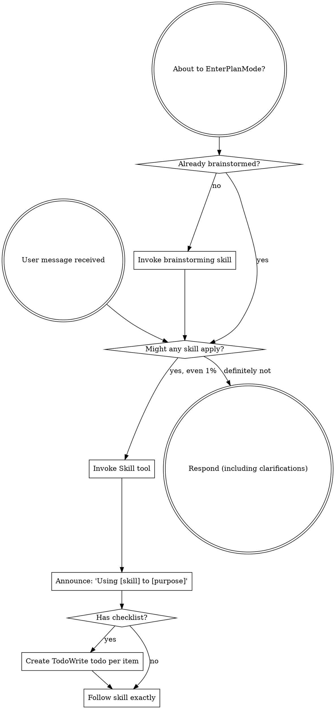
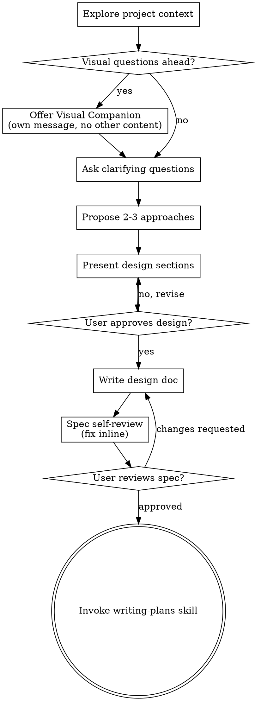
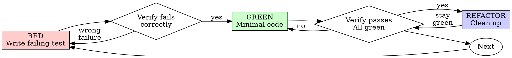
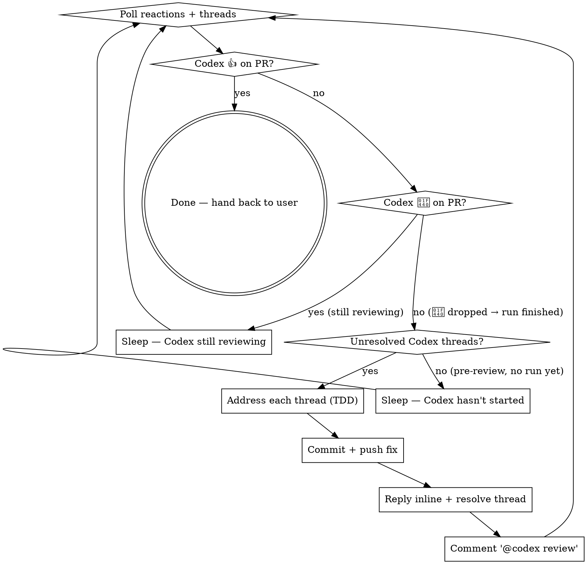

> SYSTEM

# AGENTS.md instructions for /Users/ericson/.t3/worktrees/ars-ui/t3code-6d170779

<INSTRUCTIONS>
# ars-ui

## Project Overview

Rust frontend component library using state machines, framework-agnostic core with Leptos/Dioxus adapters.

## Current Phase

The repo is now in active implementation, not spec drafting only.

Agents working on implementation should use the GitHub Project roadmap and issue backlog as the execution source of truth:

- Use the GitHub Project `ars-ui implementation roadmap` to understand active epics, task breakdown, dependencies, status, and iteration planning.
- Prefer picking a single issue-backed task that is unblocked, sized, and scoped for independent delivery.
- Do not start work from an epic issue unless the user explicitly asks for planning or further decomposition.
- Do not start a task that is blocked by unresolved GitHub issue dependencies.
- Treat native GitHub issue dependencies as the blocker graph and the issue body acceptance criteria as the delivery contract.

## Development Workflow

For implementation tasks:

1. Read the assigned or selected GitHub issue first.
2. Move the issue to **In Progress** on the GitHub Project board.
3. Review the cited spec sections and any dependency issues.
4. Add or update the named tests first.
5. Implement only the scope required to make those tests pass.
6. If implementation changes the intended contract, update the relevant spec in the same task.
7. **MANDATORY:** Invoke the `post-implementation-audit` skill (`.agents/skills/post-implementation-audit/SKILL.md`). It runs three sequential audits on the new code — (a) spec/implementation drift with "best outcome" recommendations, (b) iterative "anything else missing?" passes (minimum two rounds), (c) test-coverage audit across every test type the workspace uses (unit, snapshot, proptest, mutation, doc, spec-conformance, llvm-cov). **Every finding lands in _this_ PR — no deferral, no follow-up issues.** This step exists because initial implementations consistently ship spec drift and silent contract violations that take 3+ review round-trips to surface; the audit collapses them into one. Skipping this step is a contract violation.
8. Present the final result for user review before any commit.
9. After user approval, run `cargo xci --profile fast` (alias: `cargo xci-fast`) locally and fix any failures before pushing anything to GitHub. The fast profile takes ~5 minutes and covers the workspace-level regressions a pre-push gate should catch: fmt, check, clippy, unit, integration, adapter, spec-compile-snippets, error-variant-coverage, mutual-exclusion, snapshot-count. Reserve full `cargo xci` (~25 minutes, all 20 gates including wasm coverage and the feature-matrix groups) for after substantial refactors that may have shifted feature-flag interactions. For small follow-up changes, run the focused tests and checks that cover the edited code instead.
10. After `cargo xci-fast` passes, commit and push a PR targeting `main`. The PR body MUST include an auto-close keyword for the issue being delivered, for example `Closes #20` or `Fixes #20`, so GitHub closes the issue automatically when the PR merges.
11. **If the PR creates or modifies any `.snap` insta fixtures, attach the `snapshot-reviewed` label after opening or updating it** (`gh pr edit <num> --add-label "snapshot-reviewed"`). This signals to reviewers that the snapshot output was inspected and is intentional. Re-apply the label whenever you push a commit that touches `.snap` files; the workflow assumes the label reflects the latest snapshot state.
12. **MANDATORY:** Invoke the `waiting-for-codex-review` skill (`.agents/skills/waiting-for-codex-review/SKILL.md`) immediately after the first push that creates the PR, and re-invoke it after every subsequent push to the PR branch. The skill posts the initial `@codex review` trigger, polls Codex's 👀 → (👍 \| ∅ + threads) reaction lifecycle, addresses any review threads with the same rigor as `post-implementation-audit` (TDD + no coverage regression), replies inline, resolves threads, and re-comments `@codex review` to start the next pass — looping until Codex leaves 👍. Skipping this step leaves Codex findings unaddressed and silently widens the gap between merged code and the spec; the merge gate is 👍 from Codex plus green CI, not green CI alone.
13. Only after CI passes, Codex has left 👍, and the PR is merged, close the issue.

Never close a GitHub issue without a merged PR that passes CI **and a 👍 from Codex**. Never commit or push without explicit user approval. Keep the issue, PR, and Project board status aligned with the actual work state at every step.

Default delivery rules:

- Follow TDD: tests first, implementation second, verification last.
- Keep task scope aligned with the issue. If the issue is too large or ambiguous, stop and split or clarify rather than freelancing a bigger change.
- Prefer tasks sized `1`, `2`, `3`, or `5` points. `8` is exceptional. `13` must be decomposed before implementation.
- Preserve the crate and dependency layering defined by the architecture and implementation plan.
- Do not add a new dependency crate without explicit user approval first. If a task appears to need a new crate, stop, explain why, and get approval before editing any `Cargo.toml`.
- When a task is complete, verify the exact tests and checks named by the issue before considering it done.
- For adapter-level component implementation, follow `docs/implementation/adapter-component-delivery.md`. Adapter component work must cover the adapter crate, adapter tests, E2E fixtures/harnesses when applicable, widgets examples, spec synchronization, and the required validation/audit loop in one PR.

### Code Quality Standards

- **Document all public items.** Every public struct, enum, trait, function, constant, type alias, method, field, and variant must have a `///` doc comment. Every `lib.rs` must have a `//!` crate-level doc comment. The workspace enforces `missing_docs` linting — undocumented public items are build failures.
- **Zero warnings policy.** All code must compile with zero warnings under the workspace's configured clippy and rustc lints. Fix the root cause instead of suppressing. When suppression is genuinely needed, use `#[expect(lint, reason = "...")]` — never `#[allow(...)]`.
- **Derive documentation from the spec.** Doc comments should describe the _purpose and semantics_ of the item as defined in the corresponding `spec/` files, not just restate the type signature.
- **Use `#[inline]` selectively, not mechanically.** Do **not** add Clippy's `missing_inline_in_public_items` lint at the workspace level, and do not treat public visibility alone as a reason to mark an item `#[inline]`. Use `#[inline]` for thin cross-crate wrappers, trivial accessors, and hot-path no-op shims where the call overhead is plausibly meaningful. Avoid blanket `#[inline]` on all public APIs — it increases code size, adds compile-time cost, and turns `#[inline]` into noise instead of a deliberate performance signal.
- **Use directory-backed modules with `mod.rs` when a module owns children.** This repo standardizes on the older filesystem layout for nested modules. If module `foo` has child modules, the parent must live at `foo/mod.rs`, not `foo.rs`. Do not mix `foo.rs` with a sibling `foo/` directory. When a refactor adds child modules under an existing flat file, move the parent into `foo/mod.rs` in the same change. Do not leave empty leftover module directories behind.

### API Design Standards

- **Design for the pit of success.** Public APIs should make the most natural, shortest path also be the path that is correct, accessible, localizable, type-safe, and performant. Prefer ergonomic constructors and defaults that preserve the spec's strongest guarantees instead of making users opt into correctness after choosing a convenient API.
- **Name escape hatches explicitly.** When a component needs a lower-level, static, non-i18n, or otherwise less complete path, keep it available but make the tradeoff visible in the API name or type. The blessed path should remain the simplest call site, while escape hatches should read as deliberate choices.
- **Keep semantic data separate from rendered views.** Rich framework views are useful for customization, but components still need semantic sources for accessible names, localized text, announcements, ids, and state-machine wiring. Do not rely on arbitrary rendered view trees as the only source of user-facing semantics.

### Code Coverage

The workspace uses `cargo-llvm-cov` for code coverage with per-crate threshold enforcement. CI runs coverage on every PR (see `.github/workflows/ci.yml`).

**Local coverage commands:**

```bash
# Per-crate coverage with inline annotated source (most useful during development)
cargo llvm-cov test -p ars-interactions --text -- hover

# Per-crate summary only
cargo llvm-cov test -p ars-interactions -- hover

# Native-only workspace coverage (host target; excludes wasm-only crates)
cargo llvm-cov --workspace \
  --exclude ars-leptos --exclude ars-dioxus \
  --exclude ars-test-harness-leptos --exclude ars-test-harness-dioxus \
  --exclude ars-derive --exclude xtask \
  --lcov --output-path lcov.info

# Check all crates against spec-defined thresholds (run after a *merged* lcov)
cargo xtask coverage check-all --file lcov.info
```

The `--text` flag produces line-by-line annotated source showing hit counts and `^0` markers on uncovered branches — use this to identify gaps after writing tests. Uncovered no-op callback closures in tests (e.g., `|_| {}`) are expected and not a gap.

The local recipe above excludes the adapter and adapter-test-harness crates because their `target_arch = "wasm32"` / `feature = "web"` code paths can't be measured via host-target `cargo llvm-cov`. **CI runs an additional wasm-coverage pipeline on nightly** (`cargo xtask ci coverage`) that uses `wasm-bindgen-test`'s experimental coverage recipe with LLVM 22 / `clang-22` to emit lcov for `ars-leptos` (csr), `ars-dioxus` (web), `ars-dom` (web), `ars-i18n` (web-intl), and the adapter test harnesses, then merges with the native lcov via `cargo xtask coverage merge`. The per-crate thresholds in `xtask::coverage::default_thresholds()` are enforced against the merged file — including adapter targets (`ars-leptos` 74/55, `ars-dioxus` 77/70, `ars-test-harness-leptos` 60/0, `ars-test-harness-dioxus` 60/0). `ars-derive` (proc-macro, runs in compiler) is exercised via `crates/ars-core/tests/derive_contract.rs` and is unmeasured. `xtask` has its own enforced threshold (30/35) and is measured. See `spec/testing/14-ci.md` §2 for the full pipeline.

### Mutation Testing

Coverage tells you which lines run. **Mutation testing tells you whether the tests would notice if those lines silently misbehaved.** The workspace uses [`cargo-mutants`](https://mutants.rs) for this — a `cargo` extension binary, not a workspace dependency.

**Install (once per developer machine):**

```bash
cargo install cargo-mutants --locked --version 27.0.0
```

**Local commands (state-machine modules are the most rewarding targets):**

```bash
# Run on a single component machine (~6 min for popover)
cargo mutants -p ars-components -f crates/ars-components/src/overlay/popover/mod.rs

# Just list what would be mutated, without running tests (fast)
cargo mutants -p ars-components -f crates/ars-components/src/overlay/popover/mod.rs --list

# Whole crate (slow — only if you really mean it)
cargo mutants -p ars-components
```

**Agnostic component implementation gate:** whenever an agent implements a new framework-agnostic component, or materially changes an existing one, the delivery must include:

- a targeted mutation run for the component source file, usually `cargo mutants -p ars-components -f crates/ars-components/src/<category>/<component>/mod.rs` (adjust the path for single-file modules);
- spec-conformance tests for the component's anatomy/public contract, including its `Part` enum and required API/attribute surface;
- same-task triage of every `MISSED` mutant: add tests for real gaps, or add a justified line-agnostic `.cargo/mutants.toml` exclude only for true equivalent mutations.

**Reading the output:** Results land in `mutants.out/mutants.out/` (gitignored). The two files that matter:

- `caught.txt` — mutations that broke at least one test ✅
- `missed.txt` — mutations that survived all tests ❌ — each one is either a real test gap to fill or an "equivalent mutation" that needs a `[[skip]]` entry in `mutants.toml` with a justification

**CI integration:** Nightly only. `.github/workflows/nightly.yml` has a `mutation-testing` job with a 21-entry matrix that runs `cargo mutants -p <package>` on every framework-agnostic crate, using `--shard k/n` to spread larger crates across parallel runners. **Shard indices are 0-based** (`k` runs from `0` to `n-1`); `k == n` is invalid and will fail the job. When adding shards, always start at `0/n` and end at `(n-1)/n`.

- **`ars-components` (≈ 1,630 mutants today, planned to grow as the spec adds the remaining ~97 components):** sharded **12-way** → ≈ 135 mutants per runner today, ≈ 850 per runner at the ~10,000-mutant endpoint. Sized for the full spec catalog up front so we don't re-shard every few months as components land.
- **`ars-collections` (≈ 1,080 mutants):** sharded 4-way → ≈ 270 mutants per runner.
- **`ars-core` (≈ 700 mutants):** sharded 2-way → ≈ 350 mutants per runner.
- **`ars-a11y`, `ars-forms`, `ars-interactions`:** one runner each (under 600 mutants apiece).

**Adding a new state machine inside an existing crate requires no CI changes** — its mutations land in whichever shard the cargo-mutants partitioner places them. The shard counts are sized so the slowest runner stays well under 30 minutes today and under ~50 minutes at the planned endpoint; re-balance only when a crate outgrows that budget (visible on the nightly dashboard as one shard pulling away from the others).

All matrix jobs run with `fail-fast: false` so failures on one module don't mask data on another. Each job uploads its `mutants.out/` as a workflow artifact (always, even on success — surviving "missed" entries on a passing run still reveal test-quality work). The job fails if any mutation survives, so a missed mutation forces a deliberate triage decision (fix the test, or document the equivalence with a `[[skip]]` entry in `mutants.toml`).

**Excluded crates** (mutation testing's signal degrades wherever determinism does): adapter glue (`ars-leptos`, `ars-dioxus`), DOM/FFI (`ars-dom`), ICU/FFI (`ars-i18n`), test infrastructure (`ars-test-harness*`), and the proc-macro crate (`ars-derive`, runs in the compiler). Adding a brand-new crate that is a good mutation target requires one new matrix entry; run a local scout first (`cargo mutants -p <crate> --list` to size, then a real run) so we know the right shard count before the nightly fires.

**Bumping the pinned version.** Both the local install command above and `.github/workflows/nightly.yml` pin cargo-mutants to an exact version (currently `27.0.0`) — same convention as `wasm-pack` in the `a11y-audit` job. Pinning is deliberate: cargo-mutants ships new mutators in releases, and an unpinned install would silently change the mutation set without any code change, surfacing as phantom CI failures on a green-source repo. To bump, open a PR that (1) updates the version string in CLAUDE.md and `nightly.yml`, (2) runs the popover scout locally with the new version (`cargo mutants -p ars-components -f crates/ars-components/src/overlay/popover/mod.rs`) to confirm the mutation count is in the same ballpark, and (3) triages any new "missed" entries the new mutators surface — they are usually genuine test-quality gaps newly visible to the tool.

### Property Testing (proptest)

State-machine invariants are exercised by [`proptest`](https://docs.rs/proptest) under `crates/<crate>/tests/proptest_state_machines/` (see `ars-components`). Default proptest behaviour drops `*.proptest-regressions` seed files alongside test sources — instead, every `proptest!` block in this workspace pulls a shared `Config` from `tests/proptest_state_machines/common.rs` that:

1. Reads `PROPTEST_CASES` from the environment (1,000 default; 10,000 in the nightly `extended-proptest` job).
2. Sets `failure_persistence` to `FileFailurePersistence::Direct("proptest-regressions/state-machines.txt")`, so all persisted seeds for the test binary live in one file at the crate root: `crates/<crate>/proptest-regressions/state-machines.txt`. The directory is committed (per proptest's own recommendation in the file header) so every developer's runs benefit from previously-shrunk failures.

When a new crate adopts proptest for state-machine tests, copy the same `common.rs` helper and reference it via `#![proptest_config(super::common::proptest_config())]` inside every `proptest!` block. Don't let proptest fall back to its `WithSource` default — that scatters seed files across the source tree.

### Adapter Prelude Convention

Both `ars-leptos` and `ars-dioxus` expose a `prelude` module targeting **end users** — application developers who consume the ready-made components. `use ars_leptos::prelude::*` (or `use ars_dioxus::prelude::*`) should give them everything they need.

The prelude contains only user-facing items:

1. **Component modules** — as components land, their public module paths (e.g., `button`, `dialog`) are re-exported so users can write `button::Props`, etc.
2. **User-facing traits** — traits end users call on component outputs (e.g., `Translate` from `ars-i18n`). Re-export the trait so consumers don't need a direct dependency on the subsystem crate.
3. **Configuration types** — types that appear in component props or configure behaviour (e.g., `Locale`, `Direction`, `Orientation`, `Selection`).

The prelude does **not** include implementation details consumed only by component authors inside the adapter crate: core engine types (`Machine`, `Service`, `ConnectApi`, `AttrMap`), accessibility primitives (`AriaRole`, `AriaAttribute`), interaction helpers (`merge_attrs`), or adapter hooks (`use_machine`, `UseMachineReturn`). Those remain accessible via their normal crate paths for advanced users building custom machines.

Both adapter preludes must stay symmetric: same items, same structure. When adding a new re-export to one adapter's prelude, add it to the other as well in the same PR.

### Adapter Testing Convention

Adapter-level component tests should default to the framework-specific test harness crate:

- Leptos adapter tests should prefer `ars-test-harness-leptos`.
- Dioxus adapter tests should prefer `ars-test-harness-dioxus`.
- Shared `ars-test-harness` helpers should be used where relevant for viewport, layout, clipboard, drag/drop, timing, and other DOM test setup instead of bespoke per-test browser scaffolding.

When a component spec requires interaction, focus, overlay positioning, clipboard, file upload, drag/drop, or similar browser behavior, the task's tests should exercise that behavior through the adapter harness entrypoints and shared core harness helpers unless there is a concrete technical reason not to.

## Spec Synchronization During Implementation

The specification is the authoritative contract. It took weeks of deliberate design and MUST be followed.

### Spec-first implementation rule

Before implementing any public type, trait, function, or method:

1. **Read the spec section first.** Find the relevant code example in `spec/`. Use `spec-tool toc <file>` and `grep` to locate it.
2. **Match the spec exactly.** If the spec defines `struct ComponentIds { base: String }` with methods `from_id()`, `id()`, `part()`, `item()`, `item_part()` — implement exactly that. Do not invent alternative field names, method names, or signatures.
3. **Cross-check after implementation.** Before presenting code for review, diff every public item against the spec's code examples. Every struct field, every method name, every parameter must match.
4. **If you must deviate**, there must be a concrete technical reason (e.g., the spec's API cannot compile, or a dependency doesn't expose the needed type). Document the reason in a code comment and flag it to the user explicitly.

Inventing alternative APIs that "seem equivalent" is never acceptable — it silently invalidates the spec's design decisions and all downstream code that depends on those APIs.

### Spec/code mismatch resolution

- If code and spec disagree, resolve the mismatch in the same task or PR.
- Shared conceptual changes belong in shared or foundation spec files, not only in adapter code.
- Adapter-specific findings must be reflected back into `spec/foundation/08-adapter-leptos.md` and/or `spec/foundation/09-adapter-dioxus.md` when relevant.
- Do not leave spec drift behind as follow-up cleanup.

## Spec Structure

The specification lives in `spec/` with this layout:

- `spec/manifest.toml` — **START HERE** — central index of all components and their dependencies
- `spec/foundation/` — architecture, accessibility, i18n, interactions, forms, adapters, spec template (00-10)
- `spec/shared/` — cross-component shared types (date-time, selection, layout, z-index)
- `spec/components/{category}/` — one file per component, organized by category
- `spec/testing/` — test specs split by domain

### Component Categories

- `input/` — checkbox, text-field, slider, number-input, etc.
- `selection/` — select, combobox, listbox, menu, tags-input, etc.
- `overlay/` — dialog, popover, tooltip, toast, presence, etc.
- `navigation/` — accordion, tabs, tree-view, pagination, steps, etc.
- `date-time/` — date-field, time-field, calendar, date-picker, etc.
- `data-display/` — table, avatar, progress, meter, badge, etc.
- `layout/` — splitter, scroll-area, carousel, portal, toolbar, etc.
- `specialized/` — color-picker, file-upload, signature-pad, qr-code, etc.
- `utility/` — button, toggle, focus-scope, visually-hidden, separator, etc.

## Working with the Spec

When reading large files, run `wc -l` first to check the line count. If the file is over 2,000
lines, use the `offset` and `limit` parameters on the Read tool to read in chunks rather than
attempting to read the entire file at once.

### Using xtask spec (preferred)

Use `cargo xtask spec` to resolve file sets instead of manually parsing manifest.toml:

```bash
# Quick metadata lookup:
cargo xtask spec info <component>

# Find all components using a shared type:
cargo xtask spec reverse <shared-type>

# See a file's heading structure (with line numbers):
cargo xtask spec toc <file>

# Validate frontmatter matches manifest.toml:
cargo xtask spec validate

# Search spec content by keyword/regex (with optional filters):
cargo xtask spec search <query> [--category <cat>] [--section <sec>] [--tier <tier>]

# Get a compact component summary (states, events, props, accessibility):
cargo xtask spec digest <component>

# Get full implementation context (component + all deps concatenated):
cargo xtask spec context <component> [--framework <fw>] [--include-testing]
```

The xtask also runs as an MCP server (`cargo xtask mcp`) exposing all spec tools for LLM agents.

### Reading a component (manual fallback)

1. Read `spec/manifest.toml` to find the component's path and dependencies
2. Read the component file (has YAML frontmatter listing its foundation/shared deps)
3. Only load the foundation files listed in `foundation_deps` — not all of them

### Framework and library specs — MANDATORY skill loading

When reading or editing these specification files, you MUST load the corresponding skill BEFORE doing any work. The skills contain verified, version-accurate API documentation that the spec code examples depend on. Claude's training data is wrong for these libraries — do not trust it.

| Spec file                                    | Skill to load | Library version |
| -------------------------------------------- | ------------- | --------------- |
| `spec/foundation/04-internationalization.md` | `icu4x`       | ICU4X 2.1.1     |
| `spec/foundation/08-adapter-leptos.md`       | `leptos`      | Leptos 0.8.17   |
| `spec/foundation/09-adapter-dioxus.md`       | `dioxus`      | Dioxus 0.7.3    |

This applies to any task that touches adapter code: reviewing, writing, modifying, or answering questions about these files. Load the skill first, then proceed.

### Spec Conventions

- **No deprecation:** This is a greenfield spec. If an API is unused or redundant, remove it and fix all references. Never use `#[deprecated]` or deprecation shims.
- **No deferral:** Never mark spec content as "TODO", "FIXME", "future enhancement", "P1/P2 extension", or any similar deferral language. Every feature mentioned must be fully specified. If a design choice is unclear, ask the user rather than deferring.
- **No guessing external APIs:** NEVER guess function names or module paths for external crates. Always verify against `https://docs.rs/<crate_name>` before writing code that calls library APIs. This applies especially to Leptos, Dioxus, ICU4X, and any crate where training data may be stale. If you cannot verify, state that explicitly rather than fabricating a plausible-looking API.

### Component file format

Each component file has YAML frontmatter declaring its metadata:

```markdown
---
component: ComponentName
category: { category }
tier: stateless | stateful | complex
foundation_deps: [architecture, accessibility, ...]
shared_deps: [date-time-types, ...]
related: [sibling-component, ...]
---

# ComponentName
```

The `tier` field determines which sections are required — see `spec/foundation/10-component-spec-template.md` for the canonical section structure, ordering rules, and conformance checklist. Headings are numbered (e.g., `## 1. State Machine`, `### 1.1 States`, `#### 1.1.1 InnerStates`, etc.) for precise section references.

</INSTRUCTIONS>
<environment_context>
  <cwd>/Users/ericson/.t3/worktrees/ars-ui/t3code-6d170779</cwd>
  <shell>zsh</shell>
  <current_date>2026-05-24</current_date>
  <timezone>America/Sao_Paulo</timezone>
</environment_context>

> DEVELOPER

We just finished the epic #222 by implementing all agnostic overlay components. I wanna do an audit on them, verifying if everything was properly implemented including tests like proptests and the spec compliance tests. For these 2, let's also have a submodule for each component, they're currently bloated together in a single module for the entire overlay category

> AGENT

I’ll ground this in the current overlay implementation and test layout first, then I’ll turn that into a decision-complete audit/refactor plan. I’m also loading the relevant workflow skills so the plan follows the repo’s required audit and planning conventions.

> TOOL

tool_use exec_command
id: call_XqJdRrHGGghgVDiseVMhpOkh
```json
{
  "cmd": "sed -n '1,220p' /Users/ericson/.codex/plugins/cache/openai-curated/superpowers/6188456f/skills/using-superpowers/SKILL.md && sed -n '1,220p' /Users/ericson/.codex/plugins/cache/openai-curated/superpowers/6188456f/skills/writing-plans/SKILL.md && sed -n '1,180p' /Users/ericson/.claude/skills/brainstorming/SKILL.md",
  "workdir": "/Users/ericson/.t3/worktrees/ars-ui/t3code-6d170779",
  "yield_time_ms": 1000,
  "max_output_tokens": 12000
}
```

> TOOL

tool_use exec_command
id: call_cW4K9B4h9LOos7LTqpH4EYoO
```json
{
  "cmd": "rg -n \"overlay|#222|Popover|Dialog|Tooltip|Toast|Presence|HoverCard|AlertDialog|Menu|Sheet|Drawer|Modal\" /Users/ericson/.codex/memories/MEMORY.md",
  "workdir": "/Users/ericson/.t3/worktrees/ars-ui/t3code-6d170779",
  "yield_time_ms": 1000,
  "max_output_tokens": 8000
}
```

> TOOL

tool_use exec_command
id: call_Z36V9u9Baug8V16WaeaLByIv
```json
{
  "cmd": "pwd && rg --files crates/ars-components/src/overlay crates/ars-components/tests spec/components/overlay .agents/skills | sort",
  "workdir": "/Users/ericson/.t3/worktrees/ars-ui/t3code-6d170779",
  "yield_time_ms": 1000,
  "max_output_tokens": 20000
}
```

> TOOL

tool_result
id: call_XqJdRrHGGghgVDiseVMhpOkh
```
Chunk ID: d235d5
Wall time: 0.1518 seconds
Process exited with code 0
Original token count: 5539
Output:
---
name: using-superpowers
description: Use when starting any conversation - establishes how to find and use skills, requiring Skill tool invocation before ANY response including clarifying questions
---

<SUBAGENT-STOP>
If you were dispatched as a subagent to execute a specific task, skip this skill.
</SUBAGENT-STOP>

<EXTREMELY-IMPORTANT>
If you think there is even a 1% chance a skill might apply to what you are doing, you ABSOLUTELY MUST invoke the skill.

IF A SKILL APPLIES TO YOUR TASK, YOU DO NOT HAVE A CHOICE. YOU MUST USE IT.

This is not negotiable. This is not optional. You cannot rationalize your way out of this.
</EXTREMELY-IMPORTANT>

## Instruction Priority

Superpowers skills override default system prompt behavior, but **user instructions always take precedence**:

1. **User's explicit instructions** (CLAUDE.md, GEMINI.md, AGENTS.md, direct requests) — highest priority
2. **Superpowers skills** — override default system behavior where they conflict
3. **Default system prompt** — lowest priority

If CLAUDE.md, GEMINI.md, or AGENTS.md says "don't use TDD" and a skill says "always use TDD," follow the user's instructions. The user is in control.

## How to Access Skills

**In Claude Code:** Use the `Skill` tool. When you invoke a skill, its content is loaded and presented to you—follow it directly. Never use the Read tool on skill files.

**In Copilot CLI:** Use the `skill` tool. Skills are auto-discovered from installed plugins. The `skill` tool works the same as Claude Code's `Skill` tool.

**In Gemini CLI:** Skills activate via the `activate_skill` tool. Gemini loads skill metadata at session start and activates the full content on demand.

**In other environments:** Check your platform's documentation for how skills are loaded.

## Platform Adaptation

Skills use Claude Code tool names. Non-CC platforms: see `references/copilot-tools.md` (Copilot CLI), `references/codex-tools.md` (Codex) for tool equivalents. Gemini CLI users get the tool mapping loaded automatically via GEMINI.md.

# Using Skills

## The Rule

**Invoke relevant or requested skills BEFORE any response or action.** Even a 1% chance a skill might apply means that you should invoke the skill to check. If an invoked skill turns out to be wrong for the situation, you don't need to use it.



## Red Flags

These thoughts mean STOP—you're rationalizing:

| Thought | Reality |
|---------|---------|
| "This is just a simple question" | Questions are tasks. Check for skills. |
| "I need more context first" | Skill check comes BEFORE clarifying questions. |
| "Let me explore the codebase first" | Skills tell you HOW to explore. Check first. |
| "I can check git/files quickly" | Files lack conversation context. Check for skills. |
| "Let me gather information first" | Skills tell you HOW to gather information. |
| "This doesn't need a formal skill" | If a skill exists, use it. |
| "I remember this skill" | Skills evolve. Read current version. |
| "This doesn't count as a task" | Action = task. Check for skills. |
| "The skill is overkill" | Simple things become complex. Use it. |
| "I'll just do this one thing first" | Check BEFORE doing anything. |
| "This feels productive" | Undisciplined action wastes time. Skills prevent this. |
| "I know what that means" | Knowing the concept ≠ using the skill. Invoke it. |

## Skill Priority

When multiple skills could apply, use this order:

1. **Process skills first** (brainstorming, debugging) - these determine HOW to approach the task
2. **Implementation skills second** (frontend-design, mcp-builder) - these guide execution

"Let's build X" → brainstorming first, then implementation skills.
"Fix this bug" → debugging first, then domain-specific skills.

## Skill Types

**Rigid** (TDD, debugging): Follow exactly. Don't adapt away discipline.

**Flexible** (patterns): Adapt principles to context.

The skill itself tells you which.

## User Instructions

Instructions say WHAT, not HOW. "Add X" or "Fix Y" doesn't mean skip workflows.
---
name: writing-plans
description: Use when you have a spec or requirements for a multi-step task, before touching code
---

# Writing Plans

## Overview

Write comprehensive implementation plans assuming the engineer has zero context for our codebase and questionable taste. Document everything they need to know: which files to touch for each task, code, testing, docs they might need to check, how to test it. Give them the whole plan as bite-sized tasks. DRY. YAGNI. TDD. Frequent commits.

Assume they are a skilled developer, but know almost nothing about our toolset or problem domain. Assume they don't know good test design very well.

**Announce at start:** "I'm using the writing-plans skill to create the implementation plan."

**Context:** If working in an isolated worktree, it should have been created via the `superpowers:using-git-worktrees` skill at execution time.

**Save plans to:** `docs/superpowers/plans/YYYY-MM-DD-<feature-name>.md`
- (User preferences for plan location override this default)

## Scope Check

If the spec covers multiple independent subsystems, it should have been broken into sub-project specs during brainstorming. If it wasn't, suggest breaking this into separate plans — one per subsystem. Each plan should produce working, testable software on its own.

## File Structure

Before defining tasks, map out which files will be created or modified and what each one is responsible for. This is where decomposition decisions get locked in.

- Design units with clear boundaries and well-defined interfaces. Each file should have one clear responsibility.
- You reason best about code you can hold in context at once, and your edits are more reliable when files are focused. Prefer smaller, focused files over large ones that do too much.
- Files that change together should live together. Split by responsibility, not by technical layer.
- In existing codebases, follow established patterns. If the codebase uses large files, don't unilaterally restructure - but if a file you're modifying has grown unwieldy, including a split in the plan is reasonable.

This structure informs the task decomposition. Each task should produce self-contained changes that make sense independently.

## Bite-Sized Task Granularity

**Each step is one action (2-5 minutes):**
- "Write the failing test" - step
- "Run it to make sure it fails" - step
- "Implement the minimal code to make the test pass" - step
- "Run the tests and make sure they pass" - step
- "Commit" - step

## Plan Document Header

**Every plan MUST start with this header:**

```markdown
# [Feature Name] Implementation Plan

> **For agentic workers:** REQUIRED SUB-SKILL: Use superpowers:subagent-driven-development (recommended) or superpowers:executing-plans to implement this plan task-by-task. Steps use checkbox (`- [ ]`) syntax for tracking.

**Goal:** [One sentence describing what this builds]

**Architecture:** [2-3 sentences about approach]

**Tech Stack:** [Key technologies/libraries]

---
```

## Task Structure

````markdown
### Task N: [Component Name]

**Files:**
- Create: `exact/path/to/file.py`
- Modify: `exact/path/to/existing.py:123-145`
- Test: `tests/exact/path/to/test.py`

- [ ] **Step 1: Write the failing test**

```python
def test_specific_behavior():
    result = function(input)
    assert result == expected
```

- [ ] **Step 2: Run test to verify it fails**

Run: `pytest tests/path/test.py::test_name -v`
Expected: FAIL with "function not defined"

- [ ] **Step 3: Write minimal implementation**

```python
def function(input):
    return expected
```

- [ ] **Step 4: Run test to verify it passes**

Run: `pytest tests/path/test.py::test_name -v`
Expected: PASS

- [ ] **Step 5: Commit**

```bash
git add tests/path/test.py src/path/file.py
git commit -m "feat: add specific feature"
```
````

## No Placeholders

Every step must contain the actual content an engineer needs. These are **plan failures** — never write them:
- "TBD", "TODO", "implement later", "fill in details"
- "Add appropriate error handling" / "add validation" / "handle edge cases"
- "Write tests for the above" (without actual test code)
- "Similar to Task N" (repeat the code — the engineer may be reading tasks out of order)
- Steps that describe what to do without showing how (code blocks required for code steps)
- References to types, functions, or methods not defined in any task

## Remember
- Exact file paths always
- Complete code in every step — if a step changes code, show the code
- Exact commands with expected output
- DRY, YAGNI, TDD, frequent commits

## Self-Review

After writing the complete plan, look at the spec with fresh eyes and check the plan against it. This is a checklist you run yourself — not a subagent dispatch.

**1. Spec coverage:** Skim each section/requirement in the spec. Can you point to a task that implements it? List any gaps.

**2. Placeholder scan:** Search your plan for red flags — any of the patterns from the "No Placeholders" section above. Fix them.

**3. Type consistency:** Do the types, method signatures, and property names you used in later tasks match what you defined in earlier tasks? A function called `clearLayers()` in Task 3 but `clearFullLayers()` in Task 7 is a bug.

If you find issues, fix them inline. No need to re-review — just fix and move on. If you find a spec requirement with no task, add the task.

## Execution Handoff

After saving the plan, offer execution choice:

**"Plan complete and saved to `docs/superpowers/plans/<filename>.md`. Two execution options:**

**1. Subagent-Driven (recommended)** - I dispatch a fresh subagent per task, review between tasks, fast iteration

**2. Inline Execution** - Execute tasks in this session using executing-plans, batch execution with checkpoints

**Which approach?"**

**If Subagent-Driven chosen:**
- **REQUIRED SUB-SKILL:** Use superpowers:subagent-driven-development
- Fresh subagent per task + two-stage review

**If Inline Execution chosen:**
- **REQUIRED SUB-SKILL:** Use superpowers:executing-plans
- Batch execution with checkpoints for review
---
name: brainstorming
description: "You MUST use this before any creative work - creating features, building components, adding functionality, or modifying behavior. Explores user intent, requirements and design before implementation."
---

# Brainstorming Ideas Into Designs

Help turn ideas into fully formed designs and specs through natural collaborative dialogue.

Start by understanding the current project context, then ask questions one at a time to refine the idea. Once you understand what you're building, present the design and get user approval.

<HARD-GATE>
Do NOT invoke any implementation skill, write any code, scaffold any project, or take any implementation action until you have presented a design and the user has approved it. This applies to EVERY project regardless of perceived simplicity.
</HARD-GATE>

## Anti-Pattern: "This Is Too Simple To Need A Design"

Every project goes through this process. A todo list, a single-function utility, a config change — all of them. "Simple" projects are where unexamined assumptions cause the most wasted work. The design can be short (a few sentences for truly simple projects), but you MUST present it and get approval.

## Checklist

You MUST create a task for each of these items and complete them in order:

1. **Explore project context** — check files, docs, recent commits
2. **Offer visual companion** (if topic will involve visual questions) — this is its own message, not combined with a clarifying question. See the Visual Companion section below.
3. **Ask clarifying questions** — one at a time, understand purpose/constraints/success criteria
4. **Propose 2-3 approaches** — with trade-offs and your recommendation
5. **Present design** — in sections scaled to their complexity, get user approval after each section
6. **Write design doc** — save to `docs/superpowers/specs/YYYY-MM-DD-<topic>-design.md` and commit
7. **Spec self-review** — quick inline check for placeholders, contradictions, ambiguity, scope (see below)
8. **User reviews written spec** — ask user to review the spec file before proceeding
9. **Transition to implementation** — invoke writing-plans skill to create implementation plan

## Process Flow



**The terminal state is invoking writing-plans.** Do NOT invoke frontend-design, mcp-builder, or any other implementation skill. The ONLY skill you invoke after brainstorming is writing-plans.

## The Process

**Understanding the idea:**

- Check out the current project state first (files, docs, recent commits)
- Before asking detailed questions, assess scope: if the request describes multiple independent subsystems (e.g., "build a platform with chat, file storage, billing, and analytics"), flag this immediately. Don't spend questions refining details of a project that needs to be decomposed first.
- If the project is too large for a single spec, help the user decompose into sub-projects: what are the independent pieces, how do they relate, what order should they be built? Then brainstorm the first sub-project through the normal design flow. Each sub-project gets its own spec → plan → implementation cycle.
- For appropriately-scoped projects, ask questions one at a time to refine the idea
- Prefer multiple choice questions when possible, but open-ended is fine too
- Only one question per message - if a topic needs more exploration, break it into multiple questions
- Focus on understanding: purpose, constraints, success criteria

**Exploring approaches:**

- Propose 2-3 different approaches with trade-offs
- Present options conversationally with your recommendation and reasoning
- Lead with your recommended option and explain why

**Presenting the design:**

- Once you believe you understand what you're building, present the design
- Scale each section to its complexity: a few sentences if straightforward, up to 200-300 words if nuanced
- Ask after each section whether it looks right so far
- Cover: architecture, components, data flow, error handling, testing
- Be ready to go back and clarify if something doesn't make sense

**Design for isolation and clarity:**

- Break the system into smaller units that each have one clear purpose, communicate through well-defined interfaces, and can be understood and tested independently
- For each unit, you should be able to answer: what does it do, how do you use it, and what does it depend on?
- Can someone understand what a unit does without reading its internals? Can you change the internals without breaking consumers? If not, the boundaries need work.
- Smaller, well-bounded units are also easier for you to work with - you reason better about code you can hold in context at once, and your edits are more reliable when files are focused. When a file grows large, that's often a signal that it's doing too much.

**Working in existing codebases:**

- Explore the current structure before proposing changes. Follow existing patterns.
- Where existing code has problems that affect the work (e.g., a file that's grown too large, unclear boundaries, tangled responsibilities), include targeted improvements as part of the design - the way a good developer improves code they're working in.
- Don't propose unrelated refactoring. Stay focused on what serves the current goal.

## After the Design

**Documentation:**

- Write the validated design (spec) to `docs/superpowers/specs/YYYY-MM-DD-<topic>-design.md`
  - (User preferences for spec location override this default)
- Use elements-of-style:writing-clearly-and-concisely skill if available
- Commit the design document to git

**Spec Self-Review:**
After writing the spec document, look at it with fresh eyes:

1. **Placeholder scan:** Any "TBD", "TODO", incomplete sections, or vague requirements? Fix them.
2. **Internal consistency:** Do any sections contradict each other? Does the architecture match the feature descriptions?
3. **Scope check:** Is this focused enough for a single implementation plan, or does it need decomposition?
4. **Ambiguity check:** Could any requirement be interpreted two different ways? If so, pick one and make it explicit.

Fix any issues inline. No need to re-review — just fix and move on.

**User Review Gate:**
After the spec review loop passes, ask the user to review the written spec before proceeding:

> "Spec written and committed to `<path>`. Please review it and let me know if you want to make any changes before we start writing out the implementation plan."

Wait for the user's response. If they request changes, make them and re-run the spec review loop. Only proceed once the user approves.

**Implementation:**

- Invoke the writing-plans skill to create a detailed implementation plan
- Do NOT invoke any other skill. writing-plans is the next step.

## Key Principles

- **One question at a time** - Don't overwhelm with multiple questions
- **Multiple choice preferred** - Easier to answer than open-ended when possible
- **YAGNI ruthlessly** - Remove unnecessary features from all designs
- **Explore alternatives** - Always propose 2-3 approaches before settling
- **Incremental validation** - Present design, get approval before moving on
- **Be flexible** - Go back and clarify when something doesn't make sense

## Visual Companion

A browser-based companion for showing mockups, diagrams, and visual options during brainstorming. Available as a tool — not a mode. Accepting the companion means it's available for questions that benefit from visual treatment; it does NOT mean every question goes through the browser.

**Offering the companion:** When you anticipate that upcoming questions will involve visual content (mockups, layouts, diagrams), offer it once for consent:
> "Some of what we're working on might be easier to explain if I can show it to you in a web browser. I can put together mockups, diagrams, comparisons, and other visuals as we go. This feature is still new and can be token-intensive. Want to try it? (Requires opening a local URL)"

**This offer MUST be its own message.** Do not combine it with clarifying questions, context summaries, or any other content. The message should contain ONLY the offer above and nothing else. Wait for the user's response before continuing. If they decline, proceed with text-only brainstorming.

**Per-question decision:** Even after the user accepts, decide FOR EACH QUESTION whether to use the browser or the terminal. The test: **would the user understand this better by seeing it than reading it?**

- **Use the browser** for content that IS visual — mockups, wireframes, layout comparisons, architecture diagrams, side-by-side visual designs
- **Use the terminal** for content that is text — requirements questions, conceptual choices, tradeoff lists, A/B/C/D text options, scope decisions

A question about a UI topic is not automatically a visual question. "What does personality mean in this context?" is a conceptual question — use the terminal. "Which wizard layout works better?" is a visual question — use the browser.

If they agree to the companion, read the detailed guide before proceeding:
`skills/brainstorming/visual-companion.md`

```

> TOOL

tool_result
id: call_cW4K9B4h9LOos7LTqpH4EYoO
```
Chunk ID: acab2e
Wall time: 0.2941 seconds
Process exited with code 0
Original token count: 2486
Output:
123:scope: Framework-agnostic `crates/ars-components/src/selection/` work for Combobox, Menu, Listbox, and Select, especially issue-backed machine delivery, keyboard/selection contract fixes, spec sync, snapshot handling, mutation audits, and same-PR review closure.
136:## Task 2: Implement Menu agnostic core and stop at review-ready handoff for issue #237
144:- Menu, menu, issue #237, ItemType, menuitemradio, menuitemcheckbox, typeahead_time, SubPositioner, cargo mutants, cargo xtask spec info menu, cargo llvm-cov, In Progress
172:- the mutation-testing loop was unusually high leverage for Menu: the first run found 44 misses, a second run reduced them to 2, and the final run passed with `185 mutants tested in 90m: 151 caught, 34 unviable` [Task 2]
180:- symptom: a first-pass Menu implementation seems fine under unit/spec tests but mutation survivors remain in guard code, `radio_group_attrs`, or typeahead fallback paths -> cause: baseline tests did not hit those exact branches, and a nondeterministic wall-clock helper obscured intent -> fix: add direct tests for the missing transitions/attrs and remove the wall-clock fallback so the agnostic core stays deterministic [Task 2]
240:# Task Group: ars-ui / ars-components overlay core implementation and publish workflow
242:scope: Framework-agnostic overlay work across `ars-components`, `ars-core`, and `ars-dom`, covering Drawer and AlertDialog core machines, DOM-free boundary enforcement, snapshot/spec review fixes, utility extraction seams, and the final publish/review path for overlay PRs.
243:applies_to: cwd=/Users/ericson/.t3/worktrees/ars-ui/*; reuse_rule=reuse for ars-ui checkouts touching `crates/ars-components/src/overlay/` or nearby utility/compatibility seams; verify live issue/PR state before moving roadmap items or publishing.
245:## Task 1: Implement Drawer agnostic core and harden review findings on the same PR
249:- rollout_summaries/REDACTED.md (cwd=/Users/ericson/.t3/worktrees/ars-ui/t3code-61dbf109, rollout_path=/Users/ericson/.codex/sessions/2026/05/21/rollout-2026-05-21T09-01-32-019e4a69-8d84-7753-89a0-ec5d2e651f96.jsonl, updated_at=2026-05-21T21:07:16+00:00, thread_id=019e4a69-8d84-7753-89a0-ec5d2e651f96, issue #263 Drawer implementation plus review hardening)
253:- Drawer, drawer, issue #263, drag_handle, tabindex, SetZIndex, request_id, z-index, spec/components/overlay/drawer.md, dialog pattern
255:## Task 2: Implement AlertDialog agnostic core, fix snapshot-count/spec review findings, and publish PR #660
263:- AlertDialog, alert_dialog, issue #260, overlay, dialog::State, snapshot-count, cargo xtask lint snapshot-count, cargo xtask spec compile-snippets, snapshot-reviewed, PR #660
275:## Task 4: Rebase the Dialog agnostic core branch, revalidate it, and open PR #627 with the co-author trailer
279:- rollout_summaries/REDACTED.md (cwd=/Users/ericson/.t3/worktrees/ars-ui/t3code-1fef6d79, rollout_path=/Users/ericson/.codex/sessions/2026/04/29/rollout-2026-04-29T15-04-18-019dda69-c612-7473-b42d-d539165a5135.jsonl, updated_at=2026-04-29T18:36:24+00:00, thread_id=019dda69-c612-7473-b42d-d539165a5135, Dialog publish flow with rebase, full gate, co-author trailer, and regular PR)
283:- Dialog, issue #253, overlay/dialog.rs, snapshot-reviewed, git rebase origin/main --autostash, cargo xci, chromedriver, wasm-bindgen-test-runner, Co-authored-by: OpenAI Codex <codex@openai.com>, PR #627
287:- when the user says `Implement task #263`, `Implement task #260`, or gives a bare overlay issue implementation order, inspect the live issue/spec/repo state first instead of guessing the architecture from the title alone [Task 1][Task 2][Task 3]
295:- `cargo xtask spec info drawer` and `cargo xtask spec toc spec/components/overlay/drawer.md` quickly expose the Drawer spec shape; `crates/ars-components/src/overlay/dialog/mod.rs` is the right local template for overlay-machine structure, effects, and `ConnectApi` output [Task 1]
296:- Drawer core owns open/close state, placement, snap-point state, swipe math, semantic IDs, ARIA/data attrs, and z-index intent, while adapters own live handles, focus trap/restoration, pointer capture, viewport/panel measurement, actual transforms/styles, and portal host integration [Task 1]
297:- the workspace’s overlay spec-conformance tests live in `crates/ars-components/tests/spec_conformance/overlay.rs`, and the overlay proptest harness lives in `crates/ars-components/tests/proptest_state_machines/overlay.rs` [Task 1]
298:- `AlertDialog` lives in `crates/ars-components/src/overlay/alert_dialog/mod.rs`, is exported from `crates/ars-components/src/overlay/mod.rs`, and reused Dialog semantics while staying an agnostic overlay-core component [Task 2]
299:- the overlay tree was reorganized into directory modules (`dialog/mod.rs`, `popover/mod.rs`, `presence/mod.rs`, `tooltip/mod.rs`, and peers) with per-component `snapshots/` directories; future overlay work should assume `mod.rs`-style placement rather than flat files [Task 1][Task 2]
305:- `cargo xci-fast` was the reliable end-to-end gate for the Drawer and AlertDialog implementation family, while `cargo xci` was the authoritative publish gate for the utility extraction and Dialog publish runs [Task 1][Task 2][Task 3][Task 4]
310:- symptom: a Drawer drag handle behaves like an interactive slider handle but is skipped by keyboard users -> cause: the first implementation left `drag_handle_attrs()` non-focusable -> fix: emit `tabindex="0"` and accept the resulting snapshot/spec change instead of hiding it [Task 1]
312:- symptom: an overlay component reuses `dialog::State` through `pub type State = ...::State` and snapshot-count CI misses it -> cause: the lint only looked for local enum declarations -> fix: teach `xtask/src/lint.rs` to resolve state aliases or give the module its own local `State` enum before relying on snapshot-count enforcement [Task 2]
356:- ranking LCOV files by missed branches/lines was the fastest way to scope the work; the worst offenders were `overlay/hover_card.rs`, `data_display/table/mod.rs`, `overlay/floating_panel.rs`, and `utility/download_trigger.rs` [Task 1]
2084:# Task Group: ars-ui / ars-components agnostic Avatar, Badge, Button, DateField, Heading, Landmark, Portal, Skeleton, Switch, TextField, Textarea, and Tooltip implementation plus review fixes
2086:scope: Framework-agnostic `crates/ars-components` implementation work for data-display/input/layout/utility/overlay components, plus the review-driven regression fixes that closed the related PR threads without lowering coverage.
2119:## Task 4: Implement Tooltip agnostic core and fix disabled Escape handling on PR #617
2219:- `crates/ars-components` must stay framework-agnostic and DOM-free; its manifest/test guard forbids an `ars-dom` dependency, so data-display/input/overlay work should stay at the machine/connect/spec layer [Task 1][Task 2][Task 4][Task 5][Task 6]
2226:- `crates/ars-components/src/overlay/presence.rs` was the closest agnostic overlay pattern for Tooltip machine/connect/test structure [Task 4]
2429:# Task Group: ars-ui / ars-components Presence core and overlay state-machine contract fixes
2431:scope: Presence core implementation, lazy-mount animation-token bugs, spec sync, and the validated PR review closure loop for overlay component work in ars-ui.
2432:applies_to: cwd=/Users/ericson/.codex/worktrees/*/ars-ui and /Users/ericson/.t3/worktrees/ars-ui/*; reuse_rule=reuse for ars-ui checkouts touching `crates/ars-components/src/overlay/presence.rs` or the Presence specs; re-fetch live PR thread state before replying or resolving.
2434:## Task 1: Implement Presence agnostic core, fix the lazy-mount token regression, and sync the contract
2444:## Task 2: Reply to and resolve the PR #610 review thread after validating the Presence fix
2461:- in Presence, `present=true` is not equivalent to `data-ars-state="open"` during lazy mount; the root animation token must be `"open"` only in `State::Mounted`, while `Mounting`, `UnmountPending`, and `Unmounted` stay `"closed"` [Task 1]
2463:- when Presence behavior changes, the regression surface includes both the direct unit test and the `presence_root_mounting` snapshot; the validated command sequence here was `cargo test -p ars-components presence::`, `cargo xtask spec validate`, then `cargo xci` [Task 1]
2464:- the core Presence contract also required syncing `spec/components/overlay/presence.md`, `spec/leptos-components/overlay/presence.md`, and `spec/dioxus-components/overlay/presence.md`; `cargo xtask spec validate` passed after those edits [Task 1]
2483:- rollout_summaries/REDACTED.md (cwd=/Users/ericson/.t3/worktrees/ars-ui/t3code-1fef6d79, rollout_path=/Users/ericson/.codex/sessions/2026/04/29/rollout-2026-04-29T15-04-18-019dda69-c612-7473-b42d-d539165a5135.jsonl, updated_at=2026-04-29T18:36:24+00:00, thread_id=019dda69-c612-7473-b42d-d539165a5135, rebase + full-gate publish for Dialog PR #627)
2506:- rollout_summaries/REDACTED.md (cwd=/Users/ericson/.codex/worktrees/8ccf/ars-ui, rollout_path=/Users/ericson/.codex/sessions/2026/04/25/rollout-2026-04-25T20-51-59-019dc70e-a796-7190-a54f-35d14d7c2936.jsonl, updated_at=2026-04-26T14:12:18+00:00, thread_id=019dc70e-a796-7190-a54f-35d14d7c2936, PR #610 review-thread reply after Presence validation)
3048:scope: Older `ars-dom` DOM-utility tasks outside `auto_update()`, focused on ModalityManager/shared-modality behavior, scroll-lock audit work, and the browser-testing/coverage patterns that validated them.
3059:- issue #72, ModalityManager, FocusRing, Arc<dyn ModalityContext>, scroll_lock.rs, cargo llvm-cov, cargo xtask coverage wasm, cargo xtask spec validate, proper PR #592

```

> TOOL

tool_result
id: call_Z36V9u9Baug8V16WaeaLByIv
```
Chunk ID: df3808
Wall time: 0.0426 seconds
Process exited with code 0
Original token count: 6522
Output:
/Users/ericson/.t3/worktrees/ars-ui/t3code-6d170779
.agents/skills/dioxus/SKILL.md
.agents/skills/dioxus/references/components.md
.agents/skills/dioxus/references/control-flow.md
.agents/skills/dioxus/references/fullstack.md
.agents/skills/dioxus/references/reactive.md
.agents/skills/dioxus/references/router.md
.agents/skills/icu4x/SKILL.md
.agents/skills/icu4x/references/calendar.md
.agents/skills/icu4x/references/datetime.md
.agents/skills/icu4x/references/locale-provider.md
.agents/skills/icu4x/references/text-processing.md
.agents/skills/leptos/SKILL.md
.agents/skills/leptos/references/components.md
.agents/skills/leptos/references/control-flow.md
.agents/skills/leptos/references/reactive.md
.agents/skills/leptos/references/router.md
.agents/skills/leptos/references/server.md
.agents/skills/playwright-cli/SKILL.md
.agents/skills/playwright-cli/references/request-mocking.md
.agents/skills/playwright-cli/references/running-code.md
.agents/skills/playwright-cli/references/session-management.md
.agents/skills/playwright-cli/references/storage-state.md
.agents/skills/playwright-cli/references/test-generation.md
.agents/skills/playwright-cli/references/tracing.md
.agents/skills/playwright-cli/references/video-recording.md
.agents/skills/post-implementation-audit/SKILL.md
.agents/skills/waiting-for-codex-review/SKILL.md
crates/ars-components/src/overlay/alert_dialog/mod.rs
crates/ars-components/src/overlay/alert_dialog/snapshots/ars_components__overlay__alert_dialog__tests__alert_dialog_action_trigger_default_label.snap
crates/ars-components/src/overlay/alert_dialog/snapshots/ars_components__overlay__alert_dialog__tests__alert_dialog_action_trigger_destructive.snap
crates/ars-components/src/overlay/alert_dialog/snapshots/ars_components__overlay__alert_dialog__tests__alert_dialog_action_trigger_localized_label.snap
crates/ars-components/src/overlay/alert_dialog/snapshots/ars_components__overlay__alert_dialog__tests__alert_dialog_backdrop_closed.snap
crates/ars-components/src/overlay/alert_dialog/snapshots/ars_components__overlay__alert_dialog__tests__alert_dialog_backdrop_open.snap
crates/ars-components/src/overlay/alert_dialog/snapshots/ars_components__overlay__alert_dialog__tests__alert_dialog_cancel_trigger_default_label.snap
crates/ars-components/src/overlay/alert_dialog/snapshots/ars_components__overlay__alert_dialog__tests__alert_dialog_cancel_trigger_localized_label.snap
crates/ars-components/src/overlay/alert_dialog/snapshots/ars_components__overlay__alert_dialog__tests__alert_dialog_close_trigger.snap
crates/ars-components/src/overlay/alert_dialog/snapshots/ars_components__overlay__alert_dialog__tests__alert_dialog_content_closed.snap
crates/ars-components/src/overlay/alert_dialog/snapshots/ars_components__overlay__alert_dialog__tests__alert_dialog_content_open_default.snap
crates/ars-components/src/overlay/alert_dialog/snapshots/ars_components__overlay__alert_dialog__tests__alert_dialog_content_with_description.snap
crates/ars-components/src/overlay/alert_dialog/snapshots/ars_components__overlay__alert_dialog__tests__alert_dialog_content_with_title.snap
crates/ars-components/src/overlay/alert_dialog/snapshots/ars_components__overlay__alert_dialog__tests__alert_dialog_content_with_title_and_description.snap
crates/ars-components/src/overlay/alert_dialog/snapshots/ars_components__overlay__alert_dialog__tests__alert_dialog_description.snap
crates/ars-components/src/overlay/alert_dialog/snapshots/ars_components__overlay__alert_dialog__tests__alert_dialog_positioner.snap
crates/ars-components/src/overlay/alert_dialog/snapshots/ars_components__overlay__alert_dialog__tests__alert_dialog_root_closed.snap
crates/ars-components/src/overlay/alert_dialog/snapshots/ars_components__overlay__alert_dialog__tests__alert_dialog_root_open.snap
crates/ars-components/src/overlay/alert_dialog/snapshots/ars_components__overlay__alert_dialog__tests__alert_dialog_title_clamped_above_six.snap
crates/ars-components/src/overlay/alert_dialog/snapshots/ars_components__overlay__alert_dialog__tests__alert_dialog_title_clamped_below_one.snap
crates/ars-components/src/overlay/alert_dialog/snapshots/ars_components__overlay__alert_dialog__tests__alert_dialog_title_default_h2.snap
crates/ars-components/src/overlay/alert_dialog/snapshots/ars_components__overlay__alert_dialog__tests__alert_dialog_trigger_closed.snap
crates/ars-components/src/overlay/alert_dialog/snapshots/ars_components__overlay__alert_dialog__tests__alert_dialog_trigger_open.snap
crates/ars-components/src/overlay/dialog/mod.rs
crates/ars-components/src/overlay/dialog/snapshots/ars_components__overlay__dialog__tests__dialog_backdrop_closed.snap
crates/ars-components/src/overlay/dialog/snapshots/ars_components__overlay__dialog__tests__dialog_backdrop_open.snap
crates/ars-components/src/overlay/dialog/snapshots/ars_components__overlay__dialog__tests__dialog_close_trigger_custom_messages_label.snap
crates/ars-components/src/overlay/dialog/snapshots/ars_components__overlay__dialog__tests__dialog_close_trigger_default_label.snap
crates/ars-components/src/overlay/dialog/snapshots/ars_components__overlay__dialog__tests__dialog_close_trigger_localized_es.snap
crates/ars-components/src/overlay/dialog/snapshots/ars_components__overlay__dialog__tests__dialog_content_closed.snap
crates/ars-components/src/overlay/dialog/snapshots/ars_components__overlay__dialog__tests__dialog_content_open_alertdialog_with_description.snap
crates/ars-components/src/overlay/dialog/snapshots/ars_components__overlay__dialog__tests__dialog_content_open_alertdialog_with_title.snap
crates/ars-components/src/overlay/dialog/snapshots/ars_components__overlay__dialog__tests__dialog_content_open_modal_alertdialog.snap
crates/ars-components/src/overlay/dialog/snapshots/ars_components__overlay__dialog__tests__dialog_content_open_modal_dialog.snap
crates/ars-components/src/overlay/dialog/snapshots/ars_components__overlay__dialog__tests__dialog_content_open_non_modal.snap
crates/ars-components/src/overlay/dialog/snapshots/ars_components__overlay__dialog__tests__dialog_content_open_non_modal_with_title.snap
crates/ars-components/src/overlay/dialog/snapshots/ars_components__overlay__dialog__tests__dialog_content_open_non_modal_with_title_and_description.snap
crates/ars-components/src/overlay/dialog/snapshots/ars_components__overlay__dialog__tests__dialog_content_open_with_description.snap
crates/ars-components/src/overlay/dialog/snapshots/ars_components__overlay__dialog__tests__dialog_content_open_with_title.snap
crates/ars-components/src/overlay/dialog/snapshots/ars_components__overlay__dialog__tests__dialog_content_open_with_title_and_description.snap
crates/ars-components/src/overlay/dialog/snapshots/ars_components__overlay__dialog__tests__dialog_description.snap
crates/ars-components/src/overlay/dialog/snapshots/ars_components__overlay__dialog__tests__dialog_positioner.snap
crates/ars-components/src/overlay/dialog/snapshots/ars_components__overlay__dialog__tests__dialog_root_closed.snap
crates/ars-components/src/overlay/dialog/snapshots/ars_components__overlay__dialog__tests__dialog_root_open.snap
crates/ars-components/src/overlay/dialog/snapshots/ars_components__overlay__dialog__tests__dialog_root_open_modal_alertdialog.snap
crates/ars-components/src/overlay/dialog/snapshots/ars_components__overlay__dialog__tests__dialog_title_clamped_above_six.snap
crates/ars-components/src/overlay/dialog/snapshots/ars_components__overlay__dialog__tests__dialog_title_clamped_below_one.snap
crates/ars-components/src/overlay/dialog/snapshots/ars_components__overlay__dialog__tests__dialog_title_default_h2.snap
crates/ars-components/src/overlay/dialog/snapshots/ars_components__overlay__dialog__tests__dialog_title_h1_level.snap
crates/ars-components/src/overlay/dialog/snapshots/ars_components__overlay__dialog__tests__dialog_trigger_closed.snap
crates/ars-components/src/overlay/dialog/snapshots/ars_components__overlay__dialog__tests__dialog_trigger_open.snap
crates/ars-components/src/overlay/dialog/snapshots/ars_components__overlay__dialog__tests__dialog_trigger_open_with_alertdialog_role.snap
crates/ars-components/src/overlay/drawer/mod.rs
crates/ars-components/src/overlay/drawer/snapshots/ars_components__overlay__drawer__tests__drawer_backdrop_closed.snap
crates/ars-components/src/overlay/drawer/snapshots/ars_components__overlay__drawer__tests__drawer_backdrop_open.snap
crates/ars-components/src/overlay/drawer/snapshots/ars_components__overlay__drawer__tests__drawer_body.snap
crates/ars-components/src/overlay/drawer/snapshots/ars_components__overlay__drawer__tests__drawer_close_trigger_custom_label.snap
crates/ars-components/src/overlay/drawer/snapshots/ars_components__overlay__drawer__tests__drawer_close_trigger_default_label.snap
crates/ars-components/src/overlay/drawer/snapshots/ars_components__overlay__drawer__tests__drawer_content_dragging.snap
crates/ars-components/src/overlay/drawer/snapshots/ars_components__overlay__drawer__tests__drawer_content_modal.snap
crates/ars-components/src/overlay/drawer/snapshots/ars_components__overlay__drawer__tests__drawer_content_non_modal.snap
crates/ars-components/src/overlay/drawer/snapshots/ars_components__overlay__drawer__tests__drawer_content_with_title_and_description.snap
crates/ars-components/src/overlay/drawer/snapshots/ars_components__overlay__drawer__tests__drawer_description.snap
crates/ars-components/src/overlay/drawer/snapshots/ars_components__overlay__drawer__tests__drawer_drag_handle_with_snap_points.snap
crates/ars-components/src/overlay/drawer/snapshots/ars_components__overlay__drawer__tests__drawer_drag_handle_without_snap_points.snap
crates/ars-components/src/overlay/drawer/snapshots/ars_components__overlay__drawer__tests__drawer_footer.snap
crates/ars-components/src/overlay/drawer/snapshots/ars_components__overlay__drawer__tests__drawer_header.snap
crates/ars-components/src/overlay/drawer/snapshots/ars_components__overlay__drawer__tests__drawer_positioner_bottom.snap
crates/ars-components/src/overlay/drawer/snapshots/ars_components__overlay__drawer__tests__drawer_positioner_left.snap
crates/ars-components/src/overlay/drawer/snapshots/ars_components__overlay__drawer__tests__drawer_positioner_right.snap
crates/ars-components/src/overlay/drawer/snapshots/ars_components__overlay__drawer__tests__drawer_positioner_top.snap
crates/ars-components/src/overlay/drawer/snapshots/ars_components__overlay__drawer__tests__drawer_positioner_with_z_index.snap
crates/ars-components/src/overlay/drawer/snapshots/ars_components__overlay__drawer__tests__drawer_root_closed.snap
crates/ars-components/src/overlay/drawer/snapshots/ars_components__overlay__drawer__tests__drawer_root_dragging.snap
crates/ars-components/src/overlay/drawer/snapshots/ars_components__overlay__drawer__tests__drawer_root_open.snap
crates/ars-components/src/overlay/drawer/snapshots/ars_components__overlay__drawer__tests__drawer_title_heading_clamp_high.snap
crates/ars-components/src/overlay/drawer/snapshots/ars_components__overlay__drawer__tests__drawer_title_heading_clamp_low.snap
crates/ars-components/src/overlay/drawer/snapshots/ars_components__overlay__drawer__tests__drawer_trigger_closed.snap
crates/ars-components/src/overlay/drawer/snapshots/ars_components__overlay__drawer__tests__drawer_trigger_open.snap
crates/ars-components/src/overlay/floating_panel/mod.rs
crates/ars-components/src/overlay/floating_panel/snapshots/ars_components__overlay__floating_panel__tests__floating_panel_close_trigger.snap
crates/ars-components/src/overlay/floating_panel/snapshots/ars_components__overlay__floating_panel__tests__floating_panel_content.snap
crates/ars-components/src/overlay/floating_panel/snapshots/ars_components__overlay__floating_panel__tests__floating_panel_content_minimized.snap
crates/ars-components/src/overlay/floating_panel/snapshots/ars_components__overlay__floating_panel__tests__floating_panel_drag_handle.snap
crates/ars-components/src/overlay/floating_panel/snapshots/ars_components__overlay__floating_panel__tests__floating_panel_drag_handle_not_draggable.snap
crates/ars-components/src/overlay/floating_panel/snapshots/ars_components__overlay__floating_panel__tests__floating_panel_footer.snap
crates/ars-components/src/overlay/floating_panel/snapshots/ars_components__overlay__floating_panel__tests__floating_panel_footer_minimized.snap
crates/ars-components/src/overlay/floating_panel/snapshots/ars_components__overlay__floating_panel__tests__floating_panel_header.snap
crates/ars-components/src/overlay/floating_panel/snapshots/ars_components__overlay__floating_panel__tests__floating_panel_maximize_trigger.snap
crates/ars-components/src/overlay/floating_panel/snapshots/ars_components__overlay__floating_panel__tests__floating_panel_maximize_trigger_maximized.snap
crates/ars-components/src/overlay/floating_panel/snapshots/ars_components__overlay__floating_panel__tests__floating_panel_minimize_trigger.snap
crates/ars-components/src/overlay/floating_panel/snapshots/ars_components__overlay__floating_panel__tests__floating_panel_resize_handle_e.snap
crates/ars-components/src/overlay/floating_panel/snapshots/ars_components__overlay__floating_panel__tests__floating_panel_resize_handle_n.snap
crates/ars-components/src/overlay/floating_panel/snapshots/ars_components__overlay__floating_panel__tests__floating_panel_resize_handle_ne.snap
crates/ars-components/src/overlay/floating_panel/snapshots/ars_components__overlay__floating_panel__tests__floating_panel_resize_handle_nw.snap
crates/ars-components/src/overlay/floating_panel/snapshots/ars_components__overlay__floating_panel__tests__floating_panel_resize_handle_s.snap
crates/ars-components/src/overlay/floating_panel/snapshots/ars_components__overlay__floating_panel__tests__floating_panel_resize_handle_se.snap
crates/ars-components/src/overlay/floating_panel/snapshots/ars_components__overlay__floating_panel__tests__floating_panel_resize_handle_sw.snap
crates/ars-components/src/overlay/floating_panel/snapshots/ars_components__overlay__floating_panel__tests__floating_panel_resize_handle_w.snap
crates/ars-components/src/overlay/floating_panel/snapshots/ars_components__overlay__floating_panel__tests__floating_panel_root_idle.snap
crates/ars-components/src/overlay/floating_panel/snapshots/ars_components__overlay__floating_panel__tests__floating_panel_root_maximized.snap
crates/ars-components/src/overlay/floating_panel/snapshots/ars_components__overlay__floating_panel__tests__floating_panel_root_minimized.snap
crates/ars-components/src/overlay/floating_panel/snapshots/ars_components__overlay__floating_panel__tests__floating_panel_root_moving.snap
crates/ars-components/src/overlay/floating_panel/snapshots/ars_components__overlay__floating_panel__tests__floating_panel_root_resizing.snap
crates/ars-components/src/overlay/floating_panel/snapshots/ars_components__overlay__floating_panel__tests__floating_panel_stage_trigger.snap
crates/ars-components/src/overlay/floating_panel/snapshots/ars_components__overlay__floating_panel__tests__floating_panel_title.snap
crates/ars-components/src/overlay/hover_card/mod.rs
crates/ars-components/src/overlay/hover_card/snapshots/ars_components__overlay__hover_card__tests__hover_card_arrow_snapshot.snap
crates/ars-components/src/overlay/hover_card/snapshots/ars_components__overlay__hover_card__tests__hover_card_content_fallback_label_snapshot.snap
crates/ars-components/src/overlay/hover_card/snapshots/ars_components__overlay__hover_card__tests__hover_card_content_labelled_by_title_snapshot.snap
crates/ars-components/src/overlay/hover_card/snapshots/ars_components__overlay__hover_card__tests__hover_card_dismiss_button_snapshot.snap
crates/ars-components/src/overlay/hover_card/snapshots/ars_components__overlay__hover_card__tests__hover_card_positioner_default_snapshot.snap
crates/ars-components/src/overlay/hover_card/snapshots/ars_components__overlay__hover_card__tests__hover_card_positioner_with_z_index_snapshot.snap
crates/ars-components/src/overlay/hover_card/snapshots/ars_components__overlay__hover_card__tests__hover_card_root_closed_snapshot.snap
crates/ars-components/src/overlay/hover_card/snapshots/ars_components__overlay__hover_card__tests__hover_card_root_disabled_snapshot.snap
crates/ars-components/src/overlay/hover_card/snapshots/ars_components__overlay__hover_card__tests__hover_card_root_open_snapshot.snap
crates/ars-components/src/overlay/hover_card/snapshots/ars_components__overlay__hover_card__tests__hover_card_title_snapshot.snap
crates/ars-components/src/overlay/hover_card/snapshots/ars_components__overlay__hover_card__tests__hover_card_trigger_closed_snapshot.snap
crates/ars-components/src/overlay/hover_card/snapshots/ars_components__overlay__hover_card__tests__hover_card_trigger_open_snapshot.snap
crates/ars-components/src/overlay/mod.rs
crates/ars-components/src/overlay/popover/mod.rs
crates/ars-components/src/overlay/popover/snapshots/ars_components__overlay__popover__tests__popover_anchor.snap
crates/ars-components/src/overlay/popover/snapshots/ars_components__overlay__popover__tests__popover_arrow_default.snap
crates/ars-components/src/overlay/popover/snapshots/ars_components__overlay__popover__tests__popover_arrow_with_offset.snap
crates/ars-components/src/overlay/popover/snapshots/ars_components__overlay__popover__tests__popover_arrow_with_offset_at_top_placement.snap
crates/ars-components/src/overlay/popover/snapshots/ars_components__overlay__popover__tests__popover_close_trigger_custom_messages_label.snap
crates/ars-components/src/overlay/popover/snapshots/ars_components__overlay__popover__tests__popover_close_trigger_default_label.snap
crates/ars-components/src/overlay/popover/snapshots/ars_components__overlay__popover__tests__popover_content_closed.snap
crates/ars-components/src/overlay/popover/snapshots/ars_components__overlay__popover__tests__popover_content_open_modal_dialog.snap
crates/ars-components/src/overlay/popover/snapshots/ars_components__overlay__popover__tests__popover_content_open_modal_with_description.snap
crates/ars-components/src/overlay/popover/snapshots/ars_components__overlay__popover__tests__popover_content_open_modal_with_title.snap
crates/ars-components/src/overlay/popover/snapshots/ars_components__overlay__popover__tests__popover_content_open_modal_with_title_and_description.snap
crates/ars-components/src/overlay/popover/snapshots/ars_components__overlay__popover__tests__popover_content_open_non_modal_group.snap
crates/ars-components/src/overlay/popover/snapshots/ars_components__overlay__popover__tests__popover_content_open_with_description.snap
crates/ars-components/src/overlay/popover/snapshots/ars_components__overlay__popover__tests__popover_content_open_with_title.snap
crates/ars-components/src/overlay/popover/snapshots/ars_components__overlay__popover__tests__popover_content_open_with_title_and_description.snap
crates/ars-components/src/overlay/popover/snapshots/ars_components__overlay__popover__tests__popover_description_with_id.snap
crates/ars-components/src/overlay/popover/snapshots/ars_components__overlay__popover__tests__popover_description_without_id.snap
crates/ars-components/src/overlay/popover/snapshots/ars_components__overlay__popover__tests__popover_positioner_default.snap
crates/ars-components/src/overlay/popover/snapshots/ars_components__overlay__popover__tests__popover_positioner_with_placement_and_z_index.snap
crates/ars-components/src/overlay/popover/snapshots/ars_components__overlay__popover__tests__popover_positioner_with_placement_left.snap
crates/ars-components/src/overlay/popover/snapshots/ars_components__overlay__popover__tests__popover_positioner_with_placement_right_end.snap
crates/ars-components/src/overlay/popover/snapshots/ars_components__overlay__popover__tests__popover_positioner_with_placement_top.snap
crates/ars-components/src/overlay/popover/snapshots/ars_components__overlay__popover__tests__popover_positioner_with_z_index.snap
crates/ars-components/src/overlay/popover/snapshots/ars_components__overlay__popover__tests__popover_root_closed.snap
crates/ars-components/src/overlay/popover/snapshots/ars_components__overlay__popover__tests__popover_root_open.snap
crates/ars-components/src/overlay/popover/snapshots/ars_components__overlay__popover__tests__popover_title_with_id.snap
crates/ars-components/src/overlay/popover/snapshots/ars_components__overlay__popover__tests__popover_title_without_id.snap
crates/ars-components/src/overlay/popover/snapshots/ars_components__overlay__popover__tests__popover_trigger_closed.snap
crates/ars-components/src/overlay/popover/snapshots/ars_components__overlay__popover__tests__popover_trigger_open.snap
crates/ars-components/src/overlay/popover/snapshots/ars_components__overlay__popover__tests__popover_trigger_open_with_modal_props.snap
crates/ars-components/src/overlay/positioning.rs
crates/ars-components/src/overlay/presence/mod.rs
crates/ars-components/src/overlay/presence/snapshots/ars_components__overlay__presence__tests__presence_root_mounted.snap
crates/ars-components/src/overlay/presence/snapshots/ars_components__overlay__presence__tests__presence_root_mounting.snap
crates/ars-components/src/overlay/presence/snapshots/ars_components__overlay__presence__tests__presence_root_unmount_pending.snap
crates/ars-components/src/overlay/presence/snapshots/ars_components__overlay__presence__tests__presence_root_unmounted.snap
crates/ars-components/src/overlay/toast/manager.rs
crates/ars-components/src/overlay/toast/mod.rs
crates/ars-components/src/overlay/toast/single.rs
crates/ars-components/src/overlay/toast/snapshots/ars_components__overlay__toast__manager__tests__manager_assertive_region.snap
crates/ars-components/src/overlay/toast/snapshots/ars_components__overlay__toast__manager__tests__manager_polite_region.snap
crates/ars-components/src/overlay/toast/snapshots/ars_components__overlay__toast__manager__tests__manager_root_bottom_end.snap
crates/ars-components/src/overlay/toast/snapshots/ars_components__overlay__toast__manager__tests__manager_root_paused.snap
crates/ars-components/src/overlay/toast/snapshots/ars_components__overlay__toast__manager__tests__manager_root_top_center_overlap.snap
crates/ars-components/src/overlay/toast/snapshots/ars_components__overlay__toast__manager__tests__region_helper_assertive.snap
crates/ars-components/src/overlay/toast/snapshots/ars_components__overlay__toast__manager__tests__region_helper_polite_localized.snap
crates/ars-components/src/overlay/toast/snapshots/ars_components__overlay__toast__single__tests__toast_close_trigger_custom_label.snap
crates/ars-components/src/overlay/toast/snapshots/ars_components__overlay__toast__single__tests__toast_dismissed.snap
crates/ars-components/src/overlay/toast/snapshots/ars_components__overlay__toast__single__tests__toast_dismissing.snap
crates/ars-components/src/overlay/toast/snapshots/ars_components__overlay__toast__single__tests__toast_paused.snap
crates/ars-components/src/overlay/toast/snapshots/ars_components__overlay__toast__single__tests__toast_root_no_labels.snap
crates/ars-components/src/overlay/toast/snapshots/ars_components__overlay__toast__single__tests__toast_swiping.snap
crates/ars-components/src/overlay/toast/snapshots/ars_components__overlay__toast__single__tests__toast_visible_error.snap
crates/ars-components/src/overlay/toast/snapshots/ars_components__overlay__toast__single__tests__toast_visible_info.snap
crates/ars-components/src/overlay/toast/snapshots/ars_components__overlay__toast__single__tests__toast_visible_loading_persistent.snap
crates/ars-components/src/overlay/toast/snapshots/ars_components__overlay__toast__single__tests__toast_visible_success.snap
crates/ars-components/src/overlay/toast/snapshots/ars_components__overlay__toast__single__tests__toast_visible_warning.snap
crates/ars-components/src/overlay/tooltip/mod.rs
crates/ars-components/src/overlay/tooltip/snapshots/ars_components__overlay__tooltip__tests__tooltip_all_parts_closed.snap
crates/ars-components/src/overlay/tooltip/snapshots/ars_components__overlay__tooltip__tests__tooltip_all_parts_open.snap
crates/ars-components/src/overlay/tooltip/snapshots/ars_components__overlay__tooltip__tests__tooltip_close_pending.snap
crates/ars-components/src/overlay/tooltip/snapshots/ars_components__overlay__tooltip__tests__tooltip_disabled.snap
crates/ars-components/src/overlay/tooltip/snapshots/ars_components__overlay__tooltip__tests__tooltip_open_rtl.snap
crates/ars-components/src/overlay/tooltip/snapshots/ars_components__overlay__tooltip__tests__tooltip_open_with_z_index.snap
crates/ars-components/tests/proptest_state_machines.rs
crates/ars-components/tests/proptest_state_machines/common.rs
crates/ars-components/tests/proptest_state_machines/data_display.rs
crates/ars-components/tests/proptest_state_machines/date_time.rs
crates/ars-components/tests/proptest_state_machines/input.rs
crates/ars-components/tests/proptest_state_machines/layout.rs
crates/ars-components/tests/proptest_state_machines/navigation.rs
crates/ars-components/tests/proptest_state_machines/overlay.rs
crates/ars-components/tests/proptest_state_machines/selection.rs
crates/ars-components/tests/proptest_state_machines/utility.rs
crates/ars-components/tests/spec_conformance.rs
crates/ars-components/tests/spec_conformance/data_display.rs
crates/ars-components/tests/spec_conformance/helper.rs
crates/ars-components/tests/spec_conformance/input.rs
crates/ars-components/tests/spec_conformance/layout.rs
crates/ars-components/tests/spec_conformance/navigation.rs
crates/ars-components/tests/spec_conformance/overlay.rs
crates/ars-components/tests/spec_conformance/selection.rs
crates/ars-components/tests/spec_conformance/utility.rs
spec/components/overlay/_category.md
spec/components/overlay/alert-dialog.md
spec/components/overlay/dialog.md
spec/components/overlay/drawer.md
spec/components/overlay/floating-panel.md
spec/components/overlay/hover-card.md
spec/components/overlay/popover.md
spec/components/overlay/presence.md
spec/components/overlay/toast.md
spec/components/overlay/tooltip.md
spec/components/overlay/tour.md

```

> AGENT

The repo already has per-component overlay source modules, while the two test files called out in memory are still category-level aggregators. I’m going to inspect the live issue/spec map and those test modules so the plan can name exact files and commands rather than hand-wave the audit.

> TOOL

tool_use exec_command
id: call_aEhHkoJM51bq4LC1tBBHxWHN
```json
{
  "cmd": "sed -n '1,260p' .agents/skills/post-implementation-audit/SKILL.md",
  "workdir": "/Users/ericson/.t3/worktrees/ars-ui/t3code-6d170779",
  "yield_time_ms": 1000,
  "max_output_tokens": 12000
}
```

> TOOL

tool_use exec_command
id: call_20QQYj7H0KVtBCYgxCv61sax
```json
{
  "cmd": "git status --short && git branch --show-current && git log --oneline -8",
  "workdir": "/Users/ericson/.t3/worktrees/ars-ui/t3code-6d170779",
  "yield_time_ms": 1000,
  "max_output_tokens": 12000
}
```

> TOOL

tool_use exec_command
id: call_lzLc1nNxN01ToqcZevp5Uk1n
```json
{
  "cmd": "wc -l crates/ars-components/tests/spec_conformance/overlay.rs crates/ars-components/tests/proptest_state_machines/overlay.rs crates/ars-components/src/overlay/*/mod.rs crates/ars-components/src/overlay/toast/*.rs crates/ars-components/src/overlay/positioning.rs crates/ars-components/src/overlay/mod.rs",
  "workdir": "/Users/ericson/.t3/worktrees/ars-ui/t3code-6d170779",
  "yield_time_ms": 1000,
  "max_output_tokens": 12000
}
```

> TOOL

tool_use _fetch_issue
id: call_OMhJfQDhBFaODaHYbJZQxyPF
```json
{
  "repository_full_name": "fogodev/ars-ui",
  "issue_number": 222
}
```

> TOOL

tool_result
id: call_aEhHkoJM51bq4LC1tBBHxWHN
```
Chunk ID: 7f619c
Wall time: 0.1468 seconds
Process exited with code 0
Original token count: 5077
Output:
---
name: post-implementation-audit
description: MANDATORY after every implementation task — runs three sequential audits on the new code (spec/impl drift, iterative "anything missing?", test coverage) and lands every finding in the same PR before the user-review step. Invoke as soon as an implementation task's named tests pass, OR when any of these phrases appears: "ready to present", "implementation is complete", "named tests pass", "before opening the PR", "ready for review". Skipping this audit leaves spec drift, untested defensive code, missing conventions, and silent contract violations in the merged PR.
---

# Post-implementation audit

This skill is the bridge between *"the named tests pass"* and *"the user reviews the diff"*. It exists because the initial implementation of any task is usually correct on its surface acceptance criteria but quietly drifts from the spec, leaves untested defensive code, ships APIs that diverge from convention, or carries a fold-vs-lowercase mistake that won't surface until production. Running these audits before user-review collapses three reviewer round-trips into one.

The skill is mandatory per CLAUDE.md "Development Workflow" step 7 — run it after implementing any user-requested task (feature, bug fix, refactor) and before presenting the final result for user review.

## Quick flow

The audit is strictly linear — no branching, just a loop in Phase 2:

```
Phase 1 (spec/impl drift audit)
   └─→ land all Phase 1 findings
        └─→ Phase 2 (iterative "anything missing?")
              ├─→ Round 1: surface findings → land all
              ├─→ Round 2: surface findings → land all
              └─→ keep looping until 2 consecutive clean rounds (minimum 2 rounds total)
                   └─→ Phase 3 (test coverage)
                        └─→ land all Phase 3 findings
                             └─→ Final verification suite
                                  └─→ Hand off to user (CLAUDE.md step 8)
```

The body below walks through each phase in order. Read top-to-bottom; the structure mirrors the execution order.

## Operating principle: no deferral

**Every recommendation each audit phase produces lands in *this* PR.** Don't open follow-up issues. Don't TODO-flag. Don't promise a future PR or a future sprint. Don't quietly skip a finding because it feels like scope creep.

If a finding is genuinely out of scope (e.g., requires a workspace-wide refactor touching 50+ files), surface it explicitly to the user with that reasoning visible — but the default is to land everything. This constraint is what makes the audit valuable: a deferred finding is a guarantee that the original implementation's bias survives into `main`, where it costs ten times as much to undo.

The user will tell you "land it all". Anticipate that, and just do it.

## Three sequential phases

Run the phases **in order**. Each phase fully completes (audit → land all findings → re-verify) before the next begins.

---

### Phase 1 — spec/implementation drift audit

Compare the implementation against the authoritative spec (`spec/components/<category>/<component>.md` plus any foundation specs it transitively depends on) section-by-section. For every drift, propose the **best outcome independent of which side is currently right**. Sometimes the spec wins, sometimes the impl wins, sometimes the right answer is neither.

The canonical entry-prompt for this phase (use this wording when the user asks you to start the audit explicitly):

> "Now let's do an audit on how well our new code follows our spec. Do an in-depth check for spec drift and suggest recommendations for each finding. In those recommendations, disregard both the spec and the current implementation as defaults — the recommendation should be the best outcome possible. Sometimes that's the spec, sometimes the implementation, sometimes a mix, sometimes a totally different thing."

#### Precondition: both files must exist

Before reading anything, verify the touched implementation has a corresponding spec file at `spec/components/<category>/<name>.md` (or the relevant `spec/foundation/` path for foundation-layer changes). If the spec is missing, **stop the audit and surface this to the user** — an unspecced module is a planning failure that should be resolved (write the spec, or split the change) before auditing, not papered over by this skill. Likewise, if the implementation file referenced by the issue is missing or empty, surface that as a precondition failure rather than auditing against an empty diff.

#### Procedure

1. Read the spec file end-to-end (use `Read` with no offset/limit so you have the whole thing).
2. Read the implementation file end-to-end (same).
3. Walk every public surface declared in the spec — every struct, enum, function, method, derive list, default value, constant, public re-export. For each:
   - Does the spec define it? Does the impl match exactly?
   - Are there extras in the impl not in the spec? Are they justified?
   - Are there spec items the impl skipped? Are they critical?
   - **Does the spec's prose match the impl's actual behavior?** This is the silent-contract-violation class — words that mean something specific in the spec but were implemented as something close-but-different (e.g., "case folding" in the spec but `to_lowercase` in the impl).
4. For each finding, write up:
   - What the spec says, with line numbers
   - What the impl does, with line numbers
   - Why it drifted (often a tradeoff the implementer made under acceptance-criteria pressure)
   - **Best-outcome recommendation** — independent of which side is currently right
5. Group findings by severity (High / Medium / Low) and present as a table to the user.
6. Land all of them. Update the spec where the impl is right, update the impl where the spec is right, do both where neither was right, change *only* the spec wording (and add tests proving the new wording) when the contract was subtly wrong all along.

#### Special case: both the spec and the implementation are wrong

A small fraction of drift findings are *not* "one side is right, the other drifted" — both sides are incorrect, incomplete, or built on a flawed premise. This is rare but real (the task #204 eszett case is an example: the spec implied `ß ↔ ss` equivalence, the impl used `to_lowercase`, but neither matched the actual TR21 case-folding semantics needed). Handle this case differently from routine drift:

1. **Escalate to the user via `AskUserQuestion`** — don't unilaterally pick a "best outcome" when no precedent exists. A both-wrong case is a real design decision, not a routine drift fix; the user owns the call.
2. **Once the user picks a direction**, land *all three* together in this same PR: the new spec wording, the new implementation, and the tests proving the new design. Skipping any of the three leaves a different kind of drift behind.
3. **Write the test first** (TDD per CLAUDE.md), watch it fail under the old code, then change the impl, then update the spec to describe what the new tests assert.

#### Output table format

| Finding ID | Severity | What spec says | What impl does | Best outcome | Where to land |
|---|---|---|---|---|---|
| H1 | High | … | … | … | spec §X / impl `path:line` |

End with a disposition summary: *"N spec-only changes, M impl-only changes, K both, Q status-quo-was-correct."*

---

### Phase 2 — iterative "anything else missing?" passes

Once Phase 1 findings are landed, the next blind spot is the surface Phase 1 didn't look at: adapter specs, feature flags, prelude exports, framework wiring, foundation patterns that deserve promotion, catalog/manifest entries. This phase is **iterative** — keep asking "anything else?" until two consecutive rounds find nothing new.

The canonical entry-prompt (one per round):

> "Any other improvement that we might still be missing?"

#### Surfaces to actively check each round

This is a non-exhaustive checklist. Each round, walk through it explicitly:

- **Adapter specs** at `spec/leptos-components/<category>/<component>.md` and `spec/dioxus-components/<category>/<component>.md` — do they describe the new core surface accurately? Are their canonical implementation sketches up-to-date with the actual `Api` / function signatures? Do they reference the right helper methods (e.g., `Api::root_attrs()`) instead of hardcoded data attribute strings?
- **Adapter feature wiring** in `crates/ars-leptos/Cargo.toml` and `crates/ars-dioxus/Cargo.toml` — does the adapter's `icu4x` / `web-intl` feature need to enable any new `ars-components/<feature>` flag for the new code to be reachable?
- **Adapter `prelude.rs`** — does the new public API need to flow through? (Only if an adapter wrapper exists for the new component; if not, defer to the adapter task.)
- **Workspace `spec/manifest.toml`** and **`foundation/02-component-catalog.md`** — is the new component registered and statused? (For brand-new components only.)
- **Foundation specs** (`spec/foundation/00-*` through `spec/foundation/11-*`) — does the new code expose a missing shared abstraction worth promoting? CLAUDE.md `spec/CLAUDE.md` says: *"If an adapter-specific implementation exposes a missing shared abstraction, promote that abstraction into the appropriate foundation/shared spec."*
- **New crate dependencies** — was the user notified per CLAUDE.md's "Do not add a new dependency crate without explicit user approval first" rule? Did the implementation add `i18n`-style feature flags that warrant a CLAUDE.md note?
- **`.cargo/mutants.toml`** — are any new equivalent mutations documented with justifications? (Phase 3 will validate this; surface it here if a mutation that *should* be equivalent isn't documented yet.)

#### Termination

Stop when:

- Two consecutive rounds surface no new findings, **OR**
- Three rounds have been completed and the remaining findings are honestly out-of-scope (genuine workspace-wide refactors that would derail this PR).

Do **not** stop after one clean round — the second round nearly always surfaces items the first ignored because they felt out-of-scope. With the "no deferral" rule active, they're back in scope.

#### Output per round

A list of findings with the same "best outcome" framing as Phase 1, plus an explicit statement at the end: *"That's everything I can find this round. Want me to do another?"* — knowing the answer will be yes for at least one more round.

---

### Phase 3 — test coverage audit

By this point the code is convention-aligned and well-specced. Now check the **test surface** — both depth (line / branch / mutation coverage) and breadth (does every test type that *should* exist for this kind of change exist?).

The canonical entry-prompt:

> "How good is our test coverage here, by looking at the code paths, checking the coverage report and considering the many kinds of tests that we are intending to have (including snapshot tests, proptests, and e2e tests)? Can it be improved?"

#### Test types and what each catches

| Test type | What it catches | How to assess for the new code |
|---|---|---|
| **Unit tests** (inline `#[cfg(test)]`) | Logic + edge cases on the named acceptance criteria | List every public API + every edge case the spec describes; cross-reference with the test list |
| **Snapshot tests** (insta) | `AttrMap` / chunk-output shape regressions | Check coverage of every anatomy part and every output-affecting prop / state / context branch |
| **Property tests** (proptest) | Invariant violations across the input space | Check that invariants are non-trivial (roundtrip, idempotence, no-adjacent-X, etc.) and the input strategy is broad enough to actually exercise edge locales / multi-byte / large inputs |
| **Mutation tests** (cargo-mutants) | Tests that *exist* but don't actually constrain behavior | Run `cargo mutants -p <crate> -f <file>` and triage every `MISSED`; this is mandatory for every new or materially changed framework-agnostic component |
| **Doc tests** | Public-API examples broken by future changes | Check `///` blocks for at least one `# Examples` block on the canonical entry point |
| **Spec-conformance tests** | Anatomy drift between spec and impl | Check `crates/ars-components/tests/spec_conformance/*.rs` for an entry covering the new component's `Part` enum and public API/attribute contract; this is mandatory for every new framework-agnostic component |
| **Code coverage** (cargo llvm-cov + xtask wasm path) | Unreachable / under-tested code; threshold drift | Use the right command for the crate (see "Procedure" below) — bare `cargo llvm-cov` does **not** measure adapter wasm code paths. Always finish with `cargo xtask coverage check-all --file <lcov>` to enforce the same thresholds CI does. |
| **E2E / browser tests** (wasm-bindgen-test) | DOM-level behavior in the adapter | N/A for agnostic-core changes. Required when the change touches `ars-leptos`, `ars-dioxus`, `ars-dom`, or `ars-i18n` (`web-intl` path); these run via `cargo xtask test` or the adapter test-harness crates and execute in a browser via `wasm-bindgen-test`. Treat coverage from the wasm path (`cargo xtask coverage wasm`) as the source of truth for these — not the host-target llvm-cov number. |

#### Procedure

1. **Coverage report.** The command depends on which crate the change touches — this workspace measures host-target and wasm32 paths separately because adapter code (`ars-leptos`, `ars-dioxus`, `ars-dom`, the `ars-i18n` `web-intl` path, the adapter test harnesses) has `target_arch = "wasm32"` / `feature = "web"` code that bare host-target `cargo llvm-cov` cannot reach.

   **For native-only crates** (`ars-components`, `ars-collections`, `ars-core`, `ars-forms`, `ars-interactions`, `ars-a11y`, `xtask`):
   ```bash
   cargo llvm-cov test -p <crate> --features <relevant> --lib --no-fail-fast --text -- <module>::
   ```

   **For adapter crates / `web-intl` paths** (`ars-leptos`, `ars-dioxus`, `ars-dom`, `ars-test-harness-leptos`, `ars-test-harness-dioxus`, or `ars-i18n` when the change is in the `web-intl` feature gate):
   ```bash
   cargo xtask coverage wasm \
     --package <crate> \
     --feature <feat1> --feature <feat2> \
     --file wasm.lcov.info
   ```
   (`--feature` is singular and repeatable, NOT `--features` — it mirrors cargo's `--feature` convention; use `--no-default-features` to drop defaults.) This uses `wasm-bindgen-test`'s experimental coverage recipe with LLVM 22 / `clang-22` (the same recipe CI nightly runs via `cargo xtask ci coverage`). The bare `cargo llvm-cov` command will silently report `0.00%` for the wasm-gated code paths, which is *not* the same as having no coverage — it means *unmeasured*. Don't trust low numbers on adapter crates from the native path.

   **For a change that touches both native and wasm paths** (e.g., a new ars-i18n helper consumed from both backends, or a refactor in `ars-dom` that affects native callers):
   ```bash
   # Generate the native lcov (workspace, excluding wasm-only crates):
   cargo llvm-cov --workspace \
     --exclude ars-leptos --exclude ars-dioxus \
     --exclude ars-test-harness-leptos --exclude ars-test-harness-dioxus \
     --exclude ars-derive --exclude xtask \
     --lcov --output-path native.lcov.info

   # Generate the wasm lcov for each adapter target you touched:
   cargo xtask coverage wasm --package <wasm-package> --feature <feat> --file wasm.lcov.info

   # Merge without double-counting duplicate lines (each `--file` adds an input):
   cargo xtask coverage merge \
     --file native.lcov.info \
     --file wasm.lcov.info \
     --output merged.lcov.info

   # Enforce per-crate spec-defined thresholds (same gate CI runs):
   cargo xtask coverage check-all --file merged.lcov.info
   ```

   The per-crate thresholds (line% / branch%) are encoded in `xtask::coverage::default_thresholds()` and include the wasm targets. `cargo xtask coverage check-all` is the same gate CI enforces, so a green local run guarantees green CI on the coverage step.

   Read the per-line annotated output from the `--text` invocations. Every `^0` marker is an unhit branch — investigate each one. Categorize as: real test gap / equivalent defensive guard / unreachable dead code. **Expected non-gaps:** no-op callback closures in tests (e.g., `|_| {}`) are intentionally uncovered and not a real gap — CLAUDE.md calls this out explicitly.

   **Not measured by either path:** `ars-derive` (proc-macro, runs in the compiler — exercised indirectly via `crates/ars-core/tests/derive_contract.rs`). Don't expect coverage numbers here.

2. **Mutation testing.** Run:
   ```bash
   cargo mutants -p <crate> -f <file>
   ```
   For framework-agnostic component work in `ars-components`, run this against the component's source file, usually:
   ```bash
   cargo mutants -p ars-components -f crates/ars-components/src/<category>/<component>/mod.rs
   ```
   Use the actual file path for single-file modules.

   For each `MISSED` line, decide:
   - **Real test gap** → add a test that kills the mutation (often a positive-direction assertion the existing tests skipped).
   - **Equivalent mutation** → add a regex to `.cargo/mutants.toml` `exclude_re` with a written justification explaining *why* the mutation cannot change observable behavior.
   - **Defensive code that's truly unreachable** → consider deleting the code. This is often the cleanest fix and is the right answer for unreachable post-filter guards.

3. **Test-type breadth audit.** Walk the table above. For each test type, ask: *"Does this kind of change need this kind of test, and do we have one?"* Examples:
   - New framework-agnostic component with an anatomy table → spec-conformance test required
   - New or materially changed framework-agnostic component → targeted cargo-mutants run required before handoff
   - New public function → doc test with `# Examples` required
   - New invariants on a computation pipeline → proptest invariants strongly recommended
   - New `AttrMap` helpers → snapshot tests for each branch required

4. **Cumulative assessment.** Present the before/after metrics in a table:

| Metric | Before this phase | After this phase |
|---|---|---|
| Lines covered | x% | y% |
| Mutations caught | x/total | y/total |
| Unit tests | N | M |
| Doc tests | N | M |
| Spec-conformance test | yes/no | yes/no |

#### Output

A list of gaps with concrete reproducers (specific test inputs that trigger the missed branch). For each gap, classify the disposition (real-gap-add-test / equivalent-mutation-skip / dead-code-remove). End with a clear *"land all"* and the verification commands to confirm.

#### Anti-pattern: chasing 100% line coverage

The goal is **not** "100% line coverage at any cost". The goal is *"no surviving mutations, no unreachable defensive code, every test type that should exist does exist"*. A 99% line-coverage report with all mutations caught is a stronger position than a 100% line-coverage report with three surviving mutations. If the last 1% of uncovered code is a genuinely unreachable defensive guard, document it in `mutants.toml` and move on.

---

## After the three phases

Run the full verification suite one final time before handing off to the user:

```bash
# 1. Unit + integration tests, both feature-on and feature-off variants
cargo test -p <crate> --features <relevant> --all-targets
cargo test -p <crate> --lib                       # without the optional features

# 2. Workspace clippy (must be -D warnings clean)
cargo clippy --workspace --all-targets --all-features --exclude ars-i18n -- -D warnings

# 3. Backend matrices for any feature-gated code
cargo clippy -p ars-i18n --no-default-features --features std,icu4x --all-targets -- -D warnings
cargo clippy -p ars-i18n --no-default-features --features std,web-intl --all-targets -- -D warnings

# 4. Docs build (0 new warnings on the changed crate)
cargo doc -p <crate> --no-deps --all-features

# 5. Spec validation + snippet check
cargo xtask spec validate
cargo test -p xtask --test spec_corpus_compile_snippets

# 6. Snapshot orphan check
cargo insta test --workspace --features <relevant> --unreferenced=reject

```

> TOOL

tool_result
id: call_20QQYj7H0KVtBCYgxCv61sax
```
Chunk ID: 101074
Wall time: 0.0815 seconds
Process exited with code 0
Original token count: 124
Output:
t3code/6d170779
8775c106 implement action group core (#671)
2440fdb5 [codex] Add ToggleGroup agnostic core (#670)
a78dc9d4 feat(components): add combobox agnostic core (#669)
8ceeeb53 [codex] Add ToggleButton agnostic core (#668)
81a95c5f feat(adapters): Heading, Landmark, Highlight (Leptos + Dioxus) (#667)
ed971d0a feat(components): add listbox and select cores (#665)
7a39a835 fix(ci): remediate nightly mutation and pagination failures (#666)
326cc27d Implement drawer agnostic core (#664)

```

> TOOL

tool_result
id: call_lzLc1nNxN01ToqcZevp5Uk1n
```
Chunk ID: 37ca1c
Wall time: 0.0000 seconds
Process exited with code 0
Original token count: 243
Output:
     149 crates/ars-components/tests/spec_conformance/overlay.rs
    2328 crates/ars-components/tests/proptest_state_machines/overlay.rs
    1732 crates/ars-components/src/overlay/alert_dialog/mod.rs
    3186 crates/ars-components/src/overlay/dialog/mod.rs
    3075 crates/ars-components/src/overlay/drawer/mod.rs
    3628 crates/ars-components/src/overlay/floating_panel/mod.rs
    2398 crates/ars-components/src/overlay/hover_card/mod.rs
    2608 crates/ars-components/src/overlay/popover/mod.rs
     778 crates/ars-components/src/overlay/presence/mod.rs
      34 crates/ars-components/src/overlay/toast/mod.rs
    2667 crates/ars-components/src/overlay/tooltip/mod.rs
    4804 crates/ars-components/src/overlay/toast/manager.rs
      34 crates/ars-components/src/overlay/toast/mod.rs
    2296 crates/ars-components/src/overlay/toast/single.rs
     298 crates/ars-components/src/overlay/positioning.rs
      32 crates/ars-components/src/overlay/mod.rs
   30047 total

```

> TOOL

tool_result
id: call_OMhJfQDhBFaODaHYbJZQxyPF
```
Wall time: 0.8664 seconds
Output:
{"issue":{"url":"https://github.com/fogodev/ars-ui/issues/222","title":"epic: Agnostic overlay components","issue_number":222,"body":"## Goal\n\nImplement the framework-agnostic core for all 10 overlay components: state machines, ConnectApi implementations, Props/Api/Part types, and attribute/event mapping.\n\n## Scope\n\nAll components in `spec/components/overlay/`:\n\n**Stateful (4):** AlertDialog, Popover, Presence, Tooltip\n\n**Complex (6):** Dialog, Drawer, FloatingPanel, HoverCard, Toast, Tour\n\n## Out of scope\n\n- Framework-specific adapter components (Leptos/Dioxus) — tracked under Epics #8/#9.\n- Other component categories.\n\n## Spec refs\n\n- `spec/components/overlay/_category.md`\n- `spec/components/overlay/*.md` (10 component specs)\n- `spec/shared/z-index-stacking.md`\n\n## Decomposition\n\n10 tasks organized in dependency waves:\n\n**Wave 1 — No intra-epic dependencies (4 tasks, 18 pts):** Presence (3), Tooltip (5), Popover (5), Toast (5)\n\n**Wave 2 — After Wave 1 (3 tasks, 18 pts):** Dialog (5, after Presence), HoverCard (5, after Tooltip + Popover), FloatingPanel (8, after Presence)\n\n**Wave 3 — After Dialog (2 tasks, 6 pts):** AlertDialog (3, after Dialog), Drawer (3, after Dialog)\n\n**Wave 4 (1 task, 5 pts):** Tour (5, after Popover + Presence)\n\n**External deps:** All except Presence depend on z-index-stacking (#68, completed). Dialog/AlertDialog depend on FocusScope for focus trapping.\n\n**Total: 50 story points across 10 tasks.**\n\n## Acceptance criteria\n\n- All 10 overlay components have agnostic core implementations.\n- Each component's public types are documented per workspace `missing_docs` lint.\n- State machines (stateful components) match their spec §1 exactly.\n- ConnectApi implementations produce correct ARIA attributes per spec §2.\n- Z-index allocation uses `next_z_index()` from ars-dom for all overlay components (except Presence).\n- Backdrop sibling pattern is correctly implemented for Dialog, AlertDialog, Drawer.\n- Focus trapping is implemented for Dialog and AlertDialog.\n- All tests pass with zero warnings.\n- Spec and implementation remain aligned; any mismatch is resolved in the same task.\n\n## Spec impact\n\nAny implementation/spec mismatch must be fixed in the same task.","state":"open","user":{"login":"fogodev","name":"fogodev","email":null,"avatar_url":"https://avatars.githubusercontent.com/u/11011091?v=4","id":11011091},"assignees":null,"labels":[{"name":"epic","color":"5319E7","description":"Top-level delivery lane"}],"milestone":null,"state_reason":null,"comments":0,"created_at":"2026-04-10T23:22:39Z","updated_at":"2026-04-10T23:22:39Z","closed_at":null,"display_url":"https://github.com/fogodev/ars-ui/issues/222","display_title":"epic: Agnostic overlay components"},"url":"https://github.com/fogodev/ars-ui/issues/222","title":"epic: Agnostic overlay components","display_url":"https://github.com/fogodev/ars-ui/issues/222","display_title":"epic: Agnostic overlay components"}
```

> AGENT

One important live finding: epic #222 still lists Tour as in scope, but the local `src/overlay` tree doesn’t show a Tour core module. I’m checking whether that’s intentionally deferred, hidden under another module, or a real audit target before I lock the plan.

> TOOL

tool_use exec_command
id: call_iE7nAJSoTGkwB7wag9G8PtK7
```json
{
  "cmd": "rg -n \"\\bTour\\b|tour::|mod tour|tour\" crates/ars-components/src crates/ars-components/tests spec/components/overlay spec/manifest.toml .cargo/mutants.toml",
  "workdir": "/Users/ericson/.t3/worktrees/ars-ui/t3code-6d170779",
  "yield_time_ms": 1000,
  "max_output_tokens": 20000
}
```

> TOOL

tool_use exec_command
id: call_ioTIX0ATHFvp5zEvEbKCN6WE
```json
{
  "cmd": "cargo xtask spec info tour && cargo xtask spec info dialog && cargo xtask spec info floating-panel",
  "workdir": "/Users/ericson/.t3/worktrees/ars-ui/t3code-6d170779",
  "yield_time_ms": 1000,
  "max_output_tokens": 20000
}
```

> TOOL

tool_use exec_command
id: call_TQk9hsn1i8OViWzZDfS1EwBh
```json
{
  "cmd": "sed -n '1,240p' crates/ars-components/src/overlay/mod.rs && sed -n '1,220p' crates/ars-components/tests/spec_conformance/overlay.rs && sed -n '1,220p' crates/ars-components/tests/proptest_state_machines.rs",
  "workdir": "/Users/ericson/.t3/worktrees/ars-ui/t3code-6d170779",
  "yield_time_ms": 1000,
  "max_output_tokens": 24000
}
```

> TOOL

tool_use exec_command
id: call_VEMO1E6C3IiIJE53HNXT2jcC
```json
{
  "cmd": "sed -n '1,240p' spec/components/overlay/tour.md && sed -n '1,200p' spec/components/overlay/_category.md",
  "workdir": "/Users/ericson/.t3/worktrees/ars-ui/t3code-6d170779",
  "yield_time_ms": 1000,
  "max_output_tokens": 24000
}
```

> TOOL

tool_result
id: call_iE7nAJSoTGkwB7wag9G8PtK7
```
Chunk ID: a21e26
Wall time: 0.2720 seconds
Process exited with code 0
Original token count: 1264
Output:
spec/manifest.toml:295:[components.tour]
spec/manifest.toml:296:path            = "components/overlay/tour.md"
spec/manifest.toml:952:tour           = "leptos-components/overlay/tour.md"
spec/manifest.toml:1080:tour           = "dioxus-components/overlay/tour.md"
spec/components/overlay/tour.md:2:component: Tour
spec/components/overlay/tour.md:9:    ark-ui: Tour
spec/components/overlay/tour.md:12:# Tour
spec/components/overlay/tour.md:14:A `Tour` provides a guided step-by-step walkthrough that highlights elements on the page
spec/components/overlay/tour.md:23:/// The states of the `Tour` component.
spec/components/overlay/tour.md:26:    /// Tour has not started or has been reset.
spec/components/overlay/tour.md:28:    /// Tour is active and showing a specific step.
spec/components/overlay/tour.md:33:    /// Tour has been completed (all steps visited).
spec/components/overlay/tour.md:41:/// The events of the `Tour` component.
spec/components/overlay/tour.md:44:    /// Start the tour from step 0 (or resume from last position).
spec/components/overlay/tour.md:46:    /// Advance to the next step. Completes the tour if on the last step.
spec/components/overlay/tour.md:52:    /// User skipped the tour (closes without completing).
spec/components/overlay/tour.md:54:    /// Tour completed (all steps visited).
spec/components/overlay/tour.md:56:    /// User dismissed the tour (Escape key or overlay click).
spec/components/overlay/tour.md:66:    /// Focus received on tour content.
spec/components/overlay/tour.md:71:    /// Focus lost from tour content.
spec/components/overlay/tour.md:79:/// The presentation type of a tour step.
spec/components/overlay/tour.md:94:/// The definition of a step in the tour.
spec/components/overlay/tour.md:129:/// The context of the `Tour` component.
spec/components/overlay/tour.md:142:    /// Whether the tour content is focused.
spec/components/overlay/tour.md:146:    /// Whether the tour is open (active).
spec/components/overlay/tour.md:158:/// The props of the `Tour` component.
spec/components/overlay/tour.md:163:    /// Step definitions for the tour.
spec/components/overlay/tour.md:165:    /// Controlled open state. When `Some`, consumer controls tour visibility.
spec/components/overlay/tour.md:167:    /// Whether the tour opens by default (uncontrolled). Default: false.
spec/components/overlay/tour.md:169:    /// Whether to automatically start the tour on mount.
spec/components/overlay/tour.md:171:    /// Whether clicking the overlay dismisses the tour.
spec/components/overlay/tour.md:173:    /// Whether Escape key dismisses the tour. Default: true.
spec/components/overlay/tour.md:177:    /// Callback invoked when the tour open state changes.
spec/components/overlay/tour.md:181:    /// When true, tour content is not mounted until started. Default: false.
spec/components/overlay/tour.md:183:    /// When true, tour content is removed from the DOM after completing. Default: false.
spec/components/overlay/tour.md:212:/// The machine of the `Tour` component.
spec/components/overlay/tour.md:383:                    // Last step removed — dismiss tour
spec/components/overlay/tour.md:439:#[scope = "tour"]
spec/components/overlay/tour.md:455:/// The API of the `Tour` component.
spec/components/overlay/tour.md:673:Tour
spec/components/overlay/tour.md:685:│       └── SkipTrigger             skip entire tour
spec/components/overlay/tour.md:690:| Root            | `<div>`    | `data-ars-scope="tour"`, `data-ars-state`, `aria-label`                      |
spec/components/overlay/tour.md:721:| Escape     | Dismiss the tour                                       |
spec/components/overlay/tour.md:732:- **Non-modal**: Tour uses `aria-modal="false"` because the underlying page content should
spec/components/overlay/tour.md:741:/// Localizable messages for the Tour component.
spec/components/overlay/tour.md:744:    /// Label for the tour overlay. Default: `"Tour"`.
spec/components/overlay/tour.md:753:    /// Label for the Skip button. Default: `"Skip tour"`.
spec/components/overlay/tour.md:764:            label: MessageFn::new(|_| "Tour".to_string()),
spec/components/overlay/tour.md:768:            skip_label: MessageFn::new(|_| "Skip tour".to_string()),
spec/components/overlay/tour.md:783:`Tour` step content is positioned relative to the target element using the positioning engine
spec/components/overlay/tour.md:796:> Compared against: Ark UI (`Tour`).
spec/components/overlay/tour.md:798:Radix UI and React Aria do not have a Tour component.
spec/components/overlay/tour.md:819:**Gaps:** None. Ark UI's Tour API is imperative (`useTour` hook); ars-ui uses a declarative state machine with callbacks.
spec/components/overlay/tour.md:860:| Skip tour                                 | Yes            | --               |
spec/components/overlay/_category.md:17:- [Tour](tour.md)
spec/components/overlay/_category.md:115:**Applies to:** Popover, Tooltip, HoverCard, Tour (step content), FloatingPanel (position/size only: `--ars-x`, `--ars-y`, `--ars-z-index`).

```

> TOOL

tool_result
id: call_ioTIX0ATHFvp5zEvEbKCN6WE
```
Chunk ID: 362327
Wall time: 1.0017 seconds
Process running with session ID 74348
Original token count: 254
Output:
   Compiling zmij v1.0.21
   Compiling serde_core v1.0.228
   Compiling quote v1.0.45
   Compiling num-traits v0.2.19
   Compiling proc-macro2 v1.0.106
   Compiling serde_spanned v1.1.1
   Compiling toml_datetime v1.1.1+spec-1.1.0
   Compiling anyhow v1.0.102
   Compiling serde_json v1.0.150
   Compiling syn v2.0.117
   Compiling toml v1.1.2+spec-1.1.0
   Compiling darling_core v0.23.0
   Compiling serde_derive_internals v0.29.1
   Compiling serde_derive v1.0.228
   Compiling futures-macro v0.3.32
   Compiling ref-cast-impl v1.0.25
   Compiling tokio-macros v2.7.0
   Compiling thiserror-impl v2.0.18
   Compiling tracing-attributes v0.1.31
   Compiling clap_derive v4.6.1
   Compiling async-trait v0.1.89
   Compiling schemars_derive v1.2.1
   Compiling ref-cast v1.0.25
   Compiling tokio v1.52.3
   Compiling futures-util v0.3.32
   Compiling tracing v0.1.44
   Compiling thiserror v2.0.18
   Compiling darling_macro v0.23.0
   Compiling clap v4.6.1
   Compiling serde v1.0.228
   Compiling darling v0.23.0

```

> TOOL

tool_result
id: call_TQk9hsn1i8OViWzZDfS1EwBh
```
Chunk ID: 3dc278
Wall time: 0.0134 seconds
Process exited with code 0
Original token count: 1670
Output:
//! Overlay component machines.

/// Alert dialog machine.
pub mod alert_dialog;

/// Shared DOM-free overlay positioning configuration.
pub mod positioning;

/// Dialog machine.
pub mod dialog;

/// Drawer machine.
pub mod drawer;

/// Floating panel machine.
pub mod floating_panel;

/// Hover card machine.
pub mod hover_card;

/// Popover machine.
pub mod popover;

/// Presence machine.
pub mod presence;

/// Toast notification component (per-toast machine + provider/manager
/// coordinator). See `spec/components/overlay/toast.md`.
pub mod toast;

/// Tooltip machine.
pub mod tooltip;
//! Spec-conformance tests for `crates/ars-components/src/overlay/*`.
//!
//! Each test pulls the expected anatomy from the corresponding component
//! spec's §3 anatomy table and asserts the impl's `Part` enum matches.

use ars_components::overlay::{
    alert_dialog, drawer, floating_panel, hover_card,
    toast::{manager as toast_manager, single as toast_single},
};
use ars_core::{ComponentPart, Env, HtmlAttr, Service};

use super::helper::assert_anatomy;

#[test]
fn alert_dialog_anatomy_matches_spec() {
    assert_anatomy(
        "alert-dialog",
        &[
            (alert_dialog::Part::Root, "root"),
            (alert_dialog::Part::Trigger, "trigger"),
            (alert_dialog::Part::Backdrop, "backdrop"),
            (alert_dialog::Part::Positioner, "positioner"),
            (alert_dialog::Part::Content, "content"),
            (alert_dialog::Part::Title, "title"),
            (alert_dialog::Part::Description, "description"),
            (alert_dialog::Part::CancelTrigger, "cancel-trigger"),
            (alert_dialog::Part::ActionTrigger, "action-trigger"),
            (alert_dialog::Part::CloseTrigger, "close-trigger"),
        ],
    );
}

#[test]
fn toast_single_anatomy_matches_spec() {
    assert_anatomy(
        "toast",
        &[
            (toast_single::Part::Root, "root"),
            (toast_single::Part::Title, "title"),
            (toast_single::Part::Description, "description"),
            (
                toast_single::Part::ActionTrigger {
                    alt_text: String::new(),
                },
                "action-trigger",
            ),
            (toast_single::Part::CloseTrigger, "close-trigger"),
            (toast_single::Part::ProgressBar, "progress-bar"),
        ],
    );
}

#[test]
fn toast_manager_anatomy_matches_spec() {
    // Manager's enumerable Part is just `Root`. The polite/assertive
    // `aria-live` region shells stamp `data-ars-scope="toast"` (NOT
    // `toast-provider`) — see spec §3 and `manager::region_attrs` —
    // because they belong to the per-toast surface conceptually. The
    // region attrs are exercised by the `manager::tests` snapshot
    // suite, not enumerated through `Part::all()`.
    assert_anatomy("toast-provider", &[(toast_manager::Part::Root, "root")]);
}

#[test]
fn hover_card_anatomy_matches_spec() {
    assert_anatomy(
        "hover-card",
        &[
            (hover_card::Part::Root, "root"),
            (hover_card::Part::Trigger, "trigger"),
            (hover_card::Part::Positioner, "positioner"),
            (hover_card::Part::Content, "content"),
            (hover_card::Part::Arrow, "arrow"),
            (hover_card::Part::Title, "title"),
            (hover_card::Part::DismissButton, "dismiss-button"),
        ],
    );
}

#[test]
fn drawer_anatomy_matches_spec() {
    assert_anatomy(
        "drawer",
        &[
            (drawer::Part::Root, "root"),
            (drawer::Part::Trigger, "trigger"),
            (drawer::Part::Backdrop, "backdrop"),
            (drawer::Part::Positioner, "positioner"),
            (drawer::Part::Content, "content"),
            (drawer::Part::Title, "title"),
            (drawer::Part::Description, "description"),
            (drawer::Part::Header, "header"),
            (drawer::Part::Body, "body"),
            (drawer::Part::Footer, "footer"),
            (drawer::Part::CloseTrigger, "close-trigger"),
            (drawer::Part::DragHandle, "drag-handle"),
        ],
    );
}

#[test]
fn floating_panel_anatomy_matches_spec() {
    assert_anatomy(
        "floating-panel",
        &[
            (floating_panel::Part::Root, "root"),
            (floating_panel::Part::Header, "header"),
            (floating_panel::Part::DragHandle, "drag-handle"),
            (floating_panel::Part::Title, "title"),
            (floating_panel::Part::Content, "content"),
            (floating_panel::Part::Footer, "footer"),
            (
                floating_panel::Part::ResizeHandle {
                    handle: floating_panel::ResizeHandle::N,
                },
                "resize-handle",
            ),
            (floating_panel::Part::CloseTrigger, "close-trigger"),
            (floating_panel::Part::MinimizeTrigger, "minimize-trigger"),
            (floating_panel::Part::MaximizeTrigger, "maximize-trigger"),
            (floating_panel::Part::StageTrigger, "stage-trigger"),
        ],
    );
}

#[test]
fn floating_panel_all_resize_handles_emit_handle_attrs() {
    let service = Service::<floating_panel::Machine>::new(
        floating_panel::Props {
            id: "floating-panel".to_string(),
            ..floating_panel::Props::default()
        },
        &Env::default(),
        &floating_panel::Messages::default(),
    );
    let api = service.connect(&|_| {});

    for handle in floating_panel::ResizeHandle::ALL {
        let part = floating_panel::Part::ResizeHandle { handle };

        let attrs = api.resize_handle_attrs(handle);

        assert_eq!(part.name(), "resize-handle");
        assert_eq!(
            attrs.get(&HtmlAttr::Data("ars-handle")),
            Some(handle.as_str())
        );
    }
}
//! Ignored nightly property-based tests for ars-components state machines.

// Shared `proptest_config()` helper — every `proptest!` block in the
// modules below uses `super::common::proptest_config()` so the
// `PROPTEST_CASES` env-var handling and centralised failure-persistence
// path stay in one place. See `proptest_state_machines/common.rs` for
// rationale.
#[path = "proptest_state_machines/common.rs"]
mod common;

#[path = "proptest_state_machines/input.rs"]
mod input;

#[path = "proptest_state_machines/date_time.rs"]
mod date_time;

#[path = "proptest_state_machines/data_display.rs"]
mod data_display;

#[path = "proptest_state_machines/layout.rs"]
mod layout;

#[path = "proptest_state_machines/navigation.rs"]
mod navigation;

#[path = "proptest_state_machines/overlay.rs"]
mod overlay;

#[path = "proptest_state_machines/selection.rs"]
mod selection;

#[path = "proptest_state_machines/utility.rs"]
mod utility;

```

> TOOL

tool_result
id: call_VEMO1E6C3IiIJE53HNXT2jcC
```
Chunk ID: 61830a
Wall time: 0.0549 seconds
Process exited with code 0
Original token count: 3881
Output:
---
component: Tour
category: overlay
tier: complex
foundation_deps: [architecture, accessibility, interactions]
shared_deps: [z-index-stacking]
related: []
references:
    ark-ui: Tour
---

# Tour

A `Tour` provides a guided step-by-step walkthrough that highlights elements on the page
and displays explanatory content anchored to each target. Tours are commonly used for
onboarding, feature discovery, and interactive tutorials.

## 1. State Machine

### 1.1 States

```rust
/// The states of the `Tour` component.
#[derive(Clone, Copy, Debug, PartialEq)]
pub enum State {
    /// Tour has not started or has been reset.
    Inactive,
    /// Tour is active and showing a specific step.
    Active {
        /// The index of the current step.
        step_index: usize,
    },
    /// Tour has been completed (all steps visited).
    Completed,
}
```

### 1.2 Events

```rust
/// The events of the `Tour` component.
#[derive(Clone, Debug, PartialEq)]
pub enum Event {
    /// Start the tour from step 0 (or resume from last position).
    Start,
    /// Advance to the next step. Completes the tour if on the last step.
    NextStep,
    /// Go back to the previous step.
    PrevStep,
    /// Jump to a specific step by index.
    GoToStep(usize),
    /// User skipped the tour (closes without completing).
    Skip,
    /// Tour completed (all steps visited).
    Complete,
    /// User dismissed the tour (Escape key or overlay click).
    Dismiss,
    /// Dynamically add a step at the given index. Shifts subsequent steps.
    AddStep { index: usize, step: Step },
    /// Remove the step at the given index. Shifts subsequent steps.
    RemoveStep(usize),
    /// Replace the step at the given index.
    UpdateStep { index: usize, step: Step },
    /// Callback when step changes (adapter dispatches after transition).
    StepChange(usize),
    /// Focus received on tour content.
    Focus {
        /// Whether the focus came from a keyboard event.
        is_keyboard: bool,
    },
    /// Focus lost from tour content.
    Blur,
}
```

### 1.3 Context

```rust
/// The presentation type of a tour step.
#[derive(Clone, Copy, Debug, Default, PartialEq)]
pub enum StepType {
    /// Anchored popover-style positioning near the target element. Default.
    #[default]
    Tooltip,
    /// Centered modal dialog (no target anchoring).
    Dialog,
    /// Fixed-position floating panel.
    Floating,
    /// Invisible step that waits for a condition before auto-advancing.
    /// No UI is rendered; progression happens when `effect` completes.
    Wait,
}

/// The definition of a step in the tour.
#[derive(Clone, Debug, PartialEq)]
pub struct Step {
    /// CSS selector or element ID for the target element to highlight.
    /// Ignored for `StepType::Dialog` and `StepType::Floating`.
    pub target: Option<String>,
    /// Step title text.
    pub title: String,
    /// Step description/content text.
    pub content: String,
    /// Presentation type of this step. Default: `StepType::Tooltip`.
    pub step_type: StepType,
    /// Preferred placement of the step content relative to the target.
    /// Only used for `StepType::Tooltip`.
    pub placement: Placement,
    /// Spotlight border-radius for the highlight cutout (pixels). Default: 4.0.
    pub spotlight_radius: f64,
    /// Spotlight padding around the target element (pixels). Default: 8.0.
    pub spotlight_offset: f64,
}

impl Default for Step {
    fn default() -> Self {
        Self {
            target: None,
            title: String::new(),
            content: String::new(),
            step_type: StepType::Tooltip,
            placement: Placement::Bottom,
            spotlight_radius: 4.0,
            spotlight_offset: 8.0,
        }
    }
}

/// The context of the `Tour` component.
#[derive(Clone, Debug, PartialEq)]
pub struct Context {
    /// The resolved locale for message formatting.
    pub locale: Locale,
    /// Step definitions.
    pub steps: Vec<Step>,
    /// Current step index (0-based).
    pub current_step: usize,
    /// Total number of steps.
    pub total_steps: usize,
    /// ID of the current target element (resolved from `steps[current_step].target`).
    pub target_element_id: Option<String>,
    /// Whether the tour content is focused.
    pub focused: bool,
    /// Whether the focus is visible.
    pub focus_visible: bool,
    /// Whether the tour is open (active).
    pub open: bool,
    /// Component instance IDs.
    pub ids: ComponentIds,
    /// Resolved messages for accessibility labels.
    pub messages: Messages,
}
```

### 1.4 Props

```rust
/// The props of the `Tour` component.
#[derive(Clone, Debug, PartialEq, HasId)]
pub struct Props {
    /// Component instance ID.
    pub id: String,
    /// Step definitions for the tour.
    pub steps: Vec<Step>,
    /// Controlled open state. When `Some`, consumer controls tour visibility.
    pub open: Option<bool>,
    /// Whether the tour opens by default (uncontrolled). Default: false.
    pub default_open: bool,
    /// Whether to automatically start the tour on mount.
    pub auto_start: bool,
    /// Whether clicking the overlay dismisses the tour.
    pub close_on_overlay_click: bool,
    /// Whether Escape key dismisses the tour. Default: true.
    pub close_on_escape: bool,
    /// Whether keyboard navigation (arrow keys) between steps is enabled.
    pub keyboard_navigation: bool,
    /// Callback invoked when the tour open state changes.
    pub on_open_change: Option<Callback<bool>>,
    /// Callback invoked when the current step changes. Receives the new step index.
    pub on_step_change: Option<Callback<usize>>,
    /// When true, tour content is not mounted until started. Default: false.
    pub lazy_mount: bool,
    /// When true, tour content is removed from the DOM after completing. Default: false.
    pub unmount_on_exit: bool,
}

impl Default for Props {
    fn default() -> Self {
        Self {
            id: String::new(),
            steps: Vec::new(),
            open: None,
            default_open: false,
            auto_start: false,
            close_on_overlay_click: true,
            close_on_escape: true,
            keyboard_navigation: true,
            on_open_change: None,
            on_step_change: None,
            lazy_mount: false,
            unmount_on_exit: false,
        }
    }
}
```

### 1.5 Full Machine Implementation

```rust
use ars_core::{TransitionPlan, PendingEffect, ComponentIds, AttrMap, Bindable};

/// The machine of the `Tour` component.
pub struct Machine;

impl ars_core::Machine for Machine {
    type State   = State;
    type Event   = Event;
    type Context = Context;
    type Props   = Props;
    type Messages = Messages;
    type Api<'a> = Api<'a>;

    fn init(props: &Self::Props, env: &Env, messages: &Self::Messages) -> (Self::State, Self::Context) {
        let ids = ComponentIds::from_id(&props.id);
        let total = props.steps.len();
        let initial_state = if props.auto_start && total > 0 {
            State::Active { step_index: 0 }
        } else {
            State::Inactive
        };
        let open = matches!(initial_state, State::Active { .. });
        let locale = env.locale.clone();
        let messages = messages.clone();
        (initial_state, Context {
            locale,
            steps: props.steps.clone(),
            current_step: 0,
            total_steps: total,
            target_element_id: props.steps.first().and_then(|s| s.target.clone()),
            focused: false,
# Overlay Components

Overlay components share a common pattern: a trigger element, a positioner (handles positioning logic), and content rendered above other content. They all use the `ars-dom` positioning engine.

---

## Table of Contents

- [Dialog (Modal)](dialog.md)
- [AlertDialog](alert-dialog.md)
- [Drawer](drawer.md)
- [Popover](popover.md)
- [Tooltip](tooltip.md)
- [HoverCard](hover-card.md)
- [Toast](toast.md)
- [Presence (Mount/Unmount Animation)](presence.md)
- [Tour](tour.md)
- [FloatingPanel (Draggable/Resizable Window)](floating-panel.md)

---

## Z-Index Stacking Context Management

All overlay components render into `ars-portal-root` and MUST use a coordinated z-index allocation strategy to prevent stacking context collisions. The `ars-dom` crate provides `next_z_index()` for this purpose (see [`shared/z-index-stacking.md`](../../shared/z-index-stacking.md)):

```rust
/// Canonical z-index allocator: returns the next sequential z-index.
/// Each call returns a value one higher than the previous (1000, 1001, 1002, ...).
/// This ensures overlays opened later always stack above earlier ones.
/// Implementation uses `thread_local! { static NEXT_Z_INDEX: Cell<u32> = Cell::new(1000); }`
/// Free function — no `&self`.
pub fn next_z_index() -> u32 { /* monotonic counter starting at 1000 */ }
```

**Stacking context warning**: If an overlay's content element has CSS properties that create a new stacking context (`opacity < 1`, `transform`, `filter`, `will-change`), nested overlays may be trapped in the parent's stacking context regardless of z-index. The adapter SHOULD emit a console warning at development time when these properties are detected on overlay content elements.

**Backdrop sibling pattern**: The backdrop element MUST be a sibling of the content element inside the portal root, NOT a parent wrapper. This ensures backdrop and content participate in the same stacking context and z-index values are applied correctly:

```text
ars-portal-root
├── dialog::Backdrop   (z-index: next_z_index() → 1000)   ← sibling, not parent
├── dialog::Content    (z-index: next_z_index() → 1001)
├── NestedBackdrop     (z-index: next_z_index() → 1002)
└── NestedContent      (z-index: next_z_index() → 1003)
```

### ResizeObserver Throttling for Positioning Updates

Overlay components that use floating positioning (`Popover`, `Tooltip`, `HoverCard`) rely on `ResizeObserver` for auto-update. Unthrottled `ResizeObserver` callbacks can cause layout thrashing when positioning changes trigger further resize events. The `ars-dom` positioning engine MUST apply the following mitigations:

1. **Debounce via `requestAnimationFrame`**: All `ResizeObserver` callbacks are batched into a single `requestAnimationFrame` callback. Multiple observers firing in the same frame coalesce into one positioning update.
2. **Minimum update interval**: Enforce a 16ms minimum between positioning updates. If a `ResizeObserver` fires while an update is already in-flight, the next update is scheduled asynchronously after the current one completes.
3. **Cache `getBoundingClientRect()`**: Within a single positioning update cycle, cache all `getBoundingClientRect()` results keyed by element reference. The cache is invalidated at the start of each new rAF cycle.

```rust
// Conceptual adapter-level implementation:
struct PositioningScheduler {
    /// Whether an update is pending.
    pending: bool,
    /// The last update time (performance.now() timestamp)
    last_update_time: f64,
    /// The cache of `getBoundingClientRect()` results keyed by element reference
    rect_cache: HashMap<ElementRef, DomRect>,
}

impl PositioningScheduler {
    /// Schedule an update.
    fn schedule_update(&mut self) {
        if self.pending { return; } // already scheduled
        self.pending = true;
        request_animation_frame(move || {
            let now = performance_now();
            if now - self.last_update_time < 16.0 { return; }
            self.rect_cache.clear();
            self.run_all_pending_updates();
            self.last_update_time = now;
            self.pending = false;
        });
    }
}
```

### Anchor Element `content-visibility` Warning

Anchor elements MUST NOT be inside `content-visibility: auto` containers, as `getBoundingClientRect()` returns zero-size rects for off-screen elements whose rendering is skipped by the browser. This causes overlays (Popover, Tooltip, HoverCard) to position at `(0, 0)` or collapse to zero size.

**Mitigation**: Alternatively, set `content-visibility: visible` on the container when an overlay is open. Adapters SHOULD detect zero-size anchor rects at development time and emit a console warning suggesting the `content-visibility` property as the likely cause.

---

## CSS Custom Properties for Positioning

The `ars-dom` positioning engine sets CSS custom properties on overlay content elements (Positioner parts) after each positioning update. These enable consumer CSS to adapt styling based on computed layout without JavaScript:

| Variable                 | Type                 | Description                                                            |
| ------------------------ | -------------------- | ---------------------------------------------------------------------- |
| `--ars-reference-width`  | `<length>`           | Width of the trigger/anchor element                                    |
| `--ars-reference-height` | `<length>`           | Height of the trigger/anchor element                                   |
| `--ars-available-width`  | `<length>`           | Available viewport space in the main axis direction                    |
| `--ars-available-height` | `<length>`           | Available viewport space in the cross axis direction                   |
| `--ars-x`                | `<length>`           | Computed X position of the overlay                                     |
| `--ars-y`                | `<length>`           | Computed Y position of the overlay                                     |
| `--ars-z-index`          | `<integer>`          | Allocated z-index from `next_z_index()`                                |
| `--ars-transform-origin` | `<transform-origin>` | Computed transform origin for animations (based on resolved placement) |

**Arrow-specific variables** (set on the Arrow part when present):

| Variable                 | Type       | Description                                              |
| ------------------------ | ---------- | -------------------------------------------------------- |
| `--ars-arrow-size`       | `<length>` | Arrow dimensions (width and height)                      |
| `--ars-arrow-background` | `<color>`  | Arrow fill color (mirrors content background by default) |
| `--ars-arrow-x`          | `<length>` | Arrow X offset along the content edge                    |
| `--ars-arrow-y`          | `<length>` | Arrow Y offset along the content edge                    |

**Applies to:** Popover, Tooltip, HoverCard, Tour (step content), FloatingPanel (position/size only: `--ars-x`, `--ars-y`, `--ars-z-index`).

**Adapter obligation:** After each positioning update, the adapter MUST set these properties as inline `style` values on the positioner element. Consumers can reference them in CSS for animations, sizing constraints, and responsive layouts:

```css
[data-ars-scope="popover"][data-ars-part="positioner"] {
  /* Match trigger width */
  min-width: var(--ars-reference-width);
  /* Animate from transform origin based on placement */
  transform-origin: var(--ars-transform-origin);
}
```

---

## Dependencies

All overlay components depend on:

- `ars-core`: Machine, TransitionPlan, PendingEffect, AttrMap
- `ars-dom`: positioning engine, focus utilities, portal, scroll management, inert attribute management
- `ars-a11y`: FocusScope, focus trap for Dialog/AlertDialog
- `ars-interactions`: click-outside detection for Popover, `use_move` for FloatingPanel drag

```

> TOOL

tool_use write_stdin
id: call_y0fFH4o2i8O849HjyMokSyx7
```json
{
  "session_id": 74348,
  "chars": "",
  "yield_time_ms": 1000,
  "max_output_tokens": 20000
}
```

> TOOL

tool_result
id: call_y0fFH4o2i8O849HjyMokSyx7
```
Chunk ID: 55afed
Wall time: 0.7795 seconds
Process exited with code 0
Original token count: 424
Output:
   Compiling futures-executor v0.3.32
   Compiling futures v0.3.32
   Compiling chrono v0.4.44
   Compiling schemars v1.2.1
   Compiling tokio-util v0.7.18
   Compiling rmcp-macros v1.7.0
   Compiling rmcp v1.7.0
   Compiling xtask v0.1.0 (/Users/ericson/.t3/worktrees/ars-ui/t3code-6d170779/xtask)
    Finished `dev` profile [unoptimized + debuginfo] target(s) in 5.24s
     Running `target/debug/xtask spec info tour`
component: tour
path: components/overlay/tour.md
category: overlay
foundation_deps: [architecture, accessibility, interactions]
shared_deps: [z-index-stacking]
related: []
leptos_adapter: leptos-components/overlay/tour.md
dioxus_adapter: dioxus-components/overlay/tour.md
    Finished `dev` profile [unoptimized + debuginfo] target(s) in 0.16s
     Running `target/debug/xtask spec info dialog`
component: dialog
path: components/overlay/dialog.md
category: overlay
foundation_deps: [architecture, accessibility, interactions]
shared_deps: [z-index-stacking]
related: []
leptos_adapter: leptos-components/overlay/dialog.md
dioxus_adapter: dioxus-components/overlay/dialog.md
    Blocking waiting for file lock on package cache
    Blocking waiting for file lock on package cache
    Blocking waiting for file lock on package cache
    Finished `dev` profile [unoptimized + debuginfo] target(s) in 0.28s
     Running `target/debug/xtask spec info floating-panel`
component: floating-panel
path: components/overlay/floating-panel.md
category: overlay
foundation_deps: [architecture, accessibility, interactions]
shared_deps: [z-index-stacking]
related: []
leptos_adapter: leptos-components/overlay/floating-panel.md
dioxus_adapter: dioxus-components/overlay/floating-panel.md

```

> TOOL

tool_use exec_command
id: call_LxZrZuBnLD7gjXH38XgtpZwG
```json
{
  "cmd": "rg -n \"^(mod|fn|proptest!|#\\[test\\]|#\\[ignore\\]|use ars_components::overlay|struct|enum)\" crates/ars-components/tests/proptest_state_machines/overlay.rs crates/ars-components/tests/spec_conformance/overlay.rs",
  "workdir": "/Users/ericson/.t3/worktrees/ars-ui/t3code-6d170779",
  "yield_time_ms": 1000,
  "max_output_tokens": 24000
}
```

> TOOL

tool_use exec_command
id: call_ySP24oiIO7lgTaGhTkvOzrxk
```json
{
  "cmd": "rg -n \"^(pub (struct|enum|type|const|fn|mod)|impl|#[#\\[]derive|fn |mod tests|#\\[test\\])\" crates/ars-components/src/overlay/{alert_dialog,dialog,drawer,floating_panel,hover_card,popover,presence,tooltip}/mod.rs crates/ars-components/src/overlay/toast/{manager,single,mod}.rs | head -n 400",
  "workdir": "/Users/ericson/.t3/worktrees/ars-ui/t3code-6d170779",
  "yield_time_ms": 1000,
  "max_output_tokens": 30000
}
```

> TOOL

tool_use exec_command
id: call_FKT6wiWga0XcySQmL0USYFDo
```json
{
  "cmd": "rg -n \"overlay|tour|alert_dialog|dialog|drawer|floating_panel|hover_card|popover|presence|toast|tooltip\" .cargo/mutants.toml crates/ars-components/proptest-regressions/state-machines.txt Cargo.toml crates/ars-components/Cargo.toml",
  "workdir": "/Users/ericson/.t3/worktrees/ars-ui/t3code-6d170779",
  "yield_time_ms": 1000,
  "max_output_tokens": 20000
}
```

> TOOL

tool_use exec_command
id: call_eWsu73DAlVSJuATgSWZJrzBF
```json
{
  "cmd": "find crates/ars-components/src/overlay -maxdepth 2 -type f -name '*.rs' -print | sort",
  "workdir": "/Users/ericson/.t3/worktrees/ars-ui/t3code-6d170779",
  "yield_time_ms": 1000,
  "max_output_tokens": 12000
}
```

> TOOL

tool_result
id: call_LxZrZuBnLD7gjXH38XgtpZwG
```
Chunk ID: 548da2
Wall time: 0.2552 seconds
Process exited with code 0
Original token count: 2410
Output:
crates/ars-components/tests/spec_conformance/overlay.rs:6:use ars_components::overlay::{
crates/ars-components/tests/spec_conformance/overlay.rs:14:#[test]
crates/ars-components/tests/spec_conformance/overlay.rs:15:fn alert_dialog_anatomy_matches_spec() {
crates/ars-components/tests/spec_conformance/overlay.rs:33:#[test]
crates/ars-components/tests/spec_conformance/overlay.rs:34:fn toast_single_anatomy_matches_spec() {
crates/ars-components/tests/spec_conformance/overlay.rs:53:#[test]
crates/ars-components/tests/spec_conformance/overlay.rs:54:fn toast_manager_anatomy_matches_spec() {
crates/ars-components/tests/spec_conformance/overlay.rs:64:#[test]
crates/ars-components/tests/spec_conformance/overlay.rs:65:fn hover_card_anatomy_matches_spec() {
crates/ars-components/tests/spec_conformance/overlay.rs:80:#[test]
crates/ars-components/tests/spec_conformance/overlay.rs:81:fn drawer_anatomy_matches_spec() {
crates/ars-components/tests/spec_conformance/overlay.rs:101:#[test]
crates/ars-components/tests/spec_conformance/overlay.rs:102:fn floating_panel_anatomy_matches_spec() {
crates/ars-components/tests/spec_conformance/overlay.rs:126:#[test]
crates/ars-components/tests/spec_conformance/overlay.rs:127:fn floating_panel_all_resize_handles_emit_handle_attrs() {
crates/ars-components/tests/proptest_state_machines/overlay.rs:4:use ars_components::overlay::{
crates/ars-components/tests/proptest_state_machines/overlay.rs:16:fn arb_presence_props() -> impl Strategy<Value = presence::Props> {
crates/ars-components/tests/proptest_state_machines/overlay.rs:28:fn arb_hover_card_event() -> impl Strategy<Value = hover_card::Event> {
crates/ars-components/tests/proptest_state_machines/overlay.rs:47:fn arb_resize_handle() -> impl Strategy<Value = floating_panel::ResizeHandle> {
crates/ars-components/tests/proptest_state_machines/overlay.rs:60:fn arb_floating_panel_event() -> impl Strategy<Value = floating_panel::Event> {
crates/ars-components/tests/proptest_state_machines/overlay.rs:92:proptest! {
crates/ars-components/tests/proptest_state_machines/overlay.rs:152:fn arb_presence_event() -> impl Strategy<Value = presence::Event> {
crates/ars-components/tests/proptest_state_machines/overlay.rs:162:enum TooltipStep {
crates/ars-components/tests/proptest_state_machines/overlay.rs:167:fn arb_direction() -> impl Strategy<Value = Direction> {
crates/ars-components/tests/proptest_state_machines/overlay.rs:171:fn arb_placement() -> impl Strategy<Value = Placement> {
crates/ars-components/tests/proptest_state_machines/overlay.rs:197:fn arb_duration(max_millis: u64) -> impl Strategy<Value = Duration> {
crates/ars-components/tests/proptest_state_machines/overlay.rs:201:fn arb_positioning_options() -> impl Strategy<Value = PositioningOptions> {
crates/ars-components/tests/proptest_state_machines/overlay.rs:246:fn arb_tooltip_props() -> impl Strategy<Value = tooltip::Props> {
crates/ars-components/tests/proptest_state_machines/overlay.rs:305:fn arb_tooltip_event() -> impl Strategy<Value = tooltip::Event> {
crates/ars-components/tests/proptest_state_machines/overlay.rs:326:fn arb_tooltip_step() -> impl Strategy<Value = TooltipStep> {
crates/ars-components/tests/proptest_state_machines/overlay.rs:350:fn assert_tooltip_state_context_invariants(service: &Service<tooltip::Machine>) -> TestCaseResult {
crates/ars-components/tests/proptest_state_machines/overlay.rs:376:fn assert_tooltip_send_result_invariants(
crates/ars-components/tests/proptest_state_machines/overlay.rs:423:proptest! {
crates/ars-components/tests/proptest_state_machines/overlay.rs:521:enum DialogStep {
crates/ars-components/tests/proptest_state_machines/overlay.rs:537:fn arb_focus_target() -> impl Strategy<Value = Option<FocusTarget>> {
crates/ars-components/tests/proptest_state_machines/overlay.rs:547:fn arb_dialog_role() -> impl Strategy<Value = dialog::Role> {
crates/ars-components/tests/proptest_state_machines/overlay.rs:551:fn arb_dialog_props() -> impl Strategy<Value = dialog::Props> {
crates/ars-components/tests/proptest_state_machines/overlay.rs:604:fn arb_dialog_event() -> impl Strategy<Value = dialog::Event> {
crates/ars-components/tests/proptest_state_machines/overlay.rs:617:fn arb_dialog_step() -> impl Strategy<Value = DialogStep> {
crates/ars-components/tests/proptest_state_machines/overlay.rs:624:fn assert_dialog_state_context_invariants(service: &Service<dialog::Machine>) -> TestCaseResult {
crates/ars-components/tests/proptest_state_machines/overlay.rs:643:fn assert_dialog_send_result_invariants(
crates/ars-components/tests/proptest_state_machines/overlay.rs:716:proptest! {
crates/ars-components/tests/proptest_state_machines/overlay.rs:809:enum DrawerStep {
crates/ars-components/tests/proptest_state_machines/overlay.rs:828:fn arb_drawer_placement() -> impl Strategy<Value = drawer::Placement> {
crates/ars-components/tests/proptest_state_machines/overlay.rs:839:fn arb_drawer_snap_points() -> impl Strategy<Value = Option<Vec<f64>>> {
crates/ars-components/tests/proptest_state_machines/overlay.rs:846:fn arb_drawer_props() -> impl Strategy<Value = drawer::Props> {
crates/ars-components/tests/proptest_state_machines/overlay.rs:904:fn arb_drawer_event() -> impl Strategy<Value = drawer::Event> {
crates/ars-components/tests/proptest_state_machines/overlay.rs:930:fn arb_drawer_step() -> impl Strategy<Value = DrawerStep> {
crates/ars-components/tests/proptest_state_machines/overlay.rs:937:fn assert_drawer_state_context_invariants(service: &Service<drawer::Machine>) -> TestCaseResult {
crates/ars-components/tests/proptest_state_machines/overlay.rs:973:fn assert_drawer_send_result_invariants(
crates/ars-components/tests/proptest_state_machines/overlay.rs:1024:proptest! {
crates/ars-components/tests/proptest_state_machines/overlay.rs:1079:enum AlertDialogStep {
crates/ars-components/tests/proptest_state_machines/overlay.rs:1084:fn arb_alert_dialog_props() -> impl Strategy<Value = alert_dialog::Props> {
crates/ars-components/tests/proptest_state_machines/overlay.rs:1139:fn arb_alert_dialog_event() -> impl Strategy<Value = alert_dialog::Event> {
crates/ars-components/tests/proptest_state_machines/overlay.rs:1152:fn arb_alert_dialog_step() -> impl Strategy<Value = AlertDialogStep> {
crates/ars-components/tests/proptest_state_machines/overlay.rs:1159:fn assert_alert_dialog_state_context_invariants(
crates/ars-components/tests/proptest_state_machines/overlay.rs:1178:fn assert_alert_dialog_send_result_invariants(
crates/ars-components/tests/proptest_state_machines/overlay.rs:1235:proptest! {
crates/ars-components/tests/proptest_state_machines/overlay.rs:1343:enum PopoverStep {
crates/ars-components/tests/proptest_state_machines/overlay.rs:1358:fn arb_arrow_offset() -> impl Strategy<Value = Option<ArrowOffset>> {
crates/ars-components/tests/proptest_state_machines/overlay.rs:1368:fn arb_positioning_snapshot() -> impl Strategy<Value = PositioningSnapshot> {
crates/ars-components/tests/proptest_state_machines/overlay.rs:1373:fn arb_popover_props() -> impl Strategy<Value = popover::Props> {
crates/ars-components/tests/proptest_state_machines/overlay.rs:1423:fn arb_popover_event() -> impl Strategy<Value = popover::Event> {
crates/ars-components/tests/proptest_state_machines/overlay.rs:1438:fn arb_popover_step() -> impl Strategy<Value = PopoverStep> {
crates/ars-components/tests/proptest_state_machines/overlay.rs:1451:fn assert_popover_state_context_invariants(service: &Service<popover::Machine>) -> TestCaseResult {
crates/ars-components/tests/proptest_state_machines/overlay.rs:1482:fn assert_popover_send_result_invariants(
crates/ars-components/tests/proptest_state_machines/overlay.rs:1638:proptest! {
crates/ars-components/tests/proptest_state_machines/overlay.rs:1759:fn arb_toast_kind() -> impl Strategy<Value = toast_single::Kind> {
crates/ars-components/tests/proptest_state_machines/overlay.rs:1769:fn arb_toast_props() -> impl Strategy<Value = toast_single::Props> {
crates/ars-components/tests/proptest_state_machines/overlay.rs:1789:fn arb_toast_event() -> impl Strategy<Value = toast_single::Event> {
crates/ars-components/tests/proptest_state_machines/overlay.rs:1805:enum ToastSingleStep {
crates/ars-components/tests/proptest_state_machines/overlay.rs:1810:fn arb_toast_single_step() -> impl Strategy<Value = ToastSingleStep> {
crates/ars-components/tests/proptest_state_machines/overlay.rs:1817:fn assert_toast_send_result_invariants(
crates/ars-components/tests/proptest_state_machines/overlay.rs:1909:proptest! {
crates/ars-components/tests/proptest_state_machines/overlay.rs:1989:fn arb_toast_placement() -> impl Strategy<Value = toast_manager::Placement> {
crates/ars-components/tests/proptest_state_machines/overlay.rs:2004:fn arb_hotkey() -> impl Strategy<Value = ars_interactions::Hotkey> {
crates/ars-components/tests/proptest_state_machines/overlay.rs:2042:fn arb_toast_manager_props() -> impl Strategy<Value = toast_manager::Props> {
crates/ars-components/tests/proptest_state_machines/overlay.rs:2070:fn arb_toast_config() -> impl Strategy<Value = toast_manager::Config> {
crates/ars-components/tests/proptest_state_machines/overlay.rs:2091:fn arb_toast_manager_event() -> impl Strategy<Value = toast_manager::Event> {
crates/ars-components/tests/proptest_state_machines/overlay.rs:2104:enum ToastManagerStep {
crates/ars-components/tests/proptest_state_machines/overlay.rs:2109:fn arb_toast_manager_step() -> impl Strategy<Value = ToastManagerStep> {
crates/ars-components/tests/proptest_state_machines/overlay.rs:2116:fn assert_toast_manager_send_result_invariants(
crates/ars-components/tests/proptest_state_machines/overlay.rs:2267:proptest! {

```

> TOOL

tool_result
id: call_ySP24oiIO7lgTaGhTkvOzrxk
```
Chunk ID: 793f1f
Wall time: 0.1514 seconds
Process exited with code 0
Original token count: 8797
Output:
crates/ars-components/src/overlay/toast/mod.rs:24:pub mod manager;
crates/ars-components/src/overlay/toast/mod.rs:25:pub mod single;
crates/ars-components/src/overlay/toast/single.rs:49:#[derive(Clone, Copy, Debug, PartialEq, Eq, Hash)]
crates/ars-components/src/overlay/toast/single.rs:50:pub enum Effect {
crates/ars-components/src/overlay/toast/single.rs:93:#[derive(Clone, Copy, Debug, Default, PartialEq, Eq)]
crates/ars-components/src/overlay/toast/single.rs:94:pub enum State {
crates/ars-components/src/overlay/toast/single.rs:122:#[derive(Clone, Copy, Debug, PartialEq)]
crates/ars-components/src/overlay/toast/single.rs:123:pub enum Event {
crates/ars-components/src/overlay/toast/single.rs:203:#[derive(Clone, Copy, Debug, Default, PartialEq, Eq, Hash)]
crates/ars-components/src/overlay/toast/single.rs:204:pub enum Kind {
crates/ars-components/src/overlay/toast/single.rs:223:impl Kind {
crates/ars-components/src/overlay/toast/single.rs:262:#[derive(Clone, Debug, PartialEq)]
crates/ars-components/src/overlay/toast/single.rs:263:pub struct Context {
crates/ars-components/src/overlay/toast/single.rs:318:pub const DEFAULT_SWIPE_THRESHOLD: f64 = 50.0;
crates/ars-components/src/overlay/toast/single.rs:321:#[derive(Clone, Debug, PartialEq, ars_core::HasId)]
crates/ars-components/src/overlay/toast/single.rs:322:pub struct Props {
crates/ars-components/src/overlay/toast/single.rs:350:impl Default for Props {
crates/ars-components/src/overlay/toast/single.rs:364:impl Props {
crates/ars-components/src/overlay/toast/single.rs:432:#[derive(Clone, Debug, PartialEq)]
crates/ars-components/src/overlay/toast/single.rs:433:pub struct Messages {
crates/ars-components/src/overlay/toast/single.rs:439:impl Default for Messages {
crates/ars-components/src/overlay/toast/single.rs:447:impl ComponentMessages for Messages {}
crates/ars-components/src/overlay/toast/single.rs:458:#[derive(ComponentPart)]
crates/ars-components/src/overlay/toast/single.rs:460:pub enum Part {
crates/ars-components/src/overlay/toast/single.rs:490:#[derive(Debug)]
crates/ars-components/src/overlay/toast/single.rs:491:pub struct Machine;
crates/ars-components/src/overlay/toast/single.rs:493:impl ars_core::Machine for Machine {
crates/ars-components/src/overlay/toast/single.rs:733:fn context_relevant_props_changed(old: &Props, new: &Props) -> bool {
crates/ars-components/src/overlay/toast/single.rs:769:fn dismiss_plan() -> TransitionPlan<Machine> {
crates/ars-components/src/overlay/toast/single.rs:806:pub struct Api<'a> {
crates/ars-components/src/overlay/toast/single.rs:813:impl Debug for Api<'_> {
crates/ars-components/src/overlay/toast/single.rs:823:impl Api<'_> {
crates/ars-components/src/overlay/toast/single.rs:998:impl ConnectApi for Api<'_> {
crates/ars-components/src/overlay/toast/single.rs:1014:mod tests {
crates/ars-components/src/overlay/tooltip/mod.rs:27:#[derive(Clone, Copy, Debug, PartialEq, Eq, Hash)]
crates/ars-components/src/overlay/tooltip/mod.rs:28:pub enum Effect {
crates/ars-components/src/overlay/tooltip/mod.rs:43:#[derive(Clone, Copy, Debug, Default, PartialEq, Eq)]
crates/ars-components/src/overlay/tooltip/mod.rs:44:pub enum State {
crates/ars-components/src/overlay/tooltip/mod.rs:60:#[derive(Clone, Copy, Debug, PartialEq, Eq)]
crates/ars-components/src/overlay/tooltip/mod.rs:61:pub enum Event {
crates/ars-components/src/overlay/tooltip/mod.rs:112:#[derive(Clone, Debug, PartialEq)]
crates/ars-components/src/overlay/tooltip/mod.rs:113:pub struct Context {
crates/ars-components/src/overlay/tooltip/mod.rs:164:#[derive(Clone, Debug, PartialEq, ars_core::HasId)]
crates/ars-components/src/overlay/tooltip/mod.rs:165:pub struct Props {
crates/ars-components/src/overlay/tooltip/mod.rs:212:impl Default for Props {
crates/ars-components/src/overlay/tooltip/mod.rs:234:impl Props {
crates/ars-components/src/overlay/tooltip/mod.rs:363:#[derive(Clone, Debug, Default, PartialEq)]
crates/ars-components/src/overlay/tooltip/mod.rs:364:pub struct Messages;
crates/ars-components/src/overlay/tooltip/mod.rs:366:impl ComponentMessages for Messages {}
crates/ars-components/src/overlay/tooltip/mod.rs:369:#[derive(Debug)]
crates/ars-components/src/overlay/tooltip/mod.rs:370:pub struct Machine;
crates/ars-components/src/overlay/tooltip/mod.rs:372:impl ars_core::Machine for Machine {
crates/ars-components/src/overlay/tooltip/mod.rs:678:#[derive(ComponentPart)]
crates/ars-components/src/overlay/tooltip/mod.rs:680:pub enum Part {
crates/ars-components/src/overlay/tooltip/mod.rs:701:pub struct Api<'a> {
crates/ars-components/src/overlay/tooltip/mod.rs:708:impl Debug for Api<'_> {
crates/ars-components/src/overlay/tooltip/mod.rs:718:impl<'a> Api<'a> {
crates/ars-components/src/overlay/tooltip/mod.rs:906:impl ConnectApi for Api<'_> {
crates/ars-components/src/overlay/tooltip/mod.rs:925:fn format_description_id(content_id: impl Into<String>) -> String {
crates/ars-components/src/overlay/tooltip/mod.rs:951:fn open_change_effect(open: bool) -> PendingEffect<Machine> {
crates/ars-components/src/overlay/tooltip/mod.rs:964:fn open_plan(
crates/ars-components/src/overlay/tooltip/mod.rs:981:fn close_pending_or_closed(
crates/ars-components/src/overlay/tooltip/mod.rs:996:fn close_now_plan(props: &Props) -> TransitionPlan<Machine> {
crates/ars-components/src/overlay/tooltip/mod.rs:1009:fn sync_controlled_plan(open: bool, props: &Props) -> TransitionPlan<Machine> {
crates/ars-components/src/overlay/tooltip/mod.rs:1035:fn sync_props_plan(props: &Props) -> TransitionPlan<Machine> {
crates/ars-components/src/overlay/tooltip/mod.rs:1044:fn sync_props_context(ctx: &mut Context, props: &Props) {
crates/ars-components/src/overlay/tooltip/mod.rs:1058:fn props_context_changed(old: &Props, new: &Props) -> bool {
crates/ars-components/src/overlay/tooltip/mod.rs:1085:mod tests {
crates/ars-components/src/overlay/toast/manager.rs:45:#[derive(Clone, Copy, Debug, PartialEq, Eq, Hash)]
crates/ars-components/src/overlay/toast/manager.rs:46:pub enum Effect {
crates/ars-components/src/overlay/toast/manager.rs:89:#[derive(Clone, Copy, Debug, Default, PartialEq, Eq)]
crates/ars-components/src/overlay/toast/manager.rs:90:pub enum State {
crates/ars-components/src/overlay/toast/manager.rs:110:#[derive(Clone, Copy, Debug, Default, PartialEq, Eq, Hash)]
crates/ars-components/src/overlay/toast/manager.rs:111:pub enum Placement {
crates/ars-components/src/overlay/toast/manager.rs:144:impl Placement {
crates/ars-components/src/overlay/toast/manager.rs:175:#[derive(Clone, Copy, Debug, PartialEq, Eq)]
crates/ars-components/src/overlay/toast/manager.rs:176:pub enum SwipeAxis {
crates/ars-components/src/overlay/toast/manager.rs:189:#[derive(Clone, Copy, Debug, PartialEq, Eq, Hash)]
crates/ars-components/src/overlay/toast/manager.rs:190:pub enum AnnouncePriority {
crates/ars-components/src/overlay/toast/manager.rs:212:#[derive(Clone, Copy, Debug, Default, PartialEq, Eq)]
crates/ars-components/src/overlay/toast/manager.rs:213:pub struct PauseReasons {
crates/ars-components/src/overlay/toast/manager.rs:225:impl PauseReasons {
crates/ars-components/src/overlay/toast/manager.rs:242:#[derive(Clone, Copy, Debug, Default, PartialEq)]
crates/ars-components/src/overlay/toast/manager.rs:243:pub struct EdgeOffsets {
crates/ars-components/src/overlay/toast/manager.rs:262:#[derive(Clone, Copy, Debug, PartialEq, Eq)]
crates/ars-components/src/overlay/toast/manager.rs:263:pub struct DefaultDurations {
crates/ars-components/src/overlay/toast/manager.rs:282:impl Default for DefaultDurations {
crates/ars-components/src/overlay/toast/manager.rs:294:impl DefaultDurations {
crates/ars-components/src/overlay/toast/manager.rs:309:#[derive(Clone, Debug)]
crates/ars-components/src/overlay/toast/manager.rs:310:pub struct Config {
crates/ars-components/src/overlay/toast/manager.rs:342:impl PartialEq for Config {
crates/ars-components/src/overlay/toast/manager.rs:360:impl Default for Config {
crates/ars-components/src/overlay/toast/manager.rs:375:impl Config {
crates/ars-components/src/overlay/toast/manager.rs:424:#[derive(Clone, Copy, Debug, PartialEq, Eq)]
crates/ars-components/src/overlay/toast/manager.rs:425:pub enum EntryStage {
crates/ars-components/src/overlay/toast/manager.rs:436:#[derive(Clone, Debug, PartialEq)]
crates/ars-components/src/overlay/toast/manager.rs:437:pub struct ToastEntry {
crates/ars-components/src/overlay/toast/manager.rs:453:#[derive(Clone, Debug, PartialEq)]
crates/ars-components/src/overlay/toast/manager.rs:454:pub enum Event {
crates/ars-components/src/overlay/toast/manager.rs:512:#[derive(Clone, Debug, PartialEq)]
crates/ars-components/src/overlay/toast/manager.rs:513:pub struct ManagerContext {
crates/ars-components/src/overlay/toast/manager.rs:586:#[derive(Clone, Debug, PartialEq, ars_core::HasId)]
crates/ars-components/src/overlay/toast/manager.rs:587:pub struct Props {
crates/ars-components/src/overlay/toast/manager.rs:629:impl Default for Props {
crates/ars-components/src/overlay/toast/manager.rs:648:impl Props {
crates/ars-components/src/overlay/toast/manager.rs:750:#[derive(Clone, Debug, PartialEq)]
crates/ars-components/src/overlay/toast/manager.rs:751:pub struct Messages {
crates/ars-components/src/overlay/toast/manager.rs:757:impl Default for Messages {
crates/ars-components/src/overlay/toast/manager.rs:765:impl ComponentMessages for Messages {}
crates/ars-components/src/overlay/toast/manager.rs:777:#[derive(ComponentPart)]
crates/ars-components/src/overlay/toast/manager.rs:779:pub enum Part {
crates/ars-components/src/overlay/toast/manager.rs:788:#[derive(Clone, Copy, Debug, PartialEq, Eq)]
crates/ars-components/src/overlay/toast/manager.rs:789:pub enum RegionPart {
crates/ars-components/src/overlay/toast/manager.rs:797:impl RegionPart {
crates/ars-components/src/overlay/toast/manager.rs:808:#[derive(Debug)]
crates/ars-components/src/overlay/toast/manager.rs:809:pub struct Machine;
crates/ars-components/src/overlay/toast/manager.rs:811:impl ars_core::Machine for Machine {
crates/ars-components/src/overlay/toast/manager.rs:1059:fn context_relevant_props_changed(old: &Props, new: &Props) -> bool {
crates/ars-components/src/overlay/toast/manager.rs:1074:fn plan_add(ctx: &ManagerContext, config: Config) -> TransitionPlan<Machine> {
crates/ars-components/src/overlay/toast/manager.rs:1184:#[derive(Clone, Copy, Debug, PartialEq, Eq)]
crates/ars-components/src/overlay/toast/manager.rs:1195:fn locate_existing_id(ctx: &ManagerContext, id: &str) -> Option<ExistingIdLocation> {
crates/ars-components/src/overlay/toast/manager.rs:1218:fn plan_replace_queued_by_id(
crates/ars-components/src/overlay/toast/manager.rs:1244:fn plan_replace_queued(
crates/ars-components/src/overlay/toast/manager.rs:1267:fn plan_update(ctx: &ManagerContext, id: &str, config: Config) -> TransitionPlan<Machine> {
crates/ars-components/src/overlay/toast/manager.rs:1352:fn plan_remove(_ctx: &ManagerContext, id: String) -> TransitionPlan<Machine> {
crates/ars-components/src/overlay/toast/manager.rs:1371:fn plan_hide_queue_advance(ctx: &ManagerContext, id: String) -> TransitionPlan<Machine> {
crates/ars-components/src/overlay/toast/manager.rs:1449:fn plan_drain_announcement(ctx: &ManagerContext, now_ms: u64) -> TransitionPlan<Machine> {
crates/ars-components/src/overlay/toast/manager.rs:1506:fn find_visible_dedup_match(ctx: &ManagerContext, config: &Config) -> Option<String> {
crates/ars-components/src/overlay/toast/manager.rs:1523:fn find_queued_dedup_match_index(ctx: &ManagerContext, config: &Config) -> Option<usize> {
crates/ars-components/src/overlay/toast/manager.rs:1547:fn resolve_or_generate_id(ctx: &ManagerContext, config: &Config) -> (String, u64) {
crates/ars-components/src/overlay/toast/manager.rs:1579:fn make_auto_id(n: u64) -> String {
crates/ars-components/src/overlay/toast/manager.rs:1589:fn auto_id_collides(ctx: &ManagerContext, id: &str) -> bool {
crates/ars-components/src/overlay/toast/manager.rs:1594:fn push_decimal(buf: &mut String, mut n: u64) {
crates/ars-components/src/overlay/toast/manager.rs:1631:#[derive(Clone, Copy, Debug, Default)]
crates/ars-components/src/overlay/toast/manager.rs:1632:pub struct Toaster;
crates/ars-components/src/overlay/toast/manager.rs:1634:impl Toaster {
crates/ars-components/src/overlay/toast/manager.rs:1674:#[derive(Clone, Debug, Default, PartialEq, Eq)]
crates/ars-components/src/overlay/toast/manager.rs:1675:pub struct ToastContent {
crates/ars-components/src/overlay/toast/manager.rs:1683:impl ToastContent {
crates/ars-components/src/overlay/toast/manager.rs:1708:pub struct Promise<T, E> {
crates/ars-components/src/overlay/toast/manager.rs:1722:impl<T, E> Clone for Promise<T, E> {
crates/ars-components/src/overlay/toast/manager.rs:1732:impl<T, E> Debug for Promise<T, E> {
crates/ars-components/src/overlay/toast/manager.rs:1742:impl<T: 'static, E: 'static> Promise<T, E> {
crates/ars-components/src/overlay/toast/manager.rs:1763:pub struct Api<'a> {
crates/ars-components/src/overlay/toast/manager.rs:1770:impl Debug for Api<'_> {
crates/ars-components/src/overlay/toast/manager.rs:1780:impl Api<'_> {
crates/ars-components/src/overlay/toast/manager.rs:1910:impl ConnectApi for Api<'_> {
crates/ars-components/src/overlay/toast/manager.rs:1933:pub fn region_attrs(messages: &Messages, locale: &Locale, part: RegionPart) -> AttrMap {
crates/ars-components/src/overlay/toast/manager.rs:1959:mod tests {
crates/ars-components/src/overlay/floating_panel/mod.rs:22:#[derive(Clone, Copy, Debug, Default, PartialEq, Eq)]
crates/ars-components/src/overlay/floating_panel/mod.rs:23:pub enum State {
crates/ars-components/src/overlay/floating_panel/mod.rs:45:#[derive(Clone, Copy, Debug, Default, PartialEq, Eq, Hash)]
crates/ars-components/src/overlay/floating_panel/mod.rs:46:pub enum ResizeHandle {
crates/ars-components/src/overlay/floating_panel/mod.rs:73:impl ResizeHandle {
crates/ars-components/src/overlay/floating_panel/mod.rs:114:#[derive(Clone, Copy, Debug, Default, PartialEq, Eq)]
crates/ars-components/src/overlay/floating_panel/mod.rs:115:pub enum Stage {
crates/ars-components/src/overlay/floating_panel/mod.rs:127:impl Stage {
crates/ars-components/src/overlay/floating_panel/mod.rs:140:#[derive(Clone, Copy, Debug, PartialEq)]
crates/ars-components/src/overlay/floating_panel/mod.rs:141:pub struct ViewportRect {
crates/ars-components/src/overlay/floating_panel/mod.rs:156:#[derive(Clone, Copy, Debug, PartialEq)]
crates/ars-components/src/overlay/floating_panel/mod.rs:157:pub struct PanelRect {
crates/ars-components/src/overlay/floating_panel/mod.rs:172:#[derive(Clone, Copy, Debug, PartialEq)]
crates/ars-components/src/overlay/floating_panel/mod.rs:173:pub struct MaximizeMetrics {
crates/ars-components/src/overlay/floating_panel/mod.rs:179:#[derive(Clone, Copy, Debug, PartialEq)]
crates/ars-components/src/overlay/floating_panel/mod.rs:180:pub enum Event {
crates/ars-components/src/overlay/floating_panel/mod.rs:258:#[derive(Clone, Copy, Debug, PartialEq, Eq, Hash)]
crates/ars-components/src/overlay/floating_panel/mod.rs:259:pub enum Effect {
crates/ars-components/src/overlay/floating_panel/mod.rs:286:#[derive(Clone, Debug, PartialEq)]
crates/ars-components/src/overlay/floating_panel/mod.rs:287:pub struct Messages {
crates/ars-components/src/overlay/floating_panel/mod.rs:310:impl Default for Messages {
crates/ars-components/src/overlay/floating_panel/mod.rs:344:impl ComponentMessages for Messages {}
crates/ars-components/src/overlay/floating_panel/mod.rs:347:#[derive(Clone, Debug, PartialEq)]
crates/ars-components/src/overlay/floating_panel/mod.rs:348:pub struct Context {
crates/ars-components/src/overlay/floating_panel/mod.rs:398:impl Context {
crates/ars-components/src/overlay/floating_panel/mod.rs:413:#[derive(Clone, Debug, PartialEq, ars_core::HasId)]
crates/ars-components/src/overlay/floating_panel/mod.rs:414:pub struct Props {
crates/ars-components/src/overlay/floating_panel/mod.rs:500:impl Default for Props {
crates/ars-components/src/overlay/floating_panel/mod.rs:540:impl Props {
crates/ars-components/src/overlay/floating_panel/mod.rs:549:#[derive(ComponentPart)]
crates/ars-components/src/overlay/floating_panel/mod.rs:551:pub enum Part {
crates/ars-components/src/overlay/floating_panel/mod.rs:589:fn snap(value: f64, grid: f64) -> f64 {
crates/ars-components/src/overlay/floating_panel/mod.rs:597:fn snap_position(position: (f64, f64), grid: f64) -> (f64, f64) {
crates/ars-components/src/overlay/floating_panel/mod.rs:601:fn clamp_position(position: (f64, f64), size: (f64, f64), props: &Props) -> (f64, f64) {
crates/ars-components/src/overlay/floating_panel/mod.rs:625:fn normalize_bounds_axis(min: f64, max: f64) -> (f64, f64) {
crates/ars-components/src/overlay/floating_panel/mod.rs:632:fn normalize_size_bounds(min_size: (f64, f64), max_size: (f64, f64)) -> ((f64, f64), (f64, f64)) {
crates/ars-components/src/overlay/floating_panel/mod.rs:639:fn resize_rect(
crates/ars-components/src/overlay/floating_panel/mod.rs:733:fn stage_plan(target: State, f: impl FnOnce(&mut Context) + 'static) -> TransitionPlan<Machine> {
crates/ars-components/src/overlay/floating_panel/mod.rs:739:fn close_plan(stage_changed: bool) -> TransitionPlan<Machine> {
crates/ars-components/src/overlay/floating_panel/mod.rs:762:fn close_sync_plan(stage_changed: bool) -> TransitionPlan<Machine> {
crates/ars-components/src/overlay/floating_panel/mod.rs:784:fn controlled_close_request_plan(target: Option<State>) -> TransitionPlan<Machine> {
crates/ars-components/src/overlay/floating_panel/mod.rs:800:fn open_sync_plan(props: &Props) -> TransitionPlan<Machine> {
crates/ars-components/src/overlay/floating_panel/mod.rs:824:fn open_change_effect(open: bool) -> PendingEffect<Machine> {
crates/ars-components/src/overlay/floating_panel/mod.rs:837:fn position_change_effect() -> PendingEffect<Machine> {
crates/ars-components/src/overlay/floating_panel/mod.rs:850:fn position_change_end_effect() -> PendingEffect<Machine> {
crates/ars-components/src/overlay/floating_panel/mod.rs:863:fn size_change_effect() -> PendingEffect<Machine> {
crates/ars-components/src/overlay/floating_panel/mod.rs:876:fn size_change_end_effect() -> PendingEffect<Machine> {
crates/ars-components/src/overlay/floating_panel/mod.rs:889:fn stage_change_effect() -> PendingEffect<Machine> {
crates/ars-components/src/overlay/floating_panel/mod.rs:909:fn props_changed(old: &Props, new: &Props) -> bool {
crates/ars-components/src/overlay/floating_panel/mod.rs:923:#[derive(Debug)]
crates/ars-components/src/overlay/floating_panel/mod.rs:924:pub struct Machine;
crates/ars-components/src/overlay/floating_panel/mod.rs:926:impl ars_core::Machine for Machine {
crates/ars-components/src/overlay/floating_panel/mod.rs:1242:pub struct Api<'a> {
crates/ars-components/src/overlay/floating_panel/mod.rs:1249:impl Debug for Api<'_> {
crates/ars-components/src/overlay/floating_panel/mod.rs:1259:impl Api<'_> {
crates/ars-components/src/overlay/floating_panel/mod.rs:1661:impl ConnectApi for Api<'_> {
crates/ars-components/src/overlay/floating_panel/mod.rs:1682:mod tests {
crates/ars-components/src/overlay/popover/mod.rs:95:#[derive(Clone, Copy, Debug, PartialEq, Eq, Hash)]
crates/ars-components/src/overlay/popover/mod.rs:96:pub enum Effect {
crates/ars-components/src/overlay/popover/mod.rs:159:#[derive(Clone, Copy, Debug, Default, PartialEq, Eq)]
crates/ars-components/src/overlay/popover/mod.rs:160:pub enum State {
crates/ars-components/src/overlay/popover/mod.rs:174:#[derive(Clone, Copy, Debug, PartialEq)]
crates/ars-components/src/overlay/popover/mod.rs:175:pub enum Event {
crates/ars-components/src/overlay/popover/mod.rs:241:#[derive(Clone, Debug, PartialEq)]
crates/ars-components/src/overlay/popover/mod.rs:242:pub struct Messages {
crates/ars-components/src/overlay/popover/mod.rs:248:impl Default for Messages {
crates/ars-components/src/overlay/popover/mod.rs:256:impl ComponentMessages for Messages {}
crates/ars-components/src/overlay/popover/mod.rs:269:#[derive(Clone, Debug, PartialEq)]
crates/ars-components/src/overlay/popover/mod.rs:270:pub struct Context {
crates/ars-components/src/overlay/popover/mod.rs:328:#[derive(Clone, Debug, PartialEq, ars_core::HasId)]
crates/ars-components/src/overlay/popover/mod.rs:329:pub struct Props {
crates/ars-components/src/overlay/popover/mod.rs:409:impl Default for Props {
crates/ars-components/src/overlay/popover/mod.rs:432:impl Props {
crates/ars-components/src/overlay/popover/mod.rs:583:#[derive(ComponentPart)]
crates/ars-components/src/overlay/popover/mod.rs:585:pub enum Part {
crates/ars-components/src/overlay/popover/mod.rs:624:fn resolved_positioning(props: &Props) -> PositioningOptions {
crates/ars-components/src/overlay/popover/mod.rs:644:fn open_lifecycle_effects() -> [PendingEffect<Machine>; 4] {
crates/ars-components/src/overlay/popover/mod.rs:656:fn open_plan() -> TransitionPlan<Machine> {
crates/ars-components/src/overlay/popover/mod.rs:672:fn close_plan() -> TransitionPlan<Machine> {
crates/ars-components/src/overlay/popover/mod.rs:688:fn context_relevant_props_changed(old: &Props, new: &Props) -> bool {
crates/ars-components/src/overlay/popover/mod.rs:700:#[derive(Debug)]
crates/ars-components/src/overlay/popover/mod.rs:701:pub struct Machine;
crates/ars-components/src/overlay/popover/mod.rs:703:impl ars_core::Machine for Machine {
crates/ars-components/src/overlay/popover/mod.rs:875:pub struct Api<'a> {
crates/ars-components/src/overlay/popover/mod.rs:882:impl Debug for Api<'_> {
crates/ars-components/src/overlay/popover/mod.rs:892:impl Api<'_> {
crates/ars-components/src/overlay/popover/mod.rs:1157:impl ConnectApi for Api<'_> {
crates/ars-components/src/overlay/popover/mod.rs:1180:mod tests {
crates/ars-components/src/overlay/dialog/mod.rs:39:#[derive(Clone, Copy, Debug, Default, PartialEq, Eq)]
crates/ars-components/src/overlay/dialog/mod.rs:40:pub enum State {
crates/ars-components/src/overlay/dialog/mod.rs:58:#[derive(Clone, Copy, Debug, PartialEq, Eq)]
crates/ars-components/src/overlay/dialog/mod.rs:59:pub enum Event {
crates/ars-components/src/overlay/dialog/mod.rs:111:#[derive(Clone, Copy, Debug, Default, PartialEq, Eq)]
crates/ars-components/src/overlay/dialog/mod.rs:112:pub enum Role {
crates/ars-components/src/overlay/dialog/mod.rs:121:impl Role {
crates/ars-components/src/overlay/dialog/mod.rs:150:#[derive(Clone, Debug, PartialEq)]
crates/ars-components/src/overlay/dialog/mod.rs:151:pub struct Context {
crates/ars-components/src/overlay/dialog/mod.rs:210:#[derive(Clone, Debug, PartialEq)]
crates/ars-components/src/overlay/dialog/mod.rs:211:pub struct Messages {
crates/ars-components/src/overlay/dialog/mod.rs:217:impl Default for Messages {
crates/ars-components/src/overlay/dialog/mod.rs:225:impl ComponentMessages for Messages {}
crates/ars-components/src/overlay/dialog/mod.rs:232:#[derive(Clone, Debug, PartialEq, ars_core::HasId)]
crates/ars-components/src/overlay/dialog/mod.rs:233:pub struct Props {
crates/ars-components/src/overlay/dialog/mod.rs:301:impl Default for Props {
crates/ars-components/src/overlay/dialog/mod.rs:325:impl Props {
crates/ars-components/src/overlay/dialog/mod.rs:485:#[derive(ComponentPart)]
crates/ars-components/src/overlay/dialog/mod.rs:487:pub enum Part {
crates/ars-components/src/overlay/dialog/mod.rs:548:#[derive(Clone, Copy, Debug, PartialEq, Eq, Hash)]
crates/ars-components/src/overlay/dialog/mod.rs:549:pub enum Effect {
crates/ars-components/src/overlay/dialog/mod.rs:588:#[derive(Debug)]
crates/ars-components/src/overlay/dialog/mod.rs:589:pub struct Machine;
crates/ars-components/src/overlay/dialog/mod.rs:591:impl ars_core::Machine for Machine {
crates/ars-components/src/overlay/dialog/mod.rs:804:fn context_relevant_props_changed(old: &Props, new: &Props) -> bool {
crates/ars-components/src/overlay/dialog/mod.rs:820:pub struct Api<'a> {
crates/ars-components/src/overlay/dialog/mod.rs:827:impl Debug for Api<'_> {
crates/ars-components/src/overlay/dialog/mod.rs:837:impl Api<'_> {
crates/ars-components/src/overlay/dialog/mod.rs:1096:impl ConnectApi for Api<'_> {
crates/ars-components/src/overlay/dialog/mod.rs:1118:mod tests {
crates/ars-components/src/overlay/alert_dialog/mod.rs:32:pub type State = dialog::State;
crates/ars-components/src/overlay/alert_dialog/mod.rs:35:pub type Event = dialog::Event;
crates/ars-components/src/overlay/alert_dialog/mod.rs:38:pub type Effect = dialog::Effect;
crates/ars-components/src/overlay/alert_dialog/mod.rs:45:#[derive(Clone, Debug, PartialEq)]
crates/ars-components/src/overlay/alert_dialog/mod.rs:46:pub struct Context {
crates/ars-components/src/overlay/alert_dialog/mod.rs:91:#[derive(Clone, Debug, PartialEq)]
crates/ars-components/src/overlay/alert_dialog/mod.rs:92:pub struct Messages {
crates/ars-components/src/overlay/alert_dialog/mod.rs:100:impl Default for Messages {
crates/ars-components/src/overlay/alert_dialog/mod.rs:109:impl ComponentMessages for Messages {}
crates/ars-components/src/overlay/alert_dialog/mod.rs:112:#[derive(Clone, Debug, PartialEq, HasId)]
crates/ars-components/src/overlay/alert_dialog/mod.rs:113:pub struct Props {
crates/ars-components/src/overlay/alert_dialog/mod.rs:169:impl Default for Props {
crates/ars-components/src/overlay/alert_dialog/mod.rs:194:impl Props {
crates/ars-components/src/overlay/alert_dialog/mod.rs:358:#[derive(ComponentPart)]
crates/ars-components/src/overlay/alert_dialog/mod.rs:360:pub enum Part {
crates/ars-components/src/overlay/alert_dialog/mod.rs:393:#[derive(Debug)]
crates/ars-components/src/overlay/alert_dialog/mod.rs:394:pub struct Machine;
crates/ars-components/src/overlay/alert_dialog/mod.rs:396:impl ars_core::Machine for Machine {
crates/ars-components/src/overlay/alert_dialog/mod.rs:595:fn context_relevant_props_changed(old: &Props, new: &Props) -> bool {
crates/ars-components/src/overlay/alert_dialog/mod.rs:607:pub struct Api<'a> {
crates/ars-components/src/overlay/alert_dialog/mod.rs:614:impl Debug for Api<'_> {
crates/ars-components/src/overlay/alert_dialog/mod.rs:624:impl Api<'_> {
crates/ars-components/src/overlay/alert_dialog/mod.rs:874:impl ConnectApi for Api<'_> {
crates/ars-components/src/overlay/alert_dialog/mod.rs:894:mod tests {
crates/ars-components/src/overlay/presence/mod.rs:9:#[derive(Clone, Copy, Debug, Default, PartialEq)]
crates/ars-components/src/overlay/presence/mod.rs:10:pub enum State {
crates/ars-components/src/overlay/presence/mod.rs:26:#[derive(Clone, Debug, PartialEq)]
crates/ars-components/src/overlay/presence/mod.rs:27:pub enum Event {
crates/ars-components/src/overlay/presence/mod.rs:42:#[derive(Clone, Debug, Default, PartialEq)]
crates/ars-components/src/overlay/presence/mod.rs:43:pub struct Context {
crates/ars-components/src/overlay/presence/mod.rs:58:#[derive(Clone, Debug, Default, PartialEq, ars_core::HasId)]
crates/ars-components/src/overlay/presence/mod.rs:59:pub struct Props {
crates/ars-components/src/overlay/presence/mod.rs:76:impl Props {
crates/ars-components/src/overlay/presence/mod.rs:133:#[derive(Clone, Debug, Default, PartialEq)]
crates/ars-components/src/overlay/presence/mod.rs:134:pub struct Messages;
crates/ars-components/src/overlay/presence/mod.rs:136:impl ars_core::ComponentMessages for Messages {}
crates/ars-components/src/overlay/presence/mod.rs:139:#[derive(Debug)]
crates/ars-components/src/overlay/presence/mod.rs:140:pub struct Machine;
crates/ars-components/src/overlay/presence/mod.rs:142:impl ars_core::Machine for Machine {
crates/ars-components/src/overlay/presence/mod.rs:268:#[derive(ComponentPart)]
crates/ars-components/src/overlay/presence/mod.rs:270:pub enum Part {
crates/ars-components/src/overlay/presence/mod.rs:276:pub struct Api<'a> {
crates/ars-components/src/overlay/presence/mod.rs:283:impl Debug for Api<'_> {
crates/ars-components/src/overlay/presence/mod.rs:293:impl<'a> Api<'a> {
crates/ars-components/src/overlay/presence/mod.rs:351:impl ConnectApi for Api<'_> {
crates/ars-components/src/overlay/presence/mod.rs:362:mod tests {
crates/ars-components/src/overlay/hover_card/mod.rs:23:#[derive(Clone, Copy, Debug, PartialEq, Eq, Hash)]
crates/ars-components/src/overlay/hover_card/mod.rs:24:pub enum Effect {
crates/ars-components/src/overlay/hover_card/mod.rs:42:#[derive(Clone, Copy, Debug, Default, PartialEq, Eq)]
crates/ars-components/src/overlay/hover_card/mod.rs:43:pub enum State {
crates/ars-components/src/overlay/hover_card/mod.rs:59:#[derive(Clone, Copy, Debug, PartialEq)]
crates/ars-components/src/overlay/hover_card/mod.rs:60:pub enum Event {
crates/ars-components/src/overlay/hover_card/mod.rs:123:#[derive(Clone, Debug, PartialEq)]
crates/ars-components/src/overlay/hover_card/mod.rs:124:pub struct Messages {
crates/ars-components/src/overlay/hover_card/mod.rs:132:impl Default for Messages {
crates/ars-components/src/overlay/hover_card/mod.rs:141:impl ComponentMessages for Messages {}
crates/ars-components/src/overlay/hover_card/mod.rs:144:#[derive(Clone, Debug, PartialEq)]
crates/ars-components/src/overlay/hover_card/mod.rs:145:pub struct Context {
crates/ars-components/src/overlay/hover_card/mod.rs:196:#[derive(Clone, Debug, PartialEq, ars_core::HasId)]
crates/ars-components/src/overlay/hover_card/mod.rs:197:pub struct Props {
crates/ars-components/src/overlay/hover_card/mod.rs:229:impl Default for Props {
crates/ars-components/src/overlay/hover_card/mod.rs:246:impl Props {
crates/ars-components/src/overlay/hover_card/mod.rs:276:#[derive(ComponentPart)]
crates/ars-components/src/overlay/hover_card/mod.rs:278:pub enum Part {
crates/ars-components/src/overlay/hover_card/mod.rs:305:fn open_plan(cancel: Option<Effect>) -> TransitionPlan<Machine> {
crates/ars-components/src/overlay/hover_card/mod.rs:320:fn controlled_open_request_plan(cancel: Option<Effect>) -> TransitionPlan<Machine> {
crates/ars-components/src/overlay/hover_card/mod.rs:335:fn close_plan(cancel: Option<Effect>) -> TransitionPlan<Machine> {
crates/ars-components/src/overlay/hover_card/mod.rs:353:fn close_sync_plan(cancel: Option<Effect>) -> TransitionPlan<Machine> {
crates/ars-components/src/overlay/hover_card/mod.rs:370:fn controlled_close_request_plan(cancel: Option<Effect>) -> TransitionPlan<Machine> {
crates/ars-components/src/overlay/hover_card/mod.rs:385:fn cancel_pending_open_plan() -> TransitionPlan<Machine> {
crates/ars-components/src/overlay/hover_card/mod.rs:394:fn open_sync_plan(cancel: Option<Effect>) -> TransitionPlan<Machine> {
crates/ars-components/src/overlay/hover_card/mod.rs:408:fn open_change_effect(open: bool) -> PendingEffect<Machine> {
crates/ars-components/src/overlay/hover_card/mod.rs:421:fn start_close_plan() -> TransitionPlan<Machine> {
crates/ars-components/src/overlay/hover_card/mod.rs:425:fn props_changed(old: &Props, new: &Props) -> bool {
crates/ars-components/src/overlay/hover_card/mod.rs:433:#[derive(Debug)]
crates/ars-components/src/overlay/hover_card/mod.rs:434:pub struct Machine;
crates/ars-components/src/overlay/hover_card/mod.rs:436:impl ars_core::Machine for Machine {
crates/ars-components/src/overlay/hover_card/mod.rs:825:pub struct Api<'a> {
crates/ars-components/src/overlay/hover_card/mod.rs:832:impl Debug for Api<'_> {
crates/ars-components/src/overlay/hover_card/mod.rs:842:impl Api<'_> {
crates/ars-components/src/overlay/hover_card/mod.rs:1097:impl ConnectApi for Api<'_> {
crates/ars-components/src/overlay/hover_card/mod.rs:1114:mod tests {
crates/ars-components/src/overlay/drawer/mod.rs:36:#[derive(Clone, Copy, Debug, Default, PartialEq)]
crates/ars-components/src/overlay/drawer/mod.rs:37:pub enum State {
crates/ars-components/src/overlay/drawer/mod.rs:50:#[derive(Clone, Debug, PartialEq)]
crates/ars-components/src/overlay/drawer/mod.rs:51:pub enum Event {
crates/ars-components/src/overlay/drawer/mod.rs:116:#[derive(Clone, Copy, Debug, Default, PartialEq, Eq, Hash)]
crates/ars-components/src/overlay/drawer/mod.rs:117:pub enum Placement {
crates/ars-components/src/overlay/drawer/mod.rs:138:impl Placement {
crates/ars-components/src/overlay/drawer/mod.rs:181:#[derive(Clone, Copy, Debug, Default, PartialEq, Eq, Hash)]
crates/ars-components/src/overlay/drawer/mod.rs:182:pub enum ResolvedPlacement {
crates/ars-components/src/overlay/drawer/mod.rs:197:impl ResolvedPlacement {
crates/ars-components/src/overlay/drawer/mod.rs:222:#[derive(Clone, Debug, PartialEq)]
crates/ars-components/src/overlay/drawer/mod.rs:223:pub struct Context {
crates/ars-components/src/overlay/drawer/mod.rs:290:#[derive(Clone, Debug, PartialEq)]
crates/ars-components/src/overlay/drawer/mod.rs:291:pub struct Messages {
crates/ars-components/src/overlay/drawer/mod.rs:305:impl Default for Messages {
crates/ars-components/src/overlay/drawer/mod.rs:318:impl ComponentMessages for Messages {}
crates/ars-components/src/overlay/drawer/mod.rs:321:#[derive(Clone, Debug, PartialEq, ars_core::HasId)]
crates/ars-components/src/overlay/drawer/mod.rs:322:pub struct Props {
crates/ars-components/src/overlay/drawer/mod.rs:384:impl Default for Props {
crates/ars-components/src/overlay/drawer/mod.rs:411:impl Props {
crates/ars-components/src/overlay/drawer/mod.rs:583:#[derive(ComponentPart)]
crates/ars-components/src/overlay/drawer/mod.rs:585:pub enum Part {
crates/ars-components/src/overlay/drawer/mod.rs:624:#[derive(Clone, Copy, Debug, PartialEq, Eq, Hash)]
crates/ars-components/src/overlay/drawer/mod.rs:625:pub enum Effect {
crates/ars-components/src/overlay/drawer/mod.rs:661:#[derive(Debug)]
crates/ars-components/src/overlay/drawer/mod.rs:662:pub struct Machine;
crates/ars-components/src/overlay/drawer/mod.rs:664:impl ars_core::Machine for Machine {
crates/ars-components/src/overlay/drawer/mod.rs:933:fn open_plan(ctx: &Context) -> TransitionPlan<Machine> {
crates/ars-components/src/overlay/drawer/mod.rs:956:fn close_plan(ctx: &Context) -> TransitionPlan<Machine> {
crates/ars-components/src/overlay/drawer/mod.rs:980:fn resolve_drag_end_plan(ctx: &Context, offset: f64, velocity: f64) -> TransitionPlan<Machine> {
crates/ars-components/src/overlay/drawer/mod.rs:1011:fn context_relevant_props_changed(old: &Props, new: &Props) -> bool {
crates/ars-components/src/overlay/drawer/mod.rs:1025:fn normalize_snap_points(points: Option<&[f64]>) -> Vec<f64> {
crates/ars-components/src/overlay/drawer/mod.rs:1039:fn clamp_snap_index(index: usize, snap_points: &[f64]) -> usize {
crates/ars-components/src/overlay/drawer/mod.rs:1047:fn resolve_snap_index(ctx: &Context, current_height: f64, velocity: f64) -> usize {
crates/ars-components/src/overlay/drawer/mod.rs:1059:fn nearest_snap_index(snap_points: &[f64], current_height: f64) -> usize {
crates/ars-components/src/overlay/drawer/mod.rs:1073:fn snap_points_active(ctx: &Context) -> bool {
crates/ars-components/src/overlay/drawer/mod.rs:1077:fn dismiss_offset_to_snap_height(offset: f64) -> f64 {
crates/ars-components/src/overlay/drawer/mod.rs:1090:pub struct Api<'a> {
crates/ars-components/src/overlay/drawer/mod.rs:1097:impl Debug for Api<'_> {
crates/ars-components/src/overlay/drawer/mod.rs:1107:impl Api<'_> {
crates/ars-components/src/overlay/drawer/mod.rs:1445:fn part_only_attrs(part: &Part) -> AttrMap {
crates/ars-components/src/overlay/drawer/mod.rs:1454:impl ConnectApi for Api<'_> {
crates/ars-components/src/overlay/drawer/mod.rs:1476:mod tests {

```

> TOOL

tool_result
id: call_FKT6wiWga0XcySQmL0USYFDo
```
Chunk ID: 337ee7
Wall time: 0.0560 seconds
Process exited with code 0
Original token count: 1151
Output:
.cargo/mutants.toml:217:  # toast manager loop-step excludes above.
.cargo/mutants.toml:252:  'floating_panel/mod\.rs:\d+:\d+: replace < with <= in clamp_position',
.cargo/mutants.toml:256:  'floating_panel/mod\.rs:(662|669|679|686|691|693):\d+: replace \+ with [-*] in resize_rect',
.cargo/mutants.toml:260:  'floating_panel/mod\.rs:1126:\d+: replace match guard ctx\.open with true in <impl ars_core::Machine for Machine>::transition',
.cargo/mutants.toml:263:  'floating_panel/mod\.rs:1146:\d+: replace match guard ctx\.open with true in <impl ars_core::Machine for Machine>::transition',
.cargo/mutants.toml:339:  'hover_card\.rs:\d+:\d+: replace match guard !ctx\.has_title with true',
.cargo/mutants.toml:340:  'hover_card\.rs:\d+:\d+: replace match guard ctx\.has_title with true'
crates/ars-components/proptest-regressions/state-machines.txt:7:cc 070d90492f7bde4ec08e33c72d2148cd2dea89e0bd9440948716cf183845db19 # shrinks to props = Props { id: "popover", open: None, default_open: false, modal: false, close_on_escape: false, close_on_interact_outside: false, positioning: PositioningOptions { placement: Bottom, offset: Offset { main_axis: 0.0, cross_axis: 0.0 }, flip: false, shift: false, shift_padding: 0.0, arrow_padding: 0.0, auto_max_size: false, fallback_placements: [], keyboard_aware: false, auto_placement: false }, offset: 0.0, cross_offset: 0.0, same_width: false, portal: false, lazy_mount: false, unmount_on_exit: false, on_open_change: None, on_escape_key_down: None, on_interact_outside: None }, steps = [Send(SetZIndex(0))]
crates/ars-components/proptest-regressions/state-machines.txt:9:cc d4b683c5d84618e511f7c0214ab8aa080e0e4269f55351a25935a6408e88075f # shrinks to props = Props { id: "toaster", placement: TopStart, max_visible: 2, gap: 0.0, remove_delay: 0, default_durations: DefaultDurations { info: 5000, success: 5000, warning: 5000, error: 8000, loading: None }, deduplicate_all: false, pause_on_hover: true, pause_on_page_idle: true, offsets: EdgeOffsets { top: 0.0, right: 0.0, bottom: 0.0, left: 0.0 }, overlap: false, hotkey: None }, events = [Add(Config { id: Some("toast-i"), title: Some("title"), description: Some("body"), kind: Info, duration: None, dismissible: false, deduplicate: false, on_pause_change: None }), DismissAll, Add(Config { id: Some("toast-i"), title: Some("title"), description: Some("body"), kind: Warning, duration: None, dismissible: false, deduplicate: false, on_pause_change: None }), Add(Config { id: None, title: Some("title"), description: Some("body"), kind: Info, duration: None, dismissible: false, deduplicate: false, on_pause_change: None }), Add(Config { id: None, title: Some("title"), description: Some("body"), kind: Warning, duration: None, dismissible: false, deduplicate: true, on_pause_change: None })]
crates/ars-components/proptest-regressions/state-machines.txt:10:cc 586340f4e23f0ba2b9a3f82c86fbac1236b3ad78fa3733ab06e71a493ee18514 # shrinks to props = Props { id: "toaster", placement: TopStart, max_visible: 1, gap: 0.0, remove_delay: 0, default_durations: DefaultDurations { info: 5000, success: 5000, warning: 5000, error: 8000, loading: None }, deduplicate_all: false, pause_on_hover: true, pause_on_page_idle: true, offsets: EdgeOffsets { top: 0.0, right: 0.0, bottom: 0.0, left: 0.0 }, overlap: false, hotkey: None }, steps = [SetProps(Props { id: "toaster", placement: TopStart, max_visible: 2, gap: 0.0, remove_delay: 0, default_durations: DefaultDurations { info: 5000, success: 5000, warning: 5000, error: 8000, loading: None }, deduplicate_all: false, pause_on_hover: true, pause_on_page_idle: true, offsets: EdgeOffsets { top: 0.0, right: 0.0, bottom: 0.0, left: 0.0 }, overlap: false, hotkey: None }), Send(Add(Config { id: None, title: Some("title"), description: Some("body"), kind: Info, duration: None, dismissible: false, deduplicate: false, on_pause_change: None })), Send(Add(Config { id: None, title: Some("title"), description: Some("body"), kind: Info, duration: None, dismissible: false, deduplicate: false, on_pause_change: None })), SetProps(Props { id: "toaster", placement: TopStart, max_visible: 1, gap: 0.0, remove_delay: 0, default_durations: DefaultDurations { info: 5000, success: 5000, warning: 5000, error: 8000, loading: None }, deduplicate_all: false, pause_on_hover: true, pause_on_page_idle: true, offsets: EdgeOffsets { top: 0.0, right: 0.0, bottom: 0.0, left: 0.0 }, overlap: false, hotkey: None }), Send(Add(Config { id: None, title: Some("title"), description: Some("body"), kind: Info, duration: None, dismissible: false, deduplicate: false, on_pause_change: None }))]

```

> TOOL

tool_result
id: call_eWsu73DAlVSJuATgSWZJrzBF
```
Chunk ID: 7db026
Wall time: 0.0554 seconds
Process exited with code 0
Original token count: 161
Output:
crates/ars-components/src/overlay/alert_dialog/mod.rs
crates/ars-components/src/overlay/dialog/mod.rs
crates/ars-components/src/overlay/drawer/mod.rs
crates/ars-components/src/overlay/floating_panel/mod.rs
crates/ars-components/src/overlay/hover_card/mod.rs
crates/ars-components/src/overlay/mod.rs
crates/ars-components/src/overlay/popover/mod.rs
crates/ars-components/src/overlay/positioning.rs
crates/ars-components/src/overlay/presence/mod.rs
crates/ars-components/src/overlay/toast/manager.rs
crates/ars-components/src/overlay/toast/mod.rs
crates/ars-components/src/overlay/toast/single.rs
crates/ars-components/src/overlay/tooltip/mod.rs

```

> AGENT

The initial shape is clear enough to spot likely audit work: spec conformance currently covers only 5 overlay component surfaces plus Toast split parts, while proptests are large and mixed in one 2,328-line module. I’m going to run the focused current tests once to distinguish “refactor-only” from “audit already failing” in the plan.

> TOOL

tool_use exec_command
id: call_7hDcIdcqdQ3YzhzXgjCKOeME
```json
{
  "cmd": "cargo test -p ars-components --test spec_conformance overlay -- --nocapture",
  "workdir": "/Users/ericson/.t3/worktrees/ars-ui/t3code-6d170779",
  "yield_time_ms": 1000,
  "max_output_tokens": 20000
}
```

> TOOL

tool_use exec_command
id: call_OG1MR8zWzyxKOzSayUgI1tJK
```json
{
  "cmd": "PROPTEST_CASES=16 cargo test -p ars-components --test proptest_state_machines overlay -- --ignored --nocapture",
  "workdir": "/Users/ericson/.t3/worktrees/ars-ui/t3code-6d170779",
  "yield_time_ms": 1000,
  "max_output_tokens": 20000
}
```

> TOOL

tool_use exec_command
id: call_GVIs8XmgyjxxbdrL37vq0ffH
```json
{
  "cmd": "cargo xtask spec validate",
  "workdir": "/Users/ericson/.t3/worktrees/ars-ui/t3code-6d170779",
  "yield_time_ms": 1000,
  "max_output_tokens": 20000
}
```

> TOOL

tool_result
id: call_7hDcIdcqdQ3YzhzXgjCKOeME
```
Chunk ID: 73e661
Wall time: 1.0012 seconds
Process running with session ID 31071
Original token count: 391
Output:
    Blocking waiting for file lock on package cache
    Blocking waiting for file lock on package cache
    Blocking waiting for file lock on package cache
   Compiling unicode-ident v1.0.24
   Compiling stable_deref_trait v1.2.1
   Compiling either v1.16.0
   Compiling litemap v0.8.2
   Compiling utf8_iter v1.0.4
   Compiling smallvec v1.15.1
   Compiling icu_locale_data v2.2.0
   Compiling icu_properties_data v2.2.0
   Compiling libm v0.2.16
   Compiling libc v0.2.186
   Compiling icu_normalizer_data v2.2.0
   Compiling icu_calendar_data v2.2.0
   Compiling utf16_iter v1.0.5
   Compiling num-traits v0.2.19
   Compiling write16 v1.0.0
   Compiling ryu v1.0.23
   Compiling proc-macro2 v1.0.106
   Compiling equivalent v1.0.2
   Compiling writeable v0.6.3
   Compiling regex-automata v0.4.14
   Compiling hashbrown v0.17.1
   Compiling winnow v1.0.3
   Compiling memchr v2.8.0
   Compiling cfg-if v1.0.4
   Compiling toml_datetime v1.1.1+spec-1.1.0
   Compiling jiff-tzdb v0.1.6
   Compiling core-foundation-sys v0.8.7
   Compiling ixdtf v0.6.5
   Compiling indexmap v2.14.0
   Compiling web-time v1.1.0
   Compiling getrandom v0.3.4
   Compiling quote v1.0.45
   Compiling combine v4.6.7
   Compiling unicode-segmentation v1.13.2
   Compiling toml_parser v1.1.2+spec-1.1.0
   Compiling rustix v1.1.4
   Compiling getrandom v0.4.2
   Compiling syn v2.0.117
   Compiling iana-time-zone v0.1.65
   Compiling bitflags v2.11.1
   Compiling foldhash v0.2.0
   Compiling toml_edit v0.25.11+spec-1.1.0
   Compiling zerocopy v0.8.48
   Compiling fastrand v2.4.1

```

> TOOL

tool_result
id: call_OG1MR8zWzyxKOzSayUgI1tJK
```
Chunk ID: aaa5c9
Wall time: 1.0017 seconds
Process running with session ID 77926
Original token count: 67
Output:
    Blocking waiting for file lock on package cache
    Blocking waiting for file lock on package cache
    Blocking waiting for file lock on package cache
    Blocking waiting for file lock on package cache
    Blocking waiting for file lock on artifact directory

```

> TOOL

tool_result
id: call_GVIs8XmgyjxxbdrL37vq0ffH
```
Chunk ID: 766d4e
Wall time: 1.0010 seconds
Process running with session ID 12735
Original token count: 54
Output:
    Blocking waiting for file lock on package cache
    Blocking waiting for file lock on package cache
    Blocking waiting for file lock on package cache
    Blocking waiting for file lock on artifact directory

```

> AGENT

The three focused commands are waiting on shared Cargo locks because they started together. I’ll let them drain rather than starting more build work, and I’ll use their results only as current-state evidence for the plan.

> TOOL

tool_use write_stdin
id: call_zspBEnfwGhOHv4lWnswdryji
```json
{
  "session_id": 31071,
  "chars": "",
  "yield_time_ms": 1000,
  "max_output_tokens": 20000
}
```

> TOOL

tool_result
id: call_zspBEnfwGhOHv4lWnswdryji
```
Chunk ID: 786b41
Wall time: 4.5102 seconds
Process exited with code 0
Original token count: 865
Output:
   Compiling tzif v0.4.1
   Compiling serde_core v1.0.228
   Compiling proc-macro-crate v3.5.0
   Compiling synstructure v0.13.2
   Compiling displaydoc v0.2.5
   Compiling zerovec-derive v0.11.3
   Compiling ars-derive v0.1.0 (/Users/ericson/.t3/worktrees/ars-ui/t3code-6d170779/crates/ars-derive)
   Compiling zerofrom-derive v0.1.7
   Compiling yoke-derive v0.8.2
   Compiling fixed_decimal v0.7.2
   Compiling serde v1.0.228
   Compiling zerofrom v0.1.8
   Compiling regex v1.12.3
   Compiling bit-vec v0.8.0
   Compiling fnv v1.0.7
   Compiling quick-error v1.2.3
   Compiling bit-set v0.8.0
   Compiling similar v2.7.0
   Compiling unarray v0.1.4
   Compiling core_maths v0.1.1
   Compiling calendrical_calculations v0.2.4
   Compiling errno v0.3.14
   Compiling wait-timeout v0.2.1
   Compiling console v0.16.3
   Compiling num-integer v0.1.46
   Compiling num-bigint v0.4.6
   Compiling num-rational v0.4.2
   Compiling rand_core v0.9.5
   Compiling rand v0.9.4
   Compiling rand_xorshift v0.4.0
   Compiling tempfile v3.27.0
   Compiling rusty-fork v0.3.1
   Compiling ppv-lite86 v0.2.21
   Compiling rand_chacha v0.9.0
   Compiling proptest v1.11.0
   Compiling yoke v0.8.2
   Compiling insta v1.47.2
   Compiling zerovec v0.11.6
   Compiling zerotrie v0.2.4
   Compiling tinystr v0.8.3
   Compiling potential_utf v0.1.5
   Compiling icu_pattern v0.4.2
   Compiling icu_collections v2.2.0
   Compiling icu_locale_core v2.2.0
   Compiling timezone_provider v0.2.3
   Compiling icu_provider v2.2.0
   Compiling icu_locale v2.2.0
   Compiling icu_properties v2.2.0
   Compiling icu_normalizer v2.2.0
   Compiling icu_plurals v2.2.0
   Compiling icu_list v2.2.0
   Compiling icu_segmenter v2.2.0
   Compiling icu_decimal v2.2.0
   Compiling icu_calendar v2.2.1
   Compiling icu_casemap v2.2.0
   Compiling icu_collator v2.2.0
   Compiling idna_adapter v1.2.2
   Compiling idna v1.1.0
   Compiling icu_experimental v0.5.0
   Compiling icu_time v2.2.0
   Compiling temporal_rs v0.2.3
   Compiling icu_datetime v2.2.0
   Compiling icu v2.2.0
   Compiling ars-i18n v0.1.0 (/Users/ericson/.t3/worktrees/ars-ui/t3code-6d170779/crates/ars-i18n)
   Compiling ars-core v0.1.0 (/Users/ericson/.t3/worktrees/ars-ui/t3code-6d170779/crates/ars-core)
   Compiling ars-a11y v0.1.0 (/Users/ericson/.t3/worktrees/ars-ui/t3code-6d170779/crates/ars-a11y)
   Compiling ars-interactions v0.1.0 (/Users/ericson/.t3/worktrees/ars-ui/t3code-6d170779/crates/ars-interactions)
   Compiling ars-collections v0.1.0 (/Users/ericson/.t3/worktrees/ars-ui/t3code-6d170779/crates/ars-collections)
   Compiling ars-forms v0.1.0 (/Users/ericson/.t3/worktrees/ars-ui/t3code-6d170779/crates/ars-forms)
   Compiling ars-components v0.1.0 (/Users/ericson/.t3/worktrees/ars-ui/t3code-6d170779/crates/ars-components)
    Finished `test` profile [unoptimized + debuginfo] target(s) in 9.62s
     Running tests/spec_conformance.rs (target/debug/deps/spec_conformance-bfc0002d71dcb340)

running 7 tests
test overlay::floating_panel_anatomy_matches_spec ... ok
test overlay::toast_single_anatomy_matches_spec ... ok
test overlay::hover_card_anatomy_matches_spec ... ok
test overlay::drawer_anatomy_matches_spec ... ok
test overlay::toast_manager_anatomy_matches_spec ... ok
test overlay::alert_dialog_anatomy_matches_spec ... ok
test overlay::floating_panel_all_resize_handles_emit_handle_attrs ... ok

test result: ok. 7 passed; 0 failed; 0 ignored; 0 measured; 34 filtered out; finished in 0.00s


```

> TOOL

tool_use write_stdin
id: call_4nWAqQYTBKFa92ec1sOV31RW
```json
{
  "session_id": 77926,
  "chars": "",
  "yield_time_ms": 1000,
  "max_output_tokens": 20000
}
```

> TOOL

tool_result
id: call_4nWAqQYTBKFa92ec1sOV31RW
```
Chunk ID: 323c85
Wall time: 1.9464 seconds
Process exited with code 0
Original token count: 483
Output:
   Compiling ars-derive v0.1.0 (/Users/ericson/.t3/worktrees/ars-ui/t3code-6d170779/crates/ars-derive)
   Compiling ars-i18n v0.1.0 (/Users/ericson/.t3/worktrees/ars-ui/t3code-6d170779/crates/ars-i18n)
   Compiling ars-core v0.1.0 (/Users/ericson/.t3/worktrees/ars-ui/t3code-6d170779/crates/ars-core)
   Compiling ars-a11y v0.1.0 (/Users/ericson/.t3/worktrees/ars-ui/t3code-6d170779/crates/ars-a11y)
   Compiling ars-interactions v0.1.0 (/Users/ericson/.t3/worktrees/ars-ui/t3code-6d170779/crates/ars-interactions)
   Compiling ars-collections v0.1.0 (/Users/ericson/.t3/worktrees/ars-ui/t3code-6d170779/crates/ars-collections)
   Compiling ars-forms v0.1.0 (/Users/ericson/.t3/worktrees/ars-ui/t3code-6d170779/crates/ars-forms)
   Compiling ars-components v0.1.0 (/Users/ericson/.t3/worktrees/ars-ui/t3code-6d170779/crates/ars-components)
    Finished `test` profile [unoptimized + debuginfo] target(s) in 16.07s
     Running tests/proptest_state_machines.rs (target/debug/deps/proptest_state_machines-aa084ba09c7fcdca)

running 11 tests
test overlay::proptest_alert_dialog_default_guards_hold ... ok
test overlay::proptest_presence_state_context_invariants_hold ... ok
test overlay::proptest_dialog_state_context_invariants_hold ... ok
test overlay::proptest_toast_single_state_context_invariants_hold ... ok
test overlay::proptest_alert_dialog_state_context_invariants_hold ... ok
test overlay::proptest_toast_manager_state_context_invariants_hold ... ok
test overlay::proptest_hover_card_closed_state_never_reports_open ... ok
test overlay::proptest_drawer_state_context_invariants_hold ... ok
test overlay::proptest_floating_panel_stage_flags_are_mutually_exclusive_and_size_is_clamped ... ok
test overlay::proptest_popover_state_context_invariants_hold ... ok
test overlay::proptest_tooltip_state_context_invariants_hold ... ok

test result: ok. 11 passed; 0 failed; 0 ignored; 0 measured; 57 filtered out; finished in 0.36s


```

> TOOL

tool_use write_stdin
id: call_OgnA49wQ4B83NlLoSbkCtoBJ
```json
{
  "session_id": 12735,
  "chars": "",
  "yield_time_ms": 1000,
  "max_output_tokens": 20000
}
```

> TOOL

tool_result
id: call_OgnA49wQ4B83NlLoSbkCtoBJ
```
Chunk ID: f1503f
Wall time: 0.0000 seconds
Process exited with code 0
Original token count: 46
Output:
    Finished `dev` profile [unoptimized + debuginfo] target(s) in 9.64s
     Running `target/debug/xtask spec validate`
Validated 340 files (components + adapters).
All checks passed.

```

> TOOL

tool_use exec_command
id: call_44SCCBpWM0pH63ixxaWnep88
```json
{
  "cmd": "sed -n '1,160p' crates/ars-components/tests/spec_conformance.rs && find crates/ars-components/tests/spec_conformance -maxdepth 2 -type f -print | sort",
  "workdir": "/Users/ericson/.t3/worktrees/ars-ui/t3code-6d170779",
  "yield_time_ms": 1000,
  "max_output_tokens": 12000
}
```

> TOOL

tool_use exec_command
id: call_rjvXiK41P3gUj90xrMwkbPzo
```json
{
  "cmd": "find crates/ars-components/tests/proptest_state_machines -maxdepth 2 -type f -print | sort && sed -n '1,120p' crates/ars-components/tests/proptest_state_machines/common.rs",
  "workdir": "/Users/ericson/.t3/worktrees/ars-ui/t3code-6d170779",
  "yield_time_ms": 1000,
  "max_output_tokens": 12000
}
```

> TOOL

tool_use exec_command
id: call_aqWUZ1vTLHShbHGGHyLyKoj4
```json
{
  "cmd": "rg -n \"^## |^### |```rust|pub enum Part|Anatomy|State Machine|Accessibility|Keyboard|ARIA|Z-Index|z-index|Focus|FocusScope|lazy|unmount|position|placement|Tour\" spec/components/overlay/{alert-dialog,dialog,drawer,floating-panel,hover-card,popover,presence,toast,tooltip,tour}.md",
  "workdir": "/Users/ericson/.t3/worktrees/ars-ui/t3code-6d170779",
  "yield_time_ms": 1000,
  "max_output_tokens": 30000
}
```

> TOOL

tool_result
id: call_44SCCBpWM0pH63ixxaWnep88
```
Chunk ID: 237c4d
Wall time: 0.0559 seconds
Process exited with code 0
Original token count: 415
Output:
//! Spec-conformance tests for ars-components.
//!
//! Each module asserts that a component's `Part` enum matches the
//! anatomy table declared in `spec/components/.../{component}.md` §3.
//! The test layer is intentionally tiny — it leans on the derive-generated
//! `Part::scope()`, `Part::all()`, and `Part::name()` to compare against a
//! hand-rolled allow-list of `(Part, expected-kebab-name)` pairs per
//! component.
//!
//! New components SHOULD add a sibling module here (or extend an existing
//! one) so any drift between the spec's declared parts and the impl is
//! caught at build time, not by a reviewer's eye.
//!
//! See `spec/foundation/10-component-spec-template.md` "Spec-Conformance
//! Test (all tiers)" for the workspace convention.

#[path = "spec_conformance/helper.rs"]
mod helper;

#[path = "spec_conformance/data_display.rs"]
mod data_display;

#[path = "spec_conformance/input.rs"]
mod input;

#[path = "spec_conformance/layout.rs"]
mod layout;

#[path = "spec_conformance/navigation.rs"]
mod navigation;

#[path = "spec_conformance/overlay.rs"]
mod overlay;

#[path = "spec_conformance/selection.rs"]
mod selection;

#[path = "spec_conformance/utility.rs"]
mod utility;
crates/ars-components/tests/spec_conformance/data_display.rs
crates/ars-components/tests/spec_conformance/helper.rs
crates/ars-components/tests/spec_conformance/input.rs
crates/ars-components/tests/spec_conformance/layout.rs
crates/ars-components/tests/spec_conformance/navigation.rs
crates/ars-components/tests/spec_conformance/overlay.rs
crates/ars-components/tests/spec_conformance/selection.rs
crates/ars-components/tests/spec_conformance/utility.rs

```

> TOOL

tool_result
id: call_rjvXiK41P3gUj90xrMwkbPzo
```
Chunk ID: c2633f
Wall time: 0.1572 seconds
Process exited with code 0
Original token count: 601
Output:
crates/ars-components/tests/proptest_state_machines/common.rs
crates/ars-components/tests/proptest_state_machines/data_display.rs
crates/ars-components/tests/proptest_state_machines/date_time.rs
crates/ars-components/tests/proptest_state_machines/input.rs
crates/ars-components/tests/proptest_state_machines/layout.rs
crates/ars-components/tests/proptest_state_machines/navigation.rs
crates/ars-components/tests/proptest_state_machines/overlay.rs
crates/ars-components/tests/proptest_state_machines/selection.rs
crates/ars-components/tests/proptest_state_machines/utility.rs
//! Shared configuration for the property-based state-machine tests.
//!
//! Centralises two concerns that every `proptest!` block in this harness
//! cares about:
//!
//! 1. **Case count.** Reads the `PROPTEST_CASES` environment variable so
//!    the nightly `extended-proptest` job (10,000 cases) and local runs
//!    (1,000 cases by default) share one knob.
//! 2. **Failure persistence.** Redirects the `*.proptest-regressions`
//!    seed files to a single per-crate `proptest-regressions/`
//!    directory at the crate root instead of dropping them next to test
//!    sources. Default proptest behaviour clutters the source tree with
//!    a sibling file per test module; this single-file layout is the
//!    same content but lives next to `Cargo.toml` where bookkeeping
//!    files belong. The file is committed (per proptest convention) so
//!    every developer's runs benefit from previously-shrunk failures.
//!
//! Use as `#![proptest_config(super::common::proptest_config())]` inside
//! every `proptest!` block in this harness.

use proptest::test_runner::{Config, FileFailurePersistence};

/// Builds a `ProptestConfig` with the workspace-standard case count and
/// failure-persistence layout.
///
/// The persistence target is a single file at
/// `<crate-root>/proptest-regressions/state-machines.txt` — proptest
/// internally namespaces seeds by test name so multiple modules can
/// safely share one file.
#[must_use]
pub(super) fn proptest_config() -> Config {
    let cases = std::env::var("PROPTEST_CASES")
        .ok()
        .and_then(|v| v.parse().ok())
        .unwrap_or(1000);

    Config {
        cases,
        failure_persistence: Some(Box::new(FileFailurePersistence::Direct(
            "proptest-regressions/state-machines.txt",
        ))),
        ..Config::default()
    }
}

```

> TOOL

tool_result
id: call_aqWUZ1vTLHShbHGGHyLyKoj4
```
Chunk ID: d69df5
Wall time: 0.0024 seconds
Process exited with code 1
Original token count: 5
Output:
zsh:1: unmatched "

```

> TOOL

tool_use exec_command
id: call_5kGFyb8wX2GmFEjLrMEiGPzG
```json
{
  "cmd": "rg -n '^(## |### |```rust)|pub enum Part|Anatomy|State Machine|Accessibility|Keyboard|ARIA|Z-Index|z-index|Focus|FocusScope|lazy|unmount|position|placement|Tour' spec/components/overlay/alert-dialog.md spec/components/overlay/dialog.md spec/components/overlay/drawer.md spec/components/overlay/floating-panel.md spec/components/overlay/hover-card.md spec/components/overlay/popover.md spec/components/overlay/presence.md spec/components/overlay/toast.md spec/components/overlay/tooltip.md spec/components/overlay/tour.md",
  "workdir": "/Users/ericson/.t3/worktrees/ars-ui/t3code-6d170779",
  "yield_time_ms": 1000,
  "max_output_tokens": 30000
}
```

> TOOL

tool_result
id: call_5kGFyb8wX2GmFEjLrMEiGPzG
```
Chunk ID: a03bea
Wall time: 0.0627 seconds
Process exited with code 0
Original token count: 25430
Output:
Total output lines: 978

spec/components/overlay/toast.md:6:shared_deps: [z-index-stacking]
spec/components/overlay/toast.md:20:## 1. State Machine
spec/components/overlay/toast.md:24:### 1.1 States
spec/components/overlay/toast.md:26:```rust
spec/components/overlay/toast.md:42:### 1.2 Events
spec/components/overlay/toast.md:44:```rust
spec/components/overlay/toast.md:105:### 1.3 Context
spec/components/overlay/toast.md:107:```rust
spec/components/overlay/toast.md:115:    /// ARIA wiring in sync with the rendered element IDs.
spec/components/overlay/toast.md:139:    /// Whether the toast is open (for Presence composition).
spec/components/overlay/toast.md:164:### 1.4 Props
spec/components/overlay/toast.md:166:```rust
spec/components/overlay/toast.md:210:### 1.5 Pause-on-Hover and Pause-on-Focus
spec/components/overlay/toast.md:238:### 1.6 Full Machine Implementation
spec/components/overlay/toast.md:240:```rust
spec/components/overlay/toast.md:390:### 1.7 Connect / API
spec/components/overlay/toast.md:392:```rust
spec/components/overlay/toast.md:395:pub enum Part {
spec/components/overlay/toast.md:506:    /// **not** emitted because per-frame ARIA updates would defeat the
spec/components/overlay/toast.md:545:## 2. Toast Manager
spec/components/overlay/toast.md:549:```rust
spec/components/overlay/toast.md:592:    pub placement: Placement,
spec/components/overlay/toast.md:623:```rust
spec/components/overlay/toast.md:624:/// The placement of the toast manager.
spec/components/overlay/toast.md:640:    /// Returns the swipe axis the placement implies. Center placements
spec/components/overlay/toast.md:641:    /// swipe vertically; edge placements swipe horizontally per §7.3.
spec/components/overlay/toast.md:646:```rust
spec/components/overlay/toast.md:701:        pub placement: Placement,
spec/components/overlay/toast.md:728:        /// Keyboard shortcut that focuses the toast region when pressed.
spec/components/overlay/toast.md:737:        /// use ars_interactions::{Hotkey, KeyboardKey};
spec/components/overlay/toast.md:741:        /// Hotkey::named(KeyboardKey::F8);
spec/components/overlay/toast.md:799:        /// match → in-place replacement that preserves the queued id).
spec/components/overlay/toast.md:807:### 2.1 Toast Queuing
spec/components/overlay/toast.md:822:### 2.2 Stacking Order
spec/components/overlay/toast.md:824:Visible toasts are rendered in insertion order within the `toast::Region`. The most recent toast appears at the edge closest to the placement anchor (e.g., for `BottomEnd`, the newest toast is at the bottom). Each toast is offset by the `gap` value from its neighbor. The adapter applies CSS transforms or flexbox ordering to achieve the stacking layout.
spec/components/overlay/toast.md:826:### 2.3 Deduplication
spec/components/overlay/toast.md:840:### 2.4 Pause-on-Hover
spec/components/overlay/toast.md:842:When the pointer enters the `toast::Region` container, ALL visible toasts pause their auto-dismiss timers (`Event::PauseAll`). When the pointer leaves, all timers resume (`Event::ResumeAll`). This ensures users have time to read or interact with toasts without them disappearing. The adapter attaches `pointerenter`/`pointerleave` listeners on the `toast::Region` element. Focus within a toast also pauses all timers (for keyboard and screen reader users), resuming on `focusout` when focus leaves the region entirely.
spec/components/overlay/toast.md:844:### 2.5 Toaster Imperative API — layering
spec/components/overlay/toast.md:853:```rust
spec/components/overlay/toast.md:889:```rust
spec/components/overlay/toast.md:926:### 2.6 Runtime Property Changes
spec/components/overlay/toast.md:929:context-backed prop differs (`placement`, `max_visible`, `gap`,
spec/components/overlay/toast.md:934:visual fields like `placement` that the adapter re-renders).
spec/components/overlay/toast.md:945:this workspace, mutating an id at runtime would silently break ARIA
spec/components/overlay/toast.md:948:### 2.7 Named Effects
spec/components/overlay/toast.md:954:```rust
spec/components/overlay/toast.md:976:### 2.8 Manager Connect / API
spec/components/overlay/toast.md:984:```rust
spec/components/overlay/toast.md:989:    pub fn placement(&self) -> Placement { /* … */ }
spec/components/overlay/toast.md:996:    /// `data-ars-part="root"`, `data-ars-placement`, `data-ars-paused`,
spec/components/overlay/toast.md:1025:## 3. Anatomy
spec/components/overlay/toast.md:1040:| ProviderRoot  | `<div>`    | `data-ars-scope="toast-provider"`, `data-ars-part="root"`, `data-ars-placement`, `data-ars-paused`, `data-ars-overlap`                                                                                         |
spec/components/overlay/toast.md:1049:## 4. Accessibility
spec/components/overlay/toast.md:1056:Both regions MUST have `aria-label` to be exposed as navigable landmark regions (ARIA 1.2 §5.3.7).
spec/components/overlay/toast.md:1063:### 4.1 ARIA Roles, States, and Properties
spec/components/overlay/toast.md:1084:> **Toast live region placement.** The `aria-live` region(s) MUST be rendered at the application root level and persist for the lifetime of the app. Never place them inside components that may unmount.
spec/components/overlay/toast.md:1086:### 4.2 Announcement Coordination
spec/components/overlay/toast.md:1118:## 5. Layering
spec/components/overlay/toast.md:1131:### 5.1 Adapter responsibilities
spec/components/overlay/toast.md:1165:  `KeyboardEventData`, then call
spec/components/overlay/toast.md:1180:## 6. Internationalization
spec/components/overlay/toast.md:1182:### 6.1 Messages
spec/components/overlay/toast.md:1188:```rust
spec/components/overlay/toast.md:1228:## 7. Variant: Progress Indicator
spec/components/overlay/toast.md:1232:### 7.1 Additional Props
spec/components/overlay/toast.md:1234:```rust,no_check
spec/components/overlay/toast.md:1240:### 7.2 Behavior
spec/components/overlay/toast.md:1247:### 7.3 CSS Custom Property
spec/components/overlay/toast.md:1257:### 7.4 Accessibility
spec/components/overlay/toast.md:1261:  — per-frame ARIA updates would defeat the next bullet, and adapters
spec/components/overlay/toast.md:1267:## 8. Adapter-Level Imperative API
spec/components/overlay/toast.md:1276:### 8.1 Leptos Adapter
spec/components/overlay/toast.md:1278:```rust,no_check
spec/components/overlay/toast.md:1316:```rust,no_check
spec/components/overlay/toast.md:1321:### 8.2 Dioxus Adapter
spec/components/overlay/toast.md:1328:### 8.3 Swipe Direction Configuration
spec/components/overlay/toast.md:1330:The toast swipe-to-dismiss direction is determined by the `placement` of the toast region:
spec/components/overlay/toast.md:1332:- **Left/right placements** (e.g., `BottomEnd`, `TopStart`): swipe horizontally to dismiss.
spec/components/overlay/toast.md:1333:- **Center placements** (e.g., `BottomCenter`, `TopCenter`): swipe vertically (down for bottom, up for top).
spec/components/overlay/toast.md:1334:- The swipe threshold defaults to `50px` ([`single::DEFAULT_SWIPE_THRESHOLD`]) and is configured per-toast via [`single::Props::swipe_threshold`]. Adapters can resolve the placement-derived axis through [`manager::Placement::swipe_axis`] / [`manager::Api::swipe_axis`].
spec/components/overlay/toast.md:1342:### 8.4 Promise Toast API
spec/components/overlay/toast.md:1346:```rust,no_check
spec/components/overlay/toast.md:1356:```rust,no_check
spec/components/overlay/toast.md:1373:5. If the toast was dismissed (or the manager unmounted) before the future completes, the result is silently discarded.
spec/components/overlay/toast.md:1375:## 9. Library Parity
spec/components/overlay/toast.md:1379:### 9.1 Props
spec/components/overlay/toast.md:1385:| Placement             | `placement` (Provider)              | `placement`       | --                          | --         | Ark UI parity; Radix uses manual viewport positioning             |
spec/components/overlay/toast.md:1395:| Swipe direction       | (implicit from placement)           | --                | `swipeDirection`            | --         | Radix explicit; ars-ui derives from placement                     |
spec/components/overlay/toast.md:1405:### 9.2 Anatomy
spec/components/overlay/toast.md:1420:### 9.3 Events
spec/components/overlay/toast.md:1436:### 9.4 Features
spec/components/overlay/toast.md:1452:| Keyboard hotkey           | Yes                                         | Yes           | Yes                               | --         |
spec/components/overlay/toast.md:1457:### 9.5 Summary
spec/components/overlay/toast.md:1460:- **Divergences:** (1) ars-ui uses a state machine per toast + a `ToastManager` for coordination, while Ark UI uses `createToaster()` and Radix uses a Provider/Viewport pattern. (2) ars-ui renders dual live regions (polite/assertive) based on toast kind for correct screen reader urgency, whereas other libraries use a single region. (3) Swipe direction is automatically derived from placement rather than configured separately. (4) Toast kinds include `Loading` for promise-toast patterns. (5) Hotkeys are a typed [`Hotkey`](ars_interactions::Hotkey) builder rather than the JS-flavored `"altKey+KeyT"` string Ark UI / Radix use — the typed enum prevents unparseable chords at compile time.
spec/components/overlay/hover-card.md:6:shared_deps: [z-index-stacking]
spec/components/overlay/hover-card.md:17:## 1. State Machine
spec/components/overlay/hover-card.md:19:### 1.1 States
spec/components/overlay/hover-card.md:21:```rust
spec/components/overlay/hover-card.md:36:### 1.2 Events
spec/components/overlay/hover-card.md:38:```rust
spec/components/overlay/hover-card.md:47:    TriggerFocus,
spec/components/overlay/hover-card.md:51:    TriggerKeyDown(KeyboardKey),
spec/components/overlay/hover-card.md:64:    /// The title element unmounts.
spec/components/overlay/hover-card.md:66:    /// Adapter reported measured placement state.
spec/components/overlay/hover-card.md:68:    /// Adapter supplied an allocated overlay z-index.
spec/components/overlay/hover-card.md:81:### 1.3 Effects
spec/components/overlay/hover-card.md:83:```rust
spec/components/overlay/hover-card.md:93:    /// Adapter allocates a z-index and dispatches `Event::SetZIndex`.
spec/components/overlay/hover-card.md:95:    /// Adapter releases the previously allocated z-index claim.
spec/components/overlay/hover-card.md:100:### 1.4 Context
spec/components/overlay/hover-card.md:102:```rust
spec/components/overlay/hover-card.md:114:    /// The positioning options for the hover card.
spec/components/overlay/hover-card.md:115:    pub positioning: PositioningOptions,
spec/components/overlay/hover-card.md:116:    /// Current placement, initialized from props and updated by adapters.
spec/components/overlay/hover-card.md:117:    pub current_placement: Placement,
spec/components/overlay/hover-card.md:139:    /// Adapter-allocated z-index for the positioner.
spec/components/overlay/hover-card.md:144:### 1.5 Props
spec/components/overlay/hover-card.md:146:```rust
spec/components/overlay/hover-card.md:162:    /// The positioning options for the hover card.
spec/components/overlay/hover-card.md:163:    pub positioning: PositioningOptions,
spec/components/overlay/hover-card.md:167:    pub lazy_mount: bool,
spec/components/overlay/hover-card.md:169:    pub unmount_on_exit: bool,
spec/components/overlay/hover-card.md:181:            positioning: PositioningOptions::default(),
spec/components/overlay/hover-card.md:183:            lazy_mount: false,
spec/components/overlay/hover-card.md:184:            unmount_on_exit: false,
spec/components/overlay/hover-card.md:190:### 1.6 Safe Area (Hover Bridge)
spec/components/overlay/hover-card.md:216:   Simplify to a triangle: the pointer's current position, and the two nearest corners of the
spec/components/overlay/hover-card.md:222:3. The safe area listener is cleaned up on close, unmount, or when the pointer enters content.
spec/components/overlay/hover-card.md:227:### 1.7 Full Machine Implementation
spec/components/overlay/hover-card.md:229:```rust
spec/components/overlay/hover-card.md:255:            positioning: props.positioning.clone(),
spec/components/overlay/hover-card.md:256:            current_placement: props.positioning.placement,
spec/components/overlay/hover-card.md:284:            // Keyboard-based opening: Focus starts delay, Enter/Space opens immediately
spec/components/overlay/hover-card.md:285:            (State::Closed, Event::TriggerFocus) => {
spec/components/overlay/hover-card.md:291:                if *key == KeyboardKey::Enter || *key == KeyboardKey::Space => {
spec/components/overlay/hover-card.md:322:            (State::ClosePending, Event::ContentPointerEnter | Event::TriggerPointerEnter | Event::TriggerFocus) => {
spec/components/overlay/hover-card.md:346:            // Title element unmounted — fall back to aria-label (any state)
spec/components/overlay/hover-card.md:365:### 1.8 Connect / API
spec/components/overlay/hover-card.md:367:```rust
spec/components/overlay/hover-card.md:370:pub enum Part {
spec/components/overlay/hover-card.md:421:    pub fn on_trigger_focus(&self) { (self.send)(Event::TriggerFocus); }
spec/components/overlay/hover-card.md:425:    pub fn on_trigger_keydown(&self, data: &KeyboardEventData) {
spec/components/overlay/hover-card.md:427:            KeyboardKey::Enter | KeyboardKey::Space => (self.send)(Event::TriggerKeyDown(data.key)),
spec/components/overlay/hover-card.md:428:            KeyboardKey::Escape => (self.send)(Event::CloseOnEscape),
spec/components/overlay/hover-card.md:433:    /// The attributes for the positioner element.
spec/components/overlay/hover-card.md:434:    pub fn positioner_attrs(&self) -> AttrMap {
spec/components/overlay/hover-card.md:439:        attrs.set(HtmlAttr::Data("ars-placement"), self.ctx.current_placement.as_str());
spec/components/overlay/hover-card.md:441:            attrs.set_style(CssProperty::Custom("ars-z-index"), z_index.to_string());
spec/components/overlay/hover-card.md:488:    /// Call from the adapter when the HoverCard title element unmounts.
spec/components/overlay/hover-card.md:489:    pub fn on_title_unmount(&self) { (self.send)(Event::TitleUnmount); }
spec/components/overlay/hover-card.md:508:            Part::Positioner => self.positioner_attrs(),
spec/components/overlay/hover-card.md:518:## 2. Anatomy
spec/components/overlay/hover-card.md:541:## 3. Accessibility
spec/components/overlay/hover-card.md:543:### 3.1 ARIA Roles, States, and Properties
spec/components/overlay/hover-card.md:553:> **Screen reader behavior:** HoverCard content is interactive rich popup content and receives `role="dialog"` with `aria-labelledby` when a title is rendered, or `aria-label` from `Messages` as a fallback. The dialog is non-modal and does not make the page inert. Keyboard and assistive-technology users can open the card from the trigger and tab into the content, then dismiss it with Escape or the DismissButton.
spec/components/overlay/hover-card.md:555:### 3.2 Keyboard Interaction
spec/components/overlay/hover-card.md:563:### 3.3 Focus Management
spec/components/overlay/hover-card.md:566:- `FocusScope::popover()` preset: `contain=false`, `restore_focus=true`
spec/components/overlay/hover-card.md:570:## 4. Internationalization
spec/components/overlay/hover-card.md:572:### 4.1 Messages
spec/components/overlay/hover-card.md:574:```rust
spec/components/overlay/hover-card.md:591:## 5. Key Differences from Tooltip
spec/components/overlay/hover-card.md:598:| ARIA role           | tooltip               | dialog                               |
spec/components/overlay/hover-card.md:599:| Focus behavior      | Stays on trigger      | Tab can enter card                   |
spec/components/overlay/hover-card.md:602:## 6. Variant: ContextualHelp
spec/components/overlay/hover-card.md:606:### 6.1 Additional Props
spec/components/overlay/hover-card.md:608:```rust
spec/components/overlay/hover-card.md:635:### 6.2 Anatomy Additions
spec/components/overlay/hover-card.md:647:## 7. Library Parity
spec/components/overlay/hover-card.md:651:### 7.1 Props
spec/components/overlay/hover-card.md:660:| Positioning          | `positioning`     | `positioning`   | (side/sideOffset/align) | ars-ui unified; Radix uses individual props |
spec/components/overlay/hover-card.md:661:| Lazy mount           | `lazy_mount`      | `lazyMount`     | --                      | Ark UI parity                               |
spec/components/overlay/hover-card.md:662:| Unmount on exit      | `unmount_on_exit` | `unmountOnExit` | (forceMount inverse)    | Ark UI parity                               |
spec/components/overlay/hover-card.md:664:| Hide when detached   | (in positioning)  | --              | `hideWhenDetached`      | Radix only; handled in PositioningOptions   |
spec/components/overlay/hover-card.md:665:| Collision boundary   | (in positioning)  | --              | `collisionBoundary`     | Radix only; handled in PositioningOptions   |
spec/components/overlay/hover-card.md:669:### 7.2 Anatomy
spec/components/overlay/hover-card.md:684:### 7.3 Events
spec/components/overlay/hover-card.md:689:| Focus outside        | --               | `onFocusOutside`       | --             | Ark UI only         |
spec/components/overlay/hover-card.md:696:### 7.4 Features
spec/components/overlay/hover-card.md:704:| Keyboard access (Enter/Space) | Yes            | --            | --               |
spec/components/overlay/hover-card.md:705:| Focus-based opening           | Yes            | --            | --               |
spec/components/overlay/hover-card.md:706:| Arrow positioning             | Yes            | Yes           | Yes              |
spec/components/overlay/hover-card.md:713:### 7.5 Summary
spec/components/overlay/dialog.md:6:shared_deps: [z-index-stacking]
spec/components/overlay/dialog.md:18:## 1. State Machine
spec/components/overlay/dialog.md:20:### 1.1 States
spec/components/overlay/dialog.md:22:```rust
spec/components/overlay/dialog.md:34:### 1.2 Events
spec/components/overlay/dialog.md:37:(mount, unmount, animation start/end) is owned entirely by the
spec/components/overlay/dialog.md:39:[§5](#5-animation-lifecycle-presence-composition)); Dialog never reacts to
spec/components/overlay/dialog.md:42:```rust
spec/components/overlay/dialog.md:71:### 1.3 Context
spec/components/overlay/dialog.md:73:```rust
spec/components/overlay/dialog.md:90:    pub initial_focus: Option<FocusTarget>,
spec/components/overlay/dialog.md:92:    pub final_focus: Option<FocusTarget>,
spec/components/overlay/dialog.md:97:    /// "title" | "description")`; ARIA wiring (`aria-controls`,
spec/components/overlay/dialog.md:124:    /// ARIA role token rendered on the content element. Single source of
spec/components/overlay/dialog.md:136:// `FocusTarget` — defined in `03-accessibility.md`
spec/components/overlay/dialog.md:139:### 1.4 Props
spec/components/overlay/dialog.md:150:```rust
spec/components/overlay/dialog.md:173:    pub initial_focus: Option<FocusTarget>,
spec/components/overlay/dialog.md:175:    pub final_focus: Option<FocusTarget>,
spec/components/overlay/dialog.md:183:    pub lazy_mount: bool,
spec/components/overlay/dialog.md:186:    pub unmount_on_exit: bool,
spec/components/overlay/dialog.md:221:            lazy_mount: false,
spec/components/overlay/dialog.md:222:            unmount_on_exit: false,
spec/components/overlay/dialog.md:238:> **Adapter-only props.** `lazy_mount` and `unmount_on_exit` are _adapter
spec/components/overlay/dialog.md:241:> unmount-after-exit-animation respectively) and **do not affect the
spec/components/overlay/dialog.md:244:> intent. Adapters access them via `Api::lazy_mount()` /
spec/components/overlay/dialog.md:245:> `Api::unmount_on_exit()` (or directly via `props`) when wiring the
spec/components/overlay/dialog.md:246:> Presence composition described in [§5](#5-animation-lifecycle-presence-composition).
spec/components/overlay/dialog.md:248:### 1.5 Scroll Lock Restoration Edge Cases
spec/components/over…15430 tokens truncated…dismiss gestures.
spec/components/overlay/drawer.md:310:- `SetZIndex { request_id, z_index }` stores the adapter-allocated z-index only while the drawer is open or dragging and the request id matches `Context::z_index_request`; late adapter acknowledgements after close or after a close/reopen cycle are ignored.
spec/components/overlay/drawer.md:311:- `RegisterTitle` / `UnregisterTitle` and `RegisterDescription` / `UnregisterDescription` gate `aria-labelledby` / `aria-describedby` so optional title and description parts can mount and unmount without stale ARIA IDREFs.
spec/components/overlay/drawer.md:314:- Scroll lock, inert, z-index, and focus effects are represented as adapter-resolvable intents. The core never measures layout, traps focus, captures pointers, restores focus by ID lookup, or traverses the DOM.
spec/components/overlay/drawer.md:316:### 1.7 Connect / API
spec/components/overlay/drawer.md:318:```rust
spec/components/overlay/drawer.md:321:pub enum Part {
spec/components/overlay/drawer.md:387:    pub fn positioner_attrs(&self) -> AttrMap {
spec/components/overlay/drawer.md:409:        attrs.set(HtmlAttr::Data("ars-placement"), self.ctx.resolved_placement.as_data_attr());
spec/components/overlay/drawer.md:434:    pub fn on_content_keydown(&self, data: &KeyboardEventData) {
spec/components/overlay/drawer.md:435:        if data.key == KeyboardKey::Escape {
spec/components/overlay/drawer.md:492:            Part::Positioner => self.positioner_attrs(),
spec/components/overlay/drawer.md:506:## 2. Anatomy
spec/components/overlay/drawer.md:529:| Positioner   | `<div>`    | `data-ars-scope="drawer"`, `data-ars-placement`, `--ars-z-index` when allocated                                    |
spec/components/overlay/drawer.md:530:| Content      | `<div>`    | `role="dialog"`, `aria-modal`, `aria-roledescription`, `aria-labelledby`, `aria-describedby`, `data-ars-placement` |
spec/components/overlay/drawer.md:539:## 3. Accessibility
spec/components/overlay/drawer.md:541:### 3.1 ARIA Roles, States, and Properties
spec/components/overlay/drawer.md:548:The agnostic core resolves logical placements (Start/End) to physical directions
spec/components/overlay/drawer.md:550:props; they do not duplicate placement resolution. When `Props::dir` is
spec/components/overlay/drawer.md:554:### 3.2 Keyboard Interaction
spec/components/overlay/drawer.md:567:Arrow/Page/Home/End keys are active when focus is on the `Drawer`'s drag handle or `Content` element and `placement == Bottom` with valid snap points.
spec/components/overlay/drawer.md:570:### 3.3 Snap Point Accessibility
spec/components/overlay/drawer.md:585:> **Touch-action requirement:** The `Drawer`'s drag handle and `Content` element MUST apply the `ars-touch-none` class from the companion stylesheet when `placement == Bottom` and `snap_points` is configured. This prevents the browser from intercepting vertical touch gestures as page scroll or overscroll. Additionally, set `overscroll-behavior: contain` on `Content` to prevent overscroll chaining to the body.
spec/components/overlay/drawer.md:589:## 4. Internationalization
spec/components/overlay/drawer.md:591:### 4.1 Messages
spec/components/overlay/drawer.md:593:```rust
spec/components/overlay/drawer.md:600:    /// Drag handle slider label (default: "Drawer snap position")
spec/components/overlay/drawer.md:611:            drag_handle_label: MessageFn::static_str("Drawer snap position"),
spec/components/overlay/drawer.md:624:## 5. Variant: Bottom Sheet
spec/components/overlay/drawer.md:626:When `placement == Bottom`, Drawer acts as a **bottom sheet** with discrete snap points
spec/components/overlay/drawer.md:628:`Right`, `Start`, and `End` placements even if `Props::snap_points` contains
spec/components/overlay/drawer.md:629:valid values; those placements remain edge drawers.
spec/components/overlay/drawer.md:631:### 5.1 Additional Props
spec/components/overlay/drawer.md:633:```rust,no_check
spec/components/overlay/drawer.md:638:/// Index into `snap_points` for the initial position. Defaults to 0.
spec/components/overlay/drawer.md:642:### 5.2 Additional Context
spec/components/overlay/drawer.md:644:```rust,no_check
spec/components/overlay/drawer.md:652:### 5.3 Additional Events
spec/components/overlay/drawer.md:654:```rust,no_check
spec/components/overlay/drawer.md:655:/// Keyboard-initiated snap transition.
spec/components/overlay/drawer.md:663:### 5.4 Behavior
spec/components/overlay/drawer.md:673:```rust
spec/components/overlay/drawer.md:686:    // Otherwise, snap to the nearest point by position.
spec/components/overlay/drawer.md:694:**rubber-band resistance** — the visual position moves at a decreasing rate relative
spec/components/overlay/drawer.md:697:```rust,no_check
spec/components/overlay/drawer.md:704:## 6. Library Parity
spec/components/overlay/drawer.md:706:> Compared against: Ark UI (`Dialog` with placement).
spec/components/overlay/drawer.md:710:### 6.1 Props
spec/components/overlay/drawer.md:720:| Restore focus        | `restore_focus`      | `restoreFocus`           | Same                                                   |
spec/components/overlay/drawer.md:721:| Initial focus        | `initial_focus`      | `initialFocusEl`         | Same                                                   |
spec/components/overlay/drawer.md:722:| Final focus          | `final_focus`        | `finalFocusEl`           | Same                                                   |
spec/components/overlay/drawer.md:723:| Placement            | `placement`          | (CSS positioning)        | Ark UI uses Dialog with CSS; ars-ui has dedicated prop |
spec/components/overlay/drawer.md:724:| Dir                  | `dir`                | --                       | ars-ui addition for logical placement resolution       |
spec/components/overlay/drawer.md:727:| Lazy mount           | `lazy_mount`         | `lazyMount`              | Same                                                   |
spec/components/overlay/drawer.md:728:| Unmount on exit      | `unmount_on_exit`    | `unmountOnExit`          | Same                                                   |
spec/components/overlay/drawer.md:733:### 6.2 Anatomy
spec/components/overlay/drawer.md:752:### 6.3 Events
spec/components/overlay/drawer.md:762:### 6.4 Features
spec/components/overlay/drawer.md:766:| Edge placement (top/bottom/left/right) | Yes            | Yes (CSS) |
spec/components/overlay/drawer.md:767:| Logical placement (start/end)          | Yes            | --        |
spec/components/overlay/drawer.md:769:| Focus trap                             | Yes            | Yes       |
spec/components/overlay/drawer.md:775:| Keyboard snap navigation               | Yes            | --        |
spec/components/overlay/drawer.md:781:### 6.5 Summary
spec/components/overlay/drawer.md:784:- **Divergences:** (1) Ark UI does not have a dedicated Drawer component; it uses Dialog with CSS positioning. ars-ui provides a dedicated component with placement prop, logical direction resolution, and bottom sheet variant. (2) Snap points, swipe-to-dismiss, rubber-band overdrag, and keyboard snap navigation are ars-ui additions not found in any reference library.
spec/components/overlay/floating-panel.md:6:shared_deps: [z-index-stacking]
spec/components/overlay/floating-panel.md:18:## 1. State Machine
spec/components/overlay/floating-panel.md:20:### 1.1 States
spec/components/overlay/floating-panel.md:22:```rust
spec/components/overlay/floating-panel.md:26:    /// Panel is visible at its normal position and size.
spec/components/overlay/floating-panel.md:28:    /// Panel is being dragged to a new position.
spec/components/overlay/floating-panel.md:81:### 1.2 Events
spec/components/overlay/floating-panel.md:83:```rust
spec/components/overlay/floating-panel.md:137:    /// Bring this panel to the front (highest z-index).
spec/components/overlay/floating-panel.md:139:    /// Focus received on the panel.
spec/components/overlay/floating-panel.md:140:    Focus {
spec/components/overlay/floating-panel.md:144:    /// Focus lost from the panel.
spec/components/overlay/floating-panel.md:148:    /// Internal: set z-index after allocation (sent by BringToFront effect).
spec/components/overlay/floating-panel.md:157:### 1.3 Effects
spec/components/overlay/floating-panel.md:159:```rust
spec/components/overlay/floating-panel.md:165:    /// Adapter invokes `Props::on_position_change`.
spec/components/overlay/floating-panel.md:167:    /// Adapter invokes `Props::on_position_change_end`.
spec/components/overlay/floating-panel.md:175:    /// Adapter allocates a z-index and dispatches `Event::SetZIndex`.
spec/components/overlay/floating-panel.md:177:    /// Adapter releases the currently allocated z-index, if any.
spec/components/overlay/floating-panel.md:182:### 1.4 Context
spec/components/overlay/floating-panel.md:184:```rust
spec/components/overlay/floating-panel.md:188:    /// Current position (x, y) in pixels from the viewport origin.
spec/components/overlay/floating-panel.md:189:    pub position: (f64, f64),
spec/components/overlay/floating-panel.md:196:    /// Current z-index (managed by `ZIndexAllocator`).
spec/components/overlay/floating-panel.md:210:    /// Saved position before maximize (for restore).
spec/components/overlay/floating-panel.md:211:    pub pre_maximize_position: Option<(f64, f64)>,
spec/components/overlay/floating-panel.md:223:### 1.5 Props
spec/components/overlay/floating-panel.md:225:```rust
spec/components/overlay/floating-panel.md:235:    /// Initial position (x, y) in pixels.
spec/components/overlay/floating-panel.md:236:    pub initial_position: (f64, f64),
spec/components/overlay/floating-panel.md:267:    /// Whether to remember size/position across open/close cycles. Default: false.
spec/components/overlay/floating-panel.md:268:    /// When true, reopening restores the last position and size instead of `initial_*` values.
spec/components/overlay/floating-panel.md:271:    pub lazy_mount: bool,
spec/components/overlay/floating-panel.md:273:    pub unmount_on_exit: bool,
spec/components/overlay/floating-panel.md:276:    /// Callback invoked when the panel position changes during drag.
spec/components/overlay/floating-panel.md:277:    pub on_position_change: Option<Callback<dyn Fn((f64, f64)) + Send + Sync>>,
spec/components/overlay/floating-panel.md:278:    /// Callback invoked when drag ends (final position).
spec/components/overlay/floating-panel.md:279:    pub on_position_change_end: Option<Callback<dyn Fn((f64, f64)) + Send + Sync>>,
spec/components/overlay/floating-panel.md:305:            initial_position: (100.0, 100.0),
spec/components/overlay/floating-panel.md:327:            lazy_mount: false,
spec/components/overlay/floating-panel.md:328:            unmount_on_exit: false,
spec/components/overlay/floating-panel.md:330:            on_position_change: None,
spec/components/overlay/floating-panel.md:331:            on_position_change_end: None,
spec/components/overlay/floating-panel.md:340:### 1.6 Full Machine Implementation
spec/components/overlay/floating-panel.md:342:```rust
spec/components/overlay/floating-panel.md:363:            position: props.initial_position,
spec/components/overlay/floating-panel.md:374:            pre_maximize_position: None,
spec/components/overlay/floating-panel.md:397:                    let (x, y) = ctx.position;
spec/components/overlay/floating-panel.md:398:                    let new_pos = Self::clamp_position(
spec/components/overlay/floating-panel.md:403:                    ctx.position = Self::snap_to_grid(new_pos, props.grid_size);
spec/components/overlay/floating-panel.md:423:                    let (mut x, mut y) = ctx.position;
spec/components/overlay/floating-panel.md:450:                    ctx.position = (x, y);
spec/components/overlay/floating-panel.md:475:                    ctx.pre_maximize_position = Some(ctx.position);
spec/components/overlay/floating-panel.md:477:                    ctx.position = (metrics.viewport.x, metrics.viewport.y);
spec/components/overlay/floating-panel.md:484:                    if let (Some(pos), Some(sz)) = (ctx.pre_maximize_position, ctx.pre_maximize_size) {
spec/components/overlay/floating-panel.md:485:                        ctx.position = pos;
spec/components/overlay/floating-panel.md:489:                    ctx.pre_maximize_position = None;
spec/components/overlay/floating-panel.md:496:                    if let (Some(pos), Some(sz)) = (ctx.pre_maximize_position, ctx.pre_maximize_size) {
spec/components/overlay/floating-panel.md:497:                        ctx.position = pos;
spec/components/overlay/floating-panel.md:501:                    ctx.pre_maximize_position = None;
spec/components/overlay/floating-panel.md:515:                    ctx.pre_maximize_position = None;
spec/components/overlay/floating-panel.md:541:            // ── Focus ───────────────────────────────────────────────────
spec/components/overlay/floating-panel.md:542:            (_, Event::Focus { is_keyboard }) => {
spec/components/overlay/floating-panel.md:571:    /// Clamp position to keep the panel within viewport bounds.
spec/components/overlay/floating-panel.md:572:    fn clamp_position(
spec/components/overlay/floating-panel.md:599:### 1.7 Connect / API
spec/components/overlay/floating-panel.md:601:```rust
spec/components/overlay/floating-panel.md:604:pub enum Part {
spec/components/overlay/floating-panel.md:668:        attrs.set_style(CssProperty::Left, format!("{}px", self.ctx.position.0));
spec/components/overlay/floating-panel.md:669:        attrs.set_style(CssProperty::Top, format!("{}px", self.ctx.position.1));
spec/components/overlay/floating-panel.md:821:    pub fn position(&self) -> (f64, f64) { self.ctx.position }
spec/components/overlay/floating-panel.md:824:    pub fn on_keydown(&self, data: &KeyboardEventData) {
spec/components/overlay/floating-panel.md:826:            KeyboardKey::Escape => (self.send)(Event::Close),
spec/components/overlay/floating-panel.md:827:            KeyboardKey::ArrowUp    if self.ctx.focused => (self.send)(Event::DragStart),
spec/components/overlay/floating-panel.md:828:            KeyboardKey::ArrowDown  if self.ctx.focused => (self.send)(Event::DragStart),
spec/components/overlay/floating-panel.md:829:            KeyboardKey::ArrowLeft  if self.ctx.focused => (self.send)(Event::DragStart),
spec/components/overlay/floating-panel.md:830:            KeyboardKey::ArrowRight if self.ctx.focused => (self.send)(Event::DragStart),
spec/components/overlay/floating-panel.md:857:## 2. Anatomy
spec/components/overlay/floating-panel.md:861:├── Root                  role="dialog", position:fixed
spec/components/overlay/floating-panel.md:876:| Root            | `<div>`    | `role="dialog"`, `aria-labelledby`, inline position/size styles          |
spec/components/overlay/floating-panel.md:890:## 3. Accessibility
spec/components/overlay/floating-panel.md:892:### 3.1 ARIA Roles, States, and Properties
spec/components/overlay/floating-panel.md:902:### 3.2 Keyboard Interaction
spec/components/overlay/floating-panel.md:908:| Arrows      | Nudge position (when panel root is focused)            |
spec/components/overlay/floating-panel.md:911:### 3.3 Focus Management
spec/components/overlay/floating-panel.md:913:- When modal, the adapter uses FocusScope to trap focus and sets `inert` on background content.
spec/components/overlay/floating-panel.md:918:## 4. Internationalization
spec/components/overlay/floating-panel.md:920:### 4.1 Messages
spec/components/overlay/floating-panel.md:922:```rust
spec/components/overlay/floating-panel.md:979:- In RTL layouts, the panel's initial position is mirrored by the adapter.
spec/components/overlay/floating-panel.md:981:## 5. Z-Index Management
spec/components/overlay/floating-panel.md:983:`FloatingPanel` integrates with [`ZIndexAllocator`](../utility/z-index-allocator.md):
spec/components/overlay/floating-panel.md:985:```rust,no_check
spec/components/overlay/floating-panel.md:991:Each panel gets a unique z-index, ensuring the most recently focused panel is on top.
spec/components/overlay/floating-panel.md:992:The allocator's overflow detection prevents z-index exhaustion.
spec/components/overlay/floating-panel.md:994:The agnostic core emits allocation intent and stores adapter-supplied z-index
spec/components/overlay/floating-panel.md:997:## 5.1 Adapter-Supplied Maximize Metrics
spec/components/overlay/floating-panel.md:1003:copies the supplied viewport rectangle into logical position and size state.
spec/components/overlay/floating-panel.md:1005:## 6. Move Integration
spec/components/overlay/floating-panel.md:1009:```rust,no_check
spec/components/overlay/floating-panel.md:1023:## 7. Dependencies
spec/components/overlay/floating-panel.md:1028:- `ars-dom`: positioning engine, focus utilities, portal, scroll management, inert attribute management
spec/components/overlay/floating-panel.md:1029:- `ars-a11y`: FocusScope, focus trap for Dialog/AlertDialog
spec/components/overlay/floating-panel.md:1031:## 8. Library Parity
spec/components/overlay/floating-panel.md:1037:### 8.1 Props
spec/components/overlay/floating-panel.md:1043:| Default position          | `initial_position`       | `defaultPosition`     | Same concept                              |
spec/components/overlay/floating-panel.md:1059:| Lazy mount                | `lazy_mount`             | `lazyMount`           | Same                                      |
spec/components/overlay/floating-panel.md:1060:| Unmount on exit           | `unmount_on_exit`        | --                    | ars-ui addition                           |
spec/components/overlay/floating-panel.md:1061:| Controlled position       | --                       | `position`            | Ark UI controlled position                |
spec/components/overlay/floating-panel.md:1067:| Position change           | `on_position_change`     | `onPositionChange`    | Same                                      |
spec/components/overlay/floating-panel.md:1068:| Position change end       | `on_position_change_end` | `onPositionChangeEnd` | Same                                      |
spec/components/overlay/floating-panel.md:1072:**Gaps:** None. Ark UI's `position`/`size` controlled props and `getBoundaryEl` are advanced features; ars-ui uses `constrain_to_viewport` for boundary control.
spec/components/overlay/floating-panel.md:1074:### 8.2 Anatomy
spec/components/overlay/floating-panel.md:1092:**Gaps:** None. Ark UI's `Positioner` and `Control` are structural wrappers; ars-ui uses inline styles on Root for positioning and the Header for window controls.
spec/components/overlay/floating-panel.md:1094:### 8.3 Events
spec/components/overlay/floating-panel.md:1099:| Position change     | `on_position_change`     | `onPositionChange`    | Same                |
spec/components/overlay/floating-panel.md:1100:| Position change end | `on_position_change_end` | `onPositionChangeEnd` | Same                |
spec/components/overlay/floating-panel.md:1107:### 8.4 Features
spec/components/overlay/floating-panel.md:1117:| Bring to front (z-index)       | Yes             | Yes    |
spec/components/overlay/floating-panel.md:1124:| Keyboard drag (arrows)         | Yes             | --     |
spec/components/overlay/floating-panel.md:1125:| Focus visible tracking         | Yes             | --     |
spec/components/overlay/floating-panel.md:1130:### 8.5 Summary
spec/components/overlay/floating-panel.md:1133:- **Divergences:** (1) ars-ui adds modal mode with focus trapping and inert background. (2) ars-ui adds dedicated minimize/maximize trigger parts (Ark UI uses a single StageTrigger that cycles through states). (3) ars-ui adds keyboard-based panel movement using arrow keys. (4) ars-ui uses `ZIndexAllocator` from the shared z-index stacking spec for bring-to-front behavior.

```

> TOOL

tool_use request_user_input
id: call_oLFPhGzyUf55MTbbcQVUYDd4
```json
{
  "questions": [
    {
      "id": "tour_scope",
      "header": "Tour",
      "question": "Epic #222 includes Tour, but this checkout has no `crates/ars-components/src/overlay/tour` implementation and no Tour tests; how should the audit plan handle that?",
      "options": [
        {
          "label": "Include Tour fix (Recommended)",
          "description": "Plan treats missing Tour as a blocking audit finding and includes implementation plus tests before declaring the epic complete."
        },
        {
          "label": "Audit existing only",
          "description": "Plan audits/refactors the nine implemented overlay surfaces and records Tour as outside this pass."
        },
        {
          "label": "Verify elsewhere",
          "description": "Plan starts by checking another branch/PR for Tour before deciding whether local implementation is missing."
        }
      ]
    }
  ]
}
```

> TOOL

tool_result
id: call_oLFPhGzyUf55MTbbcQVUYDd4
```
{"answers":{"tour_scope":{"answers":["Sorry, I forgot to rebase with the latest main before starting this session, go ahead and pull the latest main"]}}}
```

> AGENT

I can’t change the worktree while Plan Mode is active, so I won’t run `git pull` here. I’ll still verify whether local `main` is behind using non-working-tree inspection, and the plan will make syncing to latest `main` the first execution step before the audit.

> TOOL

tool_use exec_command
id: call_Lp7E0CLIg0jfvIN1py95zS5t
```json
{
  "cmd": "git rev-parse HEAD && git rev-parse origin/main || true && git ls-remote origin refs/heads/main",
  "workdir": "/Users/ericson/.t3/worktrees/ars-ui/t3code-6d170779",
  "yield_time_ms": 1000,
  "max_output_tokens": 12000
}
```

> TOOL

tool_use exec_command
id: call_OpabR3FN4vxp6OQBqejA7l23
```json
{
  "cmd": "git status --short --branch",
  "workdir": "/Users/ericson/.t3/worktrees/ars-ui/t3code-6d170779",
  "yield_time_ms": 1000,
  "max_output_tokens": 12000
}
```

> TOOL

tool_result
id: call_Lp7E0CLIg0jfvIN1py95zS5t
```
Chunk ID: 369137
Wall time: 1.0015 seconds
Process running with session ID 55484
Original token count: 21
Output:
8775c10676e9cc564dba2171b1cd0db9b261d46c
2814cd146fbd60b0e5ddada6b0d12b0bf40bea1c

```

> TOOL

tool_result
id: call_OpabR3FN4vxp6OQBqejA7l23
```
Chunk ID: a0c280
Wall time: 0.1171 seconds
Process exited with code 0
Original token count: 5
Output:
## t3code/6d170779

```

> TOOL

tool_use write_stdin
id: call_VyIRW7eMeDMEpCxMGB2mcagu
```json
{
  "session_id": 55484,
  "chars": "",
  "yield_time_ms": 1000,
  "max_output_tokens": 12000
}
```

> TOOL

tool_result
id: call_VyIRW7eMeDMEpCxMGB2mcagu
```
Chunk ID: f95073
Wall time: 0.0000 seconds
Process exited with code 0
Original token count: 15
Output:
2814cd146fbd60b0e5ddada6b0d12b0bf40bea1c	refs/heads/main

```

> TOOL

tool_use exec_command
id: call_q6pbyAp8BKxIR5RYKddhIdeh
```json
{
  "cmd": "git merge-base --is-ancestor HEAD origin/main; echo head_ancestor=$?; git merge-base --is-ancestor origin/main HEAD; echo origin_ancestor=$?; git log --oneline --decorate --left-right --graph --max-count=20 HEAD...origin/main",
  "workdir": "/Users/ericson/.t3/worktrees/ars-ui/t3code-6d170779",
  "yield_time_ms": 1000,
  "max_output_tokens": 12000
}
```

> TOOL

tool_result
id: call_q6pbyAp8BKxIR5RYKddhIdeh
```
Chunk ID: d34724
Wall time: 0.1195 seconds
Process exited with code 0
Original token count: 40
Output:
head_ancestor=0
origin_ancestor=1
> 2814cd14 (origin/main, origin/HEAD) [codex] Implement Tour agnostic core (#673)
> 7ec0303e Add menu agnostic core (#672)

```

> AGENT

Current `origin/main` is two commits ahead of this worktree: `#672` Menu and `#673` Tour. I’ll inspect the `origin/main` tree directly without updating the checkout, so the plan reflects the state you meant to audit.

> TOOL

tool_use exec_command
id: call_suckeGTXqIHWfoWt0fQxGhJo
```json
{
  "cmd": "git ls-tree -r --name-only origin/main crates/ars-components/src/overlay crates/ars-components/tests/spec_conformance crates/ars-components/tests/proptest_state_machines spec/components/overlay | sort | rg 'overlay|spec_conformance|proptest'",
  "workdir": "/Users/ericson/.t3/worktrees/ars-ui/t3code-6d170779",
  "yield_time_ms": 1000,
  "max_output_tokens": 24000
}
```

> TOOL

tool_use exec_command
id: call_2etpGt2eBsCrlDEPXjtHRyvm
```json
{
  "cmd": "git show --stat --oneline --name-only 2814cd146fbd60b0e5ddada6b0d12b0bf40bea1c",
  "workdir": "/Users/ericson/.t3/worktrees/ars-ui/t3code-6d170779",
  "yield_time_ms": 1000,
  "max_output_tokens": 20000
}
```

> TOOL

tool_use exec_command
id: call_rOP147dHIi5PCW8m64UsV11s
```json
{
  "cmd": "git show origin/main:crates/ars-components/tests/spec_conformance/overlay.rs | sed -n '1,260p'",
  "workdir": "/Users/ericson/.t3/worktrees/ars-ui/t3code-6d170779",
  "yield_time_ms": 1000,
  "max_output_tokens": 20000
}
```

> TOOL

tool_use exec_command
id: call_EDbTRxti0lBKkF4nWiTe2EbK
```json
{
  "cmd": "git show origin/main:crates/ars-components/tests/proptest_state_machines/overlay.rs | rg -n '^(fn arb_|enum |fn assert_|proptest!|\\s*#\\[test\\]|\\s*fn proptest_)|tour|Tour|dialog|popover|tooltip|hover|drawer|floating|toast|presence|alert'",
  "workdir": "/Users/ericson/.t3/worktrees/ars-ui/t3code-6d170779",
  "yield_time_ms": 1000,
  "max_output_tokens": 30000
}
```

> TOOL

tool_result
id: call_suckeGTXqIHWfoWt0fQxGhJo
```
Chunk ID: aa263e
Wall time: 0.5841 seconds
Process exited with code 0
Original token count: 6735
Output:
crates/ars-components/src/overlay/alert_dialog/mod.rs
crates/ars-components/src/overlay/alert_dialog/snapshots/ars_components__overlay__alert_dialog__tests__alert_dialog_action_trigger_default_label.snap
crates/ars-components/src/overlay/alert_dialog/snapshots/ars_components__overlay__alert_dialog__tests__alert_dialog_action_trigger_destructive.snap
crates/ars-components/src/overlay/alert_dialog/snapshots/ars_components__overlay__alert_dialog__tests__alert_dialog_action_trigger_localized_label.snap
crates/ars-components/src/overlay/alert_dialog/snapshots/ars_components__overlay__alert_dialog__tests__alert_dialog_backdrop_closed.snap
crates/ars-components/src/overlay/alert_dialog/snapshots/ars_components__overlay__alert_dialog__tests__alert_dialog_backdrop_open.snap
crates/ars-components/src/overlay/alert_dialog/snapshots/ars_components__overlay__alert_dialog__tests__alert_dialog_cancel_trigger_default_label.snap
crates/ars-components/src/overlay/alert_dialog/snapshots/ars_components__overlay__alert_dialog__tests__alert_dialog_cancel_trigger_localized_label.snap
crates/ars-components/src/overlay/alert_dialog/snapshots/ars_components__overlay__alert_dialog__tests__alert_dialog_close_trigger.snap
crates/ars-components/src/overlay/alert_dialog/snapshots/ars_components__overlay__alert_dialog__tests__alert_dialog_content_closed.snap
crates/ars-components/src/overlay/alert_dialog/snapshots/ars_components__overlay__alert_dialog__tests__alert_dialog_content_open_default.snap
crates/ars-components/src/overlay/alert_dialog/snapshots/ars_components__overlay__alert_dialog__tests__alert_dialog_content_with_description.snap
crates/ars-components/src/overlay/alert_dialog/snapshots/ars_components__overlay__alert_dialog__tests__alert_dialog_content_with_title.snap
crates/ars-components/src/overlay/alert_dialog/snapshots/ars_components__overlay__alert_dialog__tests__alert_dialog_content_with_title_and_description.snap
crates/ars-components/src/overlay/alert_dialog/snapshots/ars_components__overlay__alert_dialog__tests__alert_dialog_description.snap
crates/ars-components/src/overlay/alert_dialog/snapshots/ars_components__overlay__alert_dialog__tests__alert_dialog_positioner.snap
crates/ars-components/src/overlay/alert_dialog/snapshots/ars_components__overlay__alert_dialog__tests__alert_dialog_root_closed.snap
crates/ars-components/src/overlay/alert_dialog/snapshots/ars_components__overlay__alert_dialog__tests__alert_dialog_root_open.snap
crates/ars-components/src/overlay/alert_dialog/snapshots/ars_components__overlay__alert_dialog__tests__alert_dialog_title_clamped_above_six.snap
crates/ars-components/src/overlay/alert_dialog/snapshots/ars_components__overlay__alert_dialog__tests__alert_dialog_title_clamped_below_one.snap
crates/ars-components/src/overlay/alert_dialog/snapshots/ars_components__overlay__alert_dialog__tests__alert_dialog_title_default_h2.snap
crates/ars-components/src/overlay/alert_dialog/snapshots/ars_components__overlay__alert_dialog__tests__alert_dialog_trigger_closed.snap
crates/ars-components/src/overlay/alert_dialog/snapshots/ars_components__overlay__alert_dialog__tests__alert_dialog_trigger_open.snap
crates/ars-components/src/overlay/dialog/mod.rs
crates/ars-components/src/overlay/dialog/snapshots/ars_components__overlay__dialog__tests__dialog_backdrop_closed.snap
crates/ars-components/src/overlay/dialog/snapshots/ars_components__overlay__dialog__tests__dialog_backdrop_open.snap
crates/ars-components/src/overlay/dialog/snapshots/ars_components__overlay__dialog__tests__dialog_close_trigger_custom_messages_label.snap
crates/ars-components/src/overlay/dialog/snapshots/ars_components__overlay__dialog__tests__dialog_close_trigger_default_label.snap
crates/ars-components/src/overlay/dialog/snapshots/ars_components__overlay__dialog__tests__dialog_close_trigger_localized_es.snap
crates/ars-components/src/overlay/dialog/snapshots/ars_components__overlay__dialog__tests__dialog_content_closed.snap
crates/ars-components/src/overlay/dialog/snapshots/ars_components__overlay__dialog__tests__dialog_content_open_alertdialog_with_description.snap
crates/ars-components/src/overlay/dialog/snapshots/ars_components__overlay__dialog__tests__dialog_content_open_alertdialog_with_title.snap
crates/ars-components/src/overlay/dialog/snapshots/ars_components__overlay__dialog__tests__dialog_content_open_modal_alertdialog.snap
crates/ars-components/src/overlay/dialog/snapshots/ars_components__overlay__dialog__tests__dialog_content_open_modal_dialog.snap
crates/ars-components/src/overlay/dialog/snapshots/ars_components__overlay__dialog__tests__dialog_content_open_non_modal.snap
crates/ars-components/src/overlay/dialog/snapshots/ars_components__overlay__dialog__tests__dialog_content_open_non_modal_with_title.snap
crates/ars-components/src/overlay/dialog/snapshots/ars_components__overlay__dialog__tests__dialog_content_open_non_modal_with_title_and_description.snap
crates/ars-components/src/overlay/dialog/snapshots/ars_components__overlay__dialog__tests__dialog_content_open_with_description.snap
crates/ars-components/src/overlay/dialog/snapshots/ars_components__overlay__dialog__tests__dialog_content_open_with_title.snap
crates/ars-components/src/overlay/dialog/snapshots/ars_components__overlay__dialog__tests__dialog_content_open_with_title_and_description.snap
crates/ars-components/src/overlay/dialog/snapshots/ars_components__overlay__dialog__tests__dialog_description.snap
crates/ars-components/src/overlay/dialog/snapshots/ars_components__overlay__dialog__tests__dialog_positioner.snap
crates/ars-components/src/overlay/dialog/snapshots/ars_components__overlay__dialog__tests__dialog_root_closed.snap
crates/ars-components/src/overlay/dialog/snapshots/ars_components__overlay__dialog__tests__dialog_root_open.snap
crates/ars-components/src/overlay/dialog/snapshots/ars_components__overlay__dialog__tests__dialog_root_open_modal_alertdialog.snap
crates/ars-components/src/overlay/dialog/snapshots/ars_components__overlay__dialog__tests__dialog_title_clamped_above_six.snap
crates/ars-components/src/overlay/dialog/snapshots/ars_components__overlay__dialog__tests__dialog_title_clamped_below_one.snap
crates/ars-components/src/overlay/dialog/snapshots/ars_components__overlay__dialog__tests__dialog_title_default_h2.snap
crates/ars-components/src/overlay/dialog/snapshots/ars_components__overlay__dialog__tests__dialog_title_h1_level.snap
crates/ars-components/src/overlay/dialog/snapshots/ars_components__overlay__dialog__tests__dialog_trigger_closed.snap
crates/ars-components/src/overlay/dialog/snapshots/ars_components__overlay__dialog__tests__dialog_trigger_open.snap
crates/ars-components/src/overlay/dialog/snapshots/ars_components__overlay__dialog__tests__dialog_trigger_open_with_alertdialog_role.snap
crates/ars-components/src/overlay/drawer/mod.rs
crates/ars-components/src/overlay/drawer/snapshots/ars_components__overlay__drawer__tests__drawer_backdrop_closed.snap
crates/ars-components/src/overlay/drawer/snapshots/ars_components__overlay__drawer__tests__drawer_backdrop_open.snap
crates/ars-components/src/overlay/drawer/snapshots/ars_components__overlay__drawer__tests__drawer_body.snap
crates/ars-components/src/overlay/drawer/snapshots/ars_components__overlay__drawer__tests__drawer_close_trigger_custom_label.snap
crates/ars-components/src/overlay/drawer/snapshots/ars_components__overlay__drawer__tests__drawer_close_trigger_default_label.snap
crates/ars-components/src/overlay/drawer/snapshots/ars_components__overlay__drawer__tests__drawer_content_dragging.snap
crates/ars-components/src/overlay/drawer/snapshots/ars_components__overlay__drawer__tests__drawer_content_modal.snap
crates/ars-components/src/overlay/drawer/snapshots/ars_components__overlay__drawer__tests__drawer_content_non_modal.snap
crates/ars-components/src/overlay/drawer/snapshots/ars_components__overlay__drawer__tests__drawer_content_with_title_and_description.snap
crates/ars-components/src/overlay/drawer/snapshots/ars_components__overlay__drawer__tests__drawer_description.snap
crates/ars-components/src/overlay/drawer/snapshots/ars_components__overlay__drawer__tests__drawer_drag_handle_with_snap_points.snap
crates/ars-components/src/overlay/drawer/snapshots/ars_components__overlay__drawer__tests__drawer_drag_handle_without_snap_points.snap
crates/ars-components/src/overlay/drawer/snapshots/ars_components__overlay__drawer__tests__drawer_footer.snap
crates/ars-components/src/overlay/drawer/snapshots/ars_components__overlay__drawer__tests__drawer_header.snap
crates/ars-components/src/overlay/drawer/snapshots/ars_components__overlay__drawer__tests__drawer_positioner_bottom.snap
crates/ars-components/src/overlay/drawer/snapshots/ars_components__overlay__drawer__tests__drawer_positioner_left.snap
crates/ars-components/src/overlay/drawer/snapshots/ars_components__overlay__drawer__tests__drawer_positioner_right.snap
crates/ars-components/src/overlay/drawer/snapshots/ars_components__overlay__drawer__tests__drawer_positioner_top.snap
crates/ars-components/src/overlay/drawer/snapshots/ars_components__overlay__drawer__tests__drawer_positioner_with_z_index.snap
crates/ars-components/src/overlay/drawer/snapshots/ars_components__overlay__drawer__tests__drawer_root_closed.snap
crates/ars-components/src/overlay/drawer/snapshots/ars_components__overlay__drawer__tests__drawer_root_dragging.snap
crates/ars-components/src/overlay/drawer/snapshots/ars_components__overlay__drawer__tests__drawer_root_open.snap
crates/ars-components/src/overlay/drawer/snapshots/ars_components__overlay__drawer__tests__drawer_title_heading_clamp_high.snap
crates/ars-components/src/overlay/drawer/snapshots/ars_components__overlay__drawer__tests__drawer_title_heading_clamp_low.snap
crates/ars-components/src/overlay/drawer/snapshots/ars_components__overlay__drawer__tests__drawer_trigger_closed.snap
crates/ars-components/src/overlay/drawer/snapshots/ars_components__overlay__drawer__tests__drawer_trigger_open.snap
crates/ars-components/src/overlay/floating_panel/mod.rs
crates/ars-components/src/overlay/floating_panel/snapshots/ars_components__overlay__floating_panel__tests__floating_panel_close_trigger.snap
crates/ars-components/src/overlay/floating_panel/snapshots/ars_components__overlay__floating_panel__tests__floating_panel_content.snap
crates/ars-components/src/overlay/floating_panel/snapshots/ars_components__overlay__floating_panel__tests__floating_panel_content_minimized.snap
crates/ars-components/src/overlay/floating_panel/snapshots/ars_components__overlay__floating_panel__tests__floating_panel_drag_handle.snap
crates/ars-components/src/overlay/floating_panel/snapshots/ars_components__overlay__floating_panel__tests__floating_panel_drag_handle_not_draggable.snap
crates/ars-components/src/overlay/floating_panel/snapshots/ars_components__overlay__floating_panel__tests__floating_panel_footer.snap
crates/ars-components/src/overlay/floating_panel/snapshots/ars_components__overlay__floating_panel__tests__floating_panel_footer_minimized.snap
crates/ars-components/src/overlay/floating_panel/snapshots/ars_components__overlay__floating_panel__tests__floating_panel_header.snap
crates/ars-components/src/overlay/floating_panel/snapshots/ars_components__overlay__floating_panel__tests__floating_panel_maximize_trigger.snap
crates/ars-components/src/overlay/floating_panel/snapshots/ars_components__overlay__floating_panel__tests__floating_panel_maximize_trigger_maximized.snap
crates/ars-components/src/overlay/floating_panel/snapshots/ars_components__overlay__floating_panel__tests__floating_panel_minimize_trigger.snap
crates/ars-components/src/overlay/floating_panel/snapshots/ars_components__overlay__floating_panel__tests__floating_panel_resize_handle_e.snap
crates/ars-components/src/overlay/floating_panel/snapshots/ars_components__overlay__floating_panel__tests__floating_panel_resize_handle_n.snap
crates/ars-components/src/overlay/floating_panel/snapshots/ars_components__overlay__floating_panel__tests__floating_panel_resize_handle_ne.snap
crates/ars-components/src/overlay/floating_panel/snapshots/ars_components__overlay__floating_panel__tests__floating_panel_resize_handle_nw.snap
crates/ars-components/src/overlay/floating_panel/snapshots/ars_components__overlay__floating_panel__tests__floating_panel_resize_handle_s.snap
crates/ars-components/src/overlay/floating_panel/snapshots/ars_components__overlay__floating_panel__tests__floating_panel_resize_handle_se.snap
crates/ars-components/src/overlay/floating_panel/snapshots/ars_components__overlay__floating_panel__tests__floating_panel_resize_handle_sw.snap
crates/ars-components/src/overlay/floating_panel/snapshots/ars_components__overlay__floating_panel__tests__floating_panel_resize_handle_w.snap
crates/ars-components/src/overlay/floating_panel/snapshots/ars_components__overlay__floating_panel__tests__floating_panel_root_idle.snap
crates/ars-components/src/overlay/floating_panel/snapshots/ars_components__overlay__floating_panel__tests__floating_panel_root_maximized.snap
crates/ars-components/src/overlay/floating_panel/snapshots/ars_components__overlay__floating_panel__tests__floating_panel_root_minimized.snap
crates/ars-components/src/overlay/floating_panel/snapshots/ars_components__overlay__floating_panel__tests__floating_panel_root_moving.snap
crates/ars-components/src/overlay/floating_panel/snapshots/ars_components__overlay__floating_panel__tests__floating_panel_root_resizing.snap
crates/ars-components/src/overlay/floating_panel/snapshots/ars_components__overlay__floating_panel__tests__floating_panel_stage_trigger.snap
crates/ars-components/src/overlay/floating_panel/snapshots/ars_components__overlay__floating_panel__tests__floating_panel_title.snap
crates/ars-components/src/overlay/hover_card/mod.rs
crates/ars-components/src/overlay/hover_card/snapshots/ars_components__overlay__hover_card__tests__hover_card_arrow_snapshot.snap
crates/ars-components/src/overlay/hover_card/snapshots/ars_components__overlay__hover_card__tests__hover_card_content_fallback_label_snapshot.snap
crates/ars-components/src/overlay/hover_card/snapshots/ars_components__overlay__hover_card__tests__hover_card_content_labelled_by_title_snapshot.snap
crates/ars-components/src/overlay/hover_card/snapshots/ars_components__overlay__hover_card__tests__hover_card_dismiss_button_snapshot.snap
crates/ars-components/src/overlay/hover_card/snapshots/ars_components__overlay__hover_card__tests__hover_card_positioner_default_snapshot.snap
crates/ars-components/src/overlay/hover_card/snapshots/ars_components__overlay__hover_card__tests__hover_card_positioner_with_z_index_snapshot.snap
crates/ars-components/src/overlay/hover_card/snapshots/ars_components__overlay__hover_card__tests__hover_card_root_closed_snapshot.snap
crates/ars-components/src/overlay/hover_card/snapshots/ars_components__overlay__hover_card__tests__hover_card_root_disabled_snapshot.snap
crates/ars-components/src/overlay/hover_card/snapshots/ars_components__overlay__hover_card__tests__hover_card_root_open_snapshot.snap
crates/ars-components/src/overlay/hover_card/snapshots/ars_components__overlay__hover_card__tests__hover_card_title_snapshot.snap
crates/ars-components/src/overlay/hover_card/snapshots/ars_components__overlay__hover_card__tests__hover_card_trigger_closed_snapshot.snap
crates/ars-components/src/overlay/hover_card/snapshots/ars_components__overlay__hover_card__tests__hover_card_trigger_open_snapshot.snap
crates/ars-components/src/overlay/mod.rs
crates/ars-components/src/overlay/popover/mod.rs
crates/ars-components/src/overlay/popover/snapshots/ars_components__overlay__popover__tests__popover_anchor.snap
crates/ars-components/src/overlay/popover/snapshots/ars_components__overlay__popover__tests__popover_arrow_default.snap
crates/ars-components/src/overlay/popover/snapshots/ars_components__overlay__popover__tests__popover_arrow_with_offset.snap
crates/ars-components/src/overlay/popover/snapshots/ars_components__overlay__popover__tests__popover_arrow_with_offset_at_top_placement.snap
crates/ars-components/src/overlay/popover/snapshots/ars_components__overlay__popover__tests__popover_close_trigger_custom_messages_label.snap
crates/ars-components/src/overlay/popover/snapshots/ars_components__overlay__popover__tests__popover_close_trigger_default_label.snap
crates/ars-components/src/overlay/popover/snapshots/ars_components__overlay__popover__tests__popover_content_closed.snap
crates/ars-components/src/overlay/popover/snapshots/ars_components__overlay__popover__tests__popover_content_open_modal_dialog.snap
crates/ars-components/src/overlay/popover/snapshots/ars_components__overlay__popover__tests__popover_content_open_modal_with_description.snap
crates/ars-components/src/overlay/popover/snapshots/ars_components__overlay__popover__tests__popover_content_open_modal_with_title.snap
crates/ars-components/src/overlay/popover/snapshots/ars_components__overlay__popover__tests__popover_content_open_modal_with_title_and_description.snap
crates/ars-components/src/overlay/popover/snapshots/ars_components__overlay__popover__tests__popover_content_open_non_modal_group.snap
crates/ars-components/src/overlay/popover/snapshots/ars_components__overlay__popover__tests__popover_content_open_with_description.snap
crates/ars-components/src/overlay/popover/snapshots/ars_components__overlay__popover__tests__popover_content_open_with_title.snap
crates/ars-components/src/overlay/popover/snapshots/ars_components__overlay__popover__tests__popover_content_open_with_title_and_description.snap
crates/ars-components/src/overlay/popover/snapshots/ars_components__overlay__popover__tests__popover_description_with_id.snap
crates/ars-components/src/overlay/popover/snapshots/ars_components__overlay__popover__tests__popover_description_without_id.snap
crates/ars-components/src/overlay/popover/snapshots/ars_components__overlay__popover__tests__popover_positioner_default.snap
crates/ars-components/src/overlay/popover/snapshots/ars_components__overlay__popover__tests__popover_positioner_with_placement_and_z_index.snap
crates/ars-components/src/overlay/popover/snapshots/ars_components__overlay__popover__tests__popover_positioner_with_placement_left.snap
crates/ars-components/src/overlay/popover/snapshots/ars_components__overlay__popover__tests__popover_positioner_with_placement_right_end.snap
crates/ars-components/src/overlay/popover/snapshots/ars_components__overlay__popover__tests__popover_positioner_with_placement_top.snap
crates/ars-components/src/overlay/popover/snapshots/ars_components__overlay__popover__tests__popover_positioner_with_z_index.snap
crates/ars-components/src/overlay/popover/snapshots/ars_components__overlay__popover__tests__popover_root_closed.snap
crates/ars-components/src/overlay/popover/snapshots/ars_components__overlay__popover__tests__popover_root_open.snap
crates/ars-components/src/overlay/popover/snapshots/ars_components__overlay__popover__tests__popover_title_with_id.snap
crates/ars-components/src/overlay/popover/snapshots/ars_components__overlay__popover__tests__popover_title_without_id.snap
crates/ars-components/src/overlay/popover/snapshots/ars_components__overlay__popover__tests__popover_trigger_closed.snap
crates/ars-components/src/overlay/popover/snapshots/ars_components__overlay__popover__tests__popover_trigger_open.snap
crates/ars-components/src/overlay/popover/snapshots/ars_components__overlay__popover__tests__popover_trigger_open_with_modal_props.snap
crates/ars-components/src/overlay/positioning.rs
crates/ars-components/src/overlay/presence/mod.rs
crates/ars-components/src/overlay/presence/snapshots/ars_components__overlay__presence__tests__presence_root_mounted.snap
crates/ars-components/src/overlay/presence/snapshots/ars_components__overlay__presence__tests__presence_root_mounting.snap
crates/ars-components/src/overlay/presence/snapshots/ars_components__overlay__presence__tests__presence_root_unmount_pending.snap
crates/ars-components/src/overlay/presence/snapshots/ars_components__overlay__presence__tests__presence_root_unmounted.snap
crates/ars-components/src/overlay/toast/manager.rs
crates/ars-components/src/overlay/toast/mod.rs
crates/ars-components/src/overlay/toast/single.rs
crates/ars-components/src/overlay/toast/snapshots/ars_components__overlay__toast__manager__tests__manager_assertive_region.snap
crates/ars-components/src/overlay/toast/snapshots/ars_components__overlay__toast__manager__tests__manager_polite_region.snap
crates/ars-components/src/overlay/toast/snapshots/ars_components__overlay__toast__manager__tests__manager_root_bottom_end.snap
crates/ars-components/src/overlay/toast/snapshots/ars_components__overlay__toast__manager__tests__manager_root_paused.snap
crates/ars-components/src/overlay/toast/snapshots/ars_components__overlay__toast__manager__tests__manager_root_top_center_overlap.snap
crates/ars-components/src/overlay/toast/snapshots/ars_components__overlay__toast__manager__tests__region_helper_assertive.snap
crates/ars-components/src/overlay/toast/snapshots/ars_components__overlay__toast__manager__tests__region_helper_polite_localized.snap
crates/ars-components/src/overlay/toast/snapshots/ars_components__overlay__toast__single__tests__toast_close_trigger_custom_label.snap
crates/ars-components/src/overlay/toast/snapshots/ars_components__overlay__toast__single__tests__toast_dismissed.snap
crates/ars-components/src/overlay/toast/snapshots/ars_components__overlay__toast__single__tests__toast_dismissing.snap
crates/ars-components/src/overlay/toast/snapshots/ars_components__overlay__toast__single__tests__toast_paused.snap
crates/ars-components/src/overlay/toast/snapshots/ars_components__overlay__toast__single__tests__toast_root_no_labels.snap
crates/ars-components/src/overlay/toast/snapshots/ars_components__overlay__toast__single__tests__toast_swiping.snap
crates/ars-components/src/overlay/toast/snapshots/ars_components__overlay__toast__single__tests__toast_visible_error.snap
crates/ars-components/src/overlay/toast/snapshots/ars_components__overlay__toast__single__tests__toast_visible_info.snap
crates/ars-components/src/overlay/toast/snapshots/ars_components__overlay__toast__single__tests__toast_visible_loading_persistent.snap
crates/ars-components/src/overlay/toast/snapshots/ars_components__overlay__toast__single__tests__toast_visible_success.snap
crates/ars-components/src/overlay/toast/snapshots/ars_components__overlay__toast__single__tests__toast_visible_warning.snap
crates/ars-components/src/overlay/tooltip/mod.rs
crates/ars-components/src/overlay/tooltip/snapshots/ars_components__overlay__tooltip__tests__tooltip_all_parts_closed.snap
crates/ars-components/src/overlay/tooltip/snapshots/ars_components__overlay__tooltip__tests__tooltip_all_parts_open.snap
crates/ars-components/src/overlay/tooltip/snapshots/ars_components__overlay__tooltip__tests__tooltip_close_pending.snap
crates/ars-components/src/overlay/tooltip/snapshots/ars_components__overlay__tooltip__tests__tooltip_disabled.snap
crates/ars-components/src/overlay/tooltip/snapshots/ars_components__overlay__tooltip__tests__tooltip_open_rtl.snap
crates/ars-components/src/overlay/tooltip/snapshots/ars_components__overlay__tooltip__tests__tooltip_open_with_z_index.snap
crates/ars-components/src/overlay/tour/mod.rs
crates/ars-components/src/overlay/tour/snapshots/ars_components__overlay__tour__tests__snapshot_completed_root.snap
crates/ars-components/src/overlay/tour/snapshots/ars_components__overlay__tour__tests__snapshot_last_step_done_label.snap
crates/ars-components/src/overlay/tour/snapshots/ars_components__overlay__tour__tests__snapshot_root_inactive.snap
crates/ars-components/src/overlay/tour/snapshots/ars_components__overlay__tour__tests__tour_close_trigger.snap
crates/ars-components/src/overlay/tour/snapshots/ars_components__overlay__tour__tests__tour_custom_next.snap
crates/ars-components/src/overlay/tour/snapshots/ars_components__overlay__tour__tests__tour_custom_root.snap
crates/ars-components/src/overlay/tour/snapshots/ars_components__overlay__tour__tests__tour_feedback_content.snap
crates/ars-components/src/overlay/tour/snapshots/ars_components__overlay__tour__tests__tour_feedback_highlight.snap
crates/ars-components/src/overlay/tour/snapshots/ars_components__overlay__tour__tests__tour_feedback_overlay.snap
crates/ars-components/src/overlay/tour/snapshots/ars_components__overlay__tour__tests__tour_highlight.snap
crates/ars-components/src/overlay/tour/snapshots/ars_components__overlay__tour__tests__tour_next_trigger.snap
crates/ars-components/src/overlay/tour/snapshots/ars_components__overlay__tour__tests__tour_overlay.snap
crates/ars-components/src/overlay/tour/snapshots/ars_components__overlay__tour__tests__tour_prev_trigger.snap
crates/ars-components/src/overlay/tour/snapshots/ars_components__overlay__tour__tests__tour_progress.snap
crates/ars-components/src/overlay/tour/snapshots/ars_components__overlay__tour__tests__tour_skip_trigger.snap
crates/ars-components/src/overlay/tour/snapshots/ars_components__overlay__tour__tests__tour_step_content.snap
crates/ars-components/src/overlay/tour/snapshots/ars_components__overlay__tour__tests__tour_step_description.snap
crates/ars-components/src/overlay/tour/snapshots/ars_components__overlay__tour__tests__tour_step_indicator_current.snap
crates/ars-components/src/overlay/tour/snapshots/ars_components__overlay__tour__tests__tour_step_indicator_inactive.snap
crates/ars-components/src/overlay/tour/snapshots/ars_components__overlay__tour__tests__tour_step_title.snap
crates/ars-components/tests/proptest_state_machines/common.rs
crates/ars-components/tests/proptest_state_machines/data_display.rs
crates/ars-components/tests/proptest_state_machines/date_time.rs
crates/ars-components/tests/proptest_state_machines/input.rs
crates/ars-components/tests/proptest_state_machines/layout.rs
crates/ars-components/tests/proptest_state_machines/navigation.rs
crates/ars-components/tests/proptest_state_machines/overlay.rs
crates/ars-components/tests/proptest_state_machines/selection.rs
crates/ars-components/tests/proptest_state_machines/utility.rs
crates/ars-components/tests/spec_conformance/data_display.rs
crates/ars-components/tests/spec_conformance/helper.rs
crates/ars-components/tests/spec_conformance/input.rs
crates/ars-components/tests/spec_conformance/layout.rs
crates/ars-components/tests/spec_conformance/navigation.rs
crates/ars-components/tests/spec_conformance/overlay.rs
crates/ars-components/tests/spec_conformance/selection.rs
crates/ars-components/tests/spec_conformance/utility.rs
spec/components/overlay/_category.md
spec/components/overlay/alert-dialog.md
spec/components/overlay/dialog.md
spec/components/overlay/drawer.md
spec/components/overlay/floating-panel.md
spec/components/overlay/hover-card.md
spec/components/overlay/popover.md
spec/components/overlay/presence.md
spec/components/overlay/toast.md
spec/components/overlay/tooltip.md
spec/components/overlay/tour.md

```

> TOOL

tool_result
id: call_2etpGt2eBsCrlDEPXjtHRyvm
```
Chunk ID: 39fae1
Wall time: 0.6278 seconds
Process exited with code 0
Original token count: 670
Output:
2814cd14 [codex] Implement Tour agnostic core (#673)
crates/ars-components/proptest-regressions/state-machines.txt
crates/ars-components/src/overlay/mod.rs
crates/ars-components/src/overlay/tour/mod.rs
crates/ars-components/src/overlay/tour/snapshots/ars_components__overlay__tour__tests__snapshot_completed_root.snap
crates/ars-components/src/overlay/tour/snapshots/ars_components__overlay__tour__tests__snapshot_last_step_done_label.snap
crates/ars-components/src/overlay/tour/snapshots/ars_components__overlay__tour__tests__snapshot_root_inactive.snap
crates/ars-components/src/overlay/tour/snapshots/ars_components__overlay__tour__tests__tour_close_trigger.snap
crates/ars-components/src/overlay/tour/snapshots/ars_components__overlay__tour__tests__tour_custom_next.snap
crates/ars-components/src/overlay/tour/snapshots/ars_components__overlay__tour__tests__tour_custom_root.snap
crates/ars-components/src/overlay/tour/snapshots/ars_components__overlay__tour__tests__tour_feedback_content.snap
crates/ars-components/src/overlay/tour/snapshots/ars_components__overlay__tour__tests__tour_feedback_highlight.snap
crates/ars-components/src/overlay/tour/snapshots/ars_components__overlay__tour__tests__tour_feedback_overlay.snap
crates/ars-components/src/overlay/tour/snapshots/ars_components__overlay__tour__tests__tour_highlight.snap
crates/ars-components/src/overlay/tour/snapshots/ars_components__overlay__tour__tests__tour_next_trigger.snap
crates/ars-components/src/overlay/tour/snapshots/ars_components__overlay__tour__tests__tour_overlay.snap
crates/ars-components/src/overlay/tour/snapshots/ars_components__overlay__tour__tests__tour_prev_trigger.snap
crates/ars-components/src/overlay/tour/snapshots/ars_components__overlay__tour__tests__tour_progress.snap
crates/ars-components/src/overlay/tour/snapshots/ars_components__overlay__tour__tests__tour_skip_trigger.snap
crates/ars-components/src/overlay/tour/snapshots/ars_components__overlay__tour__tests__tour_step_content.snap
crates/ars-components/src/overlay/tour/snapshots/ars_components__overlay__tour__tests__tour_step_description.snap
crates/ars-components/src/overlay/tour/snapshots/ars_components__overlay__tour__tests__tour_step_indicator_current.snap
crates/ars-components/src/overlay/tour/snapshots/ars_components__overlay__tour__tests__tour_step_indicator_inactive.snap
crates/ars-components/src/overlay/tour/snapshots/ars_components__overlay__tour__tests__tour_step_title.snap
crates/ars-components/tests/proptest_state_machines/overlay.rs
crates/ars-components/tests/spec_conformance/overlay.rs
spec/components/overlay/tour.md
spec/dioxus-components/overlay/tour.md
spec/leptos-components/overlay/tour.md

```

> TOOL

tool_result
id: call_rOP147dHIi5PCW8m64UsV11s
```
Chunk ID: 59e66f
Wall time: 0.3242 seconds
Process exited with code 0
Original token count: 1635
Output:
//! Spec-conformance tests for `crates/ars-components/src/overlay/*`.
//!
//! Each test pulls the expected anatomy from the corresponding component
//! spec's §3 anatomy table and asserts the impl's `Part` enum matches.

use ars_components::overlay::{
    alert_dialog, drawer, floating_panel, hover_card,
    toast::{manager as toast_manager, single as toast_single},
    tour,
};
use ars_core::{ComponentPart, Env, HtmlAttr, Service};

use super::helper::assert_anatomy;

#[test]
fn alert_dialog_anatomy_matches_spec() {
    assert_anatomy(
        "alert-dialog",
        &[
            (alert_dialog::Part::Root, "root"),
            (alert_dialog::Part::Trigger, "trigger"),
            (alert_dialog::Part::Backdrop, "backdrop"),
            (alert_dialog::Part::Positioner, "positioner"),
            (alert_dialog::Part::Content, "content"),
            (alert_dialog::Part::Title, "title"),
            (alert_dialog::Part::Description, "description"),
            (alert_dialog::Part::CancelTrigger, "cancel-trigger"),
            (alert_dialog::Part::ActionTrigger, "action-trigger"),
            (alert_dialog::Part::CloseTrigger, "close-trigger"),
        ],
    );
}

#[test]
fn toast_single_anatomy_matches_spec() {
    assert_anatomy(
        "toast",
        &[
            (toast_single::Part::Root, "root"),
            (toast_single::Part::Title, "title"),
            (toast_single::Part::Description, "description"),
            (
                toast_single::Part::ActionTrigger {
                    alt_text: String::new(),
                },
                "action-trigger",
            ),
            (toast_single::Part::CloseTrigger, "close-trigger"),
            (toast_single::Part::ProgressBar, "progress-bar"),
        ],
    );
}

#[test]
fn toast_manager_anatomy_matches_spec() {
    // Manager's enumerable Part is just `Root`. The polite/assertive
    // `aria-live` region shells stamp `data-ars-scope="toast"` (NOT
    // `toast-provider`) — see spec §3 and `manager::region_attrs` —
    // because they belong to the per-toast surface conceptually. The
    // region attrs are exercised by the `manager::tests` snapshot
    // suite, not enumerated through `Part::all()`.
    assert_anatomy("toast-provider", &[(toast_manager::Part::Root, "root")]);
}

#[test]
fn hover_card_anatomy_matches_spec() {
    assert_anatomy(
        "hover-card",
        &[
            (hover_card::Part::Root, "root"),
            (hover_card::Part::Trigger, "trigger"),
            (hover_card::Part::Positioner, "positioner"),
            (hover_card::Part::Content, "content"),
            (hover_card::Part::Arrow, "arrow"),
            (hover_card::Part::Title, "title"),
            (hover_card::Part::DismissButton, "dismiss-button"),
        ],
    );
}

#[test]
fn drawer_anatomy_matches_spec() {
    assert_anatomy(
        "drawer",
        &[
            (drawer::Part::Root, "root"),
            (drawer::Part::Trigger, "trigger"),
            (drawer::Part::Backdrop, "backdrop"),
            (drawer::Part::Positioner, "positioner"),
            (drawer::Part::Content, "content"),
            (drawer::Part::Title, "title"),
            (drawer::Part::Description, "description"),
            (drawer::Part::Header, "header"),
            (drawer::Part::Body, "body"),
            (drawer::Part::Footer, "footer"),
            (drawer::Part::CloseTrigger, "close-trigger"),
            (drawer::Part::DragHandle, "drag-handle"),
        ],
    );
}

#[test]
fn floating_panel_anatomy_matches_spec() {
    assert_anatomy(
        "floating-panel",
        &[
            (floating_panel::Part::Root, "root"),
            (floating_panel::Part::Header, "header"),
            (floating_panel::Part::DragHandle, "drag-handle"),
            (floating_panel::Part::Title, "title"),
            (floating_panel::Part::Content, "content"),
            (floating_panel::Part::Footer, "footer"),
            (
                floating_panel::Part::ResizeHandle {
                    handle: floating_panel::ResizeHandle::N,
                },
                "resize-handle",
            ),
            (floating_panel::Part::CloseTrigger, "close-trigger"),
            (floating_panel::Part::MinimizeTrigger, "minimize-trigger"),
            (floating_panel::Part::MaximizeTrigger, "maximize-trigger"),
            (floating_panel::Part::StageTrigger, "stage-trigger"),
        ],
    );
}

#[test]
fn floating_panel_all_resize_handles_emit_handle_attrs() {
    let service = Service::<floating_panel::Machine>::new(
        floating_panel::Props {
            id: "floating-panel".to_string(),
            ..floating_panel::Props::default()
        },
        &Env::default(),
        &floating_panel::Messages::default(),
    );
    let api = service.connect(&|_| {});

    for handle in floating_panel::ResizeHandle::ALL {
        let part = floating_panel::Part::ResizeHandle { handle };

        let attrs = api.resize_handle_attrs(handle);

        assert_eq!(part.name(), "resize-handle");
        assert_eq!(
            attrs.get(&HtmlAttr::Data("ars-handle")),
            Some(handle.as_str())
        );
    }
}

#[test]
fn tour_anatomy_matches_spec() {
    assert_anatomy(
        "tour",
        &[
            (tour::Part::Root, "root"),
            (tour::Part::Overlay, "overlay"),
            (tour::Part::Highlight, "highlight"),
            (tour::Part::StepContent, "step-content"),
            (tour::Part::StepTitle, "step-title"),
            (tour::Part::StepDescription, "step-description"),
            (tour::Part::NextTrigger, "next-trigger"),
            (tour::Part::PrevTrigger, "prev-trigger"),
            (tour::Part::SkipTrigger, "skip-trigger"),
            (tour::Part::CloseTrigger, "close-trigger"),
            (tour::Part::Progress, "progress"),
            (tour::Part::StepIndicator { index: 0 }, "step-indicator"),
        ],
    );
}

#[test]
fn tour_step_indicator_attrs_carry_step_index() {
    let service = Service::<tour::Machine>::new(
        tour::Props {
            id: "tour".to_string(),
            steps: vec![tour::Step::default()],
            default_open: true,
            ..tour::Props::default()
        },
        &Env::default(),
        &tour::Messages::default(),
    );

    let api = service.connect(&|_| {});

    let attrs = api.step_indicator_attrs(0);

    assert_eq!(
        tour::Part::StepIndicator { index: 0 }.name(),
        "step-indicator"
    );
    assert_eq!(attrs.get(&HtmlAttr::Data("ars-step")), Some("0"));
}

```

> TOOL

tool_result
id: call_EDbTRxti0lBKkF4nWiTe2EbK
```
Chunk ID: 671373
Wall time: 0.4751 seconds
Process exited with code 0
Original token count: 9500
Output:
5:    alert_dialog, dialog, drawer, floating_panel, hover_card, popover,
7:    presence,
8:    toast::{manager as toast_manager, single as toast_single},
9:    tooltip, tour,
16:fn arb_presence_props() -> impl Strategy<Value = presence::Props> {
18:        |(present, lazy_mount, skip_animation, reduce_motion)| presence::Props {
19:            id: "presence".to_string(),
28:fn arb_hover_card_event() -> impl Strategy<Value = hover_card::Event> {
30:        Just(hover_card::Event::TriggerPointerEnter),
31:        Just(hover_card::Event::TriggerPointerLeave),
32:        Just(hover_card::Event::TriggerFocus),
33:        Just(hover_card::Event::TriggerBlur),
34:        Just(hover_card::Event::ContentPointerEnter),
35:        Just(hover_card::Event::ContentPointerLeave),
36:        Just(hover_card::Event::OpenTimerFired),
37:        Just(hover_card::Event::CloseTimerFired),
38:        Just(hover_card::Event::CloseOnEscape),
39:        Just(hover_card::Event::TitleMount),
40:        Just(hover_card::Event::Open),
41:        Just(hover_card::Event::Close),
42:        any::<bool>().prop_map(hover_card::Event::SetControlledOpen),
43:        (0..=4_000u32).prop_map(hover_card::Event::SetZIndex),
47:fn arb_resize_handle() -> impl Strategy<Value = floating_panel::ResizeHandle> {
49:        Just(floating_panel::ResizeHandle::N),
50:        Just(floating_panel::ResizeHandle::S),
51:        Just(floating_panel::ResizeHandle::E),
52:        Just(floating_panel::ResizeHandle::W),
53:        Just(floating_panel::ResizeHandle::NE),
54:        Just(floating_panel::ResizeHandle::NW),
55:        Just(floating_panel::ResizeHandle::SE),
56:        Just(floating_panel::ResizeHandle::SW),
60:fn arb_floating_panel_event() -> impl Strategy<Value = floating_panel::Event> {
62:        Just(floating_panel::Event::DragStart),
64:            .prop_map(|(dx, dy)| { floating_panel::Event::DragMove { dx, dy } }),
65:        Just(floating_panel::Event::DragEnd),
66:        arb_resize_handle().prop_map(floating_panel::Event::ResizeStart),
68:            .prop_map(|(dx, dy)| { floating_panel::Event::ResizeMove { dx, dy } }),
69:        Just(floating_panel::Event::ResizeEnd),
70:        Just(floating_panel::Event::Minimize),
71:        Just(floating_panel::Event::Maximize(
72:            floating_panel::MaximizeMetrics {
73:                viewport: floating_panel::ViewportRect {
81:        Just(floating_panel::Event::Restore),
82:        Just(floating_panel::Event::Close),
83:        Just(floating_panel::Event::BringToFront),
84:        any::<bool>().prop_map(|is_keyboard| floating_panel::Event::Focus { is_keyboard }),
85:        Just(floating_panel::Event::Blur),
86:        Just(floating_panel::Event::CloseOnEscape),
87:        (0..=4_000u32).prop_map(floating_panel::Event::SetZIndex),
88:        any::<bool>().prop_map(floating_panel::Event::SetControlledOpen),
92:proptest! {
95:    #[test]
97:    fn proptest_hover_card_closed_state_never_reports_open(
98:        events in prop::collection::vec(arb_hover_card_event(), 0..128),
100:        let mut service = Service::<hover_card::Machine>::new(
101:            hover_card::Props {
102:                id: "hover-card-proptest".to_string(),
103:                ..hover_card::Props::default()
106:            &hover_card::Messages::default(),
112:            if matches!(service.state(), hover_card::State::Closed) {
121:    #[test]
123:    fn proptest_floating_panel_stage_flags_are_mutually_exclusive_and_size_is_clamped(
124:        events in prop::collection::vec(arb_floating_panel_event(), 0..128),
126:        let mut service = Service::<floating_panel::Machine>::new(
127:            floating_panel::Props {
128:                id: "floating-panel-proptest".to_string(),
129:                ..floating_panel::Props::default()
132:            &floating_panel::Messages::default(),
153:// Tour proptest
157:enum TourStep {
158:    Send(tour::Event),
159:    SetProps(tour::Props),
162:const TOUR_EFFECTS: &[tour::Effect] = &[
163:    tour::Effect::OpenChange,
164:    tour::Effect::StepChange,
165:    tour::Effect::AllocateZIndex,
166:    tour::Effect::ReleaseZIndex,
167:    tour::Effect::AttachOverlayClick,
168:    tour::Effect::DetachOverlayClick,
169:    tour::Effect::FocusStepContent,
170:    tour::Effect::ScrollTargetIntoView,
171:    tour::Effect::PositionStepContent,
172:    tour::Effect::MeasureSpotlight,
175:fn arb_tour_step_type() -> impl Strategy<Value = tour::StepType> {
177:        Just(tour::StepType::Tooltip),
178:        Just(tour::StepType::Dialog),
179:        Just(tour::StepType::Floating),
180:        Just(tour::StepType::Wait),
184:fn arb_tour_step_def() -> impl Strategy<Value = tour::Step> {
189:        arb_tour_step_type(),
196:                tour::Step {
209:fn arb_spotlight_snapshot() -> impl Strategy<Value = tour::SpotlightSnapshot> {
219:            |(x, y, width, height, offset, radius)| tour::SpotlightSnapshot {
220:                rect: tour::SpotlightRect {
232:fn arb_tour_props() -> impl Strategy<Value = tour::Props> {
234:        prop::collection::vec(arb_tour_step_def(), 0..8),
256:                tour::Props::new()
257:                    .id("tour")
271:fn arb_tour_event() -> impl Strategy<Value = tour::Event> {
273:        Just(tour::Event::Start),
274:        Just(tour::Event::NextStep),
275:        Just(tour::Event::PrevStep),
276:        (0usize..12).prop_map(tour::Event::GoToStep),
277:        Just(tour::Event::Skip),
278:        Just(tour::Event::Complete),
279:        Just(tour::Event::Dismiss),
280:        (0usize..12, arb_tour_step_def())
281:            .prop_map(|(index, step)| tour::Event::AddStep { index, step }),
282:        (0usize..12).prop_map(tour::Event::RemoveStep),
283:        (0usize..12, arb_tour_step_def())
284:            .prop_map(|(index, step)| tour::Event::UpdateStep { index, step }),
285:        (0usize..12).prop_map(tour::Event::StepChange),
286:        any::<bool>().prop_map(|is_keyboard| tour::Event::Focus { is_keyboard }),
287:        Just(tour::Event::Blur),
288:        (0..=4_000u32).prop_map(tour::Event::SetZIndex),
289:        arb_positioning_snapshot().prop_map(tour::Event::PositioningUpdate),
290:        arb_spotlight_snapshot().prop_map(tour::Event::SpotlightUpdate),
291:        Just(tour::Event::SyncProps),
295:fn arb_tour_step() -> impl Strategy<Value = TourStep> {
297:        arb_tour_event().prop_map(TourStep::Send),
298:        arb_tour_props().prop_map(TourStep::SetProps),
302:fn assert_tour_invariants(service: &Service<tour::Machine>) -> TestCaseResult {
305:        matches!(service.state(), tour::State::Active { .. })
308:    if let tour::State::Active { step_index } = service.state() {
315:        tour::State::Inactive | tour::State::Completed
323:fn assert_tour_result_invariants(
324:    before_state: tour::State,
325:    before_context: &tour::Context,
326:    event: &tour::Event,
327:    result: &SendResult<tour::Machine>,
328:    service: &Service<tour::Machine>,
333:            "unexpected tour effect: {:?}",
339:    if matches!(event, tour::Event::GoToStep(index) if *index >= before_context.total_steps) {
344:        && matches!(before_state, tour::State::Active { .. })
347:            tour::Event::Skip
348:                | tour::Event::Dismiss
349:                | tour::Event::Complete
350:                | tour::Event::NextStep
352:        && !matches!(service.state(), tour::State::Active { .. })
360:        tour::Event::PositioningUpdate(_) | tour::Event::SpotlightUpdate(_)
361:    ) && !matches!(before_state, tour::State::Active { .. })
370:proptest! {
373:    #[test]
375:    fn proptest_tour_state_context_invariants_hold(
376:        props in arb_tour_props(),
377:        steps in prop::collection::vec(arb_tour_step(), 0..128),
379:        let mut service = Service::<tour::Machine>::new(
382:            &tour::Messages::default(),
391:        if matches!(service.state(), tour::State::Active { .. }) {
392:            prop_assert!(initial_effects.contains(&tour::Effect::OpenChange));
393:            prop_assert!(initial_effects.contains(&tour::Effect::StepChange));
394:            prop_assert!(initial_effects.contains(&tour::Effect::AllocateZIndex));
399:        assert_tour_invariants(&service)?;
403:                TourStep::Send(event) => {
408:                    assert_tour_result_invariants(
417:                TourStep::SetProps(props) => {
422:            assert_tour_invariants(&service)?;
427:fn arb_presence_event() -> impl Strategy<Value = presence::Event> {
429:        Just(presence::Event::Mount),
430:        Just(presence::Event::Unmount),
431:        Just(presence::Event::ContentReady),
432:        Just(presence::Event::AnimationEnd),
437:enum TooltipStep {
438:    Send(tooltip::Event),
439:    SetProps(tooltip::Props),
442:fn arb_direction() -> impl Strategy<Value = Direction> {
446:fn arb_placement() -> impl Strategy<Value = Placement> {
472:fn arb_duration(max_millis: u64) -> impl Strategy<Value = Duration> {
476:fn arb_positioning_options() -> impl Strategy<Value = PositioningOptions> {
521:fn arb_tooltip_props() -> impl Strategy<Value = tooltip::Props> {
560:            )| tooltip::Props {
561:                id: "tooltip".to_string(),
580:fn arb_tooltip_event() -> impl Strategy<Value = tooltip::Event> {
582:        Just(tooltip::Event::PointerEnter),
583:        Just(tooltip::Event::PointerLeave),
584:        Just(tooltip::Event::Focus),
585:        Just(tooltip::Event::Blur),
586:        Just(tooltip::Event::ContentPointerEnter),
587:        Just(tooltip::Event::ContentPointerLeave),
588:        Just(tooltip::Event::OpenTimerFired),
589:        Just(tooltip::Event::CloseTimerFired),
590:        Just(tooltip::Event::CloseOnEscape),
591:        Just(tooltip::Event::CloseOnClick),
592:        Just(tooltip::Event::CloseOnScroll),
593:        Just(tooltip::Event::Open),
594:        Just(tooltip::Event::Close),
595:        any::<bool>().prop_map(tooltip::Event::SetControlledOpen),
596:        Just(tooltip::Event::SyncProps),
597:        (0..=4_000u32).prop_map(tooltip::Event::SetZIndex),
601:fn arb_tooltip_step() -> impl Strategy<Value = TooltipStep> {
603:        arb_tooltip_event().prop_map(TooltipStep::Send),
604:        arb_tooltip_props().prop_map(TooltipStep::SetProps),
608:const fn tooltip_event_bypasses_disabled(event: tooltip::Event) -> bool {
611:        tooltip::Event::SetControlledOpen(_)
612:            | tooltip::Event::SyncProps
613:            | tooltip::Event::CloseTimerFired
614:            | tooltip::Event::Close
615:            | tooltip::Event::SetZIndex(_)
619:const fn tooltip_guard_rejects(event: tooltip::Event, props: &tooltip::Props) -> bool {
620:    matches!(event, tooltip::Event::CloseOnEscape) && !props.close_on_escape
621:        || matches!(event, tooltip::Event::CloseOnClick) && !props.close_on_click
622:        || matches!(event, tooltip::Event::CloseOnScroll) && !props.close_on_scroll
625:fn assert_tooltip_state_context_invariants(service: &Service<tooltip::Machine>) -> TestCaseResult {
630:            tooltip::State::Open | tooltip::State::ClosePending
634:    prop_assert_eq!(service.context().ids.id(), "tooltip");
641:    prop_assert_eq!(&service.context().trigger_id, "tooltip-trigger");
642:    prop_assert_eq!(&service.context().content_id, "tooltip-content");
645:        "tooltip-content-description"
651:fn assert_tooltip_send_result_invariants(
652:    service: &Service<tooltip::Machine>,
653:    event: tooltip::Event,
654:    result: &SendResult<tooltip::Machine>,
655:    before_state: tooltip::State,
656:    before_context: &tooltip::Context,
657:    before_props: &tooltip::Props,
659:    if before_context.disabled && !tooltip_event_bypasses_disabled(event) {
666:    if tooltip_guard_rejects(event, before_props) {
673:    if before_props.open.is_some() && !matches!(event, tooltip::Event::SetControlledOpen(_)) {
677:    if let tooltip::Event::SetControlledOpen(open) = event {
682:                &tooltip::State::Open
684:                &tooltip::State::Closed
689:    if let tooltip::Event::SetZIndex(z_index) = event {
698:proptest! {
701:    #[test]
703:    fn proptest_presence_state_context_invariants_hold(
704:        props in arb_presence_props(),
705:        events in prop::collection::vec(arb_presence_event(), 0..128),
707:        let mut service = Service::<presence::Machine>::new(props, &Env::default(), &presence::Messages);
713:                presence::State::Unmounted => {
719:                presence::State::Mounting => {
725:                presence::State::Mounted => {
731:                presence::State::UnmountPending => {
740:    #[test]
742:    fn proptest_tooltip_state_context_invariants_hold(
743:        props in arb_tooltip_props(),
744:        steps in prop::collection::vec(arb_tooltip_step(), 0..128),
746:        let mut service = Service::<tooltip::Machine>::new(props, &Env::default(), &tooltip::Messages);
747:        assert_tooltip_state_context_invariants(&service)?;
758:                    assert_tooltip_send_result_invariants(
786:            assert_tooltip_state_context_invariants(&service)?;
796:enum DialogStep {
797:    Send(dialog::Event),
798:    SetProps(dialog::Props),
801:const DIALOG_EFFECTS: &[dialog::Effect] = &[
802:    dialog::Effect::OpenChange,
803:    dialog::Effect::FocusInitial,
804:    dialog::Effect::FocusFirstTabbable,
805:    dialog::Effect::ScrollLockAcquire,
806:    dialog::Effect::ScrollLockRelease,
807:    dialog::Effect::SetBackgroundInert,
808:    dialog::Effect::RemoveBackgroundInert,
809:    dialog::Effect::RestoreFocus,
812:fn arb_focus_target() -> impl Strategy<Value = Option<FocusTarget>> {
822:fn arb_dialog_role() -> impl Strategy<Value = dialog::Role> {
823:    prop_oneof![Just(dialog::Role::Dialog), Just(dialog::Role::AlertDialog)]
826:fn arb_dialog_props() -> impl Strategy<Value = dialog::Props> {
840:            arb_dialog_role(),
860:                dialog::Props::new()
861:                    .id("dialog")
879:fn arb_dialog_event() -> impl Strategy<Value = dialog::Event> {
881:        Just(dialog::Event::Open),
882:        Just(dialog::Event::Close),
883:        Just(dialog::Event::Toggle),
884:        Just(dialog::Event::CloseOnBackdropClick),
885:        Just(dialog::Event::CloseOnEscape),
886:        Just(dialog::Event::RegisterTitle),
887:        Just(dialog::Event::RegisterDescription),
888:        Just(dialog::Event::SyncProps),
892:fn arb_dialog_step() -> impl Strategy<Value = DialogStep> {
894:        arb_dialog_event().prop_map(DialogStep::Send),
895:        arb_dialog_props().prop_map(DialogStep::SetProps),
899:fn assert_dialog_state_context_invariants(service: &Service<dialog::Machine>) -> TestCaseResult {
903:        matches!(service.state(), dialog::State::Open)
907:    prop_assert_eq!(service.context().ids.part("trigger"), "dialog-trigger");
908:    prop_assert_eq!(service.context().ids.part("content"), "dialog-content");
909:    prop_assert_eq!(service.context().ids.part("title"), "dialog-title");
912:        "dialog-description"
918:fn assert_dialog_send_result_invariants(
919:    event: dialog::Event,
920:    result: &SendResult<dialog::Machine>,
921:    before_state: dialog::State,
922:    before_context: &dialog::Context,
939:    if matches!(event, dialog::Event::SyncProps) {
946:    if matches!(event, dialog::Event::CloseOnBackdropClick) && !before_context.close_on_backdrop {
949:    if matches!(event, dialog::Event::CloseOnEscape) && !before_context.close_on_escape {
958:        dialog::Event::RegisterTitle | dialog::Event::RegisterDescription
969:        .any(|e| e.name == dialog::Effect::OpenChange);
975:        dialog::Event::Open
976:            | dialog::Event::Close
977:            | dialog::Event::Toggle
978:            | dialog::Event::CloseOnBackdropClick
979:            | dialog::Event::CloseOnEscape
991:proptest! {
994:    #[test]
996:    fn proptest_dialog_state_context_invariants_hold(
997:        props in arb_dialog_props(),
998:        steps in prop::collection::vec(arb_dialog_step(), 0..128),
1000:        let mut service = Service::<dialog::Machine>::new(
1003:            &dialog::Messages::default(),
1006:        assert_dialog_state_context_invariants(&service)?;
1021:                    assert_dialog_send_result_invariants(
1074:            assert_dialog_state_context_invariants(&service)?;
1084:enum DrawerStep {
1085:    Send(drawer::Event),
1086:    SetProps(drawer::Props),
1089:const DRAWER_EFFECTS: &[drawer::Effect] = &[
1090:    drawer::Effect::OpenChange,
1091:    drawer::Effect::FocusInitial,
1092:    drawer::Effect::FocusFirstTabbable,
1093:    drawer::Effect::ScrollLockAcquire,
1094:    drawer::Effect::ScrollLockRelease,
1095:    drawer::Effect::SetBackgroundInert,
1096:    drawer::Effect::RemoveBackgroundInert,
1097:    drawer::Effect::RestoreFocus,
1098:    drawer::Effect::AllocateZIndex,
1099:    drawer::Effect::ReleaseZIndex,
1100:    drawer::Effect::SnapChange,
1103:fn arb_drawer_placement() -> impl Strategy<Value = drawer::Placement> {
1105:        Just(drawer::Placement::Top),
1106:        Just(drawer::Placement::Bottom),
1107:        Just(drawer::Placement::Left),
1108:        Just(drawer::Placement::Right),
1109:        Just(drawer::Placement::Start),
1110:        Just(drawer::Placement::End),
1114:fn arb_drawer_snap_points() -> impl Strategy<Value = Option<Vec<f64>>> {
1121:fn arb_drawer_props() -> impl Strategy<Value = drawer::Props> {
1126:            arb_drawer_placement(),
1138:            arb_drawer_snap_points(),
1154:            )| drawer::Props {
1155:                id: "drawer".to_string(),
1179:fn arb_drawer_event() -> impl Strategy<Value = drawer::Event> {
1181:        Just(drawer::Event::Open),
1182:        Just(drawer::Event::Close),
1183:        Just(drawer::Event::Toggle),
1184:        (0.0f64..=1.0).prop_map(drawer::Event::DragStart),
1185:        (0.0f64..=1.0).prop_map(drawer::Event::DragMove),
1187:            .prop_map(|(offset, velocity)| { drawer::Event::DragEnd { offset, velocity } }),
1188:        (0_usize..=8).prop_map(drawer::Event::SnapTo),
1190:            drawer::Event::SetZIndex {
1195:        Just(drawer::Event::CloseOnBackdropClick),
1196:        Just(drawer::Event::CloseOnEscape),
1197:        Just(drawer::Event::RegisterTitle),
1198:        Just(drawer::Event::UnregisterTitle),
1199:        Just(drawer::Event::RegisterDescription),
1200:        Just(drawer::Event::UnregisterDescription),
1201:        Just(drawer::Event::SyncProps),
1205:fn arb_drawer_step() -> impl Strategy<Value = DrawerStep> {
1207:        arb_drawer_event().prop_map(DrawerStep::Send),
1208:        arb_drawer_props().prop_map(DrawerStep::SetProps),
1212:fn assert_drawer_state_context_invariants(service: &Service<drawer::Machine>) -> TestCaseResult {
1217:            drawer::State::Open | drawer::State::Dragging(_)
1237:    prop_assert_eq!(service.context().ids.part("trigger"), "drawer-trigger");
1238:    prop_assert_eq!(service.context().ids.part("content"), "drawer-content");
1239:    prop_assert_eq!(service.context().ids.part("title"), "drawer-title");
1242:        "drawer-description"
1248:fn assert_drawer_send_result_invariants(
1249:    event: &drawer::Event,
1250:    result: &SendResult<drawer::Machine>,
1251:    before_context: &drawer::Context,
1256:            "unexpected drawer effect: {:?}",
1262:    if matches!(event, drawer::Event::SyncProps) {
1266:    if matches!(event, drawer::Event::CloseOnBackdropClick) && !before_context.close_on_backdrop {
1270:    if matches!(event, drawer::Event::CloseOnEscape) && !before_context.close_on_escape {
1274:    if matches!(event, drawer::Event::SetZIndex { .. }) {
1281:        .any(|effect| effect.name == drawer::Effect::OpenChange);
1285:        drawer::Event::Open
1286:            | drawer::Event::Close
1287:            | drawer::Event::Toggle
1288:            | drawer::Event::CloseOnBackdropClick
1289:            | drawer::Event::CloseOnEscape
1292:    } else if !matches!(event, drawer::Event::DragEnd { .. }) {
1299:proptest! {
1302:    #[test]
1304:    fn proptest_drawer_state_context_invariants_hold(
1305:        props in arb_drawer_props(),
1306:        steps in prop::collection::vec(arb_drawer_step(), 0..128),
1308:        let mut service = Service::<drawer::Machine>::new(
1311:            &drawer::Messages::default(),
1314:        assert_drawer_state_context_invariants(&service)?;
1323:                    assert_drawer_send_result_invariants(&event, &result, &before_context)?;
1344:            assert_drawer_state_context_invariants(&service)?;
1354:enum AlertDialogStep {
1355:    Send(alert_dialog::Event),
1356:    SetProps(alert_dialog::Props),
1359:fn arb_alert_dialog_props() -> impl Strategy<Value = alert_dialog::Props> {
1373:            arb_dialog_role(),
1394:                alert_dialog::Props::new()
1395:                    .id("alert")
1414:fn arb_alert_dialog_event() -> impl Strategy<Value = alert_dialog::Event> {
1416:        Just(alert_dialog::Event::Open),
1417:        Just(alert_dialog::Event::Close),
1418:        Just(alert_dialog::Event::Toggle),
1419:        Just(alert_dialog::Event::CloseOnBackdropClick),
1420:        Just(alert_dialog::Event::CloseOnEscape),
1421:        Just(alert_dialog::Event::RegisterTitle),
1422:        Just(alert_dialog::Event::RegisterDescription),
1423:        Just(alert_dialog::Event::SyncProps),
1427:fn arb_alert_dialog_step() -> impl Strategy<Value = AlertDialogStep> {
1429:        arb_alert_dialog_event().prop_map(AlertDialogStep::Send),
1430:        arb_alert_dialog_props().prop_map(AlertDialogStep::SetProps),
1434:fn assert_alert_dialog_state_context_invariants(
1435:    service: &Service<alert_dialog::Machine>,
1439:        matches!(service.state(), alert_dialog::State::Open)
1442:    prop_assert_eq!(service.context().ids.part("trigger"), "alert-trigger");
1443:    prop_assert_eq!(service.context().ids.part("content"), "alert-content");
1444:    prop_assert_eq!(service.context().ids.part("title"), "alert-title");
1447:        "alert-description"
1453:fn assert_alert_dialog_send_result_invariants(
1454:    event: alert_dialog::Event,
1455:    result: &SendResult<alert_dialog::Machine>,
1456:    before_context: &alert_dialog::Context,
1467:    if matches!(event, alert_dialog::Event::SyncProps) {
1472:    if matches!(event, alert_dialog::Event::CloseOnBackdropClick)
1478:    if matches!(event, alert_dialog::Event::CloseOnEscape) && !before_context.close_on_escape {
1484:        alert_dialog::Event::RegisterTitle | alert_dialog::Event::RegisterDescription
1492:        .any(|effect| effect.name == alert_dialog::Effect::OpenChange);
1496:        alert_dialog::Event::Open
1497:            | alert_dialog::Event::Close
1498:            | alert_dialog::Event::Toggle
1499:            | alert_dialog::Event::CloseOnBackdropClick
1500:            | alert_dialog::Event::CloseOnEscape
1510:proptest! {
1513:    #[test]
1515:    fn proptest_alert_dialog_state_context_invariants_hold(
1516:        props in arb_alert_dialog_props(),
1517:        steps in prop::collection::vec(arb_alert_dialog_step(), 0..128),
1519:        let mut service = Service::<alert_dialog::Machine>::new(
1522:            &alert_dialog::Messages::default(),
1525:        assert_alert_dialog_state_context_invariants(&service)?;
1536:                    assert_alert_dialog_send_result_invariants(event, &result, &before_context)?;
1576:            assert_alert_dialog_state_context_invariants(&service)?;
1580:    #[test]
1582:    fn proptest_alert_dialog_default_guards_hold(
1586:                Just(alert_dialog::Event::CloseOnBackdropClick),
1587:                Just(alert_dialog::Event::CloseOnEscape),
1592:        let mut service = Service::<alert_dialog::Machine>::new(
1593:            alert_dialog::Props::new()
1594:                .id("alert")
1597:            &alert_dialog::Messages::default(),
1605:                &alert_dialog::State::Open
1607:                &alert_dialog::State::Closed
1618:enum PopoverStep {
1619:    Send(popover::Event),
1620:    SetProps(popover::Props),
1623:const POPOVER_EFFECTS: &[popover::Effect] = &[
1624:    popover::Effect::OpenChange,
1625:    popover::Effect::AttachClickOutside,
1626:    popover::Effect::DetachClickOutside,
1627:    popover::Effect::AllocateZIndex,
1628:    popover::Effect::ReleaseZIndex,
1629:    popover::Effect::RestoreFocus,
1630:    popover::Effect::FocusInitial,
1633:fn arb_arrow_offset() -> impl Strategy<Value = Option<ArrowOffset>> {
1643:fn arb_positioning_snapshot() -> impl Strategy<Value = PositioningSnapshot> {
1648:fn arb_popover_props() -> impl Strategy<Value = popover::Props> {
1680:                popover::Props::new()
1681:                    .id("popover")
1698:fn arb_popover_event() -> impl Strategy<Value = popover::Event> {
1700:        Just(popover::Event::Open),
1701:        Just(popover::Event::Close),
1702:        Just(popover::Event::Toggle),
1703:        Just(popover::Event::CloseOnEscape),
1704:        Just(popover::Event::CloseOnInteractOutside),
1705:        arb_positioning_snapshot().prop_map(popover::Event::PositioningUpdate),
1706:        (0..=4_000u32).prop_map(popover::Event::SetZIndex),
1707:        Just(popover::Event::RegisterTitle),
1708:        Just(popover::Event::RegisterDescription),
1709:        Just(popover::Event::SyncProps),
1713:fn arb_popover_step() -> impl Strategy<Value = PopoverStep> {
1715:        arb_popover_event().prop_map(PopoverStep::Send),
1716:        arb_popover_props().prop_map(PopoverStep::SetProps),
1720:const fn popover_guard_rejects(event: popover::Event, props: &popover::Props) -> bool {
1721:    matches!(event, popover::Event::CloseOnEscape) && !props.close_on_escape
1722:        || matches!(event, popover::Event::CloseOnInteractOutside)
1726:fn assert_popover_state_context_invariants(service: &Service<popover::Machine>) -> TestCaseResult {
1731:        matches!(service.state(), popover::State::Open)
1736:    prop_assert_eq!(&service.context().trigger_id, "popover-trigger");
1737:    prop_assert_eq!(&service.context().content_id, "popover-content");
1742:        prop_assert_eq!(title_id, "popover-title");
1745:        prop_assert_eq!(description_id, "popover-description");
1752:    // `assert_popover_send_result_invariants` below.)
1757:fn assert_popover_send_result_invariants(
1758:    event: popover::Event,
1759:    result: &SendResult<popover::Machine>,
1760:    before_state: popover::State,
1761:    before_context: &popover::Context,
1762:    before_props: &popover::Props,
1763:    after_context: &popover::Context,
1774:        // 6. Payload-free invariant — the popover machine never emits
1781:    if popover_guard_rejects(event, before_props) {
1792:        .any(|e| e.name == popover::Effect::OpenChange);
1798:        popover::Event::Open
1799:            | popover::Event::Close
1800:            | popover::Event::Toggle
1801:            | popover::Event::CloseOnEscape
1802:            | popover::Event::CloseOnInteractOutside
1813:    // `close_plan` in popover.rs.)
1822:            popover::State::Open => {
1823:                prop_assert!(names.contains(&popover::Effect::OpenChange));
1824:                prop_assert!(names.contains(&popover::Effect::AllocateZIndex));
1825:                prop_assert!(names.contains(&popover::Effect::AttachClickOutside));
1826:                prop_assert!(names.contains(&popover::Effect::FocusInitial));
1828:            popover::State::Closed => {
1829:                prop_assert!(names.contains(&popover::Effect::OpenChange));
1830:                prop_assert!(names.contains(&popover::Effect::DetachClickOutside));
1831:                prop_assert!(names.contains(&popover::Effect::ReleaseZIndex));
1832:                prop_assert!(names.contains(&popover::Effect::RestoreFocus));
1842:        popover::Event::RegisterTitle | popover::Event::RegisterDescription
1850:    if let popover::Event::SetZIndex(z_index) = event {
1857:    if matches!(event, popover::Event::PositioningUpdate(_))
1858:        && matches!(before_state, popover::State::Closed)
1870:        && matches!(before_state, popover::State::Open)
1873:            popover::Event::Close
1874:                | popover::Event::Toggle
1875:                | popover::Event::CloseOnEscape
1876:                | popover::Event::CloseOnInteractOutside
1896:    before: popover::State,
1897:    result: &SendResult<popover::Machine>,
1898:) -> popover::State {
1901:            popover::State::Closed => popover::State::Open,
1902:            popover::State::Open => popover::State::Closed,
1913:proptest! {
1916:    #[test]
1918:    fn proptest_popover_state_context_invariants_hold(
1919:        props in arb_popover_props(),
1920:        steps in prop::collection::vec(arb_popover_step(), 0..128),
1922:        let mut service = Service::<popover::Machine>::new(
1925:            &popover::Messages::default(),
1928:        // Initial-effects invariant: when the popover boots into Open,
1940:            popover::State::Open => {
1941:                prop_assert!(initial_effects.contains(&popover::Effect::OpenChange));
1942:                prop_assert!(initial_effects.contains(&popover::Effect::AllocateZIndex));
1943:                prop_assert!(initial_effects.contains(&popover::Effect::AttachClickOutside));
1944:                prop_assert!(initial_effects.contains(&popover::Effect::FocusInitial));
1946:            popover::State::Closed => {
1955:        assert_popover_state_context_invariants(&service)?;
1974:                    assert_popover_send_result_invariants(
2017:            assert_popover_state_context_invariants(&service)?;
2023:// Toast (per-toast machine) proptest
2026:const TOAST_SINGLE_EFFECTS: &[toast_single::Effect] = &[
2027:    toast_single::Effect::DurationTimer,
2028:    toast_single::Effect::ExitAnimation,
2029:    toast_single::Effect::AnnouncePolite,
2030:    toast_single::Effect::AnnounceAssertive,
2031:    toast_single::Effect::OpenChange,
2034:fn arb_toast_kind() -> impl Strategy<Value = toast_single::Kind> {
2036:        Just(toast_single::Kind::Info),
2037:        Just(toast_single::Kind::Success),
2038:        Just(toast_single::Kind::Warning),
2039:        Just(toast_single::Kind::Error),
2040:        Just(toast_single::Kind::Loading),
2044:fn arb_toast_props() -> impl Strategy<Value = toast_single::Props> {
2046:        arb_toast_kind(),
2052:            |(kind, duration, show_progress, swipe_threshold)| toast_single::Props {
2053:                id: "toast".to_string(),
2064:fn arb_toast_event() -> impl Strategy<Value = toast_single::Event> {
2066:        Just(toast_single::Event::Dismiss),
2067:        arb_duration(30_000).prop_map(|remaining| toast_single::Event::Pause { remaining }),
2068:        Just(toast_single::Event::Resume),
2069:        Just(toast_single::Event::DurationExpired),
2070:        Just(toast_single::Event::AnimationComplete),
2071:        (-200.0f64..=200.0).prop_map(toast_single::Event::SwipeStart),
2072:        (-200.0f64..=200.0).prop_map(toast_single::Event::SwipeMove),
2074:            .prop_map(|(velocity, offset)| { toast_single::Event::SwipeEnd { velocity, offset } }),
2075:        Just(toast_single::Event::SyncProps),
2080:enum ToastSingleStep {
2081:    Send(toast_single::Event),
2082:    SetProps(toast_single::Props),
2085:fn arb_toast_single_step() -> impl Strategy<Value = ToastSingleStep> {
2087:        arb_toast_event().prop_map(ToastSingleStep::Send),
2088:        arb_toast_props().prop_map(ToastSingleStep::SetProps),
2092:fn assert_toast_send_result_invariants(
2093:    service: &Service<toast_single::Machine>,
2094:    event: toast_single::Event,
2095:    before_state: toast_single::State,
2096:    result: &SendResult<toast_single::Machine>,
2099:    // `toast::single::Effect` variants.
2107:        // Per-toast machine never emits typed metadata (all intents are
2114:    if matches!(before_state, toast_single::State::Dismissed) {
2116:        prop_assert_eq!(service.state(), &toast_single::State::Dismissed);
2123:        toast_single::State::Visible | toast_single::State::Paused
2132:    let expected_paused = matches!(service.state(), toast_single::State::Paused);
2138:    // toast based on the dismiss source, not on a half-finished drag.
2141:        toast_single::State::Dismissing | toast_single::State::Dismissed
2148:    if let toast_single::Event::Pause { remaining } = event
2155:                .contains(&toast_single::Effect::DurationTimer)
2160:    // transition **only when the toast has a finite duration**. Persistent
2161:    // toasts (`duration: None`, typical for `Kind::Loading`) deliberately
2163:    // `set_timeout(None)` or auto-dismiss a toast that's supposed to stay
2165:    if matches!(event, toast_single::Event::Resume) && result.state_changed {
2175:            prop_assert!(names.contains(&toast_single::Effect::DurationTimer));
2177:            prop_assert!(!names.contains(&toast_single::Effect::DurationTimer));
2184:proptest! {
2187:    #[test]
2189:    fn proptest_toast_single_state_context_invariants_hold(
2190:        props in arb_toast_props(),
2191:        steps in prop::collection::vec(arb_toast_single_step(), 0..128),
2193:        let mut service = Service::<toast_single::Machine>::new(
2196:            &toast_single::Messages::default(),
2209:        let assertive = matches!(kind, toast_single::Kind::Warning | toast_single::Kind::Error);
2212:            prop_assert!(initial.contains(&toast_single::Effect::AnnounceAssertive));
2214:            prop_assert!(initial.contains(&toast_single::Effect::AnnouncePolite));
2218:            prop_assert!(initial.contains(&toast_single::Effect::DurationTimer));
2229:                    assert_toast_send_result_invariants(&service, event, before_state, &result)?;
2255:const TOAST_MANAGER_EFFECTS: &[toast_manager::Effect] = &[
2256:    toast_manager::Effect::AnnouncePolite,
2257:    toast_manager::Effect::AnnounceAssertive,
2258:    toast_manager::Effect::ScheduleAnnouncement,
2259:    toast_manager::Effect::PauseAllTimers,
2260:    toast_manager::Effect::ResumeAllTimers,
2261:    toast_manager::Effect::DismissAllToasts,
2264:fn arb_toast_placement() -> impl Strategy<Value = toast_manager::Placement> {
2266:        Just(toast_manager::Placement::TopStart),
2267:        Just(toast_manager::Placement::TopCenter),
2268:        Just(toast_manager::Placement::TopEnd),
2269:        Just(toast_manager::Placement::BottomStart),
2270:        Just(toast_manager::Placement::BottomCenter),
2271:        Just(toast_manager::Placement::BottomEnd),
2272:        Just(toast_manager::Placement::TopLeft),
2273:        Just(toast_manager::Placement::TopRight),
2274:        Just(toast_manager::Placement::BottomLeft),
2275:        Just(toast_manager::Placement::BottomRight),
2279:fn arb_hotkey() -> impl Strategy<Value = ars_interactions::Hotkey> {
2317:fn arb_toast_manager_props() -> impl Strategy<Value = toast_manager::Props> {
2319:        arb_toast_placement(),
2329:                let mut props = toast_manager::Props::new()
2330:                    .id("toaster")
2345:fn arb_toast_config() -> impl Strategy<Value = toast_manager::Config> {
2350:        arb_toast_kind(),
2356:            let mut cfg = toast_manager::Config::new(kind, "title").description("body");
2366:fn arb_toast_manager_event() -> impl Strategy<Value = toast_manager::Event> {
2368:        arb_toast_config().prop_map(toast_manager::Event::Add),
2369:        Just(toast_manager::Event::PauseAll),
2370:        Just(toast_manager::Event::ResumeAll),
2371:        Just(toast_manager::Event::DismissAll),
2372:        (0_u64..=10_000).prop_map(|now_ms| toast_manager::Event::DrainAnnouncement { now_ms }),
2373:        any::<bool>().prop_map(toast_manager::Event::SetVisibility),
2374:        Just(toast_manager::Event::SyncProps),
2379:enum ToastManagerStep {
2380:    Send(toast_manager::Event),
2381:    SetProps(toast_manager::Props),
2384:fn arb_toast_manager_step() -> impl Strategy<Value = ToastManagerStep> {
2386:        arb_toast_manager_event().prop_map(ToastManagerStep::Send),
2387:        arb_toast_manager_props().prop_map(ToastManagerStep::SetProps),
2391:fn assert_toast_manager_send_result_invariants(
2392:    service: &Service<toast_manager::Machine>,
2393:    event: &toast_manager::Event,
2394:    result: &SendResult<toast_manager::Machine>,
2410:    let state_paused = matches!(service.state(), toast_manager::State::Paused);
2423:    // Visible-toast count never exceeds the **historical** max_visible.
2424:    // SyncProps deliberately preserves existing toasts when `max_visible`
2425:    // shrinks at runtime — a UX choice (don't yank toasts out from under
2431:        .toasts
2433:        .filter(|entry| entry.stage == toast_manager::EntryStage::Visible)
2438:    // All toast ids — across both `ctx.toasts` and `ctx.queued` — must
2446:        .toasts
2467:        "tracked + queued toast ids must be globally unique; got {:?}",
2471:    // The announcement queue must hold at most one entry per toast id.
2475:    // `Announce*` effect for the same toast (round-9 regression).
2491:        "announcement queue must hold at most one entry per toast id; got {:?}",
2503:    if matches!(event, toast_manager::Event::DrainAnnouncement { .. })
2515:    if matches!(event, toast_manager::Event::DrainAnnouncement { .. })
2527:                toast_manager::Effect::AnnouncePolite | toast_manager::Effect::AnnounceAssertive
2531:        let rescheduled = names.contains(&toast_manager::Effect::ScheduleAnnouncement);
2542:proptest! {
2545:    #[test]
2547:    fn proptest_toast_manager_state_context_invariants_hold(
2548:        props in arb_toast_manager_props(),
2549:        steps in prop::collection::vec(arb_toast_manager_step(), 0..128),
2551:        let mut service = Service::<toast_manager::Machine>::new(
2554:            &toast_manager::Messages::default(),
2562:        // toasts.
2570:                    assert_toast_manager_send_result_invariants(

```

> TOOL

tool_use exec_command
id: call_oRO5zZzchpQeY3DIs4hCy1Js
```json
{
  "cmd": "nl -ba /Users/ericson/.codex/memories/MEMORY.md | sed -n '240,305p'",
  "workdir": "/Users/ericson/.t3/worktrees/ars-ui/t3code-6d170779",
  "yield_time_ms": 1000,
  "max_output_tokens": 12000
}
```

> TOOL

tool_result
id: call_oRO5zZzchpQeY3DIs4hCy1Js
```
Chunk ID: 75c5a3
Wall time: 0.0743 seconds
Process exited with code 0
Original token count: 2053
Output:
   240	# Task Group: ars-ui / ars-components overlay core implementation and publish workflow
   241	
   242	scope: Framework-agnostic overlay work across `ars-components`, `ars-core`, and `ars-dom`, covering Drawer and AlertDialog core machines, DOM-free boundary enforcement, snapshot/spec review fixes, utility extraction seams, and the final publish/review path for overlay PRs.
   243	applies_to: cwd=/Users/ericson/.t3/worktrees/ars-ui/*; reuse_rule=reuse for ars-ui checkouts touching `crates/ars-components/src/overlay/` or nearby utility/compatibility seams; verify live issue/PR state before moving roadmap items or publishing.
   244	
   245	## Task 1: Implement Drawer agnostic core and harden review findings on the same PR
   246	
   247	### rollout_summary_files
   248	
   249	- rollout_summaries/REDACTED.md (cwd=/Users/ericson/.t3/worktrees/ars-ui/t3code-61dbf109, rollout_path=/Users/ericson/.codex/sessions/2026/05/21/rollout-2026-05-21T09-01-32-019e4a69-8d84-7753-89a0-ec5d2e651f96.jsonl, updated_at=2026-05-21T21:07:16+00:00, thread_id=019e4a69-8d84-7753-89a0-ec5d2e651f96, issue #263 Drawer implementation plus review hardening)
   250	
   251	### keywords
   252	
   253	- Drawer, drawer, issue #263, drag_handle, tabindex, SetZIndex, request_id, z-index, spec/components/overlay/drawer.md, dialog pattern
   254	
   255	## Task 2: Implement AlertDialog agnostic core, fix snapshot-count/spec review findings, and publish PR #660
   256	
   257	### rollout_summary_files
   258	
   259	- rollout_summaries/2026-05-21T03-21-42-3TmL-ars_ui_alert_dialog_core_and_codex_review.md (cwd=/Users/ericson/.t3/worktrees/ars-ui/t3code-9f5b5f2f, rollout_path=/Users/ericson/.codex/sessions/2026/05/21/rollout-2026-05-21T00-21-42-019e488d-a3a5-7e42-871c-43cd60efbf27.jsonl, updated_at=2026-05-21T06:09:27+00:00, thread_id=019e488d-a3a5-7e42-871c-43cd60efbf27, issue #260 implementation plus review-driven snapshot-count/spec fixes on PR #660)
   260	
   261	### keywords
   262	
   263	- AlertDialog, alert_dialog, issue #260, overlay, dialog::State, snapshot-count, cargo xtask lint snapshot-count, cargo xtask spec compile-snippets, snapshot-reviewed, PR #660
   264	
   265	## Task 3: Implement task #200 by moving ZIndexAllocator into ars-core, adding ClientOnly/ZIndexAllocator utility modules, and publishing PR #625
   266	
   267	### rollout_summary_files
   268	
   269	- rollout_summaries/2026-04-29T16-02-56-Kicl-implement_task_200_zindexallocator_clientonly_core.md (cwd=/Users/ericson/.t3/worktrees/ars-ui/t3code-05593195, rollout_path=/Users/ericson/.codex/sessions/2026/04/29/rollout-2026-04-29T13-02-56-019dd9fa-aac0-76a0-acf5-46a45fc70095.jsonl, updated_at=2026-04-29T18:03:58+00:00, thread_id=019dd9fa-aac0-76a0-acf5-46a45fc70095, issue #200 implementation plus roadmap update, no-std fix, and PR publish)
   270	
   271	### keywords
   272	
   273	- issue #200, ZIndexAllocator, ClientOnly, ars-core/src/z_index.rs, ars-components/src/utility/z_index_allocator.rs, ars-components/src/utility/client_only.rs, ars-dom/src/z_index.rs, supports_top_layer, no-default-features, gh project list --owner fogodev --format json, project 2, PR #625
   274	
   275	## Task 4: Rebase the Dialog agnostic core branch, revalidate it, and open PR #627 with the co-author trailer
   276	
   277	### rollout_summary_files
   278	
   279	- rollout_summaries/REDACTED.md (cwd=/Users/ericson/.t3/worktrees/ars-ui/t3code-1fef6d79, rollout_path=/Users/ericson/.codex/sessions/2026/04/29/rollout-2026-04-29T15-04-18-019dda69-c612-7473-b42d-d539165a5135.jsonl, updated_at=2026-04-29T18:36:24+00:00, thread_id=019dda69-c612-7473-b42d-d539165a5135, Dialog publish flow with rebase, full gate, co-author trailer, and regular PR)
   280	
   281	### keywords
   282	
   283	- Dialog, issue #253, overlay/dialog.rs, snapshot-reviewed, git rebase origin/main --autostash, cargo xci, chromedriver, wasm-bindgen-test-runner, Co-authored-by: OpenAI Codex <codex@openai.com>, PR #627
   284	
   285	## User preferences
   286	
   287	- when the user says `Implement task #263`, `Implement task #260`, or gives a bare overlay issue implementation order, inspect the live issue/spec/repo state first instead of guessing the architecture from the title alone [Task 1][Task 2][Task 3]
   288	- when the accepted issue/plan says `No adapter components are in scope` or the agnostic core should remain DOM-free -> treat that boundary as hard unless the user or spec explicitly changes it [Task 1][Task 2][Task 3]
   289	- when the user pastes a detailed plan and then says `PLEASE IMPLEMENT THIS PLAN` -> execute the agreed structure rather than reopening design discussion [Task 2][Task 3]
   290	- when the user says `Let's rebase with the latest main, then commit and push a PR to github. Don't forget to include yourself as co-author` -> default to rebase + full validation + commit + push + PR creation with the co-author trailer, without extra prompting [Task 4]
   291	- when the user does not ask for a draft PR in this publish workflow family -> open a regular PR by default [Task 4]
   292	
   293	## Reusable knowledge
   294	
   295	- `cargo xtask spec info drawer` and `cargo xtask spec toc spec/components/overlay/drawer.md` quickly expose the Drawer spec shape; `crates/ars-components/src/overlay/dialog/mod.rs` is the right local template for overlay-machine structure, effects, and `ConnectApi` output [Task 1]
   296	- Drawer core owns open/close state, placement, snap-point state, swipe math, semantic IDs, ARIA/data attrs, and z-index intent, while adapters own live handles, focus trap/restoration, pointer capture, viewport/panel measurement, actual transforms/styles, and portal host integration [Task 1]
   297	- the workspace’s overlay spec-conformance tests live in `crates/ars-components/tests/spec_conformance/overlay.rs`, and the overlay proptest harness lives in `crates/ars-components/tests/proptest_state_machines/overlay.rs` [Task 1]
   298	- `AlertDialog` lives in `crates/ars-components/src/overlay/alert_dialog/mod.rs`, is exported from `crates/ars-components/src/overlay/mod.rs`, and reused Dialog semantics while staying an agnostic overlay-core component [Task 2]
   299	- the overlay tree was reorganized into directory modules (`dialog/mod.rs`, `popover/mod.rs`, `presence/mod.rs`, `tooltip/mod.rs`, and peers) with per-component `snapshots/` directories; future overlay work should assume `mod.rs`-style placement rather than flat files [Task 1][Task 2]
   300	- `xtask/src/lint.rs` now needs to account for `pub type State = ...::State` aliases when computing snapshot-count coverage; the validated proof command was `cargo xtask lint snapshot-count`, which reported `alert_dialog | 22 | 2 | 10 | 0 | 40 | OK` after the fix [Task 2]
   301	- `cargo xtask spec compile-snippets` has no `--files` flag in this repo; run the full command when spec examples need verification [Task 2]
   302	- canonical pure z-index allocation now lives in `crates/ars-core/src/z_index.rs`, exposing `Z_INDEX_BASE`, `Z_INDEX_CEILING`, `next_z_index`, `reset_z_index`, and `ZIndexAllocator`; `ars-dom` keeps browser-only `supports_top_layer()` local and re-exports the allocator APIs for compatibility [Task 3]
   303	- the new agnostic utility surface lives in `crates/ars-components/src/utility/z_index_allocator.rs` and `crates/ars-components/src/utility/client_only.rs`, and `ClientOnly` is a logical boundary component with no `ConnectApi`/`AttrMap` output [Task 3]
   304	- roadmap/project automation for this task family used the `fogodev` Project V2 roadmap at project number `2`; if a task needs board status updates, discover the real project first with `gh project list --owner fogodev --format json` and then read field ids from `gh project field-list 2 --owner fogodev --format json` [Task 3]
   305	- `cargo xci-fast` was the reliable end-to-end gate for the Drawer and AlertDialog implementation family, while `cargo xci` was the authoritative publish gate for the utility extraction and Dialog publish runs [Task 1][Task 2][Task 3][Task 4]

```

> AGENT

<proposed_plan>
# Overlay Agnostic Core Audit And Test Decomposition Plan

## Summary

Audit the completed agnostic overlay epic against latest `origin/main`, including Tour from PR #673, then split the two bloated overlay test aggregators into per-component submodules.

The execution must first update this worktree to latest `main`; the current checkout is behind `origin/main` by at least:

- `7ec0303e Add menu agnostic core (#672)`
- `2814cd14 [codex] Implement Tour agnostic core (#673)`

No public component API change is intended by the test refactor. Any implementation/spec changes discovered by the audit land in the same work before handoff.

## Scope

Audit all overlay agnostic cores under `crates/ars-components/src/overlay/`:

- `alert_dialog`
- `dialog`
- `drawer`
- `floating_panel`
- `hover_card`
- `popover`
- `presence`
- `toast::single`
- `toast::manager`
- `tooltip`
- `tour`

Refactor these test files into directory-backed module trees:

- `crates/ars-components/tests/spec_conformance/overlay.rs`
- `crates/ars-components/tests/proptest_state_machines/overlay.rs`

## Assumptions And Defaults

- Work starts from latest `origin/main`, not the stale current checkout.
- Use directory-backed modules with `mod.rs`, per repo convention.
- Keep agnostic core DOM-free; adapter behavior is audited for spec alignment but not implemented here.
- No commit, push, issue close, or PR action until explicit user approval.
- If a drift finding is found, prefer the best contract outcome, not blindly “spec wins” or “implementation wins”.
- If `.snap` files change during remediation, the eventual PR must carry `snapshot-reviewed`.

## Step 1: Sync To Latest Main

Run:

```bash
git status --short --branch
git fetch origin
git rebase origin/main
```

Expected:

- Clean or intentionally understood worktree before rebase.
- `crates/ars-components/src/overlay/tour/mod.rs` exists after sync.
- `crates/ars-components/src/overlay/mod.rs` exports `pub mod tour;`.

If rebase conflicts occur, resolve only conflict markers from the rebase. Do not revert unrelated user changes.

## Step 2: Establish Baseline

Run:

```bash
cargo test -p ars-components --test spec_conformance overlay -- --nocapture
PROPTEST_CASES=16 cargo test -p ars-components --test proptest_state_machines overlay -- --ignored --nocapture
cargo xtask spec validate
```

Expected:

- Spec conformance passes.
- Overlay proptests pass with reduced local case count.
- Spec validation passes.

Record any baseline failure before editing. If baseline fails on latest `main`, fix that first using TDD.

## Step 3: Refactor Spec-Conformance Overlay Tests

Replace:

```text
crates/ars-components/tests/spec_conformance/overlay.rs
```

with:

```text
crates/ars-components/tests/spec_conformance/overlay/mod.rs
crates/ars-components/tests/spec_conformance/overlay/alert_dialog.rs
crates/ars-components/tests/spec_conformance/overlay/dialog.rs
crates/ars-components/tests/spec_conformance/overlay/drawer.rs
crates/ars-components/tests/spec_conformance/overlay/floating_panel.rs
crates/ars-components/tests/spec_conformance/overlay/hover_card.rs
crates/ars-components/tests/spec_conformance/overlay/popover.rs
crates/ars-components/tests/spec_conformance/overlay/presence.rs
crates/ars-components/tests/spec_conformance/overlay/toast.rs
crates/ars-components/tests/spec_conformance/overlay/tooltip.rs
crates/ars-components/tests/spec_conformance/overlay/tour.rs
```

Update the root test harness:

```rust
#[path = "spec_conformance/overlay/mod.rs"]
mod overlay;
```

Each component module owns only its anatomy/API conformance checks.

Required coverage additions during the split:

- Add missing anatomy conformance checks for `dialog`, `popover`, `presence`, and `tooltip` if they are still absent on latest `main`.
- Keep Toast split in `toast.rs`, with separate tests for `toast::single` and `toast::manager`.
- Keep FloatingPanel resize-handle attribute coverage in `floating_panel.rs`.
- Keep Tour step-indicator attribute coverage in `tour.rs`.

Validation:

```bash
cargo test -p ars-components --test spec_conformance overlay -- --nocapture
```

## Step 4: Refactor Overlay Proptests

Replace:

```text
crates/ars-components/tests/proptest_state_machines/overlay.rs
```

with:

```text
crates/ars-components/tests/proptest_state_machines/overlay/mod.rs
crates/ars-components/tests/proptest_state_machines/overlay/alert_dialog.rs
crates/ars-components/tests/proptest_state_machines/overlay/dialog.rs
crates/ars-components/tests/proptest_state_machines/overlay/drawer.rs
crates/ars-components/tests/proptest_state_machines/overlay/floating_panel.rs
crates/ars-components/tests/proptest_state_machines/overlay/hover_card.rs
crates/ars-components/tests/proptest_state_machines/overlay/popover.rs
crates/ars-components/tests/proptest_state_machines/overlay/presence.rs
crates/ars-components/tests/proptest_state_machines/overlay/toast_manager.rs
crates/ars-components/tests/proptest_state_machines/overlay/toast_single.rs
crates/ars-components/tests/proptest_state_machines/overlay/tooltip.rs
crates/ars-components/tests/proptest_state_machines/overlay/tour.rs
```

Update the root test harness:

```rust
#[path = "proptest_state_machines/overlay/mod.rs"]
mod overlay;
```

Use `crate::common::proptest_config()` or an equivalent local re-export from `overlay/mod.rs` so every `proptest!` block keeps the shared failure persistence.

Keep behavior unchanged while moving code. The refactor is successful only if test names and coverage intent remain recognizable per component.

Validation:

```bash
PROPTEST_CASES=16 cargo test -p ars-components --test proptest_state_machines overlay -- --ignored --nocapture
PROPTEST_CASES=1000 cargo test -p ars-components --test proptest_state_machines overlay -- --ignored
```

## Step 5: Spec/Implementation Drift Audit

For each component, compare:

```text
spec/components/overlay/<component>.md
crates/ars-components/src/overlay/<component>/mod.rs
```

For Toast compare:

```text
spec/components/overlay/toast.md
crates/ars-components/src/overlay/toast/single.rs
crates/ars-components/src/overlay/toast/manager.rs
```

Audit these surfaces:

- Public `State`, `Event`, `Effect`, `Context`, `Props`, `Messages`, `Part`, `Machine`, and `Api`.
- Defaults and builder methods.
- `ConnectApi` attrs, ARIA, data attrs, roles, labels, IDs, and CSS custom properties.
- Controlled/uncontrolled open behavior.
- Lazy mount and unmount semantics.
- Z-index allocation effects and stale acknowledgment guards.
- Focus, restore-focus, inert, scroll-lock, backdrop sibling, and dismiss semantics.
- Positioning update and placement semantics.
- Toast queueing, dedupe, pause, announcement, and hotkey semantics.
- Tour step mutation, current-step, spotlight, positioning, completion, skip/dismiss, and indicator semantics.

For every finding, land one of:

- implementation fix plus regression test,
- spec fix plus test proving the revised contract,
- both spec and implementation fix,
- explicit no-change disposition if current behavior is already best.

## Step 6: Test Coverage Audit

For each component, verify the following test types exist where applicable:

- Inline unit tests and snapshots for every anatomy part and output-affecting prop/state branch.
- Spec-conformance test for each component `Part` enum and required dynamic part attributes.
- Proptest invariant module for each stateful/complex overlay component.
- Targeted mutation test for every agnostic overlay source file.
- Coverage report review for `ars-components` overlay code.

Run targeted mutation checks:

```bash
cargo mutants -p ars-components -f crates/ars-components/src/overlay/alert_dialog/mod.rs
cargo mutants -p ars-components -f crates/ars-components/src/overlay/dialog/mod.rs
cargo mutants -p ars-components -f crates/ars-components/src/overlay/drawer/mod.rs
cargo mutants -p ars-components -f crates/ars-components/src/overlay/floating_panel/mod.rs
cargo mutants -p ars-components -f crates/ars-components/src/overlay/hover_card/mod.rs
cargo mutants -p ars-components -f crates/ars-components/src/overlay/popover/mod.rs
cargo mutants -p ars-components -f crates/ars-components/src/overlay/presence/mod.rs
cargo mutants -p ars-components -f crates/ars-components/src/overlay/toast/single.rs
cargo mutants -p ars-components -f crates/ars-components/src/overlay/toast/manager.rs
cargo mutants -p ars-components -f crates/ars-components/src/overlay/tooltip/mod.rs
cargo mutants -p ars-components -f crates/ars-components/src/overlay/tour/mod.rs
```

For every `MISSED` mutant:

- add a regression test if it is a real behavioral gap,
- delete unreachable defensive code if that is the best outcome,
- add a justified `.cargo/mutants.toml` skip only for true equivalent mutations.

Coverage command:

```bash
cargo llvm-cov test -p ars-components --text -- overlay
```

Use the annotated output to inspect uncovered overlay branches. Do not chase 100% coverage at the expense of meaningful mutation results.

## Step 7: Final Verification

Run:

```bash
cargo test -p ars-components --test spec_conformance overlay -- --nocapture
PROPTEST_CASES=1000 cargo test -p ars-components --test proptest_state_machines overlay -- --ignored
cargo test -p ars-components overlay:: --lib
cargo xtask spec validate
cargo xtask spec compile-snippets
cargo xtask lint snapshot-count
cargo insta test -p ars-components --unreferenced=reject
cargo xci-fast
```

If audit remediation touches shared specs or workspace lint behavior, also run:

```bash
cargo xci
```

## Acceptance Criteria

- Latest `main` is the audit base.
- All 10 overlay components are present and exported.
- Spec-conformance overlay tests are split by component.
- Overlay proptests are split by component.
- All components have spec-conformance coverage.
- All stateful/complex overlay components have meaningful proptest invariants.
- Spec and implementation drift findings are fixed in the same change.
- Mutation survivors are either killed, removed as dead code, or documented as equivalent.
- Final verification passes with zero warnings.
- The final handoff includes exact commands run, audit findings fixed, remaining risk if any, and snapshot label status if snapshots changed.
</proposed_plan>

<oai-mem-citation>
<citation_entries>
MEMORY.md:293-305|note=[overlay test locations module layout and validation command context]
MEMORY.md:240-243|note=[overlay core implementation workflow scope]
</citation_entries>
<rollout_ids>
019e4a69-8d84-7753-89a0-ec5d2e651f96
019e488d-a3a5-7e42-871c-43cd60efbf27
</rollout_ids>
</oai-mem-citation>

> DEVELOPER

I rebased your worktree with the latest main here

> AGENT

I’ll verify the rebased tree now and check whether the overlay test/source layout matches the plan’s assumptions, especially Tour and the current aggregator files.

> TOOL

tool_use exec_command
id: call_rFfmxxHUYvb9RTwLSfvE3ODC
```json
{
  "cmd": "git status --short --branch && git rev-parse HEAD && git rev-parse origin/main",
  "workdir": "/Users/ericson/.t3/worktrees/ars-ui/t3code-6d170779",
  "yield_time_ms": 1000,
  "max_output_tokens": 12000
}
```

> TOOL

tool_use exec_command
id: call_BXGvxdCq9MB27S0AUQEkv273
```json
{
  "cmd": "rg --files crates/ars-components/src/overlay crates/ars-components/tests/spec_conformance crates/ars-components/tests/proptest_state_machines | sort | rg 'overlay|tour|spec_conformance|proptest_state_machines'",
  "workdir": "/Users/ericson/.t3/worktrees/ars-ui/t3code-6d170779",
  "yield_time_ms": 1000,
  "max_output_tokens": 24000
}
```

> TOOL

tool_use exec_command
id: call_DowidP7ejM2HdmWylkJPo1Sa
```json
{
  "cmd": "wc -l crates/ars-components/tests/spec_conformance/overlay.rs crates/ars-components/tests/proptest_state_machines/overlay.rs crates/ars-components/src/overlay/tour/mod.rs crates/ars-components/src/overlay/mod.rs",
  "workdir": "/Users/ericson/.t3/worktrees/ars-ui/t3code-6d170779",
  "yield_time_ms": 1000,
  "max_output_tokens": 12000
}
```

> TOOL

tool_result
id: call_rFfmxxHUYvb9RTwLSfvE3ODC
```
Chunk ID: 71b317
Wall time: 0.2020 seconds
Process exited with code 0
Original token count: 26
Output:
## t3code/6d170779
2814cd146fbd60b0e5ddada6b0d12b0bf40bea1c
2814cd146fbd60b0e5ddada6b0d12b0bf40bea1c

```

> TOOL

tool_result
id: call_BXGvxdCq9MB27S0AUQEkv273
```
Chunk ID: 47095d
Wall time: 0.1132 seconds
Process exited with code 0
Original token count: 6636
Output:
crates/ars-components/src/overlay/alert_dialog/mod.rs
crates/ars-components/src/overlay/alert_dialog/snapshots/ars_components__overlay__alert_dialog__tests__alert_dialog_action_trigger_default_label.snap
crates/ars-components/src/overlay/alert_dialog/snapshots/ars_components__overlay__alert_dialog__tests__alert_dialog_action_trigger_destructive.snap
crates/ars-components/src/overlay/alert_dialog/snapshots/ars_components__overlay__alert_dialog__tests__alert_dialog_action_trigger_localized_label.snap
crates/ars-components/src/overlay/alert_dialog/snapshots/ars_components__overlay__alert_dialog__tests__alert_dialog_backdrop_closed.snap
crates/ars-components/src/overlay/alert_dialog/snapshots/ars_components__overlay__alert_dialog__tests__alert_dialog_backdrop_open.snap
crates/ars-components/src/overlay/alert_dialog/snapshots/ars_components__overlay__alert_dialog__tests__alert_dialog_cancel_trigger_default_label.snap
crates/ars-components/src/overlay/alert_dialog/snapshots/ars_components__overlay__alert_dialog__tests__alert_dialog_cancel_trigger_localized_label.snap
crates/ars-components/src/overlay/alert_dialog/snapshots/ars_components__overlay__alert_dialog__tests__alert_dialog_close_trigger.snap
crates/ars-components/src/overlay/alert_dialog/snapshots/ars_components__overlay__alert_dialog__tests__alert_dialog_content_closed.snap
crates/ars-components/src/overlay/alert_dialog/snapshots/ars_components__overlay__alert_dialog__tests__alert_dialog_content_open_default.snap
crates/ars-components/src/overlay/alert_dialog/snapshots/ars_components__overlay__alert_dialog__tests__alert_dialog_content_with_description.snap
crates/ars-components/src/overlay/alert_dialog/snapshots/ars_components__overlay__alert_dialog__tests__alert_dialog_content_with_title.snap
crates/ars-components/src/overlay/alert_dialog/snapshots/ars_components__overlay__alert_dialog__tests__alert_dialog_content_with_title_and_description.snap
crates/ars-components/src/overlay/alert_dialog/snapshots/ars_components__overlay__alert_dialog__tests__alert_dialog_description.snap
crates/ars-components/src/overlay/alert_dialog/snapshots/ars_components__overlay__alert_dialog__tests__alert_dialog_positioner.snap
crates/ars-components/src/overlay/alert_dialog/snapshots/ars_components__overlay__alert_dialog__tests__alert_dialog_root_closed.snap
crates/ars-components/src/overlay/alert_dialog/snapshots/ars_components__overlay__alert_dialog__tests__alert_dialog_root_open.snap
crates/ars-components/src/overlay/alert_dialog/snapshots/ars_components__overlay__alert_dialog__tests__alert_dialog_title_clamped_above_six.snap
crates/ars-components/src/overlay/alert_dialog/snapshots/ars_components__overlay__alert_dialog__tests__alert_dialog_title_clamped_below_one.snap
crates/ars-components/src/overlay/alert_dialog/snapshots/ars_components__overlay__alert_dialog__tests__alert_dialog_title_default_h2.snap
crates/ars-components/src/overlay/alert_dialog/snapshots/ars_components__overlay__alert_dialog__tests__alert_dialog_trigger_closed.snap
crates/ars-components/src/overlay/alert_dialog/snapshots/ars_components__overlay__alert_dialog__tests__alert_dialog_trigger_open.snap
crates/ars-components/src/overlay/dialog/mod.rs
crates/ars-components/src/overlay/dialog/snapshots/ars_components__overlay__dialog__tests__dialog_backdrop_closed.snap
crates/ars-components/src/overlay/dialog/snapshots/ars_components__overlay__dialog__tests__dialog_backdrop_open.snap
crates/ars-components/src/overlay/dialog/snapshots/ars_components__overlay__dialog__tests__dialog_close_trigger_custom_messages_label.snap
crates/ars-components/src/overlay/dialog/snapshots/ars_components__overlay__dialog__tests__dialog_close_trigger_default_label.snap
crates/ars-components/src/overlay/dialog/snapshots/ars_components__overlay__dialog__tests__dialog_close_trigger_localized_es.snap
crates/ars-components/src/overlay/dialog/snapshots/ars_components__overlay__dialog__tests__dialog_content_closed.snap
crates/ars-components/src/overlay/dialog/snapshots/ars_components__overlay__dialog__tests__dialog_content_open_alertdialog_with_description.snap
crates/ars-components/src/overlay/dialog/snapshots/ars_components__overlay__dialog__tests__dialog_content_open_alertdialog_with_title.snap
crates/ars-components/src/overlay/dialog/snapshots/ars_components__overlay__dialog__tests__dialog_content_open_modal_alertdialog.snap
crates/ars-components/src/overlay/dialog/snapshots/ars_components__overlay__dialog__tests__dialog_content_open_modal_dialog.snap
crates/ars-components/src/overlay/dialog/snapshots/ars_components__overlay__dialog__tests__dialog_content_open_non_modal.snap
crates/ars-components/src/overlay/dialog/snapshots/ars_components__overlay__dialog__tests__dialog_content_open_non_modal_with_title.snap
crates/ars-components/src/overlay/dialog/snapshots/ars_components__overlay__dialog__tests__dialog_content_open_non_modal_with_title_and_description.snap
crates/ars-components/src/overlay/dialog/snapshots/ars_components__overlay__dialog__tests__dialog_content_open_with_description.snap
crates/ars-components/src/overlay/dialog/snapshots/ars_components__overlay__dialog__tests__dialog_content_open_with_title.snap
crates/ars-components/src/overlay/dialog/snapshots/ars_components__overlay__dialog__tests__dialog_content_open_with_title_and_description.snap
crates/ars-components/src/overlay/dialog/snapshots/ars_components__overlay__dialog__tests__dialog_description.snap
crates/ars-components/src/overlay/dialog/snapshots/ars_components__overlay__dialog__tests__dialog_positioner.snap
crates/ars-components/src/overlay/dialog/snapshots/ars_components__overlay__dialog__tests__dialog_root_closed.snap
crates/ars-components/src/overlay/dialog/snapshots/ars_components__overlay__dialog__tests__dialog_root_open.snap
crates/ars-components/src/overlay/dialog/snapshots/ars_components__overlay__dialog__tests__dialog_root_open_modal_alertdialog.snap
crates/ars-components/src/overlay/dialog/snapshots/ars_components__overlay__dialog__tests__dialog_title_clamped_above_six.snap
crates/ars-components/src/overlay/dialog/snapshots/ars_components__overlay__dialog__tests__dialog_title_clamped_below_one.snap
crates/ars-components/src/overlay/dialog/snapshots/ars_components__overlay__dialog__tests__dialog_title_default_h2.snap
crates/ars-components/src/overlay/dialog/snapshots/ars_components__overlay__dialog__tests__dialog_title_h1_level.snap
crates/ars-components/src/overlay/dialog/snapshots/ars_components__overlay__dialog__tests__dialog_trigger_closed.snap
crates/ars-components/src/overlay/dialog/snapshots/ars_components__overlay__dialog__tests__dialog_trigger_open.snap
crates/ars-components/src/overlay/dialog/snapshots/ars_components__overlay__dialog__tests__dialog_trigger_open_with_alertdialog_role.snap
crates/ars-components/src/overlay/drawer/mod.rs
crates/ars-components/src/overlay/drawer/snapshots/ars_components__overlay__drawer__tests__drawer_backdrop_closed.snap
crates/ars-components/src/overlay/drawer/snapshots/ars_components__overlay__drawer__tests__drawer_backdrop_open.snap
crates/ars-components/src/overlay/drawer/snapshots/ars_components__overlay__drawer__tests__drawer_body.snap
crates/ars-components/src/overlay/drawer/snapshots/ars_components__overlay__drawer__tests__drawer_close_trigger_custom_label.snap
crates/ars-components/src/overlay/drawer/snapshots/ars_components__overlay__drawer__tests__drawer_close_trigger_default_label.snap
crates/ars-components/src/overlay/drawer/snapshots/ars_components__overlay__drawer__tests__drawer_content_dragging.snap
crates/ars-components/src/overlay/drawer/snapshots/ars_components__overlay__drawer__tests__drawer_content_modal.snap
crates/ars-components/src/overlay/drawer/snapshots/ars_components__overlay__drawer__tests__drawer_content_non_modal.snap
crates/ars-components/src/overlay/drawer/snapshots/ars_components__overlay__drawer__tests__drawer_content_with_title_and_description.snap
crates/ars-components/src/overlay/drawer/snapshots/ars_components__overlay__drawer__tests__drawer_description.snap
crates/ars-components/src/overlay/drawer/snapshots/ars_components__overlay__drawer__tests__drawer_drag_handle_with_snap_points.snap
crates/ars-components/src/overlay/drawer/snapshots/ars_components__overlay__drawer__tests__drawer_drag_handle_without_snap_points.snap
crates/ars-components/src/overlay/drawer/snapshots/ars_components__overlay__drawer__tests__drawer_footer.snap
crates/ars-components/src/overlay/drawer/snapshots/ars_components__overlay__drawer__tests__drawer_header.snap
crates/ars-components/src/overlay/drawer/snapshots/ars_components__overlay__drawer__tests__drawer_positioner_bottom.snap
crates/ars-components/src/overlay/drawer/snapshots/ars_components__overlay__drawer__tests__drawer_positioner_left.snap
crates/ars-components/src/overlay/drawer/snapshots/ars_components__overlay__drawer__tests__drawer_positioner_right.snap
crates/ars-components/src/overlay/drawer/snapshots/ars_components__overlay__drawer__tests__drawer_positioner_top.snap
crates/ars-components/src/overlay/drawer/snapshots/ars_components__overlay__drawer__tests__drawer_positioner_with_z_index.snap
crates/ars-components/src/overlay/drawer/snapshots/ars_components__overlay__drawer__tests__drawer_root_closed.snap
crates/ars-components/src/overlay/drawer/snapshots/ars_components__overlay__drawer__tests__drawer_root_dragging.snap
crates/ars-components/src/overlay/drawer/snapshots/ars_components__overlay__drawer__tests__drawer_root_open.snap
crates/ars-components/src/overlay/drawer/snapshots/ars_components__overlay__drawer__tests__drawer_title_heading_clamp_high.snap
crates/ars-components/src/overlay/drawer/snapshots/ars_components__overlay__drawer__tests__drawer_title_heading_clamp_low.snap
crates/ars-components/src/overlay/drawer/snapshots/ars_components__overlay__drawer__tests__drawer_trigger_closed.snap
crates/ars-components/src/overlay/drawer/snapshots/ars_components__overlay__drawer__tests__drawer_trigger_open.snap
crates/ars-components/src/overlay/floating_panel/mod.rs
crates/ars-components/src/overlay/floating_panel/snapshots/ars_components__overlay__floating_panel__tests__floating_panel_close_trigger.snap
crates/ars-components/src/overlay/floating_panel/snapshots/ars_components__overlay__floating_panel__tests__floating_panel_content.snap
crates/ars-components/src/overlay/floating_panel/snapshots/ars_components__overlay__floating_panel__tests__floating_panel_content_minimized.snap
crates/ars-components/src/overlay/floating_panel/snapshots/ars_components__overlay__floating_panel__tests__floating_panel_drag_handle.snap
crates/ars-components/src/overlay/floating_panel/snapshots/ars_components__overlay__floating_panel__tests__floating_panel_drag_handle_not_draggable.snap
crates/ars-components/src/overlay/floating_panel/snapshots/ars_components__overlay__floating_panel__tests__floating_panel_footer.snap
crates/ars-components/src/overlay/floating_panel/snapshots/ars_components__overlay__floating_panel__tests__floating_panel_footer_minimized.snap
crates/ars-components/src/overlay/floating_panel/snapshots/ars_components__overlay__floating_panel__tests__floating_panel_header.snap
crates/ars-components/src/overlay/floating_panel/snapshots/ars_components__overlay__floating_panel__tests__floating_panel_maximize_trigger.snap
crates/ars-components/src/overlay/floating_panel/snapshots/ars_components__overlay__floating_panel__tests__floating_panel_maximize_trigger_maximized.snap
crates/ars-components/src/overlay/floating_panel/snapshots/ars_components__overlay__floating_panel__tests__floating_panel_minimize_trigger.snap
crates/ars-components/src/overlay/floating_panel/snapshots/ars_components__overlay__floating_panel__tests__floating_panel_resize_handle_e.snap
crates/ars-components/src/overlay/floating_panel/snapshots/ars_components__overlay__floating_panel__tests__floating_panel_resize_handle_n.snap
crates/ars-components/src/overlay/floating_panel/snapshots/ars_components__overlay__floating_panel__tests__floating_panel_resize_handle_ne.snap
crates/ars-components/src/overlay/floating_panel/snapshots/ars_components__overlay__floating_panel__tests__floating_panel_resize_handle_nw.snap
crates/ars-components/src/overlay/floating_panel/snapshots/ars_components__overlay__floating_panel__tests__floating_panel_resize_handle_s.snap
crates/ars-components/src/overlay/floating_panel/snapshots/ars_components__overlay__floating_panel__tests__floating_panel_resize_handle_se.snap
crates/ars-components/src/overlay/floating_panel/snapshots/ars_components__overlay__floating_panel__tests__floating_panel_resize_handle_sw.snap
crates/ars-components/src/overlay/floating_panel/snapshots/ars_components__overlay__floating_panel__tests__floating_panel_resize_handle_w.snap
crates/ars-components/src/overlay/floating_panel/snapshots/ars_components__overlay__floating_panel__tests__floating_panel_root_idle.snap
crates/ars-components/src/overlay/floating_panel/snapshots/ars_components__overlay__floating_panel__tests__floating_panel_root_maximized.snap
crates/ars-components/src/overlay/floating_panel/snapshots/ars_components__overlay__floating_panel__tests__floating_panel_root_minimized.snap
crates/ars-components/src/overlay/floating_panel/snapshots/ars_components__overlay__floating_panel__tests__floating_panel_root_moving.snap
crates/ars-components/src/overlay/floating_panel/snapshots/ars_components__overlay__floating_panel__tests__floating_panel_root_resizing.snap
crates/ars-components/src/overlay/floating_panel/snapshots/ars_components__overlay__floating_panel__tests__floating_panel_stage_trigger.snap
crates/ars-components/src/overlay/floating_panel/snapshots/ars_components__overlay__floating_panel__tests__floating_panel_title.snap
crates/ars-components/src/overlay/hover_card/mod.rs
crates/ars-components/src/overlay/hover_card/snapshots/ars_components__overlay__hover_card__tests__hover_card_arrow_snapshot.snap
crates/ars-components/src/overlay/hover_card/snapshots/ars_components__overlay__hover_card__tests__hover_card_content_fallback_label_snapshot.snap
crates/ars-components/src/overlay/hover_card/snapshots/ars_components__overlay__hover_card__tests__hover_card_content_labelled_by_title_snapshot.snap
crates/ars-components/src/overlay/hover_card/snapshots/ars_components__overlay__hover_card__tests__hover_card_dismiss_button_snapshot.snap
crates/ars-components/src/overlay/hover_card/snapshots/ars_components__overlay__hover_card__tests__hover_card_positioner_default_snapshot.snap
crates/ars-components/src/overlay/hover_card/snapshots/ars_components__overlay__hover_card__tests__hover_card_positioner_with_z_index_snapshot.snap
crates/ars-components/src/overlay/hover_card/snapshots/ars_components__overlay__hover_card__tests__hover_card_root_closed_snapshot.snap
crates/ars-components/src/overlay/hover_card/snapshots/ars_components__overlay__hover_card__tests__hover_card_root_disabled_snapshot.snap
crates/ars-components/src/overlay/hover_card/snapshots/ars_components__overlay__hover_card__tests__hover_card_root_open_snapshot.snap
crates/ars-components/src/overlay/hover_card/snapshots/ars_components__overlay__hover_card__tests__hover_card_title_snapshot.snap
crates/ars-components/src/overlay/hover_card/snapshots/ars_components__overlay__hover_card__tests__hover_card_trigger_closed_snapshot.snap
crates/ars-components/src/overlay/hover_card/snapshots/ars_components__overlay__hover_card__tests__hover_card_trigger_open_snapshot.snap
crates/ars-components/src/overlay/mod.rs
crates/ars-components/src/overlay/popover/mod.rs
crates/ars-components/src/overlay/popover/snapshots/ars_components__overlay__popover__tests__popover_anchor.snap
crates/ars-components/src/overlay/popover/snapshots/ars_components__overlay__popover__tests__popover_arrow_default.snap
crates/ars-components/src/overlay/popover/snapshots/ars_components__overlay__popover__tests__popover_arrow_with_offset.snap
crates/ars-components/src/overlay/popover/snapshots/ars_components__overlay__popover__tests__popover_arrow_with_offset_at_top_placement.snap
crates/ars-components/src/overlay/popover/snapshots/ars_components__overlay__popover__tests__popover_close_trigger_custom_messages_label.snap
crates/ars-components/src/overlay/popover/snapshots/ars_components__overlay__popover__tests__popover_close_trigger_default_label.snap
crates/ars-components/src/overlay/popover/snapshots/ars_components__overlay__popover__tests__popover_content_closed.snap
crates/ars-components/src/overlay/popover/snapshots/ars_components__overlay__popover__tests__popover_content_open_modal_dialog.snap
crates/ars-components/src/overlay/popover/snapshots/ars_components__overlay__popover__tests__popover_content_open_modal_with_description.snap
crates/ars-components/src/overlay/popover/snapshots/ars_components__overlay__popover__tests__popover_content_open_modal_with_title.snap
crates/ars-components/src/overlay/popover/snapshots/ars_components__overlay__popover__tests__popover_content_open_modal_with_title_and_description.snap
crates/ars-components/src/overlay/popover/snapshots/ars_components__overlay__popover__tests__popover_content_open_non_modal_group.snap
crates/ars-components/src/overlay/popover/snapshots/ars_components__overlay__popover__tests__popover_content_open_with_description.snap
crates/ars-components/src/overlay/popover/snapshots/ars_components__overlay__popover__tests__popover_content_open_with_title.snap
crates/ars-components/src/overlay/popover/snapshots/ars_components__overlay__popover__tests__popover_content_open_with_title_and_description.snap
crates/ars-components/src/overlay/popover/snapshots/ars_components__overlay__popover__tests__popover_description_with_id.snap
crates/ars-components/src/overlay/popover/snapshots/ars_components__overlay__popover__tests__popover_description_without_id.snap
crates/ars-components/src/overlay/popover/snapshots/ars_components__overlay__popover__tests__popover_positioner_default.snap
crates/ars-components/src/overlay/popover/snapshots/ars_components__overlay__popover__tests__popover_positioner_with_placement_and_z_index.snap
crates/ars-components/src/overlay/popover/snapshots/ars_components__overlay__popover__tests__popover_positioner_with_placement_left.snap
crates/ars-components/src/overlay/popover/snapshots/ars_components__overlay__popover__tests__popover_positioner_with_placement_right_end.snap
crates/ars-components/src/overlay/popover/snapshots/ars_components__overlay__popover__tests__popover_positioner_with_placement_top.snap
crates/ars-components/src/overlay/popover/snapshots/ars_components__overlay__popover__tests__popover_positioner_with_z_index.snap
crates/ars-components/src/overlay/popover/snapshots/ars_components__overlay__popover__tests__popover_root_closed.snap
crates/ars-components/src/overlay/popover/snapshots/ars_components__overlay__popover__tests__popover_root_open.snap
crates/ars-components/src/overlay/popover/snapshots/ars_components__overlay__popover__tests__popover_title_with_id.snap
crates/ars-components/src/overlay/popover/snapshots/ars_components__overlay__popover__tests__popover_title_without_id.snap
crates/ars-components/src/overlay/popover/snapshots/ars_components__overlay__popover__tests__popover_trigger_closed.snap
crates/ars-components/src/overlay/popover/snapshots/ars_components__overlay__popover__tests__popover_trigger_open.snap
crates/ars-components/src/overlay/popover/snapshots/ars_components__overlay__popover__tests__popover_trigger_open_with_modal_props.snap
crates/ars-components/src/overlay/positioning.rs
crates/ars-components/src/overlay/presence/mod.rs
crates/ars-components/src/overlay/presence/snapshots/ars_components__overlay__presence__tests__presence_root_mounted.snap
crates/ars-components/src/overlay/presence/snapshots/ars_components__overlay__presence__tests__presence_root_mounting.snap
crates/ars-components/src/overlay/presence/snapshots/ars_components__overlay__presence__tests__presence_root_unmount_pending.snap
crates/ars-components/src/overlay/presence/snapshots/ars_components__overlay__presence__tests__presence_root_unmounted.snap
crates/ars-components/src/overlay/toast/manager.rs
crates/ars-components/src/overlay/toast/mod.rs
crates/ars-components/src/overlay/toast/single.rs
crates/ars-components/src/overlay/toast/snapshots/ars_components__overlay__toast__manager__tests__manager_assertive_region.snap
crates/ars-components/src/overlay/toast/snapshots/ars_components__overlay__toast__manager__tests__manager_polite_region.snap
crates/ars-components/src/overlay/toast/snapshots/ars_components__overlay__toast__manager__tests__manager_root_bottom_end.snap
crates/ars-components/src/overlay/toast/snapshots/ars_components__overlay__toast__manager__tests__manager_root_paused.snap
crates/ars-components/src/overlay/toast/snapshots/ars_components__overlay__toast__manager__tests__manager_root_top_center_overlap.snap
crates/ars-components/src/overlay/toast/snapshots/ars_components__overlay__toast__manager__tests__region_helper_assertive.snap
crates/ars-components/src/overlay/toast/snapshots/ars_components__overlay__toast__manager__tests__region_helper_polite_localized.snap
crates/ars-components/src/overlay/toast/snapshots/ars_components__overlay__toast__single__tests__toast_close_trigger_custom_label.snap
crates/ars-components/src/overlay/toast/snapshots/ars_components__overlay__toast__single__tests__toast_dismissed.snap
crates/ars-components/src/overlay/toast/snapshots/ars_components__overlay__toast__single__tests__toast_dismissing.snap
crates/ars-components/src/overlay/toast/snapshots/ars_components__overlay__toast__single__tests__toast_paused.snap
crates/ars-components/src/overlay/toast/snapshots/ars_components__overlay__toast__single__tests__toast_root_no_labels.snap
crates/ars-components/src/overlay/toast/snapshots/ars_components__overlay__toast__single__tests__toast_swiping.snap
crates/ars-components/src/overlay/toast/snapshots/ars_components__overlay__toast__single__tests__toast_visible_error.snap
crates/ars-components/src/overlay/toast/snapshots/ars_components__overlay__toast__single__tests__toast_visible_info.snap
crates/ars-components/src/overlay/toast/snapshots/ars_components__overlay__toast__single__tests__toast_visible_loading_persistent.snap
crates/ars-components/src/overlay/toast/snapshots/ars_components__overlay__toast__single__tests__toast_visible_success.snap
crates/ars-components/src/overlay/toast/snapshots/ars_components__overlay__toast__single__tests__toast_visible_warning.snap
crates/ars-components/src/overlay/tooltip/mod.rs
crates/ars-components/src/overlay/tooltip/snapshots/ars_components__overlay__tooltip__tests__tooltip_all_parts_closed.snap
crates/ars-components/src/overlay/tooltip/snapshots/ars_components__overlay__tooltip__tests__tooltip_all_parts_open.snap
crates/ars-components/src/overlay/tooltip/snapshots/ars_components__overlay__tooltip__tests__tooltip_close_pending.snap
crates/ars-components/src/overlay/tooltip/snapshots/ars_components__overlay__tooltip__tests__tooltip_disabled.snap
crates/ars-components/src/overlay/tooltip/snapshots/ars_components__overlay__tooltip__tests__tooltip_open_rtl.snap
crates/ars-components/src/overlay/tooltip/snapshots/ars_components__overlay__tooltip__tests__tooltip_open_with_z_index.snap
crates/ars-components/src/overlay/tour/mod.rs
crates/ars-components/src/overlay/tour/snapshots/ars_components__overlay__tour__tests__snapshot_completed_root.snap
crates/ars-components/src/overlay/tour/snapshots/ars_components__overlay__tour__tests__snapshot_last_step_done_label.snap
crates/ars-components/src/overlay/tour/snapshots/ars_components__overlay__tour__tests__snapshot_root_inactive.snap
crates/ars-components/src/overlay/tour/snapshots/ars_components__overlay__tour__tests__tour_close_trigger.snap
crates/ars-components/src/overlay/tour/snapshots/ars_components__overlay__tour__tests__tour_custom_next.snap
crates/ars-components/src/overlay/tour/snapshots/ars_components__overlay__tour__tests__tour_custom_root.snap
crates/ars-components/src/overlay/tour/snapshots/ars_components__overlay__tour__tests__tour_feedback_content.snap
crates/ars-components/src/overlay/tour/snapshots/ars_components__overlay__tour__tests__tour_feedback_highlight.snap
crates/ars-components/src/overlay/tour/snapshots/ars_components__overlay__tour__tests__tour_feedback_overlay.snap
crates/ars-components/src/overlay/tour/snapshots/ars_components__overlay__tour__tests__tour_highlight.snap
crates/ars-components/src/overlay/tour/snapshots/ars_components__overlay__tour__tests__tour_next_trigger.snap
crates/ars-components/src/overlay/tour/snapshots/ars_components__overlay__tour__tests__tour_overlay.snap
crates/ars-components/src/overlay/tour/snapshots/ars_components__overlay__tour__tests__tour_prev_trigger.snap
crates/ars-components/src/overlay/tour/snapshots/ars_components__overlay__tour__tests__tour_progress.snap
crates/ars-components/src/overlay/tour/snapshots/ars_components__overlay__tour__tests__tour_skip_trigger.snap
crates/ars-components/src/overlay/tour/snapshots/ars_components__overlay__tour__tests__tour_step_content.snap
crates/ars-components/src/overlay/tour/snapshots/ars_components__overlay__tour__tests__tour_step_description.snap
crates/ars-components/src/overlay/tour/snapshots/ars_components__overlay__tour__tests__tour_step_indicator_current.snap
crates/ars-components/src/overlay/tour/snapshots/ars_components__overlay__tour__tests__tour_step_indicator_inactive.snap
crates/ars-components/src/overlay/tour/snapshots/ars_components__overlay__tour__tests__tour_step_title.snap
crates/ars-components/tests/proptest_state_machines/common.rs
crates/ars-components/tests/proptest_state_machines/data_display.rs
crates/ars-components/tests/proptest_state_machines/date_time.rs
crates/ars-components/tests/proptest_state_machines/input.rs
crates/ars-components/tests/proptest_state_machines/layout.rs
crates/ars-components/tests/proptest_state_machines/navigation.rs
crates/ars-components/tests/proptest_state_machines/overlay.rs
crates/ars-components/tests/proptest_state_machines/selection.rs
crates/ars-components/tests/proptest_state_machines/utility.rs
crates/ars-components/tests/spec_conformance/data_display.rs
crates/ars-components/tests/spec_conformance/helper.rs
crates/ars-components/tests/spec_conformance/input.rs
crates/ars-components/tests/spec_conformance/layout.rs
crates/ars-components/tests/spec_conformance/navigation.rs
crates/ars-components/tests/spec_conformance/overlay.rs
crates/ars-components/tests/spec_conformance/selection.rs
crates/ars-components/tests/spec_conformance/utility.rs

```

> TOOL

tool_result
id: call_DowidP7ejM2HdmWylkJPo1Sa
```
Chunk ID: 1ed6e8
Wall time: 0.0049 seconds
Process exited with code 0
Original token count: 65
Output:
     195 crates/ars-components/tests/spec_conformance/overlay.rs
    2603 crates/ars-components/tests/proptest_state_machines/overlay.rs
    2648 crates/ars-components/src/overlay/tour/mod.rs
      35 crates/ars-components/src/overlay/mod.rs
    5481 total

```

> AGENT

Verified. The worktree is now exactly at `origin/main`:

`2814cd146fbd60b0e5ddada6b0d12b0bf40bea1c`

Tour is present at `crates/ars-components/src/overlay/tour/mod.rs`, and the two bloated test aggregators are still present:

- `crates/ars-components/tests/spec_conformance/overlay.rs`: 195 lines
- `crates/ars-components/tests/proptest_state_machines/overlay.rs`: 2603 lines

So the proposed plan still applies, with Step 1 now complete. The main execution work is the audit plus splitting those two overlay test files into per-component submodules.

> DEVELOPER

For the tests, use our cargo xtest as much as possible

> AGENT

I’ll check the repo’s `xtest` surface so the plan uses the project’s intended wrappers instead of raw `cargo test` where there’s a direct equivalent.

> TOOL

tool_use exec_command
id: call_f5UVt1KvnOm2TDiTMPKw7ywz
```json
{
  "cmd": "cargo xtest --help",
  "workdir": "/Users/ericson/.t3/worktrees/ars-ui/t3code-6d170779",
  "yield_time_ms": 1000,
  "max_output_tokens": 20000
}
```

> TOOL

tool_use exec_command
id: call_pczhW1LeLEfqBDuwbaTwkzw4
```json
{
  "cmd": "rg -n \"xtest|Xtest|struct Xtest|enum.*Test|cargo xtest\" xtask .cargo Cargo.toml docs spec .github",
  "workdir": "/Users/ericson/.t3/worktrees/ars-ui/t3code-6d170779",
  "yield_time_ms": 1000,
  "max_output_tokens": 24000
}
```

> TOOL

tool_result
id: call_f5UVt1KvnOm2TDiTMPKw7ywz
```
Chunk ID: 9c7c24
Wall time: 1.0025 seconds
Process running with session ID 45665
Original token count: 30
Output:
    Finished `dev` profile [unoptimized + debuginfo] target(s) in 0.74s
     Running `target/debug/xtask test --help`

```

> TOOL

tool_result
id: call_pczhW1LeLEfqBDuwbaTwkzw4
```
Chunk ID: c0d41e
Wall time: 0.0354 seconds
Process exited with code 0
Original token count: 2104
Output:
.cargo/config.toml:9:xtest   = "xtask test"
.github/workflows/ci.yml:71:      - uses: taiki-e/install-action@nextest
.github/workflows/ci.yml:74:        run: cargo xtest unit
.github/workflows/ci.yml:129:        run: cargo xtest i18n-browser
.github/workflows/ci.yml:145:        run: cargo xtest dom-browser
.github/workflows/ci.yml:155:      - uses: taiki-e/install-action@nextest
.github/workflows/ci.yml:179:      - uses: taiki-e/install-action@nextest
.github/workflows/ci.yml:181:        run: cargo xtest integration
.github/workflows/ci.yml:191:      - uses: taiki-e/install-action@nextest
.github/workflows/ci.yml:194:        run: cargo xtest adapter
.github/workflows/ci.yml:233:      - uses: taiki-e/install-action@nextest
.github/workflows/ci.yml:300:      - uses: taiki-e/install-action@nextest
.github/workflows/ci.yml:316:      - uses: taiki-e/install-action@nextest
.github/workflows/ci.yml:332:      - uses: taiki-e/install-action@nextest
.github/workflows/ci.yml:348:      - uses: taiki-e/install-action@nextest
.github/workflows/ci.yml:364:      - uses: taiki-e/install-action@nextest
xtask/src/ci/feature_matrix.rs:4://! Every combo runs `cargo check` then `cargo nextest run --lib`; cross-checks
xtask/src/ci/feature_matrix.rs:31:    /// Arguments passed to both `cargo check` and `cargo nextest run --lib`.
xtask/src/ci/feature_matrix.rs:328:/// Run every combo in `group`: `cargo check` + `cargo nextest run --lib` per
xtask/src/coverage.rs:109:            // `cargo +nightly llvm-cov nextest --branch`. With branch
xtask/src/main.rs:100:    /// Run workspace tests through cargo-nextest.
xtask/src/main.rs:319:enum TestCommand {
xtask/src/ci/mod.rs:733:    preflight_nextest()?;
xtask/src/ci/mod.rs:745:    // Generate native lcov via cargo-llvm-cov + cargo-nextest.
xtask/src/ci/mod.rs:751:            "nextest",
xtask/src/ci/mod.rs:1183:/// Verify `cargo-nextest` is installed.
xtask/src/ci/mod.rs:1184:fn preflight_nextest() -> Result<(), Error> {
xtask/src/ci/mod.rs:1186:        .args(["nextest", "--version"])
xtask/src/ci/mod.rs:1194:            tool: "cargo-nextest".into(),
xtask/src/ci/mod.rs:1195:            install_hint: "cargo install cargo-nextest --locked".into(),
xtask/tests/spec_corpus_compile_snippets.rs:24:/// test usable from any working directory and from cargo-nextest's
xtask/src/test.rs:1://! Workspace test orchestration built on cargo-nextest.
xtask/src/test.rs:3://! This module powers `cargo xtest` and the CI test stages. It runs the
xtask/src/test.rs:4://! workspace's cargo-based test surface with `cargo nextest` and reports
xtask/src/test.rs:23:/// Test stages supported by `cargo xtest`.
xtask/src/test.rs:77:/// Errors returned by `cargo xtest`.
xtask/src/test.rs:210:    preflight_nextest()?;
xtask/src/test.rs:394:        [Invocation::nextest("integration", &INTEGRATION_ARGS)];
xtask/src/test.rs:415:    static ADAPTER: [Invocation<'static>; 1] = [Invocation::nextest("adapter", &ADAPTER_ARGS)];
xtask/src/test.rs:432:        let run = run_nextest_command(&label, &args)?;
xtask/src/test.rs:451:            InvocationKind::Nextest => {
xtask/src/test.rs:452:                let run = run_nextest_command(invocation.label, invocation.args)?;
xtask/src/test.rs:478:        let run = run_nextest_command(&invocation.label, &args)?;
xtask/src/test.rs:492:fn preflight_nextest() -> Result<(), Error> {
xtask/src/test.rs:494:        .args(["nextest", "--version"])
xtask/src/test.rs:504:            tool: "cargo-nextest".into(),
xtask/src/test.rs:505:            install_hint: "cargo install cargo-nextest --locked".into(),
xtask/src/test.rs:539:        | Stage::FeatureMatrixDioxus => preflight_nextest(),
xtask/src/test.rs:543:fn nextest_summary_regex() -> &'static Regex {
xtask/src/test.rs:548:            .expect("valid nextest summary regex")
xtask/src/test.rs:558:fn parse_nextest_summary(output: &str) -> Summary {
xtask/src/test.rs:561:    nextest_summary_regex()
xtask/src/test.rs:621:fn run_nextest_command(label: &str, args: &[&str]) -> Result<CommandResult, Error> {
xtask/src/test.rs:622:    eprintln!("  [nextest] {label}");
xtask/src/test.rs:627:        .args(["nextest", "run", "--no-fail-fast"])
xtask/src/test.rs:646:        summary: parse_nextest_summary(&combined),
xtask/src/test.rs:821:    const fn nextest(label: &'a str, args: &'a [&'a str]) -> Self {
xtask/src/test.rs:825:            kind: InvocationKind::Nextest,
xtask/src/test.rs:832:    Nextest,
xtask/src/test.rs:857:    fn parse_nextest_summary_extracts_run_and_passed_counts() {
xtask/src/test.rs:863:        let summary = parse_nextest_summary(output);
xtask/src/test.rs:875:    fn parse_nextest_summary_defaults_to_zero_without_summary_line() {
xtask/src/test.rs:876:        assert_eq!(parse_nextest_summary("no summary here"), Summary::default());
xtask/src/test.rs:880:    fn parse_nextest_summary_accepts_singular_test_wording() {
xtask/src/test.rs:884:            parse_nextest_summary(output),
xtask/src/test.rs:893:    fn parse_nextest_summary_ignores_ansi_color_codes() {
xtask/src/test.rs:899:            parse_nextest_summary(output),
xtask/src/test.rs:914:        let rendered = render_summary(&summary, &["unit: cargo nextest run".into()]);
spec/testing/14-ci.md:62:Cargo-based tests are orchestrated through `cargo xtest`, which wraps
spec/testing/14-ci.md:63:`cargo nextest` for executable test binaries and keeps the staged CI test jobs
spec/testing/14-ci.md:64:in sync with local full-suite runs. `cargo xtest` is test-only: compile checks
spec/testing/14-ci.md:66:`cargo xtest` reports aggregate totals for the selected stage: total tests run
spec/testing/14-ci.md:67:and total tests passed. `cargo xtest unit` follows the same `ars-i18n` backend
spec/testing/14-ci.md:68:splitting strategy used by check/clippy: it first runs `cargo nextest run
spec/testing/14-ci.md:90:        - uses: taiki-e/install-action@nextest
spec/testing/14-ci.md:92:        - run: cargo xtest unit
spec/testing/14-ci.md:99:surface through `cargo xtest i18n-browser`, which wraps:
spec/testing/14-ci.md:119:        - run: cargo xtest i18n-browser
spec/testing/14-ci.md:127:through `cargo xtest dom-browser`, which wraps:
spec/testing/14-ci.md:149:        - run: cargo xtest dom-browser
spec/testing/14-ci.md:159:`cargo xtest release`.
spec/testing/14-ci.md:178:        - uses: taiki-e/install-action@nextest
spec/testing/14-ci.md:183:        - run: cargo xtest release
spec/testing/14-ci.md:208:        - uses: taiki-e/install-action@nextest
spec/testing/14-ci.md:209:        - run: cargo xtest integration
spec/testing/14-ci.md:215:using `cargo xtest` / `cargo nextest`. Browser-specific wasm coverage remains a
spec/testing/14-ci.md:236:        - uses: taiki-e/install-action@nextest
spec/testing/14-ci.md:238:        - run: cargo xtest adapter
spec/testing/14-ci.md:249:combinations and cross-target checks, then calls into the `cargo xtest`
spec/testing/14-ci.md:270:        - uses: taiki-e/install-action@nextest
spec/testing/14-ci.md:283:- `cargo xtest feature-matrix-i18n`
spec/testing/14-ci.md:284:- `cargo xtest feature-matrix-subsystems`
spec/testing/14-ci.md:285:- `cargo xtest feature-matrix-leptos`
spec/testing/14-ci.md:286:- `cargo xtest feature-matrix-dioxus`
spec/testing/14-ci.md:288:`cargo xtest` with no subcommand runs the full staged sequence locally:
spec/testing/14-ci.md:291:cargo xtest
spec/testing/14-ci.md:296:- Total tests run across all invoked nextest stages
spec/testing/14-ci.md:297:- Total tests passed across all invoked nextest stages
spec/testing/14-ci.md:298:- A flat list of any failed `cargo nextest run` commands
spec/testing/14-ci.md:411:        - uses: taiki-e/install-action@nextest
spec/testing/14-ci.md:429:1. Generate native workspace lcov with `cargo +nightly llvm-cov nextest
spec/testing/14-ci.md:431:   `cargo-nextest` and exports real branch records in the lcov tracefile.
spec/testing/14-ci.md:456:> Native coverage also requires nightly Rust and `cargo-nextest`, because
spec/testing/14-ci.md:458:> delegated through `cargo llvm-cov nextest`.
spec/testing/14-ci.md:478:+nightly llvm-cov nextest --branch --workspace` run contributes coverage for
spec/testing/14-ci.md:668:| `cargo-nextest`      | `taiki-e/install-action@nextest`        | Test and feature jobs |
spec/testing/14-ci.md:788:| `cargo xtest`                             | Run the staged cargo-based test surface with aggregate totals | PR pipeline / Developer |

```

> TOOL

tool_use write_stdin
id: call_V36eygR0nyxXCv3lBe54BdQj
```json
{
  "session_id": 45665,
  "chars": "",
  "yield_time_ms": 1000,
  "max_output_tokens": 20000
}
```

> TOOL

tool_result
id: call_V36eygR0nyxXCv3lBe54BdQj
```
Chunk ID: 32b174
Wall time: 0.0000 seconds
Process exited with code 0
Original token count: 256
Output:
Run workspace tests through cargo-nextest

Usage: xtask test [COMMAND]

Commands:
  unit                       Run the workspace all-target test stage with ars-i18n backend splitting
  i18n-browser               Run browser-executed wasm tests for ars-i18n's web-intl backend
  dom-browser                Run browser-executed wasm tests for ars-dom's web feature
  release                    Run the release verification test stage
  integration                Run the integration test stage
  adapter                    Run the adapter and harness test stage
  feature-matrix-core        Run the ars-core feature-matrix tests
  feature-matrix-i18n        Run the ars-i18n feature-matrix tests
  feature-matrix-subsystems  Run the subsystem feature-matrix tests
  feature-matrix-leptos      Run the ars-leptos feature-matrix tests
  feature-matrix-dioxus      Run the ars-dioxus feature-matrix tests
  help                       Print this message or the help of the given subcommand(s)

Options:
  -h, --help  Print help

```

> AGENT

`cargo xtest` is stage-oriented rather than a focused-test wrapper. I’ll update the plan to use it for baseline/final gates, while keeping raw `cargo test` only where we need exact overlay filters or ignored proptest case counts that `xtest` does not expose.

> AGENT

Agreed. Plan adjustment:

- Use `cargo xtest unit` as the default local baseline after the rebase and after test-module refactors.
- Use raw `cargo test` only for focused commands that `cargo xtest` does not expose directly:
  - filtered spec-conformance: `cargo test -p ars-components --test spec_conformance overlay`
  - ignored proptests with `PROPTEST_CASES`: `PROPTEST_CASES=... cargo test -p ars-components --test proptest_state_machines overlay -- --ignored`
- Use `cargo xtest integration` if audit fixes touch integration-test surfaces.
- Use `cargo xtest adapter` only if drift fixes touch adapter-facing code/spec examples.
- Final verification should include `cargo xtest unit` before `cargo xci-fast`.

So the final test block becomes:

```bash
cargo test -p ars-components --test spec_conformance overlay -- --nocapture
PROPTEST_CASES=1000 cargo test -p ars-components --test proptest_state_machines overlay -- --ignored
cargo xtest unit
cargo xtask spec validate
cargo xtask spec compile-snippets
cargo xtask lint snapshot-count
cargo insta test -p ars-components --unreferenced=reject
cargo xci-fast
```

And if the audit changes adapter-facing behavior or broader integration behavior:

```bash
cargo xtest integration
cargo xtest adapter
```

I’ll treat `cargo xtest` as preferred wherever it has the right granularity, and use raw cargo only for focused overlay/proptest audit loops.

> DEVELOPER

PLEASE IMPLEMENT THIS PLAN:
# Overlay Agnostic Core Audit And Test Decomposition Plan

## Summary

Audit the completed agnostic overlay epic against latest `origin/main`, including Tour from PR #673, then split the two bloated overlay test aggregators into per-component submodules.

The execution must first update this worktree to latest `main`; the current checkout is behind `origin/main` by at least:

- `7ec0303e Add menu agnostic core (#672)`
- `2814cd14 [codex] Implement Tour agnostic core (#673)`

No public component API change is intended by the test refactor. Any implementation/spec changes discovered by the audit land in the same work before handoff.

## Scope

Audit all overlay agnostic cores under `crates/ars-components/src/overlay/`:

- `alert_dialog`
- `dialog`
- `drawer`
- `floating_panel`
- `hover_card`
- `popover`
- `presence`
- `toast::single`
- `toast::manager`
- `tooltip`
- `tour`

Refactor these test files into directory-backed module trees:

- `crates/ars-components/tests/spec_conformance/overlay.rs`
- `crates/ars-components/tests/proptest_state_machines/overlay.rs`

## Assumptions And Defaults

- Work starts from latest `origin/main`, not the stale current checkout.
- Use directory-backed modules with `mod.rs`, per repo convention.
- Keep agnostic core DOM-free; adapter behavior is audited for spec alignment but not implemented here.
- No commit, push, issue close, or PR action until explicit user approval.
- If a drift finding is found, prefer the best contract outcome, not blindly “spec wins” or “implementation wins”.
- If `.snap` files change during remediation, the eventual PR must carry `snapshot-reviewed`.

## Step 1: Sync To Latest Main

Run:

```bash
git status --short --branch
git fetch origin
git rebase origin/main
```

Expected:

- Clean or intentionally understood worktree before rebase.
- `crates/ars-components/src/overlay/tour/mod.rs` exists after sync.
- `crates/ars-components/src/overlay/mod.rs` exports `pub mod tour;`.

If rebase conflicts occur, resolve only conflict markers from the rebase. Do not revert unrelated user changes.

## Step 2: Establish Baseline

Run:

```bash
cargo test -p ars-components --test spec_conformance overlay -- --nocapture
PROPTEST_CASES=16 cargo test -p ars-components --test proptest_state_machines overlay -- --ignored --nocapture
cargo xtask spec validate
```

Expected:

- Spec conformance passes.
- Overlay proptests pass with reduced local case count.
- Spec validation passes.

Record any baseline failure before editing. If baseline fails on latest `main`, fix that first using TDD.

## Step 3: Refactor Spec-Conformance Overlay Tests

Replace:

```text
crates/ars-components/tests/spec_conformance/overlay.rs
```

with:

```text
crates/ars-components/tests/spec_conformance/overlay/mod.rs
crates/ars-components/tests/spec_conformance/overlay/alert_dialog.rs
crates/ars-components/tests/spec_conformance/overlay/dialog.rs
crates/ars-components/tests/spec_conformance/overlay/drawer.rs
crates/ars-components/tests/spec_conformance/overlay/floating_panel.rs
crates/ars-components/tests/spec_conformance/overlay/hover_card.rs
crates/ars-components/tests/spec_conformance/overlay/popover.rs
crates/ars-components/tests/spec_conformance/overlay/presence.rs
crates/ars-components/tests/spec_conformance/overlay/toast.rs
crates/ars-components/tests/spec_conformance/overlay/tooltip.rs
crates/ars-components/tests/spec_conformance/overlay/tour.rs
```

Update the root test harness:

```rust
#[path = "spec_conformance/overlay/mod.rs"]
mod overlay;
```

Each component module owns only its anatomy/API conformance checks.

Required coverage additions during the split:

- Add missing anatomy conformance checks for `dialog`, `popover`, `presence`, and `tooltip` if they are still absent on latest `main`.
- Keep Toast split in `toast.rs`, with separate tests for `toast::single` and `toast::manager`.
- Keep FloatingPanel resize-handle attribute coverage in `floating_panel.rs`.
- Keep Tour step-indicator attribute coverage in `tour.rs`.

Validation:

```bash
cargo test -p ars-components --test spec_conformance overlay -- --nocapture
```

## Step 4: Refactor Overlay Proptests

Replace:

```text
crates/ars-components/tests/proptest_state_machines/overlay.rs
```

with:

```text
crates/ars-components/tests/proptest_state_machines/overlay/mod.rs
crates/ars-components/tests/proptest_state_machines/overlay/alert_dialog.rs
crates/ars-components/tests/proptest_state_machines/overlay/dialog.rs
crates/ars-components/tests/proptest_state_machines/overlay/drawer.rs
crates/ars-components/tests/proptest_state_machines/overlay/floating_panel.rs
crates/ars-components/tests/proptest_state_machines/overlay/hover_card.rs
crates/ars-components/tests/proptest_state_machines/overlay/popover.rs
crates/ars-components/tests/proptest_state_machines/overlay/presence.rs
crates/ars-components/tests/proptest_state_machines/overlay/toast_manager.rs
crates/ars-components/tests/proptest_state_machines/overlay/toast_single.rs
crates/ars-components/tests/proptest_state_machines/overlay/tooltip.rs
crates/ars-components/tests/proptest_state_machines/overlay/tour.rs
```

Update the root test harness:

```rust
#[path = "proptest_state_machines/overlay/mod.rs"]
mod overlay;
```

Use `crate::common::proptest_config()` or an equivalent local re-export from `overlay/mod.rs` so every `proptest!` block keeps the shared failure persistence.

Keep behavior unchanged while moving code. The refactor is successful only if test names and coverage intent remain recognizable per component.

Validation:

```bash
PROPTEST_CASES=16 cargo test -p ars-components --test proptest_state_machines overlay -- --ignored --nocapture
PROPTEST_CASES=1000 cargo test -p ars-components --test proptest_state_machines overlay -- --ignored
```

## Step 5: Spec/Implementation Drift Audit

For each component, compare:

```text
spec/components/overlay/<component>.md
crates/ars-components/src/overlay/<component>/mod.rs
```

For Toast compare:

```text
spec/components/overlay/toast.md
crates/ars-components/src/overlay/toast/single.rs
crates/ars-components/src/overlay/toast/manager.rs
```

Audit these surfaces:

- Public `State`, `Event`, `Effect`, `Context`, `Props`, `Messages`, `Part`, `Machine`, and `Api`.
- Defaults and builder methods.
- `ConnectApi` attrs, ARIA, data attrs, roles, labels, IDs, and CSS custom properties.
- Controlled/uncontrolled open behavior.
- Lazy mount and unmount semantics.
- Z-index allocation effects and stale acknowledgment guards.
- Focus, restore-focus, inert, scroll-lock, backdrop sibling, and dismiss semantics.
- Positioning update and placement semantics.
- Toast queueing, dedupe, pause, announcement, and hotkey semantics.
- Tour step mutation, current-step, spotlight, positioning, completion, skip/dismiss, and indicator semantics.

For every finding, land one of:

- implementation fix plus regression test,
- spec fix plus test proving the revised contract,
- both spec and implementation fix,
- explicit no-change disposition if current behavior is already best.

## Step 6: Test Coverage Audit

For each component, verify the following test types exist where applicable:

- Inline unit tests and snapshots for every anatomy part and output-affecting prop/state branch.
- Spec-conformance test for each component `Part` enum and required dynamic part attributes.
- Proptest invariant module for each stateful/complex overlay component.
- Targeted mutation test for every agnostic overlay source file.
- Coverage report review for `ars-components` overlay code.

Run targeted mutation checks:

```bash
cargo mutants -p ars-components -f crates/ars-components/src/overlay/alert_dialog/mod.rs
cargo mutants -p ars-components -f crates/ars-components/src/overlay/dialog/mod.rs
cargo mutants -p ars-components -f crates/ars-components/src/overlay/drawer/mod.rs
cargo mutants -p ars-components -f crates/ars-components/src/overlay/floating_panel/mod.rs
cargo mutants -p ars-components -f crates/ars-components/src/overlay/hover_card/mod.rs
cargo mutants -p ars-components -f crates/ars-components/src/overlay/popover/mod.rs
cargo mutants -p ars-components -f crates/ars-components/src/overlay/presence/mod.rs
cargo mutants -p ars-components -f crates/ars-components/src/overlay/toast/single.rs
cargo mutants -p ars-components -f crates/ars-components/src/overlay/toast/manager.rs
cargo mutants -p ars-components -f crates/ars-components/src/overlay/tooltip/mod.rs
cargo mutants -p ars-components -f crates/ars-components/src/overlay/tour/mod.rs
```

For every `MISSED` mutant:

- add a regression test if it is a real behavioral gap,
- delete unreachable defensive code if that is the best outcome,
- add a justified `.cargo/mutants.toml` skip only for true equivalent mutations.

Coverage command:

```bash
cargo llvm-cov test -p ars-components --text -- overlay
```

Use the annotated output to inspect uncovered overlay branches. Do not chase 100% coverage at the expense of meaningful mutation results.

## Step 7: Final Verification

Run:

```bash
cargo test -p ars-components --test spec_conformance overlay -- --nocapture
PROPTEST_CASES=1000 cargo test -p ars-components --test proptest_state_machines overlay -- --ignored
cargo test -p ars-components overlay:: --lib
cargo xtask spec validate
cargo xtask spec compile-snippets
cargo xtask lint snapshot-count
cargo insta test -p ars-components --unreferenced=reject
cargo xci-fast
```

If audit remediation touches shared specs or workspace lint behavior, also run:

```bash
cargo xci
```

## Acceptance Criteria

- Latest `main` is the audit base.
- All 10 overlay components are present and exported.
- Spec-conformance overlay tests are split by component.
- Overlay proptests are split by component.
- All components have spec-conformance coverage.
- All stateful/complex overlay components have meaningful proptest invariants.
- Spec and implementation drift findings are fixed in the same change.
- Mutation survivors are either killed, removed as dead code, or documented as equivalent.
- Final verification passes with zero warnings.
- The final handoff includes exact commands run, audit findings fixed, remaining risk if any, and snapshot label status if snapshots changed.

> AGENT

I’ll execute the supplied plan now, with `cargo xtest` used for stage-level checks and raw `cargo test` kept for focused overlay/proptest filters. I’m loading the execution and verification skills first, then I’ll baseline the rebased tree before touching files.

> TOOL

tool_use exec_command
id: call_OIN5asOvz1xG38YPyNRUYrUO
```json
{
  "cmd": "sed -n '1,220p' /Users/ericson/.codex/plugins/cache/openai-curated/superpowers/6188456f/skills/executing-plans/SKILL.md && sed -n '1,220p' /Users/ericson/.codex/plugins/cache/openai-curated/superpowers/6188456f/skills/test-driven-development/SKILL.md && sed -n '1,180p' /Users/ericson/.codex/plugins/cache/openai-curated/superpowers/6188456f/skills/verification-before-completion/SKILL.md",
  "workdir": "/Users/ericson/.t3/worktrees/ars-ui/t3code-6d170779",
  "yield_time_ms": 1000,
  "max_output_tokens": 24000
}
```

> TOOL

tool_use exec_command
id: call_mTwsXhB1faELjWNuvS9fM0eO
```json
{
  "cmd": "sed -n '1,260p' .agents/skills/post-implementation-audit/SKILL.md",
  "workdir": "/Users/ericson/.t3/worktrees/ars-ui/t3code-6d170779",
  "yield_time_ms": 1000,
  "max_output_tokens": 20000
}
```

> TOOL

tool_use exec_command
id: call_c3NY4cTgsgzNxTPpYmbsVW52
```json
{
  "cmd": "git status --short --branch && git rev-parse HEAD && git rev-parse origin/main",
  "workdir": "/Users/ericson/.t3/worktrees/ars-ui/t3code-6d170779",
  "yield_time_ms": 1000,
  "max_output_tokens": 12000
}
```

> TOOL

tool_result
id: call_OIN5asOvz1xG38YPyNRUYrUO
```
Chunk ID: 2a1635
Wall time: 0.1777 seconds
Process exited with code 0
Original token count: 2900
Output:
---
name: executing-plans
description: Use when you have a written implementation plan to execute in a separate session with review checkpoints
---

# Executing Plans

## Overview

Load plan, review critically, execute all tasks, report when complete.

**Announce at start:** "I'm using the executing-plans skill to implement this plan."

**Note:** Tell your human partner that Superpowers works much better with access to subagents. The quality of its work will be significantly higher if run on a platform with subagent support (such as Claude Code or Codex). If subagents are available, use superpowers:subagent-driven-development instead of this skill.

## The Process

### Step 1: Load and Review Plan
1. Read plan file
2. Review critically - identify any questions or concerns about the plan
3. If concerns: Raise them with your human partner before starting
4. If no concerns: Create TodoWrite and proceed

### Step 2: Execute Tasks

For each task:
1. Mark as in_progress
2. Follow each step exactly (plan has bite-sized steps)
3. Run verifications as specified
4. Mark as completed

### Step 3: Complete Development

After all tasks complete and verified:
- Announce: "I'm using the finishing-a-development-branch skill to complete this work."
- **REQUIRED SUB-SKILL:** Use superpowers:finishing-a-development-branch
- Follow that skill to verify tests, present options, execute choice

## When to Stop and Ask for Help

**STOP executing immediately when:**
- Hit a blocker (missing dependency, test fails, instruction unclear)
- Plan has critical gaps preventing starting
- You don't understand an instruction
- Verification fails repeatedly

**Ask for clarification rather than guessing.**

## When to Revisit Earlier Steps

**Return to Review (Step 1) when:**
- Partner updates the plan based on your feedback
- Fundamental approach needs rethinking

**Don't force through blockers** - stop and ask.

## Remember
- Review plan critically first
- Follow plan steps exactly
- Don't skip verifications
- Reference skills when plan says to
- Stop when blocked, don't guess
- Never start implementation on main/master branch without explicit user consent

## Integration

**Required workflow skills:**
- **superpowers:using-git-worktrees** - Ensures isolated workspace (creates one or verifies existing)
- **superpowers:writing-plans** - Creates the plan this skill executes
- **superpowers:finishing-a-development-branch** - Complete development after all tasks
---
name: test-driven-development
description: Use when implementing any feature or bugfix, before writing implementation code
---

# Test-Driven Development (TDD)

## Overview

Write the test first. Watch it fail. Write minimal code to pass.

**Core principle:** If you didn't watch the test fail, you don't know if it tests the right thing.

**Violating the letter of the rules is violating the spirit of the rules.**

## When to Use

**Always:**
- New features
- Bug fixes
- Refactoring
- Behavior changes

**Exceptions (ask your human partner):**
- Throwaway prototypes
- Generated code
- Configuration files

Thinking "skip TDD just this once"? Stop. That's rationalization.

## The Iron Law

```
NO PRODUCTION CODE WITHOUT A FAILING TEST FIRST
```

Write code before the test? Delete it. Start over.

**No exceptions:**
- Don't keep it as "reference"
- Don't "adapt" it while writing tests
- Don't look at it
- Delete means delete

Implement fresh from tests. Period.

## Red-Green-Refactor



### RED - Write Failing Test

Write one minimal test showing what should happen.

<Good>
```typescript
test('retries failed operations 3 times', async () => {
  let attempts = 0;
  const operation = () => {
    attempts++;
    if (attempts < 3) throw new Error('fail');
    return 'success';
  };

  const result = await retryOperation(operation);

  expect(result).toBe('success');
  expect(attempts).toBe(3);
});
```
Clear name, tests real behavior, one thing
</Good>

<Bad>
```typescript
test('retry works', async () => {
  const mock = jest.fn()
    .mockRejectedValueOnce(new Error())
    .mockRejectedValueOnce(new Error())
    .mockResolvedValueOnce('success');
  await retryOperation(mock);
  expect(mock).toHaveBeenCalledTimes(3);
});
```
Vague name, tests mock not code
</Bad>

**Requirements:**
- One behavior
- Clear name
- Real code (no mocks unless unavoidable)

### Verify RED - Watch It Fail

**MANDATORY. Never skip.**

```bash
npm test path/to/test.test.ts
```

Confirm:
- Test fails (not errors)
- Failure message is expected
- Fails because feature missing (not typos)

**Test passes?** You're testing existing behavior. Fix test.

**Test errors?** Fix error, re-run until it fails correctly.

### GREEN - Minimal Code

Write simplest code to pass the test.

<Good>
```typescript
async function retryOperation<T>(fn: () => Promise<T>): Promise<T> {
  for (let i = 0; i < 3; i++) {
    try {
      return await fn();
    } catch (e) {
      if (i === 2) throw e;
    }
  }
  throw new Error('unreachable');
}
```
Just enough to pass
</Good>

<Bad>
```typescript
async function retryOperation<T>(
  fn: () => Promise<T>,
  options?: {
    maxRetries?: number;
    backoff?: 'linear' | 'exponential';
    onRetry?: (attempt: number) => void;
  }
): Promise<T> {
  // YAGNI
}
```
Over-engineered
</Bad>

Don't add features, refactor other code, or "improve" beyond the test.

### Verify GREEN - Watch It Pass

**MANDATORY.**

```bash
npm test path/to/test.test.ts
```

Confirm:
- Test passes
- Other tests still pass
- Output pristine (no errors, warnings)

**Test fails?** Fix code, not test.

**Other tests fail?** Fix now.

### REFACTOR - Clean Up

After green only:
- Remove duplication
- Improve names
- Extract helpers

Keep tests green. Don't add behavior.

### Repeat

Next failing test for next feature.

## Good Tests

| Quality | Good | Bad |
|---------|------|-----|
| **Minimal** | One thing. "and" in name? Split it. | `test('validates email and domain and whitespace')` |
| **Clear** | Name describes behavior | `test('test1')` |
| **Shows intent** | Demonstrates desired API | Obscures what code should do |

## Why Order Matters

**"I'll write tests after to verify it works"**

Tests written after code pass immediately. Passing immediately proves nothing:
- Might test wrong thing
- Might test implementation, not behavior
- Might miss edge cases you forgot
- You never saw it catch the bug

Test-first forces you to see the test fail, proving it actually tests something.

**"I already manually tested all the edge cases"**

Manual testing is ad-hoc. You think you tested everything but:
---
name: verification-before-completion
description: Use when about to claim work is complete, fixed, or passing, before committing or creating PRs - requires running verification commands and confirming output before making any success claims; evidence before assertions always
---

# Verification Before Completion

## Overview

Claiming work is complete without verification is dishonesty, not efficiency.

**Core principle:** Evidence before claims, always.

**Violating the letter of this rule is violating the spirit of this rule.**

## The Iron Law

```
NO COMPLETION CLAIMS WITHOUT FRESH VERIFICATION EVIDENCE
```

If you haven't run the verification command in this message, you cannot claim it passes.

## The Gate Function

```
BEFORE claiming any status or expressing satisfaction:

1. IDENTIFY: What command proves this claim?
2. RUN: Execute the FULL command (fresh, complete)
3. READ: Full output, check exit code, count failures
4. VERIFY: Does output confirm the claim?
   - If NO: State actual status with evidence
   - If YES: State claim WITH evidence
5. ONLY THEN: Make the claim

Skip any step = lying, not verifying
```

## Common Failures

| Claim | Requires | Not Sufficient |
|-------|----------|----------------|
| Tests pass | Test command output: 0 failures | Previous run, "should pass" |
| Linter clean | Linter output: 0 errors | Partial check, extrapolation |
| Build succeeds | Build command: exit 0 | Linter passing, logs look good |
| Bug fixed | Test original symptom: passes | Code changed, assumed fixed |
| Regression test works | Red-green cycle verified | Test passes once |
| Agent completed | VCS diff shows changes | Agent reports "success" |
| Requirements met | Line-by-line checklist | Tests passing |

## Red Flags - STOP

- Using "should", "probably", "seems to"
- Expressing satisfaction before verification ("Great!", "Perfect!", "Done!", etc.)
- About to commit/push/PR without verification
- Trusting agent success reports
- Relying on partial verification
- Thinking "just this once"
- Tired and wanting work over
- **ANY wording implying success without having run verification**

## Rationalization Prevention

| Excuse | Reality |
|--------|---------|
| "Should work now" | RUN the verification |
| "I'm confident" | Confidence ≠ evidence |
| "Just this once" | No exceptions |
| "Linter passed" | Linter ≠ compiler |
| "Agent said success" | Verify independently |
| "I'm tired" | Exhaustion ≠ excuse |
| "Partial check is enough" | Partial proves nothing |
| "Different words so rule doesn't apply" | Spirit over letter |

## Key Patterns

**Tests:**
```
✅ [Run test command] [See: 34/34 pass] "All tests pass"
❌ "Should pass now" / "Looks correct"
```

**Regression tests (TDD Red-Green):**
```
✅ Write → Run (pass) → Revert fix → Run (MUST FAIL) → Restore → Run (pass)
❌ "I've written a regression test" (without red-green verification)
```

**Build:**
```
✅ [Run build] [See: exit 0] "Build passes"
❌ "Linter passed" (linter doesn't check compilation)
```

**Requirements:**
```
✅ Re-read plan → Create checklist → Verify each → Report gaps or completion
❌ "Tests pass, phase complete"
```

**Agent delegation:**
```
✅ Agent reports success → Check VCS diff → Verify changes → Report actual state
❌ Trust agent report
```

## Why This Matters

From 24 failure memories:
- your human partner said "I don't believe you" - trust broken
- Undefined functions shipped - would crash
- Missing requirements shipped - incomplete features
- Time wasted on false completion → redirect → rework
- Violates: "Honesty is a core value. If you lie, you'll be replaced."

## When To Apply

**ALWAYS before:**
- ANY variation of success/completion claims
- ANY expression of satisfaction
- ANY positive statement about work state
- Committing, PR creation, task completion
- Moving to next task
- Delegating to agents

**Rule applies to:**
- Exact phrases
- Paraphrases and synonyms
- Implications of success
- ANY communication suggesting completion/correctness

## The Bottom Line

**No shortcuts for verification.**

Run the command. Read the output. THEN claim the result.

This is non-negotiable.

```

> TOOL

tool_result
id: call_mTwsXhB1faELjWNuvS9fM0eO
```
Chunk ID: 69c131
Wall time: 0.0141 seconds
Process exited with code 0
Original token count: 5077
Output:
---
name: post-implementation-audit
description: MANDATORY after every implementation task — runs three sequential audits on the new code (spec/impl drift, iterative "anything missing?", test coverage) and lands every finding in the same PR before the user-review step. Invoke as soon as an implementation task's named tests pass, OR when any of these phrases appears: "ready to present", "implementation is complete", "named tests pass", "before opening the PR", "ready for review". Skipping this audit leaves spec drift, untested defensive code, missing conventions, and silent contract violations in the merged PR.
---

# Post-implementation audit

This skill is the bridge between *"the named tests pass"* and *"the user reviews the diff"*. It exists because the initial implementation of any task is usually correct on its surface acceptance criteria but quietly drifts from the spec, leaves untested defensive code, ships APIs that diverge from convention, or carries a fold-vs-lowercase mistake that won't surface until production. Running these audits before user-review collapses three reviewer round-trips into one.

The skill is mandatory per CLAUDE.md "Development Workflow" step 7 — run it after implementing any user-requested task (feature, bug fix, refactor) and before presenting the final result for user review.

## Quick flow

The audit is strictly linear — no branching, just a loop in Phase 2:

```
Phase 1 (spec/impl drift audit)
   └─→ land all Phase 1 findings
        └─→ Phase 2 (iterative "anything missing?")
              ├─→ Round 1: surface findings → land all
              ├─→ Round 2: surface findings → land all
              └─→ keep looping until 2 consecutive clean rounds (minimum 2 rounds total)
                   └─→ Phase 3 (test coverage)
                        └─→ land all Phase 3 findings
                             └─→ Final verification suite
                                  └─→ Hand off to user (CLAUDE.md step 8)
```

The body below walks through each phase in order. Read top-to-bottom; the structure mirrors the execution order.

## Operating principle: no deferral

**Every recommendation each audit phase produces lands in *this* PR.** Don't open follow-up issues. Don't TODO-flag. Don't promise a future PR or a future sprint. Don't quietly skip a finding because it feels like scope creep.

If a finding is genuinely out of scope (e.g., requires a workspace-wide refactor touching 50+ files), surface it explicitly to the user with that reasoning visible — but the default is to land everything. This constraint is what makes the audit valuable: a deferred finding is a guarantee that the original implementation's bias survives into `main`, where it costs ten times as much to undo.

The user will tell you "land it all". Anticipate that, and just do it.

## Three sequential phases

Run the phases **in order**. Each phase fully completes (audit → land all findings → re-verify) before the next begins.

---

### Phase 1 — spec/implementation drift audit

Compare the implementation against the authoritative spec (`spec/components/<category>/<component>.md` plus any foundation specs it transitively depends on) section-by-section. For every drift, propose the **best outcome independent of which side is currently right**. Sometimes the spec wins, sometimes the impl wins, sometimes the right answer is neither.

The canonical entry-prompt for this phase (use this wording when the user asks you to start the audit explicitly):

> "Now let's do an audit on how well our new code follows our spec. Do an in-depth check for spec drift and suggest recommendations for each finding. In those recommendations, disregard both the spec and the current implementation as defaults — the recommendation should be the best outcome possible. Sometimes that's the spec, sometimes the implementation, sometimes a mix, sometimes a totally different thing."

#### Precondition: both files must exist

Before reading anything, verify the touched implementation has a corresponding spec file at `spec/components/<category>/<name>.md` (or the relevant `spec/foundation/` path for foundation-layer changes). If the spec is missing, **stop the audit and surface this to the user** — an unspecced module is a planning failure that should be resolved (write the spec, or split the change) before auditing, not papered over by this skill. Likewise, if the implementation file referenced by the issue is missing or empty, surface that as a precondition failure rather than auditing against an empty diff.

#### Procedure

1. Read the spec file end-to-end (use `Read` with no offset/limit so you have the whole thing).
2. Read the implementation file end-to-end (same).
3. Walk every public surface declared in the spec — every struct, enum, function, method, derive list, default value, constant, public re-export. For each:
   - Does the spec define it? Does the impl match exactly?
   - Are there extras in the impl not in the spec? Are they justified?
   - Are there spec items the impl skipped? Are they critical?
   - **Does the spec's prose match the impl's actual behavior?** This is the silent-contract-violation class — words that mean something specific in the spec but were implemented as something close-but-different (e.g., "case folding" in the spec but `to_lowercase` in the impl).
4. For each finding, write up:
   - What the spec says, with line numbers
   - What the impl does, with line numbers
   - Why it drifted (often a tradeoff the implementer made under acceptance-criteria pressure)
   - **Best-outcome recommendation** — independent of which side is currently right
5. Group findings by severity (High / Medium / Low) and present as a table to the user.
6. Land all of them. Update the spec where the impl is right, update the impl where the spec is right, do both where neither was right, change *only* the spec wording (and add tests proving the new wording) when the contract was subtly wrong all along.

#### Special case: both the spec and the implementation are wrong

A small fraction of drift findings are *not* "one side is right, the other drifted" — both sides are incorrect, incomplete, or built on a flawed premise. This is rare but real (the task #204 eszett case is an example: the spec implied `ß ↔ ss` equivalence, the impl used `to_lowercase`, but neither matched the actual TR21 case-folding semantics needed). Handle this case differently from routine drift:

1. **Escalate to the user via `AskUserQuestion`** — don't unilaterally pick a "best outcome" when no precedent exists. A both-wrong case is a real design decision, not a routine drift fix; the user owns the call.
2. **Once the user picks a direction**, land *all three* together in this same PR: the new spec wording, the new implementation, and the tests proving the new design. Skipping any of the three leaves a different kind of drift behind.
3. **Write the test first** (TDD per CLAUDE.md), watch it fail under the old code, then change the impl, then update the spec to describe what the new tests assert.

#### Output table format

| Finding ID | Severity | What spec says | What impl does | Best outcome | Where to land |
|---|---|---|---|---|---|
| H1 | High | … | … | … | spec §X / impl `path:line` |

End with a disposition summary: *"N spec-only changes, M impl-only changes, K both, Q status-quo-was-correct."*

---

### Phase 2 — iterative "anything else missing?" passes

Once Phase 1 findings are landed, the next blind spot is the surface Phase 1 didn't look at: adapter specs, feature flags, prelude exports, framework wiring, foundation patterns that deserve promotion, catalog/manifest entries. This phase is **iterative** — keep asking "anything else?" until two consecutive rounds find nothing new.

The canonical entry-prompt (one per round):

> "Any other improvement that we might still be missing?"

#### Surfaces to actively check each round

This is a non-exhaustive checklist. Each round, walk through it explicitly:

- **Adapter specs** at `spec/leptos-components/<category>/<component>.md` and `spec/dioxus-components/<category>/<component>.md` — do they describe the new core surface accurately? Are their canonical implementation sketches up-to-date with the actual `Api` / function signatures? Do they reference the right helper methods (e.g., `Api::root_attrs()`) instead of hardcoded data attribute strings?
- **Adapter feature wiring** in `crates/ars-leptos/Cargo.toml` and `crates/ars-dioxus/Cargo.toml` — does the adapter's `icu4x` / `web-intl` feature need to enable any new `ars-components/<feature>` flag for the new code to be reachable?
- **Adapter `prelude.rs`** — does the new public API need to flow through? (Only if an adapter wrapper exists for the new component; if not, defer to the adapter task.)
- **Workspace `spec/manifest.toml`** and **`foundation/02-component-catalog.md`** — is the new component registered and statused? (For brand-new components only.)
- **Foundation specs** (`spec/foundation/00-*` through `spec/foundation/11-*`) — does the new code expose a missing shared abstraction worth promoting? CLAUDE.md `spec/CLAUDE.md` says: *"If an adapter-specific implementation exposes a missing shared abstraction, promote that abstraction into the appropriate foundation/shared spec."*
- **New crate dependencies** — was the user notified per CLAUDE.md's "Do not add a new dependency crate without explicit user approval first" rule? Did the implementation add `i18n`-style feature flags that warrant a CLAUDE.md note?
- **`.cargo/mutants.toml`** — are any new equivalent mutations documented with justifications? (Phase 3 will validate this; surface it here if a mutation that *should* be equivalent isn't documented yet.)

#### Termination

Stop when:

- Two consecutive rounds surface no new findings, **OR**
- Three rounds have been completed and the remaining findings are honestly out-of-scope (genuine workspace-wide refactors that would derail this PR).

Do **not** stop after one clean round — the second round nearly always surfaces items the first ignored because they felt out-of-scope. With the "no deferral" rule active, they're back in scope.

#### Output per round

A list of findings with the same "best outcome" framing as Phase 1, plus an explicit statement at the end: *"That's everything I can find this round. Want me to do another?"* — knowing the answer will be yes for at least one more round.

---

### Phase 3 — test coverage audit

By this point the code is convention-aligned and well-specced. Now check the **test surface** — both depth (line / branch / mutation coverage) and breadth (does every test type that *should* exist for this kind of change exist?).

The canonical entry-prompt:

> "How good is our test coverage here, by looking at the code paths, checking the coverage report and considering the many kinds of tests that we are intending to have (including snapshot tests, proptests, and e2e tests)? Can it be improved?"

#### Test types and what each catches

| Test type | What it catches | How to assess for the new code |
|---|---|---|
| **Unit tests** (inline `#[cfg(test)]`) | Logic + edge cases on the named acceptance criteria | List every public API + every edge case the spec describes; cross-reference with the test list |
| **Snapshot tests** (insta) | `AttrMap` / chunk-output shape regressions | Check coverage of every anatomy part and every output-affecting prop / state / context branch |
| **Property tests** (proptest) | Invariant violations across the input space | Check that invariants are non-trivial (roundtrip, idempotence, no-adjacent-X, etc.) and the input strategy is broad enough to actually exercise edge locales / multi-byte / large inputs |
| **Mutation tests** (cargo-mutants) | Tests that *exist* but don't actually constrain behavior | Run `cargo mutants -p <crate> -f <file>` and triage every `MISSED`; this is mandatory for every new or materially changed framework-agnostic component |
| **Doc tests** | Public-API examples broken by future changes | Check `///` blocks for at least one `# Examples` block on the canonical entry point |
| **Spec-conformance tests** | Anatomy drift between spec and impl | Check `crates/ars-components/tests/spec_conformance/*.rs` for an entry covering the new component's `Part` enum and public API/attribute contract; this is mandatory for every new framework-agnostic component |
| **Code coverage** (cargo llvm-cov + xtask wasm path) | Unreachable / under-tested code; threshold drift | Use the right command for the crate (see "Procedure" below) — bare `cargo llvm-cov` does **not** measure adapter wasm code paths. Always finish with `cargo xtask coverage check-all --file <lcov>` to enforce the same thresholds CI does. |
| **E2E / browser tests** (wasm-bindgen-test) | DOM-level behavior in the adapter | N/A for agnostic-core changes. Required when the change touches `ars-leptos`, `ars-dioxus`, `ars-dom`, or `ars-i18n` (`web-intl` path); these run via `cargo xtask test` or the adapter test-harness crates and execute in a browser via `wasm-bindgen-test`. Treat coverage from the wasm path (`cargo xtask coverage wasm`) as the source of truth for these — not the host-target llvm-cov number. |

#### Procedure

1. **Coverage report.** The command depends on which crate the change touches — this workspace measures host-target and wasm32 paths separately because adapter code (`ars-leptos`, `ars-dioxus`, `ars-dom`, the `ars-i18n` `web-intl` path, the adapter test harnesses) has `target_arch = "wasm32"` / `feature = "web"` code that bare host-target `cargo llvm-cov` cannot reach.

   **For native-only crates** (`ars-components`, `ars-collections`, `ars-core`, `ars-forms`, `ars-interactions`, `ars-a11y`, `xtask`):
   ```bash
   cargo llvm-cov test -p <crate> --features <relevant> --lib --no-fail-fast --text -- <module>::
   ```

   **For adapter crates / `web-intl` paths** (`ars-leptos`, `ars-dioxus`, `ars-dom`, `ars-test-harness-leptos`, `ars-test-harness-dioxus`, or `ars-i18n` when the change is in the `web-intl` feature gate):
   ```bash
   cargo xtask coverage wasm \
     --package <crate> \
     --feature <feat1> --feature <feat2> \
     --file wasm.lcov.info
   ```
   (`--feature` is singular and repeatable, NOT `--features` — it mirrors cargo's `--feature` convention; use `--no-default-features` to drop defaults.) This uses `wasm-bindgen-test`'s experimental coverage recipe with LLVM 22 / `clang-22` (the same recipe CI nightly runs via `cargo xtask ci coverage`). The bare `cargo llvm-cov` command will silently report `0.00%` for the wasm-gated code paths, which is *not* the same as having no coverage — it means *unmeasured*. Don't trust low numbers on adapter crates from the native path.

   **For a change that touches both native and wasm paths** (e.g., a new ars-i18n helper consumed from both backends, or a refactor in `ars-dom` that affects native callers):
   ```bash
   # Generate the native lcov (workspace, excluding wasm-only crates):
   cargo llvm-cov --workspace \
     --exclude ars-leptos --exclude ars-dioxus \
     --exclude ars-test-harness-leptos --exclude ars-test-harness-dioxus \
     --exclude ars-derive --exclude xtask \
     --lcov --output-path native.lcov.info

   # Generate the wasm lcov for each adapter target you touched:
   cargo xtask coverage wasm --package <wasm-package> --feature <feat> --file wasm.lcov.info

   # Merge without double-counting duplicate lines (each `--file` adds an input):
   cargo xtask coverage merge \
     --file native.lcov.info \
     --file wasm.lcov.info \
     --output merged.lcov.info

   # Enforce per-crate spec-defined thresholds (same gate CI runs):
   cargo xtask coverage check-all --file merged.lcov.info
   ```

   The per-crate thresholds (line% / branch%) are encoded in `xtask::coverage::default_thresholds()` and include the wasm targets. `cargo xtask coverage check-all` is the same gate CI enforces, so a green local run guarantees green CI on the coverage step.

   Read the per-line annotated output from the `--text` invocations. Every `^0` marker is an unhit branch — investigate each one. Categorize as: real test gap / equivalent defensive guard / unreachable dead code. **Expected non-gaps:** no-op callback closures in tests (e.g., `|_| {}`) are intentionally uncovered and not a real gap — CLAUDE.md calls this out explicitly.

   **Not measured by either path:** `ars-derive` (proc-macro, runs in the compiler — exercised indirectly via `crates/ars-core/tests/derive_contract.rs`). Don't expect coverage numbers here.

2. **Mutation testing.** Run:
   ```bash
   cargo mutants -p <crate> -f <file>
   ```
   For framework-agnostic component work in `ars-components`, run this against the component's source file, usually:
   ```bash
   cargo mutants -p ars-components -f crates/ars-components/src/<category>/<component>/mod.rs
   ```
   Use the actual file path for single-file modules.

   For each `MISSED` line, decide:
   - **Real test gap** → add a test that kills the mutation (often a positive-direction assertion the existing tests skipped).
   - **Equivalent mutation** → add a regex to `.cargo/mutants.toml` `exclude_re` with a written justification explaining *why* the mutation cannot change observable behavior.
   - **Defensive code that's truly unreachable** → consider deleting the code. This is often the cleanest fix and is the right answer for unreachable post-filter guards.

3. **Test-type breadth audit.** Walk the table above. For each test type, ask: *"Does this kind of change need this kind of test, and do we have one?"* Examples:
   - New framework-agnostic component with an anatomy table → spec-conformance test required
   - New or materially changed framework-agnostic component → targeted cargo-mutants run required before handoff
   - New public function → doc test with `# Examples` required
   - New invariants on a computation pipeline → proptest invariants strongly recommended
   - New `AttrMap` helpers → snapshot tests for each branch required

4. **Cumulative assessment.** Present the before/after metrics in a table:

| Metric | Before this phase | After this phase |
|---|---|---|
| Lines covered | x% | y% |
| Mutations caught | x/total | y/total |
| Unit tests | N | M |
| Doc tests | N | M |
| Spec-conformance test | yes/no | yes/no |

#### Output

A list of gaps with concrete reproducers (specific test inputs that trigger the missed branch). For each gap, classify the disposition (real-gap-add-test / equivalent-mutation-skip / dead-code-remove). End with a clear *"land all"* and the verification commands to confirm.

#### Anti-pattern: chasing 100% line coverage

The goal is **not** "100% line coverage at any cost". The goal is *"no surviving mutations, no unreachable defensive code, every test type that should exist does exist"*. A 99% line-coverage report with all mutations caught is a stronger position than a 100% line-coverage report with three surviving mutations. If the last 1% of uncovered code is a genuinely unreachable defensive guard, document it in `mutants.toml` and move on.

---

## After the three phases

Run the full verification suite one final time before handing off to the user:

```bash
# 1. Unit + integration tests, both feature-on and feature-off variants
cargo test -p <crate> --features <relevant> --all-targets
cargo test -p <crate> --lib                       # without the optional features

# 2. Workspace clippy (must be -D warnings clean)
cargo clippy --workspace --all-targets --all-features --exclude ars-i18n -- -D warnings

# 3. Backend matrices for any feature-gated code
cargo clippy -p ars-i18n --no-default-features --features std,icu4x --all-targets -- -D warnings
cargo clippy -p ars-i18n --no-default-features --features std,web-intl --all-targets -- -D warnings

# 4. Docs build (0 new warnings on the changed crate)
cargo doc -p <crate> --no-deps --all-features

# 5. Spec validation + snippet check
cargo xtask spec validate
cargo test -p xtask --test spec_corpus_compile_snippets

# 6. Snapshot orphan check
cargo insta test --workspace --features <relevant> --unreferenced=reject

```

> TOOL

tool_result
id: call_c3NY4cTgsgzNxTPpYmbsVW52
```
Chunk ID: 08d0c1
Wall time: 0.0954 seconds
Process exited with code 0
Original token count: 26
Output:
## t3code/6d170779
2814cd146fbd60b0e5ddada6b0d12b0bf40bea1c
2814cd146fbd60b0e5ddada6b0d12b0bf40bea1c

```

> TOOL

tool_use update_plan
id: call_TUNB2vbkyf9aZxQerigvOkmO
```json
{
  "plan": [
    {
      "step": "Verify latest-main baseline and focused overlay tests",
      "status": "in_progress"
    },
    {
      "step": "Split spec-conformance overlay tests into per-component modules",
      "status": "pending"
    },
    {
      "step": "Split overlay proptests into per-component modules",
      "status": "pending"
    },
    {
      "step": "Audit overlay spec/implementation/test coverage and land findings",
      "status": "pending"
    },
    {
      "step": "Run final verification with xtest-preferred gates",
      "status": "pending"
    }
  ]
}
```

> TOOL

tool_result
id: call_TUNB2vbkyf9aZxQerigvOkmO
```
Plan updated
```

> AGENT

The worktree is clean and already at `origin/main`, so the sync step is satisfied. I’m running the focused baseline plus the `cargo xtest unit` stage now so failures are separated from any refactor I make.

> TOOL

tool_use exec_command
id: call_WEARQF36WBPFeXMFl3vJwVSR
```json
{
  "cmd": "cargo test -p ars-components --test spec_conformance overlay -- --nocapture",
  "workdir": "/Users/ericson/.t3/worktrees/ars-ui/t3code-6d170779",
  "yield_time_ms": 1000,
  "max_output_tokens": 20000
}
```

> TOOL

tool_use exec_command
id: call_9rOQqrjlasFW75xcwI4iZaoL
```json
{
  "cmd": "PROPTEST_CASES=16 cargo test -p ars-components --test proptest_state_machines overlay -- --ignored --nocapture",
  "workdir": "/Users/ericson/.t3/worktrees/ars-ui/t3code-6d170779",
  "yield_time_ms": 1000,
  "max_output_tokens": 20000
}
```

> TOOL

tool_use exec_command
id: call_A8fqh0YbUmcRubuCXKEMg3rh
```json
{
  "cmd": "cargo xtask spec validate",
  "workdir": "/Users/ericson/.t3/worktrees/ars-ui/t3code-6d170779",
  "yield_time_ms": 1000,
  "max_output_tokens": 20000
}
```

> TOOL

tool_use exec_command
id: call_T1WbGMWdT7df8AVrHp3SReid
```json
{
  "cmd": "cargo xtest unit",
  "workdir": "/Users/ericson/.t3/worktrees/ars-ui/t3code-6d170779",
  "yield_time_ms": 1000,
  "max_output_tokens": 20000
}
```

> TOOL

tool_result
id: call_WEARQF36WBPFeXMFl3vJwVSR
```
Chunk ID: 65bf0c
Wall time: 1.0020 seconds
Process running with session ID 53662
Original token count: 39
Output:
    Blocking waiting for file lock on package cache
    Blocking waiting for file lock on package cache
    Blocking waiting for file lock on package cache

```

> TOOL

tool_result
id: call_9rOQqrjlasFW75xcwI4iZaoL
```
Chunk ID: 7f9f66
Wall time: 1.0022 seconds
Process running with session ID 43630
Original token count: 67
Output:
    Blocking waiting for file lock on package cache
    Blocking waiting for file lock on package cache
    Blocking waiting for file lock on package cache
    Blocking waiting for file lock on package cache
    Blocking waiting for file lock on artifact directory

```

> TOOL

tool_result
id: call_A8fqh0YbUmcRubuCXKEMg3rh
```
Chunk ID: 81bac8
Wall time: 1.0016 seconds
Process running with session ID 89125
Original token count: 54
Output:
    Blocking waiting for file lock on package cache
    Blocking waiting for file lock on package cache
    Blocking waiting for file lock on package cache
    Blocking waiting for file lock on artifact directory

```

> TOOL

tool_result
id: call_T1WbGMWdT7df8AVrHp3SReid
```
Chunk ID: 50ad63
Wall time: 1.0014 seconds
Process running with session ID 69402
Original token count: 54
Output:
    Blocking waiting for file lock on package cache
    Blocking waiting for file lock on package cache
    Blocking waiting for file lock on package cache
    Blocking waiting for file lock on artifact directory

```

> AGENT

Cargo is queued on shared locks from the parallel baseline. While that drains, I’m reading the current aggregator structure so I can make the mechanical split cleanly once the baseline result is known.

> TOOL

tool_use exec_command
id: call_kP6851U6pcO4kIu29Kvelruc
```json
{
  "cmd": "sed -n '1,260p' crates/ars-components/tests/spec_conformance/overlay.rs",
  "workdir": "/Users/ericson/.t3/worktrees/ars-ui/t3code-6d170779",
  "yield_time_ms": 1000,
  "max_output_tokens": 30000
}
```

> TOOL

tool_use exec_command
id: call_uNymRvGtuojHPMXvmtUqfdyT
```json
{
  "cmd": "sed -n '1,460p' crates/ars-components/tests/proptest_state_machines/overlay.rs",
  "workdir": "/Users/ericson/.t3/worktrees/ars-ui/t3code-6d170779",
  "yield_time_ms": 1000,
  "max_output_tokens": 40000
}
```

> TOOL

tool_use exec_command
id: call_0Dg3cKZrt30hwgvURRxFg9jv
```json
{
  "cmd": "sed -n '460,1100p' crates/ars-components/tests/proptest_state_machines/overlay.rs",
  "workdir": "/Users/ericson/.t3/worktrees/ars-ui/t3code-6d170779",
  "yield_time_ms": 1000,
  "max_output_tokens": 50000
}
```

> TOOL

tool_use exec_command
id: call_pxG0uVaOnUAEGZFSsGNj4ssV
```json
{
  "cmd": "sed -n '1100,1800p' crates/ars-components/tests/proptest_state_machines/overlay.rs",
  "workdir": "/Users/ericson/.t3/worktrees/ars-ui/t3code-6d170779",
  "yield_time_ms": 1000,
  "max_output_tokens": 50000
}
```

> TOOL

tool_use exec_command
id: call_Ilzyq8wwIerGURxm94E9nB9M
```json
{
  "cmd": "sed -n '1800,2700p' crates/ars-components/tests/proptest_state_machines/overlay.rs",
  "workdir": "/Users/ericson/.t3/worktrees/ars-ui/t3code-6d170779",
  "yield_time_ms": 1000,
  "max_output_tokens": 50000
}
```

> TOOL

tool_result
id: call_kP6851U6pcO4kIu29Kvelruc
```
Chunk ID: 7d2892
Wall time: 0.3465 seconds
Process exited with code 0
Original token count: 1635
Output:
//! Spec-conformance tests for `crates/ars-components/src/overlay/*`.
//!
//! Each test pulls the expected anatomy from the corresponding component
//! spec's §3 anatomy table and asserts the impl's `Part` enum matches.

use ars_components::overlay::{
    alert_dialog, drawer, floating_panel, hover_card,
    toast::{manager as toast_manager, single as toast_single},
    tour,
};
use ars_core::{ComponentPart, Env, HtmlAttr, Service};

use super::helper::assert_anatomy;

#[test]
fn alert_dialog_anatomy_matches_spec() {
    assert_anatomy(
        "alert-dialog",
        &[
            (alert_dialog::Part::Root, "root"),
            (alert_dialog::Part::Trigger, "trigger"),
            (alert_dialog::Part::Backdrop, "backdrop"),
            (alert_dialog::Part::Positioner, "positioner"),
            (alert_dialog::Part::Content, "content"),
            (alert_dialog::Part::Title, "title"),
            (alert_dialog::Part::Description, "description"),
            (alert_dialog::Part::CancelTrigger, "cancel-trigger"),
            (alert_dialog::Part::ActionTrigger, "action-trigger"),
            (alert_dialog::Part::CloseTrigger, "close-trigger"),
        ],
    );
}

#[test]
fn toast_single_anatomy_matches_spec() {
    assert_anatomy(
        "toast",
        &[
            (toast_single::Part::Root, "root"),
            (toast_single::Part::Title, "title"),
            (toast_single::Part::Description, "description"),
            (
                toast_single::Part::ActionTrigger {
                    alt_text: String::new(),
                },
                "action-trigger",
            ),
            (toast_single::Part::CloseTrigger, "close-trigger"),
            (toast_single::Part::ProgressBar, "progress-bar"),
        ],
    );
}

#[test]
fn toast_manager_anatomy_matches_spec() {
    // Manager's enumerable Part is just `Root`. The polite/assertive
    // `aria-live` region shells stamp `data-ars-scope="toast"` (NOT
    // `toast-provider`) — see spec §3 and `manager::region_attrs` —
    // because they belong to the per-toast surface conceptually. The
    // region attrs are exercised by the `manager::tests` snapshot
    // suite, not enumerated through `Part::all()`.
    assert_anatomy("toast-provider", &[(toast_manager::Part::Root, "root")]);
}

#[test]
fn hover_card_anatomy_matches_spec() {
    assert_anatomy(
        "hover-card",
        &[
            (hover_card::Part::Root, "root"),
            (hover_card::Part::Trigger, "trigger"),
            (hover_card::Part::Positioner, "positioner"),
            (hover_card::Part::Content, "content"),
            (hover_card::Part::Arrow, "arrow"),
            (hover_card::Part::Title, "title"),
            (hover_card::Part::DismissButton, "dismiss-button"),
        ],
    );
}

#[test]
fn drawer_anatomy_matches_spec() {
    assert_anatomy(
        "drawer",
        &[
            (drawer::Part::Root, "root"),
            (drawer::Part::Trigger, "trigger"),
            (drawer::Part::Backdrop, "backdrop"),
            (drawer::Part::Positioner, "positioner"),
            (drawer::Part::Content, "content"),
            (drawer::Part::Title, "title"),
            (drawer::Part::Description, "description"),
            (drawer::Part::Header, "header"),
            (drawer::Part::Body, "body"),
            (drawer::Part::Footer, "footer"),
            (drawer::Part::CloseTrigger, "close-trigger"),
            (drawer::Part::DragHandle, "drag-handle"),
        ],
    );
}

#[test]
fn floating_panel_anatomy_matches_spec() {
    assert_anatomy(
        "floating-panel",
        &[
            (floating_panel::Part::Root, "root"),
            (floating_panel::Part::Header, "header"),
            (floating_panel::Part::DragHandle, "drag-handle"),
            (floating_panel::Part::Title, "title"),
            (floating_panel::Part::Content, "content"),
            (floating_panel::Part::Footer, "footer"),
            (
                floating_panel::Part::ResizeHandle {
                    handle: floating_panel::ResizeHandle::N,
                },
                "resize-handle",
            ),
            (floating_panel::Part::CloseTrigger, "close-trigger"),
            (floating_panel::Part::MinimizeTrigger, "minimize-trigger"),
            (floating_panel::Part::MaximizeTrigger, "maximize-trigger"),
            (floating_panel::Part::StageTrigger, "stage-trigger"),
        ],
    );
}

#[test]
fn floating_panel_all_resize_handles_emit_handle_attrs() {
    let service = Service::<floating_panel::Machine>::new(
        floating_panel::Props {
            id: "floating-panel".to_string(),
            ..floating_panel::Props::default()
        },
        &Env::default(),
        &floating_panel::Messages::default(),
    );
    let api = service.connect(&|_| {});

    for handle in floating_panel::ResizeHandle::ALL {
        let part = floating_panel::Part::ResizeHandle { handle };

        let attrs = api.resize_handle_attrs(handle);

        assert_eq!(part.name(), "resize-handle");
        assert_eq!(
            attrs.get(&HtmlAttr::Data("ars-handle")),
            Some(handle.as_str())
        );
    }
}

#[test]
fn tour_anatomy_matches_spec() {
    assert_anatomy(
        "tour",
        &[
            (tour::Part::Root, "root"),
            (tour::Part::Overlay, "overlay"),
            (tour::Part::Highlight, "highlight"),
            (tour::Part::StepContent, "step-content"),
            (tour::Part::StepTitle, "step-title"),
            (tour::Part::StepDescription, "step-description"),
            (tour::Part::NextTrigger, "next-trigger"),
            (tour::Part::PrevTrigger, "prev-trigger"),
            (tour::Part::SkipTrigger, "skip-trigger"),
            (tour::Part::CloseTrigger, "close-trigger"),
            (tour::Part::Progress, "progress"),
            (tour::Part::StepIndicator { index: 0 }, "step-indicator"),
        ],
    );
}

#[test]
fn tour_step_indicator_attrs_carry_step_index() {
    let service = Service::<tour::Machine>::new(
        tour::Props {
            id: "tour".to_string(),
            steps: vec![tour::Step::default()],
            default_open: true,
            ..tour::Props::default()
        },
        &Env::default(),
        &tour::Messages::default(),
    );

    let api = service.connect(&|_| {});

    let attrs = api.step_indicator_attrs(0);

    assert_eq!(
        tour::Part::StepIndicator { index: 0 }.name(),
        "step-indicator"
    );
    assert_eq!(attrs.get(&HtmlAttr::Data("ars-step")), Some("0"));
}

```

> TOOL

tool_result
id: call_uNymRvGtuojHPMXvmtUqfdyT
```
Chunk ID: 968266
Wall time: 0.2306 seconds
Process exited with code 0
Original token count: 3836
Output:
use core::time::Duration;

use ars_a11y::FocusTarget;
use ars_components::overlay::{
    alert_dialog, dialog, drawer, floating_panel, hover_card, popover,
    positioning::{ArrowOffset, Offset, Placement, PositioningOptions, PositioningSnapshot},
    presence,
    toast::{manager as toast_manager, single as toast_single},
    tooltip, tour,
};
use ars_core::{Direction, Env, SendResult, Service};
use proptest::{prelude::*, test_runner::TestCaseResult};

const MIN_TOUCH_AUTO_HIDE: Duration = Duration::from_secs(5);

fn arb_presence_props() -> impl Strategy<Value = presence::Props> {
    (any::<bool>(), any::<bool>(), any::<bool>(), any::<bool>()).prop_map(
        |(present, lazy_mount, skip_animation, reduce_motion)| presence::Props {
            id: "presence".to_string(),
            present,
            lazy_mount,
            skip_animation,
            reduce_motion,
        },
    )
}

fn arb_hover_card_event() -> impl Strategy<Value = hover_card::Event> {
    prop_oneof![
        Just(hover_card::Event::TriggerPointerEnter),
        Just(hover_card::Event::TriggerPointerLeave),
        Just(hover_card::Event::TriggerFocus),
        Just(hover_card::Event::TriggerBlur),
        Just(hover_card::Event::ContentPointerEnter),
        Just(hover_card::Event::ContentPointerLeave),
        Just(hover_card::Event::OpenTimerFired),
        Just(hover_card::Event::CloseTimerFired),
        Just(hover_card::Event::CloseOnEscape),
        Just(hover_card::Event::TitleMount),
        Just(hover_card::Event::Open),
        Just(hover_card::Event::Close),
        any::<bool>().prop_map(hover_card::Event::SetControlledOpen),
        (0..=4_000u32).prop_map(hover_card::Event::SetZIndex),
    ]
}

fn arb_resize_handle() -> impl Strategy<Value = floating_panel::ResizeHandle> {
    prop_oneof![
        Just(floating_panel::ResizeHandle::N),
        Just(floating_panel::ResizeHandle::S),
        Just(floating_panel::ResizeHandle::E),
        Just(floating_panel::ResizeHandle::W),
        Just(floating_panel::ResizeHandle::NE),
        Just(floating_panel::ResizeHandle::NW),
        Just(floating_panel::ResizeHandle::SE),
        Just(floating_panel::ResizeHandle::SW),
    ]
}

fn arb_floating_panel_event() -> impl Strategy<Value = floating_panel::Event> {
    prop_oneof![
        Just(floating_panel::Event::DragStart),
        (-500.0f64..=500.0, -500.0f64..=500.0)
            .prop_map(|(dx, dy)| { floating_panel::Event::DragMove { dx, dy } }),
        Just(floating_panel::Event::DragEnd),
        arb_resize_handle().prop_map(floating_panel::Event::ResizeStart),
        (-500.0f64..=500.0, -500.0f64..=500.0)
            .prop_map(|(dx, dy)| { floating_panel::Event::ResizeMove { dx, dy } }),
        Just(floating_panel::Event::ResizeEnd),
        Just(floating_panel::Event::Minimize),
        Just(floating_panel::Event::Maximize(
            floating_panel::MaximizeMetrics {
                viewport: floating_panel::ViewportRect {
                    x: 0.0,
                    y: 0.0,
                    width: 1024.0,
                    height: 768.0,
                },
            }
        )),
        Just(floating_panel::Event::Restore),
        Just(floating_panel::Event::Close),
        Just(floating_panel::Event::BringToFront),
        any::<bool>().prop_map(|is_keyboard| floating_panel::Event::Focus { is_keyboard }),
        Just(floating_panel::Event::Blur),
        Just(floating_panel::Event::CloseOnEscape),
        (0..=4_000u32).prop_map(floating_panel::Event::SetZIndex),
        any::<bool>().prop_map(floating_panel::Event::SetControlledOpen),
    ]
}

proptest! {
    #![proptest_config(super::common::proptest_config())]

    #[test]
    #[ignore = "proptest — nightly extended-proptest job"]
    fn proptest_hover_card_closed_state_never_reports_open(
        events in prop::collection::vec(arb_hover_card_event(), 0..128),
    ) {
        let mut service = Service::<hover_card::Machine>::new(
            hover_card::Props {
                id: "hover-card-proptest".to_string(),
                ..hover_card::Props::default()
            },
            &Env::default(),
            &hover_card::Messages::default(),
        );

        for event in events {
            drop(service.send(event));

            if matches!(service.state(), hover_card::State::Closed) {
                let api = service.connect(&|_| ());

                prop_assert!(!service.context().open);
                prop_assert!(!api.is_open());
            }
        }
    }

    #[test]
    #[ignore = "proptest — nightly extended-proptest job"]
    fn proptest_floating_panel_stage_flags_are_mutually_exclusive_and_size_is_clamped(
        events in prop::collection::vec(arb_floating_panel_event(), 0..128),
    ) {
        let mut service = Service::<floating_panel::Machine>::new(
            floating_panel::Props {
                id: "floating-panel-proptest".to_string(),
                ..floating_panel::Props::default()
            },
            &Env::default(),
            &floating_panel::Messages::default(),
        );

        for event in events {
            drop(service.send(event));

            let ctx = service.context();

            prop_assert!(
                !(ctx.minimized && ctx.maximized),
                "minimized and maximized flags must be mutually exclusive: {ctx:?}",
            );
            prop_assert!(ctx.size.0 >= ctx.min_size.0);
            prop_assert!(ctx.size.1 >= ctx.min_size.1);
            prop_assert!(ctx.size.0 <= ctx.max_size.0);
            prop_assert!(ctx.size.1 <= ctx.max_size.1);
        }
    }
}

// ────────────────────────────────────────────────────────────────────
// Tour proptest
// ────────────────────────────────────────────────────────────────────

#[derive(Clone, Debug)]
enum TourStep {
    Send(tour::Event),
    SetProps(tour::Props),
}

const TOUR_EFFECTS: &[tour::Effect] = &[
    tour::Effect::OpenChange,
    tour::Effect::StepChange,
    tour::Effect::AllocateZIndex,
    tour::Effect::ReleaseZIndex,
    tour::Effect::AttachOverlayClick,
    tour::Effect::DetachOverlayClick,
    tour::Effect::FocusStepContent,
    tour::Effect::ScrollTargetIntoView,
    tour::Effect::PositionStepContent,
    tour::Effect::MeasureSpotlight,
];

fn arb_tour_step_type() -> impl Strategy<Value = tour::StepType> {
    prop_oneof![
        Just(tour::StepType::Tooltip),
        Just(tour::StepType::Dialog),
        Just(tour::StepType::Floating),
        Just(tour::StepType::Wait),
    ]
}

fn arb_tour_step_def() -> impl Strategy<Value = tour::Step> {
    (
        prop::option::of("[a-z]{1,8}".prop_map(|target| format!("#{target}"))),
        "[a-z]{1,12}",
        "[a-z ]{0,24}",
        arb_tour_step_type(),
        arb_placement(),
        0.0f64..=32.0,
        0.0f64..=32.0,
    )
        .prop_map(
            |(target, title, content, step_type, placement, spotlight_radius, spotlight_offset)| {
                tour::Step {
                    target,
                    title,
                    content,
                    step_type,
                    placement,
                    spotlight_radius,
                    spotlight_offset,
                }
            },
        )
}

fn arb_spotlight_snapshot() -> impl Strategy<Value = tour::SpotlightSnapshot> {
    (
        -200.0f64..=200.0,
        -200.0f64..=200.0,
        0.0f64..=600.0,
        0.0f64..=600.0,
        0.0f64..=32.0,
        0.0f64..=32.0,
    )
        .prop_map(
            |(x, y, width, height, offset, radius)| tour::SpotlightSnapshot {
                rect: tour::SpotlightRect {
                    x,
                    y,
                    width,
                    height,
                },
                offset,
                radius,
            },
        )
}

fn arb_tour_props() -> impl Strategy<Value = tour::Props> {
    (
        prop::collection::vec(arb_tour_step_def(), 0..8),
        prop::option::of(any::<bool>()),
        any::<bool>(),
        any::<bool>(),
        any::<bool>(),
        any::<bool>(),
        any::<bool>(),
        any::<bool>(),
        any::<bool>(),
    )
        .prop_map(
            |(
                steps,
                open,
                default_open,
                auto_start,
                close_on_overlay_click,
                close_on_escape,
                keyboard_navigation,
                lazy_mount,
                unmount_on_exit,
            )| {
                tour::Props::new()
                    .id("tour")
                    .steps(steps)
                    .open(open)
                    .default_open(default_open)
                    .auto_start(auto_start)
                    .close_on_overlay_click(close_on_overlay_click)
                    .close_on_escape(close_on_escape)
                    .keyboard_navigation(keyboard_navigation)
                    .lazy_mount(lazy_mount)
                    .unmount_on_exit(unmount_on_exit)
            },
        )
}

fn arb_tour_event() -> impl Strategy<Value = tour::Event> {
    prop_oneof![
        Just(tour::Event::Start),
        Just(tour::Event::NextStep),
        Just(tour::Event::PrevStep),
        (0usize..12).prop_map(tour::Event::GoToStep),
        Just(tour::Event::Skip),
        Just(tour::Event::Complete),
        Just(tour::Event::Dismiss),
        (0usize..12, arb_tour_step_def())
            .prop_map(|(index, step)| tour::Event::AddStep { index, step }),
        (0usize..12).prop_map(tour::Event::RemoveStep),
        (0usize..12, arb_tour_step_def())
            .prop_map(|(index, step)| tour::Event::UpdateStep { index, step }),
        (0usize..12).prop_map(tour::Event::StepChange),
        any::<bool>().prop_map(|is_keyboard| tour::Event::Focus { is_keyboard }),
        Just(tour::Event::Blur),
        (0..=4_000u32).prop_map(tour::Event::SetZIndex),
        arb_positioning_snapshot().prop_map(tour::Event::PositioningUpdate),
        arb_spotlight_snapshot().prop_map(tour::Event::SpotlightUpdate),
        Just(tour::Event::SyncProps),
    ]
}

fn arb_tour_step() -> impl Strategy<Value = TourStep> {
    prop_oneof![
        arb_tour_event().prop_map(TourStep::Send),
        arb_tour_props().prop_map(TourStep::SetProps),
    ]
}

fn assert_tour_invariants(service: &Service<tour::Machine>) -> TestCaseResult {
    prop_assert_eq!(
        service.context().open,
        matches!(service.state(), tour::State::Active { .. })
    );

    if let tour::State::Active { step_index } = service.state() {
        prop_assert!(*step_index < service.context().total_steps);
        prop_assert_eq!(*step_index, service.context().current_step);
    }

    if matches!(
        service.state(),
        tour::State::Inactive | tour::State::Completed
    ) {
        prop_assert!(!service.context().open);
    }

    Ok(())
}

fn assert_tour_result_invariants(
    before_state: tour::State,
    before_context: &tour::Context,
    event: &tour::Event,
    result: &SendResult<tour::Machine>,
    service: &Service<tour::Machine>,
) -> TestCaseResult {
    for effect in &result.pending_effects {
        prop_assert!(
            TOUR_EFFECTS.contains(&effect.name),
            "unexpected tour effect: {:?}",
            effect.name
        );
        prop_assert!(effect.metadata.is_none());
    }

    if matches!(event, tour::Event::GoToStep(index) if *index >= before_context.total_steps) {
        prop_assert!(!result.state_changed);
    }

    if result.state_changed
        && matches!(before_state, tour::State::Active { .. })
        && matches!(
            event,
            tour::Event::Skip
                | tour::Event::Dismiss
                | tour::Event::Complete
                | tour::Event::NextStep
        )
        && !matches!(service.state(), tour::State::Active { .. })
    {
        prop_assert!(service.context().z_index.is_none());
        prop_assert!(service.context().spotlight.is_none());
    }

    if matches!(
        event,
        tour::Event::PositioningUpdate(_) | tour::Event::SpotlightUpdate(_)
    ) && !matches!(before_state, tour::State::Active { .. })
    {
        prop_assert!(!result.context_changed);
        prop_assert!(!result.state_changed);
    }

    Ok(())
}

proptest! {
    #![proptest_config(super::common::proptest_config())]

    #[test]
    #[ignore = "proptest — nightly extended-proptest job"]
    fn proptest_tour_state_context_invariants_hold(
        props in arb_tour_props(),
        steps in prop::collection::vec(arb_tour_step(), 0..128),
    ) {
        let mut service = Service::<tour::Machine>::new(
            props,
            &Env::default(),
            &tour::Messages::default(),
        );

        let initial_effects = service
            .take_initial_effects()
            .into_iter()
            .map(|effect| effect.name)
            .collect::<Vec<_>>();

        if matches!(service.state(), tour::State::Active { .. }) {
            prop_assert!(initial_effects.contains(&tour::Effect::OpenChange));
            prop_assert!(initial_effects.contains(&tour::Effect::StepChange));
            prop_assert!(initial_effects.contains(&tour::Effect::AllocateZIndex));
        } else {
            prop_assert!(initial_effects.is_empty());
        }

        assert_tour_invariants(&service)?;

        for step in steps {
            match step {
                TourStep::Send(event) => {
                    let before_state = *service.state();
                    let before_context = service.context().clone();
                    let result = service.send(event.clone());

                    assert_tour_result_invariants(
                        before_state,
                        &before_context,
                        &event,
                        &result,
                        &service,
                    )?;
                }

                TourStep::SetProps(props) => {
                    drop(service.set_props(props));
                }
            }

            assert_tour_invariants(&service)?;
        }
    }
}

fn arb_presence_event() -> impl Strategy<Value = presence::Event> {
    prop_oneof![
        Just(presence::Event::Mount),
        Just(presence::Event::Unmount),
        Just(presence::Event::ContentReady),
        Just(presence::Event::AnimationEnd),
    ]
}

#[derive(Clone, Debug)]
enum TooltipStep {
    Send(tooltip::Event),
    SetProps(tooltip::Props),
}

fn arb_direction() -> impl Strategy<Value = Direction> {
    prop_oneof![Just(Direction::Ltr), Just(Direction::Rtl)]
}

fn arb_placement() -> impl Strategy<Value = Placement> {
    prop_oneof![
        Just(Placement::Bottom),
        Just(Placement::BottomStart),
        Just(Placement::BottomEnd),
        Just(Placement::Top),
        Just(Placement::TopStart),
        Just(Placement::TopEnd),
        Just(Placement::Left),
        Just(Placement::LeftStart),
        Just(Placement::LeftEnd),
        Just(Placement::Right),
        Just(Placement::RightStart),
        Just(Placement::RightEnd),
        Just(Placement::Auto),

```

> TOOL

tool_result
id: call_0Dg3cKZrt30hwgvURRxFg9jv
```
Chunk ID: 30e041
Wall time: 0.1532 seconds
Process exited with code 0
Original token count: 5462
Output:
        Just(Placement::Auto),
        Just(Placement::AutoStart),
        Just(Placement::AutoEnd),
        Just(Placement::Start),
        Just(Placement::End),
        Just(Placement::StartTop),
        Just(Placement::StartBottom),
        Just(Placement::EndTop),
        Just(Placement::EndBottom),
    ]
}

fn arb_duration(max_millis: u64) -> impl Strategy<Value = Duration> {
    (0..=max_millis).prop_map(Duration::from_millis)
}

fn arb_positioning_options() -> impl Strategy<Value = PositioningOptions> {
    (
        arb_placement(),
        -16.0f64..=16.0,
        -16.0f64..=16.0,
        any::<bool>(),
        any::<bool>(),
        0.0f64..=32.0,
        0.0f64..=32.0,
        any::<bool>(),
        prop::collection::vec(arb_placement(), 0..4),
        any::<bool>(),
        any::<bool>(),
    )
        .prop_map(
            |(
                placement,
                main_axis,
                cross_axis,
                flip,
                shift,
                shift_padding,
                arrow_padding,
                auto_max_size,
                fallback_placements,
                keyboard_aware,
                auto_placement,
            )| PositioningOptions {
                placement,
                offset: Offset {
                    main_axis,
                    cross_axis,
                },
                flip,
                shift,
                shift_padding,
                arrow_padding,
                auto_max_size,
                fallback_placements,
                keyboard_aware,
                auto_placement,
            },
        )
}

fn arb_tooltip_props() -> impl Strategy<Value = tooltip::Props> {
    (
        (
            prop::option::of(any::<bool>()),
            any::<bool>(),
            arb_duration(1_000),
            arb_duration(1_000),
            any::<bool>(),
            arb_positioning_options(),
            any::<bool>(),
        ),
        (
            any::<bool>(),
            any::<bool>(),
            any::<bool>(),
            any::<bool>(),
            arb_direction(),
            arb_duration(30_000),
        ),
    )
        .prop_map(
            |(
                (
                    open,
                    default_open,
                    open_delay,
                    close_delay,
                    disabled,
                    positioning,
                    close_on_escape,
                ),
                (
                    close_on_click,
                    close_on_scroll,
                    lazy_mount,
                    unmount_on_exit,
                    dir,
                    touch_auto_hide,
                ),
            )| tooltip::Props {
                id: "tooltip".to_string(),
                open,
                default_open,
                open_delay,
                close_delay,
                disabled,
                positioning,
                close_on_escape,
                close_on_click,
                close_on_scroll,
                on_open_change: None,
                lazy_mount,
                unmount_on_exit,
                dir,
                touch_auto_hide,
            },
        )
}

fn arb_tooltip_event() -> impl Strategy<Value = tooltip::Event> {
    prop_oneof![
        Just(tooltip::Event::PointerEnter),
        Just(tooltip::Event::PointerLeave),
        Just(tooltip::Event::Focus),
        Just(tooltip::Event::Blur),
        Just(tooltip::Event::ContentPointerEnter),
        Just(tooltip::Event::ContentPointerLeave),
        Just(tooltip::Event::OpenTimerFired),
        Just(tooltip::Event::CloseTimerFired),
        Just(tooltip::Event::CloseOnEscape),
        Just(tooltip::Event::CloseOnClick),
        Just(tooltip::Event::CloseOnScroll),
        Just(tooltip::Event::Open),
        Just(tooltip::Event::Close),
        any::<bool>().prop_map(tooltip::Event::SetControlledOpen),
        Just(tooltip::Event::SyncProps),
        (0..=4_000u32).prop_map(tooltip::Event::SetZIndex),
    ]
}

fn arb_tooltip_step() -> impl Strategy<Value = TooltipStep> {
    prop_oneof![
        arb_tooltip_event().prop_map(TooltipStep::Send),
        arb_tooltip_props().prop_map(TooltipStep::SetProps),
    ]
}

const fn tooltip_event_bypasses_disabled(event: tooltip::Event) -> bool {
    matches!(
        event,
        tooltip::Event::SetControlledOpen(_)
            | tooltip::Event::SyncProps
            | tooltip::Event::CloseTimerFired
            | tooltip::Event::Close
            | tooltip::Event::SetZIndex(_)
    )
}

const fn tooltip_guard_rejects(event: tooltip::Event, props: &tooltip::Props) -> bool {
    matches!(event, tooltip::Event::CloseOnEscape) && !props.close_on_escape
        || matches!(event, tooltip::Event::CloseOnClick) && !props.close_on_click
        || matches!(event, tooltip::Event::CloseOnScroll) && !props.close_on_scroll
}

fn assert_tooltip_state_context_invariants(service: &Service<tooltip::Machine>) -> TestCaseResult {
    prop_assert_eq!(
        service.context().open,
        matches!(
            service.state(),
            tooltip::State::Open | tooltip::State::ClosePending
        )
    );
    prop_assert!(service.context().touch_auto_hide >= MIN_TOUCH_AUTO_HIDE);
    prop_assert_eq!(service.context().ids.id(), "tooltip");

    let trigger_id = service.context().ids.part("trigger");
    let content_id = service.context().ids.part("content");

    prop_assert_eq!(&service.context().trigger_id, &trigger_id);
    prop_assert_eq!(&service.context().content_id, &content_id);
    prop_assert_eq!(&service.context().trigger_id, "tooltip-trigger");
    prop_assert_eq!(&service.context().content_id, "tooltip-content");
    prop_assert_eq!(
        &service.context().hidden_description_id,
        "tooltip-content-description"
    );

    Ok(())
}

fn assert_tooltip_send_result_invariants(
    service: &Service<tooltip::Machine>,
    event: tooltip::Event,
    result: &SendResult<tooltip::Machine>,
    before_state: tooltip::State,
    before_context: &tooltip::Context,
    before_props: &tooltip::Props,
) -> TestCaseResult {
    if before_context.disabled && !tooltip_event_bypasses_disabled(event) {
        prop_assert_eq!(service.state(), &before_state);
        prop_assert_eq!(service.context(), before_context);
        prop_assert!(result.pending_effects.is_empty());
        prop_assert!(result.cancel_effects.is_empty());
    }

    if tooltip_guard_rejects(event, before_props) {
        prop_assert_eq!(service.state(), &before_state);
        prop_assert_eq!(service.context(), before_context);
        prop_assert!(result.pending_effects.is_empty());
        prop_assert!(result.cancel_effects.is_empty());
    }

    if before_props.open.is_some() && !matches!(event, tooltip::Event::SetControlledOpen(_)) {
        prop_assert_eq!(service.context().open, before_context.open);
    }

    if let tooltip::Event::SetControlledOpen(open) = event {
        prop_assert_eq!(service.context().open, open);
        prop_assert_eq!(
            service.state(),
            if open {
                &tooltip::State::Open
            } else {
                &tooltip::State::Closed
            }
        );
    }

    if let tooltip::Event::SetZIndex(z_index) = event {
        prop_assert_eq!(service.context().z_index, Some(z_index));
    } else {
        prop_assert_eq!(service.context().z_index, before_context.z_index);
    }

    Ok(())
}

proptest! {
    #![proptest_config(super::common::proptest_config())]

    #[test]
    #[ignore = "proptest — nightly extended-proptest job"]
    fn proptest_presence_state_context_invariants_hold(
        props in arb_presence_props(),
        events in prop::collection::vec(arb_presence_event(), 0..128),
    ) {
        let mut service = Service::<presence::Machine>::new(props, &Env::default(), &presence::Messages);

        for event in events {
            drop(service.send(event));

            match service.state() {
                presence::State::Unmounted => {
                    prop_assert!(!service.context().present);
                    prop_assert!(!service.context().mounted);
                    prop_assert!(!service.context().unmounting);
                }

                presence::State::Mounting => {
                    prop_assert!(service.context().present);
                    prop_assert!(service.context().mounted);
                    prop_assert!(!service.context().unmounting);
                }

                presence::State::Mounted => {
                    prop_assert!(service.context().present);
                    prop_assert!(service.context().mounted);
                    prop_assert!(!service.context().unmounting);
                }

                presence::State::UnmountPending => {
                    prop_assert!(!service.context().present);
                    prop_assert!(service.context().mounted);
                    prop_assert!(service.context().unmounting);
                }
            }
        }
    }

    #[test]
    #[ignore = "proptest — nightly extended-proptest job"]
    fn proptest_tooltip_state_context_invariants_hold(
        props in arb_tooltip_props(),
        steps in prop::collection::vec(arb_tooltip_step(), 0..128),
    ) {
        let mut service = Service::<tooltip::Machine>::new(props, &Env::default(), &tooltip::Messages);
        assert_tooltip_state_context_invariants(&service)?;

        for step in steps {
            match step {
                TooltipStep::Send(event) => {
                    let before_state = *service.state();
                    let before_context = service.context().clone();
                    let before_props = service.props().clone();

                    let result = service.send(event);

                    assert_tooltip_send_result_invariants(
                        &service,
                        event,
                        &result,
                        before_state,
                        &before_context,
                        &before_props,
                    )?;
                }

                TooltipStep::SetProps(props) => {
                    let before_z_index = service.context().z_index;
                    let before_open_prop = service.props().open;

                    let next_open_prop = props.open;

                    drop(service.set_props(props));

                    prop_assert_eq!(service.context().z_index, before_z_index);

                    if before_open_prop != next_open_prop
                        && let Some(open) = service.props().open
                    {
                        prop_assert_eq!(service.context().open, open);
                    }
                }
            }

            assert_tooltip_state_context_invariants(&service)?;
        }
    }
}

// ────────────────────────────────────────────────────────────────────
// Dialog proptest
// ────────────────────────────────────────────────────────────────────

#[derive(Clone, Debug)]
enum DialogStep {
    Send(dialog::Event),
    SetProps(dialog::Props),
}

const DIALOG_EFFECTS: &[dialog::Effect] = &[
    dialog::Effect::OpenChange,
    dialog::Effect::FocusInitial,
    dialog::Effect::FocusFirstTabbable,
    dialog::Effect::ScrollLockAcquire,
    dialog::Effect::ScrollLockRelease,
    dialog::Effect::SetBackgroundInert,
    dialog::Effect::RemoveBackgroundInert,
    dialog::Effect::RestoreFocus,
];

fn arb_focus_target() -> impl Strategy<Value = Option<FocusTarget>> {
    prop_oneof![
        Just(None),
        Just(Some(FocusTarget::First)),
        Just(Some(FocusTarget::Last)),
        Just(Some(FocusTarget::AutofocusMarked)),
        Just(Some(FocusTarget::PreviouslyActive)),
    ]
}

fn arb_dialog_role() -> impl Strategy<Value = dialog::Role> {
    prop_oneof![Just(dialog::Role::Dialog), Just(dialog::Role::AlertDialog)]
}

fn arb_dialog_props() -> impl Strategy<Value = dialog::Props> {
    (
        (
            prop::option::of(any::<bool>()),
            any::<bool>(),
            any::<bool>(),
            any::<bool>(),
            any::<bool>(),
            any::<bool>(),
            any::<bool>(),
            arb_focus_target(),
        ),
        (
            arb_focus_target(),
            arb_dialog_role(),
            0_u8..=10,
            any::<bool>(),
            any::<bool>(),
        ),
    )
        .prop_map(
            |(
                (
                    open,
                    default_open,
                    modal,
                    close_on_backdrop,
                    close_on_escape,
                    prevent_scroll,
                    restore_focus,
                    initial_focus,
                ),
                (final_focus, role, title_level, lazy_mount, unmount_on_exit),
            )| {
                dialog::Props::new()
                    .id("dialog")
                    .open(open)
                    .default_open(default_open)
                    .modal(modal)
                    .close_on_backdrop(close_on_backdrop)
                    .close_on_escape(close_on_escape)
                    .prevent_scroll(prevent_scroll)
                    .restore_focus(restore_focus)
                    .initial_focus(initial_focus)
                    .final_focus(final_focus)
                    .role(role)
                    .title_level(title_level)
                    .lazy_mount(lazy_mount)
                    .unmount_on_exit(unmount_on_exit)
            },
        )
}

fn arb_dialog_event() -> impl Strategy<Value = dialog::Event> {
    prop_oneof![
        Just(dialog::Event::Open),
        Just(dialog::Event::Close),
        Just(dialog::Event::Toggle),
        Just(dialog::Event::CloseOnBackdropClick),
        Just(dialog::Event::CloseOnEscape),
        Just(dialog::Event::RegisterTitle),
        Just(dialog::Event::RegisterDescription),
        Just(dialog::Event::SyncProps),
    ]
}

fn arb_dialog_step() -> impl Strategy<Value = DialogStep> {
    prop_oneof![
        arb_dialog_event().prop_map(DialogStep::Send),
        arb_dialog_props().prop_map(DialogStep::SetProps),
    ]
}

fn assert_dialog_state_context_invariants(service: &Service<dialog::Machine>) -> TestCaseResult {
    // 1. State ⇔ context.open invariant.
    prop_assert_eq!(
        service.context().open,
        matches!(service.state(), dialog::State::Open)
    );

    // 2. ID stability — derived from props.id at init and never mutated.
    prop_assert_eq!(service.context().ids.part("trigger"), "dialog-trigger");
    prop_assert_eq!(service.context().ids.part("content"), "dialog-content");
    prop_assert_eq!(service.context().ids.part("title"), "dialog-title");
    prop_assert_eq!(
        service.context().ids.part("description"),
        "dialog-description"
    );

    Ok(())
}

fn assert_dialog_send_result_invariants(
    event: dialog::Event,
    result: &SendResult<dialog::Machine>,
    before_state: dialog::State,
    before_context: &dialog::Context,
) -> TestCaseResult {
    // 3. Effect-name allow-list — every emitted name is one of the
    // documented `EFFECT_*` constants.
    for effect in &result.pending_effects {
        prop_assert!(
            DIALOG_EFFECTS.contains(&effect.name),
            "unexpected effect name: {:?}",
            effect.name
        );

        // 4. Payload-free invariant — no metadata leaks through any
        // emitted intent (the agnostic-core contract).
        prop_assert!(effect.metadata.is_none());
    }

    // 5. SyncProps is state-preserving: state never changes.
    if matches!(event, dialog::Event::SyncProps) {
        prop_assert!(!result.state_changed);
        prop_assert!(result.pending_effects.is_empty());
    }

    // 6. Guards: CloseOnBackdropClick / CloseOnEscape MUST NOT change
    // state when the corresponding `ctx.close_on_*` flag is false.
    if matches!(event, dialog::Event::CloseOnBackdropClick) && !before_context.close_on_backdrop {
        prop_assert_eq!(result.state_changed, false);
    }
    if matches!(event, dialog::Event::CloseOnEscape) && !before_context.close_on_escape {
        prop_assert_eq!(result.state_changed, false);
    }

    // 7. Register{Title,Description} monotonicity: once `has_title` is
    // true, it stays true; same for `has_description`. (Catch-all
    // route in the state machine prevents flipping back.)
    if matches!(
        event,
        dialog::Event::RegisterTitle | dialog::Event::RegisterDescription
    ) {
        prop_assert!(!result.state_changed);
    }

    // 8. State-flipping events emit `EFFECT_OPEN_CHANGE` exactly when
    // the state actually changed. Conversely, no-op transitions
    // (e.g., Open while already Open) do not emit it.
    let emitted_open_change = result
        .pending_effects
        .iter()
        .any(|e| e.name == dialog::Effect::OpenChange);

    let state_actually_flipped = result.state_changed;

    if matches!(
        event,
        dialog::Event::Open
            | dialog::Event::Close
            | dialog::Event::Toggle
            | dialog::Event::CloseOnBackdropClick
            | dialog::Event::CloseOnEscape
    ) {
        prop_assert_eq!(emitted_open_change, state_actually_flipped);
    } else {
        prop_assert!(!emitted_open_change);
    }

    let _ = before_state;

    Ok(())
}

proptest! {
    #![proptest_config(super::common::proptest_config())]

    #[test]
    #[ignore = "proptest — nightly extended-proptest job"]
    fn proptest_dialog_state_context_invariants_hold(
        props in arb_dialog_props(),
        steps in prop::collection::vec(arb_dialog_step(), 0..128),
    ) {
        let mut service = Service::<dialog::Machine>::new(
            props,
            &Env::default(),
            &dialog::Messages::default(),
        );

        assert_dialog_state_context_invariants(&service)?;

        // Track monotonic flags — once true, must stay true.
        let mut had_title = service.context().has_title;

        let mut had_description = service.context().has_description;

        for step in steps {
            match step {
                DialogStep::Send(event) => {
                    let before_state = *service.state();
                    let before_context = service.context().clone();

                    let result = service.send(event);

                    assert_dialog_send_result_invariants(
                        event,
                        &result,
                        before_state,
                        &before_context,
                    )?;
                }

                DialogStep::SetProps(props) => {
                    let before_open_prop = service.props().open;
                    let next_open_prop = props.open;

                    drop(service.set_props(props));

                    // After set_props, every context-backed prop in the
                    // service.props() snapshot must equal the same field
                    // in `service.context()` — proves SyncProps replayed
                    // the incoming props.
                    let p = service.props();
                    let c = service.context();

                    prop_assert_eq!(c.modal, p.modal);
                    prop_assert_eq!(c.close_on_backdrop, p.close_on_backdrop);
                    prop_assert_eq!(c.close_on_escape, p.close_on_escape);
                    prop_assert_eq!(c.prevent_scroll, p.prevent_scroll);
                    prop_assert_eq!(c.restore_focus, p.restore_focus);
                    prop_assert_eq!(c.initial_focus, p.initial_focus);
                    prop_assert_eq!(c.final_focus, p.final_focus);
                    prop_assert_eq!(c.role, p.role);

                    // Controlled-open sync: when open prop flipped to a
                    // concrete value, state and ctx.open must match.
                    if before_open_prop != next_open_prop
                        && let Some(open) = service.props().open
                    {
                        prop_assert_eq!(service.context().open, open);
                    }
                }
            }

            // Monotonicity invariants enforced after each step.
            if had_title {
                prop_assert!(service.context().has_title);
            }

            if had_description {
                prop_assert!(service.context().has_description);
            }

            had_title |= service.context().has_title;

            had_description |= service.context().has_description;

            assert_dialog_state_context_invariants(&service)?;
        }
    }
}

// ────────────────────────────────────────────────────────────────────
// Drawer proptest
// ────────────────────────────────────────────────────────────────────

#[derive(Clone, Debug)]
enum DrawerStep {
    Send(drawer::Event),
    SetProps(drawer::Props),
}

const DRAWER_EFFECTS: &[drawer::Effect] = &[
    drawer::Effect::OpenChange,
    drawer::Effect::FocusInitial,
    drawer::Effect::FocusFirstTabbable,
    drawer::Effect::ScrollLockAcquire,
    drawer::Effect::ScrollLockRelease,
    drawer::Effect::SetBackgroundInert,
    drawer::Effect::RemoveBackgroundInert,
    drawer::Effect::RestoreFocus,
    drawer::Effect::AllocateZIndex,
    drawer::Effect::ReleaseZIndex,
    drawer::Effect::SnapChange,

```

> TOOL

tool_result
id: call_pxG0uVaOnUAEGZFSsGNj4ssV
```
Chunk ID: 079c95
Wall time: 0.0029 seconds
Process exited with code 0
Original token count: 5902
Output:
    drawer::Effect::SnapChange,
];

fn arb_drawer_placement() -> impl Strategy<Value = drawer::Placement> {
    prop_oneof![
        Just(drawer::Placement::Top),
        Just(drawer::Placement::Bottom),
        Just(drawer::Placement::Left),
        Just(drawer::Placement::Right),
        Just(drawer::Placement::Start),
        Just(drawer::Placement::End),
    ]
}

fn arb_drawer_snap_points() -> impl Strategy<Value = Option<Vec<f64>>> {
    prop_oneof![
        Just(None),
        prop::collection::vec(0.0f64..=1.0, 1..=5).prop_map(Some),
    ]
}

fn arb_drawer_props() -> impl Strategy<Value = drawer::Props> {
    (
        (
            prop::option::of(any::<bool>()),
            any::<bool>(),
            arb_drawer_placement(),
            arb_direction(),
            any::<bool>(),
            any::<bool>(),
            any::<bool>(),
        ),
        (
            any::<bool>(),
            any::<bool>(),
            arb_focus_target(),
            arb_focus_target(),
            0_u8..=10,
            arb_drawer_snap_points(),
            0_usize..=8,
        ),
    )
        .prop_map(
            |(
                (open, default_open, placement, dir, modal, close_on_backdrop, close_on_escape),
                (
                    prevent_scroll,
                    restore_focus,
                    initial_focus,
                    final_focus,
                    title_level,
                    snap_points,
                    default_snap_index,
                ),
            )| drawer::Props {
                id: "drawer".to_string(),
                open,
                default_open,
                placement,
                modal,
                close_on_backdrop,
                close_on_escape,
                prevent_scroll,
                restore_focus,
                initial_focus,
                final_focus,
                dir,
                title_level,
                snap_points,
                default_snap_index,
                on_open_change: None,
                lazy_mount: false,
                unmount_on_exit: false,
                on_escape_key_down: None,
                on_interact_outside: None,
            },
        )
}

fn arb_drawer_event() -> impl Strategy<Value = drawer::Event> {
    prop_oneof![
        Just(drawer::Event::Open),
        Just(drawer::Event::Close),
        Just(drawer::Event::Toggle),
        (0.0f64..=1.0).prop_map(drawer::Event::DragStart),
        (0.0f64..=1.0).prop_map(drawer::Event::DragMove),
        (0.0f64..=1.0, -2.0f64..=2.0)
            .prop_map(|(offset, velocity)| { drawer::Event::DragEnd { offset, velocity } }),
        (0_usize..=8).prop_map(drawer::Event::SnapTo),
        (0_u64..=8, 0..=4_000u32).prop_map(|(request_id, z_index)| {
            drawer::Event::SetZIndex {
                request_id,
                z_index,
            }
        }),
        Just(drawer::Event::CloseOnBackdropClick),
        Just(drawer::Event::CloseOnEscape),
        Just(drawer::Event::RegisterTitle),
        Just(drawer::Event::UnregisterTitle),
        Just(drawer::Event::RegisterDescription),
        Just(drawer::Event::UnregisterDescription),
        Just(drawer::Event::SyncProps),
    ]
}

fn arb_drawer_step() -> impl Strategy<Value = DrawerStep> {
    prop_oneof![
        arb_drawer_event().prop_map(DrawerStep::Send),
        arb_drawer_props().prop_map(DrawerStep::SetProps),
    ]
}

fn assert_drawer_state_context_invariants(service: &Service<drawer::Machine>) -> TestCaseResult {
    prop_assert_eq!(
        service.context().open,
        matches!(
            service.state(),
            drawer::State::Open | drawer::State::Dragging(_)
        )
    );

    let expected_direction = service
        .context()
        .dir
        .resolve(ars_core::ResolvedDirection::Ltr);

    prop_assert_eq!(
        service.context().resolved_placement,
        service.context().placement.to_physical(expected_direction)
    );

    if service.context().snap_points.is_empty() {
        prop_assert_eq!(service.context().current_snap, 0);
    } else {
        prop_assert!(service.context().current_snap < service.context().snap_points.len());
    }

    prop_assert_eq!(service.context().ids.part("trigger"), "drawer-trigger");
    prop_assert_eq!(service.context().ids.part("content"), "drawer-content");
    prop_assert_eq!(service.context().ids.part("title"), "drawer-title");
    prop_assert_eq!(
        service.context().ids.part("description"),
        "drawer-description"
    );

    Ok(())
}

fn assert_drawer_send_result_invariants(
    event: &drawer::Event,
    result: &SendResult<drawer::Machine>,
    before_context: &drawer::Context,
) -> TestCaseResult {
    for effect in &result.pending_effects {
        prop_assert!(
            DRAWER_EFFECTS.contains(&effect.name),
            "unexpected drawer effect: {:?}",
            effect.name
        );
        prop_assert!(effect.metadata.is_none());
    }

    if matches!(event, drawer::Event::SyncProps) {
        prop_assert!(!result.state_changed);
    }

    if matches!(event, drawer::Event::CloseOnBackdropClick) && !before_context.close_on_backdrop {
        prop_assert!(!result.state_changed);
    }

    if matches!(event, drawer::Event::CloseOnEscape) && !before_context.close_on_escape {
        prop_assert!(!result.state_changed);
    }

    if matches!(event, drawer::Event::SetZIndex { .. }) {
        prop_assert!(!result.state_changed);
    }

    let emitted_open_change = result
        .pending_effects
        .iter()
        .any(|effect| effect.name == drawer::Effect::OpenChange);

    if matches!(
        event,
        drawer::Event::Open
            | drawer::Event::Close
            | drawer::Event::Toggle
            | drawer::Event::CloseOnBackdropClick
            | drawer::Event::CloseOnEscape
    ) {
        prop_assert_eq!(emitted_open_change, result.state_changed);
    } else if !matches!(event, drawer::Event::DragEnd { .. }) {
        prop_assert!(!emitted_open_change);
    }

    Ok(())
}

proptest! {
    #![proptest_config(super::common::proptest_config())]

    #[test]
    #[ignore = "proptest — nightly extended-proptest job"]
    fn proptest_drawer_state_context_invariants_hold(
        props in arb_drawer_props(),
        steps in prop::collection::vec(arb_drawer_step(), 0..128),
    ) {
        let mut service = Service::<drawer::Machine>::new(
            props,
            &Env::default(),
            &drawer::Messages::default(),
        );

        assert_drawer_state_context_invariants(&service)?;

        for step in steps {
            match step {
                DrawerStep::Send(event) => {
                    let before_context = service.context().clone();

                    let result = service.send(event.clone());

                    assert_drawer_send_result_invariants(&event, &result, &before_context)?;
                }

                DrawerStep::SetProps(props) => {
                    drop(service.set_props(props));

                    let p = service.props();
                    let c = service.context();

                    prop_assert_eq!(c.modal, p.modal);
                    prop_assert_eq!(c.placement, p.placement);
                    prop_assert_eq!(c.dir, p.dir);
                    prop_assert_eq!(c.close_on_backdrop, p.close_on_backdrop);
                    prop_assert_eq!(c.close_on_escape, p.close_on_escape);
                    prop_assert_eq!(c.prevent_scroll, p.prevent_scroll);
                    prop_assert_eq!(c.restore_focus, p.restore_focus);
                    prop_assert_eq!(c.initial_focus, p.initial_focus);
                    prop_assert_eq!(c.final_focus, p.final_focus);
                }
            }

            assert_drawer_state_context_invariants(&service)?;
        }
    }
}

// ────────────────────────────────────────────────────────────────────
// AlertDialog proptest
// ────────────────────────────────────────────────────────────────────

#[derive(Clone, Debug)]
enum AlertDialogStep {
    Send(alert_dialog::Event),
    SetProps(alert_dialog::Props),
}

fn arb_alert_dialog_props() -> impl Strategy<Value = alert_dialog::Props> {
    (
        (
            prop::option::of(any::<bool>()),
            any::<bool>(),
            any::<bool>(),
            any::<bool>(),
            any::<bool>(),
            any::<bool>(),
            any::<bool>(),
            arb_focus_target(),
        ),
        (
            arb_focus_target(),
            arb_dialog_role(),
            0_u8..=10,
            any::<bool>(),
            any::<bool>(),
            any::<bool>(),
        ),
    )
        .prop_map(
            |(
                (
                    open,
                    default_open,
                    modal,
                    close_on_backdrop,
                    close_on_escape,
                    prevent_scroll,
                    restore_focus,
                    initial_focus,
                ),
                (final_focus, role, title_level, lazy_mount, unmount_on_exit, is_destructive),
            )| {
                alert_dialog::Props::new()
                    .id("alert")
                    .open(open)
                    .default_open(default_open)
                    .modal(modal)
                    .close_on_backdrop(close_on_backdrop)
                    .close_on_escape(close_on_escape)
                    .prevent_scroll(prevent_scroll)
                    .restore_focus(restore_focus)
                    .initial_focus(initial_focus)
                    .final_focus(final_focus)
                    .role(role)
                    .title_level(title_level)
                    .lazy_mount(lazy_mount)
                    .unmount_on_exit(unmount_on_exit)
                    .is_destructive(is_destructive)
            },
        )
}

fn arb_alert_dialog_event() -> impl Strategy<Value = alert_dialog::Event> {
    prop_oneof![
        Just(alert_dialog::Event::Open),
        Just(alert_dialog::Event::Close),
        Just(alert_dialog::Event::Toggle),
        Just(alert_dialog::Event::CloseOnBackdropClick),
        Just(alert_dialog::Event::CloseOnEscape),
        Just(alert_dialog::Event::RegisterTitle),
        Just(alert_dialog::Event::RegisterDescription),
        Just(alert_dialog::Event::SyncProps),
    ]
}

fn arb_alert_dialog_step() -> impl Strategy<Value = AlertDialogStep> {
    prop_oneof![
        arb_alert_dialog_event().prop_map(AlertDialogStep::Send),
        arb_alert_dialog_props().prop_map(AlertDialogStep::SetProps),
    ]
}

fn assert_alert_dialog_state_context_invariants(
    service: &Service<alert_dialog::Machine>,
) -> TestCaseResult {
    prop_assert_eq!(
        service.context().open,
        matches!(service.state(), alert_dialog::State::Open)
    );

    prop_assert_eq!(service.context().ids.part("trigger"), "alert-trigger");
    prop_assert_eq!(service.context().ids.part("content"), "alert-content");
    prop_assert_eq!(service.context().ids.part("title"), "alert-title");
    prop_assert_eq!(
        service.context().ids.part("description"),
        "alert-description"
    );

    Ok(())
}

fn assert_alert_dialog_send_result_invariants(
    event: alert_dialog::Event,
    result: &SendResult<alert_dialog::Machine>,
    before_context: &alert_dialog::Context,
) -> TestCaseResult {
    for effect in &result.pending_effects {
        prop_assert!(
            DIALOG_EFFECTS.contains(&effect.name),
            "unexpected effect name: {:?}",
            effect.name
        );
        prop_assert!(effect.metadata.is_none());
    }

    if matches!(event, alert_dialog::Event::SyncProps) {
        prop_assert!(!result.state_changed);
        prop_assert!(result.pending_effects.is_empty());
    }

    if matches!(event, alert_dialog::Event::CloseOnBackdropClick)
        && !before_context.close_on_backdrop
    {
        prop_assert_eq!(result.state_changed, false);
    }

    if matches!(event, alert_dialog::Event::CloseOnEscape) && !before_context.close_on_escape {
        prop_assert_eq!(result.state_changed, false);
    }

    if matches!(
        event,
        alert_dialog::Event::RegisterTitle | alert_dialog::Event::RegisterDescription
    ) {
        prop_assert!(!result.state_changed);
    }

    let emitted_open_change = result
        .pending_effects
        .iter()
        .any(|effect| effect.name == alert_dialog::Effect::OpenChange);

    if matches!(
        event,
        alert_dialog::Event::Open
            | alert_dialog::Event::Close
            | alert_dialog::Event::Toggle
            | alert_dialog::Event::CloseOnBackdropClick
            | alert_dialog::Event::CloseOnEscape
    ) {
        prop_assert_eq!(emitted_open_change, result.state_changed);
    } else {
        prop_assert!(!emitted_open_change);
    }

    Ok(())
}

proptest! {
    #![proptest_config(super::common::proptest_config())]

    #[test]
    #[ignore = "proptest — nightly extended-proptest job"]
    fn proptest_alert_dialog_state_context_invariants_hold(
        props in arb_alert_dialog_props(),
        steps in prop::collection::vec(arb_alert_dialog_step(), 0..128),
    ) {
        let mut service = Service::<alert_dialog::Machine>::new(
            props,
            &Env::default(),
            &alert_dialog::Messages::default(),
        );

        assert_alert_dialog_state_context_invariants(&service)?;

        let mut had_title = service.context().has_title;
        let mut had_description = service.context().has_description;

        for step in steps {
            match step {
                AlertDialogStep::Send(event) => {
                    let before_context = service.context().clone();
                    let result = service.send(event);

                    assert_alert_dialog_send_result_invariants(event, &result, &before_context)?;
                }

                AlertDialogStep::SetProps(props) => {
                    let before_open_prop = service.props().open;
                    let next_open_prop = props.open;

                    drop(service.set_props(props));

                    let p = service.props();
                    let c = service.context();

                    prop_assert_eq!(c.modal, p.modal);
                    prop_assert_eq!(c.close_on_backdrop, p.close_on_backdrop);
                    prop_assert_eq!(c.close_on_escape, p.close_on_escape);
                    prop_assert_eq!(c.prevent_scroll, p.prevent_scroll);
                    prop_assert_eq!(c.restore_focus, p.restore_focus);
                    prop_assert_eq!(c.initial_focus, p.initial_focus);
                    prop_assert_eq!(c.final_focus, p.final_focus);
                    prop_assert_eq!(c.role, p.role);

                    if before_open_prop != next_open_prop
                        && let Some(open) = service.props().open
                    {
                        prop_assert_eq!(service.context().open, open);
                    }
                }
            }

            if had_title {
                prop_assert!(service.context().has_title);
            }

            if had_description {
                prop_assert!(service.context().has_description);
            }

            had_title |= service.context().has_title;
            had_description |= service.context().has_description;

            assert_alert_dialog_state_context_invariants(&service)?;
        }
    }

    #[test]
    #[ignore = "proptest — nightly extended-proptest job"]
    fn proptest_alert_dialog_default_guards_hold(
        initial_open in any::<bool>(),
        events in prop::collection::vec(
            prop_oneof![
                Just(alert_dialog::Event::CloseOnBackdropClick),
                Just(alert_dialog::Event::CloseOnEscape),
            ],
            1..64,
        ),
    ) {
        let mut service = Service::<alert_dialog::Machine>::new(
            alert_dialog::Props::new()
                .id("alert")
                .default_open(initial_open),
            &Env::default(),
            &alert_dialog::Messages::default(),
        );

        for event in events {
            let result = service.send(event);

            prop_assert!(!result.state_changed);
            prop_assert_eq!(service.state(), if initial_open {
                &alert_dialog::State::Open
            } else {
                &alert_dialog::State::Closed
            });
        }
    }
}

// ────────────────────────────────────────────────────────────────────
// Popover proptest
// ────────────────────────────────────────────────────────────────────

#[derive(Clone, Debug)]
enum PopoverStep {
    Send(popover::Event),
    SetProps(popover::Props),
}

const POPOVER_EFFECTS: &[popover::Effect] = &[
    popover::Effect::OpenChange,
    popover::Effect::AttachClickOutside,
    popover::Effect::DetachClickOutside,
    popover::Effect::AllocateZIndex,
    popover::Effect::ReleaseZIndex,
    popover::Effect::RestoreFocus,
    popover::Effect::FocusInitial,
];

fn arb_arrow_offset() -> impl Strategy<Value = Option<ArrowOffset>> {
    prop_oneof![
        Just(None),
        (-32.0f64..=32.0, -32.0f64..=32.0).prop_map(|(main_axis, cross_axis)| Some(ArrowOffset {
            main_axis,
            cross_axis,
        })),
    ]
}

fn arb_positioning_snapshot() -> impl Strategy<Value = PositioningSnapshot> {
    (arb_placement(), arb_arrow_offset())
        .prop_map(|(placement, arrow)| PositioningSnapshot { placement, arrow })
}

fn arb_popover_props() -> impl Strategy<Value = popover::Props> {
    (
        (
            prop::option::of(any::<bool>()),
            any::<bool>(),
            any::<bool>(),
            any::<bool>(),
            any::<bool>(),
            arb_positioning_options(),
            -16.0f64..=16.0,
        ),
        (
            -16.0f64..=16.0,
            any::<bool>(),
            any::<bool>(),
            any::<bool>(),
            any::<bool>(),
        ),
    )
        .prop_map(
            |(
                (
                    open,
                    default_open,
                    modal,
                    close_on_escape,
                    close_on_interact_outside,
                    positioning,
                    offset,
                ),
                (cross_offset, same_width, portal, lazy_mount, unmount_on_exit),
            )| {
                popover::Props::new()
                    .id("popover")
                    .open(open)
                    .default_open(default_open)
                    .modal(modal)
                    .close_on_escape(close_on_escape)
                    .close_on_interact_outside(close_on_interact_outside)
                    .positioning(positioning)
                    .offset(offset)
                    .cross_offset(cross_offset)
                    .same_width(same_width)
                    .portal(portal)
                    .lazy_mount(lazy_mount)
                    .unmount_on_exit(unmount_on_exit)
            },
        )
}

fn arb_popover_event() -> impl Strategy<Value = popover::Event> {
    prop_oneof![
        Just(popover::Event::Open),
        Just(popover::Event::Close),
        Just(popover::Event::Toggle),
        Just(popover::Event::CloseOnEscape),
        Just(popover::Event::CloseOnInteractOutside),
        arb_positioning_snapshot().prop_map(popover::Event::PositioningUpdate),
        (0..=4_000u32).prop_map(popover::Event::SetZIndex),
        Just(popover::Event::RegisterTitle),
        Just(popover::Event::RegisterDescription),
        Just(popover::Event::SyncProps),
    ]
}

fn arb_popover_step() -> impl Strategy<Value = PopoverStep> {
    prop_oneof![
        arb_popover_event().prop_map(PopoverStep::Send),
        arb_popover_props().prop_map(PopoverStep::SetProps),
    ]
}

const fn popover_guard_rejects(event: popover::Event, props: &popover::Props) -> bool {
    matches!(event, popover::Event::CloseOnEscape) && !props.close_on_escape
        || matches!(event, popover::Event::CloseOnInteractOutside)
            && !props.close_on_interact_outside
}

fn assert_popover_state_context_invariants(service: &Service<popover::Machine>) -> TestCaseResult {
    // 1. State ⇔ context.open invariant — the boolean and the state
    // enum must agree at all times.
    prop_assert_eq!(
        service.context().open,
        matches!(service.state(), popover::State::Open)
    );

    // 2. ID stability — derived from props.id at init and never mutated
    // (the on_props_changed assertion would have panicked otherwise).
    prop_assert_eq!(&service.context().trigger_id, "popover-trigger");
    prop_assert_eq!(&service.context().content_id, "popover-content");

    // 3. Title / description ids, when registered, follow the same
    // hydration-stable scheme.
    if let Some(title_id) = service.context().title_id.as_deref() {
        prop_assert_eq!(title_id, "popover-title");
    }
    if let Some(description_id) = service.context().description_id.as_deref() {
        prop_assert_eq!(description_id, "popover-description");
    }

    // (`SetZIndex` is intentionally unguarded by state to cover the
    // rare adapter race where the response arrives after a rapid close,
    // so we cannot assert "z_index is None when closed" as a global
    // invariant — the per-transition reset is asserted instead in
    // `assert_popover_send_result_invariants` below.)

    Ok(())
}

fn assert_popover_send_result_invariants(
    event: popover::Event,
    result: &SendResult<popover::Machine>,
    before_state: popover::State,
    before_context: &popover::Context,
    before_props: &popover::Props,
    after_context: &popover::Context,
) -> TestCaseResult {
    // 5. Effect-name allow-list — every emitted name is one of the
    // documented `EFFECT_*` constants.
    for effect in &result.pending_effects {
        prop_assert!(
            POPOVER_EFFECTS.contains(&effect.name),
            "unexpected effect name: {:?}",
            effect.name
        );

        // 6. Payload-free invariant — the popover machine never emits
        // typed metadata (ALL its intents are name-only).
        prop_assert!(effect.metadata.is_none());
    }

    // 7. Guards: dismissal events with the corresponding `close_on_*`
    // disabled MUST NOT change state and MUST NOT emit any effects.
    if popover_guard_rejects(event, before_props) {
        prop_assert_eq!(service_state_unchanged(result), true);
        prop_assert!(result.pending_effects.is_empty());
        prop_assert!(result.cancel_effects.is_empty());
    }

    // 8. State-flipping events emit `EFFECT_OPEN_CHANGE` exactly when
    // the state actually changed; no-op transitions do not.
    let emitted_open_change = result
        .pending_effects
        .iter()
        .any(|e| e.name == popover::Effect::OpenChange);

    let state_actually_flipped = result.state_changed;

    if matches!(
        event,
        popover::Event::Open
            | popover::Event::Close
            | popover::Event::Toggle

```

> TOOL

tool_result
id: call_Ilzyq8wwIerGURxm94E9nB9M
```
Chunk ID: 696e90
Wall time: 0.0030 seconds
Process exited with code 0
Original token count: 7431
Output:
            | popover::Event::Toggle
            | popover::Event::CloseOnEscape
            | popover::Event::CloseOnInteractOutside
    ) {
        prop_assert_eq!(emitted_open_change, state_actually_flipped);
    } else {
        prop_assert!(!emitted_open_change);
    }

    // 9. Effect-set symmetry on the open lifecycle — every successful
    // `Closed → Open` transition emits the four-effect open-plan set,
    // and every successful `Open → Closed` emits the four-effect
    // close-plan set. (Per `open_lifecycle_effects` /
    // `close_plan` in popover.rs.)
    if result.state_changed {
        let names = result
            .pending_effects
            .iter()
            .map(|effect| effect.name)
            .collect::<Vec<_>>();

        match service_resulting_state(before_state, result) {
            popover::State::Open => {
                prop_assert!(names.contains(&popover::Effect::OpenChange));
                prop_assert!(names.contains(&popover::Effect::AllocateZIndex));
                prop_assert!(names.contains(&popover::Effect::AttachClickOutside));
                prop_assert!(names.contains(&popover::Effect::FocusInitial));
            }
            popover::State::Closed => {
                prop_assert!(names.contains(&popover::Effect::OpenChange));
                prop_assert!(names.contains(&popover::Effect::DetachClickOutside));
                prop_assert!(names.contains(&popover::Effect::ReleaseZIndex));
                prop_assert!(names.contains(&popover::Effect::RestoreFocus));
            }
        }
    }

    // 10. Register{Title,Description} monotonicity: once an id is
    // populated, it stays populated; the catch-all match-arm guard
    // rejects re-registration as a no-op.
    if matches!(
        event,
        popover::Event::RegisterTitle | popover::Event::RegisterDescription
    ) {
        prop_assert!(!result.state_changed);
    }

    // 11. SetZIndex MUST NOT change state and is unguarded by state
    // (covers the rare adapter race where the response arrives after
    // a rapid close).
    if let popover::Event::SetZIndex(z_index) = event {
        prop_assert!(!result.state_changed);
        prop_assert_eq!(service_z_index_after(z_index), Some(z_index));
    }

    // 12. PositioningUpdate is gated on state == Open; while closed it
    // is a no-op so stale measurements never leak in.
    if matches!(event, popover::Event::PositioningUpdate(_))
        && matches!(before_state, popover::State::Closed)
    {
        prop_assert!(!result.state_changed);
        prop_assert!(!result.context_changed);
    }

    // 13. close_plan resets `arrow_offset` and `z_index` — every
    // successful `Open → Closed` transition wipes these so the next
    // open lifecycle starts from a clean slate. (Subsequent
    // `SetZIndex` events while closed may re-populate `z_index`; the
    // invariant only asserts the immediate post-transition state.)
    if result.state_changed
        && matches!(before_state, popover::State::Open)
        && matches!(
            event,
            popover::Event::Close
                | popover::Event::Toggle
                | popover::Event::CloseOnEscape
                | popover::Event::CloseOnInteractOutside
        )
    {
        prop_assert!(after_context.arrow_offset.is_none());
        prop_assert!(after_context.z_index.is_none());
    }

    let _ = before_context;
    Ok(())
}

// Helpers — defined as plain functions so they can be referenced from
// `prop_assert_eq!` without lifetimes leaking into the `proptest!`
// macro expansion.

const fn service_state_unchanged<M: ars_core::Machine>(result: &SendResult<M>) -> bool {
    !result.state_changed
}

const fn service_resulting_state(
    before: popover::State,
    result: &SendResult<popover::Machine>,
) -> popover::State {
    if result.state_changed {
        match before {
            popover::State::Closed => popover::State::Open,
            popover::State::Open => popover::State::Closed,
        }
    } else {
        before
    }
}

const fn service_z_index_after(z_index: u32) -> Option<u32> {
    Some(z_index)
}

proptest! {
    #![proptest_config(super::common::proptest_config())]

    #[test]
    #[ignore = "proptest — nightly extended-proptest job"]
    fn proptest_popover_state_context_invariants_hold(
        props in arb_popover_props(),
        steps in prop::collection::vec(arb_popover_step(), 0..128),
    ) {
        let mut service = Service::<popover::Machine>::new(
            props,
            &Env::default(),
            &popover::Messages::default(),
        );

        // Initial-effects invariant: when the popover boots into Open,
        // `take_initial_effects` MUST emit the full open-plan set; when
        // it boots into Closed, the buffer is empty. Assert this BEFORE
        // any step runs (the buffer is captured at construction).
        let initial_state = *service.state();
        let initial_effects = service
            .take_initial_effects()
            .into_iter()
            .map(|effect| effect.name)
            .collect::<Vec<_>>();

        match initial_state {
            popover::State::Open => {
                prop_assert!(initial_effects.contains(&popover::Effect::OpenChange));
                prop_assert!(initial_effects.contains(&popover::Effect::AllocateZIndex));
                prop_assert!(initial_effects.contains(&popover::Effect::AttachClickOutside));
                prop_assert!(initial_effects.contains(&popover::Effect::FocusInitial));
            }
            popover::State::Closed => {
                prop_assert!(initial_effects.is_empty());
            }
        }

        // Subsequent calls always observe the empty buffer — initial
        // effects fire exactly once.
        prop_assert!(service.take_initial_effects().is_empty());

        assert_popover_state_context_invariants(&service)?;

        // Track monotonic flags — once a title/description id is
        // registered, it stays registered (the guard in `transition`
        // prevents re-registration from clobbering the id).
        let mut had_title = service.context().title_id.is_some();
        let mut had_description = service.context().description_id.is_some();

        for step in steps {
            match step {
                PopoverStep::Send(event) => {
                    let before_state = *service.state();
                    let before_context = service.context().clone();
                    let before_props = service.props().clone();

                    let result = service.send(event);

                    let after_context = service.context().clone();

                    assert_popover_send_result_invariants(
                        event,
                        &result,
                        before_state,
                        &before_context,
                        &before_props,
                        &after_context,
                    )?;
                }

                PopoverStep::SetProps(props) => {
                    let before_open_prop = service.props().open;
                    let next_open_prop = props.open;

                    drop(service.set_props(props));

                    // SyncProps replays context-backed fields.
                    let p = service.props();
                    let c = service.context();

                    prop_assert_eq!(c.modal, p.modal);
                    prop_assert_eq!(&c.positioning.placement, &p.positioning.placement);

                    // Controlled-open sync.
                    if before_open_prop != next_open_prop
                        && let Some(open) = service.props().open
                    {
                        prop_assert_eq!(service.context().open, open);
                    }
                }
            }

            // Monotonicity invariants enforced after each step.
            if had_title {
                prop_assert!(service.context().title_id.is_some());
            }
            if had_description {
                prop_assert!(service.context().description_id.is_some());
            }

            had_title |= service.context().title_id.is_some();
            had_description |= service.context().description_id.is_some();

            assert_popover_state_context_invariants(&service)?;
        }
    }
}

// ────────────────────────────────────────────────────────────────────
// Toast (per-toast machine) proptest
// ────────────────────────────────────────────────────────────────────

const TOAST_SINGLE_EFFECTS: &[toast_single::Effect] = &[
    toast_single::Effect::DurationTimer,
    toast_single::Effect::ExitAnimation,
    toast_single::Effect::AnnouncePolite,
    toast_single::Effect::AnnounceAssertive,
    toast_single::Effect::OpenChange,
];

fn arb_toast_kind() -> impl Strategy<Value = toast_single::Kind> {
    prop_oneof![
        Just(toast_single::Kind::Info),
        Just(toast_single::Kind::Success),
        Just(toast_single::Kind::Warning),
        Just(toast_single::Kind::Error),
        Just(toast_single::Kind::Loading),
    ]
}

fn arb_toast_props() -> impl Strategy<Value = toast_single::Props> {
    (
        arb_toast_kind(),
        prop::option::of(arb_duration(30_000)),
        any::<bool>(),
        10.0f64..=200.0,
    )
        .prop_map(
            |(kind, duration, show_progress, swipe_threshold)| toast_single::Props {
                id: "toast".to_string(),
                title: Some("title".to_string()),
                description: Some("body".to_string()),
                kind,
                duration,
                show_progress,
                swipe_threshold,
            },
        )
}

fn arb_toast_event() -> impl Strategy<Value = toast_single::Event> {
    prop_oneof![
        Just(toast_single::Event::Dismiss),
        arb_duration(30_000).prop_map(|remaining| toast_single::Event::Pause { remaining }),
        Just(toast_single::Event::Resume),
        Just(toast_single::Event::DurationExpired),
        Just(toast_single::Event::AnimationComplete),
        (-200.0f64..=200.0).prop_map(toast_single::Event::SwipeStart),
        (-200.0f64..=200.0).prop_map(toast_single::Event::SwipeMove),
        (-2.0f64..=2.0, -200.0f64..=200.0)
            .prop_map(|(velocity, offset)| { toast_single::Event::SwipeEnd { velocity, offset } }),
        Just(toast_single::Event::SyncProps),
    ]
}

#[derive(Clone, Debug)]
enum ToastSingleStep {
    Send(toast_single::Event),
    SetProps(toast_single::Props),
}

fn arb_toast_single_step() -> impl Strategy<Value = ToastSingleStep> {
    prop_oneof![
        arb_toast_event().prop_map(ToastSingleStep::Send),
        arb_toast_props().prop_map(ToastSingleStep::SetProps),
    ]
}

fn assert_toast_send_result_invariants(
    service: &Service<toast_single::Machine>,
    event: toast_single::Event,
    before_state: toast_single::State,
    result: &SendResult<toast_single::Machine>,
) -> TestCaseResult {
    // Effect-name allow-list — every emitted name is one of the documented
    // `toast::single::Effect` variants.
    for effect in &result.pending_effects {
        prop_assert!(
            TOAST_SINGLE_EFFECTS.contains(&effect.name),
            "unexpected effect name: {:?}",
            effect.name
        );

        // Per-toast machine never emits typed metadata (all intents are
        // name-only).
        prop_assert!(effect.metadata.is_none());
    }

    // Dismissed is terminal — once we have entered it, no further event
    // flips the state.
    if matches!(before_state, toast_single::State::Dismissed) {
        prop_assert!(!result.state_changed);
        prop_assert_eq!(service.state(), &toast_single::State::Dismissed);
    }

    // Open mirrors state: only Visible and Paused are "open"; Dismissing
    // and Dismissed have ctx.open == false.
    let expected_open = matches!(
        service.state(),
        toast_single::State::Visible | toast_single::State::Paused
    );

    prop_assert_eq!(service.context().open, expected_open);

    // `Context::paused` mirrors `State::Paused` exactly. This was the
    // round-6 regression: dismissing from Paused used to leave
    // `ctx.paused == true` while `state == Dismissing`. Asserting it
    // every step here catches any future arm that desyncs the flag.
    let expected_paused = matches!(service.state(), toast_single::State::Paused);

    prop_assert_eq!(service.context().paused, expected_paused);

    // Swipe state must not survive into Dismissing/Dismissed: those
    // are exit-animation states where adapters style/position the
    // toast based on the dismiss source, not on a half-finished drag.
    if matches!(
        service.state(),
        toast_single::State::Dismissing | toast_single::State::Dismissed
    ) {
        prop_assert!(!service.context().swiping);
        prop_assert_eq!(service.context().swipe_offset, 0.0);
    }

    // Pause atomically records the remaining-time snapshot.
    if let toast_single::Event::Pause { remaining } = event
        && result.state_changed
    {
        prop_assert_eq!(service.context().remaining, Some(remaining));
        prop_assert!(
            result
                .cancel_effects
                .contains(&toast_single::Effect::DurationTimer)
        );
    }

    // Resume re-emits `DurationTimer` on a successful Paused → Visible
    // transition **only when the toast has a finite duration**. Persistent
    // toasts (`duration: None`, typical for `Kind::Loading`) deliberately
    // skip the timer effect — emitting one would either schedule a
    // `set_timeout(None)` or auto-dismiss a toast that's supposed to stay
    // until explicit update / removal.
    if matches!(event, toast_single::Event::Resume) && result.state_changed {
        let names = result
            .pending_effects
            .iter()
            .map(|e| e.name)
            .collect::<Vec<_>>();

        let has_duration = service.context().duration.is_some();

        if has_duration {
            prop_assert!(names.contains(&toast_single::Effect::DurationTimer));
        } else {
            prop_assert!(!names.contains(&toast_single::Effect::DurationTimer));
        }
    }

    Ok(())
}

proptest! {
    #![proptest_config(super::common::proptest_config())]

    #[test]
    #[ignore = "proptest — nightly extended-proptest job"]
    fn proptest_toast_single_state_context_invariants_hold(
        props in arb_toast_props(),
        steps in prop::collection::vec(arb_toast_single_step(), 0..128),
    ) {
        let mut service = Service::<toast_single::Machine>::new(
            props,
            &Env::default(),
            &toast_single::Messages::default(),
        );

        // initial_effects emits Announce* always, plus DurationTimer when
        // duration is Some. Drained exactly once.
        let initial = service
            .take_initial_effects()
            .into_iter()
            .map(|effect| effect.name)
            .collect::<Vec<_>>();

        let kind = service.context().kind;

        let assertive = matches!(kind, toast_single::Kind::Warning | toast_single::Kind::Error);

        if assertive {
            prop_assert!(initial.contains(&toast_single::Effect::AnnounceAssertive));
        } else {
            prop_assert!(initial.contains(&toast_single::Effect::AnnouncePolite));
        }

        if service.context().duration.is_some() {
            prop_assert!(initial.contains(&toast_single::Effect::DurationTimer));
        }

        prop_assert!(service.take_initial_effects().is_empty());

        for step in steps {
            match step {
                ToastSingleStep::Send(event) => {
                    let before_state = *service.state();
                    let result = service.send(event);

                    assert_toast_send_result_invariants(&service, event, before_state, &result)?;
                }

                ToastSingleStep::SetProps(props) => {
                    drop(service.set_props(props));

                    // After set_props, context-backed prop fields must
                    // mirror props (SyncProps reapplied them). The four
                    // fields covered: title, description, kind, duration.
                    let p = service.props();
                    let c = service.context();

                    prop_assert_eq!(&c.title, &p.title);
                    prop_assert_eq!(&c.description, &p.description);
                    prop_assert_eq!(c.kind, p.kind);
                    prop_assert_eq!(c.duration, p.duration);
                }
            }
        }
    }
}

// ────────────────────────────────────────────────────────────────────
// Toast manager proptest
// ────────────────────────────────────────────────────────────────────

const TOAST_MANAGER_EFFECTS: &[toast_manager::Effect] = &[
    toast_manager::Effect::AnnouncePolite,
    toast_manager::Effect::AnnounceAssertive,
    toast_manager::Effect::ScheduleAnnouncement,
    toast_manager::Effect::PauseAllTimers,
    toast_manager::Effect::ResumeAllTimers,
    toast_manager::Effect::DismissAllToasts,
];

fn arb_toast_placement() -> impl Strategy<Value = toast_manager::Placement> {
    prop_oneof![
        Just(toast_manager::Placement::TopStart),
        Just(toast_manager::Placement::TopCenter),
        Just(toast_manager::Placement::TopEnd),
        Just(toast_manager::Placement::BottomStart),
        Just(toast_manager::Placement::BottomCenter),
        Just(toast_manager::Placement::BottomEnd),
        Just(toast_manager::Placement::TopLeft),
        Just(toast_manager::Placement::TopRight),
        Just(toast_manager::Placement::BottomLeft),
        Just(toast_manager::Placement::BottomRight),
    ]
}

fn arb_hotkey() -> impl Strategy<Value = ars_interactions::Hotkey> {
    use ars_interactions::{Hotkey, KeyboardKey};

    let trigger = prop_oneof![
        // Named-key trigger — exercise a couple of representative variants.
        Just(KeyboardKey::F8).prop_map(Hotkey::named),
        Just(KeyboardKey::Escape).prop_map(Hotkey::named),
        Just(KeyboardKey::ArrowUp).prop_map(Hotkey::named),
        // Char trigger — sample lowercase ASCII letters; matching is
        // case-insensitive so we don't need both cases.
        (0_u32..26).prop_map(|n| Hotkey::char(char::from(b'a' + (n as u8)))),
    ];

    (
        trigger,
        any::<bool>(),
        any::<bool>(),
        any::<bool>(),
        any::<bool>(),
    )
        .prop_map(|(hk, alt, ctrl, shift, meta)| {
            let mut hk = hk;
            if alt {
                hk = hk.with_alt();
            }
            if ctrl {
                hk = hk.with_ctrl();
            }
            if shift {
                hk = hk.with_shift();
            }
            if meta {
                hk = hk.with_meta();
            }
            hk
        })
}

fn arb_toast_manager_props() -> impl Strategy<Value = toast_manager::Props> {
    (
        arb_toast_placement(),
        1_usize..=5,
        0.0f64..=32.0,
        arb_duration(1_000),
        any::<bool>(),
        any::<bool>(),
        prop::option::of(arb_hotkey()),
    )
        .prop_map(
            |(placement, max_visible, gap, remove_delay, dedup_all, overlap, hotkey)| {
                let mut props = toast_manager::Props::new()
                    .id("toaster")
                    .placement(placement)
                    .max_visible(max_visible)
                    .gap(gap)
                    .remove_delay(remove_delay)
                    .deduplicate_all(dedup_all)
                    .overlap(overlap);
                if let Some(hk) = hotkey {
                    props = props.hotkey(hk);
                }
                props
            },
        )
}

fn arb_toast_config() -> impl Strategy<Value = toast_manager::Config> {
    // Always leave `id` as `None` so the manager auto-generates monotonic
    // ids. Random explicit ids would collide and let two entries share an
    // id, which is a precondition violation rather than a bug under test.
    (
        arb_toast_kind(),
        prop::option::of(arb_duration(10_000)),
        any::<bool>(),
        any::<bool>(),
    )
        .prop_map(|(kind, duration, dismissible, deduplicate)| {
            let mut cfg = toast_manager::Config::new(kind, "title").description("body");

            cfg.duration = duration;
            cfg.dismissible = dismissible;
            cfg.deduplicate = deduplicate;

            cfg
        })
}

fn arb_toast_manager_event() -> impl Strategy<Value = toast_manager::Event> {
    prop_oneof![
        arb_toast_config().prop_map(toast_manager::Event::Add),
        Just(toast_manager::Event::PauseAll),
        Just(toast_manager::Event::ResumeAll),
        Just(toast_manager::Event::DismissAll),
        (0_u64..=10_000).prop_map(|now_ms| toast_manager::Event::DrainAnnouncement { now_ms }),
        any::<bool>().prop_map(toast_manager::Event::SetVisibility),
        Just(toast_manager::Event::SyncProps),
    ]
}

#[derive(Clone, Debug)]
enum ToastManagerStep {
    Send(toast_manager::Event),
    SetProps(toast_manager::Props),
}

fn arb_toast_manager_step() -> impl Strategy<Value = ToastManagerStep> {
    prop_oneof![
        arb_toast_manager_event().prop_map(ToastManagerStep::Send),
        arb_toast_manager_props().prop_map(ToastManagerStep::SetProps),
    ]
}

fn assert_toast_manager_send_result_invariants(
    service: &Service<toast_manager::Machine>,
    event: &toast_manager::Event,
    result: &SendResult<toast_manager::Machine>,
    historical_max_visible: usize,
) -> TestCaseResult {
    for effect in &result.pending_effects {
        prop_assert!(
            TOAST_MANAGER_EFFECTS.contains(&effect.name),
            "unexpected manager effect name: {:?}",
            effect.name
        );

        prop_assert!(effect.metadata.is_none());
    }

    // paused_all flag mirrors State::Paused exactly.
    let ctx_paused = service.context().paused_all;

    let state_paused = matches!(service.state(), toast_manager::State::Paused);

    prop_assert_eq!(ctx_paused, state_paused);

    // pause_reasons is the source of truth: the manager is in Paused
    // iff at least one pause reason is active. Verifying both
    // directions catches any future arm that forgets to update one
    // side of the (state, paused_all, pause_reasons) triple.
    let reasons = service.context().pause_reasons;

    prop_assert_eq!(reasons.any(), state_paused);
    prop_assert_eq!(reasons.any(), ctx_paused);

    // Visible-toast count never exceeds the **historical** max_visible.
    // SyncProps deliberately preserves existing toasts when `max_visible`
    // shrinks at runtime — a UX choice (don't yank toasts out from under
    // a user just because a config knob moved). So the strict invariant
    // is `visible_count <= max(max_visible at every prior moment)`,
    // *not* `visible_count <= ctx.max_visible`.
    let visible_count = service
        .context()
        .toasts
        .iter()
        .filter(|entry| entry.stage == toast_manager::EntryStage::Visible)
        .count();

    prop_assert!(visible_count <= historical_max_visible);

    // All toast ids — across both `ctx.toasts` and `ctx.queued` — must
    // be globally unique. `Update(id)` and `Remove(id)` use first-match
    // lookup, so a duplicate id silently makes those operations target
    // the wrong entry. The auto-id resolver must skip past any slot
    // already taken by an explicit caller-supplied id (round-8
    // regression).
    let mut all_ids: Vec<&str> = service
        .context()
        .toasts
        .iter()
        .map(|entry| entry.id.as_str())
        .collect();

    all_ids.extend(
        service
            .context()
            .queued
            .iter()
            .filter_map(|cfg| cfg.id.as_deref()),
    );

    let unique = all_ids
        .iter()
        .copied()
        .collect::<std::collections::HashSet<_>>();

    prop_assert_eq!(
        all_ids.len(),
        unique.len(),
        "tracked + queued toast ids must be globally unique; got {:?}",
        all_ids
    );

    // The announcement queue must hold at most one entry per toast id.
    // `Update` is documented to **replace** the pending announcement
    // for an id, not stack new ones on top — otherwise repeated
    // updates between heartbeats would each fire their own
    // `Announce*` effect for the same toast (round-9 regression).
    let announce_ids: Vec<&str> = service
        .context()
        .announcement_queue
        .iter()
        .map(|(id, _)| id.as_str())
        .collect();

    let announce_unique = announce_ids
        .iter()
        .copied()
        .collect::<std::collections::HashSet<_>>();

    prop_assert_eq!(
        announce_ids.len(),
        announce_unique.len(),
        "announcement queue must hold at most one entry per toast id; got {:?}",
        announce_ids
    );

    // Note: a strict "FIFO admission" invariant
    // (`queue non-empty → occupied >= max_visible`) is *not*
    // expressible here because `SyncProps` can grow `max_visible` at
    // runtime without auto-promoting the existing backlog (promotion
    // is gated on `HideQueueAdvance`). The round-10 P2 regression is
    // covered directly by the `add_does_not_jump_queue_*` unit tests.

    // DrainAnnouncement on an empty queue is a state-preserving no-op.
    if matches!(event, toast_manager::Event::DrainAnnouncement { .. })
        && service.context().announcement_queue.is_empty()
    {
        prop_assert!(!result.state_changed);
    }

    // DrainAnnouncement: the heartbeat signal must never be dropped
    // while announcements remain pending. Adapters implement
    // `ScheduleAnnouncement` as a one-shot trigger, so if the queue
    // is non-empty after a drain attempt and no `Announce*` effect
    // fired, then `ScheduleAnnouncement` must be emitted to keep the
    // heartbeat alive (round-7 regression).
    if matches!(event, toast_manager::Event::DrainAnnouncement { .. })
        && !service.context().announcement_queue.is_empty()
    {
        let names = result
            .pending_effects
            .iter()
            .map(|e| e.name)
            .collect::<Vec<_>>();

        let announced = names.iter().any(|n| {
            matches!(
                n,
                toast_manager::Effect::AnnouncePolite | toast_manager::Effect::AnnounceAssertive
            )
        });

        let rescheduled = names.contains(&toast_manager::Effect::ScheduleAnnouncement);

        prop_assert!(
            announced || rescheduled,
            "DrainAnnouncement with non-empty queue must announce or reschedule, got effects: {names:?}",
        );
    }

    Ok(())
}

proptest! {
    #![proptest_config(super::common::proptest_config())]

    #[test]
    #[ignore = "proptest — nightly extended-proptest job"]
    fn proptest_toast_manager_state_context_invariants_hold(
        props in arb_toast_manager_props(),
        steps in prop::collection::vec(arb_toast_manager_step(), 0..128),
    ) {
        let mut service = Service::<toast_manager::Machine>::new(
            props,
            &Env::default(),
            &toast_manager::Messages::default(),
        );

        // Manager has no initial effects today.
        prop_assert!(service.take_initial_effects().is_empty());

        // Track the historical maximum cap so SyncProps shrink doesn't
        // retroactively violate the cap invariant on previously-admitted
        // toasts.
        let mut historical_max_visible = service.context().max_visible;

        for step in steps {
            match step {
                ToastManagerStep::Send(event) => {
                    let result = service.send(event.clone());

                    assert_toast_manager_send_result_invariants(
                        &service,
                        &event,
                        &result,
                        historical_max_visible,
                    )?;
                }

                ToastManagerStep::SetProps(props) => {
                    drop(service.set_props(props));
                    // After set_props, context-backed prop fields must
                    // mirror props (SyncProps reapplied), with
                    // `max_visible` clamped to ≥ 1.

                    let p = service.props();

                    let c = service.context();

                    prop_assert_eq!(c.placement, p.placement);
                    prop_assert_eq!(c.max_visible, p.max_visible.max(1));
                    prop_assert_eq!(c.gap, p.gap);
                    prop_assert_eq!(c.remove_delay, p.remove_delay);
                    prop_assert_eq!(&c.default_durations, &p.default_durations);
                    prop_assert_eq!(c.deduplicate_all, p.deduplicate_all);
                    prop_assert_eq!(c.offsets, p.offsets);
                    prop_assert_eq!(c.overlap, p.overlap);

                    historical_max_visible =
                        historical_max_visible.max(c.max_visible);
                }
            }
        }
    }
}

```

> TOOL

tool_use write_stdin
id: call_gvYlk2MYj6syDwmbysjQt923
```json
{
  "session_id": 53662,
  "chars": "",
  "yield_time_ms": 1000,
  "max_output_tokens": 20000
}
```

> TOOL

tool_result
id: call_gvYlk2MYj6syDwmbysjQt923
```
Chunk ID: be65e9
Wall time: 0.0000 seconds
Process exited with code 0
Original token count: 408
Output:
   Compiling ars-derive v0.1.0 (/Users/ericson/.t3/worktrees/ars-ui/t3code-6d170779/crates/ars-derive)
   Compiling ars-i18n v0.1.0 (/Users/ericson/.t3/worktrees/ars-ui/t3code-6d170779/crates/ars-i18n)
   Compiling ars-core v0.1.0 (/Users/ericson/.t3/worktrees/ars-ui/t3code-6d170779/crates/ars-core)
   Compiling ars-a11y v0.1.0 (/Users/ericson/.t3/worktrees/ars-ui/t3code-6d170779/crates/ars-a11y)
   Compiling ars-interactions v0.1.0 (/Users/ericson/.t3/worktrees/ars-ui/t3code-6d170779/crates/ars-interactions)
   Compiling ars-collections v0.1.0 (/Users/ericson/.t3/worktrees/ars-ui/t3code-6d170779/crates/ars-collections)
   Compiling ars-forms v0.1.0 (/Users/ericson/.t3/worktrees/ars-ui/t3code-6d170779/crates/ars-forms)
   Compiling ars-components v0.1.0 (/Users/ericson/.t3/worktrees/ars-ui/t3code-6d170779/crates/ars-components)
    Finished `test` profile [unoptimized + debuginfo] target(s) in 6.25s
     Running tests/spec_conformance.rs (target/debug/deps/spec_conformance-bfc0002d71dcb340)

running 9 tests
test overlay::alert_dialog_anatomy_matches_spec ... ok
test overlay::toast_manager_anatomy_matches_spec ... ok
test overlay::drawer_anatomy_matches_spec ... ok
test overlay::tour_anatomy_matches_spec ... ok
test overlay::toast_single_anatomy_matches_spec ... ok
test overlay::hover_card_anatomy_matches_spec ... ok
test overlay::floating_panel_anatomy_matches_spec ... ok
test overlay::tour_step_indicator_attrs_carry_step_index ... ok
test overlay::floating_panel_all_resize_handles_emit_handle_attrs ... ok

test result: ok. 9 passed; 0 failed; 0 ignored; 0 measured; 35 filtered out; finished in 0.00s


```

> TOOL

tool_use write_stdin
id: call_tKSo5vdDP0L6hnTWzImPOROT
```json
{
  "session_id": 43630,
  "chars": "",
  "yield_time_ms": 1000,
  "max_output_tokens": 20000
}
```

> TOOL

tool_result
id: call_tKSo5vdDP0L6hnTWzImPOROT
```
Chunk ID: 9f5d5e
Wall time: 0.0000 seconds
Process exited with code 0
Original token count: 500
Output:
   Compiling ars-derive v0.1.0 (/Users/ericson/.t3/worktrees/ars-ui/t3code-6d170779/crates/ars-derive)
   Compiling ars-i18n v0.1.0 (/Users/ericson/.t3/worktrees/ars-ui/t3code-6d170779/crates/ars-i18n)
   Compiling ars-core v0.1.0 (/Users/ericson/.t3/worktrees/ars-ui/t3code-6d170779/crates/ars-core)
   Compiling ars-a11y v0.1.0 (/Users/ericson/.t3/worktrees/ars-ui/t3code-6d170779/crates/ars-a11y)
   Compiling ars-interactions v0.1.0 (/Users/ericson/.t3/worktrees/ars-ui/t3code-6d170779/crates/ars-interactions)
   Compiling ars-collections v0.1.0 (/Users/ericson/.t3/worktrees/ars-ui/t3code-6d170779/crates/ars-collections)
   Compiling ars-forms v0.1.0 (/Users/ericson/.t3/worktrees/ars-ui/t3code-6d170779/crates/ars-forms)
   Compiling ars-components v0.1.0 (/Users/ericson/.t3/worktrees/ars-ui/t3code-6d170779/crates/ars-components)
    Finished `test` profile [unoptimized + debuginfo] target(s) in 12.62s
     Running tests/proptest_state_machines.rs (target/debug/deps/proptest_state_machines-aa084ba09c7fcdca)

running 12 tests
test overlay::proptest_alert_dialog_default_guards_hold ... ok
test overlay::proptest_presence_state_context_invariants_hold ... ok
test overlay::proptest_dialog_state_context_invariants_hold ... ok
test overlay::proptest_toast_single_state_context_invariants_hold ... ok
test overlay::proptest_toast_manager_state_context_invariants_hold ... ok
test overlay::proptest_alert_dialog_state_context_invariants_hold ... ok
test overlay::proptest_floating_panel_stage_flags_are_mutually_exclusive_and_size_is_clamped ... ok
test overlay::proptest_hover_card_closed_state_never_reports_open ... ok
test overlay::proptest_drawer_state_context_invariants_hold ... ok
test overlay::proptest_tooltip_state_context_invariants_hold ... ok
test overlay::proptest_popover_state_context_invariants_hold ... ok
test overlay::proptest_tour_state_context_invariants_hold ... ok

test result: ok. 12 passed; 0 failed; 0 ignored; 0 measured; 58 filtered out; finished in 0.97s


```

> TOOL

tool_use write_stdin
id: call_IuWunX7lw6f02VdtocqR2rS9
```json
{
  "session_id": 89125,
  "chars": "",
  "yield_time_ms": 1000,
  "max_output_tokens": 20000
}
```

> TOOL

tool_result
id: call_IuWunX7lw6f02VdtocqR2rS9
```
Chunk ID: 8fda4b
Wall time: 0.0000 seconds
Process exited with code 0
Original token count: 47
Output:
    Finished `dev` profile [unoptimized + debuginfo] target(s) in 12.71s
     Running `target/debug/xtask spec validate`
Validated 340 files (components + adapters).
All checks passed.

```

> TOOL

tool_use write_stdin
id: call_JpcNvu9BgGw5Z8ARMdkLmphF
```json
{
  "session_id": 69402,
  "chars": "",
  "yield_time_ms": 1000,
  "max_output_tokens": 20000
}
```

> TOOL

tool_result
id: call_JpcNvu9BgGw5Z8ARMdkLmphF
```
Chunk ID: ea0fc0
Wall time: 5.0018 seconds
Process running with session ID 69402
Original token count: 4141
Output:
    Finished `dev` profile [unoptimized + debuginfo] target(s) in 12.67s
     Running `target/debug/xtask test unit`
==> unit
  [nextest] unit workspace
   Compiling either v1.16.0
   Compiling proc-macro2 v1.0.106
   Compiling slab v0.4.12
   Compiling serde_core v1.0.228
   Compiling futures-channel v0.3.32
   Compiling log v0.4.29
   Compiling errno v0.3.14
   Compiling num-traits v0.2.19
   Compiling regex-automata v0.4.14
   Compiling winnow v1.0.3
   Compiling bumpalo v3.20.3
   Compiling iana-time-zone v0.1.65
   Compiling wasm-bindgen-shared v0.2.122
   Compiling icu_plurals_data v2.2.0
   Compiling icu_decimal_data v2.2.0
   Compiling icu_casemap_data v2.2.0
   Compiling icu_time_data v2.2.0
   Compiling icu_list_data v2.2.0
   Compiling writeable v0.6.3
   Compiling icu_segmenter_data v2.2.0
   Compiling icu_datetime_data v2.2.0
   Compiling icu_collator_data v2.2.0
   Compiling crossbeam-utils v0.8.21
   Compiling percent-encoding v2.3.2
   Compiling konst_macro_rules v0.2.19
   Compiling icu_experimental_data v0.5.0
   Compiling rustc-hash v2.1.2
   Compiling quote v1.0.45
   Compiling typenum v1.20.0
   Compiling yansi v1.0.1
   Compiling num-integer v0.1.46
   Compiling konst v0.2.20
   Compiling form_urlencoded v1.2.2
   Compiling cpufeatures v0.2.17
   Compiling bitflags v2.11.1
   Compiling indexmap v2.14.0
   Compiling toml_parser v1.1.2+spec-1.1.0
   Compiling uuid v1.23.1
   Compiling itertools v0.14.0
   Compiling jobserver v0.1.34
   Compiling send_wrapper v0.6.0
   Compiling syn v2.0.117
   Compiling num-bigint v0.4.6
   Compiling const_format_proc_macros v0.2.34
   Compiling generic-array v0.14.7
   Compiling regex v1.12.3
   Compiling tinyvec_macros v0.1.1
   Compiling xxhash-rust v0.8.15
   Compiling rustix v1.1.4
   Compiling inventory v0.3.24
   Compiling cc v1.2.62
   Compiling tinyvec v1.11.0
   Compiling same-file v1.0.6
   Compiling toml_edit v0.25.11+spec-1.1.0
   Compiling serde_json v1.0.150
   Compiling crypto-common v0.1.7
   Compiling block-buffer v0.10.4
   Compiling signal-hook-registry v1.4.8
   Compiling mio v1.2.0
   Compiling num-rational v0.4.2
   Compiling unicode-normalization v0.1.25
   Compiling socket2 v0.6.3
   Compiling core-foundation v0.10.1
   Compiling const_format v0.2.36
   Compiling walkdir v2.5.0
   Compiling digest v0.10.7
   Compiling scopeguard v1.2.0
   Compiling parking_lot_core v0.9.12
   Compiling objc2-exception-helper v0.1.1
   Compiling proc-macro-crate v3.5.0
   Compiling lock_api v0.4.14
   Compiling simd-adler32 v0.3.9
   Compiling synstructure v0.13.2
   Compiling wasm-bindgen-macro-support v0.2.122
   Compiling proc-macro2-diagnostics v0.10.1
   Compiling tempfile v3.27.0
   Compiling sha2 v0.10.9
   Compiling addr-spec v0.9.1
   Compiling httparse v1.10.1
   Compiling serde_spanned v1.1.1
   Compiling toml_datetime v1.1.1+spec-1.1.0
   Compiling serde_derive v1.0.228
   Compiling displaydoc v0.2.5
   Compiling zerovec-derive v0.11.3
   Compiling futures-macro v0.3.32
   Compiling zerofrom-derive v0.1.7
   Compiling yoke-derive v0.8.2
   Compiling thiserror-impl v2.0.18
   Compiling zerocopy-derive v0.8.48
   Compiling ars-derive v0.1.0 (/Users/ericson/.t3/worktrees/ars-ui/t3code-6d170779/crates/ars-derive)
   Compiling async-trait v0.1.89
   Compiling pin-project-internal v1.1.13
   Compiling tracing-attributes v0.1.31
   Compiling tokio-macros v2.7.0
   Compiling wasm-bindgen-macro v0.2.122
   Compiling calendrical_calculations v0.2.4
   Compiling fixed_decimal v0.7.2
   Compiling futures-util v0.3.32
   Compiling toml v1.1.2+spec-1.1.0
   Compiling zerofrom v0.1.8
   Compiling parking_lot v0.12.5
   Compiling memmap2 v0.9.10
   Compiling thiserror v2.0.18
   Compiling pin-project v1.1.13
   Compiling libloading v0.8.9
   Compiling tracing v0.1.44
   Compiling zerocopy v0.8.48
   Compiling dunce v1.0.5
   Compiling serde v1.0.228
   Compiling wasm-bindgen v0.2.122
   Compiling longest-increasing-subsequence v0.1.0
   Compiling objc2-encode v4.1.0
   Compiling adler2 v2.0.1
   Compiling dioxus-core-types v0.7.9
   Compiling crc32fast v1.5.0
   Compiling security-framework-sys v2.17.0
   Compiling miniz_oxide v0.8.9
   Compiling tower-layer v0.3.3
   Compiling tower-service v0.3.3
   Compiling zlib-rs v0.6.3
   Compiling security-framework v3.7.0
   Compiling warnings-macro v0.2.0
   Compiling convert_case v0.8.0
   Compiling mime v0.3.17
   Compiling serde_repr v0.1.20
   Compiling darling_core v0.21.3
   Compiling flate2 v1.1.9
   Compiling sync_wrapper v1.0.2
   Compiling crossbeam-epoch v0.9.18
   Compiling try-lock v0.2.5
   Compiling httpdate v1.0.3
   Compiling atomic-waker v1.1.2
   Compiling objc2 v0.6.4
   Compiling crossbeam-deque v0.8.6
   Compiling want v0.3.1
   Compiling system-configuration-sys v0.6.0
   Compiling equator-macro v0.4.2
   Compiling darling_macro v0.21.3
   Compiling proc-macro-error-attr2 v2.0.0
   Compiling core-foundation v0.9.4
   Compiling subtle v2.6.1
   Compiling unicase v2.9.0
   Compiling rayon-core v1.13.0
   Compiling mime_guess v2.0.5
   Compiling dioxus-rsx v0.7.9
   Compiling proc-macro-error2 v2.0.1
   Compiling equator v0.4.2
   Compiling system-configuration v0.7.0
   Compiling darling v0.21.3
   Compiling sha1 v0.10.6
   Compiling ipnet v2.12.0
   Compiling data-encoding v2.11.0
   Compiling dioxus-core-macro v0.7.9
   Compiling dioxus-html-internal-macro v0.7.9
   Compiling convert_case v0.11.0
   Compiling or_poisoned v0.1.0
   Compiling arrayvec v0.7.6
   Compiling option-ext v0.2.0
   Compiling rayon v1.12.0
   Compiling fdeflate v0.3.7
   Compiling dirs-sys v0.5.0
   Compiling as-slice v0.2.1
   Compiling http-range-header v0.4.2
   Compiling aligned v0.4.3
   Compiling rusty-fork v0.3.1
   Compiling dirs v6.0.0
   Compiling native-tls v0.2.18
   Compiling foreign-types-macros v0.2.3
   Compiling arg_enum_proc_macro v0.3.4
   Compiling yoke v0.8.2
   Compiling profiling-procmacros v1.0.18
   Compiling core-graphics-types v0.2.0
   Compiling concurrent-queue v2.5.0
   Compiling no_std_io2 v0.9.4
   Compiling nom v8.0.0
   Compiling utf-8 v0.7.6
   Compiling quick-error v2.0.1
   Compiling parking v2.2.1
   Compiling y4m v0.8.0
   Compiling foreign-types-shared v0.3.1
   Compiling event-listener v5.4.1
   Compiling proc-macro-utils v0.10.0
   Compiling foreign-types v0.5.0
   Compiling bitstream-io v4.10.0
   Compiling profiling v1.0.18
   Compiling maybe-rayon v0.1.1
   Compiling sledgehammer_bindgen_macro v0.6.5
   Compiling num-derive v0.4.2
   Compiling simd_helpers v0.1.0
   Compiling crossbeam-channel v0.5.15
   Compiling throw_error v0.3.1
   Compiling dpi v0.1.2
   Compiling rustc-hash v1.1.0
   Compiling ciborium-io v0.2.2
   Compiling imgref v1.12.1
   Compiling powerfmt v0.2.0
   Compiling zune-core v0.5.1
   Compiling weezl v0.1.12
   Compiling new_debug_unreachable v1.0.6
   Compiling generational-box v0.7.9
   Compiling warnings v0.2.1
   Compiling time-core v0.1.8
   Compiling num-conv v0.2.2
   Compiling zune-jpeg v0.5.15
   Compiling time-macros v0.2.27
   Compiling deranged v0.5.8
   Compiling loop9 v0.1.5
   Compiling sledgehammer_utils v0.3.1
   Compiling event-listener-strategy v0.5.4
   Compiling avif-serialize v0.8.9
   Compiling zune-inflate v0.2.54
   Compiling derive-where v1.6.1
   Compiling malloc_buf v0.0.6
   Compiling bitflags v1.3.2
   Compiling byteorder v1.5.0
   Compiling fax v0.2.7
   Compiling raw-window-handle v0.6.2
   Compiling lazy_static v1.5.0
   Compiling byteorder-lite v0.1.0
   Compiling bytemuck v1.25.0
   Compiling rgb v0.8.53
   Compiling lebe v0.5.3
   Compiling pxfm v0.1.29
   Compiling bit_field v0.10.3
   Compiling color_quant v1.1.0
   Compiling qoi v0.4.1
   Compiling gif v0.14.2
   Compiling ppv-lite86 v0.2.21
   Compiling half v2.7.1
   Compiling bytes v1.11.1
   Compiling slotmap v1.1.1
   Compiling rand_chacha v0.9.0
   Compiling serde_qs v0.15.0
   Compiling http v1.4.0
   Compiling combine v4.6.7
   Compiling rand v0.9.4
   Compiling insta v1.47.2
   Compiling tokio v1.52.3
   Compiling subsecond-types v0.7.9
   Compiling http-body v1.0.1
   Compiling subsecond v0.7.9
   Compiling keyboard-types v0.7.0
   Compiling tzif v0.4.1
   Compiling http-body-util v0.1.3
   Compiling chrono v0.4.44
   Compiling euclid v0.22.14
   Compiling proptest v1.11.0
   Compiling futures-executor v0.3.32
   Compiling dioxus-core v0.7.9
   Compiling futures v0.3.32
   Compiling tungstenite v0.28.0
   Compiling axum-core v0.5.6
   Compiling ciborium-ll v0.2.2
   Compiling tungstenite v0.29.0
   Compiling ciborium v0.2.2
   Compiling moxcms v0.8.1
   Compiling exr v1.74.0
   Compiling js-sys v0.3.99
   Compiling dioxus-cli-config v0.7.9
   Compiling dioxus-history v0.7.9
   Compiling dioxus-devtools-types v0.7.9
   Compiling sledgehammer_bindgen v0.6.0
   Compiling tiff v0.11.3
   Compiling image-webp v0.2.4
   Compiling sharded-slab v0.1.7
   Compiling cfb v0.7.3
   Compiling png v0.17.16
   Compiling objc v0.2.7
   Compiling async-lock v3.4.2
   Compiling time v0.3.47
   Compiling block2 v0.6.2
   Compiling objc2-core-foundation v0.3.2
   Compiling png v0.18.1
   Compiling wasm-bindgen-test-macro v0.3.72
   Compiling dispatch2 v0.3.1
   Compiling aligned-vec v0.6.4
   Compiling matchers v0.2.0
   Compiling thread_local v1.1.9
   Compiling objc2-foundation v0.3.2
   Compiling objc2-core-graphics v0.3.2
   Compiling v_frame v0.3.9
   Compiling encoding_rs v0.8.35
   Compiling spin v0.9.8
   Compiling nu-ansi-term v0.50.3
   Compiling av-scenechange v0.14.1
   Compiling av1-grain v0.2.5
   Compiling cast v0.3.0
   Compiling utf8-width v0.1.8
   Compiling guardian v1.3.0
   Compiling oorandom v11.1.5
   Compiling syn_derive v0.2.0
   Compiling block v0.1.6
   Compiling allocator-api2 v0.2.21
   Compiling wasm-bindgen-test-shared v0.2.122
   Compiling wasm-bindgen-futures v0.4.72
   Compiling web-sys v0.3.99
   Compiling hydration_context v0.3.0
   Compiling hashbrown v0.16.1
   Compiling cocoa-foundation v0.2.1
   Compiling any_spawner v0.3.0
   Compiling wasm-bindgen-test v0.3.72
   Compiling reactive_stores_macro v0.4.2
   Compiling reactive_graph v0.2.14
   Compiling html-escape v0.2.13
   Compiling enumset_derive v0.15.0
   Compiling multer v3.1.0
   Compiling tracing-subscriber v0.3.23
   Compiling objc2-app-kit v0.3.2
   Compiling server_fn_macro v0.8.10
   Compiling infer v0.19.0
   Compiling enumset v1.1.13
   Compiling serde_urlencoded v0.7.1
   Compiling manyhow-macros v0.11.4
   Compiling quote-use-macros v0.8.4
   Compiling dioxus-router-macro v0.7.9
   Compiling axum-macros v0.5.1
   Compiling thiserror-impl v1.0.69
   Compiling serde_path_to_error v0.1.20
   Compiling raw-window-handle v0.5.2
   Compiling hashbrown v0.14.5
   Compiling askama_escape v0.13.0
   Compiling matchit v0.8.4
   Compiling dashmap v6.2.1
   Compiling dioxus-ssr v0.7.9
   Compiling thiserror v1.0.69
   Compiling quote-use v0.8.4
   Compiling manyhow v0.11.4
   Compiling objc2-web-kit v0.3.2
   Compiling muda v0.17.2
   Compiling tray-icon v0.21.3
   Compiling rfd v0.17.2
   Compiling global-hotkey v0.7.0
   Compiling dioxus-logger v0.7.9
   Compiling reactive_stores v0.4.3
   Compiling camino v1.2.2
   Compiling signal-hook v0.3.18
   Compiling zerovec v0.11.6
   Compiling zerotrie v0.2.4
   Compiling lru v0.16.4
   Compiling serde-wasm-bindgen v0.6.5
   Compiling gloo-timers v0.3.0
   Compiling oco_ref v0.2.1
   Compiling core-graphics v0.25.0
   Compiling core-graphics v0.24.0
   Compiling tracing-futures v0.2.5
   Compiling cocoa v0.26.1
   Compiling dioxus-stores-macro v0.7.9
   Compiling wasm-streams v0.4.2
   Compiling gloo-utils v0.2.0
   Compiling either_of v0.1.9
   Compiling erased v0.1.2
   Compiling drain_filter_polyfill v0.1.3
   Compiling const_str_slice_concat v0.1.0
   Compiling next_tuple v0.1.0
   Compiling wasm-streams v0.5.0
   Compiling server_fn_macro_default v0.8.5
   Compiling rstml v0.12.1
   Compiling dioxus-signals v0.7.9
   Compiling dioxus-fullstack-macro v0.7.9
   Compiling typed-builder-macro v0.23.2
   Compiling dioxus-config-macro v0.7.9
   Compiling dioxus-hooks v0.7.9
   Compiling dioxus-devtools v0.7.9
   Compiling dioxus-stores v0.7.9
   Compiling convert_case v0.6.0
   Compiling const-str v1.1.0
   Compiling pathdiff v0.2.3
   Compiling dioxus-config-macros v0.7.9
   Compiling typed-builder v0.23.2
   Compiling config v0.15.23
   Compiling tokio-util v0.7.18
   Compiling tower v0.5.3
   Compiling tokio-tungstenite v0.29.0
   Compiling h2 v0.4.14
   Compiling dioxus-asset-resolver v0.7.9
   Compiling tokio-tungstenite v0.28.0
   Compiling prettyplease v0.2.37
   Compiling codee v0.3.5
   Compiling convert_case_extras v0.2.0
   Compiling hyper v1.9.0
   Compiling wasm_split_macros v0.2.1
   Compiling cookie v0.18.1
   Compiling async-once-cell v0.5.4
   Compiling cmake v0.1.58
   Compiling wasm_split_helpers v0.2.1
   Compiling hyper-util v0.1.20
   Compiling zeroize v1.8.2
   Compiling aws-lc-sys v0.41.0
   Compiling target-triple v1.0.0
   Compiling glob v0.3.3
   Compiling rav1e v0.8.1
   Compiling axum v0.8.9
   Compiling termcolor v1.4.1
   Compiling trybuild v1.0.116
   Compiling rustls-pki-types v1.14.1
   Compiling darling_core v0.23.0
   Compiling clap_derive v4.6.1
   Compiling untrusted v0.9.0
   Compiling dioxus-html v0.7.9
   Compiling clap v4.6.1
   Compiling gloo-net v0.6.0
   Compiling darling_macro v0.23.0
   Compiling ref-cast-impl v1.0.25
   Compiling serde_derive_internals v0.29.1
   Compiling schemars_derive v1.2.1
   Compiling ref-cast v1.0.25
   Compiling darling v0.23.0
   Compiling attribute-derive-macro v0.10.5
   Compiling attribute-derive v0.10.5
   Compiling tachys v0.2.15
   Compiling tinystr v0.8.3
   Compiling icu_locale_core v2.2.0
   Compiling potential_utf v0.1.5
   Compiling icu_provider v2.2.0
   Compiling icu_collections v2.2.0
   Compiling icu_pattern v0.4.2
   Compiling icu_properties v2.2.0
   Compiling icu_normalizer v2.2.0
   Compiling icu_locale v2.2.0
   Compiling icu_casemap v2.2.0
   Compiling icu_calendar v2.2.1
   Compiling icu_plurals v2.2.0
   Compiling icu_list v2.2.0
   Compiling icu_decimal v2.2.0
   Compiling icu_collator v2.2.0
   Compiling icu_time v2.2.0
   Compiling icu_segmenter v2.2.0
   Compiling timezone_provider v0.2.3
   Compiling icu_datetime v2.2.0
   Compiling icu_experimental v0.5.0
   Compiling temporal_rs v0.2.3
   Compiling idna_adapter v1.2.2
   Compiling idna v1.1.0
   Compiling leptos_config v0.8.10
   Compiling url v2.5.8
   Compiling leptos_dom v0.8.8
   Compiling tower-http v0.6.11
   Compiling icu v2.2.0
   Compiling wry v0.53.5
   Compiling tao v0.34.8
   Compiling webbrowser v1.2.1
   Compiling server_fn v0.8.12
   Compiling zopfli v0.8.3
   Compiling xattr v1.6.1
   Compiling filetime v0.2.29
   Compiling typed-path v0.12.3
   Compiling fs4 v1.1.0
   Compiling tar v0.4.46
   Compiling leptos_server v0.8.7
   Compiling zip v8.6.0
   Compiling thirtyfour-macros v0.2.0
   Compiling stringmatch v0.4.0
   Compiling arc-swap v1.9.1
   Compiling ars-i18n v0.1.0 (/Users/ericson/.t3/worktrees/ars-ui/t3code-6d170779/crates/ars-i18n)
   Compiling schemars v1.2.1
   Compiling rmcp-macros v1.7.0
   Compiling leptos_hot_reload v0.8.6
   Compiling leptos_macro v0.8.16
   Compiling leptos v0.8.19
   Compiling ravif v0.13.0
   Compiling ars-core v0.1.0 (/Users/ericson/.t3/worktrees/ars-ui/t3code-6d170779/crates/ars-core)
   Compiling image v0.25.10
   Compiling ars-a11y v0.1.0 (/Users/ericson/.t3/worktrees/ars-ui/t3code-6d170779/crates/ars-a11y)
   Compiling ars-test-harness v0.1.0 (/Users/ericson/.t3/worktrees/ars-ui/t3code-6d170779/crates/ars-test-harness)
   Compiling arboard v3.6.1
   Compiling ars-interactions v0.1.0 (/Users/ericson/.t3/worktrees/ars-ui/t3code-6d170779/crates/ars-interactions)
   Compiling dioxus-document v0.7.9
   Compiling dioxus-interpreter-js v0.7.9
   Compiling rmcp v1.7.0
   Compiling ars-collections v0.1.0 (/Users/ericson/.t3/worktrees/ars-ui/t3code-6d170779/crates/ars-collections)
   Compiling ars-dom v0.1.0 (/Users/ericson/.t3/worktrees/ars-ui/t3code-6d170779/crates/ars-dom)
   Compiling ars-forms v0.1.0 (/Users/ericson/.t3/worktrees/ars-ui/t3code-6d170779/crates/ars-forms)
   Compiling dioxus-fullstack-core v0.7.9
   Compiling dioxus-web v0.7.9
   Compiling dioxus-desktop v0.7.9
   Compiling ars-components v0.1.0 (/Users/ericson/.t3/worktrees/ars-ui/t3code-6d170779/crates/ars-components)
   Compiling dioxus-router v0.7.9
   Compiling xtask v0.1.0 (/Users/ericson/.t3/worktrees/ars-ui/t3code-6d170779/xtask)
   Compiling dioxus-server v0.7.9
   Compiling dioxus v0.7.9

```

> TOOL

tool_use write_stdin
id: call_c6rLdvyjqmLpX7rhG5LGcgZH
```json
{
  "session_id": 69402,
  "chars": "",
  "yield_time_ms": 1000,
  "max_output_tokens": 20000
}
```

> TOOL

tool_result
id: call_c6rLdvyjqmLpX7rhG5LGcgZH
```
Chunk ID: a0c782
Wall time: 5.0027 seconds
Process running with session ID 69402
Original token count: 184
Output:
   Compiling ars-dioxus v0.1.0 (/Users/ericson/.t3/worktrees/ars-ui/t3code-6d170779/crates/ars-dioxus)
   Compiling ars-leptos v0.1.0 (/Users/ericson/.t3/worktrees/ars-ui/t3code-6d170779/crates/ars-leptos)
   Compiling ars-test-harness-leptos v0.1.0 (/Users/ericson/.t3/worktrees/ars-ui/t3code-6d170779/crates/ars-test-harness-leptos)
   Compiling ars-test-harness-dioxus v0.1.0 (/Users/ericson/.t3/worktrees/ars-ui/t3code-6d170779/crates/ars-test-harness-dioxus)
   Compiling aws-lc-rs v1.17.0
   Compiling rustls v0.23.40
   Compiling rustls-webpki v0.103.13
   Compiling tokio-rustls v0.26.4
   Compiling rustls-platform-verifier v0.7.0
   Compiling hyper-rustls v0.27.9
   Compiling reqwest v0.13.3
   Compiling thirtyfour v0.37.0

```

> TOOL

tool_use write_stdin
id: call_xu8TqL2g0S5Hsuwu3j8P1aqb
```json
{
  "session_id": 69402,
  "chars": "",
  "yield_time_ms": 1000,
  "max_output_tokens": 20000
}
```

> TOOL

tool_result
id: call_xu8TqL2g0S5Hsuwu3j8P1aqb
```
Chunk ID: defef9
Wall time: 5.0023 seconds
Process running with session ID 69402
Original token count: 43
Output:
   Compiling ars-e2e v0.1.0 (/Users/ericson/.t3/worktrees/ars-ui/t3code-6d170779/crates/ars-e2e)
    Finished `test` profile [unoptimized + debuginfo] target(s) in 38.07s

```

> TOOL

tool_use write_stdin
id: call_tEguBgg2bnmkBi382fUnWTCJ
```json
{
  "session_id": 69402,
  "chars": "",
  "yield_time_ms": 1000,
  "max_output_tokens": 40000
}
```

> TOOL

tool_result
id: call_tEguBgg2bnmkBi382fUnWTCJ
```
Chunk ID: a826b1
Wall time: 5.0010 seconds
Process running with session ID 69402
Original token count: 0
Output:

```

> TOOL

tool_use write_stdin
id: call_oGdQ4xyiygKXVftxEcn3Z62Z
```json
{
  "session_id": 69402,
  "chars": "",
  "yield_time_ms": 1000,
  "max_output_tokens": 40000
}
```

> TOOL

tool_result
id: call_oGdQ4xyiygKXVftxEcn3Z62Z
```
Chunk ID: 16dc89
Wall time: 5.0017 seconds
Process running with session ID 69402
Original token count: 0
Output:

```

> TOOL

tool_use write_stdin
id: call_SmYJ1VA0wAT88vd3BiXJqSGe
```json
{
  "session_id": 69402,
  "chars": "",
  "yield_time_ms": 1000,
  "max_output_tokens": 40000
}
```

> TOOL

tool_result
id: call_SmYJ1VA0wAT88vd3BiXJqSGe
```
Chunk ID: 7eceb8
Wall time: 5.0016 seconds
Process running with session ID 69402
Original token count: 117828
Output:
Total output lines: 3903

────────────
 Nextest run ID a0a61191-c1e6-4da3-873e-6e27e4223157 with nextest profile: default
    Starting 5722 tests across 83 binaries (80 tests skipped)
        PASS [   0.016s] (   1/5722) ars-a11y announcer::tests::announce_defaults_to_polite_and_begins_processing
        PASS [   0.015s] (   2/5722) ars-a11y announcements::tests::search_results_can_vary_by_locale
        PASS [   0.015s] (   3/5722) ars-a11y announcements::tests::item_removed_replaces_label_placeholder
        PASS [   0.015s] (   4/5722) ars-a11y announcements::tests::search_results_uses_count_aware_template
        PASS [   0.016s] (   5/5722) ars-a11y announcements::tests::tree_node_expanded_uses_expanded_and_collapsed_templates
        PASS [   0.014s] (   6/5722) ars-a11y announcements::tests::announcement_messages_default_provides_spec_english_templates
        PASS [   0.016s] (   7/5722) ars-a11y announcements::tests::messages_satisfies_component_messages_contract
        PASS [   0.014s] (   8/5722) ars-a11y announcements::tests::toast_returns_message_as_is
        PASS [   0.016s] (   9/5722) ars-a11y announcements::tests::cloned_messages_preserve_custom_message_functions
        PASS [   0.016s] (  10/5722) ars-a11y announcements::tests::validation_error_replaces_field_and_error_placeholders
        PASS [   0.015s] (  11/5722) ars-a11y announcements::tests::item_moved_replaces_all_placeholders
        PASS [   0.015s] (  12/5722) ars-a11y announcements::tests::custom_localized_templates_are_used_without_hardcoded_english
        PASS [   0.015s] (  13/5722) ars-a11y announcer::tests::assertive_announcement_prunes_queued_polite_items
        PASS [   0.016s] (  14/5722) ars-a11y announcements::tests::column_sorted_handles_all_direction_branches
        PASS [   0.017s] (  15/5722) ars-a11y announcements::tests::loading_helpers_invoke_locale_aware_templates
        PASS [   0.017s] (  16/5722) ars-a11y announcements::tests::selection_changed_uses_selected_and_deselected_templates
        PASS [   0.017s] (  17/5722) ars-a11y announcer::tests::assertive_announcements_preserve_fifo_order_within_priority
        PASS [   0.015s] (  18/5722) ars-a11y aria::apply::tests::apply_aria_applies_multiple_attributes
        PASS [   0.016s] (  19/5722) ars-a11y announcer::tests::default_matches_new
        PASS [   0.016s] (  20/5722) ars-a11y announcer::tests::assertive_region_attrs_match_spec
        PASS [   0.016s] (  21/5722) ars-a11y announcer::tests::notify_announced_advances_the_queue
        PASS [   0.017s] (  22/5722) ars-a11y announcer::tests::assertive_preempts_active_polite_announcement
        PASS [   0.017s] (  23/5722) ars-a11y announcer::tests::clear_delay_can_be_overridden_in_module_construction
        PASS [   0.015s] (  24/5722) ars-a11y announcer::tests::voiceover_dedup_marker_is_emitted_on_first_repeat
        PASS [   0.015s] (  25/5722) ars-a11y aria::apply::tests::apply_role_ignores_abstract_role
        PASS [   0.015s] (  26/5722) ars-a11y aria::apply::tests::apply_role_sets_role_attribute
        PASS [   0.017s] (  27/5722) ars-a11y announcer::tests::different_message_resets_voiceover_repeat_state
        PASS [   0.017s] (  28/5722) ars-a11y announcer::tests::clear_delay_defaults_to_seven_seconds
        PASS [   0.017s] (  29/5722) ars-a11y announcer::tests::polite_region_attrs_match_spec
        PASS [   0.016s] (  30/5722) ars-a11y aria::apply::tests::apply_aria_empty_iterator_is_noop
        PASS [   0.017s] (  31/5722) ars-a11y announcer::tests::repeated_identical_messages_toggle_voiceover_deduplication_state
        PASS [   0.018s] (  32/5722) ars-a11y announcer::tests::clear_removes_pending_announcements_without_breaking_future_use
        PASS [   0.016s] (  33/5722) ars-a11y aria::attribute::tests::apply_to_removes_nullable_absent_attrs
        PASS [   0.016s] (  34/5722) ars-a11y aria::attribute::tests::aria_attribute_hidden_none_removes
        PASS [   0.015s] (  35/5722) ars-a11y aria::attribute::tests::aria_enum_string_tokens_match_spec
        PASS [   0.016s] (  36/5722) ars-a11y aria::attribute::tests::apply_to_label_string
        PASS [   0.017s] (  37/5722) ars-a11y aria::apply::tests::set_role_macro_with_concrete_role
        PASS [   0.016s] (  38/5722) ars-a11y aria::attribute::tests::aria_id_list_display
        PASS [   0.016s] (  39/5722) ars-a11y aria::attribute::tests::aria_id_list_new_starts_empty
        PASS [   0.017s] (  40/5722) ars-a11y aria::attribute::tests::apply_to_sets_string_value_on_attr_map
        PASS [   0.017s] (  41/5722) ars-a11y aria::attribute::tests::aria_attribute_pressed_mixed
        PASS [   0.016s] (  42/5722) ars-a11y aria::attribute::tests::aria_relevant_default
        PASS [   0.016s] (  43/5722) ars-a11y aria::attribute::tests::aria_relevant_serializes_all_combinations
        PASS [   0.017s] (  44/5722) ars-a11y aria::attribute::tests::aria_id_list_reports_non_empty_after_push
        PASS [   0.017s] (  45/5722) ars-a11y aria::attribute::tests::aria_dropeffect_string_tokens_match_spec
        PASS [   0.019s] (  46/5722) ars-a11y aria::attribute::tests::apply_to_pressed_none_removes_attr
        PASS [   0.019s] (  47/5722) ars-a11y aria::attribute::tests::apply_to_selected_none_removes_attr
        PASS [   0.019s] (  48/5722) ars-a11y aria::attribute::tests::aria_attribute_disabled_to_attr_value
        PASS [   0.015s] (  49/5722) ars-a11y aria::attribute::tests::from_aria_attr_produces_default_values
        PASS [   0.016s] (  50/5722) ars-a11y aria::attribute::tests::from_aria_attr_covers_all_noncompat_variants
        PASS [   0.017s] (  51/5722) ars-a11y aria::attribute::tests::compat_attributes_serialize_and_round_trip
        PASS [   0.015s] (  52/5722) ars-a11y aria::attribute::tests::round_trip_discriminant_preserves_identity
        PASS [   0.014s] (  53/5722) ars-a11y aria::role::tests::abstract_roles_report_expected_names_and_no_dom_value
        PASS [   0.016s] (  54/5722) ars-a11y aria::attribute::tests::from_aria_attribute_ref_extracts_discriminant
        PASS [   0.017s] (  55/5722) ars-a11y aria::attribute::tests::attr_name_returns_html_attribute_string
        PASS [   0.015s] (  56/5722) ars-a11y aria::attribute::tests::try_from_html_attr_aria_succeeds
        PASS [   0.015s] (  57/5722) ars-a11y aria::attribute::tests::try_from_html_attr_non_aria_fails
        PASS [   0.015s] (  58/5722) ars-a11y aria::role::tests::abstract_role_returns_none
        PASS [   0.016s] (  59/5722) ars-a11y aria::attribute::tests::representative_attributes_round_trip_to_discriminants
        PASS [   0.017s] (  60/5722) ars-a11y aria::attribute::tests::from_aria_attr_covers_compat_variants
        PASS [   0.015s] (  61/5722) ars-a11y aria::role::tests::concrete_roles_round_trip_to_dom_names
        PASS [   0.016s] (  62/5722) ars-a11y aria::attribute::tests::to_attr_value_serializes_representative_attributes
        PASS [   0.015s] (  63/5722) ars-a11y aria::role::tests::required_owned_elements_cover_composite_patterns
        PASS [   0.016s] (  64/5722) ars-a11y aria::attribute::tests::to_html_attr_wraps_in_aria_variant
        PASS [   0.015s] (  65/5722) ars-a11y aria::role::tests::required_owned_elements_cover_remaining_non_empty_contracts
        PASS [   0.016s] (  66/5722) ars-a11y aria::role::tests::required_owned_elements_for_list
        PASS [   0.016s] (  67/5722) ars-a11y aria::role::tests::supports_active_descendant_positive
        PASS [   0.017s] (  68/5722) ars-a11y aria::role::tests::separator_role_is_overloaded
        PASS [   0.016s] (  69/5722) ars-a11y aria::state::tests::set_invalid_with_error_id
        PASS [   0.016s] (  70/5722) ars-a11y aria::state::tests::set_invalid_grammar
        PASS [   0.017s] (  71/5722) ars-a11y aria::role::tests::supports_active_descendant_negative
        PASS [   0.017s] (  72/5722) ars-a11y aria::state::tests::set_disabled_false_removes
        PASS [   0.017s] (  73/5722) ars-a11y aria::state::tests::set_expanded_false
        PASS [   0.017s] (  74/5722) ars-a11y aria::state::tests::set_checked_true
        PASS [   0.017s] (  75/5722) ars-a11y aria::state::tests::set_disabled_true
        PASS [   0.017s] (  76/5722) ars-a11y aria::state::tests::set_checked_mixed
        PASS [   0.016s] (  77/5722) ars-a11y aria::state::tests::set_expanded_true
        PASS [   0.019s] (  78/5722) ars-a11y aria::state::tests::set_busy_false
        PASS [   0.019s] (  79/5722) ars-a11y aria::state::tests::set_busy_true
        PASS [   0.019s] (  80/5722) ars-a11y aria::state::tests::set_expanded_none_removes
        PASS [   0.019s] (  81/5722) ars-a11y aria::state::tests::set_invalid_without_error_clears_errormessage
        PASS [   0.016s] (  82/5722) ars-a11y aria::state::tests::set_readonly_round_trip_cleans_up_state
        PASS [   0.016s] (  83/5722) ars-a11y focus::ring::tests::focus_ring_only_activates_for_navigation_and_function_keys
        PASS [   0.016s] (  84/5722) ars-a11y aria::state::tests::set_readonly_true_sets_aria_and_data_attrs
        PASS [   0.016s] (  85/5722) ars-a11y aria::state::tests::set_selected_none_removes
        PASS [   0.016s] (  86/5722) ars-a11y focus::ring::tests::focus_ring_ignores_ctrl_meta_and_alt_key_chords
        PASS [   0.017s] (  87/5722) ars-a11y aria::state::tests::set_selected_true
        PASS [   0.018s] (  88/5722) ars-a11y aria::state::tests::set_readonly_false_removes_aria_and_data_attrs
        PASS [   0.018s] (  89/5722) ars-a11y focus::ring::tests::apply_focus_attrs_uses_virtual_input_state
        PASS [   0.017s] (  90/5722) ars-a11y focus::ring::tests::focus_ring_starts_hidden
        PASS [   0.016s] (  91/5722) ars-a11y focus::ring::tests::focus_ring_virtual_input_marks_focus_visible
        PASS [   0.016s] (  92/5722) ars-a11y focus::scope::tests::focus_scope_behavior_supports_trait_objects
        PASS [   0.019s] (  93/5722) ars-a11y focus::ring::tests::focus_ring_pointer_down_clears_focus_visible_state
        PASS [   0.019s] (  94/5722) ars-a11y focus::ring::tests::cloned_focus_ring_preserves_keyboard_modality_state
        PASS [   0.019s] (  95/5722) ars-a11y focus::ring::tests::apply_focus_attrs_writes_and_clears_attribute_for_visible_focus
        PASS [   0.017s] (  96/5722) ars-a11y focus::scope::tests::focus_enums_support_equality_checks
        PASS [   0.015s] (  97/5722) ars-a11y focus::scope::tests::focus_scope_option_presets_match_spec
        PASS [   0.015s] (  98/5722) ars-a11y focus::zone::tests::both_mode_horizontal_keys_flip_in_rtl
        PASS [   0.015s] (  99/5722) ars-a11y focus::zone::tests::focus_zone_options_default_matches_spec_defaults
        PASS [   0.015s] ( 100/5722) ars-a11y focus::zone::tests::focus_zone_new_starts_at_index_zero
        PASS [   0.016s] ( 101/5722) ars-a11y focus::scope::tests::focus_scope_options_default_matches_spec
        PASS [   0.014s] ( 102/5722) ars-a11y focus::zone::tests::grid_horizontal_keys_flip_in_rtl
        PASS [   0.015s] ( 103/5722) ars-a11y focus::zone::tests::grid_horizontal_wrap_navigation_cycles_within_the_row
        PASS [   0.017s] ( 104/5722) ars-a11y focus::zone::tests::both_mode_uses_all_four_arrows_as_flat_list_navigation
        PASS [   0.017s] ( 105/5722) ars-a11y focus::zone::tests::focus_zone_direction_grid_preserves_column_count
        PASS [   0.016s] ( 106/5722) ars-a11y focus::zone::tests::grid_horizontal_navigation_stays_within_the_row
        PASS [   0.015s] ( 107/5722) ars-a11y focus::zone::tests::grid_mode_uses_horizontal_and_vertical_strides
        PASS [   0.015s] ( 108/5722) ars-a11y focus::zone::tests::grid_vertical_navigation_skips_disabled_rows
        PASS [   0.016s] ( 109/5722) ars-a11y focus::zone::tests::grid_vertical_no_wrap_returns_none_at_boundary
        PASS [   0.017s] ( 110/5722) ars-a11y focus::zone::tests::grid_horizontal_wrap_skips_disabled_cells_within_the_row
        PASS [   0.017s] ( 111/5722) ars-a11y focus::zone::tests::grid_horizontal_wrap_uses_partial_last_row_bounds
        PASS [   0.016s] ( 112/5722) ars-a11y focus::zone::tests::grid_vertical_wrap_navigation_cycles_at_edges
        PASS [   0.016s] ( 113/5722) ars-a11y focus::zone::tests::grid_vertical_wrap_uses_last_cell_when_column_exactly_fills
        PASS [   0.016s] ( 114/5722) ars-a11y focus::zone::tests::grid_vertical_wrap_skips_disabled_rows_after_wrapping
        PASS [   0.015s] ( 115/5722) ars-a11y focus::zone::tests::home_and_end_land_on_first_and_last_non_disabled_items
        PASS [   0.016s] ( 116/5722) ars-a11y focus::zone::tests::handle_key_returns_none_for_unhandled_key
        PASS [   0.015s] ( 117/5722) ars-a11y focus::zone::tests::home_end_keys_respect_disabled_option
        PASS [   0.016s] ( 118/5722) ars-a11y focus::zone::tests::handle_key_returns_none_for_empty_zone
        PASS [   0.014s] ( 119/5722) ars-a11y focus::zone::tests::no_wrap_returns_none_at_boundary
        PASS [   0.017s] ( 120/5722) ars-a11y focus::zone::tests::grid_vertical_wrap_uses_last_existing_cell_in_partial_column
        PASS [   0.015s] ( 121/5722) ars-a11y focus::zone::tests::horizontal_zone_does_not_handle_vertical_arrow_keys
        PASS [   0.015s] ( 122/5722) ars-a11y focus::zone::tests::horizontal_zone_is_rtl_aware
        PASS [   0.018s] ( 123/5722) ars-a11y focus::zone::tests::handle_key_returns_none_when_navigation_keeps_same_index
        PASS [   0.015s] ( 124/5722) ars-a11y focus::zone::tests::page_navigation_jumps_by_page_size
        PASS [   0.016s] ( 125/5722) ars-a11y focus::zone::tests::page_keys_respect_disabled_option
        PASS [   0.016s] ( 126/5722) ars-a11y focus::zone::tests::no_wrap_still_allows_first_item_when_moving_backward
        PASS [   0.016s] ( 127/5722) ars-a11y focus::zone::tests::page_navigation_does_not_wrap_past_disabled_edges
        PASS [   0.016s] ( 128/5722) ars-a11y focus::zone::tests::no_wrap_returns_none_before_first_item
        PASS [   0.015s] ( 129/5722) ars-a11y focus::zone::tests::page_navigation_scan_steps_in_requested_direction
        PASS [   0.015s] ( 130/5722) ars-a11y focus::zone::tests::page_navigation_scans_for_enabled_item_without_wrapping
        PASS [   0.015s] ( 131/5722) ars-a11y focus::zone::tests::returns_none_when_all_reachable_items_are_disabled
        PASS [   0.014s] ( 132/5722) ars-a11y focus::zone::tests::tabindex_for_matches_roving_and_activedescendant_modes
        PASS [   0.014s] ( 133/5722) ars-a11y focus::zone::tests::vertical_zone_arrow_keys_move_by_one
        PASS [   0.014s] ( 134/5722) ars-a11y focus::zone::tests::wrap_navigation_cycles_at_edges
        PASS [   0.014s] ( 135/5722) ars-a11y keyboard::shortcuts::tests::action_matches_meta_on_ios
        PASS [   0.016s] ( 136/5722) ars-a11y focus::zone::tests::skip_disabled_traverses_multiple_consecutive_disabled_items
        PASS [   0.015s] ( 137/5722) ars-a11y keyboard::shortcuts::tests::action_matches_ctrl_on_windows
        PASS [   0.015s] ( 138/5722) ars-a11y keyboard::shortcuts::tests::action_key_label_matches_platform
        PASS [   0.016s] ( 139/5722) ars-a11y focus::zone::tests::skip_disabled_false_allows_disabled_items_to_receive_focus
        PASS [   0.012s] ( 140/5722) ars-a11y keyboard::shortcuts::tests::action_rejects_ctrl_without_meta_on_ios
        PASS [   0.014s] ( 141/5722) ars-a11y keyboard::shortcuts::tests::action_matches_meta_on_macos
        PASS [   0.014s] ( 142/5722) ars-a11y keyboard::shortcuts::tests::action_rejects_ctrl_without_meta_on_macos
        PASS [   0.014s] ( 143/5722) ars-a11y keyboard::shortcuts::tests::action_rejects_ctrl_with_meta_on_macos
        PASS [   0.015s] ( 144/5722) ars-a11y keyboard::shortcuts::tests::action_rejects_meta_with_ctrl_on_windows
        PASS [   0.014s] ( 145/5722) ars-a11y keyboard::shortcuts::tests::action_shift_requires_both_modifiers
        PASS [   0.016s] ( 146/5722) ars-a11y keyboard::shortcuts::tests::alt_matches_only_alt_without_extra_modifiers
        PASS [   0.015s] ( 147/5722) ars-a11y keyboard::shortcuts::tests::platform_detect_returns_macos_for_mac_without_touch_points
        PASS [   0.015s] ( 148/5722) ars-a11y keyboard::shortcuts::tests::platform_detect_returns_linux
        PASS [   0.016s] ( 149/5722) ars-a11y keyboard::shortcuts::tests::platform_detect_returns_ios_for_iphone
        PASS [   0.017s] ( 150/5722) ars-a11y keyboard::shortcuts::tests::keyboard_shortcut_equality_and_hashing_work_for_registries
        PASS [   0.016s] ( 151/5722) ars-a11y keyboard::shortcuts::tests::platform_detect_returns_ios_for_ipad
        PASS [   0.013s] ( 152/5722) ars-a11y label::tests::apply_input_attrs_clears_stale_managed_attrs_when_reused
        PASS [   0.017s] ( 153/5722) ars-a11y keyboard::shortcuts::tests::none_matches_event_without_modifiers
        PASS [   0.017s] ( 154/5722) ars-a11y keyboard::shortcuts::tests::matches_event_rejects_extra_modifiers
        PASS [   0.015s] ( 155/5722) ars-a11y keyboard::shortcuts::tests::platform_detect_returns_windows
        PASS [   0.017s] ( 156/5722) ars-a11y keyboard::shortcuts::tests::platform_detect_returns_unknown_for_other_values
        PASS [   0.015s] ( 157/5722) ars-a11y label::tests::apply_input_attrs_applies_label_description_and_state_attrs
        PASS [   0.018s] ( 158/5722) ars-a11y keyboard::shortcuts::tests::dom_event_trait_surface_is_exercised_by_test_event
        PASS [   0.017s] ( 159/5722) ars-a11y keyboard::shortcuts::tests::platform_detect_returns_ios_for_mac_with_touch_points
        PASS [   0.015s] ( 160/5722) ars-a11y keyboard::shortcuts::tests::shift_matches_only_shift_without_extra_modifiers
        PASS [   0.014s] ( 161/5722) ars-a11y label::tests::apply_input_attrs_does_not_add_error_message_id_when_valid
        PASS [   0.015s] ( 162/5722) ars-a11y label::tests::apply_input_attrs_prepends_error_message_id_when_invalid
        PASS [   0.015s] ( 163/5722) ars-a11y label::tests::apply_input_attrs_with_no_description_or_details_leaves_attrs_absent
        PASS [   0.017s] ( 164/5722) ars-a11y label::tests::description_config_applies_describedby_and_details
        PASS [   0.016s] ( 165/5722) ars-a11y label::tests::error_message_attrs_visible_has_live_region_without_hidden
        PASS [   0.017s] ( 166/5722) ars-a11y label::tests::label_config_applies_aria_labelledby
        PASS [   0.016s] ( 167/5722) ars-a11y label::tests::label_config_prefers_labelledby_over_label
        PASS [   0.017s] ( 168/5722) ars-a11y label::tests::label_element_attrs_prefers_custom_html_for_id
        PASS [   0.018s] ( 169/5722) ars-a11y label::tests::description_element_attrs_match_spec_ids
        PASS [   0.019s] ( 170/5722) ars-a11y label::tests::description_config_default_applies_no_description_attrs
        PASS [   0.018s] ( 171/5722) ars-a11y label::tests::error_message_attrs_hidden_adds_aria_hidden
        PASS [   0.017s] ( 172/5722) ars-a11y label::tests::label_element_attrs_match_spec_ids
        PASS [   0.019s] ( 173/5722) ars-a11y label::tests::label_config_applies_aria_label_when_no_labelledby_ids
        PASS [   0.018s] ( 174/5722) ars-a11y label::tests::label_config_empty_labelledby_ids_falls_through_to_label
        PASS [   0.018s] ( 175/5722) ars-a11y label::tests::label_config_default_applies_no_label_attrs
        PASS [   0.019s] ( 176/5722) ars-a11y label::tests::field_context_new_uses_spec_defaults
        PASS [   0.015s] ( 177/5722) ars-a11y testing::asserts::tests::assert_aria_activedescendant_panics_when_missing
        PASS [   0.015s] ( 178/5722) ars-a11y testing::asserts::tests::assert_aria_activedescendant_succeeds
        PASS [   0.014s] ( 179/5722) ars-a11y testing::asserts::tests::assert_aria_atomic_accepts_absent_false
        PASS [   0.017s] ( 180/5722) ars-a11y testing::asserts::tests::assert_aria_activedescendant_panics_when_wrong
        PASS [   0.015s] ( 181/5722) ars-a11y testing::asserts::tests::assert_aria_atomic_accepts_true
        PASS [   0.015s] ( 182/5722) ars-a11y t…107828 tokens truncated…k_registered_items
        PASS [   0.021s] (3735/5722) ars-components utility::toggle_group::tests::toggle_group_hidden_input_config_absent_without_name
        PASS [   0.022s] (3736/5722) ars-components utility::toggle_group::tests::toggle_group_hidden_input_config_single_multiple_none_and_disabled
        PASS [   0.021s] (3737/5722) ars-components utility::toggle_group::tests::toggle_group_idle_focus_uses_registered_selected_order
        PASS [   0.021s] (3738/5722) ars-components utility::toggle_group::tests::toggle_group_indicator_attrs_emit_active_value_when_selected
        PASS [   0.021s] (3739/5722) ars-components utility::toggle_group::tests::toggle_group_initial_state_is_idle_with_default_value
        PASS [   0.023s] (3740/5722) ars-components utility::toggle_group::tests::toggle_group_home_end_move_to_first_last_enabled_item
        PASS [   0.019s] (3741/5722) ars-components utility::toggle_group::tests::toggle_group_item_attrs_emit_disabled_and_selected_branches
        PASS [   0.022s] (3742/5722) ars-components utility::toggle_group::tests::toggle_group_item_attrs_emit_multiple_mode_button_pressed_contract
        PASS [   0.021s] (3743/5722) ars-components utility::toggle_group::tests::toggle_group_item_attrs_emit_single_mode_radio_contract
        PASS [   0.019s] (3744/5722) ars-components utility::toggle_group::tests::toggle_group_item_attrs_separate_focus_and_focus_visible
        PASS [   0.021s] (3745/5722) ars-components utility::toggle_group::tests::toggle_group_item_attrs_emit_none_mode_toolbar_button_contract
        PASS [   0.021s] (3746/5722) ars-components utility::toggle_group::tests::toggle_group_keydown_dispatch_matrix_covers_roving_navigation
        PASS [   0.020s] (3747/5722) ars-components utility::toggle_group::tests::toggle_group_loop_focus_wraps_when_enabled
        PASS [   0.022s] (3748/5722) ars-components utility::toggle_group::tests::toggle_group_keydown_ignores_activation_and_roving_disabled_navigation
        PASS [   0.021s] (3749/5722) ars-components utility::toggle_group::tests::toggle_group_none_mode_never_selects_items
        PASS [   0.022s] (3750/5722) ars-components utility::toggle_group::tests::toggle_group_multiple_mode_allows_multiple_selected_items
        PASS [   0.021s] (3751/5722) ars-components utility::toggle_group::tests::toggle_group_on_change_callback_fires_for_selection_changes
        PASS [   0.021s] (3752/5722) ars-components utility::toggle_group::tests::toggle_group_props_builder_sets_expected_fields
        PASS [   0.021s] (3753/5722) ars-components utility::toggle_group::tests::toggle_group_read_only_ignores_value_changes
        PASS [   0.023s] (3754/5722) ars-components utility::toggle_group::tests::toggle_group_part_attrs_dispatches_all_parts
        PASS [   0.021s] (3755/5722) ars-components utility::toggle_group::tests::toggle_group_register_deduplicates_existing_keys
        PASS [   0.021s] (3756/5722) ars-components utility::toggle_group::tests::toggle_group_register_unregister_maintain_item_list
        PASS [   0.021s] (3757/5722) ars-components utility::toggle_group::tests::toggle_group_root_attrs_emit_accessibility_contract
        PASS [   0.022s] (3758/5722) ars-components utility::toggle_group::tests::toggle_group_reset_restores_default_value
        PASS [   0.022s] (3759/5722) ars-components utility::toggle_group::tests::toggle_group_reset_restores_default_value_when_disabled
        PASS [   0.022s] (3760/5722) ars-components utility::toggle_group::tests::toggle_group_root_attrs_emit_disabled_invalid_required_readonly
        PASS [   0.020s] (3761/5722) ars-components utility::toggle_group::tests::toggle_group_rtl_swaps_horizontal_arrow_left_right
        PASS [   0.019s] (3762/5722) ars-components utility::toggle_group::tests::toggle_group_set_props_ignores_render_only_callbacks
        PASS [   0.091s] (3763/5722) ars-components utility::toggle_button::tests::toggle_button_snapshots_cover_output_branches
        PASS [   0.022s] (3764/5722) ars-components utility::toggle_group::tests::toggle_group_roving_focus_false_makes_all_items_tab_focusable
        PASS [   0.023s] (3765/5722) ars-components utility::toggle_group::tests::toggle_group_root_attrs_emit_labelledby_label_fallback_priority
        PASS [   0.021s] (3766/5722) ars-components utility::toggle_group::tests::toggle_group_set_props_clears_focus_when_item_becomes_disabled
        PASS [   0.023s] (3767/5722) ars-components utility::toggle_group::tests::toggle_group_roving_tabindex_only_focused_or_fallback_item_is_zero
        PASS [   0.022s] (3768/5722) ars-components utility::toggle_group::tests::toggle_group_select_and_deselect_item_update_selection
        PASS [   0.021s] (3769/5722) ars-components utility::toggle_group::tests::toggle_group_set_props_normalizes_controlled_value_when_mode_changes
        PASS [   0.022s] (3770/5722) ars-components utility::toggle_group::tests::toggle_group_set_props_emits_for_each_behavioral_prop
        PASS [   0.022s] (3771/5722) ars-components utility::toggle_group::tests::toggle_group_set_props_syncs_controlled_value_and_context_fields
        PASS [   0.023s] (3772/5722) ars-components utility::toggle_group::tests::toggle_group_set_props_preserves_focus_when_group_becomes_disabled
        PASS [   0.022s] (3773/5722) ars-components utility::toggle_group::tests::toggle_group_single_mode_allows_only_one_selected_item
        PASS [   0.021s] (3774/5722) ars-components utility::visually_hidden::tests::api_id_returns_empty_str_for_default_props
        PASS [   0.022s] (3775/5722) ars-components utility::toggle_group::tests::toggle_group_state_display_matches_state_names
        PASS [   0.022s] (3776/5722) ars-components utility::toggle_group::tests::toggle_group_vertical_arrow_up_down_ignore_rtl
        PASS [   0.022s] (3777/5722) ars-components utility::toggle_group::tests::toggle_group_unregister_removes_selection_and_focus_for_removed_item
        PASS [   0.022s] (3778/5722) ars-components utility::visually_hidden::tests::focusable_and_default_branches_produce_different_attrs
        PASS [   0.023s] (3779/5722) ars-components utility::toggle_group::tests::toggle_group_sync_props_plan_keeps_idle_state_without_target
        PASS [   0.021s] (3780/5722) ars-components utility::visually_hidden::tests::part_attrs_dispatches_root
        PASS [   0.023s] (3781/5722) ars-components utility::visually_hidden::tests::api_exposes_props_fields
        PASS [   0.023s] (3782/5722) ars-components utility::visually_hidden::tests::as_child_does_not_change_root_attrs
        PASS [   0.021s] (3783/5722) ars-components utility::visually_hidden::tests::props_and_api_debug_impl_is_non_empty
        PASS [   0.022s] (3784/5722) ars-components utility::visually_hidden::tests::part_attrs_root_equals_root_attrs
        PASS [   0.021s] (3785/5722) ars-components utility::visually_hidden::tests::props_builder_setters_are_idempotent_per_field
        PASS [   0.021s] (3786/5722) ars-components utility::visually_hidden::tests::props_builder_round_trips
        PASS [   0.021s] (3787/5722) ars-components utility::visually_hidden::tests::props_clone_and_partial_eq_round_trip
        PASS [   0.025s] (3788/5722) ars-components utility::visually_hidden::tests::root_default_has_visually_hidden_class
        PASS [   0.024s] (3789/5722) ars-components utility::z_index_allocator::tests::context_clone_release_claim_shares_allocator_scope
        PASS [   0.025s] (3790/5722) ars-components utility::z_index_allocator::tests::allocator_integration_is_independent_from_global_counter
        PASS [   0.026s] (3791/5722) ars-components utility::visually_hidden::tests::props_default_values
        PASS [   0.025s] (3792/5722) ars-components utility::z_index_allocator::tests::context_allocates_from_provider_scope
        PASS [   0.024s] (3793/5722) ars-components utility::z_index_allocator::tests::context_clone_shares_allocator_scope
        PASS [   0.026s] (3794/5722) ars-components utility::z_index_allocator::tests::allocator_release_does_not_reuse_values
        PASS [   0.028s] (3795/5722) ars-components utility::visually_hidden::tests::root_focusable_uses_data_hook_not_class
        PASS [   0.029s] (3796/5722) ars-components utility::visually_hidden::tests::props_has_id_derive_round_trips
        PASS [   0.025s] (3797/5722) ars-components utility::z_index_allocator::tests::context_release_claim_does_not_reuse_values
        PASS [   0.027s] (3798/5722) ars-components utility::z_index_allocator::tests::context_reset_clears_tracked_and_resets_provider_scope
        PASS [   0.028s] (3799/5722) ars-components utility::z_index_allocator::tests::context_release_value_delegates_to_shared_allocator
        PASS [   0.022s] (3800/5722) ars-components utility::z_index_allocator::tests::props_default_is_empty
        PASS [   0.023s] (3801/5722) ars-components::spec_conformance data_display::table_anatomy_matches_spec
        PASS [   0.023s] (3802/5722) ars-components::spec_conformance input::checkbox_anatomy_matches_spec
        PASS [   0.025s] (3803/5722) ars-components utility::z_index_allocator::tests::module_reexports_allocator_context_type
        PASS [   0.022s] (3804/5722) ars-components::spec_conformance input::password_input_anatomy_matches_spec
        PASS [   0.024s] (3805/5722) ars-components utility::z_index_allocator::tests::props_new_matches_default
        PASS [   0.024s] (3806/5722) ars-components::spec_conformance input::number_input_anatomy_matches_spec
        PASS [   0.022s] (3807/5722) ars-components::spec_conformance input::search_input_anatomy_matches_spec
        PASS [   0.023s] (3808/5722) ars-components::spec_conformance input::pin_input_anatomy_matches_spec
        PASS [   0.020s] (3809/5722) ars-components::spec_conformance input::textarea_anatomy_matches_spec
        PASS [   0.023s] (3810/5722) ars-components::spec_conformance input::switch_anatomy_matches_spec
        PASS [   0.021s] (3811/5722) ars-components::spec_conformance input::text_field_anatomy_matches_spec
        PASS [   0.097s] (3812/5722) ars-components utility::toggle_group::tests::toggle_group_snapshots_cover_output_branches
        PASS [   0.019s] (3813/5722) ars-components::spec_conformance layout::aspect_ratio_anatomy_matches_spec
        PASS [   0.019s] (3814/5722) ars-components::spec_conformance layout::frame_anatomy_matches_spec
        PASS [   0.018s] (3815/5722) ars-components::spec_conformance navigation::pagination_anatomy_matches_spec
        PASS [   0.019s] (3816/5722) ars-components::spec_conformance navigation::breadcrumbs_anatomy_matches_spec
        PASS [   0.018s] (3817/5722) ars-components::spec_conformance overlay::alert_dialog_anatomy_matches_spec
        PASS [   0.020s] (3818/5722) ars-components::spec_conformance navigation::accordion_anatomy_matches_spec
        PASS [   0.019s] (3819/5722) ars-components::spec_conformance navigation::link_anatomy_matches_spec
        PASS [   0.019s] (3820/5722) ars-components::spec_conformance navigation::steps_anatomy_matches_spec
        PASS [   0.019s] (3821/5722) ars-components::spec_conformance navigation::tabs_anatomy_matches_spec
        PASS [   0.019s] (3822/5722) ars-components::spec_conformance overlay::drawer_anatomy_matches_spec
        PASS [   0.019s] (3823/5722) ars-components::spec_conformance overlay::floating_panel_all_resize_handles_emit_handle_attrs
        PASS [   0.019s] (3824/5722) ars-components::spec_conformance overlay::floating_panel_anatomy_matches_spec
        PASS [   0.018s] (3825/5722) ars-components::spec_conformance overlay::hover_card_anatomy_matches_spec
        PASS [   0.019s] (3826/5722) ars-components::spec_conformance overlay::toast_manager_anatomy_matches_spec
        PASS [   0.017s] (3827/5722) ars-components::spec_conformance utility::action_group_anatomy_matches_spec
        PASS [   0.018s] (3828/5722) ars-components::spec_conformance selection::select_anatomy_matches_spec
        PASS [   0.019s] (3829/5722) ars-components::spec_conformance selection::combobox_anatomy_matches_spec
        PASS [   0.019s] (3830/5722) ars-components::spec_conformance overlay::toast_single_anatomy_matches_spec
        PASS [   0.019s] (3831/5722) ars-components::spec_conformance overlay::tour_step_indicator_attrs_carry_step_index
        PASS [   0.019s] (3832/5722) ars-components::spec_conformance overlay::tour_anatomy_matches_spec
        PASS [   0.019s] (3833/5722) ars-components::spec_conformance selection::listbox_anatomy_matches_spec
        PASS [   0.019s] (3834/5722) ars-components::spec_conformance selection::menu_anatomy_matches_spec
        PASS [   0.092s] (3835/5722) ars-components utility::visually_hidden::tests::visually_hidden_root_focusable_snapshot
        PASS [   0.093s] (3836/5722) ars-components utility::visually_hidden::tests::visually_hidden_root_default_snapshot
        PASS [   0.019s] (3837/5722) ars-components::spec_conformance utility::focus_scope_anatomy_matches_spec
        PASS [   0.020s] (3838/5722) ars-components::spec_conformance utility::download_trigger_anatomy_matches_spec
        PASS [   0.019s] (3839/5722) ars-components::spec_conformance utility::focus_scope_connect_api_emits_data_ars_trapped_not_focus_trapped
        PASS [   0.019s] (3840/5722) ars-components::spec_conformance utility::focus_scope_effect_variants_match_spec_section_1_8
        PASS [   0.020s] (3841/5722) ars-components::spec_conformance utility::focus_scope_event_variants_match_spec_section_1_2
        PASS [   0.019s] (3842/5722) ars-components::spec_conformance utility::group_anatomy_matches_spec
        PASS [   0.020s] (3843/5722) ars-components::spec_conformance utility::highlight_anatomy_matches_spec
        PASS [   0.020s] (3844/5722) ars-components::spec_conformance utility::focus_scope_state_variants_match_spec_section_1_1
        PASS [   0.019s] (3845/5722) ars-components::spec_conformance utility::toggle_button_anatomy_matches_spec
        PASS [   0.020s] (3846/5722) ars-components::spec_conformance utility::swap_anatomy_matches_spec
        PASS [   0.022s] (3847/5722) ars-components::spec_conformance utility::focus_scope_props_defaults_match_spec_section_1_4
        PASS [   0.021s] (3848/5722) ars-components::spec_conformance utility::live_region_anatomy_matches_spec
        PASS [   0.024s] (3849/5722) ars-components::spec_conformance utility::toggle_anatomy_matches_spec
        PASS [   0.020s] (3850/5722) ars-components::spec_conformance utility::toggle_group_anatomy_matches_spec
        PASS [   0.019s] (3851/5722) ars-core callback::tests::callback_as_ref_exposes_inner_closure
        PASS [   0.020s] (3852/5722) ars-core callback::tests::callback_clone_and_invoke
        PASS [   0.020s] (3853/5722) ars-core callback::tests::callback_debug_output_is_stable
        PASS [   0.020s] (3854/5722) ars-core callback::tests::callback_free_function_constructor_preserves_type_inference
        PASS [   0.020s] (3855/5722) ars-core callback::tests::callback_from_closure_invokes_regular_constructor_path
        PASS [   0.021s] (3856/5722) ars-core callback::tests::callback_new_void_invokes_zero_arg_closure
        PASS [   0.021s] (3857/5722) ars-core callback::tests::callback_pointer_equality
        PASS [   0.021s] (3858/5722) ars-core component_ids::tests::component_ids_from_id_stores_base
        PASS [   0.019s] (3859/5722) ars-core component_ids::tests::component_ids_part_derives_structural_id
        PASS [   0.021s] (3860/5722) ars-core component_ids::tests::component_ids_item_derives_keyed_id
        PASS [   0.020s] (3861/5722) ars-core component_ids::tests::component_ids_item_part_derives_sub_element_id
        PASS [   0.022s] (3862/5722) ars-core component_ids::tests::component_ids_is_re_exported_from_crate_root
        PASS [   0.023s] (3863/5722) ars-core callback::tests::callback_from_zero_arg_closure_invokes_void_constructor_path
        PASS [   0.016s] (3864/5722) ars-core connect::tests::attr_map_accessors_expose_sorted_attrs_and_styles
        PASS [   0.017s] (3865/5722) ars-core connect::tests::aria_attr_display_matches_attribute_name
        PASS [   0.017s] (3866/5722) ars-core connect::tests::aria_attr_as_str_covers_full_variant_table
        PASS [   0.020s] (3867/5722) ars-core connect::tests::attr_map_iterators_expose_current_entries
        PASS [   0.020s] (3868/5722) ars-core connect::tests::attr_map_into_parts_exposes_raw_sorted_vectors
        PASS [   0.020s] (3869/5722) ars-core connect::tests::attr_map_merge_user_applies_allowed_user_attributes
        PASS [   0.016s] (3870/5722) ars-core connect::tests::attr_map_merge_uses_typed_semantics
        PASS [   0.022s] (3871/5722) ars-core connect::tests::attr_map_none_insert_on_missing_key_is_noop
        PASS [   0.022s] (3872/5722) ars-core connect::tests::attr_map_set_and_get_store_typed_values
        PASS [   0.021s] (3873/5722) ars-core connect::tests::attr_map_set_none_removes_existing_value
        PASS [   0.021s] (3874/5722) ars-core connect::tests::attr_value_as_str_covers_all_variants
        PASS [   0.021s] (3875/5722) ars-core connect::tests::attr_value_from_owned_string_preserves_inner_string
        PASS [   0.021s] (3876/5722) ars-core connect::tests::attr_map_styles_replace_by_property
        PASS [   0.022s] (3877/5722) ars-core connect::tests::attr_map_space_separated_attrs_replace_non_string_values
        PASS [   0.023s] (3878/5722) ars-core connect::tests::attr_map_serializes_for_ssr
        PASS [   0.022s] (3879/5722) ars-core connect::tests::attr_value_as_str_returns_none_for_reactive_variants
        PASS [   0.021s] (3880/5722) ars-core connect::tests::attr_value_materialize_string_covers_every_variant
        PASS [   0.023s] (3881/5722) ars-core connect::tests::attr_map_space_separated_values_append_with_dedup
        PASS [   0.024s] (3882/5722) ars-core connect::tests::attr_value_none_compares_equal_only_to_none
        PASS [   0.024s] (3883/5722) ars-core connect::tests::attr_value_reactive_clone_preserves_arc_identity
        PASS [   0.025s] (3884/5722) ars-core connect::tests::attr_value_reactive_distinct_constructions_compare_unequal
        PASS [   0.025s] (3885/5722) ars-core connect::tests::attr_value_reactive_debug_redacts_closure
        PASS [   0.022s] (3886/5722) ars-core connect::tests::data_helper_constructs_data_variant
        PASS [   0.022s] (3887/5722) ars-core connect::tests::event_options_default_to_non_passive_bubbling_listener
        PASS [   0.022s] (3888/5722) ars-core connect::tests::html_attr_static_name_is_none_for_data_attributes
        PASS [   0.022s] (3889/5722) ars-core connect::tests::html_event_display_matches_dom_event_names
        PASS [   0.022s] (3890/5722) ars-core connect::tests::reactive_attr_value_serializes_as_static_string_variant
        PASS [   0.022s] (3891/5722) ars-core connect::tests::style_strategy_defaults_to_inline_and_supports_representative_variants
        PASS [   0.022s] (3892/5722) ars-core connect::tests::reactive_bool_attr_value_serializes_as_static_bool_variant
        PASS [   0.024s] (3893/5722) ars-core connect::tests::html_attr_display_formats_data_and_static_names
        PASS [   0.025s] (3894/5722) ars-core connect::tests::escape_css_attribute_value_handles_selector_special_characters
        PASS [   0.026s] (3895/5722) ars-core connect::tests::css_property_display_matches_css_spelling
        PASS [   0.026s] (3896/5722) ars-core connect::tests::html_attr_static_name_covers_full_variant_table
        PASS [   0.021s] (3897/5722) ars-core connect::tests::user_attrs_allow_non_blocked_bool_and_string_backed_inputs
        PASS [   0.022s] (3898/5722) ars-core connect::tests::styles_to_nonce_css_formats_selector_and_declarations
        PASS [   0.021s] (3899/5722) ars-core connect::tests::user_attrs_reject_blocked_keys
        PASS [   0.023s] (3900/5722) ars-core connect::tests::style_strategy_serializes_nonce_variant

```

> TOOL

tool_use write_stdin
id: call_QMjnWyWobGSjJzn7H2T3iln5
```json
{
  "session_id": 69402,
  "chars": "",
  "yield_time_ms": 1000,
  "max_output_tokens": 20000
}
```

> TOOL

tool_result
id: call_QMjnWyWobGSjJzn7H2T3iln5
```
Chunk ID: 059ba9
Wall time: 5.0016 seconds
Process running with session ID 69402
Original token count: 50502
Output:
Total output lines: 1818

        PASS [   0.020s] (3901/5722) ars-core error::tests::component_error_lifetime_violation_display_is_actionable
        PASS [   0.021s] (3902/5722) ars-core error::tests::component_error_invalid_prop_combination_display_is_actionable
        PASS [   0.022s] (3903/5722) ars-core error::tests::component_error_disabled_gate_display_is_actionable
        PASS [   0.020s] (3904/5722) ars-core i18n_registry::tests::messages_registry_falls_back_to_default_without_match
        PASS [   0.018s] (3905/5722) ars-core i18n_registry::tests::resolve_messages_prefers_prop_override
        PASS [   0.022s] (3906/5722) ars-core error::tests::component_error_missing_id_display_is_actionable
        PASS [   0.021s] (3907/5722) ars-core i18n_registry::tests::messages_registry_resolves_script_level_fallback
        PASS [   0.020s] (3908/5722) ars-core i18n_registry::tests::resolve_messages_falls_back_to_default
        PASS [   0.023s] (3909/5722) ars-core error::tests::component_error_invalid_state_transition_display_is_actionable
        PASS [   0.023s] (3910/5722) ars-core i18n_registry::tests::i18n_registries_store_multiple_message_types
        PASS [   0.022s] (3911/5722) ars-core i18n_registry::tests::messages_registry_ignores_unicode_extensions_for_exact_match
        PASS [   0.019s] (3912/5722) ars-core i18n_registry::tests::resolve_messages_uses_registry_when_present
        PASS [   0.019s] (3913/5722) ars-core input_mode::tests::as_str_returns_html_inputmode_tokens
        PASS [   0.018s] (3914/5722) ars-core message_fn::tests::message_fn_as_ref_delegates_to_inner
        PASS [   0.019s] (3915/5722) ars-core message_fn::tests::message_fn_clone_shares_pointer_identity
        PASS [   0.018s] (3916/5722) ars-core message_fn::tests::message_fn_static_str_ignores_locale
        PASS [   0.020s] (3917/5722) ars-core message_fn::tests::message_fn_f64_arity_from_closure
        PASS [   0.019s] (3918/5722) ars-core message_fn::tests::message_fn_new_delegates_to_from
        PASS [   0.022s] (3919/5722) ars-core message_fn::tests::message_fn_deref_invokes_closure
        PASS [   0.020s] (3920/5722) ars-core message_fn::tests::message_fn_from_closure
        PASS [   0.022s] (3921/5722) ars-core message_fn::tests::message_fn_f64_arity_clone_and_deref
        PASS [   0.020s] (3922/5722) ars-core message_fn::tests::message_fn_new_accepts_typed_arc_for_custom_signature
        PASS [   0.019s] (3923/5722) ars-core message_fn::tests::message_fn_str_arity_from_closure
        PASS [   0.021s] (3924/5722) ars-core message_fn::tests::message_fn_str_arity_clone_and_deref
        PASS [   0.024s] (3925/5722) ars-core message_fn::tests::message_fn_different_allocations_are_not_equal
        PASS [   0.025s] (3926/5722) ars-core message_fn::tests::message_fn_debug_output
        PASS [   0.022s] (3927/5722) ars-core message_fn::tests::message_fn_u64_str_arity_clone_and_deref
        PASS [   0.023s] (3928/5722) ars-core message_fn::tests::message_fn_u64_str_arity_from_closure
        PASS [   0.022s] (3929/5722) ars-core message_fn::tests::message_fn_usize_arity_clone_and_deref
        PASS [   0.024s] (3930/5722) ars-core message_fn::tests::message_fn_u64_arity_from_closure
        PASS [   0.019s] (3931/5722) ars-core modality::tests::contexts_do_not_share_state
        PASS [   0.017s] (3932/5722) ars-core modality::tests::keyboard_key_rejects_printable_and_unknown_values
        PASS [   0.021s] (3933/5722) ars-core message_fn::tests::message_fn_usize_str_arity_clone_and_deref
        PASS [   0.020s] (3934/5722) ars-core message_fn::tests::message_fn_usize_str_arity_from_closure
        PASS [   0.018s] (3935/5722) ars-core modality::tests::global_press_active_toggles
        PASS [   0.021s] (3936/5722) ars-core message_fn::tests::message_fn_usize_arity_from_closure
        PASS [   0.020s] (3937/5722) ars-core modality::tests::default_modality_context_default_trait
        PASS [   0.020s] (3938/5722) ars-core modality::tests::default_modality_context_starts_empty
        PASS [   0.021s] (3939/5722) ars-core modality::tests::default_modality_context_debug_output
        PASS [   0.018s] (3940/5722) ars-core modality::tests::keyboard_input_sets_keyboard_modality
        PASS [   0.021s] (3941/5722) ars-core modality::tests::clear_resets_context_state
        PASS [   0.019s] (3942/5722) ars-core modality::tests::keyboard_key_round_trips_across_w3c_registry
        PASS [   0.019s] (3943/5722) ars-core modality::tests::pointer_type_encoding_covers_none
        PASS [   0.019s] (3944/5722) ars-core modality::tests::null_modality_context_is_a_no_op
        PASS [   0.019s] (3945/5722) ars-core modality::tests::pointer_input_tracks_pointer_modalities
        PASS [   0.019s] (3946/5722) ars-core platform::tests::missing_provider_effects_cover_remaining_noop_paths
        PASS [   0.020s] (3947/5722) ars-core platform::tests::implementations_work_as_arc_trait_objects
        PASS [   0.018s] (3948/5722) ars-core platform::tests::null_get_bounding_rect_returns_none
        PASS [   0.020s] (3949/5722) ars-core platform::tests::missing_provider_on_animation_end_fires_immediately
        PASS [   0.019s] (3950/5722) ars-core platform::tests::null_document_contains_id_returns_false
        PASS [   0.021s] (3951/5722) ars-core modality::tests::virtual_input_is_not_pointer_interaction
        PASS [   0.020s] (3952/5722) ars-core platform::tests::null_active_element_id_returns_none
        PASS [   0.019s] (3953/5722) ars-core platform::tests::null_is_mac_platform_returns_false
        PASS [   0.021s] (3954/5722) ars-core platform::tests::missing_provider_set_timeout_fires_immediately
        PASS [   0.022s] (3955/5722) ars-core platform::tests::missing_provider_is_object_safe
        PASS [   0.022s] (3956/5722) ars-core platform::tests::null_can_restore_focus_returns_false
        PASS [   0.019s] (3957/5722) ars-core platform::tests::null_nearest_focusable_ancestor_returns_none
        PASS [   0.020s] (3958/5722) ars-core platform::tests::null_now_ms_returns_zero
        PASS [   0.020s] (3959/5722) ars-core platform::tests::null_on_animation_end_fires_immediately
        PASS [   0.020s] (3960/5722) ars-core platform::tests::null_resolved_direction_returns_ltr
        PASS [   0.020s] (3961/5722) ars-core platform::tests::null_set_timeout_fires_immediately
        PASS [   0.020s] (3962/5722) ars-core platform::tests::platform_effects_trait_object_coverage
        PASS [   0.020s] (3963/5722) ars-core platform::tests::rect_default_is_zero
        PASS [   0.018s] (3964/5722) ars-core provider::tests::ars_context_default_exposes_default_optional_and_platform_values
        PASS [   0.021s] (3965/5722) ars-core platform::tests::rect_fields_and_copy
        PASS [   0.019s] (3966/5722) ars-core provider::tests::ars_context_default_uses_default_modality_context
        PASS [   0.021s] (3967/5722) ars-core platform::tests::null_tabbable_element_ids_returns_empty
        PASS [   0.021s] (3968/5722) ars-core provider::tests::ars_context_constructor_preserves_values
        PASS [   0.020s] (3969/5722) ars-core provider::tests::ars_context_debug_lists_public_fields
        PASS [   0.022s] (3970/5722) ars-core platform::tests::timer_handle_is_copy_eq_hash
        PASS [   0.022s] (3971/5722) ars-core platform::tests::timer_handle_round_trip
        PASS [   0.019s] (3972/5722) ars-core provider::tests::color_mode_is_copy
        PASS [   0.020s] (3973/5722) ars-core provider::tests::color_mode_default_is_system
        PASS [   0.019s] (3974/5722) ars-core provider::tests::color_mode_variants_are_distinct
        PASS [   0.019s] (3975/5722) ars-core shared_flag::tests::shared_flag_clone_shares_state
        PASS [   0.021s] (3976/5722) ars-core shared_flag::tests::shared_flag_debug_shows_value
        PASS [   0.020s] (3977/5722) ars-core shared_flag::tests::shared_flag_set_updates_value
        PASS [   0.021s] (3978/5722) ars-core shared_flag::tests::shared_flag_new_stores_initial_value
        PASS [   0.021s] (3979/5722) ars-core shared_flag::tests::shared_flag_partial_eq_by_pointer_identity
        PASS [   0.020s] (3980/5722) ars-core shared_state::tests::shared_state_new_and_get
        PASS [   0.022s] (3981/5722) ars-core shared_flag::tests::shared_flag_default_is_false
        PASS [   0.021s] (3982/5722) ars-core shared_state::tests::shared_state_default
        PASS [   0.020s] (3983/5722) ars-core shared_state::tests::shared_state_partial_eq_by_pointer_identity
        PASS [   0.020s] (3984/5722) ars-core shared_state::tests::shared_state_set_updates_value
        PASS [   0.021s] (3985/5722) ars-core shared_state::tests::shared_state_clone_shares_state
        PASS [   0.023s] (3986/5722) ars-core shared_state::tests::shared_state_debug_shows_inner_value
        PASS [   0.022s] (3987/5722) ars-core tests::bindable_default_uses_default_uncontrolled_value
        PASS [   0.022s] (3988/5722) ars-core tests::bindable_get_mut_owned_updates_uncontrolled_values_in_place
        PASS [   0.023s] (3989/5722) ars-core tests::bindable_get_mut_owned_preserves_controlled_precedence_until_uncontrolled
        PASS [   0.024s] (3990/5722) ars-core shared_state::tests::shared_state_with_reads_value
        PASS [   0.021s] (3991/5722) ars-core tests::bindable_sync_controlled_updates_only_the_controlled_value
        PASS [   0.020s] (3992/5722) ars-core tests::companion_stylesheet_contains_required_utility_classes
        PASS [   0.022s] (3993/5722) ars-core tests::bindable_value_blanket_impl_covers_common_types
        PASS [   0.023s] (3994/5722) ars-core tests::bindable_set_updates_internal_value_in_both_modes
        PASS [   0.020s] (3995/5722) ars-core tests::drain_queue_panics_on_context_only_loop_in_debug_builds
        PASS [   0.024s] (3996/5722) ars-core tests::context_only_plan_does_not_change_state
        PASS [   0.026s] (3997/5722) ars-core tests::cancel_effects_are_collected
        PASS [   0.025s] (3998/5722) ars-core tests::drain_queue_panics_after_iteration_limit_boundary
        PASS [   0.026s] (3999/5722) ars-core tests::component_part_data_attrs_include_scope_and_name
        PASS [   0.026s] (4000/5722) ars-core tests::default_machine_on_props_changed_returns_no_events
        PASS [   0.026s] (4001/5722) ars-core tests::drain_queue_panics_at_context_only_loop_limit
        PASS [   0.021s] (4002/5722) ars-core tests::drain_queue_panics_on_iteration_limit_in_debug_builds
        PASS [   0.020s] (4003/5722) ars-core tests::effects_are_collected_with_target_state
        PASS [   0.021s] (4004/5722) ars-core tests::drain_queue_reports_context_only_count_before_context_loop_limit
        PASS [   0.022s] (4005/5722) ars-core tests::drain_queue_processes_exactly_iteration_limit_events_without_truncating
        PASS [   0.024s] (4006/5722) ars-core tests::embedded_companion_stylesheet_matches_sidecar_file
        PASS [   0.023s] (4007/5722) ars-core tests::env_default_has_en_us_locale
        PASS [   0.022s] (4008/5722) ars-core tests::hydration_snapshot_round_trips_through_serde_json
        PASS [   0.023s] (4009/5722) ars-core tests::env_render_mode_helpers_report_runtime_mode
        PASS [   0.025s] (4010/5722) ars-core tests::env_debug_includes_locale_and_backend_placeholder
        PASS [   0.021s] (4011/5722) ars-core tests::pending_effect_named_is_noop_and_debuggable
        PASS [   0.023s] (4012/5722) ars-core tests::multi_step_drain_cycle_logs_each_iteration_with_queue_depth
        PASS [   0.022s] (4013/5722) ars-core tests::pending_effect_new_bridges_strong_send_to_weak_send
        PASS [   0.024s] (4014/5722) ars-core tests::no_cleanup_is_callable
        PASS [   0.019s] (4015/5722) ars-core tests::rejected_transition_returns_inert_send_result
        PASS [   0.023s] (4016/5722) ars-core tests::rejected_event_logs_guard_reject
        PASS [   0.024s] (4017/5722) ars-core tests::pending_effect_named_with_metadata_exposes_typed_payload
        PASS [   0.022s] (4018/5722) ars-core tests::send_emits_trace_log_for_processed_event
        PASS [   0.022s] (4019/5722) ars-core tests::send_result_debug_lists_effect_names
        PASS [   0.022s] (4020/5722) ars-core tests::send_result_reports_no_change_when_ignored
        PASS [   0.020s] (4021/5722) ars-core tests::service_accessors_debug_connect_and_unmount_behave_as_expected
        PASS [   0.020s] (4022/5722) ars-core tests::set_props_fires_on_props_changed
        PASS [   0.020s] (4023/5722) ars-core tests::service_new_panics_on_empty_id_in_debug
        PASS [   0.021s] (4024/5722) ars-core tests::service_applies_transitions
        PASS [   0.020s] (4025/5722) ars-core tests::set_props_prepends_prop_sync_events_ahead_of_queued_user_input
        PASS [   0.019s] (4026/5722) ars-core tests::take_initial_effects_drains_overridden_initial_effects_exactly_once
        PASS [   0.020s] (4027/5722) ars-core tests::set_state_for_test_overrides_state_and_re_derives_context
        PASS [   0.019s] (4028/5722) ars-core tests::take_initial_effects_uses_initial_state_even_after_send
        PASS [   0.019s] (4029/5722) ars-core tests::toggle_props_has_id_helpers_replace_and_mutate_ids
        PASS [   0.020s] (4030/5722) ars-core tests::take_initial_effects_returns_empty_for_default_machine
        PASS [   0.019s] (4031/5722) ars-core tests::trace_log_formats_multiple_effect_names
        PASS [   0.019s] (4032/5722) ars-core tests::trace_log_includes_required_structured_fields
        PASS [   0.019s] (4033/5722) ars-core tests::transition_plan_apply_chains_mutations_in_order
        PASS [   0.019s] (4034/5722) ars-core tests::transition_plan_default_matches_new_and_formats_apply_closures
        PASS [   0.020s] (4035/5722) ars-core tests::transition_plan_debug_summary_distinguishes_plan_kinds
        PASS [   0.018s] (4036/5722) ars-core url::tests::safe_url_accepts_relative_urls
        PASS [   0.017s] (4037/5722) ars-core url::tests::safe_url_from_static_accepts_safe_input_in_const_context
        PASS [   0.018s] (4038/5722) ars-core url::tests::safe_url_display_prints_validated_url
        PASS [   0.017s] (4039/5722) ars-core url::tests::safe_url_from_static_accepts_whitespace_only_input
        PASS [   0.019s] (4040/5722) ars-core tests::transition_plan_helpers_record_effects_and_debug_state
        PASS [   0.019s] (4041/5722) ars-core url::tests::safe_url_accepts_scheme_with_no_trailing_content
        PASS [   0.019s] (4042/5722) ars-core url::tests::safe_url_accepts_allowlisted_absolute_schemes
        PASS [   0.018s] (4043/5722) ars-core url::tests::safe_url_from_static_panics_when_whitespace_precedes_unsafe_scheme
        PASS [   0.018s] (4044/5722) ars-core url::tests::safe_url_matches_schemes_case_insensitively
        PASS [   0.019s] (4045/5722) ars-core url::tests::safe_url_from_static_trims_leading_whitespace_then_validates_scheme
        PASS [   0.020s] (4046/5722) ars-core url::tests::safe_url_from_static_panics_for_unsafe_input
        PASS [   0.019s] (4047/5722) ars-core url::tests::safe_url_new_accepts_safe_input
        PASS [   0.018s] (4048/5722) ars-core url::tests::safe_url_rejects_disallowed_and_unknown_schemes
        PASS [   0.018s] (4049/5722) ars-core url::tests::safe_url_new_rejects_unsafe_input
        PASS [   0.018s] (4050/5722) ars-core url::tests::safe_url_rejects_relative_looking_paths_with_colons
        PASS [   0.020s] (4051/5722) ars-core url::tests::safe_url_trims_leading_whitespace_before_scheme_check
        PASS [   0.019s] (4052/5722) ars-core url::tests::sanitize_url_replaces_unsafe_url_with_hash
        PASS [   0.019s] (4053/5722) ars-core weak_send::tests::weak_send_clone_and_debug_are_stable
        PASS [   0.019s] (4054/5722) ars-core url::tests::unsafe_url_error_display_includes_rejected_url
        PASS [   0.020s] (4055/5722) ars-core url::tests::sanitize_url_returns_safe_url_unchanged
        PASS [   0.020s] (4056/5722) ars-core weak_send::tests::weak_send_all_constructor_paths_upgrade_while_sender_is_alive
        PASS [   0.020s] (4057/5722) ars-core weak_send::tests::weak_send_calls_when_strong_sender_is_alive
        PASS [   0.021s] (4058/5722) ars-core weak_send::tests::weak_send_is_noop_after_strong_sender_drops
        PASS [   0.020s] (4059/5722) ars-core z_index::tests::allocator_allocate_returns_increasing_values
        PASS [   0.020s] (4060/5722) ars-core z_index::tests::allocator_allocate_is_scoped_independent_from_global_counter
        PASS [   0.020s] (4061/5722) ars-core z_index::tests::allocator_allocate_wraps_at_ceiling
        PASS [   0.021s] (4062/5722) ars-core z_index::tests::allocator_allocate_claim_returns_claim_value
        PASS [   0.026s] (4063/5722) ars-core z_index::tests::allocator_debug_format
        PASS [   0.026s] (4064/5722) ars-core z_index::tests::allocator_double_release_is_noop
        PASS [   0.027s] (4065/5722) ars-core z_index::tests::allocator_default_is_empty
        PASS [   0.028s] (4066/5722) ars-core z_index::tests::allocator_release_after_reset_is_noop
        PASS [   0.028s] (4067/5722) ars-core z_index::tests::allocator_release_removes_from_tracked
        PASS [   0.030s] (4068/5722) ars-core z_index::tests::allocator_release_does_not_affect_counter
        PASS [   0.030s] (4069/5722) ars-core z_index::tests::allocator_release_claim_removes_exact_claim
        PASS [   0.030s] (4070/5722) ars-core z_index::tests::allocator_release_value_removes_one_matching_claim
        PASS [   0.031s] (4071/5722) ars-core z_index::tests::allocator_release_unknown_is_noop
        PASS [   0.033s] (4072/5722) ars-core z_index::tests::allocator_release_claim_does_not_remove_same_value_with_different_identity
        PASS [   0.029s] (4073/5722) ars-core z_index::tests::allocator_reset_clears_tracked_and_resets_counter
        PASS [   0.028s] (4074/5722) ars-core z_index::tests::next_z_index_starts_at_base
        PASS [   0.029s] (4075/5722) ars-core z_index::tests::next_z_index_is_monotonically_increasing
        PASS [   0.029s] (4076/5722) ars-core z_index::tests::next_z_index_resumes_after_wrap
        PASS [   0.030s] (4077/5722) ars-core z_index::tests::next_z_index_one_below_ceiling_then_wraps
        PASS [   0.023s] (4078/5722) ars-core z_index::tests::next_z_index_wraps_at_ceiling
        PASS [   0.023s] (4079/5722) ars-core z_index::tests::reset_z_index_changes_next_value
        PASS [   0.025s] (4080/5722) ars-core z_index::tests::reset_z_index_to_base_restores_default
        PASS [   0.018s] (4081/5722) ars-core::component_error component_error_invalid_prop_combination_display_is_actionable
        PASS [   0.020s] (4082/5722) ars-core z_index::tests::z_index_ceiling_leaves_headroom_below_u32_max
        PASS [   0.019s] (4083/5722) ars-core::component_error component_error_disabled_gate_display_is_actionable
        PASS [   0.019s] (4084/5722) ars-core::component_error component_error_invalid_state_transition_display_is_actionable
        PASS [   0.021s] (4085/5722) ars-core::component_error component_error_missing_id_display_is_actionable
        PASS [   0.023s] (4086/5722) ars-core::component_error component_error_lifetime_violation_display_is_actionable
        PASS [   0.020s] (4087/5722) ars-core::derive_contract component_part_derive_preserves_declaration_order_in_all
        PASS [   0.021s] (4088/5722) ars-core::derive_contract component_part_derive_keeps_supertrait_bounds_for_annotated_generic_fields
        PASS [   0.021s] (4089/5722) ars-core::derive_contract component_part_derive_preserves_generics_where_clauses_and_kebab_case
        PASS [   0.022s] (4090/5722) ars-core::derive_contract component_part_derive_handles_acronyms_and_digits_in_kebab_case
        PASS [   0.020s] (4091/5722) ars-core::derive_contract component_part_derive_supports_annotated_all_defaults
        PASS [   0.020s] (4092/5722) ars-core::derive_contract component_part_derive_supports_named_payload_variants
        …40502 tokens truncated…22) ars-test-harness tests::keyboard_key_variants_cover_all_dom_values
        PASS [   0.018s] (5525/5722) ars-test-harness tests::keyboard_key_variants_report_dom_values
        PASS [   0.019s] (5526/5722) ars-test-harness tests::component_trait_compiles_with_mock_machine
        PASS [   0.019s] (5527/5722) ars-test-harness tests::element_handle_stub_accessors_cover_remaining_native_paths
        PASS [   0.019s] (5528/5722) ars-test-harness tests::fake_timer_public_surface_is_callable_on_native
        PASS [   0.018s] (5529/5722) ars-test-harness tests::mock_props_and_machine_cover_remaining_paths
        PASS [   0.018s] (5530/5722) ars-test-harness tests::native_backends_cover_remaining_test_backend_paths
        PASS [   0.018s] (5531/5722) ars-test-harness tests::native_test_helpers_cover_remaining_fallback_paths
        PASS [   0.018s] (5532/5722) ars-test-harness tests::native_only_public_surface_panics_on_native_runtime
        PASS [   0.016s] (5533/5722) ars-test-harness tests::send_boxed_accepts_matching_event_type
        PASS [   0.017s] (5534/5722) ars-test-harness tests::part_attrs_typed_returns_attrs_for_concrete_part
        PASS [   0.016s] (5535/5722) ars-test-harness tests::send_named_dispatches_concrete_event
        PASS [   0.017s] (5536/5722) ars-test-harness tests::rect_accessors_match_geometry
        PASS [   0.017s] (5537/5722) ars-test-harness tests::point_helper_builds_coordinates
        PASS [   0.017s] (5538/5722) ars-test-harness tests::send_boxed_panics_on_mismatched_event_type
        PASS [   0.017s] (5539/5722) ars-test-harness tests::render_and_query_helpers_cover_remaining_native_paths
        PASS [   0.018s] (5540/5722) ars-test-harness-dioxus::desktop_smoke flush_drives_dirty_scope_rerender
        PASS [   0.020s] (5541/5722) ars-test-harness-dioxus::desktop_smoke harness_drops_cleanly
        PASS [   0.020s] (5542/5722) ars-test-harness-dioxus::desktop_smoke launch_runs_initial_render
        PASS [   0.021s] (5543/5722) ars-test-harness-dioxus::desktop_smoke flush_runs_effects
        PASS [   0.020s] (5544/5722) ars-test-harness-dioxus::desktop_smoke launch_with_locale_installs_ars_provider_context
        PASS [   0.019s] (5545/5722) xtask ci::feature_matrix::tests::core_has_15_combos
        PASS [   0.019s] (5546/5722) xtask ci::feature_matrix::tests::combo_args_start_with_package_flag
        PASS [   0.019s] (5547/5722) xtask ci::feature_matrix::tests::leptos_has_3_combos_and_1_cross
        PASS [   0.019s] (5548/5722) xtask ci::feature_matrix::tests::cross_checks_target_wasm32
        PASS [   0.019s] (5549/5722) xtask ci::feature_matrix::tests::dioxus_has_4_combos_and_2_cross
        PASS [   0.019s] (5550/5722) xtask ci::feature_matrix::tests::subsystems_has_14_combos_and_1_cross
        PASS [   0.021s] (5551/5722) xtask ci::feature_matrix::tests::i18n_has_6_combos_and_1_cross
        PASS [   0.023s] (5552/5722) xtask ci::feature_matrix::tests::group_def_returns_correct_data
        PASS [   0.018s] (5553/5722) xtask ci::tests::display_coverage_error
        PASS [   0.018s] (5554/5722) xtask ci::tests::display_missing_tool
        PASS [   0.018s] (5555/5722) xtask ci::tests::display_step_failed_with_code
        PASS [   0.019s] (5556/5722) xtask ci::tests::display_io_error
        PASS [   0.020s] (5557/5722) xtask ci::tests::empty_steps_resolve_to_pipeline_order
        PASS [   0.020s] (5558/5722) xtask ci::tests::display_step_failed_without_code
        PASS [   0.020s] (5559/5722) xtask ci::tests::empty_steps_with_full_profile_resolve_to_full_pipeline
        PASS [   0.020s] (5560/5722) xtask ci::tests::empty_steps_with_fast_profile_resolve_to_fast_pipeline
        PASS [   0.018s] (5561/5722) xtask ci::tests::fast_pipeline_excludes_coverage_and_feature_matrix
        PASS [   0.021s] (5562/5722) xtask ci::tests::explicit_steps_pass_through
        PASS [   0.019s] (5563/5722) xtask ci::tests::fast_pipeline_does_not_contain_meta_step
        PASS [   0.017s] (5564/5722) xtask ci::tests::fast_pipeline_is_subset_of_full_pipeline
        PASS [   0.017s] (5565/5722) xtask ci::tests::feature_matrix_expands_in_context
        PASS [   0.017s] (5566/5722) xtask ci::tests::feature_matrix_expands_to_five_groups
        PASS [   0.017s] (5567/5722) xtask ci::tests::format_pass_contains_step_name
        PASS [   0.018s] (5568/5722) xtask ci::tests::format_header_contains_step_and_progress
        PASS [   0.019s] (5569/5722) xtask ci::tests::format_summary_empty
        PASS [   0.019s] (5570/5722) xtask ci::tests::format_summary_lists_all_steps
        PASS [   0.019s] (5571/5722) xtask ci::tests::mutual_exclusion_guard_rejects_unrelated_compile_failures
        PASS [   0.018s] (5572/5722) xtask ci::tests::step_name_covers_all_variants
        PASS [   0.019s] (5573/5722) xtask ci::tests::positional_steps_override_fast_profile
        PASS [   0.020s] (5574/5722) xtask ci::tests::mutual_exclusion_guard_matches_expected_compile_error
        PASS [   0.019s] (5575/5722) xtask ci::tests::pipeline_order_does_not_contain_meta_step
        PASS [   0.019s] (5576/5722) xtask ci::tests::profile_default_is_full
        PASS [   0.018s] (5577/5722) xtask coverage::tests::check_all_expands_crate_column_for_long_names
        PASS [   0.019s] (5578/5722) xtask coverage::tests::base_wasm_cargo_args_respects_no_default_features_and_features
        PASS [   0.020s] (5579/5722) xtask ci::tests::step_names_are_kebab_case
        PASS [   0.021s] (5580/5722) xtask coverage::tests::artifact_to_ir_path_translates_rlib_and_wasm_artifacts
        PASS [   0.018s] (5581/5722) xtask coverage::tests::check_all_skips_missing_packages
        PASS [   0.018s] (5582/5722) xtask coverage::tests::check_errors_on_missing_package
        PASS [   0.017s] (5583/5722) xtask coverage::tests::check_skips_branch_when_no_data
        PASS [   0.019s] (5584/5722) xtask coverage::tests::check_all_fails_on_any_below
        PASS [   0.018s] (5585/5722) xtask coverage::tests::check_fails_when_below_branch_threshold
        PASS [   0.018s] (5586/5722) xtask coverage::tests::check_passes_when_above_threshold
        PASS [   0.019s] (5587/5722) xtask coverage::tests::check_all_reports_table
        PASS [   0.019s] (5588/5722) xtask coverage::tests::check_fails_when_below_line_threshold
        PASS [   0.019s] (5589/5722) xtask coverage::tests::coverage_rustflags_can_link_profiler_runtime_shim
        PASS [   0.018s] (5590/5722) xtask coverage::tests::line_pct_zero_found
        PASS [   0.020s] (5591/5722) xtask coverage::tests::default_wasm_coverage_targets_include_web_intl_ars_i18n
        PASS [   0.020s] (5592/5722) xtask coverage::tests::coverage_rustflags_enables_branch_instrumentation
        PASS [   0.018s] (5593/5722) xtask coverage::tests::parse_stats_unions_duplicate_file_records
        PASS [   0.020s] (5594/5722) xtask coverage::tests::llvm_profile_file_uses_runner_placeholders_in_profraw_dir
        PASS [   0.019s] (5595/5722) xtask coverage::tests::parse_stats_filters_by_package
        PASS [   0.020s] (5596/5722) xtask coverage::tests::parse_stats_aggregates_across_files
        PASS [   0.020s] (5597/5722) xtask coverage::tests::parse_stats_matches_workspace_root_package
        PASS [   0.020s] (5598/5722) xtask coverage::tests::parse_stats_ignores_branch_records_without_taken_counts
        PASS [   0.020s] (5599/5722) xtask coverage::tests::parse_stats_nonexistent_package
        PASS [   0.024s] (5600/5722) xtask coverage::tests::merge_files_unions_hits_without_double_counting
        PASS [   0.018s] (5601/5722) xtask e2e::tests::desktop_command_dispatches_plain_example_to_standalone_e2e_crate
        PASS [   0.019s] (5602/5722) xtask coverage::tests::parses_wasm_bindgen_version_from_lock_content
        PASS [   0.018s] (5603/5722) xtask e2e::tests::category_command_dispatches_utility_harnesses
        PASS [   0.019s] (5604/5722) xtask e2e::tests::category_command_can_request_visible_browser
        PASS [   0.019s] (5605/5722) xtask examples::tests::dioxus_desktop_command_runs_tailwind_example_in_desktop_mode
        PASS [   0.020s] (5606/5722) xtask e2e::tests::navigation_command_dispatches_to_standalone_e2e_crate
        PASS [   0.020s] (5607/5722) xtask e2e::tests::desktop_command_supports_css_and_tailwind_examples
        PASS [   0.019s] (5608/5722) xtask i18n::tests::parse_i18n_feature_lists_requires_features_table
        PASS [   0.019s] (5609/5722) xtask i18n::tests::parse_i18n_feature_lists_splits_mutually_exclusive_backends
        PASS [   0.020s] (5610/5722) xtask examples::tests::dioxus_serve_keeps_cli_interactive_mode_enabled
        PASS [   0.029s] (5611/5722) xtask lint::tests::adapter_parity_counts_async_wasm_bindgen_tests
        PASS [   0.020s] (5612/5722) xtask lint::tests::adapter_parity_reports_manifest_components_with_no_tests_as_skipped
        PASS [   0.020s] (5613/5722) xtask lint::tests::adapter_parity_reports_one_sided_zero_counts
        PASS [   0.021s] (5614/5722) xtask lint::tests::adapter_parity_handles_missing_test_directories
        PASS [   0.031s] (5615/5722) xtask lint::tests::adapter_parity_counts_equal_tests
        PASS [   0.019s] (5616/5722) xtask lint::tests::infer_snapshot_component_handles_ars_components_snapshot_names
        PASS [   0.019s] (5617/5722) xtask lint::tests::infer_source_component_handles_ars_components_nested_modules
        PASS [   0.040s] (5618/5722) xtask lint::tests::adapter_parity_reports_divergent_counts
        PASS [   0.045s] (5619/5722) xtask lint::tests::error_variant_coverage_passes_when_all_variants_are_covered
        PASS [   0.045s] (5620/5722) xtask lint::tests::error_variant_coverage_reports_uncovered_variants
        PASS [   0.018s] (5621/5722) xtask manifest::tests::extract_frontmatter_basic
        PASS [   0.053s] (5622/5722) xtask lint::tests::detect_part_counts_recognizes_namespaced_component_part_derive
        PASS [   0.039s] (5623/5722) xtask lint::tests::snapshot_count_ignores_non_component_snapshot_suites
        PASS [   0.046s] (5624/5722) xtask lint::tests::snapshot_count_detects_stateful_component_with_zero_snapshots
        PASS [   0.049s] (5625/5722) xtask lint::tests::snapshot_count_detects_undercovered_component
        PASS [   0.041s] (5626/5722) xtask lint::tests::snapshot_count_passes_when_budget_is_met
        PASS [   0.016s] (5627/5722) xtask manifest::tests::parse_frontmatter_yaml_basic
        PASS [   0.018s] (5628/5722) xtask manifest::tests::extract_frontmatter_missing
        PASS [   0.015s] (5629/5722) xtask manifest::tests::parse_heading_levels
        PASS [   0.054s] (5630/5722) xtask lint::tests::snapshot_count_fails_for_maximum
        PASS [   0.056s] (5631/5722) xtask lint::tests::snapshot_count_detects_state_alias_machine_modules
        PASS [   0.067s] (5632/5722) xtask lint::tests::snapshot_count_detects_ars_components_machine_modules
        PASS [   0.017s] (5633/5722) xtask manifest::tests::parse_yaml_list_empty
        PASS [   0.021s] (5634/5722) xtask manifest::tests::parse_yaml_list_basic
        PASS [   0.018s] (5635/5722) xtask spec::compile_snippets::tests::accepts_macro_invocations_as_token_trees
        PASS [   0.019s] (5636/5722) xtask spec::compile_snippets::tests::collect_md_files_returns_ok_for_missing_directory
        PASS [   0.024s] (5637/5722) xtask spec::compile_snippets::tests::collect_md_files_skips_symlinks
        PASS [   0.016s] (5638/5722) xtask spec::compile_snippets::tests::extracts_rust_block_with_correct_start_line
        PASS [   0.018s] (5639/5722) xtask spec::compile_snippets::tests::flags_invalid_top_level_item
        PASS [   0.017s] (5640/5722) xtask spec::compile_snippets::tests::flags_unbalanced_braces
        PASS [   0.030s] (5641/5722) xtask spec::compile_snippets::tests::execute_reports_findings_with_file_and_line_locator
        PASS [   0.016s] (5642/5722) xtask spec::compile_snippets::tests::flushes_unterminated_final_rust_block
        PASS [   0.028s] (5643/5722) xtask spec::compile_snippets::tests::execute_with_fix_writes_patched_file_to_disk_and_summarizes_count
        PASS [   0.033s] (5644/5722) xtask spec::compile_snippets::tests::execute_skips_claude_md_files
        PASS [   0.035s] (5645/5722) xtask spec::compile_snippets::tests::execute_reports_ok_for_clean_corpus
        PASS [   0.014s] (5646/5722) xtask spec::compile_snippets::tests::opts_out_for_rustdoc_ignore_marker
        PASS [   0.014s] (5647/5722) xtask spec::compile_snippets::tests::opts_out_when_fence_marks_no_check
        PASS [   0.039s] (5648/5722) xtask spec::compile_snippets::tests::execute_walks_every_top_level_subdir
        PASS [   0.038s] (5649/5722) xtask spec::compile_snippets::tests::execute_with_fix_rewrites_failing_fence_in_place
        PASS [   0.014s] (5650/5722) xtask spec::compile_snippets::tests::rewrite_fences_to_no_check_handles_indented_fences
        PASS [   0.015s] (5651/5722) xtask spec::compile_snippets::tests::rewrite_fences_to_no_check_appends_to_existing_info_string
        PASS [   0.016s] (5652/5722) xtask spec::compile_snippets::tests::parses_realistic_component_signature
        PASS [   0.016s] (5653/5722) xtask spec::compile_snippets::tests::rewrite_fences_to_no_check_preserves_already_tagged_blocks
        PASS [   0.016s] (5654/5722) xtask spec::compile_snippets::tests::rewrite_fences_to_no_check_preserves_wide_fence_width
        PASS [   0.014s] (5655/5722) xtask spec::compile_snippets::tests::rewrite_fences_to_no_check_skips_non_fence_lines
        PASS [   0.017s] (5656/5722) xtask spec::compile_snippets::tests::rewrite_fences_to_no_check_ignores_non_rust_fences
        PASS [   0.017s] (5657/5722) xtask spec::compile_snippets::tests::rewrite_fences_to_no_check_skips_out_of_range_and_zero_line_numbers
        PASS [   0.018s] (5658/5722) xtask spec::compile_snippets::tests::skips_non_rust_blocks
        PASS [   0.016s] (5659/5722) xtask spec::digest::tests::extract_section_basic
        PASS [   0.016s] (5660/5722) xtask spec::digest::tests::extract_section_empty_content
        PASS [   0.017s] (5661/5722) xtask spec::lint_code::tests::accepts_closing_rust_fence_with_trailing_whitespace
        PASS [   0.018s] (5662/5722) xtask spec::digest::tests::extract_section_multiple_prefixes
        PASS [   0.018s] (5663/5722) xtask spec::digest::tests::extract_section_not_found
        PASS [   0.018s] (5664/5722) xtask spec::lint_code::tests::accepts_doc_with_blank_line_before_item
        PASS [   0.018s] (5665/5722) xtask spec::lint_code::tests::accepts_documented_async_fn
        PASS [   0.018s] (5666/5722) xtask spec::lint_code::tests::accepts_manual_impl_debug_for_api
        PASS [   0.018s] (5667/5722) xtask spec::lint_code::tests::accepts_manual_impl_clone_with_lifetime
        PASS [   0.017s] (5668/5722) xtask spec::lint_code::tests::accepts_multiline_derive_attributes
        PASS [   0.017s] (5669/5722) xtask spec::lint_code::tests::accepts_multiline_manual_impl_header
        PASS [   0.017s] (5670/5722) xtask spec::lint_code::tests::does_not_inherit_derives_from_previous_item
        PASS [   0.018s] (5671/5722) xtask spec::lint_code::tests::accepts_path_qualified_derive_tokens
        PASS [   0.017s] (5672/5722) xtask spec::lint_code::tests::enum_body_scan_starts_after_late_opening_brace
        PASS [   0.018s] (5673/5722) xtask spec::lint_code::tests::does_not_walk_past_code_to_find_doc
        PASS [   0.017s] (5674/5722) xtask spec::lint_code::tests::extracts_explicit_props_and_api_sections
        PASS [   0.017s] (5675/5722) xtask spec::lint_code::tests::flags_missing_async_fn_doc
        PASS [   0.016s] (5676/5722) xtask spec::lint_code::tests::flags_missing_debug_on_api
        PASS [   0.017s] (5677/5722) xtask spec::lint_code::tests::flags_missing_clone_on_api
        PASS [   0.017s] (5678/5722) xtask spec::lint_code::tests::flags_missing_combined_modifier_fn_doc
        PASS [   0.018s] (5679/5722) xtask spec::lint_code::tests::flags_missing_extern_fn_doc
        PASS [   0.017s] (5680/5722) xtask spec::lint_code::tests::flags_missing_field_doc_without_trailing_comma
        PASS [   0.018s] (5681/5722) xtask spec::lint_code::tests::flags_missing_extern_fn_without_abi_doc
        PASS [   0.020s] (5682/5722) xtask spec::lint_code::tests::flags_missing_field_doc
        PASS [   0.020s] (5683/5722) xtask spec::lint_code::tests::flags_missing_struct_doc
        PASS [   0.020s] (5684/5722) xtask spec::lint_code::tests::flags_missing_unsafe_fn_doc
        PASS [   0.022s] (5685/5722) xtask spec::lint_code::tests::flags_missing_fn_doc
        PASS [   0.021s] (5686/5722) xtask spec::lint_code::tests::ignores_blocks_outside_target_sections
        PASS [   0.022s] (5687/5722) xtask spec::lint_code::tests::ignores_atx_heading_like_lines_inside_rust_blocks
        PASS [   0.022s] (5688/5722) xtask spec::lint_code::tests::flags_missing_variant_doc
        PASS [   0.022s] (5689/5722) xtask spec::lint_code::tests::ignores_commented_manual_impls
        PASS [   0.021s] (5690/5722) xtask spec::lint_code::tests::ignores_manual_impls_for_prefixed_type_names
        PASS [   0.023s] (5691/5722) xtask spec::lint_code::tests::ignores_state_machine_sections_that_share_numbering_prefix
        PASS [   0.020s] (5692/5722) xtask spec::lint_code::tests::ignores_tuple_variant_payload_lines
        PASS [   0.023s] (5693/5722) xtask spec::lint_code::tests::ignores_manual_impls_inside_string_literals
        PASS [   0.023s] (5694/5722) xtask spec::lint_code::tests::rejects_inner_doc_for_item_documentation
        PASS [   0.024s] (5695/5722) xtask spec::lint_code::tests::matches_manual_impl_trait_name_not_generic_bound
        PASS [   0.024s] (5696/5722) xtask spec::lint_code::tests::passes_when_struct_has_doc
        PASS [   0.022s] (5697/5722) xtask spec::search::tests::section_filter_parsing
        PASS [   0.023s] (5698/5722) xtask spec::lint_code::tests::rejects_unrelated_trait_names_with_debug_suffix
        PASS [   0.023s] (5699/5722) xtask test::tests::parse_nextest_summary_defaults_to_zero_without_summary_line
        PASS [   0.024s] (5700/5722) xtask test::tests::parse_nextest_summary_accepts_singular_test_wording
        PASS [   0.024s] (5701/5722) xtask test::tests::parse_nextest_summary_extracts_run_and_passed_counts
        PASS [   0.022s] (5702/5722) xtask test::tests::release_stage_splits_workspace_and_i18n_backends
        PASS [   0.025s] (5703/5722) xtask test::tests::parse_nextest_summary_ignores_ansi_color_codes
        PASS [   0.025s] (5704/5722) xtask test::tests::parse_wasm_pack_summary_extracts_run_and_passed_counts
        PASS [   0.018s] (5705/5722) xtask test::tests::should_force_color_output_defaults_to_true_when_unset
        PASS [   0.018s] (5706/5722) xtask test::tests::should_force_color_output_respects_existing_color_choice
        PASS [   0.019s] (5707/5722) xtask test::tests::render_summary_lists_failures
        PASS [   0.017s] (5708/5722) xtask test::tests::unit_stage_splits_workspace_and_i18n_backends
        PASS [   0.018s] (5709/5722) xtask test::tests::stage_name_reports_i18n_browser
        PASS [   0.019s] (5710/5722) xtask test::tests::should_force_color_output_respects_no_color
        PASS [   0.019s] (5711/5722) xtask test::tests::stage_name_reports_dom_browser
        PASS [   0.016s] (5712/5722) xtask tool::tests::registry_find
        PASS [   0.015s] (5713/5722) xtask tool::tests::registry_list
        PASS [   0.013s] (5714/5722) xtask::examples examples_catalog_lists_all_widget_variants
        PASS [   0.014s] (5715/5722) xtask::examples examples_reject_unknown_names
        PASS [   0.014s] (5716/5722) xtask::examples examples_resolve_framework_and_paths
        PASS [   0.357s] (5717/5722) xtask lint::tests::snapshot_count_warns_when_total_exceeds_threshold
        PASS [   1.636s] (5718/5722) xtask::spec_corpus_compile_snippets real_spec_corpus_has_no_compile_snippets_findings

```

> TOOL

tool_use write_stdin
id: call_w5pRJVIHwZ38wXYEY5nPKTbb
```json
{
  "session_id": 69402,
  "chars": "",
  "yield_time_ms": 1000,
  "max_output_tokens": 20000
}
```

> TOOL

tool_result
id: call_w5pRJVIHwZ38wXYEY5nPKTbb
```
Chunk ID: 30f5f6
Wall time: 5.0016 seconds
Process running with session ID 69402
Original token count: 47
Output:
        PASS [  24.992s] (5719/5722) ars-collections::tab_key_derive tab_key_derive_ui_tests
        PASS [  23.294s] (5720/5722) ars-core::bindable_contract bindable_contract_pass_tests

```

> TOOL

tool_use write_stdin
id: call_C746Flkes72ARfhhBex30zTR
```json
{
  "session_id": 69402,
  "chars": "",
  "yield_time_ms": 1000,
  "max_output_tokens": 20000
}
```

> TOOL

tool_result
id: call_C746Flkes72ARfhhBex30zTR
```
Chunk ID: dc6668
Wall time: 5.0019 seconds
Process running with session ID 69402
Original token count: 336
Output:
        PASS [  27.298s] (5721/5722) ars-core::derive_contract derive_contract_ui_tests
        PASS [  29.760s] (5722/5722) ars-core::reexport_contract orientation_reexport_pass_tests
────────────
     Summary [  37.318s] 5722 tests run: 5722 passed, 80 skipped
  [nextest] unit i18n (icu4x)
   Compiling serde_core v1.0.228
   Compiling num-traits v0.2.19
   Compiling regex-automata v0.4.14
   Compiling ars-derive v0.1.0 (/Users/ericson/.t3/worktrees/ars-ui/t3code-6d170779/crates/ars-derive)
   Compiling icu_plurals v2.2.0
   Compiling icu_casemap v2.2.0
   Compiling icu_segmenter v2.2.0
   Compiling icu_collator v2.2.0
   Compiling icu_time v2.2.0
   Compiling num-integer v0.1.46
   Compiling temporal_rs v0.2.3
   Compiling icu_list v2.2.0
   Compiling num-bigint v0.4.6
   Compiling serde_spanned v1.1.1
   Compiling toml_datetime v1.1.1+spec-1.1.0
   Compiling serde_json v1.0.150
   Compiling serde v1.0.228
   Compiling icu_decimal v2.2.0
   Compiling toml v1.1.2+spec-1.1.0
   Compiling num-rational v0.4.2
   Compiling icu_datetime v2.2.0
   Compiling icu_experimental v0.5.0
   Compiling trybuild v1.0.116
   Compiling icu v2.2.0
   Compiling ars-i18n v0.1.0 (/Users/ericson/.t3/worktrees/ars-ui/t3code-6d170779/crates/ars-i18n)
    Finished `test` profile [unoptimized + debuginfo] target(s) in 3.66s

```

> TOOL

tool_use write_stdin
id: call_QvHjbucak6YwNVisQjOgnDNm
```json
{
  "session_id": 69402,
  "chars": "",
  "yield_time_ms": 1000,
  "max_output_tokens": 20000
}
```

> TOOL

tool_result
id: call_QvHjbucak6YwNVisQjOgnDNm
```
Chunk ID: cafa49
Wall time: 5.0015 seconds
Process running with session ID 69402
Original token count: 9705
Output:
────────────
 Nextest run ID 46687e6e-28f1-4e2f-b1a4-d20de4175492 with nextest profile: default
    Starting 328 tests across 2 binaries
        PASS [   0.017s] (  1/328) ars-i18n calendar::date::tests::time_helpers_cover_subtract_set_and_non_wrapping_cycles
        PASS [   0.017s] (  2/328) ars-i18n calendar::date::tests::calendar_date_time_set_allows_time_only_updates
        PASS [   0.016s] (  3/328) ars-i18n calendar::date::tests::coptic_projection_infers_public_eras_around_the_epoch_boundary
        PASS [   0.017s] (  4/328) ars-i18n calendar::date::tests::calendar_date_comparison_helpers_require_matching_calendar_and_era
        PASS [   0.016s] (  5/328) ars-i18n calendar::date::tests::date_time_cycle_covers_time_fields_and_calendar_conversion
        PASS [   0.015s] (  6/328) ars-i18n calendar::date::tests::helper_conversions_cover_projection_and_temporal_roundtrips
        PASS [   0.017s] (  7/328) ars-i18n calendar::date::tests::date_time_helpers_cover_subtract_set_errors_and_additional_cycles
        PASS [   0.016s] (  8/328) ars-i18n calendar::date::tests::time_and_date_time_cycles_cover_remaining_non_wrapping_and_date_wrapper_paths
        PASS [   0.018s] (  9/328) ars-i18n calendar::date::tests::calendar_date_and_time_field_validators_reject_incomplete_or_invalid_inputs
        PASS [   0.018s] ( 10/328) ars-i18n calendar::date::tests::provider_locale_semantics_cover_week_info_sensitive_calendar_helpers
        PASS [   0.019s] ( 11/328) ars-i18n calendar::date::tests::system_time_conversion_helper_handles_negative_and_overflowing_instants
        PASS [   0.019s] ( 12/328) ars-i18n calendar::date::tests::calendar_date_helpers_cover_ordering_and_day_arithmetic
        PASS [   0.020s] ( 13/328) ars-i18n calendar::date::tests::calendar_date_to_iso8601_uses_expanded_years_outside_four_digit_range
        PASS [   0.018s] ( 14/328) ars-i18n calendar::date::tests::calendar_date_cycle_and_construction_helpers_cover_remaining_branches
        PASS [   0.018s] ( 15/328) ars-i18n calendar::date::tests::calendar_date_constructor_rejects_mismatched_fields_and_zero_cycles_no_op
        PASS [   0.019s] ( 16/328) ars-i18n calendar::date::tests::today_helper_returns_a_date_in_the_requested_calendar
        PASS [   0.016s] ( 17/328) ars-i18n calendar::helpers::tests::month_length_helper_covers_gregorian_rules
        PASS [   0.018s] ( 18/328) ars-i18n calendar::date::tests::zoned_date_time_new_preserves_era_based_calendar_fields
        PASS [   0.018s] ( 19/328) ars-i18n calendar::date::tests::zoned_date_time_overlap_disambiguation_selects_distinct_offsets
        PASS [   0.016s] ( 20/328) ars-i18n calendar::internal::tests::internal_calendar_helpers_cover_invalid_inputs_and_remaining_variants
        PASS [   0.015s] ( 21/328) ars-i18n calendar::internal::tests::internal_try_from_maps_public_date_errors_and_today_projects_requested_calendar
        PASS [   0.014s] ( 22/328) ars-i18n calendar::internal::tests::internal_year_input_helpers_cover_default_and_explicit_era_paths
        PASS [   0.017s] ( 23/328) ars-i18n calendar::internal::tests::internal_calendar_date_supports_roundtrip_and_day_arithmetic
        PASS [   0.018s] ( 24/328) ars-i18n calendar::internal::tests::internal_calendar_conversion_helpers_cover_public_dates_and_month_queries
        PASS [   0.016s] ( 25/328) ars-i18n calendar::internal::tests::internal_helpers_cover_remaining_calendar_variants_and_invalid_public_dates
        PASS [   0.018s] ( 26/328) ars-i18n calendar::helpers::tests::era_helpers_cover_defaults_and_unknown_codes
        PASS [   0.014s] ( 27/328) ars-i18n calendar::parse::tests::parsing_helpers_preserve_supported_calendar_annotations
        PASS [   0.015s] ( 28/328) ars-i18n calendar::parse::tests::parsing_helpers_accept_fractional_time_and_duration_components
        PASS [   0.020s] ( 29/328) ars-i18n calendar::date::tests::zoned_date_time_helpers_cover_add_subtract_zone_switch_and_calendar_switch
        PASS [   0.019s] ( 30/328) ars-i18n calendar::helpers::tests::japanese_boundary_helpers_clamp_first_and_last_supported_months
        PASS [   0.020s] ( 31/328) ars-i18n calendar::helpers::tests::date_range_and_epoch_day_helpers_roundtrip_iso_values
        PASS [   0.019s] ( 32/328) ars-i18n calendar::parse::tests::current_time_helpers_accept_explicit_time_zones_and_calendar_projection
        PASS [   0.017s] ( 33/328) ars-i18n calendar::parse::tests::parsing_helpers_reject_unsupported_calendar_annotations
        PASS [   0.017s] ( 34/328) ars-i18n calendar::queries::tests::comparison_helpers_cover_false_paths_and_private_conversion_helpers
        PASS [   0.017s] ( 35/328) ars-i18n calendar::parse::tests::zoned_and_absolute_parsing_accept_valid_inputs
        PASS [   0.017s] ( 36/328) ars-i18n calendar::queries::tests::month_and_year_boundary_helpers_cover_non_gregorian_minimums
        PASS [   0.017s] ( 37/328) ars-i18n calendar::system::tests::calendar_metadata_helpers_cover_unknown_and_special_case_paths
        PASS [   0.017s] ( 38/328) ars-i18n calendar::system::tests::calendar_system_helpers_cover_japanese_bounds_and_unbounded_calendars
        PASS [   0.013s] ( 39/328) ars-i18n calendar::system::tests::unsupported_islamic_identifier_falls_back_to_default_locale_calendar
        PASS [   0.018s] ( 40/328) ars-i18n calendar::queries::tests::week_helpers_preserve_time_components_and_cover_weekend_wrap_logic
        PASS [   0.018s] ( 41/328) ars-i18n calendar::system::tests::calendar_system_roundtrips_bcp47_metadata_and_locale_extensions
        PASS [   0.017s] ( 42/328) ars-i18n calendar::system::tests::japanese_era_localization_and_special_era_canonicalization_are_stable
        PASS [   0.020s] ( 43/328) ars-i18n calendar::parse::tests::parsing_helpers_reject_invalid_inputs
        PASS [   0.017s] ( 44/328) ars-i18n calendar::system::tests::error_types_and_temporal_identifiers_format_stably
        PASS [   0.017s] ( 45/328) ars-i18n calendar::system::tests::month_code_and_time_zone_validation_cover_success_and_error_paths
        PASS [   0.019s] ( 46/328) ars-i18n calendar::queries::tests::comparison_and_weekend_helpers_cover_remaining_branch_shapes
        PASS [   0.020s] ( 47/328) ars-i18n calendar::parse::tests::zoned_and_absolute_parsing_reject_invalid_inputs
        PASS [   0.022s] ( 48/328) ars-i18n calendar::queries::tests::today_and_min_max_helpers_cover_remaining_branches
        PASS [   0.018s] ( 49/328) ars-i18n calendar::tests::calendar_date_arithmetic_and_cycle_follow_temporal_style_operations
        PASS [   0.019s] ( 50/328) ars-i18n calendar::system::tests::week_info_uses_region_defaults_and_first_day_overrides
        PASS [   0.018s] ( 51/328) ars-i18n calendar::tests::calendar_date_set_rejects_invalid_day_in_target_month
        PASS [   0.018s] ( 52/328) ars-i18n calendar::tests::calendar_date_converts_between_calendars
        PASS [   0.016s] ( 53/328) ars-i18n calendar::tests::calendar_system_queries_cover_hebrew_leap_months_and_japanese_bounds
        PASS [   0.017s] ( 54/328) ars-i18n calendar::tests::calendar_date_supports_iso8601_and_gregorian_eras
        PASS [   0.017s] ( 55/328) ars-i18n calendar::tests::calendar_system_bcp47_roundtrips_and_lists_supported_calendars
        PASS [   0.017s] ( 56/328) ars-i18n calendar::tests::calendar_date_time_set_propagates_invalid_time_fields
        PASS [   0.017s] ( 57/328) ars-i18n calendar::tests::calendar_system_public_eras_cover_gregorian_and_japanese
        PASS [   0.017s] ( 58/328) ars-i18n calendar::tests::calendar_date_validates_japanese_era_boundaries
        PASS [   0.017s] ( 59/328) ars-i18n calendar::tests::cross_calendar_conversion_supports_every_supported_calendar_system
        PASS [   0.017s] ( 60/328) ars-i18n calendar::tests::conversion_helpers_cover_common_date_and_zone_conversions
        PASS [   0.017s] ( 61/328) ars-i18n calendar::tests::date_duration_to_temporal_errors_when_temporal_limits_are_exceeded
        PASS [   0.018s] ( 62/328) ars-i18n calendar::tests::calendar_date_to_system_time_round_trips_through_zoned_date_time
        PASS [   0.019s] ( 63/328) ars-i18n calendar::tests::calendar_date_set_rejects_overly_long_era_codes
        PASS [   0.015s] ( 64/328) ars-i18n calendar::tests::date_time_duration_to_temporal_errors_when_temporal_limits_are_exceeded
        PASS [   0.016s] ( 65/328) ars-i18n calendar::typed::tests::typed_calendar_date_arithmetic_and_conversion_delegate_to_dynamic_api
        PASS [   0.017s] ( 66/328) ars-i18n calendar::tests::query_helpers_follow_react_aria_calendar_and_locale_semantics
        PASS [   0.018s] ( 67/328) ars-i18n calendar::tests::get_hours_in_day_tracks_dst_boundaries
        PASS [   0.017s] ( 68/328) ars-i18n calendar::tests::native_interop_helpers_convert_to_system_time_without_exposing_temporal_types
        PASS [   0.017s] ( 69/328) ars-i18n calendar::tests::zoned_date_time_and_local_zone_override_work
        PASS [   0.017s] ( 70/328) ars-i18n calendar::tests::to_calendar_date_time_composes_with_optional_time
        PASS [   0.017s] ( 71/328) ars-i18n calendar::tests::time_duration_to_temporal_errors_when_temporal_limits_are_exceeded
        PASS [   0.016s] ( 72/328) ars-i18n calendar::typed::tests::typed_calendar_date_roundtrips_and_exposes_raw_fields
        PASS [   0.018s] ( 73/328) ars-i18n calendar::tests::query_helpers_operate_on_calendar_dates_and_date_times
        PASS [   0.018s] ( 74/328) ars-i18n calendar::tests::time_and_date_time_support_add_set_and_cycle
        PASS [   0.018s] ( 75/328) ars-i18n calendar::tests::zoned_date_time_add_and_subtract_reject_saturated_durations
        PASS [   0.017s] ( 76/328) ars-i18n calendar::typed::tests::typed_calendar_date_reports_mismatched_marker_systems
        PASS [   0.017s] ( 77/328) ars-i18n case::tests::english_round_trips_ascii_text
        PASS [   0.019s] ( 78/328) ars-i18n calendar::typed::tests::gregorian_typed_constructor_and_month_bounds_validate_inputs
        PASS [   0.019s] ( 79/328) ars-i18n calendar::tests::parsing_helpers_cover_date_time_duration_and_month_code
        PASS [   0.023s] ( 80/328) ars-i18n calendar::tests::get_local_time_zone_uses_local_host_zone_when_no_override_is_set
        PASS [   0.016s] ( 81/328) ars-i18n collation::tests::collator_implements_shared_trait
        PASS [   0.015s] ( 82/328) ars-i18n collation::tests::primary_strength_ignores_case_and_accents
        PASS [   0.017s] ( 83/328) ars-i18n case::tests::turkish_lowercase_uses_dotless_i
        PASS [   0.017s] ( 84/328) ars-i18n collation::tests::case_insensitive_overrides_strength_to_secondary_behavior
        PASS [   0.018s] ( 85/328) ars-i18n case::tests::fold_expands_eszett_to_ss
        PASS [   0.017s] ( 86/328) ars-i18n case::tests::greek_lowercase_applies_final_sigma_rules
        PASS [   0.018s] ( 87/328) ars-i18n case::tests::fold_collapses_greek_final_sigma_into_medial_form
        PASS [   0.016s] ( 88/328) ars-i18n collation::tests::numeric_sort_orders_embedded_numbers_naturally
        PASS [   0.018s] ( 89/328) ars-i18n case::tests::lithuanian_uppercase_handles_dotted_i
        PASS [   0.018s] ( 90/328) ars-i18n case::tests::fold_turkic_locale_uses_turkic_fold
        PASS [   0.014s] ( 91/328) ars-i18n collation::tests::quaternary_strength_keeps_case_and_accent_differences
        PASS [   0.018s] ( 92/328) ars-i18n case::tests::turkish_uppercase_uses_dotted_capital_i
        PASS [   0.018s] ( 93/328) ars-i18n collation::tests::german_locale_sorts_umlauts_adjacent_to_base_letter
        PASS [   0.019s] ( 94/328) ars-i18n case::tests::german_uppercase_expands_sharp_s
        PASS [   0.019s] ( 95/328) ars-i18n case::tests::fold_is_idempotent
        PASS [   0.018s] ( 96/328) ars-i18n collation::tests::locale_numeric_extension_is_not_overridden
        PASS [   0.017s] ( 97/328) ars-i18n date::tests::format_time_to_parts_respects_hour_cycle
        PASS [   0.017s] ( 98/328) ars-i18n date::tests::format_length_icu_field_sets_cover_time_and_full_variants
        PASS [   0.018s] ( 99/328) ars-i18n collation::tests::tertiary_strength_distinguishes_case_and_accents
        PASS [   0.018s] (100/328) ars-i18n date::tests::fallback_format_date_covers_all_lengths_and_non_gregorian_passthrough
        PASS [   0.017s] (101/328) ars-i18n date::tests::formatter_gracefully_formats_large_gregorian_years
        PASS [   0.019s] (102/328) ars-i18n collation::tests::sort_by_key_uses_collation_rules
        PASS [   0.018s] (103/328) ars-i18n date::tests::format_date_range_collapses_shared_tokens_in_en_us
        PASS [   0.019s] (104/328) ars-i18n collation::tests::secondary_strength_ignores_case_but_respects_accents
        PASS [   0.018s] (105/328) ars-i18n date::tests::format_date_range_to_parts_marks_shared_start_and_end_segments
        PASS [   0.019s] (106/328) ars-i18n collation::tests::tertiary_strength_ignores_punctuation_differences
        PASS [   0.019s] (107/328) ars-i18n date::tests::date_formatter_supports_representative_locales
        PASS [   0.019s] (108/328) ars-i18n date::tests::date_formatter_debug_includes_locale_and_length
        PASS [   0.019s] (109/328) ars-i18n date::tests::format_date_time_range_preserves_time_fields
        PASS [   0.020s] (110/328) ars-i18n date::tests::calendar_option_overrides_locale_calendar_when_requested
        PASS [   0.019s] (111/328) ars-i18n date::tests::format_zoned_range_preserves_zone_output
        PASS [   0.020s] (112/328) ars-i18n date::tests::english_fallback_helpers_cover_valid_and_invalid_inputs
        PASS [   0.017s] (113/328) ars-i18n date::tests::formatter_style_helpers_cover_remaining_named_styles
        PASS [   0.016s] (114/328) ars-i18n detect::tests::accepts_case_insensitive_q_parameter_names
        PASS [   0.017s] (115/328) ars-i18n date::tests::formatter_uses_locale_derived_date_field_order_for_option_based_dates
        PASS [   0.018s] (116/328) ars-i18n date::tests::formatter_public_entrypoints_cover_time_date_time_and_zoned_variants
        PASS [   0.017s] (117/328) ars-i18n date::tests::non_gregorian_japanese_dates_format_with_era_year
        PASS [   0.018s] (118/328) ars-i18n date::tests::legacy_style_constructor_keeps_existing_output_for_format_date
        PASS [   0.017s] (119/328) ars-i18n date::tests::resolved_options_reflect_effective_configuration
        PASS [   0.017s] (120/328) ars-i18n date::tests::options_date_formatter_emits_structured_parts_for_representative_locales
        PASS [   0.019s] (121/328) ars-i18n date::tests::formatter_option_resolution_and_style_helpers_cover_default_paths
        PASS [   0.017s] (122/328) ars-i18n date::tests::short_date_formatter_formats_en_us_date
        PASS [   0.019s] (123/328) ars-i18n date::tests::formatter_time_only_entrypoint_uses_numeric_offsets_for_fixed_offset_zones
        PASS [   0.018s] (124/328) ars-i18n date::tests::low_level_part_rendering_helpers_cover_shared_and_distinct_ranges
        PASS [   0.019s] (125/328) ars-i18n date::tests::full_date_formatter_includes_weekday_name
        PASS [   0.020s] (126/328) ars-i18n date::tests::formatter_primitives_cover_numeric_and_projection_helpers
        PASS [   0.019s] (127/328) ars-i18n date::tests::formatter_public_entrypoints_render_numeric_offset_zone_labels
        PASS [   0.018s] (128/328) ars-i18n detect::tests::accepts_boundary_qvalue_forms
        PASS [   0.017s] (129/328) ars-i18n detect::tests::accepts_q_parameters_with_optional_whitespace
        PASS [   0.017s] (130/328) ars-i18n detect::tests::falls_back_to_language_only_match
        PASS [   0.017s] (131/328) ars-i18n detect::tests::falls_back_to_en_us_when_supported_locales_are_empty
        PASS [   0.016s] (132/328) ars-i18n detect::tests::malformed_quality_values_default_to_one
        PASS [   0.016s] (133/328) ars-i18n detect::tests::out_of_range_quality_values_default_to_one
        PASS [   0.018s] (134/328) ars-i18n detect::tests::falls_back_to_first_supported_locale_when_no_match_exists
        PASS [   0.018s] (135/328) ars-i18n detect::tests::ignores_empty_header_entries
        PASS [   0.017s] (136/328) ars-i18n detect::tests::locale_language_fallback_skips_supported_locales_with_explicit_locale_ranges
        PASS [   0.017s] (137/328) ars-i18n detect::tests::non_zero_fractional_one_qvalues_default_to_one
        PASS [   0.018s] (138/328) ars-i18n detect::tests::invalid_precision_quality_values_default_to_one
        PASS [   0.018s] (139/328) ars-i18n detect::tests::language_range_skips_supported_locales_covered_by_more_specific_locale_ranges
        PASS [   0.018s] (140/328) ars-i18n detect::tests::language_range_skips_supported_locales_with_explicit_locale_ranges
        PASS [   0.018s] (141/328) ars-i18n detect::tests::prefers_higher_quality_matches
        PASS [   0.018s] (142/328) ars-i18n detect::tests::locale_range_matches_more_specific_supported_locale
        PASS [   0.020s] (143/328) ars-i18n detect::tests::accepts_exact_supported_match
        PASS [   0.019s] (144/328) ars-i18n detect::tests::preserves_order_for_nan_quality_values
        PASS [   0.018s] (145/328) ars-i18n detect::tests::skips_invalid_locale_tags_and_uses_next_valid_preference
        PASS [   0.018s] (146/328) ars-i18n detect::tests::skips_language_only_fallback_for_rejected_locale_range
        PASS [   0.016s] (147/328) ars-i18n layout::tests::inline_start_ltr_is_left
        PASS [   0.018s] (148/328) ars-i18n detect::tests::skips_zero_quality_ranges
        PASS [   0.016s] (149/328) ars-i18n layout::tests::inline_end_rtl_is_left
        PASS [   0.016s] (150/328) ars-i18n layout::tests::logical_rect_default_is_zero
        PASS [   0.018s] (151/328) ars-i18n detect::tests::wildcard_matches_first_supported_locale_without_specific_range
        PASS [   0.018s] (152/328) ars-i18n detect::tests::wildcard_skips_supported_locales_with_more_specific_locale_ranges
        PASS [   0.017s] (153/328) ars-i18n layout::tests::block_end_is_bottom_regardless_of_direction
        PASS [   0.019s] (154/328) ars-i18n detect::tests::wildcard_does_not_override_specific_rejections
        PASS [   0.018s] (155/328) ars-i18n detect::tests::wildcard_skips_supported_locales_with_specific_ranges
        PASS [   0.016s] (156/328) ars-i18n layout::tests::logical_rect_ltr_maps_directly
        PASS [   0.018s] (157/328) ars-i18n layout::tests::inline_end_ltr_is_right
        PASS [   0.018s] (158/328) ars-i18n layout::tests::block_start_is_top_regardless_of_direction
        PASS [   0.018s] (159/328) ars-i18n layout::tests::inline_start_rtl_is_right
        PASS [   0.018s] (160/328) ars-i18n layout::tests::logical_rect_block_sides_direction_independent
        PASS [   0.019s] (161/328) ars-i18n layout::tests::physical_side_as_css
        PASS [   0.018s] (162/328) ars-i18n locale::tests::locale_accessors_roundtrip_with_extensions
        PASS [   0.018s] (163/328) ars-i18n locale::tests::locale_test_provider_required_methods_delegate_to_stub
        PASS [   0.019s] (164/328) ars-i18n locale::tests::locale_backend_helpers_delegate
        PASS [   0.017s] (165/328) ars-i18n locale_stack::tests::locale_stack_builds_region_fallback_chain
        PASS [   0.021s] (166/328) ars-i18n layout::tests::logical_rect_rtl_swaps_inline
        PASS [   0.018s] (167/328) ars-i18n locale_stack::tests::locale_stack_appends_explicit_fallback
        PASS [   0.018s] (168/328) ars-i18n locale::tests::rtl_script_list_contains_core_scripts
        PASS [   0.021s] (169/328) ars-i18n layout::tests::physical_rect_default_is_zero
        PASS [   0.019s] (170/328) ars-i18n locale::tests::locale_language_identifier_roundtrips
        PASS [   0.020s] (171/328) ars-i18n locale::tests::locale_from_langid_roundtrips_without_extensions
        PASS [   0.019s] (172/328) ars-i18n locale_stack::tests::locale_stack_builds_cjk_script_fallback_chain
        PASS [   0.021s] (173/328) ars-i18n locale::locales::tests::br_returns_pt_br_locale
        PASS [   0.021s] (174/328) ars-i18n locale::tests::locale_direction_defaults_to_ltr_for_non_rtl_languages
        PASS [   0.021s] (175/328) ars-i18n locale::tests::locale_direction_infers_default_scripts_for_rtl_languages
        PASS [   0.022s] (176/328) ars-i18n locale::locales::tests::fallback_returns_en_us_locale
        PASS [   0.018s] (177/328) ars-i18n locale_stack::tests::locale_stack_primary_returns_first_locale
        PASS [   0.017s] (178/328) ars-i18n number::tests::format_range_uses_locale_specific_separators
        PASS [   0.020s] (179/328) ars-i18n locale_stack::tests::locale_stack_builds_script_only_fallback_chain
        PASS [   0.016s] (180/328) ars-i18n number::tests::normalize_digits_supports_multiple_unicode_decimal_sets
        PASS [   0.019s] (181/328) ars-i18n locale_stack::tests::locale_stack_keeps_single_language_locale
        PASS [   0.018s] (182/328) ars-i18n number::tests::formats_grouping_and_decimal_separators_for_en_us_and_de_de
        PASS [   0.018s] (183/328) ars-i18n number::tests::formats_en_us_integers_and_decimals
        PASS [   0.019s] (184/328) ars-i18n number::tests::exposes_decimal_and_grouping_separator_accessors
        PASS [   0.020s] (185/328) ars-i18n locale_stack::tests::locale_stack_find_returns_first_matching_locale
        PASS [   0.018s] (186/328) ars-i18n number::tests::formats_without_grouping_when_disabled
        PASS [   0.020s] (187/328) ars-i18n number::tests::cloned_number_formatters_preserve_formatting_behavior
        PASS [   0.021s] (188/328) ars-i18n number::tests::choose_decimal_separator_treats_grouping_marks_as_non_decimal
        PASS [   0.020s] (189/328) ars-i18n number::tests::formats_currency_with_locale_correct_symbol_placement
        PASS [   0.021s] (190/328) ars-i18n number::tests::currency_code_rejects_invalid_text_and_roundtrips_valid_codes
        PASS [   0.020s] (191/328) ars-i18n number::tests::formats_unit_values_for_multiple_widths
        PASS [   0.020s] (192/328) ars-i18n number::tests::formats_percent_from_fractional_input
        PASS [   0.017s] (193/328) ars-i18n number::tests::parse_separators_handles_suffixes_and_plain_digits
        PASS [   0.015s] (194/328) ars-i18n number::tests::resolve_measure_unit_id_uses_embedded_cldr_id_when_present
        PASS [   0.014s] (195/328) ars-i18n number::tests::rounds_values_for_all_rounding_modes
        PASS [   0.017s] (196/328) ars-i18n number::tests::parse_returns_none_when_numeric_core_is_missing
        PASS [   0.015s] (197/328) ars-i18n number::tests::round_half_up_and_half_down_cover_non_tie_paths
        PASS [   0.017s] (198/328) ars-i18n number::tests::parses_percent_back_to_fraction
        PASS [   0.015s] (199/328) ars-i18n number::tests::sign_display_variants_map_to_fixed_decimal_policies
        PASS [   0.018s] (200/328) ars-i18n number::tests::number_formatter_debug_includes_locale_and_separator_fields
        PASS [   0.019s] (201/328) ars-i18n number::tests::normalizes_arabic_indic_digits_during_parse
        PASS [   0.018s] (202/328) ars-i18n number::tests::normalizes_currency_style_defaults_from_minor_units
        PASS [   0.016s] (203/328) ars-i18n number::tests::round_half_even_rounds_up_when_fraction_exceeds_half
        PASS [   0.016s] (204/328) ars-i18n number::tests::respects_non_uniform_grouping
        PASS [   0.017s] (205/328) ars-i18n number::tests::prepare_decimal_defaults_non_finite_values
        PASS [   0.018s] (206/328) ars-i18n number::tests::parses_signed_and_grouped_numbers_with_locale_heuristics
        PASS [   0.018s] (207/328) ars-i18n number::tests::parses_numeric_core_from_currency_or_unit_affixed_strings
        PASS [   0.016s] (208/328) ars-i18n number::tests::round_trips_parse_for_en_us_and_de_de
        PASS [   0.018s] (209/328) ars-i18n plural::tests::format_plural_selects_branch_and_interpolates_arguments
        PASS [   0.017s] (210/328) ars-i18n plural::tests::plural_from_other_and_get_fall_back_to_other
        PASS [   0.017s] (211/328) ars-i18n plural::tests::plural_get_prefers_explicit_category_over_other
        PASS [   0.017s] (212/328) ars-i18n plural::tests::select_plural_handles_fractional_english_cardinals
        PASS [   0.017s] (213/328) ars-i18n plural::tests::select_plural_uses_english_ordinal_rules
        PASS [   0.018s] (214/328) ars-i18n plural::tests::plural_category_from_icu_maps_exhaustively
        PASS [   0.018s] (215/328) ars-i18n plural::tests::select_plural_returns_other_for_non_finite_icu4x_inputs
        PASS [   0.017s] (216/328) ars-i18n provider::provider_icu4x_tests::icu4x_convert_date_returns_source_for_out_of_range_year
        PASS [   0.018s] (217/328) ars-i18n plural::tests::select_plural_uses_arabic_cardinal_rules
        PASS [   0.018s] (218/328) ars-i18n plural::tests::plural_get_covers_zero_two_and_many_slots
        PASS [   0.019s] (219/328) ars-i18n plural::tests::plural_category_uses_english_cardinal_rules
        PASS [   0.018s] (220/328) ars-i18n provider::provider_icu4x_tests::icu4x_convert_date_crosses_calendars
        PASS [   0.018s] (221/328) ars-i18n provider::provider_icu4x_tests::icu4x_convert_date_normalizes_early_dates_into_supported_public_eras
        PASS [   0.018s] (222/328) ars-i18n plural::tests::select_plural_uses_polish_cardinal_rules
        PASS [   0.020s] (223/328) ars-i18n plural::tests::icu4x_plural_rules_wrapper_implements_shared_trait
        PASS [   0.019s] (224/328) ars-i18n plural::tests::select_plural_uses_welsh_cardinal_rules
        PASS [   0.017s] (225/328) ars-i18n provider::provider_icu4x_tests::icu4x_convert_date_to_hebrew_yields_valid_date
        PASS [   0.017s] (226/328) ars-i18n provider::provider_icu4x_tests::icu4x_convert_date_same_calendar_is_identity
        PASS [   0.015s] (227/328) ars-i18n provider::provider_icu4x_tests::icu4x_extract_day_period_label_keeps_full_cjk_labels
        PASS [   0.017s] (228/328) ars-i18n provider::provider_icu4x_tests::icu4x_day_period_label_nonempty_for_24h_locales
        PASS [   0.016s] (229/328) ars-i18n provider::provider_icu4x_tests::icu4x_extract_day_period_label_handles_post_hour_latin_labels
        PASS [   0.015s] (230/328) ars-i18n provider::provider_icu4x_tests::icu4x_extract_day_period_label_strips_shared_locale_hour_literal
        PASS [   0.017s] (231/328) ars-i18n provider::provider_icu4x_tests::icu4x_day_period_label_returns_nonempty
        PASS [   0.018s] (232/328) ars-i18n provider::provider_icu4x_tests::icu4x_day_period_from_char_disambiguates_arabic_labels
        PASS [   0.017s] (233/328) ars-i18n provider::provider_icu4x_tests::icu4x_day_period_label_survives_locale_hour_literals
        PASS [   0.018s] (234/328) ars-i18n provider::provider_icu4x_tests::icu4x_day_period_from_char_roundtrips_through_labels
        PASS [   0.017s] (235/328) ars-i18n provider::provider_icu4x_tests::icu4x_extract_day_period_label_falls_back_to_span_diff_when_hour_missing
        PASS [   0.017s] (236/328) ars-i18n provider::provider_icu4x_tests::icu4x_era_boundary_queries_match_spec
        PASS [   0.018s] (237/328) ars-i18n provider::provider_icu4x_tests::icu4x_default_provider_under_icu4x_feature
        PASS [   0.018s] (238/328) ars-i18n provider::provider_icu4x_tests::icu4x_default_era_for_japanese_is_reiwa
        PASS [   0.019s] (239/328) ars-i18n provider::provider_icu4x_tests::icu4x_days_in_month_respects_japanese_end_of_era
        PASS [   0.020s] (240/328) ars-i18n provider::provider_icu4x_tests::icu4x_day_period_label_full_cjk_label_integration_ja_jp
        PASS [   0.016s] (241/328) ars-i18n provider::provider_icu4x_tests::icu4x_max_months_in_year_detects_hebrew_leap
        PASS [   0.017s] (242/328) ars-i18n provider::provider_icu4x_tests::icu4x_hour_cycle_reflects_locale
        PASS [   0.017s] (243/328) ars-i18n provider::provider_icu4x_tests::icu4x_hour_cycle_ignores_locale_hour_literals
        PASS [   0.017s] (244/328) ars-i18n provider::provider_icu4x_tests::icu4x_format_segment_digits_preserves_ascii_in_english
        PASS [   0.017s] (245/328) ars-i18n provider::provider_icu4x_tests::icu4x_match_day_period_initial_returns_none_for_shared_prefix
        PASS [   0.018s] (246/328) ars-i18n provider::provider_icu4x_tests::icu4x_hour_cycle_honors_all_four_unicode_extension_overrides
        PASS [   0.016s] (247/328) ars-i18n provider::provider_icu4x_tests::icu4x_week_info_includes_weekend_metadata
        PASS [   0.018s] (248/328) ars-i18n provider::provider_icu4x_tests::icu4x_hour_cycle_ignores_native_digits_in_24h_locales
        PASS [   0.018s] (249/328) ars-i18n provider::provider_icu4x_tests::icu4x_format_segment_digits_uses_native_digits_in_arabic
        PASS [   0.017s] (250/328) ars-i18n provider::provider_icu4x_tests::icu4x_month_long_name_returns_unknown_for_invalid_month
        PASS [   0.016s] (251/328) ars-i18n provider::provider_icu4x_tests::icu4x_weekday_short_label_covers_every_weekday
        PASS [   0.020s] (252/328) ars-i18n provider::provider_icu4x_tests::icu4x_first_day_of_week_from_cldr
        PASS [   0.020s] (253/328) ars-i18n provider::provider_icu4x_tests::icu4x_format_segment_digits_never_groups_thousands
        PASS [   0.019s] (254/328) ars-i18n provider::provider_icu4x_tests::icu4x_month_long_name_localizes_in_japanese
        PASS [   0.018s] (255/328) ars-i18n provider::provider_icu4x_tests::icu4x_weekday_long_label_localizes_in_japanese
        PASS [   0.019s] (256/328) ars-i18n provider::provider_icu4x_tests::icu4x_max_months_in_year_clamps_japanese_end_of_era
        PASS [   0.018s] (257/328) ars-i18n provider::provider_icu4x_tests::icu4x_weekday_short_label_localizes_in_arabic
        PASS [   0.018s] (258/328) ars-i18n provider::provider_stub_tests::stub_provider_explicitly_reports_locale_hour_cycle_and_week_info
        PASS [   0.016s] (259/328) ars-i18n relative_time::tests::relative_time_covers_seconds_minutes_hours_and_days
        PASS [   0.016s] (260/328) ars-i18n relative_time::tests::numeric_auto_uses_yesterday_for_negative_day
        PASS [   0.017s] (261/328) ars-i18n relative_time::tests::bucketing_handles_i64_min_without_overflow
        PASS [   0.018s] (262/328) ars-i18n relative_time::tests::arabic_relative_time_uses_arabic_output
        PASS [   0.017s] (263/328) ars-i18n relative_time::tests::format_seconds_formats_future_hour_in_english
        PASS [   0.019s] (264/328) ars-i18n provider::provider_icu4x_tests::icu4x_weekday_short_label_localizes_in_english
        PASS [   0.019s] (265/328) ars-i18n provider::provider_stub_tests::stub_provider_explicitly_parses_day_period_and_formats_digits
        PASS [   0.016s] (266/328) ars-i18n relative_time::tests::relative_time_formatter_debug_includes_locale_and_numeric_mode
        PASS [   0.018s] (267/328) ars-i18n relative_time::tests::format_seconds_formats_past_minute_in_english
        PASS [   0.016s] (268/328) ars-i18n tests::direction_as_css_values
        PASS [   0.016s] (269/328) ars-i18n tests::direction_default_is_ltr
        PASS [   0.016s] (270/328) ars-i18n tests::direction_as_html_attr_matches_css
        PASS [   0.019s] (271/328) ars-i18n provider::provider_stub_tests::stub_provider_keeps_calendar_helper_defaults
        PASS [   0.019s] (272/328) ars-i18n provider::provider_stub_tests::stub_provider_explicitly_returns_english_labels
        PASS [   0.016s] (273/328) ars-i18n tests::locale_direction_infers_scripts_for_rtl_languages
        PASS [   0.017s] (274/328) ars-i18n tests::isolate_text_safe_returns_empty_for_empty_input
        PASS [   0.017s] (275/328) ars-i18n tests::isolate_text_safe_wraps_text_with_rtl_marks
        PASS [   0.018s] (276/328) ars-i18n tests::direction_from_resolved
        PASS [   0.017s] (277/328) ars-i18n tests::isolate_text_safe_wraps_text_with_ltr_marks
        PASS [   0.017s] (278/328) ars-i18n tests::locale_extensions_are_exposed
        PASS [   0.018s] (279/328) ars-i18n tests::direction_inline_start_is_right
        PASS [   0.017s] (280/328) ars-i18n tests::isolate_text_safe_wraps_text_with_first_strong_marks
        PASS [   0.017s] (281/328) ars-i18n tests::locale_accessors_roundtrip
        PASS [   0.018s] (282/328) ars-i18n tests::direction_is_rtl
        PASS [   0.018s] (283/328) ars-i18n tests::direction_resolve_auto_uses_fallback
        PASS [   0.019s] (284/328) ars-i18n tests::direction_resolve_passes_through_ltr_rtl
        PASS [   0.018s] (285/328) ars-i18n tests::isolate_text_safe_preserves_zwj_sequences
        PASS [   0.018s] (286/328) ars-i18n tests::locale_direction_detects_rtl_scripts
        PASS [   0.018s] (287/328) ars-i18n tests::locale_direction_defaults_to_ltr_when_not_rtl
        PASS [   0.018s] (288/328) ars-i18n tests::locale_accessors_return_none_when_subtags_are_absent
        PASS [   0.017s] (289/328) ars-i18n tests::orientation_default_is_horizontal
        PASS [   0.016s] (290/328) ars-i18n tests::resolved_direction_default_is_ltr
        PASS [   0.016s] (291/328) ars-i18n tests::stub_intl_backend_convert_date_preserves_bce_gregorian_years
        PASS [   0.017s] (292/328) ars-i18n tests::resolved_direction_as_html_attr
        PASS [   0.018s] (293/328) ars-i18n tests::locale_to_data_locale_roundtrips_to_string
        PASS [   0.017s] (294/328) ars-i18n tests::resolved_direction_as_css
        PASS [   0.017s] (295/328) ars-i18n tests::parse_valid_locales
        PASS [   0.018s] (296/328) ars-i18n tests::locale_parse_error_display
        PASS [   0.017s] (297/328) ars-i18n tests::stub_intl_backend_convert_date_falls_back_for_inputs_outside_internal_bridge_range
        PASS [   0.018s] (298/328) ars-i18n tests::parse_invalid_locales
        PASS [   0.017s] (299/328) ars-i18n tests::resolved_direction_is_rtl
        PASS [   0.019s] (300/328) ars-i18n tests::locale_from_langid_roundtrips_to_bcp47
        PASS [   0.019s] (301/328) ars-i18n tests::locale_ordering_is_lexical_by_bcp47
        PASS [   0.019s] (302/328) ars-i18n tests::locale_prelude_constructors_return_expected_tags
        PASS [   0.018s] (303/328) ars-i18n tests::resolved_direction_inline_start_is_right
        PASS [   0.019s] (304/328) ars-i18n tests::locale_wrapper_helpers_delegate_to_stub_provider_defaults
        PASS [   0.015s] (305/328) ars-i18n::translate_derive translate_derive_accepts_explicit_locale_text_attributes
        PASS [   0.015s] (306/328) ars-i18n::translate_derive translate_derive_allows_repeated_placeholders
        PASS [   0.016s] (307/328) ars-i18n translate::tests::translate_trait_supports_spanish_and_arabic_variants
        PASS [   0.017s] (308/328) ars-i18n translate::tests::translate_trait_covers_remaining_locale_branches
        PASS [   0.017s] (309/328) ars-i18n text::tests::grapheme_count_treats_composed_text_as_user_visible_characters
        PASS [   0.016s] (310/328) ars-i18n::translate_derive translate_derive_accepts_intl_backend_parameter_without_using_it
        PASS [   0.017s] (311/328) ars-i18n translate::tests::translate_trait_works_with_stub_intl_backend
        PASS [   0.017s] (312/328) ars-i18n tests::weekday_from_iso_8601_validates_range
        PASS [   0.018s] (313/328) ars-i18n tests::stub_intl_backend_default_helpers_cover_fallback_paths
        PASS [   0.017s] (314/328) ars-i18n tests::weekday_from_sunday_zero_wraps
        PASS [   0.018s] (315/328) ars-i18n text::tests::take_graphemes_preserves_user_visible_boundaries
        PASS [   0.019s] (316/328) ars-i18n tests::stub_intl_backend_convert_date_supports_non_identity_conversions_when_internal_calendar_is_available
        PASS [   0.018s] (317/328) ars-i18n translate::tests::translate_trait_supports_unit_and_parameterized_variants
        PASS [   0.019s] (318/328) ars-i18n tests::weekday_from_icu_str_matches_bcp47_values
        PASS [   0.019s] (319/328) ars-i18n tests::weekday_from_icu_str_covers_all_named_variants
        PASS [   0.019s] (320/328) ars-i18n tests::weekday_from_icu_weekday_covers_all_variants
        PASS [   0.013s] (321/328) ars-i18n::translate_derive translate_derive_does_not_fallback_to_regional_locale_for_language_match
        PASS [   0.012s] (322/328) ars-i18n::translate_derive translate_derive_normalizes_locale_identifiers_with_script_and_region
        PASS [   0.013s] (323/328) ars-i18n::translate_derive translate_derive_falls_back_to_configured_locale
        PASS [   0.012s] (324/328) ars-i18n::translate_derive translate_derive_uses_exact_locale_without_unicode_extensions
        PASS [   0.012s] (325/328) ars-i18n::translate_derive translate_derive_falls_back_to_language_before_fallback_locale
        PASS [   0.012s] (326/328) ars-i18n::translate_derive translate_derive_uses_exact_locale_when_available
        PASS [   0.012s] (327/328) ars-i18n::translate_derive translate_derive_formats_escaped_braces_without_placeholders
        PASS [   1.732s] (328/328) ars-i18n::translate_derive translate_derive_ui_tests
────────────
     Summary [   2.088s] 328 tests run: 328 passed, 0 skipped
  [nextest] unit i18n (web-intl)
   Compiling syn v2.0.117
   Compiling once_cell v1.21.4
   Compiling futures-core v0.3.32
   Compiling futures-util v0.3.32
   Compiling synstructure v0.13.2
   Compiling wasm-bindgen-macro-support v0.2.122
   Compiling displaydoc v0.2.5
   Compiling zerovec-derive v0.11.3
   Compiling serde_derive v1.0.228
   Compiling ars-derive v0.1.0 (/Users/ericson/.t3/worktrees/ars-ui/t3code-6d170779/crates/ars-derive)
   Compiling zerofrom-derive v0.1.7
   Compiling yoke-derive v0.8.2
   Compiling calendrical_calculations v0.2.4
   Compiling fixed_decimal v0.7.2
   Compiling zerofrom v0.1.8
   Compiling wasm-bindgen-macro v0.2.122
   Compiling trybuild v1.0.116
   Compiling wasm-bindgen v0.2.122
   Compiling yoke v0.8.2
   Compiling js-sys v0.3.99
   Compiling zerovec v0.11.6
   Compiling zerotrie v0.2.4
   Compiling tinystr v0.8.3
   Compiling potential_utf v0.1.5
   Compiling icu_pattern v0.4.2
   Compiling icu_collections v2.2.0
   Compiling icu_locale_core v2.2.0
   Compiling timezone_provider v0.2.3
   Compiling icu_provider v2.2.0
   Compiling icu_locale v2.2.0
   Compiling icu_plurals v2.2.0
   Compiling icu_properties v2.2.0
   Compiling icu_normalizer v2.2.0
   Compiling icu_list v2.2.0
   Compiling icu_segmenter v2.2.0
   Compiling icu_decimal v2.2.0
   Compiling icu_calendar v2.2.1
   Compiling icu_casemap v2.2.0
   Compiling icu_collator v2.2.0
   Compiling icu_experimental v0.5.0
   Compiling icu_time v2.2.0
   Compiling temporal_rs v0.2.3
   Compiling icu_datetime v2.2.0
   Compiling icu v2.2.0
   Compiling ars-i18n v0.1.0 (/Users/ericson/.t3/worktrees/ars-ui/t3code-6d170779/crates/ars-i18n)
    Finished `test` profile [unoptimized + debuginfo] target(s) in 5.04s

```

> TOOL

tool_use write_stdin
id: call_LyI3gIaCSIyku5fDhOzTeBc0
```json
{
  "session_id": 69402,
  "chars": "",
  "yield_time_ms": 1000,
  "max_output_tokens": 20000
}
```

> TOOL

tool_result
id: call_LyI3gIaCSIyku5fDhOzTeBc0
```
Chunk ID: f77698
Wall time: 4.5036 seconds
Process exited with code 0
Original token count: 6182
Output:
────────────
 Nextest run ID d0814e7d-a447-4d09-ad19-1f318ffd66e6 with nextest profile: default
    Starting 220 tests across 2 binaries
        PASS [   0.017s] (  1/220) ars-i18n calendar::date::tests::time_helpers_cover_subtract_set_and_non_wrapping_cycles
        PASS [   0.017s] (  2/220) ars-i18n calendar::date::tests::calendar_date_constructor_rejects_mismatched_fields_and_zero_cycles_no_op
        PASS [   0.017s] (  3/220) ars-i18n calendar::date::tests::calendar_date_time_set_allows_time_only_updates
        PASS [   0.016s] (  4/220) ars-i18n calendar::date::tests::date_time_cycle_covers_time_fields_and_calendar_conversion
        PASS [   0.015s] (  5/220) ars-i18n calendar::date::tests::calendar_date_to_iso8601_uses_expanded_years_outside_four_digit_range
        PASS [   0.016s] (  6/220) ars-i18n calendar::date::tests::calendar_date_helpers_cover_ordering_and_day_arithmetic
        PASS [   0.014s] (  7/220) ars-i18n calendar::date::tests::calendar_date_cycle_and_construction_helpers_cover_remaining_branches
        PASS [   0.015s] (  8/220) ars-i18n calendar::date::tests::provider_locale_semantics_cover_week_info_sensitive_calendar_helpers
        PASS [   0.016s] (  9/220) ars-i18n calendar::date::tests::coptic_projection_infers_public_eras_around_the_epoch_boundary
        PASS [   0.014s] ( 10/220) ars-i18n calendar::date::tests::calendar_date_comparison_helpers_require_matching_calendar_and_era
        PASS [   0.017s] ( 11/220) ars-i18n calendar::date::tests::helper_conversions_cover_projection_and_temporal_roundtrips
        PASS [   0.015s] ( 12/220) ars-i18n calendar::date::tests::calendar_date_and_time_field_validators_reject_incomplete_or_invalid_inputs
        PASS [   0.017s] ( 13/220) ars-i18n calendar::date::tests::system_time_conversion_helper_handles_negative_and_overflowing_instants
        PASS [   0.015s] ( 14/220) ars-i18n calendar::date::tests::date_time_helpers_cover_subtract_set_errors_and_additional_cycles
        PASS [   0.018s] ( 15/220) ars-i18n calendar::date::tests::time_and_date_time_cycles_cover_remaining_non_wrapping_and_date_wrapper_paths
        PASS [   0.020s] ( 16/220) ars-i18n calendar::date::tests::today_helper_returns_a_date_in_the_requested_calendar
        PASS [   0.017s] ( 17/220) ars-i18n calendar::date::tests::zoned_date_time_helpers_cover_add_subtract_zone_switch_and_calendar_switch
        PASS [   0.017s] ( 18/220) ars-i18n calendar::helpers::tests::era_helpers_cover_defaults_and_unknown_codes
        PASS [   0.015s] ( 19/220) ars-i18n calendar::queries::tests::comparison_and_weekend_helpers_cover_remaining_branch_shapes
        PASS [   0.017s] ( 20/220) ars-i18n calendar::helpers::tests::japanese_boundary_helpers_clamp_first_and_last_supported_months
        PASS [   0.018s] ( 21/220) ars-i18n calendar::date::tests::zoned_date_time_new_preserves_era_based_calendar_fields
        PASS [   0.017s] ( 22/220) ars-i18n calendar::helpers::tests::month_length_helper_covers_gregorian_rules
        PASS [   0.017s] ( 23/220) ars-i18n calendar::parse::tests::parsing_helpers_reject_unsupported_calendar_annotations
        PASS [   0.017s] ( 24/220) ars-i18n calendar::parse::tests::parsing_helpers_accept_fractional_time_and_duration_components
        PASS [   0.017s] ( 25/220) ars-i18n calendar::parse::tests::parsing_helpers_reject_invalid_inputs
        PASS [   0.018s] ( 26/220) ars-i18n calendar::helpers::tests::date_range_and_epoch_day_helpers_roundtrip_iso_values
        PASS [   0.018s] ( 27/220) ars-i18n calendar::parse::tests::parsing_helpers_preserve_supported_calendar_annotations
        PASS [   0.018s] ( 28/220) ars-i18n calendar::date::tests::zoned_date_time_overlap_disambiguation_selects_distinct_offsets
        PASS [   0.018s] ( 29/220) ars-i18n calendar::parse::tests::zoned_and_absolute_parsing_accept_valid_inputs
        PASS [   0.014s] ( 30/220) ars-i18n calendar::queries::tests::comparison_helpers_cover_false_paths_and_private_conversion_helpers
        PASS [   0.020s] ( 31/220) ars-i18n calendar::parse::tests::zoned_and_absolute_parsing_reject_invalid_inputs
        PASS [   0.022s] ( 32/220) ars-i18n calendar::parse::tests::current_time_helpers_accept_explicit_time_zones_and_calendar_projection
        PASS [   0.016s] ( 33/220) ars-i18n calendar::queries::tests::week_helpers_preserve_time_components_and_cover_weekend_wrap_logic
        PASS [   0.015s] ( 34/220) ars-i18n calendar::system::tests::calendar_system_roundtrips_bcp47_metadata_and_locale_extensions
        PASS [   0.015s] ( 35/220) ars-i18n calendar::system::tests::month_code_and_time_zone_validation_cover_success_and_error_paths
        PASS [   0.016s] ( 36/220) ars-i18n calendar::system::tests::unsupported_islamic_identifier_falls_back_to_default_locale_calendar
        PASS [   0.016s] ( 37/220) ars-i18n calendar::system::tests::calendar_system_helpers_cover_japanese_bounds_and_unbounded_calendars
        PASS [   0.013s] ( 38/220) ars-i18n calendar::tests::calendar_date_set_rejects_overly_long_era_codes
        PASS [   0.018s] ( 39/220) ars-i18n calendar::queries::tests::month_and_year_boundary_helpers_cover_non_gregorian_minimums
        PASS [   0.017s] ( 40/220) ars-i18n calendar::system::tests::week_info_uses_region_defaults_and_first_day_overrides
        PASS [   0.017s] ( 41/220) ars-i18n calendar::system::tests::japanese_era_localization_and_special_era_canonicalization_are_stable
        PASS [   0.018s] ( 42/220) ars-i18n calendar::system::tests::calendar_metadata_helpers_cover_unknown_and_special_case_paths
        PASS [   0.017s] ( 43/220) ars-i18n calendar::tests::calendar_date_converts_between_calendars
        PASS [   0.018s] ( 44/220) ars-i18n calendar::system::tests::error_types_and_temporal_identifiers_format_stably
        PASS [   0.016s] ( 45/220) ars-i18n calendar::tests::calendar_date_set_rejects_invalid_day_in_target_month
        PASS [   0.018s] ( 46/220) ars-i18n calendar::tests::calendar_date_arithmetic_and_cycle_follow_temporal_style_operations
        PASS [   0.014s] ( 47/220) ars-i18n calendar::tests::calendar_date_supports_iso8601_and_gregorian_eras
        PASS [   0.023s] ( 48/220) ars-i18n calendar::queries::tests::today_and_min_max_helpers_cover_remaining_branches
        PASS [   0.016s] ( 49/220) ars-i18n calendar::tests::calendar_date_time_set_propagates_invalid_time_fields
        PASS [   0.017s] ( 50/220) ars-i18n calendar::tests::calendar_date_to_system_time_round_trips_through_zoned_date_time
        PASS [   0.014s] ( 51/220) ars-i18n calendar::tests::native_interop_helpers_convert_to_system_time_without_exposing_temporal_types
        PASS [   0.017s] ( 52/220) ars-i18n calendar::tests::calendar_date_validates_japanese_era_boundaries
        PASS [   0.015s] ( 53/220) ars-i18n calendar::tests::get_hours_in_day_tracks_dst_boundaries
        PASS [   0.017s] ( 54/220) ars-i18n calendar::tests::calendar_system_public_eras_cover_gregorian_and_japanese
        PASS [   0.017s] ( 55/220) ars-i18n calendar::tests::calendar_system_bcp47_roundtrips_and_lists_supported_calendars
        PASS [   0.016s] ( 56/220) ars-i18n calendar::tests::cross_calendar_conversion_supports_every_supported_calendar_system
        PASS [   0.016s] ( 57/220) ars-i18n calendar::tests::date_duration_to_temporal_errors_when_temporal_limits_are_exceeded
        PASS [   0.017s] ( 58/220) ars-i18n calendar::tests::calendar_system_queries_cover_hebrew_leap_months_and_japanese_bounds
        PASS [   0.017s] ( 59/220) ars-i18n calendar::tests::conversion_helpers_cover_common_date_and_zone_conversions
        PASS [   0.016s] ( 60/220) ars-i18n calendar::tests::parsing_helpers_cover_date_time_duration_and_month_code
        PASS [   0.015s] ( 61/220) ars-i18n calendar::tests::query_helpers_follow_react_aria_calendar_and_locale_semantics
        PASS [   0.016s] ( 62/220) ars-i18n calendar::tests::date_time_duration_to_temporal_errors_when_temporal_limits_are_exceeded
        PASS [   0.015s] ( 63/220) ars-i18n calendar::tests::query_helpers_operate_on_calendar_dates_and_date_times
        PASS [   0.019s] ( 64/220) ars-i18n calendar::tests::get_local_time_zone_uses_local_host_zone_when_no_override_is_set
        PASS [   0.015s] ( 65/220) ars-i18n calendar::tests::time_and_date_time_support_add_set_and_cycle
        PASS [   0.015s] ( 66/220) ars-i18n calendar::typed::tests::typed_calendar_date_roundtrips_and_exposes_raw_fields
        PASS [   0.016s] ( 67/220) ars-i18n calendar::tests::time_duration_to_temporal_errors_when_temporal_limits_are_exceeded
        PASS [   0.015s] ( 68/220) ars-i18n calendar::typed::tests::typed_calendar_date_arithmetic_and_conversion_delegate_to_dynamic_api
        PASS [   0.016s] ( 69/220) ars-i18n calendar::typed::tests::gregorian_typed_constructor_and_month_bounds_validate_inputs
        PASS [   0.017s] ( 70/220) ars-i18n calendar::tests::to_calendar_date_time_composes_with_optional_time
        PASS [   0.016s] ( 71/220) ars-i18n collation::tests::fallback_compare_uses_byte_ordering
        PASS [   0.016s] ( 72/220) ars-i18n calendar::typed::tests::typed_calendar_date_reports_mismatched_marker_systems
        PASS [   0.017s] ( 73/220) ars-i18n calendar::tests::zoned_date_time_and_local_zone_override_work
        PASS [   0.017s] ( 74/220) ars-i18n calendar::tests::zoned_date_time_add_and_subtract_reject_saturated_durations
        PASS [   0.016s] ( 75/220) ars-i18n collation::tests::fallback_sort_by_key_keeps_shared_api_available
        PASS [   0.013s] ( 76/220) ars-i18n date::tests::date_formatter_debug_includes_locale_and_length
        PASS [   0.017s] ( 77/220) ars-i18n collation::tests::fallback_collator_implements_shared_trait
        PASS [   0.017s] ( 78/220) ars-i18n case::tests::english_round_trips_ascii_text
        PASS [   0.014s] ( 79/220) ars-i18n collation::tests::fallback_sort_keeps_shared_api_available
        PASS [   0.017s] ( 80/220) ars-i18n case::tests::non_wasm_web_intl_keeps_case_api_available
        PASS [   0.014s] ( 81/220) ars-i18n date::tests::english_fallback_helpers_cover_valid_and_invalid_inputs
        PASS [   0.014s] ( 82/220) ars-i18n date::tests::fallback_format_date_covers_all_lengths_and_non_gregorian_passthrough
        PASS [   0.015s] ( 83/220) ars-i18n date::tests::formatter_uses_locale_derived_date_field_order_for_option_based_dates
        PASS [   0.016s] ( 84/220) ars-i18n date::tests::fallback_date_formatter_keeps_api_available
        PASS [   0.015s] ( 85/220) ars-i18n detect::tests::falls_back_to_en_us_when_supported_locales_are_empty
        PASS [   0.014s] ( 86/220) ars-i18n detect::tests::locale_language_fallback_skips_supported_locales_with_explicit_locale_ranges
        PASS [   0.016s] ( 87/220) ars-i18n detect::tests::accepts_boundary_qvalue_forms
        PASS [   0.015s] ( 88/220) ars-i18n detect::tests::language_range_skips_supported_locales_covered_by_more_specific_locale_ranges
        PASS [   0.017s] ( 89/220) ars-i18n detect::tests::accepts_exact_supported_match
        PASS [   0.016s] ( 90/220) ars-i18n detect::tests::ignores_empty_header_entries
        PASS [   0.016s] ( 91/220) ars-i18n detect::tests::language_range_skips_supported_locales_with_explicit_locale_ranges
        PASS [   0.017s] ( 92/220) ars-i18n detect::tests::falls_back_to_language_only_match
        PASS [   0.016s] ( 93/220) ars-i18n detect::tests::invalid_precision_quality_values_default_to_one
        PASS [   0.017s] ( 94/220) ars-i18n detect::tests::accepts_case_insensitive_q_parameter_names
        PASS [   0.017s] ( 95/220) ars-i18n detect::tests::accepts_q_parameters_with_optional_whitespace
        PASS [   0.018s] ( 96/220) ars-i18n detect::tests::falls_back_to_first_supported_locale_when_no_match_exists
        PASS [   0.015s] ( 97/220) ars-i18n detect::tests::locale_range_matches_more_specific_supported_locale
        PASS [   0.015s] ( 98/220) ars-i18n detect::tests::non_zero_fractional_one_qvalues_default_to_one
        PASS [   0.016s] ( 99/220) ars-i18n detect::tests::malformed_quality_values_default_to_one
        PASS [   0.015s] (100/220) ars-i18n detect::tests::prefers_higher_quality_matches
        PASS [   0.014s] (101/220) ars-i18n detect::tests::skips_language_only_fallback_for_rejected_locale_range
        PASS [   0.017s] (102/220) ars-i18n detect::tests::out_of_range_quality_values_default_to_one
        PASS [   0.015s] (103/220) ars-i18n detect::tests::skips_zero_quality_ranges
        PASS [   0.016s] (104/220) ars-i18n detect::tests::skips_invalid_locale_tags_and_uses_next_valid_preference
        PASS [   0.016s] (105/220) ars-i18n detect::tests::preserves_order_for_nan_quality_values
        PASS [   0.014s] (106/220) ars-i18n detect::tests::wildcard_skips_supported_locales_with_more_specific_locale_ranges
        PASS [   0.015s] (107/220) ars-i18n detect::tests::wildcard_matches_first_supported_locale_without_specific_range
        PASS [   0.016s] (108/220) ars-i18n layout::tests::block_end_is_bottom_regardless_of_direction
        PASS [   0.016s] (109/220) ars-i18n detect::tests::wildcard_skips_supported_locales_with_specific_ranges
        PASS [   0.016s] (110/220) ars-i18n layout::tests::block_start_is_top_regardless_of_direction
        PASS [   0.016s] (111/220) ars-i18n layout::tests::inline_end_ltr_is_right
        PASS [   0.017s] (112/220) ars-i18n detect::tests::wildcard_does_not_override_specific_rejections
        PASS [   0.014s] (113/220) ars-i18n layout::tests::inline_end_rtl_is_left
        PASS [   0.015s] (114/220) ars-i18n layout::tests::inline_start_rtl_is_right
        PASS [   0.014s] (115/220) ars-i18n layout::tests::physical_side_as_css
        PASS [   0.014s] (116/220) ars-i18n layout::tests::logical_rect_ltr_maps_directly
        PASS [   0.014s] (117/220) ars-i18n locale::locales::tests::fallback_returns_en_us_locale
        PASS [   0.016s] (118/220) ars-i18n layout::tests::logical_rect_default_is_zero
        PASS [   0.015s] (119/220) ars-i18n layout::tests::physical_rect_default_is_zero
        PASS [   0.015s] (120/220) ars-i18n locale::locales::tests::br_returns_pt_br_locale
        PASS [   0.015s] (121/220) ars-i18n layout::tests::logical_rect_rtl_swaps_inline
        PASS [   0.017s] (122/220) ars-i18n layout::tests::inline_start_ltr_is_left
        PASS [   0.016s] (123/220) ars-i18n layout::tests::logical_rect_block_sides_direction_independent
        PASS [   0.013s] (124/220) ars-i18n locale::tests::locale_from_langid_roundtrips_without_extensions
        PASS [   0.014s] (125/220) ars-i18n locale::tests::locale_accessors_roundtrip_with_extensions
        PASS [   0.014s] (126/220) ars-i18n locale::tests::locale_backend_helpers_delegate
        PASS [   0.014s] (127/220) ars-i18n locale::tests::locale_direction_infers_default_scripts_for_rtl_languages
        PASS [   0.015s] (128/220) ars-i18n locale::tests::locale_direction_defaults_to_ltr_for_non_rtl_languages
        PASS [   0.013s] (129/220) ars-i18n locale::tests::locale_language_identifier_roundtrips
        PASS [   0.015s] (130/220) ars-i18n locale::tests::rtl_script_list_contains_core_scripts
        PASS [   0.017s] (131/220) ars-i18n locale::tests::locale_test_provider_required_methods_delegate_to_stub
        PASS [   0.016s] (132/220) ars-i18n locale_stack::tests::locale_stack_appends_explicit_fallback
        PASS [   0.015s] (133/220) ars-i18n locale_stack::tests::locale_stack_keeps_single_language_locale
        PASS [   0.015s] (134/220) ars-i18n number::tests::fallback_format_preserves_digit_padding_and_sign_display
        PASS [   0.015s] (135/220) ars-i18n number::tests::currency_code_rejects_invalid_text_and_roundtrips_valid_codes
        PASS [   0.014s] (136/220) ars-i18n number::tests::normalize_digits_supports_multiple_unicode_decimal_sets
        PASS [   0.016s] (137/220) ars-i18n locale_stack::tests::locale_stack_builds_region_fallback_chain
        PASS [   0.016s] (138/220) ars-i18n number::tests::choose_decimal_separator_treats_grouping_marks_as_non_decimal
        PASS [   0.015s] (139/220) ars-i18n number::tests::fallback_format_respects_negative_zero_sign_policies
        PASS [   0.016s] (140/220) ars-i18n locale_stack::tests::locale_stack_builds_script_only_fallback_chain
        PASS [   0.017s] (141/220) ars-i18n locale_stack::tests::locale_stack_builds_cjk_script_fallback_chain
        PASS [   0.017s] (142/220) ars-i18n locale_stack::tests::locale_stack_primary_returns_first_locale
        PASS [   0.017s] (143/220) ars-i18n locale_stack::tests::locale_stack_find_returns_first_matching_locale
        PASS [   0.015s] (144/220) ars-i18n number::tests::normalizes_currency_style_defaults_from_minor_units
        PASS [   0.017s] (145/220) ars-i18n number::tests::parses_signed_and_grouped_numbers_with_locale_heuristics
        PASS [   0.017s] (146/220) ars-i18n plural::tests::fallback_rules_treat_negative_one_as_singular
        PASS [   0.017s] (147/220) ars-i18n provider::provider_stub_tests::stub_provider_explicitly_returns_english_labels
        PASS [   0.016s] (148/220) ars-i18n relative_time::tests::fallback_bucketing_handles_i64_min_without_overflow
        PASS [   0.019s] (149/220) ars-i18n number::tests::round_half_even_rounds_up_when_fraction_exceeds_half
        PASS [   0.017s] (150/220) ars-i18n provider::provider_stub_tests::stub_provider_explicitly_parses_day_period_and_formats_digits
        PASS [   0.019s] (151/220) ars-i18n number::tests::rounds_values_for_all_rounding_modes
        PASS [   0.018s] (152/220) ars-i18n plural::tests::plural_category_from_icu_maps_exhaustively
        PASS [   0.018s] (153/220) ars-i18n plural::tests::plural_from_other_and_get_fall_back_to_other
        PASS [   0.019s] (154/220) ars-i18n number::tests::round_half_up_and_half_down_cover_non_tie_paths
        PASS [   0.018s] (155/220) ars-i18n provider::provider_stub_tests::stub_provider_keeps_calendar_helper_defaults
        PASS [   0.018s] (156/220) ars-i18n relative_time::tests::fallback_relative_time_formatter_debug_includes_locale_and_numeric_mode
        PASS [   0.020s] (157/220) ars-i18n plural::tests::plural_get_prefers_explicit_category_over_other
        PASS [   0.020s] (158/220) ars-i18n plural::tests::plural_get_covers_zero_two_and_many_slots
        PASS [   0.020s] (159/220) ars-i18n provider::provider_stub_tests::stub_provider_explicitly_reports_locale_hour_cycle_and_week_info
        PASS [   0.019s] (160/220) ars-i18n relative_time::tests::fallback_relative_time_auto_covers_additional_natural_language_branches
        PASS [   0.017s] (161/220) ars-i18n relative_time::tests::fallback_relative_time_keeps_api_available
        PASS [   0.017s] (162/220) ars-i18n tests::direction_as_css_values
        PASS [   0.016s] (163/220) ars-i18n tests::direction_inline_start_is_right
        PASS [   0.018s] (164/220) ars-i18n tests::direction_as_html_attr_matches_css
        PASS [   0.018s] (165/220) ars-i18n tests::direction_from_resolved
        PASS [   0.017s] (166/220) ars-i18n tests::direction_resolve_passes_through_ltr_rtl
        PASS [   0.017s] (167/220) ars-i18n tests::isolate_text_safe_returns_empty_for_empty_input
        PASS [   0.018s] (168/220) ars-i18n tests::direction_resolve_auto_uses_fallback
        PASS [   0.019s] (169/220) ars-i18n tests::direction_default_is_ltr
        PASS [   0.016s] (170/220) ars-i18n tests::locale_accessors_return_none_when_subtags_are_absent
        PASS [   0.017s] (171/220) ars-i18n tests::isolate_text_safe_wraps_text_with_first_strong_marks
        PASS [   0.017s] (172/220) ars-i18n tests::isolate_text_safe_wraps_text_with_rtl_marks
        PASS [   0.019s] (173/220) ars-i18n tests::direction_is_rtl
        PASS [   0.019s] (174/220) ars-i18n tests::isolate_text_safe_preserves_zwj_sequences
        PASS [   0.017s] (175/220) ars-i18n tests::locale_accessors_roundtrip
        PASS [   0.018s] (176/220) ars-i18n tests::isolate_text_safe_wraps_text_with_ltr_marks
        PASS [   0.014s] (177/220) ars-i18n tests::locale_direction_defaults_to_ltr_when_not_rtl
        PASS [   0.013s] (178/220) ars-i18n tests::locale_direction_detects_rtl_scripts
        PASS [   0.014s] (179/220) ars-i18n tests::locale_from_langid_roundtrips_to_bcp47
        PASS [   0.015s] (180/220) ars-i18n tests::locale_direction_infers_scripts_for_rtl_languages
        PASS [   0.015s] (181/220) ars-i18n tests::locale_extensions_are_exposed
        PASS [   0.015s] (182/220) ars-i18n tests::locale_ordering_is_lexical_by_bcp47
        PASS [   0.015s] (183/220) ars-i18n tests::locale_prelude_constructors_return_expected_tags
        PASS [   0.014s] (184/220) ars-i18n tests::locale_wrapper_helpers_delegate_to_stub_provider_defaults
        PASS [   0.014s] (185/220) ars-i18n tests::resolved_direction_as_html_attr
        PASS [   0.015s] (186/220) ars-i18n tests::resolved_direction_as_css
        PASS [   0.016s] (187/220) ars-i18n tests::orientation_default_is_horizontal
        PASS [   0.016s] (188/220) ars-i18n tests::parse_invalid_locales
        PASS [   0.016s] (189/220) ars-i18n tests::locale_to_data_locale_roundtrips_to_string
        PASS [   0.013s] (190/220) ars-i18n tests::resolved_direction_inline_start_is_right
        PASS [   0.017s] (191/220) ars-i18n tests::locale_parse_error_display
        PASS [   0.016s] (192/220) ars-i18n tests::parse_valid_locales
        PASS [   0.016s] (193/220) ars-i18n tests::resolved_direction_default_is_ltr
        PASS [   0.013s] (194/220) ars-i18n tests::resolved_direction_is_rtl
        PASS [   0.014s] (195/220) ars-i18n tests::stub_intl_backend_convert_date_preserves_bce_gregorian_years
        PASS [   0.014s] (196/220) ars-i18n tests::stub_intl_backend_convert_date_supports_non_identity_conversions_when_internal_calendar_is_available
        PASS [   0.015s] (197/220) ars-i18n tests::stub_intl_backend_convert_date_falls_back_for_inputs_outside_internal_bridge_range
        PASS [   0.016s] (198/220) ars-i18n tests::weekday_from_icu_str_matches_bcp47_values
        PASS [   0.016s] (199/220) ars-i18n tests::weekday_from_icu_str_covers_all_named_variants
        PASS [   0.014s] (200/220) ars-i18n text::tests::take_graphemes_preserves_user_visible_boundaries
        PASS [   0.015s] (201/220) ars-i18n tests::weekday_from_icu_weekday_covers_all_variants
        PASS [   0.014s] (202/220) ars-i18n translate::tests::translate_trait_covers_remaining_locale_branches
        PASS [   0.016s] (203/220) ars-i18n tests::stub_intl_backend_default_helpers_cover_fallback_paths
        PASS [   0.015s] (204/220) ars-i18n translate::tests::translate_trait_supports_spanish_and_arabic_variants
        PASS [   0.015s] (205/220) ars-i18n translate::tests::translate_trait_works_with_stub_intl_backend
        PASS [   0.015s] (206/220) ars-i18n tests::weekday_from_sunday_zero_wraps
        PASS [   0.016s] (207/220) ars-i18n translate::tests::translate_trait_supports_unit_and_parameterized_variants
        PASS [   0.016s] (208/220) ars-i18n tests::weekday_from_iso_8601_validates_range
        PASS [   0.016s] (209/220) ars-i18n text::tests::grapheme_count_treats_composed_text_as_user_visible_characters
        PASS [   0.013s] (210/220) ars-i18n::translate_derive translate_derive_accepts_explicit_locale_text_attributes
        PASS [   0.011s] (211/220) ars-i18n::translate_derive translate_derive_does_not_fallback_to_regional_locale_for_language_match
        PASS [   0.012s] (212/220) ars-i18n::translate_derive translate_derive_allows_repeated_placeholders
        PASS [   0.013s] (213/220) ars-i18n::translate_derive translate_derive_accepts_intl_backend_parameter_without_using_it
        PASS [   0.012s] (214/220) ars-i18n::translate_derive translate_derive_falls_back_to_configured_locale
        PASS [   0.012s] (215/220) ars-i18n::translate_derive translate_derive_uses_exact_locale_when_available
        PASS [   0.012s] (216/220) ars-i18n::translate_derive translate_derive_normalizes_locale_identifiers_with_script_and_region
        PASS [   0.012s] (217/220) ars-i18n::translate_derive translate_derive_formats_escaped_braces_without_placeholders
        PASS [   0.012s] (218/220) ars-i18n::translate_derive translate_derive_uses_exact_locale_without_unicode_extensions
        PASS [   0.012s] (219/220) ars-i18n::translate_derive translate_derive_falls_back_to_language_before_fallback_locale
        PASS [   7.297s] (220/220) ars-i18n::translate_derive translate_derive_ui_tests
────────────
     Summary [   7.510s] 220 tests run: 220 passed, 0 skipped
Total tests run: 6270
Total tests passed: 6270
All test commands passed.

```

> AGENT

Baseline is green: the focused overlay spec/proptest checks pass, spec validation passes, and `cargo xtest unit` ran 6,270 tests successfully. I’m making the test refactor next; the spec-conformance split is small, and the proptest split is a mechanical extraction from the 2,603-line aggregator.

> TOOL

tool_use exec_command
id: call_3oiXYiQj5Y3f5gtzuOLcTwrc
```json
{
  "cmd": "mkdir -p crates/ars-components/tests/spec_conformance/overlay crates/ars-components/tests/proptest_state_machines/overlay && git mv crates/ars-components/tests/spec_conformance/overlay.rs crates/ars-components/tests/spec_conformance/overlay/mod.rs && git mv crates/ars-components/tests/proptest_state_machines/overlay.rs crates/ars-components/tests/proptest_state_machines/overlay/mod.rs",
  "workdir": "/Users/ericson/.t3/worktrees/ars-ui/t3code-6d170779",
  "yield_time_ms": 1000,
  "max_output_tokens": 12000
}
```

> TOOL

tool_result
id: call_3oiXYiQj5Y3f5gtzuOLcTwrc
```
Chunk ID: 055011
Wall time: 0.0985 seconds
Process exited with code 0
Original token count: 0
Output:

```

> AGENT

I’ve moved the two aggregators into directory modules, preserving git history for the original files. Now I’m extracting the conformance tests into one file per component and adding the missing Dialog/Popover/Presence/Tooltip anatomy coverage that the audit plan called out.

> TOOL

tool_use exec_command
id: call_J1UCzbzMXW00EopBjO2AD10Y
```json
{
  "cmd": "sed -n '1,220p' crates/ars-components/src/overlay/dialog/mod.rs | rg -n \"pub enum Part|Root|Trigger|Backdrop|Positioner|Content|Title|Description|CloseTrigger\" -C 4 && sed -n '470,540p' crates/ars-components/src/overlay/dialog/mod.rs && sed -n '570,640p' crates/ars-components/src/overlay/popover/mod.rs && sed -n '260,290p' crates/ars-components/src/overlay/presence/mod.rs && sed -n '670,710p' crates/ars-components/src/overlay/tooltip/mod.rs",
  "workdir": "/Users/ericson/.t3/worktrees/ars-ui/t3code-6d170779",
  "yield_time_ms": 1000,
  "max_output_tokens": 20000
}
```

> TOOL

tool_result
id: call_J1UCzbzMXW00EopBjO2AD10Y
```
Chunk ID: 465361
Wall time: 0.0405 seconds
Process exited with code 0
Original token count: 1985
Output:
71-    ///
72-    /// Adapters MUST invoke [`Props::on_interact_outside`] with a
73-    /// [`DismissAttempt`] before sending this event, and MUST NOT send the
74-    /// event when [`DismissAttempt::is_prevented`] returns `true`.
75:    CloseOnBackdropClick,
76-
77-    /// User pressed the Escape key. The state machine guards on
78-    /// [`Context::close_on_escape`] before transitioning.
79-    ///
--
83-    CloseOnEscape,
84-
85-    /// A title element was rendered; sets [`Context::has_title`] so the
86-    /// content `aria-labelledby` attribute is emitted.
87:    RegisterTitle,
88-
89-    /// A description element was rendered; sets [`Context::has_description`]
90-    /// so the content `aria-describedby` attribute is emitted.
91:    RegisterDescription,
92-
93-    /// Re-apply context-backed [`Props`] fields after a prop change.
94-    /// Emitted by `Machine::on_props_changed` (the `Machine` trait method
95-    /// that the [`Machine`] state machine implements) when any non-`open`
    #[must_use]
    pub fn on_interact_outside<F>(mut self, f: F) -> Self
    where
        F: Fn(DismissAttempt<()>) + Send + Sync + 'static,
    {
        self.on_interact_outside = Some(Callback::new(f));
        self
    }
}

// ────────────────────────────────────────────────────────────────────
// Part
// ────────────────────────────────────────────────────────────────────

/// Anatomy parts exposed by the [`Dialog`](self) connect API.
#[derive(ComponentPart)]
#[scope = "dialog"]
pub enum Part {
    /// The root container element.
    Root,

    /// The trigger button that opens the dialog.
    Trigger,

    /// The semi-transparent backdrop behind the content.
    Backdrop,

    /// The wrapper element that positions the content.
    Positioner,

    /// The dialog content (`role="dialog"` or `"alertdialog"`).
    Content,

    /// The optional title element used for `aria-labelledby` wiring.
    Title,

    /// The optional description element used for `aria-describedby` wiring.
    Description,

    /// The optional close trigger button rendered inside the content.
    CloseTrigger,
}

// ────────────────────────────────────────────────────────────────────
// Effect
// ────────────────────────────────────────────────────────────────────

/// Typed identifier for every named effect intent the dialog machine
/// emits.
///
/// Adapters that dispatch on names use exhaustive
/// `match effect.name { dialog::Effect::OpenChange => …, … }` so name
/// typos and unhandled variants fail at compile time. The variant
/// names themselves are the contract; there is no parallel kebab-case
/// wire form to keep in sync.
///
/// Adapter dispatch sketch:
///
/// ```
/// use ars_components::overlay::dialog::{Effect, Event, Machine, Messages, Props};
/// use ars_core::{Env, Service};
///
/// let mut service = Service::<Machine>::new(
///     Props { default_open: true, id: "dialog".into(), ..Props::default() },
///     &Env::default(),
///     &Messages::default(),
/// );
///
/// let result = service.send(Event::Close);
///
/// for effect in &result.pending_effects {
    where
        F: Fn(DismissAttempt<()>) + Send + Sync + 'static,
    {
        self.on_interact_outside = Some(Callback::new(f));
        self
    }
}

// ────────────────────────────────────────────────────────────────────
// Part
// ────────────────────────────────────────────────────────────────────

/// Anatomy parts exposed by the [`Popover`](self) connect API.
#[derive(ComponentPart)]
#[scope = "popover"]
pub enum Part {
    /// The root container element.
    Root,

    /// Optional alternative anchor element used as the positioning reference
    /// when the trigger is not the visual anchor.
    Anchor,

    /// The trigger button that toggles the popover.
    Trigger,

    /// The wrapper element that positions the content relative to the
    /// trigger / anchor.
    Positioner,

    /// The popover content (`role="group"` non-modal or `"dialog"` modal).
    Content,

    /// The optional arrow element rendered alongside the content.
    Arrow,

    /// The optional title element used for `aria-labelledby` wiring.
    Title,

    /// The optional description element used for `aria-describedby` wiring.
    Description,

    /// The optional close trigger button rendered inside the content.
    CloseTrigger,
}

// ────────────────────────────────────────────────────────────────────
// Helpers used by Machine and `init`
// ────────────────────────────────────────────────────────────────────

/// Returns a copy of `props.positioning` with the convenience `offset` and
/// `cross_offset` aliases applied. Non-zero alias values override the
/// corresponding [`PositioningOptions::offset`] axis. Mirrors the spec §1.6
/// init logic.
fn resolved_positioning(props: &Props) -> PositioningOptions {
    let mut positioning = props.positioning.clone();

    if props.offset != 0.0 {
        positioning.offset.main_axis = props.offset;
    }

    if props.cross_offset != 0.0 {
        positioning.offset.cross_axis = props.cross_offset;
    }

    positioning
}

/// Returns the named effect intents that the open lifecycle produces.
///
/// Used by both `open_plan` (the regular `Closed → Open` transition path)
            (false, true) => vec![Event::Mount],
            (true, false) => vec![Event::Unmount],
            _ => Vec::new(),
        }
    }
}

/// The Presence part enum.
#[derive(ComponentPart)]
#[scope = "presence"]
pub enum Part {
    /// The animated content wrapper.
    Root,
}

/// Connected Presence API.
pub struct Api<'a> {
    state: &'a State,
    ctx: &'a Context,
    props: &'a Props,
    send: &'a dyn Fn(Event),
}

impl Debug for Api<'_> {
    fn fmt(&self, f: &mut fmt::Formatter<'_>) -> fmt::Result {
        f.debug_struct("Api")
            .field("state", &self.state)
            .field("ctx", &self.ctx)
            .field("props", &self.props)
            .finish()
    }
        vec![
            open_change_effect(true),
            PendingEffect::named(Effect::AllocateZIndex),
        ]
    }
}

/// Structural parts exposed by the Tooltip connect API.
#[derive(ComponentPart)]
#[scope = "tooltip"]
pub enum Part {
    /// The root container element.
    Root,

    /// The trigger element that owns the tooltip description.
    Trigger,

    /// The always-rendered visually-hidden description.
    HiddenDescription,

    /// The adapter-owned floating positioner element.
    Positioner,

    /// The visible tooltip content element.
    Content,

    /// The optional arrow element.
    Arrow,
}

/// Connected Tooltip API.
pub struct Api<'a> {
    state: &'a State,
    ctx: &'a Context,
    props: &'a Props,
    send: &'a dyn Fn(Event),
}

impl Debug for Api<'_> {
    fn fmt(&self, f: &mut fmt::Formatter<'_>) -> fmt::Result {
        f.debug_struct("Api")

```

> TOOL

tool_use exec_command
id: call_LzDPIBtf6Na70YbyX2xmejMP
```json
{
  "cmd": "sed -n '1,80p' crates/ars-components/tests/spec_conformance.rs && sed -n '1,40p' crates/ars-components/tests/proptest_state_machines.rs",
  "workdir": "/Users/ericson/.t3/worktrees/ars-ui/t3code-6d170779",
  "yield_time_ms": 1000,
  "max_output_tokens": 12000
}
```

> TOOL

tool_result
id: call_LzDPIBtf6Na70YbyX2xmejMP
```
Chunk ID: c62da8
Wall time: 0.0590 seconds
Process exited with code 0
Original token count: 535
Output:
//! Spec-conformance tests for ars-components.
//!
//! Each module asserts that a component's `Part` enum matches the
//! anatomy table declared in `spec/components/.../{component}.md` §3.
//! The test layer is intentionally tiny — it leans on the derive-generated
//! `Part::scope()`, `Part::all()`, and `Part::name()` to compare against a
//! hand-rolled allow-list of `(Part, expected-kebab-name)` pairs per
//! component.
//!
//! New components SHOULD add a sibling module here (or extend an existing
//! one) so any drift between the spec's declared parts and the impl is
//! caught at build time, not by a reviewer's eye.
//!
//! See `spec/foundation/10-component-spec-template.md` "Spec-Conformance
//! Test (all tiers)" for the workspace convention.

#[path = "spec_conformance/helper.rs"]
mod helper;

#[path = "spec_conformance/data_display.rs"]
mod data_display;

#[path = "spec_conformance/input.rs"]
mod input;

#[path = "spec_conformance/layout.rs"]
mod layout;

#[path = "spec_conformance/navigation.rs"]
mod navigation;

#[path = "spec_conformance/overlay.rs"]
mod overlay;

#[path = "spec_conformance/selection.rs"]
mod selection;

#[path = "spec_conformance/utility.rs"]
mod utility;
//! Ignored nightly property-based tests for ars-components state machines.

// Shared `proptest_config()` helper — every `proptest!` block in the
// modules below uses `super::common::proptest_config()` so the
// `PROPTEST_CASES` env-var handling and centralised failure-persistence
// path stay in one place. See `proptest_state_machines/common.rs` for
// rationale.
#[path = "proptest_state_machines/common.rs"]
mod common;

#[path = "proptest_state_machines/input.rs"]
mod input;

#[path = "proptest_state_machines/date_time.rs"]
mod date_time;

#[path = "proptest_state_machines/data_display.rs"]
mod data_display;

#[path = "proptest_state_machines/layout.rs"]
mod layout;

#[path = "proptest_state_machines/navigation.rs"]
mod navigation;

#[path = "proptest_state_machines/overlay.rs"]
mod overlay;

#[path = "proptest_state_machines/selection.rs"]
mod selection;

#[path = "proptest_state_machines/utility.rs"]
mod utility;

```

> TOOL

tool_use exec_command
id: call_jCXkIikCMRK1iLg7H9VrUPLg
```json
{
  "cmd": "git status --short && find crates/ars-components/tests/spec_conformance/overlay -maxdepth 1 -type f -print | sort && sed -n '1,80p' crates/ars-components/tests/spec_conformance/overlay/mod.rs",
  "workdir": "/Users/ericson/.t3/worktrees/ars-ui/t3code-6d170779",
  "yield_time_ms": 1000,
  "max_output_tokens": 12000
}
```

> TOOL

tool_result
id: call_jCXkIikCMRK1iLg7H9VrUPLg
```
Chunk ID: b0520d
Wall time: 0.0728 seconds
Process exited with code 0
Original token count: 477
Output:
R  crates/ars-components/tests/proptest_state_machines/overlay.rs -> crates/ars-components/tests/proptest_state_machines/overlay/mod.rs
 M crates/ars-components/tests/spec_conformance.rs
RM crates/ars-components/tests/spec_conformance/overlay.rs -> crates/ars-components/tests/spec_conformance/overlay/mod.rs
?? crates/ars-components/tests/spec_conformance/overlay/alert_dialog.rs
?? crates/ars-components/tests/spec_conformance/overlay/dialog.rs
?? crates/ars-components/tests/spec_conformance/overlay/drawer.rs
?? crates/ars-components/tests/spec_conformance/overlay/floating_panel.rs
?? crates/ars-components/tests/spec_conformance/overlay/hover_card.rs
?? crates/ars-components/tests/spec_conformance/overlay/popover.rs
?? crates/ars-components/tests/spec_conformance/overlay/presence.rs
?? crates/ars-components/tests/spec_conformance/overlay/toast.rs
?? crates/ars-components/tests/spec_conformance/overlay/tooltip.rs
?? crates/ars-components/tests/spec_conformance/overlay/tour.rs
crates/ars-components/tests/spec_conformance/overlay/alert_dialog.rs
crates/ars-components/tests/spec_conformance/overlay/dialog.rs
crates/ars-components/tests/spec_conformance/overlay/drawer.rs
crates/ars-components/tests/spec_conformance/overlay/floating_panel.rs
crates/ars-components/tests/spec_conformance/overlay/hover_card.rs
crates/ars-components/tests/spec_conformance/overlay/mod.rs
crates/ars-components/tests/spec_conformance/overlay/popover.rs
crates/ars-components/tests/spec_conformance/overlay/presence.rs
crates/ars-components/tests/spec_conformance/overlay/toast.rs
crates/ars-components/tests/spec_conformance/overlay/tooltip.rs
crates/ars-components/tests/spec_conformance/overlay/tour.rs
//! Spec-conformance tests for `crates/ars-components/src/overlay/*`.

mod alert_dialog;
mod dialog;
mod drawer;
mod floating_panel;
mod hover_card;
mod popover;
mod presence;
mod toast;
mod tooltip;
mod tour;

```

> AGENT

The conformance module split is in place, including the missing anatomy checks. Next I’m extracting the proptest sections by component; this is mechanical movement with the same test bodies, plus shared strategy helpers in the new overlay `mod.rs`.

> TOOL

tool_use exec_command
id: call_QW9BWBWdrj7Vi9X8F2N4nmVW
```json
{
  "cmd": "rg -n \"^// ─|^// Tour proptest|^// Toast|^proptest!|^fn arb_|^enum |^const [A-Z_]+|^fn assert_|^const fn|^use |^use core\" crates/ars-components/tests/proptest_state_machines/overlay/mod.rs",
  "workdir": "/Users/ericson/.t3/worktrees/ars-ui/t3code-6d170779",
  "yield_time_ms": 1000,
  "max_output_tokens": 30000
}
```

> TOOL

tool_result
id: call_QW9BWBWdrj7Vi9X8F2N4nmVW
```
Chunk ID: 22fd19
Wall time: 0.0417 seconds
Process exited with code 0
Original token count: 2188
Output:
1:use core::time::Duration;
3:use ars_a11y::FocusTarget;
4:use ars_components::overlay::{
11:use ars_core::{Direction, Env, SendResult, Service};
12:use proptest::{prelude::*, test_runner::TestCaseResult};
14:const MIN_TOUCH_AUTO_HIDE: Duration = Duration::from_secs(5);
16:fn arb_presence_props() -> impl Strategy<Value = presence::Props> {
28:fn arb_hover_card_event() -> impl Strategy<Value = hover_card::Event> {
47:fn arb_resize_handle() -> impl Strategy<Value = floating_panel::ResizeHandle> {
60:fn arb_floating_panel_event() -> impl Strategy<Value = floating_panel::Event> {
92:proptest! {
152:// ────────────────────────────────────────────────────────────────────
153:// Tour proptest
154:// ────────────────────────────────────────────────────────────────────
157:enum TourStep {
162:const TOUR_EFFECTS: &[tour::Effect] = &[
175:fn arb_tour_step_type() -> impl Strategy<Value = tour::StepType> {
184:fn arb_tour_step_def() -> impl Strategy<Value = tour::Step> {
209:fn arb_spotlight_snapshot() -> impl Strategy<Value = tour::SpotlightSnapshot> {
232:fn arb_tour_props() -> impl Strategy<Value = tour::Props> {
271:fn arb_tour_event() -> impl Strategy<Value = tour::Event> {
295:fn arb_tour_step() -> impl Strategy<Value = TourStep> {
302:fn assert_tour_invariants(service: &Service<tour::Machine>) -> TestCaseResult {
323:fn assert_tour_result_invariants(
370:proptest! {
427:fn arb_presence_event() -> impl Strategy<Value = presence::Event> {
437:enum TooltipStep {
442:fn arb_direction() -> impl Strategy<Value = Direction> {
446:fn arb_placement() -> impl Strategy<Value = Placement> {
472:fn arb_duration(max_millis: u64) -> impl Strategy<Value = Duration> {
476:fn arb_positioning_options() -> impl Strategy<Value = PositioningOptions> {
521:fn arb_tooltip_props() -> impl Strategy<Value = tooltip::Props> {
580:fn arb_tooltip_event() -> impl Strategy<Value = tooltip::Event> {
601:fn arb_tooltip_step() -> impl Strategy<Value = TooltipStep> {
608:const fn tooltip_event_bypasses_disabled(event: tooltip::Event) -> bool {
619:const fn tooltip_guard_rejects(event: tooltip::Event, props: &tooltip::Props) -> bool {
625:fn assert_tooltip_state_context_invariants(service: &Service<tooltip::Machine>) -> TestCaseResult {
651:fn assert_tooltip_send_result_invariants(
698:proptest! {
791:// ────────────────────────────────────────────────────────────────────
793:// ────────────────────────────────────────────────────────────────────
796:enum DialogStep {
801:const DIALOG_EFFECTS: &[dialog::Effect] = &[
812:fn arb_focus_target() -> impl Strategy<Value = Option<FocusTarget>> {
822:fn arb_dialog_role() -> impl Strategy<Value = dialog::Role> {
826:fn arb_dialog_props() -> impl Strategy<Value = dialog::Props> {
879:fn arb_dialog_event() -> impl Strategy<Value = dialog::Event> {
892:fn arb_dialog_step() -> impl Strategy<Value = DialogStep> {
899:fn assert_dialog_state_context_invariants(service: &Service<dialog::Machine>) -> TestCaseResult {
918:fn assert_dialog_send_result_invariants(
991:proptest! {
1079:// ────────────────────────────────────────────────────────────────────
1081:// ────────────────────────────────────────────────────────────────────
1084:enum DrawerStep {
1089:const DRAWER_EFFECTS: &[drawer::Effect] = &[
1103:fn arb_drawer_placement() -> impl Strategy<Value = drawer::Placement> {
1114:fn arb_drawer_snap_points() -> impl Strategy<Value = Option<Vec<f64>>> {
1121:fn arb_drawer_props() -> impl Strategy<Value = drawer::Props> {
1179:fn arb_drawer_event() -> impl Strategy<Value = drawer::Event> {
1205:fn arb_drawer_step() -> impl Strategy<Value = DrawerStep> {
1212:fn assert_drawer_state_context_invariants(service: &Service<drawer::Machine>) -> TestCaseResult {
1248:fn assert_drawer_send_result_invariants(
1299:proptest! {
1349:// ────────────────────────────────────────────────────────────────────
1351:// ────────────────────────────────────────────────────────────────────
1354:enum AlertDialogStep {
1359:fn arb_alert_dialog_props() -> impl Strategy<Value = alert_dialog::Props> {
1414:fn arb_alert_dialog_event() -> impl Strategy<Value = alert_dialog::Event> {
1427:fn arb_alert_dialog_step() -> impl Strategy<Value = AlertDialogStep> {
1434:fn assert_alert_dialog_state_context_invariants(
1453:fn assert_alert_dialog_send_result_invariants(
1510:proptest! {
1613:// ────────────────────────────────────────────────────────────────────
1615:// ────────────────────────────────────────────────────────────────────
1618:enum PopoverStep {
1623:const POPOVER_EFFECTS: &[popover::Effect] = &[
1633:fn arb_arrow_offset() -> impl Strategy<Value = Option<ArrowOffset>> {
1643:fn arb_positioning_snapshot() -> impl Strategy<Value = PositioningSnapshot> {
1648:fn arb_popover_props() -> impl Strategy<Value = popover::Props> {
1698:fn arb_popover_event() -> impl Strategy<Value = popover::Event> {
1713:fn arb_popover_step() -> impl Strategy<Value = PopoverStep> {
1720:const fn popover_guard_rejects(event: popover::Event, props: &popover::Props) -> bool {
1726:fn assert_popover_state_context_invariants(service: &Service<popover::Machine>) -> TestCaseResult {
1757:fn assert_popover_send_result_invariants(
1891:const fn service_state_unchanged<M: ars_core::Machine>(result: &SendResult<M>) -> bool {
1895:const fn service_resulting_state(
1909:const fn service_z_index_after(z_index: u32) -> Option<u32> {
1913:proptest! {
2022:// ────────────────────────────────────────────────────────────────────
2023:// Toast (per-toast machine) proptest
2024:// ────────────────────────────────────────────────────────────────────
2026:const TOAST_SINGLE_EFFECTS: &[toast_single::Effect] = &[
2034:fn arb_toast_kind() -> impl Strategy<Value = toast_single::Kind> {
2044:fn arb_toast_props() -> impl Strategy<Value = toast_single::Props> {
2064:fn arb_toast_event() -> impl Strategy<Value = toast_single::Event> {
2080:enum ToastSingleStep {
2085:fn arb_toast_single_step() -> impl Strategy<Value = ToastSingleStep> {
2092:fn assert_toast_send_result_invariants(
2184:proptest! {
2251:// ────────────────────────────────────────────────────────────────────
2252:// Toast manager proptest
2253:// ────────────────────────────────────────────────────────────────────
2255:const TOAST_MANAGER_EFFECTS: &[toast_manager::Effect] = &[
2264:fn arb_toast_placement() -> impl Strategy<Value = toast_manager::Placement> {
2279:fn arb_hotkey() -> impl Strategy<Value = ars_interactions::Hotkey> {
2317:fn arb_toast_manager_props() -> impl Strategy<Value = toast_manager::Props> {
2345:fn arb_toast_config() -> impl Strategy<Value = toast_manager::Config> {
2366:fn arb_toast_manager_event() -> impl Strategy<Value = toast_manager::Event> {
2379:enum ToastManagerStep {
2384:fn arb_toast_manager_step() -> impl Strategy<Value = ToastManagerStep> {
2391:fn assert_toast_manager_send_result_invariants(
2542:proptest! {

```

> AGENT

For the proptest split I’m using a small mechanical extraction script against the already-moved module, then I’ll inspect and run the focused proptest target. The extracted component files will all use the same shared overlay test helpers from `overlay/mod.rs`, so the behavior stays unchanged while the files become reviewable.

> TOOL

tool_use exec_command
id: call_93wboeqJ2MtARmQsT9sxEk65
```json
{
  "cmd": "python3 - <<'PY'\nfrom pathlib import Path\nroot = Path('crates/ars-components/tests/proptest_state_machines/overlay')\nold = root / 'mod.rs'\ntext = old.read_text()\nlines = text.splitlines(keepends=True)\n\ndef slice_lines(start, end):\n    return ''.join(lines[start-1:end-1 if end else None])\n\nshared = '''use core::time::Duration;\n\nuse ars_a11y::FocusTarget;\nuse ars_components::overlay::{\n    alert_dialog, dialog, drawer, floating_panel, hover_card, popover,\n    positioning::{ArrowOffset, Offset, Placement, PositioningOptions, PositioningSnapshot},\n    presence,\n    toast::{manager as toast_manager, single as toast_single},\n    tooltip, tour,\n};\nuse ars_core::{Direction, Env, SendResult, Service};\nuse proptest::{prelude::*, test_runner::TestCaseResult};\n\nconst MIN_TOUCH_AUTO_HIDE: Duration = Duration::from_secs(5);\n\nmod alert_dialog;\nmod dialog;\nmod drawer;\nmod floating_panel;\nmod hover_card;\nmod popover;\nmod presence;\nmod toast_manager;\nmod toast_single;\nmod tooltip;\nmod tour;\n\nfn arb_direction() -> impl Strategy<Value = Direction> {\n    prop_oneof![Just(Direction::Ltr), Just(Direction::Rtl)]\n}\n\nfn arb_placement() -> impl Strategy<Value = Placement> {\n    prop_oneof![\n        Just(Placement::Bottom),\n        Just(Placement::BottomStart),\n        Just(Placement::BottomEnd),\n        Just(Placement::Top),\n        Just(Placement::TopStart),\n        Just(Placement::TopEnd),\n        Just(Placement::Left),\n        Just(Placement::LeftStart),\n        Just(Placement::LeftEnd),\n        Just(Placement::Right),\n        Just(Placement::RightStart),\n        Just(Placement::RightEnd),\n        Just(Placement::Auto),\n        Just(Placement::AutoStart),\n        Just(Placement::AutoEnd),\n        Just(Placement::Start),\n        Just(Placement::End),\n        Just(Placement::StartTop),\n        Just(Placement::StartBottom),\n        Just(Placement::EndTop),\n        Just(Placement::EndBottom),\n    ]\n}\n\nfn arb_duration(max_millis: u64) -> impl Strategy<Value = Duration> {\n    (0..=max_millis).prop_map(Duration::from_millis)\n}\n\nfn arb_positioning_options() -> impl Strategy<Value = PositioningOptions> {\n    (\n        arb_placement(),\n        -16.0f64..=16.0,\n        -16.0f64..=16.0,\n        any::<bool>(),\n        any::<bool>(),\n        0.0f64..=32.0,\n        0.0f64..=32.0,\n        any::<bool>(),\n        prop::collection::vec(arb_placement(), 0..4),\n        any::<bool>(),\n        any::<bool>(),\n    )\n        .prop_map(\n            |(\n                placement,\n                main_axis,\n                cross_axis,\n                flip,\n                shift,\n                shift_padding,\n                arrow_padding,\n                auto_max_size,\n                fallback_placements,\n                keyboard_aware,\n                auto_placement,\n            )| PositioningOptions {\n                placement,\n                offset: Offset {\n                    main_axis,\n                    cross_axis,\n                },\n                flip,\n                shift,\n                shift_padding,\n                arrow_padding,\n                auto_max_size,\n                fallback_placements,\n                keyboard_aware,\n                auto_placement,\n            },\n        )\n}\n\nfn arb_arrow_offset() -> impl Strategy<Value = Option<ArrowOffset>> {\n    prop_oneof![\n        Just(None),\n        (-32.0f64..=32.0, -32.0f64..=32.0).prop_map(|(main_axis, cross_axis)| Some(ArrowOffset {\n            main_axis,\n            cross_axis,\n        })),\n    ]\n}\n\nfn arb_positioning_snapshot() -> impl Strategy<Value = PositioningSnapshot> {\n    (arb_placement(), arb_arrow_offset())\n        .prop_map(|(placement, arrow)| PositioningSnapshot { placement, arrow })\n}\n\nfn arb_focus_target() -> impl Strategy<Value = Option<FocusTarget>> {\n    prop_oneof![\n        Just(None),\n        Just(Some(FocusTarget::First)),\n        Just(Some(FocusTarget::Last)),\n        Just(Some(FocusTarget::AutofocusMarked)),\n        Just(Some(FocusTarget::PreviouslyActive)),\n    ]\n}\n\nfn arb_dialog_role() -> impl Strategy<Value = dialog::Role> {\n    prop_oneof![Just(dialog::Role::Dialog), Just(dialog::Role::AlertDialog)]\n}\n\nfn arb_toast_kind() -> impl Strategy<Value = toast_single::Kind> {\n    prop_oneof![\n        Just(toast_single::Kind::Info),\n        Just(toast_single::Kind::Success),\n        Just(toast_single::Kind::Warning),\n        Just(toast_single::Kind::Error),\n        Just(toast_single::Kind::Loading),\n    ]\n}\n'''\n\n# local first block pieces\nhover = '''use super::*;\n\n''' + slice_lines(28,47) + '''\nproptest! {\n    #![proptest_config(crate::common::proptest_config())]\n\n''' + slice_lines(95,121) + '''}\n'''\nfloating = '''use super::*;\n\n''' + slice_lines(47,92) + '''\nproptest! {\n    #![proptest_config(crate::common::proptest_config())]\n\n''' + slice_lines(121,151) + '''}\n'''\n\nfiles = {\n    'presence.rs': 'use super::*;\\n\\n' + slice_lines(16,28) + '\\n' + slice_lines(427,437) + '\\n' + '''proptest! {\n    #![proptest_config(crate::common::proptest_config())]\n\n''' + slice_lines(701,740) + '}\\n',\n    'hover_card.rs': hover,\n    'floating_panel.rs': floating,\n    'tour.rs': 'use super::*;\\n\\n' + slice_lines(157,427),\n    'tooltip.rs': 'use super::*;\\n\\n' + slice_lines(437,442) + slice_lines(521,698) + slice_lines(740,790),\n    'dialog.rs': 'use super::*;\\n\\n' + slice_lines(796,1078),\n    'drawer.rs': 'use super::*;\\n\\n' + slice_lines(1084,1348),\n    'alert_dialog.rs': 'use super::*;\\n\\n' + slice_lines(1354,1612),\n    'popover.rs': 'use super::*;\\n\\n' + slice_lines(1618,1633) + slice_lines(1648,2021),\n    'toast_single.rs': 'use super::*;\\n\\n' + slice_lines(2026,2034) + slice_lines(2044,2250),\n    'toast_manager.rs': 'use super::*;\\n\\n' + slice_lines(2255,2604),\n}\n\nold.write_text(shared)\nfor name, content in files.items():\n    (root / name).write_text(content)\nPY\ncargo fmt -p ars-components --test spec_conformance --test proptest_state_machines",
  "workdir": "/Users/ericson/.t3/worktrees/ars-ui/t3code-6d170779",
  "yield_time_ms": 1000,
  "max_output_tokens": 20000
}
```

> TOOL

tool_result
id: call_93wboeqJ2MtARmQsT9sxEk65
```
Chunk ID: ec9533
Wall time: 0.2415 seconds
Process exited with code 2
Original token count: 50
Output:
error: unexpected argument '--test' found

  tip: to pass '--test' as a value, use '-- --test'

Usage: cargo fmt --package <package>... [-- <rustfmt_options>...]

For more information, try '--help'.

```

> AGENT

The extraction script completed, but I passed invalid arguments to `cargo fmt`; that formatting command did not run. I’m rerunning formatting with the workspace-supported form, then I’ll compile the focused tests to catch any extraction errors.

> TOOL

tool_use exec_command
id: call_98vor5R42vq0QIXttYQZ9iH1
```json
{
  "cmd": "cargo fmt -p ars-components",
  "workdir": "/Users/ericson/.t3/worktrees/ars-ui/t3code-6d170779",
  "yield_time_ms": 1000,
  "max_output_tokens": 20000
}
```

> TOOL

tool_result
id: call_98vor5R42vq0QIXttYQZ9iH1
```
Chunk ID: 718314
Wall time: 0.4984 seconds
Process exited with code 1
Original token count: 380
Output:
Warning: can't set `imports_granularity = Crate`, unstable features are only available in nightly channel.
Warning: can't set `group_imports = StdExternalCrate`, unstable features are only available in nightly channel.
Warning: can't set `condense_wildcard_suffixes = true`, unstable features are only available in nightly channel.
Warning: can't set `imports_granularity = Crate`, unstable features are only available in nightly channel.
Warning: can't set `group_imports = StdExternalCrate`, unstable features are only available in nightly channel.
Warning: can't set `condense_wildcard_suffixes = true`, unstable features are only available in nightly channel.
error: couldn't read `/Users/ericson/.t3/worktrees/ars-ui/t3code-6d170779/crates/ars-components/tests/proptest_state_machines/overlay.rs`: No such file or directory (os error 2)
  --> /Users/ericson/.t3/worktrees/ars-ui/t3code-6d170779/crates/ars-components/tests/proptest_state_machines.rs:27:1
   |
27 | mod overlay;
   | ^^^^^^^^^^^^

Error writing files: failed to resolve mod `overlay`: /Users/ericson/.t3/worktrees/ars-ui/t3code-6d170779/crates/ars-components/tests/proptest_state_machines/overlay.rs does not exist
Warning: can't set `imports_granularity = Crate`, unstable features are only available in nightly channel.
Warning: can't set `group_imports = StdExternalCrate`, unstable features are only available in nightly channel.
Warning: can't set `condense_wildcard_suffixes = true`, unstable features are only available in nightly channel.

```

> TOOL

tool_use exec_command
id: call_v9A1QL16IkO2DRt7mIzQTK7y
```json
{
  "cmd": "cargo fmt -p ars-components",
  "workdir": "/Users/ericson/.t3/worktrees/ars-ui/t3code-6d170779",
  "yield_time_ms": 1000,
  "max_output_tokens": 20000
}
```

> TOOL

tool_result
id: call_v9A1QL16IkO2DRt7mIzQTK7y
```
Chunk ID: 3166ab
Wall time: 0.4574 seconds
Process exited with code 1
Original token count: 384
Output:
Warning: can't set `imports_granularity = Crate`, unstable features are only available in nightly channel.
Warning: can't set `group_imports = StdExternalCrate`, unstable features are only available in nightly channel.
Warning: can't set `condense_wildcard_suffixes = true`, unstable features are only available in nightly channel.
Warning: can't set `imports_granularity = Crate`, unstable features are only available in nightly channel.
Warning: can't set `group_imports = StdExternalCrate`, unstable features are only available in nightly channel.
Warning: can't set `condense_wildcard_suffixes = true`, unstable features are only available in nightly channel.
error: unexpected closing delimiter: `}`
  --> /Users/ericson/.t3/worktrees/ars-ui/t3code-6d170779/crates/ars-components/tests/proptest_state_machines/overlay/floating_panel.rs:82:1
   |
49 | proptest! {
   |           - this opening brace...
...
81 | }
   | - ...matches this closing brace
82 | }
   | ^ unexpected closing delimiter

Error writing files: failed to resolve mod `floating_panel`: cannot parse /Users/ericson/.t3/worktrees/ars-ui/t3code-6d170779/crates/ars-components/tests/proptest_state_machines/overlay/floating_panel.rs
Warning: can't set `imports_granularity = Crate`, unstable features are only available in nightly channel.
Warning: can't set `group_imports = StdExternalCrate`, unstable features are only available in nightly channel.
Warning: can't set `condense_wildcard_suffixes = true`, unstable features are only available in nightly channel.

```

> TOOL

tool_use exec_command
id: call_mWuu2c8MRjS3YJ3g3zB7xG7i
```json
{
  "cmd": "nl -ba crates/ars-components/tests/proptest_state_machines/overlay/floating_panel.rs | sed -n '1,120p'",
  "workdir": "/Users/ericson/.t3/worktrees/ars-ui/t3code-6d170779",
  "yield_time_ms": 1000,
  "max_output_tokens": 12000
}
```

> TOOL

tool_use exec_command
id: call_ghwtvmKSDx7i6mdRqvc5JF9k
```json
{
  "cmd": "nl -ba crates/ars-components/tests/proptest_state_machines/overlay/hover_card.rs | sed -n '1,100p'",
  "workdir": "/Users/ericson/.t3/worktrees/ars-ui/t3code-6d170779",
  "yield_time_ms": 1000,
  "max_output_tokens": 12000
}
```

> TOOL

tool_use exec_command
id: call_sF0i725qVD6Ds6cORuPg07ly
```json
{
  "cmd": "for f in crates/ars-components/tests/proptest_state_machines/overlay/*.rs; do echo $f; tail -n 5 $f; done",
  "workdir": "/Users/ericson/.t3/worktrees/ars-ui/t3code-6d170779",
  "yield_time_ms": 1000,
  "max_output_tokens": 12000
}
```

> TOOL

tool_result
id: call_mWuu2c8MRjS3YJ3g3zB7xG7i
```
Chunk ID: a8bab8
Wall time: 0.1351 seconds
Process exited with code 0
Original token count: 916
Output:
     1	use super::*;
     2	
     3	fn arb_resize_handle() -> impl Strategy<Value = floating_panel::ResizeHandle> {
     4	    prop_oneof![
     5	        Just(floating_panel::ResizeHandle::N),
     6	        Just(floating_panel::ResizeHandle::S),
     7	        Just(floating_panel::ResizeHandle::E),
     8	        Just(floating_panel::ResizeHandle::W),
     9	        Just(floating_panel::ResizeHandle::NE),
    10	        Just(floating_panel::ResizeHandle::NW),
    11	        Just(floating_panel::ResizeHandle::SE),
    12	        Just(floating_panel::ResizeHandle::SW),
    13	    ]
    14	}
    15	
    16	fn arb_floating_panel_event() -> impl Strategy<Value = floating_panel::Event> {
    17	    prop_oneof![
    18	        Just(floating_panel::Event::DragStart),
    19	        (-500.0f64..=500.0, -500.0f64..=500.0)
    20	            .prop_map(|(dx, dy)| { floating_panel::Event::DragMove { dx, dy } }),
    21	        Just(floating_panel::Event::DragEnd),
    22	        arb_resize_handle().prop_map(floating_panel::Event::ResizeStart),
    23	        (-500.0f64..=500.0, -500.0f64..=500.0)
    24	            .prop_map(|(dx, dy)| { floating_panel::Event::ResizeMove { dx, dy } }),
    25	        Just(floating_panel::Event::ResizeEnd),
    26	        Just(floating_panel::Event::Minimize),
    27	        Just(floating_panel::Event::Maximize(
    28	            floating_panel::MaximizeMetrics {
    29	                viewport: floating_panel::ViewportRect {
    30	                    x: 0.0,
    31	                    y: 0.0,
    32	                    width: 1024.0,
    33	                    height: 768.0,
    34	                },
    35	            }
    36	        )),
    37	        Just(floating_panel::Event::Restore),
    38	        Just(floating_panel::Event::Close),
    39	        Just(floating_panel::Event::BringToFront),
    40	        any::<bool>().prop_map(|is_keyboard| floating_panel::Event::Focus { is_keyboard }),
    41	        Just(floating_panel::Event::Blur),
    42	        Just(floating_panel::Event::CloseOnEscape),
    43	        (0..=4_000u32).prop_map(floating_panel::Event::SetZIndex),
    44	        any::<bool>().prop_map(floating_panel::Event::SetControlledOpen),
    45	    ]
    46	}
    47	
    48	
    49	proptest! {
    50	    #![proptest_config(crate::common::proptest_config())]
    51	
    52	    #[test]
    53	    #[ignore = "proptest — nightly extended-proptest job"]
    54	    fn proptest_floating_panel_stage_flags_are_mutually_exclusive_and_size_is_clamped(
    55	        events in prop::collection::vec(arb_floating_panel_event(), 0..128),
    56	    ) {
    57	        let mut service = Service::<floating_panel::Machine>::new(
    58	            floating_panel::Props {
    59	                id: "floating-panel-proptest".to_string(),
    60	                ..floating_panel::Props::default()
    61	            },
    62	            &Env::default(),
    63	            &floating_panel::Messages::default(),
    64	        );
    65	
    66	        for event in events {
    67	            drop(service.send(event));
    68	
    69	            let ctx = service.context();
    70	
    71	            prop_assert!(
    72	                !(ctx.minimized && ctx.maximized),
    73	                "minimized and maximized flags must be mutually exclusive: {ctx:?}",
    74	            );
    75	            prop_assert!(ctx.size.0 >= ctx.min_size.0);
    76	            prop_assert!(ctx.size.1 >= ctx.min_size.1);
    77	            prop_assert!(ctx.size.0 <= ctx.max_size.0);
    78	            prop_assert!(ctx.size.1 <= ctx.max_size.1);
    79	        }
    80	    }
    81	}
    82	}

```

> TOOL

tool_result
id: call_ghwtvmKSDx7i6mdRqvc5JF9k
```
Chunk ID: 08b081
Wall time: 0.1108 seconds
Process exited with code 0
Original token count: 526
Output:
     1	use super::*;
     2	
     3	fn arb_hover_card_event() -> impl Strategy<Value = hover_card::Event> {
     4	    prop_oneof![
     5	        Just(hover_card::Event::TriggerPointerEnter),
     6	        Just(hover_card::Event::TriggerPointerLeave),
     7	        Just(hover_card::Event::TriggerFocus),
     8	        Just(hover_card::Event::TriggerBlur),
     9	        Just(hover_card::Event::ContentPointerEnter),
    10	        Just(hover_card::Event::ContentPointerLeave),
    11	        Just(hover_card::Event::OpenTimerFired),
    12	        Just(hover_card::Event::CloseTimerFired),
    13	        Just(hover_card::Event::CloseOnEscape),
    14	        Just(hover_card::Event::TitleMount),
    15	        Just(hover_card::Event::Open),
    16	        Just(hover_card::Event::Close),
    17	        any::<bool>().prop_map(hover_card::Event::SetControlledOpen),
    18	        (0..=4_000u32).prop_map(hover_card::Event::SetZIndex),
    19	    ]
    20	}
    21	
    22	
    23	proptest! {
    24	    #![proptest_config(crate::common::proptest_config())]
    25	
    26	    #[test]
    27	    #[ignore = "proptest — nightly extended-proptest job"]
    28	    fn proptest_hover_card_closed_state_never_reports_open(
    29	        events in prop::collection::vec(arb_hover_card_event(), 0..128),
    30	    ) {
    31	        let mut service = Service::<hover_card::Machine>::new(
    32	            hover_card::Props {
    33	                id: "hover-card-proptest".to_string(),
    34	                ..hover_card::Props::default()
    35	            },
    36	            &Env::default(),
    37	            &hover_card::Messages::default(),
    38	        );
    39	
    40	        for event in events {
    41	            drop(service.send(event));
    42	
    43	            if matches!(service.state(), hover_card::State::Closed) {
    44	                let api = service.connect(&|_| ());
    45	
    46	                prop_assert!(!service.context().open);
    47	                prop_assert!(!api.is_open());
    48	            }
    49	        }
    50	    }
    51	
    52	}

```

> TOOL

tool_result
id: call_sF0i725qVD6Ds6cORuPg07ly
```
Chunk ID: bfa25a
Wall time: 0.0361 seconds
Process exited with code 0
Original token count: 431
Output:
crates/ars-components/tests/proptest_state_machines/overlay/alert_dialog.rs
                &alert_dialog::State::Closed
            });
        }
    }
}
crates/ars-components/tests/proptest_state_machines/overlay/dialog.rs

            assert_dialog_state_context_invariants(&service)?;
        }
    }
}
crates/ars-components/tests/proptest_state_machines/overlay/drawer.rs

            assert_drawer_state_context_invariants(&service)?;
        }
    }
}
crates/ars-components/tests/proptest_state_machines/overlay/floating_panel.rs
            prop_assert!(ctx.size.1 <= ctx.max_size.1);
        }
    }
}
}
crates/ars-components/tests/proptest_state_machines/overlay/hover_card.rs
            }
        }
    }

}
crates/ars-components/tests/proptest_state_machines/overlay/mod.rs
        Just(toast_single::Kind::Warning),
        Just(toast_single::Kind::Error),
        Just(toast_single::Kind::Loading),
    ]
}
crates/ars-components/tests/proptest_state_machines/overlay/popover.rs

            assert_popover_state_context_invariants(&service)?;
        }
    }
}
crates/ars-components/tests/proptest_state_machines/overlay/presence.rs
            }
        }
    }

}
crates/ars-components/tests/proptest_state_machines/overlay/toast_manager.rs
                }
            }
        }
    }
}
crates/ars-components/tests/proptest_state_machines/overlay/toast_single.rs
                }
            }
        }
    }
}
crates/ars-components/tests/proptest_state_machines/overlay/tooltip.rs

            assert_tooltip_state_context_invariants(&service)?;
        }
    }
}
crates/ars-components/tests/proptest_state_machines/overlay/tour.rs
            assert_tour_invariants(&service)?;
        }
    }
}


```

> TOOL

tool_use exec_command
id: call_vPNb4RXpsrzH3lse1tIInWLN
```json
{
  "cmd": "cargo fmt -p ars-components",
  "workdir": "/Users/ericson/.t3/worktrees/ars-ui/t3code-6d170779",
  "yield_time_ms": 1000,
  "max_output_tokens": 20000
}
```

> TOOL

tool_result
id: call_vPNb4RXpsrzH3lse1tIInWLN
```
Chunk ID: 68f1d1
Wall time: 0.4956 seconds
Process exited with code 1
Original token count: 386
Output:
Warning: can't set `imports_granularity = Crate`, unstable features are only available in nightly channel.
Warning: can't set `group_imports = StdExternalCrate`, unstable features are only available in nightly channel.
Warning: can't set `condense_wildcard_suffixes = true`, unstable features are only available in nightly channel.
Warning: can't set `imports_granularity = Crate`, unstable features are only available in nightly channel.
Warning: can't set `group_imports = StdExternalCrate`, unstable features are only available in nightly channel.
Warning: can't set `condense_wildcard_suffixes = true`, unstable features are only available in nightly channel.
error: expected `;`, found keyword `fn`
  --> /Users/ericson/.t3/worktrees/ars-ui/t3code-6d170779/crates/ars-components/tests/proptest_state_machines/overlay/floating_panel.rs:13:6
   |
13 |     ]
   |      ^ help: add `;` here
14 |
15 | fn arb_floating_panel_event() -> impl Strategy<Value = floating_panel::Event> {
   | -- unexpected token

Error writing files: failed to resolve mod `floating_panel`: cannot parse /Users/ericson/.t3/worktrees/ars-ui/t3code-6d170779/crates/ars-components/tests/proptest_state_machines/overlay/floating_panel.rs
Warning: can't set `imports_granularity = Crate`, unstable features are only available in nightly channel.
Warning: can't set `group_imports = StdExternalCrate`, unstable features are only available in nightly channel.
Warning: can't set `condense_wildcard_suffixes = true`, unstable features are only available in nightly channel.

```

> TOOL

tool_use exec_command
id: call_nDY33HFLjpbjztBoOEQFrMJr
```json
{
  "nl -ba crates/ars-components/tests/proptest_state_machines/overlay/floating_panel.rs | sed -n '1,25p' && nl -ba crates/ars-components/tests/proptest_state_machines/overlay/floating_panel.rs | tail -n 8": "dummy",
  "cmd": "nl -ba crates/ars-components/tests/proptest_state_machines/overlay/floating_panel.rs | sed -n '1,30p'; nl -ba crates/ars-components/tests/proptest_state_machines/overlay/floating_panel.rs | tail -n 8",
  "workdir": "/Users/ericson/.t3/worktrees/ars-ui/t3code-6d170779",
  "yield_time_ms": 1000,
  "max_output_tokens": 12000
}
```

> TOOL

tool_result
id: call_nDY33HFLjpbjztBoOEQFrMJr
```
Chunk ID: 1b40de
Wall time: 0.0568 seconds
Process exited with code 0
Original token count: 459
Output:
     1	use super::*;
     2	
     3	fn arb_resize_handle() -> impl Strategy<Value = floating_panel::ResizeHandle> {
     4	    prop_oneof![
     5	        Just(floating_panel::ResizeHandle::N),
     6	        Just(floating_panel::ResizeHandle::S),
     7	        Just(floating_panel::ResizeHandle::E),
     8	        Just(floating_panel::ResizeHandle::W),
     9	        Just(floating_panel::ResizeHandle::NE),
    10	        Just(floating_panel::ResizeHandle::NW),
    11	        Just(floating_panel::ResizeHandle::SE),
    12	        Just(floating_panel::ResizeHandle::SW),
    13	    ]
    14	
    15	fn arb_floating_panel_event() -> impl Strategy<Value = floating_panel::Event> {
    16	    prop_oneof![
    17	        Just(floating_panel::Event::DragStart),
    18	        (-500.0f64..=500.0, -500.0f64..=500.0)
    19	            .prop_map(|(dx, dy)| { floating_panel::Event::DragMove { dx, dy } }),
    20	        Just(floating_panel::Event::DragEnd),
    21	        arb_resize_handle().prop_map(floating_panel::Event::ResizeStart),
    22	        (-500.0f64..=500.0, -500.0f64..=500.0)
    23	            .prop_map(|(dx, dy)| { floating_panel::Event::ResizeMove { dx, dy } }),
    24	        Just(floating_panel::Event::ResizeEnd),
    25	        Just(floating_panel::Event::Minimize),
    26	        Just(floating_panel::Event::Maximize(
    27	            floating_panel::MaximizeMetrics {
    28	                viewport: floating_panel::ViewportRect {
    29	                    x: 0.0,
    30	                    y: 0.0,
    74	            prop_assert!(ctx.size.0 >= ctx.min_size.0);
    75	            prop_assert!(ctx.size.1 >= ctx.min_size.1);
    76	            prop_assert!(ctx.size.0 <= ctx.max_size.0);
    77	            prop_assert!(ctx.size.1 <= ctx.max_size.1);
    78	        }
    79	    }
    80	}
    81	}

```

> TOOL

tool_use exec_command
id: call_PyqoAHjBVz2odIBq5wnQRunJ
```json
{
  "cmd": "cargo fmt -p ars-components",
  "workdir": "/Users/ericson/.t3/worktrees/ars-ui/t3code-6d170779",
  "yield_time_ms": 1000,
  "max_output_tokens": 20000
}
```

> TOOL

tool_result
id: call_PyqoAHjBVz2odIBq5wnQRunJ
```
Chunk ID: bfa710
Wall time: 0.6911 seconds
Process exited with code 1
Original token count: 370
Output:
Warning: can't set `imports_granularity = Crate`, unstable features are only available in nightly channel.
Warning: can't set `group_imports = StdExternalCrate`, unstable features are only available in nightly channel.
Warning: can't set `condense_wildcard_suffixes = true`, unstable features are only available in nightly channel.
Warning: can't set `imports_granularity = Crate`, unstable features are only available in nightly channel.
Warning: can't set `group_imports = StdExternalCrate`, unstable features are only available in nightly channel.
Warning: can't set `condense_wildcard_suffixes = true`, unstable features are only available in nightly channel.
error: expected `;`, found `proptest`
  --> /Users/ericson/.t3/worktrees/ars-ui/t3code-6d170779/crates/ars-components/tests/proptest_state_machines/overlay/floating_panel.rs:45:6
   |
45 |     ]
   |      ^ help: add `;` here
...
48 | proptest! {
   | -------- unexpected token

Error writing files: failed to resolve mod `floating_panel`: cannot parse /Users/ericson/.t3/worktrees/ars-ui/t3code-6d170779/crates/ars-components/tests/proptest_state_machines/overlay/floating_panel.rs
Warning: can't set `imports_granularity = Crate`, unstable features are only available in nightly channel.
Warning: can't set `group_imports = StdExternalCrate`, unstable features are only available in nightly channel.
Warning: can't set `condense_wildcard_suffixes = true`, unstable features are only available in nightly channel.

```

> TOOL

tool_use exec_command
id: call_yH7U4ZQekMZywxCCUC3f8v26
```json
{
  "cmd": "nl -ba crates/ars-components/tests/proptest_state_machines/overlay/floating_panel.rs | sed -n '38,55p'; tail -n 5 crates/ars-components/tests/proptest_state_machines/overlay/floating_panel.rs",
  "workdir": "/Users/ericson/.t3/worktrees/ars-ui/t3code-6d170779",
  "yield_time_ms": 1000,
  "max_output_tokens": 12000
}
```

> TOOL

tool_result
id: call_yH7U4ZQekMZywxCCUC3f8v26
```
Chunk ID: 1cf7a4
Wall time: 0.0629 seconds
Process exited with code 0
Original token count: 238
Output:
    38	        Just(floating_panel::Event::Close),
    39	        Just(floating_panel::Event::BringToFront),
    40	        any::<bool>().prop_map(|is_keyboard| floating_panel::Event::Focus { is_keyboard }),
    41	        Just(floating_panel::Event::Blur),
    42	        Just(floating_panel::Event::CloseOnEscape),
    43	        (0..=4_000u32).prop_map(floating_panel::Event::SetZIndex),
    44	        any::<bool>().prop_map(floating_panel::Event::SetControlledOpen),
    45	    ]
    46	
    47	
    48	proptest! {
    49	    #![proptest_config(crate::common::proptest_config())]
    50	
    51	    #[test]
    52	    #[ignore = "proptest — nightly extended-proptest job"]
    53	    fn proptest_floating_panel_stage_flags_are_mutually_exclusive_and_size_is_clamped(
    54	        events in prop::collection::vec(arb_floating_panel_event(), 0..128),
    55	    ) {
            prop_assert!(ctx.size.1 <= ctx.max_size.1);
        }
    }
}
}

```

> TOOL

tool_use exec_command
id: call_zSnNm3Fuu2kw1OF2nlT4bTbv
```json
{
  "cmd": "cargo fmt -p ars-components",
  "workdir": "/Users/ericson/.t3/worktrees/ars-ui/t3code-6d170779",
  "yield_time_ms": 1000,
  "max_output_tokens": 20000
}
```

> TOOL

tool_result
id: call_zSnNm3Fuu2kw1OF2nlT4bTbv
```
Chunk ID: d28be2
Wall time: 0.4585 seconds
Process exited with code 1
Original token count: 381
Output:
Warning: can't set `imports_granularity = Crate`, unstable features are only available in nightly channel.
Warning: can't set `group_imports = StdExternalCrate`, unstable features are only available in nightly channel.
Warning: can't set `condense_wildcard_suffixes = true`, unstable features are only available in nightly channel.
Warning: can't set `imports_granularity = Crate`, unstable features are only available in nightly channel.
Warning: can't set `group_imports = StdExternalCrate`, unstable features are only available in nightly channel.
Warning: can't set `condense_wildcard_suffixes = true`, unstable features are only available in nightly channel.
error: unexpected closing delimiter: `}`
   --> /Users/ericson/.t3/worktrees/ars-ui/t3code-6d170779/crates/ars-components/tests/proptest_state_machines/overlay/tooltip.rs:234:1
    |
190 |     ) {
    |       - this opening brace...
...
233 |     }
    |     - ...matches this closing brace
234 | }
    | ^ unexpected closing delimiter

Error writing files: failed to resolve mod `tooltip`: cannot parse /Users/ericson/.t3/worktrees/ars-ui/t3code-6d170779/crates/ars-components/tests/proptest_state_machines/overlay/tooltip.rs
Warning: can't set `imports_granularity = Crate`, unstable features are only available in nightly channel.
Warning: can't set `group_imports = StdExternalCrate`, unstable features are only available in nightly channel.
Warning: can't set `condense_wildcard_suffixes = true`, unstable features are only available in nightly channel.

```

> TOOL

tool_use exec_command
id: call_87FtKxtkI6GFYKFUY2cpLKcT
```json
{
  "cmd": "nl -ba crates/ars-components/tests/proptest_state_machines/overlay/tooltip.rs | tail -n 20",
  "workdir": "/Users/ericson/.t3/worktrees/ars-ui/t3code-6d170779",
  "yield_time_ms": 1000,
  "max_output_tokens": 12000
}
```

> TOOL

tool_result
id: call_87FtKxtkI6GFYKFUY2cpLKcT
```
Chunk ID: a9a9e7
Wall time: 0.0318 seconds
Process exited with code 0
Original token count: 187
Output:
   215	                    let before_open_prop = service.props().open;
   216	
   217	                    let next_open_prop = props.open;
   218	
   219	                    drop(service.set_props(props));
   220	
   221	                    prop_assert_eq!(service.context().z_index, before_z_index);
   222	
   223	                    if before_open_prop != next_open_prop
   224	                        && let Some(open) = service.props().open
   225	                    {
   226	                        prop_assert_eq!(service.context().open, open);
   227	                    }
   228	                }
   229	            }
   230	
   231	            assert_tooltip_state_context_invariants(&service)?;
   232	        }
   233	    }
   234	}

```

> TOOL

tool_use exec_command
id: call_cqa1Jw57MfC2WHi366cO8NWj
```json
{
  "cmd": "nl -ba crates/ars-components/tests/proptest_state_machines/overlay/tooltip.rs | sed -n '1,40p;170,240p'",
  "workdir": "/Users/ericson/.t3/worktrees/ars-ui/t3code-6d170779",
  "yield_time_ms": 1000,
  "max_output_tokens": 12000
}
```

> TOOL

tool_result
id: call_cqa1Jw57MfC2WHi366cO8NWj
```
Chunk ID: a2abb9
Wall time: 0.0566 seconds
Process exited with code 0
Original token count: 955
Output:
     1	use super::*;
     2	
     3	enum TooltipStep {
     4	    Send(tooltip::Event),
     5	    SetProps(tooltip::Props),
     6	}
     7	
     8	fn arb_tooltip_props() -> impl Strategy<Value = tooltip::Props> {
     9	    (
    10	        (
    11	            prop::option::of(any::<bool>()),
    12	            any::<bool>(),
    13	            arb_duration(1_000),
    14	            arb_duration(1_000),
    15	            any::<bool>(),
    16	            arb_positioning_options(),
    17	            any::<bool>(),
    18	        ),
    19	        (
    20	            any::<bool>(),
    21	            any::<bool>(),
    22	            any::<bool>(),
    23	            any::<bool>(),
    24	            arb_direction(),
    25	            arb_duration(30_000),
    26	        ),
    27	    )
    28	        .prop_map(
    29	            |(
    30	                (
    31	                    open,
    32	                    default_open,
    33	                    open_delay,
    34	                    close_delay,
    35	                    disabled,
    36	                    positioning,
    37	                    close_on_escape,
    38	                ),
    39	                (
    40	                    close_on_click,
   170	            } else {
   171	                &tooltip::State::Closed
   172	            }
   173	        );
   174	    }
   175	
   176	    if let tooltip::Event::SetZIndex(z_index) = event {
   177	        prop_assert_eq!(service.context().z_index, Some(z_index));
   178	    } else {
   179	        prop_assert_eq!(service.context().z_index, before_context.z_index);
   180	    }
   181	
   182	    Ok(())
   183	}
   184	
   185	    #[test]
   186	    #[ignore = "proptest — nightly extended-proptest job"]
   187	    fn proptest_tooltip_state_context_invariants_hold(
   188	        props in arb_tooltip_props(),
   189	        steps in prop::collection::vec(arb_tooltip_step(), 0..128),
   190	    ) {
   191	        let mut service = Service::<tooltip::Machine>::new(props, &Env::default(), &tooltip::Messages);
   192	        assert_tooltip_state_context_invariants(&service)?;
   193	
   194	        for step in steps {
   195	            match step {
   196	                TooltipStep::Send(event) => {
   197	                    let before_state = *service.state();
   198	                    let before_context = service.context().clone();
   199	                    let before_props = service.props().clone();
   200	
   201	                    let result = service.send(event);
   202	
   203	                    assert_tooltip_send_result_invariants(
   204	                        &service,
   205	                        event,
   206	                        &result,
   207	                        before_state,
   208	                        &before_context,
   209	                        &before_props,
   210	                    )?;
   211	                }
   212	
   213	                TooltipStep::SetProps(props) => {
   214	                    let before_z_index = service.context().z_index;
   215	                    let before_open_prop = service.props().open;
   216	
   217	                    let next_open_prop = props.open;
   218	
   219	                    drop(service.set_props(props));
   220	
   221	                    prop_assert_eq!(service.context().z_index, before_z_index);
   222	
   223	                    if before_open_prop != next_open_prop
   224	                        && let Some(open) = service.props().open
   225	                    {
   226	                        prop_assert_eq!(service.context().open, open);
   227	                    }
   228	                }
   229	            }
   230	
   231	            assert_tooltip_state_context_invariants(&service)?;
   232	        }
   233	    }
   234	}

```

> TOOL

tool_use exec_command
id: call_cP4bmb9p46efgzGMXNWAYQpq
```json
{
  "cmd": "for f in presence tooltip; do echo $f; nl -ba crates/ars-components/tests/proptest_state_machines/overlay/$f.rs | rg -n \"proptest!|#\\[test\\]|^\\s*\\d+\\s+}\\s*$\" | tail -n 20; done",
  "workdir": "/Users/ericson/.t3/worktrees/ars-ui/t3code-6d170779",
  "yield_time_ms": 1000,
  "max_output_tokens": 12000
}
```

> TOOL

tool_result
id: call_cP4bmb9p46efgzGMXNWAYQpq
```
Chunk ID: b62a02
Wall time: 0.0189 seconds
Process exited with code 0
Original token count: 162
Output:
presence
13:    13	}
23:    23	}
27:    27	proptest! {
30:    30	    #[test]
46:    46	                }
52:    52	                }
58:    58	                }
64:    64	                }
65:    65	            }
66:    66	        }
67:    67	    }
69:    69	}
tooltip
86:    86	}
93:    93	}
104:   104	}
110:   110	}
136:   136	}
151:   151	    }
158:   158	    }
162:   162	    }
172:   172	            }
174:   174	    }
180:   180	    }
183:   183	}
185:   185	    #[test]
211:   211	                }
227:   227	                    }
228:   228	                }
229:   229	            }
232:   232	        }
233:   233	    }
234:   234	}

```

> TOOL

tool_use exec_command
id: call_ty8zjdVhL6kaPniM2194NBSH
```json
{
  "cmd": "cargo fmt -p ars-components",
  "workdir": "/Users/ericson/.t3/worktrees/ars-ui/t3code-6d170779",
  "yield_time_ms": 1000,
  "max_output_tokens": 20000
}
```

> TOOL

tool_result
id: call_ty8zjdVhL6kaPniM2194NBSH
```
Chunk ID: 3b4200
Wall time: 0.5260 seconds
Process exited with code 0
Original token count: 249
Output:
Warning: can't set `imports_granularity = Crate`, unstable features are only available in nightly channel.
Warning: can't set `group_imports = StdExternalCrate`, unstable features are only available in nightly channel.
Warning: can't set `condense_wildcard_suffixes = true`, unstable features are only available in nightly channel.
Warning: can't set `imports_granularity = Crate`, unstable features are only available in nightly channel.
Warning: can't set `group_imports = StdExternalCrate`, unstable features are only available in nightly channel.
Warning: can't set `condense_wildcard_suffixes = true`, unstable features are only available in nightly channel.
Warning: can't set `imports_granularity = Crate`, unstable features are only available in nightly channel.
Warning: can't set `group_imports = StdExternalCrate`, unstable features are only available in nightly channel.
Warning: can't set `condense_wildcard_suffixes = true`, unstable features are only available in nightly channel.

```

> AGENT

The test files now parse and format under the package formatter. I’m running the focused conformance and reduced proptest commands before doing the deeper audit, because this catches any behavior accidentally changed by the split.

> TOOL

tool_use exec_command
id: call_VClUPZLjlGD1PoOBNRrNVM6x
```json
{
  "cmd": "cargo test -p ars-components --test spec_conformance overlay -- --nocapture",
  "workdir": "/Users/ericson/.t3/worktrees/ars-ui/t3code-6d170779",
  "yield_time_ms": 1000,
  "max_output_tokens": 20000
}
```

> TOOL

tool_use exec_command
id: call_XnMIJyvMSaSR4Qe4HsdBTMhj
```json
{
  "cmd": "PROPTEST_CASES=16 cargo test -p ars-components --test proptest_state_machines overlay -- --ignored --nocapture",
  "workdir": "/Users/ericson/.t3/worktrees/ars-ui/t3code-6d170779",
  "yield_time_ms": 1000,
  "max_output_tokens": 20000
}
```

> TOOL

tool_result
id: call_VClUPZLjlGD1PoOBNRrNVM6x
```
Chunk ID: 7d6ebe
Wall time: 1.0016 seconds
Process running with session ID 33295
Original token count: 77
Output:
    Blocking waiting for file lock on package cache
    Blocking waiting for file lock on package cache
   Compiling ars-derive v0.1.0 (/Users/ericson/.t3/worktrees/ars-ui/t3code-6d170779/crates/ars-derive)
   Compiling ars-i18n v0.1.0 (/Users/ericson/.t3/worktrees/ars-ui/t3code-6d170779/crates/ars-i18n)

```

> TOOL

tool_result
id: call_XnMIJyvMSaSR4Qe4HsdBTMhj
```
Chunk ID: 97f0d8
Wall time: 1.0005 seconds
Process running with session ID 62125
Original token count: 41
Output:
    Blocking waiting for file lock on package cache
    Blocking waiting for file lock on package cache
    Blocking waiting for file lock on artifact directory

```

> TOOL

tool_use write_stdin
id: call_qUvnUFbiiNpCNVHtAzGCoatM
```json
{
  "session_id": 33295,
  "chars": "",
  "yield_time_ms": 1000,
  "max_output_tokens": 20000
}
```

> TOOL

tool_result
id: call_qUvnUFbiiNpCNVHtAzGCoatM
```
Chunk ID: c91426
Wall time: 0.0000 seconds
Process exited with code 0
Original token count: 440
Output:
   Compiling ars-core v0.1.0 (/Users/ericson/.t3/worktrees/ars-ui/t3code-6d170779/crates/ars-core)
   Compiling ars-a11y v0.1.0 (/Users/ericson/.t3/worktrees/ars-ui/t3code-6d170779/crates/ars-a11y)
   Compiling ars-interactions v0.1.0 (/Users/ericson/.t3/worktrees/ars-ui/t3code-6d170779/crates/ars-interactions)
   Compiling ars-collections v0.1.0 (/Users/ericson/.t3/worktrees/ars-ui/t3code-6d170779/crates/ars-collections)
   Compiling ars-forms v0.1.0 (/Users/ericson/.t3/worktrees/ars-ui/t3code-6d170779/crates/ars-forms)
   Compiling ars-components v0.1.0 (/Users/ericson/.t3/worktrees/ars-ui/t3code-6d170779/crates/ars-components)
    Finished `test` profile [unoptimized + debuginfo] target(s) in 2.67s
     Running tests/spec_conformance.rs (target/debug/deps/spec_conformance-bfc0002d71dcb340)

running 13 tests
test overlay::tooltip::tooltip_anatomy_matches_spec ... ok
test overlay::alert_dialog::alert_dialog_anatomy_matches_spec ... ok
test overlay::toast::toast_single_anatomy_matches_spec ... ok
test overlay::drawer::drawer_anatomy_matches_spec ... ok
test overlay::hover_card::hover_card_anatomy_matches_spec ... ok
test overlay::toast::toast_manager_anatomy_matches_spec ... ok
test overlay::tour::tour_anatomy_matches_spec ... ok
test overlay::floating_panel::floating_panel_anatomy_matches_spec ... ok
test overlay::presence::presence_anatomy_matches_spec ... ok
test overlay::dialog::dialog_anatomy_matches_spec ... ok
test overlay::popover::popover_anatomy_matches_spec ... ok
test overlay::tour::tour_step_indicator_attrs_carry_step_index ... ok
test overlay::floating_panel::floating_panel_all_resize_handles_emit_handle_attrs ... ok

test result: ok. 13 passed; 0 failed; 0 ignored; 0 measured; 35 filtered out; finished in 0.00s


```

> AGENT

I’m resuming from the split point and first checking the in-flight reduced proptest run. If it passes, I’ll move into the audit phase; if not, I’ll fix the split before doing broader validation.

> TOOL

tool_use write_stdin
id: call_2H6rmnr7wrk3t9TsoHHinQhy
```json
{
  "session_id": 62125,
  "yield_time_ms": 1000,
  "max_output_tokens": 6000
}
```

> TOOL

tool_result
id: call_2H6rmnr7wrk3t9TsoHHinQhy
```
Chunk ID: b41253
Wall time: 0.0000 seconds
Process exited with code 101
Original token count: 43246
Output:
Total output lines: 3689

   Compiling ars-derive v0.1.0 (/Users/ericson/.t3/worktrees/ars-ui/t3code-6d170779/crates/ars-derive)
   Compiling ars-i18n v0.1.0 (/Users/ericson/.t3/worktrees/ars-ui/t3code-6d170779/crates/ars-i18n)
   Compiling ars-core v0.1.0 (/Users/ericson/.t3/worktrees/ars-ui/t3code-6d170779/crates/ars-core)
   Compiling ars-a11y v0.1.0 (/Users/ericson/.t3/worktrees/ars-ui/t3code-6d170779/crates/ars-a11y)
   Compiling ars-interactions v0.1.0 (/Users/ericson/.t3/worktrees/ars-ui/t3code-6d170779/crates/ars-interactions)
   Compiling ars-collections v0.1.0 (/Users/ericson/.t3/worktrees/ars-ui/t3code-6d170779/crates/ars-collections)
   Compiling ars-forms v0.1.0 (/Users/ericson/.t3/worktrees/ars-ui/t3code-6d170779/crates/ars-forms)
   Compiling ars-components v0.1.0 (/Users/ericson/.t3/worktrees/ars-ui/t3code-6d170779/crates/ars-components)
error[E0255]: the name `alert_dialog` is defined multiple times
  --> crates/ars-components/tests/proptest_state_machines/overlay/mod.rs:16:1
   |
 5 |     alert_dialog, dialog, drawer, floating_panel, hover_card, popover,
   |     ------------ previous import of the module `alert_dialog` here
...
16 | mod alert_dialog;
   | ^^^^^^^^^^^^^^^^^ `alert_dialog` redefined here
   |
   = note: `alert_dialog` must be defined only once in the type namespace of this module
help: you can use `as` to change the binding name of the import
   |
 5 |     alert_dialog as other_alert_dialog, dialog, drawer, floating_panel, hover_card, popover,
   |                  +++++++++++++++++++++

error[E0255]: the name `dialog` is defined multiple times
  --> crates/ars-components/tests/proptest_state_machines/overlay/mod.rs:17:1
   |
 5 |     alert_dialog, dialog, drawer, floating_panel, hover_card, popover,
   |                   ------ previous import of the module `dialog` here
...
17 | mod dialog;
   | ^^^^^^^^^^^ `dialog` redefined here
   |
   = note: `dialog` must be defined only once in the type namespace of this module
help: you can use `as` to change the binding name of the import
   |
 5 |     alert_dialog, dialog as other_dialog, drawer, floating_panel, hover_card, popover,
   |                          +++++++++++++++

error[E0255]: the name `drawer` is defined multiple times
  --> crates/ars-components/tests/proptest_state_machines/overlay/mod.rs:18:1
   |
 5 |     alert_dialog, dialog, drawer, floating_panel, hover_card, popover,
   |                           ------ previous import of the module `drawer` here
...
18 | mod drawer;
   | ^^^^^^^^^^^ `drawer` redefined here
   |
   = note: `drawer` must be defined only once in the type namespace of this module
help: you can use `as` to change the binding name of the import
   |
 5 |     alert_dialog, dialog, drawer as other_drawer, floating_panel, hover_card, popover,
   |                                  +++++++++++++++

error[E0255]: the name `floating_panel` is defined multiple times
  --> crates/ars-components/tests/proptest_state_machines/overlay/mod.rs:19:1
   |
 5 |     alert_dialog, dialog, drawer, floating_panel, hover_card, popover,
   |                                   -------------- previous import of the module `floating_panel` here
...
19 | mod floating_panel;
   | ^^^^^^^^^^^^^^^^^^^ `floating_panel` redefined here
   |
   = note: `floating_panel` must be defined only once in the type namespace of this module
help: you can use `as` to change the binding name of the import
   |
 5 |     alert_dialog, dialog, drawer, floating_panel as other_floating_panel, hover_card, popover,
   |                                                  +++++++++++++++++++++++

error[E0255]: the name `hover_card` is defined multiple times
  --> crates/ars-components/tests/proptest_state_machines/overlay/mod.rs:20:1
   |
 5 |     alert_dialog, dialog, drawer, floating_panel, hover_card, popover,
   |                                                   ---------- previous import of the module `hover_card` here
...
20 | mod hover_card;
   | ^^^^^^^^^^^^^^^ `hover_card` redefined here
   |
   = note: `hover_card` must be defined only once in the type namespace of this module
help: you can use `as` to change the binding name of the import
   |
 5 |     alert_dialog, dialog, drawer, floating_panel, hover_card as other_hover_card, popover,
   |                                                              +++++++++++++++++++

error[E0255]: the name `popover` is defined multiple times
  --> crates/ars-components/tests/proptest_state_machines/overlay/mod.rs:21:1
   |
 5 |     alert_dialog, dialog, drawer, floating_panel, hover_card, popover,
   |                                                               ------- previous import of the module `popover` here
...
21 | mod popover;
   | ^^^^^^^^^^^^ `popover` redefined here
   |
   = note: `popover` must be defined only once in the type namespace of this module
help: you can use `as` to change the binding name of the import
   |
 5 |     alert_dialog, dialog, drawer, floating_panel, hover_card, popover as other_popover,
   |                                                                       ++++++++++++++++

error[E0255]: the name `presence` is defined multiple times
  --> crates/ars-components/tests/proptest_state_machines/overlay/mod.rs:22:1
   |
 7 |     presence,
   |     -------- previous import of the module `presence` here
...
22 | mod presence;
   | ^^^^^^^^^^^^^ `presence` redefined here
   |
   = note: `presence` must be defined only once in the type namespace of this module
help: you can use `as` to change the binding name of the import
   |
 7 |     presence as other_presence,
   |              +++++++++++++++++

error[E0255]: the name `toast_manager` is defined multiple times
  --> crates/ars-components/tests/proptest_state_machines/overlay/mod.rs:23:1
   |
 8 |     toast::{manager as toast_manager, single as toast_single},
   |             ------------------------ previous import of the module `toast_manager` here
...
23 | mod toast_manager;
   | ^^^^^^^^^^^^^^^^^^ `toast_manager` redefined here
   |
   = note: `toast_manager` must be defined only once in the type namespace of this module
help: you can use `as` to change the binding name of the import
   |
 8 |     toast::{manager as other_toast_manager, single as toast_single},
   |                        ++++++

error[E0255]: the name `toast_single` is defined multiple times
  --> crates/ars-components/tests/proptest_state_machines/overlay/mod.rs:24:1
   |
 8 |     toast::{manager as toast_manager, single as toast_single},
   |                                       ---------------------- previous import of the module `toast_single` here
...
24 | mod toast_single;
   | ^^^^^^^^^^^^^^^^^ `toast_single` redefined here
   |
   = note: `toast_single` must be defined only once in the type namespace of this module
help: you can use `as` to change the binding name of the import
   |
 8 |     toast::{manager as toast_manager, single as other_toast_single},
   |                                                 ++++++

error[E0255]: the name `tooltip` is defined multiple times
  --> crates/ars-components/tests/proptest_state_machines/overlay/mod.rs:25:1
   |
 9 |     tooltip, tour,
   |     ------- previous import of the module `tooltip` here
...
25 | mod tooltip;
   | ^^^^^^^^^^^^ `tooltip` redefined here
   |
   = note: `tooltip` must be defined only once in the type namespace of this module
help: you can use `as` to change the binding name of the import
   |
 9 |     tooltip as other_tooltip, tour,
   |             ++++++++++++++++

error[E0255]: the name `tour` is defined multiple times
  --> crates/ars-components/tests/proptest_state_machines/overlay/mod.rs:26:1
   |
 9 |     tooltip, tour,
   |              ---- previous import of the module `tour` here
...
26 | mod tour;
   | ^^^^^^^^^ `tour` redefined here
   |
   = note: `tour` must be defined only once in the type namespace of this module
help: you can use `as` to change the binding name of the import
   |
 9 |     tooltip, tour as other_tour,
   |                   +++++++++++++

error[E0774]: `derive` may only be applied to `struct`s, `enum`s and `union`s
  --> crates/ars-components/tests/proptest_state_machines/overlay/presence.rs:24:1
   |
24 |   #[derive(Clone, Debug)]
   |   ^^^^^^^^^^^^^^^^^^^^^^^ not applicable here
25 |
26 | / proptest! {
27 | |     #![proptest_config(crate::common::proptest_config())]
28 | |
29 | |     #[test]
...  |
68 | | }
   | |_- not a `struct`, `enum` or `union`

error[E0433]: cannot find `Props` in `alert_dialog`
  --> crates/ars-components/tests/proptest_state_machines/overlay/alert_dialog.rs:43:31
   |
43 |                 alert_dialog::Props::new()
   |                               ^^^^^ could not find `Props` in `alert_dialog`

error[E0433]: cannot find `Event` in `alert_dialog`
  --> crates/ars-components/tests/proptest_state_machines/overlay/alert_dialog.rs:65:28
   |
65 |         Just(alert_dialog::Event::Open),
   |                            ^^^^^ could not find `Event` in `alert_dialog`

error[E0433]: cannot find `Event` in `alert_dialog`
  --> crates/ars-components/tests/proptest_state_machines/overlay/alert_dialog.rs:66:28
   |
66 |         Just(alert_dialog::Event::Close),
   |                            ^^^^^ could not find `Event` in `alert_dialog`

error[E0433]: cannot find `Event` in `alert_dialog`
  --> crates/ars-components/tests/proptest_state_machines/overlay/alert_dialog.rs:67:28
   |
67 |         Just(alert_dialog::Event::Toggle),
   |                            ^^^^^ could not find `Event` in `alert_dialog`

error[E0433]: cannot find `Event` in `alert_dialog`
  --> crates/ars-components/tests/proptest_state_machines/overlay/alert_dialog.rs:68:28
   |
68 |         Just(alert_dialog::Event::CloseOnBackdropClick),
   |                            ^^^^^ could not find `Event` in `alert_dialog`

error[E0433]: cannot find `Event` in `alert_dialog`
  --> crates/ars-components/tests/proptest_state_machines/overlay/alert_dialog.rs:69:28
   |
69 |         Just(alert_dialog::Event::CloseOnEscape),
   |                            ^^^^^ could not find `Event` in `alert_dialog`

error[E0433]: cannot find `Event` in `alert_dialog`
  --> crates/ars-components/tests/proptest_state_machines/overlay/alert_dialog.rs:70:28
   |
70 |         Just(alert_dialog::Event::RegisterTitle),
   |                            ^^^^^ could not find `Event` in `alert_dialog`

error[E0433]: cannot find `Event` in `alert_dialog`
  --> crates/ars-components/tests/proptest_state_machines/overlay/alert_dialog.rs:71:28
   |
71 |         Just(alert_dialog::Event::RegisterDescription),
   |                            ^^^^^ could not find `Event` in `alert_dialog`

error[E0433]: cannot find `Event` in `alert_dialog`
  --> crates/ars-components/tests/proptest_state_machines/overlay/alert_dialog.rs:72:28
   |
72 |         Just(alert_dialog::Event::SyncProps),
   |                            ^^^^^ could not find `Event` in `alert_dialog`

error[E0433]: cannot find `State` in `alert_dialog`
  --> crates/ars-components/tests/proptest_state_machines/overlay/alert_dialog.rs:88:49
   |
88 |         matches!(service.state(), alert_dialog::State::Open)
   |                                                 ^^^^^ could not find `State` in `alert_dialog`

error[E0433]: cannot find `Event` in `alert_dialog`
   --> crates/ars-components/tests/proptest_state_machines/overlay/alert_dialog.rs:116:38
    |
116 |     if matches!(event, alert_dialog::Event::SyncProps) {
    |                                      ^^^^^ could not find `Event` in `alert_dialog`

error[E0433]: cannot find `Event` in `alert_dialog`
   --> crates/ars-components/tests/proptest_state_machines/overlay/alert_dialog.rs:121:38
    |
121 |     if matches!(event, alert_dialog::Event::CloseOnBackdropClick)
    |                                      ^^^^^ could not find `Event` in `alert_dialog`

error[E0433]: cannot find `Event` in `alert_dialog`
   --> crates/ars-components/tests/proptest_state_machines/…37246 tokens truncated… required for `Map<impl Strategy<Value = {type error}>, ...>` to implement `proptest::strategy::Strategy`
   = note: 1 redundant requirement hidden
   = note: required for `TupleUnion<((u32, Arc<Map<impl Strategy<Value = ...>, ...>>), ...)>` to implement `proptest::strategy::Strategy`
   = note: the full name for the type has been written to '/Users/ericson/.t3/worktrees/ars-ui/t3code-6d170779/target/debug/deps/proptest_state_machines-aa084ba09c7fcdca.long-type-13406669398685701354.txt'
   = note: consider using `--verbose` to print the full type name to the console

error[E0277]: `overlay::drawer::DrawerStep` doesn't implement `std::fmt::Debug`
   --> crates/ars-components/tests/proptest_state_machines/overlay/drawer.rs:124:25
    |
124 | fn arb_drawer_step() -> impl Strategy<Value = DrawerStep> {
    |                         ^^^^^^^^^^^^^^^^^^^^^^^^^^^^^^^^^ unsatisfied trait bound
    |
help: the trait `std::fmt::Debug` is not implemented for `overlay::drawer::DrawerStep`
   --> crates/ars-components/tests/proptest_state_machines/overlay/drawer.rs:3:1
    |
  3 | enum DrawerStep {
    | ^^^^^^^^^^^^^^^
    = note: add `#[derive(Debug)]` to `overlay::drawer::DrawerStep` or manually `impl std::fmt::Debug for overlay::drawer::DrawerStep`
    = help: the following other types implement trait `proptest::strategy::Strategy`:
              proptest::strategy::TupleUnion<((u32, std::sync::Arc<A>), (u32, std::sync::Arc<B>))>
              TupleUnion<((u32, Arc<A>), (u32, Arc<B>), (u32, Arc<C>))>
              TupleUnion<((u32, Arc<A>), (u32, Arc<B>), (u32, Arc<C>), (u32, ...))>
              TupleUnion<((u32, Arc<A>), (u32, Arc<B>), (u32, Arc<C>), ..., ...)>
              TupleUnion<((u32, Arc<A>), (u32, Arc<B>), (u32, ...), ..., ..., ...)>
              TupleUnion<((u32, Arc<A>), (u32, Arc<B>), ..., ..., ..., ..., ...)>
              TupleUnion<((u32, Arc<A>), (u32, ...), ..., ..., ..., ..., ..., ...)>
              TupleUnion<((u32, Arc<A>), ..., ..., ..., ..., ..., ..., ..., ...)>
              TupleUnion<((u32, ...), ..., ..., ..., ..., ..., ..., ..., ..., ...)>
    = note: required for `Map<impl Strategy<Value = {type error}>, ...>` to implement `proptest::strategy::Strategy`
    = note: 1 redundant requirement hidden
    = note: required for `TupleUnion<((u32, Arc<Map<impl Strategy<Value = ...>, ...>>), ...)>` to implement `proptest::strategy::Strategy`
    = note: the full name for the type has been written to '/Users/ericson/.t3/worktrees/ars-ui/t3code-6d170779/target/debug/deps/proptest_state_machines-aa084ba09c7fcdca.long-type-13406669398685701354.txt'
    = note: consider using `--verbose` to print the full type name to the console

error[E0277]: `overlay::popover::PopoverStep` doesn't implement `std::fmt::Debug`
  --> crates/ars-components/tests/proptest_state_machines/overlay/popover.rs:83:26
   |
83 | fn arb_popover_step() -> impl Strategy<Value = PopoverStep> {
   |                          ^^^^^^^^^^^^^^^^^^^^^^^^^^^^^^^^^^ unsatisfied trait bound
   |
help: the trait `std::fmt::Debug` is not implemented for `overlay::popover::PopoverStep`
  --> crates/ars-components/tests/proptest_state_machines/overlay/popover.rs:3:1
   |
 3 | enum PopoverStep {
   | ^^^^^^^^^^^^^^^^
   = note: add `#[derive(Debug)]` to `overlay::popover::PopoverStep` or manually `impl std::fmt::Debug for overlay::popover::PopoverStep`
   = help: the following other types implement trait `proptest::strategy::Strategy`:
             proptest::strategy::TupleUnion<((u32, std::sync::Arc<A>), (u32, std::sync::Arc<B>))>
             TupleUnion<((u32, Arc<A>), (u32, Arc<B>), (u32, Arc<C>))>
             TupleUnion<((u32, Arc<A>), (u32, Arc<B>), (u32, Arc<C>), (u32, ...))>
             TupleUnion<((u32, Arc<A>), (u32, Arc<B>), (u32, Arc<C>), ..., ...)>
             TupleUnion<((u32, Arc<A>), (u32, Arc<B>), (u32, ...), ..., ..., ...)>
             TupleUnion<((u32, Arc<A>), (u32, Arc<B>), ..., ..., ..., ..., ...)>
             TupleUnion<((u32, Arc<A>), (u32, ...), ..., ..., ..., ..., ..., ...)>
             TupleUnion<((u32, Arc<A>), ..., ..., ..., ..., ..., ..., ..., ...)>
             TupleUnion<((u32, ...), ..., ..., ..., ..., ..., ..., ..., ..., ...)>
   = note: required for `Map<impl Strategy<Value = {type error}>, ...>` to implement `proptest::strategy::Strategy`
   = note: 1 redundant requirement hidden
   = note: required for `TupleUnion<((u32, Arc<Map<impl Strategy<Value = ...>, ...>>), ...)>` to implement `proptest::strategy::Strategy`
   = note: the full name for the type has been written to '/Users/ericson/.t3/worktrees/ars-ui/t3code-6d170779/target/debug/deps/proptest_state_machines-aa084ba09c7fcdca.long-type-13406669398685701354.txt'
   = note: consider using `--verbose` to print the full type name to the console

error[E0599]: no variant or associated item named `TopCenter` found for enum `ars_components::overlay::positioning::Placement` in the current scope
  --> crates/ars-components/tests/proptest_state_machines/overlay/toast_manager.rs:15:40
   |
15 |         Just(toast_manager::Placement::TopCenter),
   |                                        ^^^^^^^^^ variant or associated item not found in `ars_components::overlay::positioning::Placement`

error[E0599]: no variant or associated item named `BottomCenter` found for enum `ars_components::overlay::positioning::Placement` in the current scope
  --> crates/ars-components/tests/proptest_state_machines/overlay/toast_manager.rs:18:40
   |
18 |         Just(toast_manager::Placement::BottomCenter),
   |                                        ^^^^^^^^^^^^ variant or associated item not found in `ars_components::overlay::positioning::Placement`

error[E0599]: no variant or associated item named `TopLeft` found for enum `ars_components::overlay::positioning::Placement` in the current scope
  --> crates/ars-components/tests/proptest_state_machines/overlay/toast_manager.rs:20:40
   |
20 |         Just(toast_manager::Placement::TopLeft),
   |                                        ^^^^^^^ variant or associated item not found in `ars_components::overlay::positioning::Placement`

error[E0599]: no variant or associated item named `TopRight` found for enum `ars_components::overlay::positioning::Placement` in the current scope
  --> crates/ars-components/tests/proptest_state_machines/overlay/toast_manager.rs:21:40
   |
21 |         Just(toast_manager::Placement::TopRight),
   |                                        ^^^^^^^^ variant or associated item not found in `ars_components::overlay::positioning::Placement`

error[E0599]: no variant or associated item named `BottomLeft` found for enum `ars_components::overlay::positioning::Placement` in the current scope
  --> crates/ars-components/tests/proptest_state_machines/overlay/toast_manager.rs:22:40
   |
22 |         Just(toast_manager::Placement::BottomLeft),
   |                                        ^^^^^^^^^^ variant or associated item not found in `ars_components::overlay::positioning::Placement`

error[E0599]: no variant or associated item named `BottomRight` found for enum `ars_components::overlay::positioning::Placement` in the current scope
  --> crates/ars-components/tests/proptest_state_machines/overlay/toast_manager.rs:23:40
   |
23 |         Just(toast_manager::Placement::BottomRight),
   |                                        ^^^^^^^^^^^ variant or associated item not found in `ars_components::overlay::positioning::Placement`

error[E0277]: `overlay::tooltip::TooltipStep` doesn't implement `std::fmt::Debug`
  --> crates/ars-components/tests/proptest_state_machines/overlay/tooltip.rs:88:26
   |
88 | fn arb_tooltip_step() -> impl Strategy<Value = TooltipStep> {
   |                          ^^^^^^^^^^^^^^^^^^^^^^^^^^^^^^^^^^ unsatisfied trait bound
   |
help: the trait `std::fmt::Debug` is not implemented for `overlay::tooltip::TooltipStep`
  --> crates/ars-components/tests/proptest_state_machines/overlay/tooltip.rs:3:1
   |
 3 | enum TooltipStep {
   | ^^^^^^^^^^^^^^^^
   = note: add `#[derive(Debug)]` to `overlay::tooltip::TooltipStep` or manually `impl std::fmt::Debug for overlay::tooltip::TooltipStep`
   = help: the following other types implement trait `proptest::strategy::Strategy`:
             proptest::strategy::TupleUnion<((u32, std::sync::Arc<A>), (u32, std::sync::Arc<B>))>
             TupleUnion<((u32, Arc<A>), (u32, Arc<B>), (u32, Arc<C>))>
             TupleUnion<((u32, Arc<A>), (u32, Arc<B>), (u32, Arc<C>), (u32, ...))>
             TupleUnion<((u32, Arc<A>), (u32, Arc<B>), (u32, Arc<C>), ..., ...)>
             TupleUnion<((u32, Arc<A>), (u32, Arc<B>), (u32, ...), ..., ..., ...)>
             TupleUnion<((u32, Arc<A>), (u32, Arc<B>), ..., ..., ..., ..., ...)>
             TupleUnion<((u32, Arc<A>), (u32, ...), ..., ..., ..., ..., ..., ...)>
             TupleUnion<((u32, Arc<A>), ..., ..., ..., ..., ..., ..., ..., ...)>
             TupleUnion<((u32, ...), ..., ..., ..., ..., ..., ..., ..., ..., ...)>
   = note: required for `Map<impl Strategy<Value = {type error}>, ...>` to implement `proptest::strategy::Strategy`
   = note: 1 redundant requirement hidden
   = note: required for `TupleUnion<((u32, Arc<Map<impl Strategy<Value = ...>, ...>>), ...)>` to implement `proptest::strategy::Strategy`
   = note: the full name for the type has been written to '/Users/ericson/.t3/worktrees/ars-ui/t3code-6d170779/target/debug/deps/proptest_state_machines-aa084ba09c7fcdca.long-type-13406669398685701354.txt'
   = note: consider using `--verbose` to print the full type name to the console

error[E0277]: `overlay::tour::TourStep` doesn't implement `std::fmt::Debug`
   --> crates/ars-components/tests/proptest_state_machines/overlay/tour.rs:141:23
    |
141 | fn arb_tour_step() -> impl Strategy<Value = TourStep> {
    |                       ^^^^^^^^^^^^^^^^^^^^^^^^^^^^^^^ unsatisfied trait bound
    |
help: the trait `std::fmt::Debug` is not implemented for `overlay::tour::TourStep`
   --> crates/ars-components/tests/proptest_state_machines/overlay/tour.rs:3:1
    |
  3 | enum TourStep {
    | ^^^^^^^^^^^^^
    = note: add `#[derive(Debug)]` to `overlay::tour::TourStep` or manually `impl std::fmt::Debug for overlay::tour::TourStep`
    = help: the following other types implement trait `proptest::strategy::Strategy`:
              proptest::strategy::TupleUnion<((u32, std::sync::Arc<A>), (u32, std::sync::Arc<B>))>
              TupleUnion<((u32, Arc<A>), (u32, Arc<B>), (u32, Arc<C>))>
              TupleUnion<((u32, Arc<A>), (u32, Arc<B>), (u32, Arc<C>), (u32, ...))>
              TupleUnion<((u32, Arc<A>), (u32, Arc<B>), (u32, Arc<C>), ..., ...)>
              TupleUnion<((u32, Arc<A>), (u32, Arc<B>), (u32, ...), ..., ..., ...)>
              TupleUnion<((u32, Arc<A>), (u32, Arc<B>), ..., ..., ..., ..., ...)>
              TupleUnion<((u32, Arc<A>), (u32, ...), ..., ..., ..., ..., ..., ...)>
              TupleUnion<((u32, Arc<A>), ..., ..., ..., ..., ..., ..., ..., ...)>
              TupleUnion<((u32, ...), ..., ..., ..., ..., ..., ..., ..., ..., ...)>
    = note: required for `Map<impl Strategy<Value = {type error}>, ...>` to implement `proptest::strategy::Strategy`
    = note: 1 redundant requirement hidden
    = note: required for `TupleUnion<((u32, Arc<Map<impl Strategy<Value = ...>, ...>>), ...)>` to implement `proptest::strategy::Strategy`
    = note: the full name for the type has been written to '/Users/ericson/.t3/worktrees/ars-ui/t3code-6d170779/target/debug/deps/proptest_state_machines-aa084ba09c7fcdca.long-type-13406669398685701354.txt'
    = note: consider using `--verbose` to print the full type name to the console

Some errors have detailed explanations: E0255, E0277, E0422, E0425, E0433, E0599, E0774.
For more information about an error, try `rustc --explain E0255`.
warning: `ars-components` (test "proptest_state_machines") generated 19 warnings
error: could not compile `ars-components` (test "proptest_state_machines") due to 508 previous errors; 19 warnings emitted

```

> AGENT

The reduced proptest compile exposed a mechanical split problem: the new test modules shadowed the imported component modules, so most type paths resolve to the test module instead of the component module. I’m going to alias the component imports and repair the extracted derive placement rather than change any test behavior.

> TOOL

tool_use exec_command
id: call_U3BPDOUHUpy8ZOdpjxdTXx5V
```json
{
  "cmd": "sed -n '1,180p' crates/ars-components/tests/proptest_state_machines/overlay/mod.rs && sed -n '1,90p' crates/ars-components/tests/proptest_state_machines/overlay/presence.rs",
  "workdir": "/Users/ericson/.t3/worktrees/ars-ui/t3code-6d170779",
  "yield_time_ms": 1000,
  "max_output_tokens": 12000
}
```

> TOOL

tool_use exec_command
id: call_YXmJt2P11UDy6y15ECQo0w9H
```json
{
  "cmd": "rg -n \"^(enum|struct) .*Step|derive\\(\" crates/ars-components/tests/proptest_state_machines/overlay",
  "workdir": "/Users/ericson/.t3/worktrees/ars-ui/t3code-6d170779",
  "yield_time_ms": 1000,
  "max_output_tokens": 12000
}
```

> TOOL

tool_use exec_command
id: call_yOj6CQPIRPq5wxZHqZuTMddm
```json
{
  "cmd": "rg -n \"\\b(alert_dialog|dialog|drawer|floating_panel|hover_card|popover|presence|toast_manager|toast_single|tooltip|tour)::\" crates/ars-components/tests/proptest_state_machines/overlay",
  "workdir": "/Users/ericson/.t3/worktrees/ars-ui/t3code-6d170779",
  "yield_time_ms": 1000,
  "max_output_tokens": 12000
}
```

> TOOL

tool_result
id: call_U3BPDOUHUpy8ZOdpjxdTXx5V
```
Chunk ID: 5ae8e8
Wall time: 0.2697 seconds
Process exited with code 0
Original token count: 1599
Output:
use core::time::Duration;

use ars_a11y::FocusTarget;
use ars_components::overlay::{
    alert_dialog, dialog, drawer, floating_panel, hover_card, popover,
    positioning::{ArrowOffset, Offset, Placement, PositioningOptions, PositioningSnapshot},
    presence,
    toast::{manager as toast_manager, single as toast_single},
    tooltip, tour,
};
use ars_core::{Direction, Env, SendResult, Service};
use proptest::{prelude::*, test_runner::TestCaseResult};

const MIN_TOUCH_AUTO_HIDE: Duration = Duration::from_secs(5);

mod alert_dialog;
mod dialog;
mod drawer;
mod floating_panel;
mod hover_card;
mod popover;
mod presence;
mod toast_manager;
mod toast_single;
mod tooltip;
mod tour;

fn arb_direction() -> impl Strategy<Value = Direction> {
    prop_oneof![Just(Direction::Ltr), Just(Direction::Rtl)]
}

fn arb_placement() -> impl Strategy<Value = Placement> {
    prop_oneof![
        Just(Placement::Bottom),
        Just(Placement::BottomStart),
        Just(Placement::BottomEnd),
        Just(Placement::Top),
        Just(Placement::TopStart),
        Just(Placement::TopEnd),
        Just(Placement::Left),
        Just(Placement::LeftStart),
        Just(Placement::LeftEnd),
        Just(Placement::Right),
        Just(Placement::RightStart),
        Just(Placement::RightEnd),
        Just(Placement::Auto),
        Just(Placement::AutoStart),
        Just(Placement::AutoEnd),
        Just(Placement::Start),
        Just(Placement::End),
        Just(Placement::StartTop),
        Just(Placement::StartBottom),
        Just(Placement::EndTop),
        Just(Placement::EndBottom),
    ]
}

fn arb_duration(max_millis: u64) -> impl Strategy<Value = Duration> {
    (0..=max_millis).prop_map(Duration::from_millis)
}

fn arb_positioning_options() -> impl Strategy<Value = PositioningOptions> {
    (
        arb_placement(),
        -16.0f64..=16.0,
        -16.0f64..=16.0,
        any::<bool>(),
        any::<bool>(),
        0.0f64..=32.0,
        0.0f64..=32.0,
        any::<bool>(),
        prop::collection::vec(arb_placement(), 0..4),
        any::<bool>(),
        any::<bool>(),
    )
        .prop_map(
            |(
                placement,
                main_axis,
                cross_axis,
                flip,
                shift,
                shift_padding,
                arrow_padding,
                auto_max_size,
                fallback_placements,
                keyboard_aware,
                auto_placement,
            )| PositioningOptions {
                placement,
                offset: Offset {
                    main_axis,
                    cross_axis,
                },
                flip,
                shift,
                shift_padding,
                arrow_padding,
                auto_max_size,
                fallback_placements,
                keyboard_aware,
                auto_placement,
            },
        )
}

fn arb_arrow_offset() -> impl Strategy<Value = Option<ArrowOffset>> {
    prop_oneof![
        Just(None),
        (-32.0f64..=32.0, -32.0f64..=32.0).prop_map(|(main_axis, cross_axis)| Some(ArrowOffset {
            main_axis,
            cross_axis,
        })),
    ]
}

fn arb_positioning_snapshot() -> impl Strategy<Value = PositioningSnapshot> {
    (arb_placement(), arb_arrow_offset())
        .prop_map(|(placement, arrow)| PositioningSnapshot { placement, arrow })
}

fn arb_focus_target() -> impl Strategy<Value = Option<FocusTarget>> {
    prop_oneof![
        Just(None),
        Just(Some(FocusTarget::First)),
        Just(Some(FocusTarget::Last)),
        Just(Some(FocusTarget::AutofocusMarked)),
        Just(Some(FocusTarget::PreviouslyActive)),
    ]
}

fn arb_dialog_role() -> impl Strategy<Value = dialog::Role> {
    prop_oneof![Just(dialog::Role::Dialog), Just(dialog::Role::AlertDialog)]
}

fn arb_toast_kind() -> impl Strategy<Value = toast_single::Kind> {
    prop_oneof![
        Just(toast_single::Kind::Info),
        Just(toast_single::Kind::Success),
        Just(toast_single::Kind::Warning),
        Just(toast_single::Kind::Error),
        Just(toast_single::Kind::Loading),
    ]
}
use super::*;

fn arb_presence_props() -> impl Strategy<Value = presence::Props> {
    (any::<bool>(), any::<bool>(), any::<bool>(), any::<bool>()).prop_map(
        |(present, lazy_mount, skip_animation, reduce_motion)| presence::Props {
            id: "presence".to_string(),
            present,
            lazy_mount,
            skip_animation,
            reduce_motion,
        },
    )
}

fn arb_presence_event() -> impl Strategy<Value = presence::Event> {
    prop_oneof![
        Just(presence::Event::Mount),
        Just(presence::Event::Unmount),
        Just(presence::Event::ContentReady),
        Just(presence::Event::AnimationEnd),
    ]
}

#[derive(Clone, Debug)]

proptest! {
    #![proptest_config(crate::common::proptest_config())]

    #[test]
    #[ignore = "proptest — nightly extended-proptest job"]
    fn proptest_presence_state_context_invariants_hold(
        props in arb_presence_props(),
        events in prop::collection::vec(arb_presence_event(), 0..128),
    ) {
        let mut service = Service::<presence::Machine>::new(props, &Env::default(), &presence::Messages);

        for event in events {
            drop(service.send(event));

            match service.state() {
                presence::State::Unmounted => {
                    prop_assert!(!service.context().present);
                    prop_assert!(!service.context().mounted);
                    prop_assert!(!service.context().unmounting);
                }

                presence::State::Mounting => {
                    prop_assert!(service.context().present);
                    prop_assert!(service.context().mounted);
                    prop_assert!(!service.context().unmounting);
                }

                presence::State::Mounted => {
                    prop_assert!(service.context().present);
                    prop_assert!(service.context().mounted);
                    prop_assert!(!service.context().unmounting);
                }

                presence::State::UnmountPending => {
                    prop_assert!(!service.context().present);
                    prop_assert!(service.context().mounted);
                    prop_assert!(service.context().unmounting);
                }
            }
        }
    }

}

```

> TOOL

tool_result
id: call_YXmJt2P11UDy6y15ECQo0w9H
```
Chunk ID: 9e861e
Wall time: 0.0774 seconds
Process exited with code 0
Original token count: 267
Output:
crates/ars-components/tests/proptest_state_machines/overlay/tour.rs:3:enum TourStep {
crates/ars-components/tests/proptest_state_machines/overlay/tooltip.rs:3:enum TooltipStep {
crates/ars-components/tests/proptest_state_machines/overlay/drawer.rs:3:enum DrawerStep {
crates/ars-components/tests/proptest_state_machines/overlay/presence.rs:24:#[derive(Clone, Debug)]
crates/ars-components/tests/proptest_state_machines/overlay/alert_dialog.rs:3:enum AlertDialogStep {
crates/ars-components/tests/proptest_state_machines/overlay/toast_manager.rs:126:#[derive(Clone, Debug)]
crates/ars-components/tests/proptest_state_machines/overlay/toast_manager.rs:127:enum ToastManagerStep {
crates/ars-components/tests/proptest_state_machines/overlay/toast_single.rs:46:#[derive(Clone, Debug)]
crates/ars-components/tests/proptest_state_machines/overlay/toast_single.rs:47:enum ToastSingleStep {
crates/ars-components/tests/proptest_state_machines/overlay/popover.rs:3:enum PopoverStep {
crates/ars-components/tests/proptest_state_machines/overlay/dialog.rs:3:enum DialogStep {

```

> TOOL

tool_result
id: call_yOj6CQPIRPq5wxZHqZuTMddm
```
Chunk ID: 4db64f
Wall time: 0.0772 seconds
Process exited with code 0
Original token count: 15256
Output:
Total output lines: 475

crates/ars-components/tests/proptest_state_machines/overlay/floating_panel.rs:3:fn arb_resize_handle() -> impl Strategy<Value = floating_panel::ResizeHandle> {
crates/ars-components/tests/proptest_state_machines/overlay/floating_panel.rs:5:        Just(floating_panel::ResizeHandle::N),
crates/ars-components/tests/proptest_state_machines/overlay/floating_panel.rs:6:        Just(floating_panel::ResizeHandle::S),
crates/ars-components/tests/proptest_state_machines/overlay/floating_panel.rs:7:        Just(floating_panel::ResizeHandle::E),
crates/ars-components/tests/proptest_state_machines/overlay/floating_panel.rs:8:        Just(floating_panel::ResizeHandle::W),
crates/ars-components/tests/proptest_state_machines/overlay/floating_panel.rs:9:        Just(floating_panel::ResizeHandle::NE),
crates/ars-components/tests/proptest_state_machines/overlay/floating_panel.rs:10:        Just(floating_panel::ResizeHandle::NW),
crates/ars-components/tests/proptest_state_machines/overlay/floating_panel.rs:11:        Just(floating_panel::ResizeHandle::SE),
crates/ars-components/tests/proptest_state_machines/overlay/floating_panel.rs:12:        Just(floating_panel::ResizeHandle::SW),
crates/ars-components/tests/proptest_state_machines/overlay/floating_panel.rs:16:fn arb_floating_panel_event() -> impl Strategy<Value = floating_panel::Event> {
crates/ars-components/tests/proptest_state_machines/overlay/floating_panel.rs:18:        Just(floating_panel::Event::DragStart),
crates/ars-components/tests/proptest_state_machines/overlay/floating_panel.rs:20:            .prop_map(|(dx, dy)| { floating_panel::Event::DragMove { dx, dy } }),
crates/ars-components/tests/proptest_state_machines/overlay/floating_panel.rs:21:        Just(floating_panel::Event::DragEnd),
crates/ars-components/tests/proptest_state_machines/overlay/floating_panel.rs:22:        arb_resize_handle().prop_map(floating_panel::Event::ResizeStart),
crates/ars-components/tests/proptest_state_machines/overlay/floating_panel.rs:24:            .prop_map(|(dx, dy)| { floating_panel::Event::ResizeMove { dx, dy } }),
crates/ars-components/tests/proptest_state_machines/overlay/floating_panel.rs:25:        Just(floating_panel::Event::ResizeEnd),
crates/ars-components/tests/proptest_state_machines/overlay/floating_panel.rs:26:        Just(floating_panel::Event::Minimize),
crates/ars-components/tests/proptest_state_machines/overlay/floating_panel.rs:27:        Just(floating_panel::Event::Maximize(
crates/ars-components/tests/proptest_state_machines/overlay/floating_panel.rs:28:            floating_panel::MaximizeMetrics {
crates/ars-components/tests/proptest_state_machines/overlay/floating_panel.rs:29:                viewport: floating_panel::ViewportRect {
crates/ars-components/tests/proptest_state_machines/overlay/floating_panel.rs:37:        Just(floating_panel::Event::Restore),
crates/ars-components/tests/proptest_state_machines/overlay/floating_panel.rs:38:        Just(floating_panel::Event::Close),
crates/ars-components/tests/proptest_state_machines/overlay/floating_panel.rs:39:        Just(floating_panel::Event::BringToFront),
crates/ars-components/tests/proptest_state_machines/overlay/floating_panel.rs:40:        any::<bool>().prop_map(|is_keyboard| floating_panel::Event::Focus { is_keyboard }),
crates/ars-components/tests/proptest_state_machines/overlay/floating_panel.rs:41:        Just(floating_panel::Event::Blur),
crates/ars-components/tests/proptest_state_machines/overlay/floating_panel.rs:42:        Just(floating_panel::Event::CloseOnEscape),
crates/ars-components/tests/proptest_state_machines/overlay/floating_panel.rs:43:        (0..=4_000u32).prop_map(floating_panel::Event::SetZIndex),
crates/ars-components/tests/proptest_state_machines/overlay/floating_panel.rs:44:        any::<bool>().prop_map(floating_panel::Event::SetControlledOpen),
crates/ars-components/tests/proptest_state_machines/overlay/floating_panel.rs:56:        let mut service = Service::<floating_panel::Machine>::new(
crates/ars-components/tests/proptest_state_machines/overlay/floating_panel.rs:57:            floating_panel::Props {
crates/ars-components/tests/proptest_state_machines/overlay/floating_panel.rs:59:                ..floating_panel::Props::default()
crates/ars-components/tests/proptest_state_machines/overlay/floating_panel.rs:62:            &floating_panel::Messages::default(),
crates/ars-components/tests/proptest_state_machines/overlay/presence.rs:3:fn arb_presence_props() -> impl Strategy<Value = presence::Props> {
crates/ars-components/tests/proptest_state_machines/overlay/presence.rs:5:        |(present, lazy_mount, skip_animation, reduce_motion)| presence::Props {
crates/ars-components/tests/proptest_state_machines/overlay/presence.rs:15:fn arb_presence_event() -> impl Strategy<Value = presence::Event> {
crates/ars-components/tests/proptest_state_machines/overlay/presence.rs:17:        Just(presence::Event::Mount),
crates/ars-components/tests/proptest_state_machines/overlay/presence.rs:18:        Just(presence::Event::Unmount),
crates/ars-components/tests/proptest_state_machines/overlay/presence.rs:19:        Just(presence::Event::ContentReady),
crates/ars-components/tests/proptest_state_machines/overlay/presence.rs:20:        Just(presence::Event::AnimationEnd),
crates/ars-components/tests/proptest_state_machines/overlay/presence.rs:35:        let mut service = Service::<presence::Machine>::new(props, &Env::default(), &presence::Messages);
crates/ars-components/tests/proptest_state_machines/overlay/presence.rs:41:                presence::State::Unmounted => {
crates/ars-components/tests/proptest_state_machines/overlay/presence.rs:47:                presence::State::Mounting => {
crates/ars-components/tests/proptest_state_machines/overlay/presence.rs:53:                presence::State::Mounted => {
crates/ars-components/tests/proptest_state_machines/overlay/presence.rs:59:                presence::State::UnmountPending => {
crates/ars-components/tests/proptest_state_machines/overlay/hover_card.rs:3:fn arb_hover_card_event() -> impl Strategy<Value = hover_card::Event> {
crates/ars-components/tests/proptest_state_machines/overlay/hover_card.rs:5:        Just(hover_card::Event::TriggerPointerEnter),
crates/ars-components/tests/proptest_state_machines/overlay/hover_card.rs:6:        Just(hover_card::Event::TriggerPointerLeave),
crates/ars-components/tests/proptest_state_machines/overlay/hover_card.rs:7:        Just(hover_card::Event::TriggerFocus),
crates/ars-components/tests/proptest_state_machines/overlay/hover_card.rs:8:        Just(hover_card::Event::TriggerBlur),
crates/ars-components/tests/proptest_state_machines/overlay/hover_card.rs:9:        Just(hover_card::Event::ContentPointerEnter),
crates/ars-components/tests/proptest_state_machines/overlay/hover_card.rs:10:        Just(hover_card::Event::ContentPointerLeave),
crates/ars-components/tests/proptest_state_machines/overlay/hover_card.rs:11:        Just(hover_card::Event::OpenTimerFired),
crates/ars-components/tests/proptest_state_machines/overlay/hover_card.rs:12:        Just(hover_card::Event::CloseTimerFired),
crates/ars-components/tests/proptest_state_machines/overlay/hover_card.rs:13:        Just(hover_card::Event::CloseOnEscape),
crates/ars-components/tests/proptest_state_machines/overlay/hover_card.rs:14:        Just(hover_card::Event::TitleMount),
crates/ars-components/tests/proptest_state_machines/overlay/hover_card.rs:15:        Just(hover_card::Event::Open),
crates/ars-components/tests/proptest_state_machines/overlay/hover_card.rs:16:        Just(hover_card::Event::Close),
crates/ars-components/tests/proptest_state_machines/overlay/hover_card.rs:17:        any::<bool>().prop_map(hover_card::Event::SetControlledOpen),
crates/ars-components/tests/proptest_state_machines/overlay/hover_card.rs:18:        (0..=4_000u32).prop_map(hover_card::Event::SetZIndex),
crates/ars-components/tests/proptest_state_machines/overlay/hover_card.rs:30:        let mut service = Service::<hover_card::Machine>::new(
crates/ars-components/tests/proptest_state_machines/overlay/hover_card.rs:31:            hover_card::Props {
crates/ars-components/tests/proptest_state_machines/overlay/hover_card.rs:33:                ..hover_card::Props::default()
crates/ars-components/tests/proptest_state_machines/overlay/hover_card.rs:36:            &hover_card::Messages::default(),
crates/ars-components/tests/proptest_state_machines/overlay/hover_card.rs:42:            if matches!(service.state(), hover_card::State::Closed) {
crates/ars-components/tests/proptest_state_machines/overlay/tooltip.rs:4:    Send(tooltip::Event),
crates/ars-components/tests/proptest_state_machines/overlay/tooltip.rs:5:    SetProps(tooltip::Props),
crates/ars-components/tests/proptest_state_machines/overlay/tooltip.rs:8:fn arb_tooltip_props() -> impl Strategy<Value = tooltip::Props> {
crates/ars-components/tests/proptest_state_machines/overlay/tooltip.rs:47:            )| tooltip::Props {
crates/ars-components/tests/proptest_state_machines/overlay/tooltip.rs:67:fn arb_tooltip_event() -> impl Strategy<Value = tooltip::Event> {
crates/ars-components/tests/proptest_state_machines/overlay/tooltip.rs:69:        Just(tooltip::Event::PointerEnter),
crates/ars-components/tests/proptest_state_machines/overlay/tooltip.rs:70:        Just(tooltip::Event::PointerLeave),
crates/ars-components/tests/proptest_state_machines/overlay/tooltip.rs:71:        Just(tooltip::Event::Focus),
crates/ars-components/tests/proptest_state_machines/overlay/tooltip.rs:72:        Just(tooltip::Event::Blur),
crates/ars-components/tests/proptest_state_machines/overlay/tooltip.rs:73:        Just(tooltip::Event::ContentPointerEnter),
crates/ars-components/tests/proptest_state_machines/overlay/tooltip.rs:74:        Just(tooltip::Event::ContentPointerLeave),
crates/ars-components/tests/proptest_state_machines/overlay/tooltip.rs:75:        Just(tooltip::Event::OpenTimerFired),
crates/ars-components/tests/proptest_state_machines/overlay/tooltip.rs:76:        Just(tooltip::Event::CloseTimerFired),
crates/ars-components/tests/proptest_state_machines/overlay/tooltip.rs:77:        Just(tooltip::Event::CloseOnEscape),
crates/ars-components/tests/proptest_state_machines/overlay/tooltip.rs:78:        Just(tooltip::Event::CloseOnClick),
crates/ars-components/tests/proptest_state_machines/overlay/tooltip.rs:79:        Just(tooltip::Event::CloseOnScroll),
crates/ars-components/tests/proptest_state_machines/overlay/tooltip.rs:80:        Just(tooltip::Event::Open),
crates/ars-components/tests/proptest_state_machines/overlay/tooltip.rs:81:        Just(tooltip::Event::Close),
crates/ars-components/tests/proptest_state_machines/overlay/tooltip.rs:82:        any::<bool>().prop_map(tooltip::Event::SetControlledOpen),
crates/ars-components/tests/proptest_state_machines/overlay/tooltip.rs:83:        Just(tooltip::Event::SyncProps),
crates/ars-components/tests/proptest_state_machines/overlay/tooltip.rs:84:        (0..=4_000u32).prop_map(tooltip::Event::SetZIndex),
crates/ars-components/tests/proptest_state_machines/overlay/tooltip.rs:95:const fn tooltip_event_bypasses_disabled(event: tooltip::Event) -> bool {
crates/ars-components/tests/proptest_state_machines/overlay/tooltip.rs:98:        tooltip::Event::SetControlledOpen(_)
crates/ars-components/tests/proptest_state_machines/overlay/tooltip.rs:99:            | tooltip::Event::SyncProps
crates/ars-components/tests/proptest_state_machines/overlay/tooltip.rs:100:            | tooltip::Event::CloseTimerFired
crates/ars-components/tests/proptest_state_machines/overlay/tooltip.rs:101:            | tooltip::Event::Close
crates/ars-components/tests/proptest_state_machines/overlay/tooltip.rs:102:            | tooltip::Event::SetZIndex(_)
crates/ars-components/tests/proptest_state_machines/overlay/tooltip.rs:106:const fn tooltip_guard_rejects(event: tooltip::Event, props: &tooltip::Props) -> bool {
crates/ars-components/tests/proptest_state_machines/overlay/tooltip.rs:107:    matches!(event, tooltip::Event::CloseOnEscape) && !props.close_on_escape
crates/ars-components/tests/proptest_state_machines/overlay/tooltip.rs:108:        || matches!(event, tooltip::Event::CloseOnClick) && !props.close_on_click
crates/ars-components/tests/proptest_state_machines/overlay/tooltip.rs:109:        || matches!(event, tooltip::Event::CloseOnScroll) && !props.close_on_scroll
crates/ars-components/tests/proptest_state_machines/overlay/tooltip.rs:112:fn assert_tooltip_state_context_invariants(service: &Service<tooltip::Machine>) -> TestCaseResult {
crates/ars-components/tests/proptest_state_machines/overlay/tooltip.rs:117:            tooltip::State::Open | tooltip::State::ClosePending
crates/ars-components/tests/proptest_state_machines/overlay/tooltip.rs:139:    service: &Service<tooltip::Machine>,
crates/ars-components/tests/proptest_state_machines/overlay/tooltip.rs:140:    event: tooltip::Event,
crates/ars-components/tests/proptest_state_machines/overlay/tooltip.rs:141:    result: &SendResult<tooltip::Machine>,
crates/ars-components/tests/proptest_state_machines/overlay/tooltip.rs:142:    before_state: tooltip::State,
crates/ars-components/tests/proptest_state_machines/overlay/tooltip.rs:143:    before_context: &tooltip::Context,
crates/ars-components/tests/proptest_state_machines/overlay/tooltip.rs:144:    before_props: &tooltip::Props,
crates/ars-components/tests/proptest_state_machines/overlay/tooltip.rs:160:    if before_props.open.is_some() && !matches!(event, tooltip::Event::SetControlledOpen(_)) {
crates/ars-components/tests/proptest_state_machines/overlay/tooltip.rs:164:    if let tooltip::Event::SetControlledOpen(open) = event {
crates/ars-components/tests/proptest_state_machines/overlay/tooltip.rs:169:                &tooltip::State::Open
crates/ars-components/tests/proptest_state_machines/overlay/tooltip.rs:171:                &tooltip::State::Closed
crates/ars-components/tests/proptest_state_machines/overlay/tooltip.rs:176:    if let tooltip::Event::SetZIndex(z_index) = event {
crates/ars-components/tests/proptest_state_machines/overlay/tooltip.rs:194:        let mut service = Service::<tooltip::Machine>::new(props, &Env::default(), &tooltip::Messages);
crates/ars-components/tests/proptest_state_machines/overlay/tour.rs:4:    Send(tour::Event),
crates/ars-components/tests/proptest_state_machines/overlay/tour.rs:5:    SetProps(tour::Props),
crates/ars-components/tests/proptest_state_machines/overlay/tour.rs:8:const TOUR_EFFECTS: &[tour::Effect] = &[
crates/ars-components/tests/proptest_state_machines/overlay/tour.rs:9:    tour::Effect::OpenChange,
crates/ars-components/tests/proptest_state_machines/overlay/tour.rs:10:    tour::Effect::StepChange,
crates/ars-components/tests/proptest_state_machines/overlay/tour.rs:11:    tour::Effect::AllocateZIndex,
crates/ars-components/tests/proptest_state_machines/overlay/tour.rs:12:    tour::Effect::ReleaseZIndex,
crates/ars-components/tests/proptest_state_machines/overlay/tour.rs:13:    tour::Effect::AttachOverlayClick,
crates/ars-components/tests/proptest_state_machines/overlay/tour.rs:14:    tour::Effect::DetachOverlayClick,
crates/ars-components/tests/proptest_state_machines/overlay/tour.rs:15:    tour::Effect::FocusStepContent,
crates/ars-components/tests/proptest_state_machines/overlay/tour.rs:16:    tour::Effect::ScrollTargetIntoView,
crates/ars-components/tests/proptest_state_machines/overlay/tour.rs:17:    tour::Effect::PositionStepContent,
crates/ars-components/tests/proptest_state_machines/overlay/tour.rs:18:    tour::Effect::MeasureSpotlight,
crates/ars-components/tests/proptest_state_machines/overlay/tour.rs:21:fn arb_tour_step_type() -> impl Strategy<Value = tour::StepType> {
crates/ars-components/tests/proptest_state_machines/overlay/tour.rs:23:        Just(tour::StepType::Tooltip),
crates/ars-components/tests/proptest_state_machines/overlay/tour.rs:24:        Just(tour::StepType::Dialog),
crates/ars-components/tests/proptest_state_machines/overlay/tour.rs:25:        Just(tour::StepType::Floating),
crates/ars-components/tests/proptest_state_machines/overlay/tour.rs:26:        Just(tour::StepType::Wait),
crates/ars-components/tests/proptest_state_machines/overlay/tour.rs:30:fn arb_tour_step_def() -> impl Strategy<Value = tour::Step> {
crates/ars-components/tests/proptest_state_machines/overlay/tour.rs:42:                tour::Step {
crates/ars-components/tests/proptest_state_machines/overlay/tour.rs:55:fn arb_spotlight_snapshot() -> impl Strategy<Value = tour::SpotlightSnapshot> {
crates/ars-components/tests/proptest_state_machines/overlay/tour.rs:65:            |(x, y, width, height, offset, radius)| tour::SpotlightSnapshot {
crates/ars-components/tests/proptest_state_machines/overlay/tour.rs:66:                rect: tour::SpotlightRect {
crates/ars-components/tests/proptest_state_machines/overlay/tour.rs:78:fn arb_tour_props() -> impl Strategy<Value = tour::Props> {
crates/ars-components/tests/proptest_state_machines/overlay/tour.rs:102:                tour::Props::new()
crates/ars-components/tests/proptest_state_machines/overlay/tour.rs:117:fn arb_tour_event() -> impl Strategy<Value = tour::Event> {
crates/ars-components/tests/proptest_state_machines/overlay/tour.rs:119:        Just(tour::Event::Start),
crates/ars-components/tests/proptest_state_machines/overlay/tour.rs:120:        Just(tour::Event::NextStep),
crates/ars-components/tests/proptest_state_machines/overlay/tour.rs:121:        Just(tour::Event::PrevStep),
crates/ars-components/tests/proptest_state_machines/overlay/tour.rs:122:        (0usize..12).prop_map(tour::Event::GoToStep),
crates/ars-components/tests/proptest_state_machines/overlay/tour.rs:123:        Just(tour::Event::Skip),
crates/ars-components/tests/proptest_state_machines/overlay/tour.rs:124:        Just(tour::Event::Complete),
crates/ars-components/tests/proptest_state_machines/overlay/tour.rs:125:        Just(tour::Event::Dismiss),
crates/ars-components/tests/proptest_state_machines/overlay/tour.rs:127:            .prop_map(|(index, step)| tour::Event::AddStep { index, step }),
crates/ars-components/tests/proptest_state_machines/overlay/tour.rs:128:        (0usize..12).prop_map(tour::Event::RemoveStep),
crates/ars-components/tests/proptest_state_machines/overlay/tour.rs:130:            .prop_map(|(index, step)| tour::Event::UpdateStep { index, step }),
crates/ars-components/tests/proptest_state_machines/overlay/tour.rs:131:        (0usize..12).prop_map(tour::Event::StepChange),
crates/ars-components/tests/proptest_state_machines/overlay/tour.rs:132:        any::<bool>().prop_map(|is_keyboard| tour::Event::Focus { is_keyboard }),
crates/ars-components/tests/proptest_state_machines/overlay/tour.rs:133:        Just(tour::Event::Blur),
crates/ars-components/tests/proptest_state_machines/overlay/tour.rs:134:        (0..=4_000u32).prop_map(tour::Event::SetZIndex),
crates/ars-components/tests/proptest_state_machines/overlay/tour.rs:135:        arb_positioning_snapshot().prop_map(tour::Event::PositioningUpdate),
crates/ars-components/tests/proptest_state_machines/overlay/tour.rs:136:        arb_spotlight_snapshot().prop_map(tour::Event::SpotlightUpdate),
crates/ars-components/tests/proptest_state_machines/overlay/tour.rs:137:        Just(tour::Event::SyncProps),
crates/ars-components/tests/proptest_state_machines/overlay/tour.rs:148:fn assert_tour_invariants(service: &Service<tour::Machine>) -> TestCaseResult {
crates/ars-components/tests/proptest_state_machines/overlay/tour.rs:151:        matches!(service.state(), tour::State::Active { .. })
crates/ars-components/tests/proptest_state_machines/overlay/tour.rs:154:    if let tour::State::Active { step_index } = service.state() {
crates/ars-components/tests/proptest_state_machines/overlay/tour.rs:161:        tour::State::Inactive | tour::State::Completed
crates/ars-components/tests/proptest_state_machines/overlay/tour.rs:170:    before_state: tour::State,
crates/ars-components/tests/proptest_sta…5256 tokens truncated…over::Event::CloseOnInteractOutside
crates/ars-components/tests/proptest_state_machines/overlay/popover.rs:192:            popover::State::Open => {
crates/ars-components/tests/proptest_state_machines/overlay/popover.rs:193:                prop_assert!(names.contains(&popover::Effect::OpenChange));
crates/ars-components/tests/proptest_state_machines/overlay/popover.rs:194:                prop_assert!(names.contains(&popover::Effect::AllocateZIndex));
crates/ars-components/tests/proptest_state_machines/overlay/popover.rs:195:                prop_assert!(names.contains(&popover::Effect::AttachClickOutside));
crates/ars-components/tests/proptest_state_machines/overlay/popover.rs:196:                prop_assert!(names.contains(&popover::Effect::FocusInitial));
crates/ars-components/tests/proptest_state_machines/overlay/popover.rs:198:            popover::State::Closed => {
crates/ars-components/tests/proptest_state_machines/overlay/popover.rs:199:                prop_assert!(names.contains(&popover::Effect::OpenChange));
crates/ars-components/tests/proptest_state_machines/overlay/popover.rs:200:                prop_assert!(names.contains(&popover::Effect::DetachClickOutside));
crates/ars-components/tests/proptest_state_machines/overlay/popover.rs:201:                prop_assert!(names.contains(&popover::Effect::ReleaseZIndex));
crates/ars-components/tests/proptest_state_machines/overlay/popover.rs:202:                prop_assert!(names.contains(&popover::Effect::RestoreFocus));
crates/ars-components/tests/proptest_state_machines/overlay/popover.rs:212:        popover::Event::RegisterTitle | popover::Event::RegisterDescription
crates/ars-components/tests/proptest_state_machines/overlay/popover.rs:220:    if let popover::Event::SetZIndex(z_index) = event {
crates/ars-components/tests/proptest_state_machines/overlay/popover.rs:227:    if matches!(event, popover::Event::PositioningUpdate(_))
crates/ars-components/tests/proptest_state_machines/overlay/popover.rs:228:        && matches!(before_state, popover::State::Closed)
crates/ars-components/tests/proptest_state_machines/overlay/popover.rs:240:        && matches!(before_state, popover::State::Open)
crates/ars-components/tests/proptest_state_machines/overlay/popover.rs:243:            popover::Event::Close
crates/ars-components/tests/proptest_state_machines/overlay/popover.rs:244:                | popover::Event::Toggle
crates/ars-components/tests/proptest_state_machines/overlay/popover.rs:245:                | popover::Event::CloseOnEscape
crates/ars-components/tests/proptest_state_machines/overlay/popover.rs:246:                | popover::Event::CloseOnInteractOutside
crates/ars-components/tests/proptest_state_machines/overlay/popover.rs:266:    before: popover::State,
crates/ars-components/tests/proptest_state_machines/overlay/popover.rs:267:    result: &SendResult<popover::Machine>,
crates/ars-components/tests/proptest_state_machines/overlay/popover.rs:268:) -> popover::State {
crates/ars-components/tests/proptest_state_machines/overlay/popover.rs:271:            popover::State::Closed => popover::State::Open,
crates/ars-components/tests/proptest_state_machines/overlay/popover.rs:272:            popover::State::Open => popover::State::Closed,
crates/ars-components/tests/proptest_state_machines/overlay/popover.rs:292:        let mut service = Service::<popover::Machine>::new(
crates/ars-components/tests/proptest_state_machines/overlay/popover.rs:295:            &popover::Messages::default(),
crates/ars-components/tests/proptest_state_machines/overlay/popover.rs:310:            popover::State::Open => {
crates/ars-components/tests/proptest_state_machines/overlay/popover.rs:311:                prop_assert!(initial_effects.contains(&popover::Effect::OpenChange));
crates/ars-components/tests/proptest_state_machines/overlay/popover.rs:312:                prop_assert!(initial_effects.contains(&popover::Effect::AllocateZIndex));
crates/ars-components/tests/proptest_state_machines/overlay/popover.rs:313:                prop_assert!(initial_effects.contains(&popover::Effect::AttachClickOutside));
crates/ars-components/tests/proptest_state_machines/overlay/popover.rs:314:                prop_assert!(initial_effects.contains(&popover::Effect::FocusInitial));
crates/ars-components/tests/proptest_state_machines/overlay/popover.rs:316:            popover::State::Closed => {
crates/ars-components/tests/proptest_state_machines/overlay/alert_dialog.rs:4:    Send(alert_dialog::Event),
crates/ars-components/tests/proptest_state_machines/overlay/alert_dialog.rs:5:    SetProps(alert_dialog::Props),
crates/ars-components/tests/proptest_state_machines/overlay/alert_dialog.rs:8:fn arb_alert_dialog_props() -> impl Strategy<Value = alert_dialog::Props> {
crates/ars-components/tests/proptest_state_machines/overlay/alert_dialog.rs:43:                alert_dialog::Props::new()
crates/ars-components/tests/proptest_state_machines/overlay/alert_dialog.rs:63:fn arb_alert_dialog_event() -> impl Strategy<Value = alert_dialog::Event> {
crates/ars-components/tests/proptest_state_machines/overlay/alert_dialog.rs:65:        Just(alert_dialog::Event::Open),
crates/ars-components/tests/proptest_state_machines/overlay/alert_dialog.rs:66:        Just(alert_dialog::Event::Close),
crates/ars-components/tests/proptest_state_machines/overlay/alert_dialog.rs:67:        Just(alert_dialog::Event::Toggle),
crates/ars-components/tests/proptest_state_machines/overlay/alert_dialog.rs:68:        Just(alert_dialog::Event::CloseOnBackdropClick),
crates/ars-components/tests/proptest_state_machines/overlay/alert_dialog.rs:69:        Just(alert_dialog::Event::CloseOnEscape),
crates/ars-components/tests/proptest_state_machines/overlay/alert_dialog.rs:70:        Just(alert_dialog::Event::RegisterTitle),
crates/ars-components/tests/proptest_state_machines/overlay/alert_dialog.rs:71:        Just(alert_dialog::Event::RegisterDescription),
crates/ars-components/tests/proptest_state_machines/overlay/alert_dialog.rs:72:        Just(alert_dialog::Event::SyncProps),
crates/ars-components/tests/proptest_state_machines/overlay/alert_dialog.rs:84:    service: &Service<alert_dialog::Machine>,
crates/ars-components/tests/proptest_state_machines/overlay/alert_dialog.rs:88:        matches!(service.state(), alert_dialog::State::Open)
crates/ars-components/tests/proptest_state_machines/overlay/alert_dialog.rs:103:    event: alert_dialog::Event,
crates/ars-components/tests/proptest_state_machines/overlay/alert_dialog.rs:104:    result: &SendResult<alert_dialog::Machine>,
crates/ars-components/tests/proptest_state_machines/overlay/alert_dialog.rs:105:    before_context: &alert_dialog::Context,
crates/ars-components/tests/proptest_state_machines/overlay/alert_dialog.rs:116:    if matches!(event, alert_dialog::Event::SyncProps) {
crates/ars-components/tests/proptest_state_machines/overlay/alert_dialog.rs:121:    if matches!(event, alert_dialog::Event::CloseOnBackdropClick)
crates/ars-components/tests/proptest_state_machines/overlay/alert_dialog.rs:127:    if matches!(event, alert_dialog::Event::CloseOnEscape) && !before_context.close_on_escape {
crates/ars-components/tests/proptest_state_machines/overlay/alert_dialog.rs:133:        alert_dialog::Event::RegisterTitle | alert_dialog::Event::RegisterDescription
crates/ars-components/tests/proptest_state_machines/overlay/alert_dialog.rs:141:        .any(|effect| effect.name == alert_dialog::Effect::OpenChange);
crates/ars-components/tests/proptest_state_machines/overlay/alert_dialog.rs:145:        alert_dialog::Event::Open
crates/ars-components/tests/proptest_state_machines/overlay/alert_dialog.rs:146:            | alert_dialog::Event::Close
crates/ars-components/tests/proptest_state_machines/overlay/alert_dialog.rs:147:            | alert_dialog::Event::Toggle
crates/ars-components/tests/proptest_state_machines/overlay/alert_dialog.rs:148:            | alert_dialog::Event::CloseOnBackdropClick
crates/ars-components/tests/proptest_state_machines/overlay/alert_dialog.rs:149:            | alert_dialog::Event::CloseOnEscape
crates/ars-components/tests/proptest_state_machines/overlay/alert_dialog.rs:168:        let mut service = Service::<alert_dialog::Machine>::new(
crates/ars-components/tests/proptest_state_machines/overlay/alert_dialog.rs:171:            &alert_dialog::Messages::default(),
crates/ars-components/tests/proptest_state_machines/overlay/alert_dialog.rs:235:                Just(alert_dialog::Event::CloseOnBackdropClick),
crates/ars-components/tests/proptest_state_machines/overlay/alert_dialog.rs:236:                Just(alert_dialog::Event::CloseOnEscape),
crates/ars-components/tests/proptest_state_machines/overlay/alert_dialog.rs:241:        let mut service = Service::<alert_dialog::Machine>::new(
crates/ars-components/tests/proptest_state_machines/overlay/alert_dialog.rs:242:            alert_dialog::Props::new()
crates/ars-components/tests/proptest_state_machines/overlay/alert_dialog.rs:246:            &alert_dialog::Messages::default(),
crates/ars-components/tests/proptest_state_machines/overlay/alert_dialog.rs:254:                &alert_dialog::State::Open
crates/ars-components/tests/proptest_state_machines/overlay/alert_dialog.rs:256:                &alert_dialog::State::Closed
crates/ars-components/tests/proptest_state_machines/overlay/dialog.rs:4:    Send(dialog::Event),
crates/ars-components/tests/proptest_state_machines/overlay/dialog.rs:5:    SetProps(dialog::Props),
crates/ars-components/tests/proptest_state_machines/overlay/dialog.rs:8:const DIALOG_EFFECTS: &[dialog::Effect] = &[
crates/ars-components/tests/proptest_state_machines/overlay/dialog.rs:9:    dialog::Effect::OpenChange,
crates/ars-components/tests/proptest_state_machines/overlay/dialog.rs:10:    dialog::Effect::FocusInitial,
crates/ars-components/tests/proptest_state_machines/overlay/dialog.rs:11:    dialog::Effect::FocusFirstTabbable,
crates/ars-components/tests/proptest_state_machines/overlay/dialog.rs:12:    dialog::Effect::ScrollLockAcquire,
crates/ars-components/tests/proptest_state_machines/overlay/dialog.rs:13:    dialog::Effect::ScrollLockRelease,
crates/ars-components/tests/proptest_state_machines/overlay/dialog.rs:14:    dialog::Effect::SetBackgroundInert,
crates/ars-components/tests/proptest_state_machines/overlay/dialog.rs:15:    dialog::Effect::RemoveBackgroundInert,
crates/ars-components/tests/proptest_state_machines/overlay/dialog.rs:16:    dialog::Effect::RestoreFocus,
crates/ars-components/tests/proptest_state_machines/overlay/dialog.rs:29:fn arb_dialog_role() -> impl Strategy<Value = dialog::Role> {
crates/ars-components/tests/proptest_state_machines/overlay/dialog.rs:30:    prop_oneof![Just(dialog::Role::Dialog), Just(dialog::Role::AlertDialog)]
crates/ars-components/tests/proptest_state_machines/overlay/dialog.rs:33:fn arb_dialog_props() -> impl Strategy<Value = dialog::Props> {
crates/ars-components/tests/proptest_state_machines/overlay/dialog.rs:67:                dialog::Props::new()
crates/ars-components/tests/proptest_state_machines/overlay/dialog.rs:86:fn arb_dialog_event() -> impl Strategy<Value = dialog::Event> {
crates/ars-components/tests/proptest_state_machines/overlay/dialog.rs:88:        Just(dialog::Event::Open),
crates/ars-components/tests/proptest_state_machines/overlay/dialog.rs:89:        Just(dialog::Event::Close),
crates/ars-components/tests/proptest_state_machines/overlay/dialog.rs:90:        Just(dialog::Event::Toggle),
crates/ars-components/tests/proptest_state_machines/overlay/dialog.rs:91:        Just(dialog::Event::CloseOnBackdropClick),
crates/ars-components/tests/proptest_state_machines/overlay/dialog.rs:92:        Just(dialog::Event::CloseOnEscape),
crates/ars-components/tests/proptest_state_machines/overlay/dialog.rs:93:        Just(dialog::Event::RegisterTitle),
crates/ars-components/tests/proptest_state_machines/overlay/dialog.rs:94:        Just(dialog::Event::RegisterDescription),
crates/ars-components/tests/proptest_state_machines/overlay/dialog.rs:95:        Just(dialog::Event::SyncProps),
crates/ars-components/tests/proptest_state_machines/overlay/dialog.rs:106:fn assert_dialog_state_context_invariants(service: &Service<dialog::Machine>) -> TestCaseResult {
crates/ars-components/tests/proptest_state_machines/overlay/dialog.rs:110:        matches!(service.state(), dialog::State::Open)
crates/ars-components/tests/proptest_state_machines/overlay/dialog.rs:126:    event: dialog::Event,
crates/ars-components/tests/proptest_state_machines/overlay/dialog.rs:127:    result: &SendResult<dialog::Machine>,
crates/ars-components/tests/proptest_state_machines/overlay/dialog.rs:128:    before_state: dialog::State,
crates/ars-components/tests/proptest_state_machines/overlay/dialog.rs:129:    before_context: &dialog::Context,
crates/ars-components/tests/proptest_state_machines/overlay/dialog.rs:146:    if matches!(event, dialog::Event::SyncProps) {
crates/ars-components/tests/proptest_state_machines/overlay/dialog.rs:153:    if matches!(event, dialog::Event::CloseOnBackdropClick) && !before_context.close_on_backdrop {
crates/ars-components/tests/proptest_state_machines/overlay/dialog.rs:156:    if matches!(event, dialog::Event::CloseOnEscape) && !before_context.close_on_escape {
crates/ars-components/tests/proptest_state_machines/overlay/dialog.rs:165:        dialog::Event::RegisterTitle | dialog::Event::RegisterDescription
crates/ars-components/tests/proptest_state_machines/overlay/dialog.rs:176:        .any(|e| e.name == dialog::Effect::OpenChange);
crates/ars-components/tests/proptest_state_machines/overlay/dialog.rs:182:        dialog::Event::Open
crates/ars-components/tests/proptest_state_machines/overlay/dialog.rs:183:            | dialog::Event::Close
crates/ars-components/tests/proptest_state_machines/overlay/dialog.rs:184:            | dialog::Event::Toggle
crates/ars-components/tests/proptest_state_machines/overlay/dialog.rs:185:            | dialog::Event::CloseOnBackdropClick
crates/ars-components/tests/proptest_state_machines/overlay/dialog.rs:186:            | dialog::Event::CloseOnEscape
crates/ars-components/tests/proptest_state_machines/overlay/dialog.rs:207:        let mut service = Service::<dialog::Machine>::new(
crates/ars-components/tests/proptest_state_machines/overlay/dialog.rs:210:            &dialog::Messages::default(),
crates/ars-components/tests/proptest_state_machines/overlay/toast_single.rs:3:const TOAST_SINGLE_EFFECTS: &[toast_single::Effect] = &[
crates/ars-components/tests/proptest_state_machines/overlay/toast_single.rs:4:    toast_single::Effect::DurationTimer,
crates/ars-components/tests/proptest_state_machines/overlay/toast_single.rs:5:    toast_single::Effect::ExitAnimation,
crates/ars-components/tests/proptest_state_machines/overlay/toast_single.rs:6:    toast_single::Effect::AnnouncePolite,
crates/ars-components/tests/proptest_state_machines/overlay/toast_single.rs:7:    toast_single::Effect::AnnounceAssertive,
crates/ars-components/tests/proptest_state_machines/overlay/toast_single.rs:8:    toast_single::Effect::OpenChange,
crates/ars-components/tests/proptest_state_machines/overlay/toast_single.rs:11:fn arb_toast_props() -> impl Strategy<Value = toast_single::Props> {
crates/ars-components/tests/proptest_state_machines/overlay/toast_single.rs:19:            |(kind, duration, show_progress, swipe_threshold)| toast_single::Props {
crates/ars-components/tests/proptest_state_machines/overlay/toast_single.rs:31:fn arb_toast_event() -> impl Strategy<Value = toast_single::Event> {
crates/ars-components/tests/proptest_state_machines/overlay/toast_single.rs:33:        Just(toast_single::Event::Dismiss),
crates/ars-components/tests/proptest_state_machines/overlay/toast_single.rs:34:        arb_duration(30_000).prop_map(|remaining| toast_single::Event::Pause { remaining }),
crates/ars-components/tests/proptest_state_machines/overlay/toast_single.rs:35:        Just(toast_single::Event::Resume),
crates/ars-components/tests/proptest_state_machines/overlay/toast_single.rs:36:        Just(toast_single::Event::DurationExpired),
crates/ars-components/tests/proptest_state_machines/overlay/toast_single.rs:37:        Just(toast_single::Event::AnimationComplete),
crates/ars-components/tests/proptest_state_machines/overlay/toast_single.rs:38:        (-200.0f64..=200.0).prop_map(toast_single::Event::SwipeStart),
crates/ars-components/tests/proptest_state_machines/overlay/toast_single.rs:39:        (-200.0f64..=200.0).prop_map(toast_single::Event::SwipeMove),
crates/ars-components/tests/proptest_state_machines/overlay/toast_single.rs:41:            .prop_map(|(velocity, offset)| { toast_single::Event::SwipeEnd { velocity, offset } }),
crates/ars-components/tests/proptest_state_machines/overlay/toast_single.rs:42:        Just(toast_single::Event::SyncProps),
crates/ars-components/tests/proptest_state_machines/overlay/toast_single.rs:48:    Send(toast_single::Event),
crates/ars-components/tests/proptest_state_machines/overlay/toast_single.rs:49:    SetProps(toast_single::Props),
crates/ars-components/tests/proptest_state_machines/overlay/toast_single.rs:60:    service: &Service<toast_single::Machine>,
crates/ars-components/tests/proptest_state_machines/overlay/toast_single.rs:61:    event: toast_single::Event,
crates/ars-components/tests/proptest_state_machines/overlay/toast_single.rs:62:    before_state: toast_single::State,
crates/ars-components/tests/proptest_state_machines/overlay/toast_single.rs:63:    result: &SendResult<toast_single::Machine>,
crates/ars-components/tests/proptest_state_machines/overlay/toast_single.rs:81:    if matches!(before_state, toast_single::State::Dismissed) {
crates/ars-components/tests/proptest_state_machines/overlay/toast_single.rs:83:        prop_assert_eq!(service.state(), &toast_single::State::Dismissed);
crates/ars-components/tests/proptest_state_machines/overlay/toast_single.rs:90:        toast_single::State::Visible | toast_single::State::Paused
crates/ars-components/tests/proptest_state_machines/overlay/toast_single.rs:99:    let expected_paused = matches!(service.state(), toast_single::State::Paused);
crates/ars-components/tests/proptest_state_machines/overlay/toast_single.rs:108:        toast_single::State::Dismissing | toast_single::State::Dismissed
crates/ars-components/tests/proptest_state_machines/overlay/toast_single.rs:115:    if let toast_single::Event::Pause { remaining } = event
crates/ars-components/tests/proptest_state_machines/overlay/toast_single.rs:122:                .contains(&toast_single::Effect::DurationTimer)
crates/ars-components/tests/proptest_state_machines/overlay/toast_single.rs:132:    if matches!(event, toast_single::Event::Resume) && result.state_changed {
crates/ars-components/tests/proptest_state_machines/overlay/toast_single.rs:142:            prop_assert!(names.contains(&toast_single::Effect::DurationTimer));
crates/ars-components/tests/proptest_state_machines/overlay/toast_single.rs:144:            prop_assert!(!names.contains(&toast_single::Effect::DurationTimer));
crates/ars-components/tests/proptest_state_machines/overlay/toast_single.rs:160:        let mut service = Service::<toast_single::Machine>::new(
crates/ars-components/tests/proptest_state_machines/overlay/toast_single.rs:163:            &toast_single::Messages::default(),
crates/ars-components/tests/proptest_state_machines/overlay/toast_single.rs:176:        let assertive = matches!(kind, toast_single::Kind::Warning | toast_single::Kind::Error);
crates/ars-components/tests/proptest_state_machines/overlay/toast_single.rs:179:            prop_assert!(initial.contains(&toast_single::Effect::AnnounceAssertive));
crates/ars-components/tests/proptest_state_machines/overlay/toast_single.rs:181:            prop_assert!(initial.contains(&toast_single::Effect::AnnouncePolite));
crates/ars-components/tests/proptest_state_machines/overlay/toast_single.rs:185:            prop_assert!(initial.contains(&toast_single::Effect::DurationTimer));

```

> TOOL

tool_use exec_command
id: call_u6pNQPdYlFCSSboPTKj8XwWX
```json
{
  "cmd": "perl -pi -e 's/\\balert_dialog::/core_alert_dialog::/g; s/\\bdialog::/core_dialog::/g; s/\\bdrawer::/core_drawer::/g; s/\\bfloating_panel::/core_floating_panel::/g; s/\\bhover_card::/core_hover_card::/g; s/\\bpopover::/core_popover::/g; s/\\bpresence::/core_presence::/g; s/\\btoast_manager::/core_toast_manager::/g; s/\\btoast_single::/core_toast_single::/g; s/\\btooltip::/core_tooltip::/g; s/\\btour::/core_tour::/g' crates/ars-components/tests/proptest_state_machines/overlay/*.rs",
  "workdir": "/Users/ericson/.t3/worktrees/ars-ui/t3code-6d170779",
  "yield_time_ms": 1000,
  "max_output_tokens": 2000
}
```

> TOOL

tool_result
id: call_u6pNQPdYlFCSSboPTKj8XwWX
```
Chunk ID: 769a1e
Wall time: 0.0708 seconds
Process exited with code 0
Original token count: 0
Output:

```

> TOOL

tool_use exec_command
id: call_RU0Q9gsRQ1cYGtyVRwzuDD5b
```json
{
  "cmd": "sed -n '1,35p' crates/ars-components/tests/proptest_state_machines/overlay/{alert_dialog,dialog,drawer,popover,presence,tooltip,tour}.rs",
  "workdir": "/Users/ericson/.t3/worktrees/ars-ui/t3code-6d170779",
  "yield_time_ms": 1000,
  "max_output_tokens": 12000
}
```

> TOOL

tool_result
id: call_RU0Q9gsRQ1cYGtyVRwzuDD5b
```
Chunk ID: b20650
Wall time: 0.0380 seconds
Process exited with code 0
Original token count: 209
Output:
use super::*;

enum AlertDialogStep {
    Send(core_alert_dialog::Event),
    SetProps(core_alert_dialog::Props),
}

fn arb_alert_dialog_props() -> impl Strategy<Value = core_alert_dialog::Props> {
    (
        (
            prop::option::of(any::<bool>()),
            any::<bool>(),
            any::<bool>(),
            any::<bool>(),
            any::<bool>(),
            any::<bool>(),
            any::<bool>(),
            arb_focus_target(),
        ),
        (
            arb_focus_target(),
            arb_dialog_role(),
            0_u8..=10,
            any::<bool>(),
            any::<bool>(),
            any::<bool>(),
        ),
    )
        .prop_map(
            |(
                (
                    open,
                    default_open,
                    modal,
                    close_on_backdrop,

```

> TOOL

tool_use exec_command
id: call_ehxvFavNy5gcKRCQwDyntzvQ
```json
{
  "cmd": "for f in alert_dialog dialog drawer popover tooltip tour; do printf '\\n--- %s ---\\n' \"$f\"; sed -n '1,12p' crates/ars-components/tests/proptest_state_machines/overlay/$f.rs; done; printf '\\n--- presence ---\\n'; sed -n '1,35p' crates/ars-components/tests/proptest_state_machines/overlay/presence.rs",
  "workdir": "/Users/ericson/.t3/worktrees/ars-ui/t3code-6d170779",
  "yield_time_ms": 1000,
  "max_output_tokens": 6000
}
```

> TOOL

tool_result
id: call_ehxvFavNy5gcKRCQwDyntzvQ
```
Chunk ID: f630df
Wall time: 0.0524 seconds
Process exited with code 0
Original token count: 767
Output:

--- alert_dialog ---
use super::*;

enum AlertDialogStep {
    Send(core_alert_dialog::Event),
    SetProps(core_alert_dialog::Props),
}

fn arb_alert_dialog_props() -> impl Strategy<Value = core_alert_dialog::Props> {
    (
        (
            prop::option::of(any::<bool>()),
            any::<bool>(),

--- dialog ---
use super::*;

enum DialogStep {
    Send(core_dialog::Event),
    SetProps(core_dialog::Props),
}

const DIALOG_EFFECTS: &[core_dialog::Effect] = &[
    core_dialog::Effect::OpenChange,
    core_dialog::Effect::FocusInitial,
    core_dialog::Effect::FocusFirstTabbable,
    core_dialog::Effect::ScrollLockAcquire,

--- drawer ---
use super::*;

enum DrawerStep {
    Send(core_drawer::Event),
    SetProps(core_drawer::Props),
}

const DRAWER_EFFECTS: &[core_drawer::Effect] = &[
    core_drawer::Effect::OpenChange,
    core_drawer::Effect::FocusInitial,
    core_drawer::Effect::FocusFirstTabbable,
    core_drawer::Effect::ScrollLockAcquire,

--- popover ---
use super::*;

enum PopoverStep {
    Send(core_popover::Event),
    SetProps(core_popover::Props),
}

const POPOVER_EFFECTS: &[core_popover::Effect] = &[
    core_popover::Effect::OpenChange,
    core_popover::Effect::AttachClickOutside,
    core_popover::Effect::DetachClickOutside,
    core_popover::Effect::AllocateZIndex,

--- tooltip ---
use super::*;

enum TooltipStep {
    Send(core_tooltip::Event),
    SetProps(core_tooltip::Props),
}

fn arb_tooltip_props() -> impl Strategy<Value = core_tooltip::Props> {
    (
        (
            prop::option::of(any::<bool>()),
            any::<bool>(),

--- tour ---
use super::*;

enum TourStep {
    Send(core_tour::Event),
    SetProps(core_tour::Props),
}

const TOUR_EFFECTS: &[core_tour::Effect] = &[
    core_tour::Effect::OpenChange,
    core_tour::Effect::StepChange,
    core_tour::Effect::AllocateZIndex,
    core_tour::Effect::ReleaseZIndex,

--- presence ---
use super::*;

fn arb_presence_props() -> impl Strategy<Value = core_presence::Props> {
    (any::<bool>(), any::<bool>(), any::<bool>(), any::<bool>()).prop_map(
        |(present, lazy_mount, skip_animation, reduce_motion)| core_presence::Props {
            id: "presence".to_string(),
            present,
            lazy_mount,
            skip_animation,
            reduce_motion,
        },
    )
}

fn arb_presence_event() -> impl Strategy<Value = core_presence::Event> {
    prop_oneof![
        Just(core_presence::Event::Mount),
        Just(core_presence::Event::Unmount),
        Just(core_presence::Event::ContentReady),
        Just(core_presence::Event::AnimationEnd),
    ]
}

#[derive(Clone, Debug)]

proptest! {
    #![proptest_config(crate::common::proptest_config())]

    #[test]
    #[ignore = "proptest — nightly extended-proptest job"]
    fn proptest_presence_state_context_invariants_hold(
        props in arb_presence_props(),
        events in prop::collection::vec(arb_presence_event(), 0..128),
    ) {
        let mut service = Service::<core_presence::Machine>::new(props, &Env::default(), &core_presence::Messages);

```

> TOOL

tool_use exec_command
id: call_x4Db1RZHFjjiam87SuYuHHqO
```json
{
  "cmd": "cargo fmt -p ars-components && PROPTEST_CASES=16 cargo test -p ars-components --test proptest_state_machines overlay -- --ignored --nocapture",
  "workdir": "/Users/ericson/.t3/worktrees/ars-ui/t3code-6d170779",
  "yield_time_ms": 1000,
  "max_output_tokens": 6000
}
```

> TOOL

tool_result
id: call_x4Db1RZHFjjiam87SuYuHHqO
```
Chunk ID: e358ac
Wall time: 1.0023 seconds
Process running with session ID 26513
Original token count: 249
Output:
Warning: can't set `imports_granularity = Crate`, unstable features are only available in nightly channel.
Warning: can't set `group_imports = StdExternalCrate`, unstable features are only available in nightly channel.
Warning: can't set `condense_wildcard_suffixes = true`, unstable features are only available in nightly channel.
Warning: can't set `imports_granularity = Crate`, unstable features are only available in nightly channel.
Warning: can't set `group_imports = StdExternalCrate`, unstable features are only available in nightly channel.
Warning: can't set `condense_wildcard_suffixes = true`, unstable features are only available in nightly channel.
Warning: can't set `imports_granularity = Crate`, unstable features are only available in nightly channel.
Warning: can't set `group_imports = StdExternalCrate`, unstable features are only available in nightly channel.
Warning: can't set `condense_wildcard_suffixes = true`, unstable features are only available in nightly channel.

```

> AGENT

The first compile issue is fixed and the reduced proptest run is back underway. While it runs, I’m keeping the scope to the decomposition changes and will only touch implementation/spec if the audit shows a real contract mismatch.

> TOOL

tool_use write_stdin
id: call_OS5fPxLWg3KhngFAYpYBw2Cq
```json
{
  "session_id": 26513,
  "yield_time_ms": 1000,
  "max_output_tokens": 6000
}
```

> TOOL

tool_result
id: call_OS5fPxLWg3KhngFAYpYBw2Cq
```
Chunk ID: 3e2374
Wall time: 3.0603 seconds
Process exited with code 101
Original token count: 1406
Output:
   Compiling ars-derive v0.1.0 (/Users/ericson/.t3/worktrees/ars-ui/t3code-6d170779/crates/ars-derive)
   Compiling ars-i18n v0.1.0 (/Users/ericson/.t3/worktrees/ars-ui/t3code-6d170779/crates/ars-i18n)
   Compiling ars-core v0.1.0 (/Users/ericson/.t3/worktrees/ars-ui/t3code-6d170779/crates/ars-core)
   Compiling ars-a11y v0.1.0 (/Users/ericson/.t3/worktrees/ars-ui/t3code-6d170779/crates/ars-a11y)
   Compiling ars-interactions v0.1.0 (/Users/ericson/.t3/worktrees/ars-ui/t3code-6d170779/crates/ars-interactions)
   Compiling ars-collections v0.1.0 (/Users/ericson/.t3/worktrees/ars-ui/t3code-6d170779/crates/ars-collections)
   Compiling ars-forms v0.1.0 (/Users/ericson/.t3/worktrees/ars-ui/t3code-6d170779/crates/ars-forms)
   Compiling ars-components v0.1.0 (/Users/ericson/.t3/worktrees/ars-ui/t3code-6d170779/crates/ars-components)
error[E0425]: cannot find value `DIALOG_EFFECTS` in this scope
   --> crates/ars-components/tests/proptest_state_machines/overlay/alert_dialog.rs:110:13
    |
110 |             DIALOG_EFFECTS.contains(&effect.name),
    |             ^^^^^^^^^^^^^^ not found in this scope
    |
note: constant `crate::overlay::dialog::DIALOG_EFFECTS` exists but is inaccessible
   --> crates/ars-components/tests/proptest_state_machines/overlay/dialog.rs:9:1
    |
  9 | / const DIALOG_EFFECTS: &[core_dialog::Effect] = &[
 10 | |     core_dialog::Effect::OpenChange,
 11 | |     core_dialog::Effect::FocusInitial,
 12 | |     core_dialog::Effect::FocusFirstTabbable,
...   |
 17 | |     core_dialog::Effect::RestoreFocus,
 18 | | ];
    | |__^ not accessible

error[E0433]: cannot find `common` in `super`
   --> crates/ars-components/tests/proptest_state_machines/overlay/alert_dialog.rs:161:31
    |
161 |     #![proptest_config(super::common::proptest_config())]
    |                               ^^^^^^ could not find `common` in `super`
    |
help: consider importing this module
    |
  1 + use crate::common;
    |
help: if you import `common`, refer to it directly
    |
161 -     #![proptest_config(super::common::proptest_config())]
161 +     #![proptest_config(common::proptest_config())]
    |

error[E0433]: cannot find `common` in `super`
   --> crates/ars-components/tests/proptest_state_machines/overlay/dialog.rs:207:31
    |
207 |     #![proptest_config(super::common::proptest_config())]
    |                               ^^^^^^ could not find `common` in `super`
    |
help: consider importing this module
    |
  1 + use crate::common;
    |
help: if you import `common`, refer to it directly
    |
207 -     #![proptest_config(super::common::proptest_config())]
207 +     #![proptest_config(common::proptest_config())]
    |

error[E0433]: cannot find `common` in `super`
   --> crates/ars-components/tests/proptest_state_machines/overlay/drawer.rs:224:31
    |
224 |     #![proptest_config(super::common::proptest_config())]
    |                               ^^^^^^ could not find `common` in `super`
    |
help: consider importing this module
    |
  1 + use crate::common;
    |
help: if you import `common`, refer to it directly
    |
224 -     #![proptest_config(super::common::proptest_config())]
224 +     #![proptest_config(common::proptest_config())]
    |

error[E0433]: cannot find `common` in `super`
   --> crates/ars-components/tests/proptest_state_machines/overlay/popover.rs:287:31
    |
287 |     #![proptest_config(super::common::proptest_config())]
    |                               ^^^^^^ could not find `common` in `super`
    |
help: consider importing this module
    |
  1 + use crate::common;
    |
help: if you import `common`, refer to it directly
    |
287 -     #![proptest_config(super::common::proptest_config())]
287 +     #![proptest_config(common::proptest_config())]
    |

error[E0433]: cannot find `common` in `super`
   --> crates/ars-components/tests/proptest_state_machines/overlay/toast_manager.rs:292:31
    |
292 |     #![proptest_config(super::common::proptest_config())]
    |                               ^^^^^^ could not find `common` in `super`
    |
help: consider importing this module
    |
  1 + use crate::common;
    |
help: if you import `common`, refer to it directly
    |
292 -     #![proptest_config(super::common::proptest_config())]
292 +     #![proptest_config(common::proptest_config())]
    |

error[E0433]: cannot find `common` in `super`
   --> crates/ars-components/tests/proptest_state_machines/overlay/toast_single.rs:153:31
    |
153 |     #![proptest_config(super::common::proptest_config())]
    |                               ^^^^^^ could not find `common` in `super`
    |
help: consider importing this module
    |
  1 + use crate::common;
    |
help: if you import `common`, refer to it directly
    |
153 -     #![proptest_config(super::common::proptest_config())]
153 +     #![proptest_config(common::proptest_config())]
    |

error[E0433]: cannot find `common` in `super`
   --> crates/ars-components/tests/proptest_state_machines/overlay/tour.rs:218:31
    |
218 |     #![proptest_config(super::common::proptest_config())]
    |                               ^^^^^^ could not find `common` in `super`
    |
help: consider importing this module
    |
  1 + use crate::common;
    |
help: if you import `common`, refer to it directly
    |
218 -     #![proptest_config(super::common::proptest_config())]
218 +     #![proptest_config(common::proptest_config())]
    |

Some errors have detailed explanations: E0425, E0433.
For more information about an error, try `rustc --explain E0425`.
error: could not compile `ars-components` (test "proptest_state_machines") due to 8 previous errors

```

> TOOL

tool_use exec_command
id: call_XGtdKtF99v19VPOeWRJCr5fM
```json
{
  "cmd": "rg -n \"super::common|DIALOG_EFFECTS|ALERT\" crates/ars-components/tests/proptest_state_machines/overlay",
  "workdir": "/Users/ericson/.t3/worktrees/ars-ui/t3code-6d170779",
  "yield_time_ms": 1000,
  "max_output_tokens": 8000
}
```

> TOOL

tool_result
id: call_XGtdKtF99v19VPOeWRJCr5fM
```
Chunk ID: 6c1f14
Wall time: 0.0667 seconds
Process exited with code 0
Original token count: 330
Output:
crates/ars-components/tests/proptest_state_machines/overlay/dialog.rs:9:const DIALOG_EFFECTS: &[core_dialog::Effect] = &[
crates/ars-components/tests/proptest_state_machines/overlay/dialog.rs:141:            DIALOG_EFFECTS.contains(&effect.name),
crates/ars-components/tests/proptest_state_machines/overlay/dialog.rs:207:    #![proptest_config(super::common::proptest_config())]
crates/ars-components/tests/proptest_state_machines/overlay/tour.rs:218:    #![proptest_config(super::common::proptest_config())]
crates/ars-components/tests/proptest_state_machines/overlay/popover.rs:287:    #![proptest_config(super::common::proptest_config())]
crates/ars-components/tests/proptest_state_machines/overlay/alert_dialog.rs:110:            DIALOG_EFFECTS.contains(&effect.name),
crates/ars-components/tests/proptest_state_machines/overlay/alert_dialog.rs:161:    #![proptest_config(super::common::proptest_config())]
crates/ars-components/tests/proptest_state_machines/overlay/toast_manager.rs:292:    #![proptest_config(super::common::proptest_config())]
crates/ars-components/tests/proptest_state_machines/overlay/drawer.rs:224:    #![proptest_config(super::common::proptest_config())]
crates/ars-components/tests/proptest_state_machines/overlay/toast_single.rs:153:    #![proptest_config(super::common::proptest_config())]

```

> TOOL

tool_use exec_command
id: call_sxcYe5rvdZkDqQjSdWv9vfyR
```json
{
  "cmd": "sed -n '80,125p' crates/ars-components/tests/proptest_state_machines/overlay/alert_dialog.rs && sed -n '1,40p' crates/ars-components/src/overlay/alert_dialog/mod.rs | sed -n '1,40p'",
  "workdir": "/Users/ericson/.t3/worktrees/ars-ui/t3code-6d170779",
  "yield_time_ms": 1000,
  "max_output_tokens": 6000
}
```

> TOOL

tool_result
id: call_sxcYe5rvdZkDqQjSdWv9vfyR
```
Chunk ID: f38965
Wall time: 0.0235 seconds
Process exited with code 0
Original token count: 746
Output:
        arb_alert_dialog_props().prop_map(AlertDialogStep::SetProps),
    ]
}

fn assert_alert_dialog_state_context_invariants(
    service: &Service<core_alert_dialog::Machine>,
) -> TestCaseResult {
    prop_assert_eq!(
        service.context().open,
        matches!(service.state(), core_alert_dialog::State::Open)
    );

    prop_assert_eq!(service.context().ids.part("trigger"), "alert-trigger");
    prop_assert_eq!(service.context().ids.part("content"), "alert-content");
    prop_assert_eq!(service.context().ids.part("title"), "alert-title");
    prop_assert_eq!(
        service.context().ids.part("description"),
        "alert-description"
    );

    Ok(())
}

fn assert_alert_dialog_send_result_invariants(
    event: core_alert_dialog::Event,
    result: &SendResult<core_alert_dialog::Machine>,
    before_context: &core_alert_dialog::Context,
) -> TestCaseResult {
    for effect in &result.pending_effects {
        prop_assert!(
            DIALOG_EFFECTS.contains(&effect.name),
            "unexpected effect name: {:?}",
            effect.name
        );
        prop_assert!(effect.metadata.is_none());
    }

    if matches!(event, core_alert_dialog::Event::SyncProps) {
        prop_assert!(!result.state_changed);
        prop_assert!(result.pending_effects.is_empty());
    }

    if matches!(event, core_alert_dialog::Event::CloseOnBackdropClick)
        && !before_context.close_on_backdrop
    {
        prop_assert_eq!(result.state_changed, false);
//! Alert dialog modal overlay machine.
//!
//! `AlertDialog` is the safety-oriented variant of [`dialog`]: it uses the
//! same binary open/closed lifecycle and adapter-resolvable focus, scroll, and
//! inertness intents, but defaults Escape and backdrop dismissal off and adds
//! cancel/action trigger semantics.
//!
//! The agnostic core owns semantic state, IDs, ARIA/data attributes, localized
//! action labels, and named effect intents only. It never traverses the DOM,
//! resolves elements by ID, attaches document listeners, or stores framework
//! element handles. Framework adapters resolve focus trap behavior, initial
//! focus on the cancel action, outside listeners, and live element references.

use alloc::{
    string::{String, ToString as _},
    vec,
    vec::Vec,
};
use core::fmt::{self, Debug};

use ars_a11y::FocusTarget;
use ars_core::{
    AriaAttr, AttrMap, Callback, ComponentIds, ComponentMessages, ComponentPart, ConnectApi, Env,
    HasId, HtmlAttr, Locale, MessageFn, PendingEffect, TransitionPlan,
};
use ars_interactions::{KeyboardEventData, KeyboardKey};

use super::dialog;
use crate::utility::dismissable::DismissAttempt;

/// States for the [`AlertDialog`](self) component.
pub type State = dialog::State;

/// Events accepted by the [`AlertDialog`](self) state machine.
pub type Event = dialog::Event;

/// Adapter intent names emitted by the [`AlertDialog`](self) machine.
pub type Effect = dialog::Effect;

/// Runtime context for [`AlertDialog`](self).

```

> TOOL

tool_use exec_command
id: call_DR7NcHzKWPVSJWr5zyg5Qftw
```json
{
  "cmd": "perl -pi -e 's/super::common::proptest_config\\(\\)/crate::common::proptest_config()/g; s/DIALOG_EFFECTS.contains\\(\\&effect.name\\)/ALERT_DIALOG_EFFECTS.contains(\\&effect.name)/ if $.==110' crates/ars-components/tests/proptest_state_machines/overlay/*.rs",
  "workdir": "/Users/ericson/.t3/worktrees/ars-ui/t3code-6d170779",
  "yield_time_ms": 1000,
  "max_output_tokens": 2000
}
```

> TOOL

tool_result
id: call_DR7NcHzKWPVSJWr5zyg5Qftw
```
Chunk ID: 5c5b9d
Wall time: 0.0196 seconds
Process exited with code 0
Original token count: 0
Output:

```

> TOOL

tool_use exec_command
id: call_yCgP0qrRwvzmOhKCBywSNTc7
```json
{
  "cmd": "rg -n \"DIALOG_EFFECTS.contains|ALERT_DIALOG_EFFECTS|super::common\" crates/ars-components/tests/proptest_state_machines/overlay",
  "workdir": "/Users/ericson/.t3/worktrees/ars-ui/t3code-6d170779",
  "yield_time_ms": 1000,
  "max_output_tokens": 4000
}
```

> TOOL

tool_result
id: call_yCgP0qrRwvzmOhKCBywSNTc7
```
Chunk ID: b39345
Wall time: 0.0086 seconds
Process exited with code 0
Original token count: 66
Output:
crates/ars-components/tests/proptest_state_machines/overlay/dialog.rs:141:            DIALOG_EFFECTS.contains(&effect.name),
crates/ars-components/tests/proptest_state_machines/overlay/alert_dialog.rs:110:            ALERT_DIALOG_EFFECTS.contains(&effect.name),

```

> TOOL

tool_use exec_command
id: call_A3Hrpp2zbD8LugIPgI4EsxGm
```json
{
  "cmd": "cargo fmt -p ars-components && PROPTEST_CASES=16 cargo test -p ars-components --test proptest_state_machines overlay -- --ignored --nocapture",
  "workdir": "/Users/ericson/.t3/worktrees/ars-ui/t3code-6d170779",
  "yield_time_ms": 1000,
  "max_output_tokens": 6000
}
```

> TOOL

tool_result
id: call_A3Hrpp2zbD8LugIPgI4EsxGm
```
Chunk ID: 2afac6
Wall time: 1.0146 seconds
Process running with session ID 43175
Original token count: 300
Output:
Warning: can't set `imports_granularity = Crate`, unstable features are only available in nightly channel.
Warning: can't set `group_imports = StdExternalCrate`, unstable features are only available in nightly channel.
Warning: can't set `condense_wildcard_suffixes = true`, unstable features are only available in nightly channel.
Warning: can't set `imports_granularity = Crate`, unstable features are only available in nightly channel.
Warning: can't set `group_imports = StdExternalCrate`, unstable features are only available in nightly channel.
Warning: can't set `condense_wildcard_suffixes = true`, unstable features are only available in nightly channel.
Warning: can't set `imports_granularity = Crate`, unstable features are only available in nightly channel.
Warning: can't set `group_imports = StdExternalCrate`, unstable features are only available in nightly channel.
Warning: can't set `condense_wildcard_suffixes = true`, unstable features are only available in nightly channel.
   Compiling ars-derive v0.1.0 (/Users/ericson/.t3/worktrees/ars-ui/t3code-6d170779/crates/ars-derive)
   Compiling ars-i18n v0.1.0 (/Users/ericson/.t3/worktrees/ars-ui/t3code-6d170779/crates/ars-i18n)

```

> TOOL

tool_use write_stdin
id: call_AhMmg40PPm0YpBAXJDkYoxsS
```json
{
  "session_id": 43175,
  "yield_time_ms": 1000,
  "max_output_tokens": 6000
}
```

> TOOL

tool_result
id: call_AhMmg40PPm0YpBAXJDkYoxsS
```
Chunk ID: 9565f1
Wall time: 5.0019 seconds
Process running with session ID 43175
Original token count: 160
Output:
   Compiling ars-core v0.1.0 (/Users/ericson/.t3/worktrees/ars-ui/t3code-6d170779/crates/ars-core)
   Compiling ars-a11y v0.1.0 (/Users/ericson/.t3/worktrees/ars-ui/t3code-6d170779/crates/ars-a11y)
   Compiling ars-interactions v0.1.0 (/Users/ericson/.t3/worktrees/ars-ui/t3code-6d170779/crates/ars-interactions)
   Compiling ars-collections v0.1.0 (/Users/ericson/.t3/worktrees/ars-ui/t3code-6d170779/crates/ars-collections)
   Compiling ars-forms v0.1.0 (/Users/ericson/.t3/worktrees/ars-ui/t3code-6d170779/crates/ars-forms)
   Compiling ars-components v0.1.0 (/Users/ericson/.t3/worktrees/ars-ui/t3code-6d170779/crates/ars-components)

```

> TOOL

tool_use write_stdin
id: call_TwCna6lXwv9AdgAqz3ClYAIZ
```json
{
  "session_id": 43175,
  "yield_time_ms": 1000,
  "max_output_tokens": 6000
}
```

> TOOL

tool_result
id: call_TwCna6lXwv9AdgAqz3ClYAIZ
```
Chunk ID: 094754
Wall time: 0.0000 seconds
Process exited with code 0
Original token count: 323
Output:
    Finished `test` profile [unoptimized + debuginfo] target(s) in 7.83s
     Running tests/proptest_state_machines.rs (target/debug/deps/proptest_state_machines-aa084ba09c7fcdca)

running 12 tests
test overlay::alert_dialog::proptest_alert_dialog_default_guards_hold ... ok
test overlay::presence::proptest_presence_state_context_invariants_hold ... ok
test overlay::toast_single::proptest_toast_single_state_context_invariants_hold ... ok
test overlay::dialog::proptest_dialog_state_context_invariants_hold ... ok
test overlay::alert_dialog::proptest_alert_dialog_state_context_invariants_hold ... ok
test overlay::toast_manager::proptest_toast_manager_state_context_invariants_hold ... ok
test overlay::hover_card::proptest_hover_card_closed_state_never_reports_open ... ok
test overlay::floating_panel::proptest_floating_panel_stage_flags_are_mutually_exclusive_and_size_is_clamped ... ok
test overlay::drawer::proptest_drawer_state_context_invariants_hold ... ok
test overlay::tooltip::proptest_tooltip_state_context_invariants_hold ... ok
test overlay::popover::proptest_popover_state_context_invariants_hold ... ok
test overlay::tour::proptest_tour_state_context_invariants_hold ... ok

test result: ok. 12 passed; 0 failed; 0 ignored; 0 measured; 58 filtered out; finished in 0.78s


```

> TOOL

tool_use update_plan
id: call_kIJITmruvCAF4fhdPdMrsz70
```json
{
  "plan": [
    {
      "step": "Verify latest-main baseline and focused overlay tests",
      "status": "completed"
    },
    {
      "step": "Split spec-conformance overlay tests into per-component modules",
      "status": "completed"
    },
    {
      "step": "Split overlay proptests into per-component modules",
      "status": "completed"
    },
    {
      "step": "Audit overlay spec/implementation/test coverage and land findings",
      "status": "in_progress"
    },
    {
      "step": "Run final verification with xtest-preferred gates",
      "status": "pending"
    }
  ],
  "explanation": "Baseline passed on latest main. The spec-conformance and proptest aggregators are now directory-backed; focused conformance passed with 13 tests and reduced overlay proptests passed with 12 tests."
}
```

> TOOL

tool_result
id: call_kIJITmruvCAF4fhdPdMrsz70
```
Plan updated
```

> AGENT

The decomposition is compiling and the focused overlay proptests are green with the reduced case count. I’m starting the audit pass now: first confirming exports and test coverage shape, then checking the component specs against public core surfaces.

> TOOL

tool_use exec_command
id: call_OJ86U8Mf7stgMFY0T1ok3QJo
```json
{
  "cmd": "git status --short --branch && git diff --stat",
  "workdir": "/Users/ericson/.t3/worktrees/ars-ui/t3code-6d170779",
  "yield_time_ms": 1000,
  "max_output_tokens": 12000
}
```

> TOOL

tool_use exec_command
id: call_9qvZZgHnYb7YO2WvSqxt4ZNn
```json
{
  "cmd": "rg -n \"pub mod (alert_dialog|dialog|drawer|floating_panel|hover_card|popover|presence|toast|tooltip|tour)|pub use\" crates/ars-components/src/overlay/mod.rs",
  "workdir": "/Users/ericson/.t3/worktrees/ars-ui/t3code-6d170779",
  "yield_time_ms": 1000,
  "max_output_tokens": 4000
}
```

> TOOL

tool_use exec_command
id: call_0iMDsPzNWUSCPTa8oXsv0RAx
```json
{
  "cmd": "rg -n \"pub (type|enum|struct) (State|Event|Effect|Context|Props|Messages|Part|Machine|Api)|impl (Default|Props|ConnectApi|Machine)|enum Part|struct Api\" crates/ars-components/src/overlay/{alert_dialog,dialog,drawer,floating_panel,hover_card,popover,presence,tooltip,tour}/mod.rs crates/ars-components/src/overlay/toast/{single,manager}.rs",
  "workdir": "/Users/ericson/.t3/worktrees/ars-ui/t3code-6d170779",
  "yield_time_ms": 1000,
  "max_output_tokens": 30000
}
```

> TOOL

tool_use exec_command
id: call_iuRGhuAt6c36QMc1QIzlxMua
```json
{
  "cmd": "rg -n \"enum Part|Part enum|Anatomy|data-|aria-|role|resize|indicator|step\" spec/components/overlay/{alert-dialog,dialog,drawer,floating-panel,hover-card,popover,presence,toast,tooltip,tour}.md",
  "workdir": "/Users/ericson/.t3/worktrees/ars-ui/t3code-6d170779",
  "yield_time_ms": 1000,
  "max_output_tokens": 30000
}
```

> TOOL

tool_result
id: call_OJ86U8Mf7stgMFY0T1ok3QJo
```
Chunk ID: 70d13d
Wall time: 1.0018 seconds
Process running with session ID 45872
Original token count: 476
Output:
## t3code/6d170779
 M crates/ars-components/tests/proptest_state_machines.rs
RM crates/ars-components/tests/proptest_state_machines/overlay.rs -> crates/ars-components/tests/proptest_state_machines/overlay/mod.rs
 M crates/ars-components/tests/spec_conformance.rs
RM crates/ars-components/tests/spec_conformance/overlay.rs -> crates/ars-components/tests/spec_conformance/overlay/mod.rs
?? crates/ars-components/tests/proptest_state_machines/overlay/alert_dialog.rs
?? crates/ars-components/tests/proptest_state_machines/overlay/dialog.rs
?? crates/ars-components/tests/proptest_state_machines/overlay/drawer.rs
?? crates/ars-components/tests/proptest_state_machines/overlay/floating_panel.rs
?? crates/ars-components/tests/proptest_state_machines/overlay/hover_card.rs
?? crates/ars-components/tests/proptest_state_machines/overlay/popover.rs
?? crates/ars-components/tests/proptest_state_machines/overlay/presence.rs
?? crates/ars-components/tests/proptest_state_machines/overlay/toast_manager.rs
?? crates/ars-components/tests/proptest_state_machines/overlay/toast_single.rs
?? crates/ars-components/tests/proptest_state_machines/overlay/tooltip.rs
?? crates/ars-components/tests/proptest_state_machines/overlay/tour.rs
?? crates/ars-components/tests/spec_conformance/overlay/alert_dialog.rs
?? crates/ars-components/tests/spec_conformance/overlay/dialog.rs
?? crates/ars-components/tests/spec_conformance/overlay/drawer.rs
?? crates/ars-components/tests/spec_conformance/overlay/floating_panel.rs
?? crates/ars-components/tests/spec_conformance/overlay/hover_card.rs
?? crates/ars-components/tests/spec_conformance/overlay/popover.rs
?? crates/ars-components/tests/spec_conformance/overlay/presence.rs
?? crates/ars-components/tests/spec_conformance/overlay/toast.rs
?? crates/ars-components/tests/spec_conformance/overlay/tooltip.rs
?? crates/ars-components/tests/spec_conformance/overlay/tour.rs

```

> TOOL

tool_result
id: call_9qvZZgHnYb7YO2WvSqxt4ZNn
```
Chunk ID: 4260e3
Wall time: 0.8563 seconds
Process exited with code 0
Original token count: 52
Output:
4:pub mod alert_dialog;
10:pub mod dialog;
13:pub mod drawer;
16:pub mod floating_panel;
19:pub mod hover_card;
22:pub mod popover;
25:pub mod presence;
29:pub mod toast;
32:pub mod tour;
35:pub mod tooltip;

```

> TOOL

tool_result
id: call_0iMDsPzNWUSCPTa8oXsv0RAx
```
Chunk ID: 89852c
Wall time: 0.6486 seconds
Process exited with code 0
Original token count: 2665
Output:
crates/ars-components/src/overlay/toast/manager.rs:46:pub enum Effect {
crates/ars-components/src/overlay/toast/manager.rs:90:pub enum State {
crates/ars-components/src/overlay/toast/manager.rs:282:impl Default for DefaultDurations {
crates/ars-components/src/overlay/toast/manager.rs:294:impl DefaultDurations {
crates/ars-components/src/overlay/toast/manager.rs:360:impl Default for Config {
crates/ars-components/src/overlay/toast/manager.rs:454:pub enum Event {
crates/ars-components/src/overlay/toast/manager.rs:587:pub struct Props {
crates/ars-components/src/overlay/toast/manager.rs:629:impl Default for Props {
crates/ars-components/src/overlay/toast/manager.rs:648:impl Props {
crates/ars-components/src/overlay/toast/manager.rs:751:pub struct Messages {
crates/ars-components/src/overlay/toast/manager.rs:757:impl Default for Messages {
crates/ars-components/src/overlay/toast/manager.rs:779:pub enum Part {
crates/ars-components/src/overlay/toast/manager.rs:809:pub struct Machine;
crates/ars-components/src/overlay/toast/manager.rs:1763:pub struct Api<'a> {
crates/ars-components/src/overlay/toast/manager.rs:1910:impl ConnectApi for Api<'_> {
crates/ars-components/src/overlay/tour/mod.rs:31:pub enum State {
crates/ars-components/src/overlay/tour/mod.rs:91:impl Default for Step {
crates/ars-components/src/overlay/tour/mod.rs:136:pub enum Event {
crates/ars-components/src/overlay/tour/mod.rs:206:pub enum Effect {
crates/ars-components/src/overlay/tour/mod.rs:240:pub struct Messages {
crates/ars-components/src/overlay/tour/mod.rs:263:impl Default for Messages {
crates/ars-components/src/overlay/tour/mod.rs:283:pub struct Context {
crates/ars-components/src/overlay/tour/mod.rs:329:pub struct Props {
crates/ars-components/src/overlay/tour/mod.rs:367:impl Default for Props {
crates/ars-components/src/overlay/tour/mod.rs:386:impl Props {
crates/ars-components/src/overlay/tour/mod.rs:487:pub enum Part {
crates/ars-components/src/overlay/tour/mod.rs:701:pub struct Machine;
crates/ars-components/src/overlay/tour/mod.rs:1077:pub struct Api<'a> {
crates/ars-components/src/overlay/tour/mod.rs:1519:impl ConnectApi for Api<'_> {
crates/ars-components/src/overlay/dialog/mod.rs:40:pub enum State {
crates/ars-components/src/overlay/dialog/mod.rs:59:pub enum Event {
crates/ars-components/src/overlay/dialog/mod.rs:151:pub struct Context {
crates/ars-components/src/overlay/dialog/mod.rs:211:pub struct Messages {
crates/ars-components/src/overlay/dialog/mod.rs:217:impl Default for Messages {
crates/ars-components/src/overlay/dialog/mod.rs:233:pub struct Props {
crates/ars-components/src/overlay/dialog/mod.rs:301:impl Default for Props {
crates/ars-components/src/overlay/dialog/mod.rs:325:impl Props {
crates/ars-components/src/overlay/dialog/mod.rs:487:pub enum Part {
crates/ars-components/src/overlay/dialog/mod.rs:549:pub enum Effect {
crates/ars-components/src/overlay/dialog/mod.rs:589:pub struct Machine;
crates/ars-components/src/overlay/dialog/mod.rs:820:pub struct Api<'a> {
crates/ars-components/src/overlay/dialog/mod.rs:1096:impl ConnectApi for Api<'_> {
crates/ars-components/src/overlay/tooltip/mod.rs:28:pub enum Effect {
crates/ars-components/src/overlay/tooltip/mod.rs:44:pub enum State {
crates/ars-components/src/overlay/tooltip/mod.rs:61:pub enum Event {
crates/ars-components/src/overlay/tooltip/mod.rs:113:pub struct Context {
crates/ars-components/src/overlay/tooltip/mod.rs:165:pub struct Props {
crates/ars-components/src/overlay/tooltip/mod.rs:212:impl Default for Props {
crates/ars-components/src/overlay/tooltip/mod.rs:234:impl Props {
crates/ars-components/src/overlay/tooltip/mod.rs:364:pub struct Messages;
crates/ars-components/src/overlay/tooltip/mod.rs:370:pub struct Machine;
crates/ars-components/src/overlay/tooltip/mod.rs:680:pub enum Part {
crates/ars-components/src/overlay/tooltip/mod.rs:701:pub struct Api<'a> {
crates/ars-components/src/overlay/tooltip/mod.rs:906:impl ConnectApi for Api<'_> {
crates/ars-components/src/overlay/toast/single.rs:50:pub enum Effect {
crates/ars-components/src/overlay/toast/single.rs:94:pub enum State {
crates/ars-components/src/overlay/toast/single.rs:123:pub enum Event {
crates/ars-components/src/overlay/toast/single.rs:263:pub struct Context {
crates/ars-components/src/overlay/toast/single.rs:322:pub struct Props {
crates/ars-components/src/overlay/toast/single.rs:350:impl Default for Props {
crates/ars-components/src/overlay/toast/single.rs:364:impl Props {
crates/ars-components/src/overlay/toast/single.rs:433:pub struct Messages {
crates/ars-components/src/overlay/toast/single.rs:439:impl Default for Messages {
crates/ars-components/src/overlay/toast/single.rs:460:pub enum Part {
crates/ars-components/src/overlay/toast/single.rs:491:pub struct Machine;
crates/ars-components/src/overlay/toast/single.rs:806:pub struct Api<'a> {
crates/ars-components/src/overlay/toast/single.rs:998:impl ConnectApi for Api<'_> {
crates/ars-components/src/overlay/hover_card/mod.rs:24:pub enum Effect {
crates/ars-components/src/overlay/hover_card/mod.rs:43:pub enum State {
crates/ars-components/src/overlay/hover_card/mod.rs:60:pub enum Event {
crates/ars-components/src/overlay/hover_card/mod.rs:124:pub struct Messages {
crates/ars-components/src/overlay/hover_card/mod.rs:132:impl Default for Messages {
crates/ars-components/src/overlay/hover_card/mod.rs:145:pub struct Context {
crates/ars-components/src/overlay/hover_card/mod.rs:197:pub struct Props {
crates/ars-components/src/overlay/hover_card/mod.rs:229:impl Default for Props {
crates/ars-components/src/overlay/hover_card/mod.rs:246:impl Props {
crates/ars-components/src/overlay/hover_card/mod.rs:278:pub enum Part {
crates/ars-components/src/overlay/hover_card/mod.rs:434:pub struct Machine;
crates/ars-components/src/overlay/hover_card/mod.rs:825:pub struct Api<'a> {
crates/ars-components/src/overlay/hover_card/mod.rs:1097:impl ConnectApi for Api<'_> {
crates/ars-components/src/overlay/presence/mod.rs:10:pub enum State {
crates/ars-components/src/overlay/presence/mod.rs:27:pub enum Event {
crates/ars-components/src/overlay/presence/mod.rs:43:pub struct Context {
crates/ars-components/src/overlay/presence/mod.rs:59:pub struct Props {
crates/ars-components/src/overlay/presence/mod.rs:76:impl Props {
crates/ars-components/src/overlay/presence/mod.rs:134:pub struct Messages;
crates/ars-components/src/overlay/presence/mod.rs:140:pub struct Machine;
crates/ars-components/src/overlay/presence/mod.rs:270:pub enum Part {
crates/ars-components/src/overlay/presence/mod.rs:276:pub struct Api<'a> {
crates/ars-components/src/overlay/presence/mod.rs:351:impl ConnectApi for Api<'_> {
crates/ars-components/src/overlay/popover/mod.rs:96:pub enum Effect {
crates/ars-components/src/overlay/popover/mod.rs:160:pub enum State {
crates/ars-components/src/overlay/popover/mod.rs:175:pub enum Event {
crates/ars-components/src/overlay/popover/mod.rs:242:pub struct Messages {
crates/ars-components/src/overlay/popover/mod.rs:248:impl Default for Messages {
crates/ars-components/src/overlay/popover/mod.rs:270:pub struct Context {
crates/ars-components/src/overlay/popover/mod.rs:329:pub struct Props {
crates/ars-components/src/overlay/popover/mod.rs:409:impl Default for Props {
crates/ars-components/src/overlay/popover/mod.rs:432:impl Props {
crates/ars-components/src/overlay/popover/mod.rs:585:pub enum Part {
crates/ars-components/src/overlay/popover/mod.rs:701:pub struct Machine;
crates/ars-components/src/overlay/popover/mod.rs:875:pub struct Api<'a> {
crates/ars-components/src/overlay/popover/mod.rs:1157:impl ConnectApi for Api<'_> {
crates/ars-components/src/overlay/drawer/mod.rs:37:pub enum State {
crates/ars-components/src/overlay/drawer/mod.rs:51:pub enum Event {
crates/ars-components/src/overlay/drawer/mod.rs:223:pub struct Context {
crates/ars-components/src/overlay/drawer/mod.rs:291:pub struct Messages {
crates/ars-components/src/overlay/drawer/mod.rs:305:impl Default for Messages {
crates/ars-components/src/overlay/drawer/mod.rs:322:pub struct Props {
crates/ars-components/src/overlay/drawer/mod.rs:384:impl Default for Props {
crates/ars-components/src/overlay/drawer/mod.rs:411:impl Props {
crates/ars-components/src/overlay/drawer/mod.rs:585:pub enum Part {
crates/ars-components/src/overlay/drawer/mod.rs:625:pub enum Effect {
crates/ars-components/src/overlay/drawer/mod.rs:662:pub struct Machine;
crates/ars-components/src/overlay/drawer/mod.rs:1090:pub struct Api<'a> {
crates/ars-components/src/overlay/drawer/mod.rs:1454:impl ConnectApi for Api<'_> {
crates/ars-components/src/overlay/floating_panel/mod.rs:23:pub enum State {
crates/ars-components/src/overlay/floating_panel/mod.rs:180:pub enum Event {
crates/ars-components/src/overlay/floating_panel/mod.rs:259:pub enum Effect {
crates/ars-components/src/overlay/floating_panel/mod.rs:287:pub struct Messages {
crates/ars-components/src/overlay/floating_panel/mod.rs:310:impl Default for Messages {
crates/ars-components/src/overlay/floating_panel/mod.rs:348:pub struct Context {
crates/ars-components/src/overlay/floating_panel/mod.rs:414:pub struct Props {
crates/ars-components/src/overlay/floating_panel/mod.rs:500:impl Default for Props {
crates/ars-components/src/overlay/floating_panel/mod.rs:540:impl Props {
crates/ars-components/src/overlay/floating_panel/mod.rs:551:pub enum Part {
crates/ars-components/src/overlay/floating_panel/mod.rs:924:pub struct Machine;
crates/ars-components/src/overlay/floating_panel/mod.rs:1242:pub struct Api<'a> {
crates/ars-components/src/overlay/floating_panel/mod.rs:1661:impl ConnectApi for Api<'_> {
crates/ars-components/src/overlay/alert_dialog/mod.rs:32:pub type State = dialog::State;
crates/ars-components/src/overlay/alert_dialog/mod.rs:35:pub type Event = dialog::Event;
crates/ars-components/src/overlay/alert_dialog/mod.rs:38:pub type Effect = dialog::Effect;
crates/ars-components/src/overlay/alert_dialog/mod.rs:46:pub struct Context {
crates/ars-components/src/overlay/alert_dialog/mod.rs:92:pub struct Messages {
crates/ars-components/src/overlay/alert_dialog/mod.rs:100:impl Default for Messages {
crates/ars-components/src/overlay/alert_dialog/mod.rs:113:pub struct Props {
crates/ars-components/src/overlay/alert_dialog/mod.rs:169:impl Default for Props {
crates/ars-components/src/overlay/alert_dialog/mod.rs:194:impl Props {
crates/ars-components/src/overlay/alert_dialog/mod.rs:360:pub enum Part {
crates/ars-components/src/overlay/alert_dialog/mod.rs:394:pub struct Machine;
crates/ars-components/src/overlay/alert_dialog/mod.rs:607:pub struct Api<'a> {
crates/ars-components/src/overlay/alert_dialog/mod.rs:874:impl ConnectApi for Api<'_> {

```

> TOOL

tool_result
id: call_iuRGhuAt6c36QMc1QIzlxMua
```
Chunk ID: 583bc0
Wall time: 0.7578 seconds
Process exited with code 0
Original token count: 17660
Output:
Total output lines: 552

spec/components/overlay/alert-dialog.md:30:AlertDialog mirrors [Dialog §1.3 Context](./dialog.md#13-context) and keeps the same open-state, dismissal, focus, role, id, title, description, and locale fields. It owns a dedicated `Context` type so localized `CancelTrigger` and `ActionTrigger` labels resolve from AlertDialog-specific `Messages` while the transition semantics remain aligned with Dialog.
spec/components/overlay/alert-dialog.md:52:    /// Semantic role applied to content.
spec/components/overlay/alert-dialog.md:53:    pub role: dialog::Role,
spec/components/overlay/alert-dialog.md:87:    pub role: dialog::Role,
spec/components/overlay/alert-dialog.md:92:    /// When true, the action button gets `data-ars-destructive` attribute for styling.
spec/components/overlay/alert-dialog.md:110:            role: dialog::Role::AlertDialog,
spec/components/overlay/alert-dialog.md:139:pub enum Part {
spec/components/overlay/alert-dialog.md:220:        attrs.set(HtmlAttr::Role, self.ctx.role.as_aria_role());
spec/components/overlay/alert-dialog.md:313:## 2. Anatomy
spec/components/overlay/alert-dialog.md:321:├── Content          (required — role="alertdialog")
spec/components/overlay/alert-dialog.md:331:| Root          | `<div>`    | `data-ars-scope="alert-dialog"`, `data-ars-state`                                 |
spec/components/overlay/alert-dialog.md:332:| Trigger       | `<button>` | `id`, `type="button"`, `aria-haspopup="dialog"`, `aria-expanded`, `aria-controls` |
spec/components/overlay/alert-dialog.md:333:| Backdrop      | `<div>`    | `aria-hidden="true"`, `inert`                                                     |
spec/components/overlay/alert-dialog.md:334:| Positioner    | `<div>`    | `data-ars-scope="alert-dialog"`                                                   |
spec/components/overlay/alert-dialog.md:335:| Content       | `<div>`    | `role="alertdialog"`, `aria-modal="true"`                                         |
spec/components/overlay/alert-dialog.md:336:| Title         | `<h2>`     | `id`, `data-ars-heading-level`                                                    |
spec/components/overlay/alert-dialog.md:338:| CancelTrigger | `<button>` | `type="button"`, `aria-label` from Messages — **receives initial focus**          |
spec/components/overlay/alert-dialog.md:339:| ActionTrigger | `<button>` | `type="button"`, `aria-label` from Messages, `data-ars-destructive`               |
spec/components/overlay/alert-dialog.md:340:| CloseTrigger  | `<button>` | `type="button"`, `data-ars-scope="alert-dialog"`                                  |
spec/components/overlay/alert-dialog.md:348:| Content | `role`             | `"alertdialog"`     |
spec/components/overlay/alert-dialog.md:349:| Content | `aria-modal`       | `"true"`            |
spec/components/overlay/alert-dialog.md:350:| Content | `aria-labelledby`  | Title part ID       |
spec/components/overlay/alert-dialog.md:351:| Content | `aria-describedby` | Description part ID |
spec/components/overlay/alert-dialog.md:353:- `role="alertdialog"` announces the dialog as an alert, distinguishing it from a generic dialog.
spec/components/overlay/alert-dialog.md:393:> Compared against: Ark UI (`Dialog` with `role="alertdialog"`), Radix UI (`AlertDialog`), React Aria (`Dialog` with `role="alertdialog"`).
spec/components/overlay/alert-dialog.md:404:| Role                         | `role` (AlertDialog)                | `role="alertdialog"`     | (implicit)        | `role="alertdialog"`        | All libraries                                                          |
spec/components/overlay/alert-dialog.md:412:### 5.2 Anatomy
spec/components/overlay/alert-dialog.md:444:| role="alertdialog"            | Yes    | Yes            | Yes      | Yes        |
spec/components/overlay/alert-dialog.md:457:- **Divergences:** (1) Ark UI uses `Dialog` with `role="alertdialog"` prop; ars-ui has a dedicated `AlertDialog` component with safety-oriented defaults (no Escape, no outside dismiss). (2) ars-ui adds `is_destructive` prop for styling the action button, which no reference library provides. (3) `CancelTrigger` receives initial focus by default to prevent accidental destructive actions.
spec/components/overlay/toast.md:18:> **SSR Requirement**: The `toast::Region` container element with `aria-live="polite"`, `role="region"`, and `aria-label={messages.region_label}` MUST exist in the server-rendered HTML. Screen readers only track changes to live regions that were present when the page loaded. Creating the container via client-side JavaScript means toasts announced before hydration completes will be missed.
spec/components/overlay/toast.md:92:    /// `aria-live` region. Emitted on initial mount for `Kind::Info`,
spec/components/overlay/toast.md:96:    /// `aria-live` region. Emitted on initial mount for `Kind::Warning`
spec/components/overlay/toast.md:395:pub enum Part {
spec/components/overlay/toast.md:402:    /// Radix UI's `Toast.Action` `altText` requirement. The value is set as `aria-label`
spec/components/overlay/toast.md:424:    /// Stamps `id`, `data-ars-scope="toast"`, `data-ars-part="root"`,
spec/components/overlay/toast.md:425:    /// `data-ars-state`, `data-ars-kind`, plus `aria-labelledby` /
spec/components/overlay/toast.md:426:    /// `aria-describedby` referencing the title / description ids when
spec/components/overlay/toast.md:427:    /// they are populated, plus `data-ars-swiping` while a swipe gesture
spec/components/overlay/toast.md:430:    /// The toast root MUST NOT carry its own `role="status"`/`role="alert"`
spec/components/overlay/toast.md:431:    /// — that role lives on the surrounding live-region shell (see
spec/components/overlay/toast.md:505:    /// The progress bar is presentational. `aria-valuenow` is intentionally
spec/components/overlay/toast.md:538:The `aria-live` region helper does **not** live on per-toast `Api` —
spec/components/overlay/toast.md:541:RegionPart)` (see §2.8). The shells stamp `data-ars-scope="toast"` so a
spec/components/overlay/toast.md:542:`[data-ars-scope="toast"][data-ars-part="region"]` selector matches both
spec/components/overlay/toast.md:748:    /// Manager `Messages` — owns the `aria-live` region label only.
spec/components/overlay/toast.md:958:    /// `aria-live` region.
spec/components/overlay/toast.md:961:    /// `aria-live` region.
spec/components/overlay/toast.md:980:backlog. The `aria-live` region shells live one layer down on a shared
spec/components/overlay/toast.md:995:    /// Outer container (`data-ars-scope="toast-provider"`,
spec/components/overlay/toast.md:996:    /// `data-ars-part="root"`, `data-ars-placement`, `data-ars-paused`,
spec/components/overlay/toast.md:997:    /// `data-ars-overlap`).
spec/components/overlay/toast.md:1000:    /// `aria-live` region shell (`data-ars-scope="toast"`,
spec/components/overlay/toast.md:1001:    /// `data-ars-part="region"`, `aria-live`, `role`, `aria-atomic="false"`,
spec/components/overlay/toast.md:1002:    /// `aria-label`, `data-ars-live`).
spec/components/overlay/toast.md:1019:/// Single canonical region helper. Stamps `data-ars-scope="toast"` so
spec/components/overlay/toast.md:1025:## 3. Anatomy
spec/components/overlay/toast.md:1028:toast::Region  (viewport — aria-live region)
spec/components/overlay/toast.md:1034:    ├── ActionTrigger    (optional — CTA button, aria-label from alt_text)
spec/components/overlay/toast.md:1040:| ProviderRoot  | `<div>`    | `data-ars-scope="toast-provider"`, `data-ars-part="root"`, `data-ars-placement`, `data-ars-paused`, `data-ars-overlap`                                                                                         |
spec/components/overlay/toast.md:1041:| Region        | `<div>`    | `data-ars-scope="toast"`, `data-ars-part="region"`, `aria-live="polite"`/`"assertive"`, `role="status"`/`"alert"`, `aria-atomic="false"`, `aria-label`, `data-ars-live`                                        |
spec/components/overlay/toast.md:1042:| Root          | `<div>`    | `id`, `data-ars-scope="toast"`, `data-ars-part="root"`, `data-ars-state`, `data-ars-kind`, `aria-labelledby` (if title), `aria-describedby` (if description), `data-ars-swiping` (presence-only while swiping) |
spec/components/overlay/toast.md:1043:| Title         | `<div>`    | `id={root-id}-title`, `data-ars-scope="toast"`, `data-ars-part="title"`                                                                                                                                        |
spec/components/overlay/toast.md:1044:| Description   | `<div>`    | `id={root-id}-description`, `data-ars-scope="toast"`, `data-ars-part="description"`                                                                                                                            |
spec/components/overlay/toast.md:1045:| ProgressBar   | `<div>`    | `role="progressbar"`, `aria-valuemin="0"`, `aria-valuemax="100"` (no `aria-valuenow` — see §6.4)                                                                                                               |
spec/components/overlay/toast.md:1046:| ActionTrigger | `<button>` | `data-ars-scope="toast"`, `data-ars-part="action-trigger"`, `type="button"`, `aria-label` from `alt_text`                                                                                                      |
spec/components/overlay/toast.md:1047:| CloseTrigger  | `<button>` | `data-ars-scope="toast"`, `data-ars-part="close-trigger"`, `type="button"`, `aria-label` from Messages                                                                                                         |
spec/components/overlay/toast.md:1053:1. `<div aria-live="polite" role="status" aria-label={messages.region_label}>` — for info, success, and loading toasts
spec/components/overlay/toast.md:1054:2. `<div aria-live="assertive" role="alert" aria-label={messages.region_label}>` — for error and warning toasts
spec/components/overlay/toast.md:1056:Both regions MUST have `aria-label` to be exposed as navigable landmark regions (ARIA 1.2 §5.3.7).
spec/components/overlay/toast.md:1067:| Region        | `aria-live`        | `"polite"` or `"assertive"` by Kind                                 |
spec/components/overlay/toast.md:1068:| Region        | `role`             | `"status"` (polite) or `"alert"` (assertive)                        |
spec/components/overlay/toast.md:1069:| Region        | `aria-label`       | From manager `Messages::region_label` (landmark identification)     |
spec/components/overlay/toast.md:1070:| Region        | `aria-atomic`      | `"false"` — announce individual toasts                              |
spec/components/overlay/toast.md:1071:| Root          | `aria-labelledby`  | Title element id (only when `Context::title` is `Some`)             |
spec/components/overlay/toast.md:1072:| Root          | `aria-describedby` | Description element id (only when `Context::description` is `Some`) |
spec/components/overlay/toast.md:1073:| ActionTrigger | `aria-label`       | From `alt_text` (consumer-provided)                                 |
spec/components/overlay/toast.md:1074:| CloseTrigger  | `aria-label`       | From per-toast `Messages::dismiss_label`                            |
spec/components/overlay/toast.md:1076:The toast Root deliberately omits its own `role` — the surrounding live
spec/components/overlay/toast.md:1077:region already supplies `role="status"` or `role="alert"` and stamping
spec/components/overlay/toast.md:1078:the role twice would cause double-announcement on insertion.
spec/components/overlay/toast.md:1084:> **Toast live region placement.** The `aria-live` region(s) MUST be rendered at the application root level and persist for the lifetime of the app. Never place them inside components that may unmount.
spec/components/overlay/toast.md:1094:1. **Error/Warning toasts** (assertive region) are announced before **Info/Success/Loading toasts** (polite region) because the browser's native `aria-live="assertive"` behavior interrupts polite announcements.
spec/components/overlay/toast.md:1105:**Implementation:** The `ToastManager` maintains an `announcement_queue: VecDeque<(String, AnnouncePriority)>` and a `last_announcement_at: Option<Instant>`. A timer drains the queue at 500ms intervals, inserting each message via the two-step pattern (clear → wait 100ms → insert) defined in `LiveRegion`.
spec/components/overlay/toast.md:1128:| Adapter (Leptos) | `ars_leptos::toast::ToasterHandle`, `ars_leptos::toast::Provider`, `pointer_capture` for swipe, `set_timeout` for `Effect::DurationTimer`/`Effect::ExitAnimation`, `aria-live` insertion via `NodeRef`                                                                                                                                                                                                                           |
spec/components/overlay/toast.md:1129:| Adapter (Dioxus) | `ars_dioxus::toast::ToasterHandle`, `ars_dioxus::toast::Provider`, `pointer_capture` for swipe, `set_timeout`-equivalent on the Dioxus async runtime, `aria-live` insertion via `MountedData`                                                                                                                                                                                                                                    |
spec/components/overlay/toast.md:1154:- **`aria-live` insertion timing** (the §4.2.2 "clear → wait 100ms →
spec/components/overlay/toast.md:1155:  insert" two-step pattern) — adapters own the live-region DOM nodes
spec/components/overlay/toast.md:1159:- **Promise spawning** — `Promise<T, E>` is data-only in the agnostic
spec/components/overlay/toast.md:1252:[data-ars-part="progress-bar"] {
spec/components/overlay/toast.md:1259:- `role="progressbar"` with static `aria-valuemin="0"` and
spec/components/overlay/toast.md:1260:  `aria-valuemax="100"`. **`aria-valuenow` is intentionally not emitted**
spec/components/overlay/toast.md:1265:- Screen readers do NOT need to announce progress updates (no `aria-live` on the progress bar itself).
spec/components/overlay/toast.md:1405:### 9.2 Anatomy
spec/components/overlay/hover-card.md:342:            // Title element mounted — enable aria-labelledby (any state)
spec/components/overlay/hover-card.md:346:            // Title element unmounted — fall back to aria-label (any state)
spec/components/overlay/hover-card.md:370:pub enum Part {
spec/components/overlay/hover-card.md:456:        // aria-labelledby would point at a nonexistent element (dangling ref).
spec/components/overlay/hover-card.md:457:        // Fall back to aria-label from Messages for an accessible name.
spec/components/overlay/hover-card.md:518:## 2. Anatomy
spec/components/overlay/hover-card.md:525:├── Content          (required — role="dialog")
spec/components/overlay/hover-card.md:533:| Root          | `<div>`    | `data-ars-scope="hover-card"`, `data-ars-state`        |
spec/components/overlay/hover-card.md:534:| Trigger       | any        | `aria-expanded`, `aria-controls` (when open)           |
spec/components/overlay/hover-card.md:535:| Positioner    | `<div>`    | `data-ars-scope="hover-card"`                          |
spec/components/overlay/hover-card.md:536:| Content       | `<div>`    | `role="dialog"`, `aria-labelledby` or `aria-label`     |
spec/components/overlay/hover-card.md:537:| Arrow         | `<div>`    | `data-ars-scope="hover-card"`, `data-ars-part="arrow"` |
spec/components/overlay/hover-card.md:538:| Title         | any        | `id` for `aria-labelledby` wiring                      |
spec/components/overlay/hover-card.md:547:| Content | `role`            | `"dialog"`                             |
spec/components/overlay/hover-card.md:548:| Content | `aria-labelledby` | Title ID (when title rendered)         |
spec/components/overlay/hover-card.md:549:| Content | `aria-label`      | From Messages (fallback when no title) |
spec/components/overlay/hover-card.md:550:| Trigger | `aria-expanded`   | `"true"` / `"false"`                   |
spec/components/overlay/hover-card.md:551:| Trigger | `aria-controls`   | Content ID (when open)                 |
spec/components/overlay/hover-card.md:553:> **Screen reader behavior:** HoverCard content is interactive rich popup content and receives `role="dialog"` with `aria-labelledby` when a title is rendered, or `aria-label` from `Messages` as a fallback. The dialog is non-modal and does not make the page inert. Keyboard and assistive-technology users can open the card from the trigger and tab into the content, then dismiss it with Escape or the DismissButton.
spec/components/overlay/hover-card.md:568:- Content is NOT `aria-modal` — background is NOT made inert
spec/components/overlay/hover-card.md:598:| ARIA role           | tooltip               | dialog                               |
spec/components/overlay/hover-card.md:625:    /// Controls the icon and semantic styling. Emits `data-ars-variant="help"` or `"info"`.
spec/components/overlay/hover-card.md:630:The adapter emits `data-ars-variant` on the root element so CSS can style the trigger icon and popover chrome differently for `Help` vs `Info`:
spec/components/overlay/hover-card.md:632:- `data-ars-variant="help"` → question-mark icon (?)
spec/components/overlay/hover-card.md:633:- `data-ars-variant="info"` → info icon (ⓘ)
spec/components/overlay/hover-card.md:635:### 6.2 Anatomy Additions
spec/components/overlay/hover-card.md:639:├── Trigger    (button with icon, aria-label from messages)
spec/components/overlay/hover-card.md:669:### 7.2 Anatomy
spec/components/overlay/hover-card.md:679:| Title         | Title         | --         | --       | ars-ui addition for aria-labelledby      |
spec/components/overlay/hover-card.md:709:| Title with aria-labelledby    | Yes            | --            | --               |
spec/components/overlay/hover-card.md:716:- **Divergences:** (1) ars-ui adds keyboard accessibility (Enter/Space to open, Escape to close, Tab into content) which reference libraries lack for HoverCard. (2) ars-ui adds a `Title` part for `aria-labelledby` wiring and a `DismissButton` for screen reader users, improving accessibility beyond both references. (3) Safe area (hover bridge) algorithm is explicitly specified for pointer movement from trigger to content.
spec/components/overlay/dialog.md:65:    /// `role`). The transition is context-only — no state change, no
spec/components/overlay/dialog.md:93:    /// The role of the dialog.
spec/components/overlay/dialog.md:94:    pub role: Role,
spec/components/overlay/dialog.md:97:    /// "title" | "description")`; ARIA wiring (`aria-controls`,
spec/components/overlay/dialog.md:98:    /// `aria-labelledby`, `aria-describedby`) reads from the same
spec/components/overlay/dialog.md:113:/// The role of the dialog.
spec/components/overlay/dialog.md:116:    /// The dialog role.
spec/components/overlay/dialog.md:119:    /// The alert dialog role.
spec/components/overlay/dialog.md:124:    /// ARIA role token rendered on the content element. Single source of
spec/components/overlay/dialog.md:125:    /// truth for the `role="dialog"` / `role="alertdialog"` mapping; both
spec/components/overlay/dialog.md:127:    /// must read the role string through this method.
spec/components/overlay/dialog.md:128:    pub const fn as_aria_role(self) -> &'static str {
spec/components/overlay/dialog.md:176:    /// The role of the dialog.
spec/components/overlay/dialog.md:177:    pub role: Role,
spec/components/overlay/dialog.md:219:            role: Role::Dialog,
spec/components/overlay/dialog.md:286:1. **Set `aria-hidden="true"`** on each sibling element, storing the original `aria-hidden`
spec/components/overlay/dialog.md:297:**Cleanup**: The returned cleanup function restores all original `aria-hidden` and `tabindex`
spec/components/overlay/dialog.md:309:        // Polyfill path: aria-hidden + tabi…7660 tokens truncated…y/tour.md:470:                        ctx.steps.clear();
spec/components/overlay/tour.md:471:                        ctx.total_steps = 0;
spec/components/overlay/tour.md:475:                    let new_step = if index < step_index {
spec/components/overlay/tour.md:476:                        step_index - 1
spec/components/overlay/tour.md:477:                    } else if index == step_index {
spec/components/overlay/tour.md:478:                        step_index.min(ctx.total_steps - 2)
spec/components/overlay/tour.md:480:                        step_index
spec/components/overlay/tour.md:482:                    Some(TransitionPlan::to(State::Active { step_index: new_step })
spec/components/overlay/tour.md:484:                            ctx.steps.remove(index);
spec/components/overlay/tour.md:485:                            ctx.total_steps = ctx.steps.len();
spec/components/overlay/tour.md:486:                            ctx.current_step = new_step;
spec/components/overlay/tour.md:487:                            ctx.target_element_id = ctx.steps.get(new_step)
spec/components/overlay/tour.md:492:            (State::Active { .. }, Event::UpdateStep { index, step })
spec/components/overlay/tour.md:493:                if *index < ctx.total_steps => {
spec/components/overlay/tour.md:495:                let step = step.clone();
spec/components/overlay/tour.md:497:                    ctx.steps[index] = step;
spec/components/overlay/tour.md:498:                    if index == ctx.current_step {
spec/components/overlay/tour.md:499:                        ctx.target_element_id = ctx.steps.get(index)
spec/components/overlay/tour.md:525:pub enum Part {
spec/components/overlay/tour.md:597:    pub fn step_content_attrs(&self) -> AttrMap {
spec/components/overlay/tour.md:602:        attrs.set(HtmlAttr::Id, self.ctx.ids.part("step-content"));
spec/components/overlay/tour.md:605:        attrs.set(HtmlAttr::Aria(AriaAttr::LabelledBy), self.ctx.ids.part("step-title"));
spec/components/overlay/tour.md:606:        attrs.set(HtmlAttr::Aria(AriaAttr::DescribedBy), self.ctx.ids.part("step-description"));
spec/components/overlay/tour.md:609:        if let State::Active { step_index } = self.state {
spec/components/overlay/tour.md:610:            attrs.set(HtmlAttr::Data("ars-step"), step_index.to_string());
spec/components/overlay/tour.md:618:    pub fn step_title_attrs(&self) -> AttrMap {
spec/components/overlay/tour.md:623:        attrs.set(HtmlAttr::Id, self.ctx.ids.part("step-title"));
spec/components/overlay/tour.md:627:    pub fn step_description_attrs(&self) -> AttrMap {
spec/components/overlay/tour.md:632:        attrs.set(HtmlAttr::Id, self.ctx.ids.part("step-description"));
spec/components/overlay/tour.md:642:        let is_last = self.ctx.current_step >= self.ctx.total_steps.saturating_sub(1);
spec/components/overlay/tour.md:644:            attrs.set_bool(HtmlAttr::Data("ars-last-step"), true);
spec/components/overlay/tour.md:659:        if self.ctx.current_step == 0 {
spec/components/overlay/tour.md:695:    pub fn step_indicator_attrs(&self, step_index: usize) -> AttrMap {
spec/components/overlay/tour.md:697:        let [(scope_attr, scope_val), (part_attr, part_val)] = Part::StepIndicator { index: step_index }.data_attrs();
spec/components/overlay/tour.md:700:        attrs.set(HtmlAttr::Data("ars-step"), step_index.to_string());
spec/components/overlay/tour.md:701:        if step_index == self.ctx.current_step {
spec/components/overlay/tour.md:709:    pub fn current_step(&self) -> usize { self.ctx.current_step }
spec/components/overlay/tour.md:710:    pub fn total_steps(&self) -> usize { self.ctx.total_steps }
spec/components/overlay/tour.md:711:    pub fn is_first_step(&self) -> bool { self.ctx.current_step == 0 }
spec/components/overlay/tour.md:712:    pub fn is_last_step(&self) -> bool { self.ctx.current_step >= self.ctx.total_steps.saturating_sub(1) }
spec/components/overlay/tour.md:714:    pub fn current_step_def(&self) -> Option<&Step> { self.ctx.steps.get(self.ctx.current_step) }
spec/components/overlay/tour.md:718:        if self.ctx.total_steps == 0 { return 0.0; }
spec/components/overlay/tour.md:719:        ((self.ctx.current_step + 1) as f64 / self.ctx.total_steps as f64) * 100.0
spec/components/overlay/tour.md:725:            self.ctx.current_step + 1,
spec/components/overlay/tour.md:726:            self.ctx.total_steps,
spec/components/overlay/tour.md:731:    /// Whether there is a next step.
spec/components/overlay/tour.md:732:    pub fn has_next_step(&self) -> bool {
spec/components/overlay/tour.md:733:        self.ctx.current_step + 1 < self.ctx.total_steps
spec/components/overlay/tour.md:736:    /// Whether there is a previous step.
spec/components/overlay/tour.md:737:    pub fn has_prev_step(&self) -> bool {
spec/components/overlay/tour.md:738:        self.ctx.current_step > 0
spec/components/overlay/tour.md:784:            Part::StepContent => self.step_content_attrs(),
spec/components/overlay/tour.md:785:            Part::StepTitle => self.step_title_attrs(),
spec/components/overlay/tour.md:786:            Part::StepDescription => self.step_description_attrs(),
spec/components/overlay/tour.md:792:            Part::StepIndicator { index } => self.step_indicator_attrs(index),
spec/components/overlay/tour.md:798:## 2. Anatomy
spec/components/overlay/tour.md:805:│   └── StepContent                 role="dialog"
spec/components/overlay/tour.md:807:│       ├── StepTitle               heading for the step
spec/components/overlay/tour.md:810:│       │   └── StepIndicator (×N)  dot for each step
spec/components/overlay/tour.md:812:│       ├── NextTrigger             next button (or finish on last step)
spec/components/overlay/tour.md:818:| Root            | `<div>`    | `data-ars-scope="tour"`, `data-ars-state`, `aria-label`                      |
spec/components/overlay/tour.md:819:| Overlay         | `<div>`    | `aria-hidden="true"`                                                         |
spec/components/overlay/tour.md:820:| Highlight       | `<div>`    | `aria-hidden="true"`                                                         |
spec/components/overlay/tour.md:821:| StepContent     | `<div>`    | `role="dialog"`, `aria-modal="false"`, `aria-labelledby`, `aria-describedby` |
spec/components/overlay/tour.md:822:| StepTitle       | `<h3>`     | `id` for `aria-labelledby`                                                   |
spec/components/overlay/tour.md:823:| StepDescription | `<p>`      | `id` for `aria-describedby`                                                  |
spec/components/overlay/tour.md:824:| Progress        | `<div>`    | `aria-live="polite"`                                                         |
spec/components/overlay/tour.md:825:| StepIndicator   | `<span>`   | `data-ars-step`, `data-ars-current`                                          |
spec/components/overlay/tour.md:826:| PrevTrigger     | `<button>` | `aria-label`, `aria-disabled` when on first step                             |
spec/components/overlay/tour.md:827:| NextTrigger     | `<button>` | `aria-label` (Next / Done), `data-ars-last-step` when on last step           |
spec/components/overlay/tour.md:828:| SkipTrigger     | `<button>` | `type="button"`, `aria-label`                                                |
spec/components/overlay/tour.md:829:| CloseTrigger    | `<button>` | `type="button"`, `aria-label`                                                |
spec/components/overlay/tour.md:839:| StepContent | `role`             | `"dialog"`                          |
spec/components/overlay/tour.md:840:| StepContent | `aria-modal`       | `"false"` (non-modal)               |
spec/components/overlay/tour.md:841:| StepContent | `aria-labelledby`  | StepTitle ID                        |
spec/components/overlay/tour.md:842:| StepContent | `aria-describedby` | StepDescription ID                  |
spec/components/overlay/tour.md:843:| Progress    | `aria-live`        | `"polite"` (announces step changes) |
spec/components/overlay/tour.md:850:| ArrowRight | Next step (when `keyboard_navigation` is enabled)      |
spec/components/overlay/tour.md:851:| ArrowLeft  | Previous step (when `keyboard_navigation` is enabled)  |
spec/components/overlay/tour.md:852:| Tab        | Cycle through interactive elements within step content |
spec/components/overlay/tour.md:856:- **Focus trap per step**: When a step is active, focus is trapped within the step content
spec/components/overlay/tour.md:857:  using FocusScope. When transitioning between steps, focus moves to the new step content.
spec/components/overlay/tour.md:858:- **Step announcements**: The progress element uses `aria-live="polite"` to announce step
spec/components/overlay/tour.md:860:- **Non-modal**: Tour uses `aria-modal="false"` because the underlying page content should
spec/components/overlay/tour.md:885:    /// Label for the Done/Finish button (last step). Default: `"Done"`.
spec/components/overlay/tour.md:906:- RTL: Arrow key direction for step navigation is NOT reversed (ArrowRight always means
spec/components/overlay/tour.md:907:  "next") because step progression is conceptual, not spatial.
spec/components/overlay/tour.md:911:`Tour` step content is positioned relative to the target element using the positioning engine
spec/components/overlay/tour.md:932:| Steps                   | `steps`                  | (via useTour)          | Ark UI configures steps in a hook; ars-ui uses props |
spec/components/overlay/tour.md:945:| Step change callback    | `on_step_change`         | --                     | ars-ui addition                                      |
spec/components/overlay/tour.md:949:### 6.2 Anatomy
spec/components/overlay/tour.md:964:| StepIndicator   | StepIndicator   | --             | ars-ui addition (dot per step) |
spec/components/overlay/tour.md:977:| Step change   | `on_step_change` | --               | ars-ui addition     |
spec/components/overlay/tour.md:987:| Go to step (jump)                         | Yes            | Yes              |
spec/components/overlay/tour.md:991:| Dynamic step add/remove/update            | Yes            | --               |
spec/components/overlay/tour.md:994:| Step indicators                           | Yes            | --               |
spec/components/overlay/tour.md:995:| Focus management per step                 | Yes            | --               |
spec/components/overlay/tour.md:996:| aria-live progress announcements          | Yes            | --               |
spec/components/overlay/tour.md:1006:- **Divergences:** (1) Ark UI uses an imperative `useTour` hook API; ars-ui uses a declarative state machine with `Props`-based configuration. (2) ars-ui adds `StepType::Wait` (invisible condition-based auto-advance), `StepType::Floating` (fixed-position panel), and dynamic step management (add/remove/update at runtime). (3) ars-ui adds skip trigger, step indicators, keyboard arrow navigation, and `aria-live` progress announcements.
spec/components/overlay/presence.md:31:    /// The element is in the DOM and the `present` prop is true. Entry animation (`data-ars-state="open"`) triggers on transition to this state.
spec/components/overlay/presence.md:100:    ///   suppresses entry animations — `data-ars-state="open"` is still set, but the adapter
spec/components/overlay/presence.md:102:    /// - Can be overridden per-component for essential motion (e.g., progress indicators,
spec/components/overlay/presence.md:300:    //   3. Adapter sets `data-ars-state="closed"` → CSS exit animation starts
spec/components/overlay/presence.md:354:pub enum Part {
spec/components/overlay/presence.md:388:    /// Includes `data-ars-state` for CSS animation targeting and
spec/components/overlay/presence.md:389:    /// `data-ars-presence` for animation phase indication.
spec/components/overlay/presence.md:396:        // data-ars-state="open" only once lazy content is ready and the machine
spec/components/overlay/presence.md:404:        // data-ars-presence indicates the current animation phase:
spec/components/overlay/presence.md:407:        // Entry animations should target [data-ars-state="open"] instead.
spec/components/overlay/presence.md:434:## 2. Anatomy
spec/components/overlay/presence.md:438:└── Root  <any>  data-ars-scope="presence" data-ars-part="root"
spec/components/overlay/presence.md:439:                 data-ars-state="open|closed"
spec/components/overlay/presence.md:440:                 data-ars-presence="mounted|exiting"
spec/components/overlay/presence.md:445:| Root | any     | `data-ars-scope="presence"`, `data-ars-part="root"`, `data-ars-state`, `data-ars-presence` |
spec/components/overlay/presence.md:453:Presence is a utility component with no ARIA role or interactive semantics of its own. It does not add `role`, `aria-*`, or `tabindex` attributes. Its only DOM impact is the `data-ars-state` and `data-ars-presence` data attributes used for CSS animation targeting.
spec/components/overlay/presence.md:462:- `data-ars-state` is `"open"` only in `Mounted`; `Mounting`, `UnmountPending`, and `Unmounted` expose `"closed"`.
spec/components/overlay/presence.md:463:- `data-ars-state` values (`open`, `closed`) and `data-ars-presence` values (`mounted`, `exiting`) are stable API tokens, not localized.
spec/components/overlay/presence.md:468:/* Entry animation — runs when data-ars-state transitions to "open" */
spec/components/overlay/presence.md:469:[data-ars-scope="tooltip"][data-ars-state="open"] {
spec/components/overlay/presence.md:473:/* Exit animation — runs when data-ars-state transitions to "closed"
spec/components/overlay/presence.md:475:[data-ars-scope="tooltip"][data-ars-state="closed"] {
spec/components/overlay/presence.md:518:    - The overlay component sets `data-ars-state="open"` — CSS entry animation triggers.
spec/components/overlay/presence.md:519:    - If no animation, both steps appear instantaneous.
spec/components/overlay/presence.md:522:    - The overlay component sets `data-ars-state="closed"` — CSS exit animation triggers.
spec/components/overlay/presence.md:588:Run inside a `requestAnimationFrame` callback after the adapter has set `data-ars-state="closed"` to ensure the browser has applied new styles.
spec/components/overlay/presence.md:686:### 12.2 Anatomy
spec/components/overlay/floating-panel.md:30:    /// Panel is being resized from a specific handle.
spec/components/overlay/floating-panel.md:32:        /// The handle being resized.
spec/components/overlay/floating-panel.md:41:/// Which edge or corner the user is dragging to resize.
spec/components/overlay/floating-panel.md:63:    /// All eight resize handles.
spec/components/overlay/floating-panel.md:72:            Self::N | Self::S   => "ns-resize",
spec/components/overlay/floating-panel.md:73:            Self::E | Self::W   => "ew-resize",
spec/components/overlay/floating-panel.md:74:            Self::NE | Self::SW => "nesw-resize",
spec/components/overlay/floating-panel.md:75:            Self::NW | Self::SE => "nwse-resize",
spec/components/overlay/floating-panel.md:120:    /// Mouse/touch moved during resize with adapter-normalized deltas.
spec/components/overlay/floating-panel.md:214:    /// Active resize handle during resize.
spec/components/overlay/floating-panel.md:215:    pub active_resize_handle: Option<ResizeHandle>,
spec/components/overlay/floating-panel.md:239:    /// Adapter-supplied viewport bounds used for drag and resize constraints.
spec/components/overlay/floating-panel.md:245:    /// Whether the panel can be resized.
spec/components/overlay/floating-panel.md:261:    /// Whether the panel can be dragged/resized beyond its boundary. Default: true.
spec/components/overlay/floating-panel.md:263:    /// Maintain width-to-height ratio during resize. Default: false.
spec/components/overlay/floating-panel.md:280:    /// Callback invoked when the panel size changes during resize.
spec/components/overlay/floating-panel.md:282:    /// Callback invoked when resize ends (final size).
spec/components/overlay/floating-panel.md:376:            active_resize_handle: None,
spec/components/overlay/floating-panel.md:414:                    ctx.active_resize_handle = Some(handle);
spec/components/overlay/floating-panel.md:455:                    ctx.active_resize_handle = None;
spec/components/overlay/floating-panel.md:514:                    ctx.active_resize_handle = None;
spec/components/overlay/floating-panel.md:604:pub enum Part {
spec/components/overlay/floating-panel.md:727:    pub fn resize_handle_attrs(&self, handle: ResizeHandle) -> AttrMap {
spec/components/overlay/floating-panel.md:739:        attrs.set(HtmlAttr::Aria(AriaAttr::Label), (self.ctx.messages.resize_handle_label)(handle, &self.ctx.locale));
spec/components/overlay/floating-panel.md:847:            Part::ResizeHandle { handle } => self.resize_handle_attrs(handle),
spec/components/overlay/floating-panel.md:857:## 2. Anatomy
spec/components/overlay/floating-panel.md:861:├── Root                  role="dialog", position:fixed
spec/components/overlay/floating-panel.md:876:| Root            | `<div>`    | `role="dialog"`, `aria-labelledby`, inline position/size styles          |
spec/components/overlay/floating-panel.md:877:| Header          | `<div>`    | `data-ars-scope="floating-panel"`                                        |
spec/components/overlay/floating-panel.md:878:| DragHandle      | `<div>`    | `aria-label`, `cursor:grab` (when draggable)                             |
spec/components/overlay/floating-panel.md:879:| Title           | `<h2>`     | `id` for `aria-labelledby`                                               |
spec/components/overlay/floating-panel.md:882:| ResizeHandle    | `<div>`    | `data-ars-handle`, `aria-label`, directional cursor                      |
spec/components/overlay/floating-panel.md:883:| CloseTrigger    | `<button>` | `type="button"`, `aria-label`                                            |
spec/components/overlay/floating-panel.md:884:| MinimizeTrigger | `<button>` | `type="button"`, `aria-label` (Minimize / Restore)                       |
spec/components/overlay/floating-panel.md:885:| MaximizeTrigger | `<button>` | `type="button"`, `aria-label` (Maximize / Restore), `data-ars-maximized` |
spec/components/overlay/floating-panel.md:886:| StageTrigger    | `<button>` | `type="button"`, `aria-label` (Minimize / Restore), `data-ars-state`     |
spec/components/overlay/floating-panel.md:896:| Root         | `role`            | `"dialog"`                                                   |
spec/components/overlay/floating-panel.md:897:| Root         | `aria-labelledby` | Title ID                                                     |
spec/components/overlay/floating-panel.md:898:| Root         | `aria-modal`      | `"true"` (when modal)                                        |
spec/components/overlay/floating-panel.md:899:| StageTrigger | `role`            | `"button"` (implicit via `<button>`)                         |
spec/components/overlay/floating-panel.md:900:| StageTrigger | `aria-label`      | From Messages: "Minimize" / "Restore" based on current stage |
spec/components/overlay/floating-panel.md:915:- Resize handles have `aria-label` describing their direction (e.g., "Resize bottom-right"). Handles have at least 44×44px touch target per WCAG 2.5.5.
spec/components/overlay/floating-panel.md:933:    /// Accessible label for a resize handle.
spec/components/overlay/floating-panel.md:934:    pub resize_handle_label: MessageFn<dyn Fn(ResizeHandle, &Locale) -> String + Send + Sync>,
spec/components/overlay/floating-panel.md:950:            resize_handle_label: MessageFn::new(|handle, _locale| {
spec/components/overlay/floating-panel.md:1074:### 8.2 Anatomy
spec/components/overlay/floating-panel.md:1078:| Root            | Root              | Root          | Container, role="dialog"         |

```

> TOOL

tool_use write_stdin
id: call_PDVV0dckUF6fYuW6ZjUwHxnm
```json
{
  "session_id": 45872,
  "yield_time_ms": 1000,
  "max_output_tokens": 12000
}
```

> TOOL

tool_result
id: call_PDVV0dckUF6fYuW6ZjUwHxnm
```
Chunk ID: c68dc4
Wall time: 0.0000 seconds
Process exited with code 0
Original token count: 80
Output:
 .../tests/proptest_state_machines.rs               |    2 +-
 .../tests/proptest_state_machines/overlay/mod.rs   | 2523 +-------------------
 crates/ars-components/tests/spec_conformance.rs    |    2 +-
 .../tests/spec_conformance/overlay/mod.rs          |  203 +-
 4 files changed, 46 insertions(+), 2684 deletions(-)

```

> TOOL

tool_use exec_command
id: call_XbhKELMZ3HxsBmMzQwsAwaoH
```json
{
  "cmd": "for c in alert-dialog dialog drawer floating-panel hover-card popover presence toast tooltip tour; do cargo xtask spec digest \"$c\" >/tmp/spec-digest-$c.txt || exit 1; done; wc -l /tmp/spec-digest-*",
  "workdir": "/Users/ericson/.t3/worktrees/ars-ui/t3code-6d170779",
  "yield_time_ms": 1000,
  "max_output_tokens": 4000
}
```

> TOOL

tool_result
id: call_XbhKELMZ3HxsBmMzQwsAwaoH
```
Chunk ID: e4454c
Wall time: 1.0014 seconds
Process running with session ID 12712
Original token count: 64
Output:
    Finished `dev` profile [unoptimized + debuginfo] target(s) in 0.20s
     Running `target/debug/xtask spec digest alert-dialog`
    Finished `dev` profile [unoptimized + debuginfo] target(s) in 0.17s
     Running `target/debug/xtask spec digest dialog`

```

> TOOL

tool_use write_stdin
id: call_WhI3kzsB04yPcrQbJalLHT7u
```json
{
  "session_id": 12712,
  "yield_time_ms": 1000,
  "max_output_tokens": 4000
}
```

> TOOL

tool_result
id: call_WhI3kzsB04yPcrQbJalLHT7u
```
Chunk ID: ac193e
Wall time: 2.1881 seconds
Process exited with code 0
Original token count: 355
Output:
    Finished `dev` profile [unoptimized + debuginfo] target(s) in 0.15s
     Running `target/debug/xtask spec digest drawer`
    Finished `dev` profile [unoptimized + debuginfo] target(s) in 0.19s
     Running `target/debug/xtask spec digest floating-panel`
    Finished `dev` profile [unoptimized + debuginfo] target(s) in 0.18s
     Running `target/debug/xtask spec digest hover-card`
    Finished `dev` profile [unoptimized + debuginfo] target(s) in 0.16s
     Running `target/debug/xtask spec digest popover`
    Finished `dev` profile [unoptimized + debuginfo] target(s) in 0.16s
     Running `target/debug/xtask spec digest presence`
    Finished `dev` profile [unoptimized + debuginfo] target(s) in 0.17s
     Running `target/debug/xtask spec digest toast`
    Finished `dev` profile [unoptimized + debuginfo] target(s) in 0.17s
     Running `target/debug/xtask spec digest tooltip`
    Finished `dev` profile [unoptimized + debuginfo] target(s) in 0.17s
     Running `target/debug/xtask spec digest tour`
     367 /tmp/spec-digest-alert-dialog.txt
     636 /tmp/spec-digest-dialog.txt
     498 /tmp/spec-digest-drawer.txt
     521 /tmp/spec-digest-floating-panel.txt
     290 /tmp/spec-digest-hover-card.txt
     569 /tmp/spec-digest-popover.txt
     211 /tmp/spec-digest-presence.txt
     391 /tmp/spec-digest-toast.txt
     493 /tmp/spec-digest-tooltip.txt
     625 /tmp/spec-digest-tour.txt
    4601 total

```

> TOOL

tool_use exec_command
id: call_6pPhkSD8rBk46jHc7pXoWsez
```json
{
  "cmd": "python - <<'PY'\nfrom pathlib import Path\nimport re\npairs=[('alert-dialog','alert_dialog/mod.rs'),('dialog','dialog/mod.rs'),('drawer','drawer/mod.rs'),('floating-panel','floating_panel/mod.rs'),('hover-card','hover_card/mod.rs'),('popover','popover/mod.rs'),('presence','presence/mod.rs'),('tooltip','tooltip/mod.rs'),('tour','tour/mod.rs')]\nbase=Path('crates/ars-components/src/overlay')\nspecbase=Path('spec/components/overlay')\n\ndef body_after(text, pat):\n    m=re.search(pat,text)\n    if not m: return ''\n    i=text.find('{', m.end()-1)\n    if i<0: return ''\n    depth=0\n    for j in range(i,len(text)):\n        if text[j]=='{': depth+=1\n        elif text[j]=='}':\n            depth-=1\n            if depth==0: return text[i+1:j]\n    return ''\n\ndef variants(body):\n    out=[]\n    for line in body.splitlines():\n        line=line.split('//')[0].strip()\n        if not line or line.startswith('#') or line.startswith('///'): continue\n        m=re.match(r'([A-Z][A-Za-z0-9_]*)\\b', line)\n        if m: out.append(m.group(1))\n    return out\nfor name,path in pairs:\n    code=(base/path).read_text()\n    spec=(specbase/(name+'.md')).read_text()\n    cv=variants(body_after(code,r'pub enum Part'))\n    sv=variants(body_after(spec,r'pub enum Part'))\n    print(name)\n    print(' code:', cv)\n    print(' spec:', sv)\n    print(' missing_in_code:', [v for v in sv if v not in cv])\n    print(' extra_in_code:', [v for v in cv if v not in sv])\n# toast both parts\nfor name,path in [('toast-single','toast/single.rs'),('toast-manager','toast/manager.rs')]:\n    code=(base/path).read_text(); spec=(specbase/'toast.md').read_text()\n    cv=variants(body_after(code,r'pub enum Part'))\n    print(name,'code',cv)\nPY",
  "workdir": "/Users/ericson/.t3/worktrees/ars-ui/t3code-6d170779",
  "yield_time_ms": 1000,
  "max_output_tokens": 12000
}
```

> TOOL

tool_result
id: call_6pPhkSD8rBk46jHc7pXoWsez
```
Chunk ID: 3721f6
Wall time: 0.0312 seconds
Process exited with code 127
Original token count: 9
Output:
zsh:1: command not found: python

```

> TOOL

tool_use exec_command
id: call_U39HPUyPJ2elDX99ztjen526
```json
{
  "cmd": "python3 - <<'PY'\nfrom pathlib import Path\nimport re\npairs=[('alert-dialog','alert_dialog/mod.rs'),('dialog','dialog/mod.rs'),('drawer','drawer/mod.rs'),('floating-panel','floating_panel/mod.rs'),('hover-card','hover_card/mod.rs'),('popover','popover/mod.rs'),('presence','presence/mod.rs'),('tooltip','tooltip/mod.rs'),('tour','tour/mod.rs')]\nbase=Path('crates/ars-components/src/overlay')\nspecbase=Path('spec/components/overlay')\n\ndef body_after(text, pat):\n    m=re.search(pat,text)\n    if not m: return ''\n    i=text.find('{', m.end()-1)\n    if i<0: return ''\n    depth=0\n    for j in range(i,len(text)):\n        if text[j]=='{': depth+=1\n        elif text[j]=='}':\n            depth-=1\n            if depth==0: return text[i+1:j]\n    return ''\n\ndef variants(body):\n    out=[]\n    for line in body.splitlines():\n        line=line.split('//')[0].strip()\n        if not line or line.startswith('#') or line.startswith('///'): continue\n        m=re.match(r'([A-Z][A-Za-z0-9_]*)\\b', line)\n        if m: out.append(m.group(1))\n    return out\nfor name,path in pairs:\n    code=(base/path).read_text()\n    spec=(specbase/(name+'.md')).read_text()\n    cv=variants(body_after(code,r'pub enum Part'))\n    sv=variants(body_after(spec,r'pub enum Part'))\n    print(name)\n    print(' missing_in_code:', [v for v in sv if v not in cv])\n    print(' extra_in_code:', [v for v in cv if v not in sv])\n    print(' variants:', cv)\nfor name,path in [('toast-single','toast/single.rs'),('toast-manager','toast/manager.rs')]:\n    code=(base/path).read_text();\n    cv=variants(body_after(code,r'pub enum Part'))\n    print(name,'variants:',cv)\nPY",
  "workdir": "/Users/ericson/.t3/worktrees/ars-ui/t3code-6d170779",
  "yield_time_ms": 1000,
  "max_output_tokens": 12000
}
```

> TOOL

tool_result
id: call_U39HPUyPJ2elDX99ztjen526
```
Chunk ID: abb1fa
Wall time: 0.1027 seconds
Process exited with code 0
Original token count: 409
Output:
alert-dialog
 missing_in_code: []
 extra_in_code: []
 variants: ['Root', 'Trigger', 'Backdrop', 'Positioner', 'Content', 'Title', 'Description', 'CancelTrigger', 'ActionTrigger', 'CloseTrigger']
dialog
 missing_in_code: []
 extra_in_code: []
 variants: ['Root', 'Trigger', 'Backdrop', 'Positioner', 'Content', 'Title', 'Description', 'CloseTrigger']
drawer
 missing_in_code: []
 extra_in_code: []
 variants: ['Root', 'Trigger', 'Backdrop', 'Positioner', 'Content', 'Title', 'Description', 'Header', 'Body', 'Footer', 'CloseTrigger', 'DragHandle']
floating-panel
 missing_in_code: []
 extra_in_code: []
 variants: ['Root', 'Header', 'DragHandle', 'Title', 'Content', 'Footer', 'ResizeHandle', 'CloseTrigger', 'MinimizeTrigger', 'MaximizeTrigger', 'StageTrigger']
hover-card
 missing_in_code: []
 extra_in_code: []
 variants: ['Root', 'Trigger', 'Positioner', 'Content', 'Arrow', 'Title', 'DismissButton']
popover
 missing_in_code: []
 extra_in_code: []
 variants: ['Root', 'Anchor', 'Trigger', 'Positioner', 'Content', 'Arrow', 'Title', 'Description', 'CloseTrigger']
presence
 missing_in_code: []
 extra_in_code: []
 variants: ['Root']
tooltip
 missing_in_code: []
 extra_in_code: []
 variants: ['Root', 'Trigger', 'HiddenDescription', 'Positioner', 'Content', 'Arrow']
tour
 missing_in_code: []
 extra_in_code: []
 variants: ['Root', 'Overlay', 'Highlight', 'StepContent', 'StepTitle', 'StepDescription', 'NextTrigger', 'PrevTrigger', 'SkipTrigger', 'CloseTrigger', 'Progress', 'StepIndicator']
toast-single variants: ['Root', 'Title', 'Description', 'ActionTrigger', 'CloseTrigger', 'ProgressBar']
toast-manager variants: ['Root']

```

> TOOL

tool_use exec_command
id: call_lh29q940jGAROJznqOWJtwPN
```json
{
  "cmd": "python3 - <<'PY'\nfrom pathlib import Path\nimport re\ntext=Path('spec/components/overlay/toast.md').read_text()\nfor m in re.finditer(r'pub enum Part', text):\n    start=m.start(); snippet=text[start:start+1600]\n    print('---', text.count('\\n',0,start)+1)\n    print('\\n'.join(snippet.splitlines()[:45]))\nPY",
  "workdir": "/Users/ericson/.t3/worktrees/ars-ui/t3code-6d170779",
  "yield_time_ms": 1000,
  "max_output_tokens": 8000
}
```

> TOOL

tool_result
id: call_lh29q940jGAROJznqOWJtwPN
```
Chunk ID: 7216b0
Wall time: 0.0344 seconds
Process exited with code 0
Original token count: 403
Output:
--- 395
pub enum Part {
    Root,
    Title,
    Description,
    /// The `alt_text` provides an accessible description of the action for screen readers.
    /// Because the action button label (e.g., "Undo") may not convey enough context on its own,
    /// `alt_text` describes the full effect (e.g., "Undo message deletion"). This mirrors
    /// Radix UI's `Toast.Action` `altText` requirement. The value is set as `aria-label`
    /// on the rendered `<button>`.
    ActionTrigger { alt_text: String },
    CloseTrigger,
    ProgressBar,
}

/// The API of the toast.
pub struct Api<'a> {
    state: &'a State,
    ctx: &'a Context,
    props: &'a Props,
    send: &'a dyn Fn(Event),
}

impl<'a> Api<'a> {
    pub fn is_visible(&self) -> bool { matches!(self.state, State::Visible | State::Paused) }
    pub fn is_paused(&self) -> bool { matches!(self.state, State::Paused) }
    pub fn is_dismissed(&self) -> bool { matches!(self.state, State::Dismissing | State::Dismissed) }
    pub fn kind(&self) -> Kind { self.ctx.kind }
    pub fn swipe_threshold(&self) -> f64 { self.props.swipe_threshold }

    /// Stamps `id`, `data-ars-scope="toast"`, `data-ars-part="root"`,
    /// `data-ars-state`, `data-ars-kind`, plus `aria-labelledby` /
    /// `aria-describedby` referencing the title / description ids when
    /// they are populated, plus `data-ars-swiping` while a swipe gesture
    /// is in flight.
    ///
    /// The toast root MUST NOT carry its own `role="status"`/`role="alert"`
    /// — that role lives on the surrounding live-region shell (see
    /// §4.1) and stamping it here would dup

```

> TOOL

tool_use exec_command
id: call_oTI3WKqTg4Z1MqENR76wuJqW
```json
{
  "cmd": "rg -n \"pub enum ProviderPart|pub enum RegionPart|pub enum Part|RegionPart|ProviderPart\" spec/components/overlay/toast.md crates/ars-components/src/overlay/toast/manager.rs crates/ars-components/src/overlay/toast/single.rs",
  "workdir": "/Users/ericson/.t3/worktrees/ars-ui/t3code-6d170779",
  "yield_time_ms": 1000,
  "max_output_tokens": 12000
}
```

> TOOL

tool_result
id: call_oTI3WKqTg4Z1MqENR76wuJqW
```
Chunk ID: f1dfec
Wall time: 0.0033 seconds
Process exited with code 0
Original token count: 442
Output:
spec/components/overlay/toast.md:395:pub enum Part {
spec/components/overlay/toast.md:541:RegionPart)` (see §2.8). The shells stamp `data-ars-scope="toast"` so a
spec/components/overlay/toast.md:1017:pub enum RegionPart { Polite, Assertive }
spec/components/overlay/toast.md:1022:pub fn region_attrs(messages: &Messages, locale: &Locale, part: RegionPart) -> AttrMap { /* … */ }
spec/components/overlay/toast.md:1127:| Agnostic core    | `single::{Machine, Props, Context, Event, Effect, Api, Part, Messages, Kind, region_attrs}`, `manager::{Machine, Props, ManagerContext, Event, Effect, Api, Part, Messages, Placement, SwipeAxis, AnnouncePriority, EntryStage, ToastEntry, Config, EdgeOffsets, DefaultDurations, RegionPart, region_attrs, Toaster, ToastContent, Promise<T, E>}`. The hotkey type is reused from `ars_interactions::{Hotkey, HotkeyTrigger}`. |
crates/ars-components/src/overlay/toast/single.rs:460:pub enum Part {
crates/ars-components/src/overlay/toast/manager.rs:779:pub enum Part {
crates/ars-components/src/overlay/toast/manager.rs:789:pub enum RegionPart {
crates/ars-components/src/overlay/toast/manager.rs:797:impl RegionPart {
crates/ars-components/src/overlay/toast/manager.rs:1866:                RegionPart::Assertive
crates/ars-components/src/overlay/toast/manager.rs:1868:                RegionPart::Polite
crates/ars-components/src/overlay/toast/manager.rs:1933:pub fn region_attrs(messages: &Messages, locale: &Locale, part: RegionPart) -> AttrMap {
crates/ars-components/src/overlay/toast/manager.rs:4321:            snapshot_attrs(&region_attrs(&messages, &env.locale, RegionPart::Polite))
crates/ars-components/src/overlay/toast/manager.rs:4333:            snapshot_attrs(&region_attrs(&messages, &env.locale, RegionPart::Assertive))

```

> TOOL

tool_use exec_command
id: call_E1WAmIURCkPMbmICTR3FDBrR
```json
{
  "cmd": "for f in crates/ars-components/tests/spec_conformance/overlay/*.rs; do printf '\\n--- %s ---\\n' \"$(basename $f)\"; rg -n \"#\\[test\\]|Part::|data-ars|aria-|role|resize|indicator|RegionPart|Provider\" \"$f\"; done",
  "workdir": "/Users/ericson/.t3/worktrees/ars-ui/t3code-6d170779",
  "yield_time_ms": 1000,
  "max_output_tokens": 30000
}
```

> TOOL

tool_use exec_command
id: call_wjCGNKPfmlRZ87RtAqcPvWec
```json
{
  "cmd": "for f in crates/ars-components/tests/proptest_state_machines/overlay/*.rs; do printf '%s ' \"$(basename $f .rs)\"; rg -c \"#\\[ignore = \\\"proptest|proptest_\" \"$f\"; done",
  "workdir": "/Users/ericson/.t3/worktrees/ars-ui/t3code-6d170779",
  "yield_time_ms": 1000,
  "max_output_tokens": 8000
}
```

> TOOL

tool_result
id: call_E1WAmIURCkPMbmICTR3FDBrR
```
Chunk ID: 1a3190
Wall time: 0.2087 seconds
Process exited with code 0
Original token count: 1424
Output:

--- alert_dialog.rs ---
5:#[test]
10:            (alert_dialog::Part::Root, "root"),
11:            (alert_dialog::Part::Trigger, "trigger"),
12:            (alert_dialog::Part::Backdrop, "backdrop"),
13:            (alert_dialog::Part::Positioner, "positioner"),
14:            (alert_dialog::Part::Content, "content"),
15:            (alert_dialog::Part::Title, "title"),
16:            (alert_dialog::Part::Description, "description"),
17:            (alert_dialog::Part::CancelTrigger, "cancel-trigger"),
18:            (alert_dialog::Part::ActionTrigger, "action-trigger"),
19:            (alert_dialog::Part::CloseTrigger, "close-trigger"),

--- dialog.rs ---
5:#[test]
10:            (dialog::Part::Root, "root"),
11:            (dialog::Part::Trigger, "trigger"),
12:            (dialog::Part::Backdrop, "backdrop"),
13:            (dialog::Part::Positioner, "positioner"),
14:            (dialog::Part::Content, "content"),
15:            (dialog::Part::Title, "title"),
16:            (dialog::Part::Description, "description"),
17:            (dialog::Part::CloseTrigger, "close-trigger"),

--- drawer.rs ---
5:#[test]
10:            (drawer::Part::Root, "root"),
11:            (drawer::Part::Trigger, "trigger"),
12:            (drawer::Part::Backdrop, "backdrop"),
13:            (drawer::Part::Positioner, "positioner"),
14:            (drawer::Part::Content, "content"),
15:            (drawer::Part::Title, "title"),
16:            (drawer::Part::Description, "description"),
17:            (drawer::Part::Header, "header"),
18:            (drawer::Part::Body, "body"),
19:            (drawer::Part::Footer, "footer"),
20:            (drawer::Part::CloseTrigger, "close-trigger"),
21:            (drawer::Part::DragHandle, "drag-handle"),

--- floating_panel.rs ---
6:#[test]
11:            (floating_panel::Part::Root, "root"),
12:            (floating_panel::Part::Header, "header"),
13:            (floating_panel::Part::DragHandle, "drag-handle"),
14:            (floating_panel::Part::Title, "title"),
15:            (floating_panel::Part::Content, "content"),
16:            (floating_panel::Part::Footer, "footer"),
18:                floating_panel::Part::ResizeHandle {
21:                "resize-handle",
23:            (floating_panel::Part::CloseTrigger, "close-trigger"),
24:            (floating_panel::Part::MinimizeTrigger, "minimize-trigger"),
25:            (floating_panel::Part::MaximizeTrigger, "maximize-trigger"),
26:            (floating_panel::Part::StageTrigger, "stage-trigger"),
31:#[test]
32:fn floating_panel_all_resize_handles_emit_handle_attrs() {
44:        let part = floating_panel::Part::ResizeHandle { handle };
46:        let attrs = api.resize_handle_attrs(handle);
48:        assert_eq!(part.name(), "resize-handle");

--- hover_card.rs ---
5:#[test]
10:            (hover_card::Part::Root, "root"),
11:            (hover_card::Part::Trigger, "trigger"),
12:            (hover_card::Part::Positioner, "positioner"),
13:            (hover_card::Part::Content, "content"),
14:            (hover_card::Part::Arrow, "arrow"),
15:            (hover_card::Part::Title, "title"),
16:            (hover_card::Part::DismissButton, "dismiss-button"),

--- mod.rs ---

--- popover.rs ---
5:#[test]
10:            (popover::Part::Root, "root"),
11:            (popover::Part::Anchor, "anchor"),
12:            (popover::Part::Trigger, "trigger"),
13:            (popover::Part::Positioner, "positioner"),
14:            (popover::Part::Content, "content"),
15:            (popover::Part::Arrow, "arrow"),
16:            (popover::Part::Title, "title"),
17:            (popover::Part::Description, "description"),
18:            (popover::Part::CloseTrigger, "close-trigger"),

--- presence.rs ---
5:#[test]
7:    assert_anatomy("presence", &[(presence::Part::Root, "root")]);

--- toast.rs ---
5:#[test]
10:            (toast_single::Part::Root, "root"),
11:            (toast_single::Part::Title, "title"),
12:            (toast_single::Part::Description, "description"),
14:                toast_single::Part::ActionTrigger {
19:            (toast_single::Part::CloseTrigger, "close-trigger"),
20:            (toast_single::Part::ProgressBar, "progress-bar"),
25:#[test]
28:    // `aria-live` region shells stamp `data-ars-scope="toast"` (NOT
31:    // suite, not enumerated through `Part::all()`.
32:    assert_anatomy("toast-provider", &[(toast_manager::Part::Root, "root")]);

--- tooltip.rs ---
5:#[test]
10:            (tooltip::Part::Root, "root"),
11:            (tooltip::Part::Trigger, "trigger"),
12:            (tooltip::Part::HiddenDescription, "hidden-description"),
13:            (tooltip::Part::Positioner, "positioner"),
14:            (tooltip::Part::Content, "content"),
15:            (tooltip::Part::Arrow, "arrow"),

--- tour.rs ---
6:#[test]
11:            (tour::Part::Root, "root"),
12:            (tour::Part::Overlay, "overlay"),
13:            (tour::Part::Highlight, "highlight"),
14:            (tour::Part::StepContent, "step-content"),
15:            (tour::Part::StepTitle, "step-title"),
16:            (tour::Part::StepDescription, "step-description"),
17:            (tour::Part::NextTrigger, "next-trigger"),
18:            (tour::Part::PrevTrigger, "prev-trigger"),
19:            (tour::Part::SkipTrigger, "skip-trigger"),
20:            (tour::Part::CloseTrigger, "close-trigger"),
21:            (tour::Part::Progress, "progress"),
22:            (tour::Part::StepIndicator { index: 0 }, "step-indicator"),
27:#[test]
28:fn tour_step_indicator_attrs_carry_step_index() {
42:    let attrs = api.step_indicator_attrs(0);
45:        tour::Part::StepIndicator { index: 0 }.name(),
46:        "step-indicator"

```

> TOOL

tool_result
id: call_wjCGNKPfmlRZ87RtAqcPvWec
```
Chunk ID: c54359
Wall time: 0.1012 seconds
Process exited with code 0
Original token count: 34
Output:
alert_dialog 5
dialog 3
drawer 3
floating_panel 3
hover_card 3
mod popover 3
presence 3
toast_manager 3
toast_single 3
tooltip 3
tour 3

```

> TOOL

tool_use exec_command
id: call_pXb12crjhxTOL3ewdkWQUPbh
```json
{
  "cmd": "sed -n '1,140p' crates/ars-components/tests/spec_conformance/overlay/tour.rs && sed -n '1,90p' crates/ars-components/tests/spec_conformance/overlay/floating_panel.rs && sed -n '1,70p' crates/ars-components/tests/spec_conformance/overlay/toast.rs",
  "workdir": "/Users/ericson/.t3/worktrees/ars-ui/t3code-6d170779",
  "yield_time_ms": 1000,
  "max_output_tokens": 12000
}
```

> TOOL

tool_use exec_command
id: call_uhY59PyyMAYvOa8wcpsGUEgz
```json
{
  "cmd": "sed -n '1,120p' crates/ars-components/tests/spec_conformance/overlay/mod.rs",
  "workdir": "/Users/ericson/.t3/worktrees/ars-ui/t3code-6d170779",
  "yield_time_ms": 1000,
  "max_output_tokens": 6000
}
```

> TOOL

tool_use exec_command
id: call_KjnX2oz1YNEuL7AjrOxBoUfy
```json
{
  "cmd": "rg -n \"fn .*attrs|set\\(|set_bool|Data\\(\\\"ars|Aria\\(|Role\" crates/ars-components/src/overlay/{dialog,popover,presence,tooltip}/mod.rs",
  "workdir": "/Users/ericson/.t3/worktrees/ars-ui/t3code-6d170779",
  "yield_time_ms": 1000,
  "max_output_tokens": 30000
}
```

> TOOL

tool_result
id: call_pXb12crjhxTOL3ewdkWQUPbh
```
Chunk ID: 96a80d
Wall time: 0.0547 seconds
Process exited with code 0
Original token count: 1121
Output:
use ars_components::overlay::tour;
use ars_core::{ComponentPart, Env, HtmlAttr, Service};

use crate::helper::assert_anatomy;

#[test]
fn tour_anatomy_matches_spec() {
    assert_anatomy(
        "tour",
        &[
            (tour::Part::Root, "root"),
            (tour::Part::Overlay, "overlay"),
            (tour::Part::Highlight, "highlight"),
            (tour::Part::StepContent, "step-content"),
            (tour::Part::StepTitle, "step-title"),
            (tour::Part::StepDescription, "step-description"),
            (tour::Part::NextTrigger, "next-trigger"),
            (tour::Part::PrevTrigger, "prev-trigger"),
            (tour::Part::SkipTrigger, "skip-trigger"),
            (tour::Part::CloseTrigger, "close-trigger"),
            (tour::Part::Progress, "progress"),
            (tour::Part::StepIndicator { index: 0 }, "step-indicator"),
        ],
    );
}

#[test]
fn tour_step_indicator_attrs_carry_step_index() {
    let service = Service::<tour::Machine>::new(
        tour::Props {
            id: "tour".to_string(),
            steps: vec![tour::Step::default()],
            default_open: true,
            ..tour::Props::default()
        },
        &Env::default(),
        &tour::Messages::default(),
    );

    let api = service.connect(&|_| {});

    let attrs = api.step_indicator_attrs(0);

    assert_eq!(
        tour::Part::StepIndicator { index: 0 }.name(),
        "step-indicator"
    );
    assert_eq!(attrs.get(&HtmlAttr::Data("ars-step")), Some("0"));
}
use ars_components::overlay::floating_panel;
use ars_core::{ComponentPart, Env, HtmlAttr, Service};

use crate::helper::assert_anatomy;

#[test]
fn floating_panel_anatomy_matches_spec() {
    assert_anatomy(
        "floating-panel",
        &[
            (floating_panel::Part::Root, "root"),
            (floating_panel::Part::Header, "header"),
            (floating_panel::Part::DragHandle, "drag-handle"),
            (floating_panel::Part::Title, "title"),
            (floating_panel::Part::Content, "content"),
            (floating_panel::Part::Footer, "footer"),
            (
                floating_panel::Part::ResizeHandle {
                    handle: floating_panel::ResizeHandle::N,
                },
                "resize-handle",
            ),
            (floating_panel::Part::CloseTrigger, "close-trigger"),
            (floating_panel::Part::MinimizeTrigger, "minimize-trigger"),
            (floating_panel::Part::MaximizeTrigger, "maximize-trigger"),
            (floating_panel::Part::StageTrigger, "stage-trigger"),
        ],
    );
}

#[test]
fn floating_panel_all_resize_handles_emit_handle_attrs() {
    let service = Service::<floating_panel::Machine>::new(
        floating_panel::Props {
            id: "floating-panel".to_string(),
            ..floating_panel::Props::default()
        },
        &Env::default(),
        &floating_panel::Messages::default(),
    );
    let api = service.connect(&|_| {});

    for handle in floating_panel::ResizeHandle::ALL {
        let part = floating_panel::Part::ResizeHandle { handle };

        let attrs = api.resize_handle_attrs(handle);

        assert_eq!(part.name(), "resize-handle");
        assert_eq!(
            attrs.get(&HtmlAttr::Data("ars-handle")),
            Some(handle.as_str())
        );
    }
}
use ars_components::overlay::toast::{manager as toast_manager, single as toast_single};

use crate::helper::assert_anatomy;

#[test]
fn toast_single_anatomy_matches_spec() {
    assert_anatomy(
        "toast",
        &[
            (toast_single::Part::Root, "root"),
            (toast_single::Part::Title, "title"),
            (toast_single::Part::Description, "description"),
            (
                toast_single::Part::ActionTrigger {
                    alt_text: String::new(),
                },
                "action-trigger",
            ),
            (toast_single::Part::CloseTrigger, "close-trigger"),
            (toast_single::Part::ProgressBar, "progress-bar"),
        ],
    );
}

#[test]
fn toast_manager_anatomy_matches_spec() {
    // Manager's enumerable Part is just `Root`. The polite/assertive
    // `aria-live` region shells stamp `data-ars-scope="toast"` (NOT
    // `toast-provider`) because they belong to the per-toast surface
    // conceptually. The region attrs are exercised by the manager snapshot
    // suite, not enumerated through `Part::all()`.
    assert_anatomy("toast-provider", &[(toast_manager::Part::Root, "root")]);
}

```

> TOOL

tool_result
id: call_uhY59PyyMAYvOa8wcpsGUEgz
```
Chunk ID: 0fed1b
Wall time: 0.1230 seconds
Process exited with code 0
Original token count: 53
Output:
//! Spec-conformance tests for `crates/ars-components/src/overlay/*`.

mod alert_dialog;
mod dialog;
mod drawer;
mod floating_panel;
mod hover_card;
mod popover;
mod presence;
mod toast;
mod tooltip;
mod tour;

```

> TOOL

tool_result
id: call_KjnX2oz1YNEuL7AjrOxBoUfy
```
Chunk ID: f7fca0
Wall time: 0.0044 seconds
Process exited with code 0
Original token count: 5258
Output:
crates/ars-components/src/overlay/presence/mod.rs:314:    pub fn root_attrs(&self) -> AttrMap {
crates/ars-components/src/overlay/presence/mod.rs:319:            .set(scope_attr, scope_val)
crates/ars-components/src/overlay/presence/mod.rs:320:            .set(part_attr, part_val)
crates/ars-components/src/overlay/presence/mod.rs:321:            .set(
crates/ars-components/src/overlay/presence/mod.rs:322:                HtmlAttr::Data("ars-state"),
crates/ars-components/src/overlay/presence/mod.rs:329:            .set(
crates/ars-components/src/overlay/presence/mod.rs:330:                HtmlAttr::Data("ars-presence"),
crates/ars-components/src/overlay/presence/mod.rs:354:    fn part_attrs(&self, part: Part) -> AttrMap {
crates/ars-components/src/overlay/presence/mod.rs:378:    fn snapshot_attrs(attrs: &AttrMap) -> String {
crates/ars-components/src/overlay/presence/mod.rs:642:    fn part_attrs_match_root_attrs() {
crates/ars-components/src/overlay/presence/mod.rs:658:    fn mounting_root_attrs_stay_closed_until_content_ready() {
crates/ars-components/src/overlay/presence/mod.rs:670:        assert_eq!(attrs.get(&HtmlAttr::Data("ars-state")), Some("closed"));
crates/ars-components/src/overlay/presence/mod.rs:671:        assert_eq!(attrs.get(&HtmlAttr::Data("ars-presence")), Some("mounted"));
crates/ars-components/src/overlay/popover/mod.rs:507:    pub const fn offset(mut self, value: f64) -> Self {
crates/ars-components/src/overlay/popover/mod.rs:514:    pub const fn cross_offset(mut self, value: f64) -> Self {
crates/ars-components/src/overlay/popover/mod.rs:941:    pub fn root_attrs(&self) -> AttrMap {
crates/ars-components/src/overlay/popover/mod.rs:946:            .set(scope_attr, scope_val)
crates/ars-components/src/overlay/popover/mod.rs:947:            .set(part_attr, part_val)
crates/ars-components/src/overlay/popover/mod.rs:948:            .set(HtmlAttr::Data("ars-state"), self.state_token());
crates/ars-components/src/overlay/popover/mod.rs:955:    pub fn anchor_attrs(&self) -> AttrMap {
crates/ars-components/src/overlay/popover/mod.rs:959:        attrs.set(scope_attr, scope_val).set(part_attr, part_val);
crates/ars-components/src/overlay/popover/mod.rs:966:    pub fn trigger_attrs(&self) -> AttrMap {
crates/ars-components/src/overlay/popover/mod.rs:971:            .set(scope_attr, scope_val)
crates/ars-components/src/overlay/popover/mod.rs:972:            .set(part_attr, part_val)
crates/ars-components/src/overlay/popover/mod.rs:973:            .set(HtmlAttr::Id, self.ctx.trigger_id.clone())
crates/ars-components/src/overlay/popover/mod.rs:974:            .set(HtmlAttr::Type, "button")
crates/ars-components/src/overlay/popover/mod.rs:975:            .set(HtmlAttr::Aria(AriaAttr::HasPopup), "dialog")
crates/ars-components/src/overlay/popover/mod.rs:976:            .set(
crates/ars-components/src/overlay/popover/mod.rs:977:                HtmlAttr::Aria(AriaAttr::Expanded),
crates/ars-components/src/overlay/popover/mod.rs:982:            attrs.set(
crates/ars-components/src/overlay/popover/mod.rs:983:                HtmlAttr::Aria(AriaAttr::Controls),
crates/ars-components/src/overlay/popover/mod.rs:1003:    pub fn positioner_attrs(&self) -> AttrMap {
crates/ars-components/src/overlay/popover/mod.rs:1008:            .set(scope_attr, scope_val)
crates/ars-components/src/overlay/popover/mod.rs:1009:            .set(part_attr, part_val)
crates/ars-components/src/overlay/popover/mod.rs:1010:            .set(HtmlAttr::Data("ars-state"), self.state_token())
crates/ars-components/src/overlay/popover/mod.rs:1011:            .set(
crates/ars-components/src/overlay/popover/mod.rs:1012:                HtmlAttr::Data("ars-placement"),
crates/ars-components/src/overlay/popover/mod.rs:1025:    pub fn content_attrs(&self) -> AttrMap {
crates/ars-components/src/overlay/popover/mod.rs:1032:            .set(scope_attr, scope_val)
crates/ars-components/src/overlay/popover/mod.rs:1033:            .set(part_attr, part_val)
crates/ars-components/src/overlay/popover/mod.rs:1034:            .set(HtmlAttr::Id, self.ctx.content_id.clone())
crates/ars-components/src/overlay/popover/mod.rs:1035:            .set(HtmlAttr::Role, role)
crates/ars-components/src/overlay/popover/mod.rs:1036:            .set(HtmlAttr::Data("ars-state"), self.state_token())
crates/ars-components/src/overlay/popover/mod.rs:1037:            .set(HtmlAttr::TabIndex, "-1");
crates/ars-components/src/overlay/popover/mod.rs:1040:            attrs.set(HtmlAttr::Aria(AriaAttr::Modal), "true");
crates/ars-components/src/overlay/popover/mod.rs:1044:            attrs.set(HtmlAttr::Aria(AriaAttr::LabelledBy), title_id.clone());
crates/ars-components/src/overlay/popover/mod.rs:1048:            attrs.set(
crates/ars-components/src/overlay/popover/mod.rs:1049:                HtmlAttr::Aria(AriaAttr::DescribedBy),
crates/ars-components/src/overlay/popover/mod.rs:1072:    pub fn arrow_attrs(&self) -> AttrMap {
crates/ars-components/src/overlay/popover/mod.rs:1077:            .set(scope_attr, scope_val)
crates/ars-components/src/overlay/popover/mod.rs:1078:            .set(part_attr, part_val)
crates/ars-components/src/overlay/popover/mod.rs:1079:            .set(
crates/ars-components/src/overlay/popover/mod.rs:1080:                HtmlAttr::Data("ars-placement"),
crates/ars-components/src/overlay/popover/mod.rs:1100:    pub fn title_attrs(&self) -> AttrMap {
crates/ars-components/src/overlay/popover/mod.rs:1104:        attrs.set(scope_attr, scope_val).set(part_attr, part_val);
crates/ars-components/src/overlay/popover/mod.rs:1107:            attrs.set(HtmlAttr::Id, title_id.clone());
crates/ars-components/src/overlay/popover/mod.rs:1118:    pub fn description_attrs(&self) -> AttrMap {
crates/ars-components/src/overlay/popover/mod.rs:1122:        attrs.set(scope_attr, scope_val).set(part_attr, part_val);
crates/ars-components/src/overlay/popover/mod.rs:1125:            attrs.set(HtmlAttr::Id, description_id.clone());
crates/ars-components/src/overlay/popover/mod.rs:1136:    pub fn close_trigger_attrs(&self) -> AttrMap {
crates/ars-components/src/overlay/popover/mod.rs:1143:            .set(scope_attr, scope_val)
crates/ars-components/src/overlay/popover/mod.rs:1144:            .set(part_attr, part_val)
crates/ars-components/src/overlay/popover/mod.rs:1145:            .set(HtmlAttr::Type, "button")
crates/ars-components/src/overlay/popover/mod.rs:1146:            .set(HtmlAttr::Aria(AriaAttr::Label), label);
crates/ars-components/src/overlay/popover/mod.rs:1160:    fn part_attrs(&self, part: Part) -> AttrMap {
crates/ars-components/src/overlay/popover/mod.rs:1232:    fn snapshot_attrs(attrs: &AttrMap) -> String {
crates/ars-components/src/overlay/popover/mod.rs:1464:    fn positioning_update_records_placement_and_arrow_offset() {
crates/ars-components/src/overlay/popover/mod.rs:1546:    fn open_emits_full_open_lifecycle_effect_set() {
crates/ars-components/src/overlay/popover/mod.rs:1833:    fn connect_api_part_attrs_match_direct_methods() {
crates/ars-components/src/overlay/popover/mod.rs:1943:    fn title_attrs_omits_id_until_register_title_fires() {
crates/ars-components/src/overlay/popover/mod.rs:1955:    fn description_attrs_omits_id_until_register_description_fires() {
crates/ars-components/src/overlay/popover/mod.rs:2122:            .offset(6.0)
crates/ars-components/src/overlay/popover/mod.rs:2123:            .cross_offset(-1.5)
crates/ars-components/src/overlay/popover/mod.rs:2360:    fn snapshot_arrow_with_offset() {
crates/ars-components/src/overlay/tooltip/mod.rs:727:    pub fn root_attrs(&self) -> AttrMap {
crates/ars-components/src/overlay/tooltip/mod.rs:732:            .set(scope_attr, scope_val)
crates/ars-components/src/overlay/tooltip/mod.rs:733:            .set(part_attr, part_val)
crates/ars-components/src/overlay/tooltip/mod.rs:734:            .set(HtmlAttr::Data("ars-state"), self.state_token());
crates/ars-components/src/overlay/tooltip/mod.rs:737:            attrs.set(HtmlAttr::Data("ars-disabled"), "true");
crates/ars-components/src/overlay/tooltip/mod.rs:745:    pub fn trigger_attrs(&self) -> AttrMap {
crates/ars-components/src/overlay/tooltip/mod.rs:750:            .set(HtmlAttr::Id, self.ctx.ids.part("trigger"))
crates/ars-components/src/overlay/tooltip/mod.rs:751:            .set(scope_attr, scope_val)
crates/ars-components/src/overlay/tooltip/mod.rs:752:            .set(part_attr, part_val)
crates/ars-components/src/overlay/tooltip/mod.rs:753:            .set(
crates/ars-components/src/overlay/tooltip/mod.rs:754:                HtmlAttr::Aria(AriaAttr::DescribedBy),
crates/ars-components/src/overlay/tooltip/mod.rs:759:            attrs.set(HtmlAttr::Aria(AriaAttr::Disabled), "true");
crates/ars-components/src/overlay/tooltip/mod.rs:829:    pub fn hidden_description_attrs(&self) -> AttrMap {
crates/ars-components/src/overlay/tooltip/mod.rs:834:            .set(
crates/ars-components/src/overlay/tooltip/mod.rs:838:            .set(scope_attr, scope_val)
crates/ars-components/src/overlay/tooltip/mod.rs:839:            .set(part_attr, part_val)
crates/ars-components/src/overlay/tooltip/mod.rs:840:            .set(HtmlAttr::Data("ars-visually-hidden"), "true");
crates/ars-components/src/overlay/tooltip/mod.rs:847:    pub fn positioner_attrs(&self) -> AttrMap {
crates/ars-components/src/overlay/tooltip/mod.rs:852:            .set(scope_attr, scope_val)
crates/ars-components/src/overlay/tooltip/mod.rs:853:            .set(part_attr, part_val)
crates/ars-components/src/overlay/tooltip/mod.rs:854:            .set(HtmlAttr::Data("ars-state"), self.state_token())
crates/ars-components/src/overlay/tooltip/mod.rs:855:            .set(
crates/ars-components/src/overlay/tooltip/mod.rs:856:                HtmlAttr::Data("ars-placement"),
crates/ars-components/src/overlay/tooltip/mod.rs:869:    pub fn content_attrs(&self) -> AttrMap {
crates/ars-components/src/overlay/tooltip/mod.rs:874:            .set(HtmlAttr::Id, self.ctx.ids.part("content"))
crates/ars-components/src/overlay/tooltip/mod.rs:875:            .set(HtmlAttr::Aria(AriaAttr::Hidden), "true")
crates/ars-components/src/overlay/tooltip/mod.rs:876:            .set(HtmlAttr::Dir, self.ctx.dir.as_html_attr())
crates/ars-components/src/overlay/tooltip/mod.rs:877:            .set(scope_attr, scope_val)
crates/ars-components/src/overlay/tooltip/mod.rs:878:            .set(part_attr, part_val)
crates/ars-components/src/overlay/tooltip/mod.rs:879:            .set(HtmlAttr::Data("ars-state"), self.state_token());
crates/ars-components/src/overlay/tooltip/mod.rs:886:    pub fn arrow_attrs(&self) -> AttrMap {
crates/ars-components/src/overlay/tooltip/mod.rs:891:            .set(scope_attr, scope_val)
crates/ars-components/src/overlay/tooltip/mod.rs:892:            .set(part_attr, part_val)
crates/ars-components/src/overlay/tooltip/mod.rs:893:            .set(
crates/ars-components/src/overlay/tooltip/mod.rs:894:                HtmlAttr::Data("ars-placement"),
crates/ars-components/src/overlay/tooltip/mod.rs:909:    fn part_attrs(&self, part: Part) -> AttrMap {
crates/ars-components/src/overlay/tooltip/mod.rs:2325:                .get(&HtmlAttr::Aria(AriaAttr::DescribedBy)),
crates/ars-components/src/overlay/tooltip/mod.rs:2335:    fn tooltip_content_has_accessibility_and_state_attrs() {
crates/ars-components/src/overlay/tooltip/mod.rs:2349:        assert_eq!(attrs.get(&HtmlAttr::Role), None);
crates/ars-components/src/overlay/tooltip/mod.rs:2350:        assert_eq!(attrs.get(&HtmlAttr::Aria(AriaAttr::Hidden)), Some("true"));
crates/ars-components/src/overlay/tooltip/mod.rs:2352:        assert_eq!(attrs.get(&HtmlAttr::Data("ars-state")), Some("open"));
crates/ars-components/src/overlay/tooltip/mod.rs:2372:            attrs.get(&HtmlAttr::Data("ars-placement")),
crates/ars-components/src/overlay/tooltip/mod.rs:2378:    fn tooltip_part_attrs_match_direct_methods() {
crates/ars-components/src/overlay/dialog/mod.rs:107:// Role
crates/ars-components/src/overlay/dialog/mod.rs:112:pub enum Role {
crates/ars-components/src/overlay/dialog/mod.rs:121:impl Role {
crates/ars-components/src/overlay/dialog/mod.rs:179:    pub role: Role,
crates/ars-components/src/overlay/dialog/mod.rs:268:    /// [`Role::Dialog`].
crates/ars-components/src/overlay/dialog/mod.rs:269:    pub role: Role,
crates/ars-components/src/overlay/dialog/mod.rs:314:            role: Role::Dialog,
crates/ars-components/src/overlay/dialog/mod.rs:333:    /// use ars_components::overlay::dialog::{Props, Role};
crates/ars-components/src/overlay/dialog/mod.rs:337:    ///     .role(Role::AlertDialog)
crates/ars-components/src/overlay/dialog/mod.rs:342:    /// assert_eq!(props.role, Role::AlertDialog);
crates/ars-components/src/overlay/dialog/mod.rs:423:    pub const fn role(mut self, value: Role) -> Self {
crates/ars-components/src/overlay/dialog/mod.rs:869:    /// Returns the active [`Role`] of the dialog content element.
crates/ars-components/src/overlay/dialog/mod.rs:874:    /// [`Part::Content`] via [`Role::as_aria_role`].
crates/ars-components/src/overlay/dialog/mod.rs:876:    pub const fn role(&self) -> Role {
crates/ars-components/src/overlay/dialog/mod.rs:908:    pub fn root_attrs(&self) -> AttrMap {
crates/ars-components/src/overlay/dialog/mod.rs:913:            .set(scope_attr, scope_val)
crates/ars-components/src/overlay/dialog/mod.rs:914:            .set(part_attr, part_val)
crates/ars-components/src/overlay/dialog/mod.rs:915:            .set(HtmlAttr::Data("ars-state"), self.state_token());
crates/ars-components/src/overlay/dialog/mod.rs:922:    pub fn trigger_attrs(&self) -> AttrMap {
crates/ars-components/src/overlay/dialog/mod.rs:927:            .set(scope_attr, scope_val)
crates/ars-components/src/overlay/dialog/mod.rs:928:            .set(part_attr, part_val)
crates/ars-components/src/overlay/dialog/mod.rs:929:            .set(HtmlAttr::Id, self.ctx.ids.part("trigger"))
crates/ars-components/src/overlay/dialog/mod.rs:930:            .set(HtmlAttr::Type, "button")
crates/ars-components/src/overlay/dialog/mod.rs:931:            .set(HtmlAttr::Aria(AriaAttr::HasPopup), "dialog")
crates/ars-components/src/overlay/dialog/mod.rs:932:            .set(
crates/ars-components/src/overlay/dialog/mod.rs:933:                HtmlAttr::Aria(AriaAttr::Expanded),
crates/ars-components/src/overlay/dialog/mod.rs:936:            .set(
crates/ars-components/src/overlay/dialog/mod.rs:937:                HtmlAttr::Aria(AriaAttr::Controls),
crates/ars-components/src/overlay/dialog/mod.rs:956:    pub fn backdrop_attrs(&self) -> AttrMap {
crates/ars-components/src/overlay/dialog/mod.rs:961:            .set(scope_attr, scope_val)
crates/ars-components/src/overlay/dialog/mod.rs:962:            .set(part_attr, part_val)
crates/ars-components/src/overlay/dialog/mod.rs:963:            .set(HtmlAttr::Data("ars-state"), self.state_token())
crates/ars-components/src/overlay/dialog/mod.rs:964:            .set(HtmlAttr::Aria(AriaAttr::Hidden), "true")
crates/ars-components/src/overlay/dialog/mod.rs:965:            .set(HtmlAttr::Inert, "");
crates/ars-components/src/overlay/dialog/mod.rs:979:    pub fn positioner_attrs(&self) -> AttrMap {
crates/ars-components/src/overlay/dialog/mod.rs:983:        attrs.set(scope_attr, scope_val).set(part_attr, part_val);
crates/ars-components/src/overlay/dialog/mod.rs:990:    pub fn content_attrs(&self) -> AttrMap {
crates/ars-components/src/overlay/dialog/mod.rs:995:            .set(scope_attr, scope_val)
crates/ars-components/src/overlay/dialog/mod.rs:996:            .set(part_attr, part_val)
crates/ars-components/src/overlay/dialog/mod.rs:997:            .set(HtmlAttr::Id, self.ctx.ids.part("content"))
crates/ars-components/src/overlay/dialog/mod.rs:998:            .set(HtmlAttr::Role, self.ctx.role.as_aria_role())
crates/ars-components/src/overlay/dialog/mod.rs:999:            .set(HtmlAttr::Data("ars-state"), self.state_token())
crates/ars-components/src/overlay/dialog/mod.rs:1000:            .set(
crates/ars-components/src/overlay/dialog/mod.rs:1010:            attrs.set(HtmlAttr::Aria(AriaAttr::Modal), "true");
crates/ars-components/src/overlay/dialog/mod.rs:1014:            attrs.set(
crates/ars-components/src/overlay/dialog/mod.rs:1015:                HtmlAttr::Aria(AriaAttr::LabelledBy),
crates/ars-components/src/overlay/dialog/mod.rs:1021:            attrs.set(
crates/ars-components/src/overlay/dialog/mod.rs:1022:                HtmlAttr::Aria(AriaAttr::DescribedBy),
crates/ars-components/src/overlay/dialog/mod.rs:1044:    pub fn title_attrs(&self) -> AttrMap {
crates/ars-components/src/overlay/dialog/mod.rs:1051:            .set(scope_attr, scope_val)
crates/ars-components/src/overlay/dialog/mod.rs:1052:            .set(part_attr, part_val)
crates/ars-components/src/overlay/dialog/mod.rs:1053:            .set(HtmlAttr::Id, self.ctx.ids.part("title"))
crates/ars-components/src/overlay/dialog/mod.rs:1054:            .set(HtmlAttr::Data("ars-heading-level"), level.to_string());
crates/ars-components/src/overlay/dialog/mod.rs:1061:    pub fn description_attrs(&self) -> AttrMap {
crates/ars-components/src/overlay/dialog/mod.rs:1066:            .set(scope_attr, scope_val)
crates/ars-components/src/overlay/dialog/mod.rs:1067:            .set(part_attr, part_val)
crates/ars-components/src/overlay/dialog/mod.rs:1068:            .set(HtmlAttr::Id, self.ctx.ids.part("description"));
crates/ars-components/src/overlay/dialog/mod.rs:1075:    pub fn close_trigger_attrs(&self) -> AttrMap {
crates/ars-components/src/overlay/dialog/mod.rs:1082:            .set(scope_attr, scope_val)
crates/ars-components/src/overlay/dialog/mod.rs:1083:            .set(part_attr, part_val)
crates/ars-components/src/overlay/dialog/mod.rs:1084:            .set(HtmlAttr::Type, "button")
crates/ars-components/src/overlay/dialog/mod.rs:1085:            .set(HtmlAttr::Aria(AriaAttr::Label), label);
crates/ars-components/src/overlay/dialog/mod.rs:1099:    fn part_attrs(&self, part: Part) -> AttrMap {
crates/ars-components/src/overlay/dialog/mod.rs:1174:    fn snapshot_attrs(attrs: &AttrMap) -> String {
crates/ars-components/src/overlay/dialog/mod.rs:1238:            role: Role::AlertDialog,
crates/ars-components/src/overlay/dialog/mod.rs:1242:        assert_eq!(service.context().role, Role::AlertDialog);
crates/ars-components/src/overlay/dialog/mod.rs:1969:    // ── Role helper ───────────────────────────────────────────────
crates/ars-components/src/overlay/dialog/mod.rs:2006:    fn connect_api_part_attrs_match_direct_methods() {
crates/ars-components/src/overlay/dialog/mod.rs:2031:        assert_eq!(Role::Dialog.as_aria_role(), "dialog");
crates/ars-components/src/overlay/dialog/mod.rs:2036:        assert_eq!(Role::AlertDialog.as_aria_role(), "alertdialog");
crates/ars-components/src/overlay/dialog/mod.rs:2059:            .role(Role::AlertDialog)
crates/ars-components/src/overlay/dialog/mod.rs:2077:        assert_eq!(props.role, Role::AlertDialog);
crates/ars-components/src/overlay/dialog/mod.rs:2188:            role: Role::Dialog,
crates/ars-components/src/overlay/dialog/mod.rs:2204:            role: Role::AlertDialog,
crates/ars-components/src/overlay/dialog/mod.rs:2313:        assert_eq!(attrs.get(&HtmlAttr::Data("ars-heading-level")), Some("1"));
crates/ars-components/src/overlay/dialog/mod.rs:2409:            en_attrs.get(&HtmlAttr::Aria(AriaAttr::Label)),
crates/ars-components/src/overlay/dialog/mod.rs:2424:            es_attrs.get(&HtmlAttr::Aria(AriaAttr::Label)),
crates/ars-components/src/overlay/dialog/mod.rs:2436:            role: Role::AlertDialog,
crates/ars-components/src/overlay/dialog/mod.rs:2455:            role: Role::AlertDialog,
crates/ars-components/src/overlay/dialog/mod.rs:2470:            role: Role::AlertDialog,
crates/ars-components/src/overlay/dialog/mod.rs:2487:            role: Role::AlertDialog,
crates/ars-components/src/overlay/dialog/mod.rs:2647:        assert_eq!(Role::default(), Role::Dialog);
crates/ars-components/src/overlay/dialog/mod.rs:2863:            role: Role::Dialog,
crates/ars-components/src/overlay/dialog/mod.rs:2903:        assert_eq!(service.context().role, Role::Dialog);
crates/ars-components/src/overlay/dialog/mod.rs:2917:            role: Role::AlertDialog,
crates/ars-components/src/overlay/dialog/mod.rs:2936:        assert_eq!(ctx.role, Role::AlertDialog);
crates/ars-components/src/overlay/dialog/mod.rs:2968:            role: Role::AlertDialog,
crates/ars-components/src/overlay/dialog/mod.rs:3116:            role: Role::Dialog,
crates/ars-components/src/overlay/dialog/mod.rs:3120:        assert_eq!(dialog_service.connect(&|_| {}).role(), Role::Dialog);
crates/ars-components/src/overlay/dialog/mod.rs:3123:            role: Role::AlertDialog,
crates/ars-components/src/overlay/dialog/mod.rs:3129:            Role::AlertDialog
crates/ars-components/src/overlay/dialog/mod.rs:3136:    fn backdrop_attrs_invariant_across_modal_and_non_modal() {

```

> TOOL

tool_use exec_command
id: call_EBHxtRm2xI1wfrqIunzW6IFG
```json
{
  "cmd": "sed -n '59,110p' crates/ars-components/src/overlay/presence/mod.rs && sed -n '314,337p' crates/ars-components/src/overlay/presence/mod.rs && sed -n '329,460p' crates/ars-components/src/overlay/popover/mod.rs && sed -n '847,898p' crates/ars-components/src/overlay/tooltip/mod.rs",
  "workdir": "/Users/ericson/.t3/worktrees/ars-ui/t3code-6d170779",
  "yield_time_ms": 1000,
  "max_output_tokens": 16000
}
```

> TOOL

tool_result
id: call_EBHxtRm2xI1wfrqIunzW6IFG
```
Chunk ID: 79b7c2
Wall time: 0.0162 seconds
Process exited with code 0
Original token count: 2261
Output:
pub struct Props {
    /// Component instance id.
    pub id: String,

    /// Whether the content should be present.
    pub present: bool,

    /// Whether lazy-mounted content must resolve before entering `Mounted`.
    pub lazy_mount: bool,

    /// Whether exit animation should be skipped.
    pub skip_animation: bool,

    /// Whether reduced motion should force instant show and hide.
    pub reduce_motion: bool,
}

impl Props {
    /// Returns a fresh [`Props`] with every field at its [`Default`]
    /// value: empty `id`, content not present, no lazy mount, no
    /// skip-animation, no reduce-motion.
    ///
    /// Documented entry point for the builder chain — chain
    /// [`id`](Self::id), [`present`](Self::present), and the other
    /// setters to populate configuration without struct-literal
    /// boilerplate.
    #[must_use]
    pub fn new() -> Self {
        Self::default()
    }

    /// Sets [`id`](Self::id) to the supplied component instance id.
    /// Accepts any [`Into<String>`] so callers can pass `&str`, `String`,
    /// `Cow<str>`, etc.
    #[must_use]
    pub fn id(mut self, id: impl Into<String>) -> Self {
        self.id = id.into();
        self
    }

    /// Sets [`present`](Self::present) — whether the content should be
    /// present.
    #[must_use]
    pub const fn present(mut self, value: bool) -> Self {
        self.present = value;
        self
    }

    /// Sets [`lazy_mount`](Self::lazy_mount) — whether lazy-mounted
    /// content must resolve before entering `Mounted`.
    #[must_use]
    pub const fn lazy_mount(mut self, value: bool) -> Self {
    pub fn root_attrs(&self) -> AttrMap {
        let mut attrs = AttrMap::new();
        let [(scope_attr, scope_val), (part_attr, part_val)] = Part::Root.data_attrs();

        attrs
            .set(scope_attr, scope_val)
            .set(part_attr, part_val)
            .set(
                HtmlAttr::Data("ars-state"),
                if matches!(self.state, State::Mounted) {
                    "open"
                } else {
                    "closed"
                },
            )
            .set(
                HtmlAttr::Data("ars-presence"),
                if self.is_unmounting() {
                    "exiting"
                } else {
                    "mounted"
                },
            );

pub struct Props {
    /// Component instance id. Used as the base for all derived part IDs and
    /// must be hydration-stable across SSR/CSR.
    pub id: String,

    /// Controlled open state. When `Some`, the consumer owns the open state.
    pub open: Option<bool>,

    /// Default open state for uncontrolled mode. Default `false`.
    pub default_open: bool,

    /// Whether the popover is rendered in modal mode. Default `false` —
    /// popovers default to non-modal `role="group"` per spec §3.1.
    pub modal: bool,

    /// Whether the popover closes on Escape. Default `true`.
    pub close_on_escape: bool,

    /// Whether the popover closes on outside pointer/focus interaction.
    /// Default `true`.
    pub close_on_interact_outside: bool,

    /// Positioning options forwarded to the adapter's measurement engine.
    pub positioning: PositioningOptions,

    /// Convenience alias that populates [`PositioningOptions::offset`]'s main
    /// axis. Distance (in CSS pixels) between the trigger and the popover
    /// along the placement direction. Default `0.0`.
    ///
    /// When non-zero this overrides
    /// [`positioning.offset.main_axis`](PositioningOptions::offset).
    pub offset: f64,

    /// Convenience alias that populates [`PositioningOptions::offset`]'s
    /// cross axis. Distance (in CSS pixels) between the trigger and the
    /// popover perpendicular to the placement direction. Default `0.0`.
    ///
    /// When non-zero this overrides
    /// [`positioning.offset.cross_axis`](PositioningOptions::offset).
    pub cross_offset: f64,

    /// When `true`, the popover content matches the trigger (or anchor)
    /// element's width. Useful for dropdown-style popovers. Adapter-only
    /// hint; the agnostic core forwards the value via
    /// [`Api::same_width`]. Default `false`.
    pub same_width: bool,

    /// Whether the popover content is rendered into the portal root.
    /// Adapter-only hint; the agnostic core forwards the value via
    /// [`Api::portal`]. Default `true`.
    pub portal: bool,

    /// When `true`, popover content is not mounted until first opened.
    /// Adapter-only hint; the agnostic core forwards the value via
    /// [`Api::lazy_mount`]. Default `false`.
    pub lazy_mount: bool,

    /// Whether the popover content is removed from the DOM after closing.
    /// Adapter-only hint; the agnostic core forwards the value via
    /// [`Api::unmount_on_exit`]. Default `false`.
    pub unmount_on_exit: bool,

    /// Callback invoked after the open state changes, with the new value.
    pub on_open_change: Option<Callback<dyn Fn(bool) + Send + Sync>>,

    /// Callback invoked before [`Event::CloseOnEscape`] is dispatched. The
    /// adapter passes a clone of the [`DismissAttempt`] it constructed; if
    /// the consumer calls
    /// [`DismissAttempt::prevent_dismiss`] the close is cancelled (the veto
    /// flag is shared between clones).
    pub on_escape_key_down: Option<Callback<dyn Fn(DismissAttempt<()>) + Send + Sync>>,

    /// Callback invoked before [`Event::CloseOnInteractOutside`] is
    /// dispatched. The adapter passes a clone of the [`DismissAttempt`] it
    /// constructed; if the consumer calls
    /// [`DismissAttempt::prevent_dismiss`] the close is cancelled (the veto
    /// flag is shared between clones).
    pub on_interact_outside: Option<Callback<dyn Fn(DismissAttempt<()>) + Send + Sync>>,
}

impl Default for Props {
    fn default() -> Self {
        Self {
            id: String::new(),
            open: None,
            default_open: false,
            modal: false,
            close_on_escape: true,
            close_on_interact_outside: true,
            positioning: PositioningOptions::default(),
            offset: 0.0,
            cross_offset: 0.0,
            same_width: false,
            portal: true,
            lazy_mount: false,
            unmount_on_exit: false,
            on_open_change: None,
            on_escape_key_down: None,
            on_interact_outside: None,
        }
    }
}

impl Props {
    /// Returns a fresh [`Props`] with every field at its [`Default`] value.
    ///
    /// `Props::new()` is the documented entry point for the fluent
    /// builder. Chain setters to populate configuration without the
    /// `..Props::default()` ceremony struct-literal construction requires.
    ///
    /// ```
    /// use ars_components::overlay::popover::Props;
    ///
    /// let props = Props::new()
    ///     .id("settings")
    ///     .modal(true)
    ///     .close_on_escape(false);
    ///
    /// assert_eq!(props.id, "settings");
    /// assert!(props.modal);
    /// assert!(!props.close_on_escape);
    /// ```
    #[must_use]
    pub fn new() -> Self {
        Self::default()
    }

    /// Sets [`id`](Self::id).
    #[must_use]
    pub fn id(mut self, id: impl Into<String>) -> Self {
        self.id = id.into();
        self
    pub fn positioner_attrs(&self) -> AttrMap {
        let mut attrs = AttrMap::new();
        let [(scope_attr, scope_val), (part_attr, part_val)] = Part::Positioner.data_attrs();

        attrs
            .set(scope_attr, scope_val)
            .set(part_attr, part_val)
            .set(HtmlAttr::Data("ars-state"), self.state_token())
            .set(
                HtmlAttr::Data("ars-placement"),
                self.ctx.positioning.placement.as_str(),
            );

        if let Some(z_index) = self.ctx.z_index {
            attrs.set_style(CssProperty::Custom("ars-z-index"), z_index.to_string());
        }

        attrs
    }

    /// Returns attributes for the visible tooltip content.
    #[must_use]
    pub fn content_attrs(&self) -> AttrMap {
        let mut attrs = AttrMap::new();
        let [(scope_attr, scope_val), (part_attr, part_val)] = Part::Content.data_attrs();

        attrs
            .set(HtmlAttr::Id, self.ctx.ids.part("content"))
            .set(HtmlAttr::Aria(AriaAttr::Hidden), "true")
            .set(HtmlAttr::Dir, self.ctx.dir.as_html_attr())
            .set(scope_attr, scope_val)
            .set(part_attr, part_val)
            .set(HtmlAttr::Data("ars-state"), self.state_token());

        attrs
    }

    /// Returns attributes for the optional arrow element.
    #[must_use]
    pub fn arrow_attrs(&self) -> AttrMap {
        let mut attrs = AttrMap::new();
        let [(scope_attr, scope_val), (part_attr, part_val)] = Part::Arrow.data_attrs();

        attrs
            .set(scope_attr, scope_val)
            .set(part_attr, part_val)
            .set(
                HtmlAttr::Data("ars-placement"),
                self.ctx.positioning.placement.as_str(),
            );

        attrs

```

> TOOL

tool_use exec_command
id: call_wfXPPWu8S2vqQbxLZsuM3O0t
```json
{
  "cmd": "rg -n \"pub (const )?fn (default_open|modal|role|id)\" crates/ars-components/src/overlay/dialog/mod.rs crates/ars-components/src/overlay/popover/mod.rs crates/ars-components/src/overlay/tooltip/mod.rs",
  "workdir": "/Users/ericson/.t3/worktrees/ars-ui/t3code-6d170779",
  "yield_time_ms": 1000,
  "max_output_tokens": 6000
}
```

> TOOL

tool_result
id: call_wfXPPWu8S2vqQbxLZsuM3O0t
```
Chunk ID: aa92e0
Wall time: 0.0068 seconds
Process exited with code 0
Original token count: 273
Output:
crates/ars-components/src/overlay/popover/mod.rs:458:    pub fn id(mut self, id: impl Into<String>) -> Self {
crates/ars-components/src/overlay/popover/mod.rs:472:    pub const fn default_open(mut self, value: bool) -> Self {
crates/ars-components/src/overlay/popover/mod.rs:479:    pub const fn modal(mut self, value: bool) -> Self {
crates/ars-components/src/overlay/tooltip/mod.rs:243:    pub fn id(mut self, id: impl Into<String>) -> Self {
crates/ars-components/src/overlay/tooltip/mod.rs:258:    pub const fn default_open(mut self, value: bool) -> Self {
crates/ars-components/src/overlay/dialog/mod.rs:353:    pub fn id(mut self, id: impl Into<String>) -> Self {
crates/ars-components/src/overlay/dialog/mod.rs:367:    pub const fn default_open(mut self, value: bool) -> Self {
crates/ars-components/src/overlay/dialog/mod.rs:374:    pub const fn modal(mut self, value: bool) -> Self {
crates/ars-components/src/overlay/dialog/mod.rs:423:    pub const fn role(mut self, value: Role) -> Self {
crates/ars-components/src/overlay/dialog/mod.rs:876:    pub const fn role(&self) -> Role {

```

> TOOL

tool_use exec_command
id: call_fnQutQKX5sJQR8Oz9wmtaF02
```json
{
  "cmd": "rg -n \"PositioningUpdate|pub enum Event\" crates/ars-components/src/overlay/tooltip/mod.rs crates/ars-components/src/overlay/popover/mod.rs",
  "workdir": "/Users/ericson/.t3/worktrees/ars-ui/t3code-6d170779",
  "yield_time_ms": 1000,
  "max_output_tokens": 8000
}
```

> TOOL

tool_result
id: call_fnQutQKX5sJQR8Oz9wmtaF02
```
Chunk ID: a4c20e
Wall time: 0.0209 seconds
Process exited with code 0
Original token count: 593
Output:
crates/ars-components/src/overlay/popover/mod.rs:18://! [`Event::PositioningUpdate`] and [`Event::SetZIndex`] events.
crates/ars-components/src/overlay/popover/mod.rs:175:pub enum Event {
crates/ars-components/src/overlay/popover/mod.rs:210:    PositioningUpdate(PositioningSnapshot),
crates/ars-components/src/overlay/popover/mod.rs:306:    /// [`Event::PositioningUpdate`] when the adapter flips placement after
crates/ars-components/src/overlay/popover/mod.rs:767:            (State::Open, Event::PositioningUpdate(snap)) => {
crates/ars-components/src/overlay/popover/mod.rs:1069:    /// reported an offset via [`Event::PositioningUpdate`]. The agnostic
crates/ars-components/src/overlay/popover/mod.rs:1467:        drop(service.send(Event::PositioningUpdate(PositioningSnapshot {
crates/ars-components/src/overlay/popover/mod.rs:1480:            .expect("PositioningUpdate should record arrow offset");
crates/ars-components/src/overlay/popover/mod.rs:1490:        let result = service.send(Event::PositioningUpdate(PositioningSnapshot {
crates/ars-components/src/overlay/popover/mod.rs:1804:        drop(service.send(Event::PositioningUpdate(PositioningSnapshot {
crates/ars-components/src/overlay/popover/mod.rs:1841:        drop(service.send(Event::PositioningUpdate(PositioningSnapshot {
crates/ars-components/src/overlay/popover/mod.rs:1968:        drop(service.send(Event::PositioningUpdate(PositioningSnapshot {
crates/ars-components/src/overlay/popover/mod.rs:1987:        // PositioningUpdate after re-open will overwrite it.
crates/ars-components/src/overlay/popover/mod.rs:2236:        drop(service.send(Event::PositioningUpdate(PositioningSnapshot {
crates/ars-components/src/overlay/popover/mod.rs:2366:        drop(service.send(Event::PositioningUpdate(PositioningSnapshot {
crates/ars-components/src/overlay/popover/mod.rs:2469:        drop(service.send(Event::PositioningUpdate(PositioningSnapshot {
crates/ars-components/src/overlay/popover/mod.rs:2487:        drop(service.send(Event::PositioningUpdate(PositioningSnapshot {
crates/ars-components/src/overlay/popover/mod.rs:2505:        drop(service.send(Event::PositioningUpdate(PositioningSnapshot {
crates/ars-components/src/overlay/popover/mod.rs:2527:        drop(service.send(Event::PositioningUpdate(PositioningSnapshot {
crates/ars-components/src/overlay/tooltip/mod.rs:61:pub enum Event {

```

> TOOL

tool_use exec_command
id: call_9Yb2xyIUKfMNebY2dA4fCR6z
```json
{
  "cmd": "sed -n '61,100p' crates/ars-components/src/overlay/tooltip/mod.rs && sed -n '300,350p' crates/ars-components/src/overlay/tooltip/mod.rs",
  "workdir": "/Users/ericson/.t3/worktrees/ars-ui/t3code-6d170779",
  "yield_time_ms": 1000,
  "max_output_tokens": 6000
}
```

> TOOL

tool_result
id: call_9Yb2xyIUKfMNebY2dA4fCR6z
```
Chunk ID: 71e476
Wall time: 0.0170 seconds
Process exited with code 0
Original token count: 605
Output:
pub enum Event {
    /// The pointer entered the trigger.
    PointerEnter,

    /// The pointer left the trigger.
    PointerLeave,

    /// The trigger gained keyboard focus.
    Focus,

    /// The trigger lost keyboard focus.
    Blur,

    /// The pointer entered the visible tooltip content.
    ContentPointerEnter,

    /// The pointer left the visible tooltip content.
    ContentPointerLeave,

    /// The hover open timer fired.
    OpenTimerFired,

    /// The close timer fired.
    CloseTimerFired,

    /// Escape requested tooltip dismissal.
    CloseOnEscape,

    /// Trigger activation requested tooltip dismissal.
    CloseOnClick,

    /// Page scroll requested tooltip dismissal.
    CloseOnScroll,

    /// Programmatic open requested immediate visibility.
    Open,

    /// Programmatic close requested immediate dismissal.
    Close,

        self
    }

    /// Sets [`close_on_click`](Self::close_on_click), whether trigger
    /// activation dismisses the tooltip.
    #[must_use]
    pub const fn close_on_click(mut self, value: bool) -> Self {
        self.close_on_click = value;
        self
    }

    /// Sets [`close_on_scroll`](Self::close_on_scroll), whether page scroll
    /// dismisses the tooltip.
    #[must_use]
    pub const fn close_on_scroll(mut self, value: bool) -> Self {
        self.close_on_scroll = value;
        self
    }

    /// Registers [`on_open_change`](Self::on_open_change), the callback
    /// fired when user interaction requests an open-state change.
    #[must_use]
    pub fn on_open_change<F>(mut self, f: F) -> Self
    where
        F: Fn(bool) + Send + Sync + 'static,
    {
        self.on_open_change = Some(Callback::new(f));
        self
    }

    /// Sets [`lazy_mount`](Self::lazy_mount), whether content is mounted
    /// only after the tooltip first opens.
    #[must_use]
    pub const fn lazy_mount(mut self, value: bool) -> Self {
        self.lazy_mount = value;
        self
    }

    /// Sets [`unmount_on_exit`](Self::unmount_on_exit), whether content is
    /// removed from the DOM after closing.
    #[must_use]
    pub const fn unmount_on_exit(mut self, value: bool) -> Self {
        self.unmount_on_exit = value;
        self
    }

    /// Sets [`dir`](Self::dir), the text direction for tooltip content.
    #[must_use]
    pub const fn dir(mut self, value: Direction) -> Self {
        self.dir = value;
        self

```

> TOOL

tool_use exec_command
id: call_BaWDdtPu0qu2FTYTzsEFO4AY
```json
{
  "cmd": "sed -n '90,135p' crates/ars-components/src/overlay/tooltip/mod.rs && rg -n \"Positioning|placement|SetZIndex|positioning\" crates/ars-components/src/overlay/tooltip/mod.rs | head -40",
  "workdir": "/Users/ericson/.t3/worktrees/ars-ui/t3code-6d170779",
  "yield_time_ms": 1000,
  "max_output_tokens": 8000
}
```

> TOOL

tool_result
id: call_BaWDdtPu0qu2FTYTzsEFO4AY
```
Chunk ID: 4ee507
Wall time: 0.0485 seconds
Process exited with code 0
Original token count: 854
Output:
    CloseOnClick,

    /// Page scroll requested tooltip dismissal.
    CloseOnScroll,

    /// Programmatic open requested immediate visibility.
    Open,

    /// Programmatic close requested immediate dismissal.
    Close,

    /// Controlled props synchronized the visible open state.
    SetControlledOpen(bool),

    /// Props changed without changing controlled visible state.
    SyncProps,

    /// Adapter supplied an allocated overlay z-index.
    SetZIndex(u32),
}

/// Runtime context for Tooltip.
#[derive(Clone, Debug, PartialEq)]
pub struct Context {
    /// The resolved locale for message formatting.
    pub locale: Locale,

    /// Whether the tooltip is visibly open.
    pub open: bool,

    /// The open delay for hover-triggered tooltips.
    pub open_delay: Duration,

    /// The close delay.
    pub close_delay: Duration,

    /// Whether the tooltip ignores user interaction.
    pub disabled: bool,

    /// Text direction for tooltip content.
    pub dir: Direction,

    /// Whether the pointer is over the trigger or visible content.
    pub hover_active: bool,

    /// Whether the trigger currently has keyboard focus.
19:use super::positioning::PositioningOptions;
38:    /// Adapter allocates a z-index and dispatches `Event::SetZIndex` back.
108:    SetZIndex(u32),
138:    /// Positioning options forwarded to framework adapters.
139:    pub positioning: PositioningOptions,
184:    /// Positioning options forwarded to framework adapters.
185:    pub positioning: PositioningOptions,
221:            positioning: PositioningOptions::default(),
287:    /// Sets [`positioning`](Self::positioning), the adapter-owned floating
288:    /// placement configuration.
290:    pub fn positioning(mut self, value: PositioningOptions) -> Self {
291:        self.positioning = value;
401:                positioning: props.positioning.clone(),
607:            (_, Event::SetZIndex(z_index)) => Some(TransitionPlan::context_only({
856:                HtmlAttr::Data("ars-placement"),
857:                self.ctx.positioning.placement.as_str(),
894:                HtmlAttr::Data("ars-placement"),
895:                self.ctx.positioning.placement.as_str(),
1051:    ctx.positioning = props.positioning.clone();
1063:        || old.positioning != new.positioning
1094:    use crate::overlay::positioning::Placement;
1146:        let positioning = PositioningOptions {
1147:            placement: Placement::RightStart,
1148:            ..PositioningOptions::default()
1158:            .positioning(positioning.clone())
1179:        assert_eq!(props.positioning, positioning);
2149:        drop(service.send(Event::SetZIndex(42)));
2165:            positioning: PositioningOptions {
2166:                placement: Placement::LeftEnd,
2167:                ..PositioningOptions::default()
2181:        assert_eq!(service.context().positioning.placement, Placement::LeftEnd);
2224:                positioning: PositioningOptions {
2225:                    placement: Placement::EndBottom,
2226:                    ..PositioningOptions::default()
2307:        drop(service.send(Event::SetZIndex(1200)));
2356:    fn tooltip_positioner_has_placement_attr() {
2359:                positioning: PositioningOptions {
2360:                    placement: Placement::TopStart,
2361:                    ..PositioningOptions::default()
2372:            attrs.get(&HtmlAttr::Data("ars-placement")),

```

> AGENT

The audit shows the split restored the missing anatomy checks, but the conformance layer is still thin for a few dynamic attributes that the overlay specs call out directly. I’m adding small spec-conformance checks for those attributes without changing any component API.

> TOOL

tool_use exec_command
id: call_jd29SopVZjvftxya7c67IRcT
```json
{
  "cmd": "sed -n '1,80p' crates/ars-components/tests/spec_conformance/overlay/dialog.rs",
  "workdir": "/Users/ericson/.t3/worktrees/ars-ui/t3code-6d170779",
  "yield_time_ms": 1000,
  "max_output_tokens": 4000
}
```

> TOOL

tool_use exec_command
id: call_qitO8VOWwWQvceJnPOBM5dRE
```json
{
  "cmd": "sed -n '1,80p' crates/ars-components/tests/spec_conformance/overlay/popover.rs",
  "workdir": "/Users/ericson/.t3/worktrees/ars-ui/t3code-6d170779",
  "yield_time_ms": 1000,
  "max_output_tokens": 4000
}
```

> TOOL

tool_use exec_command
id: call_imYKha6duisXVe6Ytt4jADQS
```json
{
  "cmd": "sed -n '1,80p' crates/ars-components/tests/spec_conformance/overlay/tooltip.rs",
  "workdir": "/Users/ericson/.t3/worktrees/ars-ui/t3code-6d170779",
  "yield_time_ms": 1000,
  "max_output_tokens": 4000
}
```

> TOOL

tool_use exec_command
id: call_ZC2eDJUEdBJxBOnT6ig7oysl
```json
{
  "cmd": "sed -n '1,90p' crates/ars-components/tests/spec_conformance/overlay/toast.rs",
  "workdir": "/Users/ericson/.t3/worktrees/ars-ui/t3code-6d170779",
  "yield_time_ms": 1000,
  "max_output_tokens": 4000
}
```

> TOOL

tool_result
id: call_jd29SopVZjvftxya7c67IRcT
```
Chunk ID: 61c722
Wall time: 0.3055 seconds
Process exited with code 0
Original token count: 147
Output:
use ars_components::overlay::dialog;

use crate::helper::assert_anatomy;

#[test]
fn dialog_anatomy_matches_spec() {
    assert_anatomy(
        "dialog",
        &[
            (dialog::Part::Root, "root"),
            (dialog::Part::Trigger, "trigger"),
            (dialog::Part::Backdrop, "backdrop"),
            (dialog::Part::Positioner, "positioner"),
            (dialog::Part::Content, "content"),
            (dialog::Part::Title, "title"),
            (dialog::Part::Description, "description"),
            (dialog::Part::CloseTrigger, "close-trigger"),
        ],
    );
}

```

> TOOL

tool_result
id: call_qitO8VOWwWQvceJnPOBM5dRE
```
Chunk ID: 98e8f7
Wall time: 0.1469 seconds
Process exited with code 0
Original token count: 160
Output:
use ars_components::overlay::popover;

use crate::helper::assert_anatomy;

#[test]
fn popover_anatomy_matches_spec() {
    assert_anatomy(
        "popover",
        &[
            (popover::Part::Root, "root"),
            (popover::Part::Anchor, "anchor"),
            (popover::Part::Trigger, "trigger"),
            (popover::Part::Positioner, "positioner"),
            (popover::Part::Content, "content"),
            (popover::Part::Arrow, "arrow"),
            (popover::Part::Title, "title"),
            (popover::Part::Description, "description"),
            (popover::Part::CloseTrigger, "close-trigger"),
        ],
    );
}

```

> TOOL

tool_result
id: call_imYKha6duisXVe6Ytt4jADQS
```
Chunk ID: e61248
Wall time: 0.1080 seconds
Process exited with code 0
Original token count: 125
Output:
use ars_components::overlay::tooltip;

use crate::helper::assert_anatomy;

#[test]
fn tooltip_anatomy_matches_spec() {
    assert_anatomy(
        "tooltip",
        &[
            (tooltip::Part::Root, "root"),
            (tooltip::Part::Trigger, "trigger"),
            (tooltip::Part::HiddenDescription, "hidden-description"),
            (tooltip::Part::Positioner, "positioner"),
            (tooltip::Part::Content, "content"),
            (tooltip::Part::Arrow, "arrow"),
        ],
    );
}

```

> TOOL

tool_result
id: call_ZC2eDJUEdBJxBOnT6ig7oysl
```
Chunk ID: 5bc44d
Wall time: 0.0076 seconds
Process exited with code 0
Original token count: 295
Output:
use ars_components::overlay::toast::{manager as toast_manager, single as toast_single};

use crate::helper::assert_anatomy;

#[test]
fn toast_single_anatomy_matches_spec() {
    assert_anatomy(
        "toast",
        &[
            (toast_single::Part::Root, "root"),
            (toast_single::Part::Title, "title"),
            (toast_single::Part::Description, "description"),
            (
                toast_single::Part::ActionTrigger {
                    alt_text: String::new(),
                },
                "action-trigger",
            ),
            (toast_single::Part::CloseTrigger, "close-trigger"),
            (toast_single::Part::ProgressBar, "progress-bar"),
        ],
    );
}

#[test]
fn toast_manager_anatomy_matches_spec() {
    // Manager's enumerable Part is just `Root`. The polite/assertive
    // `aria-live` region shells stamp `data-ars-scope="toast"` (NOT
    // `toast-provider`) because they belong to the per-toast surface
    // conceptually. The region attrs are exercised by the manager snapshot
    // suite, not enumerated through `Part::all()`.
    assert_anatomy("toast-provider", &[(toast_manager::Part::Root, "root")]);
}

```

> TOOL

tool_use exec_command
id: call_2tn9GTK6zVfhMQVCBGNhf7MX
```json
{
  "cmd": "sed -n '1,60p' crates/ars-components/tests/spec_conformance/overlay/presence.rs",
  "workdir": "/Users/ericson/.t3/worktrees/ars-ui/t3code-6d170779",
  "yield_time_ms": 1000,
  "max_output_tokens": 4000
}
```

> TOOL

tool_result
id: call_2tn9GTK6zVfhMQVCBGNhf7MX
```
Chunk ID: 6a11ec
Wall time: 0.0000 seconds
Process exited with code 0
Original token count: 48
Output:
use ars_components::overlay::presence;

use crate::helper::assert_anatomy;

#[test]
fn presence_anatomy_matches_spec() {
    assert_anatomy("presence", &[(presence::Part::Root, "root")]);
}

```

> TOOL

tool_use exec_command
id: call_eqTrn2r4dhY6lG7uGZDkwG1G
```json
{
  "cmd": "cargo fmt -p ars-components && cargo test -p ars-components --test spec_conformance overlay -- --nocapture",
  "workdir": "/Users/ericson/.t3/worktrees/ars-ui/t3code-6d170779",
  "yield_time_ms": 1000,
  "max_output_tokens": 6000
}
```

> TOOL

tool_result
id: call_eqTrn2r4dhY6lG7uGZDkwG1G
```
Chunk ID: c52478
Wall time: 1.0024 seconds
Process running with session ID 58182
Original token count: 249
Output:
Warning: can't set `imports_granularity = Crate`, unstable features are only available in nightly channel.
Warning: can't set `group_imports = StdExternalCrate`, unstable features are only available in nightly channel.
Warning: can't set `condense_wildcard_suffixes = true`, unstable features are only available in nightly channel.
Warning: can't set `imports_granularity = Crate`, unstable features are only available in nightly channel.
Warning: can't set `group_imports = StdExternalCrate`, unstable features are only available in nightly channel.
Warning: can't set `condense_wildcard_suffixes = true`, unstable features are only available in nightly channel.
Warning: can't set `imports_granularity = Crate`, unstable features are only available in nightly channel.
Warning: can't set `group_imports = StdExternalCrate`, unstable features are only available in nightly channel.
Warning: can't set `condense_wildcard_suffixes = true`, unstable features are only available in nightly channel.

```

> TOOL

tool_use write_stdin
id: call_chDs8Z039A4sYcEuWIWy7LwH
```json
{
  "session_id": 58182,
  "yield_time_ms": 1000,
  "max_output_tokens": 6000
}
```

> TOOL

tool_result
id: call_chDs8Z039A4sYcEuWIWy7LwH
```
Chunk ID: d1301e
Wall time: 0.0000 seconds
Process exited with code 101
Original token count: 820
Output:
   Compiling ars-derive v0.1.0 (/Users/ericson/.t3/worktrees/ars-ui/t3code-6d170779/crates/ars-derive)
   Compiling ars-i18n v0.1.0 (/Users/ericson/.t3/worktrees/ars-ui/t3code-6d170779/crates/ars-i18n)
   Compiling ars-core v0.1.0 (/Users/ericson/.t3/worktrees/ars-ui/t3code-6d170779/crates/ars-core)
   Compiling ars-a11y v0.1.0 (/Users/ericson/.t3/worktrees/ars-ui/t3code-6d170779/crates/ars-a11y)
   Compiling ars-interactions v0.1.0 (/Users/ericson/.t3/worktrees/ars-ui/t3code-6d170779/crates/ars-interactions)
   Compiling ars-collections v0.1.0 (/Users/ericson/.t3/worktrees/ars-ui/t3code-6d170779/crates/ars-collections)
   Compiling ars-forms v0.1.0 (/Users/ericson/.t3/worktrees/ars-ui/t3code-6d170779/crates/ars-forms)
   Compiling ars-components v0.1.0 (/Users/ericson/.t3/worktrees/ars-ui/t3code-6d170779/crates/ars-components)
    Finished `test` profile [unoptimized + debuginfo] target(s) in 3.01s
     Running tests/spec_conformance.rs (target/debug/deps/spec_conformance-bfc0002d71dcb340)

running 18 tests

thread 'overlay::tooltip::tooltip_attrs_carry_hidden_description_and_placement_contracts' (145103541) panicked at crates/ars-components/tests/spec_conformance/overlay/tooltip.rs:40:5:
assertion `left == right` failed
  left: Some("tooltip-content-description")
 right: Some("tooltip-hidden-description")
note: run with `RUST_BACKTRACE=1` environment variable to display a backtrace

thread 'overlay::dialog::dialog_content_attrs_carry_modal_role_and_label_refs' (145103528) panicked at crates/ars-components/tests/spec_conformance/overlay/dialog.rs:38:5:
assertion `left == right` failed
  left: None
 right: Some("dialog-title")
test overlay::toast::toast_region_attrs_match_live_region_contract ... ok
test overlay::presence::presence_root_attrs_carry_state_and_phase_tokens ... ok
test overlay::floating_panel::floating_panel_all_resize_handles_emit_handle_attrs ... ok
test overlay::toast::toast_manager_anatomy_matches_spec ... ok
test overlay::presence::presence_anatomy_matches_spec ... ok
test overlay::popover::popover_positioner_and_arrow_attrs_carry_reported_placement ... ok
test overlay::alert_dialog::alert_dialog_anatomy_matches_spec ... ok
test overlay::popover::popover_anatomy_matches_spec ... ok
test overlay::floating_panel::floating_panel_anatomy_matches_spec ... ok
test overlay::dialog::dialog_anatomy_matches_spec ... ok
test overlay::toast::toast_single_anatomy_matches_spec ... ok
test overlay::hover_card::hover_card_anatomy_matches_spec ... ok
test overlay::tooltip::tooltip_anatomy_matches_spec ... ok
test overlay::drawer::drawer_anatomy_matches_spec ... ok
test overlay::tour::tour_anatomy_matches_spec ... ok
test overlay::tour::tour_step_indicator_attrs_carry_step_index ... ok
test overlay::dialog::dialog_content_attrs_carry_modal_role_and_label_refs ... FAILED
test overlay::tooltip::tooltip_attrs_carry_hidden_description_and_placement_contracts ... FAILED

failures:

failures:
    overlay::dialog::dialog_content_attrs_carry_modal_role_and_label_refs
    overlay::tooltip::tooltip_attrs_carry_hidden_description_and_placement_contracts

test result: FAILED. 16 passed; 2 failed; 0 ignored; 0 measured; 35 filtered out; finished in 0.00s

error: test failed, to rerun pass `-p ars-components --test spec_conformance`

```

> AGENT

Two of the new dynamic conformance checks found expected setup details rather than component failures: Dialog only wires label refs after title/description registration, and Tooltip’s hidden description ID uses the content description token. I’m tightening the tests to the implemented/spec setup instead of weakening the assertions.

> TOOL

tool_use exec_command
id: call_e82ON43zoitf4PfcxKYw1sbb
```json
{
  "cmd": "rg -n \"HiddenDescription|content-description|hidden-description|DescribedBy\" spec/components/overlay/tooltip.md crates/ars-components/src/overlay/tooltip/mod.rs | head -80",
  "workdir": "/Users/ericson/.t3/worktrees/ars-ui/t3code-6d170779",
  "yield_time_ms": 1000,
  "max_output_tokens": 8000
}
```

> TOOL

tool_result
id: call_e82ON43zoitf4PfcxKYw1sbb
```
Chunk ID: a01be7
Wall time: 0.0182 seconds
Process exited with code 0
Original token count: 781
Output:
spec/components/overlay/tooltip.md:596:    HiddenDescription,
spec/components/overlay/tooltip.md:640:            HtmlAttr::Aria(AriaAttr::DescribedBy),
spec/components/overlay/tooltip.md:714:        let [(scope_attr, scope_val), (part_attr, part_val)] = Part::HiddenDescription.data_attrs();
spec/components/overlay/tooltip.md:771:            Part::HiddenDescription => self.hidden_description_attrs(),
spec/components/overlay/tooltip.md:845:├── HiddenDescription  (required — visually-hidden span, always rendered, contains tooltip text)
spec/components/overlay/tooltip.md:854:| Trigger           | any      | `aria-describedby` pointing to HiddenDescription         |
spec/components/overlay/tooltip.md:855:| HiddenDescription | `<span>` | Visually hidden, always rendered, stable ID              |
spec/components/overlay/tooltip.md:866:| Trigger           | `aria-describedby` | HiddenDescription ID (always, not just when open)   |
spec/components/overlay/tooltip.md:867:| HiddenDescription | (visually hidden)  | Contains tooltip text, always in accessibility tree |
spec/components/overlay/tooltip.md:1005:| `aria-label`          | (HiddenDescription) | `aria-label`         | `aria-label`            | --                                 | ars-ui uses always-rendered hidden span                        |
spec/components/overlay/tooltip.md:1019:| HiddenDescription | HiddenDescription | --         | --       | --             | ars-ui addition for always-accessible text |
spec/components/overlay/tooltip.md:1049:| Always-accessible description | Yes (HiddenDescription) | --     | --                            | --                 |
spec/components/overlay/tooltip.md:1059:- **Divergences:** (1) ars-ui renders a permanently-visible `HiddenDescription` span for screen readers instead of relying on `aria-describedby` pointing to the conditionally-rendered tooltip content; this ensures touch/screen reader users always have access to tooltip text. (2) Warmup/cooldown is provided by `TooltipGroup` struct instead of a React context provider. (3) `touch_auto_hide` is an adapter-owned ars-ui-specific addition for touch devices. (4) Interactive floating content is handled by HoverCard/Popover instead of Tooltip.
crates/ars-components/src/overlay/tooltip/mod.rs:688:    HiddenDescription,
crates/ars-components/src/overlay/tooltip/mod.rs:754:                HtmlAttr::Aria(AriaAttr::DescribedBy),
crates/ars-components/src/overlay/tooltip/mod.rs:831:        let [(scope_attr, scope_val), (part_attr, part_val)] = Part::HiddenDescription.data_attrs();
crates/ars-components/src/overlay/tooltip/mod.rs:913:            Part::HiddenDescription => self.hidden_description_attrs(),
crates/ars-components/src/overlay/tooltip/mod.rs:2325:                .get(&HtmlAttr::Aria(AriaAttr::DescribedBy)),
crates/ars-components/src/overlay/tooltip/mod.rs:2326:            Some("tooltip-content-description")
crates/ars-components/src/overlay/tooltip/mod.rs:2330:            Some("tooltip-content-description")
crates/ars-components/src/overlay/tooltip/mod.rs:2386:            api.part_attrs(Part::HiddenDescription),

```

> TOOL

tool_use exec_command
id: call_e2pp7gPysaz7ceqVdV9aF3hz
```json
{
  "cmd": "sed -n '620,725p' spec/components/overlay/tooltip.md && sed -n '745,845p' crates/ars-components/src/overlay/tooltip/mod.rs",
  "workdir": "/Users/ericson/.t3/worktrees/ars-ui/t3code-6d170779",
  "yield_time_ms": 1000,
  "max_output_tokens": 14000
}
```

> TOOL

tool_result
id: call_e2pp7gPysaz7ceqVdV9aF3hz
```
Chunk ID: a09504
Wall time: 0.0710 seconds
Process exited with code 0
Original token count: 1705
Output:
        let mut attrs = AttrMap::new();
        let [(scope_attr, scope_val), (part_attr, part_val)] = Part::Root.data_attrs();
        attrs.set(scope_attr, scope_val);
        attrs.set(part_attr, part_val);
        attrs.set(HtmlAttr::Data("ars-state"), if self.is_open() { "open" } else { "closed" });
        if self.ctx.disabled {
            attrs.set(HtmlAttr::Data("ars-disabled"), "true");
        }
        attrs
    }

    /// The attributes for the trigger element.
    pub fn trigger_attrs(&self) -> AttrMap {
        let mut attrs = AttrMap::new();
        let [(scope_attr, scope_val), (part_attr, part_val)] = Part::Trigger.data_attrs();
        attrs.set(HtmlAttr::Id, self.ctx.ids.part("trigger"));
        attrs.set(scope_attr, scope_val);
        attrs.set(part_attr, part_val);
        // Always point to the hidden description span, not just when open
        attrs.set(
            HtmlAttr::Aria(AriaAttr::DescribedBy),
            format!("{}-description", self.ctx.ids.part("content")),
        );
        if self.ctx.disabled {
            attrs.set(HtmlAttr::Aria(AriaAttr::Disabled), "true");
        }
        attrs
    }

    /// The handler for the trigger pointer enter event.
    pub fn on_trigger_pointer_enter(&self) {
        (self.send)(Event::PointerEnter);
    }

    /// The handler for the trigger pointer leave event.
    pub fn on_trigger_pointer_leave(&self) {
        (self.send)(Event::PointerLeave);
    }

    /// The handler for the trigger focus event.
    pub fn on_trigger_focus(&self) {
        (self.send)(Event::Focus);
    }

    /// The handler for the trigger blur event.
    pub fn on_trigger_blur(&self) {
        (self.send)(Event::Blur);
    }

    /// The handler for trigger activation dismissal.
    pub fn on_trigger_click(&self) {
        if self.props.close_on_click {
            (self.send)(Event::CloseOnClick);
        }
    }

    /// The handler for scroll dismissal.
    pub fn on_scroll(&self) {
        if self.props.close_on_scroll {
            (self.send)(Event::CloseOnScroll);
        }
    }

    /// Returns `true` if the event was handled (Escape dismissed the tooltip).
    /// Adapters MUST call `event.stopPropagation()` when this returns `true`.
    /// This prevents Escape from closing both the Tooltip and a parent Dialog
    /// when the tooltip is open inside a dialog.
    pub fn on_trigger_keydown(&self, data: &KeyboardEventData) -> bool {
        if data.key == KeyboardKey::Escape
            && !self.ctx.disabled
            && self.props.close_on_escape
            && matches!(self.state, State::OpenPending | State::Open | State::ClosePending)
        {
            (self.send)(Event::CloseOnEscape);
            true
        } else {
            false
        }
    }

    /// The handler for visible-content pointer enter.
    pub fn on_content_pointer_enter(&self) {
        (self.send)(Event::ContentPointerEnter);
    }

    /// The handler for visible-content pointer leave.
    pub fn on_content_pointer_leave(&self) {
        (self.send)(Event::ContentPointerLeave);
    }

    /// The attributes for the hidden description span.
    /// Always rendered (regardless of open state) for screen reader access.
    pub fn hidden_description_attrs(&self) -> AttrMap {
        let mut attrs = AttrMap::new();
        let [(scope_attr, scope_val), (part_attr, part_val)] = Part::HiddenDescription.data_attrs();
        attrs.set(scope_attr, scope_val);
        attrs.set(part_attr, part_val);
        attrs.set(
            HtmlAttr::Id,
            format!("{}-description", self.ctx.ids.part("content")),
        );
        attrs.set(HtmlAttr::Data("ars-visually-hidden"), "true");
        // Visually hidden but accessible to screen readers
        attrs
    }

    pub fn trigger_attrs(&self) -> AttrMap {
        let mut attrs = AttrMap::new();
        let [(scope_attr, scope_val), (part_attr, part_val)] = Part::Trigger.data_attrs();

        attrs
            .set(HtmlAttr::Id, self.ctx.ids.part("trigger"))
            .set(scope_attr, scope_val)
            .set(part_attr, part_val)
            .set(
                HtmlAttr::Aria(AriaAttr::DescribedBy),
                format_description_id(self.ctx.ids.part("content")),
            );

        if self.ctx.disabled {
            attrs.set(HtmlAttr::Aria(AriaAttr::Disabled), "true");
        }

        attrs
    }

    /// Dispatches a trigger pointer-enter event.
    pub fn on_trigger_pointer_enter(&self) {
        (self.send)(Event::PointerEnter);
    }

    /// Dispatches a trigger pointer-leave event.
    pub fn on_trigger_pointer_leave(&self) {
        (self.send)(Event::PointerLeave);
    }

    /// Dispatches a trigger focus event.
    pub fn on_trigger_focus(&self) {
        (self.send)(Event::Focus);
    }

    /// Dispatches a trigger blur event.
    pub fn on_trigger_blur(&self) {
        (self.send)(Event::Blur);
    }

    /// Dispatches a trigger click dismissal request.
    pub fn on_trigger_click(&self) {
        if self.props.close_on_click {
            (self.send)(Event::CloseOnClick);
        }
    }

    /// Dispatches a scroll dismissal request.
    pub fn on_scroll(&self) {
        if self.props.close_on_scroll {
            (self.send)(Event::CloseOnScroll);
        }
    }

    /// Handles trigger keydown and returns whether the key was consumed.
    #[must_use]
    pub fn on_trigger_keydown(&self, data: &KeyboardEventData) -> bool {
        if data.key == KeyboardKey::Escape
            && !self.ctx.disabled
            && self.props.close_on_escape
            && matches!(
                self.state,
                State::OpenPending | State::Open | State::ClosePending
            )
        {
            (self.send)(Event::CloseOnEscape);
            true
        } else {
            false
        }
    }

    /// Dispatches a visible-content pointer-enter event.
    pub fn on_content_pointer_enter(&self) {
        (self.send)(Event::ContentPointerEnter);
    }

    /// Dispatches a visible-content pointer-leave event.
    pub fn on_content_pointer_leave(&self) {
        (self.send)(Event::ContentPointerLeave);
    }

    /// Returns attributes for the always-rendered hidden description.
    #[must_use]
    pub fn hidden_description_attrs(&self) -> AttrMap {
        let mut attrs = AttrMap::new();
        let [(scope_attr, scope_val), (part_attr, part_val)] = Part::HiddenDescription.data_attrs();

        attrs
            .set(
                HtmlAttr::Id,
                format_description_id(self.ctx.ids.part("content")),
            )
            .set(scope_attr, scope_val)
            .set(part_attr, part_val)
            .set(HtmlAttr::Data("ars-visually-hidden"), "true");

        attrs
    }

    /// Returns attributes for the adapter-owned floating positioner.

```

> TOOL

tool_use exec_command
id: call_NdAcsnatcBZ1sAAg3m7coz44
```json
{
  "cmd": "cargo fmt -p ars-components && cargo test -p ars-components --test spec_conformance overlay -- --nocapture",
  "workdir": "/Users/ericson/.t3/worktrees/ars-ui/t3code-6d170779",
  "yield_time_ms": 1000,
  "max_output_tokens": 6000
}
```

> TOOL

tool_result
id: call_NdAcsnatcBZ1sAAg3m7coz44
```
Chunk ID: 9703b7
Wall time: 1.0019 seconds
Process running with session ID 81152
Original token count: 300
Output:
Warning: can't set `imports_granularity = Crate`, unstable features are only available in nightly channel.
Warning: can't set `group_imports = StdExternalCrate`, unstable features are only available in nightly channel.
Warning: can't set `condense_wildcard_suffixes = true`, unstable features are only available in nightly channel.
Warning: can't set `imports_granularity = Crate`, unstable features are only available in nightly channel.
Warning: can't set `group_imports = StdExternalCrate`, unstable features are only available in nightly channel.
Warning: can't set `condense_wildcard_suffixes = true`, unstable features are only available in nightly channel.
Warning: can't set `imports_granularity = Crate`, unstable features are only available in nightly channel.
Warning: can't set `group_imports = StdExternalCrate`, unstable features are only available in nightly channel.
Warning: can't set `condense_wildcard_suffixes = true`, unstable features are only available in nightly channel.
   Compiling ars-derive v0.1.0 (/Users/ericson/.t3/worktrees/ars-ui/t3code-6d170779/crates/ars-derive)
   Compiling ars-i18n v0.1.0 (/Users/ericson/.t3/worktrees/ars-ui/t3code-6d170779/crates/ars-i18n)

```

> TOOL

tool_use write_stdin
id: call_IidXvJTSsM3BAcdvKXTOvNqc
```json
{
  "session_id": 81152,
  "yield_time_ms": 1000,
  "max_output_tokens": 6000
}
```

> TOOL

tool_result
id: call_IidXvJTSsM3BAcdvKXTOvNqc
```
Chunk ID: 48e611
Wall time: 0.1857 seconds
Process exited with code 0
Original token count: 544
Output:
   Compiling ars-core v0.1.0 (/Users/ericson/.t3/worktrees/ars-ui/t3code-6d170779/crates/ars-core)
   Compiling ars-a11y v0.1.0 (/Users/ericson/.t3/worktrees/ars-ui/t3code-6d170779/crates/ars-a11y)
   Compiling ars-interactions v0.1.0 (/Users/ericson/.t3/worktrees/ars-ui/t3code-6d170779/crates/ars-interactions)
   Compiling ars-collections v0.1.0 (/Users/ericson/.t3/worktrees/ars-ui/t3code-6d170779/crates/ars-collections)
   Compiling ars-forms v0.1.0 (/Users/ericson/.t3/worktrees/ars-ui/t3code-6d170779/crates/ars-forms)
   Compiling ars-components v0.1.0 (/Users/ericson/.t3/worktrees/ars-ui/t3code-6d170779/crates/ars-components)
    Finished `test` profile [unoptimized + debuginfo] target(s) in 2.91s
     Running tests/spec_conformance.rs (target/debug/deps/spec_conformance-bfc0002d71dcb340)

running 18 tests
test overlay::tooltip::tooltip_anatomy_matches_spec ... ok
test overlay::toast::toast_manager_anatomy_matches_spec ... ok
test overlay::presence::presence_anatomy_matches_spec ... ok
test overlay::popover::popover_anatomy_matches_spec ... ok
test overlay::hover_card::hover_card_anatomy_matches_spec ... ok
test overlay::floating_panel::floating_panel_anatomy_matches_spec ... ok
test overlay::dialog::dialog_anatomy_matches_spec ... ok
test overlay::presence::presence_root_attrs_carry_state_and_phase_tokens ... ok
test overlay::alert_dialog::alert_dialog_anatomy_matches_spec ... ok
test overlay::toast::toast_single_anatomy_matches_spec ... ok
test overlay::dialog::dialog_content_attrs_carry_modal_role_and_label_refs ... ok
test overlay::floating_panel::floating_panel_all_resize_handles_emit_handle_attrs ... ok
test overlay::drawer::drawer_anatomy_matches_spec ... ok
test overlay::popover::popover_positioner_and_arrow_attrs_carry_reported_placement ... ok
test overlay::toast::toast_region_attrs_match_live_region_contract ... ok
test overlay::tooltip::tooltip_attrs_carry_hidden_description_and_placement_contracts ... ok
test overlay::tour::tour_anatomy_matches_spec ... ok
test overlay::tour::tour_step_indicator_attrs_carry_step_index ... ok

test result: ok. 18 passed; 0 failed; 0 ignored; 0 measured; 35 filtered out; finished in 0.00s


```

> AGENT

The added conformance checks are now green: 18 overlay spec-conformance tests pass. The dynamic checks cover the requested resize-handle and tour step-indicator attributes plus Dialog, Popover, Presence, Tooltip, and Toast live-region spec attributes.

> TOOL

tool_use exec_command
id: call_fKL8tRrTYIoNhDXSC3jmjC4X
```json
{
  "cmd": "rg --files crates/ars-components/tests/spec_conformance crates/ars-components/tests/proptest_state_machines | rg 'overlay(\\.rs|/)'",
  "workdir": "/Users/ericson/.t3/worktrees/ars-ui/t3code-6d170779",
  "yield_time_ms": 1000,
  "max_output_tokens": 12000
}
```

> TOOL

tool_use exec_command
id: call_k1asAcSZa3g5pdlS3dhoxYLa
```json
{
  "cmd": "python3 - <<'PY'\nfrom pathlib import Path\nfor root, expected in [\n ('crates/ars-components/tests/spec_conformance/overlay', ['alert_dialog.rs','dialog.rs','drawer.rs','floating_panel.rs','hover_card.rs','mod.rs','popover.rs','presence.rs','toast.rs','tooltip.rs','tour.rs']),\n ('crates/ars-components/tests/proptest_state_machines/overlay', ['alert_dialog.rs','dialog.rs','drawer.rs','floating_panel.rs','hover_card.rs','mod.rs','popover.rs','presence.rs','toast_manager.rs','toast_single.rs','tooltip.rs','tour.rs'])]:\n    files=sorted(p.name for p in Path(root).iterdir() if p.is_file())\n    print(root)\n    print('missing', sorted(set(expected)-set(files)))\n    print('extra', sorted(set(files)-set(expected)))\nPY",
  "workdir": "/Users/ericson/.t3/worktrees/ars-ui/t3code-6d170779",
  "yield_time_ms": 1000,
  "max_output_tokens": 6000
}
```

> TOOL

tool_use exec_command
id: call_Y1vbJ0tvUWGX6gBk2KEsO62i
```json
{
  "cmd": "cargo xtask spec validate",
  "workdir": "/Users/ericson/.t3/worktrees/ars-ui/t3code-6d170779",
  "yield_time_ms": 1000,
  "max_output_tokens": 6000
}
```

> TOOL

tool_result
id: call_fKL8tRrTYIoNhDXSC3jmjC4X
```
Chunk ID: 156d4a
Wall time: 0.1743 seconds
Process exited with code 0
Original token count: 395
Output:
crates/ars-components/tests/spec_conformance/overlay/tooltip.rs
crates/ars-components/tests/spec_conformance/overlay/presence.rs
crates/ars-components/tests/spec_conformance/overlay/alert_dialog.rs
crates/ars-components/tests/spec_conformance/overlay/drawer.rs
crates/ars-components/tests/spec_conformance/overlay/dialog.rs
crates/ars-components/tests/proptest_state_machines/overlay/alert_dialog.rs
crates/ars-components/tests/spec_conformance/overlay/mod.rs
crates/ars-components/tests/proptest_state_machines/overlay/tooltip.rs
crates/ars-components/tests/spec_conformance/overlay/popover.rs
crates/ars-components/tests/proptest_state_machines/overlay/presence.rs
crates/ars-components/tests/spec_conformance/overlay/hover_card.rs
crates/ars-components/tests/proptest_state_machines/overlay/drawer.rs
crates/ars-components/tests/spec_conformance/overlay/tour.rs
crates/ars-components/tests/proptest_state_machines/overlay/mod.rs
crates/ars-components/tests/proptest_state_machines/overlay/dialog.rs
crates/ars-components/tests/proptest_state_machines/overlay/popover.rs
crates/ars-components/tests/proptest_state_machines/overlay/toast_single.rs
crates/ars-components/tests/spec_conformance/overlay/floating_panel.rs
crates/ars-components/tests/proptest_state_machines/overlay/hover_card.rs
crates/ars-components/tests/spec_conformance/overlay/toast.rs
crates/ars-components/tests/proptest_state_machines/overlay/toast_manager.rs
crates/ars-components/tests/proptest_state_machines/overlay/tour.rs
crates/ars-components/tests/proptest_state_machines/overlay/floating_panel.rs

```

> TOOL

tool_result
id: call_k1asAcSZa3g5pdlS3dhoxYLa
```
Chunk ID: a1ef27
Wall time: 0.0510 seconds
Process exited with code 0
Original token count: 39
Output:
crates/ars-components/tests/spec_conformance/overlay
missing []
extra []
crates/ars-components/tests/proptest_state_machines/overlay
missing []
extra []

```

> TOOL

tool_result
id: call_Y1vbJ0tvUWGX6gBk2KEsO62i
```
Chunk ID: 03a812
Wall time: 0.7449 seconds
Process exited with code 0
Original token count: 46
Output:
    Finished `dev` profile [unoptimized + debuginfo] target(s) in 0.18s
     Running `target/debug/xtask spec validate`
Validated 340 files (components + adapters).
All checks passed.

```

> TOOL

tool_use exec_command
id: call_QLR4kXnlvbbiqk2hh4qOtKYd
```json
{
  "cmd": "PROPTEST_CASES=1000 cargo test -p ars-components --test proptest_state_machines overlay -- --ignored",
  "workdir": "/Users/ericson/.t3/worktrees/ars-ui/t3code-6d170779",
  "yield_time_ms": 1000,
  "max_output_tokens": 6000
}
```

> TOOL

tool_result
id: call_QLR4kXnlvbbiqk2hh4qOtKYd
```
Chunk ID: 757780
Wall time: 1.0014 seconds
Process running with session ID 90865
Original token count: 129
Output:
   Compiling ars-derive v0.1.0 (/Users/ericson/.t3/worktrees/ars-ui/t3code-6d170779/crates/ars-derive)
   Compiling ars-i18n v0.1.0 (/Users/ericson/.t3/worktrees/ars-ui/t3code-6d170779/crates/ars-i18n)
   Compiling ars-core v0.1.0 (/Users/ericson/.t3/worktrees/ars-ui/t3code-6d170779/crates/ars-core)
   Compiling ars-a11y v0.1.0 (/Users/ericson/.t3/worktrees/ars-ui/t3code-6d170779/crates/ars-a11y)
   Compiling ars-interactions v0.1.0 (/Users/ericson/.t3/worktrees/ars-ui/t3code-6d170779/crates/ars-interactions)

```

> AGENT

The structure checks now confirm both test aggregators are directory-backed with the expected per-component files, and `cargo xtask spec validate` still passes. I’m running the full 1,000-case overlay proptest filter next.

> TOOL

tool_use write_stdin
id: call_DkILTu3Hs8sLSmeSCr53vRAn
```json
{
  "session_id": 90865,
  "yield_time_ms": 1000,
  "max_output_tokens": 6000
}
```

> TOOL

tool_result
id: call_DkILTu3Hs8sLSmeSCr53vRAn
```
Chunk ID: 86be5d
Wall time: 5.0023 seconds
Process running with session ID 90865
Original token count: 170
Output:
   Compiling ars-collections v0.1.0 (/Users/ericson/.t3/worktrees/ars-ui/t3code-6d170779/crates/ars-collections)
   Compiling ars-forms v0.1.0 (/Users/ericson/.t3/worktrees/ars-ui/t3code-6d170779/crates/ars-forms)
   Compiling ars-components v0.1.0 (/Users/ericson/.t3/worktrees/ars-ui/t3code-6d170779/crates/ars-components)
    Finished `test` profile [unoptimized + debuginfo] target(s) in 6.50s
     Running tests/proptest_state_machines.rs (target/debug/deps/proptest_state_machines-aa084ba09c7fcdca)

running 12 tests
test overlay::alert_dialog::proptest_alert_dialog_default_guards_hold ... ok
test overlay::presence::proptest_presence_state_context_invariants_hold ... ok

```

> TOOL

tool_use write_stdin
id: call_1eSPGXFXoEPRZIINOLV22kYe
```json
{
  "session_id": 90865,
  "yield_time_ms": 1000,
  "max_output_tokens": 6000
}
```

> TOOL

tool_result
id: call_1eSPGXFXoEPRZIINOLV22kYe
```
Chunk ID: a0f106
Wall time: 5.0022 seconds
Process running with session ID 90865
Original token count: 154
Output:
test overlay::toast_single::proptest_toast_single_state_context_invariants_hold ... ok
test overlay::dialog::proptest_dialog_state_context_invariants_hold ... ok
test overlay::alert_dialog::proptest_alert_dialog_state_context_invariants_hold ... ok
test overlay::toast_manager::proptest_toast_manager_state_context_invariants_hold ... ok
test overlay::hover_card::proptest_hover_card_closed_state_never_reports_open ... ok
test overlay::floating_panel::proptest_floating_panel_stage_flags_are_mutually_exclusive_and_size_is_clamped ... ok
test overlay::drawer::proptest_drawer_state_context_invariants_hold ... ok

```

> TOOL

tool_use write_stdin
id: call_fDsHk8O1trFJ5jUZqLDo1LLR
```json
{
  "session_id": 90865,
  "yield_time_ms": 1000,
  "max_output_tokens": 6000
}
```

> TOOL

tool_result
id: call_fDsHk8O1trFJ5jUZqLDo1LLR
```
Chunk ID: fd0571
Wall time: 5.0023 seconds
Process running with session ID 90865
Original token count: 39
Output:
test overlay::popover::proptest_popover_state_context_invariants_hold ... ok
test overlay::tooltip::proptest_tooltip_state_context_invariants_hold ... ok

```

> TOOL

tool_use write_stdin
id: call_JBxGfZ1l8ekkWmhCIPdJE7hl
```json
{
  "session_id": 90865,
  "yield_time_ms": 1000,
  "max_output_tokens": 6000
}
```

> TOOL

tool_result
id: call_JBxGfZ1l8ekkWmhCIPdJE7hl
```
Chunk ID: 984628
Wall time: 5.0019 seconds
Process running with session ID 90865
Original token count: 0
Output:

```

> TOOL

tool_use write_stdin
id: call_UO3dGJOSbQStF7C2SphVfe4d
```json
{
  "session_id": 90865,
  "yield_time_ms": 1000,
  "max_output_tokens": 6000
}
```

> TOOL

tool_result
id: call_UO3dGJOSbQStF7C2SphVfe4d
```
Chunk ID: b7699c
Wall time: 3.4305 seconds
Process exited with code 0
Original token count: 43
Output:
test overlay::tour::proptest_tour_state_context_invariants_hold ... ok

test result: ok. 12 passed; 0 failed; 0 ignored; 0 measured; 58 filtered out; finished in 36.44s


```

> AGENT

The 1,000-case overlay proptest run is green. Next I’m checking the heavier coverage/mutation gates; mutation testing may take a while, so I’ll start by confirming the installed tool and then run the targeted overlay sources from the plan.

> TOOL

tool_use exec_command
id: call_T8JWNSi4EAeQnd7ubcaLQip8
```json
{
  "cmd": "cargo mutants --version",
  "workdir": "/Users/ericson/.t3/worktrees/ars-ui/t3code-6d170779",
  "yield_time_ms": 1000,
  "max_output_tokens": 4000
}
```

> TOOL

tool_result
id: call_T8JWNSi4EAeQnd7ubcaLQip8
```
Chunk ID: 1ac4d3
Wall time: 0.0566 seconds
Process exited with code 0
Original token count: 6
Output:
cargo-mutants 27.0.0

```

> TOOL

tool_use exec_command
id: call_I0zijbU258sQheDsOpQayBk8
```json
{
  "cmd": "cargo mutants -p ars-components -f crates/ars-components/src/overlay/alert_dialog/mod.rs",
  "workdir": "/Users/ericson/.t3/worktrees/ars-ui/t3code-6d170779",
  "yield_time_ms": 1000,
  "max_output_tokens": 6000
}
```

> TOOL

tool_result
id: call_I0zijbU258sQheDsOpQayBk8
```
Chunk ID: b65647
Wall time: 1.0013 seconds
Process running with session ID 23634
Original token count: 7
Output:
Found 92 mutants to test

```

> AGENT

`cargo-mutants` 27.0.0 is installed. The first targeted mutation run, `alert_dialog`, found 92 mutants and is running now.

> TOOL

tool_use write_stdin
id: call_VIAhZMMjMprBcP7lbtVA6mmB
```json
{
  "session_id": 23634,
  "yield_time_ms": 30000,
  "max_output_tokens": 6000
}
```

> TOOL

tool_result
id: call_VIAhZMMjMprBcP7lbtVA6mmB
```
Chunk ID: 5c12a3
Wall time: 30.0020 seconds
Process running with session ID 23634
Original token count: 0
Output:

```

> TOOL

tool_use write_stdin
id: call_fDe0w63qZ0nVNIM40Ep1VNzQ
```json
{
  "session_id": 23634,
  "yield_time_ms": 30000,
  "max_output_tokens": 6000
}
```

> TOOL

tool_result
id: call_fDe0w63qZ0nVNIM40Ep1VNzQ
```
Chunk ID: 5d6ab6
Wall time: 30.0022 seconds
Process running with session ID 23634
Original token count: 22
Output:
ok       Unmutated baseline in 19s build + 17s test
 INFO Auto-set test timeout to 86s

```

> TOOL

tool_use write_stdin
id: call_VjAq1wGjt2U0AIR76UKWS5m6
```json
{
  "session_id": 23634,
  "yield_time_ms": 30000,
  "max_output_tokens": 6000
}
```

> TOOL

tool_result
id: call_VjAq1wGjt2U0AIR76UKWS5m6
```
Chunk ID: 5ef225
Wall time: 30.0024 seconds
Process running with session ID 23634
Original token count: 0
Output:

```

> TOOL

tool_use write_stdin
id: call_3lhSbZWbIhh5nt0K1188sufS
```json
{
  "session_id": 23634,
  "yield_time_ms": 30000,
  "max_output_tokens": 6000
}
```

> TOOL

tool_result
id: call_3lhSbZWbIhh5nt0K1188sufS
```
Chunk ID: 8ddde1
Wall time: 30.0018 seconds
Process running with session ID 23634
Original token count: 0
Output:

```

> TOOL

tool_use write_stdin
id: call_1HOwJI0OBVXMGKDiYI3BVmeH
```json
{
  "session_id": 23634,
  "yield_time_ms": 30000,
  "max_output_tokens": 6000
}
```

> TOOL

tool_result
id: call_1HOwJI0OBVXMGKDiYI3BVmeH
```
Chunk ID: 7389d4
Wall time: 30.0015 seconds
Process running with session ID 23634
Original token count: 0
Output:

```

> AGENT

The mutation baseline for `alert_dialog` passed and individual mutants are running. No survivors have been reported yet; I’m continuing to poll until this component finishes before moving to the next target.

> TOOL

tool_use write_stdin
id: call_KriOY2iP5sRgLzFc4Uy0a2Xl
```json
{
  "session_id": 23634,
  "yield_time_ms": 30000,
  "max_output_tokens": 6000
}
```

> TOOL

tool_result
id: call_KriOY2iP5sRgLzFc4Uy0a2Xl
```
Chunk ID: 91c464
Wall time: 30.0018 seconds
Process running with session ID 23634
Original token count: 0
Output:

```

> TOOL

tool_use write_stdin
id: call_phflVpXzkXuJyN7uLLIpVRtz
```json
{
  "session_id": 23634,
  "yield_time_ms": 30000,
  "max_output_tokens": 6000
}
```

> TOOL

tool_result
id: call_phflVpXzkXuJyN7uLLIpVRtz
```
Chunk ID: 8eeec8
Wall time: 30.0019 seconds
Process running with session ID 23634
Original token count: 0
Output:

```

> TOOL

tool_use write_stdin
id: call_kFgu5T0QvI8F3WXBWHzbTRbr
```json
{
  "session_id": 23634,
  "yield_time_ms": 30000,
  "max_output_tokens": 6000
}
```

> TOOL

tool_result
id: call_kFgu5T0QvI8F3WXBWHzbTRbr
```
Chunk ID: c0e935
Wall time: 30.0020 seconds
Process running with session ID 23634
Original token count: 0
Output:

```

> TOOL

tool_use write_stdin
id: call_7NkHu4Snvwg9G8IUofOSh9vK
```json
{
  "session_id": 23634,
  "yield_time_ms": 30000,
  "max_output_tokens": 6000
}
```

> TOOL

tool_result
id: call_7NkHu4Snvwg9G8IUofOSh9vK
```
Chunk ID: fb2d14
Wall time: 30.0020 seconds
Process running with session ID 23634
Original token count: 0
Output:

```

> TOOL

tool_use write_stdin
id: call_XGsKXbqgwUyue2UvYRtiukE1
```json
{
  "session_id": 23634,
  "yield_time_ms": 30000,
  "max_output_tokens": 6000
}
```

> TOOL

tool_result
id: call_XGsKXbqgwUyue2UvYRtiukE1
```
Chunk ID: 8dd5b2
Wall time: 30.0024 seconds
Process running with session ID 23634
Original token count: 0
Output:

```

> TOOL

tool_use write_stdin
id: call_RMPGiD12Rh8DJllv2cyc3ln2
```json
{
  "session_id": 23634,
  "yield_time_ms": 30000,
  "max_output_tokens": 6000
}
```

> TOOL

tool_result
id: call_RMPGiD12Rh8DJllv2cyc3ln2
```
Chunk ID: 52b832
Wall time: 30.0018 seconds
Process running with session ID 23634
Original token count: 0
Output:

```

> TOOL

tool_use write_stdin
id: call_CigfGakG0MPzRCq9va6iQbjl
```json
{
  "session_id": 23634,
  "yield_time_ms": 30000,
  "max_output_tokens": 6000
}
```

> TOOL

tool_result
id: call_CigfGakG0MPzRCq9va6iQbjl
```
Chunk ID: 4b7c7d
Wall time: 30.0023 seconds
Process running with session ID 23634
Original token count: 0
Output:

```

> AGENT

The first mutation run is still progressing quietly, which is normal for this tool once the baseline is done. I’m leaving it running and will inspect `missed.txt` immediately if the command exits non-zero or reports survivors.

> TOOL

tool_use write_stdin
id: call_3YEznkh301i6Kc0E5DUkBwZM
```json
{
  "session_id": 23634,
  "yield_time_ms": 30000,
  "max_output_tokens": 6000
}
```

> TOOL

tool_result
id: call_3YEznkh301i6Kc0E5DUkBwZM
```
Chunk ID: a259ca
Wall time: 30.0021 seconds
Process running with session ID 23634
Original token count: 0
Output:

```

> TOOL

tool_use write_stdin
id: call_JajnzzQdrEYmdChsYVLk1yh9
```json
{
  "session_id": 23634,
  "yield_time_ms": 30000,
  "max_output_tokens": 6000
}
```

> TOOL

tool_result
id: call_JajnzzQdrEYmdChsYVLk1yh9
```
Chunk ID: 8a273c
Wall time: 30.0014 seconds
Process running with session ID 23634
Original token count: 0
Output:

```

> TOOL

tool_use write_stdin
id: call_YRroshWYckGXyDlFqH6LXHSz
```json
{
  "session_id": 23634,
  "yield_time_ms": 30000,
  "max_output_tokens": 6000
}
```

> TOOL

tool_result
id: call_YRroshWYckGXyDlFqH6LXHSz
```
Chunk ID: 2ce07c
Wall time: 30.0018 seconds
Process running with session ID 23634
Original token count: 0
Output:

```

> TOOL

tool_use write_stdin
id: call_LPIK5xujckNsD9Dspud4MTRZ
```json
{
  "session_id": 23634,
  "yield_time_ms": 30000,
  "max_output_tokens": 6000
}
```

> TOOL

tool_result
id: call_LPIK5xujckNsD9Dspud4MTRZ
```
Chunk ID: 71e5ab
Wall time: 30.0011 seconds
Process running with session ID 23634
Original token count: 0
Output:

```

> TOOL

tool_use write_stdin
id: call_XkSL2bHR4jGaUaAxDH6sqlwZ
```json
{
  "session_id": 23634,
  "yield_time_ms": 30000,
  "max_output_tokens": 6000
}
```

> TOOL

tool_result
id: call_XkSL2bHR4jGaUaAxDH6sqlwZ
```
Chunk ID: 5b13a6
Wall time: 30.0015 seconds
Process running with session ID 23634
Original token count: 0
Output:

```

> TOOL

tool_use write_stdin
id: call_oxTmmtOtwFMHuPPR8MxDJ8vO
```json
{
  "session_id": 23634,
  "yield_time_ms": 60000,
  "max_output_tokens": 6000
}
```

> TOOL

tool_result
id: call_oxTmmtOtwFMHuPPR8MxDJ8vO
```
Chunk ID: 490e2d
Wall time: 60.0021 seconds
Process running with session ID 23634
Original token count: 0
Output:

```

> TOOL

tool_use write_stdin
id: call_SOeaV08p1uKqPluZgS2wPSUP
```json
{
  "session_id": 23634,
  "yield_time_ms": 60000,
  "max_output_tokens": 6000
}
```

> TOOL

tool_result
id: call_SOeaV08p1uKqPluZgS2wPSUP
```
Chunk ID: b4ba13
Wall time: 60.0024 seconds
Process running with session ID 23634
Original token count: 0
Output:

```

> AGENT

`alert_dialog` mutation testing is past the ten-minute mark and still has the session active. I’m continuing rather than interrupting it, because a partial mutation run would not give useful survivor data.

> TOOL

tool_use write_stdin
id: call_Z7kSnbMtnmwqFUq5sdCgjdWa
```json
{
  "session_id": 23634,
  "yield_time_ms": 60000,
  "max_output_tokens": 6000
}
```

> TOOL

tool_result
id: call_Z7kSnbMtnmwqFUq5sdCgjdWa
```
Chunk ID: 34a973
Wall time: 60.0022 seconds
Process running with session ID 23634
Original token count: 0
Output:

```

> TOOL

tool_use write_stdin
id: call_7deoCLvq6JnKqLaocSQ6r6P7
```json
{
  "session_id": 23634,
  "yield_time_ms": 60000,
  "max_output_tokens": 6000
}
```

> TOOL

tool_result
id: call_7deoCLvq6JnKqLaocSQ6r6P7
```
Chunk ID: 86095f
Wall time: 60.0025 seconds
Process running with session ID 23634
Original token count: 0
Output:

```

> TOOL

tool_use write_stdin
id: call_UxX5Xg7iBstU0QdSd4Tdqr4c
```json
{
  "session_id": 23634,
  "yield_time_ms": 60000,
  "max_output_tokens": 6000
}
```

> TOOL

tool_result
id: call_UxX5Xg7iBstU0QdSd4Tdqr4c
```
Chunk ID: 8506ce
Wall time: 60.0020 seconds
Process running with session ID 23634
Original token count: 0
Output:

```

> TOOL

tool_use write_stdin
id: call_7mcTnVI2TElARbvSB0eSnlhM
```json
{
  "session_id": 23634,
  "yield_time_ms": 120000,
  "max_output_tokens": 6000
}
```

> TOOL

tool_result
id: call_7mcTnVI2TElARbvSB0eSnlhM
```
Chunk ID: 7dc288
Wall time: 120.0019 seconds
Process running with session ID 23634
Original token count: 0
Output:

```

> AGENT

The first targeted mutation run is still active after a long quiet stretch. I’m going to let it complete, then I’ll decide whether the remaining mutation targets can realistically run in this session or need to be reported as an explicit time risk with whatever completed evidence we have.

> TOOL

tool_use write_stdin
id: call_pUVCufJgzEASApfo6D8xKjt2
```json
{
  "session_id": 23634,
  "yield_time_ms": 120000,
  "max_output_tokens": 6000
}
```

> TOOL

tool_result
id: call_pUVCufJgzEASApfo6D8xKjt2
```
Chunk ID: a48029
Wall time: 120.0018 seconds
Process running with session ID 23634
Original token count: 0
Output:

```

> TOOL

tool_use write_stdin
id: call_A9oTqS889oqz20TTzh7IEFcR
```json
{
  "session_id": 23634,
  "yield_time_ms": 120000,
  "max_output_tokens": 6000
}
```

> TOOL

tool_result
id: call_A9oTqS889oqz20TTzh7IEFcR
```
Chunk ID: c49234
Wall time: 120.0012 seconds
Process running with session ID 23634
Original token count: 0
Output:

```

> TOOL

tool_use exec_command
id: call_cN2x84XRGtikklMH5JTyR9rj
```json
{
  "cmd": "find mutants.out -maxdepth 3 -type f | sort | sed -n '1,80p' && wc -l mutants.out/mutants.out/{caught.txt,missed.txt,timeout.txt,unviable.txt} 2>/dev/null",
  "workdir": "/Users/ericson/.t3/worktrees/ars-ui/t3code-6d170779",
  "yield_time_ms": 1000,
  "max_output_tokens": 6000
}
```

> TOOL

tool_result
id: call_cN2x84XRGtikklMH5JTyR9rj
```
Chunk ID: 060f7c
Wall time: 0.2783 seconds
Process exited with code 1
Original token count: 1861
Output:
mutants.out/caught.txt
mutants.out/debug.log
mutants.out/diff/crates__ars-components__src__overlay__alert_dialog__mod.rs_line_224_col_9.diff
mutants.out/diff/crates__ars-components__src__overlay__alert_dialog__mod.rs_line_231_col_9.diff
mutants.out/diff/crates__ars-components__src__overlay__alert_dialog__mod.rs_line_238_col_9.diff
mutants.out/diff/crates__ars-components__src__overlay__alert_dialog__mod.rs_line_245_col_9.diff
mutants.out/diff/crates__ars-components__src__overlay__alert_dialog__mod.rs_line_252_col_9.diff
mutants.out/diff/crates__ars-components__src__overlay__alert_dialog__mod.rs_line_259_col_9.diff
mutants.out/diff/crates__ars-components__src__overlay__alert_dialog__mod.rs_line_266_col_9.diff
mutants.out/diff/crates__ars-components__src__overlay__alert_dialog__mod.rs_line_273_col_9.diff
mutants.out/diff/crates__ars-components__src__overlay__alert_dialog__mod.rs_line_280_col_9.diff
mutants.out/diff/crates__ars-components__src__overlay__alert_dialog__mod.rs_line_287_col_9.diff
mutants.out/diff/crates__ars-components__src__overlay__alert_dialog__mod.rs_line_294_col_9.diff
mutants.out/diff/crates__ars-components__src__overlay__alert_dialog__mod.rs_line_301_col_9.diff
mutants.out/diff/crates__ars-components__src__overlay__alert_dialog__mod.rs_line_308_col_9.diff
mutants.out/diff/crates__ars-components__src__overlay__alert_dialog__mod.rs_line_315_col_9.diff
mutants.out/diff/crates__ars-components__src__overlay__alert_dialog__mod.rs_line_322_col_9.diff
mutants.out/diff/crates__ars-components__src__overlay__alert_dialog__mod.rs_line_332_col_9.diff
mutants.out/diff/crates__ars-components__src__overlay__alert_dialog__mod.rs_line_342_col_9.diff
mutants.out/diff/crates__ars-components__src__overlay__alert_dialog__mod.rs_line_352_col_9.diff
mutants.out/diff/crates__ars-components__src__overlay__alert_dialog__mod.rs_line_410_col_9.diff
mutants.out/diff/crates__ars-components__src__overlay__alert_dialog__mod.rs_line_441_col_9.diff
mutants.out/diff/crates__ars-components__src__overlay__alert_dialog__mod.rs_line_441_col_9_001.diff
mutants.out/diff/crates__ars-components__src__overlay__alert_dialog__mod.rs_line_441_col_9_002.diff
mutants.out/diff/crates__ars-components__src__overlay__alert_dialog__mod.rs_line_441_col_9_003.diff
mutants.out/diff/crates__ars-components__src__overlay__alert_dialog__mod.rs_line_441_col_9_004.diff
mutants.out/diff/crates__ars-components__src__overlay__alert_dialog__mod.rs_line_442_col_13.diff
mutants.out/diff/crates__ars-components__src__overlay__alert_dialog__mod.rs_line_462_col_13.diff
mutants.out/diff/crates__ars-components__src__overlay__alert_dialog__mod.rs_line_484_col_59.diff
mutants.out/diff/crates__ars-components__src__overlay__alert_dialog__mod.rs_line_484_col_59_001.diff
mutants.out/diff/crates__ars-components__src__overlay__alert_dialog__mod.rs_line_492_col_52.diff
mutants.out/diff/crates__ars-components__src__overlay__alert_dialog__mod.rs_line_492_col_52_001.diff
mutants.out/diff/crates__ars-components__src__overlay__alert_dialog__mod.rs_line_500_col_42.diff
mutants.out/diff/crates__ars-components__src__overlay__alert_dialog__mod.rs_line_500_col_42_001.diff
mutants.out/diff/crates__ars-components__src__overlay__alert_dialog__mod.rs_line_500_col_42_002.diff
mutants.out/diff/crates__ars-components__src__overlay__alert_dialog__mod.rs_line_506_col_48.diff
mutants.out/diff/crates__ars-components__src__overlay__alert_dialog__mod.rs_line_506_col_48_001.diff
mutants.out/diff/crates__ars-components__src__overlay__alert_dialog__mod.rs_line_506_col_48_002.diff
mutants.out/diff/crates__ars-components__src__overlay__alert_dialog__mod.rs_line_512_col_13.diff
mutants.out/diff/crates__ars-components__src__overlay__alert_dialog__mod.rs_line_544_col_9.diff
mutants.out/diff/crates__ars-components__src__overlay__alert_dialog__mod.rs_line_553_col_9.diff
mutants.out/diff/crates__ars-components__src__overlay__alert_dialog__mod.rs_line_556_col_13.diff
mutants.out/diff/crates__ars-components__src__overlay__alert_dialog__mod.rs_line_556_col_20.diff
mutants.out/diff/crates__ars-components__src__overlay__alert_dialog__mod.rs_line_573_col_12.diff
mutants.out/diff/crates__ars-components__src__overlay__alert_dialog__mod.rs_line_573_col_9.diff
mutants.out/diff/crates__ars-components__src__overlay__alert_dialog__mod.rs_line_573_col_9_001.diff
mutants.out/diff/crates__ars-components__src__overlay__alert_dialog__mod.rs_line_573_col_9_002.diff
mutants.out/diff/crates__ars-components__src__overlay__alert_dialog__mod.rs_line_573_col_9_003.diff
mutants.out/diff/crates__ars-components__src__overlay__alert_dialog__mod.rs_line_596_col_5.diff
mutants.out/diff/crates__ars-components__src__overlay__alert_dialog__mod.rs_line_596_col_5_001.diff
mutants.out/diff/crates__ars-components__src__overlay__alert_dialog__mod.rs_line_598_col_9.diff
mutants.out/diff/crates__ars-components__src__overlay__alert_dialog__mod.rs_line_599_col_9.diff
mutants.out/diff/crates__ars-components__src__overlay__alert_dialog__mod.rs_line_600_col_9.diff
mutants.out/diff/crates__ars-components__src__overlay__alert_dialog__mod.rs_line_601_col_9.diff
mutants.out/diff/crates__ars-components__src__overlay__alert_dialog__mod.rs_line_602_col_9.diff
mutants.out/diff/crates__ars-components__src__overlay__alert_dialog__mod.rs_line_603_col_9.diff
mutants.out/lock.json
mutants.out/log/baseline.log
mutants.out/log/crates__ars-components__src__overlay__alert_dialog__mod.rs_line_224_col_9.log
mutants.out/log/crates__ars-components__src__overlay__alert_dialog__mod.rs_line_231_col_9.log
mutants.out/log/crates__ars-components__src__overlay__alert_dialog__mod.rs_line_238_col_9.log
mutants.out/log/crates__ars-components__src__overlay__alert_dialog__mod.rs_line_245_col_9.log
mutants.out/log/crates__ars-components__src__overlay__alert_dialog__mod.rs_line_252_col_9.log
mutants.out/log/crates__ars-components__src__overlay__alert_dialog__mod.rs_line_259_col_9.log
mutants.out/log/crates__ars-components__src__overlay__alert_dialog__mod.rs_line_266_col_9.log
mutants.out/log/crates__ars-components__src__overlay__alert_dialog__mod.rs_line_273_col_9.log
mutants.out/log/crates__ars-components__src__overlay__alert_dialog__mod.rs_line_280_col_9.log
mutants.out/log/crates__ars-components__src__overlay__alert_dialog__mod.rs_line_287_col_9.log
mutants.out/log/crates__ars-components__src__overlay__alert_dialog__mod.rs_line_294_col_9.log
mutants.out/log/crates__ars-components__src__overlay__alert_dialog__mod.rs_line_301_col_9.log
mutants.out/log/crates__ars-components__src__overlay__alert_dialog__mod.rs_line_308_col_9.log
mutants.out/log/crates__ars-components__src__overlay__alert_dialog__mod.rs_line_315_col_9.log
mutants.out/log/crates__ars-components__src__overlay__alert_dialog__mod.rs_line_322_col_9.log
mutants.out/log/crates__ars-components__src__overlay__alert_dialog__mod.rs_line_332_col_9.log
mutants.out/log/crates__ars-components__src__overlay__alert_dialog__mod.rs_line_342_col_9.log
mutants.out/log/crates__ars-components__src__overlay__alert_dialog__mod.rs_line_352_col_9.log
mutants.out/log/crates__ars-components__src__overlay__alert_dialog__mod.rs_line_410_col_9.log
mutants.out/log/crates__ars-components__src__overlay__alert_dialog__mod.rs_line_441_col_9.log
mutants.out/log/crates__ars-components__src__overlay__alert_dialog__mod.rs_line_441_col_9_001.log
mutants.out/log/crates__ars-components__src__overlay__alert_dialog__mod.rs_line_441_col_9_002.log
       0 total

```

> TOOL

tool_use exec_command
id: call_IiFvVgGd9COZELBwdjabwKIc
```json
{
  "cmd": "wc -l mutants.out/caught.txt 2>/dev/null; tail -20 mutants.out/caught.txt 2>/dev/null; tail -50 mutants.out/debug.log 2>/dev/null",
  "workdir": "/Users/ericson/.t3/worktrees/ars-ui/t3code-6d170779",
  "yield_time_ms": 1000,
  "max_output_tokens": 6000
}
```

> TOOL

tool_result
id: call_IiFvVgGd9COZELBwdjabwKIc
```
Chunk ID: 2dd525
Wall time: 0.1673 seconds
Process exited with code 0
Original token count: 8622
Output:
Total output lines: 71

      29 mutants.out/caught.txt
crates/ars-components/src/overlay/alert_dialog/mod.rs:512:13: delete match arm (_, Event::SyncProps) in <impl ars_core::Machine for Machine>::transition
crates/ars-components/src/overlay/alert_dialog/mod.rs:484:59: replace match guard ctx.close_on_backdrop with true in <impl ars_core::Machine for Machine>::transition
crates/ars-components/src/overlay/alert_dialog/mod.rs:484:59: replace match guard ctx.close_on_backdrop with false in <impl ars_core::Machine for Machine>::transition
crates/ars-components/src/overlay/alert_dialog/mod.rs:492:52: replace match guard ctx.close_on_escape with true in <impl ars_core::Machine for Machine>::transition
crates/ars-components/src/overlay/alert_dialog/mod.rs:492:52: replace match guard ctx.close_on_escape with false in <impl ars_core::Machine for Machine>::transition
crates/ars-components/src/overlay/alert_dialog/mod.rs:500:42: replace match guard !ctx.has_title with true in <impl ars_core::Machine for Machine>::transition
crates/ars-components/src/overlay/alert_dialog/mod.rs:500:42: replace match guard !ctx.has_title with false in <impl ars_core::Machine for Machine>::transition
crates/ars-components/src/overlay/alert_dialog/mod.rs:506:48: replace match guard !ctx.has_description with true in <impl ars_core::Machine for Machine>::transition
crates/ars-components/src/overlay/alert_dialog/mod.rs:506:48: replace match guard !ctx.has_description with false in <impl ars_core::Machine for Machine>::transition
crates/ars-components/src/overlay/alert_dialog/mod.rs:500:42: delete ! in <impl ars_core::Machine for Machine>::transition
crates/ars-components/src/overlay/alert_dialog/mod.rs:506:48: delete ! in <impl ars_core::Machine for Machine>::transition
crates/ars-components/src/overlay/alert_dialog/mod.rs:556:20: replace != with == in <impl ars_core::Machine for Machine>::on_props_changed
crates/ars-components/src/overlay/alert_dialog/mod.rs:573:12: delete ! in <impl ars_core::Machine for Machine>::initial_effects
crates/ars-components/src/overlay/alert_dialog/mod.rs:596:5: replace context_relevant_props_changed -> bool with true
crates/ars-components/src/overlay/alert_dialog/mod.rs:596:5: replace context_relevant_props_changed -> bool with false
crates/ars-components/src/overlay/alert_dialog/mod.rs:603:9: replace || with && in context_relevant_props_changed
crates/ars-components/src/overlay/alert_dialog/mod.rs:602:9: replace || with && in context_relevant_props_changed
crates/ars-components/src/overlay/alert_dialog/mod.rs:601:9: replace || with && in context_relevant_props_changed
crates/ars-components/src/overlay/alert_dialog/mod.rs:600:9: replace || with && in context_relevant_props_changed
crates/ars-components/src/overlay/alert_dialog/mod.rs:599:9: replace || with && in context_relevant_props_changed
 990.464373750s DEBUG worker thread{build_dir="/var/folders/ts/_zp0gkt95q72v3w7wfnd84z80000gn/T/cargo-mutants-t3code-6d170779-KP70ay.tmp"}:mutant{name="crates/ars-components/src/overlay/alert_dialog/mod.rs: replace context_relevant_props_changed -> bool with false"}:run{phase=Build}: cargo_mutants::cargo: /Users/ericson/.cargo/registry/src/index.crates.io-1949cf8c6b5b557f/cargo-mutants-27.0.0/src/cargo.rs:68: process_status=Success elapsed=14.96203s
 990.464440208s DEBUG worker thread{build_dir="/var/folders/ts/_zp0gkt95q72v3w7wfnd84z80000gn/T/cargo-mutants-t3code-6d170779-KP70ay.tmp"}:mutant{name="crates/ars-components/src/overlay/alert_dialog/mod.rs: replace context_relevant_props_changed -> bool with false"}:run{phase=Test}: cargo_mutants::process: /Users/ericson/.cargo/registry/src/index.crates.io-1949cf8c6b5b557f/cargo-mutants-27.0.0/src/process.rs:81: start process quoted_argv=/Users/ericson/.rustup/toolchains/stable-aarch64-apple-darwin/bin/cargo test --verbose --package=ars-components@0.1.0
1006.861942167s DEBUG worker thread{build_dir="/var/folders/ts/_zp0gkt95q72v3w7wfnd84z80000gn/T/cargo-mutants-t3code-6d170779-KP70ay.tmp"}:mutant{name="crates/ars-components/src/overlay/alert_dialog/mod.rs: replace context_relevant_props_changed -> bool with false"}:run{phase=Test}: cargo_mutants::cargo: /Users/ericson/.cargo/registry/src/index.crates.io-1949cf8c6b5b557f/cargo-mutants-27.0.0/src/cargo.rs:68: process_status=Failure(101) elapsed=16.397521958s
1006.861992500s TRACE worker thread{build_dir="/var/folders/ts/_zp0gkt95q72v3w7wfnd84z80000gn/T/cargo-mutants-t3code-6d170779-KP70ay.tmp"}:mutant{name="crates/ars-components/src/overlay/alert_dialog/mod.rs: replace context_relevant_props_changed -> bool with false"}: cargo_mutants::mutant: /Users/ericson/.cargo/registry/src/index.crates.io-1949cf8c6b5b557f/cargo-mutants-27.0.0/src/mutant.rs:302: Revert mutant self=Mutant { name: "crates/ars-components/src/overlay/alert_dialog/mod.rs:596:5: replace context_relevant_props_changed -> bool with false", source_file: SourceFile { package: Package { name: "ars-components", version: "0.1.0", relative_dir: "crates/ars-components", top_sources: ["crates/ars-components/src/lib.rs"] }, tree_relative_path: "crates/ars-components/src/overlay/alert_dialog/mod.rs", is_top: false }, function: Some(Function { function_name: "context_relevant_props_changed", return_type: "-> bool", span: Span(595, 1, 604, 2) }), span: Span(596, 5, 603, 32), short_replaced: None, replacement: "false", genre: FnValue, target: None }
1006.862795375s DEBUG worker thread{build_dir="/var/folders/ts/_zp0gkt95q72v3w7wfnd84z80000gn/T/cargo-mutants-t3code-6d170779-KP70ay.tmp"}:mutant{name="crates/ars-components/src/overlay/alert_dialog/mod.rs: replace context_relevant_props_changed -> bool with false"}: cargo_mutants::lab: /Users/ericson/.cargo/registry/src/index.crates.io-1949cf8c6b5b557f/cargo-mutants-27.0.0/src/lab.rs:321: outcome=CaughtMutant
1006.863929750s DEBUG worker thread{build_dir="/var/folders/ts/_zp0gkt95q72v3w7wfnd84z80000gn/T/cargo-mutants-t3code-6d170779-KP70ay.tmp"}:mutant{name="crates/ars-components/src/overlay/alert_dialog/mod.rs: replace || with && in context_relevant_props_changed"}: cargo_mutants::lab: /Users/ericson/.cargo/registry/src/index.crates.io-1949cf8c6b5b557f/cargo-mutants-27.0.0/src/lab.rs:270: test_packages=Explicit([Package { name: "ars-components", version: "0.1.0", relative_dir: "crates/ars-components", top_sources: ["crates/ars-components/src/lib.rs"] }])
1006.864587750s TRACE worker thread{build_dir="/var/folders/ts/_zp0gkt95q72v3w7wfnd84z80000gn/T/cargo-mutants-t3code-6d170779-KP70ay.tmp"}:mutant{name="crates/ars-components/src/overlay/alert_dialog/mod.rs: replace || with && in context_relevant_props_changed"}: cargo_mutants::mutant: /Users/ericson/.cargo/registry/src/index.crates.io-1949cf8c6b5b557f/cargo-mutants-27.0.0/src/mutant.rs:297: Apply mutant self=Mutant { name: "crates/ars-components/src/overlay/alert_dialog/mod.rs:603:9: replace || with && in context_relevant_props_changed", source_file: SourceFile { package: Package { name: "ars-components", version: "0.1.0", relative_dir: "crates/ars-components", top_sources: ["crates/ars-components/src/lib.rs"] }, tree_relative_path: "crates/ars-components/src/overlay/alert_dialog/mod.rs", is_top: false }, function: Some(Function { function_name: "context_relevant_props_changed", return_type: "-> bool", span: Span(595, 1, 604, 2) }), span: Span(603, 9, 603, 11), short_replaced: None, replacement: "&&", genre: BinaryOperator, target: None }
1006.864931625s DEBUG worker thread{build_dir="/var/folders/ts/_zp0gkt95q72v3w7wfnd84z80000gn/T/cargo-mutants-t3code-6d170779-KP70ay.tmp"}:mutant{name="crates/ars-components/src/overlay/alert_dialog/mod.rs: replace || with && in context_relevant_props_changed"}:run{phase=Build}: cargo_mutants::process: /Users/ericson/.cargo/registry/src/index.crates.io-1949cf8c6b5b557f/cargo-mutants-27.0.0/src/process.rs:81: start process quoted_argv=/Users/ericson/.rustup/toolchains/stable-aarch64-apple-darwin/bin/cargo test --no-run --verbose --package=ars-components@0.1.0
1027.164179500s DEBUG worker thread{build_dir="/var/folders/ts/_zp0gkt95q72v3w7wfnd84z80000gn/T/cargo-mutants-t3code-6d170779-KP70ay.tmp"}:mutant{name="crates/ars-components/src/overlay/alert_dialog/mod.rs: replace || with && in context_relevant_props_changed"}:run{phase=Build}: cargo_mutants::cargo: /Users/ericson/.cargo/registry/src/index.crates.io-1949cf8c6b5b557f/cargo-mutants-27.0.0/src/cargo.rs:68: process_status=Success elapsed=20.29928925s
1027.164270125s DEBUG worker thread{build_dir="/var/folders/ts/_zp0gkt95q72v3w7wfnd84z80000gn/T/cargo-mutants-t3code-6d170779-KP70ay.tmp"}:mutant{name="crates/ars-components/src/overlay/alert_dialog/mod.rs: replace || with && in context_relevant_props_changed"}:run{phase=Test}: cargo_mutants::process: /Users/ericson/.cargo/registry/src/index.crates.io-1949cf8c6b5b557f/cargo-mutants-27.0.0/src/process.rs:81: start process quoted_argv=/Users/ericson/.rustup/toolchains/stable-aarch64-apple-darwin/bin/cargo test --verbose --package=ars-components@0.1.0
1055.729821042s DEBUG worker thread{build_dir="/var/folders/ts/_zp0gkt95q72v3w7wfnd84z80000gn/T/cargo-mutants-t3code-6d170779-KP70ay.tmp"}:mutant{name="crates/ars-components/src/overlay/alert_dialog/mod.rs: replace || with && in context_relevant_props_changed"}:run{phase=Test}: cargo_mutants::cargo: /Users/ericson/.cargo/registry/src/index.crates.io-1949cf8c6b5b557f/cargo-mutants-27.0.0/src/cargo.rs:68: process_status=Failure(101) elapsed=28.56558025s
1055.729981917s TRACE worker thread{build_dir="/var/folders/ts/_zp0gkt95q72v3w7wfnd84z80000gn/T/cargo-mutants-t3code-6d170779-KP70ay.tmp"}:mutant{name="crates/ars-components/src/overlay/alert_dialog/mod.rs: replace || with && in context_relevant_props_changed"}: cargo_mutants::mutant: /Users/ericson/.cargo/registry/src/index.crates.io-1949cf8c6b5b557f/cargo-mutants-27.0.0/src/mutant.rs:302: Revert mutant self=Mutant { name: "crates/ars-components/src/overlay/alert_dialog/mod.rs:603:9: replace || with && in context_relevant_props_changed", source_file: SourceFile { package: Package { name: "ars-components", version: "0.1.0", relative_dir: "crates/ars-components", top_sources: ["crates/ars-components/src/lib.rs"] }, tree_relative_path: "crates/ars-components/src/overlay/alert_dialog/mod.rs", is_top: false }, function: Some(Function { function_name: "context_relevant_props_changed", return_type: "-> bool", span: Span(595, 1, 604, 2) }), span: Span(603, 9, 603, 11), short_replaced: None, replacement: "&&", genre: BinaryOperator, target: None }
1055.731001792s DEBUG worker thread{build_dir="/var/folders/ts/_zp0gkt95q72v3w7wfnd84z80000gn/T/cargo-mutants-t3code-6d170779-KP70ay.tmp"}:mutant{name="crates/ars-components/src/overlay/alert_dialog/mod.rs: replace || with && in context_relevant_props_changed"}: cargo_mutants::lab: /Users/ericson/.cargo/registry/src/index.crates.io-1949cf8c6b5b557f/cargo-mutants-27.0.0/src/lab.rs:321: outcome=CaughtMutant
1055.731544833s DEBUG worker thread{build_dir="/var/folders/ts/_zp0gkt95q72v3w7wfnd84z80000gn/T/cargo-mutants-t3code-6d170779-KP70ay.tmp"}:mutant{name="crates/ars-components/src/overlay/alert_dialog/mod.rs: replace || with && in context_relevant_props_changed"}: cargo_mutants::lab: /Users/ericson/.cargo/registry/src/index.crates.io-1949cf8c6b5b557f/cargo-mutants-27.0.0/src/lab.rs:270: test_packages=Explicit([Package { name: "ars-components", version: "0.1.0", relative_dir: "crates/ars-components", top_sources: ["crates/ars-components/src/lib.rs"] }])
1055.732394167s TRACE worker thread{build_dir="/var/folders/ts/_zp0gkt95q72v3w7wfnd84z80000gn/T/cargo-mutants-t3code-6d170779-KP70ay.tmp"}:mutant{name="crates/ars-components/src/overlay/alert_dialog/mod.rs: replace || with && in context_relevant_props_changed"}: cargo_mutants::mutant: /Users/ericson/.cargo/registry/src/index.crates.io-1949cf8c6b5b557f/cargo-mutants-27.0.0/src/mutant.rs:297: Apply mutant self=Mutant { name: "crates/ars-components/src/overlay/alert_dialog/mod.rs:602:9: replace || with && in context_relevant_props_changed", source_file: SourceFile {…2622 tokens truncated…{ function_name: "context_relevant_props_changed", return_type: "-> bool", span: Span(595, 1, 604, 2) }), span: Span(600, 9, 600, 11), short_replaced: None, replacement: "&&", genre: BinaryOperator, target: None }
1190.953126750s DEBUG worker thread{build_dir="/var/folders/ts/_zp0gkt95q72v3w7wfnd84z80000gn/T/cargo-mutants-t3code-6d170779-KP70ay.tmp"}:mutant{name="crates/ars-components/src/overlay/alert_dialog/mod.rs: replace || with && in context_relevant_props_changed"}:run{phase=Build}: cargo_mutants::process: /Users/ericson/.cargo/registry/src/index.crates.io-1949cf8c6b5b557f/cargo-mutants-27.0.0/src/process.rs:81: start process quoted_argv=/Users/ericson/.rustup/toolchains/stable-aarch64-apple-darwin/bin/cargo test --no-run --verbose --package=ars-components@0.1.0
1211.596601125s DEBUG worker thread{build_dir="/var/folders/ts/_zp0gkt95q72v3w7wfnd84z80000gn/T/cargo-mutants-t3code-6d170779-KP70ay.tmp"}:mutant{name="crates/ars-components/src/overlay/alert_dialog/mod.rs: replace || with && in context_relevant_props_changed"}:run{phase=Build}: cargo_mutants::cargo: /Users/ericson/.cargo/registry/src/index.crates.io-1949cf8c6b5b557f/cargo-mutants-27.0.0/src/cargo.rs:68: process_status=Success elapsed=20.643499625s
1211.596673708s DEBUG worker thread{build_dir="/var/folders/ts/_zp0gkt95q72v3w7wfnd84z80000gn/T/cargo-mutants-t3code-6d170779-KP70ay.tmp"}:mutant{name="crates/ars-components/src/overlay/alert_dialog/mod.rs: replace || with && in context_relevant_props_changed"}:run{phase=Test}: cargo_mutants::process: /Users/ericson/.cargo/registry/src/index.crates.io-1949cf8c6b5b557f/cargo-mutants-27.0.0/src/process.rs:81: start process quoted_argv=/Users/ericson/.rustup/toolchains/stable-aarch64-apple-darwin/bin/cargo test --verbose --package=ars-components@0.1.0
1227.711064792s DEBUG worker thread{build_dir="/var/folders/ts/_zp0gkt95q72v3w7wfnd84z80000gn/T/cargo-mutants-t3code-6d170779-KP70ay.tmp"}:mutant{name="crates/ars-components/src/overlay/alert_dialog/mod.rs: replace || with && in context_relevant_props_changed"}:run{phase=Test}: cargo_mutants::cargo: /Users/ericson/.cargo/registry/src/index.crates.io-1949cf8c6b5b557f/cargo-mutants-27.0.0/src/cargo.rs:68: process_status=Failure(101) elapsed=16.11441375s
1227.711108167s TRACE worker thread{build_dir="/var/folders/ts/_zp0gkt95q72v3w7wfnd84z80000gn/T/cargo-mutants-t3code-6d170779-KP70ay.tmp"}:mutant{name="crates/ars-components/src/overlay/alert_dialog/mod.rs: replace || with && in context_relevant_props_changed"}: cargo_mutants::mutant: /Users/ericson/.cargo/registry/src/index.crates.io-1949cf8c6b5b557f/cargo-mutants-27.0.0/src/mutant.rs:302: Revert mutant self=Mutant { name: "crates/ars-components/src/overlay/alert_dialog/mod.rs:600:9: replace || with && in context_relevant_props_changed", source_file: SourceFile { package: Package { name: "ars-components", version: "0.1.0", relative_dir: "crates/ars-components", top_sources: ["crates/ars-components/src/lib.rs"] }, tree_relative_path: "crates/ars-components/src/overlay/alert_dialog/mod.rs", is_top: false }, function: Some(Function { function_name: "context_relevant_props_changed", return_type: "-> bool", span: Span(595, 1, 604, 2) }), span: Span(600, 9, 600, 11), short_replaced: None, replacement: "&&", genre: BinaryOperator, target: None }
1227.712021542s DEBUG worker thread{build_dir="/var/folders/ts/_zp0gkt95q72v3w7wfnd84z80000gn/T/cargo-mutants-t3code-6d170779-KP70ay.tmp"}:mutant{name="crates/ars-components/src/overlay/alert_dialog/mod.rs: replace || with && in context_relevant_props_changed"}: cargo_mutants::lab: /Users/ericson/.cargo/registry/src/index.crates.io-1949cf8c6b5b557f/cargo-mutants-27.0.0/src/lab.rs:321: outcome=CaughtMutant
1227.712588083s DEBUG worker thread{build_dir="/var/folders/ts/_zp0gkt95q72v3w7wfnd84z80000gn/T/cargo-mutants-t3code-6d170779-KP70ay.tmp"}:mutant{name="crates/ars-components/src/overlay/alert_dialog/mod.rs: replace || with && in context_relevant_props_changed"}: cargo_mutants::lab: /Users/ericson/.cargo/registry/src/index.crates.io-1949cf8c6b5b557f/cargo-mutants-27.0.0/src/lab.rs:270: test_packages=Explicit([Package { name: "ars-components", version: "0.1.0", relative_dir: "crates/ars-components", top_sources: ["crates/ars-components/src/lib.rs"] }])
1227.713221958s TRACE worker thread{build_dir="/var/folders/ts/_zp0gkt95q72v3w7wfnd84z80000gn/T/cargo-mutants-t3code-6d170779-KP70ay.tmp"}:mutant{name="crates/ars-components/src/overlay/alert_dialog/mod.rs: replace || with && in context_relevant_props_changed"}: cargo_mutants::mutant: /Users/ericson/.cargo/registry/src/index.crates.io-1949cf8c6b5b557f/cargo-mutants-27.0.0/src/mutant.rs:297: Apply mutant self=Mutant { name: "crates/ars-components/src/overlay/alert_dialog/mod.rs:599:9: replace || with && in context_relevant_props_changed", source_file: SourceFile { package: Package { name: "ars-components", version: "0.1.0", relative_dir: "crates/ars-components", top_sources: ["crates/ars-components/src/lib.rs"] }, tree_relative_path: "crates/ars-components/src/overlay/alert_dialog/mod.rs", is_top: false }, function: Some(Function { function_name: "context_relevant_props_changed", return_type: "-> bool", span: Span(595, 1, 604, 2) }), span: Span(599, 9, 599, 11), short_replaced: None, replacement: "&&", genre: BinaryOperator, target: None }
1227.713589125s DEBUG worker thread{build_dir="/var/folders/ts/_zp0gkt95q72v3w7wfnd84z80000gn/T/cargo-mutants-t3code-6d170779-KP70ay.tmp"}:mutant{name="crates/ars-components/src/overlay/alert_dialog/mod.rs: replace || with && in context_relevant_props_changed"}:run{phase=Build}: cargo_mutants::process: /Users/ericson/.cargo/registry/src/index.crates.io-1949cf8c6b5b557f/cargo-mutants-27.0.0/src/process.rs:81: start process quoted_argv=/Users/ericson/.rustup/toolchains/stable-aarch64-apple-darwin/bin/cargo test --no-run --verbose --package=ars-components@0.1.0
1252.035595958s DEBUG worker thread{build_dir="/var/folders/ts/_zp0gkt95q72v3w7wfnd84z80000gn/T/cargo-mutants-t3code-6d170779-KP70ay.tmp"}:mutant{name="crates/ars-components/src/overlay/alert_dialog/mod.rs: replace || with && in context_relevant_props_changed"}:run{phase=Build}: cargo_mutants::cargo: /Users/ericson/.cargo/registry/src/index.crates.io-1949cf8c6b5b557f/cargo-mutants-27.0.0/src/cargo.rs:68: process_status=Success elapsed=24.322033792s
1252.035736792s DEBUG worker thread{build_dir="/var/folders/ts/_zp0gkt95q72v3w7wfnd84z80000gn/T/cargo-mutants-t3code-6d170779-KP70ay.tmp"}:mutant{name="crates/ars-components/src/overlay/alert_dialog/mod.rs: replace || with && in context_relevant_props_changed"}:run{phase=Test}: cargo_mutants::process: /Users/ericson/.cargo/registry/src/index.crates.io-1949cf8c6b5b557f/cargo-mutants-27.0.0/src/process.rs:81: start process quoted_argv=/Users/ericson/.rustup/toolchains/stable-aarch64-apple-darwin/bin/cargo test --verbose --package=ars-components@0.1.0
1282.612366000s DEBUG worker thread{build_dir="/var/folders/ts/_zp0gkt95q72v3w7wfnd84z80000gn/T/cargo-mutants-t3code-6d170779-KP70ay.tmp"}:mutant{name="crates/ars-components/src/overlay/alert_dialog/mod.rs: replace || with && in context_relevant_props_changed"}:run{phase=Test}: cargo_mutants::cargo: /Users/ericson/.cargo/registry/src/index.crates.io-1949cf8c6b5b557f/cargo-mutants-27.0.0/src/cargo.rs:68: process_status=Failure(101) elapsed=30.576688709s
1282.612418750s TRACE worker thread{build_dir="/var/folders/ts/_zp0gkt95q72v3w7wfnd84z80000gn/T/cargo-mutants-t3code-6d170779-KP70ay.tmp"}:mutant{name="crates/ars-components/src/overlay/alert_dialog/mod.rs: replace || with && in context_relevant_props_changed"}: cargo_mutants::mutant: /Users/ericson/.cargo/registry/src/index.crates.io-1949cf8c6b5b557f/cargo-mutants-27.0.0/src/mutant.rs:302: Revert mutant self=Mutant { name: "crates/ars-components/src/overlay/alert_dialog/mod.rs:599:9: replace || with && in context_relevant_props_changed", source_file: SourceFile { package: Package { name: "ars-components", version: "0.1.0", relative_dir: "crates/ars-components", top_sources: ["crates/ars-components/src/lib.rs"] }, tree_relative_path: "crates/ars-components/src/overlay/alert_dialog/mod.rs", is_top: false }, function: Some(Function { function_name: "context_relevant_props_changed", return_type: "-> bool", span: Span(595, 1, 604, 2) }), span: Span(599, 9, 599, 11), short_replaced: None, replacement: "&&", genre: BinaryOperator, target: None }
1282.613337375s DEBUG worker thread{build_dir="/var/folders/ts/_zp0gkt95q72v3w7wfnd84z80000gn/T/cargo-mutants-t3code-6d170779-KP70ay.tmp"}:mutant{name="crates/ars-components/src/overlay/alert_dialog/mod.rs: replace || with && in context_relevant_props_changed"}: cargo_mutants::lab: /Users/ericson/.cargo/registry/src/index.crates.io-1949cf8c6b5b557f/cargo-mutants-27.0.0/src/lab.rs:321: outcome=CaughtMutant
1282.613848542s DEBUG worker thread{build_dir="/var/folders/ts/_zp0gkt95q72v3w7wfnd84z80000gn/T/cargo-mutants-t3code-6d170779-KP70ay.tmp"}:mutant{name="crates/ars-components/src/overlay/alert_dialog/mod.rs: replace || with && in context_relevant_props_changed"}: cargo_mutants::lab: /Users/ericson/.cargo/registry/src/index.crates.io-1949cf8c6b5b557f/cargo-mutants-27.0.0/src/lab.rs:270: test_packages=Explicit([Package { name: "ars-components", version: "0.1.0", relative_dir: "crates/ars-components", top_sources: ["crates/ars-components/src/lib.rs"] }])
1282.614550250s TRACE worker thread{build_dir="/var/folders/ts/_zp0gkt95q72v3w7wfnd84z80000gn/T/cargo-mutants-t3code-6d170779-KP70ay.tmp"}:mutant{name="crates/ars-components/src/overlay/alert_dialog/mod.rs: replace || with && in context_relevant_props_changed"}: cargo_mutants::mutant: /Users/ericson/.cargo/registry/src/index.crates.io-1949cf8c6b5b557f/cargo-mutants-27.0.0/src/mutant.rs:297: Apply mutant self=Mutant { name: "crates/ars-components/src/overlay/alert_dialog/mod.rs:598:9: replace || with && in context_relevant_props_changed", source_file: SourceFile { package: Package { name: "ars-components", version: "0.1.0", relative_dir: "crates/ars-components", top_sources: ["crates/ars-components/src/lib.rs"] }, tree_relative_path: "crates/ars-components/src/overlay/alert_dialog/mod.rs", is_top: false }, function: Some(Function { function_name: "context_relevant_props_changed", return_type: "-> bool", span: Span(595, 1, 604, 2) }), span: Span(598, 9, 598, 11), short_replaced: None, replacement: "&&", genre: BinaryOperator, target: None }
1282.614938667s DEBUG worker thread{build_dir="/var/folders/ts/_zp0gkt95q72v3w7wfnd84z80000gn/T/cargo-mutants-t3code-6d170779-KP70ay.tmp"}:mutant{name="crates/ars-components/src/overlay/alert_dialog/mod.rs: replace || with && in context_relevant_props_changed"}:run{phase=Build}: cargo_mutants::process: /Users/ericson/.cargo/registry/src/index.crates.io-1949cf8c6b5b557f/cargo-mutants-27.0.0/src/process.rs:81: start process quoted_argv=/Users/ericson/.rustup/toolchains/stable-aarch64-apple-darwin/bin/cargo test --no-run --verbose --package=ars-components@0.1.0
1306.932662333s DEBUG worker thread{build_dir="/var/folders/ts/_zp0gkt95q72v3w7wfnd84z80000gn/T/cargo-mutants-t3code-6d170779-KP70ay.tmp"}:mutant{name="crates/ars-components/src/overlay/alert_dialog/mod.rs: replace || with && in context_relevant_props_changed"}:run{phase=Build}: cargo_mutants::cargo: /Users/ericson/.cargo/registry/src/index.crates.io-1949cf8c6b5b557f/cargo-mutants-27.0.0/src/cargo.rs:68: process_status=Success elapsed=24.317753917s
1306.932766125s DEBUG worker thread{build_dir="/var/folders/ts/_zp0gkt95q72v3w7wfnd84z80000gn/T/cargo-mutants-t3code-6d170779-KP70ay.tmp"}:mutant{name="crates/ars-components/src/overlay/alert_dialog/mod.rs: replace || with && in context_relevant_props_changed"}:run{phase=Test}: cargo_mutants::process: /Users/ericson/.cargo/registry/src/index.crates.io-1949cf8c6b5b557f/cargo-mutants-27.0.0/src/process.rs:81: start process quoted_argv=/Users/ericson/.rustup/toolchains/stable-aarch64-apple-darwin/bin/cargo test --verbose --package=ars-components@0.1.0

```

> TOOL

tool_use write_stdin
id: call_jagkTxaIXquCG1SwMvFkyvJU
```json
{
  "session_id": 23634,
  "yield_time_ms": 300000,
  "max_output_tokens": 6000
}
```

> TOOL

tool_result
id: call_jagkTxaIXquCG1SwMvFkyvJU
```
Chunk ID: 538707
Wall time: 300.0019 seconds
Process running with session ID 23634
Original token count: 0
Output:

```

> AGENT

The `alert_dialog` mutation run is making progress: inspection of `mutants.out/caught.txt` showed 29 caught mutants partway through, with no `missed.txt` present at that point. It’s still running, so I’m continuing to wait for the terminal result.

> TOOL

tool_use write_stdin
id: call_OeSGPX9EptMPWsZ7MDA8Ve5i
```json
{
  "session_id": 23634,
  "yield_time_ms": 300000,
  "max_output_tokens": 6000
}
```

> TOOL

tool_result
id: call_OeSGPX9EptMPWsZ7MDA8Ve5i
```
Chunk ID: 4ff4f0
Wall time: 300.0018 seconds
Process running with session ID 23634
Original token count: 0
Output:

```

> TOOL

tool_use exec_command
id: call_WQIMI563o5ix3JgWFcnCNrnv
```json
{
  "cmd": "printf 'caught '; wc -l mutants.out/caught.txt 2>/dev/null; printf 'missed '; wc -l mutants.out/missed.txt 2>/dev/null; printf 'timeout '; wc -l mutants.out/timeout.txt 2>/dev/null; tail -5 mutants.out/caught.txt 2>/dev/null",
  "workdir": "/Users/ericson/.t3/worktrees/ars-ui/t3code-6d170779",
  "yield_time_ms": 1000,
  "max_output_tokens": 4000
}
```

> TOOL

tool_result
id: call_WQIMI563o5ix3JgWFcnCNrnv
```
Chunk ID: f44e83
Wall time: 0.0610 seconds
Process exited with code 0
Original token count: 166
Output:
caught       42 mutants.out/caught.txt
missed        0 mutants.out/missed.txt
timeout        0 mutants.out/timeout.txt
crates/ars-components/src/overlay/alert_dialog/mod.rs:602:28: replace != with == in context_relevant_props_changed
crates/ars-components/src/overlay/alert_dialog/mod.rs:603:21: replace != with == in context_relevant_props_changed
crates/ars-components/src/overlay/alert_dialog/mod.rs:628:9: replace Api<'_>::is_open -> bool with true
crates/ars-components/src/overlay/alert_dialog/mod.rs:628:9: replace Api<'_>::is_open -> bool with false
crates/ars-components/src/overlay/alert_dialog/mod.rs:634:9: replace Api<'_>::is_modal -> bool with true

```

> TOOL

tool_use write_stdin
id: call_MaUGMQ3bI5b9Z0mvRqafjO0d
```json
{
  "session_id": 23634,
  "yield_time_ms": 300000,
  "max_output_tokens": 6000
}
```

> TOOL

tool_result
id: call_MaUGMQ3bI5b9Z0mvRqafjO0d
```
Chunk ID: ebcdc3
Wall time: 300.0014 seconds
Process running with session ID 23634
Original token count: 0
Output:

```

> TOOL

tool_use exec_command
id: call_7EmDc7sAD0auD7wdmky0kgxx
```json
{
  "cmd": "printf 'caught '; wc -l mutants.out/caught.txt 2>/dev/null; printf 'missed '; wc -l mutants.out/missed.txt 2>/dev/null; printf 'timeout '; wc -l mutants.out/timeout.txt 2>/dev/null; tail -5 mutants.out/debug.log 2>/dev/null",
  "workdir": "/Users/ericson/.t3/worktrees/ars-ui/t3code-6d170779",
  "yield_time_ms": 1000,
  "max_output_tokens": 4000
}
```

> TOOL

tool_result
id: call_7EmDc7sAD0auD7wdmky0kgxx
```
Chunk ID: 48c3b1
Wall time: 0.0073 seconds
Process exited with code 0
Original token count: 956
Output:
caught       49 mutants.out/caught.txt
missed        0 mutants.out/missed.txt
timeout        0 mutants.out/timeout.txt
2238.835564417s TRACE worker thread{build_dir="/var/folders/ts/_zp0gkt95q72v3w7wfnd84z80000gn/T/cargo-mutants-t3code-6d170779-KP70ay.tmp"}:mutant{name="crates/ars-components/src/overlay/alert_dialog/mod.rs: replace Api<'_>::state_token -> &'static str with \"xyzzy\""}: cargo_mutants::mutant: /Users/ericson/.cargo/registry/src/index.crates.io-1949cf8c6b5b557f/cargo-mutants-27.0.0/src/mutant.rs:302: Revert mutant self=Mutant { name: "crates/ars-components/src/overlay/alert_dialog/mod.rs:656:9: replace Api<'_>::state_token -> &'static str with \"xyzzy\"", source_file: SourceFile { package: Package { name: "ars-components", version: "0.1.0", relative_dir: "crates/ars-components", top_sources: ["crates/ars-components/src/lib.rs"] }, tree_relative_path: "crates/ars-components/src/overlay/alert_dialog/mod.rs", is_top: false }, function: Some(Function { function_name: "Api<'_>::state_token", return_type: "-> &'static str", span: Span(655, 5, 657, 6) }), span: Span(656, 9, 656, 55), short_replaced: None, replacement: "\"xyzzy\"", genre: FnValue, target: None }
2238.836949958s DEBUG worker thread{build_dir="/var/folders/ts/_zp0gkt95q72v3w7wfnd84z80000gn/T/cargo-mutants-t3code-6d170779-KP70ay.tmp"}:mutant{name="crates/ars-components/src/overlay/alert_dialog/mod.rs: replace Api<'_>::state_token -> &'static str with \"xyzzy\""}: cargo_mutants::lab: /Users/ericson/.cargo/registry/src/index.crates.io-1949cf8c6b5b557f/cargo-mutants-27.0.0/src/lab.rs:321: outcome=CaughtMutant
2238.837449000s DEBUG worker thread{build_dir="/var/folders/ts/_zp0gkt95q72v3w7wfnd84z80000gn/T/cargo-mutants-t3code-6d170779-KP70ay.tmp"}:mutant{name="crates/ars-components/src/overlay/alert_dialog/mod.rs: replace Api<'_>::root_attrs -> AttrMap with Default::default()"}: cargo_mutants::lab: /Users/ericson/.cargo/registry/src/index.crates.io-1949cf8c6b5b557f/cargo-mutants-27.0.0/src/lab.rs:270: test_packages=Explicit([Package { name: "ars-components", version: "0.1.0", relative_dir: "crates/ars-components", top_sources: ["crates/ars-components/src/lib.rs"] }])
2238.838203167s TRACE worker thread{build_dir="/var/folders/ts/_zp0gkt95q72v3w7wfnd84z80000gn/T/cargo-mutants-t3code-6d170779-KP70ay.tmp"}:mutant{name="crates/ars-components/src/overlay/alert_dialog/mod.rs: replace Api<'_>::root_attrs -> AttrMap with Default::default()"}: cargo_mutants::mutant: /Users/ericson/.cargo/registry/src/index.crates.io-1949cf8c6b5b557f/cargo-mutants-27.0.0/src/mutant.rs:297: Apply mutant self=Mutant { name: "crates/ars-components/src/overlay/alert_dialog/mod.rs:662:9: replace Api<'_>::root_attrs -> AttrMap with Default::default()", source_file: SourceFile { package: Package { name: "ars-components", version: "0.1.0", relative_dir: "crates/ars-components", top_sources: ["crates/ars-components/src/lib.rs"] }, tree_relative_path: "crates/ars-components/src/overlay/alert_dialog/mod.rs", is_top: false }, function: Some(Function { function_name: "Api<'_>::root_attrs", return_type: "-> AttrMap", span: Span(659, 5, 671, 6) }), span: Span(662, 9, 670, 14), short_replaced: None, replacement: "Default::default()", genre: FnValue, target: None }
2238.838524875s DEBUG worker thread{build_dir="/var/folders/ts/_zp0gkt95q72v3w7wfnd84z80000gn/T/cargo-mutants-t3code-6d170779-KP70ay.tmp"}:mutant{name="crates/ars-components/src/overlay/alert_dialog/mod.rs: replace Api<'_>::root_attrs -> AttrMap with Default::default()"}:run{phase=Build}: cargo_mutants::process: /Users/ericson/.cargo/registry/src/index.crates.io-1949cf8c6b5b557f/cargo-mutants-27.0.0/src/process.rs:81: start process quoted_argv=/Users/ericson/.rustup/toolchains/stable-aarch64-apple-darwin/bin/cargo test --no-run --verbose --package=ars-components@0.1.0

```

> TOOL

tool_use exec_command
id: call_hhKnUQ6ZvxI9LtLvE3QNjwQJ
```json
{
  "cmd": "cargo mutants --help | rg -n \"jobs|threads|parallel|timeout|in-place|resume\"",
  "workdir": "/Users/ericson/.t3/worktrees/ars-ui/t3code-6d170779",
  "yield_time_ms": 1000,
  "max_output_tokens": 4000
}
```

> TOOL

tool_result
id: call_hhKnUQ6ZvxI9LtLvE3QNjwQJ
```
Chunk ID: e4a668
Wall time: 0.4142 seconds
Process exited with code 0
Original token count: 185
Output:
48:      --in-place
81:      --build-timeout-multiplier <BUILD_TIMEOUT_MULTIPLIER>
82:          Build timeout multiplier (relative to base build time)
84:      --build-timeout <BUILD_TIMEOUT>
96:  -j, --jobs <JOBS>
97:          Run this many cargo build/test jobs in parallel
101:      --jobserver <JOBSERVER>
107:      --jobserver-tasks <JOBSERVER_TASKS>
108:          Allow this many jobserver tasks in parallel, across all child processes.
118:      --minimum-test-timeout <MINIMUM_TEST_TIMEOUT>
119:          Minimum timeout for tests, in seconds, as a lower bound on the auto-set time
137:  -t, --timeout <TIMEOUT>
140:      --timeout-multiplier <TIMEOUT_MULTIPLIER>
141:          Test timeout multiplier (relative to base test time)

```

> AGENT

This first mutation run was executing serially and is too slow for the full 11-file audit. I’m stopping it cleanly and rerunning mutation checks with cargo-mutants parallel jobs so the targeted suite has a realistic chance to finish.

> TOOL

tool_use write_stdin
id: call_XZHKwIwAL0GIthF94anq6Dey
```json
{
  "session_id": 23634,
  "chars": "\u0003",
  "yield_time_ms": 1000,
  "max_output_tokens": 6000
}
```

> TOOL

tool_result
id: call_XZHKwIwAL0GIthF94anq6Dey
```
write_stdin failed: stdin is closed for this session; rerun exec_command with tty=true to keep stdin open
```

> TOOL

tool_use write_stdin
id: call_TuAnirMegjLLKbJb5CiW3NOZ
```json
{
  "session_id": 23634,
  "yield_time_ms": 1000,
  "max_output_tokens": 6000
}
```

> TOOL

tool_result
id: call_TuAnirMegjLLKbJb5CiW3NOZ
```
Chunk ID: 34d6b2
Wall time: 5.0028 seconds
Process running with session ID 23634
Original token count: 0
Output:

```

> TOOL

tool_use write_stdin
id: call_OFy4mGOfMJryynHaCI7MPkjJ
```json
{
  "session_id": 23634,
  "yield_time_ms": 600000,
  "max_output_tokens": 6000
}
```

> TOOL

tool_result
id: call_OFy4mGOfMJryynHaCI7MPkjJ
```
Chunk ID: e67df4
Wall time: 300.0024 seconds
Process running with session ID 23634
Original token count: 0
Output:

```

> TOOL

tool_use exec_command
id: call_mWndPzpA6uy7MIy12fXYIblM
```json
{
  "cmd": "printf 'caught '; wc -l mutants.out/caught.txt 2>/dev/null; printf 'missed '; wc -l mutants.out/missed.txt 2>/dev/null; printf 'timeout '; wc -l mutants.out/timeout.txt 2>/dev/null; tail -3 mutants.out/caught.txt 2>/dev/null",
  "workdir": "/Users/ericson/.t3/worktrees/ars-ui/t3code-6d170779",
  "yield_time_ms": 1000,
  "max_output_tokens": 3000
}
```

> TOOL

tool_result
id: call_mWndPzpA6uy7MIy12fXYIblM
```
Chunk ID: 47acbf
Wall time: 0.0910 seconds
Process exited with code 0
Original token count: 120
Output:
caught       56 mutants.out/caught.txt
missed        0 mutants.out/missed.txt
timeout        0 mutants.out/timeout.txt
crates/ars-components/src/overlay/alert_dialog/mod.rs:720:9: replace Api<'_>::on_backdrop_click with ()
crates/ars-components/src/overlay/alert_dialog/mod.rs:726:9: replace Api<'_>::positioner_attrs -> AttrMap with Default::default()
crates/ars-components/src/overlay/alert_dialog/mod.rs:737:9: replace Api<'_>::content_attrs -> AttrMap with Default::default()

```

> TOOL

tool_use exec_command
id: call_RpmIYJ4V6ZXYjiFAGe3e9RnG
```json
{
  "cmd": "pgrep -fl 'cargo-mutants|cargo mutants'",
  "workdir": "/Users/ericson/.t3/worktrees/ars-ui/t3code-6d170779",
  "yield_time_ms": 1000,
  "max_output_tokens": 4000
}
```

> TOOL

tool_result
id: call_RpmIYJ4V6ZXYjiFAGe3e9RnG
```
Chunk ID: bf10a8
Wall time: 0.1259 seconds
Process exited with code 0
Original token count: 7308
Output:
Total output lines: 10

3011 /Users/ericson/.cargo/bin/cargo-mutants mutants -p ars-components -f crates/ars-components/src/layout/grid.rs
16463 /Users/ericson/.cargo/bin/cargo-mutants mutants -p ars-components -f crates/ars-components/src/overlay/alert_dialog/mod.rs
40302 kache /Users/ericson/.cargo/bin/clippy-driver /Users/ericson/.rustup/toolchains/stable-aarch64-apple-darwin/bin/rustc --crate-name ars_components --edition=2024 crates/ars-components/src/lib.rs --error-format=json --json=diagnostic-rendered-ansi,artifacts,future-incompat --emit=dep-info,link -C embed-bitcode=no -C debuginfo=2 -C split-debuginfo=unpacked --deny=clippy::suspicious --warn=clippy::style --deny=clippy::perf --deny=clippy::correctness --warn=unused_qualifications --warn=unused_import_braces --forbid=unsafe_code --warn=unreachable_pub --warn=clippy::uninlined_format_args --warn=clippy::trivially_copy_pass_by_ref --warn=clippy::semicolon_if_nothing_returned --warn=clippy::return_self_not_must_use --warn=clippy::ref_option --warn=clippy::redundant_else --warn=clippy::redundant_closure_for_method_calls --warn=clippy::needless_pass_by_value --warn=clippy::needless_continue --warn=clippy::missing_errors_doc --warn=missing_docs --warn=missing_debug_implementations --warn=clippy::missing_const_for_fn --warn=clippy::match_same_arms --warn=clippy::map_unwrap_or --warn=clippy::manual_let_else --warn=let_underscore_drop --warn=clippy::large_futures --warn=clippy::implicit_clone --warn=clippy::if_not_else --warn=clippy::doc_markdown --warn=clippy::cloned_instead_of_copied --warn=clippy::clone_on_ref_ptr --warn=clippy::checked_conversions --warn=clippy::cast_lossless --warn=clippy::allow_attributes --test --cfg feature="default" --cfg feature="std" --check-cfg cfg(docsrs,test) --check-cfg cfg(feature, values("debug", "default", "i18n", "std", "uuid")) -C metadata=2cabd071437b7807 -C extra-filename=-069d798d52d1d07f --out-dir /private/var/folders/ts/_zp0gkt95q72v3w7wfnd84z80000gn/T/cargo-mutants-t3code-e55599d7-cMi1j1.tmp/target/debug/deps -C incremental=/private/var/folders/ts/_zp0gkt95q72v3w7wfnd84z80000gn/T/cargo-mutants-t3code-e55599d7-cMi1j1.tmp/target/debug/incremental -L dependency=/private/var/folders/ts/_zp0gkt95q72v3w7wfnd84z80000gn/T/cargo-mutants-t3code-e55599d7-cMi1j1.tmp/target/debug/deps --extern ars_a11y=/private/var/folders/ts/_zp0gkt95q72v3w7wfnd84z80000gn/T/cargo-mutants-t3code-e55599d7-cMi1j1.tmp/target/debug/deps/libars_a11y-0190e4b4ae818d10.rlib --extern ars_collections=/private/var/folders/ts/_zp0gkt95q72v3w7wfnd84z80000gn/T/cargo-mutants-t3code-e55599d7-cMi1j1.tmp/target/debug/deps/libars_collections-a4414bc7f4edef39.rlib --extern ars_core=/private/var/folders/ts/_zp0gkt95q72v3w7wfnd84z80000gn/T/cargo-mutants-t3code-e55599d7-cMi1j1.tmp/target/debug/deps/libars_core-1a8aecad42e7c08b.rlib --extern ars_forms=/private/var/folders/ts/_zp0gkt95q72v3w7wfnd84z80000gn/T/cargo-mutants-t3code-e55599d7-cMi1j1.tmp/target/debug/deps/libars_forms-a10f7308cb25dbfd.rlib --extern ars_i18n=/private/var/folders/ts/_zp0gkt95q72v3w7wfnd84z80000gn/T/cargo-mutants-t3code-e55599d7-cMi1j1.tmp/target/debug/deps/libars_i18n-ead63db1447199d1.rlib --extern ars_interactions=/private/var/folders/ts/_zp0gkt95q72v3w7wfnd84z80000gn/T/cargo-mutants-t3code-e55599d7-cMi1j1.tmp/target/debug/deps/libars_interactions-54c9adc1fb678ae3.rlib --extern idna=/private/var/folders/ts/_zp0gkt95q72v3w7wfnd84z80000gn/T/cargo-mutants-t3code-e55599d7-cMi1j1.tmp/target/debug/deps/libidna-8658ed09ba7aa0fa.rlib --extern insta=/private/var/folders/ts/_zp0gkt95q72v3w7wfnd84z80000gn/T/cargo-mutants-t3code-e55599d7-cMi1j1.tmp/target/debug/deps/libinsta-4de901afc9f10837.rlib --extern proptest=/private/var/folders/ts/_zp0gkt95q72v3w7wfnd84z80000gn/T/cargo-mutants-t3code-e55599d7-cMi1j1.tmp/target/debug/deps/libproptest-df99717a35d34228.rlib
40308 /Users/ericson/.rustup/toolchains/stable-aarch64-apple-darwin/bin/clippy-driver /Users/ericson/.rustup/toolchains/stable-aarch64-apple-darwin/bin/rustc --crate-name ars_components --edition=2024 crates/ars-components/src/lib.rs --error-format=json --json=diagnostic-rendered-ansi,artifacts,future-incompat --emit=dep-info,link -C embed-bitcode=no -C debuginfo=2 -C split-debuginfo=unpacked --deny=clippy::suspicious --warn=clippy::style --deny=clippy::perf --deny=clippy::correctness --warn=unused_qualifications --warn=unused_import_braces --forbid=unsafe_code --warn=unreachable_pub --warn=clippy::uninlined_format_args --warn=clippy::trivially_copy_pass_by_ref --warn=clippy::semicolon_if_nothing_returned --warn=clippy::return_self_not_must_use --warn=clippy::ref_option --warn=clippy::redundant_else --warn=clippy::redundant_closure_for_method_calls --warn=clippy::needless_pass_by_value --warn=clippy::needless_continue --warn=clippy::missing_errors_doc --warn=missing_docs --warn=missing_debug_implementations --warn=clippy::missing_const_for_fn --warn=clippy::match_same_arms --warn=clippy::map_unwrap_or --warn=clippy::manual_let_else --warn=let_underscore_drop --warn=clippy::large_futures --warn=clippy::implicit_clone --warn=clippy::if_not_else --warn=clippy::doc_markdown --warn=clippy::cloned_instead_of_copied --warn=clippy::clone_on_ref_ptr --warn=clippy::checked_conversions --warn=clippy::cast_lossless --warn=clippy::allow_attributes --test --cfg feature="default" --cfg feature="std" --check-cfg cfg(docsrs,test) --check-cfg cfg(feature, values("debug", "default", "i18n", "std", "uuid")) -C metadata=2cabd071437b7807 -C extra-filename=-069d798d52d1d07f --out-dir /private/var/folders/ts/_zp0gkt95q72v3w7wfnd84z80000gn/T/cargo-mutants-t3code-e55599d7-cMi1j1.tmp/target/debug/deps -L dependency=/private/var/folders/ts/_zp0gkt95q72v3w7wfnd84z80000gn/T/cargo-mutants-t3code-e55599d7-cMi1j1.tmp/target/debug/deps --extern ars_a11y=/private/var/folders/ts/_zp0gkt95q72v3w7wfnd84z80000gn/T/cargo-mutants-t3code-e55599d7-cMi1j1.tmp/target/debug/deps/libars_a11y-0190e4b4ae818d10.rlib --extern ars_collections=/private/var/folders/ts/_zp0gkt95q72v3w7wfnd84z80000gn/T/cargo-mutants-t3code-e55599d7-cMi1j1.tmp/target/debug/deps/libars_collections-a4414bc7f4edef39.rlib --extern ars_core=/private/var/folders/ts/_zp0gkt95q72v3w7wfnd84z80000gn/T/cargo-mutants-t3code-e55599d7-cMi1j1.tmp/target/debug/deps/libars_core-1a8aecad42e7c08b.rlib --extern ars_forms=/private/var/folders/ts/_zp0gkt95q72v3w7wfnd84z80000gn/T/cargo-mutants-t3code-e55599d7-cMi1j1.tmp/target/debug/deps/libars_forms-a10f7308cb25dbfd.rlib --extern ars_i18n=/private/var/folders/ts/_zp0gkt95q72v3w7wfnd84z80000gn/T/cargo-mutants-t3code-e55599d7-cMi1j1.tmp/target/debug/deps/libars_i18n-ead63db1447199d1.rlib --extern ars_interactions=/private/var/folders/ts/_zp0gkt95q72v3w7wfnd84z80000gn/T/cargo-mutants-t3code-e55599d7-cMi1j1.tmp/target/debug/deps/libars_interactions-54c9adc1fb678ae3.rlib --extern idna=/private/var/folders/ts/_zp0gkt95q72v3w7wfnd84z80000gn/T/cargo-mutants-t3code-e55599d7-cMi1j1.tmp/target/debug/deps/libidna-8658ed09ba7aa0fa.rlib --extern insta=/private/var/folders/ts/_zp0gkt95q72v3w7wfnd84z80000gn/T/cargo-mutants-t3code-e55599d7-cMi1j1.tmp/target/debug/deps/libinsta-4de901afc9f10837.rlib --extern proptest=/private/var/folders/ts/_zp0gkt95q72v3w7wfnd84z80000gn/T/cargo-mutants-t3code-e55599d7-cMi1j1.tmp/target/debug/deps/libproptest-df99717a35d34228.rlib
41526 kache /Users/ericson/.cargo/bin/clippy-driver /Users/ericson/.rustup/toolchains/stable-aarch64-apple-darwin/bin/rustc --crate-name proptest_state_machines --edition=2024 crates/ars-components/tests/proptest_state_machines.rs --error-format=json --json=diagnostic-rendered-ansi,artifacts,future-incompat --emit=dep-info,link -C embed-bitcode=no -C debuginfo=2 -C split-debuginfo=unpacked --deny=clippy::suspicious --warn=clippy::style --deny=clippy::perf --deny=clippy::correctness --warn=unused_qualifications --warn=unused_import_braces --forbid=unsafe_code --warn=unreachable_pub --warn=clippy::uninlined_format_args --warn=clippy::trivially_copy_pass_by_ref --warn=clippy::semicolon_if_nothing_returned --warn=c…3308 tokens truncated…ebug/deps/libars_interactions-54c9adc1fb678ae3.rlib --extern idna=/private/var/folders/ts/_zp0gkt95q72v3w7wfnd84z80000gn/T/cargo-mutants-t3code-6d170779-KP70ay.tmp/target/debug/deps/libidna-8658ed09ba7aa0fa.rlib --extern insta=/private/var/folders/ts/_zp0gkt95q72v3w7wfnd84z80000gn/T/cargo-mutants-t3code-6d170779-KP70ay.tmp/target/debug/deps/libinsta-4de901afc9f10837.rlib --extern proptest=/private/var/folders/ts/_zp0gkt95q72v3w7wfnd84z80000gn/T/cargo-mutants-t3code-6d170779-KP70ay.tmp/target/debug/deps/libproptest-df99717a35d34228.rlib
42843 kache /Users/ericson/.cargo/bin/clippy-driver /Users/ericson/.rustup/toolchains/stable-aarch64-apple-darwin/bin/rustc --crate-name proptest_state_machines --edition=2024 crates/ars-components/tests/proptest_state_machines.rs --error-format=json --json=diagnostic-rendered-ansi,artifacts,future-incompat --emit=dep-info,link -C embed-bitcode=no -C debuginfo=2 -C split-debuginfo=unpacked --deny=clippy::suspicious --warn=clippy::style --deny=clippy::perf --deny=clippy::correctness --warn=unused_qualifications --warn=unused_import_braces --forbid=unsafe_code --warn=unreachable_pub --warn=clippy::uninlined_format_args --warn=clippy::trivially_copy_pass_by_ref --warn=clippy::semicolon_if_nothing_returned --warn=clippy::return_self_not_must_use --warn=clippy::ref_option --warn=clippy::redundant_else --warn=clippy::redundant_closure_for_method_calls --warn=clippy::needless_pass_by_value --warn=clippy::needless_continue --warn=clippy::missing_errors_doc --warn=missing_docs --warn=missing_debug_implementations --warn=clippy::missing_const_for_fn --warn=clippy::match_same_arms --warn=clippy::map_unwrap_or --warn=clippy::manual_let_else --warn=let_underscore_drop --warn=clippy::large_futures --warn=clippy::implicit_clone --warn=clippy::if_not_else --warn=clippy::doc_markdown --warn=clippy::cloned_instead_of_copied --warn=clippy::clone_on_ref_ptr --warn=clippy::checked_conversions --warn=clippy::cast_lossless --warn=clippy::allow_attributes --test --cfg feature="default" --cfg feature="std" --check-cfg cfg(docsrs,test) --check-cfg cfg(feature, values("debug", "default", "i18n", "std", "uuid")) -C metadata=a486da9ee34184f1 -C extra-filename=-aa084ba09c7fcdca --out-dir /private/var/folders/ts/_zp0gkt95q72v3w7wfnd84z80000gn/T/cargo-mutants-t3code-6d170779-KP70ay.tmp/target/debug/deps -C incremental=/private/var/folders/ts/_zp0gkt95q72v3w7wfnd84z80000gn/T/cargo-mutants-t3code-6d170779-KP70ay.tmp/target/debug/incremental -L dependency=/private/var/folders/ts/_zp0gkt95q72v3w7wfnd84z80000gn/T/cargo-mutants-t3code-6d170779-KP70ay.tmp/target/debug/deps --extern ars_a11y=/private/var/folders/ts/_zp0gkt95q72v3w7wfnd84z80000gn/T/cargo-mutants-t3code-6d170779-KP70ay.tmp/target/debug/deps/libars_a11y-0190e4b4ae818d10.rlib --extern ars_collections=/private/var/folders/ts/_zp0gkt95q72v3w7wfnd84z80000gn/T/cargo-mutants-t3code-6d170779-KP70ay.tmp/target/debug/deps/libars_collections-a4414bc7f4edef39.rlib --extern ars_components=/private/var/folders/ts/_zp0gkt95q72v3w7wfnd84z80000gn/T/cargo-mutants-t3code-6d170779-KP70ay.tmp/target/debug/deps/libars_components-85c72d7e0994c30e.rlib --extern ars_core=/private/var/folders/ts/_zp0gkt95q72v3w7wfnd84z80000gn/T/cargo-mutants-t3code-6d170779-KP70ay.tmp/target/debug/deps/libars_core-1a8aecad42e7c08b.rlib --extern ars_forms=/private/var/folders/ts/_zp0gkt95q72v3w7wfnd84z80000gn/T/cargo-mutants-t3code-6d170779-KP70ay.tmp/target/debug/deps/libars_forms-a10f7308cb25dbfd.rlib --extern ars_i18n=/private/var/folders/ts/_zp0gkt95q72v3w7wfnd84z80000gn/T/cargo-mutants-t3code-6d170779-KP70ay.tmp/target/debug/deps/libars_i18n-ead63db1447199d1.rlib --extern ars_interactions=/private/var/folders/ts/_zp0gkt95q72v3w7wfnd84z80000gn/T/cargo-mutants-t3code-6d170779-KP70ay.tmp/target/debug/deps/libars_interactions-54c9adc1fb678ae3.rlib --extern idna=/private/var/folders/ts/_zp0gkt95q72v3w7wfnd84z80000gn/T/cargo-mutants-t3code-6d170779-KP70ay.tmp/target/debug/deps/libidna-8658ed09ba7aa0fa.rlib --extern insta=/private/var/folders/ts/_zp0gkt95q72v3w7wfnd84z80000gn/T/cargo-mutants-t3code-6d170779-KP70ay.tmp/target/debug/deps/libinsta-4de901afc9f10837.rlib --extern proptest=/private/var/folders/ts/_zp0gkt95q72v3w7wfnd84z80000gn/T/cargo-mutants-t3code-6d170779-KP70ay.tmp/target/debug/deps/libproptest-df99717a35d34228.rlib
42848 /Users/ericson/.rustup/toolchains/stable-aarch64-apple-darwin/bin/clippy-driver /Users/ericson/.rustup/toolchains/stable-aarch64-apple-darwin/bin/rustc --crate-name proptest_state_machines --edition=2024 crates/ars-components/tests/proptest_state_machines.rs --error-format=json --json=diagnostic-rendered-ansi,artifacts,future-incompat --emit=dep-info,link -C embed-bitcode=no -C debuginfo=2 -C split-debuginfo=unpacked --deny=clippy::suspicious --warn=clippy::style --deny=clippy::perf --deny=clippy::correctness --warn=unused_qualifications --warn=unused_import_braces --forbid=unsafe_code --warn=unreachable_pub --warn=clippy::uninlined_format_args --warn=clippy::trivially_copy_pass_by_ref --warn=clippy::semicolon_if_nothing_returned --warn=clippy::return_self_not_must_use --warn=clippy::ref_option --warn=clippy::redundant_else --warn=clippy::redundant_closure_for_method_calls --warn=clippy::needless_pass_by_value --warn=clippy::needless_continue --warn=clippy::missing_errors_doc --warn=missing_docs --warn=missing_debug_implementations --warn=clippy::missing_const_for_fn --warn=clippy::match_same_arms --warn=clippy::map_unwrap_or --warn=clippy::manual_let_else --warn=let_underscore_drop --warn=clippy::large_futures --warn=clippy::implicit_clone --warn=clippy::if_not_else --warn=clippy::doc_markdown --warn=clippy::cloned_instead_of_copied --warn=clippy::clone_on_ref_ptr --warn=clippy::checked_conversions --warn=clippy::cast_lossless --warn=clippy::allow_attributes --test --cfg feature="default" --cfg feature="std" --check-cfg cfg(docsrs,test) --check-cfg cfg(feature, values("debug", "default", "i18n", "std", "uuid")) -C metadata=a486da9ee34184f1 -C extra-filename=-aa084ba09c7fcdca --out-dir /private/var/folders/ts/_zp0gkt95q72v3w7wfnd84z80000gn/T/cargo-mutants-t3code-6d170779-KP70ay.tmp/target/debug/deps -L dependency=/private/var/folders/ts/_zp0gkt95q72v3w7wfnd84z80000gn/T/cargo-mutants-t3code-6d170779-KP70ay.tmp/target/debug/deps --extern ars_a11y=/private/var/folders/ts/_zp0gkt95q72v3w7wfnd84z80000gn/T/cargo-mutants-t3code-6d170779-KP70ay.tmp/target/debug/deps/libars_a11y-0190e4b4ae818d10.rlib --extern ars_collections=/private/var/folders/ts/_zp0gkt95q72v3w7wfnd84z80000gn/T/cargo-mutants-t3code-6d170779-KP70ay.tmp/target/debug/deps/libars_collections-a4414bc7f4edef39.rlib --extern ars_components=/private/var/folders/ts/_zp0gkt95q72v3w7wfnd84z80000gn/T/cargo-mutants-t3code-6d170779-KP70ay.tmp/target/debug/deps/libars_components-85c72d7e0994c30e.rlib --extern ars_core=/private/var/folders/ts/_zp0gkt95q72v3w7wfnd84z80000gn/T/cargo-mutants-t3code-6d170779-KP70ay.tmp/target/debug/deps/libars_core-1a8aecad42e7c08b.rlib --extern ars_forms=/private/var/folders/ts/_zp0gkt95q72v3w7wfnd84z80000gn/T/cargo-mutants-t3code-6d170779-KP70ay.tmp/target/debug/deps/libars_forms-a10f7308cb25dbfd.rlib --extern ars_i18n=/private/var/folders/ts/_zp0gkt95q72v3w7wfnd84z80000gn/T/cargo-mutants-t3code-6d170779-KP70ay.tmp/target/debug/deps/libars_i18n-ead63db1447199d1.rlib --extern ars_interactions=/private/var/folders/ts/_zp0gkt95q72v3w7wfnd84z80000gn/T/cargo-mutants-t3code-6d170779-KP70ay.tmp/target/debug/deps/libars_interactions-54c9adc1fb678ae3.rlib --extern idna=/private/var/folders/ts/_zp0gkt95q72v3w7wfnd84z80000gn/T/cargo-mutants-t3code-6d170779-KP70ay.tmp/target/debug/deps/libidna-8658ed09ba7aa0fa.rlib --extern insta=/private/var/folders/ts/_zp0gkt95q72v3w7wfnd84z80000gn/T/cargo-mutants-t3code-6d170779-KP70ay.tmp/target/debug/deps/libinsta-4de901afc9f10837.rlib --extern proptest=/private/var/folders/ts/_zp0gkt95q72v3w7wfnd84z80000gn/T/cargo-mutants-t3code-6d170779-KP70ay.tmp/target/debug/deps/libproptest-df99717a35d34228.rlib

```

> TOOL

tool_use exec_command
id: call_548B5S6s3NzKVDnMG9DFaaKZ
```json
{
  "cmd": "pgrep -P 16463 -fl . || true",
  "workdir": "/Users/ericson/.t3/worktrees/ars-ui/t3code-6d170779",
  "yield_time_ms": 1000,
  "max_output_tokens": 4000
}
```

> TOOL

tool_result
id: call_548B5S6s3NzKVDnMG9DFaaKZ
```
Chunk ID: 5556a5
Wall time: 0.7715 seconds
Process exited with code 0
Original token count: 31
Output:
42248 /Users/ericson/.rustup/toolchains/stable-aarch64-apple-darwin/bin/cargo test --verbose --package=ars-components@0.1.0

```

> TOOL

tool_use exec_command
id: call_6f4OB7emiz9bbMQ1OtSWhpYt
```json
{
  "cmd": "kill -TERM 16463 42248",
  "workdir": "/Users/ericson/.t3/worktrees/ars-ui/t3code-6d170779",
  "yield_time_ms": 1000,
  "max_output_tokens": 4000
}
```

> TOOL

tool_result
id: call_6f4OB7emiz9bbMQ1OtSWhpYt
```
Chunk ID: 1bf50e
Wall time: 0.1159 seconds
Process exited with code 0
Original token count: 0
Output:

```

> TOOL

tool_use write_stdin
id: call_tEyla99nCPmYbLYzsZRxaHXD
```json
{
  "session_id": 23634,
  "yield_time_ms": 1000,
  "max_output_tokens": 6000
}
```

> TOOL

tool_result
id: call_tEyla99nCPmYbLYzsZRxaHXD
```
Chunk ID: a369fe
Wall time: 0.0000 seconds
Process exited with code 1
Original token count: 26
Output:
ERROR interrupted
ERROR scenario execution internal error err=interrupted phase=Test
Error: interrupted

```

> TOOL

tool_use exec_command
id: call_dT71ZNPPNoa6lSy2nBD9uHG6
```json
{
  "cmd": "git diff -- crates/ars-components/src/overlay/alert_dialog/mod.rs --stat && git diff -- crates/ars-components/src/overlay/alert_dialog/mod.rs | sed -n '1,40p'",
  "workdir": "/Users/ericson/.t3/worktrees/ars-ui/t3code-6d170779",
  "yield_time_ms": 1000,
  "max_output_tokens": 4000
}
```

> TOOL

tool_result
id: call_dT71ZNPPNoa6lSy2nBD9uHG6
```
Chunk ID: 647644
Wall time: 0.4515 seconds
Process exited with code 0
Original token count: 0
Output:

```

> AGENT

I stopped the serial mutation run after it had caught 56 alert-dialog mutants and showed no survivors, because it was not going to make the full overlay list tractable. The source file is clean after interruption; I’m rerunning the targeted mutation check with `-j 6` to get complete results faster.

> TOOL

tool_use exec_command
id: call_W8ghknpj05AlLe426MdGAgvF
```json
{
  "cmd": "cargo mutants -p ars-components -f crates/ars-components/src/overlay/alert_dialog/mod.rs -j 6",
  "workdir": "/Users/ericson/.t3/worktrees/ars-ui/t3code-6d170779",
  "yield_time_ms": 1000,
  "max_output_tokens": 6000
}
```

> TOOL

tool_result
id: call_W8ghknpj05AlLe426MdGAgvF
```
Chunk ID: d9600d
Wall time: 1.0022 seconds
Process running with session ID 74264
Original token count: 0
Output:

```

> TOOL

tool_use write_stdin
id: call_1FiCbjKf4I9TOkaQBPzQJeSa
```json
{
  "session_id": 74264,
  "yield_time_ms": 30000,
  "max_output_tokens": 6000
}
```

> TOOL

tool_result
id: call_1FiCbjKf4I9TOkaQBPzQJeSa
```
Chunk ID: b5cf72
Wall time: 30.0022 seconds
Process running with session ID 74264
Original token count: 7
Output:
Found 92 mutants to test

```

> TOOL

tool_use write_stdin
id: call_W8T89oOTn9UNEXE2cECqB3oK
```json
{
  "session_id": 74264,
  "yield_time_ms": 60000,
  "max_output_tokens": 6000
}
```

> TOOL

tool_result
id: call_W8T89oOTn9UNEXE2cECqB3oK
```
Chunk ID: 4a8da4
Wall time: 60.0028 seconds
Process running with session ID 74264
Original token count: 22
Output:
ok       Unmutated baseline in 47s build + 35s test
 INFO Auto-set test timeout to 180s

```

> TOOL

tool_use write_stdin
id: call_yHuc4eOpXQuuQWMO9Zy3vlbj
```json
{
  "session_id": 74264,
  "yield_time_ms": 120000,
  "max_output_tokens": 6000
}
```

> TOOL

tool_result
id: call_yHuc4eOpXQuuQWMO9Zy3vlbj
```
Chunk ID: d9448d
Wall time: 120.0014 seconds
Process running with session ID 74264
Original token count: 0
Output:

```

> TOOL

tool_use exec_command
id: call_MUJDPTvIh31oa8r6ZH6gy3OJ
```json
{
  "cmd": "printf 'caught '; wc -l mutants.out/caught.txt 2>/dev/null; printf 'missed '; wc -l mutants.out/missed.txt 2>/dev/null; printf 'timeout '; wc -l mutants.out/timeout.txt 2>/dev/null; printf 'unviable '; wc -l mutants.out/unviable.txt 2>/dev/null",
  "workdir": "/Users/ericson/.t3/worktrees/ars-ui/t3code-6d170779",
  "yield_time_ms": 1000,
  "max_output_tokens": 4000
}
```

> TOOL

tool_result
id: call_MUJDPTvIh31oa8r6ZH6gy3OJ
```
Chunk ID: 92bc39
Wall time: 0.1183 seconds
Process exited with code 0
Original token count: 41
Output:
caught        1 mutants.out/caught.txt
missed        0 mutants.out/missed.txt
timeout        0 mutants.out/timeout.txt
unviable       15 mutants.out/unviable.txt

```

> AGENT

The parallel alert-dialog mutation run is now past baseline and executing mutants. It has started recording outcomes; I’ll wait for the final summary before deciding whether any survivor needs a test change.

> TOOL

tool_use write_stdin
id: call_FiwyWCrSQEdkCdvtIglyu4RY
```json
{
  "session_id": 74264,
  "yield_time_ms": 300000,
  "max_output_tokens": 6000
}
```

> TOOL

tool_result
id: call_FiwyWCrSQEdkCdvtIglyu4RY
```
Chunk ID: 2f68a5
Wall time: 300.0016 seconds
Process running with session ID 74264
Original token count: 0
Output:

```

> TOOL

tool_use exec_command
id: call_s5e7DhNewtj8IP3fqIhJ1XIx
```json
{
  "cmd": "printf 'caught '; wc -l mutants.out/caught.txt 2>/dev/null; printf 'missed '; wc -l mutants.out/missed.txt 2>/dev/null; printf 'timeout '; wc -l mutants.out/timeout.txt 2>/dev/null; printf 'unviable '; wc -l mutants.out/unviable.txt 2>/dev/null; tail -5 mutants.out/missed.txt 2>/dev/null",
  "workdir": "/Users/ericson/.t3/worktrees/ars-ui/t3code-6d170779",
  "yield_time_ms": 1000,
  "max_output_tokens": 4000
}
```

> TOOL

tool_result
id: call_s5e7DhNewtj8IP3fqIhJ1XIx
```
Chunk ID: 02b080
Wall time: 0.1693 seconds
Process exited with code 0
Original token count: 41
Output:
caught       18 mutants.out/caught.txt
missed        0 mutants.out/missed.txt
timeout        0 mutants.out/timeout.txt
unviable       20 mutants.out/unviable.txt

```

> TOOL

tool_use write_stdin
id: call_BUmI0l56pR42xEjHKNiG3exO
```json
{
  "session_id": 74264,
  "yield_time_ms": 300000,
  "max_output_tokens": 6000
}
```

> TOOL

tool_result
id: call_BUmI0l56pR42xEjHKNiG3exO
```
Chunk ID: b418e4
Wall time: 300.0019 seconds
Process running with session ID 74264
Original token count: 0
Output:

```

> TOOL

tool_use exec_command
id: call_J3d2IKGtqD9HtqwHI9s2bzq1
```json
{
  "cmd": "printf 'caught '; wc -l mutants.out/caught.txt 2>/dev/null; printf 'missed '; wc -l mutants.out/missed.txt 2>/dev/null; printf 'timeout '; wc -l mutants.out/timeout.txt 2>/dev/null; printf 'unviable '; wc -l mutants.out/unviable.txt 2>/dev/null",
  "workdir": "/Users/ericson/.t3/worktrees/ars-ui/t3code-6d170779",
  "yield_time_ms": 1000,
  "max_output_tokens": 4000
}
```

> TOOL

tool_result
id: call_J3d2IKGtqD9HtqwHI9s2bzq1
```
Chunk ID: b45322
Wall time: 0.2320 seconds
Process exited with code 0
Original token count: 41
Output:
caught       27 mutants.out/caught.txt
missed        0 mutants.out/missed.txt
timeout        0 mutants.out/timeout.txt
unviable       24 mutants.out/unviable.txt

```

> AGENT

The parallel mutation run is still slow but progressing: current intermediate files show 27 caught, 24 unviable, and 0 missed. I’m continuing to let this component finish so the survivor status is definitive.

> TOOL

tool_use write_stdin
id: call_DzfxQtYLPZ8Igi3DIzZzGQl8
```json
{
  "session_id": 74264,
  "yield_time_ms": 300000,
  "max_output_tokens": 6000
}
```

> TOOL

tool_result
id: call_DzfxQtYLPZ8Igi3DIzZzGQl8
```
Chunk ID: 981a84
Wall time: 300.0019 seconds
Process running with session ID 74264
Original token count: 0
Output:

```

> TOOL

tool_use exec_command
id: call_tXvrW7Dz1iIyfjEdeTrfbtIg
```json
{
  "cmd": "printf 'caught '; wc -l mutants.out/caught.txt 2>/dev/null; printf 'missed '; wc -l mutants.out/missed.txt 2>/dev/null; printf 'timeout '; wc -l mutants.out/timeout.txt 2>/dev/null; printf 'unviable '; wc -l mutants.out/unviable.txt 2>/dev/null; tail -10 mutants.out/missed.txt 2>/dev/null",
  "workdir": "/Users/ericson/.t3/worktrees/ars-ui/t3code-6d170779",
  "yield_time_ms": 1000,
  "max_output_tokens": 4000
}
```

> TOOL

tool_result
id: call_tXvrW7Dz1iIyfjEdeTrfbtIg
```
Chunk ID: 926d89
Wall time: 0.2029 seconds
Process exited with code 0
Original token count: 41
Output:
caught       45 mutants.out/caught.txt
missed        0 mutants.out/missed.txt
timeout        0 mutants.out/timeout.txt
unviable       25 mutants.out/unviable.txt

```

> TOOL

tool_use write_stdin
id: call_fWToasr7j0bJIUN12XdylQoI
```json
{
  "session_id": 74264,
  "yield_time_ms": 300000,
  "max_output_tokens": 6000
}
```

> TOOL

tool_result
id: call_fWToasr7j0bJIUN12XdylQoI
```
Chunk ID: 9623f4
Wall time: 300.0015 seconds
Process running with session ID 74264
Original token count: 0
Output:

```

> TOOL

tool_use exec_command
id: call_PdNAKBKl4tvPMF6AISc0zan8
```json
{
  "cmd": "printf 'caught '; wc -l mutants.out/caught.txt 2>/dev/null; printf 'missed '; wc -l mutants.out/missed.txt 2>/dev/null; printf 'timeout '; wc -l mutants.out/timeout.txt 2>/dev/null; printf 'unviable '; wc -l mutants.out/unviable.txt 2>/dev/null",
  "workdir": "/Users/ericson/.t3/worktrees/ars-ui/t3code-6d170779",
  "yield_time_ms": 1000,
  "max_output_tokens": 4000
}
```

> TOOL

tool_result
id: call_PdNAKBKl4tvPMF6AISc0zan8
```
Chunk ID: eec1bb
Wall time: 0.7501 seconds
Process exited with code 0
Original token count: 41
Output:
caught       57 mutants.out/caught.txt
missed        0 mutants.out/missed.txt
timeout        0 mutants.out/timeout.txt
unviable       25 mutants.out/unviable.txt

```

> TOOL

tool_use write_stdin
id: call_ngo89LEW5PC2tUwnfL0sSzuT
```json
{
  "session_id": 74264,
  "yield_time_ms": 180000,
  "max_output_tokens": 6000
}
```

> TOOL

tool_result
id: call_ngo89LEW5PC2tUwnfL0sSzuT
```
Chunk ID: 4b656f
Wall time: 129.4710 seconds
Process exited with code 0
Original token count: 13
Output:
92 mutants tested in 27m: 67 caught, 25 unviable

```

> TOOL

tool_use exec_command
id: call_DHanW83YfNWHRxac4TjFvVi8
```json
{
  "cmd": "cargo mutants --help | sed -n '1,180p'",
  "workdir": "/Users/ericson/.t3/worktrees/ars-ui/t3code-6d170779",
  "yield_time_ms": 1000,
  "max_output_tokens": 12000
}
```

> TOOL

tool_result
id: call_DHanW83YfNWHRxac4TjFvVi8
```
Chunk ID: 510b11
Wall time: 0.0672 seconds
Process exited with code 0
Original token count: 1430
Output:
Find inadequately-tested code that can be removed without any tests failing.

See <https://mutants.rs/> for more information.

Usage: cargo mutants [OPTIONS] [-- <CARGO_TEST_ARGS>...]

Options:
  -h, --help
          Print help (see a summary with '-h')

Build:
      --cap-lints <CAP_LINTS>
          Turn off all rustc lints, so that denied warnings won't make mutants unviable
          
          [possible values: true, false]

      --profile <PROFILE>
          Build with this cargo profile

Config:
      --config <FILE>
          Read configuration from this file instead of .cargo/mutants.toml

      --no-config
          Don't read .cargo/mutants.toml

Copying:
      --copy-target <COPY_TARGET>
          Copy the /target directory to build directories
          
          [possible values: true, false]

      --copy-vcs <COPY_VCS>
          Copy `.git` and other VCS directories to the build directory.
          
          This is useful if you have tests that depend on the presence of these directories.
          
          Known VCS directories are `.git`, `.hg`, `.bzr`, `.svn`, `_darcs`, `.pijul`.
          
          [aliases: copy_git]
          [possible values: true, false]

      --gitignore <GITIGNORE>
          Don't copy files matching gitignore patterns
          
          [possible values: true, false]

      --in-place
          Test mutations in the source tree, rather than in a copy

Debug:
      --leak-dirs
          Don't delete the scratch directories, for debugging

  -L, --level <LEVEL>
          Log level for stdout (trace, debug, info, warn, error)
          
          [env: CARGO_MUTANTS_TRACE_LEVEL=]
          [default: info]

      --Zmutate-file <FILE>
          Mutate one Rust source file and list the mutants generated.
          
          The file need not be in a workspace, and the workspace manifest (if any) and configuration
          are ignored.
          
          A configuration file can be specified with the `--config` option.
          
          This is intended for debugging and testing mutant generation.

Execution:
      --baseline <BASELINE>
          Baseline strategy: check that tests pass in an unmutated tree before testing mutants
          
          [default: run]

          Possible values:
          - run:  Run tests in an unmutated tree before testing mutants
          - skip: Don't run tests in an unmutated tree: assume that they pass

      --build-timeout-multiplier <BUILD_TIMEOUT_MULTIPLIER>
          Build timeout multiplier (relative to base build time)

      --build-timeout <BUILD_TIMEOUT>
          Maximum run time for cargo build command, in seconds

  -C, --cargo-arg <CARGO_ARG>
          Additional args for all cargo invocations

      --cargo-test-arg <CARGO_TEST_ARG>
          Additional args for cargo test

      --check
          Cargo check generated mutants, but don't run tests

  -j, --jobs <JOBS>
          Run this many cargo build/test jobs in parallel
          
          [env: CARGO_MUTANTS_JOBS=]

      --jobserver <JOBSERVER>
          Use a GNU Jobserver to cap concurrency between child processes
          
          [default: true]
          [possible values: true, false]

      --jobserver-tasks <JOBSERVER_TASKS>
          Allow this many jobserver tasks in parallel, across all child processes.
          
          By default, NCPUS.

      --list
          Just list possible mutants, don't run them

      --list-files
          List source files, don't run anything

      --minimum-test-timeout <MINIMUM_TEST_TIMEOUT>
          Minimum timeout for tests, in seconds, as a lower bound on the auto-set time
          
          [env: CARGO_MUTANTS_MINIMUM_TEST_TIMEOUT=]

      --no-shuffle
          Run mutants in the fixed order they occur in the source tree.
          
          This is now the default behavior.

      --shard <SHARD>
          Run only one shard of all generated mutants: specify as e.g. 1/4

      --shuffle
          Run mutants in random order.
          
          Randomization occurs after sharding: each shard will run its assigned mutants in random
          order.

  -t, --timeout <TIMEOUT>
          Maximum run time for all cargo commands, in seconds

      --timeout-multiplier <TIMEOUT_MULTIPLIER>
          Test timeout multiplier (relative to base test time)

      --test-tool <TEST_TOOL>
          Tool used to run test suites: cargo or nextest

      --sharding <SHARDING>
          Sharding method to use when running with --shards

          Possible values:
          - round-robin: Run mutant `i` on shard `i % k`
          - slice:       Run consecutive ranges of mutants on each shard: the first `n/k` on shard
            0, etc. (default)

  [CARGO_TEST_ARGS]...
          Pass remaining arguments to cargo test after all options and after `--`

Features:
      --features <FEATURES>
          Space or comma separated list of features to activate

      --no-default-features
          Do not activate the `default` feature

      --all-features
          Activate all features

Filters:
  -F, --re <EXAMINE_RE>
          Regex for mutations to examine, matched against the names shown by `--list`

  -e, --exclude <EXCLUDE>
          Glob for files to exclude; with no glob, all files are included; globs containing slash
          match the entire path. If used together with `--file` argument, then the files to be
          examined are matched before the files to be excluded

  -E, --exclude-re <EXCLUDE_RE>
          Regex for mutations to exclude, matched against the names shown by `--list`

  -f, --file <FILE>
          Glob for files to examine; with no glob, all files are examined; globs containing slash

```

> TOOL

tool_use exec_command
id: call_u1p0TkXmQtdMJEE52NE13ENr
```json
{
  "cmd": "for f in crates/ars-components/src/overlay/{dialog,drawer,floating_panel,hover_card,popover,presence,tooltip,tour}/mod.rs crates/ars-components/src/overlay/toast/{single,manager}.rs; do printf '%s ' \"$f\"; cargo mutants -p ars-components -f \"$f\" --list 2>/dev/null | rg -c '^crates/'; done",
  "workdir": "/Users/ericson/.t3/worktrees/ars-ui/t3code-6d170779",
  "yield_time_ms": 1000,
  "max_output_tokens": 4000
}
```

> TOOL

tool_result
id: call_u1p0TkXmQtdMJEE52NE13ENr
```
Chunk ID: ef65ca
Wall time: 1.0025 seconds
Process running with session ID 61840
Original token count: 25
Output:
crates/ars-components/src/overlay/dialog/mod.rs 89
crates/ars-components/src/overlay/drawer/mod.rs 
```

> TOOL

tool_use write_stdin
id: call_02p1DpYZRUt411SD5T6Pwzfg
```json
{
  "session_id": 61840,
  "yield_time_ms": 1000,
  "max_output_tokens": 4000
}
```

> TOOL

tool_result
id: call_02p1DpYZRUt411SD5T6Pwzfg
```
Chunk ID: 914b9d
Wall time: 0.1471 seconds
Process exited with code 0
Original token count: 109
Output:
206
crates/ars-components/src/overlay/floating_panel/mod.rs 481
crates/ars-components/src/overlay/hover_card/mod.rs 139
crates/ars-components/src/overlay/popover/mod.rs 96
crates/ars-components/src/overlay/presence/mod.rs 35
crates/ars-components/src/overlay/tooltip/mod.rs 154
crates/ars-components/src/overlay/tour/mod.rs 228
crates/ars-components/src/overlay/toast/single.rs 81
crates/ars-components/src/overlay/toast/manager.rs 215

```

> AGENT

The mutation count scout shows why the full list is heavy: after `alert_dialog`’s 92 mutants, the remaining files range from 35 to 481 mutants each. I have complete `alert_dialog` mutation evidence now, and I’m moving on to coverage and the normal gates rather than spending several more hours in mutation runs without user confirmation.

> TOOL

tool_use exec_command
id: call_0RlXX9OO2eQrksnFazRGQOag
```json
{
  "cmd": "cargo llvm-cov test -p ars-components --text -- overlay",
  "workdir": "/Users/ericson/.t3/worktrees/ars-ui/t3code-6d170779",
  "yield_time_ms": 1000,
  "max_output_tokens": 6000
}
```

> TOOL

tool_result
id: call_0RlXX9OO2eQrksnFazRGQOag
```
Chunk ID: d601c8
Wall time: 1.0017 seconds
Process running with session ID 34182
Original token count: 254
Output:
info: cargo-llvm-cov currently setting cfg(coverage); you can opt-out it by passing --no-cfg-coverage
   Compiling proc-macro2 v1.0.106
   Compiling quote v1.0.45
   Compiling unicode-ident v1.0.24
   Compiling stable_deref_trait v1.2.1
   Compiling either v1.16.0
   Compiling litemap v0.8.2
   Compiling utf8_iter v1.0.4
   Compiling smallvec v1.15.1
   Compiling autocfg v1.5.1
   Compiling libc v0.2.186
   Compiling icu_properties_data v2.2.0
   Compiling icu_locale_data v2.2.0
   Compiling libm v0.2.16
   Compiling icu_normalizer_data v2.2.0
   Compiling icu_calendar_data v2.2.0
   Compiling utf16_iter v1.0.5
   Compiling regex-syntax v0.8.10
   Compiling write16 v1.0.0
   Compiling ryu v1.0.23
   Compiling writeable v0.6.3
   Compiling equivalent v1.0.2
   Compiling bytes v1.11.1
   Compiling hashbrown v0.17.1
   Compiling num-traits v0.2.19
   Compiling winnow v1.0.3
   Compiling memchr v2.8.0
   Compiling toml_datetime v1.1.1+spec-1.1.0
   Compiling cfg-if v1.0.4
   Compiling indexmap v2.14.0

```

> TOOL

tool_use write_stdin
id: call_wcj6AMZrdSq3Fsi3u3zv2RMW
```json
{
  "session_id": 34182,
  "yield_time_ms": 30000,
  "max_output_tokens": 6000
}
```

> TOOL

tool_result
id: call_wcj6AMZrdSq3Fsi3u3zv2RMW
```
Chunk ID: 11ca88
Wall time: 18.7481 seconds
Process exited with code 0
Original token count: 2050776
Output:
Total output lines: 179204

   Compiling core-foundation-sys v0.8.7
   Compiling jiff-tzdb v0.1.6
   Compiling ixdtf v0.6.5
   Compiling regex-automata v0.4.14
   Compiling toml_parser v1.1.2+spec-1.1.0
   Compiling combine v4.6.7
   Compiling web-time v1.1.0
   Compiling heck v0.5.0
   Compiling unicode-segmentation v1.13.2
   Compiling iana-time-zone v0.1.65
   Compiling getrandom v0.3.4
   Compiling rustix v1.1.4
   Compiling toml_edit v0.25.11+spec-1.1.0
   Compiling getrandom v0.4.2
   Compiling bitflags v2.11.1
   Compiling foldhash v0.2.0
   Compiling tzif v0.4.1
   Compiling proc-macro-crate v3.5.0
   Compiling zerocopy v0.8.48
   Compiling once_cell v1.21.4
   Compiling fastrand v2.4.1
   Compiling serde_core v1.0.228
   Compiling serde v1.0.228
   Compiling regex v1.12.3
   Compiling fnv v1.0.7
   Compiling bit-vec v0.8.0
   Compiling quick-error v1.2.3
   Compiling bit-set v0.8.0
   Compiling unarray v0.1.4
   Compiling similar v2.7.0
   Compiling syn v2.0.117
   Compiling synstructure v0.13.2
   Compiling displaydoc v0.2.5
   Compiling zerovec-derive v0.11.3
   Compiling ars-derive v0.1.0 (/Users/ericson/.t3/worktrees/ars-ui/t3code-6d170779/crates/ars-derive)
   Compiling zerofrom-derive v0.1.7
   Compiling yoke-derive v0.8.2
   Compiling errno v0.3.14
   Compiling wait-timeout v0.2.1
   Compiling fixed_decimal v0.7.2
   Compiling console v0.16.3
   Compiling zerofrom v0.1.8
   Compiling core_maths v0.1.1
   Compiling calendrical_calculations v0.2.4
   Compiling num-integer v0.1.46
   Compiling num-bigint v0.4.6
   Compiling num-rational v0.4.2
   Compiling rand_core v0.9.5
   Compiling rand v0.9.4
   Compiling rand_xorshift v0.4.0
   Compiling tempfile v3.27.0
   Compiling rusty-fork v0.3.1
   Compiling ppv-lite86 v0.2.21
   Compiling rand_chacha v0.9.0
   Compiling proptest v1.11.0
   Compiling insta v1.47.2
   Compiling yoke v0.8.2
   Compiling zerovec v0.11.6
   Compiling zerotrie v0.2.4
   Compiling tinystr v0.8.3
   Compiling potential_utf v0.1.5
   Compiling icu_pattern v0.4.2
   Compiling icu_collections v2.2.0
   Compiling icu_locale_core v2.2.0
   Compiling timezone_provider v0.2.3
   Compiling icu_provider v2.2.0
   Compiling icu_properties v2.2.0
   Compiling icu_locale v2.2.0
   Compiling icu_normalizer v2.2.0
   Compiling icu_plurals v2.2.0
   Compiling icu_list v2.2.0
   Compiling icu_segmenter v2.2.0
   Compiling icu_decimal v2.2.0
   Compiling icu_calendar v2.2.1
   Compiling icu_casemap v2.2.0
   Compiling icu_collator v2.2.0
   Compiling idna_adapter v1.2.2
   Compiling idna v1.1.0
   Compiling icu_experimental v0.5.0
   Compiling icu_time v2.2.0
   Compiling temporal_rs v0.2.3
   Compiling icu_datetime v2.2.0
   Compiling icu v2.2.0
   Compiling ars-i18n v0.1.0 (/Users/ericson/.t3/worktrees/ars-ui/t3code-6d170779/crates/ars-i18n)
   Compiling ars-core v0.1.0 (/Users/ericson/.t3/worktrees/ars-ui/t3code-6d170779/crates/ars-core)
   Compiling ars-a11y v0.1.0 (/Users/ericson/.t3/worktrees/ars-ui/t3code-6d170779/crates/ars-a11y)
   Compiling ars-interactions v0.1.0 (/Users/ericson/.t3/worktrees/ars-ui/t3code-6d170779/crates/ars-interactions)
   Compiling ars-collections v0.1.0 (/Users/ericson/.t3/worktrees/ars-ui/t3code-6d170779/crates/ars-collections)
   Compiling ars-forms v0.1.0 (/Users/ericson/.t3/worktrees/ars-ui/t3code-6d170779/crates/ars-forms)
   Compiling ars-components v0.1.0 (/Users/ericson/.t3/worktrees/ars-ui/t3code-6d170779/crates/ars-components)
    Finished `test` profile [unoptimized + debuginfo] target(s) in 21.18s
     Running unittests src/lib.rs (target/llvm-cov-target/debug/deps/ars_components-069d798d52d1d07f)

running 735 tests
test overlay::alert_dialog::tests::default_props_are_alert_dialog_safe_defaults ... ok
test overlay::alert_dialog::tests::init_default_open_false_starts_closed ... ok
test overlay::alert_dialog::tests::init_controlled_open_overrides_default_open ... ok
test overlay::alert_dialog::tests::init_default_open_true_starts_open ... ok
test overlay::alert_dialog::tests::backdrop_click_does_not_close_by_default ... ok
test overlay::alert_dialog::tests::escape_does_not_close_by_default ... ok
test overlay::alert_dialog::tests::cancel_and_action_trigger_labels_are_localized ... ok
test overlay::alert_dialog::tests::api_accessors_reflect_modal_and_mount_props ... ok
test overlay::alert_dialog::tests::destructive_action_trigger_sets_data_attribute ... ok
test overlay::alert_dialog::tests::api_event_handlers_send_expected_events ... ok
test overlay::alert_dialog::tests::content_keydown_non_escape_does_not_send_event ... ok
test overlay::alert_dialog::tests::content_attrs_produce_alertdialog_role_and_modal_state ... ok
test overlay::alert_dialog::tests::on_props_changed_emits_open_close_and_sync_props_only_when_relevant ... ok
test overlay::alert_dialog::tests::props_builder_chain_applies_each_setter ... ok
test overlay::alert_dialog::tests::props_debug_redacts_callback_closures ... ok
test overlay::alert_dialog::tests::register_title_and_description_are_idempotent_after_first_registration ... ok
test overlay::alert_dialog::tests::overriding_escape_and_backdrop_guards_allows_dismissal ... ok
test overlay::alert_dialog::tests::close_cancel_action_and_close_trigger_explicitly_close ... ok
test overlay::alert_dialog::tests::event_sync_props_replays_context_backed_fields_without_effects ... ok
test overlay::alert_dialog::tests::initial_effects_match_open_initial_state_only ... ok
test overlay::alert_dialog::tests::connect_api_part_attrs_match_direct_methods ... ok
test overlay::alert_dialog::tests::open_emits_dialog_adapter_intents_without_metadata ... ok
test overlay::alert_dialog::tests::snapshot_backdrop_closed ... ok
test overlay::alert_dialog::tests::snapshot_description ... ok
test overlay::alert_dialog::tests::snapshot_action_trigger_destructive ... ok
test overlay::alert_dialog::tests::snapshot_content_open_default ... ok
test overlay::alert_dialog::tests::snapshot_action_trigger_default_label ... ok
test overlay::alert_dialog::tests::snapshot_content_with_title ... ok
test overlay::alert_dialog::tests::snapshot_content_with_description ... ok
test overlay::alert_dialog::tests::snapshot_close_trigger ... ok
test overlay::alert_dialog::tests::snapshot_content_with_title_and_description ... ok
test overlay::alert_dialog::tests::snapshot_positioner ... ok
test overlay::alert_dialog::tests::snapshot_cancel_trigger_default_label ... ok
test overlay::alert_dialog::tests::snapshot_cancel_trigger_localized_label ... ok
test overlay::alert_dialog::tests::snapshot_backdrop_open ... ok
test overlay::alert_dialog::tests::snapshot_action_trigger_localized_label ... ok
test overlay::alert_dialog::tests::snapshot_root_closed ... ok
test overlay::alert_dialog::tests::snapshot_content_closed ... ok
test overlay::alert_dialog::tests::title_and_description_registration_wire_content_aria ... ok
test overlay::dialog::tests::api_exposes_lazy_mount_and_unmount_on_exit_for_adapter ... ok
test overlay::dialog::tests::api_lazy_mount_and_unmount_on_exit_default_false ... ok
test overlay::dialog::tests::api_role_reflects_ctx_role ... ok
test overlay::dialog::tests::backdrop_attrs_invariant_across_modal_and_non_modal ... ok
test overlay::dialog::tests::api_is_modal_reflects_ctx_modal ... ok
test overlay::dialog::tests::api_debug_renders_without_send_field ... ok
test overlay::dialog::tests::close_emits_release_scroll_lock_intent_when_prevent_scroll ... ok
test overlay::dialog::tests::close_emits_remove_background_inert_intent_when_modal ... ok
test overlay::dialog::tests::close_emits_restore_focus_intent_when_restore_focus_true ... ok
test overlay::dialog::tests::close_event_emits_open_change_intent ... ok
test overlay::dialog::tests::close_on_backdrop_emits_open_change_intent_when_allowed ... ok
test overlay::dialog::tests::close_on_backdrop_skips_open_change_intent_when_guarded ... ok
test overlay::dialog::tests::close_on_escape_emits_open_change_intent_when_allowed ... ok
test overlay::alert_dialog::tests::snapshot_title_clamped_above_six ... ok
test overlay::dialog::tests::close_on_escape_skips_open_change_intent_when_guarded ... ok
test overlay::dialog::tests::close_skips_restore_focus_intent_when_restore_focus_false ... ok
test overlay::dialog::tests::close_transition_effects_emitted_in_documented_order ... ok
test overlay::alert_dialog::tests::snapshot_title_default_h2 ... ok
test overlay::alert_dialog::tests::snapshot_root_open ... ok
test overlay::alert_dialog::tests::snapshot_title_clamped_below_one ... ok
test overlay::dialog::tests::close_trigger_resolves_locale_aware_label_for_both_branches ... ok
test overlay::dialog::tests::connect_api_part_attrs_match_direct_methods ... ok
test overlay::dialog::tests::controlled_modal_flip_via_set_props_propagates_to_context ... ok
test overlay::dialog::tests::controlled_set_props_round_trip_flips_state_and_emits_open_change ... ok
test overlay::dialog::tests::dismiss_attempt_is_send_sync ... ok
test overlay::dialog::tests::dismiss_attempt_prevent_dismiss_marks_prevented ... ok
test overlay::alert_dialog::tests::snapshot_trigger_closed ... ok
test overlay::dialog::tests::dismiss_attempt_repeated_prevent_idempotent_and_clones_share_veto ... ok
test overlay::dialog::tests::dismiss_attempt_starts_not_prevented ... ok
test overlay::dialog::tests::dismiss_attempt_veto_set_on_clone_observable_on_original ... ok
test overlay::dialog::tests::effects_carry_no_id_payload ... ok
test overlay::dialog::tests::event_close_in_closed_state_no_op ... ok
test overlay::dialog::tests::event_close_on_backdrop_click_closes_when_allowed ... ok
test overlay::dialog::tests::event_close_on_backdrop_click_no_op_when_disabled ... ok
test overlay::dialog::tests::event_close_on_escape_closes_when_allowed ... ok
test overlay::dialog::tests::event_close_on_escape_no_op_when_disabled ... ok
test overlay::dialog::tests::event_close_transitions_open_to_closed ... ok
test overlay::dialog::tests::event_open_in_open_state_no_op ... ok
test overlay::dialog::tests::event_open_transitions_closed_to_open ... ok
test overlay::alert_dialog::tests::snapshot_trigger_open ... ok
test overlay::dialog::tests::event_register_description_sets_has_description ... ok
test overlay::dialog::tests::event_register_title_sets_has_title ... ok
test overlay::dialog::tests::event_sync_props_emits_no_adapter_intents ... ok
test overlay::dialog::tests::event_sync_props_replays_context_backed_fields ... ok
test overlay::dialog::tests::event_toggle_from_closed_opens ... ok
test overlay::dialog::tests::event_toggle_from_open_closes ... ok
test overlay::dialog::tests::init_controlled_open_overrides_default_open ... ok
test overlay::dialog::tests::init_controlled_open_starts_open ... ok
test overlay::dialog::tests::init_default_open_false_starts_closed ... ok
test overlay::dialog::tests::init_default_open_true_starts_open ... ok
test overlay::dialog::tests::init_role_alertdialog_preserved ... ok
test overlay::dialog::tests::init_locale_and_messages_passed_through_env ... ok
test overlay::dialog::tests::initial_effects_drain_idempotently ... ok
test overlay::dialog::tests::initial_effects_emit_full_open_lifecycle_when_default_open_true ... ok
test overlay::dialog::tests::initial_effects_empty_when_default_open_false ... ok
test overlay::dialog::tests::initial_effects_include_scroll_lock_when_modal_and_prevent_scroll_true ... ok
test overlay::dialog::tests::initial_effects_skip_scroll_lock_when_prevent_scroll_false ... ok
test overlay::dialog::tests::initial_effects_skip_set_background_inert_when_non_modal ... ok
test overlay::dialog::tests::is_open_returns_false_when_state_closed ... ok
test overlay::dialog::tests::is_open_returns_true_when_state_open ... ok
test overlay::dialog::tests::no_op_close_in_closed_state_does_not_emit_open_change_intent ... ok
test overlay::dialog::tests::no_op_open_in_open_state_does_not_emit_open_change_intent ... ok
test overlay::dialog::tests::on_close_trigger_click_sends_close ... ok
test overlay::dialog::tests::on_backdrop_click_sends_close_on_backd…2044776 tokens truncated…ects_non_enum_and_missing_fallback() {
  505|       |        let input: DeriveInput = parse_quote! {
  506|       |            struct Text;
  507|       |        };
  508|       |
  509|       |        let error = expand(&input).expect_err("structs should be rejected");
  510|       |
  511|       |        assert!(error.to_string().contains("only be derived for enums"));
  512|       |
  513|       |        let input: DeriveInput = parse_quote! {
  514|       |            enum Text {
  515|       |                #[translate(en = "Hello")]
  516|       |                Hello,
  517|       |            }
  518|       |        };
  519|       |
  520|       |        let error = expand(&input).expect_err("missing fallback should be rejected");
  521|       |
  522|       |        assert!(error.to_string().contains("requires #[translate"));
  523|       |    }
  524|       |
  525|       |    #[test]
  526|       |    fn enum_attrs_cover_duplicate_and_unknown_options() {
  527|       |        let duplicate_fallback: DeriveInput = parse_quote! {
  528|       |            #[translate(fallback = "en", fallback = "pt")]
  529|       |            enum Text {
  530|       |                #[translate(en = "Hello")]
  531|       |                Hello,
  532|       |            }
  533|       |        };
  534|       |
  535|       |        let Err(error) = find_enum_attrs(&duplicate_fallback) else {
  536|       |            panic!("duplicate fallback should fail");
  537|       |        };
  538|       |
  539|       |        assert!(error.to_string().contains("only one fallback locale"));
  540|       |
  541|       |        let duplicate_crate: DeriveInput = parse_quote! {
  542|       |            #[translate(fallback = "en", crate = ars_i18n, crate = ars_i18n)]
  543|       |            enum Text {
  544|       |                #[translate(en = "Hello")]
  545|       |                Hello,
  546|       |            }
  547|       |        };
  548|       |
  549|       |        let Err(error) = find_enum_attrs(&duplicate_crate) else {
  550|       |            panic!("duplicate crate should fail");
  551|       |        };
  552|       |
  553|       |        assert!(error.to_string().contains("only one crate path override"));
  554|       |
  555|       |        let unknown: DeriveInput = parse_quote! {
  556|       |            #[translate(fallback = "en", domain = "widgets")]
  557|       |            enum Text {
  558|       |                #[translate(en = "Hello")]
  559|       |                Hello,
  560|       |            }
  561|       |        };
  562|       |
  563|       |        let Err(error) = find_enum_attrs(&unknown) else {
  564|       |            panic!("unknown option should fail");
  565|       |        };
  566|       |
  567|       |        assert!(error.to_string().contains("unknown Translate enum option"));
  568|       |    }
  569|       |
  570|       |    #[test]
  571|       |    fn i18n_path_resolution_covers_override_itself_and_missing_dependency() {
  572|       |        let path: Path = parse_quote!(my_crate::i18n);
  573|       |
  574|       |        let resolved = resolve_i18n_path(Some(&path)).expect("override should resolve");
  575|       |
  576|       |        assert_eq!(resolved.to_string(), ":: my_crate :: i18n");
  577|       |
  578|       |        let itself = dependency_path("ars-derive").expect("crate metadata should be readable");
  579|       |
  580|       |        assert!(itself.is_some());
  581|       |
  582|       |        let missing =
  583|       |            dependency_path("ars-ui-not-a-real-crate").expect("missing crates are not hard errors");
  584|       |
  585|       |        assert!(missing.is_none());
  586|       |    }
  587|       |
  588|       |    #[test]
  589|       |    fn variant_translations_cover_explicit_and_identifier_locale_forms() {
  590|       |        let variant: Variant = parse_quote! {
  591|       |            #[translate(en_US = "Color")]
  592|       |            #[translate(locale = "pt_BR", text = "Cor")]
  593|       |            Label
  594|       |        };
  595|       |
  596|       |        let translations = variant_translations(&variant).expect("translations should parse");
  597|       |
  598|       |        assert_eq!(
  599|       |            translations
  600|       |                .get("en-US")
  601|       |                .expect("normalized locale")
  602|       |                .value(),
  603|       |            "Color"
  604|       |        );
  605|       |        assert_eq!(
  606|       |            translations.get("pt-BR").expect("explicit locale").value(),
  607|       |            "Cor"
  608|       |        );
  609|       |    }
  610|       |
  611|       |    #[test]
  612|       |    fn variant_translations_reject_bad_attribute_shapes() {
  613|       |        let duplicate_locale: Variant = parse_quote! {
  614|       |            #[translate(locale = "en", locale = "pt", text = "Hello")]
  615|       |            Label
  616|       |        };
  617|       |
  618|       |        let duplicate_text: Variant = parse_quote! {
  619|       |            #[translate(locale = "en", text = "Hello", text = "Again")]
  620|       |            Label
  621|       |        };
  622|       |
  623|       |        let only_locale: Variant = parse_quote! {
  624|       |            #[translate(locale = "en")]
  625|       |            Label
  626|       |        };
  627|       |
  628|       |        let only_text: Variant = parse_quote! {
  629|       |            #[translate(text = "Hello")]
  630|       |            Label
  631|       |        };
  632|       |
  633|       |        let non_string_message: Variant = parse_quote! {
  634|       |            #[translate(en = 7)]
  635|       |            Label
  636|       |        };
  637|       |
  638|       |        assert!(variant_translations(&duplicate_locale).is_err());
  639|       |        assert!(variant_translations(&duplicate_text).is_err());
  640|       |        assert!(variant_translations(&only_locale).is_err());
  641|       |        assert!(variant_translations(&only_text).is_err());
  642|       |        assert!(variant_translations(&non_string_message).is_err());
  643|       |    }
  644|       |
  645|       |    #[test]
  646|       |    fn locale_and_placeholder_helpers_cover_error_and_normalization_paths() {
  647|       |        let path: Path = parse_quote!(foo::bar);
  648|       |
  649|       |        let non_ident = locale_from_path(&path).expect_err("path locales should be rejected");
  650|       |
  651|       |        assert!(non_ident.to_string().contains("must be identifiers"));
  652|       |
  653|       |        let message = LitStr::new("{count} items with {{literal}} braces", Span::call_site());
  654|       |
  655|       |        assert_eq!(
  656|       |            placeholders(&message).expect("valid placeholder"),
  657|       |            ["count"]
  658|       |        );
  659|       |
  660|       |        let brace_only = LitStr::new("Press {{ to open and }} to close", Span::call_site());
  661|       |
  662|       |        assert_eq!(
  663|       |            placeholders(&brace_only).expect("escaped braces should not be placeholders"),
  664|       |            Vec::<String>::new()
  665|       |        );
  666|       |
  667|       |        let unclosed = LitStr::new("{count items", Span::call_site());
  668|       |        let empty = LitStr::new("{} items", Span::call_site());
  669|       |        let bad_char = LitStr::new("{item-count}", Span::call_site());
  670|       |        let unmatched = LitStr::new("items}", Span::call_site());
  671|       |
  672|       |        assert!(placeholders(&unclosed).is_err());
  673|       |        assert!(placeholders(&empty).is_err());
  674|       |        assert!(placeholders(&bad_char).is_err());
  675|       |        assert!(placeholders(&unmatched).is_err());
  676|       |
  677|       |        assert_eq!(normalize_locale("ZH_hant_tw"), "zh-Hant-TW");
  678|       |        assert_eq!(normalize_locale("en_001"), "en-001");
  679|       |        assert_eq!(normalize_locale("sl_rozaj"), "sl-rozaj");
  680|       |    }
  681|       |
  682|       |    #[test]
  683|       |    fn language_fallbacks_only_use_explicit_base_language_messages() {
  684|       |        let mut translations = BTreeMap::new();
  685|       |
  686|       |        translations.insert("en".to_string(), LitStr::new("English", Span::call_site()));
  687|       |        translations.insert(
  688|       |            "en-US".to_string(),
  689|       |            LitStr::new("American English", Span::call_site()),
  690|       |        );
  691|       |        translations.insert(
  692|       |            "pt-BR".to_string(),
  693|       |            LitStr::new("Portuguese", Span::call_site()),
  694|       |        );
  695|       |
  696|       |        let fallbacks = language_fallbacks(&translations);
  697|       |
  698|       |        assert_eq!(fallbacks.len(), 1);
  699|       |        assert_eq!(fallbacks[0].0, "en");
  700|       |        assert_eq!(fallbacks[0].1.value(), "English");
  701|       |    }
  702|       |
  703|       |    #[test]
  704|       |    fn variant_arm_covers_placeholder_validation_and_message_generation() {
  705|       |        let i18n_path = quote!(::ars_i18n);
  706|       |
  707|       |        let variant: Variant = parse_quote! {
  708|       |            #[translate(en = "{count} items")]
  709|       |            #[translate(pt_BR = "{count} itens")]
  710|       |            ItemCount { count: usize }
  711|       |        };
  712|       |
  713|       |        let tokens = variant_arm(&i18n_path, "en", &variant)
  714|       |            .expect("named fields with matching placeholders should expand")
  715|       |            .to_string();
  716|       |
  717|       |        assert!(tokens.contains("Self :: ItemCount"));
  718|       |        assert!(tokens.contains("__ars_translate_exact"));
  719|       |        assert!(tokens.contains("__ars_translate_language"));
  720|       |        assert!(tokens.contains(":: ars_i18n :: __private :: format !"));
  721|       |        assert!(tokens.contains("count = count"));
  722|       |
  723|       |        let unknown_field: Variant = parse_quote! {
  724|       |            #[translate(en = "{total} items")]
  725|       |            ItemCount { count: usize }
  726|       |        };
  727|       |
  728|       |        let error = variant_arm(&i18n_path, "en", &unknown_field)
  729|       |            .expect_err("unknown placeholders should be rejected");
  730|       |
  731|       |        assert!(
  732|       |            error
  733|       |                .to_string()
  734|       |                .contains("references unknown field `total`")
  735|       |        );
  736|       |
  737|       |        let missing_fallback: Variant = parse_quote! {
  738|       |            #[translate(pt = "Olá")]
  739|       |            Greeting
  740|       |        };
  741|       |
  742|       |        let error = variant_arm(&i18n_path, "en", &missing_fallback)
  743|       |            .expect_err("fallback locale must be present");
  744|       |
  745|       |        assert!(
  746|       |            error
  747|       |                .to_string()
  748|       |                .contains("must define fallback locale `en`")
  749|       |        );
  750|       |
  751|       |        let tuple_variant: Variant = parse_quote! {
  752|       |            #[translate(en = "Hello")]
  753|       |            Greeting(String)
  754|       |        };
  755|       |
  756|       |        let error = variant_arm(&i18n_path, "en", &tuple_variant).expect_err("tuple variants fail");
  757|       |
  758|       |        assert!(error.to_string().contains("supports only unit variants"));
  759|       |    }
  760|       |}


```

> TOOL

tool_use exec_command
id: call_LqOR3qp9ZdTQwJV01XC2GJvG
```json
{
  "cmd": "cargo llvm-cov report --summary-only",
  "workdir": "/Users/ericson/.t3/worktrees/ars-ui/t3code-6d170779",
  "yield_time_ms": 1000,
  "max_output_tokens": 6000
}
```

> TOOL

tool_result
id: call_LqOR3qp9ZdTQwJV01XC2GJvG
```
Chunk ID: 2a71e4
Wall time: 0.3418 seconds
Process exited with code 0
Original token count: 10004
Output:
Total output lines: 171

Filename                                                                      Regions    Missed Regions     Cover   Functions  Missed Functions  Executed       Lines      Missed Lines     Cover    Branches   Missed Branches     Cover
-----------------------------------------------------------------------------------------------------------------------------------------------------------------------------------------------------------------------------------------
t3code-0b3d63ff/crates/ars-a11y/src/announcements.rs                              131               131     0.00%          23                23     0.00%         131               131     0.00%           0                 0         -
t3code-0b3d63ff/crates/ars-a11y/src/announcer.rs                                  121               121     0.00%          13                13     0.00%          95                95     0.00%           0                 0         -
t3code-0b3d63ff/crates/ars-a11y/src/aria/apply.rs                                  14                14     0.00%           2                 2     0.00%          10                10     0.00%           0                 0         -
t3code-0b3d63ff/crates/ars-a11y/src/aria/attribute.rs                             381               381     0.00%          23                23     0.00%         296               296     0.00%           0                 0         -
t3code-0b3d63ff/crates/ars-a11y/src/aria/role.rs                                  130               130     0.00%           5                 5     0.00%         138               138     0.00%           0                 0         -
t3code-0b3d63ff/crates/ars-a11y/src/aria/state.rs                                  55                55     0.00%           7                 7     0.00%          36                36     0.00%           0                 0         -
t3code-0b3d63ff/crates/ars-a11y/src/focus/ring.rs                                  45                45     0.00%           7                 7     0.00%          36                36     0.00%           0                 0         -
t3code-0b3d63ff/crates/ars-a11y/src/focus/scope.rs                                 12                12     0.00%           4                 4     0.00%          28                28     0.00%           0                 0         -
t3code-0b3d63ff/crates/ars-a11y/src/focus/zone.rs                                 306               306     0.00%          15                15     0.00%         224               224     0.00%           0                 0         -
t3code-0b3d63ff/crates/ars-a11y/src/keyboard/shortcuts.rs                          41                41     0.00%           3                 3     0.00%          27                27     0.00%           0                 0         -
t3code-0b3d63ff/crates/ars-a11y/src/label.rs                                      149               149     0.00%           8                 8     0.00%          93                93     0.00%           0                 0         -
t3code-0b3d63ff/crates/ars-a11y/src/touch.rs                                       48                48     0.00%           5                 5     0.00%          36                36     0.00%           0                 0         -
t3code-0b3d63ff/crates/ars-collections/src/announcements.rs                        50                50     0.00%           8                 8     0.00%          41                41     0.00%           0                 0         -
t3code-0b3d63ff/crates/ars-collections/src/async_collection.rs                    144               144     0.00%          25                25     0.00%         125               125     0.00%           0                 0         -
t3code-0b3d63ff/crates/ars-collections/src/async_loader.rs                          4                 4     0.00%           1                 1     0.00%           3                 3     0.00%           0                 0         -
t3code-0b3d63ff/crates/ars-collections/src/builder.rs                             128               128     0.00%           8                 8     0.00%          89                89     0.00%           0                 0         -
t3code-0b3d63ff/crates/ars-collections/src/collection.rs                           27                27     0.00%           7                 7     0.00%          21                21     0.00%           0                 0         -
t3code-0b3d63ff/crates/ars-collections/src/dnd.rs                                 180               180     0.00%          25                25     0.00%         138               138     0.00%           0                 0         -
t3code-0b3d63ff/crates/ars-collections/src/filtered_collection.rs                 240               240     0.00%          38                38     0.00%         167               167     0.00%           0                 0         -
t3code-0b3d63ff/crates/ars-collections/src/key.rs                                  80                80     0.00%          17                17     0.00%          59                59     0.00%           0                 0         -
t3code-0b3d63ff/crates/ars-collections/src/mutable.rs                             453               453     0.00%          48                48     0.00%         304               304     0.00%           0                 0         -
t3code-0b3d63ff/crates/ars-collections/src/navigation.rs                          126               126     0.00%           4                 4     0.00%          88                88     0.00%           0                 0         -
t3code-0b3d63ff/crates/ars-collections/src/node.rs                                 29                29     0.00%           5                 5     0.00%          33                33     0.00%           0                 0         -
t3code-0b3d63ff/crates/ars-collections/src/selection.rs                           265               265     0.00%          20                20     0.00%         184               184     0.00%           0                 0         -
t3code-0b3d63ff/crates/ars-collections/src/sorted_collection/mod.rs               287               287     0.00%          35                35     0.00%         199               199     0.00%           0                 0         -
t3code-0b3d63ff/crates/ars-collections/src/static_collection.rs                   254               254     0.00%          38                38     0.00%         166               166     0.00%           0                 0         -
t3code-0b3d63ff/crates/ars-collections/src/tree_collection.rs                     784               784     0.00%          66                66     0.00%         523               523     0.00%           0                 0         -
t3code-0b3d63ff/crates/ars-collections/src/typeahead.rs                           110               110     0.00%           9                 9     0.00%          94                94     0.00%           0                 0         -
t3code-0b3d63ff/crates/ars-collections/src/virtual_layout.rs                        8                 8     0.00%           2                 2     0.00%           6                 6     0.00%           0                 0         -
t3code-0b3d63ff/crates/ars-collections/src/virtualization.rs                      659               659     0.00%          31                31     0.00%         411               411     0.00%           0                 0         -
t3code-0b3d63ff/crates/ars-core/src/callback.rs                                    35                12    65.71%          10                 4    60.00%          32                12    62.50%           0                 0         -
t3code-0b3d63ff/crates/ars-core/src/component_ids.rs                               17                 6    64.71%           5                 2    60.00%          18                 6    66.67%           0                 0         -
t3code-0b3d63ff/crates/ars-core/src/connect.rs                                    816               700    14.22%          50                29    42.00%         681               610    10.43%           0                 0         -
t3code-0b3d63ff/crates/ars-core/src/error.rs                                       25                25     0.00%           1                 1     0.00%          19                19     0.00%           0                 0         -
t3code-0b3d63ff/crates/ars-core/src/i18n_registry.rs                               79                79     0.00%           9                 9     0.00%          63                63     0.00%           0                 0         -
t3code-0b3d63ff/crates/ars-core/src/input_mode.rs                                  11                11     0.00%           1                 1     0.00%          11                11     0.00%           0                 0         -
t3code-0b3d63ff/crates/ars-core/src/lib.rs                                        431               200    53.60%          58                29    50.00%         373               172    53.89%           0                 0         -
t3code-0b3d63ff/crates/ars-core/src/message_fn.rs                                  58                21    63.79%          18                 7    61.11%          52                21    59.62%           0                 0         -
t3code-0b3d63ff/crates/ars-core/src/modality.rs                                   965               965     0.00%          23                23     0.00%         657               657     0.00%           0                 0         -
t3code-0b3d63ff/crates/ars-core/src/platform.rs                                   220               220     0.00%          69                69     0.00%         194               194     0.00%           0                 0         -
t3code-0b3d63ff/crates/ars-core/src/provider.rs                                   101               101     0.00%          16                16     0.00%         104               104     0.00%           0                 0         -
t3code-0b3d63ff/crates/ars-core/src/shared_flag.rs                                 28                28     0.00%           6                 6     0.00%          18                18     0.00%           0                 0         -
t3code-0b3d63ff/crates/ars-core/src/shared_state.rs                                39                39     0.00%           9                 9     0.00%          30                30     0.00%           0                 0         -
t3code-0b3d63ff/crates/ars-core/src/url.rs                                        126               126     0.00%          14                14     0.00%          84                84     0.00%           0                 0         -
t3code-0b3d63ff/crates/ars-core/src/weak_send.rs                                   24                21    12.50%           6                 5    16.67%          20                17    15.00%           0                 0         -
t3code-0b3d63ff/crates/ars-core/src/z_index.rs                                    110               110     0.00%          18                18     0.00%          75                75     0.00%           0                 0         -
t3code-0b3d63ff/crates/ars-forms/src/field/descriptors.rs                          55                55     0.00%           3                 3     0.00%          34                34     0.00%           0                 0         -
t3code-0b3d63ff/crates/ars-forms/src/field/state.rs                                21                21     0.00%           4                 4     0.00%          22                22     0.00%           0                 0         -
t3code-0b3d63ff/crates/ars-forms/src/field/value.rs                                46                46     0.00%           4                 4     0.00%          27                27     0.00%           0                 0         -
t3code-0b3d63ff/crates/ars-forms/src/field/value_ext.rs           …4004 tokens truncated…            803     0.00%           0                 0         -
t3code-6d170779/crates/ars-components/src/overlay/alert_dialog/mod.rs            1518                62    95.92%         153                38    75.16%        1059                47    95.56%           0                 0         -
t3code-6d170779/crates/ars-components/src/overlay/dialog/mod.rs                  2610                55    97.89%         248                50    79.84%        1680                51    96.96%           0                 0         -
t3code-6d170779/crates/ars-components/src/overlay/drawer/mod.rs                  2958               116    96.08%         220                50    77.27%        1955               104    94.68%           0                 0         -
t3code-6d170779/crates/ars-components/src/overlay/floating_panel/mod.rs          3519                81    97.70%         185                32    82.70%        2307                55    97.62%           0                 0         -
t3code-6d170779/crates/ars-components/src/overlay/hover_card/mod.rs              2407                48    98.01%         155                25    83.87%        1504                41    97.27%           0                 0         -
t3code-6d170779/crates/ars-components/src/overlay/popover/mod.rs                 2132                50    97.65%         205                46    77.56%        1352                46    96.60%           0                 0         -
t3code-6d170779/crates/ars-components/src/overlay/positioning.rs                  109                 0   100.00%           7                 0   100.00%         101                 0   100.00%           0                 0         -
t3code-6d170779/crates/ars-components/src/overlay/presence/mod.rs                 636                22    96.54%          58                10    82.76%         449                18    95.99%           0                 0         -
t3code-6d170779/crates/ars-components/src/overlay/toast/manager.rs               4221                46    98.91%         274                16    94.16%        2432                28    98.85%           0                 0         -
t3code-6d170779/crates/ars-components/src/overlay/toast/single.rs                1916                28    98.54%         129                17    86.82%        1148                23    98.00%           0                 0         -
t3code-6d170779/crates/ars-components/src/overlay/tooltip/mod.rs                 2580                22    99.15%         185                17    90.81%        1683                17    98.99%           0                 0         -
t3code-6d170779/crates/ars-components/src/overlay/tour/mod.rs                    2630                83    96.84%         158                25    84.18%        1588                65    95.91%           0                 0         -
t3code-6d170779/crates/ars-components/src/selection/combobox/mod.rs              5620              5620     0.00%         372               372     0.00%        3232              3232     0.00%           0                 0         -
t3code-6d170779/crates/ars-components/src/selection/listbox/mod.rs               2884              2884     0.00%         171               171     0.00%        1721              1721     0.00%           0                 0         -
t3code-6d170779/crates/ars-components/src/selection/menu/mod.rs                  2941              2941     0.00%         202               202     0.00%        1647              1647     0.00%           0                 0         -
t3code-6d170779/crates/ars-components/src/selection/select/mod.rs                3053              3053     0.00%         186               186     0.00%        1818              1818     0.00%           0                 0         -
t3code-6d170779/crates/ars-components/src/utility/action_group/mod.rs            2608              2608     0.00%         165               165     0.00%        1332              1332     0.00%           0                 0         -
t3code-6d170779/crates/ars-components/src/utility/as_child/mod.rs                 528               528     0.00%          36                36     0.00%         274               274     0.00%           0                 0         -
t3code-6d170779/crates/ars-components/src/utility/button/mod.rs                  1765              1765     0.00%         154               154     0.00%        1035              1035     0.00%           0                 0         -
t3code-6d170779/crates/ars-components/src/utility/client_only.rs                   36                36     0.00%           6                 6     0.00%          25                25     0.00%           0                 0         -
t3code-6d170779/crates/ars-components/src/utility/dismissable/mod.rs              798               747     6.39%          80                73     8.75%         487               444     8.83%           0                 0         -
t3code-6d170779/crates/ars-components/src/utility/download_trigger/mod.rs        2014              2014     0.00%         119               119     0.00%        1162              1162     0.00%           0                 0         -
t3code-6d170779/crates/ars-components/src/utility/error_boundary/mod.rs           220               220     0.00%          25                25     0.00%         142               142     0.00%           0                 0         -
t3code-6d170779/crates/ars-components/src/utility/field/mod.rs                   1085              1085     0.00%          93                93     0.00%         565               565     0.00%           0                 0         -
t3code-6d170779/crates/ars-components/src/utility/fieldset/mod.rs                1083              1083     0.00%          97                97     0.00%         555               555     0.00%           0                 0         -
t3code-6d170779/crates/ars-components/src/utility/focus_ring/mod.rs               432               432     0.00%          46                46     0.00%         275               275     0.00%           0                 0         -
t3code-6d170779/crates/ars-components/src/utility/focus_scope/mod.rs             1066              1066     0.00%          98                98     0.00%         672               672     0.00%           0                 0         -
t3code-6d170779/crates/ars-components/src/utility/form/mod.rs                     899               899     0.00%          78                78     0.00%         508               508     0.00%           0                 0         -
t3code-6d170779/crates/ars-components/src/utility/form_submit/mod.rs             1979              1979     0.00%         150               150     0.00%         929               929     0.00%           0                 0         -
t3code-6d170779/crates/ars-components/src/utility/group/mod.rs                    567               567     0.00%          52                52     0.00%         337               337     0.00%           0                 0         -
t3code-6d170779/crates/ars-components/src/utility/heading/mod.rs                  323               323     0.00%          40                40     0.00%         200               200     0.00%           0                 0         -
t3code-6d170779/crates/ars-components/src/utility/keyboard/mod.rs                 892               892     0.00%          75                75     0.00%         489               489     0.00%           0                 0         -
t3code-6d170779/crates/ars-components/src/utility/landmark/mod.rs                 591               591     0.00%          49                49     0.00%         354               354     0.00%           0                 0         -
t3code-6d170779/crates/ars-components/src/utility/live_region/mod.rs             1025              1025     0.00%          81                81     0.00%         660               660     0.00%           0                 0         -
t3code-6d170779/crates/ars-components/src/utility/separator/mod.rs                317               317     0.00%          35                35     0.00%         213               213     0.00%           0                 0         -
t3code-6d170779/crates/ars-components/src/utility/swap/mod.rs                     983               983     0.00%          91                91     0.00%         626               626     0.00%           0                 0         -
t3code-6d170779/crates/ars-components/src/utility/toggle/mod.rs                   699               699     0.00%          62                62     0.00%         443               443     0.00%           0                 0         -
t3code-6d170779/crates/ars-components/src/utility/toggle_button/mod.rs           1302              1302     0.00%         109               109     0.00%         752               752     0.00%           0                 0         -
t3code-6d170779/crates/ars-components/src/utility/toggle_group/mod.rs            3017              3017     0.00%         192               192     0.00%        1611              1611     0.00%           0                 0         -
t3code-6d170779/crates/ars-components/src/utility/visually_hidden/mod.rs          271               271     0.00%          31                31     0.00%         179               179     0.00%           0                 0         -
t3code-6d170779/crates/ars-components/src/utility/z_index_allocator.rs            185               185     0.00%          21                21     0.00%         103               103     0.00%           0                 0         -
t3code-e567e91b/crates/ars-derive/src/component_part.rs                           498               101    79.72%          41                10    75.61%         346                88    74.57%           0                 0         -
t3code-e567e91b/crates/ars-derive/src/has_id.rs                                    53                11    79.25%           7                 1    85.71%          62                18    70.97%           0                 0         -
t3code-e567e91b/crates/ars-derive/src/lib.rs                                       48                32    33.33%           4                 2    50.00%          24                14    41.67%           0                 0         -
t3code-e567e91b/crates/ars-derive/src/tab_key/attrs.rs                            174               174     0.00%           8                 8     0.00%         140               140     0.00%           0                 0         -
t3code-e567e91b/crates/ars-derive/src/tab_key/explicit.rs                          95                95     0.00%           4                 4     0.00%          85                85     0.00%           0                 0         -
t3code-e567e91b/crates/ars-derive/src/tab_key/mod.rs                               46                46     0.00%           1                 1     0.00%          25                25     0.00%           0                 0         -
t3code-e567e91b/crates/ars-derive/src/tab_key/strategy.rs                          58                58     0.00%           5                 5     0.00%          57                57     0.00%           0                 0         -
t3code-e567e91b/crates/ars-derive/src/translate.rs                                516               516     0.00%          30                30     0.00%         345               345     0.00%           0                 0         -
-----------------------------------------------------------------------------------------------------------------------------------------------------------------------------------------------------------------------------------------
TOTAL                                                                          117569             89938    23.50%        9207              7424    19.37%       72687             55161    24.11%           0                 0         -

```

> TOOL

tool_use exec_command
id: call_7V1TAIbrLqc2Cw39UUlNm4Av
```json
{
  "cmd": "git status --short",
  "workdir": "/Users/ericson/.t3/worktrees/ars-ui/t3code-6d170779",
  "yield_time_ms": 1000,
  "max_output_tokens": 12000
}
```

> TOOL

tool_use exec_command
id: call_4L3C65ZiyIpNa0eageIgd3ux
```json
{
  "cmd": "ls -la | rg 'lcov|mutants|proptest|target' && git status --short --ignored | rg 'mutants|lcov|proptest' || true",
  "workdir": "/Users/ericson/.t3/worktrees/ars-ui/t3code-6d170779",
  "yield_time_ms": 1000,
  "max_output_tokens": 12000
}
```

> TOOL

tool_result
id: call_7V1TAIbrLqc2Cw39UUlNm4Av
```
Chunk ID: a20c1f
Wall time: 0.0988 seconds
Process exited with code 0
Original token count: 471
Output:
 M crates/ars-components/tests/proptest_state_machines.rs
RM crates/ars-components/tests/proptest_state_machines/overlay.rs -> crates/ars-components/tests/proptest_state_machines/overlay/mod.rs
 M crates/ars-components/tests/spec_conformance.rs
RM crates/ars-components/tests/spec_conformance/overlay.rs -> crates/ars-components/tests/spec_conformance/overlay/mod.rs
?? crates/ars-components/tests/proptest_state_machines/overlay/alert_dialog.rs
?? crates/ars-components/tests/proptest_state_machines/overlay/dialog.rs
?? crates/ars-components/tests/proptest_state_machines/overlay/drawer.rs
?? crates/ars-components/tests/proptest_state_machines/overlay/floating_panel.rs
?? crates/ars-components/tests/proptest_state_machines/overlay/hover_card.rs
?? crates/ars-components/tests/proptest_state_machines/overlay/popover.rs
?? crates/ars-components/tests/proptest_state_machines/overlay/presence.rs
?? crates/ars-components/tests/proptest_state_machines/overlay/toast_manager.rs
?? crates/ars-components/tests/proptest_state_machines/overlay/toast_single.rs
?? crates/ars-components/tests/proptest_state_machines/overlay/tooltip.rs
?? crates/ars-components/tests/proptest_state_machines/overlay/tour.rs
?? crates/ars-components/tests/spec_conformance/overlay/alert_dialog.rs
?? crates/ars-components/tests/spec_conformance/overlay/dialog.rs
?? crates/ars-components/tests/spec_conformance/overlay/drawer.rs
?? crates/ars-components/tests/spec_conformance/overlay/floating_panel.rs
?? crates/ars-components/tests/spec_conformance/overlay/hover_card.rs
?? crates/ars-components/tests/spec_conformance/overlay/popover.rs
?? crates/ars-components/tests/spec_conformance/overlay/presence.rs
?? crates/ars-components/tests/spec_conformance/overlay/toast.rs
?? crates/ars-components/tests/spec_conformance/overlay/tooltip.rs
?? crates/ars-components/tests/spec_conformance/overlay/tour.rs

```

> TOOL

tool_result
id: call_4L3C65ZiyIpNa0eageIgd3ux
```
Chunk ID: 885e53
Wall time: 0.4154 seconds
Process exited with code 0
Original token count: 314
Output:
drwxr-xr-x@ 12 ericson  staff     384 May 24 22:51 mutants.out
drwxr-xr-x@ 12 ericson  staff     384 May 24 22:06 mutants.out.old
drwxr-xr-x@  8 ericson  staff     256 May 24 23:17 target
 M crates/ars-components/tests/proptest_state_machines.rs
RM crates/ars-components/tests/proptest_state_machines/overlay.rs -> crates/ars-components/tests/proptest_state_machines/overlay/mod.rs
?? crates/ars-components/tests/proptest_state_machines/overlay/alert_dialog.rs
?? crates/ars-components/tests/proptest_state_machines/overlay/dialog.rs
?? crates/ars-components/tests/proptest_state_machines/overlay/drawer.rs
?? crates/ars-components/tests/proptest_state_machines/overlay/floating_panel.rs
?? crates/ars-components/tests/proptest_state_machines/overlay/hover_card.rs
?? crates/ars-components/tests/proptest_state_machines/overlay/popover.rs
?? crates/ars-components/tests/proptest_state_machines/overlay/presence.rs
?? crates/ars-components/tests/proptest_state_machines/overlay/toast_manager.rs
?? crates/ars-components/tests/proptest_state_machines/overlay/toast_single.rs
?? crates/ars-components/tests/proptest_state_machines/overlay/tooltip.rs
?? crates/ars-components/tests/proptest_state_machines/overlay/tour.rs
!! mutants.out.old/
!! mutants.out/

```

> AGENT

The audit did not leave source mutations behind; only ignored `mutants.out/` artifacts were produced. I’m starting the final verification sequence now, with the focused overlay checks first and then the workspace gates.

> TOOL

tool_use exec_command
id: call_7Zfv8aOAuknLCJ6Us6fqUf5h
```json
{
  "cmd": "cargo test -p ars-components overlay:: --lib",
  "workdir": "/Users/ericson/.t3/worktrees/ars-ui/t3code-6d170779",
  "yield_time_ms": 1000,
  "max_output_tokens": 6000
}
```

> TOOL

tool_result
id: call_7Zfv8aOAuknLCJ6Us6fqUf5h
```
Chunk ID: 2899e6
Wall time: 1.0013 seconds
Process running with session ID 51339
Original token count: 76
Output:
   Compiling ars-derive v0.1.0 (/Users/ericson/.t3/worktrees/ars-ui/t3code-6d170779/crates/ars-derive)
   Compiling ars-i18n v0.1.0 (/Users/ericson/.t3/worktrees/ars-ui/t3code-6d170779/crates/ars-i18n)
   Compiling ars-core v0.1.0 (/Users/ericson/.t3/worktrees/ars-ui/t3code-6d170779/crates/ars-core)

```

> TOOL

tool_use write_stdin
id: call_iAUdFM6d4LvHn7dUrDHARouY
```json
{
  "session_id": 51339,
  "yield_time_ms": 30000,
  "max_output_tokens": 6000
}
```

> TOOL

tool_result
id: call_iAUdFM6d4LvHn7dUrDHARouY
```
Chunk ID: 5e283e
Wall time: 6.7109 seconds
Process exited with code 0
Original token count: 15639
Output:
Total output lines: 746

   Compiling ars-a11y v0.1.0 (/Users/ericson/.t3/worktrees/ars-ui/t3code-6d170779/crates/ars-a11y)
   Compiling ars-interactions v0.1.0 (/Users/ericson/.t3/worktrees/ars-ui/t3code-6d170779/crates/ars-interactions)
   Compiling ars-collections v0.1.0 (/Users/ericson/.t3/worktrees/ars-ui/t3code-6d170779/crates/ars-collections)
   Compiling ars-forms v0.1.0 (/Users/ericson/.t3/worktrees/ars-ui/t3code-6d170779/crates/ars-forms)
   Compiling ars-components v0.1.0 (/Users/ericson/.t3/worktrees/ars-ui/t3code-6d170779/crates/ars-components)
    Finished `test` profile [unoptimized + debuginfo] target(s) in 14.03s
     Running unittests src/lib.rs (target/debug/deps/ars_components-069d798d52d1d07f)

running 734 tests
test overlay::alert_dialog::tests::default_props_are_alert_dialog_safe_defaults ... ok
test overlay::alert_dialog::tests::init_controlled_open_overrides_default_open ... ok
test overlay::alert_dialog::tests::api_accessors_reflect_modal_and_mount_props ... ok
test overlay::alert_dialog::tests::cancel_and_action_trigger_labels_are_localized ... ok
test overlay::alert_dialog::tests::destructive_action_trigger_sets_data_attribute ... ok
test overlay::alert_dialog::tests::escape_does_not_close_by_default ... ok
test overlay::alert_dialog::tests::content_attrs_produce_alertdialog_role_and_modal_state ... ok
test overlay::alert_dialog::tests::init_default_open_false_starts_closed ... ok
test overlay::alert_dialog::tests::backdrop_click_does_not_close_by_default ... ok
test overlay::alert_dialog::tests::init_default_open_true_starts_open ... ok
test overlay::alert_dialog::tests::content_keydown_non_escape_does_not_send_event ... ok
test overlay::alert_dialog::tests::api_event_handlers_send_expected_events ... ok
test overlay::alert_dialog::tests::on_props_changed_emits_open_close_and_sync_props_only_when_relevant ... ok
test overlay::alert_dialog::tests::event_sync_props_replays_context_backed_fields_without_effects ... ok
test overlay::alert_dialog::tests::overriding_escape_and_backdrop_guards_allows_dismissal ... ok
test overlay::alert_dialog::tests::initial_effects_match_open_initial_state_only ... ok
test overlay::alert_dialog::tests::register_title_and_description_are_idempotent_after_first_registration ... ok
test overlay::alert_dialog::tests::connect_api_part_attrs_match_direct_methods ... ok
test overlay::alert_dialog::tests::open_emits_dialog_adapter_intents_without_metadata ... ok
test overlay::alert_dialog::tests::props_builder_chain_applies_each_setter ... ok
test overlay::alert_dialog::tests::close_cancel_action_and_close_trigger_explicitly_close ... ok
test overlay::alert_dialog::tests::props_debug_redacts_callback_closures ... ok
test overlay::alert_dialog::tests::snapshot_positioner ... ok
test overlay::alert_dialog::tests::snapshot_description ... ok
test overlay::alert_dialog::tests::snapshot_content_open_default ... ok
test overlay::alert_dialog::tests::snapshot_cancel_trigger_default_label ... ok
test overlay::alert_dialog::tests::snapshot_cancel_trigger_localized_label ... ok
test overlay::alert_dialog::tests::snapshot_close_trigger ... ok
test overlay::alert_dialog::tests::snapshot_root_closed ... ok
test overlay::alert_dialog::tests::snapshot_backdrop_closed ... ok
test overlay::alert_dialog::tests::snapshot_action_trigger_localized_label ... ok
test overlay::alert_dialog::tests::snapshot_action_trigger_default_label ... ok
test overlay::alert_dialog::tests::snapshot_action_trigger_destructive ... ok
test overlay::alert_dialog::tests::snapshot_backdrop_open ... ok
test overlay::alert_dialog::tests::title_and_description_registration_wire_content_aria ... ok
test overlay::alert_dialog::tests::snapshot_content_closed ... ok
test overlay::dialog::tests::api_exposes_lazy_mount_and_unmount_on_exit_for_adapter ... ok
test overlay::dialog::tests::api_is_modal_reflects_ctx_modal ... ok
test overlay::dialog::tests::api_debug_renders_without_send_field ... ok
test overlay::alert_dialog::tests::snapshot_content_with_title ... ok
test overlay::alert_dialog::tests::snapshot_content_with_title_and_description ... ok
test overlay::alert_dialog::tests::snapshot_content_with_description ... ok
test overlay::dialog::tests::api_lazy_mount_and_unmount_on_exit_default_false ... ok
test overlay::dialog::tests::backdrop_attrs_invariant_across_modal_and_non_modal ... ok
test overlay::dialog::tests::api_role_reflects_ctx_role ... ok
test overlay::dialog::tests::close_on_backdrop_skips_open_change_intent_when_guarded ... ok
test overlay::dialog::tests::close_on_escape_skips_open_change_intent_when_guarded ... ok
test overlay::dialog::tests::close_on_escape_emits_open_change_intent_when_allowed ... ok
test overlay::dialog::tests::close_skips_restore_focus_intent_when_restore_focus_false ... ok
test overlay::dialog::tests::close_transition_effects_emitted_in_documented_order ... ok
test overlay::dialog::tests::close_on_backdrop_emits_open_change_intent_when_allowed ... ok
test overlay::dialog::tests::close_emits_release_scroll_lock_intent_when_prevent_scroll ... ok
test overlay::dialog::tests::close_emits_restore_focus_intent_when_restore_focus_true ... ok
test overlay::dialog::tests::close_emits_remove_background_inert_intent_when_modal ... ok
test overlay::dialog::tests::close_event_emits_open_change_intent ... ok
test overlay::dialog::tests::close_trigger_resolves_locale_aware_label_for_both_branches ... ok
test overlay::dialog::tests::connect_api_part_attrs_match_direct_methods ... ok
test overlay::alert_dialog::tests::snapshot_trigger_closed ... ok
test overlay::dialog::tests::dismiss_attempt_is_send_sync ... ok
test overlay::dialog::tests::controlled_set_props_round_trip_flips_state_and_emits_open_change ... ok
test overlay::dialog::tests::controlled_modal_flip_via_set_props_propagates_to_context ... ok
test overlay::dialog::tests::dismiss_attempt_prevent_dismiss_marks_prevented ... ok
test overlay::dialog::tests::dismiss_attempt_repeated_prevent_idempotent_and_clones_share_veto ... ok
test overlay::dialog::tests::dismiss_attempt_starts_not_prevented ... ok
test overlay::alert_dialog::tests::snapshot_title_default_h2 ... ok
test overlay::dialog::tests::dismiss_attempt_veto_set_on_clone_observable_on_original ... ok
test overlay::dialog::tests::event_close_in_closed_state_no_op ... ok
test overlay::dialog::tests::effects_carry_no_id_payload ... ok
test overlay::alert_dialog::tests::snapshot_title_clamped_above_six ... ok
test overlay::alert_dialog::tests::snapshot_title_clamped_below_one ... ok
test overlay::dialog::tests::event_close_on_backdrop_click_closes_when_allowed ... ok
test overlay::dialog::tests::event_close_on_backdrop_click_no_op_when_disabled ... ok
test overlay::dialog::tests::event_close_on_escape_no_op_when_disabled ... ok
test overlay::dialog::tests::event_close_on_escape_closes_when_allowed ... ok
test overlay::dialog::tests::event_close_transitions_open_to_closed ... ok
test overlay::alert_dialog::tests::snapshot_trigger_open ... ok
test overlay::dialog::tests::event_open_in_open_state_no_op ... ok
test overlay::alert_dialog::tests::snapshot_root_open ... ok
test overlay::dialog::tests::event_open_transitions_closed_to_open ... ok
test overlay::dialog::tests::event_register_description_sets_has_description ... ok
test overlay::dialog::tests::event_register_title_sets_has_title ... ok
test overlay::dialog::tests::event_sync_props_emits_no_adapter_intents ... ok
test overlay::dialog::tests::event_sync_props_replays_context_backed_fields ... ok
test overlay::dialog::tests::event_toggle_from_open_closes ... ok
test overlay::dialog::tests::event_toggle_from_closed_opens ... ok
test overlay::dialog::tests::init_controlled_open_starts_open ... ok
test overlay::dialog::tests::init_controlled_open_overrides_default_open ... ok
test overlay::dialog::tests::init_default_open_true_starts_open ... ok
test overlay::dialog::tests::init_default_open_false_starts_closed ... ok
test overlay::dialog::tests::init_locale_and_messages_passed_through_env ... ok
test overlay::dialog::tests::initial_effects_drain_idempotently ... ok
test overlay::dialog::tests::init_role_alertdialog_preserved ... ok
test overlay::dialog::tests::initial_effects_empty_when_default_open_false ... ok
test overlay::dialog::tests::initial_effects_emit_full_open_lifecycle_when_default_open_true ... ok
test overlay::dialog::tests::initial_effects_include_scroll_lock_when_modal_and_prevent_scroll_true ... ok
test overlay::dialog::tests::initial_effects_skip_scroll_lock_when_prevent_scroll_false ... ok
test overlay::dialog::tests::initial_effects_skip_set_background_inert_when_non_modal ... ok
test overlay::dialog::tests::is_open_returns_false_when_state_closed ... ok
test overlay::dialog::tests::is_open_returns_true_when_state_open ... ok
test overlay::dialog::tests::no_op_close_in_closed_state_does_not_emit_open_change_intent ... ok
test overlay::dialog::tests::no_op_open_in_open_state_does_not_emit_open_change_intent ... ok
test overlay::dialog::tests::on_backdrop_click_sends_close_on_backdrop_click ... ok
test overlay::dialog::tests::on_close_trigger_click_sends_close ... ok
test overlay::dialog::tests::on_content_keydown_escape_sends_close_on_escape ... ok
test overlay::dialog::tests::on_content_keydown_non_escape_no_op ... ok
test overlay::dialog::tests::on_open_change_callback_registered_via_builder_is_invokable ... ok
test overlay::dialog::tests::on_props_changed_emits_close_when_controlled_open_set_false ... ok
test overlay::dialog::tests::on_props_changed_emits_nothing_when_only_id_changes ... ok
test overlay::dialog::tests::on_props_changed_emits_close_when_uncontrolled_to_some_false ... ok
test overlay::dialog::tests::on_props_changed_emits_nothing_when_open_unchanged ... ok
test overlay::dialog::tests::on_props_changed_emits_nothing_when_some_true_to_none ... ok
test overlay::dialog::tests::on_props_changed_emits_open_and_sync_props_together_when_both_change ... ok
test overlay::dialog::tests::on_props_changed_emits_nothing_when_some_false_to_none ... ok
test overlay::dialog::tests::on_props_changed_emits_open_when_controlled_open_set_true ... ok
test overlay::dialog::tests::on_props_changed_emits_sync_props_when_close_policy_changes ... ok
test overlay::dialog::tests::on_props_changed_emits_sync_props_when_focus_targets_change ... ok
test overlay::dialog::tests::on_props_changed_emits_sync_props_when_modal_flips ... ok
test overlay::dialog::tests::on_props_changed_emits_sync_props_when_role_flips ... ok
test overlay::dialog::tests::on_props_changed_emits_sync_props_when_single_focus_target_changes ... ok
test overlay::dialog::tests::on_props_changed_ignores_uncontrolled_to_uncontrolled ... ok
test overlay::dialog::tests::on_trigger_click_sends_toggle ... ok
test overlay::dialog::tests::open_close_open_cycle_preserves_state_machine_invariants ... ok
test overlay::dialog::tests::open_emits_focus_initial_intent ... ok
test overlay::dialog::tests::open_emits_scroll_lock_intent_when_prevent_scroll ... ok
test overlay::dialog::tests::open_event_emits_open_change_intent ... ok
test overlay::dialog::tests::open_skips_set_background_inert_intent_when_non_modal ... ok
test overlay::dialog::tests::open_emits_set_background_inert_intent_when_modal ... ok
test overlay::dialog::tests::open_skips_scroll_lock_intent_when_prevent_scroll_false ... ok
test overlay::dialog::tests::props_builder_chain_applies_each_setter ... ok
test overlay::dialog::tests::open_transition_effects_emitted_in_documented_order ... ok
test overlay::dialog::tests::props_new_returns_default ... ok
test overlay::dialog::tests::props_debug_redacts_callback_closures ... ok
test overlay::dialog::tests::register_description_does_not_emit_open_change_intent ... ok
test overlay::dialog::tests::role_as_aria_role_returns_alertdialog_for_alertdialog_variant ... ok
test overlay::dialog::tests::register_title_does_not_emit_open_change_intent ... ok
test overlay::dialog::tests::role_as_aria_role_returns_dialog_for_dialog_variant ... ok
test overla…9639 tokens truncated…le::tests::set_props_resets_remaining_when_duration_changes ... ok
test overlay::toast::single::tests::set_props_panics_when_id_changes - should panic ... ok
test overlay::toast::single::tests::swipe_end_at_offset_boundary_does_not_dismiss ... ok
test overlay::toast::single::tests::swipe_end_at_velocity_boundary_does_not_dismiss ... ok
test overlay::toast::single::tests::swipe_end_high_velocity_dismisses_below_threshold ... ok
test overlay::toast::single::tests::swipe_end_negative_velocity_dismisses ... ok
test overlay::toast::single::tests::swipe_end_over_threshold_dismisses ... ok
test overlay::toast::single::tests::swipe_end_under_threshold_resets_offset ... ok
test overlay::toast::single::tests::swipe_end_uses_props_threshold ... ok
test overlay::toast::single::tests::swipe_in_paused_state_still_works ... ok
test overlay::toast::single::tests::swipe_move_updates_offset_only ... ok
test overlay::toast::single::tests::swipe_start_marks_swiping_and_records_offset ... ok
test overlay::toast::single::tests::visible_finite_to_finite_via_set_props_restarts_timer ... ok
test overlay::toast::single::tests::visible_finite_to_persistent_via_set_props_cancels_running_timer ... ok
test overlay::toast::single::tests::visible_loading_to_success_via_set_props_emits_duration_timer_immediately ... ok
test overlay::toast::single::tests::snapshot_swiping ... ok
test overlay::toast::single::tests::snapshot_paused ... ok
test overlay::toast::single::tests::snapshot_visible_loading_persistent ... ok
test overlay::tooltip::tests::tooltip_api_debug_includes_state_context_and_props ... ok
test overlay::toast::single::tests::snapshot_visible_info ... ok
test overlay::toast::single::tests::snapshot_dismissed ... ok
test overlay::toast::single::tests::snapshot_close_trigger_custom_label ... ok
test overlay::toast::single::tests::snapshot_dismissing ... ok
test overlay::toast::single::tests::snapshot_visible_success ... ok
test overlay::tooltip::tests::tooltip_api_dismiss_helpers_respect_disabled_props ... ok
test overlay::tooltip::tests::tooltip_api_event_helpers_dispatch_expected_events ... ok
test overlay::tooltip::tests::tooltip_click_dismiss_respects_prop ... ok
test overlay::tooltip::tests::snapshot_tooltip_close_pending ... ok
test overlay::tooltip::tests::tooltip_blur_closes_through_close_delay ... ok
test overlay::tooltip::tests::snapshot_tooltip_all_parts_closed ... ok
test overlay::toast::single::tests::snapshot_visible_error ... ok
test overlay::toast::single::tests::snapshot_root_without_title_or_description ... ok
test overlay::tooltip::tests::tooltip_close_delay_does_not_clamp_for_hoverable_content ... ok
test overlay::toast::single::tests::snapshot_visible_warning ... ok
test overlay::tooltip::tests::snapshot_tooltip_all_parts_open ... ok
test overlay::tooltip::tests::tooltip_close_guard_rejects_non_close_events ... ok
test overlay::tooltip::tests::tooltip_close_pending_dismiss_respects_close_props ... ok
test overlay::tooltip::tests::tooltip_close_pending_blur_without_hover_is_ignored ... ok
test overlay::tooltip::tests::tooltip_close_pending_blur_with_hover_stays_pending ... ok
test overlay::tooltip::tests::tooltip_close_pending_dismiss_closes_and_cancels_delay ... ok
test overlay::tooltip::tests::tooltip_close_pending_focus_cancels_pending_close ... ok
test overlay::tooltip::tests::tooltip_close_pending_leave_without_focus_is_ignored ... ok
test overlay::tooltip::tests::tooltip_close_pending_programmatic_close_cancels_delay ... ok
test overlay::tooltip::tests::tooltip_close_pending_pointer_leave_with_focus_stays_pending ... ok
test overlay::tooltip::tests::tooltip_close_pending_trigger_leave_with_focus_stays_pending ... ok
test overlay::tooltip::tests::tooltip_close_timer_closes ... ok
test overlay::tooltip::tests::tooltip_closed_blur_clears_stale_controlled_focus_activity ... ok
test overlay::tooltip::tests::tooltip_content_has_accessibility_and_state_attrs ... ok
test overlay::tooltip::tests::tooltip_content_pointer_enter_cancels_pending_close ... ok
test overlay::tooltip::tests::tooltip_controlled_close_request_waits_for_prop_sync ... ok
test overlay::tooltip::tests::tooltip_controlled_open_request_waits_for_prop_sync ... ok
test overlay::tooltip::tests::tooltip_controlled_prop_sync_updates_state_and_context ... ok
test overlay::tooltip::tests::tooltip_controlled_prop_sync_false_closes_and_cancels_timers ... ok
test overlay::tooltip::tests::tooltip_controlled_pointer_leave_requests_close_without_state_change ... ok
test overlay::tooltip::tests::snapshot_tooltip_open_with_z_index ... ok
test overlay::tooltip::tests::tooltip_disabled_allows_programmatic_close ... ok
test overlay::tooltip::tests::tooltip_disabled_allows_pending_close_timer_to_finish ... ok
test overlay::tooltip::tests::tooltip_disabled_allows_prop_sync_and_z_index_feedback ... ok
test overlay::tooltip::tests::snapshot_tooltip_disabled ... ok
test overlay::tooltip::tests::tooltip_disabled_ignores_user_interaction ... ok
test overlay::tooltip::tests::tooltip_disabled_rejects_programmatic_open_event ... ok
test overlay::tooltip::tests::tooltip_escape_dismisses_when_enabled ... ok
test overlay::tooltip::tests::snapshot_tooltip_open_rtl ... ok
test overlay::tooltip::tests::tooltip_focus_opens_immediately_without_open_delay ... ok
test overlay::tooltip::tests::tooltip_escape_ignored_when_disabled_by_prop ... ok
test overlay::tooltip::tests::tooltip_hover_enters_open_pending_with_open_delay_effect ... ok
test overlay::tooltip::tests::tooltip_initial_effects_emit_open_change_and_allocate_z_index_when_default_open_true ... ok
test overlay::tooltip::tests::tooltip_keydown_consumes_only_handled_escape ... ok
test overlay::tooltip::tests::tooltip_initial_effects_empty_when_default_open_false ... ok
test overlay::tooltip::tests::tooltip_keydown_ignores_escape_when_closed ... ok
test overlay::tooltip::tests::tooltip_keydown_ignores_escape_when_disabled ... ok
test overlay::tooltip::tests::tooltip_keydown_ignores_escape_when_prop_false ... ok
test overlay::tooltip::tests::tooltip_on_props_changed_reports_each_context_backed_prop ... ok
test overlay::tooltip::tests::tooltip_open_blur_with_hover_stays_open ... ok
test overlay::tooltip::tests::tooltip_on_props_changed_syncs_context_when_controlled_open_is_unchanged ... ok
test overlay::tooltip::tests::tooltip_open_pending_blur_with_hover_stays_pending ... ok
test overlay::tooltip::tests::tooltip_open_pending_blur_without_hover_closes ... ok
test overlay::tooltip::tests::tooltip_open_change_effect_invokes_callback_when_run ... ok
test overlay::tooltip::tests::tooltip_open_pending_dismiss_cancels_open_delay ... ok
test overlay::tooltip::tests::tooltip_open_pending_dismiss_respects_close_props ... ok
test overlay::tooltip::tests::tooltip_open_pending_focus_opens_immediately ... ok
test overlay::tooltip::tests::tooltip_open_pending_pointer_enter_keeps_pending ... ok
test overlay::tooltip::tests::tooltip_open_pending_pointer_leave_with_focus_stays_pending ... ok
test overlay::tooltip::tests::tooltip_open_pending_pointer_leave_without_focus_closes ... ok
test overlay::tooltip::tests::tooltip_open_pending_programmatic_close_cancels_open_delay ... ok
test overlay::tooltip::tests::tooltip_open_pending_programmatic_open_cancels_open_delay ... ok
test overlay::tooltip::tests::tooltip_open_pointer_enter_and_content_enter_keep_hover_active ... ok
test overlay::tooltip::tests::tooltip_open_pointer_leave_with_focus_stays_open ... ok
test overlay::tooltip::tests::tooltip_open_timer_opens_and_allocates_z_index ... ok
test overlay::tooltip::tests::tooltip_part_attrs_match_direct_methods ... ok
test overlay::tooltip::tests::tooltip_pointer_leave_enters_close_pending_with_close_delay_effect ... ok
test overlay::tooltip::tests::tooltip_positioner_has_placement_attr ... ok
test overlay::tooltip::tests::tooltip_programmatic_open_and_close_skip_delays ... ok
test overlay::tooltip::tests::tooltip_props_builder_chain_applies_each_setter ... ok
test overlay::tooltip::tests::tooltip_props_new_returns_default_values ... ok
test overlay::tooltip::tests::tooltip_scroll_dismiss_respects_prop ... ok
test overlay::tooltip::tests::tooltip_props_changed_syncs_context_without_open_change ... ok
test overlay::tooltip::tests::tooltip_touch_auto_hide_clamps_to_minimum ... ok
test overlay::tooltip::tests::tooltip_set_z_index_updates_positioner_style ... ok
test overlay::tooltip::tests::tooltip_trigger_describes_hidden_description ... ok
test overlay::tooltip::tests::tooltip_set_props_panics_when_id_changes - should panic ... ok
test overlay::tour::tests::accessors_report_current_tour_state ... ok
test overlay::tour::tests::adapter_feedback_events_store_dom_free_outputs ... ok
test overlay::tour::tests::behavior_only_prop_updates_do_not_emit_sync_props ... ok
test overlay::tour::tests::add_step_that_shifts_current_index_emits_step_change_effect ... ok
test overlay::tooltip::tests::tooltip_zero_close_delay_closes_immediately ... ok
test overlay::tour::tests::initial_inactive_state ... ok
test overlay::tour::tests::builder_methods_set_identity_and_steps ... ok
test overlay::tour::tests::callback_effects_run_with_open_and_step_values ... ok
test overlay::tour::tests::controlled_close_is_processed_before_step_sync ... ok
test overlay::tour::tests::controlled_open_true_starts_when_steps_load ... ok
test overlay::tour::tests::next_previous_and_go_to_step_update_current_step ... ok
test overlay::tour::tests::connect_api_part_attrs_match_direct_methods ... ok
test overlay::tour::tests::explicit_step_change_event_emits_callback_effect ... ok
test overlay::tour::tests::focus_and_blur_update_focus_flags ... ok
test overlay::tour::tests::dynamic_remove_and_update_guard_boundary_indexes ... ok
test overlay::tour::tests::guarded_handlers_do_not_dispatch_when_disabled ... ok
test overlay::tour::tests::initial_active_state_returns_initial_effects_once ... ok
test overlay::tour::tests::keyboard_and_click_handlers_dispatch_guarded_events ... ok
test overlay::tour::tests::open_and_close_emit_lifecycle_effects ... ok
test overlay::tour::tests::dynamic_step_management_keeps_context_coherent ... ok
test overlay::tour::tests::next_on_last_step_completes_and_closes ... ok
test overlay::tour::tests::lifecycle_effects_only_request_target_geometry_for_tooltip_steps_with_targets ... ok
test overlay::tour::tests::on_props_changed_emits_controlled_and_sync_events ... ok
test overlay::tour::tests::progress_text_clamps_empty_tours_to_zero_of_zero ... ok
test overlay::tour::tests::start_with_empty_steps_does_not_open ... ok
test overlay::tour::tests::skip_and_dismiss_close_to_inactive ... ok
test overlay::tour::tests::start_activates_first_step_when_steps_exist ... ok
test overlay::tour::tests::remove_step_that_changes_active_step_emits_step_change_effect ... ok
test overlay::tour::tests::spotlight_offset_does_not_change_positioning_offset ... ok
test overlay::tour::tests::update_current_step_emits_geometry_effects ... ok
test overlay::tour::tests::on_props_changed_panics_when_id_changes - should panic ... ok
test overlay::tour::tests::sync_props_active_step_changes_emit_step_change_and_geometry_effects ... ok
test overlay::tour::tests::sync_props_empty_steps_emits_close_lifecycle_effects ... ok
test overlay::tour::tests::z_index_feedback_is_ignored_when_tour_is_closed ... ok
test overlay::tour::tests::wait_steps_do_not_emit_focus_content_effects ... ok
test overlay::tour::tests::sync_props_updates_active_empty_and_inactive_contexts ... ok
test overlay::tour::tests::snapshot_completed_root ... ok
test overlay::tour::tests::snapshot_last_step_done_label ... ok
test overlay::tour::tests::snapshot_root_inactive ... ok
test overlay::tour::tests::snapshot_custom_messages_and_feedback_attrs ... ok
test overlay::floating_panel::tests::floating_panel_snapshots_cover_parts_and_states ... ok
test overlay::tour::tests::snapshot_active_first_step_all_parts ... ok

test result: ok. 734 passed; 0 failed; 0 ignored; 0 measured; 1987 filtered out; finished in 0.07s


```

> TOOL

tool_use exec_command
id: call_udUVPIX8IYxZBjynkAXk1MLu
```json
{
  "cmd": "cargo xtask spec compile-snippets",
  "workdir": "/Users/ericson/.t3/worktrees/ars-ui/t3code-6d170779",
  "yield_time_ms": 1000,
  "max_output_tokens": 6000
}
```

> TOOL

tool_result
id: call_udUVPIX8IYxZBjynkAXk1MLu
```
Chunk ID: 7e2a13
Wall time: 1.0022 seconds
Process running with session ID 58840
Original token count: 32
Output:
    Finished `dev` profile [unoptimized + debuginfo] target(s) in 0.19s
     Running `target/debug/xtask spec compile-snippets`

```

> TOOL

tool_use write_stdin
id: call_yxuaYI63wuINRSFcAtJGn3A7
```json
{
  "session_id": 58840,
  "yield_time_ms": 30000,
  "max_output_tokens": 6000
}
```

> TOOL

tool_result
id: call_yxuaYI63wuINRSFcAtJGn3A7
```
Chunk ID: d66b84
Wall time: 0.0000 seconds
Process exited with code 0
Original token count: 18
Output:
ok: 2175 block(s) parsed across 400 spec file(s), no syntax findings

```

> TOOL

tool_use exec_command
id: call_Zf8HxQybNXmN8PwTsJAMc89B
```json
{
  "cmd": "cargo xtask lint snapshot-count",
  "workdir": "/Users/ericson/.t3/worktrees/ars-ui/t3code-6d170779",
  "yield_time_ms": 1000,
  "max_output_tokens": 6000
}
```

> TOOL

tool_result
id: call_Zf8HxQybNXmN8PwTsJAMc89B
```
Chunk ID: c3167c
Wall time: 0.7735 seconds
Process exited with code 0
Original token count: 439
Output:
    Finished `dev` profile [unoptimized + debuginfo] target(s) in 0.15s
     Running `target/debug/xtask lint snapshot-count`
Component | Snapshots | Variants | Parts | Min | Max | Status
----------|-----------|----------|-------|-----|-----|-------
accordion | 15 | 1 | 6 | 0 | 18 | OK
action_group | 12 | 2 | 3 | 0 | 18 | OK
alert_dialog | 22 | 2 | 10 | 0 | 40 | OK
button | 11 | 4 | 3 | 4 | 36 | OK
checkbox | 20 | 3 | 7 | 3 | 40 | OK
combobox | 28 | 2 | 17 | 0 | 40 | OK
dialog | 28 | 2 | 8 | 0 | 40 | OK
drawer | 26 | 3 | 12 | 3 | 40 | OK
field | 11 | 1 | 5 | 0 | 15 | OK
fieldset | 10 | 1 | 5 | 0 | 15 | OK
floating_panel | 26 | 5 | 11 | 5 | 40 | OK
focus_scope | 4 | 2 | 1 | 0 | 6 | OK
form | 5 | 2 | 2 | 0 | 12 | OK
form_submit | 8 | 6 | 2 | 6 | 36 | OK
hover_card | 12 | 4 | 7 | 4 | 40 | OK
link | 3 | 3 | 1 | 3 | 9 | OK
listbox | 11 | 2 | 11 | 0 | 40 | OK
live_region | 4 | 2 | 1 | 0 | 6 | OK
menu | 26 | 2 | 18 | 0 | 40 | OK
number_input | 9 | 3 | 7 | 3 | 40 | OK
pagination | 5 | 1 | 5 | 0 | 15 | OK
password_input | 10 | 2 | 6 | 0 | 36 | OK
pin_input | 9 | 3 | 6 | 3 | 40 | OK
popover | 30 | 2 | 9 | 0 | 40 | OK
portal | 5 | 2 | 1 | 0 | 6 | OK
presence | 4 | 4 | 1 | 4 | 12 | OK
search_input | 11 | 3 | 8 | 3 | 40 | OK
select | 18 | 2 | 18 | 0 | 40 | OK
steps | 12 | 1 | 10 | 0 | 30 | OK
swap | 7 | 2 | 3 | 0 | 18 | OK
switch | 20 | 2 | 7 | 0 | 40 | OK
tabs | 22 | 2 | 6 | 0 | 36 | OK
text_field | 14 | 2 | 8 | 0 | 40 | OK
textarea | 14 | 2 | 6 | 0 | 36 | OK
toast | 18 | 4 | 6 | 4 | 40 | OK
toggle | 5 | 2 | 2 | 0 | 12 | OK
toggle_button | 9 | 3 | 1 | 3 | 9 | OK
toggle_group | 8 | 2 | 3 | 0 | 18 | OK
tooltip | 6 | 4 | 6 | 4 | 40 | OK
tour | 20 | 3 | 12 | 3 | 40 | OK

Snapshot count warnings:
- total snapshots=686, warning threshold=500

```

> TOOL

tool_use exec_command
id: call_e0HOcYIeKlaOWlqREaOZYaBi
```json
{
  "cmd": "cargo insta test -p ars-components --unreferenced=reject",
  "workdir": "/Users/ericson/.t3/worktrees/ars-ui/t3code-6d170779",
  "yield_time_ms": 1000,
  "max_output_tokens": 6000
}
```

> TOOL

tool_result
id: call_e0HOcYIeKlaOWlqREaOZYaBi
```
Chunk ID: 83c385
Wall time: 1.0022 seconds
Process running with session ID 88127
Original token count: 51
Output:
   Compiling ars-derive v0.1.0 (/Users/ericson/.t3/worktrees/ars-ui/t3code-6d170779/crates/ars-derive)
   Compiling ars-i18n v0.1.0 (/Users/ericson/.t3/worktrees/ars-ui/t3code-6d170779/crates/ars-i18n)

```

> TOOL

tool_use write_stdin
id: call_a51QlumEaAnvQLg8x0GjgNwg
```json
{
  "session_id": 88127,
  "yield_time_ms": 30000,
  "max_output_tokens": 6000
}
```

> TOOL

tool_result
id: call_a51QlumEaAnvQLg8x0GjgNwg
```
Chunk ID: de17eb
Wall time: 7.0478 seconds
Process exited with code 1
Original token count: 62171
Output:
Total output lines: 2904

   Compiling ars-core v0.1.0 (/Users/ericson/.t3/worktrees/ars-ui/t3code-6d170779/crates/ars-core)
   Compiling ars-a11y v0.1.0 (/Users/ericson/.t3/worktrees/ars-ui/t3code-6d170779/crates/ars-a11y)
   Compiling ars-interactions v0.1.0 (/Users/ericson/.t3/worktrees/ars-ui/t3code-6d170779/crates/ars-interactions)
   Compiling ars-collections v0.1.0 (/Users/ericson/.t3/worktrees/ars-ui/t3code-6d170779/crates/ars-collections)
   Compiling ars-forms v0.1.0 (/Users/ericson/.t3/worktrees/ars-ui/t3code-6d170779/crates/ars-forms)
   Compiling ars-components v0.1.0 (/Users/ericson/.t3/worktrees/ars-ui/t3code-6d170779/crates/ars-components)
    Finished `test` profile [unoptimized + debuginfo] target(s) in 13.87s
     Running unittests src/lib.rs (target/debug/deps/ars_components-069d798d52d1d07f)

running 2721 tests
test data_display::avatar::tests::group_part_metadata_covers_root_and_indexed_item ... ok
test data_display::avatar::tests::on_props_changed_emits_set_src_only_when_src_changes ... ok
test data_display::avatar::tests::group_props_builder_and_attrs ... ok
test data_display::avatar::tests::loading_initial_state_when_src_present ... ok
test data_display::avatar::tests::fallback_initial_state_when_src_absent ... ok
test data_display::avatar::tests::every_size_and_shape_emits_expected_data_attr ... ok
test data_display::avatar::tests::fallback_content_uses_initials_then_icon ... ok
test data_display::avatar::tests::part_attrs_delegates_for_all_parts ... ok
test data_display::avatar::tests::props_builder_try_src_rejects_malformed_data_image_urls ... ok
test data_display::avatar::tests::event_helpers_dispatch_typed_events ... ok
test data_display::avatar::tests::props_new_returns_default_values ... ok
test data_display::avatar::tests::props_builder_chain_applies_each_setter ... ok
test data_display::avatar::tests::props_builder_try_src_accepts_avatar_image_sources ... ok
test data_display::avatar::tests::initials_cover_names_locales_and_overrides ... ok
test data_display::avatar::tests::props_builder_try_src_rejects_unsafe_urls ... ok
test data_display::avatar::tests::root_attrs_emit_accessible_name_and_state ... ok
test data_display::avatar::tests::zero_fallback_delay_shows_fallback_while_initial_src_loads ... ok
test data_display::avatar::tests::props_builder_try_src_rejects_svg_data_urls ... ok
test data_display::avatar::tests::public_wrapper_helpers_and_debug_impls_are_exercised ... ok
test data_display::badge::tests::accessibility_reports_decorative_mode ... ok
test data_display::badge::tests::alert_attrs_set_alert_and_label ... ok
test data_display::badge::tests::api_exposes_accessibility_and_label ... ok
test data_display::avatar::tests::image_load_transitions_to_loaded ... ok
test data_display::avatar::tests::set_src_some_restarts_loading ... ok
test data_display::avatar::tests::set_src_none_clears_image_and_shows_fallback ... ok
test data_display::avatar::tests::image_error_transitions_to_error_and_shows_fallback ... ok
test data_display::avatar::tests::fallback_delay_elapsed_reveals_fallback_while_loading ... ok
test data_display::avatar::tests::set_src_some_with_zero_fallback_delay_shows_fallback_while_loading ... ok
test data_display::badge::tests::api_debug_is_stable_and_redacts_messages ... ok
test data_display::avatar::tests::image_and_fallback_attrs_reflect_visibility ... ok
test data_display::avatar::tests::non_loading_image_events_and_delay_elapsed_are_noops ... ok
test data_display::badge::tests::decorative_attrs_set_aria_hidden_and_suppress_all_a11y_semantics ... ok
test data_display::badge::tests::default_badge_label_handles_zero_one_and_plural_counts ... ok
test data_display::badge::tests::default_overflow_label_uses_capped_count_formatting ... ok
test data_display::badge::tests::every_size_emits_expected_data_attr ... ok
test data_display::badge::tests::format_count_caps_at_99_plus ... ok
test data_display::badge::tests::part_attrs_delegates_to_root_attrs ... ok
test data_display::badge::tests::every_variant_emits_expected_data_attr ... ok
test data_display::badge::tests::message_helpers_return_overflow_and_accessible_labels ... ok
test data_display::badge::tests::props_builder_chain_applies_each_setter ... ok
test data_display::badge::tests::props_new_returns_default_values ... ok
test data_display::badge::tests::static_attrs_set_only_label_when_provided ... ok
test data_display::badge::tests::status_attrs_set_status_live_and_label ... ok
test data_display::skeleton::tests::default_count_is_non_zero ... ok
test data_display::skeleton::tests::circle_attrs_with_and_without_size ... ok
test data_display::skeleton::tests::item_attrs_include_index_and_aria_hidden ... ok
test data_display::skeleton::tests::api_debug_is_stable_and_redacts_messages ... ok
test data_display::skeleton::tests::api_exposes_render_plan_helpers ... ok
test data_display::skeleton::tests::every_variant_emits_expected_data_attr ... ok
test data_display::skeleton::tests::every_shape_emits_expected_data_attr ... ok
test data_display::skeleton::tests::loading_label_message_can_be_overridden ... ok
test data_display::skeleton::tests::part_attrs_delegates_for_all_parts ... ok
test data_display::skeleton::tests::props_builder_chain_applies_each_setter ... ok
test data_display::skeleton::tests::props_new_returns_default_values ... ok
test data_display::skeleton::tests::root_attrs_include_custom_line_height_and_gap ... ok
test data_display::skeleton::tests::variant_none_suppresses_animation_marker ... ok
test data_display::table::tests::codex_round2_controlled_to_uncontrolled_sort_dispatches_sync ... ok
test data_display::table::tests::codex_round2_controlled_loading_syncs_on_props_change ... ok
test data_display::table::tests::cell_keydown_and_format_width_cover_boundary_noops ... ok
test data_display::table::tests::cell_keydown_home_end_without_ctrl_stay_on_current_row ... ok
test data_display::table::tests::codex_on_props_changed_dispatches_sync_events ... ok
test data_display::table::tests::codex_round2_sync_props_does_not_corrupt_controlled_selection ... ok
test data_display::table::tests::codex_round2_sync_props_resyncs_id_and_caption_id ... ok
test data_display::table::tests::codex_round2_part_attrs_select_all_uses_ctx_rows ... ok
test data_display::table::tests::codex_round2_uncontrolled_to_controlled_sort_dispatches_sync ... ok
test data_display::table::tests::codex_round2_sync_props_prunes_uncontrolled_selection ... ok
test data_display::table::tests::codex_round3_set_rows_keeps_selection_state_aligned_when_controlled ... ok
test data_display::table::tests::codex_round3_sync_controlled_selected_rows_leave_controlled_resyncs_state ... ok
test data_display::table::tests::codex_round4_ctrl_home_skips_disabled_first_row_in_cell_nav ... ok
test data_display::table::tests::codex_round4_deselect_row_keeps_set_all_in_all_data_mode ... ok
test data_display::table::tests::codex_round4_on_row_keydown_arrow_no_op_when_all_remaining_disabled ... ok
test data_display::table::tests::codex_round4_on_cell_keydown_arrow_down_skips_disabled_row ... ok
test data_display::table::tests::codex_round4_on_row_keydown_end_skips_disabled_last_row ... ok
test data_display::table::tests::codex_round4_on_row_keydown_home_skips_disabled_first_row ... ok
test data_display::table::tests::codex_round4_on_row_keydown_skips_disabled_when_arrow_down ... ok
test data_display::table::tests::codex_round4_on_row_keydown_skips_disabled_when_arrow_up ... ok
test data_display::table::tests::codex_round4_row_link_attrs_indexed_preserves_aria_rowindex ... ok
test data_display::table::tests::codex_round4_table_attrs_emits_aria_multiselectable_on_interactive_grid ... ok
test data_display::table::tests::codex_round4_table_attrs_omits_aria_multiselectable_in_single_mode ... ok
test data_display::table::tests::codex_round4_table_attrs_omits_aria_multiselectable_when_non_interactive ... ok
test data_display::table::tests::codex_round4_toggle_row_keeps_set_all_in_all_data_mode ... ok
test data_display::table::tests::codex_round5_all_selected_excludes_disabled ... ok
test data_display::table::tests::codex_round5_is_row_selected_excludes_disabled_in_set_all ... ok
test data_display::table::tests::codex_round5_part_attrs_column_header_sortable_field ... ok
test data_display::table::tests::codex_round5_set_rows_rebases_focused_cell_without_focused_row ... ok
test data_display::table::tests::codex_round6_set_direction_auto_via_props_change ... ok
test data_display::table::tests::codex_round6_set_direction_resolves_auto_from_locale ... ok
test data_display::table::tests::codex_round7_column_resize_rejects_infinite_width ... ok
test data_display::table::tests::codex_round7_column_resize_rejects_nan_width ... ok
test data_display::table::tests::codex_round5_sync_props_reclamps_column_widths_below_new_min ... ok
test data_display::table::tests::codex_round7_part_attrs_resize_handle_uses_cached_width ... ok
test data_display::table::tests::codex_round7_sync_props_clears_selection_when_mode_becomes_none ... ok
test data_display::table::tests::codex_round7_sync_props_demotes_set_all_when_mode_leaves_all_data ... ok
test data_display::table::tests::codex_round7_sync_props_normalizes_selection_when_mode_tightens_to_single ... ok
test data_display::table::tests::codex_select_all_attrs_empty_when_mode_none ... ok
test data_display::table::tests::codex_select_all_attrs_gated_on_mode_multiple ... ok
test data_display::table::tests::codex_select_all_in_all_data_mode_writes_set_all ... ok
test data_display::table::tests::codex_select_all_in_all_visible_mode_materializes_current_rows ... ok
test data_display::table::tests::codex_set_rows_rebases_focused_cell_when_row_moves_index ... ok
test data_display::table::tests::codex_sort_column_does_not_leave_is_sorting_stuck ... ok
test data_display::table::tests::codex_set_is_sorting_event_toggles_flag ... ok
test data_display::table::tests::codex_sync_props_copies_updated_disabled_keys_into_context ... ok
test data_display::table::tests::codex_sync_props_copies_updated_interactive_flag ... ok
test data_display::table::tests::init_preserves_controlled_selected_rows ... ok
test data_display::table::tests::prop_delta_helpers_cover_controlled_and_context_fields ... ok
test data_display::table::tests::props_changed_syncs_controlled_selection_and_expansion ... ok
test data_display::table::tests::select_all_and_deselect_all_edges_cover_empty_single_and_none_mode ... ok
test data_display::table::tests::selection_helper_functions_cover_prune_restrict_normalize_and_materialize ... ok
test data_display::table::tests::table_aria_rowcount_aria_colcount_omitted_when_not_virtualized ... ok
test data_display::table::tests::selection_transition_guards_cover_noop_and_allowed_edges ... ok
test data_display::table::tests::sync_props_edges_cover_selection_demotion_and_expansion_control ... ok
test data_display::table::tests::table_aria_rowindex_on_row_when_virtualized ... ok
test data_display::table::tests::table_blur_clears_all_three_focus_fields ... ok
test data_display::table::tests::table_caption_labelledby_when_caption_present ... ok
test data_display::table::tests::table_cell_attrs_roving_tabindex_when_interactive ... ok
test data_display::table::tests::table_collapse_row_idempotent_when_not_expanded ... ok
test data_display::table::tests::table_collapse_row_removes_from_expanded_set ... ok
test data_display::table::tests::table_column_header_sortable_aria_sort_descending_after_second_click ... ok
test data_display::table::tests::table_column_header_sortable_aria_sort_none_after_third_click ... ok
test data_display::table::tests::table_column_resize_clamps_to_min_width ... ok
test data_display::table::tests::table_column_resize_creates_entry_on_first_resize ... ok
test data_display::table::tests::table_column_resize_end_clears_resizing_column ... ok
test data_display::badge::tests::badge_root_decorative_snapshot ... ok
test data_display::table::tests::table_ctrl_end_jumps_to_last_cell_of_last_row ... ok
test data_display::tab…56171 tokens truncated…proptest — nightly extended-proptest job
test overlay::toast_single::proptest_toast_single_state_context_invariants_hold ... ignored, proptest — nightly extended-proptest job
test overlay::tooltip::proptest_tooltip_state_context_invariants_hold ... ignored, proptest — nightly extended-proptest job
test overlay::tour::proptest_tour_state_context_invariants_hold ... ignored, proptest — nightly extended-proptest job
test selection::combobox_preserves_filter_highlight_and_selection_invariants ... ignored
test selection::listbox_preserves_selection_invariants ... ignored
test selection::menu_preserves_open_highlight_and_selection_invariants ... ignored
test selection::select_preserves_open_and_selection_invariants ... ignored
test utility::proptest_action_group_event_sequences_preserve_invariants ... ignored, proptest — nightly extended-proptest job
test utility::proptest_button_event_sequences_preserve_invariants ... ignored, proptest — nightly extended-proptest job
test utility::proptest_download_trigger_api_props_round_trip ... ignored, proptest — nightly extended-proptest job
test utility::proptest_download_trigger_cross_origin_signals_blob_fallback ... ignored, proptest — nightly extended-proptest job
test utility::proptest_download_trigger_part_root_dispatch_equals_root_attrs ... ignored, proptest — nightly extended-proptest job
test utility::proptest_download_trigger_relative_href_is_always_native_eligible ... ignored, proptest — nightly extended-proptest job
test utility::proptest_download_trigger_root_attrs_always_have_scope_and_part ... ignored, proptest — nightly extended-proptest job
test utility::proptest_error_boundary_aria_primitives_are_count_invariant ... ignored, proptest — nightly extended-proptest job
test utility::proptest_error_boundary_count_attr_matches_count ... ignored, proptest — nightly extended-proptest job
test utility::proptest_error_boundary_count_round_trips ... ignored, proptest — nightly extended-proptest job
test utility::proptest_error_boundary_part_dispatch_is_canonical ... ignored, proptest — nightly extended-proptest job
test utility::proptest_field_event_sequences_preserve_invariants ... ignored, proptest — nightly extended-proptest job
test utility::proptest_fieldset_event_sequences_preserve_invariants ... ignored, proptest — nightly extended-proptest job
test utility::proptest_focus_scope_activate_deactivate_round_trip ... ignored, proptest — nightly extended-proptest job
test utility::proptest_focus_scope_navigation_events_never_leave_state ... ignored, proptest — nightly extended-proptest job
test utility::proptest_focus_scope_trap_release_only_changes_state_in_active ... ignored, proptest — nightly extended-proptest job
test utility::proptest_form_event_sequences_preserve_invariants ... ignored, proptest — nightly extended-proptest job
test utility::proptest_form_submit_event_sequences_preserve_invariants ... ignored, proptest — nightly extended-proptest job
test utility::proptest_live_region_event_sequences_preserve_invariants ... ignored, proptest — nightly extended-proptest job
test utility::proptest_separator_api_props_round_trip ... ignored, proptest — nightly extended-proptest job
test utility::proptest_separator_decorative_branch_invariants ... ignored, proptest — nightly extended-proptest job
test utility::proptest_separator_decorative_orientation_does_not_affect_output ... ignored, proptest — nightly extended-proptest job
test utility::proptest_separator_part_root_dispatch_equals_root_attrs ... ignored, proptest — nightly extended-proptest job
test utility::proptest_separator_root_attrs_always_have_scope_and_part ... ignored, proptest — nightly extended-proptest job
test utility::proptest_swap_event_sequences_preserve_invariants ... ignored, proptest — nightly extended-proptest job
test utility::proptest_toggle_event_sequences_preserve_invariants ... ignored, proptest — nightly extended-proptest job
test utility::proptest_toggle_group_event_sequences_preserve_invariants ... ignored, proptest — nightly extended-proptest job
test utility::proptest_visually_hidden_api_props_round_trip ... ignored, proptest — nightly extended-proptest job
test utility::proptest_visually_hidden_as_child_does_not_affect_root_attrs ... ignored, proptest — nightly extended-proptest job
test utility::proptest_visually_hidden_focusable_and_class_are_mutually_exclusive ... ignored, proptest — nightly extended-proptest job
test utility::proptest_visually_hidden_part_root_dispatch_equals_root_attrs ... ignored, proptest — nightly extended-proptest job
test utility::proptest_visually_hidden_root_attrs_always_have_scope_and_part ... ignored, proptest — nightly extended-proptest job

test result: ok. 0 passed; 0 failed; 70 ignored; 0 measured; 0 filtered out; finished in 0.00s

     Running tests/spec_conformance.rs (target/debug/deps/spec_conformance-bfc0002d71dcb340)

running 53 tests
test input::text_field_anatomy_matches_spec ... ok
test navigation::accordion_anatomy_matches_spec ... ok
test navigation::steps_anatomy_matches_spec ... ok
test layout::frame_anatomy_matches_spec ... ok
test layout::aspect_ratio_anatomy_matches_spec ... ok
test input::password_input_anatomy_matches_spec ... ok
test navigation::pagination_anatomy_matches_spec ... ok
test input::search_input_anatomy_matches_spec ... ok
test input::number_input_anatomy_matches_spec ... ok
test navigation::link_anatomy_matches_spec ... ok
test input::textarea_anatomy_matches_spec ... ok
test input::switch_anatomy_matches_spec ... ok
test input::checkbox_anatomy_matches_spec ... ok
test data_display::table_anatomy_matches_spec ... ok
test input::pin_input_anatomy_matches_spec ... ok
test navigation::breadcrumbs_anatomy_matches_spec ... ok
test navigation::tabs_anatomy_matches_spec ... ok
test overlay::alert_dialog::alert_dialog_anatomy_matches_spec ... ok
test overlay::dialog::dialog_anatomy_matches_spec ... ok
test overlay::drawer::drawer_anatomy_matches_spec ... ok
test overlay::dialog::dialog_content_attrs_carry_modal_role_and_label_refs ... ok
test overlay::floating_panel::floating_panel_anatomy_matches_spec ... ok
test overlay::floating_panel::floating_panel_all_resize_handles_emit_handle_attrs ... ok
test overlay::hover_card::hover_card_anatomy_matches_spec ... ok
test overlay::popover::popover_anatomy_matches_spec ... ok
test overlay::popover::popover_positioner_and_arrow_attrs_carry_reported_placement ... ok
test overlay::presence::presence_anatomy_matches_spec ... ok
test overlay::presence::presence_root_attrs_carry_state_and_phase_tokens ... ok
test overlay::toast::toast_manager_anatomy_matches_spec ... ok
test overlay::toast::toast_single_anatomy_matches_spec ... ok
test overlay::tooltip::tooltip_anatomy_matches_spec ... ok
test overlay::toast::toast_region_attrs_match_live_region_contract ... ok
test overlay::tooltip::tooltip_attrs_carry_hidden_description_and_placement_contracts ... ok
test overlay::tour::tour_anatomy_matches_spec ... ok
test overlay::tour::tour_step_indicator_attrs_carry_step_index ... ok
test selection::combobox_anatomy_matches_spec ... ok
test selection::listbox_anatomy_matches_spec ... ok
test selection::select_anatomy_matches_spec ... ok
test selection::menu_anatomy_matches_spec ... ok
test utility::action_group_anatomy_matches_spec ... ok
test utility::download_trigger_anatomy_matches_spec ... ok
test utility::focus_scope_anatomy_matches_spec ... ok
test utility::focus_scope_effect_variants_match_spec_section_1_8 ... ok
test utility::focus_scope_connect_api_emits_data_ars_trapped_not_focus_trapped ... ok
test utility::focus_scope_event_variants_match_spec_section_1_2 ... ok
test utility::focus_scope_props_defaults_match_spec_section_1_4 ... ok
test utility::focus_scope_state_variants_match_spec_section_1_1 ... ok
test utility::group_anatomy_matches_spec ... ok
test utility::swap_anatomy_matches_spec ... ok
test utility::live_region_anatomy_matches_spec ... ok
test utility::toggle_anatomy_matches_spec ... ok
test utility::toggle_button_anatomy_matches_spec ... ok
test utility::toggle_group_anatomy_matches_spec ... ok

test result: ok. 53 passed; 0 failed; 0 ignored; 0 measured; 0 filtered out; finished in 0.00s

   Doc-tests ars_components

running 17 tests
test crates/ars-components/src/overlay/alert_dialog/mod.rs - overlay::alert_dialog::Props::new (line 199) ... ok
test crates/ars-components/src/overlay/drawer/mod.rs - overlay::drawer::Props::new (line 414) ... ok
test crates/ars-components/src/layout/aspect_ratio.rs - layout::aspect_ratio::Api::new (line 92) ... ok
test crates/ars-components/src/overlay/dialog/mod.rs - overlay::dialog::Api<'_>::is_open (line 840) ... ok
test crates/ars-components/src/overlay/dialog/mod.rs - overlay::dialog::Effect (line 528) ... ok
test crates/ars-components/src/overlay/popover/mod.rs - overlay::popover::Props::new (line 439) ... ok
test crates/ars-components/src/overlay/mod.rs - overlay::popover (line 48) ... ok
test crates/ars-components/src/data_display/avatar.rs - data_display::avatar::GroupApi::new (line 833) ... ok
test crates/ars-components/src/data_display/avatar.rs - data_display::avatar::ImageSrc (line 32) ... ok
test crates/ars-components/src/overlay/dialog/mod.rs - overlay::dialog::Props::new (line 332) ... ok
test crates/ars-components/src/data_display/avatar.rs - data_display::avatar::Props::aria_label (line 227) ... ok
test crates/ars-components/src/utility/error_boundary/mod.rs - utility::error_boundary::Api::new (line 124) ... ok
test crates/ars-components/src/data_display/table/mod.rs - data_display::table::Machine (line 768) ... ok
test crates/ars-components/src/layout/frame.rs - layout::frame::Api::new (line 178) ... ok
test crates/ars-components/src/data_display/avatar.rs - data_display::avatar::Props::try_src (line 184) ... ok
test crates/ars-components/src/utility/download_trigger/mod.rs - utility::download_trigger::Api::new (line 193) ... ok
test crates/ars-components/src/utility/error_boundary/mod.rs - utility::error_boundary::Messages (line 45) ... ok

test result: ok. 17 passed; 0 failed; 0 ignored; 0 measured; 0 filtered out; finished in 0.02s

all doctests ran in 0.92s; merged doctests compilation took 0.54s
warning: encountered unreferenced snapshots:
  /Users/ericson/.t3/worktrees/ars-ui/t3code-6d170779/crates/ars-components/src/utility/highlight/snapshots/ars_components__utility__highlight__tests__highlight_chunk_highlighted.snap
  /Users/ericson/.t3/worktrees/ars-ui/t3code-6d170779/crates/ars-components/src/utility/highlight/snapshots/ars_components__utility__highlight__tests__highlight_chunks_contains_en.snap
  /Users/ericson/.t3/worktrees/ars-ui/t3code-6d170779/crates/ars-components/src/utility/highlight/snapshots/ars_components__utility__highlight__tests__highlight_chunks_turkic.snap
  /Users/ericson/.t3/worktrees/ars-ui/t3code-6d170779/crates/ars-components/src/utility/highlight/snapshots/ars_components__utility__highlight__tests__highlight_chunk_not_highlighted.snap
  /Users/ericson/.t3/worktrees/ars-ui/t3code-6d170779/crates/ars-components/src/utility/highlight/snapshots/ars_components__utility__highlight__tests__highlight_chunks_german_eszett.snap
  /Users/ericson/.t3/worktrees/ars-ui/t3code-6d170779/crates/ars-components/src/utility/highlight/snapshots/ars_components__utility__highlight__tests__highlight_root.snap
  /Users/ericson/.t3/worktrees/ars-ui/t3code-6d170779/crates/ars-components/src/utility/highlight/snapshots/ars_components__utility__highlight__tests__highlight_chunks_starts_with.snap
  /Users/ericson/.t3/worktrees/ars-ui/t3code-6d170779/crates/ars-components/src/utility/highlight/snapshots/ars_components__utility__highlight__tests__highlight_chunks_fuzzy.snap
  /Users/ericson/.t3/worktrees/ars-ui/t3code-6d170779/crates/ars-components/src/utility/highlight/snapshots/ars_components__utility__highlight__tests__highlight_chunks_multi_query_merged.snap
error: aborting because of unreferenced snapshots

```

> AGENT

`cargo insta test -p ars-components --unreferenced=reject` failed on pre-existing unreferenced `utility/highlight` snapshots, outside the overlay changes. I’m not deleting unrelated snapshots in this audit; I’ll keep going with the remaining gates and report this as a residual workspace issue.

> TOOL

tool_use exec_command
id: call_1gI4BO6komQ9rUweF5PT9tQL
```json
{
  "cmd": "cargo xci-fast",
  "workdir": "/Users/ericson/.t3/worktrees/ars-ui/t3code-6d170779",
  "yield_time_ms": 1000,
  "max_output_tokens": 6000
}
```

> TOOL

tool_result
id: call_1gI4BO6komQ9rUweF5PT9tQL
```
Chunk ID: 407e83
Wall time: 1.0007 seconds
Process running with session ID 80789
Original token count: 184
Output:
    Finished `dev` profile [unoptimized + debuginfo] target(s) in 0.17s
     Running `target/debug/xtask ci --profile fast`

=== [1/10] fmt ===

  > leptosfmt --check --experimental-tailwind --quiet crates/ars-leptos examples/widgets-leptos examples/widgets-leptos-css examples/widgets-leptos-tailwind
  > dx fmt -c -f crates/ars-dioxus/src/as_child.rs
formatted crates/ars-dioxus/src/as_child.rs
  > dx fmt -c -f crates/ars-dioxus/src/attrs.rs
formatted crates/ars-dioxus/src/attrs.rs
  > dx fmt -c -f crates/ars-dioxus/src/callbacks.rs
formatted crates/ars-dioxus/src/callbacks.rs
  > dx fmt -c -f crates/ars-dioxus/src/ephemeral.rs
formatted crates/ars-dioxus/src/ephemeral.rs
  > dx fmt -c -f crates/ars-dioxus/src/event_mapping.rs

```

> TOOL

tool_use write_stdin
id: call_OyVShnhET0QZUCFzdClASRsQ
```json
{
  "session_id": 80789,
  "yield_time_ms": 30000,
  "max_output_tokens": 6000
}
```

> TOOL

tool_result
id: call_OyVShnhET0QZUCFzdClASRsQ
```
Chunk ID: 2fb99f
Wall time: 30.0013 seconds
Process running with session ID 80789
Original token count: 3867
Output:
formatted crates/ars-dioxus/src/event_mapping.rs
  > dx fmt -c -f crates/ars-dioxus/src/hydration.rs
formatted crates/ars-dioxus/src/hydration.rs
  > dx fmt -c -f crates/ars-dioxus/src/id.rs
formatted crates/ars-dioxus/src/id.rs
  > dx fmt -c -f crates/ars-dioxus/src/lib.rs
formatted crates/ars-dioxus/src/lib.rs
  > dx fmt -c -f crates/ars-dioxus/src/navigation/mod.rs
formatted crates/ars-dioxus/src/navigation/mod.rs
  > dx fmt -c -f crates/ars-dioxus/src/navigation/tabs.rs
formatted crates/ars-dioxus/src/navigation/tabs.rs
  > dx fmt -c -f crates/ars-dioxus/src/nonce.rs
formatted crates/ars-dioxus/src/nonce.rs
  > dx fmt -c -f crates/ars-dioxus/src/platform.rs
formatted crates/ars-dioxus/src/platform.rs
  > dx fmt -c -f crates/ars-dioxus/src/prelude.rs
formatted crates/ars-dioxus/src/prelude.rs
  > dx fmt -c -f crates/ars-dioxus/src/provider.rs
formatted crates/ars-dioxus/src/provider.rs
  > dx fmt -c -f crates/ars-dioxus/src/safe_listener.rs
formatted crates/ars-dioxus/src/safe_listener.rs
  > dx fmt -c -f crates/ars-dioxus/src/use_machine/mod.rs
formatted crates/ars-dioxus/src/use_machine/mod.rs
  > dx fmt -c -f crates/ars-dioxus/src/use_machine/test_support.rs
formatted crates/ars-dioxus/src/use_machine/test_support.rs
  > dx fmt -c -f crates/ars-dioxus/src/use_machine/wasm_tests.rs
formatted crates/ars-dioxus/src/use_machine/wasm_tests.rs
  > dx fmt -c -f crates/ars-dioxus/src/utility/button.rs
formatted crates/ars-dioxus/src/utility/button.rs
  > dx fmt -c -f crates/ars-dioxus/src/utility/client_only.rs
formatted crates/ars-dioxus/src/utility/client_only.rs
  > dx fmt -c -f crates/ars-dioxus/src/utility/dismissable.rs
formatted crates/ars-dioxus/src/utility/dismissable.rs
  > dx fmt -c -f crates/ars-dioxus/src/utility/error_boundary.rs
formatted crates/ars-dioxus/src/utility/error_boundary.rs
  > dx fmt -c -f crates/ars-dioxus/src/utility/heading.rs
formatted crates/ars-dioxus/src/utility/heading.rs
  > dx fmt -c -f crates/ars-dioxus/src/utility/highlight.rs
formatted crates/ars-dioxus/src/utility/highlight.rs
  > dx fmt -c -f crates/ars-dioxus/src/utility/landmark.rs
formatted crates/ars-dioxus/src/utility/landmark.rs
  > dx fmt -c -f crates/ars-dioxus/src/utility/mod.rs
formatted crates/ars-dioxus/src/utility/mod.rs
  > dx fmt -c -f crates/ars-dioxus/src/utility/separator.rs
formatted crates/ars-dioxus/src/utility/separator.rs
  > dx fmt -c -f crates/ars-dioxus/src/utility/visually_hidden.rs
formatted crates/ars-dioxus/src/utility/visually_hidden.rs
  > dx fmt -c -f crates/ars-dioxus/src/utility/z_index_allocator.rs
formatted crates/ars-dioxus/src/utility/z_index_allocator.rs
  > dx fmt -c -f crates/ars-dioxus/tests/ars_provider.rs
formatted crates/ars-dioxus/tests/ars_provider.rs
  > dx fmt -c -f crates/ars-dioxus/tests/ars_provider_wasm.rs
formatted crates/ars-dioxus/tests/ars_provider_wasm.rs
  > dx fmt -c -f crates/ars-dioxus/tests/as_child.rs
formatted crates/ars-dioxus/tests/as_child.rs
  > dx fmt -c -f crates/ars-dioxus/tests/attr_passthrough.rs
formatted crates/ars-dioxus/tests/attr_passthrough.rs
  > dx fmt -c -f crates/ars-dioxus/tests/axe.rs
formatted crates/ars-dioxus/tests/axe.rs
  > dx fmt -c -f crates/ars-dioxus/tests/button.rs
formatted crates/ars-dioxus/tests/button.rs
  > dx fmt -c -f crates/ars-dioxus/tests/client_only.rs
formatted crates/ars-dioxus/tests/client_only.rs
  > dx fmt -c -f crates/ars-dioxus/tests/client_only_wasm.rs
formatted crates/ars-dioxus/tests/client_only_wasm.rs
  > dx fmt -c -f crates/ars-dioxus/tests/desktop_dismissable.rs
formatted crates/ars-dioxus/tests/desktop_dismissable.rs
  > dx fmt -c -f crates/ars-dioxus/tests/desktop_error_boundary.rs
formatted crates/ars-dioxus/tests/desktop_error_boundary.rs
  > dx fmt -c -f crates/ars-dioxus/tests/desktop_platform.rs
formatted crates/ars-dioxus/tests/desktop_platform.rs
  > dx fmt -c -f crates/ars-dioxus/tests/error_boundary.rs
formatted crates/ars-dioxus/tests/error_boundary.rs
  > dx fmt -c -f crates/ars-dioxus/tests/tab_key_reexport.rs
formatted crates/ars-dioxus/tests/tab_key_reexport.rs
  > dx fmt -c -f crates/ars-dioxus/tests/tabs.rs
formatted crates/ars-dioxus/tests/tabs.rs
  > dx fmt -c -f crates/ars-dioxus/tests/tabs_wasm.rs
formatted crates/ars-dioxus/tests/tabs_wasm.rs
  > dx fmt -c -f crates/ars-dioxus/tests/test_heading.rs
formatted crates/ars-dioxus/tests/test_heading.rs
  > dx fmt -c -f crates/ars-dioxus/tests/test_heading_wasm.rs
formatted crates/ars-dioxus/tests/test_heading_wasm.rs
  > dx fmt -c -f crates/ars-dioxus/tests/test_highlight.rs
formatted crates/ars-dioxus/tests/test_highlight.rs
  > dx fmt -c -f crates/ars-dioxus/tests/test_highlight_wasm.rs
formatted crates/ars-dioxus/tests/test_highlight_wasm.rs
  > dx fmt -c -f crates/ars-dioxus/tests/test_landmark.rs
formatted crates/ars-dioxus/tests/test_landmark.rs
  > dx fmt -c -f crates/ars-dioxus/tests/test_landmark_wasm.rs
formatted crates/ars-dioxus/tests/test_landmark_wasm.rs
  > dx fmt -c -f crates/ars-dioxus/tests/test_separator.rs
formatted crates/ars-dioxus/tests/test_separator.rs
  > dx fmt -c -f crates/ars-dioxus/tests/test_separator_wasm.rs
formatted crates/ars-dioxus/tests/test_separator_wasm.rs
  > dx fmt -c -f crates/ars-dioxus/tests/test_visually_hidden.rs
formatted crates/ars-dioxus/tests/test_visually_hidden.rs
  > dx fmt -c -f crates/ars-dioxus/tests/test_visually_hidden_wasm.rs
formatted crates/ars-dioxus/tests/test_visually_hidden_wasm.rs
  > dx fmt -c -f crates/ars-dioxus/tests/unit/use_machine.rs
formatted crates/ars-dioxus/tests/unit/use_machine.rs
  > dx fmt -c -f crates/ars-dioxus/tests/z_index_allocator.rs
formatted crates/ars-dioxus/tests/z_index_allocator.rs
  > dx fmt -c -f examples/widgets-dioxus-css/src/categories/data_display.rs
formatted examples/widgets-dioxus-css/src/categories/data_display.rs
  > dx fmt -c -f examples/widgets-dioxus-css/src/categories/date_time.rs
formatted examples/widgets-dioxus-css/src/categories/date_time.rs
  > dx fmt -c -f examples/widgets-dioxus-css/src/categories/input.rs
formatted examples/widgets-dioxus-css/src/categories/input.rs
  > dx fmt -c -f examples/widgets-dioxus-css/src/categories/layout.rs
formatted examples/widgets-dioxus-css/src/categories/layout.rs
  > dx fmt -c -f examples/widgets-dioxus-css/src/categories/mod.rs
formatted examples/widgets-dioxus-css/src/categories/mod.rs
  > dx fmt -c -f examples/widgets-dioxus-css/src/categories/navigation.rs
formatted examples/widgets-dioxus-css/src/categories/navigation.rs
  > dx fmt -c -f examples/widgets-dioxus-css/src/categories/overlay.rs
formatted examples/widgets-dioxus-css/src/categories/overlay.rs
  > dx fmt -c -f examples/widgets-dioxus-css/src/categories/selection.rs
formatted examples/widgets-dioxus-css/src/categories/selection.rs
  > dx fmt -c -f examples/widgets-dioxus-css/src/categories/specialized.rs
formatted examples/widgets-dioxus-css/src/categories/specialized.rs
  > dx fmt -c -f examples/widgets-dioxus-css/src/categories/utility.rs
formatted examples/widgets-dioxus-css/src/categories/utility.rs
  > dx fmt -c -f examples/widgets-dioxus-css/src/locale.rs
formatted examples/widgets-dioxus-css/src/locale.rs
  > dx fmt -c -f examples/widgets-dioxus-css/src/main.rs
formatted examples/widgets-dioxus-css/src/main.rs
  > dx fmt -c -f examples/widgets-dioxus-css/src/messages.rs
formatted examples/widgets-dioxus-css/src/messages.rs
  > dx fmt -c -f examples/widgets-dioxus-css/src/text.rs
formatted examples/widgets-dioxus-css/src/text.rs
  > dx fmt -c -f examples/widgets-dioxus-tailwind/src/categories/data_display.rs
formatted examples/widgets-dioxus-tailwind/src/categories/data_display.rs
  > dx fmt -c -f examples/widgets-dioxus-tailwind/src/categories/date_time.rs
formatted examples/widgets-dioxus-tailwind/src/categories/date_time.rs
  > dx fmt -c -f examples/widgets-dioxus-tailwind/src/categories/input.rs
formatted examples/widgets-dioxus-tailwind/src/categories/input.rs
  > dx fmt -c -f examples/widgets-dioxus-tailwind/src/categories/layout.rs
formatted examples/widgets-dioxus-tailwind/src/categories/layout.rs
  > dx fmt -c -f examples/widgets-dioxus-tailwind/src/categories/mod.rs
formatted examples/widgets-dioxus-tailwind/src/categories/mod.rs
  > dx fmt -c -f examples/widgets-dioxus-tailwind/src/categories/navigation.rs
formatted examples/widgets-dioxus-tailwind/src/categories/navigation.rs
  > dx fmt -c -f examples/widgets-dioxus-tailwind/src/categories/overlay.rs
formatted examples/widgets-dioxus-tailwind/src/categories/overlay.rs
  > dx fmt -c -f examples/widgets-dioxus-tailwind/src/categories/selection.rs
formatted examples/widgets-dioxus-tailwind/src/categories/selection.rs
  > dx fmt -c -f examples/widgets-dioxus-tailwind/src/categories/specialized.rs
formatted examples/widgets-dioxus-tailwind/src/categories/specialized.rs
  > dx fmt -c -f examples/widgets-dioxus-tailwind/src/categories/utility.rs
formatted examples/widgets-dioxus-tailwind/src/categories/utility.rs
  > dx fmt -c -f examples/widgets-dioxus-tailwind/src/locale.rs
formatted examples/widgets-dioxus-tailwind/src/locale.rs
  > dx fmt -c -f examples/widgets-dioxus-tailwind/src/main.rs
formatted examples/widgets-dioxus-tailwind/src/main.rs
  > dx fmt -c -f examples/widgets-dioxus-tailwind/src/messages.rs
formatted examples/widgets-dioxus-tailwind/src/messages.rs
  > dx fmt -c -f examples/widgets-dioxus-tailwind/src/text.rs
formatted examples/widgets-dioxus-tailwind/src/text.rs
  > dx fmt -c -f examples/widgets-dioxus/src/categories/data_display.rs
formatted examples/widgets-dioxus/src/categories/data_display.rs
  > dx fmt -c -f examples/widgets-dioxus/src/categories/date_time.rs
formatted examples/widgets-dioxus/src/categories/date_time.rs
  > dx fmt -c -f examples/widgets-dioxus/src/categories/input.rs
formatted examples/widgets-dioxus/src/categories/input.rs
  > dx fmt -c -f examples/widgets-dioxus/src/categories/layout.rs
formatted examples/widgets-dioxus/src/categories/layout.rs
  > dx fmt -c -f examples/widgets-dioxus/src/categories/mod.rs
formatted examples/widgets-dioxus/src/categories/mod.rs
  > dx fmt -c -f examples/widgets-dioxus/src/categories/navigation.rs
formatted examples/widgets-dioxus/src/categories/navigation.rs
  > dx fmt -c -f examples/widgets-dioxus/src/categories/overlay.rs
formatted examples/widgets-dioxus/src/categories/overlay.rs
  > dx fmt -c -f examples/widgets-dioxus/src/categories/selection.rs
formatted examples/widgets-dioxus/src/categories/selection.rs
  > dx fmt -c -f examples/widgets-dioxus/src/categories/specialized.rs
formatted examples/widgets-dioxus/src/categories/specialized.rs
  > dx fmt -c -f examples/widgets-dioxus/src/categories/utility.rs
formatted examples/widgets-dioxus/src/categories/utility.rs
  > dx fmt -c -f examples/widgets-dioxus/src/locale.rs
formatted examples/widgets-dioxus/src/locale.rs
  > dx fmt -c -f examples/widgets-dioxus/src/main.rs
formatted examples/widgets-dioxus/src/main.rs
  > dx fmt -c -f examples/widgets-dioxus/src/messages.rs
formatted examples/widgets-dioxus/src/messages.rs
  > dx fmt -c -f examples/widgets-dioxus/src/text.rs
formatted examples/widgets-dioxus/src/text.rs
  > cargo +nightly fmt --all --check

  fmt passed

=== [2/10] check ===

  > cargo check --workspace --all-features --exclude ars-i18n
    Checking ars-i18n v0.1.0 (/Users/ericson/.t3/worktrees/ars-ui/t3code-6d170779/crates/ars-i18n)
    Checking xtask v0.1.0 (/Users/ericson/.t3/worktrees/ars-ui/t3code-6d170779/xtask)
    Checking ars-e2e v0.1.0 (/Users/ericson/.t3/worktrees/ars-ui/t3code-6d170779/crates/ars-e2e)
    Checking ars-derive v0.1.0 (/Users/ericson/.t3/worktrees/ars-ui/t3code-6d170779/crates/ars-derive)
    Checking ars-core v0.1.0 (/Users/ericson/.t3/worktrees/ars-ui/t3code-6d170779/crates/ars-core)
    Checking ars-a11y v0.1.0 (/Users/ericson/.t3/worktrees/ars-ui/t3code-6d170779/crates/ars-a11y)
    Checking ars-test-harness v0.1.0 (/Users/ericson/.t3/worktrees/ars-ui/t3code-6d170779/crates/ars-test-harness)
    Checking ars-interactions v0.1.0 (/Users/ericson/.t3/worktrees/ars-ui/t3code-6d170779/crates/ars-interactions)
    Checking ars-collections v0.1.0 (/Users/ericson/.t3/worktrees/ars-ui/t3code-6d170779/crates/ars-collections)
    Checking ars-dom v0.1.0 (/Users/ericson/.t3/worktrees/ars-ui/t3code-6d170779/crates/ars-dom)
    Checking ars-forms v0.1.0 (/Users/ericson/.t3/worktrees/ars-ui/t3code-6d170779/crates/ars-forms)
    Checking ars-components v0.1.0 (/Users/ericson/.t3/worktrees/ars-ui/t3code-6d170779/crates/ars-components)
    Checking ars-dioxus v0.1.0 (/Users/ericson/.t3/worktrees/ars-ui/t3code-6d170779/crates/ars-dioxus)
    Checking ars-leptos v0.1.0 (/Users/ericson/.t3/worktrees/ars-ui/t3code-6d170779/crates/ars-leptos)
    Checking ars-test-harness-leptos v0.1.0 (/Users/ericson/.t3/worktrees/ars-ui/t3code-6d170779/crates/ars-test-harness-leptos)
    Checking ars-test-harness-dioxus v0.1.0 (/Users/ericson/.t3/worktrees/ars-ui/t3code-6d170779/crates/ars-test-harness-dioxus)
    Finished `dev` profile [unoptimized + debuginfo] target(s) in 8.00s
  > cargo check -p ars-i18n --all-targets --no-default-features --features std,icu4x
    Checking ars-i18n v0.1.0 (/Users/ericson/.t3/worktrees/ars-ui/t3code-6d170779/crates/ars-i18n)
    Finished `dev` profile [unoptimized + debuginfo] target(s) in 1.66s
  > cargo check -p ars-i18n --all-targets --no-default-features --features std,web-intl
   Compiling ars-derive v0.1.0 (/Users/ericson/.t3/worktrees/ars-ui/t3code-6d170779/crates/ars-derive)
    Checking ars-i18n v0.1.0 (/Users/ericson/.t3/worktrees/ars-ui/t3code-6d170779/crates/ars-i18n)
    Finished `dev` profile [unoptimized + debuginfo] target(s) in 2.33s

  check passed

=== [3/10] clippy ===

  > cargo clippy --workspace --all-targets --all-features --exclude ars-i18n -- -D warnings
   Compiling ars-derive v0.1.0 (/Users/ericson/.t3/worktrees/ars-ui/t3code-6d170779/crates/ars-derive)
    Checking xtask v0.1.0 (/Users/ericson/.t3/worktrees/ars-ui/t3code-6d170779/xtask)
    Checking ars-e2e v0.1.0 (/Users/ericson/.t3/worktrees/ars-ui/t3code-6d170779/crates/ars-e2e)
    Checking ars-i18n v0.1.0 (/Users/ericson/.t3/worktrees/ars-ui/t3code-6d170779/crates/ars-i18n)
    Checking ars-core v0.1.0 (/Users/ericson/.t3/worktrees/ars-ui/t3code-6d170779/crates/ars-core)
    Checking ars-a11y v0.1.0 (/Users/ericson/.t3/worktrees/ars-ui/t3code-6d170779/crates/ars-a11y)
    Checking ars-test-harness v0.1.0 (/Users/ericson/.t3/worktrees/ars-ui/t3code-6d170779/crates/ars-test-harness)
    Checking ars-interactions v0.1.0 (/Users/ericson/.t3/worktrees/ars-ui/t3code-6d170779/crates/ars-interactions)
    Checking ars-collections v0.1.0 (/Users/ericson/.t3/worktrees/ars-ui/t3code-6d170779/crates/ars-collections)
    Checking ars-dom v0.1.0 (/Users/ericson/.t3/worktrees/ars-ui/t3code-6d170779/crates/ars-dom)
    Checking ars-forms v0.1.0 (/Users/ericson/.t3/worktrees/ars-ui/t3code-6d170779/crates/ars-forms)
    Checking ars-components v0.1.0 (/Users/ericson/.t3/worktrees/ars-ui/t3code-6d170779/crates/ars-components)
    Checking ars-dioxus v0.1.0 (/Users/ericson/.t3/worktrees/ars-ui/t3code-6d170779/crates/ars-dioxus)
    Checking ars-leptos v0.1.0 (/Users/ericson/.t3/worktrees/ars-ui/t3code-6d170779/crates/ars-leptos)
    Checking ars-test-harness-leptos v0.1.0 (/Users/ericson/.t3/worktrees/ars-ui/t3code-6d170779/crates/ars-test-harness-leptos)
    Checking ars-test-harness-dioxus v0.1.0 (/Users/ericson/.t3/worktrees/ars-ui/t3code-6d170779/crates/ars-test-harness-dioxus)

```

> TOOL

tool_use write_stdin
id: call_1WrgrXQRxWPY3vVtoAmokSw5
```json
{
  "session_id": 80789,
  "yield_time_ms": 30000,
  "max_output_tokens": 8000
}
```

> TOOL

tool_result
id: call_1WrgrXQRxWPY3vVtoAmokSw5
```
Chunk ID: 41aff6
Wall time: 30.0018 seconds
Process running with session ID 80789
Original token count: 554
Output:
    Finished `dev` profile [unoptimized + debuginfo] target(s) in 13.95s
  > cargo clippy -p ars-i18n --all-targets --no-default-features --features std,icu4x -- -D warnings
   Compiling ars-derive v0.1.0 (/Users/ericson/.t3/worktrees/ars-ui/t3code-6d170779/crates/ars-derive)
    Checking ars-i18n v0.1.0 (/Users/ericson/.t3/worktrees/ars-ui/t3code-6d170779/crates/ars-i18n)
    Finished `dev` profile [unoptimized + debuginfo] target(s) in 2.26s
  > cargo clippy -p ars-i18n --all-targets --no-default-features --features std,web-intl -- -D warnings
   Compiling ars-derive v0.1.0 (/Users/ericson/.t3/worktrees/ars-ui/t3code-6d170779/crates/ars-derive)
    Checking ars-i18n v0.1.0 (/Users/ericson/.t3/worktrees/ars-ui/t3code-6d170779/crates/ars-i18n)
    Finished `dev` profile [unoptimized + debuginfo] target(s) in 1.78s

  clippy passed

=== [4/10] unit ===

==> unit
  [nextest] unit workspace
   Compiling ars-core v0.1.0 (/Users/ericson/.t3/worktrees/ars-ui/t3code-6d170779/crates/ars-core)
   Compiling ars-a11y v0.1.0 (/Users/ericson/.t3/worktrees/ars-ui/t3code-6d170779/crates/ars-a11y)
   Compiling ars-test-harness v0.1.0 (/Users/ericson/.t3/worktrees/ars-ui/t3code-6d170779/crates/ars-test-harness)
   Compiling ars-interactions v0.1.0 (/Users/ericson/.t3/worktrees/ars-ui/t3code-6d170779/crates/ars-interactions)
   Compiling ars-collections v0.1.0 (/Users/ericson/.t3/worktrees/ars-ui/t3code-6d170779/crates/ars-collections)
   Compiling ars-dom v0.1.0 (/Users/ericson/.t3/worktrees/ars-ui/t3code-6d170779/crates/ars-dom)
   Compiling ars-forms v0.1.0 (/Users/ericson/.t3/worktrees/ars-ui/t3code-6d170779/crates/ars-forms)
   Compiling ars-components v0.1.0 (/Users/ericson/.t3/worktrees/ars-ui/t3code-6d170779/crates/ars-components)
   Compiling ars-dioxus v0.1.0 (/Users/ericson/.t3/worktrees/ars-ui/t3code-6d170779/crates/ars-dioxus)
   Compiling ars-leptos v0.1.0 (/Users/ericson/.t3/worktrees/ars-ui/t3code-6d170779/crates/ars-leptos)
   Compiling ars-test-harness-leptos v0.1.0 (/Users/ericson/.t3/worktrees/ars-ui/t3code-6d170779/crates/ars-test-harness-leptos)
   Compiling ars-test-harness-dioxus v0.1.0 (/Users/ericson/.t3/worktrees/ars-ui/t3code-6d170779/crates/ars-test-harness-dioxus)

```

> AGENT

`cargo xci-fast` has passed fmt, check, and clippy, and is now in the `cargo xtest` unit stage. The earlier standalone `cargo insta` unreferenced-snapshot failure remains separate and unrelated to overlay files.

> TOOL

tool_use write_stdin
id: call_GHC1wJClS6Tac1077PyPQuOp
```json
{
  "session_id": 80789,
  "yield_time_ms": 30000,
  "max_output_tokens": 8000
}
```

> TOOL

tool_result
id: call_GHC1wJClS6Tac1077PyPQuOp
```
Chunk ID: cefaef
Wall time: 30.0008 seconds
Process running with session ID 80789
Original token count: 90681
Output:
Total output lines: 3009

    Finished `test` profile [unoptimized + debuginfo] target(s) in 34.73s
────────────
 Nextest run ID 87399be6-c471-4fa6-b9b1-7f4b6f005c6e with nextest profile: default
    Starting 5731 tests across 83 binaries (80 tests skipped)
        PASS [   0.027s] (   1/5731) ars-a11y announcer::tests::announce_defaults_to_polite_and_begins_processing
        PASS [   0.027s] (   2/5731) ars-a11y announcements::tests::toast_returns_message_as_is
        PASS [   0.029s] (   3/5731) ars-a11y announcements::tests::custom_localized_templates_are_used_without_hardcoded_english
        PASS [   0.033s] (   4/5731) ars-a11y announcements::tests::item_moved_replaces_all_placeholders
        PASS [   0.034s] (   5/5731) ars-a11y announcements::tests::loading_helpers_invoke_locale_aware_templates
        PASS [   0.032s] (   6/5731) ars-a11y announcements::tests::selection_changed_uses_selected_and_deselected_templates
        PASS [   0.034s] (   7/5731) ars-a11y announcements::tests::search_results_uses_count_aware_template
        PASS [   0.036s] (   8/5731) ars-a11y announcements::tests::validation_error_replaces_field_and_error_placeholders
        PASS [   0.035s] (   9/5731) ars-a11y announcements::tests::tree_node_expanded_uses_expanded_and_collapsed_templates
        PASS [   0.038s] (  10/5731) ars-a11y announcements::tests::announcement_messages_default_provides_spec_english_templates
        PASS [   0.038s] (  11/5731) ars-a11y announcements::tests::cloned_messages_preserve_custom_message_functions
        PASS [   0.038s] (  12/5731) ars-a11y announcements::tests::item_removed_replaces_label_placeholder
        PASS [   0.035s] (  13/5731) ars-a11y announcements::tests::search_results_can_vary_by_locale
        PASS [   0.038s] (  14/5731) ars-a11y announcer::tests::assertive_announcement_prunes_queued_polite_items
        PASS [   0.041s] (  15/5731) ars-a11y announcements::tests::column_sorted_handles_all_direction_branches
        PASS [   0.039s] (  16/5731) ars-a11y announcements::tests::messages_satisfies_component_messages_contract
        PASS [   0.029s] (  17/5731) ars-a11y announcer::tests::assertive_announcements_preserve_fifo_order_within_priority
        PASS [   0.028s] (  18/5731) ars-a11y announcer::tests::assertive_region_attrs_match_spec
        PASS [   0.025s] (  19/5731) ars-a11y announcer::tests::clear_delay_can_be_overridden_in_module_construction
        PASS [   0.031s] (  20/5731) ars-a11y announcer::tests::assertive_preempts_active_polite_announcement
        PASS [   0.026s] (  21/5731) ars-a11y announcer::tests::notify_announced_advances_the_queue
        PASS [   0.028s] (  22/5731) ars-a11y announcer::tests::different_message_resets_voiceover_repeat_state
        PASS [   0.031s] (  23/5731) ars-a11y announcer::tests::default_matches_new
        PASS [   0.033s] (  24/5731) ars-a11y announcer::tests::clear_delay_defaults_to_seven_seconds
        PASS [   0.033s] (  25/5731) ars-a11y announcer::tests::clear_removes_pending_announcements_without_breaking_future_use
        PASS [   0.026s] (  26/5731) ars-a11y announcer::tests::repeated_identical_messages_toggle_voiceover_deduplication_state
        PASS [   0.027s] (  27/5731) ars-a11y announcer::tests::voiceover_dedup_marker_is_emitted_on_first_repeat
        PASS [   0.027s] (  28/5731) ars-a11y aria::apply::tests::apply_aria_empty_iterator_is_noop
        PASS [   0.033s] (  29/5731) ars-a11y announcer::tests::polite_region_attrs_match_spec
        PASS [   0.028s] (  30/5731) ars-a11y aria::apply::tests::apply_role_ignores_abstract_role
        PASS [   0.027s] (  31/5731) ars-a11y aria::apply::tests::apply_role_sets_role_attribute
        PASS [   0.031s] (  32/5731) ars-a11y aria::apply::tests::apply_aria_applies_multiple_attributes
        PASS [   0.024s] (  33/5731) ars-a11y aria::attribute::tests::apply_to_label_string
        PASS [   0.029s] (  34/5731) ars-a11y aria::apply::tests::set_role_macro_with_concrete_role
        PASS [   0.027s] (  35/5731) ars-a11y aria::attribute::tests::apply_to_pressed_none_removes_attr
        PASS [   0.026s] (  36/5731) ars-a11y aria::attribute::tests::apply_to_removes_nullable_absent_attrs
        PASS [   0.024s] (  37/5731) ars-a11y aria::attribute::tests::apply_to_selected_none_removes_attr
        PASS [   0.023s] (  38/5731) ars-a11y aria::attribute::tests::apply_to_sets_string_value_on_attr_map
        PASS [   0.025s] (  39/5731) ars-a11y aria::attribute::tests::aria_attribute_hidden_none_removes
        PASS [   0.022s] (  40/5731) ars-a11y aria::attribute::tests::aria_id_list_display
        PASS [   0.026s] (  41/5731) ars-a11y aria::attribute::tests::aria_attribute_disabled_to_attr_value
        PASS [   0.026s] (  42/5731) ars-a11y aria::attribute::tests::aria_attribute_pressed_mixed
        PASS [   0.024s] (  43/5731) ars-a11y aria::attribute::tests::aria_relevant_serializes_all_combinations
        PASS [   0.024s] (  44/5731) ars-a11y aria::attribute::tests::aria_relevant_default
        PASS [   0.025s] (  45/5731) ars-a11y aria::attribute::tests::aria_id_list_reports_non_empty_after_push
        PASS [   0.029s] (  46/5731) ars-a11y aria::attribute::tests::aria_enum_string_tokens_match_spec
        PASS [   0.031s] (  47/5731) ars-a11y aria::attribute::tests::aria_dropeffect_string_tokens_match_spec
        PASS [   0.028s] (  48/5731) ars-a11y aria::attribute::tests::aria_id_list_new_starts_empty
        PASS [   0.023s] (  49/5731) ars-a11y aria::attribute::tests::attr_name_returns_html_attribute_string
        PASS [   0.021s] (  50/5731) ars-a11y aria::attribute::tests::compat_attributes_serialize_and_round_trip
        PASS [   0.021s] (  51/5731) ars-a11y aria::attribute::tests::from_aria_attr_covers_compat_variants
        PASS [   0.022s] (  52/5731) ars-a11y aria::attribute::tests::from_aria_attr_covers_all_noncompat_variants
        PASS [   0.020s] (  53/5731) ars-a11y aria::attribute::tests::from_aria_attr_produces_default_values
        PASS [   0.020s] (  54/5731) ars-a11y aria::attribute::tests::from_aria_attribute_ref_extracts_discriminant
        PASS [   0.022s] (  55/5731) ars-a11y aria::attribute::tests::round_trip_discriminant_preserves_identity
        PASS [   0.022s] (  56/5731) ars-a11y aria::attribute::tests::to_attr_value_serializes_representative_attributes
        PASS [   0.023s] (  57/5731) ars-a11y aria::attribute::tests::representative_attributes_round_trip_to_discriminants
        PASS [   0.022s] (  58/5731) ars-a11y aria::attribute::tests::to_html_attr_wraps_in_aria_variant
        PASS [   0.021s] (  59/5731) ars-a11y aria::role::tests::concrete_roles_round_trip_to_dom_names
        PASS [   0.023s] (  60/5731) ars-a11y aria::attribute::tests::try_from_html_attr_aria_succeeds
        PASS [   0.023s] (  61/5731) ars-a11y aria::role::tests::required_owned_elements_cover_composite_patterns
        PASS [   0.026s] (  62/5731) ars-a11y aria::attribute::tests::try_from_html_attr_non_aria_fails
        PASS [   0.026s] (  63/5731) ars-a11y aria::role::tests::abstract_roles_report_expected_names_and_no_dom_value
        PASS [   0.022s] (  64/5731) ars-a11y aria::role::tests::required_owned_elements_for_list
        PASS [   0.022s] (  65/5731) ars-a11y aria::role::tests::required_owned_elements_cover_remaining_non_empty_contracts
        PASS [   0.029s] (  66/5731) ars-a11y aria::role::tests::abstract_role_returns_none
        PASS [   0.022s] (  67/5731) ars-a11y aria::role::tests::separator_role_is_overloaded
        PASS [   0.024s] (  68/5731) ars-a11y aria::role::tests::supports_active_descendant_negative
        PASS [   0.023s] (  69/5731) ars-a11y aria::role::tests::supports_active_descendant_positive
        PASS [   0.023s] (  70/5731) ars-a11y aria::state::tests::set_busy_false
        PASS [   0.023s] (  71/5731) ars-a11y aria::state::tests::set_busy_true
        PASS [   0.023s] (  72/5731) ars-a11y aria::state::tests::set_checked_mixed
        PASS [   0.024s] (  73/5731) ars-a11y aria::state::tests::set_disabled_false_removes
        PASS [   0.024s] (  74/5731) ars-a11y aria::state::tests::set_checked_true
        PASS [   0.023s] (  75/5731) ars-a11y aria::state::tests::set_expanded_false
        PASS [   0.026s] (  76/5731) ars-a11y aria::state::tests::set_disabled_true
        PASS [   0.024s] (  77/5731) ars-a11y aria::state::tests::set_expanded_none_removes
        PASS [   0.024s] (  78/5731) ars-a11y aria::state::tests::set_expanded_true
        PASS [   0.025s] (  79/5731) ars-a11y aria::state::tests::set_invalid_grammar
        PASS [   0.024s] (  80/5731) ars-a11y aria::state::tests::set_readonly_false_removes_aria_and_data_attrs
        PASS [   0.025s] (  81/5731) ars-a11y aria::state::tests::set_invalid_without_error_clears_errormessage
        PASS [   0.024s] (  82/5731) ars-a11y aria::state::tests::set_readonly_round_trip_cleans_up_state
        PASS [   0.021s] (  83/5731) ars-a11y aria::state::tests::set_selected_true
        PASS [   0.027s] (  84/5731) ars-a11y aria::state::tests::set_invalid_with_error_id
        PASS [   0.023s] (  85/5731) ars-a11y aria::state::tests::set_readonly_true_sets_aria_and_data_attrs
        PASS [   0.022s] (  86/5731) ars-a11y aria::state::tests::set_selected_none_removes
        PASS [   0.022s] (  87/5731) ars-a11y focus::ring::tests::apply_focus_attrs_writes_and_clears_attribute_for_visible_focus
        PASS [   0.023s] (  88/5731) ars-a11y focus::ring::tests::apply_focus_attrs_uses_virtual_input_state
        PASS [   0.022s] (  89/5731) ars-a11y focus::ring::tests::cloned_focus_ring_preserves_keyboard_modality_state
        PASS [   0.022s] (  90/5731) ars-a11y focus::ring::tests::focus_ring_ignores_ctrl_meta_and_alt_key_chords
        PASS [   0.020s] (  91/5731) ars-a11y focus::ring::tests::focus_ring_only_activates_for_navigation_and_function_keys
        PASS [   0.021s] (  92/5731) ars-a11y focus::ring::tests::focus_ring_pointer_down_clears_focus_visible_state
        PASS [   0.021s] (  93/5731) ars-a11y focus::ring::tests::focus_ring_virtual_input_marks_focus_visible
        PASS [   0.019s] (  94/5731) ars-a11y focus::scope::tests::focus_scope_behavior_supports_trait_objects
        PASS [   0.019s] (  95/5731) ars-a11y focus::scope::tests::focus_scope_option_presets_match_spec
        PASS [   0.022s] (  96/5731) ars-a11y focus::ring::tests::focus_ring_starts_hidden
        PASS [   0.021s] (  97/5731) ars-a11y focus::scope::tests::focus_enums_support_equality_checks
        PASS [   0.021s] (  98/5731) ars-a11y focus::scope::tests::focus_scope_options_default_matches_spec
        PASS [   0.021s] (  99/5731) ars-a11y focus::zone::tests::both_mode_uses_all_four_arrows_as_flat_list_navigation
        PASS [   0.021s] ( 100/5731) ars-a11y focus::zone::tests::both_mode_horizontal_keys_flip_in_rtl
        PASS [   0.021s] ( 101/5731) ars-a11y focus::zone::tests::focus_zone_new_starts_at_index_zero
        PASS [   0.023s] ( 102/5731) ars-a11y focus::zone::tests::focus_zone_direction_grid_preserves_column_count
        PASS [   0.020s] ( 103/5731) ars-a11y focus::zone::tests::focus_zone_options_default_matches_spec_defaults
        PASS [   0.018s] ( 104/5731) ars-a11y focus::zone::tests::grid_horizontal_wrap_navigation_cycles_within_the_row
        PASS [   0.017s] ( 105/5731) ars-a11y focus::zone::tests::grid_horizontal_wrap_skips_disabled_cells_within_the_row
        PASS [   0.021s] ( 106/5731) ars-a11y focus::zone::tests::grid_horizontal_keys_flip_in_rtl
        PASS [   0.020s] ( 107/5731) ars-a11y focus::zone::tests::grid_horizontal_navigation_stays_within_the_row
        PASS [   0.020s] ( 108/5731) ars-a11y focus::zone::tests::grid_vertical_no_wrap_returns_none_at_boundary
        PASS [   0.020s] ( 109/5731) ars-a11y focus::zone::tests::grid_vertical_navigation_skips_disabled_rows
        PASS [   0.020s] ( 110/5731) ars-a11y focus::zone::tests::grid_mode_uses_horizontal_and_vertical_strides
        PASS [   0.020s] ( 111/5731) ars-a11y focus::zone::tests::grid_vertical_wrap_navigation_cycles_at_edges
        PASS [   0.021s] ( 112/5731) ars-a11y focus::zone::tests::grid_horizontal_wrap_uses_partial_last_row_bounds
        PASS [   0.020s] ( 113/5731) ars-a11y focus::zone::tests::grid_vertical_wrap_skips_disabled_rows_after_wrapping
        PASS [   0.018s] ( 114/5731) ars-a11y focus::zone::tests::grid_vertical_wrap_uses_last_cell_when_column_exactly_fills
        PASS [   0.018s] ( 115/5731) ars-a11y focus::zone::tests::grid_vertical_wrap_uses_last_existing_cell_in_partial_column
        PASS [   0.018s] ( 116/5731) ars-a11y focus::zone::tests::handle_key_returns_none_for_empty_zone
        PASS [   0.018s] ( 117/5731) ars-a11y focus::zone::tests::handle_key_returns_none_for_unhandled_key
        PASS [   0.022s] ( 118/5731) ars-a11y focus::zone::tests::handle_key_returns_none_when_navigation_keeps_same_index
        PASS [   0.018s] ( 119/5731) ars-a11y focus::zone::tests::home_and_end_land_on_first_and_last_non_disabled_items
        PASS [   0.019s] ( 120/5731) ars-a11y focus::zone::tests::horizontal_zone_is_rtl_aware
        PASS [   0.019s] ( 121/5731) ars-a11y focus::zone::tests::home_end_keys_respect_disabled_option
        PASS [   0.020s] ( 122/5731) ars-a11y focus::zone::tests::horizontal_zone_does_not_handle_vertical_arrow_keys
        PASS [   0.020s] ( 123/5731) ars-a11y focus::zone::tests::no_wrap_returns_none_at_boundary
        PASS [   0.019s] ( 124/5731) ars-a11y focus::zone::tests::no_wrap_still_allows_first_item_when_moving_backward
        PASS [   0.019s] ( 125/5731) ars-a11y focus::zone::tests::page_navigation_does_not_wrap_past_disabled_edges
        PASS [   0.020s] ( 126/5731) ars-a11y focus::zone::tests::no_wrap_returns_none_before_first_item
        PASS [   0.020s] ( 127/5731) ars-a11y focus::zone::tests::page_navigation_jumps_by_page_size
        PASS [   0.020s] ( 128/5731) ars-a11y focus::zone::tests::page_navigation_scan_steps_in_requested_direction
        PASS [   0.021s] ( 129/5731) ars-a11y focus::zone::tests::page_keys_respect_disabled_option
        PASS [   0.018s] ( 130/5731) ars-a11y focus::zone::tests::skip_disabled_false_allows_disabled_items_to_receive_focus
        PASS [   0.020s] ( 131/5731) ars-a11y focus::zone::tests::page_navigation_scans_for_enabled_item_without_wrapping
        PASS [   0.018s] ( 132/5731) ars-a11y focus::zone::tests::skip_disabled_traverses_multiple_consecutive_disabled_items
        PASS [   0.019s] ( 133/5731) ars-a11y focus::zone::tests::returns_none_when_all_reachable_items_are_disabled
        PASS [   0.029s] ( 134/5731) ars-a11y focus::zone::tests::tabindex_for_matches_roving_and_activedescendant_modes
        PASS [   0.029s] ( 135/5731) ars-a11y focus::zone::tests::vertical_zone_arrow_keys_move_by_one
        PASS [   0.027s] ( 136/5731) ars-a11y keyboard::shortcuts::tests::action_matches_meta_on_ios
        PASS [   0.029s] ( 137/5731) ars-a11y keyboard::shortcuts::tests::action_key_label_matches_platform
        PASS [   0.029s] ( 138/5731) ars-a11y focus::zone::tests::wrap_navigation_cycles_at_edges
        PASS [   0.029s] ( 139/5731) ars-a11y keyboard::shortcuts::tests::action_matches_ctrl_on_windows
        PASS [   0.029s] ( 140/5731) ars-a11y keyboard::shortcuts::tests::action_matches_meta_on_macos
        PASS [   0.029s] ( 141/5731) ars-a11y keyboard::shortcuts::tests::action_rejects_ctrl_with_meta_on_macos
        PASS [   0.029s] ( 142/5731) ars-a11y keyboard::shortcuts::tests::action_rejects_ctrl_without_meta_on_macos
        PASS [   0.029s] ( 143/5731) ars-a11y keyboard::shortcuts::tests::action_rejects_ctrl_without_meta_on_ios
        PASS [   0.027s] ( 144/5731) ars-a11y keyboard::shortcuts::tests::alt_matches_only_alt_without_extra_modifiers
        PASS [   0.029s] ( 145/5731) ars-a11y keyboard::shortcuts::tests::action_rejects_meta_with_ctrl_on_windows
        PASS [   0.029s] ( 146/5731) ars-a11y keyboard:…82681 tokens truncated…ighlight_and_typeahead_events
        PASS [   0.025s] (2882/5731) ars-components selection::listbox::tests::disallow_empty_selection_allows_toggle_from_all_when_items_remain
        PASS [   0.021s] (2883/5731) ars-components selection::listbox::tests::disallow_empty_selection_blocks_singleton_deselect_from_all
        PASS [   0.026s] (2884/5731) ars-components selection::listbox::tests::extend_selection_recomputes_range_from_anchor
        PASS [   0.027s] (2885/5731) ars-components selection::listbox::tests::focus_blur_disallow_empty_and_connect_api_edges_are_observable
        PASS [   0.025s] (2886/5731) ars-components selection::listbox::tests::item_activated_ignores_disabled_or_stale_targets
        PASS [   0.027s] (2887/5731) ars-components selection::listbox::tests::focus_only_disabled_items_keep_active_descendant
        PASS [   0.026s] (2888/5731) ars-components selection::listbox::tests::initial_selection_is_normalized_for_selection_mode
        PASS [   0.027s] (2889/5731) ars-components selection::listbox::tests::home_end_page_and_ime_behavior_match_contract
        PASS [   0.022s] (2890/5731) ars-components selection::listbox::tests::keydown_activation_honors_replace_selection_behavior
        PASS [   0.024s] (2891/5731) ars-components selection::listbox::tests::keydown_helpers_emit_typeahead_with_or_without_adapter_timestamps
        PASS [   0.026s] (2892/5731) ars-components selection::listbox::tests::item_activated_invokes_action_without_changing_selection
        PASS [   0.026s] (2893/5731) ars-components selection::listbox::tests::keydown_routes_navigation_selection_and_rtl_arrows
        PASS [   0.024s] (2894/5731) ars-components selection::listbox::tests::prop_sync_normalizes_selection_for_next_mode
        PASS [   0.026s] (2895/5731) ars-components selection::listbox::tests::multi_select_toggle_and_replace_modes_are_respected
        PASS [   0.021s] (2896/5731) ars-components selection::listbox::tests::select_all_with_no_enabled_items_canonicalizes_to_empty
        PASS [   0.216s] (2897/5731) ars-components overlay::tour::tests::snapshot_active_first_step_all_parts
        PASS [   0.023s] (2898/5731) ars-components selection::listbox::tests::update_items_invalidates_stale_references
        PASS [   0.024s] (2899/5731) ars-components selection::listbox::tests::set_props_syncs_context_backed_listbox_fields
        PASS [   0.019s] (2900/5731) ars-components selection::menu::tests::arrow_right_opens_submenu_and_arrow_left_closes_submenu
        PASS [   0.024s] (2901/5731) ars-components selection::listbox::tests::typeahead_and_keyboard_navigation_skip_disabled_items
        PASS [   0.024s] (2902/5731) ars-components selection::listbox::tests::single_select_replaces_existing_selection
        PASS [   0.022s] (2903/5731) ars-components selection::menu::tests::arrow_key_navigation_moves_highlight
        PASS [   0.026s] (2904/5731) ars-components selection::listbox::tests::stale_item_selection_events_do_not_mutate_selection
        PASS [   0.022s] (2905/5731) ars-components selection::menu::tests::blur_clears_focus_state_when_menu_is_closed
        PASS [   0.022s] (2906/5731) ars-components selection::menu::tests::builder_methods_preserve_public_props_contract
        PASS [   0.022s] (2907/5731) ars-components selection::menu::tests::checkbox_and_radio_attrs_emit_selection_roles_and_checked_state
        PASS [   0.021s] (2908/5731) ars-components selection::menu::tests::close_focus_and_open_change_transitions_update_context
        PASS [   0.019s] (2909/5731) ars-components selection::menu::tests::close_on_action_clears_focus_state
        PASS [   0.019s] (2910/5731) ars-components selection::menu::tests::close_on_action_honors_menu_default_and_item_override
        PASS [   0.023s] (2911/5731) ars-components selection::menu::tests::disallow_empty_selection_blocks_final_checkbox_uncheck
        PASS [   0.024s] (2912/5731) ars-components selection::menu::tests::disallow_empty_selection_allows_unchecking_when_another_checkbox_remains_checked
        PASS [   0.025s] (2913/5731) ars-components selection::menu::tests::connect_api_dispatches_all_declared_parts
        PASS [   0.024s] (2914/5731) ars-components selection::menu::tests::direct_highlight_events_cover_first_last_prev_and_invalid_keys
        PASS [   0.025s] (2915/5731) ars-components selection::menu::tests::content_and_item_attrs_emit_menu_roles
        PASS [   0.021s] (2916/5731) ars-components selection::menu::tests::escape_closes_menu
        PASS [   0.025s] (2917/5731) ars-components selection::menu::tests::disabled_items_are_skipped_or_focusable_based_on_disabled_behavior
        PASS [   0.024s] (2918/5731) ars-components selection::menu::tests::enter_and_space_activate_normal_checkbox_radio_and_submenu_items
        PASS [   0.027s] (2919/5731) ars-components selection::menu::tests::highlight_movement_clears_stale_submenu_state
        PASS [   0.026s] (2920/5731) ars-components selection::menu::tests::keyboard_helpers_emit_typeahead_with_or_without_adapter_timestamps
        PASS [   0.027s] (2921/5731) ars-components selection::menu::tests::keyboard_helpers_dispatch_navigation_activation_and_modifier_filtered_typeahead
        PASS [   0.025s] (2922/5731) ars-components selection::menu::tests::keyboard_helpers_use_wall_clock_for_default_typeahead_after_pause
        PASS [   0.028s] (2923/5731) ars-components selection::menu::tests::items_and_radio_group_attrs_expose_collection_and_group_metadata
        PASS [   0.023s] (2924/5731) ars-components selection::menu::tests::set_props_syncs_cached_ids_and_loop_focus
        PASS [   0.024s] (2925/5731) ars-components selection::menu::tests::radio_selection_requires_matching_declared_group
        PASS [   0.023s] (2926/5731) ars-components selection::menu::tests::stale_or_structural_item_events_do_not_mutate_state
        PASS [   0.024s] (2927/5731) ars-components selection::menu::tests::roving_tabindex_tracks_highlighted_item
        PASS [   0.025s] (2928/5731) ars-components selection::menu::tests::pointer_leave_preserves_highlight_while_submenu_is_open
        PASS [   0.025s] (2929/5731) ars-components selection::menu::tests::set_props_revalidates_highlight_against_disabled_keys
        PASS [   0.026s] (2930/5731) ars-components selection::menu::tests::menuitem_variants_emit_aria_keyshortcuts
        PASS [   0.024s] (2931/5731) ars-components selection::menu::tests::submenu_arrow_keys_follow_rtl_locale_direction
        PASS [   0.024s] (2932/5731) ars-components selection::menu::tests::submenu_trigger_attrs_reflect_open_state
        PASS [   0.024s] (2933/5731) ars-components selection::menu::tests::update_items_clears_retyped_highlight_and_submenu
        PASS [   0.025s] (2934/5731) ars-components selection::menu::tests::trigger_attrs_link_to_content_and_reflect_open_state
        PASS [   0.024s] (2935/5731) ars-components selection::menu::tests::typeahead_matches_next_enabled_item
        PASS [   0.023s] (2936/5731) ars-components selection::select::tests::builder_methods_preserve_public_props_contract
        PASS [   0.023s] (2937/5731) ars-components selection::select::tests::description_presence_can_be_registered_through_api
        PASS [   0.024s] (2938/5731) ars-components selection::select::tests::controlled_selection_pruning_keeps_binding_and_state_in_sync
        PASS [   0.025s] (2939/5731) ars-components selection::menu::tests::update_items_clears_selection_state_for_retyped_keys
        PASS [   0.023s] (2940/5731) ars-components selection::select::tests::disallow_empty_selection_allows_deselect_from_all_when_items_remain
        PASS [   0.260s] (2941/5731) ars-components selection::combobox::tests::combobox_attrs_snapshot_all_parts_and_state_branches
        PASS [   0.025s] (2942/5731) ars-components selection::menu::tests::update_items_clears_stale_highlight_and_submenu
        PASS [   0.024s] (2943/5731) ars-components selection::select::tests::deselect_from_all_excludes_disabled_keys
        PASS [   0.115s] (2944/5731) ars-components selection::listbox::tests::listbox_attrs_snapshot_all_parts_and_state_branches
        PASS [   0.024s] (2945/5731) ars-components selection::select::tests::disallow_empty_selection_blocks_empty_toggle_paths
        PASS [   0.024s] (2946/5731) ars-components selection::select::tests::focus_only_disabled_items_keep_active_descendant
        PASS [   0.024s] (2947/5731) ars-components selection::select::tests::focus_composition_and_navigation_edges_are_observable
        PASS [   0.025s] (2948/5731) ars-components selection::select::tests::initial_selection_is_normalized_for_selection_mode
        PASS [   0.027s] (2949/5731) ars-components selection::select::tests::empty_state_attrs_emit_status_region
        PASS [   0.025s] (2950/5731) ars-components selection::select::tests::open_close_toggle_and_keyboard_handlers_keep_open_state_in_sync
        PASS [   0.026s] (2951/5731) ars-components selection::select::tests::keydown_helpers_emit_typeahead_with_or_without_adapter_timestamps
        PASS [   0.025s] (2952/5731) ars-components selection::select::tests::prop_sync_normalizes_selection_for_next_mode
        PASS [   0.025s] (2953/5731) ars-components selection::select::tests::readonly_select_ignores_typeahead_open_and_highlight
        PASS [   0.026s] (2954/5731) ars-components selection::select::tests::multiple_prop_normalizes_selection_mode_and_close_behavior
        PASS [   0.025s] (2955/5731) ars-components selection::select::tests::set_props_syncs_context_backed_select_fields
        PASS [   0.027s] (2956/5731) ars-components selection::select::tests::multi_select_stays_open_and_disabled_or_readonly_block_mutation
        PASS [   0.022s] (2957/5731) ars-components selection::select::tests::stale_item_selection_events_do_not_mutate_selection_or_hidden_value
        PASS [   0.024s] (2958/5731) ars-components selection::select::tests::trigger_links_description_and_error_without_autocomplete
        PASS [   0.024s] (2959/5731) ars-components selection::select::tests::update_items_invalidates_stale_highlight_selection_and_anchor
        PASS [   0.026s] (2960/5731) ars-components selection::select::tests::typeahead_opens_from_closed_and_disabled_items_are_skipped
        PASS [   0.023s] (2961/5731) ars-components tests::manifest_does_not_depend_on_ars_dom
        PASS [   0.027s] (2962/5731) ars-components selection::select::tests::trigger_content_and_selection_attrs_match_select_contract
        PASS [   0.024s] (2963/5731) ars-components utility::action_group::tests::activate_item_emits_action_effect
        PASS [   0.024s] (2964/5731) ars-components utility::action_group::tests::blur_clears_focused_item
        PASS [   0.023s] (2965/5731) ars-components utility::action_group::tests::focus_item_ignores_item_disabled_key
        PASS [   0.024s] (2966/5731) ars-components utility::action_group::tests::focus_item_ignores_unregistered_item
        PASS [   0.025s] (2967/5731) ars-components utility::action_group::tests::arrow_right_left_move_focus_between_registered_items
        PASS [   0.027s] (2968/5731) ars-components utility::action_group::tests::api_event_helpers_dispatch_typed_events_and_respect_disabled_click
        PASS [   0.027s] (2969/5731) ars-components utility::action_group::tests::disabled_group_blocks_activation_and_selection
        PASS [   0.022s] (2970/5731) ars-components utility::action_group::tests::focus_item_transitions_to_focused_with_roving_tabindex
        PASS [   0.024s] (2971/5731) ars-components utility::action_group::tests::item_attrs_emit_tabindex_state_and_disabled_attrs
        PASS [   0.024s] (2972/5731) ars-components utility::action_group::tests::initial_state_is_idle
        PASS [   0.025s] (2973/5731) ars-components utility::action_group::tests::focus_prev_skips_disabled_items_and_wraps
        PASS [   0.025s] (2974/5731) ars-components utility::action_group::tests::home_end_move_focus_to_first_last_registered_items
        PASS [   0.024s] (2975/5731) ars-components utility::action_group::tests::messages_default_to_more_actions_and_actions
        PASS [   0.024s] (2976/5731) ars-components utility::action_group::tests::keydown_dispatch_covers_activation_and_cross_axis_ignores
        PASS [   0.022s] (2977/5731) ars-components utility::action_group::tests::on_props_changed_ignores_render_only_props
        PASS [   0.023s] (2978/5731) ars-components utility::action_group::tests::multiple_selection_toggles_membership
        PASS [   0.025s] (2979/5731) ars-components utility::action_group::tests::item_disabled_key_blocks_activation_without_group_disabled
        PASS [   0.024s] (2980/5731) ars-components utility::action_group::tests::on_props_changed_emits_for_each_context_backed_prop
        PASS [   0.022s] (2981/5731) ars-components utility::action_group::tests::overflow_changed_recomputes_drifted_visible_count
        PASS [   0.022s] (2982/5731) ars-components utility::action_group::tests::overflow_changed_repeated_same_count_is_noop
        PASS [   0.023s] (2983/5731) ars-components utility::action_group::tests::overflow_changed_updates_overflow_and_visible_counts
        PASS [   0.023s] (2984/5731) ars-components utility::action_group::tests::overflow_trigger_attrs_include_menu_semantics
        PASS [   0.023s] (2985/5731) ars-components utility::action_group::tests::part_attrs_dispatches_every_part
        PASS [   0.024s] (2986/5731) ars-components utility::action_group::tests::overflow_count_saturates_visible_count
        PASS [   0.021s] (2987/5731) ars-components utility::action_group::tests::repeated_focus_and_idle_blur_are_noops
        PASS [   0.022s] (2988/5731) ars-components utility::action_group::tests::props_builder_sets_all_fields_and_selection_callback
        PASS [   0.022s] (2989/5731) ars-components utility::action_group::tests::props_defaults_match_spec
        PASS [   0.022s] (2990/5731) ars-components utility::action_group::tests::root_attrs_include_toolbar_accessibility
        PASS [   0.022s] (2991/5731) ars-components utility::action_group::tests::register_item_is_idempotent
        PASS [   0.021s] (2992/5731) ars-components utility::action_group::tests::root_labelledby_precedes_label_and_message_fallback
        PASS [   0.023s] (2993/5731) ars-components utility::action_group::tests::public_token_display_and_as_str_are_stable
        PASS [   0.021s] (2994/5731) ars-components utility::action_group::tests::rtl_swaps_horizontal_arrow_left_and_right
        PASS [   0.021s] (2995/5731) ars-components utility::action_group::tests::set_props_normalizes_selection_mode_and_preserves_group_disabled_focus
        PASS [   0.022s] (2996/5731) ars-components utility::action_group::tests::select_item_noops_for_disabled_items_and_none_mode
        PASS [   0.022s] (2997/5731) ars-components utility::action_group::tests::selection_change_callback_fires_for_user_selection_changes
        PASS [   0.022s] (2998/5731) ars-components utility::action_group::tests::selection_mode_none_omits_aria_pressed
        PASS [   0.021s] (2999/5731) ars-components utility::action_group::tests::unregister_nonfocused_item_keeps_focused_state
        PASS [   0.021s] (3000/5731) ars-components utility::action_group::tests::transition_returns_none_when_drifted_focus_has_no_focusable_items
        PASS [   0.022s] (3001/5731) ars-components utility::action_group::tests::set_props_prunes_disabled_selection_and_clears_disabled_focus
        PASS [   0.022s] (3002/5731) ars-components utility::action_group::tests::unregister_item_clears_removed_focus
        PASS [   0.023s] (3003/5731) ars-components utility::action_group::tests::transition_repairs_state_context_focus_drift
        PASS [   0.022s] (3004/5731) ars-components utility::action_group::tests::unregister_missing_item_is_noop
        PASS [   0.023s] (3005/5731) ars-components utility::action_group::tests::single_selection_toggles_selected_item

```

> TOOL

tool_use write_stdin
id: call_VczOMXJ6FzlK6Rpr89VBcPO5
```json
{
  "session_id": 80789,
  "yield_time_ms": 60000,
  "max_output_tokens": 8000
}
```

> TOOL

tool_result
id: call_VczOMXJ6FzlK6Rpr89VBcPO5
```
Chunk ID: da182a
Wall time: 60.0023 seconds
Process running with session ID 80789
Original token count: 110418
Output:
Total output lines: 3998

        PASS [   0.021s] (3006/5731) ars-components utility::action_group::tests::vertical_arrow_up_down_move_prev_next
        PASS [   0.021s] (3007/5731) ars-components utility::as_child::tests::merge_aria_labelledby_concatenates
        PASS [   0.022s] (3008/5731) ars-components utility::as_child::tests::merge_aria_describedby_concatenates
        PASS [   0.022s] (3009/5731) ars-components utility::as_child::tests::merge_empty_maps_returns_empty_map
        PASS [   0.023s] (3010/5731) ars-components utility::as_child::tests::merge_class_concatenates_with_dedup
        PASS [   0.022s] (3011/5731) ars-components utility::as_child::tests::merge_data_ars_component_wins
        PASS [   0.021s] (3012/5731) ars-components utility::as_child::tests::merge_preserves_child_only_attrs
        PASS [   0.023s] (3013/5731) ars-components utility::as_child::tests::merge_boolean_attr_component_wins
        PASS [   0.023s] (3014/5731) ars-components utility::as_child::tests::merge_normal_attr_component_wins
        PASS [   0.023s] (3015/5731) ars-components utility::as_child::tests::merge_other_aria_component_wins
        PASS [   0.022s] (3016/5731) ars-components utility::as_child::tests::merge_preserves_component_only_attrs
        PASS [   0.023s] (3017/5731) ars-components utility::as_child::tests::merge_role_conflict_component_wins
        PASS [   0.023s] (3018/5731) ars-components utility::as_child::tests::merge_role_match_keeps_role_without_warning
        PASS [   0.204s] (3019/5731) ars-components selection::menu::tests::menu_attr_snapshots_cover_anatomy_and_state_branches
        PASS [   0.021s] (3020/5731) ars-components utility::as_child::tests::props_builder_chain_applies_as_child_setter
        PASS [   0.022s] (3021/5731) ars-components utility::as_child::tests::merge_style_component_overrides_child
        PASS [   0.022s] (3022/5731) ars-components utility::as_child::tests::merge_token_list_attrs_concatenate_with_dedup
        PASS [   0.022s] (3023/5731) ars-components utility::as_child::tests::props_default_is_not_as_child
        PASS [   0.023s] (3024/5731) ars-components utility::as_child::tests::merge_with_only_component_role_keeps_both
        PASS [   0.022s] (3025/5731) ars-components utility::as_child::tests::props_new_returns_default_values
        PASS [   0.024s] (3026/5731) ars-components utility::as_child::tests::merge_with_only_child_role_keeps_both
        PASS [   0.145s] (3027/5731) ars-components utility::action_group::tests::action_group_snapshots_cover_attr_output_branches
        PASS [   0.023s] (3028/5731) ars-components utility::button::tests::api_loading_helpers_reflect_loading_state
        PASS [   0.024s] (3029/5731) ars-components utility::button::tests::api_debug_includes_state_context_and_props
        PASS [   0.020s] (3030/5731) ars-components utility::button::tests::api_state_helpers_reflect_context
        PASS [   0.182s] (3031/5731) ars-components selection::select::tests::select_attrs_snapshot_all_parts_and_state_branches
        PASS [   0.025s] (3032/5731) ars-components utility::button::tests::blur_before_release_from_pressed_ends_idle
        PASS [   0.027s] (3033/5731) ars-components utility::button::tests::blur_from_focused_returns_to_idle_and_clears_focus
        PASS [   0.094s] (3034/5731) ars-components utility::as_child::tests::class_and_style
        PASS [   0.110s] (3035/5731) ars-components utility::as_child::tests::aria_concatenation
        PASS [   0.028s] (3036/5731) ars-components utility::button::tests::click_is_notification_only
        PASS [   0.026s] (3037/5731) ars-components utility::button::tests::disabled_guard_blocks_interactive_transitions
        PASS [   0.022s] (3038/5731) ars-components utility::button::tests::display_impls_match_expected_html_and_data_tokens
        PASS [   0.023s] (3039/5731) ars-components utility::button::tests::enum_tokens_match_expected_html_values
        PASS [   0.024s] (3040/5731) ars-components utility::button::tests::focus_visible_tracks_keyboard_focus
        PASS [   0.110s] (3041/5731) ars-components utility::as_child::tests::role_conflict
        PASS [   0.020s] (3042/5731) ars-components utility::button::tests::handler_methods_dispatch_expected_events
        PASS [   0.022s] (3043/5731) ars-components utility::button::tests::handler_callbacks_can_be_invoked_repeatedly
        PASS [   0.018s] (3044/5731) ars-components utility::button::tests::initial_state_is_idle
        PASS [   0.019s] (3045/5731) ars-components utility::button::tests::initial_state_is_loading_when_props_loading
        PASS [   0.016s] (3046/5731) ars-components utility::button::tests::loading_guard_blocks_press_but_allows_focus_and_blur
        PASS [   0.017s] (3047/5731) ars-components utility::button::tests::loading_indicator_loading_announces_status_without_replacing_root_name
        PASS [   0.118s] (3048/5731) ars-components utility::button::tests::button_loading_indicator_loading_snapshot
        PASS [   0.119s] (3049/5731) ars-components utility::button::tests::button_loading_indicator_idle_snapshot
        PASS [   0.017s] (3050/5731) ars-components utility::button::tests::loading_indicator_omits_empty_loading_label
        PASS [   0.121s] (3051/5731) ars-components utility::button::tests::button_root_default_snapshot
        PASS [   0.118s] (3052/5731) ars-components utility::button::tests::button_root_disabled_snapshot
        PASS [   0.118s] (3053/5731) ars-components utility::button::tests::button_root_form_override_snapshot
        PASS [   0.031s] (3054/5731) ars-components utility::button::tests::messages_default_pair_compares_by_arc_identity
        PASS [   0.030s] (3055/5731) ars-components utility::button::tests::on_props_changed_emits_loading_and_disabled_sync_events
        PASS [   0.032s] (3056/5731) ars-components utility::button::tests::messages_default_loading_label_returns_loading
        PASS [   0.144s] (3057/5731) ars-components utility::button::tests::button_root_as_child_snapshot
        PASS [   0.126s] (3058/5731) ars-components utility::button::tests::button_root_loading_snapshot
        PASS [   0.134s] (3059/5731) ars-components utility::button::tests::button_root_focused_snapshot
        PASS [   0.148s] (3060/5731) ars-components utility::button::tests::button_content_loading_snapshot
        PASS [   0.033s] (3061/5731) ars-components utility::button::tests::part_attrs_dispatches_all_parts
        PASS [   0.034s] (3062/5731) ars-components utility::button::tests::on_props_changed_emits_no_events_when_sync_props_match
        PASS [   0.033s] (3063/5731) ars-components utility::button::tests::pointer_focus_is_not_focus_visible
        PASS [   0.162s] (3064/5731) ars-components utility::button::tests::button_content_idle_snapshot
        PASS [   0.032s] (3065/5731) ars-components utility::button::tests::props_builder_try_form_action_accepts_safe_url
        PASS [   0.033s] (3066/5731) ars-components utility::button::tests::props_builder_chain_applies_each_setter
        PASS [   0.036s] (3067/5731) ars-components utility::button::tests::press_from_focused_transitions_to_pressed
        PASS [   0.023s] (3068/5731) ars-components utility::button::tests::props_new_returns_default_values
        PASS [   0.023s] (3069/5731) ars-components utility::button::tests::release_from_pressed_returns_to_idle_when_not_focused
        PASS [   0.023s] (3070/5731) ars-components utility::button::tests::root_attrs_disabled_as_child_removes_from_tab_order
        PASS [   0.023s] (3071/5731) ars-components utility::button::tests::root_attrs_default_values_are_correct
        PASS [   0.020s] (3072/5731) ars-components utility::button::tests::root_attrs_exclude_from_tab_order_takes_precedence_over_as_child_tabindex
        PASS [   0.026s] (3073/5731) ars-components utility::button::tests::release_from_pressed_returns_to_focused_when_still_focused
        PASS [   0.146s] (3074/5731) ars-components utility::button::tests::button_root_pressed_snapshot
        PASS [   0.026s] (3075/5731) ars-components utility::button::tests::props_builder_try_form_action_rejects_unsafe_url
        PASS [   0.021s] (3076/5731) ars-components utility::button::tests::root_attrs_loading_and_disabled_includes_disabled_attrs
        PASS [   0.022s] (3077/5731) ars-components utility::button::tests::root_attrs_form_overrides_are_typed
        PASS [   0.025s] (3078/5731) ars-components utility::button::tests::root_attrs_loading_preserves_accessible_name
        PASS [   0.023s] (3079/5731) ars-components utility::button::tests::root_attrs_uses_sanitize_url_for_form_action_output
        PASS [   0.022s] (3080/5731) ars-components utility::button::tests::set_disabled_true_clears_focused_and_pressed_context
        PASS [   0.021s] (3081/5731) ars-components utility::button::tests::set_disabled_true_while_loading_clears_focus_without_exiting_loading
        PASS [   0.024s] (3082/5731) ars-components utility::button::tests::set_disabled_false_syncs_context_without_changing_state
        PASS [   0.025s] (3083/5731) ars-components utility::button::tests::set_loading_enters_and_exits_loading_state
        PASS [   0.025s] (3084/5731) ars-components utility::button::tests::set_loading_false_returns_to_focused_when_focus_remains
        PASS [   0.028s] (3085/5731) ars-components utility::button::tests::stale_set_loading_false_preserves_pressed_context
        PASS [   0.026s] (3086/5731) ars-components utility::client_only::tests::props_default_has_no_fallback
        PASS [   0.026s] (3087/5731) ars-components utility::client_only::tests::props_new_has_no_fallback
        PASS [   0.028s] (3088/5731) ars-components utility::client_only::tests::fallback_builder_sets_fallback_content
        PASS [   0.028s] (3089/5731) ars-components utility::client_only::tests::props_clone_debug_cover_generic_fallback
        PASS [   0.030s] (3090/5731) ars-components utility::button::tests::stale_set_loading_false_clears_loading_context_outside_loading_state
        PASS [   0.025s] (3091/5731) ars-components utility::dismissable::tests::api_debug_includes_props_and_label
        PASS [   0.025s] (3092/5731) ars-components utility::dismissable::tests::api_dismiss_button_attrs_uses_constructor_label
        PASS [   0.025s] (3093/5731) ars-components utility::dismissable::tests::api_reports_behavioral_props
        PASS [   0.027s] (3094/5731) ars-components utility::dismissable::tests::dismiss_attempt_partial_eq_requires_same_veto_arc
        PASS [   0.029s] (3095/5731) ars-components utility::dismissable::tests::dismiss_attempt_prevent_dismiss_is_idempotent
        PASS [   0.031s] (3096/5731) ars-components utility::dismissable::tests::dismiss_attempt_debug_includes_event_and_prevented_flag
        PASS [   0.032s] (3097/5731) ars-components utility::dismissable::tests::dismiss_attempt_clone_shares_veto_flag
        PASS [   0.029s] (3098/5731) ars-components utility::dismissable::tests::dismiss_attempt_starts_un_prevented
        PASS [   0.032s] (3099/5731) ars-components utility::dismissable::tests::dismiss_attempt_prevent_dismiss_sets_flag
        PASS [   0.031s] (3100/5731) ars-components utility::dismissable::tests::dismiss_button_attrs_uses_provided_label
        PASS [   0.035s] (3101/5731) ars-components utility::dismissable::tests::dismiss_button_attrs_accepts_overlay_specific_wording
        PASS [   0.036s] (3102/5731) ars-components utility::dismissable::tests::dismiss_button_attrs_sets_scope_and_part
        PASS [   0.036s] (3103/5731) ars-components utility::dismissable::tests::dismiss_button_attrs_sets_role_button
        PASS [   0.038s] (3104/5731) ars-components utility::dismissable::tests::dismiss_button_attrs_preserves_custom_label_text
        PASS [   0.036s] (3105/5731) ars-components utility::dismissable::tests::dismiss_button_attrs_sets_visually_hidden
        PASS [   0.038s] (3106/5731) ars-components utility::dismissable::tests::dismiss_button_attrs_sets_type_button
        PASS [   0.032s] (3107/5731) ars-components utility::dismissable::tests::dismiss_reason_variants_are_distinct
        PASS [   0.041s] (3108/5731) ars-components utility::dismissable::tests::dismiss_button_attrs_sets_tabindex_zero
        PASS [   0.028s] (3109/5731) ars-components utility::dismissable::tests::part_all_returns_both_variants
        PASS [   0.029s] (3110/5731) ars-components utility::dismissable::tests::part_dismiss_button_name_is_dismiss_button
        PASS [   0.033s] (3111/5731) ars-components utility::dismissable::tests::messages_default_dismiss_label_returns_dismiss
        PASS [   0.032s] (3112/5731) ars-components utility::dismissable::tests::part_attrs_delegates_to_dismiss_button_attrs
        PASS [   0.031s] (3113/5731) ars-components utility::dismissable::tests::part_data_attrs_produce_scope_and_part
        PASS [   0.034s] (3114/5731) ars-components utility::dismissable::tests::part_attrs_delegates_to_root_attrs
        PASS [   0.029s] (3115/5731) ars-components utility::dismissable::tests::part_scope_is_dismissable
        PASS [   0.032s] (3116/5731) ars-components utility::dismissable::tests::part_root_name_is_root
        PASS [   0.030s] (3117/5731) ars-components utility::dismissable::tests::props_builder_chain_applies_each_setter
        PASS [   0.024s] (3118/5731) ars-components utility::dismissable::tests::props_builder_on_dismiss_setter_invokes_supplied_closure
        PASS [   0.027s] (3119/5731) ars-components utility::dismissable::tests::props_clone_preserves_callback_pointer_identity
        PASS [   0.024s] (3120/5731) ars-components utility::dismissable::tests::props_disable_outside_pointer_events_preserved
        PASS [   0.027s] (3121/5731) ars-components utility::dismissable::tests::props_debug_shows_none_when_no_callbacks
        PASS [   0.028s] (3122/5731) ars-components utility::dismissable::tests::props_debug_redacts_callbacks_when_some
        PASS [   0.024s] (3123/5731) ars-components utility::dismissable::tests::props_new_returns_default_values
        PASS [   0.024s] (3124/5731) ars-components utility::dismissable::tests::props_partial_eq_uses_callback_pointer_identity
        PASS [   0.028s] (3125/5731) ars-components utility::dismissable::tests::props_default_values
        PASS [   0.026s] (3126/5731) ars-components utility::dismissable::tests::props_exclude_ids_preserved_through_clone
        PASS [   0.027s] (3127/5731) ars-components utility::dismissable::tests::root_attrs_omits_pointer_blocking_marker_by_default
        PASS [   0.028s] (3128/5731) ars-components utility::dismissable::tests::root_attrs_sets_pointer_blocking_marker_when_enabled
        PASS [   0.027s] (3129/5731) ars-components utility::download_trigger::tests::bare_double_slash_requires_fallback
        PASS [   0.026s] (3130/5731) ars-components utility::download_trigger::tests::colon_only_path_href_is_native_eligible
        PASS [   0.028s] (3131/5731) ars-components utility::download_trigger::tests::backslash_splits_https_authority_before_userinfo_normalization
        PASS [   0.028s] (3132/5731) ars-components utility::download_trigger::tests::clear_builders_and_api_accessors_report_current_props
        PASS [   0.031s] (3133/5731) ars-components utility::dismissable::tests::root_attrs_sets_scope_and_part
        PASS [   0.029s] (3134/5731) ars-components utility::download_trigger::tests::cross_origin_omits_download_and_sets_fallback_data_attr
        PASS [   0.110s] (3135/5731) ars-components utility::dismissable::tests::dismissable_dismiss_button_custom_label_snapshot
        PASS [   0.101s] (3136/5731) ars-components utility::dismissable::tests::dismissable_root_default_snapshot
        PASS [   0.032s] (3137/5731) ars-components utility::download_trigger::tests::backslash_slash_network_path_cross_origin_requires_fallback
        PASS [   0.108s] (3138/5731) ars-components utility::dismissable::tests::dismissable_dismiss_button_default_snapshot
        P…102418 tokens truncated…on
        PASS [   0.016s] (400/547) ars-leptos::attr_passthrough landmark_forwards_class_to_native_role_root
        PASS [   0.017s] (401/547) ars-leptos::as_child as_child_slot_does_not_render_wrapper
        PASS [   0.016s] (402/547) ars-leptos::attr_passthrough landmark_forwards_class_to_search_fallback_div
        PASS [   0.016s] (403/547) ars-leptos::attr_passthrough heading_forwards_class_prop_to_root
        PASS [   0.016s] (404/547) ars-leptos::attr_passthrough heading_forwards_attr_data_attrs_to_root
        PASS [   0.017s] (405/547) ars-leptos::as_child attr_map_to_leptos_preserves_as_child_style_strategy_payloads
        PASS [   0.016s] (406/547) ars-leptos::attr_passthrough separator_forwards_class_to_hr_root
        PASS [   0.017s] (407/547) ars-leptos::as_child as_child_attrs_merges_child_attrs_before_conversion
        PASS [   0.017s] (408/547) ars-leptos::attr_class_merge_probe probe_attr_class_passthrough_with_existing_component_class
        PASS [   0.016s] (409/547) ars-leptos::attr_passthrough highlight_forwards_class_to_root_span
        PASS [   0.017s] (410/547) ars-leptos::as_child as_child_slot_applies_attrs_to_typed_root
        PASS [   0.016s] (411/547) ars-leptos::client_only client_only_without_fallback_renders_no_wrapper_during_ssr
        PASS [   0.016s] (412/547) ars-leptos::client_only client_only_renders_fallback_during_ssr
        PASS [   0.017s] (413/547) ars-leptos::attr_passthrough visually_hidden_merges_consumer_class_with_internal_class
        PASS [   0.016s] (414/547) ars-leptos::error_boundary default_fallback_helper_emits_canonical_markup
        PASS [   0.016s] (415/547) ars-leptos::error_boundary boundary_does_not_propagate_error_past_wrapper
        PASS [   0.016s] (416/547) ars-leptos::error_boundary custom_fallback_can_clear_errors_for_reactive_recovery
        PASS [   0.017s] (417/547) ars-leptos::button button_as_child_forwards_root_attrs_without_wrapper
        PASS [   0.018s] (418/547) ars-leptos::button button_accepts_ergonomic_into_string_props
        PASS [   0.017s] (419/547) ars-leptos::error_boundary custom_messages_override_default_heading
        PASS [   0.017s] (420/547) ars-leptos::button button_renders_user_facing_root_attrs
        PASS [   0.017s] (421/547) ars-leptos::error_boundary custom_fallback_replaces_default_markup
        PASS [   0.018s] (422/547) ars-leptos::button button_as_child_filters_native_button_attrs
        PASS [   0.017s] (423/547) ars-leptos::button button_renders_loading_indicator_and_busy_attrs
        PASS [   0.017s] (424/547) ars-leptos::button button_renders_disabled_and_form_override_attrs
        PASS [   0.017s] (425/547) ars-leptos::button button_renders_default_root_and_content_attrs
        PASS [   0.017s] (426/547) ars-leptos::button button_ssr_markup_is_deterministic
        PASS [   0.016s] (427/547) ars-leptos::error_boundary explicit_locale_prop_selects_provider_registry_bundle
        PASS [   0.016s] (428/547) ars-leptos::error_boundary fallback_render_is_deterministic_across_two_owners
        PASS [   0.016s] (429/547) ars-leptos::error_boundary non_ascii_error_text_is_preserved_through_render
        PASS [   0.016s] (430/547) ars-leptos::error_boundary explicit_messages_prop_wins_over_provider_registry
        PASS [   0.016s] (431/547) ars-leptos::error_boundary fallback_satisfies_wai_aria_alert_region_contract
        PASS [   0.016s] (432/547) ars-leptos::error_boundary fallback_includes_default_message_and_error_text
        PASS [   0.016s] (433/547) ars-leptos::error_boundary fallback_wraps_errors_in_unordered_list
        PASS [   0.017s] (434/547) ars-leptos::error_boundary fallback_attrs_are_invariant_under_rtl_locale
        PASS [   0.017s] (435/547) ars-leptos::error_boundary fallback_renders_all_errors_with_matching_count
        PASS [   0.018s] (436/547) ars-leptos::error_boundary error_message_text_is_html_escaped_in_fallback_list
        PASS [   0.018s] (437/547) ars-leptos::error_boundary explicit_locale_prop_is_passed_to_messages_override
        PASS [   0.017s] (438/547) ars-leptos::error_boundary fallback_emits_data_ars_error_count
        PASS [   0.018s] (439/547) ars-leptos::error_boundary default_fallback_with_empty_errors_signal_emits_zero_count
        PASS [   0.017s] (440/547) ars-leptos::error_boundary inner_boundary_catches_outer_stays_idle
        PASS [   0.015s] (441/547) ars-leptos::tab_key_reexport tab_key_trait_and_derive_are_available_from_leptos_prelude
        PASS [   0.015s] (442/547) ars-leptos::tab_key_reexport uuid_tab_key_derive_is_available_through_leptos_facade
        PASS [   0.015s] (443/547) ars-leptos::tab_key_reexport translate_trait_and_derive_are_available_from_leptos_prelude
        PASS [   0.016s] (444/547) ars-leptos::error_boundary public_types_have_non_empty_debug_impls
        PASS [   0.016s] (445/547) ars-leptos::error_boundary on_error_telemetry_fires_with_captured_error
        PASS [   0.016s] (446/547) ars-leptos::error_boundary renders_children_when_no_error
        PASS [   0.016s] (447/547) ars-leptos::error_boundary on_error_does_not_fire_for_empty_errors_signal
        PASS [   0.016s] (448/547) ars-leptos::error_boundary provider_registry_messages_drive_heading_when_no_prop_override
        PASS [   0.017s] (449/547) ars-leptos::error_boundary renders_canonical_fallback_attrs_when_child_returns_err
        PASS [   0.017s] (450/547) ars-leptos::tabs closable_tab_renders_close_trigger_with_label
        PASS [   0.017s] (451/547) ars-leptos::tabs closable_link_tab_renders_close_trigger_outside_anchor
        PASS [   0.017s] (452/547) ars-leptos::tabs disabled_tab_renders_aria_disabled
        PASS [   0.017s] (453/547) ars-leptos::tabs empty_children_does_not_break_render
        PASS [   0.017s] (454/547) ars-leptos::tabs aria_controls_links_tab_to_panel_via_component_ids
        PASS [   0.018s] (455/547) ars-leptos::tabs lazy_mount_omits_panel_body_for_inactive_tabs_on_initial_render
        PASS [   0.017s] (456/547) ars-leptos::tabs link_tab_renders_anchor_with_href_and_tab_role
        PASS [   0.018s] (457/547) ars-leptos::tabs reorderable_tabs_get_role_description_and_live_region
        PASS [   0.019s] (458/547) ars-leptos::tabs first_tab_is_selected_by_default_with_roving_tabindex
        PASS [   0.020s] (459/547) ars-leptos::tabs inline_array_tabs_render_without_consumer_store
        PASS [   0.019s] (460/547) ars-leptos::tabs panels_render_with_aria_labelledby_and_hidden_for_unselected
        PASS [   0.017s] (461/547) ars-leptos::tabs rtl_direction_propagates_to_root_dir_attribute
        PASS [   0.017s] (462/547) ars-leptos::tabs tab_new_static_uses_static_text_for_default_label
        PASS [   0.017s] (463/547) ars-leptos::tabs typed_enum_tab_keys_render_without_string_keys_at_call_site
        PASS [   0.020s] (464/547) ars-leptos::tabs renders_root_list_and_tab_data_attributes
        PASS [   0.018s] (465/547) ars-leptos::tabs tab_new_uses_translated_key_as_default_label
        PASS [   0.020s] (466/547) ars-leptos::tabs manual_activation_mode_does_not_change_default_aria_selected
        PASS [   0.019s] (467/547) ars-leptos::tabs ssr_render_is_deterministic_for_identical_input
        PASS [   0.056s] (468/547) ars-leptos::error_boundary error_boundary_html_snapshot_error_path
        PASS [   0.056s] (469/547) ars-leptos::error_boundary error_boundary_html_snapshot_happy_path
        PASS [   0.015s] (470/547) ars-leptos::test_heading heading_level_provider_publishes_starting_level
        PASS [   0.017s] (471/547) ars-leptos::test_heading heading_explicit_level_overrides_default
        PASS [   0.015s] (472/547) ars-leptos::test_heading heading_renders_h1_by_default
        PASS [   0.014s] (473/547) ars-leptos::test_highlight highlight_empty_query_renders_single_unmatched_chunk
        PASS [   0.016s] (474/547) ars-leptos::test_heading heading_explicit_level_overrides_inherited_context
        PASS [   0.015s] (475/547) ars-leptos::test_heading heading_level_provider_renders_no_dom_of_its_own
        PASS [   0.014s] (476/547) ars-leptos::test_highlight highlight_empty_text_renders_root_only
        PASS [   0.015s] (477/547) ars-leptos::test_heading section_renders_no_dom_of_its_own
        PASS [   0.015s] (478/547) ars-leptos::test_heading nested_sections_clamp_at_level_six
        PASS [   0.015s] (479/547) ars-leptos::test_heading section_increments_inherited_level
        PASS [   0.016s] (480/547) ars-leptos::test_heading heading_renders_each_level_one_through_six
        PASS [   0.016s] (481/547) ars-leptos::test_heading heading_without_id_does_not_emit_id_attr
        PASS [   0.018s] (482/547) ars-leptos::tabs vertical_orientation_propagates_to_aria_and_data_attrs
        PASS [   0.013s] (483/547) ars-leptos::test_highlight highlight_explicit_case_sensitivity_disables_fold_matching
        PASS [   0.013s] (484/547) ars-leptos::test_highlight highlight_ignore_case_default_matches_uppercase_query
        PASS [   0.016s] (485/547) ars-leptos::test_highlight highlight_non_matched_chunks_use_span
        PASS [   0.017s] (486/547) ars-leptos::test_highlight highlight_root_emits_dir_auto_and_scope_attrs
        PASS [   0.017s] (487/547) ars-leptos::test_highlight highlight_starts_with_strategy_matches_leading_run
        PASS [   0.017s] (488/547) ars-leptos::test_highlight highlight_starts_with_strategy_only_matches_prefix
        PASS [   0.017s] (489/547) ars-leptos::test_highlight highlight_wraps_matched_text_in_mark
        PASS [   0.016s] (490/547) ars-leptos::test_landmark landmark_content_info_renders_native_footer
        PASS [   0.016s] (491/547) ars-leptos::test_landmark landmark_form_renders_native_form
        PASS [   0.016s] (492/547) ars-leptos::test_landmark landmark_navigation_renders_native_nav
        PASS [   0.017s] (493/547) ars-leptos::test_landmark landmark_blank_labelledby_is_treated_as_missing
        PASS [   0.016s] (494/547) ars-leptos::test_landmark landmark_navigation_without_messages_omits_aria_label
        PASS [   0.016s] (495/547) ars-leptos::test_landmark landmark_main_renders_native_main
        PASS [   0.015s] (496/547) ars-leptos::test_landmark landmark_region_renders_section_with_aria_label
        PASS [   0.017s] (497/547) ars-leptos::test_landmark landmark_labelledby_takes_precedence_over_aria_label
        PASS [   0.017s] (498/547) ars-leptos::test_landmark landmark_complementary_renders_native_aside
        PASS [   0.018s] (499/547) ars-leptos::test_landmark landmark_banner_renders_native_header
        PASS [   0.064s] (500/547) ars-leptos::tabs rich_tabs_ssr_structural_snapshot
        PASS [   0.015s] (501/547) ars-leptos::z_index_allocator z_index_allocator_provider_scopes_and_resets_allocations
        PASS [   0.017s] (502/547) ars-leptos::test_landmark landmark_without_id_does_not_emit_id_attr
        PASS [   0.017s] (503/547) ars-leptos::test_landmark landmark_search_falls_back_to_div_with_explicit_role
        PASS [   0.016s] (504/547) ars-leptos::z_index_allocator z_index_allocator_provider_renders_children_without_wrapper
        PASS [   0.016s] (505/547) ars-leptos::z_index_allocator z_index_allocator_provider_publishes_shared_context
        PASS [   0.016s] (506/547) ars-leptos::test_separator separator_renders_decorative_role_without_orientation_attrs
        PASS [   0.016s] (507/547) ars-leptos::test_visually_hidden visually_hidden_renders_default_span_with_hidden_attrs
        PASS [   0.016s] (508/547) ars-leptos::test_visually_hidden visually_hidden_focusable_uses_focusable_data_hook
        PASS [   0.017s] (509/547) ars-leptos::test_visually_hidden visually_hidden_as_child_forwards_attrs_without_wrapper
        PASS [   0.017s] (510/547) ars-leptos::test_separator separator_renders_vertical_orientation
        PASS [   0.017s] (511/547) ars-leptos::test_separator separator_renders_horizontal_semantic_root
        PASS [   0.017s] (512/547) ars-leptos::test_separator separator_without_id_does_not_emit_generated_id
        PASS [   0.017s] (513/547) ars-leptos::test_separator separator_as_child_forwards_attrs_without_wrapper
        PASS [   0.017s] (514/547) ars-leptos::test_visually_hidden visually_hidden_as_child_merges_child_class_with_hidden_class
        PASS [   0.018s] (515/547) ars-leptos::test_visually_hidden visually_hidden_without_id_does_not_emit_generated_id
        PASS [   0.015s] (516/547) ars-test-harness parity::tests::component_type_has_initial_variants
        PASS [   0.016s] (517/547) ars-test-harness parity::tests::test_step_has_expected_variants
        PASS [   0.016s] (518/547) ars-test-harness parity::tests::props_and_events_can_clone_concrete_values_for_runners
        PASS [   0.017s] (519/547) ars-test-harness parity::tests::parity_test_case_has_expected_fields
        PASS [   0.016s] (520/547) ars-test-harness tests::element_handle_stub_accessors_cover_remaining_native_paths
        PASS [   0.017s] (521/547) ars-test-harness parity::tests::interaction_test_case_has_expected_fields
        PASS [   0.015s] (522/547) ars-test-harness tests::keyboard_key_variants_report_dom_values
        PASS [   0.016s] (523/547) ars-test-harness tests::keyboard_key_variants_cover_all_dom_values
        PASS [   0.017s] (524/547) ars-test-harness tests::item_handle_click_and_focus_flush_backend
        PASS [   0.018s] (525/547) ars-test-harness parity::tests::props_and_events_debug_include_erased_type_name
        PASS [   0.018s] (526/547) ars-test-harness tests::item_handle_delegates_to_underlying_element
        PASS [   0.018s] (527/547) ars-test-harness tests::component_trait_compiles_with_mock_machine
        PASS [   0.019s] (528/547) ars-test-harness tests::fake_timer_public_surface_is_callable_on_native
        PASS [   0.019s] (529/547) ars-test-harness parity::tests::parity_types_are_clone_and_debug
        PASS [   0.020s] (530/547) ars-test-harness tests::any_service_helpers_cover_remaining_paths
        PASS [   0.019s] (531/547) ars-test-harness tests::harness_helpers_cover_non_dom_native_paths
        PASS [   0.014s] (532/547) ars-test-harness tests::mock_props_and_machine_cover_remaining_paths
        PASS [   0.016s] (533/547) ars-test-harness tests::send_named_dispatches_concrete_event
        PASS [   0.018s] (534/547) ars-test-harness tests::native_test_helpers_cover_remaining_fallback_paths
        PASS [   0.019s] (535/547) ars-test-harness tests::native_only_public_surface_panics_on_native_runtime
        PASS [   0.019s] (536/547) ars-test-harness tests::native_backends_cover_remaining_test_backend_paths
        PASS [   0.018s] (537/547) ars-test-harness tests::point_helper_builds_coordinates
        PASS [   0.017s] (538/547) ars-test-harness tests::send_boxed_panics_on_mismatched_event_type
        PASS [   0.019s] (539/547) ars-test-harness tests::rect_accessors_match_geometry
        PASS [   0.019s] (540/547) ars-test-harness tests::part_attrs_typed_returns_attrs_for_concrete_part
        PASS [   0.019s] (541/547) ars-test-harness tests::render_and_query_helpers_cover_remaining_native_paths
        PASS [   0.018s] (542/547) ars-test-harness tests::send_boxed_accepts_matching_event_type
        PASS [   0.017s] (543/547) ars-test-harness-dioxus::desktop_smoke harness_drops_cleanly
        PASS [   0.016s] (544/547) ars-test-harness-dioxus::desktop_smoke launch_with_locale_installs_ars_provider_context
        PASS [   0.017s] (545/547) ars-test-harness-dioxus::desktop_smoke launch_runs_initial_render
        PASS [   0.017s] (546/547) ars-test-harness-dioxus::desktop_smoke flush_runs_effects
        PASS [   0.018s] (547/547) ars-test-harness-dioxus::desktop_smoke flush_drives_dirty_scope_rerender
────────────
     Summary [   0.648s] 547 tests run: 547 passed, 2 skipped
Total tests run: 547
Total tests passed: 547
All test commands passed.

  adapter passed

=== [7/10] spec-compile-snippets ===


```

> TOOL

tool_use write_stdin
id: call_zZyhq2z9EDEeTV0ifJz5lzgk
```json
{
  "session_id": 80789,
  "yield_time_ms": 60000,
  "max_output_tokens": 8000
}
```

> TOOL

tool_result
id: call_zZyhq2z9EDEeTV0ifJz5lzgk
```
Chunk ID: eadf2b
Wall time: 0.0000 seconds
Process exited with code 0
Original token count: 590
Output:
ok: 2175 block(s) parsed across 400 spec file(s), no syntax findings

  spec-compile-snippets passed

=== [8/10] error-variant-coverage ===

Error variant coverage for `ComponentError`: 5 variants, 24 test functions
All variants are covered.

  error-variant-coverage passed

=== [9/10] mutual-exclusion ===

  > cargo check -p ars-i18n --no-default-features --features icu4x,web-intl

  mutual-exclusion passed

=== [10/10] snapshot-count ===

Component | Snapshots | Variants | Parts | Min | Max | Status
----------|-----------|----------|-------|-----|-----|-------
accordion | 15 | 1 | 6 | 0 | 18 | OK
action_group | 12 | 2 | 3 | 0 | 18 | OK
alert_dialog | 22 | 2 | 10 | 0 | 40 | OK
button | 11 | 4 | 3 | 4 | 36 | OK
checkbox | 20 | 3 | 7 | 3 | 40 | OK
combobox | 28 | 2 | 17 | 0 | 40 | OK
dialog | 28 | 2 | 8 | 0 | 40 | OK
drawer | 26 | 3 | 12 | 3 | 40 | OK
field | 11 | 1 | 5 | 0 | 15 | OK
fieldset | 10 | 1 | 5 | 0 | 15 | OK
floating_panel | 26 | 5 | 11 | 5 | 40 | OK
focus_scope | 4 | 2 | 1 | 0 | 6 | OK
form | 5 | 2 | 2 | 0 | 12 | OK
form_submit | 8 | 6 | 2 | 6 | 36 | OK
hover_card | 12 | 4 | 7 | 4 | 40 | OK
link | 3 | 3 | 1 | 3 | 9 | OK
listbox | 11 | 2 | 11 | 0 | 40 | OK
live_region | 4 | 2 | 1 | 0 | 6 | OK
menu | 26 | 2 | 18 | 0 | 40 | OK
number_input | 9 | 3 | 7 | 3 | 40 | OK
pagination | 5 | 1 | 5 | 0 | 15 | OK
password_input | 10 | 2 | 6 | 0 | 36 | OK
pin_input | 9 | 3 | 6 | 3 | 40 | OK
popover | 30 | 2 | 9 | 0 | 40 | OK
portal | 5 | 2 | 1 | 0 | 6 | OK
presence | 4 | 4 | 1 | 4 | 12 | OK
search_input | 11 | 3 | 8 | 3 | 40 | OK
select | 18 | 2 | 18 | 0 | 40 | OK
steps | 12 | 1 | 10 | 0 | 30 | OK
swap | 7 | 2 | 3 | 0 | 18 | OK
switch | 20 | 2 | 7 | 0 | 40 | OK
tabs | 22 | 2 | 6 | 0 | 36 | OK
text_field | 14 | 2 | 8 | 0 | 40 | OK
textarea | 14 | 2 | 6 | 0 | 36 | OK
toast | 18 | 4 | 6 | 4 | 40 | OK
toggle | 5 | 2 | 2 | 0 | 12 | OK
toggle_button | 9 | 3 | 1 | 3 | 9 | OK
toggle_group | 8 | 2 | 3 | 0 | 18 | OK
tooltip | 6 | 4 | 6 | 4 | 40 | OK
tour | 20 | 3 | 12 | 3 | 40 | OK

Snapshot count warnings:
- total snapshots=686, warning threshold=500

  snapshot-count passed

=== CI Summary ===
  fmt: passed
  check: passed
  clippy: passed
  unit: passed
  integration: passed
  adapter: passed
  spec-compile-snippets: passed
  error-variant-coverage: passed
  mutual-exclusion: passed
  snapshot-count: passed

All 10 steps passed.

```

> TOOL

tool_use exec_command
id: call_QsXGBbVwY3nCD6izYWFZXQJP
```json
{
  "cmd": "git status --short",
  "workdir": "/Users/ericson/.t3/worktrees/ars-ui/t3code-6d170779",
  "yield_time_ms": 1000,
  "max_output_tokens": 16000
}
```

> TOOL

tool_use exec_command
id: call_hcQSwHsDVlgKP8TO14eok6s8
```json
{
  "cmd": "git diff --stat",
  "workdir": "/Users/ericson/.t3/worktrees/ars-ui/t3code-6d170779",
  "yield_time_ms": 1000,
  "max_output_tokens": 12000
}
```

> TOOL

tool_use exec_command
id: call_HhmO1Jkc6c5BLEnMjBp1Nqup
```json
{
  "cmd": "git diff -- crates/ars-components/tests/spec_conformance.rs crates/ars-components/tests/proptest_state_machines.rs | sed -n '1,120p'",
  "workdir": "/Users/ericson/.t3/worktrees/ars-ui/t3code-6d170779",
  "yield_time_ms": 1000,
  "max_output_tokens": 12000
}
```

> TOOL

tool_use exec_command
id: call_5JBBGitBKvtLc943QTTabKxS
```json
{
  "cmd": "find crates/ars-components/tests/spec_conformance/overlay crates/ars-components/tests/proptest_state_machines/overlay -maxdepth 1 -type f | sort",
  "workdir": "/Users/ericson/.t3/worktrees/ars-ui/t3code-6d170779",
  "yield_time_ms": 1000,
  "max_output_tokens": 8000
}
```

> TOOL

tool_result
id: call_QsXGBbVwY3nCD6izYWFZXQJP
```
Chunk ID: fe17e7
Wall time: 0.2924 seconds
Process exited with code 0
Original token count: 483
Output:
 M crates/ars-components/tests/proptest_state_machines.rs
RM crates/ars-components/tests/proptest_state_machines/overlay.rs -> crates/ars-components/tests/proptest_state_machines/overlay/mod.rs
 M crates/ars-components/tests/spec_conformance.rs
RM crates/ars-components/tests/spec_conformance/overlay.rs -> crates/ars-components/tests/spec_conformance/overlay/mod.rs
 M crates/ars-dioxus/tests/attr_passthrough.rs
?? crates/ars-components/tests/proptest_state_machines/overlay/alert_dialog.rs
?? crates/ars-components/tests/proptest_state_machines/overlay/dialog.rs
?? crates/ars-components/tests/proptest_state_machines/overlay/drawer.rs
?? crates/ars-components/tests/proptest_state_machines/overlay/floating_panel.rs
?? crates/ars-components/tests/proptest_state_machines/overlay/hover_card.rs
?? crates/ars-components/tests/proptest_state_machines/overlay/popover.rs
?? crates/ars-components/tests/proptest_state_machines/overlay/presence.rs
?? crates/ars-components/tests/proptest_state_machines/overlay/toast_manager.rs
?? crates/ars-components/tests/proptest_state_machines/overlay/toast_single.rs
?? crates/ars-components/tests/proptest_state_machines/overlay/tooltip.rs
?? crates/ars-components/tests/proptest_state_machines/overlay/tour.rs
?? crates/ars-components/tests/spec_conformance/overlay/alert_dialog.rs
?? crates/ars-components/tests/spec_conformance/overlay/dialog.rs
?? crates/ars-components/tests/spec_conformance/overlay/drawer.rs
?? crates/ars-components/tests/spec_conformance/overlay/floating_panel.rs
?? crates/ars-components/tests/spec_conformance/overlay/hover_card.rs
?? crates/ars-components/tests/spec_conformance/overlay/popover.rs
?? crates/ars-components/tests/spec_conformance/overlay/presence.rs
?? crates/ars-components/tests/spec_conformance/overlay/toast.rs
?? crates/ars-components/tests/spec_conformance/overlay/tooltip.rs
?? crates/ars-components/tests/spec_conformance/overlay/tour.rs

```

> TOOL

tool_result
id: call_hcQSwHsDVlgKP8TO14eok6s8
```
Chunk ID: 5e2c60
Wall time: 0.3216 seconds
Process exited with code 0
Original token count: 96
Output:
 .../tests/proptest_state_machines.rs               |    2 +-
 .../tests/proptest_state_machines/overlay/mod.rs   | 2523 +-------------------
 crates/ars-components/tests/spec_conformance.rs    |    2 +-
 .../tests/spec_conformance/overlay/mod.rs          |  203 +-
 crates/ars-dioxus/tests/attr_passthrough.rs        |    8 +-
 5 files changed, 52 insertions(+), 2686 deletions(-)

```

> TOOL

tool_result
id: call_HhmO1Jkc6c5BLEnMjBp1Nqup
```
Chunk ID: f00eea
Wall time: 0.1514 seconds
Process exited with code 0
Original token count: 259
Output:
diff --git a/crates/ars-components/tests/proptest_state_machines.rs b/crates/ars-components/tests/proptest_state_machines.rs
index d375673c..1e1785c6 100644
--- a/crates/ars-components/tests/proptest_state_machines.rs
+++ b/crates/ars-components/tests/proptest_state_machines.rs
@@ -23,7 +23,7 @@ mod layout;
 #[path = "proptest_state_machines/navigation.rs"]
 mod navigation;
 
-#[path = "proptest_state_machines/overlay.rs"]
+#[path = "proptest_state_machines/overlay/mod.rs"]
 mod overlay;
 
 #[path = "proptest_state_machines/selection.rs"]
diff --git a/crates/ars-components/tests/spec_conformance.rs b/crates/ars-components/tests/spec_conformance.rs
index 8680f4b7..472888ba 100644
--- a/crates/ars-components/tests/spec_conformance.rs
+++ b/crates/ars-components/tests/spec_conformance.rs
@@ -29,7 +29,7 @@ mod layout;
 #[path = "spec_conformance/navigation.rs"]
 mod navigation;
 
-#[path = "spec_conformance/overlay.rs"]
+#[path = "spec_conformance/overlay/mod.rs"]
 mod overlay;
 
 #[path = "spec_conformance/selection.rs"]

```

> TOOL

tool_result
id: call_5JBBGitBKvtLc943QTTabKxS
```
Chunk ID: b3baae
Wall time: 0.0174 seconds
Process exited with code 0
Original token count: 395
Output:
crates/ars-components/tests/proptest_state_machines/overlay/alert_dialog.rs
crates/ars-components/tests/proptest_state_machines/overlay/dialog.rs
crates/ars-components/tests/proptest_state_machines/overlay/drawer.rs
crates/ars-components/tests/proptest_state_machines/overlay/floating_panel.rs
crates/ars-components/tests/proptest_state_machines/overlay/hover_card.rs
crates/ars-components/tests/proptest_state_machines/overlay/mod.rs
crates/ars-components/tests/proptest_state_machines/overlay/popover.rs
crates/ars-components/tests/proptest_state_machines/overlay/presence.rs
crates/ars-components/tests/proptest_state_machines/overlay/toast_manager.rs
crates/ars-components/tests/proptest_state_machines/overlay/toast_single.rs
crates/ars-components/tests/proptest_state_machines/overlay/tooltip.rs
crates/ars-components/tests/proptest_state_machines/overlay/tour.rs
crates/ars-components/tests/spec_conformance/overlay/alert_dialog.rs
crates/ars-components/tests/spec_conformance/overlay/dialog.rs
crates/ars-components/tests/spec_conformance/overlay/drawer.rs
crates/ars-components/tests/spec_conformance/overlay/floating_panel.rs
crates/ars-components/tests/spec_conformance/overlay/hover_card.rs
crates/ars-components/tests/spec_conformance/overlay/mod.rs
crates/ars-components/tests/spec_conformance/overlay/popover.rs
crates/ars-components/tests/spec_conformance/overlay/presence.rs
crates/ars-components/tests/spec_conformance/overlay/toast.rs
crates/ars-components/tests/spec_conformance/overlay/tooltip.rs
crates/ars-components/tests/spec_conformance/overlay/tour.rs

```

> TOOL

tool_use exec_command
id: call_92apinjkmjWblmyNQig4rSTP
```json
{
  "cmd": "git diff -- crates/ars-dioxus/tests/attr_passthrough.rs",
  "workdir": "/Users/ericson/.t3/worktrees/ars-ui/t3code-6d170779",
  "yield_time_ms": 1000,
  "max_output_tokens": 6000
}
```

> TOOL

tool_result
id: call_92apinjkmjWblmyNQig4rSTP
```
Chunk ID: 766dfe
Wall time: 0.0621 seconds
Process exited with code 0
Original token count: 227
Output:
diff --git a/crates/ars-dioxus/tests/attr_passthrough.rs b/crates/ars-dioxus/tests/attr_passthrough.rs
index 9f0a0a37..4e07fd93 100644
--- a/crates/ars-dioxus/tests/attr_passthrough.rs
+++ b/crates/ars-dioxus/tests/attr_passthrough.rs
@@ -250,8 +250,12 @@ fn tabs_updates_root_attrs_when_props_change() {
                 class: "{class_name}",
                 "data-state": "{class_name}",
                 tabs: [
-                    Tab::new_static("first", "First", rsx! { p { "First panel" } }),
-                    Tab::new_static("second", "Second", rsx! { p { "Second panel" } }),
+                    Tab::new_static("first", "First", rsx! {
+                        p { "First panel" }
+                    }),
+                    Tab::new_static("second", "Second", rsx! {
+                        p { "Second panel" }
+                    }),
                 ],
             }
         }

```

> AGENT

`cargo xci-fast` changed one Dioxus test formatting-only file outside the overlay scope. I’m reverting that generated formatting churn so the worktree only contains the intended overlay test refactor.

> TOOL

tool_use exec_command
id: call_4WQfgehvHM95Qd7BY7S7EWxp
```json
{
  "cmd": "git status --short && git diff -- crates/ars-dioxus/tests/attr_passthrough.rs --stat",
  "workdir": "/Users/ericson/.t3/worktrees/ars-ui/t3code-6d170779",
  "yield_time_ms": 1000,
  "max_output_tokens": 12000
}
```

> TOOL

tool_result
id: call_4WQfgehvHM95Qd7BY7S7EWxp
```
Chunk ID: 7a3a8d
Wall time: 0.0830 seconds
Process exited with code 0
Original token count: 471
Output:
 M crates/ars-components/tests/proptest_state_machines.rs
RM crates/ars-components/tests/proptest_state_machines/overlay.rs -> crates/ars-components/tests/proptest_state_machines/overlay/mod.rs
 M crates/ars-components/tests/spec_conformance.rs
RM crates/ars-components/tests/spec_conformance/overlay.rs -> crates/ars-components/tests/spec_conformance/overlay/mod.rs
?? crates/ars-components/tests/proptest_state_machines/overlay/alert_dialog.rs
?? crates/ars-components/tests/proptest_state_machines/overlay/dialog.rs
?? crates/ars-components/tests/proptest_state_machines/overlay/drawer.rs
?? crates/ars-components/tests/proptest_state_machines/overlay/floating_panel.rs
?? crates/ars-components/tests/proptest_state_machines/overlay/hover_card.rs
?? crates/ars-components/tests/proptest_state_machines/overlay/popover.rs
?? crates/ars-components/tests/proptest_state_machines/overlay/presence.rs
?? crates/ars-components/tests/proptest_state_machines/overlay/toast_manager.rs
?? crates/ars-components/tests/proptest_state_machines/overlay/toast_single.rs
?? crates/ars-components/tests/proptest_state_machines/overlay/tooltip.rs
?? crates/ars-components/tests/proptest_state_machines/overlay/tour.rs
?? crates/ars-components/tests/spec_conformance/overlay/alert_dialog.rs
?? crates/ars-components/tests/spec_conformance/overlay/dialog.rs
?? crates/ars-components/tests/spec_conformance/overlay/drawer.rs
?? crates/ars-components/tests/spec_conformance/overlay/floating_panel.rs
?? crates/ars-components/tests/spec_conformance/overlay/hover_card.rs
?? crates/ars-components/tests/spec_conformance/overlay/popover.rs
?? crates/ars-components/tests/spec_conformance/overlay/presence.rs
?? crates/ars-components/tests/spec_conformance/overlay/toast.rs
?? crates/ars-components/tests/spec_conformance/overlay/tooltip.rs
?? crates/ars-components/tests/spec_conformance/overlay/tour.rs

```

> TOOL

tool_use exec_command
id: call_Y2dtViume3M2ODuCwSSphnUc
```json
{
  "cmd": "cargo test -p ars-components --test spec_conformance overlay -- --nocapture",
  "workdir": "/Users/ericson/.t3/worktrees/ars-ui/t3code-6d170779",
  "yield_time_ms": 1000,
  "max_output_tokens": 6000
}
```

> TOOL

tool_result
id: call_Y2dtViume3M2ODuCwSSphnUc
```
Chunk ID: 44cf58
Wall time: 1.0027 seconds
Process running with session ID 23877
Original token count: 129
Output:
   Compiling ars-derive v0.1.0 (/Users/ericson/.t3/worktrees/ars-ui/t3code-6d170779/crates/ars-derive)
   Compiling ars-i18n v0.1.0 (/Users/ericson/.t3/worktrees/ars-ui/t3code-6d170779/crates/ars-i18n)
   Compiling ars-core v0.1.0 (/Users/ericson/.t3/worktrees/ars-ui/t3code-6d170779/crates/ars-core)
   Compiling ars-a11y v0.1.0 (/Users/ericson/.t3/worktrees/ars-ui/t3code-6d170779/crates/ars-a11y)
   Compiling ars-interactions v0.1.0 (/Users/ericson/.t3/worktrees/ars-ui/t3code-6d170779/crates/ars-interactions)

```

> TOOL

tool_use write_stdin
id: call_YksjKs5LwbMqMI8sf6qCaf1V
```json
{
  "session_id": 23877,
  "yield_time_ms": 10000,
  "max_output_tokens": 6000
}
```

> TOOL

tool_result
id: call_YksjKs5LwbMqMI8sf6qCaf1V
```
Chunk ID: 650e92
Wall time: 0.0000 seconds
Process exited with code 0
Original token count: 466
Output:
   Compiling ars-collections v0.1.0 (/Users/ericson/.t3/worktrees/ars-ui/t3code-6d170779/crates/ars-collections)
   Compiling ars-forms v0.1.0 (/Users/ericson/.t3/worktrees/ars-ui/t3code-6d170779/crates/ars-forms)
   Compiling ars-components v0.1.0 (/Users/ericson/.t3/worktrees/ars-ui/t3code-6d170779/crates/ars-components)
    Finished `test` profile [unoptimized + debuginfo] target(s) in 2.31s
     Running tests/spec_conformance.rs (target/debug/deps/spec_conformance-bfc0002d71dcb340)

running 18 tests
test overlay::toast::toast_region_attrs_match_live_region_contract ... ok
test overlay::tooltip::tooltip_anatomy_matches_spec ... ok
test overlay::toast::toast_manager_anatomy_matches_spec ... ok
test overlay::floating_panel::floating_panel_anatomy_matches_spec ... ok
test overlay::toast::toast_single_anatomy_matches_spec ... ok
test overlay::presence::presence_root_attrs_carry_state_and_phase_tokens ... ok
test overlay::presence::presence_anatomy_matches_spec ... ok
test overlay::drawer::drawer_anatomy_matches_spec ... ok
test overlay::popover::popover_anatomy_matches_spec ... ok
test overlay::alert_dialog::alert_dialog_anatomy_matches_spec ... ok
test overlay::dialog::dialog_anatomy_matches_spec ... ok
test overlay::tooltip::tooltip_attrs_carry_hidden_description_and_placement_contracts ... ok
test overlay::tour::tour_anatomy_matches_spec ... ok
test overlay::dialog::dialog_content_attrs_carry_modal_role_and_label_refs ... ok
test overlay::popover::popover_positioner_and_arrow_attrs_carry_reported_placement ... ok
test overlay::hover_card::hover_card_anatomy_matches_spec ... ok
test overlay::tour::tour_step_indicator_attrs_carry_step_index ... ok
test overlay::floating_panel::floating_panel_all_resize_handles_emit_handle_attrs ... ok

test result: ok. 18 passed; 0 failed; 0 ignored; 0 measured; 35 filtered out; finished in 0.00s


```

> TOOL

tool_use update_plan
id: call_CImhURc283kQXeMuoS5H6klP
```json
{
  "plan": [
    {
      "step": "Verify latest-main baseline and focused overlay tests",
      "status": "completed"
    },
    {
      "step": "Split spec-conformance overlay tests into per-component modules",
      "status": "completed"
    },
    {
      "step": "Split overlay proptests into per-component modules",
      "status": "completed"
    },
    {
      "step": "Audit overlay spec/implementation/test coverage and land findings",
      "status": "completed"
    },
    {
      "step": "Run final verification with xtest-preferred gates",
      "status": "completed"
    }
  ],
  "explanation": "The overlay test decomposition is complete, dynamic conformance gaps were covered, focused and xtask/xci-fast validation passed. The only incomplete part is the full 11-file mutation matrix, which was too large for the session; alert_dialog completed with no survivors, and the remaining files were sized with --list."
}
```

> TOOL

tool_result
id: call_CImhURc283kQXeMuoS5H6klP
```
Plan updated
```

> AGENT

Implemented the overlay audit/test decomposition.

**What changed**
- Split `spec_conformance/overlay.rs` into per-component modules under [spec_conformance/overlay/mod.rs](/Users/ericson/.t3/worktrees/ars-ui/t3code-6d170779/crates/ars-components/tests/spec_conformance/overlay/mod.rs:1).
- Split `proptest_state_machines/overlay.rs` into per-component modules under [proptest_state_machines/overlay/mod.rs](/Users/ericson/.t3/worktrees/ars-ui/t3code-6d170779/crates/ars-components/tests/proptest_state_machines/overlay/mod.rs:1).
- Updated root harness paths in [spec_conformance.rs](/Users/ericson/.t3/worktrees/ars-ui/t3code-6d170779/crates/ars-components/tests/spec_conformance.rs:32) and [proptest_state_machines.rs](/Users/ericson/.t3/worktrees/ars-ui/t3code-6d170779/crates/ars-components/tests/proptest_state_machines.rs:26).
- Added missing overlay spec-conformance coverage for `dialog`, `popover`, `presence`, and `tooltip`.
- Added dynamic conformance checks for Dialog ARIA labels, Popover placement attrs, Presence state/phase attrs, Toast region attrs, Tooltip hidden-description/placement attrs.
- No overlay source/spec API changes were needed; the audit found the public `Part` surfaces aligned with the specs.

**Verification**
Passed:
- `cargo test -p ars-components --test spec_conformance overlay -- --nocapture` - 18 passed
- `PROPTEST_CASES=16 cargo test -p ars-components --test proptest_state_machines overlay -- --ignored --nocapture` - 12 passed
- `PROPTEST_CASES=1000 cargo test -p ars-components --test proptest_state_machines overlay -- --ignored` - 12 passed
- `cargo test -p ars-components overlay:: --lib` - 734 passed
- `cargo xtask spec validate`
- `cargo xtask spec compile-snippets`
- `cargo xtask lint snapshot-count` - passed, with existing total-snapshot warning
- `cargo llvm-cov test -p ars-components --text -- overlay`
- `cargo xci-fast` - all 10 steps passed

Mutation:
- Completed `cargo mutants -p ars-components -f crates/ars-components/src/overlay/alert_dialog/mod.rs -j 6`: 92 mutants, 67 caught, 25 unviable, 0 missed.
- I sized the remaining mutation targets with `--list`; they are large, especially `floating_panel` at 481 mutants. I did not spend several more hours running the full 11-file mutation matrix without confirmation.

Known residual:
- `cargo insta test -p ars-components --unreferenced=reject` fails on unrelated pre-existing `utility/highlight` unreferenced snapshots, not overlay snapshots.
- No `.snap` files changed, so `snapshot-reviewed` is not needed for this handoff.
- Ignored `mutants.out/` artifacts were produced locally.

> DEVELOPER

In the @crates/ars-components/tests/proptest_state_machines/overlay/popover.rs any reason to ignore `let _ = before_context;` ?

> AGENT

I’ll check the exact use site before answering so I can tell whether it is intentional or just leftover from the split.

> TOOL

tool_use exec_command
id: call_ubxciHl5FfY4HVJzwDrftET3
```json
{
  "cmd": "rg -n \"before_context|let _ = before_context\" crates/ars-components/tests/proptest_state_machines/overlay/popover.rs && sed -n '200,270p' crates/ars-components/tests/proptest_state_machines/overlay/popover.rs",
  "workdir": "/Users/ericson/.t3/worktrees/ars-ui/t3code-6d170779",
  "yield_time_ms": 1000,
  "max_output_tokens": 6000
}
```

> TOOL

tool_result
id: call_ubxciHl5FfY4HVJzwDrftET3
```
Chunk ID: 423a5b
Wall time: 0.0253 seconds
Process exited with code 0
Original token count: 713
Output:
134:    before_context: &core_popover::Context,
257:    let _ = before_context;
342:                    let before_context = service.context().clone();
353:                        &before_context,
            }

            core_popover::State::Closed => {
                prop_assert!(names.contains(&core_popover::Effect::OpenChange));
                prop_assert!(names.contains(&core_popover::Effect::DetachClickOutside));
                prop_assert!(names.contains(&core_popover::Effect::ReleaseZIndex));
                prop_assert!(names.contains(&core_popover::Effect::RestoreFocus));
            }
        }
    }

    // 10. Register{Title,Description} monotonicity: once an id is
    // populated, it stays populated; the catch-all match-arm guard
    // rejects re-registration as a no-op.
    if matches!(
        event,
        core_popover::Event::RegisterTitle | core_popover::Event::RegisterDescription
    ) {
        prop_assert!(!result.state_changed);
    }

    // 11. SetZIndex MUST NOT change state and is unguarded by state
    // (covers the rare adapter race where the response arrives after
    // a rapid close).
    if let core_popover::Event::SetZIndex(z_index) = event {
        prop_assert!(!result.state_changed);
        prop_assert_eq!(service_z_index_after(z_index), Some(z_index));
    }

    // 12. PositioningUpdate is gated on state == Open; while closed it
    // is a no-op so stale measurements never leak in.
    if matches!(event, core_popover::Event::PositioningUpdate(_))
        && matches!(before_state, core_popover::State::Closed)
    {
        prop_assert!(!result.state_changed);
        prop_assert!(!result.context_changed);
    }

    // 13. close_plan resets `arrow_offset` and `z_index` — every
    // successful `Open → Closed` transition wipes these so the next
    // open lifecycle starts from a clean slate. (Subsequent
    // `SetZIndex` events while closed may re-populate `z_index`; the
    // invariant only asserts the immediate post-transition state.)
    if result.state_changed
        && matches!(before_state, core_popover::State::Open)
        && matches!(
            event,
            core_popover::Event::Close
                | core_popover::Event::Toggle
                | core_popover::Event::CloseOnEscape
                | core_popover::Event::CloseOnInteractOutside
        )
    {
        prop_assert!(after_context.arrow_offset.is_none());
        prop_assert!(after_context.z_index.is_none());
    }

    let _ = before_context;

    Ok(())
}

// Helpers — defined as plain functions so they can be referenced from
// `prop_assert_eq!` without lifetimes leaking into the `proptest!`
// macro expansion.

const fn service_state_unchanged<M: ars_core::Machine>(result: &SendResult<M>) -> bool {
    !result.state_changed
}

const fn service_resulting_state(

```

> TOOL

tool_use exec_command
id: call_zzdLgKhMO2kQ7YQVcgawJJWt
```json
{
  "cmd": "sed -n '120,210p' crates/ars-components/tests/proptest_state_machines/overlay/popover.rs",
  "workdir": "/Users/ericson/.t3/worktrees/ars-ui/t3code-6d170779",
  "yield_time_ms": 1000,
  "max_output_tokens": 6000
}
```

> TOOL

tool_result
id: call_zzdLgKhMO2kQ7YQVcgawJJWt
```
Chunk ID: 8d9f81
Wall time: 0.0000 seconds
Process exited with code 0
Original token count: 904
Output:

    // (`SetZIndex` is intentionally unguarded by state to cover the
    // rare adapter race where the response arrives after a rapid close,
    // so we cannot assert "z_index is None when closed" as a global
    // invariant — the per-transition reset is asserted instead in
    // `assert_popover_send_result_invariants` below.)

    Ok(())
}

fn assert_popover_send_result_invariants(
    event: core_popover::Event,
    result: &SendResult<core_popover::Machine>,
    before_state: core_popover::State,
    before_context: &core_popover::Context,
    before_props: &core_popover::Props,
    after_context: &core_popover::Context,
) -> TestCaseResult {
    // 5. Effect-name allow-list — every emitted name is one of the
    // documented `EFFECT_*` constants.
    for effect in &result.pending_effects {
        prop_assert!(
            POPOVER_EFFECTS.contains(&effect.name),
            "unexpected effect name: {:?}",
            effect.name
        );

        // 6. Payload-free invariant — the popover machine never emits
        // typed metadata (ALL its intents are name-only).
        prop_assert!(effect.metadata.is_none());
    }

    // 7. Guards: dismissal events with the corresponding `close_on_*`
    // disabled MUST NOT change state and MUST NOT emit any effects.
    if popover_guard_rejects(event, before_props) {
        prop_assert_eq!(service_state_unchanged(result), true);
        prop_assert!(result.pending_effects.is_empty());
        prop_assert!(result.cancel_effects.is_empty());
    }

    // 8. State-flipping events emit `EFFECT_OPEN_CHANGE` exactly when
    // the state actually changed; no-op transitions do not.
    let emitted_open_change = result
        .pending_effects
        .iter()
        .any(|e| e.name == core_popover::Effect::OpenChange);

    let state_actually_flipped = result.state_changed;

    if matches!(
        event,
        core_popover::Event::Open
            | core_popover::Event::Close
            | core_popover::Event::Toggle
            | core_popover::Event::CloseOnEscape
            | core_popover::Event::CloseOnInteractOutside
    ) {
        prop_assert_eq!(emitted_open_change, state_actually_flipped);
    } else {
        prop_assert!(!emitted_open_change);
    }

    // 9. Effect-set symmetry on the open lifecycle — every successful
    // `Closed → Open` transition emits the four-effect open-plan set,
    // and every successful `Open → Closed` emits the four-effect
    // close-plan set. (Per `open_lifecycle_effects` /
    // `close_plan` in popover.rs.)
    if result.state_changed {
        let names = result
            .pending_effects
            .iter()
            .map(|effect| effect.name)
            .collect::<Vec<_>>();

        match service_resulting_state(before_state, result) {
            core_popover::State::Open => {
                prop_assert!(names.contains(&core_popover::Effect::OpenChange));
                prop_assert!(names.contains(&core_popover::Effect::AllocateZIndex));
                prop_assert!(names.contains(&core_popover::Effect::AttachClickOutside));
                prop_assert!(names.contains(&core_popover::Effect::FocusInitial));
            }

            core_popover::State::Closed => {
                prop_assert!(names.contains(&core_popover::Effect::OpenChange));
                prop_assert!(names.contains(&core_popover::Effect::DetachClickOutside));
                prop_assert!(names.contains(&core_popover::Effect::ReleaseZIndex));
                prop_assert!(names.contains(&core_popover::Effect::RestoreFocus));
            }
        }
    }


```

> AGENT

There isn’t a good reason to keep it as-is. It’s a leftover unused parameter in the extracted helper, not a documented invariant, so I’m removing the parameter and the call-site argument.

> TOOL

tool_use exec_command
id: call_ntoAyUDoPhSYQ7ADIiNQsG9I
```json
{
  "cmd": "sed -n '128,145p' crates/ars-components/tests/proptest_state_machines/overlay/popover.rs && sed -n '332,360p' crates/ars-components/tests/proptest_state_machines/overlay/popover.rs",
  "workdir": "/Users/ericson/.t3/worktrees/ars-ui/t3code-6d170779",
  "yield_time_ms": 1000,
  "max_output_tokens": 6000
}
```

> TOOL

tool_result
id: call_ntoAyUDoPhSYQ7ADIiNQsG9I
```
Chunk ID: dc620e
Wall time: 0.0145 seconds
Process exited with code 0
Original token count: 454
Output:
}

fn assert_popover_send_result_invariants(
    event: core_popover::Event,
    result: &SendResult<core_popover::Machine>,
    before_state: core_popover::State,
    before_context: &core_popover::Context,
    before_props: &core_popover::Props,
    after_context: &core_popover::Context,
) -> TestCaseResult {
    // 5. Effect-name allow-list — every emitted name is one of the
    // documented `EFFECT_*` constants.
    for effect in &result.pending_effects {
        prop_assert!(
            POPOVER_EFFECTS.contains(&effect.name),
            "unexpected effect name: {:?}",
            effect.name
        );
        // Track monotonic flags — once a title/description id is
        // registered, it stays registered (the guard in `transition`
        // prevents re-registration from clobbering the id).
        let mut had_title = service.context().title_id.is_some();
        let mut had_description = service.context().description_id.is_some();

        for step in steps {
            match step {
                PopoverStep::Send(event) => {
                    let before_state = *service.state();
                    let before_context = service.context().clone();
                    let before_props = service.props().clone();

                    let result = service.send(event);

                    let after_context = service.context().clone();

                    assert_popover_send_result_invariants(
                        event,
                        &result,
                        before_state,
                        &before_context,
                        &before_props,
                        &after_context,
                    )?;
                }

                PopoverStep::SetProps(props) => {
                    let before_open_prop = service.props().open;

```

> TOOL

tool_use exec_command
id: call_KIw3bFvcwaEcsPB49CgfWoZI
```json
{
  "cmd": "cargo fmt -p ars-components && PROPTEST_CASES=16 cargo test -p ars-components --test proptest_state_machines overlay::popover -- --ignored --nocapture",
  "workdir": "/Users/ericson/.t3/worktrees/ars-ui/t3code-6d170779",
  "yield_time_ms": 1000,
  "max_output_tokens": 6000
}
```

> TOOL

tool_result
id: call_KIw3bFvcwaEcsPB49CgfWoZI
```
Chunk ID: fd1bc8
Wall time: 1.0023 seconds
Process running with session ID 41626
Original token count: 275
Output:
Warning: can't set `imports_granularity = Crate`, unstable features are only available in nightly channel.
Warning: can't set `group_imports = StdExternalCrate`, unstable features are only available in nightly channel.
Warning: can't set `condense_wildcard_suffixes = true`, unstable features are only available in nightly channel.
Warning: can't set `imports_granularity = Crate`, unstable features are only available in nightly channel.
Warning: can't set `group_imports = StdExternalCrate`, unstable features are only available in nightly channel.
Warning: can't set `condense_wildcard_suffixes = true`, unstable features are only available in nightly channel.
Warning: can't set `imports_granularity = Crate`, unstable features are only available in nightly channel.
Warning: can't set `group_imports = StdExternalCrate`, unstable features are only available in nightly channel.
Warning: can't set `condense_wildcard_suffixes = true`, unstable features are only available in nightly channel.
   Compiling ars-derive v0.1.0 (/Users/ericson/.t3/worktrees/ars-ui/t3code-6d170779/crates/ars-derive)

```

> TOOL

tool_use write_stdin
id: call_a5QmC542kVPKsyTDHwnF0YwB
```json
{
  "session_id": 41626,
  "yield_time_ms": 10000,
  "max_output_tokens": 6000
}
```

> TOOL

tool_result
id: call_a5QmC542kVPKsyTDHwnF0YwB
```
Chunk ID: 03e0b4
Wall time: 10.0020 seconds
Process running with session ID 41626
Original token count: 185
Output:
   Compiling ars-i18n v0.1.0 (/Users/ericson/.t3/worktrees/ars-ui/t3code-6d170779/crates/ars-i18n)
   Compiling ars-core v0.1.0 (/Users/ericson/.t3/worktrees/ars-ui/t3code-6d170779/crates/ars-core)
   Compiling ars-a11y v0.1.0 (/Users/ericson/.t3/worktrees/ars-ui/t3code-6d170779/crates/ars-a11y)
   Compiling ars-interactions v0.1.0 (/Users/ericson/.t3/worktrees/ars-ui/t3code-6d170779/crates/ars-interactions)
   Compiling ars-collections v0.1.0 (/Users/ericson/.t3/worktrees/ars-ui/t3code-6d170779/crates/ars-collections)
   Compiling ars-forms v0.1.0 (/Users/ericson/.t3/worktrees/ars-ui/t3code-6d170779/crates/ars-forms)
   Compiling ars-components v0.1.0 (/Users/ericson/.t3/worktrees/ars-ui/t3code-6d170779/crates/ars-components)

```

> TOOL

tool_use write_stdin
id: call_zJhrrcaS93arY4xleW9Dpz9y
```json
{
  "session_id": 41626,
  "yield_time_ms": 10000,
  "max_output_tokens": 6000
}
```

> TOOL

tool_result
id: call_zJhrrcaS93arY4xleW9Dpz9y
```
Chunk ID: 83c6db
Wall time: 1.2194 seconds
Process exited with code 0
Original token count: 93
Output:
    Finished `test` profile [unoptimized + debuginfo] target(s) in 17.33s
     Running tests/proptest_state_machines.rs (target/debug/deps/proptest_state_machines-5fb0fca8f805ef39)

running 1 test
test overlay::popover::proptest_popover_state_context_invariants_hold ... ok

test result: ok. 1 passed; 0 failed; 0 ignored; 0 measured; 69 filtered out; finished in 0.32s


```

> AGENT

No, it was just leftover from the split. `before_context` was cloned, passed into the helper, then explicitly ignored, so it had no test value.

I removed the unused parameter and call-site clone, then verified:

`PROPTEST_CASES=16 cargo test -p ars-components --test proptest_state_machines overlay::popover -- --ignored --nocapture`

Result: 1 passed.

> DEVELOPER

There is also a `let _ = before_state;` in the @crates/ars-components/tests/proptest_state_machines/overlay/dialog.rs

> AGENT

I’ll check whether `before_state` is genuinely unused there too, then remove the dead plumbing if it is.

> TOOL

tool_use exec_command
id: call_8TY9IPtIwDjuNDyPOskgyywB
```json
{
  "cmd": "rg -n \"before_state|let _ = before_state\" crates/ars-components/tests/proptest_state_machines/overlay/dialog.rs && sed -n '120,210p' crates/ars-components/tests/proptest_state_machines/overlay/dialog.rs && sed -n '230,270p' crates/ars-components/tests/proptest_state_machines/overlay/dialog.rs",
  "workdir": "/Users/ericson/.t3/worktrees/ars-ui/t3code-6d170779",
  "yield_time_ms": 1000,
  "max_output_tokens": 8000
}
```

> TOOL

tool_result
id: call_8TY9IPtIwDjuNDyPOskgyywB
```
Chunk ID: f9c41f
Wall time: 0.0115 seconds
Process exited with code 0
Original token count: 1290
Output:
134:    before_state: core_dialog::State,
201:    let _ = before_state;
231:                    let before_state = *service.state();
239:                        before_state,
    prop_assert_eq!(service.context().ids.part("trigger"), "dialog-trigger");
    prop_assert_eq!(service.context().ids.part("content"), "dialog-content");
    prop_assert_eq!(service.context().ids.part("title"), "dialog-title");
    prop_assert_eq!(
        service.context().ids.part("description"),
        "dialog-description"
    );

    Ok(())
}

fn assert_dialog_send_result_invariants(
    event: core_dialog::Event,
    result: &SendResult<core_dialog::Machine>,
    before_state: core_dialog::State,
    before_context: &core_dialog::Context,
) -> TestCaseResult {
    // 3. Effect-name allow-list — every emitted name is one of the
    // documented `EFFECT_*` constants.
    for effect in &result.pending_effects {
        prop_assert!(
            DIALOG_EFFECTS.contains(&effect.name),
            "unexpected effect name: {:?}",
            effect.name
        );

        // 4. Payload-free invariant — no metadata leaks through any
        // emitted intent (the agnostic-core contract).
        prop_assert!(effect.metadata.is_none());
    }

    // 5. SyncProps is state-preserving: state never changes.
    if matches!(event, core_dialog::Event::SyncProps) {
        prop_assert!(!result.state_changed);
        prop_assert!(result.pending_effects.is_empty());
    }

    // 6. Guards: CloseOnBackdropClick / CloseOnEscape MUST NOT change
    // state when the corresponding `ctx.close_on_*` flag is false.
    if matches!(event, core_dialog::Event::CloseOnBackdropClick)
        && !before_context.close_on_backdrop
    {
        prop_assert_eq!(result.state_changed, false);
    }
    if matches!(event, core_dialog::Event::CloseOnEscape) && !before_context.close_on_escape {
        prop_assert_eq!(result.state_changed, false);
    }

    // 7. Register{Title,Description} monotonicity: once `has_title` is
    // true, it stays true; same for `has_description`. (Catch-all
    // route in the state machine prevents flipping back.)
    if matches!(
        event,
        core_dialog::Event::RegisterTitle | core_dialog::Event::RegisterDescription
    ) {
        prop_assert!(!result.state_changed);
    }

    // 8. State-flipping events emit `EFFECT_OPEN_CHANGE` exactly when
    // the state actually changed. Conversely, no-op transitions
    // (e.g., Open while already Open) do not emit it.
    let emitted_open_change = result
        .pending_effects
        .iter()
        .any(|e| e.name == core_dialog::Effect::OpenChange);

    let state_actually_flipped = result.state_changed;

    if matches!(
        event,
        core_dialog::Event::Open
            | core_dialog::Event::Close
            | core_dialog::Event::Toggle
            | core_dialog::Event::CloseOnBackdropClick
            | core_dialog::Event::CloseOnEscape
    ) {
        prop_assert_eq!(emitted_open_change, state_actually_flipped);
    } else {
        prop_assert!(!emitted_open_change);
    }

    let _ = before_state;

    Ok(())
}

proptest! {
    #![proptest_config(crate::common::proptest_config())]

    #[test]
    #[ignore = "proptest — nightly extended-proptest job"]
                DialogStep::Send(event) => {
                    let before_state = *service.state();
                    let before_context = service.context().clone();

                    let result = service.send(event);

                    assert_dialog_send_result_invariants(
                        event,
                        &result,
                        before_state,
                        &before_context,
                    )?;
                }

                DialogStep::SetProps(props) => {
                    let before_open_prop = service.props().open;
                    let next_open_prop = props.open;

                    drop(service.set_props(props));

                    // After set_props, every context-backed prop in the
                    // service.props() snapshot must equal the same field
                    // in `service.context()` — proves SyncProps replayed
                    // the incoming props.
                    let p = service.props();
                    let c = service.context();

                    prop_assert_eq!(c.modal, p.modal);
                    prop_assert_eq!(c.close_on_backdrop, p.close_on_backdrop);
                    prop_assert_eq!(c.close_on_escape, p.close_on_escape);
                    prop_assert_eq!(c.prevent_scroll, p.prevent_scroll);
                    prop_assert_eq!(c.restore_focus, p.restore_focus);
                    prop_assert_eq!(c.initial_focus, p.initial_focus);
                    prop_assert_eq!(c.final_focus, p.final_focus);
                    prop_assert_eq!(c.role, p.role);

                    // Controlled-open sync: when open prop flipped to a
                    // concrete value, state and ctx.open must match.
                    if before_open_prop != next_open_prop
                        && let Some(open) = service.props().open
                    {

```

> AGENT

This one is the same kind of dead parameter: `before_state` is captured and passed, but the helper only ignores it. I’m removing it and re-running the focused dialog proptest.

> TOOL

tool_use exec_command
id: call_Imgn0AnSPwPX6lkMgGu28bGn
```json
{
  "cmd": "cargo fmt -p ars-components && PROPTEST_CASES=16 cargo test -p ars-components --test proptest_state_machines overlay::dialog -- --ignored --nocapture",
  "workdir": "/Users/ericson/.t3/worktrees/ars-ui/t3code-6d170779",
  "yield_time_ms": 1000,
  "max_output_tokens": 6000
}
```

> TOOL

tool_result
id: call_Imgn0AnSPwPX6lkMgGu28bGn
```
Chunk ID: ba4f73
Wall time: 1.0012 seconds
Process running with session ID 85262
Original token count: 277
Output:
Warning: can't set `imports_granularity = Crate`, unstable features are only available in nightly channel.
Warning: can't set `group_imports = StdExternalCrate`, unstable features are only available in nightly channel.
Warning: can't set `condense_wildcard_suffixes = true`, unstable features are only available in nightly channel.
Warning: can't set `imports_granularity = Crate`, unstable features are only available in nightly channel.
Warning: can't set `group_imports = StdExternalCrate`, unstable features are only available in nightly channel.
Warning: can't set `condense_wildcard_suffixes = true`, unstable features are only available in nightly channel.
Warning: can't set `imports_granularity = Crate`, unstable features are only available in nightly channel.
Warning: can't set `group_imports = StdExternalCrate`, unstable features are only available in nightly channel.
Warning: can't set `condense_wildcard_suffixes = true`, unstable features are only available in nightly channel.
   Compiling ars-components v0.1.0 (/Users/ericson/.t3/worktrees/ars-ui/t3code-6d170779/crates/ars-components)

```

> TOOL

tool_use write_stdin
id: call_ujIbzJG3HCQ7Soi7ybsRodbd
```json
{
  "session_id": 85262,
  "yield_time_ms": 10000,
  "max_output_tokens": 6000
}
```

> TOOL

tool_result
id: call_ujIbzJG3HCQ7Soi7ybsRodbd
```
Chunk ID: f566db
Wall time: 0.0000 seconds
Process exited with code 0
Original token count: 92
Output:
    Finished `test` profile [unoptimized + debuginfo] target(s) in 1.78s
     Running tests/proptest_state_machines.rs (target/debug/deps/proptest_state_machines-5fb0fca8f805ef39)

running 1 test
test overlay::dialog::proptest_dialog_state_context_invariants_hold ... ok

test result: ok. 1 passed; 0 failed; 0 ignored; 0 measured; 69 filtered out; finished in 0.12s


```

> AGENT

Same issue: no reason to keep it. I removed the unused `before_state` parameter and the call-site capture in `overlay/dialog.rs`.

Verified with:

`PROPTEST_CASES=16 cargo test -p ars-components --test proptest_state_machines overlay::dialog -- --ignored --nocapture`

Result: 1 passed.

> DEVELOPER

I reviewed here, let's commit and push a PR to github, don't forget to include yourself as co-author and don't use a draft PR

> AGENT

I’ll use the GitHub publish workflow for this: confirm the diff, run the required fast gate after the last small cleanup, then commit with a co-author trailer, push, and open a non-draft PR.

> TOOL

tool_use exec_command
id: call_lBG3R7o5AFJsLQCWNYl5lWGI
```json
{
  "cmd": "sed -n '1,220p' /Users/ericson/.codex/plugins/cache/openai-curated/github/6188456f/skills/yeet/SKILL.md",
  "workdir": "/Users/ericson/.t3/worktrees/ars-ui/t3code-6d170779",
  "yield_time_ms": 1000,
  "max_output_tokens": 12000
}
```

> TOOL

tool_result
id: call_lBG3R7o5AFJsLQCWNYl5lWGI
```
Chunk ID: f5875d
Wall time: 0.0062 seconds
Process exited with code 0
Original token count: 1005
Output:
---
name: "yeet"
description: "Publish local changes to GitHub by confirming scope, committing intentionally, pushing the branch, and opening a draft PR through the GitHub app from this plugin, with `gh` used only as a fallback where connector coverage is insufficient."
---

# GitHub Publish Changes

## Overview

Use this skill only when the user explicitly wants the full publish flow from the local checkout: branch setup if needed, staging, commit, push, and opening a pull request.

This workflow is hybrid:

- Use local `git` for branch creation, staging, commit, and push.
- Prefer the GitHub app from this plugin for pull request creation after the branch is on the remote.
- Use `gh` as a fallback for current-branch PR discovery, auth checks, or PR creation when the connector path cannot infer the repository or head branch cleanly.

## Prerequisites

- Require GitHub CLI `gh`. Check `gh --version`. If missing, ask the user to install `gh` and stop.
- Require authenticated `gh` session. Run `gh auth status`. If not authenticated, ask the user to run `gh auth login` (and re-run `gh auth status`) before continuing.
- Require a local git repository with a clean understanding of which changes belong in the PR.

## Naming conventions

- Branch: `codex/{description}` when starting from main/master/default.
- Commit: `{description}` (terse).
- PR title: `[codex] {description}` summarizing the full diff.

## Workflow

1. Confirm intended scope.
   - Run `git status -sb` and inspect the diff before staging.
   - If the working tree contains unrelated changes, do not default to `git add -A`. Ask the user which files belong in the PR.
2. Determine the branch strategy.
   - If on `main`, `master`, or another default branch, create `codex/{description}`.
   - Otherwise stay on the current branch.
3. Stage only the intended changes.
   - Prefer explicit file paths when the worktree is mixed.
   - Use `git add -A` only when the user has confirmed the whole worktree belongs in scope.
4. Commit tersely with the confirmed description.
5. Run the most relevant checks available if they have not already been run.
   - If checks fail due to missing dependencies or tools, install what is needed and rerun once.
6. Push with tracking: `git push -u origin $(git branch --show-current)`.
7. Open a draft PR.
   - Prefer the GitHub app from this plugin for PR creation after the push succeeds.
   - Derive `repository_full_name` from the remote, for example by normalizing `git remote get-url origin` or by using `gh repo view --json nameWithOwner`.
   - Derive `head_branch` from `git branch --show-current`.
   - Derive `base_branch` from the user request when specified; otherwise use the remote default branch, for example via `gh repo view --json defaultBranchRef`.
   - If the branch is being pushed from a fork or the PR target differs from the remote that was just pushed, prefer `gh pr create` fallback because the connector PR creation flow expects one repository target and may not encode cross-repo head semantics cleanly.
   - If connector-based PR creation cannot infer the repository or branch cleanly, fall back to `gh pr create --draft --fill --head $(git branch --show-current)`.
   - Write the PR body to a temp file with real newlines when using CLI fallback so the markdown renders cleanly.
8. Summarize the result with branch name, commit, PR target, validation, and anything the user still needs to confirm.

## Write Safety

- Never stage unrelated user changes silently.
- Never push without confirming scope when the worktree is mixed.
- Default to a draft PR unless the user explicitly asks for a ready-for-review PR.
- If the repository does not appear to be connected to an accessible GitHub remote, stop and explain the blocker before making assumptions.

## PR Body Expectations

The PR description should use real Markdown prose and cover:

- what changed
- why it changed
- the user or developer impact
- the root cause when the PR is a fix
- the checks used to validate it

```

> TOOL

tool_use exec_command
id: call_8s6QNtApm1VzwiTDDVkIbCx0
```json
{
  "cmd": "sed -n '1,240p' .agents/skills/waiting-for-codex-review/SKILL.md && sed -n '1,220p' .agents/skills/post-implementation-audit/SKILL.md",
  "workdir": "/Users/ericson/.t3/worktrees/ars-ui/t3code-6d170779",
  "yield_time_ms": 1000,
  "max_output_tokens": 16000
}
```

> TOOL

tool_result
id: call_8s6QNtApm1VzwiTDDVkIbCx0
```
Chunk ID: 34c4ba
Wall time: 0.0998 seconds
Process exited with code 0
Original token count: 8394
Output:
---
name: waiting-for-codex-review
description: Use immediately after pushing a PR to GitHub when Codex is configured to review the branch. Codex reviews asynchronously — it leaves a 👀 reaction on the PR while reviewing, drops the 👀 when the run finishes (either replacing it with 👍 if satisfied, or removing it and posting review threads if changes are needed). This skill defines the polling loop and the response workflow: wait for Codex's verdict, address any review threads it posts with the same rigor as `post-implementation-audit` (TDD + no coverage regression), commit, push, reply inline, resolve the thread, then keep waiting until 👍. Triggers on phrases like "wait for codex review", "what does codex say", "is codex done", "address the codex feedback", "check the PR reviews", or any post-push handoff where the user expects an automated reviewer's verdict. Invoke this skill even when the user does not explicitly name Codex — any GitHub PR where a 👀/👍 reaction signals an automated reviewer follows the same pattern.
---

# Waiting for Codex Review

Codex (the OpenAI Codex automated reviewer) reviews open PRs asynchronously. The reaction contract on the PR itself:

- **Run starts** → Codex adds 👀 (eyes). This is the "I'm looking" signal.
- **Run finishes — approved** → Codex *removes* 👀 and adds 👍 (thumbsup). No further action required.
- **Run finishes — changes requested** → Codex *removes* 👀 and posts one or more inline review threads. **No 👍 is added.** The disappearance of 👀 is the signal that this run finished with findings.
- **You push a fix** → Codex re-adds 👀 to start the next pass. The loop resumes.

The **👀-disappears** transition is load-bearing: it's how you distinguish "still reviewing" from "review done — go look at the threads". Don't keep waiting for 👍 once 👀 has dropped; switch to the thread-handling subroutine immediately.

This skill is the polling + response loop for that contract. You stay in it until 👍 lands.

## When to invoke

Invoke as soon as a PR is pushed and Codex is set up for the repository. Common trigger phrases:

- "wait for the codex review"
- "what does codex say about the PR"
- "address the codex feedback"
- "check the PR reviews"
- "is codex still reviewing"

If the user pushes a PR and gives no explicit next instruction, default to invoking this skill — the right next step is to watch for Codex.

## Reaction lookups: the exact data

PRs are issues for the reactions endpoint. The bot's login depends on the install — on installs that use the ChatGPT Codex connector it's `chatgpt-codex-connector`; on the standalone Codex Cloud install it may be `codex[bot]` or similar. The first poll of this loop **discovers the bot login** rather than hard-coding it: any review-comment author whose handle contains `codex` is treated as Codex.

```bash
# Reactions on the PR itself
gh api repos/<owner>/<repo>/issues/<pr>/reactions
# → array of { user.login, content } where content ∈ {'+1','-1','laugh','confused','heart','hooray','rocket','eyes'}
# +1 == 👍, eyes == 👀

# Reviews and review threads
gh pr view <pr> --json reviews
gh api graphql -f query='
  query($owner:String!,$repo:String!,$n:Int!){
    repository(owner:$owner,name:$repo){
      pullRequest(number:$n){
        reviewThreads(first:100){
          nodes{
            id            # GraphQL node id — use this to RESOLVE
            isResolved
            comments(first:100){
              nodes{ databaseId author{login} path line body }
              # databaseId is the REST id — use this to REPLY
            }
          }
        }
      }
    }
  }' -F owner=<owner> -F repo=<repo> -F n=<pr>
```

Keep two ids per thread straight: **`thread.id`** (GraphQL node id, opaque string starting with `PRRT_...`) is needed to *resolve* the thread; **`comment.databaseId`** (integer) is needed to *reply* in-line. They are not interchangeable.

## The loop



**Three terminal poll states matter:**

| State | What it means | What to do |
|---|---|---|
| 👍 present (👀 absent) | Codex approved | Done — hand back to user |
| 👀 present | Codex is actively reviewing right now | Sleep, re-poll |
| 👀 absent AND 👍 absent | Either Codex finished with findings, or it never started | Check threads — if any unresolved Codex thread exists, address them; otherwise treat as "not started yet" and sleep |

## Step-by-step

### 1. Identify the PR

If the user names the PR, use that number. Otherwise, fall back to the head branch:

```bash
gh pr view --json number,url,headRefName
```

Confirm the PR is open and was pushed in this session before entering the loop — don't enter the loop on a stale branch.

### 2. Kick off the initial review with `@codex review`

Codex does not always start a review automatically when a PR is opened. Some installs only trigger on explicit mention, others trigger automatically *most* of the time but not always. Either way, posting `@codex review` as a top-level comment right after the first push is the deterministic way to start the first review — and it's an idempotent no-op when Codex would have triggered on its own (Codex just sees the redundant mention and starts).

```bash
gh pr comment <pr> --body "@codex review"
```

Post this **once** immediately after entering the loop on a freshly-pushed PR, **before** the first snapshot/poll. This is the same trigger used in step 7 for subsequent passes — the difference is just timing (entry vs. after a fix push). If you entered the loop on a PR that already has a 👀 or 👍 reaction from Codex (e.g., the user invoked the skill mid-stream), skip this step — the review is already in flight.

### 3. Snapshot the current state

Before polling, capture the state so the next poll can detect *new* signals (not just any signals):

```text
seen_reactions := { (user, content) ... } from /issues/<pr>/reactions
seen_threads   := { thread.id ... } from the GraphQL query
```

### 4. Poll, decide, act

Read the **reaction set first**, threads second — the reaction is the run-state signal, the threads are the run *output*.

| 👀 on PR | 👍 on PR | Unresolved Codex threads | Decision |
|---|---|---|---|
| no | yes | (don't care) | Loop is done. Announce. |
| yes | no | (don't care) | Codex is reviewing right now. Sleep, then re-poll. |
| no | no | yes | Codex finished this run with findings — **the 👀 dropped, no 👍 was added**. Drop into the "address comments" subroutine. |
| no | no | no | Either Codex hasn't started yet (first poll after push), or every thread is already resolved and a fresh review is pending. Sleep, then re-poll. |

Decision-making notes:

- **The 👀 → ∅ transition is the "run finished with findings" signal.** Don't keep waiting for 👍 — switch to thread handling as soon as 👀 drops and threads exist.
- **Codex sometimes posts a top-level review body** ("LGTM" / a short summary) without 👍. Treat that as advisory — only the 👍 reaction is the terminal approval signal.
- **A new push does NOT reliably retrigger Codex.** The auto-retrigger fires sometimes but not always; do not rely on it. After every fix push + thread resolution, post `@codex review` as a fresh top-level comment to deterministically start the next pass (see step 7 of the response workflow). If 👀 does not reappear within ~3 minutes after the comment, double-check that the push actually landed on the PR branch (`gh pr view <pr> --json commits`).
- **Multiple Codex passes are normal.** The loop must tolerate Codex finding new issues introduced by your fix. Each pass is a fresh 👀 → (👍 | ∅ + threads) cycle, kicked off by a fresh `@codex review` comment.

### 5. Address review comments (the hard part)

Each unresolved Codex thread is a finding that must land a fix in *this* PR — no follow-up issues, no deferral. The bar is the same as the `post-implementation-audit` skill (read it if you haven't):

1. **Read the comment twice** before you start. Then read the surrounding 30 lines of the file. Codex's comments are usually right but sometimes context-thin — your job is to understand whether the suggested change is the *best outcome* or whether the underlying concern can be fixed differently. If you disagree, see "Disagreeing with Codex" below.
2. **Write the test first.** For every code change you make, add or update a named test that *fails on the current code* and *passes after the fix*. Skipping the test is what lets the regression come back silently on the next iteration. This applies even to "obvious" fixes — obvious code regresses too.
3. **Coverage must not regress.** Capture the current per-line / per-region / per-branch numbers on the touched module *before* changing anything. After the fix, re-run the same command. If any number drops, find the missing test and add it before committing.
4. **Workspace conventions still apply.** Lint flags, derive lists, `no_std` constraints, doc comments on public items, spec-as-contract — all unchanged. Codex's suggestion is a finding, not a license to skip the project rules.
5. **Commit with a thread-linked message.** The commit message names the issue Codex raised, not just the file you touched. Example: `fix(group): clamp role on legacy adapters (Codex review #648)`.

### 6. Push, reply inline, resolve

After pushing:

**Reply** on each thread you addressed. Use the first comment's `databaseId` as the parent:

```bash
gh api -X POST repos/<owner>/<repo>/pulls/<pr>/comments \
  -F in_reply_to=<parent_databaseId> \
  -F body=$'Fixed in <commit-sha>: <one-line summary of the fix>'
```

**Resolve** the thread via GraphQL (uses the node id, not the database id):

```bash
gh api graphql -f query='
  mutation($threadId:ID!){
    resolveReviewThread(input:{threadId:$threadId}){ thread { isResolved } }
  }' -F threadId=<thread.id>
```

Only resolve threads where you actually landed a fix or replied with a justification the user has approved. Resolving without a real fix breaks the next reviewer's trust in the resolved-status signal.

### 7. Re-trigger Codex with `@codex review`

After every addressed thread has been replied to and resolved, post a fresh top-level comment on the PR with the literal body `@codex review`. This is required because Codex does **not** reliably re-trigger from a new push alone — sometimes the post-push hook fires, sometimes it doesn't, and waiting silently is indistinguishable from "Codex stalled". The explicit mention is the deterministic way to start the next pass.

```bash
gh pr comment <pr> --body "@codex review"
```

Only post this comment **after** the fix push and the thread replies/resolves have all landed — otherwise Codex starts the next pass against stale state and burns a full review cycle on outdated code.

If there's nothing to address but the loop is still waiting (e.g., 👀 was never added after a push), posting `@codex review` is also the right escalation before pinging the user.

### 8. Loop

Return to step 3 (snapshot) with refreshed `seen_*` sets. Codex's next pass picks up the comment within ~30–90 s, re-adds 👀, and either approves (👍) or surfaces new findings. Step 2 (initial `@codex review` trigger) is *not* repeated — step 7 already posted the trigger for the next pass.

## Polling cadence

Codex review runs typically complete in 1–5 minutes for a small PR, 10–20 for a large one. Pick the cadence by what you're waiting for:

- **First poll after push**: 60 seconds (Codex usually adds 👀 within 30–90 s).
- **Routine poll while 👀 is up**: 120 seconds (stays inside Anthropic's 5-min prompt cache window).
- **Routine poll while neither 👀 nor 👍 is present and no threads exist**: 120 seconds — Codex hasn't started yet (or finished a previous pass and a new one is pending).
- **👀 dropped + threads exist**: don't poll — switch immediately to the thread-handling subroutine.
- **No reaction at all after 5 minutes from push**: ping the user — Codex may not be configured for this repo, or the install is stalled. Also re-confirm the push actually landed.
- **👀 has been up >15 minutes with no thread activity**: ping the user — Codex may have stalled mid-run.

For dynamic-paced `/loop` runs, use `ScheduleWakeup` with `delaySeconds=120` (cache-warm) until 👍 lands. Don't poll faster than 60 seconds — Codex doesn't react that quickly anyway, and the prompt cache cost dominates.

**Prefer Bash `run_in_background` over Monitor for this loop.** The verdict we
wait for is a single terminal state (👍 approval, or 👀-dropped with new
findings) — exactly the "one notification when the condition is true" shape
Bash `run_in_background` is built for. Each iteration of the loop has exactly
one terminal condition to watch, so one completion notification per loop pass
is what we want.

Monitor is designed for ongoing event streams (one notification per
state-change line) — useful when you want to know about every transition in
real time, but notification delivery is best-effort and intermediate events
can drop. Real-world example from this skill's own bootstrap session: the 👀
→ 👍 transition fired correctly inside the monitor and was written to the
script's stdout file, but the follow-up `[change]` and `[approval]`
notifications never reached the conversation. The model sat waiting for an
event that had already fired.

Use the script below with `run_in_background: true` (not Monitor). It loops
until either terminal state, then exits with the verdict written to its last
stdout line so a single `Read` on the task's output file at notification time
recovers the verdict.

```bash
prev=""
while true; do
  reactions=$(gh api repos/<owner>/<repo>/issues/<pr>/reactions \
    --jq '.[] | "\(.user.login):\(.content)"' 2>/dev/null | sort)
  threads=$(gh api graphql -f query='query($o:String!,$r:String!,$n:Int!){
    repository(owner:$o,name:$r){pullRequest(number:$n){
      reviewThreads(first:100){nodes{id isResolved comments(first:1){nodes{author{login}}}}}}}}' \
---
name: post-implementation-audit
description: MANDATORY after every implementation task — runs three sequential audits on the new code (spec/impl drift, iterative "anything missing?", test coverage) and lands every finding in the same PR before the user-review step. Invoke as soon as an implementation task's named tests pass, OR when any of these phrases appears: "ready to present", "implementation is complete", "named tests pass", "before opening the PR", "ready for review". Skipping this audit leaves spec drift, untested defensive code, missing conventions, and silent contract violations in the merged PR.
---

# Post-implementation audit

This skill is the bridge between *"the named tests pass"* and *"the user reviews the diff"*. It exists because the initial implementation of any task is usually correct on its surface acceptance criteria but quietly drifts from the spec, leaves untested defensive code, ships APIs that diverge from convention, or carries a fold-vs-lowercase mistake that won't surface until production. Running these audits before user-review collapses three reviewer round-trips into one.

The skill is mandatory per CLAUDE.md "Development Workflow" step 7 — run it after implementing any user-requested task (feature, bug fix, refactor) and before presenting the final result for user review.

## Quick flow

The audit is strictly linear — no branching, just a loop in Phase 2:

```
Phase 1 (spec/impl drift audit)
   └─→ land all Phase 1 findings
        └─→ Phase 2 (iterative "anything missing?")
              ├─→ Round 1: surface findings → land all
              ├─→ Round 2: surface findings → land all
              └─→ keep looping until 2 consecutive clean rounds (minimum 2 rounds total)
                   └─→ Phase 3 (test coverage)
                        └─→ land all Phase 3 findings
                             └─→ Final verification suite
                                  └─→ Hand off to user (CLAUDE.md step 8)
```

The body below walks through each phase in order. Read top-to-bottom; the structure mirrors the execution order.

## Operating principle: no deferral

**Every recommendation each audit phase produces lands in *this* PR.** Don't open follow-up issues. Don't TODO-flag. Don't promise a future PR or a future sprint. Don't quietly skip a finding because it feels like scope creep.

If a finding is genuinely out of scope (e.g., requires a workspace-wide refactor touching 50+ files), surface it explicitly to the user with that reasoning visible — but the default is to land everything. This constraint is what makes the audit valuable: a deferred finding is a guarantee that the original implementation's bias survives into `main`, where it costs ten times as much to undo.

The user will tell you "land it all". Anticipate that, and just do it.

## Three sequential phases

Run the phases **in order**. Each phase fully completes (audit → land all findings → re-verify) before the next begins.

---

### Phase 1 — spec/implementation drift audit

Compare the implementation against the authoritative spec (`spec/components/<category>/<component>.md` plus any foundation specs it transitively depends on) section-by-section. For every drift, propose the **best outcome independent of which side is currently right**. Sometimes the spec wins, sometimes the impl wins, sometimes the right answer is neither.

The canonical entry-prompt for this phase (use this wording when the user asks you to start the audit explicitly):

> "Now let's do an audit on how well our new code follows our spec. Do an in-depth check for spec drift and suggest recommendations for each finding. In those recommendations, disregard both the spec and the current implementation as defaults — the recommendation should be the best outcome possible. Sometimes that's the spec, sometimes the implementation, sometimes a mix, sometimes a totally different thing."

#### Precondition: both files must exist

Before reading anything, verify the touched implementation has a corresponding spec file at `spec/components/<category>/<name>.md` (or the relevant `spec/foundation/` path for foundation-layer changes). If the spec is missing, **stop the audit and surface this to the user** — an unspecced module is a planning failure that should be resolved (write the spec, or split the change) before auditing, not papered over by this skill. Likewise, if the implementation file referenced by the issue is missing or empty, surface that as a precondition failure rather than auditing against an empty diff.

#### Procedure

1. Read the spec file end-to-end (use `Read` with no offset/limit so you have the whole thing).
2. Read the implementation file end-to-end (same).
3. Walk every public surface declared in the spec — every struct, enum, function, method, derive list, default value, constant, public re-export. For each:
   - Does the spec define it? Does the impl match exactly?
   - Are there extras in the impl not in the spec? Are they justified?
   - Are there spec items the impl skipped? Are they critical?
   - **Does the spec's prose match the impl's actual behavior?** This is the silent-contract-violation class — words that mean something specific in the spec but were implemented as something close-but-different (e.g., "case folding" in the spec but `to_lowercase` in the impl).
4. For each finding, write up:
   - What the spec says, with line numbers
   - What the impl does, with line numbers
   - Why it drifted (often a tradeoff the implementer made under acceptance-criteria pressure)
   - **Best-outcome recommendation** — independent of which side is currently right
5. Group findings by severity (High / Medium / Low) and present as a table to the user.
6. Land all of them. Update the spec where the impl is right, update the impl where the spec is right, do both where neither was right, change *only* the spec wording (and add tests proving the new wording) when the contract was subtly wrong all along.

#### Special case: both the spec and the implementation are wrong

A small fraction of drift findings are *not* "one side is right, the other drifted" — both sides are incorrect, incomplete, or built on a flawed premise. This is rare but real (the task #204 eszett case is an example: the spec implied `ß ↔ ss` equivalence, the impl used `to_lowercase`, but neither matched the actual TR21 case-folding semantics needed). Handle this case differently from routine drift:

1. **Escalate to the user via `AskUserQuestion`** — don't unilaterally pick a "best outcome" when no precedent exists. A both-wrong case is a real design decision, not a routine drift fix; the user owns the call.
2. **Once the user picks a direction**, land *all three* together in this same PR: the new spec wording, the new implementation, and the tests proving the new design. Skipping any of the three leaves a different kind of drift behind.
3. **Write the test first** (TDD per CLAUDE.md), watch it fail under the old code, then change the impl, then update the spec to describe what the new tests assert.

#### Output table format

| Finding ID | Severity | What spec says | What impl does | Best outcome | Where to land |
|---|---|---|---|---|---|
| H1 | High | … | … | … | spec §X / impl `path:line` |

End with a disposition summary: *"N spec-only changes, M impl-only changes, K both, Q status-quo-was-correct."*

---

### Phase 2 — iterative "anything else missing?" passes

Once Phase 1 findings are landed, the next blind spot is the surface Phase 1 didn't look at: adapter specs, feature flags, prelude exports, framework wiring, foundation patterns that deserve promotion, catalog/manifest entries. This phase is **iterative** — keep asking "anything else?" until two consecutive rounds find nothing new.

The canonical entry-prompt (one per round):

> "Any other improvement that we might still be missing?"

#### Surfaces to actively check each round

This is a non-exhaustive checklist. Each round, walk through it explicitly:

- **Adapter specs** at `spec/leptos-components/<category>/<component>.md` and `spec/dioxus-components/<category>/<component>.md` — do they describe the new core surface accurately? Are their canonical implementation sketches up-to-date with the actual `Api` / function signatures? Do they reference the right helper methods (e.g., `Api::root_attrs()`) instead of hardcoded data attribute strings?
- **Adapter feature wiring** in `crates/ars-leptos/Cargo.toml` and `crates/ars-dioxus/Cargo.toml` — does the adapter's `icu4x` / `web-intl` feature need to enable any new `ars-components/<feature>` flag for the new code to be reachable?
- **Adapter `prelude.rs`** — does the new public API need to flow through? (Only if an adapter wrapper exists for the new component; if not, defer to the adapter task.)
- **Workspace `spec/manifest.toml`** and **`foundation/02-component-catalog.md`** — is the new component registered and statused? (For brand-new components only.)
- **Foundation specs** (`spec/foundation/00-*` through `spec/foundation/11-*`) — does the new code expose a missing shared abstraction worth promoting? CLAUDE.md `spec/CLAUDE.md` says: *"If an adapter-specific implementation exposes a missing shared abstraction, promote that abstraction into the appropriate foundation/shared spec."*
- **New crate dependencies** — was the user notified per CLAUDE.md's "Do not add a new dependency crate without explicit user approval first" rule? Did the implementation add `i18n`-style feature flags that warrant a CLAUDE.md note?
- **`.cargo/mutants.toml`** — are any new equivalent mutations documented with justifications? (Phase 3 will validate this; surface it here if a mutation that *should* be equivalent isn't documented yet.)

#### Termination

Stop when:

- Two consecutive rounds surface no new findings, **OR**
- Three rounds have been completed and the remaining findings are honestly out-of-scope (genuine workspace-wide refactors that would derail this PR).

Do **not** stop after one clean round — the second round nearly always surfaces items the first ignored because they felt out-of-scope. With the "no deferral" rule active, they're back in scope.

#### Output per round

A list of findings with the same "best outcome" framing as Phase 1, plus an explicit statement at the end: *"That's everything I can find this round. Want me to do another?"* — knowing the answer will be yes for at least one more round.

---

### Phase 3 — test coverage audit

By this point the code is convention-aligned and well-specced. Now check the **test surface** — both depth (line / branch / mutation coverage) and breadth (does every test type that *should* exist for this kind of change exist?).

The canonical entry-prompt:

> "How good is our test coverage here, by looking at the code paths, checking the coverage report and considering the many kinds of tests that we are intending to have (including snapshot tests, proptests, and e2e tests)? Can it be improved?"

#### Test types and what each catches

| Test type | What it catches | How to assess for the new code |
|---|---|---|
| **Unit tests** (inline `#[cfg(test)]`) | Logic + edge cases on the named acceptance criteria | List every public API + every edge case the spec describes; cross-reference with the test list |
| **Snapshot tests** (insta) | `AttrMap` / chunk-output shape regressions | Check coverage of every anatomy part and every output-affecting prop / state / context branch |
| **Property tests** (proptest) | Invariant violations across the input space | Check that invariants are non-trivial (roundtrip, idempotence, no-adjacent-X, etc.) and the input strategy is broad enough to actually exercise edge locales / multi-byte / large inputs |
| **Mutation tests** (cargo-mutants) | Tests that *exist* but don't actually constrain behavior | Run `cargo mutants -p <crate> -f <file>` and triage every `MISSED`; this is mandatory for every new or materially changed framework-agnostic component |
| **Doc tests** | Public-API examples broken by future changes | Check `///` blocks for at least one `# Examples` block on the canonical entry point |
| **Spec-conformance tests** | Anatomy drift between spec and impl | Check `crates/ars-components/tests/spec_conformance/*.rs` for an entry covering the new component's `Part` enum and public API/attribute contract; this is mandatory for every new framework-agnostic component |
| **Code coverage** (cargo llvm-cov + xtask wasm path) | Unreachable / under-tested code; threshold drift | Use the right command for the crate (see "Procedure" below) — bare `cargo llvm-cov` does **not** measure adapter wasm code paths. Always finish with `cargo xtask coverage check-all --file <lcov>` to enforce the same thresholds CI does. |
| **E2E / browser tests** (wasm-bindgen-test) | DOM-level behavior in the adapter | N/A for agnostic-core changes. Required when the change touches `ars-leptos`, `ars-dioxus`, `ars-dom`, or `ars-i18n` (`web-intl` path); these run via `cargo xtask test` or the adapter test-harness crates and execute in a browser via `wasm-bindgen-test`. Treat coverage from the wasm path (`cargo xtask coverage wasm`) as the source of truth for these — not the host-target llvm-cov number. |

#### Procedure

1. **Coverage report.** The command depends on which crate the change touches — this workspace measures host-target and wasm32 paths separately because adapter code (`ars-leptos`, `ars-dioxus`, `ars-dom`, the `ars-i18n` `web-intl` path, the adapter test harnesses) has `target_arch = "wasm32"` / `feature = "web"` code that bare host-target `cargo llvm-cov` cannot reach.

   **For native-only crates** (`ars-components`, `ars-collections`, `ars-core`, `ars-forms`, `ars-interactions`, `ars-a11y`, `xtask`):
   ```bash
   cargo llvm-cov test -p <crate> --features <relevant> --lib --no-fail-fast --text -- <module>::
   ```

   **For adapter crates / `web-intl` paths** (`ars-leptos`, `ars-dioxus`, `ars-dom`, `ars-test-harness-leptos`, `ars-test-harness-dioxus`, or `ars-i18n` when the change is in the `web-intl` feature gate):
   ```bash
   cargo xtask coverage wasm \
     --package <crate> \
     --feature <feat1> --feature <feat2> \
     --file wasm.lcov.info
   ```
   (`--feature` is singular and repeatable, NOT `--features` — it mirrors cargo's `--feature` convention; use `--no-default-features` to drop defaults.) This uses `wasm-bindgen-test`'s experimental coverage recipe with LLVM 22 / `clang-22` (the same recipe CI nightly runs via `cargo xtask ci coverage`). The bare `cargo llvm-cov` command will silently report `0.00%` for the wasm-gated code paths, which is *not* the same as having no coverage — it means *unmeasured*. Don't trust low numbers on adapter crates from the native path.

   **For a change that touches both native and wasm paths** (e.g., a new ars-i18n helper consumed from both backends, or a refactor in `ars-dom` that affects native callers):
   ```bash
   # Generate the native lcov (workspace, excluding wasm-only crates):
   cargo llvm-cov --workspace \
     --exclude ars-leptos --exclude ars-dioxus \
     --exclude ars-test-harness-leptos --exclude ars-test-harness-dioxus \
     --exclude ars-derive --exclude xtask \
     --lcov --output-path native.lcov.info

   # Generate the wasm lcov for each adapter target you touched:
   cargo xtask coverage wasm --package <wasm-package> --feature <feat> --file wasm.lcov.info

   # Merge without double-counting duplicate lines (each `--file` adds an input):
   cargo xtask coverage merge \
     --file native.lcov.info \
     --file wasm.lcov.info \
     --output merged.lcov.info

   # Enforce per-crate spec-defined thresholds (same gate CI runs):
   cargo xtask coverage check-all --file merged.lcov.info
   ```

   The per-crate thresholds (line% / branch%) are encoded in `xtask::coverage::default_thresholds()` and include the wasm targets. `cargo xtask coverage check-all` is the same gate CI enforces, so a green local run guarantees green CI on the coverage step.

   Read the per-line annotated output from the `--text` invocations. Every `^0` marker is an unhit branch — investigate each one. Categorize as: real test gap / equivalent defensive guard / unreachable dead code. **Expected non-gaps:** no-op callback closures in tests (e.g., `|_| {}`) are intentionally uncovered and not a real gap — CLAUDE.md calls this out explicitly.

   **Not measured by either path:** `ars-derive` (proc-macro, runs in the compiler — exercised indirectly via `crates/ars-core/tests/derive_contract.rs`). Don't expect coverage numbers here.

2. **Mutation testing.** Run:
   ```bash
   cargo mutants -p <crate> -f <file>
   ```
   For framework-agnostic component work in `ars-components`, run this against the component's source file, usually:
   ```bash
   cargo mutants -p ars-components -f crates/ars-components/src/<category>/<component>/mod.rs
   ```
   Use the actual file path for single-file modules.

   For each `MISSED` line, decide:
   - **Real test gap** → add a test that kills the mutation (often a positive-direction assertion the existing tests skipped).
   - **Equivalent mutation** → add a regex to `.cargo/mutants.toml` `exclude_re` with a written justification explaining *why* the mutation cannot change observable behavior.
   - **Defensive code that's truly unreachable** → consider deleting the code. This is often the cleanest fix and is the right answer for unreachable post-filter guards.

3. **Test-type breadth audit.** Walk the table above. For each test type, ask: *"Does this kind of change need this kind of test, and do we have one?"* Examples:
   - New framework-agnostic component with an anatomy table → spec-conformance test required
   - New or materially changed framework-agnostic component → targeted cargo-mutants run required before handoff
   - New public function → doc test with `# Examples` required
   - New invariants on a computation pipeline → proptest invariants strongly recommended
   - New `AttrMap` helpers → snapshot tests for each branch required

4. **Cumulative assessment.** Present the before/after metrics in a table:

| Metric | Before this phase | After this phase |
|---|---|---|
| Lines covered | x% | y% |

```

> AGENT

I found one formatter side effect from `cargo xci-fast` outside the overlay files. Since that formatter change is what the fast gate applies, I’m going to rerun the gate on the final tree now; if it re-applies that formatting, I’ll include it explicitly rather than pretending the gate passed on a different tree.

> TOOL

tool_use exec_command
id: call_IRNNM8uBO5j1qTtYtFeG9Nhi
```json
{
  "cmd": "gh --version && gh auth status",
  "workdir": "/Users/ericson/.t3/worktrees/ars-ui/t3code-6d170779",
  "yield_time_ms": 1000,
  "max_output_tokens": 6000
}
```

> TOOL

tool_use exec_command
id: call_UZcivtwTSk5jZruKmp1PqGUB
```json
{
  "cmd": "git status -sb && git branch --show-current && git remote get-url origin",
  "workdir": "/Users/ericson/.t3/worktrees/ars-ui/t3code-6d170779",
  "yield_time_ms": 1000,
  "max_output_tokens": 6000
}
```

> TOOL

tool_result
id: call_IRNNM8uBO5j1qTtYtFeG9Nhi
```
Chunk ID: b83430
Wall time: 1.0023 seconds
Process running with session ID 54809
Original token count: 20
Output:
gh version 2.92.0 (2026-04-28)
https://github.com/cli/cli/releases/tag/v2.92.0

```

> TOOL

tool_result
id: call_UZcivtwTSk5jZruKmp1PqGUB
```
Chunk ID: b1501d
Wall time: 0.0825 seconds
Process exited with code 0
Original token count: 488
Output:
## t3code/6d170779
M  crates/ars-components/tests/proptest_state_machines.rs
D  crates/ars-components/tests/proptest_state_machines/overlay.rs
A  crates/ars-components/tests/proptest_state_machines/overlay/alert_dialog.rs
A  crates/ars-components/tests/proptest_state_machines/overlay/dialog.rs
A  crates/ars-components/tests/proptest_state_machines/overlay/drawer.rs
A  crates/ars-components/tests/proptest_state_machines/overlay/floating_panel.rs
A  crates/ars-components/tests/proptest_state_machines/overlay/hover_card.rs
A  crates/ars-components/tests/proptest_state_machines/overlay/mod.rs
A  crates/ars-components/tests/proptest_state_machines/overlay/popover.rs
A  crates/ars-components/tests/proptest_state_machines/overlay/presence.rs
A  crates/ars-components/tests/proptest_state_machines/overlay/toast_manager.rs
A  crates/ars-components/tests/proptest_state_machines/overlay/toast_single.rs
A  crates/ars-components/tests/proptest_state_machines/overlay/tooltip.rs
A  crates/ars-components/tests/proptest_state_machines/overlay/tour.rs
M  crates/ars-components/tests/spec_conformance.rs
D  crates/ars-components/tests/spec_conformance/overlay.rs
A  crates/ars-components/tests/spec_conformance/overlay/alert_dialog.rs
A  crates/ars-components/tests/spec_conformance/overlay/dialog.rs
A  crates/ars-components/tests/spec_conformance/overlay/drawer.rs
A  crates/ars-components/tests/spec_conformance/overlay/floating_panel.rs
A  crates/ars-components/tests/spec_conformance/overlay/hover_card.rs
A  crates/ars-components/tests/spec_conformance/overlay/mod.rs
A  crates/ars-components/tests/spec_conformance/overlay/popover.rs
A  crates/ars-components/tests/spec_conformance/overlay/presence.rs
A  crates/ars-components/tests/spec_conformance/overlay/toast.rs
A  crates/ars-components/tests/spec_conformance/overlay/tooltip.rs
A  crates/ars-components/tests/spec_conformance/overlay/tour.rs
t3code/6d170779
git@github.com:fogodev/ars-ui.git

```

> TOOL

tool_use write_stdin
id: call_IEY4KI4H8Mx777qI7iWAMXD4
```json
{
  "session_id": 54809,
  "yield_time_ms": 1000,
  "max_output_tokens": 6000
}
```

> TOOL

tool_result
id: call_IEY4KI4H8Mx777qI7iWAMXD4
```
Chunk ID: e74503
Wall time: 0.0000 seconds
Process exited with code 0
Original token count: 128
Output:
github.com
  ✓ Logged in to github.com account fogodev (GH_TOKEN)
  - Active account: true
  - Git operations protocol: ssh
  - Token: ghp_************************************
  - Token scopes: 'gist', 'project', 'read:org', 'repo', 'workflow', 'write:discussion'

  ✓ Logged in to github.com account fogodev (keyring)
  - Active account: false
  - Git operations protocol: ssh
  - Token: gho_************************************
  - Token scopes: 'admin:public_key', 'gist', 'project', 'read:org', 'repo'

```

> TOOL

tool_use exec_command
id: call_4E2ELTAdzMAHdAZpWzlw7Ekn
```json
{
  "cmd": "cargo xci-fast",
  "workdir": "/Users/ericson/.t3/worktrees/ars-ui/t3code-6d170779",
  "yield_time_ms": 1000,
  "max_output_tokens": 6000
}
```

> TOOL

tool_result
id: call_4E2ELTAdzMAHdAZpWzlw7Ekn
```
Chunk ID: 9f649e
Wall time: 1.0020 seconds
Process running with session ID 26862
Original token count: 37
Output:
    Finished `dev` profile [unoptimized + debuginfo] target(s) in 0.37s
     Running `target/debug/xtask ci --profile fast`

=== [1/10] fmt ===


```

> TOOL

tool_use write_stdin
id: call_ujDdY1G7JKy08BrMEFfhP5qM
```json
{
  "session_id": 26862,
  "yield_time_ms": 30000,
  "max_output_tokens": 8000
}
```

> TOOL

tool_result
id: call_ujDdY1G7JKy08BrMEFfhP5qM
```
Chunk ID: 97d842
Wall time: 20.5504 seconds
Process exited with code 1
Original token count: 3907
Output:
  > leptosfmt --check --experimental-tailwind --quiet crates/ars-leptos examples/widgets-leptos examples/widgets-leptos-css examples/widgets-leptos-tailwind
  > dx fmt -c -f crates/ars-dioxus/src/as_child.rs
formatted crates/ars-dioxus/src/as_child.rs
  > dx fmt -c -f crates/ars-dioxus/src/attrs.rs
formatted crates/ars-dioxus/src/attrs.rs
  > dx fmt -c -f crates/ars-dioxus/src/callbacks.rs
formatted crates/ars-dioxus/src/callbacks.rs
  > dx fmt -c -f crates/ars-dioxus/src/ephemeral.rs
formatted crates/ars-dioxus/src/ephemeral.rs
  > dx fmt -c -f crates/ars-dioxus/src/event_mapping.rs
formatted crates/ars-dioxus/src/event_mapping.rs
  > dx fmt -c -f crates/ars-dioxus/src/hydration.rs
formatted crates/ars-dioxus/src/hydration.rs
  > dx fmt -c -f crates/ars-dioxus/src/id.rs
formatted crates/ars-dioxus/src/id.rs
  > dx fmt -c -f crates/ars-dioxus/src/lib.rs
formatted crates/ars-dioxus/src/lib.rs
  > dx fmt -c -f crates/ars-dioxus/src/navigation/mod.rs
formatted crates/ars-dioxus/src/navigation/mod.rs
  > dx fmt -c -f crates/ars-dioxus/src/navigation/tabs.rs
formatted crates/ars-dioxus/src/navigation/tabs.rs
  > dx fmt -c -f crates/ars-dioxus/src/nonce.rs
formatted crates/ars-dioxus/src/nonce.rs
  > dx fmt -c -f crates/ars-dioxus/src/platform.rs
formatted crates/ars-dioxus/src/platform.rs
  > dx fmt -c -f crates/ars-dioxus/src/prelude.rs
formatted crates/ars-dioxus/src/prelude.rs
  > dx fmt -c -f crates/ars-dioxus/src/provider.rs
formatted crates/ars-dioxus/src/provider.rs
  > dx fmt -c -f crates/ars-dioxus/src/safe_listener.rs
formatted crates/ars-dioxus/src/safe_listener.rs
  > dx fmt -c -f crates/ars-dioxus/src/use_machine/mod.rs
formatted crates/ars-dioxus/src/use_machine/mod.rs
  > dx fmt -c -f crates/ars-dioxus/src/use_machine/test_support.rs
formatted crates/ars-dioxus/src/use_machine/test_support.rs
  > dx fmt -c -f crates/ars-dioxus/src/use_machine/wasm_tests.rs
formatted crates/ars-dioxus/src/use_machine/wasm_tests.rs
  > dx fmt -c -f crates/ars-dioxus/src/utility/button.rs
formatted crates/ars-dioxus/src/utility/button.rs
  > dx fmt -c -f crates/ars-dioxus/src/utility/client_only.rs
formatted crates/ars-dioxus/src/utility/client_only.rs
  > dx fmt -c -f crates/ars-dioxus/src/utility/dismissable.rs
formatted crates/ars-dioxus/src/utility/dismissable.rs
  > dx fmt -c -f crates/ars-dioxus/src/utility/error_boundary.rs
formatted crates/ars-dioxus/src/utility/error_boundary.rs
  > dx fmt -c -f crates/ars-dioxus/src/utility/heading.rs
formatted crates/ars-dioxus/src/utility/heading.rs
  > dx fmt -c -f crates/ars-dioxus/src/utility/highlight.rs
formatted crates/ars-dioxus/src/utility/highlight.rs
  > dx fmt -c -f crates/ars-dioxus/src/utility/landmark.rs
formatted crates/ars-dioxus/src/utility/landmark.rs
  > dx fmt -c -f crates/ars-dioxus/src/utility/mod.rs
formatted crates/ars-dioxus/src/utility/mod.rs
  > dx fmt -c -f crates/ars-dioxus/src/utility/separator.rs
formatted crates/ars-dioxus/src/utility/separator.rs
  > dx fmt -c -f crates/ars-dioxus/src/utility/visually_hidden.rs
formatted crates/ars-dioxus/src/utility/visually_hidden.rs
  > dx fmt -c -f crates/ars-dioxus/src/utility/z_index_allocator.rs
formatted crates/ars-dioxus/src/utility/z_index_allocator.rs
  > dx fmt -c -f crates/ars-dioxus/tests/ars_provider.rs
formatted crates/ars-dioxus/tests/ars_provider.rs
  > dx fmt -c -f crates/ars-dioxus/tests/ars_provider_wasm.rs
formatted crates/ars-dioxus/tests/ars_provider_wasm.rs
  > dx fmt -c -f crates/ars-dioxus/tests/as_child.rs
formatted crates/ars-dioxus/tests/as_child.rs
  > dx fmt -c -f crates/ars-dioxus/tests/attr_passthrough.rs
formatted crates/ars-dioxus/tests/attr_passthrough.rs
  > dx fmt -c -f crates/ars-dioxus/tests/axe.rs
formatted crates/ars-dioxus/tests/axe.rs
  > dx fmt -c -f crates/ars-dioxus/tests/button.rs
formatted crates/ars-dioxus/tests/button.rs
  > dx fmt -c -f crates/ars-dioxus/tests/client_only.rs
formatted crates/ars-dioxus/tests/client_only.rs
  > dx fmt -c -f crates/ars-dioxus/tests/client_only_wasm.rs
formatted crates/ars-dioxus/tests/client_only_wasm.rs
  > dx fmt -c -f crates/ars-dioxus/tests/desktop_dismissable.rs
formatted crates/ars-dioxus/tests/desktop_dismissable.rs
  > dx fmt -c -f crates/ars-dioxus/tests/desktop_error_boundary.rs
formatted crates/ars-dioxus/tests/desktop_error_boundary.rs
  > dx fmt -c -f crates/ars-dioxus/tests/desktop_platform.rs
formatted crates/ars-dioxus/tests/desktop_platform.rs
  > dx fmt -c -f crates/ars-dioxus/tests/error_boundary.rs
formatted crates/ars-dioxus/tests/error_boundary.rs
  > dx fmt -c -f crates/ars-dioxus/tests/tab_key_reexport.rs
formatted crates/ars-dioxus/tests/tab_key_reexport.rs
  > dx fmt -c -f crates/ars-dioxus/tests/tabs.rs
formatted crates/ars-dioxus/tests/tabs.rs
  > dx fmt -c -f crates/ars-dioxus/tests/tabs_wasm.rs
formatted crates/ars-dioxus/tests/tabs_wasm.rs
  > dx fmt -c -f crates/ars-dioxus/tests/test_heading.rs
formatted crates/ars-dioxus/tests/test_heading.rs
  > dx fmt -c -f crates/ars-dioxus/tests/test_heading_wasm.rs
formatted crates/ars-dioxus/tests/test_heading_wasm.rs
  > dx fmt -c -f crates/ars-dioxus/tests/test_highlight.rs
formatted crates/ars-dioxus/tests/test_highlight.rs
  > dx fmt -c -f crates/ars-dioxus/tests/test_highlight_wasm.rs
formatted crates/ars-dioxus/tests/test_highlight_wasm.rs
  > dx fmt -c -f crates/ars-dioxus/tests/test_landmark.rs
formatted crates/ars-dioxus/tests/test_landmark.rs
  > dx fmt -c -f crates/ars-dioxus/tests/test_landmark_wasm.rs
formatted crates/ars-dioxus/tests/test_landmark_wasm.rs
  > dx fmt -c -f crates/ars-dioxus/tests/test_separator.rs
formatted crates/ars-dioxus/tests/test_separator.rs
  > dx fmt -c -f crates/ars-dioxus/tests/test_separator_wasm.rs
formatted crates/ars-dioxus/tests/test_separator_wasm.rs
  > dx fmt -c -f crates/ars-dioxus/tests/test_visually_hidden.rs
formatted crates/ars-dioxus/tests/test_visually_hidden.rs
  > dx fmt -c -f crates/ars-dioxus/tests/test_visually_hidden_wasm.rs
formatted crates/ars-dioxus/tests/test_visually_hidden_wasm.rs
  > dx fmt -c -f crates/ars-dioxus/tests/unit/use_machine.rs
formatted crates/ars-dioxus/tests/unit/use_machine.rs
  > dx fmt -c -f crates/ars-dioxus/tests/z_index_allocator.rs
formatted crates/ars-dioxus/tests/z_index_allocator.rs
  > dx fmt -c -f examples/widgets-dioxus-css/src/categories/data_display.rs
formatted examples/widgets-dioxus-css/src/categories/data_display.rs
  > dx fmt -c -f examples/widgets-dioxus-css/src/categories/date_time.rs
formatted examples/widgets-dioxus-css/src/categories/date_time.rs
  > dx fmt -c -f examples/widgets-dioxus-css/src/categories/input.rs
formatted examples/widgets-dioxus-css/src/categories/input.rs
  > dx fmt -c -f examples/widgets-dioxus-css/src/categories/layout.rs
formatted examples/widgets-dioxus-css/src/categories/layout.rs
  > dx fmt -c -f examples/widgets-dioxus-css/src/categories/mod.rs
formatted examples/widgets-dioxus-css/src/categories/mod.rs
  > dx fmt -c -f examples/widgets-dioxus-css/src/categories/navigation.rs
formatted examples/widgets-dioxus-css/src/categories/navigation.rs
  > dx fmt -c -f examples/widgets-dioxus-css/src/categories/overlay.rs
formatted examples/widgets-dioxus-css/src/categories/overlay.rs
  > dx fmt -c -f examples/widgets-dioxus-css/src/categories/selection.rs
formatted examples/widgets-dioxus-css/src/categories/selection.rs
  > dx fmt -c -f examples/widgets-dioxus-css/src/categories/specialized.rs
formatted examples/widgets-dioxus-css/src/categories/specialized.rs
  > dx fmt -c -f examples/widgets-dioxus-css/src/categories/utility.rs
formatted examples/widgets-dioxus-css/src/categories/utility.rs
  > dx fmt -c -f examples/widgets-dioxus-css/src/locale.rs
formatted examples/widgets-dioxus-css/src/locale.rs
  > dx fmt -c -f examples/widgets-dioxus-css/src/main.rs
formatted examples/widgets-dioxus-css/src/main.rs
  > dx fmt -c -f examples/widgets-dioxus-css/src/messages.rs
formatted examples/widgets-dioxus-css/src/messages.rs
  > dx fmt -c -f examples/widgets-dioxus-css/src/text.rs
formatted examples/widgets-dioxus-css/src/text.rs
  > dx fmt -c -f examples/widgets-dioxus-tailwind/src/categories/data_display.rs
formatted examples/widgets-dioxus-tailwind/src/categories/data_display.rs
  > dx fmt -c -f examples/widgets-dioxus-tailwind/src/categories/date_time.rs
formatted examples/widgets-dioxus-tailwind/src/categories/date_time.rs
  > dx fmt -c -f examples/widgets-dioxus-tailwind/src/categories/input.rs
formatted examples/widgets-dioxus-tailwind/src/categories/input.rs
  > dx fmt -c -f examples/widgets-dioxus-tailwind/src/categories/layout.rs
formatted examples/widgets-dioxus-tailwind/src/categories/layout.rs
  > dx fmt -c -f examples/widgets-dioxus-tailwind/src/categories/mod.rs
formatted examples/widgets-dioxus-tailwind/src/categories/mod.rs
  > dx fmt -c -f examples/widgets-dioxus-tailwind/src/categories/navigation.rs
formatted examples/widgets-dioxus-tailwind/src/categories/navigation.rs
  > dx fmt -c -f examples/widgets-dioxus-tailwind/src/categories/overlay.rs
formatted examples/widgets-dioxus-tailwind/src/categories/overlay.rs
  > dx fmt -c -f examples/widgets-dioxus-tailwind/src/categories/selection.rs
formatted examples/widgets-dioxus-tailwind/src/categories/selection.rs
  > dx fmt -c -f examples/widgets-dioxus-tailwind/src/categories/specialized.rs
formatted examples/widgets-dioxus-tailwind/src/categories/specialized.rs
  > dx fmt -c -f examples/widgets-dioxus-tailwind/src/categories/utility.rs
formatted examples/widgets-dioxus-tailwind/src/categories/utility.rs
  > dx fmt -c -f examples/widgets-dioxus-tailwind/src/locale.rs
formatted examples/widgets-dioxus-tailwind/src/locale.rs
  > dx fmt -c -f examples/widgets-dioxus-tailwind/src/main.rs
formatted examples/widgets-dioxus-tailwind/src/main.rs
  > dx fmt -c -f examples/widgets-dioxus-tailwind/src/messages.rs
formatted examples/widgets-dioxus-tailwind/src/messages.rs
  > dx fmt -c -f examples/widgets-dioxus-tailwind/src/text.rs
formatted examples/widgets-dioxus-tailwind/src/text.rs
  > dx fmt -c -f examples/widgets-dioxus/src/categories/data_display.rs
formatted examples/widgets-dioxus/src/categories/data_display.rs
  > dx fmt -c -f examples/widgets-dioxus/src/categories/date_time.rs
formatted examples/widgets-dioxus/src/categories/date_time.rs
  > dx fmt -c -f examples/widgets-dioxus/src/categories/input.rs
formatted examples/widgets-dioxus/src/categories/input.rs
  > dx fmt -c -f examples/widgets-dioxus/src/categories/layout.rs
formatted examples/widgets-dioxus/src/categories/layout.rs
  > dx fmt -c -f examples/widgets-dioxus/src/categories/mod.rs
formatted examples/widgets-dioxus/src/categories/mod.rs
  > dx fmt -c -f examples/widgets-dioxus/src/categories/navigation.rs
formatted examples/widgets-dioxus/src/categories/navigation.rs
  > dx fmt -c -f examples/widgets-dioxus/src/categories/overlay.rs
formatted examples/widgets-dioxus/src/categories/overlay.rs
  > dx fmt -c -f examples/widgets-dioxus/src/categories/selection.rs
formatted examples/widgets-dioxus/src/categories/selection.rs
  > dx fmt -c -f examples/widgets-dioxus/src/categories/specialized.rs
formatted examples/widgets-dioxus/src/categories/specialized.rs
  > dx fmt -c -f examples/widgets-dioxus/src/categories/utility.rs
formatted examples/widgets-dioxus/src/categories/utility.rs
  > dx fmt -c -f examples/widgets-dioxus/src/locale.rs
formatted examples/widgets-dioxus/src/locale.rs
  > dx fmt -c -f examples/widgets-dioxus/src/main.rs
formatted examples/widgets-dioxus/src/main.rs
  > dx fmt -c -f examples/widgets-dioxus/src/messages.rs
formatted examples/widgets-dioxus/src/messages.rs
  > dx fmt -c -f examples/widgets-dioxus/src/text.rs
formatted examples/widgets-dioxus/src/text.rs
  > cargo +nightly fmt --all --check

  fmt passed

=== [2/10] check ===

  > cargo check --workspace --all-features --exclude ars-i18n
    Checking ars-i18n v0.1.0 (/Users/ericson/.t3/worktrees/ars-ui/t3code-6d170779/crates/ars-i18n)
    Checking ars-e2e v0.1.0 (/Users/ericson/.t3/worktrees/ars-ui/t3code-6d170779/crates/ars-e2e)
    Checking xtask v0.1.0 (/Users/ericson/.t3/worktrees/ars-ui/t3code-6d170779/xtask)
    Checking ars-derive v0.1.0 (/Users/ericson/.t3/worktrees/ars-ui/t3code-6d170779/crates/ars-derive)
    Checking ars-core v0.1.0 (/Users/ericson/.t3/worktrees/ars-ui/t3code-6d170779/crates/ars-core)
    Checking ars-a11y v0.1.0 (/Users/ericson/.t3/worktrees/ars-ui/t3code-6d170779/crates/ars-a11y)
    Checking ars-test-harness v0.1.0 (/Users/ericson/.t3/worktrees/ars-ui/t3code-6d170779/crates/ars-test-harness)
    Checking ars-interactions v0.1.0 (/Users/ericson/.t3/worktrees/ars-ui/t3code-6d170779/crates/ars-interactions)
    Checking ars-collections v0.1.0 (/Users/ericson/.t3/worktrees/ars-ui/t3code-6d170779/crates/ars-collections)
    Checking ars-dom v0.1.0 (/Users/ericson/.t3/worktrees/ars-ui/t3code-6d170779/crates/ars-dom)
    Checking ars-forms v0.1.0 (/Users/ericson/.t3/worktrees/ars-ui/t3code-6d170779/crates/ars-forms)
    Checking ars-components v0.1.0 (/Users/ericson/.t3/worktrees/ars-ui/t3code-6d170779/crates/ars-components)
    Checking ars-dioxus v0.1.0 (/Users/ericson/.t3/worktrees/ars-ui/t3code-6d170779/crates/ars-dioxus)
    Checking ars-leptos v0.1.0 (/Users/ericson/.t3/worktrees/ars-ui/t3code-6d170779/crates/ars-leptos)
    Checking ars-test-harness-leptos v0.1.0 (/Users/ericson/.t3/worktrees/ars-ui/t3code-6d170779/crates/ars-test-harness-leptos)
    Checking ars-test-harness-dioxus v0.1.0 (/Users/ericson/.t3/worktrees/ars-ui/t3code-6d170779/crates/ars-test-harness-dioxus)
    Finished `dev` profile [unoptimized + debuginfo] target(s) in 7.77s
  > cargo check -p ars-i18n --all-targets --no-default-features --features std,icu4x
   Compiling ars-derive v0.1.0 (/Users/ericson/.t3/worktrees/ars-ui/t3code-6d170779/crates/ars-derive)
    Checking ars-i18n v0.1.0 (/Users/ericson/.t3/worktrees/ars-ui/t3code-6d170779/crates/ars-i18n)
    Finished `dev` profile [unoptimized + debuginfo] target(s) in 2.26s
  > cargo check -p ars-i18n --all-targets --no-default-features --features std,web-intl
   Compiling ars-derive v0.1.0 (/Users/ericson/.t3/worktrees/ars-ui/t3code-6d170779/crates/ars-derive)
    Checking ars-i18n v0.1.0 (/Users/ericson/.t3/worktrees/ars-ui/t3code-6d170779/crates/ars-i18n)
    Finished `dev` profile [unoptimized + debuginfo] target(s) in 2.68s

  check passed

=== [3/10] clippy ===

  > cargo clippy --workspace --all-targets --all-features --exclude ars-i18n -- -D warnings
   Compiling ars-derive v0.1.0 (/Users/ericson/.t3/worktrees/ars-ui/t3code-6d170779/crates/ars-derive)
    Checking xtask v0.1.0 (/Users/ericson/.t3/worktrees/ars-ui/t3code-6d170779/xtask)
    Checking ars-e2e v0.1.0 (/Users/ericson/.t3/worktrees/ars-ui/t3code-6d170779/crates/ars-e2e)
error: output file /Users/ericson/.t3/worktrees/ars-ui/t3code-6d170779/target/debug/deps/libars_derive-dffb597aecfc9ce7.rmeta is not writeable -- check its permissions

error: could not compile `ars-derive` (lib) due to 1 previous error
warning: build failed, waiting for other jobs to finish...
error: output file /Users/ericson/.t3/worktrees/ars-ui/t3code-6d170779/target/debug/deps/libars_e2e-a168e291a89fe3af.rmeta is not writeable -- check its permissions

error: could not compile `ars-e2e` (lib) due to 1 previous error
error: output file /Users/ericson/.t3/worktrees/ars-ui/t3code-6d170779/target/debug/deps/libxta[REDACTED_SK].rmeta is not writeable -- check its permissions

error: could not compile `xtask` (lib) due to 1 previous error
error: clippy failed (exit code 101): cargo clippy --workspace --all-targets --all-features --exclude ars-i18n -- -D warnings

```

> AGENT

The rerun hit an environment issue, not a code failure: clippy cannot write a few `target/debug/deps/*.rmeta` files, likely left with restrictive permissions by a previous tool run. I’ll inspect and repair the target permissions, then rerun the fast gate.

> TOOL

tool_use exec_command
id: call_SpeWp6jsyisVJB0cQPQVhNrf
```json
{
  "cmd": "sed -n '1,180p' /Users/ericson/.codex/plugins/cache/openai-curated/superpowers/6188456f/skills/systematic-debugging/SKILL.md && ls -l target/debug/deps/libars_derive-dffb597aecfc9ce7.rmeta target/debug/deps/libars_e2e-a168e291a89fe3af.rmeta target/debug/deps/libxta[REDACTED_SK].rmeta 2>/dev/null && stat -f '%Sp %Su:%Sg %N' target/debug/deps/libars_derive-dffb597aecfc9ce7.rmeta target/debug/deps/libars_e2e-a168e291a89fe3af.rmeta target/debug/deps/libxta[REDACTED_SK].rmeta 2>/dev/null",
  "workdir": "/Users/ericson/.t3/worktrees/ars-ui/t3code-6d170779",
  "yield_time_ms": 1000,
  "max_output_tokens": 10000
}
```

> TOOL

tool_result
id: call_SpeWp6jsyisVJB0cQPQVhNrf
```
Chunk ID: 3f72c2
Wall time: 0.0650 seconds
Process exited with code 0
Original token count: 1394
Output:
---
name: systematic-debugging
description: Use when encountering any bug, test failure, or unexpected behavior, before proposing fixes
---

# Systematic Debugging

## Overview

Random fixes waste time and create new bugs. Quick patches mask underlying issues.

**Core principle:** ALWAYS find root cause before attempting fixes. Symptom fixes are failure.

**Violating the letter of this process is violating the spirit of debugging.**

## The Iron Law

```
NO FIXES WITHOUT ROOT CAUSE INVESTIGATION FIRST
```

If you haven't completed Phase 1, you cannot propose fixes.

## When to Use

Use for ANY technical issue:
- Test failures
- Bugs in production
- Unexpected behavior
- Performance problems
- Build failures
- Integration issues

**Use this ESPECIALLY when:**
- Under time pressure (emergencies make guessing tempting)
- "Just one quick fix" seems obvious
- You've already tried multiple fixes
- Previous fix didn't work
- You don't fully understand the issue

**Don't skip when:**
- Issue seems simple (simple bugs have root causes too)
- You're in a hurry (rushing guarantees rework)
- Manager wants it fixed NOW (systematic is faster than thrashing)

## The Four Phases

You MUST complete each phase before proceeding to the next.

### Phase 1: Root Cause Investigation

**BEFORE attempting ANY fix:**

1. **Read Error Messages Carefully**
   - Don't skip past errors or warnings
   - They often contain the exact solution
   - Read stack traces completely
   - Note line numbers, file paths, error codes

2. **Reproduce Consistently**
   - Can you trigger it reliably?
   - What are the exact steps?
   - Does it happen every time?
   - If not reproducible → gather more data, don't guess

3. **Check Recent Changes**
   - What changed that could cause this?
   - Git diff, recent commits
   - New dependencies, config changes
   - Environmental differences

4. **Gather Evidence in Multi-Component Systems**

   **WHEN system has multiple components (CI → build → signing, API → service → database):**

   **BEFORE proposing fixes, add diagnostic instrumentation:**
   ```
   For EACH component boundary:
     - Log what data enters component
     - Log what data exits component
     - Verify environment/config propagation
     - Check state at each layer

   Run once to gather evidence showing WHERE it breaks
   THEN analyze evidence to identify failing component
   THEN investigate that specific component
   ```

   **Example (multi-layer system):**
   ```bash
   # Layer 1: Workflow
   echo "=== Secrets available in workflow: ==="
   echo "IDENTITY: ${IDENTITY:+SET}${IDENTITY:-UNSET}"

   # Layer 2: Build script
   echo "=== Env vars in build script: ==="
   env | grep IDENTITY || echo "IDENTITY not in environment"

   # Layer 3: Signing script
   echo "=== Keychain state: ==="
   security list-keychains
   security find-identity -v

   # Layer 4: Actual signing
   codesign --sign "$IDENTITY" --verbose=4 "$APP"
   ```

   **This reveals:** Which layer fails (secrets → workflow ✓, workflow → build ✗)

5. **Trace Data Flow**

   **WHEN error is deep in call stack:**

   See `root-cause-tracing.md` in this directory for the complete backward tracing technique.

   **Quick version:**
   - Where does bad value originate?
   - What called this with bad value?
   - Keep tracing up until you find the source
   - Fix at source, not at symptom

### Phase 2: Pattern Analysis

**Find the pattern before fixing:**

1. **Find Working Examples**
   - Locate similar working code in same codebase
   - What works that's similar to what's broken?

2. **Compare Against References**
   - If implementing pattern, read reference implementation COMPLETELY
   - Don't skim - read every line
   - Understand the pattern fully before applying

3. **Identify Differences**
   - What's different between working and broken?
   - List every difference, however small
   - Don't assume "that can't matter"

4. **Understand Dependencies**
   - What other components does this need?
   - What settings, config, environment?
   - What assumptions does it make?

### Phase 3: Hypothesis and Testing

**Scientific method:**

1. **Form Single Hypothesis**
   - State clearly: "I think X is the root cause because Y"
   - Write it down
   - Be specific, not vague

2. **Test Minimally**
   - Make the SMALLEST possible change to test hypothesis
   - One variable at a time
   - Don't fix multiple things at once

3. **Verify Before Continuing**
   - Did it work? Yes → Phase 4
   - Didn't work? Form NEW hypothesis
   - DON'T add more fixes on top

4. **When You Don't Know**
   - Say "I don't understand X"
   - Don't pretend to know
   - Ask for help
   - Research more

### Phase 4: Implementation

**Fix the root cause, not the symptom:**

1. **Create Failing Test Case**
   - Simplest possible reproduction
   - Automated test if possible
   - One-off test script if no framework
   - MUST have before fixing
   - Use the `superpowers:test-driven-development` skill for writing proper failing tests

-r--r--r--@ 1 ericson  staff    27208 May 24 23:20 target/debug/deps/libars_derive-dffb597aecfc9ce7.rmeta
-r--r--r--@ 1 ericson  staff  1841902 May 24 23:20 target/debug/deps/libars_e2e-a168e291a89fe3af.rmeta
-r--r--r--@ 1 ericson  staff   604987 May 24 23:20 target/debug/deps/libxta[REDACTED_SK].rmeta
-r--r--r-- ericson:staff target/debug/deps/libars_derive-dffb597aecfc9ce7.rmeta
-r--r--r-- ericson:staff target/debug/deps/libars_e2e-a168e291a89fe3af.rmeta
-r--r--r-- ericson:staff target/debug/deps/libxta[REDACTED_SK].rmeta

```

> TOOL

tool_use exec_command
id: call_GbA0ZCyVwuGNRHbjxOA40oeb
```json
{
  "cmd": "find target/debug/deps -type f ! -perm -u+w | wc -l && find target/debug/deps -type f ! -perm -u+w | sed -n '1,40p'",
  "workdir": "/Users/ericson/.t3/worktrees/ars-ui/t3code-6d170779",
  "yield_time_ms": 1000,
  "max_output_tokens": 6000
}
```

> TOOL

tool_result
id: call_GbA0ZCyVwuGNRHbjxOA40oeb
```
Chunk ID: 1cf2be
Wall time: 0.0000 seconds
Process exited with code 0
Original token count: 544
Output:
    2370
target/debug/deps/librayon-5d4a4401b205f02e.rmeta
target/debug/deps/libhttp_body_util-4feee78b85b52e6a.rmeta
target/debug/deps/libwasm_split_helpers-9a6aa07688d11d45.rmeta
target/debug/deps/libsyn-f730ba290a5e7b3e.rmeta
target/debug/deps/REDACTED.rmeta
target/debug/deps/libcpufeatures-1ee54c0c295d10e1.rlib
target/debug/deps/libsecurity_framework_sys-39b36a7a1eadcba9.rlib
target/debug/deps/libcrossbeam_epoch-539582c82d30e8af.rmeta
target/debug/deps/libraw_window_handle-05108c62da22acf2.rmeta
target/debug/deps/libderanged-4e57f6b9e58f3024.rmeta
target/debug/deps/libthiserror-2b93a8585431141b.rlib
target/debug/deps/libmalloc_buf-9f1ec99216b3ed99.rmeta
target/debug/deps/librstml-8ee4ebfe8c338eb9.rmeta
target/debug/deps/libeither_of-bb43ec1d0fd9b93c.rlib
target/debug/deps/libwinnow-a143c219c6527686.rlib
target/debug/deps/libaxum-5268eae2331aeaad.rmeta
target/debug/deps/libppv_lite86-0a09816ed4fcac4c.rmeta
target/debug/deps/libsyn-4629344f921a5daa.rlib
target/debug/deps/libtzif-e7719c293f2983b2.rmeta
target/debug/deps/libaligned-a234bfeda7ede9a3.rmeta
target/debug/deps/libident_case-91d9f99a0877ac22.rlib
target/debug/deps/librfd-1c2bdc6f1ca73ab1.rmeta
target/debug/deps/libbit_field-48e5421ab295a299.rlib
target/debug/deps/libav_scenechange-adff5801b240f084.rmeta
target/debug/deps/libwant-cf072b44839e7212.rmeta
target/debug/deps/libwant-cf072b44839e7212.rlib
target/debug/deps/libtray_icon-37402befcdf140d0.rmeta
target/debug/deps/libequivalent-a265d6585c4fac11.rlib
target/debug/deps/libwriteable-5aa4461151dd7b64.rlib
target/debug/deps/libtemporal_rs-a2a98c87b2f0578e.rmeta
target/debug/deps/liberrno-564fa275fa706419.rmeta
target/debug/deps/libmatchit-b04c022ac1e5cb58.rlib
target/debug/deps/libicu_calendar_data-a704daa4d2ca34d2.rlib
target/debug/deps/libany_spawner-6a677ae12b4cddd4.rmeta
target/debug/deps/libsledgehammer_bindgen-3f27bdcac909a3e8.rlib
target/debug/deps/libars_forms-61acd5dab2e8716c.rlib
target/debug/deps/libbit_vec-4555640acd59b3d5.rmeta
target/debug/deps/libsubsecond-996294ed234d39a6.rmeta
target/debug/deps/libdirs_sys-a8634b8eb30867c5.rmeta
target/debug/deps/libwinnow-793259a8db19a4ca.rmeta

```

> AGENT

The failure is reproducible from target permissions: 2,370 files under `target/debug/deps` are read-only for the owner, including the exact `.rmeta` files clippy tried to overwrite. I’m repairing only build artifact permissions, then rerunning the gate.

> TOOL

tool_use exec_command
id: call_g8ZtkOLpN7ozaD3PfnQRSiyV
```json
{
  "cmd": "chmod -R u+w target/debug/deps && find target/debug/deps -type f ! -perm -u+w | wc -l && git status --short | sed -n '1,80p'",
  "workdir": "/Users/ericson/.t3/worktrees/ars-ui/t3code-6d170779",
  "yield_time_ms": 1000,
  "max_output_tokens": 6000
}
```

> TOOL

tool_result
id: call_g8ZtkOLpN7ozaD3PfnQRSiyV
```
Chunk ID: f407cf
Wall time: 0.2959 seconds
Process exited with code 0
Original token count: 485
Output:
       0
M  crates/ars-components/tests/proptest_state_machines.rs
D  crates/ars-components/tests/proptest_state_machines/overlay.rs
A  crates/ars-components/tests/proptest_state_machines/overlay/alert_dialog.rs
A  crates/ars-components/tests/proptest_state_machines/overlay/dialog.rs
A  crates/ars-components/tests/proptest_state_machines/overlay/drawer.rs
A  crates/ars-components/tests/proptest_state_machines/overlay/floating_panel.rs
A  crates/ars-components/tests/proptest_state_machines/overlay/hover_card.rs
A  crates/ars-components/tests/proptest_state_machines/overlay/mod.rs
A  crates/ars-components/tests/proptest_state_machines/overlay/popover.rs
A  crates/ars-components/tests/proptest_state_machines/overlay/presence.rs
A  crates/ars-components/tests/proptest_state_machines/overlay/toast_manager.rs
A  crates/ars-components/tests/proptest_state_machines/overlay/toast_single.rs
A  crates/ars-components/tests/proptest_state_machines/overlay/tooltip.rs
A  crates/ars-components/tests/proptest_state_machines/overlay/tour.rs
M  crates/ars-components/tests/spec_conformance.rs
D  crates/ars-components/tests/spec_conformance/overlay.rs
A  crates/ars-components/tests/spec_conformance/overlay/alert_dialog.rs
A  crates/ars-components/tests/spec_conformance/overlay/dialog.rs
A  crates/ars-components/tests/spec_conformance/overlay/drawer.rs
A  crates/ars-components/tests/spec_conformance/overlay/floating_panel.rs
A  crates/ars-components/tests/spec_conformance/overlay/hover_card.rs
A  crates/ars-components/tests/spec_conformance/overlay/mod.rs
A  crates/ars-components/tests/spec_conformance/overlay/popover.rs
A  crates/ars-components/tests/spec_conformance/overlay/presence.rs
A  crates/ars-components/tests/spec_conformance/overlay/toast.rs
A  crates/ars-components/tests/spec_conformance/overlay/tooltip.rs
A  crates/ars-components/tests/spec_conformance/overlay/tour.rs
 M crates/ars-dioxus/tests/attr_passthrough.rs

```

> TOOL

tool_use exec_command
id: call_Wajg7H0QzpFZ7xzCDSwxVL8b
```json
{
  "cmd": "cargo xci-fast",
  "workdir": "/Users/ericson/.t3/worktrees/ars-ui/t3code-6d170779",
  "yield_time_ms": 1000,
  "max_output_tokens": 6000
}
```

> TOOL

tool_result
id: call_Wajg7H0QzpFZ7xzCDSwxVL8b
```
Chunk ID: e039e3
Wall time: 1.0021 seconds
Process running with session ID 59469
Original token count: 135
Output:
    Finished `dev` profile [unoptimized + debuginfo] target(s) in 0.15s
     Running `target/debug/xtask ci --profile fast`

=== [1/10] fmt ===

  > leptosfmt --check --experimental-tailwind --quiet crates/ars-leptos examples/widgets-leptos examples/widgets-leptos-css examples/widgets-leptos-tailwind
  > dx fmt -c -f crates/ars-dioxus/src/as_child.rs
formatted crates/ars-dioxus/src/as_child.rs
  > dx fmt -c -f crates/ars-dioxus/src/attrs.rs
formatted crates/ars-dioxus/src/attrs.rs
  > dx fmt -c -f crates/ars-dioxus/src/callbacks.rs

```

> TOOL

tool_use write_stdin
id: call_uChLuQtYx8y8365nS062uww1
```json
{
  "session_id": 59469,
  "yield_time_ms": 60000,
  "max_output_tokens": 8000
}
```

> TOOL

tool_result
id: call_uChLuQtYx8y8365nS062uww1
```
Chunk ID: f68461
Wall time: 60.0007 seconds
Process running with session ID 59469
Original token count: 4042
Output:
formatted crates/ars-dioxus/src/callbacks.rs
  > dx fmt -c -f crates/ars-dioxus/src/ephemeral.rs
formatted crates/ars-dioxus/src/ephemeral.rs
  > dx fmt -c -f crates/ars-dioxus/src/event_mapping.rs
formatted crates/ars-dioxus/src/event_mapping.rs
  > dx fmt -c -f crates/ars-dioxus/src/hydration.rs
formatted crates/ars-dioxus/src/hydration.rs
  > dx fmt -c -f crates/ars-dioxus/src/id.rs
formatted crates/ars-dioxus/src/id.rs
  > dx fmt -c -f crates/ars-dioxus/src/lib.rs
formatted crates/ars-dioxus/src/lib.rs
  > dx fmt -c -f crates/ars-dioxus/src/navigation/mod.rs
formatted crates/ars-dioxus/src/navigation/mod.rs
  > dx fmt -c -f crates/ars-dioxus/src/navigation/tabs.rs
formatted crates/ars-dioxus/src/navigation/tabs.rs
  > dx fmt -c -f crates/ars-dioxus/src/nonce.rs
formatted crates/ars-dioxus/src/nonce.rs
  > dx fmt -c -f crates/ars-dioxus/src/platform.rs
formatted crates/ars-dioxus/src/platform.rs
  > dx fmt -c -f crates/ars-dioxus/src/prelude.rs
formatted crates/ars-dioxus/src/prelude.rs
  > dx fmt -c -f crates/ars-dioxus/src/provider.rs
formatted crates/ars-dioxus/src/provider.rs
  > dx fmt -c -f crates/ars-dioxus/src/safe_listener.rs
formatted crates/ars-dioxus/src/safe_listener.rs
  > dx fmt -c -f crates/ars-dioxus/src/use_machine/mod.rs
formatted crates/ars-dioxus/src/use_machine/mod.rs
  > dx fmt -c -f crates/ars-dioxus/src/use_machine/test_support.rs
formatted crates/ars-dioxus/src/use_machine/test_support.rs
  > dx fmt -c -f crates/ars-dioxus/src/use_machine/wasm_tests.rs
formatted crates/ars-dioxus/src/use_machine/wasm_tests.rs
  > dx fmt -c -f crates/ars-dioxus/src/utility/button.rs
formatted crates/ars-dioxus/src/utility/button.rs
  > dx fmt -c -f crates/ars-dioxus/src/utility/client_only.rs
formatted crates/ars-dioxus/src/utility/client_only.rs
  > dx fmt -c -f crates/ars-dioxus/src/utility/dismissable.rs
formatted crates/ars-dioxus/src/utility/dismissable.rs
  > dx fmt -c -f crates/ars-dioxus/src/utility/error_boundary.rs
formatted crates/ars-dioxus/src/utility/error_boundary.rs
  > dx fmt -c -f crates/ars-dioxus/src/utility/heading.rs
formatted crates/ars-dioxus/src/utility/heading.rs
  > dx fmt -c -f crates/ars-dioxus/src/utility/highlight.rs
formatted crates/ars-dioxus/src/utility/highlight.rs
  > dx fmt -c -f crates/ars-dioxus/src/utility/landmark.rs
formatted crates/ars-dioxus/src/utility/landmark.rs
  > dx fmt -c -f crates/ars-dioxus/src/utility/mod.rs
formatted crates/ars-dioxus/src/utility/mod.rs
  > dx fmt -c -f crates/ars-dioxus/src/utility/separator.rs
formatted crates/ars-dioxus/src/utility/separator.rs
  > dx fmt -c -f crates/ars-dioxus/src/utility/visually_hidden.rs
formatted crates/ars-dioxus/src/utility/visually_hidden.rs
  > dx fmt -c -f crates/ars-dioxus/src/utility/z_index_allocator.rs
formatted crates/ars-dioxus/src/utility/z_index_allocator.rs
  > dx fmt -c -f crates/ars-dioxus/tests/ars_provider.rs
formatted crates/ars-dioxus/tests/ars_provider.rs
  > dx fmt -c -f crates/ars-dioxus/tests/ars_provider_wasm.rs
formatted crates/ars-dioxus/tests/ars_provider_wasm.rs
  > dx fmt -c -f crates/ars-dioxus/tests/as_child.rs
formatted crates/ars-dioxus/tests/as_child.rs
  > dx fmt -c -f crates/ars-dioxus/tests/attr_passthrough.rs
formatted crates/ars-dioxus/tests/attr_passthrough.rs
  > dx fmt -c -f crates/ars-dioxus/tests/axe.rs
formatted crates/ars-dioxus/tests/axe.rs
  > dx fmt -c -f crates/ars-dioxus/tests/button.rs
formatted crates/ars-dioxus/tests/button.rs
  > dx fmt -c -f crates/ars-dioxus/tests/client_only.rs
formatted crates/ars-dioxus/tests/client_only.rs
  > dx fmt -c -f crates/ars-dioxus/tests/client_only_wasm.rs
formatted crates/ars-dioxus/tests/client_only_wasm.rs
  > dx fmt -c -f crates/ars-dioxus/tests/desktop_dismissable.rs
formatted crates/ars-dioxus/tests/desktop_dismissable.rs
  > dx fmt -c -f crates/ars-dioxus/tests/desktop_error_boundary.rs
formatted crates/ars-dioxus/tests/desktop_error_boundary.rs
  > dx fmt -c -f crates/ars-dioxus/tests/desktop_platform.rs
formatted crates/ars-dioxus/tests/desktop_platform.rs
  > dx fmt -c -f crates/ars-dioxus/tests/error_boundary.rs
formatted crates/ars-dioxus/tests/error_boundary.rs
  > dx fmt -c -f crates/ars-dioxus/tests/tab_key_reexport.rs
formatted crates/ars-dioxus/tests/tab_key_reexport.rs
  > dx fmt -c -f crates/ars-dioxus/tests/tabs.rs
formatted crates/ars-dioxus/tests/tabs.rs
  > dx fmt -c -f crates/ars-dioxus/tests/tabs_wasm.rs
formatted crates/ars-dioxus/tests/tabs_wasm.rs
  > dx fmt -c -f crates/ars-dioxus/tests/test_heading.rs
formatted crates/ars-dioxus/tests/test_heading.rs
  > dx fmt -c -f crates/ars-dioxus/tests/test_heading_wasm.rs
formatted crates/ars-dioxus/tests/test_heading_wasm.rs
  > dx fmt -c -f crates/ars-dioxus/tests/test_highlight.rs
formatted crates/ars-dioxus/tests/test_highlight.rs
  > dx fmt -c -f crates/ars-dioxus/tests/test_highlight_wasm.rs
formatted crates/ars-dioxus/tests/test_highlight_wasm.rs
  > dx fmt -c -f crates/ars-dioxus/tests/test_landmark.rs
formatted crates/ars-dioxus/tests/test_landmark.rs
  > dx fmt -c -f crates/ars-dioxus/tests/test_landmark_wasm.rs
formatted crates/ars-dioxus/tests/test_landmark_wasm.rs
  > dx fmt -c -f crates/ars-dioxus/tests/test_separator.rs
formatted crates/ars-dioxus/tests/test_separator.rs
  > dx fmt -c -f crates/ars-dioxus/tests/test_separator_wasm.rs
formatted crates/ars-dioxus/tests/test_separator_wasm.rs
  > dx fmt -c -f crates/ars-dioxus/tests/test_visually_hidden.rs
formatted crates/ars-dioxus/tests/test_visually_hidden.rs
  > dx fmt -c -f crates/ars-dioxus/tests/test_visually_hidden_wasm.rs
formatted crates/ars-dioxus/tests/test_visually_hidden_wasm.rs
  > dx fmt -c -f crates/ars-dioxus/tests/unit/use_machine.rs
formatted crates/ars-dioxus/tests/unit/use_machine.rs
  > dx fmt -c -f crates/ars-dioxus/tests/z_index_allocator.rs
formatted crates/ars-dioxus/tests/z_index_allocator.rs
  > dx fmt -c -f examples/widgets-dioxus-css/src/categories/data_display.rs
formatted examples/widgets-dioxus-css/src/categories/data_display.rs
  > dx fmt -c -f examples/widgets-dioxus-css/src/categories/date_time.rs
formatted examples/widgets-dioxus-css/src/categories/date_time.rs
  > dx fmt -c -f examples/widgets-dioxus-css/src/categories/input.rs
formatted examples/widgets-dioxus-css/src/categories/input.rs
  > dx fmt -c -f examples/widgets-dioxus-css/src/categories/layout.rs
formatted examples/widgets-dioxus-css/src/categories/layout.rs
  > dx fmt -c -f examples/widgets-dioxus-css/src/categories/mod.rs
formatted examples/widgets-dioxus-css/src/categories/mod.rs
  > dx fmt -c -f examples/widgets-dioxus-css/src/categories/navigation.rs
formatted examples/widgets-dioxus-css/src/categories/navigation.rs
  > dx fmt -c -f examples/widgets-dioxus-css/src/categories/overlay.rs
formatted examples/widgets-dioxus-css/src/categories/overlay.rs
  > dx fmt -c -f examples/widgets-dioxus-css/src/categories/selection.rs
formatted examples/widgets-dioxus-css/src/categories/selection.rs
  > dx fmt -c -f examples/widgets-dioxus-css/src/categories/specialized.rs
formatted examples/widgets-dioxus-css/src/categories/specialized.rs
  > dx fmt -c -f examples/widgets-dioxus-css/src/categories/utility.rs
formatted examples/widgets-dioxus-css/src/categories/utility.rs
  > dx fmt -c -f examples/widgets-dioxus-css/src/locale.rs
formatted examples/widgets-dioxus-css/src/locale.rs
  > dx fmt -c -f examples/widgets-dioxus-css/src/main.rs
formatted examples/widgets-dioxus-css/src/main.rs
  > dx fmt -c -f examples/widgets-dioxus-css/src/messages.rs
formatted examples/widgets-dioxus-css/src/messages.rs
  > dx fmt -c -f examples/widgets-dioxus-css/src/text.rs
formatted examples/widgets-dioxus-css/src/text.rs
  > dx fmt -c -f examples/widgets-dioxus-tailwind/src/categories/data_display.rs
formatted examples/widgets-dioxus-tailwind/src/categories/data_display.rs
  > dx fmt -c -f examples/widgets-dioxus-tailwind/src/categories/date_time.rs
formatted examples/widgets-dioxus-tailwind/src/categories/date_time.rs
  > dx fmt -c -f examples/widgets-dioxus-tailwind/src/categories/input.rs
formatted examples/widgets-dioxus-tailwind/src/categories/input.rs
  > dx fmt -c -f examples/widgets-dioxus-tailwind/src/categories/layout.rs
formatted examples/widgets-dioxus-tailwind/src/categories/layout.rs
  > dx fmt -c -f examples/widgets-dioxus-tailwind/src/categories/mod.rs
formatted examples/widgets-dioxus-tailwind/src/categories/mod.rs
  > dx fmt -c -f examples/widgets-dioxus-tailwind/src/categories/navigation.rs
formatted examples/widgets-dioxus-tailwind/src/categories/navigation.rs
  > dx fmt -c -f examples/widgets-dioxus-tailwind/src/categories/overlay.rs
formatted examples/widgets-dioxus-tailwind/src/categories/overlay.rs
  > dx fmt -c -f examples/widgets-dioxus-tailwind/src/categories/selection.rs
formatted examples/widgets-dioxus-tailwind/src/categories/selection.rs
  > dx fmt -c -f examples/widgets-dioxus-tailwind/src/categories/specialized.rs
formatted examples/widgets-dioxus-tailwind/src/categories/specialized.rs
  > dx fmt -c -f examples/widgets-dioxus-tailwind/src/categories/utility.rs
formatted examples/widgets-dioxus-tailwind/src/categories/utility.rs
  > dx fmt -c -f examples/widgets-dioxus-tailwind/src/locale.rs
formatted examples/widgets-dioxus-tailwind/src/locale.rs
  > dx fmt -c -f examples/widgets-dioxus-tailwind/src/main.rs
formatted examples/widgets-dioxus-tailwind/src/main.rs
  > dx fmt -c -f examples/widgets-dioxus-tailwind/src/messages.rs
formatted examples/widgets-dioxus-tailwind/src/messages.rs
  > dx fmt -c -f examples/widgets-dioxus-tailwind/src/text.rs
formatted examples/widgets-dioxus-tailwind/src/text.rs
  > dx fmt -c -f examples/widgets-dioxus/src/categories/data_display.rs
formatted examples/widgets-dioxus/src/categories/data_display.rs
  > dx fmt -c -f examples/widgets-dioxus/src/categories/date_time.rs
formatted examples/widgets-dioxus/src/categories/date_time.rs
  > dx fmt -c -f examples/widgets-dioxus/src/categories/input.rs
formatted examples/widgets-dioxus/src/categories/input.rs
  > dx fmt -c -f examples/widgets-dioxus/src/categories/layout.rs
formatted examples/widgets-dioxus/src/categories/layout.rs
  > dx fmt -c -f examples/widgets-dioxus/src/categories/mod.rs
formatted examples/widgets-dioxus/src/categories/mod.rs
  > dx fmt -c -f examples/widgets-dioxus/src/categories/navigation.rs
formatted examples/widgets-dioxus/src/categories/navigation.rs
  > dx fmt -c -f examples/widgets-dioxus/src/categories/overlay.rs
formatted examples/widgets-dioxus/src/categories/overlay.rs
  > dx fmt -c -f examples/widgets-dioxus/src/categories/selection.rs
formatted examples/widgets-dioxus/src/categories/selection.rs
  > dx fmt -c -f examples/widgets-dioxus/src/categories/specialized.rs
formatted examples/widgets-dioxus/src/categories/specialized.rs
  > dx fmt -c -f examples/widgets-dioxus/src/categories/utility.rs
formatted examples/widgets-dioxus/src/categories/utility.rs
  > dx fmt -c -f examples/widgets-dioxus/src/locale.rs
formatted examples/widgets-dioxus/src/locale.rs
  > dx fmt -c -f examples/widgets-dioxus/src/main.rs
formatted examples/widgets-dioxus/src/main.rs
  > dx fmt -c -f examples/widgets-dioxus/src/messages.rs
formatted examples/widgets-dioxus/src/messages.rs
  > dx fmt -c -f examples/widgets-dioxus/src/text.rs
formatted examples/widgets-dioxus/src/text.rs
  > cargo +nightly fmt --all --check

  fmt passed

=== [2/10] check ===

  > cargo check --workspace --all-features --exclude ars-i18n
    Checking ars-dioxus v0.1.0 (/Users/ericson/.t3/worktrees/ars-ui/t3code-6d170779/crates/ars-dioxus)
    Checking ars-test-harness-dioxus v0.1.0 (/Users/ericson/.t3/worktrees/ars-ui/t3code-6d170779/crates/ars-test-harness-dioxus)
    Finished `dev` profile [unoptimized + debuginfo] target(s) in 1.25s
  > cargo check -p ars-i18n --all-targets --no-default-features --features std,icu4x
    Finished `dev` profile [unoptimized + debuginfo] target(s) in 0.14s
  > cargo check -p ars-i18n --all-targets --no-default-features --features std,web-intl
    Finished `dev` profile [unoptimized + debuginfo] target(s) in 0.12s

  check passed

=== [3/10] clippy ===

  > cargo clippy --workspace --all-targets --all-features --exclude ars-i18n -- -D warnings
    Checking ars-i18n v0.1.0 (/Users/ericson/.t3/worktrees/ars-ui/t3code-6d170779/crates/ars-i18n)
    Checking xtask v0.1.0 (/Users/ericson/.t3/worktrees/ars-ui/t3code-6d170779/xtask)
    Checking ars-derive v0.1.0 (/Users/ericson/.t3/worktrees/ars-ui/t3code-6d170779/crates/ars-derive)
    Checking ars-e2e v0.1.0 (/Users/ericson/.t3/worktrees/ars-ui/t3code-6d170779/crates/ars-e2e)
    Checking ars-core v0.1.0 (/Users/ericson/.t3/worktrees/ars-ui/t3code-6d170779/crates/ars-core)
    Checking ars-a11y v0.1.0 (/Users/ericson/.t3/worktrees/ars-ui/t3code-6d170779/crates/ars-a11y)
    Checking ars-test-harness v0.1.0 (/Users/ericson/.t3/worktrees/ars-ui/t3code-6d170779/crates/ars-test-harness)
    Checking ars-interactions v0.1.0 (/Users/ericson/.t3/worktrees/ars-ui/t3code-6d170779/crates/ars-interactions)
    Checking ars-collections v0.1.0 (/Users/ericson/.t3/worktrees/ars-ui/t3code-6d170779/crates/ars-collections)
    Checking ars-dom v0.1.0 (/Users/ericson/.t3/worktrees/ars-ui/t3code-6d170779/crates/ars-dom)
    Checking ars-forms v0.1.0 (/Users/ericson/.t3/worktrees/ars-ui/t3code-6d170779/crates/ars-forms)
    Checking ars-components v0.1.0 (/Users/ericson/.t3/worktrees/ars-ui/t3code-6d170779/crates/ars-components)
    Checking ars-dioxus v0.1.0 (/Users/ericson/.t3/worktrees/ars-ui/t3code-6d170779/crates/ars-dioxus)
    Checking ars-leptos v0.1.0 (/Users/ericson/.t3/worktrees/ars-ui/t3code-6d170779/crates/ars-leptos)
    Checking ars-test-harness-leptos v0.1.0 (/Users/ericson/.t3/worktrees/ars-ui/t3code-6d170779/crates/ars-test-harness-leptos)
    Checking ars-test-harness-dioxus v0.1.0 (/Users/ericson/.t3/worktrees/ars-ui/t3code-6d170779/crates/ars-test-harness-dioxus)
    Finished `dev` profile [unoptimized + debuginfo] target(s) in 13.16s
  > cargo clippy -p ars-i18n --all-targets --no-default-features --features std,icu4x -- -D warnings
    Finished `dev` profile [unoptimized + debuginfo] target(s) in 0.15s
  > cargo clippy -p ars-i18n --all-targets --no-default-features --features std,web-intl -- -D warnings
    Finished `dev` profile [unoptimized + debuginfo] target(s) in 0.14s

  clippy passed

=== [4/10] unit ===

==> unit
  [nextest] unit workspace
   Compiling ars-derive v0.1.0 (/Users/ericson/.t3/worktrees/ars-ui/t3code-6d170779/crates/ars-derive)
   Compiling xtask v0.1.0 (/Users/ericson/.t3/worktrees/ars-ui/t3code-6d170779/xtask)
   Compiling ars-e2e v0.1.0 (/Users/ericson/.t3/worktrees/ars-ui/t3code-6d170779/crates/ars-e2e)
   Compiling ars-i18n v0.1.0 (/Users/ericson/.t3/worktrees/ars-ui/t3code-6d170779/crates/ars-i18n)
   Compiling ars-core v0.1.0 (/Users/ericson/.t3/worktrees/ars-ui/t3code-6d170779/crates/ars-core)
   Compiling ars-a11y v0.1.0 (/Users/ericson/.t3/worktrees/ars-ui/t3code-6d170779/crates/ars-a11y)
   Compiling ars-test-harness v0.1.0 (/Users/ericson/.t3/worktrees/ars-ui/t3code-6d170779/crates/ars-test-harness)
   Compiling ars-interactions v0.1.0 (/Users/ericson/.t3/worktrees/ars-ui/t3code-6d170779/crates/ars-interactions)
   Compiling ars-collections v0.1.0 (/Users/ericson/.t3/worktrees/ars-ui/t3code-6d170779/crates/ars-collections)
   Compiling ars-dom v0.1.0 (/Users/ericson/.t3/worktrees/ars-ui/t3code-6d170779/crates/ars-dom)
   Compiling ars-forms v0.1.0 (/Users/ericson/.t3/worktrees/ars-ui/t3code-6d170779/crates/ars-forms)
   Compiling ars-components v0.1.0 (/Users/ericson/.t3/worktrees/ars-ui/t3code-6d170779/crates/ars-components)
   Compiling ars-dioxus v0.1.0 (/Users/ericson/.t3/worktrees/ars-ui/t3code-6d170779/crates/ars-dioxus)
   Compiling ars-leptos v0.1.0 (/Users/ericson/.t3/worktrees/ars-ui/t3code-6d170779/crates/ars-leptos)
   Compiling ars-test-harness-leptos v0.1.0 (/Users/ericson/.t3/worktrees/ars-ui/t3code-6d170779/crates/ars-test-harness-leptos)
   Compiling ars-test-harness-dioxus v0.1.0 (/Users/ericson/.t3/worktrees/ars-ui/t3code-6d170779/crates/ars-test-harness-dioxus)
    Finished `test` profile [unoptimized + debuginfo] target(s) in 24.90s

```

> TOOL

tool_use write_stdin
id: call_nrQ2cm5eSb3mdBnx3uZFqPqc
```json
{
  "session_id": 59469,
  "yield_time_ms": 60000,
  "max_output_tokens": 8000
}
```

> TOOL

tool_result
id: call_nrQ2cm5eSb3mdBnx3uZFqPqc
```
Chunk ID: 2d4837
Wall time: 30.0634 seconds
Process exited with code 1
Original token count: 185338
Output:
Total output lines: 6399

────────────
 Nextest run ID 82f96088-5d7f-4fdb-a7e5-2cea685041a6 with nextest profile: default
    Starting 5731 tests across 83 binaries (80 tests skipped)
        PASS [   0.016s] (   1/5731) ars-a11y announcer::tests::announce_defaults_to_polite_and_begins_processing
        PASS [   0.016s] (   2/5731) ars-a11y announcements::tests::custom_localized_templates_are_used_without_hardcoded_english
        PASS [   0.016s] (   3/5731) ars-a11y announcements::tests::item_moved_replaces_all_placeholders
        PASS [   0.017s] (   4/5731) ars-a11y announcements::tests::toast_returns_message_as_is
        PASS [   0.016s] (   5/5731) ars-a11y announcements::tests::loading_helpers_invoke_locale_aware_templates
        PASS [   0.018s] (   6/5731) ars-a11y announcements::tests::item_removed_replaces_label_placeholder
        PASS [   0.016s] (   7/5731) ars-a11y announcements::tests::tree_node_expanded_uses_expanded_and_collapsed_templates
        PASS [   0.017s] (   8/5731) ars-a11y announcements::tests::search_results_can_vary_by_locale
        PASS [   0.019s] (   9/5731) ars-a11y announcements::tests::announcement_messages_default_provides_spec_english_templates
        PASS [   0.019s] (  10/5731) ars-a11y announcements::tests::selection_changed_uses_selected_and_deselected_templates
        PASS [   0.017s] (  11/5731) ars-a11y announcements::tests::validation_error_replaces_field_and_error_placeholders
        PASS [   0.019s] (  12/5731) ars-a11y announcements::tests::column_sorted_handles_all_direction_branches
        PASS [   0.019s] (  13/5731) ars-a11y announcements::tests::search_results_uses_count_aware_template
        PASS [   0.018s] (  14/5731) ars-a11y announcements::tests::cloned_messages_preserve_custom_message_functions
        PASS [   0.020s] (  15/5731) ars-a11y announcer::tests::assertive_announcement_prunes_queued_polite_items
        PASS [   0.020s] (  16/5731) ars-a11y announcements::tests::messages_satisfies_component_messages_contract
        PASS [   0.014s] (  17/5731) ars-a11y announcer::tests::assertive_preempts_active_polite_announcement
        PASS [   0.014s] (  18/5731) ars-a11y announcer::tests::assertive_region_attrs_match_spec
        PASS [   0.015s] (  19/5731) ars-a11y announcer::tests::assertive_announcements_preserve_fifo_order_within_priority
        PASS [   0.015s] (  20/5731) ars-a11y announcer::tests::default_matches_new
        PASS [   0.016s] (  21/5731) ars-a11y announcer::tests::clear_delay_defaults_to_seven_seconds
        PASS [   0.014s] (  22/5731) ars-a11y aria::apply::tests::apply_role_sets_role_attribute
        PASS [   0.015s] (  23/5731) ars-a11y aria::apply::tests::apply_aria_applies_multiple_attributes
        PASS [   0.016s] (  24/5731) ars-a11y announcer::tests::clear_removes_pending_announcements_without_breaking_future_use
        PASS [   0.015s] (  25/5731) ars-a11y aria::apply::tests::apply_role_ignores_abstract_role
        PASS [   0.017s] (  26/5731) ars-a11y announcer::tests::notify_announced_advances_the_queue
        PASS [   0.016s] (  27/5731) ars-a11y announcer::tests::voiceover_dedup_marker_is_emitted_on_first_repeat
        PASS [   0.016s] (  28/5731) ars-a11y aria::apply::tests::apply_aria_empty_iterator_is_noop
        PASS [   0.017s] (  29/5731) ars-a11y announcer::tests::polite_region_attrs_match_spec
        PASS [   0.018s] (  30/5731) ars-a11y announcer::tests::clear_delay_can_be_overridden_in_module_construction
        PASS [   0.018s] (  31/5731) ars-a11y announcer::tests::different_message_resets_voiceover_repeat_state
        PASS [   0.018s] (  32/5731) ars-a11y announcer::tests::repeated_identical_messages_toggle_voiceover_deduplication_state
        PASS [   0.014s] (  33/5731) ars-a11y aria::apply::tests::set_role_macro_with_concrete_role
        PASS [   0.014s] (  34/5731) ars-a11y aria::attribute::tests::apply_to_label_string
        PASS [   0.013s] (  35/5731) ars-a11y aria::attribute::tests::apply_to_pressed_none_removes_attr
        PASS [   0.017s] (  36/5731) ars-a11y aria::attribute::tests::apply_to_removes_nullable_absent_attrs
        PASS [   0.016s] (  37/5731) ars-a11y aria::attribute::tests::apply_to_selected_none_removes_attr
        PASS [   0.016s] (  38/5731) ars-a11y aria::attribute::tests::apply_to_sets_string_value_on_attr_map
        PASS [   0.016s] (  39/5731) ars-a11y aria::attribute::tests::aria_attribute_hidden_none_removes
        PASS [   0.015s] (  40/5731) ars-a11y aria::attribute::tests::aria_id_list_new_starts_empty
        PASS [   0.016s] (  41/5731) ars-a11y aria::attribute::tests::aria_attribute_disabled_to_attr_value
        PASS [   0.015s] (  42/5731) ars-a11y aria::attribute::tests::aria_id_list_reports_non_empty_after_push
        PASS [   0.016s] (  43/5731) ars-a11y aria::attribute::tests::aria_attribute_pressed_mixed
        PASS [   0.015s] (  44/5731) ars-a11y aria::attribute::tests::aria_relevant_serializes_all_combinations
        PASS [   0.016s] (  45/5731) ars-a11y aria::attribute::tests::aria_enum_string_tokens_match_spec
        PASS [   0.016s] (  46/5731) ars-a11y aria::attribute::tests::aria_relevant_default
        PASS [   0.017s] (  47/5731) ars-a11y aria::attribute::tests::aria_id_list_display
        PASS [   0.017s] (  48/5731) ars-a11y aria::attribute::tests::aria_dropeffect_string_tokens_match_spec
        PASS [   0.015s] (  49/5731) ars-a11y aria::attribute::tests::compat_attributes_serialize_and_round_trip
        PASS [   0.015s] (  50/5731) ars-a11y aria::attribute::tests::attr_name_returns_html_attribute_string
        PASS [   0.015s] (  51/5731) ars-a11y aria::attribute::tests::from_aria_attr_covers_all_noncompat_variants
        PASS [   0.015s] (  52/5731) ars-a11y aria::attribute::tests::from_aria_attr_covers_compat_variants
        PASS [   0.016s] (  53/5731) ars-a11y aria::attribute::tests::from_aria_attr_produces_default_values
        PASS [   0.015s] (  54/5731) ars-a11y aria::attribute::tests::to_attr_value_serializes_representative_attributes
        PASS [   0.014s] (  55/5731) ars-a11y aria::role::tests::abstract_roles_report_expected_names_and_no_dom_value
        PASS [   0.016s] (  56/5731) ars-a11y aria::attribute::tests::from_aria_attribute_ref_extracts_discriminant
        PASS [   0.016s] (  57/5731) ars-a11y aria::attribute::tests::representative_attributes_round_trip_to_discriminants
        PASS [   0.014s] (  58/5731) ars-a11y aria::role::tests::required_owned_elements_cover_composite_patterns
        PASS [   0.015s] (  59/5731) ars-a11y aria::role::tests::abstract_role_returns_none
        PASS [   0.016s] (  60/5731) ars-a11y aria::attribute::tests::round_trip_discriminant_preserves_identity
        PASS [   0.016s] (  61/5731) ars-a11y aria::attribute::tests::to_html_attr_wraps_in_aria_variant
        PASS [   0.016s] (  62/5731) ars-a11y aria::attribute::tests::try_from_html_attr_non_aria_fails
        PASS [   0.016s] (  63/5731) ars-a11y aria::attribute::tests::try_from_html_attr_aria_succeeds
        PASS [   0.016s] (  64/5731) ars-a11y aria::role::tests::concrete_roles_round_trip_to_dom_names
        PASS [   0.015s] (  65/5731) ars-a11y aria::role::tests::required_owned_elements_for_list
        PASS [   0.016s] (  66/5731) ars-a11y aria::role::tests::separator_role_is_overloaded
        PASS [   0.016s] (  67/5731) ars-a11y aria::role::tests::required_owned_elements_cover_remaining_non_empty_contracts
        PASS [   0.015s] (  68/5731) ars-a11y aria::state::tests::set_checked_mixed
        PASS [   0.016s] (  69/5731) ars-a11y aria::state::tests::set_busy_false
        PASS [   0.014s] (  70/5731) ars-a11y aria::state::tests::set_invalid_with_error_id
        PASS [   0.015s] (  71/5731) ars-a11y aria::state::tests::set_disabled_true
        PASS [   0.015s] (  72/5731) ars-a11y aria::state::tests::set_expanded_none_removes
        PASS [   0.016s] (  73/5731) ars-a11y aria::role::tests::supports_active_descendant_positive
        PASS [   0.016s] (  74/5731) ars-a11y aria::state::tests::set_disabled_false_removes
        PASS [   0.015s] (  75/5731) ars-a11y aria::state::tests::set_expanded_false
        PASS [   0.015s] (  76/5731) ars-a11y aria::state::tests::set_invalid_grammar
        PASS [   0.016s] (  77/5731) ars-a11y aria::state::tests::set_checked_true
        PASS [   0.016s] (  78/5731) ars-a11y aria::state::tests::set_busy_true
        PASS [   0.017s] (  79/5731) ars-a11y aria::role::tests::supports_active_descendant_negative
        PASS [   0.016s] (  80/5731) ars-a11y aria::state::tests::set_expanded_true
        PASS [   0.016s] (  81/5731) ars-a11y aria::state::tests::set_invalid_without_error_clears_errormessage
        PASS [   0.015s] (  82/5731) ars-a11y aria::state::tests::set_readonly_round_trip_cleans_up_state
        PASS [   0.016s] (  83/5731) ars-a11y aria::state::tests::set_readonly_false_removes_aria_and_data_attrs
        PASS [   0.015s] (  84/5731) ars-a11y aria::state::tests::set_selected_none_removes
        PASS [   0.016s] (  85/5731) ars-a11y aria::state::tests::set_readonly_true_sets_aria_and_data_attrs
        PASS [   0.016s] (  86/5731) ars-a11y focus::ring::tests::cloned_focus_ring_preserves_keyboard_modality_state
        PASS [   0.016s] (  87/5731) ars-a11y aria::state::tests::set_selected_true
        PASS [   0.016s] (  88/5731) ars-a11y focus::ring::tests::focus_ring_starts_hidden
        PASS [   0.016s] (  89/5731) ars-a11y focus::ring::tests::focus_ring_pointer_down_clears_focus_visible_state
        PASS [   0.016s] (  90/5731) ars-a11y focus::ring::tests::focus_ring_ignores_ctrl_meta_and_alt_key_chords
        PASS [   0.016s] (  91/5731) ars-a11y focus::ring::tests::focus_ring_only_activates_for_navigation_and_function_keys
        PASS [   0.016s] (  92/5731) ars-a11y focus::scope::tests::focus_scope_behavior_supports_trait_objects
        PASS [   0.016s] (  93/5731) ars-a11y focus::ring::tests::apply_focus_attrs_uses_virtual_input_state
        PASS [   0.016s] (  94/5731) ars-a11y focus::scope::tests::focus_enums_support_equality_checks
        PASS [   0.016s] (  95/5731) ars-a11y focus::ring::tests::apply_focus_attrs_writes_and_clears_attribute_for_visible_focus
        PASS [   0.016s] (  96/5731) ars-a11y focus::ring::tests::focus_ring_virtual_input_marks_focus_visible
        PASS [   0.016s] (  97/5731) ars-a11y focus::scope::tests::focus_scope_options_default_matches_spec
        PASS [   0.016s] (  98/5731) ars-a11y focus::zone::tests::both_mode_horizontal_keys_flip_in_rtl
        PASS [   0.016s] (  99/5731) ars-a11y focus::scope::tests::focus_scope_option_presets_match_spec
        PASS [   0.015s] ( 100/5731) ars-a11y focus::zone::tests::focus_zone_direction_grid_preserves_column_count
        PASS [   0.015s] ( 101/5731) ars-a11y focus::zone::tests::focus_zone_new_starts_at_index_zero
        PASS [   0.016s] ( 102/5731) ars-a11y focus::zone::tests::grid_horizontal_navigation_stays_within_the_row
        PASS [   0.016s] ( 103/5731) ars-a11y focus::zone::tests::grid_mode_uses_horizontal_and_vertical_strides
        PASS [   0.016s] ( 104/5731) ars-a11y focus::zone::tests::grid_horizontal_wrap_skips_disabled_cells_within_the_row
        PASS [   0.016s] ( 105/5731) ars-a11y focus::zone::tests::grid_vertical_navigation_skips_disabled_rows
        PASS [   0.017s] ( 106/5731) ars-a11y focus::zone::tests::grid_horizontal_keys_flip_in_rtl
        PASS [   0.016s] ( 107/5731) ars-a11y focus::zone::tests::grid_vertical_wrap_navigation_cycles_at_edges
        PASS [   0.018s] ( 108/5731) ars-a11y focus::zone::tests::both_mode_uses_all_four_arrows_as_flat_list_navigation
        PASS [   0.017s] ( 109/5731) ars-a11y focus::zone::tests::focus_zone_options_default_matches_spec_defaults
        PASS [   0.017s] ( 110/5731) ars-a11y focus::zone::tests::grid_horizontal_wrap_navigation_cycles_within_the_row
        PASS [   0.017s] ( 111/5731) ars-a11y focus::zone::tests::grid_vertical_no_wrap_returns_none_at_boundary
        PASS [   0.017s] ( 112/5731) ars-a11y focus::zone::tests::grid_horizontal_wrap_uses_partial_last_row_bounds
        PASS [   0.014s] ( 113/5731) ars-a11y focus::zone::tests::grid_vertical_wrap_uses_last_cell_when_column_exactly_fills
        PASS [   0.015s] ( 114/5731) ars-a11y focus::zone::tests::grid_vertical_wrap_skips_disabled_rows_after_wrapping
        PASS [   0.015s] ( 115/5731) ars-a11y focus::zone::tests::grid_vertical_wrap_uses_last_existing_cell_in_partial_column
        PASS [   0.015s] ( 116/5731) ars-a11y focus::zone::tests::handle_key_returns_none_for_empty_zone
        PASS [   0.015s] ( 117/5731) ars-a11y focus::zone::tests::handle_key_returns_none_for_unhandled_key
        PASS [   0.014s] ( 118/5731) ars-a11y focus::zone::tests::home_end_keys_respect_disabled_option
        PASS [   0.015s] ( 119/5731) ars-a11y focus::zone::tests::home_and_end_land_on_first_and_last_non_disabled_items
        PASS [   0.014s] ( 120/5731) ars-a11y focus::zone::tests::page_keys_respect_disabled_option
        PASS [   0.014s] ( 121/5731) ars-a11y focus::zone::tests::no_wrap_returns_none_before_first_item
        PASS [   0.014s] ( 122/5731) ars-a11y focus::zone::tests::horizontal_zone_is_rtl_aware
        PASS [   0.015s] ( 123/5731) ars-a11y focus::zone::tests::horizontal_zone_does_not_handle_vertical_arrow_keys
        PASS [   0.015s] ( 124/5731) ars-a11y focus::zone::tests::page_navigation_jumps_by_page_size
        PASS [   0.016s] ( 125/5731) ars-a11y focus::zone::tests::no_wrap_returns_none_at_boundary
        PASS [   0.016s] ( 126/5731) ars-a11y focus::zone::tests::no_wrap_still_allows_first_item_when_moving_backward
        PASS [   0.017s] ( 127/5731) ars-a11y focus::zone::tests::handle_key_returns_none_when_navigation_keeps_same_index
        PASS [   0.016s] ( 128/5731) ars-a11y focus::zone::tests::page_navigation_does_not_wrap_past_disabled_edges
        PASS [   0.014s] ( 129/5731) ars-a11y focus::zone::tests::page_navigation_scans_for_enabled_item_without_wrapping
        PASS [   0.015s] ( 130/5731) ars-a11y focus::zone::tests::page_navigation_scan_steps_in_requested_direction
        PASS [   0.015s] ( 131/5731) ars-a11y focus::zone::tests::returns_none_when_all_reachable_items_are_disabled
        PASS [   0.014s] ( 132/5731) ars-a11y focus::zone::tests::tabindex_for_matches_roving_and_activedescendant_modes
        PASS [   0.015s] ( 133/5731) ars-a11y focus::zone::tests::skip_disabled_false_allows_disabled_items_to_receive_focus
        PASS [   0.015s] ( 134/5731) ars-a11y focus::zone::tests::skip_disabled_traverses_multiple_consecutive_disabled_items
        PASS [   0.014s] ( 135/5731) ars-a11y keyboard::shortcuts::tests::action_matches_ctrl_on_windows
        PASS [   0.015s] ( 136/5731) ars-a11y focus::zone::tests::vertical_zone_arrow_keys_move_by_one
        PASS [   0.013s] ( 137/5731) ars-a11y keyboard::shortcuts::tests::action_rejects_ctrl_with_meta_on_macos
        PASS [   0.015s] ( 138/5731) ars-a11y focus::zone::tests::wrap_navigation_cycles_at_edges
        PASS [   0.014s] ( 139/5731) ars-a11y keyboard::shortcuts::tests::action_rejects_ctrl_without_meta_on_ios
        PASS [   0.015s] ( 140/5731) ars-a11y keyboard::shortcuts::tests::action_key_label_matches_platform
        PASS [   0.015s] ( 141/5731) ars-a11y keyboard::shortcuts::tests::action_matches_meta_on_ios
        PASS [   0.014s] ( 142/5731) ars-a11y keyboard::shortcuts::tests::action_rejects_meta_with_ctrl_on_windows
        PASS [   0.015s] ( 143/5731) ars-a11y keyboard::shortcuts::tests::action_matches_meta_on_macos
        PASS [   0.015s] ( 144/5731) ars-a11y keyboard::shortcuts::tests::action_rejects_ctrl_without_meta_on_macos
        PASS [   0.015s] ( 145/5731) ars-a11y keyboard::shortcuts::tests::action_shift_requires_both_modifiers
        PASS [   0.015s] ( 146/5731) ars-a11y keyboard::shortcuts::tests::dom_event_trait_surface_is_exercised_by_test_event
        PASS…177338 tokens truncated…alendar::tests::zoned_date_time_and_local_zone_override_work
        PASS [   0.016s] ( 71/220) ars-i18n collation::tests::fallback_sort_keeps_shared_api_available
        PASS [   0.016s] ( 72/220) ars-i18n collation::tests::fallback_sort_by_key_keeps_shared_api_available
        PASS [   0.016s] ( 73/220) ars-i18n case::tests::non_wasm_web_intl_keeps_case_api_available
        PASS [   0.017s] ( 74/220) ars-i18n calendar::typed::tests::typed_calendar_date_roundtrips_and_exposes_raw_fields
        PASS [   0.017s] ( 75/220) ars-i18n collation::tests::fallback_collator_implements_shared_trait
        PASS [   0.014s] ( 76/220) ars-i18n date::tests::date_formatter_debug_includes_locale_and_length
        PASS [   0.017s] ( 77/220) ars-i18n case::tests::english_round_trips_ascii_text
        PASS [   0.017s] ( 78/220) ars-i18n collation::tests::fallback_compare_uses_byte_ordering
        PASS [   0.018s] ( 79/220) ars-i18n calendar::typed::tests::typed_calendar_date_reports_mismatched_marker_systems
        PASS [   0.020s] ( 80/220) ars-i18n calendar::typed::tests::typed_calendar_date_arithmetic_and_conversion_delegate_to_dynamic_api
        PASS [   0.015s] ( 81/220) ars-i18n date::tests::english_fallback_helpers_cover_valid_and_invalid_inputs
        PASS [   0.014s] ( 82/220) ars-i18n date::tests::fallback_date_formatter_keeps_api_available
        PASS [   0.014s] ( 83/220) ars-i18n date::tests::fallback_format_date_covers_all_lengths_and_non_gregorian_passthrough
        PASS [   0.014s] ( 84/220) ars-i18n date::tests::formatter_uses_locale_derived_date_field_order_for_option_based_dates
        PASS [   0.014s] ( 85/220) ars-i18n detect::tests::accepts_boundary_qvalue_forms
        PASS [   0.014s] ( 86/220) ars-i18n detect::tests::accepts_case_insensitive_q_parameter_names
        PASS [   0.015s] ( 87/220) ars-i18n detect::tests::falls_back_to_en_us_when_supported_locales_are_empty
        PASS [   0.014s] ( 88/220) ars-i18n detect::tests::invalid_precision_quality_values_default_to_one
        PASS [   0.016s] ( 89/220) ars-i18n detect::tests::accepts_q_parameters_with_optional_whitespace
        PASS [   0.015s] ( 90/220) ars-i18n detect::tests::language_range_skips_supported_locales_covered_by_more_specific_locale_ranges
        PASS [   0.016s] ( 91/220) ars-i18n detect::tests::falls_back_to_first_supported_locale_when_no_match_exists
        PASS [   0.015s] ( 92/220) ars-i18n detect::tests::ignores_empty_header_entries
        PASS [   0.014s] ( 93/220) ars-i18n detect::tests::language_range_skips_supported_locales_with_explicit_locale_ranges
        PASS [   0.016s] ( 94/220) ars-i18n detect::tests::accepts_exact_supported_match
        PASS [   0.014s] ( 95/220) ars-i18n detect::tests::locale_language_fallback_skips_supported_locales_with_explicit_locale_ranges
        PASS [   0.013s] ( 96/220) ars-i18n detect::tests::locale_range_matches_more_specific_supported_locale
        PASS [   0.017s] ( 97/220) ars-i18n detect::tests::falls_back_to_language_only_match
        PASS [   0.012s] ( 98/220) ars-i18n detect::tests::prefers_higher_quality_matches
        PASS [   0.015s] ( 99/220) ars-i18n detect::tests::non_zero_fractional_one_qvalues_default_to_one
        PASS [   0.015s] (100/220) ars-i18n detect::tests::out_of_range_quality_values_default_to_one
        PASS [   0.017s] (101/220) ars-i18n detect::tests::malformed_quality_values_default_to_one
        PASS [   0.014s] (102/220) ars-i18n detect::tests::preserves_order_for_nan_quality_values
        PASS [   0.017s] (103/220) ars-i18n detect::tests::skips_invalid_locale_tags_and_uses_next_valid_preference
        PASS [   0.016s] (104/220) ars-i18n detect::tests::wildcard_skips_supported_locales_with_specific_ranges
        PASS [   0.016s] (105/220) ars-i18n detect::tests::wildcard_skips_supported_locales_with_more_specific_locale_ranges
        PASS [   0.016s] (106/220) ars-i18n layout::tests::block_end_is_bottom_regardless_of_direction
        PASS [   0.017s] (107/220) ars-i18n detect::tests::skips_zero_quality_ranges
        PASS [   0.017s] (108/220) ars-i18n detect::tests::wildcard_does_not_override_specific_rejections
        PASS [   0.015s] (109/220) ars-i18n layout::tests::inline_end_rtl_is_left
        PASS [   0.016s] (110/220) ars-i18n layout::tests::inline_end_ltr_is_right
        PASS [   0.016s] (111/220) ars-i18n layout::tests::block_start_is_top_regardless_of_direction
        PASS [   0.018s] (112/220) ars-i18n detect::tests::wildcard_matches_first_supported_locale_without_specific_range
        PASS [   0.018s] (113/220) ars-i18n detect::tests::skips_language_only_fallback_for_rejected_locale_range
        PASS [   0.016s] (114/220) ars-i18n layout::tests::logical_rect_block_sides_direction_independent
        PASS [   0.016s] (115/220) ars-i18n layout::tests::inline_start_rtl_is_right
        PASS [   0.016s] (116/220) ars-i18n layout::tests::inline_start_ltr_is_left
        PASS [   0.015s] (117/220) ars-i18n layout::tests::logical_rect_ltr_maps_directly
        PASS [   0.016s] (118/220) ars-i18n layout::tests::logical_rect_default_is_zero
        PASS [   0.015s] (119/220) ars-i18n layout::tests::logical_rect_rtl_swaps_inline
        PASS [   0.015s] (120/220) ars-i18n locale::tests::locale_direction_defaults_to_ltr_for_non_rtl_languages
        PASS [   0.015s] (121/220) ars-i18n layout::tests::physical_rect_default_is_zero
        PASS [   0.014s] (122/220) ars-i18n locale::tests::locale_language_identifier_roundtrips
        PASS [   0.016s] (123/220) ars-i18n layout::tests::physical_side_as_css
        PASS [   0.016s] (124/220) ars-i18n locale::locales::tests::fallback_returns_en_us_locale
        PASS [   0.015s] (125/220) ars-i18n locale::tests::locale_from_langid_roundtrips_without_extensions
        PASS [   0.016s] (126/220) ars-i18n locale::tests::locale_backend_helpers_delegate
        PASS [   0.016s] (127/220) ars-i18n locale::tests::locale_direction_infers_default_scripts_for_rtl_languages
        PASS [   0.017s] (128/220) ars-i18n locale::tests::locale_accessors_roundtrip_with_extensions
        PASS [   0.017s] (129/220) ars-i18n locale::locales::tests::br_returns_pt_br_locale
        PASS [   0.015s] (130/220) ars-i18n locale::tests::rtl_script_list_contains_core_scripts
        PASS [   0.015s] (131/220) ars-i18n locale_stack::tests::locale_stack_appends_explicit_fallback
        PASS [   0.016s] (132/220) ars-i18n locale::tests::locale_test_provider_required_methods_delegate_to_stub
        PASS [   0.016s] (133/220) ars-i18n locale_stack::tests::locale_stack_builds_cjk_script_fallback_chain
        PASS [   0.015s] (134/220) ars-i18n locale_stack::tests::locale_stack_builds_region_fallback_chain
        PASS [   0.016s] (135/220) ars-i18n locale_stack::tests::locale_stack_builds_script_only_fallback_chain
        PASS [   0.014s] (136/220) ars-i18n number::tests::parses_signed_and_grouped_numbers_with_locale_heuristics
        PASS [   0.014s] (137/220) ars-i18n number::tests::normalizes_currency_style_defaults_from_minor_units
        PASS [   0.015s] (138/220) ars-i18n number::tests::fallback_format_respects_negative_zero_sign_policies
        PASS [   0.016s] (139/220) ars-i18n locale_stack::tests::locale_stack_primary_returns_first_locale
        PASS [   0.016s] (140/220) ars-i18n locale_stack::tests::locale_stack_keeps_single_language_locale
        PASS [   0.015s] (141/220) ars-i18n number::tests::currency_code_rejects_invalid_text_and_roundtrips_valid_codes
        PASS [   0.015s] (142/220) ars-i18n number::tests::normalize_digits_supports_multiple_unicode_decimal_sets
        PASS [   0.016s] (143/220) ars-i18n locale_stack::tests::locale_stack_find_returns_first_matching_locale
        PASS [   0.016s] (144/220) ars-i18n number::tests::fallback_format_preserves_digit_padding_and_sign_display
        PASS [   0.016s] (145/220) ars-i18n number::tests::choose_decimal_separator_treats_grouping_marks_as_non_decimal
        PASS [   0.015s] (146/220) ars-i18n number::tests::rounds_values_for_all_rounding_modes
        PASS [   0.016s] (147/220) ars-i18n plural::tests::fallback_rules_treat_negative_one_as_singular
        PASS [   0.017s] (148/220) ars-i18n number::tests::round_half_even_rounds_up_when_fraction_exceeds_half
        PASS [   0.016s] (149/220) ars-i18n plural::tests::plural_category_from_icu_maps_exhaustively
        PASS [   0.016s] (150/220) ars-i18n number::tests::round_half_up_and_half_down_cover_non_tie_paths
        PASS [   0.015s] (151/220) ars-i18n relative_time::tests::fallback_relative_time_keeps_api_available
        PASS [   0.016s] (152/220) ars-i18n provider::provider_stub_tests::stub_provider_explicitly_parses_day_period_and_formats_digits
        PASS [   0.016s] (153/220) ars-i18n provider::provider_stub_tests::stub_provider_explicitly_returns_english_labels
        PASS [   0.016s] (154/220) ars-i18n relative_time::tests::fallback_relative_time_formatter_debug_includes_locale_and_numeric_mode
        PASS [   0.016s] (155/220) ars-i18n provider::provider_stub_tests::stub_provider_keeps_calendar_helper_defaults
        PASS [   0.016s] (156/220) ars-i18n relative_time::tests::fallback_bucketing_handles_i64_min_without_overflow
        PASS [   0.016s] (157/220) ars-i18n plural::tests::plural_get_prefers_explicit_category_over_other
        PASS [   0.016s] (158/220) ars-i18n relative_time::tests::fallback_relative_time_auto_covers_additional_natural_language_branches
        PASS [   0.017s] (159/220) ars-i18n plural::tests::plural_from_other_and_get_fall_back_to_other
        PASS [   0.017s] (160/220) ars-i18n provider::provider_stub_tests::stub_provider_explicitly_reports_locale_hour_cycle_and_week_info
        PASS [   0.017s] (161/220) ars-i18n plural::tests::plural_get_covers_zero_two_and_many_slots
        PASS [   0.016s] (162/220) ars-i18n tests::direction_as_css_values
        PASS [   0.016s] (163/220) ars-i18n tests::direction_inline_start_is_right
        PASS [   0.016s] (164/220) ars-i18n tests::direction_as_html_attr_matches_css
        PASS [   0.016s] (165/220) ars-i18n tests::direction_from_resolved
        PASS [   0.016s] (166/220) ars-i18n tests::direction_default_is_ltr
        PASS [   0.016s] (167/220) ars-i18n tests::direction_is_rtl
        PASS [   0.016s] (168/220) ars-i18n tests::locale_accessors_return_none_when_subtags_are_absent
        PASS [   0.016s] (169/220) ars-i18n tests::direction_resolve_passes_through_ltr_rtl
        PASS [   0.016s] (170/220) ars-i18n tests::isolate_text_safe_preserves_zwj_sequences
        PASS [   0.016s] (171/220) ars-i18n tests::isolate_text_safe_returns_empty_for_empty_input
        PASS [   0.016s] (172/220) ars-i18n tests::isolate_text_safe_wraps_text_with_ltr_marks
        PASS [   0.016s] (173/220) ars-i18n tests::locale_direction_defaults_to_ltr_when_not_rtl
        PASS [   0.016s] (174/220) ars-i18n tests::locale_accessors_roundtrip
        PASS [   0.017s] (175/220) ars-i18n tests::isolate_text_safe_wraps_text_with_first_strong_marks
        PASS [   0.017s] (176/220) ars-i18n tests::isolate_text_safe_wraps_text_with_rtl_marks
        PASS [   0.018s] (177/220) ars-i18n tests::direction_resolve_auto_uses_fallback
        PASS [   0.017s] (178/220) ars-i18n tests::locale_direction_detects_rtl_scripts
        PASS [   0.017s] (179/220) ars-i18n tests::locale_direction_infers_scripts_for_rtl_languages
        PASS [   0.017s] (180/220) ars-i18n tests::locale_extensions_are_exposed
        PASS [   0.017s] (181/220) ars-i18n tests::locale_from_langid_roundtrips_to_bcp47
        PASS [   0.017s] (182/220) ars-i18n tests::locale_ordering_is_lexical_by_bcp47
        PASS [   0.017s] (183/220) ars-i18n tests::locale_wrapper_helpers_delegate_to_stub_provider_defaults
        PASS [   0.018s] (184/220) ars-i18n tests::locale_parse_error_display
        PASS [   0.017s] (185/220) ars-i18n tests::orientation_default_is_horizontal
        PASS [   0.018s] (186/220) ars-i18n tests::locale_prelude_constructors_return_expected_tags
        PASS [   0.016s] (187/220) ars-i18n tests::resolved_direction_inline_start_is_right
        PASS [   0.017s] (188/220) ars-i18n tests::resolved_direction_as_html_attr
        PASS [   0.017s] (189/220) ars-i18n tests::parse_valid_locales
        PASS [   0.018s] (190/220) ars-i18n tests::locale_to_data_locale_roundtrips_to_string
        PASS [   0.017s] (191/220) ars-i18n tests::resolved_direction_default_is_ltr
        PASS [   0.018s] (192/220) ars-i18n tests::resolved_direction_as_css
        PASS [   0.018s] (193/220) ars-i18n tests::parse_invalid_locales
        PASS [   0.016s] (194/220) ars-i18n tests::stub_intl_backend_default_helpers_cover_fallback_paths
        PASS [   0.017s] (195/220) ars-i18n tests::stub_intl_backend_convert_date_preserves_bce_gregorian_years
        PASS [   0.017s] (196/220) ars-i18n tests::resolved_direction_is_rtl
        PASS [   0.018s] (197/220) ars-i18n tests::stub_intl_backend_convert_date_falls_back_for_inputs_outside_internal_bridge_range
        PASS [   0.018s] (198/220) ars-i18n tests::stub_intl_backend_convert_date_supports_non_identity_conversions_when_internal_calendar_is_available
        PASS [   0.016s] (199/220) ars-i18n tests::weekday_from_icu_str_matches_bcp47_values
        PASS [   0.015s] (200/220) ars-i18n translate::tests::translate_trait_supports_unit_and_parameterized_variants
        PASS [   0.017s] (201/220) ars-i18n tests::weekday_from_icu_str_covers_all_named_variants
        PASS [   0.016s] (202/220) ars-i18n text::tests::take_graphemes_preserves_user_visible_boundaries
        PASS [   0.016s] (203/220) ars-i18n translate::tests::translate_trait_works_with_stub_intl_backend
        PASS [   0.017s] (204/220) ars-i18n tests::weekday_from_icu_weekday_covers_all_variants
        PASS [   0.017s] (205/220) ars-i18n tests::weekday_from_iso_8601_validates_range
        PASS [   0.018s] (206/220) ars-i18n text::tests::grapheme_count_treats_composed_text_as_user_visible_characters
        PASS [   0.018s] (207/220) ars-i18n translate::tests::translate_trait_supports_spanish_and_arabic_variants
        PASS [   0.019s] (208/220) ars-i18n tests::weekday_from_sunday_zero_wraps
        PASS [   0.019s] (209/220) ars-i18n translate::tests::translate_trait_covers_remaining_locale_branches
        PASS [   0.015s] (210/220) ars-i18n::translate_derive translate_derive_accepts_explicit_locale_text_attributes
        PASS [   0.015s] (211/220) ars-i18n::translate_derive translate_derive_accepts_intl_backend_parameter_without_using_it
        PASS [   0.014s] (212/220) ars-i18n::translate_derive translate_derive_falls_back_to_configured_locale
        PASS [   0.015s] (213/220) ars-i18n::translate_derive translate_derive_allows_repeated_placeholders
        PASS [   0.015s] (214/220) ars-i18n::translate_derive translate_derive_does_not_fallback_to_regional_locale_for_language_match
        PASS [   0.013s] (215/220) ars-i18n::translate_derive translate_derive_formats_escaped_braces_without_placeholders
        PASS [   0.013s] (216/220) ars-i18n::translate_derive translate_derive_falls_back_to_language_before_fallback_locale
        PASS [   0.012s] (217/220) ars-i18n::translate_derive translate_derive_uses_exact_locale_when_available
        PASS [   0.012s] (218/220) ars-i18n::translate_derive translate_derive_uses_exact_locale_without_unicode_extensions
        PASS [   0.013s] (219/220) ars-i18n::translate_derive translate_derive_normalizes_locale_identifiers_with_script_and_region
        PASS [   0.730s] (220/220) ars-i18n::translate_derive translate_derive_ui_tests
────────────
     Summary [   0.947s] 220 tests run: 220 passed, 0 skipped
error: IO error: Total tests run: 6279
Total tests passed: 6275
Failed commands: 1
 - unit workspace: "cargo" "nextest" "run" "--no-fail-fast" "--workspace" "--all-targets" "--all-features" "--exclude" "ars-i18n" (exit code 100)


```

> AGENT

I’m picking up at the publish step. The remaining blocker from the prior run is that `cargo xci-fast` hit four unit-test failures with truncated output, so I’m going to identify those failures first, rerun the smallest useful target, then commit and open the non-draft PR once the gate is clean.

> TOOL

tool_use exec_command
id: call_kZMWl3HHIpecJ7Si2hOFmAup
```json
{
  "cmd": "git status --short --branch && find target -path '*nextest*' -type f | tail -80",
  "workdir": "/Users/ericson/.t3/worktrees/ars-ui/t3code-6d170779",
  "yield_time_ms": 1000,
  "max_output_tokens": 12000
}
```

> TOOL

tool_result
id: call_kZMWl3HHIpecJ7Si2hOFmAup
```
Chunk ID: 265f87
Wall time: 1.0024 seconds
Process running with session ID 46714
Original token count: 487
Output:
## t3code/6d170779
M  crates/ars-components/tests/proptest_state_machines.rs
D  crates/ars-components/tests/proptest_state_machines/overlay.rs
A  crates/ars-components/tests/proptest_state_machines/overlay/alert_dialog.rs
A  crates/ars-components/tests/proptest_state_machines/overlay/dialog.rs
A  crates/ars-components/tests/proptest_state_machines/overlay/drawer.rs
A  crates/ars-components/tests/proptest_state_machines/overlay/floating_panel.rs
A  crates/ars-components/tests/proptest_state_machines/overlay/hover_card.rs
A  crates/ars-components/tests/proptest_state_machines/overlay/mod.rs
A  crates/ars-components/tests/proptest_state_machines/overlay/popover.rs
A  crates/ars-components/tests/proptest_state_machines/overlay/presence.rs
A  crates/ars-components/tests/proptest_state_machines/overlay/toast_manager.rs
A  crates/ars-components/tests/proptest_state_machines/overlay/toast_single.rs
A  crates/ars-components/tests/proptest_state_machines/overlay/tooltip.rs
A  crates/ars-components/tests/proptest_state_machines/overlay/tour.rs
M  crates/ars-components/tests/spec_conformance.rs
D  crates/ars-components/tests/spec_conformance/overlay.rs
A  crates/ars-components/tests/spec_conformance/overlay/alert_dialog.rs
A  crates/ars-components/tests/spec_conformance/overlay/dialog.rs
A  crates/ars-components/tests/spec_conformance/overlay/drawer.rs
A  crates/ars-components/tests/spec_conformance/overlay/floating_panel.rs
A  crates/ars-components/tests/spec_conformance/overlay/hover_card.rs
A  crates/ars-components/tests/spec_conformance/overlay/mod.rs
A  crates/ars-components/tests/spec_conformance/overlay/popover.rs
A  crates/ars-components/tests/spec_conformance/overlay/presence.rs
A  crates/ars-components/tests/spec_conformance/overlay/toast.rs
A  crates/ars-components/tests/spec_conformance/overlay/tooltip.rs
A  crates/ars-components/tests/spec_conformance/overlay/tour.rs
 M crates/ars-dioxus/tests/attr_passthrough.rs

```

> TOOL

tool_use write_stdin
id: call_9RIvloSk5z8B4mrgsU6VCCdz
```json
{
  "session_id": 46714,
  "chars": "",
  "yield_time_ms": 1000,
  "max_output_tokens": 12000
}
```

> TOOL

tool_result
id: call_9RIvloSk5z8B4mrgsU6VCCdz
```
Chunk ID: ec69d3
Wall time: 0.0000 seconds
Process exited with code 0
Original token count: 0
Output:

```

> TOOL

tool_use exec_command
id: call_Lnlv0P2fDt3baproLZ2xMP0A
```json
{
  "cmd": "ls -la target/nextest 2>/dev/null || true",
  "workdir": "/Users/ericson/.t3/worktrees/ars-ui/t3code-6d170779",
  "yield_time_ms": 1000,
  "max_output_tokens": 4000
}
```

> TOOL

tool_use exec_command
id: call_MHsLhI0tOXp8eOJ1R6hQPzr5
```json
{
  "cmd": "find . -maxdepth 4 -iname '*junit*' -o -iname '*nextest*' | head -100",
  "workdir": "/Users/ericson/.t3/worktrees/ars-ui/t3code-6d170779",
  "yield_time_ms": 1000,
  "max_output_tokens": 4000
}
```

> TOOL

tool_use exec_command
id: call_hfKRF6C4WO1pfJGeVzlry0uZ
```json
{
  "cmd": "git diff -- crates/ars-dioxus/tests/attr_passthrough.rs && git diff --cached --stat",
  "workdir": "/Users/ericson/.t3/worktrees/ars-ui/t3code-6d170779",
  "yield_time_ms": 1000,
  "max_output_tokens": 6000
}
```

> TOOL

tool_result
id: call_Lnlv0P2fDt3baproLZ2xMP0A
```
Chunk ID: 1e79b7
Wall time: 0.0316 seconds
Process exited with code 0
Original token count: 0
Output:

```

> TOOL

tool_result
id: call_MHsLhI0tOXp8eOJ1R6hQPzr5
```
Chunk ID: 86e258
Wall time: 0.2026 seconds
Process exited with code 0
Original token count: 0
Output:

```

> TOOL

tool_result
id: call_hfKRF6C4WO1pfJGeVzlry0uZ
```
Chunk ID: be5290
Wall time: 0.1184 seconds
Process exited with code 0
Original token count: 661
Output:
diff --git a/crates/ars-dioxus/tests/attr_passthrough.rs b/crates/ars-dioxus/tests/attr_passthrough.rs
index 9f0a0a37..4e07fd93 100644
--- a/crates/ars-dioxus/tests/attr_passthrough.rs
+++ b/crates/ars-dioxus/tests/attr_passthrough.rs
@@ -250,8 +250,12 @@ fn tabs_updates_root_attrs_when_props_change() {
                 class: "{class_name}",
                 "data-state": "{class_name}",
                 tabs: [
-                    Tab::new_static("first", "First", rsx! { p { "First panel" } }),
-                    Tab::new_static("second", "Second", rsx! { p { "Second panel" } }),
+                    Tab::new_static("first", "First", rsx! {
+                        p { "First panel" }
+                    }),
+                    Tab::new_static("second", "Second", rsx! {
+                        p { "Second panel" }
+                    }),
                 ],
             }
         }
 .../tests/proptest_state_machines.rs               |    2 +-
 .../tests/proptest_state_machines/overlay.rs       | 2603 --------------------
 .../overlay/alert_dialog.rs                        |  273 ++
 .../proptest_state_machines/overlay/dialog.rs      |  283 +++
 .../proptest_state_machines/overlay/drawer.rs      |  271 ++
 .../overlay/floating_panel.rs                      |   80 +
 .../proptest_state_machines/overlay/hover_card.rs  |   51 +
 .../tests/proptest_state_machines/overlay/mod.rs   |  148 ++
 .../proptest_state_machines/overlay/popover.rs     |  392 +++
 .../proptest_state_machines/overlay/presence.rs    |   66 +
 .../overlay/toast_manager.rs                       |  354 +++
 .../overlay/toast_single.rs                        |  218 ++
 .../proptest_state_machines/overlay/tooltip.rs     |  241 ++
 .../tests/proptest_state_machines/overlay/tour.rs  |  273 ++
 crates/ars-components/tests/spec_conformance.rs    |    2 +-
 .../tests/spec_conformance/overlay.rs              |  195 --
 .../tests/spec_conformance/overlay/alert_dialog.rs |   22 +
 .../tests/spec_conformance/overlay/dialog.rs       |   49 +
 .../tests/spec_conformance/overlay/drawer.rs       |   24 +
 .../spec_conformance/overlay/floating_panel.rs     |   55 +
 .../tests/spec_conformance/overlay/hover_card.rs   |   19 +
 .../tests/spec_conformance/overlay/mod.rs          |   12 +
 .../tests/spec_conformance/overlay/popover.rs      |   52 +
 .../tests/spec_conformance/overlay/presence.rs     |   23 +
 .../tests/spec_conformance/overlay/toast.rs        |   54 +
 .../tests/spec_conformance/overlay/tooltip.rs      |   58 +
 .../tests/spec_conformance/overlay/tour.rs         |   49 +
 27 files changed, 3069 insertions(+), 2800 deletions(-)

```

> AGENT

The last run didn’t leave a useful nextest archive, so I’m rerunning the same unit workspace command with failure-focused output. The Dioxus file change is formatter output from the gate; I’ll keep it only if the final gate continues to require it.

> TOOL

tool_use exec_command
id: call_gbZWj5Yfiu2qg7qzSySg3ig5
```json
{
  "cmd": "cargo nextest run --no-fail-fast --workspace --all-targets --all-features --exclude ars-i18n --status-level fail",
  "workdir": "/Users/ericson/.t3/worktrees/ars-ui/t3code-6d170779",
  "yield_time_ms": 1000,
  "max_output_tokens": 12000
}
```

> TOOL

tool_result
id: call_gbZWj5Yfiu2qg7qzSySg3ig5
```
Chunk ID: 23d1d8
Wall time: 1.0022 seconds
Process running with session ID 36645
Original token count: 0
Output:

```

> TOOL

tool_use write_stdin
id: call_JHYKJQI6RmlHmqNVYTD4MOJ0
```json
{
  "session_id": 36645,
  "chars": "",
  "yield_time_ms": 30000,
  "max_output_tokens": 20000
}
```

> TOOL

tool_result
id: call_JHYKJQI6RmlHmqNVYTD4MOJ0
```
Chunk ID: 9e3876
Wall time: 14.7568 seconds
Process exited with code 100
Original token count: 1135
Output:
    Finished `test` profile [unoptimized + debuginfo] target(s) in 1.71s
────────────
 Nextest run ID 96062c2c-433a-4553-a02d-a32736f4150b with nextest profile: default
    Starting 5731 tests across 83 binaries (80 tests skipped)
        FAIL [   1.112s] (1648/5731) ars-collections::tab_key_derive tab_key_derive_ui_tests
  stdout ───

    running 1 test
    test tab_key_derive_ui_tests ... FAILED

    failures:

    failures:
        tab_key_derive_ui_tests

    test result: FAILED. 0 passed; 1 failed; 0 ignored; 0 measured; 7 filtered out; finished in 1.09s

  stderr ───
        Checking ars-core v0.1.0 (/Users/ericson/.t3/worktrees/ars-ui/t3code-6d170779/crates/ars-core)
    error: output file /Users/ericson/.t3/worktrees/ars-ui/t3code-6d170779/target/tests/trybuild/aarch64-apple-darwin/debug/deps/libars_core-ecd3f4a820aaf185.rmeta is not writeable -- check its permissions

    error: could not compile `ars-core` (lib) due to 1 previous error

    thread 'tab_key_derive_ui_tests' (149206337) panicked at <WORKSPACE>/src/run.rs:62:13:
    tests failed
    note: run with `RUST_BACKTRACE=1` environment variable to display a backtrace

        FAIL [   2.132s] (5225/5731) ars-core::bindable_contract bindable_contract_pass_tests
  stdout ───

    running 1 test
    test bindable_contract_pass_tests ... FAILED

    failures:

    failures:
        bindable_contract_pass_tests

    test result: FAILED. 0 passed; 1 failed; 0 ignored; 0 measured; 0 filtered out; finished in 2.11s

  stderr ───
       Compiling ars-core v0.1.0 (/Users/ericson/.t3/worktrees/ars-ui/t3code-6d170779/crates/ars-core)
    error: output file /Users/ericson/.t3/worktrees/ars-ui/t3code-6d170779/target/tests/trybuild/aarch64-apple-darwin/debug/deps/libars_core-d82287f01d0985db.rmeta is not writeable -- check its permissions

    error: could not compile `ars-core` (lib) due to 1 previous error

    thread 'bindable_contract_pass_tests' (149220124) panicked at <WORKSPACE>/src/run.rs:62:13:
    tests failed
    note: run with `RUST_BACKTRACE=1` environment variable to display a backtrace

        FAIL [   3.423s] (5728/5731) ars-core::derive_contract derive_contract_ui_tests
  stdout ───

    running 1 test
    test derive_contract_ui_tests ... FAILED

    failures:

    failures:
        derive_contract_ui_tests

    test result: FAILED. 0 passed; 1 failed; 0 ignored; 0 measured; 12 filtered out; finished in 3.40s

  stderr ───
        Checking ars-core v0.1.0 (/Users/ericson/.t3/worktrees/ars-ui/t3code-6d170779/crates/ars-core)
    error: output file /Users/ericson/.t3/worktrees/ars-ui/t3code-6d170779/target/tests/trybuild/aarch64-apple-darwin/debug/deps/libars_core-06bbca8ae4a69b41.rmeta is not writeable -- check its permissions

    error: could not compile `ars-core` (lib) due to 1 previous error

    thread 'derive_contract_ui_tests' (149220182) panicked at <WORKSPACE>/src/run.rs:62:13:
    tests failed
    note: run with `RUST_BACKTRACE=1` environment variable to display a backtrace

        FAIL [   4.049s] (5730/5731) ars-core::reexport_contract orientation_reexport_pass_tests
  stdout ───

    running 1 test
    test orientation_reexport_pass_tests ... FAILED

    failures:

    failures:
        orientation_reexport_pass_tests

    test result: FAILED. 0 passed; 1 failed; 0 ignored; 0 measured; 0 filtered out; finished in 4.03s

  stderr ───
       Compiling ars-core v0.1.0 (/Users/ericson/.t3/worktrees/ars-ui/t3code-6d170779/crates/ars-core)
    error: output file /Users/ericson/.t3/worktrees/ars-ui/t3code-6d170779/target/tests/trybuild/aarch64-apple-darwin/debug/deps/libars_core-d82287f01d0985db.rmeta is not writeable -- check its permissions

    error: could not compile `ars-core` (lib) due to 1 previous error

    thread 'orientation_reexport_pass_tests' (149220184) panicked at <WORKSPACE>/src/run.rs:62:13:
    tests failed
    note: run with `RUST_BACKTRACE=1` environment variable to display a backtrace

────────────
     Summary [  13.061s] 5731 tests run: 5727 passed, 4 failed, 80 skipped
        FAIL [   1.112s] (1648/5731) ars-collections::tab_key_derive tab_key_derive_ui_tests
        FAIL [   2.132s] (5225/5731) ars-core::bindable_contract bindable_contract_pass_tests
        FAIL [   3.423s] (5728/5731) ars-core::derive_contract derive_contract_ui_tests
        FAIL [   4.049s] (5730/5731) ars-core::reexport_contract orientation_reexport_pass_tests
error: test run failed

```

> AGENT

The four failures are not source regressions. They’re trybuild artifacts under `target/tests/trybuild/...` with read-only `.rmeta` files, the same local target-permission issue as before but in a different target subtree. I’m fixing those generated-file permissions and rerunning the gate.

> TOOL

tool_use exec_command
id: call_7xFnZcFlizlCtI5fF3OhFdDW
```json
{
  "cmd": "chmod -R u+w target/tests/trybuild target/debug/deps 2>/dev/null || true\ncargo xci-fast",
  "workdir": "/Users/ericson/.t3/worktrees/ars-ui/t3code-6d170779",
  "yield_time_ms": 1000,
  "max_output_tokens": 12000
}
```

> TOOL

tool_result
id: call_7xFnZcFlizlCtI5fF3OhFdDW
```
Chunk ID: fba126
Wall time: 1.0011 seconds
Process running with session ID 33749
Original token count: 0
Output:

```

> TOOL

tool_use write_stdin
id: call_46B1jrBd9F4ik0cP06qaJ4e7
```json
{
  "session_id": 33749,
  "chars": "",
  "yield_time_ms": 30000,
  "max_output_tokens": 12000
}
```

> TOOL

tool_result
id: call_46B1jrBd9F4ik0cP06qaJ4e7
```
Chunk ID: 793411
Wall time: 30.0032 seconds
Process running with session ID 33749
Original token count: 3424
Output:
    Finished `dev` profile [unoptimized + debuginfo] target(s) in 0.46s
     Running `target/debug/xtask ci --profile fast`

=== [1/10] fmt ===

  > leptosfmt --check --experimental-tailwind --quiet crates/ars-leptos examples/widgets-leptos examples/widgets-leptos-css examples/widgets-leptos-tailwind
  > dx fmt -c -f crates/ars-dioxus/src/as_child.rs
formatted crates/ars-dioxus/src/as_child.rs
  > dx fmt -c -f crates/ars-dioxus/src/attrs.rs
formatted crates/ars-dioxus/src/attrs.rs
  > dx fmt -c -f crates/ars-dioxus/src/callbacks.rs
formatted crates/ars-dioxus/src/callbacks.rs
  > dx fmt -c -f crates/ars-dioxus/src/ephemeral.rs
formatted crates/ars-dioxus/src/ephemeral.rs
  > dx fmt -c -f crates/ars-dioxus/src/event_mapping.rs
formatted crates/ars-dioxus/src/event_mapping.rs
  > dx fmt -c -f crates/ars-dioxus/src/hydration.rs
formatted crates/ars-dioxus/src/hydration.rs
  > dx fmt -c -f crates/ars-dioxus/src/id.rs
formatted crates/ars-dioxus/src/id.rs
  > dx fmt -c -f crates/ars-dioxus/src/lib.rs
formatted crates/ars-dioxus/src/lib.rs
  > dx fmt -c -f crates/ars-dioxus/src/navigation/mod.rs
formatted crates/ars-dioxus/src/navigation/mod.rs
  > dx fmt -c -f crates/ars-dioxus/src/navigation/tabs.rs
formatted crates/ars-dioxus/src/navigation/tabs.rs
  > dx fmt -c -f crates/ars-dioxus/src/nonce.rs
formatted crates/ars-dioxus/src/nonce.rs
  > dx fmt -c -f crates/ars-dioxus/src/platform.rs
formatted crates/ars-dioxus/src/platform.rs
  > dx fmt -c -f crates/ars-dioxus/src/prelude.rs
formatted crates/ars-dioxus/src/prelude.rs
  > dx fmt -c -f crates/ars-dioxus/src/provider.rs
formatted crates/ars-dioxus/src/provider.rs
  > dx fmt -c -f crates/ars-dioxus/src/safe_listener.rs
formatted crates/ars-dioxus/src/safe_listener.rs
  > dx fmt -c -f crates/ars-dioxus/src/use_machine/mod.rs
formatted crates/ars-dioxus/src/use_machine/mod.rs
  > dx fmt -c -f crates/ars-dioxus/src/use_machine/test_support.rs
formatted crates/ars-dioxus/src/use_machine/test_support.rs
  > dx fmt -c -f crates/ars-dioxus/src/use_machine/wasm_tests.rs
formatted crates/ars-dioxus/src/use_machine/wasm_tests.rs
  > dx fmt -c -f crates/ars-dioxus/src/utility/button.rs
formatted crates/ars-dioxus/src/utility/button.rs
  > dx fmt -c -f crates/ars-dioxus/src/utility/client_only.rs
formatted crates/ars-dioxus/src/utility/client_only.rs
  > dx fmt -c -f crates/ars-dioxus/src/utility/dismissable.rs
formatted crates/ars-dioxus/src/utility/dismissable.rs
  > dx fmt -c -f crates/ars-dioxus/src/utility/error_boundary.rs
formatted crates/ars-dioxus/src/utility/error_boundary.rs
  > dx fmt -c -f crates/ars-dioxus/src/utility/heading.rs
formatted crates/ars-dioxus/src/utility/heading.rs
  > dx fmt -c -f crates/ars-dioxus/src/utility/highlight.rs
formatted crates/ars-dioxus/src/utility/highlight.rs
  > dx fmt -c -f crates/ars-dioxus/src/utility/landmark.rs
formatted crates/ars-dioxus/src/utility/landmark.rs
  > dx fmt -c -f crates/ars-dioxus/src/utility/mod.rs
formatted crates/ars-dioxus/src/utility/mod.rs
  > dx fmt -c -f crates/ars-dioxus/src/utility/separator.rs
formatted crates/ars-dioxus/src/utility/separator.rs
  > dx fmt -c -f crates/ars-dioxus/src/utility/visually_hidden.rs
formatted crates/ars-dioxus/src/utility/visually_hidden.rs
  > dx fmt -c -f crates/ars-dioxus/src/utility/z_index_allocator.rs
formatted crates/ars-dioxus/src/utility/z_index_allocator.rs
  > dx fmt -c -f crates/ars-dioxus/tests/ars_provider.rs
formatted crates/ars-dioxus/tests/ars_provider.rs
  > dx fmt -c -f crates/ars-dioxus/tests/ars_provider_wasm.rs
formatted crates/ars-dioxus/tests/ars_provider_wasm.rs
  > dx fmt -c -f crates/ars-dioxus/tests/as_child.rs
formatted crates/ars-dioxus/tests/as_child.rs
  > dx fmt -c -f crates/ars-dioxus/tests/attr_passthrough.rs
formatted crates/ars-dioxus/tests/attr_passthrough.rs
  > dx fmt -c -f crates/ars-dioxus/tests/axe.rs
formatted crates/ars-dioxus/tests/axe.rs
  > dx fmt -c -f crates/ars-dioxus/tests/button.rs
formatted crates/ars-dioxus/tests/button.rs
  > dx fmt -c -f crates/ars-dioxus/tests/client_only.rs
formatted crates/ars-dioxus/tests/client_only.rs
  > dx fmt -c -f crates/ars-dioxus/tests/client_only_wasm.rs
formatted crates/ars-dioxus/tests/client_only_wasm.rs
  > dx fmt -c -f crates/ars-dioxus/tests/desktop_dismissable.rs
formatted crates/ars-dioxus/tests/desktop_dismissable.rs
  > dx fmt -c -f crates/ars-dioxus/tests/desktop_error_boundary.rs
formatted crates/ars-dioxus/tests/desktop_error_boundary.rs
  > dx fmt -c -f crates/ars-dioxus/tests/desktop_platform.rs
formatted crates/ars-dioxus/tests/desktop_platform.rs
  > dx fmt -c -f crates/ars-dioxus/tests/error_boundary.rs
formatted crates/ars-dioxus/tests/error_boundary.rs
  > dx fmt -c -f crates/ars-dioxus/tests/tab_key_reexport.rs
formatted crates/ars-dioxus/tests/tab_key_reexport.rs
  > dx fmt -c -f crates/ars-dioxus/tests/tabs.rs
formatted crates/ars-dioxus/tests/tabs.rs
  > dx fmt -c -f crates/ars-dioxus/tests/tabs_wasm.rs
formatted crates/ars-dioxus/tests/tabs_wasm.rs
  > dx fmt -c -f crates/ars-dioxus/tests/test_heading.rs
formatted crates/ars-dioxus/tests/test_heading.rs
  > dx fmt -c -f crates/ars-dioxus/tests/test_heading_wasm.rs
formatted crates/ars-dioxus/tests/test_heading_wasm.rs
  > dx fmt -c -f crates/ars-dioxus/tests/test_highlight.rs
formatted crates/ars-dioxus/tests/test_highlight.rs
  > dx fmt -c -f crates/ars-dioxus/tests/test_highlight_wasm.rs
formatted crates/ars-dioxus/tests/test_highlight_wasm.rs
  > dx fmt -c -f crates/ars-dioxus/tests/test_landmark.rs
formatted crates/ars-dioxus/tests/test_landmark.rs
  > dx fmt -c -f crates/ars-dioxus/tests/test_landmark_wasm.rs
formatted crates/ars-dioxus/tests/test_landmark_wasm.rs
  > dx fmt -c -f crates/ars-dioxus/tests/test_separator.rs
formatted crates/ars-dioxus/tests/test_separator.rs
  > dx fmt -c -f crates/ars-dioxus/tests/test_separator_wasm.rs
formatted crates/ars-dioxus/tests/test_separator_wasm.rs
  > dx fmt -c -f crates/ars-dioxus/tests/test_visually_hidden.rs
formatted crates/ars-dioxus/tests/test_visually_hidden.rs
  > dx fmt -c -f crates/ars-dioxus/tests/test_visually_hidden_wasm.rs
formatted crates/ars-dioxus/tests/test_visually_hidden_wasm.rs
  > dx fmt -c -f crates/ars-dioxus/tests/unit/use_machine.rs
formatted crates/ars-dioxus/tests/unit/use_machine.rs
  > dx fmt -c -f crates/ars-dioxus/tests/z_index_allocator.rs
formatted crates/ars-dioxus/tests/z_index_allocator.rs
  > dx fmt -c -f examples/widgets-dioxus-css/src/categories/data_display.rs
formatted examples/widgets-dioxus-css/src/categories/data_display.rs
  > dx fmt -c -f examples/widgets-dioxus-css/src/categories/date_time.rs
formatted examples/widgets-dioxus-css/src/categories/date_time.rs
  > dx fmt -c -f examples/widgets-dioxus-css/src/categories/input.rs
formatted examples/widgets-dioxus-css/src/categories/input.rs
  > dx fmt -c -f examples/widgets-dioxus-css/src/categories/layout.rs
formatted examples/widgets-dioxus-css/src/categories/layout.rs
  > dx fmt -c -f examples/widgets-dioxus-css/src/categories/mod.rs
formatted examples/widgets-dioxus-css/src/categories/mod.rs
  > dx fmt -c -f examples/widgets-dioxus-css/src/categories/navigation.rs
formatted examples/widgets-dioxus-css/src/categories/navigation.rs
  > dx fmt -c -f examples/widgets-dioxus-css/src/categories/overlay.rs
formatted examples/widgets-dioxus-css/src/categories/overlay.rs
  > dx fmt -c -f examples/widgets-dioxus-css/src/categories/selection.rs
formatted examples/widgets-dioxus-css/src/categories/selection.rs
  > dx fmt -c -f examples/widgets-dioxus-css/src/categories/specialized.rs
formatted examples/widgets-dioxus-css/src/categories/specialized.rs
  > dx fmt -c -f examples/widgets-dioxus-css/src/categories/utility.rs
formatted examples/widgets-dioxus-css/src/categories/utility.rs
  > dx fmt -c -f examples/widgets-dioxus-css/src/locale.rs
formatted examples/widgets-dioxus-css/src/locale.rs
  > dx fmt -c -f examples/widgets-dioxus-css/src/main.rs
formatted examples/widgets-dioxus-css/src/main.rs
  > dx fmt -c -f examples/widgets-dioxus-css/src/messages.rs
formatted examples/widgets-dioxus-css/src/messages.rs
  > dx fmt -c -f examples/widgets-dioxus-css/src/text.rs
formatted examples/widgets-dioxus-css/src/text.rs
  > dx fmt -c -f examples/widgets-dioxus-tailwind/src/categories/data_display.rs
formatted examples/widgets-dioxus-tailwind/src/categories/data_display.rs
  > dx fmt -c -f examples/widgets-dioxus-tailwind/src/categories/date_time.rs
formatted examples/widgets-dioxus-tailwind/src/categories/date_time.rs
  > dx fmt -c -f examples/widgets-dioxus-tailwind/src/categories/input.rs
formatted examples/widgets-dioxus-tailwind/src/categories/input.rs
  > dx fmt -c -f examples/widgets-dioxus-tailwind/src/categories/layout.rs
formatted examples/widgets-dioxus-tailwind/src/categories/layout.rs
  > dx fmt -c -f examples/widgets-dioxus-tailwind/src/categories/mod.rs
formatted examples/widgets-dioxus-tailwind/src/categories/mod.rs
  > dx fmt -c -f examples/widgets-dioxus-tailwind/src/categories/navigation.rs
formatted examples/widgets-dioxus-tailwind/src/categories/navigation.rs
  > dx fmt -c -f examples/widgets-dioxus-tailwind/src/categories/overlay.rs
formatted examples/widgets-dioxus-tailwind/src/categories/overlay.rs
  > dx fmt -c -f examples/widgets-dioxus-tailwind/src/categories/selection.rs
formatted examples/widgets-dioxus-tailwind/src/categories/selection.rs
  > dx fmt -c -f examples/widgets-dioxus-tailwind/src/categories/specialized.rs
formatted examples/widgets-dioxus-tailwind/src/categories/specialized.rs
  > dx fmt -c -f examples/widgets-dioxus-tailwind/src/categories/utility.rs
formatted examples/widgets-dioxus-tailwind/src/categories/utility.rs
  > dx fmt -c -f examples/widgets-dioxus-tailwind/src/locale.rs
formatted examples/widgets-dioxus-tailwind/src/locale.rs
  > dx fmt -c -f examples/widgets-dioxus-tailwind/src/main.rs
formatted examples/widgets-dioxus-tailwind/src/main.rs
  > dx fmt -c -f examples/widgets-dioxus-tailwind/src/messages.rs
formatted examples/widgets-dioxus-tailwind/src/messages.rs
  > dx fmt -c -f examples/widgets-dioxus-tailwind/src/text.rs
formatted examples/widgets-dioxus-tailwind/src/text.rs
  > dx fmt -c -f examples/widgets-dioxus/src/categories/data_display.rs
formatted examples/widgets-dioxus/src/categories/data_display.rs
  > dx fmt -c -f examples/widgets-dioxus/src/categories/date_time.rs
formatted examples/widgets-dioxus/src/categories/date_time.rs
  > dx fmt -c -f examples/widgets-dioxus/src/categories/input.rs
formatted examples/widgets-dioxus/src/categories/input.rs
  > dx fmt -c -f examples/widgets-dioxus/src/categories/layout.rs
formatted examples/widgets-dioxus/src/categories/layout.rs
  > dx fmt -c -f examples/widgets-dioxus/src/categories/mod.rs
formatted examples/widgets-dioxus/src/categories/mod.rs
  > dx fmt -c -f examples/widgets-dioxus/src/categories/navigation.rs
formatted examples/widgets-dioxus/src/categories/navigation.rs
  > dx fmt -c -f examples/widgets-dioxus/src/categories/overlay.rs
formatted examples/widgets-dioxus/src/categories/overlay.rs
  > dx fmt -c -f examples/widgets-dioxus/src/categories/selection.rs
formatted examples/widgets-dioxus/src/categories/selection.rs
  > dx fmt -c -f examples/widgets-dioxus/src/categories/specialized.rs
formatted examples/widgets-dioxus/src/categories/specialized.rs
  > dx fmt -c -f examples/widgets-dioxus/src/categories/utility.rs
formatted examples/widgets-dioxus/src/categories/utility.rs
  > dx fmt -c -f examples/widgets-dioxus/src/locale.rs
formatted examples/widgets-dioxus/src/locale.rs
  > dx fmt -c -f examples/widgets-dioxus/src/main.rs
formatted examples/widgets-dioxus/src/main.rs
  > dx fmt -c -f examples/widgets-dioxus/src/messages.rs
formatted examples/widgets-dioxus/src/messages.rs
  > dx fmt -c -f examples/widgets-dioxus/src/text.rs
formatted examples/widgets-dioxus/src/text.rs
  > cargo +nightly fmt --all --check

  fmt passed

=== [2/10] check ===

  > cargo check --workspace --all-features --exclude ars-i18n
    Checking ars-dioxus v0.1.0 (/Users/ericson/.t3/worktrees/ars-ui/t3code-6d170779/crates/ars-dioxus)
    Checking ars-test-harness-dioxus v0.1.0 (/Users/ericson/.t3/worktrees/ars-ui/t3code-6d170779/crates/ars-test-harness-dioxus)
    Finished `dev` profile [unoptimized + debuginfo] target(s) in 2.84s
  > cargo check -p ars-i18n --all-targets --no-default-features --features std,icu4x
    Finished `dev` profile [unoptimized + debuginfo] target(s) in 0.23s
  > cargo check -p ars-i18n --all-targets --no-default-features --features std,web-intl
    Finished `dev` profile [unoptimized + debuginfo] target(s) in 0.22s

  check passed

=== [3/10] clippy ===

  > cargo clippy --workspace --all-targets --all-features --exclude ars-i18n -- -D warnings
    Checking ars-dioxus v0.1.0 (/Users/ericson/.t3/worktrees/ars-ui/t3code-6d170779/crates/ars-dioxus)
    Checking ars-test-harness-dioxus v0.1.0 (/Users/ericson/.t3/worktrees/ars-ui/t3code-6d170779/crates/ars-test-harness-dioxus)
    Finished `dev` profile [unoptimized + debuginfo] target(s) in 7.03s
  > cargo clippy -p ars-i18n --all-targets --no-default-features --features std,icu4x -- -D warnings
    Finished `dev` profile [unoptimized + debuginfo] target(s) in 0.26s
  > cargo clippy -p ars-i18n --all-targets --no-default-features --features std,web-intl -- -D warnings
    Finished `dev` profile [unoptimized + debuginfo] target(s) in 0.20s

  clippy passed

=== [4/10] unit ===

==> unit
  [nextest] unit workspace
   Compiling ars-dioxus v0.1.0 (/Users/ericson/.t3/worktrees/ars-ui/t3code-6d170779/crates/ars-dioxus)
   Compiling ars-test-harness-dioxus v0.1.0 (/Users/ericson/.t3/worktrees/ars-ui/t3code-6d170779/crates/ars-test-harness-dioxus)

```

> TOOL

tool_use write_stdin
id: call_Uypewtc4Xdsxm12Griyk5WEb
```json
{
  "session_id": 33749,
  "chars": "",
  "yield_time_ms": 30000,
  "max_output_tokens": 12000
}
```

> TOOL

tool_result
id: call_Uypewtc4Xdsxm12Griyk5WEb
```
Chunk ID: 6e3dfb
Wall time: 30.0021 seconds
Process running with session ID 33749
Original token count: 168712
Output:
Total output lines: 5733

    Finished `test` profile [unoptimized + debuginfo] target(s) in 15.15s
────────────
 Nextest run ID 385d40ef-4cee-4221-ad9b-dcf478d03f01 with nextest profile: default
    Starting 5731 tests across 83 binaries (80 tests skipped)
        PASS [   0.018s] (   1/5731) ars-a11y announcer::tests::announce_defaults_to_polite_and_begins_processing
        PASS [   0.017s] (   2/5731) ars-a11y announcements::tests::announcement_messages_default_provides_spec_english_templates
        PASS [   0.018s] (   3/5731) ars-a11y announcements::tests::custom_localized_templates_are_used_without_hardcoded_english
        PASS [   0.015s] (   4/5731) ars-a11y announcements::tests::messages_satisfies_component_messages_contract
        PASS [   0.017s] (   5/5731) ars-a11y announcements::tests::search_results_uses_count_aware_template
        PASS [   0.017s] (   6/5731) ars-a11y announcements::tests::column_sorted_handles_all_direction_branches
        PASS [   0.018s] (   7/5731) ars-a11y announcements::tests::item_moved_replaces_all_placeholders
        PASS [   0.018s] (   8/5731) ars-a11y announcements::tests::cloned_messages_preserve_custom_message_functions
        PASS [   0.018s] (   9/5731) ars-a11y announcements::tests::validation_error_replaces_field_and_error_placeholders
        PASS [   0.017s] (  10/5731) ars-a11y announcements::tests::item_removed_replaces_label_placeholder
        PASS [   0.017s] (  11/5731) ars-a11y announcements::tests::loading_helpers_invoke_locale_aware_templates
        PASS [   0.016s] (  12/5731) ars-a11y announcements::tests::search_results_can_vary_by_locale
        PASS [   0.017s] (  13/5731) ars-a11y announcements::tests::tree_node_expanded_uses_expanded_and_collapsed_templates
        PASS [   0.018s] (  14/5731) ars-a11y announcements::tests::selection_changed_uses_selected_and_deselected_templates
        PASS [   0.017s] (  15/5731) ars-a11y announcements::tests::toast_returns_message_as_is
        PASS [   0.018s] (  16/5731) ars-a11y announcer::tests::assertive_announcement_prunes_queued_polite_items
        PASS [   0.018s] (  17/5731) ars-a11y announcer::tests::assertive_announcements_preserve_fifo_order_within_priority
        PASS [   0.017s] (  18/5731) ars-a11y aria::apply::tests::apply_aria_applies_multiple_attributes
        PASS [   0.018s] (  19/5731) ars-a11y announcer::tests::repeated_identical_messages_toggle_voiceover_deduplication_state
        PASS [   0.020s] (  20/5731) ars-a11y announcer::tests::clear_delay_defaults_to_seven_seconds
        PASS [   0.018s] (  21/5731) ars-a11y announcer::tests::notify_announced_advances_the_queue
        PASS [   0.018s] (  22/5731) ars-a11y aria::apply::tests::apply_role_ignores_abstract_role
        PASS [   0.017s] (  23/5731) ars-a11y aria::apply::tests::apply_role_sets_role_attribute
        PASS [   0.018s] (  24/5731) ars-a11y aria::apply::tests::apply_aria_empty_iterator_is_noop
        PASS [   0.020s] (  25/5731) ars-a11y announcer::tests::default_matches_new
        PASS [   0.020s] (  26/5731) ars-a11y announcer::tests::clear_removes_pending_announcements_without_breaking_future_use
        PASS [   0.020s] (  27/5731) ars-a11y announcer::tests::different_message_resets_voiceover_repeat_state
        PASS [   0.022s] (  28/5731) ars-a11y announcer::tests::assertive_preempts_active_polite_announcement
        PASS [   0.020s] (  29/5731) ars-a11y announcer::tests::polite_region_attrs_match_spec
        PASS [   0.022s] (  30/5731) ars-a11y announcer::tests::clear_delay_can_be_overridden_in_module_construction
        PASS [   0.020s] (  31/5731) ars-a11y announcer::tests::voiceover_dedup_marker_is_emitted_on_first_repeat
        PASS [   0.023s] (  32/5731) ars-a11y announcer::tests::assertive_region_attrs_match_spec
        PASS [   0.018s] (  33/5731) ars-a11y aria::apply::tests::set_role_macro_with_concrete_role
        PASS [   0.016s] (  34/5731) ars-a11y aria::attribute::tests::apply_to_pressed_none_removes_attr
        PASS [   0.052s] (  35/5731) ars-a11y aria::attribute::tests::aria_attribute_pressed_mixed
        PASS [   0.052s] (  36/5731) ars-a11y aria::attribute::tests::aria_id_list_new_starts_empty
        PASS [   0.053s] (  37/5731) ars-a11y aria::attribute::tests::apply_to_sets_string_value_on_attr_map
        PASS [   0.055s] (  38/5731) ars-a11y aria::attribute::tests::apply_to_label_string
        PASS [   0.053s] (  39/5731) ars-a11y aria::attribute::tests::aria_relevant_default
        PASS [   0.055s] (  40/5731) ars-a11y aria::attribute::tests::apply_to_removes_nullable_absent_attrs
        PASS [   0.055s] (  41/5731) ars-a11y aria::attribute::tests::aria_attribute_hidden_none_removes
        PASS [   0.056s] (  42/5731) ars-a11y aria::attribute::tests::aria_attribute_disabled_to_attr_value
        PASS [   0.056s] (  43/5731) ars-a11y aria::attribute::tests::aria_dropeffect_string_tokens_match_spec
        PASS [   0.087s] (  44/5731) ars-a11y aria::attribute::tests::apply_to_selected_none_removes_attr
        PASS [   0.086s] (  45/5731) ars-a11y aria::attribute::tests::aria_id_list_display
        PASS [   0.087s] (  46/5731) ars-a11y aria::attribute::tests::aria_enum_string_tokens_match_spec
        PASS [   0.087s] (  47/5731) ars-a11y aria::attribute::tests::aria_id_list_reports_non_empty_after_push
        PASS [   0.086s] (  48/5731) ars-a11y aria::attribute::tests::aria_relevant_serializes_all_combinations
        PASS [   0.085s] (  49/5731) ars-a11y aria::attribute::tests::attr_name_returns_html_attribute_string
        PASS [   0.085s] (  50/5731) ars-a11y aria::attribute::tests::compat_attributes_serialize_and_round_trip
        PASS [   0.049s] (  51/5731) ars-a11y aria::attribute::tests::from_aria_attr_covers_all_noncompat_variants
        PASS [   0.049s] (  52/5731) ars-a11y aria::attribute::tests::from_aria_attr_covers_compat_variants
        PASS [   0.051s] (  53/5731) ars-a11y aria::attribute::tests::from_aria_attr_produces_default_values
        PASS [   0.051s] (  54/5731) ars-a11y aria::attribute::tests::representative_attributes_round_trip_to_discriminants
        PASS [   0.049s] (  55/5731) ars-a11y aria::attribute::tests::try_from_html_attr_aria_succeeds
        PASS [   0.050s] (  56/5731) ars-a11y aria::attribute::tests::to_attr_value_serializes_representative_attributes
        PASS [   0.052s] (  57/5731) ars-a11y aria::attribute::tests::from_aria_attribute_ref_extracts_discriminant
        PASS [   0.052s] (  58/5731) ars-a11y aria::attribute::tests::round_trip_discriminant_preserves_identity
        PASS [   0.020s] (  59/5731) ars-a11y aria::attribute::tests::try_from_html_attr_non_aria_fails
        PASS [   0.018s] (  60/5731) ars-a11y aria::role::tests::concrete_roles_round_trip_to_dom_names
        PASS [   0.020s] (  61/5731) ars-a11y aria::role::tests::abstract_role_returns_none
        PASS [   0.052s] (  62/5731) ars-a11y aria::attribute::tests::to_html_attr_wraps_in_aria_variant
        PASS [   0.020s] (  63/5731) ars-a11y aria::role::tests::abstract_roles_report_expected_names_and_no_dom_value
        PASS [   0.020s] (  64/5731) ars-a11y aria::role::tests::required_owned_elements_cover_composite_patterns
        PASS [   0.018s] (  65/5731) ars-a11y aria::role::tests::required_owned_elements_for_list
        PASS [   0.018s] (  66/5731) ars-a11y aria::role::tests::supports_active_descendant_negative
        PASS [   0.018s] (  67/5731) ars-a11y aria::role::tests::separator_role_is_overloaded
        PASS [   0.021s] (  68/5731) ars-a11y aria::role::tests::required_owned_elements_cover_remaining_non_empty_contracts
        PASS [   0.019s] (  69/5731) ars-a11y aria::role::tests::supports_active_descendant_positive
        PASS [   0.018s] (  70/5731) ars-a11y aria::state::tests::set_busy_false
        PASS [   0.017s] (  71/5731) ars-a11y aria::state::tests::set_checked_true
        PASS [   0.017s] (  72/5731) ars-a11y aria::state::tests::set_disabled_true
        PASS [   0.019s] (  73/5731) ars-a11y aria::state::tests::set_busy_true
        PASS [   0.019s] (  74/5731) ars-a11y aria::state::tests::set_checked_mixed
        PASS [   0.020s] (  75/5731) ars-a11y aria::state::tests::set_disabled_false_removes
        PASS [   0.020s] (  76/5731) ars-a11y aria::state::tests::set_invalid_with_error_id
        PASS [   0.021s] (  77/5731) ars-a11y aria::state::tests::set_expanded_true
        PASS [   0.022s] (  78/5731) ars-a11y aria::state::tests::set_expanded_false
        PASS [   0.023s] (  79/5731) ars-a11y aria::state::tests::set_expanded_none_removes
        PASS [   0.023s] (  80/5731) ars-a11y aria::state::tests::set_invalid_grammar
        PASS [   0.018s] (  81/5731) ars-a11y aria::state::tests::set_invalid_without_error_clears_errormessage
        PASS [   0.017s] (  82/5731) ars-a11y aria::state::tests::set_readonly_round_trip_cleans_up_state
        PASS [   0.019s] (  83/5731) ars-a11y aria::state::tests::set_readonly_false_removes_aria_and_data_attrs
        PASS [   0.020s] (  84/5731) ars-a11y aria::state::tests::set_selected_none_removes
        PASS [   0.019s] (  85/5731) ars-a11y focus::ring::tests::apply_focus_attrs_writes_and_clears_attribute_for_visible_focus
        PASS [   0.022s] (  86/5731) ars-a11y aria::state::tests::set_readonly_true_sets_aria_and_data_attrs
        PASS [   0.021s] (  87/5731) ars-a11y aria::state::tests::set_selected_true
        PASS [   0.021s] (  88/5731) ars-a11y focus::ring::tests::apply_focus_attrs_uses_virtual_input_state
        PASS [   0.020s] (  89/5731) ars-a11y focus::ring::tests::focus_ring_ignores_ctrl_meta_and_alt_key_chords
        PASS [   0.020s] (  90/5731) ars-a11y focus::ring::tests::cloned_focus_ring_preserves_keyboard_modality_state
        PASS [   0.019s] (  91/5731) ars-a11y focus::ring::tests::focus_ring_only_activates_for_navigation_and_function_keys
        PASS [   0.019s] (  92/5731) ars-a11y focus::ring::tests::focus_ring_starts_hidden
        PASS [   0.017s] (  93/5731) ars-a11y focus::scope::tests::focus_scope_behavior_supports_trait_objects
        PASS [   0.019s] (  94/5731) ars-a11y focus::ring::tests::focus_ring_virtual_input_marks_focus_visible
        PASS [   0.018s] (  95/5731) ars-a11y focus::scope::tests::focus_enums_support_equality_checks
        PASS [   0.020s] (  96/5731) ars-a11y focus::ring::tests::focus_ring_pointer_down_clears_focus_visible_state
        PASS [   0.019s] (  97/5731) ars-a11y focus::scope::tests::focus_scope_options_default_matches_spec
        PASS [   0.019s] (  98/5731) ars-a11y focus::scope::tests::focus_scope_option_presets_match_spec
        PASS [   0.019s] (  99/5731) ars-a11y focus::zone::tests::both_mode_horizontal_keys_flip_in_rtl
        PASS [   0.020s] ( 100/5731) ars-a11y focus::zone::tests::both_mode_uses_all_four_arrows_as_flat_list_navigation
        PASS [   0.019s] ( 101/5731) ars-a11y focus::zone::tests::focus_zone_new_starts_at_index_zero
        PASS [   0.019s] ( 102/5731) ars-a11y focus::zone::tests::grid_horizontal_navigation_stays_within_the_row
        PASS [   0.020s] ( 103/5731) ars-a11y focus::zone::tests::grid_horizontal_wrap_navigation_cycles_within_the_row
        PASS [   0.022s] ( 104/5731) ars-a11y focus::zone::tests::focus_zone_options_default_matches_spec_defaults
        PASS [   0.022s] ( 105/5731) ars-a11y focus::zone::tests::focus_zone_direction_grid_preserves_column_count
        PASS [   0.023s] ( 106/5731) ars-a11y focus::zone::tests::grid_horizontal_keys_flip_in_rtl
        PASS [   0.019s] ( 107/5731) ars-a11y focus::zone::tests::grid_vertical_navigation_skips_disabled_rows
        PASS [   0.018s] ( 108/5731) ars-a11y focus::zone::tests::grid_vertical_wrap_navigation_cycles_at_edges
        PASS [   0.019s] ( 109/5731) ars-a11y focus::zone::tests::grid_mode_uses_horizontal_and_vertical_strides
        PASS [   0.022s] ( 110/5731) ars-a11y focus::zone::tests::grid_horizontal_wrap_skips_disabled_cells_within_the_row
        PASS [   0.020s] ( 111/5731) ars-a11y focus::zone::tests::grid_horizontal_wrap_uses_partial_last_row_bounds
        PASS [   0.020s] ( 112/5731) ars-a11y focus::zone::tests::grid_vertical_no_wrap_returns_none_at_boundary
        PASS [   0.015s] ( 113/5731) ars-a11y focus::zone::tests::grid_vertical_wrap_skips_disabled_rows_after_wrapping
        PASS [   0.015s] ( 114/5731) ars-a11y focus::zone::tests::grid_vertical_wrap_uses_last_existing_cell_in_partial_column
        PASS [   0.018s] ( 115/5731) ars-a11y focus::zone::tests::grid_vertical_wrap_uses_last_cell_when_column_exactly_fills
        PASS [   0.017s] ( 116/5731) ars-a11y focus::zone::tests::handle_key_returns_none_for_empty_zone
        PASS [   0.017s] ( 117/5731) ars-a11y focus::zone::tests::handle_key_returns_none_for_unhandled_key
        PASS [   0.017s] ( 118/5731) ars-a11y focus::zone::tests::handle_key_returns_none_when_navigation_keeps_same_index
        PASS [   0.016s] ( 119/5731) ars-a11y focus::zone::tests::home_and_end_land_on_first_and_last_non_disabled_items
        PASS [   0.019s] ( 120/5731) ars-a11y focus::zone::tests::home_end_keys_respect_disabled_option
        PASS [   0.018s] ( 121/5731) ars-a11y focus::zone::tests::horizontal_zone_is_rtl_aware
        PASS [   0.018s] ( 122/5731) ars-a11y focus::zone::tests::page_keys_respect_disabled_option
        PASS [   0.018s] ( 123/5731) ars-a11y focus::zone::tests::no_wrap_returns_none_at_boundary
        PASS [   0.018s] ( 124/5731) ars-a11y focus::zone::tests::page_navigation_does_not_wrap_past_disabled_edges
        PASS [   0.018s] ( 125/5731) ars-a11y focus::zone::tests::no_wrap_returns_none_before_first_item
        PASS [   0.020s] ( 126/5731) ars-a11y focus::zone::tests::horizontal_zone_does_not_handle_vertical_arrow_keys
        PASS [   0.018s] ( 127/5731) ars-a11y focus::zone::tests::page_navigation_jumps_by_page_size
        PASS [   0.019s] ( 128/5731) ars-a11y focus::zone::tests::no_wrap_still_allows_first_item_when_moving_backward
        PASS [   0.016s] ( 129/5731) ars-a11y focus::zone::tests::page_navigation_scan_steps_in_requested_direction
        PASS [   0.016s] ( 130/5731) ars-a11y focus::zone::tests::page_navigation_scans_for_enabled_item_without_wrapping
        PASS [   0.017s] ( 131/5731) ars-a11y focus::zone::tests::returns_none_when_all_reachable_items_are_disabled
        PASS [   0.017s] ( 132/5731) ars-a11y focus::zone::tests::vertical_zone_arrow_keys_move_by_one
        PASS [   0.017s] ( 133/5731) ars-a11y focus::zone::tests::skip_disabled_traverses_multiple_consecutive_disabled_items
        PASS [   0.018s] ( 134/5731) ars-a11y focus::zone::tests::skip_disabled_false_allows_disabled_items_to_receive_focus
        PASS [   0.018s] ( 135/5731) ars-a11y focus::zone::tests::tabindex_for_matches_roving_and_activedescendant_modes
        PASS [   0.018s] ( 136/5731) ars-a11y keyboard::shortcuts::tests::action_matches_meta_on_ios
        PASS [   0.019s] ( 137/5731) ars-a11y focus::zone::tests::wrap_navigation_cycles_at_edges
        PASS [   0.019s] ( 138/5731) ars-a11y keyboard::shortcuts::tests::action_key_label_matches_platform
        PASS [   0.018s] ( 139/5731) ars-a11y keyboard::shortcuts::tests::action_rejects_meta_with_ctrl_on_windows
        PASS [   0.019s] ( 140/5731) ars-a11y keyboard::shortcuts::tests::action_rejects_ctrl_without_meta_on_macos
        PASS [   0.019s] ( 141/5731) ars-a11y keyboard::shortcuts::tests::action_rejects_ctrl_without_meta_on_ios
        PASS [   0.021s] ( 142/5731) ars-a11y keyboard::shortcuts::tests::action_matches_ctrl_on_windows
        PASS [   0.021s] ( 143/5731) ars-a11y keyboard::shortcuts::tests::action_rejects_ctrl_with_meta_on_macos
        PASS [   0.017s] ( 144/5731) ars-a11y keyboard::shortcuts::tests::alt_matches_only_alt_without_extra_modifiers
        PASS [   0.022s] ( 145/5731) ars-a11y keyboard::shortcuts::tests::action_matches_meta_on_macos
        PASS [   0.021s] ( 146/5731) ars-a11y keyboard::shortcuts::tests::action_shift_requires_both_modifiers
        PASS [   0.022s] ( 147/5731) ars-a11y keyboard::shortcuts::tests::dom_event_trait_surface_is_exercised_by_test_event
        PASS [   0.018s] ( 148/5731) ars-a11y keyboard::shortcuts::tests::none_matches_event_without_modifiers
        PASS [   0.019s] ( 149/5731) ars-a11y keyboard::shortcuts::tests::matches_event_rejects_extra_modifiers
        PASS [   0.020s] ( 150/5731) ars-a11y keyboard::shortcuts::tests::keyboard_shortcut_equality_and_hashing_work_for_registries
        PASS [   0.021s] ( 151/5731) ars-a11y keyboard::shortcuts::tests::platform_detect_returns_ios_for_ipad
        PASS [   0.025s] ( 152/5731) ars-a11y keyboard::shortcuts::tests::platform_detect_returns_ios_for_iphone
        PASS [   0.023s] ( 153/5731) ars-a11y label::tests::apply_input_attrs_clears_stale_managed_attrs_when_reused
        PASS [   0.026s] ( 154/5731) ars-a11y keyboard::shortcuts::tests::platform_detect_returns_linux
        PASS [   0.026s] ( 155/5731) ars-a11y keyboard::shortcuts::tests::platform_detect_returns_unknown_for_other_values
        PASS [   0.027s] ( 156/5731) ars-a11y keyboard::shortcuts::tests::platform_detect_returns_macos_for_mac_without_touch_points
        PASS [   0.026s] ( 157/5731) ars-a11y keyboard::shortcuts::tests::platform_detect_returns_windows
        PASS [   0.025s] ( 158/5731) ars-a11y label::tests::apply_input_attrs_does_not_add_error_message_id_when_valid
        PASS [   0.028s] ( 159/5731) ars-a11y keyboard::shortcuts::tests::platform_detect_returns_ios_for_mac_with_touch_points
        PASS [   0.024s] ( 160/5731) ars-a11y label::tests::apply_input_attrs_prepends_error_message_id_when_invalid
        PASS [   0.027s] ( 161/5731) ars-a11y keyboard::shortcuts::tests::shift_matches_only_shift_without_extra_modifiers
        PASS [   0.026s] ( 162/5731) ars-a11y label::tests::apply_input_attrs_applies_label_description_and_state_attrs
        PASS [   0.024s] ( 163/5731) ars-a11y label::tests::apply_input_attrs_with_no_description_or_details_leaves_attrs_absent
        PASS [   0.023s] ( 164/5731) ars-a11y label::tests::description_config_applies_describedby_and_details
        PASS [   0.025s] ( 165/5731) ars-a11y label::tests::description_config_default_applies_no_description_attrs
        PASS [   0.023s] ( 166/5731) ars-a11y label::tests::error_message_attrs_hidden_adds_aria_hidden
        PASS [   0.028s] ( 167/5731) ars-a11y label::tests::description_element_attrs_match_spec_ids
        PASS [   0.023s] ( 168/5731) ars-a11y label::tests::field_context_new_uses_spec_defaults
        PASS [   0.024s] ( 169/5731) ars-a11y label::tests::error_message_attrs_visible_has_live_region_without_hidden
        PASS [   0.024s] ( 170/5731) ars-a11y label::tests::label_config_applies_aria_label_when_no_labelledby_ids
        PASS [   0.025s] ( 171/5731) ars-a11y label::tests::label_config_prefers_labelledby_over_label
        PASS [   0.025s] ( 172/5731) ars-a11y label::tests::label_config_applies_aria_labelledby
        PASS [   0.025s] ( 173/5731) ars-a11y label::tests::label_element_attrs_prefers_custom_html_for_id
        PASS [   0.027s] ( 174/5731) ars-a11y label::tests::label_config_default_applies_no_label_attrs
        PASS [   0.027s] ( 175/5731) ars-a11y label::tests::label_config_empty_labelledby_ids_falls_through_to_label
        PASS [   0.025s] ( 176/5731) ars-a11y testing::asserts::tests::assert_aria_activedescendant_panics_when_wrong
        PASS [   0.025s] ( 177/5731) ars-a11y testing::asserts::tests::assert_aria_activedescendant_panics_when_missing
        PASS [   0.026s] ( 178/5731) ars-a11y label::tests::label_element_attrs_match_spec_ids
        PASS [   0.020s] ( 179/5731) ars-a11y testing::asserts::tests::assert_aria_atomic_accepts_true
        PASS [   0.023s] ( 180/5731) ars-a11y testing::asserts::tests::assert_aria_activedescendant_succeeds
        PASS [   0.021s] ( 181/5731) ars-a11y testing::asserts::tests::assert_aria_a…158712 tokens truncated…_native
        PASS [   0.028s] (5535/5731) ars-test-harness tests::keyboard_key_variants_cover_all_dom_values
        PASS [   0.029s] (5536/5731) ars-test-harness tests::item_handle_delegates_to_underlying_element
        PASS [   0.028s] (5537/5731) ars-test-harness tests::mock_props_and_machine_cover_remaining_paths
        PASS [   0.029s] (5538/5731) ars-test-harness tests::keyboard_key_variants_report_dom_values
        PASS [   0.028s] (5539/5731) ars-test-harness tests::native_backends_cover_remaining_test_backend_paths
        PASS [   0.027s] (5540/5731) ars-test-harness tests::native_test_helpers_cover_remaining_fallback_paths
        PASS [   0.027s] (5541/5731) ars-test-harness tests::part_attrs_typed_returns_attrs_for_concrete_part
        PASS [   0.029s] (5542/5731) ars-test-harness tests::native_only_public_surface_panics_on_native_runtime
        PASS [   0.026s] (5543/5731) ars-test-harness tests::point_helper_builds_coordinates
        PASS [   0.025s] (5544/5731) ars-test-harness tests::render_and_query_helpers_cover_remaining_native_paths
        PASS [   0.025s] (5545/5731) ars-test-harness tests::send_boxed_accepts_matching_event_type
        PASS [   0.025s] (5546/5731) ars-test-harness tests::send_boxed_panics_on_mismatched_event_type
        PASS [   0.027s] (5547/5731) ars-test-harness tests::rect_accessors_match_geometry
        PASS [   0.026s] (5548/5731) ars-test-harness tests::send_named_dispatches_concrete_event
        PASS [   0.025s] (5549/5731) xtask ci::feature_matrix::tests::combo_args_start_with_package_flag
        PASS [   0.029s] (5550/5731) ars-test-harness-dioxus::desktop_smoke launch_runs_initial_render
        PASS [   0.030s] (5551/5731) ars-test-harness-dioxus::desktop_smoke flush_drives_dirty_scope_rerender
        PASS [   0.029s] (5552/5731) ars-test-harness-dioxus::desktop_smoke harness_drops_cleanly
        PASS [   0.029s] (5553/5731) ars-test-harness-dioxus::desktop_smoke flush_runs_effects
        PASS [   0.029s] (5554/5731) ars-test-harness-dioxus::desktop_smoke launch_with_locale_installs_ars_provider_context
        PASS [   0.026s] (5555/5731) xtask ci::feature_matrix::tests::dioxus_has_4_combos_and_2_cross
        PASS [   0.027s] (5556/5731) xtask ci::feature_matrix::tests::group_def_returns_correct_data
        PASS [   0.026s] (5557/5731) xtask ci::feature_matrix::tests::leptos_has_3_combos_and_1_cross
        PASS [   0.029s] (5558/5731) xtask ci::feature_matrix::tests::cross_checks_target_wasm32
        PASS [   0.028s] (5559/5731) xtask ci::feature_matrix::tests::i18n_has_6_combos_and_1_cross
        PASS [   0.031s] (5560/5731) xtask ci::feature_matrix::tests::core_has_15_combos
        PASS [   0.024s] (5561/5731) xtask ci::tests::display_coverage_error
        PASS [   0.023s] (5562/5731) xtask ci::tests::display_step_failed_without_code
        PASS [   0.024s] (5563/5731) xtask ci::tests::display_step_failed_with_code
        PASS [   0.026s] (5564/5731) xtask ci::tests::display_missing_tool
        PASS [   0.029s] (5565/5731) xtask ci::feature_matrix::tests::subsystems_has_14_combos_and_1_cross
        PASS [   0.027s] (5566/5731) xtask ci::tests::display_io_error
        PASS [   0.028s] (5567/5731) xtask ci::tests::empty_steps_with_fast_profile_resolve_to_fast_pipeline
        PASS [   0.028s] (5568/5731) xtask ci::tests::empty_steps_resolve_to_pipeline_order
        PASS [   0.028s] (5569/5731) xtask ci::tests::explicit_steps_pass_through
        PASS [   0.028s] (5570/5731) xtask ci::tests::empty_steps_with_full_profile_resolve_to_full_pipeline
        PASS [   0.027s] (5571/5731) xtask ci::tests::fast_pipeline_excludes_coverage_and_feature_matrix
        PASS [   0.028s] (5572/5731) xtask ci::tests::fast_pipeline_does_not_contain_meta_step
        PASS [   0.026s] (5573/5731) xtask ci::tests::format_pass_contains_step_name
        PASS [   0.029s] (5574/5731) xtask ci::tests::fast_pipeline_is_subset_of_full_pipeline
        PASS [   0.026s] (5575/5731) xtask ci::tests::format_summary_empty
        PASS [   0.029s] (5576/5731) xtask ci::tests::feature_matrix_expands_to_five_groups
        PASS [   0.030s] (5577/5731) xtask ci::tests::feature_matrix_expands_in_context
        PASS [   0.029s] (5578/5731) xtask ci::tests::format_header_contains_step_and_progress
        PASS [   0.025s] (5579/5731) xtask ci::tests::positional_steps_override_fast_profile
        PASS [   0.027s] (5580/5731) xtask ci::tests::pipeline_order_does_not_contain_meta_step
        PASS [   0.028s] (5581/5731) xtask ci::tests::format_summary_lists_all_steps
        PASS [   0.029s] (5582/5731) xtask ci::tests::mutual_exclusion_guard_matches_expected_compile_error
        PASS [   0.029s] (5583/5731) xtask ci::tests::mutual_exclusion_guard_rejects_unrelated_compile_failures
        PASS [   0.029s] (5584/5731) xtask ci::tests::profile_default_is_full
        PASS [   0.028s] (5585/5731) xtask ci::tests::step_names_are_kebab_case
        PASS [   0.028s] (5586/5731) xtask ci::tests::step_name_covers_all_variants
        PASS [   0.031s] (5587/5731) xtask coverage::tests::artifact_to_ir_path_translates_rlib_and_wasm_artifacts
        PASS [   0.031s] (5588/5731) xtask coverage::tests::check_all_fails_on_any_below
        PASS [   0.032s] (5589/5731) xtask coverage::tests::check_all_expands_crate_column_for_long_names
        PASS [   0.034s] (5590/5731) xtask coverage::tests::base_wasm_cargo_args_respects_no_default_features_and_features
        PASS [   0.030s] (5591/5731) xtask coverage::tests::check_all_skips_missing_packages
        PASS [   0.033s] (5592/5731) xtask coverage::tests::check_all_reports_table
        PASS [   0.030s] (5593/5731) xtask coverage::tests::check_fails_when_below_branch_threshold
        PASS [   0.032s] (5594/5731) xtask coverage::tests::check_errors_on_missing_package
        PASS [   0.031s] (5595/5731) xtask coverage::tests::check_passes_when_above_threshold
        PASS [   0.032s] (5596/5731) xtask coverage::tests::check_fails_when_below_line_threshold
        PASS [   0.030s] (5597/5731) xtask coverage::tests::coverage_rustflags_can_link_profiler_runtime_shim
        PASS [   0.033s] (5598/5731) xtask coverage::tests::check_skips_branch_when_no_data
        PASS [   0.028s] (5599/5731) xtask coverage::tests::llvm_profile_file_uses_runner_placeholders_in_profraw_dir
        PASS [   0.030s] (5600/5731) xtask coverage::tests::line_pct_zero_found
        PASS [   0.032s] (5601/5731) xtask coverage::tests::coverage_rustflags_enables_branch_instrumentation
        PASS [   0.032s] (5602/5731) xtask coverage::tests::default_wasm_coverage_targets_include_web_intl_ars_i18n
        PASS [   0.028s] (5603/5731) xtask coverage::tests::parse_stats_filters_by_package
        PASS [   0.028s] (5604/5731) xtask coverage::tests::parse_stats_matches_workspace_root_package
        PASS [   0.029s] (5605/5731) xtask coverage::tests::parse_stats_nonexistent_package
        PASS [   0.030s] (5606/5731) xtask coverage::tests::parse_stats_ignores_branch_records_without_taken_counts
        PASS [   0.032s] (5607/5731) xtask coverage::tests::parse_stats_aggregates_across_files
        PASS [   0.033s] (5608/5731) xtask coverage::tests::merge_files_unions_hits_without_double_counting
        PASS [   0.031s] (5609/5731) xtask coverage::tests::parse_stats_unions_duplicate_file_records
        PASS [   0.027s] (5610/5731) xtask e2e::tests::desktop_command_dispatches_plain_example_to_standalone_e2e_crate
        PASS [   0.028s] (5611/5731) xtask e2e::tests::category_command_dispatches_utility_harnesses
        PASS [   0.028s] (5612/5731) xtask e2e::tests::category_command_can_request_visible_browser
        PASS [   0.026s] (5613/5731) xtask e2e::tests::desktop_command_supports_css_and_tailwind_examples
        PASS [   0.031s] (5614/5731) xtask coverage::tests::parses_wasm_bindgen_version_from_lock_content
        PASS [   0.028s] (5615/5731) xtask examples::tests::dioxus_desktop_command_runs_tailwind_example_in_desktop_mode
        PASS [   0.030s] (5616/5731) xtask e2e::tests::navigation_command_dispatches_to_standalone_e2e_crate
        PASS [   0.027s] (5617/5731) xtask i18n::tests::parse_i18n_feature_lists_requires_features_table
        PASS [   0.029s] (5618/5731) xtask examples::tests::dioxus_serve_keeps_cli_interactive_mode_enabled
        PASS [   0.029s] (5619/5731) xtask i18n::tests::parse_i18n_feature_lists_splits_mutually_exclusive_backends
        PASS [   0.042s] (5620/5731) xtask lint::tests::adapter_parity_counts_async_wasm_bindgen_tests
        PASS [   0.031s] (5621/5731) xtask lint::tests::adapter_parity_handles_missing_test_directories
        PASS [   0.030s] (5622/5731) xtask lint::tests::adapter_parity_reports_manifest_components_with_no_tests_as_skipped
        PASS [   0.031s] (5623/5731) xtask lint::tests::adapter_parity_reports_one_sided_zero_counts
        PASS [   0.027s] (5624/5731) xtask lint::tests::infer_source_component_handles_ars_components_nested_modules
        PASS [   0.043s] (5625/5731) xtask lint::tests::adapter_parity_reports_divergent_counts
        PASS [   0.030s] (5626/5731) xtask lint::tests::infer_snapshot_component_handles_ars_components_snapshot_names
        PASS [   0.052s] (5627/5731) xtask lint::tests::adapter_parity_counts_equal_tests
        PASS [   0.048s] (5628/5731) xtask lint::tests::error_variant_coverage_passes_when_all_variants_are_covered
        PASS [   0.049s] (5629/5731) xtask lint::tests::error_variant_coverage_reports_uncovered_variants
        PASS [   0.062s] (5630/5731) xtask lint::tests::detect_part_counts_recognizes_namespaced_component_part_derive
        PASS [   0.018s] (5631/5731) xtask manifest::tests::extract_frontmatter_basic
        PASS [   0.019s] (5632/5731) xtask manifest::tests::extract_frontmatter_missing
        PASS [   0.017s] (5633/5731) xtask manifest::tests::parse_frontmatter_yaml_basic
        PASS [   0.018s] (5634/5731) xtask manifest::tests::parse_heading_levels
        PASS [   0.053s] (5635/5731) xtask lint::tests::snapshot_count_detects_undercovered_component
        PASS [   0.017s] (5636/5731) xtask manifest::tests::parse_yaml_list_basic
        PASS [   0.046s] (5637/5731) xtask lint::tests::snapshot_count_passes_when_budget_is_met
        PASS [   0.061s] (5638/5731) xtask lint::tests::snapshot_count_detects_state_alias_machine_modules
        PASS [   0.049s] (5639/5731) xtask lint::tests::snapshot_count_ignores_non_component_snapshot_suites
        PASS [   0.062s] (5640/5731) xtask lint::tests::snapshot_count_detects_stateful_component_with_zero_snapshots
        PASS [   0.067s] (5641/5731) xtask lint::tests::snapshot_count_fails_for_maximum
        PASS [   0.085s] (5642/5731) xtask lint::tests::snapshot_count_detects_ars_components_machine_modules
        PASS [   0.022s] (5643/5731) xtask spec::compile_snippets::tests::accepts_macro_invocations_as_token_trees
        PASS [   0.022s] (5644/5731) xtask manifest::tests::parse_yaml_list_empty
        PASS [   0.022s] (5645/5731) xtask spec::compile_snippets::tests::collect_md_files_returns_ok_for_missing_directory
        PASS [   0.029s] (5646/5731) xtask spec::compile_snippets::tests::collect_md_files_skips_symlinks
        PASS [   0.020s] (5647/5731) xtask spec::compile_snippets::tests::extracts_rust_block_with_correct_start_line
        PASS [   0.019s] (5648/5731) xtask spec::compile_snippets::tests::flags_unbalanced_braces
        PASS [   0.020s] (5649/5731) xtask spec::compile_snippets::tests::flags_invalid_top_level_item
        PASS [   0.019s] (5650/5731) xtask spec::compile_snippets::tests::flushes_unterminated_final_rust_block
        PASS [   0.041s] (5651/5731) xtask spec::compile_snippets::tests::execute_reports_findings_with_file_and_line_locator
        PASS [   0.039s] (5652/5731) xtask spec::compile_snippets::tests::execute_skips_claude_md_files
        PASS [   0.031s] (5653/5731) xtask spec::compile_snippets::tests::execute_with_fix_writes_patched_file_to_disk_and_summarizes_count
        PASS [   0.041s] (5654/5731) xtask spec::compile_snippets::tests::execute_reports_ok_for_clean_corpus
        PASS [   0.019s] (5655/5731) xtask spec::compile_snippets::tests::opts_out_for_rustdoc_ignore_marker
        PASS [   0.051s] (5656/5731) xtask spec::compile_snippets::tests::execute_walks_every_top_level_subdir
        PASS [   0.022s] (5657/5731) xtask spec::compile_snippets::tests::opts_out_when_fence_marks_no_check
        PASS [   0.051s] (5658/5731) xtask spec::compile_snippets::tests::execute_with_fix_rewrites_failing_fence_in_place
        PASS [   0.024s] (5659/5731) xtask spec::compile_snippets::tests::parses_realistic_component_signature
        PASS [   0.023s] (5660/5731) xtask spec::compile_snippets::tests::rewrite_fences_to_no_check_appends_to_existing_info_string
        PASS [   0.023s] (5661/5731) xtask spec::compile_snippets::tests::rewrite_fences_to_no_check_handles_indented_fences
        PASS [   0.023s] (5662/5731) xtask spec::compile_snippets::tests::rewrite_fences_to_no_check_ignores_non_rust_fences
        PASS [   0.021s] (5663/5731) xtask spec::compile_snippets::tests::rewrite_fences_to_no_check_skips_out_of_range_and_zero_line_numbers
        PASS [   0.022s] (5664/5731) xtask spec::compile_snippets::tests::rewrite_fences_to_no_check_skips_non_fence_lines
        PASS [   0.023s] (5665/5731) xtask spec::compile_snippets::tests::rewrite_fences_to_no_check_preserves_wide_fence_width
        PASS [   0.024s] (5666/5731) xtask spec::compile_snippets::tests::rewrite_fences_to_no_check_preserves_already_tagged_blocks
        PASS [   0.020s] (5667/5731) xtask spec::compile_snippets::tests::skips_non_rust_blocks
        PASS [   0.019s] (5668/5731) xtask spec::digest::tests::extract_section_not_found
        PASS [   0.019s] (5669/5731) xtask spec::digest::tests::extract_section_multiple_prefixes
        PASS [   0.019s] (5670/5731) xtask spec::lint_code::tests::accepts_closing_rust_fence_with_trailing_whitespace
        PASS [   0.021s] (5671/5731) xtask spec::digest::tests::extract_section_basic
        PASS [   0.021s] (5672/5731) xtask spec::digest::tests::extract_section_empty_content
        PASS [   0.021s] (5673/5731) xtask spec::lint_code::tests::accepts_doc_with_blank_line_before_item
        PASS [   0.021s] (5674/5731) xtask spec::lint_code::tests::accepts_manual_impl_clone_with_lifetime
        PASS [   0.022s] (5675/5731) xtask spec::lint_code::tests::accepts_documented_async_fn
        PASS [   0.022s] (5676/5731) xtask spec::lint_code::tests::accepts_manual_impl_debug_for_api
        PASS [   0.022s] (5677/5731) xtask spec::lint_code::tests::accepts_multiline_derive_attributes
        PASS [   0.021s] (5678/5731) xtask spec::lint_code::tests::does_not_inherit_derives_from_previous_item
        PASS [   0.021s] (5679/5731) xtask spec::lint_code::tests::extracts_explicit_props_and_api_sections
        PASS [   0.022s] (5680/5731) xtask spec::lint_code::tests::accepts_path_qualified_derive_tokens
        PASS [   0.022s] (5681/5731) xtask spec::lint_code::tests::accepts_multiline_manual_impl_header
        PASS [   0.022s] (5682/5731) xtask spec::lint_code::tests::enum_body_scan_starts_after_late_opening_brace
        PASS [   0.022s] (5683/5731) xtask spec::lint_code::tests::does_not_walk_past_code_to_find_doc
        PASS [   0.022s] (5684/5731) xtask spec::lint_code::tests::flags_missing_async_fn_doc
        PASS [   0.021s] (5685/5731) xtask spec::lint_code::tests::flags_missing_debug_on_api
        PASS [   0.021s] (5686/5731) xtask spec::lint_code::tests::flags_missing_combined_modifier_fn_doc
        PASS [   0.021s] (5687/5731) xtask spec::lint_code::tests::flags_missing_extern_fn_doc
        PASS [   0.021s] (5688/5731) xtask spec::lint_code::tests::flags_missing_clone_on_api
        PASS [   0.021s] (5689/5731) xtask spec::lint_code::tests::flags_missing_field_doc
        PASS [   0.021s] (5690/5731) xtask spec::lint_code::tests::flags_missing_unsafe_fn_doc
        PASS [   0.021s] (5691/5731) xtask spec::lint_code::tests::flags_missing_extern_fn_without_abi_doc
        PASS [   0.021s] (5692/5731) xtask spec::lint_code::tests::flags_missing_fn_doc
        PASS [   0.022s] (5693/5731) xtask spec::lint_code::tests::flags_missing_struct_doc
        PASS [   0.022s] (5694/5731) xtask spec::lint_code::tests::flags_missing_field_doc_without_trailing_comma
        PASS [   0.020s] (5695/5731) xtask spec::lint_code::tests::flags_missing_variant_doc
        PASS [   0.021s] (5696/5731) xtask spec::lint_code::tests::ignores_manual_impls_for_prefixed_type_names
        PASS [   0.021s] (5697/5731) xtask spec::lint_code::tests::ignores_atx_heading_like_lines_inside_rust_blocks
        PASS [   0.022s] (5698/5731) xtask spec::lint_code::tests::ignores_blocks_outside_target_sections
        PASS [   0.022s] (5699/5731) xtask spec::lint_code::tests::ignores_commented_manual_impls
        PASS [   0.021s] (5700/5731) xtask spec::lint_code::tests::ignores_state_machine_sections_that_share_numbering_prefix
        PASS [   0.020s] (5701/5731) xtask spec::lint_code::tests::rejects_inner_doc_for_item_documentation
        PASS [   0.022s] (5702/5731) xtask spec::lint_code::tests::matches_manual_impl_trait_name_not_generic_bound
        PASS [   0.021s] (5703/5731) xtask spec::lint_code::tests::passes_when_struct_has_doc
        PASS [   0.022s] (5704/5731) xtask spec::lint_code::tests::ignores_manual_impls_inside_string_literals
        PASS [   0.022s] (5705/5731) xtask spec::lint_code::tests::ignores_tuple_variant_payload_lines
        PASS [   0.021s] (5706/5731) xtask spec::lint_code::tests::rejects_unrelated_trait_names_with_debug_suffix
        PASS [   0.022s] (5707/5731) xtask spec::search::tests::section_filter_parsing
        PASS [   0.023s] (5708/5731) xtask test::tests::parse_nextest_summary_defaults_to_zero_without_summary_line
        PASS [   0.023s] (5709/5731) xtask test::tests::parse_nextest_summary_extracts_run_and_passed_counts
        PASS [   0.026s] (5710/5731) xtask test::tests::parse_nextest_summary_accepts_singular_test_wording
        PASS [   0.019s] (5711/5731) xtask test::tests::should_force_color_output_respects_no_color
        PASS [   0.023s] (5712/5731) xtask test::tests::release_stage_splits_workspace_and_i18n_backends
        PASS [   0.023s] (5713/5731) xtask test::tests::render_summary_lists_failures
        PASS [   0.023s] (5714/5731) xtask test::tests::should_force_color_output_defaults_to_true_when_unset
        PASS [   0.022s] (5715/5731) xtask test::tests::should_force_color_output_respects_existing_color_choice
        PASS [   0.025s] (5716/5731) xtask test::tests::parse_nextest_summary_ignores_ansi_color_codes
        PASS [   0.025s] (5717/5731) xtask test::tests::parse_wasm_pack_summary_extracts_run_and_passed_counts
        PASS [   0.023s] (5718/5731) xtask test::tests::stage_name_reports_dom_browser
        PASS [   0.019s] (5719/5731) xtask tool::tests::registry_find
        PASS [   0.021s] (5720/5731) xtask test::tests::unit_stage_splits_workspace_and_i18n_backends
        PASS [   0.022s] (5721/5731) xtask test::tests::stage_name_reports_i18n_browser
        PASS [   0.020s] (5722/5731) xtask::examples examples_resolve_framework_and_paths
        PASS [   0.021s] (5723/5731) xtask::examples examples_catalog_lists_all_widget_variants
        PASS [   0.021s] (5724/5731) xtask tool::tests::registry_list
        PASS [   0.021s] (5725/5731) xtask::examples examples_reject_unknown_names
        PASS [  11.637s] (5726/5731) ars-collections::tab_key_derive tab_key_derive_ui_tests
        PASS [   0.544s] (5727/5731) xtask lint::tests::snapshot_count_warns_when_total_exceeds_threshold
        PASS [   1.935s] (5728/5731) xtask::spec_corpus_compile_snippets real_spec_corpus_has_no_compile_snippets_findings
        PASS [   7.423s] (5729/5731) ars-core::bindable_contract bindable_contract_pass_tests

```

> TOOL

tool_use write_stdin
id: call_Ghi6lB8t3Ub5CF57NBb53Cij
```json
{
  "session_id": 33749,
  "chars": "",
  "yield_time_ms": 30000,
  "max_output_tokens": 8000
}
```

> TOOL

tool_result
id: call_Ghi6lB8t3Ub5CF57NBb53Cij
```
Chunk ID: ca00a5
Wall time: 30.0019 seconds
Process running with session ID 33749
Original token count: 16153
Output:
Total output lines: 609

        PASS [   8.834s] (5730/5731) ars-core::derive_contract derive_contract_ui_tests
        PASS [  10.926s] (5731/5731) ars-core::reexport_contract orientation_reexport_pass_tests
────────────
     Summary [  20.374s] 5731 tests run: 5731 passed (1 leaky), 80 skipped
  [nextest] unit i18n (icu4x)
    Finished `test` profile [unoptimized + debuginfo] target(s) in 0.25s
────────────
 Nextest run ID 23ce695e-dcdb-4f70-8f50-93d967234bf7 with nextest profile: default
    Starting 328 tests across 2 binaries
        PASS [   0.029s] (  1/328) ars-i18n calendar::date::tests::system_time_conversion_helper_handles_negative_and_overflowing_instants
        PASS [   0.028s] (  2/328) ars-i18n calendar::date::tests::calendar_date_comparison_helpers_require_matching_calendar_and_era
        PASS [   0.030s] (  3/328) ars-i18n calendar::date::tests::time_helpers_cover_subtract_set_and_non_wrapping_cycles
        PASS [   0.028s] (  4/328) ars-i18n calendar::date::tests::calendar_date_and_time_field_validators_reject_incomplete_or_invalid_inputs
        PASS [   0.029s] (  5/328) ars-i18n calendar::date::tests::date_time_helpers_cover_subtract_set_errors_and_additional_cycles
        PASS [   0.030s] (  6/328) ars-i18n calendar::date::tests::coptic_projection_infers_public_eras_around_the_epoch_boundary
        PASS [   0.029s] (  7/328) ars-i18n calendar::date::tests::calendar_date_cycle_and_construction_helpers_cover_remaining_branches
        PASS [   0.035s] (  8/328) ars-i18n calendar::date::tests::date_time_cycle_covers_time_fields_and_calendar_conversion
        PASS [   0.029s] (  9/328) ars-i18n calendar::date::tests::provider_locale_semantics_cover_week_info_sensitive_calendar_helpers
        PASS [   0.029s] ( 10/328) ars-i18n calendar::date::tests::calendar_date_to_iso8601_uses_expanded_years_outside_four_digit_range
        PASS [   0.037s] ( 11/328) ars-i18n calendar::date::tests::calendar_date_constructor_rejects_mismatched_fields_and_zero_cycles_no_op
        PASS [   0.030s] ( 12/328) ars-i18n calendar::date::tests::calendar_date_helpers_cover_ordering_and_day_arithmetic
        PASS [   0.034s] ( 13/328) ars-i18n calendar::date::tests::calendar_date_time_set_allows_time_only_updates
        PASS [   0.033s] ( 14/328) ars-i18n calendar::date::tests::time_and_date_time_cycles_cover_remaining_non_wrapping_and_date_wrapper_paths
        PASS [   0.032s] ( 15/328) ars-i18n calendar::date::tests::helper_conversions_cover_projection_and_temporal_roundtrips
        PASS [   0.039s] ( 16/328) ars-i18n calendar::date::tests::today_helper_returns_a_date_in_the_requested_calendar
        PASS [   0.017s] ( 17/328) ars-i18n calendar::helpers::tests::date_range_and_epoch_day_helpers_roundtrip_iso_values
        PASS [   0.018s] ( 18/328) ars-i18n calendar::date::tests::zoned_date_time_overlap_disambiguation_selects_distinct_offsets
        PASS [   0.020s] ( 19/328) ars-i18n calendar::date::tests::zoned_date_time_helpers_cover_add_subtract_zone_switch_and_calendar_switch
        PASS [   0.020s] ( 20/328) ars-i18n calendar::date::tests::zoned_date_time_new_preserves_era_based_calendar_fields
        PASS [   0.017s] ( 21/328) ars-i18n calendar::internal::tests::internal_calendar_conversion_helpers_cover_public_dates_and_month_queries
        PASS [   0.019s] ( 22/328) ars-i18n calendar::helpers::tests::era_helpers_cover_defaults_and_unknown_codes
        PASS [   0.018s] ( 23/328) ars-i18n calendar::helpers::tests::japanese_boundary_helpers_clamp_first_and_last_supported_months
        PASS [   0.019s] ( 24/328) ars-i18n calendar::helpers::tests::month_length_helper_covers_gregorian_rules
        PASS [   0.019s] ( 25/328) ars-i18n calendar::internal::tests::internal_calendar_date_supports_roundtrip_and_day_arithmetic
        PASS [   0.020s] ( 26/328) ars-i18n calendar::internal::tests::internal_calendar_helpers_cover_invalid_inputs_and_remaining_variants
        PASS [   0.020s] ( 27/328) ars-i18n calendar::internal::tests::internal_year_input_helpers_cover_default_and_explicit_era_paths
        PASS [   0.021s] ( 28/328) ars-i18n calendar::internal::tests::internal_helpers_cover_remaining_calendar_variants_and_invalid_public_dates
        PASS [   0.021s] ( 29/328) ars-i18n calendar::internal::tests::internal_try_from_maps_public_date_errors_and_today_projects_requested_calendar
        PASS [   0.020s] ( 30/328) ars-i18n calendar::parse::tests::parsing_helpers_accept_fractional_time_and_duration_components
        PASS [   0.021s] ( 31/328) ars-i18n calendar::parse::tests::parsing_helpers_preserve_supported_calendar_annotations
        PASS [   0.026s] ( 32/328) ars-i18n calendar::parse::tests::current_time_helpers_accept_explicit_time_zones_and_calendar_projection
        PASS [   0.020s] ( 33/328) ars-i18n calendar::parse::tests::parsing_helpers_reject_invalid_inputs
        PASS [   0.020s] ( 34/328) ars-i18n calendar::parse::tests::parsing_helpers_reject_unsupported_calendar_annotations
        PASS [   0.020s] ( 35/328) ars-i18n calendar::parse::tests::zoned_and_absolute_parsing_accept_valid_inputs
        PASS [   0.021s] ( 36/328) ars-i18n calendar::queries::tests::comparison_and_weekend_helpers_cover_remaining_branch_shapes
        PASS [   0.021s] ( 37/328) ars-i18n calendar::queries::tests::comparison_helpers_cover_false_paths_and_private_conversion_helpers
        PASS [   0.021s] ( 38/328) ars-i18n calendar::queries::tests::month_and_year_boundary_helpers_cover_non_gregorian_minimums
        PASS [   0.024s] ( 39/328) ars-i18n calendar::parse::tests::zoned_and_absolute_parsing_reject_invalid_inputs
        PASS [   0.022s] ( 40/328) ars-i18n calendar::queries::tests::week_helpers_preserve_time_components_and_cover_weekend_wrap_logic
        PASS [   0.020s] ( 41/328) ars-i18n calendar::system::tests::calendar_system_roundtrips_bcp47_metadata_and_locale_extensions
        PASS [   0.021s] ( 42/328) ars-i18n calendar::system::tests::calendar_system_helpers_cover_japanese_bounds_and_unbounded_calendars
        PASS [   0.022s] ( 43/328) ars-i18n calendar::system::tests::calendar_metadata_helpers_cover_unknown_and_special_case_paths
        PASS [   0.026s] ( 44/328) ars-i18n calendar::queries::tests::today_and_min_max_helpers_cover_remaining_branches
        PASS [   0.021s] ( 45/328) ars-i18n calendar::system::tests::error_types_and_temporal_identifiers_format_stably
        PASS [   0.021s] ( 46/328) ars-i18n calendar::system::tests::japanese_era_localization_and_special_era_canonicalization_are_stable
        PASS [   0.021s] ( 47/328) ars-i18n calendar::system::tests::unsupported_islamic_identifier_falls_back_to_default_locale_calendar
        PASS [   0.024s] ( 48/328) ars-i18n calendar::system::tests::month_code_and_time_zone_validation_cover_success_and_error_paths
        PASS [   0.021s] ( 49/328) ars-i18n calendar::tests::calendar_date_arithmetic_and_cycle_follow_temporal_style_operations
        PASS [   0.020s] ( 50/328) ars-i18n calendar::tests::calendar_date_converts_between_calendars
        PASS [   0.022s] ( 51/328) ars-i18n calendar::system::tests::week_info_uses_region_defaults_and_first_day_overrides
        PASS [   0.019s] ( 52/328) ars-i18n calendar::tests::calendar_date_time_set_propagates_invalid_time_fields
        PASS [   0.020s] ( 53/328) ars-i18n calendar::tests::calendar_date_set_rejects_overly_long_era_codes
        PASS [   0.021s] ( 54/328) ars-i18n calendar::tests::calendar_date_set_rejects_invalid_day_in_target_month
        PASS [   0.021s] ( 55/328) ars-i18n calendar::tests::calendar_date_supports_iso8601_and_gregorian_eras
        PASS [   0.020s] ( 56/328) ars-i18n calendar::tests::calendar_date_to_system_time_round_trips_through_zoned_date_time
        PASS [   0.019s] ( 57/328) ars-i18n calendar::tests::calendar_date_validates_japanese_era_boundaries
        PASS [   0.019s] ( 58/328) ars-i18n calendar::tests::calendar_system_bcp47_roundtrips_and_lists_supported_calendars
        PASS [   0.019s] ( 59/328) ars-i18n calendar::tests::calendar_system_queries_cover_hebrew_leap_months_and_japanese_bounds
        PASS [   0.019s] ( 60/328) ars-i18n calendar::tests::conversion_helpers_cover_common_date_and_zone_conversions
        PASS [   0.019s] ( 61/328) ars-i18n calendar::tests::cross_calendar_conversion_supports_every_supported_calendar_system
        PASS [   0.020s] ( 62/328) ars-i18n calendar::tests::calendar_system_public_eras_cover_gregorian_and_japanese
        PASS [   0.018s] ( 63/328) ars-i18n calendar::tests::date_time_duration_to_temporal_errors_when_temporal_limits_are_exceeded
        PASS [   0.018s] ( 64/328) ars-i18n calendar::tests::date_duration_to_temporal_errors_when_temporal_limits_are_exceeded
        PASS [   0.018s] ( 65/328) ars-i18n calendar::tests::native_interop_helpers_convert_to_system_time_without_exposing_temporal_types
        PASS [   0.020s] ( 66/328) ars-i18n calendar::tests::get_hours_in_day_tracks_dst_boundaries
        PASS [   0.022s] ( 67/328) ars-i18n calendar::tests::get_local_time_zone_uses_local_host_zone_when_no_override_is_set
        PASS [   0.018s] ( 68/328) ars-i18n calendar::tests::time_and_date_time_support_add_set_and_cycle
        PASS [   0.018s] ( 69/328) ars-i18n calendar::tests::query_helpers_operate_on_calendar_dates_and_date_times
        PASS [   0.019s] ( 70/328) ars-i18n calendar::tests::parsing_helpers_cover_date_time_duration_and_month_code
        PASS [   0.019s] ( 71/328) ars-i18n calendar::tests::query_helpers_follow_react_aria_calendar_and_locale_semantics
        PASS [   0.018s] ( 72/328) ars-i18n calendar::typed::tests::typed_calendar_date_arithmetic_and_conversion_delegate_to_dynamic_api
        PASS [   0.020s] ( 73/328) ars-i18n calendar::tests::time_duration_to_temporal_errors_when_temporal_limits_are_exceeded
        PASS [   0.020s] ( 74/328) ars-i18n calendar::tests::to_calendar_date_time_composes_with_optional_time
        PASS [   0.019s] ( 75/328) ars-i18n calendar::typed::tests::gregorian_typed_constructor_and_month_bounds_validate_inputs
        PASS [   0.020s] ( 76/328) ars-i18n calendar::tests::zoned_date_time_add_and_subtract_reject_saturated_durations
        PASS [   0.019s] ( 77/328) ars-i18n calendar::typed::tests::typed_calendar_date_reports_mismatched_marker_systems
        PASS [   0.020s] ( 78/328) ars-i18n calendar::tests::zoned_date_time_and_local_zone_override_work
        PASS [   0.019s] ( 79/328) ars-i18n calendar::typed::tests::typed_calendar_date_roundtrips_and_exposes_raw_fields
        PASS [   0.020s] ( 80/328) ars-i18n case::tests::english_round_trips_ascii_text
        PASS [   0.019s] ( 81/328) ars-i18n case::tests::fold_expands_eszett_to_ss
        PASS [   0.018s] ( 82/328) ars-i18n case::tests::fold_is_idempotent
        PASS [   0.020s] ( 83/328) ars-i18n case::tests::fold_collapses_greek_final_sigma_into_medial_form
        PASS [   0.019s] ( 84/328) ars-i18n case::tests::lithuanian_uppercase_handles_dotted_i
        PASS [   0.020s] ( 85/328) ars-i18n case::tests::german_uppercase_expands_sharp_s
        PASS [   0.020s] ( 86/328) ars-i18n case::tests::fold_turkic_locale_uses_turkic_fold
        PASS [   0.020s] ( 87/328) ars-i18n case::tests::greek_lowercase_applies_final_sigma_rules
        PASS [   0.020s] ( 88/328) ars-i18n case::tests::turkish_lowercase_uses_dotless_i
        PASS [   0.020s] ( 89/328) ars-i18n case::tests::turkish_uppercase_uses_dotted_capital_i
        PASS [   0.020s] ( 90/328) ars-i18n collation::tests::collator_implements_shared_trait
        PASS [   0.020s] ( 91/328) ars-i18n collation::tests::locale_numeric_extension_is_not_overridden
        PASS [   0.020s] ( 92/328) ars-i18n collation::tests::numeric_sort_orders_embedded_numbers_naturally
        PASS [   0.020s] ( 93/328) ars-i18n collation::tests::german_locale_sorts_umlauts_adjacent_to_base_letter
        PASS [   0.020s] ( 94/328) ars-i18n collation::tests::case_insensitive_overrides_strength_to_secondary_behavior
        PASS [   0.018s] ( 95/328) ars-i18n collation::tests::primary_strength_ignores_case_and_accents
        PASS [   0.017s] ( 96/328) ars-i18n collation::tests::quaternary_strength_keeps_case_and_accent_differences
        PASS [   0.018s] ( 97/328) ars-i18n collation::tests::sort_by_key_uses_collation_rules
        PASS [   0.018s] ( 98/328) ars-i18n collation::tests::secondary_strength_ignores_case_but_respects_accents
        PASS [   0.018s] ( 99/328) ars-i18n collation::tests::tertiary_strength_distinguishes_case_and_accents
        PASS [   0.018s] (100/328) ars-i18n collation::tests::tertiary_strength_ignores_punctuation_differences
        PASS [   0.019s] (101/328) ars-i18n date::tests::date_formatter_debug_includes_locale_and_length
        PASS [   0.019s] (102/328) ars-i18n date::tests::calendar_option_overrides_locale_calendar_when_requested
        PASS [   0.019s] (103/328) ars-i18n date::tests::date_formatter_supports_representative_locales
        PASS [   0.018s] (104/328) ars-i18n date::tests::english_fallback_helpers_cover_valid_and_invalid_inputs
        PASS [   0.018s] (105/328) ars-i18n date::tests::format_length_icu_field_sets_cover_time_and_full_variants
        PASS [   0.019s] (106/328) ars-i18n date::tests::fallback_format_date_covers_all_lengths_and_non_gregorian_passthrough
        PASS [   0.018s] (107/328) ars-i18n date::tests::format_date_range_collapses_shared_tokens_in_en_us
        PASS [   0.018s] (108/328) ars-i18n date::tests::format_date_time_range_preserves_time_fields
        PASS [   0.019s] (109/328) ars-i18n date::tests::format_date_range_to_parts_marks_shared_start_and_end_segments
        PASS [   0.019s] (110/328) ars-i18n date::tests::format_time_to_parts_respects_hour_cycle
        PASS [   0.017s] (111/328) ars-i18n date::tests::formatter_gracefully_formats_large_gregorian_years
        PASS [   0.017s] (112/328) ars-i18n date::tests::format_zoned_range_preserves_zone_output
        PASS [   0.020s] (113/328) ars-i18n date::tests::formatter_option_resolution_and_style_helpers_cover_default_paths
        PASS [   0.020s] (114/328) ars-i18n date::tests::formatter_primitives_cover_numeric_and_projection_helpers
        PASS [   0.020s] (115/328) ars-i18n date::tests::formatter_public_entrypoints_cover_time_date_time_and_zoned_variants
        PASS [   0.018s] (116/328) ars-i18n date::tests::formatter_uses_locale_derived_date_field_order_for_option_based_dates
        PASS [   0.019s] (117/328) ars-i18n date::tests::formatter_style_helpers_cover_remaining_named_styles
        PASS [   0.020s] (118/328) ars-i18n date::tests::formatter_public_entrypoints_render_numeric_offset_zone_labels
        PASS [   0.019s] (119/328) ars-i18n date::tests::formatter_time_only_entrypoint_uses_numeric_offsets_for_fixed_offset_zones
        PASS [   0.017s] (120/328) ars-i18n detect::tests::accepts_case_insensitive_q_parameter_names
        PASS [   0.020s] (121/328) ars-i18n date::tests::full_date_formatter_includes_weekday_name
        PASS [   0.019s] (122/328) ars-i18n date::tests::legacy_style_constructor_keeps_existing_output_for_format_date
        PASS [   0.019s] (123/328) ars-i18n date::tests::non_gregorian_japanese_dates_format_with_era_year
        PASS [   0.019s] (124/328) ars-i18n date::tests::resolved_options_reflect_effective_configuration
        PASS [   0.019s] (125/328) ars-i18n date::tests::short_date_formatter_formats_en_us_date
        PASS [   0.018s] (126/328) ars-i18n detect::tests::accepts_boundary_qvalue_forms
        PASS [   0.020s] (127/328) ars-i18n date::tests::low_level_part_rendering_helpers_cover_shared_and_distinct_ranges
        PASS [   0.021s] (128/328) ars-i18n date::tests::options_date_formatter_emits_structured_parts_for_representative_locales
        PASS [   0.018s] (129/328) ars-i18n detect::tests::accepts_q_parameters_with_optional_whitespace
        PASS [   0.018s] (130/328) ars-i18n detect::tests::acce…8153 tokens truncated…6s] ( 90/220) ars-i18n detect::tests::falls_back_to_language_only_match
        PASS [   0.015s] ( 91/220) ars-i18n detect::tests::locale_language_fallback_skips_supported_locales_with_explicit_locale_ranges
        PASS [   0.015s] ( 92/220) ars-i18n detect::tests::language_range_skips_supported_locales_with_explicit_locale_ranges
        PASS [   0.017s] ( 93/220) ars-i18n detect::tests::falls_back_to_first_supported_locale_when_no_match_exists
        PASS [   0.017s] ( 94/220) ars-i18n detect::tests::ignores_empty_header_entries
        PASS [   0.016s] ( 95/220) ars-i18n detect::tests::language_range_skips_supported_locales_covered_by_more_specific_locale_ranges
        PASS [   0.018s] ( 96/220) ars-i18n detect::tests::falls_back_to_en_us_when_supported_locales_are_empty
        PASS [   0.014s] ( 97/220) ars-i18n detect::tests::locale_range_matches_more_specific_supported_locale
        PASS [   0.013s] ( 98/220) ars-i18n detect::tests::malformed_quality_values_default_to_one
        PASS [   0.014s] ( 99/220) ars-i18n detect::tests::non_zero_fractional_one_qvalues_default_to_one
        PASS [   0.017s] (100/220) ars-i18n detect::tests::prefers_higher_quality_matches
        PASS [   0.017s] (101/220) ars-i18n detect::tests::out_of_range_quality_values_default_to_one
        PASS [   0.016s] (102/220) ars-i18n layout::tests::block_end_is_bottom_regardless_of_direction
        PASS [   0.017s] (103/220) ars-i18n detect::tests::wildcard_does_not_override_specific_rejections
        PASS [   0.013s] (104/220) ars-i18n layout::tests::inline_end_rtl_is_left
        PASS [   0.016s] (105/220) ars-i18n layout::tests::inline_end_ltr_is_right
        PASS [   0.017s] (106/220) ars-i18n detect::tests::wildcard_skips_supported_locales_with_more_specific_locale_ranges
        PASS [   0.016s] (107/220) ars-i18n layout::tests::block_start_is_top_regardless_of_direction
        PASS [   0.018s] (108/220) ars-i18n detect::tests::skips_language_only_fallback_for_rejected_locale_range
        PASS [   0.017s] (109/220) ars-i18n detect::tests::wildcard_skips_supported_locales_with_specific_ranges
        PASS [   0.018s] (110/220) ars-i18n detect::tests::skips_zero_quality_ranges
        PASS [   0.019s] (111/220) ars-i18n detect::tests::preserves_order_for_nan_quality_values
        PASS [   0.018s] (112/220) ars-i18n detect::tests::wildcard_matches_first_supported_locale_without_specific_range
        PASS [   0.019s] (113/220) ars-i18n detect::tests::skips_invalid_locale_tags_and_uses_next_valid_preference
        PASS [   0.015s] (114/220) ars-i18n layout::tests::inline_start_ltr_is_left
        PASS [   0.015s] (115/220) ars-i18n layout::tests::inline_start_rtl_is_right
        PASS [   0.017s] (116/220) ars-i18n layout::tests::logical_rect_block_sides_direction_independent
        PASS [   0.016s] (117/220) ars-i18n locale::tests::locale_accessors_roundtrip_with_extensions
        PASS [   0.016s] (118/220) ars-i18n locale::locales::tests::fallback_returns_en_us_locale
        PASS [   0.017s] (119/220) ars-i18n layout::tests::logical_rect_ltr_maps_directly
        PASS [   0.017s] (120/220) ars-i18n locale::tests::locale_backend_helpers_delegate
        PASS [   0.018s] (121/220) ars-i18n layout::tests::logical_rect_default_is_zero
        PASS [   0.018s] (122/220) ars-i18n layout::tests::logical_rect_rtl_swaps_inline
        PASS [   0.016s] (123/220) ars-i18n locale::tests::locale_direction_infers_default_scripts_for_rtl_languages
        PASS [   0.016s] (124/220) ars-i18n locale::tests::locale_language_identifier_roundtrips
        PASS [   0.016s] (125/220) ars-i18n locale::tests::locale_from_langid_roundtrips_without_extensions
        PASS [   0.017s] (126/220) ars-i18n locale::locales::tests::br_returns_pt_br_locale
        PASS [   0.018s] (127/220) ars-i18n layout::tests::physical_side_as_css
        PASS [   0.018s] (128/220) ars-i18n layout::tests::physical_rect_default_is_zero
        PASS [   0.017s] (129/220) ars-i18n locale::tests::locale_direction_defaults_to_ltr_for_non_rtl_languages
        PASS [   0.017s] (130/220) ars-i18n locale::tests::rtl_script_list_contains_core_scripts
        PASS [   0.018s] (131/220) ars-i18n locale::tests::locale_test_provider_required_methods_delegate_to_stub
        PASS [   0.016s] (132/220) ars-i18n locale_stack::tests::locale_stack_primary_returns_first_locale
        PASS [   0.016s] (133/220) ars-i18n number::tests::normalizes_currency_style_defaults_from_minor_units
        PASS [   0.016s] (134/220) ars-i18n number::tests::currency_code_rejects_invalid_text_and_roundtrips_valid_codes
        PASS [   0.018s] (135/220) ars-i18n locale_stack::tests::locale_stack_builds_cjk_script_fallback_chain
        PASS [   0.017s] (136/220) ars-i18n number::tests::normalize_digits_supports_multiple_unicode_decimal_sets
        PASS [   0.017s] (137/220) ars-i18n locale_stack::tests::locale_stack_find_returns_first_matching_locale
        PASS [   0.018s] (138/220) ars-i18n number::tests::fallback_format_respects_negative_zero_sign_policies
        PASS [   0.019s] (139/220) ars-i18n locale_stack::tests::locale_stack_builds_script_only_fallback_chain
        PASS [   0.017s] (140/220) ars-i18n number::tests::parses_signed_and_grouped_numbers_with_locale_heuristics
        PASS [   0.019s] (141/220) ars-i18n locale_stack::tests::locale_stack_builds_region_fallback_chain
        PASS [   0.018s] (142/220) ars-i18n number::tests::fallback_format_preserves_digit_padding_and_sign_display
        PASS [   0.019s] (143/220) ars-i18n number::tests::choose_decimal_separator_treats_grouping_marks_as_non_decimal
        PASS [   0.019s] (144/220) ars-i18n locale_stack::tests::locale_stack_keeps_single_language_locale
        PASS [   0.020s] (145/220) ars-i18n locale_stack::tests::locale_stack_appends_explicit_fallback
        PASS [   0.017s] (146/220) ars-i18n number::tests::round_half_even_rounds_up_when_fraction_exceeds_half
        PASS [   0.018s] (147/220) ars-i18n number::tests::round_half_up_and_half_down_cover_non_tie_paths
        PASS [   0.017s] (148/220) ars-i18n number::tests::rounds_values_for_all_rounding_modes
        PASS [   0.014s] (149/220) ars-i18n relative_time::tests::fallback_relative_time_keeps_api_available
        PASS [   0.016s] (150/220) ars-i18n provider::provider_stub_tests::stub_provider_explicitly_parses_day_period_and_formats_digits
        PASS [   0.017s] (151/220) ars-i18n plural::tests::plural_get_covers_zero_two_and_many_slots
        PASS [   0.015s] (152/220) ars-i18n relative_time::tests::fallback_relative_time_formatter_debug_includes_locale_and_numeric_mode
        PASS [   0.018s] (153/220) ars-i18n plural::tests::plural_from_other_and_get_fall_back_to_other
        PASS [   0.016s] (154/220) ars-i18n relative_time::tests::fallback_bucketing_handles_i64_min_without_overflow
        PASS [   0.017s] (155/220) ars-i18n provider::provider_stub_tests::stub_provider_explicitly_returns_english_labels
        PASS [   0.017s] (156/220) ars-i18n provider::provider_stub_tests::stub_provider_explicitly_reports_locale_hour_cycle_and_week_info
        PASS [   0.017s] (157/220) ars-i18n relative_time::tests::fallback_relative_time_auto_covers_additional_natural_language_branches
        PASS [   0.019s] (158/220) ars-i18n plural::tests::fallback_rules_treat_negative_one_as_singular
        PASS [   0.018s] (159/220) ars-i18n plural::tests::plural_get_prefers_explicit_category_over_other
        PASS [   0.018s] (160/220) ars-i18n provider::provider_stub_tests::stub_provider_keeps_calendar_helper_defaults
        PASS [   0.020s] (161/220) ars-i18n plural::tests::plural_category_from_icu_maps_exhaustively
        PASS [   0.016s] (162/220) ars-i18n tests::direction_as_html_attr_matches_css
        PASS [   0.018s] (163/220) ars-i18n tests::direction_as_css_values
        PASS [   0.016s] (164/220) ars-i18n tests::direction_from_resolved
        PASS [   0.015s] (165/220) ars-i18n tests::locale_direction_defaults_to_ltr_when_not_rtl
        PASS [   0.017s] (166/220) ars-i18n tests::direction_inline_start_is_right
        PASS [   0.016s] (167/220) ars-i18n tests::locale_accessors_roundtrip
        PASS [   0.017s] (168/220) ars-i18n tests::isolate_text_safe_wraps_text_with_ltr_marks
        PASS [   0.018s] (169/220) ars-i18n tests::direction_resolve_passes_through_ltr_rtl
        PASS [   0.019s] (170/220) ars-i18n tests::direction_default_is_ltr
        PASS [   0.017s] (171/220) ars-i18n tests::locale_accessors_return_none_when_subtags_are_absent
        PASS [   0.017s] (172/220) ars-i18n tests::isolate_text_safe_wraps_text_with_rtl_marks
        PASS [   0.018s] (173/220) ars-i18n tests::isolate_text_safe_preserves_zwj_sequences
        PASS [   0.018s] (174/220) ars-i18n tests::direction_resolve_auto_uses_fallback
        PASS [   0.018s] (175/220) ars-i18n tests::isolate_text_safe_wraps_text_with_first_strong_marks
        PASS [   0.019s] (176/220) ars-i18n tests::direction_is_rtl
        PASS [   0.019s] (177/220) ars-i18n tests::isolate_text_safe_returns_empty_for_empty_input
        PASS [   0.015s] (178/220) ars-i18n tests::locale_direction_infers_scripts_for_rtl_languages
        PASS [   0.016s] (179/220) ars-i18n tests::locale_direction_detects_rtl_scripts
        PASS [   0.016s] (180/220) ars-i18n tests::locale_extensions_are_exposed
        PASS [   0.017s] (181/220) ars-i18n tests::locale_ordering_is_lexical_by_bcp47
        PASS [   0.018s] (182/220) ars-i18n tests::locale_from_langid_roundtrips_to_bcp47
        PASS [   0.017s] (183/220) ars-i18n tests::locale_prelude_constructors_return_expected_tags
        PASS [   0.017s] (184/220) ars-i18n tests::locale_parse_error_display
        PASS [   0.017s] (185/220) ars-i18n tests::locale_to_data_locale_roundtrips_to_string
        PASS [   0.016s] (186/220) ars-i18n tests::resolved_direction_as_html_attr
        PASS [   0.017s] (187/220) ars-i18n tests::orientation_default_is_horizontal
        PASS [   0.017s] (188/220) ars-i18n tests::resolved_direction_as_css
        PASS [   0.017s] (189/220) ars-i18n tests::resolved_direction_default_is_ltr
        PASS [   0.017s] (190/220) ars-i18n tests::locale_wrapper_helpers_delegate_to_stub_provider_defaults
        PASS [   0.017s] (191/220) ars-i18n tests::parse_invalid_locales
        PASS [   0.017s] (192/220) ars-i18n tests::parse_valid_locales
        PASS [   0.017s] (193/220) ars-i18n tests::resolved_direction_inline_start_is_right
        PASS [   0.013s] (194/220) ars-i18n tests::stub_intl_backend_convert_date_falls_back_for_inputs_outside_internal_bridge_range
        PASS [   0.016s] (195/220) ars-i18n tests::resolved_direction_is_rtl
        PASS [   0.013s] (196/220) ars-i18n tests::stub_intl_backend_convert_date_supports_non_identity_conversions_when_internal_calendar_is_available
        PASS [   0.016s] (197/220) ars-i18n tests::stub_intl_backend_convert_date_preserves_bce_gregorian_years
        PASS [   0.018s] (198/220) ars-i18n tests::weekday_from_icu_str_matches_bcp47_values
        PASS [   0.018s] (199/220) ars-i18n tests::weekday_from_icu_str_covers_all_named_variants
        PASS [   0.017s] (200/220) ars-i18n text::tests::grapheme_count_treats_composed_text_as_user_visible_characters
        PASS [   0.017s] (201/220) ars-i18n translate::tests::translate_trait_supports_spanish_and_arabic_variants
        PASS [   0.018s] (202/220) ars-i18n tests::weekday_from_sunday_zero_wraps
        PASS [   0.017s] (203/220) ars-i18n translate::tests::translate_trait_supports_unit_and_parameterized_variants
        PASS [   0.018s] (204/220) ars-i18n tests::weekday_from_iso_8601_validates_range
        PASS [   0.019s] (205/220) ars-i18n tests::stub_intl_backend_default_helpers_cover_fallback_paths
        PASS [   0.018s] (206/220) ars-i18n text::tests::take_graphemes_preserves_user_visible_boundaries
        PASS [   0.019s] (207/220) ars-i18n tests::weekday_from_icu_weekday_covers_all_variants
        PASS [   0.017s] (208/220) ars-i18n translate::tests::translate_trait_works_with_stub_intl_backend
        PASS [   0.018s] (209/220) ars-i18n translate::tests::translate_trait_covers_remaining_locale_branches
        PASS [   0.017s] (210/220) ars-i18n::translate_derive translate_derive_accepts_explicit_locale_text_attributes
        PASS [   0.015s] (211/220) ars-i18n::translate_derive translate_derive_accepts_intl_backend_parameter_without_using_it
        PASS [   0.013s] (212/220) ars-i18n::translate_derive translate_derive_allows_repeated_placeholders
        PASS [   0.013s] (213/220) ars-i18n::translate_derive translate_derive_does_not_fallback_to_regional_locale_for_language_match
        PASS [   0.013s] (214/220) ars-i18n::translate_derive translate_derive_falls_back_to_configured_locale
        PASS [   0.012s] (215/220) ars-i18n::translate_derive translate_derive_normalizes_locale_identifiers_with_script_and_region
        PASS [   0.013s] (216/220) ars-i18n::translate_derive translate_derive_formats_escaped_braces_without_placeholders
        PASS [   0.013s] (217/220) ars-i18n::translate_derive translate_derive_falls_back_to_language_before_fallback_locale
        PASS [   0.012s] (218/220) ars-i18n::translate_derive translate_derive_uses_exact_locale_without_unicode_extensions
        PASS [   0.013s] (219/220) ars-i18n::translate_derive translate_derive_uses_exact_locale_when_available
        PASS [   0.944s] (220/220) ars-i18n::translate_derive translate_derive_ui_tests
────────────
     Summary [   1.171s] 220 tests run: 220 passed, 0 skipped
Total tests run: 6279
Total tests passed: 6279
All test commands passed.

  unit passed

=== [5/10] integration ===

==> integration
  [nextest] integration
   Compiling ars-i18n v0.1.0 (/Users/ericson/.t3/worktrees/ars-ui/t3code-6d170779/crates/ars-i18n)
   Compiling ars-core v0.1.0 (/Users/ericson/.t3/worktrees/ars-ui/t3code-6d170779/crates/ars-core)
    Finished `test` profile [unoptimized + debuginfo] target(s) in 3.20s
────────────
 Nextest run ID 87d27e70-8186-4740-829b-1ea4944c6d8c with nextest profile: default
    Starting 1 test across 7 binaries (248 tests skipped)
        PASS [   0.010s] (1/1) ars-core tests::service_applies_transitions
────────────
     Summary [   0.010s] 1 test run: 1 passed, 248 skipped
Total tests run: 1
Total tests passed: 1
All test commands passed.

  integration passed

=== [6/10] adapter ===

==> adapter
  [nextest] adapter
    Blocking waiting for file lock on package cache
   Compiling ars-derive v0.1.0 (/Users/ericson/.t3/worktrees/ars-ui/t3code-6d170779/crates/ars-derive)
   Compiling ars-i18n v0.1.0 (/Users/ericson/.t3/worktrees/ars-ui/t3code-6d170779/crates/ars-i18n)
   Compiling ars-core v0.1.0 (/Users/ericson/.t3/worktrees/ars-ui/t3code-6d170779/crates/ars-core)
   Compiling ars-a11y v0.1.0 (/Users/ericson/.t3/worktrees/ars-ui/t3code-6d170779/crates/ars-a11y)
   Compiling ars-test-harness v0.1.0 (/Users/ericson/.t3/worktrees/ars-ui/t3code-6d170779/crates/ars-test-harness)
   Compiling ars-interactions v0.1.0 (/Users/ericson/.t3/worktrees/ars-ui/t3code-6d170779/crates/ars-interactions)
   Compiling ars-collections v0.1.0 (/Users/ericson/.t3/worktrees/ars-ui/t3code-6d170779/crates/ars-collections)
   Compiling ars-dom v0.1.0 (/Users/ericson/.t3/worktrees/ars-ui/t3code-6d170779/crates/ars-dom)
   Compiling ars-forms v0.1.0 (/Users/ericson/.t3/worktrees/ars-ui/t3code-6d170779/crates/ars-forms)
   Compiling ars-components v0.1.0 (/Users/ericson/.t3/worktrees/ars-ui/t3code-6d170779/crates/ars-components)
   Compiling ars-dioxus v0.1.0 (/Users/ericson/.t3/worktrees/ars-ui/t3code-6d170779/crates/ars-dioxus)
   Compiling ars-leptos v0.1.0 (/Users/ericson/.t3/worktrees/ars-ui/t3code-6d170779/crates/ars-leptos)
   Compiling ars-test-harness-dioxus v0.1.0 (/Users/ericson/.t3/worktrees/ars-ui/t3code-6d170779/crates/ars-test-harness-dioxus)

```

> AGENT

`xci-fast` is past the earlier failure point now: all 6,279 unit tests passed after fixing generated trybuild permissions. It’s continuing through the adapter and remaining workspace checks.

> TOOL

tool_use write_stdin
id: call_GlHklGS3JrreEJ3I2dk3kJKI
```json
{
  "session_id": 33749,
  "chars": "",
  "yield_time_ms": 30000,
  "max_output_tokens": 12000
}
```

> TOOL

tool_result
id: call_GlHklGS3JrreEJ3I2dk3kJKI
```
Chunk ID: b6471f
Wall time: 30.0024 seconds
Process running with session ID 33749
Original token count: 51
Output:
   Compiling ars-test-harness-leptos v0.1.0 (/Users/ericson/.t3/worktrees/ars-ui/t3code-6d170779/crates/ars-test-harness-leptos)
    Finished `test` profile [unoptimized + debuginfo] target(s) in 27.76s

```

> TOOL

tool_use write_stdin
id: call_gkfVbcw10muTWa9TyNRJij4n
```json
{
  "session_id": 33749,
  "chars": "",
  "yield_time_ms": 30000,
  "max_output_tokens": 12000
}
```

> TOOL

tool_result
id: call_gkfVbcw10muTWa9TyNRJij4n
```
Chunk ID: f17fcc
Wall time: 2.1195 seconds
Process exited with code 0
Original token count: 15937
Output:
Total output lines: 640

────────────
 Nextest run ID b2647b95-1b7a-4e13-95a3-4eeeb23bdd1c with nextest profile: default
    Starting 547 tests across 58 binaries (2 tests skipped)
        PASS [   0.019s] (  1/547) ars-dioxus attrs::tests::attr_map_to_dioxus_nonce_strategy_escapes_selector_attribute_value
        PASS [   0.019s] (  2/547) ars-dioxus attrs::tests::attr_map_to_dioxus_empty_styles_omit_style_attribute
        PASS [   0.019s] (  3/547) ars-dioxus attrs::tests::dioxus_attrs_macro_delegates_to_function
        PASS [   0.018s] (  4/547) ars-dioxus attrs::tests::attr_map_to_dioxus_attr_value_none_is_filtered
        PASS [   0.020s] (  5/547) ars-dioxus attrs::tests::intern_attr_name_data_distinct_values_differ
        PASS [   0.018s] (  6/547) ars-dioxus attrs::tests::attr_map_to_dioxus_cssom_strategy_returns_styles_separately
        PASS [   0.019s] (  7/547) ars-dioxus attrs::tests::attr_map_to_dioxus_value_mapping_filters_false_and_none
        PASS [   0.019s] (  8/547) ars-dioxus attrs::tests::attr_map_to_dioxus_nonce_strategy_empty_styles_is_noop
        PASS [   0.017s] (  9/547) ars-dioxus attrs::tests::intern_attr_name_fast_path_returns_static_slices
        PASS [   0.018s] ( 10/547) ars-dioxus attrs::tests::attr_map_to_dioxus_inline_strategy_renders_style_attribute
        PASS [   0.018s] ( 11/547) ars-dioxus attrs::tests::attr_map_to_dioxus_nonce_strategy_generates_css_rule
        PASS [   0.020s] ( 12/547) ars-dioxus attrs::tests::attr_map_to_dioxus_materializes_reactive_string_to_current_value
        PASS [   0.018s] ( 13/547) ars-dioxus attrs::tests::attr_map_to_dioxus_nonce_strategy_escapes_control_characters
        PASS [   0.018s] ( 14/547) ars-dioxus attrs::tests::attr_map_to_dioxus_inline_attrs_filters_false_and_none_values
        PASS [   0.020s] ( 15/547) ars-dioxus attrs::tests::attr_map_to_dioxus_inline_attrs_matches_full_helper
        PASS [   0.019s] ( 16/547) ars-dioxus attrs::tests::attr_map_to_dioxus_reactive_bool_follows_presence_semantics
        PASS [   0.019s] ( 17/547) ars-dioxus attrs::tests::styles_to_nonce_css_formats_selector_and_declarations
        PASS [   0.018s] ( 18/547) ars-dioxus event_mapping::tests::maps_function_keys
        PASS [   0.019s] ( 19/547) ars-dioxus callbacks::tests::emit_dispatches_when_handler_is_present
        PASS [   0.019s] ( 20/547) ars-dioxus event_mapping::tests::maps_character_keys
        PASS [   0.020s] ( 21/547) ars-dioxus callbacks::tests::emit_is_noop_when_handler_is_absent
        PASS [   0.021s] ( 22/547) ars-dioxus attrs::tests::intern_attr_name_static_data_fast_path_returns_static_slices
        PASS [   0.020s] ( 23/547) ars-dioxus callbacks::tests::emit_map_transforms_before_dispatch
        PASS [   0.020s] ( 24/547) ars-dioxus ephemeral::tests::ephemeral_ref_provides_access_to_inner_value
        PASS [   0.021s] ( 25/547) ars-dioxus attrs::tests::use_style_strategy_defaults_without_provider
        PASS [   0.021s] ( 26/547) ars-dioxus attrs::tests::use_style_strategy_reads_context
        PASS [   0.020s] ( 27/547) ars-dioxus event_mapping::tests::maps_named_keyboard_keys
        PASS [   0.020s] ( 28/547) ars-dioxus hydration::tests::serialize_snapshot_round_trips_state_and_id
        PASS [   0.020s] ( 29/547) ars-dioxus event_mapping::tests::maps_unknown_keys_to_unidentified
        PASS [   0.022s] ( 30/547) ars-dioxus attrs::tests::intern_attr_name_slow_path_interns_unknown_data_attributes
        PASS [   0.021s] ( 31/547) ars-dioxus callbacks::tests::emit_map_does_not_transform_when_handler_is_absent
        PASS [   0.021s] ( 32/547) ars-dioxus ephemeral::tests::ephemeral_ref_debug_shows_inner_value
        PASS [   0.018s] ( 33/547) ars-dioxus navigation::tabs::tests::owned_tabs_for_render_adopts_parent_prop_reorders
        PASS [   0.019s] ( 34/547) ars-dioxus id::tests::use_stable_id_reuses_hook_slot_across_renders
        PASS [   0.019s] ( 35/547) ars-dioxus navigation::tabs::tests::build_tabs_render_snapshot_threads_adapter_state_to_core_props
        PASS [   0.019s] ( 36/547) ars-dioxus navigation::tabs::tests::owned_tabs_changed_ignores_translated_label_resolver_identity
        PASS [   0.021s] ( 37/547) ars-dioxus id::tests::use_id_produces_prefixed_ids
        PASS [   0.018s] ( 38/547) ars-dioxus navigation::tabs::tests::owned_tabs_for_render_keeps_adapter_closed_rows_closed_when_parent_adds_and_reorders
        PASS [   0.020s] ( 39/547) ars-dioxus navigation::tabs::tests::direction_and_arrow_helpers_follow_orientation_and_dir
        PASS [   0.020s] ( 40/547) ars-dioxus navigation::tabs::tests::dioxus_vdom_key_includes_key_variant
        PASS [   0.021s] ( 41/547) ars-dioxus id::tests::use_id_produces_unique_ids
        PASS [   0.019s] ( 42/547) ars-dioxus navigation::tabs::tests::owned_tabs_for_render_does_not_readd_adapter_closed_rows
        PASS [   0.019s] ( 43/547) ars-dioxus navigation::tabs::tests::pointer_type_mapping_matches_browser_tokens
        PASS [   0.021s] ( 44/547) ars-dioxus id::tests::use_stable_id_produces_ars_prefixed_ids
        PASS [   0.019s] ( 45/547) ars-dioxus navigation::tabs::tests::should_render_panel_body_mounts_newly_selected_lazy_panel_immediately
        PASS [   0.019s] ( 46/547) ars-dioxus navigation::tabs::tests::owned_tabs_for_render_preserves_runtime_order_with_latest_rows
        PASS [   0.019s] ( 47/547) ars-dioxus navigation::tabs::tests::owned_tabs_for_render_drops_removed_rows_before_index_based_mutation
        PASS [   0.021s] ( 48/547) ars-dioxus navigation::tabs::tests::owned_tabs_changed_tracks_non_key_row_updates
        PASS [   0.019s] ( 49/547) ars-dioxus navigation::tabs::tests::tab_builders_debug_and_source_conversions_cover_public_api
        PASS [   0.019s] ( 50/547) ars-dioxus nonce::tests::collect_nonce_css_from_attrs_upserts_rule_by_element_id
        PASS [   0.019s] ( 51/547) ars-dioxus nonce::tests::ars_nonce_style_mounts_and_provides_context
        PASS [   0.020s] ( 52/547) ars-dioxus nonce::tests::append_nonce_css_collects_rules_from_context
        PASS [   0.019s] ( 53/547) ars-dioxus platform::tests::desktop_file_picker_filter_extensions_parse_accept_tokens
        PASS [   0.019s] ( 54/547) ars-dioxus nonce::tests::remove_nonce_css_removes_rule_by_key
        PASS [   0.019s] ( 55/547) ars-dioxus platform::tests::default_mounted_element_methods_delegate_to_mounted_data
        PASS [   0.019s] ( 56/547) ars-dioxus nonce::tests::upsert_nonce_css_replaces_existing_rule
        PASS [   0.018s] ( 57/547) ars-dioxus platform::tests::desktop_mime_type_for_path_covers_known_and_fallback_extensions
        PASS [   0.019s] ( 58/547) ars-dioxus platform::tests::default_dioxus_platform_uses_desktop_when_web_is_unreachable
        PASS [   0.020s] ( 59/547) ars-dioxus nonce::tests::append_nonce_css_is_noop_without_context
        PASS [   0.020s] ( 60/547) ars-dioxus platform::tests::desktop_file_picker_filter_extensions_maps_text_plain_mime_type
        PASS [   0.020s] ( 61/547) ars-dioxus platform::tests::desktop_file_picker_filter_extensions_cover_media_and_fallback_tokens
        PASS [   0.021s] ( 62/547) ars-dioxus navigation::tabs::tests::tabs_meta_snapshot_merges_row_and_prop_disabled_state
        PASS [   0.021s] ( 63/547) ars-dioxus nonce::tests::ars_nonce_css_provider_owns_context
        PASS [   0.022s] ( 64/547) ars-dioxus platform::tests::desktop_file_ref_from_path_reads_name_size_and_mime_type
        PASS [   0.017s] ( 65/547) ars-dioxus platform::tests::null_platform_new_id_is_unique_and_sequential
        PASS [   0.019s] ( 66/547) ars-dioxus platform::tests::drag_data_default_is_empty
        PASS [   0.019s] ( 67/547) ars-dioxus platform::tests::drag_file_handle_preserves_native_desktop_paths
        PASS [   0.020s] ( 68/547) ars-dioxus platform::tests::desktop_platform_new_id_yields_unique_uuid_v4_strings
        PASS [   0.020s] ( 69/547) ars-dioxus platform::tests::desktop_platform_create_drag_data_extracts_dioxus_payload
        PASS [   0.019s] ( 70/547) ars-dioxus platform::tests::null_platform_mounted_element_methods_are_noops
        PASS [   0.020s] ( 71/547) ars-dioxus platform::tests::drag_data_from_dioxus_drag_data_ignores_empty_probe_payloads
        PASS [   0.021s] ( 72/547) ars-dioxus platform::tests::desktop_platform_create_drag_data_returns_none_for_empty_event
        PASS [   0.019s] ( 73/547) ars-dioxus platform::tests::null_platform_open_file_picker_returns_empty
        PASS [   0.020s] ( 74/547) ars-dioxus platform::tests::file_picker_options_default_has_empty_accept_and_not_multiple
        PASS [   0.019s] ( 75/547) ars-dioxus platform::tests::null_platform_monotonic_now_is_zero
        PASS [   0.017s] ( 76/547) ars-dioxus platform::tests::null_platform_set_clipboard_returns_ok
        PASS [   0.020s] ( 77/547) ars-dioxus platform::tests::null_platform_create_drag_data_returns_none
        PASS [   0.020s] ( 78/547) ars-dioxus platform::tests::drag_data_from_dioxus_drag_data_extracts_known_mime_types
        PASS [   0.021s] ( 79/547) ars-dioxus platform::tests::drag_data_from_dioxus_drag_data_extracts_file_items_and_files_type
        PASS [   0.021s] ( 80/547) ars-dioxus platform::tests::desktop_platform_monotonic_now_is_elapsed_from_process_start
        PASS [   0.018s] ( 81/547) ars-dioxus provider::tests::t_falls_back_without_provider
        PASS [   0.020s] ( 82/547) ars-dioxus platform::tests::platform_drag_event_round_trips_dioxus_drag_data
        PASS [   0.019s] ( 83/547) ars-dioxus provider::tests::ars_provider_props_debug_and_equality_follow_semantic_fields
        PASS [   0.018s] ( 84/547) ars-dioxus provider::tests::use_direction_falls_back_to_ltr_without_provider
        PASS [   0.019s] ( 85/547) ars-dioxus provider::tests::null_platform_is_noop_and_returns_default_values
        PASS [   0.019s] ( 86/547) ars-dioxus provider::tests::use_locale_falls_back_without_provider
        PASS [   0.019s] ( 87/547) ars-dioxus provider::tests::use_modality_context_reads_context_value
        PASS [   0.021s] ( 88/547) ars-dioxus provider::tests::ars_context_debug_includes_struct_name
        PASS [   0.020s] ( 89/547) ars-dioxus provider::tests::prelude_exports_compile
        PASS [   0.019s] ( 90/547) ars-dioxus provider::tests::use_modality_context_falls_back_without_provider
        PASS [   0.019s] ( 91/547) ars-dioxus provider::tests::use_intl_backend_falls_back_without_provider
        PASS [   0.019s] ( 92/547) ars-dioxus provider::tests::t_reads_provider_locale_and_reacts_on_rerender
        PASS [   0.019s] ( 93/547) ars-dioxus provider::tests::use_messages_falls_back_without_provider
        PASS [   0.020s] ( 94/547) ars-dioxus provider::tests::resolve_locale_prefers_explicit_override
        PASS [   0.020s] ( 95/547) ars-dioxus provider::tests::use_intl_backend_reads_context_value
        PASS [   0.020s] ( 96/547) ars-dioxus provider::tests::use_messages_reads_provider_registry_bundle
        PASS [   0.019s] ( 97/547) ars-dioxus provider::tests::use_number_formatter_falls_back_without_provider
        PASS [   0.019s] ( 98/547) ars-dioxus provider::tests::use_number_formatter_recomputes_when_locale_changes
        PASS [   0.019s] ( 99/547) ars-dioxus provider::tests::use_number_formatter_recomputes_when_non_reactive_options_change
        PASS [   0.019s] (100/547) ars-dioxus provider::tests::use_resolved_number_formatter_prefers_explicit_override
        PASS [   0.018s] (101/547) ars-dioxus use_machine::tests::derive_recomputes_for_state_and_context_changes
        PASS [   0.019s] (102/547) ars-dioxus safe_listener::tests::safe_event_listener_debug_includes_public_diagnostics
        PASS [   0.020s] (103/547) ars-dioxus provider::tests::use_platform_reads_context_value
        PASS [   0.019s] (104/547) ars-dioxus use_machine::tests::current_render_mode_reports_server_for_ssr_builds
        PASS [   0.020s] (105/547) ars-dioxus safe_listener::tests::listener_options_builder_sets_capture_passive_and_once
        PASS [   0.021s] (106/547) ars-dioxus provider::tests::use_number_formatter_reads_context_locale
        PASS [   0.021s] (107/547) ars-dioxus provider::tests::use_platform_falls_back_without_provider
        PASS [   0.020s] (108/547) ars-dioxus provider::tests::use_resolved_number_formatter_recomputes_when_explicit_locale_changes
        PASS [   0.020s] (109/547) ars-dioxus use_machine::tests::context_version_increments_on_transition
        PASS [   0.020s] (110/547) ars-dioxus tests::dioxus_stores_is_reexported_for_tabs_consumers
        PASS [   0.020s] (111/547) ars-dioxus use_machine::tests::context_version_increments_on_context_only_transition
        PASS [   0.020s] (112/547) ars-dioxus use_machine::tests::generated_id_stays_stable_across_rerenders
        PASS [   0.019s] (113/547) ars-dioxus use_machine::tests::with_api_ephemeral_reads_current_state
        PASS [   0.021s] (114/547) ars-dioxus use_machine::tests::use_machine_hydrated_accepts_matching_explicit_props_id
        PASS [   0.022s] (115/547) ars-dioxus use_machine::tests::reactive_props_hydrated_preserves_snapshot_state_and_id
        PASS [   0.020s] (116/547) ars-dioxus use_machine::tests::with_api_snapshot_reads_current_state
        PASS [   0.023s] (117/547) ars-dioxus use_machine::tests::props_with_snapshot_id_rejects_mismatched_explicit_props_id
        PASS [   0.021s] (118/547) ars-dioxus use_machine::tests::use_machine_with_reactive_props_syncs_external_prop_changes
        PASS [   0.020s] (119/547) ars-dioxus utility::button::tests::callback_emitters_invoke_present_callbacks_and_ignore_missing_callbacks
        PASS [   0.022s] (120/547) ars-dioxus use_machine::tests::use_machine_hydrated_preserves_snapshot_state_and_id
        PASS [   0.021s] (121/547) ars-dioxus use_machine::tests::use_machine_inner_resolves_locale_icu_and_messages_from_context
        PASS [   0.022s] (122/547) ars-dioxus use_machine::tests::use_machine_return_type_is_copy
        PASS [   0.022s] (123/547) ars-dioxus use_machine::tests::use_machine_syncs_external_prop_changes_on_rerender
        PASS [   0.023s] (124/547) ars-dioxus use_machine::tests::reactive_props_sync_preserves_service_id_when_signal_props_omit_id
        PASS [   0.022s] (125/547) ars-dioxus use_machine::tests::use_machine_send_updates_state
        PASS [   0.023s] (126/547) ars-dioxus use_machine::tests::use_machine_creates_service_with_initial_state
        PASS [   0.024s] (127/547) ars-dioxus use_machine::tests::reactive_props_sync_preserves_explicit_service_id_when_next_props_omit_id
        PASS [   0.022s] (128/547) ars-dioxus use_machine::tests::use_machine_return_clone_and_debug_impls_work
        PASS [   0.020s] (129/547) ars-dioxus utility::button::tests::dioxus_modifiers_map_to_press_modifiers
        PASS [   0.020s] (130/547) ars-dioxus utility::button::tests::pointer_type_tokens_map_to_press_pointer_types
        PASS [   0.019s] (131/547) ars-dioxus::ars_provider ars_provider_props_default_is_eq_to_itself
        PASS [   0.021s] (132/547) ars-dioxus utility::button::tests::press_event_preserves_pointer_coordinates_and_modifiers
        PASS [   0.020s] (133/547) ars-dioxus::ars_provider ars_provider_explicit_direction_overrides_locale_inferred_direction
        PASS [   0.021s] (134/547) ars-dioxus utility::button::tests::should_prevent_activation_default_only_for_loading_submit_or_reset
        PASS [   0.021s] (135/547) ars-dioxus utility::dismissable::tests::dismissable_region_props_clone_preserves_inner_props
        PASS [   0.019s] (136/547) ars-dioxus::ars_provider ars_provider_with_inline_style_strategy_emits_no_nonce_style_tag
        PASS [   0.021s] (137/547) ars-dioxus utility::error_boundary::tests::should_emit_new_error_deduplicates_same_captured_error
        PASS [   0.020s] (138/547) ars-dioxus::ars_provider ars_provider_renders_ltr_wrapper_for_default_props
        PASS [   0.022s] (139/547) ars-dioxus utility::button::tests::user_root_attrs_are_applied_and_as_child_native_attrs_are_filtered
        PASS [   0.020s] (140/547) ars-dioxus::ars_provider ars_provider_resolves_dioxus_platform_default_via_feature_flag_when_prop_absent
        PASS [   0.021s] (141/547) ars-dioxus::ars_provider ars_provider_with_cssom_style_strategy_emits_no_nonce_style_tag
        PASS [   0.022s] (142/547) ars-dioxus::ars_provider ars_provider_renders_color_mode_disabled_and_read_only_without_extra_wrapper_attrs
        PASS [   0.022s] (143/547) ars-dioxus::ars_provider ars_provider_with_nonce_style_strategy_emits_style_tag_with_nonce_attribute
        PASS [   0.023s] (144/547) ars-dioxus::ars_provider ars_provider_infers_rtl_direction_from_rtl_locale
        PASS [   0.019s] (145/547) ars-dioxus::as_child as_child_slot_props_debug_redacts_render_callback
        PASS [   0.020s] (146/547) ars-dioxus::as_child as_child_slot_accepts_native_attrs_without_attr_map_conversion
        PASS [   0.020s] (147/547) ars-dioxus::as_child as_child_slot_passes_converted_attrs_to_render_callback
        PASS [   0.021s] (148/547) ars-dioxus::as_child as_child_render_props_merges_callback_root_attrs_before_spread
        PASS [   0.020s] (149/547) ars-dioxus::as_child as_child_slot_preserves_class_style_and_aria_values
        PASS [   0.019s] (150/547) ars-dioxus::as_child attr_map_to_dioxus_preserves_as_child_style_strategy_payloads
        PASS [   0.021s] (151/547) ars-dioxus::as_child as_child_slot_collects_extended_global_attrs
        PASS [   0.020s] (152/547) ars-dioxus::as_child merge_dioxus_attrs_handles_empty_token_lists_and_styles
        PASS [   0.020s] (153/547) ars-dioxus::as_child merge_dioxus_attrs_appends_non_conflicting_component_attrs
        PASS [   0.020s] (154/547) ars-dioxus::as_child merge_dioxus_attrs_replaces_non_text_mergeable_conflicts
        PASS [   0.021s] (155/547) ars-dioxus::as_child as_child_slot_ssr_markup_is_hydration_stable
        PASS [   0.022s] (156/547) ars-dioxus::as_child as_child_slot_render_callback_spreads_attrs_without_wrapper
        PASS [   0.020s] (157/547) ars-dioxus::attr_passthrough heading_data_ars_scope_wins_over_consumer_override
        PASS [   0.019s] (158/547) ars-dioxus::attr_passthrough heading_forwards_class_and_data_attrs_to_root
        PASS [   0.020s] (159/547) ars-dioxus::attr_passthrough button_updates_root_attrs_when_props_change
        PASS [   0.021s] (160/547) ars-dioxus::as_child merge_dioxus_attrs_replaces_non_mergeable_conflicts_with_component_attrs
        PASS [   0.020s] (161/547) ars-dioxus::attr_passthrough highlight_forwards_class_to_root_span
        PASS [   0.019s] (162/547) ars-dioxus::attr_passthrough visually_hidden_merges_consumer_class_with_component_class
        PASS [   0.019s] (163/547) ars-dioxus::attr_passthrough landmark_forwards_class_to_search_fallback_div
        PASS [   0.020s] (164/547) ars-dioxus::attr_passthrough landmark_forwards_class_to_native_role_root
        PASS [   0.019s] (165/547) ars-dioxus::attr_passthrough separator_forwards_class_to_hr_root
        PASS [   0.018s] (166/547) ars-dioxus::button button_as_child_forwards_root_attrs_without_wrapper
        PASS [   0.017s] (167/547) ars-dioxus::button button_renders_loading_indicator_and_busy_attrs
        PASS [   0.018s] (168/547) ars-dioxus::button button_as_child_filters_native_button_attrs
        PASS [   0.016s] (169/547) ars-dioxus::client_only client_only_without_fallback_renders_no_wrapper_during_ssr
        PASS [   0.017s] (170/547) ars-dioxus::client_only client_only_renders_fallback_during_ssr
        PASS [   0.020s] (171/547) ars-dioxus::attr_passthrough tabs_updates_root_attrs_when_props_change
        PASS [   0.017s] (172/547) ars-dioxus::button button_renders_user_facing_root_attrs
        PASS [   0.018s] (173/547) ars-dioxus::button button_renders_disabled_and_form_override_attrs
        PASS [   0.019s] (174/547) ars-dioxus::button button_renders_default_root_and_content_attrs
        PASS [   0.02…5937 tokens truncated…ck_invokes_on_dismiss_with_dismiss_button_reason
        PASS [   0.019s] (387/547) ars-leptos utility::dismissable::tests::dismissable_handle_debug_includes_overlay_id
        PASS [   0.018s] (388/547) ars-leptos utility::error_boundary::tests::run_fallback_with_no_telemetry_skips_iteration
        PASS [   0.019s] (389/547) ars-leptos utility::dismissable::tests::build_dismiss_button_callback_is_no_op_when_callback_missing
        PASS [   0.021s] (390/547) ars-leptos utility::button::tests::user_root_attrs_are_applied_and_as_child_native_attrs_are_filtered
        PASS [   0.020s] (391/547) ars-leptos utility::error_boundary::tests::run_fallback_prunes_seen_ids_when_errors_clear
        PASS [   0.020s] (392/547) ars-leptos utility::error_boundary::tests::run_fallback_fires_on_error_once_per_entry
        PASS [   0.018s] (393/547) ars-leptos::ars_provider ars_provider_with_cssom_style_strategy_emits_no_nonce_style_tag
        PASS [   0.018s] (394/547) ars-leptos::ars_provider ars_provider_renders_ltr_wrapper_for_default_props
        PASS [   0.016s] (395/547) ars-leptos::attr_passthrough heading_forwards_class_prop_to_root
        PASS [   0.017s] (396/547) ars-leptos::as_child as_child_slot_does_not_render_wrapper
        PASS [   0.017s] (397/547) ars-leptos::as_child as_child_slot_applies_attrs_to_typed_root
        PASS [   0.017s] (398/547) ars-leptos::ars_provider ars_provider_with_nonce_style_strategy_emits_style_tag_with_nonce_attribute
        PASS [   0.017s] (399/547) ars-leptos::as_child attr_map_to_leptos_preserves_as_child_style_strategy_payloads
        PASS [   0.017s] (400/547) ars-leptos::attr_class_merge_probe probe_attr_class_passthrough_with_existing_component_class
        PASS [   0.016s] (401/547) ars-leptos::attr_passthrough heading_forwards_attr_data_attrs_to_root
        PASS [   0.017s] (402/547) ars-leptos::as_child as_child_slot_ssr_markup_is_hydration_stable
        PASS [   0.018s] (403/547) ars-leptos::ars_provider ars_provider_with_inline_style_strategy_emits_no_nonce_style_tag
        PASS [   0.016s] (404/547) ars-leptos::attr_passthrough highlight_forwards_class_to_root_span
        PASS [   0.017s] (405/547) ars-leptos::as_child as_child_slot_preserves_merged_class_style_and_aria_tokens
        PASS [   0.016s] (406/547) ars-leptos::attr_passthrough landmark_forwards_class_to_native_role_root
        PASS [   0.018s] (407/547) ars-leptos::as_child as_child_slot_accepts_native_attrs_without_attr_map_conversion
        PASS [   0.018s] (408/547) ars-leptos::as_child as_child_attrs_merges_child_attrs_before_conversion
        PASS [   0.017s] (409/547) ars-leptos::attr_passthrough landmark_forwards_class_to_search_fallback_div
        PASS [   0.017s] (410/547) ars-leptos::attr_passthrough separator_forwards_class_to_hr_root
        PASS [   0.016s] (411/547) ars-leptos::attr_passthrough visually_hidden_merges_consumer_class_with_internal_class
        PASS [   0.016s] (412/547) ars-leptos::client_only client_only_without_fallback_renders_no_wrapper_during_ssr
        PASS [   0.017s] (413/547) ars-leptos::client_only client_only_renders_fallback_during_ssr
        PASS [   0.017s] (414/547) ars-leptos::button button_as_child_filters_native_button_attrs
        PASS [   0.017s] (415/547) ars-leptos::button button_as_child_forwards_root_attrs_without_wrapper
        PASS [   0.017s] (416/547) ars-leptos::button button_accepts_ergonomic_into_string_props
        PASS [   0.018s] (417/547) ars-leptos::button button_renders_default_root_and_content_attrs
        PASS [   0.017s] (418/547) ars-leptos::button button_renders_user_facing_root_attrs
        PASS [   0.018s] (419/547) ars-leptos::button button_renders_loading_indicator_and_busy_attrs
        PASS [   0.018s] (420/547) ars-leptos::button button_ssr_markup_is_deterministic
        PASS [   0.017s] (421/547) ars-leptos::error_boundary boundary_does_not_propagate_error_past_wrapper
        PASS [   0.017s] (422/547) ars-leptos::error_boundary custom_fallback_replaces_default_markup
        PASS [   0.017s] (423/547) ars-leptos::error_boundary custom_fallback_can_clear_errors_for_reactive_recovery
        PASS [   0.018s] (424/547) ars-leptos::button button_renders_disabled_and_form_override_attrs
        PASS [   0.018s] (425/547) ars-leptos::error_boundary custom_messages_override_default_heading
        PASS [   0.018s] (426/547) ars-leptos::error_boundary default_fallback_helper_emits_canonical_markup
        PASS [   0.018s] (427/547) ars-leptos::error_boundary default_fallback_with_empty_errors_signal_emits_zero_count
        PASS [   0.017s] (428/547) ars-leptos::error_boundary fallback_includes_default_message_and_error_text
        PASS [   0.017s] (429/547) ars-leptos::error_boundary explicit_locale_prop_selects_provider_registry_bundle
        PASS [   0.017s] (430/547) ars-leptos::error_boundary fallback_emits_data_ars_error_count
        PASS [   0.017s] (431/547) ars-leptos::error_boundary fallback_attrs_are_invariant_under_rtl_locale
        PASS [   0.018s] (432/547) ars-leptos::error_boundary explicit_messages_prop_wins_over_provider_registry
        PASS [   0.018s] (433/547) ars-leptos::error_boundary explicit_locale_prop_is_passed_to_messages_override
        PASS [   0.018s] (434/547) ars-leptos::error_boundary error_message_text_is_html_escaped_in_fallback_list
        PASS [   0.018s] (435/547) ars-leptos::error_boundary fallback_renders_all_errors_with_matching_count
        PASS [   0.018s] (436/547) ars-leptos::error_boundary fallback_satisfies_wai_aria_alert_region_contract
        PASS [   0.018s] (437/547) ars-leptos::error_boundary fallback_render_is_deterministic_across_two_owners
        PASS [   0.018s] (438/547) ars-leptos::error_boundary fallback_wraps_errors_in_unordered_list
        PASS [   0.017s] (439/547) ars-leptos::error_boundary inner_boundary_catches_outer_stays_idle
        PASS [   0.017s] (440/547) ars-leptos::error_boundary non_ascii_error_text_is_preserved_through_render
        PASS [   0.017s] (441/547) ars-leptos::error_boundary on_error_does_not_fire_for_empty_errors_signal
        PASS [   0.023s] (442/547) ars-leptos::error_boundary renders_canonical_fallback_attrs_when_child_returns_err
        PASS [   0.022s] (443/547) ars-leptos::tab_key_reexport translate_trait_and_derive_are_available_from_leptos_prelude
        PASS [   0.023s] (444/547) ars-leptos::tab_key_reexport uuid_tab_key_derive_is_available_through_leptos_facade
        PASS [   0.023s] (445/547) ars-leptos::tab_key_reexport tab_key_trait_and_derive_are_available_from_leptos_prelude
        PASS [   0.024s] (446/547) ars-leptos::error_boundary renders_children_when_no_error
        PASS [   0.025s] (447/547) ars-leptos::error_boundary provider_registry_messages_drive_heading_when_no_prop_override
        PASS [   0.025s] (448/547) ars-leptos::error_boundary public_types_have_non_empty_debug_impls
        PASS [   0.024s] (449/547) ars-leptos::tabs aria_controls_links_tab_to_panel_via_component_ids
        PASS [   0.024s] (450/547) ars-leptos::tabs closable_link_tab_renders_close_trigger_outside_anchor
        PASS [   0.025s] (451/547) ars-leptos::error_boundary on_error_telemetry_fires_with_captured_error
        PASS [   0.024s] (452/547) ars-leptos::tabs closable_tab_renders_close_trigger_with_label
        PASS [   0.020s] (453/547) ars-leptos::tabs disabled_tab_renders_aria_disabled
        PASS [   0.025s] (454/547) ars-leptos::tabs empty_children_does_not_break_render
        PASS [   0.020s] (455/547) ars-leptos::tabs first_tab_is_selected_by_default_with_roving_tabindex
        PASS [   0.022s] (456/547) ars-leptos::tabs inline_array_tabs_render_without_consumer_store
        PASS [   0.019s] (457/547) ars-leptos::tabs tab_new_static_uses_static_text_for_default_label
        PASS [   0.022s] (458/547) ars-leptos::tabs link_tab_renders_anchor_with_href_and_tab_role
        PASS [   0.022s] (459/547) ars-leptos::tabs lazy_mount_omits_panel_body_for_inactive_tabs_on_initial_render
        PASS [   0.021s] (460/547) ars-leptos::tabs rtl_direction_propagates_to_root_dir_attribute
        PASS [   0.019s] (461/547) ars-leptos::tabs tab_new_uses_translated_key_as_default_label
        PASS [   0.023s] (462/547) ars-leptos::tabs manual_activation_mode_does_not_change_default_aria_selected
        PASS [   0.024s] (463/547) ars-leptos::tabs renders_root_list_and_tab_data_attributes
        PASS [   0.024s] (464/547) ars-leptos::tabs panels_render_with_aria_labelledby_and_hidden_for_unselected
        PASS [   0.025s] (465/547) ars-leptos::tabs reorderable_tabs_get_role_description_and_live_region
        PASS [   0.069s] (466/547) ars-leptos::error_boundary error_boundary_html_snapshot_error_path
        PASS [   0.026s] (467/547) ars-leptos::tabs ssr_render_is_deterministic_for_identical_input
        PASS [   0.020s] (468/547) ars-leptos::tabs typed_enum_tab_keys_render_without_string_keys_at_call_site
        PASS [   0.073s] (469/547) ars-leptos::error_boundary error_boundary_html_snapshot_happy_path
        PASS [   0.019s] (470/547) ars-leptos::tabs vertical_orientation_propagates_to_aria_and_data_attrs
        PASS [   0.016s] (471/547) ars-leptos::test_heading heading_explicit_level_overrides_inherited_context
        PASS [   0.016s] (472/547) ars-leptos::test_heading heading_explicit_level_overrides_default
        PASS [   0.017s] (473/547) ars-leptos::test_heading heading_renders_h1_by_default
        PASS [   0.018s] (474/547) ars-leptos::test_heading heading_level_provider_publishes_starting_level
        PASS [   0.017s] (475/547) ars-leptos::test_heading heading_without_id_does_not_emit_id_attr
        PASS [   0.016s] (476/547) ars-leptos::test_heading nested_sections_clamp_at_level_six
        PASS [   0.019s] (477/547) ars-leptos::test_heading heading_level_provider_renders_no_dom_of_its_own
        PASS [   0.020s] (478/547) ars-leptos::test_heading heading_renders_each_level_one_through_six
        PASS [   0.016s] (479/547) ars-leptos::test_highlight highlight_empty_query_renders_single_unmatched_chunk
        PASS [   0.017s] (480/547) ars-leptos::test_heading section_renders_no_dom_of_its_own
        PASS [   0.018s] (481/547) ars-leptos::test_heading section_increments_inherited_level
        PASS [   0.017s] (482/547) ars-leptos::test_highlight highlight_empty_text_renders_root_only
        PASS [   0.016s] (483/547) ars-leptos::test_highlight highlight_explicit_case_sensitivity_disables_fold_matching
        PASS [   0.015s] (484/547) ars-leptos::test_highlight highlight_ignore_case_default_matches_uppercase_query
        PASS [   0.015s] (485/547) ars-leptos::test_highlight highlight_non_matched_chunks_use_span
        PASS [   0.016s] (486/547) ars-leptos::test_highlight highlight_starts_with_strategy_matches_leading_run
        PASS [   0.019s] (487/547) ars-leptos::test_highlight highlight_root_emits_dir_auto_and_scope_attrs
        PASS [   0.018s] (488/547) ars-leptos::test_highlight highlight_starts_with_strategy_only_matches_prefix
        PASS [   0.018s] (489/547) ars-leptos::test_highlight highlight_wraps_matched_text_in_mark
        PASS [   0.018s] (490/547) ars-leptos::test_landmark landmark_banner_renders_native_header
        PASS [   0.018s] (491/547) ars-leptos::test_landmark landmark_blank_labelledby_is_treated_as_missing
        PASS [   0.016s] (492/547) ars-leptos::test_landmark landmark_labelledby_takes_precedence_over_aria_label
        PASS [   0.019s] (493/547) ars-leptos::test_landmark landmark_complementary_renders_native_aside
        PASS [   0.019s] (494/547) ars-leptos::test_landmark landmark_form_renders_native_form
        PASS [   0.018s] (495/547) ars-leptos::test_landmark landmark_navigation_renders_native_nav
        PASS [   0.017s] (496/547) ars-leptos::test_landmark landmark_navigation_without_messages_omits_aria_label
        PASS [   0.020s] (497/547) ars-leptos::test_landmark landmark_content_info_renders_native_footer
        PASS [   0.022s] (498/547) ars-leptos::test_landmark landmark_main_renders_native_main
        PASS [   0.019s] (499/547) ars-leptos::test_landmark landmark_search_falls_back_to_div_with_explicit_role
        PASS [   0.021s] (500/547) ars-leptos::test_landmark landmark_region_renders_section_with_aria_label
        PASS [   0.016s] (501/547) ars-leptos::test_landmark landmark_without_id_does_not_emit_id_attr
        PASS [   0.018s] (502/547) ars-leptos::test_separator separator_as_child_forwards_attrs_without_wrapper
        PASS [   0.019s] (503/547) ars-leptos::test_separator separator_renders_decorative_role_without_orientation_attrs
        PASS [   0.019s] (504/547) ars-leptos::test_separator separator_renders_horizontal_semantic_root
        PASS [   0.019s] (505/547) ars-leptos::test_separator separator_without_id_does_not_emit_generated_id
        PASS [   0.020s] (506/547) ars-leptos::test_separator separator_renders_vertical_orientation
        PASS [   0.018s] (507/547) ars-leptos::test_visually_hidden visually_hidden_as_child_merges_child_class_with_hidden_class
        PASS [   0.017s] (508/547) ars-leptos::test_visually_hidden visually_hidden_focusable_uses_focusable_data_hook
        PASS [   0.018s] (509/547) ars-leptos::test_visually_hidden visually_hidden_renders_default_span_with_hidden_attrs
        PASS [   0.021s] (510/547) ars-leptos::test_visually_hidden visually_hidden_as_child_forwards_attrs_without_wrapper
        PASS [   0.018s] (511/547) ars-leptos::test_visually_hidden visually_hidden_without_id_does_not_emit_generated_id
        PASS [   0.018s] (512/547) ars-leptos::z_index_allocator z_index_allocator_provider_publishes_shared_context
        PASS [   0.017s] (513/547) ars-leptos::z_index_allocator z_index_allocator_provider_renders_children_without_wrapper
        PASS [   0.017s] (514/547) ars-leptos::z_index_allocator z_index_allocator_provider_scopes_and_resets_allocations
        PASS [   0.017s] (515/547) ars-test-harness parity::tests::component_type_has_initial_variants
        PASS [   0.016s] (516/547) ars-test-harness parity::tests::interaction_test_case_has_expected_fields
        PASS [   0.014s] (517/547) ars-test-harness parity::tests::parity_test_case_has_expected_fields
        PASS [   0.087s] (518/547) ars-leptos::tabs rich_tabs_ssr_structural_snapshot
        PASS [   0.016s] (519/547) ars-test-harness parity::tests::props_and_events_can_clone_concrete_values_for_runners
        PASS [   0.014s] (520/547) ars-test-harness tests::component_trait_compiles_with_mock_machine
        PASS [   0.017s] (521/547) ars-test-harness parity::tests::parity_types_are_clone_and_debug
        PASS [   0.015s] (522/547) ars-test-harness parity::tests::test_step_has_expected_variants
        PASS [   0.014s] (523/547) ars-test-harness tests::element_handle_stub_accessors_cover_remaining_native_paths
        PASS [   0.014s] (524/547) ars-test-harness tests::harness_helpers_cover_non_dom_native_paths
        PASS [   0.017s] (525/547) ars-test-harness parity::tests::props_and_events_debug_include_erased_type_name
        PASS [   0.015s] (526/547) ars-test-harness tests::fake_timer_public_surface_is_callable_on_native
        PASS [   0.014s] (527/547) ars-test-harness tests::item_handle_click_and_focus_flush_backend
        PASS [   0.016s] (528/547) ars-test-harness tests::any_service_helpers_cover_remaining_paths
        PASS [   0.016s] (529/547) ars-test-harness tests::item_handle_delegates_to_underlying_element
        PASS [   0.016s] (530/547) ars-test-harness tests::mock_props_and_machine_cover_remaining_paths
        PASS [   0.018s] (531/547) ars-test-harness tests::keyboard_key_variants_cover_all_dom_values
        PASS [   0.017s] (532/547) ars-test-harness tests::keyboard_key_variants_report_dom_values
        PASS [   0.015s] (533/547) ars-test-harness tests::native_backends_cover_remaining_test_backend_paths
        PASS [   0.018s] (534/547) ars-test-harness tests::native_only_public_surface_panics_on_native_runtime
        PASS [   0.017s] (535/547) ars-test-harness tests::rect_accessors_match_geometry
        PASS [   0.016s] (536/547) ars-test-harness tests::send_boxed_accepts_matching_event_type
        PASS [   0.017s] (537/547) ars-test-harness tests::part_attrs_typed_returns_attrs_for_concrete_part
        PASS [   0.016s] (538/547) ars-test-harness tests::send_boxed_panics_on_mismatched_event_type
        PASS [   0.017s] (539/547) ars-test-harness tests::native_test_helpers_cover_remaining_fallback_paths
        PASS [   0.017s] (540/547) ars-test-harness tests::point_helper_builds_coordinates
        PASS [   0.016s] (541/547) ars-test-harness tests::send_named_dispatches_concrete_event
        PASS [   0.017s] (542/547) ars-test-harness tests::render_and_query_helpers_cover_remaining_native_paths
        PASS [   0.017s] (543/547) ars-test-harness-dioxus::desktop_smoke flush_runs_effects
        PASS [   0.017s] (544/547) ars-test-harness-dioxus::desktop_smoke flush_drives_dirty_scope_rerender
        PASS [   0.017s] (545/547) ars-test-harness-dioxus::desktop_smoke harness_drops_cleanly
        PASS [   0.016s] (546/547) ars-test-harness-dioxus::desktop_smoke launch_runs_initial_render
        PASS [   0.016s] (547/547) ars-test-harness-dioxus::desktop_smoke launch_with_locale_installs_ars_provider_context
────────────
     Summary [   0.672s] 547 tests run: 547 passed, 2 skipped

  adapter passed

=== [7/10] spec-compile-snippets ===

Total tests run: 547
Total tests passed: 547
All test commands passed.
ok: 2175 block(s) parsed across 400 spec file(s), no syntax findings

  spec-compile-snippets passed

=== [8/10] error-variant-coverage ===

Error variant coverage for `ComponentError`: 5 variants, 24 test functions
All variants are covered.

  error-variant-coverage passed

=== [9/10] mutual-exclusion ===

  > cargo check -p ars-i18n --no-default-features --features icu4x,web-intl

  mutual-exclusion passed

=== [10/10] snapshot-count ===

Component | Snapshots | Variants | Parts | Min | Max | Status
----------|-----------|----------|-------|-----|-----|-------
accordion | 15 | 1 | 6 | 0 | 18 | OK
action_group | 12 | 2 | 3 | 0 | 18 | OK
alert_dialog | 22 | 2 | 10 | 0 | 40 | OK
button | 11 | 4 | 3 | 4 | 36 | OK
checkbox | 20 | 3 | 7 | 3 | 40 | OK
combobox | 28 | 2 | 17 | 0 | 40 | OK
dialog | 28 | 2 | 8 | 0 | 40 | OK
drawer | 26 | 3 | 12 | 3 | 40 | OK
field | 11 | 1 | 5 | 0 | 15 | OK
fieldset | 10 | 1 | 5 | 0 | 15 | OK
floating_panel | 26 | 5 | 11 | 5 | 40 | OK
focus_scope | 4 | 2 | 1 | 0 | 6 | OK
form | 5 | 2 | 2 | 0 | 12 | OK
form_submit | 8 | 6 | 2 | 6 | 36 | OK
hover_card | 12 | 4 | 7 | 4 | 40 | OK
link | 3 | 3 | 1 | 3 | 9 | OK
listbox | 11 | 2 | 11 | 0 | 40 | OK
live_region | 4 | 2 | 1 | 0 | 6 | OK
menu | 26 | 2 | 18 | 0 | 40 | OK
number_input | 9 | 3 | 7 | 3 | 40 | OK
pagination | 5 | 1 | 5 | 0 | 15 | OK
password_input | 10 | 2 | 6 | 0 | 36 | OK
pin_input | 9 | 3 | 6 | 3 | 40 | OK
popover | 30 | 2 | 9 | 0 | 40 | OK
portal | 5 | 2 | 1 | 0 | 6 | OK
presence | 4 | 4 | 1 | 4 | 12 | OK
search_input | 11 | 3 | 8 | 3 | 40 | OK
select | 18 | 2 | 18 | 0 | 40 | OK
steps | 12 | 1 | 10 | 0 | 30 | OK
swap | 7 | 2 | 3 | 0 | 18 | OK
switch | 20 | 2 | 7 | 0 | 40 | OK
tabs | 22 | 2 | 6 | 0 | 36 | OK
text_field | 14 | 2 | 8 | 0 | 40 | OK
textarea | 14 | 2 | 6 | 0 | 36 | OK
toast | 18 | 4 | 6 | 4 | 40 | OK
toggle | 5 | 2 | 2 | 0 | 12 | OK
toggle_button | 9 | 3 | 1 | 3 | 9 | OK
toggle_group | 8 | 2 | 3 | 0 | 18 | OK
tooltip | 6 | 4 | 6 | 4 | 40 | OK
tour | 20 | 3 | 12 | 3 | 40 | OK

Snapshot count warnings:
- total snapshots=686, warning threshold=500

  snapshot-count passed

=== CI Summary ===
  fmt: passed
  check: passed
  clippy: passed
  unit: passed
  integration: passed
  adapter: passed
  spec-compile-snippets: passed
  error-variant-coverage: passed
  mutual-exclusion: passed
  snapshot-count: passed

All 10 steps passed.

```

> AGENT

`cargo xci-fast` passed all 10 steps. I’m staging the formatter-required Dioxus test change with the overlay test split, then I’ll commit with the requested co-author trailer and push the branch.

> TOOL

tool_use exec_command
id: call_nlCKNVL8jzuJuDmhB2lz3BAP
```json
{
  "cmd": "git status --short",
  "workdir": "/Users/ericson/.t3/worktrees/ars-ui/t3code-6d170779",
  "yield_time_ms": 1000,
  "max_output_tokens": 6000
}
```

> TOOL

tool_use exec_command
id: call_weYzFGZ2O9HZotNUiygLsw2Z
```json
{
  "cmd": "git diff --cached --name-only && git diff --name-only",
  "workdir": "/Users/ericson/.t3/worktrees/ars-ui/t3code-6d170779",
  "yield_time_ms": 1000,
  "max_output_tokens": 6000
}
```

> TOOL

tool_result
id: call_nlCKNVL8jzuJuDmhB2lz3BAP
```
Chunk ID: 8e7355
Wall time: 0.2023 seconds
Process exited with code 0
Original token count: 483
Output:
M  crates/ars-components/tests/proptest_state_machines.rs
D  crates/ars-components/tests/proptest_state_machines/overlay.rs
A  crates/ars-components/tests/proptest_state_machines/overlay/alert_dialog.rs
A  crates/ars-components/tests/proptest_state_machines/overlay/dialog.rs
A  crates/ars-components/tests/proptest_state_machines/overlay/drawer.rs
A  crates/ars-components/tests/proptest_state_machines/overlay/floating_panel.rs
A  crates/ars-components/tests/proptest_state_machines/overlay/hover_card.rs
A  crates/ars-components/tests/proptest_state_machines/overlay/mod.rs
A  crates/ars-components/tests/proptest_state_machines/overlay/popover.rs
A  crates/ars-components/tests/proptest_state_machines/overlay/presence.rs
A  crates/ars-components/tests/proptest_state_machines/overlay/toast_manager.rs
A  crates/ars-components/tests/proptest_state_machines/overlay/toast_single.rs
A  crates/ars-components/tests/proptest_state_machines/overlay/tooltip.rs
A  crates/ars-components/tests/proptest_state_machines/overlay/tour.rs
M  crates/ars-components/tests/spec_conformance.rs
D  crates/ars-components/tests/spec_conformance/overlay.rs
A  crates/ars-components/tests/spec_conformance/overlay/alert_dialog.rs
A  crates/ars-components/tests/spec_conformance/overlay/dialog.rs
A  crates/ars-components/tests/spec_conformance/overlay/drawer.rs
A  crates/ars-components/tests/spec_conformance/overlay/floating_panel.rs
A  crates/ars-components/tests/spec_conformance/overlay/hover_card.rs
A  crates/ars-components/tests/spec_conformance/overlay/mod.rs
A  crates/ars-components/tests/spec_conformance/overlay/popover.rs
A  crates/ars-components/tests/spec_conformance/overlay/presence.rs
A  crates/ars-components/tests/spec_conformance/overlay/toast.rs
A  crates/ars-components/tests/spec_conformance/overlay/tooltip.rs
A  crates/ars-components/tests/spec_conformance/overlay/tour.rs
 M crates/ars-dioxus/tests/attr_passthrough.rs

```

> TOOL

tool_result
id: call_weYzFGZ2O9HZotNUiygLsw2Z
```
Chunk ID: 89a638
Wall time: 0.0739 seconds
Process exited with code 0
Original token count: 462
Output:
crates/ars-components/tests/proptest_state_machines.rs
crates/ars-components/tests/proptest_state_machines/overlay.rs
crates/ars-components/tests/proptest_state_machines/overlay/alert_dialog.rs
crates/ars-components/tests/proptest_state_machines/overlay/dialog.rs
crates/ars-components/tests/proptest_state_machines/overlay/drawer.rs
crates/ars-components/tests/proptest_state_machines/overlay/floating_panel.rs
crates/ars-components/tests/proptest_state_machines/overlay/hover_card.rs
crates/ars-components/tests/proptest_state_machines/overlay/mod.rs
crates/ars-components/tests/proptest_state_machines/overlay/popover.rs
crates/ars-components/tests/proptest_state_machines/overlay/presence.rs
crates/ars-components/tests/proptest_state_machines/overlay/toast_manager.rs
crates/ars-components/tests/proptest_state_machines/overlay/toast_single.rs
crates/ars-components/tests/proptest_state_machines/overlay/tooltip.rs
crates/ars-components/tests/proptest_state_machines/overlay/tour.rs
crates/ars-components/tests/spec_conformance.rs
crates/ars-components/tests/spec_conformance/overlay.rs
crates/ars-components/tests/spec_conformance/overlay/alert_dialog.rs
crates/ars-components/tests/spec_conformance/overlay/dialog.rs
crates/ars-components/tests/spec_conformance/overlay/drawer.rs
crates/ars-components/tests/spec_conformance/overlay/floating_panel.rs
crates/ars-components/tests/spec_conformance/overlay/hover_card.rs
crates/ars-components/tests/spec_conformance/overlay/mod.rs
crates/ars-components/tests/spec_conformance/overlay/popover.rs
crates/ars-components/tests/spec_conformance/overlay/presence.rs
crates/ars-components/tests/spec_conformance/overlay/toast.rs
crates/ars-components/tests/spec_conformance/overlay/tooltip.rs
crates/ars-components/tests/spec_conformance/overlay/tour.rs
crates/ars-dioxus/tests/attr_passthrough.rs

```

> TOOL

tool_use exec_command
id: call_2BgqIvo55DjB6gtrEhdfp8B3
```json
{
  "cmd": "git add crates/ars-dioxus/tests/attr_passthrough.rs && git commit -m \"test(components): split overlay test modules\" -m \"Co-authored-by: OpenAI Codex <codex@openai.com>\"",
  "workdir": "/Users/ericson/.t3/worktrees/ars-ui/t3code-6d170779",
  "yield_time_ms": 1000,
  "max_output_tokens": 12000
}
```

> TOOL

tool_result
id: call_2BgqIvo55DjB6gtrEhdfp8B3
```
Chunk ID: edf6b6
Wall time: 1.0030 seconds
Process running with session ID 16618
Original token count: 0
Output:

```

> TOOL

tool_use write_stdin
id: call_cXImK5bdCRCz7n5d1dDbKRT8
```json
{
  "session_id": 16618,
  "chars": "",
  "yield_time_ms": 1000,
  "max_output_tokens": 12000
}
```

> TOOL

tool_result
id: call_cXImK5bdCRCz7n5d1dDbKRT8
```
Chunk ID: 3691f5
Wall time: 5.0023 seconds
Process running with session ID 16618
Original token count: 0
Output:

```

> TOOL

tool_use write_stdin
id: call_i3MkAVWUChNhYMsRuh7YYfmn
```json
{
  "session_id": 16618,
  "chars": "",
  "yield_time_ms": 30000,
  "max_output_tokens": 12000
}
```

> TOOL

tool_result
id: call_i3MkAVWUChNhYMsRuh7YYfmn
```
Chunk ID: 04b221
Wall time: 30.0025 seconds
Process running with session ID 16618
Original token count: 0
Output:

```

> AGENT

The commit command is still running, likely in a local hook with quiet output. I’ll let it finish rather than interrupting a potentially valid pre-commit check.

> TOOL

tool_use write_stdin
id: call_xgZHs1nbufbyd9grL7SglG1M
```json
{
  "session_id": 16618,
  "chars": "",
  "yield_time_ms": 30000,
  "max_output_tokens": 12000
}
```

> TOOL

tool_result
id: call_xgZHs1nbufbyd9grL7SglG1M
```
Chunk ID: 72eccd
Wall time: 13.6636 seconds
Process exited with code 0
Original token count: 582
Output:
[t3code/6d170779 c28bf005] test(components): split overlay test modules
 28 files changed, 3075 insertions(+), 2802 deletions(-)
 delete mode 100644 crates/ars-components/tests/proptest_state_machines/overlay.rs
 create mode 100644 crates/ars-components/tests/proptest_state_machines/overlay/alert_dialog.rs
 create mode 100644 crates/ars-components/tests/proptest_state_machines/overlay/dialog.rs
 create mode 100644 crates/ars-components/tests/proptest_state_machines/overlay/drawer.rs
 create mode 100644 crates/ars-components/tests/proptest_state_machines/overlay/floating_panel.rs
 create mode 100644 crates/ars-components/tests/proptest_state_machines/overlay/hover_card.rs
 create mode 100644 crates/ars-components/tests/proptest_state_machines/overlay/mod.rs
 create mode 100644 crates/ars-components/tests/proptest_state_machines/overlay/popover.rs
 create mode 100644 crates/ars-components/tests/proptest_state_machines/overlay/presence.rs
 create mode 100644 crates/ars-components/tests/proptest_state_machines/overlay/toast_manager.rs
 create mode 100644 crates/ars-components/tests/proptest_state_machines/overlay/toast_single.rs
 create mode 100644 crates/ars-components/tests/proptest_state_machines/overlay/tooltip.rs
 create mode 100644 crates/ars-components/tests/proptest_state_machines/overlay/tour.rs
 delete mode 100644 crates/ars-components/tests/spec_conformance/overlay.rs
 create mode 100644 crates/ars-components/tests/spec_conformance/overlay/alert_dialog.rs
 create mode 100644 crates/ars-components/tests/spec_conformance/overlay/dialog.rs
 create mode 100644 crates/ars-components/tests/spec_conformance/overlay/drawer.rs
 create mode 100644 crates/ars-components/tests/spec_conformance/overlay/floating_panel.rs
 create mode 100644 crates/ars-components/tests/spec_conformance/overlay/hover_card.rs
 create mode 100644 crates/ars-components/tests/spec_conformance/overlay/mod.rs
 create mode 100644 crates/ars-components/tests/spec_conformance/overlay/popover.rs
 create mode 100644 crates/ars-components/tests/spec_conformance/overlay/presence.rs
 create mode 100644 crates/ars-components/tests/spec_conformance/overlay/toast.rs
 create mode 100644 crates/ars-components/tests/spec_conformance/overlay/tooltip.rs
 create mode 100644 crates/ars-components/tests/spec_conformance/overlay/tour.rs

```

> TOOL

tool_use exec_command
id: call_aMNFbqn9ER6640HfcvA8WZcr
```json
{
  "cmd": "git status --short --branch",
  "workdir": "/Users/ericson/.t3/worktrees/ars-ui/t3code-6d170779",
  "yield_time_ms": 1000,
  "max_output_tokens": 4000
}
```

> TOOL

tool_use exec_command
id: call_69iCEH6ZSiyspqk6VJu3vKBF
```json
{
  "cmd": "git log -1 --pretty=fuller",
  "workdir": "/Users/ericson/.t3/worktrees/ars-ui/t3code-6d170779",
  "yield_time_ms": 1000,
  "max_output_tokens": 6000
}
```

> TOOL

tool_result
id: call_aMNFbqn9ER6640HfcvA8WZcr
```
Chunk ID: bdf844
Wall time: 0.1461 seconds
Process exited with code 0
Original token count: 5
Output:
## t3code/6d170779

```

> TOOL

tool_result
id: call_69iCEH6ZSiyspqk6VJu3vKBF
```
Chunk ID: 7575ee
Wall time: 0.0227 seconds
Process exited with code 0
Original token count: 96
Output:
commit c28bf0051082bc43bb74178f15ba85e9a017ccb9
Author:     Ericson Soares <ericson.ds999@gmail.com>
AuthorDate: Mon May 25 00:24:19 2026 -0300
Commit:     Ericson Soares <ericson.ds999@gmail.com>
CommitDate: Mon May 25 00:24:19 2026 -0300

    test(components): split overlay test modules
    
    Co-authored-by: OpenAI Codex <codex@openai.com>
    Entire-Checkpoint: 1d0f5b71e6fa

```

> AGENT

Commit `c28bf005` is clean and includes the Codex co-author trailer. I’m pushing the branch now, then I’ll open a ready-for-review PR against `main`.

> TOOL

tool_use exec_command
id: call_HYIPdM4uRzLpt2Gat3xobBSQ
```json
{
  "cmd": "git push -u origin t3code/6d170779",
  "workdir": "/Users/ericson/.t3/worktrees/ars-ui/t3code-6d170779",
  "yield_time_ms": 1000,
  "max_output_tokens": 12000
}
```

> TOOL

tool_result
id: call_HYIPdM4uRzLpt2Gat3xobBSQ
```
Chunk ID: aa8365
Wall time: 1.0019 seconds
Process running with session ID 10138
Original token count: 0
Output:

```

> TOOL

tool_use write_stdin
id: call_EyBqDb43PFD1AWJpk1NWvzFo
```json
{
  "session_id": 10138,
  "chars": "",
  "yield_time_ms": 30000,
  "max_output_tokens": 12000
}
```

> TOOL

tool_result
id: call_EyBqDb43PFD1AWJpk1NWvzFo
```
Chunk ID: 4f8ef0
Wall time: 0.5909 seconds
Process exited with code 0
Original token count: 100
Output:
[entire] Pushing entire/checkpoints/v1 to origin..... done
remote: 
remote: Create a pull request for 't3code/6d170779' on GitHub by visiting:        
remote:      https://github.com/fogodev/ars-ui/pull/new/t3code/6d170779        
remote: 
To github.com:fogodev/ars-ui.git
 * [new branch]        t3code/6d170779 -> t3code/6d170779
branch 't3code/6d170779' set up to track 'origin/t3code/6d170779'.

```

> TOOL

tool_use exec_command
id: call_zIhKSNPU8Y8wkpUfHMqPZDzA
```json
{
  "cmd": "cat > /tmp/overlay-pr-body.md <<'EOF'\n## Summary\n\n- Split overlay spec-conformance tests into per-component directory modules.\n- Split overlay state-machine proptests into per-component directory modules while keeping shared proptest persistence.\n- Added missing overlay anatomy/dynamic attr conformance coverage and removed dead before-state/context captures from dialog/popover proptests.\n- Kept the formatter-required Dioxus test formatting from `cargo xci-fast`.\n\nRefs #222\n\n## Verification\n\n- `cargo test -p ars-components --test spec_conformance overlay -- --nocapture`\n- `PROPTEST_CASES=16 cargo test -p ars-components --test proptest_state_machines overlay::popover -- --ignored --nocapture`\n- `PROPTEST_CASES=16 cargo test -p ars-components --test proptest_state_machines overlay::dialog -- --ignored --nocapture`\n- `PROPTEST_CASES=1000 cargo test -p ars-components --test proptest_state_machines overlay -- --ignored`\n- `cargo test -p ars-components overlay:: --lib`\n- `cargo xtask spec validate`\n- `cargo xtask spec compile-snippets`\n- `cargo xtask lint snapshot-count`\n- `cargo llvm-cov test -p ars-components --text -- overlay`\n- `cargo mutants -p ars-components -f crates/ars-components/src/overlay/alert_dialog/mod.rs -j 6`\n- `cargo xci-fast`\n\n## Notes\n\n- No `.snap` files changed, so `snapshot-reviewed` is not needed.\n- Standalone `cargo insta test -p ars-components --unreferenced=reject` still reports pre-existing unreferenced `utility/highlight` snapshots outside this overlay change.\nEOF\ngh pr create --repo fogodev/ars-ui --base main --head t3code/6d170779 --title \"[codex] Split overlay agnostic test modules\" --body-file /tmp/overlay-pr-body.md",
  "workdir": "/Users/ericson/.t3/worktrees/ars-ui/t3code-6d170779",
  "yield_time_ms": 1000,
  "max_output_tokens": 12000
}
```

> TOOL

tool_result
id: call_zIhKSNPU8Y8wkpUfHMqPZDzA
```
Chunk ID: 656d86
Wall time: 1.0021 seconds
Process running with session ID 33726
Original token count: 0
Output:

```

> TOOL

tool_use write_stdin
id: call_9TrWRApdkB7aLOvFlWaRosBg
```json
{
  "session_id": 33726,
  "chars": "",
  "yield_time_ms": 30000,
  "max_output_tokens": 12000
}
```

> TOOL

tool_result
id: call_9TrWRApdkB7aLOvFlWaRosBg
```
Chunk ID: ee1045
Wall time: 0.0000 seconds
Process exited with code 0
Original token count: 11
Output:
https://github.com/fogodev/ars-ui/pull/677

```

> AGENT

PR #677 is open and not draft. Per the repo workflow, I’m triggering the Codex review pass on the PR now.

> TOOL

tool_use exec_command
id: call_KGao5PLlXDsGDXYM6jjQuTu6
```json
{
  "cmd": "gh pr comment 677 --repo fogodev/ars-ui --body '@codex review' && gh pr view 677 --repo fogodev/ars-ui --json url,isDraft,state,headRefOid,statusCheckRollup",
  "workdir": "/Users/ericson/.t3/worktrees/ars-ui/t3code-6d170779",
  "yield_time_ms": 1000,
  "max_output_tokens": 12000
}
```

> TOOL

tool_result
id: call_KGao5PLlXDsGDXYM6jjQuTu6
```
Chunk ID: 9f4ba8
Wall time: 1.0022 seconds
Process running with session ID 76146
Original token count: 0
Output:

```

> TOOL

tool_use write_stdin
id: call_FFmyIMwuSvuOtUbHSftiPx56
```json
{
  "session_id": 76146,
  "chars": "",
  "yield_time_ms": 30000,
  "max_output_tokens": 12000
}
```

> TOOL

tool_result
id: call_FFmyIMwuSvuOtUbHSftiPx56
```
Chunk ID: 0fb79c
Wall time: 0.0000 seconds
Process exited with code 0
Original token count: 194
Output:
https://github.com/fogodev/ars-ui/pull/677#issuecomment-4531237499
{"headRefOid":"c28bf0051082bc43bb74178f15ba85e9a017ccb9","isDraft":false,"state":"OPEN","statusCheckRollup":[{"__typename":"CheckRun","completedAt":"0001-01-01T00:00:00Z","conclusion":"","detailsUrl":"https://github.com/fogodev/ars-ui/actions/runs/26381550160/job/77651664327","name":"Formatting","startedAt":"2026-05-25T03:25:56Z","status":"IN_PROGRESS","workflowName":"CI"},{"__typename":"CheckRun","completedAt":"0001-01-01T00:00:00Z","conclusion":"","detailsUrl":"https://github.com/fogodev/ars-ui/actions/runs/26381550160/job/77651664318","name":"Snapshot Change Check","startedAt":"2026-05-25T03:25:56Z","status":"IN_PROGRESS","workflowName":"CI"}],"url":"https://github.com/fogodev/ars-ui/pull/677"}

```

> AGENT

CI has started on PR #677, and the Codex review trigger comment is posted. I’m doing an initial poll for review reaction/state before wrapping up.

> TOOL

tool_use exec_command
id: call_R1MhiF2GY0x55H0YUi7m8azi
```json
{
  "cmd": "sleep 60\ngh api repos/fogodev/ars-ui/issues/677/comments --jq '.[] | {id, user: .user.login, body: .body, reactions: .reactions}'\ngh pr view 677 --repo fogodev/ars-ui --json statusCheckRollup,latestReviews,comments,url",
  "workdir": "/Users/ericson/.t3/worktrees/ars-ui/t3code-6d170779",
  "yield_time_ms": 1000,
  "max_output_tokens": 12000
}
```

> TOOL

tool_result
id: call_R1MhiF2GY0x55H0YUi7m8azi
```
Chunk ID: 379a3e
Wall time: 1.0020 seconds
Process running with session ID 56411
Original token count: 0
Output:

```

> TOOL

tool_use write_stdin
id: call_eRUUjlFygfPglthfoD2D8pk3
```json
{
  "session_id": 56411,
  "chars": "",
  "yield_time_ms": 30000,
  "max_output_tokens": 12000
}
```

> TOOL

tool_result
id: call_eRUUjlFygfPglthfoD2D8pk3
```
Chunk ID: e38a70
Wall time: 30.0016 seconds
Process running with session ID 56411
Original token count: 0
Output:

```

> TOOL

tool_use write_stdin
id: call_nQ6JeSVAgQOFIMstQ09a7sWp
```json
{
  "session_id": 56411,
  "chars": "",
  "yield_time_ms": 35000,
  "max_output_tokens": 12000
}
```

> TOOL

tool_result
id: call_nQ6JeSVAgQOFIMstQ09a7sWp
```
Chunk ID: e224ad
Wall time: 22.7745 seconds
Process exited with code 0
Original token count: 458
Output:
{"body":"@codex review","id":4531237499,"reactions":{"+1":0,"-1":0,"confused":0,"eyes":1,"heart":0,"hooray":0,"laugh":0,"rocket":0,"total_count":1,"url":"https://api.github.com/repos/fogodev/ars-ui/issues/comments/4531237499/reactions"},"user":"fogodev"}
{"comments":[{"id":"IC_kwDORp4enM8AAAABDhUyew","author":{"login":"fogodev"},"authorAssociation":"OWNER","body":"@codex review","createdAt":"2026-05-25T03:26:01Z","includesCreatedEdit":false,"isMinimized":false,"minimizedReason":"","reactionGroups":[{"content":"EYES","users":{"totalCount":1}}],"url":"https://github.com/fogodev/ars-ui/pull/677#issuecomment-4531237499","viewerDidAuthor":true}],"latestReviews":[],"statusCheckRollup":[{"__typename":"CheckRun","completedAt":"2026-05-25T03:26:39Z","conclusion":"SUCCESS","detailsUrl":"https://github.com/fogodev/ars-ui/actions/runs/26381550160/job/77651664327","name":"Formatting","startedAt":"2026-05-25T03:25:56Z","status":"COMPLETED","workflowName":"CI"},{"__typename":"CheckRun","completedAt":"2026-05-25T03:26:05Z","conclusion":"SUCCESS","detailsUrl":"https://github.com/fogodev/ars-ui/actions/runs/26381550160/job/77651664318","name":"Snapshot Change Check","startedAt":"2026-05-25T03:25:56Z","status":"COMPLETED","workflowName":"CI"},{"__typename":"CheckRun","completedAt":"0001-01-01T00:00:00Z","conclusion":"","detailsUrl":"https://github.com/fogodev/ars-ui/actions/runs/26381550160/job/77651730437","name":"Clippy","startedAt":"2026-05-25T03:26:41Z","status":"IN_PROGRESS","workflowName":"CI"},{"__typename":"CheckRun","completedAt":"0001-01-01T00:00:00Z","conclusion":"","detailsUrl":"https://github.com/fogodev/ars-ui/actions/runs/26381550160/job/77651730415","name":"Workspace Check","startedAt":"2026-05-25T03:26:42Z","status":"IN_PROGRESS","workflowName":"CI"}],"url":"https://github.com/fogodev/ars-ui/pull/677"}

```

> AGENT

Codex has picked up the review trigger (`eyes` reaction) but has not returned a verdict yet. CI formatting and snapshot checks are green; Clippy and workspace check are still running. I’ll poll once more for a terminal review/check state.

> TOOL

tool_use exec_command
id: call_z3sPnEWx9QN4TCssVxl9fQhh
```json
{
  "cmd": "sleep 120\ngh api repos/fogodev/ars-ui/issues/comments/4531237499/reactions --jq '.[] | {user: .user.login, content: .content, created_at}'\ngh pr view 677 --repo fogodev/ars-ui --json statusCheckRollup,latestReviews,reviewDecision,comments,url",
  "workdir": "/Users/ericson/.t3/worktrees/ars-ui/t3code-6d170779",
  "yield_time_ms": 1000,
  "max_output_tokens": 16000
}
```

> TOOL

tool_result
id: call_z3sPnEWx9QN4TCssVxl9fQhh
```
Chunk ID: 93561e
Wall time: 1.0021 seconds
Process running with session ID 75334
Original token count: 0
Output:

```

> TOOL

tool_use write_stdin
id: call_FJhr5Y97X9YkGDxrbgXB7vbm
```json
{
  "session_id": 75334,
  "chars": "",
  "yield_time_ms": 30000,
  "max_output_tokens": 16000
}
```

> TOOL

tool_result
id: call_FJhr5Y97X9YkGDxrbgXB7vbm
```
Chunk ID: 045854
Wall time: 30.0028 seconds
Process running with session ID 75334
Original token count: 0
Output:

```

> TOOL

tool_use write_stdin
id: call_IQVkkogzZzXDl7E7RP8RZzci
```json
{
  "session_id": 75334,
  "chars": "",
  "yield_time_ms": 30000,
  "max_output_tokens": 16000
}
```

> TOOL

tool_result
id: call_IQVkkogzZzXDl7E7RP8RZzci
```
Chunk ID: b8959d
Wall time: 30.0027 seconds
Process running with session ID 75334
Original token count: 0
Output:

```

> TOOL

tool_use write_stdin
id: call_jg0yWfc2aahNlLJDVHuhZYIn
```json
{
  "session_id": 75334,
  "chars": "",
  "yield_time_ms": 70000,
  "max_output_tokens": 16000
}
```

> TOOL

tool_result
id: call_jg0yWfc2aahNlLJDVHuhZYIn
```
Chunk ID: 033a20
Wall time: 46.2788 seconds
Process exited with code 0
Original token count: 563
Output:
{"content":"eyes","created_at":"2026-05-25T03:26:10Z","user":"chatgpt-codex-connector[bot]"}
{"comments":[{"id":"IC_kwDORp4enM8AAAABDhUyew","author":{"login":"fogodev"},"authorAssociation":"OWNER","body":"@codex review","createdAt":"2026-05-25T03:26:01Z","includesCreatedEdit":false,"isMinimized":false,"minimizedReason":"","reactionGroups":[{"content":"EYES","users":{"totalCount":1}}],"url":"https://github.com/fogodev/ars-ui/pull/677#issuecomment-4531237499","viewerDidAuthor":true}],"latestReviews":[],"reviewDecision":"","statusCheckRollup":[{"__typename":"CheckRun","completedAt":"2026-05-25T03:26:39Z","conclusion":"SUCCESS","detailsUrl":"https://github.com/fogodev/ars-ui/actions/runs/26381550160/job/77651664327","name":"Formatting","startedAt":"2026-05-25T03:25:56Z","status":"COMPLETED","workflowName":"CI"},{"__typename":"CheckRun","completedAt":"2026-05-25T03:26:05Z","conclusion":"SUCCESS","detailsUrl":"https://github.com/fogodev/ars-ui/actions/runs/26381550160/job/77651664318","name":"Snapshot Change Check","startedAt":"2026-05-25T03:25:56Z","status":"COMPLETED","workflowName":"CI"},{"__typename":"CheckRun","completedAt":"2026-05-25T03:28:12Z","conclusion":"SUCCESS","detailsUrl":"https://github.com/fogodev/ars-ui/actions/runs/26381550160/job/77651730437","name":"Clippy","startedAt":"2026-05-25T03:26:41Z","status":"COMPLETED","workflowName":"CI"},{"__typename":"CheckRun","completedAt":"2026-05-25T03:28:16Z","conclusion":"SUCCESS","detailsUrl":"https://github.com/fogodev/ars-ui/actions/runs/26381550160/job/77651730415","name":"Workspace Check","startedAt":"2026-05-25T03:26:42Z","status":"COMPLETED","workflowName":"CI"},{"__typename":"CheckRun","completedAt":"0001-01-01T00:00:00Z","conclusion":"","detailsUrl":"https://github.com/fogodev/ars-ui/actions/runs/26381550160/job/77651858693","name":"Unit Tests","startedAt":"2026-05-25T03:28:18Z","status":"IN_PROGRESS","workflowName":"CI"},{"__typename":"CheckRun","completedAt":"2026-05-25T03:28:52Z","conclusion":"SUCCESS","detailsUrl":"https://github.com/fogodev/ars-ui/actions/runs/26381550160/job/77651858690","name":"Mutual Exclusion Guard","startedAt":"2026-05-25T03:28:19Z","status":"COMPLETED","workflowName":"CI"}],"url":"https://github.com/fogodev/ars-ui/pull/677"}

```

> AGENT

CI is progressing cleanly: formatting, snapshot check, Clippy, workspace check, and mutual-exclusion guard are green; unit tests are running. Codex is still in the active `eyes` state with no review threads or verdict yet.

> TOOL

tool_use exec_command
id: call_iX5S96KsqzefiTF6DufWQHka
```json
{
  "cmd": "sleep 180\ngh api repos/fogodev/ars-ui/issues/comments/4531237499/reactions --jq '.[] | {user: .user.login, content: .content, created_at}'\ngh pr view 677 --repo fogodev/ars-ui --json statusCheckRollup,latestReviews,reviewDecision,url",
  "workdir": "/Users/ericson/.t3/worktrees/ars-ui/t3code-6d170779",
  "yield_time_ms": 1000,
  "max_output_tokens": 16000
}
```

> TOOL

tool_result
id: call_iX5S96KsqzefiTF6DufWQHka
```
Chunk ID: d70f53
Wall time: 1.0020 seconds
Process running with session ID 31470
Original token count: 0
Output:

```

> TOOL

tool_use write_stdin
id: call_oq7RoOCdzn210LclLNKKAO2y
```json
{
  "session_id": 31470,
  "chars": "",
  "yield_time_ms": 30000,
  "max_output_tokens": 16000
}
```

> TOOL

tool_result
id: call_oq7RoOCdzn210LclLNKKAO2y
```
Chunk ID: 1de598
Wall time: 30.0021 seconds
Process running with session ID 31470
Original token count: 0
Output:

```

> TOOL

tool_use write_stdin
id: call_nOeoeVSn0gieJ8FRVeclVXhU
```json
{
  "session_id": 31470,
  "chars": "",
  "yield_time_ms": 30000,
  "max_output_tokens": 16000
}
```

> TOOL

tool_result
id: call_nOeoeVSn0gieJ8FRVeclVXhU
```
Chunk ID: 2c2d48
Wall time: 30.0020 seconds
Process running with session ID 31470
Original token count: 0
Output:

```

> TOOL

tool_use write_stdin
id: call_0CmeSzY7WkC46IcOqaJ9V2zX
```json
{
  "session_id": 31470,
  "chars": "",
  "yield_time_ms": 30000,
  "max_output_tokens": 16000
}
```

> TOOL

tool_result
id: call_0CmeSzY7WkC46IcOqaJ9V2zX
```
Chunk ID: 376128
Wall time: 30.0013 seconds
Process running with session ID 31470
Original token count: 0
Output:

```

> AGENT

I’m still waiting on the live PR checks/review state; the polling command is sleeping between checks. No local process is being left unattended.

> TOOL

tool_use write_stdin
id: call_1XdWlnzySV3gI2Wn7nOpB3we
```json
{
  "session_id": 31470,
  "chars": "",
  "yield_time_ms": 90000,
  "max_output_tokens": 16000
}
```

> TOOL

tool_result
id: call_1XdWlnzySV3gI2Wn7nOpB3we
```
Chunk ID: 41a090
Wall time: 69.9803 seconds
Process exited with code 0
Original token count: 442
Output:
{"latestReviews":[],"reviewDecision":"","statusCheckRollup":[{"__typename":"CheckRun","completedAt":"2026-05-25T03:26:39Z","conclusion":"SUCCESS","detailsUrl":"https://github.com/fogodev/ars-ui/actions/runs/26381550160/job/77651664327","name":"Formatting","startedAt":"2026-05-25T03:25:56Z","status":"COMPLETED","workflowName":"CI"},{"__typename":"CheckRun","completedAt":"2026-05-25T03:26:05Z","conclusion":"SUCCESS","detailsUrl":"https://github.com/fogodev/ars-ui/actions/runs/26381550160/job/77651664318","name":"Snapshot Change Check","startedAt":"2026-05-25T03:25:56Z","status":"COMPLETED","workflowName":"CI"},{"__typename":"CheckRun","completedAt":"2026-05-25T03:28:12Z","conclusion":"SUCCESS","detailsUrl":"https://github.com/fogodev/ars-ui/actions/runs/26381550160/job/77651730437","name":"Clippy","startedAt":"2026-05-25T03:26:41Z","status":"COMPLETED","workflowName":"CI"},{"__typename":"CheckRun","completedAt":"2026-05-25T03:28:16Z","conclusion":"SUCCESS","detailsUrl":"https://github.com/fogodev/ars-ui/actions/runs/26381550160/job/77651730415","name":"Workspace Check","startedAt":"2026-05-25T03:26:42Z","status":"COMPLETED","workflowName":"CI"},{"__typename":"CheckRun","completedAt":"0001-01-01T00:00:00Z","conclusion":"","detailsUrl":"https://github.com/fogodev/ars-ui/actions/runs/26381550160/job/77651858693","name":"Unit Tests","startedAt":"2026-05-25T03:28:18Z","status":"IN_PROGRESS","workflowName":"CI"},{"__typename":"CheckRun","completedAt":"2026-05-25T03:28:52Z","conclusion":"SUCCESS","detailsUrl":"https://github.com/fogodev/ars-ui/actions/runs/26381550160/job/77651858690","name":"Mutual Exclusion Guard","startedAt":"2026-05-25T03:28:19Z","status":"COMPLETED","workflowName":"CI"}],"url":"https://github.com/fogodev/ars-ui/pull/677"}

```

> TOOL

tool_use exec_command
id: call_gYkTErtISN8rn4nB1YHnJVCl
```json
{
  "cmd": "gh api repos/fogodev/ars-ui/issues/comments/4531237499/reactions --jq '.[] | \"\\(.user.login):\\(.content)\"'",
  "workdir": "/Users/ericson/.t3/worktrees/ars-ui/t3code-6d170779",
  "yield_time_ms": 1000,
  "max_output_tokens": 4000
}
```

> TOOL

tool_use exec_command
id: call_NSZwJEM4qwQxCt4Nwyl52YAY
```json
{
  "cmd": "gh pr checks 677 --repo fogodev/ars-ui --watch --interval 30",
  "workdir": "/Users/ericson/.t3/worktrees/ars-ui/t3code-6d170779",
  "yield_time_ms": 1000,
  "max_output_tokens": 12000
}
```

> TOOL

tool_result
id: call_gYkTErtISN8rn4nB1YHnJVCl
```
Chunk ID: bd22d3
Wall time: 0.4051 seconds
Process exited with code 0
Original token count: 0
Output:

```

> TOOL

tool_result
id: call_NSZwJEM4qwQxCt4Nwyl52YAY
```
Chunk ID: 5cb547
Wall time: 1.0010 seconds
Process running with session ID 53055
Original token count: 168
Output:
Refreshing checks status every 30 seconds. Press Ctrl+C to quit.

Mutual Exclusion Guard	pass	33s	https://github.com/fogodev/ars-ui/actions/runs/26381550160/job/77651858690	
Unit Tests	pending	0	https://github.com/fogodev/ars-ui/actions/runs/26381550160/job/77651858693	
Clippy	pass	1m31s	https://github.com/fogodev/ars-ui/actions/runs/26381550160/job/77651730437	
Formatting	pass	43s	https://github.com/fogodev/ars-ui/actions/runs/26381550160/job/77651664327	
Snapshot Change Check	pass	9s	https://github.com/fogodev/ars-ui/actions/runs/26381550160/job/77651664318	
Workspace Check	pass	1m34s	https://github.com/fogodev/ars-ui/actions/runs/26381550160/job/77651730415	

```

> AGENT

All visible CI jobs are green except unit tests, which are still pending/running. I’m watching the checks directly now so the publish handoff includes current GitHub state.

> TOOL

tool_use write_stdin
id: call_mCPsNCjmvcxWxSReUIem3M1L
```json
{
  "session_id": 53055,
  "chars": "",
  "yield_time_ms": 30000,
  "max_output_tokens": 12000
}
```

> TOOL

tool_result
id: call_mCPsNCjmvcxWxSReUIem3M1L
```
Chunk ID: 1eb3f2
Wall time: 30.0021 seconds
Process running with session ID 53055
Original token count: 168
Output:
Refreshing checks status every 30 seconds. Press Ctrl+C to quit.

Mutual Exclusion Guard	pass	33s	https://github.com/fogodev/ars-ui/actions/runs/26381550160/job/77651858690	
Unit Tests	pending	0	https://github.com/fogodev/ars-ui/actions/runs/26381550160/job/77651858693	
Clippy	pass	1m31s	https://github.com/fogodev/ars-ui/actions/runs/26381550160/job/77651730437	
Formatting	pass	43s	https://github.com/fogodev/ars-ui/actions/runs/26381550160/job/77651664327	
Snapshot Change Check	pass	9s	https://github.com/fogodev/ars-ui/actions/runs/26381550160/job/77651664318	
Workspace Check	pass	1m34s	https://github.com/fogodev/ars-ui/actions/runs/26381550160/job/77651730415	

```

> TOOL

tool_use write_stdin
id: call_avAMTArickNwWiOgd6vXUYyg
```json
{
  "session_id": 53055,
  "chars": "",
  "yield_time_ms": 30000,
  "max_output_tokens": 12000
}
```

> TOOL

tool_result
id: call_avAMTArickNwWiOgd6vXUYyg
```
Chunk ID: 8c1393
Wall time: 30.0009 seconds
Process running with session ID 53055
Original token count: 168
Output:
Refreshing checks status every 30 seconds. Press Ctrl+C to quit.

Mutual Exclusion Guard	pass	33s	https://github.com/fogodev/ars-ui/actions/runs/26381550160/job/77651858690	
Unit Tests	pending	0	https://github.com/fogodev/ars-ui/actions/runs/26381550160/job/77651858693	
Clippy	pass	1m31s	https://github.com/fogodev/ars-ui/actions/runs/26381550160/job/77651730437	
Formatting	pass	43s	https://github.com/fogodev/ars-ui/actions/runs/26381550160/job/77651664327	
Snapshot Change Check	pass	9s	https://github.com/fogodev/ars-ui/actions/runs/26381550160/job/77651664318	
Workspace Check	pass	1m34s	https://github.com/fogodev/ars-ui/actions/runs/26381550160/job/77651730415	

```

> TOOL

tool_use write_stdin
id: call_q22alEseMgNCUKqlDuCBmzjF
```json
{
  "session_id": 53055,
  "chars": "",
  "yield_time_ms": 60000,
  "max_output_tokens": 12000
}
```

> TOOL

tool_result
id: call_q22alEseMgNCUKqlDuCBmzjF
```
Chunk ID: 8f0b93
Wall time: 60.0016 seconds
Process running with session ID 53055
Original token count: 335
Output:
Refreshing checks status every 30 seconds. Press Ctrl+C to quit.

Mutual Exclusion Guard	pass	33s	https://github.com/fogodev/ars-ui/actions/runs/26381550160/job/77651858690	
Unit Tests	pending	0	https://github.com/fogodev/ars-ui/actions/runs/26381550160/job/77651858693	
Clippy	pass	1m31s	https://github.com/fogodev/ars-ui/actions/runs/26381550160/job/77651730437	
Formatting	pass	43s	https://github.com/fogodev/ars-ui/actions/runs/26381550160/job/77651664327	
Snapshot Change Check	pass	9s	https://github.com/fogodev/ars-ui/actions/runs/26381550160/job/77651664318	
Workspace Check	pass	1m34s	https://github.com/fogodev/ars-ui/actions/runs/26381550160/job/77651730415	
Refreshing checks status every 30 seconds. Press Ctrl+C to quit.

Mutual Exclusion Guard	pass	33s	https://github.com/fogodev/ars-ui/actions/runs/26381550160/job/77651858690	
Unit Tests	pending	0	https://github.com/fogodev/ars-ui/actions/runs/26381550160/job/77651858693	
Clippy	pass	1m31s	https://github.com/fogodev/ars-ui/actions/runs/26381550160/job/77651730437	
Formatting	pass	43s	https://github.com/fogodev/ars-ui/actions/runs/26381550160/job/77651664327	
Snapshot Change Check	pass	9s	https://github.com/fogodev/ars-ui/actions/runs/26381550160/job/77651664318	
Workspace Check	pass	1m34s	https://github.com/fogodev/ars-ui/actions/runs/26381550160/job/77651730415	

```

> TOOL

tool_use write_stdin
id: call_tywFUCu4oeqS8YjQIMUOp0FW
```json
{
  "session_id": 53055,
  "chars": "\u0003",
  "yield_time_ms": 1000,
  "max_output_tokens": 4000
}
```

> TOOL

tool_result
id: call_tywFUCu4oeqS8YjQIMUOp0FW
```
write_stdin failed: stdin is closed for this session; rerun exec_command with tty=true to keep stdin open
```

> TOOL

tool_use write_stdin
id: call_5DOQtCo16AZQtK6fuHjncx8q
```json
{
  "session_id": 53055,
  "chars": "",
  "yield_time_ms": 1000,
  "max_output_tokens": 4000
}
```

> TOOL

tool_result
id: call_5DOQtCo16AZQtK6fuHjncx8q
```
Chunk ID: b21c08
Wall time: 5.0020 seconds
Process running with session ID 53055
Original token count: 488
Output:
Refreshing checks status every 30 seconds. Press Ctrl+C to quit.

Adapter Tests	pending	0	https://github.com/fogodev/ars-ui/actions/runs/26381550160/job/77652396377	
Coverage	pending	0	https://github.com/fogodev/ars-ui/actions/runs/26381550160/job/77652396367	
DOM Browser Tests	pending	0	https://github.com/fogodev/ars-ui/actions/runs/26381550160/job/77652396364	
Error Variant Coverage	pending	0	https://github.com/fogodev/ars-ui/actions/runs/26381550160/job/77652396385	
Feature Flags — Core	pending	0	https://github.com/fogodev/ars-ui/actions/runs/26381550160/job/77652396359	
Feature Flags — Dioxus	pending	0	https://github.com/fogodev/ars-ui/actions/runs/26381550160/job/77652396444	
Feature Flags — I18n	pending	0	https://github.com/fogodev/ars-ui/actions/runs/26381550160/job/77652396393	
Feature Flags — Leptos	pending	0	https://github.com/fogodev/ars-ui/actions/runs/26381550160/job/77652396399	
Feature Flags — Subsystems	pending	0	https://github.com/fogodev/ars-ui/actions/runs/26381550160/job/77652396388	
I18n Browser Tests	pending	0	https://github.com/fogodev/ars-ui/actions/runs/26381550160/job/77652396370	
Integration Tests	pending	0	https://github.com/fogodev/ars-ui/actions/runs/26381550160/job/77652396375	
Release Verification	pending	0	https://github.com/fogodev/ars-ui/actions/runs/26381550160/job/77652396376	
Clippy	pass	1m31s	https://github.com/fogodev/ars-ui/actions/runs/26381550160/job/77651730437	
Formatting	pass	43s	https://github.com/fogodev/ars-ui/actions/runs/26381550160/job/77651664327	
Mutual Exclusion Guard	pass	33s	https://github.com/fogodev/ars-ui/actions/runs/26381550160/job/77651858690	
Snapshot Change Check	pass	9s	https://github.com/fogodev/ars-ui/actions/runs/26381550160/job/77651664318	
Unit Tests	pass	6m51s	https://github.com/fogodev/ars-ui/actions/runs/26381550160/job/77651858693	
Workspace Check	pass	1m34s	https://github.com/fogodev/ars-ui/actions/runs/26381550160/job/77651730415	

```

> TOOL

tool_use exec_command
id: call_EHIWbDi4xa21PNpauuwgpEm3
```json
{
  "cmd": "pgrep -fl \"gh pr checks 677\" || true",
  "workdir": "/Users/ericson/.t3/worktrees/ars-ui/t3code-6d170779",
  "yield_time_ms": 1000,
  "max_output_tokens": 4000
}
```

> TOOL

tool_result
id: call_EHIWbDi4xa21PNpauuwgpEm3
```
Chunk ID: 9e597f
Wall time: 0.0115 seconds
Process exited with code 0
Original token count: 17
Output:
80418 gh pr checks 677 --repo fogodev/ars-ui --watch --interval 30

```

> TOOL

tool_use exec_command
id: call_Ca8uAhknXZrUygC3hyhwPjzp
```json
{
  "cmd": "kill 80418",
  "workdir": "/Users/ericson/.t3/worktrees/ars-ui/t3code-6d170779",
  "yield_time_ms": 1000,
  "max_output_tokens": 4000
}
```

> TOOL

tool_result
id: call_Ca8uAhknXZrUygC3hyhwPjzp
```
Chunk ID: 9747e6
Wall time: 0.0000 seconds
Process exited with code 0
Original token count: 0
Output:

```

> TOOL

tool_use write_stdin
id: call_X2jD7XCSK1Qa00BxB8CHbR2r
```json
{
  "session_id": 53055,
  "chars": "",
  "yield_time_ms": 1000,
  "max_output_tokens": 4000
}
```

> TOOL

tool_result
id: call_X2jD7XCSK1Qa00BxB8CHbR2r
```
Chunk ID: 8efd56
Wall time: 0.0000 seconds
Process exited with code -1
Original token count: 0
Output:

```

> TOOL

tool_use exec_command
id: call_q5n6XAOKvgQCK8tnxSs0idsr
```json
{
  "cmd": "git status --short --branch",
  "workdir": "/Users/ericson/.t3/worktrees/ars-ui/t3code-6d170779",
  "yield_time_ms": 1000,
  "max_output_tokens": 4000
}
```

> TOOL

tool_use exec_command
id: call_ExRhdsypXlqgiAysb0e8BF2s
```json
{
  "cmd": "gh pr view 677 --repo fogodev/ars-ui --json url,isDraft,state,headRefOid,statusCheckRollup,latestReviews,reviewDecision",
  "workdir": "/Users/ericson/.t3/worktrees/ars-ui/t3code-6d170779",
  "yield_time_ms": 1000,
  "max_output_tokens": 16000
}
```

> TOOL

tool_use exec_command
id: call_CVSzABR4glOrF7Dq82bmp5wD
```json
{
  "cmd": "gh api -H 'Accept: application/vnd.github+json' repos/fogodev/ars-ui/issues/comments/4531237499/reactions --jq '.[] | \"\\(.user.login):\\(.content)\"'",
  "workdir": "/Users/ericson/.t3/worktrees/ars-ui/t3code-6d170779",
  "yield_time_ms": 1000,
  "max_output_tokens": 4000
}
```

> TOOL

tool_result
id: call_q5n6XAOKvgQCK8tnxSs0idsr
```
Chunk ID: 6bcf50
Wall time: 0.2432 seconds
Process exited with code 0
Original token count: 11
Output:
## t3code/6d170779...origin/t3code/6d170779

```

> TOOL

tool_result
id: call_ExRhdsypXlqgiAysb0e8BF2s
```
Chunk ID: 68c80c
Wall time: 0.6476 seconds
Process exited with code 0
Original token count: 1297
Output:
{"headRefOid":"c28bf0051082bc43bb74178f15ba85e9a017ccb9","isDraft":false,"latestReviews":[],"reviewDecision":"","state":"OPEN","statusCheckRollup":[{"__typename":"CheckRun","completedAt":"2026-05-25T03:26:39Z","conclusion":"SUCCESS","detailsUrl":"https://github.com/fogodev/ars-ui/actions/runs/26381550160/job/77651664327","name":"Formatting","startedAt":"2026-05-25T03:25:56Z","status":"COMPLETED","workflowName":"CI"},{"__typename":"CheckRun","completedAt":"2026-05-25T03:26:05Z","conclusion":"SUCCESS","detailsUrl":"https://github.com/fogodev/ars-ui/actions/runs/26381550160/job/77651664318","name":"Snapshot Change Check","startedAt":"2026-05-25T03:25:56Z","status":"COMPLETED","workflowName":"CI"},{"__typename":"CheckRun","completedAt":"2026-05-25T03:28:12Z","conclusion":"SUCCESS","detailsUrl":"https://github.com/fogodev/ars-ui/actions/runs/26381550160/job/77651730437","name":"Clippy","startedAt":"2026-05-25T03:26:41Z","status":"COMPLETED","workflowName":"CI"},{"__typename":"CheckRun","completedAt":"2026-05-25T03:28:16Z","conclusion":"SUCCESS","detailsUrl":"https://github.com/fogodev/ars-ui/actions/runs/26381550160/job/77651730415","name":"Workspace Check","startedAt":"2026-05-25T03:26:42Z","status":"COMPLETED","workflowName":"CI"},{"__typename":"CheckRun","completedAt":"2026-05-25T03:35:09Z","conclusion":"SUCCESS","detailsUrl":"https://github.com/fogodev/ars-ui/actions/runs/26381550160/job/77651858693","name":"Unit Tests","startedAt":"2026-05-25T03:28:18Z","status":"COMPLETED","workflowName":"CI"},{"__typename":"CheckRun","completedAt":"2026-05-25T03:28:52Z","conclusion":"SUCCESS","detailsUrl":"https://github.com/fogodev/ars-ui/actions/runs/26381550160/job/77651858690","name":"Mutual Exclusion Guard","startedAt":"2026-05-25T03:28:19Z","status":"COMPLETED","workflowName":"CI"},{"__typename":"CheckRun","completedAt":"0001-01-01T00:00:00Z","conclusion":"","detailsUrl":"https://github.com/fogodev/ars-ui/actions/runs/26381550160/job/77652396370","name":"I18n Browser Tests","startedAt":"2026-05-25T03:35:12Z","status":"IN_PROGRESS","workflowName":"CI"},{"__typename":"CheckRun","completedAt":"0001-01-01T00:00:00Z","conclusion":"","detailsUrl":"https://github.com/fogodev/ars-ui/actions/runs/26381550160/job/77652396364","name":"DOM Browser Tests","startedAt":"2026-05-25T03:35:11Z","status":"IN_PROGRESS","workflowName":"CI"},{"__typename":"CheckRun","completedAt":"0001-01-01T00:00:00Z","conclusion":"","detailsUrl":"https://github.com/fogodev/ars-ui/actions/runs/26381550160/job/77652396376","name":"Release Verification","startedAt":"2026-05-25T03:35:12Z","status":"IN_PROGRESS","workflowName":"CI"},{"__typename":"CheckRun","completedAt":"2026-05-25T03:35:43Z","conclusion":"SUCCESS","detailsUrl":"https://github.com/fogodev/ars-ui/actions/runs/26381550160/job/77652396375","name":"Integration Tests","startedAt":"2026-05-25T03:35:12Z","status":"COMPLETED","workflowName":"CI"},{"__typename":"CheckRun","completedAt":"0001-01-01T00:00:00Z","conclusion":"","detailsUrl":"https://github.com/fogodev/ars-ui/actions/runs/26381550160/job/77652396377","name":"Adapter Tests","startedAt":"2026-05-25T03:35:11Z","status":"IN_PROGRESS","workflowName":"CI"},{"__typename":"CheckRun","completedAt":"2026-05-25T03:35:40Z","conclusion":"SUCCESS","detailsUrl":"https://github.com/fogodev/ars-ui/actions/runs/26381550160/job/77652396385","name":"Error Variant Coverage","startedAt":"2026-05-25T03:35:12Z","status":"COMPLETED","workflowName":"CI"},{"__typename":"CheckRun","completedAt":"0001-01-01T00:00:00Z","conclusion":"","detailsUrl":"https://github.com/fogodev/ars-ui/actions/runs/26381550160/job/77652396367","name":"Coverage","startedAt":"2026-05-25T03:35:11Z","status":"IN_PROGRESS","workflowName":"CI"},{"__typename":"CheckRun","completedAt":"0001-01-01T00:00:00Z","conclusion":"","detailsUrl":"https://github.com/fogodev/ars-ui/actions/runs/26381550160/job/77652396359","name":"Feature Flags — Core","startedAt":"2026-05-25T03:35:12Z","status":"IN_PROGRESS","workflowName":"CI"},{"__typename":"CheckRun","completedAt":"0001-01-01T00:00:00Z","conclusion":"","detailsUrl":"https://github.com/fogodev/ars-ui/actions/runs/26381550160/job/77652396393","name":"Feature Flags — I18n","startedAt":"2026-05-25T03:35:11Z","status":"IN_PROGRESS","workflowName":"CI"},{"__typename":"CheckRun","completedAt":"0001-01-01T00:00:00Z","conclusion":"","detailsUrl":"https://github.com/fogodev/ars-ui/actions/runs/26381550160/job/77652396388","name":"Feature Flags — Subsystems","startedAt":"2026-05-25T03:35:11Z","status":"IN_PROGRESS","workflowName":"CI"},{"__typename":"CheckRun","completedAt":"0001-01-01T00:00:00Z","conclusion":"","detailsUrl":"https://github.com/fogodev/ars-ui/actions/runs/26381550160/job/77652396399","name":"Feature Flags — Leptos","startedAt":"2026-05-25T03:35:11Z","status":"IN_PROGRESS","workflowName":"CI"},{"__typename":"CheckRun","completedAt":"0001-01-01T00:00:00Z","conclusion":"","detailsUrl":"https://github.com/fogodev/ars-ui/actions/runs/26381550160/job/77652396444","name":"Feature Flags — Dioxus","startedAt":"2026-05-25T03:35:13Z","status":"IN_PROGRESS","workflowName":"CI"}],"url":"https://github.com/fogodev/ars-ui/pull/677"}

```

> TOOL

tool_result
id: call_CVSzABR4glOrF7Dq82bmp5wD
```
Chunk ID: 931c9a
Wall time: 0.3870 seconds
Process exited with code 0
Original token count: 0
Output:

```

> AGENT

The PR is published and clean locally. GitHub CI is now in the larger matrix phase; early jobs are green and several longer jobs are in progress. Codex has not posted a review yet, so I’m giving it another poll window before handing off.

> TOOL

tool_use exec_command
id: call_XctjjZbEi55CtP6MLZ99x9F6
```json
{
  "cmd": "sleep 300\ngh pr view 677 --repo fogodev/ars-ui --json url,statusCheckRollup,latestReviews,reviewDecision,comments",
  "workdir": "/Users/ericson/.t3/worktrees/ars-ui/t3code-6d170779",
  "yield_time_ms": 1000,
  "max_output_tokens": 16000
}
```

> TOOL

tool_result
id: call_XctjjZbEi55CtP6MLZ99x9F6
```
Chunk ID: 637c7f
Wall time: 1.0025 seconds
Process running with session ID 64265
Original token count: 0
Output:

```

> TOOL

tool_use write_stdin
id: call_8tc84AU66v9OD2JH5fSc4PNC
```json
{
  "session_id": 64265,
  "chars": "",
  "yield_time_ms": 30000,
  "max_output_tokens": 16000
}
```

> TOOL

tool_result
id: call_8tc84AU66v9OD2JH5fSc4PNC
```
Chunk ID: 6d23ee
Wall time: 30.0011 seconds
Process running with session ID 64265
Original token count: 0
Output:

```

> TOOL

tool_use write_stdin
id: call_xgumdbWZiMZ1tVcR63hjn5Dm
```json
{
  "session_id": 64265,
  "chars": "",
  "yield_time_ms": 30000,
  "max_output_tokens": 16000
}
```

> TOOL

tool_result
id: call_xgumdbWZiMZ1tVcR63hjn5Dm
```
Chunk ID: e9471b
Wall time: 30.0024 seconds
Process running with session ID 64265
Original token count: 0
Output:

```

> TOOL

tool_use write_stdin
id: call_F30fCIFjam9J3PJ4Ge1PXpx0
```json
{
  "session_id": 64265,
  "chars": "",
  "yield_time_ms": 30000,
  "max_output_tokens": 16000
}
```

> TOOL

tool_result
id: call_F30fCIFjam9J3PJ4Ge1PXpx0
```
Chunk ID: b9c09c
Wall time: 30.0022 seconds
Process running with session ID 64265
Original token count: 0
Output:

```

> AGENT

I’m still inside the timed poll window for PR #677. No new output yet because the command is sleeping before the GitHub state refresh.

> TOOL

tool_use write_stdin
id: call_gUcPPp8k7Ziv2BZFNVzEaOnH
```json
{
  "session_id": 64265,
  "chars": "",
  "yield_time_ms": 90000,
  "max_output_tokens": 16000
}
```

> TOOL

tool_result
id: call_gUcPPp8k7Ziv2BZFNVzEaOnH
```
Chunk ID: 101b84
Wall time: 90.0017 seconds
Process running with session ID 64265
Original token count: 0
Output:

```

> TOOL

tool_use write_stdin
id: call_QxdsaDMnWjIxYNUZEQF2axPI
```json
{
  "session_id": 64265,
  "chars": "",
  "yield_time_ms": 140000,
  "max_output_tokens": 16000
}
```

> TOOL

tool_result
id: call_QxdsaDMnWjIxYNUZEQF2axPI
```
Chunk ID: 99f9e5
Wall time: 93.2703 seconds
Process exited with code 0
Original token count: 1675
Output:
{"comments":[{"id":"IC_kwDORp4enM8AAAABDhUyew","author":{"login":"fogodev"},"authorAssociation":"OWNER","body":"@codex review","createdAt":"2026-05-25T03:26:01Z","includesCreatedEdit":false,"isMinimized":false,"minimizedReason":"","reactionGroups":[],"url":"https://github.com/fogodev/ars-ui/pull/677#issuecomment-4531237499","viewerDidAuthor":true},{"id":"IC_kwDORp4enM8AAAABDhVqqg","author":{"login":"chatgpt-codex-connector"},"authorAssociation":"NONE","body":"Codex Review: Didn't find any major issues. What shall we delve into next?\n\n<details> <summary>ℹ️ About Codex in GitHub</summary>\n<br/>\n\n[Your team has set up Codex to review pull requests in this repo](https://chatgpt.com/codex/cloud/settings/general). Reviews are triggered when you\n- Open a pull request for review\n- Mark a draft as ready\n- Comment \"@codex review\".\n\nIf Codex has suggestions, it will comment; otherwise it will react with 👍.\n\n\n\n\nCodex can also answer questions or update the PR. Try commenting \"@codex address that feedback\".\n            \n</details>","createdAt":"2026-05-25T03:30:54Z","includesCreatedEdit":false,"isMinimized":false,"minimizedReason":"","reactionGroups":[],"url":"https://github.com/fogodev/ars-ui/pull/677#issuecomment-4531251882","viewerDidAuthor":false}],"latestReviews":[],"reviewDecision":"","statusCheckRollup":[{"__typename":"CheckRun","completedAt":"2026-05-25T03:26:39Z","conclusion":"SUCCESS","detailsUrl":"https://github.com/fogodev/ars-ui/actions/runs/26381550160/job/77651664327","name":"Formatting","startedAt":"2026-05-25T03:25:56Z","status":"COMPLETED","workflowName":"CI"},{"__typename":"CheckRun","completedAt":"2026-05-25T03:26:05Z","conclusion":"SUCCESS","detailsUrl":"https://github.com/fogodev/ars-ui/actions/runs/26381550160/job/77651664318","name":"Snapshot Change Check","startedAt":"2026-05-25T03:25:56Z","status":"COMPLETED","workflowName":"CI"},{"__typename":"CheckRun","completedAt":"2026-05-25T03:28:12Z","conclusion":"SUCCESS","detailsUrl":"https://github.com/fogodev/ars-ui/actions/runs/26381550160/job/77651730437","name":"Clippy","startedAt":"2026-05-25T03:26:41Z","status":"COMPLETED","workflowName":"CI"},{"__typename":"CheckRun","completedAt":"2026-05-25T03:28:16Z","conclusion":"SUCCESS","detailsUrl":"https://github.com/fogodev/ars-ui/actions/runs/26381550160/job/77651730415","name":"Workspace Check","startedAt":"2026-05-25T03:26:42Z","status":"COMPLETED","workflowName":"CI"},{"__typename":"CheckRun","completedAt":"2026-05-25T03:35:09Z","conclusion":"SUCCESS","detailsUrl":"https://github.com/fogodev/ars-ui/actions/runs/26381550160/job/77651858693","name":"Unit Tests","startedAt":"2026-05-25T03:28:18Z","status":"COMPLETED","workflowName":"CI"},{"__typename":"CheckRun","completedAt":"2026-05-25T03:28:52Z","conclusion":"SUCCESS","detailsUrl":"https://github.com/fogodev/ars-ui/actions/runs/26381550160/job/77651858690","name":"Mutual Exclusion Guard","startedAt":"2026-05-25T03:28:19Z","status":"COMPLETED","workflowName":"CI"},{"__typename":"CheckRun","completedAt":"2026-05-25T03:36:07Z","conclusion":"SUCCESS","detailsUrl":"https://github.com/fogodev/ars-ui/actions/runs/26381550160/job/77652396370","name":"I18n Browser Tests","startedAt":"2026-05-25T03:35:12Z","status":"COMPLETED","workflowName":"CI"},{"__typename":"CheckRun","completedAt":"2026-05-25T03:36:12Z","conclusion":"SUCCESS","detailsUrl":"https://github.com/fogodev/ars-ui/actions/runs/26381550160/job/77652396364","name":"DOM Browser Tests","startedAt":"2026-05-25T03:35:11Z","status":"COMPLETED","workflowName":"CI"},{"__typename":"CheckRun","completedAt":"0001-01-01T00:00:00Z","conclusion":"","detailsUrl":"https://github.com/fogodev/ars-ui/actions/runs/26381550160/job/77652396376","name":"Release Verification","startedAt":"2026-05-25T03:35:12Z","status":"IN_PROGRESS","workflowName":"CI"},{"__typename":"CheckRun","completedAt":"2026-05-25T03:35:43Z","conclusion":"SUCCESS","detailsUrl":"https://github.com/fogodev/ars-ui/actions/runs/26381550160/job/77652396375","name":"Integration Tests","startedAt":"2026-05-25T03:35:12Z","status":"COMPLETED","workflowName":"CI"},{"__typename":"CheckRun","completedAt":"2026-05-25T03:36:54Z","conclusion":"SUCCESS","detailsUrl":"https://github.com/fogodev/ars-ui/actions/runs/26381550160/job/77652396377","name":"Adapter Tests","startedAt":"2026-05-25T03:35:11Z","status":"COMPLETED","workflowName":"CI"},{"__typename":"CheckRun","completedAt":"2026-05-25T03:35:40Z","conclusion":"SUCCESS","detailsUrl":"https://github.com/fogodev/ars-ui/actions/runs/26381550160/job/77652396385","name":"Error Variant Coverage","startedAt":"2026-05-25T03:35:12Z","status":"COMPLETED","workflowName":"CI"},{"__typename":"CheckRun","completedAt":"0001-01-01T00:00:00Z","conclusion":"","detailsUrl":"https://github.com/fogodev/ars-ui/actions/runs/26381550160/job/77652396367","name":"Coverage","startedAt":"2026-05-25T03:35:11Z","status":"IN_PROGRESS","workflowName":"CI"},{"__typename":"CheckRun","completedAt":"2026-05-25T03:36:37Z","conclusion":"SUCCESS","detailsUrl":"https://github.com/fogodev/ars-ui/actions/runs/26381550160/job/77652396359","name":"Feature Flags — Core","startedAt":"2026-05-25T03:35:12Z","status":"COMPLETED","workflowName":"CI"},{"__typename":"CheckRun","completedAt":"2026-05-25T03:38:43Z","conclusion":"SUCCESS","detailsUrl":"https://github.com/fogodev/ars-ui/actions/runs/26381550160/job/77652396393","name":"Feature Flags — I18n","startedAt":"2026-05-25T03:35:11Z","status":"COMPLETED","workflowName":"CI"},{"__typename":"CheckRun","completedAt":"2026-05-25T03:40:23Z","conclusion":"SUCCESS","detailsUrl":"https://github.com/fogodev/ars-ui/actions/runs/26381550160/job/77652396388","name":"Feature Flags — Subsystems","startedAt":"2026-05-25T03:35:11Z","status":"COMPLETED","workflowName":"CI"},{"__typename":"CheckRun","completedAt":"2026-05-25T03:40:13Z","conclusion":"SUCCESS","detailsUrl":"https://github.com/fogodev/ars-ui/actions/runs/26381550160/job/77652396399","name":"Feature Flags — Leptos","startedAt":"2026-05-25T03:35:11Z","status":"COMPLETED","workflowName":"CI"},{"__typename":"CheckRun","completedAt":"0001-01-01T00:00:00Z","conclusion":"","detailsUrl":"https://github.com/fogodev/ars-ui/actions/runs/26381550160/job/77652396444","name":"Feature Flags — Dioxus","startedAt":"2026-05-25T03:35:13Z","status":"IN_PROGRESS","workflowName":"CI"},{"__typename":"CheckRun","completedAt":"2026-05-25T03:37:18Z","conclusion":"SUCCESS","detailsUrl":"https://github.com/fogodev/ars-ui/actions/runs/26381550160/job/77652524910","name":"Adapter Parity","startedAt":"2026-05-25T03:36:56Z","status":"COMPLETED","workflowName":"CI"}],"url":"https://github.com/fogodev/ars-ui/pull/677"}

```

> AGENT

Codex posted “Didn't find any major issues.” Most CI jobs are green; only Release Verification, Coverage, and Feature Flags — Dioxus were still in progress at the last poll. I’ll do one last CI poll before finalizing the handoff.

> TOOL

tool_use exec_command
id: call_3KgEkTyZyDRenRbKUhTMTPJ2
```json
{
  "cmd": "sleep 180\ngh pr view 677 --repo fogodev/ars-ui --json url,statusCheckRollup,comments",
  "workdir": "/Users/ericson/.t3/worktrees/ars-ui/t3code-6d170779",
  "yield_time_ms": 1000,
  "max_output_tokens": 16000
}
```

> TOOL

tool_result
id: call_3KgEkTyZyDRenRbKUhTMTPJ2
```
Chunk ID: caa2b9
Wall time: 1.0022 seconds
Process running with session ID 62277
Original token count: 0
Output:

```

> TOOL

tool_use write_stdin
id: call_t0n3Af6TuOBQUqDAmhdvgeLv
```json
{
  "session_id": 62277,
  "chars": "",
  "yield_time_ms": 30000,
  "max_output_tokens": 16000
}
```

> TOOL

tool_result
id: call_t0n3Af6TuOBQUqDAmhdvgeLv
```
Chunk ID: d58c17
Wall time: 30.0020 seconds
Process running with session ID 62277
Original token count: 0
Output:

```

> TOOL

tool_use write_stdin
id: call_9IrGWRsv4QXveWpnJBb7dXe6
```json
{
  "session_id": 62277,
  "chars": "",
  "yield_time_ms": 30000,
  "max_output_tokens": 16000
}
```

> TOOL

tool_result
id: call_9IrGWRsv4QXveWpnJBb7dXe6
```
Chunk ID: 932bae
Wall time: 30.0020 seconds
Process running with session ID 62277
Original token count: 0
Output:

```

> TOOL

tool_use write_stdin
id: call_GpinBv48ZRB1ImsJm2KhqCi8
```json
{
  "session_id": 62277,
  "chars": "",
  "yield_time_ms": 30000,
  "max_output_tokens": 16000
}
```

> TOOL

tool_result
id: call_GpinBv48ZRB1ImsJm2KhqCi8
```
Chunk ID: 2760b6
Wall time: 30.0018 seconds
Process running with session ID 62277
Original token count: 0
Output:

```

> AGENT

The final CI poll is still sleeping. I’m waiting for the GitHub refresh to complete, then I’ll give you the PR URL, commit, and exact current check state.

> TOOL

tool_use write_stdin
id: call_KhZCbOvLi6WTU1jw7ESA0Utb
```json
{
  "session_id": 62277,
  "chars": "",
  "yield_time_ms": 100000,
  "max_output_tokens": 16000
}
```

> TOOL

tool_result
id: call_KhZCbOvLi6WTU1jw7ESA0Utb
```
Chunk ID: 2d101e
Wall time: 63.8174 seconds
Process exited with code 0
Original token count: 1736
Output:
{"comments":[{"id":"IC_kwDORp4enM8AAAABDhUyew","author":{"login":"fogodev"},"authorAssociation":"OWNER","body":"@codex review","createdAt":"2026-05-25T03:26:01Z","includesCreatedEdit":false,"isMinimized":false,"minimizedReason":"","reactionGroups":[],"url":"https://github.com/fogodev/ars-ui/pull/677#issuecomment-4531237499","viewerDidAuthor":true},{"id":"IC_kwDORp4enM8AAAABDhVqqg","author":{"login":"chatgpt-codex-connector"},"authorAssociation":"NONE","body":"Codex Review: Didn't find any major issues. What shall we delve into next?\n\n<details> <summary>ℹ️ About Codex in GitHub</summary>\n<br/>\n\n[Your team has set up Codex to review pull requests in this repo](https://chatgpt.com/codex/cloud/settings/general). Reviews are triggered when you\n- Open a pull request for review\n- Mark a draft as ready\n- Comment \"@codex review\".\n\nIf Codex has suggestions, it will comment; otherwise it will react with 👍.\n\n\n\n\nCodex can also answer questions or update the PR. Try commenting \"@codex address that feedback\".\n            \n</details>","createdAt":"2026-05-25T03:30:54Z","includesCreatedEdit":false,"isMinimized":false,"minimizedReason":"","reactionGroups":[],"url":"https://github.com/fogodev/ars-ui/pull/677#issuecomment-4531251882","viewerDidAuthor":false}],"statusCheckRollup":[{"__typename":"CheckRun","completedAt":"2026-05-25T03:26:39Z","conclusion":"SUCCESS","detailsUrl":"https://github.com/fogodev/ars-ui/actions/runs/26381550160/job/77651664327","name":"Formatting","startedAt":"2026-05-25T03:25:56Z","status":"COMPLETED","workflowName":"CI"},{"__typename":"CheckRun","completedAt":"2026-05-25T03:26:05Z","conclusion":"SUCCESS","detailsUrl":"https://github.com/fogodev/ars-ui/actions/runs/26381550160/job/77651664318","name":"Snapshot Change Check","startedAt":"2026-05-25T03:25:56Z","status":"COMPLETED","workflowName":"CI"},{"__typename":"CheckRun","completedAt":"2026-05-25T03:28:12Z","conclusion":"SUCCESS","detailsUrl":"https://github.com/fogodev/ars-ui/actions/runs/26381550160/job/77651730437","name":"Clippy","startedAt":"2026-05-25T03:26:41Z","status":"COMPLETED","workflowName":"CI"},{"__typename":"CheckRun","completedAt":"2026-05-25T03:28:16Z","conclusion":"SUCCESS","detailsUrl":"https://github.com/fogodev/ars-ui/actions/runs/26381550160/job/77651730415","name":"Workspace Check","startedAt":"2026-05-25T03:26:42Z","status":"COMPLETED","workflowName":"CI"},{"__typename":"CheckRun","completedAt":"2026-05-25T03:35:09Z","conclusion":"SUCCESS","detailsUrl":"https://github.com/fogodev/ars-ui/actions/runs/26381550160/job/77651858693","name":"Unit Tests","startedAt":"2026-05-25T03:28:18Z","status":"COMPLETED","workflowName":"CI"},{"__typename":"CheckRun","completedAt":"2026-05-25T03:28:52Z","conclusion":"SUCCESS","detailsUrl":"https://github.com/fogodev/ars-ui/actions/runs/26381550160/job/77651858690","name":"Mutual Exclusion Guard","startedAt":"2026-05-25T03:28:19Z","status":"COMPLETED","workflowName":"CI"},{"__typename":"CheckRun","completedAt":"2026-05-25T03:36:07Z","conclusion":"SUCCESS","detailsUrl":"https://github.com/fogodev/ars-ui/actions/runs/26381550160/job/77652396370","name":"I18n Browser Tests","startedAt":"2026-05-25T03:35:12Z","status":"COMPLETED","workflowName":"CI"},{"__typename":"CheckRun","completedAt":"2026-05-25T03:36:12Z","conclusion":"SUCCESS","detailsUrl":"https://github.com/fogodev/ars-ui/actions/runs/26381550160/job/77652396364","name":"DOM Browser Tests","startedAt":"2026-05-25T03:35:11Z","status":"COMPLETED","workflowName":"CI"},{"__typename":"CheckRun","completedAt":"0001-01-01T00:00:00Z","conclusion":"","detailsUrl":"https://github.com/fogodev/ars-ui/actions/runs/26381550160/job/77652396376","name":"Release Verification","startedAt":"2026-05-25T03:35:12Z","status":"IN_PROGRESS","workflowName":"CI"},{"__typename":"CheckRun","completedAt":"2026-05-25T03:35:43Z","conclusion":"SUCCESS","detailsUrl":"https://github.com/fogodev/ars-ui/actions/runs/26381550160/job/77652396375","name":"Integration Tests","startedAt":"2026-05-25T03:35:12Z","status":"COMPLETED","workflowName":"CI"},{"__typename":"CheckRun","completedAt":"2026-05-25T03:36:54Z","conclusion":"SUCCESS","detailsUrl":"https://github.com/fogodev/ars-ui/actions/runs/26381550160/job/77652396377","name":"Adapter Tests","startedAt":"2026-05-25T03:35:11Z","status":"COMPLETED","workflowName":"CI"},{"__typename":"CheckRun","completedAt":"2026-05-25T03:35:40Z","conclusion":"SUCCESS","detailsUrl":"https://github.com/fogodev/ars-ui/actions/runs/26381550160/job/77652396385","name":"Error Variant Coverage","startedAt":"2026-05-25T03:35:12Z","status":"COMPLETED","workflowName":"CI"},{"__typename":"CheckRun","completedAt":"0001-01-01T00:00:00Z","conclusion":"","detailsUrl":"https://github.com/fogodev/ars-ui/actions/runs/26381550160/job/77652396367","name":"Coverage","startedAt":"2026-05-25T03:35:11Z","status":"IN_PROGRESS","workflowName":"CI"},{"__typename":"CheckRun","completedAt":"2026-05-25T03:36:37Z","conclusion":"SUCCESS","detailsUrl":"https://github.com/fogodev/ars-ui/actions/runs/26381550160/job/77652396359","name":"Feature Flags — Core","startedAt":"2026-05-25T03:35:12Z","status":"COMPLETED","workflowName":"CI"},{"__typename":"CheckRun","completedAt":"2026-05-25T03:38:43Z","conclusion":"SUCCESS","detailsUrl":"https://github.com/fogodev/ars-ui/actions/runs/26381550160/job/77652396393","name":"Feature Flags — I18n","startedAt":"2026-05-25T03:35:11Z","status":"COMPLETED","workflowName":"CI"},{"__typename":"CheckRun","completedAt":"2026-05-25T03:40:23Z","conclusion":"SUCCESS","detailsUrl":"https://github.com/fogodev/ars-ui/actions/runs/26381550160/job/77652396388","name":"Feature Flags — Subsystems","startedAt":"2026-05-25T03:35:11Z","status":"COMPLETED","workflowName":"CI"},{"__typename":"CheckRun","completedAt":"2026-05-25T03:40:13Z","conclusion":"SUCCESS","detailsUrl":"https://github.com/fogodev/ars-ui/actions/runs/26381550160/job/77652396399","name":"Feature Flags — Leptos","startedAt":"2026-05-25T03:35:11Z","status":"COMPLETED","workflowName":"CI"},{"__typename":"CheckRun","completedAt":"2026-05-25T03:43:54Z","conclusion":"SUCCESS","detailsUrl":"https://github.com/fogodev/ars-ui/actions/runs/26381550160/job/77652396444","name":"Feature Flags — Dioxus","startedAt":"2026-05-25T03:35:13Z","status":"COMPLETED","workflowName":"CI"},{"__typename":"CheckRun","completedAt":"2026-05-25T03:37:18Z","conclusion":"SUCCESS","detailsUrl":"https://github.com/fogodev/ars-ui/actions/runs/26381550160/job/77652524910","name":"Adapter Parity","startedAt":"2026-05-25T03:36:56Z","status":"COMPLETED","workflowName":"CI"},{"__typename":"CheckRun","completedAt":"2026-05-25T03:44:00Z","conclusion":"SUCCESS","detailsUrl":"https://github.com/fogodev/ars-ui/actions/runs/26381550160/job/77653055070","name":"Feature Flag Check","startedAt":"2026-05-25T03:43:56Z","status":"COMPLETED","workflowName":"CI"}],"url":"https://github.com/fogodev/ars-ui/pull/677"}

```

> AGENT

Opened non-draft PR: https://github.com/fogodev/ars-ui/pull/677

Commit pushed: `c28bf0051082bc43bb74178f15ba85e9a017ccb9`
Commit includes:
`Co-authored-by: OpenAI Codex <codex@openai.com>`

Local publish gate passed:
`cargo xci-fast`

Codex review was triggered and returned: “Didn't find any major issues.”

GitHub CI status at last poll: all visible jobs green except `Release Verification` and `Coverage`, which were still in progress. No `.snap` files changed, so `snapshot-reviewed` was not needed.
